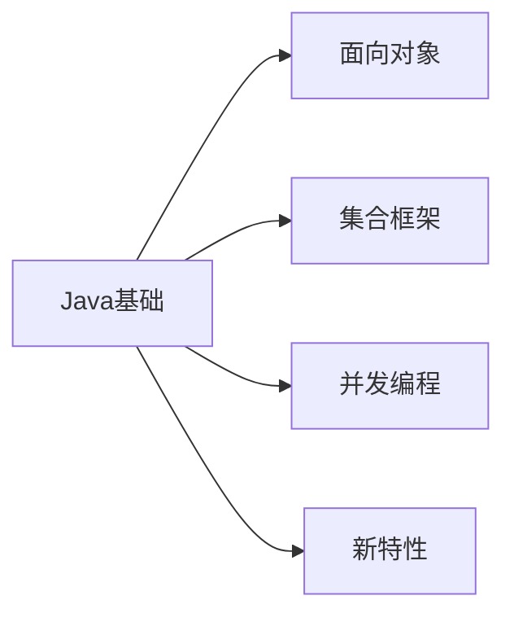
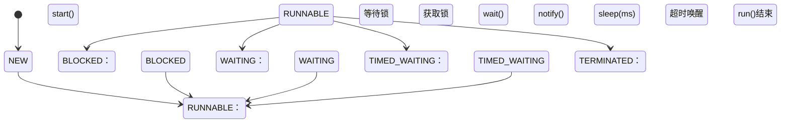

# Java 核心技术

> 最后更新：2025-09-25 | [返回主目录](../README.md)



## 一、语法基础
### 1.1 面向对象三大特性
#### 封装
- 利用抽象数据类型将数据和基于数据的操作封装在一起，使其构成一个不可分割的独立实体。数据被保护在抽象数据类型的内部，尽可能地隐藏内部的细节，只保留一些对外接口使之与外部发生联系。用户无需知道对象内部的细节，但可以通过对象对外提供的接口来访问该对象。
##### 核心特性
- **信息隐藏**  
  用户无需知道对象内部的细节，但可以通过对象对外提供的接口来访问该对象
- **接口隔离**  
  外部只能通过预定义的公共方法与对象交互

##### 主要优点
1. **减少耦合**  
   可以独立地开发、测试、优化、使用、理解和修改
2. **减轻维护负担**  
   更容易被程序员理解，调试时不影响其他模块
3. **有效调节性能**  
   通过剖析确定哪些模块影响系统性能
4. **提高软件可重用性**  
5. **降低构建大型系统风险**  
   即使整个系统不可用，独立模块仍可能可用

##### 代码示例：Person 类
```java
public class Person {
    // 私有字段：隐藏实现细节
    private String name;
    private int gender;  // 使用int存储（0=男, 1=女）
    private int age;     // 完全私有
    
    // 公开接口：受控访问
    public String getName() {
        return name;
    }
    
    public String getGender() {
        // 封装实现细节：外部无需知道内部使用int存储
        return (gender == 0) ? "Male" : "Female";
    }
    
    // 业务方法：使用私有属性
    public void work() {
        if (age >= 18) {
            System.out.println(name + " is working");
        }
    }
    
    // 修改器：受控修改字段
    public void setGender(int newGender) {
        if (newGender == 0 || newGender == 1) {
            this.gender = newGender;
        }
    }
}
  ```

#### 继承
- `extends`关键字实现继承
- 方法重写规则：两同两小一大

#### 多态
- 编译时类型 vs 运行时类型
- 接口回调机制


---

## 二、集合框架
### 2.1 List接口实现
| 实现类       | 线程安全 | 底层结构     | 特点               |
|--------------|----------|--------------|--------------------|
| ArrayList    | ❌       | 动态数组     | 随机访问快         |
| LinkedList   | ❌       | 双向链表     | 插入删除快         |
| Vector       | ✅       | 动态数组     | 同步方法           |
| CopyOnWriteArrayList | ✅ | 动态数组 | 写时复制，读无锁 |

### 2.2 HashMap原理
#### 存储结构
```java
// JDK1.8后的节点结构
static class Node<K,V> implements Map.Entry<K,V> {
    final int hash;
    final K key;
    V value;
    Node<K,V> next;  // 链表结构
}
```

#### 扩容机制
- 默认容量16，负载因子0.75
- 扩容时rehash过程优化


---

## 三、并发编程
### 3.1 线程状态转换


### 3.2 线程池核心参数
- `corePoolSize`：核心线程数
- `maximumPoolSize`：最大线程数
- `workQueue`：任务队列
- `RejectedExecutionHandler`：拒绝策略

---

## 四、新特性
### 4.1 Lambda表达式
```java
// 传统写法
Thread t1 = new Thread(new Runnable() {
    @Override
    public void run() {
        System.out.println("Thread running");
    }
});

// Lambda写法
Thread t2 = new Thread(() -> System.out.println("Thread running"));
```

### 4.2 Stream API
```java
List<String> names = Arrays.asList("Tom", "Jerry", "Spike");
long count = names.stream()
                 .filter(name -> name.length() > 4)
                 .count();  // 结果：1
```

## 五、扩展阅读
- [Oracle官方Java文档](https://docs.oracle.com/javase/)
- [Java编码规范](../08-开发工具.md#java编码规范)
