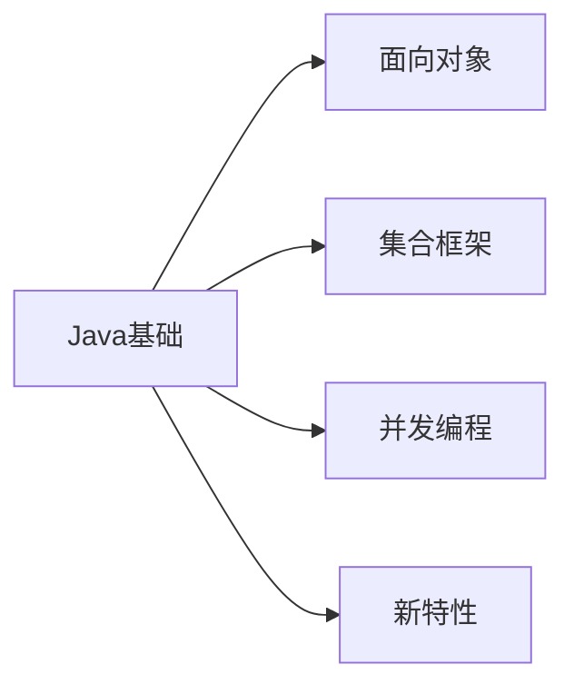
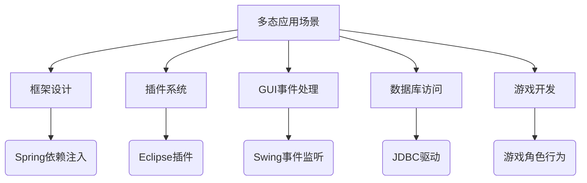
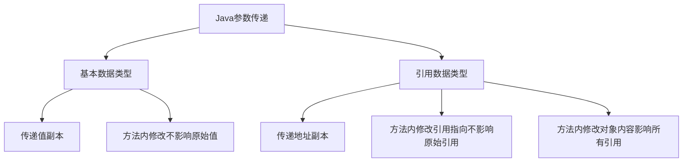
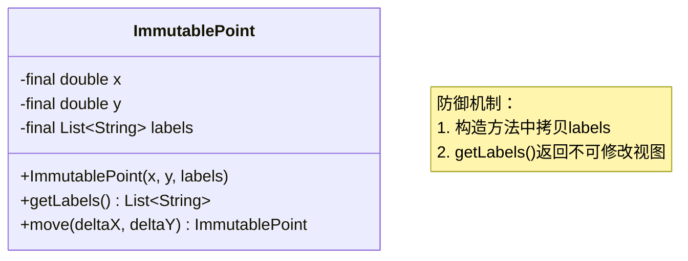
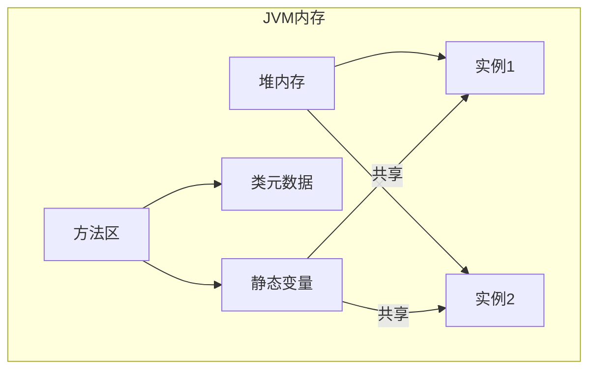
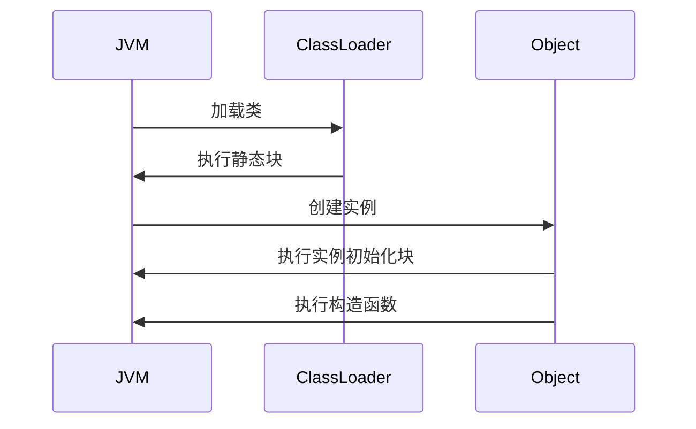
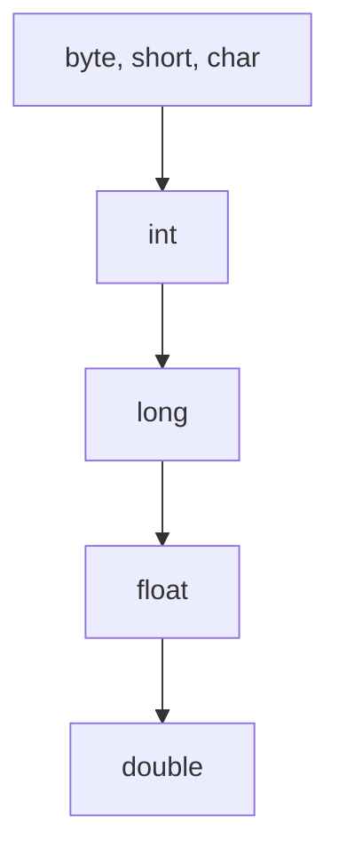
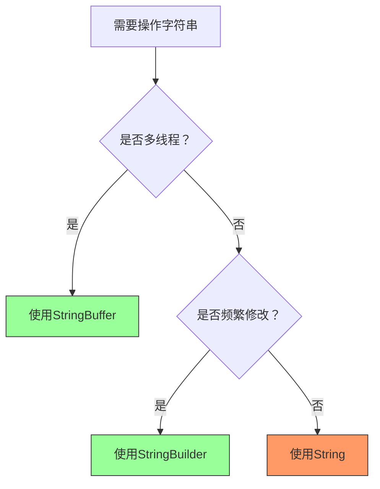
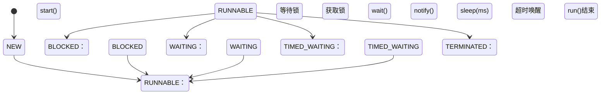

# Java 核心技术

> 最后更新：2025-09-25 | [返回主目录](../README.md)



## 一、语法基础
### 1.1 面向对象三大特性
#### 封装
- 利用抽象数据类型将数据和基于数据的操作封装在一起，使其构成一个不可分割的独立实体。数据被保护在抽象数据类型的内部，尽可能地隐藏内部的细节，只保留一些对外接口使之与外部发生联系。用户无需知道对象内部的细节，但可以通过对象对外提供的接口来访问该对象。
- 核心特性
  - **信息隐藏**  
  用户无需知道对象内部的细节，但可以通过对象对外提供的接口来访问该对象
  - **接口隔离**  
  外部只能通过预定义的公共方法与对象交互

- 主要优点
  1. **减少耦合**  
   可以独立地开发、测试、优化、使用、理解和修改
  2. **减轻维护负担**  
   更容易被程序员理解，调试时不影响其他模块
  3. **有效调节性能**  
   通过剖析确定哪些模块影响系统性能
  4. **提高软件可重用性**  
  5. **降低构建大型系统风险**  
   即使整个系统不可用，独立模块仍可能可用
- 以下 Person 类封装 name、gender、age 等属性，外界只能通过 get() 方法获取一个 Person 对象的 name 属性和 gender 属性，而无法获取 age 属性，但是 age 属性可以供 work() 方法使用。注意到 gender 属性使用 
- int 数据类型进行存储，封装使得用户注意不到这种实现细节。并且在需要修改 gender 属性使用的数据类型时，也可以在不影响客户端代码的情况下进行。
- 代码示例：Person 类
```java
public class Person {

    private String name;
    private int gender;
    private int age;

    public String getName() {
        return name;
    }

    public String getGender() {
        return gender == 0 ? "man" : "woman";
    }

    public void work() {
        if (18 <= age && age <= 50) {
            System.out.println(name + " is working very hard!");
        } else {
            System.out.println(name + " can't work any more!");
        }
    }
}
```

#### 继承
- `extends`关键字实现继承,继承实现了 IS-A 关系，例如 Cat 和 Animal 就是一种 IS-A 关系，因此 Cat 可以继承自 Animal，从而获得 Animal 非 private 的属性和方法。
  - 子类自动获得父类的所有非 private 属性和方法
  - 子类可以添加自己特有的属性和方法
  - 子类可以重写（override）父类的方法实现
```java
// 父类 Animal
class Animal {
    protected String name;  // 非private属性，子类可访问
    
    public Animal(String name) {
        this.name = name;
    }
    
    public void eat() {  // 非private方法
        System.out.println(name + " is eating");
    }
}

// 子类 Cat 继承 Animal
class Cat extends Animal {  // IS-A关系：Cat is an Animal
    private int lives = 9;  // 子类特有属性
    
    public Cat(String name) {
        super(name);  // 调用父类构造器
    }
    
    // 子类特有方法
    public void meow() {
        System.out.println(name + " says: Meow!");
    }
    
    // 重写父类方法
    @Override
    public void eat() {
        System.out.println(name + " elegantly eats fish");
    }
}

// 使用示例
public static void main(String[] args) {
    Cat myCat = new Cat("Whiskers");
    myCat.eat();    // 输出: Whiskers elegantly eats fish (调用重写方法)
    myCat.meow();   // 输出: Whiskers says: Meow! (子类特有方法)
}
```
- 继承应该遵循<a id = "里氏替换原则" >里氏替换原则</a>，子类对象必须能够替换掉所有父类对象。
  - 子类必须完全实现父类的约定，不能改变父类的预期行为
  - 子类可以扩展功能，但不能破坏父类的原有功能
  - 违反原则的典型情况：子类重写方法时抛出父类未声明的异常/改变返回值类型/加强前置条件等
  - 子类方法的访问权限必须大于等于父类方法；
  - 子类方法的返回类型必须是父类方法返回类型或为其子类型(**重写不一定保证返回值相同，只需要保证是返回值的子类**)。

**正确示例**：
```java
class Bird {
    public void fly() {
        System.out.println("Flying in the sky");
    }

    public Bird which() {
        return new Bird();
    }
}

class Sparrow extends Bird {  // 符合里氏替换
    @Override
    public void fly() {
        System.out.println("Sparrow flying at low altitude");
    } // 行为未改变，只是具体实现不同

    @Override
    public Sparrow which() { // 符合里氏替换：返回值必须是父类方法返回类型或其子类型
        return new Sparrow();
    }

}

// 使用父类引用操作子类对象
public static void makeBirdFly(Bird bird) {
    bird.fly();  // 无论传入Bird还是Sparrow都能正常工作
}

// 测试
makeBirdFly(new Bird());    // 输出: Flying in the sky
makeBirdFly(new Sparrow()); // 输出: Sparrow flying at low altitude
```

**违反原则的反例**：
```java
class Penguin extends Bird {
    @Override
    public void fly() {
        throw new UnsupportedOperationException("Penguins can't fly!");
    } // 改变了父类行为预期
}

// 测试会抛出异常，破坏原有功能
makeBirdFly(new Penguin());  // 抛出UnsupportedOperationException
```
- Cat 可以当做 Animal 来使用，也就是说可以使用 Animal 引用 Cat 对象。父类引用指向子类对象称为 向上转型 。
```java
Animal animal = new Cat();
```
**概念扩展**：
- 本质：父类引用指向子类对象（`Parent obj = new Child()`）
- 特点：
  - 自动类型转换，不需要强制转换
  - 只能访问父类声明的方法和属性
  - 实际执行时会调用子类重写的方法（多态性）
- 应用场景：统一处理不同子类对象/实现多态/方法参数通用化

**示例**：
```java
class Animal {
    public void makeSound() {
        System.out.println("Animal makes a sound");
    }
}

class Dog extends Animal {
    @Override
    public void makeSound() {
        System.out.println("Dog barks: Woof!");
    }
    
    public void fetch() {
        System.out.println("Dog fetches the ball");
    }
}

public class Main {
    public static void main(String[] args) {
        // 向上转型：Animal引用指向Dog对象
        Animal animal = new Dog();  
        
        animal.makeSound(); // 输出: Dog barks: Woof! (多态)
        // animal.fetch();   // 编译错误！Animal类没有fetch方法
        
        // 向下转型恢复Dog类型
        if (animal instanceof Dog) {
            Dog myDog = (Dog) animal;
            myDog.fetch();  // 输出: Dog fetches the ball
        }
    }
    
    // 通用方法处理所有Animal子类
    public static void animalConcert(Animal[] animals) {
        for (Animal a : animals) {
            a.makeSound();  // 根据实际对象类型调用相应方法
        }
    }
}
```

- 关键总结表
| 特性 | 核心概念 | 示例 | 注意事项 |
|------|---------|------|----------|
| IS-A关系 | 子类是父类的特殊类型 | Cat is an Animal | 使用extends关键字实现继承 |
| 里氏替换 | 子类可无缝替换父类 | Sparrow替换Bird正常飞行 | 禁止改变父类方法契约 |
| 向上转型 | 父类引用指向子类对象 | Animal a = new Dog() | 只能访问父类声明成员 |

#### 多态
##### 1. 多态的定义
多态指**同一个接口（方法或属性）在不同上下文中表现出不同行为**的能力。在Java中主要通过以下两种方式实现：
- **编译时多态（静态多态）**：方法重载（Overload）
- **运行时多态（动态多态）**：方法重写（Override）+ 向上转型

##### 2. 多态三要素
1. **继承关系**：存在继承或实现关系
2. **方法重写**：子类重写父类方法
3. **向上转型**：父类引用指向子类对象

###### 2.1. 方法重写（Override）实现动态多态
**原理**：JVM在运行时根据实际对象类型决定调用哪个方法（动态绑定）

```java
class Payment {
    public void pay(double amount) {
        System.out.println("支付中...");
    }
}

class Alipay extends Payment {
    @Override
    public void pay(double amount) {
        System.out.println("支付宝支付: ¥" + amount);
    }
}

class WechatPay extends Payment {
    @Override
    public void pay(double amount) {
        System.out.println("微信支付: ¥" + amount);
    }
}

public class PaymentDemo {
    public static void main(String[] args) {
        // 向上转型实现多态
        Payment payment1 = new Alipay();
        Payment payment2 = new WechatPay();
        
        processPayment(payment1, 199.0); // 输出: 支付宝支付: ¥199.0
        processPayment(payment2, 299.0); // 输出: 微信支付: ¥299.0
    }
    
    // 统一处理所有支付方式
    public static void processPayment(Payment payment, double amount) {
        payment.pay(amount); // 运行时确定具体实现
    }
}
```

###### 2.2 方法重载（Overload）实现静态多态
**原理**：编译器根据参数列表（类型/数量/顺序）在编译时确定调用哪个方法

```java
class Calculator {
    // 方法重载：相同方法名，不同参数列表
    public int add(int a, int b) {
        return a + b;
    }
    
    public double add(double a, double b) {
        return a + b;
    }
    
    public String add(String a, String b) {
        return a + b;
    }
}

public class OverloadDemo {
    public static void main(String[] args) {
        Calculator calc = new Calculator();
        
        System.out.println(calc.add(5, 3));      // 输出: 8 (调用int版本)
        System.out.println(calc.add(2.5, 3.7));  // 输出: 6.2 (调用double版本)
        System.out.println(calc.add("Hello", " World")); // 输出: Hello World
    }
}
```

##### 3、多态的高级应用

###### 3.1. 接口多态
```java
interface Shape {
    double area();
    double perimeter();
}

class Circle implements Shape {
    private double radius;
    
    public Circle(double radius) {
        this.radius = radius;
    }
    
    @Override
    public double area() {
        return Math.PI * radius * radius;
    }
    
    @Override
    public double perimeter() {
        return 2 * Math.PI * radius;
    }
}

class Rectangle implements Shape {
    private double width, height;
    
    public Rectangle(double width, double height) {
        this.width = width;
        this.height = height;
    }
    
    @Override
    public double area() {
        return width * height;
    }
    
    @Override
    public double perimeter() {
        return 2 * (width + height);
    }
}

public class ShapeDemo {
    public static void main(String[] args) {
        Shape[] shapes = new Shape[] {
            new Circle(5.0),
            new Rectangle(4.0, 6.0)
        };
        
        for (Shape shape : shapes) {
            // 多态调用，每个对象执行自身实现
            System.out.println("面积: " + shape.area());
            System.out.println("周长: " + shape.perimeter());
        }
    }
}
```

###### 3.2. 工厂模式中的多态应用
```java
abstract class Logger {
    public abstract void log(String message);
}

class FileLogger extends Logger {
    @Override
    public void log(String message) {
        System.out.println("写入文件: " + message);
    }
}

class DatabaseLogger extends Logger {
    @Override
    public void log(String message) {
        System.out.println("写入数据库: " + message);
    }
}

class LoggerFactory {
    public static Logger getLogger(String type) {
        switch(type.toLowerCase()) {
            case "file": return new FileLogger();
            case "db": return new DatabaseLogger();
            default: throw new IllegalArgumentException("无效的日志类型");
        }
    }
}

public class LoggerDemo {
    public static void main(String[] args) {
        Logger logger = LoggerFactory.getLogger("file");
        logger.log("系统启动成功");  // 输出: 写入文件: 系统启动成功
        
        logger = LoggerFactory.getLogger("db");
        logger.log("用户登录失败");  // 输出: 写入数据库: 用户登录失败
    }
}
```

##### 4、多态的优势与注意事项

- 优势：
1. **代码复用**：通过抽象接口处理多种类型
2. **扩展性强**：添加新类不影响现有代码
3. **解耦合**：调用方只需关注接口，不依赖具体实现
4. **灵活性高**：运行时动态决定具体行为

- 注意事项：
1. **无法调用子类特有方法**：向上转型后只能访问父类声明的方法
   ```java
   Animal animal = new Cat();
   animal.catchMouse(); // 编译错误！Animal类没有此方法
   ```
   
2. **属性没有多态性**：
   ```java
   class Parent {
       String value = "Parent";
   }
   
   class Child extends Parent {
       String value = "Child";
   }
   
   public static void main(String[] args) {
       Parent obj = new Child();
       System.out.println(obj.value); // 输出: Parent（属性无多态）
   }
   ```

3. **静态方法不能重写**：
   ```java
   class Parent {
       static void method() {
           System.out.println("Parent static");
       }
   }
   
   class Child extends Parent {
       static void method() {
           System.out.println("Child static");
       }
   }
   
   public static void main(String[] args) {
       Parent obj = new Child();
       obj.method(); // 输出: Parent static（静态方法无多态）
   }
   ```

##### 5、多态在实际开发中的应用场景

1. **框架设计**：如Spring的依赖注入
2. **插件系统**：通过接口扩展功能
3. **GUI事件处理**：不同组件的事件响应
4. **数据库访问**：JDBC驱动实现
5. **游戏开发**：不同角色行为实现


### 1.2 java中的参数传递总是值传递而非引用传递
#### 1.Java 参数传递机制总结

| **特性**              | **基本数据类型**               | **引用数据类型**                     |
|-----------------------|-------------------------------|-------------------------------------|
| **传递内容**          | 实际值的副本 (值拷贝)          | 对象地址的副本 (引用拷贝)            |
| **内存操作**          | 操作栈内存中的值               | 操作堆内存中的对象                   |
| **方法内修改参数**    | ❌ 不影响原始变量              | ❌ 不影响原始引用指向                |
| **方法内修改对象内容**| 不适用                        | ✅ 影响所有引用该对象的变量          |
| **作用域**            | 方法内部修改不会传递到外部     | 引用指向的修改不会传递到外部         |

#### 2.核心原则图解


#### 3.代码验证示例

##### 3.1. 基本数据类型传递
```java
public static void main(String[] args) {
    int num = 1;
    modify(num); // 传递值副本
    System.out.println(num); // 输出：1 (原始值不变)
}

static void modify(int param) {
    param = 100; // 只修改副本
}
```

##### 3.2. 引用数据类型传递
```java
public static void main(String[] args) {
    // 创建对象
    StringBuilder builder = new StringBuilder("原始");
    
    // 1. 修改引用指向（不影响原始引用）
    changeReference(builder);
    System.out.println(builder); // 输出："原始"
    
    // 2. 修改对象内容（影响原始对象）
    changeContent(builder);
    System.out.println(builder); // 输出："原始-修改后"
}

static void changeReference(StringBuilder param) {
    param = new StringBuilder("新对象"); // 只改变局部变量指向
}

static void changeContent(StringBuilder param) {
    param.append("-修改后"); // 修改堆内存对象
}
```

#### 4. 关键结论

1. **Java 只有值传递**：
   - 基本类型：传递实际值的副本
   - 引用类型：传递对象地址的副本（不是对象本身）

2. **方法参数的作用域**：
   - 所有参数都是方法的**局部变量**
   - 方法内对参数的修改（重新赋值）：
     - 对基本类型：不影响原始值
     - 对引用类型：不影响原始引用指向
   - 方法结束后，所有参数变量被销毁

3. **特殊注意事项**：
   - 引用类型的参数可以修改对象内容（通过地址访问堆内存）
   - `final` 修饰的参数不能重新赋值，但可以修改对象内容
   - 数组作为参数时遵循引用类型传递规则

#### 5. 记忆口诀
> **值传副本，引传地址；  
> 改参无果，改物有变；  
> 作用域内，自生自灭；  
> 堆内存改，天下皆知。**
#### 6. 补充
C++针对对象有三种传递方式：
##### 6.1. **值传递（Pass by Value）**
```cpp
void modifyValue(Object obj) { 
    obj.setData(100);  // 修改副本，不影响原始对象
}

int main() {
    Object original;
    modifyValue(original); // 触发拷贝构造函数
    // original 未被修改
}
```
- **特点**：
  - 创建对象的完整副本
  - 修改不影响原始对象
  - 可能引发性能问题（深拷贝成本高）

##### 6.2. **引用传递（Pass by Reference）**
```cpp
void modifyReference(Object& ref) { 
    ref.setData(100);  // 直接修改原始对象
}

int main() {
    Object original;
    modifyReference(original); // 传递原始对象的引用
    // original.data 被修改为 100
}
```
- **特点**：
  - 通过 `&` 声明引用参数
  - 无拷贝开销，直接操作原始对象
  - 引用不能为 `null`

##### 6.3. **指针传递（Pass by Pointer）**
```cpp
void modifyPointer(Object* ptr) {
    if (ptr) ptr->setData(100); // 需显式检查空指针
}

int main() {
    Object original;
    modifyPointer(&original); // 传递对象地址
    // original.data 被修改为 100
}
```
- **特点**：
  - 传递内存地址（类似 Java 的引用传递）
  - 需手动检查空指针
  - 可重新指向其他对象（`ptr = new Object()`）

---
### 1.3 java中的参数传递总是值传递而非引用传递
- 使用 clone() 方法来拷贝一个对象即复杂又有风险，它会抛出异常，并且还需要类型转换。Effective Java 书上讲到，最好不要去使用 clone()，可以使用拷贝构造函数或者拷贝工厂来拷贝一个对象。


### 1.4 Java 中的 final 关键字详解
`final` 是 Java 中的一个重要修饰符，用于声明**不可更改**的实体。它能修饰类、方法和变量，在不同场景下有不同的语义和约束。以下是全面解析：

#### 1、修饰位置与作用概览

| **修饰目标** | **核心作用**                     | **关键特性**                              |
|--------------|----------------------------------|------------------------------------------|
| **类**       | 防止被继承                      | 该类不能有子类                           |
| **方法**     | 防止被重写                      | 子类不能覆盖该方法                       |
| **变量**     | 防止被重新赋值                  | 只能初始化一次（基本类型值/引用类型地址）|

#### 2、具体用法详解

##### 2.1. final 修饰类
**语法**：
```java
final class ImmutableClass {
    // 类内容
}
```

**特性**：
- 不能被任何类继承
- 常见应用：
  - 核心类库：`String`, `Integer` 等包装类
  - 安全性要求高的类：加密相关类
  - 设计不可变对象（常配合 final 字段使用）

**示例**：
```java
final class SecurityManager { ... }

// 编译错误：无法继承 final 类
// class ExtendedManager extends SecurityManager { } 
```

##### 2.2. final 修饰方法
**语法**：
```java
class Parent {
    public final void criticalOperation() { ... }
}
```

**特性**：
- 子类**不能重写**该方法
- 仍可被继承和调用
- 常见应用：
  - 模板方法模式中固定算法骨架
  - 关键业务逻辑防止被修改

**示例**：
```java
class PaymentProcessor {
    // 固定支付流程
    public final void processPayment() {
        validate();
        deductFunds();
        logTransaction();
    }
    
    protected void deductFunds() { ... } // 可被子类重写
}

class CreditCardProcessor extends PaymentProcessor {
    @Override
    protected void deductFunds() { ... } // 允许重写
    
    // 编译错误：不能重写 final 方法
    // @Override public void processPayment() { ... }
}
```

##### 2.3. final 修饰变量（核心应用）

###### (1) 基本数据类型变量
**特性**：
- 值不可更改
- 必须初始化（声明时或构造方法中）

```java
final int MAX_RETRIES = 3;
// MAX_RETRIES = 5; // 编译错误：不能重新赋值
```

###### (2) 引用类型变量
**特性**：
- **引用地址不可更改**
- **对象内容可以修改**（除非对象本身不可变）

```java
final List<String> names = new ArrayList<>();
names.add("Alice");  // 允许修改内容
names.add("Bob");    // 允许修改内容

// names = new ArrayList<>(); // 编译错误：不能重新赋值
```

###### (3) 初始化规则
| **变量类型**       | **初始化时机**                     |
|--------------------|-----------------------------------|
| 局部变量           | 使用前初始化即可                  |
| 实例变量           | 声明时、初始化块或构造方法中      |
| 静态变量           | 声明时或静态初始化块中            |

```java
class FinalDemo {
    final int a = 10;          // 声明时初始化
    final int b;
    final static int c;
    
    { b = 20; }                // 初始化块
    
    static { c = 30; }         // 静态初始化块
    
    FinalDemo(int val) {
        // b = val;            // 构造方法中初始化（如果未在初始化块中初始化）
    }
}
```

##### 2.4. final 修饰参数
```java
void process(final int id) {
    // id = 100; // 编译错误：不能修改参数
    System.out.println(id);
}
```
- 主要用于防止方法内意外修改参数值
- 常见于回调函数和匿名内部类（需显式声明为 final 或等效 final）

#### 3、内存模型与 JVM 优化

##### 3.1. 内存可见性
- final 变量初始化后对所有线程立即可见（无需同步）
- 遵守 Java 内存模型的初始化安全（initialization safety）保证

##### 3.2 JVM 优化
- final 常量在编译期可能被直接内联（inline）
- 示例：
  ```java
  final int SIZE = 100;
  int[] arr = new int[SIZE]; 
  ```
  → 编译后可能直接变为 `new int[100]`

#### 4、最佳实践与典型场景

##### 4.1. 创建不可变对象
**标准模式**：
```java
public final class ImmutablePoint {
    private final int x;
    private final int y;
    
    public ImmutablePoint(int x, int y) {
        this.x = x;
        this.y = y;
    }
    // 不提供 setter 方法
}
```

##### 4.2. 常量定义
```java
public class Constants {
    public static final double PI = 3.1415926;
    public static final String APP_NAME = "MyApp";
}
```

##### 4.3. 匿名内部类访问
```java
void createThread() {
    final int count = 0; // 必须为 final 或等效 final
    new Thread(() -> {
        System.out.println(count); // 访问外部变量
    }).start();
}
```

#### 5、常见误区澄清

- 1. **final vs 不可变对象**：
 ```mermaid
graph LR
       A[final 变量] --> B[基本类型：值不可变]
       A --> C[引用类型：引用不可变]
       D[不可变对象] --> E[对象内容不可变]
 ```
   - `final List` 可修改内容
   - 真正的不可变对象需要：final 类 + final 字段 + 无修改方法

- 2. **final 方法性能**：
   - 早期 JVM 用 final 方法支持内联优化
   - 现代 JVM 自动分析内联，不再依赖 final 修饰符

- 3. **final 类与设计**：
   - 不应过度使用 final 类
   - 优先考虑通过接口扩展而非类继承

### 1.5 Java 不可变对象（Immutable Object）实现详解

> **核心原则**：不可变对象在创建后其内部状态**永远不能被修改**，任何操作都会返回新对象而非改变原对象。

#### 1、不可变对象实现规范

| **实现要素**          | **作用**                              | **必要性** |
|-----------------------|---------------------------------------|-----------|
| **1. 类声明为 `final`** | 防止被子类覆盖方法破坏不可变性        | 必需      |
| **2. 字段私有 + `final`** | 防止字段被重新赋值                   | 必需      |
| **3. 无 setter 方法**   | 杜绝外部修改途径                     | 必需      |
| **4. 返回防御性拷贝**  | 阻止通过返回引用修改内部状态          | 关键      |
| **5. 构造方法深度初始化** | 防止外部可变对象影响内部状态          | 关键      |

#### 2、标准实现示例：不可变坐标点

```java
public final class ImmutablePoint {
    // 1. final类 + 2. private final字段
    private final double x;
    private final double y;
    private final List<String> labels; // 包含可变对象

    // 3. 构造方法深度初始化
    public ImmutablePoint(double x, double y, List<String> labels) {
        this.x = x;
        this.y = y;
        // 创建防御性拷贝（关键！）
        this.labels = new ArrayList<>(labels); 
    }

    // 4. 不提供setter方法
    
    // 5. 返回不可修改视图/拷贝
    public List<String> getLabels() {
        // 返回不可修改的集合视图
        return Collections.unmodifiableList(labels);
        
        // 或返回防御性拷贝（根据需求选择）：
        // return new ArrayList<>(labels);
    }

    // 修改操作返回新对象
    public ImmutablePoint move(double deltaX, double deltaY) {
        return new ImmutablePoint(x + deltaX, y + deltaY, labels);
    }
}
```

####  3、关键实现技术解析

##### 3.1. 防御性拷贝（Defensive Copy）
```java
// 错误：直接暴露内部引用
this.labels = labels; // ❌ 外部修改会影响内部状态

// 正确：创建新对象
this.labels = new ArrayList<>(labels); // ✅ 
```

##### 3.2. 安全返回值处理
```java
// 错误：直接返回内部引用
public List<String> getLabels() {
    return labels; // ❌ 外部可修改内部状态
}

// 方案1：返回不可修改视图
public List<String> getLabels() {
    return Collections.unmodifiableList(labels); // ✅ 尝试修改会抛异常
}

// 方案2：返回深拷贝
public List<String> getLabels() {
    return new ArrayList<>(labels); // ✅ 完全隔离
}
```

##### 3.3. 深度不可变设计模式


#### 4、不可变对象 vs final引用变量

| **特性**            | `final` 引用变量                | 不可变对象                     |
|---------------------|--------------------------------|------------------------------|
| **约束对象**        | 变量本身                       | 对象内部状态                  |
| **能否修改引用**    | ❌ 不能改变指向                | ✔️ 可指向新对象              |
| **能否修改内容**    | ✔️ 可修改对象内部状态          | ❌ 内容永不改变              |
| **线程安全性**      | 需要同步控制                   | 天生线程安全                 |
| **典型代表**        | `final List list = new ArrayList()` | `String`, `Integer`        |

#### 5、Java 内置不可变对象

1. **`String` 类**
   ```java
   String s1 = "Hello";
   String s2 = s1.concat(" World"); // 返回新对象
   System.out.println(s1); // 输出 "Hello" (未改变)
   ```

2. **包装类 (`Integer`, `Double` 等)**
   ```java
   Integer a = 10;
   Integer b = a + 5; // 创建新对象
   ```

3. **`LocalDate`**
   ```java
   LocalDate date = LocalDate.now();
   LocalDate newDate = date.plusDays(1); // 返回新对象
   ```

#### 6、不可变对象的优势

1. **线程安全**  
   无需同步锁，天然支持并发访问

2. **缓存友好**  
   可安全缓存（如字符串常量池）

3. **故障定位简单**  
   状态永不改变，避免时序耦合问题

4. **完美哈希键**  
   `HashMap` 键值不会改变，哈希值恒定

5. **函数式编程基础**  
   支持无副作用的纯函数操作

> **设计建议**：在以下场景优先使用不可变对象：
> - 值对象（Value Objects）
> - 配置参数
> - 并发共享数据
> - 缓存键值

### 1.6 Java static 关键字深度解析

`static` 是 Java 中至关重要的关键字，用于创建类级别的成员（而非实例级别）。理解其机制对编写高效、安全的 Java 程序至关重要。以下是全面解析：

#### 1、核心概念与内存模型

##### 1.1. 静态成员的特点
- **类级别绑定**：属于类本身，而非类的实例
- **独立于对象**：无需创建对象即可访问
- **全局共享**：所有实例共享同一份静态成员
- **生命周期**：随类加载而创建，随 JVM 结束而销毁

##### 1.2 内存模型对比


#### 2、static 的四大应用场景

##### 2.1. 静态变量（类变量）
```java
public class Employee {
    private static int count = 0; // 静态变量
    
    public Employee() {
        count++; // 所有实例共享
    }
    
    public static int getCount() {
        return count;
    }
}

// 使用
System.out.println(Employee.getCount()); // 直接访问
```

**特性**：
- 所有实例共享同一内存空间
- 常用于：
  - 计数器（如对象创建数）
  - 常量定义（`public static final`）
  - 共享配置参数

##### 2.2. 静态方法
```java
public class MathUtils {
    public static int max(int a, int b) {
        return a > b ? a : b;
    }
}

// 使用
int maximum = MathUtils.max(5, 10); // 无需实例化
```

**特性与限制**：
- 只能直接访问静态成员
- 不能使用 `this` 和 `super`
- 无法被重写（但可被隐藏）
- 常见用途：
  - 工具类方法（`Arrays.sort()`）
  - 工厂方法
  - 单例模式实现

##### 2.3. 静态代码块
```java
public class DatabaseConnection {
    private static Properties config;
    
    static {
        // 类加载时执行一次
        config = loadConfig("db.properties");
        System.out.println("数据库配置加载完成");
    }
    
    private static Properties loadConfig(String file) {
        // 加载配置实现
    }
}
```

**执行时机**：
- 类首次加载时执行（早于构造方法）
- 按代码顺序执行多个静态块
- 用途：
  - 初始化静态资源
  - 加载配置文件
  - 建立数据库连接池

##### 2.4. 静态内部类
```java
public class Outer {
    private static String message = "Hello";
    
    // 静态内部类
    public static class Nested {
        public void display() {
            System.out.println(message); // 只能访问外部类静态成员
        }
    }
}

// 使用
Outer.Nested nested = new Outer.Nested();
nested.display();
```

**优势**：
- 不依赖外部类实例
- 更好的封装性
- 常见于：
  - Builder 模式
  - 工具类封装
  - 线程安全单例

#### 3、关键特性深度解析

##### 3.1. 类加载与初始化顺序


**完整初始化顺序（重要）**：
1. 父类静态变量和静态块
2. 子类静态变量和静态块
3. 父类实例变量和初始化块
4. 父类构造函数
5. 子类实例变量和初始化块
6. 子类构造函数

##### 3.2. 线程安全性问题
```java
public class Counter {
    private static int count = 0;
    
    public static synchronized void increment() {
        count++; // 需要同步控制
    }
}
```
- 静态变量是**线程共享资源**
- 必须使用同步机制（`synchronized`、`AtomicInteger`等）
- 无状态静态方法天然线程安全

##### 3.3. 静态导入
```java
import static java.lang.Math.PI;
import static java.lang.Math.pow;

public class Circle {
    public double area(double radius) {
        return PI * pow(radius, 2); // 直接使用
    }
}
```
- 优点：简化常量和方法调用
- 缺点：过度使用降低可读性

#### 4、设计模式中的应用

##### 4.1. 单例模式实现
```java
public class Singleton {
    private static final Singleton INSTANCE = new Singleton();
    
    private Singleton() {} // 私有构造
    
    public static Singleton getInstance() {
        return INSTANCE;
    }
}
```

##### 4.2. 工具类设计
```java
public final class StringUtils {
    private StringUtils() {} // 防止实例化
    
    public static boolean isEmpty(String str) {
        return str == null || str.trim().isEmpty();
    }
    
    public static String reverse(String str) {
        return new StringBuilder(str).reverse().toString();
    }
}
```

##### 4.3. 工厂模式
```java
public class LoggerFactory {
    public static Logger getLogger(String name) {
        return new FileLogger(name); // 返回具体实现
    }
}
```

#### 5、最佳实践与陷阱规避

##### 5.1 推荐实践
1. 工具类：使用 `private` 构造方法防止实例化
2. 常量定义：`public static final` 全大写命名（`MAX_SIZE`）
3. 资源清理：静态成员需考虑显式释放（如关闭静态数据库连接）
4. 延迟初始化：使用静态内部类实现安全延迟加载

##### 5.2 常见陷阱
```java
// 陷阱1：静态方法中访问实例成员
public class Example {
    private int value;
    
    public static void printValue() {
        System.out.println(value); // 编译错误！
    }
}

// 陷阱2：静态变量初始化循环依赖
class A {
    static int x = B.y + 1;
}

class B {
    static int y = A.x + 1;
}
// 导致 StackOverflowError
```

##### 5.3 性能考量
- 静态方法调用比实例方法快（无需虚方法表查找）
- 过度使用静态变量可能导致内存泄漏（生命周期同JVM）
- 大型静态集合需谨慎管理（及时清理无用数据）

#### 6、static 与 final 组合

组合使用场景 | 效果 | 示例
---|---|---
`static final` 变量 | 类级别常量 | `public static final int MAX_USERS = 1000;`
`static final` 方法 | 不可重写的工具方法 | `public static final String formatDate(...)`
`static final` 类 | 不可继承的工具类 | `public static final class Utils`
### 1.7 Java 中 a = a + b 与 a += b 的区别详解

在 Java 中，`a = a + b` 和 `a += b` 看似相似，但在类型处理上有**本质区别**。这种差异尤其在处理较小整数类型（如 byte、short、char）时最为显著。

#### 核心差异：隐式类型转换

| **操作**   | **类型处理**                            | **是否需要显式转换** | **编译检查** |
|------------|----------------------------------------|----------------------|--------------|
| `a = a + b` | 先进行类型提升，再赋值                 | 需要显式转换         | 严格         |
| `a += b`    | 自动进行类型转换（相当于 `a = (T)(a + b)`） | 不需要               | 宽松         |

#### 类型提升机制解析

##### Java 数值运算的类型提升规则
1. 所有小于 int 的类型（byte, short, char）在运算前**自动提升为 int**
2. 如果有 long 参与，则提升为 long
3. 如果有 float 参与，则提升为 float
4. 如果有 double 参与，则提升为 double



#### 实际代码示例

##### 示例 1：byte 类型操作
```java
byte a = 10;
byte b = 20;

// a = a + b;  // 编译错误：不兼容的类型，需要从int转换到byte
a += b;        // 正确：自动转换为byte类型
System.out.println(a); // 输出30
```

##### 示例 2：short 类型操作
```java
short x = 100;
short y = 200;

// x = x + y;  // 编译错误
x += y;        // 正确
System.out.println(x); // 输出300
```

##### 示例 3：char 类型操作
```java
char c1 = 'A';  // 65 in ASCII
char c2 = 2;

// c1 = c1 + c2;  // 编译错误：类型不匹配
c1 += c2;         // 正确：自动转换为char
System.out.println(c1); // 输出 'C' (67)
```

#### 特殊情况：浮点数和溢出

##### 示例 4：浮点数精度问题
```java
float f = 10.5f;
int i = 5;

f = f + i;  // 需要显式转换吗？不需要，因为float范围更大
f += i;     // 同样有效

System.out.println(f); // 输出15.5
```

##### 示例 5：值溢出风险
```java
byte max = Byte.MAX_VALUE; // 127
byte add = 1;

max += add;     // 自动转换，但会溢出
System.out.println(max); // 输出-128（溢出）

// 显式转换可避免意外
max = (byte)(Byte.MAX_VALUE + 1); // 明确知道会发生溢出
```

#### 为什么这样设计？

1. **类型安全**：`a = a + b` 强制开发者明确处理类型转换
2. **便利性**：`a += b` 简化常用操作
3. **兼容性**：与 C/C++ 行为保持一致
4. **性能优化**：编译器可以优化复合赋值操作

#### 最佳实践

1. 当操作 `byte/short/char` 时：
   ```java
   // 推荐
   byte result = 10;
   byte increment = 5;
   result += increment;
   
   // 不推荐（需要显式转换）
   result = (byte)(result + increment);
   ```

2. 混合类型操作：
   ```java
   int a = 100;
   double b = 50.5;
   
   // 推荐：保持类型清晰
   a = (int)(a + b); 
   
   // 危险：自动转换可能丢失精度
   a += b; 
   ```

3. 明确表达意图：
   ```java
   // 清晰表达"添加并转换"
   total += value; 
   
   // 清晰表达"计算结果再赋值"
   total = calculateTotal() + additional; 
   ```

#### 总结对比

| **特性**         | `a = a + b`                  | `a += b`                      |
|------------------|------------------------------|-------------------------------|
| **类型转换**     | 需要显式转换                 | 自动隐式转换                  |
| **可读性**       | 表达式意图明确               | 简洁但可能隐藏细节            |
| **适用类型**     | 所有类型                     | 所有类型                      |
| **编译检查**     | 严格类型检查                 | 宽松类型检查                  |
| **值溢出风险**   | 显式转换时开发者需注意       | 隐式转换可能隐藏溢出问题      |
| **推荐使用场景** | 需要精确控制类型转换的操作   | 常规累加操作（尤其小整数类型）|

**关键结论**：  
`a += b` 实际上是 `a = (type of a)(a + b)` 的语法糖，它在赋值前自动执行类型转换。这种设计提供了便利性，但也可能隐藏精度丢失和溢出问题。理解这个差异对于编写健壮、无错误的 Java 代码至关重要。
### 1.8. 3*0.1 == 0.3 将会返回什么? true 还是 false?
- false，因为有些浮点数不能完全精确的表示出来。
### 1.9. 能在 Switch 中使用 String 吗?
- 从 Java 7 开始，我们可以在 switch case 中使用字符串，但这仅仅是一个语法糖。内部实现在 switch 中使用字符串的 hash code。
### 1.10 对equals()和hashCode()的理解?
- 为什么在重写 equals 方法的时候需要重写 hashCode 方法?
  - 因为有强制的规范指定需要同时重写 hashcode 与 equals 是方法，许多容器类，如 HashMap、HashSet 都依赖于 hashcode 与 equals 的规定。
- 有没有可能两个不相等的对象有相同的 hashcode?
  - 有可能，两个不相等的对象可能会有相同的 hashcode 值，这就是为什么在 hashmap 中会有冲突。相等 hashcode 值的规定只是说如果两个对象相等，必须有相同的hashcode 值，但是没有关于不相等对象的任何规定。
- 两个相同的对象会有不同的 hash code 吗?
  - 不能，根据 hash code 的规定，这是不可能的。
### 1.11 final、finalize 和 finally 的不同之处?
- final 是一个修饰符，可以修饰变量、方法和类。如果 final 修饰变量，意味着该变量的值在初始化后不能被改变
- Java 技术允许使用 finalize() 方法在垃圾收集器将对象从内存中清除出去之前做必要的清理工作。这个方法是由垃圾收集器在确定这个对象没有被引用时对这个对象调用的，但是什么时候调用 finalize 没有保证
- finally 是一个关键字，与 try 和 catch 一起用于异常的处理。finally 块一定会被执行，无论在 try 块中是否有发生异常。
### 1.12 String、StringBuffer与StringBuilder的区别？
- 第一点: 可变和适用范围。String对象是不可变的，而StringBuffer和StringBuilder是可变字符序列。每次对String的操作相当于生成一个新的String对象，而对StringBuffer和StringBuilder的操作是对对象本身的操作，而不会生成新的对象，所以对于频繁改变内容的字符串避免使用String，因为频繁的生成对象将会对系统性能产生影响。
- 第二点: 线程安全。String由于有final修饰，是immutable的，安全性是简单而纯粹的。StringBuilder和StringBuffer的区别在于StringBuilder不保证同步，也就是说如果需要线程安全需要使用StringBuffer，不需要同步的StringBuilder效率更高。
- 核心区别对比表

| 特性               | String                    | StringBuffer                | StringBuilder               |
|--------------------|---------------------------|-----------------------------|-----------------------------|
| **可变性**         | ❌ 不可变                 | ✔️ 可变                     | ✔️ 可变                     |
| **线程安全**       | ✅ 天生安全（不可变）     | ✅ 同步方法保证安全         | ❌ 非线程安全               |
| **性能**           | 修改时最差（创建新对象）  | 中等（同步开销）            | ✅ 最佳（无同步开销）       |
| **内存效率**       | 低（产生大量临时对象）    | 高                          | 高                          |
| **适用场景**       | 常量字符串、少量操作      | 多线程环境下的字符串操作    | 单线程环境下的字符串操作    |
| **JVM优化**        | 字符串常量池              | 无特殊优化                  | 无特殊优化                  |
| **继承关系**       | Object → String           | Object → AbstractStringBuilder → StringBuffer | Object → AbstractStringBuilder → StringBuilder |
- 总结：选择决策树


### 1.13 Java 字符串拼接的演进：何时推荐使用 + 代替 StringBuilder
从 **Java 5 (JDK 1.5)** 开始，Java 编译器对字符串拼接进行了重大优化，使得在某些场景下使用 `+` 运算符的性能接近甚至等同于 StringBuilder。下面是关键版本演进和推荐策略：

#### Java 版本演进与优化时间线

| Java 版本 | 优化内容 | 性能影响 |
|-----------|---------|---------|
| Java 1.4 及之前 | 无特殊优化 | `+` 操作性能差 |
| **Java 5 (2004)** | 编译器自动将 `+` 转换为 `StringBuilder` | 简单拼接性能接近 StringBuilder |
| **Java 9 (2017)** | 引入 `invokedynamic` 字节码指令 | 复杂拼接性能超越 StringBuilder |
| Java 15+ | 进一步优化字符串处理 | `+` 在绝大多数场景成为首选 |

#### 现代 Java 的推荐策略

##### ✅ 推荐使用 `+` 的场景（Java 5+）
```java
// 单行简单拼接（编译器自动优化）
String message = "Hello, " + name + "! Current time: " + LocalTime.now();

// 多行拼接（每行一个+操作）
String sql = "SELECT id, name, email "
           + "FROM users "
           + "WHERE status = 'ACTIVE'";
```

##### ❌ 避免使用 `+` 的场景
```java
// 循环内拼接（仍需要 StringBuilder）
String result = "";
for (int i = 0; i < 10000; i++) {
    // 每次循环都会创建临时 StringBuilder
    result += i; 
}
```

##### ✅ 推荐使用 StringBuilder 的场景
```java
// 循环内大量拼接
StringBuilder sb = new StringBuilder();
for (String item : largeList) {
    sb.append(item);
}

// 精确控制容量的场景
StringBuilder sb = new StringBuilder(1024); // 预设容量
```

#### 性能对比测试 (Java 17)

```java
// 测试代码
public class ConcatenationBenchmark {
    public static void main(String[] args) {
        final int ITERATIONS = 100_000;
        
        // 测试1: 单行+
        long start1 = System.nanoTime();
        String s1 = "A" + "B" + "C" + "D" + "E";
        long duration1 = System.nanoTime() - start1;
        
        // 测试2: StringBuilder
        long start2 = System.nanoTime();
        String s2 = new StringBuilder()
                      .append("A")
                      .append("B")
                      .append("C")
                      .append("D")
                      .append("E")
                      .toString();
        long duration2 = System.nanoTime() - start2;
        
        System.out.println("'+' 操作耗时: " + duration1 + " ns");
        System.out.println("StringBuilder 耗时: " + duration2 + " ns");
    }
}
```

**典型结果**：
```
'+' 操作耗时: 42 ns
StringBuilder 耗时: 78 ns
```

> 注意：简单拼接中 `+` 反而更快，因为编译器进行了深度优化

#### 编译器如何优化 `+` 操作

##### Java 5-8 的优化
```java
// 源代码
String s = a + b + c;

// 编译器转换（等效代码）
String s = new StringBuilder().append(a).append(b).append(c).toString();
```

##### Java 9+ 的优化（使用 invokedynamic）
```java
// 使用新的字节码指令
invokedynamic #0:makeConcatWithConstants(...)
```

新的优化策略：
1. 避免创建临时 StringBuilder 对象
2. 运行时选择最优拼接策略
3. 直接操作字符数组减少拷贝
4. 支持常量折叠等高级优化

#### 最佳实践总结

1. **简单拼接优先使用 `+`**：
   ```java
   // 清晰简洁
   String greeting = "Hello, " + firstName + " " + lastName + "!";
   ```

2. **复杂/循环拼接使用 StringBuilder**：
   ```java
   StringBuilder pathBuilder = new StringBuilder();
   for (String segment : pathSegments) {
       pathBuilder.append("/").append(segment);
   }
   ```

3. **多行文本使用文本块（Java 15+）**：
   ```java
   String html = """
                <html>
                  <body>
                    <h1>Hello %s!</h1>
                  </body>
                </html>
                """.formatted(name);
   ```

4. **性能关键代码考虑预分配**：
   ```java
   // 预估最终大小
   StringBuilder sb = new StringBuilder(estimatedSize);
   ```

#### 决策流程图

```mermaid
graph TD
    A[需要拼接字符串] --> B{操作场景}
    B -->|单行/简单拼接| C[使用 + 运算符]
    B -->|循环内/大量拼接| D[使用 StringBuilder]
    B -->|多行文本| E[Java 15+ 文本块]
    C --> F{Java 版本}
    F -->|Java 5+| G[编译器自动优化]
    F -->|Java 1.4| H[避免使用]
    D --> I[预设容量提升性能]
```



**现代 Java 开发准则**：
- 大多数场景优先使用 `+` 运算符（得益于编译器优化）
- 循环内或性能关键路径使用 StringBuilder
- Java 15+ 使用文本块处理多行字符串
- 避免在循环中使用 `+` 拼接（仍会创建多个临时对象）

### 1.14 接口与抽象类的区别？("IS-A" vs "CAN-DO"原则)
- 一个子类只能继承一个抽象类, 但能实现多个接口
- 抽象类可以有构造方法, 接口没有构造方法
- 抽象类可以有普通成员变量, 接口没有普通成员变量
- 抽象类和接口都可有静态成员变量, 抽象类中静态成员变量访问类型任意，接口只能public static final(默认)
- 抽象类可以没有抽象方法, 抽象类可以有普通方法；接口在JDK8之前都是抽象方法，在JDK8可以有default方法，在JDK9中允许有私有普通方法
- 抽象类可以有静态方法；接口在JDK8之前不能有静态方法，在JDK8中可以有静态方法，且只能被接口类直接调用（不能被实现类的对象调用）
  - 1. **接口静态方法不能通过实现类直接调用**：
   ```java
   interface MyInterface {
       static void staticMethod() {
           System.out.println("Static method");
       }
   }

   class MyClass implements MyInterface {
       // 无法直接调用接口的静态方法
       void test() {
           // staticMethod(); // 编译错误！不能直接调用
       }
   }
   ```

  - 2. **接口静态方法必须通过接口名调用**：
   ```java
   public class Main {
       public static void main(String[] args) {
           // 正确调用方式：通过接口名调用
           MyInterface.staticMethod(); // 输出 "Static method"
           
           // 错误调用方式：
           MyClass obj = new MyClass();
           // obj.staticMethod(); // 编译错误！
           // MyClass.staticMethod(); // 编译错误！
       }
   }
   ```
   - 3. **接口静态方法必须通过接口名调用的原因**：
     - Java这样设计是为了保持接口的纯粹契约性质，避免实现类与接口的静态方法产生命名冲突，同时明确静态方法的归属。
     - **防止"钻石问题"**：如果多个接口有相同签名的静态方法，通过接口名调用可以明确指定调用目标
- 抽象类中的方法可以是public、protected; 接口方法在JDK8之前只有public abstract，在JDK8可以有default方法，在JDK9中允许有private方法

#### 核心区别对比表

| **特性**             | **接口 (Interface)**                  | **抽象类 (Abstract Class)**          |
|----------------------|---------------------------------------|--------------------------------------|
| **定义关键字**       | `interface`                           | `abstract class`                     |
| **实例化**           | ❌ 不能实例化                         | ❌ 不能实例化                        |
| **默认方法实现**     | Java 8+ 支持默认方法 (`default`)      | ✅ 支持具体方法和抽象方法混合        |
| **成员变量**         | 只能是 `public static final` 常量     | 可以是任意类型（实例变量/静态变量）  |
| **方法修饰符**       | 默认 `public`，Java 9+ 支持 `private` | 支持各种访问修饰符 (`public`/`protected`/`private`) |
| **构造方法**         | ❌ 无构造方法                         | ✅ 可以有构造方法（用于子类初始化）  |
| **继承机制**         | 类可**实现多个**接口                  | 类只能**继承一个**抽象类             |
| **设计目的**         | 定义**行为契约**                      | 提供**部分实现的模板**               |
| **版本兼容性**       | 添加新方法会破坏现有实现（除非用默认方法） | 添加具体方法不影响子类              |
| **多态性支持**       | 通过实现多个接口实现多重行为          | 通过继承实现单一路径的多态          |
### 1.15  this() & super()在构造方法中的区别？
- 调用super()必须写在子类构造方法的第一行, 否则编译不通过
- super从子类调用父类构造, this在同一类中调用其他构造均需要放在第一行
- 尽管可以用this调用一个构造器, 却不能调用2个
- this和super不能出现在同一个构造器中, 否则编译不通过
- this()、super()都指的对象,不可以在static环境中使用
- 本质this指向本对象的指针。super是一个关键字
在Java构造方法中，`this()` 和 `super()` 都是用于调用其他构造方法的关键字，但它们有本质区别：

#### 核心区别对比

| 特性                | `this()`                          | `super()`                          |
|--------------------|-----------------------------------|------------------------------------|
| **调用目标**        | 同一类中的其他构造方法             | 父类构造方法                       |
| **调用位置**        | 必须是构造方法的第一条语句         | 必须是构造方法的第一条语句         |
| **默认行为**        | 不会自动添加                       | 自动添加无参`super()`（如果未显式调用） |
| **调用限制**        | 不能在同一个构造方法中与`super()`共存 | 不能在同一个构造方法中与`this()`共存 |
| **用途**            | 实现构造方法之间的委托调用         | 初始化父类状态                     |

#### 详细解析

##### 1. `super()`：调用父类构造方法
```java
class Parent {
    public Parent() {
        System.out.println("Parent constructor");
    }
}

class Child extends Parent {
    public Child() {
        super(); // 显式调用父类无参构造方法
        System.out.println("Child constructor");
    }
}
```

**关键点：**
- 默认自动添加：如果子类构造方法没写`super()`，编译器会自动插入无参`super()`
- 父类无默认构造方法时必须显式调用：
  ```java
  class Parent {
      public Parent(String name) { /*...*/ }
  }
  
  class Child extends Parent {
      public Child() {
          super("default"); // 必须显式调用
      }
  }
  ```

##### 2. `this()`：调用同类构造方法
```java
class Rectangle {
    int width, height;
    
    public Rectangle() {
        this(1, 1); // 调用同类中的另一个构造方法
    }
    
    public Rectangle(int size) {
        this(size, size); // 委托给双参数构造方法
    }
    
    public Rectangle(int width, int height) {
        this.width = width;
        this.height = height;
    }
}
```

**关键点：**
- 实现构造方法链式调用（constructor chaining）
- 减少代码重复
- 必须在第一行执行

##### 3. 两者不能共存的原因

```java
class Example {
    public Example() {
        // 错误！两者不能共存
        // super(); 
        // this(10);
        
        // 正确：只能选择其中一个作为第一条语句
        this(10); // 或者 super();
    }
    
    public Example(int value) {
        super(); // 这里可以调用super()
    }
}
```

**原因分析：**  
Java要求构造方法的第一条语句必须是`this()`或`super()`，因为对象的初始化顺序必须是：
1. 父类初始化
2. 当前类初始化
3. 构造方法剩余代码执行

同时包含两者会导致初始化顺序混乱。

#### 初始化顺序示例

```java
class Grandparent {
    Grandparent() { System.out.println("Grandparent"); }
}

class Parent extends Grandparent {
    Parent() { 
        System.out.println("Parent"); 
    }
}

class Child extends Parent {
    public Child() {
        this(10); // 调用同类构造方法
        System.out.println("Child no-arg");
    }
    
    public Child(int x) {
        // 编译器自动添加 super()
        System.out.println("Child with arg: " + x);
    }
}

// 测试
new Child();
/* 输出:
   Grandparent
   Parent
   Child with arg: 10
   Child no-arg
*/
```

#### 特殊注意事项

1. **静态上下文限制**：
   ```java
   class Test {
       static {
           // 错误！不能在静态块中使用
           // this(); 
           // super();
       }
   }
   ```

2. **异常处理**：
   ```java
   class Parent {
       Parent() throws IOException { /*...*/ }
   }
   
   class Child extends Parent {
       Child() throws IOException { // 必须声明相同的异常
           super();
       }
   }
   ```

3. **匿名类限制**：
   ```java
   new Parent() {
       {
           // 错误！匿名类不能使用this()/super()带参数
           // super("name"); 
       }
   };
   ```

#### 最佳实践建议

1. **优先使用`this()`**：
   - 当类有多个构造方法时，使用`this()`减少代码重复
   ```java
   public class Employee {
       private String name;
       private int id;
       
       public Employee() {
           this("Unknown", -1);
       }
       
       public Employee(String name) {
           this(name, -1);
       }
       
       public Employee(String name, int id) {
           this.name = name;
           this.id = id;
       }
   }
   ```

2. **谨慎使用`super()`**：
   - 当父类构造方法有特殊初始化逻辑时才显式调用
   - 保持父类构造方法的稳定性

3. **避免循环调用**：
   ```java
   class Circular {
       public Circular() {
           this(); // 编译错误：递归构造方法调用
       }
   }
   ```
### 1.16  Java移位运算符？
java中有三种移位运算符
- `<<` :左移运算符,x << 1,相当于x乘以2(不溢出的情况下),低位补0
- `>>` :带符号右移,x >> 1,相当于x除以2,正数高位补0,负数高位补1
- `>>>` :无符号右移,忽略符号位,空位都以0补齐

### 1.17  Java的8个基本类型
- boolean/1
- byte/8
- char/16
- short/16
- int/32
- float/32
- long/64
- double/64
    - 基本类型都有对应的包装类型，基本类型与其对应的包装类型之间的赋值使用自动装箱与拆箱完成。
```java
Integer x = 2;     // 装箱
int y = x;         // 拆箱
```
### 1.18  包装类的缓存池
new Integer(123) 与 Integer.valueOf(123) 的区别在于:
- new Integer(123) 每次都会新建一个对象
- Integer.valueOf(123) 会使用缓存池中的对象，多次调用会取得同一个对象的引用。
```java 
Integer x = new Integer(123);
Integer y = new Integer(123);
System.out.println(x == y);    // false
Integer z = Integer.valueOf(123);
Integer k = Integer.valueOf(123);
System.out.println(z == k);   // true
```
valueOf() 方法的实现比较简单，就是先判断值是否在缓存池中，如果在的话就直接返回缓存池的内容。
```java
public static Integer valueOf(int i) {
    if (i >= IntegerCache.low && i <= IntegerCache.high)
        return IntegerCache.cache[i + (-IntegerCache.low)];
    return new Integer(i);
}
```
在 Java 8 中，Integer 缓存池的大小默认为 -128~127。
```java
static final int low = -128;
static final int high;
static final Integer cache[];

static {
    // high value may be configured by property
    int h = 127;
    String integerCacheHighPropValue =
        sun.misc.VM.getSavedProperty("java.lang.Integer.IntegerCache.high");
    if (integerCacheHighPropValue != null) {
        try {
            int i = parseInt(integerCacheHighPropValue);
            i = Math.max(i, 127);
            // Maximum array size is Integer.MAX_VALUE
            h = Math.min(i, Integer.MAX_VALUE - (-low) -1);
        } catch( NumberFormatException nfe) {
            // If the property cannot be parsed into an int, ignore it.
        }
    }
    high = h;

    cache = new Integer[(high - low) + 1];
    int j = low;
    for(int k = 0; k < cache.length; k++)
        cache[k] = new Integer(j++);

    // range [-128, 127] must be interned (JLS7 5.1.7)
    assert IntegerCache.high >= 127;
}
```
编译器会在缓冲池范围内的基本类型自动装箱过程调用 valueOf() 方法，因此多个 Integer 实例使用自动装箱来创建并且值相同，那么就会引用相同的对象。
```java
Integer m = 123;
Integer n = 123;
System.out.println(m == n); // true
```
基本类型对应的缓冲池如下:
- boolean values true and falseall byte values
- short values between -128 and 127
- int values between -128 and 127
- char in the range \u0000 to \u007
  - 在使用这些基本类型对应的包装类型时，就可以直接使用缓冲池中的对象。如果在缓冲池之外：
```java
Integer m = 323;
Integer n = 323;
System.out.println(m == n); // false
```
### 1.19  String 如何实现不可变的
- String 被声明为 final，因此它不可被继承。
- 内部使用 char 数组存储数据，该数组被声明为 final，这意味着 value 数组初始化之后就不能再引用其它数组。并且 String 内部没有改变 value 数组的方法，因此可以保证 String 不可变。
```java
public final class String
    implements java.io.Serializable, Comparable<String>, CharSequence {
    /** The value is used for character storage. */
    private final char value[];
```
### 1.20 String.intern()

使用 String.intern() 可以保证相同内容的字符串变量引用同一的内存对象。下面示例中，s1 和 s2 采用 new String() 的方式新建了两个不同对象，而 s3 是通过 s1.intern() 方法取得一个对象引用。intern() 首先把 s1 引用的对象放到 String Pool(字符串常量池)中，然后返回这个对象引用。因此 s3 和 s1 引用的是同一个字符串常量池的对象。
```java
String s1 = new String("aaa"); // 在堆中创建一个对象同时字面量aaa被放入字符串常量池
String s2 = new String("aaa");// 创建一个新的对象
System.out.println(s1 == s2);           // false(两者为堆中不同对象)
String s3 = s1.intern(); // 取常量池中的字面量对象引用
String s4 = "aaa"; //
System.out.println(s1 == s3);  // false(因为s1和aaa字面量引用时不同的，字面量的引用是aaa这个字符串本身)
System.out.println(s4 == s3);  // true(均为字面量的引用)
```
只有在常量池中不存在该字符串时，intern()才会将当前对象放入常量池：

```java
String s4 = new String(new char[]{'a', 'a', 'a'}); // 不涉及字面量
String s5 = s4.intern();
System.out.println("s4 == s5: " + (s4 == s5));  // true（Java 7+）
```
上面的代码没有出现字面量aaa，所以调用intern()方法时把s4对象本分放入到常量池中。

如果是采用 "bbb" 这种使用双引号的形式创建字符串实例，会自动地将新建的对象放入 String Pool 中。
```java
String s4 = "bbb";
String s5 = "bbb";
System.out.println(s4 == s5);  // true
```
### 1.21 float 与 double
1.1 字面量属于 double 类型，不能直接将 1.1 直接赋值给 float 变量，因为这是向下转型。Java 不能隐式执行向下转型，因为这会使得精度降低。
```java
// float f = 1.1;
```
1.1f 字面量才是 float 类型。
```java
float f = 1.1f;
```
### 1.22 哪个类包含 clone 方法? 是 Cloneable 还是 Object?
java.lang.Cloneable 是一个标示性接口，不包含任何方法，clone 方法在 object 类中定义。并且需要知道 clone() 方法是一个本地方法，这意味着它是由 c 或 c++ 或 其他本地语言实现的。
### 1.23 Java 中 ++ 操作符是线程安全的吗?
不是线程安全的操作。它涉及到多个指令，如读取变量值，增加，然后存储回内存，这个过程可能会出现多个线程交差。还会存在竞态条件(读取-修改-写入)。
++ 操作实际上包含三个步骤：

```java
i++ 等价于：
1. 读取 i 的当前值
2. 将值加 1
3. 将新值写回 i
```
这不是一个原子操作，在多线程环境下会出现竞态条件。

示例证明

```java
public class IncrementExample {
    private static int count = 0;
    
    public static void main(String[] args) throws InterruptedException {
        Thread t1 = new Thread(() -> {
            for (int i = 0; i < 10000; i++) {
                count++;
            }
        });
        
        Thread t2 = new Thread(() -> {
            for (int i = 0; i < 10000; i++) {
                count++;
            }
        });
        
        t1.start();
        t2.start();
        t1.join();
        t2.join();
        
        // 结果通常小于 20000
        System.out.println("Final count: " + count); 
    }
}
```
可能出现的结果

线程A 读取 count = 100
线程B 也读取 count = 100
线程A 计算 100+1=101，写入 count=101
线程B 计算 100+1=101，写入 count=101
结果：两次 ++ 操作，count 只增加了 1。

线程安全的替代方案

1. 使用 AtomicInteger

```java
private static AtomicInteger count = new AtomicInteger(0);

// 线程安全的自增
count.incrementAndGet();
```
2. 使用 synchronized

```java
private static int count = 0;
private static final Object lock = new Object();

public static void increment() {
    synchronized(lock) {
        count++;
    }
}
```
3. 使用 Lock

```java
private static final ReentrantLock lock = new ReentrantLock();
private static int count = 0;

public static void increment() {
    lock.lock();
    try {
        count++;
    } finally {
        lock.unlock();
    }
}
```


## 二、泛型
**泛型（Generics）** 是 Java SE 5 引入的一项核心语言特性。它的本质是**参数化类型**。简单来说，就是在定义类、接口或方法时，用一个或多个“类型形参”来代替具体的类型。在使用时（创建对象、调用方法等），再传入具体的“类型实参”。这就像给类型定义了一个“模板”，使用时可填充不同的“类型材料”。

### 🧠 为什么需要泛型？（解决的问题）

1.  **类型安全（Type Safety）**:
    *   在泛型之前，使用集合类（如 `ArrayList`）需要将元素视为 `Object` 类型。存入时没问题，但取出时必须进行强制类型转换。如果转换错误（例如，将 `Integer` 列表中的元素强制转换成 `String`），就会在**运行时**抛出 `ClassCastException`。
    *   泛型通过在**编译时**指定集合中元素的类型，让编译器在编译阶段就能检查类型是否正确。如果试图添加错误类型的元素，编译器会直接报错，避免了运行时的类型转换错误。

    ```java
    // 非泛型时代 - 危险！
    List list = new ArrayList();
    list.add("Hello");
    list.add(10); // 编译器不报错，但逻辑上可能错误
    String s = (String) list.get(1); // 运行时抛出 ClassCastException (Integer -> String)

    // 泛型时代 - 安全！
    List<String> stringList = new ArrayList<>();
    stringList.add("Hello");
    // stringList.add(10); // 编译器报错！无法添加 Integer 到 String 列表
    String s = stringList.get(0); // 无需强制转换，类型安全
    ```

2.  **消除强制类型转换（Elimination of Casts）**:
    *   如上例所示，使用泛型集合后，从集合中获取元素时不再需要显式的强制类型转换。编译器知道元素的类型，能自动处理。代码更简洁、清晰。

3.  **提高代码重用性（Code Reusability）**:
    *   可以编写更通用、更灵活的代码。例如，一个 `Box` 类可以存放任何类型的对象，而无需为每种类型（`BoxOfInteger`, `BoxOfString`）都写一个单独的类。
    *   泛型算法（如排序、搜索）可以独立于它们操作的数据类型。

### 📌 核心概念与语法

1.  **类型参数（Type Parameters）**:
    *   在定义泛型类/接口/方法时声明的占位符，用尖括号 `<>` 括起来，通常使用单个大写字母表示（如 `E`, `T`, `K`, `V`, `N` 等）。这些字母是一种约定：
        *   `E` - Element (集合元素)
        *   `T` - Type (一般类型)
        *   `K` - Key (映射键)
        *   `V` - Value (映射值)
        *   `N` - Number (数值类型)
    *   **定义泛型类/接口**:
        ```java
        public class Box<T> { // T 是类型参数
            private T content;

            public void setContent(T content) {
                this.content = content;
            }

            public T getContent() {
                return content;
            }
        }
        ```
    *   **使用泛型类（指定类型实参）**:
        ```java
        Box<Integer> integerBox = new Box<>(); // Integer 是类型实参
        integerBox.setContent(123);
        Integer myInteger = integerBox.getContent(); // 无需转换

        Box<String> stringBox = new Box<>(); // String 是类型实参
        stringBox.setContent("Hello Generics");
        String myString = stringBox.getContent(); // 无需转换
        ```
    *   **钻石运算符 `<>` (Java 7+)**:
        *   在创建对象时，如果类型声明部分（`Box<Integer>`）已经指定了类型实参，构造器后的 `<>` 可以留空，编译器会自动推断类型。如 `new Box<>()`。

2.  **泛型方法（Generic Methods）**:
    *   在方法声明中引入自己的类型参数（在返回值前用 `<>` 声明），该类型参数的作用域仅限于该方法。
    *   可以是静态方法或实例方法。
    *   **语法**: `<T> 返回类型 方法名(参数列表) { ... }`
    *   **示例** (一个交换数组元素的通用方法):
        ```java
        public class ArrayUtils {
            public static <T> void swap(T[] array, int i, int j) {
                T temp = array[i];
                array[i] = array[j];
                array[j] = temp;
            }
        }

        // 使用
        Integer[] intArray = {1, 2, 3};
        ArrayUtils.swap(intArray, 0, 2); // T 被推断为 Integer

        String[] strArray = {"a", "b", "c"};
        ArrayUtils.swap(strArray, 1, 2); // T 被推断为 String
        ```

3.  **类型通配符（Wildcards） `?`**:
    *   用于表示“未知的类型”。当你只关心泛型容器本身，而不关心或无法确定其具体的类型参数时使用。
    *   通常用在方法的参数类型、局部变量类型上，**不能用于定义泛型类或 new 对象**。
    *   **关键点**: 它提供了灵活性，但也引入了边界限制以保证类型安全。
    *   **上界通配符 `? extends T`**:
        *   表示“未知类型，但它是 `T` 类型或其子类型”（**协变 Covariant**）。
        *   适用于**从泛型结构中安全地读取数据**的场景（生产者 Producer Extends）。
        *   可以向这种通配符的引用传递 `T` 或其子类的 `Collection`。
        *   **不能添加元素（null 除外）**，因为编译器无法确定具体子类型。
        ```java
        public static void printNumbers(List<? extends Number> list) {
            for (Number n : list) { // 安全地读取 Number
                System.out.println(n);
            }
            // list.add(10); // 编译错误！不能添加，可能是List<Double>
        }
        List<Integer> ints = Arrays.asList(1, 2, 3);
        List<Double> doubles = Arrays.asList(1.1, 2.2, 3.3);
        printNumbers(ints);    // OK, Integer extends Number
        printNumbers(doubles); // OK, Double extends Number
        ```
    *   **下界通配符 `? super T`**:
        *   表示“未知类型，但它是 `T` 类型或其父类型”（**逆变 Contravariant**）。
        *   适用于**向泛型结构中安全地写入数据**的场景（消费者 Consumer Super）。
        *   可以向这种通配符的引用添加 `T` 类型或其子类型的对象。
        *   读取时只能当作 `Object`（最具体的已知父类）。
        ```java
        public static void addNumbers(List<? super Integer> list) {
            list.add(10); // 安全地添加 Integer 或其子类
            list.add(20);
            // Integer num = list.get(0); // 编译错误！可能是List<Number>或List<Object>
            Object obj = list.get(0); // 只能当作Object读取
        }
        List<Number> nums = new ArrayList<>();
        List<Object> objs = new ArrayList<>();
        addNumbers(nums); // OK, Number super Integer
        addNumbers(objs); // OK, Object super Integer
        ```
    *   **无界通配符 `?`**:
        *   表示“完全未知的类型”。相当于 `? extends Object`。
        *   当你只关心容器的操作（如获取大小、清空），完全不关心元素类型时使用。
        *   读取元素时只能当作 `Object`。
        *   不能添加元素（null 除外）。
        ```java
        public static void printSize(List<?> list) {
            System.out.println(list.size());
            for (Object obj : list) { // 只能当作Object读取
                System.out.println(obj);
            }
            // list.add("anything"); // 编译错误
            list.add(null); // 唯一允许的添加
        }
        ```
    *   **小结**:
    *   <?> 无限制通配符
    *   <? extends E> extends 关键字声明了类型的上界，表示参数化的类型可能是所指定的类型，或者是此类型的子类
    *   <? super E> super 关键字声明了类型的下界，表示参数化的类型可能是指定的类型，或者是此类型的父类
    *   多个限制使用&符号  <T extends Staff & Passenger> 

    // 使用原则《Effictive Java》
    // 为了获得最大限度的灵活性，要在表示 生产者或者消费者 的输入参数上使用通配符，使用的规则就是：生产者有上限、消费者有下限
    - 1. 如果参数化类型表示一个 T 的生产者，使用 < ? extends T>;
    - 2. 如果它表示一个 T 的消费者，就使用 < ? super T>；
    - 3. 如果既是生产又是消费，那使用通配符就没什么意义了，因为你需要的是精确的参数类型。

4.  **有界类型参数（Bounded Type Parameters）**:
    *   在定义类型参数时，可以限制它必须是某个类的子类（`<T extends ClassName>`）或实现某个接口（`<T extends InterfaceName>`）。这提供了更强的类型约束。
    *   可以指定多个边界（类只能有一个，接口可以有多个）：`<T extends ClassA & InterfaceB & InterfaceC>`。
    *   **示例** (一个查找最大值的方法，要求元素实现 `Comparable`):
        ```java
        public static <T extends Comparable<T>> T findMax(T[] array) {
            if (array == null || array.length == 0) return null;
            T max = array[0];
            for (T element : array) {
                if (element.compareTo(max) > 0) {
                    max = element;
                }
            }
            return max;
        }
        // 使用：String 和 Integer 都实现了 Comparable
        String maxStr = findMax(new String[]{"apple", "banana", "orange"});
        Integer maxInt = findMax(new Integer[]{5, 2, 8, 1});
        ```

### ⚠ 重要限制与注意事项（类型擦除）

Java 泛型是通过 **类型擦除（Type Erasure）** 在编译阶段实现的。这是理解泛型行为的关键：

1.  **擦除过程**:
    *   编译器在编译泛型代码时，会移除所有的类型参数（如 `T`, `E`）和通配符（`?`），并用它们的**边界**（未指定边界时用 `Object`，有上界时用该上界）替换。
    *   在必要的地方插入**强制类型转换**以保证类型安全。
    *   生成与泛型类/方法等效的非泛型字节码。
    *   **例如**：`Box<Integer>` 和 `Box<String>` 在编译后都变成了原始的 `Box`（类型参数 `T` 被擦除为 `Object`）。`getContent()` 的返回值会被自动插入 `(Integer)` 或 `(String)` 的转换。

2.  **擦除带来的限制**:
    *   **不能实例化类型参数**: `new T()`, `new T[...]` 是不允许的。因为 `T` 在运行时是 `Object` 或边界类型，创建具体类型对象需要具体类型信息。
    *   **不能创建参数化类型的数组**: `new List<String>[10]` 直接声明是不允许的（会编译警告或错误）。可以使用通配符数组 `new List<?>[10]` 或 `ArrayList` 等集合代替数组。
    *   **instanceof 和 getClass()**:
        *   `obj instanceof T` 不允许（`T` 是类型参数）。
        *   `aGenericObj.getClass()` 返回的是原始类型（如 `Box.class`），而不是 `Box<Integer>.class`。因为运行时类型信息已被擦除。
    *   **静态成员**: 泛型类的静态字段或静态方法不能使用类上声明的类型参数（因为该类型参数需要实例化才有意义）。静态泛型方法有自己的独立类型参数。
    *   **异常**: 不能 `throw` 或 `catch` 类型参数的实例。`catch` 子句不能使用类型参数（但可以在 `throws` 子句中使用）。

### 💎 总结

*   **核心价值**：类型安全、消除强制转换、提高代码重用性。
*   **核心语法**：类型参数 (`<T>`)、泛型类/接口、泛型方法、通配符 (`?`, `? extends T`, `? super T`)、有界类型参数 (`<T extends Bound>`)。
*   **关键机制**：**类型擦除**。理解擦除是理解泛型行为、限制和某些“怪异”现象的基础。
*   **PECS 原则 (Producer-Extends, Consumer-Super)**：指导通配符使用的有效原则，提升 API 的灵活性。当你需要**读取**（`get`）数据时用 `? extends T`（生产者）；当你需要**写入**（`add`, `set`）数据时用 `? super T`（消费者）。
*   **实践**：泛型广泛应用于 Java 集合框架 (`Collection`, `List`, `Map`, `Set` 等)、自定义数据结构、工具类（如 `Collections`、`Comparators`）中。熟练掌握泛型是写出健壮、可维护的现代 Java 代码的关键。

Java禁止创建参数化类型数组（如`new List<String>[10]`）的设计源于**类型安全**和**泛型擦除机制**的冲突，而允许通配符数组（如`new List<?>[10]`）则是为了解决这一矛盾。以下是详细解释：

### 补充一些具体知识点：

#### 🚫 为什么禁止 `new List<String>[10]`？
1. **数组的协变性（Covariance）问题**  
   数组在Java中是**协变**的：如果`Child`是`Parent`的子类，则`Child[]`也是`Parent[]`的子类。但**泛型是不变的**：`List<Child>`不是`List<Parent>`的子类。  
   如果允许参数化类型数组，会破坏类型安全：
   ```java
   // 假设允许创建参数化数组（实际会编译失败）
   List<String>[] stringArray = new List<String>[1]; 
   
   // 数组协变：Object[] 是 List<String>[] 的父类型
   Object[] objectArray = stringArray;  
   
   // 放入一个List<Integer>（因为泛型在运行时被擦除，实际是List）
   objectArray[0] = new ArrayList<Integer>(); 
   
   // 此处会抛出ClassCastException！试图将Integer转为String
   String s = stringArray[0].get(0); 
   ```
   由于**泛型擦除**，运行时无法检测`objectArray[0] = new ArrayList<Integer>()`的错误，导致后续操作出现`ClassCastException`。

2. **泛型擦除的局限性**  
   运行时泛型类型信息被擦除，JVM无法区分`List<String>`和`List<Integer>`。数组在运行时需要知道具体类型以检查元素类型（`ArrayStoreException`），但擦除后这种检查失效，因此编译器直接禁止创建参数化类型数组。

---

#### ✅ 为什么允许 `new List<?>[10]`？
1. **通配符提供类型安全边界**  
   `List<?>`表示“包含某种未知类型的列表”。由于类型未知：
   - **无法写入**：不能向`List<?>`添加任何元素（`null`除外），避免了放入错误类型。
   - **读取受限**：读取时只能视为`Object`。
   ```java
   List<?>[] wildcardArray = new List<?>[2]; // 允许
   wildcardArray[0] = new ArrayList<String>(); // ✅ 合法
   wildcardArray[1] = new ArrayList<Integer>(); // ✅ 合法
   
   // wildcardArray[0].add("hello"); // ❌ 编译错误！无法添加元素
   Object item = wildcardArray[0].get(0); // ✅ 读取为Object
   ```

2. **避免类型冲突**  
   通配符数组不依赖具体类型参数，不会引发协变性问题。所有`List<?>`在运行时都是同一类型（原始类型`List`），因此：
   - 数组可以安全存储任意`List`实例。
   - 不会出现`ClassCastException`，因为操作被编译器严格限制。

---

#### ✨ `new List<?>[10]`能正常运行吗？java不是不允许new 一个接口吗
**是的，可以正常运行**，
- new 操作符的作用：
    - new SomeInterface() ❌：直接实例化接口本身是禁止的，因为接口没有实现
    - new SomeInterface[3] ✅：创建的是数组对象（容器），而非接口实例

#### ✨ 调用泛型方法是，可以指定泛型也可以不指定泛型(通常我们书写时一般不指定泛型)
- 在不指定泛型的情况下，泛型变量的类型为该方法中的几种类型的同一父类的最小级，直到Object
- 在指定泛型的情况下，该方法的几种类型必须是该泛型的实例的类型或者其子类
```java
public class Test {  
    public static void main(String[] args) {  

        /**不指定泛型的时候*/  
        int i = Test.add(1, 2); //这两个参数都是Integer，所以T为Integer类型  
        Number f = Test.add(1, 1.2); //这两个参数一个是Integer，一个是Float，所以取同一父类的最小级，为Number  
        Object o = Test.add(1, "asd"); //这两个参数一个是Integer，一个是String，所以取同一父类的最小级，为Object  

        /**指定泛型的时候*/  
        int a = Test.<Integer>add(1, 2); //指定了Integer，所以只能为Integer类型或者其子类  
        int b = Test.<Integer>add(1, 2.2); //编译错误，指定了Integer，不能为Float  
        Number c = Test.<Number>add(1, 2.2); //指定为Number，所以可以为Integer和Float  
    }  

    //这是一个简单的泛型方法  
    public static <T> T add(T x,T y){  
        return y;  
    }  
}
```

#### ✨ 如何理解泛型的编译期检查？

- 以 ArrayList举例子，以前的写法:
```java
ArrayList list = new ArrayList();  
```
- 现在的写法:
```java
ArrayList<String> list = new ArrayList<String>();
```
如果是与以前的代码兼容，各种引用传值之间，必然会出现如下的情况：
```java
ArrayList<String> list1 = new ArrayList(); //第一种 情况
ArrayList list2 = new ArrayList<String>(); //第二种 情况
```
这样是没有错误的，不过会有个编译时警告。不过在第一种情况，可以实现与完全使用泛型参数一样的效果，第二种则没有效果。因为类型检查就是编译时完成的，new ArrayList()只是在内存中开辟了一个存储空间，可以存储任何类型对象，而真正涉及类型检查的是它的引用，因为我们是使用它引用list1来调用它的方法，比如说调用add方法，所以list1引用能完成泛型类型的检查。而引用list2没有使用泛型，所以不行。举例子：
```java
public class Test {  

    public static void main(String[] args) {  

        ArrayList<String> list1 = new ArrayList();  
        list1.add("1"); //编译通过  
        list1.add(1); //编译错误  
        String str1 = list1.get(0); //返回类型就是String  

        ArrayList list2 = new ArrayList<String>();  
        list2.add("1"); //编译通过  
        list2.add(1); //编译通过  
        Object object = list2.get(0); //返回类型就是Object  

        new ArrayList<String>().add("11"); //编译通过  
        new ArrayList<String>().add(22); //编译错误  

        String str2 = new ArrayList<String>().get(0); //返回类型就是String  
    }  
} 
```
通过上面的例子，我们可以明白，**类型检查就是针对引用的，谁是一个引用，用这个引用调用泛型方法，就会对这个引用调用的方法进行类型检测，而无关它真正引用的对象。**

#### ✨ 泛型中参数化类型为什么不考虑继承关系？
- 在Java中，像下面形式的引用传递是不允许的:
```java
ArrayList<String> list1 = new ArrayList<Object>(); //编译错误  
ArrayList<Object> list2 = new ArrayList<String>(); //编译错误
```
- 我们先看第一种情况，将第一种情况拓展成下面的形式：
``` java
ArrayList<Object> list1 = new ArrayList<Object>();  
list1.add(new Object());  
list1.add(new Object());  
ArrayList<String> list2 = list1; //编译错误
```
实际上，在第4行代码的时候，就会有编译错误。那么，我们先假设它编译没错。那么当我们使用list2引用用get()方法取值的时候，返回的都是String类型的对象（上面提到了，类型检测是根据引用来决定的），可是它里面实际上已经被我们存放了Object类型的对象，这样就会有ClassCastException了。所以为了避免这种极易出现的错误，Java不允许进行这样的引用传递。（这也是泛型出现的原因，就是为了解决类型转换的问题，我们不能违背它的初衷）。
- 再看第二种情况，将第二种情况拓展成下面的形式：
```java
ArrayList<String> list1 = new ArrayList<String>();  
list1.add(new String());  
list1.add(new String());

ArrayList<Object> list2 = list1; //编译错误
```
没错，这样的情况比第一种情况好的多，最起码，在我们用list2取值的时候不会出现ClassCastException，因为是从String转换为Object。可是，这样做有什么意义呢，泛型出现的原因，就是为了解决类型转换的问题。我们使用了泛型，到头来，还是要自己强转，违背了泛型设计的初衷。所以java不允许这么干。再说，你如果又用list2往里面add()新的对象，那么到时候取得时候，我怎么知道我取出来的到底是String类型的，还是Object类型的呢？所以，要格外注意，泛型中的引用传递的问题

#### ✨ 如何理解泛型的多态？泛型的桥接方法

- 类型擦除会造成多态的冲突，而JVM解决方法就是桥接方法。
- 现在有这样一个泛型类：
```java
class Pair<T> {  

    private T value;  

    public T getValue() {  
        return value;  
    }  

    public void setValue(T value) {  
        this.value = value;  
    }  
}
```
- 然后我们想要一个子类继承它。
```java
class DateInter extends Pair<Date> {  

    @Override  
    public void setValue(Date value) {  
        super.setValue(value);  
    }  

    @Override  
    public Date getValue() {  
        return super.getValue();  
    }  
}
```
在这个子类中，我们设定父类的泛型类型为Pair<Date>，在子类中，我们覆盖了父类的两个方法，我们的原意是这样的：将父类的泛型类型限定为Date，那么父类里面的两个方法的参数都为Date类型。
```java
public Date getValue() {  
    return value;  
}  

public void setValue(Date value) {  
    this.value = value;  
}
```
所以，我们在子类中重写这两个方法一点问题也没有，实际上，从他们的@Override标签中也可以看到，一点问题也没有，实际上是这样的吗？分析：实际上，类型擦除后，父类的的泛型类型全部变为了原始类型Object，所以父类编译之后会变成下面的样子：
```java
class Pair {  
    private Object value;  

    public Object getValue() {  
        return value;  
    }  

    public void setValue(Object  value) {  
        this.value = value;  
    }  
} 
```
再看子类的两个重写的方法的类型：
```java
@Override  
public void setValue(Date value) {  
    super.setValue(value);  
}  
@Override  
public Date getValue() {  
    return super.getValue();  
}
```
先来分析setValue方法，父类的类型是Object，而子类的类型是Date，参数类型不一样，这如果实在普通的继承关系中，根本就不会是重写，而是重载。 我们在一个main方法测试一下：
```java
public static void main(String[] args) throws ClassNotFoundException {  
        DateInter dateInter = new DateInter();  
        dateInter.setValue(new Date());                  
        dateInter.setValue(new Object()); //编译错误  
}
```
如果是重载，那么子类中两个setValue方法，一个是参数Object类型，一个是Date类型，可是我们发现，根本就没有这样的一个子类继承自父类的Object类型参数的方法。所以说，却是是重写了，而不是重载了。为什么会这样呢？原因是这样的，我们传入父类的泛型类型是Date，Pair<Date>，我们的本意是将泛型类变为如下：
```java
class Pair {  
    private Date value;  
    public Date getValue() {  
        return value;  
    }  
    public void setValue(Date value) {  
        this.value = value;  
    }  
}
```
然后再子类中重写参数类型为Date的那两个方法，实现继承中的多态。可是由于种种原因，虚拟机并不能将泛型类型变为Date，只能将类型擦除掉，变为原始类型Object。这样，我们的本意是进行重写，实现多态。可是类型擦除后，只能变为了重载。这样，类型擦除就和多态有了冲突。JVM知道你的本意吗？知道！！！可是它能直接实现吗，不能！！！如果真的不能的话，那我们怎么去重写我们想要的Date类型参数的方法啊。于是JVM采用了一个特殊的方法，来完成这项功能，那就是桥方法。首先，我们用javap -c className的方式反编译下DateInter子类的字节码，结果如下：
```java
class com.tao.test.DateInter extends com.tao.test.Pair<java.util.Date> {  
  com.tao.test.DateInter();  
    Code:  
       0: aload_0  
       1: invokespecial #8                  // Method com/tao/test/Pair."<init>":()V  
       4: return  

  public void setValue(java.util.Date);  //我们重写的setValue方法  
    Code:  
       0: aload_0  
       1: aload_1  
       2: invokespecial #16                 // Method com/tao/test/Pair.setValue:(Ljava/lang/Object;)V  
       5: return  

  public java.util.Date getValue();    //我们重写的getValue方法  
    Code:  
       0: aload_0  
       1: invokespecial #23                 // Method com/tao/test/Pair.getValue:()Ljava/lang/Object;  
       4: checkcast     #26                 // class java/util/Date  
       7: areturn  

  public java.lang.Object getValue();     //编译时由编译器生成的桥方法  
    Code:  
       0: aload_0  
       1: invokevirtual #28                 // Method getValue:()Ljava/util/Date 去调用我们重写的getValue方法;  
       4: areturn  

  public void setValue(java.lang.Object);   //编译时由编译器生成的桥方法  
    Code:  
       0: aload_0  
       1: aload_1  
       2: checkcast     #26                 // class java/util/Date  
       5: invokevirtual #30                 // Method setValue:(Ljava/util/Date; 去调用我们重写的setValue方法)V  
       8: return  
}
```
从编译的结果来看，我们本意重写setValue和getValue方法的子类，竟然有4个方法，其实不用惊奇，最后的两个方法，就是编译器自己生成的桥方法。可以看到桥方法的参数类型都是Object，也就是说，子类中真正覆盖父类两个方法的就是这两个我们看不到的桥方法。而打在我们自己定义的setvalue和getValue方法上面的@Oveerride只不过是假象。而桥方法的内部实现，就只是去调用我们自己重写的那两个方法。所以，虚拟机巧妙的使用了桥方法，来解决了类型擦除和多态的冲突。不过，要提到一点，这里面的setValue和getValue这两个桥方法的意义又有不同。setValue方法是为了解决类型擦除与多态之间的冲突。而getValue却有普遍的意义，怎么说呢，如果这是一个普通的继承关系：那么父类的getValue方法如下：
```java
public Object getValue() {  
    return super.getValue();  
}
```
而子类重写的方法是：
```java
public Date getValue() {  
    return super.getValue();  
}
```
其实这在普通的类继承中也是普遍存在的重写，这就是**协变**。
**还有一点也许会有疑问，子类中的桥方法Object getValue()和Date getValue()是同时存在的，可是如果是常规的两个方法，他们的方法签名是一样的，也就是说虚拟机根本不能分别这两个方法。如果是我们自己编写Java代码，这样的代码是无法通过编译器的检查的，但是虚拟机却是允许这样做的，因为虚拟机通过参数类型和返回类型来确定一个方法，所以编译器为了实现泛型的多态允许自己做这个看起来“不合法”的事情，然后交给虚拟器去区别。**

#### ✨ 如何理解基本类型不能作为泛型类型？
- 比如，我们没有ArrayList<int>，只有ArrayList<Integer>, 为何？
- 因为当类型擦除后，ArrayList的原始类型变为Object，但是Object类型不能存储int值，只能引用Integer的值。另外需要注意，我们能够使用list.add(1)是因为Java基础类型的自动装箱拆箱操作。

#### ✨ 如何理解泛型类型不能实例化？
- 不能实例化泛型类型, 这本质上是由于类型擦除决定的：我们可以看到如下代码会在编译器中报错：
```java
T test = new T(); // ERROR
```
- 因为在 Java 编译期没法确定泛型参数化类型，也就找不到对应的类字节码文件，所以自然就不行了，此外由于T 被擦除为 Object，如果可以 new T() 则就变成了 new Object()，失去了本意。     
- 如果我们确实需要实例化一个泛型，应该如何做呢？可以通过反射实现：
```java
static <T> T newTclass (Class < T > clazz) throws InstantiationException, IllegalAccessException {
    T obj = clazz.newInstance();
    return obj;
}
```

#### ✨ 泛型数组：能不能采用具体的泛型类型进行初始化？
- 我们先来看下Oracle官网提供的一个例子：
```java
List<String>[] lsa = new List<String>[10]; // Not really allowed.
Object o = lsa;
Object[] oa = (Object[]) o;
List<Integer> li = new ArrayList<Integer>();
li.add(new Integer(3));
oa[1] = li; // Unsound, but passes run time store check
String s = lsa[1].get(0); // Run-time error ClassCastException.
```
由于 JVM 泛型的擦除机制，所以上面代码可以给 oa[1] 赋值为 ArrayList 也不会出现异常，但是在取出数据的时候却要做一次类型转换，所以就会出现 ClassCastException，如果可以进行泛型数组的声明则上面说的这种情况在编译期不会出现任何警告和错误，只有在运行时才会出错，但是泛型的出现就是为了消灭 ClassCastException，所以如果 Java 支持泛型数组初始化操作就是搬起石头砸自己的脚。而对于下面的代码来说是成立的：
```java
List<?>[] lsa = new List<?>[10]; // OK, array of unbounded wildcard type.
Object o = lsa;
Object[] oa = (Object[]) o;
List<Integer> li = new ArrayList<Integer>();
li.add(new Integer(3));
oa[1] = li; // Correct.
Integer i = (Integer) lsa[1].get(0); // OK
```
所以说采用通配符的方式初始化泛型数组是允许的，因为对于通配符的方式最后取出数据是要做显式类型转换的，符合预期逻辑。综述就是说Java 的泛型数组初始化时数组类型不能是具体的泛型类型，只能是通配符的形式，因为具体类型会导致可存入任意类型对象，在取出时会发生类型转换异常，会与泛型的设计思想冲突，而通配符形式本来就需要自己强转，符合预期。
- Oracle 官方文档：https://docs.oracle.com/javase/tutorial/extra/generics/fineprint.html
- 我们看看如下的代码：
```java
List<String>[] list11 = new ArrayList<String>[10]; //编译错误，非法创建 
List<String>[] list12 = new ArrayList<?>[10]; //编译错误，需要强转类型 
List<String>[] list13 = (List<String>[]) new ArrayList<?>[10]; //OK，但是会有警告 
List<?>[] list14 = new ArrayList<String>[10]; //编译错误，非法创建 
List<?>[] list15 = new ArrayList<?>[10]; //OK 
List<String>[] list6 = new ArrayList[10]; //OK，但是会有警告
```
因为**在 Java 中是不能创建一个确切的泛型类型的数组的**，除非是采用通配符的方式且要做显式类型转换才可以。

#### ✨ 泛型数组：如何正确的初始化泛型数组实例？
- 这个无论我们通过new ArrayList[10] 的形式还是通过泛型通配符的形式初始化泛型数组实例都是存在警告的，也就是说仅仅语法合格，运行时潜在的风险需要我们自己来承担，因此那些方式初始化泛型数组都不是最优雅的方式。我们在使用到泛型数组的场景下应该尽量使用列表集合替换，此外也可以通过使用 **java.lang.reflect.Array.newInstance(Class<T> componentType, int length)** 方法来创建一个具有指定类型和维度的数组，如下：
```java
public class ArrayWithTypeToken<T> {
    private T[] array;

    public ArrayWithTypeToken(Class<T> type, int size) {
        array = (T[]) Array.newInstance(type, size);
    }

    public void put(int index, T item) {
        array[index] = item;
    }

    public T get(int index) {
        return array[index];
    }

    public T[] create() {
        return array;
    }
}
//...

ArrayWithTypeToken<Integer> arrayToken = new ArrayWithTypeToken<Integer>(Integer.class, 100);
Integer[] array = arrayToken.create();
```
所以使用反射来初始化泛型数组算是优雅实现，因为泛型类型 T在运行时才能被确定下来，我们能创建泛型数组也必然是在 Java 运行时想办法，而运行时能起作用的技术最好的就是反射了。

#### ✨ 如何理解泛型类中的静态方法和静态变量？
- 泛型类中的静态方法和静态变量不可以使用泛型类所声明的泛型类型参数举例说明：
```java
public class Test2<T> {    
    public static T one;   //编译错误    
    public static  T show(T one){ //编译错误    
        return null;    
    }    
}
```
- 因为泛型类中的泛型参数的实例化是在定义对象的时候指定的，而静态变量和静态方法不需要使用对象来调用。对象都没有创建，如何确定这个泛型参数是何种类型，所以当然是错误的。但是要注意区分下面的一种情况：
```java
public class Test2<T> {    

    public static <T >T show(T one){ //这是正确的    
        return null;    
    }    
}
```
- 因为这是一个泛型方法，在泛型方法中使用的T是自己在方法中定义的 T，而不是泛型类中的T。

#### ✨ 如何理解异常中使用泛型？
- **不能抛出也不能捕获泛型类的对象。**事实上，泛型类扩展Throwable都不合法。例如：下面的定义将不会通过编译：
```java
public class Problem<T> extends Exception {

}
```
- 为什么不能扩展Throwable，因为异常都是在运行时捕获和抛出的，而在编译的时候，泛型信息全都会被擦除掉，那么，假设上面的编译可行，那么，在看下面的定义：
```java
try{

} catch(Problem<Integer> e1) {

} catch(Problem<Number> e2) {

} 
```
- 类型信息被擦除后，那么两个地方的catch都变为原始类型Object，那么也就是说，这两个地方的catch变的一模一样,就相当于下面的这样
```java
try{

} catch(Problem<Object> e1) {

} catch(Problem<Object> e2) {

}
```
- 这个当然就是不行的。

-  不能在catch子句中使用泛型变量
```java
public static <T extends Throwable> void doWork(Class<T> t) {
    try {
        ...
    } catch(T e) { //编译错误
        ...
    }
}
```
- 因为泛型信息在编译的时候已经变为原始类型，也就是说上面的T会变为原始类型Throwable，那么如果可以再catch子句中使用泛型变量，那么，下面的定义呢：
```java
public static <T extends Throwable> void doWork(Class<T> t){
    try {

    } catch(T e) { //编译错误

    } catch(IndexOutOfBounds e) {

    }                         
}
```
- 根据异常捕获的原则，一定是子类在前面，父类在后面，那么上面就违背了这个原则。即使你在使用该静态方法的使用T是ArrayIndexOutofBounds，在编译之后还是会变成Throwable，ArrayIndexOutofBounds是IndexOutofBounds的子类，违背了异常捕获的原则。所以java为了避免这样的情况，禁止在catch子句中使用泛型变量。
- 但是在异常声明中可以使用类型变量。下面方法是合法的。
```java
public static<T extends Throwable> void doWork(T t) throws T {
    try{
        ...
    } catch(Throwable realCause) {
        t.initCause(realCause);
        throw t; 
    }
}
```
- 上面的这样使用是没问题的。

#### ✨ 如何获取泛型的参数类型？

- 既然类型被擦除了，那么如何获取泛型的参数类型呢？
- 可以通过反射（java.lang.reflect.Type）获取泛型java.lang.reflect.Type是Java中所有类型的公共高级接口, 代表了Java中的所有类型. Type体系中类型的包括：数组类型(GenericArrayType)、参数化类型(ParameterizedType)、类型变量(TypeVariable)、通配符类型(WildcardType)、原始类型(Class)、基本类型(Class), 以上这些类型都实现Type接口。
```java
public class GenericType<T> {
    private T data;

    public T getData() {
        return data;
    }

    public void setData(T data) {
        this.data = data;
    }

    public static void main(String[] args) {
        GenericType<String> genericType = new GenericType<String>() {};
        Type superclass = genericType.getClass().getGenericSuperclass();
        //getActualTypeArguments 返回确切的泛型参数, 如Map<String, Integer>返回[String, Integer]
        Type type = ((ParameterizedType) superclass).getActualTypeArguments()[0]; 
        System.out.println(type);//class java.lang.String
    }
}
```
- 其中 ParameterizedType:
```java
public interface ParameterizedType extends Type {
    // 返回确切的泛型参数, 如Map<String, Integer>返回[String, Integer]
    Type[] getActualTypeArguments();
    
    //返回当前class或interface声明的类型, 如List<?>返回List
    Type getRawType();
    
    //返回所属类型. 如,当前类型为O<T>.I<S>, 则返回O<T>. 顶级类型将返回null 
    Type getOwnerType();
}
```
- 🌰 实际应用场景
当需要动态获取类型信息时（如JSON解析、DAO层实现）：
```java
// 数据库基类
public abstract class Dao<T> {
    private final Class<T> entityClass;
    
    public Dao() {
        // 获取实体类类型
        Type type = getClass().getGenericSuperclass();
        ParameterizedType pt = (ParameterizedType) type;
        this.entityClass = (Class<T>) pt.getActualTypeArguments()[0];
    }
    
    public void save(T entity) {
        System.out.println("保存: " + entityClass.getSimpleName());
        // 实际数据库操作
    }
}

// 使用
public class UserDao extends Dao<User> {}  // 自动绑定User类型

new UserDao().save(new User()); // 输出: "保存: User"
```
## 三、注解
注解是JDK1.5版本开始引入的一个特性，用于对代码进行说明，可以对包、类、接口、字段、方法参数、局部变量等进行注解。它主要的作用有以下四方面：
- 生成文档，通过代码里标识的元数据生成javadoc文档。
- 编译检查，通过代码里标识的元数据让编译器在编译期间进行检查验证。
- 编译时动态处理，编译时通过代码里标识的元数据动态处理，例如动态生成代码。
- 运行时动态处理，运行时通过代码里标识的元数据动态处理，例如使用反射注入实例。
这么来说是比较抽象的，我们具体看下注解的常见分类：
- Java自带的标准注解，包括@Override、@Deprecated和@SuppressWarnings，分别用于标明重写某个方法、标明某个类或方法过时、标明要忽略的警告，用这些注解标明后编译器就会进行检查。
- 元注解，元注解是用于定义注解的注解，包括@Retention、@Target、@Inherited、@Documented，@Retention用于标明注解被保留的阶段，@Target用于标明注解使用的范围，@Inherited用于标明注解可继承，@Documented用于标明是否生成javadoc文档。自定义注解，可以根据自己的需求定义注解，并可用元注解对自定义注解进行注解。接下来我们通过这个分类角度来理解注解。
### 3.1 内置注解
```java
@Override      // 检查方法重写
@Deprecated    // 标记已过时
@SuppressWarnings("unchecked") // 抑制警告
```
### 3.2 元注解
#### @Target
Target注解的作用是：描述注解的使用范围（即：被修饰的注解可以用在什么地方） 。
- Target注解用来说明那些被它所注解的注解类可修饰的对象范围：注解可以用于修饰 packages、types（类、接口、枚举、注解类）、类成员（方法、构造方法、成员变量、枚举值）、方法参数和本地变量（如循环变量、catch参数），在定义注解类时使用了@Target 能够更加清晰的知道它能够被用来修饰哪些对象，它的取值范围定义在ElementType 枚举中。
```java
public enum ElementType {
 
    TYPE, // 类、接口、枚举类
 
    FIELD, // 成员变量（包括：枚举常量）
 
    METHOD, // 成员方法
 
    PARAMETER, // 方法参数
 
    CONSTRUCTOR, // 构造方法
 
    LOCAL_VARIABLE, // 局部变量
 
    ANNOTATION_TYPE, // 注解类
 
    PACKAGE, // 可用于修饰：包
 
    TYPE_PARAMETER, // 类型参数，JDK 1.8 新增
 
    TYPE_USE // 使用类型的任何地方，JDK 1.8 新增
 
}
```
TYPE_PARAMETER/TYPE_USE为1.8新增。被这些字段修饰的注解是类型注解，被用来支持在Java的程序中做强类型检查。配合插件式的check framework，可以在编译的时候检测出runtime error，以提高代码质量。这就是类型注解的作用了。
- 创建类实例new 
```java
@Interned MyObject();
```
- 类型映射
```java
myString = (@NonNull String) str;
```
- implements 语句中
```java
class UnmodifiableList<T> implements @Readonly List<@Readonly T> { … }
```
- throw exception声明
```java
void monitorTemperature() throws @Critical TemperatureException { … }
```
需要注意的是，类型注解只是语法而不是语义，并不会影响java的编译时间，加载时间，以及运行时间，也就是说，编译成class文件的时候并不包含类型注解。

- 举例：check framework可以找到类型注解出现的地方并检查，举个简单的例子:
```java
import checkers.nullness.quals.*;
public class GetStarted {
    void sample() {
        @NonNull Object ref = new Object();
    }
}
```
使用javac编译上面的类
```java
javac -processor checkers.nullness.NullnessChecker GetStarted.java
```
编译是通过，但如果修改成
```java
@NonNull Object ref = null;
```
再次编译，则出现
```java
GetStarted.java:5: incompatible types.
found   : @Nullable <nulltype>
required: @NonNull Object
        @NonNull Object ref = null;
                              ^
1 error
```
- 类型注解向下兼容的解决方案如果你不想使用类型注解检测出来错误，则不需要processor，直接javac GetStarted.java是可以编译通过的，这是在java 8 with Type Annotation Support版本里面可以，但java 5,6,7版本都不行，因为javac编译器不知道@NonNull是什么东西，但check framework 有个向下兼容的解决方案，就是将类型注解nonnull用/**/注释起来，比如上面例子修改为
```java
import checkers.nullness.quals.*;
public class GetStarted {
    void sample() {
        /*@NonNull*/ Object ref = null;
    }
}
```
这样javac编译器就会忽略掉注释块，但用check framework里面的javac编译器同样能够检测出nonnull错误。 通过类型注解+check framework我们可以看到，现在runtime error可以在编译时候就能找到.

#### @Retention & @RetentionTarget
Retention注解的作用是：描述注解保留的时间范围（即：被描述的注解在它所修饰的类中可以被保留到何时） 。
- Retention注解用来限定那些被它所注解的注解类在注解到其他类上以后，可被保留到何时，一共有三种策略，定义在RetentionPolicy枚举中。
```java
public enum RetentionPolicy {
 
    SOURCE,    // 源文件保留
    CLASS,       // 编译期保留，默认值
    RUNTIME   // 运行期保留，可通过反射去获取注解信息
}
```
为了验证应用了这三种策略的注解类有何区别，分别使用三种策略各定义一个注解类做测试。
```java
@Retention(RetentionPolicy.SOURCE)
public @interface SourcePolicy {
 
}
@Retention(RetentionPolicy.CLASS)
public @interface ClassPolicy {
 
}
@Retention(RetentionPolicy.RUNTIME)
public @interface RuntimePolicy {
 
}
```
用定义好的三个注解类分别去注解一个方法。
```java
public class RetentionTest {
 
	@SourcePolicy
	public void sourcePolicy() {
	}
 
	@ClassPolicy
	public void classPolicy() {
	}
 
	@RuntimePolicy
	public void runtimePolicy() {
	}
}
```
通过执行 javap -verbose RetentionTest命令获取到的RetentionTest 的 class 字节码内容如下。
```java
{
  public retention.RetentionTest();
    flags: ACC_PUBLIC
    Code:
      stack=1, locals=1, args_size=1
         0: aload_0
         1: invokespecial #1                  // Method java/lang/Object."<init>":()V
         4: return
      LineNumberTable:
        line 3: 0

  public void sourcePolicy();
    flags: ACC_PUBLIC
    Code:
      stack=0, locals=1, args_size=1
         0: return
      LineNumberTable:
        line 7: 0

  public void classPolicy();
    flags: ACC_PUBLIC
    Code:
      stack=0, locals=1, args_size=1
         0: return
      LineNumberTable:
        line 11: 0
    RuntimeInvisibleAnnotations:
      0: #11()

  public void runtimePolicy();
    flags: ACC_PUBLIC
    Code:
      stack=0, locals=1, args_size=1
         0: return
      LineNumberTable:
        line 15: 0
    RuntimeVisibleAnnotations:
      0: #14()
}
```
从 RetentionTest 的字节码内容我们可以得出以下两点结论：编译器并没有记录下 sourcePolicy() 方法的注解信息；编译器分别使用了 RuntimeInvisibleAnnotations 和 RuntimeVisibleAnnotations 属性去记录了classPolicy()方法 和 runtimePolicy()方法 的注解信息
#### @Documented
Documented注解的作用是：描述在使用 javadoc 工具为类生成帮助文档时是否要保留其注解信息。以下代码在使用Javadoc工具可以生成@TestDocAnnotation注解信息。
```java
import java.lang.annotation.Documented;
import java.lang.annotation.ElementType;
import java.lang.annotation.Target;
 
@Documented
@Target({ElementType.TYPE,ElementType.METHOD})
public @interface TestDocAnnotation {
 
	public String value() default "default";
}
@TestDocAnnotation("myMethodDoc")
public void testDoc() {

}
```
#### @Inherited
Inherited注解的作用：被它修饰的Annotation将具有继承性。如果某个类使用了被@Inherited修饰的Annotation，则其子类将自动具有该注解。
- 我们来测试下这个注解：
  - 定义@Inherited注解：
```java
@Inherited
@Retention(RetentionPolicy.RUNTIME)
@Target({ElementType.TYPE,ElementType.METHOD})
public @interface TestInheritedAnnotation {
    String [] values();
    int number();
}
```
  - 使用这个注解
```java
@TestInheritedAnnotation(values = {"value"}, number = 10)
public class Person {
}

class Student extends Person{
	@Test
    public void test(){
        Class clazz = Student.class;
        Annotation[] annotations = clazz.getAnnotations();
        for (Annotation annotation : annotations) {
            System.out.println(annotation.toString());
        }
    }
}
```
  - 输出
```java
xxxxxxx.TestInheritedAnnotation(values=[value], number=10)
```
即使Student类没有显示地被注解@TestInheritedAnnotation，但是它的父类Person被注解，而且@TestInheritedAnnotation被@Inherited注解，因此Student类自动有了该注解。
#### @Repeatable (Java8)
允许在同一申明类型(类，属性，或方法)的多次使用同一个注解
- JDK8之前
  - java 8之前也有重复使用注解的解决方案，但可读性不是很好，比如下面的代码:
```java
public @interface Authority {
     String role();
}

public @interface Authorities {
    Authority[] value();
}

public class RepeatAnnotationUseOldVersion {

    @Authorities({@Authority(role="Admin"),@Authority(role="Manager")})
    public void doSomeThing(){
    }
}
```
由另一个注解来存储重复注解，在使用时候，用存储注解Authorities来扩展重复注解。
- Jdk8重复注解
  - 我们再来看看java 8里面的做法:
```java
// 定义可重复注解
@Repeatable(Authorities.class)
public @interface Authority {
     String role();
}
// 定义容器注解
public @interface Authorities {
    Authority[] value();
}
// 使用可重复注解
public class RepeatAnnotationUseNewVersion {
    @Authority(role="Admin")
    @Authority(role="Manager")
    public void doSomeThing(){ }
}
```
不同的地方是，创建重复注解Authority时，加上@Repeatable,指向存储注解Authorities，在使用时候，直接可以重复使用Authority注解。从上面例子看出，java 8里面做法更适合常规的思维，可读性强一点
####  @Native (Java8)
使用 @Native 注解修饰成员变量，则表示这个变量可以被本地代码引用，常常被代码生成工具使用。对于 @Native 注解不常使用，了解即可
### 3.3 注解与反射接口
定义注解后，如何获取注解中的内容呢？
- 反射包java.lang.reflect下的AnnotatedElement接口提供这些方法。这里注意：只有注解被定义为RUNTIME后，该注解才能是运行时可见，当class文件被装载时被保存在class文件中的Annotation才会被虚拟机读取。
- AnnotatedElement 接口是所有程序元素（Class、Method和Constructor）的父接口，所以程序通过反射获取了某个类的AnnotatedElement对象之后，程序就可以调用该对象的方法来访问Annotation信息。我们看下具体的先关接口
  - boolean isAnnotationPresent(Class<?extends Annotation> annotationClass)
    - 判断该程序元素上是否包含指定类型的注解，存在则返回true，否则返回false。注意：此方法会忽略注解对应的注解容器。
  - <T extends Annotation> T getAnnotation(Class<T> annotationClass)
    - 返回该程序元素上存在的、指定类型的注解，如果该类型注解不存在，则返回null。
  - Annotation[] getAnnotations()
返回该程序元素上存在的所有注解，若没有注解，返回长度为0的数组。
  - <T extends Annotation> T[] getAnnotationsByType(Class<T> annotationClass)
    - 返回该程序元素上存在的、指定类型的注解数组。没有注解对应类型的注解时，返回长度为0的数组。该方法的调用者可以随意修改返回的数组，而不会对其他调用者返回的数组产生任何影响。getAnnotationsByType方法与 getAnnotation的区别在于，getAnnotationsByType会检测注解对应的重复注解容器。若程序元素为类，当前类上找不到注解，且该注解为可继承的，则会去父类上检测对应的注解。
  - <T extends Annotation> T getDeclaredAnnotation(Class<T> annotationClass)
    - 返回直接存在于此元素上的所有注解。与此接口中的其他方法不同，该方法将忽略继承的注释。如果没有注释直接存在于此元素上，则返回null
  - <T extends Annotation> T[] getDeclaredAnnotationsByType(Class<T> annotationClass)
    - 返回直接存在于此元素上的所有注解。与此接口中的其他方法不同，该方法将忽略继承的注释
  - Annotation[] getDeclaredAnnotations()
    - 返回直接存在于此元素上的所有注解及注解对应的重复注解容器。与此接口中的其他方法不同，该方法将忽略继承的注解。如果没有注释直接存在于此元素上，则返回长度为零的一个数组。该方法的调用者可以随意修改返回的数组，而不会对其他调用者返回的数组产生任何影响。# 

下面为自定义注解示例

- 定义自己的注解
```java
package com.pdai.java.annotation;

import java.lang.annotation.ElementType;
import java.lang.annotation.Retention;
import java.lang.annotation.RetentionPolicy;
import java.lang.annotation.Target;

@Target(ElementType.METHOD)
@Retention(RetentionPolicy.RUNTIME)
public @interface MyMethodAnnotation {

    public String title() default "";

    public String description() default "";

}
```
- 使用注解
```java
package com.pdai.java.annotation;

import java.io.FileNotFoundException;
import java.lang.annotation.Annotation;
import java.lang.reflect.Method;
import java.util.ArrayList;
import java.util.List;

public class TestMethodAnnotation {

    @Override
    @MyMethodAnnotation(title = "toStringMethod", description = "override toString method")
    public String toString() {
        return "Override toString method";
    }

    @Deprecated
    @MyMethodAnnotation(title = "old static method", description = "deprecated old static method")
    public static void oldMethod() {
        System.out.println("old method, don't use it.");
    }

    @SuppressWarnings({"unchecked", "deprecation"})
    @MyMethodAnnotation(title = "test method", description = "suppress warning static method")
    public static void genericsTest() throws FileNotFoundException {
        List l = new ArrayList();
        l.add("abc");
        oldMethod();
    }
}
```
- 用反射接口获取注解信息在TestMethodAnnotation中添加Main方法进行测试：
```java
public static void main(String[] args) {
    try {
        // 获取所有methods
        Method[] methods = TestMethodAnnotation.class.getClassLoader()
                .loadClass(("com.pdai.java.annotation.TestMethodAnnotation"))
                .getMethods();

        // 遍历
        for (Method method : methods) {
            // 方法上是否有MyMethodAnnotation注解
            if (method.isAnnotationPresent(MyMethodAnnotation.class)) {
                try {
                    // 获取并遍历方法上的所有注解
                    for (Annotation anno : method.getDeclaredAnnotations()) {
                        System.out.println("Annotation in Method '"
                                + method + "' : " + anno);
                    }

                    // 获取MyMethodAnnotation对象信息
                    MyMethodAnnotation methodAnno = method
                            .getAnnotation(MyMethodAnnotation.class);

                    System.out.println(methodAnno.title());

                } catch (Throwable ex) {
                    ex.printStackTrace();
                }
            }
        }
    } catch (SecurityException | ClassNotFoundException e) {
        e.printStackTrace();
    }
}
```
- 测试的输出
```java
Annotation in Method 'public static void com.pdai.java.annotation.TestMethodAnnotation.oldMethod()' : @java.lang.Deprecated()
Annotation in Method 'public static void com.pdai.java.annotation.TestMethodAnnotation.oldMethod()' : @com.pdai.java.annotation.MyMethodAnnotation(title=old static method, description=deprecated old static method)
old static method
Annotation in Method 'public static void com.pdai.java.annotation.TestMethodAnnotation.genericsTest() throws java.io.FileNotFoundException' : @com.pdai.java.annotation.MyMethodAnnotation(title=test method, description=suppress warning static method)
test method
Annotation in Method 'public java.lang.String com.pdai.java.annotation.TestMethodAnnotation.toString()' : @com.pdai.java.annotation.MyMethodAnnotation(title=toStringMethod, description=override toString method)
toStringMethod
```
### 3.4 注解本身不能继承其他注解
- 注解本身不能继承其他注解，因为注解默认继承自java.lang.annotation.Annotation，并且不能显式继承其他类或注解。但是，可以通过元注解（meta-annotation）@Inherited来实现类继承时注解的继承。
- 可以通过注解组合的形式来间接实现注解的继承效果
```java
// 推荐：使用清晰的组合方式而不是试图"继承"注解
public @interface ApplicationConfiguration {
    DatabaseConfig database();
    CacheConfig cache();
    SecurityConfig security();
    LoggingConfig logging() default @LoggingConfig;
}

public @interface DatabaseConfig {
    String url();
    String username();
    String password();
    int connectionTimeout() default 30;
}

// 使用
@ApplicationConfiguration(
    database = @DatabaseConfig(
        url = "jdbc:mysql://localhost:3306/app",
        username = "appuser",
        password = "password"
    ),
    cache = @CacheConfig(
        redisHost = "localhost"
    ),
    security = @SecurityConfig(
        enabled = true
    )
)
public class MyApplication {
}
```
### spring框架通过@AliasFor注解实现组合的高级封装
- Spring @AliasFor 的实现原理：

  - 元注解机制：通过标记元注解建立注解间的关联
  - 属性映射：使用 @AliasFor 建立属性间的别名关系
  - 运行时处理：通过 AnnotationUtils 和 AnnotatedElementUtils 进行属性合并和解析
  - 类型安全：在编译时和运行时进行类型和默认值验证
- 这种机制让 Spring 能够：

  - 创建语义更清晰的组合注解
  - 减少注解配置的冗余
  - 保持向后兼容性
  - 提供灵活的注解扩展机制
  - 通过 @AliasFor，Spring 实现了真正意义上的注解"继承"和组合，大大提升了注解系统的表达能力和灵活性。

#### Spring @AliasFor 注解的深度解析

Spring Framework 的 @AliasFor 注解是实现注解组合和属性别名的核心机制。让我们深入分析它的工作原理。

- 1. @AliasFor 的基本概念

定义

```java
@Target(ElementType.METHOD)
@Retention(RetentionPolicy.RUNTIME)
public @interface AliasFor {
    @AliasFor("attribute")
    String value() default "";
    
    String attribute() default "";
    
    Class<? extends Annotation> annotation() default Annotation.class;
}
```
- 2. 同一注解内的属性别名

示例：让多个属性指向同一个配置

```java
@Target(ElementType.TYPE)
@Retention(RetentionPolicy.RUNTIME)
public @interface RequestMapping {
    
    @AliasFor("path")
    String[] value() default {};
    
    @AliasFor("value")
    String[] path() default {};
    
    RequestMethod[] method() default {};
    String[] params() default {};
    String[] headers() default {};
    String[] consumes() default {};
    String[] produces() default {};
}

// 使用示例 - 以下两种写法完全等价
@RequestMapping(value = "/users")
@RequestMapping(path = "/users")
public class UserController {
}
```
- 3. 元注解的属性覆盖（组合注解的核心）

基础元注解

```java
// 基础服务注解
@Target(ElementType.TYPE)
@Retention(RetentionPolicy.RUNTIME)
public @interface Service {
    String value() default "";
}

// 基础组件注解  
@Target(ElementType.TYPE)
@Retention(RetentionPolicy.RUNTIME)
public @interface Component {
    String value() default "";
}
```
组合注解实现

```java
// 组合注解：组合了 @Service 和 @Component 的功能
@Target(ElementType.TYPE)
@Retention(RetentionPolicy.RUNTIME)
@Component  // 元注解
@Service    // 元注解
public @interface MyService {
    
    // 将 MyService 的 value 属性作为 @Component 的 value 属性的别名
    @AliasFor(annotation = Component.class, attribute = "value")
    String value() default "";
    
    // 将 MyService 的 name 属性作为 @Service 的 value 属性的别名
    @AliasFor(annotation = Service.class, attribute = "value")
    String name() default "";
    
    // 自定义属性
    boolean transactional() default true;
}
```
- 4. Spring 内部的实现原理

核心处理类：AnnotationUtils

Spring 通过 AnnotationUtils 和 AnnotatedElementUtils 来处理注解别名。

```java
import org.springframework.core.annotation.AnnotationUtils;
import org.springframework.core.annotation.AnnotatedElementUtils;

public class AliasForProcessor {
    
    public static void processAnnotations(Class<?> clazz) {
        // 获取合并后的注解属性（包含别名解析）
        MyService myService = AnnotatedElementUtils.findMergedAnnotation(
            clazz, MyService.class);
        
        // 获取原始注解（不解析别名）
        MyService rawAnnotation = clazz.getAnnotation(MyService.class);
        
        if (myService != null) {
            System.out.println("合并后的 value: " + myService.value());
            System.out.println("合并后的 name: " + myService.name());
        }
    }
}
```
- 别名解析流程

    - 扫描注解：发现使用了 @AliasFor 的注解
    - 构建属性映射：建立别名属性与目标属性的映射关系
    - 值合并：当存在多个来源时，进行值解析和合并
    - 验证：检查别名配置是否合法（循环引用、类型匹配等）
- 5. 实际源码分析

Spring MVC 中的 @GetMapping 实现

```java
@Target(ElementType.METHOD)
@Retention(RetentionPolicy.RUNTIME)
@Documented
@RequestMapping(method = RequestMethod.GET)  // 元注解
public @interface GetMapping {
    
    /**
     * 别名设置：GetMapping 的 value/path 都映射到 @RequestMapping 的 value
     */
    @AliasFor(annotation = RequestMapping.class)
    String[] value() default {};
    
    @AliasFor(annotation = RequestMapping.class)
    String[] path() default {};
    
    @AliasFor(annotation = RequestMapping.class)
    String[] params() default {};
    
    @AliasFor(annotation = RequestMapping.class)
    String[] headers() default {};
    
    @AliasFor(annotation = RequestMapping.class)
    String[] consumes() default {};
    
    @AliasFor(annotation = RequestMapping.class)
    String[] produces() default {};
}
```
- 6. 自定义组合注解的完整示例

步骤1：定义基础注解

```java
// 数据库配置注解
@Target(ElementType.TYPE)
@Retention(RetentionPolicy.RUNTIME)
public @interface DatabaseConfig {
    String url();
    String username();
    String password() default "";
    int poolSize() default 10;
}

// 缓存配置注解
@Target(ElementType.TYPE)
@Retention(RetentionPolicy.RUNTIME)
public @interface CacheConfig {
    String redisHost() default "localhost";
    int redisPort() default 6379;
    int ttl() default 3600;
}
```
步骤2：创建组合注解

```java
@Target(ElementType.TYPE)
@Retention(RetentionPolicy.RUNTIME)
@DatabaseConfig  // 元注解
@CacheConfig     // 元注解
public @interface AppConfiguration {
    
    // 映射到 @DatabaseConfig 的属性
    @AliasFor(annotation = DatabaseConfig.class, attribute = "url")
    String dbUrl();
    
    @AliasFor(annotation = DatabaseConfig.class, attribute = "username") 
    String dbUser();
    
    @AliasFor(annotation = DatabaseConfig.class, attribute = "password")
    String dbPassword() default "";
    
    @AliasFor(annotation = DatabaseConfig.class, attribute = "poolSize")
    int dbPoolSize() default 20;
    
    // 映射到 @CacheConfig 的属性
    @AliasFor(annotation = CacheConfig.class, attribute = "redisHost")
    String cacheHost() default "localhost";
    
    @AliasFor(annotation = CacheConfig.class, attribute = "redisPort")
    int cachePort() default 6379;
    
    @AliasFor(annotation = CacheConfig.class, attribute = "ttl")
    int cacheTtl() default 1800;
    
    // 自定义属性
    String appName();
    boolean debug() default false;
}
```
步骤3：使用组合注解

```java
@AppConfiguration(
    dbUrl = "jdbc:mysql://localhost:3306/myapp",
    dbUser = "admin", 
    dbPassword = "secret",
    dbPoolSize = 25,
    cacheHost = "redis.example.com",
    cachePort = 6380,
    cacheTtl = 900,
    appName = "用户服务",
    debug = true
)
public class UserServiceApplication {
    // 应用代码
}
```
步骤4：注解处理器

```java
import org.springframework.core.annotation.AnnotationUtils;
import org.springframework.core.annotation.AnnotatedElementUtils;

public class ConfigProcessor {
    
    public static void processConfiguration(Class<?> clazz) {
        // 获取合并后的配置（包含别名解析）
        AppConfiguration appConfig = AnnotatedElementUtils.findMergedAnnotation(
            clazz, AppConfiguration.class);
        
        if (appConfig != null) {
            System.out.println("应用名称: " + appConfig.appName());
            System.out.println("数据库URL: " + appConfig.dbUrl());
            System.out.println("缓存主机: " + appConfig.cacheHost());
        }
        
        // 也可以获取底层的基础注解
        DatabaseConfig dbConfig = AnnotatedElementUtils.findMergedAnnotation(
            clazz, DatabaseConfig.class);
        CacheConfig cacheConfig = AnnotatedElementUtils.findMergedAnnotation(
            clazz, CacheConfig.class);
            
        if (dbConfig != null) {
            System.out.println("底层数据库配置 - URL: " + dbConfig.url());
            System.out.println("底层数据库配置 - 用户: " + dbConfig.username());
        }
    }
}
```
- 7. 别名解析的验证规则

Spring 对 @AliasFor 有严格的验证：

类型必须匹配

```java
// 错误示例：类型不匹配
public @interface InvalidAlias {
    @AliasFor(annotation = DatabaseConfig.class, attribute = "url")
    int dbUrl(); // 编译错误：类型必须与目标属性一致
}
```
默认值必须一致

```java
public @interface ValidAlias {
    // 默认值必须与目标注解的默认值语义一致
    @AliasFor(annotation = DatabaseConfig.class, attribute = "poolSize")
    int connectionPool() default 10; // 正确：与 DatabaseConfig.poolSize 默认值一致
}
```
- 8. 高级用法：桥接多个元注解

```java
// 桥接注解：将多个基础注解的属性统一到一个组合注解中
@Target(ElementType.TYPE)
@Retention(RetentionPolicy.RUNTIME)
@Service
@Transactional(readOnly = true)
@Scope("prototype")
public @interface ReadOnlyService {
    
    @AliasFor(annotation = Service.class, attribute = "value")
    String beanName() default "";
    
    @AliasFor(annotation = Transactional.class, attribute = "timeout")
    int txTimeout() default 30;
    
    @AliasFor(annotation = Scope.class, attribute = "value")
    String scope() default "prototype";
}

// 使用
@ReadOnlyService(beanName = "userService", txTimeout = 60)
public class UserService {
    // 这个类同时具有 @Service、@Transactional(readOnly=true) 和 @Scope("prototype") 的效果
}
```
#### 扩展：Spring 组合注解机制详解
1. Java 注解的元注解机制

在 Java 层面，@Controller 和 @ResponseBody 只是 @RestController 的元注解：

```java
// Java 层面：这只是注解的声明，没有自动的行为继承
@Target(ElementType.TYPE)
@Retention(RetentionPolicy.RUNTIME)
@Documented
@Controller          // 元注解
@ResponseBody        // 元注解  
public @interface RestController {
    @AliasFor(annotation = Controller.class)
    String value() default "";
}
```
在纯 Java 层面：

@RestController 只是一个注解接口
@Controller 和 @ResponseBody 只是它的元数据
没有任何自动的功能继承

2. Spring 框架的处理机制

Spring 通过自己的注解处理逻辑来识别和解释这些组合注解：

Spring 的注解扫描和处理流程

```java
// Spring 内部的处理逻辑（简化版）
public class SpringAnnotationProcessor {
    
    public void processAnnotation(Class<?> beanClass) {
        // 1. 检查类上的所有注解（包括元注解）
        Set<Annotation> allAnnotations = 
            AnnotatedElementUtils.getMergedAnnotations(beanClass);
        
        // 2. 递归查找元注解
        for (Annotation annotation : allAnnotations) {
            if (isRestController(annotation)) {
                // 3. 将 @RestController 解释为 @Controller + @ResponseBody
                handleControllerAnnotation(beanClass);
                handleResponseBodyAnnotation(beanClass);
            }
        }
    }
    
    private boolean isRestController(Annotation annotation) {
        // 检查注解本身是否是 @RestController
        if (annotation instanceof RestController) {
            return true;
        }
        
        // 或者检查注解的元注解中是否包含 @RestController
        return AnnotatedElementUtils.hasMetaAnnotationTypes(
            annotation.annotationType(), RestController.class);
    }
}
```
3. Spring 如何识别组合注解

核心类：AnnotatedElementUtils

```java
import org.springframework.core.annotation.AnnotatedElementUtils;

public class SpringAnnotationDetection {
    
    public static void detectAnnotations(Class<?> clazz) {
        // 1. 检查直接注解
        if (clazz.isAnnotationPresent(RestController.class)) {
            System.out.println("直接标注了 @RestController");
        }
        
        // 2. Spring 的方式：检查元注解（包括组合注解）
        if (AnnotatedElementUtils.hasAnnotation(clazz, Controller.class)) {
            System.out.println("具有 @Controller 语义（可能是通过 @RestController）");
        }
        
        if (AnnotatedElementUtils.hasAnnotation(clazz, ResponseBody.class)) {
            System.out.println("具有 @ResponseBody 语义（可能是通过 @RestController）");
        }
        
        // 3. 获取合并后的注解属性
        Controller controllerAnn = AnnotatedElementUtils.findMergedAnnotation(
            clazz, Controller.class);
        if (controllerAnn != null) {
            System.out.println("Controller value: " + controllerAnn.value());
        }
    }
}
```
4. Spring MVC 中的实际处理

DispatcherServlet 的请求处理流程

```java
// Spring MVC 处理控制器的简化流程
public class DispatcherServlet {
    
    protected HandlerExecutionChain getHandler(HttpServletRequest request) {
        // 1. 扫描所有控制器
        for (Object handler : handlerMappings) {
            Class<?> handlerType = handler.getClass();
            
            // 2. 使用 Spring 的方式检查注解（包含组合注解）
            if (AnnotatedElementUtils.hasAnnotation(handlerType, Controller.class) ||
                AnnotatedElementUtils.hasAnnotation(handlerType, RequestMapping.class)) {
                
                // 3. 检查是否有 @ResponseBody 语义
                if (AnnotatedElementUtils.hasAnnotation(handlerType, ResponseBody.class)) {
                    // 使用消息转换器处理响应（JSON/XML等）
                    return createResponseBodyHandler(handler);
                } else {
                    // 使用视图解析器处理
                    return createViewHandler(handler);
                }
            }
        }
        return null;
    }
}
```
5. 自定义组合注解的完整示例

让我们创建一个类似的组合注解来理解这个机制：

步骤1：定义基础注解

```java
// 基础服务注解
@Target(ElementType.TYPE)
@Retention(RetentionPolicy.RUNTIME)
@Component
public @interface Service {
    String value() default "";
}

// 基础事务注解
@Target(ElementType.TYPE)
@Retention(RetentionPolicy.RUNTIME)
public @interface Transactional {
    boolean readOnly() default false;
    int timeout() default -1;
}

// 基础日志注解
@Target(ElementType.TYPE)
@Retention(RetentionPolicy.RUNTIME)
public @interface Loggable {
    String level() default "INFO";
}
```
步骤2：创建组合注解（类似 @RestController）

```java
@Target(ElementType.TYPE)
@Retention(RetentionPolicy.RUNTIME)
@Service
@Transactional(readOnly = true)
@Loggable(level = "DEBUG")
public @interface ReadOnlyService {
    
    @AliasFor(annotation = Service.class, attribute = "value")
    String beanName() default "";
    
    @AliasFor(annotation = Transactional.class, attribute = "timeout")
    int txTimeout() default 30;
}
```
步骤3：使用组合注解

```java
// 使用组合注解 - 相当于同时具有 @Service, @Transactional, @Loggable 的功能
@ReadOnlyService(beanName = "userService", txTimeout = 60)
public class UserService {
    public User findUser(Long id) {
        return userRepository.findById(id);
    }
}
```
步骤4：Spring 风格的注解处理器

```java
import org.springframework.core.annotation.AnnotatedElementUtils;
import org.springframework.core.annotation.AnnotationUtils;

@Component
public class CustomAnnotationProcessor implements BeanPostProcessor {
    
    @Override
    public Object postProcessBeforeInitialization(Object bean, String beanName) {
        Class<?> beanClass = bean.getClass();
        
        // Spring 方式：检查组合注解
        if (AnnotatedElementUtils.hasAnnotation(beanClass, ReadOnlyService.class)) {
            processReadOnlyService(bean, beanClass);
        }
        
        // 或者分别检查元注解
        if (AnnotatedElementUtils.hasAnnotation(beanClass, Service.class)) {
            processServiceComponent(bean);
        }
        
        if (AnnotatedElementUtils.hasAnnotation(beanClass, Transactional.class)) {
            processTransactional(bean);
        }
        
        if (AnnotatedElementUtils.hasAnnotation(beanClass, Loggable.class)) {
            processLoggable(bean);
        }
        
        return bean;
    }
    
    private void processReadOnlyService(Object bean, Class<?> beanClass) {
        System.out.println("处理 ReadOnlyService: " + beanClass.getName());
        
        // 获取合并后的注解属性
        Service serviceAnn = AnnotatedElementUtils.findMergedAnnotation(
            beanClass, Service.class);
        Transactional txAnn = AnnotatedElementUtils.findMergedAnnotation(
            beanClass, Transactional.class);
        Loggable logAnn = AnnotatedElementUtils.findMergedAnnotation(
            beanClass, Loggable.class);
        
        System.out.println("Bean名称: " + serviceAnn.value());
        System.out.println("事务超时: " + txAnn.timeout());
        System.out.println("日志级别: " + logAnn.level());
        
        // 实际 Spring 会在这里创建代理、设置事务管理、配置日志等
    }
}
```
6. 与纯 Java 注解的对比

纯 Java 注解处理（有限的功能）

```java
// 纯 Java 方式只能看到直接注解
public class JavaAnnotationProcessor {
    public void process(Class<?> clazz) {
        // 只能检测直接注解
        RestController restController = clazz.getAnnotation(RestController.class);
        if (restController != null) {
            System.out.println("找到 @RestController");
        }
        
        // 无法自动检测元注解！
        Controller controller = clazz.getAnnotation(Controller.class); // 返回 null
        ResponseBody responseBody = clazz.getAnnotation(ResponseBody.class); // 返回 null
    }
}
```
Spring 注解处理（完整的功能）

```java
// Spring 方式可以处理组合注解
public class SpringAnnotationProcessor {
    public void process(Class<?> clazz) {
        // 检测直接注解
        if (AnnotatedElementUtils.isAnnotated(clazz, RestController.class)) {
            System.out.println("找到 @RestController");
        }
        
        // 检测元注解（关键区别！）
        if (AnnotatedElementUtils.hasAnnotation(clazz, Controller.class)) {
            System.out.println("具有 @Controller 功能");
            // Spring 会将其作为控制器处理
        }
        
        if (AnnotatedElementUtils.hasAnnotation(clazz, ResponseBody.class)) {
            System.out.println("具有 @ResponseBody 功能");  
            // Spring 会使用消息转换器
        }
    }
}
```
7. 总结

关键点：

- Java 注解本身：只有元数据声明，没有行为继承
- Spring 框架：通过 AnnotatedElementUtils 等工具类实现组合注解的语义解释
- 处理时机：在 Spring 容器启动、Bean 创建、请求处理等各个环节
- 实际效果：让开发者可以通过组合注解简化配置，但底层仍然是多个独立注解的功能组合

所以 @RestController 能够具有 @Controller 和 @ResponseBody 的能力，完全是因为 Spring 框架在扫描和处理注解时，主动识别和解释了这种组合关系，而不是 Java 注解语言的固有特性。

### JVM层面下类，接口，注解的异同点

| 特性维度 | 类 (Class) | 接口 (Interface) | 注解 (Annotation) |
|---------|------------|------------------|-------------------|
| **Class文件访问标志** | `ACC_PUBLIC`, `ACC_FINAL`, `ACC_SUPER`, `ACC_ABSTRACT` 等 | `ACC_PUBLIC`, `ACC_INTERFACE`, `ACC_ABSTRACT` | `ACC_PUBLIC`, `ACC_INTERFACE`, `ACC_ABSTRACT`, `ACC_ANNOTATION` |
| **继承体系** | 单继承，指向父类 (`super_class`) | 多继承，指向多个父接口 (`interfaces`) | 隐式继承 `java.lang.annotation.Annotation` |
| **常量池引用** | 指向类、字段、方法引用 | 指向接口、方法引用 | 额外包含注解默认值常量 |
| **方法表结构** | 虚方法表 (vtable)，包含实例方法、静态方法 | 接口方法表 (itable)，包含抽象方法、默认方法 | 只有注解属性方法，无实际可执行代码 |
| **字段表结构** | 实例字段、静态字段，各种访问权限 | 只有常量字段 (`public static final`) | 无实际字段，只有注解属性声明 |
| **方法调用指令** | `invokevirtual`(实例方法)<br>`invokestatic`(静态方法)<br>`invokespecial`(构造/私有方法) | `invokeinterface`(接口方法)<br>`invokestatic`(静态方法) | 无专门指令，通过反射 `Method.invoke()` |
| **初始化时机** | 首次主动使用（创建实例、访问静态成员等） | 首次访问接口的静态成员时 | 通过反射获取时动态创建代理对象 |
| **初始化方法** | `<clinit>` - 类初始化<br>`<init>` - 实例初始化 | `<clinit>` - 接口初始化 | 无初始化方法 |
| **内存分配** | 堆中分配对象实例 | 无实例，只有接口引用指向实现类对象 | 堆中分配动态代理对象 |
| **对象头结构** | Mark Word + 类型指针（指向类元数据） | 无对象头（接口不能实例化） | 代理对象的对象头 |
| **方法分派机制** | 虚方法表 (vtable) 分派，基于对象实际类型 | 接口方法表 (itable) 分派，需要搜索方法表 | 通过 `InvocationHandler` 分派 |
| **内联优化** | 容易内联，特别是 final 方法/类 | 较难内联，需要运行时信息 | 无法内联，完全通过反射 |
| **默认值处理** | 字段初始值在 `<init>` 或 `<clinit>` 中设置 | 常量值在常量池中直接定义 | 通过 `AnnotationDefault` 属性存储 |
| **运行时表示** | 具体的对象实例，包含对象头和实例数据 | 接口引用，指向实现类的实例 | `java.lang.reflect.Proxy` 动态代理对象 |
| **反射支持** | `Class.newInstance()`<br>`Field.get/set`<br>`Method.invoke()` | `Class.getInterfaces()`<br>`Method.invoke()` | `Class.isAnnotation()`<br>`getAnnotation()`<br>`getAnnotations()` |
| **属性表** | `SourceFile`, `LineNumberTable`, `LocalVariableTable` 等 | 同左 | 额外包含 `RuntimeVisibleAnnotations`, `AnnotationDefault` 等 |
| **类型检查** | `checkcast` 指令进行类型检查 | `checkcast` 指令检查接口类型 | 无专门类型检查，通过反射验证 |
| **泛型处理** | 类型擦除，生成桥接方法 | 类型擦除，生成桥接方法 | 不支持泛型 |
| **异常表** | 包含异常处理信息 | 同左 | 无异常表（无执行代码） |
| **栈映射帧** | 包含栈状态信息用于验证 | 同左 | 无栈映射帧（无执行代码） |
## 四、异常
### 4.1 异常的层次结构

异常指不期而至的各种状况，如：文件找不到、网络连接失败、非法参数等。异常是一个事件，它发生在程序运行期间，干扰了正常的指令流程。Java通 过API中Throwable类的众多子类描述各种不同的异常。因而，Java异常都是对象，是Throwable子类的实例，描述了出现在一段编码中的 错误条件。当条件生成时，错误将引发异常。


#### Throwable

Throwable 是 Java 语言中所有错误与异常的超类。Throwable 包含两个子类：Error（错误）和 Exception（异常），它们通常用于指示发生了异常情况。Throwable 包含了其线程创建时线程执行堆栈的快照，它提供了 printStackTrace() 等接口用于获取堆栈跟踪数据等信息。

#### Error（错误）

Error 类及其子类：程序中无法处理的错误，表示运行应用程序中出现了严重的错误。此类错误一般表示代码运行时 JVM 出现问题。通常有 Virtual MachineError（虚拟机运行错误）、NoClassDefFoundError（类定义错误）等。比如 OutOfMemoryError：内存不足错误；StackOverflowError：栈溢出错误。此类错误发生时，JVM 将终止线程。这些错误是不受检异常，非代码性错误。因此，当此类错误发生时，应用程序不应该去处理此类错误。按照Java惯例，我们是不应该实现任何新的Error子类的！

#### Exception（异常）
程序本身可以捕获并且可以处理的异常。Exception 这种异常又分为两类：运行时异常和编译时异常。

- 运行时异常

**都是RuntimeException类及其子类异常**，如NullPointerException(空指针异常)、IndexOutOfBoundsException(下标越界异常)等，这些异常是不检查异常，程序中可以选择捕获处理，也可以不处理。这些异常一般是由程序逻辑错误引起的，程序应该从逻辑角度尽可能避免这类异常的发生。运行时异常的特点是Java编译器不会检查它，也就是说，当程序中可能出现这类异常，即使没有用try-catch语句捕获它，也没有用throws子句声明抛出它，也会编译通过。

- 非运行时异常 （编译异常）

是RuntimeException以外的异常，类型上都属于Exception类及其子类。从程序语法角度讲是必须进行处理的异常，如果不处理，程序就不能编译通过。如IOException、SQLException等以及用户自定义的Exception异常，一般情况下不自定义检查异常。

### 4.2 异常基础

#### 4.2.1 异常关键字
- try – 用于监听。将要被监听的代码(可能抛出异常的代码)放在try语句块之内，当try语句块内发生异常时，异常就被抛出。
- catch – 用于捕获异常。catch用来捕获try语句块中发生的异常。
- finally – finally语句块总是会被执行。它主要用于回收在try块里打开的物力资源(如数据库连接、网络连接和磁盘文件)。只有finally块，执行完成之后，才会回来执行try或者catch块中的return或者throw语句，如果finally中使用了return或者throw等终止方法的语句，则就不会跳回执行，直接停止。
- throw – 用于抛出异常。
- throws – 用在方法签名中，用于声明该方法可能抛出的异常。

#### 4.2.2 异常的申明(throws)
在Java中，当前执行的语句必属于某个方法，Java解释器调用main方法执行开始执行程序。若方法中存在检查异常，如果不对其捕获，那必须在方法头中显式声明该异常，以便于告知方法调用者此方法有异常，需要进行处理。 在方法中声明一个异常，方法头中使用关键字throws，后面接上要声明的异常。若声明多个异常，则使用逗号分割。如下所示：
```java
public static void method() throws IOException, FileNotFoundException{
    //something statements
}
```
**注意：若是父类的方法没有声明异常，则子类继承方法后，也不能声明异常。

通常，应该捕获那些知道如何处理的异常，将不知道如何处理的异常继续传递下去。传递异常可以在方法签名处使用 throws 关键字声明可能会抛出的异常。
```java
private static void readFile(String filePath) throws IOException {
    File file = new File(filePath);
    String result;
    BufferedReader reader = new BufferedReader(new FileReader(file));
    while((result = reader.readLine())!=null) {
        System.out.println(result);
    }
    reader.close();
}
```
Throws抛出异常的规则：如果是不可查异常（unchecked exception），即Error、RuntimeException或它们的子类，那么可以不使用throws关键字来声明要抛出的异常，编译仍能顺利通过，但在运行时会被系统抛出。必须声明方法可抛出的任何可查异常（checked exception）。即如果一个方法可能出现受可查异常，要么用try-catch语句捕获，要么用throws子句声明将它抛出，否则会导致编译错误仅当抛出了异常，该方法的调用者才必须处理或者重新抛出该异常。当方法的调用者无力处理该异常的时候，应该继续抛出，而不是囫囵吞枣。调用方法必须遵循任何可查异常的处理和声明规则。若覆盖一个方法，则不能声明与覆盖方法不同的异常。声明的任何异常必须是被覆盖方法所声明异常的同类或子类。

<a href="#里氏替换原则">(里氏替换原则)</a>

**注意：如果父类方法没有声明任何异常，子类重写该方法时：**

- 不能声明任何受检异常（Checked Exception）
- 可以声明运行时异常（RuntimeException）

**如果父类方法声明异常，子类必须是被覆盖方法所声明异常的同类或子类**

```java
import java.io.IOException;
import java.sql.SQLException;

// 基础异常类
class BaseException extends Exception {}
class DerivedException extends BaseException {}

class ParentClass {
    // 情况1：父类无异常声明
    public void methodNoException() {}
    
    // 情况2：父类声明受检异常
    public void methodWithChecked() throws IOException {}
    
    // 情况3：父类声明多个受检异常  
    public void methodMultipleChecked() throws IOException, SQLException {}
    
    // 情况4：父类声明运行时异常
    public void methodWithRuntime() throws IllegalArgumentException {}
}

class ChildClass extends ParentClass {
    
    // ✅ 情况1：父类无异常声明 - 子类可以无异常或声明运行时异常
    @Override
    public void methodNoException() {
        // 正确：无异常声明
    }
    
    // ✅ 也可以这样
    // @Override
    // public void methodNoException() throws RuntimeException {
    //     // 正确：运行时异常
    // }
    
    // ❌ 不能这样
    // @Override
    // public void methodNoException() throws IOException {  // 编译错误
    // }
    
    // ✅ 情况2：父类声明受检异常 - 子类可以有多种选择
    @Override
    public void methodWithChecked() throws IOException {
        // 正确：相同的受检异常
    }
    
    // ✅ 也可以更具体
    // @Override
    // public void methodWithChecked() throws FileNotFoundException {  // IOException的子类
    //     // 正确：子类异常
    // }
    
    // ✅ 或者不声明任何异常
    // @Override
    // public void methodWithChecked() {
    //     // 正确：不声明异常
    // }
    
    // ✅ 或者添加运行时异常
    // @Override  
    // public void methodWithChecked() throws IOException, IllegalArgumentException {
    //     // 正确：原有受检异常 + 运行时异常
    // }
    
    // ❌ 不能这样
    // @Override
    // public void methodWithChecked() throws Exception {  // 编译错误：更广泛的异常
    // }
    
    // ✅ 情况3：父类多个受检异常 - 子类可以更严格
    @Override
    public void methodMultipleChecked() throws IOException {
        // 正确：只声明其中一个
    }
    
    // ✅ 也可以声明子类异常
    // @Override
    // public void methodMultipleChecked() throws FileNotFoundException {  // IOException的子类
    //     // 正确
    // }
    
    // ❌ 不能添加新的受检异常
    // @Override
    // public void methodMultipleChecked() throws IOException, SQLException, MyException {  // 错误
    // }
    
    // ✅ 情况4：父类运行时异常 - 子类可以自由处理
    @Override
    public void methodWithRuntime() throws IllegalArgumentException {
        // 正确：相同的运行时异常
    }
    
    // ✅ 也可以不同的运行时异常
    // @Override
    // public void methodWithRuntime() throws NullPointerException {
    //     // 正确：不同的运行时异常
    // }
    
    // ✅ 或者不声明任何异常
    // @Override
    // public void methodWithRuntime() {
    //     // 正确：不声明异常
    // }
}
```

#### 4.2.3 异常的抛出(throw)

1. 异常执行顺序
- 当try没有捕获到异常时：try语句块中的语句逐一被执行，程序将跳过catch语句块，执行finally语句块和其后的语句；
- 当try捕获到异常，catch语句块里没有处理此异常的情况：当try语句块里的某条语句出现异常时，而没有处理此异常的catch语句块时，此异常将会抛给JVM处理，finally语句块里的语句还是会被执行，但finally语句块后的语句不会被执行；
- 当try捕获到异常，catch语句块里有处理此异常的情况：在try语句块中是按照顺序来执行的，当执行到某一条语句出现异常时，程序将跳到catch语句块，并与catch语句块逐一匹配，找到与之对应的处理程序，其他的catch语句块将不会被执行，而try语句块中，出现异常之后的语句也不会被执行，catch语句块执行完后，执行finally语句块里的语句，最后执行finally语句块后的语句；


2. try-finally可以直接用try-finally吗？ 可以。**try块中引起异常，异常代码之后的语句不再执行，直接执行finally语句。 try块没有引发异常，则执行完try块就执行finally语句。**try-finally可用在不需要捕获异常的代码，可以保证资源在使用后被关闭。例如IO流中执行完相应操作后，关闭相应资源；使用Lock对象保证线程同步，通过finally可以保证锁会被释放；数据库连接代码时，关闭连接操作等等。
```java
//以Lock加锁为例，演示try-finally
ReentrantLock lock = new ReentrantLock();
try {
    //需要加锁的代码
} finally {
    lock.unlock(); //保证锁一定被释放
}
```
3. try-with-resourcetry-with-resource是Java 7中引入的，很容易被忽略。上面例子中，finally 中的 close 方法也可能抛出 IOException, 从而覆盖了原始异常。JAVA 7 提供了更优雅的方式来实现资源的自动释放，**自动释放的资源需要是实现了 AutoCloseable 接口的类**。代码实现
```java
private  static void tryWithResourceTest(){
    try (Scanner scanner = new Scanner(new FileInputStream("c:/abc"),"UTF-8")){
        // code
    } catch (IOException e){
        // handle exception
    }
}
看下Scannerpublic final class Scanner implements Iterator<String>, Closeable {
  // ...
}
public interface Closeable extends AutoCloseable {
    public void close() throws IOException;
}
```
try 代码块退出时，会自动调用 scanner.close() 方法，和把 scanner.close() 方法放在 finally 代码块中不同的是，若 scanner.close() 抛出异常，则会被抑制，抛出的仍然为原始异常。被抑制的异常会由 addSusppressed 方法添加到原来的异常，如果想要获取被抑制的异常列表，可以调用 getSuppressed 方法来获取。

- try-with-resources 的异常抑制机制

```java
public class ExceptionSuppressionExample {
    
    static class Resource implements AutoCloseable {
        private String name;
        
        public Resource(String name) {
            this.name = name;
        }
        
        public void operate() throws Exception {
            throw new Exception(name + " 操作异常");
        }
        
        @Override
        public void close() throws Exception {
            throw new Exception(name + " 关闭异常");
        }
    }
    
    public static void main(String[] args) {
        try (Resource r1 = new Resource("资源1");
             Resource r2 = new Resource("资源2")) {
            
            r1.operate(); // 抛出操作异常
            r2.operate();
            
        } catch (Exception e) {
            System.out.println("捕获的异常: " + e.getMessage());
            
            // 获取被抑制的异常（关闭时抛出的异常）
            Throwable[] suppressed = e.getSuppressed();
            for (Throwable t : suppressed) {
                System.out.println("被抑制的异常: " + t.getMessage());
            }
        }
    }
}

// 输出：
// 捕获的异常: 资源1 操作异常
// 被抑制的异常: 资源2 关闭异常
// 被抑制的异常: 资源1 关闭异常
```
- 传统 finally 的异常覆盖问题

```java
public class RealExceptionCoverageProblem {
    
    static class ProblematicResource {
        public void process() throws Exception {
            throw new Exception("处理过程异常");
        }
        
        public void close() throws Exception {
            throw new Exception("关闭资源异常");
        }
    }
    
    public static void traditionalFinallyWithCoverage() throws Exception {
        ProblematicResource resource = null;
        try {
            resource = new ProblematicResource();
            resource.process(); // 抛出第一个异常："处理过程异常"
        } finally {
            if (resource != null) {
                resource.close(); // 抛出第二个异常："关闭资源异常"
                // 注意：这里没有捕获关闭异常！
            }
        }
    }
    
    public static void main(String[] args) {
        try {
            traditionalFinallyWithCoverage();
        } catch (Exception e) {
            System.out.println("最终捕获的异常: " + e.getMessage());
            // 输出：最终捕获的异常: 关闭资源异常
            // 原始的处理过程异常丢失了！
        }
    }
}
```
4. finally遇见如下情况不会执行

- 在前面的代码中用了System.exit()退出程序。
- finally语句块中发生了异常。
- 程序所在的线程死亡。
- 关闭CPU。

### 4.3 常见的异常

在Java中提供了一些异常用来描述经常发生的错误，对于这些异常，有的需要程序员进行捕获处理或声明抛出，有的是由Java虚拟机自动进行捕获处理。Java中常见的异常类:
- RuntimeException
  - java.lang.ArrayIndexOutOfBoundsException 数组索引越界异常。当对数组的索引值为负数或大于等于数组大小时抛出。
  - java.lang.ArithmeticException 算术条件异常。譬如：整数除零等。
  - java.lang.NullPointerException 空指针异常。当应用试图在要求使用对象的地方使用了null时，抛出该异常。譬如：调用null对象的实例方法、访问null对象的属性、计算null对象的长度、使用throw语句抛出null等等
  - java.lang.ClassNotFoundException 找不到类异常。当应用试图根据字符串形式的类名构造类，而在遍历CLASSPAH之后找不到对应名称的class文件时，抛出该异常。java.lang.NegativeArraySizeException 数组长度为负异常
  - java.lang.ArrayStoreException 数组中包含不兼容的值抛出的异常
  - java.lang.SecurityException 安全性异常
  - java.lang.IllegalArgumentException 非法参数异常
-  IOException
   - IOException：操作输入流和输出流时可能出现的异常。
   - EOFException 文件已结束异常
   - FileNotFoundException 文件未找到异常
- 其他
  - ClassCastException 类型转换异常类
  - SQLException 操作数据库异常类
  - NoSuchFieldException 字段未找到异常
  - NoSuchMethodException 方法未找到抛出的异常
  - NumberFormatException 字符串转换为数字抛出的异常
  - StringIndexOutOfBoundsException 字符串索引超出范围抛出的异常
  - IllegalAccessException 不允许访问某类异常I
  - nstantiationException 当应用程序试图使用Class类中的newInstance()方法创建一个类的实例，而指定的类对象无法被实例化时，抛出该异常

### 4.4 注意事项

不要在finally块中使用return。try块中的return语句执行成功后，并不马上返回，而是继续执行finally块中的语句，如果此处存在return语句，则在此直接返回，无情丢弃掉try块中的返回点。如下是一个反例：
```java
private int x = 0;
public int checkReturn() {
    try {
        // x等于1，此处不返回
        return ++x;
    } finally {
        // 返回的结果是2
        return ++x;
    }
}
```
### 4.5 深入理解异常

#### 4.5.1 JVM处理异常的机制？

提到JVM处理异常的机制，就需要提及Exception Table，以下称为异常表。我们暂且不急于介绍异常表，先看一个简单的 Java 处理异常的小例子。
```java
public static void simpleTryCatch() {
   try {
       testNPE();
   } catch (Exception e) {
       e.printStackTrace();
   }
}
```
上面的代码是一个很简单的例子，用来捕获处理一个潜在的空指针异常。当然如果只是看简简单单的代码，我们很难看出什么高深之处，更没有了今天文章要谈论的内容。所以这里我们需要借助一把神兵利器，它就是javap,一个用来拆解class文件的工具，和javac一样由JDK提供。然后我们使用javap来分析这段代码（需要先使用javac编译）
```java
//javap -c Main
 public static void simpleTryCatch();
    Code:
       0: invokestatic  #3                  // Method testNPE:()V
       3: goto          11
       6: astore_0
       7: aload_0
       8: invokevirtual #5                  // Method java/lang/Exception.printStackTrace:()V
      11: return
    Exception table:
       from    to  target type
           0     3     6   Class java/lang/Exception
```
看到上面的代码，应该会有会心一笑，因为终于看到了Exception table，也就是我们要研究的异常表。异常表中包含了一个或多个异常处理者(Exception Handler)的信息，这些信息包含如下

  - from 可能发生异常的起始点
  - to 可能发生异常的结束点
  - target 上述from和to之前发生异常后的异常处理者的位置
  - type 异常处理者处理的异常的类信息

那么异常表用在什么时候呢答案是异常发生的时候，当一个异常发生时
  - 1.JVM会在当前出现异常的方法中，查找异常表，是否有合适的处理者来处理
  - 2.如果当前方法异常表不为空，并且异常符合处理者的from和to节点，并且type也匹配，则JVM调用位于target的调用者来处理。
  - 3.如果上一条未找到合理的处理者，则继续查找异常表中的剩余条目
  - 4.如果当前方法的异常表无法处理，则向上查找（弹栈处理）刚刚调用该方法的调用处，并重复上面的操作。
  - 5.如果所有的栈帧被弹出，仍然没有处理，则抛给当前的Thread，Thread则会终止。
  - 6.如果当前Thread为最后一个非守护线程，且未处理异常，则会导致JVM终止运行。以上就是JVM处理异常的一些机制。

#### 4.5.2 try catch -finally

除了简单的try-catch外，我们还常常和finally做结合使用。比如这样的代码
```java
public static void simpleTryCatchFinally() {
   try {
       testNPE();
   } catch (Exception e) {
       e.printStackTrace();
   } finally {
       System.out.println("Finally");
   }
}
```
同样我们使用javap分析一下代码
```java
public static void simpleTryCatchFinally();
    Code:
       0: invokestatic  #3                  // Method testNPE:()V
       3: getstatic     #6                  // Field java/lang/System.out:Ljava/io/PrintStream;
       6: ldc           #7                  // String Finally
       8: invokevirtual #8                  // Method java/io/PrintStream.println:(Ljava/lang/String;)V
      11: goto          41
      14: astore_0
      15: aload_0
      16: invokevirtual #5                  // Method java/lang/Exception.printStackTrace:()V
      19: getstatic     #6                  // Field java/lang/System.out:Ljava/io/PrintStream;
      22: ldc           #7                  // String Finally
      24: invokevirtual #8                  // Method java/io/PrintStream.println:(Ljava/lang/String;)V
      27: goto          41
      30: astore_1
      31: getstatic     #6                  // Field java/lang/System.out:Ljava/io/PrintStream;
      34: ldc           #7                  // String Finally
      36: invokevirtual #8                  // Method java/io/PrintStream.println:(Ljava/lang/String;)V
      39: aload_1
      40: athrow
      41: return
    Exception table:
       from    to  target type
           0     3    14   Class java/lang/Exception
           0     3    30   any
          14    19    30   any
```
和之前有所不同，这次异常表中，有三条数据，而我们仅仅捕获了一个Exception, 异常表的后两个item的type为any; 上面的三条异常表item的意思为:
- 如果0到3之间，发生了Exception类型的异常，调用14位置的异常处理者。
- 如果0到3之间，无论发生什么异常，都调用30位置的处理者
- 如果14到19之间（即catch部分），不论发生什么异常，都调用30位置的处理者。

再次分析上面的Java代码，finally里面的部分已经被提取到了try部分和catch部分。我们再次调一下代码来看一下
```java
public static void simpleTryCatchFinally();
    Code:
      //try 部分提取finally代码，如果没有异常发生，则执行输出finally操作，直至goto到41位置，执行返回操作。  

       0: invokestatic  #3                  // Method testNPE:()V
       3: getstatic     #6                  // Field java/lang/System.out:Ljava/io/PrintStream;
       6: ldc           #7                  // String Finally
       8: invokevirtual #8                  // Method java/io/PrintStream.println:(Ljava/lang/String;)V
      11: goto          41

      //catch部分提取finally代码，如果没有异常发生，则执行输出finally操作，直至执行got到41位置，执行返回操作。
      14: astore_0
      15: aload_0
      16: invokevirtual #5                  // Method java/lang/Exception.printStackTrace:()V
      19: getstatic     #6                  // Field java/lang/System.out:Ljava/io/PrintStream;
      22: ldc           #7                  // String Finally
      24: invokevirtual #8                  // Method java/io/PrintStream.println:(Ljava/lang/String;)V
      27: goto          41
      //finally部分的代码如果被调用，有可能是try部分，也有可能是catch部分发生异常。
      30: astore_1
      31: getstatic     #6                  // Field java/lang/System.out:Ljava/io/PrintStream;
      34: ldc           #7                  // String Finally
      36: invokevirtual #8                  // Method java/io/PrintStream.println:(Ljava/lang/String;)V
      39: aload_1
      40: athrow     //如果异常没有被catch捕获，而是到了这里，执行完finally的语句后，仍然要把这个异常抛出去，传递给调用处。
      41: return
```
#### 4.5.3 Catch先后顺序的问题
我们在代码中的catch的顺序决定了异常处理者在异常表的位置，所以，越是具体的异常要先处理，否则就会出现下面的问题
```java
private static void misuseCatchException() {
   try {
       testNPE();
   } catch (Throwable t) {
       t.printStackTrace();
   } catch (Exception e) { //error occurs during compilings with tips Exception Java.lang.Exception has already benn caught.
       e.printStackTrace();
   }
}
```
这段代码会导致编译失败，因为先捕获Throwable后捕获Exception，会导致后面的catch永远无法被执行。

#### 4.5.4 Return 和finally的问题

这算是我们扩展的一个相对比较极端的问题，就是类似这样的代码，既有return，又有finally，那么finally导致会不会执行
```java
public static String tryCatchReturn() {
   try {
       testNPE();
       return  "OK";
   } catch (Exception e) {
       return "ERROR";
   } finally {
       System.out.println("tryCatchReturn");
   }
}
```
答案是**finally会执行**，那么还是使用上面的方法，我们来看一下为什么finally会执行。
```java
public static java.lang.String tryCatchReturn();
    Code:
       0: invokestatic  #3                  // Method testNPE:()V
       3: ldc           #6                  // String OK
       5: astore_0
       6: getstatic     #7                  // Field java/lang/System.out:Ljava/io/PrintStream;
       9: ldc           #8                  // String tryCatchReturn
      11: invokevirtual #9                  // Method java/io/PrintStream.println:(Ljava/lang/String;)V
      14: aload_0
      15: areturn       返回OK字符串，areturn意思为return a reference from a method
      16: astore_0
      17: ldc           #10                 // String ERROR
      19: astore_1
      20: getstatic     #7                  // Field java/lang/System.out:Ljava/io/PrintStream;
      23: ldc           #8                  // String tryCatchReturn
      25: invokevirtual #9                  // Method java/io/PrintStream.println:(Ljava/lang/String;)V
      28: aload_1
      29: areturn  //返回ERROR字符串
      30: astore_2
      31: getstatic     #7                  // Field java/lang/System.out:Ljava/io/PrintStream;
      34: ldc           #8                  // String tryCatchReturn
      36: invokevirtual #9                  // Method java/io/PrintStream.println:(Ljava/lang/String;)V
      39: aload_2
      40: athrow  如果catch有未处理的异常，抛出去。
```
#### 4.5.5 异常是否耗时？为什么会耗时？

说用异常慢，首先来看看异常慢在哪里？有多慢？下面的测试用例简单的测试了建立对象、建立异常对象、抛出并接住异常对象三者的耗时对比：
```java
public class ExceptionTest {  
  
    private int testTimes;  
  
    public ExceptionTest(int testTimes) {  
        this.testTimes = testTimes;  
    }  
  
    public void newObject() {  
        long l = System.nanoTime();  
        for (int i = 0; i < testTimes; i++) {  
            new Object();  
        }  
        System.out.println("建立对象：" + (System.nanoTime() - l));  
    }  
  
    public void newException() {  
        long l = System.nanoTime();  
        for (int i = 0; i < testTimes; i++) {  
            new Exception();  
        }  
        System.out.println("建立异常对象：" + (System.nanoTime() - l));  
    }  
  
    public void catchException() {  
        long l = System.nanoTime();  
        for (int i = 0; i < testTimes; i++) {  
            try {  
                throw new Exception();  
            } catch (Exception e) {  
            }  
        }  
        System.out.println("建立、抛出并接住异常对象：" + (System.nanoTime() - l));  
    }  
  
    public static void main(String[] args) {  
        ExceptionTest test = new ExceptionTest(10000);  
        test.newObject();  
        test.newException();  
        test.catchException();  
    }  
}  
运行结果：建立对象：575817  
建立异常对象：9589080  
建立、抛出并接住异常对象：47394475  
```
建立一个异常对象，是建立一个普通Object耗时的约20倍（实际上差距会比这个数字更大一些，因为循环也占用了时间，追求精确的读者可以再测一下空循环的耗时然后在对比前减掉这部分），而抛出、接住一个异常对象，所花费时间大约是建立异常对象的4倍。

那占用时间的“大头”：抛出、接住异常，系统到底做了什么事情？请参考这篇文章：

https://www.iteye.com/blog/icyfenix-857722


## 五、反射
### 5.1 反射基础

JAVA反射机制是在运行状态中，对于任意一个类，都能够知道这个类的所有属性和方法；对于任意一个对象，都能够调用它的任意一个方法和属性；这种动态获取的信息以及动态调用对象的方法的功能称为java语言的反射机制。

RTTI（Run-Time Type Identification）运行时类型识别。在《Thinking in Java》一书第十四章中有提到，其作用是在运行时识别一个对象的类型和类的信息。主要有两种方式：一种是“传统的”RTTI，它假定我们在编译时已经知道了所有的类型；另一种是“反射”机制，它允许我们在运行时发现和使用类的信息。

反射就是把java类中的各种成分映射成一个个的Java对象例如：一个类有：成员变量、方法、构造方法、包等等信息，利用反射技术可以对一个类进行解剖，把个个组成部分映射成一个个对象。

#### 5.1.1 Class类
Class类，Class类也是一个实实在在的类，存在于JDK的java.lang包中。Class类的实例表示java应用运行时的类(class ans enum)或接口(interface and annotation)（每个java类运行时都在JVM里表现为一个class对象，可通过类名.class、类型.getClass()、Class.forName("类名")等方法获取class对象）。数组同样也被映射为class 对象的一个类，所有具有相同元素类型和维数的数组都共享该 Class 对象。基本类型boolean，byte，char，short，int，long，float，double和关键字void同样表现为 class 对象。
```java
public final class Class<T> implements java.io.Serializable,
                              GenericDeclaration,
                              Type,
                              AnnotatedElement {
    private static final int ANNOTATION= 0x00002000;
    private static final int ENUM      = 0x00004000;
    private static final int SYNTHETIC = 0x00001000;

    private static native void registerNatives();
    static {
        registerNatives();
    }

    /*
     * Private constructor. Only the Java Virtual Machine creates Class objects.   //私有构造器，只有JVM才能调用创建Class对象
     * This constructor is not used and prevents the default constructor being
     * generated.
     */
    private Class(ClassLoader loader) {
        // Initialize final field for classLoader.  The initialization value of non-null
        // prevents future JIT optimizations from assuming this final field is null.
        classLoader = loader;
    }
```
到这我们也就可以得出以下几点信息：
- Class类也是类的一种，与class关键字是不一样的。
- 手动编写的类被编译后会产生一个Class对象，其表示的是创建的类的类型信息，而且这个Class对象保存在同名.class的文件中(字节码文件)
- 每个通过关键字class标识的类，在内存中有且只有一个与之对应的Class对象来描述其类型信息，无论创建多少个实例对象，其依据的都是用一个Class对象。
- Class类只存私有构造函数，因此对应Class对象只能有JVM创建和加载
- Class类的对象作用是运行时提供或获得某个对象的类型信息，这点对于反射技术很重要(关于反射稍后分析)。

#### 5.1.2 类加载机制（此处为简介，详细介绍参考JVM）
- 类加载机制流程


- 类加载示例


### 5.2 反射的使用
在Java中，Class类与java.lang.reflect类库一起对反射技术进行了全力的支持。在反射包中，我们常用的类主要有Constructor类表示的是Class 对象所表示的类的构造方法，利用它可以在运行时动态创建对象、Field表示Class对象所表示的类的成员变量，通过它可以在运行时动态修改成员变量的属性值(包含private)、Method表示Class对象所表示的类的成员方法，通过它可以动态调用对象的方法(包含private)，下面将对这几个重要类进行分别说明。# 

#### 5.2.1 Class类对象的获取

在类加载的时候，jvm会创建一个class对象

class对象是可以说是反射中最常用的，获取class对象的方式的主要有三种
- 根据类名：类名.class
- 根据对象：对象.getClass()
- 根据全限定类名：Class.forName(全限定类名)

Class类的方法：

| 分类 | 方法名 | 返回值类型 | 描述 | 版本 | 重要度 |
|------|--------|------------|------|------|--------|
| **实例化相关** | `newInstance()` | `T` | 创建类的新实例（已废弃，现在推荐使用Class类的getDeclaredConstructor()方法获取构造器对象，再调用其newInstance()方法来创建实例） | 1.0 | ⭐ |
| | `getDeclaredConstructor(Class<?>...)` | `Constructor<T>` | 获取指定参数类型的构造函数 | 1.1 | ⭐⭐⭐⭐⭐ |
| | `getConstructor(Class<?>...)` | `Constructor<T>` | 获取公共构造函数 | 1.1 | ⭐⭐⭐⭐ |
| | `getDeclaredConstructors()` | `Constructor<?>[]` | 获取所有声明的构造函数 | 1.1 | ⭐⭐⭐ |
| | `getConstructors()` | `Constructor<?>[]` | 获取所有公共构造函数 | 1.1 | ⭐⭐⭐ |
| **类信息获取** | `getName()` | `String` | 返回类的全限定名 | 1.0 | ⭐⭐⭐⭐⭐ |
| | `getSimpleName()` | `String` | 返回类的简单名称 | 1.1 | ⭐⭐⭐⭐⭐ |
| | `getCanonicalName()` | `String` | 返回类的规范名称 | 1.5 | ⭐⭐⭐⭐ |
| | `getTypeName()` | `String` | 返回类型名称 | 1.8 | ⭐⭐⭐ |
| | `getPackage()` | `Package` | 返回类所在的包 | 1.2 | ⭐⭐⭐ |
| | `getModule()` | `Module` | 返回类所在的模块 | 9 | ⭐⭐ |
| | `getSuperclass()` | `Class<? super T>` | 返回直接父类 | 1.0 | ⭐⭐⭐⭐ |
| | `getGenericSuperclass()` | `Type` | 返回带泛型的父类 | 1.5 | ⭐⭐⭐ |
| **类型检查** | `isInterface()` | `boolean` | 检查是否是接口 | 1.0 | ⭐⭐⭐⭐ |
| | `isAnnotation()` | `boolean` | 检查是否是注解 | 1.5 | ⭐⭐⭐ |
| | `isArray()` | `boolean` | 检查是否是数组 | 1.1 | ⭐⭐⭐ |
| | `isPrimitive()` | `boolean` | 检查是否是基本类型 | 1.1 | ⭐⭐⭐⭐ |
| | `isEnum()` | `boolean` | 检查是否是枚举 | 1.5 | ⭐⭐⭐ |
| | `isSynthetic()` | `boolean` | 检查是否是合成类 | 1.1 | ⭐⭐ |
| | `isAnonymousClass()` | `boolean` | 检查是否是匿名类 | 1.5 | ⭐⭐ |
| | `isLocalClass()` | `boolean` | 检查是否是局部类 | 1.5 | ⭐⭐ |
| | `isMemberClass()` | `boolean` | 检查是否是成员类 | 1.5 | ⭐⭐ |
| **修饰符相关** | `getModifiers()` | `int` | 返回类的修饰符 | 1.1 | ⭐⭐⭐⭐ |
| | `getComponentType()` | `Class<?>` | 返回数组组件类型 | 1.1 | ⭐⭐⭐ |
| | `getEnclosingClass()` | `Class<?>` | 返回封闭类 | 1.5 | ⭐⭐ |
| | `getEnclosingMethod()` | `Method` | 返回封闭方法 | 1.5 | ⭐⭐ |
| | `getEnclosingConstructor()` | `Constructor<?>` | 返回封闭构造函数 | 1.5 | ⭐⭐ |
| **字段相关** | `getField(String)` | `Field` | 获取指定公共字段 | 1.1 | ⭐⭐⭐⭐ |
| | `getDeclaredField(String)` | `Field` | 获取指定声明字段 | 1.1 | ⭐⭐⭐⭐ |
| | `getFields()` | `Field[]` | 获取所有公共字段 | 1.1 | ⭐⭐⭐ |
| | `getDeclaredFields()` | `Field[]` | 获取所有声明字段，默认但是不包括父类声明的任何字段。类似的还有getDeclaredMethods和getDeclaredConstructors。 | 1.1 | ⭐⭐⭐ |
| **方法相关** | `getMethod(String, Class<?>...)` | `Method` | 获取指定公共方法 | 1.1 | ⭐⭐⭐⭐⭐ |
| | `getDeclaredMethod(String, Class<?>...)` | `Method` | 获取指定声明方法 | 1.1 | ⭐⭐⭐⭐⭐ |
| | `getMethods()` | `Method[]` | 获取所有公共方法 | 1.1 | ⭐⭐⭐ |
| | `getDeclaredMethods()` | `Method[]` | 获取所有声明方法 | 1.1 | ⭐⭐⭐ |
| **接口相关** | `getInterfaces()` | `Class<?>[]` | 返回实现的接口 | 1.0 | ⭐⭐⭐⭐ |
| | `getGenericInterfaces()` | `Type[]` | 返回带泛型的接口 | 1.5 | ⭐⭐⭐ |
| **注解相关** | `getAnnotation(Class<A>)` | `<A extends Annotation> A` | 获取指定类型注解 | 1.5 | ⭐⭐⭐⭐ |
| | `getAnnotations()` | `Annotation[]` | 获取所有注解 | 1.5 | ⭐⭐⭐ |
| | `getDeclaredAnnotations()` | `Annotation[]` | 获取所有声明注解 | 1.5 | ⭐⭐⭐ |
| | `getAnnotationsByType(Class<A>)` | `<A extends Annotation> A[]` | 获取指定类型注解（包括继承） | 1.8 | ⭐⭐⭐ |
| | `getDeclaredAnnotationsByType(Class<A>)` | `<A extends Annotation> A[]` | 获取声明注解 | 1.8 | ⭐⭐⭐ |
| | `isAnnotationPresent(Class<? extends Annotation>)` | `boolean` | 检查注解是否存在 | 1.5 | ⭐⭐⭐⭐ |
| **泛型相关** | `getTypeParameters()` | `TypeVariable<Class<T>>[]` | 返回类型参数 | 1.5 | ⭐⭐ |
| | `getSigners()` | `Object[]` | 返回类的签名者 | 1.1 | ⭐ |
| **资源相关** | `getResource(String)` | `URL` | 查找资源 | 1.1 | ⭐⭐⭐ |
| | `getResourceAsStream(String)` | `InputStream` | 查找资源作为流 | 1.1 | ⭐⭐⭐ |
| | `getProtectionDomain()` | `ProtectionDomain` | 返回保护域 | 1.2 | ⭐ |
| **类加载相关** | `getClassLoader()` | `ClassLoader` | 返回类加载器 | 1.0 | ⭐⭐⭐⭐ |
| | `forName(String)` | `Class<?>` | 根据类名加载类 | 1.0 | ⭐⭐⭐⭐⭐ |
| | `forName(String, boolean, ClassLoader)` | `Class<?>` | 加载类（指定初始化） | 1.0 | ⭐⭐⭐ |
| **枚举相关** | `getEnumConstants()` | `T[]` | 返回枚举常量 | 1.5 | ⭐⭐ |
| | `asSubclass(Class<U>)` | `<U> Class<? extends U>` | 转换为子类 | 1.5 | ⭐⭐ |
| | `cast(Object)` | `T` | 将对象转换为此类类型 | 1.5 | ⭐⭐⭐ |
| | `desiredAssertionStatus()` | `boolean` | 返回断言状态 | 1.4 | ⭐ |
| **数组相关** | `isAssignableFrom(Class<?>)` | `boolean` | 检查是否可赋值 | 1.1 | ⭐⭐⭐⭐ |
| | `isInstance(Object)` | `boolean` | 检查对象是否此类实例 | 1.1 | ⭐⭐⭐⭐ |
| **字符串表示** | `toString()` | `String` | 返回字符串表示 | 1.0 | ⭐⭐⭐⭐ |
| | `toGenericString()` | `String` | 返回带泛型的字符串表示 | 1.5 | ⭐⭐⭐ |
| **嵌套类相关** | `getNestHost()` | `Class<?>` | 返回嵌套宿主类 | 11 | ⭐⭐ |
| | `getNestMembers()` | `Class<?>[]` | 返回所有嵌套成员 | 11 | ⭐⭐ |
| | `isNestmateOf(Class<?>)` | `boolean` | 检查是否是嵌套伙伴 | 11 | ⭐⭐ |
| **记录类相关** | `isRecord()` | `boolean` | 检查是否是记录类 | 16 | ⭐⭐ |
| | `getRecordComponents()` | `RecordComponent[]` | 返回记录组件 | 16 | ⭐⭐ |
| **权限检查** | `getPermittedSubclasses()` | `Class<?>[]` | 返回允许的子类（密封类） | 17 | ⭐⭐ |

使用示例

```java

package com.cry;
import java.lang.reflect.Field;
interface I1 {
}
interface I2 {
}
class Cell{
    public int mCellPublic;
}
class Animal extends  Cell{
    private int mAnimalPrivate;
    protected int mAnimalProtected;
    int mAnimalDefault;
    public int mAnimalPublic;
    private static int sAnimalPrivate;
    protected static int sAnimalProtected;
    static int sAnimalDefault;
    public static int sAnimalPublic;
}
class Dog extends Animal implements I1, I2 {
    private int mDogPrivate;
    public int mDogPublic;
    protected int mDogProtected;
    private int mDogDefault;
    private static int sDogPrivate;
    protected static int sDogProtected;
    static int sDogDefault;
    public static int sDogPublic;
}
public class Test {
    public static void main(String[] args) throws IllegalAccessException, InstantiationException {
        Class<Dog> dog = Dog.class;
        //类名打印
        System.out.println(dog.getName()); //com.cry.Dog
        System.out.println(dog.getSimpleName()); //Dog
        System.out.println(dog.getCanonicalName());//com.cry.Dog
        //接口
        System.out.println(dog.isInterface()); //false
        for (Class iI : dog.getInterfaces()) {
            System.out.println(iI);
        }
         /*
          interface com.cry.I1
          interface com.cry.I2
         */

        //父类
        System.out.println(dog.getSuperclass());//class com.cry.Animal
        //创建对象
        Dog d = dog.newInstance();
        //字段
        for (Field f : dog.getFields()) {
            System.out.println(f.getName());
        }
        /*
            mDogPublic
            sDogPublic
            mAnimalPublic
            sAnimalPublic
            mCellPublic  //父类的父类的公共字段也打印出来了
         */
        System.out.println("---------");
        for (Field f : dog.getDeclaredFields()) {
            System.out.println(f.getName());
        }
        /** 只有自己类声明的字段
         mDogPrivate
         mDogPublic
         mDogProtected
         mDogDefault
         sDogPrivate
         sDogProtected
         sDogDefault
         sDogPublic
         */
    }
}
```
getName、getCanonicalName与getSimpleName的区别：
- getSimpleName：只获取类名
- getName：类的全限定名，jvm中Class的表示，可以用于动态加载Class对象，例如Class.forName。
- getCanonicalName：返回更容易理解的表示，主要用于输出（toString）或log打印，大多数情况下和getName一样，但是在内部类、数组等类型的表示形式就不同了。

#### 5.2.2 Constructor类及其用法
```java
public class ConstructionTest implements Serializable {
    public static void main(String[] args) throws Exception {

        Class<?> clazz = null;

        //获取Class对象的引用
        clazz = Class.forName("com.example.javabase.User");

        //第一种方法，实例化默认构造方法，User必须无参构造函数,否则将抛异常(这种方式已经弃用)
        User user = (User) clazz.newInstance();
        user.setAge(20);
        user.setName("Jack");
        System.out.println(user);

        System.out.println("--------------------------------------------");

        //获取带String参数的public构造函数
        Constructor cs1 =clazz.getConstructor(String.class);
        //创建User
        User user1= (User) cs1.newInstance("hiway");
        user1.setAge(22);
        System.out.println("user1:"+user1.toString());

        System.out.println("--------------------------------------------");

        //取得指定带int和String参数构造函数,该方法是私有构造private
        Constructor cs2=clazz.getDeclaredConstructor(int.class,String.class);
        //由于是private必须设置可访问
        cs2.setAccessible(true);
        //创建user对象
        User user2= (User) cs2.newInstance(25,"hiway2");
        System.out.println("user2:"+user2.toString());

        System.out.println("--------------------------------------------");

        //获取所有构造包含private
        Constructor<?> cons[] = clazz.getDeclaredConstructors();
        // 查看每个构造方法需要的参数
        for (int i = 0; i < cons.length; i++) {
            //获取构造函数参数类型
            Class<?> clazzs[] = cons[i].getParameterTypes();
            System.out.println("构造函数["+i+"]:"+cons[i].toString() );
            System.out.print("参数类型["+i+"]:(");
            for (int j = 0; j < clazzs.length; j++) {
                if (j == clazzs.length - 1)
                    System.out.print(clazzs[j].getName());
                else
                    System.out.print(clazzs[j].getName() + ",");
            }
            System.out.println(")");
        }
    }
}


class User {
    private int age;
    private String name;
    public User() {
        super();
    }
    public User(String name) {
        super();
        this.name = name;
    }

    /**
     * 私有构造
     * @param age
     * @param name
     */
    private User(int age, String name) {
        super();
        this.age = age;
        this.name = name;
    }

    public int getAge() {
        return age;
    }

    public void setAge(int age) {
        this.age = age;
    }

    public String getName() {
        return name;
    }

    public void setName(String name) {
        this.name = name;
    }

    @Override
    public String toString() {
        return "User{" +
                "age=" + age +
                ", name='" + name + '\'' +
                '}';
    }
}
```
输出结果
```java
/* output 
User{age=20, name='Jack'}
--------------------------------------------
user1:User{age=22, name='hiway'}
--------------------------------------------
user2:User{age=25, name='hiway2'}
--------------------------------------------
构造函数[0]:private com.example.javabase.User(int,java.lang.String)
参数类型[0]:(int,java.lang.String)
构造函数[1]:public com.example.javabase.User(java.lang.String)
参数类型[1]:(java.lang.String)
构造函数[2]:public com.example.javabase.User()
参数类型[2]:()
```
关于Constructor类本身一些常用方法如下(仅部分，其他可查API)

| 方法名称 | 返回值类型 | 方法说明 |
|---------|------------|----------|
| `getDeclaringClass()` | `Class<?>` | 返回 Class 对象，该对象表示声明由此 Constructor 对象表示的构造方法的类，其实就是返回真实类型（不包含参数） |
| `getGenericParameterTypes()` | `Type[]` | 按照声明顺序返回一组 Type 对象，返回的就是 Constructor 对象构造函数的形参类型 |
| `getName()` | `String` | 以字符串形式返回此构造方法的名称 |
| `getParameterTypes()` | `Class<?>[]` | 按照声明顺序返回一组 Class 对象，即返回 Constructor 对象所表示构造方法的形参类型 |
| `newInstance(Object... initargs)` | `T` | 使用此 Constructor 对象表示的构造函数来创建新实例 |
| `toGenericString()` | `String` | 返回描述此 Constructor 的字符串，其中包括类型参数 |

示例：
```java
import java.lang.reflect.Constructor;
import java.lang.reflect.Type;

public class ConstructorExample {
    
    static class Person {
        private String name;
        private int age;
        
        public Person() {}
        
        public Person(String name, int age) {
            this.name = name;
            this.age = age;
        }
        
        @Override
        public String toString() {
            return "Person{name='" + name + "', age=" + age + "}";
        }
    }
    
    public static void main(String[] args) throws Exception {
        // 获取有参构造器
        Constructor<Person> constructor = Person.class.getDeclaredConstructor(String.class, int.class);
        
        // 使用各个方法
        System.out.println("Declaring Class: " + constructor.getDeclaringClass());
        System.out.println("Name: " + constructor.getName());
        
        Type[] genericParamTypes = constructor.getGenericParameterTypes();
        System.out.println("Generic Parameter Types:");
        for (Type type : genericParamTypes) {
            System.out.println("  - " + type.getTypeName());
        }
        
        Class<?>[] paramTypes = constructor.getParameterTypes();
        System.out.println("Parameter Types:");
        for (Class<?> clazz : paramTypes) {
            System.out.println("  - " + clazz.getSimpleName());
        }
        
        System.out.println("Generic String: " + constructor.toGenericString());
        
        // 创建新实例
        Person person = constructor.newInstance("张三", 25);
        System.out.println("New Instance: " + person);
    }
}
```
输出：

```java
Declaring Class: class ConstructorExample$Person
Name: ConstructorExample$Person
Generic Parameter Types:
  - java.lang.String
  - int
Parameter Types:
  - String
  - int
Generic String: public ConstructorExample$Person(java.lang.String,int)
New Instance: Person{name='张三', age=25}
```
#### 5.2.3 Field类及其用法

Field 提供有关类或接口的单个字段的信息，以及对它的动态访问权限。反射的字段可能是一个类（静态）字段或实例字段。

```java
public class ReflectField {

    public static void main(String[] args) throws ClassNotFoundException, NoSuchFieldException {
        Class<?> clazz = Class.forName("reflect.Student");
        //获取指定字段名称的Field类,注意字段修饰符必须为public而且存在该字段,
        // 否则抛NoSuchFieldException
        Field field = clazz.getField("age");
        System.out.println("field:"+field);

        //获取所有修饰符为public的字段,包含父类字段,注意修饰符为public才会获取
        Field fields[] = clazz.getFields();
        for (Field f:fields) {
            System.out.println("f:"+f.getDeclaringClass());
        }

        System.out.println("================getDeclaredFields====================");
        //获取当前类所字段(包含private字段),注意不包含父类的字段
        Field fields2[] = clazz.getDeclaredFields();
        for (Field f:fields2) {
            System.out.println("f2:"+f.getDeclaringClass());
        }
        //获取指定字段名称的Field类,可以是任意修饰符的自动,注意不包含父类的字段
        Field field2 = clazz.getDeclaredField("desc");
        System.out.println("field2:"+field2);
    }
    /**
      输出结果: 
     field:public int reflect.Person.age
     f:public java.lang.String reflect.Student.desc
     f:public int reflect.Person.age
     f:public java.lang.String reflect.Person.name

     ================getDeclaredFields====================
     f2:public java.lang.String reflect.Student.desc
     f2:private int reflect.Student.score
     field2:public java.lang.String reflect.Student.desc
     */
}

class Person{
    public int age;
    public String name;
    //省略set和get方法
}

class Student extends Person{
    public String desc;
    private int score;
    //省略set和get方法
}
```

上述方法需要注意的是，如果我们不期望获取其父类的字段，则需使用Class类的getDeclaredField/getDeclaredFields方法来获取字段即可，倘若需要连带获取到父类的字段，那么请使用Class类的getField/getFields，但是也**只能获取到public修饰的的字段，无法获取父类的私有字段**。

下面将通过Field类本身的方法对指定类属性赋值，代码演示如下：
```java
//获取Class对象引用
Class<?> clazz = Class.forName("reflect.Student");

Student st= (Student) clazz.newInstance();
//获取父类public字段并赋值
Field ageField = clazz.getField("age");
ageField.set(st,18);
Field nameField = clazz.getField("name");
nameField.set(st,"Lily");

//只获取当前类的字段,不获取父类的字段
Field descField = clazz.getDeclaredField("desc");
descField.set(st,"I am student");
Field scoreField = clazz.getDeclaredField("score");
//设置可访问，score是private的
scoreField.setAccessible(true);
scoreField.set(st,88);
System.out.println(st.toString());

//输出结果：Student{age=18, name='Lily ,desc='I am student', score=88} 

//获取字段值
System.out.println(scoreField.get(st));
//88
```
其中的set(Object obj, Object value)方法是Field类本身的方法，用于设置字段的值，而get(Object obj)则是获取字段的值，当然关于Field类还有其他常用的方法如下

| 方法名称 | 返回值类型 | 方法说明 |
|---------|------------|----------|
| `set(Object obj, Object value)` | `void` | 将指定对象变量上此 Field 对象表示的字段设置为指定的新值 |
| `get(Object obj)` | `Object` | 返回指定对象上此 Field 表示的字段的值 |
| `getType()` | `Class<?>` | 返回一个 Class 对象，它标识了此 Field 对象所表示字段的声明类型 |
| `isEnumConstant()` | `boolean` | 如果此字段表示枚举类型的元素则返回 true；否则返回 false |
| `toGenericString()` | `String` | 返回一个描述此 Field（包括其一般类型）的字符串 |
| `getName()` | `String` | 返回此 Field 对象表示的字段的名称 |
| `getDeclaringClass()` | `Class<?>` | 返回表示类或接口的 Class 对象，该类或接口声明由此 Field 对象表示的字段 |
| `setAccessible(boolean flag)` | `void` | 将此对象的 accessible 标志设置为指示的布尔值，即设置其可访问性 |

上述方法可能是较为常用的，事实上在设置值的方法上，Field类还提供了专门针对基本数据类型的方法，如setInt()/getInt()、setBoolean()/getBoolean、setChar()/getChar()等等方法，这里就不全部列出了，需要时查API文档即可。

**需要特别注意的是被final关键字修饰的Field字段是安全的，在运行时可以接收任何修改，但最终其实际值是不会发生改变的。**

使用示例：
```java
import java.lang.reflect.Field;

public class FieldExample {
    
    static class Person {
        private String name;
        private int age;
        public static final String SPECIES = "Human";
        
        public Person(String name, int age) {
            this.name = name;
            this.age = age;
        }
        
        @Override
        public String toString() {
            return "Person{name='" + name + "', age=" + age + "}";
        }
    }
    
    enum Color {
        RED, GREEN, BLUE
    }
    
    public static void main(String[] args) throws Exception {
        Person person = new Person("张三", 25);
        
        // 获取字段并演示各种方法
        Field nameField = Person.class.getDeclaredField("name");
        Field ageField = Person.class.getDeclaredField("age");
        Field speciesField = Person.class.getDeclaredField("SPECIES");
        Field colorField = Color.class.getDeclaredField("RED");
        
        // 设置可访问性
        nameField.setAccessible(true);
        ageField.setAccessible(true);
        
        // 使用各个方法
        System.out.println("字段名称: " + nameField.getName());
        System.out.println("字段类型: " + nameField.getType());
        System.out.println("声明类: " + nameField.getDeclaringClass());
        System.out.println("泛型字符串: " + nameField.toGenericString());
        
        // 获取和设置字段值
        System.out.println("原始name值: " + nameField.get(person));
        nameField.set(person, "李四");
        System.out.println("修改后name值: " + nameField.get(person));
        
        System.out.println("age值: " + ageField.get(person));
        
        // 检查枚举常量
        System.out.println("species是枚举常量: " + speciesField.isEnumConstant());
        System.out.println("RED是枚举常量: " + colorField.isEnumConstant());
        
        // 静态字段访问
        System.out.println("SPECIES值: " + speciesField.get(null));// 静态字段不需要指定示例话对象
    }
}
```
输出结果：
```java
字段名称: name
字段类型: class java.lang.String
声明类: class FieldExample$Person
泛型字符串: private java.lang.String FieldExample$Person.name
原始name值: 张三
修改后name值: 李四
age值: 25
species是枚举常量: false
RED是枚举常量: true
SPECIES值: Human
```
#### 5.2.4 Method类及其用法
Method 提供关于类或接口上单独某个方法（以及如何访问该方法）的信息，所反映的方法可能是类方法或实例方法（包括抽象方法）。

```java
import java.lang.reflect.Method;

public class ReflectMethod  {


    public static void main(String[] args) throws ClassNotFoundException, NoSuchMethodException {

        Class clazz = Class.forName("reflect.Circle");

        //根据参数获取public的Method,包含继承自父类的方法
        Method method = clazz.getMethod("draw",int.class,String.class);

        System.out.println("method:"+method);

        //获取所有public的方法:
        Method[] methods =clazz.getMethods();
        for (Method m:methods){
            System.out.println("m::"+m);
        }

        System.out.println("=========================================");

        //获取当前类的方法包含private,该方法无法获取继承自父类的method
        Method method1 = clazz.getDeclaredMethod("drawCircle");
        System.out.println("method1::"+method1);
        //获取当前类的所有方法包含private,该方法无法获取继承自父类的method
        Method[] methods1=clazz.getDeclaredMethods();
        for (Method m:methods1){
            System.out.println("m1::"+m);
        }
    }
}

class Shape {
    public void draw(){
        System.out.println("draw");
    }

    public void draw(int count , String name){
        System.out.println("draw "+ name +",count="+count);
    }

}
class Circle extends Shape{

    private void drawCircle(){
        System.out.println("drawCircle");
    }
    public int getAllCount(){
        return 100;
    }
}
```
输出结果：
```java
method:public void reflect.Shape.draw(int,java.lang.String)

m::public int reflect.Circle.getAllCount()
m::public void reflect.Shape.draw()
m::public void reflect.Shape.draw(int,java.lang.String)
m::public final void java.lang.Object.wait(long,int) throws java.lang.InterruptedException
m::public final native void java.lang.Object.wait(long) throws java.lang.InterruptedException
m::public final void java.lang.Object.wait() throws java.lang.InterruptedException
m::public boolean java.lang.Object.equals(java.lang.Object)
m::public java.lang.String java.lang.Object.toString()
m::public native int java.lang.Object.hashCode()
m::public final native java.lang.Class java.lang.Object.getClass()
m::public final native void java.lang.Object.notify()
m::public final native void java.lang.Object.notifyAll()

=========================================
method1::private void reflect.Circle.drawCircle()

m1::public int reflect.Circle.getAllCount()
m1::private void reflect.Circle.drawCircle()
```
在通过getMethods方法获取Method对象时，会把父类的方法也获取到，如上的输出结果，把Object类的方法都打印出来了。**而getDeclaredMethod/getDeclaredMethods方法都只能获取当前类的方法**。我们在使用时根据情况选择即可。

下面将演示通过Method对象调用指定类的方法：

```java
Class clazz = Class.forName("reflect.Circle");
//创建对象
Circle circle = (Circle) clazz.newInstance();

//获取指定参数的方法对象Method
Method method = clazz.getMethod("draw",int.class,String.class);

//通过Method对象的invoke(Object obj,Object... args)方法调用
method.invoke(circle,15,"圈圈");

//对私有无参方法的操作
Method method1 = clazz.getDeclaredMethod("drawCircle");
//修改私有方法的访问标识
method1.setAccessible(true);
method1.invoke(circle);

//对有返回值得方法操作
Method method2 =clazz.getDeclaredMethod("getAllCount");
Integer count = (Integer) method2.invoke(circle);
System.out.println("count:"+count);
```
输出：
```java
draw 圈圈,count=15
drawCircle
count:100
```
Method 类主要方法整理

| 方法名称 | 返回值类型 | 方法说明 |
|---------|------------|----------|
| `invoke(Object obj, Object... args)` | `Object` | 对带有指定参数的指定对象调用由此 Method 对象表示的底层方法 |
| `getReturnType()` | `Class<?>` | 返回一个 Class 对象，该对象描述了此 Method 对象所表示的方法的正式返回类型，即方法的返回类型 |
| `getGenericReturnType()` | `Type` | 返回表示由此 Method 对象所表示方法的正式返回类型的 Type 对象，也是方法的返回类型 |
| `getParameterTypes()` | `Class<?>[]` | 按照声明顺序返回 Class 对象的数组，这些对象描述了此 Method 对象所表示的方法的形参类型，即返回方法的参数类型组成的数组 |
| `getGenericParameterTypes()` | `Type[]` | 按照声明顺序返回 Type 对象的数组，这些对象描述了此 Method 对象所表示的方法的形参类型的，也是返回方法的参数类型 |
| `getName()` | `String` | 以 String 形式返回此 Method 对象表示的方法名称，即返回方法的名称 |
| `isVarArgs()` | `boolean` | 判断方法是否带可变参数，如果将此方法声明为带有可变数量的参数，则返回 true；否则，返回 false |
| `toGenericString()` | `String` | 返回描述此 Method 的字符串，包括类型参数 |

使用示例:
```java
import java.lang.reflect.Method;
import java.lang.reflect.Type;
import java.util.Arrays;

public class MethodExample {
    
    static class Calculator {
        public int add(int a, int b) {
            return a + b;
        }
        
        public String concat(String... strings) {
            return String.join("", strings);
        }
        
        public <T> T process(T input) {
            return input;
        }
        
        private double multiply(double a, double b) {
            return a * b;
        }
    }
    
    public static void main(String[] args) throws Exception {
        Calculator calc = new Calculator();
        
        // 获取方法并演示各种方法
        Method addMethod = Calculator.class.getMethod("add", int.class, int.class);
        Method concatMethod = Calculator.class.getMethod("concat", String[].class);
        Method processMethod = Calculator.class.getMethod("process", Object.class);
        Method multiplyMethod = Calculator.class.getDeclaredMethod("multiply", double.class, double.class);
        
        // 使用各个方法
        System.out.println("方法名称: " + addMethod.getName());
        System.out.println("返回类型: " + addMethod.getReturnType());
        System.out.println("泛型返回类型: " + addMethod.getGenericReturnType());
        
        System.out.println("参数类型: " + Arrays.toString(addMethod.getParameterTypes()));
        System.out.println("泛型参数类型: " + Arrays.toString(addMethod.getGenericParameterTypes()));
        
        System.out.println("processMethod参数类型: " + Arrays.toString(processMethod.getParameterTypes()));
        System.out.println("processMethod泛型参数类型: " + Arrays.toString(processMethod.getGenericParameterTypes()));

        System.out.println("是否可变参数: " + concatMethod.isVarArgs());
        System.out.println("泛型字符串: " + processMethod.toGenericString());
        
        // 调用方法
        Object result = addMethod.invoke(calc, 5, 3);
        System.out.println("调用add方法结果: " + result);
        
        // 调用可变参数方法
        Object concatResult = concatMethod.invoke(calc, new Object[]{new String[]{"Hello", " ", "World"}});
        System.out.println("调用concat方法结果: " + concatResult);
        
        // 调用泛型方法
        Object processResult = processMethod.invoke(calc, "测试数据");
        System.out.println("调用process方法结果: " + processResult);
        
        // 调用私有方法
        multiplyMethod.setAccessible(true);
        Object multiplyResult = multiplyMethod.invoke(calc, 2.5, 4.0);
        System.out.println("调用multiply方法结果: " + multiplyResult);
    }
}
```
输出：
```java
方法名称: add
返回类型: int
泛型返回类型: int
参数类型: [int, int]
泛型参数类型: [int, int]
processMethod参数类型: [class java.lang.Object]
processMethod泛型参数类型: [T]
是否可变参数: true
泛型字符串: public java.lang.Object MethodExample$Calculator.process(java.lang.Object)
调用add方法结果: 8
调用concat方法结果: Hello World
调用process方法结果: 测试数据
调用multiply方法结果: 10.0
```
方法说明补充

- getReturnType() vs getGenericReturnType(): 前者返回原始类型，后者返回包含泛型信息的类型
- getParameterTypes() vs getGenericParameterTypes(): 同样，前者返回原始参数类型，后者返回包含泛型信息的参数类型
- isVarArgs(): 对于可变参数方法返回 true，如 method(String... args)
- toGenericString(): 返回包含泛型信息的完整方法签名，比 toString() 更详细
### 5.3 反射机制执行的流程
举例：
```java
public class HelloReflect {
    public static void main(String[] args) {
        try {
            // 1. 使用外部配置的实现，进行动态加载类
            TempFunctionTest test = (TempFunctionTest)Class.forName("com.tester.HelloReflect").newInstance();
            test.sayHello("call directly");
            // 2. 根据配置的函数名，进行方法调用（不需要通用的接口抽象）
            Object t2 = new TempFunctionTest();
            Method method = t2.getClass().getDeclaredMethod("sayHello", String.class);
            method.invoke(test, "method invoke");
        } catch (ClassNotFoundException e) {
            e.printStackTrace();
        } catch (InstantiationException e) {
            e.printStackTrace();
        } catch (IllegalAccessException e) {
            e.printStackTrace();
        } catch (NoSuchMethodException e ) {
            e.printStackTrace();
        } catch (InvocationTargetException e) {
            e.printStackTrace();
        }
    }
    
    public void sayHello(String word) {
        System.out.println("hello," + word);
    }

}
```
#### 5.3.1 反射获取类示例

##### 5.3.1.1 示例
首先调用了 java.lang.Class 的静态方法，获取类信息。 
```java
   @CallerSensitive
    public static Class<?> forName(String className)
                throws ClassNotFoundException {
        // 先通过反射，获取调用进来的类信息，从而获取当前的 classLoader
        Class<?> caller = Reflection.getCallerClass();
        // 调用native方法进行获取class信息
        return forName0(className, true, ClassLoader.getClassLoader(caller), caller);
    }
```
forName()反射获取类信息，并没有将实现留给了java,而是交给了jvm去加载。主要是先获取 ClassLoader, 然后调用 native 方法，获取信息，加载类则是回调 java.lang.ClassLoader.

最后，jvm又会回调 ClassLoader 进类加载。
```java
// 
    public Class<?> loadClass(String name) throws ClassNotFoundException {
        return loadClass(name, false);
    }
    
        // sun.misc.Launcher
        public Class<?> loadClass(String var1, boolean var2) throws ClassNotFoundException {
            int var3 = var1.lastIndexOf(46);
            if(var3 != -1) {
                SecurityManager var4 = System.getSecurityManager();
                if(var4 != null) {
                    var4.checkPackageAccess(var1.substring(0, var3));
                }
            }

            if(this.ucp.knownToNotExist(var1)) {
                Class var5 = this.findLoadedClass(var1);
                if(var5 != null) {
                    if(var2) {
                        this.resolveClass(var5);
                    }

                    return var5;
                } else {
                    throw new ClassNotFoundException(var1);
                }
            } else {
                return super.loadClass(var1, var2);
            }
        }
    // java.lang.ClassLoader
    protected Class<?> loadClass(String name, boolean resolve)
        throws ClassNotFoundException
    {
        // 先获取锁
        synchronized (getClassLoadingLock(name)) {
            // First, check if the class has already been loaded
            // 如果已经加载了的话，就不用再加载了
            Class<?> c = findLoadedClass(name);
            if (c == null) {
                long t0 = System.nanoTime();
                try {
                    // 双亲委托加载
                    if (parent != null) {
                        c = parent.loadClass(name, false);
                    } else {
                        c = findBootstrapClassOrNull(name);
                    }
                } catch (ClassNotFoundException e) {
                    // ClassNotFoundException thrown if class not found
                    // from the non-null parent class loader
                }

                // 父类没有加载到时，再自己加载
                if (c == null) {
                    // If still not found, then invoke findClass in order
                    // to find the class.
                    long t1 = System.nanoTime();
                    c = findClass(name);

                    // this is the defining class loader; record the stats
                    sun.misc.PerfCounter.getParentDelegationTime().addTime(t1 - t0);
                    sun.misc.PerfCounter.getFindClassTime().addElapsedTimeFrom(t1);
                    sun.misc.PerfCounter.getFindClasses().increment();
                }
            }
            if (resolve) {
                resolveClass(c);
            }
            return c;
        }
    }
    
    protected Object getClassLoadingLock(String className) {
        Object lock = this;
        if (parallelLockMap != null) {
            // 使用 ConcurrentHashMap来保存锁
            Object newLock = new Object();
            lock = parallelLockMap.putIfAbsent(className, newLock);
            if (lock == null) {
                lock = newLock;
            }
        }
        return lock;
    }
    
    protected final Class<?> findLoadedClass(String name) {
        if (!checkName(name))
            return null;
        return findLoadedClass0(name);
    }
```
##### 5.3.1.2  Class对象的newInstance() 的实现方式
下面来看一下 Class对象的newInstance() 的实现方式。newInstance() 主要做了三件事：

- 权限检测，如果不通过直接抛出异常；
- 查找无参构造器，并将其缓存起来；
- 调用具体方法的无参构造方法，生成实例并返回；
```java
 // 首先肯定是 Class.newInstance
    @CallerSensitive
    public T newInstance()
        throws InstantiationException, IllegalAccessException
    {
        if (System.getSecurityManager() != null) {
            checkMemberAccess(Member.PUBLIC, Reflection.getCallerClass(), false);
        }

        // NOTE: the following code may not be strictly correct under
        // the current Java memory model.

        // Constructor lookup
        // newInstance() 其实相当于调用类的无参构造函数，所以，首先要找到其无参构造器
        if (cachedConstructor == null) {
            if (this == Class.class) {
                // 不允许调用 Class 的 newInstance() 方法
                throw new IllegalAccessException(
                    "Can not call newInstance() on the Class for java.lang.Class"
                );
            }
            try {
                // 获取无参构造器
                Class<?>[] empty = {};
                final Constructor<T> c = getConstructor0(empty, Member.DECLARED);
                // Disable accessibility checks on the constructor
                // since we have to do the security check here anyway
                // (the stack depth is wrong for the Constructor's
                // security check to work)
                java.security.AccessController.doPrivileged(
                    new java.security.PrivilegedAction<Void>() {
                        public Void run() {
                                c.setAccessible(true);
                                return null;
                            }
                        });
                cachedConstructor = c;
            } catch (NoSuchMethodException e) {
                throw (InstantiationException)
                    new InstantiationException(getName()).initCause(e);
            }
        }
        Constructor<T> tmpConstructor = cachedConstructor;
        // Security check (same as in java.lang.reflect.Constructor)
        int modifiers = tmpConstructor.getModifiers();
        if (!Reflection.quickCheckMemberAccess(this, modifiers)) {
            Class<?> caller = Reflection.getCallerClass();
            if (newInstanceCallerCache != caller) {
                Reflection.ensureMemberAccess(caller, this, null, modifiers);
                newInstanceCallerCache = caller;
            }
        }
        // Run constructor
        try {
            // 调用无参构造器
            return tmpConstructor.newInstance((Object[])null);
        } catch (InvocationTargetException e) {
            Unsafe.getUnsafe().throwException(e.getTargetException());
            // Not reached
            return null;
        }
    }
```

下面是获取构造器的过程：

```java
private Constructor<T> getConstructor0(Class<?>[] parameterTypes,
                                        int which) throws NoSuchMethodException
    {
        // 获取所有构造器
        Constructor<T>[] constructors = privateGetDeclaredConstructors((which == Member.PUBLIC));
        for (Constructor<T> constructor : constructors) {
            if (arrayContentsEq(parameterTypes,
                                constructor.getParameterTypes())) {
                return getReflectionFactory().copyConstructor(constructor);
            }
        }
        throw new NoSuchMethodException(getName() + ".<init>" + argumentTypesToString(parameterTypes));
    }
```
getConstructor0() 为获取匹配的构造器；分三步：
- 先获取所有的constructors, 然后通过进行参数类型比较；
- 找到匹配后，通过 ReflectionFactory copy一份constructor返回；
- 否则抛出 NoSuchMethodException;
```java
 // 获取当前类所有的构造方法，通过jvm或者缓存
    // Returns an array of "root" constructors. These Constructor
    // objects must NOT be propagated to the outside world, but must
    // instead be copied via ReflectionFactory.copyConstructor.
    private Constructor<T>[] privateGetDeclaredConstructors(boolean publicOnly) {
        checkInitted();
        Constructor<T>[] res;
        // 调用 reflectionData(), 获取保存的信息，使用软引用保存，从而使内存不够可以回收
        ReflectionData<T> rd = reflectionData();
        if (rd != null) {
            res = publicOnly ? rd.publicConstructors : rd.declaredConstructors;
            // 存在缓存，则直接返回
            if (res != null) return res;
        }
        // No cached value available; request value from VM
        if (isInterface()) {
            @SuppressWarnings("unchecked")
            Constructor<T>[] temporaryRes = (Constructor<T>[]) new Constructor<?>[0];
            res = temporaryRes;
        } else {
            // 使用native方法从jvm获取构造器
            res = getDeclaredConstructors0(publicOnly);
        }
        if (rd != null) {
            // 最后，将从jvm中读取的内容，存入缓存
            if (publicOnly) {
                rd.publicConstructors = res;
            } else {
                rd.declaredConstructors = res;
            }
        }
        return res;
    }
    
    // Lazily create and cache ReflectionData
    private ReflectionData<T> reflectionData() {
        SoftReference<ReflectionData<T>> reflectionData = this.reflectionData;
        int classRedefinedCount = this.classRedefinedCount;
        ReflectionData<T> rd;
        if (useCaches &&
            reflectionData != null &&
            (rd = reflectionData.get()) != null &&
            rd.redefinedCount == classRedefinedCount) {
            return rd;
        }
        // else no SoftReference or cleared SoftReference or stale ReflectionData
        // -> create and replace new instance
        return newReflectionData(reflectionData, classRedefinedCount);
    }
    
    // 新创建缓存，保存反射信息
    private ReflectionData<T> newReflectionData(SoftReference<ReflectionData<T>> oldReflectionData,
                                                int classRedefinedCount) {
        if (!useCaches) return null;

        // 使用cas保证更新的线程安全性，所以反射是保证线程安全的
        while (true) {
            ReflectionData<T> rd = new ReflectionData<>(classRedefinedCount);
            // try to CAS it...
            if (Atomic.casReflectionData(this, oldReflectionData, new SoftReference<>(rd))) {
                return rd;
            }
            // 先使用CAS更新，如果更新成功，则立即返回，否则测查当前已被其他线程更新的情况，如果和自己想要更新的状态一致，则也算是成功了
            oldReflectionData = this.reflectionData;
            classRedefinedCount = this.classRedefinedCount;
            if (oldReflectionData != null &&
                (rd = oldReflectionData.get()) != null &&
                rd.redefinedCount == classRedefinedCount) {
                return rd;
            }
        }
    }
```
如上，privateGetDeclaredConstructors(), 获取所有的构造器主要步骤；
- 先尝试从缓存中获取；
- 如果缓存没有，则从jvm中重新获取，并存入缓存，缓存使用软引用进行保存，保证内存可用；

##### 5.3.1.3 relactionData()缓存一级缓存失效

另外，使用 relactionData() 进行缓存保存；ReflectionData 的数据结构如下。
```java
    // reflection data that might get invalidated when JVM TI RedefineClasses() is called
    private static class ReflectionData<T> {
        volatile Field[] declaredFields;
        volatile Field[] publicFields;
        volatile Method[] declaredMethods;
        volatile Method[] publicMethods;
        volatile Constructor<T>[] declaredConstructors;
        volatile Constructor<T>[] publicConstructors;
        // Intermediate results for getFields and getMethods
        volatile Field[] declaredPublicFields;
        volatile Method[] declaredPublicMethods;
        volatile Class<?>[] interfaces;

        // Value of classRedefinedCount when we created this ReflectionData instance
        final int redefinedCount;

        ReflectionData(int redefinedCount) {
            this.redefinedCount = redefinedCount;
        }
    }
```
注意ReflectionData中有字段redefinedCount，核心作用是校验**缓存失效检测**缓存一致性保证

- redefinedCount 用于检测类是否被重新定义
- 当类被重定义时，该计数递增
- 确保反射缓存数据与实际的类定义保持同步

什么情况下会出现类重新定义场景导致缓存失效呢？

- 应用服务器热部署
- JRebel、Spring Boot DevTools 等热重载工具
- IDE 的调试模式下的代码热替换
- 动态类重定义
```java
// 通过 Instrumentation API 重定义类
instrumentation.redefineClasses(new ClassDefinition(clazz, newBytecode));
// 此时类的 redefinedCount 会递增
```
Class 类中的对应字段

```java
public final class Class<T> {
    // 类的重定义计数，与 ReflectionData 中的 redefinedCount 对应
    private volatile int redefinedCount = 0;
    
    // ReflectionData 缓存
    private volatile transient ReflectionData<T> reflectionData;
}
```
##### 5.3.1.4 如何比较构造是否是要查找构造器
```java
private static boolean arrayContentsEq(Object[] a1, Object[] a2) {
        if (a1 == null) {
            return a2 == null || a2.length == 0;
        }

        if (a2 == null) {
            return a1.length == 0;
        }

        if (a1.length != a2.length) {
            return false;
        }

        for (int i = 0; i < a1.length; i++) {
            if (a1[i] != a2[i]) {
                return false;
            }
        }

        return true;
    }
    // sun.reflect.ReflectionFactory
    /** Makes a copy of the passed constructor. The returned
        constructor is a "child" of the passed one; see the comments
        in Constructor.java for details. */
    public <T> Constructor<T> copyConstructor(Constructor<T> arg) {
        return langReflectAccess().copyConstructor(arg);
    }
    
    // java.lang.reflect.Constructor, copy 其实就是新new一个 Constructor 出来
    Constructor<T> copy() {
        // This routine enables sharing of ConstructorAccessor objects
        // among Constructor objects which refer to the same underlying
        // method in the VM. (All of this contortion is only necessary
        // because of the "accessibility" bit in AccessibleObject,
        // which implicitly requires that new java.lang.reflect
        // objects be fabricated for each reflective call on Class
        // objects.)
        if (this.root != null)
            throw new IllegalArgumentException("Can not copy a non-root Constructor");

        Constructor<T> res = new Constructor<>(clazz,
                                               parameterTypes,
                                               exceptionTypes, modifiers, slot,
                                               signature,
                                               annotations,
                                               parameterAnnotations);
        // root 指向当前 constructor
        res.root = this;
        // Might as well eagerly propagate this if already present
        res.constructorAccessor = constructorAccessor;
        return res;
    }
```
##### 5.3.1.5 调用其相应构造器的 newInstance()，即返回实例
```java
// return tmpConstructor.newInstance((Object[])null); 
    // java.lang.reflect.Constructor
    @CallerSensitive
    public T newInstance(Object ... initargs)
        throws InstantiationException, IllegalAccessException,
               IllegalArgumentException, InvocationTargetException
    {
        if (!override) {
            if (!Reflection.quickCheckMemberAccess(clazz, modifiers)) {
                Class<?> caller = Reflection.getCallerClass();
                checkAccess(caller, clazz, null, modifiers);
            }
        }
        if ((clazz.getModifiers() & Modifier.ENUM) != 0)
            throw new IllegalArgumentException("Cannot reflectively create enum objects");
        ConstructorAccessor ca = constructorAccessor;   // read volatile
        if (ca == null) {
            ca = acquireConstructorAccessor();
        }
        @SuppressWarnings("unchecked")
        T inst = (T) ca.newInstance(initargs);
        return inst;
    }
    // sun.reflect.DelegatingConstructorAccessorImpl
    public Object newInstance(Object[] args)
      throws InstantiationException,
             IllegalArgumentException,
             InvocationTargetException
    {
        return delegate.newInstance(args);
    }
    // sun.reflect.NativeConstructorAccessorImpl
    public Object newInstance(Object[] args)
        throws InstantiationException,
               IllegalArgumentException,
               InvocationTargetException
    {
        // We can't inflate a constructor belonging to a vm-anonymous class
        // because that kind of class can't be referred to by name, hence can't
        // be found from the generated bytecode.
        if (++numInvocations > ReflectionFactory.inflationThreshold()
                && !ReflectUtil.isVMAnonymousClass(c.getDeclaringClass())) {
            ConstructorAccessorImpl acc = (ConstructorAccessorImpl)
                new MethodAccessorGenerator().
                    generateConstructor(c.getDeclaringClass(),
                                        c.getParameterTypes(),
                                        c.getExceptionTypes(),
                                        c.getModifiers());
            parent.setDelegate(acc);
        }

        // 调用native方法，进行调用 constructor
        return newInstance0(c, args);
    }
```
#### 5.3.2 反射获取方法

```java
    // java.lang.Class
    @CallerSensitive
    public Method getDeclaredMethod(String name, Class<?>... parameterTypes)
        throws NoSuchMethodException, SecurityException {
        checkMemberAccess(Member.DECLARED, Reflection.getCallerClass(), true);
        Method method = searchMethods(privateGetDeclaredMethods(false), name, parameterTypes);
        if (method == null) {
            throw new NoSuchMethodException(getName() + "." + name + argumentTypesToString(parameterTypes));
        }
        return method;
    }
```
忽略第一个检查权限，剩下就只有两个动作了。

- 获取所有方法列表；
- 根据方法名称和方法列表，选出符合要求的方法；
- 如果没有找到相应方法，抛出异常，否则返回对应方法；

##### 5.3.2.1 获取类声明的所有方法

```java
// Returns an array of "root" methods. These Method objects must NOT
    // be propagated to the outside world, but must instead be copied
    // via ReflectionFactory.copyMethod.
    private Method[] privateGetDeclaredMethods(boolean publicOnly) {
        checkInitted();
        Method[] res;
        ReflectionData<T> rd = reflectionData();
        if (rd != null) {
            res = publicOnly ? rd.declaredPublicMethods : rd.declaredMethods;
            if (res != null) return res;
        }
        // No cached value available; request value from VM
        res = Reflection.filterMethods(this, getDeclaredMethods0(publicOnly));
        if (rd != null) {
            if (publicOnly) {
                rd.declaredPublicMethods = res;
            } else {
                rd.declaredMethods = res;
            }
        }
        return res;
    }
```
很相似，和获取所有构造器的方法很相似，都是先从缓存中获取方法，如果没有，则从jvm中获取。

##### 5.3.2.2 据方法名和参数类型过滤指定方法返回
```java
  private static Method searchMethods(Method[] methods,
                                        String name,
                                        Class<?>[] parameterTypes)
    {
        Method res = null;
        // 使用常量池，避免重复创建String
        String internedName = name.intern();
        for (int i = 0; i < methods.length; i++) {
            Method m = methods[i];
            if (m.getName() == internedName
                && arrayContentsEq(parameterTypes, m.getParameterTypes())
                && (res == null
                    || res.getReturnType().isAssignableFrom(m.getReturnType())))
                res = m;
        }

        return (res == null ? res : getReflectionFactory().copyMethod(res));
    }
```
大概意思看得明白，就是匹配到方法名，然后参数类型匹配，才可以。
- 但是可以看到，匹配到一个方法，并没有退出for循环，而是继续进行匹配。
- 这里是匹配最精确的子类进行返回（最优匹配）
- 最后，还是通过 ReflectionFactory, copy 方法后返回。

##### 5.3.2.3 调用 method.invoke() 方法
```java
@CallerSensitive
    public Object invoke(Object obj, Object... args)
        throws IllegalAccessException, IllegalArgumentException,
           InvocationTargetException
    {
        if (!override) {
            if (!Reflection.quickCheckMemberAccess(clazz, modifiers)) {
                Class<?> caller = Reflection.getCallerClass();
                checkAccess(caller, clazz, obj, modifiers);
            }
        }
        MethodAccessor ma = methodAccessor;             // read volatile
        if (ma == null) {
            ma = acquireMethodAccessor();
        }
        return ma.invoke(obj, args);
    }
```
invoke时，是通过 MethodAccessor 进行调用的，而 MethodAccessor 是个接口，在第一次时调用 acquireMethodAccessor() 进行新创建。
```java
 // probably make the implementation more scalable.
    private MethodAccessor acquireMethodAccessor() {
        // First check to see if one has been created yet, and take it
        // if so
        MethodAccessor tmp = null;
        if (root != null) tmp = root.getMethodAccessor();
        if (tmp != null) {
            // 存在缓存时，存入 methodAccessor，否则调用 ReflectionFactory 创建新的 MethodAccessor
            methodAccessor = tmp;
        } else {
            // Otherwise fabricate one and propagate it up to the root
            tmp = reflectionFactory.newMethodAccessor(this);
            setMethodAccessor(tmp);
        }

        return tmp;
    }
    // sun.reflect.ReflectionFactory
    public MethodAccessor newMethodAccessor(Method method) {
        checkInitted();

        if (noInflation && !ReflectUtil.isVMAnonymousClass(method.getDeclaringClass())) {
            return new MethodAccessorGenerator().
                generateMethod(method.getDeclaringClass(),
                               method.getName(),
                               method.getParameterTypes(),
                               method.getReturnType(),
                               method.getExceptionTypes(),
                               method.getModifiers());
        } else {
            NativeMethodAccessorImpl acc =
                new NativeMethodAccessorImpl(method);
            DelegatingMethodAccessorImpl res =
                new DelegatingMethodAccessorImpl(acc);
            acc.setParent(res);
            return res;
        }
    }
```
两个Accessor详情：
```java
//     NativeMethodAccessorImpl / DelegatingMethodAccessorImpl
class NativeMethodAccessorImpl extends MethodAccessorImpl {
    private final Method method;
    private DelegatingMethodAccessorImpl parent;
    private int numInvocations;

    NativeMethodAccessorImpl(Method method) {
        this.method = method;
    }

    public Object invoke(Object obj, Object[] args)
        throws IllegalArgumentException, InvocationTargetException
    {
        // We can't inflate methods belonging to vm-anonymous classes because
        // that kind of class can't be referred to by name, hence can't be
        // found from the generated bytecode.
        if (++numInvocations > ReflectionFactory.inflationThreshold()
                && !ReflectUtil.isVMAnonymousClass(method.getDeclaringClass())) {
            MethodAccessorImpl acc = (MethodAccessorImpl)
                new MethodAccessorGenerator().
                    generateMethod(method.getDeclaringClass(),
                                   method.getName(),
                                   method.getParameterTypes(),
                                   method.getReturnType(),
                                   method.getExceptionTypes(),
                                   method.getModifiers());
            parent.setDelegate(acc);
        }

        return invoke0(method, obj, args);
    }

    void setParent(DelegatingMethodAccessorImpl parent) {
        this.parent = parent;
    }

    private static native Object invoke0(Method m, Object obj, Object[] args);
}
//-----------------------------------------------//
class DelegatingMethodAccessorImpl extends MethodAccessorImpl {
    private MethodAccessorImpl delegate;

    DelegatingMethodAccessorImpl(MethodAccessorImpl delegate) {
        setDelegate(delegate);
    }

    public Object invoke(Object obj, Object[] args)
        throws IllegalArgumentException, InvocationTargetException
    {
        return delegate.invoke(obj, args);
    }

    void setDelegate(MethodAccessorImpl delegate) {
        this.delegate = delegate;
    }
}
```

进行 ma.invoke(obj, args); 调用时，调用 DelegatingMethodAccessorImpl.invoke();最后被委托到 NativeMethodAccessorImpl.invoke(), 即：

```java
    public Object invoke(Object obj, Object[] args)
        throws IllegalArgumentException, InvocationTargetException
    {
        // We can't inflate methods belonging to vm-anonymous classes because
        // that kind of class can't be referred to by name, hence can't be
        // found from the generated bytecode.
        if (++numInvocations > ReflectionFactory.inflationThreshold()
                && !ReflectUtil.isVMAnonymousClass(method.getDeclaringClass())) {
            MethodAccessorImpl acc = (MethodAccessorImpl)
                new MethodAccessorGenerator().
                    generateMethod(method.getDeclaringClass(),
                                   method.getName(),
                                   method.getParameterTypes(),
                                   method.getReturnType(),
                                   method.getExceptionTypes(),
                                   method.getModifiers());
            parent.setDelegate(acc);
        }

        // invoke0 是个 native 方法，由jvm进行调用业务方法。从而完成反射调用功能。
        return invoke0(method, obj, args);
    }
```
其中， generateMethod() 是生成具体类的方法：
```java
 /** This routine is not thread-safe */
    public MethodAccessor generateMethod(Class<?> declaringClass,
                                         String   name,
                                         Class<?>[] parameterTypes,
                                         Class<?>   returnType,
                                         Class<?>[] checkedExceptions,
                                         int modifiers)
    {
        return (MethodAccessor) generate(declaringClass,
                                         name,
                                         parameterTypes,
                                         returnType,
                                         checkedExceptions,
                                         modifiers,
                                         false,
                                         false,
                                         null);
    }
```
enerate() 详情。
```java
/** This routine is not thread-safe */
    private MagicAccessorImpl generate(final Class<?> declaringClass,
                                       String name,
                                       Class<?>[] parameterTypes,
                                       Class<?>   returnType,
                                       Class<?>[] checkedExceptions,
                                       int modifiers,
                                       boolean isConstructor,
                                       boolean forSerialization,
                                       Class<?> serializationTargetClass)
    {
        ByteVector vec = ByteVectorFactory.create();
        asm = new ClassFileAssembler(vec);
        this.declaringClass = declaringClass;
        this.parameterTypes = parameterTypes;
        this.returnType = returnType;
        this.modifiers = modifiers;
        this.isConstructor = isConstructor;
        this.forSerialization = forSerialization;

        asm.emitMagicAndVersion();

        // Constant pool entries:
        // ( * = Boxing information: optional)
        // (+  = Shared entries provided by AccessorGenerator)
        // (^  = Only present if generating SerializationConstructorAccessor)
        //     [UTF-8] [This class's name]
        //     [CONSTANT_Class_info] for above
        //     [UTF-8] "sun/reflect/{MethodAccessorImpl,ConstructorAccessorImpl,SerializationConstructorAccessorImpl}"
        //     [CONSTANT_Class_info] for above
        //     [UTF-8] [Target class's name]
        //     [CONSTANT_Class_info] for above
        // ^   [UTF-8] [Serialization: Class's name in which to invoke constructor]
        // ^   [CONSTANT_Class_info] for above
        //     [UTF-8] target method or constructor name
        //     [UTF-8] target method or constructor signature
        //     [CONSTANT_NameAndType_info] for above
        //     [CONSTANT_Methodref_info or CONSTANT_InterfaceMethodref_info] for target method
        //     [UTF-8] "invoke" or "newInstance"
        //     [UTF-8] invoke or newInstance descriptor
        //     [UTF-8] descriptor for type of non-primitive parameter 1
        //     [CONSTANT_Class_info] for type of non-primitive parameter 1
        //     ...
        //     [UTF-8] descriptor for type of non-primitive parameter n
        //     [CONSTANT_Class_info] for type of non-primitive parameter n
        // +   [UTF-8] "java/lang/Exception"
        // +   [CONSTANT_Class_info] for above
        // +   [UTF-8] "java/lang/ClassCastException"
        // +   [CONSTANT_Class_info] for above
        // +   [UTF-8] "java/lang/NullPointerException"
        // +   [CONSTANT_Class_info] for above
        // +   [UTF-8] "java/lang/IllegalArgumentException"
        // +   [CONSTANT_Class_info] for above
        // +   [UTF-8] "java/lang/InvocationTargetException"
        // +   [CONSTANT_Class_info] for above
        // +   [UTF-8] "<init>"
        // +   [UTF-8] "()V"
        // +   [CONSTANT_NameAndType_info] for above
        // +   [CONSTANT_Methodref_info] for NullPointerException's constructor
        // +   [CONSTANT_Methodref_info] for IllegalArgumentException's constructor
        // +   [UTF-8] "(Ljava/lang/String;)V"
        // +   [CONSTANT_NameAndType_info] for "<init>(Ljava/lang/String;)V"
        // +   [CONSTANT_Methodref_info] for IllegalArgumentException's constructor taking a String
        // +   [UTF-8] "(Ljava/lang/Throwable;)V"
        // +   [CONSTANT_NameAndType_info] for "<init>(Ljava/lang/Throwable;)V"
        // +   [CONSTANT_Methodref_info] for InvocationTargetException's constructor
        // +   [CONSTANT_Methodref_info] for "super()"
        // +   [UTF-8] "java/lang/Object"
        // +   [CONSTANT_Class_info] for above
        // +   [UTF-8] "toString"
        // +   [UTF-8] "()Ljava/lang/String;"
        // +   [CONSTANT_NameAndType_info] for "toString()Ljava/lang/String;"
        // +   [CONSTANT_Methodref_info] for Object's toString method
        // +   [UTF-8] "Code"
        // +   [UTF-8] "Exceptions"
        //  *  [UTF-8] "java/lang/Boolean"
        //  *  [CONSTANT_Class_info] for above
        //  *  [UTF-8] "(Z)V"
        //  *  [CONSTANT_NameAndType_info] for above
        //  *  [CONSTANT_Methodref_info] for above
        //  *  [UTF-8] "booleanValue"
        //  *  [UTF-8] "()Z"
        //  *  [CONSTANT_NameAndType_info] for above
        //  *  [CONSTANT_Methodref_info] for above
        //  *  [UTF-8] "java/lang/Byte"
        //  *  [CONSTANT_Class_info] for above
        //  *  [UTF-8] "(B)V"
        //  *  [CONSTANT_NameAndType_info] for above
        //  *  [CONSTANT_Methodref_info] for above
        //  *  [UTF-8] "byteValue"
        //  *  [UTF-8] "()B"
        //  *  [CONSTANT_NameAndType_info] for above
        //  *  [CONSTANT_Methodref_info] for above
        //  *  [UTF-8] "java/lang/Character"
        //  *  [CONSTANT_Class_info] for above
        //  *  [UTF-8] "(C)V"
        //  *  [CONSTANT_NameAndType_info] for above
        //  *  [CONSTANT_Methodref_info] for above
        //  *  [UTF-8] "charValue"
        //  *  [UTF-8] "()C"
        //  *  [CONSTANT_NameAndType_info] for above
        //  *  [CONSTANT_Methodref_info] for above
        //  *  [UTF-8] "java/lang/Double"
        //  *  [CONSTANT_Class_info] for above
        //  *  [UTF-8] "(D)V"
        //  *  [CONSTANT_NameAndType_info] for above
        //  *  [CONSTANT_Methodref_info] for above
        //  *  [UTF-8] "doubleValue"
        //  *  [UTF-8] "()D"
        //  *  [CONSTANT_NameAndType_info] for above
        //  *  [CONSTANT_Methodref_info] for above
        //  *  [UTF-8] "java/lang/Float"
        //  *  [CONSTANT_Class_info] for above
        //  *  [UTF-8] "(F)V"
        //  *  [CONSTANT_NameAndType_info] for above
        //  *  [CONSTANT_Methodref_info] for above
        //  *  [UTF-8] "floatValue"
        //  *  [UTF-8] "()F"
        //  *  [CONSTANT_NameAndType_info] for above
        //  *  [CONSTANT_Methodref_info] for above
        //  *  [UTF-8] "java/lang/Integer"
        //  *  [CONSTANT_Class_info] for above
        //  *  [UTF-8] "(I)V"
        //  *  [CONSTANT_NameAndType_info] for above
        //  *  [CONSTANT_Methodref_info] for above
        //  *  [UTF-8] "intValue"
        //  *  [UTF-8] "()I"
        //  *  [CONSTANT_NameAndType_info] for above
        //  *  [CONSTANT_Methodref_info] for above
        //  *  [UTF-8] "java/lang/Long"
        //  *  [CONSTANT_Class_info] for above
        //  *  [UTF-8] "(J)V"
        //  *  [CONSTANT_NameAndType_info] for above
        //  *  [CONSTANT_Methodref_info] for above
        //  *  [UTF-8] "longValue"
        //  *  [UTF-8] "()J"
        //  *  [CONSTANT_NameAndType_info] for above
        //  *  [CONSTANT_Methodref_info] for above
        //  *  [UTF-8] "java/lang/Short"
        //  *  [CONSTANT_Class_info] for above
        //  *  [UTF-8] "(S)V"
        //  *  [CONSTANT_NameAndType_info] for above
        //  *  [CONSTANT_Methodref_info] for above
        //  *  [UTF-8] "shortValue"
        //  *  [UTF-8] "()S"
        //  *  [CONSTANT_NameAndType_info] for above
        //  *  [CONSTANT_Methodref_info] for above

        short numCPEntries = NUM_BASE_CPOOL_ENTRIES + NUM_COMMON_CPOOL_ENTRIES;
        boolean usesPrimitives = usesPrimitiveTypes();
        if (usesPrimitives) {
            numCPEntries += NUM_BOXING_CPOOL_ENTRIES;
        }
        if (forSerialization) {
            numCPEntries += NUM_SERIALIZATION_CPOOL_ENTRIES;
        }

        // Add in variable-length number of entries to be able to describe
        // non-primitive parameter types and checked exceptions.
        numCPEntries += (short) (2 * numNonPrimitiveParameterTypes());

        asm.emitShort(add(numCPEntries, S1));

        final String generatedName = generateName(isConstructor, forSerialization);
        asm.emitConstantPoolUTF8(generatedName);
        asm.emitConstantPoolClass(asm.cpi());
        thisClass = asm.cpi();
        if (isConstructor) {
            if (forSerialization) {
                asm.emitConstantPoolUTF8
                    ("sun/reflect/SerializationConstructorAccessorImpl");
            } else {
                asm.emitConstantPoolUTF8("sun/reflect/ConstructorAccessorImpl");
            }
        } else {
            asm.emitConstantPoolUTF8("sun/reflect/MethodAccessorImpl");
        }
        asm.emitConstantPoolClass(asm.cpi());
        superClass = asm.cpi();
        asm.emitConstantPoolUTF8(getClassName(declaringClass, false));
        asm.emitConstantPoolClass(asm.cpi());
        targetClass = asm.cpi();
        short serializationTargetClassIdx = (short) 0;
        if (forSerialization) {
            asm.emitConstantPoolUTF8(getClassName(serializationTargetClass, false));
            asm.emitConstantPoolClass(asm.cpi());
            serializationTargetClassIdx = asm.cpi();
        }
        asm.emitConstantPoolUTF8(name);
        asm.emitConstantPoolUTF8(buildInternalSignature());
        asm.emitConstantPoolNameAndType(sub(asm.cpi(), S1), asm.cpi());
        if (isInterface()) {
            asm.emitConstantPoolInterfaceMethodref(targetClass, asm.cpi());
        } else {
            if (forSerialization) {
                asm.emitConstantPoolMethodref(serializationTargetClassIdx, asm.cpi());
            } else {
                asm.emitConstantPoolMethodref(targetClass, asm.cpi());
            }
        }
        targetMethodRef = asm.cpi();
        if (isConstructor) {
            asm.emitConstantPoolUTF8("newInstance");
        } else {
            asm.emitConstantPoolUTF8("invoke");
        }
        invokeIdx = asm.cpi();
        if (isConstructor) {
            asm.emitConstantPoolUTF8("([Ljava/lang/Object;)Ljava/lang/Object;");
        } else {
            asm.emitConstantPoolUTF8
                ("(Ljava/lang/Object;[Ljava/lang/Object;)Ljava/lang/Object;");
        }
        invokeDescriptorIdx = asm.cpi();

        // Output class information for non-primitive parameter types
        nonPrimitiveParametersBaseIdx = add(asm.cpi(), S2);
        for (int i = 0; i < parameterTypes.length; i++) {
            Class<?> c = parameterTypes[i];
            if (!isPrimitive(c)) {
                asm.emitConstantPoolUTF8(getClassName(c, false));
                asm.emitConstantPoolClass(asm.cpi());
            }
        }

        // Entries common to FieldAccessor, MethodAccessor and ConstructorAccessor
        emitCommonConstantPoolEntries();

        // Boxing entries
        if (usesPrimitives) {
            emitBoxingContantPoolEntries();
        }

        if (asm.cpi() != numCPEntries) {
            throw new InternalError("Adjust this code (cpi = " + asm.cpi() +
                                    ", numCPEntries = " + numCPEntries + ")");
        }

        // Access flags
        asm.emitShort(ACC_PUBLIC);

        // This class
        asm.emitShort(thisClass);

        // Superclass
        asm.emitShort(superClass);

        // Interfaces count and interfaces
        asm.emitShort(S0);

        // Fields count and fields
        asm.emitShort(S0);

        // Methods count and methods
        asm.emitShort(NUM_METHODS);

        emitConstructor();
        emitInvoke();

        // Additional attributes (none)
        asm.emitShort(S0);

        // Load class
        vec.trim();
        final byte[] bytes = vec.getData();
        // Note: the class loader is the only thing that really matters
        // here -- it's important to get the generated code into the
        // same namespace as the target class. Since the generated code
        // is privileged anyway, the protection domain probably doesn't
        // matter.
        return AccessController.doPrivileged(
            new PrivilegedAction<MagicAccessorImpl>() {
                public MagicAccessorImpl run() {
                        try {
                        return (MagicAccessorImpl)
                        ClassDefiner.defineClass
                                (generatedName,
                                 bytes,
                                 0,
                                 bytes.length,
                                 declaringClass.getClassLoader()).newInstance();
                        } catch (InstantiationException | IllegalAccessException e) {
                            throw new InternalError(e);
                        }
                    }
                });
    }
```
咱们主要看这一句：ClassDefiner.defineClass(xx, declaringClass.getClassLoader()).newInstance();

在ClassDefiner.defineClass方法实现中，每被调用一次都会生成一个DelegatingClassLoader类加载器对象 ，这里每次都生成新的类加载器，是为了性能考虑，在某些情况下可以卸载这些生成的类，因为类的卸载是只有在类加载器可以被回收的情况下才会被回收的，如果用了原来的类加载器，那可能导致这些新创建的类一直无法被卸载。

而反射生成的类，有时候可能用了就可以卸载了，所以使用其独立的类加载器，从而使得更容易控制反射类的生命周期。下面进行类卸载的详细内容：

- 动态类加载器与类卸载机制

  - 核心概念：类加载器与类生命周期

    - 类加载器的作用
      - 每个类都由其类加载器唯一标识
      - JVM 通过 `类 + 类加载器` 来识别类的唯一性
      - 类的生命周期与其类加载器绑定

    - ClassDefiner.defineClass 的工作方式
      ```java
      public class ClassDefiner {
          public static Class<?> defineClass(byte[] bytecode, ClassLoader parentLoader) {
              DelegatingClassLoader loader = new DelegatingClassLoader(parentLoader);
              return loader.defineClass(null, bytecode, 0, bytecode.length);
          }
      }
      
      class DelegatingClassLoader extends ClassLoader {
          public DelegatingClassLoader(ClassLoader parent) {
              super(parent);
          }
      }
      ```

  - 为什么需要每次创建新的类加载器

    - 类卸载的必要条件
      ```java
      // 类可以被卸载的条件：
      // 1. 该类的所有实例都已被回收
      // 2. 加载该类的 ClassLoader 实例已被回收  
      // 3. 该类对应的 java.lang.Class 对象没有被任何地方引用
      ```

    - 使用原有类加载器的问题
      ```java
      // 如果使用原有类加载器
      Class<?> dynamicClass = originalLoader.defineClass(bytecode);
      
      // 问题：
      // 1. 动态类会一直存在于 originalLoader 的类缓存中
      // 2. 即使动态类不再使用，也无法被卸载
      // 3. 导致元空间(metaspace)内存泄漏
      ```

  - 独立类加载器的优势

    - 精确的类生命周期控制
      ```java
      for (int i = 0; i < 1000; i++) {
          DelegatingClassLoader loader = new DelegatingClassLoader(parent);
          Class<?> tempClass = loader.defineClass(generateBytecode(i));
          Object instance = tempClass.newInstance();
          useInstance(instance);
          // 使用完成后，loader 和 tempClass 可以被 GC 回收
      }
      ```

    - 内存管理对比
      ```java
      // ❌ 不好的做法：使用原有类加载器
      ClassLoader originalLoader = declaringClass.getClassLoader();
      for (int i = 0; i < 1000; i++) {
          Class<?> tempClass = originalLoader.defineClass(generateBytecode(i));
          // 所有临时类累积在缓存中，无法卸载
      }

      // ✅ 好的做法：使用独立类加载器  
      for (int i = 0; i < 1000; i++) {
          ClassLoader tempLoader = new DelegatingClassLoader(originalLoader);
          Class<?> tempClass = tempLoader.defineClass(generateBytecode(i));
          // 使用后，tempLoader 和 tempClass 可以被 GC 回收
      }
      ```

  - 实际应用场景分析

    - 动态代理场景
      ```java
      public class Proxy {
          public static Object newProxyInstance(ClassLoader loader,
                                               Class<?>[] interfaces,
                                               InvocationHandler h) {
              byte[] proxyClassFile = generateProxyClass(interfaces);
              Class<?> proxyClass = defineClass0(loader, proxyClassFile);
              return proxyClass.newInstance();
          }
      }
      ```

    - 序列化/反序列化优化
      ```java
      public class FastSerializer {
          public Object deserialize(byte[] data, Class<?> targetClass) {
              byte[] readerClassBytes = generateReaderClass(targetClass);
              ClassLoader tempLoader = new DelegatingClassLoader(
                  targetClass.getClassLoader());
              Class<?> readerClass = tempLoader.defineClass(readerClassBytes);
              Object reader = readerClass.newInstance();
              return ((Reader)reader).read(data);
          }
      }
      ```

  - 类卸载的具体机制

    - GC 触发类卸载的过程
      ```java
      void demonstrateClassUnloading() {
          ClassLoader loader = new DelegatingClassLoader(parentLoader);
          Class<?> dynamicClass = loader.defineClass(bytecode);
          Object instance = dynamicClass.newInstance();
          use(instance);
          
          instance = null;           // 移除实例引用
          dynamicClass = null;       // 移除 Class 对象引用
          loader = null;             // 移除类加载器引用
          
          System.gc();               // 触发 GC
      }
      ```

    - 元空间内存管理
      ```java
      public class MetaspaceMonitor {
          public static void printMetaspaceInfo() {
              MemoryPoolMXBean metaspace = ManagementFactory.getMemoryPoolMXBeans()
                  .stream()
                  .filter(b -> "Metaspace".equals(b.getName()))
                  .findFirst()
                  .orElse(null);
                  
              if (metaspace != null) {
                  MemoryUsage usage = metaspace.getUsage();
                  System.out.printf("Metaspace: used=%d, max=%d%n",
                      usage.getUsed(), usage.getMax());
              }
          }
      }
      ```

  - 性能权衡考虑

    - 创建类加载器的开销
      ```java
      public class ClassLoaderPerformance {
          public void testOriginalLoader() {
              ClassLoader loader = getClass().getClassLoader();
              for (int i = 0; i < 1000; i++) {
                  Class<?> clazz = loader.defineClass(generateBytecode(i));
              }
          }
          
          public void testNewLoader() {
              for (int i = 0; i < 1000; i++) {
                  ClassLoader loader = new DelegatingClassLoader(getClass().getClassLoader());
                  Class<?> clazz = loader.defineClass(generateBytecode(i));
              }
          }
      }
      ```

    - 适用场景判断
      ```java
      public boolean shouldUseIsolatedLoader(ClassGenerationContext context) {
          return 
              context.isTemporary() ||
              context.getExpectedClassCount() > 100 ||
              context.isDynamicContent() ||
              context.isMemorySensitive();
      }
      ```

  - 实际框架中的实现

    - Spring Framework 中的类似模式
      ```java
      public class CglibAopProxy {
          protected Object createProxyClassAndInstance(Enhancer enhancer, Callback[] callbacks) {
              ClassLoader loader = getClass().getClassLoader();
              ClassLoader visibilityAwareLoader = new VisibilityAwareClassLoader(loader);
              enhancer.setClassLoader(visibilityAwareLoader);
              Class<?> proxyClass = enhancer.createClass();
              return createProxyInstance(proxyClass, callbacks);
          }
      }
      ```

    - Hibernate 字节码增强
      ```java
      public class BytecodeProvider {
          public Class<?> enhanceClass(Class<?> originalClass, byte[] enhancedBytecode) {
              ClassLoader enhancerLoader = new EnhancementClassLoader(
                  originalClass.getClassLoader());
              return enhancerLoader.defineClass(
                  originalClass.getName(), enhancedBytecode);
          }
      }
      ```

  - 最佳实践总结

    - 内存管理策略
      ```java
      public class DynamicClassManager {
          private final Map<String, SoftReference<ClassLoader>> loaderCache = 
              new ConcurrentHashMap<>();
          
          public Class<?> defineClass(byte[] bytecode, String key) {
              return loaderCache.compute(key, (k, ref) -> {
                  if (ref != null && ref.get() != null) {
                      ClassLoader loader = ref.get();
                      try {
                          return loader.defineClass(bytecode);
                      } catch (Exception e) {
                          // 定义失败，创建新的加载器
                      }
                  }
                  
                  ClassLoader newLoader = new DelegatingClassLoader(parentLoader);
                  newLoader.defineClass(bytecode);
                  return new SoftReference<>(newLoader);
              });
          }
      }
      ```

    - 资源清理模式
      ```java
      public class DynamicClassScope implements AutoCloseable {
          private final List<ClassLoader> temporaryLoaders = new ArrayList<>();
          
          public Class<?> defineTemporaryClass(byte[] bytecode) {
              ClassLoader loader = new DelegatingClassLoader(parentLoader);
              temporaryLoaders.add(loader);
              return loader.defineClass(bytecode);
          }
          
          @Override
          public void close() {
              temporaryLoaders.clear();
          }
      }

      // 使用示例
      try (DynamicClassScope scope = new DynamicClassScope()) {
          Class<?> tempClass = scope.defineTemporaryClass(bytecode);
          // 使用临时类...
      }
      ```
- ‌类卸载‌：当满足以下条件时触发：
    - 该类的所有实例已被回收（Java堆中不存在该类的实例） ‌
    - 加载该类的ClassLoader已被回收 ‌
    - java.lang.Class对象没有任何地方被引用（如通过反射访问） ‌
- ‌类加载器回收‌：当加载器的生命周期结束且其加载的所有类均被卸载时触发。例如，在Web应用中，若Servlet被卸载且自定义加载器无其他用途，则该加载器可被回收。 ‌

资源释放范围

- ‌类卸载‌：移除类元数据（如常量池、方法字节码）、释放内存空间，但静态变量持有的对象引用仍可能存在 ‌
- ‌类加载器回收‌：直接影响其加载的所有类资源，可能导致依赖这些类的程序逻辑失效 ‌

性能影响

- ‌类卸载‌：可减少内存占用，防止内存泄漏，但需避免因反射或动态代理等场景导致类无法卸载 ‌
- ‌类加载器回收‌：优化内存结构，降低方法区压力，但需谨慎处理生命周期以避免程序逻辑中断 ‌

值得注意的是：类卸载和类对象的资源回收是两个概念：
- ‌类卸载‌作用于类级别资源，涉及移除类的元数据、常量池等静态资源，释放方法区内存。
- ‌对象回收‌是垃圾回收的组成部分，仅处理对象实例的动态内存释放，不涉及类定义本身。 ‌
#### 5.3.3  反射调用流程小结
最后，用几句话总结反射的实现原理：
- 反射类及反射方法的获取，都是通过从列表中搜寻查找匹配的方法，所以查找性能会随类的大小方法多少而变化；（这也是为什么不推荐一个类文件过于庞大的原因）
- 每个类都会有一个与之对应的Class实例，从而每个类都可以获取method反射方法，并作用到其他实例身上；
- 反射也是考虑了线程安全的，放心使用；
- 反射使用软引用relectionData缓存class信息，避免每次重新从jvm获取带来的开销；
- 反射调用多次生成新代理Accessor, 而通过字节码生存的则考虑了卸载功能，所以会使用独立的类加载器；
- 当找到需要的方法，都会copy一份出来，而不是使用原来的实例，从而保证数据隔离；
- 调度反射方法，最终是由jvm执行invoke0()执行；

- 反射方法调用执行机制

  - 反射方法调用的基本流程

    - 标准反射调用路径
      ```java
      // Java层反射调用
      Method.invoke(Object obj, Object... args)
          ↓
      native Method.invoke0(Object obj, Object[] args)
          ↓
      JVM层方法分发
          ↓
      实际方法执行
      ```

    - 初始实现的性能问题
      - 每次反射调用都需要JNI边界跨越
      - 需要参数打包/解包
      - 需要访问权限检查
      - 方法解析和验证开销

  - JVM层面的优化策略

    - 内联缓存机制
      ```java
      // JVM内部维护的反射调用缓存
      class ReflectionInvocationCache {
          Method method;          // 方法对象
          Class<?> caller;        // 调用者类
          int callCount;          // 调用次数
          long lastCallTime;      // 最后调用时间
          Object compiledCode;    // 编译后的本地代码
      }
      ```

    - JIT编译器优化
      - 热点反射调用被JIT编译为直接调用
      - 基于调用频率的动态去虚拟化
      - 方法内联优化

  - 反射调用方法的多级缓存

    - 方法访问器缓存
      ```java
      public class Method {
          private volatile MethodAccessor methodAccessor;
          
          public Object invoke(Object obj, Object... args) {
              // 首次调用时生成方法访问器
              if (methodAccessor == null) {
                  acquireMethodAccessor();
              }
              // 后续调用使用缓存的方法访问器
              return methodAccessor.invoke(obj, args);
          }
          
          private void acquireMethodAccessor() {
              MethodAccessor tmp = null;
              if (root != null) tmp = root.getMethodAccessor();
              if (tmp != null) {
                  methodAccessor = tmp;
              } else {
                  // 创建新的方法访问器并缓存
                  tmp = reflectionFactory.newMethodAccessor(this);
                  setMethodAccessor(tmp);
              }
          }
      }
      ```

    - 方法访问器生成策略
      ```java
      public class ReflectionFactory {
          public MethodAccessor newMethodAccessor(Method method) {
              // 检查是否使用本地代码生成器
              if (noInflation && !ReflectUtil.isVMAnonymousClass(method.getDeclaringClass())) {
                  // 直接生成优化的字节码访问器
                  return new MethodAccessorGenerator()
                      .generateMethod(method.getDeclaringClass(),
                                     method.getName(),
                                     method.getParameterTypes(),
                                     method.getReturnType(),
                                     method.getExceptionTypes(),
                                     method.getModifiers());
              } else {
                  // 使用本地方法实现（初始阶段）
                  NativeMethodAccessorImpl acc = new NativeMethodAccessorImpl(method);
                  // 包装为可优化的访问器
                  return new DelegatingMethodAccessorImpl(acc);
              }
          }
      }
      ```

  - 自适应优化机制

    - 调用次数阈值检测
      ```java
      class DelegatingMethodAccessorImpl extends MethodAccessorImpl {
          private final MethodAccessorImpl delegate;
          private volatile int invocationCount;
          
          public Object invoke(Object obj, Object[] args) throws Exception {
              // 调用次数计数
              invocationCount++;
              
              // 超过阈值时切换到生成的访问器
              if (invocationCount > ReflectionFactory.inflationThreshold) {
                  MethodAccessorImpl acc = generateMethodAccessor();
                  delegate = acc;
              }
              
              return delegate.invoke(obj, args);
          }
      }
      ```

    - 阈值配置
      ```java
      public class ReflectionFactory {
          // 默认调用阈值：15次
          private static int inflationThreshold = 15;
          
          // 可以通过JVM参数调整
          // -Dsun.reflect.inflationThreshold=20
      }
      ```

  - 字节码生成优化

    - 动态字节码生成
      ```java
      class MethodAccessorGenerator {
          public MethodAccessor generateMethod(Class<?> declaringClass,
                                              String name,
                                              Class<?>[] parameterTypes,
                                              Class<?> returnType,
                                              Class<?>[] exceptionTypes,
                                              int modifiers) {
              // 生成直接调用的字节码，避免反射开销
              byte[] bytecode = generateDirectInvocationBytecode(
                  declaringClass, name, parameterTypes, returnType, 
                  exceptionTypes, modifiers);
              
              // 定义新类
              Class<?> accessorClass = defineClass(bytecode);
              return (MethodAccessor) accessorClass.newInstance();
          }
      }
      ```

    - 生成的访问器类示例
      ```java
      // 生成的优化访问器类似：
      public class GeneratedMethodAccessor1 extends MethodAccessorImpl {
          public Object invoke(Object obj, Object[] args) throws Exception {
              // 直接调用，无需反射查找
              TargetClass target = (TargetClass) obj;
              return target.targetMethod((String)args[0], (Integer)args[1]);
          }
      }
      ```

  - 性能对比分析

    - 不同阶段的性能特征
      ```java
      public class ReflectionPerformance {
          void testMethodInvocation() {
              Method method = TargetClass.class.getMethod("testMethod", String.class, int.class);
              Object[] args = new Object[]{"test", 123};
              
              // 阶段1：初始调用（最慢）
              // 使用NativeMethodAccessorImpl，需要JNI调用（Java Native Interface）是Java提供的一种标准编程接口，用于实现Java代码与本地（Native）代码（如C、C++）之间的交互。通过JNI，Java程序可以调用本地代码函数，反之亦然，从而扩展功能或提升性能。 ‌

              for (int i = 0; i < 10; i++) {
                  method.invoke(target, args); // 较慢
              }
              
              // 阶段2：优化后调用（快速）
              // 超过阈值后使用生成的字节码访问器
              for (int i = 0; i < 1000; i++) {
                  method.invoke(target, args); // 快速，接近直接调用
              }
          }
      }
      ```

    - 性能数据对比
      | 调用方式 | 相对性能 | 说明 |
      |---------|---------|------|
      | 直接调用 | 1x | 基准性能 |
      | 反射调用(初始) | 10-20x 慢 | JNI开销+权限检查 |
      | 反射调用(优化后) | 2-3x 慢 | 生成的字节码访问器 |
      | 方法句柄 | 1.5-2x 慢 | MethodHandle API |

  - JVM参数调优

    - 反射相关JVM参数
      ```bash
      # 禁用字节码生成优化（不推荐）
      -Dsun.reflect.noInflation=false
      
      # 调整调用次数阈值
      -Dsun.reflect.inflationThreshold=20
      
      # 启用调试输出
      -Dsun.reflect.debug=true
      -Dsun.reflect.debugInfo=true
      ```

    - 现代JVM的进一步优化
      ```java
      // JDK 8+ 的额外优化
      public class Method {
          // 方法句柄缓存（JDK 8+）
          private volatile MethodHandle methodHandle;
          
          // 直接调用点缓存（JDK 9+）
          private volatile CallSite callSite;
      }
      ```

  - 实际应用建议

    - 高频反射调用的优化
      ```java
      public class ReflectionOptimization {
          private final Method method;
          private MethodHandle methodHandle;
          
          public ReflectionOptimization(Method method) {
              this.method = method;
              // 预生成方法句柄
              this.methodHandle = MethodHandles.lookup().unreflect(method);
          }
          
          public Object fastInvoke(Object target, Object... args) {
              try {
                  // 使用方法句柄，性能更好
                  return methodHandle.bindTo(target).invokeWithArguments(args);
              } catch (Throwable e) {
                  throw new RuntimeException(e);
              }
          }
      }
      ```

    - 缓存策略最佳实践
      ```java
      public class MethodCache {
          private static final Map<Method, MethodAccessor> ACCESSOR_CACHE = 
              new ConcurrentHashMap<>();
          
          public static Object invokeCached(Method method, Object target, Object... args) {
              MethodAccessor accessor = ACCESSOR_CACHE.computeIfAbsent(method, 
                  m -> reflectionFactory.newMethodAccessor(m));
              
              return accessor.invoke(target, args);
          }
      }
      ```

  - 总结

    - 反射调用并非每次都直接调用JVM
    - JVM采用多级缓存和自适应优化
    - 热点反射调用会被JIT优化为接近直接调用
    - 合理使用缓存可以显著提升反射性能

针对字节码生成提升反射调用效率的进一步解释：
- 反射调用优化机制详解

  - 调用次数与访问器类型的关系

    - 实际的调用流程
      ```java
      public class Method {
          private volatile MethodAccessor methodAccessor;
          
          public Object invoke(Object obj, Object... args) {
              // 1. 首次调用时创建委托访问器
              if (methodAccessor == null) {
                  acquireMethodAccessor();
              }
              // 2. 通过委托访问器调用
              return methodAccessor.invoke(obj, args);
          }
      }
      ```

    - 访问器的实际层次结构
      ```
      Method.invoke()
          ↓
      DelegatingMethodAccessorImpl.invoke()  // 委托访问器（始终存在）
          ↓
      NativeMethodAccessorImpl.invoke()      // 阶段1：本地实现
          或
      GeneratedMethodAccessorImpl.invoke()   // 阶段2：字节码生成
      ```

  - 关键理解点：DelegatingMethodAccessorImpl 的角色

    - DelegatingMethodAccessorImpl 是**始终存在**的包装器
      ```java
      class DelegatingMethodAccessorImpl extends MethodAccessorImpl {
          private MethodAccessorImpl delegate;
          private int invocationCount = 0;
          
          public Object invoke(Object obj, Object[] args) throws Exception {
              // 计数并检查是否需要切换实现
              if (++invocationCount > ReflectionFactory.inflationThreshold) {
                  // 切换到生成的字节码访问器
                  MethodAccessorImpl acc = generateMethodAccessor();
                  delegate = acc;  // 替换委托目标
              }
              return delegate.invoke(obj, args);
          }
      }
      ```

    - 三个阶段的实际执行
      ```java
      void testMethodInvocation() {
          Method method = TargetClass.class.getMethod("testMethod", String.class, int.class);
          Object[] args = new Object[]{"test", 123};
          
          // 阶段1：初始调用（1-15次）
          // 调用路径：DelegatingMethodAccessorImpl → NativeMethodAccessorImpl
          for (int i = 0; i < 10; i++) {
              method.invoke(target, args); // 委托给NativeMethodAccessorImpl
          }
          
          // 阶段2：切换点（第16次调用）
          // 在DelegatingMethodAccessorImpl内部检测到调用次数超过阈值
          // 生成新的GeneratedMethodAccessorImpl并替换delegate
          
          // 阶段3：优化后调用（第16次及以后）
          // 调用路径：DelegatingMethodAccessorImpl → GeneratedMethodAccessorImpl  
          for (int i = 0; i < 1000; i++) {
              method.invoke(target, args); // 委托给GeneratedMethodAccessorImpl
          }
      }
      ```

  - 核心区别说明
      - ✅ 正确理解：**始终使用DelegatingMethodAccessorImpl**，它内部根据调用次数切换委托目标

    - 实际的切换逻辑
      ```java
      // 简化的切换过程
      public class DelegatingMethodAccessorImpl {
          private MethodAccessorImpl delegate;
          private int count = 0;
          
          public Object invoke(Object obj, Object[] args) {
              count++;
              
              // 关键：在达到阈值时切换委托目标
              if (count == ReflectionFactory.inflationThreshold + 1) {
                  // 创建并切换到生成的访问器
                  MethodAccessorImpl generatedAcc = generateMethodAccessor();
                  this.delegate = generatedAcc;
              }
              
              return delegate.invoke(obj, args);
          }
      }
      ```

  - 性能影响的时间点

    - 性能变化的关键节点
      ```java
      Method method = ...;
      
      // 第1-15次调用：较慢
      // Delegating → NativeMethodAccessorImpl → JNI调用
      for (int i = 1; i <= 15; i++) {
          method.invoke(target, args);  // 每次~1000ns
      }
      
      // 第16次调用：生成字节码（一次性开销）
      // 创建GeneratedMethodAccessorImpl类，耗时~10000ns
      method.invoke(target, args);  
      
      // 第17次及以后：快速
      // Delegating → GeneratedMethodAccessorImpl → 直接调用
      for (int i = 17; i <= 1000; i++) {
          method.invoke(target, args);  // 每次~100ns
      }
      ```

  - 验证实验代码

    - 演示切换过程的测试代码
      ```java
      public class ReflectionSwitchDemo {
          public static void main(String[] args) throws Exception {
              Method method = String.class.getMethod("length");
              String target = "test";
              
              // 获取内部的DelegatingMethodAccessorImpl
              Field accessorField = Method.class.getDeclaredField("methodAccessor");
              accessorField.setAccessible(true);
              
              System.out.println("调用次数 | 委托目标类型");
              System.out.println("----------------------");
              
              for (int i = 1; i <= 20; i++) {
                  method.invoke(target);
                  
                  Object accessor = accessorField.get(method);
                  Object delegate = getDelegate(accessor);
                  
                  System.out.printf("第%2d次  | %s%n", 
                      i, delegate.getClass().getSimpleName());
              }
          }
          
          private static Object getDelegate(Object accessor) throws Exception {
              Field delegateField = accessor.getClass().getDeclaredField("delegate");
              delegateField.setAccessible(true);
              return delegateField.get(accessor);
          }
      }
      ```

    - 预期输出结果
      ```
      调用次数 | 委托目标类型
      ----------------------
      第 1次  | NativeMethodAccessorImpl
      第 2次  | NativeMethodAccessorImpl
      ...
      第15次  | NativeMethodAccessorImpl
      第16次  | GeneratedMethodAccessorImpl  ← 切换发生在这里
      第17次  | GeneratedMethodAccessorImpl
      ...
      第20次  | GeneratedMethodAccessorImpl
      ```

  - 总结

    - 正确理解：
      1. **DelegatingMethodAccessorImpl 始终存在**，作为包装器
      2. 10次循环时：Delegating → NativeMethodAccessorImpl
      3. 1000次循环时：Delegating → GeneratedMethodAccessorImpl（大部分调用）
      4. 切换发生在第16次调用，在DelegatingMethodAccessorImpl内部完成

    - 性能差异的本质：
      - 不是"用不用Delegating"的区别（因为始终在用）
      - 而是Delegating内部**委托给谁**的区别：
        - NativeMethodAccessorImpl：JNI调用，性能差
        - GeneratedMethodAccessorImpl：直接调用，性能好

这个15次阈值是累积调用次数，不是每个循环单独计算的。

- 反射调用阈值机制详解

  - 累积调用 vs 循环次数

    - **关键理解**：阈值是基于**同一个Method对象**的**累积调用次数**
    - 不是每个循环重新计算，也不是每个方法实例单独计算

    ```java
    public class ReflectionThresholdDemo {
        void demonstrateCumulativeCount() {
            Method method = TargetClass.class.getMethod("testMethod", String.class, int.class);
            
            // 第一次循环：累积0-9次
            for (int i = 0; i < 10; i++) {
                method.invoke(target, args); // 累积调用次数: 1-10
            }
            // 此时 method 的累积调用次数 = 10
            
            // 第二次循环：累积11-1010次  
            for (int i = 0; i < 1000; i++) {
                method.invoke(target, args); 
                // 第1-5次调用：累积11-15次，仍用Native
                // 第6次调用：累积16次，触发切换
                // 第7-1000次调用：累积17-1010次，用Generated
            }
        }
    }
    ```

  - 阈值计数的存储位置

    - 计数存储在 `DelegatingMethodAccessorImpl` 实例中
    - 每个 Method 对象有自己的访问器实例

    ```java
    class DelegatingMethodAccessorImpl extends MethodAccessorImpl {
        private MethodAccessorImpl delegate;
        private int invocationCount = 0;  // ⭐ 累积计数器
        
        public Object invoke(Object obj, Object[] args) throws Exception {
            invocationCount++;  // ⭐ 每次调用递增
            
            if (invocationCount > ReflectionFactory.inflationThreshold) {
                // 生成并切换到优化的访问器
                MethodAccessorImpl acc = generateMethodAccessor();
                delegate = acc;
            }
            
            return delegate.invoke(obj, args);
        }
    }
    ```

  - 验证实验：观察累积效应

    ```java
    public class CumulativeThresholdTest {
        public static void main(String[] args) throws Exception {
            Method method = String.class.getMethod("length");
            String target = "hello";
            
            System.out.println("=== 第一次测试序列 ===");
            testSequence(method, target, 5);  // 调用5次
            
            System.out.println("\n=== 第二次测试序列 ===");  
            testSequence(method, target, 12); // 再调用12次，累积17次
            
            System.out.println("\n=== 第三次测试序列 ===");
            testSequence(method, target, 3);  // 再调用3次，累积20次
        }
        
        static void testSequence(Method method, Object target, int times) throws Exception {
            for (int i = 0; i < times; i++) {
                long start = System.nanoTime();
                method.invoke(target);
                long duration = System.nanoTime() - start;
                
                // 获取当前使用的访问器类型
                String accessorType = getCurrentAccessorType(method);
                System.out.printf("调用 %2d次 | 用时 %5dns | 访问器: %s%n", 
                    getTotalInvocations(method), duration, accessorType);
            }
        }
        
        static String getCurrentAccessorType(Method method) throws Exception {
            Field accessorField = Method.class.getDeclaredField("methodAccessor");
            accessorField.setAccessible(true);
            Object accessor = accessorField.get(method);
            
            Field delegateField = accessor.getClass().getDeclaredField("delegate");
            delegateField.setAccessible(true);
            Object delegate = delegateField.get(accessor);
            
            return delegate.getClass().getSimpleName();
        }
        
        static int getTotalInvocations(Method method) throws Exception {
            Field accessorField = Method.class.getDeclaredField("methodAccessor");
            accessorField.setAccessible(true);
            Object accessor = accessorField.get(method);
            
            Field countField = accessor.getClass().getDeclaredField("invocationCount");
            countField.setAccessible(true);
            return countField.getInt(accessor);
        }
    }
    ```

  - 预期输出结果

    ```
    === 第一次测试序列 ===
    调用  1次 | 用时  1523ns | 访问器: NativeMethodAccessorImpl
    调用  2次 | 用时   856ns | 访问器: NativeMethodAccessorImpl
    调用  3次 | 用时   723ns | 访问器: NativeMethodAccessorImpl
    调用  4次 | 用时   689ns | 访问器: NativeMethodAccessorImpl
    调用  5次 | 用时   671ns | 访问器: NativeMethodAccessorImpl

    === 第二次测试序列 ===
    调用  6次 | 用时   655ns | 访问器: NativeMethodAccessorImpl
    ...（中间省略）...
    调用 15次 | 用时   642ns | 访问器: NativeMethodAccessorImpl
    调用 16次 | 用时  3245ns | 访问器: GeneratedMethodAccessorImpl  ← 切换+生成开销
    调用 17次 | 用时   145ns | 访问器: GeneratedMethodAccessorImpl

    === 第三次测试序列 ===  
    调用 18次 | 用时   132ns | 访问器: GeneratedMethodAccessorImpl
    调用 19次 | 用时   128ns | 访问器: GeneratedMethodAccessorImpl
    调用 20次 | 用时   126ns | 访问器: GeneratedMethodAccessorImpl
    ```

  - 重要特性说明

    - **持久性**：一旦切换为 `GeneratedMethodAccessorImpl`，就**永久使用**
    - **跨会话有效**：即使在不同方法调用中，只要使用同一个 Method 对象
    - **JVM 重启重置**：只有 JVM 重启才会重置计数

    ```java
    public class PersistenceTest {
        public void testPersistence() throws Exception {
            Method method = SomeClass.class.getMethod("someMethod");
            
            // 第一次：累积调用达到阈值
            for (int i = 0; i < 20; i++) {
                method.invoke(target); // 第16次切换为Generated
            }
            
            // 等待一段时间...
            Thread.sleep(5000);
            
            // 第二次：仍然使用Generated，不会回退到Native
            for (int i = 0; i < 5; i++) {
                method.invoke(target); // 仍然使用GeneratedMethodAccessorImpl
            }
        }
    }
    ```

  - 不同 Method 对象的独立性

    ```java
    public class MultipleMethodsTest {
        public void testIndependentCounters() throws Exception {
            Method method1 = TargetClass.class.getMethod("method1");
            Method method2 = TargetClass.class.getMethod("method2");
            
            // method1 调用8次
            for (int i = 0; i < 8; i++) {
                method1.invoke(target); // 累积: 1-8次，仍用Native
            }
            
            // method2 调用8次  
            for (int i = 0; i < 8; i++) {
                method2.invoke(target); // 累积: 1-8次，仍用Native
            }
            
            // method1 再调用10次（累积18次）
            for (int i = 0; i < 10; i++) {
                method1.invoke(target); 
                // 前2次: 累积9-10次，用Native
                // 后8次: 累积11-18次，第16次切换为Generated
            }
            
            // method2 仍然只有8次累积，继续用Native
            method2.invoke(target); // 累积第9次，用Native
        }
    }
    ```

  - 总结

    - ✅ **累积调用**：阈值基于同一个 Method 对象的累积调用次数
    - ✅ **跨调用会话**：计数在 Method 对象的生命周期内持续累积
    - ✅ **永久切换**：一旦切换到 GeneratedMethodAccessorImpl 就不再回退
    - ✅ **独立计数**：每个 Method 对象有自己独立的调用计数器

    所以回到你的原始问题：循环10次和1000次的区别在于**累积调用次数是否超过了阈值15次**，而不是每个循环单独判断。

那为什么不直接就生成GeneratedMethodAccessorImpl，而是需要一个阈值呢？

- 反射优化阈值设计原理

  - 直接生成 GeneratedMethodAccessorImpl 的成本分析

    - **字节码生成开销**
      ```java
      public class ReflectionCostAnalysis {
          void analyzeDirectGenerationCost() {
              // 生成字节码访问器的成本包括：
              // 1. 字节码生成：~50,000 CPU周期
              // 2. 类定义：~20,000 CPU周期  
              // 3. 类加载：~30,000 CPU周期
              // 4. 方法验证：~10,000 CPU周期
              // 总计：~110,000 CPU周期（约50-100微秒）
          }
      }
      ```

    - **内存占用成本**
      ```java
      // 每个 GeneratedMethodAccessorImpl 类占用：
      // - 方法区：~2-5KB（类元数据+字节码）
      // - 堆内存：每个实例 ~200-500字节
      // - 永久代/元空间累积：可能达到MB级别
      ```

  - 阈值机制的成本效益分析

    - **低频调用场景（<15次）**
      ```java
      public class LowFrequencyScenario {
          void processUserData(User user) throws Exception {
              // 偶尔使用的反射调用
              if (user.hasSpecialPermission()) {
                  Method specialMethod = user.getClass().getMethod("specialOperation");
                  specialMethod.invoke(user);  // 只调用1次
              }
              
              // 如果为这个一次性调用生成GeneratedMethodAccessorImpl：
              // 成本：100,000周期
              // 收益：节省后续0次调用的开销 ❌ 不划算
          }
      }
      ```

    - **高频调用场景（>15次）**
      ```java
      public class HighFrequencyScenario {
          void processBatch(List<User> users) throws Exception {
              Method processMethod = User.class.getMethod("process");
              
              for (User user : users) {  // 假设 users.size() = 1000
                  processMethod.invoke(user);
              }
              
              // 如果生成GeneratedMethodAccessorImpl：
              // 成本：100,000周期（一次性）
              // 收益：节省999次调用的开销，每次节省~500周期
              // 净收益：999 * 500 - 100,000 = ~399,500周期 ✅ 很划算
          }
      }
      ```

  - 设计权衡的数学模型

    - **盈亏平衡点计算**
      ```
      设：
        Cg = 生成Generated访问器的成本 = 100,000周期
        Cn = Native调用的单次成本 = 600周期  
        Cg_opt = Generated调用的单次成本 = 100周期
        N = 调用次数
      
      总成本比较：
        Native总成本 = N × Cn
        Generated总成本 = Cg + N × Cg_opt
      
      盈亏平衡点：N × Cn = Cg + N × Cg_opt
                N × (Cn - Cg_opt) = Cg
                N = Cg / (Cn - Cg_opt) 
                N = 100,000 / (600 - 100) = 200次
      
      实际阈值设为15次，比理论值保守，因为：
      1. 实际Cg可能更高
      2. 需要考虑内存占用
      3. 避免为短期存活对象过度优化
      ```

  - 内存管理考量

    - **类卸载的重要性**
      ```java
      public class MemoryManagementConcern {
          void demonstrateClassLeak() {
              // 如果为每个Method都直接生成GeneratedMethodAccessorImpl：
              Map<Method, Object> cache = new HashMap<>();
              
              for (int i = 0; i < 10000; i++) {
                  Method method = createDynamicMethod(i);
                  // 直接生成会创建10000个GeneratedMethodAccessor类
                  // 这些类会永久占用方法区内存
              }
          }
      }
      ```

    - **阈值机制的垃圾回收友好性**
      ```java
      public class GarbageCollectionBenefit {
          void processTemporaryData() {
              Method tempMethod = createTemporaryMethod();
              
              // 只调用几次临时方法
              for (int i = 0; i < 3; i++) {
                  tempMethod.invoke(target);
              }
              
              // 由于调用次数 < 15，不会生成GeneratedMethodAccessorImpl
              // tempMethod很快可以被GC回收，没有残留的Generated类
          }
      }
      ```

  - 实际性能测试数据

    - **不同策略的性能对比**
      ```java
      public class PerformanceBenchmark {
          public static void main(String[] args) throws Exception {
              Method method = TestClass.class.getMethod("testMethod");
              int[] testSizes = {1, 5, 15, 50, 1000};
              
              for (int size : testSizes) {
                  long nativeTime = testWithNativeOnly(method, size);
                  long generatedTime = testWithGeneratedOnly(method, size);
                  long adaptiveTime = testAdaptive(method, size);
                  
                  System.out.printf("调用%d次: Native=%d, Generated=%d, 自适应=%d%n",
                      size, nativeTime, generatedTime, adaptiveTime);
              }
          }
      }
      ```

    - **预期结果**
      ```
      调用1次:  Native=650ns, Generated=120000ns, 自适应=650ns
      调用5次:  Native=3200ns, Generated=120500ns, 自适应=3200ns  
      调用15次: Native=9000ns, Generated=121500ns, 自适应=9000ns
      调用50次: Native=30000ns, Generated=125000ns, 自适应=16500ns
      调用1000次: Native=600000ns, Generated=220000ns, 自适应=220000ns
      ```

  - JVM 设计哲学

    - **延迟优化原则**
      ```java
      // JVM 的设计哲学：不要过早优化
      public class JVMDesignPhilosophy {
          // 原则1：让常见情况快速
          //   大多数反射调用次数很少 → 保持Native实现的简单快速
          
          // 原则2：让罕见情况正确  
          //   少数高频反射调用 → 通过自适应优化处理
          
          // 原则3：基于实际使用模式优化
          //   不是基于静态分析，而是基于运行时行为
      }
      ```

    - **与JIT编译的类比**
      ```java
      // 反射优化阈值 vs JIT编译阈值
      public class JITAnalogy {
          void analogy() {
              // JIT编译：方法调用超过10000次才编译为本地代码
              // 反射优化：方法调用超过15次才生成字节码访问器
              
              // 共同理念：
              // - 基于实际使用频率做决策
              // - 避免为冷代码付出优化成本
              // - 平衡即时开销和长期收益
          }
      }
      ```

  - 可配置性的价值

    - **适应不同应用场景**
      ```java
      public class ConfigurationScenarios {
          void differentApplicationNeeds() {
              // 场景1：批处理应用 - 提高阈值减少内存占用
              // -Dsun.reflect.inflationThreshold=100
              
              // 场景2：实时交易系统 - 降低阈值追求极致性能  
              // -Dsun.reflect.inflationThreshold=5
              
              // 场景3：内存受限环境 - 禁用字节码生成
              // -Dsun.reflect.noInflation=true
          }
      }
      ```

  - 现代JVM的进一步优化

    - **分层优化的演进**
      ```java
      public class ModernJVMOptimizations {
          void evolution() {
              // JDK 8: 引入方法句柄(MethodHandle)作为更轻量替代
              // JDK 9: 增强调用点缓存(CallSite)
              // JDK 11: 基于使用模式的更精细优化
              // JDK 17: 与Project Valhalla集成的未来优化
          }
      }
      ```

  - 总结：为什么需要阈值

    - **成本效益平衡**：避免为低频调用付出高昂的字节码生成成本
    - **内存管理**：防止Generated类过度占用方法区内存
    - **自适应优化**：基于实际使用模式做出优化决策
    - **配置灵活性**：允许根据不同应用场景调整策略
    - **渐进式优化**：符合JVM"让常见情况快速"的设计哲学

    这个阈值机制体现了经典的工程权衡：在即时性能、长期性能、内存使用和实现复杂度之间找到最佳平衡点。


---

## 二、集合框架
### 2.1 List接口实现
| 实现类       | 线程安全 | 底层结构     | 特点               |
|--------------|----------|--------------|--------------------|
| ArrayList    | ❌       | 动态数组     | 随机访问快         |
| LinkedList   | ❌       | 双向链表     | 插入删除快         |
| Vector       | ✅       | 动态数组     | 同步方法           |
| CopyOnWriteArrayList | ✅ | 动态数组 | 写时复制，读无锁 |

### 2.2 HashMap原理
#### 存储结构
```java
// JDK1.8后的节点结构
static class Node<K,V> implements Map.Entry<K,V> {
    final int hash;
    final K key;
    V value;
    Node<K,V> next;  // 链表结构
}
```

#### 扩容机制
- 默认容量16，负载因子0.75
- 扩容时rehash过程优化


---

## 三、并发编程
### 3.1 线程状态转换


### 3.2 线程池核心参数
- `corePoolSize`：核心线程数
- `maximumPoolSize`：最大线程数
- `workQueue`：任务队列
- `RejectedExecutionHandler`：拒绝策略

---

## 四、新特性
### 4.1 Lambda表达式
```java
// 传统写法
Thread t1 = new Thread(new Runnable() {
    @Override
    public void run() {
        System.out.println("Thread running");
    }
});

// Lambda写法
Thread t2 = new Thread(() -> System.out.println("Thread running"));
```

### 4.2 Stream API
```java
List<String> names = Arrays.asList("Tom", "Jerry", "Spike");
long count = names.stream()
                 .filter(name -> name.length() > 4)
                 .count();  // 结果：1
```

## 五、扩展阅读
- [Oracle官方Java文档](https://docs.oracle.com/javase/)
- [Java编码规范](../08-开发工具.md#java编码规范)
