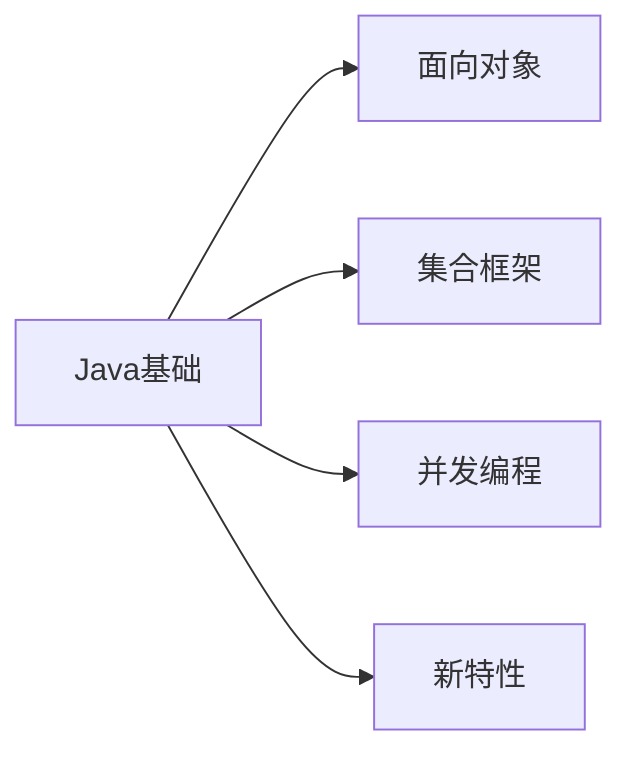
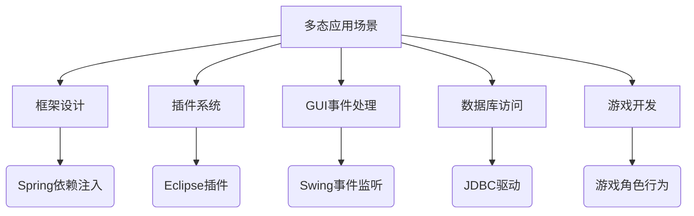
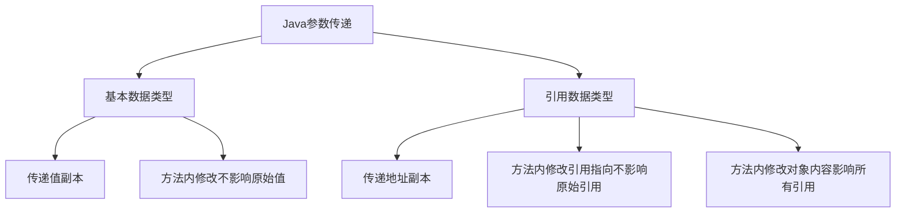
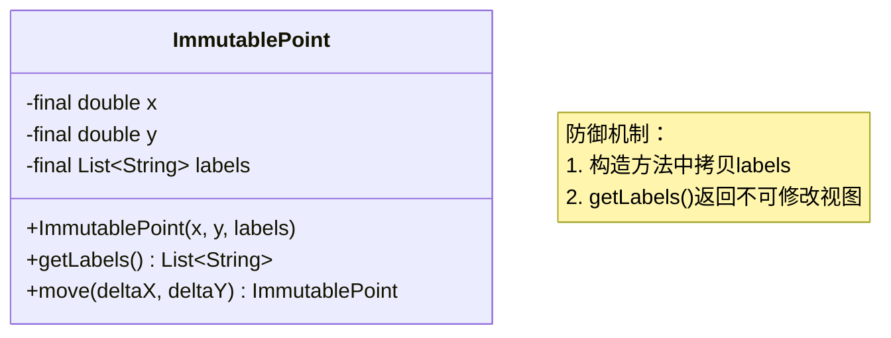
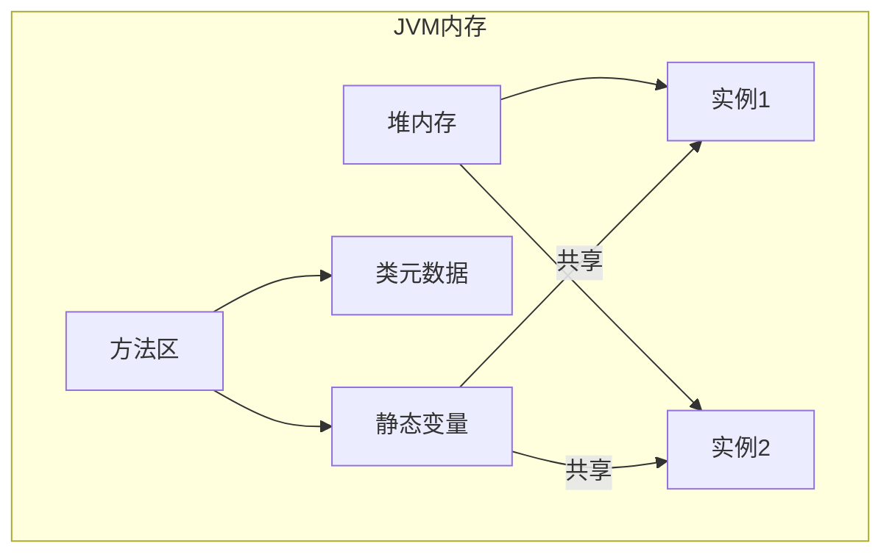
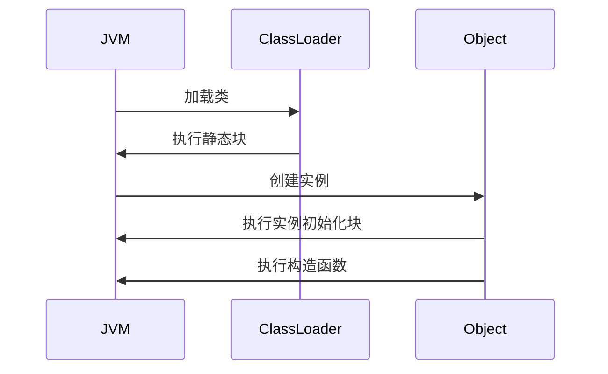
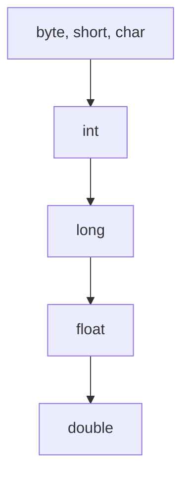
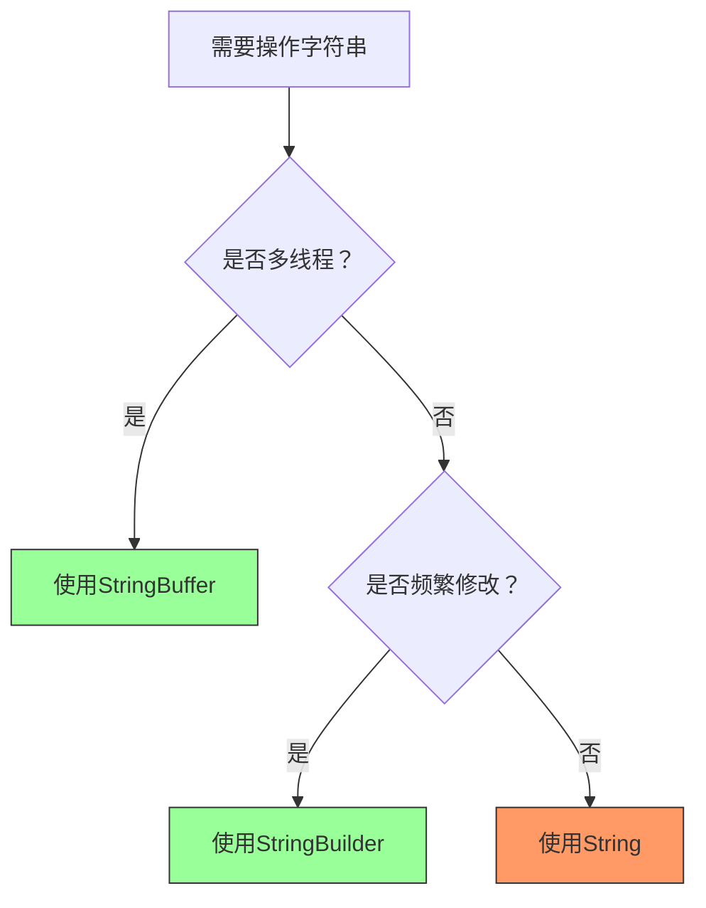
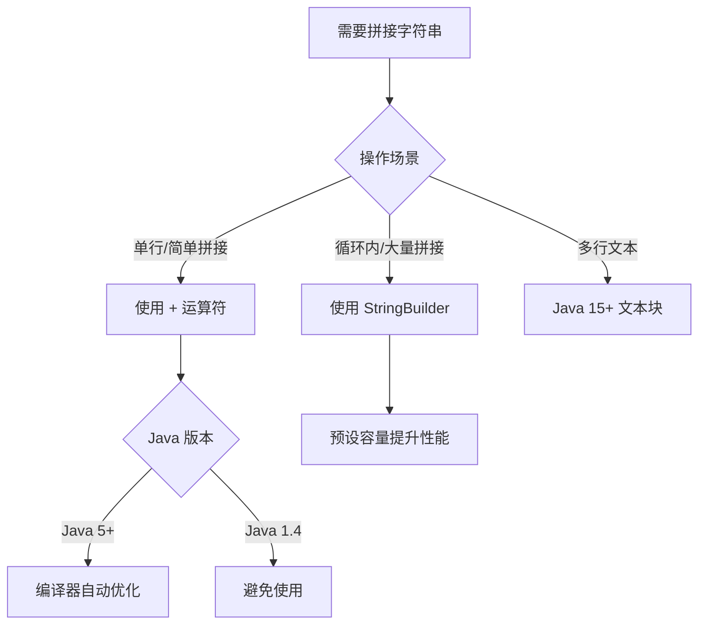
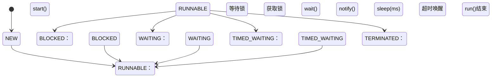

# Java 核心技术

> 最后更新：2025-09-25 | [返回主目录](../README.md)



## 一、语法基础
### 1.1 面向对象三大特性
#### 封装
- 利用抽象数据类型将数据和基于数据的操作封装在一起，使其构成一个不可分割的独立实体。数据被保护在抽象数据类型的内部，尽可能地隐藏内部的细节，只保留一些对外接口使之与外部发生联系。用户无需知道对象内部的细节，但可以通过对象对外提供的接口来访问该对象。
- 核心特性
  - **信息隐藏**  
  用户无需知道对象内部的细节，但可以通过对象对外提供的接口来访问该对象
  - **接口隔离**  
  外部只能通过预定义的公共方法与对象交互

- 主要优点
  1. **减少耦合**  
   可以独立地开发、测试、优化、使用、理解和修改
  2. **减轻维护负担**  
   更容易被程序员理解，调试时不影响其他模块
  3. **有效调节性能**  
   通过剖析确定哪些模块影响系统性能
  4. **提高软件可重用性**  
  5. **降低构建大型系统风险**  
   即使整个系统不可用，独立模块仍可能可用
- 以下 Person 类封装 name、gender、age 等属性，外界只能通过 get() 方法获取一个 Person 对象的 name 属性和 gender 属性，而无法获取 age 属性，但是 age 属性可以供 work() 方法使用。注意到 gender 属性使用 
- int 数据类型进行存储，封装使得用户注意不到这种实现细节。并且在需要修改 gender 属性使用的数据类型时，也可以在不影响客户端代码的情况下进行。
- 代码示例：Person 类
```java
public class Person {

    private String name;
    private int gender;
    private int age;

    public String getName() {
        return name;
    }

    public String getGender() {
        return gender == 0 ? "man" : "woman";
    }

    public void work() {
        if (18 <= age && age <= 50) {
            System.out.println(name + " is working very hard!");
        } else {
            System.out.println(name + " can't work any more!");
        }
    }
}
```

#### 继承
- `extends`关键字实现继承,继承实现了 IS-A 关系，例如 Cat 和 Animal 就是一种 IS-A 关系，因此 Cat 可以继承自 Animal，从而获得 Animal 非 private 的属性和方法。
  - 子类自动获得父类的所有非 private 属性和方法
  - 子类可以添加自己特有的属性和方法
  - 子类可以重写（override）父类的方法实现
```java
// 父类 Animal
class Animal {
    protected String name;  // 非private属性，子类可访问
    
    public Animal(String name) {
        this.name = name;
    }
    
    public void eat() {  // 非private方法
        System.out.println(name + " is eating");
    }
}

// 子类 Cat 继承 Animal
class Cat extends Animal {  // IS-A关系：Cat is an Animal
    private int lives = 9;  // 子类特有属性
    
    public Cat(String name) {
        super(name);  // 调用父类构造器
    }
    
    // 子类特有方法
    public void meow() {
        System.out.println(name + " says: Meow!");
    }
    
    // 重写父类方法
    @Override
    public void eat() {
        System.out.println(name + " elegantly eats fish");
    }
}

// 使用示例
public static void main(String[] args) {
    Cat myCat = new Cat("Whiskers");
    myCat.eat();    // 输出: Whiskers elegantly eats fish (调用重写方法)
    myCat.meow();   // 输出: Whiskers says: Meow! (子类特有方法)
}
```
- 继承应该遵循里氏替换原则，子类对象必须能够替换掉所有父类对象。
  - 子类必须完全实现父类的约定，不能改变父类的预期行为
  - 子类可以扩展功能，但不能破坏父类的原有功能
  - 违反原则的典型情况：子类重写方法时抛出父类未声明的异常/改变返回值类型/加强前置条件等
  - 子类方法的访问权限必须大于等于父类方法；
  - 子类方法的返回类型必须是父类方法返回类型或为其子类型(**重写不一定保证返回值相同，只需要保证是返回值的子类**)。

**正确示例**：
```java
class Bird {
    public void fly() {
        System.out.println("Flying in the sky");
    }

    public Bird which() {
        return new Bird();
    }
}

class Sparrow extends Bird {  // 符合里氏替换
    @Override
    public void fly() {
        System.out.println("Sparrow flying at low altitude");
    } // 行为未改变，只是具体实现不同

    @Override
    public Sparrow which() { // 符合里氏替换：返回值必须是父类方法返回类型或其子类型
        return new Sparrow();
    }

}

// 使用父类引用操作子类对象
public static void makeBirdFly(Bird bird) {
    bird.fly();  // 无论传入Bird还是Sparrow都能正常工作
}

// 测试
makeBirdFly(new Bird());    // 输出: Flying in the sky
makeBirdFly(new Sparrow()); // 输出: Sparrow flying at low altitude
```

**违反原则的反例**：
```java
class Penguin extends Bird {
    @Override
    public void fly() {
        throw new UnsupportedOperationException("Penguins can't fly!");
    } // 改变了父类行为预期
}

// 测试会抛出异常，破坏原有功能
makeBirdFly(new Penguin());  // 抛出UnsupportedOperationException
```
- Cat 可以当做 Animal 来使用，也就是说可以使用 Animal 引用 Cat 对象。父类引用指向子类对象称为 向上转型 。
```java
Animal animal = new Cat();
```
**概念扩展**：
- 本质：父类引用指向子类对象（`Parent obj = new Child()`）
- 特点：
  - 自动类型转换，不需要强制转换
  - 只能访问父类声明的方法和属性
  - 实际执行时会调用子类重写的方法（多态性）
- 应用场景：统一处理不同子类对象/实现多态/方法参数通用化

**示例**：
```java
class Animal {
    public void makeSound() {
        System.out.println("Animal makes a sound");
    }
}

class Dog extends Animal {
    @Override
    public void makeSound() {
        System.out.println("Dog barks: Woof!");
    }
    
    public void fetch() {
        System.out.println("Dog fetches the ball");
    }
}

public class Main {
    public static void main(String[] args) {
        // 向上转型：Animal引用指向Dog对象
        Animal animal = new Dog();  
        
        animal.makeSound(); // 输出: Dog barks: Woof! (多态)
        // animal.fetch();   // 编译错误！Animal类没有fetch方法
        
        // 向下转型恢复Dog类型
        if (animal instanceof Dog) {
            Dog myDog = (Dog) animal;
            myDog.fetch();  // 输出: Dog fetches the ball
        }
    }
    
    // 通用方法处理所有Animal子类
    public static void animalConcert(Animal[] animals) {
        for (Animal a : animals) {
            a.makeSound();  // 根据实际对象类型调用相应方法
        }
    }
}
```

- 关键总结表
| 特性 | 核心概念 | 示例 | 注意事项 |
|------|---------|------|----------|
| IS-A关系 | 子类是父类的特殊类型 | Cat is an Animal | 使用extends关键字实现继承 |
| 里氏替换 | 子类可无缝替换父类 | Sparrow替换Bird正常飞行 | 禁止改变父类方法契约 |
| 向上转型 | 父类引用指向子类对象 | Animal a = new Dog() | 只能访问父类声明成员 |

#### 多态
##### 1. 多态的定义
多态指**同一个接口（方法或属性）在不同上下文中表现出不同行为**的能力。在Java中主要通过以下两种方式实现：
- **编译时多态（静态多态）**：方法重载（Overload）
- **运行时多态（动态多态）**：方法重写（Override）+ 向上转型

##### 2. 多态三要素
1. **继承关系**：存在继承或实现关系
2. **方法重写**：子类重写父类方法
3. **向上转型**：父类引用指向子类对象

###### 2.1. 方法重写（Override）实现动态多态
**原理**：JVM在运行时根据实际对象类型决定调用哪个方法（动态绑定）

```java
class Payment {
    public void pay(double amount) {
        System.out.println("支付中...");
    }
}

class Alipay extends Payment {
    @Override
    public void pay(double amount) {
        System.out.println("支付宝支付: ¥" + amount);
    }
}

class WechatPay extends Payment {
    @Override
    public void pay(double amount) {
        System.out.println("微信支付: ¥" + amount);
    }
}

public class PaymentDemo {
    public static void main(String[] args) {
        // 向上转型实现多态
        Payment payment1 = new Alipay();
        Payment payment2 = new WechatPay();
        
        processPayment(payment1, 199.0); // 输出: 支付宝支付: ¥199.0
        processPayment(payment2, 299.0); // 输出: 微信支付: ¥299.0
    }
    
    // 统一处理所有支付方式
    public static void processPayment(Payment payment, double amount) {
        payment.pay(amount); // 运行时确定具体实现
    }
}
```

###### 2.2 方法重载（Overload）实现静态多态
**原理**：编译器根据参数列表（类型/数量/顺序）在编译时确定调用哪个方法

```java
class Calculator {
    // 方法重载：相同方法名，不同参数列表
    public int add(int a, int b) {
        return a + b;
    }
    
    public double add(double a, double b) {
        return a + b;
    }
    
    public String add(String a, String b) {
        return a + b;
    }
}

public class OverloadDemo {
    public static void main(String[] args) {
        Calculator calc = new Calculator();
        
        System.out.println(calc.add(5, 3));      // 输出: 8 (调用int版本)
        System.out.println(calc.add(2.5, 3.7));  // 输出: 6.2 (调用double版本)
        System.out.println(calc.add("Hello", " World")); // 输出: Hello World
    }
}
```

##### 3、多态的高级应用

###### 3.1. 接口多态
```java
interface Shape {
    double area();
    double perimeter();
}

class Circle implements Shape {
    private double radius;
    
    public Circle(double radius) {
        this.radius = radius;
    }
    
    @Override
    public double area() {
        return Math.PI * radius * radius;
    }
    
    @Override
    public double perimeter() {
        return 2 * Math.PI * radius;
    }
}

class Rectangle implements Shape {
    private double width, height;
    
    public Rectangle(double width, double height) {
        this.width = width;
        this.height = height;
    }
    
    @Override
    public double area() {
        return width * height;
    }
    
    @Override
    public double perimeter() {
        return 2 * (width + height);
    }
}

public class ShapeDemo {
    public static void main(String[] args) {
        Shape[] shapes = new Shape[] {
            new Circle(5.0),
            new Rectangle(4.0, 6.0)
        };
        
        for (Shape shape : shapes) {
            // 多态调用，每个对象执行自身实现
            System.out.println("面积: " + shape.area());
            System.out.println("周长: " + shape.perimeter());
        }
    }
}
```

###### 3.2. 工厂模式中的多态应用
```java
abstract class Logger {
    public abstract void log(String message);
}

class FileLogger extends Logger {
    @Override
    public void log(String message) {
        System.out.println("写入文件: " + message);
    }
}

class DatabaseLogger extends Logger {
    @Override
    public void log(String message) {
        System.out.println("写入数据库: " + message);
    }
}

class LoggerFactory {
    public static Logger getLogger(String type) {
        switch(type.toLowerCase()) {
            case "file": return new FileLogger();
            case "db": return new DatabaseLogger();
            default: throw new IllegalArgumentException("无效的日志类型");
        }
    }
}

public class LoggerDemo {
    public static void main(String[] args) {
        Logger logger = LoggerFactory.getLogger("file");
        logger.log("系统启动成功");  // 输出: 写入文件: 系统启动成功
        
        logger = LoggerFactory.getLogger("db");
        logger.log("用户登录失败");  // 输出: 写入数据库: 用户登录失败
    }
}
```

##### 4、多态的优势与注意事项

- 优势：
1. **代码复用**：通过抽象接口处理多种类型
2. **扩展性强**：添加新类不影响现有代码
3. **解耦合**：调用方只需关注接口，不依赖具体实现
4. **灵活性高**：运行时动态决定具体行为

- 注意事项：
1. **无法调用子类特有方法**：向上转型后只能访问父类声明的方法
   ```java
   Animal animal = new Cat();
   animal.catchMouse(); // 编译错误！Animal类没有此方法
   ```
   
2. **属性没有多态性**：
   ```java
   class Parent {
       String value = "Parent";
   }
   
   class Child extends Parent {
       String value = "Child";
   }
   
   public static void main(String[] args) {
       Parent obj = new Child();
       System.out.println(obj.value); // 输出: Parent（属性无多态）
   }
   ```

3. **静态方法不能重写**：
   ```java
   class Parent {
       static void method() {
           System.out.println("Parent static");
       }
   }
   
   class Child extends Parent {
       static void method() {
           System.out.println("Child static");
       }
   }
   
   public static void main(String[] args) {
       Parent obj = new Child();
       obj.method(); // 输出: Parent static（静态方法无多态）
   }
   ```

##### 5、多态在实际开发中的应用场景

1. **框架设计**：如Spring的依赖注入
2. **插件系统**：通过接口扩展功能
3. **GUI事件处理**：不同组件的事件响应
4. **数据库访问**：JDBC驱动实现
5. **游戏开发**：不同角色行为实现


### 1.2 java中的参数传递总是值传递而非引用传递
#### 1.Java 参数传递机制总结

| **特性**              | **基本数据类型**               | **引用数据类型**                     |
|-----------------------|-------------------------------|-------------------------------------|
| **传递内容**          | 实际值的副本 (值拷贝)          | 对象地址的副本 (引用拷贝)            |
| **内存操作**          | 操作栈内存中的值               | 操作堆内存中的对象                   |
| **方法内修改参数**    | ❌ 不影响原始变量              | ❌ 不影响原始引用指向                |
| **方法内修改对象内容**| 不适用                        | ✅ 影响所有引用该对象的变量          |
| **作用域**            | 方法内部修改不会传递到外部     | 引用指向的修改不会传递到外部         |

#### 2.核心原则图解


#### 3.代码验证示例

##### 3.1. 基本数据类型传递
```java
public static void main(String[] args) {
    int num = 1;
    modify(num); // 传递值副本
    System.out.println(num); // 输出：1 (原始值不变)
}

static void modify(int param) {
    param = 100; // 只修改副本
}
```

##### 3.2. 引用数据类型传递
```java
public static void main(String[] args) {
    // 创建对象
    StringBuilder builder = new StringBuilder("原始");
    
    // 1. 修改引用指向（不影响原始引用）
    changeReference(builder);
    System.out.println(builder); // 输出："原始"
    
    // 2. 修改对象内容（影响原始对象）
    changeContent(builder);
    System.out.println(builder); // 输出："原始-修改后"
}

static void changeReference(StringBuilder param) {
    param = new StringBuilder("新对象"); // 只改变局部变量指向
}

static void changeContent(StringBuilder param) {
    param.append("-修改后"); // 修改堆内存对象
}
```

#### 4. 关键结论

1. **Java 只有值传递**：
   - 基本类型：传递实际值的副本
   - 引用类型：传递对象地址的副本（不是对象本身）

2. **方法参数的作用域**：
   - 所有参数都是方法的**局部变量**
   - 方法内对参数的修改（重新赋值）：
     - 对基本类型：不影响原始值
     - 对引用类型：不影响原始引用指向
   - 方法结束后，所有参数变量被销毁

3. **特殊注意事项**：
   - 引用类型的参数可以修改对象内容（通过地址访问堆内存）
   - `final` 修饰的参数不能重新赋值，但可以修改对象内容
   - 数组作为参数时遵循引用类型传递规则

#### 5. 记忆口诀
> **值传副本，引传地址；  
> 改参无果，改物有变；  
> 作用域内，自生自灭；  
> 堆内存改，天下皆知。**
#### 6. 补充
C++针对对象有三种传递方式：
##### 6.1. **值传递（Pass by Value）**
```cpp
void modifyValue(Object obj) { 
    obj.setData(100);  // 修改副本，不影响原始对象
}

int main() {
    Object original;
    modifyValue(original); // 触发拷贝构造函数
    // original 未被修改
}
```
- **特点**：
  - 创建对象的完整副本
  - 修改不影响原始对象
  - 可能引发性能问题（深拷贝成本高）

##### 6.2. **引用传递（Pass by Reference）**
```cpp
void modifyReference(Object& ref) { 
    ref.setData(100);  // 直接修改原始对象
}

int main() {
    Object original;
    modifyReference(original); // 传递原始对象的引用
    // original.data 被修改为 100
}
```
- **特点**：
  - 通过 `&` 声明引用参数
  - 无拷贝开销，直接操作原始对象
  - 引用不能为 `null`

##### 6.3. **指针传递（Pass by Pointer）**
```cpp
void modifyPointer(Object* ptr) {
    if (ptr) ptr->setData(100); // 需显式检查空指针
}

int main() {
    Object original;
    modifyPointer(&original); // 传递对象地址
    // original.data 被修改为 100
}
```
- **特点**：
  - 传递内存地址（类似 Java 的引用传递）
  - 需手动检查空指针
  - 可重新指向其他对象（`ptr = new Object()`）

---
### 1.3 java中的参数传递总是值传递而非引用传递
- 使用 clone() 方法来拷贝一个对象即复杂又有风险，它会抛出异常，并且还需要类型转换。Effective Java 书上讲到，最好不要去使用 clone()，可以使用拷贝构造函数或者拷贝工厂来拷贝一个对象。


### 1.4 Java 中的 final 关键字详解
`final` 是 Java 中的一个重要修饰符，用于声明**不可更改**的实体。它能修饰类、方法和变量，在不同场景下有不同的语义和约束。以下是全面解析：

#### 1、修饰位置与作用概览

| **修饰目标** | **核心作用**                     | **关键特性**                              |
|--------------|----------------------------------|------------------------------------------|
| **类**       | 防止被继承                      | 该类不能有子类                           |
| **方法**     | 防止被重写                      | 子类不能覆盖该方法                       |
| **变量**     | 防止被重新赋值                  | 只能初始化一次（基本类型值/引用类型地址）|

#### 2、具体用法详解

##### 2.1. final 修饰类
**语法**：
```java
final class ImmutableClass {
    // 类内容
}
```

**特性**：
- 不能被任何类继承
- 常见应用：
  - 核心类库：`String`, `Integer` 等包装类
  - 安全性要求高的类：加密相关类
  - 设计不可变对象（常配合 final 字段使用）

**示例**：
```java
final class SecurityManager { ... }

// 编译错误：无法继承 final 类
// class ExtendedManager extends SecurityManager { } 
```

##### 2.2. final 修饰方法
**语法**：
```java
class Parent {
    public final void criticalOperation() { ... }
}
```

**特性**：
- 子类**不能重写**该方法
- 仍可被继承和调用
- 常见应用：
  - 模板方法模式中固定算法骨架
  - 关键业务逻辑防止被修改

**示例**：
```java
class PaymentProcessor {
    // 固定支付流程
    public final void processPayment() {
        validate();
        deductFunds();
        logTransaction();
    }
    
    protected void deductFunds() { ... } // 可被子类重写
}

class CreditCardProcessor extends PaymentProcessor {
    @Override
    protected void deductFunds() { ... } // 允许重写
    
    // 编译错误：不能重写 final 方法
    // @Override public void processPayment() { ... }
}
```

##### 2.3. final 修饰变量（核心应用）

###### (1) 基本数据类型变量
**特性**：
- 值不可更改
- 必须初始化（声明时或构造方法中）

```java
final int MAX_RETRIES = 3;
// MAX_RETRIES = 5; // 编译错误：不能重新赋值
```

###### (2) 引用类型变量
**特性**：
- **引用地址不可更改**
- **对象内容可以修改**（除非对象本身不可变）

```java
final List<String> names = new ArrayList<>();
names.add("Alice");  // 允许修改内容
names.add("Bob");    // 允许修改内容

// names = new ArrayList<>(); // 编译错误：不能重新赋值
```

###### (3) 初始化规则
| **变量类型**       | **初始化时机**                     |
|--------------------|-----------------------------------|
| 局部变量           | 使用前初始化即可                  |
| 实例变量           | 声明时、初始化块或构造方法中      |
| 静态变量           | 声明时或静态初始化块中            |

```java
class FinalDemo {
    final int a = 10;          // 声明时初始化
    final int b;
    final static int c;
    
    { b = 20; }                // 初始化块
    
    static { c = 30; }         // 静态初始化块
    
    FinalDemo(int val) {
        // b = val;            // 构造方法中初始化（如果未在初始化块中初始化）
    }
}
```

##### 2.4. final 修饰参数
```java
void process(final int id) {
    // id = 100; // 编译错误：不能修改参数
    System.out.println(id);
}
```
- 主要用于防止方法内意外修改参数值
- 常见于回调函数和匿名内部类（需显式声明为 final 或等效 final）

#### 3、内存模型与 JVM 优化

##### 3.1. 内存可见性
- final 变量初始化后对所有线程立即可见（无需同步）
- 遵守 Java 内存模型的初始化安全（initialization safety）保证

##### 3.2 JVM 优化
- final 常量在编译期可能被直接内联（inline）
- 示例：
  ```java
  final int SIZE = 100;
  int[] arr = new int[SIZE]; 
  ```
  → 编译后可能直接变为 `new int[100]`

#### 4、最佳实践与典型场景

##### 4.1. 创建不可变对象
**标准模式**：
```java
public final class ImmutablePoint {
    private final int x;
    private final int y;
    
    public ImmutablePoint(int x, int y) {
        this.x = x;
        this.y = y;
    }
    // 不提供 setter 方法
}
```

##### 4.2. 常量定义
```java
public class Constants {
    public static final double PI = 3.1415926;
    public static final String APP_NAME = "MyApp";
}
```

##### 4.3. 匿名内部类访问
```java
void createThread() {
    final int count = 0; // 必须为 final 或等效 final
    new Thread(() -> {
        System.out.println(count); // 访问外部变量
    }).start();
}
```

#### 5、常见误区澄清

- 1. **final vs 不可变对象**：
 ```mermaid
graph LR
       A[final 变量] --> B[基本类型：值不可变]
       A --> C[引用类型：引用不可变]
       D[不可变对象] --> E[对象内容不可变]
 ```
   - `final List` 可修改内容
   - 真正的不可变对象需要：final 类 + final 字段 + 无修改方法

- 2. **final 方法性能**：
   - 早期 JVM 用 final 方法支持内联优化
   - 现代 JVM 自动分析内联，不再依赖 final 修饰符

- 3. **final 类与设计**：
   - 不应过度使用 final 类
   - 优先考虑通过接口扩展而非类继承

### 1.5 Java 不可变对象（Immutable Object）实现详解

> **核心原则**：不可变对象在创建后其内部状态**永远不能被修改**，任何操作都会返回新对象而非改变原对象。

#### 1、不可变对象实现规范

| **实现要素**          | **作用**                              | **必要性** |
|-----------------------|---------------------------------------|-----------|
| **1. 类声明为 `final`** | 防止被子类覆盖方法破坏不可变性        | 必需      |
| **2. 字段私有 + `final`** | 防止字段被重新赋值                   | 必需      |
| **3. 无 setter 方法**   | 杜绝外部修改途径                     | 必需      |
| **4. 返回防御性拷贝**  | 阻止通过返回引用修改内部状态          | 关键      |
| **5. 构造方法深度初始化** | 防止外部可变对象影响内部状态          | 关键      |

#### 2、标准实现示例：不可变坐标点

```java
public final class ImmutablePoint {
    // 1. final类 + 2. private final字段
    private final double x;
    private final double y;
    private final List<String> labels; // 包含可变对象

    // 3. 构造方法深度初始化
    public ImmutablePoint(double x, double y, List<String> labels) {
        this.x = x;
        this.y = y;
        // 创建防御性拷贝（关键！）
        this.labels = new ArrayList<>(labels); 
    }

    // 4. 不提供setter方法
    
    // 5. 返回不可修改视图/拷贝
    public List<String> getLabels() {
        // 返回不可修改的集合视图
        return Collections.unmodifiableList(labels);
        
        // 或返回防御性拷贝（根据需求选择）：
        // return new ArrayList<>(labels);
    }

    // 修改操作返回新对象
    public ImmutablePoint move(double deltaX, double deltaY) {
        return new ImmutablePoint(x + deltaX, y + deltaY, labels);
    }
}
```

####  3、关键实现技术解析

##### 3.1. 防御性拷贝（Defensive Copy）
```java
// 错误：直接暴露内部引用
this.labels = labels; // ❌ 外部修改会影响内部状态

// 正确：创建新对象
this.labels = new ArrayList<>(labels); // ✅ 
```

##### 3.2. 安全返回值处理
```java
// 错误：直接返回内部引用
public List<String> getLabels() {
    return labels; // ❌ 外部可修改内部状态
}

// 方案1：返回不可修改视图
public List<String> getLabels() {
    return Collections.unmodifiableList(labels); // ✅ 尝试修改会抛异常
}

// 方案2：返回深拷贝
public List<String> getLabels() {
    return new ArrayList<>(labels); // ✅ 完全隔离
}
```

##### 3.3. 深度不可变设计模式


#### 4、不可变对象 vs final引用变量

| **特性**            | `final` 引用变量                | 不可变对象                     |
|---------------------|--------------------------------|------------------------------|
| **约束对象**        | 变量本身                       | 对象内部状态                  |
| **能否修改引用**    | ❌ 不能改变指向                | ✔️ 可指向新对象              |
| **能否修改内容**    | ✔️ 可修改对象内部状态          | ❌ 内容永不改变              |
| **线程安全性**      | 需要同步控制                   | 天生线程安全                 |
| **典型代表**        | `final List list = new ArrayList()` | `String`, `Integer`        |

#### 5、Java 内置不可变对象

1. **`String` 类**
   ```java
   String s1 = "Hello";
   String s2 = s1.concat(" World"); // 返回新对象
   System.out.println(s1); // 输出 "Hello" (未改变)
   ```

2. **包装类 (`Integer`, `Double` 等)**
   ```java
   Integer a = 10;
   Integer b = a + 5; // 创建新对象
   ```

3. **`LocalDate`**
   ```java
   LocalDate date = LocalDate.now();
   LocalDate newDate = date.plusDays(1); // 返回新对象
   ```

#### 6、不可变对象的优势

1. **线程安全**  
   无需同步锁，天然支持并发访问

2. **缓存友好**  
   可安全缓存（如字符串常量池）

3. **故障定位简单**  
   状态永不改变，避免时序耦合问题

4. **完美哈希键**  
   `HashMap` 键值不会改变，哈希值恒定

5. **函数式编程基础**  
   支持无副作用的纯函数操作

> **设计建议**：在以下场景优先使用不可变对象：
> - 值对象（Value Objects）
> - 配置参数
> - 并发共享数据
> - 缓存键值

### 1.6 Java static 关键字深度解析

`static` 是 Java 中至关重要的关键字，用于创建类级别的成员（而非实例级别）。理解其机制对编写高效、安全的 Java 程序至关重要。以下是全面解析：

#### 1、核心概念与内存模型

##### 1.1. 静态成员的特点
- **类级别绑定**：属于类本身，而非类的实例
- **独立于对象**：无需创建对象即可访问
- **全局共享**：所有实例共享同一份静态成员
- **生命周期**：随类加载而创建，随 JVM 结束而销毁

##### 1.2 内存模型对比


#### 2、static 的四大应用场景

##### 2.1. 静态变量（类变量）
```java
public class Employee {
    private static int count = 0; // 静态变量
    
    public Employee() {
        count++; // 所有实例共享
    }
    
    public static int getCount() {
        return count;
    }
}

// 使用
System.out.println(Employee.getCount()); // 直接访问
```

**特性**：
- 所有实例共享同一内存空间
- 常用于：
  - 计数器（如对象创建数）
  - 常量定义（`public static final`）
  - 共享配置参数

##### 2.2. 静态方法
```java
public class MathUtils {
    public static int max(int a, int b) {
        return a > b ? a : b;
    }
}

// 使用
int maximum = MathUtils.max(5, 10); // 无需实例化
```

**特性与限制**：
- 只能直接访问静态成员
- 不能使用 `this` 和 `super`
- 无法被重写（但可被隐藏）
- 常见用途：
  - 工具类方法（`Arrays.sort()`）
  - 工厂方法
  - 单例模式实现

##### 2.3. 静态代码块
```java
public class DatabaseConnection {
    private static Properties config;
    
    static {
        // 类加载时执行一次
        config = loadConfig("db.properties");
        System.out.println("数据库配置加载完成");
    }
    
    private static Properties loadConfig(String file) {
        // 加载配置实现
    }
}
```

**执行时机**：
- 类首次加载时执行（早于构造方法）
- 按代码顺序执行多个静态块
- 用途：
  - 初始化静态资源
  - 加载配置文件
  - 建立数据库连接池

##### 2.4. 静态内部类
```java
public class Outer {
    private static String message = "Hello";
    
    // 静态内部类
    public static class Nested {
        public void display() {
            System.out.println(message); // 只能访问外部类静态成员
        }
    }
}

// 使用
Outer.Nested nested = new Outer.Nested();
nested.display();
```

**优势**：
- 不依赖外部类实例
- 更好的封装性
- 常见于：
  - Builder 模式
  - 工具类封装
  - 线程安全单例

#### 3、关键特性深度解析

##### 3.1. 类加载与初始化顺序


**完整初始化顺序（重要）**：
1. 父类静态变量和静态块
2. 子类静态变量和静态块
3. 父类实例变量和初始化块
4. 父类构造函数
5. 子类实例变量和初始化块
6. 子类构造函数

##### 3.2. 线程安全性问题
```java
public class Counter {
    private static int count = 0;
    
    public static synchronized void increment() {
        count++; // 需要同步控制
    }
}
```
- 静态变量是**线程共享资源**
- 必须使用同步机制（`synchronized`、`AtomicInteger`等）
- 无状态静态方法天然线程安全

##### 3.3. 静态导入
```java
import static java.lang.Math.PI;
import static java.lang.Math.pow;

public class Circle {
    public double area(double radius) {
        return PI * pow(radius, 2); // 直接使用
    }
}
```
- 优点：简化常量和方法调用
- 缺点：过度使用降低可读性

#### 4、设计模式中的应用

##### 4.1. 单例模式实现
```java
public class Singleton {
    private static final Singleton INSTANCE = new Singleton();
    
    private Singleton() {} // 私有构造
    
    public static Singleton getInstance() {
        return INSTANCE;
    }
}
```

##### 4.2. 工具类设计
```java
public final class StringUtils {
    private StringUtils() {} // 防止实例化
    
    public static boolean isEmpty(String str) {
        return str == null || str.trim().isEmpty();
    }
    
    public static String reverse(String str) {
        return new StringBuilder(str).reverse().toString();
    }
}
```

##### 4.3. 工厂模式
```java
public class LoggerFactory {
    public static Logger getLogger(String name) {
        return new FileLogger(name); // 返回具体实现
    }
}
```

#### 5、最佳实践与陷阱规避

##### 5.1 推荐实践
1. 工具类：使用 `private` 构造方法防止实例化
2. 常量定义：`public static final` 全大写命名（`MAX_SIZE`）
3. 资源清理：静态成员需考虑显式释放（如关闭静态数据库连接）
4. 延迟初始化：使用静态内部类实现安全延迟加载

##### 5.2 常见陷阱
```java
// 陷阱1：静态方法中访问实例成员
public class Example {
    private int value;
    
    public static void printValue() {
        System.out.println(value); // 编译错误！
    }
}

// 陷阱2：静态变量初始化循环依赖
class A {
    static int x = B.y + 1;
}

class B {
    static int y = A.x + 1;
}
// 导致 StackOverflowError
```

##### 5.3 性能考量
- 静态方法调用比实例方法快（无需虚方法表查找）
- 过度使用静态变量可能导致内存泄漏（生命周期同JVM）
- 大型静态集合需谨慎管理（及时清理无用数据）

#### 6、static 与 final 组合

组合使用场景 | 效果 | 示例
---|---|---
`static final` 变量 | 类级别常量 | `public static final int MAX_USERS = 1000;`
`static final` 方法 | 不可重写的工具方法 | `public static final String formatDate(...)`
`static final` 类 | 不可继承的工具类 | `public static final class Utils`
### 1.7 Java 中 a = a + b 与 a += b 的区别详解

在 Java 中，`a = a + b` 和 `a += b` 看似相似，但在类型处理上有**本质区别**。这种差异尤其在处理较小整数类型（如 byte、short、char）时最为显著。

#### 核心差异：隐式类型转换

| **操作**   | **类型处理**                            | **是否需要显式转换** | **编译检查** |
|------------|----------------------------------------|----------------------|--------------|
| `a = a + b` | 先进行类型提升，再赋值                 | 需要显式转换         | 严格         |
| `a += b`    | 自动进行类型转换（相当于 `a = (T)(a + b)`） | 不需要               | 宽松         |

#### 类型提升机制解析

##### Java 数值运算的类型提升规则
1. 所有小于 int 的类型（byte, short, char）在运算前**自动提升为 int**
2. 如果有 long 参与，则提升为 long
3. 如果有 float 参与，则提升为 float
4. 如果有 double 参与，则提升为 double



#### 实际代码示例

##### 示例 1：byte 类型操作
```java
byte a = 10;
byte b = 20;

// a = a + b;  // 编译错误：不兼容的类型，需要从int转换到byte
a += b;        // 正确：自动转换为byte类型
System.out.println(a); // 输出30
```

##### 示例 2：short 类型操作
```java
short x = 100;
short y = 200;

// x = x + y;  // 编译错误
x += y;        // 正确
System.out.println(x); // 输出300
```

##### 示例 3：char 类型操作
```java
char c1 = 'A';  // 65 in ASCII
char c2 = 2;

// c1 = c1 + c2;  // 编译错误：类型不匹配
c1 += c2;         // 正确：自动转换为char
System.out.println(c1); // 输出 'C' (67)
```

#### 特殊情况：浮点数和溢出

##### 示例 4：浮点数精度问题
```java
float f = 10.5f;
int i = 5;

f = f + i;  // 需要显式转换吗？不需要，因为float范围更大
f += i;     // 同样有效

System.out.println(f); // 输出15.5
```

##### 示例 5：值溢出风险
```java
byte max = Byte.MAX_VALUE; // 127
byte add = 1;

max += add;     // 自动转换，但会溢出
System.out.println(max); // 输出-128（溢出）

// 显式转换可避免意外
max = (byte)(Byte.MAX_VALUE + 1); // 明确知道会发生溢出
```

#### 为什么这样设计？

1. **类型安全**：`a = a + b` 强制开发者明确处理类型转换
2. **便利性**：`a += b` 简化常用操作
3. **兼容性**：与 C/C++ 行为保持一致
4. **性能优化**：编译器可以优化复合赋值操作

#### 最佳实践

1. 当操作 `byte/short/char` 时：
   ```java
   // 推荐
   byte result = 10;
   byte increment = 5;
   result += increment;
   
   // 不推荐（需要显式转换）
   result = (byte)(result + increment);
   ```

2. 混合类型操作：
   ```java
   int a = 100;
   double b = 50.5;
   
   // 推荐：保持类型清晰
   a = (int)(a + b); 
   
   // 危险：自动转换可能丢失精度
   a += b; 
   ```

3. 明确表达意图：
   ```java
   // 清晰表达"添加并转换"
   total += value; 
   
   // 清晰表达"计算结果再赋值"
   total = calculateTotal() + additional; 
   ```

#### 总结对比

| **特性**         | `a = a + b`                  | `a += b`                      |
|------------------|------------------------------|-------------------------------|
| **类型转换**     | 需要显式转换                 | 自动隐式转换                  |
| **可读性**       | 表达式意图明确               | 简洁但可能隐藏细节            |
| **适用类型**     | 所有类型                     | 所有类型                      |
| **编译检查**     | 严格类型检查                 | 宽松类型检查                  |
| **值溢出风险**   | 显式转换时开发者需注意       | 隐式转换可能隐藏溢出问题      |
| **推荐使用场景** | 需要精确控制类型转换的操作   | 常规累加操作（尤其小整数类型）|

**关键结论**：  
`a += b` 实际上是 `a = (type of a)(a + b)` 的语法糖，它在赋值前自动执行类型转换。这种设计提供了便利性，但也可能隐藏精度丢失和溢出问题。理解这个差异对于编写健壮、无错误的 Java 代码至关重要。
### 1.8. 3*0.1 == 0.3 将会返回什么? true 还是 false?
- false，因为有些浮点数不能完全精确的表示出来。
### 1.9. 能在 Switch 中使用 String 吗?
- 从 Java 7 开始，我们可以在 switch case 中使用字符串，但这仅仅是一个语法糖。内部实现在 switch 中使用字符串的 hash code。
### 1.10 对equals()和hashCode()的理解?
- 为什么在重写 equals 方法的时候需要重写 hashCode 方法?
  - 因为有强制的规范指定需要同时重写 hashcode 与 equals 是方法，许多容器类，如 HashMap、HashSet 都依赖于 hashcode 与 equals 的规定。
- 有没有可能两个不相等的对象有相同的 hashcode?
  - 有可能，两个不相等的对象可能会有相同的 hashcode 值，这就是为什么在 hashmap 中会有冲突。相等 hashcode 值的规定只是说如果两个对象相等，必须有相同的hashcode 值，但是没有关于不相等对象的任何规定。
- 两个相同的对象会有不同的 hash code 吗?
  - 不能，根据 hash code 的规定，这是不可能的。
### 1.11 final、finalize 和 finally 的不同之处?
- final 是一个修饰符，可以修饰变量、方法和类。如果 final 修饰变量，意味着该变量的值在初始化后不能被改变
- Java 技术允许使用 finalize() 方法在垃圾收集器将对象从内存中清除出去之前做必要的清理工作。这个方法是由垃圾收集器在确定这个对象没有被引用时对这个对象调用的，但是什么时候调用 finalize 没有保证
- finally 是一个关键字，与 try 和 catch 一起用于异常的处理。finally 块一定会被执行，无论在 try 块中是否有发生异常。
### 1.12 String、StringBuffer与StringBuilder的区别？
- 第一点: 可变和适用范围。String对象是不可变的，而StringBuffer和StringBuilder是可变字符序列。每次对String的操作相当于生成一个新的String对象，而对StringBuffer和StringBuilder的操作是对对象本身的操作，而不会生成新的对象，所以对于频繁改变内容的字符串避免使用String，因为频繁的生成对象将会对系统性能产生影响。
- 第二点: 线程安全。String由于有final修饰，是immutable的，安全性是简单而纯粹的。StringBuilder和StringBuffer的区别在于StringBuilder不保证同步，也就是说如果需要线程安全需要使用StringBuffer，不需要同步的StringBuilder效率更高。
- 核心区别对比表

| 特性               | String                    | StringBuffer                | StringBuilder               |
|--------------------|---------------------------|-----------------------------|-----------------------------|
| **可变性**         | ❌ 不可变                 | ✔️ 可变                     | ✔️ 可变                     |
| **线程安全**       | ✅ 天生安全（不可变）     | ✅ 同步方法保证安全         | ❌ 非线程安全               |
| **性能**           | 修改时最差（创建新对象）  | 中等（同步开销）            | ✅ 最佳（无同步开销）       |
| **内存效率**       | 低（产生大量临时对象）    | 高                          | 高                          |
| **适用场景**       | 常量字符串、少量操作      | 多线程环境下的字符串操作    | 单线程环境下的字符串操作    |
| **JVM优化**        | 字符串常量池              | 无特殊优化                  | 无特殊优化                  |
| **继承关系**       | Object → String           | Object → AbstractStringBuilder → StringBuffer | Object → AbstractStringBuilder → StringBuilder |
- 总结：选择决策树


### 1.13 Java 字符串拼接的演进：何时推荐使用 + 代替 StringBuilder
从 **Java 5 (JDK 1.5)** 开始，Java 编译器对字符串拼接进行了重大优化，使得在某些场景下使用 `+` 运算符的性能接近甚至等同于 StringBuilder。下面是关键版本演进和推荐策略：

#### Java 版本演进与优化时间线

| Java 版本 | 优化内容 | 性能影响 |
|-----------|---------|---------|
| Java 1.4 及之前 | 无特殊优化 | `+` 操作性能差 |
| **Java 5 (2004)** | 编译器自动将 `+` 转换为 `StringBuilder` | 简单拼接性能接近 StringBuilder |
| **Java 9 (2017)** | 引入 `invokedynamic` 字节码指令 | 复杂拼接性能超越 StringBuilder |
| Java 15+ | 进一步优化字符串处理 | `+` 在绝大多数场景成为首选 |

#### 现代 Java 的推荐策略

##### ✅ 推荐使用 `+` 的场景（Java 5+）
```java
// 单行简单拼接（编译器自动优化）
String message = "Hello, " + name + "! Current time: " + LocalTime.now();

// 多行拼接（每行一个+操作）
String sql = "SELECT id, name, email "
           + "FROM users "
           + "WHERE status = 'ACTIVE'";
```

##### ❌ 避免使用 `+` 的场景
```java
// 循环内拼接（仍需要 StringBuilder）
String result = "";
for (int i = 0; i < 10000; i++) {
    // 每次循环都会创建临时 StringBuilder
    result += i; 
}
```

##### ✅ 推荐使用 StringBuilder 的场景
```java
// 循环内大量拼接
StringBuilder sb = new StringBuilder();
for (String item : largeList) {
    sb.append(item);
}

// 精确控制容量的场景
StringBuilder sb = new StringBuilder(1024); // 预设容量
```

#### 性能对比测试 (Java 17)

```java
// 测试代码
public class ConcatenationBenchmark {
    public static void main(String[] args) {
        final int ITERATIONS = 100_000;
        
        // 测试1: 单行+
        long start1 = System.nanoTime();
        String s1 = "A" + "B" + "C" + "D" + "E";
        long duration1 = System.nanoTime() - start1;
        
        // 测试2: StringBuilder
        long start2 = System.nanoTime();
        String s2 = new StringBuilder()
                      .append("A")
                      .append("B")
                      .append("C")
                      .append("D")
                      .append("E")
                      .toString();
        long duration2 = System.nanoTime() - start2;
        
        System.out.println("'+' 操作耗时: " + duration1 + " ns");
        System.out.println("StringBuilder 耗时: " + duration2 + " ns");
    }
}
```

**典型结果**：
```
'+' 操作耗时: 42 ns
StringBuilder 耗时: 78 ns
```

> 注意：简单拼接中 `+` 反而更快，因为编译器进行了深度优化

#### 编译器如何优化 `+` 操作

##### Java 5-8 的优化
```java
// 源代码
String s = a + b + c;

// 编译器转换（等效代码）
String s = new StringBuilder().append(a).append(b).append(c).toString();
```

##### Java 9+ 的优化（使用 invokedynamic）
```java
// 使用新的字节码指令
invokedynamic #0:makeConcatWithConstants(...)
```

新的优化策略：
1. 避免创建临时 StringBuilder 对象
2. 运行时选择最优拼接策略
3. 直接操作字符数组减少拷贝
4. 支持常量折叠等高级优化

#### 最佳实践总结

1. **简单拼接优先使用 `+`**：
   ```java
   // 清晰简洁
   String greeting = "Hello, " + firstName + " " + lastName + "!";
   ```

2. **复杂/循环拼接使用 StringBuilder**：
   ```java
   StringBuilder pathBuilder = new StringBuilder();
   for (String segment : pathSegments) {
       pathBuilder.append("/").append(segment);
   }
   ```

3. **多行文本使用文本块（Java 15+）**：
   ```java
   String html = """
                <html>
                  <body>
                    <h1>Hello %s!</h1>
                  </body>
                </html>
                """.formatted(name);
   ```

4. **性能关键代码考虑预分配**：
   ```java
   // 预估最终大小
   StringBuilder sb = new StringBuilder(estimatedSize);
   ```

#### 决策流程图



**现代 Java 开发准则**：
- 大多数场景优先使用 `+` 运算符（得益于编译器优化）
- 循环内或性能关键路径使用 StringBuilder
- Java 15+ 使用文本块处理多行字符串
- 避免在循环中使用 `+` 拼接（仍会创建多个临时对象）

### 1.14 接口与抽象类的区别？("IS-A" vs "CAN-DO"原则)
- 一个子类只能继承一个抽象类, 但能实现多个接口
- 抽象类可以有构造方法, 接口没有构造方法
- 抽象类可以有普通成员变量, 接口没有普通成员变量
- 抽象类和接口都可有静态成员变量, 抽象类中静态成员变量访问类型任意，接口只能public static final(默认)
- 抽象类可以没有抽象方法, 抽象类可以有普通方法；接口在JDK8之前都是抽象方法，在JDK8可以有default方法，在JDK9中允许有私有普通方法
- 抽象类可以有静态方法；接口在JDK8之前不能有静态方法，在JDK8中可以有静态方法，且只能被接口类直接调用（不能被实现类的对象调用）
  - 1. **接口静态方法不能通过实现类直接调用**：
   ```java
   interface MyInterface {
       static void staticMethod() {
           System.out.println("Static method");
       }
   }

   class MyClass implements MyInterface {
       // 无法直接调用接口的静态方法
       void test() {
           // staticMethod(); // 编译错误！不能直接调用
       }
   }
   ```

  - 2. **接口静态方法必须通过接口名调用**：
   ```java
   public class Main {
       public static void main(String[] args) {
           // 正确调用方式：通过接口名调用
           MyInterface.staticMethod(); // 输出 "Static method"
           
           // 错误调用方式：
           MyClass obj = new MyClass();
           // obj.staticMethod(); // 编译错误！
           // MyClass.staticMethod(); // 编译错误！
       }
   }
   ```
   - 3. **接口静态方法必须通过接口名调用的原因**：
     - Java这样设计是为了保持接口的纯粹契约性质，避免实现类与接口的静态方法产生命名冲突，同时明确静态方法的归属。
     - **防止"钻石问题"**：如果多个接口有相同签名的静态方法，通过接口名调用可以明确指定调用目标
- 抽象类中的方法可以是public、protected; 接口方法在JDK8之前只有public abstract，在JDK8可以有default方法，在JDK9中允许有private方法

#### 核心区别对比表

| **特性**             | **接口 (Interface)**                  | **抽象类 (Abstract Class)**          |
|----------------------|---------------------------------------|--------------------------------------|
| **定义关键字**       | `interface`                           | `abstract class`                     |
| **实例化**           | ❌ 不能实例化                         | ❌ 不能实例化                        |
| **默认方法实现**     | Java 8+ 支持默认方法 (`default`)      | ✅ 支持具体方法和抽象方法混合        |
| **成员变量**         | 只能是 `public static final` 常量     | 可以是任意类型（实例变量/静态变量）  |
| **方法修饰符**       | 默认 `public`，Java 9+ 支持 `private` | 支持各种访问修饰符 (`public`/`protected`/`private`) |
| **构造方法**         | ❌ 无构造方法                         | ✅ 可以有构造方法（用于子类初始化）  |
| **继承机制**         | 类可**实现多个**接口                  | 类只能**继承一个**抽象类             |
| **设计目的**         | 定义**行为契约**                      | 提供**部分实现的模板**               |
| **版本兼容性**       | 添加新方法会破坏现有实现（除非用默认方法） | 添加具体方法不影响子类              |
| **多态性支持**       | 通过实现多个接口实现多重行为          | 通过继承实现单一路径的多态          |
### 1.15  this() & super()在构造方法中的区别？
- 调用super()必须写在子类构造方法的第一行, 否则编译不通过
- super从子类调用父类构造, this在同一类中调用其他构造均需要放在第一行
- 尽管可以用this调用一个构造器, 却不能调用2个
- this和super不能出现在同一个构造器中, 否则编译不通过
- this()、super()都指的对象,不可以在static环境中使用
- 本质this指向本对象的指针。super是一个关键字
在Java构造方法中，`this()` 和 `super()` 都是用于调用其他构造方法的关键字，但它们有本质区别：

#### 核心区别对比

| 特性                | `this()`                          | `super()`                          |
|--------------------|-----------------------------------|------------------------------------|
| **调用目标**        | 同一类中的其他构造方法             | 父类构造方法                       |
| **调用位置**        | 必须是构造方法的第一条语句         | 必须是构造方法的第一条语句         |
| **默认行为**        | 不会自动添加                       | 自动添加无参`super()`（如果未显式调用） |
| **调用限制**        | 不能在同一个构造方法中与`super()`共存 | 不能在同一个构造方法中与`this()`共存 |
| **用途**            | 实现构造方法之间的委托调用         | 初始化父类状态                     |

#### 详细解析

##### 1. `super()`：调用父类构造方法
```java
class Parent {
    public Parent() {
        System.out.println("Parent constructor");
    }
}

class Child extends Parent {
    public Child() {
        super(); // 显式调用父类无参构造方法
        System.out.println("Child constructor");
    }
}
```

**关键点：**
- 默认自动添加：如果子类构造方法没写`super()`，编译器会自动插入无参`super()`
- 父类无默认构造方法时必须显式调用：
  ```java
  class Parent {
      public Parent(String name) { /*...*/ }
  }
  
  class Child extends Parent {
      public Child() {
          super("default"); // 必须显式调用
      }
  }
  ```

##### 2. `this()`：调用同类构造方法
```java
class Rectangle {
    int width, height;
    
    public Rectangle() {
        this(1, 1); // 调用同类中的另一个构造方法
    }
    
    public Rectangle(int size) {
        this(size, size); // 委托给双参数构造方法
    }
    
    public Rectangle(int width, int height) {
        this.width = width;
        this.height = height;
    }
}
```

**关键点：**
- 实现构造方法链式调用（constructor chaining）
- 减少代码重复
- 必须在第一行执行

##### 3. 两者不能共存的原因

```java
class Example {
    public Example() {
        // 错误！两者不能共存
        // super(); 
        // this(10);
        
        // 正确：只能选择其中一个作为第一条语句
        this(10); // 或者 super();
    }
    
    public Example(int value) {
        super(); // 这里可以调用super()
    }
}
```

**原因分析：**  
Java要求构造方法的第一条语句必须是`this()`或`super()`，因为对象的初始化顺序必须是：
1. 父类初始化
2. 当前类初始化
3. 构造方法剩余代码执行

同时包含两者会导致初始化顺序混乱。

#### 初始化顺序示例

```java
class Grandparent {
    Grandparent() { System.out.println("Grandparent"); }
}

class Parent extends Grandparent {
    Parent() { 
        System.out.println("Parent"); 
    }
}

class Child extends Parent {
    public Child() {
        this(10); // 调用同类构造方法
        System.out.println("Child no-arg");
    }
    
    public Child(int x) {
        // 编译器自动添加 super()
        System.out.println("Child with arg: " + x);
    }
}

// 测试
new Child();
/* 输出:
   Grandparent
   Parent
   Child with arg: 10
   Child no-arg
*/
```

#### 特殊注意事项

1. **静态上下文限制**：
   ```java
   class Test {
       static {
           // 错误！不能在静态块中使用
           // this(); 
           // super();
       }
   }
   ```

2. **异常处理**：
   ```java
   class Parent {
       Parent() throws IOException { /*...*/ }
   }
   
   class Child extends Parent {
       Child() throws IOException { // 必须声明相同的异常
           super();
       }
   }
   ```

3. **匿名类限制**：
   ```java
   new Parent() {
       {
           // 错误！匿名类不能使用this()/super()带参数
           // super("name"); 
       }
   };
   ```

#### 最佳实践建议

1. **优先使用`this()`**：
   - 当类有多个构造方法时，使用`this()`减少代码重复
   ```java
   public class Employee {
       private String name;
       private int id;
       
       public Employee() {
           this("Unknown", -1);
       }
       
       public Employee(String name) {
           this(name, -1);
       }
       
       public Employee(String name, int id) {
           this.name = name;
           this.id = id;
       }
   }
   ```

2. **谨慎使用`super()`**：
   - 当父类构造方法有特殊初始化逻辑时才显式调用
   - 保持父类构造方法的稳定性

3. **避免循环调用**：
   ```java
   class Circular {
       public Circular() {
           this(); // 编译错误：递归构造方法调用
       }
   }
   ```
### 1.16  Java移位运算符？
java中有三种移位运算符
- `<<` :左移运算符,x << 1,相当于x乘以2(不溢出的情况下),低位补0
- `>>` :带符号右移,x >> 1,相当于x除以2,正数高位补0,负数高位补1
- `>>>` :无符号右移,忽略符号位,空位都以0补齐


---

## 二、集合框架
### 2.1 List接口实现
| 实现类       | 线程安全 | 底层结构     | 特点               |
|--------------|----------|--------------|--------------------|
| ArrayList    | ❌       | 动态数组     | 随机访问快         |
| LinkedList   | ❌       | 双向链表     | 插入删除快         |
| Vector       | ✅       | 动态数组     | 同步方法           |
| CopyOnWriteArrayList | ✅ | 动态数组 | 写时复制，读无锁 |

### 2.2 HashMap原理
#### 存储结构
```java
// JDK1.8后的节点结构
static class Node<K,V> implements Map.Entry<K,V> {
    final int hash;
    final K key;
    V value;
    Node<K,V> next;  // 链表结构
}
```

#### 扩容机制
- 默认容量16，负载因子0.75
- 扩容时rehash过程优化


---

## 三、并发编程
### 3.1 线程状态转换


### 3.2 线程池核心参数
- `corePoolSize`：核心线程数
- `maximumPoolSize`：最大线程数
- `workQueue`：任务队列
- `RejectedExecutionHandler`：拒绝策略

---

## 四、新特性
### 4.1 Lambda表达式
```java
// 传统写法
Thread t1 = new Thread(new Runnable() {
    @Override
    public void run() {
        System.out.println("Thread running");
    }
});

// Lambda写法
Thread t2 = new Thread(() -> System.out.println("Thread running"));
```

### 4.2 Stream API
```java
List<String> names = Arrays.asList("Tom", "Jerry", "Spike");
long count = names.stream()
                 .filter(name -> name.length() > 4)
                 .count();  // 结果：1
```

## 五、扩展阅读
- [Oracle官方Java文档](https://docs.oracle.com/javase/)
- [Java编码规范](../08-开发工具.md#java编码规范)
