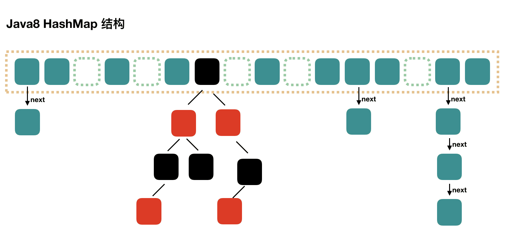
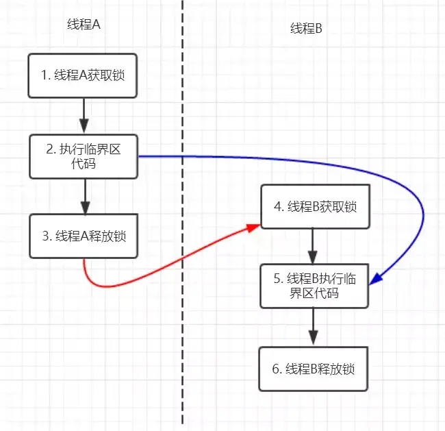
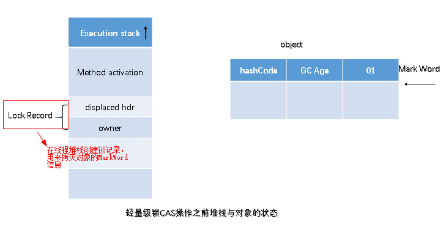
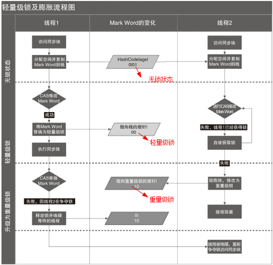
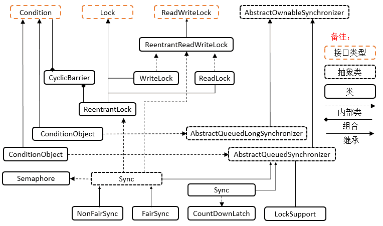

# Java 核心技术

> 最后更新：2025-09-25 | [返回主目录](../README.md)


## 一、语法基础
### 1.1 面向对象三大特性
#### 封装
- 利用抽象数据类型将数据和基于数据的操作封装在一起，使其构成一个不可分割的独立实体。数据被保护在抽象数据类型的内部，尽可能地隐藏内部的细节，只保留一些对外接口使之与外部发生联系。用户无需知道对象内部的细节，但可以通过对象对外提供的接口来访问该对象。
- 核心特性
  - **信息隐藏**  
  用户无需知道对象内部的细节，但可以通过对象对外提供的接口来访问该对象
  - **接口隔离**  
  外部只能通过预定义的公共方法与对象交互

- 主要优点
  1. **减少耦合**  
   可以独立地开发、测试、优化、使用、理解和修改
  2. **减轻维护负担**  
   更容易被程序员理解，调试时不影响其他模块
  3. **有效调节性能**  
   通过剖析确定哪些模块影响系统性能
  4. **提高软件可重用性**  
  5. **降低构建大型系统风险**  
   即使整个系统不可用，独立模块仍可能可用
- 以下 Person 类封装 name、gender、age 等属性，外界只能通过 get() 方法获取一个 Person 对象的 name 属性和 gender 属性，而无法获取 age 属性，但是 age 属性可以供 work() 方法使用。注意到 gender 属性使用 
- int 数据类型进行存储，封装使得用户注意不到这种实现细节。并且在需要修改 gender 属性使用的数据类型时，也可以在不影响客户端代码的情况下进行。
- 代码示例：Person 类
```java
public class Person {

    private String name;
    private int gender;
    private int age;

    public String getName() {
        return name;
    }

    public String getGender() {
        return gender == 0 ? "man" : "woman";
    }

    public void work() {
        if (18 <= age && age <= 50) {
            System.out.println(name + " is working very hard!");
        } else {
            System.out.println(name + " can't work any more!");
        }
    }
}
```

#### 继承
- `extends`关键字实现继承,继承实现了 IS-A 关系，例如 Cat 和 Animal 就是一种 IS-A 关系，因此 Cat 可以继承自 Animal，从而获得 Animal 非 private 的属性和方法。
  - 子类自动获得父类的所有非 private 属性和方法
  - 子类可以添加自己特有的属性和方法
  - 子类可以重写（override）父类的方法实现
```java
// 父类 Animal
class Animal {
    protected String name;  // 非private属性，子类可访问
    
    public Animal(String name) {
        this.name = name;
    }
    
    public void eat() {  // 非private方法
        System.out.println(name + " is eating");
    }
}

// 子类 Cat 继承 Animal
class Cat extends Animal {  // IS-A关系：Cat is an Animal
    private int lives = 9;  // 子类特有属性
    
    public Cat(String name) {
        super(name);  // 调用父类构造器
    }
    
    // 子类特有方法
    public void meow() {
        System.out.println(name + " says: Meow!");
    }
    
    // 重写父类方法
    @Override
    public void eat() {
        System.out.println(name + " elegantly eats fish");
    }
}

// 使用示例
public static void main(String[] args) {
    Cat myCat = new Cat("Whiskers");
    myCat.eat();    // 输出: Whiskers elegantly eats fish (调用重写方法)
    myCat.meow();   // 输出: Whiskers says: Meow! (子类特有方法)
}
```
- 继承应该遵循<a id = "里氏替换原则" >里氏替换原则</a>，子类对象必须能够替换掉所有父类对象。
  - 子类必须完全实现父类的约定，不能改变父类的预期行为
  - 子类可以扩展功能，但不能破坏父类的原有功能
  - 违反原则的典型情况：子类重写方法时抛出父类未声明的异常/改变返回值类型/加强前置条件等
  - 子类方法的访问权限必须大于等于父类方法；
  - 子类方法的返回类型必须是父类方法返回类型或为其子类型(**重写不一定保证返回值相同，只需要保证是返回值的子类**)。

**正确示例**：
```java
class Bird {
    public void fly() {
        System.out.println("Flying in the sky");
    }

    public Bird which() {
        return new Bird();
    }
}

class Sparrow extends Bird {  // 符合里氏替换
    @Override
    public void fly() {
        System.out.println("Sparrow flying at low altitude");
    } // 行为未改变，只是具体实现不同

    @Override
    public Sparrow which() { // 符合里氏替换：返回值必须是父类方法返回类型或其子类型
        return new Sparrow();
    }

}

// 使用父类引用操作子类对象
public static void makeBirdFly(Bird bird) {
    bird.fly();  // 无论传入Bird还是Sparrow都能正常工作
}

// 测试
makeBirdFly(new Bird());    // 输出: Flying in the sky
makeBirdFly(new Sparrow()); // 输出: Sparrow flying at low altitude
```

**违反原则的反例**：
```java
class Penguin extends Bird {
    @Override
    public void fly() {
        throw new UnsupportedOperationException("Penguins can't fly!");
    } // 改变了父类行为预期
}

// 测试会抛出异常，破坏原有功能
makeBirdFly(new Penguin());  // 抛出UnsupportedOperationException
```
- Cat 可以当做 Animal 来使用，也就是说可以使用 Animal 引用 Cat 对象。父类引用指向子类对象称为 向上转型 。
```java
Animal animal = new Cat();
```
**概念扩展**：
- 本质：父类引用指向子类对象（`Parent obj = new Child()`）
- 特点：
  - 自动类型转换，不需要强制转换
  - 只能访问父类声明的方法和属性
  - 实际执行时会调用子类重写的方法（多态性）
- 应用场景：统一处理不同子类对象/实现多态/方法参数通用化

**示例**：
```java
class Animal {
    public void makeSound() {
        System.out.println("Animal makes a sound");
    }
}

class Dog extends Animal {
    @Override
    public void makeSound() {
        System.out.println("Dog barks: Woof!");
    }
    
    public void fetch() {
        System.out.println("Dog fetches the ball");
    }
}

public class Main {
    public static void main(String[] args) {
        // 向上转型：Animal引用指向Dog对象
        Animal animal = new Dog();  
        
        animal.makeSound(); // 输出: Dog barks: Woof! (多态)
        // animal.fetch();   // 编译错误！Animal类没有fetch方法
        
        // 向下转型恢复Dog类型
        if (animal instanceof Dog) {
            Dog myDog = (Dog) animal;
            myDog.fetch();  // 输出: Dog fetches the ball
        }
    }
    
    // 通用方法处理所有Animal子类
    public static void animalConcert(Animal[] animals) {
        for (Animal a : animals) {
            a.makeSound();  // 根据实际对象类型调用相应方法
        }
    }
}
```

- 关键总结表
| 特性 | 核心概念 | 示例 | 注意事项 |
|------|---------|------|----------|
| IS-A关系 | 子类是父类的特殊类型 | Cat is an Animal | 使用extends关键字实现继承 |
| 里氏替换 | 子类可无缝替换父类 | Sparrow替换Bird正常飞行 | 禁止改变父类方法契约 |
| 向上转型 | 父类引用指向子类对象 | Animal a = new Dog() | 只能访问父类声明成员 |

#### 多态
##### 1. 多态的定义
多态指**同一个接口（方法或属性）在不同上下文中表现出不同行为**的能力。在Java中主要通过以下两种方式实现：
- **编译时多态（静态多态）**：方法重载（Overload）
- **运行时多态（动态多态）**：方法重写（Override）+ 向上转型

##### 2. 多态三要素
1. **继承关系**：存在继承或实现关系
2. **方法重写**：子类重写父类方法
3. **向上转型**：父类引用指向子类对象

###### 2.1. 方法重写（Override）实现动态多态
**原理**：JVM在运行时根据实际对象类型决定调用哪个方法（动态绑定）

```java
class Payment {
    public void pay(double amount) {
        System.out.println("支付中...");
    }
}

class Alipay extends Payment {
    @Override
    public void pay(double amount) {
        System.out.println("支付宝支付: ¥" + amount);
    }
}

class WechatPay extends Payment {
    @Override
    public void pay(double amount) {
        System.out.println("微信支付: ¥" + amount);
    }
}

public class PaymentDemo {
    public static void main(String[] args) {
        // 向上转型实现多态
        Payment payment1 = new Alipay();
        Payment payment2 = new WechatPay();
        
        processPayment(payment1, 199.0); // 输出: 支付宝支付: ¥199.0
        processPayment(payment2, 299.0); // 输出: 微信支付: ¥299.0
    }
    
    // 统一处理所有支付方式
    public static void processPayment(Payment payment, double amount) {
        payment.pay(amount); // 运行时确定具体实现
    }
}
```

###### 2.2 方法重载（Overload）实现静态多态
**原理**：编译器根据参数列表（类型/数量/顺序）在编译时确定调用哪个方法

```java
class Calculator {
    // 方法重载：相同方法名，不同参数列表
    public int add(int a, int b) {
        return a + b;
    }
    
    public double add(double a, double b) {
        return a + b;
    }
    
    public String add(String a, String b) {
        return a + b;
    }
}

public class OverloadDemo {
    public static void main(String[] args) {
        Calculator calc = new Calculator();
        
        System.out.println(calc.add(5, 3));      // 输出: 8 (调用int版本)
        System.out.println(calc.add(2.5, 3.7));  // 输出: 6.2 (调用double版本)
        System.out.println(calc.add("Hello", " World")); // 输出: Hello World
    }
}
```

##### 3、多态的高级应用

###### 3.1. 接口多态
```java
interface Shape {
    double area();
    double perimeter();
}

class Circle implements Shape {
    private double radius;
    
    public Circle(double radius) {
        this.radius = radius;
    }
    
    @Override
    public double area() {
        return Math.PI * radius * radius;
    }
    
    @Override
    public double perimeter() {
        return 2 * Math.PI * radius;
    }
}

class Rectangle implements Shape {
    private double width, height;
    
    public Rectangle(double width, double height) {
        this.width = width;
        this.height = height;
    }
    
    @Override
    public double area() {
        return width * height;
    }
    
    @Override
    public double perimeter() {
        return 2 * (width + height);
    }
}

public class ShapeDemo {
    public static void main(String[] args) {
        Shape[] shapes = new Shape[] {
            new Circle(5.0),
            new Rectangle(4.0, 6.0)
        };
        
        for (Shape shape : shapes) {
            // 多态调用，每个对象执行自身实现
            System.out.println("面积: " + shape.area());
            System.out.println("周长: " + shape.perimeter());
        }
    }
}
```

###### 3.2. 工厂模式中的多态应用
```java
abstract class Logger {
    public abstract void log(String message);
}

class FileLogger extends Logger {
    @Override
    public void log(String message) {
        System.out.println("写入文件: " + message);
    }
}

class DatabaseLogger extends Logger {
    @Override
    public void log(String message) {
        System.out.println("写入数据库: " + message);
    }
}

class LoggerFactory {
    public static Logger getLogger(String type) {
        switch(type.toLowerCase()) {
            case "file": return new FileLogger();
            case "db": return new DatabaseLogger();
            default: throw new IllegalArgumentException("无效的日志类型");
        }
    }
}

public class LoggerDemo {
    public static void main(String[] args) {
        Logger logger = LoggerFactory.getLogger("file");
        logger.log("系统启动成功");  // 输出: 写入文件: 系统启动成功
        
        logger = LoggerFactory.getLogger("db");
        logger.log("用户登录失败");  // 输出: 写入数据库: 用户登录失败
    }
}
```

##### 4、多态的优势与注意事项

- 优势：
1. **代码复用**：通过抽象接口处理多种类型
2. **扩展性强**：添加新类不影响现有代码
3. **解耦合**：调用方只需关注接口，不依赖具体实现
4. **灵活性高**：运行时动态决定具体行为

- 注意事项：
1. **无法调用子类特有方法**：向上转型后只能访问父类声明的方法
   ```java
   Animal animal = new Cat();
   animal.catchMouse(); // 编译错误！Animal类没有此方法
   ```
   
2. **属性没有多态性**：
   ```java
   class Parent {
       String value = "Parent";
   }
   
   class Child extends Parent {
       String value = "Child";
   }
   
   public static void main(String[] args) {
       Parent obj = new Child();
       System.out.println(obj.value); // 输出: Parent（属性无多态）
   }
   ```

3. **静态方法不能重写**：
   ```java
   class Parent {
       static void method() {
           System.out.println("Parent static");
       }
   }
   
   class Child extends Parent {
       static void method() {
           System.out.println("Child static");
       }
   }
   
   public static void main(String[] args) {
       Parent obj = new Child();
       obj.method(); // 输出: Parent static（静态方法无多态）
   }
   ```

##### 5、多态在实际开发中的应用场景

1. **框架设计**：如Spring的依赖注入
2. **插件系统**：通过接口扩展功能
3. **GUI事件处理**：不同组件的事件响应
4. **数据库访问**：JDBC驱动实现
5. **游戏开发**：不同角色行为实现


### 1.2 java中的参数传递总是值传递而非引用传递
#### 1.Java 参数传递机制总结

| **特性**              | **基本数据类型**               | **引用数据类型**                     |
|-----------------------|-------------------------------|-------------------------------------|
| **传递内容**          | 实际值的副本 (值拷贝)          | 对象地址的副本 (引用拷贝)            |
| **内存操作**          | 操作栈内存中的值               | 操作堆内存中的对象                   |
| **方法内修改参数**    | ❌ 不影响原始变量              | ❌ 不影响原始引用指向                |
| **方法内修改对象内容**| 不适用                        | ✅ 影响所有引用该对象的变量          |
| **作用域**            | 方法内部修改不会传递到外部     | 引用指向的修改不会传递到外部         |

#### 2.核心原则图解


#### 3.代码验证示例

##### 3.1. 基本数据类型传递
```java
public static void main(String[] args) {
    int num = 1;
    modify(num); // 传递值副本
    System.out.println(num); // 输出：1 (原始值不变)
}

static void modify(int param) {
    param = 100; // 只修改副本
}
```

##### 3.2. 引用数据类型传递
```java
public static void main(String[] args) {
    // 创建对象
    StringBuilder builder = new StringBuilder("原始");
    
    // 1. 修改引用指向（不影响原始引用）
    changeReference(builder);
    System.out.println(builder); // 输出："原始"
    
    // 2. 修改对象内容（影响原始对象）
    changeContent(builder);
    System.out.println(builder); // 输出："原始-修改后"
}

static void changeReference(StringBuilder param) {
    param = new StringBuilder("新对象"); // 只改变局部变量指向
}

static void changeContent(StringBuilder param) {
    param.append("-修改后"); // 修改堆内存对象
}
```

#### 4. 关键结论

1. **Java 只有值传递**：
   - 基本类型：传递实际值的副本
   - 引用类型：传递对象地址的副本（不是对象本身）

2. **方法参数的作用域**：
   - 所有参数都是方法的**局部变量**
   - 方法内对参数的修改（重新赋值）：
     - 对基本类型：不影响原始值
     - 对引用类型：不影响原始引用指向
   - 方法结束后，所有参数变量被销毁

3. **特殊注意事项**：
   - 引用类型的参数可以修改对象内容（通过地址访问堆内存）
   - `final` 修饰的参数不能重新赋值，但可以修改对象内容
   - 数组作为参数时遵循引用类型传递规则

#### 5. 记忆口诀
> **值传副本，引传地址；  
> 改参无果，改物有变；  
> 作用域内，自生自灭；  
> 堆内存改，天下皆知。**
#### 6. 补充
C++针对对象有三种传递方式：
##### 6.1. **值传递（Pass by Value）**
```cpp
void modifyValue(Object obj) { 
    obj.setData(100);  // 修改副本，不影响原始对象
}

int main() {
    Object original;
    modifyValue(original); // 触发拷贝构造函数
    // original 未被修改
}
```
- **特点**：
  - 创建对象的完整副本
  - 修改不影响原始对象
  - 可能引发性能问题（深拷贝成本高）

##### 6.2. **引用传递（Pass by Reference）**
```cpp
void modifyReference(Object& ref) { 
    ref.setData(100);  // 直接修改原始对象
}

int main() {
    Object original;
    modifyReference(original); // 传递原始对象的引用
    // original.data 被修改为 100
}
```
- **特点**：
  - 通过 `&` 声明引用参数
  - 无拷贝开销，直接操作原始对象
  - 引用不能为 `null`

##### 6.3. **指针传递（Pass by Pointer）**
```cpp
void modifyPointer(Object* ptr) {
    if (ptr) ptr->setData(100); // 需显式检查空指针
}

int main() {
    Object original;
    modifyPointer(&original); // 传递对象地址
    // original.data 被修改为 100
}
```
- **特点**：
  - 传递内存地址（类似 Java 的引用传递）
  - 需手动检查空指针
  - 可重新指向其他对象（`ptr = new Object()`）

---
### 1.3 java中的参数传递总是值传递而非引用传递
- 使用 clone() 方法来拷贝一个对象即复杂又有风险，它会抛出异常，并且还需要类型转换。Effective Java 书上讲到，最好不要去使用 clone()，可以使用拷贝构造函数或者拷贝工厂来拷贝一个对象。


### 1.4 Java 中的 final 关键字详解
`final` 是 Java 中的一个重要修饰符，用于声明**不可更改**的实体。它能修饰类、方法和变量，在不同场景下有不同的语义和约束。以下是全面解析：

#### 1、修饰位置与作用概览

| **修饰目标** | **核心作用**                     | **关键特性**                              |
|--------------|----------------------------------|------------------------------------------|
| **类**       | 防止被继承                      | 该类不能有子类                           |
| **方法**     | 防止被重写                      | 子类不能覆盖该方法                       |
| **变量**     | 防止被重新赋值                  | 只能初始化一次（基本类型值/引用类型地址）|

#### 2、具体用法详解

##### 2.1. final 修饰类
**语法**：
```java
final class ImmutableClass {
    // 类内容
}
```

**特性**：
- 不能被任何类继承
- 常见应用：
  - 核心类库：`String`, `Integer` 等包装类
  - 安全性要求高的类：加密相关类
  - 设计不可变对象（常配合 final 字段使用）

**示例**：
```java
final class SecurityManager { ... }

// 编译错误：无法继承 final 类
// class ExtendedManager extends SecurityManager { } 
```

##### 2.2. final 修饰方法
**语法**：
```java
class Parent {
    public final void criticalOperation() { ... }
}
```

**特性**：
- 子类**不能重写**该方法
- 仍可被继承和调用
- 常见应用：
  - 模板方法模式中固定算法骨架
  - 关键业务逻辑防止被修改

**示例**：
```java
class PaymentProcessor {
    // 固定支付流程
    public final void processPayment() {
        validate();
        deductFunds();
        logTransaction();
    }
    
    protected void deductFunds() { ... } // 可被子类重写
}

class CreditCardProcessor extends PaymentProcessor {
    @Override
    protected void deductFunds() { ... } // 允许重写
    
    // 编译错误：不能重写 final 方法
    // @Override public void processPayment() { ... }
}
```

##### 2.3. final 修饰变量（核心应用）

###### (1) 基本数据类型变量
**特性**：
- 值不可更改
- 必须初始化（声明时或构造方法中）

```java
final int MAX_RETRIES = 3;
// MAX_RETRIES = 5; // 编译错误：不能重新赋值
```

###### (2) 引用类型变量
**特性**：
- **引用地址不可更改**
- **对象内容可以修改**（除非对象本身不可变）

```java
final List<String> names = new ArrayList<>();
names.add("Alice");  // 允许修改内容
names.add("Bob");    // 允许修改内容

// names = new ArrayList<>(); // 编译错误：不能重新赋值
```

###### (3) 初始化规则
| **变量类型**       | **初始化时机**                     |
|--------------------|-----------------------------------|
| 局部变量           | 使用前初始化即可                  |
| 实例变量           | 声明时、初始化块或构造方法中      |
| 静态变量           | 声明时或静态初始化块中            |

```java
class FinalDemo {
    final int a = 10;          // 声明时初始化
    final int b;
    final static int c;
    
    { b = 20; }                // 初始化块
    
    static { c = 30; }         // 静态初始化块
    
    FinalDemo(int val) {
        // b = val;            // 构造方法中初始化（如果未在初始化块中初始化）
    }
}
```

##### 2.4. final 修饰参数
```java
void process(final int id) {
    // id = 100; // 编译错误：不能修改参数
    System.out.println(id);
}
```
- 主要用于防止方法内意外修改参数值
- 常见于回调函数和匿名内部类（需显式声明为 final 或等效 final）

#### 3、内存模型与 JVM 优化

##### 3.1. 内存可见性
- final 变量初始化后对所有线程立即可见（无需同步）
- 遵守 Java 内存模型的初始化安全（initialization safety）保证

##### 3.2 JVM 优化
- final 常量在编译期可能被直接内联（inline）
- 示例：
  ```java
  final int SIZE = 100;
  int[] arr = new int[SIZE]; 
  ```
  → 编译后可能直接变为 `new int[100]`

#### 4、最佳实践与典型场景

##### 4.1. 创建不可变对象
**标准模式**：
```java
public final class ImmutablePoint {
    private final int x;
    private final int y;
    
    public ImmutablePoint(int x, int y) {
        this.x = x;
        this.y = y;
    }
    // 不提供 setter 方法
}
```

##### 4.2. 常量定义
```java
public class Constants {
    public static final double PI = 3.1415926;
    public static final String APP_NAME = "MyApp";
}
```

##### 4.3. 匿名内部类访问
```java
void createThread() {
    final int count = 0; // 必须为 final 或等效 final
    new Thread(() -> {
        System.out.println(count); // 访问外部变量
    }).start();
}
```

#### 5、常见误区澄清

- 1. **final vs 不可变对象**：
 ```mermaid
graph LR
       A[final 变量] --> B[基本类型：值不可变]
       A --> C[引用类型：引用不可变]
       D[不可变对象] --> E[对象内容不可变]
 ```
   - `final List` 可修改内容
   - 真正的不可变对象需要：final 类 + final 字段 + 无修改方法

- 2. **final 方法性能**：
   - 早期 JVM 用 final 方法支持内联优化
   - 现代 JVM 自动分析内联，不再依赖 final 修饰符

- 3. **final 类与设计**：
   - 不应过度使用 final 类
   - 优先考虑通过接口扩展而非类继承

### 1.5 Java 不可变对象（Immutable Object）实现详解

> **核心原则**：不可变对象在创建后其内部状态**永远不能被修改**，任何操作都会返回新对象而非改变原对象。

#### 1、不可变对象实现规范

| **实现要素**          | **作用**                              | **必要性** |
|-----------------------|---------------------------------------|-----------|
| **1. 类声明为 `final`** | 防止被子类覆盖方法破坏不可变性        | 必需      |
| **2. 字段私有 + `final`** | 防止字段被重新赋值                   | 必需      |
| **3. 无 setter 方法**   | 杜绝外部修改途径                     | 必需      |
| **4. 返回防御性拷贝**  | 阻止通过返回引用修改内部状态          | 关键      |
| **5. 构造方法深度初始化** | 防止外部可变对象影响内部状态          | 关键      |

#### 2、标准实现示例：不可变坐标点

```java
public final class ImmutablePoint {
    // 1. final类 + 2. private final字段
    private final double x;
    private final double y;
    private final List<String> labels; // 包含可变对象

    // 3. 构造方法深度初始化
    public ImmutablePoint(double x, double y, List<String> labels) {
        this.x = x;
        this.y = y;
        // 创建防御性拷贝（关键！）
        this.labels = new ArrayList<>(labels); 
    }

    // 4. 不提供setter方法
    
    // 5. 返回不可修改视图/拷贝
    public List<String> getLabels() {
        // 返回不可修改的集合视图
        return Collections.unmodifiableList(labels);
        
        // 或返回防御性拷贝（根据需求选择）：
        // return new ArrayList<>(labels);
    }

    // 修改操作返回新对象
    public ImmutablePoint move(double deltaX, double deltaY) {
        return new ImmutablePoint(x + deltaX, y + deltaY, labels);
    }
}
```

####  3、关键实现技术解析

##### 3.1. 防御性拷贝（Defensive Copy）
```java
// 错误：直接暴露内部引用
this.labels = labels; // ❌ 外部修改会影响内部状态

// 正确：创建新对象
this.labels = new ArrayList<>(labels); // ✅ 
```

##### 3.2. 安全返回值处理
```java
// 错误：直接返回内部引用
public List<String> getLabels() {
    return labels; // ❌ 外部可修改内部状态
}

// 方案1：返回不可修改视图
public List<String> getLabels() {
    return Collections.unmodifiableList(labels); // ✅ 尝试修改会抛异常
}

// 方案2：返回深拷贝
public List<String> getLabels() {
    return new ArrayList<>(labels); // ✅ 完全隔离
}
```

##### 3.3. 深度不可变设计模式


#### 4、不可变对象 vs final引用变量

| **特性**            | `final` 引用变量                | 不可变对象                     |
|---------------------|--------------------------------|------------------------------|
| **约束对象**        | 变量本身                       | 对象内部状态                  |
| **能否修改引用**    | ❌ 不能改变指向                | ✔️ 可指向新对象              |
| **能否修改内容**    | ✔️ 可修改对象内部状态          | ❌ 内容永不改变              |
| **线程安全性**      | 需要同步控制                   | 天生线程安全                 |
| **典型代表**        | `final List list = new ArrayList()` | `String`, `Integer`        |

#### 5、Java 内置不可变对象

1. **`String` 类**
   ```java
   String s1 = "Hello";
   String s2 = s1.concat(" World"); // 返回新对象
   System.out.println(s1); // 输出 "Hello" (未改变)
   ```

2. **包装类 (`Integer`, `Double` 等)**
   ```java
   Integer a = 10;
   Integer b = a + 5; // 创建新对象
   ```

3. **`LocalDate`**
   ```java
   LocalDate date = LocalDate.now();
   LocalDate newDate = date.plusDays(1); // 返回新对象
   ```

#### 6、不可变对象的优势

1. **线程安全**  
   无需同步锁，天然支持并发访问

2. **缓存友好**  
   可安全缓存（如字符串常量池）

3. **故障定位简单**  
   状态永不改变，避免时序耦合问题

4. **完美哈希键**  
   `HashMap` 键值不会改变，哈希值恒定

5. **函数式编程基础**  
   支持无副作用的纯函数操作

> **设计建议**：在以下场景优先使用不可变对象：
> - 值对象（Value Objects）
> - 配置参数
> - 并发共享数据
> - 缓存键值

### 1.6 Java static 关键字深度解析

`static` 是 Java 中至关重要的关键字，用于创建类级别的成员（而非实例级别）。理解其机制对编写高效、安全的 Java 程序至关重要。以下是全面解析：

#### 1、核心概念与内存模型

##### 1.1. 静态成员的特点
- **类级别绑定**：属于类本身，而非类的实例
- **独立于对象**：无需创建对象即可访问
- **全局共享**：所有实例共享同一份静态成员
- **生命周期**：随类加载而创建，随 JVM 结束而销毁

##### 1.2 内存模型对比


#### 2、static 的四大应用场景

##### 2.1. 静态变量（类变量）
```java
public class Employee {
    private static int count = 0; // 静态变量
    
    public Employee() {
        count++; // 所有实例共享
    }
    
    public static int getCount() {
        return count;
    }
}

// 使用
System.out.println(Employee.getCount()); // 直接访问
```

**特性**：
- 所有实例共享同一内存空间
- 常用于：
  - 计数器（如对象创建数）
  - 常量定义（`public static final`）
  - 共享配置参数

##### 2.2. 静态方法
```java
public class MathUtils {
    public static int max(int a, int b) {
        return a > b ? a : b;
    }
}

// 使用
int maximum = MathUtils.max(5, 10); // 无需实例化
```

**特性与限制**：
- 只能直接访问静态成员
- 不能使用 `this` 和 `super`
- 无法被重写（但可被隐藏）
- 常见用途：
  - 工具类方法（`Arrays.sort()`）
  - 工厂方法
  - 单例模式实现

##### 2.3. 静态代码块
```java
public class DatabaseConnection {
    private static Properties config;
    
    static {
        // 类加载时执行一次
        config = loadConfig("db.properties");
        System.out.println("数据库配置加载完成");
    }
    
    private static Properties loadConfig(String file) {
        // 加载配置实现
    }
}
```

**执行时机**：
- 类首次加载时执行（早于构造方法）
- 按代码顺序执行多个静态块
- 用途：
  - 初始化静态资源
  - 加载配置文件
  - 建立数据库连接池

##### 2.4. 静态内部类
```java
public class Outer {
    private static String message = "Hello";
    
    // 静态内部类
    public static class Nested {
        public void display() {
            System.out.println(message); // 只能访问外部类静态成员
        }
    }
}

// 使用
Outer.Nested nested = new Outer.Nested();
nested.display();
```

**优势**：
- 不依赖外部类实例
- 更好的封装性
- 常见于：
  - Builder 模式
  - 工具类封装
  - 线程安全单例

#### 3、关键特性深度解析

##### 3.1. 类加载与初始化顺序


**完整初始化顺序（重要）**：
1. 父类静态变量和静态块
2. 子类静态变量和静态块
3. 父类实例变量和初始化块
4. 父类构造函数
5. 子类实例变量和初始化块
6. 子类构造函数

##### 3.2. 线程安全性问题
```java
public class Counter {
    private static int count = 0;
    
    public static synchronized void increment() {
        count++; // 需要同步控制
    }
}
```
- 静态变量是**线程共享资源**
- 必须使用同步机制（`synchronized`、`AtomicInteger`等）
- 无状态静态方法天然线程安全

##### 3.3. 静态导入
```java
import static java.lang.Math.PI;
import static java.lang.Math.pow;

public class Circle {
    public double area(double radius) {
        return PI * pow(radius, 2); // 直接使用
    }
}
```
- 优点：简化常量和方法调用
- 缺点：过度使用降低可读性

#### 4、设计模式中的应用

##### 4.1. 单例模式实现
```java
public class Singleton {
    private static final Singleton INSTANCE = new Singleton();
    
    private Singleton() {} // 私有构造
    
    public static Singleton getInstance() {
        return INSTANCE;
    }
}
```

##### 4.2. 工具类设计
```java
public final class StringUtils {
    private StringUtils() {} // 防止实例化
    
    public static boolean isEmpty(String str) {
        return str == null || str.trim().isEmpty();
    }
    
    public static String reverse(String str) {
        return new StringBuilder(str).reverse().toString();
    }
}
```

##### 4.3. 工厂模式
```java
public class LoggerFactory {
    public static Logger getLogger(String name) {
        return new FileLogger(name); // 返回具体实现
    }
}
```

#### 5、最佳实践与陷阱规避

##### 5.1 推荐实践
1. 工具类：使用 `private` 构造方法防止实例化
2. 常量定义：`public static final` 全大写命名（`MAX_SIZE`）
3. 资源清理：静态成员需考虑显式释放（如关闭静态数据库连接）
4. 延迟初始化：使用静态内部类实现安全延迟加载

##### 5.2 常见陷阱
```java
// 陷阱1：静态方法中访问实例成员
public class Example {
    private int value;
    
    public static void printValue() {
        System.out.println(value); // 编译错误！
    }
}

// 陷阱2：静态变量初始化循环依赖
class A {
    static int x = B.y + 1;
}

class B {
    static int y = A.x + 1;
}
// 导致 StackOverflowError
```

##### 5.3 性能考量
- 静态方法调用比实例方法快（无需虚方法表查找）
- 过度使用静态变量可能导致内存泄漏（生命周期同JVM）
- 大型静态集合需谨慎管理（及时清理无用数据）

#### 6、static 与 final 组合

组合使用场景 | 效果 | 示例
---|---|---
`static final` 变量 | 类级别常量 | `public static final int MAX_USERS = 1000;`
`static final` 方法 | 不可重写的工具方法 | `public static final String formatDate(...)`
`static final` 类 | 不可继承的工具类 | `public static final class Utils`
### 1.7 Java 中 a = a + b 与 a += b 的区别详解

在 Java 中，`a = a + b` 和 `a += b` 看似相似，但在类型处理上有**本质区别**。这种差异尤其在处理较小整数类型（如 byte、short、char）时最为显著。

#### 核心差异：隐式类型转换

| **操作**   | **类型处理**                            | **是否需要显式转换** | **编译检查** |
|------------|----------------------------------------|----------------------|--------------|
| `a = a + b` | 先进行类型提升，再赋值                 | 需要显式转换         | 严格         |
| `a += b`    | 自动进行类型转换（相当于 `a = (T)(a + b)`） | 不需要               | 宽松         |

#### 类型提升机制解析

##### Java 数值运算的类型提升规则
1. 所有小于 int 的类型（byte, short, char）在运算前**自动提升为 int**
2. 如果有 long 参与，则提升为 long
3. 如果有 float 参与，则提升为 float
4. 如果有 double 参与，则提升为 double


#### 实际代码示例

##### 示例 1：byte 类型操作
```java
byte a = 10;
byte b = 20;

// a = a + b;  // 编译错误：不兼容的类型，需要从int转换到byte
a += b;        // 正确：自动转换为byte类型
System.out.println(a); // 输出30
```

##### 示例 2：short 类型操作
```java
short x = 100;
short y = 200;

// x = x + y;  // 编译错误
x += y;        // 正确
System.out.println(x); // 输出300
```

##### 示例 3：char 类型操作
```java
char c1 = 'A';  // 65 in ASCII
char c2 = 2;

// c1 = c1 + c2;  // 编译错误：类型不匹配
c1 += c2;         // 正确：自动转换为char
System.out.println(c1); // 输出 'C' (67)
```

#### 特殊情况：浮点数和溢出

##### 示例 4：浮点数精度问题
```java
float f = 10.5f;
int i = 5;

f = f + i;  // 需要显式转换吗？不需要，因为float范围更大
f += i;     // 同样有效

System.out.println(f); // 输出15.5
```

##### 示例 5：值溢出风险
```java
byte max = Byte.MAX_VALUE; // 127
byte add = 1;

max += add;     // 自动转换，但会溢出
System.out.println(max); // 输出-128（溢出）

// 显式转换可避免意外
max = (byte)(Byte.MAX_VALUE + 1); // 明确知道会发生溢出
```

#### 为什么这样设计？

1. **类型安全**：`a = a + b` 强制开发者明确处理类型转换
2. **便利性**：`a += b` 简化常用操作
3. **兼容性**：与 C/C++ 行为保持一致
4. **性能优化**：编译器可以优化复合赋值操作

#### 最佳实践

1. 当操作 `byte/short/char` 时：
   ```java
   // 推荐
   byte result = 10;
   byte increment = 5;
   result += increment;
   
   // 不推荐（需要显式转换）
   result = (byte)(result + increment);
   ```

2. 混合类型操作：
   ```java
   int a = 100;
   double b = 50.5;
   
   // 推荐：保持类型清晰
   a = (int)(a + b); 
   
   // 危险：自动转换可能丢失精度
   a += b; 
   ```

3. 明确表达意图：
   ```java
   // 清晰表达"添加并转换"
   total += value; 
   
   // 清晰表达"计算结果再赋值"
   total = calculateTotal() + additional; 
   ```

#### 总结对比

| **特性**         | `a = a + b`                  | `a += b`                      |
|------------------|------------------------------|-------------------------------|
| **类型转换**     | 需要显式转换                 | 自动隐式转换                  |
| **可读性**       | 表达式意图明确               | 简洁但可能隐藏细节            |
| **适用类型**     | 所有类型                     | 所有类型                      |
| **编译检查**     | 严格类型检查                 | 宽松类型检查                  |
| **值溢出风险**   | 显式转换时开发者需注意       | 隐式转换可能隐藏溢出问题      |
| **推荐使用场景** | 需要精确控制类型转换的操作   | 常规累加操作（尤其小整数类型）|

**关键结论**：  
`a += b` 实际上是 `a = (type of a)(a + b)` 的语法糖，它在赋值前自动执行类型转换。这种设计提供了便利性，但也可能隐藏精度丢失和溢出问题。理解这个差异对于编写健壮、无错误的 Java 代码至关重要。
### 1.8. 3*0.1 == 0.3 将会返回什么? true 还是 false?
- false，因为有些浮点数不能完全精确的表示出来。
### 1.9. 能在 Switch 中使用 String 吗?
- 从 Java 7 开始，我们可以在 switch case 中使用字符串，但这仅仅是一个语法糖。内部实现在 switch 中使用字符串的 hash code。
### 1.10 对equals()和hashCode()的理解?
- 为什么在重写 equals 方法的时候需要重写 hashCode 方法?
  - 因为有强制的规范指定需要同时重写 hashcode 与 equals 是方法，许多容器类，如 HashMap、HashSet 都依赖于 hashcode 与 equals 的规定。
- 有没有可能两个不相等的对象有相同的 hashcode?
  - 有可能，两个不相等的对象可能会有相同的 hashcode 值，这就是为什么在 hashmap 中会有冲突。相等 hashcode 值的规定只是说如果两个对象相等，必须有相同的hashcode 值，但是没有关于不相等对象的任何规定。
- 两个相同的对象会有不同的 hash code 吗?
  - 不能，根据 hash code 的规定，这是不可能的。
### 1.11 final、finalize 和 finally 的不同之处?
- final 是一个修饰符，可以修饰变量、方法和类。如果 final 修饰变量，意味着该变量的值在初始化后不能被改变
- Java 技术允许使用 finalize() 方法在垃圾收集器将对象从内存中清除出去之前做必要的清理工作。这个方法是由垃圾收集器在确定这个对象没有被引用时对这个对象调用的，但是什么时候调用 finalize 没有保证
- finally 是一个关键字，与 try 和 catch 一起用于异常的处理。finally 块一定会被执行，无论在 try 块中是否有发生异常。
### 1.12 String、StringBuffer与StringBuilder的区别？
- 第一点: 可变和适用范围。String对象是不可变的，而StringBuffer和StringBuilder是可变字符序列。每次对String的操作相当于生成一个新的String对象，而对StringBuffer和StringBuilder的操作是对对象本身的操作，而不会生成新的对象，所以对于频繁改变内容的字符串避免使用String，因为频繁的生成对象将会对系统性能产生影响。
- 第二点: 线程安全。String由于有final修饰，是immutable的，安全性是简单而纯粹的。StringBuilder和StringBuffer的区别在于StringBuilder不保证同步，也就是说如果需要线程安全需要使用StringBuffer，不需要同步的StringBuilder效率更高。
- 核心区别对比表

| 特性               | String                    | StringBuffer                | StringBuilder               |
|--------------------|---------------------------|-----------------------------|-----------------------------|
| **可变性**         | ❌ 不可变                 | ✔️ 可变                     | ✔️ 可变                     |
| **线程安全**       | ✅ 天生安全（不可变）     | ✅ 同步方法保证安全         | ❌ 非线程安全               |
| **性能**           | 修改时最差（创建新对象）  | 中等（同步开销）            | ✅ 最佳（无同步开销）       |
| **内存效率**       | 低（产生大量临时对象）    | 高                          | 高                          |
| **适用场景**       | 常量字符串、少量操作      | 多线程环境下的字符串操作    | 单线程环境下的字符串操作    |
| **JVM优化**        | 字符串常量池              | 无特殊优化                  | 无特殊优化                  |
| **继承关系**       | Object → String           | Object → AbstractStringBuilder → StringBuffer | Object → AbstractStringBuilder → StringBuilder |
- 总结：选择决策树


### 1.13 Java 字符串拼接的演进：何时推荐使用 + 代替 StringBuilder
从 **Java 5 (JDK 1.5)** 开始，Java 编译器对字符串拼接进行了重大优化，使得在某些场景下使用 `+` 运算符的性能接近甚至等同于 StringBuilder。下面是关键版本演进和推荐策略：

#### Java 版本演进与优化时间线

| Java 版本 | 优化内容 | 性能影响 |
|-----------|---------|---------|
| Java 1.4 及之前 | 无特殊优化 | `+` 操作性能差 |
| **Java 5 (2004)** | 编译器自动将 `+` 转换为 `StringBuilder` | 简单拼接性能接近 StringBuilder |
| **Java 9 (2017)** | 引入 `invokedynamic` 字节码指令 | 复杂拼接性能超越 StringBuilder |
| Java 15+ | 进一步优化字符串处理 | `+` 在绝大多数场景成为首选 |

#### 现代 Java 的推荐策略

##### ✅ 推荐使用 `+` 的场景（Java 5+）
```java
// 单行简单拼接（编译器自动优化）
String message = "Hello, " + name + "! Current time: " + LocalTime.now();

// 多行拼接（每行一个+操作）
String sql = "SELECT id, name, email "
           + "FROM users "
           + "WHERE status = 'ACTIVE'";
```

##### ❌ 避免使用 `+` 的场景
```java
// 循环内拼接（仍需要 StringBuilder）
String result = "";
for (int i = 0; i < 10000; i++) {
    // 每次循环都会创建临时 StringBuilder
    result += i; 
}
```

##### ✅ 推荐使用 StringBuilder 的场景
```java
// 循环内大量拼接
StringBuilder sb = new StringBuilder();
for (String item : largeList) {
    sb.append(item);
}

// 精确控制容量的场景
StringBuilder sb = new StringBuilder(1024); // 预设容量
```

#### 性能对比测试 (Java 17)

```java
// 测试代码
public class ConcatenationBenchmark {
    public static void main(String[] args) {
        final int ITERATIONS = 100_000;
        
        // 测试1: 单行+
        long start1 = System.nanoTime();
        String s1 = "A" + "B" + "C" + "D" + "E";
        long duration1 = System.nanoTime() - start1;
        
        // 测试2: StringBuilder
        long start2 = System.nanoTime();
        String s2 = new StringBuilder()
                      .append("A")
                      .append("B")
                      .append("C")
                      .append("D")
                      .append("E")
                      .toString();
        long duration2 = System.nanoTime() - start2;
        
        System.out.println("'+' 操作耗时: " + duration1 + " ns");
        System.out.println("StringBuilder 耗时: " + duration2 + " ns");
    }
}
```

**典型结果**：
```
'+' 操作耗时: 42 ns
StringBuilder 耗时: 78 ns
```

> 注意：简单拼接中 `+` 反而更快，因为编译器进行了深度优化

#### 编译器如何优化 `+` 操作

##### Java 5-8 的优化
```java
// 源代码
String s = a + b + c;

// 编译器转换（等效代码）
String s = new StringBuilder().append(a).append(b).append(c).toString();
```

##### Java 9+ 的优化（使用 invokedynamic）
```java
// 使用新的字节码指令
invokedynamic #0:makeConcatWithConstants(...)
```

新的优化策略：
1. 避免创建临时 StringBuilder 对象
2. 运行时选择最优拼接策略
3. 直接操作字符数组减少拷贝
4. 支持常量折叠等高级优化

#### 最佳实践总结

1. **简单拼接优先使用 `+`**：
   ```java
   // 清晰简洁
   String greeting = "Hello, " + firstName + " " + lastName + "!";
   ```

2. **复杂/循环拼接使用 StringBuilder**：
   ```java
   StringBuilder pathBuilder = new StringBuilder();
   for (String segment : pathSegments) {
       pathBuilder.append("/").append(segment);
   }
   ```

3. **多行文本使用文本块（Java 15+）**：
   ```java
   String html = """
                <html>
                  <body>
                    <h1>Hello %s!</h1>
                  </body>
                </html>
                """.formatted(name);
   ```

4. **性能关键代码考虑预分配**：
   ```java
   // 预估最终大小
   StringBuilder sb = new StringBuilder(estimatedSize);
   ```

#### 决策流程图


**现代 Java 开发准则**：
- 大多数场景优先使用 `+` 运算符（得益于编译器优化）
- 循环内或性能关键路径使用 StringBuilder
- Java 15+ 使用文本块处理多行字符串
- 避免在循环中使用 `+` 拼接（仍会创建多个临时对象）

### 1.14 接口与抽象类的区别？("IS-A" vs "CAN-DO"原则)
- 一个子类只能继承一个抽象类, 但能实现多个接口
- 抽象类可以有构造方法, 接口没有构造方法
- 抽象类可以有普通成员变量, 接口没有普通成员变量
- 抽象类和接口都可有静态成员变量, 抽象类中静态成员变量访问类型任意，接口只能public static final(默认)
- 抽象类可以没有抽象方法, 抽象类可以有普通方法；接口在JDK8之前都是抽象方法，在JDK8可以有default方法，在JDK9中允许有私有普通方法
- 抽象类可以有静态方法；接口在JDK8之前不能有静态方法，在JDK8中可以有静态方法，且只能被接口类直接调用（不能被实现类的对象调用）
  - 1. **接口静态方法不能通过实现类直接调用**：
   ```java
   interface MyInterface {
       static void staticMethod() {
           System.out.println("Static method");
       }
   }

   class MyClass implements MyInterface {
       // 无法直接调用接口的静态方法
       void test() {
           // staticMethod(); // 编译错误！不能直接调用
       }
   }
   ```

  - 2. **接口静态方法必须通过接口名调用**：
   ```java
   public class Main {
       public static void main(String[] args) {
           // 正确调用方式：通过接口名调用
           MyInterface.staticMethod(); // 输出 "Static method"
           
           // 错误调用方式：
           MyClass obj = new MyClass();
           // obj.staticMethod(); // 编译错误！
           // MyClass.staticMethod(); // 编译错误！
       }
   }
   ```
   - 3. **接口静态方法必须通过接口名调用的原因**：
     - Java这样设计是为了保持接口的纯粹契约性质，避免实现类与接口的静态方法产生命名冲突，同时明确静态方法的归属。
     - **防止"钻石问题"**：如果多个接口有相同签名的静态方法，通过接口名调用可以明确指定调用目标
- 抽象类中的方法可以是public、protected; 接口方法在JDK8之前只有public abstract，在JDK8可以有default方法，在JDK9中允许有private方法

#### 核心区别对比表

| **特性**             | **接口 (Interface)**                  | **抽象类 (Abstract Class)**          |
|----------------------|---------------------------------------|--------------------------------------|
| **定义关键字**       | `interface`                           | `abstract class`                     |
| **实例化**           | ❌ 不能实例化                         | ❌ 不能实例化                        |
| **默认方法实现**     | Java 8+ 支持默认方法 (`default`)      | ✅ 支持具体方法和抽象方法混合        |
| **成员变量**         | 只能是 `public static final` 常量     | 可以是任意类型（实例变量/静态变量）  |
| **方法修饰符**       | 默认 `public`，Java 9+ 支持 `private` | 支持各种访问修饰符 (`public`/`protected`/`private`) |
| **构造方法**         | ❌ 无构造方法                         | ✅ 可以有构造方法（用于子类初始化）  |
| **继承机制**         | 类可**实现多个**接口                  | 类只能**继承一个**抽象类             |
| **设计目的**         | 定义**行为契约**                      | 提供**部分实现的模板**               |
| **版本兼容性**       | 添加新方法会破坏现有实现（除非用默认方法） | 添加具体方法不影响子类              |
| **多态性支持**       | 通过实现多个接口实现多重行为          | 通过继承实现单一路径的多态          |
### 1.15  this() & super()在构造方法中的区别？
- 调用super()必须写在子类构造方法的第一行, 否则编译不通过
- super从子类调用父类构造, this在同一类中调用其他构造均需要放在第一行
- 尽管可以用this调用一个构造器, 却不能调用2个
- this和super不能出现在同一个构造器中, 否则编译不通过
- this()、super()都指的对象,不可以在static环境中使用
- 本质this指向本对象的指针。super是一个关键字
在Java构造方法中，`this()` 和 `super()` 都是用于调用其他构造方法的关键字，但它们有本质区别：

#### 核心区别对比

| 特性                | `this()`                          | `super()`                          |
|--------------------|-----------------------------------|------------------------------------|
| **调用目标**        | 同一类中的其他构造方法             | 父类构造方法                       |
| **调用位置**        | 必须是构造方法的第一条语句         | 必须是构造方法的第一条语句         |
| **默认行为**        | 不会自动添加                       | 自动添加无参`super()`（如果未显式调用） |
| **调用限制**        | 不能在同一个构造方法中与`super()`共存 | 不能在同一个构造方法中与`this()`共存 |
| **用途**            | 实现构造方法之间的委托调用         | 初始化父类状态                     |

#### 详细解析

##### 1. `super()`：调用父类构造方法
```java
class Parent {
    public Parent() {
        System.out.println("Parent constructor");
    }
}

class Child extends Parent {
    public Child() {
        super(); // 显式调用父类无参构造方法
        System.out.println("Child constructor");
    }
}
```

**关键点：**
- 默认自动添加：如果子类构造方法没写`super()`，编译器会自动插入无参`super()`
- 父类无默认构造方法时必须显式调用：
  ```java
  class Parent {
      public Parent(String name) { /*...*/ }
  }
  
  class Child extends Parent {
      public Child() {
          super("default"); // 必须显式调用
      }
  }
  ```

##### 2. `this()`：调用同类构造方法
```java
class Rectangle {
    int width, height;
    
    public Rectangle() {
        this(1, 1); // 调用同类中的另一个构造方法
    }
    
    public Rectangle(int size) {
        this(size, size); // 委托给双参数构造方法
    }
    
    public Rectangle(int width, int height) {
        this.width = width;
        this.height = height;
    }
}
```

**关键点：**
- 实现构造方法链式调用（constructor chaining）
- 减少代码重复
- 必须在第一行执行

##### 3. 两者不能共存的原因

```java
class Example {
    public Example() {
        // 错误！两者不能共存
        // super(); 
        // this(10);
        
        // 正确：只能选择其中一个作为第一条语句
        this(10); // 或者 super();
    }
    
    public Example(int value) {
        super(); // 这里可以调用super()
    }
}
```

**原因分析：**  
Java要求构造方法的第一条语句必须是`this()`或`super()`，因为对象的初始化顺序必须是：
1. 父类初始化
2. 当前类初始化
3. 构造方法剩余代码执行

同时包含两者会导致初始化顺序混乱。

#### 初始化顺序示例

```java
class Grandparent {
    Grandparent() { System.out.println("Grandparent"); }
}

class Parent extends Grandparent {
    Parent() { 
        System.out.println("Parent"); 
    }
}

class Child extends Parent {
    public Child() {
        this(10); // 调用同类构造方法
        System.out.println("Child no-arg");
    }
    
    public Child(int x) {
        // 编译器自动添加 super()
        System.out.println("Child with arg: " + x);
    }
}

// 测试
new Child();
/* 输出:
   Grandparent
   Parent
   Child with arg: 10
   Child no-arg
*/
```

#### 特殊注意事项

1. **静态上下文限制**：
   ```java
   class Test {
       static {
           // 错误！不能在静态块中使用
           // this(); 
           // super();
       }
   }
   ```

2. **异常处理**：
   ```java
   class Parent {
       Parent() throws IOException { /*...*/ }
   }
   
   class Child extends Parent {
       Child() throws IOException { // 必须声明相同的异常
           super();
       }
   }
   ```

3. **匿名类限制**：
   ```java
   new Parent() {
       {
           // 错误！匿名类不能使用this()/super()带参数
           // super("name"); 
       }
   };
   ```

#### 最佳实践建议

1. **优先使用`this()`**：
   - 当类有多个构造方法时，使用`this()`减少代码重复
   ```java
   public class Employee {
       private String name;
       private int id;
       
       public Employee() {
           this("Unknown", -1);
       }
       
       public Employee(String name) {
           this(name, -1);
       }
       
       public Employee(String name, int id) {
           this.name = name;
           this.id = id;
       }
   }
   ```

2. **谨慎使用`super()`**：
   - 当父类构造方法有特殊初始化逻辑时才显式调用
   - 保持父类构造方法的稳定性

3. **避免循环调用**：
   ```java
   class Circular {
       public Circular() {
           this(); // 编译错误：递归构造方法调用
       }
   }
   ```
### 1.16  Java移位运算符？
java中有三种移位运算符
- `<<` :左移运算符,x << 1,相当于x乘以2(不溢出的情况下),低位补0
- `>>` :带符号右移,x >> 1,相当于x除以2,正数高位补0,负数高位补1
- `>>>` :无符号右移,忽略符号位,空位都以0补齐

### 1.17  Java的8个基本类型
- boolean/1
- byte/8
- char/16
- short/16
- int/32
- float/32
- long/64
- double/64
    - 基本类型都有对应的包装类型，基本类型与其对应的包装类型之间的赋值使用自动装箱与拆箱完成。
```java
Integer x = 2;     // 装箱
int y = x;         // 拆箱
```
### 1.18  包装类的缓存池
new Integer(123) 与 Integer.valueOf(123) 的区别在于:
- new Integer(123) 每次都会新建一个对象
- Integer.valueOf(123) 会使用缓存池中的对象，多次调用会取得同一个对象的引用。
```java 
Integer x = new Integer(123);
Integer y = new Integer(123);
System.out.println(x == y);    // false
Integer z = Integer.valueOf(123);
Integer k = Integer.valueOf(123);
System.out.println(z == k);   // true
```
valueOf() 方法的实现比较简单，就是先判断值是否在缓存池中，如果在的话就直接返回缓存池的内容。
```java
public static Integer valueOf(int i) {
    if (i >= IntegerCache.low && i <= IntegerCache.high)
        return IntegerCache.cache[i + (-IntegerCache.low)];
    return new Integer(i);
}
```
在 Java 8 中，Integer 缓存池的大小默认为 -128~127。
```java
static final int low = -128;
static final int high;
static final Integer cache[];

static {
    // high value may be configured by property
    int h = 127;
    String integerCacheHighPropValue =
        sun.misc.VM.getSavedProperty("java.lang.Integer.IntegerCache.high");
    if (integerCacheHighPropValue != null) {
        try {
            int i = parseInt(integerCacheHighPropValue);
            i = Math.max(i, 127);
            // Maximum array size is Integer.MAX_VALUE
            h = Math.min(i, Integer.MAX_VALUE - (-low) -1);
        } catch( NumberFormatException nfe) {
            // If the property cannot be parsed into an int, ignore it.
        }
    }
    high = h;

    cache = new Integer[(high - low) + 1];
    int j = low;
    for(int k = 0; k < cache.length; k++)
        cache[k] = new Integer(j++);

    // range [-128, 127] must be interned (JLS7 5.1.7)
    assert IntegerCache.high >= 127;
}
```
编译器会在缓冲池范围内的基本类型自动装箱过程调用 valueOf() 方法，因此多个 Integer 实例使用自动装箱来创建并且值相同，那么就会引用相同的对象。
```java
Integer m = 123;
Integer n = 123;
System.out.println(m == n); // true
```
基本类型对应的缓冲池如下:
- boolean values true and falseall byte values
- short values between -128 and 127
- int values between -128 and 127
- char in the range \u0000 to \u007
  - 在使用这些基本类型对应的包装类型时，就可以直接使用缓冲池中的对象。如果在缓冲池之外：
```java
Integer m = 323;
Integer n = 323;
System.out.println(m == n); // false
```
### 1.19  String 如何实现不可变的
- String 被声明为 final，因此它不可被继承。
- 内部使用 char 数组存储数据，该数组被声明为 final，这意味着 value 数组初始化之后就不能再引用其它数组。并且 String 内部没有改变 value 数组的方法，因此可以保证 String 不可变。
```java
public final class String
    implements java.io.Serializable, Comparable<String>, CharSequence {
    /** The value is used for character storage. */
    private final char value[];
```
### 1.20 String.intern()

使用 String.intern() 可以保证相同内容的字符串变量引用同一的内存对象。下面示例中，s1 和 s2 采用 new String() 的方式新建了两个不同对象，而 s3 是通过 s1.intern() 方法取得一个对象引用。intern() 首先把 s1 引用的对象放到 String Pool(字符串常量池)中，然后返回这个对象引用。因此 s3 和 s1 引用的是同一个字符串常量池的对象。
```java
String s1 = new String("aaa"); // 在堆中创建一个对象同时字面量aaa被放入字符串常量池
String s2 = new String("aaa");// 创建一个新的对象
System.out.println(s1 == s2);           // false(两者为堆中不同对象)
String s3 = s1.intern(); // 取常量池中的字面量对象引用
String s4 = "aaa"; //
System.out.println(s1 == s3);  // false(因为s1和aaa字面量引用时不同的，字面量的引用是aaa这个字符串本身)
System.out.println(s4 == s3);  // true(均为字面量的引用)
```
只有在常量池中不存在该字符串时，intern()才会将当前对象放入常量池：

```java
String s4 = new String(new char[]{'a', 'a', 'a'}); // 不涉及字面量
String s5 = s4.intern();
System.out.println("s4 == s5: " + (s4 == s5));  // true（Java 7+）
```
上面的代码没有出现字面量aaa，所以调用intern()方法时把s4对象本分放入到常量池中。

如果是采用 "bbb" 这种使用双引号的形式创建字符串实例，会自动地将新建的对象放入 String Pool 中。
```java
String s4 = "bbb";
String s5 = "bbb";
System.out.println(s4 == s5);  // true
```
### 1.21 float 与 double
1.1 字面量属于 double 类型，不能直接将 1.1 直接赋值给 float 变量，因为这是向下转型。Java 不能隐式执行向下转型，因为这会使得精度降低。
```java
// float f = 1.1;
```
1.1f 字面量才是 float 类型。
```java
float f = 1.1f;
```
### 1.22 哪个类包含 clone 方法? 是 Cloneable 还是 Object?
java.lang.Cloneable 是一个标示性接口，不包含任何方法，clone 方法在 object 类中定义。并且需要知道 clone() 方法是一个本地方法，这意味着它是由 c 或 c++ 或 其他本地语言实现的。
### 1.23 Java 中 ++ 操作符是线程安全的吗?
不是线程安全的操作。它涉及到多个指令，如读取变量值，增加，然后存储回内存，这个过程可能会出现多个线程交差。还会存在竞态条件(读取-修改-写入)。
++ 操作实际上包含三个步骤：

```java
i++ 等价于：
1. 读取 i 的当前值
2. 将值加 1
3. 将新值写回 i
```
这不是一个原子操作，在多线程环境下会出现竞态条件。

示例证明

```java
public class IncrementExample {
    private static int count = 0;
    
    public static void main(String[] args) throws InterruptedException {
        Thread t1 = new Thread(() -> {
            for (int i = 0; i < 10000; i++) {
                count++;
            }
        });
        
        Thread t2 = new Thread(() -> {
            for (int i = 0; i < 10000; i++) {
                count++;
            }
        });
        
        t1.start();
        t2.start();
        t1.join();
        t2.join();
        
        // 结果通常小于 20000
        System.out.println("Final count: " + count); 
    }
}
```
可能出现的结果

线程A 读取 count = 100
线程B 也读取 count = 100
线程A 计算 100+1=101，写入 count=101
线程B 计算 100+1=101，写入 count=101
结果：两次 ++ 操作，count 只增加了 1。

线程安全的替代方案

1. 使用 AtomicInteger

```java
private static AtomicInteger count = new AtomicInteger(0);

// 线程安全的自增
count.incrementAndGet();
```
2. 使用 synchronized

```java
private static int count = 0;
private static final Object lock = new Object();

public static void increment() {
    synchronized(lock) {
        count++;
    }
}
```
3. 使用 Lock

```java
private static final ReentrantLock lock = new ReentrantLock();
private static int count = 0;

public static void increment() {
    lock.lock();
    try {
        count++;
    } finally {
        lock.unlock();
    }
}
```


## 二、泛型
**泛型（Generics）** 是 Java SE 5 引入的一项核心语言特性。它的本质是**参数化类型**。简单来说，就是在定义类、接口或方法时，用一个或多个“类型形参”来代替具体的类型。在使用时（创建对象、调用方法等），再传入具体的“类型实参”。这就像给类型定义了一个“模板”，使用时可填充不同的“类型材料”。

### 🧠 为什么需要泛型？（解决的问题）

1.  **类型安全（Type Safety）**:
    *   在泛型之前，使用集合类（如 `ArrayList`）需要将元素视为 `Object` 类型。存入时没问题，但取出时必须进行强制类型转换。如果转换错误（例如，将 `Integer` 列表中的元素强制转换成 `String`），就会在**运行时**抛出 `ClassCastException`。
    *   泛型通过在**编译时**指定集合中元素的类型，让编译器在编译阶段就能检查类型是否正确。如果试图添加错误类型的元素，编译器会直接报错，避免了运行时的类型转换错误。

    ```java
    // 非泛型时代 - 危险！
    List list = new ArrayList();
    list.add("Hello");
    list.add(10); // 编译器不报错，但逻辑上可能错误
    String s = (String) list.get(1); // 运行时抛出 ClassCastException (Integer -> String)

    // 泛型时代 - 安全！
    List<String> stringList = new ArrayList<>();
    stringList.add("Hello");
    // stringList.add(10); // 编译器报错！无法添加 Integer 到 String 列表
    String s = stringList.get(0); // 无需强制转换，类型安全
    ```

2.  **消除强制类型转换（Elimination of Casts）**:
    *   如上例所示，使用泛型集合后，从集合中获取元素时不再需要显式的强制类型转换。编译器知道元素的类型，能自动处理。代码更简洁、清晰。

3.  **提高代码重用性（Code Reusability）**:
    *   可以编写更通用、更灵活的代码。例如，一个 `Box` 类可以存放任何类型的对象，而无需为每种类型（`BoxOfInteger`, `BoxOfString`）都写一个单独的类。
    *   泛型算法（如排序、搜索）可以独立于它们操作的数据类型。

### 📌 核心概念与语法

1.  **类型参数（Type Parameters）**:
    *   在定义泛型类/接口/方法时声明的占位符，用尖括号 `<>` 括起来，通常使用单个大写字母表示（如 `E`, `T`, `K`, `V`, `N` 等）。这些字母是一种约定：
        *   `E` - Element (集合元素)
        *   `T` - Type (一般类型)
        *   `K` - Key (映射键)
        *   `V` - Value (映射值)
        *   `N` - Number (数值类型)
    *   **定义泛型类/接口**:
        ```java
        public class Box<T> { // T 是类型参数
            private T content;

            public void setContent(T content) {
                this.content = content;
            }

            public T getContent() {
                return content;
            }
        }
        ```
    *   **使用泛型类（指定类型实参）**:
        ```java
        Box<Integer> integerBox = new Box<>(); // Integer 是类型实参
        integerBox.setContent(123);
        Integer myInteger = integerBox.getContent(); // 无需转换

        Box<String> stringBox = new Box<>(); // String 是类型实参
        stringBox.setContent("Hello Generics");
        String myString = stringBox.getContent(); // 无需转换
        ```
    *   **钻石运算符 `<>` (Java 7+)**:
        *   在创建对象时，如果类型声明部分（`Box<Integer>`）已经指定了类型实参，构造器后的 `<>` 可以留空，编译器会自动推断类型。如 `new Box<>()`。

2.  **泛型方法（Generic Methods）**:
    *   在方法声明中引入自己的类型参数（在返回值前用 `<>` 声明），该类型参数的作用域仅限于该方法。
    *   可以是静态方法或实例方法。
    *   **语法**: `<T> 返回类型 方法名(参数列表) { ... }`
    *   **示例** (一个交换数组元素的通用方法):
        ```java
        public class ArrayUtils {
            public static <T> void swap(T[] array, int i, int j) {
                T temp = array[i];
                array[i] = array[j];
                array[j] = temp;
            }
        }

        // 使用
        Integer[] intArray = {1, 2, 3};
        ArrayUtils.swap(intArray, 0, 2); // T 被推断为 Integer

        String[] strArray = {"a", "b", "c"};
        ArrayUtils.swap(strArray, 1, 2); // T 被推断为 String
        ```

3.  **类型通配符（Wildcards） `?`**:
    *   用于表示“未知的类型”。当你只关心泛型容器本身，而不关心或无法确定其具体的类型参数时使用。
    *   通常用在方法的参数类型、局部变量类型上，**不能用于定义泛型类或 new 对象**。
    *   **关键点**: 它提供了灵活性，但也引入了边界限制以保证类型安全。
    *   **上界通配符 `? extends T`**:
        *   表示“未知类型，但它是 `T` 类型或其子类型”（**协变 Covariant**）。
        *   适用于**从泛型结构中安全地读取数据**的场景（生产者 Producer Extends）。
        *   可以向这种通配符的引用传递 `T` 或其子类的 `Collection`。
        *   **不能添加元素（null 除外）**，因为编译器无法确定具体子类型。
        ```java
        public static void printNumbers(List<? extends Number> list) {
            for (Number n : list) { // 安全地读取 Number
                System.out.println(n);
            }
            // list.add(10); // 编译错误！不能添加，可能是List<Double>
        }
        List<Integer> ints = Arrays.asList(1, 2, 3);
        List<Double> doubles = Arrays.asList(1.1, 2.2, 3.3);
        printNumbers(ints);    // OK, Integer extends Number
        printNumbers(doubles); // OK, Double extends Number
        ```
    *   **下界通配符 `? super T`**:
        *   表示“未知类型，但它是 `T` 类型或其父类型”（**逆变 Contravariant**）。
        *   适用于**向泛型结构中安全地写入数据**的场景（消费者 Consumer Super）。
        *   可以向这种通配符的引用添加 `T` 类型或其子类型的对象。
        *   读取时只能当作 `Object`（最具体的已知父类）。
        ```java
        public static void addNumbers(List<? super Integer> list) {
            list.add(10); // 安全地添加 Integer 或其子类
            list.add(20);
            // Integer num = list.get(0); // 编译错误！可能是List<Number>或List<Object>
            Object obj = list.get(0); // 只能当作Object读取
        }
        List<Number> nums = new ArrayList<>();
        List<Object> objs = new ArrayList<>();
        addNumbers(nums); // OK, Number super Integer
        addNumbers(objs); // OK, Object super Integer
        ```
    *   **无界通配符 `?`**:
        *   表示“完全未知的类型”。相当于 `? extends Object`。
        *   当你只关心容器的操作（如获取大小、清空），完全不关心元素类型时使用。
        *   读取元素时只能当作 `Object`。
        *   不能添加元素（null 除外）。
        ```java
        public static void printSize(List<?> list) {
            System.out.println(list.size());
            for (Object obj : list) { // 只能当作Object读取
                System.out.println(obj);
            }
            // list.add("anything"); // 编译错误
            list.add(null); // 唯一允许的添加
        }
        ```
    *   **小结**:
    *   <?> 无限制通配符
    *   <? extends E> extends 关键字声明了类型的上界，表示参数化的类型可能是所指定的类型，或者是此类型的子类
    *   <? super E> super 关键字声明了类型的下界，表示参数化的类型可能是指定的类型，或者是此类型的父类
    *   多个限制使用&符号  <T extends Staff & Passenger> 

    // 使用原则《Effictive Java》
    // 为了获得最大限度的灵活性，要在表示 生产者或者消费者 的输入参数上使用通配符，使用的规则就是：生产者有上限、消费者有下限
    - 1. 如果参数化类型表示一个 T 的生产者，使用 < ? extends T>;
    - 2. 如果它表示一个 T 的消费者，就使用 < ? super T>；
    - 3. 如果既是生产又是消费，那使用通配符就没什么意义了，因为你需要的是精确的参数类型。

4.  **有界类型参数（Bounded Type Parameters）**:
    *   在定义类型参数时，可以限制它必须是某个类的子类（`<T extends ClassName>`）或实现某个接口（`<T extends InterfaceName>`）。这提供了更强的类型约束。
    *   可以指定多个边界（类只能有一个，接口可以有多个）：`<T extends ClassA & InterfaceB & InterfaceC>`。
    *   **示例** (一个查找最大值的方法，要求元素实现 `Comparable`):
        ```java
        public static <T extends Comparable<T>> T findMax(T[] array) {
            if (array == null || array.length == 0) return null;
            T max = array[0];
            for (T element : array) {
                if (element.compareTo(max) > 0) {
                    max = element;
                }
            }
            return max;
        }
        // 使用：String 和 Integer 都实现了 Comparable
        String maxStr = findMax(new String[]{"apple", "banana", "orange"});
        Integer maxInt = findMax(new Integer[]{5, 2, 8, 1});
        ```

### ⚠ 重要限制与注意事项（类型擦除）

Java 泛型是通过 **类型擦除（Type Erasure）** 在编译阶段实现的。这是理解泛型行为的关键：

1.  **擦除过程**:
    *   编译器在编译泛型代码时，会移除所有的类型参数（如 `T`, `E`）和通配符（`?`），并用它们的**边界**（未指定边界时用 `Object`，有上界时用该上界）替换。
    *   在必要的地方插入**强制类型转换**以保证类型安全。
    *   生成与泛型类/方法等效的非泛型字节码。
    *   **例如**：`Box<Integer>` 和 `Box<String>` 在编译后都变成了原始的 `Box`（类型参数 `T` 被擦除为 `Object`）。`getContent()` 的返回值会被自动插入 `(Integer)` 或 `(String)` 的转换。

2.  **擦除带来的限制**:
    *   **不能实例化类型参数**: `new T()`, `new T[...]` 是不允许的。因为 `T` 在运行时是 `Object` 或边界类型，创建具体类型对象需要具体类型信息。
    *   **不能创建参数化类型的数组**: `new List<String>[10]` 直接声明是不允许的（会编译警告或错误）。可以使用通配符数组 `new List<?>[10]` 或 `ArrayList` 等集合代替数组。
    *   **instanceof 和 getClass()**:
        *   `obj instanceof T` 不允许（`T` 是类型参数）。
        *   `aGenericObj.getClass()` 返回的是原始类型（如 `Box.class`），而不是 `Box<Integer>.class`。因为运行时类型信息已被擦除。
    *   **静态成员**: 泛型类的静态字段或静态方法不能使用类上声明的类型参数（因为该类型参数需要实例化才有意义）。静态泛型方法有自己的独立类型参数。
    *   **异常**: 不能 `throw` 或 `catch` 类型参数的实例。`catch` 子句不能使用类型参数（但可以在 `throws` 子句中使用）。

### 💎 总结

*   **核心价值**：类型安全、消除强制转换、提高代码重用性。
*   **核心语法**：类型参数 (`<T>`)、泛型类/接口、泛型方法、通配符 (`?`, `? extends T`, `? super T`)、有界类型参数 (`<T extends Bound>`)。
*   **关键机制**：**类型擦除**。理解擦除是理解泛型行为、限制和某些“怪异”现象的基础。
*   **PECS 原则 (Producer-Extends, Consumer-Super)**：指导通配符使用的有效原则，提升 API 的灵活性。当你需要**读取**（`get`）数据时用 `? extends T`（生产者）；当你需要**写入**（`add`, `set`）数据时用 `? super T`（消费者）。
*   **实践**：泛型广泛应用于 Java 集合框架 (`Collection`, `List`, `Map`, `Set` 等)、自定义数据结构、工具类（如 `Collections`、`Comparators`）中。熟练掌握泛型是写出健壮、可维护的现代 Java 代码的关键。

Java禁止创建参数化类型数组（如`new List<String>[10]`）的设计源于**类型安全**和**泛型擦除机制**的冲突，而允许通配符数组（如`new List<?>[10]`）则是为了解决这一矛盾。以下是详细解释：

### 补充一些具体知识点：

#### 🚫 为什么禁止 `new List<String>[10]`？
1. **数组的协变性（Covariance）问题**  
   数组在Java中是**协变**的：如果`Child`是`Parent`的子类，则`Child[]`也是`Parent[]`的子类。但**泛型是不变的**：`List<Child>`不是`List<Parent>`的子类。  
   如果允许参数化类型数组，会破坏类型安全：
   ```java
   // 假设允许创建参数化数组（实际会编译失败）
   List<String>[] stringArray = new List<String>[1]; 
   
   // 数组协变：Object[] 是 List<String>[] 的父类型
   Object[] objectArray = stringArray;  
   
   // 放入一个List<Integer>（因为泛型在运行时被擦除，实际是List）
   objectArray[0] = new ArrayList<Integer>(); 
   
   // 此处会抛出ClassCastException！试图将Integer转为String
   String s = stringArray[0].get(0); 
   ```
   由于**泛型擦除**，运行时无法检测`objectArray[0] = new ArrayList<Integer>()`的错误，导致后续操作出现`ClassCastException`。

2. **泛型擦除的局限性**  
   运行时泛型类型信息被擦除，JVM无法区分`List<String>`和`List<Integer>`。数组在运行时需要知道具体类型以检查元素类型（`ArrayStoreException`），但擦除后这种检查失效，因此编译器直接禁止创建参数化类型数组。

---

#### ✅ 为什么允许 `new List<?>[10]`？
1. **通配符提供类型安全边界**  
   `List<?>`表示“包含某种未知类型的列表”。由于类型未知：
   - **无法写入**：不能向`List<?>`添加任何元素（`null`除外），避免了放入错误类型。
   - **读取受限**：读取时只能视为`Object`。
   ```java
   List<?>[] wildcardArray = new List<?>[2]; // 允许
   wildcardArray[0] = new ArrayList<String>(); // ✅ 合法
   wildcardArray[1] = new ArrayList<Integer>(); // ✅ 合法
   
   // wildcardArray[0].add("hello"); // ❌ 编译错误！无法添加元素
   Object item = wildcardArray[0].get(0); // ✅ 读取为Object
   ```

2. **避免类型冲突**  
   通配符数组不依赖具体类型参数，不会引发协变性问题。所有`List<?>`在运行时都是同一类型（原始类型`List`），因此：
   - 数组可以安全存储任意`List`实例。
   - 不会出现`ClassCastException`，因为操作被编译器严格限制。

---

#### ✨ `new List<?>[10]`能正常运行吗？java不是不允许new 一个接口吗
**是的，可以正常运行**，
- new 操作符的作用：
    - new SomeInterface() ❌：直接实例化接口本身是禁止的，因为接口没有实现
    - new SomeInterface[3] ✅：创建的是数组对象（容器），而非接口实例

#### ✨ 调用泛型方法是，可以指定泛型也可以不指定泛型(通常我们书写时一般不指定泛型)
- 在不指定泛型的情况下，泛型变量的类型为该方法中的几种类型的同一父类的最小级，直到Object
- 在指定泛型的情况下，该方法的几种类型必须是该泛型的实例的类型或者其子类
```java
public class Test {  
    public static void main(String[] args) {  

        /**不指定泛型的时候*/  
        int i = Test.add(1, 2); //这两个参数都是Integer，所以T为Integer类型  
        Number f = Test.add(1, 1.2); //这两个参数一个是Integer，一个是Float，所以取同一父类的最小级，为Number  
        Object o = Test.add(1, "asd"); //这两个参数一个是Integer，一个是String，所以取同一父类的最小级，为Object  

        /**指定泛型的时候*/  
        int a = Test.<Integer>add(1, 2); //指定了Integer，所以只能为Integer类型或者其子类  
        int b = Test.<Integer>add(1, 2.2); //编译错误，指定了Integer，不能为Float  
        Number c = Test.<Number>add(1, 2.2); //指定为Number，所以可以为Integer和Float  
    }  

    //这是一个简单的泛型方法  
    public static <T> T add(T x,T y){  
        return y;  
    }  
}
```

#### ✨ 如何理解泛型的编译期检查？

- 以 ArrayList举例子，以前的写法:
```java
ArrayList list = new ArrayList();  
```
- 现在的写法:
```java
ArrayList<String> list = new ArrayList<String>();
```
如果是与以前的代码兼容，各种引用传值之间，必然会出现如下的情况：
```java
ArrayList<String> list1 = new ArrayList(); //第一种 情况
ArrayList list2 = new ArrayList<String>(); //第二种 情况
```
这样是没有错误的，不过会有个编译时警告。不过在第一种情况，可以实现与完全使用泛型参数一样的效果，第二种则没有效果。因为类型检查就是编译时完成的，new ArrayList()只是在内存中开辟了一个存储空间，可以存储任何类型对象，而真正涉及类型检查的是它的引用，因为我们是使用它引用list1来调用它的方法，比如说调用add方法，所以list1引用能完成泛型类型的检查。而引用list2没有使用泛型，所以不行。举例子：
```java
public class Test {  

    public static void main(String[] args) {  

        ArrayList<String> list1 = new ArrayList();  
        list1.add("1"); //编译通过  
        list1.add(1); //编译错误  
        String str1 = list1.get(0); //返回类型就是String  

        ArrayList list2 = new ArrayList<String>();  
        list2.add("1"); //编译通过  
        list2.add(1); //编译通过  
        Object object = list2.get(0); //返回类型就是Object  

        new ArrayList<String>().add("11"); //编译通过  
        new ArrayList<String>().add(22); //编译错误  

        String str2 = new ArrayList<String>().get(0); //返回类型就是String  
    }  
} 
```
通过上面的例子，我们可以明白，**类型检查就是针对引用的，谁是一个引用，用这个引用调用泛型方法，就会对这个引用调用的方法进行类型检测，而无关它真正引用的对象。**

#### ✨ 泛型中参数化类型为什么不考虑继承关系？
- 在Java中，像下面形式的引用传递是不允许的:
```java
ArrayList<String> list1 = new ArrayList<Object>(); //编译错误  
ArrayList<Object> list2 = new ArrayList<String>(); //编译错误
```
- 我们先看第一种情况，将第一种情况拓展成下面的形式：
``` java
ArrayList<Object> list1 = new ArrayList<Object>();  
list1.add(new Object());  
list1.add(new Object());  
ArrayList<String> list2 = list1; //编译错误
```
实际上，在第4行代码的时候，就会有编译错误。那么，我们先假设它编译没错。那么当我们使用list2引用用get()方法取值的时候，返回的都是String类型的对象（上面提到了，类型检测是根据引用来决定的），可是它里面实际上已经被我们存放了Object类型的对象，这样就会有ClassCastException了。所以为了避免这种极易出现的错误，Java不允许进行这样的引用传递。（这也是泛型出现的原因，就是为了解决类型转换的问题，我们不能违背它的初衷）。
- 再看第二种情况，将第二种情况拓展成下面的形式：
```java
ArrayList<String> list1 = new ArrayList<String>();  
list1.add(new String());  
list1.add(new String());

ArrayList<Object> list2 = list1; //编译错误
```
没错，这样的情况比第一种情况好的多，最起码，在我们用list2取值的时候不会出现ClassCastException，因为是从String转换为Object。可是，这样做有什么意义呢，泛型出现的原因，就是为了解决类型转换的问题。我们使用了泛型，到头来，还是要自己强转，违背了泛型设计的初衷。所以java不允许这么干。再说，你如果又用list2往里面add()新的对象，那么到时候取得时候，我怎么知道我取出来的到底是String类型的，还是Object类型的呢？所以，要格外注意，泛型中的引用传递的问题

#### ✨ 如何理解泛型的多态？泛型的桥接方法

- 类型擦除会造成多态的冲突，而JVM解决方法就是桥接方法。
- 现在有这样一个泛型类：
```java
class Pair<T> {  

    private T value;  

    public T getValue() {  
        return value;  
    }  

    public void setValue(T value) {  
        this.value = value;  
    }  
}
```
- 然后我们想要一个子类继承它。
```java
class DateInter extends Pair<Date> {  

    @Override  
    public void setValue(Date value) {  
        super.setValue(value);  
    }  

    @Override  
    public Date getValue() {  
        return super.getValue();  
    }  
}
```
在这个子类中，我们设定父类的泛型类型为Pair<Date>，在子类中，我们覆盖了父类的两个方法，我们的原意是这样的：将父类的泛型类型限定为Date，那么父类里面的两个方法的参数都为Date类型。
```java
public Date getValue() {  
    return value;  
}  

public void setValue(Date value) {  
    this.value = value;  
}
```
所以，我们在子类中重写这两个方法一点问题也没有，实际上，从他们的@Override标签中也可以看到，一点问题也没有，实际上是这样的吗？分析：实际上，类型擦除后，父类的的泛型类型全部变为了原始类型Object，所以父类编译之后会变成下面的样子：
```java
class Pair {  
    private Object value;  

    public Object getValue() {  
        return value;  
    }  

    public void setValue(Object  value) {  
        this.value = value;  
    }  
} 
```
再看子类的两个重写的方法的类型：
```java
@Override  
public void setValue(Date value) {  
    super.setValue(value);  
}  
@Override  
public Date getValue() {  
    return super.getValue();  
}
```
先来分析setValue方法，父类的类型是Object，而子类的类型是Date，参数类型不一样，这如果实在普通的继承关系中，根本就不会是重写，而是重载。 我们在一个main方法测试一下：
```java
public static void main(String[] args) throws ClassNotFoundException {  
        DateInter dateInter = new DateInter();  
        dateInter.setValue(new Date());                  
        dateInter.setValue(new Object()); //编译错误  
}
```
如果是重载，那么子类中两个setValue方法，一个是参数Object类型，一个是Date类型，可是我们发现，根本就没有这样的一个子类继承自父类的Object类型参数的方法。所以说，却是是重写了，而不是重载了。为什么会这样呢？原因是这样的，我们传入父类的泛型类型是Date，Pair<Date>，我们的本意是将泛型类变为如下：
```java
class Pair {  
    private Date value;  
    public Date getValue() {  
        return value;  
    }  
    public void setValue(Date value) {  
        this.value = value;  
    }  
}
```
然后再子类中重写参数类型为Date的那两个方法，实现继承中的多态。可是由于种种原因，虚拟机并不能将泛型类型变为Date，只能将类型擦除掉，变为原始类型Object。这样，我们的本意是进行重写，实现多态。可是类型擦除后，只能变为了重载。这样，类型擦除就和多态有了冲突。JVM知道你的本意吗？知道！！！可是它能直接实现吗，不能！！！如果真的不能的话，那我们怎么去重写我们想要的Date类型参数的方法啊。于是JVM采用了一个特殊的方法，来完成这项功能，那就是桥方法。首先，我们用javap -c className的方式反编译下DateInter子类的字节码，结果如下：
```java
class com.tao.test.DateInter extends com.tao.test.Pair<java.util.Date> {  
  com.tao.test.DateInter();  
    Code:  
       0: aload_0  
       1: invokespecial #8                  // Method com/tao/test/Pair."<init>":()V  
       4: return  

  public void setValue(java.util.Date);  //我们重写的setValue方法  
    Code:  
       0: aload_0  
       1: aload_1  
       2: invokespecial #16                 // Method com/tao/test/Pair.setValue:(Ljava/lang/Object;)V  
       5: return  

  public java.util.Date getValue();    //我们重写的getValue方法  
    Code:  
       0: aload_0  
       1: invokespecial #23                 // Method com/tao/test/Pair.getValue:()Ljava/lang/Object;  
       4: checkcast     #26                 // class java/util/Date  
       7: areturn  

  public java.lang.Object getValue();     //编译时由编译器生成的桥方法  
    Code:  
       0: aload_0  
       1: invokevirtual #28                 // Method getValue:()Ljava/util/Date 去调用我们重写的getValue方法;  
       4: areturn  

  public void setValue(java.lang.Object);   //编译时由编译器生成的桥方法  
    Code:  
       0: aload_0  
       1: aload_1  
       2: checkcast     #26                 // class java/util/Date  
       5: invokevirtual #30                 // Method setValue:(Ljava/util/Date; 去调用我们重写的setValue方法)V  
       8: return  
}
```
从编译的结果来看，我们本意重写setValue和getValue方法的子类，竟然有4个方法，其实不用惊奇，最后的两个方法，就是编译器自己生成的桥方法。可以看到桥方法的参数类型都是Object，也就是说，子类中真正覆盖父类两个方法的就是这两个我们看不到的桥方法。而打在我们自己定义的setvalue和getValue方法上面的@Oveerride只不过是假象。而桥方法的内部实现，就只是去调用我们自己重写的那两个方法。所以，虚拟机巧妙的使用了桥方法，来解决了类型擦除和多态的冲突。不过，要提到一点，这里面的setValue和getValue这两个桥方法的意义又有不同。setValue方法是为了解决类型擦除与多态之间的冲突。而getValue却有普遍的意义，怎么说呢，如果这是一个普通的继承关系：那么父类的getValue方法如下：
```java
public Object getValue() {  
    return super.getValue();  
}
```
而子类重写的方法是：
```java
public Date getValue() {  
    return super.getValue();  
}
```
其实这在普通的类继承中也是普遍存在的重写，这就是**协变**。
**还有一点也许会有疑问，子类中的桥方法Object getValue()和Date getValue()是同时存在的，可是如果是常规的两个方法，他们的方法签名是一样的，也就是说虚拟机根本不能分别这两个方法。如果是我们自己编写Java代码，这样的代码是无法通过编译器的检查的，但是虚拟机却是允许这样做的，因为虚拟机通过参数类型和返回类型来确定一个方法，所以编译器为了实现泛型的多态允许自己做这个看起来“不合法”的事情，然后交给虚拟器去区别。**

#### ✨ 如何理解基本类型不能作为泛型类型？
- 比如，我们没有ArrayList<int>，只有ArrayList<Integer>, 为何？
- 因为当类型擦除后，ArrayList的原始类型变为Object，但是Object类型不能存储int值，只能引用Integer的值。另外需要注意，我们能够使用list.add(1)是因为Java基础类型的自动装箱拆箱操作。

#### ✨ 如何理解泛型类型不能实例化？
- 不能实例化泛型类型, 这本质上是由于类型擦除决定的：我们可以看到如下代码会在编译器中报错：
```java
T test = new T(); // ERROR
```
- 因为在 Java 编译期没法确定泛型参数化类型，也就找不到对应的类字节码文件，所以自然就不行了，此外由于T 被擦除为 Object，如果可以 new T() 则就变成了 new Object()，失去了本意。     
- 如果我们确实需要实例化一个泛型，应该如何做呢？可以通过反射实现：
```java
static <T> T newTclass (Class < T > clazz) throws InstantiationException, IllegalAccessException {
    T obj = clazz.newInstance();
    return obj;
}
```

#### ✨ 泛型数组：能不能采用具体的泛型类型进行初始化？
- 我们先来看下Oracle官网提供的一个例子：
```java
List<String>[] lsa = new List<String>[10]; // Not really allowed.
Object o = lsa;
Object[] oa = (Object[]) o;
List<Integer> li = new ArrayList<Integer>();
li.add(new Integer(3));
oa[1] = li; // Unsound, but passes run time store check
String s = lsa[1].get(0); // Run-time error ClassCastException.
```
由于 JVM 泛型的擦除机制，所以上面代码可以给 oa[1] 赋值为 ArrayList 也不会出现异常，但是在取出数据的时候却要做一次类型转换，所以就会出现 ClassCastException，如果可以进行泛型数组的声明则上面说的这种情况在编译期不会出现任何警告和错误，只有在运行时才会出错，但是泛型的出现就是为了消灭 ClassCastException，所以如果 Java 支持泛型数组初始化操作就是搬起石头砸自己的脚。而对于下面的代码来说是成立的：
```java
List<?>[] lsa = new List<?>[10]; // OK, array of unbounded wildcard type.
Object o = lsa;
Object[] oa = (Object[]) o;
List<Integer> li = new ArrayList<Integer>();
li.add(new Integer(3));
oa[1] = li; // Correct.
Integer i = (Integer) lsa[1].get(0); // OK
```
所以说采用通配符的方式初始化泛型数组是允许的，因为对于通配符的方式最后取出数据是要做显式类型转换的，符合预期逻辑。综述就是说Java 的泛型数组初始化时数组类型不能是具体的泛型类型，只能是通配符的形式，因为具体类型会导致可存入任意类型对象，在取出时会发生类型转换异常，会与泛型的设计思想冲突，而通配符形式本来就需要自己强转，符合预期。
- Oracle 官方文档：https://docs.oracle.com/javase/tutorial/extra/generics/fineprint.html
- 我们看看如下的代码：
```java
List<String>[] list11 = new ArrayList<String>[10]; //编译错误，非法创建 
List<String>[] list12 = new ArrayList<?>[10]; //编译错误，需要强转类型 
List<String>[] list13 = (List<String>[]) new ArrayList<?>[10]; //OK，但是会有警告 
List<?>[] list14 = new ArrayList<String>[10]; //编译错误，非法创建 
List<?>[] list15 = new ArrayList<?>[10]; //OK 
List<String>[] list6 = new ArrayList[10]; //OK，但是会有警告
```
因为**在 Java 中是不能创建一个确切的泛型类型的数组的**，除非是采用通配符的方式且要做显式类型转换才可以。

#### ✨ 泛型数组：如何正确的初始化泛型数组实例？
- 这个无论我们通过new ArrayList[10] 的形式还是通过泛型通配符的形式初始化泛型数组实例都是存在警告的，也就是说仅仅语法合格，运行时潜在的风险需要我们自己来承担，因此那些方式初始化泛型数组都不是最优雅的方式。我们在使用到泛型数组的场景下应该尽量使用列表集合替换，此外也可以通过使用 **java.lang.reflect.Array.newInstance(Class<T> componentType, int length)** 方法来创建一个具有指定类型和维度的数组，如下：
```java
public class ArrayWithTypeToken<T> {
    private T[] array;

    public ArrayWithTypeToken(Class<T> type, int size) {
        array = (T[]) Array.newInstance(type, size);
    }

    public void put(int index, T item) {
        array[index] = item;
    }

    public T get(int index) {
        return array[index];
    }

    public T[] create() {
        return array;
    }
}
//...

ArrayWithTypeToken<Integer> arrayToken = new ArrayWithTypeToken<Integer>(Integer.class, 100);
Integer[] array = arrayToken.create();
```
所以使用反射来初始化泛型数组算是优雅实现，因为泛型类型 T在运行时才能被确定下来，我们能创建泛型数组也必然是在 Java 运行时想办法，而运行时能起作用的技术最好的就是反射了。

#### ✨ 如何理解泛型类中的静态方法和静态变量？
- 泛型类中的静态方法和静态变量不可以使用泛型类所声明的泛型类型参数举例说明：
```java
public class Test2<T> {    
    public static T one;   //编译错误    
    public static  T show(T one){ //编译错误    
        return null;    
    }    
}
```
- 因为泛型类中的泛型参数的实例化是在定义对象的时候指定的，而静态变量和静态方法不需要使用对象来调用。对象都没有创建，如何确定这个泛型参数是何种类型，所以当然是错误的。但是要注意区分下面的一种情况：
```java
public class Test2<T> {    

    public static <T >T show(T one){ //这是正确的    
        return null;    
    }    
}
```
- 因为这是一个泛型方法，在泛型方法中使用的T是自己在方法中定义的 T，而不是泛型类中的T。

#### ✨ 如何理解异常中使用泛型？
- **不能抛出也不能捕获泛型类的对象。**事实上，泛型类扩展Throwable都不合法。例如：下面的定义将不会通过编译：
```java
public class Problem<T> extends Exception {

}
```
- 为什么不能扩展Throwable，因为异常都是在运行时捕获和抛出的，而在编译的时候，泛型信息全都会被擦除掉，那么，假设上面的编译可行，那么，在看下面的定义：
```java
try{

} catch(Problem<Integer> e1) {

} catch(Problem<Number> e2) {

} 
```
- 类型信息被擦除后，那么两个地方的catch都变为原始类型Object，那么也就是说，这两个地方的catch变的一模一样,就相当于下面的这样
```java
try{

} catch(Problem<Object> e1) {

} catch(Problem<Object> e2) {

}
```
- 这个当然就是不行的。

-  不能在catch子句中使用泛型变量
```java
public static <T extends Throwable> void doWork(Class<T> t) {
    try {
        ...
    } catch(T e) { //编译错误
        ...
    }
}
```
- 因为泛型信息在编译的时候已经变为原始类型，也就是说上面的T会变为原始类型Throwable，那么如果可以再catch子句中使用泛型变量，那么，下面的定义呢：
```java
public static <T extends Throwable> void doWork(Class<T> t){
    try {

    } catch(T e) { //编译错误

    } catch(IndexOutOfBounds e) {

    }                         
}
```
- 根据异常捕获的原则，一定是子类在前面，父类在后面，那么上面就违背了这个原则。即使你在使用该静态方法的使用T是ArrayIndexOutofBounds，在编译之后还是会变成Throwable，ArrayIndexOutofBounds是IndexOutofBounds的子类，违背了异常捕获的原则。所以java为了避免这样的情况，禁止在catch子句中使用泛型变量。
- 但是在异常声明中可以使用类型变量。下面方法是合法的。
```java
public static<T extends Throwable> void doWork(T t) throws T {
    try{
        ...
    } catch(Throwable realCause) {
        t.initCause(realCause);
        throw t; 
    }
}
```
- 上面的这样使用是没问题的。

#### ✨ 如何获取泛型的参数类型？

- 既然类型被擦除了，那么如何获取泛型的参数类型呢？
- 可以通过反射（java.lang.reflect.Type）获取泛型java.lang.reflect.Type是Java中所有类型的公共高级接口, 代表了Java中的所有类型. Type体系中类型的包括：数组类型(GenericArrayType)、参数化类型(ParameterizedType)、类型变量(TypeVariable)、通配符类型(WildcardType)、原始类型(Class)、基本类型(Class), 以上这些类型都实现Type接口。
```java
public class GenericType<T> {
    private T data;

    public T getData() {
        return data;
    }

    public void setData(T data) {
        this.data = data;
    }

    public static void main(String[] args) {
        GenericType<String> genericType = new GenericType<String>() {};
        Type superclass = genericType.getClass().getGenericSuperclass();
        //getActualTypeArguments 返回确切的泛型参数, 如Map<String, Integer>返回[String, Integer]
        Type type = ((ParameterizedType) superclass).getActualTypeArguments()[0]; 
        System.out.println(type);//class java.lang.String
    }
}
```
- 其中 ParameterizedType:
```java
public interface ParameterizedType extends Type {
    // 返回确切的泛型参数, 如Map<String, Integer>返回[String, Integer]
    Type[] getActualTypeArguments();
    
    //返回当前class或interface声明的类型, 如List<?>返回List
    Type getRawType();
    
    //返回所属类型. 如,当前类型为O<T>.I<S>, 则返回O<T>. 顶级类型将返回null 
    Type getOwnerType();
}
```
- 🌰 实际应用场景
当需要动态获取类型信息时（如JSON解析、DAO层实现）：
```java
// 数据库基类
public abstract class Dao<T> {
    private final Class<T> entityClass;
    
    public Dao() {
        // 获取实体类类型
        Type type = getClass().getGenericSuperclass();
        ParameterizedType pt = (ParameterizedType) type;
        this.entityClass = (Class<T>) pt.getActualTypeArguments()[0];
    }
    
    public void save(T entity) {
        System.out.println("保存: " + entityClass.getSimpleName());
        // 实际数据库操作
    }
}

// 使用
public class UserDao extends Dao<User> {}  // 自动绑定User类型

new UserDao().save(new User()); // 输出: "保存: User"
```
## 三、注解
注解是JDK1.5版本开始引入的一个特性，用于对代码进行说明，可以对包、类、接口、字段、方法参数、局部变量等进行注解。它主要的作用有以下四方面：
- 生成文档，通过代码里标识的元数据生成javadoc文档。
- 编译检查，通过代码里标识的元数据让编译器在编译期间进行检查验证。
- 编译时动态处理，编译时通过代码里标识的元数据动态处理，例如动态生成代码。
- 运行时动态处理，运行时通过代码里标识的元数据动态处理，例如使用反射注入实例。
这么来说是比较抽象的，我们具体看下注解的常见分类：
- Java自带的标准注解，包括@Override、@Deprecated和@SuppressWarnings，分别用于标明重写某个方法、标明某个类或方法过时、标明要忽略的警告，用这些注解标明后编译器就会进行检查。
- 元注解，元注解是用于定义注解的注解，包括@Retention、@Target、@Inherited、@Documented，@Retention用于标明注解被保留的阶段，@Target用于标明注解使用的范围，@Inherited用于标明注解可继承，@Documented用于标明是否生成javadoc文档。自定义注解，可以根据自己的需求定义注解，并可用元注解对自定义注解进行注解。接下来我们通过这个分类角度来理解注解。
### 3.1 内置注解
```java
@Override      // 检查方法重写
@Deprecated    // 标记已过时
@SuppressWarnings("unchecked") // 抑制警告
```
### 3.2 元注解
#### @Target
Target注解的作用是：描述注解的使用范围（即：被修饰的注解可以用在什么地方） 。
- Target注解用来说明那些被它所注解的注解类可修饰的对象范围：注解可以用于修饰 packages、types（类、接口、枚举、注解类）、类成员（方法、构造方法、成员变量、枚举值）、方法参数和本地变量（如循环变量、catch参数），在定义注解类时使用了@Target 能够更加清晰的知道它能够被用来修饰哪些对象，它的取值范围定义在ElementType 枚举中。
```java
public enum ElementType {
 
    TYPE, // 类、接口、枚举类
 
    FIELD, // 成员变量（包括：枚举常量）
 
    METHOD, // 成员方法
 
    PARAMETER, // 方法参数
 
    CONSTRUCTOR, // 构造方法
 
    LOCAL_VARIABLE, // 局部变量
 
    ANNOTATION_TYPE, // 注解类
 
    PACKAGE, // 可用于修饰：包
 
    TYPE_PARAMETER, // 类型参数，JDK 1.8 新增
 
    TYPE_USE // 使用类型的任何地方，JDK 1.8 新增
 
}
```
TYPE_PARAMETER/TYPE_USE为1.8新增。被这些字段修饰的注解是类型注解，被用来支持在Java的程序中做强类型检查。配合插件式的check framework，可以在编译的时候检测出runtime error，以提高代码质量。这就是类型注解的作用了。
- 创建类实例new 
```java
@Interned MyObject();
```
- 类型映射
```java
myString = (@NonNull String) str;
```
- implements 语句中
```java
class UnmodifiableList<T> implements @Readonly List<@Readonly T> { … }
```
- throw exception声明
```java
void monitorTemperature() throws @Critical TemperatureException { … }
```
需要注意的是，类型注解只是语法而不是语义，并不会影响java的编译时间，加载时间，以及运行时间，也就是说，编译成class文件的时候并不包含类型注解。

- 举例：check framework可以找到类型注解出现的地方并检查，举个简单的例子:
```java
import checkers.nullness.quals.*;
public class GetStarted {
    void sample() {
        @NonNull Object ref = new Object();
    }
}
```
使用javac编译上面的类
```java
javac -processor checkers.nullness.NullnessChecker GetStarted.java
```
编译是通过，但如果修改成
```java
@NonNull Object ref = null;
```
再次编译，则出现
```java
GetStarted.java:5: incompatible types.
found   : @Nullable <nulltype>
required: @NonNull Object
        @NonNull Object ref = null;
                              ^
1 error
```
- 类型注解向下兼容的解决方案如果你不想使用类型注解检测出来错误，则不需要processor，直接javac GetStarted.java是可以编译通过的，这是在java 8 with Type Annotation Support版本里面可以，但java 5,6,7版本都不行，因为javac编译器不知道@NonNull是什么东西，但check framework 有个向下兼容的解决方案，就是将类型注解nonnull用/**/注释起来，比如上面例子修改为
```java
import checkers.nullness.quals.*;
public class GetStarted {
    void sample() {
        /*@NonNull*/ Object ref = null;
    }
}
```
这样javac编译器就会忽略掉注释块，但用check framework里面的javac编译器同样能够检测出nonnull错误。 通过类型注解+check framework我们可以看到，现在runtime error可以在编译时候就能找到.

#### @Retention & @RetentionTarget
Retention注解的作用是：描述注解保留的时间范围（即：被描述的注解在它所修饰的类中可以被保留到何时） 。
- Retention注解用来限定那些被它所注解的注解类在注解到其他类上以后，可被保留到何时，一共有三种策略，定义在RetentionPolicy枚举中。
```java
public enum RetentionPolicy {
 
    SOURCE,    // 源文件保留
    CLASS,       // 编译期保留，默认值
    RUNTIME   // 运行期保留，可通过反射去获取注解信息
}
```
为了验证应用了这三种策略的注解类有何区别，分别使用三种策略各定义一个注解类做测试。
```java
@Retention(RetentionPolicy.SOURCE)
public @interface SourcePolicy {
 
}
@Retention(RetentionPolicy.CLASS)
public @interface ClassPolicy {
 
}
@Retention(RetentionPolicy.RUNTIME)
public @interface RuntimePolicy {
 
}
```
用定义好的三个注解类分别去注解一个方法。
```java
public class RetentionTest {
 
	@SourcePolicy
	public void sourcePolicy() {
	}
 
	@ClassPolicy
	public void classPolicy() {
	}
 
	@RuntimePolicy
	public void runtimePolicy() {
	}
}
```
通过执行 javap -verbose RetentionTest命令获取到的RetentionTest 的 class 字节码内容如下。
```java
{
  public retention.RetentionTest();
    flags: ACC_PUBLIC
    Code:
      stack=1, locals=1, args_size=1
         0: aload_0
         1: invokespecial #1                  // Method java/lang/Object."<init>":()V
         4: return
      LineNumberTable:
        line 3: 0

  public void sourcePolicy();
    flags: ACC_PUBLIC
    Code:
      stack=0, locals=1, args_size=1
         0: return
      LineNumberTable:
        line 7: 0

  public void classPolicy();
    flags: ACC_PUBLIC
    Code:
      stack=0, locals=1, args_size=1
         0: return
      LineNumberTable:
        line 11: 0
    RuntimeInvisibleAnnotations:
      0: #11()

  public void runtimePolicy();
    flags: ACC_PUBLIC
    Code:
      stack=0, locals=1, args_size=1
         0: return
      LineNumberTable:
        line 15: 0
    RuntimeVisibleAnnotations:
      0: #14()
}
```
从 RetentionTest 的字节码内容我们可以得出以下两点结论：编译器并没有记录下 sourcePolicy() 方法的注解信息；编译器分别使用了 RuntimeInvisibleAnnotations 和 RuntimeVisibleAnnotations 属性去记录了classPolicy()方法 和 runtimePolicy()方法 的注解信息
#### @Documented
Documented注解的作用是：描述在使用 javadoc 工具为类生成帮助文档时是否要保留其注解信息。以下代码在使用Javadoc工具可以生成@TestDocAnnotation注解信息。
```java
import java.lang.annotation.Documented;
import java.lang.annotation.ElementType;
import java.lang.annotation.Target;
 
@Documented
@Target({ElementType.TYPE,ElementType.METHOD})
public @interface TestDocAnnotation {
 
	public String value() default "default";
}
@TestDocAnnotation("myMethodDoc")
public void testDoc() {

}
```
#### @Inherited
Inherited注解的作用：被它修饰的Annotation将具有继承性。如果某个类使用了被@Inherited修饰的Annotation，则其子类将自动具有该注解。
- 我们来测试下这个注解：
  - 定义@Inherited注解：
```java
@Inherited
@Retention(RetentionPolicy.RUNTIME)
@Target({ElementType.TYPE,ElementType.METHOD})
public @interface TestInheritedAnnotation {
    String [] values();
    int number();
}
```
  - 使用这个注解
```java
@TestInheritedAnnotation(values = {"value"}, number = 10)
public class Person {
}

class Student extends Person{
	@Test
    public void test(){
        Class clazz = Student.class;
        Annotation[] annotations = clazz.getAnnotations();
        for (Annotation annotation : annotations) {
            System.out.println(annotation.toString());
        }
    }
}
```
  - 输出
```java
xxxxxxx.TestInheritedAnnotation(values=[value], number=10)
```
即使Student类没有显示地被注解@TestInheritedAnnotation，但是它的父类Person被注解，而且@TestInheritedAnnotation被@Inherited注解，因此Student类自动有了该注解。
#### @Repeatable (Java8)
允许在同一申明类型(类，属性，或方法)的多次使用同一个注解
- JDK8之前
  - java 8之前也有重复使用注解的解决方案，但可读性不是很好，比如下面的代码:
```java
public @interface Authority {
     String role();
}

public @interface Authorities {
    Authority[] value();
}

public class RepeatAnnotationUseOldVersion {

    @Authorities({@Authority(role="Admin"),@Authority(role="Manager")})
    public void doSomeThing(){
    }
}
```
由另一个注解来存储重复注解，在使用时候，用存储注解Authorities来扩展重复注解。
- Jdk8重复注解
  - 我们再来看看java 8里面的做法:
```java
// 定义可重复注解
@Repeatable(Authorities.class)
public @interface Authority {
     String role();
}
// 定义容器注解
public @interface Authorities {
    Authority[] value();
}
// 使用可重复注解
public class RepeatAnnotationUseNewVersion {
    @Authority(role="Admin")
    @Authority(role="Manager")
    public void doSomeThing(){ }
}
```
不同的地方是，创建重复注解Authority时，加上@Repeatable,指向存储注解Authorities，在使用时候，直接可以重复使用Authority注解。从上面例子看出，java 8里面做法更适合常规的思维，可读性强一点
####  @Native (Java8)
使用 @Native 注解修饰成员变量，则表示这个变量可以被本地代码引用，常常被代码生成工具使用。对于 @Native 注解不常使用，了解即可
### 3.3 注解与反射接口
定义注解后，如何获取注解中的内容呢？
- 反射包java.lang.reflect下的AnnotatedElement接口提供这些方法。这里注意：只有注解被定义为RUNTIME后，该注解才能是运行时可见，当class文件被装载时被保存在class文件中的Annotation才会被虚拟机读取。
- AnnotatedElement 接口是所有程序元素（Class、Method和Constructor）的父接口，所以程序通过反射获取了某个类的AnnotatedElement对象之后，程序就可以调用该对象的方法来访问Annotation信息。我们看下具体的先关接口
  - boolean isAnnotationPresent(Class<?extends Annotation> annotationClass)
    - 判断该程序元素上是否包含指定类型的注解，存在则返回true，否则返回false。注意：此方法会忽略注解对应的注解容器。
  - <T extends Annotation> T getAnnotation(Class<T> annotationClass)
    - 返回该程序元素上存在的、指定类型的注解，如果该类型注解不存在，则返回null。
  - Annotation[] getAnnotations()
返回该程序元素上存在的所有注解，若没有注解，返回长度为0的数组。
  - <T extends Annotation> T[] getAnnotationsByType(Class<T> annotationClass)
    - 返回该程序元素上存在的、指定类型的注解数组。没有注解对应类型的注解时，返回长度为0的数组。该方法的调用者可以随意修改返回的数组，而不会对其他调用者返回的数组产生任何影响。getAnnotationsByType方法与 getAnnotation的区别在于，getAnnotationsByType会检测注解对应的重复注解容器。若程序元素为类，当前类上找不到注解，且该注解为可继承的，则会去父类上检测对应的注解。
  - <T extends Annotation> T getDeclaredAnnotation(Class<T> annotationClass)
    - 返回直接存在于此元素上的所有注解。与此接口中的其他方法不同，该方法将忽略继承的注释。如果没有注释直接存在于此元素上，则返回null
  - <T extends Annotation> T[] getDeclaredAnnotationsByType(Class<T> annotationClass)
    - 返回直接存在于此元素上的所有注解。与此接口中的其他方法不同，该方法将忽略继承的注释
  - Annotation[] getDeclaredAnnotations()
    - 返回直接存在于此元素上的所有注解及注解对应的重复注解容器。与此接口中的其他方法不同，该方法将忽略继承的注解。如果没有注释直接存在于此元素上，则返回长度为零的一个数组。该方法的调用者可以随意修改返回的数组，而不会对其他调用者返回的数组产生任何影响。# 

下面为自定义注解示例

- 定义自己的注解
```java
package com.pdai.java.annotation;

import java.lang.annotation.ElementType;
import java.lang.annotation.Retention;
import java.lang.annotation.RetentionPolicy;
import java.lang.annotation.Target;

@Target(ElementType.METHOD)
@Retention(RetentionPolicy.RUNTIME)
public @interface MyMethodAnnotation {

    public String title() default "";

    public String description() default "";

}
```
- 使用注解
```java
package com.pdai.java.annotation;

import java.io.FileNotFoundException;
import java.lang.annotation.Annotation;
import java.lang.reflect.Method;
import java.util.ArrayList;
import java.util.List;

public class TestMethodAnnotation {

    @Override
    @MyMethodAnnotation(title = "toStringMethod", description = "override toString method")
    public String toString() {
        return "Override toString method";
    }

    @Deprecated
    @MyMethodAnnotation(title = "old static method", description = "deprecated old static method")
    public static void oldMethod() {
        System.out.println("old method, don't use it.");
    }

    @SuppressWarnings({"unchecked", "deprecation"})
    @MyMethodAnnotation(title = "test method", description = "suppress warning static method")
    public static void genericsTest() throws FileNotFoundException {
        List l = new ArrayList();
        l.add("abc");
        oldMethod();
    }
}
```
- 用反射接口获取注解信息在TestMethodAnnotation中添加Main方法进行测试：
```java
public static void main(String[] args) {
    try {
        // 获取所有methods
        Method[] methods = TestMethodAnnotation.class.getClassLoader()
                .loadClass(("com.pdai.java.annotation.TestMethodAnnotation"))
                .getMethods();

        // 遍历
        for (Method method : methods) {
            // 方法上是否有MyMethodAnnotation注解
            if (method.isAnnotationPresent(MyMethodAnnotation.class)) {
                try {
                    // 获取并遍历方法上的所有注解
                    for (Annotation anno : method.getDeclaredAnnotations()) {
                        System.out.println("Annotation in Method '"
                                + method + "' : " + anno);
                    }

                    // 获取MyMethodAnnotation对象信息
                    MyMethodAnnotation methodAnno = method
                            .getAnnotation(MyMethodAnnotation.class);

                    System.out.println(methodAnno.title());

                } catch (Throwable ex) {
                    ex.printStackTrace();
                }
            }
        }
    } catch (SecurityException | ClassNotFoundException e) {
        e.printStackTrace();
    }
}
```
- 测试的输出
```java
Annotation in Method 'public static void com.pdai.java.annotation.TestMethodAnnotation.oldMethod()' : @java.lang.Deprecated()
Annotation in Method 'public static void com.pdai.java.annotation.TestMethodAnnotation.oldMethod()' : @com.pdai.java.annotation.MyMethodAnnotation(title=old static method, description=deprecated old static method)
old static method
Annotation in Method 'public static void com.pdai.java.annotation.TestMethodAnnotation.genericsTest() throws java.io.FileNotFoundException' : @com.pdai.java.annotation.MyMethodAnnotation(title=test method, description=suppress warning static method)
test method
Annotation in Method 'public java.lang.String com.pdai.java.annotation.TestMethodAnnotation.toString()' : @com.pdai.java.annotation.MyMethodAnnotation(title=toStringMethod, description=override toString method)
toStringMethod
```
### 3.4 注解本身不能继承其他注解
- 注解本身不能继承其他注解，因为注解默认继承自java.lang.annotation.Annotation，并且不能显式继承其他类或注解。但是，可以通过元注解（meta-annotation）@Inherited来实现类继承时注解的继承。
- 可以通过注解组合的形式来间接实现注解的继承效果
```java
// 推荐：使用清晰的组合方式而不是试图"继承"注解
public @interface ApplicationConfiguration {
    DatabaseConfig database();
    CacheConfig cache();
    SecurityConfig security();
    LoggingConfig logging() default @LoggingConfig;
}

public @interface DatabaseConfig {
    String url();
    String username();
    String password();
    int connectionTimeout() default 30;
}

// 使用
@ApplicationConfiguration(
    database = @DatabaseConfig(
        url = "jdbc:mysql://localhost:3306/app",
        username = "appuser",
        password = "password"
    ),
    cache = @CacheConfig(
        redisHost = "localhost"
    ),
    security = @SecurityConfig(
        enabled = true
    )
)
public class MyApplication {
}
```
### spring框架通过@AliasFor注解实现组合的高级封装
- Spring @AliasFor 的实现原理：

  - 元注解机制：通过标记元注解建立注解间的关联
  - 属性映射：使用 @AliasFor 建立属性间的别名关系
  - 运行时处理：通过 AnnotationUtils 和 AnnotatedElementUtils 进行属性合并和解析
  - 类型安全：在编译时和运行时进行类型和默认值验证
- 这种机制让 Spring 能够：

  - 创建语义更清晰的组合注解
  - 减少注解配置的冗余
  - 保持向后兼容性
  - 提供灵活的注解扩展机制
  - 通过 @AliasFor，Spring 实现了真正意义上的注解"继承"和组合，大大提升了注解系统的表达能力和灵活性。

#### Spring @AliasFor 注解的深度解析

Spring Framework 的 @AliasFor 注解是实现注解组合和属性别名的核心机制。让我们深入分析它的工作原理。

- 1. @AliasFor 的基本概念

定义

```java
@Target(ElementType.METHOD)
@Retention(RetentionPolicy.RUNTIME)
public @interface AliasFor {
    @AliasFor("attribute")
    String value() default "";
    
    String attribute() default "";
    
    Class<? extends Annotation> annotation() default Annotation.class;
}
```
- 2. 同一注解内的属性别名

示例：让多个属性指向同一个配置

```java
@Target(ElementType.TYPE)
@Retention(RetentionPolicy.RUNTIME)
public @interface RequestMapping {
    
    @AliasFor("path")
    String[] value() default {};
    
    @AliasFor("value")
    String[] path() default {};
    
    RequestMethod[] method() default {};
    String[] params() default {};
    String[] headers() default {};
    String[] consumes() default {};
    String[] produces() default {};
}

// 使用示例 - 以下两种写法完全等价
@RequestMapping(value = "/users")
@RequestMapping(path = "/users")
public class UserController {
}
```
- 3. 元注解的属性覆盖（组合注解的核心）

基础元注解

```java
// 基础服务注解
@Target(ElementType.TYPE)
@Retention(RetentionPolicy.RUNTIME)
public @interface Service {
    String value() default "";
}

// 基础组件注解  
@Target(ElementType.TYPE)
@Retention(RetentionPolicy.RUNTIME)
public @interface Component {
    String value() default "";
}
```
组合注解实现

```java
// 组合注解：组合了 @Service 和 @Component 的功能
@Target(ElementType.TYPE)
@Retention(RetentionPolicy.RUNTIME)
@Component  // 元注解
@Service    // 元注解
public @interface MyService {
    
    // 将 MyService 的 value 属性作为 @Component 的 value 属性的别名
    @AliasFor(annotation = Component.class, attribute = "value")
    String value() default "";
    
    // 将 MyService 的 name 属性作为 @Service 的 value 属性的别名
    @AliasFor(annotation = Service.class, attribute = "value")
    String name() default "";
    
    // 自定义属性
    boolean transactional() default true;
}
```
- 4. Spring 内部的实现原理

核心处理类：AnnotationUtils

Spring 通过 AnnotationUtils 和 AnnotatedElementUtils 来处理注解别名。

```java
import org.springframework.core.annotation.AnnotationUtils;
import org.springframework.core.annotation.AnnotatedElementUtils;

public class AliasForProcessor {
    
    public static void processAnnotations(Class<?> clazz) {
        // 获取合并后的注解属性（包含别名解析）
        MyService myService = AnnotatedElementUtils.findMergedAnnotation(
            clazz, MyService.class);
        
        // 获取原始注解（不解析别名）
        MyService rawAnnotation = clazz.getAnnotation(MyService.class);
        
        if (myService != null) {
            System.out.println("合并后的 value: " + myService.value());
            System.out.println("合并后的 name: " + myService.name());
        }
    }
}
```
- 别名解析流程

    - 扫描注解：发现使用了 @AliasFor 的注解
    - 构建属性映射：建立别名属性与目标属性的映射关系
    - 值合并：当存在多个来源时，进行值解析和合并
    - 验证：检查别名配置是否合法（循环引用、类型匹配等）
- 5. 实际源码分析

Spring MVC 中的 @GetMapping 实现

```java
@Target(ElementType.METHOD)
@Retention(RetentionPolicy.RUNTIME)
@Documented
@RequestMapping(method = RequestMethod.GET)  // 元注解
public @interface GetMapping {
    
    /**
     * 别名设置：GetMapping 的 value/path 都映射到 @RequestMapping 的 value
     */
    @AliasFor(annotation = RequestMapping.class)
    String[] value() default {};
    
    @AliasFor(annotation = RequestMapping.class)
    String[] path() default {};
    
    @AliasFor(annotation = RequestMapping.class)
    String[] params() default {};
    
    @AliasFor(annotation = RequestMapping.class)
    String[] headers() default {};
    
    @AliasFor(annotation = RequestMapping.class)
    String[] consumes() default {};
    
    @AliasFor(annotation = RequestMapping.class)
    String[] produces() default {};
}
```
- 6. 自定义组合注解的完整示例

步骤1：定义基础注解

```java
// 数据库配置注解
@Target(ElementType.TYPE)
@Retention(RetentionPolicy.RUNTIME)
public @interface DatabaseConfig {
    String url();
    String username();
    String password() default "";
    int poolSize() default 10;
}

// 缓存配置注解
@Target(ElementType.TYPE)
@Retention(RetentionPolicy.RUNTIME)
public @interface CacheConfig {
    String redisHost() default "localhost";
    int redisPort() default 6379;
    int ttl() default 3600;
}
```
步骤2：创建组合注解

```java
@Target(ElementType.TYPE)
@Retention(RetentionPolicy.RUNTIME)
@DatabaseConfig  // 元注解
@CacheConfig     // 元注解
public @interface AppConfiguration {
    
    // 映射到 @DatabaseConfig 的属性
    @AliasFor(annotation = DatabaseConfig.class, attribute = "url")
    String dbUrl();
    
    @AliasFor(annotation = DatabaseConfig.class, attribute = "username") 
    String dbUser();
    
    @AliasFor(annotation = DatabaseConfig.class, attribute = "password")
    String dbPassword() default "";
    
    @AliasFor(annotation = DatabaseConfig.class, attribute = "poolSize")
    int dbPoolSize() default 20;
    
    // 映射到 @CacheConfig 的属性
    @AliasFor(annotation = CacheConfig.class, attribute = "redisHost")
    String cacheHost() default "localhost";
    
    @AliasFor(annotation = CacheConfig.class, attribute = "redisPort")
    int cachePort() default 6379;
    
    @AliasFor(annotation = CacheConfig.class, attribute = "ttl")
    int cacheTtl() default 1800;
    
    // 自定义属性
    String appName();
    boolean debug() default false;
}
```
步骤3：使用组合注解

```java
@AppConfiguration(
    dbUrl = "jdbc:mysql://localhost:3306/myapp",
    dbUser = "admin", 
    dbPassword = "secret",
    dbPoolSize = 25,
    cacheHost = "redis.example.com",
    cachePort = 6380,
    cacheTtl = 900,
    appName = "用户服务",
    debug = true
)
public class UserServiceApplication {
    // 应用代码
}
```
步骤4：注解处理器

```java
import org.springframework.core.annotation.AnnotationUtils;
import org.springframework.core.annotation.AnnotatedElementUtils;

public class ConfigProcessor {
    
    public static void processConfiguration(Class<?> clazz) {
        // 获取合并后的配置（包含别名解析）
        AppConfiguration appConfig = AnnotatedElementUtils.findMergedAnnotation(
            clazz, AppConfiguration.class);
        
        if (appConfig != null) {
            System.out.println("应用名称: " + appConfig.appName());
            System.out.println("数据库URL: " + appConfig.dbUrl());
            System.out.println("缓存主机: " + appConfig.cacheHost());
        }
        
        // 也可以获取底层的基础注解
        DatabaseConfig dbConfig = AnnotatedElementUtils.findMergedAnnotation(
            clazz, DatabaseConfig.class);
        CacheConfig cacheConfig = AnnotatedElementUtils.findMergedAnnotation(
            clazz, CacheConfig.class);
            
        if (dbConfig != null) {
            System.out.println("底层数据库配置 - URL: " + dbConfig.url());
            System.out.println("底层数据库配置 - 用户: " + dbConfig.username());
        }
    }
}
```
- 7. 别名解析的验证规则

Spring 对 @AliasFor 有严格的验证：

类型必须匹配

```java
// 错误示例：类型不匹配
public @interface InvalidAlias {
    @AliasFor(annotation = DatabaseConfig.class, attribute = "url")
    int dbUrl(); // 编译错误：类型必须与目标属性一致
}
```
默认值必须一致

```java
public @interface ValidAlias {
    // 默认值必须与目标注解的默认值语义一致
    @AliasFor(annotation = DatabaseConfig.class, attribute = "poolSize")
    int connectionPool() default 10; // 正确：与 DatabaseConfig.poolSize 默认值一致
}
```
- 8. 高级用法：桥接多个元注解

```java
// 桥接注解：将多个基础注解的属性统一到一个组合注解中
@Target(ElementType.TYPE)
@Retention(RetentionPolicy.RUNTIME)
@Service
@Transactional(readOnly = true)
@Scope("prototype")
public @interface ReadOnlyService {
    
    @AliasFor(annotation = Service.class, attribute = "value")
    String beanName() default "";
    
    @AliasFor(annotation = Transactional.class, attribute = "timeout")
    int txTimeout() default 30;
    
    @AliasFor(annotation = Scope.class, attribute = "value")
    String scope() default "prototype";
}

// 使用
@ReadOnlyService(beanName = "userService", txTimeout = 60)
public class UserService {
    // 这个类同时具有 @Service、@Transactional(readOnly=true) 和 @Scope("prototype") 的效果
}
```
#### 扩展：Spring 组合注解机制详解
1. Java 注解的元注解机制

在 Java 层面，@Controller 和 @ResponseBody 只是 @RestController 的元注解：

```java
// Java 层面：这只是注解的声明，没有自动的行为继承
@Target(ElementType.TYPE)
@Retention(RetentionPolicy.RUNTIME)
@Documented
@Controller          // 元注解
@ResponseBody        // 元注解  
public @interface RestController {
    @AliasFor(annotation = Controller.class)
    String value() default "";
}
```
在纯 Java 层面：

@RestController 只是一个注解接口
@Controller 和 @ResponseBody 只是它的元数据
没有任何自动的功能继承

2. Spring 框架的处理机制

Spring 通过自己的注解处理逻辑来识别和解释这些组合注解：

Spring 的注解扫描和处理流程

```java
// Spring 内部的处理逻辑（简化版）
public class SpringAnnotationProcessor {
    
    public void processAnnotation(Class<?> beanClass) {
        // 1. 检查类上的所有注解（包括元注解）
        Set<Annotation> allAnnotations = 
            AnnotatedElementUtils.getMergedAnnotations(beanClass);
        
        // 2. 递归查找元注解
        for (Annotation annotation : allAnnotations) {
            if (isRestController(annotation)) {
                // 3. 将 @RestController 解释为 @Controller + @ResponseBody
                handleControllerAnnotation(beanClass);
                handleResponseBodyAnnotation(beanClass);
            }
        }
    }
    
    private boolean isRestController(Annotation annotation) {
        // 检查注解本身是否是 @RestController
        if (annotation instanceof RestController) {
            return true;
        }
        
        // 或者检查注解的元注解中是否包含 @RestController
        return AnnotatedElementUtils.hasMetaAnnotationTypes(
            annotation.annotationType(), RestController.class);
    }
}
```
3. Spring 如何识别组合注解

核心类：AnnotatedElementUtils

```java
import org.springframework.core.annotation.AnnotatedElementUtils;

public class SpringAnnotationDetection {
    
    public static void detectAnnotations(Class<?> clazz) {
        // 1. 检查直接注解
        if (clazz.isAnnotationPresent(RestController.class)) {
            System.out.println("直接标注了 @RestController");
        }
        
        // 2. Spring 的方式：检查元注解（包括组合注解）
        if (AnnotatedElementUtils.hasAnnotation(clazz, Controller.class)) {
            System.out.println("具有 @Controller 语义（可能是通过 @RestController）");
        }
        
        if (AnnotatedElementUtils.hasAnnotation(clazz, ResponseBody.class)) {
            System.out.println("具有 @ResponseBody 语义（可能是通过 @RestController）");
        }
        
        // 3. 获取合并后的注解属性
        Controller controllerAnn = AnnotatedElementUtils.findMergedAnnotation(
            clazz, Controller.class);
        if (controllerAnn != null) {
            System.out.println("Controller value: " + controllerAnn.value());
        }
    }
}
```
4. Spring MVC 中的实际处理

DispatcherServlet 的请求处理流程

```java
// Spring MVC 处理控制器的简化流程
public class DispatcherServlet {
    
    protected HandlerExecutionChain getHandler(HttpServletRequest request) {
        // 1. 扫描所有控制器
        for (Object handler : handlerMappings) {
            Class<?> handlerType = handler.getClass();
            
            // 2. 使用 Spring 的方式检查注解（包含组合注解）
            if (AnnotatedElementUtils.hasAnnotation(handlerType, Controller.class) ||
                AnnotatedElementUtils.hasAnnotation(handlerType, RequestMapping.class)) {
                
                // 3. 检查是否有 @ResponseBody 语义
                if (AnnotatedElementUtils.hasAnnotation(handlerType, ResponseBody.class)) {
                    // 使用消息转换器处理响应（JSON/XML等）
                    return createResponseBodyHandler(handler);
                } else {
                    // 使用视图解析器处理
                    return createViewHandler(handler);
                }
            }
        }
        return null;
    }
}
```
5. 自定义组合注解的完整示例

让我们创建一个类似的组合注解来理解这个机制：

步骤1：定义基础注解

```java
// 基础服务注解
@Target(ElementType.TYPE)
@Retention(RetentionPolicy.RUNTIME)
@Component
public @interface Service {
    String value() default "";
}

// 基础事务注解
@Target(ElementType.TYPE)
@Retention(RetentionPolicy.RUNTIME)
public @interface Transactional {
    boolean readOnly() default false;
    int timeout() default -1;
}

// 基础日志注解
@Target(ElementType.TYPE)
@Retention(RetentionPolicy.RUNTIME)
public @interface Loggable {
    String level() default "INFO";
}
```
步骤2：创建组合注解（类似 @RestController）

```java
@Target(ElementType.TYPE)
@Retention(RetentionPolicy.RUNTIME)
@Service
@Transactional(readOnly = true)
@Loggable(level = "DEBUG")
public @interface ReadOnlyService {
    
    @AliasFor(annotation = Service.class, attribute = "value")
    String beanName() default "";
    
    @AliasFor(annotation = Transactional.class, attribute = "timeout")
    int txTimeout() default 30;
}
```
步骤3：使用组合注解

```java
// 使用组合注解 - 相当于同时具有 @Service, @Transactional, @Loggable 的功能
@ReadOnlyService(beanName = "userService", txTimeout = 60)
public class UserService {
    public User findUser(Long id) {
        return userRepository.findById(id);
    }
}
```
步骤4：Spring 风格的注解处理器

```java
import org.springframework.core.annotation.AnnotatedElementUtils;
import org.springframework.core.annotation.AnnotationUtils;

@Component
public class CustomAnnotationProcessor implements BeanPostProcessor {
    
    @Override
    public Object postProcessBeforeInitialization(Object bean, String beanName) {
        Class<?> beanClass = bean.getClass();
        
        // Spring 方式：检查组合注解
        if (AnnotatedElementUtils.hasAnnotation(beanClass, ReadOnlyService.class)) {
            processReadOnlyService(bean, beanClass);
        }
        
        // 或者分别检查元注解
        if (AnnotatedElementUtils.hasAnnotation(beanClass, Service.class)) {
            processServiceComponent(bean);
        }
        
        if (AnnotatedElementUtils.hasAnnotation(beanClass, Transactional.class)) {
            processTransactional(bean);
        }
        
        if (AnnotatedElementUtils.hasAnnotation(beanClass, Loggable.class)) {
            processLoggable(bean);
        }
        
        return bean;
    }
    
    private void processReadOnlyService(Object bean, Class<?> beanClass) {
        System.out.println("处理 ReadOnlyService: " + beanClass.getName());
        
        // 获取合并后的注解属性
        Service serviceAnn = AnnotatedElementUtils.findMergedAnnotation(
            beanClass, Service.class);
        Transactional txAnn = AnnotatedElementUtils.findMergedAnnotation(
            beanClass, Transactional.class);
        Loggable logAnn = AnnotatedElementUtils.findMergedAnnotation(
            beanClass, Loggable.class);
        
        System.out.println("Bean名称: " + serviceAnn.value());
        System.out.println("事务超时: " + txAnn.timeout());
        System.out.println("日志级别: " + logAnn.level());
        
        // 实际 Spring 会在这里创建代理、设置事务管理、配置日志等
    }
}
```
6. 与纯 Java 注解的对比

纯 Java 注解处理（有限的功能）

```java
// 纯 Java 方式只能看到直接注解
public class JavaAnnotationProcessor {
    public void process(Class<?> clazz) {
        // 只能检测直接注解
        RestController restController = clazz.getAnnotation(RestController.class);
        if (restController != null) {
            System.out.println("找到 @RestController");
        }
        
        // 无法自动检测元注解！
        Controller controller = clazz.getAnnotation(Controller.class); // 返回 null
        ResponseBody responseBody = clazz.getAnnotation(ResponseBody.class); // 返回 null
    }
}
```
Spring 注解处理（完整的功能）

```java
// Spring 方式可以处理组合注解
public class SpringAnnotationProcessor {
    public void process(Class<?> clazz) {
        // 检测直接注解
        if (AnnotatedElementUtils.isAnnotated(clazz, RestController.class)) {
            System.out.println("找到 @RestController");
        }
        
        // 检测元注解（关键区别！）
        if (AnnotatedElementUtils.hasAnnotation(clazz, Controller.class)) {
            System.out.println("具有 @Controller 功能");
            // Spring 会将其作为控制器处理
        }
        
        if (AnnotatedElementUtils.hasAnnotation(clazz, ResponseBody.class)) {
            System.out.println("具有 @ResponseBody 功能");  
            // Spring 会使用消息转换器
        }
    }
}
```
7. 总结

关键点：

- Java 注解本身：只有元数据声明，没有行为继承
- Spring 框架：通过 AnnotatedElementUtils 等工具类实现组合注解的语义解释
- 处理时机：在 Spring 容器启动、Bean 创建、请求处理等各个环节
- 实际效果：让开发者可以通过组合注解简化配置，但底层仍然是多个独立注解的功能组合

所以 @RestController 能够具有 @Controller 和 @ResponseBody 的能力，完全是因为 Spring 框架在扫描和处理注解时，主动识别和解释了这种组合关系，而不是 Java 注解语言的固有特性。

### JVM层面下类，接口，注解的异同点

| 特性维度 | 类 (Class) | 接口 (Interface) | 注解 (Annotation) |
|---------|------------|------------------|-------------------|
| **Class文件访问标志** | `ACC_PUBLIC`, `ACC_FINAL`, `ACC_SUPER`, `ACC_ABSTRACT` 等 | `ACC_PUBLIC`, `ACC_INTERFACE`, `ACC_ABSTRACT` | `ACC_PUBLIC`, `ACC_INTERFACE`, `ACC_ABSTRACT`, `ACC_ANNOTATION` |
| **继承体系** | 单继承，指向父类 (`super_class`) | 多继承，指向多个父接口 (`interfaces`) | 隐式继承 `java.lang.annotation.Annotation` |
| **常量池引用** | 指向类、字段、方法引用 | 指向接口、方法引用 | 额外包含注解默认值常量 |
| **方法表结构** | 虚方法表 (vtable)，包含实例方法、静态方法 | 接口方法表 (itable)，包含抽象方法、默认方法 | 只有注解属性方法，无实际可执行代码 |
| **字段表结构** | 实例字段、静态字段，各种访问权限 | 只有常量字段 (`public static final`) | 无实际字段，只有注解属性声明 |
| **方法调用指令** | `invokevirtual`(实例方法)<br>`invokestatic`(静态方法)<br>`invokespecial`(构造/私有方法) | `invokeinterface`(接口方法)<br>`invokestatic`(静态方法) | 无专门指令，通过反射 `Method.invoke()` |
| **初始化时机** | 首次主动使用（创建实例、访问静态成员等） | 首次访问接口的静态成员时 | 通过反射获取时动态创建代理对象 |
| **初始化方法** | `<clinit>` - 类初始化<br>`<init>` - 实例初始化 | `<clinit>` - 接口初始化 | 无初始化方法 |
| **内存分配** | 堆中分配对象实例 | 无实例，只有接口引用指向实现类对象 | 堆中分配动态代理对象 |
| **对象头结构** | Mark Word + 类型指针（指向类元数据） | 无对象头（接口不能实例化） | 代理对象的对象头 |
| **方法分派机制** | 虚方法表 (vtable) 分派，基于对象实际类型 | 接口方法表 (itable) 分派，需要搜索方法表 | 通过 `InvocationHandler` 分派 |
| **内联优化** | 容易内联，特别是 final 方法/类 | 较难内联，需要运行时信息 | 无法内联，完全通过反射 |
| **默认值处理** | 字段初始值在 `<init>` 或 `<clinit>` 中设置 | 常量值在常量池中直接定义 | 通过 `AnnotationDefault` 属性存储 |
| **运行时表示** | 具体的对象实例，包含对象头和实例数据 | 接口引用，指向实现类的实例 | `java.lang.reflect.Proxy` 动态代理对象 |
| **反射支持** | `Class.newInstance()`<br>`Field.get/set`<br>`Method.invoke()` | `Class.getInterfaces()`<br>`Method.invoke()` | `Class.isAnnotation()`<br>`getAnnotation()`<br>`getAnnotations()` |
| **属性表** | `SourceFile`, `LineNumberTable`, `LocalVariableTable` 等 | 同左 | 额外包含 `RuntimeVisibleAnnotations`, `AnnotationDefault` 等 |
| **类型检查** | `checkcast` 指令进行类型检查 | `checkcast` 指令检查接口类型 | 无专门类型检查，通过反射验证 |
| **泛型处理** | 类型擦除，生成桥接方法 | 类型擦除，生成桥接方法 | 不支持泛型 |
| **异常表** | 包含异常处理信息 | 同左 | 无异常表（无执行代码） |
| **栈映射帧** | 包含栈状态信息用于验证 | 同左 | 无栈映射帧（无执行代码） |
## 四、异常
### 4.1 异常的层次结构

异常指不期而至的各种状况，如：文件找不到、网络连接失败、非法参数等。异常是一个事件，它发生在程序运行期间，干扰了正常的指令流程。Java通 过API中Throwable类的众多子类描述各种不同的异常。因而，Java异常都是对象，是Throwable子类的实例，描述了出现在一段编码中的 错误条件。当条件生成时，错误将引发异常。


#### Throwable

Throwable 是 Java 语言中所有错误与异常的超类。Throwable 包含两个子类：Error（错误）和 Exception（异常），它们通常用于指示发生了异常情况。Throwable 包含了其线程创建时线程执行堆栈的快照，它提供了 printStackTrace() 等接口用于获取堆栈跟踪数据等信息。

#### Error（错误）

Error 类及其子类：程序中无法处理的错误，表示运行应用程序中出现了严重的错误。此类错误一般表示代码运行时 JVM 出现问题。通常有 Virtual MachineError（虚拟机运行错误）、NoClassDefFoundError（类定义错误）等。比如 OutOfMemoryError：内存不足错误；StackOverflowError：栈溢出错误。此类错误发生时，JVM 将终止线程。这些错误是不受检异常，非代码性错误。因此，当此类错误发生时，应用程序不应该去处理此类错误。按照Java惯例，我们是不应该实现任何新的Error子类的！

#### Exception（异常）
程序本身可以捕获并且可以处理的异常。Exception 这种异常又分为两类：运行时异常和编译时异常。

- 运行时异常

**都是RuntimeException类及其子类异常**，如NullPointerException(空指针异常)、IndexOutOfBoundsException(下标越界异常)等，这些异常是不检查异常，程序中可以选择捕获处理，也可以不处理。这些异常一般是由程序逻辑错误引起的，程序应该从逻辑角度尽可能避免这类异常的发生。运行时异常的特点是Java编译器不会检查它，也就是说，当程序中可能出现这类异常，即使没有用try-catch语句捕获它，也没有用throws子句声明抛出它，也会编译通过。

- 非运行时异常 （编译异常）

是RuntimeException以外的异常，类型上都属于Exception类及其子类。从程序语法角度讲是必须进行处理的异常，如果不处理，程序就不能编译通过。如IOException、SQLException等以及用户自定义的Exception异常，一般情况下不自定义检查异常。

### 4.2 异常基础

#### 4.2.1 异常关键字
- try – 用于监听。将要被监听的代码(可能抛出异常的代码)放在try语句块之内，当try语句块内发生异常时，异常就被抛出。
- catch – 用于捕获异常。catch用来捕获try语句块中发生的异常。
- finally – finally语句块总是会被执行。它主要用于回收在try块里打开的物力资源(如数据库连接、网络连接和磁盘文件)。只有finally块，执行完成之后，才会回来执行try或者catch块中的return或者throw语句，如果finally中使用了return或者throw等终止方法的语句，则就不会跳回执行，直接停止。
- throw – 用于抛出异常。
- throws – 用在方法签名中，用于声明该方法可能抛出的异常。

#### 4.2.2 异常的申明(throws)
在Java中，当前执行的语句必属于某个方法，Java解释器调用main方法执行开始执行程序。若方法中存在检查异常，如果不对其捕获，那必须在方法头中显式声明该异常，以便于告知方法调用者此方法有异常，需要进行处理。 在方法中声明一个异常，方法头中使用关键字throws，后面接上要声明的异常。若声明多个异常，则使用逗号分割。如下所示：
```java
public static void method() throws IOException, FileNotFoundException{
    //something statements
}
```
**注意：若是父类的方法没有声明异常，则子类继承方法后，也不能声明异常。

通常，应该捕获那些知道如何处理的异常，将不知道如何处理的异常继续传递下去。传递异常可以在方法签名处使用 throws 关键字声明可能会抛出的异常。
```java
private static void readFile(String filePath) throws IOException {
    File file = new File(filePath);
    String result;
    BufferedReader reader = new BufferedReader(new FileReader(file));
    while((result = reader.readLine())!=null) {
        System.out.println(result);
    }
    reader.close();
}
```
Throws抛出异常的规则：如果是不可查异常（unchecked exception），即Error、RuntimeException或它们的子类，那么可以不使用throws关键字来声明要抛出的异常，编译仍能顺利通过，但在运行时会被系统抛出。必须声明方法可抛出的任何可查异常（checked exception）。即如果一个方法可能出现受可查异常，要么用try-catch语句捕获，要么用throws子句声明将它抛出，否则会导致编译错误仅当抛出了异常，该方法的调用者才必须处理或者重新抛出该异常。当方法的调用者无力处理该异常的时候，应该继续抛出，而不是囫囵吞枣。调用方法必须遵循任何可查异常的处理和声明规则。若覆盖一个方法，则不能声明与覆盖方法不同的异常。声明的任何异常必须是被覆盖方法所声明异常的同类或子类。

<a href="#里氏替换原则">(里氏替换原则)</a>

**注意：如果父类方法没有声明任何异常，子类重写该方法时：**

- 不能声明任何受检异常（Checked Exception）
- 可以声明运行时异常（RuntimeException）

**如果父类方法声明异常，子类必须是被覆盖方法所声明异常的同类或子类**

```java
import java.io.IOException;
import java.sql.SQLException;

// 基础异常类
class BaseException extends Exception {}
class DerivedException extends BaseException {}

class ParentClass {
    // 情况1：父类无异常声明
    public void methodNoException() {}
    
    // 情况2：父类声明受检异常
    public void methodWithChecked() throws IOException {}
    
    // 情况3：父类声明多个受检异常  
    public void methodMultipleChecked() throws IOException, SQLException {}
    
    // 情况4：父类声明运行时异常
    public void methodWithRuntime() throws IllegalArgumentException {}
}

class ChildClass extends ParentClass {
    
    // ✅ 情况1：父类无异常声明 - 子类可以无异常或声明运行时异常
    @Override
    public void methodNoException() {
        // 正确：无异常声明
    }
    
    // ✅ 也可以这样
    // @Override
    // public void methodNoException() throws RuntimeException {
    //     // 正确：运行时异常
    // }
    
    // ❌ 不能这样
    // @Override
    // public void methodNoException() throws IOException {  // 编译错误
    // }
    
    // ✅ 情况2：父类声明受检异常 - 子类可以有多种选择
    @Override
    public void methodWithChecked() throws IOException {
        // 正确：相同的受检异常
    }
    
    // ✅ 也可以更具体
    // @Override
    // public void methodWithChecked() throws FileNotFoundException {  // IOException的子类
    //     // 正确：子类异常
    // }
    
    // ✅ 或者不声明任何异常
    // @Override
    // public void methodWithChecked() {
    //     // 正确：不声明异常
    // }
    
    // ✅ 或者添加运行时异常
    // @Override  
    // public void methodWithChecked() throws IOException, IllegalArgumentException {
    //     // 正确：原有受检异常 + 运行时异常
    // }
    
    // ❌ 不能这样
    // @Override
    // public void methodWithChecked() throws Exception {  // 编译错误：更广泛的异常
    // }
    
    // ✅ 情况3：父类多个受检异常 - 子类可以更严格
    @Override
    public void methodMultipleChecked() throws IOException {
        // 正确：只声明其中一个
    }
    
    // ✅ 也可以声明子类异常
    // @Override
    // public void methodMultipleChecked() throws FileNotFoundException {  // IOException的子类
    //     // 正确
    // }
    
    // ❌ 不能添加新的受检异常
    // @Override
    // public void methodMultipleChecked() throws IOException, SQLException, MyException {  // 错误
    // }
    
    // ✅ 情况4：父类运行时异常 - 子类可以自由处理
    @Override
    public void methodWithRuntime() throws IllegalArgumentException {
        // 正确：相同的运行时异常
    }
    
    // ✅ 也可以不同的运行时异常
    // @Override
    // public void methodWithRuntime() throws NullPointerException {
    //     // 正确：不同的运行时异常
    // }
    
    // ✅ 或者不声明任何异常
    // @Override
    // public void methodWithRuntime() {
    //     // 正确：不声明异常
    // }
}
```

#### 4.2.3 异常的抛出(throw)

1. 异常执行顺序
- 当try没有捕获到异常时：try语句块中的语句逐一被执行，程序将跳过catch语句块，执行finally语句块和其后的语句；
- 当try捕获到异常，catch语句块里没有处理此异常的情况：当try语句块里的某条语句出现异常时，而没有处理此异常的catch语句块时，此异常将会抛给JVM处理，finally语句块里的语句还是会被执行，但finally语句块后的语句不会被执行；
- 当try捕获到异常，catch语句块里有处理此异常的情况：在try语句块中是按照顺序来执行的，当执行到某一条语句出现异常时，程序将跳到catch语句块，并与catch语句块逐一匹配，找到与之对应的处理程序，其他的catch语句块将不会被执行，而try语句块中，出现异常之后的语句也不会被执行，catch语句块执行完后，执行finally语句块里的语句，最后执行finally语句块后的语句；


2. try-finally可以直接用try-finally吗？ 可以。**try块中引起异常，异常代码之后的语句不再执行，直接执行finally语句。 try块没有引发异常，则执行完try块就执行finally语句。**try-finally可用在不需要捕获异常的代码，可以保证资源在使用后被关闭。例如IO流中执行完相应操作后，关闭相应资源；使用Lock对象保证线程同步，通过finally可以保证锁会被释放；数据库连接代码时，关闭连接操作等等。
```java
//以Lock加锁为例，演示try-finally
ReentrantLock lock = new ReentrantLock();
try {
    //需要加锁的代码
} finally {
    lock.unlock(); //保证锁一定被释放
}
```
3. try-with-resourcetry-with-resource是Java 7中引入的，很容易被忽略。上面例子中，finally 中的 close 方法也可能抛出 IOException, 从而覆盖了原始异常。JAVA 7 提供了更优雅的方式来实现资源的自动释放，**自动释放的资源需要是实现了 AutoCloseable 接口的类**。代码实现
```java
private  static void tryWithResourceTest(){
    try (Scanner scanner = new Scanner(new FileInputStream("c:/abc"),"UTF-8")){
        // code
    } catch (IOException e){
        // handle exception
    }
}
看下Scannerpublic final class Scanner implements Iterator<String>, Closeable {
  // ...
}
public interface Closeable extends AutoCloseable {
    public void close() throws IOException;
}
```
try 代码块退出时，会自动调用 scanner.close() 方法，和把 scanner.close() 方法放在 finally 代码块中不同的是，若 scanner.close() 抛出异常，则会被抑制，抛出的仍然为原始异常。被抑制的异常会由 addSusppressed 方法添加到原来的异常，如果想要获取被抑制的异常列表，可以调用 getSuppressed 方法来获取。

- try-with-resources 的异常抑制机制

```java
public class ExceptionSuppressionExample {
    
    static class Resource implements AutoCloseable {
        private String name;
        
        public Resource(String name) {
            this.name = name;
        }
        
        public void operate() throws Exception {
            throw new Exception(name + " 操作异常");
        }
        
        @Override
        public void close() throws Exception {
            throw new Exception(name + " 关闭异常");
        }
    }
    
    public static void main(String[] args) {
        try (Resource r1 = new Resource("资源1");
             Resource r2 = new Resource("资源2")) {
            
            r1.operate(); // 抛出操作异常
            r2.operate();
            
        } catch (Exception e) {
            System.out.println("捕获的异常: " + e.getMessage());
            
            // 获取被抑制的异常（关闭时抛出的异常）
            Throwable[] suppressed = e.getSuppressed();
            for (Throwable t : suppressed) {
                System.out.println("被抑制的异常: " + t.getMessage());
            }
        }
    }
}

// 输出：
// 捕获的异常: 资源1 操作异常
// 被抑制的异常: 资源2 关闭异常
// 被抑制的异常: 资源1 关闭异常
```
- 传统 finally 的异常覆盖问题

```java
public class RealExceptionCoverageProblem {
    
    static class ProblematicResource {
        public void process() throws Exception {
            throw new Exception("处理过程异常");
        }
        
        public void close() throws Exception {
            throw new Exception("关闭资源异常");
        }
    }
    
    public static void traditionalFinallyWithCoverage() throws Exception {
        ProblematicResource resource = null;
        try {
            resource = new ProblematicResource();
            resource.process(); // 抛出第一个异常："处理过程异常"
        } finally {
            if (resource != null) {
                resource.close(); // 抛出第二个异常："关闭资源异常"
                // 注意：这里没有捕获关闭异常！
            }
        }
    }
    
    public static void main(String[] args) {
        try {
            traditionalFinallyWithCoverage();
        } catch (Exception e) {
            System.out.println("最终捕获的异常: " + e.getMessage());
            // 输出：最终捕获的异常: 关闭资源异常
            // 原始的处理过程异常丢失了！
        }
    }
}
```
4. finally遇见如下情况不会执行

- 在前面的代码中用了System.exit()退出程序。
- finally语句块中发生了异常。
- 程序所在的线程死亡。
- 关闭CPU。

### 4.3 常见的异常

在Java中提供了一些异常用来描述经常发生的错误，对于这些异常，有的需要程序员进行捕获处理或声明抛出，有的是由Java虚拟机自动进行捕获处理。Java中常见的异常类:
- RuntimeException
  - java.lang.ArrayIndexOutOfBoundsException 数组索引越界异常。当对数组的索引值为负数或大于等于数组大小时抛出。
  - java.lang.ArithmeticException 算术条件异常。譬如：整数除零等。
  - java.lang.NullPointerException 空指针异常。当应用试图在要求使用对象的地方使用了null时，抛出该异常。譬如：调用null对象的实例方法、访问null对象的属性、计算null对象的长度、使用throw语句抛出null等等
  - java.lang.ClassNotFoundException 找不到类异常。当应用试图根据字符串形式的类名构造类，而在遍历CLASSPAH之后找不到对应名称的class文件时，抛出该异常。java.lang.NegativeArraySizeException 数组长度为负异常
  - java.lang.ArrayStoreException 数组中包含不兼容的值抛出的异常
  - java.lang.SecurityException 安全性异常
  - java.lang.IllegalArgumentException 非法参数异常
-  IOException
   - IOException：操作输入流和输出流时可能出现的异常。
   - EOFException 文件已结束异常
   - FileNotFoundException 文件未找到异常
- 其他
  - ClassCastException 类型转换异常类
  - SQLException 操作数据库异常类
  - NoSuchFieldException 字段未找到异常
  - NoSuchMethodException 方法未找到抛出的异常
  - NumberFormatException 字符串转换为数字抛出的异常
  - StringIndexOutOfBoundsException 字符串索引超出范围抛出的异常
  - IllegalAccessException 不允许访问某类异常I
  - nstantiationException 当应用程序试图使用Class类中的newInstance()方法创建一个类的实例，而指定的类对象无法被实例化时，抛出该异常

### 4.4 注意事项

不要在finally块中使用return。try块中的return语句执行成功后，并不马上返回，而是继续执行finally块中的语句，如果此处存在return语句，则在此直接返回，无情丢弃掉try块中的返回点。如下是一个反例：
```java
private int x = 0;
public int checkReturn() {
    try {
        // x等于1，此处不返回
        return ++x;
    } finally {
        // 返回的结果是2
        return ++x;
    }
}
```
### 4.5 深入理解异常

#### 4.5.1 JVM处理异常的机制？

提到JVM处理异常的机制，就需要提及Exception Table，以下称为异常表。我们暂且不急于介绍异常表，先看一个简单的 Java 处理异常的小例子。
```java
public static void simpleTryCatch() {
   try {
       testNPE();
   } catch (Exception e) {
       e.printStackTrace();
   }
}
```
上面的代码是一个很简单的例子，用来捕获处理一个潜在的空指针异常。当然如果只是看简简单单的代码，我们很难看出什么高深之处，更没有了今天文章要谈论的内容。所以这里我们需要借助一把神兵利器，它就是javap,一个用来拆解class文件的工具，和javac一样由JDK提供。然后我们使用javap来分析这段代码（需要先使用javac编译）
```java
//javap -c Main
 public static void simpleTryCatch();
    Code:
       0: invokestatic  #3                  // Method testNPE:()V
       3: goto          11
       6: astore_0
       7: aload_0
       8: invokevirtual #5                  // Method java/lang/Exception.printStackTrace:()V
      11: return
    Exception table:
       from    to  target type
           0     3     6   Class java/lang/Exception
```
看到上面的代码，应该会有会心一笑，因为终于看到了Exception table，也就是我们要研究的异常表。异常表中包含了一个或多个异常处理者(Exception Handler)的信息，这些信息包含如下

  - from 可能发生异常的起始点
  - to 可能发生异常的结束点
  - target 上述from和to之前发生异常后的异常处理者的位置
  - type 异常处理者处理的异常的类信息

那么异常表用在什么时候呢答案是异常发生的时候，当一个异常发生时
  - 1.JVM会在当前出现异常的方法中，查找异常表，是否有合适的处理者来处理
  - 2.如果当前方法异常表不为空，并且异常符合处理者的from和to节点，并且type也匹配，则JVM调用位于target的调用者来处理。
  - 3.如果上一条未找到合理的处理者，则继续查找异常表中的剩余条目
  - 4.如果当前方法的异常表无法处理，则向上查找（弹栈处理）刚刚调用该方法的调用处，并重复上面的操作。
  - 5.如果所有的栈帧被弹出，仍然没有处理，则抛给当前的Thread，Thread则会终止。
  - 6.如果当前Thread为最后一个非守护线程，且未处理异常，则会导致JVM终止运行。以上就是JVM处理异常的一些机制。

#### 4.5.2 try catch -finally

除了简单的try-catch外，我们还常常和finally做结合使用。比如这样的代码
```java
public static void simpleTryCatchFinally() {
   try {
       testNPE();
   } catch (Exception e) {
       e.printStackTrace();
   } finally {
       System.out.println("Finally");
   }
}
```
同样我们使用javap分析一下代码
```java
public static void simpleTryCatchFinally();
    Code:
       0: invokestatic  #3                  // Method testNPE:()V
       3: getstatic     #6                  // Field java/lang/System.out:Ljava/io/PrintStream;
       6: ldc           #7                  // String Finally
       8: invokevirtual #8                  // Method java/io/PrintStream.println:(Ljava/lang/String;)V
      11: goto          41
      14: astore_0
      15: aload_0
      16: invokevirtual #5                  // Method java/lang/Exception.printStackTrace:()V
      19: getstatic     #6                  // Field java/lang/System.out:Ljava/io/PrintStream;
      22: ldc           #7                  // String Finally
      24: invokevirtual #8                  // Method java/io/PrintStream.println:(Ljava/lang/String;)V
      27: goto          41
      30: astore_1
      31: getstatic     #6                  // Field java/lang/System.out:Ljava/io/PrintStream;
      34: ldc           #7                  // String Finally
      36: invokevirtual #8                  // Method java/io/PrintStream.println:(Ljava/lang/String;)V
      39: aload_1
      40: athrow
      41: return
    Exception table:
       from    to  target type
           0     3    14   Class java/lang/Exception
           0     3    30   any
          14    19    30   any
```
和之前有所不同，这次异常表中，有三条数据，而我们仅仅捕获了一个Exception, 异常表的后两个item的type为any; 上面的三条异常表item的意思为:
- 如果0到3之间，发生了Exception类型的异常，调用14位置的异常处理者。
- 如果0到3之间，无论发生什么异常，都调用30位置的处理者
- 如果14到19之间（即catch部分），不论发生什么异常，都调用30位置的处理者。

再次分析上面的Java代码，finally里面的部分已经被提取到了try部分和catch部分。我们再次调一下代码来看一下
```java
public static void simpleTryCatchFinally();
    Code:
      //try 部分提取finally代码，如果没有异常发生，则执行输出finally操作，直至goto到41位置，执行返回操作。  

       0: invokestatic  #3                  // Method testNPE:()V
       3: getstatic     #6                  // Field java/lang/System.out:Ljava/io/PrintStream;
       6: ldc           #7                  // String Finally
       8: invokevirtual #8                  // Method java/io/PrintStream.println:(Ljava/lang/String;)V
      11: goto          41

      //catch部分提取finally代码，如果没有异常发生，则执行输出finally操作，直至执行got到41位置，执行返回操作。
      14: astore_0
      15: aload_0
      16: invokevirtual #5                  // Method java/lang/Exception.printStackTrace:()V
      19: getstatic     #6                  // Field java/lang/System.out:Ljava/io/PrintStream;
      22: ldc           #7                  // String Finally
      24: invokevirtual #8                  // Method java/io/PrintStream.println:(Ljava/lang/String;)V
      27: goto          41
      //finally部分的代码如果被调用，有可能是try部分，也有可能是catch部分发生异常。
      30: astore_1
      31: getstatic     #6                  // Field java/lang/System.out:Ljava/io/PrintStream;
      34: ldc           #7                  // String Finally
      36: invokevirtual #8                  // Method java/io/PrintStream.println:(Ljava/lang/String;)V
      39: aload_1
      40: athrow     //如果异常没有被catch捕获，而是到了这里，执行完finally的语句后，仍然要把这个异常抛出去，传递给调用处。
      41: return
```
#### 4.5.3 Catch先后顺序的问题
我们在代码中的catch的顺序决定了异常处理者在异常表的位置，所以，越是具体的异常要先处理，否则就会出现下面的问题
```java
private static void misuseCatchException() {
   try {
       testNPE();
   } catch (Throwable t) {
       t.printStackTrace();
   } catch (Exception e) { //error occurs during compilings with tips Exception Java.lang.Exception has already benn caught.
       e.printStackTrace();
   }
}
```
这段代码会导致编译失败，因为先捕获Throwable后捕获Exception，会导致后面的catch永远无法被执行。

#### 4.5.4 Return 和finally的问题

这算是我们扩展的一个相对比较极端的问题，就是类似这样的代码，既有return，又有finally，那么finally导致会不会执行
```java
public static String tryCatchReturn() {
   try {
       testNPE();
       return  "OK";
   } catch (Exception e) {
       return "ERROR";
   } finally {
       System.out.println("tryCatchReturn");
   }
}
```
答案是**finally会执行**，那么还是使用上面的方法，我们来看一下为什么finally会执行。
```java
public static java.lang.String tryCatchReturn();
    Code:
       0: invokestatic  #3                  // Method testNPE:()V
       3: ldc           #6                  // String OK
       5: astore_0
       6: getstatic     #7                  // Field java/lang/System.out:Ljava/io/PrintStream;
       9: ldc           #8                  // String tryCatchReturn
      11: invokevirtual #9                  // Method java/io/PrintStream.println:(Ljava/lang/String;)V
      14: aload_0
      15: areturn       返回OK字符串，areturn意思为return a reference from a method
      16: astore_0
      17: ldc           #10                 // String ERROR
      19: astore_1
      20: getstatic     #7                  // Field java/lang/System.out:Ljava/io/PrintStream;
      23: ldc           #8                  // String tryCatchReturn
      25: invokevirtual #9                  // Method java/io/PrintStream.println:(Ljava/lang/String;)V
      28: aload_1
      29: areturn  //返回ERROR字符串
      30: astore_2
      31: getstatic     #7                  // Field java/lang/System.out:Ljava/io/PrintStream;
      34: ldc           #8                  // String tryCatchReturn
      36: invokevirtual #9                  // Method java/io/PrintStream.println:(Ljava/lang/String;)V
      39: aload_2
      40: athrow  如果catch有未处理的异常，抛出去。
```
#### 4.5.5 异常是否耗时？为什么会耗时？

说用异常慢，首先来看看异常慢在哪里？有多慢？下面的测试用例简单的测试了建立对象、建立异常对象、抛出并接住异常对象三者的耗时对比：
```java
public class ExceptionTest {  
  
    private int testTimes;  
  
    public ExceptionTest(int testTimes) {  
        this.testTimes = testTimes;  
    }  
  
    public void newObject() {  
        long l = System.nanoTime();  
        for (int i = 0; i < testTimes; i++) {  
            new Object();  
        }  
        System.out.println("建立对象：" + (System.nanoTime() - l));  
    }  
  
    public void newException() {  
        long l = System.nanoTime();  
        for (int i = 0; i < testTimes; i++) {  
            new Exception();  
        }  
        System.out.println("建立异常对象：" + (System.nanoTime() - l));  
    }  
  
    public void catchException() {  
        long l = System.nanoTime();  
        for (int i = 0; i < testTimes; i++) {  
            try {  
                throw new Exception();  
            } catch (Exception e) {  
            }  
        }  
        System.out.println("建立、抛出并接住异常对象：" + (System.nanoTime() - l));  
    }  
  
    public static void main(String[] args) {  
        ExceptionTest test = new ExceptionTest(10000);  
        test.newObject();  
        test.newException();  
        test.catchException();  
    }  
}  
运行结果：建立对象：575817  
建立异常对象：9589080  
建立、抛出并接住异常对象：47394475  
```
建立一个异常对象，是建立一个普通Object耗时的约20倍（实际上差距会比这个数字更大一些，因为循环也占用了时间，追求精确的读者可以再测一下空循环的耗时然后在对比前减掉这部分），而抛出、接住一个异常对象，所花费时间大约是建立异常对象的4倍。

那占用时间的“大头”：抛出、接住异常，系统到底做了什么事情？请参考这篇文章：

https://www.iteye.com/blog/icyfenix-857722


## 五、反射
### 5.1 反射基础

JAVA反射机制是在运行状态中，对于任意一个类，都能够知道这个类的所有属性和方法；对于任意一个对象，都能够调用它的任意一个方法和属性；这种动态获取的信息以及动态调用对象的方法的功能称为java语言的反射机制。

RTTI（Run-Time Type Identification）运行时类型识别。在《Thinking in Java》一书第十四章中有提到，其作用是在运行时识别一个对象的类型和类的信息。主要有两种方式：一种是“传统的”RTTI，它假定我们在编译时已经知道了所有的类型；另一种是“反射”机制，它允许我们在运行时发现和使用类的信息。

反射就是把java类中的各种成分映射成一个个的Java对象例如：一个类有：成员变量、方法、构造方法、包等等信息，利用反射技术可以对一个类进行解剖，把个个组成部分映射成一个个对象。

#### 5.1.1 Class类
Class类，Class类也是一个实实在在的类，存在于JDK的java.lang包中。Class类的实例表示java应用运行时的类(class ans enum)或接口(interface and annotation)（每个java类运行时都在JVM里表现为一个class对象，可通过类名.class、类型.getClass()、Class.forName("类名")等方法获取class对象）。数组同样也被映射为class 对象的一个类，所有具有相同元素类型和维数的数组都共享该 Class 对象。基本类型boolean，byte，char，short，int，long，float，double和关键字void同样表现为 class 对象。
```java
public final class Class<T> implements java.io.Serializable,
                              GenericDeclaration,
                              Type,
                              AnnotatedElement {
    private static final int ANNOTATION= 0x00002000;
    private static final int ENUM      = 0x00004000;
    private static final int SYNTHETIC = 0x00001000;

    private static native void registerNatives();
    static {
        registerNatives();
    }

    /*
     * Private constructor. Only the Java Virtual Machine creates Class objects.   //私有构造器，只有JVM才能调用创建Class对象
     * This constructor is not used and prevents the default constructor being
     * generated.
     */
    private Class(ClassLoader loader) {
        // Initialize final field for classLoader.  The initialization value of non-null
        // prevents future JIT optimizations from assuming this final field is null.
        classLoader = loader;
    }
```
到这我们也就可以得出以下几点信息：
- Class类也是类的一种，与class关键字是不一样的。
- 手动编写的类被编译后会产生一个Class对象，其表示的是创建的类的类型信息，而且这个Class对象保存在同名.class的文件中(字节码文件)
- 每个通过关键字class标识的类，在内存中有且只有一个与之对应的Class对象来描述其类型信息，无论创建多少个实例对象，其依据的都是用一个Class对象。
- Class类只存私有构造函数，因此对应Class对象只能有JVM创建和加载
- Class类的对象作用是运行时提供或获得某个对象的类型信息，这点对于反射技术很重要(关于反射稍后分析)。

#### 5.1.2 类加载机制（此处为简介，详细介绍参考JVM）
- 类加载机制流程


- 类加载示例


### 5.2 反射的使用
在Java中，Class类与java.lang.reflect类库一起对反射技术进行了全力的支持。在反射包中，我们常用的类主要有Constructor类表示的是Class 对象所表示的类的构造方法，利用它可以在运行时动态创建对象、Field表示Class对象所表示的类的成员变量，通过它可以在运行时动态修改成员变量的属性值(包含private)、Method表示Class对象所表示的类的成员方法，通过它可以动态调用对象的方法(包含private)，下面将对这几个重要类进行分别说明。# 

#### 5.2.1 Class类对象的获取

在类加载的时候，jvm会创建一个class对象

class对象是可以说是反射中最常用的，获取class对象的方式的主要有三种
- 根据类名：类名.class
- 根据对象：对象.getClass()
- 根据全限定类名：Class.forName(全限定类名)

Class类的方法：

| 分类 | 方法名 | 返回值类型 | 描述 | 版本 | 重要度 |
|------|--------|------------|------|------|--------|
| **实例化相关** | `newInstance()` | `T` | 创建类的新实例（已废弃，现在推荐使用Class类的getDeclaredConstructor()方法获取构造器对象，再调用其newInstance()方法来创建实例） | 1.0 | ⭐ |
| | `getDeclaredConstructor(Class<?>...)` | `Constructor<T>` | 获取指定参数类型的构造函数 | 1.1 | ⭐⭐⭐⭐⭐ |
| | `getConstructor(Class<?>...)` | `Constructor<T>` | 获取公共构造函数 | 1.1 | ⭐⭐⭐⭐ |
| | `getDeclaredConstructors()` | `Constructor<?>[]` | 获取所有声明的构造函数 | 1.1 | ⭐⭐⭐ |
| | `getConstructors()` | `Constructor<?>[]` | 获取所有公共构造函数 | 1.1 | ⭐⭐⭐ |
| **类信息获取** | `getName()` | `String` | 返回类的全限定名 | 1.0 | ⭐⭐⭐⭐⭐ |
| | `getSimpleName()` | `String` | 返回类的简单名称 | 1.1 | ⭐⭐⭐⭐⭐ |
| | `getCanonicalName()` | `String` | 返回类的规范名称 | 1.5 | ⭐⭐⭐⭐ |
| | `getTypeName()` | `String` | 返回类型名称 | 1.8 | ⭐⭐⭐ |
| | `getPackage()` | `Package` | 返回类所在的包 | 1.2 | ⭐⭐⭐ |
| | `getModule()` | `Module` | 返回类所在的模块 | 9 | ⭐⭐ |
| | `getSuperclass()` | `Class<? super T>` | 返回直接父类 | 1.0 | ⭐⭐⭐⭐ |
| | `getGenericSuperclass()` | `Type` | 返回带泛型的父类 | 1.5 | ⭐⭐⭐ |
| **类型检查** | `isInterface()` | `boolean` | 检查是否是接口 | 1.0 | ⭐⭐⭐⭐ |
| | `isAnnotation()` | `boolean` | 检查是否是注解 | 1.5 | ⭐⭐⭐ |
| | `isArray()` | `boolean` | 检查是否是数组 | 1.1 | ⭐⭐⭐ |
| | `isPrimitive()` | `boolean` | 检查是否是基本类型 | 1.1 | ⭐⭐⭐⭐ |
| | `isEnum()` | `boolean` | 检查是否是枚举 | 1.5 | ⭐⭐⭐ |
| | `isSynthetic()` | `boolean` | 检查是否是合成类 | 1.1 | ⭐⭐ |
| | `isAnonymousClass()` | `boolean` | 检查是否是匿名类 | 1.5 | ⭐⭐ |
| | `isLocalClass()` | `boolean` | 检查是否是局部类 | 1.5 | ⭐⭐ |
| | `isMemberClass()` | `boolean` | 检查是否是成员类 | 1.5 | ⭐⭐ |
| **修饰符相关** | `getModifiers()` | `int` | 返回类的修饰符 | 1.1 | ⭐⭐⭐⭐ |
| | `getComponentType()` | `Class<?>` | 返回数组组件类型 | 1.1 | ⭐⭐⭐ |
| | `getEnclosingClass()` | `Class<?>` | 返回封闭类 | 1.5 | ⭐⭐ |
| | `getEnclosingMethod()` | `Method` | 返回封闭方法 | 1.5 | ⭐⭐ |
| | `getEnclosingConstructor()` | `Constructor<?>` | 返回封闭构造函数 | 1.5 | ⭐⭐ |
| **字段相关** | `getField(String)` | `Field` | 获取指定公共字段 | 1.1 | ⭐⭐⭐⭐ |
| | `getDeclaredField(String)` | `Field` | 获取指定声明字段 | 1.1 | ⭐⭐⭐⭐ |
| | `getFields()` | `Field[]` | 获取所有公共字段 | 1.1 | ⭐⭐⭐ |
| | `getDeclaredFields()` | `Field[]` | 获取所有声明字段，默认但是不包括父类声明的任何字段。类似的还有getDeclaredMethods和getDeclaredConstructors。 | 1.1 | ⭐⭐⭐ |
| **方法相关** | `getMethod(String, Class<?>...)` | `Method` | 获取指定公共方法 | 1.1 | ⭐⭐⭐⭐⭐ |
| | `getDeclaredMethod(String, Class<?>...)` | `Method` | 获取指定声明方法 | 1.1 | ⭐⭐⭐⭐⭐ |
| | `getMethods()` | `Method[]` | 获取所有公共方法 | 1.1 | ⭐⭐⭐ |
| | `getDeclaredMethods()` | `Method[]` | 获取所有声明方法 | 1.1 | ⭐⭐⭐ |
| **接口相关** | `getInterfaces()` | `Class<?>[]` | 返回实现的接口 | 1.0 | ⭐⭐⭐⭐ |
| | `getGenericInterfaces()` | `Type[]` | 返回带泛型的接口 | 1.5 | ⭐⭐⭐ |
| **注解相关** | `getAnnotation(Class<A>)` | `<A extends Annotation> A` | 获取指定类型注解 | 1.5 | ⭐⭐⭐⭐ |
| | `getAnnotations()` | `Annotation[]` | 获取所有注解 | 1.5 | ⭐⭐⭐ |
| | `getDeclaredAnnotations()` | `Annotation[]` | 获取所有声明注解 | 1.5 | ⭐⭐⭐ |
| | `getAnnotationsByType(Class<A>)` | `<A extends Annotation> A[]` | 获取指定类型注解（包括继承） | 1.8 | ⭐⭐⭐ |
| | `getDeclaredAnnotationsByType(Class<A>)` | `<A extends Annotation> A[]` | 获取声明注解 | 1.8 | ⭐⭐⭐ |
| | `isAnnotationPresent(Class<? extends Annotation>)` | `boolean` | 检查注解是否存在 | 1.5 | ⭐⭐⭐⭐ |
| **泛型相关** | `getTypeParameters()` | `TypeVariable<Class<T>>[]` | 返回类型参数 | 1.5 | ⭐⭐ |
| | `getSigners()` | `Object[]` | 返回类的签名者 | 1.1 | ⭐ |
| **资源相关** | `getResource(String)` | `URL` | 查找资源 | 1.1 | ⭐⭐⭐ |
| | `getResourceAsStream(String)` | `InputStream` | 查找资源作为流 | 1.1 | ⭐⭐⭐ |
| | `getProtectionDomain()` | `ProtectionDomain` | 返回保护域 | 1.2 | ⭐ |
| **类加载相关** | `getClassLoader()` | `ClassLoader` | 返回类加载器 | 1.0 | ⭐⭐⭐⭐ |
| | `forName(String)` | `Class<?>` | 根据类名加载类 | 1.0 | ⭐⭐⭐⭐⭐ |
| | `forName(String, boolean, ClassLoader)` | `Class<?>` | 加载类（指定初始化） | 1.0 | ⭐⭐⭐ |
| **枚举相关** | `getEnumConstants()` | `T[]` | 返回枚举常量 | 1.5 | ⭐⭐ |
| | `asSubclass(Class<U>)` | `<U> Class<? extends U>` | 转换为子类 | 1.5 | ⭐⭐ |
| | `cast(Object)` | `T` | 将对象转换为此类类型 | 1.5 | ⭐⭐⭐ |
| | `desiredAssertionStatus()` | `boolean` | 返回断言状态 | 1.4 | ⭐ |
| **数组相关** | `isAssignableFrom(Class<?>)` | `boolean` | 检查是否可赋值 | 1.1 | ⭐⭐⭐⭐ |
| | `isInstance(Object)` | `boolean` | 检查对象是否此类实例 | 1.1 | ⭐⭐⭐⭐ |
| **字符串表示** | `toString()` | `String` | 返回字符串表示 | 1.0 | ⭐⭐⭐⭐ |
| | `toGenericString()` | `String` | 返回带泛型的字符串表示 | 1.5 | ⭐⭐⭐ |
| **嵌套类相关** | `getNestHost()` | `Class<?>` | 返回嵌套宿主类 | 11 | ⭐⭐ |
| | `getNestMembers()` | `Class<?>[]` | 返回所有嵌套成员 | 11 | ⭐⭐ |
| | `isNestmateOf(Class<?>)` | `boolean` | 检查是否是嵌套伙伴 | 11 | ⭐⭐ |
| **记录类相关** | `isRecord()` | `boolean` | 检查是否是记录类 | 16 | ⭐⭐ |
| | `getRecordComponents()` | `RecordComponent[]` | 返回记录组件 | 16 | ⭐⭐ |
| **权限检查** | `getPermittedSubclasses()` | `Class<?>[]` | 返回允许的子类（密封类） | 17 | ⭐⭐ |

使用示例

```java

package com.cry;
import java.lang.reflect.Field;
interface I1 {
}
interface I2 {
}
class Cell{
    public int mCellPublic;
}
class Animal extends  Cell{
    private int mAnimalPrivate;
    protected int mAnimalProtected;
    int mAnimalDefault;
    public int mAnimalPublic;
    private static int sAnimalPrivate;
    protected static int sAnimalProtected;
    static int sAnimalDefault;
    public static int sAnimalPublic;
}
class Dog extends Animal implements I1, I2 {
    private int mDogPrivate;
    public int mDogPublic;
    protected int mDogProtected;
    private int mDogDefault;
    private static int sDogPrivate;
    protected static int sDogProtected;
    static int sDogDefault;
    public static int sDogPublic;
}
public class Test {
    public static void main(String[] args) throws IllegalAccessException, InstantiationException {
        Class<Dog> dog = Dog.class;
        //类名打印
        System.out.println(dog.getName()); //com.cry.Dog
        System.out.println(dog.getSimpleName()); //Dog
        System.out.println(dog.getCanonicalName());//com.cry.Dog
        //接口
        System.out.println(dog.isInterface()); //false
        for (Class iI : dog.getInterfaces()) {
            System.out.println(iI);
        }
         /*
          interface com.cry.I1
          interface com.cry.I2
         */

        //父类
        System.out.println(dog.getSuperclass());//class com.cry.Animal
        //创建对象
        Dog d = dog.newInstance();
        //字段
        for (Field f : dog.getFields()) {
            System.out.println(f.getName());
        }
        /*
            mDogPublic
            sDogPublic
            mAnimalPublic
            sAnimalPublic
            mCellPublic  //父类的父类的公共字段也打印出来了
         */
        System.out.println("---------");
        for (Field f : dog.getDeclaredFields()) {
            System.out.println(f.getName());
        }
        /** 只有自己类声明的字段
         mDogPrivate
         mDogPublic
         mDogProtected
         mDogDefault
         sDogPrivate
         sDogProtected
         sDogDefault
         sDogPublic
         */
    }
}
```
getName、getCanonicalName与getSimpleName的区别：
- getSimpleName：只获取类名
- getName：类的全限定名，jvm中Class的表示，可以用于动态加载Class对象，例如Class.forName。
- getCanonicalName：返回更容易理解的表示，主要用于输出（toString）或log打印，大多数情况下和getName一样，但是在内部类、数组等类型的表示形式就不同了。

#### 5.2.2 Constructor类及其用法
```java
public class ConstructionTest implements Serializable {
    public static void main(String[] args) throws Exception {

        Class<?> clazz = null;

        //获取Class对象的引用
        clazz = Class.forName("com.example.javabase.User");

        //第一种方法，实例化默认构造方法，User必须无参构造函数,否则将抛异常(这种方式已经弃用)
        User user = (User) clazz.newInstance();
        user.setAge(20);
        user.setName("Jack");
        System.out.println(user);

        System.out.println("--------------------------------------------");

        //获取带String参数的public构造函数
        Constructor cs1 =clazz.getConstructor(String.class);
        //创建User
        User user1= (User) cs1.newInstance("hiway");
        user1.setAge(22);
        System.out.println("user1:"+user1.toString());

        System.out.println("--------------------------------------------");

        //取得指定带int和String参数构造函数,该方法是私有构造private
        Constructor cs2=clazz.getDeclaredConstructor(int.class,String.class);
        //由于是private必须设置可访问
        cs2.setAccessible(true);
        //创建user对象
        User user2= (User) cs2.newInstance(25,"hiway2");
        System.out.println("user2:"+user2.toString());

        System.out.println("--------------------------------------------");

        //获取所有构造包含private
        Constructor<?> cons[] = clazz.getDeclaredConstructors();
        // 查看每个构造方法需要的参数
        for (int i = 0; i < cons.length; i++) {
            //获取构造函数参数类型
            Class<?> clazzs[] = cons[i].getParameterTypes();
            System.out.println("构造函数["+i+"]:"+cons[i].toString() );
            System.out.print("参数类型["+i+"]:(");
            for (int j = 0; j < clazzs.length; j++) {
                if (j == clazzs.length - 1)
                    System.out.print(clazzs[j].getName());
                else
                    System.out.print(clazzs[j].getName() + ",");
            }
            System.out.println(")");
        }
    }
}


class User {
    private int age;
    private String name;
    public User() {
        super();
    }
    public User(String name) {
        super();
        this.name = name;
    }

    /**
     * 私有构造
     * @param age
     * @param name
     */
    private User(int age, String name) {
        super();
        this.age = age;
        this.name = name;
    }

    public int getAge() {
        return age;
    }

    public void setAge(int age) {
        this.age = age;
    }

    public String getName() {
        return name;
    }

    public void setName(String name) {
        this.name = name;
    }

    @Override
    public String toString() {
        return "User{" +
                "age=" + age +
                ", name='" + name + '\'' +
                '}';
    }
}
```
输出结果
```java
/* output 
User{age=20, name='Jack'}
--------------------------------------------
user1:User{age=22, name='hiway'}
--------------------------------------------
user2:User{age=25, name='hiway2'}
--------------------------------------------
构造函数[0]:private com.example.javabase.User(int,java.lang.String)
参数类型[0]:(int,java.lang.String)
构造函数[1]:public com.example.javabase.User(java.lang.String)
参数类型[1]:(java.lang.String)
构造函数[2]:public com.example.javabase.User()
参数类型[2]:()
```
关于Constructor类本身一些常用方法如下(仅部分，其他可查API)

| 方法名称 | 返回值类型 | 方法说明 |
|---------|------------|----------|
| `getDeclaringClass()` | `Class<?>` | 返回 Class 对象，该对象表示声明由此 Constructor 对象表示的构造方法的类，其实就是返回真实类型（不包含参数） |
| `getGenericParameterTypes()` | `Type[]` | 按照声明顺序返回一组 Type 对象，返回的就是 Constructor 对象构造函数的形参类型 |
| `getName()` | `String` | 以字符串形式返回此构造方法的名称 |
| `getParameterTypes()` | `Class<?>[]` | 按照声明顺序返回一组 Class 对象，即返回 Constructor 对象所表示构造方法的形参类型 |
| `newInstance(Object... initargs)` | `T` | 使用此 Constructor 对象表示的构造函数来创建新实例 |
| `toGenericString()` | `String` | 返回描述此 Constructor 的字符串，其中包括类型参数 |

示例：
```java
import java.lang.reflect.Constructor;
import java.lang.reflect.Type;

public class ConstructorExample {
    
    static class Person {
        private String name;
        private int age;
        
        public Person() {}
        
        public Person(String name, int age) {
            this.name = name;
            this.age = age;
        }
        
        @Override
        public String toString() {
            return "Person{name='" + name + "', age=" + age + "}";
        }
    }
    
    public static void main(String[] args) throws Exception {
        // 获取有参构造器
        Constructor<Person> constructor = Person.class.getDeclaredConstructor(String.class, int.class);
        
        // 使用各个方法
        System.out.println("Declaring Class: " + constructor.getDeclaringClass());
        System.out.println("Name: " + constructor.getName());
        
        Type[] genericParamTypes = constructor.getGenericParameterTypes();
        System.out.println("Generic Parameter Types:");
        for (Type type : genericParamTypes) {
            System.out.println("  - " + type.getTypeName());
        }
        
        Class<?>[] paramTypes = constructor.getParameterTypes();
        System.out.println("Parameter Types:");
        for (Class<?> clazz : paramTypes) {
            System.out.println("  - " + clazz.getSimpleName());
        }
        
        System.out.println("Generic String: " + constructor.toGenericString());
        
        // 创建新实例
        Person person = constructor.newInstance("张三", 25);
        System.out.println("New Instance: " + person);
    }
}
```
输出：

```java
Declaring Class: class ConstructorExample$Person
Name: ConstructorExample$Person
Generic Parameter Types:
  - java.lang.String
  - int
Parameter Types:
  - String
  - int
Generic String: public ConstructorExample$Person(java.lang.String,int)
New Instance: Person{name='张三', age=25}
```
#### 5.2.3 Field类及其用法

Field 提供有关类或接口的单个字段的信息，以及对它的动态访问权限。反射的字段可能是一个类（静态）字段或实例字段。

```java
public class ReflectField {

    public static void main(String[] args) throws ClassNotFoundException, NoSuchFieldException {
        Class<?> clazz = Class.forName("reflect.Student");
        //获取指定字段名称的Field类,注意字段修饰符必须为public而且存在该字段,
        // 否则抛NoSuchFieldException
        Field field = clazz.getField("age");
        System.out.println("field:"+field);

        //获取所有修饰符为public的字段,包含父类字段,注意修饰符为public才会获取
        Field fields[] = clazz.getFields();
        for (Field f:fields) {
            System.out.println("f:"+f.getDeclaringClass());
        }

        System.out.println("================getDeclaredFields====================");
        //获取当前类所字段(包含private字段),注意不包含父类的字段
        Field fields2[] = clazz.getDeclaredFields();
        for (Field f:fields2) {
            System.out.println("f2:"+f.getDeclaringClass());
        }
        //获取指定字段名称的Field类,可以是任意修饰符的自动,注意不包含父类的字段
        Field field2 = clazz.getDeclaredField("desc");
        System.out.println("field2:"+field2);
    }
    /**
      输出结果: 
     field:public int reflect.Person.age
     f:public java.lang.String reflect.Student.desc
     f:public int reflect.Person.age
     f:public java.lang.String reflect.Person.name

     ================getDeclaredFields====================
     f2:public java.lang.String reflect.Student.desc
     f2:private int reflect.Student.score
     field2:public java.lang.String reflect.Student.desc
     */
}

class Person{
    public int age;
    public String name;
    //省略set和get方法
}

class Student extends Person{
    public String desc;
    private int score;
    //省略set和get方法
}
```

上述方法需要注意的是，如果我们不期望获取其父类的字段，则需使用Class类的getDeclaredField/getDeclaredFields方法来获取字段即可，倘若需要连带获取到父类的字段，那么请使用Class类的getField/getFields，但是也**只能获取到public修饰的的字段，无法获取父类的私有字段**。

下面将通过Field类本身的方法对指定类属性赋值，代码演示如下：
```java
//获取Class对象引用
Class<?> clazz = Class.forName("reflect.Student");

Student st= (Student) clazz.newInstance();
//获取父类public字段并赋值
Field ageField = clazz.getField("age");
ageField.set(st,18);
Field nameField = clazz.getField("name");
nameField.set(st,"Lily");

//只获取当前类的字段,不获取父类的字段
Field descField = clazz.getDeclaredField("desc");
descField.set(st,"I am student");
Field scoreField = clazz.getDeclaredField("score");
//设置可访问，score是private的
scoreField.setAccessible(true);
scoreField.set(st,88);
System.out.println(st.toString());

//输出结果：Student{age=18, name='Lily ,desc='I am student', score=88} 

//获取字段值
System.out.println(scoreField.get(st));
//88
```
其中的set(Object obj, Object value)方法是Field类本身的方法，用于设置字段的值，而get(Object obj)则是获取字段的值，当然关于Field类还有其他常用的方法如下

| 方法名称 | 返回值类型 | 方法说明 |
|---------|------------|----------|
| `set(Object obj, Object value)` | `void` | 将指定对象变量上此 Field 对象表示的字段设置为指定的新值 |
| `get(Object obj)` | `Object` | 返回指定对象上此 Field 表示的字段的值 |
| `getType()` | `Class<?>` | 返回一个 Class 对象，它标识了此 Field 对象所表示字段的声明类型 |
| `isEnumConstant()` | `boolean` | 如果此字段表示枚举类型的元素则返回 true；否则返回 false |
| `toGenericString()` | `String` | 返回一个描述此 Field（包括其一般类型）的字符串 |
| `getName()` | `String` | 返回此 Field 对象表示的字段的名称 |
| `getDeclaringClass()` | `Class<?>` | 返回表示类或接口的 Class 对象，该类或接口声明由此 Field 对象表示的字段 |
| `setAccessible(boolean flag)` | `void` | 将此对象的 accessible 标志设置为指示的布尔值，即设置其可访问性 |

上述方法可能是较为常用的，事实上在设置值的方法上，Field类还提供了专门针对基本数据类型的方法，如setInt()/getInt()、setBoolean()/getBoolean、setChar()/getChar()等等方法，这里就不全部列出了，需要时查API文档即可。

**需要特别注意的是被final关键字修饰的Field字段是安全的，在运行时可以接收任何修改，但最终其实际值是不会发生改变的。**

使用示例：
```java
import java.lang.reflect.Field;

public class FieldExample {
    
    static class Person {
        private String name;
        private int age;
        public static final String SPECIES = "Human";
        
        public Person(String name, int age) {
            this.name = name;
            this.age = age;
        }
        
        @Override
        public String toString() {
            return "Person{name='" + name + "', age=" + age + "}";
        }
    }
    
    enum Color {
        RED, GREEN, BLUE
    }
    
    public static void main(String[] args) throws Exception {
        Person person = new Person("张三", 25);
        
        // 获取字段并演示各种方法
        Field nameField = Person.class.getDeclaredField("name");
        Field ageField = Person.class.getDeclaredField("age");
        Field speciesField = Person.class.getDeclaredField("SPECIES");
        Field colorField = Color.class.getDeclaredField("RED");
        
        // 设置可访问性
        nameField.setAccessible(true);
        ageField.setAccessible(true);
        
        // 使用各个方法
        System.out.println("字段名称: " + nameField.getName());
        System.out.println("字段类型: " + nameField.getType());
        System.out.println("声明类: " + nameField.getDeclaringClass());
        System.out.println("泛型字符串: " + nameField.toGenericString());
        
        // 获取和设置字段值
        System.out.println("原始name值: " + nameField.get(person));
        nameField.set(person, "李四");
        System.out.println("修改后name值: " + nameField.get(person));
        
        System.out.println("age值: " + ageField.get(person));
        
        // 检查枚举常量
        System.out.println("species是枚举常量: " + speciesField.isEnumConstant());
        System.out.println("RED是枚举常量: " + colorField.isEnumConstant());
        
        // 静态字段访问
        System.out.println("SPECIES值: " + speciesField.get(null));// 静态字段不需要指定示例话对象
    }
}
```
输出结果：
```java
字段名称: name
字段类型: class java.lang.String
声明类: class FieldExample$Person
泛型字符串: private java.lang.String FieldExample$Person.name
原始name值: 张三
修改后name值: 李四
age值: 25
species是枚举常量: false
RED是枚举常量: true
SPECIES值: Human
```
#### 5.2.4 Method类及其用法
Method 提供关于类或接口上单独某个方法（以及如何访问该方法）的信息，所反映的方法可能是类方法或实例方法（包括抽象方法）。

```java
import java.lang.reflect.Method;

public class ReflectMethod  {


    public static void main(String[] args) throws ClassNotFoundException, NoSuchMethodException {

        Class clazz = Class.forName("reflect.Circle");

        //根据参数获取public的Method,包含继承自父类的方法
        Method method = clazz.getMethod("draw",int.class,String.class);

        System.out.println("method:"+method);

        //获取所有public的方法:
        Method[] methods =clazz.getMethods();
        for (Method m:methods){
            System.out.println("m::"+m);
        }

        System.out.println("=========================================");

        //获取当前类的方法包含private,该方法无法获取继承自父类的method
        Method method1 = clazz.getDeclaredMethod("drawCircle");
        System.out.println("method1::"+method1);
        //获取当前类的所有方法包含private,该方法无法获取继承自父类的method
        Method[] methods1=clazz.getDeclaredMethods();
        for (Method m:methods1){
            System.out.println("m1::"+m);
        }
    }
}

class Shape {
    public void draw(){
        System.out.println("draw");
    }

    public void draw(int count , String name){
        System.out.println("draw "+ name +",count="+count);
    }

}
class Circle extends Shape{

    private void drawCircle(){
        System.out.println("drawCircle");
    }
    public int getAllCount(){
        return 100;
    }
}
```
输出结果：
```java
method:public void reflect.Shape.draw(int,java.lang.String)

m::public int reflect.Circle.getAllCount()
m::public void reflect.Shape.draw()
m::public void reflect.Shape.draw(int,java.lang.String)
m::public final void java.lang.Object.wait(long,int) throws java.lang.InterruptedException
m::public final native void java.lang.Object.wait(long) throws java.lang.InterruptedException
m::public final void java.lang.Object.wait() throws java.lang.InterruptedException
m::public boolean java.lang.Object.equals(java.lang.Object)
m::public java.lang.String java.lang.Object.toString()
m::public native int java.lang.Object.hashCode()
m::public final native java.lang.Class java.lang.Object.getClass()
m::public final native void java.lang.Object.notify()
m::public final native void java.lang.Object.notifyAll()

=========================================
method1::private void reflect.Circle.drawCircle()

m1::public int reflect.Circle.getAllCount()
m1::private void reflect.Circle.drawCircle()
```
在通过getMethods方法获取Method对象时，会把父类的方法也获取到，如上的输出结果，把Object类的方法都打印出来了。**而getDeclaredMethod/getDeclaredMethods方法都只能获取当前类的方法**。我们在使用时根据情况选择即可。

下面将演示通过Method对象调用指定类的方法：

```java
Class clazz = Class.forName("reflect.Circle");
//创建对象
Circle circle = (Circle) clazz.newInstance();

//获取指定参数的方法对象Method
Method method = clazz.getMethod("draw",int.class,String.class);

//通过Method对象的invoke(Object obj,Object... args)方法调用
method.invoke(circle,15,"圈圈");

//对私有无参方法的操作
Method method1 = clazz.getDeclaredMethod("drawCircle");
//修改私有方法的访问标识
method1.setAccessible(true);
method1.invoke(circle);

//对有返回值得方法操作
Method method2 =clazz.getDeclaredMethod("getAllCount");
Integer count = (Integer) method2.invoke(circle);
System.out.println("count:"+count);
```
输出：
```java
draw 圈圈,count=15
drawCircle
count:100
```
Method 类主要方法整理

| 方法名称 | 返回值类型 | 方法说明 |
|---------|------------|----------|
| `invoke(Object obj, Object... args)` | `Object` | 对带有指定参数的指定对象调用由此 Method 对象表示的底层方法 |
| `getReturnType()` | `Class<?>` | 返回一个 Class 对象，该对象描述了此 Method 对象所表示的方法的正式返回类型，即方法的返回类型 |
| `getGenericReturnType()` | `Type` | 返回表示由此 Method 对象所表示方法的正式返回类型的 Type 对象，也是方法的返回类型 |
| `getParameterTypes()` | `Class<?>[]` | 按照声明顺序返回 Class 对象的数组，这些对象描述了此 Method 对象所表示的方法的形参类型，即返回方法的参数类型组成的数组 |
| `getGenericParameterTypes()` | `Type[]` | 按照声明顺序返回 Type 对象的数组，这些对象描述了此 Method 对象所表示的方法的形参类型的，也是返回方法的参数类型 |
| `getName()` | `String` | 以 String 形式返回此 Method 对象表示的方法名称，即返回方法的名称 |
| `isVarArgs()` | `boolean` | 判断方法是否带可变参数，如果将此方法声明为带有可变数量的参数，则返回 true；否则，返回 false |
| `toGenericString()` | `String` | 返回描述此 Method 的字符串，包括类型参数 |

使用示例:
```java
import java.lang.reflect.Method;
import java.lang.reflect.Type;
import java.util.Arrays;

public class MethodExample {
    
    static class Calculator {
        public int add(int a, int b) {
            return a + b;
        }
        
        public String concat(String... strings) {
            return String.join("", strings);
        }
        
        public <T> T process(T input) {
            return input;
        }
        
        private double multiply(double a, double b) {
            return a * b;
        }
    }
    
    public static void main(String[] args) throws Exception {
        Calculator calc = new Calculator();
        
        // 获取方法并演示各种方法
        Method addMethod = Calculator.class.getMethod("add", int.class, int.class);
        Method concatMethod = Calculator.class.getMethod("concat", String[].class);
        Method processMethod = Calculator.class.getMethod("process", Object.class);
        Method multiplyMethod = Calculator.class.getDeclaredMethod("multiply", double.class, double.class);
        
        // 使用各个方法
        System.out.println("方法名称: " + addMethod.getName());
        System.out.println("返回类型: " + addMethod.getReturnType());
        System.out.println("泛型返回类型: " + addMethod.getGenericReturnType());
        
        System.out.println("参数类型: " + Arrays.toString(addMethod.getParameterTypes()));
        System.out.println("泛型参数类型: " + Arrays.toString(addMethod.getGenericParameterTypes()));
        
        System.out.println("processMethod参数类型: " + Arrays.toString(processMethod.getParameterTypes()));
        System.out.println("processMethod泛型参数类型: " + Arrays.toString(processMethod.getGenericParameterTypes()));

        System.out.println("是否可变参数: " + concatMethod.isVarArgs());
        System.out.println("泛型字符串: " + processMethod.toGenericString());
        
        // 调用方法
        Object result = addMethod.invoke(calc, 5, 3);
        System.out.println("调用add方法结果: " + result);
        
        // 调用可变参数方法
        Object concatResult = concatMethod.invoke(calc, new Object[]{new String[]{"Hello", " ", "World"}});
        System.out.println("调用concat方法结果: " + concatResult);
        
        // 调用泛型方法
        Object processResult = processMethod.invoke(calc, "测试数据");
        System.out.println("调用process方法结果: " + processResult);
        
        // 调用私有方法
        multiplyMethod.setAccessible(true);
        Object multiplyResult = multiplyMethod.invoke(calc, 2.5, 4.0);
        System.out.println("调用multiply方法结果: " + multiplyResult);
    }
}
```
输出：
```java
方法名称: add
返回类型: int
泛型返回类型: int
参数类型: [int, int]
泛型参数类型: [int, int]
processMethod参数类型: [class java.lang.Object]
processMethod泛型参数类型: [T]
是否可变参数: true
泛型字符串: public java.lang.Object MethodExample$Calculator.process(java.lang.Object)
调用add方法结果: 8
调用concat方法结果: Hello World
调用process方法结果: 测试数据
调用multiply方法结果: 10.0
```
方法说明补充

- getReturnType() vs getGenericReturnType(): 前者返回原始类型，后者返回包含泛型信息的类型
- getParameterTypes() vs getGenericParameterTypes(): 同样，前者返回原始参数类型，后者返回包含泛型信息的参数类型
- isVarArgs(): 对于可变参数方法返回 true，如 method(String... args)
- toGenericString(): 返回包含泛型信息的完整方法签名，比 toString() 更详细
### 5.3 反射机制执行的流程
举例：
```java
public class HelloReflect {
    public static void main(String[] args) {
        try {
            // 1. 使用外部配置的实现，进行动态加载类
            TempFunctionTest test = (TempFunctionTest)Class.forName("com.tester.HelloReflect").newInstance();
            test.sayHello("call directly");
            // 2. 根据配置的函数名，进行方法调用（不需要通用的接口抽象）
            Object t2 = new TempFunctionTest();
            Method method = t2.getClass().getDeclaredMethod("sayHello", String.class);
            method.invoke(test, "method invoke");
        } catch (ClassNotFoundException e) {
            e.printStackTrace();
        } catch (InstantiationException e) {
            e.printStackTrace();
        } catch (IllegalAccessException e) {
            e.printStackTrace();
        } catch (NoSuchMethodException e ) {
            e.printStackTrace();
        } catch (InvocationTargetException e) {
            e.printStackTrace();
        }
    }
    
    public void sayHello(String word) {
        System.out.println("hello," + word);
    }

}
```
#### 5.3.1 反射获取类示例

##### 5.3.1.1 示例
首先调用了 java.lang.Class 的静态方法，获取类信息。 
```java
   @CallerSensitive
    public static Class<?> forName(String className)
                throws ClassNotFoundException {
        // 先通过反射，获取调用进来的类信息，从而获取当前的 classLoader
        Class<?> caller = Reflection.getCallerClass();
        // 调用native方法进行获取class信息
        return forName0(className, true, ClassLoader.getClassLoader(caller), caller);
    }
```
forName()反射获取类信息，并没有将实现留给了java,而是交给了jvm去加载。主要是先获取 ClassLoader, 然后调用 native 方法，获取信息，加载类则是回调 java.lang.ClassLoader.

最后，jvm又会回调 ClassLoader 进类加载。
```java
// 
    public Class<?> loadClass(String name) throws ClassNotFoundException {
        return loadClass(name, false);
    }
    
        // sun.misc.Launcher
        public Class<?> loadClass(String var1, boolean var2) throws ClassNotFoundException {
            int var3 = var1.lastIndexOf(46);
            if(var3 != -1) {
                SecurityManager var4 = System.getSecurityManager();
                if(var4 != null) {
                    var4.checkPackageAccess(var1.substring(0, var3));
                }
            }

            if(this.ucp.knownToNotExist(var1)) {
                Class var5 = this.findLoadedClass(var1);
                if(var5 != null) {
                    if(var2) {
                        this.resolveClass(var5);
                    }

                    return var5;
                } else {
                    throw new ClassNotFoundException(var1);
                }
            } else {
                return super.loadClass(var1, var2);
            }
        }
    // java.lang.ClassLoader
    protected Class<?> loadClass(String name, boolean resolve)
        throws ClassNotFoundException
    {
        // 先获取锁
        synchronized (getClassLoadingLock(name)) {
            // First, check if the class has already been loaded
            // 如果已经加载了的话，就不用再加载了
            Class<?> c = findLoadedClass(name);
            if (c == null) {
                long t0 = System.nanoTime();
                try {
                    // 双亲委托加载
                    if (parent != null) {
                        c = parent.loadClass(name, false);
                    } else {
                        c = findBootstrapClassOrNull(name);
                    }
                } catch (ClassNotFoundException e) {
                    // ClassNotFoundException thrown if class not found
                    // from the non-null parent class loader
                }

                // 父类没有加载到时，再自己加载
                if (c == null) {
                    // If still not found, then invoke findClass in order
                    // to find the class.
                    long t1 = System.nanoTime();
                    c = findClass(name);

                    // this is the defining class loader; record the stats
                    sun.misc.PerfCounter.getParentDelegationTime().addTime(t1 - t0);
                    sun.misc.PerfCounter.getFindClassTime().addElapsedTimeFrom(t1);
                    sun.misc.PerfCounter.getFindClasses().increment();
                }
            }
            if (resolve) {
                resolveClass(c);
            }
            return c;
        }
    }
    
    protected Object getClassLoadingLock(String className) {
        Object lock = this;
        if (parallelLockMap != null) {
            // 使用 ConcurrentHashMap来保存锁
            Object newLock = new Object();
            lock = parallelLockMap.putIfAbsent(className, newLock);
            if (lock == null) {
                lock = newLock;
            }
        }
        return lock;
    }
    
    protected final Class<?> findLoadedClass(String name) {
        if (!checkName(name))
            return null;
        return findLoadedClass0(name);
    }
```
##### 5.3.1.2  Class对象的newInstance() 的实现方式
下面来看一下 Class对象的newInstance() 的实现方式。newInstance() 主要做了三件事：

- 权限检测，如果不通过直接抛出异常；
- 查找无参构造器，并将其缓存起来；
- 调用具体方法的无参构造方法，生成实例并返回；
```java
 // 首先肯定是 Class.newInstance
    @CallerSensitive
    public T newInstance()
        throws InstantiationException, IllegalAccessException
    {
        if (System.getSecurityManager() != null) {
            checkMemberAccess(Member.PUBLIC, Reflection.getCallerClass(), false);
        }

        // NOTE: the following code may not be strictly correct under
        // the current Java memory model.

        // Constructor lookup
        // newInstance() 其实相当于调用类的无参构造函数，所以，首先要找到其无参构造器
        if (cachedConstructor == null) {
            if (this == Class.class) {
                // 不允许调用 Class 的 newInstance() 方法
                throw new IllegalAccessException(
                    "Can not call newInstance() on the Class for java.lang.Class"
                );
            }
            try {
                // 获取无参构造器
                Class<?>[] empty = {};
                final Constructor<T> c = getConstructor0(empty, Member.DECLARED);
                // Disable accessibility checks on the constructor
                // since we have to do the security check here anyway
                // (the stack depth is wrong for the Constructor's
                // security check to work)
                java.security.AccessController.doPrivileged(
                    new java.security.PrivilegedAction<Void>() {
                        public Void run() {
                                c.setAccessible(true);
                                return null;
                            }
                        });
                cachedConstructor = c;
            } catch (NoSuchMethodException e) {
                throw (InstantiationException)
                    new InstantiationException(getName()).initCause(e);
            }
        }
        Constructor<T> tmpConstructor = cachedConstructor;
        // Security check (same as in java.lang.reflect.Constructor)
        int modifiers = tmpConstructor.getModifiers();
        if (!Reflection.quickCheckMemberAccess(this, modifiers)) {
            Class<?> caller = Reflection.getCallerClass();
            if (newInstanceCallerCache != caller) {
                Reflection.ensureMemberAccess(caller, this, null, modifiers);
                newInstanceCallerCache = caller;
            }
        }
        // Run constructor
        try {
            // 调用无参构造器
            return tmpConstructor.newInstance((Object[])null);
        } catch (InvocationTargetException e) {
            Unsafe.getUnsafe().throwException(e.getTargetException());
            // Not reached
            return null;
        }
    }
```

下面是获取构造器的过程：

```java
private Constructor<T> getConstructor0(Class<?>[] parameterTypes,
                                        int which) throws NoSuchMethodException
    {
        // 获取所有构造器
        Constructor<T>[] constructors = privateGetDeclaredConstructors((which == Member.PUBLIC));
        for (Constructor<T> constructor : constructors) {
            if (arrayContentsEq(parameterTypes,
                                constructor.getParameterTypes())) {
                return getReflectionFactory().copyConstructor(constructor);
            }
        }
        throw new NoSuchMethodException(getName() + ".<init>" + argumentTypesToString(parameterTypes));
    }
```
getConstructor0() 为获取匹配的构造器；分三步：
- 先获取所有的constructors, 然后通过进行参数类型比较；
- 找到匹配后，通过 ReflectionFactory copy一份constructor返回；
- 否则抛出 NoSuchMethodException;
```java
 // 获取当前类所有的构造方法，通过jvm或者缓存
    // Returns an array of "root" constructors. These Constructor
    // objects must NOT be propagated to the outside world, but must
    // instead be copied via ReflectionFactory.copyConstructor.
    private Constructor<T>[] privateGetDeclaredConstructors(boolean publicOnly) {
        checkInitted();
        Constructor<T>[] res;
        // 调用 reflectionData(), 获取保存的信息，使用软引用保存，从而使内存不够可以回收
        ReflectionData<T> rd = reflectionData();
        if (rd != null) {
            res = publicOnly ? rd.publicConstructors : rd.declaredConstructors;
            // 存在缓存，则直接返回
            if (res != null) return res;
        }
        // No cached value available; request value from VM
        if (isInterface()) {
            @SuppressWarnings("unchecked")
            Constructor<T>[] temporaryRes = (Constructor<T>[]) new Constructor<?>[0];
            res = temporaryRes;
        } else {
            // 使用native方法从jvm获取构造器
            res = getDeclaredConstructors0(publicOnly);
        }
        if (rd != null) {
            // 最后，将从jvm中读取的内容，存入缓存
            if (publicOnly) {
                rd.publicConstructors = res;
            } else {
                rd.declaredConstructors = res;
            }
        }
        return res;
    }
    
    // Lazily create and cache ReflectionData
    private ReflectionData<T> reflectionData() {
        SoftReference<ReflectionData<T>> reflectionData = this.reflectionData;
        int classRedefinedCount = this.classRedefinedCount;
        ReflectionData<T> rd;
        if (useCaches &&
            reflectionData != null &&
            (rd = reflectionData.get()) != null &&
            rd.redefinedCount == classRedefinedCount) {
            return rd;
        }
        // else no SoftReference or cleared SoftReference or stale ReflectionData
        // -> create and replace new instance
        return newReflectionData(reflectionData, classRedefinedCount);
    }
    
    // 新创建缓存，保存反射信息
    private ReflectionData<T> newReflectionData(SoftReference<ReflectionData<T>> oldReflectionData,
                                                int classRedefinedCount) {
        if (!useCaches) return null;

        // 使用cas保证更新的线程安全性，所以反射是保证线程安全的
        while (true) {
            ReflectionData<T> rd = new ReflectionData<>(classRedefinedCount);
            // try to CAS it...
            if (Atomic.casReflectionData(this, oldReflectionData, new SoftReference<>(rd))) {
                return rd;
            }
            // 先使用CAS更新，如果更新成功，则立即返回，否则测查当前已被其他线程更新的情况，如果和自己想要更新的状态一致，则也算是成功了
            oldReflectionData = this.reflectionData;
            classRedefinedCount = this.classRedefinedCount;
            if (oldReflectionData != null &&
                (rd = oldReflectionData.get()) != null &&
                rd.redefinedCount == classRedefinedCount) {
                return rd;
            }
        }
    }
```
如上，privateGetDeclaredConstructors(), 获取所有的构造器主要步骤；
- 先尝试从缓存中获取；
- 如果缓存没有，则从jvm中重新获取，并存入缓存，缓存使用软引用进行保存，保证内存可用；

##### 5.3.1.3 relactionData()缓存一级缓存失效

另外，使用 relactionData() 进行缓存保存；ReflectionData 的数据结构如下。
```java
    // reflection data that might get invalidated when JVM TI RedefineClasses() is called
    private static class ReflectionData<T> {
        volatile Field[] declaredFields;
        volatile Field[] publicFields;
        volatile Method[] declaredMethods;
        volatile Method[] publicMethods;
        volatile Constructor<T>[] declaredConstructors;
        volatile Constructor<T>[] publicConstructors;
        // Intermediate results for getFields and getMethods
        volatile Field[] declaredPublicFields;
        volatile Method[] declaredPublicMethods;
        volatile Class<?>[] interfaces;

        // Value of classRedefinedCount when we created this ReflectionData instance
        final int redefinedCount;

        ReflectionData(int redefinedCount) {
            this.redefinedCount = redefinedCount;
        }
    }
```
注意ReflectionData中有字段redefinedCount，核心作用是校验**缓存失效检测**缓存一致性保证

- redefinedCount 用于检测类是否被重新定义
- 当类被重定义时，该计数递增
- 确保反射缓存数据与实际的类定义保持同步

什么情况下会出现类重新定义场景导致缓存失效呢？

- 应用服务器热部署
- JRebel、Spring Boot DevTools 等热重载工具
- IDE 的调试模式下的代码热替换
- 动态类重定义
```java
// 通过 Instrumentation API 重定义类
instrumentation.redefineClasses(new ClassDefinition(clazz, newBytecode));
// 此时类的 redefinedCount 会递增
```
Class 类中的对应字段

```java
public final class Class<T> {
    // 类的重定义计数，与 ReflectionData 中的 redefinedCount 对应
    private volatile int redefinedCount = 0;
    
    // ReflectionData 缓存
    private volatile transient ReflectionData<T> reflectionData;
}
```
##### 5.3.1.4 如何比较构造是否是要查找构造器
```java
private static boolean arrayContentsEq(Object[] a1, Object[] a2) {
        if (a1 == null) {
            return a2 == null || a2.length == 0;
        }

        if (a2 == null) {
            return a1.length == 0;
        }

        if (a1.length != a2.length) {
            return false;
        }

        for (int i = 0; i < a1.length; i++) {
            if (a1[i] != a2[i]) {
                return false;
            }
        }

        return true;
    }
    // sun.reflect.ReflectionFactory
    /** Makes a copy of the passed constructor. The returned
        constructor is a "child" of the passed one; see the comments
        in Constructor.java for details. */
    public <T> Constructor<T> copyConstructor(Constructor<T> arg) {
        return langReflectAccess().copyConstructor(arg);
    }
    
    // java.lang.reflect.Constructor, copy 其实就是新new一个 Constructor 出来
    Constructor<T> copy() {
        // This routine enables sharing of ConstructorAccessor objects
        // among Constructor objects which refer to the same underlying
        // method in the VM. (All of this contortion is only necessary
        // because of the "accessibility" bit in AccessibleObject,
        // which implicitly requires that new java.lang.reflect
        // objects be fabricated for each reflective call on Class
        // objects.)
        if (this.root != null)
            throw new IllegalArgumentException("Can not copy a non-root Constructor");

        Constructor<T> res = new Constructor<>(clazz,
                                               parameterTypes,
                                               exceptionTypes, modifiers, slot,
                                               signature,
                                               annotations,
                                               parameterAnnotations);
        // root 指向当前 constructor
        res.root = this;
        // Might as well eagerly propagate this if already present
        res.constructorAccessor = constructorAccessor;
        return res;
    }
```
##### 5.3.1.5 调用其相应构造器的 newInstance()，即返回实例
```java
// return tmpConstructor.newInstance((Object[])null); 
    // java.lang.reflect.Constructor
    @CallerSensitive
    public T newInstance(Object ... initargs)
        throws InstantiationException, IllegalAccessException,
               IllegalArgumentException, InvocationTargetException
    {
        if (!override) {
            if (!Reflection.quickCheckMemberAccess(clazz, modifiers)) {
                Class<?> caller = Reflection.getCallerClass();
                checkAccess(caller, clazz, null, modifiers);
            }
        }
        if ((clazz.getModifiers() & Modifier.ENUM) != 0)
            throw new IllegalArgumentException("Cannot reflectively create enum objects");
        ConstructorAccessor ca = constructorAccessor;   // read volatile
        if (ca == null) {
            ca = acquireConstructorAccessor();
        }
        @SuppressWarnings("unchecked")
        T inst = (T) ca.newInstance(initargs);
        return inst;
    }
    // sun.reflect.DelegatingConstructorAccessorImpl
    public Object newInstance(Object[] args)
      throws InstantiationException,
             IllegalArgumentException,
             InvocationTargetException
    {
        return delegate.newInstance(args);
    }
    // sun.reflect.NativeConstructorAccessorImpl
    public Object newInstance(Object[] args)
        throws InstantiationException,
               IllegalArgumentException,
               InvocationTargetException
    {
        // We can't inflate a constructor belonging to a vm-anonymous class
        // because that kind of class can't be referred to by name, hence can't
        // be found from the generated bytecode.
        if (++numInvocations > ReflectionFactory.inflationThreshold()
                && !ReflectUtil.isVMAnonymousClass(c.getDeclaringClass())) {
            ConstructorAccessorImpl acc = (ConstructorAccessorImpl)
                new MethodAccessorGenerator().
                    generateConstructor(c.getDeclaringClass(),
                                        c.getParameterTypes(),
                                        c.getExceptionTypes(),
                                        c.getModifiers());
            parent.setDelegate(acc);
        }

        // 调用native方法，进行调用 constructor
        return newInstance0(c, args);
    }
```
#### 5.3.2 反射获取方法

```java
    // java.lang.Class
    @CallerSensitive
    public Method getDeclaredMethod(String name, Class<?>... parameterTypes)
        throws NoSuchMethodException, SecurityException {
        checkMemberAccess(Member.DECLARED, Reflection.getCallerClass(), true);
        Method method = searchMethods(privateGetDeclaredMethods(false), name, parameterTypes);
        if (method == null) {
            throw new NoSuchMethodException(getName() + "." + name + argumentTypesToString(parameterTypes));
        }
        return method;
    }
```
忽略第一个检查权限，剩下就只有两个动作了。

- 获取所有方法列表；
- 根据方法名称和方法列表，选出符合要求的方法；
- 如果没有找到相应方法，抛出异常，否则返回对应方法；

##### 5.3.2.1 获取类声明的所有方法

```java
// Returns an array of "root" methods. These Method objects must NOT
    // be propagated to the outside world, but must instead be copied
    // via ReflectionFactory.copyMethod.
    private Method[] privateGetDeclaredMethods(boolean publicOnly) {
        checkInitted();
        Method[] res;
        ReflectionData<T> rd = reflectionData();
        if (rd != null) {
            res = publicOnly ? rd.declaredPublicMethods : rd.declaredMethods;
            if (res != null) return res;
        }
        // No cached value available; request value from VM
        res = Reflection.filterMethods(this, getDeclaredMethods0(publicOnly));
        if (rd != null) {
            if (publicOnly) {
                rd.declaredPublicMethods = res;
            } else {
                rd.declaredMethods = res;
            }
        }
        return res;
    }
```
很相似，和获取所有构造器的方法很相似，都是先从缓存中获取方法，如果没有，则从jvm中获取。

##### 5.3.2.2 据方法名和参数类型过滤指定方法返回
```java
  private static Method searchMethods(Method[] methods,
                                        String name,
                                        Class<?>[] parameterTypes)
    {
        Method res = null;
        // 使用常量池，避免重复创建String
        String internedName = name.intern();
        for (int i = 0; i < methods.length; i++) {
            Method m = methods[i];
            if (m.getName() == internedName
                && arrayContentsEq(parameterTypes, m.getParameterTypes())
                && (res == null
                    || res.getReturnType().isAssignableFrom(m.getReturnType())))
                res = m;
        }

        return (res == null ? res : getReflectionFactory().copyMethod(res));
    }
```
大概意思看得明白，就是匹配到方法名，然后参数类型匹配，才可以。
- 但是可以看到，匹配到一个方法，并没有退出for循环，而是继续进行匹配。
- 这里是匹配最精确的子类进行返回（最优匹配）
- 最后，还是通过 ReflectionFactory, copy 方法后返回。

##### 5.3.2.3 调用 method.invoke() 方法
```java
@CallerSensitive
    public Object invoke(Object obj, Object... args)
        throws IllegalAccessException, IllegalArgumentException,
           InvocationTargetException
    {
        if (!override) {
            if (!Reflection.quickCheckMemberAccess(clazz, modifiers)) {
                Class<?> caller = Reflection.getCallerClass();
                checkAccess(caller, clazz, obj, modifiers);
            }
        }
        MethodAccessor ma = methodAccessor;             // read volatile
        if (ma == null) {
            ma = acquireMethodAccessor();
        }
        return ma.invoke(obj, args);
    }
```
invoke时，是通过 MethodAccessor 进行调用的，而 MethodAccessor 是个接口，在第一次时调用 acquireMethodAccessor() 进行新创建。
```java
 // probably make the implementation more scalable.
    private MethodAccessor acquireMethodAccessor() {
        // First check to see if one has been created yet, and take it
        // if so
        MethodAccessor tmp = null;
        if (root != null) tmp = root.getMethodAccessor();
        if (tmp != null) {
            // 存在缓存时，存入 methodAccessor，否则调用 ReflectionFactory 创建新的 MethodAccessor
            methodAccessor = tmp;
        } else {
            // Otherwise fabricate one and propagate it up to the root
            tmp = reflectionFactory.newMethodAccessor(this);
            setMethodAccessor(tmp);
        }

        return tmp;
    }
    // sun.reflect.ReflectionFactory
    public MethodAccessor newMethodAccessor(Method method) {
        checkInitted();

        if (noInflation && !ReflectUtil.isVMAnonymousClass(method.getDeclaringClass())) {
            return new MethodAccessorGenerator().
                generateMethod(method.getDeclaringClass(),
                               method.getName(),
                               method.getParameterTypes(),
                               method.getReturnType(),
                               method.getExceptionTypes(),
                               method.getModifiers());
        } else {
            NativeMethodAccessorImpl acc =
                new NativeMethodAccessorImpl(method);
            DelegatingMethodAccessorImpl res =
                new DelegatingMethodAccessorImpl(acc);
            acc.setParent(res);
            return res;
        }
    }
```
两个Accessor详情：
```java
//     NativeMethodAccessorImpl / DelegatingMethodAccessorImpl
class NativeMethodAccessorImpl extends MethodAccessorImpl {
    private final Method method;
    private DelegatingMethodAccessorImpl parent;
    private int numInvocations;

    NativeMethodAccessorImpl(Method method) {
        this.method = method;
    }

    public Object invoke(Object obj, Object[] args)
        throws IllegalArgumentException, InvocationTargetException
    {
        // We can't inflate methods belonging to vm-anonymous classes because
        // that kind of class can't be referred to by name, hence can't be
        // found from the generated bytecode.
        if (++numInvocations > ReflectionFactory.inflationThreshold()
                && !ReflectUtil.isVMAnonymousClass(method.getDeclaringClass())) {
            MethodAccessorImpl acc = (MethodAccessorImpl)
                new MethodAccessorGenerator().
                    generateMethod(method.getDeclaringClass(),
                                   method.getName(),
                                   method.getParameterTypes(),
                                   method.getReturnType(),
                                   method.getExceptionTypes(),
                                   method.getModifiers());
            parent.setDelegate(acc);
        }

        return invoke0(method, obj, args);
    }

    void setParent(DelegatingMethodAccessorImpl parent) {
        this.parent = parent;
    }

    private static native Object invoke0(Method m, Object obj, Object[] args);
}
//-----------------------------------------------//
class DelegatingMethodAccessorImpl extends MethodAccessorImpl {
    private MethodAccessorImpl delegate;

    DelegatingMethodAccessorImpl(MethodAccessorImpl delegate) {
        setDelegate(delegate);
    }

    public Object invoke(Object obj, Object[] args)
        throws IllegalArgumentException, InvocationTargetException
    {
        return delegate.invoke(obj, args);
    }

    void setDelegate(MethodAccessorImpl delegate) {
        this.delegate = delegate;
    }
}
```

进行 ma.invoke(obj, args); 调用时，调用 DelegatingMethodAccessorImpl.invoke();最后被委托到 NativeMethodAccessorImpl.invoke(), 即：

```java
    public Object invoke(Object obj, Object[] args)
        throws IllegalArgumentException, InvocationTargetException
    {
        // We can't inflate methods belonging to vm-anonymous classes because
        // that kind of class can't be referred to by name, hence can't be
        // found from the generated bytecode.
        if (++numInvocations > ReflectionFactory.inflationThreshold()
                && !ReflectUtil.isVMAnonymousClass(method.getDeclaringClass())) {
            MethodAccessorImpl acc = (MethodAccessorImpl)
                new MethodAccessorGenerator().
                    generateMethod(method.getDeclaringClass(),
                                   method.getName(),
                                   method.getParameterTypes(),
                                   method.getReturnType(),
                                   method.getExceptionTypes(),
                                   method.getModifiers());
            parent.setDelegate(acc);
        }

        // invoke0 是个 native 方法，由jvm进行调用业务方法。从而完成反射调用功能。
        return invoke0(method, obj, args);
    }
```
其中， generateMethod() 是生成具体类的方法：
```java
 /** This routine is not thread-safe */
    public MethodAccessor generateMethod(Class<?> declaringClass,
                                         String   name,
                                         Class<?>[] parameterTypes,
                                         Class<?>   returnType,
                                         Class<?>[] checkedExceptions,
                                         int modifiers)
    {
        return (MethodAccessor) generate(declaringClass,
                                         name,
                                         parameterTypes,
                                         returnType,
                                         checkedExceptions,
                                         modifiers,
                                         false,
                                         false,
                                         null);
    }
```
enerate() 详情。
```java
/** This routine is not thread-safe */
    private MagicAccessorImpl generate(final Class<?> declaringClass,
                                       String name,
                                       Class<?>[] parameterTypes,
                                       Class<?>   returnType,
                                       Class<?>[] checkedExceptions,
                                       int modifiers,
                                       boolean isConstructor,
                                       boolean forSerialization,
                                       Class<?> serializationTargetClass)
    {
        ByteVector vec = ByteVectorFactory.create();
        asm = new ClassFileAssembler(vec);
        this.declaringClass = declaringClass;
        this.parameterTypes = parameterTypes;
        this.returnType = returnType;
        this.modifiers = modifiers;
        this.isConstructor = isConstructor;
        this.forSerialization = forSerialization;

        asm.emitMagicAndVersion();

        // Constant pool entries:
        // ( * = Boxing information: optional)
        // (+  = Shared entries provided by AccessorGenerator)
        // (^  = Only present if generating SerializationConstructorAccessor)
        //     [UTF-8] [This class's name]
        //     [CONSTANT_Class_info] for above
        //     [UTF-8] "sun/reflect/{MethodAccessorImpl,ConstructorAccessorImpl,SerializationConstructorAccessorImpl}"
        //     [CONSTANT_Class_info] for above
        //     [UTF-8] [Target class's name]
        //     [CONSTANT_Class_info] for above
        // ^   [UTF-8] [Serialization: Class's name in which to invoke constructor]
        // ^   [CONSTANT_Class_info] for above
        //     [UTF-8] target method or constructor name
        //     [UTF-8] target method or constructor signature
        //     [CONSTANT_NameAndType_info] for above
        //     [CONSTANT_Methodref_info or CONSTANT_InterfaceMethodref_info] for target method
        //     [UTF-8] "invoke" or "newInstance"
        //     [UTF-8] invoke or newInstance descriptor
        //     [UTF-8] descriptor for type of non-primitive parameter 1
        //     [CONSTANT_Class_info] for type of non-primitive parameter 1
        //     ...
        //     [UTF-8] descriptor for type of non-primitive parameter n
        //     [CONSTANT_Class_info] for type of non-primitive parameter n
        // +   [UTF-8] "java/lang/Exception"
        // +   [CONSTANT_Class_info] for above
        // +   [UTF-8] "java/lang/ClassCastException"
        // +   [CONSTANT_Class_info] for above
        // +   [UTF-8] "java/lang/NullPointerException"
        // +   [CONSTANT_Class_info] for above
        // +   [UTF-8] "java/lang/IllegalArgumentException"
        // +   [CONSTANT_Class_info] for above
        // +   [UTF-8] "java/lang/InvocationTargetException"
        // +   [CONSTANT_Class_info] for above
        // +   [UTF-8] "<init>"
        // +   [UTF-8] "()V"
        // +   [CONSTANT_NameAndType_info] for above
        // +   [CONSTANT_Methodref_info] for NullPointerException's constructor
        // +   [CONSTANT_Methodref_info] for IllegalArgumentException's constructor
        // +   [UTF-8] "(Ljava/lang/String;)V"
        // +   [CONSTANT_NameAndType_info] for "<init>(Ljava/lang/String;)V"
        // +   [CONSTANT_Methodref_info] for IllegalArgumentException's constructor taking a String
        // +   [UTF-8] "(Ljava/lang/Throwable;)V"
        // +   [CONSTANT_NameAndType_info] for "<init>(Ljava/lang/Throwable;)V"
        // +   [CONSTANT_Methodref_info] for InvocationTargetException's constructor
        // +   [CONSTANT_Methodref_info] for "super()"
        // +   [UTF-8] "java/lang/Object"
        // +   [CONSTANT_Class_info] for above
        // +   [UTF-8] "toString"
        // +   [UTF-8] "()Ljava/lang/String;"
        // +   [CONSTANT_NameAndType_info] for "toString()Ljava/lang/String;"
        // +   [CONSTANT_Methodref_info] for Object's toString method
        // +   [UTF-8] "Code"
        // +   [UTF-8] "Exceptions"
        //  *  [UTF-8] "java/lang/Boolean"
        //  *  [CONSTANT_Class_info] for above
        //  *  [UTF-8] "(Z)V"
        //  *  [CONSTANT_NameAndType_info] for above
        //  *  [CONSTANT_Methodref_info] for above
        //  *  [UTF-8] "booleanValue"
        //  *  [UTF-8] "()Z"
        //  *  [CONSTANT_NameAndType_info] for above
        //  *  [CONSTANT_Methodref_info] for above
        //  *  [UTF-8] "java/lang/Byte"
        //  *  [CONSTANT_Class_info] for above
        //  *  [UTF-8] "(B)V"
        //  *  [CONSTANT_NameAndType_info] for above
        //  *  [CONSTANT_Methodref_info] for above
        //  *  [UTF-8] "byteValue"
        //  *  [UTF-8] "()B"
        //  *  [CONSTANT_NameAndType_info] for above
        //  *  [CONSTANT_Methodref_info] for above
        //  *  [UTF-8] "java/lang/Character"
        //  *  [CONSTANT_Class_info] for above
        //  *  [UTF-8] "(C)V"
        //  *  [CONSTANT_NameAndType_info] for above
        //  *  [CONSTANT_Methodref_info] for above
        //  *  [UTF-8] "charValue"
        //  *  [UTF-8] "()C"
        //  *  [CONSTANT_NameAndType_info] for above
        //  *  [CONSTANT_Methodref_info] for above
        //  *  [UTF-8] "java/lang/Double"
        //  *  [CONSTANT_Class_info] for above
        //  *  [UTF-8] "(D)V"
        //  *  [CONSTANT_NameAndType_info] for above
        //  *  [CONSTANT_Methodref_info] for above
        //  *  [UTF-8] "doubleValue"
        //  *  [UTF-8] "()D"
        //  *  [CONSTANT_NameAndType_info] for above
        //  *  [CONSTANT_Methodref_info] for above
        //  *  [UTF-8] "java/lang/Float"
        //  *  [CONSTANT_Class_info] for above
        //  *  [UTF-8] "(F)V"
        //  *  [CONSTANT_NameAndType_info] for above
        //  *  [CONSTANT_Methodref_info] for above
        //  *  [UTF-8] "floatValue"
        //  *  [UTF-8] "()F"
        //  *  [CONSTANT_NameAndType_info] for above
        //  *  [CONSTANT_Methodref_info] for above
        //  *  [UTF-8] "java/lang/Integer"
        //  *  [CONSTANT_Class_info] for above
        //  *  [UTF-8] "(I)V"
        //  *  [CONSTANT_NameAndType_info] for above
        //  *  [CONSTANT_Methodref_info] for above
        //  *  [UTF-8] "intValue"
        //  *  [UTF-8] "()I"
        //  *  [CONSTANT_NameAndType_info] for above
        //  *  [CONSTANT_Methodref_info] for above
        //  *  [UTF-8] "java/lang/Long"
        //  *  [CONSTANT_Class_info] for above
        //  *  [UTF-8] "(J)V"
        //  *  [CONSTANT_NameAndType_info] for above
        //  *  [CONSTANT_Methodref_info] for above
        //  *  [UTF-8] "longValue"
        //  *  [UTF-8] "()J"
        //  *  [CONSTANT_NameAndType_info] for above
        //  *  [CONSTANT_Methodref_info] for above
        //  *  [UTF-8] "java/lang/Short"
        //  *  [CONSTANT_Class_info] for above
        //  *  [UTF-8] "(S)V"
        //  *  [CONSTANT_NameAndType_info] for above
        //  *  [CONSTANT_Methodref_info] for above
        //  *  [UTF-8] "shortValue"
        //  *  [UTF-8] "()S"
        //  *  [CONSTANT_NameAndType_info] for above
        //  *  [CONSTANT_Methodref_info] for above

        short numCPEntries = NUM_BASE_CPOOL_ENTRIES + NUM_COMMON_CPOOL_ENTRIES;
        boolean usesPrimitives = usesPrimitiveTypes();
        if (usesPrimitives) {
            numCPEntries += NUM_BOXING_CPOOL_ENTRIES;
        }
        if (forSerialization) {
            numCPEntries += NUM_SERIALIZATION_CPOOL_ENTRIES;
        }

        // Add in variable-length number of entries to be able to describe
        // non-primitive parameter types and checked exceptions.
        numCPEntries += (short) (2 * numNonPrimitiveParameterTypes());

        asm.emitShort(add(numCPEntries, S1));

        final String generatedName = generateName(isConstructor, forSerialization);
        asm.emitConstantPoolUTF8(generatedName);
        asm.emitConstantPoolClass(asm.cpi());
        thisClass = asm.cpi();
        if (isConstructor) {
            if (forSerialization) {
                asm.emitConstantPoolUTF8
                    ("sun/reflect/SerializationConstructorAccessorImpl");
            } else {
                asm.emitConstantPoolUTF8("sun/reflect/ConstructorAccessorImpl");
            }
        } else {
            asm.emitConstantPoolUTF8("sun/reflect/MethodAccessorImpl");
        }
        asm.emitConstantPoolClass(asm.cpi());
        superClass = asm.cpi();
        asm.emitConstantPoolUTF8(getClassName(declaringClass, false));
        asm.emitConstantPoolClass(asm.cpi());
        targetClass = asm.cpi();
        short serializationTargetClassIdx = (short) 0;
        if (forSerialization) {
            asm.emitConstantPoolUTF8(getClassName(serializationTargetClass, false));
            asm.emitConstantPoolClass(asm.cpi());
            serializationTargetClassIdx = asm.cpi();
        }
        asm.emitConstantPoolUTF8(name);
        asm.emitConstantPoolUTF8(buildInternalSignature());
        asm.emitConstantPoolNameAndType(sub(asm.cpi(), S1), asm.cpi());
        if (isInterface()) {
            asm.emitConstantPoolInterfaceMethodref(targetClass, asm.cpi());
        } else {
            if (forSerialization) {
                asm.emitConstantPoolMethodref(serializationTargetClassIdx, asm.cpi());
            } else {
                asm.emitConstantPoolMethodref(targetClass, asm.cpi());
            }
        }
        targetMethodRef = asm.cpi();
        if (isConstructor) {
            asm.emitConstantPoolUTF8("newInstance");
        } else {
            asm.emitConstantPoolUTF8("invoke");
        }
        invokeIdx = asm.cpi();
        if (isConstructor) {
            asm.emitConstantPoolUTF8("([Ljava/lang/Object;)Ljava/lang/Object;");
        } else {
            asm.emitConstantPoolUTF8
                ("(Ljava/lang/Object;[Ljava/lang/Object;)Ljava/lang/Object;");
        }
        invokeDescriptorIdx = asm.cpi();

        // Output class information for non-primitive parameter types
        nonPrimitiveParametersBaseIdx = add(asm.cpi(), S2);
        for (int i = 0; i < parameterTypes.length; i++) {
            Class<?> c = parameterTypes[i];
            if (!isPrimitive(c)) {
                asm.emitConstantPoolUTF8(getClassName(c, false));
                asm.emitConstantPoolClass(asm.cpi());
            }
        }

        // Entries common to FieldAccessor, MethodAccessor and ConstructorAccessor
        emitCommonConstantPoolEntries();

        // Boxing entries
        if (usesPrimitives) {
            emitBoxingContantPoolEntries();
        }

        if (asm.cpi() != numCPEntries) {
            throw new InternalError("Adjust this code (cpi = " + asm.cpi() +
                                    ", numCPEntries = " + numCPEntries + ")");
        }

        // Access flags
        asm.emitShort(ACC_PUBLIC);

        // This class
        asm.emitShort(thisClass);

        // Superclass
        asm.emitShort(superClass);

        // Interfaces count and interfaces
        asm.emitShort(S0);

        // Fields count and fields
        asm.emitShort(S0);

        // Methods count and methods
        asm.emitShort(NUM_METHODS);

        emitConstructor();
        emitInvoke();

        // Additional attributes (none)
        asm.emitShort(S0);

        // Load class
        vec.trim();
        final byte[] bytes = vec.getData();
        // Note: the class loader is the only thing that really matters
        // here -- it's important to get the generated code into the
        // same namespace as the target class. Since the generated code
        // is privileged anyway, the protection domain probably doesn't
        // matter.
        return AccessController.doPrivileged(
            new PrivilegedAction<MagicAccessorImpl>() {
                public MagicAccessorImpl run() {
                        try {
                        return (MagicAccessorImpl)
                        ClassDefiner.defineClass
                                (generatedName,
                                 bytes,
                                 0,
                                 bytes.length,
                                 declaringClass.getClassLoader()).newInstance();
                        } catch (InstantiationException | IllegalAccessException e) {
                            throw new InternalError(e);
                        }
                    }
                });
    }
```
咱们主要看这一句：ClassDefiner.defineClass(xx, declaringClass.getClassLoader()).newInstance();

在ClassDefiner.defineClass方法实现中，每被调用一次都会生成一个DelegatingClassLoader类加载器对象 ，这里每次都生成新的类加载器，是为了性能考虑，在某些情况下可以卸载这些生成的类，因为类的卸载是只有在类加载器可以被回收的情况下才会被回收的，如果用了原来的类加载器，那可能导致这些新创建的类一直无法被卸载。

而反射生成的类，有时候可能用了就可以卸载了，所以使用其独立的类加载器，从而使得更容易控制反射类的生命周期。下面进行类卸载的详细内容：

- 动态类加载器与类卸载机制

  - 核心概念：类加载器与类生命周期

    - 类加载器的作用
      - 每个类都由其类加载器唯一标识
      - JVM 通过 `类 + 类加载器` 来识别类的唯一性
      - 类的生命周期与其类加载器绑定

    - ClassDefiner.defineClass 的工作方式
      ```java
      public class ClassDefiner {
          public static Class<?> defineClass(byte[] bytecode, ClassLoader parentLoader) {
              DelegatingClassLoader loader = new DelegatingClassLoader(parentLoader);
              return loader.defineClass(null, bytecode, 0, bytecode.length);
          }
      }
      
      class DelegatingClassLoader extends ClassLoader {
          public DelegatingClassLoader(ClassLoader parent) {
              super(parent);
          }
      }
      ```

  - 为什么需要每次创建新的类加载器

    - 类卸载的必要条件
      ```java
      // 类可以被卸载的条件：
      // 1. 该类的所有实例都已被回收
      // 2. 加载该类的 ClassLoader 实例已被回收  
      // 3. 该类对应的 java.lang.Class 对象没有被任何地方引用
      ```

    - 使用原有类加载器的问题
      ```java
      // 如果使用原有类加载器
      Class<?> dynamicClass = originalLoader.defineClass(bytecode);
      
      // 问题：
      // 1. 动态类会一直存在于 originalLoader 的类缓存中
      // 2. 即使动态类不再使用，也无法被卸载
      // 3. 导致元空间(metaspace)内存泄漏
      ```

  - 独立类加载器的优势

    - 精确的类生命周期控制
      ```java
      for (int i = 0; i < 1000; i++) {
          DelegatingClassLoader loader = new DelegatingClassLoader(parent);
          Class<?> tempClass = loader.defineClass(generateBytecode(i));
          Object instance = tempClass.newInstance();
          useInstance(instance);
          // 使用完成后，loader 和 tempClass 可以被 GC 回收
      }
      ```

    - 内存管理对比
      ```java
      // ❌ 不好的做法：使用原有类加载器
      ClassLoader originalLoader = declaringClass.getClassLoader();
      for (int i = 0; i < 1000; i++) {
          Class<?> tempClass = originalLoader.defineClass(generateBytecode(i));
          // 所有临时类累积在缓存中，无法卸载
      }

      // ✅ 好的做法：使用独立类加载器  
      for (int i = 0; i < 1000; i++) {
          ClassLoader tempLoader = new DelegatingClassLoader(originalLoader);
          Class<?> tempClass = tempLoader.defineClass(generateBytecode(i));
          // 使用后，tempLoader 和 tempClass 可以被 GC 回收
      }
      ```

  - 实际应用场景分析

    - 动态代理场景
      ```java
      public class Proxy {
          public static Object newProxyInstance(ClassLoader loader,
                                               Class<?>[] interfaces,
                                               InvocationHandler h) {
              byte[] proxyClassFile = generateProxyClass(interfaces);
              Class<?> proxyClass = defineClass0(loader, proxyClassFile);
              return proxyClass.newInstance();
          }
      }
      ```

    - 序列化/反序列化优化
      ```java
      public class FastSerializer {
          public Object deserialize(byte[] data, Class<?> targetClass) {
              byte[] readerClassBytes = generateReaderClass(targetClass);
              ClassLoader tempLoader = new DelegatingClassLoader(
                  targetClass.getClassLoader());
              Class<?> readerClass = tempLoader.defineClass(readerClassBytes);
              Object reader = readerClass.newInstance();
              return ((Reader)reader).read(data);
          }
      }
      ```

  - 类卸载的具体机制

    - GC 触发类卸载的过程
      ```java
      void demonstrateClassUnloading() {
          ClassLoader loader = new DelegatingClassLoader(parentLoader);
          Class<?> dynamicClass = loader.defineClass(bytecode);
          Object instance = dynamicClass.newInstance();
          use(instance);
          
          instance = null;           // 移除实例引用
          dynamicClass = null;       // 移除 Class 对象引用
          loader = null;             // 移除类加载器引用
          
          System.gc();               // 触发 GC
      }
      ```

    - 元空间内存管理
      ```java
      public class MetaspaceMonitor {
          public static void printMetaspaceInfo() {
              MemoryPoolMXBean metaspace = ManagementFactory.getMemoryPoolMXBeans()
                  .stream()
                  .filter(b -> "Metaspace".equals(b.getName()))
                  .findFirst()
                  .orElse(null);
                  
              if (metaspace != null) {
                  MemoryUsage usage = metaspace.getUsage();
                  System.out.printf("Metaspace: used=%d, max=%d%n",
                      usage.getUsed(), usage.getMax());
              }
          }
      }
      ```

  - 性能权衡考虑

    - 创建类加载器的开销
      ```java
      public class ClassLoaderPerformance {
          public void testOriginalLoader() {
              ClassLoader loader = getClass().getClassLoader();
              for (int i = 0; i < 1000; i++) {
                  Class<?> clazz = loader.defineClass(generateBytecode(i));
              }
          }
          
          public void testNewLoader() {
              for (int i = 0; i < 1000; i++) {
                  ClassLoader loader = new DelegatingClassLoader(getClass().getClassLoader());
                  Class<?> clazz = loader.defineClass(generateBytecode(i));
              }
          }
      }
      ```

    - 适用场景判断
      ```java
      public boolean shouldUseIsolatedLoader(ClassGenerationContext context) {
          return 
              context.isTemporary() ||
              context.getExpectedClassCount() > 100 ||
              context.isDynamicContent() ||
              context.isMemorySensitive();
      }
      ```

  - 实际框架中的实现

    - Spring Framework 中的类似模式
      ```java
      public class CglibAopProxy {
          protected Object createProxyClassAndInstance(Enhancer enhancer, Callback[] callbacks) {
              ClassLoader loader = getClass().getClassLoader();
              ClassLoader visibilityAwareLoader = new VisibilityAwareClassLoader(loader);
              enhancer.setClassLoader(visibilityAwareLoader);
              Class<?> proxyClass = enhancer.createClass();
              return createProxyInstance(proxyClass, callbacks);
          }
      }
      ```

    - Hibernate 字节码增强
      ```java
      public class BytecodeProvider {
          public Class<?> enhanceClass(Class<?> originalClass, byte[] enhancedBytecode) {
              ClassLoader enhancerLoader = new EnhancementClassLoader(
                  originalClass.getClassLoader());
              return enhancerLoader.defineClass(
                  originalClass.getName(), enhancedBytecode);
          }
      }
      ```

  - 最佳实践总结

    - 内存管理策略
      ```java
      public class DynamicClassManager {
          private final Map<String, SoftReference<ClassLoader>> loaderCache = 
              new ConcurrentHashMap<>();
          
          public Class<?> defineClass(byte[] bytecode, String key) {
              return loaderCache.compute(key, (k, ref) -> {
                  if (ref != null && ref.get() != null) {
                      ClassLoader loader = ref.get();
                      try {
                          return loader.defineClass(bytecode);
                      } catch (Exception e) {
                          // 定义失败，创建新的加载器
                      }
                  }
                  
                  ClassLoader newLoader = new DelegatingClassLoader(parentLoader);
                  newLoader.defineClass(bytecode);
                  return new SoftReference<>(newLoader);
              });
          }
      }
      ```

    - 资源清理模式
      ```java
      public class DynamicClassScope implements AutoCloseable {
          private final List<ClassLoader> temporaryLoaders = new ArrayList<>();
          
          public Class<?> defineTemporaryClass(byte[] bytecode) {
              ClassLoader loader = new DelegatingClassLoader(parentLoader);
              temporaryLoaders.add(loader);
              return loader.defineClass(bytecode);
          }
          
          @Override
          public void close() {
              temporaryLoaders.clear();
          }
      }

      // 使用示例
      try (DynamicClassScope scope = new DynamicClassScope()) {
          Class<?> tempClass = scope.defineTemporaryClass(bytecode);
          // 使用临时类...
      }
      ```
- ‌类卸载‌：当满足以下条件时触发：
    - 该类的所有实例已被回收（Java堆中不存在该类的实例） ‌
    - 加载该类的ClassLoader已被回收 ‌
    - java.lang.Class对象没有任何地方被引用（如通过反射访问） ‌
- ‌类加载器回收‌：当加载器的生命周期结束且其加载的所有类均被卸载时触发。例如，在Web应用中，若Servlet被卸载且自定义加载器无其他用途，则该加载器可被回收。 ‌

资源释放范围

- ‌类卸载‌：移除类元数据（如常量池、方法字节码）、释放内存空间，但静态变量持有的对象引用仍可能存在 ‌
- ‌类加载器回收‌：直接影响其加载的所有类资源，可能导致依赖这些类的程序逻辑失效 ‌

性能影响

- ‌类卸载‌：可减少内存占用，防止内存泄漏，但需避免因反射或动态代理等场景导致类无法卸载 ‌
- ‌类加载器回收‌：优化内存结构，降低方法区压力，但需谨慎处理生命周期以避免程序逻辑中断 ‌

值得注意的是：类卸载和类对象的资源回收是两个概念：
- ‌类卸载‌作用于类级别资源，涉及移除类的元数据、常量池等静态资源，释放方法区内存。
- ‌对象回收‌是垃圾回收的组成部分，仅处理对象实例的动态内存释放，不涉及类定义本身。 ‌
#### 5.3.3  反射调用流程小结
最后，用几句话总结反射的实现原理：
- 反射类及反射方法的获取，都是通过从列表中搜寻查找匹配的方法，所以查找性能会随类的大小方法多少而变化；（这也是为什么不推荐一个类文件过于庞大的原因）
- 每个类都会有一个与之对应的Class实例，从而每个类都可以获取method反射方法，并作用到其他实例身上；
- 反射也是考虑了线程安全的，放心使用；
- 反射使用软引用relectionData缓存class信息，避免每次重新从jvm获取带来的开销；
- 反射调用多次生成新代理Accessor, 而通过字节码生存的则考虑了卸载功能，所以会使用独立的类加载器；
- 当找到需要的方法，都会copy一份出来，而不是使用原来的实例，从而保证数据隔离；
- 调度反射方法，最终是由jvm执行invoke0()执行；

- 反射方法调用执行机制

  - 反射方法调用的基本流程

    - 标准反射调用路径
      ```java
      // Java层反射调用
      Method.invoke(Object obj, Object... args)
          ↓
      native Method.invoke0(Object obj, Object[] args)
          ↓
      JVM层方法分发
          ↓
      实际方法执行
      ```

    - 初始实现的性能问题
      - 每次反射调用都需要JNI边界跨越
      - 需要参数打包/解包
      - 需要访问权限检查
      - 方法解析和验证开销

  - JVM层面的优化策略

    - 内联缓存机制
      ```java
      // JVM内部维护的反射调用缓存
      class ReflectionInvocationCache {
          Method method;          // 方法对象
          Class<?> caller;        // 调用者类
          int callCount;          // 调用次数
          long lastCallTime;      // 最后调用时间
          Object compiledCode;    // 编译后的本地代码
      }
      ```

    - JIT编译器优化
      - 热点反射调用被JIT编译为直接调用
      - 基于调用频率的动态去虚拟化
      - 方法内联优化

  - 反射调用方法的多级缓存

    - 方法访问器缓存
      ```java
      public class Method {
          private volatile MethodAccessor methodAccessor;
          
          public Object invoke(Object obj, Object... args) {
              // 首次调用时生成方法访问器
              if (methodAccessor == null) {
                  acquireMethodAccessor();
              }
              // 后续调用使用缓存的方法访问器
              return methodAccessor.invoke(obj, args);
          }
          
          private void acquireMethodAccessor() {
              MethodAccessor tmp = null;
              if (root != null) tmp = root.getMethodAccessor();
              if (tmp != null) {
                  methodAccessor = tmp;
              } else {
                  // 创建新的方法访问器并缓存
                  tmp = reflectionFactory.newMethodAccessor(this);
                  setMethodAccessor(tmp);
              }
          }
      }
      ```

    - 方法访问器生成策略
      ```java
      public class ReflectionFactory {
          public MethodAccessor newMethodAccessor(Method method) {
              // 检查是否使用本地代码生成器
              if (noInflation && !ReflectUtil.isVMAnonymousClass(method.getDeclaringClass())) {
                  // 直接生成优化的字节码访问器
                  return new MethodAccessorGenerator()
                      .generateMethod(method.getDeclaringClass(),
                                     method.getName(),
                                     method.getParameterTypes(),
                                     method.getReturnType(),
                                     method.getExceptionTypes(),
                                     method.getModifiers());
              } else {
                  // 使用本地方法实现（初始阶段）
                  NativeMethodAccessorImpl acc = new NativeMethodAccessorImpl(method);
                  // 包装为可优化的访问器
                  return new DelegatingMethodAccessorImpl(acc);
              }
          }
      }
      ```

  - 自适应优化机制

    - 调用次数阈值检测
      ```java
      class DelegatingMethodAccessorImpl extends MethodAccessorImpl {
          private final MethodAccessorImpl delegate;
          private volatile int invocationCount;
          
          public Object invoke(Object obj, Object[] args) throws Exception {
              // 调用次数计数
              invocationCount++;
              
              // 超过阈值时切换到生成的访问器
              if (invocationCount > ReflectionFactory.inflationThreshold) {
                  MethodAccessorImpl acc = generateMethodAccessor();
                  delegate = acc;
              }
              
              return delegate.invoke(obj, args);
          }
      }
      ```

    - 阈值配置
      ```java
      public class ReflectionFactory {
          // 默认调用阈值：15次
          private static int inflationThreshold = 15;
          
          // 可以通过JVM参数调整
          // -Dsun.reflect.inflationThreshold=20
      }
      ```

  - 字节码生成优化

    - 动态字节码生成
      ```java
      class MethodAccessorGenerator {
          public MethodAccessor generateMethod(Class<?> declaringClass,
                                              String name,
                                              Class<?>[] parameterTypes,
                                              Class<?> returnType,
                                              Class<?>[] exceptionTypes,
                                              int modifiers) {
              // 生成直接调用的字节码，避免反射开销
              byte[] bytecode = generateDirectInvocationBytecode(
                  declaringClass, name, parameterTypes, returnType, 
                  exceptionTypes, modifiers);
              
              // 定义新类
              Class<?> accessorClass = defineClass(bytecode);
              return (MethodAccessor) accessorClass.newInstance();
          }
      }
      ```

    - 生成的访问器类示例
      ```java
      // 生成的优化访问器类似：
      public class GeneratedMethodAccessor1 extends MethodAccessorImpl {
          public Object invoke(Object obj, Object[] args) throws Exception {
              // 直接调用，无需反射查找
              TargetClass target = (TargetClass) obj;
              return target.targetMethod((String)args[0], (Integer)args[1]);
          }
      }
      ```

  - 性能对比分析

    - 不同阶段的性能特征
      ```java
      public class ReflectionPerformance {
          void testMethodInvocation() {
              Method method = TargetClass.class.getMethod("testMethod", String.class, int.class);
              Object[] args = new Object[]{"test", 123};
              
              // 阶段1：初始调用（最慢）
              // 使用NativeMethodAccessorImpl，需要JNI调用（Java Native Interface）是Java提供的一种标准编程接口，用于实现Java代码与本地（Native）代码（如C、C++）之间的交互。通过JNI，Java程序可以调用本地代码函数，反之亦然，从而扩展功能或提升性能。 ‌

              for (int i = 0; i < 10; i++) {
                  method.invoke(target, args); // 较慢
              }
              
              // 阶段2：优化后调用（快速）
              // 超过阈值后使用生成的字节码访问器
              for (int i = 0; i < 1000; i++) {
                  method.invoke(target, args); // 快速，接近直接调用
              }
          }
      }
      ```

    - 性能数据对比
      | 调用方式 | 相对性能 | 说明 |
      |---------|---------|------|
      | 直接调用 | 1x | 基准性能 |
      | 反射调用(初始) | 10-20x 慢 | JNI开销+权限检查 |
      | 反射调用(优化后) | 2-3x 慢 | 生成的字节码访问器 |
      | 方法句柄 | 1.5-2x 慢 | MethodHandle API |

  - JVM参数调优

    - 反射相关JVM参数
      ```bash
      # 禁用字节码生成优化（不推荐）
      -Dsun.reflect.noInflation=false
      
      # 调整调用次数阈值
      -Dsun.reflect.inflationThreshold=20
      
      # 启用调试输出
      -Dsun.reflect.debug=true
      -Dsun.reflect.debugInfo=true
      ```

    - 现代JVM的进一步优化
      ```java
      // JDK 8+ 的额外优化
      public class Method {
          // 方法句柄缓存（JDK 8+）
          private volatile MethodHandle methodHandle;
          
          // 直接调用点缓存（JDK 9+）
          private volatile CallSite callSite;
      }
      ```

  - 实际应用建议

    - 高频反射调用的优化
      ```java
      public class ReflectionOptimization {
          private final Method method;
          private MethodHandle methodHandle;
          
          public ReflectionOptimization(Method method) {
              this.method = method;
              // 预生成方法句柄
              this.methodHandle = MethodHandles.lookup().unreflect(method);
          }
          
          public Object fastInvoke(Object target, Object... args) {
              try {
                  // 使用方法句柄，性能更好
                  return methodHandle.bindTo(target).invokeWithArguments(args);
              } catch (Throwable e) {
                  throw new RuntimeException(e);
              }
          }
      }
      ```

    - 缓存策略最佳实践
      ```java
      public class MethodCache {
          private static final Map<Method, MethodAccessor> ACCESSOR_CACHE = 
              new ConcurrentHashMap<>();
          
          public static Object invokeCached(Method method, Object target, Object... args) {
              MethodAccessor accessor = ACCESSOR_CACHE.computeIfAbsent(method, 
                  m -> reflectionFactory.newMethodAccessor(m));
              
              return accessor.invoke(target, args);
          }
      }
      ```

  - 总结

    - 反射调用并非每次都直接调用JVM
    - JVM采用多级缓存和自适应优化
    - 热点反射调用会被JIT优化为接近直接调用
    - 合理使用缓存可以显著提升反射性能

针对字节码生成提升反射调用效率的进一步解释：
- 反射调用优化机制详解

  - 调用次数与访问器类型的关系

    - 实际的调用流程
      ```java
      public class Method {
          private volatile MethodAccessor methodAccessor;
          
          public Object invoke(Object obj, Object... args) {
              // 1. 首次调用时创建委托访问器
              if (methodAccessor == null) {
                  acquireMethodAccessor();
              }
              // 2. 通过委托访问器调用
              return methodAccessor.invoke(obj, args);
          }
      }
      ```

    - 访问器的实际层次结构
      ```
      Method.invoke()
          ↓
      DelegatingMethodAccessorImpl.invoke()  // 委托访问器（始终存在）
          ↓
      NativeMethodAccessorImpl.invoke()      // 阶段1：本地实现
          或
      GeneratedMethodAccessorImpl.invoke()   // 阶段2：字节码生成
      ```

  - 关键理解点：DelegatingMethodAccessorImpl 的角色

    - DelegatingMethodAccessorImpl 是**始终存在**的包装器
      ```java
      class DelegatingMethodAccessorImpl extends MethodAccessorImpl {
          private MethodAccessorImpl delegate;
          private int invocationCount = 0;
          
          public Object invoke(Object obj, Object[] args) throws Exception {
              // 计数并检查是否需要切换实现
              if (++invocationCount > ReflectionFactory.inflationThreshold) {
                  // 切换到生成的字节码访问器
                  MethodAccessorImpl acc = generateMethodAccessor();
                  delegate = acc;  // 替换委托目标
              }
              return delegate.invoke(obj, args);
          }
      }
      ```

    - 三个阶段的实际执行
      ```java
      void testMethodInvocation() {
          Method method = TargetClass.class.getMethod("testMethod", String.class, int.class);
          Object[] args = new Object[]{"test", 123};
          
          // 阶段1：初始调用（1-15次）
          // 调用路径：DelegatingMethodAccessorImpl → NativeMethodAccessorImpl
          for (int i = 0; i < 10; i++) {
              method.invoke(target, args); // 委托给NativeMethodAccessorImpl
          }
          
          // 阶段2：切换点（第16次调用）
          // 在DelegatingMethodAccessorImpl内部检测到调用次数超过阈值
          // 生成新的GeneratedMethodAccessorImpl并替换delegate
          
          // 阶段3：优化后调用（第16次及以后）
          // 调用路径：DelegatingMethodAccessorImpl → GeneratedMethodAccessorImpl  
          for (int i = 0; i < 1000; i++) {
              method.invoke(target, args); // 委托给GeneratedMethodAccessorImpl
          }
      }
      ```

  - 核心区别说明
      - ✅ 正确理解：**始终使用DelegatingMethodAccessorImpl**，它内部根据调用次数切换委托目标

    - 实际的切换逻辑
      ```java
      // 简化的切换过程
      public class DelegatingMethodAccessorImpl {
          private MethodAccessorImpl delegate;
          private int count = 0;
          
          public Object invoke(Object obj, Object[] args) {
              count++;
              
              // 关键：在达到阈值时切换委托目标
              if (count == ReflectionFactory.inflationThreshold + 1) {
                  // 创建并切换到生成的访问器
                  MethodAccessorImpl generatedAcc = generateMethodAccessor();
                  this.delegate = generatedAcc;
              }
              
              return delegate.invoke(obj, args);
          }
      }
      ```

  - 性能影响的时间点

    - 性能变化的关键节点
      ```java
      Method method = ...;
      
      // 第1-15次调用：较慢
      // Delegating → NativeMethodAccessorImpl → JNI调用
      for (int i = 1; i <= 15; i++) {
          method.invoke(target, args);  // 每次~1000ns
      }
      
      // 第16次调用：生成字节码（一次性开销）
      // 创建GeneratedMethodAccessorImpl类，耗时~10000ns
      method.invoke(target, args);  
      
      // 第17次及以后：快速
      // Delegating → GeneratedMethodAccessorImpl → 直接调用
      for (int i = 17; i <= 1000; i++) {
          method.invoke(target, args);  // 每次~100ns
      }
      ```

  - 验证实验代码

    - 演示切换过程的测试代码
      ```java
      public class ReflectionSwitchDemo {
          public static void main(String[] args) throws Exception {
              Method method = String.class.getMethod("length");
              String target = "test";
              
              // 获取内部的DelegatingMethodAccessorImpl
              Field accessorField = Method.class.getDeclaredField("methodAccessor");
              accessorField.setAccessible(true);
              
              System.out.println("调用次数 | 委托目标类型");
              System.out.println("----------------------");
              
              for (int i = 1; i <= 20; i++) {
                  method.invoke(target);
                  
                  Object accessor = accessorField.get(method);
                  Object delegate = getDelegate(accessor);
                  
                  System.out.printf("第%2d次  | %s%n", 
                      i, delegate.getClass().getSimpleName());
              }
          }
          
          private static Object getDelegate(Object accessor) throws Exception {
              Field delegateField = accessor.getClass().getDeclaredField("delegate");
              delegateField.setAccessible(true);
              return delegateField.get(accessor);
          }
      }
      ```

    - 预期输出结果
      ```
      调用次数 | 委托目标类型
      ----------------------
      第 1次  | NativeMethodAccessorImpl
      第 2次  | NativeMethodAccessorImpl
      ...
      第15次  | NativeMethodAccessorImpl
      第16次  | GeneratedMethodAccessorImpl  ← 切换发生在这里
      第17次  | GeneratedMethodAccessorImpl
      ...
      第20次  | GeneratedMethodAccessorImpl
      ```

  - 总结

    - 正确理解：
      1. **DelegatingMethodAccessorImpl 始终存在**，作为包装器
      2. 10次循环时：Delegating → NativeMethodAccessorImpl
      3. 1000次循环时：Delegating → GeneratedMethodAccessorImpl（大部分调用）
      4. 切换发生在第16次调用，在DelegatingMethodAccessorImpl内部完成

    - 性能差异的本质：
      - 不是"用不用Delegating"的区别（因为始终在用）
      - 而是Delegating内部**委托给谁**的区别：
        - NativeMethodAccessorImpl：JNI调用，性能差
        - GeneratedMethodAccessorImpl：直接调用，性能好

这个15次阈值是累积调用次数，不是每个循环单独计算的。

- 反射调用阈值机制详解

  - 累积调用 vs 循环次数

    - **关键理解**：阈值是基于**同一个Method对象**的**累积调用次数**
    - 不是每个循环重新计算，也不是每个方法实例单独计算

    ```java
    public class ReflectionThresholdDemo {
        void demonstrateCumulativeCount() {
            Method method = TargetClass.class.getMethod("testMethod", String.class, int.class);
            
            // 第一次循环：累积0-9次
            for (int i = 0; i < 10; i++) {
                method.invoke(target, args); // 累积调用次数: 1-10
            }
            // 此时 method 的累积调用次数 = 10
            
            // 第二次循环：累积11-1010次  
            for (int i = 0; i < 1000; i++) {
                method.invoke(target, args); 
                // 第1-5次调用：累积11-15次，仍用Native
                // 第6次调用：累积16次，触发切换
                // 第7-1000次调用：累积17-1010次，用Generated
            }
        }
    }
    ```

  - 阈值计数的存储位置

    - 计数存储在 `DelegatingMethodAccessorImpl` 实例中
    - 每个 Method 对象有自己的访问器实例

    ```java
    class DelegatingMethodAccessorImpl extends MethodAccessorImpl {
        private MethodAccessorImpl delegate;
        private int invocationCount = 0;  // ⭐ 累积计数器
        
        public Object invoke(Object obj, Object[] args) throws Exception {
            invocationCount++;  // ⭐ 每次调用递增
            
            if (invocationCount > ReflectionFactory.inflationThreshold) {
                // 生成并切换到优化的访问器
                MethodAccessorImpl acc = generateMethodAccessor();
                delegate = acc;
            }
            
            return delegate.invoke(obj, args);
        }
    }
    ```

  - 验证实验：观察累积效应

    ```java
    public class CumulativeThresholdTest {
        public static void main(String[] args) throws Exception {
            Method method = String.class.getMethod("length");
            String target = "hello";
            
            System.out.println("=== 第一次测试序列 ===");
            testSequence(method, target, 5);  // 调用5次
            
            System.out.println("\n=== 第二次测试序列 ===");  
            testSequence(method, target, 12); // 再调用12次，累积17次
            
            System.out.println("\n=== 第三次测试序列 ===");
            testSequence(method, target, 3);  // 再调用3次，累积20次
        }
        
        static void testSequence(Method method, Object target, int times) throws Exception {
            for (int i = 0; i < times; i++) {
                long start = System.nanoTime();
                method.invoke(target);
                long duration = System.nanoTime() - start;
                
                // 获取当前使用的访问器类型
                String accessorType = getCurrentAccessorType(method);
                System.out.printf("调用 %2d次 | 用时 %5dns | 访问器: %s%n", 
                    getTotalInvocations(method), duration, accessorType);
            }
        }
        
        static String getCurrentAccessorType(Method method) throws Exception {
            Field accessorField = Method.class.getDeclaredField("methodAccessor");
            accessorField.setAccessible(true);
            Object accessor = accessorField.get(method);
            
            Field delegateField = accessor.getClass().getDeclaredField("delegate");
            delegateField.setAccessible(true);
            Object delegate = delegateField.get(accessor);
            
            return delegate.getClass().getSimpleName();
        }
        
        static int getTotalInvocations(Method method) throws Exception {
            Field accessorField = Method.class.getDeclaredField("methodAccessor");
            accessorField.setAccessible(true);
            Object accessor = accessorField.get(method);
            
            Field countField = accessor.getClass().getDeclaredField("invocationCount");
            countField.setAccessible(true);
            return countField.getInt(accessor);
        }
    }
    ```

  - 预期输出结果

    ```
    === 第一次测试序列 ===
    调用  1次 | 用时  1523ns | 访问器: NativeMethodAccessorImpl
    调用  2次 | 用时   856ns | 访问器: NativeMethodAccessorImpl
    调用  3次 | 用时   723ns | 访问器: NativeMethodAccessorImpl
    调用  4次 | 用时   689ns | 访问器: NativeMethodAccessorImpl
    调用  5次 | 用时   671ns | 访问器: NativeMethodAccessorImpl

    === 第二次测试序列 ===
    调用  6次 | 用时   655ns | 访问器: NativeMethodAccessorImpl
    ...（中间省略）...
    调用 15次 | 用时   642ns | 访问器: NativeMethodAccessorImpl
    调用 16次 | 用时  3245ns | 访问器: GeneratedMethodAccessorImpl  ← 切换+生成开销
    调用 17次 | 用时   145ns | 访问器: GeneratedMethodAccessorImpl

    === 第三次测试序列 ===  
    调用 18次 | 用时   132ns | 访问器: GeneratedMethodAccessorImpl
    调用 19次 | 用时   128ns | 访问器: GeneratedMethodAccessorImpl
    调用 20次 | 用时   126ns | 访问器: GeneratedMethodAccessorImpl
    ```

  - 重要特性说明

    - **持久性**：一旦切换为 `GeneratedMethodAccessorImpl`，就**永久使用**
    - **跨会话有效**：即使在不同方法调用中，只要使用同一个 Method 对象
    - **JVM 重启重置**：只有 JVM 重启才会重置计数

    ```java
    public class PersistenceTest {
        public void testPersistence() throws Exception {
            Method method = SomeClass.class.getMethod("someMethod");
            
            // 第一次：累积调用达到阈值
            for (int i = 0; i < 20; i++) {
                method.invoke(target); // 第16次切换为Generated
            }
            
            // 等待一段时间...
            Thread.sleep(5000);
            
            // 第二次：仍然使用Generated，不会回退到Native
            for (int i = 0; i < 5; i++) {
                method.invoke(target); // 仍然使用GeneratedMethodAccessorImpl
            }
        }
    }
    ```

  - 不同 Method 对象的独立性

    ```java
    public class MultipleMethodsTest {
        public void testIndependentCounters() throws Exception {
            Method method1 = TargetClass.class.getMethod("method1");
            Method method2 = TargetClass.class.getMethod("method2");
            
            // method1 调用8次
            for (int i = 0; i < 8; i++) {
                method1.invoke(target); // 累积: 1-8次，仍用Native
            }
            
            // method2 调用8次  
            for (int i = 0; i < 8; i++) {
                method2.invoke(target); // 累积: 1-8次，仍用Native
            }
            
            // method1 再调用10次（累积18次）
            for (int i = 0; i < 10; i++) {
                method1.invoke(target); 
                // 前2次: 累积9-10次，用Native
                // 后8次: 累积11-18次，第16次切换为Generated
            }
            
            // method2 仍然只有8次累积，继续用Native
            method2.invoke(target); // 累积第9次，用Native
        }
    }
    ```

  - 总结

    - ✅ **累积调用**：阈值基于同一个 Method 对象的累积调用次数
    - ✅ **跨调用会话**：计数在 Method 对象的生命周期内持续累积
    - ✅ **永久切换**：一旦切换到 GeneratedMethodAccessorImpl 就不再回退
    - ✅ **独立计数**：每个 Method 对象有自己独立的调用计数器

    所以回到你的原始问题：循环10次和1000次的区别在于**累积调用次数是否超过了阈值15次**，而不是每个循环单独判断。

那为什么不直接就生成GeneratedMethodAccessorImpl，而是需要一个阈值呢？

- 反射优化阈值设计原理

  - 直接生成 GeneratedMethodAccessorImpl 的成本分析

    - **字节码生成开销**
      ```java
      public class ReflectionCostAnalysis {
          void analyzeDirectGenerationCost() {
              // 生成字节码访问器的成本包括：
              // 1. 字节码生成：~50,000 CPU周期
              // 2. 类定义：~20,000 CPU周期  
              // 3. 类加载：~30,000 CPU周期
              // 4. 方法验证：~10,000 CPU周期
              // 总计：~110,000 CPU周期（约50-100微秒）
          }
      }
      ```

    - **内存占用成本**
      ```java
      // 每个 GeneratedMethodAccessorImpl 类占用：
      // - 方法区：~2-5KB（类元数据+字节码）
      // - 堆内存：每个实例 ~200-500字节
      // - 永久代/元空间累积：可能达到MB级别
      ```

  - 阈值机制的成本效益分析

    - **低频调用场景（<15次）**
      ```java
      public class LowFrequencyScenario {
          void processUserData(User user) throws Exception {
              // 偶尔使用的反射调用
              if (user.hasSpecialPermission()) {
                  Method specialMethod = user.getClass().getMethod("specialOperation");
                  specialMethod.invoke(user);  // 只调用1次
              }
              
              // 如果为这个一次性调用生成GeneratedMethodAccessorImpl：
              // 成本：100,000周期
              // 收益：节省后续0次调用的开销 ❌ 不划算
          }
      }
      ```

    - **高频调用场景（>15次）**
      ```java
      public class HighFrequencyScenario {
          void processBatch(List<User> users) throws Exception {
              Method processMethod = User.class.getMethod("process");
              
              for (User user : users) {  // 假设 users.size() = 1000
                  processMethod.invoke(user);
              }
              
              // 如果生成GeneratedMethodAccessorImpl：
              // 成本：100,000周期（一次性）
              // 收益：节省999次调用的开销，每次节省~500周期
              // 净收益：999 * 500 - 100,000 = ~399,500周期 ✅ 很划算
          }
      }
      ```

  - 设计权衡的数学模型

    - **盈亏平衡点计算**
      ```
      设：
        Cg = 生成Generated访问器的成本 = 100,000周期
        Cn = Native调用的单次成本 = 600周期  
        Cg_opt = Generated调用的单次成本 = 100周期
        N = 调用次数
      
      总成本比较：
        Native总成本 = N × Cn
        Generated总成本 = Cg + N × Cg_opt
      
      盈亏平衡点：N × Cn = Cg + N × Cg_opt
                N × (Cn - Cg_opt) = Cg
                N = Cg / (Cn - Cg_opt) 
                N = 100,000 / (600 - 100) = 200次
      
      实际阈值设为15次，比理论值保守，因为：
      1. 实际Cg可能更高
      2. 需要考虑内存占用
      3. 避免为短期存活对象过度优化
      ```

  - 内存管理考量

    - **类卸载的重要性**
      ```java
      public class MemoryManagementConcern {
          void demonstrateClassLeak() {
              // 如果为每个Method都直接生成GeneratedMethodAccessorImpl：
              Map<Method, Object> cache = new HashMap<>();
              
              for (int i = 0; i < 10000; i++) {
                  Method method = createDynamicMethod(i);
                  // 直接生成会创建10000个GeneratedMethodAccessor类
                  // 这些类会永久占用方法区内存
              }
          }
      }
      ```

    - **阈值机制的垃圾回收友好性**
      ```java
      public class GarbageCollectionBenefit {
          void processTemporaryData() {
              Method tempMethod = createTemporaryMethod();
              
              // 只调用几次临时方法
              for (int i = 0; i < 3; i++) {
                  tempMethod.invoke(target);
              }
              
              // 由于调用次数 < 15，不会生成GeneratedMethodAccessorImpl
              // tempMethod很快可以被GC回收，没有残留的Generated类
          }
      }
      ```

  - 实际性能测试数据

    - **不同策略的性能对比**
      ```java
      public class PerformanceBenchmark {
          public static void main(String[] args) throws Exception {
              Method method = TestClass.class.getMethod("testMethod");
              int[] testSizes = {1, 5, 15, 50, 1000};
              
              for (int size : testSizes) {
                  long nativeTime = testWithNativeOnly(method, size);
                  long generatedTime = testWithGeneratedOnly(method, size);
                  long adaptiveTime = testAdaptive(method, size);
                  
                  System.out.printf("调用%d次: Native=%d, Generated=%d, 自适应=%d%n",
                      size, nativeTime, generatedTime, adaptiveTime);
              }
          }
      }
      ```

    - **预期结果**
      ```
      调用1次:  Native=650ns, Generated=120000ns, 自适应=650ns
      调用5次:  Native=3200ns, Generated=120500ns, 自适应=3200ns  
      调用15次: Native=9000ns, Generated=121500ns, 自适应=9000ns
      调用50次: Native=30000ns, Generated=125000ns, 自适应=16500ns
      调用1000次: Native=600000ns, Generated=220000ns, 自适应=220000ns
      ```

  - JVM 设计哲学

    - **延迟优化原则**
      ```java
      // JVM 的设计哲学：不要过早优化
      public class JVMDesignPhilosophy {
          // 原则1：让常见情况快速
          //   大多数反射调用次数很少 → 保持Native实现的简单快速
          
          // 原则2：让罕见情况正确  
          //   少数高频反射调用 → 通过自适应优化处理
          
          // 原则3：基于实际使用模式优化
          //   不是基于静态分析，而是基于运行时行为
      }
      ```

    - **与JIT编译的类比**
      ```java
      // 反射优化阈值 vs JIT编译阈值
      public class JITAnalogy {
          void analogy() {
              // JIT编译：方法调用超过10000次才编译为本地代码
              // 反射优化：方法调用超过15次才生成字节码访问器
              
              // 共同理念：
              // - 基于实际使用频率做决策
              // - 避免为冷代码付出优化成本
              // - 平衡即时开销和长期收益
          }
      }
      ```

  - 可配置性的价值

    - **适应不同应用场景**
      ```java
      public class ConfigurationScenarios {
          void differentApplicationNeeds() {
              // 场景1：批处理应用 - 提高阈值减少内存占用
              // -Dsun.reflect.inflationThreshold=100
              
              // 场景2：实时交易系统 - 降低阈值追求极致性能  
              // -Dsun.reflect.inflationThreshold=5
              
              // 场景3：内存受限环境 - 禁用字节码生成
              // -Dsun.reflect.noInflation=true
          }
      }
      ```

  - 现代JVM的进一步优化

    - **分层优化的演进**
      ```java
      public class ModernJVMOptimizations {
          void evolution() {
              // JDK 8: 引入方法句柄(MethodHandle)作为更轻量替代
              // JDK 9: 增强调用点缓存(CallSite)
              // JDK 11: 基于使用模式的更精细优化
              // JDK 17: 与Project Valhalla集成的未来优化
          }
      }
      ```

  - 总结：为什么需要阈值

    - **成本效益平衡**：避免为低频调用付出高昂的字节码生成成本
    - **内存管理**：防止Generated类过度占用方法区内存
    - **自适应优化**：基于实际使用模式做出优化决策
    - **配置灵活性**：允许根据不同应用场景调整策略
    - **渐进式优化**：符合JVM"让常见情况快速"的设计哲学

    这个阈值机制体现了经典的工程权衡：在即时性能、长期性能、内存使用和实现复杂度之间找到最佳平衡点。
## 六、SPI机制详解
### 5.1 什么是SPI机制
SPI（Service Provider Interface），是JDK内置的一种 服务提供发现机制，可以用来启用框架扩展和替换组件，主要是被框架的开发人员使用，比如java.sql.Driver接口，其他不同厂商可以针对同一接口做出不同的实现，MySQL和PostgreSQL都有不同的实现提供给用户，而Java的SPI机制可以为某个接口寻找服务实现。Java中SPI机制主要思想是将装配的控制权移到程序之外，在模块化设计中这个机制尤其重要，其核心思想就是 解耦。

SPI整体机制图如下：


当服务的提供者提供了一种接口的实现之后，需要在classpath下的META-INF/services/目录里创建一个以服务接口命名的文件，这个文件里的内容就是这个接口的具体的实现类。当其他的程序需要这个服务的时候，就可以通过查找这个jar包（一般都是以jar包做依赖）的META-INF/services/中的配置文件，配置文件中有接口的具体实现类名，可以根据这个类名进行加载实例化，就可以使用该服务了。JDK中查找服务的实现的工具类是：java.util.ServiceLoader。
### 5.2 SPI的简单示例

我们现在需要使用一个内容搜索接口，搜索的实现可能是基于文件系统的搜索，也可能是基于数据库的搜索。
- 先定义好接口
```java
public interface Search {
    public List<String> searchDoc(String keyword);   
}
```
- 文件搜索实现
```java
public class FileSearch implements Search{
    @Override
    public List<String> searchDoc(String keyword) {
        System.out.println("文件搜索 "+keyword);
        return null;
    }
}
```
- 数据库搜索实现
```java
public class DatabaseSearch implements Search{
    @Override
    public List<String> searchDoc(String keyword) {
        System.out.println("数据搜索 "+keyword);
        return null;
    }
}
```
- resources 接下来可以在resources下新建META-INF/services/目录，然后新建接口全限定名的文件：com.cainiao.ys.spi.learn.Search，里面加上我们需要用到的实现类com.cainiao.ys.spi.learn.FileSearch
测试方法
```java
public class TestCase {
    public static void main(String[] args) {
        ServiceLoader<Search> s = ServiceLoader.load(Search.class);
        Iterator<Search> iterator = s.iterator();
        while (iterator.hasNext()) {
           Search search =  iterator.next();
           search.searchDoc("hello world");
        }
    }
}
```
可以看到输出结果：文件搜索 hello world

如果在com.cainiao.ys.spi.learn.Search文件里写上两个实现类，那最后的输出结果就是两行了。

这就是因为ServiceLoader.load(Search.class)在加载某接口时，会去META-INF/services下找接口的全限定名文件，再根据里面的内容加载相应的实现类。

这就是spi的思想，接口的实现由provider实现，provider只用在提交的jar包里的META-INF/services下根据平台定义的接口新建文件，并添加进相应的实现类内容就好。

### 5.2 SPI的广泛应用

#### 5.2.1 SPI机制 - JDBC DriverManager
在JDBC4.0之前，我们开发有连接数据库的时候，通常会用Class.forName("com.mysql.jdbc.Driver")这句先加载数据库相关的驱动，然后再进行获取连接等的操作。而JDBC4.0之后不需要用Class.forName("com.mysql.jdbc.Driver")来加载驱动，直接获取连接就可以了，现在这种方式就是使用了Java的SPI扩展机制来实现。
- JDBC接口定义
首先在java中定义了接口java.sql.Driver，并没有具体的实现，具体的实现都是由不同厂商来提供的。

- mysql实现
在mysql的jar包mysql-connector-java-6.0.6.jar中，可以找到META-INF/services目录，该目录下会有一个名字为java.sql.Driver的文件，文件内容是com.mysql.cj.jdbc.Driver，这里面的内容就是针对Java中定义的接口的实现。
- postgresql实现
同样在postgresql的jar包postgresql-42.0.0.jar中，也可以找到同样的配置文件，文件内容是org.postgresql.Driver，这是postgresql对Java的java.sql.Driver的实现。
- 使用方法
上面说了，现在使用SPI扩展来加载具体的驱动，我们在Java中写连接数据库的代码的时候，不需要再使用Class.forName("com.mysql.jdbc.Driver")来加载驱动了，而是直接使用如下代码：
```java
String url = "jdbc:xxxx://xxxx:xxxx/xxxx";
Connection conn = DriverManager.getConnection(url,username,password);
.....
```
这里并没有涉及到spi的使用，接着看下面的解析。

- 源码实现(以JDK11为例)
上面的使用方法，就是我们普通的连接数据库的代码，并没有涉及到SPI的东西，但是有一点我们可以确定的是，我们没有写有关具体驱动的硬编码Class.forName("com.mysql.jdbc.Driver")！上面的代码可以直接获取数据库连接进行操作，但是跟SPI有啥关系呢？上面代码没有了加载驱动的代码，我们怎么去确定使用哪个数据库连接的驱动呢？这里就涉及到使用Java的SPI扩展机制来查找相关驱动的东西了，关于驱动的查找其实都在DriverManager中，DriverManager是Java中的实现，用来获取数据库连接，在DriverManager中：
```java
private static Connection getConnection(
        String url, java.util.Properties info, Class<?> caller) throws SQLException {
       
       ......

        ensureDriversInitialized();

       ......
    }
```
ensureDriversInitialized()方法实现了Driver的装配

```java
private static void ensureDriversInitialized() {
        if (driversInitialized) {
            return;
        }

        synchronized (lockForInitDrivers) {
            if (driversInitialized) {
                return;
            }
            String drivers;
            try {
                drivers = AccessController.doPrivileged(new PrivilegedAction<String>() {
                    public String run() {
                        return System.getProperty(JDBC_DRIVERS_PROPERTY);
                    }
                });
            } catch (Exception ex) {
                drivers = null;
            }
            // If the driver is packaged as a Service Provider, load it.
            // Get all the drivers through the classloader
            // exposed as a java.sql.Driver.class service.
            // ServiceLoader.load() replaces the sun.misc.Providers()

            AccessController.doPrivileged(new PrivilegedAction<Void>() {
                public Void run() {

                    ServiceLoader<Driver> loadedDrivers = ServiceLoader.load(Driver.class);
                    Iterator<Driver> driversIterator = loadedDrivers.iterator();

                    /* Load these drivers, so that they can be instantiated.
                     * It may be the case that the driver class may not be there
                     * i.e. there may be a packaged driver with the service class
                     * as implementation of java.sql.Driver but the actual class
                     * may be missing. In that case a java.util.ServiceConfigurationError
                     * will be thrown at runtime by the VM trying to locate
                     * and load the service.
                     *
                     * Adding a try catch block to catch those runtime errors
                     * if driver not available in classpath but it's
                     * packaged as service and that service is there in classpath.
                     */
                    try {
                        while (driversIterator.hasNext()) {
                            driversIterator.next();// 这里实现了Driver类的实例化
                        }
                    } catch (Throwable t) {
                        // Do nothing
                    }
                    return null;
                }
            });

            println("DriverManager.initialize: jdbc.drivers = " + drivers);

            if (drivers != null && !drivers.equals("")) {
                String[] driversList = drivers.split(":");
                println("number of Drivers:" + driversList.length);
                for (String aDriver : driversList) {
                    try {
                        println("DriverManager.Initialize: loading " + aDriver);
                        Class.forName(aDriver, true,
                                ClassLoader.getSystemClassLoader());
                    } catch (Exception ex) {
                        println("DriverManager.Initialize: load failed: " + ex);
                    }
                }
            }

            driversInitialized = true;
            println("JDBC DriverManager initialized");
        }
    }
```

 driversIterator.next();但看类似于只是通过迭代器迭代了一遍，并没有做任何实例化的动作，而实际上是ServiceLoader.iterator()在实现过程中进行了实例化
 - JDK 11 ServiceLoader 源码分析：迭代的奥秘

  - 核心机制：懒加载与实例化触发

    ```java
    // ServiceLoader.iterator() 方法中的关键实现
    public Iterator<S> iterator() {
        if (lookupIterator1 == null) {
            lookupIterator1 = newLookupIterator();  // 创建查找迭代器
        }

        return new Iterator<S>() {
            int index;  // 缓存索引
            
            public S next() {
                checkReloadCount();
                S next;
                if (index < instantiatedProviders.size()) {
                    // 从缓存获取
                    next = instantiatedProviders.get(index);
                } else {
                    // ⭐ 关键：调用 lookupIterator1.next().get()
                    next = lookupIterator1.next().get();
                    instantiatedProviders.add(next);  // 加入缓存
                }
                index++;
                return next;
            }
        };
    }
    ```

  - 迭代器内部的实例化过程

    - **LazyClassPathLookupIterator 的工作流程**
      ```java
      private final class LazyClassPathLookupIterator<T>
          implements Iterator<Provider<T>> 
      {
          public boolean hasNext() {
              while (nextProvider == null && nextError == null) {
                  // ...
                  Class<?> clazz = nextProviderClass();  // 加载提供者类
                  if (clazz == null) return false;
                  
                  // 创建 Provider 实例（但尚未调用 get()）
                  ProviderImpl<S> p = new ProviderImpl<S>(service, type, ctor, acc);
                  nextProvider = (ProviderImpl<T>) p;
              }
              return true;
          }
      }
      ```

    - **ProviderImpl.get() 触发实际实例化**
      ```java
      class ProviderImpl<S> implements Provider<S> {
          public S get() {
              if (factoryMethod != null) {
                  return invokeFactoryMethod();  // 调用工厂方法
              } else {
                  return newInstance();          // 调用构造函数
              }
          }
          
          private S newInstance() {
              // ⭐ 这里实际实例化服务提供者
              S p = ctor.newInstance();
              return p;
          }
      }
      ```

  - JDBC 驱动的自动注册机制

    - **MySQL 驱动的静态初始化块**
      ```java
      public class com.mysql.cj.jdbc.Driver {
          static {
              try {
                  // ⭐ 类加载时自动执行注册
                  java.sql.DriverManager.registerDriver(new Driver());
              } catch (SQLException e) {
                  throw new RuntimeException("Can't register driver!");
              }
          }
      }
      ```

    - **触发时机链条**
      ```
      driversIterator.next() 
          → lookupIterator1.next().get() 
          → ProviderImpl.get() 
          → ProviderImpl.newInstance() 
          → Constructor.newInstance() 
          → 加载 Driver 类
          → 执行静态初始化块
          → DriverManager.registerDriver()
      ```

  - JDK 11 中的模块化适配

    - **模块系统下的服务发现**
      ```java
      private Iterator<Provider<S>> newLookupIterator() {
          if (layer != null) {
              return new LayerLookupIterator<>();  // 模块层查找
          } else {
              // 组合迭代器：模块服务 + 类路径服务
              Iterator<Provider<S>> first = new ModuleServicesLookupIterator<>();
              Iterator<Provider<S>> second = new LazyClassPathLookupIterator<>();
              return new Iterator<Provider<S>>() {
                  public boolean hasNext() {
                      return (first.hasNext() || second.hasNext());
                  }
                  public Provider<S> next() {
                      if (first.hasNext()) return first.next();
                      else if (second.hasNext()) return second.next();
                      else throw new NoSuchElementException();
                  }
              };
          }
      }
      ```

    - **类路径服务的特殊处理**
      ```java
      private class LazyClassPathLookupIterator<T> {
          private Class<?> nextProviderClass() {
              // 忽略命名模块中的类（它们应该通过模块声明提供服务）
              if (clazz.getModule().isNamed()) {
                  continue;  // 跳过
              }
              // 只处理非模块化的 JAR 文件中的服务提供者
          }
      }
      ```

  - 缓存机制的重要性

    - **性能优化设计**
      ```java
      public class ServiceLoader<S> implements Iterable<S> {
          private final List<S> instantiatedProviders = new ArrayList<>();
          private final List<Provider<S>> loadedProviders = new ArrayList<>();
          
          public void reload() {
              // 清空缓存，强制重新加载
              instantiatedProviders.clear();
              loadedProviders.clear();
          }
      }
      ```

    - **避免重复实例化**
      ```java
      public Iterator<S> iterator() {
          // 先返回缓存中的实例
          if (index < instantiatedProviders.size()) {
              return instantiatedProviders.get(index);
          }
          // 缓存中没有时才创建新实例
      }
      ```

  - 错误处理与健壮性

    - **容错设计**
      ```java
      try {
          while(driversIterator.hasNext()) {
              driversIterator.next();
          }
      } catch(Throwable t) {
          // Do nothing - 静默处理单个驱动加载失败
      }
      ```

    - **ServiceConfigurationError 机制**
      ```java
      private static void fail(Class<?> service, String msg) {
          throw new ServiceConfigurationError(service.getName() + ": " + msg);
      }
      ```

  - 现代 JDBC 驱动的实际行为

    - **JDBC 4.0+ 驱动的自动注册**
      ```java
      // 现代驱动（如 MySQL 8.0+）的完整注册流程
      public class com.mysql.cj.jdbc.Driver extends NonRegisteringDriver 
          implements java.sql.Driver {
          
          static {
              try {
                  DriverManager.registerDriver(new Driver());
              } catch (SQLException var1) {
                  throw new RuntimeException("Can't register driver!");
              }
          }
          
          public Driver() throws SQLException {
              // 空构造函数
          }
      }
      ```

    - **验证实验（JDK 11）**
      ```java
      public class JDK11DriverLoadingTest {
          public static void main(String[] args) throws Exception {
              // 清空已注册驱动
              clearDriverManager();
              
              System.out.println("加载前驱动数: " + getDriverCount());
              
              // 模拟 DriverManager 的加载过程
              ServiceLoader<Driver> loader = ServiceLoader.load(Driver.class);
              Iterator<Driver> iterator = loader.iterator();
              
              int callCount = 0;
              while (iterator.hasNext()) {
                  callCount++;
                  Driver driver = iterator.next();  // ⭐ 触发实例化
                  System.out.println("第" + callCount + "次调用 next()");
                  System.out.println("  获取驱动: " + driver.getClass().getName());
                  System.out.println("  当前注册驱动数: " + getDriverCount());
              }
          }
      }
      ```

  - 设计模式的演进

    - **从显式注册到自动发现**
      ```java
      // JDBC 1.0 - 显式注册
      Class.forName("com.mysql.jdbc.Driver");
      
      // JDBC 4.0 - 自动发现（Java 6+）
      // 只需调用 ServiceLoader 迭代，无需硬编码类名
      
      // 现代框架 - 更高级的抽象
      @Configuration
      public class DataSourceConfig {
          @Bean
          public DataSource dataSource() {
              // Spring Boot 自动配置，底层仍使用 ServiceLoader
              return DataSourceBuilder.create().build();
          }
      }
      ```

  - 总结：为什么迭代调用是必要的

    - **触发类加载**：`iterator.next()` → `Provider.get()` → 构造函数调用 → 类加载
    - **执行静态初始化**：类加载时执行静态块中的 `DriverManager.registerDriver()`
    - **完成自动注册**：驱动实例被添加到 DriverManager 的注册列表
    - **支持模块化**：JDK 11 中同时支持模块声明和传统 META-INF/services/ 方式

    这个"看似无用"的迭代实际上是 Java SPI（Service Provider Interface）机制的核心：
    通过简单的 API 调用触发了完整的服务发现、加载、注册流程。
#### 5.2.2 SPI机制 - Common-Logging

common-logging（也称Jakarta Commons Logging，缩写 JCL）是常用的日志库门面，具体日志库相关可以看这篇。我们看下它是怎么解耦的。

首先，日志实例是通过LogFactory的getLog(String)方法创建的：
```java
public static getLog(Class clazz) throws LogConfigurationException {
    return getFactory().getInstance(clazz);
}
```
LogFatory是一个抽象类，它负责加载具体的日志实现，分析其Factory getFactory()方法：
```java
public static org.apache.commons.logging.LogFactory getFactory() throws LogConfigurationException {
    // Identify the class loader we will be using
    ClassLoader contextClassLoader = getContextClassLoaderInternal();

    if (contextClassLoader == null) {
        // This is an odd enough situation to report about. This
        // output will be a nuisance on JDK1.1, as the system
        // classloader is null in that environment.
        if (isDiagnosticsEnabled()) {
            logDiagnostic("Context classloader is null.");
        }
    }

    // Return any previously registered factory for this class loader
    org.apache.commons.logging.LogFactory factory = getCachedFactory(contextClassLoader);
    if (factory != null) {
        return factory;
    }

    if (isDiagnosticsEnabled()) {
        logDiagnostic(
                "[LOOKUP] LogFactory implementation requested for the first time for context classloader " +
                        objectId(contextClassLoader));
        logHierarchy("[LOOKUP] ", contextClassLoader);
    }

    // Load properties file.
    //
    // If the properties file exists, then its contents are used as
    // "attributes" on the LogFactory implementation class. One particular
    // property may also control which LogFactory concrete subclass is
    // used, but only if other discovery mechanisms fail..
    //
    // As the properties file (if it exists) will be used one way or
    // another in the end we may as well look for it first.
    // classpath根目录下寻找commons-logging.properties
    Properties props = getConfigurationFile(contextClassLoader, FACTORY_PROPERTIES);

    // Determine whether we will be using the thread context class loader to
    // load logging classes or not by checking the loaded properties file (if any).
    // classpath根目录下commons-logging.properties是否配置use_tccl
    ClassLoader baseClassLoader = contextClassLoader;
    if (props != null) {
        String useTCCLStr = props.getProperty(TCCL_KEY);
        if (useTCCLStr != null) {
            // The Boolean.valueOf(useTCCLStr).booleanValue() formulation
            // is required for Java 1.2 compatibility.
            if (Boolean.valueOf(useTCCLStr).booleanValue() == false) {
                // Don't use current context classloader when locating any
                // LogFactory or Log classes, just use the class that loaded
                // this abstract class. When this class is deployed in a shared
                // classpath of a container, it means webapps cannot deploy their
                // own logging implementations. It also means that it is up to the
                // implementation whether to load library-specific config files
                // from the TCCL or not.
                baseClassLoader = thisClassLoader;
            }
        }
    }

    // 这里真正开始决定使用哪个factory
    // 首先，尝试查找vm系统属性org.apache.commons.logging.LogFactory，其是否指定factory
    // Determine which concrete LogFactory subclass to use.
    // First, try a global system property
    if (isDiagnosticsEnabled()) {
        logDiagnostic("[LOOKUP] Looking for system property [" + FACTORY_PROPERTY +
                "] to define the LogFactory subclass to use...");
    }

    try {
        String factoryClass = getSystemProperty(FACTORY_PROPERTY, null);
        if (factoryClass != null) {
            if (isDiagnosticsEnabled()) {
                logDiagnostic("[LOOKUP] Creating an instance of LogFactory class '" + factoryClass +
                        "' as specified by system property " + FACTORY_PROPERTY);
            }
            factory = newFactory(factoryClass, baseClassLoader, contextClassLoader);
        } else {
            if (isDiagnosticsEnabled()) {
                logDiagnostic("[LOOKUP] No system property [" + FACTORY_PROPERTY + "] defined.");
            }
        }
    } catch (SecurityException e) {
        if (isDiagnosticsEnabled()) {
            logDiagnostic("[LOOKUP] A security exception occurred while trying to create an" +
                    " instance of the custom factory class" + ": [" + trim(e.getMessage()) +
                    "]. Trying alternative implementations...");
        }
        // ignore
    } catch (RuntimeException e) {
        // This is not consistent with the behaviour when a bad LogFactory class is
        // specified in a services file.
        //
        // One possible exception that can occur here is a ClassCastException when
        // the specified class wasn't castable to this LogFactory type.
        if (isDiagnosticsEnabled()) {
            logDiagnostic("[LOOKUP] An exception occurred while trying to create an" +
                    " instance of the custom factory class" + ": [" +
                    trim(e.getMessage()) +
                    "] as specified by a system property.");
        }
        throw e;
    }

    // 第二，尝试使用java spi服务发现机制，载META-INF/services下寻找org.apache.commons.logging.LogFactory实现
    // Second, try to find a service by using the JDK1.3 class
    // discovery mechanism, which involves putting a file with the name
    // of an interface class in the META-INF/services directory, where the
    // contents of the file is a single line specifying a concrete class
    // that implements the desired interface.

    if (factory == null) {
        if (isDiagnosticsEnabled()) {
            logDiagnostic("[LOOKUP] Looking for a resource file of name [" + SERVICE_ID +
                    "] to define the LogFactory subclass to use...");
        }
        try {
            // META-INF/services/org.apache.commons.logging.LogFactory, SERVICE_ID
            final InputStream is = getResourceAsStream(contextClassLoader, SERVICE_ID);

            if (is != null) {
                // This code is needed by EBCDIC and other strange systems.
                // It's a fix for bugs reported in xerces
                BufferedReader rd;
                try {
                    rd = new BufferedReader(new InputStreamReader(is, "UTF-8"));
                } catch (java.io.UnsupportedEncodingException e) {
                    rd = new BufferedReader(new InputStreamReader(is));
                }

                String factoryClassName = rd.readLine();
                rd.close();

                if (factoryClassName != null && !"".equals(factoryClassName)) {
                    if (isDiagnosticsEnabled()) {
                        logDiagnostic("[LOOKUP]  Creating an instance of LogFactory class " +
                                factoryClassName +
                                " as specified by file '" + SERVICE_ID +
                                "' which was present in the path of the context classloader.");
                    }
                    factory = newFactory(factoryClassName, baseClassLoader, contextClassLoader);
                }
            } else {
                // is == null
                if (isDiagnosticsEnabled()) {
                    logDiagnostic("[LOOKUP] No resource file with name '" + SERVICE_ID + "' found.");
                }
            }
        } catch (Exception ex) {
            // note: if the specified LogFactory class wasn't compatible with LogFactory
            // for some reason, a ClassCastException will be caught here, and attempts will
            // continue to find a compatible class.
            if (isDiagnosticsEnabled()) {
                logDiagnostic(
                        "[LOOKUP] A security exception occurred while trying to create an" +
                                " instance of the custom factory class" +
                                ": [" + trim(ex.getMessage()) +
                                "]. Trying alternative implementations...");
            }
            // ignore
        }
    }

    // 第三，尝试从classpath根目录下的commons-logging.properties中查找org.apache.commons.logging.LogFactory属性指定的factory
    // Third try looking into the properties file read earlier (if found)

    if (factory == null) {
        if (props != null) {
            if (isDiagnosticsEnabled()) {
                logDiagnostic(
                        "[LOOKUP] Looking in properties file for entry with key '" + FACTORY_PROPERTY +
                                "' to define the LogFactory subclass to use...");
            }
            String factoryClass = props.getProperty(FACTORY_PROPERTY);
            if (factoryClass != null) {
                if (isDiagnosticsEnabled()) {
                    logDiagnostic(
                            "[LOOKUP] Properties file specifies LogFactory subclass '" + factoryClass + "'");
                }
                factory = newFactory(factoryClass, baseClassLoader, contextClassLoader);

                // TODO: think about whether we need to handle exceptions from newFactory
            } else {
                if (isDiagnosticsEnabled()) {
                    logDiagnostic("[LOOKUP] Properties file has no entry specifying LogFactory subclass.");
                }
            }
        } else {
            if (isDiagnosticsEnabled()) {
                logDiagnostic("[LOOKUP] No properties file available to determine" + " LogFactory subclass from..");
            }
        }
    }

    // 最后，使用后备factory实现，org.apache.commons.logging.impl.LogFactoryImpl
    // Fourth, try the fallback implementation class

    if (factory == null) {
        if (isDiagnosticsEnabled()) {
            logDiagnostic(
                    "[LOOKUP] Loading the default LogFactory implementation '" + FACTORY_DEFAULT +
                            "' via the same classloader that loaded this LogFactory" +
                            " class (ie not looking in the context classloader).");
        }

        // Note: unlike the above code which can try to load custom LogFactory
        // implementations via the TCCL, we don't try to load the default LogFactory
        // implementation via the context classloader because:
        // * that can cause problems (see comments in newFactory method)
        // * no-one should be customising the code of the default class
        // Yes, we do give up the ability for the child to ship a newer
        // version of the LogFactoryImpl class and have it used dynamically
        // by an old LogFactory class in the parent, but that isn't
        // necessarily a good idea anyway.
        factory = newFactory(FACTORY_DEFAULT, thisClassLoader, contextClassLoader);
    }

    if (factory != null) {
        /**
            * Always cache using context class loader.
            */
        cacheFactory(contextClassLoader, factory);

        if (props != null) {
            Enumeration names = props.propertyNames();
            while (names.hasMoreElements()) {
                String name = (String) names.nextElement();
                String value = props.getProperty(name);
                factory.setAttribute(name, value);
            }
        }
    }

    return factory;
}
```
可以看出，抽象类LogFactory加载具体实现的步骤如下：
- 从vm系统属性org.apache.commons.logging.LogFactory
- 使用SPI服务发现机制，发现org.apache.commons.logging.
- LogFactory的实现查找classpath根目录commons-logging.properties的org.apache.commons.logging.LogFactory属性是否指定factory实现
- 使用默认factory实现，org.apache.commons.logging.impl.LogFactoryImplLog
Factory的getLog()方法返回类型是org.apache.commons.logging.Log接口，提供了从trace到fatal方法。可以确定，如果日志实现提供者只要实现该接口，并且使用继承自org.apache.commons.logging.LogFactory的子类创建Log，必然可以构建一个松耦合的日志系统。
#### 5.2.3 SPI机制 - 插件体系
其实最具spi思想的应该属于插件开发，具体说一下eclipse的插件思想。

Eclipse使用OSGi作为插件系统的基础，动态添加新插件和停止现有插件，以动态的方式管理组件生命周期。

一般来说，插件的文件结构必须在指定目录下包含以下三个文件：
- META-INF/MANIFEST.MF: 项目基本配置信息，版本、名称、启动器等
- build.properties: 项目的编译配置信息，包括，源代码路径、输出路径
- plugin.xml：插件的操作配置信息，包含弹出菜单及点击菜单后对应的操作执行类等

当eclipse启动时，会遍历plugins文件夹中的目录，扫描每个插件的清单文件MANIFEST.MF，并建立一个内部模型来记录它所找到的每个插件的信息，就实现了动态添加新的插件。

这也意味着是eclipse制定了一系列的规则，像是文件结构、类型、参数等。插件开发者遵循这些规则去开发自己的插件，eclipse并不需要知道插件具体是怎样开发的，只需要在启动的时候根据配置文件解析、加载到系统里就好了，是spi思想的一种体现。
#### 5.2.4 SPI机制 - Spring中SPI机制
在springboot的自动装配过程中，最终会加载META-INF/spring.factories文件，而加载的过程是由SpringFactoriesLoader加载的。从CLASSPATH下的每个Jar包中搜寻所有META-INF/spring.factories配置文件，然后将解析properties文件，找到指定名称的配置后返回。需要注意的是，其实这里不仅仅是会去ClassPath路径下查找，会扫描所有路径下的Jar包，只不过这个文件只会在Classpath下的jar包中。
```java
public static final String FACTORIES_RESOURCE_LOCATION = "META-INF/spring.factories";
// spring.factories文件的格式为：key=value1,value2,value3
// 从所有的jar包中找到META-INF/spring.factories文件
// 然后从文件中解析出key=factoryClass类名称的所有value值
public static List<String> loadFactoryNames(Class<?> factoryClass, ClassLoader classLoader) {
    String factoryClassName = factoryClass.getName();
    // 取得资源文件的URL
    Enumeration<URL> urls = (classLoader != null ? classLoader.getResources(FACTORIES_RESOURCE_LOCATION) : ClassLoader.getSystemResources(FACTORIES_RESOURCE_LOCATION));
    List<String> result = new ArrayList<String>();
    // 遍历所有的URL
    while (urls.hasMoreElements()) {
        URL url = urls.nextElement();
        // 根据资源文件URL解析properties文件，得到对应的一组@Configuration类
        Properties properties = PropertiesLoaderUtils.loadProperties(new UrlResource(url));
        String factoryClassNames = properties.getProperty(factoryClassName);
        // 组装数据，并返回
        result.addAll(Arrays.asList(StringUtils.commaDelimitedListToStringArray(factoryClassNames)));
    }
    return result;
}
```
### 5.3 SPI 与 API 的区别是什么

这里实际包含两个问题，第一个SPI和API的区别？第二个什么时候用API，什么时候用SPI？

- SPI - “接口”位于“调用方”所在的“包”中
  - 概念上更依赖调用方。
  - 组织上位于调用方所在的包中。
  - 实现位于独立的包中。常见的例子是：插件模式的插件。
- API - “接口”位于“实现方”所在的“包”中
  - 概念上更接近实现方。
  - 组织上位于实现方所在的包中。
  - 实现和接口在一个包中。
### 5.4 SPI机制的缺陷
通过上面的解析，可以发现，我们使用SPI机制的缺陷：
- 不能按需加载，需要遍历所有的实现，并实例化，然后在循环中才能找到我们需要的实现。如果不想用某些实现类，或者某些类实例化很耗时，它也被载入并实例化了，这就造成了浪费。
- 获取某个实现类的方式不够灵活，只能通过 Iterator 形式获取，不能根据某个参数来获取对应的实现类。
- 多个并发多线程使用 ServiceLoader 类的实例是不安全的。


## 七、JAVA集合框架
### 6.1 简介
容器，就是可以容纳其他Java对象的对象。
**Java Collections Framework(JCF)** 为Java开发者提供了通用的容器，其始于JDK 1.2，优点是:
- 降低编程难度
- 提高程序性能
- 提高API间的互操作性
- 降低学习难度
- 降低设计和实现相关API的难度
- 增加程序的重用性

Java容器里只能放对象，对于基本类型(int, long, float, double等)，需要将其包装成对象类型后(Integer, Long, Float, Double等)才能放到容器里。很多时候拆包装和解包装能够自动完成。这虽然会导致额外的性能和空间开销，但简化了设计和编程


Collection

容器主要包括 Collection 和 Map 两种，Collection 存储着对象的集合，而 Map 存储着键值对(两个对象)的映射表。
- Set
  - TreeSet基于红黑树实现，支持有序性操作(元素自动排序（如按字母、数字顺序或自定义规则,按**自然顺序或自定义比较器**排序)，例如根据一个范围查找元素的操作。但是查找效率不如 HashSet，HashSet 查找的时间复杂度为 O(1)，TreeSet 则为 O(logN)。
  - HashSet基于哈希表实现，支持快速查找，但不支持有序性操作。并且失去了元素的插入顺序信息，也就是说使用 Iterator 遍历 HashSet 得到的结果是不确定的。
  - LinkedHashSet具有 HashSet 的查找效率，且内部使用双向链表维护元素的插入顺序(保留元素插入顺序（如缓存队列、记录操作顺序）).
- List
  - ArrayList基于动态数组实现，支持随机访问。
  - Vector和 ArrayList 类似，但它是线程安全的。
  - LinkedList基于双向链表实现，只能顺序访问，但是可以快速地在链表中间插入和删除元素。不仅如此，LinkedList 还可以用作栈、队列和双向队列。
- Queue
  - LinkedList可以用它来实现双向队列。
  - PriorityQueue基于堆结构实现，可以用它来实现优先队列。
- Map
  - TreeMap基于红黑树实现。
  - HashMap基于哈希表实现。
  - HashTable和 HashMap 类似，但它是线程安全的，这意味着同一时刻多个线程可以同时写入 HashTable 并且不会导致数据不一致。它是遗留类，不应该去使用它。现在可以使用 ConcurrentHashMap 来支持线程安全，并且 ConcurrentHashMap 的效率会更高，因为 ConcurrentHashMap 引入了分段锁。
  - LinkedHashMap使用双向链表来维护元素的顺序，顺序为插入顺序或者最近最少使用(LRU)顺序。
在 `LinkedHashMap` 中，双向链表维护的两种顺序模式——**插入顺序**和**访问顺序（LRU）**——有本质区别。以下是核心对比：
    - **1. 插入顺序（默认模式）**
      - **原理**：  
        严格按照元素首次被 `put()` 的**时间顺序**排列，新插入的元素追加到链表尾部。
      - **访问不影响顺序**：  
        调用 `get(key)` 或遍历操作时，元素位置保持不变。
      - **适用场景**：  
        需要严格记录元素添加顺序的场景（如日志记录、操作流水）。
      - **示例**：
      - 
    ```java
    LinkedHashMap<String, Integer> map = new LinkedHashMap<>(); // 默认插入顺序
    map.put("A", 1); // 链表: A
    map.put("B", 2); // 链表: A→B
    map.get("A");    // 链表顺序不变: A→B
    map.put("C", 3); // 链表: A→B→C
    ```

    - **2. 访问顺序（LRU模式）**
        - **原理**：  
          元素按**最近使用频率**排序。每次访问（`get()` 或 `put()` 已存在的键）会将元素移到链表**尾部**，尾部表示最近使用。
        - **链表头部即最久未使用**：  
          链表头部元素是 Least Recently Used (LRU) 的，适合实现缓存淘汰策略。
        - **启用方式**：  
          构造时指定 `accessOrder=true`：
          ```java
          LinkedHashMap<String, Integer> map = new LinkedHashMap<>(16, 0.75f, true);
          ```
        - **适用场景**：  
          缓存系统（如固定大小 LRU 缓存）。
        - **示例**：
  ```java
  LinkedHashMap<String, Integer> map = new LinkedHashMap<>(16, 0.75f, true);
  map.put("A", 1); // 链表: A
  map.put("B", 2); // 链表: A→B
  map.get("A");    // 访问A，移到尾部: B→A
  map.put("C", 3); // 链表: B→A→C
  ```

---

- **关键区别总结**

| **特性**         | 插入顺序                     | 访问顺序（LRU）                |
|------------------|-----------------------------|-------------------------------|
| **排序依据**     | 元素首次插入时间            | 元素最近被访问的时间          |
| **访问的影响**   | 无影响                      | 将元素移至链表尾部（最近使用）|
| **链表头部元素** | 最先插入的元素              | 最久未使用的元素（LRU）       |
| **典型应用**     | 记录操作序列                | 缓存淘汰策略                  |
| **构造参数**     | 默认模式（无需额外参数）    | `new LinkedHashMap(capacity, loadFactor, true)` |

---

- **LRU 缓存实现示例**
结合 `removeEldestEntry()` 可实现固定大小缓存：
```java
final int MAX_SIZE = 3;
LinkedHashMap<String, Integer> cache = new LinkedHashMap<>(16, 0.75f, true) {
    @Override
    protected boolean removeEldestEntry(Map.Entry<String, Integer> eldest) {
        return size() > MAX_SIZE; // 超出容量时移除链表头部（LRU元素）
    }
};

cache.put("A", 1);
cache.put("B", 2);
cache.put("C", 3); 
cache.get("A");     // 访问A，顺序变为 B→C→A
cache.put("D", 4);  // 加入D，移除最久未使用的B → 缓存变为 C→A→D
```
### 6.2 ArrayList 源码解析
#### 6.2.1 概述
ArrayList实现了List接口，是顺序容器，即元素存放的数据与放进去的顺序相同，允许放入null元素，底层通过数组实现。除该类未实现同步外，其余跟Vector大致相同。每个ArrayList都有一个容量(capacity)，表示底层数组的实际大小，容器内存储元素的个数不能多于当前容量。当向容器中添加元素时，如果容量不足，容器会自动增大底层数组的大小。前面已经提过，Java泛型只是编译器提供的语法糖，所以这里的数组是一个Object数组，以便能够容纳任何类型的对象。

size(), isEmpty(), get(), set()方法均能在常数时间内完成，add()方法的时间开销跟插入位置有关，addAll()方法的时间开销跟添加元素的个数成正比。其余方法大都是线性时间。为追求效率，ArrayList没有实现同步(synchronized)，如果需要多个线程并发访问，用户可以手动同步，也可使用Vector替代。
#### 6.2.2 ArrayList的实现
##### 6.2.2.1 底层数据结构
```java
	/**
     * The array buffer into which the elements of the ArrayList are stored.
     * The capacity of the ArrayList is the length of this array buffer. Any
     * empty ArrayList with elementData == DEFAULTCAPACITY_EMPTY_ELEMENTDATA
     * will be expanded to DEFAULT_CAPACITY when the first element is added.
     */
    transient Object[] elementData; // non-private to simplify nested class access

    /**
     * The size of the ArrayList (the number of elements it contains).
     *
     * @serial
     */
    private int size;
```
##### 6.2.2.2 构造函数
```java
	/**
     * Constructs an empty list with the specified initial capacity.
     *
     * @param  initialCapacity  the initial capacity of the list
     * @throws IllegalArgumentException if the specified initial capacity
     *         is negative
     */
    public ArrayList(int initialCapacity) {
        if (initialCapacity > 0) {
            this.elementData = new Object[initialCapacity];
        } else if (initialCapacity == 0) {
            this.elementData = EMPTY_ELEMENTDATA;
        } else {
            throw new IllegalArgumentException("Illegal Capacity: "+
                                               initialCapacity);
        }
    }

    /**
     * Constructs an empty list with an initial capacity of ten.
     */
    public ArrayList() {
        this.elementData = DEFAULTCAPACITY_EMPTY_ELEMENTDATA;
    }

    /**
     * Constructs a list containing the elements of the specified
     * collection, in the order they are returned by the collection's
     * iterator.
     *
     * @param c the collection whose elements are to be placed into this list
     * @throws NullPointerException if the specified collection is null
     */
    public ArrayList(Collection<? extends E> c) {
        elementData = c.toArray();
        if ((size = elementData.length) != 0) {
            // c.toArray might (incorrectly) not return Object[] (see 6260652)
            if (elementData.getClass() != Object[].class)
                elementData = Arrays.copyOf(elementData, size, Object[].class);
        } else {
            // replace with empty array.
            this.elementData = EMPTY_ELEMENTDATA;
        }
    }
```
##### 6.2.2.3 自动扩容

每当向数组中添加元素时，都要去检查添加后元素的个数是否会超出当前数组的长度，如果超出，数组将会进行扩容，以满足添加数据的需求。数组扩容通过一个公开的方法ensureCapacity(int minCapacity)来实现。在实际添加大量元素前，我也可以使用ensureCapacity来手动增加ArrayList实例的容量，以减少递增式再分配的数量。

数组进行扩容时，会将老数组中的元素重新拷贝一份到新的数组中，每次数组容量的增长大约是其原容量的1.5倍。这种操作的代价是很高的，因此在实际使用时，我们应该尽量避免数组容量的扩张。当我们可预知要保存的元素的多少时，要在构造ArrayList实例时，就指定其容量，以避免数组扩容的发生。或者根据实际需求，通过调用ensureCapacity方法来手动增加ArrayList实例的容量。
```java
 /**
     * Increases the capacity of this <tt>ArrayList</tt> instance, if
     * necessary, to ensure that it can hold at least the number of elements
     * specified by the minimum capacity argument.
     *
     * @param   minCapacity   the desired minimum capacity
     */
    public void ensureCapacity(int minCapacity) {
        int minExpand = (elementData != DEFAULTCAPACITY_EMPTY_ELEMENTDATA)
            // any size if not default element table
            ? 0
            // larger than default for default empty table. It's already
            // supposed to be at default size.
            : DEFAULT_CAPACITY;

        if (minCapacity > minExpand) {
            ensureExplicitCapacity(minCapacity);
        }
    }

    private void ensureCapacityInternal(int minCapacity) {
        if (elementData == DEFAULTCAPACITY_EMPTY_ELEMENTDATA) {
            minCapacity = Math.max(DEFAULT_CAPACITY, minCapacity);
        }

        ensureExplicitCapacity(minCapacity);
    }

    private void ensureExplicitCapacity(int minCapacity) {
        modCount++;

        // overflow-conscious code
        if (minCapacity - elementData.length > 0)
            grow(minCapacity);
    }

    /**
     * The maximum size of array to allocate.
     * Some VMs reserve some header words in an array.
     * Attempts to allocate larger arrays may result in
     * OutOfMemoryError: Requested array size exceeds VM limit
     */
    private static final int MAX_ARRAY_SIZE = Integer.MAX_VALUE - 8;

    /**
     * Increases the capacity to ensure that it can hold at least the
     * number of elements specified by the minimum capacity argument.
     *
     * @param minCapacity the desired minimum capacity
     */
    private void grow(int minCapacity) {
        // overflow-conscious code
        int oldCapacity = elementData.length;
        int newCapacity = oldCapacity + (oldCapacity >> 1);
        if (newCapacity - minCapacity < 0)
            newCapacity = minCapacity;
        if (newCapacity - MAX_ARRAY_SIZE > 0)
            newCapacity = hugeCapacity(minCapacity);
        // minCapacity is usually close to size, so this is a win:
        elementData = Arrays.copyOf(elementData, newCapacity);
    }

    private static int hugeCapacity(int minCapacity) {
        if (minCapacity < 0) // overflow
            throw new OutOfMemoryError();
        return (minCapacity > MAX_ARRAY_SIZE) ?
            Integer.MAX_VALUE :
            MAX_ARRAY_SIZE;
    }
```

##### 6.2.2.4  add(), addAll()

跟C++ 的vector不同，ArrayList没有push_back()方法，对应的方法是add(E e)，ArrayList也没有insert()方法，对应的方法是add(int index, E e)。这两个方法都是向容器中添加新元素，这可能会导致capacity不足，因此在添加元素之前，都需要进行剩余空间检查，如果需要则自动扩容。扩容操作最终是通过grow()方法完成的。
```java
    /**
     * Appends the specified element to the end of this list.
     *
     * @param e element to be appended to this list
     * @return <tt>true</tt> (as specified by {@link Collection#add})
     */
    public boolean add(E e) {
        ensureCapacityInternal(size + 1);  // Increments modCount!!
        elementData[size++] = e;
        return true;
    }

    /**
     * Inserts the specified element at the specified position in this
     * list. Shifts the element currently at that position (if any) and
     * any subsequent elements to the right (adds one to their indices).
     *
     * @param index index at which the specified element is to be inserted
     * @param element element to be inserted
     * @throws IndexOutOfBoundsException {@inheritDoc}
     */
    public void add(int index, E element) {
        rangeCheckForAdd(index);

        ensureCapacityInternal(size + 1);  // Increments modCount!!
        System.arraycopy(elementData, index, elementData, index + 1,
                         size - index);
        elementData[index] = element;
        size++;
    }
```

add(int index, E e)需要先对元素进行移动，然后完成插入操作，也就意味着该方法有着线性的时间复杂度。

addAll()方法能够一次添加多个元素，根据位置不同也有两个版本，一个是在末尾添加的addAll(Collection<? extends E> c)方法，一个是从指定位置开始插入的addAll(int index, Collection<? extends E> c)方法。跟add()方法类似，在插入之前也需要进行空间检查，如果需要则自动扩容；如果从指定位置插入，也会存在移动元素的情况。 addAll()的时间复杂度不仅跟插入元素的多少有关，也跟插入的位置相关。
```java
 /**
     * Appends all of the elements in the specified collection to the end of
     * this list, in the order that they are returned by the
     * specified collection's Iterator.  The behavior of this operation is
     * undefined if the specified collection is modified while the operation
     * is in progress.  (This implies that the behavior of this call is
     * undefined if the specified collection is this list, and this
     * list is nonempty.)
     *
     * @param c collection containing elements to be added to this list
     * @return <tt>true</tt> if this list changed as a result of the call
     * @throws NullPointerException if the specified collection is null
     */
    public boolean addAll(Collection<? extends E> c) {
        Object[] a = c.toArray();
        int numNew = a.length;
        ensureCapacityInternal(size + numNew);  // Increments modCount
        System.arraycopy(a, 0, elementData, size, numNew);
        size += numNew;
        return numNew != 0;
    }

    /**
     * Inserts all of the elements in the specified collection into this
     * list, starting at the specified position.  Shifts the element
     * currently at that position (if any) and any subsequent elements to
     * the right (increases their indices).  The new elements will appear
     * in the list in the order that they are returned by the
     * specified collection's iterator.
     *
     * @param index index at which to insert the first element from the
     *              specified collection
     * @param c collection containing elements to be added to this list
     * @return <tt>true</tt> if this list changed as a result of the call
     * @throws IndexOutOfBoundsException {@inheritDoc}
     * @throws NullPointerException if the specified collection is null
     */
    public boolean addAll(int index, Collection<? extends E> c) {
        rangeCheckForAdd(index);

        Object[] a = c.toArray();
        int numNew = a.length;
        ensureCapacityInternal(size + numNew);  // Increments modCount

        int numMoved = size - index;
        if (numMoved > 0)
            System.arraycopy(elementData, index, elementData, index + numNew,
                             numMoved);

        System.arraycopy(a, 0, elementData, index, numNew);
        size += numNew;
        return numNew != 0;
    }
```
##### 6.2.2.5 set()
既然底层是一个数组ArrayList的set()方法也就变得非常简单，直接对数组的指定位置赋值即可。
```java
public E set(int index, E element) {
    rangeCheck(index);//下标越界检查
    E oldValue = elementData(index);
    elementData[index] = element;//赋值到指定位置，复制的仅仅是引用
    return oldValue;
}
```
---
`ArrayList` 中的 `set(int index, E element)` 和 `add(int index, E element)` 方法有本质区别，具体对比如下

- **1. `set(int index, E element)`：替换元素**
- **作用**：  
    将指定索引位置的元素**替换**为新的元素。
    - **是否改变列表大小**：  
    ❌ 不改变列表长度（`size()` 不变）。
    - **索引要求**：  
    `index` 必须满足 `0 <= index < size()`（否则抛出 `IndexOutOfBoundsException`）。
    - **返回值**：  
    返回被替换的**旧元素**。
    - **时间复杂度**：  
    `O(1)`（直接通过索引修改数组元素）。
    - **示例**：
    ```java
    List<String> list = new ArrayList<>(Arrays.asList("A", "B", "C"));
    String old = list.set(1, "X");  // 替换索引1位置的元素
    System.out.println(list); // 输出 [A, X, C]
    System.out.println(old);  // 输出 "B"（被替换的元素）
    ```

- **2. `add(int index, E element)`：插入元素**
  - **作用**：  
    在指定索引位置**插入**新元素，后续元素向后移动。
  - **是否改变列表大小**：  
    ✅ 列表长度增加 1（`size()` 加 1）。
  - **索引要求**：  
    `index` 必须满足 `0 <= index <= size()`（当 `index = size()` 时，等价于 `add(E element)` 在末尾追加）。
  - **返回值**：  
    `void`（无返回值）。
  - **时间复杂度**：  
    `O(n)`（需移动插入位置后的所有元素）。
  - **示例**：
    ```java
    List<String> list = new ArrayList<>(Arrays.asList("A", "B", "C"));
    list.add(1, "X");  // 在索引1处插入
    System.out.println(list); // 输出 [A, X, B, C]（长度变为4）
    ```
- **核心区别总结**

| **特性**         | `set(int index, E element)`       | `add(int index, E element)`        |
|------------------|-----------------------------------|------------------------------------|
| **操作本质**     | 替换已有元素                      | 插入新元素                         |
| **列表大小变化** | 不变                              | 增加 1                             |
| **索引范围**     | `0 <= index < size()`             | `0 <= index <= size()`             |
| **返回值**       | 被替换的旧元素                    | `void`                             |
| **时间复杂度**   | `O(1)`                            | `O(n)`（最坏情况需移动所有后续元素）|
| **影响范围**     | 仅修改目标位置                    | 目标位置及后续元素均被移动         |
---
##### 6.2.2.6  get()

get()方法同样很简单，唯一要注意的是由于底层数组是Object[]，得到元素后需要进行类型转换。
```java
public E get(int index) {
    rangeCheck(index);
    return (E) elementData[index];//注意类型转换
}
```
##### 6.2.2.7 remove()

remove()方法也有两个版本，一个是remove(int index)删除指定位置的元素，另一个是remove(Object o)删除**第一个(不是删除所有的)**满足o.equals(elementData[index])的元素。删除操作是add()操作的逆过程，需要将删除点之后的元素向前移动一个位置。需要注意的是为了让GC起作用，必须显式的为最后一个位置赋null值。
```java
public E remove(int index) {
    rangeCheck(index);
    modCount++;
    E oldValue = elementData(index);
    int numMoved = size - index - 1;
    if (numMoved > 0)
        System.arraycopy(elementData, index+1, elementData, index, numMoved);
    elementData[--size] = null; //清除该位置的引用，让GC起作用
    return oldValue;
}
```
关于Java GC这里需要特别说明一下，有了垃圾收集器并不意味着一定不会有内存泄漏。对象能否被GC的依据是是否还有引用指向它，上面代码中如果不手动赋null值，除非对应的位置被其他元素覆盖，否则原来的对象就一直不会被回收。

---
值得注意的是：假设ArrayList<>有16个槽位，的remove()方法移除了一个元素之后，elementData数组的长度仍然是不变的，还是16.elementData[--size] = null; 的目的其实只是让指向这里的那个对象断开引用被回收，而不是说把elementData数组的最后一个槽位回收

-  ✅ 核心结论
   1. **数组长度不变**：  
      `ArrayList` 执行 `remove()` 后，**`elementData` 数组的物理长度（容量）保持不变**。  
      - 初始：容量16（索引0-15）
      - 移除元素后：容量仍为16（索引0-15），仅逻辑大小 `size` 减1

   2. **`elementData[--size] = null` 的真实作用**：  
      ```java
      elementData[--size] = null; // 关键操作
      ```
      - 🚫 **不是回收数组槽位**：Java 数组的槽位是固定分配的，无法单独回收
      - ✅ **而是断开对象引用**：切断数组对**被移动元素的原始副本**的强引用  
        （防止该对象因数组持有引用而无法被GC回收）

- 🔍 详细解析（以16容量为例）

  - 初始状态
    ```java
    // 创建容量16的ArrayList（size=0）
    ArrayList<String> list = new ArrayList<>(16); 

    // 内存结构：
    elementData = [null, null, null, ...] // 16个null
    size = 0
    ```
    - 添加元素后
    ```java
    list.add("A"); // size=1
    list.add("B"); // size=2

    // 内存结构：
    索引: 0    1    2~15
    值:  ["A", "B", null...] 
    ```

    - 删除第一个元素 (`remove(0)`)
    ```java
    list.remove(0); // 删除"A"

    // 删除过程：
    1. 移动元素: System.arraycopy(1→0) → ["B", "B", null...]
    2. 置空尾部: elementData[--size] = null → size=1 → ["B", null, null...]
    ```

- 关键内存变化

    | 操作 | 索引0 | 索引1 | 索引2~15 | size | 对象回收 |
    |------|-------|-------|----------|------|----------|
    | 初始 | null  | null  | null     | 0    | -        |
    | 添加后 | "A"   | "B"   | null     | 2    | -        |
    | 移动后 | "B"   | "B"   | null     | 2    | ❌ "A" 被覆盖，但索引1仍引用"B" |
    | **置空后** | "B"   | **null** | null | 1    | ✅ 索引1切断引用，若"B"无其他引用则可回收 |


---
那如果我用ArrayList<>之前放入10万元素，然后慢慢通过remove()方法一点一点移除了只剩下一个，但是实际上ArrayList<>里面的elementData数组还是会占用10万个槽位的内存吗

**是的**

- 内存占用分析

  - 初始状态（添加10万元素）
  ```java
  ArrayList<String> list = new ArrayList<>();
  for (int i = 0; i < 100_000; i++) {
      list.add("Element-" + i); 
  }
  ```
  - **elementData数组长度**：约100,000（具体值取决于扩容策略）
  - **内存占用**：约100,000个引用槽位 + 10万个String对象

  - 移除99,999个元素后
  ```java
  for (int i = 0; i < 99_999; i++) {
      list.remove(0); // 逐个移除首元素
  }
  ```
  - **当前状态**：
    - `size = 1`（只剩1个有效元素）
    - **elementData数组长度仍为~100,000**
  - **内存占用**：
    - 数组槽位：仍然占用100,000个引用槽位的内存
    - 有效对象：只剩1个String对象
    - 其他槽位：99,999个`null`引用

- 关键问题解析

  - 1. 为什么数组不自动缩小？
    - **设计权衡**：ArrayList 优先考虑**性能优化**而非内存节省
    - 每次缩容都需要：
      ```java
      // 伪代码：缩容过程
      Object[] newArray = new Object[newSize]; // 分配新数组
      System.arraycopy(elementData, 0, newArray, 0, size); // 复制元素
      elementData = newArray; // 切换引用
      ```
      - 🚫 **性能成本**：O(n)时间复杂度和临时内存占用
      - 🚫 **可能触发多次扩容**：如果后续又添加元素

  - 2. 内存占用组成
    
    | 内存区域 | 大小 | 说明 |
    |----------|------|------|
    | **elementData数组** | ~100,000引用槽位 | 固定占用，不随size减小 |
    | **有效String对象** | 1个 | 实际存储的数据 |
    | **null引用槽位** | 99,999个 | 空引用，不指向对象 |
    | **数组对象头** | 固定开销 | 数组元数据 |

> 💡 在64位JVM（开启压缩指针）中：
> - 每个引用槽位：**4字节**
> - 100,000槽位 ≈ **400KB**
> - 加上对象头等开销，总数组对象约 **400KB+**

  - 3. 解决方案：手动缩容
        ```java
        // 移除多余元素后调用
        list.trimToSize(); // 关键方法！
        ```
        - **作用**：将`elementData`缩小到当前`size`大小
        ```java
        // ArrayList.trimToSize() 源码核心
        if (size < elementData.length) {
            elementData = Arrays.copyOf(elementData, size);
        }
        ```
        - **效果**：
        - 数组长度从100,000 → 1
        - 释放约400KB内存
        - 旧的大数组被GC回收

  - 4. 何时使用`trimToSize()`
  
    | 场景 | 建议 |
    |------|------|
    | **长期存储少量数据** | ✅ 立即调用释放内存 |
    | **短期过渡状态** | ⚠️ 避免频繁调用（性能损耗） |
    | **内存敏感环境** | ✅ 必须调用 |
    | **预期将再次扩容** | ❌ 不要调用（会导致后续扩容） |

- 最佳实践建议

1. **批量删除时**：
   ```java
   // 更高效的批量删除
   list.subList(0, 99_999).clear(); // 单次操作
   list.trimToSize();               // 一次性缩容
   ```

2. **内存监控**：
   ```java
   Runtime.getRuntime().freeMemory(); // 检查内存变化
   ```

3. **替代方案**：
   ```java
   // 直接创建新ArrayList (当保留元素少时)
   ArrayList<String> newList = new ArrayList<>(list);
   ```

> ⚠️ **重要结论**：  
> **ArrayList不会自动缩小底层数组**！  
> 移除元素只会减小`size`并置空部分槽位，但数组容量不变。  
> 必须显式调用`trimToSize()`才能释放多余内存。
##### 6.2.2.8 trimToSize()
ArrayList还给我们提供了将底层数组的容量调整为当前列表保存的实际元素的大小的功能。它可以通过trimToSize方法来实现。代码如下:    
```java
/**
     * Trims the capacity of this <tt>ArrayList</tt> instance to be the
     * list's current size.  An application can use this operation to minimize
     * the storage of an <tt>ArrayList</tt> instance.
     */
    public void trimToSize() {
        modCount++;
        if (size < elementData.length) {
            elementData = (size == 0)
              ? EMPTY_ELEMENTDATA
              : Arrays.copyOf(elementData, size);
        }
    }
```
##### 6.2.2.9 indexOf(), lastIndexOf()
获取元素的第一次出现的index:
```java
/**
     * Returns the index of the first occurrence of the specified element
     * in this list, or -1 if this list does not contain the element.
     * More formally, returns the lowest index <tt>i</tt> such that
     * <tt>(o==null&nbsp;?&nbsp;get(i)==null&nbsp;:&nbsp;o.equals(get(i)))</tt>,
     * or -1 if there is no such index.
     */
    public int indexOf(Object o) {
        if (o == null) {
            for (int i = 0; i < size; i++)
                if (elementData[i]==null)
                    return i;
        } else {
            for (int i = 0; i < size; i++)
                if (o.equals(elementData[i]))
                    return i;
        }
        return -1;
    }
```
获取元素的最后一次出现的index:    
```java
/**
     * Returns the index of the last occurrence of the specified element
     * in this list, or -1 if this list does not contain the element.
     * More formally, returns the highest index <tt>i</tt> such that
     * <tt>(o==null&nbsp;?&nbsp;get(i)==null&nbsp;:&nbsp;o.equals(get(i)))</tt>,
     * or -1 if there is no such index.
     */
    public int lastIndexOf(Object o) {
        if (o == null) {
            for (int i = size-1; i >= 0; i--)
                if (elementData[i]==null)
                    return i;
        } else {
            for (int i = size-1; i >= 0; i--)
                if (o.equals(elementData[i]))
                    return i;
        }
        return -1;
    }
```
##### 6.2.2.10 Fail-Fast机制:

ArrayList也采用了快速失败的机制，通过记录modCount参数来实现。在面对并发的修改时，迭代器很快就会完全失败，而不是冒着在将来某个不确定时间发生任意不确定行为的风险。


 - Fail-Fast vs Fail-Safe

    | 特性 | Fail-Fast (ArrayList/HashMap) | Fail-Safe (CopyOnWriteArrayList/ConcurrentHashMap) |
    |------|--------------------------------|---------------------------------------------------|
    | **并发修改** | 立即抛出异常 | 允许并发修改 |
    | **迭代基础** | 原始集合 | 集合快照或弱一致性视图 |
    | **内存开销** | 低 | 较高（需维护副本） |
    | **使用场景** | 单线程环境 | 高并发读多写少场景 |
    | **异常机制** | 主动抛出异常 | 静默处理并发修改 |

- 什么是 Fail-Fast？

**Fail-Fast（快速失败）** 是 Java 集合框架中一种重要的**错误检测机制**。当多个线程并发修改集合时，或在单线程迭代过程中直接修改集合结构，它会立即抛出 `ConcurrentModificationException` 异常，而不是继续执行可能产生不一致结果的操作。

- Fail-Fast 的实现原理

  - 核心机制：`modCount` 计数器

  在 `ArrayList`、`HashMap` 等非线程安全集合中，都有一个关键的 **`modCount`（modification count）** 字段：

  ```java
  // AbstractList 中的 modCount 声明
  protected transient int modCount = 0;
  ```

  - 工作流程：
  1. **修改操作**：当集合发生结构性修改（如 `add()`, `remove()`, `clear()`）时，`modCount` 自增
     
  2. **迭代器创建**：创建迭代器时，记录当前 `modCount` 值到 **`expectedModCount`**
     ```java
     // ArrayList.Itr 构造函数
     int expectedModCount = modCount;
     ```

  3. **迭代过程检查**：在每次迭代操作（`next()`, `remove()`）前，检查：
     ```java
     final void checkForComodification() {
         if (modCount != expectedModCount)
             throw new ConcurrentModCountException();
     }
     ```

- 典型触发场景

  - 场景 1：单线程迭代中修改集合
  ```java
  List<String> list = new ArrayList<>(Arrays.asList("A", "B", "C"));

  Iterator<String> it = list.iterator();
  while (it.hasNext()) {
      String item = it.next(); // 第一次返回 "A"
      if ("B".equals(item)) {
          list.remove(item); // 直接修改原集合！modCount++
      }
  }
  // 下次调用 it.next() 时抛出 ConcurrentModificationException
  ```

  - 场景 2：多线程并发修改
  ```java
  List<Integer> sharedList = new ArrayList<>();

  // 线程1：迭代集合
  new Thread(() -> {
      for (Integer num : sharedList) { // 隐含创建迭代器
          System.out.println(num);
      }
  }).start();

  // 线程2：修改集合
  new Thread(() -> {
      sharedList.add(42); // 修改集合 → modCount++
  }).start();
  // 大概率抛出 ConcurrentModinationException
  ```

- Fail-Fast 的设计目的

    | 目的 | 说明 |
    |------|------|
    | **快速暴露错误** | 立即终止可能产生不一致状态的操作 |
    | **防止数据损坏** | 避免迭代器遍历到已删除/移动的元素 |
    | **明确编程约束** | 强制开发者遵守"迭代时不修改"的规则 |
    | **简化调试** | 在问题发生点立即抛出异常 |

- 正确使用姿势

  -  ✅ 安全操作：使用迭代器的 remove()
  ```java
  Iterator<String> it = list.iterator();
  while (it.hasNext()) {
      String item = it.next();
      if (needRemove(item)) {
          it.remove(); // 正确！同步更新 expectedModCount
      }
  }
  ```

  -  ✅ 安全操作：复制集合后再迭代
  ```java
  for (String item : new ArrayList<>(list)) { // 创建副本
      if (needRemove(item)) {
          list.remove(item); // 修改原集合（副本不受影响）
      }
  }
  ```

- 最佳实践

  1. **单线程环境**：
     - 使用迭代器自身的 `remove()` 方法修改集合
     - 避免在增强 for 循环中修改集合

  2. **多线程环境**：
     ```java
     // 替代方案1：使用并发集合
     List<String> safeList = new CopyOnWriteArrayList<>();
     
     // 替代方案2：显式同步
     synchronized (list) {
         for (String item : list) {
             // 安全操作
         }
     }
     ```

  3. **性能敏感场景**：
     ```java
     // 批量操作替代单元素操作
     list.removeIf(item -> item.startsWith("X")); // 原子操作
     ```

  > ⚠️ **重要提示**：  
  > Fail-Fast 不是错误处理机制，而是**设计约束**！  
  > 它强制开发者意识到："你正在不安全地修改集合，请修正你的代码逻辑"。
### 6.3 LinkedList源码解析

#### 6.3.1 概述
LinkedList同时实现了List接口和Deque接口，也就是说它既可以看作一个顺序容器，又可以看作一个队列(Queue)，同时又可以看作一个栈(Stack)。这样看来，LinkedList简直就是个全能冠军。当你需要使用栈或者队列时，可以考虑使用LinkedList，一方面是因为Java官方已经声明不建议使用Stack类，更遗憾的是，Java里根本没有一个叫做Queue的类(它是个接口名字)。关于栈或队列，现在的首选是ArrayDeque，它有着比LinkedList(当作栈或队列使用时)有着更好的性能。

LinkedList的实现方式决定了所有跟下标相关的操作都是线性时间，而在首段或者末尾删除元素只需要常数时间。为追求效率LinkedList没有实现同步(synchronized)，如果需要多个线程并发访问，可以先采用Collections.synchronizedList()方法对其进行包装。

#### 6.3.2 LinkedList实现

##### 6.3.2.1 底层数据结构
LinkedList底层通过双向链表实现，本节将着重讲解插入和删除元素时双向链表的维护过程，也即是之间解跟List接口相关的函数，而将Queue和Stack以及Deque相关的知识放在下一节讲。双向链表的每个节点用内部类Node表示。LinkedList通过first和last引用分别指向链表的第一个和最后一个元素。注意这里没有所谓的哑元，当链表为空的时候first和last都指向null。
```java
    transient int size = 0;

    /**
     * Pointer to first node.
     * Invariant: (first == null && last == null) ||
     *            (first.prev == null && first.item != null)
     */
    transient Node<E> first;

    /**
     * Pointer to last node.
     * Invariant: (first == null && last == null) ||
     *            (last.next == null && last.item != null)
     */
    transient Node<E> last;
```
其中Node是私有的内部类:

```java
    private static class Node<E> {
        E item;
        Node<E> next;
        Node<E> prev;

        Node(Node<E> prev, E element, Node<E> next) {
            this.item = element;
            this.next = next;
            this.prev = prev;
        }
    }
```
##### 6.3.2.2 构造函数
```java
    /**
     * Constructs an empty list.
     */
    public LinkedList() {
    }

    /**
     * Constructs a list containing the elements of the specified
     * collection, in the order they are returned by the collection's
     * iterator.
     *
     * @param  c the collection whose elements are to be placed into this list
     * @throws NullPointerException if the specified collection is null
     */
    public LinkedList(Collection<? extends E> c) {
        this();
        addAll(c);
    }
```
##### 6.3.2.3 getFirst(), getLast()

获取第一个元素， 和获取最后一个元素:    
```java
/**
     * Returns the first element in this list.
     *
     * @return the first element in this list
     * @throws NoSuchElementException if this list is empty
     */
    public E getFirst() {
        final Node<E> f = first;
        if (f == null)
            throw new NoSuchElementException();
        return f.item;
    }

    /**
     * Returns the last element in this list.
     *
     * @return the last element in this list
     * @throws NoSuchElementException if this list is empty
     */
    public E getLast() {
        final Node<E> l = last;
        if (l == null)
            throw new NoSuchElementException();
        return l.item;
    }
```
##### 6.3.2.4 removeFirst(), removeLast(), remove(e), remove(index)

remove()方法也有两个版本，一个是删除跟指定元素相等的第一个元素remove(Object o)，另一个是删除指定下标处的元素remove(int index)。


删除元素 - 指的是删除第一次出现的这个元素, 如果没有这个元素，则返回false；判断的依据是equals方法， 如果equals，则直接unlink这个node；由于LinkedList可存放null元素，故也可以删除第一次出现null的元素；
```java
 /**
     * Removes the first occurrence of the specified element from this list,
     * if it is present.  If this list does not contain the element, it is
     * unchanged.  More formally, removes the element with the lowest index
     * {@code i} such that
     * <tt>(o==null&nbsp;?&nbsp;get(i)==null&nbsp;:&nbsp;o.equals(get(i)))</tt>
     * (if such an element exists).  Returns {@code true} if this list
     * contained the specified element (or equivalently, if this list
     * changed as a result of the call).
     *
     * @param o element to be removed from this list, if present
     * @return {@code true} if this list contained the specified element
     */
    public boolean remove(Object o) {
        if (o == null) {
            for (Node<E> x = first; x != null; x = x.next) {
                if (x.item == null) {
                    unlink(x);
                    return true;
                }
            }
        } else {
            for (Node<E> x = first; x != null; x = x.next) {
                if (o.equals(x.item)) {
                    unlink(x);
                    return true;
                }
            }
        }
        return false;
    }
    
    /**
     * Unlinks non-null node x.
     */
    E unlink(Node<E> x) {
        // assert x != null;
        final E element = x.item;
        final Node<E> next = x.next;
        final Node<E> prev = x.prev;

        if (prev == null) {// 第一个元素
            first = next;
        } else {
            prev.next = next;
            x.prev = null;
        }

        if (next == null) {// 最后一个元素
            last = prev;
        } else {
            next.prev = prev;
            x.next = null;
        }

        x.item = null; // GC
        size--;
        modCount++;
        return element;
    }
```
remove(int index)使用的是下标计数， 只需要判断该index是否有元素即可，如果有则直接unlink这个node。
```java
    /**
     * Removes the element at the specified position in this list.  Shifts any
     * subsequent elements to the left (subtracts one from their indices).
     * Returns the element that was removed from the list.
     *
     * @param index the index of the element to be removed
     * @return the element previously at the specified position
     * @throws IndexOutOfBoundsException {@inheritDoc}
     */
    public E remove(int index) {
        checkElementIndex(index);
        return unlink(node(index));
    }
```
删除head元素:
```java
/**
     * Removes and returns the first element from this list.
     *
     * @return the first element from this list
     * @throws NoSuchElementException if this list is empty
     */
    public E removeFirst() {
        final Node<E> f = first;
        if (f == null)
            throw new NoSuchElementException();
        return unlinkFirst(f);
    }


    /**
     * Unlinks non-null first node f.
     */
    private E unlinkFirst(Node<E> f) {
        // assert f == first && f != null;
        final E element = f.item;
        final Node<E> next = f.next;
        f.item = null;
        f.next = null; // help GC
        first = next;
        if (next == null)
            last = null;
        else
            next.prev = null;
        size--;
        modCount++;
        return element;
    }
```
删除last元素:
```java
/**
     * Removes and returns the last element from this list.
     *
     * @return the last element from this list
     * @throws NoSuchElementException if this list is empty
     */
    public E removeLast() {
        final Node<E> l = last;
        if (l == null)
            throw new NoSuchElementException();
        return unlinkLast(l);
    }
    
    /**
     * Unlinks non-null last node l.
     */
    private E unlinkLast(Node<E> l) {
        // assert l == last && l != null;
        final E element = l.item;
        final Node<E> prev = l.prev;
        l.item = null;
        l.prev = null; // help GC
        last = prev;
        if (prev == null)
            first = null;
        else
            prev.next = null;
        size--;
        modCount++;
        return element;
    }
```
##### 6.3.2.4 add()

add()方法有两个版本，一个是add(E e)，该方法在LinkedList的末尾插入元素，因为有last指向链表末尾，在末尾插入元素的花费是常数时间。只需要简单修改几个相关引用即可；另一个是add(int index, E element)，该方法是在指定下表处插入元素，需要先通过线性查找找到具体位置，然后修改相关引用完成插入操作。
```java
    /**
     * Appends the specified element to the end of this list.
     *
     * <p>This method is equivalent to {@link #addLast}.
     *
     * @param e element to be appended to this list
     * @return {@code true} (as specified by {@link Collection#add})
     */
    public boolean add(E e) {
        linkLast(e);
        return true;
    }
    
    /**
     * Links e as last element.
     */
    void linkLast(E e) {
        final Node<E> l = last;
        final Node<E> newNode = new Node<>(l, e, null);
        last = newNode;
        if (l == null)
            first = newNode;
        else
            l.next = newNode;
        size++;
        modCount++;
    }
```


add(int index, E element), 当index==size时，等同于add(E e); 如果不是，则分两步: 1.先根据index找到要插入的位置,即node(index)方法；2.修改引用，完成插入操作。   
```java
 /**
     * Inserts the specified element at the specified position in this list.
     * Shifts the element currently at that position (if any) and any
     * subsequent elements to the right (adds one to their indices).
     *
     * @param index index at which the specified element is to be inserted
     * @param element element to be inserted
     * @throws IndexOutOfBoundsException {@inheritDoc}
     */
    public void add(int index, E element) {
        checkPositionIndex(index);

        if (index == size)
            linkLast(element);
        else
            linkBefore(element, node(index));
    }
```
上面代码中的node(int index)函数有一点小小的trick，因为链表双向的，可以从开始往后找，也可以从结尾往前找，具体朝那个方向找取决于条件index < (size >> 1)，也即是index是靠近前端还是后端。从这里也可以看出，linkedList通过index检索元素的效率没有arrayList高。   
```java
 /**
     * Returns the (non-null) Node at the specified element index.
     */
    Node<E> node(int index) {
        // assert isElementIndex(index);

        if (index < (size >> 1)) {
            Node<E> x = first;
            for (int i = 0; i < index; i++)
                x = x.next;
            return x;
        } else {
            Node<E> x = last;
            for (int i = size - 1; i > index; i--)
                x = x.prev;
            return x;
        }
    }
```
##### 6.3.2.5 addAll()

addAll(index, c) 实现方式并不是直接调用add(index,e)来实现，主要是因为效率的问题，另一个是fail-fast中modCount只会增加1次；   
```java
 /**
     * Appends all of the elements in the specified collection to the end of
     * this list, in the order that they are returned by the specified
     * collection's iterator.  The behavior of this operation is undefined if
     * the specified collection is modified while the operation is in
     * progress.  (Note that this will occur if the specified collection is
     * this list, and it's nonempty.)
     *
     * @param c collection containing elements to be added to this list
     * @return {@code true} if this list changed as a result of the call
     * @throws NullPointerException if the specified collection is null
     */
    public boolean addAll(Collection<? extends E> c) {
        return addAll(size, c);
    }

    /**
     * Inserts all of the elements in the specified collection into this
     * list, starting at the specified position.  Shifts the element
     * currently at that position (if any) and any subsequent elements to
     * the right (increases their indices).  The new elements will appear
     * in the list in the order that they are returned by the
     * specified collection's iterator.
     *
     * @param index index at which to insert the first element
     *              from the specified collection
     * @param c collection containing elements to be added to this list
     * @return {@code true} if this list changed as a result of the call
     * @throws IndexOutOfBoundsException {@inheritDoc}
     * @throws NullPointerException if the specified collection is null
     */
    public boolean addAll(int index, Collection<? extends E> c) {
        checkPositionIndex(index);

        Object[] a = c.toArray();
        int numNew = a.length;
        if (numNew == 0)
            return false;

        Node<E> pred, succ;
        if (index == size) {
            succ = null;
            pred = last;
        } else {
            succ = node(index);
            pred = succ.prev;
        }

        for (Object o : a) {
            @SuppressWarnings("unchecked") E e = (E) o;
            Node<E> newNode = new Node<>(pred, e, null);
            if (pred == null)
                first = newNode;
            else
                pred.next = newNode;
            pred = newNode;
        }

        if (succ == null) {
            last = pred;
        } else {
            pred.next = succ;
            succ.prev = pred;
        }

        size += numNew;
        modCount++;
        return true;
    }
```
##### 6.3.2.6 clear()

为了让GC更快可以回收放置的元素，需要将node之间的引用关系赋空。   
```java
 /**
     * Removes all of the elements from this list.
     * The list will be empty after this call returns.
     */
  public void clear() {
    // 遍历所有节点，断开引用
    for (Node<E> x = first; x != null; ) {
        Node<E> next = x.next;
        x.item = null;     // 清空数据
        x.next = null;     // 断开后继
        x.prev = null;     // 断开前驱
        x = next;
    }
    
    // 重置头尾指针
    first = null;
    last = null;
    
    // 大小归零
    size = 0;
    
    // 修改计数器递增
    modCount++;
}
```
##### 6.3.2.7 Positional Access 方法

通过index获取元素    
```java
/**
     * Returns the element at the specified position in this list.
     *
     * @param index index of the element to return
     * @return the element at the specified position in this list
     * @throws IndexOutOfBoundsException {@inheritDoc}
     */
    public E get(int index) {
        checkElementIndex(index);
        return node(index).item;
    }
```
将某个位置的元素重新赋值:   
```java
 /**
     * Replaces the element at the specified position in this list with the
     * specified element.
     *
     * @param index index of the element to replace
     * @param element element to be stored at the specified position
     * @return the element previously at the specified position
     * @throws IndexOutOfBoundsException {@inheritDoc}
     */
    public E set(int index, E element) {
        checkElementIndex(index);
        Node<E> x = node(index);
        E oldVal = x.item;
        x.item = element;
        return oldVal;
    }
```
将元素插入到指定index位置:   
```java
 /**
     * Inserts the specified element at the specified position in this list.
     * Shifts the element currently at that position (if any) and any
     * subsequent elements to the right (adds one to their indices).
     *
     * @param index index at which the specified element is to be inserted
     * @param element element to be inserted
     * @throws IndexOutOfBoundsException {@inheritDoc}
     */
    public void add(int index, E element) {
        checkPositionIndex(index);

        if (index == size)
            linkLast(element);
        else
            linkBefore(element, node(index));
    }
```
删除指定位置的元素:    
```java
/**
     * Removes the element at the specified position in this list.  Shifts any
     * subsequent elements to the left (subtracts one from their indices).
     * Returns the element that was removed from the list.
     *
     * @param index the index of the element to be removed
     * @return the element previously at the specified position
     * @throws IndexOutOfBoundsException {@inheritDoc}
     */
    public E remove(int index) {
        checkElementIndex(index);
        return unlink(node(index));
    }
```
其它位置的方法:
```java
    /**
     * Tells if the argument is the index of an existing element.
     */
    private boolean isElementIndex(int index) {
        return index >= 0 && index < size;
    }

    /**
     * Tells if the argument is the index of a valid position for an
     * iterator or an add operation.
     */
    private boolean isPositionIndex(int index) {
        return index >= 0 && index <= size;
    }

    /**
     * Constructs an IndexOutOfBoundsException detail message.
     * Of the many possible refactorings of the error handling code,
     * this "outlining" performs best with both server and client VMs.
     */
    private String outOfBoundsMsg(int index) {
        return "Index: "+index+", Size: "+size;
    }

    private void checkElementIndex(int index) {
        if (!isElementIndex(index))
            throw new IndexOutOfBoundsException(outOfBoundsMsg(index));
    }

    private void checkPositionIndex(int index) {
        if (!isPositionIndex(index))
            throw new IndexOutOfBoundsException(outOfBoundsMsg(index));
    }
```
##### 6.3.2.8 查找操作
查找操作的本质是查找元素的下标:查找第一次出现的index, 如果找不到返回-1；    
```java
/**
     * Returns the index of the first occurrence of the specified element
     * in this list, or -1 if this list does not contain the element.
     * More formally, returns the lowest index {@code i} such that
     * <tt>(o==null&nbsp;?&nbsp;get(i)==null&nbsp;:&nbsp;o.equals(get(i)))</tt>,
     * or -1 if there is no such index.
     *
     * @param o element to search for
     * @return the index of the first occurrence of the specified element in
     *         this list, or -1 if this list does not contain the element
     */
    public int indexOf(Object o) {
        int index = 0;
        if (o == null) {
            for (Node<E> x = first; x != null; x = x.next) {
                if (x.item == null)
                    return index;
                index++;
            }
        } else {
            for (Node<E> x = first; x != null; x = x.next) {
                if (o.equals(x.item))
                    return index;
                index++;
            }
        }
        return -1;
    }
```
查找最后一次出现的index, 如果找不到返回-1；   
```java
 /**
     * Returns the index of the last occurrence of the specified element
     * in this list, or -1 if this list does not contain the element.
     * More formally, returns the highest index {@code i} such that
     * <tt>(o==null&nbsp;?&nbsp;get(i)==null&nbsp;:&nbsp;o.equals(get(i)))</tt>,
     * or -1 if there is no such index.
     *
     * @param o element to search for
     * @return the index of the last occurrence of the specified element in
     *         this list, or -1 if this list does not contain the element
     */
    public int lastIndexOf(Object o) {
        int index = size;
        if (o == null) {
            for (Node<E> x = last; x != null; x = x.prev) {
                index--;
                if (x.item == null)
                    return index;
            }
        } else {
            for (Node<E> x = last; x != null; x = x.prev) {
                index--;
                if (o.equals(x.item))
                    return index;
            }
        }
        return -1;
    }
```
### 6.4 Java `Collections.synchronizedList()`

  - 核心作用与设计目标

  `Collections.synchronizedList()` 是 Java 集合框架提供的**线程安全包装器**，用于将非线程安全的 List 实现（如 `ArrayList`）转换为**基本线程安全**的集合：

  ```java
  List<String> syncList = Collections.synchronizedList(new ArrayList<>());
  ```

- 设计目标：
  - ✅ **兼容性**：保持原始 List 接口的完整功能
  - ✅ **简易性**：单行代码实现基本线程安全
  - ⚠️ **非完全安全**：不解决复合操作的原子性问题

- 实现原理剖析

  - 底层同步机制
  通过**方法级同步锁**实现线程安全：
  ```java
  // 简化版源码实现
  public E get(int index) {
      synchronized (mutex) { return list.get(index); }
  }
  public E set(int index, E element) {
      synchronized (mutex) { return list.set(index, element); }
  }
  // 所有方法都添加同步块
  ```

  - 关键组件：

  | 组件 | 类型 | 作用 |
  |------|------|------|
  | `mutex` | Object | 所有方法共享的锁对象 |
  | `list` | 原始List | 被包装的非线程安全集合 |
  | 同步块 | synchronized | 保证单方法原子性 |

- 使用场景与限制

  - ✅ 适用场景：
  1. **低并发写入**：读多写少的场景
  2. **简单操作**：单一方法调用（如 `add()`, `get()`）
  3. **兼容旧代码**：快速改造现有 ArrayList

  - ⚠️ 重大限制：
  ```java
  // 危险操作：复合动作非原子
  if (!syncList.contains("key")) {  // 步骤1
      syncList.add("key");          // 步骤2
  }
  ```
  - 可能被其他线程在步骤1和2之间修改集合
  - **解决方案**：手动加锁
    ```java
    synchronized (syncList) {
        if (!syncList.contains("key")) {
            syncList.add("key");
        }
    }
  ```

- 迭代器与 Fail-Fast 机制

  -  迭代器的特殊处理：
  ```java
  // 创建迭代器时需要手动同步
  List<String> syncList = Collections.synchronizedList(new ArrayList<>());

  // 正确迭代方式：
  synchronized (syncList) {
      Iterator<String> it = syncList.iterator();
      while (it.hasNext()) {
          System.out.println(it.next());
      }
  }
  ```

  - Fail-Fast 行为：
    - **仍会触发**：并发修改会抛出 `ConcurrentModificationException`
    - **原因**：迭代器创建时记录 `modCount`，但并发修改会使 `modCount` 变化
    - **防护建议**：在同步块内完成整个迭代过程

- 性能影响分析

  - 同步开销对比：

  | 操作 | 非同步ArrayList | synchronizedList | ConcurrentHashMap |
  |------|----------------|------------------|-------------------|
  | **读(get)** | O(1) 无锁 | O(1) 加锁 | O(1) 无锁读 |
  | **写(add)** | O(1) 无锁 | O(1) 加锁 | O(1) CAS操作 |
  | **迭代** | 无锁 | 需手动同步 | 弱一致性迭代 |

    > 📊 **基准测试数据**（10万次操作，4线程）：
    > - ArrayList：12ms（但线程不安全）
    > - synchronizedList：180ms
    > - CopyOnWriteArrayList：210ms

- 最佳实践指南

  - 1. 选择原则

  | 场景 | 推荐方案 |
  |------|----------|
  | **高并发读** | `CopyOnWriteArrayList` |
  | **写多读少** | `ConcurrentLinkedQueue` |
  | **简单迁移** | `synchronizedList`+手动同步块 |
  | **复合操作** | 显式使用 `ReentrantLock` |

  - 2. 正确使用模式
  ```java
  // 安全复合操作示例
  List<String> syncList = Collections.synchronizedList(new ArrayList<>());

  public void safeAddIfAbsent(String item) {
      synchronized (syncList) {  // 关键：锁定整个复合操作
          if (!syncList.contains(item)) {
              syncList.add(item);
          }
      }
  }
  ```

  - 3. 替代方案对比
  ```java
  // 方案1: synchronizedList (需要手动同步复合操作)
  List<String> list1 = Collections.synchronizedList(new ArrayList<>());

  // 方案2: CopyOnWriteArrayList (读多写少场景)
  List<String> list2 = new CopyOnWriteArrayList<>();

  // 方案3: 自定义锁+ArrayList (精细控制)
  List<String> list3 = new ArrayList<>();
  ReentrantLock lock = new ReentrantLock();
  ```

- 重要结论

    1. **非完全线程安全**：
    - 仅保证单方法原子性
    - 复合操作仍需手动同步

    2. **性能权衡**：
    - 简单操作：比并发集合更快
    - 高并发场景：可能成为性能瓶颈

    3. **迭代器风险**：
    ```java
    // 错误示例：未同步迭代
    for (String s : syncList) { 
        // 可能抛出 ConcurrentModificationException
    }
    ```

    4. **适用场景**：
    > 当您需要快速改造现有 ArrayList 代码，且能**严格控制复合操作同步**时使用

    > 💡 **终极建议**：  
    > 在新代码中优先考虑 `java.util.concurrent` 包中的**真正并发集合**（如 `CopyOnWriteArrayList`），它们提供更优的并发性能和更简单的线程安全保证。

### 6.5 Stack & Queue 源码解析
Java里有一个叫做Stack的类，却没有叫做Queue的类(它是个接口名字)。当需要使用栈时，Java已不推荐使用Stack，而是推荐使用更高效的ArrayDeque；既然Queue只是一个接口，当需要使用队列时也就首选ArrayDeque了(次选是LinkedList)。

#### 6.5.1 Queue 接口

Queue 接口继承自 Collection 接口，除了最基本的 Collection 方法之外，它还支持额外的插入(insertion)、提取(extraction)和检查(inspection)操作。

Queue 接口提供了两组方法，共 6 个方法：

| 操作类型 | 抛出异常 | 返回特殊值 |
|---------|---------|-----------|
| **Insert** | `add(e)` | `offer(e)` |
| **Remove** | `remove()` | `poll()` |
| **Examine** | `element()` | `peek()` |

- **抛出异常**的方法在操作失败时抛出异常
- **返回特殊值**的方法在操作失败时返回 null 或 false

#### 6.5.2 Deque 接口

Deque 是 "double ended queue" 的缩写，表示双向队列，读作 "deck"。Deque 继承自 Queue 接口，除了支持 Queue 的方法之外，还支持在队列两端进行插入、删除和检查操作。

Deque 提供了 12 个方法：

- 头部操作 (First Element - Head)

| 操作类型 | 抛出异常 | 返回特殊值 |
|---------|---------|-----------|
| **Insert** | `addFirst(e)` | `offerFirst(e)` |
| **Remove** | `removeFirst()` | `pollFirst()` |
| **Examine** | `getFirst()` | `peekFirst()` |

- 尾部操作 (Last Element - Tail)

| 操作类型 | 抛出异常 | 返回特殊值 |
|---------|---------|-----------|
| **Insert** | `addLast(e)` | `offerLast(e)` |
| **Remove** | `removeLast()` | `pollLast()` |
| **Examine** | `getLast()` | `peekLast()` |

- Deque 作为 Queue 使用

当把 Deque 当做 FIFO（先进先出）的 Queue 使用时，元素从尾部添加，从头部删除。对应的等效方法如下：

| Queue Method | Equivalent Deque Method | 说明 |
|-------------|------------------------|------|
| `add(e)` | `addLast(e)` | 向队尾插入元素，失败则抛出异常 |
| `offer(e)` | `offerLast(e)` | 向队尾插入元素，失败则返回 false |
| `remove()` | `removeFirst()` | 获取并删除队首元素，失败则抛出异常 |
| `poll()` | `pollFirst()` | 获取并删除队首元素，失败则返回 null |
| `element()` | `getFirst()` | 获取但不删除队首元素，失败则抛出异常 |
| `peek()` | `peekFirst()` | 获取但不删除队首元素，失败则返回 null |

- Deque 作为 Stack 使用

Deque 也可以当作栈（LIFO - 后进先出）使用。对应的等效方法如下：

| Stack Method | Equivalent Deque Method | 说明 |
|-------------|------------------------|------|
| `push(e)` | `addFirst(e)` | 向栈顶插入元素，失败则抛出异常 |
| 无 | `offerFirst(e)` | 向栈顶插入元素，失败则返回 false |
| `pop()` | `removeFirst()` | 获取并删除栈顶元素，失败则抛出异常 |
| 无 | `pollFirst()` | 获取并删除栈顶元素，失败则返回 null |
| `peek()` | `getFirst()` | 获取但不删除栈顶元素，失败则抛出异常 |
| 无 | `peekFirst()` | 获取但不删除栈顶元素，失败则返回 null |

- 栈的实现
  - **不推荐**: `Stack` 类（已过时）
  - **推荐**: `ArrayDeque`（更高效）

- 队列的实现  
  - **首选**: `ArrayDeque`
  - **次选**: `LinkedList`

- ArrayDeque 实现细节

  - **底层结构**: 循环数组（circular array）
  - **线程安全**: 非线程安全（not thread-safe）
  - **空值限制**: 不允许放入 null 元素
  - **指针含义**:
    - `head`: 指向首端第一个有效元素
    - `tail`: 指向尾端第一个可以插入元素的空位

由于使用循环数组，head 不一定总等于 0，tail 也不一定总是比 head 大。


#### 6.5.3 接口 ArrayDeque 方法剖析

##### 6.5.3.1 具体方法实现
- addFirst(E e)
```java
public void addFirst(E e) {
    if (e == null)
        throw new NullPointerException();
    
    // 魔法所在：处理下标越界并赋值
    elements[head = (head - 1) & (elements.length - 1)] = e;
    
    // 检查是否需要扩容
    if (head == tail)
        doubleCapacity();
}
```


**执行流程：**
1. **空值检查**：确保不放入 null
2. **计算新位置**：`(head - 1) & (length - 1)`
3. **赋值**：在计算出的位置放入元素
4. **扩容检查**：如果头尾相遇，说明数组已满

- addLast(E e)
```java
public void addLast(E e) {
    if (e == null)
        throw new NullPointerException();
    
    elements[tail] = e;  // 直接在当前tail位置插入
    
    // 移动tail并检查越界和扩容
    if ((tail = (tail + 1) & (elements.length - 1)) == head)
        doubleCapacity();
}
```

- pollFirst()
```java
public E pollFirst() {
    int h = head;
    E result = elements[h];
    
    if (result == null)  // 队列为空
        return null;
    
    elements[h] = null;    // 帮助GC
    head = (h + 1) & (elements.length - 1);  // 移动head
    return result;
}
```

- pollLast()
```java
public E pollLast() {
    // 计算最后一个元素的实际位置
    int t = (tail - 1) & (elements.length - 1);
    E result = elements[t];
    
    if (result == null)
        return null;
    
    elements[t] = null;  // 帮助GC
    tail = t;           // 直接设置tail
    return result;
}
```
- peekFirst()

peekFirst()的作用是返回但不删除Deque首端元素，也即是head位置处的元素，直接返回elements[head]即可。
```java
public E peekFirst() {
    return elements[head]; // elements[head] is null if deque empty
}
```
- peekLast()

peekLast()的作用是返回但不删除Deque尾端元素，也即是tail位置前面的那个元素。
```java
public E peekLast() {
    return elements[(tail - 1) & (elements.length - 1)];
}
```
##### 6.5.3.2 循环数组与位运算的巧妙结合

```java
// 关键代码
head = (head - 1) & (elements.length - 1)
```

**核心前提：数组长度必须是 2 的幂次方,，因为只有2的幂次减1的二进制才是全1，这样按位与运算才能起到取模的作用。所以，ArrayDeque在初始化时会确保数组长度是2的幂次。**

- 如果 `elements.length = 16`，那么 `elements.length - 1 = 15`
- 15 的二进制表示：`0000 1111`（低位全 1）

- 具体案例分析

  - 情况1：head 为正数时
  ```java
  // 假设 head = 5, elements.length = 16
  head = (5 - 1) & (16 - 1) 
       = 4 & 15
       = 4  // 正常递减

  // 二进制计算：
  //   4: 0000 0100
  //  15: 0000 1111
  //  & : 0000 0100 = 4
  ```

- 情况2：head 为 0 时（关键！）
    ```java
    // head = 0, elements.length = 16
    head = (0 - 1) & (16 - 1)
        = (-1) & 15
        = 15  // 从数组末尾重新开始！

    // 二进制计算（使用补码）：
    //   -1 的补码: 1111 1111 1111 1111 1111 1111 1111 1111 (32位)
    //   15:       0000 0000 0000 0000 0000 0000 0000 1111
    //   & :       0000 0000 0000 0000 0000 0000 0000 1111 = 15
    ```

- 为什么这样设计？

**传统方法的局限性：**
```java
// 传统取模方法（不适用于负数）
head = (head - 1) % elements.length;
// 当 head=0 时：(-1) % 16 = -1 ❌ 还是越界

// 需要额外判断
if (head - 1 < 0) {
    head = elements.length - 1;
} else {
    head = head - 1;
}
```

**位运算方法的优势：**
- ✅ **一行代码解决所有情况**
- ✅ **高性能**（位运算比条件判断快）
- ✅ **自动处理负数**（利用补码特性）
- ✅ **形成完美的循环**

- 扩容机制详解

```java
private void doubleCapacity() {
    assert head == tail;  // 只有在满的时候才扩容
    
    int p = head;
    int n = elements.length;
    int r = n - p;  // head右边的元素个数
    
    int newCapacity = n << 1;  // 双倍容量
    if (newCapacity < 0)
        throw new IllegalStateException("Sorry, deque too big");
    
    Object[] a = new Object[newCapacity];
    
    // 分两次拷贝：先拷贝右边，再拷贝左边
    System.arraycopy(elements, p, a, 0, r);      // 绿色部分
    System.arraycopy(elements, 0, a, r, p);      // 灰色部分
    
    elements = (E[])a;
    head = 0;
    tail = n;  // tail指向原数组长度的位置
}
```

**扩容图示：**


-设计思想的启示

    这种下标处理方式体现了几个重要的设计思想：

    1. **数学之美**：利用二进制和模运算的特性
    2. **性能优先**：用位运算替代条件判断
    3. **约束创造简洁**：通过限制数组长度为2的幂次方，简化了复杂问题
    4. **循环利用**：完美实现循环数组，避免数据搬迁

    **为什么我们想不到？**
    - 需要深入理解二进制和补码表示
    - 需要跳出传统的"if-else"思维模式
    - 需要对性能优化有极致追求
    - 需要对数据结构有深刻理解

`但值得注意的是，在JDK11时就取消了上面的写法`
```java
// JDK 11
public void addFirst(E e) {
    if (e == null) throw new NullPointerException();
    final Object[] es = elements;
    es[head = dec(head, es.length)] = e;  // 使用dec方法
    if (head == tail) grow(1);
}

// 旧版本  
public void addFirst(E e) {
    if (e == null) throw new NullPointerException();
    elements[head = (head - 1) & (elements.length - 1)] = e;  // 直接位运算
    if (head == tail) doubleCapacity();
}
```
其中：
```java
// 使用辅助方法，代码更清晰
static final int inc(int i, int modulus) {
    if (++i >= modulus) i = 0;
    return i;
}

static final int dec(int i, int modulus) {
    if (--i < 0) i = modulus - 1;
    return i;
}

static final int sub(int i, int j, int modulus) {
    if ((i -= j) < 0) i += modulus;
    return i;
}
```
从上面可以发现JDK11之后取消了JDK8的位运算：elements[head = (head - 1) & (elements.length - 1)] = e。这使得代码看起来更加直接了。方法名明确表达意图。维护性：循环逻辑集中在一处。灵活性：不再强制要求数组长度为2的幂
### 6.6 PriorityQueue源码解析
#### 6.6.1 概述
PriorityQueue，即优先队列。优先队列的作用是能保证每次取出的元素都是队列中权值最小的(Java的优先队列每次取最小元素，C++的优先队列每次取最大元素)。这里牵涉到了大小关系，元素大小的评判可以通过元素本身的自然顺序(natural ordering)，也可以通过构造时传入的比较器(Comparator，类似于C++的仿函数)。

Java中PriorityQueue实现了Queue接口，不允许放入null元素；其通过堆实现，具体说是通过完全二叉树(complete binary tree)实现的小顶堆(任意一个非叶子节点的权值，都不大于其左右子节点的权值)，也就意味着可以通过数组来作为PriorityQueue的底层实现。


上图中我们给每个元素按照层序遍历的方式进行了编号，如果你足够细心，会发现父节点和子节点的编号是有联系的，更确切的说父子节点的编号之间有如下关系:

leftNo = parentNo*2+1

rightNo = parentNo*2+2

parentNo = (nodeNo-1)/2

通过上述三个公式，可以轻易计算出某个节点的父节点以及子节点的下标。这也就是为什么可以直接用数组来存储堆的原因。PriorityQueue的peek()和element操作是常数时间，add(), offer(), 无参数的remove()以及poll()方法的时间复杂度都是log(N)。
#### 6.6.2 方法剖析

- add()和offer()

add(E e)和offer(E e)的语义相同，都是向优先队列中插入元素，只是Queue接口规定二者对插入失败时的处理不同，前者在插入失败时抛出异常，后则则会返回false。对于PriorityQueue这两个方法其实没什么差别。


新加入的元素可能会破坏小顶堆的性质，因此需要进行必要的调整。
```java
//offer(E e)
public boolean offer(E e) {
    if (e == null)//不允许放入null元素
        throw new NullPointerException();
    modCount++;
    int i = size;
    if (i >= queue.length)
        grow(i + 1);//自动扩容
    size = i + 1;
    if (i == 0)//队列原来为空，这是插入的第一个元素
        queue[0] = e;
    else
        siftUp(i, e);//调整
    return true;
}
```
上述代码中，扩容函数grow()类似于ArrayList里的grow()函数，就是再申请一个更大的数组，并将原数组的元素复制过去，这里不再赘述。需要注意的是siftUp(int k, E x)方法，该方法用于插入元素x并维持堆的特性。
```java
//siftUp()
private void siftUp(int k, E x) {
    while (k > 0) {
        int parent = (k - 1) >>> 1;//parentNo = (nodeNo-1)/2
        Object e = queue[parent];
        if (comparator.compare(x, (E) e) >= 0)//调用比较器的比较方法
            break;
        queue[k] = e;
        k = parent;
    }
    queue[k] = x;
}
```
新加入的元素x可能会破坏小顶堆的性质，因此需要进行调整。调整的过程为:**从k指定的位置开始，将x逐层与当前点的parent进行比较并交换，直到满足x >= queue[parent]为止**。注意这里的比较可以是元素的自然顺序，也可以是依靠比较器的顺序。

- element()和peek()

element()和peek()的语义完全相同，都是获取但不删除队首元素，也就是队列中权值最小的那个元素，二者唯一的区别是当方法失败时前者抛出异常，后者返回null。根据小顶堆的性质，堆顶那个元素就是全局最小的那个；由于堆用数组表示，根据下标关系，0下标处的那个元素既是堆顶元素。所以直接返回数组0下标处的那个元素即可。
```java
//peek()
public E peek() {
    if (size == 0)
        return null;
    return (E) queue[0];//0下标处的那个元素就是最小的那个
}
```

- remove()和poll()

remove()和poll()方法的语义也完全相同，都是获取并删除队首元素，区别是当方法失败时前者抛出异常，后者返回null。由于删除操作会改变队列的结构，为维护小顶堆的性质，需要进行必要的调整。


```java
public E poll() {
    if (size == 0)
        return null;
    int s = --size;
    modCount++;
    E result = (E) queue[0];//0下标处的那个元素就是最小的那个
    E x = (E) queue[s];
    queue[s] = null;
    if (s != 0)
        siftDown(0, x);//调整
    return result;
}
```
上述代码首先记录0下标处的元素，并用最后一个元素替换0下标位置的元素，之后调用siftDown()方法对堆进行调整，最后返回原来0下标处的那个元素(也就是最小的那个元素)。重点是siftDown(int k, E x)方法，该方法的作用是从k指定的位置开始，将x逐层向下与当前点的左右孩子中较小的那个交换，直到x小于或等于左右孩子中的任何一个为止。
```java
//siftDown()
private void siftDown(int k, E x) {
    int half = size >>> 1;
    while (k < half) {
    	//首先找到左右孩子中较小的那个，记录到c里，并用child记录其下标
        int child = (k << 1) + 1;//leftNo = parentNo*2+1
        Object c = queue[child];
        int right = child + 1;
        if (right < size &&
            comparator.compare((E) c, (E) queue[right]) > 0)
            c = queue[child = right];
        if (comparator.compare(x, (E) c) <= 0)
            break;
        queue[k] = c;//然后用c取代原来的值
        k = child;
    }
    queue[k] = x;
}
```
- remove(Object o)
remove(Object o)方法用于删除队列中跟o相等的某一个元素(如果有多个相等，只删除一个)，该方法不是Queue接口内的方法，而是Collection接口的方法。由于删除操作会改变队列结构，所以要进行调整；又由于删除元素的位置可能是任意的，所以调整过程比其它函数稍加繁琐。具体来说，remove(Object o)可以分为2种情况: 1. 删除的是最后一个元素。直接删除即可，不需要调整。2. 删除的不是最后一个元素，从删除点开始以最后一个元素为参照调用一次siftDown()即可。此处不再赘述。


```java
//remove(Object o)
public boolean remove(Object o) {
	//通过遍历数组的方式找到第一个满足o.equals(queue[i])元素的下标
    int i = indexOf(o);
    if (i == -1)
        return false;
    int s = --size;
    if (s == i) //情况1
        queue[i] = null;
    else {
        E moved = (E) queue[s];
        queue[s] = null;
        siftDown(i, moved);//情况2
        ......
    }
    return true;
}
```

### 6.7 HashSet & HashMap 源码解析
之所以把HashSet和HashMap放在一起讲解，是因为二者在Java里有着相同的实现，前者仅仅是对后者做了一层包装，也就是说HashSet里面有一个HashMap(适配器模式)。因此本文将重点分析HashMap。
#### 6.7.1 Java7 HashMap
##### 6.7.1.1 概述
HashMap实现了Map接口，即允许放入key为null的元素，也允许插入value为null的元素；除该类未实现同步外，其余跟Hashtable大致相同；跟TreeMap不同，该容器不保证元素顺序，**根据需要该容器可能会对元素重新哈希，元素的顺序也会被重新打散，因此不同时间迭代同一个HashMap的顺序可能会不同**。 根据对冲突的处理方式不同，哈希表有两种实现方式，一种开放地址方式(Open addressing)，另一种是冲突链表方式(Separate chaining with linked lists)。Java7 HashMap采用的是冲突链表方式。


从上图容易看出，如果选择合适的哈希函数，put()和get()方法可以在常数时间内完成。但在对HashMap进行迭代时，需要遍历整个table以及后面跟的冲突链表。因此对于迭代比较频繁的场景，不宜将HashMap的初始大小设的过大。

有两个参数可以影响HashMap的性能: 初始容量(inital capacity)和负载系数(load factor)。初始容量指定了初始table的大小，负载系数用来指定自动扩容的临界值。当entry的数量超过capacity*load_factor时，容器将自动扩容并重新哈希。对于插入元素较多的场景，将初始容量设大可以减少重新哈希的次数。

将对象放入到HashMap或HashSet中时，有两个方法需要特别关心: hashCode()和equals()。hashCode()方法决定了对象会被放到哪个bucket里，当多个对象的哈希值冲突时，equals()方法决定了这些对象是否是“同一个对象”。所以，如果要将自定义的对象放入到HashMap或HashSet中，需要**@Override** hashCode()和equals()方法。
- 特性
  - 头插法：
  新节点插入链表头部（时间复杂度 O(1)），但并发环境下可能导致死循环【链表成环】（Java 8 改为尾插法）。
  - 无锁化设计：
  非线程安全，多线程操作需外部同步（如 Collections.synchronizedMap）。
  - 性能问题：
  链表过长时查找效率退化至 O(n)（Java 8 引入红黑树优化）。

- <a id = "hashMap的get()方法" >get()</a>

get(Object key)方法根据指定的key值返回对应的value，该方法调用了getEntry(Object key)得到相应的entry，然后返回entry.getValue()。因此getEntry()是算法的核心。 算法思想是首先通过hash()函数得到对应bucket的下标，然后依次遍历冲突链表，通过key.equals(k)方法来判断是否是要找的那个entry。


上图中hash(k)&(table.length-1)等价于hash(k)%table.length，原因是HashMap要求table.length必须是2的指数，因此table.length-1就是二进制低位全是1，跟hash(k)相与会将哈希值的高位全抹掉，剩下的就是余数了。
```java
//getEntry()方法
final Entry<K,V> getEntry(Object key) {
	......
	int hash = (key == null) ? 0 : hash(key);
    for (Entry<K,V> e = table[hash&(table.length-1)];//得到冲突链表
         e != null; e = e.next) {//依次遍历冲突链表中的每个entry
        Object k;
        //依据equals()方法判断是否相等
        if (e.hash == hash &&
            ((k = e.key) == key || (key != null && key.equals(k))))
            return e;
    }
    return null;
}
```
- put()

put(K key, V value)方法是将指定的key, value对添加到map里。该方法首先会对map做一次查找，看是否包含该元组，如果已经包含则直接返回，查找过程类似于getEntry()方法；如果没有找到，则会通过addEntry(int hash, K key, V value, int bucketIndex)方法插入新的entry，插入方式为头插法。

```java
//addEntry()
void addEntry(int hash, K key, V value, int bucketIndex) {
    if ((size >= threshold) && (null != table[bucketIndex])) {
        resize(2 * table.length);//自动扩容，并重新哈希
        hash = (null != key) ? hash(key) : 0;
        bucketIndex = hash & (table.length-1);//hash%table.length
    }
    //在冲突链表头部插入新的entry
    Entry<K,V> e = table[bucketIndex];
    table[bucketIndex] = new Entry<>(hash, key, value, e);
    size++;
}
```
---
Java 7 中 `HashMap` 使用**头插法**导致链表成环的问题，是并发编程中的经典 BUG。以下是详细的原理分析：
- **问题根源：并发扩容 + 头插法**
当多个线程同时触发 `HashMap` 扩容时（调用 `resize()` 方法），在数据迁移过程中，头插法会导致链表节点引用关系混乱(不同线程在扩容的时候采用头插法插入，头插法扩容后会将原来的链表倒序)。以下是分步拆解：

---
  -  **1. 初始状态**
  假设一个槽位的链表结构为：  
  `A → B → null`  
  （A 是头节点，B 是尾节点）

  - **2. 线程 1 开始扩容（被中断）**
  线程 1 遍历链表，准备迁移节点：  
  ```java
  // 伪代码：transfer() 方法关键片段
  Entry<K,V> next = e.next; // 记录下一个节点（e当前指向A，next=B）
  e.next = newTable[i];    // 将A插入新数组（头插法）
  newTable[i] = e;         // 新槽位指向A
  e = next;                // e移动到B（准备处理B）
  ```

 此时线程 1 被挂起，状态：  
    - 新数组槽位：`A → null`  
    - 旧链表状态：`A → B → null`（未修改）  
    - 线程 1 的 `e` 指向 **B**，`next` 指向 **null**

  -  **3. 线程 2 完成扩容**

  线程 2 完整执行扩容：  
  1. 迁移 A：新槽位 `A → null`  
  2. 迁移 B：头插法插入 A 前方 → `B → A → null`  
  3. **修改了 B 的指针**：`B.next = A`（原本是 `B.next = null`）

  最终新链表：`B → A → null`

  -  **4. 线程 1 恢复执行**

  线程 1 继续迁移节点 B：  
     - `e = B`（之前挂起时的状态）  
     - `next = null`（记录的下一个节点）  
     - 执行头插法：  
       ```java
       e.next = newTable[i]; // B.next = 当前新槽位头节点 → B.next = A
       newTable[i] = e;      // 新槽位头节点指向B
       ```
     结果：  
     - 新链表变为 `B → A`  
     - **但 A 的 next 仍指向 B**（线程 2 设置的 `A.next = B`）  

  最终链表成环：  
  ``` 
  B → A → B → A → ...（无限循环）
  ```

  ---

-  **为何造成死循环？**
当后续有线程调用 `get()` 方法查询该槽位的元素时：  
1. 遍历链表查找匹配的 `key`  
2. 由于链表成环，遍历永远无法结束（`while(e != null)` 条件永不满足）  
3. **CPU 占用率飙升至 100%**（死循环）

---

-  **Java 8 的解决方案：尾插法**
Java 8 将头插法改为**尾插法**（新节点插入链表尾部）：  
```java
// Java 8 的链表迁移
Node<K,V> loHead = null, loTail = null; // 低位链表头尾指针
// 遍历旧链表...
if (loTail == null)
    loHead = e;
else
    loTail.next = e; // 尾插法：新节点接在尾部
loTail = e;
```
**优势**：  
1. 链表顺序不变（A→B 迁移后仍是 A→B）  
2. 即使多线程并发，最坏情况是节点丢失（不会成环）  
3. 引入红黑树：链表过长时转树，进一步避免遍历长链表

---

-  **总结**

| **问题根源**         | **后果**          | **解决方案**         |
|----------------------|-------------------|---------------------|
| 头插法 + 并发扩容     | 链表成环 → 死循环 | Java 8 改用尾插法   |
| 未同步的共享状态     | 数据损坏          | 使用 `ConcurrentHashMap` |
| 链表过长             | 查询效率 O(n)     | 链表转红黑树（Java 8）|

> **最佳实践**：  
> - 多线程环境务必使用 `ConcurrentHashMap`  
> - 避免在迭代过程中修改 `HashMap`  
> - Java 8+ 的 `HashMap` 已修复此问题（但仍是线程不安全的）

- remove()

remove(Object key)的作用是删除key值对应的entry，该方法的具体逻辑是在removeEntryForKey(Object key)里实现的。removeEntryForKey()方法会首先找到key值对应的entry，然后删除该entry(修改链表的相应引用)。查找过程跟getEntry()过程类似。

```java
//removeEntryForKey()
final Entry<K,V> removeEntryForKey(Object key) {
	......
	int hash = (key == null) ? 0 : hash(key);
    int i = indexFor(hash, table.length);//hash&(table.length-1)
    Entry<K,V> prev = table[i];//得到冲突链表
    Entry<K,V> e = prev;
    while (e != null) {//遍历冲突链表
        Entry<K,V> next = e.next;
        Object k;
        if (e.hash == hash &&
            ((k = e.key) == key || (key != null && key.equals(k)))) {//找到要删除的entry
            modCount++; size--;
            if (prev == e) table[i] = next;//删除的是冲突链表的第一个entry
            else prev.next = next;
            return e;
        }
        prev = e; e = next;
    }
    return e;
}
```
#### 6.7.2 Java8 HashMap

Java8 对 HashMap 进行了一些修改，最大的不同就是利用了红黑树，所以其由**数组+链表+红黑树**组成。

根据 Java7 HashMap 的介绍，我们知道，查找的时候，根据 hash 值我们能够快速定位到数组的具体下标，但是之后的话，需要顺着链表一个个比较下去才能找到我们需要的，时间复杂度取决于链表的长度，为 O(n)。

为了降低这部分的开销，在 Java8 中，当链表中的元素达到了 8 个时，会将链表转换为红黑树，在这些位置进行查找的时候可以降低时间复杂度为 O(logN)。



Java7 中使用 Entry 来代表每个 HashMap 中的数据节点，Java8 中使用 Node，基本没有区别，都是 key，value，hash 和 next 这四个属性，不过，Node 只能用于链表的情况，红黑树的情况需要使用 TreeNode。

我们根据数组元素中，第一个节点数据类型是 Node 还是 TreeNode 来判断该位置下是链表还是红黑树的。

- put 过程分析

```java
public V put(K key, V value) {
    return putVal(hash(key), key, value, false, true);
}

// 第四个参数 onlyIfAbsent 如果是 true，那么只有在不存在该 key 时才会进行 put 操作
// 第五个参数 evict 我们这里不关心
final V putVal(int hash, K key, V value, boolean onlyIfAbsent,
               boolean evict) {
    Node<K,V>[] tab; Node<K,V> p; int n, i;
    // 第一次 put 值的时候，会触发下面的 resize()，类似 java7 的第一次 put 也要初始化数组长度
    // 第一次 resize 和后续的扩容有些不一样，因为这次是数组从 null 初始化到默认的 16 或自定义的初始容量
    if ((tab = table) == null || (n = tab.length) == 0)
        n = (tab = resize()).length;
    // 找到具体的数组下标，如果此位置没有值，那么直接初始化一下 Node 并放置在这个位置就可以了
    if ((p = tab[i = (n - 1) & hash]) == null)
        tab[i] = newNode(hash, key, value, null);

    else {// 数组该位置有数据
        Node<K,V> e; K k;
        // 首先，判断该位置的第一个数据和我们要插入的数据，key 是不是"相等"，如果是，取出这个节点
        if (p.hash == hash &&
            ((k = p.key) == key || (key != null && key.equals(k))))
            e = p;
        // 如果该节点是代表红黑树的节点，调用红黑树的插值方法
        else if (p instanceof TreeNode)
            e = ((TreeNode<K,V>)p).putTreeVal(this, tab, hash, key, value);
        else {
            // 到这里，说明数组该位置上是一个链表
            for (int binCount = 0; ; ++binCount) {
                // 插入到链表的最后面(Java7 是插入到链表的最前面)
                if ((e = p.next) == null) {
                    p.next = newNode(hash, key, value, null);
                    // TREEIFY_THRESHOLD 为 8，所以，如果新插入的值是链表中的第 8 个
                    // 会触发下面的 treeifyBin，也就是将链表转换为红黑树
                    if (binCount >= TREEIFY_THRESHOLD - 1) // -1 for 1st
                        treeifyBin(tab, hash);
                    break;
                }
                // 如果在该链表中找到了"相等"的 key(== 或 equals)
                if (e.hash == hash &&
                    ((k = e.key) == key || (key != null && key.equals(k))))
                    // 此时 break，那么 e 为链表中[与要插入的新值的 key "相等"]的 node
                    break;
                p = e;
            }
        }
        // e!=null 说明存在旧值的key与要插入的key"相等"
        // 对于我们分析的put操作，下面这个 if 其实就是进行 "值覆盖"，然后返回旧值
        if (e != null) {
            V oldValue = e.value;
            if (!onlyIfAbsent || oldValue == null)
                e.value = value;
            afterNodeAccess(e);
            return oldValue;
        }
    }
    ++modCount;
    // 如果 HashMap 由于新插入这个值导致 size 已经超过了阈值，需要进行扩容
    if (++size > threshold)
        resize();
    afterNodeInsertion(evict);
    return null;
}
```
下面是后黑叔的插入方法(putTreeVal):

红黑树是一种自平衡的二叉查找树，通过特定规则保持树的平衡性，确保查找、插入、删除操作的时间复杂度稳定在 O(log n)。核心特性：(https://blog.csdn.net/weixin_72359141/article/details/148715964)

- 节点颜色：每个节点非红即黑
- 根节点：总是黑色
- 叶子节点（NIL）：视为黑色
- 红色限制：红色节点的子节点必须是黑色
- 黑高一致：从任一节点到其所有叶子节点的路径包含相同数量的黑色节点


在 Java HashMap 中，当链表长度 ≥8 时转换为红黑树，解决哈希冲突导致的性能退化问题。

```java
 final TreeNode<K,V> putTreeVal(HashMap<K,V> map, Node<K,V>[] tab,
                                       int h, K k, V v) {
            Class<?> kc = null;
            boolean searched = false;
            TreeNode<K,V> root = (parent != null) ? root() : this;
            for (TreeNode<K,V> p = root;;) {
                int dir, ph; K pk;
                if ((ph = p.hash) > h)
                    dir = -1;
                else if (ph < h)
                    dir = 1;
                else if ((pk = p.key) == k || (k != null && k.equals(pk)))
                    return p;
                else if ((kc == null &&
                          (kc = comparableClassFor(k)) == null) ||
                         (dir = compareComparables(kc, k, pk)) == 0) {
                    if (!searched) {
                        TreeNode<K,V> q, ch;
                        searched = true;
                        if (((ch = p.left) != null &&
                             (q = ch.find(h, k, kc)) != null) ||
                            ((ch = p.right) != null &&
                             (q = ch.find(h, k, kc)) != null))
                            return q;
                    }
                    dir = tieBreakOrder(k, pk);
                }

                TreeNode<K,V> xp = p;
                if ((p = (dir <= 0) ? p.left : p.right) == null) {
                    Node<K,V> xpn = xp.next;
                    TreeNode<K,V> x = map.newTreeNode(h, k, v, xpn);
                    if (dir <= 0)
                        xp.left = x;
                    else
                        xp.right = x;
                    xp.next = x;
                    x.parent = x.prev = xp;
                    if (xpn != null)
                        ((TreeNode<K,V>)xpn).prev = x;
                    moveRootToFront(tab, balanceInsertion(root, x));
                    return null;
                }
            }
        }
```
在 Java HashMap 中，当链表长度 ≥8 时转换为红黑树，解决哈希冲突导致的性能退化问题。

---

-  源码解析：`putTreeVal()`

这是向红黑树插入节点的核心方法。我将逐段解释关键逻辑：
 1. **初始化与根节点定位**
```java
TreeNode<K,V> root = (parent != null) ? root() : this;
```
- 如果当前节点有父节点，调用 `root()` 找到根节点；否则自身就是根节点

---

 2. **遍历树定位插入位置**
```java
for (TreeNode<K,V> p = root;;) {
    int dir, ph; K pk;
    if ((ph = p.hash) > h)       // 当前节点hash较大 → 向左子树走
        dir = -1;
    else if (ph < h)              // 当前节点hash较小 → 向右子树走
        dir = 1;
    else if ((pk = p.key) == k || (k != null && k.equals(pk)))
        return p;                 // 找到相同key，直接返回现有节点（不插入）
```
- 通过比较 `hash` 和 `key` 决定遍历方向
- `dir = -1` 向左，`dir = 1` 向右

---

 3. **处理哈希冲突的特殊逻辑**
```java
else if ((kc == null && (kc = comparableClassFor(k)) == null) || 
         (dir = compareComparables(kc, k, pk)) == 0) {
    
    if (!searched) {  // 首次进入此分支，全树搜索相同key
        TreeNode<K,V> q, ch;
        searched = true;
        if (((ch = p.left) != null && (q = ch.find(h, k, kc)) != null) ||
            ((ch = p.right) != null && (q = ch.find(h, k, kc)) != null))
            return q;  // 在子树中找到相同key
    }
    dir = tieBreakOrder(k, pk); // 终极比较：用内存地址决定方向
}
```
- 当哈希值相同但 `key` 不同时：
  1. 先尝试用 `Comparable` 接口比较
  2. 若不可比，则递归搜索左右子树
  3. 最后用 `tieBreakOrder()`（比较 `System.identityHashCode`）决定方向

---

 4. **创建新节点并插入**
```java
TreeNode<K,V> xp = p;
if ((p = (dir <= 0) ? p.left : p.right) == null) {
    Node<K,V> xpn = xp.next;
    TreeNode<K,V> x = map.newTreeNode(h, k, v, xpn); // 创建新节点
    
    // 挂载到父节点
    if (dir <= 0) xp.left = x;
    else xp.right = x;
    
    // 维护双向链表结构（红黑树节点仍保留链表指针）
    xp.next = x;
    x.parent = x.prev = xp;
    if (xpn != null) 
        ((TreeNode<K,V>)xpn).prev = x;
    
    // 平衡树结构并确保根节点在桶首位
    moveRootToFront(tab, balanceInsertion(root, x));
    return null; // 插入成功
}
```
- **创建节点**：`newTreeNode` 包装键值对
- **树插入**：根据 `dir` 挂到左/右子树
- **链表维护**：
  - `xp.next = x` → 新节点插入链表
  - `x.prev = xp` → 建立反向指针
- **平衡操作**：
  - `balanceInsertion()`：红黑树的旋转与变色（保持平衡）
  - `moveRootToFront()`：确保树的根节点位于哈希桶首位

---

-  关键设计亮点

    1. **双结构共存**  
    红黑树节点 (`TreeNode`) 同时维护：
    - 树结构 (`left/right/parent`)
    - 链表结构 (`next/prev`)  
    *方便树和链表之间的转换*

    2. **平衡保障**  
    `balanceInsertion()` 通过旋转和变色维持红黑树特性，确保操作效率

    3. **查找优化**  
    优先比较哈希值，再比较键，最后递归搜索子树，最大限度减少比较次数

> **为何需要红黑树？**  
> 当哈希冲突严重时，链表查询会退化为 `O(n)`。红黑树将查询复杂度锁定在 `O(log n)`，显著提升大数据量下的性能。
和 Java7 稍微有点不一样的地方就是，Java7 是先扩容后插入新值的，Java8 先插值再扩容，不过这个不重要。

- 数组扩容

resize() 方法用于初始化数组或数组扩容，每次扩容后，容量为原来的 2 倍，并进行数据迁移。
```java
final Node<K,V>[] resize() {
    Node<K,V>[] oldTab = table;
    int oldCap = (oldTab == null) ? 0 : oldTab.length;
    int oldThr = threshold;
    int newCap, newThr = 0;
    if (oldCap > 0) { // 对应数组扩容
        if (oldCap >= MAXIMUM_CAPACITY) {
            threshold = Integer.MAX_VALUE;
            return oldTab;
        }
        // 将数组大小扩大一倍
        else if ((newCap = oldCap << 1) < MAXIMUM_CAPACITY &&
                 oldCap >= DEFAULT_INITIAL_CAPACITY)
            // 将阈值扩大一倍
            newThr = oldThr << 1; // double threshold
    }
    else if (oldThr > 0) // 对应使用 new HashMap(int initialCapacity) 初始化后，第一次 put 的时候
        newCap = oldThr;
    else {// 对应使用 new HashMap() 初始化后，第一次 put 的时候
        newCap = DEFAULT_INITIAL_CAPACITY;
        newThr = (int)(DEFAULT_LOAD_FACTOR * DEFAULT_INITIAL_CAPACITY);
    }

    if (newThr == 0) {
        float ft = (float)newCap * loadFactor;
        newThr = (newCap < MAXIMUM_CAPACITY && ft < (float)MAXIMUM_CAPACITY ?
                  (int)ft : Integer.MAX_VALUE);
    }
    threshold = newThr;

    // 用新的数组大小初始化新的数组
    Node<K,V>[] newTab = (Node<K,V>[])new Node[newCap];
    table = newTab; // 如果是初始化数组，到这里就结束了，返回 newTab 即可

    if (oldTab != null) {
        // 开始遍历原数组，进行数据迁移。
        for (int j = 0; j < oldCap; ++j) {
            Node<K,V> e;
            if ((e = oldTab[j]) != null) {
                oldTab[j] = null;
                // 如果该数组位置上只有单个元素，那就简单了，简单迁移这个元素就可以了
                if (e.next == null)
                    newTab[e.hash & (newCap - 1)] = e;
                // 如果是红黑树，具体我们就不展开了
                else if (e instanceof TreeNode)
                    ((TreeNode<K,V>)e).split(this, newTab, j, oldCap);
                else { 
                    // 这块是处理链表的情况，
                    // 需要将此链表拆成两个链表，放到新的数组中，并且保留原来的先后顺序
                    // loHead、loTail 对应一条链表，hiHead、hiTail 对应另一条链表，代码还是比较简单的
                    Node<K,V> loHead = null, loTail = null;
                    Node<K,V> hiHead = null, hiTail = null;
                    Node<K,V> next;
                    do {
                        next = e.next;
                        if ((e.hash & oldCap) == 0) {
                            if (loTail == null)
                                loHead = e;
                            else
                                loTail.next = e;
                            loTail = e;
                        }
                        else {
                            if (hiTail == null)
                                hiHead = e;
                            else
                                hiTail.next = e;
                            hiTail = e;
                        }
                    } while ((e = next) != null);
                    if (loTail != null) {
                        loTail.next = null;
                        // 第一条链表
                        newTab[j] = loHead;
                    }
                    if (hiTail != null) {
                        hiTail.next = null;
                        // 第二条链表的新的位置是 j + oldCap，这个很好理解
                        newTab[j + oldCap] = hiHead;
                    }
                }
            }
        }
    }
    return newTab;
}
```
- get()

get 过程分析相对于 put 来说，get 真的太简单了。计算 key 的 hash 值，根据 hash 值找到对应数组下标: hash & (length-1)判断数组该位置处的元素是否刚好就是我们要找的，如果不是，走第三步判断该元素类型是否是 TreeNode，如果是，用红黑树的方法取数据，如果不是，走第四步遍历链表，直到找到相等(==或equals)的 key
```java
public V get(Object key) {
    Node<K,V> e;
    return (e = getNode(hash(key), key)) == null ? null : e.value;
}
final Node<K,V> getNode(int hash, Object key) {
    Node<K,V>[] tab; Node<K,V> first, e; int n; K k;
    if ((tab = table) != null && (n = tab.length) > 0 &&
        (first = tab[(n - 1) & hash]) != null) {
        // 判断第一个节点是不是就是需要的
        if (first.hash == hash && // always check first node
            ((k = first.key) == key || (key != null && key.equals(k))))
            return first;
        if ((e = first.next) != null) {
            // 判断是否是红黑树
            if (first instanceof TreeNode)
                return ((TreeNode<K,V>)first).getTreeNode(hash, key);

            // 链表遍历
            do {
                if (e.hash == hash &&
                    ((k = e.key) == key || (key != null && key.equals(k))))
                    return e;
            } while ((e = e.next) != null);
        }
    }
    return null;
}
```
##### 6.7.3 HashSet


前面已经说过HashSet是对HashMap的简单包装，对HashSet的函数调用都会转换成合适的HashMap方法，因此HashSet的实现非常简单，只有不到300行代码。这里不再赘述。
```java
//HashSet是对HashMap的简单包装
public class HashSet<E>
{
	......
	private transient HashMap<E,Object> map;//HashSet里面有一个HashMap
    // Dummy value to associate with an Object in the backing Map
    private static final Object PRESENT = new Object();
    public HashSet() {
        map = new HashMap<>();
    }
    ......
    public boolean add(E e) {//简单的方法转换
        return map.put(e, PRESENT)==null;
    }
    ......
}
```

### 6.8 TreeSet & TreeMap 源码解析

之所以把TreeSet和TreeMap放在一起讲解，是因为二者在Java里有着相同的实现，前者仅仅是对后者做了一层包装，也就是说TreeSet里面有一个**TreeMap(适配器模式)**。因此本文将重点分析TreeMap。

Java TreeMap实现了SortedMap接口，也就是说会按照key的大小顺序对Map中的元素进行排序，key大小的评判可以通过其本身的自然顺序(natural ordering)，也可以通过构造时传入的比较器(Comparator)。TreeMap底层通过红黑树(Red-Black tree)实现，也就意味着containsKey(), get(), put(), remove()都有着log(n)的时间复杂度。


出于性能原因，TreeMap是非同步的(not synchronized)，如果需要在多线程环境使用，需要程序员手动同步；或者通过如下方式将TreeMap包装成(wrapped)同步的:
```java
SortedMap m = Collections.synchronizedSortedMap(new TreeMap(...));
```
#### 6.8.1 预备知识
前文说到当查找树的结构发生改变时，红黑树的约束条件可能被破坏，需要通过调整使得查找树重新满足红黑树的约束条件。调整可以分为两类: 一类是颜色调整，即改变某个节点的颜色；另一类是结构调整，即改变检索树的结构关系。结构调整过程包含两个基本操作** : 左旋(Rotate Left)，右旋(RotateRight)**。

- 左旋

左旋的过程是将x的右子树绕x逆时针旋转，使得x的右子树成为x的父亲，同时修改相关节点的引用。旋转之后，二叉查找树的属性仍然满足。TreeMap中左旋代码如下:
```java
//Rotate Left
private void rotateLeft(Entry<K,V> p) {
    if (p != null) {
        Entry<K,V> r = p.right;
        p.right = r.left;
        if (r.left != null)
            r.left.parent = p;
        r.parent = p.parent;
        if (p.parent == null)
            root = r;
        else if (p.parent.left == p)
            p.parent.left = r;
        else
            p.parent.right = r;
        r.left = p;
        p.parent = r;
    }
}
```
- 右旋

右旋的过程是将x的左子树绕x顺时针旋转，使得x的左子树成为x的父亲，同时修改相关节点的引用。旋转之后，二叉查找树的属性仍然满足。TreeMap中右旋代码如下:
```java
//Rotate Right
private void rotateRight(Entry<K,V> p) {
    if (p != null) {
        Entry<K,V> l = p.left;
        p.left = l.right;
        if (l.right != null) l.right.parent = p;
        l.parent = p.parent;
        if (p.parent == null)
            root = l;
        else if (p.parent.right == p)
            p.parent.right = l;
        else p.parent.left = l;
        l.right = p;
        p.parent = l;
    }
}
```
- 寻找节点后继

对于一棵二叉查找树，给定节点t，其后继(树中比大于t的最小的那个元素)可以通过如下方式找到

- 1.t的右子树不空，则t的后继是其右子树中最小的那个元素。
- 2.t的右孩子为空，则t的后继是其第一个向左走的祖先。

后继节点在红黑树的删除操作中将会用到。TreeMap中寻找节点后继的代码如下:
```java
// 寻找节点后继函数successor()
static <K,V> TreeMap.Entry<K,V> successor(Entry<K,V> t) {
    if (t == null)
        return null;
    else if (t.right != null) {// 1. t的右子树不空，则t的后继是其右子树中最小的那个元素
        Entry<K,V> p = t.right;
        while (p.left != null)
            p = p.left;
        return p;
    } else {// 2. t的右孩子为空，则t的后继是其第一个向左走的祖先
        Entry<K,V> p = t.parent;
        Entry<K,V> ch = t;
        while (p != null && ch == p.right) {
            ch = p;
            p = p.parent;
        }
        return p;
    }
}
```
#### 6.8.2 方法剖析
- get()

get(Object key)方法根据指定的key值返回对应的value，该方法调用了getEntry(Object key)得到相应的entry，然后返回entry.value。因此getEntry()是算法的核心。算法思想是根据key的自然顺序(或者比较器顺序)对二叉查找树进行查找，直到找到满足k.compareTo(p.key) == 0的entry。


具体代码如下:
```java
//getEntry()方法
final Entry<K,V> getEntry(Object key) {
    ......
    if (key == null)//不允许key值为null
        throw new NullPointerException();
    Comparable<? super K> k = (Comparable<? super K>) key;//使用元素的自然顺序
    Entry<K,V> p = root;
    while (p != null) {
        int cmp = k.compareTo(p.key);
        if (cmp < 0)//向左找
            p = p.left;
        else if (cmp > 0)//向右找
            p = p.right;
        else
            return p;
    }
    return null;
}
```
- put()

put(K key, V value)方法是将指定的key, value对添加到map里。该方法首先会对map做一次查找，看是否包含该元组，如果已经包含则直接返回，查找过程类似于getEntry()方法；如果没有找到则会在红黑树中插入新的entry，如果插入之后破坏了红黑树的约束条件，还需要进行调整(旋转，改变某些节点的颜色)。
```java
public V put(K key, V value) {
	......
    int cmp;
    Entry<K,V> parent;
    if (key == null)
        throw new NullPointerException();
    Comparable<? super K> k = (Comparable<? super K>) key;//使用元素的自然顺序
    do {
        parent = t;
        cmp = k.compareTo(t.key);
        if (cmp < 0) t = t.left;//向左找
        else if (cmp > 0) t = t.right;//向右找
        else return t.setValue(value);
    } while (t != null);
    Entry<K,V> e = new Entry<>(key, value, parent);//创建并插入新的entry
    if (cmp < 0) parent.left = e;
    else parent.right = e;
    fixAfterInsertion(e);//调整
    size++;
    return null;
}
```
上述代码的插入部分并不难理解: 首先在红黑树上找到合适的位置，然后创建新的entry并插入(当然，新插入的节点一定是树的叶子)。难点是调整函数fixAfterInsertion()，前面已经说过，调整往往需要1.改变某些节点的颜色，2.对某些节点进行旋转。


调整函数fixAfterInsertion()的具体代码如下，其中用到了上文中提到的rotateLeft()和rotateRight()函数。通过代码我们能够看到，情况2其实是落在情况3内的。情况4～情况6跟前三种情况是对称的，因此图解中并没有画出后三种情况，读者可以参考代码自行理解。
```java
//红黑树调整函数fixAfterInsertion()
private void fixAfterInsertion(Entry<K,V> x) {
    x.color = RED;
    while (x != null && x != root && x.parent.color == RED) {
        if (parentOf(x) == leftOf(parentOf(parentOf(x)))) {
            Entry<K,V> y = rightOf(parentOf(parentOf(x)));
            if (colorOf(y) == RED) {
                setColor(parentOf(x), BLACK);              // 情况1
                setColor(y, BLACK);                        // 情况1
                setColor(parentOf(parentOf(x)), RED);      // 情况1
                x = parentOf(parentOf(x));                 // 情况1
            } else {
                if (x == rightOf(parentOf(x))) {
                    x = parentOf(x);                       // 情况2
                    rotateLeft(x);                         // 情况2
                }
                setColor(parentOf(x), BLACK);              // 情况3
                setColor(parentOf(parentOf(x)), RED);      // 情况3
                rotateRight(parentOf(parentOf(x)));        // 情况3
            }
        } else {
            Entry<K,V> y = leftOf(parentOf(parentOf(x)));
            if (colorOf(y) == RED) {
                setColor(parentOf(x), BLACK);              // 情况4
                setColor(y, BLACK);                        // 情况4
                setColor(parentOf(parentOf(x)), RED);      // 情况4
                x = parentOf(parentOf(x));                 // 情况4
            } else {
                if (x == leftOf(parentOf(x))) {
                    x = parentOf(x);                       // 情况5
                    rotateRight(x);                        // 情况5
                }
                setColor(parentOf(x), BLACK);              // 情况6
                setColor(parentOf(parentOf(x)), RED);      // 情况6
                rotateLeft(parentOf(parentOf(x)));         // 情况6
            }
        }
    }
    root.color = BLACK;
}
```
- remove()

remove(Object key)的作用是删除key值对应的entry，该方法首先通过上文中提到的getEntry(Object key)方法找到key值对应的entry，然后调用deleteEntry(Entry<K,V> entry)删除对应的entry。由于删除操作会改变红黑树的结构，有可能破坏红黑树的约束条件，因此有可能要进行调整。

getEntry()函数前面已经讲解过，这里重点放deleteEntry()上，该函数删除指定的entry并在红黑树的约束被破坏时进行调用fixAfterDeletion(Entry<K,V> x)进行调整。

**由于红黑树是一棵增强版的二叉查找树，红黑树的删除操作跟普通二叉查找树的删除操作也就非常相似，唯一的区别是红黑树在节点删除之后可能需要进行调整**。现在考虑一棵普通二叉查找树的删除过程，可以简单分为两种情况:
- 删除点p的左右子树都为空，或者只有一棵子树非空。
- 删除点p的左右子树都非空。
对于上述情况1，处理起来比较简单，直接将p删除(左右子树都为空时)，或者用非空子树替代p(只有一棵子树非空时)；对于情况2，可以用p的后继s(树中大于x的最小的那个元素)代替p，然后使用情况1删除s(此时s一定满足情况1.可以画画看)。

基于以上逻辑，红黑树的节点删除函数deleteEntry()代码如下:
```java
// 红黑树entry删除函数deleteEntry()
private void deleteEntry(Entry<K,V> p) {
    modCount++;
    size--;
    if (p.left != null && p.right != null) {// 2. 删除点p的左右子树都非空。
        Entry<K,V> s = successor(p);// 后继
        p.key = s.key;
        p.value = s.value;
        p = s;
    }
    Entry<K,V> replacement = (p.left != null ? p.left : p.right);
    if (replacement != null) {// 1. 删除点p只有一棵子树非空。
        replacement.parent = p.parent;
        if (p.parent == null)
            root = replacement;
        else if (p == p.parent.left)
            p.parent.left  = replacement;
        else
            p.parent.right = replacement;
        p.left = p.right = p.parent = null;
        if (p.color == BLACK)
            fixAfterDeletion(replacement);// 调整
    } else if (p.parent == null) {
        root = null;
    } else { // 1. 删除点p的左右子树都为空
        if (p.color == BLACK)
            fixAfterDeletion(p);// 调整
        if (p.parent != null) {
            if (p == p.parent.left)
                p.parent.left = null;
            else if (p == p.parent.right)
                p.parent.right = null;
            p.parent = null;
        }
    }
}
```
上述代码中占据大量代码行的，是用来修改父子节点间引用关系的代码，其逻辑并不难理解。下面着重讲解删除后调整函数fixAfterDeletion()。首先请思考一下，删除了哪些点才会导致调整？只有删除点是BLACK的时候，才会触发调整函数，因为删除RED节点不会破坏红黑树的任何约束，而删除BLACK节点会破坏规则4。

跟上文中讲过的fixAfterInsertion()函数一样，这里也要分成若干种情况。记住，无论有多少情况，具体的调整操作只有两种: 1.改变某些节点的颜色，2.对某些节点进行旋转。

上述图解的总体思想是: 将情况1首先转换成情况2，或者转换成情况3和情况4。当然，该图解并不意味着调整过程一定是从情况1开始。通过后续代码我们还会发现几个有趣的规则: a).如果是由情况1之后紧接着进入的情况2，那么情况2之后一定会退出循环(因为x为红色)；b).一旦进入情况3和情况4，一定会退出循环(因为x为root)。

删除后调整函数fixAfterDeletion()的具体代码如下，其中用到了上文中提到的rotateLeft()和rotateRight()函数。通过代码我们能够看到，情况3其实是落在情况4内的。情况5～情况8跟前四种情况是对称的，因此图解中并没有画出后四种情况，读者可以参考代码自行理解。
```java
private void fixAfterDeletion(Entry<K,V> x) {
    while (x != root && colorOf(x) == BLACK) {
        if (x == leftOf(parentOf(x))) {
            Entry<K,V> sib = rightOf(parentOf(x));
            if (colorOf(sib) == RED) {
                setColor(sib, BLACK);                   // 情况1
                setColor(parentOf(x), RED);             // 情况1
                rotateLeft(parentOf(x));                // 情况1
                sib = rightOf(parentOf(x));             // 情况1
            }
            if (colorOf(leftOf(sib))  == BLACK &&
                colorOf(rightOf(sib)) == BLACK) {
                setColor(sib, RED);                     // 情况2
                x = parentOf(x);                        // 情况2
            } else {
                if (colorOf(rightOf(sib)) == BLACK) {
                    setColor(leftOf(sib), BLACK);       // 情况3
                    setColor(sib, RED);                 // 情况3
                    rotateRight(sib);                   // 情况3
                    sib = rightOf(parentOf(x));         // 情况3
                }
                setColor(sib, colorOf(parentOf(x)));    // 情况4
                setColor(parentOf(x), BLACK);           // 情况4
                setColor(rightOf(sib), BLACK);          // 情况4
                rotateLeft(parentOf(x));                // 情况4
                x = root;                               // 情况4
            }
        } else { // 跟前四种情况对称
            Entry<K,V> sib = leftOf(parentOf(x));
            if (colorOf(sib) == RED) {
                setColor(sib, BLACK);                   // 情况5
                setColor(parentOf(x), RED);             // 情况5
                rotateRight(parentOf(x));               // 情况5
                sib = leftOf(parentOf(x));              // 情况5
            }
            if (colorOf(rightOf(sib)) == BLACK &&
                colorOf(leftOf(sib)) == BLACK) {
                setColor(sib, RED);                     // 情况6
                x = parentOf(x);                        // 情况6
            } else {
                if (colorOf(leftOf(sib)) == BLACK) {
                    setColor(rightOf(sib), BLACK);      // 情况7
                    setColor(sib, RED);                 // 情况7
                    rotateLeft(sib);                    // 情况7
                    sib = leftOf(parentOf(x));          // 情况7
                }
                setColor(sib, colorOf(parentOf(x)));    // 情况8
                setColor(parentOf(x), BLACK);           // 情况8
                setColor(leftOf(sib), BLACK);           // 情况8
                rotateRight(parentOf(x));               // 情况8
                x = root;                               // 情况8
            }
        }
    }
    setColor(x, BLACK);
}
```
#### 6.8.3 TreeSet

前面已经说过TreeSet是对TreeMap的简单包装，对TreeSet的函数调用都会转换成合适的TreeMap方法，因此TreeSet的实现非常简单。这里不再赘述。
```java
// TreeSet是对TreeMap的简单包装

public class TreeSet<E> extends AbstractSet<E>
    implements NavigableSet<E>, Cloneable, java.io.Serializable
{
	......
    private transient NavigableMap<E,Object> m;
    // Dummy value to associate with an Object in the backing Map
    private static final Object PRESENT = new Object();
    public TreeSet() {
        this.m = new TreeMap<E,Object>();// TreeSet里面有一个TreeMap
    }
    ......
    public boolean add(E e) {
        return m.put(e, PRESENT)==null;
    }
    ......
}
```
### 6.9 LinkedHashSet&Map源码解析
#### 6.9.1  总体介绍
如果你已看过前面关于HashSet和HashMap，以及TreeSet和TreeMap的讲解，一定能够想到本文将要讲解的LinkedHashSet和LinkedHashMap其实也是一回事。LinkedHashSet和LinkedHashMap在Java里也有着相同的实现，前者仅仅是对后者做了一层包装，也就是说LinkedHashSet里面有一个LinkedHashMap(适配器模式)。因此本文将重点分析LinkedHashMap。

LinkedHashMap实现了Map接口，即允许放入key为null的元素，也允许插入value为null的元素。从名字上可以看出该容器是linked list和HashMap的混合体，也就是说它同时满足HashMap和linked list的某些特性。可将LinkedHashMap看作采用linked list增强的HashMap。


事实上LinkedHashMap是HashMap的直接子类，**二者唯一的区别是LinkedHashMap在HashMap的基础上，采用双向链表(doubly-linked list)的形式将所有entry连接起来，这样是为保证元素的迭代顺序跟插入顺序相同**。上图给出了LinkedHashMap的结构图，主体部分跟HashMap完全一样，多了header指向双向链表的头部(是一个哑元)，该双向链表的迭代顺序就是entry的插入顺序。

除了可以保迭代历顺序，这种结构还有一个好处 : 迭代LinkedHashMap时不需要像HashMap那样遍历整个table，而只需要直接遍历header指向的双向链表即可，也就是说LinkedHashMap的迭代时间就只跟entry的个数相关，而跟table的大小无关。

有两个参数可以影响LinkedHashMap的性能: 初始容量(inital capacity)和负载系数(load factor)。初始容量指定了初始table的大小，负载系数用来指定自动扩容的临界值。当entry的数量超过capacity*load_factor时，容器将自动扩容并重新哈希。对于插入元素较多的场景，将初始容量设大可以减少重新哈希的次数。

将对象放入到LinkedHashMap或LinkedHashSet中时，有两个方法需要特别关心: hashCode()和equals()。hashCode()方法决定了对象会被放到哪个bucket里，当多个对象的哈希值冲突时，equals()方法决定了这些对象是否是“同一个对象”。所以，如果要将自定义的对象放入到LinkedHashMap或LinkedHashSet中，需要@Override hashCode()和equals()方法。

通过如下方式可以得到一个跟源Map 迭代顺序一样的
```java
LinkedHashMap:void foo(Map m) {
    Map copy = new LinkedHashMap(m);
    ...
}
```
出于性能原因，LinkedHashMap是非同步的(not synchronized)，如果需要在多线程环境使用，需要程序员手动同步；或者通过如下方式将LinkedHashMap包装成(wrapped)同步的:
```java
Map m = Collections.synchronizedMap(new LinkedHashMap(...));
```
#### 6.9.2 JDK 7 LinkedHashMap 方法剖析

- get()

get(Object key)方法根据指定的key值返回对应的value。该方法跟HashMap.get()方法的流程几乎完全一样，读者可自行<a href="#hashMap的get()方法">参考前文</a>，这里不再赘述。

- put()

put(K key, V value)方法是将指定的key, value对添加到map里。该方法首先会对map做一次查找，看是否包含该元组，如果已经包含则直接返回，查找过程类似于get()方法；如果没有找到，则会通过addEntry(int hash, K key, V value, int bucketIndex)方法插入新的entry。

> 注意，这里的插入有两重含义:
> - 从table的角度看，新的entry需要插入到对应的bucket里，当有哈希冲突时，采用头插法将新的entry插入到冲突链表的头部。
> - 从header的角度看，新的entry需要插入到双向链表的尾部。


addEntry()代码如下:
```java
// LinkedHashMap.addEntry()
void addEntry(int hash, K key, V value, int bucketIndex) {
    if ((size >= threshold) && (null != table[bucketIndex])) {
        resize(2 * table.length);// 自动扩容，并重新哈希
        hash = (null != key) ? hash(key) : 0;
        bucketIndex = hash & (table.length-1);// hash%table.length
    }
    // 1.在冲突链表头部插入新的entry
    HashMap.Entry<K,V> old = table[bucketIndex];
    Entry<K,V> e = new Entry<>(hash, key, value, old);
    table[bucketIndex] = e;
    // 2.在双向链表的尾部插入新的entry
    e.addBefore(header);
    size++;
}
```
上述代码中用到了addBefore()方法将新entry e插入到双向链表头引用header的前面，这样e就成为双向链表中的最后一个元素。addBefore()的代码如下:
```java
// LinkedHashMap.Entry.addBefor()，将this插入到existingEntry的前面
private void addBefore(Entry<K,V> existingEntry) {
    after  = existingEntry;
    before = existingEntry.before;
    before.after = this;
    after.before = this;
}
```
上述代码只是简单修改相关entry的引用而已。

- remove()

remove(Object key)的作用是删除key值对应的entry，该方法的具体逻辑是在removeEntryForKey(Object key)里实现的。removeEntryForKey()方法会首先找到key值对应的entry，然后删除该entry(修改链表的相应引用)。查找过程跟get()方法类似。

> 注意，这里的删除也有两重含义:
> - 从table的角度看，需要将该entry从对应的bucket里删除，如果对应的冲突链表不空，需要修改冲突链表的相应引用。
> - 从header的角度来看，需要将该entry从双向链表中删除，同时修改链表中前面以及后面元素的相应引用。


removeEntryForKey()对应的代码如下:
```java
// LinkedHashMap.removeEntryForKey()，删除key值对应的entry
final Entry<K,V> removeEntryForKey(Object key) {
	......
	int hash = (key == null) ? 0 : hash(key);
    int i = indexFor(hash, table.length);// hash&(table.length-1)
    Entry<K,V> prev = table[i];// 得到冲突链表
    Entry<K,V> e = prev;
    while (e != null) {// 遍历冲突链表
        Entry<K,V> next = e.next;
        Object k;
        if (e.hash == hash &&
            ((k = e.key) == key || (key != null && key.equals(k)))) {// 找到要删除的entry
            modCount++; size--;
            // 1. 将e从对应bucket的冲突链表中删除
            if (prev == e) table[i] = next;
            else prev.next = next;
            // 2. 将e从双向链表中删除
            e.before.after = e.after;
            e.after.before = e.before;
            return e;
        }
        prev = e; e = next;
    }
    return e;
}
```
#### 6.9.3 JDK8的优化

1. 不再使用头插法，改为尾插法

在JDK8中，HashMap和LinkedHashMap都将**头插法改为尾插法**，主要为了解决多线程环境下的循环链表问题。

```java
// JDK8中的实现
public V put(K key, V value) {
    return putVal(hash(key), key, value, false, true);
}

final V putVal(int hash, K key, V value, boolean onlyIfAbsent, boolean evict) {
    // ... 其他逻辑
    
    if ((p = tab[i = (n - 1) & hash]) == null)
        tab[i] = newNode(hash, key, value, null);
    else {
        // 使用尾插法
        Node<K,V> e; K k;
        if (p.hash == hash && ((k = p.key) == key || (key != null && key.equals(k))))
            e = p;
        else if (p instanceof TreeNode)
            e = ((TreeNode<K,V>)p).putTreeVal(this, tab, hash, key, value);
        else {
            for (int binCount = 0; ; ++binCount) {
                // 这里使用尾插法：当next为null时插入
                if ((e = p.next) == null) {
                    p.next = newNode(hash, key, value, null);
                    if (binCount >= TREEIFY_THRESHOLD - 1) // -1 for 1st
                        treeifyBin(tab, hash);
                    break;
                }
                if (e.hash == hash && ((k = e.key) == key || (key != null && key.equals(k))))
                    break;
                p = e;
            }
        }
    }
    // ... 其他逻辑
}
```

2. 红黑树支持

JDK8中HashMap引入了红黑树优化，LinkedHashMap也继承了这一特性：
- 当链表长度超过8时，转换为红黑树
- 当红黑树节点数小于6时，转换回链表

3. 节点创建的重写

LinkedHashMap重写了newNode方法，在创建节点时维护双向链表：

```java
// JDK8 LinkedHashMap
Node<K,V> newNode(int hash, K key, V value, Node<K,V> e) {
    LinkedHashMap.Entry<K,V> p = new LinkedHashMap.Entry<>(hash, key, value, e);
    // 将新节点链接到双向链表尾部
    linkNodeLast(p);
    return p;
}

private void linkNodeLast(LinkedHashMap.Entry<K,V> p) {
    LinkedHashMap.Entry<K,V> last = tail;
    tail = p;
    if (last == null)
        head = p;
    else {
        p.before = last;
        last.after = p;
    }
}
```

4. 删除逻辑的更新

删除操作也相应更新，使用afterNodeRemoval回调：

```java
// JDK8中的删除逻辑
void afterNodeRemoval(Node<K,V> e) { // unlink
    LinkedHashMap.Entry<K,V> p = (LinkedHashMap.Entry<K,V>)e, b = p.before, a = p.after;
    p.before = p.after = null;
    if (b == null)
        head = a;
    else
        b.after = a;
    if (a == null)
        tail = b;
    else
        a.before = b;
}
```
#### 6.9.4 LinkedHashSet
前面已经说过LinkedHashSet是对LinkedHashMap的简单包装，对LinkedHashSet的函数调用都会转换成合适的LinkedHashMap方法，因此LinkedHashSet的实现非常简单，这里不再赘述。
```java
public class LinkedHashSet<E>
    extends HashSet<E>
    implements Set<E>, Cloneable, java.io.Serializable {
    ......
    // LinkedHashSet里面有一个LinkedHashMap
    public LinkedHashSet(int initialCapacity, float loadFactor) {
        map = new LinkedHashMap<>(initialCapacity, loadFactor);
    }
	......
    public boolean add(E e) {//简单的方法转换
        return map.put(e, PRESENT)==null;
    }
    ......
}
```
#### 6.9.5 LinkedHashMap经典用法

LinkedHashMap除了可以保证迭代顺序外，还有一个非常有用的用法: 可以轻松实现一个采用了FIFO替换策略的缓存。具体说来，LinkedHashMap有一个子类方法protected boolean removeEldestEntry(Map.Entry<K,V> eldest)，该方法的作用是告诉Map是否要删除“最老”的Entry，所谓最老就是当前Map中最早插入的Entry，如果该方法返回true，最老的那个元素就会被删除。在每次插入新元素的之后LinkedHashMap会自动询问removeEldestEntry()是否要删除最老的元素。这样只需要在子类中重载该方法，当元素个数超过一定数量时让removeEldestEntry()返回true，就能够实现一个固定大小的FIFO策略的缓存。示例代码如下:
```java
/** 一个固定大小的FIFO替换策略的缓存 */
class FIFOCache<K, V> extends LinkedHashMap<K, V>{
    private final int cacheSize;
    public FIFOCache(int cacheSize){
        this.cacheSize = cacheSize;
    }

    // 当Entry个数超过cacheSize时，删除最老的Entry
    @Override
    protected boolean removeEldestEntry(Map.Entry<K,V> eldest) {
       return size() > cacheSize;
    }
}
```
上面我们曾经介绍过hashMap的putVal(int hash, K key, V value, boolean onlyIfAbsent,boolean evict)方法，方法最后会调用afterNodeInsertion(evict);
在HashMap中这个方法是空方法，但在LinkedHashMap重写了该方法

```java
 void afterNodeInsertion(boolean evict) { // possibly remove eldest
        LinkedHashMap.Entry<K,V> first;
        if (evict && (first = head) != null && removeEldestEntry(first)) {
            K key = first.key;
            removeNode(hash(key), key, null, false, true);
        }
    }
```
因此是否移除最老的元素取决于removeEldestEntry(first)这个方法的结果（evict默认传true）。LinkedHashMap中emoveEldestEntry()方法默认返回false
```java
protected boolean removeEldestEntry(Map.Entry<K,V> eldest) {
        return false;
    }
```
因此LinkedHashMap是不会移除最老元素的，但是我们上面的FIFOCache重写了removeEldestEntry方法实现了一个固定大小的FIFO策略的缓存

### 6.10 WeakHashMap源码解析
WeakHashMap，从名字可以看出它是某种 Map。它的特殊之处在于 WeakHashMap 里的entry可能会被GC自动删除，即使程序员没有调用remove()或者clear()方法。

更直观的说，当使用 WeakHashMap 时，即使没有显示的添加或删除任何元素，也可能发生如下情况:
> - 调用两次size()方法返回不同的值；
> - 两次调用isEmpty()方法，第一次返回false，第二次返回true；
> - 两次调用containsKey()方法，第一次返回true，第二次返回false，尽管两次使用的是同一个key；
> - 两次调用get()方法，第一次返回一个value，第二次返回null，尽管两次使用的是同一个对象。

遇到这么奇葩的现象，你是不是觉得使用者一定会疯掉? 其实不然，**WeakHashMap 的这个特点特别适用于需要缓存的场景**。在缓存场景下，由于内存是有限的，不能缓存所有对象；对象缓存命中可以提高系统效率，但缓存MISS也不会造成错误，因为可以通过计算重新得到。

要明白 WeakHashMap 的工作原理，还需要引入一个概念 : **弱引用(WeakReference)**。我们都知道Java中内存是通过GC自动管理的，GC会在程序运行过程中自动判断哪些对象是可以被回收的，并在合适的时机进行内存释放。GC判断某个对象是否可被回收的依据是，**是否有有效的引用指向该对象**。如果没有有效引用指向该对象(基本意味着不存在访问该对象的方式)，那么该对象就是可回收的。这里的有效引用 并不包括弱引用。也就是说，**虽然弱引用可以用来访问对象，但进行垃圾回收时弱引用并不会被考虑在内，仅有弱引用指向的对象仍然会被GC回收。**
WeakHashMap 内部是通过弱引用来管理entry的，弱引用的特性对应到 WeakHashMap 上意味着什么呢？将一对key, value放入到 WeakHashMap 里并不能避免该key值被GC回收，除非在 WeakHashMap 之外还有对该key的强引用。

- WeakHashMap与HashMap一样，没有内置的同步机制。多个线程同时访问时需要进行外部同步。

```java
// 非线程安全的示例
WeakHashMap<String, Object> weakMap = new WeakHashMap<>();

// 在多线程环境中这样使用是不安全的
// 线程1
new Thread(() -> {
    weakMap.put("key1", new Object());
}).start();

// 线程2  
new Thread(() -> {
    weakMap.put("key2", new Object());
}).start();
// 可能导致数据不一致或ConcurrentModificationException
```

- WeakHashMap的键是弱引用，垃圾回收器可能在任意时间回收键对象，这会改变map的结构，在多线程环境中带来额外的复杂性。

```java
// 垃圾回收可能导致意外的结构变化
WeakHashMap<Object, String> map = new WeakHashMap<>();
Object key = new Object();
map.put(key, "value");

// 在其他线程中
new Thread(() -> {
    // 如果此时发生GC，key可能被回收，map.size()会变化
    System.out.println(map.size()); // 结果不确定
}).start();
```

- 如何实现线程安全

1. 使用Collections.synchronizedMap
```java
Map<Object, Object> synchronizedWeakMap = 
    Collections.synchronizedMap(new WeakHashMap<>());

// 现在可以安全地在多线程环境中使用
synchronized(synchronizedWeakMap) {
    // 迭代时也需要同步
    for (Map.Entry<Object, Object> entry : synchronizedWeakMap.entrySet()) {
        // 处理条目
    }
}
```

- 2. 使用ConcurrentHashMap（推荐）
如果需要线程安全的弱键行为，可以考虑：
```java
// 使用ConcurrentHashMap配合WeakReference
ConcurrentHashMap<WeakReference<Object>, Object> concurrentWeakMap = 
    new ConcurrentHashMap<>();

// 或者使用专门的并发弱引用Map实现
```

- WeakHashMap的特殊行为

  - 弱键的自动清理
    ```java
    WeakHashMap<Object, String> weakMap = new WeakHashMap<>();

    Object key1 = new Object();
    weakMap.put(key1, "value1");

    // 当没有其他强引用指向key1时，GC会回收它
    key1 = null; // 现在只有弱引用
    System.gc(); // 触发GC后，条目会自动从weakMap中移除

    System.out.println(weakMap.size()); // 可能输出0
    ```

    - 迭代器行为
    WeakHashMap的迭代器是fail-fast的：
    ```java
    WeakHashMap<String, Integer> map = new WeakHashMap<>();
    map.put("a", 1);

    Iterator<String> iterator = map.keySet().iterator();
    // 如果在迭代期间有其他线程修改map，会抛出ConcurrentModificationException
    ```

- 总结

  - **WeakHashMap不是线程安全的**
  - 需要在多线程环境中使用时，应该进行外部同步
  - 弱键特性使得它在缓存和存储元数据等场景中很有用
  - 垃圾回收会异步地清理被回收键对应的条目
  - 对于高并发场景，建议使用专门的并发容器而不是WeakHashMap

  如果需要线程安全的弱引用Map，可以考虑使用：
  - `Collections.synchronizedMap(new WeakHashMap<>())`
  - Google Guava的`MapMaker`.weakKeys()
  - 自定义基于`ConcurrentReferenceHashMap`的解决方案


**WeakHashMap通过使用弱引用(WeakReference)作为键来实现弱引用机制。** 详细解析其实现原理：

- 核心实现机制

1. Entry继承WeakReference

WeakHashMap的内部Entry类继承自WeakReference，将键作为弱引用：

```java
private static class Entry<K,V> extends WeakReference<Object> implements Map.Entry<K,V> {
    V value;
    final int hash;
    Entry<K,V> next;
    
    Entry(Object key, V value, ReferenceQueue<Object> queue, int hash, Entry<K,V> next) {
        super(key, queue);  // 关键：键作为弱引用，并关联引用队列
        this.value = value;
        this.hash = hash;
        this.next = next;
    }
    
    // 其他方法...
}
```

1. 引用队列(ReferenceQueue)

WeakHashMap使用引用队列来跟踪哪些键已经被垃圾回收：

```java
public class WeakHashMap<K,V> extends AbstractMap<K,V> implements Map<K,V> {
    private final ReferenceQueue<Object> queue = new ReferenceQueue<>();
    
    // 当键被GC回收时，对应的WeakReference会被加入到这个队列
}
```

- 自动清理过程

1. 垃圾回收触发清理

当键对象不再有强引用时，GC会回收它，然后将对应的Entry加入到引用队列：

```java
// 示例演示GC回收过程
WeakHashMap<Object, String> weakMap = new WeakHashMap<>();
Object key = new Object();
weakMap.put(key, "Some Value");

// 此时：key有强引用，不会被回收
System.out.println(weakMap.size()); // 输出: 1

// 移除强引用
key = null;

// 触发GC（在实际应用中不要依赖System.gc()，这里仅为演示）
System.gc();

// 给GC一点时间
try { Thread.sleep(100); } catch (InterruptedException e) {}

// WeakHashMap会自动清理被回收的条目
System.out.println(weakMap.size()); // 可能输出: 0
```

 2. 清理机制实现

WeakHashMap在每次操作时都会检查引用队列并清理失效条目：

```java
private void expungeStaleEntries() {
    ReferenceQueue<Object> q = this.queue;
    Reference<?> x;
    while ((x = q.poll()) != null) {
        synchronized (queue) {
            @SuppressWarnings("unchecked")
            Entry<K,V> e = (Entry<K,V>) x;
            int i = indexFor(e.hash, table.length);
            
            // 从哈希表中移除该条目
            Entry<K,V> prev = table[i];
            Entry<K,V> p = prev;
            while (p != null) {
                Entry<K,V> next = p.next;
                if (p == e) {
                    if (prev == e)
                        table[i] = next;
                    else
                        prev.next = next;
                    // 必须将value置为null，帮助GC
                    e.value = null;
                    size--;
                    break;
                }
                prev = p;
                p = next;
            }
        }
    }
}
```

- 关键方法中的清理调用

  - get()方法
  ```java
  public V get(Object key) {
      Object k = maskNull(key);
      int h = hash(k);
      Entry<K,V>[] tab = getTable(); // 这里会调用expungeStaleEntries()
      // ... 查找逻辑
  }
  ```

  - put()方法
  ```java
  public V put(K key, V value) {
      Object k = maskNull(key);
      int h = hash(k);
      Entry<K,V>[] tab = getTable(); // 清理失效条目
      // ... 插入逻辑
  }
  ```

  - size()方法
  ```java
  public int size() {
      if (size == 0)
          return 0;
      expungeStaleEntries(); // 清理后再计算大小
      return size;
  }
    ```

- 完整工作流程

1. **插入条目**：创建继承WeakReference的Entry，键作为弱引用
2. **键失去强引用**：当外部不再持有键的强引用时
3. **垃圾回收**：GC回收键对象，将Entry加入引用队列
4. **自动清理**：WeakHashMap在后续操作中检测队列并移除对应条目
5. **值回收**：清理时将value置为null，帮助GC回收值对象
- 使用注意事项

```java
// 错误用法：值持有键的强引用，导致无法回收
class SelfReferencing {
    private Map<Object, Object> map = new WeakHashMap<>();
    private Object key = new Object();
    
    public void problematicMethod() {
        map.put(key, key); // 值也引用了key，导致key无法被回收
    }
}

// 正确用法：确保值不直接或间接引用键
class CorrectUsage {
    private Map<Object, String> map = new WeakHashMap<>();
    private Object key = new Object();
    
    public void correctMethod() {
        map.put(key, "some data"); // 值不引用键
    }
}
```

补充说明：

- Java的四种引用类型

Java提供了四种不同强度的引用类型，位于`java.lang.ref`包中：

 1. **强引用 (Strong Reference)**
```java
Object obj = new Object(); // 这就是强引用
```
- 最常见的引用类型
- 只要强引用存在，对象就不会被GC回收

 2. **软引用 (SoftReference)**
```java
SoftReference<Object> softRef = new SoftReference<>(new Object());
```
- 内存不足时才会被GC回收
- 适合实现内存敏感的缓存

 3. **弱引用 (WeakReference)**
```java
WeakReference<Object> weakRef = new WeakReference<>(new Object());
```
- **只要发生GC就会被回收**
- 不管内存是否充足
- WeakHashMap使用的就是这种引用

 4. **虚引用 (PhantomReference)**
```java
PhantomReference<Object> phantomRef = new PhantomReference<>(new Object(), queue);
```
- 最弱的引用，几乎等同于没有引用
- 主要用于跟踪对象被回收的状态

---

- ReferenceQueue的作用

`ReferenceQueue`用于跟踪引用对象的状态：

```java
ReferenceQueue<Object> queue = new ReferenceQueue<>();

// 创建带队列的弱引用
WeakReference<Object> weakRef = new WeakReference<>(new Object(), queue);

// 当被引用对象被GC回收后，对应的Reference对象会被加入到队列中
Reference<?> ref = queue.poll(); // 获取被回收的引用
```

- 完整示例演示

```java
import java.lang.ref.*;

public class ReferenceTypesDemo {
    public static void main(String[] args) throws InterruptedException {
        // 创建引用队列
        ReferenceQueue<Object> queue = new ReferenceQueue<>();
        
        // 创建不同引用类型的对象
        Object strongRef = new Object(); // 强引用
        SoftReference<Object> softRef = new SoftReference<>(new Object());
        WeakReference<Object> weakRef = new WeakReference<>(new Object(), queue);
        PhantomReference<Object> phantomRef = new PhantomReference<>(new Object(), queue);
        
        System.out.println("初始状态:");
        System.out.println("强引用: " + strongRef);
        System.out.println("软引用: " + softRef.get());
        System.out.println("弱引用: " + weakRef.get());
        System.out.println("虚引用: " + phantomRef.get()); // 总是null
        
        // 触发GC
        System.gc();
        Thread.sleep(100);
        
        System.out.println("\nGC后:");
        System.out.println("强引用: " + strongRef); // 仍然存在
        System.out.println("软引用: " + softRef.get()); // 可能还存在（内存充足时）
        System.out.println("弱引用: " + weakRef.get()); // 很可能为null
        
        // 检查引用队列
        Reference<?> ref;
        while ((ref = queue.poll()) != null) {
            System.out.println("队列中的引用: " + ref);
        }
    }
}
```

- 各种引用的使用场景

| 引用类型 | 使用场景 |
|----------|----------|
| **强引用** | 普通对象引用，需要长期持有的对象 |
| **软引用** | 内存敏感的缓存，如图片缓存 |
| **弱引用** | 防止内存泄漏的缓存，如WeakHashMap |
| **虚引用** | 对象回收跟踪，资源清理 |


## 八、JAVA并发编程

### 8.1 JAVA并发-理论基础

- 带着BAT大厂的面试问题去理解

请带着这些问题继续后文，会很大程度上帮助你更好的理解并发理论基础。
- 多线程的出现是要解决什么问题的?
- 线程不安全是指什么? 
- 举例说明并发出现线程不安全的本质什么? 可见性，原子性和有序性。
- Java是怎么解决并发问题的? 3个关键字，JMM和8个Happens-Before
- 线程安全是不是非真即假? 不是
- 线程安全有哪些实现思路?
- 如何理解并发和并行的区别?

#### 8.1.1 为什么需要多线程

众所周知，CPU、内存、I/O 设备的速度是有极大差异的，为了合理利用 CPU 的高性能，平衡这三者的速度差异，计算机体系结构、操作系统、编译程序都做出了贡献，主要体现为:
- CPU 增加了缓存，以均衡与内存的速度差异；// 导致**可见性问题**
- 操作系统增加了进程、线程，以分时复用 CPU，进而均衡 CPU 与 I/O 设备的速度差异；// 导致**原子性问题**
- 编译程序优化指令执行次序，使得缓存能够得到更加合理地利用。// 导致**有序性问题**

#### 8.1.2 线程不安全示例

如果多个线程对同一个共享数据进行访问而不采取同步操作的话，那么操作的结果是不一致的。以下代码演示了 1000 个线程同时对 cnt 执行自增操作，操作结束之后它的值有可能小于 1000。
```java
public class ThreadUnsafeExample {

    private int cnt = 0;

    public void add() {
        cnt++;
    }

    public int get() {
        return cnt;
    }
}
public static void main(String[] args) throws InterruptedException {
    final int threadSize = 1000;
    ThreadUnsafeExample example = new ThreadUnsafeExample();
    final CountDownLatch countDownLatch = new CountDownLatch(threadSize);
    ExecutorService executorService = Executors.newCachedThreadPool();
    for (int i = 0; i < threadSize; i++) {
        executorService.execute(() -> {
            example.add();
            countDownLatch.countDown();
        });
    }
    countDownLatch.await();
    executorService.shutdown();
    System.out.println(example.get());
}
997 // 结果总是小于1000
```
#### 8.1.3 并发出现问题的根源: 并发三要素

上述代码输出为什么不是1000? 并发出现问题的根源是什么?
- 可见性: CPU缓存引起可见性：一个线程对共享变量的修改，另外一个线程能够立刻看到。举个简单的例子，看下面这段代码：
```java
//线程1执行的代码
int i = 0;
i = 10;
 
//线程2执行的代码
j = i;
```
假若执行线程1的是CPU1，执行线程2的是CPU2。由上面的分析可知，当线程1执行 i =10这句时，会先把i的初始值加载到CPU1的高速缓存中，然后赋值为10，那么在CPU1的高速缓存当中i的值变为10了，却没有立即写入到主存当中。

此时线程2执行 j = i，它会先去主存读取i的值并加载到CPU2的缓存当中，注意此时内存当中i的值还是0，那么就会使得j的值为0，而不是10.

这就是可见性问题，线程1对变量i修改了之后，线程2没有立即看到线程1修改的值。

- 原子性: 分时复用引起原子性：即一个操作或者多个操作 要么全部执行并且执行的过程不会被任何因素打断，要么就都不执行。举个简单的例子，看下面这段代码：
```java
int i = 1;

// 线程1执行
i += 1;

// 线程2执行
i += 1;
```
这里需要注意的是：i += 1需要三条 CPU 指令
>- 将变量 i 从内存读取到 CPU寄存器；
>- 在CPU寄存器中执行 i + 1 操作；
>- 将最后的结果i写入内存（缓存机制导致可能写入的是 CPU 缓存而不是内存）。

由于CPU分时复用（线程切换）的存在，线程1执行了第一条指令后，就切换到线程2执行，假如线程2执行了这三条指令后，再切换会线程1执行后续两条指令，将造成最后写到内存中的i值是2而不是3。
- 有序性: 重排序引起有序性：即程序执行的顺序按照代码的先后顺序执行。举个简单的例子，看下面这段代码：
```java
int i = 0;              
boolean flag = false;
i = 1;                //语句1  
flag = true;          //语句2
```
上面代码定义了一个int型变量，定义了一个boolean类型变量，然后分别对两个变量进行赋值操作。从代码顺序上看，语句1是在语句2前面的，那么JVM在真正执行这段代码的时候会保证语句1一定会在语句2前面执行吗?

 不一定，为什么呢? 这里可能会发生指令重排序（Instruction Reorder）。
 
 在执行程序时为了提高性能，编译器和处理器常常会对指令做重排序。重排序分三种类型：
 >- 编译器优化的重排序。编译器在不改变单线程程序语义的前提下，可以重新安排语句的执行顺序。
 >- 指令级并行的重排序。现代处理器采用了指令级并行技术（Instruction-Level Parallelism， ILP）来将多条指令重叠执行。如果不存在数据依赖性，处理器可以改变语句对应机器指令的执行顺序。
 >- 内存系统的重排序。由于处理器使用缓存和读 / 写缓冲区，这使得加载和存储操作看上去可能是在乱序执行。从 java 源代码到最终实际执行的指令序列，会分别经历下面三种重排序：
 
 上述的 1 属于编译器重排序，2 和 3 属于处理器重排序。这些重排序都可能会导致多线程程序出现内存可见性问题。对于编译器，JMM 的编译器重排序规则会禁止特定类型的编译器重排序（不是所有的编译器重排序都要禁止）。对于处理器重排序，JMM(Java内存模型) 的处理器重排序规则会要求 java 编译器在生成指令序列时，插入特定类型的内存屏障（memory barriers，intel 称之为 memory fence）指令，通过内存屏障指令来禁止特定类型的处理器重排序（不是所有的处理器重排序都要禁止）。

JMM如何约束重排序？

JMM通过定义**happens-before**规则划定重排序的边界，确保多线程程序的正确性：

| 重排序类型          | 是否允许 | 规则依据                     | 示例场景                     |
|---------------------|----------|------------------------------|------------------------------|
| **数据依赖性操作**  | ❌ 禁止  | 写后读、写后写、读后写       | `a=1; b=a;` 不能重排序       |
| **volatile变量**    | ❌ 限制  | volatile写 happens-before 后续读 | 写操作不会被重排序到读之后   |
| **synchronized**    | ❌ 限制  | 解锁 happens-before 后续加锁     | 同步块内操作不会逸出到锁外 |
| **final字段**       | ❌ 限制  | 构造函数内写 happens-before 读    | 对象引用发布前完成初始化   |
| **无依赖的普通变量**| ✅ 允许  | 无happens-before约束时         | `int a=1; int b=2;` 可交换顺序 |


#### 8.1.4 JAVA是怎么解决并发问题的: JMM(Java内存模型)

Java 内存模型是个很复杂的规范,此处只是简单介绍，详细内容需要参考JVM系列的Java 内存模型详解。

- 理解的第一个维度：核心知识点

JMM本质上可以理解为，Java 内存模型规范了 JVM 如何提供按需禁用缓存和编译优化的方法。具体来说，这些方法包括：**volatile、synchronized 和 final 三个关键字**以及**Happens-Before 规则**

- 理解的第二个维度：可见性，有序性，原子性

  - 原子性
    - **原子操作**：指一个操作不可被中断，要么完全执行，要么完全不执行。在多线程环境下，其他线程不会看到操作的中间状态。
    - JMM 对原子性的规定：
      - 对于基本数据类型（如 int, boolean 等），除 long 和 double 外，读写操作默认是原子的。
        ```java
        x = 10;        //语句1: 直接将数值10赋值给x，也就是说线程执行这个语句的会直接将数值10写入到工作内存中
        y = x;         //语句2: 包含2个操作，它先要去读取x的值，再将x的值写入工作内存，虽然读取x的值以及 将x的值写入工作内存 这2个操作都是原子性操作，但是合起来就不是原子性操作了。
        x++;           //语句3： x++包括3个操作：读取x的值，进行加1操作，写入新的值。
        x = x + 1;     //语句4： 同语句3
        ```
      - 对于引用类型（如对象引用、数组引用），读写操作总是原子的，无论 JVM 是 32 位还是 64 位架构。
        ```java
        //对象引用
        Object obj = new Object();//原子
        //数组引用
        String[] arr = new String[10];
        arr[0] = "Hello";  // 数组元素赋值（引用类型）
        // 错误：引用赋值原子 ≠ 对象内部状态原子
        List<String> list = new ArrayList<>();
        // 线程1
        list.add("item"); // 非原子操作（需同步）
        // 线程2
        list.remove(0); // 可能导致并发修改异常
        ```
      - long 和 double 的非 volatile 变量在 32 位 JVM 上可能非原子（分为两个 32 位操作），但引用类型不受此影响。
  
但是**值得注意的是**：应用类型的读写(赋值操作)是原子的，但是对于对象构造的过程非原子操作

**原子性的两个层面**
| 操作类型                | 是否原子 | 说明                                                                 |
|-------------------------|----------|----------------------------------------------------------------------|
| **引用赋值操作**        | ✅ 原子   | `objRef = new Object();` 中的等号赋值操作本身是原子的（单次内存写入） |
| **对象构造过程**        | ❌ 非原子 | `new Object()` 包含内存分配、字段初始化等子步骤，整体非原子          |


  从上面可以看出，Java内存模型只保证了基本读取和赋值是原子性操作，如果要实现更大范围操作的原子性，可以通过synchronized和Lock来实现。由于synchronized和Lock能够保证任一时刻只有一个线程执行该代码块，那么自然就不存在原子性问题了，从而保证了原子性。
  - 可见性

      - Java提供了volatile关键字来保证可见性。

        >- 当一个共享变量被volatile修饰时，它会保证修改的值会立即被更新到主存，当有其他线程需要读取时，它会去内存中读取新值。
        >- 而普通的共享变量不能保证可见性，因为普通共享变量被修改之后，什么时候被写入主存是不确定的，当其他线程去读取时，此时内存中可能还是原来的旧值，因此无法保证可见性。
        >- 另外，通过synchronized和Lock也能够保证可见性，synchronized和Lock能保证同一时刻只有一个线程获取锁然后执行同步代码，并且在释放锁之前会将对变量的修改刷新到主存当中。因此可以保证可见性。


  - 有序性

在Java里面，可以通过volatile关键字来保证一定的“有序性”（具体原理在下一节讲述）。另外可以通过synchronized和Lock来保证有序性，很显然，synchronized和Lock保证每个时刻是有一个线程执行同步代码，相当于是让线程顺序执行同步代码，自然就保证了有序性。当然JMM是通过**Happens-Before**规则来保证有序性的。

#### 8.1.5 关键字: volatile、synchronized 和 final
后面会有专门的章节介绍

#### 8.1.6 Happens-Before 规则

上面提到了可以用 volatile 和 synchronized 来保证有序性。除此之外，JVM 还规定了先行发生原则，让一个操作无需控制就能先于另一个操作完成。

##### 8.1.6.1 单一线程原则（Single Thread rule）

在一个线程内，在程序前面的操作先行发生于后面的操作。保证单线程内的顺序执行语义，但允许编译器/处理器进行不影响结果的重排序。
 
```java
int x = 1;      // 操作A
int y = x + 1;  // 操作B
// 操作A Happens-Before 操作B
// 即使编译器重排序，最终结果必须保证 y=2（as-if-serial语义）
// 注意：多线程环境下不保证跨线程顺序
```
##### 8.1.6.2 管程锁定规则（Monitor Lock Rule）

一个 unlock 操作先行发生于后面对同一个锁的 lock 操作。保证同步块内的修改对下一个进入同步块的线程可见。
 
```java
Object lock = new Object();
int sharedData = 0;

// 线程1
synchronized(lock) {
    sharedData = 42;  // 写操作
} // unlock发生在这里

// 线程2
synchronized(lock) {  // lock发生在这里
    System.out.println(sharedData); // 保证看到42
}
// 线程1的解锁 → 线程2的加锁 建立Happens-Before关系
// 共享数据的修改对线程2立即可见
```
##### 8.1.6.3 volatile 变量规则（Volatile Variable Rule）

对一个 volatile 变量的写操作先行发生于后面对这个变量的读操作。保证 volatile 变量的修改对所有线程立即可见。
 
```java
volatile boolean flag = false;
int data = 0;

// 线程1
data = 100;     // 普通写操作
flag = true;    // volatile写（Happens-Before屏障）

// 线程2
if(flag) {      // volatile读
    System.out.println(data); // 保证看到100
}

```
这里可能会出现一个理解的误区，就是认为按照volatile变量规则似乎是要求了线程1必须在线程2之前执行，实际上不是这样的。这里的"之前"的判断逻辑（重点）在于保证了如果flag为true时，data一定是100
当出现以下情况时：

```java
        线程2看到 flag == true
        JMM 推断：

        线程1的写操作 必须已经完成
        该写操作在逻辑时间线上 位于 线程2读操作之前
        这种"之前"是逻辑上的先后关系，由以下证据链保证：

        a. 如果线程2看到 flag=true，说明写操作已生效
        b. volatile规则要求：写 → 读 必须建立Happens-Before
        c. 因此写操作必定在逻辑上先于读操作

        虽然 data=100 (普通写) 在物理时间上可能晚于线程2启动,但根据规则：
        flag=true → if(flag) 建立HB
        data=100 → flag=true (同线程顺序)
        传递性：data=100 → if(flag)
        **结论**：线程2看到 flag=true 时，必定能看到 data=100
```
其底层逻辑以来的是**内存屏障(Memory Barriers)**

编译器针对每个 volatile 操作在**本地线程代码中**插入特定的内存屏障指令，这些屏障会：

1. **限制本线程内的重排序**
2. **强制内存可见性**
3. **建立跨线程的 happens-before 关系**

- volatile 写操作的屏障规则
```java
// 线程1（写线程）
普通写操作    // 如 data = 100
StoreStore屏障 // ↓ 禁止上面的普通写与下面的 volatile 写重排序
volatile写    // flag = true
StoreLoad屏障 // ↓ 强制刷新写缓存到主内存
```

- volatile 读操作的屏障规则
```java
// 线程2（读线程）
LoadLoad屏障  // ↑ 禁止下面的普通读与上面的 volatile 读重排序
volatile读    // if(flag)
LoadStore屏障 // ↑ 禁止后续普通写重排序到 volatile 读之前
普通读操作    // System.out.println(data)
```

- 跨线程顺序的实现原理

1. **写线程的屏障作用**：
   - `StoreStore` 屏障保证 `data=100` 必须在 `flag=true` **之前完成**
   - `StoreLoad` 屏障强制所有修改**立即同步到主内存**

2. **读线程的屏障作用**：
   - `LoadLoad` 屏障保证读取 `flag` 后必须**重新加载后续变量**
   - 当看到 `flag==true` 时，必须从主内存读取最新值

3. **硬件级别的配合**：
   ```mermaid
   graph LR
   A[CPU1缓存] -->|StoreLoad屏障| B[主内存]
   B -->|缓存一致性协议| C[CPU2缓存]
   C -->|LoadLoad屏障| D[CPU2寄存器]
   ```
- 关键问题解答：编译器如何知道顺序？

1. **不需要知道对方线程的状态**  
   编译器只需在**每个线程内部**：
   - 遇到 volatile 写：插入写屏障
   - 遇到 volatile 读：插入读屏障
   这些屏障会创建"保护区域"，无论其他线程何时运行

2. **屏障创建逻辑时间锚点**  
   volatile 写和读相当于在时间线上打了标记点：
   ```
   时间线： [线程1：写屏障] -----------happens-before----------> [线程2：读屏障]
   ```

3. **缓存一致性协议补位**  
   MESI等协议保证：当线程2读取 volatile 变量时，如果看到新值，必然是因为：
   - 线程1的写屏障已同步到主存
   - 线程2的读屏障强制从主存加载

- 实际执行示例
假设极端重排序场景：
```java
// 线程1可能的重排序（无屏障时）：
flag = true;  // 先执行
data = 100;   // 后执行

// 线程2可能的重排序（无屏障时）：
int tmp = data;   // 先读data
boolean f = flag; // 后读flag
```

**屏障如何阻止**：
1. 线程1的 `StoreStore` 屏障禁止 `data=100` 下移到 `flag=true` 之后
2. 线程2的 `LoadLoad` 屏障禁止 `data` 读取上移到 `flag` 读取之前

最终保证：
```
线程1：data写 → 屏障 → flag写
线程2：flag读 → 屏障 → data读
```

下面是一个例子用来描述 volatile 的 happens-before 规则保证了数据的执行顺序

```java
public class VolatileExample {

    // 普通变量（非volatile）
    private static int data = 0;
    
    // volatile标志位
    private static volatile boolean flag = false;

    public static void main(String[] args) throws InterruptedException {
        // 创建写线程
        Thread writerThread = new Thread(() -> {
            // 模拟初始化操作
            System.out.println("[写入线程] 开始数据准备...");
            simulateWork(100);  // 模拟耗时操作
            
            // 关键操作序列
            data = 100;         // 普通变量写入
            System.out.println("[写入线程] 数据写入完成: data = " + data);
            
            simulateWork(50);   // 增加可见性测试难度
            flag = true;        // volatile写入（建立happens-before关系）
            System.out.println("[写入线程] 标志位已设置: flag = " + flag);
        });

        // 创建读线程
        Thread readerThread = new Thread(() -> {
            // 等待标志位变为true
            System.out.println("[读取线程] 等待标志位...");
            while (!flag) {
                // 空循环等待（实际应用中应避免忙等待）
            }
            
            // 读取普通变量
            System.out.println("[读取线程] 检测到标志位变化");
            System.out.println("[读取线程] 读取数据: data = " + data);
        });

        // 启动线程（注意：读线程先启动）
        readerThread.start();
        Thread.sleep(10); // 确保读线程先运行
        writerThread.start();

        // 等待线程结束
        writerThread.join();
        readerThread.join();
    }

    // 模拟工作耗时
    private static void simulateWork(int millis) {
        try {
            Thread.sleep(millis);
        } catch (InterruptedException e) {
            Thread.currentThread().interrupt();
        }
    }
}
预期输出：
[读取线程] 等待标志位...
[写入线程] 开始数据准备...
[写入线程] 数据写入完成: data = 100
[写入线程] 标志位已设置: flag = true
[读取线程] 检测到标志位变化
[读取线程] 读取数据: data = 100
```
如果移除volatile次运行程序，可能出现：
```java
[读取线程] 检测到标志位变化
[读取线程] 读取数据: data = 0  // 可见性问题！
```

##### 8.1.6.4 线程启动规则（Thread Start Rule）

Thread 对象的 start() 方法调用先行发生于此线程的每一个动作。保证父线程在启动子线程前的修改对子线程可见。
 
```java
int config = 0;

// 主线程
config = 888;
Thread t = new Thread(() -> {
    System.out.println(config); // 保证看到888
});
t.start(); // Happens-Before屏障
// t.start() → 子线程内所有操作 建立Happens-Before
// 子线程能看到启动前对config的修改
```


##### 8.1.6.5 线程加入规则（Thread Join Rule）

Thread 对象的结束先行发生于 join() 方法返回。被等待线程的所有修改对等待线程可见。
 
```java
int result = 0;
Thread worker = new Thread(() -> {
    result = 999; // 工作线程修改
});

worker.start();
worker.join(); // 等待结束

System.out.println(result); // 保证看到999
// 工作线程结束 → join()返回 建立Happens-Before
// 主线程能看到工作线程对result的修改
```


##### 8.1.6.6 线程中断规则（Thread Interruption Rule）
对线程 interrupt() 方法的调用先行发生于被中断线程的代码检测到中断事件的发生，可以通过 interrupted() 方法检测到是否有中断发生。保证中断请求的可见性和顺序性。
```java
Thread worker = new Thread(() -> {
    while(!Thread.interrupted()) {
        // 工作代码
    }
    System.out.println("Interrupted!"); 
});

worker.start();
Thread.sleep(100);
worker.interrupt(); // Happens-Before检测
// interrupt() → Thread.interrupted() 建立Happens-Before
// 工作线程一定能看到中断状态的变化
```
##### 8.1.6.7 对象终结规则（Finalizer Rule）
一个对象的初始化完成(构造函数执行结束)先行发生于它的 finalize() 方法的开始。保证对象完全初始化后才执行终结方法。
```java
class Resource {
    int id;
    
    Resource(int id) {
        this.id = id; // 初始化
    }
    
    @Override
    protected void finalize() {
        System.out.println(id); // 保证看到初始化值
    }
}

// 使用
new Resource(100); // 构造结束 → finalize开始
// 构造函数结束 → finalize()开始 建立Happens-Before
// finalize()中能看到完整初始化的对象状态
```

##### 8.1.6.8 传递性（Transitivity）
如果操作 A 先行发生于操作 B，操作 B 先行发生于操作 C，那么操作 A 先行发生于操作 C。组合多个规则建立跨线程顺序保证。
```java
volatile boolean flag = false;
int x = 0;

// 线程1
x = 10;             // 操作A
flag = true;        // 操作B（volatile写）

// 线程2
if(flag) {          // 操作C（volatile读）
    System.out.println(x); // 操作D
}
// A → B（单线程规则）
// B → C（volatile规则）
// C → D（单线程规则）
// 传递性：A → D，保证输出10
```
#### 8.1.7 线程安全: 不是一个非真即假的命题

一个类在可以被多个线程安全调用时就是线程安全的。

线程安全不是一个非真即假的命题，可以将共享数据按照安全程度的强弱顺序分成以下五类: 不可变、绝对线程安全、相对线程安全、线程兼容和线程对立。
##### 8.1.7.1 不可变

不可变(Immutable)的对象一定是线程安全的，不需要再采取任何的线程安全保障措施。只要一个不可变的对象被正确地构建出来，永远也不会看到它在多个线程之中处于不一致的状态。

多线程环境下，应当尽量使对象成为不可变，来满足线程安全。不可变的类型:
> - final 关键字修饰的基本数据类型
> - String
> - 枚举类型
> - Number 部分子类，如 Long 和 Double 等数值包装类型，BigInteger 和 BigDecimal 等大数据类型（**看似"修改"的操作（如加法、乘法）实际是返回新的对象，原对象保持不变**）。但同为 Number 的原子类 AtomicInteger 和 AtomicLong 则是可变的。

对于集合类型，可以使用 Collections.unmodifiableXXX() 方法来获取一个不可变的集合。
```java
public class ImmutableExample {
    public static void main(String[] args) {
        Map<String, Integer> map = new HashMap<>();
        Map<String, Integer> unmodifiableMap = Collections.unmodifiableMap(map);
        unmodifiableMap.put("a", 1);
    }
}

Exception in thread "main" java.lang.UnsupportedOperationException
    at java.util.Collections$UnmodifiableMap.put(Collections.java:1457)
    at ImmutableExample.main(ImmutableExample.java:9)
```
Collections.unmodifiableXXX() 先对原始的集合进行拷贝，需要对集合进行修改的方法都直接抛出异常。
```java
public V put(K key, V value) {
    throw new UnsupportedOperationException();
}
```
##### 8.1.7.2 对线程安全

不管运行时环境如何，调用者都不需要任何额外的同步措施。

##### 8.1.7.3 相对线程安全

对线程安全需要保证对这个对象单独的操作是线程安全的，在调用的时候不需要做额外的保障措施。但是对于一些特定顺序的连续调用，就可能需要在调用端使用额外的同步手段来保证调用的正确性。

在 Java 语言中，大部分的线程安全类都属于这种类型，例如 Vector、HashTable、Collections 的 synchronizedCollection() 方法包装的集合等。

对于下面的代码，如果删除元素的线程删除了 Vector 的一个元素，而获取元素的线程试图访问一个已经被删除的元素，那么就会抛出 ArrayIndexOutOfBoundsException。
```java
public class VectorUnsafeExample {
    private static Vector<Integer> vector = new Vector<>();

    public static void main(String[] args) {
        while (true) {
            for (int i = 0; i < 100; i++) {
                vector.add(i);
            }
            ExecutorService executorService = Executors.newCachedThreadPool();
            executorService.execute(() -> {
                for (int i = 0; i < vector.size(); i++) {
                    vector.remove(i);
                }
            });
            executorService.execute(() -> {
                for (int i = 0; i < vector.size(); i++) {
                    vector.get(i);
                }
            });
            executorService.shutdown();
        }
    }
}

Exception in thread "Thread-159738" java.lang.ArrayIndexOutOfBoundsException: Array index out of range: 3
    at java.util.Vector.remove(Vector.java:831)
    at VectorUnsafeExample.lambda$main$0(VectorUnsafeExample.java:14)
    at VectorUnsafeExample$$Lambda$1/713338599.run(Unknown Source)
    at java.lang.Thread.run(Thread.java:745)
```
如果要保证上面的代码能正确执行下去，就需要对删除元素和获取元素的代码进行同步。
```java
executorService.execute(() -> {
    synchronized (vector) {
        for (int i = 0; i < vector.size(); i++) {
            vector.remove(i);
        }
    }
});
executorService.execute(() -> {
    synchronized (vector) {
        for (int i = 0; i < vector.size(); i++) {
            vector.get(i);
        }
    }
});
```
##### 8.1.7.4 线程兼容
线程兼容是指对象本身并不是线程安全的，但是可以通过在调用端正确地使用同步手段来保证对象在并发环境中可以安全地使用，我们平常说一个类不是线程安全的，绝大多数时候指的是这一种情况。Java API 中大部分的类都是属于线程兼容的，如与前面的 Vector 和 HashTable 相对应的集合类 ArrayList 和 HashMap 等。
##### 8.1.7.5 线程对立
线程对立是指无论调用端是否采取了同步措施，都无法在多线程环境中并发使用的代码。由于 Java 语言天生就具备多线程特性，线程对立这种排斥多线程的代码是很少出现的，而且通常都是有害的，应当尽量避免。
#### 8.1.8 线程安全的实现方法
##### 8.1.8.1 互斥同步
synchronized 和 ReentrantLock。(详细介绍见后续)
##### 8.1.8.2 非阻塞同步
互斥同步最主要的问题就是线程阻塞和唤醒所带来的性能问题，因此这种同步也称为阻塞同步。

互斥同步属于一种悲观的并发策略，总是认为只要不去做正确的同步措施，那就肯定会出现问题。无论共享数据是否真的会出现竞争，它都要进行加锁(这里讨论的是概念模型，实际上虚拟机会优化掉很大一部分不必要的加锁)、用户态核心态转换、维护锁计数器和检查是否有被阻塞的线程需要唤醒等操作。

- CAS

随着硬件指令集的发展，我们可以使用基于冲突检测的乐观并发策略: 先进行操作，如果没有其它线程争用共享数据，那操作就成功了，否则采取补偿措施(不断地重试，直到成功为止)。这种乐观的并发策略的许多实现都不需要将线程阻塞，因此这种同步操作称为非阻塞同步。

乐观锁需要操作和冲突检测这两个步骤具备原子性，这里就不能再使用互斥同步来保证了，只能靠硬件来完成。硬件支持的原子性操作最典型的是: 比较并交换(Compare-and-Swap，CAS)。CAS 指令需要有 3 个操作数，分别是内存地址 V、旧的预期值 A 和新值 B。当执行操作时，只有当 V 的值等于 A，才将 V 的值更新为 B。

- AtomicInteger

J.U.C 包里面的整数原子类 AtomicInteger，其中的 compareAndSet() 和 getAndIncrement() 等方法都使用了 Unsafe 类的 CAS 操作。

以下代码使用了 AtomicInteger 执行了自增的操作。
```java
private AtomicInteger cnt = new AtomicInteger();

public void add() {
    cnt.incrementAndGet();
}
```
以下代码是 incrementAndGet() 的源码，它调用了 unsafe 的 getAndAddInt() 。
```java
public final int incrementAndGet() {
    return unsafe.getAndAddInt(this, valueOffset, 1) + 1;
}
```
以下代码是 getAndAddInt() 源码，var1 指示对象内存地址，var2 指示该字段相对对象内存地址的偏移，var4 指示操作需要加的数值，这里为 1。通过 getIntVolatile(var1, var2) 得到旧的预期值，通过调用 compareAndSwapInt() 来进行 CAS 比较，如果该字段内存地址中的值等于 var5，那么就更新内存地址为 var1+var2 的变量为 var5+var4。

可以看到 getAndAddInt() 在一个循环中进行，发生冲突的做法是不断的进行重试。
```java
public final int getAndAddInt(Object var1, long var2, int var4) {
    int var5;
    do {
        var5 = this.getIntVolatile(var1, var2);
    } while(!this.compareAndSwapInt(var1, var2, var5, var5 + var4));

    return var5;
}
```
- ABA问题

如果一个变量初次读取的时候是 A 值，它的值被改成了 B，后来又被改回为 A，那 CAS 操作就会误认为它从来没有被改变过。

J.U.C 包提供了一个带有标记的原子引用类 AtomicStampedReference 来解决这个问题，它可以通过控制变量值的版本来保证 CAS 的正确性。大部分情况下 ABA 问题不会影响程序并发的正确性，如果需要解决 ABA 问题，改用传统的互斥同步可能会比原子类更高效。

CAS, Unsafe和原子类后面会有详细分析

##### 8.1.8.3 无同步方案
要保证线程安全，并不是一定就要进行同步。如果一个方法本来就不涉及共享数据，那它自然就无须任何同步措施去保证正确性。

- 栈封闭

多个线程访问同一个方法的局部变量时，不会出现线程安全问题，因为局部变量存储在虚拟机栈中，属于线程私有的。
```java
import java.util.concurrent.ExecutorService;
import java.util.concurrent.Executors;

public class StackClosedExample {
    public void add100() {
        int cnt = 0;
        for (int i = 0; i < 100; i++) {
            cnt++;
        }
        System.out.println(cnt);
    }
}


public static void main(String[] args) {
    StackClosedExample example = new StackClosedExample();
    ExecutorService executorService = Executors.newCachedThreadPool();
    executorService.execute(() -> example.add100());
    executorService.execute(() -> example.add100());
    executorService.shutdown();
}
100
100

```
- 线程本地存储(Thread Local Storage)

如果一段代码中所需要的数据必须与其他代码共享，那就看看这些共享数据的代码是否能保证在同一个线程中执行。如果能保证，我们就可以把共享数据的可见范围限制在同一个线程之内，这样，无须同步也能保证线程之间不出现数据争用的问题。

符合这种特点的应用并不少见，大部分使用消费队列的架构模式(如“生产者-消费者”模式)都会将产品的消费过程尽量在一个线程中消费完。其中最重要的一个应用实例就是经典 Web 交互模型中的“一个请求对应一个服务器线程”(Thread-per-Request)的处理方式，这种处理方式的广泛应用使得很多 Web 服务端应用都可以使用线程本地存储来解决线程安全问题。

可以使用 java.lang.ThreadLocal 类来实现线程本地存储功能。

对于以下代码，thread1 中设置 threadLocal 为 1，而 thread2 设置 threadLocal 为 2。过了一段时间之后，thread1 读取 threadLocal 依然是 1，不受 thread2 的影响。

```java
public class ThreadLocalExample {
    public static void main(String[] args) {
        ThreadLocal threadLocal = new ThreadLocal();
        Thread thread1 = new Thread(() -> {
            threadLocal.set(1);
            try {
                Thread.sleep(1000);
            } catch (InterruptedException e) {
                e.printStackTrace();
            }
            System.out.println(threadLocal.get());
            threadLocal.remove();
        });
        Thread thread2 = new Thread(() -> {
            threadLocal.set(2);
            threadLocal.remove();
        });
        thread1.start();
        thread2.start();
    }
}
```
为了理解 ThreadLocal，先看以下代码:

```java
public class ThreadLocalExample1 {
    public static void main(String[] args) {
        ThreadLocal threadLocal1 = new ThreadLocal();
        ThreadLocal threadLocal2 = new ThreadLocal();
        Thread thread1 = new Thread(() -> {
            threadLocal1.set(1);
            threadLocal2.set(1);
        });
        Thread thread2 = new Thread(() -> {
            threadLocal1.set(2);
            threadLocal2.set(2);
        });
        thread1.start();
        thread2.start();
    }
}
```


每个 Thread 都有一个 ThreadLocal.ThreadLocalMap 对象，Thread 类中就定义了 ThreadLocal.ThreadLocalMap 成员。

```java
/* ThreadLocal values pertaining to this thread. This map is maintained
 * by the ThreadLocal class. */
ThreadLocal.ThreadLocalMap threadLocals = null;
```

当调用一个 ThreadLocal 的 set(T value) 方法时，先得到当前线程的 ThreadLocalMap 对象，然后将 ThreadLocal->value 键值对插入到该 Map 中。
```java
public void set(T value) {
    Thread t = Thread.currentThread();
    ThreadLocalMap map = getMap(t);
    if (map != null)
        map.set(this, value);
    else
        createMap(t, value);
}
```
get() 方法类似。
```java
public T get() {
    Thread t = Thread.currentThread();
    ThreadLocalMap map = getMap(t);
    if (map != null) {
        ThreadLocalMap.Entry e = map.getEntry(this);
        if (e != null) {
            @SuppressWarnings("unchecked")
            T result = (T)e.value;
            return result;
        }
    }
    return setInitialValue();
}
```
ThreadLocal 从理论上讲并不是用来解决多线程并发问题的，因为根本不存在多线程竞争。在一些场景 (尤其是使用线程池) 下，由于 ThreadLocal.ThreadLocalMap 的底层数据结构导致 ThreadLocal 有内存泄漏的情况，应该尽可能在每次使用 ThreadLocal 后手动调用 remove()，以避免出现 ThreadLocal 经典的内存泄漏甚至是造成自身业务混乱的风险。

后续会对ThreadLocal进行详细介绍

- 可重入代码(Reentrant Code)

这种代码也叫做纯代码(Pure Code)，可以在代码执行的任何时刻中断它，转而去执行另外一段代码(包括递归调用它本身)，而在控制权返回后，原来的程序不会出现任何错误。可重入代码有一些共同的特征，例如不依赖存储在堆上的数据和公用的系统资源、用到的状态量都由参数中传入、不调用非可重入的方法等。

> - 无状态性：不依赖全局变量或静态变量
> - 幂等性：重复执行结果相同
> - 线程安全：无需额外同步机制

- ✅ 可重入代码示例
    - 1. 纯函数计算（无状态）
    ```java
    // 可重入：仅依赖输入参数，无副作用
    public int calculateSum(int a, int b) {
        return a + b;  // 不使用任何外部状态
    }

    // 可安全地在多线程/递归中使用
    int result1 = calculateSum(3, 5);  // 8
    int result2 = calculateSum(10, 20); // 30（可随时中断重入）
    ```

    - 2. 线程安全的对象方法（使用局部变量）
    ```java
    public class SafeCounter {
        // 可重入方法：操作参数而非成员变量
        public int increment(int current) {
            int newValue = current + 1;  // 只使用局部变量
            return newValue;
        }
    }

    // 使用示例
    SafeCounter counter = new SafeCounter();
    int val = 0;
    val = counter.increment(val);  // 1
    val = counter.increment(val);  // 2（可被中断后重入）
    ```

    - 3. 递归函数（自我重入）
    ```java
    // 可重入递归：无静态/全局状态
    public int factorial(int n) {
        if (n <= 1) return 1;
        return n * factorial(n - 1);  // 递归调用自身
    }

    // 安全递归计算
    System.out.println(factorial(5)); // 120
    ```

- ❌ 不可重入代码示例
    - 1. 使用静态变量（全局状态）
    ```java
    public class UnsafeCounter {
        private static int count = 0;  // 危险：静态变量
        
        public int increment() {
            count++;  // 修改共享状态
            return count;
        }
    }

    // 多线程调用会导致数据竞争
    UnsafeCounter unsafe = new UnsafeCounter();
    // 线程1：unsafe.increment() → 可能返回1
    // 线程2同时调用：unsafe.increment() → 可能也返回1（应返回2）
    ```

    - 2. 修改传入的可变对象
    ```java
    public class DataProcessor {
        // 不可重入：修改传入对象状态
        public void process(List<String> data) {
            if(!data.isEmpty()) {
                data.remove(0);  // 修改外部对象
            }
        }
    }

    // 危险示例
    List<String> list = new ArrayList<>(Arrays.asList("A", "B", "C"));
    new DataProcessor().process(list);  // 移除"A"
    // 若在中断中重入，list状态已变 → 可能移除"B"而非预期元素
    ```

    - 3. 非线程安全的单例操作
    ```java
    public class SessionManager {
        private static User currentUser;  // 共享状态
        
        public void setUser(User user) {
            currentUser = user;  // 全局状态修改
        }
        
        public void doAction() {
            if(currentUser != null) {
                // 使用currentUser执行操作
            }
        }
    }

    // 问题场景：
    // 线程1：setUser(userA); doAction();
    // 线程2在doAction()执行中调用setUser(userB) → 状态污染
    ```

- 补充对比： 可重入锁的特殊说明
    Java 的 `ReentrantLock` 是另一种"可重入"概念（同一线程可重复获取锁）：
    ```java
    ReentrantLock lock = new ReentrantLock();

    void safeMethod() {
        lock.lock();  // 第一次获取
        try {
            // ...
            nestedMethod();  // 嵌套调用
        } finally {
            lock.unlock();
        }
    }

    void nestedMethod() {
        lock.lock();  // 同一线程可重入获取
        try {
            // ...
        } finally {
            lock.unlock();
        }
    }
    ```
> ⚠️ 注意：这里的"可重入"指**锁机制特性**，与代码可重入性是不同的概念

### 8.2 Java 并发 - 线程基础

- 线程有哪几种状态? 分别说明从一种状态到另一种状态转变有哪些方式?
- 通常线程有哪几种使用方式?
- 基础线程机制有哪些?
- 线程的中断方式有哪些?
- 线程的互斥同步方式有哪些? 如何比较和选择?
- 线程之间有哪些协作方式?

#### 8.2.1 线程转换状态


- 新建(New)

创建后尚未启动。

- 可运行(Runnable)

可能正在运行，也可能正在等待 CPU 时间片。

包含了操作系统线程状态中的 Running 和 Ready。

- 阻塞(Blocking)

等待获取一个排它锁，如果其线程释放了锁就会结束此状态。

- 无限期等待(Waiting)

等待其它线程显式地唤醒，否则不会被分配 CPU 时间片。

| 进入方法      | 退出方法   |
|--------------|----------|
| 没有设置 Timeout 参数的 Object.wait() 方法 | Object.notify() / Object.notifyAll() |
| 没有设置 Timeout 参数的 Thread.join() 方法 | 被调用的线程执行完毕 |
| LockSupport.park() 方法 | - | 

- 限期等待(Timed Waiting)

无需等待其它线程显式地唤醒，在一定时间之后会被系统自动唤醒。

调用 Thread.sleep() 方法使线程进入限期等待状态时，常常用“使一个线程睡眠”进行描述。

调用 Object.wait() 方法使线程进入限期等待或者无限期等待时，常常用“挂起一个线程”进行描述。

睡眠和挂起是用来描述行为，而阻塞和等待用来描述状态。

**阻塞和等待的区别在于，阻塞是被动的，它是在等待获取一个排它锁。而等待是主动的，通过调用 Thread.sleep() 和 Object.wait() 等方法进入.**

| 进入方法      | 退出方法   |
|--------------|----------|
| Thread.sleep() 方法 | 时间结束|
| 设置了 Timeout 参数的 Object.wait() 方法 | 时间结束 / Object.notify() / Object.notifyAll() |
| 设置了 Timeout 参数的 Thread.join() 方法	| 时间结束 / 被调用的线程执行完毕| 
| LockSupport.parkNanos() 方法| -| 
| LockSupport.parkUntil() 方法	| -| 

- 死亡(Terminated)

可以是线程结束任务之后自己结束，或者产生了异常而结束。

#### 8.2.2 线程使用方式

有三种使用线程的方法:
- 实现 Runnable 接口；
- 实现 Callable 接口；
- 继承 Thread 类。实现 

Runnable 和 Callable 接口的类只能当做一个可以在线程中运行的任务，不是真正意义上的线程，因此最后还需要通过 Thread 来调用。可以说任务是通过线程驱动从而执行的。

##### 8.2.2.1 实现 Runnable 接口

需要实现 run() 方法。通过 Thread 调用 start() 方法来启动线程。
```java
public class MyRunnable implements Runnable {
    public void run() {
        // ...
    }
}
public static void main(String[] args) {
    MyRunnable instance = new MyRunnable();
    Thread thread = new Thread(instance);
    thread.start();
}
```

##### 8.2.2.2 实现 Callable 接口

与 Runnable 相比，Callable 可以有返回值，返回值通过 FutureTask 进行封装。
```java
public class MyCallable implements Callable<Integer> {
    public Integer call() {
        return 123;
    }
}
public static void main(String[] args) throws ExecutionException, InterruptedException {
    MyCallable mc = new MyCallable();
    FutureTask<Integer> ft = new FutureTask<>(mc);
    Thread thread = new Thread(ft);
    thread.start();
    System.out.println(ft.get());
}
```
##### 8.2.2.3 继承 Thread 类
同样也是需要实现 run() 方法，因为 Thread 类也实现了 Runable 接口。

当调用 start() 方法启动一个线程时，虚拟机会将该线程放入就绪队列中等待被调度，当一个线程被调度时会执行该线程的 run() 方法。
```java
public class MyThread extends Thread {
    public void run() {
        // ...
    }
}
public static void main(String[] args) {
    MyThread mt = new MyThread();
    mt.start();
}
```
`实现接口 VS 继承 Thread`

实现接口会更好一些，因为:Java 不支持多重继承，因此继承了 Thread 类就无法继承其它类，但是可以实现多个接口；类可能只要求可执行就行，继承整个 Thread 类开销过大。

#### 8.2.3 基础线程机制
##### 8.2.3.1  Executor
Executor 管理多个异步任务的执行，而无需程序员显式地管理线程的生命周期。这里的异步是指多个任务的执行互不干扰，不需要进行同步操作。

主要有三种 Executor:
- CachedThreadPool: 一个任务创建一个线程；
- FixedThreadPool: 所有任务只能使用固定大小的线程；
- SingleThreadExecutor: 相当于大小为 1 的 FixedThreadPool。
```java
public static void main(String[] args) {
    ExecutorService executorService = Executors.newCachedThreadPool();
    for (int i = 0; i < 5; i++) {
        executorService.execute(new MyRunnable());
    }
    // 关闭线程池
    executorService.shutdown();
}
```
##### 8.2.3.2  Daemon

守护线程是程序运行时在后台提供服务的线程，不属于程序中不可或缺的部分。

当所有非守护线程结束时，程序也就终止，同时会杀死所有守护线程。

main() 属于非守护线程。

使用 setDaemon() 方法将一个线程设置为守护线程。
```java
public static void main(String[] args) {
    Thread thread = new Thread(new MyRunnable());
    thread.setDaemon(true);
}
```
##### 8.2.3.3 sleep()
Thread.sleep(millisec) 方法会休眠当前正在执行的线程，millisec 单位为毫秒。

sleep() 可能会抛出 InterruptedException，因为异常不能跨线程传播回 main() 中，因此必须在本地进行处理。线程中抛出的其它异常也同样需要在本地进行处理。
```java
public void run() {
    try {
        Thread.sleep(3000);
    } catch (InterruptedException e) {
        e.printStackTrace();
    }
}
```
##### 8.2.3.4 yield()

对静态方法 Thread.yield() 的调用声明了当前线程已经完成了生命周期中最重要的部分，可以切换给其它线程来执行。该方法只是对线程调度器的一个建议，而且也只是建议具有相同优先级的其它线程可以运行。
```java
public void run() {
    Thread.yield();
}
```
#### 8.2.4 线程中断
一个线程执行完毕之后会自动结束，如果在运行过程中发生异常也会提前结束。
##### 8.2.4.1 InterruptedException

通过调用一个线程的 interrupt() 来中断该线程，如果该线程处于阻塞、限期等待或者无限期等待状态，那么就会抛出 InterruptedException，从而提前结束该线程。但是不能中断 I/O 阻塞和 synchronized 锁阻塞。

对于以下代码，在 main() 中启动一个线程之后再中断它，由于线程中调用了 Thread.sleep() 方法，因此会抛出一个 InterruptedException，从而提前结束线程，不执行之后的语句。
```java
public class InterruptExample {

    private static class MyThread1 extends Thread {
        @Override
        public void run() {
            try {
                Thread.sleep(2000);
                System.out.println("Thread run");
            } catch (InterruptedException e) {
                e.printStackTrace();
            }
        }
    }
}

public static void main(String[] args) throws InterruptedException {
    Thread thread1 = new MyThread1();
    thread1.start();
    thread1.interrupt();
    System.out.println("Main run");
}

Main run
java.lang.InterruptedException: sleep interrupted
    at java.lang.Thread.sleep(Native Method)
    at InterruptExample.lambda$main$0(InterruptExample.java:5)
    at InterruptExample$$Lambda$1/713338599.run(Unknown Source)
    at java.lang.Thread.run(Thread.java:745)
```
##### 8.2.4.2 interrupted()

如果一个线程的 run() 方法执行一个无限循环，并且没有执行 sleep() 等会抛出 InterruptedException 的操作，那么调用线程的 interrupt() 方法就无法使线程提前结束。

但是调用 interrupt() 方法会设置线程的中断标记，此时调用 interrupted() 方法会返回 true。因此可以在循环体中使用 interrupted() 方法来判断线程是否处于中断状态，从而提前结束线程。

**根据上面的描述，我们可以得出结论：果线程只是执行正常的业务逻辑，没有检查中断状态或执行会响应中断的阻塞操作，那么调用 interrupt() 确实无法停止这个线程的，这是值得注意的地方，只有在线程执行会抛出 InterruptedException 的方法或者查中断状态并主动退出的情况下调用nterrupt()才有效**
```java
public class InterruptExample {

    private static class MyThread2 extends Thread {
        @Override
        public void run() {
            while (!interrupted()) {
                // ..
            }
            System.out.println("Thread end");
        }
    }
}

public static void main(String[] args) throws InterruptedException {
    Thread thread2 = new MyThread2();
    thread2.start();
    thread2.interrupt();
}

Thread end
```
##### 8.2.4.3 自定义线程管理类

`下面是一个示例，我们创建一个线程管理类，可以跟踪线程的状态，并允许外部请求中断线程。`


- 1. 线程状态监控

```java
public class ThreadMonitor {
    public static void monitorThread(Thread thread) {
        System.out.println("线程ID: " + thread.getId());
        System.out.println("线程名称: " + thread.getName());
        System.out.println("线程状态: " + thread.getState());
        System.out.println("是否存活: " + thread.isAlive());
        System.out.println("是否中断: " + thread.isInterrupted());
        System.out.println("是否守护线程: " + thread.isDaemon());
    }
}
```
- 2. 可监控的线程实现:使用 Future 控制

```java
public class ThreadManager {
    private final ExecutorService executor = Executors.newCachedThreadPool();
    private final Map<String, Future<?>> taskMap = new ConcurrentHashMap<>();
    
    // 提交任务并监控
    public String submitTask(String taskId, Runnable task) {
        Future<?> future = executor.submit(() -> {
            try {
                task.run();
            } catch (Exception e) {
                System.out.println("任务 " + taskId + " 执行异常: " + e.getMessage());
            }
        });
        
        taskMap.put(taskId, future);
        return taskId;
    }
    
    // 检查任务状态
    public void checkTaskStatus(String taskId) {
        Future<?> future = taskMap.get(taskId);
        if (future != null) {
            if (future.isDone()) {
                System.out.println("任务 " + taskId + " 已完成");
            } else if (future.isCancelled()) {
                System.out.println("任务 " + taskId + " 已取消");
            } else {
                System.out.println("任务 " + taskId + " 正在执行");
            }
        } else {
            System.out.println("任务 " + taskId + " 不存在");
        }
    }
    
    // 取消任务
    public boolean cancelTask(String taskId) {
        Future<?> future = taskMap.get(taskId);
        if (future != null && !future.isDone()) {
            boolean cancelled = future.cancel(true); // true 表示尝试中断
            if (cancelled) {
                taskMap.remove(taskId);
            }
            return cancelled;
        }
        return false;
    }
    
    // 获取所有任务状态
    public void displayAllTasks() {
        taskMap.forEach((id, future) -> {
            String status = future.isDone() ? 
                (future.isCancelled() ? "已取消" : "已完成") : "执行中";
            System.out.println("任务 " + id + ": " + status);
        });
    }
    
    public void shutdown() {
        executor.shutdown();
    }
}
```
- 使用示例

```java
public static void main(String[] args) throws InterruptedException {
    ThreadManager manager = new ThreadManager();
    
    // 提交任务
    String task1 = manager.submitTask("task-1", () -> {
        try {
            System.out.println("任务1开始执行");
            Thread.sleep(5000);
            System.out.println("任务1完成");
        } catch (InterruptedException e) {
            System.out.println("任务1被中断");
            Thread.currentThread().interrupt();
        }
    });
    
    String task2 = manager.submitTask("task-2", () -> {
        try {
            System.out.println("任务2开始执行");
            Thread.sleep(10000);
            System.out.println("任务2完成");
        } catch (InterruptedException e) {
            System.out.println("任务2被中断");
            Thread.currentThread().interrupt();
        }
    });
    
    // 监控任务状态
    Thread.sleep(1000);
    manager.checkTaskStatus(task1); // 正在执行
    manager.checkTaskStatus(task2); // 正在执行
    
    // 取消任务1
    Thread.sleep(2000);
    System.out.println("取消任务1: " + manager.cancelTask(task1));
    
    // 显示所有任务状态
    manager.displayAllTasks();
    
    manager.shutdown();
}
```
##### 8.2.4.4 自定义线程注册表（用以通过线程名获取到线程对象以及关闭线程等操作）
线程注册表
```java
public class ThreadRegistry {
    private static final ConcurrentHashMap<String, Thread> threadRegistry = new ConcurrentHashMap<>();
    private static final ConcurrentHashMap<String, ThreadGroup> threadGroupRegistry = new ConcurrentHashMap<>();
    
    /**
     * 注册线程
     */
    public static void registerThread(Thread thread) {
        threadRegistry.put(thread.getName(), thread);
        if (thread.getThreadGroup() != null) {
            threadGroupRegistry.put(thread.getName(), thread.getThreadGroup());
        }
    }
    
    /**
     * 注销线程
     */
    public static void unregisterThread(Thread thread) {
        threadRegistry.remove(thread.getName());
        threadGroupRegistry.remove(thread.getName());
    }
    
    /**
     * 通过线程名获取线程
     */
    public static Thread getThread(String threadName) {
        return threadRegistry.get(threadName);
    }
    
    /**
     * 获取所有注册的线程信息
     */
    public static void displayAllThreads() {
        threadRegistry.forEach((name, thread) -> {
            System.out.printf("线程: %s, 状态: %s, 存活: %s, 中断: %s%n",
                    name, thread.getState(), thread.isAlive(), thread.isInterrupted());
        });
    }
    
    /**
     * 中断指定线程
     */
    public static boolean interruptThread(String threadName) {
        Thread thread = threadRegistry.get(threadName);
        if (thread != null && thread.isAlive() && !thread.isInterrupted()) {
            thread.interrupt();
            return true;
        }
        return false;
    }
}
```
可注册的线程包装类:
```java
public class RegisteredThread extends Thread {
    public RegisteredThread(Runnable target, String name) {
        super(target, name);
        ThreadRegistry.registerThread(this);
    }
    
    @Override
    public void run() {
        try {
            super.run();
        } finally {
            ThreadRegistry.unregisterThread(this);
        }
    }
}
```
#### 8.2.5 Executor 的中断操作

调用 Executor 的 shutdown() 方法会等待线程都执行完毕之后再关闭，但是如果调用的是 shutdownNow() 方法，则相当于调用每个线程的 interrupt() 方法。

以下使用 Lambda 创建线程，相当于创建了一个匿名内部线程。
```java
public static void main(String[] args) {
    ExecutorService executorService = Executors.newCachedThreadPool();
    executorService.execute(() -> {
        try {
            Thread.sleep(2000);
            System.out.println("Thread run");
        } catch (InterruptedException e) {
            e.printStackTrace();
        }
    });
    executorService.shutdownNow();
    System.out.println("Main run");
}
Main run
java.lang.InterruptedException: sleep interrupted
    at java.lang.Thread.sleep(Native Method)
    at ExecutorInterruptExample.lambda$main$0(ExecutorInterruptExample.java:9)
    at ExecutorInterruptExample$$Lambda$1/1160460865.run(Unknown Source)
    at java.util.concurrent.ThreadPoolExecutor.runWorker(ThreadPoolExecutor.java:1142)
    at java.util.concurrent.ThreadPoolExecutor$Worker.run(ThreadPoolExecutor.java:617)
    at java.lang.Thread.run(Thread.java:745)
```
如果只想中断 Executor 中的一个线程，可以通过使用 submit() 方法来提交一个线程，它会返回一个 Future<?> 对象，通过调用该对象的 cancel(true) 方法就可以中断线程。
```java
Future<?> future = executorService.submit(() -> {
    // ..
});
future.cancel(true);
```
#### 8.2.6 线程互斥同步
Java 提供了两种锁机制来控制多个线程对共享资源的互斥访问，第一个是 JVM 实现的 synchronized，而另一个是 JDK 实现的 ReentrantLock。
##### 8.2.6.1 synchronized
1. 同步一个代码块
```java
public void func() {
    synchronized (this) {
        // ...
    }
}
```
它只作用于同一个对象，如果调用两个对象上的同步代码块，就不会进行同步。对于以下代码，使用 ExecutorService 执行了两个线程，由于调用的是同一个对象的同步代码块，因此这两个线程会进行同步，当一个线程进入同步语句块时，另一个线程就必须等待。
```java
public class SynchronizedExample {

    public void func1() {
        synchronized (this) {
            for (int i = 0; i < 10; i++) {
                System.out.print(i + " ");
            }
        }
    }
}

public static void main(String[] args) {
    SynchronizedExample e1 = new SynchronizedExample();
    ExecutorService executorService = Executors.newCachedThreadPool();
    executorService.execute(() -> e1.func1());
    executorService.execute(() -> e1.func1());
}

0 1 2 3 4 5 6 7 8 9 0 1 2 3 4 5 6 7 8 9
```
对于以下代码，两个线程调用了不同对象的同步代码块，因此这两个线程就不需要同步。从输出结果可以看出，两个线程交叉执行。
```java
public static void main(String[] args) {
    SynchronizedExample e1 = new SynchronizedExample();
    SynchronizedExample e2 = new SynchronizedExample();
    ExecutorService executorService = Executors.newCachedThreadPool();
    executorService.execute(() -> e1.func1());
    executorService.execute(() -> e2.func1());
}

0 0 1 1 2 2 3 3 4 4 5 5 6 6 7 7 8 8 9 9
```
2. 同步一个方法
```java
public synchronized void func () {
    // ...
}
```
它和同步代码块一样，作用于同一个对象。
3. 同步一个类
```java
public void func() {
    synchronized (SynchronizedExample.class) {
        // ...
    }
}
```
作用于整个类，也就是说两个线程调用同一个类的不同对象上的这种同步语句，也会进行同步。
```java
public class SynchronizedExample {

    public void func2() {
        synchronized (SynchronizedExample.class) {
            for (int i = 0; i < 10; i++) {
                System.out.print(i + " ");
            }
        }
    }
}


public static void main(String[] args) {
    SynchronizedExample e1 = new SynchronizedExample();
    SynchronizedExample e2 = new SynchronizedExample();
    ExecutorService executorService = Executors.newCachedThreadPool();
    executorService.execute(() -> e1.func2());
    executorService.execute(() -> e2.func2());
}


0 1 2 3 4 5 6 7 8 9 0 1 2 3 4 5 6 7 8 9
```
4. 同步一个静态方法
```java
public synchronized static void fun() {
    // ...
}
```
作用于整个类。
##### 8.2.6.2 ReentrantLock

ReentrantLock 是 java.util.concurrent(J.U.C)包中的锁。
```java
public class LockExample {

    private Lock lock = new ReentrantLock();

    public void func() {
        lock.lock();
        try {
            for (int i = 0; i < 10; i++) {
                System.out.print(i + " ");
            }
        } finally {
            lock.unlock(); // 确保释放锁，从而避免发生死锁。
        }
    }
}
public static void main(String[] args) {
    LockExample lockExample = new LockExample();
    ExecutorService executorService = Executors.newCachedThreadPool();
    executorService.execute(() -> lockExample.func());
    executorService.execute(() -> lockExample.func());
}
0 1 2 3 4 5 6 7 8 9 0 1 2 3 4 5 6 7 8 9
```

##### 8.2.6.3 synchronized与ReentrantLock对比

1. 锁的实现synchronized 是 JVM 实现的，而 ReentrantLock 是 JDK 实现的。
2. 性能新版本 Java 对 synchronized 进行了很多优化，例如自旋锁等，synchronized 与 ReentrantLock 大致相同。
   - 锁升级机制：根据竞争程度动态调整锁级别
   - 偏向锁：单线程重复加锁优化（Java 15+ 默认禁用）
   - 轻量级锁：低竞争场景的CAS优化
   - 锁消除：基于逃逸分析的优化
   - 锁粗化：合并连续的小同步块
   - 自适应自旋：智能调整自旋策略

   这些优化使得 synchronized 在大多数场景下的性能与 ReentrantLock 相当，甚至在低竞争场景下更优。

3. 等待可中断当持有锁的线程长期不释放锁的时候，正在等待的线程可以选择放弃等待，改为处理其他事情。ReentrantLock 可中断，而 synchronized 不行。
4. 公平锁公平锁是指多个线程在等待同一个锁时，必须按照申请锁的时间顺序来依次获得锁。synchronized 中的锁是非公平的，ReentrantLock 默认情况下也是非公平的，但是也可以是公平的。
5. 锁绑定多个条件一个 ReentrantLock 可以同时绑定多个 Condition 对象。

除非需要使用 ReentrantLock 的高级功能，否则优先使用 synchronized。这是因为 synchronized 是 JVM 实现的一种锁机制，JVM 原生地支持它，而 ReentrantLock 不是所有的 JDK 版本都支持。并且使用 synchronized 不用担心没有释放锁而导致死锁问题，因为 JVM 会确保锁的释放。

#### 8.2.7 线程之间的协作
当多个线程可以一起工作去解决某个问题时，如果某些部分必须在其它部分之前完成，那么就需要对线程进行协调。

##### 8.2.7.1 join()
在线程中调用另一个线程的 join() 方法，会将当前线程挂起，而不是忙等待，直到目标线程结束。

对于以下代码，虽然 b 线程先启动，但是因为在 b 线程中调用了 a 线程的 join() 方法，b 线程会等待 a 线程结束才继续执行，因此最后能够保证 a 线程的输出先于 b 线程的输出。
```java
public class JoinExample {

    private class A extends Thread {
        @Override
        public void run() {
            System.out.println("A");
        }
    }

    private class B extends Thread {

        private A a;

        B(A a) {
            this.a = a;
        }

        @Override
        public void run() {
            try {
                a.join();
            } catch (InterruptedException e) {
                e.printStackTrace();
            }
            System.out.println("B");
        }
    }

    public void test() {
        A a = new A();
        B b = new B(a);
        b.start();
        a.start();
    }
}

public static void main(String[] args) {
    JoinExample example = new JoinExample();
    example.test();
}

-----------------------------
A
B
-----------------------------
```
##### 8.2.7.2 wait() notify() notifyAll()

这三个方法是Java中用于线程间通信的基本方法，它们都是Object类的方法，因此每个对象都有这些方法。
- wait(): 使当前线程等待，直到另一个线程调用该对象的notify()或notifyAll()方法，或者超过指定的时间。调用wait()后，线程会释放对象的锁。
- notify(): 唤醒一个正在等待该对象锁的线程。如果有多个线程在等待，则随机唤醒一个。
- notifyAll(): 唤醒所有正在等待该对象锁的线程。

这些方法必须用在同步代码块或同步方法中，因为它们在操作时需要持有对象的锁。否则会抛出IllegalMonitorStateException。

1. 使用模板
```java
public class WaitNotifyExample {
    private final Object lock = new Object();
    private boolean condition = false;
    
    public void waitingMethod() throws InterruptedException {
        synchronized(lock) {
            while (!condition) {  // 必须用循环检查条件
                lock.wait();      // 释放锁并等待
            }
            // 条件满足，执行后续操作
            doWork();
        }
    }
    
    public void notifyingMethod() {
        synchronized(lock) {
            condition = true;
            lock.notify();        // 或 lock.notifyAll()
        }
    }
    
    private void doWork() {
        // 业务逻辑
    }
}
```

2. 核心规则和注意事项

- 必须在同步块中使用
```java
public class CorrectUsage {
    private final Object lock = new Object();
    
    public void correctWait() throws InterruptedException {
        synchronized(lock) {
            lock.wait();  // 正确：在同步块内
        }
    }
    
    public void incorrectWait() throws InterruptedException {
        lock.wait();  // 错误：不在同步块内，抛出IllegalMonitorStateException
    }
}
```

- 必须使用循环检查条件（防止虚假唤醒）
```java
public class SpuriousWakeupProtection {
    private final Object lock = new Object();
    private boolean ready = false;
    private Queue<String> queue = new LinkedList<>();
    
    public void consumer() throws InterruptedException {
        synchronized(lock) {
            // 错误：可能发生虚假唤醒
            // if (!ready) { lock.wait(); }
            
            // 正确：使用循环检查
            while (!ready) {
                lock.wait();
            }
            
            // 处理数据
            while (!queue.isEmpty()) {
                System.out.println("处理: " + queue.poll());
            }
        }
    }
    
    public void producer() {
        synchronized(lock) {
            queue.offer("数据");
            ready = true;
            lock.notify();
        }
    }
}
```

3. wait() vs notify() vs notifyAll()

- notify() - 唤醒单个线程
```java
public class NotifyExample {
    private final Object lock = new Object();
    private int resource = 0;
    
    public void testNotify() throws InterruptedException {
        // 创建多个等待线程
        for (int i = 0; i < 3; i++) {
            new Thread(() -> {
                synchronized(lock) {
                    try {
                        System.out.println(Thread.currentThread().getName() + " 开始等待");
                        lock.wait();
                        System.out.println(Thread.currentThread().getName() + " 被唤醒");
                    } catch (InterruptedException e) {
                        Thread.currentThread().interrupt();
                    }
                }
            }, "等待线程-" + i).start();
        }
        
        Thread.sleep(1000);
        
        synchronized(lock) {
            System.out.println("调用 notify()");
            lock.notify();  // 只唤醒一个线程
        }
    }
}
```

- notifyAll() - 唤醒所有线程
```java
public class NotifyAllExample {
    private final Object lock = new Object();
    
    public void testNotifyAll() throws InterruptedException {
        // 创建多个等待线程
        for (int i = 0; i < 3; i++) {
            new Thread(() -> {
                synchronized(lock) {
                    try {
                        System.out.println(Thread.currentThread().getName() + " 开始等待");
                        lock.wait();
                        System.out.println(Thread.currentThread().getName() + " 被唤醒");
                    } catch (InterruptedException e) {
                        Thread.currentThread().interrupt();
                    }
                }
            }, "等待线程-" + i).start();
        }
        
        Thread.sleep(1000);
        
        synchronized(lock) {
            System.out.println("调用 notifyAll()");
            lock.notifyAll();  // 唤醒所有等待线程
        }
    }
}
```

4. 超时等待

```java
public class TimedWaitExample {
    private final Object lock = new Object();
    private boolean condition = false;
    
    public void timedWaitMethod() throws InterruptedException {
        synchronized(lock) {
            long timeout = 5000; // 5秒超时
            long startTime = System.currentTimeMillis();
            long remaining = timeout;
            
            while (!condition && remaining > 0) {
                lock.wait(remaining);
                long elapsed = System.currentTimeMillis() - startTime;
                remaining = timeout - elapsed;
            }
            
            if (condition) {
                System.out.println("条件满足，继续执行");
            } else {
                System.out.println("等待超时，执行备用逻辑");
            }
        }
    }
    
    // 简化的超时等待
    public void simpleTimedWait() throws InterruptedException {
        synchronized(lock) {
            if (!condition) {
                lock.wait(5000); // 最多等待5秒
            }
            
            if (condition) {
                doWork();
            } else {
                handleTimeout();
            }
        }
    }
    
    private void doWork() { /* ... */ }
    private void handleTimeout() { /* ... */ }
}
```

5. 实际应用案例

- 案例1：生产者-消费者模式
```java
public class ProducerConsumer {
    private final Queue<Integer> queue = new LinkedList<>();
    private final int MAX_SIZE = 10;
    private final Object lock = new Object();
    
    public void produce(int value) throws InterruptedException {
        synchronized(lock) {
            // 队列满时等待
            while (queue.size() == MAX_SIZE) {
                System.out.println("队列已满，生产者等待");
                lock.wait();
            }
            
            queue.offer(value);
            System.out.println("生产: " + value + ", 队列大小: " + queue.size());
            
            // 通知消费者
            lock.notifyAll();
        }
    }
    
    public Integer consume() throws InterruptedException {
        synchronized(lock) {
            // 队列空时等待
            while (queue.isEmpty()) {
                System.out.println("队列为空，消费者等待");
                lock.wait();
            }
            
            Integer value = queue.poll();
            System.out.println("消费: " + value + ", 队列大小: " + queue.size());
            
            // 通知生产者
            lock.notifyAll();
            return value;
        }
    }
}
```

- 案例2：连接池实现
```java
public class SimpleConnectionPool {
    private final List<Connection> pool = new ArrayList<>();
    private final int maxSize;
    private final Object lock = new Object();
    
    public SimpleConnectionPool(int maxSize) {
        this.maxSize = maxSize;
        initializePool();
    }
    
    public Connection getConnection() throws InterruptedException {
        synchronized(lock) {
            // 等待直到有可用连接
            while (pool.isEmpty()) {
                System.out.println(Thread.currentThread().getName() + " 等待连接");
                lock.wait();
            }
            
            Connection conn = pool.remove(pool.size() - 1);
            System.out.println(Thread.currentThread().getName() + " 获取连接");
            return conn;
        }
    }
    
    public void releaseConnection(Connection conn) {
        synchronized(lock) {
            if (pool.size() < maxSize) {
                pool.add(conn);
                System.out.println(Thread.currentThread().getName() + " 释放连接");
                lock.notify(); // 通知一个等待线程
            }
        }
    }
    
    private void initializePool() {
        // 初始化连接池
        for (int i = 0; i < maxSize; i++) {
            pool.add(createConnection());
        }
    }
    
    private Connection createConnection() {
        // 创建连接
        return new Connection();
    }
    
    static class Connection {
        // 连接类
    }
}
```

- 案例3：任务协调器
```java
public class TaskCoordinator {
    private final Object lock = new Object();
    private int completedTasks = 0;
    private final int totalTasks;
    
    public TaskCoordinator(int totalTasks) {
        this.totalTasks = totalTasks;
    }
    
    public void taskCompleted() {
        synchronized(lock) {
            completedTasks++;
            System.out.println("任务完成: " + completedTasks + "/" + totalTasks);
            
            if (completedTasks == totalTasks) {
                // 所有任务完成，通知等待线程
                lock.notifyAll();
            }
        }
    }
    
    public void waitForCompletion() throws InterruptedException {
        synchronized(lock) {
            while (completedTasks < totalTasks) {
                System.out.println("等待任务完成: " + completedTasks + "/" + totalTasks);
                lock.wait();
            }
            System.out.println("所有任务已完成!");
        }
    }
}
```

6. 常见陷阱和最佳实践

- 陷阱1：在同步块外调用
```java
public class CommonMistakes {
    private final Object lock = new Object();
    
    // 错误示例
    public void mistake1() throws InterruptedException {
        // lock.wait(); // 抛出IllegalMonitorStateException
    }
    
    // 正确做法
    public void correct1() throws InterruptedException {
        synchronized(lock) {
            lock.wait();
        }
    }
}
```

- 陷阱2：不使用循环检查条件
```java
public class ConditionCheckMistake {
    private boolean flag = false;
    private final Object lock = new Object();
    
    // 错误：可能虚假唤醒
    public void badWait() throws InterruptedException {
        synchronized(lock) {
            if (!flag) {
                lock.wait();
            }
            // 这里flag可能还是false（虚假唤醒）
        }
    }
    
    // 正确：使用循环检查
    public void goodWait() throws InterruptedException {
        synchronized(lock) {
            while (!flag) {
                lock.wait();
            }
            // 这里flag保证为true
        }
    }
}
```

6. 与 Condition 的对比

```java
import java.util.concurrent.locks.Condition;
import java.util.concurrent.locks.Lock;
import java.util.concurrent.locks.ReentrantLock;

public class WaitNotifyVsCondition {
    // 使用 synchronized + wait/notify
    private final Object syncLock = new Object();
    private boolean syncCondition = false;
    
    public void syncWaitNotify() throws InterruptedException {
        synchronized(syncLock) {
            while (!syncCondition) {
                syncLock.wait();
            }
            // 业务逻辑
        }
    }
    
    // 使用 Lock + Condition
    private final Lock lock = new ReentrantLock();
    private final Condition condition = lock.newCondition();
    private boolean lockCondition = false;
    
    public void lockCondition() throws InterruptedException {
        lock.lock();
        try {
            while (!lockCondition) {
                condition.await();
            }
            // 业务逻辑
        } finally {
            lock.unlock();
        }
    }
}
```
7. wait() 和 sleep() 的区别

wait() 是 Object 的方法，而 sleep() 是 Thread 的静态方法；

wait() 会释放锁，sleep() 不会。

##### 8.2.7.3 await() signal() signalAll()

java.util.concurrent 类库中提供了 Condition 类来实现线程之间的协调，可以在 Condition 上调用 await() 方法使线程等待，其它线程调用 signal() 或 signalAll() 方法唤醒等待的线程。相比于 wait() 这种等待方式，await() 可以指定等待的条件，因此更加灵活。

使用 Lock 来获取一个 Condition 对象。
```java
public class AwaitSignalExample {
    private Lock lock = new ReentrantLock();
    private Condition condition = lock.newCondition();

    public void before() {
        lock.lock();
        try {
            System.out.println("before");
            condition.signalAll();
        } finally {
            lock.unlock();
        }
    }

    public void after() {
        lock.lock();
        try {
            condition.await();
            System.out.println("after");
        } catch (InterruptedException e) {
            e.printStackTrace();
        } finally {
            lock.unlock();
        }
    }
}


public static void main(String[] args) {
    ExecutorService executorService = Executors.newCachedThreadPool();
    AwaitSignalExample example = new AwaitSignalExample();
    executorService.execute(() -> example.after());
    executorService.execute(() -> example.before());
}


before
after
```

##### 8.2.7.3 wait/notify vs await/signal 全面对比

这两套机制确实功能相似，但存在重要区别。让我们通过详细对比来理解它们的差异和使用场景。

1. 基本特性对比

| 特性 | synchronized + wait/notify | Lock + await/signal |
|------|---------------------------|---------------------|
| **锁机制** | 内置锁 (monitor) | 显式锁 (ReentrantLock) |
| **条件数量** | 单个等待队列 | 多个条件队列 |
| **灵活性** | 较低 | 较高 |
| **公平性** | 非公平 | 可配置公平/非公平 |
| **超时控制** | 有限支持 | 更灵活的超时 |
| **中断响应** | 基础支持 | 更好的中断控制 |

2. 基础用法对比

- synchronized + wait/notify
```java
public class WaitNotifyExample {
    private final Object lock = new Object();
    private boolean condition = false;
    private int count = 0;
    
    public void producer() throws InterruptedException {
        synchronized(lock) {
            while (count >= 10) {  // 缓冲区满
                lock.wait();
            }
            count++;
            System.out.println("生产, 当前数量: " + count);
            lock.notifyAll();  // 通知消费者
        }
    }
    
    public void consumer() throws InterruptedException {
        synchronized(lock) {
            while (count <= 0) {  // 缓冲区空
                lock.wait();
            }
            count--;
            System.out.println("消费, 当前数量: " + count);
            lock.notifyAll();  // 通知生产者
        }
    }
}
```
- Lock + await/signal
```java
public class AwaitSignalExample {
    private final Lock lock = new ReentrantLock();
    private final Condition notEmpty = lock.newCondition();  // 非空条件
    private final Condition notFull = lock.newCondition();   // 非满条件
    private int count = 0;
    private final int CAPACITY = 10;
    
    public void producer() throws InterruptedException {
        lock.lock();
        try {
            while (count >= CAPACITY) {
                notFull.await();  // 等待非满条件
            }
            count++;
            System.out.println("生产, 当前数量: " + count);
            notEmpty.signal();    // 唤醒等待非空条件的线程
        } finally {
            lock.unlock();
        }
    }
    
    public void consumer() throws InterruptedException {
        lock.lock();
        try {
            while (count <= 0) {
                notEmpty.await(); // 等待非空条件
            }
            count--;
            System.out.println("消费, 当前数量: " + count);
            notFull.signal();     // 唤醒等待非满条件的线程
        } finally {
            lock.unlock();
        }
    }
}
```

3. 核心区别详解

- 条件队列的数量（最重要区别）

**synchronized：单一条件队列**
```java
public class SingleConditionProblem {
    private final Object lock = new Object();
    private boolean hasData = false;
    private boolean hasSpace = true;
    
    public void problematicProducerConsumer() throws InterruptedException {
        // 问题：生产者和消费者在同一个条件队列等待
        // 使用 notifyAll() 会唤醒所有线程，包括不该被唤醒的
        synchronized(lock) {
            while (!hasSpace) {
                lock.wait();  // 生产者和消费者都在这里等待
            }
            // 生产逻辑...
            lock.notifyAll();  // 唤醒所有，包括生产者和消费者
        }
    }
}
```

**Lock + Condition：多个条件队列**
```java
public class MultipleConditionSolution {
    private final Lock lock = new ReentrantLock();
    private final Condition dataAvailable = lock.newCondition();    // 数据可用条件
    private final Condition spaceAvailable = lock.newCondition();   // 空间可用条件
    private int dataCount = 0;
    private final int MAX_CAPACITY = 10;
    
    public void efficientProducer() throws InterruptedException {
        lock.lock();
        try {
            while (dataCount >= MAX_CAPACITY) {
                spaceAvailable.await();  // 只在空间条件上等待
            }
            dataCount++;
            System.out.println("生产数据，当前: " + dataCount);
            dataAvailable.signal();      // 只唤醒等待数据的消费者
        } finally {
            lock.unlock();
        }
    }
    
    public void efficientConsumer() throws InterruptedException {
        lock.lock();
        try {
            while (dataCount <= 0) {
                dataAvailable.await();   // 只在数据条件上等待
            }
            dataCount--;
            System.out.println("消费数据，当前: " + dataCount);
            spaceAvailable.signal();     // 只唤醒等待空间的生产者
        } finally {
            lock.unlock();
        }
    }
}
```

- 锁的公平性

**synchronized：非公平锁**
```java
public class SynchronizedFairness {
    private final Object lock = new Object();
    
    public void accessResource() {
        synchronized(lock) {  // 非公平，新来的线程可能插队
            // 访问资源
        }
    }
}
```

**ReentrantLock：可配置公平性**
```java
public class LockFairness {
    // 公平锁 - 按照等待时间分配
    private final Lock fairLock = new ReentrantLock(true);
    
    // 非公平锁 - 性能更好
    private final Lock nonFairLock = new ReentrantLock(false);
    
    public void fairAccess() {
        fairLock.lock();
        try {
            // 公平访问资源
        } finally {
            fairLock.unlock();
        }
    }
}
```

- 超时和中断控制

**wait/notify：基础超时**
```java
public class WaitTimeout {
    private final Object lock = new Object();
    private boolean ready = false;
    
    public void waitWithTimeout() throws InterruptedException {
        synchronized(lock) {
            long timeout = 5000; // 5秒
            if (!ready) {
                lock.wait(timeout);  // 简单超时
            }
            if (ready) {
                process();
            } else {
                handleTimeout();
            }
        }
    }
    
    private void process() { /* ... */ }
    private void handleTimeout() { /* ... */ }
}
```

**await/signal：丰富的时间控制**
```java
public class AwaitTimeout {
    private final Lock lock = new ReentrantLock();
    private final Condition condition = lock.newCondition();
    private boolean ready = false;
    
    public void awaitWithPreciseTimeout() throws InterruptedException {
        lock.lock();
        try {
            // 更灵活的超时控制
            boolean notTimeout = condition.await(5, TimeUnit.SECONDS);
            if (notTimeout && ready) {
                process();
            } else {
                handleTimeout();
            }
        } finally {
            lock.unlock();
        }
    }
    
    public void awaitUntil() throws InterruptedException {
        lock.lock();
        try {
            // 等待直到特定时间
            LocalDateTime deadline = LocalDateTime.now().plusSeconds(10);
            Instant instant = deadline.atZone(ZoneId.systemDefault()).toInstant();
            boolean notTimeout = condition.awaitUntil(Date.from(instant));
            
            if (notTimeout && ready) {
                process();
            } else {
                handleTimeout();
            }
        } finally {
            lock.unlock();
        }
    }
    
    private void process() { /* ... */ }
    private void handleTimeout() { /* ... */ }
}
```

- 锁的尝试获取

**synchronized：阻塞等待**
```java
public class SynchronizedBlocking {
    private final Object lock = new Object();
    
    public void mustWait() {
        synchronized(lock) {  // 必须等到锁释放
            // 业务逻辑
        }
    }
}
```

**Lock：灵活尝试**
```java
public class LockTryAcquire {
    private final Lock lock = new ReentrantLock();
    
    public void tryToAcquire() {
        // 尝试获取锁，立即返回
        if (lock.tryLock()) {
            try {
                // 成功获取锁
                doWork();
            } finally {
                lock.unlock();
            }
        } else {
            // 获取失败，执行其他逻辑
            alternativeWork();
        }
    }
    
    public void tryWithTimeout() throws InterruptedException {
        // 带超时的尝试
        if (lock.tryLock(1, TimeUnit.SECONDS)) {
            try {
                doWork();
            } finally {
                lock.unlock();
            }
        } else {
            alternativeWork();
        }
    }
    
    public void interruptibleLock() throws InterruptedException {
        // 可中断的锁获取
        lock.lockInterruptibly();
        try {
            doWork();
        } finally {
            lock.unlock();
        }
    }
    
    private void doWork() { /* ... */ }
    private void alternativeWork() { /* ... */ }
}
```

4. **性能特点**：
- **低竞争场景**：synchronized 性能更好（JVM优化）
- **高竞争场景**：ReentrantLock 性能更好
- **复杂场景**：Condition 提供更好的吞吐量

5. 使用场景推荐

- 使用 synchronized + wait/notify 的场景
```java
public class SynchronizedScenarios {
    // 场景1：简单的同步控制
    public class SimpleCounter {
        private int count = 0;
        
        public synchronized void increment() {
            count++;
        }
    }
    
    // 场景2：简单的生产者-消费者（单条件）
    public class SimpleProducerConsumer {
        private final Object lock = new Object();
        private String message;
        private boolean hasMessage = false;
        
        public void produce(String msg) throws InterruptedException {
            synchronized(lock) {
                while (hasMessage) {
                    lock.wait();
                }
                message = msg;
                hasMessage = true;
                lock.notifyAll();
            }
        }
        
        public String consume() throws InterruptedException {
            synchronized(lock) {
                while (!hasMessage) {
                    lock.wait();
                }
                hasMessage = false;
                lock.notifyAll();
                return message;
            }
        }
    }
    
    // 场景3：资源初始化同步
    public class ResourceInitializer {
        private final Object initLock = new Object();
        private boolean initialized = false;
        
        public void initialize() {
            synchronized(initLock) {
                if (!initialized) {
                    // 初始化逻辑
                    initialized = true;
                    initLock.notifyAll();
                }
            }
        }
        
        public void useResource() throws InterruptedException {
            synchronized(initLock) {
                while (!initialized) {
                    initLock.wait();
                }
                // 使用资源
            }
        }
    }
}
```

- 使用 Lock + await/signal 的场景
```java
public class LockConditionScenarios {
    // 场景1：复杂的生产者-消费者（多条件）
    public class BoundedBuffer<T> {
        private final Lock lock = new ReentrantLock();
        private final Condition notFull = lock.newCondition();
        private final Condition notEmpty = lock.newCondition();
        private final T[] items;
        private int putPtr, takePtr, count;
        
        public BoundedBuffer(int capacity) {
            items = (T[]) new Object[capacity];
        }
        
        public void put(T x) throws InterruptedException {
            lock.lock();
            try {
                while (count == items.length) {
                    notFull.await();
                }
                items[putPtr] = x;
                if (++putPtr == items.length) putPtr = 0;
                count++;
                notEmpty.signal();
            } finally {
                lock.unlock();
            }
        }
        
        public T take() throws InterruptedException {
            lock.lock();
            try {
                while (count == 0) {
                    notEmpty.await();
                }
                T x = items[takePtr];
                if (++takePtr == items.length) takePtr = 0;
                count--;
                notFull.signal();
                return x;
            } finally {
                lock.unlock();
            }
        }
    }
    
    // 场景2：读写锁模式
    public class ReadWriteResource {
        private final Lock readLock = new ReentrantLock();
        private final Lock writeLock = new ReentrantLock();
        private final Condition dataChanged = writeLock.newCondition();
        private volatile String data;
        private int readers = 0;
        
        public String read() {
            readLock.lock();
            try {
                readers++;
                return data;
            } finally {
                readers--;
                readLock.unlock();
            }
        }
        
        public void write(String newData) throws InterruptedException {
            writeLock.lock();
            try {
                // 等待所有读者完成
                while (readers > 0) {
                    dataChanged.await();
                }
                data = newData;
                dataChanged.signalAll();
            } finally {
                writeLock.unlock();
            }
        }
    }
    
    // 场景3：需要精确超时控制的场景
    public class PreciseTimeoutOperation {
        private final Lock lock = new ReentrantLock();
        private final Condition operationDone = lock.newCondition();
        private boolean completed = false;
        
        public boolean performOperation(long timeout, TimeUnit unit) 
                throws InterruptedException {
            lock.lock();
            try {
                long nanos = unit.toNanos(timeout);
                startAsyncOperation();
                
                while (!completed && nanos > 0) {
                    nanos = operationDone.awaitNanos(nanos);
                }
                
                return completed;
            } finally {
                lock.unlock();
            }
        }
        
        private void startAsyncOperation() {
            // 启动异步操作
            new Thread(() -> {
                // 执行操作...
                lock.lock();
                try {
                    completed = true;
                    operationDone.signal();
                } finally {
                    lock.unlock();
                }
            }).start();
        }
    }
}
```

6. 选择指南

- 选择 synchronized + wait/notify 当：
  - 简单的同步需求
  - 单个条件谓词
  - 代码简洁性更重要
  - 性能要求不高
  - 不想引入额外的复杂性

- 选择 Lock + await/signal 当：
  - 需要多个条件队列
  - 需要公平锁
  - 需要尝试获取锁的能力
  - 需要更精确的超时控制
  - 高竞争场景下的更好性能
  - 复杂的同步逻辑

### 8.3 Java并发 - Java中所有的锁

ava提供了种类丰富的锁，每种锁因其特性的不同，在适当的场景下能够展现出非常高的效率。本文旨在对锁相关源码（本文中的源码来自JDK 8和Netty 3.10.6）、使用场景进行举例，为读者介绍主流锁的知识点，以及不同的锁的适用场景。

Java中往往是按照是否含有某一特性来定义锁，我们通过特性将锁进行分组归类，再使用对比的方式进行介绍，帮助大家更快捷的理解相关知识。下面给出本文内容的总体分类目录：


#### 8.3.1 乐观锁 VS 悲观锁

> 乐观锁与悲观锁是一种广义上的概念，体现了看待线程同步的不同角度。在Java和数据库中都有此概念对应的实际应用。

先说概念。对于同一个数据的并发操作，悲观锁认为自己在使用数据的时候一定有别的线程来修改数据，因此在获取数据的时候会先加锁，确保数据不会被别的线程修改。Java中，synchronized关键字和Lock的实现类都是悲观锁。

而乐观锁认为自己在使用数据时不会有别的线程修改数据，所以不会添加锁，只是在更新数据的时候去判断之前有没有别的线程更新了这个数据。如果这个数据没有被更新，当前线程将自己修改的数据成功写入。如果数据已经被其他线程更新，则根据不同的实现方式执行不同的操作（例如报错或者自动重试）。

乐观锁在Java中是通过使用无锁编程来实现，最常采用的是CAS算法，Java原子类中的递增操作就通过CAS自旋实现的。


根据从上面的概念描述我们可以发现：悲观锁适合写操作多的场景，先加锁可以保证写操作时数据正确。乐观锁适合读操作多的场景，不加锁的特点能够使其读操作的性能大幅提升。光说概念有些抽象，我们来看下乐观锁和悲观锁的调用方式示例：
```java
// ------------------------- 悲观锁的调用方式 -------------------------
// synchronized
public synchronized void testMethod() {
	// 操作同步资源
}
// ReentrantLock
private ReentrantLock lock = new ReentrantLock(); // 需要保证多个线程使用的是同一个锁
public void modifyPublicResources() {
	lock.lock();
	// 操作同步资源
	lock.unlock();
}

// ------------------------- 乐观锁的调用方式 -------------------------
private AtomicInteger atomicInteger = new AtomicInteger();  // 需要保证多个线程使用的是同一个AtomicInteger
atomicInteger.incrementAndGet(); //执行自增1
```
通过调用方式示例，我们可以发现悲观锁基本都是在显式的锁定之后再操作同步资源，而乐观锁则直接去操作同步资源。那么，为何乐观锁能够做到不锁定同步资源也可以正确的实现线程同步呢？具体可以参看JUC原子类: CAS, Unsafe和原子类详解。

#### 8.3.2 自旋锁 VS 适应性自旋锁

> 在介绍自旋锁前，我们需要介绍一些前提知识来帮助大家明白自旋锁的概念。

阻塞或唤醒一个Java线程需要操作系统切换CPU状态来完成，这种状态转换需要耗费处理器时间。如果同步代码块中的内容过于简单，状态转换消耗的时间有可能比用户代码执行的时间还要长。

在许多场景中，同步资源的锁定时间很短，为了这一小段时间去切换线程，线程挂起和恢复现场的花费可能会让系统得不偿失。如果物理机器有多个处理器，能够让两个或以上的线程同时并行执行，我们就可以让后面那个请求锁的线程不放弃CPU的执行时间，看看持有锁的线程是否很快就会释放锁。

而为了让当前线程“稍等一下”，我们需让当前线程进行自旋，如果在自旋完成后前面锁定同步资源的线程已经释放了锁，那么当前线程就可以不必阻塞而是直接获取同步资源，从而避免切换线程的开销。这就是自旋锁。


自旋锁本身是有缺点的，它不能代替阻塞。自旋等待虽然避免了线程切换的开销，但它要占用处理器时间。如果锁被占用的时间很短，自旋等待的效果就会非常好。反之，如果锁被占用的时间很长，那么自旋的线程只会白浪费处理器资源。所以，自旋等待的时间必须要有一定的限度，如果自旋超过了限定次数（默认是10次，可以使用-XX:PreBlockSpin来更改）没有成功获得锁，就应当挂起线程。

自旋锁的实现原理同样也是CAS，AtomicInteger中调用unsafe进行自增操作的源码中的do-while循环就是一个自旋操作，如果修改数值失败则通过循环来执行自旋，直至修改成功。

- 自适应自旋锁​ 

在JDK 1.6中引入了自适应自旋锁。这就意味着自旋的时间不再固定了，而是由前一次在同一个锁上的自旋 时间及锁的拥有者的状态来决定的。如果在同一个锁对象上，自旋等待刚刚成功获取过锁，并且持有锁的线程正在运行中，那么JVM会认为该锁自旋获取到锁的可能性很大，会自动增加等待时间。比如增加到100次循环。相反，如果对于某个锁，自旋很少成功获取锁。那再以后要获取这个锁时将可能省略掉自旋过程，以避免浪费处理器资源。有了自适应自旋，JVM对程序的锁的状态预测会越来越准确，JVM也会越来越聪明。

自旋锁相关可以看关键字 - synchronized详解 - 自旋锁与自适应自旋锁

#### 8.3.3 无锁 VS 偏向锁 VS 轻量级锁 VS 重量级锁

> 这四种锁是指锁的状态，专门针对synchronized的。在介绍这四种锁状态之前还需要介绍一些额外的知识。

在Java 6及之后，synchronized实现了锁升级，其状态转换如下：
- 无锁（No Lock）
- 偏向锁（Biased Locking）
- 轻量级锁（Lightweight Locking）
- 重量级锁（Heavyweight Locking）

这些状态是随着竞争情况而逐步升级的，且升级过程不可逆（即不能降级，但偏向锁可以被撤销回到无锁）。

##### 8.3.3.1 四种锁的详细介绍
1. 四种锁状态概述

Java 对象锁从低到高有四种状态，构成了**锁升级**的路径：

```
无锁 → 偏向锁 → 轻量级锁 → 重量级锁
```

2. 详细对比

| 特性 | 无锁 | 偏向锁 | 轻量级锁 | 重量级锁 |
|------|------|--------|----------|----------|
| **适用场景** | 无竞争 | 单线程重复访问 | 低竞争，交替执行 | 高竞争 |
| **性能开销** | 无 | 极低 | 较低 | 高 |
| **实现机制** | CAS | 记录线程ID | CAS + 自旋 | 操作系统互斥量 |
| **阻塞情况** | 不阻塞 | 不阻塞 | 自旋等待 | 线程挂起 |
| **升级条件** | 初始状态 | 第一个线程访问 | 第二个线程竞争 | 自旋失败/多线程竞争 |
| **Java版本** | 所有 | Java 6-14(默认) | Java 6+ | 所有 |

3. 各状态详解

3.1 无锁（No Lock）
```java
public class NoLockState {
    private int value;
    
    // 无锁状态的对象头
    // [ unused:25 | identity_hashcode:31 | unused:1 | age:4 | biased_lock:0 | lock:01 ]
    
    public void noLockOperation() {
        // 对象初始状态就是无锁
        // 没有任何线程持有锁
        value = 1;  // 普通内存访问
    }
    
    // 使用原子操作实现无锁编程
    private AtomicInteger atomicValue = new AtomicInteger(0);
    
    public void lockFreeProgramming() {
        atomicValue.incrementAndGet();  // CAS操作，无锁
    }
}
```

**特点**：
- 对象初始化状态
- 没有任何同步开销
- 适合使用 volatile、Atomic 类实现线程安全

3.2 偏向锁（Biased Locking）
```java
public class BiasedLockExample {
    private final Object lock = new Object();
    private int counter = 0;
    
    public void biasedLockScenario() {
        // 单线程重复加锁 - 偏向锁的理想场景
        for (int i = 0; i < 1000000; i++) {
            synchronized(lock) {  // 第一次加锁：升级为偏向锁
                counter++;        // 后续加锁：直接检查线程ID，无需CAS
            }
        }
    }
    
    // 偏向锁的对象头
    // [ thread:54 | epoch:2 | unused:1 | age:4 | biased_lock:1 | lock:01 ]
}
```

**特点**：
- **记录线程ID**：在对象头中记录第一个获取锁的线程
- **快速重入**：同一线程后续加锁无需CAS操作
- **适用场景**：单线程重复访问同步块
- **Java 15+**：默认禁用，因为维护成本高

3.3 轻量级锁（Lightweight Locking）
```java
public class LightweightLockExample {
    private final Object lock = new Object();
    
    public void lightweightLockScenario() {
        // 两个线程交替执行 - 轻量级锁的理想场景
        Thread t1 = new Thread(() -> {
            for (int i = 0; i < 1000; i++) {
                synchronized(lock) {  // 使用CAS获取锁
                    processData(i);
                }
            }
        });
        
        Thread t2 = new Thread(() -> {
            for (int i = 0; i < 1000; i++) {
                synchronized(lock) {  // 使用CAS获取锁
                    processData(i);
                }
            }
        });
        
        t1.start();
        t2.start();
    }
    
    private void processData(int i) {
        // 短暂的操作
    }
    
    // 轻量级锁的对象头
    // [ pointer_to_lock_record:62 | lock:00 ]
}
```

**特点**：
- **CAS竞争**：通过CAS操作在栈帧中创建Lock Record
- **自旋等待**：竞争失败时自旋而不是立即阻塞
- **适用场景**：线程交替执行，低竞争
- **升级条件**：自旋失败或第三个线程加入竞争

3.4 重量级锁（Heavyweight Locking）
```java
public class HeavyweightLockExample {
    private final Object lock = new Object();
    
    public void heavyweightLockScenario() {
        // 高竞争场景 - 触发重量级锁
        for (int i = 0; i < 10; i++) {
            new Thread(() -> {
                synchronized(lock) {  // 多个线程激烈竞争
                    try {
                        Thread.sleep(100);  // 长时间持有锁
                        heavyWork();
                    } catch (InterruptedException e) {
                        Thread.currentThread().interrupt();
                    }
                }
            }).start();
        }
    }
    
    private void heavyWork() {
        // 耗时操作
    }
    
    // 重量级锁的对象头
    // [ pointer_to_monitor:62 | lock:10 ]
}
```

**特点**：
- **操作系统互斥量**：使用 monitor 机制
- **线程阻塞**：竞争失败线程进入阻塞队列
- **上下文切换**：涉及用户态到内核态的切换
- **适用场景**：高竞争、长时间持有锁

4. 锁升级流程详解

- 完整的升级过程
```java
public class LockUpgradeProcess {
    private final Object lock = new Object();
    
    public void demonstrateUpgrade() {
        // 阶段1: 无锁 → 偏向锁
        synchronized(lock) {  // 第一次加锁：无锁 → 偏向锁
            System.out.println("第一个线程：偏向锁");
        }
        
        // 阶段2: 偏向锁 → 轻量级锁  
        Thread t2 = new Thread(() -> {
            synchronized(lock) {  // 第二个线程：偏向锁 → 轻量级锁
                System.out.println("第二个线程：轻量级锁");
            }
        });
        t2.start();
        
        // 阶段3: 轻量级锁 → 重量级锁
        for (int i = 0; i < 5; i++) {
            new Thread(() -> {
                synchronized(lock) {  // 多线程竞争：轻量级锁 → 重量级锁
                    System.out.println("竞争线程：重量级锁");
                }
            }).start();
        }
    }
}
```

- 对象头变化过程
```
无锁状态:      [ unused:25 | identity_hashcode:31 | unused:1 | age:4 | 0 | 01 ]
              ↓ 第一个线程加锁
偏向锁状态:    [ thread:54 | epoch:2 | unused:1 | age:4 | 1 | 01 ]
              ↓ 第二个线程竞争
轻量级锁状态:  [ pointer_to_lock_record:62 | 00 ]
              ↓ 自旋失败/多线程竞争  
重量级锁状态:  [ pointer_to_monitor:62 | 10 ]
```

5. 性能影响对比

- 基准测试示例
```java
public class LockPerformanceBenchmark {
    private static final int ITERATIONS = 10000000;
    
    // 测试不同锁状态的性能
    public static void main(String[] args) throws InterruptedException {
        testNoLock();
        testBiasedLock();
        testLightweightLock();
        testHeavyweightLock();
    }
    
    private static void testNoLock() {
        long start = System.nanoTime();
        int counter = 0;
        for (int i = 0; i < ITERATIONS; i++) {
            counter++;  // 无锁操作
        }
        long duration = System.nanoTime() - start;
        System.out.printf("无锁: %d ns/op%n", duration / ITERATIONS);
    }
    
    private static void testBiasedLock() {
        Object lock = new Object();
        long start = System.nanoTime();
        for (int i = 0; i < ITERATIONS; i++) {
            synchronized(lock) {  // 偏向锁
                // 空操作
            }
        }
        long duration = System.nanoTime() - start;
        System.out.printf("偏向锁: %d ns/op%n", duration / ITERATIONS);
    }
    
    private static void testLightweightLock() throws InterruptedException {
        Object lock = new Object();
        Thread t1 = new Thread(() -> {
            for (int i = 0; i < ITERATIONS / 2; i++) {
                synchronized(lock) {  // 轻量级锁
                    // 空操作
                }
            }
        });
        
        Thread t2 = new Thread(() -> {
            for (int i = 0; i < ITERATIONS / 2; i++) {
                synchronized(lock) {  // 轻量级锁
                    // 空操作
                }
            }
        });
        
        long start = System.nanoTime();
        t1.start();
        t2.start();
        t1.join();
        t2.join();
        long duration = System.nanoTime() - start;
        System.out.printf("轻量级锁: %d ns/op%n", duration / ITERATIONS);
    }
    
    private static void testHeavyweightLock() throws InterruptedException {
        Object lock = new Object();
        int threadCount = 10;
        Thread[] threads = new Thread[threadCount];
        
        long start = System.nanoTime();
        for (int i = 0; i < threadCount; i++) {
            threads[i] = new Thread(() -> {
                for (int j = 0; j < ITERATIONS / threadCount; j++) {
                    synchronized(lock) {  // 重量级锁
                        // 空操作
                    }
                }
            });
            threads[i].start();
        }
        
        for (Thread thread : threads) {
            thread.join();
        }
        long duration = System.nanoTime() - start;
        System.out.printf("重量级锁: %d ns/op%n", duration / ITERATIONS);
    }
}
```

**预期性能排序**：无锁 > 偏向锁 > 轻量级锁 > 重量级锁

6. 实际应用建议

- 根据场景选择策略
```java
public class LockStrategySelector {
    
    // 场景1：计数器 - 使用无锁编程
    private AtomicInteger counter = new AtomicInteger(0);
    public void increment() {
        counter.incrementAndGet();  // 无锁，性能最佳
    }
    
    // 场景2：单线程配置访问 - 适合偏向锁
    private final Object configLock = new Object();
    private String config;
    public String getConfig() {
        synchronized(configLock) {  // 单线程访问，偏向锁优化
            return config;
        }
    }
    
    // 场景3：低竞争资源 - 轻量级锁自动优化
    private final Object cacheLock = new Object();
    private Map<String, Object> cache = new HashMap<>();
    public void putToCache(String key, Object value) {
        synchronized(cacheLock) {  // 低竞争，轻量级锁
            cache.put(key, value);
        }
    }
    
    // 场景4：高竞争资源池 - 考虑重量级锁或分段锁
    private final Object resourceLock = new Object();
    private List<Resource> resources = new ArrayList<>();
    public Resource acquireResource() {
        synchronized(resourceLock) {  // 高竞争，可能升级为重量级锁
            return resources.isEmpty() ? null : resources.remove(0);
        }
    }
}
```

- 优化建议
```java
public class LockOptimizationTips {
    
    // 技巧1：减小同步范围
    public void minimizeLockScope() {
        // 不好的做法：在同步块内执行耗时操作
        synchronized(this) {
            String data = loadFromNetwork();  // 耗时操作
            process(data);
        }
        
        // 好的做法：只在必要时同步
        String data = loadFromNetwork();      // 耗时操作放在外面
        synchronized(this) {
            process(data);                    // 只同步必要部分
        }
    }
    
    // 技巧2：使用读写锁替代完全同步
    private final ReadWriteLock rwLock = new ReentrantReadWriteLock();
    public void readHeavyOperation() {
        rwLock.readLock().lock();  // 多个读线程可以并发
        try {
            readData();
        } finally {
            rwLock.readLock().unlock();
        }
    }
    
    // 技巧3：锁粗化 - 合并连续的小同步块
    public void lockCoarsening() {
        // JVM可能会自动优化为：
        // synchronized(lock) {
        //     for (int i = 0; i < 1000; i++) {
        //         processItem(i);
        //     }
        // }
        for (int i = 0; i < 1000; i++) {
            synchronized(lock) {  // 连续的小同步块
                processItem(i);
            }
        }
    }
    
    private String loadFromNetwork() { return "data"; }
    private void process(String data) { }
    private void readData() { }
    private void processItem(int i) { }
}
```

1. 监控和诊断

- 查看锁状态
```bash
# 添加JVM参数监控锁升级
-XX:+PrintFlagsFinal
-XX:+PrintSafepointStatistics
-XX:PrintSafepointStatisticsCount=1

# 使用工具分析
jstack <pid>          # 查看线程锁状态
jcmd <pid> Thread.print  # 线程转储
```

- 代码诊断
```java
public class LockStateDiagnosis {
    public static void diagnoseLockContention() {
        ThreadMXBean threadBean = ManagementFactory.getThreadMXBean();
        ThreadInfo[] threadInfos = threadBean.dumpAllThreads(true, true);
        
        for (ThreadInfo info : threadInfos) {
            if (info.getLockName() != null) {
                System.out.println("线程 " + info.getThreadName() + 
                                 " 等待锁: " + info.getLockName() +
                                 " 被 " + info.getLockOwnerName() + " 持有");
            }
        }
    }
}
```

8. 总结

**核心要点**：

1. **无锁**：性能最好，适合原子操作
2. **偏向锁**：单线程优化，Java 15+ 默认禁用
3. **轻量级锁**：低竞争优化，CAS + 自旋
4. **重量级锁**：高竞争保障，操作系统支持

##### 8.3.3.2 四种锁的对象头变化详细介绍
1. 什么是对象头？

- 基本概念
每个 Java 对象在内存中都由三部分组成：
```
[对象头] [实例数据] [对齐填充]
```

**对象头**包含对象的元数据信息，是实现锁机制、GC、哈希码等功能的基础。

- 对象头结构（64位 JVM）
```java
public class ObjectHeaderStructure {
    // 64位JVM中，对象头通常占12字节（96位）
    // 包含两个主要部分：
    
    // 1. Mark Word (64位/8字节) - 存储对象运行时数据
    // 2. Klass Pointer (32位/4字节) - 指向类元数据
    
    // 如果开启压缩指针（默认），Klass Pointer占32位
    // 如果关闭压缩指针，Klass Pointer占64位
}
```

2. Mark Word 的详细结构

Mark Word 在不同锁状态下会存储不同的内容：

2.1 无锁状态（64位）
```
[ unused:25 | identity_hashcode:31 | unused:1 | age:4 | biased_lock:0 | lock:01 ]
```

**字段解释**：
- **unused (25位)**：未使用空间
- **identity_hashcode (31位)**：对象的哈希码
- **unused (1位)**：未使用
- **age (4位)**：对象分代年龄（用于GC）
- **biased_lock (1位)**：偏向锁标志，0表示未启用偏向锁
- **lock (2位)**：锁状态标志，01表示无锁

**代码示例**：
```java
public class NoLockStateExample {
    private Object obj = new Object();
    
    public void demonstrateNoLockHeader() {
        // 新创建的对象处于无锁状态
        System.out.println(obj.hashCode());  // 调用hashCode()会生成identity_hashcode
        
        synchronized(obj) {
            // 进入同步块，对象头会变化
        }
    }
}
```

2.2 偏向锁状态
```
[ thread:54 | epoch:2 | unused:1 | age:4 | biased_lock:1 | lock:01 ]
```

**字段解释**：
- **thread (54位)**：持有偏向锁的线程ID
- **epoch (2位)**：偏向锁的时间戳，用于批量撤销
- **unused (1位)**：未使用
- **age (4位)**：对象分代年龄
- **biased_lock (1位)**：偏向锁标志，1表示启用偏向锁
- **lock (2位)**：锁状态标志，01与无锁相同（靠biased_lock区分）

**代码示例**：
```java
public class BiasedLockExample {
    private final Object lock = new Object();
    
    public void showBiasedLock() {
        // 第一次加锁，对象头从无锁变为偏向锁
        synchronized(lock) {
            // 此时对象头记录了当前线程ID
            // 后续同一线程加锁时，只需检查线程ID，无需CAS操作
        }
        
        // 同一线程再次加锁，还是偏向锁状态
        synchronized(lock) {
            System.out.println("同一线程快速重入");
        }
    }
}
```

2.3 轻量级锁状态
```
[ pointer_to_lock_record:62 | lock:00 ]
```

**字段解释**：
- **pointer_to_lock_record (62位)**：指向栈中锁记录的指针
- **lock (2位)**：锁状态标志，00表示轻量级锁

**工作原理**：
```java
public class LightweightLockMechanism {
    private final Object lock = new Object();
    
    public void lightweightLockDemo() {
        // 当第二个线程尝试加锁时
        synchronized(lock) {
            // JVM会在当前线程的栈帧中创建Lock Record
            // 然后将对象头的Mark Word复制到Lock Record中（Displaced Mark Word）
            // 最后通过CAS将对象头替换为指向Lock Record的指针
            
            // 如果CAS成功：获取轻量级锁
            // 如果CAS失败：自旋等待或升级为重量级锁
        }
    }
}
```

2.4 重量级锁状态
```
[ pointer_to_monitor:62 | lock:10 ]
```

**字段解释**：
- **pointer_to_monitor (62位)**：指向Monitor对象的指针
- **lock (2位)**：锁状态标志，10表示重量级锁

**Monitor 结构**：
```java
public class MonitorStructure {
    // 重量级锁对应的Monitor对象包含：
    // - Owner: 持有锁的线程
    // - EntryList: 阻塞等待的线程队列  
    // - WaitSet: 调用wait()的线程队列
    // - Recursion: 重入次数
}
```

3. 实际内存布局示例

- 32位 vs 64位 JVM
```java
public class ObjectHeaderSizes {
    public static void main(String[] args) {
        // 32位JVM对象头：8字节
        // 64位JVM对象头：16字节（开启压缩指针为12字节）
        
        Object obj = new Object();
        System.out.println("对象大小受对象头影响");
        
        // 使用JOL工具查看实际内存布局
        // 添加依赖：org.openjdk.jol:jol-core
    }
}
```

4. 锁状态转换的完整过程

- 完整的对象头变化
```java
public class CompleteLockUpgrade {
    private Object obj = new Object();
    
    public void fullUpgradeProcess() {
        // 阶段0：无锁状态
        // Mark Word: [unused:25|identity_hashcode:31|unused:1|age:4|0|01]
        
        // 阶段1：第一个线程加锁 → 偏向锁
        Thread t1 = new Thread(() -> {
            synchronized(obj) {
                // Mark Word: [thread:54|epoch:2|unused:1|age:4|1|01]
                System.out.println("Thread1: 偏向锁");
            }
        });
        t1.start();
        
        try { t1.join(); } catch (InterruptedException e) {}
        
        // 阶段2：第二个线程竞争 → 轻量级锁
        Thread t2 = new Thread(() -> {
            synchronized(obj) {
                // Mark Word: [pointer_to_lock_record:62|00]
                System.out.println("Thread2: 轻量级锁");
            }
        });
        t2.start();
        
        try { t2.join(); } catch (InterruptedException e) {}
        
        // 阶段3：多个线程竞争 → 重量级锁
        for (int i = 0; i < 3; i++) {
            new Thread(() -> {
                synchronized(obj) {
                    // Mark Word: [pointer_to_monitor:62|10]
                    System.out.println("竞争线程: 重量级锁");
                }
            }).start();
        }
    }
}
```

5. 哈希码的影响

- 哈希码生成时机
```java
public class HashCodeImpact {
    private Object obj1 = new Object();
    private Object obj2 = new Object();
    
    public void hashCodeTiming() {
        // obj1: 在无锁状态调用hashCode()
        int hash1 = obj1.hashCode();  // 生成identity_hashcode并存入对象头
        // 此时对象头: [unused:25|identity_hashcode:31|unused:1|age:4|0|01]
        
        synchronized(obj1) {
            // 因为已经有哈希码，无法进入偏向锁状态
            // 直接进入轻量级锁或重量级锁
        }
        
        // obj2: 先在同步块内，后调用hashCode()
        synchronized(obj2) {
            // 可能先进入偏向锁或轻量级锁
            int hash2 = obj2.hashCode();  // 哈希码存储在Monitor中
        }
    }
}
```

6. 使用工具查看对象头

- 使用 JOL (Java Object Layout)
```java
// 添加依赖：org.openjdk.jol:jol-core
import org.openjdk.jol.info.ClassLayout;
import org.openjdk.jol.vm.VM;

public class JOLExample {
    public static void main(String[] args) {
        Object obj = new Object();
        
        // 查看对象内存布局
        System.out.println(ClassLayout.parseInstance(obj).toPrintable());
        
        // 查看VM详细信息
        System.out.println(VM.current().details());
    }
}
```

**输出示例**：
```
java.lang.Object object internals:
 OFFSET  SIZE   TYPE DESCRIPTION                               VALUE
      0     4        (object header)                           01 00 00 00 
      4     4        (object header)                           00 00 00 00 
      8     4        (object header)                           e5 01 00 f8 
     12     4        (loss due to the next object alignment)
Instance size: 16 bytes
Space losses: 0 bytes internal + 4 bytes external = 4 bytes total
```
##### 8.3.3.3 哈希码的生成时机确实为什么会严重影响偏向锁的获取
```java
public class HeaderSpaceConflict {
    // 问题：Mark Word 只有64位，无法同时存储所有信息
    
    // 偏向锁需要存储：线程ID(54位) + epoch(2位) + 年龄(4位) + 标志位(4位)
    // 哈希码需要存储：31位identity_hashcode
    // 两者无法共存！
    
    // 因此：一旦生成了哈希码，就无法进入偏向锁状态
}
```
##### 8.3.3.4 JDK 15+ 取消偏向锁默认开启的主要原因

  > 1. **复杂性过高**：实现和维护成本远超收益
  > 2. **实际收益有限**：现代应用模式中偏向锁作用很小
  > 3. **性能问题**：撤销成本高，可能引起STW暂停
  > 4. **现代替代方案**：轻量级锁优化足够好，显式锁更灵活
  > 5. **应用模式变化**：微服务、云原生等新架构不适用
  > 6. **哈希码冲突**：只是众多问题中的一个体现

- 1.1 维护复杂性过高
```java
public class BiasedLockComplexity {
    // 偏向锁引入了巨大的实现复杂性
    
    // 撤销偏向锁的复杂场景：
    public void revocationComplexity() {
        Object lock = new Object();
        
        // 场景1：哈希码冲突
        synchronized(lock) {
            lock.hashCode(); // 触发偏向锁撤销
        }
        
        // 场景2：等待通知
        synchronized(lock) {
            try {
                lock.wait(); // 触发偏向锁撤销
            } catch (InterruptedException e) {
                Thread.currentThread().interrupt();
            }
        }
        
        // 场景3：批量撤销
        // 当多个对象偏向同一个线程，但该线程不再使用这些对象时
        // JVM需要批量撤销这些偏向锁，逻辑极其复杂
    }
}
```

- 1.2 实际收益有限
```java
public class BiasedLockBenefitAnalysis {
    
    public void analyzeRealWorldUsage() {
        // 在现代应用中，偏向锁的实际收益很小
        
        // 原因1：大多数锁对象生命周期短
        Object shortLivedLock = new Object();
        synchronized(shortLivedLock) {
            // 很多锁对象只使用一次，偏向锁开销大于收益
        }
        
        // 原因2：高竞争场景下偏向锁频繁撤销
        Object highContentionLock = new Object();
        for (int i = 0; i < 10; i++) {
            new Thread(() -> {
                synchronized(highContentionLock) {
                    // 高竞争下偏向锁很快升级，撤销开销大
                }
            }).start();
        }
        
        // 原因3：现代应用大量使用java.util.concurrent
        // 这些类使用更高效的锁机制，不依赖synchronized
    }
}
```

- 1.3 性能问题
```java
public class BiasedLockPerformanceIssues {
    
    public void demonstratePerformanceProblems() {
        // 问题1：撤销成本高
        Object lock = new Object();
        
        // 第一次加锁：偏向锁
        synchronized(lock) {
            // 偏向锁建立
        }
        
        // 第二个线程加锁：需要撤销+升级
        new Thread(() -> {
            synchronized(lock) {
                // 这里发生了：
                // 1. 安全点暂停（STW）
                // 2. 偏向锁撤销
                // 3. 升级为轻量级锁
                // 这个过程的成本可能超过偏向锁的收益
            }
        }).start();
        
        // 问题2：批量撤销影响整体性能
        // 当某个线程创建大量偏向锁对象但不再使用时
        // JVM需要批量撤销，可能导致明显的暂停
    }
}
```

2. 具体技术问题

2.1 安全点（Safepoint）问题
```java
public class SafepointIssues {
    
    public void safepointOverhead() {
        // 偏向锁撤销必须在安全点进行
        // 这会导致所有线程暂停
        
        Object[] locks = new Object[10000];
        for (int i = 0; i < locks.length; i++) {
            locks[i] = new Object();
            synchronized(locks[i]) {
                // 建立偏向锁
            }
        }
        
        // 当需要批量撤销这些偏向锁时
        // 必须进入安全点，造成STW暂停
        // 这对低延迟应用是致命的
    }
}
```

2.2 内存开销
```java
public class MemoryOverhead {
    
    public void memoryCostAnalysis() {
        // 偏向锁增加了对象头的复杂性
        // 虽然不增加额外内存，但增加了处理逻辑的复杂性
        
        // 每个偏向锁对象都需要维护额外的状态信息
        // 在JVM内部，偏向锁的管理数据结构也很复杂
    }
}
```

3. 现代应用模式的变化

3.1 锁使用模式变化
```java
public class ModernLockPatterns {
    
    public void modernConcurrencyPatterns() {
        // 模式1：大量使用并发工具类
        ConcurrentHashMap<String, String> map = new ConcurrentHashMap<>();
        // 内部使用更精细的锁机制，不依赖synchronized
        
        // 模式2：无锁编程
        AtomicInteger counter = new AtomicInteger();
        counter.incrementAndGet(); // CAS操作，无锁
        
        // 模式3：线程局部变量
        ThreadLocal<String> threadLocal = new ThreadLocal<>();
        threadLocal.set("value"); // 无竞争
        
        // 模式4：不可变对象
        String immutable = "immutable"; // 无需同步
        
        // 在这些现代模式中，偏向锁几乎没有作用
    }
}
```

3.2 微服务和云原生环境
```java
public class CloudNativeImpact {
    
    public void cloudNativeCharacteristics() {
        // 在云原生环境中：
        
        // 1. 容器化部署，资源受限
        // 偏向锁的复杂实现占用宝贵的资源
        
        // 2. 短生命周期应用
        // 很多微服务实例生命周期短，偏向锁收益低
        
        // 3. 弹性伸缩
        // 频繁的创建销毁使得偏向锁难以发挥作用
        
        // 4. 低延迟要求
        // 偏向锁撤销的STW暂停不可接受
    }
}
```

4. 替代方案更加成熟

4.1 轻量级锁的优化
```java
public class LightweightLockOptimizations {
    
    public void modernLightweightLock() {
        Object lock = new Object();
        
        // 现代JVM对轻量级锁做了大量优化：
        synchronized(lock) {
            // 1. 更高效的自旋策略
            // 2. 更快的锁升级判断
            // 3. 更好的竞争处理
            
            // 在大多数场景下，轻量级锁的性能已经足够好
            // 无需偏向锁的额外复杂性
        }
    }
}
```

4.2 显式锁的普及
```java
import java.util.concurrent.locks.ReentrantLock;

public class ExplicitLockAdoption {
    private final ReentrantLock lock = new ReentrantLock();
    
    public void explicitLockAdvantages() {
        lock.lock();
        try {
            // 显式锁的优点：
            // 1. 可中断的锁获取
            // 2. 超时控制
            // 3. 公平性选择
            // 4. 多个条件变量
            
            // 这些特性使得开发者在需要精细控制时选择显式锁
            // 而不是依赖synchronized的自动优化
        } finally {
            lock.unlock();
        }
    }
}
```
5. 逐步废弃的时间线

- JDK 版本演进
```java
public class BiasedLockTimeline {
    
    public void versionEvolution() {
        // JDK 6: 引入偏向锁，默认开启
        // JDK 15: 默认禁用偏向锁
        // 未来版本：可能完全移除偏向锁
        
        // 通过JVM参数仍然可以启用：
        // -XX:+UseBiasedLocking
        
        // 但官方不建议在生产环境使用
    }
}
```

6. 新的最佳实践
```java
public class NewBestPractices {
    
    public void updatedGuidelines() {
        // 新的并发最佳实践：
        
        // 1. 优先使用java.util.concurrent
        ConcurrentHashMap<String, String> map = new ConcurrentHashMap<>();
        
        // 2. 需要精细控制时使用显式锁
        ReentrantLock lock = new ReentrantLock();
        
        // 3. 对于简单的同步，synchronized仍然很好
        Object simpleLock = new Object();
        synchronized(simpleLock) {
            // 现代JVM的轻量级锁优化已经足够好
        }
        
        // 4. 考虑无锁数据结构
        AtomicInteger counter = new AtomicInteger();
        
        // 5. 利用不可变性和线程局部性
    }
}
```

7. 验证当前JVM设置

- 检查偏向锁状态
```java
public class CheckBiasedLocking {
    
    public static void main(String[] args) {
        // 检查当前JVM的偏向锁设置
        
        // 方法1：通过JMX
        try {
            java.lang.management.RuntimeMXBean runtimeMxBean = 
                java.lang.management.ManagementFactory.getRuntimeMXBean();
            java.util.List<String> arguments = runtimeMxBean.getInputArguments();
            
            for (String arg : arguments) {
                if (arg.contains("BiasedLocking")) {
                    System.out.println("偏向锁设置: " + arg);
                }
            }
        } catch (Exception e) {
            e.printStackTrace();
        }
        
        // 方法2：尝试创建对象并观察行为
        Object obj = new Object();
        synchronized(obj) {
            System.out.println("锁状态取决于JVM默认设置");
        }
    }
}
```
##### 8.3.3.5 引起偏向锁撤销的场景
偏向锁撤销是指**将对象从偏向锁状态转换回无锁状态或升级到其他锁状态的过程**。这是一个相对昂贵的操作，需要理解其触发条件和执行过程。

触发偏向锁撤销的场景：

- 其他线程竞争锁（最常见）
```java
public class CompetitionRevocation {
    private final Object lock = new Object();
    
    public void competitionScenario() throws InterruptedException {
        // 线程A获取偏向锁
        Thread threadA = new Thread(() -> {
            synchronized(lock) {
                System.out.println("ThreadA: 获取偏向锁");
                // 对象头: [thread:A|...|1|01]
            }
            // 退出同步块，但对象仍然偏向线程A
        });
        threadA.start();
        threadA.join();
        
        // 线程B尝试加锁 - 触发偏向锁撤销
        Thread threadB = new Thread(() -> {
            synchronized(lock) {  // 这里发生偏向锁撤销！
                System.out.println("ThreadB: 触发偏向锁撤销");
                // 对象头变为: [pointer_to_lock_record|00] (轻量级锁)
            }
        });
        threadB.start();
    }
}
```
- 调用 hashCode() 方法
```java
public class HashCodeRevocation {
    private final Object lock = new Object();
    
    public void hashCodeScenario() {
        // 先获取偏向锁
        synchronized(lock) {
            // 对象头: [thread:current|...|1|01]
            
            // 在同步块内调用hashCode() - 触发偏向锁撤销
            int hash = lock.hashCode();  // 撤销！
            // 对象头变为: [unused:25|identity_hashcode:31|...|0|01]
            
            System.out.println("hashCode调用导致偏向锁撤销");
        }
    }
    
    public void hashCodeBeforeLock() {
        // 先调用hashCode()，阻止偏向锁
        int hash = lock.hashCode();  // 对象头存储哈希码
        
        synchronized(lock) {
            // 直接进入轻量级锁，无法使用偏向锁
            System.out.println("无法进入偏向锁状态");
        }
    }
}
```
- 调用 wait()/notify() 方法
```java
public class WaitNotifyRevocation {
    private final Object lock = new Object();
    
    public void waitNotifyScenario() throws InterruptedException {
        synchronized(lock) {
            // 初始可能是偏向锁
            // 对象头: [thread:current|...|1|01]
            
            // 调用wait() - 触发偏向锁撤销并升级为重量级锁
            lock.wait(100);  // 撤销！
            // 对象头变为: [pointer_to_monitor|10] (重量级锁)
            
            System.out.println("wait()调用导致偏向锁撤销和升级");
        }
    }
}
```
- 批量撤销和批量重偏向
```java
public class BulkRevocation {
    // 当某个线程创建大量偏向锁对象但不再使用时
    // JVM会执行批量撤销以优化性能
    
    public void bulkRevocationScenario() {
        // 线程A创建大量对象并加锁
        Thread threadA = new Thread(() -> {
            for (int i = 0; i < 1000; i++) {
                Object obj = new Object();
                synchronized(obj) {
                    // 建立偏向锁
                }
            }
        });
        threadA.start();
        
        // 后续其他线程使用这些对象时
        // JVM可能会批量撤销这些偏向锁
    }
}
```
偏向锁撤销回无锁状态主要发生在以下几种特定情况下：

- 线程结束后自动撤销
- 无竞争时调用 hashCode()
- 批量撤销时部分对象回无锁
- 偏向锁超时撤销
- 通过 JVM 功能强制撤销-XX:BiasedLockingRevocationTimeout=1000
#### 8.3.4 公平锁 VS 非公平锁

公平锁是指多个线程按照申请锁的顺序来获取锁，线程直接进入队列中排队，队列中的第一个线程才能获得锁。公平锁的优点是等待锁的线程不会饿死。缺点是整体吞吐效率相对非公平锁要低，等待队列中除第一个线程以外的所有线程都会阻塞，CPU唤醒阻塞线程的开销比非公平锁大。

非公平锁是多个线程加锁时直接尝试获取锁，获取不到才会到等待队列的队尾等待。但如果此时锁刚好可用，那么这个线程可以无需阻塞直接获取到锁，所以非公平锁有可能出现后申请锁的线程先获取锁的场景。非公平锁的优点是可以减少唤起线程的开销，整体的吞吐效率高，因为线程有几率不阻塞直接获得锁，CPU不必唤醒所有线程。缺点是处于等待队列中的线程可能会饿死，或者等很久才会获得锁。


如上图所示，假设有一口水井，有管理员看守，管理员有一把锁，只有拿到锁的人才能够打水，打完水要把锁还给管理员。每个过来打水的人都要管理员的允许并拿到锁之后才能去打水，如果前面有人正在打水，那么这个想要打水的人就必须排队。管理员会查看下一个要去打水的人是不是队伍里排最前面的人，如果是的话，才会给你锁让你去打水；如果你不是排第一的人，就必须去队尾排队，这就是公平锁。

但是对于非公平锁，管理员对打水的人没有要求。即使等待队伍里有排队等待的人，但如果在上一个人刚打完水把锁还给管理员而且管理员还没有允许等待队伍里下一个人去打水时，刚好来了一个插队的人，这个插队的人是可以直接从管理员那里拿到锁去打水，不需要排队，原本排队等待的人只能继续等待。如下图所示：


#### 8.3.5 可重入锁 VS 非可重入锁

可重入锁又名递归锁，是指在同一个线程在外层方法获取锁的时候，再进入该线程的内层方法会自动获取锁（前提锁对象得是同一个对象或者class），不会因为之前已经获取过还没释放而阻塞。Java中ReentrantLock和synchronized都是可重入锁，可重入锁的一个优点是可一定程度避免死锁。下面用示例代码来进行分析：
```java
public class Widget {
    public synchronized void doSomething() {
        System.out.println("方法1执行...");
        doOthers();
    }

    public synchronized void doOthers() {
        System.out.println("方法2执行...");
    }
}
```
在上面的代码中，类中的两个方法都是被内置锁synchronized修饰的，doSomething()方法中调用doOthers()方法。因为内置锁是可重入的，所以同一个线程在调用doOthers()时可以直接获得当前对象的锁，进入doOthers()进行操作。

如果是一个不可重入锁，那么当前线程在调用doOthers()之前需要将执行doSomething()时获取当前对象的锁释放掉，实际上该对象锁已被当前线程所持有，且无法释放。所以此时会出现死锁。

而为什么可重入锁就可以在嵌套调用时可以自动获得锁呢？我们通过图示和源码来分别解析一下。

还是打水的例子，有多个人在排队打水，此时管理员允许锁和同一个人的多个水桶绑定。这个人用多个水桶打水时，第一个水桶和锁绑定并打完水之后，第二个水桶也可以直接和锁绑定并开始打水，所有的水桶都打完水之后打水人才会将锁还给管理员。这个人的所有打水流程都能够成功执行，后续等待的人也能够打到水。这就是可重入锁。

但如果是非可重入锁的话，此时管理员只允许锁和同一个人的一个水桶绑定。第一个水桶和锁绑定打完水之后并不会释放锁，导致第二个水桶不能和锁绑定也无法打水。当前线程出现死锁，整个等待队列中的所有线程都无法被唤醒。


之前我们说过ReentrantLock和synchronized都是重入锁，那么我们通过重入锁ReentrantLock以及非可重入锁NonReentrantLock的源码来对比分析一下为什么非可重入锁在重复调用同步资源时会出现死锁。

首先ReentrantLock和NonReentrantLock都继承父类AQS，其父类AQS中维护了一个同步状态status来计数重入次数，status初始值为0。

当线程尝试获取锁时，可重入锁先尝试获取并更新status值，如果status == 0表示没有其他线程在执行同步代码，则把status置为1，当前线程开始执行。如果status != 0，则判断当前线程是否是获取到这个锁的线程，如果是的话执行status+1，且当前线程可以再次获取锁。而非可重入锁是直接去获取并尝试更新当前status的值，如果status != 0的话会导致其获取锁失败，当前线程阻塞。

释放锁时，可重入锁同样先获取当前status的值，在当前线程是持有锁的线程的前提下。如果status-1 == 0，则表示当前线程所有重复获取锁的操作都已经执行完毕，然后该线程才会真正释放锁。而非可重入锁则是在确定当前线程是持有锁的线程之后，直接将status置为0，将锁释放。


#### 8.3.6 独享锁(排他锁) VS 共享锁
> 独享锁和共享锁同样是一种概念。我们先介绍一下具体的概念，然后通过ReentrantLock和ReentrantReadWriteLock的源码来介绍独享锁和共享锁。

独享锁也叫排他锁，是指该锁一次只能被一个线程所持有。如果线程T对数据A加上排它锁后，则其他线程不能再对A加任何类型的锁。获得排它锁的线程即能读数据又能修改数据。JDK中的synchronized和JUC中Lock的实现类就是互斥锁。

共享锁是指该锁可被多个线程所持有。如果线程T对数据A加上共享锁后，则其他线程只能对A再加共享锁，不能加排它锁。获得共享锁的线程只能读数据，不能修改数据。

独享锁与共享锁也是通过AQS来实现的，通过实现不同的方法，来实现独享或者共享。

下图为ReentrantReadWriteLock的部分源码：


我们看到ReentrantReadWriteLock有两把锁：ReadLock和WriteLock，由词知意，一个读锁一个写锁，合称“读写锁”。再进一步观察可以发现ReadLock和WriteLock是靠内部类Sync实现的锁。Sync是AQS的一个子类，这种结构在CountDownLatch、ReentrantLock、Semaphore里面也都存在。

在ReentrantReadWriteLock里面，读锁和写锁的锁主体都是Sync，但读锁和写锁的加锁方式不一样。读锁是共享锁，写锁是独享锁。读锁的共享锁可保证并发读非常高效，而读写、写读、写写的过程互斥，因为读锁和写锁是分离的。所以ReentrantReadWriteLock的并发性相比一般的互斥锁有了很大提升。

详细的介绍可以参考 ReentrantReadWriteLock详解

### 8.4 关键字: synchronized详解

带着这些问题继续后文，会很大程度上帮助你更好的理解synchronized。

> - Synchronized可以作用在哪里? 分别通过对象锁和类锁进行举例。
> - Synchronized本质上是通过什么保证线程安全的? 分三个方面回答：
> - 加锁和释放锁的原理，可重入原理，保证可见性原理。
> - Synchronized有什么样的缺陷? Java Lock是怎么弥补这些缺陷的。
> - Synchronized和Lock的对比，和选择?
> - Synchronized在使用时有何注意事项?
> - Synchronized修饰的方法在抛出异常时,会释放锁吗?
> - 多个线程等待同一个Synchronized锁的时候，JVM如何选择下一个获取锁的线程?
> - Synchronized使得同时只有一个线程可以执行，性能比较差，有什么提升的方法?
> - 我想更加灵活的控制锁的释放和获取(现在释放锁和获取锁的时机都被规定死了)，怎么办?
> - 什么是锁的升级和降级? 什么是JVM里的偏向锁、轻量级锁、重量级锁?
> - 不同的JDK中对Synchronized有何优化?

#### 8.4.1  Synchronized的使用

在应用Sychronized关键字时需要把握如下注意点：
> - 一把锁只能同时被一个线程获取，没有获得锁的线程只能等待；
> - 每个实例都对应有自己的一把锁(this),不同实例之间互不影响；例外：锁对象是*.class以及synchronized修饰的是static方法的时候，所有对象公用同一把锁
> - synchronized修饰的方法，无论方法正常执行完毕还是抛出异常，都会释放锁
##### 8.4.1.1 对象锁
包括方法锁(默认锁对象为this,当前实例对象)和同步代码块锁(自己指定锁对象)


代码块形式：手动指定锁定对象，也可是是this,也可以是自定义的锁

示例1
```java
public class SynchronizedObjectLock implements Runnable {
    static SynchronizedObjectLock instance = new SynchronizedObjectLock();

    @Override
    public void run() {
        // 同步代码块形式——锁为this,两个线程使用的锁是一样的,线程1必须要等到线程0释放了该锁后，才能执行
        synchronized (this) {
            System.out.println("我是线程" + Thread.currentThread().getName());
            try {
                Thread.sleep(3000);
            } catch (InterruptedException e) {
                e.printStackTrace();
            }
            System.out.println(Thread.currentThread().getName() + "结束");
        }
    }

    public static void main(String[] args) {
        Thread t1 = new Thread(instance);
        Thread t2 = new Thread(instance);
        t1.start();
        t2.start();
    }
}

输出结果：我是线程Thread-0
Thread-0结束
我是线程Thread-1
Thread-1结束
```
示例2
```java
public class SynchronizedObjectLock implements Runnable {
    static SynchronizedObjectLock instance = new SynchronizedObjectLock();
    // 创建2把锁
    Object block1 = new Object();
    Object block2 = new Object();

    @Override
    public void run() {
        // 这个代码块使用的是第一把锁，当他释放后，后面的代码块由于使用的是第二把锁，因此可以马上执行
        synchronized (block1) {
            System.out.println("block1锁,我是线程" + Thread.currentThread().getName());
            try {
                Thread.sleep(3000);
            } catch (InterruptedException e) {
                e.printStackTrace();
            }
            System.out.println("block1锁,"+Thread.currentThread().getName() + "结束");
        }

        synchronized (block2) {
            System.out.println("block2锁,我是线程" + Thread.currentThread().getName());
            try {
                Thread.sleep(3000);
            } catch (InterruptedException e) {
                e.printStackTrace();
            }
            System.out.println("block2锁,"+Thread.currentThread().getName() + "结束");
        }
    }

    public static void main(String[] args) {
        Thread t1 = new Thread(instance);
        Thread t2 = new Thread(instance);
        t1.start();
        t2.start();
    }
}


输出结果：block1锁,我是线程Thread-0
block1锁,Thread-0结束
block2锁,我是线程Thread-0　　// 可以看到当第一个线程在执行完第一段同步代码块之后，第二个同步代码块可以马上得到执行，因为他们使用的锁不是同一把
block1锁,我是线程Thread-1
block2锁,Thread-0结束
block1锁,Thread-1结束
block2锁,我是线程Thread-1
block2锁,Thread-1结束
```
方法锁形式：synchronized修饰普通方法，锁对象默认为this
```java
public class SynchronizedObjectLock implements Runnable {
    static SynchronizedObjectLock instance = new SynchronizedObjectLock();

    @Override
    public void run() {
        method();
    }

    public synchronized void method() {
        System.out.println("我是线程" + Thread.currentThread().getName());
        try {
            Thread.sleep(3000);
        } catch (InterruptedException e) {
            e.printStackTrace();
        }
        System.out.println(Thread.currentThread().getName() + "结束");
    }

    public static void main(String[] args) {
        Thread t1 = new Thread(instance);
        Thread t2 = new Thread(instance);
        t1.start();
        t2.start();
    }
}


输出结果：我是线程Thread-0
Thread-0结束
我是线程Thread-1
Thread-1结束
```
##### 8.4.1.2 类锁

指synchronize修饰静态的方法或指定锁对象为Class对象

synchronize修饰静态方法

示例1
```java
public class SynchronizedObjectLock implements Runnable {
    static SynchronizedObjectLock instance1 = new SynchronizedObjectLock();
    static SynchronizedObjectLock instance2 = new SynchronizedObjectLock();

    @Override
    public void run() {
        method();
    }

    // synchronized用在普通方法上，默认的锁就是this，当前实例
    public synchronized void method() {
        System.out.println("我是线程" + Thread.currentThread().getName());
        try {
            Thread.sleep(3000);
        } catch (InterruptedException e) {
            e.printStackTrace();
        }
        System.out.println(Thread.currentThread().getName() + "结束");
    }

    public static void main(String[] args) {
        // t1和t2对应的this是两个不同的实例，所以代码不会串行
        Thread t1 = new Thread(instance1);
        Thread t2 = new Thread(instance2);
        t1.start();
        t2.start();
    }
}


输出结果：我是线程Thread-0
我是线程Thread-1
Thread-1结束
Thread-0结束
```
示例2
```java
public class SynchronizedObjectLock implements Runnable {
    static SynchronizedObjectLock instance1 = new SynchronizedObjectLock();
    static SynchronizedObjectLock instance2 = new SynchronizedObjectLock();

    @Override
    public void run() {
        method();
    }

    // synchronized用在静态方法上，默认的锁就是当前所在的Class类，所以无论是哪个线程访问它，需要的锁都只有一把
    public static synchronized void method() {
        System.out.println("我是线程" + Thread.currentThread().getName());
        try {
            Thread.sleep(3000);
        } catch (InterruptedException e) {
            e.printStackTrace();
        }
        System.out.println(Thread.currentThread().getName() + "结束");
    }

    public static void main(String[] args) {
        Thread t1 = new Thread(instance1);
        Thread t2 = new Thread(instance2);
        t1.start();
        t2.start();
    }
}


输出结果：我是线程Thread-0
Thread-0结束
我是线程Thread-1
Thread-1结束
```
synchronized指定锁对象为Class对象
```java
public class SynchronizedObjectLock implements Runnable {
    static SynchronizedObjectLock instance1 = new SynchronizedObjectLock();
    static SynchronizedObjectLock instance2 = new SynchronizedObjectLock();

    @Override
    public void run() {
        // 所有线程需要的锁都是同一把
        synchronized(SynchronizedObjectLock.class){
            System.out.println("我是线程" + Thread.currentThread().getName());
            try {
                Thread.sleep(3000);
            } catch (InterruptedException e) {
                e.printStackTrace();
            }
            System.out.println(Thread.currentThread().getName() + "结束");
        }
    }

    public static void main(String[] args) {
        Thread t1 = new Thread(instance1);
        Thread t2 = new Thread(instance2);
        t1.start();
        t2.start();
    }
}


输出结果：我是线程Thread-0
Thread-0结束
我是线程Thread-1
Thread-1结束
```
#### 8.4.2 Synchronized原理分析

##### 8.4.2.1 加锁和释放锁的原理
> 现象、时机(内置锁this)、深入JVM看字节码(反编译看monitor指令)

1. 加锁原理
- 锁的获取过程：

每个Java对象都有一个内置的`监视器锁（称为Monitor）`。当线程尝试进入synchronized块或方法时（如synchronized(obj) { ... }或synchronized method），JVM会检查该对象的锁状态。

如果锁是“空闲”状态（即没有被任何线程持有），当前线程会立即获取锁，并进入同步代码块。此时，JVM会将锁的持有者标记为当前线程，并在对象头的Mark Word中记录锁信息（如锁标志位）。

如果锁已被其他线程持有，当前线程会被阻塞（进入阻塞状态），并放入该对象的等待队列中，直到锁被释放。

可重入性：synchronized锁是可重入的。这意味着同一个线程可以多次获取同一个锁（例如，在递归调用或嵌套synchronized块中）。每次获取锁时，JVM会维护一个计数器（在Monitor中记录），初始为0。当线程第一次获取锁时，计数器加1；同一线程再次获取时，计数器继续递增，而不是被阻塞。

- 底层实现：

在JVM字节码层面，synchronized块通过monitorenter指令实现。当线程执行到monitorenter时，JVM会检查锁状态：

如果锁计数器为0，线程获取锁，计数器加1。

如果线程已持有锁，计数器增加（实现可重入）。

如果锁被其他线程持有，线程阻塞。

这个过程涉及内存屏障（Memory Barrier），确保变量的可见性和有序性（遵循Java内存模型的原则），防止指令重排序。

2. 释放锁原理
- 锁的释放过程：

当线程退出synchronized块或方法时（无论是正常退出还是通过return、break或异常），JVM会自动触发锁的释放。

释放锁时，JVM会将锁计数器的值减1。如果计数器减到0，表示锁完全释放，锁状态变为“空闲”。

一旦锁被释放，JVM会唤醒该对象等待队列中的一个或多个线程（具体唤醒哪个线程取决于JVM实现，通常是公平或非公平策略），让它们竞争获取锁。

异常安全：即使在同步块中发生未捕获异常，锁也会被正确释放（通过monitorexit指令在异常路径中插入），避免死锁。

- 底层实现：

在字节码中，synchronized块结束时对应monitorexit指令。JVM确保每个monitorenter都有对应的monitorexit（包括异常处理路径）。
monitorexit将锁计数器减1，如果计数器为0，则清除锁持有者信息。

释放锁后，JVM会更新对象头的Mark Word，并通知等待线程，这涉及到操作系统的线程调度（如通过pthread_mutex在底层实现）。

3. 深入JVM看字节码，创建如下的代码：
```java
public class SynchronizedDemo2 {

    Object object = new Object();
    public void method1() {
        synchronized (object) {

        }
        method2();
    }

    private static void method2() {

    }
}
```
使用javac命令进行编译生成.class文件>javac SynchronizedDemo2.java

使用javap命令反编译查看.class文件的信息>javap -verbose SynchronizedDemo2.class

得到如下的信息：


关注红色方框里的monitorenter和monitorexit即可。

Monitorenter和Monitorexit指令，会让对象在执行，使其锁计数器加1或者减1。每一个对象在同一时间只与一个monitor(锁)相关联，而一个monitor在同一时间只能被一个线程获得，一个对象在尝试获得与这个对象相关联的Monitor锁的所有权的时候，monitorenter指令会发生如下3种情况之一：

- monitor计数器为0，意味着目前还没有被获得，那这个线程就会立刻获得然后把锁计数器+1，一旦+1，别的线程再想获取，就需要等待
- 如果这个monitor已经拿到了这个锁的所有权，又重入了这把锁，那锁计数器就会累加，变成2，并且随着重入的次数，会一直累加
- 这把锁已经被别的线程获取了，等待锁释放

`monitorexit指令`：释放对于monitor的所有权，释放过程很简单，就是讲monitor的计数器减1，如果减完以后，计数器不是0，则代表刚才是重入进来的，当前线程还继续持有这把锁的所有权，如果计数器变成0，则代表当前线程不再拥有该monitor的所有权，即释放锁。

下图表现了对象，对象监视器，同步队列以及执行线程状态之间的关系：

该图可以看出，任意线程对Object的访问，首先要获得Object的监视器，如果获取失败，该线程就进入同步状态，线程状态变为BLOCKED，当Object的监视器占有者释放后，在同步队列中得线程就会有机会重新获取该监视器。
4. 每个**Java对象**都有一个内置的`监视器锁（称为Monitor）`，那类锁的实现难道不适用监视器锁吗？

**类锁的本质也是通过监视器锁（Monitor）实现的，但它的加锁对象不是普通实例，而是该类的Class对象**

| **特性**         | **实例锁**                     | **类锁**                          |
|------------------|-------------------------------|-----------------------------------|
| 锁对象           | 类的实例对象 (如 `new Object()`) | 类的 `Class` 对象 (如 `MyClass.class`) |
| 作用范围         | 仅影响同一实例的同步块          | 影响该类的所有实例的同步块          |
| 内存位置         | 堆内存                         | 方法区 (元空间)                   |
| 是否共享         | 不同实例锁相互独立              | 全局唯一，所有线程共享              |

**类锁与实例锁互不干扰**  
   以下代码可并行执行：  
   ```java
   // 线程1 (类锁)
   synchronized(MyClass.class) { ... }
   
   // 线程2 (实例锁)
   synchronized(new MyClass()) { ... } // 不受影响
   ```
下面是一个例子
```java
class Resource {
    // 🔒 类锁方法（锁定Resource.class）
    public static synchronized void classLockOperation() {
        System.out.println(Thread.currentThread().getName() + " 进入类锁方法");
        try {
            Thread.sleep(2000); // 模拟耗时操作
        } catch (InterruptedException e) {
            e.printStackTrace();
        }
        System.out.println(Thread.currentThread().getName() + " 离开类锁方法");
    }
    
    // 🔒 实例锁方法（锁定当前实例）
    public synchronized void instanceLockOperation() {
        System.out.println(Thread.currentThread().getName() + " 进入实例锁方法");
        try {
            Thread.sleep(2000); // 模拟耗时操作
        } catch (InterruptedException e) {
            e.printStackTrace();
        }
        System.out.println(Thread.currentThread().getName() + " 离开实例锁方法");
    }
}

public class LockParallelDemo {
    public static void main(String[] args) {
        Resource obj = new Resource();
        
        // 线程1：使用类锁
        new Thread(() -> {
            Resource.classLockOperation(); // 锁定Resource.class
        }, "类锁线程").start();
        
        // 稍等100ms确保线程1先启动
        try { Thread.sleep(100); } catch (InterruptedException e) {}
        
        // 线程2：使用同一个实例的实例锁
        new Thread(() -> {
            obj.instanceLockOperation(); // 锁定obj实例
        }, "实例锁线程").start();
    }
}

类锁线程 进入类锁方法
实例锁线程 进入实例锁方法   // 注意：这里没有等待！
实例锁线程 离开实例锁方法   // 约2秒后
类锁线程 离开类锁方法     // 约2秒后（与实例锁同时结束）
```
##### 8.4.2.2 可重入原理：加锁次数计数器

1. 什么是可重入？可重入锁？

- 可重入：（来源于维基百科）若一个程序或子程序可以“在任意时刻被中断然后操作系统调度执行另外一段代码，这段代码又调用了该子程序不会出错”，则称其为可重入（reentrant或re-entrant）的。即当该子程序正在运行时，执行线程可以再次进入并执行它，仍然获得符合设计时预期的结果。与多线程并发执行的线程安全不同，可重入强调对单个线程执行时重新进入同一个子程序仍然是安全的。
- 可重入锁：又名递归锁，是指在同一个线程在外层方法获取锁的时候，再进入该线程的内层方法会自动获取锁（前提锁对象得是同一个对象或者class），不会因为之前已经获取过还没释放而阻塞。

2. 看如下的例子
```java
public class SynchronizedDemo {

    public static void main(String[] args) {
        SynchronizedDemo demo =  new SynchronizedDemo();
        demo.method1();
    }

    private synchronized void method1() {
        System.out.println(Thread.currentThread().getId() + ": method1()");
        method2();
    }

    private synchronized void method2() {
        System.out.println(Thread.currentThread().getId()+ ": method2()");
        method3();
    }

    private synchronized void method3() {
        System.out.println(Thread.currentThread().getId()+ ": method3()");
    }
}
```
结合前文中加锁和释放锁的原理，不难理解：
- 执行monitorenter获取锁 
  - （monitor计数器=0，可获取锁）
  - 执行method1()方法，monitor计数器+1 -> 1 （获取到锁）
  - 执行method2()方法，monitor计数器+1 -> 2
  - 执行method3()方法，monitor计数器+1 -> 3
- 执行monitorexit命令 
  - method3()方法执行完，monitor计数器-1 -> 2
  - method2()方法执行完，monitor计数器-1 -> 1
  - method2()方法执行完，monitor计数器-1 -> 0 （释放了锁）
  - （monitor计数器=0，锁被释放了）

这就是Synchronized的重入性，即在同一锁程中，每个对象拥有一个monitor计数器，当线程获取该对象锁后，monitor计数器就会加一，释放锁后就会将monitor计数器减一，线程不需要再次获取同一把锁。
##### 8.4.2.3 保证可见性的原理：内存模型和happens-before规则
Synchronized的happens-before规则，即监视器锁规则：**对同一个监视器的解锁，happens-before于对该监视器的加锁**。

继续来看代码：

```java
public class MonitorDemo {
    private int a = 0;

    public synchronized void writer() {     // 1
        a++;                                // 2
    }                                       // 3

    public synchronized void reader() {    // 4
        int i = a;                         // 5
    }                                      // 6
}
```
该代码的happens-before关系如图所示：


在图中每一个箭头连接的两个节点就代表之间的happens-before关系，黑色的是通过程序顺序规则推导出来，红色的为监视器锁规则推导而出：线程A释放锁happens-before线程B加锁，蓝色的则是通过程序顺序规则和监视器锁规则推测出来happens-befor关系，通过传递性规则进一步推导的happens-before关系。现在我们来重点关注2 happens-before 5，通过这个关系我们可以得出什么?

根据happens-before的定义中的一条:如果A happens-before B，则**A的执行结果对B可见**，并且A的执行顺序先于B。线程A先对共享变量A进行加一，由2 happens-before 5关系可知线程A的执行结果对线程B可见即线程B所读取到的a的值为1

#### 8.4.3 JVM中锁的优化

简单来说在JVM中monitorenter和monitorexit字节码依赖于底层的操作系统的Mutex Lock来实现的，但是由于使用Mutex Lock需要将当前线程挂起并从用户态切换到内核态来执行，这种切换的代价是非常昂贵的；然而在现实中的大部分情况下，同步方法是运行在单线程环境(无锁竞争环境)如果每次都调用Mutex Lock那么将严重的影响程序的性能。**不过在jdk1.6中对锁的实现引入了大量的优化，如锁粗化(Lock Coarsening)、锁消除(Lock Elimination)、轻量级锁(Lightweight Locking)、偏向锁(Biased Locking)、适应性自旋(Adaptive Spinning)等技术来减少锁操作的开销**。

- 锁粗化(Lock Coarsening)：也就是减少不必要的紧连在一起的unlock，lock操作，将多个连续的锁扩展成一个范围更大的锁。
- 锁消除(Lock Elimination)：通过运行时JIT编译器的逃逸分析来消除一些没有在当前同步块以外被其他线程共享的数据的锁保护，通过逃逸分析也可以在线程本的Stack上进行对象空间的分配(同时还可以减少Heap上的垃圾收集开销)。
- 轻量级锁(Lightweight Locking)：这种锁实现的背后基于这样一种假设，即在真实的情况下我们程序中的大部分同步代码一般都处于无锁竞争状态(即单线程执行环境)，在无锁竞争的情况下完全可以避免调用操作系统层面的重量级互斥锁，取而代之的是在monitorenter和monitorexit中只需要依靠一条CAS原子指令就可以完成锁的获取及释放。当存在锁竞争的情况下，执行CAS指令失败的线程将调用操作系统互斥锁进入到阻塞状态，当锁被释放的时候被唤醒(具体处理步骤下面详细讨论)。
- 偏向锁(Biased Locking)：是为了在无锁竞争的情况下避免在锁获取过程中执行不必要的CAS原子指令，因为CAS原子指令虽然相对于重量级锁来说开销比较小但还是存在非常可观的本地延迟。
- 适应性自旋(Adaptive Spinning)：当线程在获取轻量级锁的过程中执行CAS操作失败时，在进入与monitor相关联的操作系统重量级锁(mutex semaphore)前会进入忙等待(Spinning)然后再次尝试，当尝试一定的次数后如果仍然没有成功则调用与该monitor关联的semaphore(即互斥锁)进入到阻塞状态。

##### 8.4.3.1 Synchronied同步锁的类型

在Java SE 1.6里Synchronied同步锁，一共有四种状态：无锁、偏向锁、轻量级锁、重量级锁，它会随着竞争情况逐渐升级。锁可以升级但是不可以降级，目的是为了提供获取锁和释放锁的效率。
> 锁膨胀方向： 无锁 → 偏向锁 → 轻量级锁 → 重量级锁 (此过程是不可逆的)
##### 8.4.3.2 自旋锁与自适应自旋锁
- 自旋锁
> 引入背景：大家都知道，在没有加入锁优化时，Synchronized是一个非常“胖大”的家伙。在多线程竞争锁时，当一个线程获取锁时，它会阻塞所有正在竞争的线程，这样对性能带来了极大的影响。在挂起线程和恢复线程的操作都需要转入内核态中完成，这些操作对系统的并发性能带来了很大的压力。同时HotSpot团队注意到在很多情况下，共享数据的锁定状态只会持续很短的一段时间，为了这段时间去挂起和回复阻塞线程并不值得。在如今多处理器环境下，完全可以让另一个没有获取到锁的线程在门外等待一会(自旋)，但不放弃CPU的执行时间。等待持有锁的线程是否很快就会释放锁。为了让线程等待，我们只需要让线程执行一个忙循环(自旋)，这便是自旋锁由来的原因。

自旋锁早在JDK1.4 中就引入了，只是当时默认时关闭的。在JDK 1.6后默认为开启状态。自旋锁本质上与阻塞并不相同，先不考虑其对多处理器的要求，如果锁占用的时间非常的短，那么自旋锁的性能会非常的好，相反，其会带来更多的性能开销(因为在线程自旋时，始终会占用CPU的时间片，如果锁占用的时间太长，那么自旋的线程会白白消耗掉CPU资源)。因此自旋等待的时间必须要有一定的限度，如果自旋超过了限定的次数仍然没有成功获取到锁，就应该使用传统的方式去挂起线程了，在JDK定义中，自旋锁默认的自旋次数为10次，用户可以使用参数`-XX:PreBlockSpin`来更改。

可是现在又出现了一个问题：如果线程锁在线程自旋刚结束就释放掉了锁，那么是不是有点得不偿失。所以这时候我们需要更加聪明的锁来实现更加灵活的自旋。来提高并发的性能。(这里则需要自适应自旋锁！)
- 自适应自旋锁

在JDK 1.6中引入了自适应自旋锁。这就意味着自旋的时间不再固定了，而是由前一次在同一个锁上的自旋 时间及锁的拥有者的状态来决定的。如果在同一个锁对象上，自旋等待刚刚成功获取过锁，并且持有锁的线程正在运行中，那么JVM会认为该锁自旋获取到锁的可能性很大，会自动增加等待时间。比如增加到100此循环。相反，如果对于某个锁，自旋很少成功获取锁。那再以后要获取这个锁时将可能省略掉自旋过程，以避免浪费处理器资源。有了自适应自旋，JVM对程序的锁的状态预测会越来越准确，JVM也会越来越聪明。

##### 8.4.3.3 锁消除

锁消除是指虚拟机即时编译器再运行时，对一些代码上要求同步，但是被检测到不可能存在共享数据竞争的锁进行消除。锁消除的主要判定依据来源于逃逸分析的数据支持。意思就是：JVM会判断再一段程序中的同步明显不会逃逸出去从而被其他线程访问到，那JVM就把它们当作栈上数据对待，认为这些数据是线程独有的，不需要加同步。此时就会进行锁消除。

​当然在实际开发中，我们很清楚的知道哪些是线程独有的，不需要加同步锁，但是在Java API中有很多方法都是加了同步的，那么此时JVM会判断这段代码是否需要加锁。如果数据并不会逃逸，则会进行锁消除。比如如下操作：在操作String类型数据时，由于String是一个不可变类，对字符串的连接操作总是通过生成的新的String对象来进行的。因此Javac编译器会对String连接做自动优化。在JDK 1.5之前会使用StringBuffer对象的连续append()操作，在JDK 1.5及以后的版本中，会转化为StringBuidler对象的连续append()操作。
```java
public static String test03(String s1, String s2, String s3) {
    String s = s1 + s2 + s3;
    return s;
}
```
上述代码使用javap 编译结果:


众所周知，StringBuilder不是安全同步的，但是在上述代码中，JVM判断该段代码并不会逃逸，则将该代码带默认为线程独有的资源，并不需要同步，所以执行了锁消除操作。(还有Vector中的各种操作也可实现锁消除。在没有逃逸出数据安全防卫内)

##### 8.4.3.4 锁粗化

原则上，我们都知道在加同步锁时，尽可能的将同步块的作用范围限制到尽量小的范围(只在共享数据的实际作用域中才进行同步，这样是为了使得需要同步的操作数量尽可能变小。在存在锁同步竞争中，也可以使得等待锁的线程尽早的拿到锁)。​大部分上述情况是完美正确的，但是如果存在连串的一系列操作都对同一个对象反复加锁和解锁，甚至加锁操作时出现在循环体中的，那即使没有线程竞争，频繁的进行互斥同步操作也会导致不必要的性能操作。这里贴上根据上述Javap 编译的情况编写的实例java类
```java
public static String test04(String s1, String s2, String s3) {
    StringBuffer sb = new StringBuffer();
    sb.append(s1);
    sb.append(s2);
    sb.append(s3);
    return sb.toString();
}
```
​在上述的连续append()操作中就属于这类情况。JVM会检测到这样一连串的操作都是对同一个对象加锁，那么JVM会将加锁同步的范围扩展(粗化)到整个一系列操作的 外部，使整个一连串的append()操作只需要加锁一次就可以了。

##### 8.4.3.5 轻量级锁​
在JDK 1.6之后引入的轻量级锁，需要注意的是轻量级锁并不是替代重量级锁的，而是对在大多数情况下同步块并不会有竞争出现提出的一种优化。它可以减少重量级锁对线程的阻塞带来的线程开销。从而提高并发性能。

​如果要理解轻量级锁，那么必须先要了解HotSpot虚拟机中对象头的内存布局。上面介绍Java对象头也详细介绍过。在对象头中(Object Header)存在两部分。第一部分用于存储对象自身的运行时数据，HashCode、GC Age、锁标记位、是否为偏向锁。等。一般为32位或者64位(视操作系统位数定)。官方称之为Mark Word，它是实现轻量级锁和偏向锁的关键。 另外一部分存储的是指向方法区对象类型数据的指针(Klass Point)，如果对象是数组的话，还会有一个额外的部分用于存储数据的长度。

- 轻量级锁加锁

在线程执行同步块之前，JVM会先在当前线程的栈帧中创建一个名为锁记录(Lock Record)的空间，用于存储锁对象目前的Mark Word的拷贝(JVM会将对象头中的Mark Word拷贝到锁记录中，官方称为Displaced Mark Ward)这个时候线程堆栈与对象头的状态如图：如上图所示：

如果当前对象没有被锁定，那么锁标志位为01状态，JVM在执行当前线程时，首先会在当前线程栈帧中创建锁记录Lock Record的空间用于存储锁对象目前的Mark Word的拷贝。

​ 然后，虚拟机使用CAS操作将标记字段Mark Word拷贝到锁记录中，并且将Mark Word更新为指向Lock Record的指针。如果更新成功了，那么这个线程就拥用了该对象的锁，并且对象Mark Word的锁标志位更新为(Mark Word中最后的2bit)00，即表示此对象处于轻量级锁定状态，如图：​ 

如果这个更新操作失败，JVM会检查当前的Mark Word中是否存在指向当前线程的栈帧的指针，如果有，说明该锁已经被获取，可以直接调用。如果没有，则说明该锁被其他线程抢占了，如果有两条以上的线程竞争同一个锁，那轻量级锁就不再有效，直接膨胀为重量级锁，没有获得锁的线程会被阻塞。此时，锁的标志位为10.Mark Word中存储的指向重量级锁的指针。​ 

轻量级解锁时，会使用原子的CAS操作将Displaced Mark Word替换回到对象头中，如果成功，则表示没有发生竞争关系。如果失败，表示当前锁存在竞争关系。锁就会膨胀成重量级锁。两个线程同时争夺锁，导致锁膨胀的流程图如下：



##### 8.4.3.6 偏向锁

> 引入背景：在大多实际环境下，锁不仅不存在多线程竞争，而且总是由同一个线程多次获取，那么在同一个线程反复获取所释放锁中，其中并还没有锁的竞争，那么这样看上去，多次的获取锁和释放锁带来了很多不必要的性能开销和上下文切换。

为了解决这一问题，HotSpot的作者在Java SE 1.6 中对Synchronized进行了优化，引入了偏向锁。当一个线程访问同步块并获取锁时，会在对象头和栈帧中的锁记录里存储锁偏向的线程ID，以后该线程在进入和退出同步块时不需要进行CAS操作来加锁和解锁。只需要简单的测试一下对象头的Mark Word里是否存储着指向当前线程的偏向锁。如果成功，表示线程已经获取到了锁。

- 偏向锁的撤销​ 

偏向锁使用了一种等待竞争出现才会释放锁的机制。所以当其他线程尝试获取偏向锁时，持有偏向锁的线程才会释放锁。但是偏向锁的撤销需要等到全局安全点(就是当前线程没有正在执行的字节码)。它会首先暂停拥有偏向锁的线程，让你后检查持有偏向锁的线程是否活着。如果线程不处于活动状态，直接将对象头设置为无锁状态。如果线程活着，JVM会遍历栈帧中的锁记录，栈帧中的锁记录和对象头要么偏向于其他线程，要么恢复到无锁状态或者标记对象不适合作为偏向锁。


#### 8.4.4 锁的优缺点对比

#### 8.4.5 Synchronized与Lock
##### 8.4.5.1 synchronized的缺陷
- 效率低：锁的释放情况少，只有代码执行完毕或者异常结束才会释放锁；试图获取锁的时候不能设定超时，不能中断一个正在使用锁的线程，相对而言，Lock可以中断和设置超时
- 不够灵活：加锁和释放的时机单一，每个锁仅有一个单一的条件(某个对象)，相对而言，读写锁更加灵活
- 无法知道是否成功获得锁，相对而言，Lock可以拿到状态，如果成功获取锁，....，如果获取失败，.....
##### 8.4.5.2 Lock解决相应问题
Lock类这里不做过多解释，主要看里面的4个方法:
- lock():加锁
- unlock(): 解锁
- tryLock(): 尝试获取锁，返回一个boolean值
- tryLock(long,TimeUtil): 尝试获取锁，可以设置超时
- Synchronized加锁只与一个条件(是否获取锁)相关联，不灵活，后来Condition与Lock的结合解决了这个问题。

多线程竞争一个锁时，其余未得到锁的线程只能不停的尝试获得锁，而不能中断。高并发的情况下会导致性能下降。ReentrantLock的lockInterruptibly()方法可以优先考虑响应中断。 一个线程等待时间过长，它可以中断自己，然后ReentrantLock响应这个中断，不再让这个线程继续等待。有了这个机制，使用ReentrantLock时就不会像synchronized那样产生死锁了。

详细分析请看: JUC锁: ReentrantLock详解

synchronized是通过软件(JVM)实现的，简单易用，即使在JDK5之后有了Lock，仍然被广泛的使用。
- 使用Synchronized有哪些要注意的？
  - 锁对象不能为空，因为锁的信息都保存在对象头里
  - 作用域不宜过大，影响程序执行的速度，控制范围过大，编写代码也容易出错
  - 避免死锁
  - 在能选择的情况下，既不要用Lock也不要用synchronized关键字，用java.util.concurrent包中的各种各样的类，如果不用该包下的类，在满足业务的情况下，可以使用synchronized关键，因为代码量少，避免出错
- **synchronized是公平锁吗**？
  - synchronized实际上是非公平的，新来的线程有可能立即获得监视器，而在等待区中等候已久的线程可能再次等待，这样有利于提高性能，但是也可能会导致饥饿现象。
  - reentrantlock(true)可以设置为公平锁，默认是非公平锁

### 8.5 关键字: volatile详解
请带着这些问题继续后文，会很大程度上帮助你更好的理解volatile。
>- volatile关键字的作用是什么?
>- volatile能保证原子性吗?
>- 之前32位机器上共享的long和double变量的为什么要用volatile? 现在64位机器上是否也要设置呢?
>- i++为什么不能保证原子性?
>- volatile是如何实现可见性的? 内存屏障。
>- volatile是如何实现有序性的? happens-before等
>- 说下volatile的应用场景?
#### 8.5.1 volatile的作用详解
##### 8.5.1.1 防重排序
我们从一个最经典的例子来分析重排序问题。大家应该都很熟悉单例模式的实现，而在并发环境下的单例实现方式，我们通常可以采用双重检查加锁(DCL)的方式来实现。其源码如下：
```java
public class Singleton {
    public static volatile Singleton singleton;
    /**
     * 构造函数私有，禁止外部实例化
     */
    private Singleton() {};
    public static Singleton getInstance() {
        if (singleton == null) {
            synchronized (singleton.class) {
                if (singleton == null) {
                    singleton = new Singleton();
                }
            }
        }
        return singleton;
    }
}
```
现在我们分析一下为什么要在变量singleton之间加上volatile关键字。要理解这个问题，先要了解对象的构造过程，实例化一个对象其实可以分为三个步骤：
- 分配内存空间。
- 初始化对象。
- 将内存空间的地址赋值给对应的引用。
- 
但是由于操作系统可以`对指令进行重排序`，所以上面的过程也可能会变成如下过程：
- 分配内存空间。
- 将内存空间的地址赋值给对应的引用。
- 初始化对象

如果是这个流程，多线程环境下就可能将一个未初始化的对象引用暴露出来，从而导致不可预料的结果。因此，为了防止这个过程的重排序，我们需要将变量设置为volatile类型的变量。

下面对上面DCL单例进行详细解释：

在双重检查锁定（Double-Checked Locking, DCL）实现的单例模式中，`volatile` 修饰符对 `Singleton` 实例的声明是**必需的**，原因与原子性无关，而是为了解决**指令重排序**导致的可见性和有序性问题。以下是详细解释：

1. **对象创建过程的非原子性**

虽然引用类型（对象引用）的**赋值操作本身是原子的**（即一次性写入内存地址），但对象实例化 `new Singleton()` 并非原子操作，它包含三个步骤：
```java
memory = allocate();   // 1. 分配内存空间
ctorSingleton(memory); // 2. 调用构造函数初始化对象
singleton = memory;    // 3. 将引用指向内存地址
```
**关键问题**：JVM 可能因指令重排序优化，将步骤 2 和 3 颠倒（即先赋值引用再初始化）：
```java
memory = allocate();
singleton = memory;    // 此时引用已非 null，但对象未初始化！
ctorSingleton(memory); // 实际初始化
```

---

2. **多线程下的风险场景**

假设未使用 `volatile`，线程 A 执行 `getInstance()`：
- 1. 线程 A 进入同步块，执行 `new Singleton()`  
   - JVM 重排序：先执行 `singleton = memory`（引用已赋值），**对象未初始化**
- 2. 此时线程 B 调用 `getInstance()`  
   - 第一层检查 `if (singleton == null)` 为 `false`（因为引用已赋值）
   - 线程 B 直接返回 `singleton` 引用  
   - **但此时对象尚未初始化完成！** → 线程 B 使用了一个不完整的对象（半初始化状态）

---

3. **`volatile` 的解决方案**
```java
public static volatile Singleton singleton; // 添加 volatile
```
`volatile` 在此处的作用：
| 作用           | 机制                                                                 |
|----------------|----------------------------------------------------------------------|
| **禁止重排序** | 通过内存屏障禁止 JVM 重排序步骤 2 和 3，确保对象**完全初始化**后才赋值引用 |
| **保证可见性** | 线程 A 完成初始化后，新值立即对其他线程可见                             |

---

- 结论

在 DCL 单例模式中，`volatile` 修饰符的核心作用是：
1. **防止指令重排序**：确保对象完全初始化后再赋值引用，避免返回半初始化对象。  
2. **保证可见性**：确保所有线程都能获取到初始化完成的对象。  

> ⚠️ **若省略 `volatile`**：  
> 高并发场景下可能返回**未初始化完成的对象**，导致不可预测的行为（如字段为默认值 `null`/`0`）。
##### 8.5.1.2 实现可见性

可见性问题主要指一个线程修改了共享变量值，而另一个线程却看不到。引起可见性问题的主要原因是每个线程拥有自己的一个`高速缓存区——线程工作内存`。volatile关键字能有效的解决这个问题，我们看下下面的例子，就可以知道其作用：
```java
public class TestVolatile {
    private static boolean stop = false;

    public static void main(String[] args) {
        // Thread-A
        new Thread("Thread A") {
            @Override
            public void run() {
                while (!stop) {
                }
                System.out.println(Thread.currentThread() + " stopped");
            }
        }.start();

        // Thread-main
        try {
            TimeUnit.SECONDS.sleep(1);
            System.out.println(Thread.currentThread() + " after 1 seconds");
        } catch (InterruptedException e) {
            e.printStackTrace();
        }
        stop = true;
    }
}
```
执行输出如下
```java
Thread[main,5,main] after 1 seconds

// Thread A一直在loop, 因为Thread A 由于可见性原因看不到Thread Main 已经修改stop的值
```
可以看到 Thread-main 休眠1秒之后，设置 stop = ture，但是Thread A根本没停下来，这就是可见性问题。如果通过在stop变量前面加上volatile关键字则会真正stop:
```java
Thread[main,5,main] after 1 seconds
Thread[Thread A,5,main] stopped

Process finished with exit code 0
```

##### 8.5.1.3 保证原子性:**单次读/写**

**volatile不能保证完全的原子性，只能保证单次的读/写操作具有原子性。**


`volatile` 关键字在 Java 中主要保证以下两个特性：  
**✅ 可见性（Visibility）** 和 **✅ 有序性（Ordering）**，但 **❌ 不保证原子性（Atomicity）**。

具体说明如下：

| 特性       | 是否保证 | 说明                                                                 |
|------------|----------|----------------------------------------------------------------------|
| **可见性** | ✅ 是     | 确保所有线程都能立即看到 `volatile` 变量的最新值（通过**强制写操作刷回主内存、读操作从主内存读取**实现） |
| **有序性** | ✅ 是     | 禁止指令重排序优化（通过**内存屏障**），保证操作顺序与代码顺序一致       |
| **原子性** | ❌ 否     | 不保证复合操作的原子性（如 `i++`），仅对单次读/写操作有效               |

| 关键字      | 可见性 | 有序性 | 原子性       | 典型场景                     |
|-------------|--------|--------|--------------|------------------------------|
| `volatile`  | ✅     | ✅     | ❌（单次读写）| 状态标志、双重检查锁（DCL） |
| `synchronized` | ✅     | ✅     | ✅           | 复合操作（如计数器累加）     |


- 问题1： i++为什么不能保证原子性?

对于原子性，需要强调一点，也是大家容易误解的一点：对volatile变量的单次读/写操作可以保证原子性的，如long和double类型变量，但是并不能保证i++这种操作的原子性，因为本质上i++是读、写两次操作。

现在我们就通过下列程序来演示一下这个问题：
```java
public class VolatileTest01 {
    volatile int i;

    public void addI(){
        i++;
    }

    public static void main(String[] args) throws InterruptedException {
        final  VolatileTest01 test01 = new VolatileTest01();
        for (int n = 0; n < 1000; n++) {
            new Thread(new Runnable() {
                @Override
                public void run() {
                    try {
                        Thread.sleep(10);
                    } catch (InterruptedException e) {
                        e.printStackTrace();
                    }
                    test01.addI();
                }
            }).start();
        }
        Thread.sleep(10000);//等待10秒，保证上面程序执行完成
        System.out.println(test01.i);
    }
}
```
大家可能会误认为对变量i加上关键字volatile后，这段程序就是线程安全的。大家可以尝试运行上面的程序。下面是我本地运行的结果：981 可能每个人运行的结果不相同。不过应该能看出，volatile是无法保证原子性的(否则结果应该是1000)。原因也很简单，i++其实是一个复合操作，包括三步骤：
  - 读取i的值。
  - 对i加1。
  - 将i的值写回内存。

volatile是无法保证这三个操作是具有原子性的，我们可以通过AtomicInteger或者Synchronized来保证+1操作的原子性。 注：上面几段代码中多处执行了Thread.sleep()方法，目的是为了增加并发问题的产生几率，无其他作用。
- 问题2： 共享的long和double变量的为什么要用volatile?

因为long和double两种数据类型的操作可分为高32位和低32位两部分，因此普通的long或double类型读/写可能不是原子的。因此，鼓励大家将共享的long和double变量设置为volatile类型，这样能保证任何情况下对long和double的单次读/写操作都具有原子性。

如下是JLS中的解释：

> 17.7 Non-Atomic Treatment of double and long
> - For the purposes of the Java programming language memory model, a single write to a non-volatile long or double value is treated as two separate writes: one to each 32-bit half. This can result in a situation where a thread sees the first 32 bits of a 64-bit value from one write, and the second 32 bits from another write.
> - Writes and reads of volatile long and double values are always atomic.
> - Writes to and reads of references are always atomic, regardless of whether they are implemented as 32-bit or 64-bit values.
> - Some implementations may find it convenient to divide a single write action on a 64-bit long or double value into two write actions on adjacent 32-bit values. For efficiency’s sake, this behavior is implementation-specific; an implementation of the Java Virtual Machine is free to perform writes to long and double values atomically or in two parts.
> - Implementations of the Java Virtual Machine are encouraged to avoid splitting 64-bit values where possible. Programmers are encouraged to declare shared 64-bit values as volatile or synchronize their programs correctly to avoid possible complications.

目前各种平台下的商用虚拟机都选择把 64 位数据的读写操作作为原子操作来对待，因此我们在编写代码时一般不把long 和 double 变量专门声明为 volatile多数情况下也是不会错的。

#### 8.5.2 volatile 的实现原理
##### 8.5.2.1 volatile 可见性实现
> volatile 变量的内存可见性是基于内存屏障(Memory Barrier)实现:

- 内存屏障，又称内存栅栏，是一个 CPU 指令。
- 在程序运行时，为了提高执行性能，编译器和处理器会对指令进行重排序，JMM 为了保证在不同的编译器和 CPU 上有相同的结果，通过插入特定类型的内存屏障来禁止+ 特定类型的编译器重排序和处理器重排序，插入一条内存屏障会告诉编译器和 CPU：不管什么指令都不能和这条 Memory Barrier 指令重排序。

写一段简单的 Java 代码，声明一个 volatile 变量，并赋值。
```java
public class Test {
    private volatile int a;
    public void update() {
        a = 1;
    }
    public static void main(String[] args) {
        Test test = new Test();
        test.update();
    }
}
```
通过 hsdis 和 jitwatch 工具可以得到编译后的汇编代码:......
```sh
  0x0000000002951563: and    $0xffffffffffffff87,%rdi
  0x0000000002951567: je     0x00000000029515f8
  0x000000000295156d: test   $0x7,%rdi
  0x0000000002951574: jne    0x00000000029515bd
  0x0000000002951576: test   $0x300,%rdi
  0x000000000295157d: jne    0x000000000295159c
  0x000000000295157f: and    $0x37f,%rax
  0x0000000002951586: mov    %rax,%rdi
  0x0000000002951589: or     %r15,%rdi
  0x000000000295158c: lock cmpxchg %rdi,(%rdx)  //在 volatile 修饰的共享变量进行写操作的时候会多出 lock 前缀的指令
  0x0000000002951591: jne    0x0000000002951a15
  0x0000000002951597: jmpq   0x00000000029515f8
  0x000000000295159c: mov    0x8(%rdx),%edi
  0x000000000295159f: shl    $0x3,%rdi
  0x00000000029515a3: mov    0xa8(%rdi),%rdi
  0x00000000029515aa: or     %r15,%rdi
......
```
lock 前缀的指令在多核处理器下会引发两件事情:
- 将当前处理器缓存行的数据写回到系统内存。
- 写回内存的操作会使在其他 CPU 里缓存了该内存地址的数据无效。
为了提高处理速度，处理器不直接和内存进行通信，而是先将系统内存的数据读到内部缓存(L1，L2 或其他)后再进行操作，但操作完不知道何时会写到内存。

如果对声明了 volatile 的变量进行写操作，JVM 就会向处理器发送一条 lock 前缀的指令，将这个变量所在缓存行的数据写回到系统内存。

为了保证各个处理器的缓存是一致的，实现了缓存一致性协议(MESI)，每个处理器通过嗅探在总线上传播的数据来检查自己缓存的值是不是过期了，当处理器发现自己缓存行对应的内存地址被修改，就会将当前处理器的缓存行设置成无效状态，当处理器对这个数据进行修改操作的时候，会重新从系统内存中把数据读到处理器缓存里。

所有多核处理器下还会完成：当处理器发现本地缓存失效后，就会从内存中重读该变量数据，即可以获取当前最新值。

volatile 变量通过这样的机制就使得每个线程都能获得该变量的最新值。

- lock 指令

在 Pentium 和早期的 IA-32 处理器中，lock 前缀会使处理器执行当前指令时产生一个 LOCK# 信号，会对总线进行锁定，其它 CPU 对内存的读写请求都会被阻塞，直到锁释放。 后来的处理器，加锁操作是由高速缓存锁代替总线锁来处理。 因为锁总线的开销比较大，锁总线期间其他 CPU 没法访问内存。 这种场景多缓存的数据一致通过缓存一致性协议(MESI)来保证。

- 缓存一致性

缓存是分段(line)的，一个段对应一块存储空间，称之为缓存行，它是 CPU 缓存中可分配的最小存储单元，大小 32 字节、64 字节、128 字节不等，这与 CPU 架构有关，通常来说是 64 字节。 LOCK# 因为锁总线效率太低，因此使用了多组缓存。 为了使其行为看起来如同一组缓存那样。因而设计了 缓存一致性协议。 缓存一致性协议有多种，但是日常处理的大多数计算机设备都属于 " 嗅探(snooping)" 协议。 所有内存的传输都发生在一条共享的总线上，而所有的处理器都能看到这条总线。 缓存本身是独立的，但是内存是共享资源，所有的内存访问都要经过仲裁(同一个指令周期中，只有一个 CPU 缓存可以读写内存)。 CPU 缓存不仅仅在做内存传输的时候才与总线打交道，而是不停在嗅探总线上发生的数据交换，跟踪其他缓存在做什么。 当一个缓存代表它所属的处理器去读写内存时，其它处理器都会得到通知，它们以此来使自己的缓存保持同步。 只要某个处理器写内存，其它处理器马上知道这块内存在它们的缓存段中已经失效。

##### 8.5.2.1 volatile 有序性实现

###### 8.5.2.1.1 volatile 的 happens-before 关系

happens-before 规则中有一条是 volatile 变量规则：对一个 volatile 域的写，happens-before 于**任意后续对这个 volatile 域的读**。

```java
//假设线程A执行writer方法，线程B执行reader方法
class VolatileExample {
    int a = 0;
    volatile boolean flag = false;
    
    public void writer() {
        a = 1;              // 1 线程A修改共享变量
        flag = true;        // 2 线程A写volatile变量
    } 
    
    public void reader() {
        if (flag) {         // 3 线程B读同一个volatile变量
        int i = a;          // 4 线程B读共享变量
        ……
        }
    }
}
```

根据 happens-before 规则，上面过程会建立 3 类 happens-before 关系。
- 根据程序次序规则：1 happens-before 2 且 3 happens-before 4。
- 根据 volatile 规则：2 happens-before 3。
- 根据 happens-before 的传递性规则：1 happens-before 4。


因为以上规则，当线程 A 将 volatile 变量 flag 更改为 true 后，线程 B 能够迅速感知。

值得注意的是，这里的volatile 的 happens-before 关系必须要是保证volatile 域的写的时间要早于读，而与线程的先后顺序无关：下面一个例子：
```java
public class VolatileExample {
    int a = 0;
    volatile boolean flag = false;

    public void writer() {
        a = 1;              // 1 线程A修改共享变量
        flag = true;        // 2 线程A写volatile变量
        System.out.println("flag设置为:" + flag);
    }

    public void reader() {
        if (flag) {         // 3 线程B读同一个volatile变量
            int i = a;          // 4 线程B读共享变量
            System.out.println("i=" + i);
        } else {
            System.out.println("flag没有设置为true，先执行了reader()" + flag);
        }
    }

    public static void main(String[] args) {
        VolatileExample volatileExample = new VolatileExample();
        Thread thread1 = new Thread(()->{
            try {
                Thread.sleep(10000L);
            } catch (InterruptedException e) {
                e.printStackTrace();
            }
            volatileExample.writer();

        });
        Thread thread2 = new Thread(volatileExample::reader);
        thread1.start();
        try {
            Thread.sleep(2000L);
        } catch (InterruptedException e) {
            e.printStackTrace();
        }
        thread2.start();
    }
}
```
从代码中看起来应该是写线程thread1先于读线程thread2启动。如果想当然的按照happenBefore原则就会有问题：

- 代码执行时序分析


- 问题根源：写操作未发生在读操作之前
volatile 的 happens-before 规则要求：
```
写操作(flag=true) happens-before 读操作(if(flag))
```
但在您的代码中：
1. 读操作在 **2000ms** 发生
2. 写操作在 **10000ms** 发生
3. **读操作发生在写操作之前**（2000ms < 10000ms）

4. **时间线对比**：
   | 时间点 | thread1 (写线程) | thread2 (读线程) |
   |-------|----------------|----------------|
   | 0ms | 启动并立即休眠 | 尚未启动 |
   | 2000ms | 仍在休眠 | 启动并立即执行reader() |
   | 10000ms | 执行writer() | 早已结束 |

---

###### 8.5.2.1.2 volatile 禁止重排序

为了性能优化，JMM 在不改变正确语义的前提下，会允许编译器和处理器对指令序列进行重排序。JMM 提供了内存屏障阻止这种重排序。

Java 编译器会在生成指令系列时在适当的位置会插入内存屏障指令来禁止特定类型的处理器重排序。

JMM 会针对编译器制定 volatile 重排序规则表。


" NO " 表示禁止重排序。

为了实现 volatile 内存语义时，编译器在生成字节码时，会在指令序列中插入内存屏障来禁止特定类型的处理器重排序。

对于编译器来说，发现一个最优布置来最小化插入屏障的总数几乎是不可能的，为此，JMM 采取了保守的策略。
> - 在每个 volatile 写操作的前面插入一个 StoreStore 屏障。
> - 在每个 volatile 写操作的后面插入一个 StoreLoad 屏障。
> - 在每个 volatile 读操作的后面插入一个 LoadLoad 屏障。
> - 在每个 volatile 读操作的后面插入一个 LoadStore 屏障。

```java
// volatile 写操作
[普通写操作]      // 可能在重排序范围内
StoreStore屏障    // 保证前面所有写操作完成
volatile写        // 写操作本身
StoreLoad屏障     // 保证写操作完成后才执行后续操作

// volatile 读操作
volatile读        // 读操作本身
LoadLoad屏障      // 防止后续读操作重排序到该读之前
LoadStore屏障     // 防止后续写操作重排序到该读之前
[后续操作]        // 受屏障保护
```

volatile 写是在前面和后面分别插入内存屏障，而 volatile 读操作是在后面插入两个内存屏障。


#### 8.5.3 volatile 的应用场景

使用 volatile 必须具备的条件

>- 对变量的写操作不依赖于当前值。
>- 该变量没有包含在具有其他变量的不变式中。
>- 只有在状态真正独立于程序内其他内容时才能使用 volatile。

- 模式1：状态标志

也许实现 volatile 变量的规范使用仅仅是使用一个布尔状态标志，用于指示发生了一个重要的一次性事件，例如完成初始化或请求停机。
```java
volatile boolean shutdownRequested;
......
public void shutdown() { shutdownRequested = true; }
public void doWork() { 
    while (!shutdownRequested) { 
        // do stuff
    }
}
```
- 模式2：一次性安全发布(one-time safe publication)

缺乏同步会导致无法实现可见性，这使得确定何时写入对象引用而不是原始值变得更加困难。在缺乏同步的情况下，可能会遇到某个对象引用的更新值(由另一个线程写入)和该对象状态的旧值同时存在。(这就是造成著名的双重检查锁定(double-checked-locking)问题的根源，其中对象引用在没有同步的情况下进行读操作，产生的问题是您可能会看到一个更新的引用，但是仍然会通过该引用看到不完全构造的对象)。
```java
public class BackgroundFloobleLoader {
    public volatile Flooble theFlooble;
 
    public void initInBackground() {
        // do lots of stuff
        theFlooble = new Flooble();  // this is the only write to theFlooble
    }
}
 
public class SomeOtherClass {
    public void doWork() {
        while (true) { 
            // do some stuff...
            // use the Flooble, but only if it is ready
            if (floobleLoader.theFlooble != null) 
                doSomething(floobleLoader.theFlooble);
        }
    }
}
```
- 模式3：独立观察(independent observation)

安全使用 volatile 的另一种简单模式是定期 发布 观察结果供程序内部使用。例如，假设有一种环境传感器能够感觉环境温度。一个后台线程可能会每隔几秒读取一次该传感器，并更新包含当前文档的 volatile 变量。然后，其他线程可以读取这个变量，从而随时能够看到最新的温度值。

```java
public class UserManager {
    public volatile String lastUser;
 
    public boolean authenticate(String user, String password) {
        boolean valid = passwordIsValid(user, password);
        if (valid) {
            User u = new User();
            activeUsers.add(u);
            lastUser = user;
        }
        return valid;
    }
}
```
- 模式4：volatile bean 模式

在 volatile bean 模式中，JavaBean 的所有数据成员都是 volatile 类型的，并且 getter 和 setter 方法必须非常普通 —— 除了获取或设置相应的属性外，不能包含任何逻辑。此外，对于对象引用的数据成员，引用的对象必须是有效不可变的。(这将禁止具有数组值的属性，因为当数组引用被声明为 volatile 时，只有引用而不是数组本身具有 volatile 语义)。对于任何 volatile 变量，不变式或约束都不能包含 JavaBean 属性。

```java
@ThreadSafe
public class Person {
    private volatile String firstName;
    private volatile String lastName;
    private volatile int age;
 
    public String getFirstName() { return firstName; }
    public String getLastName() { return lastName; }
    public int getAge() { return age; }
 
    public void setFirstName(String firstName) { 
        this.firstName = firstName;
    }
 
    public void setLastName(String lastName) { 
        this.lastName = lastName;
    }
 
    public void setAge(int age) { 
        this.age = age;
    }
}
```
- 模式5：开销较低的读－写锁策略

volatile 的功能还不足以实现计数器。因为 ++x 实际上是三种操作(读、添加、存储)的简单组合，如果多个线程凑巧试图同时对 volatile 计数器执行增量操作，那么它的更新值有可能会丢失。 如果读操作远远超过写操作，可以结合使用内部锁和 volatile 变量来减少公共代码路径的开销。 安全的计数器使用 synchronized 确保增量操作是原子的，并使用 volatile 保证当前结果的可见性。如果更新不频繁的话，该方法可实现更好的性能，因为读路径的开销仅仅涉及 volatile 读操作，这通常要优于一个无竞争的锁获取的开销。
```java
@ThreadSafe
public class CheesyCounter {
    // Employs the cheap read-write lock trick
    // All mutative operations MUST be done with the 'this' lock held
    @GuardedBy("this") private volatile int value;
 
    public int getValue() { return value; }
 
    public synchronized int increment() {
        return value++;
    }
}
```
- 模式6：双重检查(double-checked)
  
就是我们上文举的例子。单例模式的一种实现方式，但很多人会忽略 volatile 关键字，因为没有该关键字，程序也可以很好的运行，只不过代码的稳定性总不是 100%，说不定在未来的某个时刻，隐藏的 bug 就出来了。
```java
class Singleton {
    private volatile static Singleton instance;
    private Singleton() {
    }
    public static Singleton getInstance() {
        if (instance == null) {
            syschronized(Singleton.class) {
                if (instance == null) {
                    instance = new Singleton();
                }
            }
        }
        return instance;
    } 
}
```
### 8.6 关键字: final详解

> 请带着这些问题继续后文，会很大程度上帮助你更好的理解final。

- 所有的final修饰的字段都是编译期常量吗?
- 如何理解private所修饰的方法是隐式的final?
- 说说final类型的类如何拓展? 比如String是final类型，我们想写个MyString复用所有String中方法，同时增加一个新的toMyString()的方法，应该如何做?
- final方法可以被重载吗? 可以
- 父类的final方法能不能够被子类重写? 不可以
- 说说final域重排序规则?
- 说说final的原理?
- 使用 final 的限制条件和局限性?
- 看本文最后的一个思考题

#### 8.6.1 final基础使用
##### 8.6.1.1 修饰类

当某个类的整体定义为final时，就表明了你不能打算继承该类，而且也不允许别人这么做。即这个类是不能有子类的。

注意：final类中的所有方法都隐式为final，因为无法覆盖他们，所以在final类中给任何方法添加final关键字是没有任何意义的。

> 这里顺道说说final类型的类如何拓展? 比如String是final类型，我们想写个MyString复用所有String中方法，同时增加一个新的toMyString()的方法，应该如何做? 

设计模式中最重要的两种关系，一种是继承/实现；另外一种是组合关系。所以当遇到不能用继承的(final修饰的类),应该考虑用组合, 如下代码大概写个组合实现的意思：
```java
/**
* @pdai
*/
class MyString{

    private String innerString;

    // ...init & other methods

    // 支持老的方法
    public int length(){
        return innerString.length(); // 通过innerString调用老的方法
    }

    // 添加新方法
    public String toMyString(){
        //...
    }
}
```
##### 8.6.1.2 修饰方法
> - private 方法是隐式的final
> - final方法是可以被重载的

- private final

类中所有private方法都隐式地指定为final的，由于无法取用private方法，所以也就不能覆盖它。可以对private方法增添final关键字，但这样做并没有什么好处。看下下面的例子：
```java
public class Base {
    private void test() {
    }
}

public class Son extends Base{
    public void test() {
    }
    public static void main(String[] args) {
        Son son = new Son();
        Base father = son;
        //father.test();
    }
}
```
Base和Son都有方法test(),但是这并不是一种覆盖，因为private所修饰的方法是隐式的final，也就是无法被继承，所以更不用说是覆盖了，在Son中的test()方法不过是属于Son的新成员罢了，Son进行向上转型得到father，但是father.test()是不可执行的，因为Base中的test方法是private的，无法被访问到。

- final方法是可以被重载的

我们知道父类的final方法是不能够被子类重写的，那么final方法可以被重载吗? 答案是可以的，下面代码是正确的。
```java
public class FinalExampleParent {
    public final void test() {
    }

    public final void test(String str) {
    }
}
```
##### 8.6.1.3 修饰参数
Java允许在参数列表中以声明的方式将参数指明为final，这意味这你无法在方法中更改参数引用所指向的对象。这个特性主要用来向匿名内部类传递数据。
##### 8.6.1.4 修饰变量

- 所有的final修饰的字段都是编译期常量吗?

现在来看编译期常量和非编译期常量, 如：
```java
public class Test {
    //编译期常量
    final int i = 1;
    final static int J = 1;
    final int[] a = {1,2,3,4};
    //非编译期常量
    Random r = new Random();
    final int k = r.nextInt();

    public static void main(String[] args) {

    }
}
```
k的值由随机数对象决定，所以不是所有的final修饰的字段都是编译期常量，只是k的值在被初始化后无法被更改。

- static final

一个既是static又是final 的字段只占据一段不能改变的存储空间，它必须在定义的时候进行赋值，否则编译器将不予通过。
```java
import java.util.Random;
public class Test {
    static Random r = new Random();
    final int k = r.nextInt(10);
    static final int k2 = r.nextInt(10); 
    public static void main(String[] args) {
        Test t1 = new Test();
        System.out.println("k="+t1.k+" k2="+t1.k2);
        Test t2 = new Test();
        System.out.println("k="+t2.k+" k2="+t2.k2);
    }
}
```
上面代码某次输出结果：
```
k=2 k2=7
k=8 k2=7
```
我们可以发现对于不同的对象k的值是不同的，但是k2的值却是相同的，这是为什么呢? 因为static关键字所修饰的字段并不属于一个对象，而是属于这个类的。也可简单的理解为static final所修饰的字段仅占据内存的一个一份空间，一旦被初始化之后便不会被更改。

- blank final

Java允许生成空白final，也就是说被声明为final但又没有给出定值的字段,但是必须在该字段被使用之前被赋值，这给予我们两种选择：
>- 在定义处进行赋值(这不叫空白final)
>- 在构造器中进行赋值，保证了该值在被使用前赋值。

这增强了final的灵活性。

看下面代码:
```java
public class Test {
    final int i1 = 1;
    final int i2;//空白final
    static final  int i3;
    
    //静态代码块
    static {
        i3=2;
    }
    //无参构造函数
    public Test() {
        i2 = 1;
    }
    //有參构造函数
    public Test(int x) {
        this.i2 = x;
    }
}
```
可以看到i2的赋值更为灵活。但是请注意，如果字段由static和final修饰，仅能在声明时赋值或声明后在静态代码块中赋值，因为该字段不属于对象，属于这个类。# 
#### 8.6.2 final域重排序规则
##### 8.6.2.1 final域为基本类型
先看一段示例性的代码：
```java
public class FinalDemo {
    private int a;  //普通域
    private final int b; //final域
    private static FinalDemo finalDemo;

    public FinalDemo() {
        a = 1; // 1. 写普通域
        b = 2; // 2. 写final域
    }

    public static void writer() {
        finalDemo = new FinalDemo();
    }

    public static void reader() {
        FinalDemo demo = finalDemo; // 3.读对象引用
        int a = demo.a;    //4.读普通域
        int b = demo.b;    //5.读final域
    }
}
```
假设线程A在执行writer()方法，线程B执行reader()方法。

- 写final域重排序规则

写final域的重排序规则禁止对final域的写重排序到构造函数之外，这个规则的实现主要包含了两个方面：
> - **JMM禁止编译器把final域的写重排序到构造函数之外**；
> - 编译器会在final域写之后，构造函数return之前，插入一个storestore屏障。这个屏障可以禁止处理器把final域的写重排序到构造函数之外。
我们再来分析writer方法，虽然只有一行代码，但实际上做了两件事情：
> - 构造了一个FinalDemo对象；
> - 把这个对象赋值给成员变量finalDemo。

我们来画下存在的一种可能执行时序图，如下：


由于a,b之间没有数据依赖性，普通域(普通变量)a可能会被重排序到构造函数之外，线程B就有可能读到的是普通变量a初始化之前的值(零值)，这样就可能出现错误。而final域变量b，根据重排序规则，会禁止final修饰的变量b重排序到构造函数之外，从而b能够正确赋值，线程B就能够读到final变量初始化后的值。

因此，写final域的重排序规则可以确保：在对象引用为任意线程可见之前，对象的final域已经被正确初始化过了，而普通域就不具有这个保障。比如在上例，线程B有可能就是一个未正确初始化的对象finalDemo。

- 读final域重排序规则
读final域重排序规则为：在一个线程中，初次读对象引用和初次读该对象包含的final域，JMM会禁止这两个操作的重排序。(注意，这个规则仅仅是针对处理器)，处理器会在读final域操作的前面插入一个LoadLoad屏障。实际上，读对象的引用和读该对象的final域存在间接依赖性，一般处理器不会重排序这两个操作。但是有一些处理器会重排序，因此，这条禁止重排序规则就是针对这些处理器而设定的。

read()方法主要包含了三个操作：

> - 初次读引用变量finalDemo;
> - 初次读引用变量finalDemo的普通域a;
> - 初次读引用变量finalDemo的final域b;
```java
public class ProblematicRead {
    private int x;      // 普通域
    private final int y; // final域
    private static ProblematicRead shared;
    
    public ProblematicRead() {
        x = 10;
        y = 20;
    }
    
    public static void threadA() {
        shared = new ProblematicRead();
    }
    
    public static void threadB() {
        // 危险的操作序列（理论上可能发生，实际受规则保护）
        int localX = shared.x;    // 可能读到默认值0（如果对象构造未完成）
        ProblematicRead localRef = shared;  // 读引用
        int localY = shared.y;    // 保证读到正确值20
    }
}
```
假设线程A写过程没有重排序，那么线程A和线程B有一种的可能执行时序为下图：

读对象的普通域被重排序到了读对象引用的前面就会出现线程B还未读到对象引用就在读取该对象的普通域变量，这显然是错误的操作。而final域的读操作就“限定”了在读final域变量前已经读到了该对象的引用，从而就可以避免这种情况。

读final域的重排序规则可以确保：在读一个对象的final域之前，一定会先读这个包含这个final域的对象的引用。
##### 8.6.2.2 final域为引用类型

我们已经知道了final域是基本数据类型的时候重排序规则是怎么的了? 如果是引用数据类型了? 我们接着继续来探讨。

- 对final修饰的对象的成员域写操作
针对引用数据类型，final域写针对编译器和处理器重排序增加了这样的约束：在构造函数内对一个final修饰的对象的成员域的写入，与随后在构造函数之外把这个被构造的对象的引用赋给一个引用变量，这两个操作是不能被重排序的。注意这里的是“增加”也就说前面对final基本数据类型的重排序规则在这里还是使用。这句话是比较拗口的，下面结合实例来看。
```java
public class FinalReferenceDemo {
    final int[] arrays;
    private FinalReferenceDemo finalReferenceDemo;

    public FinalReferenceDemo() {
        arrays = new int[1];  //1
        arrays[0] = 1;        //2
    }

    public void writerOne() {
        finalReferenceDemo = new FinalReferenceDemo(); //3
    }

    public void writerTwo() {
        arrays[0] = 2;  //4
    }

    public void reader() {
        if (finalReferenceDemo != null) {  //5
            int temp = finalReferenceDemo.arrays[0];  //6
        }
    }
}
```
针对上面的实例程序，线程线程A执行wirterOne方法，执行完后线程B执行writerTwo方法，然后线程C执行reader方法。下图就以这种执行时序出现的一种情况来讨论(耐心看完才有收获)。


由于对final域的写禁止重排序到构造方法外，因此1和3不能被重排序。由于一个final域的引用对象的成员域写入不能与随后将这个被构造出来的对象赋给引用变量重排序，因此2和3不能重排序。

- 对final修饰的对象的成员域读操作

JMM可以确保线程C至少能看到写线程A对final引用的对象的成员域的写入，即能看下arrays[0] = 1，而写线程B对数组元素的写入可能看到可能看不到。JMM不保证线程B的写入对线程C可见，线程B和线程C之间存在数据竞争，此时的结果是不可预知的。如果可见的，可使用锁或者volatile。# 
##### 8.6.2.3 关于final重排序的总结
按照final修饰的数据类型分类：
- 基本数据类型:
  - final域写：禁止final域写与构造方法重排序，即禁止final域写重排序到构造方法之外，从而保证该对象对所有线程可见时，该对象的final域全部已经初始化过。
  - final域读：禁止初次读对象的引用与读该对象包含的final域的重排序。
- 引用数据类型：
  - 额外增加约束：禁止在构造函数对一个final修饰的对象的成员域的写入与随后将这个被构造的对象的引用赋值给引用变量 重排序

**final重排序规则的核心保证**：

1. **基本类型final域**：一定能读到构造函数中设置的值
2. **引用类型final域**：
   - 引用本身一定不为null
   - 引用指向的对象一定已完全构造（构造函数中的所有操作对其他线程可见）
3. **时序保证**：
   - 写操作：在构造函数返回前完成
   - 读操作：在读对象引用之后执行
#### 8.6.3 final再深入理解
##### 8.6.3.1 final的实现原理
上面我们提到过，写final域会要求编译器在final域写之后，构造函数返回前插入一个StoreStore屏障。读final域的重排序规则会要求编译器在读final域的操作前插入一个LoadLoad屏障。

很有意思的是，如果以X86处理为例，X86不会对写-写重排序，所以StoreStore屏障可以省略。由于不会对有间接依赖性的操作重排序，所以在X86处理器中，读final域需要的LoadLoad屏障也会被省略掉。也就是说，以X86为例的话，对final域的读/写的内存屏障都会被省略！具体是否插入还是得看是什么处理器
##### 8.6.3.2 为什么final引用不能从构造函数中“溢出”

这里还有一个比较有意思的问题：上面对final域写重排序规则可以确保我们在使用一个对象引用的时候该对象的final域已经在构造函数被初始化过了。但是这里其实是有一个前提条件的，也就是：在构造函数，不能让这个被构造的对象被其他线程可见，也就是说该对象引用不能在构造函数中“溢出”。以下面的例子来说：
```java
public class FinalReferenceEscapeDemo {
    private final int a;
    private FinalReferenceEscapeDemo referenceDemo;

    public FinalReferenceEscapeDemo() {
        a = 1;  //1
        referenceDemo = this; //2
    }

    public void writer() {
        new FinalReferenceEscapeDemo();
    }

    public void reader() {
        if (referenceDemo != null) {  //3
            int temp = referenceDemo.a; //4
        }
    }
}
```
可能的执行时序如图所示：

假设一个线程A执行writer方法另一个线程执行reader方法。因为构造函数中操作1和2之间没有数据依赖性，1和2可以重排序，先执行了2，这个时候引用对象referenceDemo是个没有完全初始化的对象，而当线程B去读取该对象时就会出错。尽管依然满足了final域写重排序规则：在引用对象对所有线程可见时，其final域已经完全初始化成功。但是，引用对象“this”逸出，该代码依然存在线程安全的问题。
#### 8.6.4 使用 final 的限制条件和局限性
当声明一个 final 成员时，必须在构造函数退出前设置它的值。
```java
public class MyClass {
  private final int myField = 1;
  public MyClass() {
    ...
  }
}
```
或者
```java
public class MyClass {
  private final int myField;
  public MyClass() {
    ...
    myField = 1;
    ...
  }
}
```
**将指向对象的成员声明为 final 只能将该引用设为不可变的，而非所指的对象。**

下面的方法仍然可以修改该 list。
```java
private final List myList = new ArrayList();
myList.add("Hello");
```
声明为 final 可以保证如下操作不合法
```java
myList = new ArrayList();
myList = someOtherList;
```

如果一个对象将会在多个线程中访问并且你并没有将其成员声明为 final，则必须提供其他方式保证线程安全。

" 其他方式 " 可以包括声明成员为 volatile，使用 synchronized 或者显式 Lock 控制所有该成员的访问。

#### 8.6.5 再思考一个有趣的现象：
- 例子1：没有final修饰

```java
byte b1 = 1;
byte b2 = 3;
byte b3 = b1 + b2;  // 编译错误: 不兼容的类型: 从int转换到byte可能会有损失
```
- 例子2：使用final修饰

```java
final byte b1 = 1;
final byte b2 = 3;
byte b3 = b1 + b2;  // 编译通过，因为b1和b2是常量，编译器会进行常量折叠，并检查结果是否在byte范围内
```
同样，对于其他小于int的类型（如short）也是如此。

- 另外，如果常量表达式的值超出了目标类型的范围，仍然会编译错误。例如：

```java
final byte b1 = 100;
final byte b2 = 100;
byte b3 = b1 + b2;  // 编译错误: 不兼容的类型: 从int转换到byte可能会有损失，因为100+100=200，超出了byte范围
```
总结：final修饰的变量在编译期能确定值，并且参与运算时，编译器会进行常量折叠，并检查结果是否在目标类型范围内，从而决定是否允许赋值。

重点在于编译时常量的编译器常量折叠：

什么是编译时常量？

```java
// 这些都是编译时常量
final int a = 10;           // 基本类型字面量
final String s = "hello";   // 字符串字面量
final double d = 3.14;      // 浮点字面量
final boolean b = true;     // 布尔字面量

// 这些不是编译时常量
final int x = getValue();   // 方法调用
final Random r = new Random(); // 对象创建
final int y = someVariable; // 变量引用
```
### 8.7 JUC - 类汇总和学习指南
>- JUC框架包含几个部分?
>- 每个部分有哪些核心的类?
>- 最最核心的类有哪些?

正式学习时先了解五个部分：

主要包含: (注意: 上图是网上找的图，无法表述一些继承关系，同时少了部分类；但是主体上可以看出其分类关系也够了)
- Lock框架和Tools类(把图中这两个放到一起理解)
- Collections:并发集合
- Atomic:原子类
- Executors: 线程池
#### 8.7.1 Lock框架和Tools类


**接口: Condition**  
Condition为接口类型，它将 Object 监视器方法(wait、notify 和 notifyAll)分解成截然不同的对象，以便通过将这些对象与任意 Lock 实现组合使用，为每个对象提供多个等待 set (wait-set)。其中，Lock 替代了 synchronized 方法和语句的使用，Condition 替代了 Object 监视器方法的使用。可以通过await(),signal()来休眠/唤醒线程。在JUC锁: AbstractQueuedSynchronizer详解中类的内部类-conditionobject类有具体分析。

**接口: Lock**  
Lock为接口类型，Lock实现提供了比使用synchronized方法和语句可获得的更广泛的锁定操作。此实现允许更灵活的结构，可以具有差别很大的属性，可以支持多个相关的Condition对象。

**接口: ReadWriteLock**  
ReadWriteLock为接口类型， 维护了一对相关的锁，一个用于只读操作，另一个用于写入操作。只要没有 writer，读取锁可以由多个 reader 线程同时保持。写入锁是独占的。

**抽象类: AbstractOwnableSynchonizer**  
AbstractOwnableSynchonizer为抽象类，可以由线程以独占方式拥有的同步器。此类为创建锁和相关同步器(伴随着所有权的概念)提供了基础。AbstractOwnableSynchronizer 类本身不管理或使用此信息。但是，子类和工具可以使用适当维护的值帮助控制和监视访问以及提供诊断。

**抽象类(long): AbstractQueuedLongSynchronizer**  
AbstractQueuedLongSynchronizer为抽象类，以 long 形式维护同步状态的一个 AbstractQueuedSynchronizer 版本。此类具有的结构、属性和方法与 AbstractQueuedSynchronizer 完全相同，但所有与状态相关的参数和结果都定义为 long 而不是 int。当创建需要 64 位状态的多级别锁和屏障等同步器时，此类很有用。

**核心抽象类(int): AbstractQueuedSynchronizer**  
AbstractQueuedSynchronizer为抽象类，其为实现依赖于先进先出 (FIFO) 等待队列的阻塞锁和相关同步器(信号量、事件，等等)提供一个框架。此类的设计目标是成为依靠单个原子 int 值来表示状态的大多数同步器的一个有用基础。详细分析请看: JUC锁: AbstractQueuedSynchronizer详解

**锁常用类: LockSupport**  
LockSupport为常用类，用来创建锁和其他同步类的基本线程阻塞原语。LockSupport的功能和"Thread中的 Thread.suspend()和Thread.resume()有点类似"，LockSupport中的park() 和 unpark() 的作用分别是阻塞线程和解除阻塞线程。但是park()和unpark()不会遇到"Thread.suspend 和 Thread.resume所可能引发的死锁"问题。详细分析请看: JUC锁: LockSupport详解

**锁常用类: ReentrantLock**  
ReentrantLock为常用类，它是一个可重入的互斥锁 Lock，它具有与使用 synchronized 方法和语句所访问的隐式监视器锁相同的一些基本行为和语义，但功能更强大。详细分析请看: JUC锁: ReentrantLock详解

**锁常用类: ReentrantReadWriteLock**  
ReentrantReadWriteLock是读写锁接口ReadWriteLock的实现类，它包括Lock子类ReadLock和WriteLock。ReadLock是共享锁，WriteLock是独占锁。详细分析请看: JUC工具类: ReentrantReadWriteLock详解

**锁常用类: StampedLock**  
它是java8在java.util.concurrent.locks新增的一个API。StampedLock控制锁有三种模式(写，读，乐观读)，一个StampedLock状态是由版本和模式两个部分组成，锁获取方法返回一个数字作为票据stamp，它用相应的锁状态表示并控制访问，数字0表示没有写锁被授权访问。在读锁上分为悲观锁和乐观锁。详细分析请看: Java 8 - StampedLock详解

**工具常用类: CountDownLatch**  
CountDownLatch为常用类，它是一个同步辅助类，在完成一组正在其他线程中执行的操作之前，它允许一个或多个线程一直等待。详细分析请看: JUC工具类: CountDownLatch详解

**工具常用类: CyclicBarrier**  
CyclicBarrier为常用类，其是一个同步辅助类，它允许一组线程互相等待，直到到达某个公共屏障点 (common barrier point)。在涉及一组固定大小的线程的程序中，这些线程必须不时地互相等待，此时 CyclicBarrier 很有用。因为该 barrier 在释放等待线程后可以重用，所以称它为循环 的 barrier。详细分析请看: JUC工具类: CyclicBarrier详解

**工具常用类: Phaser**  
Phaser是JDK 7新增的一个同步辅助类，它可以实现CyclicBarrier和CountDownLatch类似的功能，而且它支持对任务的动态调整，并支持分层结构来达到更高的吞吐量。详细分析请看: JUC工具类: Phaser详解

**工具常用类: Semaphore**  
Semaphore为常用类，其是一个计数信号量，从概念上讲，信号量维护了一个许可集。如有必要，在许可可用前会阻塞每一个 acquire()，然后再获取该许可。每个 release() 添加一个许可，从而可能释放一个正在阻塞的获取者。但是，不使用实际的许可对象，Semaphore 只对可用许可的号码进行计数，并采取相应的行动。通常用于限制可以访问某些资源(物理或逻辑的)的线程数目。详细分析请看: JUC工具类: Semaphore详解

**工具常用类: Exchanger**  
Exchanger是用于线程协作的工具类, 主要用于两个线程之间的数据交换。它提供一个同步点，在这个同步点，两个线程可以交换彼此的数据。这两个线程通过exchange()方法交换数据，当一个线程先执行exchange()方法后，它会一直等待第二个线程也执行exchange()方法，当这两个线程到达同步点时，这两个线程就可以交换数据了。详细分析请看: JUC工具类: Exchanger详解
#### 8.7.2 Collections: 并发集合

**Queue: ArrayBlockingQueue**  
一个由数组支持的有界阻塞队列。此队列按 FIFO(先进先出)原则对元素进行排序。队列的头部是在队列中存在时间最长的元素。队列的尾部是在队列中存在时间最短的元素。新元素插入到队列的尾部，队列获取操作则是从队列头部开始获得元素。详细分析请看: JUC并发集合: BlockingQueue详解

**Queue: LinkedBlockingQueue**  
一个基于已链接节点的、范围任意的 blocking queue。此队列按 FIFO(先进先出)排序元素。队列的头部是在队列中时间最长的元素。队列的尾部是在队列中时间最短的元素。新元素插入到队列的尾部，并且队列获取操作会获得位于队列头部的元素。链接队列的吞吐量通常要高于基于数组的队列，但是在大多数并发应用程序中，其可预知的性能要低。详细分析请看: JUC并发集合: BlockingQueue详解

**Queue: LinkedBlockingDeque**  
一个基于已链接节点的、任选范围的阻塞双端队列。详细分析请看: JUC并发集合: BlockingQueue详解

**Queue: ConcurrentLinkedQueue**  
一个基于链接节点的无界线程安全队列。此队列按照 FIFO(先进先出)原则对元素进行排序。队列的头部是队列中时间最长的元素。队列的尾部是队列中时间最短的元素。新的元素插入到队列的尾部，队列获取操作从队列头部获得元素。当多个线程共享访问一个公共 collection 时，ConcurrentLinkedQueue 是一个恰当的选择。此队列不允许使用 null 元素。详细分析请看: JUC并发集合: ConcurrentLinkedQueue详解

**Queue: ConcurrentLinkedDeque**  
是双向链表实现的无界队列，该队列同时支持FIFO和FILO两种操作方式。

**Queue: DelayQueue**  
延时无界阻塞队列，使用Lock机制实现并发访问。队列里只允许放可以"延期"的元素，队列中的head是最先"到期"的元素。如果队里中没有元素到"到期"，那么就算队列中有元素也不能获取到。

**Queue: PriorityBlockingQueue**  
无界优先级阻塞队列，使用Lock机制实现并发访问。priorityQueue的线程安全版，不允许存放null值，依赖于comparable的排序，不允许存放不可比较的对象类型。

**Queue: SynchronousQueue**  
没有容量的同步队列，通过CAS实现并发访问，支持FIFO和FILO。

**Queue: LinkedTransferQueue**  
JDK 7新增，单向链表实现的无界阻塞队列，通过CAS实现并发访问，队列元素使用 FIFO(先进先出)方式。LinkedTransferQueue可以说是ConcurrentLinkedQueue、SynchronousQueue(公平模式)和LinkedBlockingQueue的超集, 它不仅仅综合了这几个类的功能，同时也提供了更高效的实现。

**List: CopyOnWriteArrayList**  
ArrayList 的一个线程安全的变体，其中所有可变操作(add、set 等等)都是通过对底层数组进行一次新的复制来实现的。这一般需要很大的开销，但是当遍历操作的数量大大超过可变操作的数量时，这种方法可能比其他替代方法更有效。在不能或不想进行同步遍历，但又需要从并发线程中排除冲突时，它也很有用。详细分析请看: JUC并发集合: CopyOnWriteArrayList详解

**Set: CopyOnWriteArraySet**  
对其所有操作使用内部CopyOnWriteArrayList的Set。即将所有操作转发至CopyOnWriteArayList来进行操作，能够保证线程安全。在add时，会调用addIfAbsent，由于每次add时都要进行数组遍历，因此性能会略低于CopyOnWriteArrayList。

**Set: ConcurrentSkipListSet**  
一个基于ConcurrentSkipListMap 的可缩放并发 NavigableSet 实现。set 的元素可以根据它们的自然顺序进行排序，也可以根据创建 set 时所提供的 Comparator 进行排序，具体取决于使用的构造方法。

**Map: ConcurrentHashMap**  
是线程安全HashMap的。ConcurrentHashMap在JDK 7之前是通过Lock和segment(分段锁)实现，JDK 8 之后改为CAS+synchronized来保证并发安全。详细分析请看: JUC并发集合: ConcurrentHashMap详解, 包含了对JDK 7和JDK 8版本的源码分析。

**Map: ConcurrentSkipListMap**  
线程安全的有序的哈希表(相当于线程安全的TreeMap);映射可以根据键的自然顺序进行排序，也可以根据创建映射时所提供的 Comparator 进行排序，具体取决于使用的构造方法。
#### 8.7.3 Atomic: 原子类
其基本的特性就是在多线程环境下，当有多个线程同时执行这些类的实例包含的方法时，具有排他性，即当某个线程进入方法，执行其中的指令时，不会被其他线程打断，而别的线程就像自旋锁一样，一直等到该方法执行完成，才由JVM从等待队列中选择一个另一个线程进入，这只是一种逻辑上的理解。实际上是借助硬件的相关指令来实现的，不会阻塞线程(或者说只是在硬件级别上阻塞了)。对CAS，Unsafe类，以及13个原子类详解请参考：详细分析请看: JUC原子类: CAS, Unsafe和原子类详解

**基础类型：AtomicBoolean，AtomicInteger，AtomicLong**  
AtomicBoolean，AtomicInteger，AtomicLong是类似的，分别针对bool，interger，long的原子类。

**数组：AtomicIntegerArray，AtomicLongArray，BooleanArray**  
AtomicIntegerArray，AtomicLongArray，AtomicBooleanArray是数组原子类。

**引用：AtomicReference，AtomicMarkedReference，AtomicStampedReference**  
AtomicReference，AtomicMarkedReference，AtomicStampedReference是引用相关的原子类。

**FieldUpdater：AtomicLongFieldUpdater，AtomicIntegerFieldUpdater，AtomicReferenceFieldUpdater**  
AtomicLongFieldUpdater，AtomicIntegerFieldUpdater，AtomicReferenceFieldUpdater是FieldUpdater原子类。
#### 8.7.4 Executors: 线程池

**接口: Executor**  
Executor接口提供一种将任务提交与每个任务将如何运行的机制(包括线程使用的细节、调度等)分离开来的方法。通常使用 Executor 而不是显式地创建线程。

**ExecutorService**  
ExecutorService继承自Executor接口，ExecutorService提供了管理终止的方法，以及可为跟踪一个或多个异步任务执行状况而生成 Future 的方法。可以关闭 ExecutorService，这将导致其停止接受新任务。关闭后，执行程序将最后终止，这时没有任务在执行，也没有任务在等待执行，并且无法提交新任务。

**ScheduledExecutorService**  
ScheduledExecutorService继承自ExecutorService接口，可安排在给定的延迟后运行或定期执行的命令。

**AbstractExecutorService**  
AbstractExecutorService继承自ExecutorService接口，其提供 ExecutorService 执行方法的默认实现。此类使用 newTaskFor 返回的 RunnableFuture 实现 submit、invokeAny 和 invokeAll 方法，默认情况下，RunnableFuture 是此包中提供的 FutureTask 类。

**FutureTask**  
FutureTask 为 Future 提供了基础实现，如获取任务执行结果(get)和取消任务(cancel)等。如果任务尚未完成，获取任务执行结果时将会阻塞。一旦执行结束，任务就不能被重启或取消(除非使用runAndReset执行计算)。FutureTask 常用来封装 Callable 和 Runnable，也可以作为一个任务提交到线程池中执行。除了作为一个独立的类之外，此类也提供了一些功能性函数供我们创建自定义 task 类使用。FutureTask 的线程安全由CAS来保证。详细分析请看: JUC线程池: FutureTask详解

**核心: ThreadPoolExecutor**  
ThreadPoolExecutor实现了AbstractExecutorService接口，也是一个 ExecutorService，它使用可能的几个池线程之一执行每个提交的任务，通常使用 Executors 工厂方法配置。线程池可以解决两个不同问题: 由于减少了每个任务调用的开销，它们通常可以在执行大量异步任务时提供增强的性能，并且还可以提供绑定和管理资源(包括执行任务集时使用的线程)的方法。每个 ThreadPoolExecutor 还维护着一些基本的统计数据，如完成的任务数。详细分析请看: JUC线程池: ThreadPoolExecutor详解

**核心: ScheduledThreadExecutor**  
ScheduledThreadPoolExecutor实现ScheduledExecutorService接口，可安排在给定的延迟后运行命令，或者定期执行命令。需要多个辅助线程时，或者要求 ThreadPoolExecutor 具有额外的灵活性或功能时，此类要优于 Timer。详细分析请看: JUC线程池: ScheduledThreadExecutor详解

**核心: Fork/Join框架**  
ForkJoinPool 是JDK 7加入的一个线程池类。Fork/Join 技术是分治算法(Divide-and-Conquer)的并行实现，它是一项可以获得良好的并行性能的简单且高效的设计技术。目的是为了帮助我们更好地利用多处理器带来的好处，使用所有可用的运算能力来提升应用的性能。详细分析请看: JUC线程池: Fork/Join框架详解

**工具类: Executors**  
Executors是一个工具类，用其可以创建ExecutorService、ScheduledExecutorService、ThreadFactory、Callable等对象。它的使用融入到了ThreadPoolExecutor, ScheduledThreadExecutor和ForkJoinPool中。
### 8.8 JUC原子类: CAS, Unsafe和原子类详解


### 2.1 List接口实现
| 实现类       | 线程安全 | 底层结构     | 特点               |
|--------------|----------|--------------|--------------------|
| ArrayList    | ❌       | 动态数组     | 随机访问快         |
| LinkedList   | ❌       | 双向链表     | 插入删除快         |
| Vector       | ✅       | 动态数组     | 同步方法           |
| CopyOnWriteArrayList | ✅ | 动态数组 | 写时复制，读无锁 |

### 2.2 HashMap原理
#### 存储结构
```java
// JDK1.8后的节点结构
static class Node<K,V> implements Map.Entry<K,V> {
    final int hash;
    final K key;
    V value;
    Node<K,V> next;  // 链表结构
}
```

#### 扩容机制
- 默认容量16，负载因子0.75
- 扩容时rehash过程优化


---

## 三、并发编程
### 3.1 线程状态转换


### 3.2 线程池核心参数
- `corePoolSize`：核心线程数
- `maximumPoolSize`：最大线程数
- `workQueue`：任务队列
- `RejectedExecutionHandler`：拒绝策略

---

## 四、新特性
### 4.1 Lambda表达式
```java
// 传统写法
Thread t1 = new Thread(new Runnable() {
    @Override
    public void run() {
        System.out.println("Thread running");
    }
});

// Lambda写法
Thread t2 = new Thread(() -> System.out.println("Thread running"));
```

### 4.2 Stream API
```java
List<String> names = Arrays.asList("Tom", "Jerry", "Spike");
long count = names.stream()
                 .filter(name -> name.length() > 4)
                 .count();  // 结果：1
```

## 五、扩展阅读
- [Oracle官方Java文档](https://docs.oracle.com/javase/)
- [Java编码规范](../08-开发工具.md#java编码规范)
