# Java 核心技术

> 最后更新：2025-10-21 | [返回主目录](../README.md)


## 一、语法基础
### 1.1 面向对象三大特性
#### 封装
- 利用抽象数据类型将数据和基于数据的操作封装在一起，使其构成一个不可分割的独立实体。数据被保护在抽象数据类型的内部，尽可能地隐藏内部的细节，只保留一些对外接口使之与外部发生联系。用户无需知道对象内部的细节，但可以通过对象对外提供的接口来访问该对象。
- 核心特性
  - **信息隐藏**  
  用户无需知道对象内部的细节，但可以通过对象对外提供的接口来访问该对象
  - **接口隔离**  
  外部只能通过预定义的公共方法与对象交互

- 主要优点
  1. **减少耦合**  
   可以独立地开发、测试、优化、使用、理解和修改
  2. **减轻维护负担**  
   更容易被程序员理解，调试时不影响其他模块
  3. **有效调节性能**  
   通过剖析确定哪些模块影响系统性能
  4. **提高软件可重用性**  
  5. **降低构建大型系统风险**  
   即使整个系统不可用，独立模块仍可能可用
- 以下 Person 类封装 name、gender、age 等属性，外界只能通过 get() 方法获取一个 Person 对象的 name 属性和 gender 属性，而无法获取 age 属性，但是 age 属性可以供 work() 方法使用。注意到 gender 属性使用 
- int 数据类型进行存储，封装使得用户注意不到这种实现细节。并且在需要修改 gender 属性使用的数据类型时，也可以在不影响客户端代码的情况下进行。
- 代码示例：Person 类
```java
public class Person {

    private String name;
    private int gender;
    private int age;

    public String getName() {
        return name;
    }

    public String getGender() {
        return gender == 0 ? "man" : "woman";
    }

    public void work() {
        if (18 <= age && age <= 50) {
            System.out.println(name + " is working very hard!");
        } else {
            System.out.println(name + " can't work any more!");
        }
    }
}
```

#### 继承
- `extends`关键字实现继承,继承实现了 IS-A 关系，例如 Cat 和 Animal 就是一种 IS-A 关系，因此 Cat 可以继承自 Animal，从而获得 Animal 非 private 的属性和方法。
  - 子类自动获得父类的所有非 private 属性和方法
  - 子类可以添加自己特有的属性和方法
  - 子类可以重写（override）父类的方法实现
```java
// 父类 Animal
class Animal {
    protected String name;  // 非private属性，子类可访问
    
    public Animal(String name) {
        this.name = name;
    }
    
    public void eat() {  // 非private方法
        System.out.println(name + " is eating");
    }
}

// 子类 Cat 继承 Animal
class Cat extends Animal {  // IS-A关系：Cat is an Animal
    private int lives = 9;  // 子类特有属性
    
    public Cat(String name) {
        super(name);  // 调用父类构造器
    }
    
    // 子类特有方法
    public void meow() {
        System.out.println(name + " says: Meow!");
    }
    
    // 重写父类方法
    @Override
    public void eat() {
        System.out.println(name + " elegantly eats fish");
    }
}

// 使用示例
public static void main(String[] args) {
    Cat myCat = new Cat("Whiskers");
    myCat.eat();    // 输出: Whiskers elegantly eats fish (调用重写方法)
    myCat.meow();   // 输出: Whiskers says: Meow! (子类特有方法)
}
```
- 继承应该遵循<a id = "里氏替换原则" >里氏替换原则</a>，子类对象必须能够替换掉所有父类对象。
  - 子类必须完全实现父类的约定，不能改变父类的预期行为
  - 子类可以扩展功能，但不能破坏父类的原有功能
  - 违反原则的典型情况：子类重写方法时抛出父类未声明的异常/改变返回值类型/加强前置条件等
  - 子类方法的访问权限必须大于等于父类方法；
  - 子类方法的返回类型必须是父类方法返回类型或为其子类型(**重写不一定保证返回值相同，只需要保证是返回值的子类**)。

**正确示例**：
```java
class Bird {
    public void fly() {
        System.out.println("Flying in the sky");
    }

    public Bird which() {
        return new Bird();
    }
}

class Sparrow extends Bird {  // 符合里氏替换
    @Override
    public void fly() {
        System.out.println("Sparrow flying at low altitude");
    } // 行为未改变，只是具体实现不同

    @Override
    public Sparrow which() { // 符合里氏替换：返回值必须是父类方法返回类型或其子类型
        return new Sparrow();
    }

}

// 使用父类引用操作子类对象
public static void makeBirdFly(Bird bird) {
    bird.fly();  // 无论传入Bird还是Sparrow都能正常工作
}

// 测试
makeBirdFly(new Bird());    // 输出: Flying in the sky
makeBirdFly(new Sparrow()); // 输出: Sparrow flying at low altitude
```

**违反原则的反例**：
```java
class Penguin extends Bird {
    @Override
    public void fly() {
        throw new UnsupportedOperationException("Penguins can't fly!");
    } // 改变了父类行为预期
}

// 测试会抛出异常，破坏原有功能
makeBirdFly(new Penguin());  // 抛出UnsupportedOperationException
```
- Cat 可以当做 Animal 来使用，也就是说可以使用 Animal 引用 Cat 对象。父类引用指向子类对象称为 向上转型 。
```java
Animal animal = new Cat();
```
**概念扩展**：
- 本质：父类引用指向子类对象（`Parent obj = new Child()`）
- 特点：
  - 自动类型转换，不需要强制转换
  - 只能访问父类声明的方法和属性
  - 实际执行时会调用子类重写的方法（多态性）
- 应用场景：统一处理不同子类对象/实现多态/方法参数通用化

**示例**：
```java
class Animal {
    public void makeSound() {
        System.out.println("Animal makes a sound");
    }
}

class Dog extends Animal {
    @Override
    public void makeSound() {
        System.out.println("Dog barks: Woof!");
    }
    
    public void fetch() {
        System.out.println("Dog fetches the ball");
    }
}

public class Main {
    public static void main(String[] args) {
        // 向上转型：Animal引用指向Dog对象
        Animal animal = new Dog();  
        
        animal.makeSound(); // 输出: Dog barks: Woof! (多态)
        // animal.fetch();   // 编译错误！Animal类没有fetch方法
        
        // 向下转型恢复Dog类型
        if (animal instanceof Dog) {
            Dog myDog = (Dog) animal;
            myDog.fetch();  // 输出: Dog fetches the ball
        }
    }
    
    // 通用方法处理所有Animal子类
    public static void animalConcert(Animal[] animals) {
        for (Animal a : animals) {
            a.makeSound();  // 根据实际对象类型调用相应方法
        }
    }
}
```

- 关键总结表
| 特性 | 核心概念 | 示例 | 注意事项 |
|------|---------|------|----------|
| IS-A关系 | 子类是父类的特殊类型 | Cat is an Animal | 使用extends关键字实现继承 |
| 里氏替换 | 子类可无缝替换父类 | Sparrow替换Bird正常飞行 | 禁止改变父类方法契约 |
| 向上转型 | 父类引用指向子类对象 | Animal a = new Dog() | 只能访问父类声明成员 |

#### 多态
##### 1. 多态的定义
多态指**同一个接口（方法或属性）在不同上下文中表现出不同行为**的能力。在Java中主要通过以下两种方式实现：
- **编译时多态（静态多态）**：方法重载（Overload）
- **运行时多态（动态多态）**：方法重写（Override）+ 向上转型

##### 2. 多态三要素
1. **继承关系**：存在继承或实现关系
2. **方法重写**：子类重写父类方法
3. **向上转型**：父类引用指向子类对象

###### 2.1. 方法重写（Override）实现动态多态
**原理**：JVM在运行时根据实际对象类型决定调用哪个方法（动态绑定）

```java
class Payment {
    public void pay(double amount) {
        System.out.println("支付中...");
    }
}

class Alipay extends Payment {
    @Override
    public void pay(double amount) {
        System.out.println("支付宝支付: ¥" + amount);
    }
}

class WechatPay extends Payment {
    @Override
    public void pay(double amount) {
        System.out.println("微信支付: ¥" + amount);
    }
}

public class PaymentDemo {
    public static void main(String[] args) {
        // 向上转型实现多态
        Payment payment1 = new Alipay();
        Payment payment2 = new WechatPay();
        
        processPayment(payment1, 199.0); // 输出: 支付宝支付: ¥199.0
        processPayment(payment2, 299.0); // 输出: 微信支付: ¥299.0
    }
    
    // 统一处理所有支付方式
    public static void processPayment(Payment payment, double amount) {
        payment.pay(amount); // 运行时确定具体实现
    }
}
```

###### 2.2 方法重载（Overload）实现静态多态
**原理**：编译器根据参数列表（类型/数量/顺序）在编译时确定调用哪个方法

```java
class Calculator {
    // 方法重载：相同方法名，不同参数列表
    public int add(int a, int b) {
        return a + b;
    }
    
    public double add(double a, double b) {
        return a + b;
    }
    
    public String add(String a, String b) {
        return a + b;
    }
}

public class OverloadDemo {
    public static void main(String[] args) {
        Calculator calc = new Calculator();
        
        System.out.println(calc.add(5, 3));      // 输出: 8 (调用int版本)
        System.out.println(calc.add(2.5, 3.7));  // 输出: 6.2 (调用double版本)
        System.out.println(calc.add("Hello", " World")); // 输出: Hello World
    }
}
```

##### 3、多态的高级应用

###### 3.1. 接口多态
```java
interface Shape {
    double area();
    double perimeter();
}

class Circle implements Shape {
    private double radius;
    
    public Circle(double radius) {
        this.radius = radius;
    }
    
    @Override
    public double area() {
        return Math.PI * radius * radius;
    }
    
    @Override
    public double perimeter() {
        return 2 * Math.PI * radius;
    }
}

class Rectangle implements Shape {
    private double width, height;
    
    public Rectangle(double width, double height) {
        this.width = width;
        this.height = height;
    }
    
    @Override
    public double area() {
        return width * height;
    }
    
    @Override
    public double perimeter() {
        return 2 * (width + height);
    }
}

public class ShapeDemo {
    public static void main(String[] args) {
        Shape[] shapes = new Shape[] {
            new Circle(5.0),
            new Rectangle(4.0, 6.0)
        };
        
        for (Shape shape : shapes) {
            // 多态调用，每个对象执行自身实现
            System.out.println("面积: " + shape.area());
            System.out.println("周长: " + shape.perimeter());
        }
    }
}
```

###### 3.2. 工厂模式中的多态应用
```java
abstract class Logger {
    public abstract void log(String message);
}

class FileLogger extends Logger {
    @Override
    public void log(String message) {
        System.out.println("写入文件: " + message);
    }
}

class DatabaseLogger extends Logger {
    @Override
    public void log(String message) {
        System.out.println("写入数据库: " + message);
    }
}

class LoggerFactory {
    public static Logger getLogger(String type) {
        switch(type.toLowerCase()) {
            case "file": return new FileLogger();
            case "db": return new DatabaseLogger();
            default: throw new IllegalArgumentException("无效的日志类型");
        }
    }
}

public class LoggerDemo {
    public static void main(String[] args) {
        Logger logger = LoggerFactory.getLogger("file");
        logger.log("系统启动成功");  // 输出: 写入文件: 系统启动成功
        
        logger = LoggerFactory.getLogger("db");
        logger.log("用户登录失败");  // 输出: 写入数据库: 用户登录失败
    }
}
```

##### 4、多态的优势与注意事项

- 优势：
1. **代码复用**：通过抽象接口处理多种类型
2. **扩展性强**：添加新类不影响现有代码
3. **解耦合**：调用方只需关注接口，不依赖具体实现
4. **灵活性高**：运行时动态决定具体行为

- 注意事项：
1. **无法调用子类特有方法**：向上转型后只能访问父类声明的方法
   ```java
   Animal animal = new Cat();
   animal.catchMouse(); // 编译错误！Animal类没有此方法
   ```
   
2. **属性没有多态性**：
   ```java
   class Parent {
       String value = "Parent";
   }
   
   class Child extends Parent {
       String value = "Child";
   }
   
   public static void main(String[] args) {
       Parent obj = new Child();
       System.out.println(obj.value); // 输出: Parent（属性无多态）
   }
   ```

3. **静态方法不能重写**：
   ```java
   class Parent {
       static void method() {
           System.out.println("Parent static");
       }
   }
   
   class Child extends Parent {
       static void method() {
           System.out.println("Child static");
       }
   }
   
   public static void main(String[] args) {
       Parent obj = new Child();
       obj.method(); // 输出: Parent static（静态方法无多态）
   }
   ```

##### 5、多态在实际开发中的应用场景

1. **框架设计**：如Spring的依赖注入
2. **插件系统**：通过接口扩展功能
3. **GUI事件处理**：不同组件的事件响应
4. **数据库访问**：JDBC驱动实现
5. **游戏开发**：不同角色行为实现


### 1.2 java中的参数传递总是值传递而非引用传递
#### 1.Java 参数传递机制总结

| **特性**              | **基本数据类型**               | **引用数据类型**                     |
|-----------------------|-------------------------------|-------------------------------------|
| **传递内容**          | 实际值的副本 (值拷贝)          | 对象地址的副本 (引用拷贝)            |
| **内存操作**          | 操作栈内存中的值               | 操作堆内存中的对象                   |
| **方法内修改参数**    | ❌ 不影响原始变量              | ❌ 不影响原始引用指向                |
| **方法内修改对象内容**| 不适用                        | ✅ 影响所有引用该对象的变量          |
| **作用域**            | 方法内部修改不会传递到外部     | 引用指向的修改不会传递到外部         |

#### 2.核心原则图解


#### 3.代码验证示例

##### 3.1. 基本数据类型传递
```java
public static void main(String[] args) {
    int num = 1;
    modify(num); // 传递值副本
    System.out.println(num); // 输出：1 (原始值不变)
}

static void modify(int param) {
    param = 100; // 只修改副本
}
```

##### 3.2. 引用数据类型传递
```java
public static void main(String[] args) {
    // 创建对象
    StringBuilder builder = new StringBuilder("原始");
    
    // 1. 修改引用指向（不影响原始引用）
    changeReference(builder);
    System.out.println(builder); // 输出："原始"
    
    // 2. 修改对象内容（影响原始对象）
    changeContent(builder);
    System.out.println(builder); // 输出："原始-修改后"
}

static void changeReference(StringBuilder param) {
    param = new StringBuilder("新对象"); // 只改变局部变量指向
}

static void changeContent(StringBuilder param) {
    param.append("-修改后"); // 修改堆内存对象
}
```

#### 4. 关键结论

1. **Java 只有值传递**：
   - 基本类型：传递实际值的副本
   - 引用类型：传递对象地址的副本（不是对象本身）

2. **方法参数的作用域**：
   - 所有参数都是方法的**局部变量**
   - 方法内对参数的修改（重新赋值）：
     - 对基本类型：不影响原始值
     - 对引用类型：不影响原始引用指向
   - 方法结束后，所有参数变量被销毁

3. **特殊注意事项**：
   - 引用类型的参数可以修改对象内容（通过地址访问堆内存）
   - `final` 修饰的参数不能重新赋值，但可以修改对象内容
   - 数组作为参数时遵循引用类型传递规则

#### 5. 记忆口诀
> **值传副本，引传地址；  
> 改参无果，改物有变；  
> 作用域内，自生自灭；  
> 堆内存改，天下皆知。**
#### 6. 补充
C++针对对象有三种传递方式：
##### 6.1. **值传递（Pass by Value）**
```cpp
void modifyValue(Object obj) { 
    obj.setData(100);  // 修改副本，不影响原始对象
}

int main() {
    Object original;
    modifyValue(original); // 触发拷贝构造函数
    // original 未被修改
}
```
- **特点**：
  - 创建对象的完整副本
  - 修改不影响原始对象
  - 可能引发性能问题（深拷贝成本高）

##### 6.2. **引用传递（Pass by Reference）**
```cpp
void modifyReference(Object& ref) { 
    ref.setData(100);  // 直接修改原始对象
}

int main() {
    Object original;
    modifyReference(original); // 传递原始对象的引用
    // original.data 被修改为 100
}
```
- **特点**：
  - 通过 `&` 声明引用参数
  - 无拷贝开销，直接操作原始对象
  - 引用不能为 `null`

##### 6.3. **指针传递（Pass by Pointer）**
```cpp
void modifyPointer(Object* ptr) {
    if (ptr) ptr->setData(100); // 需显式检查空指针
}

int main() {
    Object original;
    modifyPointer(&original); // 传递对象地址
    // original.data 被修改为 100
}
```
- **特点**：
  - 传递内存地址（类似 Java 的引用传递）
  - 需手动检查空指针
  - 可重新指向其他对象（`ptr = new Object()`）

---
### 1.3 java中的参数传递总是值传递而非引用传递
- 使用 clone() 方法来拷贝一个对象即复杂又有风险，它会抛出异常，并且还需要类型转换。Effective Java 书上讲到，最好不要去使用 clone()，可以使用拷贝构造函数或者拷贝工厂来拷贝一个对象。


### 1.4 Java 中的 final 关键字详解
`final` 是 Java 中的一个重要修饰符，用于声明**不可更改**的实体。它能修饰类、方法和变量，在不同场景下有不同的语义和约束。以下是全面解析：

#### 1、修饰位置与作用概览

| **修饰目标** | **核心作用**                     | **关键特性**                              |
|--------------|----------------------------------|------------------------------------------|
| **类**       | 防止被继承                      | 该类不能有子类                           |
| **方法**     | 防止被重写                      | 子类不能覆盖该方法                       |
| **变量**     | 防止被重新赋值                  | 只能初始化一次（基本类型值/引用类型地址）|

#### 2、具体用法详解

##### 2.1. final 修饰类
**语法**：
```java
final class ImmutableClass {
    // 类内容
}
```

**特性**：
- 不能被任何类继承
- 常见应用：
  - 核心类库：`String`, `Integer` 等包装类
  - 安全性要求高的类：加密相关类
  - 设计不可变对象（常配合 final 字段使用）

**示例**：
```java
final class SecurityManager { ... }

// 编译错误：无法继承 final 类
// class ExtendedManager extends SecurityManager { } 
```

##### 2.2. final 修饰方法
**语法**：
```java
class Parent {
    public final void criticalOperation() { ... }
}
```

**特性**：
- 子类**不能重写**该方法
- 仍可被继承和调用
- 常见应用：
  - 模板方法模式中固定算法骨架
  - 关键业务逻辑防止被修改

**示例**：
```java
class PaymentProcessor {
    // 固定支付流程
    public final void processPayment() {
        validate();
        deductFunds();
        logTransaction();
    }
    
    protected void deductFunds() { ... } // 可被子类重写
}

class CreditCardProcessor extends PaymentProcessor {
    @Override
    protected void deductFunds() { ... } // 允许重写
    
    // 编译错误：不能重写 final 方法
    // @Override public void processPayment() { ... }
}
```

##### 2.3. final 修饰变量（核心应用）

###### (1) 基本数据类型变量
**特性**：
- 值不可更改
- 必须初始化（声明时或构造方法中）

```java
final int MAX_RETRIES = 3;
// MAX_RETRIES = 5; // 编译错误：不能重新赋值
```

###### (2) 引用类型变量
**特性**：
- **引用地址不可更改**
- **对象内容可以修改**（除非对象本身不可变）

```java
final List<String> names = new ArrayList<>();
names.add("Alice");  // 允许修改内容
names.add("Bob");    // 允许修改内容

// names = new ArrayList<>(); // 编译错误：不能重新赋值
```

###### (3) 初始化规则
| **变量类型**       | **初始化时机**                     |
|--------------------|-----------------------------------|
| 局部变量           | 使用前初始化即可                  |
| 实例变量           | 声明时、初始化块或构造方法中      |
| 静态变量           | 声明时或静态初始化块中            |

```java
class FinalDemo {
    final int a = 10;          // 声明时初始化
    final int b;
    final static int c;
    
    { b = 20; }                // 初始化块
    
    static { c = 30; }         // 静态初始化块
    
    FinalDemo(int val) {
        // b = val;            // 构造方法中初始化（如果未在初始化块中初始化）
    }
}
```

##### 2.4. final 修饰参数
```java
void process(final int id) {
    // id = 100; // 编译错误：不能修改参数
    System.out.println(id);
}
```
- 主要用于防止方法内意外修改参数值
- 常见于回调函数和匿名内部类（需显式声明为 final 或等效 final）

#### 3、内存模型与 JVM 优化

##### 3.1. 内存可见性
- final 变量初始化后对所有线程立即可见（无需同步）
- 遵守 Java 内存模型的初始化安全（initialization safety）保证

##### 3.2 JVM 优化
- final 常量在编译期可能被直接内联（inline）
- 示例：
  ```java
  final int SIZE = 100;
  int[] arr = new int[SIZE]; 
  ```
  → 编译后可能直接变为 `new int[100]`

#### 4、最佳实践与典型场景

##### 4.1. 创建不可变对象
**标准模式**：
```java
public final class ImmutablePoint {
    private final int x;
    private final int y;
    
    public ImmutablePoint(int x, int y) {
        this.x = x;
        this.y = y;
    }
    // 不提供 setter 方法
}
```

##### 4.2. 常量定义
```java
public class Constants {
    public static final double PI = 3.1415926;
    public static final String APP_NAME = "MyApp";
}
```

##### 4.3. 匿名内部类访问
```java
void createThread() {
    final int count = 0; // 必须为 final 或等效 final
    new Thread(() -> {
        System.out.println(count); // 访问外部变量
    }).start();
}
```

#### 5、常见误区澄清

- 1. **final vs 不可变对象**：
 ```mermaid
graph LR
       A[final 变量] --> B[基本类型：值不可变]
       A --> C[引用类型：引用不可变]
       D[不可变对象] --> E[对象内容不可变]
 ```
   - `final List` 可修改内容
   - 真正的不可变对象需要：final 类 + final 字段 + 无修改方法

- 2. **final 方法性能**：
   - 早期 JVM 用 final 方法支持内联优化
   - 现代 JVM 自动分析内联，不再依赖 final 修饰符

- 3. **final 类与设计**：
   - 不应过度使用 final 类
   - 优先考虑通过接口扩展而非类继承

### 1.5 Java 不可变对象（Immutable Object）实现详解

> **核心原则**：不可变对象在创建后其内部状态**永远不能被修改**，任何操作都会返回新对象而非改变原对象。

#### 1、不可变对象实现规范

| **实现要素**          | **作用**                              | **必要性** |
|-----------------------|---------------------------------------|-----------|
| **1. 类声明为 `final`** | 防止被子类覆盖方法破坏不可变性        | 必需      |
| **2. 字段私有 + `final`** | 防止字段被重新赋值                   | 必需      |
| **3. 无 setter 方法**   | 杜绝外部修改途径                     | 必需      |
| **4. 返回防御性拷贝**  | 阻止通过返回引用修改内部状态          | 关键      |
| **5. 构造方法深度初始化** | 防止外部可变对象影响内部状态          | 关键      |

#### 2、标准实现示例：不可变坐标点

```java
public final class ImmutablePoint {
    // 1. final类 + 2. private final字段
    private final double x;
    private final double y;
    private final List<String> labels; // 包含可变对象

    // 3. 构造方法深度初始化
    public ImmutablePoint(double x, double y, List<String> labels) {
        this.x = x;
        this.y = y;
        // 创建防御性拷贝（关键！）
        this.labels = new ArrayList<>(labels); 
    }

    // 4. 不提供setter方法
    
    // 5. 返回不可修改视图/拷贝
    public List<String> getLabels() {
        // 返回不可修改的集合视图
        return Collections.unmodifiableList(labels);
        
        // 或返回防御性拷贝（根据需求选择）：
        // return new ArrayList<>(labels);
    }

    // 修改操作返回新对象
    public ImmutablePoint move(double deltaX, double deltaY) {
        return new ImmutablePoint(x + deltaX, y + deltaY, labels);
    }
}
```

####  3、关键实现技术解析

##### 3.1. 防御性拷贝（Defensive Copy）
```java
// 错误：直接暴露内部引用
this.labels = labels; // ❌ 外部修改会影响内部状态

// 正确：创建新对象
this.labels = new ArrayList<>(labels); // ✅ 
```

##### 3.2. 安全返回值处理
```java
// 错误：直接返回内部引用
public List<String> getLabels() {
    return labels; // ❌ 外部可修改内部状态
}

// 方案1：返回不可修改视图
public List<String> getLabels() {
    return Collections.unmodifiableList(labels); // ✅ 尝试修改会抛异常
}

// 方案2：返回深拷贝
public List<String> getLabels() {
    return new ArrayList<>(labels); // ✅ 完全隔离
}
```

##### 3.3. 深度不可变设计模式


#### 4、不可变对象 vs final引用变量

| **特性**            | `final` 引用变量                | 不可变对象                     |
|---------------------|--------------------------------|------------------------------|
| **约束对象**        | 变量本身                       | 对象内部状态                  |
| **能否修改引用**    | ❌ 不能改变指向                | ✔️ 可指向新对象              |
| **能否修改内容**    | ✔️ 可修改对象内部状态          | ❌ 内容永不改变              |
| **线程安全性**      | 需要同步控制                   | 天生线程安全                 |
| **典型代表**        | `final List list = new ArrayList()` | `String`, `Integer`        |

#### 5、Java 内置不可变对象

1. **`String` 类**
   ```java
   String s1 = "Hello";
   String s2 = s1.concat(" World"); // 返回新对象
   System.out.println(s1); // 输出 "Hello" (未改变)
   ```

2. **包装类 (`Integer`, `Double` 等)**
   ```java
   Integer a = 10;
   Integer b = a + 5; // 创建新对象
   ```

3. **`LocalDate`**
   ```java
   LocalDate date = LocalDate.now();
   LocalDate newDate = date.plusDays(1); // 返回新对象
   ```

#### 6、不可变对象的优势

1. **线程安全**  
   无需同步锁，天然支持并发访问

2. **缓存友好**  
   可安全缓存（如字符串常量池）

3. **故障定位简单**  
   状态永不改变，避免时序耦合问题

4. **完美哈希键**  
   `HashMap` 键值不会改变，哈希值恒定

5. **函数式编程基础**  
   支持无副作用的纯函数操作

> **设计建议**：在以下场景优先使用不可变对象：
> - 值对象（Value Objects）
> - 配置参数
> - 并发共享数据
> - 缓存键值

### 1.6 Java static 关键字深度解析

`static` 是 Java 中至关重要的关键字，用于创建类级别的成员（而非实例级别）。理解其机制对编写高效、安全的 Java 程序至关重要。以下是全面解析：

#### 1、核心概念与内存模型

##### 1.1. 静态成员的特点
- **类级别绑定**：属于类本身，而非类的实例
- **独立于对象**：无需创建对象即可访问
- **全局共享**：所有实例共享同一份静态成员
- **生命周期**：随类加载而创建，随 JVM 结束而销毁

##### 1.2 内存模型对比


#### 2、static 的四大应用场景

##### 2.1. 静态变量（类变量）
```java
public class Employee {
    private static int count = 0; // 静态变量
    
    public Employee() {
        count++; // 所有实例共享
    }
    
    public static int getCount() {
        return count;
    }
}

// 使用
System.out.println(Employee.getCount()); // 直接访问
```

**特性**：
- 所有实例共享同一内存空间
- 常用于：
  - 计数器（如对象创建数）
  - 常量定义（`public static final`）
  - 共享配置参数

##### 2.2. 静态方法
```java
public class MathUtils {
    public static int max(int a, int b) {
        return a > b ? a : b;
    }
}

// 使用
int maximum = MathUtils.max(5, 10); // 无需实例化
```

**特性与限制**：
- 只能直接访问静态成员
- 不能使用 `this` 和 `super`
- 无法被重写（但可被隐藏）
- 常见用途：
  - 工具类方法（`Arrays.sort()`）
  - 工厂方法
  - 单例模式实现

##### 2.3. 静态代码块
```java
public class DatabaseConnection {
    private static Properties config;
    
    static {
        // 类加载时执行一次
        config = loadConfig("db.properties");
        System.out.println("数据库配置加载完成");
    }
    
    private static Properties loadConfig(String file) {
        // 加载配置实现
    }
}
```

**执行时机**：
- 类首次加载时执行（早于构造方法）
- 按代码顺序执行多个静态块
- 用途：
  - 初始化静态资源
  - 加载配置文件
  - 建立数据库连接池

##### 2.4. 静态内部类
```java
public class Outer {
    private static String message = "Hello";
    
    // 静态内部类
    public static class Nested {
        public void display() {
            System.out.println(message); // 只能访问外部类静态成员
        }
    }
}

// 使用
Outer.Nested nested = new Outer.Nested();
nested.display();
```

**优势**：
- 不依赖外部类实例
- 更好的封装性
- 常见于：
  - Builder 模式
  - 工具类封装
  - 线程安全单例

#### 3、关键特性深度解析

##### 3.1. 类加载与初始化顺序


**完整初始化顺序（重要）**：
1. 父类静态变量和静态块
2. 子类静态变量和静态块
3. 父类实例变量和初始化块
4. 父类构造函数
5. 子类实例变量和初始化块
6. 子类构造函数

##### 3.2. 线程安全性问题
```java
public class Counter {
    private static int count = 0;
    
    public static synchronized void increment() {
        count++; // 需要同步控制
    }
}
```
- 静态变量是**线程共享资源**
- 必须使用同步机制（`synchronized`、`AtomicInteger`等）
- 无状态静态方法天然线程安全

##### 3.3. 静态导入
```java
import static java.lang.Math.PI;
import static java.lang.Math.pow;

public class Circle {
    public double area(double radius) {
        return PI * pow(radius, 2); // 直接使用
    }
}
```
- 优点：简化常量和方法调用
- 缺点：过度使用降低可读性

#### 4、设计模式中的应用

##### 4.1. 单例模式实现
```java
public class Singleton {
    private static final Singleton INSTANCE = new Singleton();
    
    private Singleton() {} // 私有构造
    
    public static Singleton getInstance() {
        return INSTANCE;
    }
}
```

##### 4.2. 工具类设计
```java
public final class StringUtils {
    private StringUtils() {} // 防止实例化
    
    public static boolean isEmpty(String str) {
        return str == null || str.trim().isEmpty();
    }
    
    public static String reverse(String str) {
        return new StringBuilder(str).reverse().toString();
    }
}
```

##### 4.3. 工厂模式
```java
public class LoggerFactory {
    public static Logger getLogger(String name) {
        return new FileLogger(name); // 返回具体实现
    }
}
```

#### 5、最佳实践与陷阱规避

##### 5.1 推荐实践
1. 工具类：使用 `private` 构造方法防止实例化
2. 常量定义：`public static final` 全大写命名（`MAX_SIZE`）
3. 资源清理：静态成员需考虑显式释放（如关闭静态数据库连接）
4. 延迟初始化：使用静态内部类实现安全延迟加载

##### 5.2 常见陷阱
```java
// 陷阱1：静态方法中访问实例成员
public class Example {
    private int value;
    
    public static void printValue() {
        System.out.println(value); // 编译错误！
    }
}

// 陷阱2：静态变量初始化循环依赖
class A {
    static int x = B.y + 1;
}

class B {
    static int y = A.x + 1;
}
// 导致 StackOverflowError
```

##### 5.3 性能考量
- 静态方法调用比实例方法快（无需虚方法表查找）
- 过度使用静态变量可能导致内存泄漏（生命周期同JVM）
- 大型静态集合需谨慎管理（及时清理无用数据）

#### 6、static 与 final 组合

组合使用场景 | 效果 | 示例
---|---|---
`static final` 变量 | 类级别常量 | `public static final int MAX_USERS = 1000;`
`static final` 方法 | 不可重写的工具方法 | `public static final String formatDate(...)`
`static final` 类 | 不可继承的工具类 | `public static final class Utils`
### 1.7 Java 中 a = a + b 与 a += b 的区别详解

在 Java 中，`a = a + b` 和 `a += b` 看似相似，但在类型处理上有**本质区别**。这种差异尤其在处理较小整数类型（如 byte、short、char）时最为显著。

#### 核心差异：隐式类型转换

| **操作**   | **类型处理**                            | **是否需要显式转换** | **编译检查** |
|------------|----------------------------------------|----------------------|--------------|
| `a = a + b` | 先进行类型提升，再赋值                 | 需要显式转换         | 严格         |
| `a += b`    | 自动进行类型转换（相当于 `a = (T)(a + b)`） | 不需要               | 宽松         |

#### 类型提升机制解析

##### Java 数值运算的类型提升规则
1. 所有小于 int 的类型（byte, short, char）在运算前**自动提升为 int**
2. 如果有 long 参与，则提升为 long
3. 如果有 float 参与，则提升为 float
4. 如果有 double 参与，则提升为 double


#### 实际代码示例

##### 示例 1：byte 类型操作
```java
byte a = 10;
byte b = 20;

// a = a + b;  // 编译错误：不兼容的类型，需要从int转换到byte
a += b;        // 正确：自动转换为byte类型
System.out.println(a); // 输出30
```

##### 示例 2：short 类型操作
```java
short x = 100;
short y = 200;

// x = x + y;  // 编译错误
x += y;        // 正确
System.out.println(x); // 输出300
```

##### 示例 3：char 类型操作
```java
char c1 = 'A';  // 65 in ASCII
char c2 = 2;

// c1 = c1 + c2;  // 编译错误：类型不匹配
c1 += c2;         // 正确：自动转换为char
System.out.println(c1); // 输出 'C' (67)
```

#### 特殊情况：浮点数和溢出

##### 示例 4：浮点数精度问题
```java
float f = 10.5f;
int i = 5;

f = f + i;  // 需要显式转换吗？不需要，因为float范围更大
f += i;     // 同样有效

System.out.println(f); // 输出15.5
```

##### 示例 5：值溢出风险
```java
byte max = Byte.MAX_VALUE; // 127
byte add = 1;

max += add;     // 自动转换，但会溢出
System.out.println(max); // 输出-128（溢出）

// 显式转换可避免意外
max = (byte)(Byte.MAX_VALUE + 1); // 明确知道会发生溢出
```

#### 为什么这样设计？

1. **类型安全**：`a = a + b` 强制开发者明确处理类型转换
2. **便利性**：`a += b` 简化常用操作
3. **兼容性**：与 C/C++ 行为保持一致
4. **性能优化**：编译器可以优化复合赋值操作

#### 最佳实践

1. 当操作 `byte/short/char` 时：
   ```java
   // 推荐
   byte result = 10;
   byte increment = 5;
   result += increment;
   
   // 不推荐（需要显式转换）
   result = (byte)(result + increment);
   ```

2. 混合类型操作：
   ```java
   int a = 100;
   double b = 50.5;
   
   // 推荐：保持类型清晰
   a = (int)(a + b); 
   
   // 危险：自动转换可能丢失精度
   a += b; 
   ```

3. 明确表达意图：
   ```java
   // 清晰表达"添加并转换"
   total += value; 
   
   // 清晰表达"计算结果再赋值"
   total = calculateTotal() + additional; 
   ```

#### 总结对比

| **特性**         | `a = a + b`                  | `a += b`                      |
|------------------|------------------------------|-------------------------------|
| **类型转换**     | 需要显式转换                 | 自动隐式转换                  |
| **可读性**       | 表达式意图明确               | 简洁但可能隐藏细节            |
| **适用类型**     | 所有类型                     | 所有类型                      |
| **编译检查**     | 严格类型检查                 | 宽松类型检查                  |
| **值溢出风险**   | 显式转换时开发者需注意       | 隐式转换可能隐藏溢出问题      |
| **推荐使用场景** | 需要精确控制类型转换的操作   | 常规累加操作（尤其小整数类型）|

**关键结论**：  
`a += b` 实际上是 `a = (type of a)(a + b)` 的语法糖，它在赋值前自动执行类型转换。这种设计提供了便利性，但也可能隐藏精度丢失和溢出问题。理解这个差异对于编写健壮、无错误的 Java 代码至关重要。
### 1.8. 3*0.1 == 0.3 将会返回什么? true 还是 false?
- false，因为有些浮点数不能完全精确的表示出来。
### 1.9. 能在 Switch 中使用 String 吗?
- 从 Java 7 开始，我们可以在 switch case 中使用字符串，但这仅仅是一个语法糖。内部实现在 switch 中使用字符串的 hash code。
### 1.10 对equals()和hashCode()的理解?
- 为什么在重写 equals 方法的时候需要重写 hashCode 方法?
  - 因为有强制的规范指定需要同时重写 hashcode 与 equals 是方法，许多容器类，如 HashMap、HashSet 都依赖于 hashcode 与 equals 的规定。
- 有没有可能两个不相等的对象有相同的 hashcode?
  - 有可能，两个不相等的对象可能会有相同的 hashcode 值，这就是为什么在 hashmap 中会有冲突。相等 hashcode 值的规定只是说如果两个对象相等，必须有相同的hashcode 值，但是没有关于不相等对象的任何规定。
- 两个相同的对象会有不同的 hash code 吗?
  - 不能，根据 hash code 的规定，这是不可能的。
### 1.11 final、finalize 和 finally 的不同之处?
- final 是一个修饰符，可以修饰变量、方法和类。如果 final 修饰变量，意味着该变量的值在初始化后不能被改变
- Java 技术允许使用 finalize() 方法在垃圾收集器将对象从内存中清除出去之前做必要的清理工作。这个方法是由垃圾收集器在确定这个对象没有被引用时对这个对象调用的，但是什么时候调用 finalize 没有保证
- finally 是一个关键字，与 try 和 catch 一起用于异常的处理。finally 块一定会被执行，无论在 try 块中是否有发生异常。
### 1.12 String、StringBuffer与StringBuilder的区别？
- 第一点: 可变和适用范围。String对象是不可变的，而StringBuffer和StringBuilder是可变字符序列。每次对String的操作相当于生成一个新的String对象，而对StringBuffer和StringBuilder的操作是对对象本身的操作，而不会生成新的对象，所以对于频繁改变内容的字符串避免使用String，因为频繁的生成对象将会对系统性能产生影响。
- 第二点: 线程安全。String由于有final修饰，是immutable的，安全性是简单而纯粹的。StringBuilder和StringBuffer的区别在于StringBuilder不保证同步，也就是说如果需要线程安全需要使用StringBuffer，不需要同步的StringBuilder效率更高。
- 核心区别对比表

| 特性               | String                    | StringBuffer                | StringBuilder               |
|--------------------|---------------------------|-----------------------------|-----------------------------|
| **可变性**         | ❌ 不可变                 | ✔️ 可变                     | ✔️ 可变                     |
| **线程安全**       | ✅ 天生安全（不可变）     | ✅ 同步方法保证安全         | ❌ 非线程安全               |
| **性能**           | 修改时最差（创建新对象）  | 中等（同步开销）            | ✅ 最佳（无同步开销）       |
| **内存效率**       | 低（产生大量临时对象）    | 高                          | 高                          |
| **适用场景**       | 常量字符串、少量操作      | 多线程环境下的字符串操作    | 单线程环境下的字符串操作    |
| **JVM优化**        | 字符串常量池              | 无特殊优化                  | 无特殊优化                  |
| **继承关系**       | Object → String           | Object → AbstractStringBuilder → StringBuffer | Object → AbstractStringBuilder → StringBuilder |
- 总结：选择决策树


### 1.13 Java 字符串拼接的演进：何时推荐使用 + 代替 StringBuilder
从 **Java 5 (JDK 1.5)** 开始，Java 编译器对字符串拼接进行了重大优化，使得在某些场景下使用 `+` 运算符的性能接近甚至等同于 StringBuilder。下面是关键版本演进和推荐策略：

#### Java 版本演进与优化时间线

| Java 版本 | 优化内容 | 性能影响 |
|-----------|---------|---------|
| Java 1.4 及之前 | 无特殊优化 | `+` 操作性能差 |
| **Java 5 (2004)** | 编译器自动将 `+` 转换为 `StringBuilder` | 简单拼接性能接近 StringBuilder |
| **Java 9 (2017)** | 引入 `invokedynamic` 字节码指令 | 复杂拼接性能超越 StringBuilder |
| Java 15+ | 进一步优化字符串处理 | `+` 在绝大多数场景成为首选 |

#### 现代 Java 的推荐策略

##### ✅ 推荐使用 `+` 的场景（Java 5+）
```java
// 单行简单拼接（编译器自动优化）
String message = "Hello, " + name + "! Current time: " + LocalTime.now();

// 多行拼接（每行一个+操作）
String sql = "SELECT id, name, email "
           + "FROM users "
           + "WHERE status = 'ACTIVE'";
```

##### ❌ 避免使用 `+` 的场景
```java
// 循环内拼接（仍需要 StringBuilder）
String result = "";
for (int i = 0; i < 10000; i++) {
    // 每次循环都会创建临时 StringBuilder
    result += i; 
}
```

##### ✅ 推荐使用 StringBuilder 的场景
```java
// 循环内大量拼接
StringBuilder sb = new StringBuilder();
for (String item : largeList) {
    sb.append(item);
}

// 精确控制容量的场景
StringBuilder sb = new StringBuilder(1024); // 预设容量
```

#### 性能对比测试 (Java 17)

```java
// 测试代码
public class ConcatenationBenchmark {
    public static void main(String[] args) {
        final int ITERATIONS = 100_000;
        
        // 测试1: 单行+
        long start1 = System.nanoTime();
        String s1 = "A" + "B" + "C" + "D" + "E";
        long duration1 = System.nanoTime() - start1;
        
        // 测试2: StringBuilder
        long start2 = System.nanoTime();
        String s2 = new StringBuilder()
                      .append("A")
                      .append("B")
                      .append("C")
                      .append("D")
                      .append("E")
                      .toString();
        long duration2 = System.nanoTime() - start2;
        
        System.out.println("'+' 操作耗时: " + duration1 + " ns");
        System.out.println("StringBuilder 耗时: " + duration2 + " ns");
    }
}
```

**典型结果**：
```
'+' 操作耗时: 42 ns
StringBuilder 耗时: 78 ns
```

> 注意：简单拼接中 `+` 反而更快，因为编译器进行了深度优化

#### 编译器如何优化 `+` 操作

##### Java 5-8 的优化
```java
// 源代码
String s = a + b + c;

// 编译器转换（等效代码）
String s = new StringBuilder().append(a).append(b).append(c).toString();
```

##### Java 9+ 的优化（使用 invokedynamic）
```java
// 使用新的字节码指令
invokedynamic #0:makeConcatWithConstants(...)
```

新的优化策略：
1. 避免创建临时 StringBuilder 对象
2. 运行时选择最优拼接策略
3. 直接操作字符数组减少拷贝
4. 支持常量折叠等高级优化

#### 最佳实践总结

1. **简单拼接优先使用 `+`**：
   ```java
   // 清晰简洁
   String greeting = "Hello, " + firstName + " " + lastName + "!";
   ```

2. **复杂/循环拼接使用 StringBuilder**：
   ```java
   StringBuilder pathBuilder = new StringBuilder();
   for (String segment : pathSegments) {
       pathBuilder.append("/").append(segment);
   }
   ```

3. **多行文本使用文本块（Java 15+）**：
   ```java
   String html = """
                <html>
                  <body>
                    <h1>Hello %s!</h1>
                  </body>
                </html>
                """.formatted(name);
   ```

4. **性能关键代码考虑预分配**：
   ```java
   // 预估最终大小
   StringBuilder sb = new StringBuilder(estimatedSize);
   ```

#### 决策流程图


**现代 Java 开发准则**：
- 大多数场景优先使用 `+` 运算符（得益于编译器优化）
- 循环内或性能关键路径使用 StringBuilder
- Java 15+ 使用文本块处理多行字符串
- 避免在循环中使用 `+` 拼接（仍会创建多个临时对象）

### 1.14 接口与抽象类的区别？("IS-A" vs "CAN-DO"原则)
- 一个子类只能继承一个抽象类, 但能实现多个接口
- 抽象类可以有构造方法, 接口没有构造方法
- 抽象类可以有普通成员变量, 接口没有普通成员变量
- 抽象类和接口都可有静态成员变量, 抽象类中静态成员变量访问类型任意，接口只能public static final(默认)
- 抽象类可以没有抽象方法, 抽象类可以有普通方法；接口在JDK8之前都是抽象方法，在JDK8可以有default方法，在JDK9中允许有私有普通方法
- 抽象类可以有静态方法；接口在JDK8之前不能有静态方法，在JDK8中可以有静态方法，且只能被接口类直接调用（不能被实现类的对象调用）
  - 1. **接口静态方法不能通过实现类直接调用**：
   ```java
   interface MyInterface {
       static void staticMethod() {
           System.out.println("Static method");
       }
   }

   class MyClass implements MyInterface {
       // 无法直接调用接口的静态方法
       void test() {
           // staticMethod(); // 编译错误！不能直接调用
       }
   }
   ```

  - 2. **接口静态方法必须通过接口名调用**：
   ```java
   public class Main {
       public static void main(String[] args) {
           // 正确调用方式：通过接口名调用
           MyInterface.staticMethod(); // 输出 "Static method"
           
           // 错误调用方式：
           MyClass obj = new MyClass();
           // obj.staticMethod(); // 编译错误！
           // MyClass.staticMethod(); // 编译错误！
       }
   }
   ```
   - 3. **接口静态方法必须通过接口名调用的原因**：
     - Java这样设计是为了保持接口的纯粹契约性质，避免实现类与接口的静态方法产生命名冲突，同时明确静态方法的归属。
     - **防止"钻石问题"**：如果多个接口有相同签名的静态方法，通过接口名调用可以明确指定调用目标
- 抽象类中的方法可以是public、protected; 接口方法在JDK8之前只有public abstract，在JDK8可以有default方法，在JDK9中允许有private方法

#### 核心区别对比表

| **特性**             | **接口 (Interface)**                  | **抽象类 (Abstract Class)**          |
|----------------------|---------------------------------------|--------------------------------------|
| **定义关键字**       | `interface`                           | `abstract class`                     |
| **实例化**           | ❌ 不能实例化                         | ❌ 不能实例化                        |
| **默认方法实现**     | Java 8+ 支持默认方法 (`default`)      | ✅ 支持具体方法和抽象方法混合        |
| **成员变量**         | 只能是 `public static final` 常量     | 可以是任意类型（实例变量/静态变量）  |
| **方法修饰符**       | 默认 `public`，Java 9+ 支持 `private` | 支持各种访问修饰符 (`public`/`protected`/`private`) |
| **构造方法**         | ❌ 无构造方法                         | ✅ 可以有构造方法（用于子类初始化）  |
| **继承机制**         | 类可**实现多个**接口                  | 类只能**继承一个**抽象类             |
| **设计目的**         | 定义**行为契约**                      | 提供**部分实现的模板**               |
| **版本兼容性**       | 添加新方法会破坏现有实现（除非用默认方法） | 添加具体方法不影响子类              |
| **多态性支持**       | 通过实现多个接口实现多重行为          | 通过继承实现单一路径的多态          |
### 1.15  this() & super()在构造方法中的区别？
- 调用super()必须写在子类构造方法的第一行, 否则编译不通过
- super从子类调用父类构造, this在同一类中调用其他构造均需要放在第一行
- 尽管可以用this调用一个构造器, 却不能调用2个
- this和super不能出现在同一个构造器中, 否则编译不通过
- this()、super()都指的对象,不可以在static环境中使用
- 本质this指向本对象的指针。super是一个关键字
在Java构造方法中，`this()` 和 `super()` 都是用于调用其他构造方法的关键字，但它们有本质区别：

#### 核心区别对比

| 特性                | `this()`                          | `super()`                          |
|--------------------|-----------------------------------|------------------------------------|
| **调用目标**        | 同一类中的其他构造方法             | 父类构造方法                       |
| **调用位置**        | 必须是构造方法的第一条语句         | 必须是构造方法的第一条语句         |
| **默认行为**        | 不会自动添加                       | 自动添加无参`super()`（如果未显式调用） |
| **调用限制**        | 不能在同一个构造方法中与`super()`共存 | 不能在同一个构造方法中与`this()`共存 |
| **用途**            | 实现构造方法之间的委托调用         | 初始化父类状态                     |

#### 详细解析

##### 1. `super()`：调用父类构造方法
```java
class Parent {
    public Parent() {
        System.out.println("Parent constructor");
    }
}

class Child extends Parent {
    public Child() {
        super(); // 显式调用父类无参构造方法
        System.out.println("Child constructor");
    }
}
```

**关键点：**
- 默认自动添加：如果子类构造方法没写`super()`，编译器会自动插入无参`super()`
- 父类无默认构造方法时必须显式调用：
  ```java
  class Parent {
      public Parent(String name) { /*...*/ }
  }
  
  class Child extends Parent {
      public Child() {
          super("default"); // 必须显式调用
      }
  }
  ```

##### 2. `this()`：调用同类构造方法
```java
class Rectangle {
    int width, height;
    
    public Rectangle() {
        this(1, 1); // 调用同类中的另一个构造方法
    }
    
    public Rectangle(int size) {
        this(size, size); // 委托给双参数构造方法
    }
    
    public Rectangle(int width, int height) {
        this.width = width;
        this.height = height;
    }
}
```

**关键点：**
- 实现构造方法链式调用（constructor chaining）
- 减少代码重复
- 必须在第一行执行

##### 3. 两者不能共存的原因

```java
class Example {
    public Example() {
        // 错误！两者不能共存
        // super(); 
        // this(10);
        
        // 正确：只能选择其中一个作为第一条语句
        this(10); // 或者 super();
    }
    
    public Example(int value) {
        super(); // 这里可以调用super()
    }
}
```

**原因分析：**  
Java要求构造方法的第一条语句必须是`this()`或`super()`，因为对象的初始化顺序必须是：
1. 父类初始化
2. 当前类初始化
3. 构造方法剩余代码执行

同时包含两者会导致初始化顺序混乱。

#### 初始化顺序示例

```java
class Grandparent {
    Grandparent() { System.out.println("Grandparent"); }
}

class Parent extends Grandparent {
    Parent() { 
        System.out.println("Parent"); 
    }
}

class Child extends Parent {
    public Child() {
        this(10); // 调用同类构造方法
        System.out.println("Child no-arg");
    }
    
    public Child(int x) {
        // 编译器自动添加 super()
        System.out.println("Child with arg: " + x);
    }
}

// 测试
new Child();
/* 输出:
   Grandparent
   Parent
   Child with arg: 10
   Child no-arg
*/
```

#### 特殊注意事项

1. **静态上下文限制**：
   ```java
   class Test {
       static {
           // 错误！不能在静态块中使用
           // this(); 
           // super();
       }
   }
   ```

2. **异常处理**：
   ```java
   class Parent {
       Parent() throws IOException { /*...*/ }
   }
   
   class Child extends Parent {
       Child() throws IOException { // 必须声明相同的异常
           super();
       }
   }
   ```

3. **匿名类限制**：
   ```java
   new Parent() {
       {
           // 错误！匿名类不能使用this()/super()带参数
           // super("name"); 
       }
   };
   ```

#### 最佳实践建议

1. **优先使用`this()`**：
   - 当类有多个构造方法时，使用`this()`减少代码重复
   ```java
   public class Employee {
       private String name;
       private int id;
       
       public Employee() {
           this("Unknown", -1);
       }
       
       public Employee(String name) {
           this(name, -1);
       }
       
       public Employee(String name, int id) {
           this.name = name;
           this.id = id;
       }
   }
   ```

2. **谨慎使用`super()`**：
   - 当父类构造方法有特殊初始化逻辑时才显式调用
   - 保持父类构造方法的稳定性

3. **避免循环调用**：
   ```java
   class Circular {
       public Circular() {
           this(); // 编译错误：递归构造方法调用
       }
   }
   ```
### 1.16  Java移位运算符？
java中有三种移位运算符
- `<<` :左移运算符,x << 1,相当于x乘以2(不溢出的情况下),低位补0
- `>>` :带符号右移,x >> 1,相当于x除以2,正数高位补0,负数高位补1
- `>>>` :无符号右移,忽略符号位,空位都以0补齐

### 1.17  Java的8个基本类型
- boolean/1
- byte/8
- char/16
- short/16
- int/32
- float/32
- long/64
- double/64
    - 基本类型都有对应的包装类型，基本类型与其对应的包装类型之间的赋值使用自动装箱与拆箱完成。
```java
Integer x = 2;     // 装箱
int y = x;         // 拆箱
```
### 1.18  包装类的缓存池
new Integer(123) 与 Integer.valueOf(123) 的区别在于:
- new Integer(123) 每次都会新建一个对象
- Integer.valueOf(123) 会使用缓存池中的对象，多次调用会取得同一个对象的引用。
```java 
Integer x = new Integer(123);
Integer y = new Integer(123);
System.out.println(x == y);    // false
Integer z = Integer.valueOf(123);
Integer k = Integer.valueOf(123);
System.out.println(z == k);   // true
```
valueOf() 方法的实现比较简单，就是先判断值是否在缓存池中，如果在的话就直接返回缓存池的内容。
```java
public static Integer valueOf(int i) {
    if (i >= IntegerCache.low && i <= IntegerCache.high)
        return IntegerCache.cache[i + (-IntegerCache.low)];
    return new Integer(i);
}
```
在 Java 8 中，Integer 缓存池的大小默认为 -128~127。
```java
static final int low = -128;
static final int high;
static final Integer cache[];

static {
    // high value may be configured by property
    int h = 127;
    String integerCacheHighPropValue =
        sun.misc.VM.getSavedProperty("java.lang.Integer.IntegerCache.high");
    if (integerCacheHighPropValue != null) {
        try {
            int i = parseInt(integerCacheHighPropValue);
            i = Math.max(i, 127);
            // Maximum array size is Integer.MAX_VALUE
            h = Math.min(i, Integer.MAX_VALUE - (-low) -1);
        } catch( NumberFormatException nfe) {
            // If the property cannot be parsed into an int, ignore it.
        }
    }
    high = h;

    cache = new Integer[(high - low) + 1];
    int j = low;
    for(int k = 0; k < cache.length; k++)
        cache[k] = new Integer(j++);

    // range [-128, 127] must be interned (JLS7 5.1.7)
    assert IntegerCache.high >= 127;
}
```
编译器会在缓冲池范围内的基本类型自动装箱过程调用 valueOf() 方法，因此多个 Integer 实例使用自动装箱来创建并且值相同，那么就会引用相同的对象。
```java
Integer m = 123;
Integer n = 123;
System.out.println(m == n); // true
```
基本类型对应的缓冲池如下:
- boolean values true and falseall byte values
- short values between -128 and 127
- int values between -128 and 127
- char in the range \u0000 to \u007
  - 在使用这些基本类型对应的包装类型时，就可以直接使用缓冲池中的对象。如果在缓冲池之外：
```java
Integer m = 323;
Integer n = 323;
System.out.println(m == n); // false
```
### 1.19  String 如何实现不可变的
- String 被声明为 final，因此它不可被继承。
- 内部使用 char 数组存储数据，该数组被声明为 final，这意味着 value 数组初始化之后就不能再引用其它数组。并且 String 内部没有改变 value 数组的方法，因此可以保证 String 不可变。
```java
public final class String
    implements java.io.Serializable, Comparable<String>, CharSequence {
    /** The value is used for character storage. */
    private final char value[];
```
### 1.20 String.intern()

使用 String.intern() 可以保证相同内容的字符串变量引用同一的内存对象。下面示例中，s1 和 s2 采用 new String() 的方式新建了两个不同对象，而 s3 是通过 s1.intern() 方法取得一个对象引用。intern() 首先把 s1 引用的对象放到 String Pool(字符串常量池)中，然后返回这个对象引用。因此 s3 和 s1 引用的是同一个字符串常量池的对象。
```java
String s1 = new String("aaa"); // 在堆中创建一个对象同时字面量aaa被放入字符串常量池
String s2 = new String("aaa");// 创建一个新的对象
System.out.println(s1 == s2);           // false(两者为堆中不同对象)
String s3 = s1.intern(); // 取常量池中的字面量对象引用
String s4 = "aaa"; //
System.out.println(s1 == s3);  // false(因为s1和aaa字面量引用时不同的，字面量的引用是aaa这个字符串本身)
System.out.println(s4 == s3);  // true(均为字面量的引用)
```
只有在常量池中不存在该字符串时，intern()才会将当前对象放入常量池：

```java
String s4 = new String(new char[]{'a', 'a', 'a'}); // 不涉及字面量
String s5 = s4.intern();
System.out.println("s4 == s5: " + (s4 == s5));  // true（Java 7+）
```
上面的代码没有出现字面量aaa，所以调用intern()方法时把s4对象本分放入到常量池中。

如果是采用 "bbb" 这种使用双引号的形式创建字符串实例，会自动地将新建的对象放入 String Pool 中。
```java
String s4 = "bbb";
String s5 = "bbb";
System.out.println(s4 == s5);  // true
```
### 1.21 float 与 double
1.1 字面量属于 double 类型，不能直接将 1.1 直接赋值给 float 变量，因为这是向下转型。Java 不能隐式执行向下转型，因为这会使得精度降低。
```java
// float f = 1.1;
```
1.1f 字面量才是 float 类型。
```java
float f = 1.1f;
```
### 1.22 哪个类包含 clone 方法? 是 Cloneable 还是 Object?
java.lang.Cloneable 是一个标示性接口，不包含任何方法，clone 方法在 object 类中定义。并且需要知道 clone() 方法是一个本地方法，这意味着它是由 c 或 c++ 或 其他本地语言实现的。
### 1.23 Java 中 ++ 操作符是线程安全的吗?
不是线程安全的操作。它涉及到多个指令，如读取变量值，增加，然后存储回内存，这个过程可能会出现多个线程交差。还会存在竞态条件(读取-修改-写入)。
++ 操作实际上包含三个步骤：

```java
i++ 等价于：
1. 读取 i 的当前值
2. 将值加 1
3. 将新值写回 i
```
这不是一个原子操作，在多线程环境下会出现竞态条件。

示例证明

```java
public class IncrementExample {
    private static int count = 0;
    
    public static void main(String[] args) throws InterruptedException {
        Thread t1 = new Thread(() -> {
            for (int i = 0; i < 10000; i++) {
                count++;
            }
        });
        
        Thread t2 = new Thread(() -> {
            for (int i = 0; i < 10000; i++) {
                count++;
            }
        });
        
        t1.start();
        t2.start();
        t1.join();
        t2.join();
        
        // 结果通常小于 20000
        System.out.println("Final count: " + count); 
    }
}
```
可能出现的结果

线程A 读取 count = 100
线程B 也读取 count = 100
线程A 计算 100+1=101，写入 count=101
线程B 计算 100+1=101，写入 count=101
结果：两次 ++ 操作，count 只增加了 1。

线程安全的替代方案

1. 使用 AtomicInteger

```java
private static AtomicInteger count = new AtomicInteger(0);

// 线程安全的自增
count.incrementAndGet();
```
2. 使用 synchronized

```java
private static int count = 0;
private static final Object lock = new Object();

public static void increment() {
    synchronized(lock) {
        count++;
    }
}
```
3. 使用 Lock

```java
private static final ReentrantLock lock = new ReentrantLock();
private static int count = 0;

public static void increment() {
    lock.lock();
    try {
        count++;
    } finally {
        lock.unlock();
    }
}
```
### 1.24 禁止类被实例化的常见方法

在 Java 中，禁止类被实例化的常见方法有以下四种：

1. **声明为抽象类（Abstract Class）**
   ```java
   public abstract class AbstractClass {
       // 抽象类无法直接实例化
       // 只能被继承，子类需实现抽象方法
   }
   ```
   **特点**：  
   - 编译器阻止 `new AbstractClass()`  
   - 强制要求子类实现抽象方法

---

2. **私有化构造函数（Private Constructor）**
   ```java
   public final class UtilityClass {
       // 私有构造方法阻止外部实例化
       private UtilityClass() {
           throw new AssertionError("禁止实例化工具类");
       }
       
       public static void utilityMethod() {
           System.out.println("静态工具方法");
       }
   }
   ```
   **特点**：  
   - 无法通过 `new` 创建对象  
   - 通过 `throw` 语句防止反射攻击  
   - 适用于工具类（如 `Math`、`Collections`）

---

3. **枚举类（Enum）**
   ```java
   public enum Singleton {
       INSTANCE; // 唯一实例
       
       public void doSomething() {
           System.out.println("枚举单例方法");
       }
   }
   ```
   **特点**：  
   - 天然阻止外部实例化  
   - 线程安全且防反射/序列化破坏  
   - 适合单例场景

---

4. **构造函数抛出异常**
   ```java
   public class NoInstanceClass {
       public NoInstanceClass() {
           throw new IllegalStateException("禁止实例化");
       }
   }
   ```
   **特点**：  
   - 运行时阻止实例化（编译不报错）  
   - 需配合文档说明，防止误用  

---

最佳实践推荐

| **场景**               | **推荐方案**                |
|------------------------|----------------------------|
| 工具类（无状态）       | ✅ 私有构造函数 + `final`    |
| 需要被子类继承的基类   | ✅ 抽象类                   |
| 单例模式               | ✅ 枚举类                   |
| 特殊限制场景           | ⚠️ 构造函数抛异常（慎用）   |

> 📌 **关键原则**：优先选择**抽象类**（需继承）或**私有构造函数**（工具类），枚举是单例的最佳实现。


## 二、泛型
**泛型（Generics）** 是 Java SE 5 引入的一项核心语言特性。它的本质是**参数化类型**。简单来说，就是在定义类、接口或方法时，用一个或多个“类型形参”来代替具体的类型。在使用时（创建对象、调用方法等），再传入具体的“类型实参”。这就像给类型定义了一个“模板”，使用时可填充不同的“类型材料”。

### 🧠 为什么需要泛型？（解决的问题）

1.  **类型安全（Type Safety）**:
    *   在泛型之前，使用集合类（如 `ArrayList`）需要将元素视为 `Object` 类型。存入时没问题，但取出时必须进行强制类型转换。如果转换错误（例如，将 `Integer` 列表中的元素强制转换成 `String`），就会在**运行时**抛出 `ClassCastException`。
    *   泛型通过在**编译时**指定集合中元素的类型，让编译器在编译阶段就能检查类型是否正确。如果试图添加错误类型的元素，编译器会直接报错，避免了运行时的类型转换错误。

    ```java
    // 非泛型时代 - 危险！
    List list = new ArrayList();
    list.add("Hello");
    list.add(10); // 编译器不报错，但逻辑上可能错误
    String s = (String) list.get(1); // 运行时抛出 ClassCastException (Integer -> String)

    // 泛型时代 - 安全！
    List<String> stringList = new ArrayList<>();
    stringList.add("Hello");
    // stringList.add(10); // 编译器报错！无法添加 Integer 到 String 列表
    String s = stringList.get(0); // 无需强制转换，类型安全
    ```

2.  **消除强制类型转换（Elimination of Casts）**:
    *   如上例所示，使用泛型集合后，从集合中获取元素时不再需要显式的强制类型转换。编译器知道元素的类型，能自动处理。代码更简洁、清晰。

3.  **提高代码重用性（Code Reusability）**:
    *   可以编写更通用、更灵活的代码。例如，一个 `Box` 类可以存放任何类型的对象，而无需为每种类型（`BoxOfInteger`, `BoxOfString`）都写一个单独的类。
    *   泛型算法（如排序、搜索）可以独立于它们操作的数据类型。

### 📌 核心概念与语法

1.  **类型参数（Type Parameters）**:
    *   在定义泛型类/接口/方法时声明的占位符，用尖括号 `<>` 括起来，通常使用单个大写字母表示（如 `E`, `T`, `K`, `V`, `N` 等）。这些字母是一种约定：
        *   `E` - Element (集合元素)
        *   `T` - Type (一般类型)
        *   `K` - Key (映射键)
        *   `V` - Value (映射值)
        *   `N` - Number (数值类型)
    *   **定义泛型类/接口**:
        ```java
        public class Box<T> { // T 是类型参数
            private T content;

            public void setContent(T content) {
                this.content = content;
            }

            public T getContent() {
                return content;
            }
        }
        ```
    *   **使用泛型类（指定类型实参）**:
        ```java
        Box<Integer> integerBox = new Box<>(); // Integer 是类型实参
        integerBox.setContent(123);
        Integer myInteger = integerBox.getContent(); // 无需转换

        Box<String> stringBox = new Box<>(); // String 是类型实参
        stringBox.setContent("Hello Generics");
        String myString = stringBox.getContent(); // 无需转换
        ```
    *   **钻石运算符 `<>` (Java 7+)**:
        *   在创建对象时，如果类型声明部分（`Box<Integer>`）已经指定了类型实参，构造器后的 `<>` 可以留空，编译器会自动推断类型。如 `new Box<>()`。

2.  **泛型方法（Generic Methods）**:
    *   在方法声明中引入自己的类型参数（在返回值前用 `<>` 声明），该类型参数的作用域仅限于该方法。
    *   可以是静态方法或实例方法。
    *   **语法**: `<T> 返回类型 方法名(参数列表) { ... }`
    *   **示例** (一个交换数组元素的通用方法):
        ```java
        public class ArrayUtils {
            public static <T> void swap(T[] array, int i, int j) {
                T temp = array[i];
                array[i] = array[j];
                array[j] = temp;
            }
        }

        // 使用
        Integer[] intArray = {1, 2, 3};
        ArrayUtils.swap(intArray, 0, 2); // T 被推断为 Integer

        String[] strArray = {"a", "b", "c"};
        ArrayUtils.swap(strArray, 1, 2); // T 被推断为 String
        ```

3.  **类型通配符（Wildcards） `?`**:
    *   用于表示“未知的类型”。当你只关心泛型容器本身，而不关心或无法确定其具体的类型参数时使用。
    *   通常用在方法的参数类型、局部变量类型上，**不能用于定义泛型类或 new 对象**。
    *   **关键点**: 它提供了灵活性，但也引入了边界限制以保证类型安全。
    *   **上界通配符 `? extends T`**:
        *   表示“未知类型，但它是 `T` 类型或其子类型”（**协变 Covariant**）。
        *   适用于**从泛型结构中安全地读取数据**的场景（生产者 Producer Extends）。
        *   可以向这种通配符的引用传递 `T` 或其子类的 `Collection`。
        *   **不能添加元素（null 除外）**，因为编译器无法确定具体子类型。
        ```java
        public static void printNumbers(List<? extends Number> list) {
            for (Number n : list) { // 安全地读取 Number
                System.out.println(n);
            }
            // list.add(10); // 编译错误！不能添加，可能是List<Double>
        }
        List<Integer> ints = Arrays.asList(1, 2, 3);
        List<Double> doubles = Arrays.asList(1.1, 2.2, 3.3);
        printNumbers(ints);    // OK, Integer extends Number
        printNumbers(doubles); // OK, Double extends Number
        ```
    *   **下界通配符 `? super T`**:
        *   表示“未知类型，但它是 `T` 类型或其父类型”（**逆变 Contravariant**）。
        *   适用于**向泛型结构中安全地写入数据**的场景（消费者 Consumer Super）。
        *   可以向这种通配符的引用添加 `T` 类型或其子类型的对象。
        *   读取时只能当作 `Object`（最具体的已知父类）。
        ```java
        public static void addNumbers(List<? super Integer> list) {
            list.add(10); // 安全地添加 Integer 或其子类
            list.add(20);
            // Integer num = list.get(0); // 编译错误！可能是List<Number>或List<Object>
            Object obj = list.get(0); // 只能当作Object读取
        }
        List<Number> nums = new ArrayList<>();
        List<Object> objs = new ArrayList<>();
        addNumbers(nums); // OK, Number super Integer
        addNumbers(objs); // OK, Object super Integer
        ```
    *   **无界通配符 `?`**:
        *   表示“完全未知的类型”。相当于 `? extends Object`。
        *   当你只关心容器的操作（如获取大小、清空），完全不关心元素类型时使用。
        *   读取元素时只能当作 `Object`。
        *   不能添加元素（null 除外）。
        ```java
        public static void printSize(List<?> list) {
            System.out.println(list.size());
            for (Object obj : list) { // 只能当作Object读取
                System.out.println(obj);
            }
            // list.add("anything"); // 编译错误
            list.add(null); // 唯一允许的添加
        }
        ```
    *   **小结**:
    *   <?> 无限制通配符
    *   <? extends E> extends 关键字声明了类型的上界，表示参数化的类型可能是所指定的类型，或者是此类型的子类
    *   <? super E> super 关键字声明了类型的下界，表示参数化的类型可能是指定的类型，或者是此类型的父类
    *   多个限制使用&符号  <T extends Staff & Passenger> 

    // 使用原则《Effictive Java》
    // 为了获得最大限度的灵活性，要在表示 生产者或者消费者 的输入参数上使用通配符，使用的规则就是：生产者有上限、消费者有下限
    - 1. 如果参数化类型表示一个 T 的生产者，使用 < ? extends T>;
    - 2. 如果它表示一个 T 的消费者，就使用 < ? super T>；
    - 3. 如果既是生产又是消费，那使用通配符就没什么意义了，因为你需要的是精确的参数类型。

4.  **有界类型参数（Bounded Type Parameters）**:
    *   在定义类型参数时，可以限制它必须是某个类的子类（`<T extends ClassName>`）或实现某个接口（`<T extends InterfaceName>`）。这提供了更强的类型约束。
    *   可以指定多个边界（类只能有一个，接口可以有多个）：`<T extends ClassA & InterfaceB & InterfaceC>`。
    *   **示例** (一个查找最大值的方法，要求元素实现 `Comparable`):
        ```java
        public static <T extends Comparable<T>> T findMax(T[] array) {
            if (array == null || array.length == 0) return null;
            T max = array[0];
            for (T element : array) {
                if (element.compareTo(max) > 0) {
                    max = element;
                }
            }
            return max;
        }
        // 使用：String 和 Integer 都实现了 Comparable
        String maxStr = findMax(new String[]{"apple", "banana", "orange"});
        Integer maxInt = findMax(new Integer[]{5, 2, 8, 1});
        ```

### ⚠ 重要限制与注意事项（类型擦除）

Java 泛型是通过 **类型擦除（Type Erasure）** 在编译阶段实现的。这是理解泛型行为的关键：

1.  **擦除过程**:
    *   编译器在编译泛型代码时，会移除所有的类型参数（如 `T`, `E`）和通配符（`?`），并用它们的**边界**（未指定边界时用 `Object`，有上界时用该上界）替换。
    *   在必要的地方插入**强制类型转换**以保证类型安全。
    *   生成与泛型类/方法等效的非泛型字节码。
    *   **例如**：`Box<Integer>` 和 `Box<String>` 在编译后都变成了原始的 `Box`（类型参数 `T` 被擦除为 `Object`）。`getContent()` 的返回值会被自动插入 `(Integer)` 或 `(String)` 的转换。

2.  **擦除带来的限制**:
    *   **不能实例化类型参数**: `new T()`, `new T[...]` 是不允许的。因为 `T` 在运行时是 `Object` 或边界类型，创建具体类型对象需要具体类型信息。
    *   **不能创建参数化类型的数组**: `new List<String>[10]` 直接声明是不允许的（会编译警告或错误）。可以使用通配符数组 `new List<?>[10]` 或 `ArrayList` 等集合代替数组。
    *   **instanceof 和 getClass()**:
        *   `obj instanceof T` 不允许（`T` 是类型参数）。
        *   `aGenericObj.getClass()` 返回的是原始类型（如 `Box.class`），而不是 `Box<Integer>.class`。因为运行时类型信息已被擦除。
    *   **静态成员**: 泛型类的静态字段或静态方法不能使用类上声明的类型参数（因为该类型参数需要实例化才有意义）。静态泛型方法有自己的独立类型参数。
    *   **异常**: 不能 `throw` 或 `catch` 类型参数的实例。`catch` 子句不能使用类型参数（但可以在 `throws` 子句中使用）。

### 💎 总结

*   **核心价值**：类型安全、消除强制转换、提高代码重用性。
*   **核心语法**：类型参数 (`<T>`)、泛型类/接口、泛型方法、通配符 (`?`, `? extends T`, `? super T`)、有界类型参数 (`<T extends Bound>`)。
*   **关键机制**：**类型擦除**。理解擦除是理解泛型行为、限制和某些“怪异”现象的基础。
*   **PECS 原则 (Producer-Extends, Consumer-Super)**：指导通配符使用的有效原则，提升 API 的灵活性。当你需要**读取**（`get`）数据时用 `? extends T`（生产者）；当你需要**写入**（`add`, `set`）数据时用 `? super T`（消费者）。
*   **实践**：泛型广泛应用于 Java 集合框架 (`Collection`, `List`, `Map`, `Set` 等)、自定义数据结构、工具类（如 `Collections`、`Comparators`）中。熟练掌握泛型是写出健壮、可维护的现代 Java 代码的关键。

Java禁止创建参数化类型数组（如`new List<String>[10]`）的设计源于**类型安全**和**泛型擦除机制**的冲突，而允许通配符数组（如`new List<?>[10]`）则是为了解决这一矛盾。以下是详细解释：

### 补充一些具体知识点：

#### 🚫 为什么禁止 `new List<String>[10]`？
1. **数组的协变性（Covariance）问题**  
   数组在Java中是**协变**的：如果`Child`是`Parent`的子类，则`Child[]`也是`Parent[]`的子类。但**泛型是不变的**：`List<Child>`不是`List<Parent>`的子类。  
   如果允许参数化类型数组，会破坏类型安全：
   ```java
   // 假设允许创建参数化数组（实际会编译失败）
   List<String>[] stringArray = new List<String>[1]; 
   
   // 数组协变：Object[] 是 List<String>[] 的父类型
   Object[] objectArray = stringArray;  
   
   // 放入一个List<Integer>（因为泛型在运行时被擦除，实际是List）
   objectArray[0] = new ArrayList<Integer>(); 
   
   // 此处会抛出ClassCastException！试图将Integer转为String
   String s = stringArray[0].get(0); 
   ```
   由于**泛型擦除**，运行时无法检测`objectArray[0] = new ArrayList<Integer>()`的错误，导致后续操作出现`ClassCastException`。

2. **泛型擦除的局限性**  
   运行时泛型类型信息被擦除，JVM无法区分`List<String>`和`List<Integer>`。数组在运行时需要知道具体类型以检查元素类型（`ArrayStoreException`），但擦除后这种检查失效，因此编译器直接禁止创建参数化类型数组。

---

#### ✅ 为什么允许 `new List<?>[10]`？
1. **通配符提供类型安全边界**  
   `List<?>`表示“包含某种未知类型的列表”。由于类型未知：
   - **无法写入**：不能向`List<?>`添加任何元素（`null`除外），避免了放入错误类型。
   - **读取受限**：读取时只能视为`Object`。
   ```java
   List<?>[] wildcardArray = new List<?>[2]; // 允许
   wildcardArray[0] = new ArrayList<String>(); // ✅ 合法
   wildcardArray[1] = new ArrayList<Integer>(); // ✅ 合法
   
   // wildcardArray[0].add("hello"); // ❌ 编译错误！无法添加元素
   Object item = wildcardArray[0].get(0); // ✅ 读取为Object
   ```

2. **避免类型冲突**  
   通配符数组不依赖具体类型参数，不会引发协变性问题。所有`List<?>`在运行时都是同一类型（原始类型`List`），因此：
   - 数组可以安全存储任意`List`实例。
   - 不会出现`ClassCastException`，因为操作被编译器严格限制。

---

#### ✨ `new List<?>[10]`能正常运行吗？java不是不允许new 一个接口吗
**是的，可以正常运行**，
- new 操作符的作用：
    - new SomeInterface() ❌：直接实例化接口本身是禁止的，因为接口没有实现
    - new SomeInterface[3] ✅：创建的是数组对象（容器），而非接口实例

#### ✨ 调用泛型方法是，可以指定泛型也可以不指定泛型(通常我们书写时一般不指定泛型)
- 在不指定泛型的情况下，泛型变量的类型为该方法中的几种类型的同一父类的最小级，直到Object
- 在指定泛型的情况下，该方法的几种类型必须是该泛型的实例的类型或者其子类
```java
public class Test {  
    public static void main(String[] args) {  

        /**不指定泛型的时候*/  
        int i = Test.add(1, 2); //这两个参数都是Integer，所以T为Integer类型  
        Number f = Test.add(1, 1.2); //这两个参数一个是Integer，一个是Float，所以取同一父类的最小级，为Number  
        Object o = Test.add(1, "asd"); //这两个参数一个是Integer，一个是String，所以取同一父类的最小级，为Object  

        /**指定泛型的时候*/  
        int a = Test.<Integer>add(1, 2); //指定了Integer，所以只能为Integer类型或者其子类  
        int b = Test.<Integer>add(1, 2.2); //编译错误，指定了Integer，不能为Float  
        Number c = Test.<Number>add(1, 2.2); //指定为Number，所以可以为Integer和Float  
    }  

    //这是一个简单的泛型方法  
    public static <T> T add(T x,T y){  
        return y;  
    }  
}
```

#### ✨ 如何理解泛型的编译期检查？

- 以 ArrayList举例子，以前的写法:
```java
ArrayList list = new ArrayList();  
```
- 现在的写法:
```java
ArrayList<String> list = new ArrayList<String>();
```
如果是与以前的代码兼容，各种引用传值之间，必然会出现如下的情况：
```java
ArrayList<String> list1 = new ArrayList(); //第一种 情况
ArrayList list2 = new ArrayList<String>(); //第二种 情况
```
这样是没有错误的，不过会有个编译时警告。不过在第一种情况，可以实现与完全使用泛型参数一样的效果，第二种则没有效果。因为类型检查就是编译时完成的，new ArrayList()只是在内存中开辟了一个存储空间，可以存储任何类型对象，而真正涉及类型检查的是它的引用，因为我们是使用它引用list1来调用它的方法，比如说调用add方法，所以list1引用能完成泛型类型的检查。而引用list2没有使用泛型，所以不行。举例子：
```java
public class Test {  

    public static void main(String[] args) {  

        ArrayList<String> list1 = new ArrayList();  
        list1.add("1"); //编译通过  
        list1.add(1); //编译错误  
        String str1 = list1.get(0); //返回类型就是String  

        ArrayList list2 = new ArrayList<String>();  
        list2.add("1"); //编译通过  
        list2.add(1); //编译通过  
        Object object = list2.get(0); //返回类型就是Object  

        new ArrayList<String>().add("11"); //编译通过  
        new ArrayList<String>().add(22); //编译错误  

        String str2 = new ArrayList<String>().get(0); //返回类型就是String  
    }  
} 
```
通过上面的例子，我们可以明白，**类型检查就是针对引用的，谁是一个引用，用这个引用调用泛型方法，就会对这个引用调用的方法进行类型检测，而无关它真正引用的对象。**

#### ✨ 泛型中参数化类型为什么不考虑继承关系？
- 在Java中，像下面形式的引用传递是不允许的:
```java
ArrayList<String> list1 = new ArrayList<Object>(); //编译错误  
ArrayList<Object> list2 = new ArrayList<String>(); //编译错误
```
- 我们先看第一种情况，将第一种情况拓展成下面的形式：
``` java
ArrayList<Object> list1 = new ArrayList<Object>();  
list1.add(new Object());  
list1.add(new Object());  
ArrayList<String> list2 = list1; //编译错误
```
实际上，在第4行代码的时候，就会有编译错误。那么，我们先假设它编译没错。那么当我们使用list2引用用get()方法取值的时候，返回的都是String类型的对象（上面提到了，类型检测是根据引用来决定的），可是它里面实际上已经被我们存放了Object类型的对象，这样就会有ClassCastException了。所以为了避免这种极易出现的错误，Java不允许进行这样的引用传递。（这也是泛型出现的原因，就是为了解决类型转换的问题，我们不能违背它的初衷）。
- 再看第二种情况，将第二种情况拓展成下面的形式：
```java
ArrayList<String> list1 = new ArrayList<String>();  
list1.add(new String());  
list1.add(new String());

ArrayList<Object> list2 = list1; //编译错误
```
没错，这样的情况比第一种情况好的多，最起码，在我们用list2取值的时候不会出现ClassCastException，因为是从String转换为Object。可是，这样做有什么意义呢，泛型出现的原因，就是为了解决类型转换的问题。我们使用了泛型，到头来，还是要自己强转，违背了泛型设计的初衷。所以java不允许这么干。再说，你如果又用list2往里面add()新的对象，那么到时候取得时候，我怎么知道我取出来的到底是String类型的，还是Object类型的呢？所以，要格外注意，泛型中的引用传递的问题

#### ✨ 如何理解泛型的多态？泛型的桥接方法

- 类型擦除会造成多态的冲突，而JVM解决方法就是桥接方法。
- 现在有这样一个泛型类：
```java
class Pair<T> {  

    private T value;  

    public T getValue() {  
        return value;  
    }  

    public void setValue(T value) {  
        this.value = value;  
    }  
}
```
- 然后我们想要一个子类继承它。
```java
class DateInter extends Pair<Date> {  

    @Override  
    public void setValue(Date value) {  
        super.setValue(value);  
    }  

    @Override  
    public Date getValue() {  
        return super.getValue();  
    }  
}
```
在这个子类中，我们设定父类的泛型类型为Pair<Date>，在子类中，我们覆盖了父类的两个方法，我们的原意是这样的：将父类的泛型类型限定为Date，那么父类里面的两个方法的参数都为Date类型。
```java
public Date getValue() {  
    return value;  
}  

public void setValue(Date value) {  
    this.value = value;  
}
```
所以，我们在子类中重写这两个方法一点问题也没有，实际上，从他们的@Override标签中也可以看到，一点问题也没有，实际上是这样的吗？分析：实际上，类型擦除后，父类的的泛型类型全部变为了原始类型Object，所以父类编译之后会变成下面的样子：
```java
class Pair {  
    private Object value;  

    public Object getValue() {  
        return value;  
    }  

    public void setValue(Object  value) {  
        this.value = value;  
    }  
} 
```
再看子类的两个重写的方法的类型：
```java
@Override  
public void setValue(Date value) {  
    super.setValue(value);  
}  
@Override  
public Date getValue() {  
    return super.getValue();  
}
```
先来分析setValue方法，父类的类型是Object，而子类的类型是Date，参数类型不一样，这如果实在普通的继承关系中，根本就不会是重写，而是重载。 我们在一个main方法测试一下：
```java
public static void main(String[] args) throws ClassNotFoundException {  
        DateInter dateInter = new DateInter();  
        dateInter.setValue(new Date());                  
        dateInter.setValue(new Object()); //编译错误  
}
```
如果是重载，那么子类中两个setValue方法，一个是参数Object类型，一个是Date类型，可是我们发现，根本就没有这样的一个子类继承自父类的Object类型参数的方法。所以说，却是是重写了，而不是重载了。为什么会这样呢？原因是这样的，我们传入父类的泛型类型是Date，Pair<Date>，我们的本意是将泛型类变为如下：
```java
class Pair {  
    private Date value;  
    public Date getValue() {  
        return value;  
    }  
    public void setValue(Date value) {  
        this.value = value;  
    }  
}
```
然后再子类中重写参数类型为Date的那两个方法，实现继承中的多态。可是由于种种原因，虚拟机并不能将泛型类型变为Date，只能将类型擦除掉，变为原始类型Object。这样，我们的本意是进行重写，实现多态。可是类型擦除后，只能变为了重载。这样，类型擦除就和多态有了冲突。JVM知道你的本意吗？知道！！！可是它能直接实现吗，不能！！！如果真的不能的话，那我们怎么去重写我们想要的Date类型参数的方法啊。于是JVM采用了一个特殊的方法，来完成这项功能，那就是桥方法。首先，我们用javap -c className的方式反编译下DateInter子类的字节码，结果如下：
```java
class com.tao.test.DateInter extends com.tao.test.Pair<java.util.Date> {  
  com.tao.test.DateInter();  
    Code:  
       0: aload_0  
       1: invokespecial #8                  // Method com/tao/test/Pair."<init>":()V  
       4: return  

  public void setValue(java.util.Date);  //我们重写的setValue方法  
    Code:  
       0: aload_0  
       1: aload_1  
       2: invokespecial #16                 // Method com/tao/test/Pair.setValue:(Ljava/lang/Object;)V  
       5: return  

  public java.util.Date getValue();    //我们重写的getValue方法  
    Code:  
       0: aload_0  
       1: invokespecial #23                 // Method com/tao/test/Pair.getValue:()Ljava/lang/Object;  
       4: checkcast     #26                 // class java/util/Date  
       7: areturn  

  public java.lang.Object getValue();     //编译时由编译器生成的桥方法  
    Code:  
       0: aload_0  
       1: invokevirtual #28                 // Method getValue:()Ljava/util/Date 去调用我们重写的getValue方法;  
       4: areturn  

  public void setValue(java.lang.Object);   //编译时由编译器生成的桥方法  
    Code:  
       0: aload_0  
       1: aload_1  
       2: checkcast     #26                 // class java/util/Date  
       5: invokevirtual #30                 // Method setValue:(Ljava/util/Date; 去调用我们重写的setValue方法)V  
       8: return  
}
```
从编译的结果来看，我们本意重写setValue和getValue方法的子类，竟然有4个方法，其实不用惊奇，最后的两个方法，就是编译器自己生成的桥方法。可以看到桥方法的参数类型都是Object，也就是说，子类中真正覆盖父类两个方法的就是这两个我们看不到的桥方法。而打在我们自己定义的setvalue和getValue方法上面的@Oveerride只不过是假象。而桥方法的内部实现，就只是去调用我们自己重写的那两个方法。所以，虚拟机巧妙的使用了桥方法，来解决了类型擦除和多态的冲突。不过，要提到一点，这里面的setValue和getValue这两个桥方法的意义又有不同。setValue方法是为了解决类型擦除与多态之间的冲突。而getValue却有普遍的意义，怎么说呢，如果这是一个普通的继承关系：那么父类的getValue方法如下：
```java
public Object getValue() {  
    return super.getValue();  
}
```
而子类重写的方法是：
```java
public Date getValue() {  
    return super.getValue();  
}
```
其实这在普通的类继承中也是普遍存在的重写，这就是**协变**。
**还有一点也许会有疑问，子类中的桥方法Object getValue()和Date getValue()是同时存在的，可是如果是常规的两个方法，他们的方法签名是一样的，也就是说虚拟机根本不能分别这两个方法。如果是我们自己编写Java代码，这样的代码是无法通过编译器的检查的，但是虚拟机却是允许这样做的，因为虚拟机通过参数类型和返回类型来确定一个方法，所以编译器为了实现泛型的多态允许自己做这个看起来“不合法”的事情，然后交给虚拟器去区别。**

#### ✨ 如何理解基本类型不能作为泛型类型？
- 比如，我们没有ArrayList<int>，只有ArrayList<Integer>, 为何？
- 因为当类型擦除后，ArrayList的原始类型变为Object，但是Object类型不能存储int值，只能引用Integer的值。另外需要注意，我们能够使用list.add(1)是因为Java基础类型的自动装箱拆箱操作。

#### ✨ 如何理解泛型类型不能实例化？
- 不能实例化泛型类型, 这本质上是由于类型擦除决定的：我们可以看到如下代码会在编译器中报错：
```java
T test = new T(); // ERROR
```
- 因为在 Java 编译期没法确定泛型参数化类型，也就找不到对应的类字节码文件，所以自然就不行了，此外由于T 被擦除为 Object，如果可以 new T() 则就变成了 new Object()，失去了本意。     
- 如果我们确实需要实例化一个泛型，应该如何做呢？可以通过反射实现：
```java
static <T> T newTclass (Class < T > clazz) throws InstantiationException, IllegalAccessException {
    T obj = clazz.newInstance();
    return obj;
}
```

#### ✨ 泛型数组：能不能采用具体的泛型类型进行初始化？
- 我们先来看下Oracle官网提供的一个例子：
```java
List<String>[] lsa = new List<String>[10]; // Not really allowed.
Object o = lsa;
Object[] oa = (Object[]) o;
List<Integer> li = new ArrayList<Integer>();
li.add(new Integer(3));
oa[1] = li; // Unsound, but passes run time store check
String s = lsa[1].get(0); // Run-time error ClassCastException.
```
由于 JVM 泛型的擦除机制，所以上面代码可以给 oa[1] 赋值为 ArrayList 也不会出现异常，但是在取出数据的时候却要做一次类型转换，所以就会出现 ClassCastException，如果可以进行泛型数组的声明则上面说的这种情况在编译期不会出现任何警告和错误，只有在运行时才会出错，但是泛型的出现就是为了消灭 ClassCastException，所以如果 Java 支持泛型数组初始化操作就是搬起石头砸自己的脚。而对于下面的代码来说是成立的：
```java
List<?>[] lsa = new List<?>[10]; // OK, array of unbounded wildcard type.
Object o = lsa;
Object[] oa = (Object[]) o;
List<Integer> li = new ArrayList<Integer>();
li.add(new Integer(3));
oa[1] = li; // Correct.
Integer i = (Integer) lsa[1].get(0); // OK
```
所以说采用通配符的方式初始化泛型数组是允许的，因为对于通配符的方式最后取出数据是要做显式类型转换的，符合预期逻辑。综述就是说Java 的泛型数组初始化时数组类型不能是具体的泛型类型，只能是通配符的形式，因为具体类型会导致可存入任意类型对象，在取出时会发生类型转换异常，会与泛型的设计思想冲突，而通配符形式本来就需要自己强转，符合预期。
- Oracle 官方文档：https://docs.oracle.com/javase/tutorial/extra/generics/fineprint.html
- 我们看看如下的代码：
```java
List<String>[] list11 = new ArrayList<String>[10]; //编译错误，非法创建 
List<String>[] list12 = new ArrayList<?>[10]; //编译错误，需要强转类型 
List<String>[] list13 = (List<String>[]) new ArrayList<?>[10]; //OK，但是会有警告 
List<?>[] list14 = new ArrayList<String>[10]; //编译错误，非法创建 
List<?>[] list15 = new ArrayList<?>[10]; //OK 
List<String>[] list6 = new ArrayList[10]; //OK，但是会有警告
```
因为**在 Java 中是不能创建一个确切的泛型类型的数组的**，除非是采用通配符的方式且要做显式类型转换才可以。

#### ✨ 泛型数组：如何正确的初始化泛型数组实例？
- 这个无论我们通过new ArrayList[10] 的形式还是通过泛型通配符的形式初始化泛型数组实例都是存在警告的，也就是说仅仅语法合格，运行时潜在的风险需要我们自己来承担，因此那些方式初始化泛型数组都不是最优雅的方式。我们在使用到泛型数组的场景下应该尽量使用列表集合替换，此外也可以通过使用 **java.lang.reflect.Array.newInstance(Class<T> componentType, int length)** 方法来创建一个具有指定类型和维度的数组，如下：
```java
public class ArrayWithTypeToken<T> {
    private T[] array;

    public ArrayWithTypeToken(Class<T> type, int size) {
        array = (T[]) Array.newInstance(type, size);
    }

    public void put(int index, T item) {
        array[index] = item;
    }

    public T get(int index) {
        return array[index];
    }

    public T[] create() {
        return array;
    }
}
//...

ArrayWithTypeToken<Integer> arrayToken = new ArrayWithTypeToken<Integer>(Integer.class, 100);
Integer[] array = arrayToken.create();
```
所以使用反射来初始化泛型数组算是优雅实现，因为泛型类型 T在运行时才能被确定下来，我们能创建泛型数组也必然是在 Java 运行时想办法，而运行时能起作用的技术最好的就是反射了。

#### ✨ 如何理解泛型类中的静态方法和静态变量？
- 泛型类中的静态方法和静态变量不可以使用泛型类所声明的泛型类型参数举例说明：
```java
public class Test2<T> {    
    public static T one;   //编译错误    
    public static  T show(T one){ //编译错误    
        return null;    
    }    
}
```
- 因为泛型类中的泛型参数的实例化是在定义对象的时候指定的，而静态变量和静态方法不需要使用对象来调用。对象都没有创建，如何确定这个泛型参数是何种类型，所以当然是错误的。但是要注意区分下面的一种情况：
```java
public class Test2<T> {    

    public static <T >T show(T one){ //这是正确的    
        return null;    
    }    
}
```
- 因为这是一个泛型方法，在泛型方法中使用的T是自己在方法中定义的 T，而不是泛型类中的T。

#### ✨ 如何理解异常中使用泛型？
- **不能抛出也不能捕获泛型类的对象。**事实上，泛型类扩展Throwable都不合法。例如：下面的定义将不会通过编译：
```java
public class Problem<T> extends Exception {

}
```
- 为什么不能扩展Throwable，因为异常都是在运行时捕获和抛出的，而在编译的时候，泛型信息全都会被擦除掉，那么，假设上面的编译可行，那么，在看下面的定义：
```java
try{

} catch(Problem<Integer> e1) {

} catch(Problem<Number> e2) {

} 
```
- 类型信息被擦除后，那么两个地方的catch都变为原始类型Object，那么也就是说，这两个地方的catch变的一模一样,就相当于下面的这样
```java
try{

} catch(Problem<Object> e1) {

} catch(Problem<Object> e2) {

}
```
- 这个当然就是不行的。

-  不能在catch子句中使用泛型变量
```java
public static <T extends Throwable> void doWork(Class<T> t) {
    try {
        ...
    } catch(T e) { //编译错误
        ...
    }
}
```
- 因为泛型信息在编译的时候已经变为原始类型，也就是说上面的T会变为原始类型Throwable，那么如果可以再catch子句中使用泛型变量，那么，下面的定义呢：
```java
public static <T extends Throwable> void doWork(Class<T> t){
    try {

    } catch(T e) { //编译错误

    } catch(IndexOutOfBounds e) {

    }                         
}
```
- 根据异常捕获的原则，一定是子类在前面，父类在后面，那么上面就违背了这个原则。即使你在使用该静态方法的使用T是ArrayIndexOutofBounds，在编译之后还是会变成Throwable，ArrayIndexOutofBounds是IndexOutofBounds的子类，违背了异常捕获的原则。所以java为了避免这样的情况，禁止在catch子句中使用泛型变量。
- 但是在异常声明中可以使用类型变量。下面方法是合法的。
```java
public static<T extends Throwable> void doWork(T t) throws T {
    try{
        ...
    } catch(Throwable realCause) {
        t.initCause(realCause);
        throw t; 
    }
}
```
- 上面的这样使用是没问题的。

#### ✨ 如何获取泛型的参数类型？

- 既然类型被擦除了，那么如何获取泛型的参数类型呢？
- 可以通过反射（java.lang.reflect.Type）获取泛型java.lang.reflect.Type是Java中所有类型的公共高级接口, 代表了Java中的所有类型. Type体系中类型的包括：数组类型(GenericArrayType)、参数化类型(ParameterizedType)、类型变量(TypeVariable)、通配符类型(WildcardType)、原始类型(Class)、基本类型(Class), 以上这些类型都实现Type接口。
```java
public class GenericType<T> {
    private T data;

    public T getData() {
        return data;
    }

    public void setData(T data) {
        this.data = data;
    }

    public static void main(String[] args) {
        GenericType<String> genericType = new GenericType<String>() {};
        Type superclass = genericType.getClass().getGenericSuperclass();
        //getActualTypeArguments 返回确切的泛型参数, 如Map<String, Integer>返回[String, Integer]
        Type type = ((ParameterizedType) superclass).getActualTypeArguments()[0]; 
        System.out.println(type);//class java.lang.String
    }
}
```
- 其中 ParameterizedType:
```java
public interface ParameterizedType extends Type {
    // 返回确切的泛型参数, 如Map<String, Integer>返回[String, Integer]
    Type[] getActualTypeArguments();
    
    //返回当前class或interface声明的类型, 如List<?>返回List
    Type getRawType();
    
    //返回所属类型. 如,当前类型为O<T>.I<S>, 则返回O<T>. 顶级类型将返回null 
    Type getOwnerType();
}
```
- 🌰 实际应用场景
当需要动态获取类型信息时（如JSON解析、DAO层实现）：
```java
// 数据库基类
public abstract class Dao<T> {
    private final Class<T> entityClass;
    
    public Dao() {
        // 获取实体类类型
        Type type = getClass().getGenericSuperclass();
        ParameterizedType pt = (ParameterizedType) type;
        this.entityClass = (Class<T>) pt.getActualTypeArguments()[0];
    }
    
    public void save(T entity) {
        System.out.println("保存: " + entityClass.getSimpleName());
        // 实际数据库操作
    }
}

// 使用
public class UserDao extends Dao<User> {}  // 自动绑定User类型

new UserDao().save(new User()); // 输出: "保存: User"
```
## 三、注解
注解是JDK1.5版本开始引入的一个特性，用于对代码进行说明，可以对包、类、接口、字段、方法参数、局部变量等进行注解。它主要的作用有以下四方面：
- 生成文档，通过代码里标识的元数据生成javadoc文档。
- 编译检查，通过代码里标识的元数据让编译器在编译期间进行检查验证。
- 编译时动态处理，编译时通过代码里标识的元数据动态处理，例如动态生成代码。
- 运行时动态处理，运行时通过代码里标识的元数据动态处理，例如使用反射注入实例。
这么来说是比较抽象的，我们具体看下注解的常见分类：
- Java自带的标准注解，包括@Override、@Deprecated和@SuppressWarnings，分别用于标明重写某个方法、标明某个类或方法过时、标明要忽略的警告，用这些注解标明后编译器就会进行检查。
- 元注解，元注解是用于定义注解的注解，包括@Retention、@Target、@Inherited、@Documented，@Retention用于标明注解被保留的阶段，@Target用于标明注解使用的范围，@Inherited用于标明注解可继承，@Documented用于标明是否生成javadoc文档。自定义注解，可以根据自己的需求定义注解，并可用元注解对自定义注解进行注解。接下来我们通过这个分类角度来理解注解。
### 3.1 内置注解
```java
@Override      // 检查方法重写
@Deprecated    // 标记已过时
@SuppressWarnings("unchecked") // 抑制警告
```
### 3.2 元注解
#### @Target
Target注解的作用是：描述注解的使用范围（即：被修饰的注解可以用在什么地方） 。
- Target注解用来说明那些被它所注解的注解类可修饰的对象范围：注解可以用于修饰 packages、types（类、接口、枚举、注解类）、类成员（方法、构造方法、成员变量、枚举值）、方法参数和本地变量（如循环变量、catch参数），在定义注解类时使用了@Target 能够更加清晰的知道它能够被用来修饰哪些对象，它的取值范围定义在ElementType 枚举中。
```java
public enum ElementType {
 
    TYPE, // 类、接口、枚举类
 
    FIELD, // 成员变量（包括：枚举常量）
 
    METHOD, // 成员方法
 
    PARAMETER, // 方法参数
 
    CONSTRUCTOR, // 构造方法
 
    LOCAL_VARIABLE, // 局部变量
 
    ANNOTATION_TYPE, // 注解类
 
    PACKAGE, // 可用于修饰：包
 
    TYPE_PARAMETER, // 类型参数，JDK 1.8 新增
 
    TYPE_USE // 使用类型的任何地方，JDK 1.8 新增
 
}
```
TYPE_PARAMETER/TYPE_USE为1.8新增。被这些字段修饰的注解是类型注解，被用来支持在Java的程序中做强类型检查。配合插件式的check framework，可以在编译的时候检测出runtime error，以提高代码质量。这就是类型注解的作用了。
- 创建类实例new 
```java
@Interned MyObject();
```
- 类型映射
```java
myString = (@NonNull String) str;
```
- implements 语句中
```java
class UnmodifiableList<T> implements @Readonly List<@Readonly T> { … }
```
- throw exception声明
```java
void monitorTemperature() throws @Critical TemperatureException { … }
```
需要注意的是，类型注解只是语法而不是语义，并不会影响java的编译时间，加载时间，以及运行时间，也就是说，编译成class文件的时候并不包含类型注解。

- 举例：check framework可以找到类型注解出现的地方并检查，举个简单的例子:
```java
import checkers.nullness.quals.*;
public class GetStarted {
    void sample() {
        @NonNull Object ref = new Object();
    }
}
```
使用javac编译上面的类
```java
javac -processor checkers.nullness.NullnessChecker GetStarted.java
```
编译是通过，但如果修改成
```java
@NonNull Object ref = null;
```
再次编译，则出现
```java
GetStarted.java:5: incompatible types.
found   : @Nullable <nulltype>
required: @NonNull Object
        @NonNull Object ref = null;
                              ^
1 error
```
- 类型注解向下兼容的解决方案如果你不想使用类型注解检测出来错误，则不需要processor，直接javac GetStarted.java是可以编译通过的，这是在java 8 with Type Annotation Support版本里面可以，但java 5,6,7版本都不行，因为javac编译器不知道@NonNull是什么东西，但check framework 有个向下兼容的解决方案，就是将类型注解nonnull用/**/注释起来，比如上面例子修改为
```java
import checkers.nullness.quals.*;
public class GetStarted {
    void sample() {
        /*@NonNull*/ Object ref = null;
    }
}
```
这样javac编译器就会忽略掉注释块，但用check framework里面的javac编译器同样能够检测出nonnull错误。 通过类型注解+check framework我们可以看到，现在runtime error可以在编译时候就能找到.

#### @Retention & @RetentionTarget
Retention注解的作用是：描述注解保留的时间范围（即：被描述的注解在它所修饰的类中可以被保留到何时） 。
- Retention注解用来限定那些被它所注解的注解类在注解到其他类上以后，可被保留到何时，一共有三种策略，定义在RetentionPolicy枚举中。
```java
public enum RetentionPolicy {
 
    SOURCE,    // 源文件保留
    CLASS,       // 编译期保留，默认值
    RUNTIME   // 运行期保留，可通过反射去获取注解信息
}
```
为了验证应用了这三种策略的注解类有何区别，分别使用三种策略各定义一个注解类做测试。
```java
@Retention(RetentionPolicy.SOURCE)
public @interface SourcePolicy {
 
}
@Retention(RetentionPolicy.CLASS)
public @interface ClassPolicy {
 
}
@Retention(RetentionPolicy.RUNTIME)
public @interface RuntimePolicy {
 
}
```
用定义好的三个注解类分别去注解一个方法。
```java
public class RetentionTest {
 
	@SourcePolicy
	public void sourcePolicy() {
	}
 
	@ClassPolicy
	public void classPolicy() {
	}
 
	@RuntimePolicy
	public void runtimePolicy() {
	}
}
```
通过执行 javap -verbose RetentionTest命令获取到的RetentionTest 的 class 字节码内容如下。
```java
{
  public retention.RetentionTest();
    flags: ACC_PUBLIC
    Code:
      stack=1, locals=1, args_size=1
         0: aload_0
         1: invokespecial #1                  // Method java/lang/Object."<init>":()V
         4: return
      LineNumberTable:
        line 3: 0

  public void sourcePolicy();
    flags: ACC_PUBLIC
    Code:
      stack=0, locals=1, args_size=1
         0: return
      LineNumberTable:
        line 7: 0

  public void classPolicy();
    flags: ACC_PUBLIC
    Code:
      stack=0, locals=1, args_size=1
         0: return
      LineNumberTable:
        line 11: 0
    RuntimeInvisibleAnnotations:
      0: #11()

  public void runtimePolicy();
    flags: ACC_PUBLIC
    Code:
      stack=0, locals=1, args_size=1
         0: return
      LineNumberTable:
        line 15: 0
    RuntimeVisibleAnnotations:
      0: #14()
}
```
从 RetentionTest 的字节码内容我们可以得出以下两点结论：编译器并没有记录下 sourcePolicy() 方法的注解信息；编译器分别使用了 RuntimeInvisibleAnnotations 和 RuntimeVisibleAnnotations 属性去记录了classPolicy()方法 和 runtimePolicy()方法 的注解信息
#### @Documented
Documented注解的作用是：描述在使用 javadoc 工具为类生成帮助文档时是否要保留其注解信息。以下代码在使用Javadoc工具可以生成@TestDocAnnotation注解信息。
```java
import java.lang.annotation.Documented;
import java.lang.annotation.ElementType;
import java.lang.annotation.Target;
 
@Documented
@Target({ElementType.TYPE,ElementType.METHOD})
public @interface TestDocAnnotation {
 
	public String value() default "default";
}
@TestDocAnnotation("myMethodDoc")
public void testDoc() {

}
```
#### @Inherited
Inherited注解的作用：被它修饰的Annotation将具有继承性。如果某个类使用了被@Inherited修饰的Annotation，则其子类将自动具有该注解。
- 我们来测试下这个注解：
  - 定义@Inherited注解：
```java
@Inherited
@Retention(RetentionPolicy.RUNTIME)
@Target({ElementType.TYPE,ElementType.METHOD})
public @interface TestInheritedAnnotation {
    String [] values();
    int number();
}
```
  - 使用这个注解
```java
@TestInheritedAnnotation(values = {"value"}, number = 10)
public class Person {
}

class Student extends Person{
	@Test
    public void test(){
        Class clazz = Student.class;
        Annotation[] annotations = clazz.getAnnotations();
        for (Annotation annotation : annotations) {
            System.out.println(annotation.toString());
        }
    }
}
```
  - 输出
```java
xxxxxxx.TestInheritedAnnotation(values=[value], number=10)
```
即使Student类没有显示地被注解@TestInheritedAnnotation，但是它的父类Person被注解，而且@TestInheritedAnnotation被@Inherited注解，因此Student类自动有了该注解。
#### @Repeatable (Java8)
允许在同一申明类型(类，属性，或方法)的多次使用同一个注解
- JDK8之前
  - java 8之前也有重复使用注解的解决方案，但可读性不是很好，比如下面的代码:
```java
public @interface Authority {
     String role();
}

public @interface Authorities {
    Authority[] value();
}

public class RepeatAnnotationUseOldVersion {

    @Authorities({@Authority(role="Admin"),@Authority(role="Manager")})
    public void doSomeThing(){
    }
}
```
由另一个注解来存储重复注解，在使用时候，用存储注解Authorities来扩展重复注解。
- Jdk8重复注解
  - 我们再来看看java 8里面的做法:
```java
// 定义可重复注解
@Repeatable(Authorities.class)
public @interface Authority {
     String role();
}
// 定义容器注解
public @interface Authorities {
    Authority[] value();
}
// 使用可重复注解
public class RepeatAnnotationUseNewVersion {
    @Authority(role="Admin")
    @Authority(role="Manager")
    public void doSomeThing(){ }
}
```
不同的地方是，创建重复注解Authority时，加上@Repeatable,指向存储注解Authorities，在使用时候，直接可以重复使用Authority注解。从上面例子看出，java 8里面做法更适合常规的思维，可读性强一点
####  @Native (Java8)
使用 @Native 注解修饰成员变量，则表示这个变量可以被本地代码引用，常常被代码生成工具使用。对于 @Native 注解不常使用，了解即可
### 3.3 注解与反射接口
定义注解后，如何获取注解中的内容呢？
- 反射包java.lang.reflect下的AnnotatedElement接口提供这些方法。这里注意：只有注解被定义为RUNTIME后，该注解才能是运行时可见，当class文件被装载时被保存在class文件中的Annotation才会被虚拟机读取。
- AnnotatedElement 接口是所有程序元素（Class、Method和Constructor）的父接口，所以程序通过反射获取了某个类的AnnotatedElement对象之后，程序就可以调用该对象的方法来访问Annotation信息。我们看下具体的先关接口
  - boolean isAnnotationPresent(Class<?extends Annotation> annotationClass)
    - 判断该程序元素上是否包含指定类型的注解，存在则返回true，否则返回false。注意：此方法会忽略注解对应的注解容器。
  - <T extends Annotation> T getAnnotation(Class<T> annotationClass)
    - 返回该程序元素上存在的、指定类型的注解，如果该类型注解不存在，则返回null。
  - Annotation[] getAnnotations()
返回该程序元素上存在的所有注解，若没有注解，返回长度为0的数组。
  - <T extends Annotation> T[] getAnnotationsByType(Class<T> annotationClass)
    - 返回该程序元素上存在的、指定类型的注解数组。没有注解对应类型的注解时，返回长度为0的数组。该方法的调用者可以随意修改返回的数组，而不会对其他调用者返回的数组产生任何影响。getAnnotationsByType方法与 getAnnotation的区别在于，getAnnotationsByType会检测注解对应的重复注解容器。若程序元素为类，当前类上找不到注解，且该注解为可继承的，则会去父类上检测对应的注解。
  - <T extends Annotation> T getDeclaredAnnotation(Class<T> annotationClass)
    - 返回直接存在于此元素上的所有注解。与此接口中的其他方法不同，该方法将忽略继承的注释。如果没有注释直接存在于此元素上，则返回null
  - <T extends Annotation> T[] getDeclaredAnnotationsByType(Class<T> annotationClass)
    - 返回直接存在于此元素上的所有注解。与此接口中的其他方法不同，该方法将忽略继承的注释
  - Annotation[] getDeclaredAnnotations()
    - 返回直接存在于此元素上的所有注解及注解对应的重复注解容器。与此接口中的其他方法不同，该方法将忽略继承的注解。如果没有注释直接存在于此元素上，则返回长度为零的一个数组。该方法的调用者可以随意修改返回的数组，而不会对其他调用者返回的数组产生任何影响。# 

下面为自定义注解示例

- 定义自己的注解
```java
package com.pdai.java.annotation;

import java.lang.annotation.ElementType;
import java.lang.annotation.Retention;
import java.lang.annotation.RetentionPolicy;
import java.lang.annotation.Target;

@Target(ElementType.METHOD)
@Retention(RetentionPolicy.RUNTIME)
public @interface MyMethodAnnotation {

    public String title() default "";

    public String description() default "";

}
```
- 使用注解
```java
package com.pdai.java.annotation;

import java.io.FileNotFoundException;
import java.lang.annotation.Annotation;
import java.lang.reflect.Method;
import java.util.ArrayList;
import java.util.List;

public class TestMethodAnnotation {

    @Override
    @MyMethodAnnotation(title = "toStringMethod", description = "override toString method")
    public String toString() {
        return "Override toString method";
    }

    @Deprecated
    @MyMethodAnnotation(title = "old static method", description = "deprecated old static method")
    public static void oldMethod() {
        System.out.println("old method, don't use it.");
    }

    @SuppressWarnings({"unchecked", "deprecation"})
    @MyMethodAnnotation(title = "test method", description = "suppress warning static method")
    public static void genericsTest() throws FileNotFoundException {
        List l = new ArrayList();
        l.add("abc");
        oldMethod();
    }
}
```
- 用反射接口获取注解信息在TestMethodAnnotation中添加Main方法进行测试：
```java
public static void main(String[] args) {
    try {
        // 获取所有methods
        Method[] methods = TestMethodAnnotation.class.getClassLoader()
                .loadClass(("com.pdai.java.annotation.TestMethodAnnotation"))
                .getMethods();

        // 遍历
        for (Method method : methods) {
            // 方法上是否有MyMethodAnnotation注解
            if (method.isAnnotationPresent(MyMethodAnnotation.class)) {
                try {
                    // 获取并遍历方法上的所有注解
                    for (Annotation anno : method.getDeclaredAnnotations()) {
                        System.out.println("Annotation in Method '"
                                + method + "' : " + anno);
                    }

                    // 获取MyMethodAnnotation对象信息
                    MyMethodAnnotation methodAnno = method
                            .getAnnotation(MyMethodAnnotation.class);

                    System.out.println(methodAnno.title());

                } catch (Throwable ex) {
                    ex.printStackTrace();
                }
            }
        }
    } catch (SecurityException | ClassNotFoundException e) {
        e.printStackTrace();
    }
}
```
- 测试的输出
```java
Annotation in Method 'public static void com.pdai.java.annotation.TestMethodAnnotation.oldMethod()' : @java.lang.Deprecated()
Annotation in Method 'public static void com.pdai.java.annotation.TestMethodAnnotation.oldMethod()' : @com.pdai.java.annotation.MyMethodAnnotation(title=old static method, description=deprecated old static method)
old static method
Annotation in Method 'public static void com.pdai.java.annotation.TestMethodAnnotation.genericsTest() throws java.io.FileNotFoundException' : @com.pdai.java.annotation.MyMethodAnnotation(title=test method, description=suppress warning static method)
test method
Annotation in Method 'public java.lang.String com.pdai.java.annotation.TestMethodAnnotation.toString()' : @com.pdai.java.annotation.MyMethodAnnotation(title=toStringMethod, description=override toString method)
toStringMethod
```
### 3.4 注解本身不能继承其他注解
- 注解本身不能继承其他注解，因为注解默认继承自java.lang.annotation.Annotation，并且不能显式继承其他类或注解。但是，可以通过元注解（meta-annotation）@Inherited来实现类继承时注解的继承。
- 可以通过注解组合的形式来间接实现注解的继承效果
```java
// 推荐：使用清晰的组合方式而不是试图"继承"注解
public @interface ApplicationConfiguration {
    DatabaseConfig database();
    CacheConfig cache();
    SecurityConfig security();
    LoggingConfig logging() default @LoggingConfig;
}

public @interface DatabaseConfig {
    String url();
    String username();
    String password();
    int connectionTimeout() default 30;
}

// 使用
@ApplicationConfiguration(
    database = @DatabaseConfig(
        url = "jdbc:mysql://localhost:3306/app",
        username = "appuser",
        password = "password"
    ),
    cache = @CacheConfig(
        redisHost = "localhost"
    ),
    security = @SecurityConfig(
        enabled = true
    )
)
public class MyApplication {
}
```
### spring框架通过@AliasFor注解实现组合的高级封装
- Spring @AliasFor 的实现原理：

  - 元注解机制：通过标记元注解建立注解间的关联
  - 属性映射：使用 @AliasFor 建立属性间的别名关系
  - 运行时处理：通过 AnnotationUtils 和 AnnotatedElementUtils 进行属性合并和解析
  - 类型安全：在编译时和运行时进行类型和默认值验证
- 这种机制让 Spring 能够：

  - 创建语义更清晰的组合注解
  - 减少注解配置的冗余
  - 保持向后兼容性
  - 提供灵活的注解扩展机制
  - 通过 @AliasFor，Spring 实现了真正意义上的注解"继承"和组合，大大提升了注解系统的表达能力和灵活性。

#### Spring @AliasFor 注解的深度解析

Spring Framework 的 @AliasFor 注解是实现注解组合和属性别名的核心机制。让我们深入分析它的工作原理。

- 1. @AliasFor 的基本概念

定义

```java
@Target(ElementType.METHOD)
@Retention(RetentionPolicy.RUNTIME)
public @interface AliasFor {
    @AliasFor("attribute")
    String value() default "";
    
    String attribute() default "";
    
    Class<? extends Annotation> annotation() default Annotation.class;
}
```
- 2. 同一注解内的属性别名

示例：让多个属性指向同一个配置

```java
@Target(ElementType.TYPE)
@Retention(RetentionPolicy.RUNTIME)
public @interface RequestMapping {
    
    @AliasFor("path")
    String[] value() default {};
    
    @AliasFor("value")
    String[] path() default {};
    
    RequestMethod[] method() default {};
    String[] params() default {};
    String[] headers() default {};
    String[] consumes() default {};
    String[] produces() default {};
}

// 使用示例 - 以下两种写法完全等价
@RequestMapping(value = "/users")
@RequestMapping(path = "/users")
public class UserController {
}
```
- 3. 元注解的属性覆盖（组合注解的核心）

基础元注解

```java
// 基础服务注解
@Target(ElementType.TYPE)
@Retention(RetentionPolicy.RUNTIME)
public @interface Service {
    String value() default "";
}

// 基础组件注解  
@Target(ElementType.TYPE)
@Retention(RetentionPolicy.RUNTIME)
public @interface Component {
    String value() default "";
}
```
组合注解实现

```java
// 组合注解：组合了 @Service 和 @Component 的功能
@Target(ElementType.TYPE)
@Retention(RetentionPolicy.RUNTIME)
@Component  // 元注解
@Service    // 元注解
public @interface MyService {
    
    // 将 MyService 的 value 属性作为 @Component 的 value 属性的别名
    @AliasFor(annotation = Component.class, attribute = "value")
    String value() default "";
    
    // 将 MyService 的 name 属性作为 @Service 的 value 属性的别名
    @AliasFor(annotation = Service.class, attribute = "value")
    String name() default "";
    
    // 自定义属性
    boolean transactional() default true;
}
```
- 4. Spring 内部的实现原理

核心处理类：AnnotationUtils

Spring 通过 AnnotationUtils 和 AnnotatedElementUtils 来处理注解别名。

```java
import org.springframework.core.annotation.AnnotationUtils;
import org.springframework.core.annotation.AnnotatedElementUtils;

public class AliasForProcessor {
    
    public static void processAnnotations(Class<?> clazz) {
        // 获取合并后的注解属性（包含别名解析）
        MyService myService = AnnotatedElementUtils.findMergedAnnotation(
            clazz, MyService.class);
        
        // 获取原始注解（不解析别名）
        MyService rawAnnotation = clazz.getAnnotation(MyService.class);
        
        if (myService != null) {
            System.out.println("合并后的 value: " + myService.value());
            System.out.println("合并后的 name: " + myService.name());
        }
    }
}
```
- 别名解析流程

    - 扫描注解：发现使用了 @AliasFor 的注解
    - 构建属性映射：建立别名属性与目标属性的映射关系
    - 值合并：当存在多个来源时，进行值解析和合并
    - 验证：检查别名配置是否合法（循环引用、类型匹配等）
- 5. 实际源码分析

Spring MVC 中的 @GetMapping 实现

```java
@Target(ElementType.METHOD)
@Retention(RetentionPolicy.RUNTIME)
@Documented
@RequestMapping(method = RequestMethod.GET)  // 元注解
public @interface GetMapping {
    
    /**
     * 别名设置：GetMapping 的 value/path 都映射到 @RequestMapping 的 value
     */
    @AliasFor(annotation = RequestMapping.class)
    String[] value() default {};
    
    @AliasFor(annotation = RequestMapping.class)
    String[] path() default {};
    
    @AliasFor(annotation = RequestMapping.class)
    String[] params() default {};
    
    @AliasFor(annotation = RequestMapping.class)
    String[] headers() default {};
    
    @AliasFor(annotation = RequestMapping.class)
    String[] consumes() default {};
    
    @AliasFor(annotation = RequestMapping.class)
    String[] produces() default {};
}
```
- 6. 自定义组合注解的完整示例

步骤1：定义基础注解

```java
// 数据库配置注解
@Target(ElementType.TYPE)
@Retention(RetentionPolicy.RUNTIME)
public @interface DatabaseConfig {
    String url();
    String username();
    String password() default "";
    int poolSize() default 10;
}

// 缓存配置注解
@Target(ElementType.TYPE)
@Retention(RetentionPolicy.RUNTIME)
public @interface CacheConfig {
    String redisHost() default "localhost";
    int redisPort() default 6379;
    int ttl() default 3600;
}
```
步骤2：创建组合注解

```java
@Target(ElementType.TYPE)
@Retention(RetentionPolicy.RUNTIME)
@DatabaseConfig  // 元注解
@CacheConfig     // 元注解
public @interface AppConfiguration {
    
    // 映射到 @DatabaseConfig 的属性
    @AliasFor(annotation = DatabaseConfig.class, attribute = "url")
    String dbUrl();
    
    @AliasFor(annotation = DatabaseConfig.class, attribute = "username") 
    String dbUser();
    
    @AliasFor(annotation = DatabaseConfig.class, attribute = "password")
    String dbPassword() default "";
    
    @AliasFor(annotation = DatabaseConfig.class, attribute = "poolSize")
    int dbPoolSize() default 20;
    
    // 映射到 @CacheConfig 的属性
    @AliasFor(annotation = CacheConfig.class, attribute = "redisHost")
    String cacheHost() default "localhost";
    
    @AliasFor(annotation = CacheConfig.class, attribute = "redisPort")
    int cachePort() default 6379;
    
    @AliasFor(annotation = CacheConfig.class, attribute = "ttl")
    int cacheTtl() default 1800;
    
    // 自定义属性
    String appName();
    boolean debug() default false;
}
```
步骤3：使用组合注解

```java
@AppConfiguration(
    dbUrl = "jdbc:mysql://localhost:3306/myapp",
    dbUser = "admin", 
    dbPassword = "secret",
    dbPoolSize = 25,
    cacheHost = "redis.example.com",
    cachePort = 6380,
    cacheTtl = 900,
    appName = "用户服务",
    debug = true
)
public class UserServiceApplication {
    // 应用代码
}
```
步骤4：注解处理器

```java
import org.springframework.core.annotation.AnnotationUtils;
import org.springframework.core.annotation.AnnotatedElementUtils;

public class ConfigProcessor {
    
    public static void processConfiguration(Class<?> clazz) {
        // 获取合并后的配置（包含别名解析）
        AppConfiguration appConfig = AnnotatedElementUtils.findMergedAnnotation(
            clazz, AppConfiguration.class);
        
        if (appConfig != null) {
            System.out.println("应用名称: " + appConfig.appName());
            System.out.println("数据库URL: " + appConfig.dbUrl());
            System.out.println("缓存主机: " + appConfig.cacheHost());
        }
        
        // 也可以获取底层的基础注解
        DatabaseConfig dbConfig = AnnotatedElementUtils.findMergedAnnotation(
            clazz, DatabaseConfig.class);
        CacheConfig cacheConfig = AnnotatedElementUtils.findMergedAnnotation(
            clazz, CacheConfig.class);
            
        if (dbConfig != null) {
            System.out.println("底层数据库配置 - URL: " + dbConfig.url());
            System.out.println("底层数据库配置 - 用户: " + dbConfig.username());
        }
    }
}
```
- 7. 别名解析的验证规则

Spring 对 @AliasFor 有严格的验证：

类型必须匹配

```java
// 错误示例：类型不匹配
public @interface InvalidAlias {
    @AliasFor(annotation = DatabaseConfig.class, attribute = "url")
    int dbUrl(); // 编译错误：类型必须与目标属性一致
}
```
默认值必须一致

```java
public @interface ValidAlias {
    // 默认值必须与目标注解的默认值语义一致
    @AliasFor(annotation = DatabaseConfig.class, attribute = "poolSize")
    int connectionPool() default 10; // 正确：与 DatabaseConfig.poolSize 默认值一致
}
```
- 8. 高级用法：桥接多个元注解

```java
// 桥接注解：将多个基础注解的属性统一到一个组合注解中
@Target(ElementType.TYPE)
@Retention(RetentionPolicy.RUNTIME)
@Service
@Transactional(readOnly = true)
@Scope("prototype")
public @interface ReadOnlyService {
    
    @AliasFor(annotation = Service.class, attribute = "value")
    String beanName() default "";
    
    @AliasFor(annotation = Transactional.class, attribute = "timeout")
    int txTimeout() default 30;
    
    @AliasFor(annotation = Scope.class, attribute = "value")
    String scope() default "prototype";
}

// 使用
@ReadOnlyService(beanName = "userService", txTimeout = 60)
public class UserService {
    // 这个类同时具有 @Service、@Transactional(readOnly=true) 和 @Scope("prototype") 的效果
}
```
#### 扩展：Spring 组合注解机制详解
1. Java 注解的元注解机制

在 Java 层面，@Controller 和 @ResponseBody 只是 @RestController 的元注解：

```java
// Java 层面：这只是注解的声明，没有自动的行为继承
@Target(ElementType.TYPE)
@Retention(RetentionPolicy.RUNTIME)
@Documented
@Controller          // 元注解
@ResponseBody        // 元注解  
public @interface RestController {
    @AliasFor(annotation = Controller.class)
    String value() default "";
}
```
在纯 Java 层面：

@RestController 只是一个注解接口
@Controller 和 @ResponseBody 只是它的元数据
没有任何自动的功能继承

2. Spring 框架的处理机制

Spring 通过自己的注解处理逻辑来识别和解释这些组合注解：

Spring 的注解扫描和处理流程

```java
// Spring 内部的处理逻辑（简化版）
public class SpringAnnotationProcessor {
    
    public void processAnnotation(Class<?> beanClass) {
        // 1. 检查类上的所有注解（包括元注解）
        Set<Annotation> allAnnotations = 
            AnnotatedElementUtils.getMergedAnnotations(beanClass);
        
        // 2. 递归查找元注解
        for (Annotation annotation : allAnnotations) {
            if (isRestController(annotation)) {
                // 3. 将 @RestController 解释为 @Controller + @ResponseBody
                handleControllerAnnotation(beanClass);
                handleResponseBodyAnnotation(beanClass);
            }
        }
    }
    
    private boolean isRestController(Annotation annotation) {
        // 检查注解本身是否是 @RestController
        if (annotation instanceof RestController) {
            return true;
        }
        
        // 或者检查注解的元注解中是否包含 @RestController
        return AnnotatedElementUtils.hasMetaAnnotationTypes(
            annotation.annotationType(), RestController.class);
    }
}
```
3. Spring 如何识别组合注解

核心类：AnnotatedElementUtils

```java
import org.springframework.core.annotation.AnnotatedElementUtils;

public class SpringAnnotationDetection {
    
    public static void detectAnnotations(Class<?> clazz) {
        // 1. 检查直接注解
        if (clazz.isAnnotationPresent(RestController.class)) {
            System.out.println("直接标注了 @RestController");
        }
        
        // 2. Spring 的方式：检查元注解（包括组合注解）
        if (AnnotatedElementUtils.hasAnnotation(clazz, Controller.class)) {
            System.out.println("具有 @Controller 语义（可能是通过 @RestController）");
        }
        
        if (AnnotatedElementUtils.hasAnnotation(clazz, ResponseBody.class)) {
            System.out.println("具有 @ResponseBody 语义（可能是通过 @RestController）");
        }
        
        // 3. 获取合并后的注解属性
        Controller controllerAnn = AnnotatedElementUtils.findMergedAnnotation(
            clazz, Controller.class);
        if (controllerAnn != null) {
            System.out.println("Controller value: " + controllerAnn.value());
        }
    }
}
```
4. Spring MVC 中的实际处理

DispatcherServlet 的请求处理流程

```java
// Spring MVC 处理控制器的简化流程
public class DispatcherServlet {
    
    protected HandlerExecutionChain getHandler(HttpServletRequest request) {
        // 1. 扫描所有控制器
        for (Object handler : handlerMappings) {
            Class<?> handlerType = handler.getClass();
            
            // 2. 使用 Spring 的方式检查注解（包含组合注解）
            if (AnnotatedElementUtils.hasAnnotation(handlerType, Controller.class) ||
                AnnotatedElementUtils.hasAnnotation(handlerType, RequestMapping.class)) {
                
                // 3. 检查是否有 @ResponseBody 语义
                if (AnnotatedElementUtils.hasAnnotation(handlerType, ResponseBody.class)) {
                    // 使用消息转换器处理响应（JSON/XML等）
                    return createResponseBodyHandler(handler);
                } else {
                    // 使用视图解析器处理
                    return createViewHandler(handler);
                }
            }
        }
        return null;
    }
}
```
5. 自定义组合注解的完整示例

让我们创建一个类似的组合注解来理解这个机制：

步骤1：定义基础注解

```java
// 基础服务注解
@Target(ElementType.TYPE)
@Retention(RetentionPolicy.RUNTIME)
@Component
public @interface Service {
    String value() default "";
}

// 基础事务注解
@Target(ElementType.TYPE)
@Retention(RetentionPolicy.RUNTIME)
public @interface Transactional {
    boolean readOnly() default false;
    int timeout() default -1;
}

// 基础日志注解
@Target(ElementType.TYPE)
@Retention(RetentionPolicy.RUNTIME)
public @interface Loggable {
    String level() default "INFO";
}
```
步骤2：创建组合注解（类似 @RestController）

```java
@Target(ElementType.TYPE)
@Retention(RetentionPolicy.RUNTIME)
@Service
@Transactional(readOnly = true)
@Loggable(level = "DEBUG")
public @interface ReadOnlyService {
    
    @AliasFor(annotation = Service.class, attribute = "value")
    String beanName() default "";
    
    @AliasFor(annotation = Transactional.class, attribute = "timeout")
    int txTimeout() default 30;
}
```
步骤3：使用组合注解

```java
// 使用组合注解 - 相当于同时具有 @Service, @Transactional, @Loggable 的功能
@ReadOnlyService(beanName = "userService", txTimeout = 60)
public class UserService {
    public User findUser(Long id) {
        return userRepository.findById(id);
    }
}
```
步骤4：Spring 风格的注解处理器

```java
import org.springframework.core.annotation.AnnotatedElementUtils;
import org.springframework.core.annotation.AnnotationUtils;

@Component
public class CustomAnnotationProcessor implements BeanPostProcessor {
    
    @Override
    public Object postProcessBeforeInitialization(Object bean, String beanName) {
        Class<?> beanClass = bean.getClass();
        
        // Spring 方式：检查组合注解
        if (AnnotatedElementUtils.hasAnnotation(beanClass, ReadOnlyService.class)) {
            processReadOnlyService(bean, beanClass);
        }
        
        // 或者分别检查元注解
        if (AnnotatedElementUtils.hasAnnotation(beanClass, Service.class)) {
            processServiceComponent(bean);
        }
        
        if (AnnotatedElementUtils.hasAnnotation(beanClass, Transactional.class)) {
            processTransactional(bean);
        }
        
        if (AnnotatedElementUtils.hasAnnotation(beanClass, Loggable.class)) {
            processLoggable(bean);
        }
        
        return bean;
    }
    
    private void processReadOnlyService(Object bean, Class<?> beanClass) {
        System.out.println("处理 ReadOnlyService: " + beanClass.getName());
        
        // 获取合并后的注解属性
        Service serviceAnn = AnnotatedElementUtils.findMergedAnnotation(
            beanClass, Service.class);
        Transactional txAnn = AnnotatedElementUtils.findMergedAnnotation(
            beanClass, Transactional.class);
        Loggable logAnn = AnnotatedElementUtils.findMergedAnnotation(
            beanClass, Loggable.class);
        
        System.out.println("Bean名称: " + serviceAnn.value());
        System.out.println("事务超时: " + txAnn.timeout());
        System.out.println("日志级别: " + logAnn.level());
        
        // 实际 Spring 会在这里创建代理、设置事务管理、配置日志等
    }
}
```
6. 与纯 Java 注解的对比

纯 Java 注解处理（有限的功能）

```java
// 纯 Java 方式只能看到直接注解
public class JavaAnnotationProcessor {
    public void process(Class<?> clazz) {
        // 只能检测直接注解
        RestController restController = clazz.getAnnotation(RestController.class);
        if (restController != null) {
            System.out.println("找到 @RestController");
        }
        
        // 无法自动检测元注解！
        Controller controller = clazz.getAnnotation(Controller.class); // 返回 null
        ResponseBody responseBody = clazz.getAnnotation(ResponseBody.class); // 返回 null
    }
}
```
Spring 注解处理（完整的功能）

```java
// Spring 方式可以处理组合注解
public class SpringAnnotationProcessor {
    public void process(Class<?> clazz) {
        // 检测直接注解
        if (AnnotatedElementUtils.isAnnotated(clazz, RestController.class)) {
            System.out.println("找到 @RestController");
        }
        
        // 检测元注解（关键区别！）
        if (AnnotatedElementUtils.hasAnnotation(clazz, Controller.class)) {
            System.out.println("具有 @Controller 功能");
            // Spring 会将其作为控制器处理
        }
        
        if (AnnotatedElementUtils.hasAnnotation(clazz, ResponseBody.class)) {
            System.out.println("具有 @ResponseBody 功能");  
            // Spring 会使用消息转换器
        }
    }
}
```
7. 总结

关键点：

- Java 注解本身：只有元数据声明，没有行为继承
- Spring 框架：通过 AnnotatedElementUtils 等工具类实现组合注解的语义解释
- 处理时机：在 Spring 容器启动、Bean 创建、请求处理等各个环节
- 实际效果：让开发者可以通过组合注解简化配置，但底层仍然是多个独立注解的功能组合

所以 @RestController 能够具有 @Controller 和 @ResponseBody 的能力，完全是因为 Spring 框架在扫描和处理注解时，主动识别和解释了这种组合关系，而不是 Java 注解语言的固有特性。

### JVM层面下类，接口，注解的异同点

| 特性维度 | 类 (Class) | 接口 (Interface) | 注解 (Annotation) |
|---------|------------|------------------|-------------------|
| **Class文件访问标志** | `ACC_PUBLIC`, `ACC_FINAL`, `ACC_SUPER`, `ACC_ABSTRACT` 等 | `ACC_PUBLIC`, `ACC_INTERFACE`, `ACC_ABSTRACT` | `ACC_PUBLIC`, `ACC_INTERFACE`, `ACC_ABSTRACT`, `ACC_ANNOTATION` |
| **继承体系** | 单继承，指向父类 (`super_class`) | 多继承，指向多个父接口 (`interfaces`) | 隐式继承 `java.lang.annotation.Annotation` |
| **常量池引用** | 指向类、字段、方法引用 | 指向接口、方法引用 | 额外包含注解默认值常量 |
| **方法表结构** | 虚方法表 (vtable)，包含实例方法、静态方法 | 接口方法表 (itable)，包含抽象方法、默认方法 | 只有注解属性方法，无实际可执行代码 |
| **字段表结构** | 实例字段、静态字段，各种访问权限 | 只有常量字段 (`public static final`) | 无实际字段，只有注解属性声明 |
| **方法调用指令** | `invokevirtual`(实例方法)<br>`invokestatic`(静态方法)<br>`invokespecial`(构造/私有方法) | `invokeinterface`(接口方法)<br>`invokestatic`(静态方法) | 无专门指令，通过反射 `Method.invoke()` |
| **初始化时机** | 首次主动使用（创建实例、访问静态成员等） | 首次访问接口的静态成员时 | 通过反射获取时动态创建代理对象 |
| **初始化方法** | `<clinit>` - 类初始化<br>`<init>` - 实例初始化 | `<clinit>` - 接口初始化 | 无初始化方法 |
| **内存分配** | 堆中分配对象实例 | 无实例，只有接口引用指向实现类对象 | 堆中分配动态代理对象 |
| **对象头结构** | Mark Word + 类型指针（指向类元数据） | 无对象头（接口不能实例化） | 代理对象的对象头 |
| **方法分派机制** | 虚方法表 (vtable) 分派，基于对象实际类型 | 接口方法表 (itable) 分派，需要搜索方法表 | 通过 `InvocationHandler` 分派 |
| **内联优化** | 容易内联，特别是 final 方法/类 | 较难内联，需要运行时信息 | 无法内联，完全通过反射 |
| **默认值处理** | 字段初始值在 `<init>` 或 `<clinit>` 中设置 | 常量值在常量池中直接定义 | 通过 `AnnotationDefault` 属性存储 |
| **运行时表示** | 具体的对象实例，包含对象头和实例数据 | 接口引用，指向实现类的实例 | `java.lang.reflect.Proxy` 动态代理对象 |
| **反射支持** | `Class.newInstance()`<br>`Field.get/set`<br>`Method.invoke()` | `Class.getInterfaces()`<br>`Method.invoke()` | `Class.isAnnotation()`<br>`getAnnotation()`<br>`getAnnotations()` |
| **属性表** | `SourceFile`, `LineNumberTable`, `LocalVariableTable` 等 | 同左 | 额外包含 `RuntimeVisibleAnnotations`, `AnnotationDefault` 等 |
| **类型检查** | `checkcast` 指令进行类型检查 | `checkcast` 指令检查接口类型 | 无专门类型检查，通过反射验证 |
| **泛型处理** | 类型擦除，生成桥接方法 | 类型擦除，生成桥接方法 | 不支持泛型 |
| **异常表** | 包含异常处理信息 | 同左 | 无异常表（无执行代码） |
| **栈映射帧** | 包含栈状态信息用于验证 | 同左 | 无栈映射帧（无执行代码） |

### 扩展：
#### 1. @Contented
##### 核心概念：伪共享

要理解 `@Contented`，首先必须了解 **伪共享（False Sharing）**。

1.  **现代CPU的缓存机制**：CPU的速度远快于内存。为了弥补这个差距，CPU有多级缓存（L1, L2, L3）。缓存的基本单位是“缓存行（Cache Line）”。一个缓存行通常是 **64字节**。
2.  **什么是伪共享？** 当两个无关的变量（比如，两个线程分别频繁修改的变量 `A` 和 `B`）恰好位于同一个缓存行上时，就会发生问题。
    *   线程1（在CPU核心1上）修改变量 `A`。
    *   这会导致该缓存行在**所有核心**的缓存中**失效**。
    *   线程2（在CPU核心2上）只想读取变量 `B`，但由于整个缓存行都失效了，它必须重新从主内存或更慢的L3缓存中加载整个缓存行。
    *   尽管线程1和线程2操作的是完全不同的变量，但它们却因为位于同一缓存行而相互干扰，导致缓存频繁失效，性能急剧下降。这种现象就是“伪共享”。

#####  `@Contented` 注解的作用

`@Contented` 注解就是 **为了解决伪共享问题而设计的**。

它的核心思想是：**通过内存布局的填充，确保被注解的字段或对象能够独占一个或多个缓存行，从而避免与其他字段发生伪共享。**

######  技术原理

当一个字段（或整个对象）被标记为 `@Contented` 时，Java VM（主要是JEP 142）会在该字段的周围进行 **内存填充（Padding）**。

*   对于一个被 `@Contented` 注解的字段，JVM可能会在该字段前后添加足够的空白字节（padding），使其自身就占据一个完整的缓存行。
*   对于一个被 `@Contented` 注解的类，JVM可能会对该类的每个实例进行填充，确保实例的起始地址对齐缓存行，并可能在其末尾也进行填充。

这样一来，这个字段或对象就不会与其他可能被频繁修改的变量共享同一个缓存行了。

#####  来源与使用

*   **来源**：`@Contented` 注解最初由 **JEP 142: Reduce Cache Contention on Specified Fields** 提出，并在 Java 8 中作为 **实验性特性** 引入。它位于 `jdk.internal.vm.annotation` 包中，是一个内部API。
*   **如何使用**：
    由于是内部API，在常规开发中不推荐直接使用。如果需要使用，必须添加JVM启动参数来暴露内部API：
    ```bash
    java --add-exports java.base/jdk.internal.vm.annotation=ALL-UNNAMED ...
    ```
    更常见的做法是，**高性能库的开发者**（如Disruptor、Netty等）会使用它，或者我们自己在编写极低延迟的代码时，通过 `-XX:-RestrictContended` 开关来启用它。

#####  代码示例

```java
// 注意：这是一个内部API，需谨慎使用
import jdk.internal.vm.annotation.Contended;

public class Counter {

    // 这个long变量将被隔离在自己的缓存行中，避免与其他字段伪共享
    @Contended
    public volatile long value1 = 0L;

    // 另一个被隔离的变量
    @Contended
    public volatile long value2 = 0L;

    // 没有注解的普通变量
    public volatile long someOtherValue = 0L;
}
```

在上面的例子中，`value1` 和 `value2` 极大概率会被分配在不同的缓存行上。即使两个线程分别疯狂地读写 `value1` 和 `value2`，它们也不会因为伪共享而相互拖慢速度。

#####  总结

| 方面 | 描述 |
| :--- | :--- |
| **问题** | 解决多线程环境下的 **伪共享（False Sharing）** 问题。 |
| **原理** | 通过**内存填充**，让被注解的字段或对象独占**缓存行**。 |
| **场景** | 主要用于**高性能、低延迟**的并发编程，当有多个线程需要高频写入共享数据的不同部分时。 |
| **来源** | Java 8 的 JEP 142，是一个 `jdk.internal` 包下的**实验性注解**。 |
| **注意** | 普通业务开发几乎用不到。滥用会导致内存浪费（空间换时间）。 |

希望这个解释能帮助您完全理解 `@Contented` 注解。如果您对并发编程的其他方面感兴趣，请随时提问！


## 四、异常
### 4.1 异常的层次结构

异常指不期而至的各种状况，如：文件找不到、网络连接失败、非法参数等。异常是一个事件，它发生在程序运行期间，干扰了正常的指令流程。Java通 过API中Throwable类的众多子类描述各种不同的异常。因而，Java异常都是对象，是Throwable子类的实例，描述了出现在一段编码中的 错误条件。当条件生成时，错误将引发异常。


#### Throwable

Throwable 是 Java 语言中所有错误与异常的超类。Throwable 包含两个子类：Error（错误）和 Exception（异常），它们通常用于指示发生了异常情况。Throwable 包含了其线程创建时线程执行堆栈的快照，它提供了 printStackTrace() 等接口用于获取堆栈跟踪数据等信息。

#### Error（错误）

Error 类及其子类：程序中无法处理的错误，表示运行应用程序中出现了严重的错误。此类错误一般表示代码运行时 JVM 出现问题。通常有 Virtual MachineError（虚拟机运行错误）、NoClassDefFoundError（类定义错误）等。比如 OutOfMemoryError：内存不足错误；StackOverflowError：栈溢出错误。此类错误发生时，JVM 将终止线程。这些错误是不受检异常，非代码性错误。因此，当此类错误发生时，应用程序不应该去处理此类错误。按照Java惯例，我们是不应该实现任何新的Error子类的！

#### Exception（异常）
程序本身可以捕获并且可以处理的异常。Exception 这种异常又分为两类：运行时异常和编译时异常。

- 运行时异常

**都是RuntimeException类及其子类异常**，如NullPointerException(空指针异常)、IndexOutOfBoundsException(下标越界异常)等，这些异常是不检查异常，程序中可以选择捕获处理，也可以不处理。这些异常一般是由程序逻辑错误引起的，程序应该从逻辑角度尽可能避免这类异常的发生。运行时异常的特点是Java编译器不会检查它，也就是说，当程序中可能出现这类异常，即使没有用try-catch语句捕获它，也没有用throws子句声明抛出它，也会编译通过。

- 非运行时异常 （编译异常）

是RuntimeException以外的异常，类型上都属于Exception类及其子类。从程序语法角度讲是必须进行处理的异常，如果不处理，程序就不能编译通过。如IOException、SQLException等以及用户自定义的Exception异常，一般情况下不自定义检查异常。

### 4.2 异常基础

#### 4.2.1 异常关键字
- try – 用于监听。将要被监听的代码(可能抛出异常的代码)放在try语句块之内，当try语句块内发生异常时，异常就被抛出。
- catch – 用于捕获异常。catch用来捕获try语句块中发生的异常。
- finally – finally语句块总是会被执行。它主要用于回收在try块里打开的物力资源(如数据库连接、网络连接和磁盘文件)。只有finally块，执行完成之后，才会回来执行try或者catch块中的return或者throw语句，如果finally中使用了return或者throw等终止方法的语句，则就不会跳回执行，直接停止。
- throw – 用于抛出异常。
- throws – 用在方法签名中，用于声明该方法可能抛出的异常。

#### 4.2.2 异常的申明(throws)
在Java中，当前执行的语句必属于某个方法，Java解释器调用main方法执行开始执行程序。若方法中存在检查异常，如果不对其捕获，那必须在方法头中显式声明该异常，以便于告知方法调用者此方法有异常，需要进行处理。 在方法中声明一个异常，方法头中使用关键字throws，后面接上要声明的异常。若声明多个异常，则使用逗号分割。如下所示：
```java
public static void method() throws IOException, FileNotFoundException{
    //something statements
}
```
**注意：若是父类的方法没有声明异常，则子类继承方法后，也不能声明异常。

通常，应该捕获那些知道如何处理的异常，将不知道如何处理的异常继续传递下去。传递异常可以在方法签名处使用 throws 关键字声明可能会抛出的异常。
```java
private static void readFile(String filePath) throws IOException {
    File file = new File(filePath);
    String result;
    BufferedReader reader = new BufferedReader(new FileReader(file));
    while((result = reader.readLine())!=null) {
        System.out.println(result);
    }
    reader.close();
}
```
Throws抛出异常的规则：如果是不可查异常（unchecked exception），即Error、RuntimeException或它们的子类，那么可以不使用throws关键字来声明要抛出的异常，编译仍能顺利通过，但在运行时会被系统抛出。必须声明方法可抛出的任何可查异常（checked exception）。即如果一个方法可能出现受可查异常，要么用try-catch语句捕获，要么用throws子句声明将它抛出，否则会导致编译错误仅当抛出了异常，该方法的调用者才必须处理或者重新抛出该异常。当方法的调用者无力处理该异常的时候，应该继续抛出，而不是囫囵吞枣。调用方法必须遵循任何可查异常的处理和声明规则。若覆盖一个方法，则不能声明与覆盖方法不同的异常。声明的任何异常必须是被覆盖方法所声明异常的同类或子类。

<a href="#里氏替换原则">(里氏替换原则)</a>

**注意：如果父类方法没有声明任何异常，子类重写该方法时：**

- 不能声明任何受检异常（Checked Exception）
- 可以声明运行时异常（RuntimeException）

**如果父类方法声明异常，子类必须是被覆盖方法所声明异常的同类或子类**

```java
import java.io.IOException;
import java.sql.SQLException;

// 基础异常类
class BaseException extends Exception {}
class DerivedException extends BaseException {}

class ParentClass {
    // 情况1：父类无异常声明
    public void methodNoException() {}
    
    // 情况2：父类声明受检异常
    public void methodWithChecked() throws IOException {}
    
    // 情况3：父类声明多个受检异常  
    public void methodMultipleChecked() throws IOException, SQLException {}
    
    // 情况4：父类声明运行时异常
    public void methodWithRuntime() throws IllegalArgumentException {}
}

class ChildClass extends ParentClass {
    
    // ✅ 情况1：父类无异常声明 - 子类可以无异常或声明运行时异常
    @Override
    public void methodNoException() {
        // 正确：无异常声明
    }
    
    // ✅ 也可以这样
    // @Override
    // public void methodNoException() throws RuntimeException {
    //     // 正确：运行时异常
    // }
    
    // ❌ 不能这样
    // @Override
    // public void methodNoException() throws IOException {  // 编译错误
    // }
    
    // ✅ 情况2：父类声明受检异常 - 子类可以有多种选择
    @Override
    public void methodWithChecked() throws IOException {
        // 正确：相同的受检异常
    }
    
    // ✅ 也可以更具体
    // @Override
    // public void methodWithChecked() throws FileNotFoundException {  // IOException的子类
    //     // 正确：子类异常
    // }
    
    // ✅ 或者不声明任何异常
    // @Override
    // public void methodWithChecked() {
    //     // 正确：不声明异常
    // }
    
    // ✅ 或者添加运行时异常
    // @Override  
    // public void methodWithChecked() throws IOException, IllegalArgumentException {
    //     // 正确：原有受检异常 + 运行时异常
    // }
    
    // ❌ 不能这样
    // @Override
    // public void methodWithChecked() throws Exception {  // 编译错误：更广泛的异常
    // }
    
    // ✅ 情况3：父类多个受检异常 - 子类可以更严格
    @Override
    public void methodMultipleChecked() throws IOException {
        // 正确：只声明其中一个
    }
    
    // ✅ 也可以声明子类异常
    // @Override
    // public void methodMultipleChecked() throws FileNotFoundException {  // IOException的子类
    //     // 正确
    // }
    
    // ❌ 不能添加新的受检异常
    // @Override
    // public void methodMultipleChecked() throws IOException, SQLException, MyException {  // 错误
    // }
    
    // ✅ 情况4：父类运行时异常 - 子类可以自由处理
    @Override
    public void methodWithRuntime() throws IllegalArgumentException {
        // 正确：相同的运行时异常
    }
    
    // ✅ 也可以不同的运行时异常
    // @Override
    // public void methodWithRuntime() throws NullPointerException {
    //     // 正确：不同的运行时异常
    // }
    
    // ✅ 或者不声明任何异常
    // @Override
    // public void methodWithRuntime() {
    //     // 正确：不声明异常
    // }
}
```

#### 4.2.3 异常的抛出(throw)

1. 异常执行顺序
- 当try没有捕获到异常时：try语句块中的语句逐一被执行，程序将跳过catch语句块，执行finally语句块和其后的语句；
- 当try捕获到异常，catch语句块里没有处理此异常的情况：当try语句块里的某条语句出现异常时，而没有处理此异常的catch语句块时，此异常将会抛给JVM处理，finally语句块里的语句还是会被执行，但finally语句块后的语句不会被执行；
- 当try捕获到异常，catch语句块里有处理此异常的情况：在try语句块中是按照顺序来执行的，当执行到某一条语句出现异常时，程序将跳到catch语句块，并与catch语句块逐一匹配，找到与之对应的处理程序，其他的catch语句块将不会被执行，而try语句块中，出现异常之后的语句也不会被执行，catch语句块执行完后，执行finally语句块里的语句，最后执行finally语句块后的语句；


2. try-finally可以直接用try-finally吗？ 可以。**try块中引起异常，异常代码之后的语句不再执行，直接执行finally语句。 try块没有引发异常，则执行完try块就执行finally语句。**try-finally可用在不需要捕获异常的代码，可以保证资源在使用后被关闭。例如IO流中执行完相应操作后，关闭相应资源；使用Lock对象保证线程同步，通过finally可以保证锁会被释放；数据库连接代码时，关闭连接操作等等。
```java
//以Lock加锁为例，演示try-finally
ReentrantLock lock = new ReentrantLock();
try {
    //需要加锁的代码
} finally {
    lock.unlock(); //保证锁一定被释放
}
```
3. try-with-resourcetry-with-resource是Java 7中引入的，很容易被忽略。上面例子中，finally 中的 close 方法也可能抛出 IOException, 从而覆盖了原始异常。JAVA 7 提供了更优雅的方式来实现资源的自动释放，**自动释放的资源需要是实现了 AutoCloseable 接口的类**。代码实现
```java
private  static void tryWithResourceTest(){
    try (Scanner scanner = new Scanner(new FileInputStream("c:/abc"),"UTF-8")){
        // code
    } catch (IOException e){
        // handle exception
    }
}
看下Scannerpublic final class Scanner implements Iterator<String>, Closeable {
  // ...
}
public interface Closeable extends AutoCloseable {
    public void close() throws IOException;
}
```
try 代码块退出时，会自动调用 scanner.close() 方法，和把 scanner.close() 方法放在 finally 代码块中不同的是，若 scanner.close() 抛出异常，则会被抑制，抛出的仍然为原始异常。被抑制的异常会由 addSusppressed 方法添加到原来的异常，如果想要获取被抑制的异常列表，可以调用 getSuppressed 方法来获取。

- try-with-resources 的异常抑制机制

```java
public class ExceptionSuppressionExample {
    
    static class Resource implements AutoCloseable {
        private String name;
        
        public Resource(String name) {
            this.name = name;
        }
        
        public void operate() throws Exception {
            throw new Exception(name + " 操作异常");
        }
        
        @Override
        public void close() throws Exception {
            throw new Exception(name + " 关闭异常");
        }
    }
    
    public static void main(String[] args) {
        try (Resource r1 = new Resource("资源1");
             Resource r2 = new Resource("资源2")) {
            
            r1.operate(); // 抛出操作异常
            r2.operate();
            
        } catch (Exception e) {
            System.out.println("捕获的异常: " + e.getMessage());
            
            // 获取被抑制的异常（关闭时抛出的异常）
            Throwable[] suppressed = e.getSuppressed();
            for (Throwable t : suppressed) {
                System.out.println("被抑制的异常: " + t.getMessage());
            }
        }
    }
}

// 输出：
// 捕获的异常: 资源1 操作异常
// 被抑制的异常: 资源2 关闭异常
// 被抑制的异常: 资源1 关闭异常
```
- 传统 finally 的异常覆盖问题

```java
public class RealExceptionCoverageProblem {
    
    static class ProblematicResource {
        public void process() throws Exception {
            throw new Exception("处理过程异常");
        }
        
        public void close() throws Exception {
            throw new Exception("关闭资源异常");
        }
    }
    
    public static void traditionalFinallyWithCoverage() throws Exception {
        ProblematicResource resource = null;
        try {
            resource = new ProblematicResource();
            resource.process(); // 抛出第一个异常："处理过程异常"
        } finally {
            if (resource != null) {
                resource.close(); // 抛出第二个异常："关闭资源异常"
                // 注意：这里没有捕获关闭异常！
            }
        }
    }
    
    public static void main(String[] args) {
        try {
            traditionalFinallyWithCoverage();
        } catch (Exception e) {
            System.out.println("最终捕获的异常: " + e.getMessage());
            // 输出：最终捕获的异常: 关闭资源异常
            // 原始的处理过程异常丢失了！
        }
    }
}
```
4. finally遇见如下情况不会执行

- 在前面的代码中用了System.exit()退出程序。
- finally语句块中发生了异常。
- 程序所在的线程死亡。
- 关闭CPU。

### 4.3 常见的异常

在Java中提供了一些异常用来描述经常发生的错误，对于这些异常，有的需要程序员进行捕获处理或声明抛出，有的是由Java虚拟机自动进行捕获处理。Java中常见的异常类:
- RuntimeException
  - java.lang.ArrayIndexOutOfBoundsException 数组索引越界异常。当对数组的索引值为负数或大于等于数组大小时抛出。
  - java.lang.ArithmeticException 算术条件异常。譬如：整数除零等。
  - java.lang.NullPointerException 空指针异常。当应用试图在要求使用对象的地方使用了null时，抛出该异常。譬如：调用null对象的实例方法、访问null对象的属性、计算null对象的长度、使用throw语句抛出null等等
  - java.lang.ClassNotFoundException 找不到类异常。当应用试图根据字符串形式的类名构造类，而在遍历CLASSPAH之后找不到对应名称的class文件时，抛出该异常。java.lang.NegativeArraySizeException 数组长度为负异常
  - java.lang.ArrayStoreException 数组中包含不兼容的值抛出的异常
  - java.lang.SecurityException 安全性异常
  - java.lang.IllegalArgumentException 非法参数异常
-  IOException
   - IOException：操作输入流和输出流时可能出现的异常。
   - EOFException 文件已结束异常
   - FileNotFoundException 文件未找到异常
- 其他
  - ClassCastException 类型转换异常类
  - SQLException 操作数据库异常类
  - NoSuchFieldException 字段未找到异常
  - NoSuchMethodException 方法未找到抛出的异常
  - NumberFormatException 字符串转换为数字抛出的异常
  - StringIndexOutOfBoundsException 字符串索引超出范围抛出的异常
  - IllegalAccessException 不允许访问某类异常I
  - nstantiationException 当应用程序试图使用Class类中的newInstance()方法创建一个类的实例，而指定的类对象无法被实例化时，抛出该异常

### 4.4 注意事项

不要在finally块中使用return。try块中的return语句执行成功后，并不马上返回，而是继续执行finally块中的语句，如果此处存在return语句，则在此直接返回，无情丢弃掉try块中的返回点。如下是一个反例：
```java
private int x = 0;
public int checkReturn() {
    try {
        // x等于1，此处不返回
        return ++x;
    } finally {
        // 返回的结果是2
        return ++x;
    }
}
```
### 4.5 深入理解异常

#### 4.5.1 JVM处理异常的机制？

提到JVM处理异常的机制，就需要提及Exception Table，以下称为异常表。我们暂且不急于介绍异常表，先看一个简单的 Java 处理异常的小例子。
```java
public static void simpleTryCatch() {
   try {
       testNPE();
   } catch (Exception e) {
       e.printStackTrace();
   }
}
```
上面的代码是一个很简单的例子，用来捕获处理一个潜在的空指针异常。当然如果只是看简简单单的代码，我们很难看出什么高深之处，更没有了今天文章要谈论的内容。所以这里我们需要借助一把神兵利器，它就是javap,一个用来拆解class文件的工具，和javac一样由JDK提供。然后我们使用javap来分析这段代码（需要先使用javac编译）
```java
//javap -c Main
 public static void simpleTryCatch();
    Code:
       0: invokestatic  #3                  // Method testNPE:()V
       3: goto          11
       6: astore_0
       7: aload_0
       8: invokevirtual #5                  // Method java/lang/Exception.printStackTrace:()V
      11: return
    Exception table:
       from    to  target type
           0     3     6   Class java/lang/Exception
```
看到上面的代码，应该会有会心一笑，因为终于看到了Exception table，也就是我们要研究的异常表。异常表中包含了一个或多个异常处理者(Exception Handler)的信息，这些信息包含如下

  - from 可能发生异常的起始点
  - to 可能发生异常的结束点
  - target 上述from和to之前发生异常后的异常处理者的位置
  - type 异常处理者处理的异常的类信息

那么异常表用在什么时候呢答案是异常发生的时候，当一个异常发生时
  - 1.JVM会在当前出现异常的方法中，查找异常表，是否有合适的处理者来处理
  - 2.如果当前方法异常表不为空，并且异常符合处理者的from和to节点，并且type也匹配，则JVM调用位于target的调用者来处理。
  - 3.如果上一条未找到合理的处理者，则继续查找异常表中的剩余条目
  - 4.如果当前方法的异常表无法处理，则向上查找（弹栈处理）刚刚调用该方法的调用处，并重复上面的操作。
  - 5.如果所有的栈帧被弹出，仍然没有处理，则抛给当前的Thread，Thread则会终止。
  - 6.如果当前Thread为最后一个非守护线程，且未处理异常，则会导致JVM终止运行。以上就是JVM处理异常的一些机制。

#### 4.5.2 try catch -finally

除了简单的try-catch外，我们还常常和finally做结合使用。比如这样的代码
```java
public static void simpleTryCatchFinally() {
   try {
       testNPE();
   } catch (Exception e) {
       e.printStackTrace();
   } finally {
       System.out.println("Finally");
   }
}
```
同样我们使用javap分析一下代码
```java
public static void simpleTryCatchFinally();
    Code:
       0: invokestatic  #3                  // Method testNPE:()V
       3: getstatic     #6                  // Field java/lang/System.out:Ljava/io/PrintStream;
       6: ldc           #7                  // String Finally
       8: invokevirtual #8                  // Method java/io/PrintStream.println:(Ljava/lang/String;)V
      11: goto          41
      14: astore_0
      15: aload_0
      16: invokevirtual #5                  // Method java/lang/Exception.printStackTrace:()V
      19: getstatic     #6                  // Field java/lang/System.out:Ljava/io/PrintStream;
      22: ldc           #7                  // String Finally
      24: invokevirtual #8                  // Method java/io/PrintStream.println:(Ljava/lang/String;)V
      27: goto          41
      30: astore_1
      31: getstatic     #6                  // Field java/lang/System.out:Ljava/io/PrintStream;
      34: ldc           #7                  // String Finally
      36: invokevirtual #8                  // Method java/io/PrintStream.println:(Ljava/lang/String;)V
      39: aload_1
      40: athrow
      41: return
    Exception table:
       from    to  target type
           0     3    14   Class java/lang/Exception
           0     3    30   any
          14    19    30   any
```
和之前有所不同，这次异常表中，有三条数据，而我们仅仅捕获了一个Exception, 异常表的后两个item的type为any; 上面的三条异常表item的意思为:
- 如果0到3之间，发生了Exception类型的异常，调用14位置的异常处理者。
- 如果0到3之间，无论发生什么异常，都调用30位置的处理者
- 如果14到19之间（即catch部分），不论发生什么异常，都调用30位置的处理者。

再次分析上面的Java代码，finally里面的部分已经被提取到了try部分和catch部分。我们再次调一下代码来看一下
```java
public static void simpleTryCatchFinally();
    Code:
      //try 部分提取finally代码，如果没有异常发生，则执行输出finally操作，直至goto到41位置，执行返回操作。  

       0: invokestatic  #3                  // Method testNPE:()V
       3: getstatic     #6                  // Field java/lang/System.out:Ljava/io/PrintStream;
       6: ldc           #7                  // String Finally
       8: invokevirtual #8                  // Method java/io/PrintStream.println:(Ljava/lang/String;)V
      11: goto          41

      //catch部分提取finally代码，如果没有异常发生，则执行输出finally操作，直至执行got到41位置，执行返回操作。
      14: astore_0
      15: aload_0
      16: invokevirtual #5                  // Method java/lang/Exception.printStackTrace:()V
      19: getstatic     #6                  // Field java/lang/System.out:Ljava/io/PrintStream;
      22: ldc           #7                  // String Finally
      24: invokevirtual #8                  // Method java/io/PrintStream.println:(Ljava/lang/String;)V
      27: goto          41
      //finally部分的代码如果被调用，有可能是try部分，也有可能是catch部分发生异常。
      30: astore_1
      31: getstatic     #6                  // Field java/lang/System.out:Ljava/io/PrintStream;
      34: ldc           #7                  // String Finally
      36: invokevirtual #8                  // Method java/io/PrintStream.println:(Ljava/lang/String;)V
      39: aload_1
      40: athrow     //如果异常没有被catch捕获，而是到了这里，执行完finally的语句后，仍然要把这个异常抛出去，传递给调用处。
      41: return
```
#### 4.5.3 Catch先后顺序的问题
我们在代码中的catch的顺序决定了异常处理者在异常表的位置，所以，越是具体的异常要先处理，否则就会出现下面的问题
```java
private static void misuseCatchException() {
   try {
       testNPE();
   } catch (Throwable t) {
       t.printStackTrace();
   } catch (Exception e) { //error occurs during compilings with tips Exception Java.lang.Exception has already benn caught.
       e.printStackTrace();
   }
}
```
这段代码会导致编译失败，因为先捕获Throwable后捕获Exception，会导致后面的catch永远无法被执行。

#### 4.5.4 Return 和finally的问题

这算是我们扩展的一个相对比较极端的问题，就是类似这样的代码，既有return，又有finally，那么finally导致会不会执行
```java
public static String tryCatchReturn() {
   try {
       testNPE();
       return  "OK";
   } catch (Exception e) {
       return "ERROR";
   } finally {
       System.out.println("tryCatchReturn");
   }
}
```
答案是**finally会执行**，那么还是使用上面的方法，我们来看一下为什么finally会执行。
```java
public static java.lang.String tryCatchReturn();
    Code:
       0: invokestatic  #3                  // Method testNPE:()V
       3: ldc           #6                  // String OK
       5: astore_0
       6: getstatic     #7                  // Field java/lang/System.out:Ljava/io/PrintStream;
       9: ldc           #8                  // String tryCatchReturn
      11: invokevirtual #9                  // Method java/io/PrintStream.println:(Ljava/lang/String;)V
      14: aload_0
      15: areturn       返回OK字符串，areturn意思为return a reference from a method
      16: astore_0
      17: ldc           #10                 // String ERROR
      19: astore_1
      20: getstatic     #7                  // Field java/lang/System.out:Ljava/io/PrintStream;
      23: ldc           #8                  // String tryCatchReturn
      25: invokevirtual #9                  // Method java/io/PrintStream.println:(Ljava/lang/String;)V
      28: aload_1
      29: areturn  //返回ERROR字符串
      30: astore_2
      31: getstatic     #7                  // Field java/lang/System.out:Ljava/io/PrintStream;
      34: ldc           #8                  // String tryCatchReturn
      36: invokevirtual #9                  // Method java/io/PrintStream.println:(Ljava/lang/String;)V
      39: aload_2
      40: athrow  如果catch有未处理的异常，抛出去。
```
#### 4.5.5 异常是否耗时？为什么会耗时？

说用异常慢，首先来看看异常慢在哪里？有多慢？下面的测试用例简单的测试了建立对象、建立异常对象、抛出并接住异常对象三者的耗时对比：
```java
public class ExceptionTest {  
  
    private int testTimes;  
  
    public ExceptionTest(int testTimes) {  
        this.testTimes = testTimes;  
    }  
  
    public void newObject() {  
        long l = System.nanoTime();  
        for (int i = 0; i < testTimes; i++) {  
            new Object();  
        }  
        System.out.println("建立对象：" + (System.nanoTime() - l));  
    }  
  
    public void newException() {  
        long l = System.nanoTime();  
        for (int i = 0; i < testTimes; i++) {  
            new Exception();  
        }  
        System.out.println("建立异常对象：" + (System.nanoTime() - l));  
    }  
  
    public void catchException() {  
        long l = System.nanoTime();  
        for (int i = 0; i < testTimes; i++) {  
            try {  
                throw new Exception();  
            } catch (Exception e) {  
            }  
        }  
        System.out.println("建立、抛出并接住异常对象：" + (System.nanoTime() - l));  
    }  
  
    public static void main(String[] args) {  
        ExceptionTest test = new ExceptionTest(10000);  
        test.newObject();  
        test.newException();  
        test.catchException();  
    }  
}  
运行结果：建立对象：575817  
建立异常对象：9589080  
建立、抛出并接住异常对象：47394475  
```
建立一个异常对象，是建立一个普通Object耗时的约20倍（实际上差距会比这个数字更大一些，因为循环也占用了时间，追求精确的读者可以再测一下空循环的耗时然后在对比前减掉这部分），而抛出、接住一个异常对象，所花费时间大约是建立异常对象的4倍。

那占用时间的“大头”：抛出、接住异常，系统到底做了什么事情？请参考这篇文章：

https://www.iteye.com/blog/icyfenix-857722


## 五、反射
### 5.1 反射基础

JAVA反射机制是在运行状态中，对于任意一个类，都能够知道这个类的所有属性和方法；对于任意一个对象，都能够调用它的任意一个方法和属性；这种动态获取的信息以及动态调用对象的方法的功能称为java语言的反射机制。

RTTI（Run-Time Type Identification）运行时类型识别。在《Thinking in Java》一书第十四章中有提到，其作用是在运行时识别一个对象的类型和类的信息。主要有两种方式：一种是“传统的”RTTI，它假定我们在编译时已经知道了所有的类型；另一种是“反射”机制，它允许我们在运行时发现和使用类的信息。

反射就是把java类中的各种成分映射成一个个的Java对象例如：一个类有：成员变量、方法、构造方法、包等等信息，利用反射技术可以对一个类进行解剖，把个个组成部分映射成一个个对象。

#### 5.1.1 Class类
Class类，Class类也是一个实实在在的类，存在于JDK的java.lang包中。Class类的实例表示java应用运行时的类(class ans enum)或接口(interface and annotation)（每个java类运行时都在JVM里表现为一个class对象，可通过类名.class、类型.getClass()、Class.forName("类名")等方法获取class对象）。数组同样也被映射为class 对象的一个类，所有具有相同元素类型和维数的数组都共享该 Class 对象。基本类型boolean，byte，char，short，int，long，float，double和关键字void同样表现为 class 对象。
```java
public final class Class<T> implements java.io.Serializable,
                              GenericDeclaration,
                              Type,
                              AnnotatedElement {
    private static final int ANNOTATION= 0x00002000;
    private static final int ENUM      = 0x00004000;
    private static final int SYNTHETIC = 0x00001000;

    private static native void registerNatives();
    static {
        registerNatives();
    }

    /*
     * Private constructor. Only the Java Virtual Machine creates Class objects.   //私有构造器，只有JVM才能调用创建Class对象
     * This constructor is not used and prevents the default constructor being
     * generated.
     */
    private Class(ClassLoader loader) {
        // Initialize final field for classLoader.  The initialization value of non-null
        // prevents future JIT optimizations from assuming this final field is null.
        classLoader = loader;
    }
```
到这我们也就可以得出以下几点信息：
- Class类也是类的一种，与class关键字是不一样的。
- 手动编写的类被编译后会产生一个Class对象，其表示的是创建的类的类型信息，而且这个Class对象保存在同名.class的文件中(字节码文件)
- 每个通过关键字class标识的类，在内存中有且只有一个与之对应的Class对象来描述其类型信息，无论创建多少个实例对象，其依据的都是用一个Class对象。
- Class类只存私有构造函数，因此对应Class对象只能有JVM创建和加载
- Class类的对象作用是运行时提供或获得某个对象的类型信息，这点对于反射技术很重要(关于反射稍后分析)。

#### 5.1.2 类加载机制（此处为简介，详细介绍参考JVM）
- 类加载机制流程


- 类加载示例


### 5.2 反射的使用
在Java中，Class类与java.lang.reflect类库一起对反射技术进行了全力的支持。在反射包中，我们常用的类主要有Constructor类表示的是Class 对象所表示的类的构造方法，利用它可以在运行时动态创建对象、Field表示Class对象所表示的类的成员变量，通过它可以在运行时动态修改成员变量的属性值(包含private)、Method表示Class对象所表示的类的成员方法，通过它可以动态调用对象的方法(包含private)，下面将对这几个重要类进行分别说明。# 

#### 5.2.1 Class类对象的获取

在类加载的时候，jvm会创建一个class对象

class对象是可以说是反射中最常用的，获取class对象的方式的主要有三种
- 根据类名：类名.class
- 根据对象：对象.getClass()
- 根据全限定类名：Class.forName(全限定类名)

Class类的方法：

| 分类 | 方法名 | 返回值类型 | 描述 | 版本 | 重要度 |
|------|--------|------------|------|------|--------|
| **实例化相关** | `newInstance()` | `T` | 创建类的新实例（已废弃，现在推荐使用Class类的getDeclaredConstructor()方法获取构造器对象，再调用其newInstance()方法来创建实例） | 1.0 | ⭐ |
| | `getDeclaredConstructor(Class<?>...)` | `Constructor<T>` | 获取指定参数类型的构造函数 | 1.1 | ⭐⭐⭐⭐⭐ |
| | `getConstructor(Class<?>...)` | `Constructor<T>` | 获取公共构造函数 | 1.1 | ⭐⭐⭐⭐ |
| | `getDeclaredConstructors()` | `Constructor<?>[]` | 获取所有声明的构造函数 | 1.1 | ⭐⭐⭐ |
| | `getConstructors()` | `Constructor<?>[]` | 获取所有公共构造函数 | 1.1 | ⭐⭐⭐ |
| **类信息获取** | `getName()` | `String` | 返回类的全限定名 | 1.0 | ⭐⭐⭐⭐⭐ |
| | `getSimpleName()` | `String` | 返回类的简单名称 | 1.1 | ⭐⭐⭐⭐⭐ |
| | `getCanonicalName()` | `String` | 返回类的规范名称 | 1.5 | ⭐⭐⭐⭐ |
| | `getTypeName()` | `String` | 返回类型名称 | 1.8 | ⭐⭐⭐ |
| | `getPackage()` | `Package` | 返回类所在的包 | 1.2 | ⭐⭐⭐ |
| | `getModule()` | `Module` | 返回类所在的模块 | 9 | ⭐⭐ |
| | `getSuperclass()` | `Class<? super T>` | 返回直接父类 | 1.0 | ⭐⭐⭐⭐ |
| | `getGenericSuperclass()` | `Type` | 返回带泛型的父类 | 1.5 | ⭐⭐⭐ |
| **类型检查** | `isInterface()` | `boolean` | 检查是否是接口 | 1.0 | ⭐⭐⭐⭐ |
| | `isAnnotation()` | `boolean` | 检查是否是注解 | 1.5 | ⭐⭐⭐ |
| | `isArray()` | `boolean` | 检查是否是数组 | 1.1 | ⭐⭐⭐ |
| | `isPrimitive()` | `boolean` | 检查是否是基本类型 | 1.1 | ⭐⭐⭐⭐ |
| | `isEnum()` | `boolean` | 检查是否是枚举 | 1.5 | ⭐⭐⭐ |
| | `isSynthetic()` | `boolean` | 检查是否是合成类 | 1.1 | ⭐⭐ |
| | `isAnonymousClass()` | `boolean` | 检查是否是匿名类 | 1.5 | ⭐⭐ |
| | `isLocalClass()` | `boolean` | 检查是否是局部类 | 1.5 | ⭐⭐ |
| | `isMemberClass()` | `boolean` | 检查是否是成员类 | 1.5 | ⭐⭐ |
| **修饰符相关** | `getModifiers()` | `int` | 返回类的修饰符 | 1.1 | ⭐⭐⭐⭐ |
| | `getComponentType()` | `Class<?>` | 返回数组组件类型 | 1.1 | ⭐⭐⭐ |
| | `getEnclosingClass()` | `Class<?>` | 返回封闭类 | 1.5 | ⭐⭐ |
| | `getEnclosingMethod()` | `Method` | 返回封闭方法 | 1.5 | ⭐⭐ |
| | `getEnclosingConstructor()` | `Constructor<?>` | 返回封闭构造函数 | 1.5 | ⭐⭐ |
| **字段相关** | `getField(String)` | `Field` | 获取指定公共字段 | 1.1 | ⭐⭐⭐⭐ |
| | `getDeclaredField(String)` | `Field` | 获取指定声明字段 | 1.1 | ⭐⭐⭐⭐ |
| | `getFields()` | `Field[]` | 获取所有公共字段 | 1.1 | ⭐⭐⭐ |
| | `getDeclaredFields()` | `Field[]` | 获取所有声明字段，默认但是不包括父类声明的任何字段。类似的还有getDeclaredMethods和getDeclaredConstructors。 | 1.1 | ⭐⭐⭐ |
| **方法相关** | `getMethod(String, Class<?>...)` | `Method` | 获取指定公共方法 | 1.1 | ⭐⭐⭐⭐⭐ |
| | `getDeclaredMethod(String, Class<?>...)` | `Method` | 获取指定声明方法 | 1.1 | ⭐⭐⭐⭐⭐ |
| | `getMethods()` | `Method[]` | 获取所有公共方法 | 1.1 | ⭐⭐⭐ |
| | `getDeclaredMethods()` | `Method[]` | 获取所有声明方法 | 1.1 | ⭐⭐⭐ |
| **接口相关** | `getInterfaces()` | `Class<?>[]` | 返回实现的接口 | 1.0 | ⭐⭐⭐⭐ |
| | `getGenericInterfaces()` | `Type[]` | 返回带泛型的接口 | 1.5 | ⭐⭐⭐ |
| **注解相关** | `getAnnotation(Class<A>)` | `<A extends Annotation> A` | 获取指定类型注解 | 1.5 | ⭐⭐⭐⭐ |
| | `getAnnotations()` | `Annotation[]` | 获取所有注解 | 1.5 | ⭐⭐⭐ |
| | `getDeclaredAnnotations()` | `Annotation[]` | 获取所有声明注解 | 1.5 | ⭐⭐⭐ |
| | `getAnnotationsByType(Class<A>)` | `<A extends Annotation> A[]` | 获取指定类型注解（包括继承） | 1.8 | ⭐⭐⭐ |
| | `getDeclaredAnnotationsByType(Class<A>)` | `<A extends Annotation> A[]` | 获取声明注解 | 1.8 | ⭐⭐⭐ |
| | `isAnnotationPresent(Class<? extends Annotation>)` | `boolean` | 检查注解是否存在 | 1.5 | ⭐⭐⭐⭐ |
| **泛型相关** | `getTypeParameters()` | `TypeVariable<Class<T>>[]` | 返回类型参数 | 1.5 | ⭐⭐ |
| | `getSigners()` | `Object[]` | 返回类的签名者 | 1.1 | ⭐ |
| **资源相关** | `getResource(String)` | `URL` | 查找资源 | 1.1 | ⭐⭐⭐ |
| | `getResourceAsStream(String)` | `InputStream` | 查找资源作为流 | 1.1 | ⭐⭐⭐ |
| | `getProtectionDomain()` | `ProtectionDomain` | 返回保护域 | 1.2 | ⭐ |
| **类加载相关** | `getClassLoader()` | `ClassLoader` | 返回类加载器 | 1.0 | ⭐⭐⭐⭐ |
| | `forName(String)` | `Class<?>` | 根据类名加载类 | 1.0 | ⭐⭐⭐⭐⭐ |
| | `forName(String, boolean, ClassLoader)` | `Class<?>` | 加载类（指定初始化） | 1.0 | ⭐⭐⭐ |
| **枚举相关** | `getEnumConstants()` | `T[]` | 返回枚举常量 | 1.5 | ⭐⭐ |
| | `asSubclass(Class<U>)` | `<U> Class<? extends U>` | 转换为子类 | 1.5 | ⭐⭐ |
| | `cast(Object)` | `T` | 将对象转换为此类类型 | 1.5 | ⭐⭐⭐ |
| | `desiredAssertionStatus()` | `boolean` | 返回断言状态 | 1.4 | ⭐ |
| **数组相关** | `isAssignableFrom(Class<?>)` | `boolean` | 检查是否可赋值 | 1.1 | ⭐⭐⭐⭐ |
| | `isInstance(Object)` | `boolean` | 检查对象是否此类实例 | 1.1 | ⭐⭐⭐⭐ |
| **字符串表示** | `toString()` | `String` | 返回字符串表示 | 1.0 | ⭐⭐⭐⭐ |
| | `toGenericString()` | `String` | 返回带泛型的字符串表示 | 1.5 | ⭐⭐⭐ |
| **嵌套类相关** | `getNestHost()` | `Class<?>` | 返回嵌套宿主类 | 11 | ⭐⭐ |
| | `getNestMembers()` | `Class<?>[]` | 返回所有嵌套成员 | 11 | ⭐⭐ |
| | `isNestmateOf(Class<?>)` | `boolean` | 检查是否是嵌套伙伴 | 11 | ⭐⭐ |
| **记录类相关** | `isRecord()` | `boolean` | 检查是否是记录类 | 16 | ⭐⭐ |
| | `getRecordComponents()` | `RecordComponent[]` | 返回记录组件 | 16 | ⭐⭐ |
| **权限检查** | `getPermittedSubclasses()` | `Class<?>[]` | 返回允许的子类（密封类） | 17 | ⭐⭐ |

使用示例

```java

package com.cry;
import java.lang.reflect.Field;
interface I1 {
}
interface I2 {
}
class Cell{
    public int mCellPublic;
}
class Animal extends  Cell{
    private int mAnimalPrivate;
    protected int mAnimalProtected;
    int mAnimalDefault;
    public int mAnimalPublic;
    private static int sAnimalPrivate;
    protected static int sAnimalProtected;
    static int sAnimalDefault;
    public static int sAnimalPublic;
}
class Dog extends Animal implements I1, I2 {
    private int mDogPrivate;
    public int mDogPublic;
    protected int mDogProtected;
    private int mDogDefault;
    private static int sDogPrivate;
    protected static int sDogProtected;
    static int sDogDefault;
    public static int sDogPublic;
}
public class Test {
    public static void main(String[] args) throws IllegalAccessException, InstantiationException {
        Class<Dog> dog = Dog.class;
        //类名打印
        System.out.println(dog.getName()); //com.cry.Dog
        System.out.println(dog.getSimpleName()); //Dog
        System.out.println(dog.getCanonicalName());//com.cry.Dog
        //接口
        System.out.println(dog.isInterface()); //false
        for (Class iI : dog.getInterfaces()) {
            System.out.println(iI);
        }
         /*
          interface com.cry.I1
          interface com.cry.I2
         */

        //父类
        System.out.println(dog.getSuperclass());//class com.cry.Animal
        //创建对象
        Dog d = dog.newInstance();
        //字段
        for (Field f : dog.getFields()) {
            System.out.println(f.getName());
        }
        /*
            mDogPublic
            sDogPublic
            mAnimalPublic
            sAnimalPublic
            mCellPublic  //父类的父类的公共字段也打印出来了
         */
        System.out.println("---------");
        for (Field f : dog.getDeclaredFields()) {
            System.out.println(f.getName());
        }
        /** 只有自己类声明的字段
         mDogPrivate
         mDogPublic
         mDogProtected
         mDogDefault
         sDogPrivate
         sDogProtected
         sDogDefault
         sDogPublic
         */
    }
}
```
getName、getCanonicalName与getSimpleName的区别：
- getSimpleName：只获取类名
- getName：类的全限定名，jvm中Class的表示，可以用于动态加载Class对象，例如Class.forName。
- getCanonicalName：返回更容易理解的表示，主要用于输出（toString）或log打印，大多数情况下和getName一样，但是在内部类、数组等类型的表示形式就不同了。

#### 5.2.2 Constructor类及其用法
```java
public class ConstructionTest implements Serializable {
    public static void main(String[] args) throws Exception {

        Class<?> clazz = null;

        //获取Class对象的引用
        clazz = Class.forName("com.example.javabase.User");

        //第一种方法，实例化默认构造方法，User必须无参构造函数,否则将抛异常(这种方式已经弃用)
        User user = (User) clazz.newInstance();
        user.setAge(20);
        user.setName("Jack");
        System.out.println(user);

        System.out.println("--------------------------------------------");

        //获取带String参数的public构造函数
        Constructor cs1 =clazz.getConstructor(String.class);
        //创建User
        User user1= (User) cs1.newInstance("hiway");
        user1.setAge(22);
        System.out.println("user1:"+user1.toString());

        System.out.println("--------------------------------------------");

        //取得指定带int和String参数构造函数,该方法是私有构造private
        Constructor cs2=clazz.getDeclaredConstructor(int.class,String.class);
        //由于是private必须设置可访问
        cs2.setAccessible(true);
        //创建user对象
        User user2= (User) cs2.newInstance(25,"hiway2");
        System.out.println("user2:"+user2.toString());

        System.out.println("--------------------------------------------");

        //获取所有构造包含private
        Constructor<?> cons[] = clazz.getDeclaredConstructors();
        // 查看每个构造方法需要的参数
        for (int i = 0; i < cons.length; i++) {
            //获取构造函数参数类型
            Class<?> clazzs[] = cons[i].getParameterTypes();
            System.out.println("构造函数["+i+"]:"+cons[i].toString() );
            System.out.print("参数类型["+i+"]:(");
            for (int j = 0; j < clazzs.length; j++) {
                if (j == clazzs.length - 1)
                    System.out.print(clazzs[j].getName());
                else
                    System.out.print(clazzs[j].getName() + ",");
            }
            System.out.println(")");
        }
    }
}


class User {
    private int age;
    private String name;
    public User() {
        super();
    }
    public User(String name) {
        super();
        this.name = name;
    }

    /**
     * 私有构造
     * @param age
     * @param name
     */
    private User(int age, String name) {
        super();
        this.age = age;
        this.name = name;
    }

    public int getAge() {
        return age;
    }

    public void setAge(int age) {
        this.age = age;
    }

    public String getName() {
        return name;
    }

    public void setName(String name) {
        this.name = name;
    }

    @Override
    public String toString() {
        return "User{" +
                "age=" + age +
                ", name='" + name + '\'' +
                '}';
    }
}
```
输出结果
```java
/* output 
User{age=20, name='Jack'}
--------------------------------------------
user1:User{age=22, name='hiway'}
--------------------------------------------
user2:User{age=25, name='hiway2'}
--------------------------------------------
构造函数[0]:private com.example.javabase.User(int,java.lang.String)
参数类型[0]:(int,java.lang.String)
构造函数[1]:public com.example.javabase.User(java.lang.String)
参数类型[1]:(java.lang.String)
构造函数[2]:public com.example.javabase.User()
参数类型[2]:()
```
关于Constructor类本身一些常用方法如下(仅部分，其他可查API)

| 方法名称 | 返回值类型 | 方法说明 |
|---------|------------|----------|
| `getDeclaringClass()` | `Class<?>` | 返回 Class 对象，该对象表示声明由此 Constructor 对象表示的构造方法的类，其实就是返回真实类型（不包含参数） |
| `getGenericParameterTypes()` | `Type[]` | 按照声明顺序返回一组 Type 对象，返回的就是 Constructor 对象构造函数的形参类型 |
| `getName()` | `String` | 以字符串形式返回此构造方法的名称 |
| `getParameterTypes()` | `Class<?>[]` | 按照声明顺序返回一组 Class 对象，即返回 Constructor 对象所表示构造方法的形参类型 |
| `newInstance(Object... initargs)` | `T` | 使用此 Constructor 对象表示的构造函数来创建新实例 |
| `toGenericString()` | `String` | 返回描述此 Constructor 的字符串，其中包括类型参数 |

示例：
```java
import java.lang.reflect.Constructor;
import java.lang.reflect.Type;

public class ConstructorExample {
    
    static class Person {
        private String name;
        private int age;
        
        public Person() {}
        
        public Person(String name, int age) {
            this.name = name;
            this.age = age;
        }
        
        @Override
        public String toString() {
            return "Person{name='" + name + "', age=" + age + "}";
        }
    }
    
    public static void main(String[] args) throws Exception {
        // 获取有参构造器
        Constructor<Person> constructor = Person.class.getDeclaredConstructor(String.class, int.class);
        
        // 使用各个方法
        System.out.println("Declaring Class: " + constructor.getDeclaringClass());
        System.out.println("Name: " + constructor.getName());
        
        Type[] genericParamTypes = constructor.getGenericParameterTypes();
        System.out.println("Generic Parameter Types:");
        for (Type type : genericParamTypes) {
            System.out.println("  - " + type.getTypeName());
        }
        
        Class<?>[] paramTypes = constructor.getParameterTypes();
        System.out.println("Parameter Types:");
        for (Class<?> clazz : paramTypes) {
            System.out.println("  - " + clazz.getSimpleName());
        }
        
        System.out.println("Generic String: " + constructor.toGenericString());
        
        // 创建新实例
        Person person = constructor.newInstance("张三", 25);
        System.out.println("New Instance: " + person);
    }
}
```
输出：

```java
Declaring Class: class ConstructorExample$Person
Name: ConstructorExample$Person
Generic Parameter Types:
  - java.lang.String
  - int
Parameter Types:
  - String
  - int
Generic String: public ConstructorExample$Person(java.lang.String,int)
New Instance: Person{name='张三', age=25}
```
#### 5.2.3 Field类及其用法

Field 提供有关类或接口的单个字段的信息，以及对它的动态访问权限。反射的字段可能是一个类（静态）字段或实例字段。

```java
public class ReflectField {

    public static void main(String[] args) throws ClassNotFoundException, NoSuchFieldException {
        Class<?> clazz = Class.forName("reflect.Student");
        //获取指定字段名称的Field类,注意字段修饰符必须为public而且存在该字段,
        // 否则抛NoSuchFieldException
        Field field = clazz.getField("age");
        System.out.println("field:"+field);

        //获取所有修饰符为public的字段,包含父类字段,注意修饰符为public才会获取
        Field fields[] = clazz.getFields();
        for (Field f:fields) {
            System.out.println("f:"+f.getDeclaringClass());
        }

        System.out.println("================getDeclaredFields====================");
        //获取当前类所字段(包含private字段),注意不包含父类的字段
        Field fields2[] = clazz.getDeclaredFields();
        for (Field f:fields2) {
            System.out.println("f2:"+f.getDeclaringClass());
        }
        //获取指定字段名称的Field类,可以是任意修饰符的自动,注意不包含父类的字段
        Field field2 = clazz.getDeclaredField("desc");
        System.out.println("field2:"+field2);
    }
    /**
      输出结果: 
     field:public int reflect.Person.age
     f:public java.lang.String reflect.Student.desc
     f:public int reflect.Person.age
     f:public java.lang.String reflect.Person.name

     ================getDeclaredFields====================
     f2:public java.lang.String reflect.Student.desc
     f2:private int reflect.Student.score
     field2:public java.lang.String reflect.Student.desc
     */
}

class Person{
    public int age;
    public String name;
    //省略set和get方法
}

class Student extends Person{
    public String desc;
    private int score;
    //省略set和get方法
}
```

上述方法需要注意的是，如果我们不期望获取其父类的字段，则需使用Class类的getDeclaredField/getDeclaredFields方法来获取字段即可，倘若需要连带获取到父类的字段，那么请使用Class类的getField/getFields，但是也**只能获取到public修饰的的字段，无法获取父类的私有字段**。

下面将通过Field类本身的方法对指定类属性赋值，代码演示如下：
```java
//获取Class对象引用
Class<?> clazz = Class.forName("reflect.Student");

Student st= (Student) clazz.newInstance();
//获取父类public字段并赋值
Field ageField = clazz.getField("age");
ageField.set(st,18);
Field nameField = clazz.getField("name");
nameField.set(st,"Lily");

//只获取当前类的字段,不获取父类的字段
Field descField = clazz.getDeclaredField("desc");
descField.set(st,"I am student");
Field scoreField = clazz.getDeclaredField("score");
//设置可访问，score是private的
scoreField.setAccessible(true);
scoreField.set(st,88);
System.out.println(st.toString());

//输出结果：Student{age=18, name='Lily ,desc='I am student', score=88} 

//获取字段值
System.out.println(scoreField.get(st));
//88
```
其中的set(Object obj, Object value)方法是Field类本身的方法，用于设置字段的值，而get(Object obj)则是获取字段的值，当然关于Field类还有其他常用的方法如下

| 方法名称 | 返回值类型 | 方法说明 |
|---------|------------|----------|
| `set(Object obj, Object value)` | `void` | 将指定对象变量上此 Field 对象表示的字段设置为指定的新值 |
| `get(Object obj)` | `Object` | 返回指定对象上此 Field 表示的字段的值 |
| `getType()` | `Class<?>` | 返回一个 Class 对象，它标识了此 Field 对象所表示字段的声明类型 |
| `isEnumConstant()` | `boolean` | 如果此字段表示枚举类型的元素则返回 true；否则返回 false |
| `toGenericString()` | `String` | 返回一个描述此 Field（包括其一般类型）的字符串 |
| `getName()` | `String` | 返回此 Field 对象表示的字段的名称 |
| `getDeclaringClass()` | `Class<?>` | 返回表示类或接口的 Class 对象，该类或接口声明由此 Field 对象表示的字段 |
| `setAccessible(boolean flag)` | `void` | 将此对象的 accessible 标志设置为指示的布尔值，即设置其可访问性 |

上述方法可能是较为常用的，事实上在设置值的方法上，Field类还提供了专门针对基本数据类型的方法，如setInt()/getInt()、setBoolean()/getBoolean、setChar()/getChar()等等方法，这里就不全部列出了，需要时查API文档即可。

**需要特别注意的是被final关键字修饰的Field字段是安全的，在运行时可以接收任何修改，但最终其实际值是不会发生改变的。**

使用示例：
```java
import java.lang.reflect.Field;

public class FieldExample {
    
    static class Person {
        private String name;
        private int age;
        public static final String SPECIES = "Human";
        
        public Person(String name, int age) {
            this.name = name;
            this.age = age;
        }
        
        @Override
        public String toString() {
            return "Person{name='" + name + "', age=" + age + "}";
        }
    }
    
    enum Color {
        RED, GREEN, BLUE
    }
    
    public static void main(String[] args) throws Exception {
        Person person = new Person("张三", 25);
        
        // 获取字段并演示各种方法
        Field nameField = Person.class.getDeclaredField("name");
        Field ageField = Person.class.getDeclaredField("age");
        Field speciesField = Person.class.getDeclaredField("SPECIES");
        Field colorField = Color.class.getDeclaredField("RED");
        
        // 设置可访问性
        nameField.setAccessible(true);
        ageField.setAccessible(true);
        
        // 使用各个方法
        System.out.println("字段名称: " + nameField.getName());
        System.out.println("字段类型: " + nameField.getType());
        System.out.println("声明类: " + nameField.getDeclaringClass());
        System.out.println("泛型字符串: " + nameField.toGenericString());
        
        // 获取和设置字段值
        System.out.println("原始name值: " + nameField.get(person));
        nameField.set(person, "李四");
        System.out.println("修改后name值: " + nameField.get(person));
        
        System.out.println("age值: " + ageField.get(person));
        
        // 检查枚举常量
        System.out.println("species是枚举常量: " + speciesField.isEnumConstant());
        System.out.println("RED是枚举常量: " + colorField.isEnumConstant());
        
        // 静态字段访问
        System.out.println("SPECIES值: " + speciesField.get(null));// 静态字段不需要指定示例话对象
    }
}
```
输出结果：
```java
字段名称: name
字段类型: class java.lang.String
声明类: class FieldExample$Person
泛型字符串: private java.lang.String FieldExample$Person.name
原始name值: 张三
修改后name值: 李四
age值: 25
species是枚举常量: false
RED是枚举常量: true
SPECIES值: Human
```
#### 5.2.4 Method类及其用法
Method 提供关于类或接口上单独某个方法（以及如何访问该方法）的信息，所反映的方法可能是类方法或实例方法（包括抽象方法）。

```java
import java.lang.reflect.Method;

public class ReflectMethod  {


    public static void main(String[] args) throws ClassNotFoundException, NoSuchMethodException {

        Class clazz = Class.forName("reflect.Circle");

        //根据参数获取public的Method,包含继承自父类的方法
        Method method = clazz.getMethod("draw",int.class,String.class);

        System.out.println("method:"+method);

        //获取所有public的方法:
        Method[] methods =clazz.getMethods();
        for (Method m:methods){
            System.out.println("m::"+m);
        }

        System.out.println("=========================================");

        //获取当前类的方法包含private,该方法无法获取继承自父类的method
        Method method1 = clazz.getDeclaredMethod("drawCircle");
        System.out.println("method1::"+method1);
        //获取当前类的所有方法包含private,该方法无法获取继承自父类的method
        Method[] methods1=clazz.getDeclaredMethods();
        for (Method m:methods1){
            System.out.println("m1::"+m);
        }
    }
}

class Shape {
    public void draw(){
        System.out.println("draw");
    }

    public void draw(int count , String name){
        System.out.println("draw "+ name +",count="+count);
    }

}
class Circle extends Shape{

    private void drawCircle(){
        System.out.println("drawCircle");
    }
    public int getAllCount(){
        return 100;
    }
}
```
输出结果：
```java
method:public void reflect.Shape.draw(int,java.lang.String)

m::public int reflect.Circle.getAllCount()
m::public void reflect.Shape.draw()
m::public void reflect.Shape.draw(int,java.lang.String)
m::public final void java.lang.Object.wait(long,int) throws java.lang.InterruptedException
m::public final native void java.lang.Object.wait(long) throws java.lang.InterruptedException
m::public final void java.lang.Object.wait() throws java.lang.InterruptedException
m::public boolean java.lang.Object.equals(java.lang.Object)
m::public java.lang.String java.lang.Object.toString()
m::public native int java.lang.Object.hashCode()
m::public final native java.lang.Class java.lang.Object.getClass()
m::public final native void java.lang.Object.notify()
m::public final native void java.lang.Object.notifyAll()

=========================================
method1::private void reflect.Circle.drawCircle()

m1::public int reflect.Circle.getAllCount()
m1::private void reflect.Circle.drawCircle()
```
在通过getMethods方法获取Method对象时，会把父类的方法也获取到，如上的输出结果，把Object类的方法都打印出来了。**而getDeclaredMethod/getDeclaredMethods方法都只能获取当前类的方法**。我们在使用时根据情况选择即可。

下面将演示通过Method对象调用指定类的方法：

```java
Class clazz = Class.forName("reflect.Circle");
//创建对象
Circle circle = (Circle) clazz.newInstance();

//获取指定参数的方法对象Method
Method method = clazz.getMethod("draw",int.class,String.class);

//通过Method对象的invoke(Object obj,Object... args)方法调用
method.invoke(circle,15,"圈圈");

//对私有无参方法的操作
Method method1 = clazz.getDeclaredMethod("drawCircle");
//修改私有方法的访问标识
method1.setAccessible(true);
method1.invoke(circle);

//对有返回值得方法操作
Method method2 =clazz.getDeclaredMethod("getAllCount");
Integer count = (Integer) method2.invoke(circle);
System.out.println("count:"+count);
```
输出：
```java
draw 圈圈,count=15
drawCircle
count:100
```
Method 类主要方法整理

| 方法名称 | 返回值类型 | 方法说明 |
|---------|------------|----------|
| `invoke(Object obj, Object... args)` | `Object` | 对带有指定参数的指定对象调用由此 Method 对象表示的底层方法 |
| `getReturnType()` | `Class<?>` | 返回一个 Class 对象，该对象描述了此 Method 对象所表示的方法的正式返回类型，即方法的返回类型 |
| `getGenericReturnType()` | `Type` | 返回表示由此 Method 对象所表示方法的正式返回类型的 Type 对象，也是方法的返回类型 |
| `getParameterTypes()` | `Class<?>[]` | 按照声明顺序返回 Class 对象的数组，这些对象描述了此 Method 对象所表示的方法的形参类型，即返回方法的参数类型组成的数组 |
| `getGenericParameterTypes()` | `Type[]` | 按照声明顺序返回 Type 对象的数组，这些对象描述了此 Method 对象所表示的方法的形参类型的，也是返回方法的参数类型 |
| `getName()` | `String` | 以 String 形式返回此 Method 对象表示的方法名称，即返回方法的名称 |
| `isVarArgs()` | `boolean` | 判断方法是否带可变参数，如果将此方法声明为带有可变数量的参数，则返回 true；否则，返回 false |
| `toGenericString()` | `String` | 返回描述此 Method 的字符串，包括类型参数 |

使用示例:
```java
import java.lang.reflect.Method;
import java.lang.reflect.Type;
import java.util.Arrays;

public class MethodExample {
    
    static class Calculator {
        public int add(int a, int b) {
            return a + b;
        }
        
        public String concat(String... strings) {
            return String.join("", strings);
        }
        
        public <T> T process(T input) {
            return input;
        }
        
        private double multiply(double a, double b) {
            return a * b;
        }
    }
    
    public static void main(String[] args) throws Exception {
        Calculator calc = new Calculator();
        
        // 获取方法并演示各种方法
        Method addMethod = Calculator.class.getMethod("add", int.class, int.class);
        Method concatMethod = Calculator.class.getMethod("concat", String[].class);
        Method processMethod = Calculator.class.getMethod("process", Object.class);
        Method multiplyMethod = Calculator.class.getDeclaredMethod("multiply", double.class, double.class);
        
        // 使用各个方法
        System.out.println("方法名称: " + addMethod.getName());
        System.out.println("返回类型: " + addMethod.getReturnType());
        System.out.println("泛型返回类型: " + addMethod.getGenericReturnType());
        
        System.out.println("参数类型: " + Arrays.toString(addMethod.getParameterTypes()));
        System.out.println("泛型参数类型: " + Arrays.toString(addMethod.getGenericParameterTypes()));
        
        System.out.println("processMethod参数类型: " + Arrays.toString(processMethod.getParameterTypes()));
        System.out.println("processMethod泛型参数类型: " + Arrays.toString(processMethod.getGenericParameterTypes()));

        System.out.println("是否可变参数: " + concatMethod.isVarArgs());
        System.out.println("泛型字符串: " + processMethod.toGenericString());
        
        // 调用方法
        Object result = addMethod.invoke(calc, 5, 3);
        System.out.println("调用add方法结果: " + result);
        
        // 调用可变参数方法
        Object concatResult = concatMethod.invoke(calc, new Object[]{new String[]{"Hello", " ", "World"}});
        System.out.println("调用concat方法结果: " + concatResult);
        
        // 调用泛型方法
        Object processResult = processMethod.invoke(calc, "测试数据");
        System.out.println("调用process方法结果: " + processResult);
        
        // 调用私有方法
        multiplyMethod.setAccessible(true);
        Object multiplyResult = multiplyMethod.invoke(calc, 2.5, 4.0);
        System.out.println("调用multiply方法结果: " + multiplyResult);
    }
}
```
输出：
```java
方法名称: add
返回类型: int
泛型返回类型: int
参数类型: [int, int]
泛型参数类型: [int, int]
processMethod参数类型: [class java.lang.Object]
processMethod泛型参数类型: [T]
是否可变参数: true
泛型字符串: public java.lang.Object MethodExample$Calculator.process(java.lang.Object)
调用add方法结果: 8
调用concat方法结果: Hello World
调用process方法结果: 测试数据
调用multiply方法结果: 10.0
```
方法说明补充

- getReturnType() vs getGenericReturnType(): 前者返回原始类型，后者返回包含泛型信息的类型
- getParameterTypes() vs getGenericParameterTypes(): 同样，前者返回原始参数类型，后者返回包含泛型信息的参数类型
- isVarArgs(): 对于可变参数方法返回 true，如 method(String... args)
- toGenericString(): 返回包含泛型信息的完整方法签名，比 toString() 更详细
### 5.3 反射机制执行的流程
举例：
```java
public class HelloReflect {
    public static void main(String[] args) {
        try {
            // 1. 使用外部配置的实现，进行动态加载类
            TempFunctionTest test = (TempFunctionTest)Class.forName("com.tester.HelloReflect").newInstance();
            test.sayHello("call directly");
            // 2. 根据配置的函数名，进行方法调用（不需要通用的接口抽象）
            Object t2 = new TempFunctionTest();
            Method method = t2.getClass().getDeclaredMethod("sayHello", String.class);
            method.invoke(test, "method invoke");
        } catch (ClassNotFoundException e) {
            e.printStackTrace();
        } catch (InstantiationException e) {
            e.printStackTrace();
        } catch (IllegalAccessException e) {
            e.printStackTrace();
        } catch (NoSuchMethodException e ) {
            e.printStackTrace();
        } catch (InvocationTargetException e) {
            e.printStackTrace();
        }
    }
    
    public void sayHello(String word) {
        System.out.println("hello," + word);
    }

}
```
#### 5.3.1 反射获取类示例

##### 5.3.1.1 示例
首先调用了 java.lang.Class 的静态方法，获取类信息。 
```java
   @CallerSensitive
    public static Class<?> forName(String className)
                throws ClassNotFoundException {
        // 先通过反射，获取调用进来的类信息，从而获取当前的 classLoader
        Class<?> caller = Reflection.getCallerClass();
        // 调用native方法进行获取class信息
        return forName0(className, true, ClassLoader.getClassLoader(caller), caller);
    }
```
forName()反射获取类信息，并没有将实现留给了java,而是交给了jvm去加载。主要是先获取 ClassLoader, 然后调用 native 方法，获取信息，加载类则是回调 java.lang.ClassLoader.

最后，jvm又会回调 ClassLoader 进类加载。
```java
// 
    public Class<?> loadClass(String name) throws ClassNotFoundException {
        return loadClass(name, false);
    }
    
        // sun.misc.Launcher
        public Class<?> loadClass(String var1, boolean var2) throws ClassNotFoundException {
            int var3 = var1.lastIndexOf(46);
            if(var3 != -1) {
                SecurityManager var4 = System.getSecurityManager();
                if(var4 != null) {
                    var4.checkPackageAccess(var1.substring(0, var3));
                }
            }

            if(this.ucp.knownToNotExist(var1)) {
                Class var5 = this.findLoadedClass(var1);
                if(var5 != null) {
                    if(var2) {
                        this.resolveClass(var5);
                    }

                    return var5;
                } else {
                    throw new ClassNotFoundException(var1);
                }
            } else {
                return super.loadClass(var1, var2);
            }
        }
    // java.lang.ClassLoader
    protected Class<?> loadClass(String name, boolean resolve)
        throws ClassNotFoundException
    {
        // 先获取锁
        synchronized (getClassLoadingLock(name)) {
            // First, check if the class has already been loaded
            // 如果已经加载了的话，就不用再加载了
            Class<?> c = findLoadedClass(name);
            if (c == null) {
                long t0 = System.nanoTime();
                try {
                    // 双亲委托加载
                    if (parent != null) {
                        c = parent.loadClass(name, false);
                    } else {
                        c = findBootstrapClassOrNull(name);
                    }
                } catch (ClassNotFoundException e) {
                    // ClassNotFoundException thrown if class not found
                    // from the non-null parent class loader
                }

                // 父类没有加载到时，再自己加载
                if (c == null) {
                    // If still not found, then invoke findClass in order
                    // to find the class.
                    long t1 = System.nanoTime();
                    c = findClass(name);

                    // this is the defining class loader; record the stats
                    sun.misc.PerfCounter.getParentDelegationTime().addTime(t1 - t0);
                    sun.misc.PerfCounter.getFindClassTime().addElapsedTimeFrom(t1);
                    sun.misc.PerfCounter.getFindClasses().increment();
                }
            }
            if (resolve) {
                resolveClass(c);
            }
            return c;
        }
    }
    
    protected Object getClassLoadingLock(String className) {
        Object lock = this;
        if (parallelLockMap != null) {
            // 使用 ConcurrentHashMap来保存锁
            Object newLock = new Object();
            lock = parallelLockMap.putIfAbsent(className, newLock);
            if (lock == null) {
                lock = newLock;
            }
        }
        return lock;
    }
    
    protected final Class<?> findLoadedClass(String name) {
        if (!checkName(name))
            return null;
        return findLoadedClass0(name);
    }
```
##### 5.3.1.2  Class对象的newInstance() 的实现方式
下面来看一下 Class对象的newInstance() 的实现方式。newInstance() 主要做了三件事：

- 权限检测，如果不通过直接抛出异常；
- 查找无参构造器，并将其缓存起来；
- 调用具体方法的无参构造方法，生成实例并返回；
```java
 // 首先肯定是 Class.newInstance
    @CallerSensitive
    public T newInstance()
        throws InstantiationException, IllegalAccessException
    {
        if (System.getSecurityManager() != null) {
            checkMemberAccess(Member.PUBLIC, Reflection.getCallerClass(), false);
        }

        // NOTE: the following code may not be strictly correct under
        // the current Java memory model.

        // Constructor lookup
        // newInstance() 其实相当于调用类的无参构造函数，所以，首先要找到其无参构造器
        if (cachedConstructor == null) {
            if (this == Class.class) {
                // 不允许调用 Class 的 newInstance() 方法
                throw new IllegalAccessException(
                    "Can not call newInstance() on the Class for java.lang.Class"
                );
            }
            try {
                // 获取无参构造器
                Class<?>[] empty = {};
                final Constructor<T> c = getConstructor0(empty, Member.DECLARED);
                // Disable accessibility checks on the constructor
                // since we have to do the security check here anyway
                // (the stack depth is wrong for the Constructor's
                // security check to work)
                java.security.AccessController.doPrivileged(
                    new java.security.PrivilegedAction<Void>() {
                        public Void run() {
                                c.setAccessible(true);
                                return null;
                            }
                        });
                cachedConstructor = c;
            } catch (NoSuchMethodException e) {
                throw (InstantiationException)
                    new InstantiationException(getName()).initCause(e);
            }
        }
        Constructor<T> tmpConstructor = cachedConstructor;
        // Security check (same as in java.lang.reflect.Constructor)
        int modifiers = tmpConstructor.getModifiers();
        if (!Reflection.quickCheckMemberAccess(this, modifiers)) {
            Class<?> caller = Reflection.getCallerClass();
            if (newInstanceCallerCache != caller) {
                Reflection.ensureMemberAccess(caller, this, null, modifiers);
                newInstanceCallerCache = caller;
            }
        }
        // Run constructor
        try {
            // 调用无参构造器
            return tmpConstructor.newInstance((Object[])null);
        } catch (InvocationTargetException e) {
            Unsafe.getUnsafe().throwException(e.getTargetException());
            // Not reached
            return null;
        }
    }
```

下面是获取构造器的过程：

```java
private Constructor<T> getConstructor0(Class<?>[] parameterTypes,
                                        int which) throws NoSuchMethodException
    {
        // 获取所有构造器
        Constructor<T>[] constructors = privateGetDeclaredConstructors((which == Member.PUBLIC));
        for (Constructor<T> constructor : constructors) {
            if (arrayContentsEq(parameterTypes,
                                constructor.getParameterTypes())) {
                return getReflectionFactory().copyConstructor(constructor);
            }
        }
        throw new NoSuchMethodException(getName() + ".<init>" + argumentTypesToString(parameterTypes));
    }
```
getConstructor0() 为获取匹配的构造器；分三步：
- 先获取所有的constructors, 然后通过进行参数类型比较；
- 找到匹配后，通过 ReflectionFactory copy一份constructor返回；
- 否则抛出 NoSuchMethodException;
```java
 // 获取当前类所有的构造方法，通过jvm或者缓存
    // Returns an array of "root" constructors. These Constructor
    // objects must NOT be propagated to the outside world, but must
    // instead be copied via ReflectionFactory.copyConstructor.
    private Constructor<T>[] privateGetDeclaredConstructors(boolean publicOnly) {
        checkInitted();
        Constructor<T>[] res;
        // 调用 reflectionData(), 获取保存的信息，使用软引用保存，从而使内存不够可以回收
        ReflectionData<T> rd = reflectionData();
        if (rd != null) {
            res = publicOnly ? rd.publicConstructors : rd.declaredConstructors;
            // 存在缓存，则直接返回
            if (res != null) return res;
        }
        // No cached value available; request value from VM
        if (isInterface()) {
            @SuppressWarnings("unchecked")
            Constructor<T>[] temporaryRes = (Constructor<T>[]) new Constructor<?>[0];
            res = temporaryRes;
        } else {
            // 使用native方法从jvm获取构造器
            res = getDeclaredConstructors0(publicOnly);
        }
        if (rd != null) {
            // 最后，将从jvm中读取的内容，存入缓存
            if (publicOnly) {
                rd.publicConstructors = res;
            } else {
                rd.declaredConstructors = res;
            }
        }
        return res;
    }
    
    // Lazily create and cache ReflectionData
    private ReflectionData<T> reflectionData() {
        SoftReference<ReflectionData<T>> reflectionData = this.reflectionData;
        int classRedefinedCount = this.classRedefinedCount;
        ReflectionData<T> rd;
        if (useCaches &&
            reflectionData != null &&
            (rd = reflectionData.get()) != null &&
            rd.redefinedCount == classRedefinedCount) {
            return rd;
        }
        // else no SoftReference or cleared SoftReference or stale ReflectionData
        // -> create and replace new instance
        return newReflectionData(reflectionData, classRedefinedCount);
    }
    
    // 新创建缓存，保存反射信息
    private ReflectionData<T> newReflectionData(SoftReference<ReflectionData<T>> oldReflectionData,
                                                int classRedefinedCount) {
        if (!useCaches) return null;

        // 使用cas保证更新的线程安全性，所以反射是保证线程安全的
        while (true) {
            ReflectionData<T> rd = new ReflectionData<>(classRedefinedCount);
            // try to CAS it...
            if (Atomic.casReflectionData(this, oldReflectionData, new SoftReference<>(rd))) {
                return rd;
            }
            // 先使用CAS更新，如果更新成功，则立即返回，否则测查当前已被其他线程更新的情况，如果和自己想要更新的状态一致，则也算是成功了
            oldReflectionData = this.reflectionData;
            classRedefinedCount = this.classRedefinedCount;
            if (oldReflectionData != null &&
                (rd = oldReflectionData.get()) != null &&
                rd.redefinedCount == classRedefinedCount) {
                return rd;
            }
        }
    }
```
如上，privateGetDeclaredConstructors(), 获取所有的构造器主要步骤；
- 先尝试从缓存中获取；
- 如果缓存没有，则从jvm中重新获取，并存入缓存，缓存使用软引用进行保存，保证内存可用；

##### 5.3.1.3 relactionData()缓存一级缓存失效

另外，使用 relactionData() 进行缓存保存；ReflectionData 的数据结构如下。
```java
    // reflection data that might get invalidated when JVM TI RedefineClasses() is called
    private static class ReflectionData<T> {
        volatile Field[] declaredFields;
        volatile Field[] publicFields;
        volatile Method[] declaredMethods;
        volatile Method[] publicMethods;
        volatile Constructor<T>[] declaredConstructors;
        volatile Constructor<T>[] publicConstructors;
        // Intermediate results for getFields and getMethods
        volatile Field[] declaredPublicFields;
        volatile Method[] declaredPublicMethods;
        volatile Class<?>[] interfaces;

        // Value of classRedefinedCount when we created this ReflectionData instance
        final int redefinedCount;

        ReflectionData(int redefinedCount) {
            this.redefinedCount = redefinedCount;
        }
    }
```
注意ReflectionData中有字段redefinedCount，核心作用是校验**缓存失效检测**缓存一致性保证

- redefinedCount 用于检测类是否被重新定义
- 当类被重定义时，该计数递增
- 确保反射缓存数据与实际的类定义保持同步

什么情况下会出现类重新定义场景导致缓存失效呢？

- 应用服务器热部署
- JRebel、Spring Boot DevTools 等热重载工具
- IDE 的调试模式下的代码热替换
- 动态类重定义
```java
// 通过 Instrumentation API 重定义类
instrumentation.redefineClasses(new ClassDefinition(clazz, newBytecode));
// 此时类的 redefinedCount 会递增
```
Class 类中的对应字段

```java
public final class Class<T> {
    // 类的重定义计数，与 ReflectionData 中的 redefinedCount 对应
    private volatile int redefinedCount = 0;
    
    // ReflectionData 缓存
    private volatile transient ReflectionData<T> reflectionData;
}
```
##### 5.3.1.4 如何比较构造是否是要查找构造器
```java
private static boolean arrayContentsEq(Object[] a1, Object[] a2) {
        if (a1 == null) {
            return a2 == null || a2.length == 0;
        }

        if (a2 == null) {
            return a1.length == 0;
        }

        if (a1.length != a2.length) {
            return false;
        }

        for (int i = 0; i < a1.length; i++) {
            if (a1[i] != a2[i]) {
                return false;
            }
        }

        return true;
    }
    // sun.reflect.ReflectionFactory
    /** Makes a copy of the passed constructor. The returned
        constructor is a "child" of the passed one; see the comments
        in Constructor.java for details. */
    public <T> Constructor<T> copyConstructor(Constructor<T> arg) {
        return langReflectAccess().copyConstructor(arg);
    }
    
    // java.lang.reflect.Constructor, copy 其实就是新new一个 Constructor 出来
    Constructor<T> copy() {
        // This routine enables sharing of ConstructorAccessor objects
        // among Constructor objects which refer to the same underlying
        // method in the VM. (All of this contortion is only necessary
        // because of the "accessibility" bit in AccessibleObject,
        // which implicitly requires that new java.lang.reflect
        // objects be fabricated for each reflective call on Class
        // objects.)
        if (this.root != null)
            throw new IllegalArgumentException("Can not copy a non-root Constructor");

        Constructor<T> res = new Constructor<>(clazz,
                                               parameterTypes,
                                               exceptionTypes, modifiers, slot,
                                               signature,
                                               annotations,
                                               parameterAnnotations);
        // root 指向当前 constructor
        res.root = this;
        // Might as well eagerly propagate this if already present
        res.constructorAccessor = constructorAccessor;
        return res;
    }
```
##### 5.3.1.5 调用其相应构造器的 newInstance()，即返回实例
```java
// return tmpConstructor.newInstance((Object[])null); 
    // java.lang.reflect.Constructor
    @CallerSensitive
    public T newInstance(Object ... initargs)
        throws InstantiationException, IllegalAccessException,
               IllegalArgumentException, InvocationTargetException
    {
        if (!override) {
            if (!Reflection.quickCheckMemberAccess(clazz, modifiers)) {
                Class<?> caller = Reflection.getCallerClass();
                checkAccess(caller, clazz, null, modifiers);
            }
        }
        if ((clazz.getModifiers() & Modifier.ENUM) != 0)
            throw new IllegalArgumentException("Cannot reflectively create enum objects");
        ConstructorAccessor ca = constructorAccessor;   // read volatile
        if (ca == null) {
            ca = acquireConstructorAccessor();
        }
        @SuppressWarnings("unchecked")
        T inst = (T) ca.newInstance(initargs);
        return inst;
    }
    // sun.reflect.DelegatingConstructorAccessorImpl
    public Object newInstance(Object[] args)
      throws InstantiationException,
             IllegalArgumentException,
             InvocationTargetException
    {
        return delegate.newInstance(args);
    }
    // sun.reflect.NativeConstructorAccessorImpl
    public Object newInstance(Object[] args)
        throws InstantiationException,
               IllegalArgumentException,
               InvocationTargetException
    {
        // We can't inflate a constructor belonging to a vm-anonymous class
        // because that kind of class can't be referred to by name, hence can't
        // be found from the generated bytecode.
        if (++numInvocations > ReflectionFactory.inflationThreshold()
                && !ReflectUtil.isVMAnonymousClass(c.getDeclaringClass())) {
            ConstructorAccessorImpl acc = (ConstructorAccessorImpl)
                new MethodAccessorGenerator().
                    generateConstructor(c.getDeclaringClass(),
                                        c.getParameterTypes(),
                                        c.getExceptionTypes(),
                                        c.getModifiers());
            parent.setDelegate(acc);
        }

        // 调用native方法，进行调用 constructor
        return newInstance0(c, args);
    }
```
#### 5.3.2 反射获取方法

```java
    // java.lang.Class
    @CallerSensitive
    public Method getDeclaredMethod(String name, Class<?>... parameterTypes)
        throws NoSuchMethodException, SecurityException {
        checkMemberAccess(Member.DECLARED, Reflection.getCallerClass(), true);
        Method method = searchMethods(privateGetDeclaredMethods(false), name, parameterTypes);
        if (method == null) {
            throw new NoSuchMethodException(getName() + "." + name + argumentTypesToString(parameterTypes));
        }
        return method;
    }
```
忽略第一个检查权限，剩下就只有两个动作了。

- 获取所有方法列表；
- 根据方法名称和方法列表，选出符合要求的方法；
- 如果没有找到相应方法，抛出异常，否则返回对应方法；

##### 5.3.2.1 获取类声明的所有方法

```java
// Returns an array of "root" methods. These Method objects must NOT
    // be propagated to the outside world, but must instead be copied
    // via ReflectionFactory.copyMethod.
    private Method[] privateGetDeclaredMethods(boolean publicOnly) {
        checkInitted();
        Method[] res;
        ReflectionData<T> rd = reflectionData();
        if (rd != null) {
            res = publicOnly ? rd.declaredPublicMethods : rd.declaredMethods;
            if (res != null) return res;
        }
        // No cached value available; request value from VM
        res = Reflection.filterMethods(this, getDeclaredMethods0(publicOnly));
        if (rd != null) {
            if (publicOnly) {
                rd.declaredPublicMethods = res;
            } else {
                rd.declaredMethods = res;
            }
        }
        return res;
    }
```
很相似，和获取所有构造器的方法很相似，都是先从缓存中获取方法，如果没有，则从jvm中获取。

##### 5.3.2.2 据方法名和参数类型过滤指定方法返回
```java
  private static Method searchMethods(Method[] methods,
                                        String name,
                                        Class<?>[] parameterTypes)
    {
        Method res = null;
        // 使用常量池，避免重复创建String
        String internedName = name.intern();
        for (int i = 0; i < methods.length; i++) {
            Method m = methods[i];
            if (m.getName() == internedName
                && arrayContentsEq(parameterTypes, m.getParameterTypes())
                && (res == null
                    || res.getReturnType().isAssignableFrom(m.getReturnType())))
                res = m;
        }

        return (res == null ? res : getReflectionFactory().copyMethod(res));
    }
```
大概意思看得明白，就是匹配到方法名，然后参数类型匹配，才可以。
- 但是可以看到，匹配到一个方法，并没有退出for循环，而是继续进行匹配。
- 这里是匹配最精确的子类进行返回（最优匹配）
- 最后，还是通过 ReflectionFactory, copy 方法后返回。

##### 5.3.2.3 调用 method.invoke() 方法
```java
@CallerSensitive
    public Object invoke(Object obj, Object... args)
        throws IllegalAccessException, IllegalArgumentException,
           InvocationTargetException
    {
        if (!override) {
            if (!Reflection.quickCheckMemberAccess(clazz, modifiers)) {
                Class<?> caller = Reflection.getCallerClass();
                checkAccess(caller, clazz, obj, modifiers);
            }
        }
        MethodAccessor ma = methodAccessor;             // read volatile
        if (ma == null) {
            ma = acquireMethodAccessor();
        }
        return ma.invoke(obj, args);
    }
```
invoke时，是通过 MethodAccessor 进行调用的，而 MethodAccessor 是个接口，在第一次时调用 acquireMethodAccessor() 进行新创建。
```java
 // probably make the implementation more scalable.
    private MethodAccessor acquireMethodAccessor() {
        // First check to see if one has been created yet, and take it
        // if so
        MethodAccessor tmp = null;
        if (root != null) tmp = root.getMethodAccessor();
        if (tmp != null) {
            // 存在缓存时，存入 methodAccessor，否则调用 ReflectionFactory 创建新的 MethodAccessor
            methodAccessor = tmp;
        } else {
            // Otherwise fabricate one and propagate it up to the root
            tmp = reflectionFactory.newMethodAccessor(this);
            setMethodAccessor(tmp);
        }

        return tmp;
    }
    // sun.reflect.ReflectionFactory
    public MethodAccessor newMethodAccessor(Method method) {
        checkInitted();

        if (noInflation && !ReflectUtil.isVMAnonymousClass(method.getDeclaringClass())) {
            return new MethodAccessorGenerator().
                generateMethod(method.getDeclaringClass(),
                               method.getName(),
                               method.getParameterTypes(),
                               method.getReturnType(),
                               method.getExceptionTypes(),
                               method.getModifiers());
        } else {
            NativeMethodAccessorImpl acc =
                new NativeMethodAccessorImpl(method);
            DelegatingMethodAccessorImpl res =
                new DelegatingMethodAccessorImpl(acc);
            acc.setParent(res);
            return res;
        }
    }
```
两个Accessor详情：
```java
//     NativeMethodAccessorImpl / DelegatingMethodAccessorImpl
class NativeMethodAccessorImpl extends MethodAccessorImpl {
    private final Method method;
    private DelegatingMethodAccessorImpl parent;
    private int numInvocations;

    NativeMethodAccessorImpl(Method method) {
        this.method = method;
    }

    public Object invoke(Object obj, Object[] args)
        throws IllegalArgumentException, InvocationTargetException
    {
        // We can't inflate methods belonging to vm-anonymous classes because
        // that kind of class can't be referred to by name, hence can't be
        // found from the generated bytecode.
        if (++numInvocations > ReflectionFactory.inflationThreshold()
                && !ReflectUtil.isVMAnonymousClass(method.getDeclaringClass())) {
            MethodAccessorImpl acc = (MethodAccessorImpl)
                new MethodAccessorGenerator().
                    generateMethod(method.getDeclaringClass(),
                                   method.getName(),
                                   method.getParameterTypes(),
                                   method.getReturnType(),
                                   method.getExceptionTypes(),
                                   method.getModifiers());
            parent.setDelegate(acc);
        }

        return invoke0(method, obj, args);
    }

    void setParent(DelegatingMethodAccessorImpl parent) {
        this.parent = parent;
    }

    private static native Object invoke0(Method m, Object obj, Object[] args);
}
//-----------------------------------------------//
class DelegatingMethodAccessorImpl extends MethodAccessorImpl {
    private MethodAccessorImpl delegate;

    DelegatingMethodAccessorImpl(MethodAccessorImpl delegate) {
        setDelegate(delegate);
    }

    public Object invoke(Object obj, Object[] args)
        throws IllegalArgumentException, InvocationTargetException
    {
        return delegate.invoke(obj, args);
    }

    void setDelegate(MethodAccessorImpl delegate) {
        this.delegate = delegate;
    }
}
```

进行 ma.invoke(obj, args); 调用时，调用 DelegatingMethodAccessorImpl.invoke();最后被委托到 NativeMethodAccessorImpl.invoke(), 即：

```java
    public Object invoke(Object obj, Object[] args)
        throws IllegalArgumentException, InvocationTargetException
    {
        // We can't inflate methods belonging to vm-anonymous classes because
        // that kind of class can't be referred to by name, hence can't be
        // found from the generated bytecode.
        if (++numInvocations > ReflectionFactory.inflationThreshold()
                && !ReflectUtil.isVMAnonymousClass(method.getDeclaringClass())) {
            MethodAccessorImpl acc = (MethodAccessorImpl)
                new MethodAccessorGenerator().
                    generateMethod(method.getDeclaringClass(),
                                   method.getName(),
                                   method.getParameterTypes(),
                                   method.getReturnType(),
                                   method.getExceptionTypes(),
                                   method.getModifiers());
            parent.setDelegate(acc);
        }

        // invoke0 是个 native 方法，由jvm进行调用业务方法。从而完成反射调用功能。
        return invoke0(method, obj, args);
    }
```
其中， generateMethod() 是生成具体类的方法：
```java
 /** This routine is not thread-safe */
    public MethodAccessor generateMethod(Class<?> declaringClass,
                                         String   name,
                                         Class<?>[] parameterTypes,
                                         Class<?>   returnType,
                                         Class<?>[] checkedExceptions,
                                         int modifiers)
    {
        return (MethodAccessor) generate(declaringClass,
                                         name,
                                         parameterTypes,
                                         returnType,
                                         checkedExceptions,
                                         modifiers,
                                         false,
                                         false,
                                         null);
    }
```
enerate() 详情。
```java
/** This routine is not thread-safe */
    private MagicAccessorImpl generate(final Class<?> declaringClass,
                                       String name,
                                       Class<?>[] parameterTypes,
                                       Class<?>   returnType,
                                       Class<?>[] checkedExceptions,
                                       int modifiers,
                                       boolean isConstructor,
                                       boolean forSerialization,
                                       Class<?> serializationTargetClass)
    {
        ByteVector vec = ByteVectorFactory.create();
        asm = new ClassFileAssembler(vec);
        this.declaringClass = declaringClass;
        this.parameterTypes = parameterTypes;
        this.returnType = returnType;
        this.modifiers = modifiers;
        this.isConstructor = isConstructor;
        this.forSerialization = forSerialization;

        asm.emitMagicAndVersion();

        // Constant pool entries:
        // ( * = Boxing information: optional)
        // (+  = Shared entries provided by AccessorGenerator)
        // (^  = Only present if generating SerializationConstructorAccessor)
        //     [UTF-8] [This class's name]
        //     [CONSTANT_Class_info] for above
        //     [UTF-8] "sun/reflect/{MethodAccessorImpl,ConstructorAccessorImpl,SerializationConstructorAccessorImpl}"
        //     [CONSTANT_Class_info] for above
        //     [UTF-8] [Target class's name]
        //     [CONSTANT_Class_info] for above
        // ^   [UTF-8] [Serialization: Class's name in which to invoke constructor]
        // ^   [CONSTANT_Class_info] for above
        //     [UTF-8] target method or constructor name
        //     [UTF-8] target method or constructor signature
        //     [CONSTANT_NameAndType_info] for above
        //     [CONSTANT_Methodref_info or CONSTANT_InterfaceMethodref_info] for target method
        //     [UTF-8] "invoke" or "newInstance"
        //     [UTF-8] invoke or newInstance descriptor
        //     [UTF-8] descriptor for type of non-primitive parameter 1
        //     [CONSTANT_Class_info] for type of non-primitive parameter 1
        //     ...
        //     [UTF-8] descriptor for type of non-primitive parameter n
        //     [CONSTANT_Class_info] for type of non-primitive parameter n
        // +   [UTF-8] "java/lang/Exception"
        // +   [CONSTANT_Class_info] for above
        // +   [UTF-8] "java/lang/ClassCastException"
        // +   [CONSTANT_Class_info] for above
        // +   [UTF-8] "java/lang/NullPointerException"
        // +   [CONSTANT_Class_info] for above
        // +   [UTF-8] "java/lang/IllegalArgumentException"
        // +   [CONSTANT_Class_info] for above
        // +   [UTF-8] "java/lang/InvocationTargetException"
        // +   [CONSTANT_Class_info] for above
        // +   [UTF-8] "<init>"
        // +   [UTF-8] "()V"
        // +   [CONSTANT_NameAndType_info] for above
        // +   [CONSTANT_Methodref_info] for NullPointerException's constructor
        // +   [CONSTANT_Methodref_info] for IllegalArgumentException's constructor
        // +   [UTF-8] "(Ljava/lang/String;)V"
        // +   [CONSTANT_NameAndType_info] for "<init>(Ljava/lang/String;)V"
        // +   [CONSTANT_Methodref_info] for IllegalArgumentException's constructor taking a String
        // +   [UTF-8] "(Ljava/lang/Throwable;)V"
        // +   [CONSTANT_NameAndType_info] for "<init>(Ljava/lang/Throwable;)V"
        // +   [CONSTANT_Methodref_info] for InvocationTargetException's constructor
        // +   [CONSTANT_Methodref_info] for "super()"
        // +   [UTF-8] "java/lang/Object"
        // +   [CONSTANT_Class_info] for above
        // +   [UTF-8] "toString"
        // +   [UTF-8] "()Ljava/lang/String;"
        // +   [CONSTANT_NameAndType_info] for "toString()Ljava/lang/String;"
        // +   [CONSTANT_Methodref_info] for Object's toString method
        // +   [UTF-8] "Code"
        // +   [UTF-8] "Exceptions"
        //  *  [UTF-8] "java/lang/Boolean"
        //  *  [CONSTANT_Class_info] for above
        //  *  [UTF-8] "(Z)V"
        //  *  [CONSTANT_NameAndType_info] for above
        //  *  [CONSTANT_Methodref_info] for above
        //  *  [UTF-8] "booleanValue"
        //  *  [UTF-8] "()Z"
        //  *  [CONSTANT_NameAndType_info] for above
        //  *  [CONSTANT_Methodref_info] for above
        //  *  [UTF-8] "java/lang/Byte"
        //  *  [CONSTANT_Class_info] for above
        //  *  [UTF-8] "(B)V"
        //  *  [CONSTANT_NameAndType_info] for above
        //  *  [CONSTANT_Methodref_info] for above
        //  *  [UTF-8] "byteValue"
        //  *  [UTF-8] "()B"
        //  *  [CONSTANT_NameAndType_info] for above
        //  *  [CONSTANT_Methodref_info] for above
        //  *  [UTF-8] "java/lang/Character"
        //  *  [CONSTANT_Class_info] for above
        //  *  [UTF-8] "(C)V"
        //  *  [CONSTANT_NameAndType_info] for above
        //  *  [CONSTANT_Methodref_info] for above
        //  *  [UTF-8] "charValue"
        //  *  [UTF-8] "()C"
        //  *  [CONSTANT_NameAndType_info] for above
        //  *  [CONSTANT_Methodref_info] for above
        //  *  [UTF-8] "java/lang/Double"
        //  *  [CONSTANT_Class_info] for above
        //  *  [UTF-8] "(D)V"
        //  *  [CONSTANT_NameAndType_info] for above
        //  *  [CONSTANT_Methodref_info] for above
        //  *  [UTF-8] "doubleValue"
        //  *  [UTF-8] "()D"
        //  *  [CONSTANT_NameAndType_info] for above
        //  *  [CONSTANT_Methodref_info] for above
        //  *  [UTF-8] "java/lang/Float"
        //  *  [CONSTANT_Class_info] for above
        //  *  [UTF-8] "(F)V"
        //  *  [CONSTANT_NameAndType_info] for above
        //  *  [CONSTANT_Methodref_info] for above
        //  *  [UTF-8] "floatValue"
        //  *  [UTF-8] "()F"
        //  *  [CONSTANT_NameAndType_info] for above
        //  *  [CONSTANT_Methodref_info] for above
        //  *  [UTF-8] "java/lang/Integer"
        //  *  [CONSTANT_Class_info] for above
        //  *  [UTF-8] "(I)V"
        //  *  [CONSTANT_NameAndType_info] for above
        //  *  [CONSTANT_Methodref_info] for above
        //  *  [UTF-8] "intValue"
        //  *  [UTF-8] "()I"
        //  *  [CONSTANT_NameAndType_info] for above
        //  *  [CONSTANT_Methodref_info] for above
        //  *  [UTF-8] "java/lang/Long"
        //  *  [CONSTANT_Class_info] for above
        //  *  [UTF-8] "(J)V"
        //  *  [CONSTANT_NameAndType_info] for above
        //  *  [CONSTANT_Methodref_info] for above
        //  *  [UTF-8] "longValue"
        //  *  [UTF-8] "()J"
        //  *  [CONSTANT_NameAndType_info] for above
        //  *  [CONSTANT_Methodref_info] for above
        //  *  [UTF-8] "java/lang/Short"
        //  *  [CONSTANT_Class_info] for above
        //  *  [UTF-8] "(S)V"
        //  *  [CONSTANT_NameAndType_info] for above
        //  *  [CONSTANT_Methodref_info] for above
        //  *  [UTF-8] "shortValue"
        //  *  [UTF-8] "()S"
        //  *  [CONSTANT_NameAndType_info] for above
        //  *  [CONSTANT_Methodref_info] for above

        short numCPEntries = NUM_BASE_CPOOL_ENTRIES + NUM_COMMON_CPOOL_ENTRIES;
        boolean usesPrimitives = usesPrimitiveTypes();
        if (usesPrimitives) {
            numCPEntries += NUM_BOXING_CPOOL_ENTRIES;
        }
        if (forSerialization) {
            numCPEntries += NUM_SERIALIZATION_CPOOL_ENTRIES;
        }

        // Add in variable-length number of entries to be able to describe
        // non-primitive parameter types and checked exceptions.
        numCPEntries += (short) (2 * numNonPrimitiveParameterTypes());

        asm.emitShort(add(numCPEntries, S1));

        final String generatedName = generateName(isConstructor, forSerialization);
        asm.emitConstantPoolUTF8(generatedName);
        asm.emitConstantPoolClass(asm.cpi());
        thisClass = asm.cpi();
        if (isConstructor) {
            if (forSerialization) {
                asm.emitConstantPoolUTF8
                    ("sun/reflect/SerializationConstructorAccessorImpl");
            } else {
                asm.emitConstantPoolUTF8("sun/reflect/ConstructorAccessorImpl");
            }
        } else {
            asm.emitConstantPoolUTF8("sun/reflect/MethodAccessorImpl");
        }
        asm.emitConstantPoolClass(asm.cpi());
        superClass = asm.cpi();
        asm.emitConstantPoolUTF8(getClassName(declaringClass, false));
        asm.emitConstantPoolClass(asm.cpi());
        targetClass = asm.cpi();
        short serializationTargetClassIdx = (short) 0;
        if (forSerialization) {
            asm.emitConstantPoolUTF8(getClassName(serializationTargetClass, false));
            asm.emitConstantPoolClass(asm.cpi());
            serializationTargetClassIdx = asm.cpi();
        }
        asm.emitConstantPoolUTF8(name);
        asm.emitConstantPoolUTF8(buildInternalSignature());
        asm.emitConstantPoolNameAndType(sub(asm.cpi(), S1), asm.cpi());
        if (isInterface()) {
            asm.emitConstantPoolInterfaceMethodref(targetClass, asm.cpi());
        } else {
            if (forSerialization) {
                asm.emitConstantPoolMethodref(serializationTargetClassIdx, asm.cpi());
            } else {
                asm.emitConstantPoolMethodref(targetClass, asm.cpi());
            }
        }
        targetMethodRef = asm.cpi();
        if (isConstructor) {
            asm.emitConstantPoolUTF8("newInstance");
        } else {
            asm.emitConstantPoolUTF8("invoke");
        }
        invokeIdx = asm.cpi();
        if (isConstructor) {
            asm.emitConstantPoolUTF8("([Ljava/lang/Object;)Ljava/lang/Object;");
        } else {
            asm.emitConstantPoolUTF8
                ("(Ljava/lang/Object;[Ljava/lang/Object;)Ljava/lang/Object;");
        }
        invokeDescriptorIdx = asm.cpi();

        // Output class information for non-primitive parameter types
        nonPrimitiveParametersBaseIdx = add(asm.cpi(), S2);
        for (int i = 0; i < parameterTypes.length; i++) {
            Class<?> c = parameterTypes[i];
            if (!isPrimitive(c)) {
                asm.emitConstantPoolUTF8(getClassName(c, false));
                asm.emitConstantPoolClass(asm.cpi());
            }
        }

        // Entries common to FieldAccessor, MethodAccessor and ConstructorAccessor
        emitCommonConstantPoolEntries();

        // Boxing entries
        if (usesPrimitives) {
            emitBoxingContantPoolEntries();
        }

        if (asm.cpi() != numCPEntries) {
            throw new InternalError("Adjust this code (cpi = " + asm.cpi() +
                                    ", numCPEntries = " + numCPEntries + ")");
        }

        // Access flags
        asm.emitShort(ACC_PUBLIC);

        // This class
        asm.emitShort(thisClass);

        // Superclass
        asm.emitShort(superClass);

        // Interfaces count and interfaces
        asm.emitShort(S0);

        // Fields count and fields
        asm.emitShort(S0);

        // Methods count and methods
        asm.emitShort(NUM_METHODS);

        emitConstructor();
        emitInvoke();

        // Additional attributes (none)
        asm.emitShort(S0);

        // Load class
        vec.trim();
        final byte[] bytes = vec.getData();
        // Note: the class loader is the only thing that really matters
        // here -- it's important to get the generated code into the
        // same namespace as the target class. Since the generated code
        // is privileged anyway, the protection domain probably doesn't
        // matter.
        return AccessController.doPrivileged(
            new PrivilegedAction<MagicAccessorImpl>() {
                public MagicAccessorImpl run() {
                        try {
                        return (MagicAccessorImpl)
                        ClassDefiner.defineClass
                                (generatedName,
                                 bytes,
                                 0,
                                 bytes.length,
                                 declaringClass.getClassLoader()).newInstance();
                        } catch (InstantiationException | IllegalAccessException e) {
                            throw new InternalError(e);
                        }
                    }
                });
    }
```
咱们主要看这一句：ClassDefiner.defineClass(xx, declaringClass.getClassLoader()).newInstance();

在ClassDefiner.defineClass方法实现中，每被调用一次都会生成一个DelegatingClassLoader类加载器对象 ，这里每次都生成新的类加载器，是为了性能考虑，在某些情况下可以卸载这些生成的类，因为类的卸载是只有在类加载器可以被回收的情况下才会被回收的，如果用了原来的类加载器，那可能导致这些新创建的类一直无法被卸载。

而反射生成的类，有时候可能用了就可以卸载了，所以使用其独立的类加载器，从而使得更容易控制反射类的生命周期。下面进行类卸载的详细内容：

- 动态类加载器与类卸载机制

  - 核心概念：类加载器与类生命周期

    - 类加载器的作用
      - 每个类都由其类加载器唯一标识
      - JVM 通过 `类 + 类加载器` 来识别类的唯一性
      - 类的生命周期与其类加载器绑定

    - ClassDefiner.defineClass 的工作方式
      ```java
      public class ClassDefiner {
          public static Class<?> defineClass(byte[] bytecode, ClassLoader parentLoader) {
              DelegatingClassLoader loader = new DelegatingClassLoader(parentLoader);
              return loader.defineClass(null, bytecode, 0, bytecode.length);
          }
      }
      
      class DelegatingClassLoader extends ClassLoader {
          public DelegatingClassLoader(ClassLoader parent) {
              super(parent);
          }
      }
      ```

  - 为什么需要每次创建新的类加载器

    - 类卸载的必要条件
      ```java
      // 类可以被卸载的条件：
      // 1. 该类的所有实例都已被回收
      // 2. 加载该类的 ClassLoader 实例已被回收  
      // 3. 该类对应的 java.lang.Class 对象没有被任何地方引用
      ```

    - 使用原有类加载器的问题
      ```java
      // 如果使用原有类加载器
      Class<?> dynamicClass = originalLoader.defineClass(bytecode);
      
      // 问题：
      // 1. 动态类会一直存在于 originalLoader 的类缓存中
      // 2. 即使动态类不再使用，也无法被卸载
      // 3. 导致元空间(metaspace)内存泄漏
      ```

  - 独立类加载器的优势

    - 精确的类生命周期控制
      ```java
      for (int i = 0; i < 1000; i++) {
          DelegatingClassLoader loader = new DelegatingClassLoader(parent);
          Class<?> tempClass = loader.defineClass(generateBytecode(i));
          Object instance = tempClass.newInstance();
          useInstance(instance);
          // 使用完成后，loader 和 tempClass 可以被 GC 回收
      }
      ```

    - 内存管理对比
      ```java
      // ❌ 不好的做法：使用原有类加载器
      ClassLoader originalLoader = declaringClass.getClassLoader();
      for (int i = 0; i < 1000; i++) {
          Class<?> tempClass = originalLoader.defineClass(generateBytecode(i));
          // 所有临时类累积在缓存中，无法卸载
      }

      // ✅ 好的做法：使用独立类加载器  
      for (int i = 0; i < 1000; i++) {
          ClassLoader tempLoader = new DelegatingClassLoader(originalLoader);
          Class<?> tempClass = tempLoader.defineClass(generateBytecode(i));
          // 使用后，tempLoader 和 tempClass 可以被 GC 回收
      }
      ```

  - 实际应用场景分析

    - 动态代理场景
      ```java
      public class Proxy {
          public static Object newProxyInstance(ClassLoader loader,
                                               Class<?>[] interfaces,
                                               InvocationHandler h) {
              byte[] proxyClassFile = generateProxyClass(interfaces);
              Class<?> proxyClass = defineClass0(loader, proxyClassFile);
              return proxyClass.newInstance();
          }
      }
      ```

    - 序列化/反序列化优化
      ```java
      public class FastSerializer {
          public Object deserialize(byte[] data, Class<?> targetClass) {
              byte[] readerClassBytes = generateReaderClass(targetClass);
              ClassLoader tempLoader = new DelegatingClassLoader(
                  targetClass.getClassLoader());
              Class<?> readerClass = tempLoader.defineClass(readerClassBytes);
              Object reader = readerClass.newInstance();
              return ((Reader)reader).read(data);
          }
      }
      ```

  - 类卸载的具体机制

    - GC 触发类卸载的过程
      ```java
      void demonstrateClassUnloading() {
          ClassLoader loader = new DelegatingClassLoader(parentLoader);
          Class<?> dynamicClass = loader.defineClass(bytecode);
          Object instance = dynamicClass.newInstance();
          use(instance);
          
          instance = null;           // 移除实例引用
          dynamicClass = null;       // 移除 Class 对象引用
          loader = null;             // 移除类加载器引用
          
          System.gc();               // 触发 GC
      }
      ```

    - 元空间内存管理
      ```java
      public class MetaspaceMonitor {
          public static void printMetaspaceInfo() {
              MemoryPoolMXBean metaspace = ManagementFactory.getMemoryPoolMXBeans()
                  .stream()
                  .filter(b -> "Metaspace".equals(b.getName()))
                  .findFirst()
                  .orElse(null);
                  
              if (metaspace != null) {
                  MemoryUsage usage = metaspace.getUsage();
                  System.out.printf("Metaspace: used=%d, max=%d%n",
                      usage.getUsed(), usage.getMax());
              }
          }
      }
      ```

  - 性能权衡考虑

    - 创建类加载器的开销
      ```java
      public class ClassLoaderPerformance {
          public void testOriginalLoader() {
              ClassLoader loader = getClass().getClassLoader();
              for (int i = 0; i < 1000; i++) {
                  Class<?> clazz = loader.defineClass(generateBytecode(i));
              }
          }
          
          public void testNewLoader() {
              for (int i = 0; i < 1000; i++) {
                  ClassLoader loader = new DelegatingClassLoader(getClass().getClassLoader());
                  Class<?> clazz = loader.defineClass(generateBytecode(i));
              }
          }
      }
      ```

    - 适用场景判断
      ```java
      public boolean shouldUseIsolatedLoader(ClassGenerationContext context) {
          return 
              context.isTemporary() ||
              context.getExpectedClassCount() > 100 ||
              context.isDynamicContent() ||
              context.isMemorySensitive();
      }
      ```

  - 实际框架中的实现

    - Spring Framework 中的类似模式
      ```java
      public class CglibAopProxy {
          protected Object createProxyClassAndInstance(Enhancer enhancer, Callback[] callbacks) {
              ClassLoader loader = getClass().getClassLoader();
              ClassLoader visibilityAwareLoader = new VisibilityAwareClassLoader(loader);
              enhancer.setClassLoader(visibilityAwareLoader);
              Class<?> proxyClass = enhancer.createClass();
              return createProxyInstance(proxyClass, callbacks);
          }
      }
      ```

    - Hibernate 字节码增强
      ```java
      public class BytecodeProvider {
          public Class<?> enhanceClass(Class<?> originalClass, byte[] enhancedBytecode) {
              ClassLoader enhancerLoader = new EnhancementClassLoader(
                  originalClass.getClassLoader());
              return enhancerLoader.defineClass(
                  originalClass.getName(), enhancedBytecode);
          }
      }
      ```

  - 最佳实践总结

    - 内存管理策略
      ```java
      public class DynamicClassManager {
          private final Map<String, SoftReference<ClassLoader>> loaderCache = 
              new ConcurrentHashMap<>();
          
          public Class<?> defineClass(byte[] bytecode, String key) {
              return loaderCache.compute(key, (k, ref) -> {
                  if (ref != null && ref.get() != null) {
                      ClassLoader loader = ref.get();
                      try {
                          return loader.defineClass(bytecode);
                      } catch (Exception e) {
                          // 定义失败，创建新的加载器
                      }
                  }
                  
                  ClassLoader newLoader = new DelegatingClassLoader(parentLoader);
                  newLoader.defineClass(bytecode);
                  return new SoftReference<>(newLoader);
              });
          }
      }
      ```

    - 资源清理模式
      ```java
      public class DynamicClassScope implements AutoCloseable {
          private final List<ClassLoader> temporaryLoaders = new ArrayList<>();
          
          public Class<?> defineTemporaryClass(byte[] bytecode) {
              ClassLoader loader = new DelegatingClassLoader(parentLoader);
              temporaryLoaders.add(loader);
              return loader.defineClass(bytecode);
          }
          
          @Override
          public void close() {
              temporaryLoaders.clear();
          }
      }

      // 使用示例
      try (DynamicClassScope scope = new DynamicClassScope()) {
          Class<?> tempClass = scope.defineTemporaryClass(bytecode);
          // 使用临时类...
      }
      ```
- ‌类卸载‌：当满足以下条件时触发：
    - 该类的所有实例已被回收（Java堆中不存在该类的实例） ‌
    - 加载该类的ClassLoader已被回收 ‌
    - java.lang.Class对象没有任何地方被引用（如通过反射访问） ‌
- ‌类加载器回收‌：当加载器的生命周期结束且其加载的所有类均被卸载时触发。例如，在Web应用中，若Servlet被卸载且自定义加载器无其他用途，则该加载器可被回收。 ‌

资源释放范围

- ‌类卸载‌：移除类元数据（如常量池、方法字节码）、释放内存空间，但静态变量持有的对象引用仍可能存在 ‌
- ‌类加载器回收‌：直接影响其加载的所有类资源，可能导致依赖这些类的程序逻辑失效 ‌

性能影响

- ‌类卸载‌：可减少内存占用，防止内存泄漏，但需避免因反射或动态代理等场景导致类无法卸载 ‌
- ‌类加载器回收‌：优化内存结构，降低方法区压力，但需谨慎处理生命周期以避免程序逻辑中断 ‌

值得注意的是：类卸载和类对象的资源回收是两个概念：
- ‌类卸载‌作用于类级别资源，涉及移除类的元数据、常量池等静态资源，释放方法区内存。
- ‌对象回收‌是垃圾回收的组成部分，仅处理对象实例的动态内存释放，不涉及类定义本身。 ‌
#### 5.3.3  反射调用流程小结
最后，用几句话总结反射的实现原理：
- 反射类及反射方法的获取，都是通过从列表中搜寻查找匹配的方法，所以查找性能会随类的大小方法多少而变化；（这也是为什么不推荐一个类文件过于庞大的原因）
- 每个类都会有一个与之对应的Class实例，从而每个类都可以获取method反射方法，并作用到其他实例身上；
- 反射也是考虑了线程安全的，放心使用；
- 反射使用软引用relectionData缓存class信息，避免每次重新从jvm获取带来的开销；
- 反射调用多次生成新代理Accessor, 而通过字节码生存的则考虑了卸载功能，所以会使用独立的类加载器；
- 当找到需要的方法，都会copy一份出来，而不是使用原来的实例，从而保证数据隔离；
- 调度反射方法，最终是由jvm执行invoke0()执行；

- 反射方法调用执行机制

  - 反射方法调用的基本流程

    - 标准反射调用路径
      ```java
      // Java层反射调用
      Method.invoke(Object obj, Object... args)
          ↓
      native Method.invoke0(Object obj, Object[] args)
          ↓
      JVM层方法分发
          ↓
      实际方法执行
      ```

    - 初始实现的性能问题
      - 每次反射调用都需要JNI边界跨越
      - 需要参数打包/解包
      - 需要访问权限检查
      - 方法解析和验证开销

  - JVM层面的优化策略

    - 内联缓存机制
      ```java
      // JVM内部维护的反射调用缓存
      class ReflectionInvocationCache {
          Method method;          // 方法对象
          Class<?> caller;        // 调用者类
          int callCount;          // 调用次数
          long lastCallTime;      // 最后调用时间
          Object compiledCode;    // 编译后的本地代码
      }
      ```

    - JIT编译器优化
      - 热点反射调用被JIT编译为直接调用
      - 基于调用频率的动态去虚拟化
      - 方法内联优化

  - 反射调用方法的多级缓存

    - 方法访问器缓存
      ```java
      public class Method {
          private volatile MethodAccessor methodAccessor;
          
          public Object invoke(Object obj, Object... args) {
              // 首次调用时生成方法访问器
              if (methodAccessor == null) {
                  acquireMethodAccessor();
              }
              // 后续调用使用缓存的方法访问器
              return methodAccessor.invoke(obj, args);
          }
          
          private void acquireMethodAccessor() {
              MethodAccessor tmp = null;
              if (root != null) tmp = root.getMethodAccessor();
              if (tmp != null) {
                  methodAccessor = tmp;
              } else {
                  // 创建新的方法访问器并缓存
                  tmp = reflectionFactory.newMethodAccessor(this);
                  setMethodAccessor(tmp);
              }
          }
      }
      ```

    - 方法访问器生成策略
      ```java
      public class ReflectionFactory {
          public MethodAccessor newMethodAccessor(Method method) {
              // 检查是否使用本地代码生成器
              if (noInflation && !ReflectUtil.isVMAnonymousClass(method.getDeclaringClass())) {
                  // 直接生成优化的字节码访问器
                  return new MethodAccessorGenerator()
                      .generateMethod(method.getDeclaringClass(),
                                     method.getName(),
                                     method.getParameterTypes(),
                                     method.getReturnType(),
                                     method.getExceptionTypes(),
                                     method.getModifiers());
              } else {
                  // 使用本地方法实现（初始阶段）
                  NativeMethodAccessorImpl acc = new NativeMethodAccessorImpl(method);
                  // 包装为可优化的访问器
                  return new DelegatingMethodAccessorImpl(acc);
              }
          }
      }
      ```

  - 自适应优化机制

    - 调用次数阈值检测
      ```java
      class DelegatingMethodAccessorImpl extends MethodAccessorImpl {
          private final MethodAccessorImpl delegate;
          private volatile int invocationCount;
          
          public Object invoke(Object obj, Object[] args) throws Exception {
              // 调用次数计数
              invocationCount++;
              
              // 超过阈值时切换到生成的访问器
              if (invocationCount > ReflectionFactory.inflationThreshold) {
                  MethodAccessorImpl acc = generateMethodAccessor();
                  delegate = acc;
              }
              
              return delegate.invoke(obj, args);
          }
      }
      ```

    - 阈值配置
      ```java
      public class ReflectionFactory {
          // 默认调用阈值：15次
          private static int inflationThreshold = 15;
          
          // 可以通过JVM参数调整
          // -Dsun.reflect.inflationThreshold=20
      }
      ```

  - 字节码生成优化

    - 动态字节码生成
      ```java
      class MethodAccessorGenerator {
          public MethodAccessor generateMethod(Class<?> declaringClass,
                                              String name,
                                              Class<?>[] parameterTypes,
                                              Class<?> returnType,
                                              Class<?>[] exceptionTypes,
                                              int modifiers) {
              // 生成直接调用的字节码，避免反射开销
              byte[] bytecode = generateDirectInvocationBytecode(
                  declaringClass, name, parameterTypes, returnType, 
                  exceptionTypes, modifiers);
              
              // 定义新类
              Class<?> accessorClass = defineClass(bytecode);
              return (MethodAccessor) accessorClass.newInstance();
          }
      }
      ```

    - 生成的访问器类示例
      ```java
      // 生成的优化访问器类似：
      public class GeneratedMethodAccessor1 extends MethodAccessorImpl {
          public Object invoke(Object obj, Object[] args) throws Exception {
              // 直接调用，无需反射查找
              TargetClass target = (TargetClass) obj;
              return target.targetMethod((String)args[0], (Integer)args[1]);
          }
      }
      ```

  - 性能对比分析

    - 不同阶段的性能特征
      ```java
      public class ReflectionPerformance {
          void testMethodInvocation() {
              Method method = TargetClass.class.getMethod("testMethod", String.class, int.class);
              Object[] args = new Object[]{"test", 123};
              
              // 阶段1：初始调用（最慢）
              // 使用NativeMethodAccessorImpl，需要JNI调用（Java Native Interface）是Java提供的一种标准编程接口，用于实现Java代码与本地（Native）代码（如C、C++）之间的交互。通过JNI，Java程序可以调用本地代码函数，反之亦然，从而扩展功能或提升性能。 ‌

              for (int i = 0; i < 10; i++) {
                  method.invoke(target, args); // 较慢
              }
              
              // 阶段2：优化后调用（快速）
              // 超过阈值后使用生成的字节码访问器
              for (int i = 0; i < 1000; i++) {
                  method.invoke(target, args); // 快速，接近直接调用
              }
          }
      }
      ```

    - 性能数据对比
      | 调用方式 | 相对性能 | 说明 |
      |---------|---------|------|
      | 直接调用 | 1x | 基准性能 |
      | 反射调用(初始) | 10-20x 慢 | JNI开销+权限检查 |
      | 反射调用(优化后) | 2-3x 慢 | 生成的字节码访问器 |
      | 方法句柄 | 1.5-2x 慢 | MethodHandle API |

  - JVM参数调优

    - 反射相关JVM参数
      ```bash
      # 禁用字节码生成优化（不推荐）
      -Dsun.reflect.noInflation=false
      
      # 调整调用次数阈值
      -Dsun.reflect.inflationThreshold=20
      
      # 启用调试输出
      -Dsun.reflect.debug=true
      -Dsun.reflect.debugInfo=true
      ```

    - 现代JVM的进一步优化
      ```java
      // JDK 8+ 的额外优化
      public class Method {
          // 方法句柄缓存（JDK 8+）
          private volatile MethodHandle methodHandle;
          
          // 直接调用点缓存（JDK 9+）
          private volatile CallSite callSite;
      }
      ```

  - 实际应用建议

    - 高频反射调用的优化
      ```java
      public class ReflectionOptimization {
          private final Method method;
          private MethodHandle methodHandle;
          
          public ReflectionOptimization(Method method) {
              this.method = method;
              // 预生成方法句柄
              this.methodHandle = MethodHandles.lookup().unreflect(method);
          }
          
          public Object fastInvoke(Object target, Object... args) {
              try {
                  // 使用方法句柄，性能更好
                  return methodHandle.bindTo(target).invokeWithArguments(args);
              } catch (Throwable e) {
                  throw new RuntimeException(e);
              }
          }
      }
      ```

    - 缓存策略最佳实践
      ```java
      public class MethodCache {
          private static final Map<Method, MethodAccessor> ACCESSOR_CACHE = 
              new ConcurrentHashMap<>();
          
          public static Object invokeCached(Method method, Object target, Object... args) {
              MethodAccessor accessor = ACCESSOR_CACHE.computeIfAbsent(method, 
                  m -> reflectionFactory.newMethodAccessor(m));
              
              return accessor.invoke(target, args);
          }
      }
      ```

  - 总结

    - 反射调用并非每次都直接调用JVM
    - JVM采用多级缓存和自适应优化
    - 热点反射调用会被JIT优化为接近直接调用
    - 合理使用缓存可以显著提升反射性能

针对字节码生成提升反射调用效率的进一步解释：
- 反射调用优化机制详解

  - 调用次数与访问器类型的关系

    - 实际的调用流程
      ```java
      public class Method {
          private volatile MethodAccessor methodAccessor;
          
          public Object invoke(Object obj, Object... args) {
              // 1. 首次调用时创建委托访问器
              if (methodAccessor == null) {
                  acquireMethodAccessor();
              }
              // 2. 通过委托访问器调用
              return methodAccessor.invoke(obj, args);
          }
      }
      ```

    - 访问器的实际层次结构
      ```
      Method.invoke()
          ↓
      DelegatingMethodAccessorImpl.invoke()  // 委托访问器（始终存在）
          ↓
      NativeMethodAccessorImpl.invoke()      // 阶段1：本地实现
          或
      GeneratedMethodAccessorImpl.invoke()   // 阶段2：字节码生成
      ```

  - 关键理解点：DelegatingMethodAccessorImpl 的角色

    - DelegatingMethodAccessorImpl 是**始终存在**的包装器
      ```java
      class DelegatingMethodAccessorImpl extends MethodAccessorImpl {
          private MethodAccessorImpl delegate;
          private int invocationCount = 0;
          
          public Object invoke(Object obj, Object[] args) throws Exception {
              // 计数并检查是否需要切换实现
              if (++invocationCount > ReflectionFactory.inflationThreshold) {
                  // 切换到生成的字节码访问器
                  MethodAccessorImpl acc = generateMethodAccessor();
                  delegate = acc;  // 替换委托目标
              }
              return delegate.invoke(obj, args);
          }
      }
      ```

    - 三个阶段的实际执行
      ```java
      void testMethodInvocation() {
          Method method = TargetClass.class.getMethod("testMethod", String.class, int.class);
          Object[] args = new Object[]{"test", 123};
          
          // 阶段1：初始调用（1-15次）
          // 调用路径：DelegatingMethodAccessorImpl → NativeMethodAccessorImpl
          for (int i = 0; i < 10; i++) {
              method.invoke(target, args); // 委托给NativeMethodAccessorImpl
          }
          
          // 阶段2：切换点（第16次调用）
          // 在DelegatingMethodAccessorImpl内部检测到调用次数超过阈值
          // 生成新的GeneratedMethodAccessorImpl并替换delegate
          
          // 阶段3：优化后调用（第16次及以后）
          // 调用路径：DelegatingMethodAccessorImpl → GeneratedMethodAccessorImpl  
          for (int i = 0; i < 1000; i++) {
              method.invoke(target, args); // 委托给GeneratedMethodAccessorImpl
          }
      }
      ```

  - 核心区别说明
      - ✅ 正确理解：**始终使用DelegatingMethodAccessorImpl**，它内部根据调用次数切换委托目标

    - 实际的切换逻辑
      ```java
      // 简化的切换过程
      public class DelegatingMethodAccessorImpl {
          private MethodAccessorImpl delegate;
          private int count = 0;
          
          public Object invoke(Object obj, Object[] args) {
              count++;
              
              // 关键：在达到阈值时切换委托目标
              if (count == ReflectionFactory.inflationThreshold + 1) {
                  // 创建并切换到生成的访问器
                  MethodAccessorImpl generatedAcc = generateMethodAccessor();
                  this.delegate = generatedAcc;
              }
              
              return delegate.invoke(obj, args);
          }
      }
      ```

  - 性能影响的时间点

    - 性能变化的关键节点
      ```java
      Method method = ...;
      
      // 第1-15次调用：较慢
      // Delegating → NativeMethodAccessorImpl → JNI调用
      for (int i = 1; i <= 15; i++) {
          method.invoke(target, args);  // 每次~1000ns
      }
      
      // 第16次调用：生成字节码（一次性开销）
      // 创建GeneratedMethodAccessorImpl类，耗时~10000ns
      method.invoke(target, args);  
      
      // 第17次及以后：快速
      // Delegating → GeneratedMethodAccessorImpl → 直接调用
      for (int i = 17; i <= 1000; i++) {
          method.invoke(target, args);  // 每次~100ns
      }
      ```

  - 验证实验代码

    - 演示切换过程的测试代码
      ```java
      public class ReflectionSwitchDemo {
          public static void main(String[] args) throws Exception {
              Method method = String.class.getMethod("length");
              String target = "test";
              
              // 获取内部的DelegatingMethodAccessorImpl
              Field accessorField = Method.class.getDeclaredField("methodAccessor");
              accessorField.setAccessible(true);
              
              System.out.println("调用次数 | 委托目标类型");
              System.out.println("----------------------");
              
              for (int i = 1; i <= 20; i++) {
                  method.invoke(target);
                  
                  Object accessor = accessorField.get(method);
                  Object delegate = getDelegate(accessor);
                  
                  System.out.printf("第%2d次  | %s%n", 
                      i, delegate.getClass().getSimpleName());
              }
          }
          
          private static Object getDelegate(Object accessor) throws Exception {
              Field delegateField = accessor.getClass().getDeclaredField("delegate");
              delegateField.setAccessible(true);
              return delegateField.get(accessor);
          }
      }
      ```

    - 预期输出结果
      ```
      调用次数 | 委托目标类型
      ----------------------
      第 1次  | NativeMethodAccessorImpl
      第 2次  | NativeMethodAccessorImpl
      ...
      第15次  | NativeMethodAccessorImpl
      第16次  | GeneratedMethodAccessorImpl  ← 切换发生在这里
      第17次  | GeneratedMethodAccessorImpl
      ...
      第20次  | GeneratedMethodAccessorImpl
      ```

  - 总结

    - 正确理解：
      1. **DelegatingMethodAccessorImpl 始终存在**，作为包装器
      2. 10次循环时：Delegating → NativeMethodAccessorImpl
      3. 1000次循环时：Delegating → GeneratedMethodAccessorImpl（大部分调用）
      4. 切换发生在第16次调用，在DelegatingMethodAccessorImpl内部完成

    - 性能差异的本质：
      - 不是"用不用Delegating"的区别（因为始终在用）
      - 而是Delegating内部**委托给谁**的区别：
        - NativeMethodAccessorImpl：JNI调用，性能差
        - GeneratedMethodAccessorImpl：直接调用，性能好

这个15次阈值是累积调用次数，不是每个循环单独计算的。

- 反射调用阈值机制详解

  - 累积调用 vs 循环次数

    - **关键理解**：阈值是基于**同一个Method对象**的**累积调用次数**
    - 不是每个循环重新计算，也不是每个方法实例单独计算

    ```java
    public class ReflectionThresholdDemo {
        void demonstrateCumulativeCount() {
            Method method = TargetClass.class.getMethod("testMethod", String.class, int.class);
            
            // 第一次循环：累积0-9次
            for (int i = 0; i < 10; i++) {
                method.invoke(target, args); // 累积调用次数: 1-10
            }
            // 此时 method 的累积调用次数 = 10
            
            // 第二次循环：累积11-1010次  
            for (int i = 0; i < 1000; i++) {
                method.invoke(target, args); 
                // 第1-5次调用：累积11-15次，仍用Native
                // 第6次调用：累积16次，触发切换
                // 第7-1000次调用：累积17-1010次，用Generated
            }
        }
    }
    ```

  - 阈值计数的存储位置

    - 计数存储在 `DelegatingMethodAccessorImpl` 实例中
    - 每个 Method 对象有自己的访问器实例

    ```java
    class DelegatingMethodAccessorImpl extends MethodAccessorImpl {
        private MethodAccessorImpl delegate;
        private int invocationCount = 0;  // ⭐ 累积计数器
        
        public Object invoke(Object obj, Object[] args) throws Exception {
            invocationCount++;  // ⭐ 每次调用递增
            
            if (invocationCount > ReflectionFactory.inflationThreshold) {
                // 生成并切换到优化的访问器
                MethodAccessorImpl acc = generateMethodAccessor();
                delegate = acc;
            }
            
            return delegate.invoke(obj, args);
        }
    }
    ```

  - 验证实验：观察累积效应

    ```java
    public class CumulativeThresholdTest {
        public static void main(String[] args) throws Exception {
            Method method = String.class.getMethod("length");
            String target = "hello";
            
            System.out.println("=== 第一次测试序列 ===");
            testSequence(method, target, 5);  // 调用5次
            
            System.out.println("\n=== 第二次测试序列 ===");  
            testSequence(method, target, 12); // 再调用12次，累积17次
            
            System.out.println("\n=== 第三次测试序列 ===");
            testSequence(method, target, 3);  // 再调用3次，累积20次
        }
        
        static void testSequence(Method method, Object target, int times) throws Exception {
            for (int i = 0; i < times; i++) {
                long start = System.nanoTime();
                method.invoke(target);
                long duration = System.nanoTime() - start;
                
                // 获取当前使用的访问器类型
                String accessorType = getCurrentAccessorType(method);
                System.out.printf("调用 %2d次 | 用时 %5dns | 访问器: %s%n", 
                    getTotalInvocations(method), duration, accessorType);
            }
        }
        
        static String getCurrentAccessorType(Method method) throws Exception {
            Field accessorField = Method.class.getDeclaredField("methodAccessor");
            accessorField.setAccessible(true);
            Object accessor = accessorField.get(method);
            
            Field delegateField = accessor.getClass().getDeclaredField("delegate");
            delegateField.setAccessible(true);
            Object delegate = delegateField.get(accessor);
            
            return delegate.getClass().getSimpleName();
        }
        
        static int getTotalInvocations(Method method) throws Exception {
            Field accessorField = Method.class.getDeclaredField("methodAccessor");
            accessorField.setAccessible(true);
            Object accessor = accessorField.get(method);
            
            Field countField = accessor.getClass().getDeclaredField("invocationCount");
            countField.setAccessible(true);
            return countField.getInt(accessor);
        }
    }
    ```

  - 预期输出结果

    ```
    === 第一次测试序列 ===
    调用  1次 | 用时  1523ns | 访问器: NativeMethodAccessorImpl
    调用  2次 | 用时   856ns | 访问器: NativeMethodAccessorImpl
    调用  3次 | 用时   723ns | 访问器: NativeMethodAccessorImpl
    调用  4次 | 用时   689ns | 访问器: NativeMethodAccessorImpl
    调用  5次 | 用时   671ns | 访问器: NativeMethodAccessorImpl

    === 第二次测试序列 ===
    调用  6次 | 用时   655ns | 访问器: NativeMethodAccessorImpl
    ...（中间省略）...
    调用 15次 | 用时   642ns | 访问器: NativeMethodAccessorImpl
    调用 16次 | 用时  3245ns | 访问器: GeneratedMethodAccessorImpl  ← 切换+生成开销
    调用 17次 | 用时   145ns | 访问器: GeneratedMethodAccessorImpl

    === 第三次测试序列 ===  
    调用 18次 | 用时   132ns | 访问器: GeneratedMethodAccessorImpl
    调用 19次 | 用时   128ns | 访问器: GeneratedMethodAccessorImpl
    调用 20次 | 用时   126ns | 访问器: GeneratedMethodAccessorImpl
    ```

  - 重要特性说明

    - **持久性**：一旦切换为 `GeneratedMethodAccessorImpl`，就**永久使用**
    - **跨会话有效**：即使在不同方法调用中，只要使用同一个 Method 对象
    - **JVM 重启重置**：只有 JVM 重启才会重置计数

    ```java
    public class PersistenceTest {
        public void testPersistence() throws Exception {
            Method method = SomeClass.class.getMethod("someMethod");
            
            // 第一次：累积调用达到阈值
            for (int i = 0; i < 20; i++) {
                method.invoke(target); // 第16次切换为Generated
            }
            
            // 等待一段时间...
            Thread.sleep(5000);
            
            // 第二次：仍然使用Generated，不会回退到Native
            for (int i = 0; i < 5; i++) {
                method.invoke(target); // 仍然使用GeneratedMethodAccessorImpl
            }
        }
    }
    ```

  - 不同 Method 对象的独立性

    ```java
    public class MultipleMethodsTest {
        public void testIndependentCounters() throws Exception {
            Method method1 = TargetClass.class.getMethod("method1");
            Method method2 = TargetClass.class.getMethod("method2");
            
            // method1 调用8次
            for (int i = 0; i < 8; i++) {
                method1.invoke(target); // 累积: 1-8次，仍用Native
            }
            
            // method2 调用8次  
            for (int i = 0; i < 8; i++) {
                method2.invoke(target); // 累积: 1-8次，仍用Native
            }
            
            // method1 再调用10次（累积18次）
            for (int i = 0; i < 10; i++) {
                method1.invoke(target); 
                // 前2次: 累积9-10次，用Native
                // 后8次: 累积11-18次，第16次切换为Generated
            }
            
            // method2 仍然只有8次累积，继续用Native
            method2.invoke(target); // 累积第9次，用Native
        }
    }
    ```

  - 总结

    - ✅ **累积调用**：阈值基于同一个 Method 对象的累积调用次数
    - ✅ **跨调用会话**：计数在 Method 对象的生命周期内持续累积
    - ✅ **永久切换**：一旦切换到 GeneratedMethodAccessorImpl 就不再回退
    - ✅ **独立计数**：每个 Method 对象有自己独立的调用计数器

    所以回到你的原始问题：循环10次和1000次的区别在于**累积调用次数是否超过了阈值15次**，而不是每个循环单独判断。

那为什么不直接就生成GeneratedMethodAccessorImpl，而是需要一个阈值呢？

- 反射优化阈值设计原理

  - 直接生成 GeneratedMethodAccessorImpl 的成本分析

    - **字节码生成开销**
      ```java
      public class ReflectionCostAnalysis {
          void analyzeDirectGenerationCost() {
              // 生成字节码访问器的成本包括：
              // 1. 字节码生成：~50,000 CPU周期
              // 2. 类定义：~20,000 CPU周期  
              // 3. 类加载：~30,000 CPU周期
              // 4. 方法验证：~10,000 CPU周期
              // 总计：~110,000 CPU周期（约50-100微秒）
          }
      }
      ```

    - **内存占用成本**
      ```java
      // 每个 GeneratedMethodAccessorImpl 类占用：
      // - 方法区：~2-5KB（类元数据+字节码）
      // - 堆内存：每个实例 ~200-500字节
      // - 永久代/元空间累积：可能达到MB级别
      ```

  - 阈值机制的成本效益分析

    - **低频调用场景（<15次）**
      ```java
      public class LowFrequencyScenario {
          void processUserData(User user) throws Exception {
              // 偶尔使用的反射调用
              if (user.hasSpecialPermission()) {
                  Method specialMethod = user.getClass().getMethod("specialOperation");
                  specialMethod.invoke(user);  // 只调用1次
              }
              
              // 如果为这个一次性调用生成GeneratedMethodAccessorImpl：
              // 成本：100,000周期
              // 收益：节省后续0次调用的开销 ❌ 不划算
          }
      }
      ```

    - **高频调用场景（>15次）**
      ```java
      public class HighFrequencyScenario {
          void processBatch(List<User> users) throws Exception {
              Method processMethod = User.class.getMethod("process");
              
              for (User user : users) {  // 假设 users.size() = 1000
                  processMethod.invoke(user);
              }
              
              // 如果生成GeneratedMethodAccessorImpl：
              // 成本：100,000周期（一次性）
              // 收益：节省999次调用的开销，每次节省~500周期
              // 净收益：999 * 500 - 100,000 = ~399,500周期 ✅ 很划算
          }
      }
      ```

  - 设计权衡的数学模型

    - **盈亏平衡点计算**
      ```
      设：
        Cg = 生成Generated访问器的成本 = 100,000周期
        Cn = Native调用的单次成本 = 600周期  
        Cg_opt = Generated调用的单次成本 = 100周期
        N = 调用次数
      
      总成本比较：
        Native总成本 = N × Cn
        Generated总成本 = Cg + N × Cg_opt
      
      盈亏平衡点：N × Cn = Cg + N × Cg_opt
                N × (Cn - Cg_opt) = Cg
                N = Cg / (Cn - Cg_opt) 
                N = 100,000 / (600 - 100) = 200次
      
      实际阈值设为15次，比理论值保守，因为：
      1. 实际Cg可能更高
      2. 需要考虑内存占用
      3. 避免为短期存活对象过度优化
      ```

  - 内存管理考量

    - **类卸载的重要性**
      ```java
      public class MemoryManagementConcern {
          void demonstrateClassLeak() {
              // 如果为每个Method都直接生成GeneratedMethodAccessorImpl：
              Map<Method, Object> cache = new HashMap<>();
              
              for (int i = 0; i < 10000; i++) {
                  Method method = createDynamicMethod(i);
                  // 直接生成会创建10000个GeneratedMethodAccessor类
                  // 这些类会永久占用方法区内存
              }
          }
      }
      ```

    - **阈值机制的垃圾回收友好性**
      ```java
      public class GarbageCollectionBenefit {
          void processTemporaryData() {
              Method tempMethod = createTemporaryMethod();
              
              // 只调用几次临时方法
              for (int i = 0; i < 3; i++) {
                  tempMethod.invoke(target);
              }
              
              // 由于调用次数 < 15，不会生成GeneratedMethodAccessorImpl
              // tempMethod很快可以被GC回收，没有残留的Generated类
          }
      }
      ```

  - 实际性能测试数据

    - **不同策略的性能对比**
      ```java
      public class PerformanceBenchmark {
          public static void main(String[] args) throws Exception {
              Method method = TestClass.class.getMethod("testMethod");
              int[] testSizes = {1, 5, 15, 50, 1000};
              
              for (int size : testSizes) {
                  long nativeTime = testWithNativeOnly(method, size);
                  long generatedTime = testWithGeneratedOnly(method, size);
                  long adaptiveTime = testAdaptive(method, size);
                  
                  System.out.printf("调用%d次: Native=%d, Generated=%d, 自适应=%d%n",
                      size, nativeTime, generatedTime, adaptiveTime);
              }
          }
      }
      ```

    - **预期结果**
      ```
      调用1次:  Native=650ns, Generated=120000ns, 自适应=650ns
      调用5次:  Native=3200ns, Generated=120500ns, 自适应=3200ns  
      调用15次: Native=9000ns, Generated=121500ns, 自适应=9000ns
      调用50次: Native=30000ns, Generated=125000ns, 自适应=16500ns
      调用1000次: Native=600000ns, Generated=220000ns, 自适应=220000ns
      ```

  - JVM 设计哲学

    - **延迟优化原则**
      ```java
      // JVM 的设计哲学：不要过早优化
      public class JVMDesignPhilosophy {
          // 原则1：让常见情况快速
          //   大多数反射调用次数很少 → 保持Native实现的简单快速
          
          // 原则2：让罕见情况正确  
          //   少数高频反射调用 → 通过自适应优化处理
          
          // 原则3：基于实际使用模式优化
          //   不是基于静态分析，而是基于运行时行为
      }
      ```

    - **与JIT编译的类比**
      ```java
      // 反射优化阈值 vs JIT编译阈值
      public class JITAnalogy {
          void analogy() {
              // JIT编译：方法调用超过10000次才编译为本地代码
              // 反射优化：方法调用超过15次才生成字节码访问器
              
              // 共同理念：
              // - 基于实际使用频率做决策
              // - 避免为冷代码付出优化成本
              // - 平衡即时开销和长期收益
          }
      }
      ```

  - 可配置性的价值

    - **适应不同应用场景**
      ```java
      public class ConfigurationScenarios {
          void differentApplicationNeeds() {
              // 场景1：批处理应用 - 提高阈值减少内存占用
              // -Dsun.reflect.inflationThreshold=100
              
              // 场景2：实时交易系统 - 降低阈值追求极致性能  
              // -Dsun.reflect.inflationThreshold=5
              
              // 场景3：内存受限环境 - 禁用字节码生成
              // -Dsun.reflect.noInflation=true
          }
      }
      ```

  - 现代JVM的进一步优化

    - **分层优化的演进**
      ```java
      public class ModernJVMOptimizations {
          void evolution() {
              // JDK 8: 引入方法句柄(MethodHandle)作为更轻量替代
              // JDK 9: 增强调用点缓存(CallSite)
              // JDK 11: 基于使用模式的更精细优化
              // JDK 17: 与Project Valhalla集成的未来优化
          }
      }
      ```

  - 总结：为什么需要阈值

    - **成本效益平衡**：避免为低频调用付出高昂的字节码生成成本
    - **内存管理**：防止Generated类过度占用方法区内存
    - **自适应优化**：基于实际使用模式做出优化决策
    - **配置灵活性**：允许根据不同应用场景调整策略
    - **渐进式优化**：符合JVM"让常见情况快速"的设计哲学

    这个阈值机制体现了经典的工程权衡：在即时性能、长期性能、内存使用和实现复杂度之间找到最佳平衡点。
## 六、SPI机制详解
### 5.1 什么是SPI机制
SPI（Service Provider Interface），是JDK内置的一种 服务提供发现机制，可以用来启用框架扩展和替换组件，主要是被框架的开发人员使用，比如java.sql.Driver接口，其他不同厂商可以针对同一接口做出不同的实现，MySQL和PostgreSQL都有不同的实现提供给用户，而Java的SPI机制可以为某个接口寻找服务实现。Java中SPI机制主要思想是将装配的控制权移到程序之外，在模块化设计中这个机制尤其重要，其核心思想就是 解耦。

SPI整体机制图如下：


当服务的提供者提供了一种接口的实现之后，需要在classpath下的META-INF/services/目录里创建一个以服务接口命名的文件，这个文件里的内容就是这个接口的具体的实现类。当其他的程序需要这个服务的时候，就可以通过查找这个jar包（一般都是以jar包做依赖）的META-INF/services/中的配置文件，配置文件中有接口的具体实现类名，可以根据这个类名进行加载实例化，就可以使用该服务了。JDK中查找服务的实现的工具类是：java.util.ServiceLoader。
### 5.2 SPI的简单示例

我们现在需要使用一个内容搜索接口，搜索的实现可能是基于文件系统的搜索，也可能是基于数据库的搜索。
- 先定义好接口
```java
public interface Search {
    public List<String> searchDoc(String keyword);   
}
```
- 文件搜索实现
```java
public class FileSearch implements Search{
    @Override
    public List<String> searchDoc(String keyword) {
        System.out.println("文件搜索 "+keyword);
        return null;
    }
}
```
- 数据库搜索实现
```java
public class DatabaseSearch implements Search{
    @Override
    public List<String> searchDoc(String keyword) {
        System.out.println("数据搜索 "+keyword);
        return null;
    }
}
```
- resources 接下来可以在resources下新建META-INF/services/目录，然后新建接口全限定名的文件：com.cainiao.ys.spi.learn.Search，里面加上我们需要用到的实现类com.cainiao.ys.spi.learn.FileSearch
测试方法
```java
public class TestCase {
    public static void main(String[] args) {
        ServiceLoader<Search> s = ServiceLoader.load(Search.class);
        Iterator<Search> iterator = s.iterator();
        while (iterator.hasNext()) {
           Search search =  iterator.next();
           search.searchDoc("hello world");
        }
    }
}
```
可以看到输出结果：文件搜索 hello world

如果在com.cainiao.ys.spi.learn.Search文件里写上两个实现类，那最后的输出结果就是两行了。

这就是因为ServiceLoader.load(Search.class)在加载某接口时，会去META-INF/services下找接口的全限定名文件，再根据里面的内容加载相应的实现类。

这就是spi的思想，接口的实现由provider实现，provider只用在提交的jar包里的META-INF/services下根据平台定义的接口新建文件，并添加进相应的实现类内容就好。

### 5.2 SPI的广泛应用

#### 5.2.1 SPI机制 - JDBC DriverManager
在JDBC4.0之前，我们开发有连接数据库的时候，通常会用Class.forName("com.mysql.jdbc.Driver")这句先加载数据库相关的驱动，然后再进行获取连接等的操作。而JDBC4.0之后不需要用Class.forName("com.mysql.jdbc.Driver")来加载驱动，直接获取连接就可以了，现在这种方式就是使用了Java的SPI扩展机制来实现。
- JDBC接口定义
首先在java中定义了接口java.sql.Driver，并没有具体的实现，具体的实现都是由不同厂商来提供的。

- mysql实现
在mysql的jar包mysql-connector-java-6.0.6.jar中，可以找到META-INF/services目录，该目录下会有一个名字为java.sql.Driver的文件，文件内容是com.mysql.cj.jdbc.Driver，这里面的内容就是针对Java中定义的接口的实现。
- postgresql实现
同样在postgresql的jar包postgresql-42.0.0.jar中，也可以找到同样的配置文件，文件内容是org.postgresql.Driver，这是postgresql对Java的java.sql.Driver的实现。
- 使用方法
上面说了，现在使用SPI扩展来加载具体的驱动，我们在Java中写连接数据库的代码的时候，不需要再使用Class.forName("com.mysql.jdbc.Driver")来加载驱动了，而是直接使用如下代码：
```java
String url = "jdbc:xxxx://xxxx:xxxx/xxxx";
Connection conn = DriverManager.getConnection(url,username,password);
.....
```
这里并没有涉及到spi的使用，接着看下面的解析。

- 源码实现(以JDK11为例)
上面的使用方法，就是我们普通的连接数据库的代码，并没有涉及到SPI的东西，但是有一点我们可以确定的是，我们没有写有关具体驱动的硬编码Class.forName("com.mysql.jdbc.Driver")！上面的代码可以直接获取数据库连接进行操作，但是跟SPI有啥关系呢？上面代码没有了加载驱动的代码，我们怎么去确定使用哪个数据库连接的驱动呢？这里就涉及到使用Java的SPI扩展机制来查找相关驱动的东西了，关于驱动的查找其实都在DriverManager中，DriverManager是Java中的实现，用来获取数据库连接，在DriverManager中：
```java
private static Connection getConnection(
        String url, java.util.Properties info, Class<?> caller) throws SQLException {
       
       ......

        ensureDriversInitialized();

       ......
    }
```
ensureDriversInitialized()方法实现了Driver的装配

```java
private static void ensureDriversInitialized() {
        if (driversInitialized) {
            return;
        }

        synchronized (lockForInitDrivers) {
            if (driversInitialized) {
                return;
            }
            String drivers;
            try {
                drivers = AccessController.doPrivileged(new PrivilegedAction<String>() {
                    public String run() {
                        return System.getProperty(JDBC_DRIVERS_PROPERTY);
                    }
                });
            } catch (Exception ex) {
                drivers = null;
            }
            // If the driver is packaged as a Service Provider, load it.
            // Get all the drivers through the classloader
            // exposed as a java.sql.Driver.class service.
            // ServiceLoader.load() replaces the sun.misc.Providers()

            AccessController.doPrivileged(new PrivilegedAction<Void>() {
                public Void run() {

                    ServiceLoader<Driver> loadedDrivers = ServiceLoader.load(Driver.class);
                    Iterator<Driver> driversIterator = loadedDrivers.iterator();

                    /* Load these drivers, so that they can be instantiated.
                     * It may be the case that the driver class may not be there
                     * i.e. there may be a packaged driver with the service class
                     * as implementation of java.sql.Driver but the actual class
                     * may be missing. In that case a java.util.ServiceConfigurationError
                     * will be thrown at runtime by the VM trying to locate
                     * and load the service.
                     *
                     * Adding a try catch block to catch those runtime errors
                     * if driver not available in classpath but it's
                     * packaged as service and that service is there in classpath.
                     */
                    try {
                        while (driversIterator.hasNext()) {
                            driversIterator.next();// 这里实现了Driver类的实例化
                        }
                    } catch (Throwable t) {
                        // Do nothing
                    }
                    return null;
                }
            });

            println("DriverManager.initialize: jdbc.drivers = " + drivers);

            if (drivers != null && !drivers.equals("")) {
                String[] driversList = drivers.split(":");
                println("number of Drivers:" + driversList.length);
                for (String aDriver : driversList) {
                    try {
                        println("DriverManager.Initialize: loading " + aDriver);
                        Class.forName(aDriver, true,
                                ClassLoader.getSystemClassLoader());
                    } catch (Exception ex) {
                        println("DriverManager.Initialize: load failed: " + ex);
                    }
                }
            }

            driversInitialized = true;
            println("JDBC DriverManager initialized");
        }
    }
```

 driversIterator.next();但看类似于只是通过迭代器迭代了一遍，并没有做任何实例化的动作，而实际上是ServiceLoader.iterator()在实现过程中进行了实例化
 - JDK 11 ServiceLoader 源码分析：迭代的奥秘

  - 核心机制：懒加载与实例化触发

    ```java
    // ServiceLoader.iterator() 方法中的关键实现
    public Iterator<S> iterator() {
        if (lookupIterator1 == null) {
            lookupIterator1 = newLookupIterator();  // 创建查找迭代器
        }

        return new Iterator<S>() {
            int index;  // 缓存索引
            
            public S next() {
                checkReloadCount();
                S next;
                if (index < instantiatedProviders.size()) {
                    // 从缓存获取
                    next = instantiatedProviders.get(index);
                } else {
                    // ⭐ 关键：调用 lookupIterator1.next().get()
                    next = lookupIterator1.next().get();
                    instantiatedProviders.add(next);  // 加入缓存
                }
                index++;
                return next;
            }
        };
    }
    ```

  - 迭代器内部的实例化过程

    - **LazyClassPathLookupIterator 的工作流程**
      ```java
      private final class LazyClassPathLookupIterator<T>
          implements Iterator<Provider<T>> 
      {
          public boolean hasNext() {
              while (nextProvider == null && nextError == null) {
                  // ...
                  Class<?> clazz = nextProviderClass();  // 加载提供者类
                  if (clazz == null) return false;
                  
                  // 创建 Provider 实例（但尚未调用 get()）
                  ProviderImpl<S> p = new ProviderImpl<S>(service, type, ctor, acc);
                  nextProvider = (ProviderImpl<T>) p;
              }
              return true;
          }
      }
      ```

    - **ProviderImpl.get() 触发实际实例化**
      ```java
      class ProviderImpl<S> implements Provider<S> {
          public S get() {
              if (factoryMethod != null) {
                  return invokeFactoryMethod();  // 调用工厂方法
              } else {
                  return newInstance();          // 调用构造函数
              }
          }
          
          private S newInstance() {
              // ⭐ 这里实际实例化服务提供者
              S p = ctor.newInstance();
              return p;
          }
      }
      ```

  - JDBC 驱动的自动注册机制

    - **MySQL 驱动的静态初始化块**
      ```java
      public class com.mysql.cj.jdbc.Driver {
          static {
              try {
                  // ⭐ 类加载时自动执行注册
                  java.sql.DriverManager.registerDriver(new Driver());
              } catch (SQLException e) {
                  throw new RuntimeException("Can't register driver!");
              }
          }
      }
      ```

    - **触发时机链条**
      ```
      driversIterator.next() 
          → lookupIterator1.next().get() 
          → ProviderImpl.get() 
          → ProviderImpl.newInstance() 
          → Constructor.newInstance() 
          → 加载 Driver 类
          → 执行静态初始化块
          → DriverManager.registerDriver()
      ```

  - JDK 11 中的模块化适配

    - **模块系统下的服务发现**
      ```java
      private Iterator<Provider<S>> newLookupIterator() {
          if (layer != null) {
              return new LayerLookupIterator<>();  // 模块层查找
          } else {
              // 组合迭代器：模块服务 + 类路径服务
              Iterator<Provider<S>> first = new ModuleServicesLookupIterator<>();
              Iterator<Provider<S>> second = new LazyClassPathLookupIterator<>();
              return new Iterator<Provider<S>>() {
                  public boolean hasNext() {
                      return (first.hasNext() || second.hasNext());
                  }
                  public Provider<S> next() {
                      if (first.hasNext()) return first.next();
                      else if (second.hasNext()) return second.next();
                      else throw new NoSuchElementException();
                  }
              };
          }
      }
      ```

    - **类路径服务的特殊处理**
      ```java
      private class LazyClassPathLookupIterator<T> {
          private Class<?> nextProviderClass() {
              // 忽略命名模块中的类（它们应该通过模块声明提供服务）
              if (clazz.getModule().isNamed()) {
                  continue;  // 跳过
              }
              // 只处理非模块化的 JAR 文件中的服务提供者
          }
      }
      ```

  - 缓存机制的重要性

    - **性能优化设计**
      ```java
      public class ServiceLoader<S> implements Iterable<S> {
          private final List<S> instantiatedProviders = new ArrayList<>();
          private final List<Provider<S>> loadedProviders = new ArrayList<>();
          
          public void reload() {
              // 清空缓存，强制重新加载
              instantiatedProviders.clear();
              loadedProviders.clear();
          }
      }
      ```

    - **避免重复实例化**
      ```java
      public Iterator<S> iterator() {
          // 先返回缓存中的实例
          if (index < instantiatedProviders.size()) {
              return instantiatedProviders.get(index);
          }
          // 缓存中没有时才创建新实例
      }
      ```

  - 错误处理与健壮性

    - **容错设计**
      ```java
      try {
          while(driversIterator.hasNext()) {
              driversIterator.next();
          }
      } catch(Throwable t) {
          // Do nothing - 静默处理单个驱动加载失败
      }
      ```

    - **ServiceConfigurationError 机制**
      ```java
      private static void fail(Class<?> service, String msg) {
          throw new ServiceConfigurationError(service.getName() + ": " + msg);
      }
      ```

  - 现代 JDBC 驱动的实际行为

    - **JDBC 4.0+ 驱动的自动注册**
      ```java
      // 现代驱动（如 MySQL 8.0+）的完整注册流程
      public class com.mysql.cj.jdbc.Driver extends NonRegisteringDriver 
          implements java.sql.Driver {
          
          static {
              try {
                  DriverManager.registerDriver(new Driver());
              } catch (SQLException var1) {
                  throw new RuntimeException("Can't register driver!");
              }
          }
          
          public Driver() throws SQLException {
              // 空构造函数
          }
      }
      ```

    - **验证实验（JDK 11）**
      ```java
      public class JDK11DriverLoadingTest {
          public static void main(String[] args) throws Exception {
              // 清空已注册驱动
              clearDriverManager();
              
              System.out.println("加载前驱动数: " + getDriverCount());
              
              // 模拟 DriverManager 的加载过程
              ServiceLoader<Driver> loader = ServiceLoader.load(Driver.class);
              Iterator<Driver> iterator = loader.iterator();
              
              int callCount = 0;
              while (iterator.hasNext()) {
                  callCount++;
                  Driver driver = iterator.next();  // ⭐ 触发实例化
                  System.out.println("第" + callCount + "次调用 next()");
                  System.out.println("  获取驱动: " + driver.getClass().getName());
                  System.out.println("  当前注册驱动数: " + getDriverCount());
              }
          }
      }
      ```

  - 设计模式的演进

    - **从显式注册到自动发现**
      ```java
      // JDBC 1.0 - 显式注册
      Class.forName("com.mysql.jdbc.Driver");
      
      // JDBC 4.0 - 自动发现（Java 6+）
      // 只需调用 ServiceLoader 迭代，无需硬编码类名
      
      // 现代框架 - 更高级的抽象
      @Configuration
      public class DataSourceConfig {
          @Bean
          public DataSource dataSource() {
              // Spring Boot 自动配置，底层仍使用 ServiceLoader
              return DataSourceBuilder.create().build();
          }
      }
      ```

  - 总结：为什么迭代调用是必要的

    - **触发类加载**：`iterator.next()` → `Provider.get()` → 构造函数调用 → 类加载
    - **执行静态初始化**：类加载时执行静态块中的 `DriverManager.registerDriver()`
    - **完成自动注册**：驱动实例被添加到 DriverManager 的注册列表
    - **支持模块化**：JDK 11 中同时支持模块声明和传统 META-INF/services/ 方式

    这个"看似无用"的迭代实际上是 Java SPI（Service Provider Interface）机制的核心：
    通过简单的 API 调用触发了完整的服务发现、加载、注册流程。
#### 5.2.2 SPI机制 - Common-Logging

common-logging（也称Jakarta Commons Logging，缩写 JCL）是常用的日志库门面，具体日志库相关可以看这篇。我们看下它是怎么解耦的。

首先，日志实例是通过LogFactory的getLog(String)方法创建的：
```java
public static getLog(Class clazz) throws LogConfigurationException {
    return getFactory().getInstance(clazz);
}
```
LogFatory是一个抽象类，它负责加载具体的日志实现，分析其Factory getFactory()方法：
```java
public static org.apache.commons.logging.LogFactory getFactory() throws LogConfigurationException {
    // Identify the class loader we will be using
    ClassLoader contextClassLoader = getContextClassLoaderInternal();

    if (contextClassLoader == null) {
        // This is an odd enough situation to report about. This
        // output will be a nuisance on JDK1.1, as the system
        // classloader is null in that environment.
        if (isDiagnosticsEnabled()) {
            logDiagnostic("Context classloader is null.");
        }
    }

    // Return any previously registered factory for this class loader
    org.apache.commons.logging.LogFactory factory = getCachedFactory(contextClassLoader);
    if (factory != null) {
        return factory;
    }

    if (isDiagnosticsEnabled()) {
        logDiagnostic(
                "[LOOKUP] LogFactory implementation requested for the first time for context classloader " +
                        objectId(contextClassLoader));
        logHierarchy("[LOOKUP] ", contextClassLoader);
    }

    // Load properties file.
    //
    // If the properties file exists, then its contents are used as
    // "attributes" on the LogFactory implementation class. One particular
    // property may also control which LogFactory concrete subclass is
    // used, but only if other discovery mechanisms fail..
    //
    // As the properties file (if it exists) will be used one way or
    // another in the end we may as well look for it first.
    // classpath根目录下寻找commons-logging.properties
    Properties props = getConfigurationFile(contextClassLoader, FACTORY_PROPERTIES);

    // Determine whether we will be using the thread context class loader to
    // load logging classes or not by checking the loaded properties file (if any).
    // classpath根目录下commons-logging.properties是否配置use_tccl
    ClassLoader baseClassLoader = contextClassLoader;
    if (props != null) {
        String useTCCLStr = props.getProperty(TCCL_KEY);
        if (useTCCLStr != null) {
            // The Boolean.valueOf(useTCCLStr).booleanValue() formulation
            // is required for Java 1.2 compatibility.
            if (Boolean.valueOf(useTCCLStr).booleanValue() == false) {
                // Don't use current context classloader when locating any
                // LogFactory or Log classes, just use the class that loaded
                // this abstract class. When this class is deployed in a shared
                // classpath of a container, it means webapps cannot deploy their
                // own logging implementations. It also means that it is up to the
                // implementation whether to load library-specific config files
                // from the TCCL or not.
                baseClassLoader = thisClassLoader;
            }
        }
    }

    // 这里真正开始决定使用哪个factory
    // 首先，尝试查找vm系统属性org.apache.commons.logging.LogFactory，其是否指定factory
    // Determine which concrete LogFactory subclass to use.
    // First, try a global system property
    if (isDiagnosticsEnabled()) {
        logDiagnostic("[LOOKUP] Looking for system property [" + FACTORY_PROPERTY +
                "] to define the LogFactory subclass to use...");
    }

    try {
        String factoryClass = getSystemProperty(FACTORY_PROPERTY, null);
        if (factoryClass != null) {
            if (isDiagnosticsEnabled()) {
                logDiagnostic("[LOOKUP] Creating an instance of LogFactory class '" + factoryClass +
                        "' as specified by system property " + FACTORY_PROPERTY);
            }
            factory = newFactory(factoryClass, baseClassLoader, contextClassLoader);
        } else {
            if (isDiagnosticsEnabled()) {
                logDiagnostic("[LOOKUP] No system property [" + FACTORY_PROPERTY + "] defined.");
            }
        }
    } catch (SecurityException e) {
        if (isDiagnosticsEnabled()) {
            logDiagnostic("[LOOKUP] A security exception occurred while trying to create an" +
                    " instance of the custom factory class" + ": [" + trim(e.getMessage()) +
                    "]. Trying alternative implementations...");
        }
        // ignore
    } catch (RuntimeException e) {
        // This is not consistent with the behaviour when a bad LogFactory class is
        // specified in a services file.
        //
        // One possible exception that can occur here is a ClassCastException when
        // the specified class wasn't castable to this LogFactory type.
        if (isDiagnosticsEnabled()) {
            logDiagnostic("[LOOKUP] An exception occurred while trying to create an" +
                    " instance of the custom factory class" + ": [" +
                    trim(e.getMessage()) +
                    "] as specified by a system property.");
        }
        throw e;
    }

    // 第二，尝试使用java spi服务发现机制，载META-INF/services下寻找org.apache.commons.logging.LogFactory实现
    // Second, try to find a service by using the JDK1.3 class
    // discovery mechanism, which involves putting a file with the name
    // of an interface class in the META-INF/services directory, where the
    // contents of the file is a single line specifying a concrete class
    // that implements the desired interface.

    if (factory == null) {
        if (isDiagnosticsEnabled()) {
            logDiagnostic("[LOOKUP] Looking for a resource file of name [" + SERVICE_ID +
                    "] to define the LogFactory subclass to use...");
        }
        try {
            // META-INF/services/org.apache.commons.logging.LogFactory, SERVICE_ID
            final InputStream is = getResourceAsStream(contextClassLoader, SERVICE_ID);

            if (is != null) {
                // This code is needed by EBCDIC and other strange systems.
                // It's a fix for bugs reported in xerces
                BufferedReader rd;
                try {
                    rd = new BufferedReader(new InputStreamReader(is, "UTF-8"));
                } catch (java.io.UnsupportedEncodingException e) {
                    rd = new BufferedReader(new InputStreamReader(is));
                }

                String factoryClassName = rd.readLine();
                rd.close();

                if (factoryClassName != null && !"".equals(factoryClassName)) {
                    if (isDiagnosticsEnabled()) {
                        logDiagnostic("[LOOKUP]  Creating an instance of LogFactory class " +
                                factoryClassName +
                                " as specified by file '" + SERVICE_ID +
                                "' which was present in the path of the context classloader.");
                    }
                    factory = newFactory(factoryClassName, baseClassLoader, contextClassLoader);
                }
            } else {
                // is == null
                if (isDiagnosticsEnabled()) {
                    logDiagnostic("[LOOKUP] No resource file with name '" + SERVICE_ID + "' found.");
                }
            }
        } catch (Exception ex) {
            // note: if the specified LogFactory class wasn't compatible with LogFactory
            // for some reason, a ClassCastException will be caught here, and attempts will
            // continue to find a compatible class.
            if (isDiagnosticsEnabled()) {
                logDiagnostic(
                        "[LOOKUP] A security exception occurred while trying to create an" +
                                " instance of the custom factory class" +
                                ": [" + trim(ex.getMessage()) +
                                "]. Trying alternative implementations...");
            }
            // ignore
        }
    }

    // 第三，尝试从classpath根目录下的commons-logging.properties中查找org.apache.commons.logging.LogFactory属性指定的factory
    // Third try looking into the properties file read earlier (if found)

    if (factory == null) {
        if (props != null) {
            if (isDiagnosticsEnabled()) {
                logDiagnostic(
                        "[LOOKUP] Looking in properties file for entry with key '" + FACTORY_PROPERTY +
                                "' to define the LogFactory subclass to use...");
            }
            String factoryClass = props.getProperty(FACTORY_PROPERTY);
            if (factoryClass != null) {
                if (isDiagnosticsEnabled()) {
                    logDiagnostic(
                            "[LOOKUP] Properties file specifies LogFactory subclass '" + factoryClass + "'");
                }
                factory = newFactory(factoryClass, baseClassLoader, contextClassLoader);

                // TODO: think about whether we need to handle exceptions from newFactory
            } else {
                if (isDiagnosticsEnabled()) {
                    logDiagnostic("[LOOKUP] Properties file has no entry specifying LogFactory subclass.");
                }
            }
        } else {
            if (isDiagnosticsEnabled()) {
                logDiagnostic("[LOOKUP] No properties file available to determine" + " LogFactory subclass from..");
            }
        }
    }

    // 最后，使用后备factory实现，org.apache.commons.logging.impl.LogFactoryImpl
    // Fourth, try the fallback implementation class

    if (factory == null) {
        if (isDiagnosticsEnabled()) {
            logDiagnostic(
                    "[LOOKUP] Loading the default LogFactory implementation '" + FACTORY_DEFAULT +
                            "' via the same classloader that loaded this LogFactory" +
                            " class (ie not looking in the context classloader).");
        }

        // Note: unlike the above code which can try to load custom LogFactory
        // implementations via the TCCL, we don't try to load the default LogFactory
        // implementation via the context classloader because:
        // * that can cause problems (see comments in newFactory method)
        // * no-one should be customising the code of the default class
        // Yes, we do give up the ability for the child to ship a newer
        // version of the LogFactoryImpl class and have it used dynamically
        // by an old LogFactory class in the parent, but that isn't
        // necessarily a good idea anyway.
        factory = newFactory(FACTORY_DEFAULT, thisClassLoader, contextClassLoader);
    }

    if (factory != null) {
        /**
            * Always cache using context class loader.
            */
        cacheFactory(contextClassLoader, factory);

        if (props != null) {
            Enumeration names = props.propertyNames();
            while (names.hasMoreElements()) {
                String name = (String) names.nextElement();
                String value = props.getProperty(name);
                factory.setAttribute(name, value);
            }
        }
    }

    return factory;
}
```
可以看出，抽象类LogFactory加载具体实现的步骤如下：
- 从vm系统属性org.apache.commons.logging.LogFactory
- 使用SPI服务发现机制，发现org.apache.commons.logging.
- LogFactory的实现查找classpath根目录commons-logging.properties的org.apache.commons.logging.LogFactory属性是否指定factory实现
- 使用默认factory实现，org.apache.commons.logging.impl.LogFactoryImplLog
Factory的getLog()方法返回类型是org.apache.commons.logging.Log接口，提供了从trace到fatal方法。可以确定，如果日志实现提供者只要实现该接口，并且使用继承自org.apache.commons.logging.LogFactory的子类创建Log，必然可以构建一个松耦合的日志系统。
#### 5.2.3 SPI机制 - 插件体系
其实最具spi思想的应该属于插件开发，具体说一下eclipse的插件思想。

Eclipse使用OSGi作为插件系统的基础，动态添加新插件和停止现有插件，以动态的方式管理组件生命周期。

一般来说，插件的文件结构必须在指定目录下包含以下三个文件：
- META-INF/MANIFEST.MF: 项目基本配置信息，版本、名称、启动器等
- build.properties: 项目的编译配置信息，包括，源代码路径、输出路径
- plugin.xml：插件的操作配置信息，包含弹出菜单及点击菜单后对应的操作执行类等

当eclipse启动时，会遍历plugins文件夹中的目录，扫描每个插件的清单文件MANIFEST.MF，并建立一个内部模型来记录它所找到的每个插件的信息，就实现了动态添加新的插件。

这也意味着是eclipse制定了一系列的规则，像是文件结构、类型、参数等。插件开发者遵循这些规则去开发自己的插件，eclipse并不需要知道插件具体是怎样开发的，只需要在启动的时候根据配置文件解析、加载到系统里就好了，是spi思想的一种体现。
#### 5.2.4 SPI机制 - Spring中SPI机制
在springboot的自动装配过程中，最终会加载META-INF/spring.factories文件，而加载的过程是由SpringFactoriesLoader加载的。从CLASSPATH下的每个Jar包中搜寻所有META-INF/spring.factories配置文件，然后将解析properties文件，找到指定名称的配置后返回。需要注意的是，其实这里不仅仅是会去ClassPath路径下查找，会扫描所有路径下的Jar包，只不过这个文件只会在Classpath下的jar包中。
```java
public static final String FACTORIES_RESOURCE_LOCATION = "META-INF/spring.factories";
// spring.factories文件的格式为：key=value1,value2,value3
// 从所有的jar包中找到META-INF/spring.factories文件
// 然后从文件中解析出key=factoryClass类名称的所有value值
public static List<String> loadFactoryNames(Class<?> factoryClass, ClassLoader classLoader) {
    String factoryClassName = factoryClass.getName();
    // 取得资源文件的URL
    Enumeration<URL> urls = (classLoader != null ? classLoader.getResources(FACTORIES_RESOURCE_LOCATION) : ClassLoader.getSystemResources(FACTORIES_RESOURCE_LOCATION));
    List<String> result = new ArrayList<String>();
    // 遍历所有的URL
    while (urls.hasMoreElements()) {
        URL url = urls.nextElement();
        // 根据资源文件URL解析properties文件，得到对应的一组@Configuration类
        Properties properties = PropertiesLoaderUtils.loadProperties(new UrlResource(url));
        String factoryClassNames = properties.getProperty(factoryClassName);
        // 组装数据，并返回
        result.addAll(Arrays.asList(StringUtils.commaDelimitedListToStringArray(factoryClassNames)));
    }
    return result;
}
```
### 5.3 SPI 与 API 的区别是什么

这里实际包含两个问题，第一个SPI和API的区别？第二个什么时候用API，什么时候用SPI？

- SPI - “接口”位于“调用方”所在的“包”中
  - 概念上更依赖调用方。
  - 组织上位于调用方所在的包中。
  - 实现位于独立的包中。常见的例子是：插件模式的插件。
- API - “接口”位于“实现方”所在的“包”中
  - 概念上更接近实现方。
  - 组织上位于实现方所在的包中。
  - 实现和接口在一个包中。
### 5.4 SPI机制的缺陷
通过上面的解析，可以发现，我们使用SPI机制的缺陷：
- 不能按需加载，需要遍历所有的实现，并实例化，然后在循环中才能找到我们需要的实现。如果不想用某些实现类，或者某些类实例化很耗时，它也被载入并实例化了，这就造成了浪费。
- 获取某个实现类的方式不够灵活，只能通过 Iterator 形式获取，不能根据某个参数来获取对应的实现类。
- 多个并发多线程使用 ServiceLoader 类的实例是不安全的。


## 七、JAVA集合框架
### 6.1 简介
容器，就是可以容纳其他Java对象的对象。
**Java Collections Framework(JCF)** 为Java开发者提供了通用的容器，其始于JDK 1.2，优点是:
- 降低编程难度
- 提高程序性能
- 提高API间的互操作性
- 降低学习难度
- 降低设计和实现相关API的难度
- 增加程序的重用性

Java容器里只能放对象，对于基本类型(int, long, float, double等)，需要将其包装成对象类型后(Integer, Long, Float, Double等)才能放到容器里。很多时候拆包装和解包装能够自动完成。这虽然会导致额外的性能和空间开销，但简化了设计和编程


Collection

容器主要包括 Collection 和 Map 两种，Collection 存储着对象的集合，而 Map 存储着键值对(两个对象)的映射表。
- Set
  - TreeSet基于红黑树实现，支持有序性操作(元素自动排序（如按字母、数字顺序或自定义规则,按**自然顺序或自定义比较器**排序)，例如根据一个范围查找元素的操作。但是查找效率不如 HashSet，HashSet 查找的时间复杂度为 O(1)，TreeSet 则为 O(logN)。
  - HashSet基于哈希表实现，支持快速查找，但不支持有序性操作。并且失去了元素的插入顺序信息，也就是说使用 Iterator 遍历 HashSet 得到的结果是不确定的。
  - LinkedHashSet具有 HashSet 的查找效率，且内部使用双向链表维护元素的插入顺序(保留元素插入顺序（如缓存队列、记录操作顺序）).
- List
  - ArrayList基于动态数组实现，支持随机访问。
  - Vector和 ArrayList 类似，但它是线程安全的。
  - LinkedList基于双向链表实现，只能顺序访问，但是可以快速地在链表中间插入和删除元素。不仅如此，LinkedList 还可以用作栈、队列和双向队列。
- Queue
  - LinkedList可以用它来实现双向队列。
  - PriorityQueue基于堆结构实现，可以用它来实现优先队列。
- Map
  - TreeMap基于红黑树实现。
  - HashMap基于哈希表实现。
  - HashTable和 HashMap 类似，但它是线程安全的，这意味着同一时刻多个线程可以同时写入 HashTable 并且不会导致数据不一致。它是遗留类，不应该去使用它。现在可以使用 ConcurrentHashMap 来支持线程安全，并且 ConcurrentHashMap 的效率会更高，因为 ConcurrentHashMap 引入了分段锁。
  - LinkedHashMap使用双向链表来维护元素的顺序，顺序为插入顺序或者最近最少使用(LRU)顺序。
在 `LinkedHashMap` 中，双向链表维护的两种顺序模式——**插入顺序**和**访问顺序（LRU）**——有本质区别。以下是核心对比：
    - **1. 插入顺序（默认模式）**
      - **原理**：  
        严格按照元素首次被 `put()` 的**时间顺序**排列，新插入的元素追加到链表尾部。
      - **访问不影响顺序**：  
        调用 `get(key)` 或遍历操作时，元素位置保持不变。
      - **适用场景**：  
        需要严格记录元素添加顺序的场景（如日志记录、操作流水）。
      - **示例**：
      - 
    ```java
    LinkedHashMap<String, Integer> map = new LinkedHashMap<>(); // 默认插入顺序
    map.put("A", 1); // 链表: A
    map.put("B", 2); // 链表: A→B
    map.get("A");    // 链表顺序不变: A→B
    map.put("C", 3); // 链表: A→B→C
    ```

    - **2. 访问顺序（LRU模式）**
        - **原理**：  
          元素按**最近使用频率**排序。每次访问（`get()` 或 `put()` 已存在的键）会将元素移到链表**尾部**，尾部表示最近使用。
        - **链表头部即最久未使用**：  
          链表头部元素是 Least Recently Used (LRU) 的，适合实现缓存淘汰策略。
        - **启用方式**：  
          构造时指定 `accessOrder=true`：
          ```java
          LinkedHashMap<String, Integer> map = new LinkedHashMap<>(16, 0.75f, true);
          ```
        - **适用场景**：  
          缓存系统（如固定大小 LRU 缓存）。
        - **示例**：
  ```java
  LinkedHashMap<String, Integer> map = new LinkedHashMap<>(16, 0.75f, true);
  map.put("A", 1); // 链表: A
  map.put("B", 2); // 链表: A→B
  map.get("A");    // 访问A，移到尾部: B→A
  map.put("C", 3); // 链表: B→A→C
  ```

---

- **关键区别总结**

| **特性**         | 插入顺序                     | 访问顺序（LRU）                |
|------------------|-----------------------------|-------------------------------|
| **排序依据**     | 元素首次插入时间            | 元素最近被访问的时间          |
| **访问的影响**   | 无影响                      | 将元素移至链表尾部（最近使用）|
| **链表头部元素** | 最先插入的元素              | 最久未使用的元素（LRU）       |
| **典型应用**     | 记录操作序列                | 缓存淘汰策略                  |
| **构造参数**     | 默认模式（无需额外参数）    | `new LinkedHashMap(capacity, loadFactor, true)` |

---

- **LRU 缓存实现示例**
结合 `removeEldestEntry()` 可实现固定大小缓存：
```java
final int MAX_SIZE = 3;
LinkedHashMap<String, Integer> cache = new LinkedHashMap<>(16, 0.75f, true) {
    @Override
    protected boolean removeEldestEntry(Map.Entry<String, Integer> eldest) {
        return size() > MAX_SIZE; // 超出容量时移除链表头部（LRU元素）
    }
};

cache.put("A", 1);
cache.put("B", 2);
cache.put("C", 3); 
cache.get("A");     // 访问A，顺序变为 B→C→A
cache.put("D", 4);  // 加入D，移除最久未使用的B → 缓存变为 C→A→D
```
### 6.2 ArrayList 源码解析
#### 6.2.1 概述
ArrayList实现了List接口，是顺序容器，即元素存放的数据与放进去的顺序相同，允许放入null元素，底层通过数组实现。除该类未实现同步外，其余跟Vector大致相同。每个ArrayList都有一个容量(capacity)，表示底层数组的实际大小，容器内存储元素的个数不能多于当前容量。当向容器中添加元素时，如果容量不足，容器会自动增大底层数组的大小。前面已经提过，Java泛型只是编译器提供的语法糖，所以这里的数组是一个Object数组，以便能够容纳任何类型的对象。

size(), isEmpty(), get(), set()方法均能在常数时间内完成，add()方法的时间开销跟插入位置有关，addAll()方法的时间开销跟添加元素的个数成正比。其余方法大都是线性时间。为追求效率，ArrayList没有实现同步(synchronized)，如果需要多个线程并发访问，用户可以手动同步，也可使用Vector替代。
#### 6.2.2 ArrayList的实现
##### 6.2.2.1 底层数据结构
```java
	/**
     * The array buffer into which the elements of the ArrayList are stored.
     * The capacity of the ArrayList is the length of this array buffer. Any
     * empty ArrayList with elementData == DEFAULTCAPACITY_EMPTY_ELEMENTDATA
     * will be expanded to DEFAULT_CAPACITY when the first element is added.
     */
    transient Object[] elementData; // non-private to simplify nested class access

    /**
     * The size of the ArrayList (the number of elements it contains).
     *
     * @serial
     */
    private int size;
```
##### 6.2.2.2 构造函数
```java
	/**
     * Constructs an empty list with the specified initial capacity.
     *
     * @param  initialCapacity  the initial capacity of the list
     * @throws IllegalArgumentException if the specified initial capacity
     *         is negative
     */
    public ArrayList(int initialCapacity) {
        if (initialCapacity > 0) {
            this.elementData = new Object[initialCapacity];
        } else if (initialCapacity == 0) {
            this.elementData = EMPTY_ELEMENTDATA;
        } else {
            throw new IllegalArgumentException("Illegal Capacity: "+
                                               initialCapacity);
        }
    }

    /**
     * Constructs an empty list with an initial capacity of ten.
     */
    public ArrayList() {
        this.elementData = DEFAULTCAPACITY_EMPTY_ELEMENTDATA;
    }

    /**
     * Constructs a list containing the elements of the specified
     * collection, in the order they are returned by the collection's
     * iterator.
     *
     * @param c the collection whose elements are to be placed into this list
     * @throws NullPointerException if the specified collection is null
     */
    public ArrayList(Collection<? extends E> c) {
        elementData = c.toArray();
        if ((size = elementData.length) != 0) {
            // c.toArray might (incorrectly) not return Object[] (see 6260652)
            if (elementData.getClass() != Object[].class)
                elementData = Arrays.copyOf(elementData, size, Object[].class);
        } else {
            // replace with empty array.
            this.elementData = EMPTY_ELEMENTDATA;
        }
    }
```
##### 6.2.2.3 自动扩容

每当向数组中添加元素时，都要去检查添加后元素的个数是否会超出当前数组的长度，如果超出，数组将会进行扩容，以满足添加数据的需求。数组扩容通过一个公开的方法ensureCapacity(int minCapacity)来实现。在实际添加大量元素前，我也可以使用ensureCapacity来手动增加ArrayList实例的容量，以减少递增式再分配的数量。

数组进行扩容时，会将老数组中的元素重新拷贝一份到新的数组中，每次数组容量的增长大约是其原容量的1.5倍。这种操作的代价是很高的，因此在实际使用时，我们应该尽量避免数组容量的扩张。当我们可预知要保存的元素的多少时，要在构造ArrayList实例时，就指定其容量，以避免数组扩容的发生。或者根据实际需求，通过调用ensureCapacity方法来手动增加ArrayList实例的容量。
```java
 /**
     * Increases the capacity of this <tt>ArrayList</tt> instance, if
     * necessary, to ensure that it can hold at least the number of elements
     * specified by the minimum capacity argument.
     *
     * @param   minCapacity   the desired minimum capacity
     */
    public void ensureCapacity(int minCapacity) {
        int minExpand = (elementData != DEFAULTCAPACITY_EMPTY_ELEMENTDATA)
            // any size if not default element table
            ? 0
            // larger than default for default empty table. It's already
            // supposed to be at default size.
            : DEFAULT_CAPACITY;

        if (minCapacity > minExpand) {
            ensureExplicitCapacity(minCapacity);
        }
    }

    private void ensureCapacityInternal(int minCapacity) {
        if (elementData == DEFAULTCAPACITY_EMPTY_ELEMENTDATA) {
            minCapacity = Math.max(DEFAULT_CAPACITY, minCapacity);
        }

        ensureExplicitCapacity(minCapacity);
    }

    private void ensureExplicitCapacity(int minCapacity) {
        modCount++;

        // overflow-conscious code
        if (minCapacity - elementData.length > 0)
            grow(minCapacity);
    }

    /**
     * The maximum size of array to allocate.
     * Some VMs reserve some header words in an array.
     * Attempts to allocate larger arrays may result in
     * OutOfMemoryError: Requested array size exceeds VM limit
     */
    private static final int MAX_ARRAY_SIZE = Integer.MAX_VALUE - 8;

    /**
     * Increases the capacity to ensure that it can hold at least the
     * number of elements specified by the minimum capacity argument.
     *
     * @param minCapacity the desired minimum capacity
     */
    private void grow(int minCapacity) {
        // overflow-conscious code
        int oldCapacity = elementData.length;
        int newCapacity = oldCapacity + (oldCapacity >> 1);
        if (newCapacity - minCapacity < 0)
            newCapacity = minCapacity;
        if (newCapacity - MAX_ARRAY_SIZE > 0)
            newCapacity = hugeCapacity(minCapacity);
        // minCapacity is usually close to size, so this is a win:
        elementData = Arrays.copyOf(elementData, newCapacity);
    }

    private static int hugeCapacity(int minCapacity) {
        if (minCapacity < 0) // overflow
            throw new OutOfMemoryError();
        return (minCapacity > MAX_ARRAY_SIZE) ?
            Integer.MAX_VALUE :
            MAX_ARRAY_SIZE;
    }
```

##### 6.2.2.4  add(), addAll()

跟C++ 的vector不同，ArrayList没有push_back()方法，对应的方法是add(E e)，ArrayList也没有insert()方法，对应的方法是add(int index, E e)。这两个方法都是向容器中添加新元素，这可能会导致capacity不足，因此在添加元素之前，都需要进行剩余空间检查，如果需要则自动扩容。扩容操作最终是通过grow()方法完成的。
```java
    /**
     * Appends the specified element to the end of this list.
     *
     * @param e element to be appended to this list
     * @return <tt>true</tt> (as specified by {@link Collection#add})
     */
    public boolean add(E e) {
        ensureCapacityInternal(size + 1);  // Increments modCount!!
        elementData[size++] = e;
        return true;
    }

    /**
     * Inserts the specified element at the specified position in this
     * list. Shifts the element currently at that position (if any) and
     * any subsequent elements to the right (adds one to their indices).
     *
     * @param index index at which the specified element is to be inserted
     * @param element element to be inserted
     * @throws IndexOutOfBoundsException {@inheritDoc}
     */
    public void add(int index, E element) {
        rangeCheckForAdd(index);

        ensureCapacityInternal(size + 1);  // Increments modCount!!
        System.arraycopy(elementData, index, elementData, index + 1,
                         size - index);
        elementData[index] = element;
        size++;
    }
```

add(int index, E e)需要先对元素进行移动，然后完成插入操作，也就意味着该方法有着线性的时间复杂度。

addAll()方法能够一次添加多个元素，根据位置不同也有两个版本，一个是在末尾添加的addAll(Collection<? extends E> c)方法，一个是从指定位置开始插入的addAll(int index, Collection<? extends E> c)方法。跟add()方法类似，在插入之前也需要进行空间检查，如果需要则自动扩容；如果从指定位置插入，也会存在移动元素的情况。 addAll()的时间复杂度不仅跟插入元素的多少有关，也跟插入的位置相关。
```java
 /**
     * Appends all of the elements in the specified collection to the end of
     * this list, in the order that they are returned by the
     * specified collection's Iterator.  The behavior of this operation is
     * undefined if the specified collection is modified while the operation
     * is in progress.  (This implies that the behavior of this call is
     * undefined if the specified collection is this list, and this
     * list is nonempty.)
     *
     * @param c collection containing elements to be added to this list
     * @return <tt>true</tt> if this list changed as a result of the call
     * @throws NullPointerException if the specified collection is null
     */
    public boolean addAll(Collection<? extends E> c) {
        Object[] a = c.toArray();
        int numNew = a.length;
        ensureCapacityInternal(size + numNew);  // Increments modCount
        System.arraycopy(a, 0, elementData, size, numNew);
        size += numNew;
        return numNew != 0;
    }

    /**
     * Inserts all of the elements in the specified collection into this
     * list, starting at the specified position.  Shifts the element
     * currently at that position (if any) and any subsequent elements to
     * the right (increases their indices).  The new elements will appear
     * in the list in the order that they are returned by the
     * specified collection's iterator.
     *
     * @param index index at which to insert the first element from the
     *              specified collection
     * @param c collection containing elements to be added to this list
     * @return <tt>true</tt> if this list changed as a result of the call
     * @throws IndexOutOfBoundsException {@inheritDoc}
     * @throws NullPointerException if the specified collection is null
     */
    public boolean addAll(int index, Collection<? extends E> c) {
        rangeCheckForAdd(index);

        Object[] a = c.toArray();
        int numNew = a.length;
        ensureCapacityInternal(size + numNew);  // Increments modCount

        int numMoved = size - index;
        if (numMoved > 0)
            System.arraycopy(elementData, index, elementData, index + numNew,
                             numMoved);

        System.arraycopy(a, 0, elementData, index, numNew);
        size += numNew;
        return numNew != 0;
    }
```
##### 6.2.2.5 set()
既然底层是一个数组ArrayList的set()方法也就变得非常简单，直接对数组的指定位置赋值即可。
```java
public E set(int index, E element) {
    rangeCheck(index);//下标越界检查
    E oldValue = elementData(index);
    elementData[index] = element;//赋值到指定位置，复制的仅仅是引用
    return oldValue;
}
```
---
`ArrayList` 中的 `set(int index, E element)` 和 `add(int index, E element)` 方法有本质区别，具体对比如下

- **1. `set(int index, E element)`：替换元素**
- **作用**：  
    将指定索引位置的元素**替换**为新的元素。
    - **是否改变列表大小**：  
    ❌ 不改变列表长度（`size()` 不变）。
    - **索引要求**：  
    `index` 必须满足 `0 <= index < size()`（否则抛出 `IndexOutOfBoundsException`）。
    - **返回值**：  
    返回被替换的**旧元素**。
    - **时间复杂度**：  
    `O(1)`（直接通过索引修改数组元素）。
    - **示例**：
    ```java
    List<String> list = new ArrayList<>(Arrays.asList("A", "B", "C"));
    String old = list.set(1, "X");  // 替换索引1位置的元素
    System.out.println(list); // 输出 [A, X, C]
    System.out.println(old);  // 输出 "B"（被替换的元素）
    ```

- **2. `add(int index, E element)`：插入元素**
  - **作用**：  
    在指定索引位置**插入**新元素，后续元素向后移动。
  - **是否改变列表大小**：  
    ✅ 列表长度增加 1（`size()` 加 1）。
  - **索引要求**：  
    `index` 必须满足 `0 <= index <= size()`（当 `index = size()` 时，等价于 `add(E element)` 在末尾追加）。
  - **返回值**：  
    `void`（无返回值）。
  - **时间复杂度**：  
    `O(n)`（需移动插入位置后的所有元素）。
  - **示例**：
    ```java
    List<String> list = new ArrayList<>(Arrays.asList("A", "B", "C"));
    list.add(1, "X");  // 在索引1处插入
    System.out.println(list); // 输出 [A, X, B, C]（长度变为4）
    ```
- **核心区别总结**

| **特性**         | `set(int index, E element)`       | `add(int index, E element)`        |
|------------------|-----------------------------------|------------------------------------|
| **操作本质**     | 替换已有元素                      | 插入新元素                         |
| **列表大小变化** | 不变                              | 增加 1                             |
| **索引范围**     | `0 <= index < size()`             | `0 <= index <= size()`             |
| **返回值**       | 被替换的旧元素                    | `void`                             |
| **时间复杂度**   | `O(1)`                            | `O(n)`（最坏情况需移动所有后续元素）|
| **影响范围**     | 仅修改目标位置                    | 目标位置及后续元素均被移动         |
---
##### 6.2.2.6  get()

get()方法同样很简单，唯一要注意的是由于底层数组是Object[]，得到元素后需要进行类型转换。
```java
public E get(int index) {
    rangeCheck(index);
    return (E) elementData[index];//注意类型转换
}
```
##### 6.2.2.7 remove()

remove()方法也有两个版本，一个是remove(int index)删除指定位置的元素，另一个是remove(Object o)删除**第一个(不是删除所有的)**满足o.equals(elementData[index])的元素。删除操作是add()操作的逆过程，需要将删除点之后的元素向前移动一个位置。需要注意的是为了让GC起作用，必须显式的为最后一个位置赋null值。
```java
public E remove(int index) {
    rangeCheck(index);
    modCount++;
    E oldValue = elementData(index);
    int numMoved = size - index - 1;
    if (numMoved > 0)
        System.arraycopy(elementData, index+1, elementData, index, numMoved);
    elementData[--size] = null; //清除该位置的引用，让GC起作用
    return oldValue;
}
```
关于Java GC这里需要特别说明一下，有了垃圾收集器并不意味着一定不会有内存泄漏。对象能否被GC的依据是是否还有引用指向它，上面代码中如果不手动赋null值，除非对应的位置被其他元素覆盖，否则原来的对象就一直不会被回收。

---
值得注意的是：假设ArrayList<>有16个槽位，的remove()方法移除了一个元素之后，elementData数组的长度仍然是不变的，还是16.elementData[--size] = null; 的目的其实只是让指向这里的那个对象断开引用被回收，而不是说把elementData数组的最后一个槽位回收

-  ✅ 核心结论
   1. **数组长度不变**：  
      `ArrayList` 执行 `remove()` 后，**`elementData` 数组的物理长度（容量）保持不变**。  
      - 初始：容量16（索引0-15）
      - 移除元素后：容量仍为16（索引0-15），仅逻辑大小 `size` 减1

   2. **`elementData[--size] = null` 的真实作用**：  
      ```java
      elementData[--size] = null; // 关键操作
      ```
      - 🚫 **不是回收数组槽位**：Java 数组的槽位是固定分配的，无法单独回收
      - ✅ **而是断开对象引用**：切断数组对**被移动元素的原始副本**的强引用  
        （防止该对象因数组持有引用而无法被GC回收）

- 🔍 详细解析（以16容量为例）

  - 初始状态
    ```java
    // 创建容量16的ArrayList（size=0）
    ArrayList<String> list = new ArrayList<>(16); 

    // 内存结构：
    elementData = [null, null, null, ...] // 16个null
    size = 0
    ```
    - 添加元素后
    ```java
    list.add("A"); // size=1
    list.add("B"); // size=2

    // 内存结构：
    索引: 0    1    2~15
    值:  ["A", "B", null...] 
    ```

    - 删除第一个元素 (`remove(0)`)
    ```java
    list.remove(0); // 删除"A"

    // 删除过程：
    1. 移动元素: System.arraycopy(1→0) → ["B", "B", null...]
    2. 置空尾部: elementData[--size] = null → size=1 → ["B", null, null...]
    ```

- 关键内存变化

    | 操作 | 索引0 | 索引1 | 索引2~15 | size | 对象回收 |
    |------|-------|-------|----------|------|----------|
    | 初始 | null  | null  | null     | 0    | -        |
    | 添加后 | "A"   | "B"   | null     | 2    | -        |
    | 移动后 | "B"   | "B"   | null     | 2    | ❌ "A" 被覆盖，但索引1仍引用"B" |
    | **置空后** | "B"   | **null** | null | 1    | ✅ 索引1切断引用，若"B"无其他引用则可回收 |


---
那如果我用ArrayList<>之前放入10万元素，然后慢慢通过remove()方法一点一点移除了只剩下一个，但是实际上ArrayList<>里面的elementData数组还是会占用10万个槽位的内存吗

**是的**

- 内存占用分析

  - 初始状态（添加10万元素）
  ```java
  ArrayList<String> list = new ArrayList<>();
  for (int i = 0; i < 100_000; i++) {
      list.add("Element-" + i); 
  }
  ```
  - **elementData数组长度**：约100,000（具体值取决于扩容策略）
  - **内存占用**：约100,000个引用槽位 + 10万个String对象

  - 移除99,999个元素后
  ```java
  for (int i = 0; i < 99_999; i++) {
      list.remove(0); // 逐个移除首元素
  }
  ```
  - **当前状态**：
    - `size = 1`（只剩1个有效元素）
    - **elementData数组长度仍为~100,000**
  - **内存占用**：
    - 数组槽位：仍然占用100,000个引用槽位的内存
    - 有效对象：只剩1个String对象
    - 其他槽位：99,999个`null`引用

- 关键问题解析

  - 1. 为什么数组不自动缩小？
    - **设计权衡**：ArrayList 优先考虑**性能优化**而非内存节省
    - 每次缩容都需要：
      ```java
      // 伪代码：缩容过程
      Object[] newArray = new Object[newSize]; // 分配新数组
      System.arraycopy(elementData, 0, newArray, 0, size); // 复制元素
      elementData = newArray; // 切换引用
      ```
      - 🚫 **性能成本**：O(n)时间复杂度和临时内存占用
      - 🚫 **可能触发多次扩容**：如果后续又添加元素

  - 2. 内存占用组成
    
    | 内存区域 | 大小 | 说明 |
    |----------|------|------|
    | **elementData数组** | ~100,000引用槽位 | 固定占用，不随size减小 |
    | **有效String对象** | 1个 | 实际存储的数据 |
    | **null引用槽位** | 99,999个 | 空引用，不指向对象 |
    | **数组对象头** | 固定开销 | 数组元数据 |

> 💡 在64位JVM（开启压缩指针）中：
> - 每个引用槽位：**4字节**
> - 100,000槽位 ≈ **400KB**
> - 加上对象头等开销，总数组对象约 **400KB+**

  - 3. 解决方案：手动缩容
        ```java
        // 移除多余元素后调用
        list.trimToSize(); // 关键方法！
        ```
        - **作用**：将`elementData`缩小到当前`size`大小
        ```java
        // ArrayList.trimToSize() 源码核心
        if (size < elementData.length) {
            elementData = Arrays.copyOf(elementData, size);
        }
        ```
        - **效果**：
        - 数组长度从100,000 → 1
        - 释放约400KB内存
        - 旧的大数组被GC回收

  - 4. 何时使用`trimToSize()`
  
    | 场景 | 建议 |
    |------|------|
    | **长期存储少量数据** | ✅ 立即调用释放内存 |
    | **短期过渡状态** | ⚠️ 避免频繁调用（性能损耗） |
    | **内存敏感环境** | ✅ 必须调用 |
    | **预期将再次扩容** | ❌ 不要调用（会导致后续扩容） |

- 最佳实践建议

1. **批量删除时**：
   ```java
   // 更高效的批量删除
   list.subList(0, 99_999).clear(); // 单次操作
   list.trimToSize();               // 一次性缩容
   ```

2. **内存监控**：
   ```java
   Runtime.getRuntime().freeMemory(); // 检查内存变化
   ```

3. **替代方案**：
   ```java
   // 直接创建新ArrayList (当保留元素少时)
   ArrayList<String> newList = new ArrayList<>(list);
   ```

> ⚠️ **重要结论**：  
> **ArrayList不会自动缩小底层数组**！  
> 移除元素只会减小`size`并置空部分槽位，但数组容量不变。  
> 必须显式调用`trimToSize()`才能释放多余内存。
##### 6.2.2.8 trimToSize()
ArrayList还给我们提供了将底层数组的容量调整为当前列表保存的实际元素的大小的功能。它可以通过trimToSize方法来实现。代码如下:    
```java
/**
     * Trims the capacity of this <tt>ArrayList</tt> instance to be the
     * list's current size.  An application can use this operation to minimize
     * the storage of an <tt>ArrayList</tt> instance.
     */
    public void trimToSize() {
        modCount++;
        if (size < elementData.length) {
            elementData = (size == 0)
              ? EMPTY_ELEMENTDATA
              : Arrays.copyOf(elementData, size);
        }
    }
```
##### 6.2.2.9 indexOf(), lastIndexOf()
获取元素的第一次出现的index:
```java
/**
     * Returns the index of the first occurrence of the specified element
     * in this list, or -1 if this list does not contain the element.
     * More formally, returns the lowest index <tt>i</tt> such that
     * <tt>(o==null&nbsp;?&nbsp;get(i)==null&nbsp;:&nbsp;o.equals(get(i)))</tt>,
     * or -1 if there is no such index.
     */
    public int indexOf(Object o) {
        if (o == null) {
            for (int i = 0; i < size; i++)
                if (elementData[i]==null)
                    return i;
        } else {
            for (int i = 0; i < size; i++)
                if (o.equals(elementData[i]))
                    return i;
        }
        return -1;
    }
```
获取元素的最后一次出现的index:    
```java
/**
     * Returns the index of the last occurrence of the specified element
     * in this list, or -1 if this list does not contain the element.
     * More formally, returns the highest index <tt>i</tt> such that
     * <tt>(o==null&nbsp;?&nbsp;get(i)==null&nbsp;:&nbsp;o.equals(get(i)))</tt>,
     * or -1 if there is no such index.
     */
    public int lastIndexOf(Object o) {
        if (o == null) {
            for (int i = size-1; i >= 0; i--)
                if (elementData[i]==null)
                    return i;
        } else {
            for (int i = size-1; i >= 0; i--)
                if (o.equals(elementData[i]))
                    return i;
        }
        return -1;
    }
```
##### 6.2.2.10 Fail-Fast机制:

ArrayList也采用了快速失败的机制，通过记录modCount参数来实现。在面对并发的修改时，迭代器很快就会完全失败，而不是冒着在将来某个不确定时间发生任意不确定行为的风险。


 - Fail-Fast vs Fail-Safe

    | 特性 | Fail-Fast (ArrayList/HashMap) | Fail-Safe (CopyOnWriteArrayList/ConcurrentHashMap) |
    |------|--------------------------------|---------------------------------------------------|
    | **并发修改** | 立即抛出异常 | 允许并发修改 |
    | **迭代基础** | 原始集合 | 集合快照或弱一致性视图 |
    | **内存开销** | 低 | 较高（需维护副本） |
    | **使用场景** | 单线程环境 | 高并发读多写少场景 |
    | **异常机制** | 主动抛出异常 | 静默处理并发修改 |

- 什么是 Fail-Fast？

**Fail-Fast（快速失败）** 是 Java 集合框架中一种重要的**错误检测机制**。当多个线程并发修改集合时，或在单线程迭代过程中直接修改集合结构，它会立即抛出 `ConcurrentModificationException` 异常，而不是继续执行可能产生不一致结果的操作。

- Fail-Fast 的实现原理

  - 核心机制：`modCount` 计数器

  在 `ArrayList`、`HashMap` 等非线程安全集合中，都有一个关键的 **`modCount`（modification count）** 字段：

  ```java
  // AbstractList 中的 modCount 声明
  protected transient int modCount = 0;
  ```

  - 工作流程：
  1. **修改操作**：当集合发生结构性修改（如 `add()`, `remove()`, `clear()`）时，`modCount` 自增
     
  2. **迭代器创建**：创建迭代器时，记录当前 `modCount` 值到 **`expectedModCount`**
     ```java
     // ArrayList.Itr 构造函数
     int expectedModCount = modCount;
     ```

  3. **迭代过程检查**：在每次迭代操作（`next()`, `remove()`）前，检查：
     ```java
     final void checkForComodification() {
         if (modCount != expectedModCount)
             throw new ConcurrentModCountException();
     }
     ```

- 典型触发场景

  - 场景 1：单线程迭代中修改集合
  ```java
  List<String> list = new ArrayList<>(Arrays.asList("A", "B", "C"));

  Iterator<String> it = list.iterator();
  while (it.hasNext()) {
      String item = it.next(); // 第一次返回 "A"
      if ("B".equals(item)) {
          list.remove(item); // 直接修改原集合！modCount++
      }
  }
  // 下次调用 it.next() 时抛出 ConcurrentModificationException
  ```

  - 场景 2：多线程并发修改
  ```java
  List<Integer> sharedList = new ArrayList<>();

  // 线程1：迭代集合
  new Thread(() -> {
      for (Integer num : sharedList) { // 隐含创建迭代器
          System.out.println(num);
      }
  }).start();

  // 线程2：修改集合
  new Thread(() -> {
      sharedList.add(42); // 修改集合 → modCount++
  }).start();
  // 大概率抛出 ConcurrentModinationException
  ```

- Fail-Fast 的设计目的

    | 目的 | 说明 |
    |------|------|
    | **快速暴露错误** | 立即终止可能产生不一致状态的操作 |
    | **防止数据损坏** | 避免迭代器遍历到已删除/移动的元素 |
    | **明确编程约束** | 强制开发者遵守"迭代时不修改"的规则 |
    | **简化调试** | 在问题发生点立即抛出异常 |

- 正确使用姿势

  -  ✅ 安全操作：使用迭代器的 remove()
  ```java
  Iterator<String> it = list.iterator();
  while (it.hasNext()) {
      String item = it.next();
      if (needRemove(item)) {
          it.remove(); // 正确！同步更新 expectedModCount
      }
  }
  ```

  -  ✅ 安全操作：复制集合后再迭代
  ```java
  for (String item : new ArrayList<>(list)) { // 创建副本
      if (needRemove(item)) {
          list.remove(item); // 修改原集合（副本不受影响）
      }
  }
  ```

- 最佳实践

  1. **单线程环境**：
     - 使用迭代器自身的 `remove()` 方法修改集合
     - 避免在增强 for 循环中修改集合

  2. **多线程环境**：
     ```java
     // 替代方案1：使用并发集合
     List<String> safeList = new CopyOnWriteArrayList<>();
     
     // 替代方案2：显式同步
     synchronized (list) {
         for (String item : list) {
             // 安全操作
         }
     }
     ```

  3. **性能敏感场景**：
     ```java
     // 批量操作替代单元素操作
     list.removeIf(item -> item.startsWith("X")); // 原子操作
     ```

  > ⚠️ **重要提示**：  
  > Fail-Fast 不是错误处理机制，而是**设计约束**！  
  > 它强制开发者意识到："你正在不安全地修改集合，请修正你的代码逻辑"。
### 6.3 LinkedList源码解析

#### 6.3.1 概述
LinkedList同时实现了List接口和Deque接口，也就是说它既可以看作一个顺序容器，又可以看作一个队列(Queue)，同时又可以看作一个栈(Stack)。这样看来，LinkedList简直就是个全能冠军。当你需要使用栈或者队列时，可以考虑使用LinkedList，一方面是因为Java官方已经声明不建议使用Stack类，更遗憾的是，Java里根本没有一个叫做Queue的类(它是个接口名字)。关于栈或队列，现在的首选是ArrayDeque，它有着比LinkedList(当作栈或队列使用时)有着更好的性能。

LinkedList的实现方式决定了所有跟下标相关的操作都是线性时间，而在首段或者末尾删除元素只需要常数时间。为追求效率LinkedList没有实现同步(synchronized)，如果需要多个线程并发访问，可以先采用Collections.synchronizedList()方法对其进行包装。

#### 6.3.2 LinkedList实现

##### 6.3.2.1 底层数据结构
LinkedList底层通过双向链表实现，本节将着重讲解插入和删除元素时双向链表的维护过程，也即是之间解跟List接口相关的函数，而将Queue和Stack以及Deque相关的知识放在下一节讲。双向链表的每个节点用内部类Node表示。LinkedList通过first和last引用分别指向链表的第一个和最后一个元素。注意这里没有所谓的哑元，当链表为空的时候first和last都指向null。
```java
    transient int size = 0;

    /**
     * Pointer to first node.
     * Invariant: (first == null && last == null) ||
     *            (first.prev == null && first.item != null)
     */
    transient Node<E> first;

    /**
     * Pointer to last node.
     * Invariant: (first == null && last == null) ||
     *            (last.next == null && last.item != null)
     */
    transient Node<E> last;
```
其中Node是私有的内部类:

```java
    private static class Node<E> {
        E item;
        Node<E> next;
        Node<E> prev;

        Node(Node<E> prev, E element, Node<E> next) {
            this.item = element;
            this.next = next;
            this.prev = prev;
        }
    }
```
##### 6.3.2.2 构造函数
```java
    /**
     * Constructs an empty list.
     */
    public LinkedList() {
    }

    /**
     * Constructs a list containing the elements of the specified
     * collection, in the order they are returned by the collection's
     * iterator.
     *
     * @param  c the collection whose elements are to be placed into this list
     * @throws NullPointerException if the specified collection is null
     */
    public LinkedList(Collection<? extends E> c) {
        this();
        addAll(c);
    }
```
##### 6.3.2.3 getFirst(), getLast()

获取第一个元素， 和获取最后一个元素:    
```java
/**
     * Returns the first element in this list.
     *
     * @return the first element in this list
     * @throws NoSuchElementException if this list is empty
     */
    public E getFirst() {
        final Node<E> f = first;
        if (f == null)
            throw new NoSuchElementException();
        return f.item;
    }

    /**
     * Returns the last element in this list.
     *
     * @return the last element in this list
     * @throws NoSuchElementException if this list is empty
     */
    public E getLast() {
        final Node<E> l = last;
        if (l == null)
            throw new NoSuchElementException();
        return l.item;
    }
```
##### 6.3.2.4 removeFirst(), removeLast(), remove(e), remove(index)

remove()方法也有两个版本，一个是删除跟指定元素相等的第一个元素remove(Object o)，另一个是删除指定下标处的元素remove(int index)。


删除元素 - 指的是删除第一次出现的这个元素, 如果没有这个元素，则返回false；判断的依据是equals方法， 如果equals，则直接unlink这个node；由于LinkedList可存放null元素，故也可以删除第一次出现null的元素；
```java
 /**
     * Removes the first occurrence of the specified element from this list,
     * if it is present.  If this list does not contain the element, it is
     * unchanged.  More formally, removes the element with the lowest index
     * {@code i} such that
     * <tt>(o==null&nbsp;?&nbsp;get(i)==null&nbsp;:&nbsp;o.equals(get(i)))</tt>
     * (if such an element exists).  Returns {@code true} if this list
     * contained the specified element (or equivalently, if this list
     * changed as a result of the call).
     *
     * @param o element to be removed from this list, if present
     * @return {@code true} if this list contained the specified element
     */
    public boolean remove(Object o) {
        if (o == null) {
            for (Node<E> x = first; x != null; x = x.next) {
                if (x.item == null) {
                    unlink(x);
                    return true;
                }
            }
        } else {
            for (Node<E> x = first; x != null; x = x.next) {
                if (o.equals(x.item)) {
                    unlink(x);
                    return true;
                }
            }
        }
        return false;
    }
    
    /**
     * Unlinks non-null node x.
     */
    E unlink(Node<E> x) {
        // assert x != null;
        final E element = x.item;
        final Node<E> next = x.next;
        final Node<E> prev = x.prev;

        if (prev == null) {// 第一个元素
            first = next;
        } else {
            prev.next = next;
            x.prev = null;
        }

        if (next == null) {// 最后一个元素
            last = prev;
        } else {
            next.prev = prev;
            x.next = null;
        }

        x.item = null; // GC
        size--;
        modCount++;
        return element;
    }
```
remove(int index)使用的是下标计数， 只需要判断该index是否有元素即可，如果有则直接unlink这个node。
```java
    /**
     * Removes the element at the specified position in this list.  Shifts any
     * subsequent elements to the left (subtracts one from their indices).
     * Returns the element that was removed from the list.
     *
     * @param index the index of the element to be removed
     * @return the element previously at the specified position
     * @throws IndexOutOfBoundsException {@inheritDoc}
     */
    public E remove(int index) {
        checkElementIndex(index);
        return unlink(node(index));
    }
```
删除head元素:
```java
/**
     * Removes and returns the first element from this list.
     *
     * @return the first element from this list
     * @throws NoSuchElementException if this list is empty
     */
    public E removeFirst() {
        final Node<E> f = first;
        if (f == null)
            throw new NoSuchElementException();
        return unlinkFirst(f);
    }


    /**
     * Unlinks non-null first node f.
     */
    private E unlinkFirst(Node<E> f) {
        // assert f == first && f != null;
        final E element = f.item;
        final Node<E> next = f.next;
        f.item = null;
        f.next = null; // help GC
        first = next;
        if (next == null)
            last = null;
        else
            next.prev = null;
        size--;
        modCount++;
        return element;
    }
```
删除last元素:
```java
/**
     * Removes and returns the last element from this list.
     *
     * @return the last element from this list
     * @throws NoSuchElementException if this list is empty
     */
    public E removeLast() {
        final Node<E> l = last;
        if (l == null)
            throw new NoSuchElementException();
        return unlinkLast(l);
    }
    
    /**
     * Unlinks non-null last node l.
     */
    private E unlinkLast(Node<E> l) {
        // assert l == last && l != null;
        final E element = l.item;
        final Node<E> prev = l.prev;
        l.item = null;
        l.prev = null; // help GC
        last = prev;
        if (prev == null)
            first = null;
        else
            prev.next = null;
        size--;
        modCount++;
        return element;
    }
```
##### 6.3.2.4 add()

add()方法有两个版本，一个是add(E e)，该方法在LinkedList的末尾插入元素，因为有last指向链表末尾，在末尾插入元素的花费是常数时间。只需要简单修改几个相关引用即可；另一个是add(int index, E element)，该方法是在指定下表处插入元素，需要先通过线性查找找到具体位置，然后修改相关引用完成插入操作。
```java
    /**
     * Appends the specified element to the end of this list.
     *
     * <p>This method is equivalent to {@link #addLast}.
     *
     * @param e element to be appended to this list
     * @return {@code true} (as specified by {@link Collection#add})
     */
    public boolean add(E e) {
        linkLast(e);
        return true;
    }
    
    /**
     * Links e as last element.
     */
    void linkLast(E e) {
        final Node<E> l = last;
        final Node<E> newNode = new Node<>(l, e, null);
        last = newNode;
        if (l == null)
            first = newNode;
        else
            l.next = newNode;
        size++;
        modCount++;
    }
```


add(int index, E element), 当index==size时，等同于add(E e); 如果不是，则分两步: 1.先根据index找到要插入的位置,即node(index)方法；2.修改引用，完成插入操作。   
```java
 /**
     * Inserts the specified element at the specified position in this list.
     * Shifts the element currently at that position (if any) and any
     * subsequent elements to the right (adds one to their indices).
     *
     * @param index index at which the specified element is to be inserted
     * @param element element to be inserted
     * @throws IndexOutOfBoundsException {@inheritDoc}
     */
    public void add(int index, E element) {
        checkPositionIndex(index);

        if (index == size)
            linkLast(element);
        else
            linkBefore(element, node(index));
    }
```
上面代码中的node(int index)函数有一点小小的trick，因为链表双向的，可以从开始往后找，也可以从结尾往前找，具体朝那个方向找取决于条件index < (size >> 1)，也即是index是靠近前端还是后端。从这里也可以看出，linkedList通过index检索元素的效率没有arrayList高。   
```java
 /**
     * Returns the (non-null) Node at the specified element index.
     */
    Node<E> node(int index) {
        // assert isElementIndex(index);

        if (index < (size >> 1)) {
            Node<E> x = first;
            for (int i = 0; i < index; i++)
                x = x.next;
            return x;
        } else {
            Node<E> x = last;
            for (int i = size - 1; i > index; i--)
                x = x.prev;
            return x;
        }
    }
```
##### 6.3.2.5 addAll()

addAll(index, c) 实现方式并不是直接调用add(index,e)来实现，主要是因为效率的问题，另一个是fail-fast中modCount只会增加1次；   
```java
 /**
     * Appends all of the elements in the specified collection to the end of
     * this list, in the order that they are returned by the specified
     * collection's iterator.  The behavior of this operation is undefined if
     * the specified collection is modified while the operation is in
     * progress.  (Note that this will occur if the specified collection is
     * this list, and it's nonempty.)
     *
     * @param c collection containing elements to be added to this list
     * @return {@code true} if this list changed as a result of the call
     * @throws NullPointerException if the specified collection is null
     */
    public boolean addAll(Collection<? extends E> c) {
        return addAll(size, c);
    }

    /**
     * Inserts all of the elements in the specified collection into this
     * list, starting at the specified position.  Shifts the element
     * currently at that position (if any) and any subsequent elements to
     * the right (increases their indices).  The new elements will appear
     * in the list in the order that they are returned by the
     * specified collection's iterator.
     *
     * @param index index at which to insert the first element
     *              from the specified collection
     * @param c collection containing elements to be added to this list
     * @return {@code true} if this list changed as a result of the call
     * @throws IndexOutOfBoundsException {@inheritDoc}
     * @throws NullPointerException if the specified collection is null
     */
    public boolean addAll(int index, Collection<? extends E> c) {
        checkPositionIndex(index);

        Object[] a = c.toArray();
        int numNew = a.length;
        if (numNew == 0)
            return false;

        Node<E> pred, succ;
        if (index == size) {
            succ = null;
            pred = last;
        } else {
            succ = node(index);
            pred = succ.prev;
        }

        for (Object o : a) {
            @SuppressWarnings("unchecked") E e = (E) o;
            Node<E> newNode = new Node<>(pred, e, null);
            if (pred == null)
                first = newNode;
            else
                pred.next = newNode;
            pred = newNode;
        }

        if (succ == null) {
            last = pred;
        } else {
            pred.next = succ;
            succ.prev = pred;
        }

        size += numNew;
        modCount++;
        return true;
    }
```
##### 6.3.2.6 clear()

为了让GC更快可以回收放置的元素，需要将node之间的引用关系赋空。   
```java
 /**
     * Removes all of the elements from this list.
     * The list will be empty after this call returns.
     */
  public void clear() {
    // 遍历所有节点，断开引用
    for (Node<E> x = first; x != null; ) {
        Node<E> next = x.next;
        x.item = null;     // 清空数据
        x.next = null;     // 断开后继
        x.prev = null;     // 断开前驱
        x = next;
    }
    
    // 重置头尾指针
    first = null;
    last = null;
    
    // 大小归零
    size = 0;
    
    // 修改计数器递增
    modCount++;
}
```
##### 6.3.2.7 Positional Access 方法

通过index获取元素    
```java
/**
     * Returns the element at the specified position in this list.
     *
     * @param index index of the element to return
     * @return the element at the specified position in this list
     * @throws IndexOutOfBoundsException {@inheritDoc}
     */
    public E get(int index) {
        checkElementIndex(index);
        return node(index).item;
    }
```
将某个位置的元素重新赋值:   
```java
 /**
     * Replaces the element at the specified position in this list with the
     * specified element.
     *
     * @param index index of the element to replace
     * @param element element to be stored at the specified position
     * @return the element previously at the specified position
     * @throws IndexOutOfBoundsException {@inheritDoc}
     */
    public E set(int index, E element) {
        checkElementIndex(index);
        Node<E> x = node(index);
        E oldVal = x.item;
        x.item = element;
        return oldVal;
    }
```
将元素插入到指定index位置:   
```java
 /**
     * Inserts the specified element at the specified position in this list.
     * Shifts the element currently at that position (if any) and any
     * subsequent elements to the right (adds one to their indices).
     *
     * @param index index at which the specified element is to be inserted
     * @param element element to be inserted
     * @throws IndexOutOfBoundsException {@inheritDoc}
     */
    public void add(int index, E element) {
        checkPositionIndex(index);

        if (index == size)
            linkLast(element);
        else
            linkBefore(element, node(index));
    }
```
删除指定位置的元素:    
```java
/**
     * Removes the element at the specified position in this list.  Shifts any
     * subsequent elements to the left (subtracts one from their indices).
     * Returns the element that was removed from the list.
     *
     * @param index the index of the element to be removed
     * @return the element previously at the specified position
     * @throws IndexOutOfBoundsException {@inheritDoc}
     */
    public E remove(int index) {
        checkElementIndex(index);
        return unlink(node(index));
    }
```
其它位置的方法:
```java
    /**
     * Tells if the argument is the index of an existing element.
     */
    private boolean isElementIndex(int index) {
        return index >= 0 && index < size;
    }

    /**
     * Tells if the argument is the index of a valid position for an
     * iterator or an add operation.
     */
    private boolean isPositionIndex(int index) {
        return index >= 0 && index <= size;
    }

    /**
     * Constructs an IndexOutOfBoundsException detail message.
     * Of the many possible refactorings of the error handling code,
     * this "outlining" performs best with both server and client VMs.
     */
    private String outOfBoundsMsg(int index) {
        return "Index: "+index+", Size: "+size;
    }

    private void checkElementIndex(int index) {
        if (!isElementIndex(index))
            throw new IndexOutOfBoundsException(outOfBoundsMsg(index));
    }

    private void checkPositionIndex(int index) {
        if (!isPositionIndex(index))
            throw new IndexOutOfBoundsException(outOfBoundsMsg(index));
    }
```
##### 6.3.2.8 查找操作
查找操作的本质是查找元素的下标:查找第一次出现的index, 如果找不到返回-1；    
```java
/**
     * Returns the index of the first occurrence of the specified element
     * in this list, or -1 if this list does not contain the element.
     * More formally, returns the lowest index {@code i} such that
     * <tt>(o==null&nbsp;?&nbsp;get(i)==null&nbsp;:&nbsp;o.equals(get(i)))</tt>,
     * or -1 if there is no such index.
     *
     * @param o element to search for
     * @return the index of the first occurrence of the specified element in
     *         this list, or -1 if this list does not contain the element
     */
    public int indexOf(Object o) {
        int index = 0;
        if (o == null) {
            for (Node<E> x = first; x != null; x = x.next) {
                if (x.item == null)
                    return index;
                index++;
            }
        } else {
            for (Node<E> x = first; x != null; x = x.next) {
                if (o.equals(x.item))
                    return index;
                index++;
            }
        }
        return -1;
    }
```
查找最后一次出现的index, 如果找不到返回-1；   
```java
 /**
     * Returns the index of the last occurrence of the specified element
     * in this list, or -1 if this list does not contain the element.
     * More formally, returns the highest index {@code i} such that
     * <tt>(o==null&nbsp;?&nbsp;get(i)==null&nbsp;:&nbsp;o.equals(get(i)))</tt>,
     * or -1 if there is no such index.
     *
     * @param o element to search for
     * @return the index of the last occurrence of the specified element in
     *         this list, or -1 if this list does not contain the element
     */
    public int lastIndexOf(Object o) {
        int index = size;
        if (o == null) {
            for (Node<E> x = last; x != null; x = x.prev) {
                index--;
                if (x.item == null)
                    return index;
            }
        } else {
            for (Node<E> x = last; x != null; x = x.prev) {
                index--;
                if (o.equals(x.item))
                    return index;
            }
        }
        return -1;
    }
```
### 6.4 Java `Collections.synchronizedList()`

  - 核心作用与设计目标

  `Collections.synchronizedList()` 是 Java 集合框架提供的**线程安全包装器**，用于将非线程安全的 List 实现（如 `ArrayList`）转换为**基本线程安全**的集合：

  ```java
  List<String> syncList = Collections.synchronizedList(new ArrayList<>());
  ```

- 设计目标：
  - ✅ **兼容性**：保持原始 List 接口的完整功能
  - ✅ **简易性**：单行代码实现基本线程安全
  - ⚠️ **非完全安全**：不解决复合操作的原子性问题

- 实现原理剖析

  - 底层同步机制
  通过**方法级同步锁**实现线程安全：
  ```java
  // 简化版源码实现
  public E get(int index) {
      synchronized (mutex) { return list.get(index); }
  }
  public E set(int index, E element) {
      synchronized (mutex) { return list.set(index, element); }
  }
  // 所有方法都添加同步块
  ```

  - 关键组件：

  | 组件 | 类型 | 作用 |
  |------|------|------|
  | `mutex` | Object | 所有方法共享的锁对象 |
  | `list` | 原始List | 被包装的非线程安全集合 |
  | 同步块 | synchronized | 保证单方法原子性 |

- 使用场景与限制

  - ✅ 适用场景：
  1. **低并发写入**：读多写少的场景
  2. **简单操作**：单一方法调用（如 `add()`, `get()`）
  3. **兼容旧代码**：快速改造现有 ArrayList

  - ⚠️ 重大限制：
  ```java
  // 危险操作：复合动作非原子
  if (!syncList.contains("key")) {  // 步骤1
      syncList.add("key");          // 步骤2
  }
  ```
  - 可能被其他线程在步骤1和2之间修改集合
  - **解决方案**：手动加锁
    ```java
    synchronized (syncList) {
        if (!syncList.contains("key")) {
            syncList.add("key");
        }
    }
  ```

- 迭代器与 Fail-Fast 机制

  -  迭代器的特殊处理：
  ```java
  // 创建迭代器时需要手动同步
  List<String> syncList = Collections.synchronizedList(new ArrayList<>());

  // 正确迭代方式：
  synchronized (syncList) {
      Iterator<String> it = syncList.iterator();
      while (it.hasNext()) {
          System.out.println(it.next());
      }
  }
  ```

  - Fail-Fast 行为：
    - **仍会触发**：并发修改会抛出 `ConcurrentModificationException`
    - **原因**：迭代器创建时记录 `modCount`，但并发修改会使 `modCount` 变化
    - **防护建议**：在同步块内完成整个迭代过程

- 性能影响分析

  - 同步开销对比：

  | 操作 | 非同步ArrayList | synchronizedList | ConcurrentHashMap |
  |------|----------------|------------------|-------------------|
  | **读(get)** | O(1) 无锁 | O(1) 加锁 | O(1) 无锁读 |
  | **写(add)** | O(1) 无锁 | O(1) 加锁 | O(1) CAS操作 |
  | **迭代** | 无锁 | 需手动同步 | 弱一致性迭代 |

    > 📊 **基准测试数据**（10万次操作，4线程）：
    > - ArrayList：12ms（但线程不安全）
    > - synchronizedList：180ms
    > - CopyOnWriteArrayList：210ms

- 最佳实践指南

  - 1. 选择原则

  | 场景 | 推荐方案 |
  |------|----------|
  | **高并发读** | `CopyOnWriteArrayList` |
  | **写多读少** | `ConcurrentLinkedQueue` |
  | **简单迁移** | `synchronizedList`+手动同步块 |
  | **复合操作** | 显式使用 `ReentrantLock` |

  - 2. 正确使用模式
  ```java
  // 安全复合操作示例
  List<String> syncList = Collections.synchronizedList(new ArrayList<>());

  public void safeAddIfAbsent(String item) {
      synchronized (syncList) {  // 关键：锁定整个复合操作
          if (!syncList.contains(item)) {
              syncList.add(item);
          }
      }
  }
  ```

  - 3. 替代方案对比
  ```java
  // 方案1: synchronizedList (需要手动同步复合操作)
  List<String> list1 = Collections.synchronizedList(new ArrayList<>());

  // 方案2: CopyOnWriteArrayList (读多写少场景)
  List<String> list2 = new CopyOnWriteArrayList<>();

  // 方案3: 自定义锁+ArrayList (精细控制)
  List<String> list3 = new ArrayList<>();
  ReentrantLock lock = new ReentrantLock();
  ```

- 重要结论

    1. **非完全线程安全**：
    - 仅保证单方法原子性
    - 复合操作仍需手动同步

    2. **性能权衡**：
    - 简单操作：比并发集合更快
    - 高并发场景：可能成为性能瓶颈

    3. **迭代器风险**：
    ```java
    // 错误示例：未同步迭代
    for (String s : syncList) { 
        // 可能抛出 ConcurrentModificationException
    }
    ```

    4. **适用场景**：
    > 当您需要快速改造现有 ArrayList 代码，且能**严格控制复合操作同步**时使用

    > 💡 **终极建议**：  
    > 在新代码中优先考虑 `java.util.concurrent` 包中的**真正并发集合**（如 `CopyOnWriteArrayList`），它们提供更优的并发性能和更简单的线程安全保证。

### 6.5 Stack & Queue 源码解析
Java里有一个叫做Stack的类，却没有叫做Queue的类(它是个接口名字)。当需要使用栈时，Java已不推荐使用Stack，而是推荐使用更高效的ArrayDeque；既然Queue只是一个接口，当需要使用队列时也就首选ArrayDeque了(次选是LinkedList)。

#### 6.5.1 Queue 接口

Queue 接口继承自 Collection 接口，除了最基本的 Collection 方法之外，它还支持额外的插入(insertion)、提取(extraction)和检查(inspection)操作。

Queue 接口提供了两组方法，共 6 个方法：

| 操作类型 | 抛出异常 | 返回特殊值 |
|---------|---------|-----------|
| **Insert** | `add(e)` | `offer(e)` |
| **Remove** | `remove()` | `poll()` |
| **Examine** | `element()` | `peek()` |

- **抛出异常**的方法在操作失败时抛出异常
- **返回特殊值**的方法在操作失败时返回 null 或 false

#### 6.5.2 Deque 接口

Deque 是 "double ended queue" 的缩写，表示双向队列，读作 "deck"。Deque 继承自 Queue 接口，除了支持 Queue 的方法之外，还支持在队列两端进行插入、删除和检查操作。

Deque 提供了 12 个方法：

- 头部操作 (First Element - Head)

| 操作类型 | 抛出异常 | 返回特殊值 |
|---------|---------|-----------|
| **Insert** | `addFirst(e)` | `offerFirst(e)` |
| **Remove** | `removeFirst()` | `pollFirst()` |
| **Examine** | `getFirst()` | `peekFirst()` |

- 尾部操作 (Last Element - Tail)

| 操作类型 | 抛出异常 | 返回特殊值 |
|---------|---------|-----------|
| **Insert** | `addLast(e)` | `offerLast(e)` |
| **Remove** | `removeLast()` | `pollLast()` |
| **Examine** | `getLast()` | `peekLast()` |

- Deque 作为 Queue 使用

当把 Deque 当做 FIFO（先进先出）的 Queue 使用时，元素从尾部添加，从头部删除。对应的等效方法如下：

| Queue Method | Equivalent Deque Method | 说明 |
|-------------|------------------------|------|
| `add(e)` | `addLast(e)` | 向队尾插入元素，失败则抛出异常 |
| `offer(e)` | `offerLast(e)` | 向队尾插入元素，失败则返回 false |
| `remove()` | `removeFirst()` | 获取并删除队首元素，失败则抛出异常 |
| `poll()` | `pollFirst()` | 获取并删除队首元素，失败则返回 null |
| `element()` | `getFirst()` | 获取但不删除队首元素，失败则抛出异常 |
| `peek()` | `peekFirst()` | 获取但不删除队首元素，失败则返回 null |

- Deque 作为 Stack 使用

Deque 也可以当作栈（LIFO - 后进先出）使用。对应的等效方法如下：

| Stack Method | Equivalent Deque Method | 说明 |
|-------------|------------------------|------|
| `push(e)` | `addFirst(e)` | 向栈顶插入元素，失败则抛出异常 |
| 无 | `offerFirst(e)` | 向栈顶插入元素，失败则返回 false |
| `pop()` | `removeFirst()` | 获取并删除栈顶元素，失败则抛出异常 |
| 无 | `pollFirst()` | 获取并删除栈顶元素，失败则返回 null |
| `peek()` | `getFirst()` | 获取但不删除栈顶元素，失败则抛出异常 |
| 无 | `peekFirst()` | 获取但不删除栈顶元素，失败则返回 null |

- 栈的实现
  - **不推荐**: `Stack` 类（已过时）
  - **推荐**: `ArrayDeque`（更高效）

- 队列的实现  
  - **首选**: `ArrayDeque`
  - **次选**: `LinkedList`

- ArrayDeque 实现细节

  - **底层结构**: 循环数组（circular array）
  - **线程安全**: 非线程安全（not thread-safe）
  - **空值限制**: 不允许放入 null 元素
  - **指针含义**:
    - `head`: 指向首端第一个有效元素
    - `tail`: 指向尾端第一个可以插入元素的空位

由于使用循环数组，head 不一定总等于 0，tail 也不一定总是比 head 大。


#### 6.5.3 接口 ArrayDeque 方法剖析

##### 6.5.3.1 具体方法实现
- addFirst(E e)
```java
public void addFirst(E e) {
    if (e == null)
        throw new NullPointerException();
    
    // 魔法所在：处理下标越界并赋值
    elements[head = (head - 1) & (elements.length - 1)] = e;
    
    // 检查是否需要扩容
    if (head == tail)
        doubleCapacity();
}
```
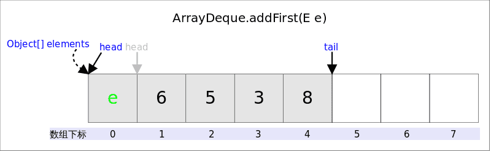

**执行流程：**
1. **空值检查**：确保不放入 null
2. **计算新位置**：`(head - 1) & (length - 1)`
3. **赋值**：在计算出的位置放入元素
4. **扩容检查**：如果头尾相遇，说明数组已满

- addLast(E e)
```java
public void addLast(E e) {
    if (e == null)
        throw new NullPointerException();
    
    elements[tail] = e;  // 直接在当前tail位置插入
    
    // 移动tail并检查越界和扩容
    if ((tail = (tail + 1) & (elements.length - 1)) == head)
        doubleCapacity();
}
```

- pollFirst()
```java
public E pollFirst() {
    int h = head;
    E result = elements[h];
    
    if (result == null)  // 队列为空
        return null;
    
    elements[h] = null;    // 帮助GC
    head = (h + 1) & (elements.length - 1);  // 移动head
    return result;
}
```

- pollLast()
```java
public E pollLast() {
    // 计算最后一个元素的实际位置
    int t = (tail - 1) & (elements.length - 1);
    E result = elements[t];
    
    if (result == null)
        return null;
    
    elements[t] = null;  // 帮助GC
    tail = t;           // 直接设置tail
    return result;
}
```
- peekFirst()

peekFirst()的作用是返回但不删除Deque首端元素，也即是head位置处的元素，直接返回elements[head]即可。
```java
public E peekFirst() {
    return elements[head]; // elements[head] is null if deque empty
}
```
- peekLast()

peekLast()的作用是返回但不删除Deque尾端元素，也即是tail位置前面的那个元素。
```java
public E peekLast() {
    return elements[(tail - 1) & (elements.length - 1)];
}
```
##### 6.5.3.2 循环数组与位运算的巧妙结合

```java
// 关键代码
head = (head - 1) & (elements.length - 1)
```

**核心前提：数组长度必须是 2 的幂次方,，因为只有2的幂次减1的二进制才是全1，这样按位与运算才能起到取模的作用。所以，ArrayDeque在初始化时会确保数组长度是2的幂次。**

- 如果 `elements.length = 16`，那么 `elements.length - 1 = 15`
- 15 的二进制表示：`0000 1111`（低位全 1）

- 具体案例分析

  - 情况1：head 为正数时
  ```java
  // 假设 head = 5, elements.length = 16
  head = (5 - 1) & (16 - 1) 
       = 4 & 15
       = 4  // 正常递减

  // 二进制计算：
  //   4: 0000 0100
  //  15: 0000 1111
  //  & : 0000 0100 = 4
  ```

- 情况2：head 为 0 时（关键！）
    ```java
    // head = 0, elements.length = 16
    head = (0 - 1) & (16 - 1)
        = (-1) & 15
        = 15  // 从数组末尾重新开始！

    // 二进制计算（使用补码）：
    //   -1 的补码: 1111 1111 1111 1111 1111 1111 1111 1111 (32位)
    //   15:       0000 0000 0000 0000 0000 0000 0000 1111
    //   & :       0000 0000 0000 0000 0000 0000 0000 1111 = 15
    ```

- 为什么这样设计？

**传统方法的局限性：**
```java
// 传统取模方法（不适用于负数）
head = (head - 1) % elements.length;
// 当 head=0 时：(-1) % 16 = -1 ❌ 还是越界

// 需要额外判断
if (head - 1 < 0) {
    head = elements.length - 1;
} else {
    head = head - 1;
}
```

**位运算方法的优势：**
- ✅ **一行代码解决所有情况**
- ✅ **高性能**（位运算比条件判断快）
- ✅ **自动处理负数**（利用补码特性）
- ✅ **形成完美的循环**

- 扩容机制详解

```java
private void doubleCapacity() {
    assert head == tail;  // 只有在满的时候才扩容
    
    int p = head;
    int n = elements.length;
    int r = n - p;  // head右边的元素个数
    
    int newCapacity = n << 1;  // 双倍容量
    if (newCapacity < 0)
        throw new IllegalStateException("Sorry, deque too big");
    
    Object[] a = new Object[newCapacity];
    
    // 分两次拷贝：先拷贝右边，再拷贝左边
    System.arraycopy(elements, p, a, 0, r);      // 绿色部分
    System.arraycopy(elements, 0, a, r, p);      // 灰色部分
    
    elements = (E[])a;
    head = 0;
    tail = n;  // tail指向原数组长度的位置
}
```

**扩容图示：**


-设计思想的启示

    这种下标处理方式体现了几个重要的设计思想：

    1. **数学之美**：利用二进制和模运算的特性
    2. **性能优先**：用位运算替代条件判断
    3. **约束创造简洁**：通过限制数组长度为2的幂次方，简化了复杂问题
    4. **循环利用**：完美实现循环数组，避免数据搬迁

    **为什么我们想不到？**
    - 需要深入理解二进制和补码表示
    - 需要跳出传统的"if-else"思维模式
    - 需要对性能优化有极致追求
    - 需要对数据结构有深刻理解

`但值得注意的是，在JDK11时就取消了上面的写法`
```java
// JDK 11
public void addFirst(E e) {
    if (e == null) throw new NullPointerException();
    final Object[] es = elements;
    es[head = dec(head, es.length)] = e;  // 使用dec方法
    if (head == tail) grow(1);
}

// 旧版本  
public void addFirst(E e) {
    if (e == null) throw new NullPointerException();
    elements[head = (head - 1) & (elements.length - 1)] = e;  // 直接位运算
    if (head == tail) doubleCapacity();
}
```
其中：
```java
// 使用辅助方法，代码更清晰
static final int inc(int i, int modulus) {
    if (++i >= modulus) i = 0;
    return i;
}

static final int dec(int i, int modulus) {
    if (--i < 0) i = modulus - 1;
    return i;
}

static final int sub(int i, int j, int modulus) {
    if ((i -= j) < 0) i += modulus;
    return i;
}
```
从上面可以发现JDK11之后取消了JDK8的位运算：elements[head = (head - 1) & (elements.length - 1)] = e。这使得代码看起来更加直接了。方法名明确表达意图。维护性：循环逻辑集中在一处。灵活性：不再强制要求数组长度为2的幂
### 6.6 PriorityQueue源码解析
#### 6.6.1 概述
PriorityQueue，即优先队列。优先队列的作用是能保证每次取出的元素都是队列中权值最小的(Java的优先队列每次取最小元素，C++的优先队列每次取最大元素)。这里牵涉到了大小关系，元素大小的评判可以通过元素本身的自然顺序(natural ordering)，也可以通过构造时传入的比较器(Comparator，类似于C++的仿函数)。

Java中PriorityQueue实现了Queue接口，不允许放入null元素；其通过堆实现，具体说是通过完全二叉树(complete binary tree)实现的小顶堆(任意一个非叶子节点的权值，都不大于其左右子节点的权值)，也就意味着可以通过数组来作为PriorityQueue的底层实现。


上图中我们给每个元素按照层序遍历的方式进行了编号，如果你足够细心，会发现父节点和子节点的编号是有联系的，更确切的说父子节点的编号之间有如下关系:

leftNo = parentNo*2+1

rightNo = parentNo*2+2

parentNo = (nodeNo-1)/2

通过上述三个公式，可以轻易计算出某个节点的父节点以及子节点的下标。这也就是为什么可以直接用数组来存储堆的原因。PriorityQueue的peek()和element操作是常数时间，add(), offer(), 无参数的remove()以及poll()方法的时间复杂度都是log(N)。
#### 6.6.2 方法剖析

- add()和offer()

add(E e)和offer(E e)的语义相同，都是向优先队列中插入元素，只是Queue接口规定二者对插入失败时的处理不同，前者在插入失败时抛出异常，后则则会返回false。对于PriorityQueue这两个方法其实没什么差别。


新加入的元素可能会破坏小顶堆的性质，因此需要进行必要的调整。
```java
//offer(E e)
public boolean offer(E e) {
    if (e == null)//不允许放入null元素
        throw new NullPointerException();
    modCount++;
    int i = size;
    if (i >= queue.length)
        grow(i + 1);//自动扩容
    size = i + 1;
    if (i == 0)//队列原来为空，这是插入的第一个元素
        queue[0] = e;
    else
        siftUp(i, e);//调整
    return true;
}
```
上述代码中，扩容函数grow()类似于ArrayList里的grow()函数，就是再申请一个更大的数组，并将原数组的元素复制过去，这里不再赘述。需要注意的是siftUp(int k, E x)方法，该方法用于插入元素x并维持堆的特性。
```java
//siftUp()
private void siftUp(int k, E x) {
    while (k > 0) {
        int parent = (k - 1) >>> 1;//parentNo = (nodeNo-1)/2
        Object e = queue[parent];
        if (comparator.compare(x, (E) e) >= 0)//调用比较器的比较方法
            break;
        queue[k] = e;
        k = parent;
    }
    queue[k] = x;
}
```
新加入的元素x可能会破坏小顶堆的性质，因此需要进行调整。调整的过程为:**从k指定的位置开始，将x逐层与当前点的parent进行比较并交换，直到满足x >= queue[parent]为止**。注意这里的比较可以是元素的自然顺序，也可以是依靠比较器的顺序。

- element()和peek()

element()和peek()的语义完全相同，都是获取但不删除队首元素，也就是队列中权值最小的那个元素，二者唯一的区别是当方法失败时前者抛出异常，后者返回null。根据小顶堆的性质，堆顶那个元素就是全局最小的那个；由于堆用数组表示，根据下标关系，0下标处的那个元素既是堆顶元素。所以直接返回数组0下标处的那个元素即可。
```java
//peek()
public E peek() {
    if (size == 0)
        return null;
    return (E) queue[0];//0下标处的那个元素就是最小的那个
}
```

- remove()和poll()

remove()和poll()方法的语义也完全相同，都是获取并删除队首元素，区别是当方法失败时前者抛出异常，后者返回null。由于删除操作会改变队列的结构，为维护小顶堆的性质，需要进行必要的调整。


```java
public E poll() {
    if (size == 0)
        return null;
    int s = --size;
    modCount++;
    E result = (E) queue[0];//0下标处的那个元素就是最小的那个
    E x = (E) queue[s];
    queue[s] = null;
    if (s != 0)
        siftDown(0, x);//调整
    return result;
}
```
上述代码首先记录0下标处的元素，并用最后一个元素替换0下标位置的元素，之后调用siftDown()方法对堆进行调整，最后返回原来0下标处的那个元素(也就是最小的那个元素)。重点是siftDown(int k, E x)方法，该方法的作用是从k指定的位置开始，将x逐层向下与当前点的左右孩子中较小的那个交换，直到x小于或等于左右孩子中的任何一个为止。
```java
//siftDown()
private void siftDown(int k, E x) {
    int half = size >>> 1;
    while (k < half) {
    	//首先找到左右孩子中较小的那个，记录到c里，并用child记录其下标
        int child = (k << 1) + 1;//leftNo = parentNo*2+1
        Object c = queue[child];
        int right = child + 1;
        if (right < size &&
            comparator.compare((E) c, (E) queue[right]) > 0)
            c = queue[child = right];
        if (comparator.compare(x, (E) c) <= 0)
            break;
        queue[k] = c;//然后用c取代原来的值
        k = child;
    }
    queue[k] = x;
}
```
- remove(Object o)
remove(Object o)方法用于删除队列中跟o相等的某一个元素(如果有多个相等，只删除一个)，该方法不是Queue接口内的方法，而是Collection接口的方法。由于删除操作会改变队列结构，所以要进行调整；又由于删除元素的位置可能是任意的，所以调整过程比其它函数稍加繁琐。具体来说，remove(Object o)可以分为2种情况: 1. 删除的是最后一个元素。直接删除即可，不需要调整。2. 删除的不是最后一个元素，从删除点开始以最后一个元素为参照调用一次siftDown()即可。此处不再赘述。


```java
//remove(Object o)
public boolean remove(Object o) {
	//通过遍历数组的方式找到第一个满足o.equals(queue[i])元素的下标
    int i = indexOf(o);
    if (i == -1)
        return false;
    int s = --size;
    if (s == i) //情况1
        queue[i] = null;
    else {
        E moved = (E) queue[s];
        queue[s] = null;
        siftDown(i, moved);//情况2
        ......
    }
    return true;
}
```

### 6.7 HashSet & HashMap 源码解析
之所以把HashSet和HashMap放在一起讲解，是因为二者在Java里有着相同的实现，前者仅仅是对后者做了一层包装，也就是说HashSet里面有一个HashMap(适配器模式)。因此本文将重点分析HashMap。
#### 6.7.1 Java7 HashMap
##### 6.7.1.1 概述
HashMap实现了Map接口，即允许放入key为null的元素，也允许插入value为null的元素；除该类未实现同步外，其余跟Hashtable大致相同；跟TreeMap不同，该容器不保证元素顺序，**根据需要该容器可能会对元素重新哈希，元素的顺序也会被重新打散，因此不同时间迭代同一个HashMap的顺序可能会不同**。 根据对冲突的处理方式不同，哈希表有两种实现方式，一种开放地址方式(Open addressing)，另一种是冲突链表方式(Separate chaining with linked lists)。Java7 HashMap采用的是冲突链表方式。
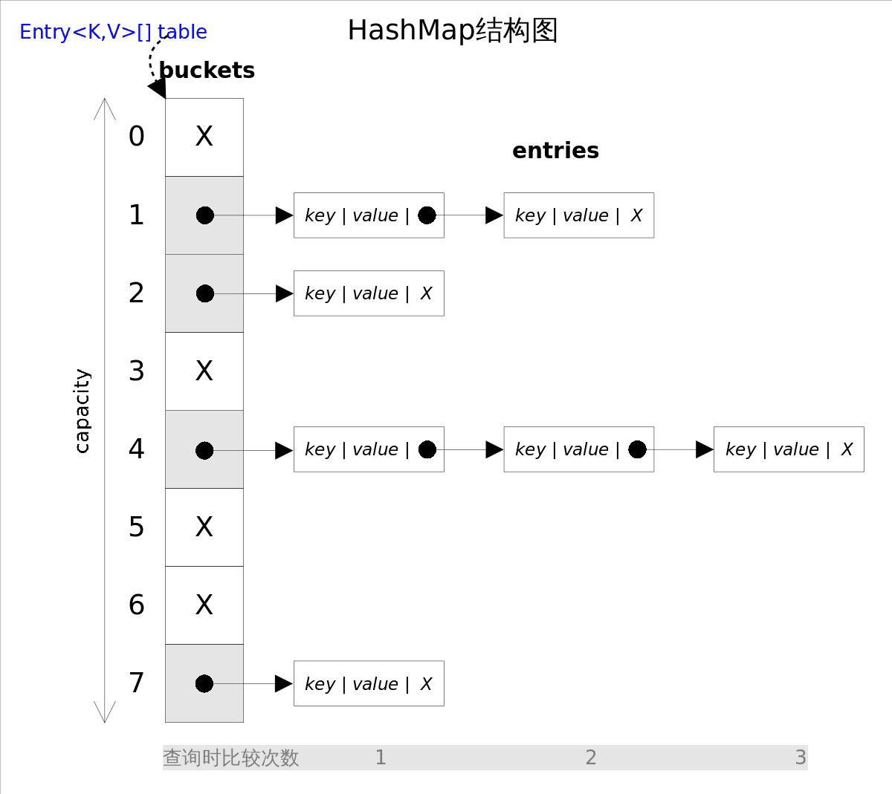

从上图容易看出，如果选择合适的哈希函数，put()和get()方法可以在常数时间内完成。但在对HashMap进行迭代时，需要遍历整个table以及后面跟的冲突链表。因此对于迭代比较频繁的场景，不宜将HashMap的初始大小设的过大。

有两个参数可以影响HashMap的性能: 初始容量(inital capacity)和负载系数(load factor)。初始容量指定了初始table的大小，负载系数用来指定自动扩容的临界值。当entry的数量超过capacity*load_factor时，容器将自动扩容并重新哈希。对于插入元素较多的场景，将初始容量设大可以减少重新哈希的次数。

将对象放入到HashMap或HashSet中时，有两个方法需要特别关心: hashCode()和equals()。hashCode()方法决定了对象会被放到哪个bucket里，当多个对象的哈希值冲突时，equals()方法决定了这些对象是否是“同一个对象”。所以，如果要将自定义的对象放入到HashMap或HashSet中，需要**@Override** hashCode()和equals()方法。
- 特性
  - 头插法：
  新节点插入链表头部（时间复杂度 O(1)），但并发环境下可能导致死循环【链表成环】（Java 8 改为尾插法）。
  - 无锁化设计：
  非线程安全，多线程操作需外部同步（如 Collections.synchronizedMap）。
  - 性能问题：
  链表过长时查找效率退化至 O(n)（Java 8 引入红黑树优化）。

- <a id = "hashMap的get()方法" >get()</a>

get(Object key)方法根据指定的key值返回对应的value，该方法调用了getEntry(Object key)得到相应的entry，然后返回entry.getValue()。因此getEntry()是算法的核心。 算法思想是首先通过hash()函数得到对应bucket的下标，然后依次遍历冲突链表，通过key.equals(k)方法来判断是否是要找的那个entry。


上图中hash(k)&(table.length-1)等价于hash(k)%table.length，原因是HashMap要求table.length必须是2的指数，因此table.length-1就是二进制低位全是1，跟hash(k)相与会将哈希值的高位全抹掉，剩下的就是余数了。
```java
//getEntry()方法
final Entry<K,V> getEntry(Object key) {
	......
	int hash = (key == null) ? 0 : hash(key);
    for (Entry<K,V> e = table[hash&(table.length-1)];//得到冲突链表
         e != null; e = e.next) {//依次遍历冲突链表中的每个entry
        Object k;
        //依据equals()方法判断是否相等
        if (e.hash == hash &&
            ((k = e.key) == key || (key != null && key.equals(k))))
            return e;
    }
    return null;
}
```
- put()

put(K key, V value)方法是将指定的key, value对添加到map里。该方法首先会对map做一次查找，看是否包含该元组，如果已经包含则直接返回，查找过程类似于getEntry()方法；如果没有找到，则会通过addEntry(int hash, K key, V value, int bucketIndex)方法插入新的entry，插入方式为头插法。

```java
//addEntry()
void addEntry(int hash, K key, V value, int bucketIndex) {
    if ((size >= threshold) && (null != table[bucketIndex])) {
        resize(2 * table.length);//自动扩容，并重新哈希
        hash = (null != key) ? hash(key) : 0;
        bucketIndex = hash & (table.length-1);//hash%table.length
    }
    //在冲突链表头部插入新的entry
    Entry<K,V> e = table[bucketIndex];
    table[bucketIndex] = new Entry<>(hash, key, value, e);
    size++;
}
```
---
Java 7 中 `HashMap` 使用**头插法**导致链表成环的问题，是并发编程中的经典 BUG。以下是详细的原理分析：
- **问题根源：并发扩容 + 头插法**
当多个线程同时触发 `HashMap` 扩容时（调用 `resize()` 方法），在数据迁移过程中，头插法会导致链表节点引用关系混乱(不同线程在扩容的时候采用头插法插入，头插法扩容后会将原来的链表倒序)。以下是分步拆解：

---
  -  **1. 初始状态**
  假设一个槽位的链表结构为：  
  `A → B → null`  
  （A 是头节点，B 是尾节点）

  - **2. 线程 1 开始扩容（被中断）**
  线程 1 遍历链表，准备迁移节点：  
  ```java
  // 伪代码：transfer() 方法关键片段
  Entry<K,V> next = e.next; // 记录下一个节点（e当前指向A，next=B）
  e.next = newTable[i];    // 将A插入新数组（头插法）
  newTable[i] = e;         // 新槽位指向A
  e = next;                // e移动到B（准备处理B）
  ```

 此时线程 1 被挂起，状态：  
    - 新数组槽位：`A → null`  
    - 旧链表状态：`A → B → null`（未修改）  
    - 线程 1 的 `e` 指向 **B**，`next` 指向 **null**

  -  **3. 线程 2 完成扩容**

  线程 2 完整执行扩容：  
  1. 迁移 A：新槽位 `A → null`  
  2. 迁移 B：头插法插入 A 前方 → `B → A → null`  
  3. **修改了 B 的指针**：`B.next = A`（原本是 `B.next = null`）

  最终新链表：`B → A → null`

  -  **4. 线程 1 恢复执行**

  线程 1 继续迁移节点 B：  
     - `e = B`（之前挂起时的状态）  
     - `next = null`（记录的下一个节点）  
     - 执行头插法：  
       ```java
       e.next = newTable[i]; // B.next = 当前新槽位头节点 → B.next = A
       newTable[i] = e;      // 新槽位头节点指向B
       ```
     结果：  
     - 新链表变为 `B → A`  
     - **但 A 的 next 仍指向 B**（线程 2 设置的 `A.next = B`）  

  最终链表成环：  
  ``` 
  B → A → B → A → ...（无限循环）
  ```

  ---

-  **为何造成死循环？**
当后续有线程调用 `get()` 方法查询该槽位的元素时：  
1. 遍历链表查找匹配的 `key`  
2. 由于链表成环，遍历永远无法结束（`while(e != null)` 条件永不满足）  
3. **CPU 占用率飙升至 100%**（死循环）

---

-  **Java 8 的解决方案：尾插法**
Java 8 将头插法改为**尾插法**（新节点插入链表尾部）：  
```java
// Java 8 的链表迁移
Node<K,V> loHead = null, loTail = null; // 低位链表头尾指针
// 遍历旧链表...
if (loTail == null)
    loHead = e;
else
    loTail.next = e; // 尾插法：新节点接在尾部
loTail = e;
```
**优势**：  
1. 链表顺序不变（A→B 迁移后仍是 A→B）  
2. 即使多线程并发，最坏情况是节点丢失（不会成环）  
3. 引入红黑树：链表过长时转树，进一步避免遍历长链表

---

-  **总结**

| **问题根源**         | **后果**          | **解决方案**         |
|----------------------|-------------------|---------------------|
| 头插法 + 并发扩容     | 链表成环 → 死循环 | Java 8 改用尾插法   |
| 未同步的共享状态     | 数据损坏          | 使用 `ConcurrentHashMap` |
| 链表过长             | 查询效率 O(n)     | 链表转红黑树（Java 8）|

> **最佳实践**：  
> - 多线程环境务必使用 `ConcurrentHashMap`  
> - 避免在迭代过程中修改 `HashMap`  
> - Java 8+ 的 `HashMap` 已修复此问题（但仍是线程不安全的）

- remove()

remove(Object key)的作用是删除key值对应的entry，该方法的具体逻辑是在removeEntryForKey(Object key)里实现的。removeEntryForKey()方法会首先找到key值对应的entry，然后删除该entry(修改链表的相应引用)。查找过程跟getEntry()过程类似。

```java
//removeEntryForKey()
final Entry<K,V> removeEntryForKey(Object key) {
	......
	int hash = (key == null) ? 0 : hash(key);
    int i = indexFor(hash, table.length);//hash&(table.length-1)
    Entry<K,V> prev = table[i];//得到冲突链表
    Entry<K,V> e = prev;
    while (e != null) {//遍历冲突链表
        Entry<K,V> next = e.next;
        Object k;
        if (e.hash == hash &&
            ((k = e.key) == key || (key != null && key.equals(k)))) {//找到要删除的entry
            modCount++; size--;
            if (prev == e) table[i] = next;//删除的是冲突链表的第一个entry
            else prev.next = next;
            return e;
        }
        prev = e; e = next;
    }
    return e;
}
```
#### 6.7.2 Java8 HashMap

Java8 对 HashMap 进行了一些修改，最大的不同就是利用了红黑树，所以其由**数组+链表+红黑树**组成。

根据 Java7 HashMap 的介绍，我们知道，查找的时候，根据 hash 值我们能够快速定位到数组的具体下标，但是之后的话，需要顺着链表一个个比较下去才能找到我们需要的，时间复杂度取决于链表的长度，为 O(n)。

为了降低这部分的开销，在 Java8 中，当链表中的元素达到了 8 个时，会将链表转换为红黑树，在这些位置进行查找的时候可以降低时间复杂度为 O(logN)。


Java7 中使用 Entry 来代表每个 HashMap 中的数据节点，Java8 中使用 Node，基本没有区别，都是 key，value，hash 和 next 这四个属性，不过，Node 只能用于链表的情况，红黑树的情况需要使用 TreeNode。

我们根据数组元素中，第一个节点数据类型是 Node 还是 TreeNode 来判断该位置下是链表还是红黑树的。

- put 过程分析

```java
public V put(K key, V value) {
    return putVal(hash(key), key, value, false, true);
}

// 第四个参数 onlyIfAbsent 如果是 true，那么只有在不存在该 key 时才会进行 put 操作
// 第五个参数 evict 我们这里不关心
final V putVal(int hash, K key, V value, boolean onlyIfAbsent,
               boolean evict) {
    Node<K,V>[] tab; Node<K,V> p; int n, i;
    // 第一次 put 值的时候，会触发下面的 resize()，类似 java7 的第一次 put 也要初始化数组长度
    // 第一次 resize 和后续的扩容有些不一样，因为这次是数组从 null 初始化到默认的 16 或自定义的初始容量
    if ((tab = table) == null || (n = tab.length) == 0)
        n = (tab = resize()).length;
    // 找到具体的数组下标，如果此位置没有值，那么直接初始化一下 Node 并放置在这个位置就可以了
    if ((p = tab[i = (n - 1) & hash]) == null)
        tab[i] = newNode(hash, key, value, null);

    else {// 数组该位置有数据
        Node<K,V> e; K k;
        // 首先，判断该位置的第一个数据和我们要插入的数据，key 是不是"相等"，如果是，取出这个节点
        if (p.hash == hash &&
            ((k = p.key) == key || (key != null && key.equals(k))))
            e = p;
        // 如果该节点是代表红黑树的节点，调用红黑树的插值方法
        else if (p instanceof TreeNode)
            e = ((TreeNode<K,V>)p).putTreeVal(this, tab, hash, key, value);
        else {
            // 到这里，说明数组该位置上是一个链表
            for (int binCount = 0; ; ++binCount) {
                // 插入到链表的最后面(Java7 是插入到链表的最前面)
                if ((e = p.next) == null) {
                    p.next = newNode(hash, key, value, null);
                    // TREEIFY_THRESHOLD 为 8，所以，如果新插入的值是链表中的第 8 个
                    // 会触发下面的 treeifyBin，也就是将链表转换为红黑树
                    if (binCount >= TREEIFY_THRESHOLD - 1) // -1 for 1st
                        treeifyBin(tab, hash);
                    break;
                }
                // 如果在该链表中找到了"相等"的 key(== 或 equals)
                if (e.hash == hash &&
                    ((k = e.key) == key || (key != null && key.equals(k))))
                    // 此时 break，那么 e 为链表中[与要插入的新值的 key "相等"]的 node
                    break;
                p = e;
            }
        }
        // e!=null 说明存在旧值的key与要插入的key"相等"
        // 对于我们分析的put操作，下面这个 if 其实就是进行 "值覆盖"，然后返回旧值
        if (e != null) {
            V oldValue = e.value;
            if (!onlyIfAbsent || oldValue == null)
                e.value = value;
            afterNodeAccess(e);
            return oldValue;
        }
    }
    ++modCount;
    // 如果 HashMap 由于新插入这个值导致 size 已经超过了阈值，需要进行扩容
    if (++size > threshold)
        resize();
    afterNodeInsertion(evict);
    return null;
}
```
下面是后黑叔的插入方法(putTreeVal):

红黑树是一种自平衡的二叉查找树，通过特定规则保持树的平衡性，确保查找、插入、删除操作的时间复杂度稳定在 O(log n)。核心特性：(https://blog.csdn.net/weixin_72359141/article/details/148715964)

- 节点颜色：每个节点非红即黑
- 根节点：总是黑色
- 叶子节点（NIL）：视为黑色
- 红色限制：红色节点的子节点必须是黑色
- 黑高一致：从任一节点到其所有叶子节点的路径包含相同数量的黑色节点


在 Java HashMap 中，当链表长度 ≥8 时转换为红黑树，解决哈希冲突导致的性能退化问题。

```java
 final TreeNode<K,V> putTreeVal(HashMap<K,V> map, Node<K,V>[] tab,
                                       int h, K k, V v) {
            Class<?> kc = null;
            boolean searched = false;
            TreeNode<K,V> root = (parent != null) ? root() : this;
            for (TreeNode<K,V> p = root;;) {
                int dir, ph; K pk;
                if ((ph = p.hash) > h)
                    dir = -1;
                else if (ph < h)
                    dir = 1;
                else if ((pk = p.key) == k || (k != null && k.equals(pk)))
                    return p;
                else if ((kc == null &&
                          (kc = comparableClassFor(k)) == null) ||
                         (dir = compareComparables(kc, k, pk)) == 0) {
                    if (!searched) {
                        TreeNode<K,V> q, ch;
                        searched = true;
                        if (((ch = p.left) != null &&
                             (q = ch.find(h, k, kc)) != null) ||
                            ((ch = p.right) != null &&
                             (q = ch.find(h, k, kc)) != null))
                            return q;
                    }
                    dir = tieBreakOrder(k, pk);
                }

                TreeNode<K,V> xp = p;
                if ((p = (dir <= 0) ? p.left : p.right) == null) {
                    Node<K,V> xpn = xp.next;
                    TreeNode<K,V> x = map.newTreeNode(h, k, v, xpn);
                    if (dir <= 0)
                        xp.left = x;
                    else
                        xp.right = x;
                    xp.next = x;
                    x.parent = x.prev = xp;
                    if (xpn != null)
                        ((TreeNode<K,V>)xpn).prev = x;
                    moveRootToFront(tab, balanceInsertion(root, x));
                    return null;
                }
            }
        }
```
在 Java HashMap 中，当链表长度 ≥8 时转换为红黑树，解决哈希冲突导致的性能退化问题。

---

-  源码解析：`putTreeVal()`

这是向红黑树插入节点的核心方法。我将逐段解释关键逻辑：
 1. **初始化与根节点定位**
```java
TreeNode<K,V> root = (parent != null) ? root() : this;
```
- 如果当前节点有父节点，调用 `root()` 找到根节点；否则自身就是根节点

---

 2. **遍历树定位插入位置**
```java
for (TreeNode<K,V> p = root;;) {
    int dir, ph; K pk;
    if ((ph = p.hash) > h)       // 当前节点hash较大 → 向左子树走
        dir = -1;
    else if (ph < h)              // 当前节点hash较小 → 向右子树走
        dir = 1;
    else if ((pk = p.key) == k || (k != null && k.equals(pk)))
        return p;                 // 找到相同key，直接返回现有节点（不插入）
```
- 通过比较 `hash` 和 `key` 决定遍历方向
- `dir = -1` 向左，`dir = 1` 向右

---

 3. **处理哈希冲突的特殊逻辑**
```java
else if ((kc == null && (kc = comparableClassFor(k)) == null) || 
         (dir = compareComparables(kc, k, pk)) == 0) {
    
    if (!searched) {  // 首次进入此分支，全树搜索相同key
        TreeNode<K,V> q, ch;
        searched = true;
        if (((ch = p.left) != null && (q = ch.find(h, k, kc)) != null) ||
            ((ch = p.right) != null && (q = ch.find(h, k, kc)) != null))
            return q;  // 在子树中找到相同key
    }
    dir = tieBreakOrder(k, pk); // 终极比较：用内存地址决定方向
}
```
- 当哈希值相同但 `key` 不同时：
  1. 先尝试用 `Comparable` 接口比较
  2. 若不可比，则递归搜索左右子树
  3. 最后用 `tieBreakOrder()`（比较 `System.identityHashCode`）决定方向

---

 4. **创建新节点并插入**
```java
TreeNode<K,V> xp = p;
if ((p = (dir <= 0) ? p.left : p.right) == null) {
    Node<K,V> xpn = xp.next;
    TreeNode<K,V> x = map.newTreeNode(h, k, v, xpn); // 创建新节点
    
    // 挂载到父节点
    if (dir <= 0) xp.left = x;
    else xp.right = x;
    
    // 维护双向链表结构（红黑树节点仍保留链表指针）
    xp.next = x;
    x.parent = x.prev = xp;
    if (xpn != null) 
        ((TreeNode<K,V>)xpn).prev = x;
    
    // 平衡树结构并确保根节点在桶首位
    moveRootToFront(tab, balanceInsertion(root, x));
    return null; // 插入成功
}
```
- **创建节点**：`newTreeNode` 包装键值对
- **树插入**：根据 `dir` 挂到左/右子树
- **链表维护**：
  - `xp.next = x` → 新节点插入链表
  - `x.prev = xp` → 建立反向指针
- **平衡操作**：
  - `balanceInsertion()`：红黑树的旋转与变色（保持平衡）
  - `moveRootToFront()`：确保树的根节点位于哈希桶首位

---

-  关键设计亮点

    1. **双结构共存**  
    红黑树节点 (`TreeNode`) 同时维护：
    - 树结构 (`left/right/parent`)
    - 链表结构 (`next/prev`)  
    *方便树和链表之间的转换*

    2. **平衡保障**  
    `balanceInsertion()` 通过旋转和变色维持红黑树特性，确保操作效率

    3. **查找优化**  
    优先比较哈希值，再比较键，最后递归搜索子树，最大限度减少比较次数

> **为何需要红黑树？**  
> 当哈希冲突严重时，链表查询会退化为 `O(n)`。红黑树将查询复杂度锁定在 `O(log n)`，显著提升大数据量下的性能。
和 Java7 稍微有点不一样的地方就是，Java7 是先扩容后插入新值的，Java8 先插值再扩容，不过这个不重要。

- 数组扩容

resize() 方法用于初始化数组或数组扩容，每次扩容后，容量为原来的 2 倍，并进行数据迁移。
```java
final Node<K,V>[] resize() {
    Node<K,V>[] oldTab = table;
    int oldCap = (oldTab == null) ? 0 : oldTab.length;
    int oldThr = threshold;
    int newCap, newThr = 0;
    if (oldCap > 0) { // 对应数组扩容
        if (oldCap >= MAXIMUM_CAPACITY) {
            threshold = Integer.MAX_VALUE;
            return oldTab;
        }
        // 将数组大小扩大一倍
        else if ((newCap = oldCap << 1) < MAXIMUM_CAPACITY &&
                 oldCap >= DEFAULT_INITIAL_CAPACITY)
            // 将阈值扩大一倍
            newThr = oldThr << 1; // double threshold
    }
    else if (oldThr > 0) // 对应使用 new HashMap(int initialCapacity) 初始化后，第一次 put 的时候
        newCap = oldThr;
    else {// 对应使用 new HashMap() 初始化后，第一次 put 的时候
        newCap = DEFAULT_INITIAL_CAPACITY;
        newThr = (int)(DEFAULT_LOAD_FACTOR * DEFAULT_INITIAL_CAPACITY);
    }

    if (newThr == 0) {
        float ft = (float)newCap * loadFactor;
        newThr = (newCap < MAXIMUM_CAPACITY && ft < (float)MAXIMUM_CAPACITY ?
                  (int)ft : Integer.MAX_VALUE);
    }
    threshold = newThr;

    // 用新的数组大小初始化新的数组
    Node<K,V>[] newTab = (Node<K,V>[])new Node[newCap];
    table = newTab; // 如果是初始化数组，到这里就结束了，返回 newTab 即可

    if (oldTab != null) {
        // 开始遍历原数组，进行数据迁移。
        for (int j = 0; j < oldCap; ++j) {
            Node<K,V> e;
            if ((e = oldTab[j]) != null) {
                oldTab[j] = null;
                // 如果该数组位置上只有单个元素，那就简单了，简单迁移这个元素就可以了
                if (e.next == null)
                    newTab[e.hash & (newCap - 1)] = e;
                // 如果是红黑树，具体我们就不展开了
                else if (e instanceof TreeNode)
                    ((TreeNode<K,V>)e).split(this, newTab, j, oldCap);
                else { 
                    // 这块是处理链表的情况，
                    // 需要将此链表拆成两个链表，放到新的数组中，并且保留原来的先后顺序
                    // loHead、loTail 对应一条链表，hiHead、hiTail 对应另一条链表，代码还是比较简单的
                    Node<K,V> loHead = null, loTail = null;
                    Node<K,V> hiHead = null, hiTail = null;
                    Node<K,V> next;
                    do {
                        next = e.next;
                        if ((e.hash & oldCap) == 0) {
                            if (loTail == null)
                                loHead = e;
                            else
                                loTail.next = e;
                            loTail = e;
                        }
                        else {
                            if (hiTail == null)
                                hiHead = e;
                            else
                                hiTail.next = e;
                            hiTail = e;
                        }
                    } while ((e = next) != null);
                    if (loTail != null) {
                        loTail.next = null;
                        // 第一条链表
                        newTab[j] = loHead;
                    }
                    if (hiTail != null) {
                        hiTail.next = null;
                        // 第二条链表的新的位置是 j + oldCap，这个很好理解
                        newTab[j + oldCap] = hiHead;
                    }
                }
            }
        }
    }
    return newTab;
}
```
- get()

get 过程分析相对于 put 来说，get 真的太简单了。计算 key 的 hash 值，根据 hash 值找到对应数组下标: hash & (length-1)判断数组该位置处的元素是否刚好就是我们要找的，如果不是，走第三步判断该元素类型是否是 TreeNode，如果是，用红黑树的方法取数据，如果不是，走第四步遍历链表，直到找到相等(==或equals)的 key
```java
public V get(Object key) {
    Node<K,V> e;
    return (e = getNode(hash(key), key)) == null ? null : e.value;
}
final Node<K,V> getNode(int hash, Object key) {
    Node<K,V>[] tab; Node<K,V> first, e; int n; K k;
    if ((tab = table) != null && (n = tab.length) > 0 &&
        (first = tab[(n - 1) & hash]) != null) {
        // 判断第一个节点是不是就是需要的
        if (first.hash == hash && // always check first node
            ((k = first.key) == key || (key != null && key.equals(k))))
            return first;
        if ((e = first.next) != null) {
            // 判断是否是红黑树
            if (first instanceof TreeNode)
                return ((TreeNode<K,V>)first).getTreeNode(hash, key);

            // 链表遍历
            do {
                if (e.hash == hash &&
                    ((k = e.key) == key || (key != null && key.equals(k))))
                    return e;
            } while ((e = e.next) != null);
        }
    }
    return null;
}
```
##### 6.7.3 HashSet


前面已经说过HashSet是对HashMap的简单包装，对HashSet的函数调用都会转换成合适的HashMap方法，因此HashSet的实现非常简单，只有不到300行代码。这里不再赘述。
```java
//HashSet是对HashMap的简单包装
public class HashSet<E>
{
	......
	private transient HashMap<E,Object> map;//HashSet里面有一个HashMap
    // Dummy value to associate with an Object in the backing Map
    private static final Object PRESENT = new Object();
    public HashSet() {
        map = new HashMap<>();
    }
    ......
    public boolean add(E e) {//简单的方法转换
        return map.put(e, PRESENT)==null;
    }
    ......
}
```

### 6.8 TreeSet & TreeMap 源码解析

之所以把TreeSet和TreeMap放在一起讲解，是因为二者在Java里有着相同的实现，前者仅仅是对后者做了一层包装，也就是说TreeSet里面有一个**TreeMap(适配器模式)**。因此本文将重点分析TreeMap。

Java TreeMap实现了SortedMap接口，也就是说会按照key的大小顺序对Map中的元素进行排序，key大小的评判可以通过其本身的自然顺序(natural ordering)，也可以通过构造时传入的比较器(Comparator)。TreeMap底层通过红黑树(Red-Black tree)实现，也就意味着containsKey(), get(), put(), remove()都有着log(n)的时间复杂度。


出于性能原因，TreeMap是非同步的(not synchronized)，如果需要在多线程环境使用，需要程序员手动同步；或者通过如下方式将TreeMap包装成(wrapped)同步的:
```java
SortedMap m = Collections.synchronizedSortedMap(new TreeMap(...));
```
#### 6.8.1 预备知识
前文说到当查找树的结构发生改变时，红黑树的约束条件可能被破坏，需要通过调整使得查找树重新满足红黑树的约束条件。调整可以分为两类: 一类是颜色调整，即改变某个节点的颜色；另一类是结构调整，即改变检索树的结构关系。结构调整过程包含两个基本操作** : 左旋(Rotate Left)，右旋(RotateRight)**。

- 左旋

左旋的过程是将x的右子树绕x逆时针旋转，使得x的右子树成为x的父亲，同时修改相关节点的引用。旋转之后，二叉查找树的属性仍然满足。TreeMap中左旋代码如下:
```java
//Rotate Left
private void rotateLeft(Entry<K,V> p) {
    if (p != null) {
        Entry<K,V> r = p.right;
        p.right = r.left;
        if (r.left != null)
            r.left.parent = p;
        r.parent = p.parent;
        if (p.parent == null)
            root = r;
        else if (p.parent.left == p)
            p.parent.left = r;
        else
            p.parent.right = r;
        r.left = p;
        p.parent = r;
    }
}
```
- 右旋

右旋的过程是将x的左子树绕x顺时针旋转，使得x的左子树成为x的父亲，同时修改相关节点的引用。旋转之后，二叉查找树的属性仍然满足。TreeMap中右旋代码如下:
```java
//Rotate Right
private void rotateRight(Entry<K,V> p) {
    if (p != null) {
        Entry<K,V> l = p.left;
        p.left = l.right;
        if (l.right != null) l.right.parent = p;
        l.parent = p.parent;
        if (p.parent == null)
            root = l;
        else if (p.parent.right == p)
            p.parent.right = l;
        else p.parent.left = l;
        l.right = p;
        p.parent = l;
    }
}
```
- 寻找节点后继

对于一棵二叉查找树，给定节点t，其后继(树中比大于t的最小的那个元素)可以通过如下方式找到

- 1.t的右子树不空，则t的后继是其右子树中最小的那个元素。
- 2.t的右孩子为空，则t的后继是其第一个向左走的祖先。

后继节点在红黑树的删除操作中将会用到。TreeMap中寻找节点后继的代码如下:
```java
// 寻找节点后继函数successor()
static <K,V> TreeMap.Entry<K,V> successor(Entry<K,V> t) {
    if (t == null)
        return null;
    else if (t.right != null) {// 1. t的右子树不空，则t的后继是其右子树中最小的那个元素
        Entry<K,V> p = t.right;
        while (p.left != null)
            p = p.left;
        return p;
    } else {// 2. t的右孩子为空，则t的后继是其第一个向左走的祖先
        Entry<K,V> p = t.parent;
        Entry<K,V> ch = t;
        while (p != null && ch == p.right) {
            ch = p;
            p = p.parent;
        }
        return p;
    }
}
```
#### 6.8.2 方法剖析
- get()

get(Object key)方法根据指定的key值返回对应的value，该方法调用了getEntry(Object key)得到相应的entry，然后返回entry.value。因此getEntry()是算法的核心。算法思想是根据key的自然顺序(或者比较器顺序)对二叉查找树进行查找，直到找到满足k.compareTo(p.key) == 0的entry。


具体代码如下:
```java
//getEntry()方法
final Entry<K,V> getEntry(Object key) {
    ......
    if (key == null)//不允许key值为null
        throw new NullPointerException();
    Comparable<? super K> k = (Comparable<? super K>) key;//使用元素的自然顺序
    Entry<K,V> p = root;
    while (p != null) {
        int cmp = k.compareTo(p.key);
        if (cmp < 0)//向左找
            p = p.left;
        else if (cmp > 0)//向右找
            p = p.right;
        else
            return p;
    }
    return null;
}
```
- put()

put(K key, V value)方法是将指定的key, value对添加到map里。该方法首先会对map做一次查找，看是否包含该元组，如果已经包含则直接返回，查找过程类似于getEntry()方法；如果没有找到则会在红黑树中插入新的entry，如果插入之后破坏了红黑树的约束条件，还需要进行调整(旋转，改变某些节点的颜色)。
```java
public V put(K key, V value) {
	......
    int cmp;
    Entry<K,V> parent;
    if (key == null)
        throw new NullPointerException();
    Comparable<? super K> k = (Comparable<? super K>) key;//使用元素的自然顺序
    do {
        parent = t;
        cmp = k.compareTo(t.key);
        if (cmp < 0) t = t.left;//向左找
        else if (cmp > 0) t = t.right;//向右找
        else return t.setValue(value);
    } while (t != null);
    Entry<K,V> e = new Entry<>(key, value, parent);//创建并插入新的entry
    if (cmp < 0) parent.left = e;
    else parent.right = e;
    fixAfterInsertion(e);//调整
    size++;
    return null;
}
```
上述代码的插入部分并不难理解: 首先在红黑树上找到合适的位置，然后创建新的entry并插入(当然，新插入的节点一定是树的叶子)。难点是调整函数fixAfterInsertion()，前面已经说过，调整往往需要1.改变某些节点的颜色，2.对某些节点进行旋转。


调整函数fixAfterInsertion()的具体代码如下，其中用到了上文中提到的rotateLeft()和rotateRight()函数。通过代码我们能够看到，情况2其实是落在情况3内的。情况4～情况6跟前三种情况是对称的，因此图解中并没有画出后三种情况，读者可以参考代码自行理解。
```java
//红黑树调整函数fixAfterInsertion()
private void fixAfterInsertion(Entry<K,V> x) {
    x.color = RED;
    while (x != null && x != root && x.parent.color == RED) {
        if (parentOf(x) == leftOf(parentOf(parentOf(x)))) {
            Entry<K,V> y = rightOf(parentOf(parentOf(x)));
            if (colorOf(y) == RED) {
                setColor(parentOf(x), BLACK);              // 情况1
                setColor(y, BLACK);                        // 情况1
                setColor(parentOf(parentOf(x)), RED);      // 情况1
                x = parentOf(parentOf(x));                 // 情况1
            } else {
                if (x == rightOf(parentOf(x))) {
                    x = parentOf(x);                       // 情况2
                    rotateLeft(x);                         // 情况2
                }
                setColor(parentOf(x), BLACK);              // 情况3
                setColor(parentOf(parentOf(x)), RED);      // 情况3
                rotateRight(parentOf(parentOf(x)));        // 情况3
            }
        } else {
            Entry<K,V> y = leftOf(parentOf(parentOf(x)));
            if (colorOf(y) == RED) {
                setColor(parentOf(x), BLACK);              // 情况4
                setColor(y, BLACK);                        // 情况4
                setColor(parentOf(parentOf(x)), RED);      // 情况4
                x = parentOf(parentOf(x));                 // 情况4
            } else {
                if (x == leftOf(parentOf(x))) {
                    x = parentOf(x);                       // 情况5
                    rotateRight(x);                        // 情况5
                }
                setColor(parentOf(x), BLACK);              // 情况6
                setColor(parentOf(parentOf(x)), RED);      // 情况6
                rotateLeft(parentOf(parentOf(x)));         // 情况6
            }
        }
    }
    root.color = BLACK;
}
```
- remove()

remove(Object key)的作用是删除key值对应的entry，该方法首先通过上文中提到的getEntry(Object key)方法找到key值对应的entry，然后调用deleteEntry(Entry<K,V> entry)删除对应的entry。由于删除操作会改变红黑树的结构，有可能破坏红黑树的约束条件，因此有可能要进行调整。

getEntry()函数前面已经讲解过，这里重点放deleteEntry()上，该函数删除指定的entry并在红黑树的约束被破坏时进行调用fixAfterDeletion(Entry<K,V> x)进行调整。

**由于红黑树是一棵增强版的二叉查找树，红黑树的删除操作跟普通二叉查找树的删除操作也就非常相似，唯一的区别是红黑树在节点删除之后可能需要进行调整**。现在考虑一棵普通二叉查找树的删除过程，可以简单分为两种情况:
- 删除点p的左右子树都为空，或者只有一棵子树非空。
- 删除点p的左右子树都非空。
对于上述情况1，处理起来比较简单，直接将p删除(左右子树都为空时)，或者用非空子树替代p(只有一棵子树非空时)；对于情况2，可以用p的后继s(树中大于x的最小的那个元素)代替p，然后使用情况1删除s(此时s一定满足情况1.可以画画看)。

基于以上逻辑，红黑树的节点删除函数deleteEntry()代码如下:
```java
// 红黑树entry删除函数deleteEntry()
private void deleteEntry(Entry<K,V> p) {
    modCount++;
    size--;
    if (p.left != null && p.right != null) {// 2. 删除点p的左右子树都非空。
        Entry<K,V> s = successor(p);// 后继
        p.key = s.key;
        p.value = s.value;
        p = s;
    }
    Entry<K,V> replacement = (p.left != null ? p.left : p.right);
    if (replacement != null) {// 1. 删除点p只有一棵子树非空。
        replacement.parent = p.parent;
        if (p.parent == null)
            root = replacement;
        else if (p == p.parent.left)
            p.parent.left  = replacement;
        else
            p.parent.right = replacement;
        p.left = p.right = p.parent = null;
        if (p.color == BLACK)
            fixAfterDeletion(replacement);// 调整
    } else if (p.parent == null) {
        root = null;
    } else { // 1. 删除点p的左右子树都为空
        if (p.color == BLACK)
            fixAfterDeletion(p);// 调整
        if (p.parent != null) {
            if (p == p.parent.left)
                p.parent.left = null;
            else if (p == p.parent.right)
                p.parent.right = null;
            p.parent = null;
        }
    }
}
```
上述代码中占据大量代码行的，是用来修改父子节点间引用关系的代码，其逻辑并不难理解。下面着重讲解删除后调整函数fixAfterDeletion()。首先请思考一下，删除了哪些点才会导致调整？只有删除点是BLACK的时候，才会触发调整函数，因为删除RED节点不会破坏红黑树的任何约束，而删除BLACK节点会破坏规则4。

跟上文中讲过的fixAfterInsertion()函数一样，这里也要分成若干种情况。记住，无论有多少情况，具体的调整操作只有两种: 1.改变某些节点的颜色，2.对某些节点进行旋转。

上述图解的总体思想是: 将情况1首先转换成情况2，或者转换成情况3和情况4。当然，该图解并不意味着调整过程一定是从情况1开始。通过后续代码我们还会发现几个有趣的规则: a).如果是由情况1之后紧接着进入的情况2，那么情况2之后一定会退出循环(因为x为红色)；b).一旦进入情况3和情况4，一定会退出循环(因为x为root)。

删除后调整函数fixAfterDeletion()的具体代码如下，其中用到了上文中提到的rotateLeft()和rotateRight()函数。通过代码我们能够看到，情况3其实是落在情况4内的。情况5～情况8跟前四种情况是对称的，因此图解中并没有画出后四种情况，读者可以参考代码自行理解。
```java
private void fixAfterDeletion(Entry<K,V> x) {
    while (x != root && colorOf(x) == BLACK) {
        if (x == leftOf(parentOf(x))) {
            Entry<K,V> sib = rightOf(parentOf(x));
            if (colorOf(sib) == RED) {
                setColor(sib, BLACK);                   // 情况1
                setColor(parentOf(x), RED);             // 情况1
                rotateLeft(parentOf(x));                // 情况1
                sib = rightOf(parentOf(x));             // 情况1
            }
            if (colorOf(leftOf(sib))  == BLACK &&
                colorOf(rightOf(sib)) == BLACK) {
                setColor(sib, RED);                     // 情况2
                x = parentOf(x);                        // 情况2
            } else {
                if (colorOf(rightOf(sib)) == BLACK) {
                    setColor(leftOf(sib), BLACK);       // 情况3
                    setColor(sib, RED);                 // 情况3
                    rotateRight(sib);                   // 情况3
                    sib = rightOf(parentOf(x));         // 情况3
                }
                setColor(sib, colorOf(parentOf(x)));    // 情况4
                setColor(parentOf(x), BLACK);           // 情况4
                setColor(rightOf(sib), BLACK);          // 情况4
                rotateLeft(parentOf(x));                // 情况4
                x = root;                               // 情况4
            }
        } else { // 跟前四种情况对称
            Entry<K,V> sib = leftOf(parentOf(x));
            if (colorOf(sib) == RED) {
                setColor(sib, BLACK);                   // 情况5
                setColor(parentOf(x), RED);             // 情况5
                rotateRight(parentOf(x));               // 情况5
                sib = leftOf(parentOf(x));              // 情况5
            }
            if (colorOf(rightOf(sib)) == BLACK &&
                colorOf(leftOf(sib)) == BLACK) {
                setColor(sib, RED);                     // 情况6
                x = parentOf(x);                        // 情况6
            } else {
                if (colorOf(leftOf(sib)) == BLACK) {
                    setColor(rightOf(sib), BLACK);      // 情况7
                    setColor(sib, RED);                 // 情况7
                    rotateLeft(sib);                    // 情况7
                    sib = leftOf(parentOf(x));          // 情况7
                }
                setColor(sib, colorOf(parentOf(x)));    // 情况8
                setColor(parentOf(x), BLACK);           // 情况8
                setColor(leftOf(sib), BLACK);           // 情况8
                rotateRight(parentOf(x));               // 情况8
                x = root;                               // 情况8
            }
        }
    }
    setColor(x, BLACK);
}
```
#### 6.8.3 TreeSet

前面已经说过TreeSet是对TreeMap的简单包装，对TreeSet的函数调用都会转换成合适的TreeMap方法，因此TreeSet的实现非常简单。这里不再赘述。
```java
// TreeSet是对TreeMap的简单包装

public class TreeSet<E> extends AbstractSet<E>
    implements NavigableSet<E>, Cloneable, java.io.Serializable
{
	......
    private transient NavigableMap<E,Object> m;
    // Dummy value to associate with an Object in the backing Map
    private static final Object PRESENT = new Object();
    public TreeSet() {
        this.m = new TreeMap<E,Object>();// TreeSet里面有一个TreeMap
    }
    ......
    public boolean add(E e) {
        return m.put(e, PRESENT)==null;
    }
    ......
}
```
### 6.9 LinkedHashSet&Map源码解析
#### 6.9.1  总体介绍
如果你已看过前面关于HashSet和HashMap，以及TreeSet和TreeMap的讲解，一定能够想到本文将要讲解的LinkedHashSet和LinkedHashMap其实也是一回事。LinkedHashSet和LinkedHashMap在Java里也有着相同的实现，前者仅仅是对后者做了一层包装，也就是说LinkedHashSet里面有一个LinkedHashMap(适配器模式)。因此本文将重点分析LinkedHashMap。

LinkedHashMap实现了Map接口，即允许放入key为null的元素，也允许插入value为null的元素。从名字上可以看出该容器是linked list和HashMap的混合体，也就是说它同时满足HashMap和linked list的某些特性。可将LinkedHashMap看作采用linked list增强的HashMap。
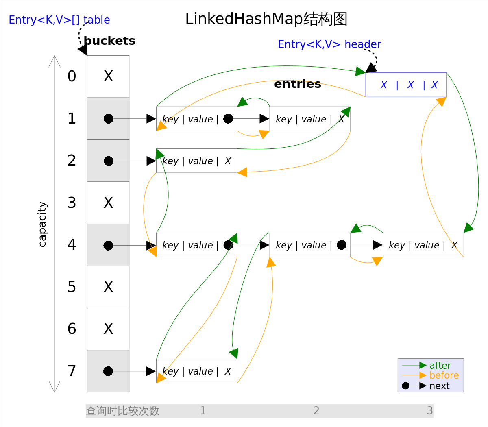

事实上LinkedHashMap是HashMap的直接子类，**二者唯一的区别是LinkedHashMap在HashMap的基础上，采用双向链表(doubly-linked list)的形式将所有entry连接起来，这样是为保证元素的迭代顺序跟插入顺序相同**。上图给出了LinkedHashMap的结构图，主体部分跟HashMap完全一样，多了header指向双向链表的头部(是一个哑元)，该双向链表的迭代顺序就是entry的插入顺序。

除了可以保迭代历顺序，这种结构还有一个好处 : 迭代LinkedHashMap时不需要像HashMap那样遍历整个table，而只需要直接遍历header指向的双向链表即可，也就是说LinkedHashMap的迭代时间就只跟entry的个数相关，而跟table的大小无关。

有两个参数可以影响LinkedHashMap的性能: 初始容量(inital capacity)和负载系数(load factor)。初始容量指定了初始table的大小，负载系数用来指定自动扩容的临界值。当entry的数量超过capacity*load_factor时，容器将自动扩容并重新哈希。对于插入元素较多的场景，将初始容量设大可以减少重新哈希的次数。

将对象放入到LinkedHashMap或LinkedHashSet中时，有两个方法需要特别关心: hashCode()和equals()。hashCode()方法决定了对象会被放到哪个bucket里，当多个对象的哈希值冲突时，equals()方法决定了这些对象是否是“同一个对象”。所以，如果要将自定义的对象放入到LinkedHashMap或LinkedHashSet中，需要@Override hashCode()和equals()方法。

通过如下方式可以得到一个跟源Map 迭代顺序一样的
```java
LinkedHashMap:void foo(Map m) {
    Map copy = new LinkedHashMap(m);
    ...
}
```
出于性能原因，LinkedHashMap是非同步的(not synchronized)，如果需要在多线程环境使用，需要程序员手动同步；或者通过如下方式将LinkedHashMap包装成(wrapped)同步的:
```java
Map m = Collections.synchronizedMap(new LinkedHashMap(...));
```
#### 6.9.2 JDK 7 LinkedHashMap 方法剖析

- get()

get(Object key)方法根据指定的key值返回对应的value。该方法跟HashMap.get()方法的流程几乎完全一样，读者可自行<a href="#hashMap的get()方法">参考前文</a>，这里不再赘述。

- put()

put(K key, V value)方法是将指定的key, value对添加到map里。该方法首先会对map做一次查找，看是否包含该元组，如果已经包含则直接返回，查找过程类似于get()方法；如果没有找到，则会通过addEntry(int hash, K key, V value, int bucketIndex)方法插入新的entry。

> 注意，这里的插入有两重含义:
> - 从table的角度看，新的entry需要插入到对应的bucket里，当有哈希冲突时，采用头插法将新的entry插入到冲突链表的头部。
> - 从header的角度看，新的entry需要插入到双向链表的尾部。


addEntry()代码如下:
```java
// LinkedHashMap.addEntry()
void addEntry(int hash, K key, V value, int bucketIndex) {
    if ((size >= threshold) && (null != table[bucketIndex])) {
        resize(2 * table.length);// 自动扩容，并重新哈希
        hash = (null != key) ? hash(key) : 0;
        bucketIndex = hash & (table.length-1);// hash%table.length
    }
    // 1.在冲突链表头部插入新的entry
    HashMap.Entry<K,V> old = table[bucketIndex];
    Entry<K,V> e = new Entry<>(hash, key, value, old);
    table[bucketIndex] = e;
    // 2.在双向链表的尾部插入新的entry
    e.addBefore(header);
    size++;
}
```
上述代码中用到了addBefore()方法将新entry e插入到双向链表头引用header的前面，这样e就成为双向链表中的最后一个元素。addBefore()的代码如下:
```java
// LinkedHashMap.Entry.addBefor()，将this插入到existingEntry的前面
private void addBefore(Entry<K,V> existingEntry) {
    after  = existingEntry;
    before = existingEntry.before;
    before.after = this;
    after.before = this;
}
```
上述代码只是简单修改相关entry的引用而已。

- remove()

remove(Object key)的作用是删除key值对应的entry，该方法的具体逻辑是在removeEntryForKey(Object key)里实现的。removeEntryForKey()方法会首先找到key值对应的entry，然后删除该entry(修改链表的相应引用)。查找过程跟get()方法类似。

> 注意，这里的删除也有两重含义:
> - 从table的角度看，需要将该entry从对应的bucket里删除，如果对应的冲突链表不空，需要修改冲突链表的相应引用。
> - 从header的角度来看，需要将该entry从双向链表中删除，同时修改链表中前面以及后面元素的相应引用。


removeEntryForKey()对应的代码如下:
```java
// LinkedHashMap.removeEntryForKey()，删除key值对应的entry
final Entry<K,V> removeEntryForKey(Object key) {
	......
	int hash = (key == null) ? 0 : hash(key);
    int i = indexFor(hash, table.length);// hash&(table.length-1)
    Entry<K,V> prev = table[i];// 得到冲突链表
    Entry<K,V> e = prev;
    while (e != null) {// 遍历冲突链表
        Entry<K,V> next = e.next;
        Object k;
        if (e.hash == hash &&
            ((k = e.key) == key || (key != null && key.equals(k)))) {// 找到要删除的entry
            modCount++; size--;
            // 1. 将e从对应bucket的冲突链表中删除
            if (prev == e) table[i] = next;
            else prev.next = next;
            // 2. 将e从双向链表中删除
            e.before.after = e.after;
            e.after.before = e.before;
            return e;
        }
        prev = e; e = next;
    }
    return e;
}
```
#### 6.9.3 JDK8的优化

1. 不再使用头插法，改为尾插法

在JDK8中，HashMap和LinkedHashMap都将**头插法改为尾插法**，主要为了解决多线程环境下的循环链表问题。

```java
// JDK8中的实现
public V put(K key, V value) {
    return putVal(hash(key), key, value, false, true);
}

final V putVal(int hash, K key, V value, boolean onlyIfAbsent, boolean evict) {
    // ... 其他逻辑
    
    if ((p = tab[i = (n - 1) & hash]) == null)
        tab[i] = newNode(hash, key, value, null);
    else {
        // 使用尾插法
        Node<K,V> e; K k;
        if (p.hash == hash && ((k = p.key) == key || (key != null && key.equals(k))))
            e = p;
        else if (p instanceof TreeNode)
            e = ((TreeNode<K,V>)p).putTreeVal(this, tab, hash, key, value);
        else {
            for (int binCount = 0; ; ++binCount) {
                // 这里使用尾插法：当next为null时插入
                if ((e = p.next) == null) {
                    p.next = newNode(hash, key, value, null);
                    if (binCount >= TREEIFY_THRESHOLD - 1) // -1 for 1st
                        treeifyBin(tab, hash);
                    break;
                }
                if (e.hash == hash && ((k = e.key) == key || (key != null && key.equals(k))))
                    break;
                p = e;
            }
        }
    }
    // ... 其他逻辑
}
```

2. 红黑树支持

JDK8中HashMap引入了红黑树优化，LinkedHashMap也继承了这一特性：
- 当链表长度超过8时，转换为红黑树
- 当红黑树节点数小于6时，转换回链表

3. 节点创建的重写

LinkedHashMap重写了newNode方法，在创建节点时维护双向链表：

```java
// JDK8 LinkedHashMap
Node<K,V> newNode(int hash, K key, V value, Node<K,V> e) {
    LinkedHashMap.Entry<K,V> p = new LinkedHashMap.Entry<>(hash, key, value, e);
    // 将新节点链接到双向链表尾部
    linkNodeLast(p);
    return p;
}

private void linkNodeLast(LinkedHashMap.Entry<K,V> p) {
    LinkedHashMap.Entry<K,V> last = tail;
    tail = p;
    if (last == null)
        head = p;
    else {
        p.before = last;
        last.after = p;
    }
}
```

4. 删除逻辑的更新

删除操作也相应更新，使用afterNodeRemoval回调：

```java
// JDK8中的删除逻辑
void afterNodeRemoval(Node<K,V> e) { // unlink
    LinkedHashMap.Entry<K,V> p = (LinkedHashMap.Entry<K,V>)e, b = p.before, a = p.after;
    p.before = p.after = null;
    if (b == null)
        head = a;
    else
        b.after = a;
    if (a == null)
        tail = b;
    else
        a.before = b;
}
```
#### 6.9.4 LinkedHashSet
前面已经说过LinkedHashSet是对LinkedHashMap的简单包装，对LinkedHashSet的函数调用都会转换成合适的LinkedHashMap方法，因此LinkedHashSet的实现非常简单，这里不再赘述。
```java
public class LinkedHashSet<E>
    extends HashSet<E>
    implements Set<E>, Cloneable, java.io.Serializable {
    ......
    // LinkedHashSet里面有一个LinkedHashMap
    public LinkedHashSet(int initialCapacity, float loadFactor) {
        map = new LinkedHashMap<>(initialCapacity, loadFactor);
    }
	......
    public boolean add(E e) {//简单的方法转换
        return map.put(e, PRESENT)==null;
    }
    ......
}
```
#### 6.9.5 LinkedHashMap经典用法

LinkedHashMap除了可以保证迭代顺序外，还有一个非常有用的用法: 可以轻松实现一个采用了FIFO替换策略的缓存。具体说来，LinkedHashMap有一个子类方法protected boolean removeEldestEntry(Map.Entry<K,V> eldest)，该方法的作用是告诉Map是否要删除“最老”的Entry，所谓最老就是当前Map中最早插入的Entry，如果该方法返回true，最老的那个元素就会被删除。在每次插入新元素的之后LinkedHashMap会自动询问removeEldestEntry()是否要删除最老的元素。这样只需要在子类中重载该方法，当元素个数超过一定数量时让removeEldestEntry()返回true，就能够实现一个固定大小的FIFO策略的缓存。示例代码如下:
```java
/** 一个固定大小的FIFO替换策略的缓存 */
class FIFOCache<K, V> extends LinkedHashMap<K, V>{
    private final int cacheSize;
    public FIFOCache(int cacheSize){
        this.cacheSize = cacheSize;
    }

    // 当Entry个数超过cacheSize时，删除最老的Entry
    @Override
    protected boolean removeEldestEntry(Map.Entry<K,V> eldest) {
       return size() > cacheSize;
    }
}
```
上面我们曾经介绍过hashMap的putVal(int hash, K key, V value, boolean onlyIfAbsent,boolean evict)方法，方法最后会调用afterNodeInsertion(evict);
在HashMap中这个方法是空方法，但在LinkedHashMap重写了该方法

```java
 void afterNodeInsertion(boolean evict) { // possibly remove eldest
        LinkedHashMap.Entry<K,V> first;
        if (evict && (first = head) != null && removeEldestEntry(first)) {
            K key = first.key;
            removeNode(hash(key), key, null, false, true);
        }
    }
```
因此是否移除最老的元素取决于removeEldestEntry(first)这个方法的结果（evict默认传true）。LinkedHashMap中emoveEldestEntry()方法默认返回false
```java
protected boolean removeEldestEntry(Map.Entry<K,V> eldest) {
        return false;
    }
```
因此LinkedHashMap是不会移除最老元素的，但是我们上面的FIFOCache重写了removeEldestEntry方法实现了一个固定大小的FIFO策略的缓存

### 6.10 WeakHashMap源码解析
WeakHashMap，从名字可以看出它是某种 Map。它的特殊之处在于 WeakHashMap 里的entry可能会被GC自动删除，即使程序员没有调用remove()或者clear()方法。

更直观的说，当使用 WeakHashMap 时，即使没有显示的添加或删除任何元素，也可能发生如下情况:
> - 调用两次size()方法返回不同的值；
> - 两次调用isEmpty()方法，第一次返回false，第二次返回true；
> - 两次调用containsKey()方法，第一次返回true，第二次返回false，尽管两次使用的是同一个key；
> - 两次调用get()方法，第一次返回一个value，第二次返回null，尽管两次使用的是同一个对象。

遇到这么奇葩的现象，你是不是觉得使用者一定会疯掉? 其实不然，**WeakHashMap 的这个特点特别适用于需要缓存的场景**。在缓存场景下，由于内存是有限的，不能缓存所有对象；对象缓存命中可以提高系统效率，但缓存MISS也不会造成错误，因为可以通过计算重新得到。

要明白 WeakHashMap 的工作原理，还需要引入一个概念 : **弱引用(WeakReference)**。我们都知道Java中内存是通过GC自动管理的，GC会在程序运行过程中自动判断哪些对象是可以被回收的，并在合适的时机进行内存释放。GC判断某个对象是否可被回收的依据是，**是否有有效的引用指向该对象**。如果没有有效引用指向该对象(基本意味着不存在访问该对象的方式)，那么该对象就是可回收的。这里的有效引用 并不包括弱引用。也就是说，**虽然弱引用可以用来访问对象，但进行垃圾回收时弱引用并不会被考虑在内，仅有弱引用指向的对象仍然会被GC回收。**
WeakHashMap 内部是通过弱引用来管理entry的，弱引用的特性对应到 WeakHashMap 上意味着什么呢？将一对key, value放入到 WeakHashMap 里并不能避免该key值被GC回收，除非在 WeakHashMap 之外还有对该key的强引用。

- WeakHashMap与HashMap一样，没有内置的同步机制。多个线程同时访问时需要进行外部同步。

```java
// 非线程安全的示例
WeakHashMap<String, Object> weakMap = new WeakHashMap<>();

// 在多线程环境中这样使用是不安全的
// 线程1
new Thread(() -> {
    weakMap.put("key1", new Object());
}).start();

// 线程2  
new Thread(() -> {
    weakMap.put("key2", new Object());
}).start();
// 可能导致数据不一致或ConcurrentModificationException
```

- WeakHashMap的键是弱引用，垃圾回收器可能在任意时间回收键对象，这会改变map的结构，在多线程环境中带来额外的复杂性。

```java
// 垃圾回收可能导致意外的结构变化
WeakHashMap<Object, String> map = new WeakHashMap<>();
Object key = new Object();
map.put(key, "value");

// 在其他线程中
new Thread(() -> {
    // 如果此时发生GC，key可能被回收，map.size()会变化
    System.out.println(map.size()); // 结果不确定
}).start();
```

- 如何实现线程安全

1. 使用Collections.synchronizedMap
```java
Map<Object, Object> synchronizedWeakMap = 
    Collections.synchronizedMap(new WeakHashMap<>());

// 现在可以安全地在多线程环境中使用
synchronized(synchronizedWeakMap) {
    // 迭代时也需要同步
    for (Map.Entry<Object, Object> entry : synchronizedWeakMap.entrySet()) {
        // 处理条目
    }
}
```

- 2. 使用ConcurrentHashMap（推荐）
如果需要线程安全的弱键行为，可以考虑：
```java
// 使用ConcurrentHashMap配合WeakReference
ConcurrentHashMap<WeakReference<Object>, Object> concurrentWeakMap = 
    new ConcurrentHashMap<>();

// 或者使用专门的并发弱引用Map实现
```

- WeakHashMap的特殊行为

  - 弱键的自动清理
    ```java
    WeakHashMap<Object, String> weakMap = new WeakHashMap<>();

    Object key1 = new Object();
    weakMap.put(key1, "value1");

    // 当没有其他强引用指向key1时，GC会回收它
    key1 = null; // 现在只有弱引用
    System.gc(); // 触发GC后，条目会自动从weakMap中移除

    System.out.println(weakMap.size()); // 可能输出0
    ```

    - 迭代器行为
    WeakHashMap的迭代器是fail-fast的：
    ```java
    WeakHashMap<String, Integer> map = new WeakHashMap<>();
    map.put("a", 1);

    Iterator<String> iterator = map.keySet().iterator();
    // 如果在迭代期间有其他线程修改map，会抛出ConcurrentModificationException
    ```

- 总结

  - **WeakHashMap不是线程安全的**
  - 需要在多线程环境中使用时，应该进行外部同步
  - 弱键特性使得它在缓存和存储元数据等场景中很有用
  - 垃圾回收会异步地清理被回收键对应的条目
  - 对于高并发场景，建议使用专门的并发容器而不是WeakHashMap

  如果需要线程安全的弱引用Map，可以考虑使用：
  - `Collections.synchronizedMap(new WeakHashMap<>())`
  - Google Guava的`MapMaker`.weakKeys()
  - 自定义基于`ConcurrentReferenceHashMap`的解决方案


**WeakHashMap通过使用弱引用(WeakReference)作为键来实现弱引用机制。** 详细解析其实现原理：

- 核心实现机制

1. Entry继承WeakReference

WeakHashMap的内部Entry类继承自WeakReference，将键作为弱引用：

```java
private static class Entry<K,V> extends WeakReference<Object> implements Map.Entry<K,V> {
    V value;
    final int hash;
    Entry<K,V> next;
    
    Entry(Object key, V value, ReferenceQueue<Object> queue, int hash, Entry<K,V> next) {
        super(key, queue);  // 关键：键作为弱引用，并关联引用队列
        this.value = value;
        this.hash = hash;
        this.next = next;
    }
    
    // 其他方法...
}
```

1. 引用队列(ReferenceQueue)

WeakHashMap使用引用队列来跟踪哪些键已经被垃圾回收：

```java
public class WeakHashMap<K,V> extends AbstractMap<K,V> implements Map<K,V> {
    private final ReferenceQueue<Object> queue = new ReferenceQueue<>();
    
    // 当键被GC回收时，对应的WeakReference会被加入到这个队列
}
```

- 自动清理过程

1. 垃圾回收触发清理

当键对象不再有强引用时，GC会回收它，然后将对应的Entry加入到引用队列：

```java
// 示例演示GC回收过程
WeakHashMap<Object, String> weakMap = new WeakHashMap<>();
Object key = new Object();
weakMap.put(key, "Some Value");

// 此时：key有强引用，不会被回收
System.out.println(weakMap.size()); // 输出: 1

// 移除强引用
key = null;

// 触发GC（在实际应用中不要依赖System.gc()，这里仅为演示）
System.gc();

// 给GC一点时间
try { Thread.sleep(100); } catch (InterruptedException e) {}

// WeakHashMap会自动清理被回收的条目
System.out.println(weakMap.size()); // 可能输出: 0
```

 2. 清理机制实现

WeakHashMap在每次操作时都会检查引用队列并清理失效条目：

```java
private void expungeStaleEntries() {
    ReferenceQueue<Object> q = this.queue;
    Reference<?> x;
    while ((x = q.poll()) != null) {
        synchronized (queue) {
            @SuppressWarnings("unchecked")
            Entry<K,V> e = (Entry<K,V>) x;
            int i = indexFor(e.hash, table.length);
            
            // 从哈希表中移除该条目
            Entry<K,V> prev = table[i];
            Entry<K,V> p = prev;
            while (p != null) {
                Entry<K,V> next = p.next;
                if (p == e) {
                    if (prev == e)
                        table[i] = next;
                    else
                        prev.next = next;
                    // 必须将value置为null，帮助GC
                    e.value = null;
                    size--;
                    break;
                }
                prev = p;
                p = next;
            }
        }
    }
}
```

- 关键方法中的清理调用

  - get()方法
  ```java
  public V get(Object key) {
      Object k = maskNull(key);
      int h = hash(k);
      Entry<K,V>[] tab = getTable(); // 这里会调用expungeStaleEntries()
      // ... 查找逻辑
  }
  ```

  - put()方法
  ```java
  public V put(K key, V value) {
      Object k = maskNull(key);
      int h = hash(k);
      Entry<K,V>[] tab = getTable(); // 清理失效条目
      // ... 插入逻辑
  }
  ```

  - size()方法
  ```java
  public int size() {
      if (size == 0)
          return 0;
      expungeStaleEntries(); // 清理后再计算大小
      return size;
  }
    ```

- 完整工作流程

1. **插入条目**：创建继承WeakReference的Entry，键作为弱引用
2. **键失去强引用**：当外部不再持有键的强引用时
3. **垃圾回收**：GC回收键对象，将Entry加入引用队列
4. **自动清理**：WeakHashMap在后续操作中检测队列并移除对应条目
5. **值回收**：清理时将value置为null，帮助GC回收值对象
- 使用注意事项

```java
// 错误用法：值持有键的强引用，导致无法回收
class SelfReferencing {
    private Map<Object, Object> map = new WeakHashMap<>();
    private Object key = new Object();
    
    public void problematicMethod() {
        map.put(key, key); // 值也引用了key，导致key无法被回收
    }
}

// 正确用法：确保值不直接或间接引用键
class CorrectUsage {
    private Map<Object, String> map = new WeakHashMap<>();
    private Object key = new Object();
    
    public void correctMethod() {
        map.put(key, "some data"); // 值不引用键
    }
}
```

补充说明：

- Java的四种引用类型

Java提供了四种不同强度的引用类型，位于`java.lang.ref`包中：

 1. **强引用 (Strong Reference)**
```java
Object obj = new Object(); // 这就是强引用
```
- 最常见的引用类型
- 只要强引用存在，对象就不会被GC回收

 2. **软引用 (SoftReference)**
```java
SoftReference<Object> softRef = new SoftReference<>(new Object());
```
- 内存不足时才会被GC回收
- 适合实现内存敏感的缓存

 3. **弱引用 (WeakReference)**
```java
WeakReference<Object> weakRef = new WeakReference<>(new Object());
```
- **只要发生GC就会被回收**
- 不管内存是否充足
- WeakHashMap使用的就是这种引用

 4. **虚引用 (PhantomReference)**
```java
PhantomReference<Object> phantomRef = new PhantomReference<>(new Object(), queue);
```
- 最弱的引用，几乎等同于没有引用
- 主要用于跟踪对象被回收的状态

---

- ReferenceQueue的作用

`ReferenceQueue`用于跟踪引用对象的状态：

```java
ReferenceQueue<Object> queue = new ReferenceQueue<>();

// 创建带队列的弱引用
WeakReference<Object> weakRef = new WeakReference<>(new Object(), queue);

// 当被引用对象被GC回收后，对应的Reference对象会被加入到队列中
Reference<?> ref = queue.poll(); // 获取被回收的引用
```

- 完整示例演示

```java
import java.lang.ref.*;

public class ReferenceTypesDemo {
    public static void main(String[] args) throws InterruptedException {
        // 创建引用队列
        ReferenceQueue<Object> queue = new ReferenceQueue<>();
        
        // 创建不同引用类型的对象
        Object strongRef = new Object(); // 强引用
        SoftReference<Object> softRef = new SoftReference<>(new Object());
        WeakReference<Object> weakRef = new WeakReference<>(new Object(), queue);
        PhantomReference<Object> phantomRef = new PhantomReference<>(new Object(), queue);
        
        System.out.println("初始状态:");
        System.out.println("强引用: " + strongRef);
        System.out.println("软引用: " + softRef.get());
        System.out.println("弱引用: " + weakRef.get());
        System.out.println("虚引用: " + phantomRef.get()); // 总是null
        
        // 触发GC
        System.gc();
        Thread.sleep(100);
        
        System.out.println("\nGC后:");
        System.out.println("强引用: " + strongRef); // 仍然存在
        System.out.println("软引用: " + softRef.get()); // 可能还存在（内存充足时）
        System.out.println("弱引用: " + weakRef.get()); // 很可能为null
        
        // 检查引用队列
        Reference<?> ref;
        while ((ref = queue.poll()) != null) {
            System.out.println("队列中的引用: " + ref);
        }
    }
}
```

- 各种引用的使用场景

| 引用类型 | 使用场景 |
|----------|----------|
| **强引用** | 普通对象引用，需要长期持有的对象 |
| **软引用** | 内存敏感的缓存，如图片缓存 |
| **弱引用** | 防止内存泄漏的缓存，如WeakHashMap |
| **虚引用** | 对象回收跟踪，资源清理 |


## 八、JAVA并发编程

### 8.1 JAVA并发-理论基础

- 带着BAT大厂的面试问题去理解

请带着这些问题继续后文，会很大程度上帮助你更好的理解并发理论基础。
- 多线程的出现是要解决什么问题的?
- 线程不安全是指什么? 
- 举例说明并发出现线程不安全的本质什么? 可见性，原子性和有序性。
- Java是怎么解决并发问题的? 3个关键字，JMM和8个Happens-Before
- 线程安全是不是非真即假? 不是
- 线程安全有哪些实现思路?
- 如何理解并发和并行的区别?

#### 8.1.1 为什么需要多线程

众所周知，CPU、内存、I/O 设备的速度是有极大差异的，为了合理利用 CPU 的高性能，平衡这三者的速度差异，计算机体系结构、操作系统、编译程序都做出了贡献，主要体现为:
- CPU 增加了缓存，以均衡与内存的速度差异；// 导致**可见性问题**
- 操作系统增加了进程、线程，以分时复用 CPU，进而均衡 CPU 与 I/O 设备的速度差异；// 导致**原子性问题**
- 编译程序优化指令执行次序，使得缓存能够得到更加合理地利用。// 导致**有序性问题**

#### 8.1.2 线程不安全示例

如果多个线程对同一个共享数据进行访问而不采取同步操作的话，那么操作的结果是不一致的。以下代码演示了 1000 个线程同时对 cnt 执行自增操作，操作结束之后它的值有可能小于 1000。
```java
public class ThreadUnsafeExample {

    private int cnt = 0;

    public void add() {
        cnt++;
    }

    public int get() {
        return cnt;
    }
}
public static void main(String[] args) throws InterruptedException {
    final int threadSize = 1000;
    ThreadUnsafeExample example = new ThreadUnsafeExample();
    final CountDownLatch countDownLatch = new CountDownLatch(threadSize);
    ExecutorService executorService = Executors.newCachedThreadPool();
    for (int i = 0; i < threadSize; i++) {
        executorService.execute(() -> {
            example.add();
            countDownLatch.countDown();
        });
    }
    countDownLatch.await();
    executorService.shutdown();
    System.out.println(example.get());
}
997 // 结果总是小于1000
```
#### 8.1.3 并发出现问题的根源: 并发三要素

上述代码输出为什么不是1000? 并发出现问题的根源是什么?
- 可见性: CPU缓存引起可见性：一个线程对共享变量的修改，另外一个线程能够立刻看到。举个简单的例子，看下面这段代码：
```java
//线程1执行的代码
int i = 0;
i = 10;
 
//线程2执行的代码
j = i;
```
假若执行线程1的是CPU1，执行线程2的是CPU2。由上面的分析可知，当线程1执行 i =10这句时，会先把i的初始值加载到CPU1的高速缓存中，然后赋值为10，那么在CPU1的高速缓存当中i的值变为10了，却没有立即写入到主存当中。

此时线程2执行 j = i，它会先去主存读取i的值并加载到CPU2的缓存当中，注意此时内存当中i的值还是0，那么就会使得j的值为0，而不是10.

这就是可见性问题，线程1对变量i修改了之后，线程2没有立即看到线程1修改的值。

- 原子性: 分时复用引起原子性：即一个操作或者多个操作 要么全部执行并且执行的过程不会被任何因素打断，要么就都不执行。举个简单的例子，看下面这段代码：
```java
int i = 1;

// 线程1执行
i += 1;

// 线程2执行
i += 1;
```
这里需要注意的是：i += 1需要三条 CPU 指令
>- 将变量 i 从内存读取到 CPU寄存器；
>- 在CPU寄存器中执行 i + 1 操作；
>- 将最后的结果i写入内存（缓存机制导致可能写入的是 CPU 缓存而不是内存）。

由于CPU分时复用（线程切换）的存在，线程1执行了第一条指令后，就切换到线程2执行，假如线程2执行了这三条指令后，再切换会线程1执行后续两条指令，将造成最后写到内存中的i值是2而不是3。
- 有序性: 重排序引起有序性：即程序执行的顺序按照代码的先后顺序执行。举个简单的例子，看下面这段代码：
```java
int i = 0;              
boolean flag = false;
i = 1;                //语句1  
flag = true;          //语句2
```
上面代码定义了一个int型变量，定义了一个boolean类型变量，然后分别对两个变量进行赋值操作。从代码顺序上看，语句1是在语句2前面的，那么JVM在真正执行这段代码的时候会保证语句1一定会在语句2前面执行吗?

 不一定，为什么呢? 这里可能会发生指令重排序（Instruction Reorder）。
 
 在执行程序时为了提高性能，编译器和处理器常常会对指令做重排序。重排序分三种类型：
 >- 编译器优化的重排序。编译器在不改变单线程程序语义的前提下，可以重新安排语句的执行顺序。
 >- 指令级并行的重排序。现代处理器采用了指令级并行技术（Instruction-Level Parallelism， ILP）来将多条指令重叠执行。如果不存在数据依赖性，处理器可以改变语句对应机器指令的执行顺序。
 >- 内存系统的重排序。由于处理器使用缓存和读 / 写缓冲区，这使得加载和存储操作看上去可能是在乱序执行。从 java 源代码到最终实际执行的指令序列，会分别经历下面三种重排序：
 
 上述的 1 属于编译器重排序，2 和 3 属于处理器重排序。这些重排序都可能会导致多线程程序出现内存可见性问题。对于编译器，JMM 的编译器重排序规则会禁止特定类型的编译器重排序（不是所有的编译器重排序都要禁止）。对于处理器重排序，JMM(Java内存模型) 的处理器重排序规则会要求 java 编译器在生成指令序列时，插入特定类型的内存屏障（memory barriers，intel 称之为 memory fence）指令，通过内存屏障指令来禁止特定类型的处理器重排序（不是所有的处理器重排序都要禁止）。

JMM如何约束重排序？

JMM通过定义**happens-before**规则划定重排序的边界，确保多线程程序的正确性：

| 重排序类型          | 是否允许 | 规则依据                     | 示例场景                     |
|---------------------|----------|------------------------------|------------------------------|
| **数据依赖性操作**  | ❌ 禁止  | 写后读、写后写、读后写       | `a=1; b=a;` 不能重排序       |
| **volatile变量**    | ❌ 限制  | volatile写 happens-before 后续读 | 写操作不会被重排序到读之后   |
| **synchronized**    | ❌ 限制  | 解锁 happens-before 后续加锁     | 同步块内操作不会逸出到锁外 |
| **final字段**       | ❌ 限制  | 构造函数内写 happens-before 读    | 对象引用发布前完成初始化   |
| **无依赖的普通变量**| ✅ 允许  | 无happens-before约束时         | `int a=1; int b=2;` 可交换顺序 |


#### 8.1.4 JAVA是怎么解决并发问题的: JMM(Java内存模型)

Java 内存模型是个很复杂的规范,此处只是简单介绍，详细内容需要参考JVM系列的Java 内存模型详解。

- 理解的第一个维度：核心知识点

JMM本质上可以理解为，Java 内存模型规范了 JVM 如何提供按需禁用缓存和编译优化的方法。具体来说，这些方法包括：**volatile、synchronized 和 final 三个关键字**以及**Happens-Before 规则**

- 理解的第二个维度：可见性，有序性，原子性

  - 原子性
    - **原子操作**：指一个操作不可被中断，要么完全执行，要么完全不执行。在多线程环境下，其他线程不会看到操作的中间状态。
    - JMM 对原子性的规定：
      - 对于基本数据类型（如 int, boolean 等），除 long 和 double 外，读写操作默认是原子的。
        ```java
        x = 10;        //语句1: 直接将数值10赋值给x，也就是说线程执行这个语句的会直接将数值10写入到工作内存中
        y = x;         //语句2: 包含2个操作，它先要去读取x的值，再将x的值写入工作内存，虽然读取x的值以及 将x的值写入工作内存 这2个操作都是原子性操作，但是合起来就不是原子性操作了。
        x++;           //语句3： x++包括3个操作：读取x的值，进行加1操作，写入新的值。
        x = x + 1;     //语句4： 同语句3
        ```
      - 对于引用类型（如对象引用、数组引用），读写操作总是原子的，无论 JVM 是 32 位还是 64 位架构。
        ```java
        //对象引用
        Object obj = new Object();//原子
        //数组引用
        String[] arr = new String[10];
        arr[0] = "Hello";  // 数组元素赋值（引用类型）
        // 错误：引用赋值原子 ≠ 对象内部状态原子
        List<String> list = new ArrayList<>();
        // 线程1
        list.add("item"); // 非原子操作（需同步）
        // 线程2
        list.remove(0); // 可能导致并发修改异常
        ```
      - long 和 double 的非 volatile 变量在 32 位 JVM 上可能非原子（分为两个 32 位操作），但引用类型不受此影响。
  
但是**值得注意的是**：应用类型的读写(赋值操作)是原子的，但是对于对象构造的过程非原子操作

**原子性的两个层面**
| 操作类型                | 是否原子 | 说明                                                                 |
|-------------------------|----------|----------------------------------------------------------------------|
| **引用赋值操作**        | ✅ 原子   | `objRef = new Object();` 中的等号赋值操作本身是原子的（单次内存写入） |
| **对象构造过程**        | ❌ 非原子 | `new Object()` 包含内存分配、字段初始化等子步骤，整体非原子          |


  从上面可以看出，Java内存模型只保证了基本读取和赋值是原子性操作，如果要实现更大范围操作的原子性，可以通过synchronized和Lock来实现。由于synchronized和Lock能够保证任一时刻只有一个线程执行该代码块，那么自然就不存在原子性问题了，从而保证了原子性。
  - 可见性

      - Java提供了volatile关键字来保证可见性。

        >- 当一个共享变量被volatile修饰时，它会保证修改的值会立即被更新到主存，当有其他线程需要读取时，它会去内存中读取新值。
        >- 而普通的共享变量不能保证可见性，因为普通共享变量被修改之后，什么时候被写入主存是不确定的，当其他线程去读取时，此时内存中可能还是原来的旧值，因此无法保证可见性。
        >- 另外，通过synchronized和Lock也能够保证可见性，synchronized和Lock能保证同一时刻只有一个线程获取锁然后执行同步代码，并且在释放锁之前会将对变量的修改刷新到主存当中。因此可以保证可见性。


  - 有序性

在Java里面，可以通过volatile关键字来保证一定的“有序性”（具体原理在下一节讲述）。另外可以通过synchronized和Lock来保证有序性，很显然，synchronized和Lock保证每个时刻是有一个线程执行同步代码，相当于是让线程顺序执行同步代码，自然就保证了有序性。当然JMM是通过**Happens-Before**规则来保证有序性的。

#### 8.1.5 关键字: volatile、synchronized 和 final
后面会有专门的章节介绍

#### 8.1.6 Happens-Before 规则

上面提到了可以用 volatile 和 synchronized 来保证有序性。除此之外，JVM 还规定了先行发生原则，让一个操作无需控制就能先于另一个操作完成。

##### 8.1.6.1 单一线程原则（Single Thread rule）

在一个线程内，在程序前面的操作先行发生于后面的操作。保证单线程内的顺序执行语义，但允许编译器/处理器进行不影响结果的重排序。
 
```java
int x = 1;      // 操作A
int y = x + 1;  // 操作B
// 操作A Happens-Before 操作B
// 即使编译器重排序，最终结果必须保证 y=2（as-if-serial语义）
// 注意：多线程环境下不保证跨线程顺序
```
##### 8.1.6.2 管程锁定规则（Monitor Lock Rule）

一个 unlock 操作先行发生于后面对同一个锁的 lock 操作。保证同步块内的修改对下一个进入同步块的线程可见。
 
```java
Object lock = new Object();
int sharedData = 0;

// 线程1
synchronized(lock) {
    sharedData = 42;  // 写操作
} // unlock发生在这里

// 线程2
synchronized(lock) {  // lock发生在这里
    System.out.println(sharedData); // 保证看到42
}
// 线程1的解锁 → 线程2的加锁 建立Happens-Before关系
// 共享数据的修改对线程2立即可见
```
##### 8.1.6.3 volatile 变量规则（Volatile Variable Rule）

对一个 volatile 变量的写操作先行发生于后面对这个变量的读操作。保证 volatile 变量的修改对所有线程立即可见。
 
```java
volatile boolean flag = false;
int data = 0;

// 线程1
data = 100;     // 普通写操作
flag = true;    // volatile写（Happens-Before屏障）

// 线程2
if(flag) {      // volatile读
    System.out.println(data); // 保证看到100
}

```
这里可能会出现一个理解的误区，就是认为按照volatile变量规则似乎是要求了线程1必须在线程2之前执行，实际上不是这样的。这里的"之前"的判断逻辑（重点）在于保证了如果flag为true时，data一定是100
当出现以下情况时：

```java
        线程2看到 flag == true
        JMM 推断：

        线程1的写操作 必须已经完成
        该写操作在逻辑时间线上 位于 线程2读操作之前
        这种"之前"是逻辑上的先后关系，由以下证据链保证：

        a. 如果线程2看到 flag=true，说明写操作已生效
        b. volatile规则要求：写 → 读 必须建立Happens-Before
        c. 因此写操作必定在逻辑上先于读操作

        虽然 data=100 (普通写) 在物理时间上可能晚于线程2启动,但根据规则：
        flag=true → if(flag) 建立HB
        data=100 → flag=true (同线程顺序)
        传递性：data=100 → if(flag)
        **结论**：线程2看到 flag=true 时，必定能看到 data=100
```
其底层逻辑以来的是**内存屏障(Memory Barriers)**

编译器针对每个 volatile 操作在**本地线程代码中**插入特定的内存屏障指令，这些屏障会：

1. **限制本线程内的重排序**
2. **强制内存可见性**
3. **建立跨线程的 happens-before 关系**

- volatile 写操作的屏障规则
```java
// 线程1（写线程）
普通写操作    // 如 data = 100
StoreStore屏障 // ↓ 禁止上面的普通写与下面的 volatile 写重排序
volatile写    // flag = true
StoreLoad屏障 // ↓ 强制刷新写缓存到主内存
```

- volatile 读操作的屏障规则
```java
// 线程2（读线程）
LoadLoad屏障  // ↑ 禁止下面的普通读与上面的 volatile 读重排序
volatile读    // if(flag)
LoadStore屏障 // ↑ 禁止后续普通写重排序到 volatile 读之前
普通读操作    // System.out.println(data)
```

- 跨线程顺序的实现原理

1. **写线程的屏障作用**：
   - `StoreStore` 屏障保证 `data=100` 必须在 `flag=true` **之前完成**
   - `StoreLoad` 屏障强制所有修改**立即同步到主内存**

2. **读线程的屏障作用**：
   - `LoadLoad` 屏障保证读取 `flag` 后必须**重新加载后续变量**
   - 当看到 `flag==true` 时，必须从主内存读取最新值

3. **硬件级别的配合**：
   ```mermaid
   graph LR
   A[CPU1缓存] -->|StoreLoad屏障| B[主内存]
   B -->|缓存一致性协议| C[CPU2缓存]
   C -->|LoadLoad屏障| D[CPU2寄存器]
   ```
- 关键问题解答：编译器如何知道顺序？

1. **不需要知道对方线程的状态**  
   编译器只需在**每个线程内部**：
   - 遇到 volatile 写：插入写屏障
   - 遇到 volatile 读：插入读屏障
   这些屏障会创建"保护区域"，无论其他线程何时运行

2. **屏障创建逻辑时间锚点**  
   volatile 写和读相当于在时间线上打了标记点：
   ```
   时间线： [线程1：写屏障] -----------happens-before----------> [线程2：读屏障]
   ```

3. **缓存一致性协议补位**  
   MESI等协议保证：当线程2读取 volatile 变量时，如果看到新值，必然是因为：
   - 线程1的写屏障已同步到主存
   - 线程2的读屏障强制从主存加载

- 实际执行示例
假设极端重排序场景：
```java
// 线程1可能的重排序（无屏障时）：
flag = true;  // 先执行
data = 100;   // 后执行

// 线程2可能的重排序（无屏障时）：
int tmp = data;   // 先读data
boolean f = flag; // 后读flag
```

**屏障如何阻止**：
1. 线程1的 `StoreStore` 屏障禁止 `data=100` 下移到 `flag=true` 之后
2. 线程2的 `LoadLoad` 屏障禁止 `data` 读取上移到 `flag` 读取之前

最终保证：
```
线程1：data写 → 屏障 → flag写
线程2：flag读 → 屏障 → data读
```

下面是一个例子用来描述 volatile 的 happens-before 规则保证了数据的执行顺序

```java
public class VolatileExample {

    // 普通变量（非volatile）
    private static int data = 0;
    
    // volatile标志位
    private static volatile boolean flag = false;

    public static void main(String[] args) throws InterruptedException {
        // 创建写线程
        Thread writerThread = new Thread(() -> {
            // 模拟初始化操作
            System.out.println("[写入线程] 开始数据准备...");
            simulateWork(100);  // 模拟耗时操作
            
            // 关键操作序列
            data = 100;         // 普通变量写入
            System.out.println("[写入线程] 数据写入完成: data = " + data);
            
            simulateWork(50);   // 增加可见性测试难度
            flag = true;        // volatile写入（建立happens-before关系）
            System.out.println("[写入线程] 标志位已设置: flag = " + flag);
        });

        // 创建读线程
        Thread readerThread = new Thread(() -> {
            // 等待标志位变为true
            System.out.println("[读取线程] 等待标志位...");
            while (!flag) {
                // 空循环等待（实际应用中应避免忙等待）
            }
            
            // 读取普通变量
            System.out.println("[读取线程] 检测到标志位变化");
            System.out.println("[读取线程] 读取数据: data = " + data);
        });

        // 启动线程（注意：读线程先启动）
        readerThread.start();
        Thread.sleep(10); // 确保读线程先运行
        writerThread.start();

        // 等待线程结束
        writerThread.join();
        readerThread.join();
    }

    // 模拟工作耗时
    private static void simulateWork(int millis) {
        try {
            Thread.sleep(millis);
        } catch (InterruptedException e) {
            Thread.currentThread().interrupt();
        }
    }
}
预期输出：
[读取线程] 等待标志位...
[写入线程] 开始数据准备...
[写入线程] 数据写入完成: data = 100
[写入线程] 标志位已设置: flag = true
[读取线程] 检测到标志位变化
[读取线程] 读取数据: data = 100
```
如果移除volatile次运行程序，可能出现：
```java
[读取线程] 检测到标志位变化
[读取线程] 读取数据: data = 0  // 可见性问题！
```

##### 8.1.6.4 线程启动规则（Thread Start Rule）

Thread 对象的 start() 方法调用先行发生于此线程的每一个动作。保证父线程在启动子线程前的修改对子线程可见。
 
```java
int config = 0;

// 主线程
config = 888;
Thread t = new Thread(() -> {
    System.out.println(config); // 保证看到888
});
t.start(); // Happens-Before屏障
// t.start() → 子线程内所有操作 建立Happens-Before
// 子线程能看到启动前对config的修改
```


##### 8.1.6.5 线程加入规则（Thread Join Rule）

Thread 对象的结束先行发生于 join() 方法返回。被等待线程的所有修改对等待线程可见。
 
```java
int result = 0;
Thread worker = new Thread(() -> {
    result = 999; // 工作线程修改
});

worker.start();
worker.join(); // 等待结束

System.out.println(result); // 保证看到999
// 工作线程结束 → join()返回 建立Happens-Before
// 主线程能看到工作线程对result的修改
```


##### 8.1.6.6 线程中断规则（Thread Interruption Rule）
对线程 interrupt() 方法的调用先行发生于被中断线程的代码检测到中断事件的发生，可以通过 interrupted() 方法检测到是否有中断发生。保证中断请求的可见性和顺序性。
```java
Thread worker = new Thread(() -> {
    while(!Thread.interrupted()) {
        // 工作代码
    }
    System.out.println("Interrupted!"); 
});

worker.start();
Thread.sleep(100);
worker.interrupt(); // Happens-Before检测
// interrupt() → Thread.interrupted() 建立Happens-Before
// 工作线程一定能看到中断状态的变化
```
##### 8.1.6.7 对象终结规则（Finalizer Rule）
一个对象的初始化完成(构造函数执行结束)先行发生于它的 finalize() 方法的开始。保证对象完全初始化后才执行终结方法。
```java
class Resource {
    int id;
    
    Resource(int id) {
        this.id = id; // 初始化
    }
    
    @Override
    protected void finalize() {
        System.out.println(id); // 保证看到初始化值
    }
}

// 使用
new Resource(100); // 构造结束 → finalize开始
// 构造函数结束 → finalize()开始 建立Happens-Before
// finalize()中能看到完整初始化的对象状态
```

##### 8.1.6.8 传递性（Transitivity）
如果操作 A 先行发生于操作 B，操作 B 先行发生于操作 C，那么操作 A 先行发生于操作 C。组合多个规则建立跨线程顺序保证。
```java
volatile boolean flag = false;
int x = 0;

// 线程1
x = 10;             // 操作A
flag = true;        // 操作B（volatile写）

// 线程2
if(flag) {          // 操作C（volatile读）
    System.out.println(x); // 操作D
}
// A → B（单线程规则）
// B → C（volatile规则）
// C → D（单线程规则）
// 传递性：A → D，保证输出10
```
#### 8.1.7 线程安全: 不是一个非真即假的命题

一个类在可以被多个线程安全调用时就是线程安全的。

线程安全不是一个非真即假的命题，可以将共享数据按照安全程度的强弱顺序分成以下五类: 不可变、绝对线程安全、相对线程安全、线程兼容和线程对立。
##### 8.1.7.1 不可变

不可变(Immutable)的对象一定是线程安全的，不需要再采取任何的线程安全保障措施。只要一个不可变的对象被正确地构建出来，永远也不会看到它在多个线程之中处于不一致的状态。

多线程环境下，应当尽量使对象成为不可变，来满足线程安全。不可变的类型:
> - final 关键字修饰的基本数据类型
> - String
> - 枚举类型
> - Number 部分子类，如 Long 和 Double 等数值包装类型，BigInteger 和 BigDecimal 等大数据类型（**看似"修改"的操作（如加法、乘法）实际是返回新的对象，原对象保持不变**）。但同为 Number 的原子类 AtomicInteger 和 AtomicLong 则是可变的。

对于集合类型，可以使用 Collections.unmodifiableXXX() 方法来获取一个不可变的集合。
```java
public class ImmutableExample {
    public static void main(String[] args) {
        Map<String, Integer> map = new HashMap<>();
        Map<String, Integer> unmodifiableMap = Collections.unmodifiableMap(map);
        unmodifiableMap.put("a", 1);
    }
}

Exception in thread "main" java.lang.UnsupportedOperationException
    at java.util.Collections$UnmodifiableMap.put(Collections.java:1457)
    at ImmutableExample.main(ImmutableExample.java:9)
```
Collections.unmodifiableXXX() 先对原始的集合进行拷贝，需要对集合进行修改的方法都直接抛出异常。
```java
public V put(K key, V value) {
    throw new UnsupportedOperationException();
}
```
##### 8.1.7.2 对线程安全

不管运行时环境如何，调用者都不需要任何额外的同步措施。

##### 8.1.7.3 相对线程安全

对线程安全需要保证对这个对象单独的操作是线程安全的，在调用的时候不需要做额外的保障措施。但是对于一些特定顺序的连续调用，就可能需要在调用端使用额外的同步手段来保证调用的正确性。

在 Java 语言中，大部分的线程安全类都属于这种类型，例如 Vector、HashTable、Collections 的 synchronizedCollection() 方法包装的集合等。

对于下面的代码，如果删除元素的线程删除了 Vector 的一个元素，而获取元素的线程试图访问一个已经被删除的元素，那么就会抛出 ArrayIndexOutOfBoundsException。
```java
public class VectorUnsafeExample {
    private static Vector<Integer> vector = new Vector<>();

    public static void main(String[] args) {
        while (true) {
            for (int i = 0; i < 100; i++) {
                vector.add(i);
            }
            ExecutorService executorService = Executors.newCachedThreadPool();
            executorService.execute(() -> {
                for (int i = 0; i < vector.size(); i++) {
                    vector.remove(i);
                }
            });
            executorService.execute(() -> {
                for (int i = 0; i < vector.size(); i++) {
                    vector.get(i);
                }
            });
            executorService.shutdown();
        }
    }
}

Exception in thread "Thread-159738" java.lang.ArrayIndexOutOfBoundsException: Array index out of range: 3
    at java.util.Vector.remove(Vector.java:831)
    at VectorUnsafeExample.lambda$main$0(VectorUnsafeExample.java:14)
    at VectorUnsafeExample$$Lambda$1/713338599.run(Unknown Source)
    at java.lang.Thread.run(Thread.java:745)
```
如果要保证上面的代码能正确执行下去，就需要对删除元素和获取元素的代码进行同步。
```java
executorService.execute(() -> {
    synchronized (vector) {
        for (int i = 0; i < vector.size(); i++) {
            vector.remove(i);
        }
    }
});
executorService.execute(() -> {
    synchronized (vector) {
        for (int i = 0; i < vector.size(); i++) {
            vector.get(i);
        }
    }
});
```
##### 8.1.7.4 线程兼容
线程兼容是指对象本身并不是线程安全的，但是可以通过在调用端正确地使用同步手段来保证对象在并发环境中可以安全地使用，我们平常说一个类不是线程安全的，绝大多数时候指的是这一种情况。Java API 中大部分的类都是属于线程兼容的，如与前面的 Vector 和 HashTable 相对应的集合类 ArrayList 和 HashMap 等。
##### 8.1.7.5 线程对立
线程对立是指无论调用端是否采取了同步措施，都无法在多线程环境中并发使用的代码。由于 Java 语言天生就具备多线程特性，线程对立这种排斥多线程的代码是很少出现的，而且通常都是有害的，应当尽量避免。
#### 8.1.8 <a id='线程安全的实现方法'>线程安全的实现方法</a>
##### 8.1.8.1 互斥同步
synchronized 和 ReentrantLock。(详细介绍见后续)
##### 8.1.8.2 非阻塞同步
互斥同步最主要的问题就是线程阻塞和唤醒所带来的性能问题，因此这种同步也称为阻塞同步。

互斥同步属于一种悲观的并发策略，总是认为只要不去做正确的同步措施，那就肯定会出现问题。无论共享数据是否真的会出现竞争，它都要进行加锁(这里讨论的是概念模型，实际上虚拟机会优化掉很大一部分不必要的加锁)、用户态核心态转换、维护锁计数器和检查是否有被阻塞的线程需要唤醒等操作。

- CAS

随着硬件指令集的发展，我们可以使用基于冲突检测的乐观并发策略: 先进行操作，如果没有其它线程争用共享数据，那操作就成功了，否则采取补偿措施(不断地重试，直到成功为止)。这种乐观的并发策略的许多实现都不需要将线程阻塞，因此这种同步操作称为非阻塞同步。

乐观锁需要操作和冲突检测这两个步骤具备原子性，这里就不能再使用互斥同步来保证了，只能靠硬件来完成。硬件支持的原子性操作最典型的是: 比较并交换(Compare-and-Swap，CAS)。CAS 指令需要有 3 个操作数，分别是内存地址 V、旧的预期值 A 和新值 B。当执行操作时，只有当 V 的值等于 A，才将 V 的值更新为 B。

- AtomicInteger

J.U.C 包里面的整数原子类 AtomicInteger，其中的 compareAndSet() 和 getAndIncrement() 等方法都使用了 Unsafe 类的 CAS 操作。

以下代码使用了 AtomicInteger 执行了自增的操作。
```java
private AtomicInteger cnt = new AtomicInteger();

public void add() {
    cnt.incrementAndGet();
}
```
以下代码是 incrementAndGet() 的源码，它调用了 unsafe 的 getAndAddInt() 。
```java
public final int incrementAndGet() {
    return unsafe.getAndAddInt(this, valueOffset, 1) + 1;
}
```
以下代码是 getAndAddInt() 源码，var1 指示对象内存地址，var2 指示该字段相对对象内存地址的偏移，var4 指示操作需要加的数值，这里为 1。通过 getIntVolatile(var1, var2) 得到旧的预期值，通过调用 compareAndSwapInt() 来进行 CAS 比较，如果该字段内存地址中的值等于 var5，那么就更新内存地址为 var1+var2 的变量为 var5+var4。

可以看到 getAndAddInt() 在一个循环中进行，发生冲突的做法是不断的进行重试。
```java
public final int getAndAddInt(Object var1, long var2, int var4) {
    int var5;
    do {
        var5 = this.getIntVolatile(var1, var2);
    } while(!this.compareAndSwapInt(var1, var2, var5, var5 + var4));

    return var5;
}
```
- ABA问题

如果一个变量初次读取的时候是 A 值，它的值被改成了 B，后来又被改回为 A，那 CAS 操作就会误认为它从来没有被改变过。

J.U.C 包提供了一个带有标记的原子引用类 AtomicStampedReference 来解决这个问题，它可以通过控制变量值的版本来保证 CAS 的正确性。大部分情况下 ABA 问题不会影响程序并发的正确性，如果需要解决 ABA 问题，改用传统的互斥同步可能会比原子类更高效。

CAS, Unsafe和原子类后面会有详细分析

##### 8.1.8.3 无同步方案
要保证线程安全，并不是一定就要进行同步。如果一个方法本来就不涉及共享数据，那它自然就无须任何同步措施去保证正确性。

- 栈封闭

多个线程访问同一个方法的局部变量时，不会出现线程安全问题，因为局部变量存储在虚拟机栈中，属于线程私有的。
```java
import java.util.concurrent.ExecutorService;
import java.util.concurrent.Executors;

public class StackClosedExample {
    public void add100() {
        int cnt = 0;
        for (int i = 0; i < 100; i++) {
            cnt++;
        }
        System.out.println(cnt);
    }
}


public static void main(String[] args) {
    StackClosedExample example = new StackClosedExample();
    ExecutorService executorService = Executors.newCachedThreadPool();
    executorService.execute(() -> example.add100());
    executorService.execute(() -> example.add100());
    executorService.shutdown();
}
100
100

```
- 线程本地存储(Thread Local Storage)

如果一段代码中所需要的数据必须与其他代码共享，那就看看这些共享数据的代码是否能保证在同一个线程中执行。如果能保证，我们就可以把共享数据的可见范围限制在同一个线程之内，这样，无须同步也能保证线程之间不出现数据争用的问题。

符合这种特点的应用并不少见，大部分使用消费队列的架构模式(如“生产者-消费者”模式)都会将产品的消费过程尽量在一个线程中消费完。其中最重要的一个应用实例就是经典 Web 交互模型中的“一个请求对应一个服务器线程”(Thread-per-Request)的处理方式，这种处理方式的广泛应用使得很多 Web 服务端应用都可以使用线程本地存储来解决线程安全问题。

可以使用 java.lang.ThreadLocal 类来实现线程本地存储功能。

对于以下代码，thread1 中设置 threadLocal 为 1，而 thread2 设置 threadLocal 为 2。过了一段时间之后，thread1 读取 threadLocal 依然是 1，不受 thread2 的影响。

```java
public class ThreadLocalExample {
    public static void main(String[] args) {
        ThreadLocal threadLocal = new ThreadLocal();
        Thread thread1 = new Thread(() -> {
            threadLocal.set(1);
            try {
                Thread.sleep(1000);
            } catch (InterruptedException e) {
                e.printStackTrace();
            }
            System.out.println(threadLocal.get());
            threadLocal.remove();
        });
        Thread thread2 = new Thread(() -> {
            threadLocal.set(2);
            threadLocal.remove();
        });
        thread1.start();
        thread2.start();
    }
}
```
为了理解 ThreadLocal，先看以下代码:

```java
public class ThreadLocalExample1 {
    public static void main(String[] args) {
        ThreadLocal threadLocal1 = new ThreadLocal();
        ThreadLocal threadLocal2 = new ThreadLocal();
        Thread thread1 = new Thread(() -> {
            threadLocal1.set(1);
            threadLocal2.set(1);
        });
        Thread thread2 = new Thread(() -> {
            threadLocal1.set(2);
            threadLocal2.set(2);
        });
        thread1.start();
        thread2.start();
    }
}
```
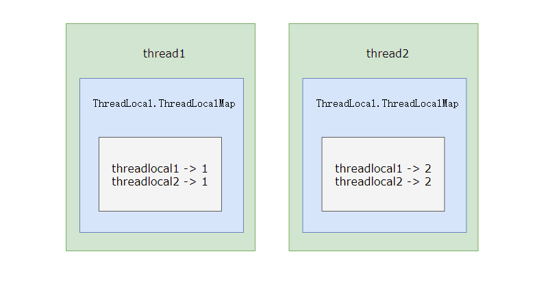

每个 Thread 都有一个 ThreadLocal.ThreadLocalMap 对象，Thread 类中就定义了 ThreadLocal.ThreadLocalMap 成员。

```java
/* ThreadLocal values pertaining to this thread. This map is maintained
 * by the ThreadLocal class. */
ThreadLocal.ThreadLocalMap threadLocals = null;
```

当调用一个 ThreadLocal 的 set(T value) 方法时，先得到当前线程的 ThreadLocalMap 对象，然后将 ThreadLocal->value 键值对插入到该 Map 中。
```java
public void set(T value) {
    Thread t = Thread.currentThread();
    ThreadLocalMap map = getMap(t);
    if (map != null)
        map.set(this, value);
    else
        createMap(t, value);
}
```
get() 方法类似。
```java
public T get() {
    Thread t = Thread.currentThread();
    ThreadLocalMap map = getMap(t);
    if (map != null) {
        ThreadLocalMap.Entry e = map.getEntry(this);
        if (e != null) {
            @SuppressWarnings("unchecked")
            T result = (T)e.value;
            return result;
        }
    }
    return setInitialValue();
}
```
ThreadLocal 从理论上讲并不是用来解决多线程并发问题的，因为根本不存在多线程竞争。在一些场景 (尤其是使用线程池) 下，由于 ThreadLocal.ThreadLocalMap 的底层数据结构导致 ThreadLocal 有内存泄漏的情况，应该尽可能在每次使用 ThreadLocal 后手动调用 remove()，以避免出现 ThreadLocal 经典的内存泄漏甚至是造成自身业务混乱的风险。

后续会对ThreadLocal进行详细介绍

- 可重入代码(Reentrant Code)

这种代码也叫做纯代码(Pure Code)，可以在代码执行的任何时刻中断它，转而去执行另外一段代码(包括递归调用它本身)，而在控制权返回后，原来的程序不会出现任何错误。可重入代码有一些共同的特征，例如不依赖存储在堆上的数据和公用的系统资源、用到的状态量都由参数中传入、不调用非可重入的方法等。

> - 无状态性：不依赖全局变量或静态变量
> - 幂等性：重复执行结果相同
> - 线程安全：无需额外同步机制

- ✅ 可重入代码示例
    - 1. 纯函数计算（无状态）
    ```java
    // 可重入：仅依赖输入参数，无副作用
    public int calculateSum(int a, int b) {
        return a + b;  // 不使用任何外部状态
    }

    // 可安全地在多线程/递归中使用
    int result1 = calculateSum(3, 5);  // 8
    int result2 = calculateSum(10, 20); // 30（可随时中断重入）
    ```

    - 2. 线程安全的对象方法（使用局部变量）
    ```java
    public class SafeCounter {
        // 可重入方法：操作参数而非成员变量
        public int increment(int current) {
            int newValue = current + 1;  // 只使用局部变量
            return newValue;
        }
    }

    // 使用示例
    SafeCounter counter = new SafeCounter();
    int val = 0;
    val = counter.increment(val);  // 1
    val = counter.increment(val);  // 2（可被中断后重入）
    ```

    - 3. 递归函数（自我重入）
    ```java
    // 可重入递归：无静态/全局状态
    public int factorial(int n) {
        if (n <= 1) return 1;
        return n * factorial(n - 1);  // 递归调用自身
    }

    // 安全递归计算
    System.out.println(factorial(5)); // 120
    ```

- ❌ 不可重入代码示例
    - 1. 使用静态变量（全局状态）
    ```java
    public class UnsafeCounter {
        private static int count = 0;  // 危险：静态变量
        
        public int increment() {
            count++;  // 修改共享状态
            return count;
        }
    }

    // 多线程调用会导致数据竞争
    UnsafeCounter unsafe = new UnsafeCounter();
    // 线程1：unsafe.increment() → 可能返回1
    // 线程2同时调用：unsafe.increment() → 可能也返回1（应返回2）
    ```

    - 2. 修改传入的可变对象
    ```java
    public class DataProcessor {
        // 不可重入：修改传入对象状态
        public void process(List<String> data) {
            if(!data.isEmpty()) {
                data.remove(0);  // 修改外部对象
            }
        }
    }

    // 危险示例
    List<String> list = new ArrayList<>(Arrays.asList("A", "B", "C"));
    new DataProcessor().process(list);  // 移除"A"
    // 若在中断中重入，list状态已变 → 可能移除"B"而非预期元素
    ```

    - 3. 非线程安全的单例操作
    ```java
    public class SessionManager {
        private static User currentUser;  // 共享状态
        
        public void setUser(User user) {
            currentUser = user;  // 全局状态修改
        }
        
        public void doAction() {
            if(currentUser != null) {
                // 使用currentUser执行操作
            }
        }
    }

    // 问题场景：
    // 线程1：setUser(userA); doAction();
    // 线程2在doAction()执行中调用setUser(userB) → 状态污染
    ```

- 补充对比： 可重入锁的特殊说明
    Java 的 `ReentrantLock` 是另一种"可重入"概念（同一线程可重复获取锁）：
    ```java
    ReentrantLock lock = new ReentrantLock();

    void safeMethod() {
        lock.lock();  // 第一次获取
        try {
            // ...
            nestedMethod();  // 嵌套调用
        } finally {
            lock.unlock();
        }
    }

    void nestedMethod() {
        lock.lock();  // 同一线程可重入获取
        try {
            // ...
        } finally {
            lock.unlock();
        }
    }
    ```
> ⚠️ 注意：这里的"可重入"指**锁机制特性**，与代码可重入性是不同的概念

### 8.2 Java 并发 - 线程基础

- 线程有哪几种状态? 分别说明从一种状态到另一种状态转变有哪些方式?
- 通常线程有哪几种使用方式?
- 基础线程机制有哪些?
- 线程的中断方式有哪些?
- 线程的互斥同步方式有哪些? 如何比较和选择?
- 线程之间有哪些协作方式?

#### 8.2.1 线程转换状态


- 新建(New)

创建后尚未启动。

- 可运行(Runnable)

可能正在运行，也可能正在等待 CPU 时间片。

包含了操作系统线程状态中的 Running 和 Ready。

- 阻塞(Blocking)

等待获取一个排它锁，如果其线程释放了锁就会结束此状态。

- 无限期等待(Waiting)

等待其它线程显式地唤醒，否则不会被分配 CPU 时间片。

| 进入方法      | 退出方法   |
|--------------|----------|
| 没有设置 Timeout 参数的 Object.wait() 方法 | Object.notify() / Object.notifyAll() |
| 没有设置 Timeout 参数的 Thread.join() 方法 | 被调用的线程执行完毕 |
| LockSupport.park() 方法 | - | 

- 限期等待(Timed Waiting)

无需等待其它线程显式地唤醒，在一定时间之后会被系统自动唤醒。

调用 Thread.sleep() 方法使线程进入限期等待状态时，常常用“使一个线程睡眠”进行描述。

调用 Object.wait() 方法使线程进入限期等待或者无限期等待时，常常用“挂起一个线程”进行描述。

睡眠和挂起是用来描述行为，而阻塞和等待用来描述状态。

**阻塞和等待的区别在于，阻塞是被动的，它是在等待获取一个排它锁。而等待是主动的，通过调用 Thread.sleep() 和 Object.wait() 等方法进入.**

| 进入方法      | 退出方法   |
|--------------|----------|
| Thread.sleep() 方法 | 时间结束|
| 设置了 Timeout 参数的 Object.wait() 方法 | 时间结束 / Object.notify() / Object.notifyAll() |
| 设置了 Timeout 参数的 Thread.join() 方法	| 时间结束 / 被调用的线程执行完毕| 
| LockSupport.parkNanos() 方法| -| 
| LockSupport.parkUntil() 方法	| -| 

- 死亡(Terminated)

可以是线程结束任务之后自己结束，或者产生了异常而结束。

#### 8.2.2 线程使用方式

有三种使用线程的方法:
- 实现 Runnable 接口；
- 实现 Callable 接口；
- 继承 Thread 类。实现 

Runnable 和 Callable 接口的类只能当做一个可以在线程中运行的任务，不是真正意义上的线程，因此最后还需要通过 Thread 来调用。可以说任务是通过线程驱动从而执行的。

##### 8.2.2.1 实现 Runnable 接口

需要实现 run() 方法。通过 Thread 调用 start() 方法来启动线程。
```java
public class MyRunnable implements Runnable {
    public void run() {
        // ...
    }
}
public static void main(String[] args) {
    MyRunnable instance = new MyRunnable();
    Thread thread = new Thread(instance);
    thread.start();
}
```

##### 8.2.2.2 实现 Callable 接口

与 Runnable 相比，Callable 可以有返回值，返回值通过 FutureTask 进行封装。
```java
public class MyCallable implements Callable<Integer> {
    public Integer call() {
        return 123;
    }
}
public static void main(String[] args) throws ExecutionException, InterruptedException {
    MyCallable mc = new MyCallable();
    FutureTask<Integer> ft = new FutureTask<>(mc);
    Thread thread = new Thread(ft);
    thread.start();
    System.out.println(ft.get());
}
```
##### 8.2.2.3 继承 Thread 类
同样也是需要实现 run() 方法，因为 Thread 类也实现了 Runable 接口。

当调用 start() 方法启动一个线程时，虚拟机会将该线程放入就绪队列中等待被调度，当一个线程被调度时会执行该线程的 run() 方法。
```java
public class MyThread extends Thread {
    public void run() {
        // ...
    }
}
public static void main(String[] args) {
    MyThread mt = new MyThread();
    mt.start();
}
```
`实现接口 VS 继承 Thread`

实现接口会更好一些，因为:Java 不支持多重继承，因此继承了 Thread 类就无法继承其它类，但是可以实现多个接口；类可能只要求可执行就行，继承整个 Thread 类开销过大。

#### 8.2.3 基础线程机制
##### 8.2.3.1  Executor
Executor 管理多个异步任务的执行，而无需程序员显式地管理线程的生命周期。这里的异步是指多个任务的执行互不干扰，不需要进行同步操作。

主要有三种 Executor:
- CachedThreadPool: 一个任务创建一个线程；
- FixedThreadPool: 所有任务只能使用固定大小的线程；
- SingleThreadExecutor: 相当于大小为 1 的 FixedThreadPool。
```java
public static void main(String[] args) {
    ExecutorService executorService = Executors.newCachedThreadPool();
    for (int i = 0; i < 5; i++) {
        executorService.execute(new MyRunnable());
    }
    // 关闭线程池
    executorService.shutdown();
}
```
##### 8.2.3.2  Daemon

守护线程是程序运行时在后台提供服务的线程，不属于程序中不可或缺的部分。

当所有非守护线程结束时，程序也就终止，同时会杀死所有守护线程。

main() 属于非守护线程。

使用 setDaemon() 方法将一个线程设置为守护线程。
```java
public static void main(String[] args) {
    Thread thread = new Thread(new MyRunnable());
    thread.setDaemon(true);
}
```
##### 8.2.3.3 sleep()
Thread.sleep(millisec) 方法会休眠当前正在执行的线程，millisec 单位为毫秒。

sleep() 可能会抛出 InterruptedException，因为异常不能跨线程传播回 main() 中，因此必须在本地进行处理。线程中抛出的其它异常也同样需要在本地进行处理。
```java
public void run() {
    try {
        Thread.sleep(3000);
    } catch (InterruptedException e) {
        e.printStackTrace();
    }
}
```
##### 8.2.3.4 yield()

对静态方法 Thread.yield() 的调用声明了当前线程已经完成了生命周期中最重要的部分，可以切换给其它线程来执行。该方法只是对线程调度器的一个建议，而且也只是建议具有相同优先级的其它线程可以运行。
```java
public void run() {
    Thread.yield();
}
```
#### 8.2.4 线程中断
一个线程执行完毕之后会自动结束，如果在运行过程中发生异常也会提前结束。
##### 8.2.4.1 InterruptedException

通过调用一个线程的 interrupt() 来中断该线程，如果该线程处于阻塞、限期等待或者无限期等待状态，那么就会抛出 InterruptedException，从而提前结束该线程。但是不能中断 I/O 阻塞和 synchronized 锁阻塞。

对于以下代码，在 main() 中启动一个线程之后再中断它，由于线程中调用了 Thread.sleep() 方法，因此会抛出一个 InterruptedException，从而提前结束线程，不执行之后的语句。
```java
public class InterruptExample {

    private static class MyThread1 extends Thread {
        @Override
        public void run() {
            try {
                Thread.sleep(2000);
                System.out.println("Thread run");
            } catch (InterruptedException e) {
                e.printStackTrace();
            }
        }
    }
}

public static void main(String[] args) throws InterruptedException {
    Thread thread1 = new MyThread1();
    thread1.start();
    thread1.interrupt();
    System.out.println("Main run");
}

Main run
java.lang.InterruptedException: sleep interrupted
    at java.lang.Thread.sleep(Native Method)
    at InterruptExample.lambda$main$0(InterruptExample.java:5)
    at InterruptExample$$Lambda$1/713338599.run(Unknown Source)
    at java.lang.Thread.run(Thread.java:745)
```
##### 8.2.4.2 interrupted()

如果一个线程的 run() 方法执行一个无限循环，并且没有执行 sleep() 等会抛出 InterruptedException 的操作，那么调用线程的 interrupt() 方法就无法使线程提前结束。

但是调用 interrupt() 方法会设置线程的中断标记，此时调用 interrupted() 方法会返回 true。因此可以在循环体中使用 interrupted() 方法来判断线程是否处于中断状态，从而提前结束线程。

**根据上面的描述，我们可以得出结论：果线程只是执行正常的业务逻辑，没有检查中断状态或执行会响应中断的阻塞操作，那么调用 interrupt() 确实无法停止这个线程的，这是值得注意的地方，只有在线程执行会抛出 InterruptedException 的方法或者查中断状态并主动退出的情况下调用nterrupt()才有效**
```java
public class InterruptExample {

    private static class MyThread2 extends Thread {
        @Override
        public void run() {
            while (!interrupted()) {
                // ..
            }
            System.out.println("Thread end");
        }
    }
}

public static void main(String[] args) throws InterruptedException {
    Thread thread2 = new MyThread2();
    thread2.start();
    thread2.interrupt();
}

Thread end
```
##### 8.2.4.3 自定义线程管理类

`下面是一个示例，我们创建一个线程管理类，可以跟踪线程的状态，并允许外部请求中断线程。`


- 1. 线程状态监控

```java
public class ThreadMonitor {
    public static void monitorThread(Thread thread) {
        System.out.println("线程ID: " + thread.getId());
        System.out.println("线程名称: " + thread.getName());
        System.out.println("线程状态: " + thread.getState());
        System.out.println("是否存活: " + thread.isAlive());
        System.out.println("是否中断: " + thread.isInterrupted());
        System.out.println("是否守护线程: " + thread.isDaemon());
    }
}
```
- 2. 可监控的线程实现:使用 Future 控制

```java
public class ThreadManager {
    private final ExecutorService executor = Executors.newCachedThreadPool();
    private final Map<String, Future<?>> taskMap = new ConcurrentHashMap<>();
    
    // 提交任务并监控
    public String submitTask(String taskId, Runnable task) {
        Future<?> future = executor.submit(() -> {
            try {
                task.run();
            } catch (Exception e) {
                System.out.println("任务 " + taskId + " 执行异常: " + e.getMessage());
            }
        });
        
        taskMap.put(taskId, future);
        return taskId;
    }
    
    // 检查任务状态
    public void checkTaskStatus(String taskId) {
        Future<?> future = taskMap.get(taskId);
        if (future != null) {
            if (future.isDone()) {
                System.out.println("任务 " + taskId + " 已完成");
            } else if (future.isCancelled()) {
                System.out.println("任务 " + taskId + " 已取消");
            } else {
                System.out.println("任务 " + taskId + " 正在执行");
            }
        } else {
            System.out.println("任务 " + taskId + " 不存在");
        }
    }
    
    // 取消任务
    public boolean cancelTask(String taskId) {
        Future<?> future = taskMap.get(taskId);
        if (future != null && !future.isDone()) {
            boolean cancelled = future.cancel(true); // true 表示尝试中断
            if (cancelled) {
                taskMap.remove(taskId);
            }
            return cancelled;
        }
        return false;
    }
    
    // 获取所有任务状态
    public void displayAllTasks() {
        taskMap.forEach((id, future) -> {
            String status = future.isDone() ? 
                (future.isCancelled() ? "已取消" : "已完成") : "执行中";
            System.out.println("任务 " + id + ": " + status);
        });
    }
    
    public void shutdown() {
        executor.shutdown();
    }
}
```
- 使用示例

```java
public static void main(String[] args) throws InterruptedException {
    ThreadManager manager = new ThreadManager();
    
    // 提交任务
    String task1 = manager.submitTask("task-1", () -> {
        try {
            System.out.println("任务1开始执行");
            Thread.sleep(5000);
            System.out.println("任务1完成");
        } catch (InterruptedException e) {
            System.out.println("任务1被中断");
            Thread.currentThread().interrupt();
        }
    });
    
    String task2 = manager.submitTask("task-2", () -> {
        try {
            System.out.println("任务2开始执行");
            Thread.sleep(10000);
            System.out.println("任务2完成");
        } catch (InterruptedException e) {
            System.out.println("任务2被中断");
            Thread.currentThread().interrupt();
        }
    });
    
    // 监控任务状态
    Thread.sleep(1000);
    manager.checkTaskStatus(task1); // 正在执行
    manager.checkTaskStatus(task2); // 正在执行
    
    // 取消任务1
    Thread.sleep(2000);
    System.out.println("取消任务1: " + manager.cancelTask(task1));
    
    // 显示所有任务状态
    manager.displayAllTasks();
    
    manager.shutdown();
}
```
##### 8.2.4.4 自定义线程注册表（用以通过线程名获取到线程对象以及关闭线程等操作）
线程注册表
```java
public class ThreadRegistry {
    private static final ConcurrentHashMap<String, Thread> threadRegistry = new ConcurrentHashMap<>();
    private static final ConcurrentHashMap<String, ThreadGroup> threadGroupRegistry = new ConcurrentHashMap<>();
    
    /**
     * 注册线程
     */
    public static void registerThread(Thread thread) {
        threadRegistry.put(thread.getName(), thread);
        if (thread.getThreadGroup() != null) {
            threadGroupRegistry.put(thread.getName(), thread.getThreadGroup());
        }
    }
    
    /**
     * 注销线程
     */
    public static void unregisterThread(Thread thread) {
        threadRegistry.remove(thread.getName());
        threadGroupRegistry.remove(thread.getName());
    }
    
    /**
     * 通过线程名获取线程
     */
    public static Thread getThread(String threadName) {
        return threadRegistry.get(threadName);
    }
    
    /**
     * 获取所有注册的线程信息
     */
    public static void displayAllThreads() {
        threadRegistry.forEach((name, thread) -> {
            System.out.printf("线程: %s, 状态: %s, 存活: %s, 中断: %s%n",
                    name, thread.getState(), thread.isAlive(), thread.isInterrupted());
        });
    }
    
    /**
     * 中断指定线程
     */
    public static boolean interruptThread(String threadName) {
        Thread thread = threadRegistry.get(threadName);
        if (thread != null && thread.isAlive() && !thread.isInterrupted()) {
            thread.interrupt();
            return true;
        }
        return false;
    }
}
```
可注册的线程包装类:
```java
public class RegisteredThread extends Thread {
    public RegisteredThread(Runnable target, String name) {
        super(target, name);
        ThreadRegistry.registerThread(this);
    }
    
    @Override
    public void run() {
        try {
            super.run();
        } finally {
            ThreadRegistry.unregisterThread(this);
        }
    }
}
```
#### 8.2.5 Executor 的中断操作

调用 Executor 的 shutdown() 方法会等待线程都执行完毕之后再关闭，但是如果调用的是 shutdownNow() 方法，则相当于调用每个线程的 interrupt() 方法。

以下使用 Lambda 创建线程，相当于创建了一个匿名内部线程。
```java
public static void main(String[] args) {
    ExecutorService executorService = Executors.newCachedThreadPool();
    executorService.execute(() -> {
        try {
            Thread.sleep(2000);
            System.out.println("Thread run");
        } catch (InterruptedException e) {
            e.printStackTrace();
        }
    });
    executorService.shutdownNow();
    System.out.println("Main run");
}
Main run
java.lang.InterruptedException: sleep interrupted
    at java.lang.Thread.sleep(Native Method)
    at ExecutorInterruptExample.lambda$main$0(ExecutorInterruptExample.java:9)
    at ExecutorInterruptExample$$Lambda$1/1160460865.run(Unknown Source)
    at java.util.concurrent.ThreadPoolExecutor.runWorker(ThreadPoolExecutor.java:1142)
    at java.util.concurrent.ThreadPoolExecutor$Worker.run(ThreadPoolExecutor.java:617)
    at java.lang.Thread.run(Thread.java:745)
```
如果只想中断 Executor 中的一个线程，可以通过使用 submit() 方法来提交一个线程，它会返回一个 Future<?> 对象，通过调用该对象的 cancel(true) 方法就可以中断线程。
```java
Future<?> future = executorService.submit(() -> {
    // ..
});
future.cancel(true);
```
#### 8.2.6 线程互斥同步
Java 提供了两种锁机制来控制多个线程对共享资源的互斥访问，第一个是 JVM 实现的 synchronized，而另一个是 JDK 实现的 ReentrantLock。
##### 8.2.6.1 synchronized
1. 同步一个代码块
```java
public void func() {
    synchronized (this) {
        // ...
    }
}
```
它只作用于同一个对象，如果调用两个对象上的同步代码块，就不会进行同步。对于以下代码，使用 ExecutorService 执行了两个线程，由于调用的是同一个对象的同步代码块，因此这两个线程会进行同步，当一个线程进入同步语句块时，另一个线程就必须等待。
```java
public class SynchronizedExample {

    public void func1() {
        synchronized (this) {
            for (int i = 0; i < 10; i++) {
                System.out.print(i + " ");
            }
        }
    }
}

public static void main(String[] args) {
    SynchronizedExample e1 = new SynchronizedExample();
    ExecutorService executorService = Executors.newCachedThreadPool();
    executorService.execute(() -> e1.func1());
    executorService.execute(() -> e1.func1());
}

0 1 2 3 4 5 6 7 8 9 0 1 2 3 4 5 6 7 8 9
```
对于以下代码，两个线程调用了不同对象的同步代码块，因此这两个线程就不需要同步。从输出结果可以看出，两个线程交叉执行。
```java
public static void main(String[] args) {
    SynchronizedExample e1 = new SynchronizedExample();
    SynchronizedExample e2 = new SynchronizedExample();
    ExecutorService executorService = Executors.newCachedThreadPool();
    executorService.execute(() -> e1.func1());
    executorService.execute(() -> e2.func1());
}

0 0 1 1 2 2 3 3 4 4 5 5 6 6 7 7 8 8 9 9
```
2. 同步一个方法
```java
public synchronized void func () {
    // ...
}
```
它和同步代码块一样，作用于同一个对象。
3. 同步一个类
```java
public void func() {
    synchronized (SynchronizedExample.class) {
        // ...
    }
}
```
作用于整个类，也就是说两个线程调用同一个类的不同对象上的这种同步语句，也会进行同步。
```java
public class SynchronizedExample {

    public void func2() {
        synchronized (SynchronizedExample.class) {
            for (int i = 0; i < 10; i++) {
                System.out.print(i + " ");
            }
        }
    }
}


public static void main(String[] args) {
    SynchronizedExample e1 = new SynchronizedExample();
    SynchronizedExample e2 = new SynchronizedExample();
    ExecutorService executorService = Executors.newCachedThreadPool();
    executorService.execute(() -> e1.func2());
    executorService.execute(() -> e2.func2());
}


0 1 2 3 4 5 6 7 8 9 0 1 2 3 4 5 6 7 8 9
```
4. 同步一个静态方法
```java
public synchronized static void fun() {
    // ...
}
```
作用于整个类。
##### 8.2.6.2 ReentrantLock

ReentrantLock 是 java.util.concurrent(J.U.C)包中的锁。
```java
public class LockExample {

    private Lock lock = new ReentrantLock();

    public void func() {
        lock.lock();
        try {
            for (int i = 0; i < 10; i++) {
                System.out.print(i + " ");
            }
        } finally {
            lock.unlock(); // 确保释放锁，从而避免发生死锁。
        }
    }
}
public static void main(String[] args) {
    LockExample lockExample = new LockExample();
    ExecutorService executorService = Executors.newCachedThreadPool();
    executorService.execute(() -> lockExample.func());
    executorService.execute(() -> lockExample.func());
}
0 1 2 3 4 5 6 7 8 9 0 1 2 3 4 5 6 7 8 9
```

##### 8.2.6.3 synchronized与ReentrantLock对比

1. 锁的实现synchronized 是 JVM 实现的，而 ReentrantLock 是 JDK 实现的。
2. 性能新版本 Java 对 synchronized 进行了很多优化，例如自旋锁等，synchronized 与 ReentrantLock 大致相同。
   - 锁升级机制：根据竞争程度动态调整锁级别
   - 偏向锁：单线程重复加锁优化（Java 15+ 默认禁用）
   - 轻量级锁：低竞争场景的CAS优化
   - 锁消除：基于逃逸分析的优化
   - 锁粗化：合并连续的小同步块
   - 自适应自旋：智能调整自旋策略

   这些优化使得 synchronized 在大多数场景下的性能与 ReentrantLock 相当，甚至在低竞争场景下更优。

3. 等待可中断当持有锁的线程长期不释放锁的时候，正在等待的线程可以选择放弃等待，改为处理其他事情。ReentrantLock 可中断，而 synchronized 不行。
4. 公平锁公平锁是指多个线程在等待同一个锁时，必须按照申请锁的时间顺序来依次获得锁。synchronized 中的锁是非公平的，ReentrantLock 默认情况下也是非公平的，但是也可以是公平的。
5. 锁绑定多个条件一个 ReentrantLock 可以同时绑定多个 Condition 对象。

除非需要使用 ReentrantLock 的高级功能，否则优先使用 synchronized。这是因为 synchronized 是 JVM 实现的一种锁机制，JVM 原生地支持它，而 ReentrantLock 不是所有的 JDK 版本都支持。并且使用 synchronized 不用担心没有释放锁而导致死锁问题，因为 JVM 会确保锁的释放。

#### 8.2.7 线程之间的协作
当多个线程可以一起工作去解决某个问题时，如果某些部分必须在其它部分之前完成，那么就需要对线程进行协调。

##### 8.2.7.1 join()
在线程中调用另一个线程的 join() 方法，会将当前线程挂起，而不是忙等待，直到目标线程结束。

对于以下代码，虽然 b 线程先启动，但是因为在 b 线程中调用了 a 线程的 join() 方法，b 线程会等待 a 线程结束才继续执行，因此最后能够保证 a 线程的输出先于 b 线程的输出。
```java
public class JoinExample {

    private class A extends Thread {
        @Override
        public void run() {
            System.out.println("A");
        }
    }

    private class B extends Thread {

        private A a;

        B(A a) {
            this.a = a;
        }

        @Override
        public void run() {
            try {
                a.join();
            } catch (InterruptedException e) {
                e.printStackTrace();
            }
            System.out.println("B");
        }
    }

    public void test() {
        A a = new A();
        B b = new B(a);
        b.start();
        a.start();
    }
}

public static void main(String[] args) {
    JoinExample example = new JoinExample();
    example.test();
}

-----------------------------
A
B
-----------------------------
```
##### 8.2.7.2 wait() notify() notifyAll()

这三个方法是Java中用于线程间通信的基本方法，它们都是Object类的方法，因此每个对象都有这些方法。
- wait(): 使当前线程等待，直到另一个线程调用该对象的notify()或notifyAll()方法，或者超过指定的时间。调用wait()后，线程会释放对象的锁。
- notify(): 唤醒一个正在等待该对象锁的线程。如果有多个线程在等待，则随机唤醒一个。
- notifyAll(): 唤醒所有正在等待该对象锁的线程。

这些方法必须用在同步代码块或同步方法中，因为它们在操作时需要持有对象的锁。否则会抛出IllegalMonitorStateException。

1. 使用模板
```java
public class WaitNotifyExample {
    private final Object lock = new Object();
    private boolean condition = false;
    
    public void waitingMethod() throws InterruptedException {
        synchronized(lock) {
            while (!condition) {  // 必须用循环检查条件
                lock.wait();      // 释放锁并等待
            }
            // 条件满足，执行后续操作
            doWork();
        }
    }
    
    public void notifyingMethod() {
        synchronized(lock) {
            condition = true;
            lock.notify();        // 或 lock.notifyAll()
        }
    }
    
    private void doWork() {
        // 业务逻辑
    }
}
```

2. 核心规则和注意事项

- 必须在同步块中使用
```java
public class CorrectUsage {
    private final Object lock = new Object();
    
    public void correctWait() throws InterruptedException {
        synchronized(lock) {
            lock.wait();  // 正确：在同步块内
        }
    }
    
    public void incorrectWait() throws InterruptedException {
        lock.wait();  // 错误：不在同步块内，抛出IllegalMonitorStateException
    }
}
```

- 必须使用循环检查条件（防止虚假唤醒）
```java
public class SpuriousWakeupProtection {
    private final Object lock = new Object();
    private boolean ready = false;
    private Queue<String> queue = new LinkedList<>();
    
    public void consumer() throws InterruptedException {
        synchronized(lock) {
            // 错误：可能发生虚假唤醒
            // if (!ready) { lock.wait(); }
            
            // 正确：使用循环检查
            while (!ready) {
                lock.wait();
            }
            
            // 处理数据
            while (!queue.isEmpty()) {
                System.out.println("处理: " + queue.poll());
            }
        }
    }
    
    public void producer() {
        synchronized(lock) {
            queue.offer("数据");
            ready = true;
            lock.notify();
        }
    }
}
```

3. wait() vs notify() vs notifyAll()

- notify() - 唤醒单个线程
```java
public class NotifyExample {
    private final Object lock = new Object();
    private int resource = 0;
    
    public void testNotify() throws InterruptedException {
        // 创建多个等待线程
        for (int i = 0; i < 3; i++) {
            new Thread(() -> {
                synchronized(lock) {
                    try {
                        System.out.println(Thread.currentThread().getName() + " 开始等待");
                        lock.wait();
                        System.out.println(Thread.currentThread().getName() + " 被唤醒");
                    } catch (InterruptedException e) {
                        Thread.currentThread().interrupt();
                    }
                }
            }, "等待线程-" + i).start();
        }
        
        Thread.sleep(1000);
        
        synchronized(lock) {
            System.out.println("调用 notify()");
            lock.notify();  // 只唤醒一个线程
        }
    }
}
```

- notifyAll() - 唤醒所有线程
```java
public class NotifyAllExample {
    private final Object lock = new Object();
    
    public void testNotifyAll() throws InterruptedException {
        // 创建多个等待线程
        for (int i = 0; i < 3; i++) {
            new Thread(() -> {
                synchronized(lock) {
                    try {
                        System.out.println(Thread.currentThread().getName() + " 开始等待");
                        lock.wait();
                        System.out.println(Thread.currentThread().getName() + " 被唤醒");
                    } catch (InterruptedException e) {
                        Thread.currentThread().interrupt();
                    }
                }
            }, "等待线程-" + i).start();
        }
        
        Thread.sleep(1000);
        
        synchronized(lock) {
            System.out.println("调用 notifyAll()");
            lock.notifyAll();  // 唤醒所有等待线程
        }
    }
}
```

4. 超时等待

```java
public class TimedWaitExample {
    private final Object lock = new Object();
    private boolean condition = false;
    
    public void timedWaitMethod() throws InterruptedException {
        synchronized(lock) {
            long timeout = 5000; // 5秒超时
            long startTime = System.currentTimeMillis();
            long remaining = timeout;
            
            while (!condition && remaining > 0) {
                lock.wait(remaining);
                long elapsed = System.currentTimeMillis() - startTime;
                remaining = timeout - elapsed;
            }
            
            if (condition) {
                System.out.println("条件满足，继续执行");
            } else {
                System.out.println("等待超时，执行备用逻辑");
            }
        }
    }
    
    // 简化的超时等待
    public void simpleTimedWait() throws InterruptedException {
        synchronized(lock) {
            if (!condition) {
                lock.wait(5000); // 最多等待5秒
            }
            
            if (condition) {
                doWork();
            } else {
                handleTimeout();
            }
        }
    }
    
    private void doWork() { /* ... */ }
    private void handleTimeout() { /* ... */ }
}
```

5. 实际应用案例

- 案例1：生产者-消费者模式
```java
public class ProducerConsumer {
    private final Queue<Integer> queue = new LinkedList<>();
    private final int MAX_SIZE = 10;
    private final Object lock = new Object();
    
    public void produce(int value) throws InterruptedException {
        synchronized(lock) {
            // 队列满时等待
            while (queue.size() == MAX_SIZE) {
                System.out.println("队列已满，生产者等待");
                lock.wait();
            }
            
            queue.offer(value);
            System.out.println("生产: " + value + ", 队列大小: " + queue.size());
            
            // 通知消费者
            lock.notifyAll();
        }
    }
    
    public Integer consume() throws InterruptedException {
        synchronized(lock) {
            // 队列空时等待
            while (queue.isEmpty()) {
                System.out.println("队列为空，消费者等待");
                lock.wait();
            }
            
            Integer value = queue.poll();
            System.out.println("消费: " + value + ", 队列大小: " + queue.size());
            
            // 通知生产者
            lock.notifyAll();
            return value;
        }
    }
}
```

- 案例2：连接池实现
```java
public class SimpleConnectionPool {
    private final List<Connection> pool = new ArrayList<>();
    private final int maxSize;
    private final Object lock = new Object();
    
    public SimpleConnectionPool(int maxSize) {
        this.maxSize = maxSize;
        initializePool();
    }
    
    public Connection getConnection() throws InterruptedException {
        synchronized(lock) {
            // 等待直到有可用连接
            while (pool.isEmpty()) {
                System.out.println(Thread.currentThread().getName() + " 等待连接");
                lock.wait();
            }
            
            Connection conn = pool.remove(pool.size() - 1);
            System.out.println(Thread.currentThread().getName() + " 获取连接");
            return conn;
        }
    }
    
    public void releaseConnection(Connection conn) {
        synchronized(lock) {
            if (pool.size() < maxSize) {
                pool.add(conn);
                System.out.println(Thread.currentThread().getName() + " 释放连接");
                lock.notify(); // 通知一个等待线程
            }
        }
    }
    
    private void initializePool() {
        // 初始化连接池
        for (int i = 0; i < maxSize; i++) {
            pool.add(createConnection());
        }
    }
    
    private Connection createConnection() {
        // 创建连接
        return new Connection();
    }
    
    static class Connection {
        // 连接类
    }
}
```

- 案例3：任务协调器
```java
public class TaskCoordinator {
    private final Object lock = new Object();
    private int completedTasks = 0;
    private final int totalTasks;
    
    public TaskCoordinator(int totalTasks) {
        this.totalTasks = totalTasks;
    }
    
    public void taskCompleted() {
        synchronized(lock) {
            completedTasks++;
            System.out.println("任务完成: " + completedTasks + "/" + totalTasks);
            
            if (completedTasks == totalTasks) {
                // 所有任务完成，通知等待线程
                lock.notifyAll();
            }
        }
    }
    
    public void waitForCompletion() throws InterruptedException {
        synchronized(lock) {
            while (completedTasks < totalTasks) {
                System.out.println("等待任务完成: " + completedTasks + "/" + totalTasks);
                lock.wait();
            }
            System.out.println("所有任务已完成!");
        }
    }
}
```

6. 常见陷阱和最佳实践

- 陷阱1：在同步块外调用
```java
public class CommonMistakes {
    private final Object lock = new Object();
    
    // 错误示例
    public void mistake1() throws InterruptedException {
        // lock.wait(); // 抛出IllegalMonitorStateException
    }
    
    // 正确做法
    public void correct1() throws InterruptedException {
        synchronized(lock) {
            lock.wait();
        }
    }
}
```

- 陷阱2：不使用循环检查条件
```java
public class ConditionCheckMistake {
    private boolean flag = false;
    private final Object lock = new Object();
    
    // 错误：可能虚假唤醒
    public void badWait() throws InterruptedException {
        synchronized(lock) {
            if (!flag) {
                lock.wait();
            }
            // 这里flag可能还是false（虚假唤醒）
        }
    }
    
    // 正确：使用循环检查
    public void goodWait() throws InterruptedException {
        synchronized(lock) {
            while (!flag) {
                lock.wait();
            }
            // 这里flag保证为true
        }
    }
}
```

6. 与 Condition 的对比

```java
import java.util.concurrent.locks.Condition;
import java.util.concurrent.locks.Lock;
import java.util.concurrent.locks.ReentrantLock;

public class WaitNotifyVsCondition {
    // 使用 synchronized + wait/notify
    private final Object syncLock = new Object();
    private boolean syncCondition = false;
    
    public void syncWaitNotify() throws InterruptedException {
        synchronized(syncLock) {
            while (!syncCondition) {
                syncLock.wait();
            }
            // 业务逻辑
        }
    }
    
    // 使用 Lock + Condition
    private final Lock lock = new ReentrantLock();
    private final Condition condition = lock.newCondition();
    private boolean lockCondition = false;
    
    public void lockCondition() throws InterruptedException {
        lock.lock();
        try {
            while (!lockCondition) {
                condition.await();
            }
            // 业务逻辑
        } finally {
            lock.unlock();
        }
    }
}
```
7. wait() 和 sleep() 的区别

wait() 是 Object 的方法，而 sleep() 是 Thread 的静态方法；

wait() 会释放锁，sleep() 不会。

##### 8.2.7.3 await() signal() signalAll()

java.util.concurrent 类库中提供了 Condition 类来实现线程之间的协调，可以在 Condition 上调用 await() 方法使线程等待，其它线程调用 signal() 或 signalAll() 方法唤醒等待的线程。相比于 wait() 这种等待方式，await() 可以指定等待的条件，因此更加灵活。

使用 Lock 来获取一个 Condition 对象。
```java
public class AwaitSignalExample {
    private Lock lock = new ReentrantLock();
    private Condition condition = lock.newCondition();

    public void before() {
        lock.lock();
        try {
            System.out.println("before");
            condition.signalAll();
        } finally {
            lock.unlock();
        }
    }

    public void after() {
        lock.lock();
        try {
            condition.await();
            System.out.println("after");
        } catch (InterruptedException e) {
            e.printStackTrace();
        } finally {
            lock.unlock();
        }
    }
}


public static void main(String[] args) {
    ExecutorService executorService = Executors.newCachedThreadPool();
    AwaitSignalExample example = new AwaitSignalExample();
    executorService.execute(() -> example.after());
    executorService.execute(() -> example.before());
}


before
after
```

##### 8.2.7.3 wait/notify vs await/signal 全面对比

这两套机制确实功能相似，但存在重要区别。让我们通过详细对比来理解它们的差异和使用场景。

1. 基本特性对比

| 特性 | synchronized + wait/notify | Lock + await/signal |
|------|---------------------------|---------------------|
| **锁机制** | 内置锁 (monitor) | 显式锁 (ReentrantLock) |
| **条件数量** | 单个等待队列 | 多个条件队列 |
| **灵活性** | 较低 | 较高 |
| **公平性** | 非公平 | 可配置公平/非公平 |
| **超时控制** | 有限支持 | 更灵活的超时 |
| **中断响应** | 基础支持 | 更好的中断控制 |

2. 基础用法对比

- synchronized + wait/notify
```java
public class WaitNotifyExample {
    private final Object lock = new Object();
    private boolean condition = false;
    private int count = 0;
    
    public void producer() throws InterruptedException {
        synchronized(lock) {
            while (count >= 10) {  // 缓冲区满
                lock.wait();
            }
            count++;
            System.out.println("生产, 当前数量: " + count);
            lock.notifyAll();  // 通知消费者
        }
    }
    
    public void consumer() throws InterruptedException {
        synchronized(lock) {
            while (count <= 0) {  // 缓冲区空
                lock.wait();
            }
            count--;
            System.out.println("消费, 当前数量: " + count);
            lock.notifyAll();  // 通知生产者
        }
    }
}
```
- Lock + await/signal
```java
public class AwaitSignalExample {
    private final Lock lock = new ReentrantLock();
    private final Condition notEmpty = lock.newCondition();  // 非空条件
    private final Condition notFull = lock.newCondition();   // 非满条件
    private int count = 0;
    private final int CAPACITY = 10;
    
    public void producer() throws InterruptedException {
        lock.lock();
        try {
            while (count >= CAPACITY) {
                notFull.await();  // 等待非满条件
            }
            count++;
            System.out.println("生产, 当前数量: " + count);
            notEmpty.signal();    // 唤醒等待非空条件的线程
        } finally {
            lock.unlock();
        }
    }
    
    public void consumer() throws InterruptedException {
        lock.lock();
        try {
            while (count <= 0) {
                notEmpty.await(); // 等待非空条件
            }
            count--;
            System.out.println("消费, 当前数量: " + count);
            notFull.signal();     // 唤醒等待非满条件的线程
        } finally {
            lock.unlock();
        }
    }
}
```

3. 核心区别详解

- 条件队列的数量（最重要区别）

**synchronized：单一条件队列**
```java
public class SingleConditionProblem {
    private final Object lock = new Object();
    private boolean hasData = false;
    private boolean hasSpace = true;
    
    public void problematicProducerConsumer() throws InterruptedException {
        // 问题：生产者和消费者在同一个条件队列等待
        // 使用 notifyAll() 会唤醒所有线程，包括不该被唤醒的
        synchronized(lock) {
            while (!hasSpace) {
                lock.wait();  // 生产者和消费者都在这里等待
            }
            // 生产逻辑...
            lock.notifyAll();  // 唤醒所有，包括生产者和消费者
        }
    }
}
```

**Lock + Condition：多个条件队列**
```java
public class MultipleConditionSolution {
    private final Lock lock = new ReentrantLock();
    private final Condition dataAvailable = lock.newCondition();    // 数据可用条件
    private final Condition spaceAvailable = lock.newCondition();   // 空间可用条件
    private int dataCount = 0;
    private final int MAX_CAPACITY = 10;
    
    public void efficientProducer() throws InterruptedException {
        lock.lock();
        try {
            while (dataCount >= MAX_CAPACITY) {
                spaceAvailable.await();  // 只在空间条件上等待
            }
            dataCount++;
            System.out.println("生产数据，当前: " + dataCount);
            dataAvailable.signal();      // 只唤醒等待数据的消费者
        } finally {
            lock.unlock();
        }
    }
    
    public void efficientConsumer() throws InterruptedException {
        lock.lock();
        try {
            while (dataCount <= 0) {
                dataAvailable.await();   // 只在数据条件上等待
            }
            dataCount--;
            System.out.println("消费数据，当前: " + dataCount);
            spaceAvailable.signal();     // 只唤醒等待空间的生产者
        } finally {
            lock.unlock();
        }
    }
}
```

- 锁的公平性

**synchronized：非公平锁**
```java
public class SynchronizedFairness {
    private final Object lock = new Object();
    
    public void accessResource() {
        synchronized(lock) {  // 非公平，新来的线程可能插队
            // 访问资源
        }
    }
}
```

**ReentrantLock：可配置公平性**
```java
public class LockFairness {
    // 公平锁 - 按照等待时间分配
    private final Lock fairLock = new ReentrantLock(true);
    
    // 非公平锁 - 性能更好
    private final Lock nonFairLock = new ReentrantLock(false);
    
    public void fairAccess() {
        fairLock.lock();
        try {
            // 公平访问资源
        } finally {
            fairLock.unlock();
        }
    }
}
```

- 超时和中断控制

**wait/notify：基础超时**
```java
public class WaitTimeout {
    private final Object lock = new Object();
    private boolean ready = false;
    
    public void waitWithTimeout() throws InterruptedException {
        synchronized(lock) {
            long timeout = 5000; // 5秒
            if (!ready) {
                lock.wait(timeout);  // 简单超时
            }
            if (ready) {
                process();
            } else {
                handleTimeout();
            }
        }
    }
    
    private void process() { /* ... */ }
    private void handleTimeout() { /* ... */ }
}
```

**await/signal：丰富的时间控制**
```java
public class AwaitTimeout {
    private final Lock lock = new ReentrantLock();
    private final Condition condition = lock.newCondition();
    private boolean ready = false;
    
    public void awaitWithPreciseTimeout() throws InterruptedException {
        lock.lock();
        try {
            // 更灵活的超时控制
            boolean notTimeout = condition.await(5, TimeUnit.SECONDS);
            if (notTimeout && ready) {
                process();
            } else {
                handleTimeout();
            }
        } finally {
            lock.unlock();
        }
    }
    
    public void awaitUntil() throws InterruptedException {
        lock.lock();
        try {
            // 等待直到特定时间
            LocalDateTime deadline = LocalDateTime.now().plusSeconds(10);
            Instant instant = deadline.atZone(ZoneId.systemDefault()).toInstant();
            boolean notTimeout = condition.awaitUntil(Date.from(instant));
            
            if (notTimeout && ready) {
                process();
            } else {
                handleTimeout();
            }
        } finally {
            lock.unlock();
        }
    }
    
    private void process() { /* ... */ }
    private void handleTimeout() { /* ... */ }
}
```

- 锁的尝试获取

**synchronized：阻塞等待**
```java
public class SynchronizedBlocking {
    private final Object lock = new Object();
    
    public void mustWait() {
        synchronized(lock) {  // 必须等到锁释放
            // 业务逻辑
        }
    }
}
```

**Lock：灵活尝试**
```java
public class LockTryAcquire {
    private final Lock lock = new ReentrantLock();
    
    public void tryToAcquire() {
        // 尝试获取锁，立即返回
        if (lock.tryLock()) {
            try {
                // 成功获取锁
                doWork();
            } finally {
                lock.unlock();
            }
        } else {
            // 获取失败，执行其他逻辑
            alternativeWork();
        }
    }
    
    public void tryWithTimeout() throws InterruptedException {
        // 带超时的尝试
        if (lock.tryLock(1, TimeUnit.SECONDS)) {
            try {
                doWork();
            } finally {
                lock.unlock();
            }
        } else {
            alternativeWork();
        }
    }
    
    public void interruptibleLock() throws InterruptedException {
        // 可中断的锁获取
        lock.lockInterruptibly();
        try {
            doWork();
        } finally {
            lock.unlock();
        }
    }
    
    private void doWork() { /* ... */ }
    private void alternativeWork() { /* ... */ }
}
```

4. **性能特点**：
- **低竞争场景**：synchronized 性能更好（JVM优化）
- **高竞争场景**：ReentrantLock 性能更好
- **复杂场景**：Condition 提供更好的吞吐量

5. 使用场景推荐

- 使用 synchronized + wait/notify 的场景
```java
public class SynchronizedScenarios {
    // 场景1：简单的同步控制
    public class SimpleCounter {
        private int count = 0;
        
        public synchronized void increment() {
            count++;
        }
    }
    
    // 场景2：简单的生产者-消费者（单条件）
    public class SimpleProducerConsumer {
        private final Object lock = new Object();
        private String message;
        private boolean hasMessage = false;
        
        public void produce(String msg) throws InterruptedException {
            synchronized(lock) {
                while (hasMessage) {
                    lock.wait();
                }
                message = msg;
                hasMessage = true;
                lock.notifyAll();
            }
        }
        
        public String consume() throws InterruptedException {
            synchronized(lock) {
                while (!hasMessage) {
                    lock.wait();
                }
                hasMessage = false;
                lock.notifyAll();
                return message;
            }
        }
    }
    
    // 场景3：资源初始化同步
    public class ResourceInitializer {
        private final Object initLock = new Object();
        private boolean initialized = false;
        
        public void initialize() {
            synchronized(initLock) {
                if (!initialized) {
                    // 初始化逻辑
                    initialized = true;
                    initLock.notifyAll();
                }
            }
        }
        
        public void useResource() throws InterruptedException {
            synchronized(initLock) {
                while (!initialized) {
                    initLock.wait();
                }
                // 使用资源
            }
        }
    }
}
```

- 使用 Lock + await/signal 的场景
```java
public class LockConditionScenarios {
    // 场景1：复杂的生产者-消费者（多条件）
    public class BoundedBuffer<T> {
        private final Lock lock = new ReentrantLock();
        private final Condition notFull = lock.newCondition();
        private final Condition notEmpty = lock.newCondition();
        private final T[] items;
        private int putPtr, takePtr, count;
        
        public BoundedBuffer(int capacity) {
            items = (T[]) new Object[capacity];
        }
        
        public void put(T x) throws InterruptedException {
            lock.lock();
            try {
                while (count == items.length) {
                    notFull.await();
                }
                items[putPtr] = x;
                if (++putPtr == items.length) putPtr = 0;
                count++;
                notEmpty.signal();
            } finally {
                lock.unlock();
            }
        }
        
        public T take() throws InterruptedException {
            lock.lock();
            try {
                while (count == 0) {
                    notEmpty.await();
                }
                T x = items[takePtr];
                if (++takePtr == items.length) takePtr = 0;
                count--;
                notFull.signal();
                return x;
            } finally {
                lock.unlock();
            }
        }
    }
    
    // 场景2：读写锁模式
    public class ReadWriteResource {
        private final Lock readLock = new ReentrantLock();
        private final Lock writeLock = new ReentrantLock();
        private final Condition dataChanged = writeLock.newCondition();
        private volatile String data;
        private int readers = 0;
        
        public String read() {
            readLock.lock();
            try {
                readers++;
                return data;
            } finally {
                readers--;
                readLock.unlock();
            }
        }
        
        public void write(String newData) throws InterruptedException {
            writeLock.lock();
            try {
                // 等待所有读者完成
                while (readers > 0) {
                    dataChanged.await();
                }
                data = newData;
                dataChanged.signalAll();
            } finally {
                writeLock.unlock();
            }
        }
    }
    
    // 场景3：需要精确超时控制的场景
    public class PreciseTimeoutOperation {
        private final Lock lock = new ReentrantLock();
        private final Condition operationDone = lock.newCondition();
        private boolean completed = false;
        
        public boolean performOperation(long timeout, TimeUnit unit) 
                throws InterruptedException {
            lock.lock();
            try {
                long nanos = unit.toNanos(timeout);
                startAsyncOperation();
                
                while (!completed && nanos > 0) {
                    nanos = operationDone.awaitNanos(nanos);
                }
                
                return completed;
            } finally {
                lock.unlock();
            }
        }
        
        private void startAsyncOperation() {
            // 启动异步操作
            new Thread(() -> {
                // 执行操作...
                lock.lock();
                try {
                    completed = true;
                    operationDone.signal();
                } finally {
                    lock.unlock();
                }
            }).start();
        }
    }
}
```

6. 选择指南

- 选择 synchronized + wait/notify 当：
  - 简单的同步需求
  - 单个条件谓词
  - 代码简洁性更重要
  - 性能要求不高
  - 不想引入额外的复杂性

- 选择 Lock + await/signal 当：
  - 需要多个条件队列
  - 需要公平锁
  - 需要尝试获取锁的能力
  - 需要更精确的超时控制
  - 高竞争场景下的更好性能
  - 复杂的同步逻辑

### 8.3 Java并发 - Java中所有的锁

ava提供了种类丰富的锁，每种锁因其特性的不同，在适当的场景下能够展现出非常高的效率。本文旨在对锁相关源码（本文中的源码来自JDK 8和Netty 3.10.6）、使用场景进行举例，为读者介绍主流锁的知识点，以及不同的锁的适用场景。

Java中往往是按照是否含有某一特性来定义锁，我们通过特性将锁进行分组归类，再使用对比的方式进行介绍，帮助大家更快捷的理解相关知识。下面给出本文内容的总体分类目录：


#### 8.3.1 乐观锁 VS 悲观锁

> 乐观锁与悲观锁是一种广义上的概念，体现了看待线程同步的不同角度。在Java和数据库中都有此概念对应的实际应用。

先说概念。对于同一个数据的并发操作，悲观锁认为自己在使用数据的时候一定有别的线程来修改数据，因此在获取数据的时候会先加锁，确保数据不会被别的线程修改。Java中，synchronized关键字和Lock的实现类都是悲观锁。

而乐观锁认为自己在使用数据时不会有别的线程修改数据，所以不会添加锁，只是在更新数据的时候去判断之前有没有别的线程更新了这个数据。如果这个数据没有被更新，当前线程将自己修改的数据成功写入。如果数据已经被其他线程更新，则根据不同的实现方式执行不同的操作（例如报错或者自动重试）。

乐观锁在Java中是通过使用无锁编程来实现，最常采用的是CAS算法，Java原子类中的递增操作就通过CAS自旋实现的。


根据从上面的概念描述我们可以发现：悲观锁适合写操作多的场景，先加锁可以保证写操作时数据正确。乐观锁适合读操作多的场景，不加锁的特点能够使其读操作的性能大幅提升。光说概念有些抽象，我们来看下乐观锁和悲观锁的调用方式示例：
```java
// ------------------------- 悲观锁的调用方式 -------------------------
// synchronized
public synchronized void testMethod() {
	// 操作同步资源
}
// ReentrantLock
private ReentrantLock lock = new ReentrantLock(); // 需要保证多个线程使用的是同一个锁
public void modifyPublicResources() {
	lock.lock();
	// 操作同步资源
	lock.unlock();
}

// ------------------------- 乐观锁的调用方式 -------------------------
private AtomicInteger atomicInteger = new AtomicInteger();  // 需要保证多个线程使用的是同一个AtomicInteger
atomicInteger.incrementAndGet(); //执行自增1
```
通过调用方式示例，我们可以发现悲观锁基本都是在显式的锁定之后再操作同步资源，而乐观锁则直接去操作同步资源。那么，为何乐观锁能够做到不锁定同步资源也可以正确的实现线程同步呢？具体可以参看JUC原子类: CAS, Unsafe和原子类详解。

#### 8.3.2 自旋锁 VS 适应性自旋锁

> 在介绍自旋锁前，我们需要介绍一些前提知识来帮助大家明白自旋锁的概念。

阻塞或唤醒一个Java线程需要操作系统切换CPU状态来完成，这种状态转换需要耗费处理器时间。如果同步代码块中的内容过于简单，状态转换消耗的时间有可能比用户代码执行的时间还要长。

在许多场景中，同步资源的锁定时间很短，为了这一小段时间去切换线程，线程挂起和恢复现场的花费可能会让系统得不偿失。如果物理机器有多个处理器，能够让两个或以上的线程同时并行执行，我们就可以让后面那个请求锁的线程不放弃CPU的执行时间，看看持有锁的线程是否很快就会释放锁。

而为了让当前线程“稍等一下”，我们需让当前线程进行自旋，如果在自旋完成后前面锁定同步资源的线程已经释放了锁，那么当前线程就可以不必阻塞而是直接获取同步资源，从而避免切换线程的开销。这就是自旋锁。


自旋锁本身是有缺点的，它不能代替阻塞。自旋等待虽然避免了线程切换的开销，但它要占用处理器时间。如果锁被占用的时间很短，自旋等待的效果就会非常好。反之，如果锁被占用的时间很长，那么自旋的线程只会白浪费处理器资源。所以，自旋等待的时间必须要有一定的限度，如果自旋超过了限定次数（默认是10次，可以使用-XX:PreBlockSpin来更改）没有成功获得锁，就应当挂起线程。

自旋锁的实现原理同样也是CAS，AtomicInteger中调用unsafe进行自增操作的源码中的do-while循环就是一个自旋操作，如果修改数值失败则通过循环来执行自旋，直至修改成功。

- 自适应自旋锁​ 

在JDK 1.6中引入了自适应自旋锁。这就意味着自旋的时间不再固定了，而是由前一次在同一个锁上的自旋 时间及锁的拥有者的状态来决定的。如果在同一个锁对象上，自旋等待刚刚成功获取过锁，并且持有锁的线程正在运行中，那么JVM会认为该锁自旋获取到锁的可能性很大，会自动增加等待时间。比如增加到100次循环。相反，如果对于某个锁，自旋很少成功获取锁。那再以后要获取这个锁时将可能省略掉自旋过程，以避免浪费处理器资源。有了自适应自旋，JVM对程序的锁的状态预测会越来越准确，JVM也会越来越聪明。

自旋锁相关可以看关键字 - synchronized详解 - 自旋锁与自适应自旋锁

#### 8.3.3 无锁 VS 偏向锁 VS 轻量级锁 VS 重量级锁

> 这四种锁是指锁的状态，专门针对synchronized的。在介绍这四种锁状态之前还需要介绍一些额外的知识。

在Java 6及之后，synchronized实现了锁升级，其状态转换如下：
- 无锁（No Lock）
- 偏向锁（Biased Locking）
- 轻量级锁（Lightweight Locking）
- 重量级锁（Heavyweight Locking）

这些状态是随着竞争情况而逐步升级的，且升级过程不可逆（即不能降级，但偏向锁可以被撤销回到无锁）。

##### 8.3.3.1 四种锁的详细介绍
1. 四种锁状态概述

Java 对象锁从低到高有四种状态，构成了**锁升级**的路径：

```
无锁 → 偏向锁 → 轻量级锁 → 重量级锁
```

2. 详细对比

| 特性 | 无锁 | 偏向锁 | 轻量级锁 | 重量级锁 |
|------|------|--------|----------|----------|
| **适用场景** | 无竞争 | 单线程重复访问 | 低竞争，交替执行 | 高竞争 |
| **性能开销** | 无 | 极低 | 较低 | 高 |
| **实现机制** | CAS | 记录线程ID | CAS + 自旋 | 操作系统互斥量 |
| **阻塞情况** | 不阻塞 | 不阻塞 | 自旋等待 | 线程挂起 |
| **升级条件** | 初始状态 | 第一个线程访问 | 第二个线程竞争 | 自旋失败/多线程竞争 |
| **Java版本** | 所有 | Java 6-14(默认) | Java 6+ | 所有 |

3. 各状态详解

3.1 无锁（No Lock）
```java
public class NoLockState {
    private int value;
    
    // 无锁状态的对象头
    // [ unused:25 | identity_hashcode:31 | unused:1 | age:4 | biased_lock:0 | lock:01 ]
    
    public void noLockOperation() {
        // 对象初始状态就是无锁
        // 没有任何线程持有锁
        value = 1;  // 普通内存访问
    }
    
    // 使用原子操作实现无锁编程
    private AtomicInteger atomicValue = new AtomicInteger(0);
    
    public void lockFreeProgramming() {
        atomicValue.incrementAndGet();  // CAS操作，无锁
    }
}
```

**特点**：
- 对象初始化状态
- 没有任何同步开销
- 适合使用 volatile、Atomic 类实现线程安全

3.2 偏向锁（Biased Locking）
```java
public class BiasedLockExample {
    private final Object lock = new Object();
    private int counter = 0;
    
    public void biasedLockScenario() {
        // 单线程重复加锁 - 偏向锁的理想场景
        for (int i = 0; i < 1000000; i++) {
            synchronized(lock) {  // 第一次加锁：升级为偏向锁
                counter++;        // 后续加锁：直接检查线程ID，无需CAS
            }
        }
    }
    
    // 偏向锁的对象头
    // [ thread:54 | epoch:2 | unused:1 | age:4 | biased_lock:1 | lock:01 ]
}
```

**特点**：
- **记录线程ID**：在对象头中记录第一个获取锁的线程
- **快速重入**：同一线程后续加锁无需CAS操作
- **适用场景**：单线程重复访问同步块
- **Java 15+**：默认禁用，因为维护成本高

3.3 轻量级锁（Lightweight Locking）
```java
public class LightweightLockExample {
    private final Object lock = new Object();
    
    public void lightweightLockScenario() {
        // 两个线程交替执行 - 轻量级锁的理想场景
        Thread t1 = new Thread(() -> {
            for (int i = 0; i < 1000; i++) {
                synchronized(lock) {  // 使用CAS获取锁
                    processData(i);
                }
            }
        });
        
        Thread t2 = new Thread(() -> {
            for (int i = 0; i < 1000; i++) {
                synchronized(lock) {  // 使用CAS获取锁
                    processData(i);
                }
            }
        });
        
        t1.start();
        t2.start();
    }
    
    private void processData(int i) {
        // 短暂的操作
    }
    
    // 轻量级锁的对象头
    // [ pointer_to_lock_record:62 | lock:00 ]
}
```

**特点**：
- **CAS竞争**：通过CAS操作在栈帧中创建Lock Record
- **自旋等待**：竞争失败时自旋而不是立即阻塞
- **适用场景**：线程交替执行，低竞争
- **升级条件**：自旋失败或第三个线程加入竞争

3.4 重量级锁（Heavyweight Locking）
```java
public class HeavyweightLockExample {
    private final Object lock = new Object();
    
    public void heavyweightLockScenario() {
        // 高竞争场景 - 触发重量级锁
        for (int i = 0; i < 10; i++) {
            new Thread(() -> {
                synchronized(lock) {  // 多个线程激烈竞争
                    try {
                        Thread.sleep(100);  // 长时间持有锁
                        heavyWork();
                    } catch (InterruptedException e) {
                        Thread.currentThread().interrupt();
                    }
                }
            }).start();
        }
    }
    
    private void heavyWork() {
        // 耗时操作
    }
    
    // 重量级锁的对象头
    // [ pointer_to_monitor:62 | lock:10 ]
}
```

**特点**：
- **操作系统互斥量**：使用 monitor 机制
- **线程阻塞**：竞争失败线程进入阻塞队列
- **上下文切换**：涉及用户态到内核态的切换
- **适用场景**：高竞争、长时间持有锁

4. 锁升级流程详解

- 完整的升级过程
```java
public class LockUpgradeProcess {
    private final Object lock = new Object();
    
    public void demonstrateUpgrade() {
        // 阶段1: 无锁 → 偏向锁
        synchronized(lock) {  // 第一次加锁：无锁 → 偏向锁
            System.out.println("第一个线程：偏向锁");
        }
        
        // 阶段2: 偏向锁 → 轻量级锁  
        Thread t2 = new Thread(() -> {
            synchronized(lock) {  // 第二个线程：偏向锁 → 轻量级锁
                System.out.println("第二个线程：轻量级锁");
            }
        });
        t2.start();
        
        // 阶段3: 轻量级锁 → 重量级锁
        for (int i = 0; i < 5; i++) {
            new Thread(() -> {
                synchronized(lock) {  // 多线程竞争：轻量级锁 → 重量级锁
                    System.out.println("竞争线程：重量级锁");
                }
            }).start();
        }
    }
}
```

- 对象头变化过程
```
无锁状态:      [ unused:25 | identity_hashcode:31 | unused:1 | age:4 | 0 | 01 ]
              ↓ 第一个线程加锁
偏向锁状态:    [ thread:54 | epoch:2 | unused:1 | age:4 | 1 | 01 ]
              ↓ 第二个线程竞争
轻量级锁状态:  [ pointer_to_lock_record:62 | 00 ]
              ↓ 自旋失败/多线程竞争  
重量级锁状态:  [ pointer_to_monitor:62 | 10 ]
```

5. 性能影响对比

- 基准测试示例
```java
public class LockPerformanceBenchmark {
    private static final int ITERATIONS = 10000000;
    
    // 测试不同锁状态的性能
    public static void main(String[] args) throws InterruptedException {
        testNoLock();
        testBiasedLock();
        testLightweightLock();
        testHeavyweightLock();
    }
    
    private static void testNoLock() {
        long start = System.nanoTime();
        int counter = 0;
        for (int i = 0; i < ITERATIONS; i++) {
            counter++;  // 无锁操作
        }
        long duration = System.nanoTime() - start;
        System.out.printf("无锁: %d ns/op%n", duration / ITERATIONS);
    }
    
    private static void testBiasedLock() {
        Object lock = new Object();
        long start = System.nanoTime();
        for (int i = 0; i < ITERATIONS; i++) {
            synchronized(lock) {  // 偏向锁
                // 空操作
            }
        }
        long duration = System.nanoTime() - start;
        System.out.printf("偏向锁: %d ns/op%n", duration / ITERATIONS);
    }
    
    private static void testLightweightLock() throws InterruptedException {
        Object lock = new Object();
        Thread t1 = new Thread(() -> {
            for (int i = 0; i < ITERATIONS / 2; i++) {
                synchronized(lock) {  // 轻量级锁
                    // 空操作
                }
            }
        });
        
        Thread t2 = new Thread(() -> {
            for (int i = 0; i < ITERATIONS / 2; i++) {
                synchronized(lock) {  // 轻量级锁
                    // 空操作
                }
            }
        });
        
        long start = System.nanoTime();
        t1.start();
        t2.start();
        t1.join();
        t2.join();
        long duration = System.nanoTime() - start;
        System.out.printf("轻量级锁: %d ns/op%n", duration / ITERATIONS);
    }
    
    private static void testHeavyweightLock() throws InterruptedException {
        Object lock = new Object();
        int threadCount = 10;
        Thread[] threads = new Thread[threadCount];
        
        long start = System.nanoTime();
        for (int i = 0; i < threadCount; i++) {
            threads[i] = new Thread(() -> {
                for (int j = 0; j < ITERATIONS / threadCount; j++) {
                    synchronized(lock) {  // 重量级锁
                        // 空操作
                    }
                }
            });
            threads[i].start();
        }
        
        for (Thread thread : threads) {
            thread.join();
        }
        long duration = System.nanoTime() - start;
        System.out.printf("重量级锁: %d ns/op%n", duration / ITERATIONS);
    }
}
```

**预期性能排序**：无锁 > 偏向锁 > 轻量级锁 > 重量级锁

6. 实际应用建议

- 根据场景选择策略
```java
public class LockStrategySelector {
    
    // 场景1：计数器 - 使用无锁编程
    private AtomicInteger counter = new AtomicInteger(0);
    public void increment() {
        counter.incrementAndGet();  // 无锁，性能最佳
    }
    
    // 场景2：单线程配置访问 - 适合偏向锁
    private final Object configLock = new Object();
    private String config;
    public String getConfig() {
        synchronized(configLock) {  // 单线程访问，偏向锁优化
            return config;
        }
    }
    
    // 场景3：低竞争资源 - 轻量级锁自动优化
    private final Object cacheLock = new Object();
    private Map<String, Object> cache = new HashMap<>();
    public void putToCache(String key, Object value) {
        synchronized(cacheLock) {  // 低竞争，轻量级锁
            cache.put(key, value);
        }
    }
    
    // 场景4：高竞争资源池 - 考虑重量级锁或分段锁
    private final Object resourceLock = new Object();
    private List<Resource> resources = new ArrayList<>();
    public Resource acquireResource() {
        synchronized(resourceLock) {  // 高竞争，可能升级为重量级锁
            return resources.isEmpty() ? null : resources.remove(0);
        }
    }
}
```

- 优化建议
```java
public class LockOptimizationTips {
    
    // 技巧1：减小同步范围
    public void minimizeLockScope() {
        // 不好的做法：在同步块内执行耗时操作
        synchronized(this) {
            String data = loadFromNetwork();  // 耗时操作
            process(data);
        }
        
        // 好的做法：只在必要时同步
        String data = loadFromNetwork();      // 耗时操作放在外面
        synchronized(this) {
            process(data);                    // 只同步必要部分
        }
    }
    
    // 技巧2：使用读写锁替代完全同步
    private final ReadWriteLock rwLock = new ReentrantReadWriteLock();
    public void readHeavyOperation() {
        rwLock.readLock().lock();  // 多个读线程可以并发
        try {
            readData();
        } finally {
            rwLock.readLock().unlock();
        }
    }
    
    // 技巧3：锁粗化 - 合并连续的小同步块
    public void lockCoarsening() {
        // JVM可能会自动优化为：
        // synchronized(lock) {
        //     for (int i = 0; i < 1000; i++) {
        //         processItem(i);
        //     }
        // }
        for (int i = 0; i < 1000; i++) {
            synchronized(lock) {  // 连续的小同步块
                processItem(i);
            }
        }
    }
    
    private String loadFromNetwork() { return "data"; }
    private void process(String data) { }
    private void readData() { }
    private void processItem(int i) { }
}
```

1. 监控和诊断

- 查看锁状态
```bash
# 添加JVM参数监控锁升级
-XX:+PrintFlagsFinal
-XX:+PrintSafepointStatistics
-XX:PrintSafepointStatisticsCount=1

# 使用工具分析
jstack <pid>          # 查看线程锁状态
jcmd <pid> Thread.print  # 线程转储
```

- 代码诊断
```java
public class LockStateDiagnosis {
    public static void diagnoseLockContention() {
        ThreadMXBean threadBean = ManagementFactory.getThreadMXBean();
        ThreadInfo[] threadInfos = threadBean.dumpAllThreads(true, true);
        
        for (ThreadInfo info : threadInfos) {
            if (info.getLockName() != null) {
                System.out.println("线程 " + info.getThreadName() + 
                                 " 等待锁: " + info.getLockName() +
                                 " 被 " + info.getLockOwnerName() + " 持有");
            }
        }
    }
}
```

8. 总结

**核心要点**：

1. **无锁**：性能最好，适合原子操作
2. **偏向锁**：单线程优化，Java 15+ 默认禁用
3. **轻量级锁**：低竞争优化，CAS + 自旋
4. **重量级锁**：高竞争保障，操作系统支持

##### 8.3.3.2 四种锁的对象头变化详细介绍
1. 什么是对象头？

- 基本概念
每个 Java 对象在内存中都由三部分组成：
```
[对象头] [实例数据] [对齐填充]
```

**对象头**包含对象的元数据信息，是实现锁机制、GC、哈希码等功能的基础。

- 对象头结构（64位 JVM）
```java
public class ObjectHeaderStructure {
    // 64位JVM中，对象头通常占12字节（96位）
    // 包含两个主要部分：
    
    // 1. Mark Word (64位/8字节) - 存储对象运行时数据
    // 2. Klass Pointer (32位/4字节) - 指向类元数据
    
    // 如果开启压缩指针（默认），Klass Pointer占32位
    // 如果关闭压缩指针，Klass Pointer占64位
}
```

2. Mark Word 的详细结构

Mark Word 在不同锁状态下会存储不同的内容：

2.1 无锁状态（64位）
```
[ unused:25 | identity_hashcode:31 | unused:1 | age:4 | biased_lock:0 | lock:01 ]
```

**字段解释**：
- **unused (25位)**：未使用空间
- **identity_hashcode (31位)**：对象的哈希码
- **unused (1位)**：未使用
- **age (4位)**：对象分代年龄（用于GC）
- **biased_lock (1位)**：偏向锁标志，0表示未启用偏向锁
- **lock (2位)**：锁状态标志，01表示无锁

**代码示例**：
```java
public class NoLockStateExample {
    private Object obj = new Object();
    
    public void demonstrateNoLockHeader() {
        // 新创建的对象处于无锁状态
        System.out.println(obj.hashCode());  // 调用hashCode()会生成identity_hashcode
        
        synchronized(obj) {
            // 进入同步块，对象头会变化
        }
    }
}
```

2.2 偏向锁状态
```
[ thread:54 | epoch:2 | unused:1 | age:4 | biased_lock:1 | lock:01 ]
```

**字段解释**：
- **thread (54位)**：持有偏向锁的线程ID
- **epoch (2位)**：偏向锁的时间戳，用于批量撤销
- **unused (1位)**：未使用
- **age (4位)**：对象分代年龄
- **biased_lock (1位)**：偏向锁标志，1表示启用偏向锁
- **lock (2位)**：锁状态标志，01与无锁相同（靠biased_lock区分）

**代码示例**：
```java
public class BiasedLockExample {
    private final Object lock = new Object();
    
    public void showBiasedLock() {
        // 第一次加锁，对象头从无锁变为偏向锁
        synchronized(lock) {
            // 此时对象头记录了当前线程ID
            // 后续同一线程加锁时，只需检查线程ID，无需CAS操作
        }
        
        // 同一线程再次加锁，还是偏向锁状态
        synchronized(lock) {
            System.out.println("同一线程快速重入");
        }
    }
}
```

2.3 轻量级锁状态
```
[ pointer_to_lock_record:62 | lock:00 ]
```

**字段解释**：
- **pointer_to_lock_record (62位)**：指向栈中锁记录的指针
- **lock (2位)**：锁状态标志，00表示轻量级锁

**工作原理**：
```java
public class LightweightLockMechanism {
    private final Object lock = new Object();
    
    public void lightweightLockDemo() {
        // 当第二个线程尝试加锁时
        synchronized(lock) {
            // JVM会在当前线程的栈帧中创建Lock Record
            // 然后将对象头的Mark Word复制到Lock Record中（Displaced Mark Word）
            // 最后通过CAS将对象头替换为指向Lock Record的指针
            
            // 如果CAS成功：获取轻量级锁
            // 如果CAS失败：自旋等待或升级为重量级锁
        }
    }
}
```

2.4 重量级锁状态
```
[ pointer_to_monitor:62 | lock:10 ]
```

**字段解释**：
- **pointer_to_monitor (62位)**：指向Monitor对象的指针
- **lock (2位)**：锁状态标志，10表示重量级锁

**Monitor 结构**：
```java
public class MonitorStructure {
    // 重量级锁对应的Monitor对象包含：
    // - Owner: 持有锁的线程
    // - EntryList: 阻塞等待的线程队列  
    // - WaitSet: 调用wait()的线程队列
    // - Recursion: 重入次数
}
```

3. 实际内存布局示例

- 32位 vs 64位 JVM
```java
public class ObjectHeaderSizes {
    public static void main(String[] args) {
        // 32位JVM对象头：8字节
        // 64位JVM对象头：16字节（开启压缩指针为12字节）
        
        Object obj = new Object();
        System.out.println("对象大小受对象头影响");
        
        // 使用JOL工具查看实际内存布局
        // 添加依赖：org.openjdk.jol:jol-core
    }
}
```

4. 锁状态转换的完整过程

- 完整的对象头变化
```java
public class CompleteLockUpgrade {
    private Object obj = new Object();
    
    public void fullUpgradeProcess() {
        // 阶段0：无锁状态
        // Mark Word: [unused:25|identity_hashcode:31|unused:1|age:4|0|01]
        
        // 阶段1：第一个线程加锁 → 偏向锁
        Thread t1 = new Thread(() -> {
            synchronized(obj) {
                // Mark Word: [thread:54|epoch:2|unused:1|age:4|1|01]
                System.out.println("Thread1: 偏向锁");
            }
        });
        t1.start();
        
        try { t1.join(); } catch (InterruptedException e) {}
        
        // 阶段2：第二个线程竞争 → 轻量级锁
        Thread t2 = new Thread(() -> {
            synchronized(obj) {
                // Mark Word: [pointer_to_lock_record:62|00]
                System.out.println("Thread2: 轻量级锁");
            }
        });
        t2.start();
        
        try { t2.join(); } catch (InterruptedException e) {}
        
        // 阶段3：多个线程竞争 → 重量级锁
        for (int i = 0; i < 3; i++) {
            new Thread(() -> {
                synchronized(obj) {
                    // Mark Word: [pointer_to_monitor:62|10]
                    System.out.println("竞争线程: 重量级锁");
                }
            }).start();
        }
    }
}
```

5. 哈希码的影响

- 哈希码生成时机
```java
public class HashCodeImpact {
    private Object obj1 = new Object();
    private Object obj2 = new Object();
    
    public void hashCodeTiming() {
        // obj1: 在无锁状态调用hashCode()
        int hash1 = obj1.hashCode();  // 生成identity_hashcode并存入对象头
        // 此时对象头: [unused:25|identity_hashcode:31|unused:1|age:4|0|01]
        
        synchronized(obj1) {
            // 因为已经有哈希码，无法进入偏向锁状态
            // 直接进入轻量级锁或重量级锁
        }
        
        // obj2: 先在同步块内，后调用hashCode()
        synchronized(obj2) {
            // 可能先进入偏向锁或轻量级锁
            int hash2 = obj2.hashCode();  // 哈希码存储在Monitor中
        }
    }
}
```

6. 使用工具查看对象头

- 使用 JOL (Java Object Layout)
```java
// 添加依赖：org.openjdk.jol:jol-core
import org.openjdk.jol.info.ClassLayout;
import org.openjdk.jol.vm.VM;

public class JOLExample {
    public static void main(String[] args) {
        Object obj = new Object();
        
        // 查看对象内存布局
        System.out.println(ClassLayout.parseInstance(obj).toPrintable());
        
        // 查看VM详细信息
        System.out.println(VM.current().details());
    }
}
```

**输出示例**：
```
java.lang.Object object internals:
 OFFSET  SIZE   TYPE DESCRIPTION                               VALUE
      0     4        (object header)                           01 00 00 00 
      4     4        (object header)                           00 00 00 00 
      8     4        (object header)                           e5 01 00 f8 
     12     4        (loss due to the next object alignment)
Instance size: 16 bytes
Space losses: 0 bytes internal + 4 bytes external = 4 bytes total
```
##### 8.3.3.3 哈希码的生成时机确实为什么会严重影响偏向锁的获取
```java
public class HeaderSpaceConflict {
    // 问题：Mark Word 只有64位，无法同时存储所有信息
    
    // 偏向锁需要存储：线程ID(54位) + epoch(2位) + 年龄(4位) + 标志位(4位)
    // 哈希码需要存储：31位identity_hashcode
    // 两者无法共存！
    
    // 因此：一旦生成了哈希码，就无法进入偏向锁状态
}
```
##### 8.3.3.4 JDK 15+ 取消偏向锁默认开启的主要原因

  > 1. **复杂性过高**：实现和维护成本远超收益
  > 2. **实际收益有限**：现代应用模式中偏向锁作用很小
  > 3. **性能问题**：撤销成本高，可能引起STW暂停
  > 4. **现代替代方案**：轻量级锁优化足够好，显式锁更灵活
  > 5. **应用模式变化**：微服务、云原生等新架构不适用
  > 6. **哈希码冲突**：只是众多问题中的一个体现

- 1.1 维护复杂性过高
```java
public class BiasedLockComplexity {
    // 偏向锁引入了巨大的实现复杂性
    
    // 撤销偏向锁的复杂场景：
    public void revocationComplexity() {
        Object lock = new Object();
        
        // 场景1：哈希码冲突
        synchronized(lock) {
            lock.hashCode(); // 触发偏向锁撤销
        }
        
        // 场景2：等待通知
        synchronized(lock) {
            try {
                lock.wait(); // 触发偏向锁撤销
            } catch (InterruptedException e) {
                Thread.currentThread().interrupt();
            }
        }
        
        // 场景3：批量撤销
        // 当多个对象偏向同一个线程，但该线程不再使用这些对象时
        // JVM需要批量撤销这些偏向锁，逻辑极其复杂
    }
}
```

- 1.2 实际收益有限
```java
public class BiasedLockBenefitAnalysis {
    
    public void analyzeRealWorldUsage() {
        // 在现代应用中，偏向锁的实际收益很小
        
        // 原因1：大多数锁对象生命周期短
        Object shortLivedLock = new Object();
        synchronized(shortLivedLock) {
            // 很多锁对象只使用一次，偏向锁开销大于收益
        }
        
        // 原因2：高竞争场景下偏向锁频繁撤销
        Object highContentionLock = new Object();
        for (int i = 0; i < 10; i++) {
            new Thread(() -> {
                synchronized(highContentionLock) {
                    // 高竞争下偏向锁很快升级，撤销开销大
                }
            }).start();
        }
        
        // 原因3：现代应用大量使用java.util.concurrent
        // 这些类使用更高效的锁机制，不依赖synchronized
    }
}
```

- 1.3 性能问题
```java
public class BiasedLockPerformanceIssues {
    
    public void demonstratePerformanceProblems() {
        // 问题1：撤销成本高
        Object lock = new Object();
        
        // 第一次加锁：偏向锁
        synchronized(lock) {
            // 偏向锁建立
        }
        
        // 第二个线程加锁：需要撤销+升级
        new Thread(() -> {
            synchronized(lock) {
                // 这里发生了：
                // 1. 安全点暂停（STW）
                // 2. 偏向锁撤销
                // 3. 升级为轻量级锁
                // 这个过程的成本可能超过偏向锁的收益
            }
        }).start();
        
        // 问题2：批量撤销影响整体性能
        // 当某个线程创建大量偏向锁对象但不再使用时
        // JVM需要批量撤销，可能导致明显的暂停
    }
}
```

2. 具体技术问题

2.1 安全点（Safepoint）问题
```java
public class SafepointIssues {
    
    public void safepointOverhead() {
        // 偏向锁撤销必须在安全点进行
        // 这会导致所有线程暂停
        
        Object[] locks = new Object[10000];
        for (int i = 0; i < locks.length; i++) {
            locks[i] = new Object();
            synchronized(locks[i]) {
                // 建立偏向锁
            }
        }
        
        // 当需要批量撤销这些偏向锁时
        // 必须进入安全点，造成STW暂停
        // 这对低延迟应用是致命的
    }
}
```

2.2 内存开销
```java
public class MemoryOverhead {
    
    public void memoryCostAnalysis() {
        // 偏向锁增加了对象头的复杂性
        // 虽然不增加额外内存，但增加了处理逻辑的复杂性
        
        // 每个偏向锁对象都需要维护额外的状态信息
        // 在JVM内部，偏向锁的管理数据结构也很复杂
    }
}
```

3. 现代应用模式的变化

3.1 锁使用模式变化
```java
public class ModernLockPatterns {
    
    public void modernConcurrencyPatterns() {
        // 模式1：大量使用并发工具类
        ConcurrentHashMap<String, String> map = new ConcurrentHashMap<>();
        // 内部使用更精细的锁机制，不依赖synchronized
        
        // 模式2：无锁编程
        AtomicInteger counter = new AtomicInteger();
        counter.incrementAndGet(); // CAS操作，无锁
        
        // 模式3：线程局部变量
        ThreadLocal<String> threadLocal = new ThreadLocal<>();
        threadLocal.set("value"); // 无竞争
        
        // 模式4：不可变对象
        String immutable = "immutable"; // 无需同步
        
        // 在这些现代模式中，偏向锁几乎没有作用
    }
}
```

3.2 微服务和云原生环境
```java
public class CloudNativeImpact {
    
    public void cloudNativeCharacteristics() {
        // 在云原生环境中：
        
        // 1. 容器化部署，资源受限
        // 偏向锁的复杂实现占用宝贵的资源
        
        // 2. 短生命周期应用
        // 很多微服务实例生命周期短，偏向锁收益低
        
        // 3. 弹性伸缩
        // 频繁的创建销毁使得偏向锁难以发挥作用
        
        // 4. 低延迟要求
        // 偏向锁撤销的STW暂停不可接受
    }
}
```

4. 替代方案更加成熟

4.1 轻量级锁的优化
```java
public class LightweightLockOptimizations {
    
    public void modernLightweightLock() {
        Object lock = new Object();
        
        // 现代JVM对轻量级锁做了大量优化：
        synchronized(lock) {
            // 1. 更高效的自旋策略
            // 2. 更快的锁升级判断
            // 3. 更好的竞争处理
            
            // 在大多数场景下，轻量级锁的性能已经足够好
            // 无需偏向锁的额外复杂性
        }
    }
}
```

4.2 显式锁的普及
```java
import java.util.concurrent.locks.ReentrantLock;

public class ExplicitLockAdoption {
    private final ReentrantLock lock = new ReentrantLock();
    
    public void explicitLockAdvantages() {
        lock.lock();
        try {
            // 显式锁的优点：
            // 1. 可中断的锁获取
            // 2. 超时控制
            // 3. 公平性选择
            // 4. 多个条件变量
            
            // 这些特性使得开发者在需要精细控制时选择显式锁
            // 而不是依赖synchronized的自动优化
        } finally {
            lock.unlock();
        }
    }
}
```
5. 逐步废弃的时间线

- JDK 版本演进
```java
public class BiasedLockTimeline {
    
    public void versionEvolution() {
        // JDK 6: 引入偏向锁，默认开启
        // JDK 15: 默认禁用偏向锁
        // 未来版本：可能完全移除偏向锁
        
        // 通过JVM参数仍然可以启用：
        // -XX:+UseBiasedLocking
        
        // 但官方不建议在生产环境使用
    }
}
```

6. 新的最佳实践
```java
public class NewBestPractices {
    
    public void updatedGuidelines() {
        // 新的并发最佳实践：
        
        // 1. 优先使用java.util.concurrent
        ConcurrentHashMap<String, String> map = new ConcurrentHashMap<>();
        
        // 2. 需要精细控制时使用显式锁
        ReentrantLock lock = new ReentrantLock();
        
        // 3. 对于简单的同步，synchronized仍然很好
        Object simpleLock = new Object();
        synchronized(simpleLock) {
            // 现代JVM的轻量级锁优化已经足够好
        }
        
        // 4. 考虑无锁数据结构
        AtomicInteger counter = new AtomicInteger();
        
        // 5. 利用不可变性和线程局部性
    }
}
```

7. 验证当前JVM设置

- 检查偏向锁状态
```java
public class CheckBiasedLocking {
    
    public static void main(String[] args) {
        // 检查当前JVM的偏向锁设置
        
        // 方法1：通过JMX
        try {
            java.lang.management.RuntimeMXBean runtimeMxBean = 
                java.lang.management.ManagementFactory.getRuntimeMXBean();
            java.util.List<String> arguments = runtimeMxBean.getInputArguments();
            
            for (String arg : arguments) {
                if (arg.contains("BiasedLocking")) {
                    System.out.println("偏向锁设置: " + arg);
                }
            }
        } catch (Exception e) {
            e.printStackTrace();
        }
        
        // 方法2：尝试创建对象并观察行为
        Object obj = new Object();
        synchronized(obj) {
            System.out.println("锁状态取决于JVM默认设置");
        }
    }
}
```
##### 8.3.3.5 引起偏向锁撤销的场景
偏向锁撤销是指**将对象从偏向锁状态转换回无锁状态或升级到其他锁状态的过程**。这是一个相对昂贵的操作，需要理解其触发条件和执行过程。

触发偏向锁撤销的场景：

- 其他线程竞争锁（最常见）
```java
public class CompetitionRevocation {
    private final Object lock = new Object();
    
    public void competitionScenario() throws InterruptedException {
        // 线程A获取偏向锁
        Thread threadA = new Thread(() -> {
            synchronized(lock) {
                System.out.println("ThreadA: 获取偏向锁");
                // 对象头: [thread:A|...|1|01]
            }
            // 退出同步块，但对象仍然偏向线程A
        });
        threadA.start();
        threadA.join();
        
        // 线程B尝试加锁 - 触发偏向锁撤销
        Thread threadB = new Thread(() -> {
            synchronized(lock) {  // 这里发生偏向锁撤销！
                System.out.println("ThreadB: 触发偏向锁撤销");
                // 对象头变为: [pointer_to_lock_record|00] (轻量级锁)
            }
        });
        threadB.start();
    }
}
```
- 调用 hashCode() 方法
```java
public class HashCodeRevocation {
    private final Object lock = new Object();
    
    public void hashCodeScenario() {
        // 先获取偏向锁
        synchronized(lock) {
            // 对象头: [thread:current|...|1|01]
            
            // 在同步块内调用hashCode() - 触发偏向锁撤销
            int hash = lock.hashCode();  // 撤销！
            // 对象头变为: [unused:25|identity_hashcode:31|...|0|01]
            
            System.out.println("hashCode调用导致偏向锁撤销");
        }
    }
    
    public void hashCodeBeforeLock() {
        // 先调用hashCode()，阻止偏向锁
        int hash = lock.hashCode();  // 对象头存储哈希码
        
        synchronized(lock) {
            // 直接进入轻量级锁，无法使用偏向锁
            System.out.println("无法进入偏向锁状态");
        }
    }
}
```
- 调用 wait()/notify() 方法
```java
public class WaitNotifyRevocation {
    private final Object lock = new Object();
    
    public void waitNotifyScenario() throws InterruptedException {
        synchronized(lock) {
            // 初始可能是偏向锁
            // 对象头: [thread:current|...|1|01]
            
            // 调用wait() - 触发偏向锁撤销并升级为重量级锁
            lock.wait(100);  // 撤销！
            // 对象头变为: [pointer_to_monitor|10] (重量级锁)
            
            System.out.println("wait()调用导致偏向锁撤销和升级");
        }
    }
}
```
- 批量撤销和批量重偏向
```java
public class BulkRevocation {
    // 当某个线程创建大量偏向锁对象但不再使用时
    // JVM会执行批量撤销以优化性能
    
    public void bulkRevocationScenario() {
        // 线程A创建大量对象并加锁
        Thread threadA = new Thread(() -> {
            for (int i = 0; i < 1000; i++) {
                Object obj = new Object();
                synchronized(obj) {
                    // 建立偏向锁
                }
            }
        });
        threadA.start();
        
        // 后续其他线程使用这些对象时
        // JVM可能会批量撤销这些偏向锁
    }
}
```
偏向锁撤销回无锁状态主要发生在以下几种特定情况下：

- 线程结束后自动撤销
- 无竞争时调用 hashCode()
- 批量撤销时部分对象回无锁
- 偏向锁超时撤销
- 通过 JVM 功能强制撤销-XX:BiasedLockingRevocationTimeout=1000
#### 8.3.4 公平锁 VS 非公平锁

公平锁是指多个线程按照申请锁的顺序来获取锁，线程直接进入队列中排队，队列中的第一个线程才能获得锁。公平锁的优点是等待锁的线程不会饿死。缺点是整体吞吐效率相对非公平锁要低，等待队列中除第一个线程以外的所有线程都会阻塞，CPU唤醒阻塞线程的开销比非公平锁大。

非公平锁是多个线程加锁时直接尝试获取锁，获取不到才会到等待队列的队尾等待。但如果此时锁刚好可用，那么这个线程可以无需阻塞直接获取到锁，所以非公平锁有可能出现后申请锁的线程先获取锁的场景。非公平锁的优点是可以减少唤起线程的开销，整体的吞吐效率高，因为线程有几率不阻塞直接获得锁，CPU不必唤醒所有线程。缺点是处于等待队列中的线程可能会饿死，或者等很久才会获得锁。


如上图所示，假设有一口水井，有管理员看守，管理员有一把锁，只有拿到锁的人才能够打水，打完水要把锁还给管理员。每个过来打水的人都要管理员的允许并拿到锁之后才能去打水，如果前面有人正在打水，那么这个想要打水的人就必须排队。管理员会查看下一个要去打水的人是不是队伍里排最前面的人，如果是的话，才会给你锁让你去打水；如果你不是排第一的人，就必须去队尾排队，这就是公平锁。

但是对于非公平锁，管理员对打水的人没有要求。即使等待队伍里有排队等待的人，但如果在上一个人刚打完水把锁还给管理员而且管理员还没有允许等待队伍里下一个人去打水时，刚好来了一个插队的人，这个插队的人是可以直接从管理员那里拿到锁去打水，不需要排队，原本排队等待的人只能继续等待。如下图所示：


#### 8.3.5 可重入锁 VS 非可重入锁

可重入锁又名递归锁，是指在同一个线程在外层方法获取锁的时候，再进入该线程的内层方法会自动获取锁（前提锁对象得是同一个对象或者class），不会因为之前已经获取过还没释放而阻塞。Java中ReentrantLock和synchronized都是可重入锁，可重入锁的一个优点是可一定程度避免死锁。下面用示例代码来进行分析：
```java
public class Widget {
    public synchronized void doSomething() {
        System.out.println("方法1执行...");
        doOthers();
    }

    public synchronized void doOthers() {
        System.out.println("方法2执行...");
    }
}
```
在上面的代码中，类中的两个方法都是被内置锁synchronized修饰的，doSomething()方法中调用doOthers()方法。因为内置锁是可重入的，所以同一个线程在调用doOthers()时可以直接获得当前对象的锁，进入doOthers()进行操作。

如果是一个不可重入锁，那么当前线程在调用doOthers()之前需要将执行doSomething()时获取当前对象的锁释放掉，实际上该对象锁已被当前线程所持有，且无法释放。所以此时会出现死锁。

而为什么可重入锁就可以在嵌套调用时可以自动获得锁呢？我们通过图示和源码来分别解析一下。

还是打水的例子，有多个人在排队打水，此时管理员允许锁和同一个人的多个水桶绑定。这个人用多个水桶打水时，第一个水桶和锁绑定并打完水之后，第二个水桶也可以直接和锁绑定并开始打水，所有的水桶都打完水之后打水人才会将锁还给管理员。这个人的所有打水流程都能够成功执行，后续等待的人也能够打到水。这就是可重入锁。
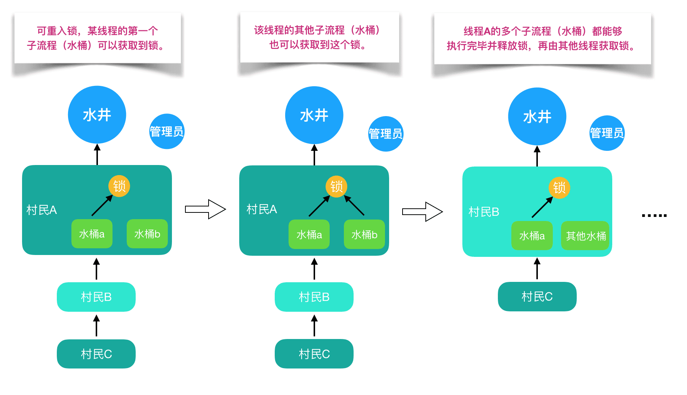
但如果是非可重入锁的话，此时管理员只允许锁和同一个人的一个水桶绑定。第一个水桶和锁绑定打完水之后并不会释放锁，导致第二个水桶不能和锁绑定也无法打水。当前线程出现死锁，整个等待队列中的所有线程都无法被唤醒。


之前我们说过ReentrantLock和synchronized都是重入锁，那么我们通过重入锁ReentrantLock以及非可重入锁NonReentrantLock的源码来对比分析一下为什么非可重入锁在重复调用同步资源时会出现死锁。

首先ReentrantLock和NonReentrantLock都继承父类AQS，其父类AQS中维护了一个同步状态status来计数重入次数，status初始值为0。

当线程尝试获取锁时，可重入锁先尝试获取并更新status值，如果status == 0表示没有其他线程在执行同步代码，则把status置为1，当前线程开始执行。如果status != 0，则判断当前线程是否是获取到这个锁的线程，如果是的话执行status+1，且当前线程可以再次获取锁。而非可重入锁是直接去获取并尝试更新当前status的值，如果status != 0的话会导致其获取锁失败，当前线程阻塞。

释放锁时，可重入锁同样先获取当前status的值，在当前线程是持有锁的线程的前提下。如果status-1 == 0，则表示当前线程所有重复获取锁的操作都已经执行完毕，然后该线程才会真正释放锁。而非可重入锁则是在确定当前线程是持有锁的线程之后，直接将status置为0，将锁释放。
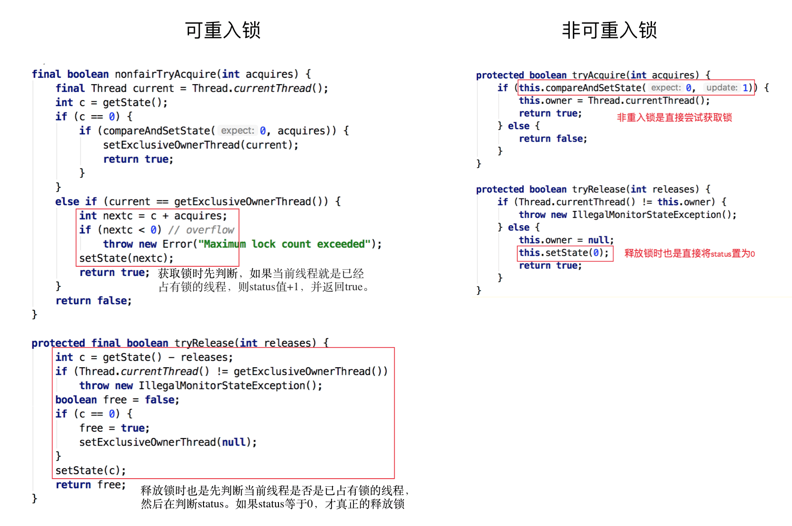

#### 8.3.6 独享锁(排他锁) VS 共享锁
> 独享锁和共享锁同样是一种概念。我们先介绍一下具体的概念，然后通过ReentrantLock和ReentrantReadWriteLock的源码来介绍独享锁和共享锁。

独享锁也叫排他锁，是指该锁一次只能被一个线程所持有。如果线程T对数据A加上排它锁后，则其他线程不能再对A加任何类型的锁。获得排它锁的线程即能读数据又能修改数据。JDK中的synchronized和JUC中Lock的实现类就是互斥锁。

共享锁是指该锁可被多个线程所持有。如果线程T对数据A加上共享锁后，则其他线程只能对A再加共享锁，不能加排它锁。获得共享锁的线程只能读数据，不能修改数据。

独享锁与共享锁也是通过AQS来实现的，通过实现不同的方法，来实现独享或者共享。

下图为ReentrantReadWriteLock的部分源码：


我们看到ReentrantReadWriteLock有两把锁：ReadLock和WriteLock，由词知意，一个读锁一个写锁，合称“读写锁”。再进一步观察可以发现ReadLock和WriteLock是靠内部类Sync实现的锁。Sync是AQS的一个子类，这种结构在CountDownLatch、ReentrantLock、Semaphore里面也都存在。

在ReentrantReadWriteLock里面，读锁和写锁的锁主体都是Sync，但读锁和写锁的加锁方式不一样。读锁是共享锁，写锁是独享锁。读锁的共享锁可保证并发读非常高效，而读写、写读、写写的过程互斥，因为读锁和写锁是分离的。所以ReentrantReadWriteLock的并发性相比一般的互斥锁有了很大提升。

详细的介绍可以参考 ReentrantReadWriteLock详解

### 8.4 关键字: synchronized详解

带着这些问题继续后文，会很大程度上帮助你更好的理解synchronized。

> - Synchronized可以作用在哪里? 分别通过对象锁和类锁进行举例。
> - Synchronized本质上是通过什么保证线程安全的? 分三个方面回答：
> - 加锁和释放锁的原理，可重入原理，保证可见性原理。
> - Synchronized有什么样的缺陷? Java Lock是怎么弥补这些缺陷的。
> - Synchronized和Lock的对比，和选择?
> - Synchronized在使用时有何注意事项?
> - Synchronized修饰的方法在抛出异常时,会释放锁吗?
> - 多个线程等待同一个Synchronized锁的时候，JVM如何选择下一个获取锁的线程?
> - Synchronized使得同时只有一个线程可以执行，性能比较差，有什么提升的方法?
> - 我想更加灵活的控制锁的释放和获取(现在释放锁和获取锁的时机都被规定死了)，怎么办?
> - 什么是锁的升级和降级? 什么是JVM里的偏向锁、轻量级锁、重量级锁?
> - 不同的JDK中对Synchronized有何优化?

#### 8.4.1  Synchronized的使用

在应用Sychronized关键字时需要把握如下注意点：
> - 一把锁只能同时被一个线程获取，没有获得锁的线程只能等待；
> - 每个实例都对应有自己的一把锁(this),不同实例之间互不影响；例外：锁对象是*.class以及synchronized修饰的是static方法的时候，所有对象公用同一把锁
> - synchronized修饰的方法，无论方法正常执行完毕还是抛出异常，都会释放锁
##### 8.4.1.1 对象锁
包括方法锁(默认锁对象为this,当前实例对象)和同步代码块锁(自己指定锁对象)


代码块形式：手动指定锁定对象，也可是是this,也可以是自定义的锁

示例1
```java
public class SynchronizedObjectLock implements Runnable {
    static SynchronizedObjectLock instance = new SynchronizedObjectLock();

    @Override
    public void run() {
        // 同步代码块形式——锁为this,两个线程使用的锁是一样的,线程1必须要等到线程0释放了该锁后，才能执行
        synchronized (this) {
            System.out.println("我是线程" + Thread.currentThread().getName());
            try {
                Thread.sleep(3000);
            } catch (InterruptedException e) {
                e.printStackTrace();
            }
            System.out.println(Thread.currentThread().getName() + "结束");
        }
    }

    public static void main(String[] args) {
        Thread t1 = new Thread(instance);
        Thread t2 = new Thread(instance);
        t1.start();
        t2.start();
    }
}

输出结果：我是线程Thread-0
Thread-0结束
我是线程Thread-1
Thread-1结束
```
示例2
```java
public class SynchronizedObjectLock implements Runnable {
    static SynchronizedObjectLock instance = new SynchronizedObjectLock();
    // 创建2把锁
    Object block1 = new Object();
    Object block2 = new Object();

    @Override
    public void run() {
        // 这个代码块使用的是第一把锁，当他释放后，后面的代码块由于使用的是第二把锁，因此可以马上执行
        synchronized (block1) {
            System.out.println("block1锁,我是线程" + Thread.currentThread().getName());
            try {
                Thread.sleep(3000);
            } catch (InterruptedException e) {
                e.printStackTrace();
            }
            System.out.println("block1锁,"+Thread.currentThread().getName() + "结束");
        }

        synchronized (block2) {
            System.out.println("block2锁,我是线程" + Thread.currentThread().getName());
            try {
                Thread.sleep(3000);
            } catch (InterruptedException e) {
                e.printStackTrace();
            }
            System.out.println("block2锁,"+Thread.currentThread().getName() + "结束");
        }
    }

    public static void main(String[] args) {
        Thread t1 = new Thread(instance);
        Thread t2 = new Thread(instance);
        t1.start();
        t2.start();
    }
}


输出结果：block1锁,我是线程Thread-0
block1锁,Thread-0结束
block2锁,我是线程Thread-0　　// 可以看到当第一个线程在执行完第一段同步代码块之后，第二个同步代码块可以马上得到执行，因为他们使用的锁不是同一把
block1锁,我是线程Thread-1
block2锁,Thread-0结束
block1锁,Thread-1结束
block2锁,我是线程Thread-1
block2锁,Thread-1结束
```
方法锁形式：synchronized修饰普通方法，锁对象默认为this
```java
public class SynchronizedObjectLock implements Runnable {
    static SynchronizedObjectLock instance = new SynchronizedObjectLock();

    @Override
    public void run() {
        method();
    }

    public synchronized void method() {
        System.out.println("我是线程" + Thread.currentThread().getName());
        try {
            Thread.sleep(3000);
        } catch (InterruptedException e) {
            e.printStackTrace();
        }
        System.out.println(Thread.currentThread().getName() + "结束");
    }

    public static void main(String[] args) {
        Thread t1 = new Thread(instance);
        Thread t2 = new Thread(instance);
        t1.start();
        t2.start();
    }
}


输出结果：我是线程Thread-0
Thread-0结束
我是线程Thread-1
Thread-1结束
```
##### 8.4.1.2 类锁

指synchronize修饰静态的方法或指定锁对象为Class对象

synchronize修饰静态方法

示例1
```java
public class SynchronizedObjectLock implements Runnable {
    static SynchronizedObjectLock instance1 = new SynchronizedObjectLock();
    static SynchronizedObjectLock instance2 = new SynchronizedObjectLock();

    @Override
    public void run() {
        method();
    }

    // synchronized用在普通方法上，默认的锁就是this，当前实例
    public synchronized void method() {
        System.out.println("我是线程" + Thread.currentThread().getName());
        try {
            Thread.sleep(3000);
        } catch (InterruptedException e) {
            e.printStackTrace();
        }
        System.out.println(Thread.currentThread().getName() + "结束");
    }

    public static void main(String[] args) {
        // t1和t2对应的this是两个不同的实例，所以代码不会串行
        Thread t1 = new Thread(instance1);
        Thread t2 = new Thread(instance2);
        t1.start();
        t2.start();
    }
}


输出结果：我是线程Thread-0
我是线程Thread-1
Thread-1结束
Thread-0结束
```
示例2
```java
public class SynchronizedObjectLock implements Runnable {
    static SynchronizedObjectLock instance1 = new SynchronizedObjectLock();
    static SynchronizedObjectLock instance2 = new SynchronizedObjectLock();

    @Override
    public void run() {
        method();
    }

    // synchronized用在静态方法上，默认的锁就是当前所在的Class类，所以无论是哪个线程访问它，需要的锁都只有一把
    public static synchronized void method() {
        System.out.println("我是线程" + Thread.currentThread().getName());
        try {
            Thread.sleep(3000);
        } catch (InterruptedException e) {
            e.printStackTrace();
        }
        System.out.println(Thread.currentThread().getName() + "结束");
    }

    public static void main(String[] args) {
        Thread t1 = new Thread(instance1);
        Thread t2 = new Thread(instance2);
        t1.start();
        t2.start();
    }
}


输出结果：我是线程Thread-0
Thread-0结束
我是线程Thread-1
Thread-1结束
```
synchronized指定锁对象为Class对象
```java
public class SynchronizedObjectLock implements Runnable {
    static SynchronizedObjectLock instance1 = new SynchronizedObjectLock();
    static SynchronizedObjectLock instance2 = new SynchronizedObjectLock();

    @Override
    public void run() {
        // 所有线程需要的锁都是同一把
        synchronized(SynchronizedObjectLock.class){
            System.out.println("我是线程" + Thread.currentThread().getName());
            try {
                Thread.sleep(3000);
            } catch (InterruptedException e) {
                e.printStackTrace();
            }
            System.out.println(Thread.currentThread().getName() + "结束");
        }
    }

    public static void main(String[] args) {
        Thread t1 = new Thread(instance1);
        Thread t2 = new Thread(instance2);
        t1.start();
        t2.start();
    }
}


输出结果：我是线程Thread-0
Thread-0结束
我是线程Thread-1
Thread-1结束
```
#### 8.4.2 Synchronized原理分析

##### 8.4.2.1 加锁和释放锁的原理
> 现象、时机(内置锁this)、深入JVM看字节码(反编译看monitor指令)

1. 加锁原理
- 锁的获取过程：

每个Java对象都有一个内置的`监视器锁（称为Monitor）`。当线程尝试进入synchronized块或方法时（如synchronized(obj) { ... }或synchronized method），JVM会检查该对象的锁状态。

如果锁是“空闲”状态（即没有被任何线程持有），当前线程会立即获取锁，并进入同步代码块。此时，JVM会将锁的持有者标记为当前线程，并在对象头的Mark Word中记录锁信息（如锁标志位）。

如果锁已被其他线程持有，当前线程会被阻塞（进入阻塞状态），并放入该对象的等待队列中，直到锁被释放。

可重入性：synchronized锁是可重入的。这意味着同一个线程可以多次获取同一个锁（例如，在递归调用或嵌套synchronized块中）。每次获取锁时，JVM会维护一个计数器（在Monitor中记录），初始为0。当线程第一次获取锁时，计数器加1；同一线程再次获取时，计数器继续递增，而不是被阻塞。

- 底层实现：

在JVM字节码层面，synchronized块通过monitorenter指令实现。当线程执行到monitorenter时，JVM会检查锁状态：

如果锁计数器为0，线程获取锁，计数器加1。

如果线程已持有锁，计数器增加（实现可重入）。

如果锁被其他线程持有，线程阻塞。

这个过程涉及内存屏障（Memory Barrier），确保变量的可见性和有序性（遵循Java内存模型的原则），防止指令重排序。

2. 释放锁原理
- 锁的释放过程：

当线程退出synchronized块或方法时（无论是正常退出还是通过return、break或异常），JVM会自动触发锁的释放。

释放锁时，JVM会将锁计数器的值减1。如果计数器减到0，表示锁完全释放，锁状态变为“空闲”。

一旦锁被释放，JVM会唤醒该对象等待队列中的一个或多个线程（具体唤醒哪个线程取决于JVM实现，通常是公平或非公平策略），让它们竞争获取锁。

异常安全：即使在同步块中发生未捕获异常，锁也会被正确释放（通过monitorexit指令在异常路径中插入），避免死锁。

- 底层实现：

在字节码中，synchronized块结束时对应monitorexit指令。JVM确保每个monitorenter都有对应的monitorexit（包括异常处理路径）。
monitorexit将锁计数器减1，如果计数器为0，则清除锁持有者信息。

释放锁后，JVM会更新对象头的Mark Word，并通知等待线程，这涉及到操作系统的线程调度（如通过pthread_mutex在底层实现）。

3. 深入JVM看字节码，创建如下的代码：
```java
public class SynchronizedDemo2 {

    Object object = new Object();
    public void method1() {
        synchronized (object) {

        }
        method2();
    }

    private static void method2() {

    }
}
```
使用javac命令进行编译生成.class文件>javac SynchronizedDemo2.java

使用javap命令反编译查看.class文件的信息>javap -verbose SynchronizedDemo2.class

得到如下的信息：


关注红色方框里的monitorenter和monitorexit即可。

Monitorenter和Monitorexit指令，会让对象在执行，使其锁计数器加1或者减1。每一个对象在同一时间只与一个monitor(锁)相关联，而一个monitor在同一时间只能被一个线程获得，一个对象在尝试获得与这个对象相关联的Monitor锁的所有权的时候，monitorenter指令会发生如下3种情况之一：

- monitor计数器为0，意味着目前还没有被获得，那这个线程就会立刻获得然后把锁计数器+1，一旦+1，别的线程再想获取，就需要等待
- 如果这个monitor已经拿到了这个锁的所有权，又重入了这把锁，那锁计数器就会累加，变成2，并且随着重入的次数，会一直累加
- 这把锁已经被别的线程获取了，等待锁释放

`monitorexit指令`：释放对于monitor的所有权，释放过程很简单，就是讲monitor的计数器减1，如果减完以后，计数器不是0，则代表刚才是重入进来的，当前线程还继续持有这把锁的所有权，如果计数器变成0，则代表当前线程不再拥有该monitor的所有权，即释放锁。

下图表现了对象，对象监视器，同步队列以及执行线程状态之间的关系：

该图可以看出，任意线程对Object的访问，首先要获得Object的监视器，如果获取失败，该线程就进入同步状态，线程状态变为BLOCKED，当Object的监视器占有者释放后，在同步队列中得线程就会有机会重新获取该监视器。
4. 每个**Java对象**都有一个内置的`监视器锁（称为Monitor）`，那类锁的实现难道不适用监视器锁吗？

**类锁的本质也是通过监视器锁（Monitor）实现的，但它的加锁对象不是普通实例，而是该类的Class对象**

| **特性**         | **实例锁**                     | **类锁**                          |
|------------------|-------------------------------|-----------------------------------|
| 锁对象           | 类的实例对象 (如 `new Object()`) | 类的 `Class` 对象 (如 `MyClass.class`) |
| 作用范围         | 仅影响同一实例的同步块          | 影响该类的所有实例的同步块          |
| 内存位置         | 堆内存                         | 方法区 (元空间)                   |
| 是否共享         | 不同实例锁相互独立              | 全局唯一，所有线程共享              |

**类锁与实例锁互不干扰**  
   以下代码可并行执行：  
   ```java
   // 线程1 (类锁)
   synchronized(MyClass.class) { ... }
   
   // 线程2 (实例锁)
   synchronized(new MyClass()) { ... } // 不受影响
   ```
下面是一个例子
```java
class Resource {
    // 🔒 类锁方法（锁定Resource.class）
    public static synchronized void classLockOperation() {
        System.out.println(Thread.currentThread().getName() + " 进入类锁方法");
        try {
            Thread.sleep(2000); // 模拟耗时操作
        } catch (InterruptedException e) {
            e.printStackTrace();
        }
        System.out.println(Thread.currentThread().getName() + " 离开类锁方法");
    }
    
    // 🔒 实例锁方法（锁定当前实例）
    public synchronized void instanceLockOperation() {
        System.out.println(Thread.currentThread().getName() + " 进入实例锁方法");
        try {
            Thread.sleep(2000); // 模拟耗时操作
        } catch (InterruptedException e) {
            e.printStackTrace();
        }
        System.out.println(Thread.currentThread().getName() + " 离开实例锁方法");
    }
}

public class LockParallelDemo {
    public static void main(String[] args) {
        Resource obj = new Resource();
        
        // 线程1：使用类锁
        new Thread(() -> {
            Resource.classLockOperation(); // 锁定Resource.class
        }, "类锁线程").start();
        
        // 稍等100ms确保线程1先启动
        try { Thread.sleep(100); } catch (InterruptedException e) {}
        
        // 线程2：使用同一个实例的实例锁
        new Thread(() -> {
            obj.instanceLockOperation(); // 锁定obj实例
        }, "实例锁线程").start();
    }
}

类锁线程 进入类锁方法
实例锁线程 进入实例锁方法   // 注意：这里没有等待！
实例锁线程 离开实例锁方法   // 约2秒后
类锁线程 离开类锁方法     // 约2秒后（与实例锁同时结束）
```
##### 8.4.2.2 可重入原理：加锁次数计数器

1. 什么是可重入？可重入锁？

- 可重入：（来源于维基百科）若一个程序或子程序可以“在任意时刻被中断然后操作系统调度执行另外一段代码，这段代码又调用了该子程序不会出错”，则称其为可重入（reentrant或re-entrant）的。即当该子程序正在运行时，执行线程可以再次进入并执行它，仍然获得符合设计时预期的结果。与多线程并发执行的线程安全不同，可重入强调对单个线程执行时重新进入同一个子程序仍然是安全的。
- 可重入锁：又名递归锁，是指在同一个线程在外层方法获取锁的时候，再进入该线程的内层方法会自动获取锁（前提锁对象得是同一个对象或者class），不会因为之前已经获取过还没释放而阻塞。

2. 看如下的例子
```java
public class SynchronizedDemo {

    public static void main(String[] args) {
        SynchronizedDemo demo =  new SynchronizedDemo();
        demo.method1();
    }

    private synchronized void method1() {
        System.out.println(Thread.currentThread().getId() + ": method1()");
        method2();
    }

    private synchronized void method2() {
        System.out.println(Thread.currentThread().getId()+ ": method2()");
        method3();
    }

    private synchronized void method3() {
        System.out.println(Thread.currentThread().getId()+ ": method3()");
    }
}
```
结合前文中加锁和释放锁的原理，不难理解：
- 执行monitorenter获取锁 
  - （monitor计数器=0，可获取锁）
  - 执行method1()方法，monitor计数器+1 -> 1 （获取到锁）
  - 执行method2()方法，monitor计数器+1 -> 2
  - 执行method3()方法，monitor计数器+1 -> 3
- 执行monitorexit命令 
  - method3()方法执行完，monitor计数器-1 -> 2
  - method2()方法执行完，monitor计数器-1 -> 1
  - method2()方法执行完，monitor计数器-1 -> 0 （释放了锁）
  - （monitor计数器=0，锁被释放了）

这就是Synchronized的重入性，即在同一锁程中，每个对象拥有一个monitor计数器，当线程获取该对象锁后，monitor计数器就会加一，释放锁后就会将monitor计数器减一，线程不需要再次获取同一把锁。
##### 8.4.2.3 保证可见性的原理：内存模型和happens-before规则
Synchronized的happens-before规则，即监视器锁规则：**对同一个监视器的解锁，happens-before于对该监视器的加锁**。

继续来看代码：

```java
public class MonitorDemo {
    private int a = 0;

    public synchronized void writer() {     // 1
        a++;                                // 2
    }                                       // 3

    public synchronized void reader() {    // 4
        int i = a;                         // 5
    }                                      // 6
}
```
该代码的happens-before关系如图所示：


在图中每一个箭头连接的两个节点就代表之间的happens-before关系，黑色的是通过程序顺序规则推导出来，红色的为监视器锁规则推导而出：线程A释放锁happens-before线程B加锁，蓝色的则是通过程序顺序规则和监视器锁规则推测出来happens-befor关系，通过传递性规则进一步推导的happens-before关系。现在我们来重点关注2 happens-before 5，通过这个关系我们可以得出什么?

根据happens-before的定义中的一条:如果A happens-before B，则**A的执行结果对B可见**，并且A的执行顺序先于B。线程A先对共享变量A进行加一，由2 happens-before 5关系可知线程A的执行结果对线程B可见即线程B所读取到的a的值为1

#### 8.4.3 JVM中锁的优化

简单来说在JVM中monitorenter和monitorexit字节码依赖于底层的操作系统的Mutex Lock来实现的，但是由于使用Mutex Lock需要将当前线程挂起并从用户态切换到内核态来执行，这种切换的代价是非常昂贵的；然而在现实中的大部分情况下，同步方法是运行在单线程环境(无锁竞争环境)如果每次都调用Mutex Lock那么将严重的影响程序的性能。**不过在jdk1.6中对锁的实现引入了大量的优化，如锁粗化(Lock Coarsening)、锁消除(Lock Elimination)、轻量级锁(Lightweight Locking)、偏向锁(Biased Locking)、适应性自旋(Adaptive Spinning)等技术来减少锁操作的开销**。

- 锁粗化(Lock Coarsening)：也就是减少不必要的紧连在一起的unlock，lock操作，将多个连续的锁扩展成一个范围更大的锁。
- 锁消除(Lock Elimination)：通过运行时JIT编译器的逃逸分析来消除一些没有在当前同步块以外被其他线程共享的数据的锁保护，通过逃逸分析也可以在线程本的Stack上进行对象空间的分配(同时还可以减少Heap上的垃圾收集开销)。
- 轻量级锁(Lightweight Locking)：这种锁实现的背后基于这样一种假设，即在真实的情况下我们程序中的大部分同步代码一般都处于无锁竞争状态(即单线程执行环境)，在无锁竞争的情况下完全可以避免调用操作系统层面的重量级互斥锁，取而代之的是在monitorenter和monitorexit中只需要依靠一条CAS原子指令就可以完成锁的获取及释放。当存在锁竞争的情况下，执行CAS指令失败的线程将调用操作系统互斥锁进入到阻塞状态，当锁被释放的时候被唤醒(具体处理步骤下面详细讨论)。
- 偏向锁(Biased Locking)：是为了在无锁竞争的情况下避免在锁获取过程中执行不必要的CAS原子指令，因为CAS原子指令虽然相对于重量级锁来说开销比较小但还是存在非常可观的本地延迟。
- 适应性自旋(Adaptive Spinning)：当线程在获取轻量级锁的过程中执行CAS操作失败时，在进入与monitor相关联的操作系统重量级锁(mutex semaphore)前会进入忙等待(Spinning)然后再次尝试，当尝试一定的次数后如果仍然没有成功则调用与该monitor关联的semaphore(即互斥锁)进入到阻塞状态。

##### 8.4.3.1 Synchronied同步锁的类型

在Java SE 1.6里Synchronied同步锁，一共有四种状态：无锁、偏向锁、轻量级锁、重量级锁，它会随着竞争情况逐渐升级。锁可以升级但是不可以降级，目的是为了提供获取锁和释放锁的效率。
> 锁膨胀方向： 无锁 → 偏向锁 → 轻量级锁 → 重量级锁 (此过程是不可逆的)
##### 8.4.3.2 自旋锁与自适应自旋锁
- 自旋锁
> 引入背景：大家都知道，在没有加入锁优化时，Synchronized是一个非常“胖大”的家伙。在多线程竞争锁时，当一个线程获取锁时，它会阻塞所有正在竞争的线程，这样对性能带来了极大的影响。在挂起线程和恢复线程的操作都需要转入内核态中完成，这些操作对系统的并发性能带来了很大的压力。同时HotSpot团队注意到在很多情况下，共享数据的锁定状态只会持续很短的一段时间，为了这段时间去挂起和回复阻塞线程并不值得。在如今多处理器环境下，完全可以让另一个没有获取到锁的线程在门外等待一会(自旋)，但不放弃CPU的执行时间。等待持有锁的线程是否很快就会释放锁。为了让线程等待，我们只需要让线程执行一个忙循环(自旋)，这便是自旋锁由来的原因。

自旋锁早在JDK1.4 中就引入了，只是当时默认时关闭的。在JDK 1.6后默认为开启状态。自旋锁本质上与阻塞并不相同，先不考虑其对多处理器的要求，如果锁占用的时间非常的短，那么自旋锁的性能会非常的好，相反，其会带来更多的性能开销(因为在线程自旋时，始终会占用CPU的时间片，如果锁占用的时间太长，那么自旋的线程会白白消耗掉CPU资源)。因此自旋等待的时间必须要有一定的限度，如果自旋超过了限定的次数仍然没有成功获取到锁，就应该使用传统的方式去挂起线程了，在JDK定义中，自旋锁默认的自旋次数为10次，用户可以使用参数`-XX:PreBlockSpin`来更改。

可是现在又出现了一个问题：如果线程锁在线程自旋刚结束就释放掉了锁，那么是不是有点得不偿失。所以这时候我们需要更加聪明的锁来实现更加灵活的自旋。来提高并发的性能。(这里则需要自适应自旋锁！)
- 自适应自旋锁

在JDK 1.6中引入了自适应自旋锁。这就意味着自旋的时间不再固定了，而是由前一次在同一个锁上的自旋 时间及锁的拥有者的状态来决定的。如果在同一个锁对象上，自旋等待刚刚成功获取过锁，并且持有锁的线程正在运行中，那么JVM会认为该锁自旋获取到锁的可能性很大，会自动增加等待时间。比如增加到100此循环。相反，如果对于某个锁，自旋很少成功获取锁。那再以后要获取这个锁时将可能省略掉自旋过程，以避免浪费处理器资源。有了自适应自旋，JVM对程序的锁的状态预测会越来越准确，JVM也会越来越聪明。

##### 8.4.3.3 锁消除

锁消除是指虚拟机即时编译器再运行时，对一些代码上要求同步，但是被检测到不可能存在共享数据竞争的锁进行消除。锁消除的主要判定依据来源于逃逸分析的数据支持。意思就是：JVM会判断再一段程序中的同步明显不会逃逸出去从而被其他线程访问到，那JVM就把它们当作栈上数据对待，认为这些数据是线程独有的，不需要加同步。此时就会进行锁消除。

​当然在实际开发中，我们很清楚的知道哪些是线程独有的，不需要加同步锁，但是在Java API中有很多方法都是加了同步的，那么此时JVM会判断这段代码是否需要加锁。如果数据并不会逃逸，则会进行锁消除。比如如下操作：在操作String类型数据时，由于String是一个不可变类，对字符串的连接操作总是通过生成的新的String对象来进行的。因此Javac编译器会对String连接做自动优化。在JDK 1.5之前会使用StringBuffer对象的连续append()操作，在JDK 1.5及以后的版本中，会转化为StringBuidler对象的连续append()操作。
```java
public static String test03(String s1, String s2, String s3) {
    String s = s1 + s2 + s3;
    return s;
}
```
上述代码使用javap 编译结果:


众所周知，StringBuilder不是安全同步的，但是在上述代码中，JVM判断该段代码并不会逃逸，则将该代码带默认为线程独有的资源，并不需要同步，所以执行了锁消除操作。(还有Vector中的各种操作也可实现锁消除。在没有逃逸出数据安全防卫内)

##### 8.4.3.4 锁粗化

原则上，我们都知道在加同步锁时，尽可能的将同步块的作用范围限制到尽量小的范围(只在共享数据的实际作用域中才进行同步，这样是为了使得需要同步的操作数量尽可能变小。在存在锁同步竞争中，也可以使得等待锁的线程尽早的拿到锁)。​大部分上述情况是完美正确的，但是如果存在连串的一系列操作都对同一个对象反复加锁和解锁，甚至加锁操作时出现在循环体中的，那即使没有线程竞争，频繁的进行互斥同步操作也会导致不必要的性能操作。这里贴上根据上述Javap 编译的情况编写的实例java类
```java
public static String test04(String s1, String s2, String s3) {
    StringBuffer sb = new StringBuffer();
    sb.append(s1);
    sb.append(s2);
    sb.append(s3);
    return sb.toString();
}
```
​在上述的连续append()操作中就属于这类情况。JVM会检测到这样一连串的操作都是对同一个对象加锁，那么JVM会将加锁同步的范围扩展(粗化)到整个一系列操作的 外部，使整个一连串的append()操作只需要加锁一次就可以了。

##### 8.4.3.5 轻量级锁​
在JDK 1.6之后引入的轻量级锁，需要注意的是轻量级锁并不是替代重量级锁的，而是对在大多数情况下同步块并不会有竞争出现提出的一种优化。它可以减少重量级锁对线程的阻塞带来的线程开销。从而提高并发性能。

​如果要理解轻量级锁，那么必须先要了解HotSpot虚拟机中对象头的内存布局。上面介绍Java对象头也详细介绍过。在对象头中(Object Header)存在两部分。第一部分用于存储对象自身的运行时数据，HashCode、GC Age、锁标记位、是否为偏向锁。等。一般为32位或者64位(视操作系统位数定)。官方称之为Mark Word，它是实现轻量级锁和偏向锁的关键。 另外一部分存储的是指向方法区对象类型数据的指针(Klass Point)，如果对象是数组的话，还会有一个额外的部分用于存储数据的长度。

- 轻量级锁加锁

在线程执行同步块之前，JVM会先在当前线程的栈帧中创建一个名为锁记录(Lock Record)的空间，用于存储锁对象目前的Mark Word的拷贝(JVM会将对象头中的Mark Word拷贝到锁记录中，官方称为Displaced Mark Ward)这个时候线程堆栈与对象头的状态如图：如上图所示：

如果当前对象没有被锁定，那么锁标志位为01状态，JVM在执行当前线程时，首先会在当前线程栈帧中创建锁记录Lock Record的空间用于存储锁对象目前的Mark Word的拷贝。

​ 然后，虚拟机使用CAS操作将标记字段Mark Word拷贝到锁记录中，并且将Mark Word更新为指向Lock Record的指针。如果更新成功了，那么这个线程就拥用了该对象的锁，并且对象Mark Word的锁标志位更新为(Mark Word中最后的2bit)00，即表示此对象处于轻量级锁定状态，如图：​ 

如果这个更新操作失败，JVM会检查当前的Mark Word中是否存在指向当前线程的栈帧的指针，如果有，说明该锁已经被获取，可以直接调用。如果没有，则说明该锁被其他线程抢占了，如果有两条以上的线程竞争同一个锁，那轻量级锁就不再有效，直接膨胀为重量级锁，没有获得锁的线程会被阻塞。此时，锁的标志位为10.Mark Word中存储的指向重量级锁的指针。​ 

轻量级解锁时，会使用原子的CAS操作将Displaced Mark Word替换回到对象头中，如果成功，则表示没有发生竞争关系。如果失败，表示当前锁存在竞争关系。锁就会膨胀成重量级锁。两个线程同时争夺锁，导致锁膨胀的流程图如下：


##### 8.4.3.6 偏向锁

> 引入背景：在大多实际环境下，锁不仅不存在多线程竞争，而且总是由同一个线程多次获取，那么在同一个线程反复获取所释放锁中，其中并还没有锁的竞争，那么这样看上去，多次的获取锁和释放锁带来了很多不必要的性能开销和上下文切换。

为了解决这一问题，HotSpot的作者在Java SE 1.6 中对Synchronized进行了优化，引入了偏向锁。当一个线程访问同步块并获取锁时，会在对象头和栈帧中的锁记录里存储锁偏向的线程ID，以后该线程在进入和退出同步块时不需要进行CAS操作来加锁和解锁。只需要简单的测试一下对象头的Mark Word里是否存储着指向当前线程的偏向锁。如果成功，表示线程已经获取到了锁。

- 偏向锁的撤销​ 

偏向锁使用了一种等待竞争出现才会释放锁的机制。所以当其他线程尝试获取偏向锁时，持有偏向锁的线程才会释放锁。但是偏向锁的撤销需要等到全局安全点(就是当前线程没有正在执行的字节码)。它会首先暂停拥有偏向锁的线程，让你后检查持有偏向锁的线程是否活着。如果线程不处于活动状态，直接将对象头设置为无锁状态。如果线程活着，JVM会遍历栈帧中的锁记录，栈帧中的锁记录和对象头要么偏向于其他线程，要么恢复到无锁状态或者标记对象不适合作为偏向锁。
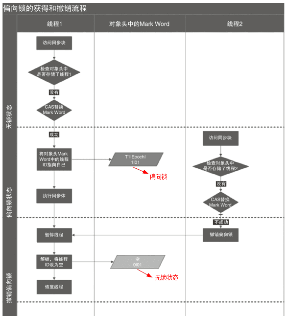

#### 8.4.4 锁的优缺点对比

#### 8.4.5 Synchronized与Lock
##### 8.4.5.1 synchronized的缺陷
- 效率低：锁的释放情况少，只有代码执行完毕或者异常结束才会释放锁；试图获取锁的时候不能设定超时，不能中断一个正在使用锁的线程，相对而言，Lock可以中断和设置超时
- 不够灵活：加锁和释放的时机单一，每个锁仅有一个单一的条件(某个对象)，相对而言，读写锁更加灵活
- 无法知道是否成功获得锁，相对而言，Lock可以拿到状态，如果成功获取锁，....，如果获取失败，.....
##### 8.4.5.2 Lock解决相应问题
Lock类这里不做过多解释，主要看里面的4个方法:
- lock():加锁
- unlock(): 解锁
- tryLock(): 尝试获取锁，返回一个boolean值
- tryLock(long,TimeUtil): 尝试获取锁，可以设置超时
- Synchronized加锁只与一个条件(是否获取锁)相关联，不灵活，后来Condition与Lock的结合解决了这个问题。

多线程竞争一个锁时，其余未得到锁的线程只能不停的尝试获得锁，而不能中断。高并发的情况下会导致性能下降。ReentrantLock的lockInterruptibly()方法可以优先考虑响应中断。 一个线程等待时间过长，它可以中断自己，然后ReentrantLock响应这个中断，不再让这个线程继续等待。有了这个机制，使用ReentrantLock时就不会像synchronized那样产生死锁了。

详细分析请看: JUC锁: ReentrantLock详解

synchronized是通过软件(JVM)实现的，简单易用，即使在JDK5之后有了Lock，仍然被广泛的使用。
- 使用Synchronized有哪些要注意的？
  - 锁对象不能为空，因为锁的信息都保存在对象头里
  - 作用域不宜过大，影响程序执行的速度，控制范围过大，编写代码也容易出错
  - 避免死锁
  - 在能选择的情况下，既不要用Lock也不要用synchronized关键字，用java.util.concurrent包中的各种各样的类，如果不用该包下的类，在满足业务的情况下，可以使用synchronized关键，因为代码量少，避免出错
- **synchronized是公平锁吗**？
  - synchronized实际上是非公平的，新来的线程有可能立即获得监视器，而在等待区中等候已久的线程可能再次等待，这样有利于提高性能，但是也可能会导致饥饿现象。
  - reentrantlock(true)可以设置为公平锁，默认是非公平锁

### 8.5 关键字: volatile详解
请带着这些问题继续后文，会很大程度上帮助你更好的理解volatile。
>- volatile关键字的作用是什么?
>- volatile能保证原子性吗?
>- 之前32位机器上共享的long和double变量的为什么要用volatile? 现在64位机器上是否也要设置呢?
>- i++为什么不能保证原子性?
>- volatile是如何实现可见性的? 内存屏障。
>- volatile是如何实现有序性的? happens-before等
>- 说下volatile的应用场景?
#### 8.5.1 volatile的作用详解
##### 8.5.1.1 防重排序
我们从一个最经典的例子来分析重排序问题。大家应该都很熟悉单例模式的实现，而在并发环境下的单例实现方式，我们通常可以采用双重检查加锁(DCL)的方式来实现。其源码如下：
```java
public class Singleton {
    public static volatile Singleton singleton;
    /**
     * 构造函数私有，禁止外部实例化
     */
    private Singleton() {};
    public static Singleton getInstance() {
        if (singleton == null) {
            synchronized (singleton.class) {
                if (singleton == null) {
                    singleton = new Singleton();
                }
            }
        }
        return singleton;
    }
}
```
现在我们分析一下为什么要在变量singleton之间加上volatile关键字。要理解这个问题，先要了解对象的构造过程，实例化一个对象其实可以分为三个步骤：
- 分配内存空间。
- 初始化对象。
- 将内存空间的地址赋值给对应的引用。
- 
但是由于操作系统可以`对指令进行重排序`，所以上面的过程也可能会变成如下过程：
- 分配内存空间。
- 将内存空间的地址赋值给对应的引用。
- 初始化对象

如果是这个流程，多线程环境下就可能将一个未初始化的对象引用暴露出来，从而导致不可预料的结果。因此，为了防止这个过程的重排序，我们需要将变量设置为volatile类型的变量。

下面对上面DCL单例进行详细解释：

在双重检查锁定（Double-Checked Locking, DCL）实现的单例模式中，`volatile` 修饰符对 `Singleton` 实例的声明是**必需的**，原因与原子性无关，而是为了解决**指令重排序**导致的可见性和有序性问题。以下是详细解释：

1. **对象创建过程的非原子性**

虽然引用类型（对象引用）的**赋值操作本身是原子的**（即一次性写入内存地址），但对象实例化 `new Singleton()` 并非原子操作，它包含三个步骤：
```java
memory = allocate();   // 1. 分配内存空间
ctorSingleton(memory); // 2. 调用构造函数初始化对象
singleton = memory;    // 3. 将引用指向内存地址
```
**关键问题**：JVM 可能因指令重排序优化，将步骤 2 和 3 颠倒（即先赋值引用再初始化）：
```java
memory = allocate();
singleton = memory;    // 此时引用已非 null，但对象未初始化！
ctorSingleton(memory); // 实际初始化
```

---

2. **多线程下的风险场景**

假设未使用 `volatile`，线程 A 执行 `getInstance()`：
- 1. 线程 A 进入同步块，执行 `new Singleton()`  
   - JVM 重排序：先执行 `singleton = memory`（引用已赋值），**对象未初始化**
- 2. 此时线程 B 调用 `getInstance()`  
   - 第一层检查 `if (singleton == null)` 为 `false`（因为引用已赋值）
   - 线程 B 直接返回 `singleton` 引用  
   - **但此时对象尚未初始化完成！** → 线程 B 使用了一个不完整的对象（半初始化状态）

---

3. **`volatile` 的解决方案**
```java
public static volatile Singleton singleton; // 添加 volatile
```
`volatile` 在此处的作用：
| 作用           | 机制                                                                 |
|----------------|----------------------------------------------------------------------|
| **禁止重排序** | 通过内存屏障禁止 JVM 重排序步骤 2 和 3，确保对象**完全初始化**后才赋值引用 |
| **保证可见性** | 线程 A 完成初始化后，新值立即对其他线程可见                             |

---

- 结论

在 DCL 单例模式中，`volatile` 修饰符的核心作用是：
1. **防止指令重排序**：确保对象完全初始化后再赋值引用，避免返回半初始化对象。  
2. **保证可见性**：确保所有线程都能获取到初始化完成的对象。  

> ⚠️ **若省略 `volatile`**：  
> 高并发场景下可能返回**未初始化完成的对象**，导致不可预测的行为（如字段为默认值 `null`/`0`）。
##### 8.5.1.2 实现可见性

可见性问题主要指一个线程修改了共享变量值，而另一个线程却看不到。引起可见性问题的主要原因是每个线程拥有自己的一个`高速缓存区——线程工作内存`。volatile关键字能有效的解决这个问题，我们看下下面的例子，就可以知道其作用：
```java
public class TestVolatile {
    private static boolean stop = false;

    public static void main(String[] args) {
        // Thread-A
        new Thread("Thread A") {
            @Override
            public void run() {
                while (!stop) {
                }
                System.out.println(Thread.currentThread() + " stopped");
            }
        }.start();

        // Thread-main
        try {
            TimeUnit.SECONDS.sleep(1);
            System.out.println(Thread.currentThread() + " after 1 seconds");
        } catch (InterruptedException e) {
            e.printStackTrace();
        }
        stop = true;
    }
}
```
执行输出如下
```java
Thread[main,5,main] after 1 seconds

// Thread A一直在loop, 因为Thread A 由于可见性原因看不到Thread Main 已经修改stop的值
```
可以看到 Thread-main 休眠1秒之后，设置 stop = ture，但是Thread A根本没停下来，这就是可见性问题。如果通过在stop变量前面加上volatile关键字则会真正stop:
```java
Thread[main,5,main] after 1 seconds
Thread[Thread A,5,main] stopped

Process finished with exit code 0
```

##### 8.5.1.3 保证原子性:**单次读/写**

**volatile不能保证完全的原子性，只能保证单次的读/写操作具有原子性。**


`volatile` 关键字在 Java 中主要保证以下两个特性：  
**✅ 可见性（Visibility）** 和 **✅ 有序性（Ordering）**，但 **❌ 不保证原子性（Atomicity）**。

具体说明如下：

| 特性       | 是否保证 | 说明                                                                 |
|------------|----------|----------------------------------------------------------------------|
| **可见性** | ✅ 是     | 确保所有线程都能立即看到 `volatile` 变量的最新值（通过**强制写操作刷回主内存、读操作从主内存读取**实现） |
| **有序性** | ✅ 是     | 禁止指令重排序优化（通过**内存屏障**），保证操作顺序与代码顺序一致       |
| **原子性** | ❌ 否     | 不保证复合操作的原子性（如 `i++`），仅对单次读/写操作有效               |

| 关键字      | 可见性 | 有序性 | 原子性       | 典型场景                     |
|-------------|--------|--------|--------------|------------------------------|
| `volatile`  | ✅     | ✅     | ❌（单次读写）| 状态标志、双重检查锁（DCL） |
| `synchronized` | ✅     | ✅     | ✅           | 复合操作（如计数器累加）     |


- 问题1： i++为什么不能保证原子性?

对于原子性，需要强调一点，也是大家容易误解的一点：对volatile变量的单次读/写操作可以保证原子性的，如long和double类型变量，但是并不能保证i++这种操作的原子性，因为本质上i++是读、写两次操作。

现在我们就通过下列程序来演示一下这个问题：
```java
public class VolatileTest01 {
    volatile int i;

    public void addI(){
        i++;
    }

    public static void main(String[] args) throws InterruptedException {
        final  VolatileTest01 test01 = new VolatileTest01();
        for (int n = 0; n < 1000; n++) {
            new Thread(new Runnable() {
                @Override
                public void run() {
                    try {
                        Thread.sleep(10);
                    } catch (InterruptedException e) {
                        e.printStackTrace();
                    }
                    test01.addI();
                }
            }).start();
        }
        Thread.sleep(10000);//等待10秒，保证上面程序执行完成
        System.out.println(test01.i);
    }
}
```
大家可能会误认为对变量i加上关键字volatile后，这段程序就是线程安全的。大家可以尝试运行上面的程序。下面是我本地运行的结果：981 可能每个人运行的结果不相同。不过应该能看出，volatile是无法保证原子性的(否则结果应该是1000)。原因也很简单，i++其实是一个复合操作，包括三步骤：
  - 读取i的值。
  - 对i加1。
  - 将i的值写回内存。

volatile是无法保证这三个操作是具有原子性的，我们可以通过AtomicInteger或者Synchronized来保证+1操作的原子性。 注：上面几段代码中多处执行了Thread.sleep()方法，目的是为了增加并发问题的产生几率，无其他作用。
- 问题2： 共享的long和double变量的为什么要用volatile?

因为long和double两种数据类型的操作可分为高32位和低32位两部分，因此普通的long或double类型读/写可能不是原子的。因此，鼓励大家将共享的long和double变量设置为volatile类型，这样能保证任何情况下对long和double的单次读/写操作都具有原子性。

如下是JLS中的解释：

> 17.7 Non-Atomic Treatment of double and long
> - For the purposes of the Java programming language memory model, a single write to a non-volatile long or double value is treated as two separate writes: one to each 32-bit half. This can result in a situation where a thread sees the first 32 bits of a 64-bit value from one write, and the second 32 bits from another write.
> - Writes and reads of volatile long and double values are always atomic.
> - Writes to and reads of references are always atomic, regardless of whether they are implemented as 32-bit or 64-bit values.
> - Some implementations may find it convenient to divide a single write action on a 64-bit long or double value into two write actions on adjacent 32-bit values. For efficiency’s sake, this behavior is implementation-specific; an implementation of the Java Virtual Machine is free to perform writes to long and double values atomically or in two parts.
> - Implementations of the Java Virtual Machine are encouraged to avoid splitting 64-bit values where possible. Programmers are encouraged to declare shared 64-bit values as volatile or synchronize their programs correctly to avoid possible complications.

目前各种平台下的商用虚拟机都选择把 64 位数据的读写操作作为原子操作来对待，因此我们在编写代码时一般不把long 和 double 变量专门声明为 volatile多数情况下也是不会错的。

#### 8.5.2 volatile 的实现原理
##### 8.5.2.1 volatile 可见性实现
> volatile 变量的内存可见性是基于内存屏障(Memory Barrier)实现:

- 内存屏障，又称内存栅栏，是一个 CPU 指令。
- 在程序运行时，为了提高执行性能，编译器和处理器会对指令进行重排序，JMM 为了保证在不同的编译器和 CPU 上有相同的结果，通过插入特定类型的内存屏障来禁止+ 特定类型的编译器重排序和处理器重排序，插入一条内存屏障会告诉编译器和 CPU：不管什么指令都不能和这条 Memory Barrier 指令重排序。

写一段简单的 Java 代码，声明一个 volatile 变量，并赋值。
```java
public class Test {
    private volatile int a;
    public void update() {
        a = 1;
    }
    public static void main(String[] args) {
        Test test = new Test();
        test.update();
    }
}
```
通过 hsdis 和 jitwatch 工具可以得到编译后的汇编代码:......
```sh
  0x0000000002951563: and    $0xffffffffffffff87,%rdi
  0x0000000002951567: je     0x00000000029515f8
  0x000000000295156d: test   $0x7,%rdi
  0x0000000002951574: jne    0x00000000029515bd
  0x0000000002951576: test   $0x300,%rdi
  0x000000000295157d: jne    0x000000000295159c
  0x000000000295157f: and    $0x37f,%rax
  0x0000000002951586: mov    %rax,%rdi
  0x0000000002951589: or     %r15,%rdi
  0x000000000295158c: lock cmpxchg %rdi,(%rdx)  //在 volatile 修饰的共享变量进行写操作的时候会多出 lock 前缀的指令
  0x0000000002951591: jne    0x0000000002951a15
  0x0000000002951597: jmpq   0x00000000029515f8
  0x000000000295159c: mov    0x8(%rdx),%edi
  0x000000000295159f: shl    $0x3,%rdi
  0x00000000029515a3: mov    0xa8(%rdi),%rdi
  0x00000000029515aa: or     %r15,%rdi
......
```
lock 前缀的指令在多核处理器下会引发两件事情:
- 将当前处理器缓存行的数据写回到系统内存。
- 写回内存的操作会使在其他 CPU 里缓存了该内存地址的数据无效。
为了提高处理速度，处理器不直接和内存进行通信，而是先将系统内存的数据读到内部缓存(L1，L2 或其他)后再进行操作，但操作完不知道何时会写到内存。

如果对声明了 volatile 的变量进行写操作，JVM 就会向处理器发送一条 lock 前缀的指令，将这个变量所在缓存行的数据写回到系统内存。

为了保证各个处理器的缓存是一致的，实现了缓存一致性协议(MESI)，每个处理器通过嗅探在总线上传播的数据来检查自己缓存的值是不是过期了，当处理器发现自己缓存行对应的内存地址被修改，就会将当前处理器的缓存行设置成无效状态，当处理器对这个数据进行修改操作的时候，会重新从系统内存中把数据读到处理器缓存里。

所有多核处理器下还会完成：当处理器发现本地缓存失效后，就会从内存中重读该变量数据，即可以获取当前最新值。

volatile 变量通过这样的机制就使得每个线程都能获得该变量的最新值。

- lock 指令

在 Pentium 和早期的 IA-32 处理器中，lock 前缀会使处理器执行当前指令时产生一个 LOCK# 信号，会对总线进行锁定，其它 CPU 对内存的读写请求都会被阻塞，直到锁释放。 后来的处理器，加锁操作是由高速缓存锁代替总线锁来处理。 因为锁总线的开销比较大，锁总线期间其他 CPU 没法访问内存。 这种场景多缓存的数据一致通过缓存一致性协议(MESI)来保证。

- 缓存一致性

缓存是分段(line)的，一个段对应一块存储空间，称之为缓存行，它是 CPU 缓存中可分配的最小存储单元，大小 32 字节、64 字节、128 字节不等，这与 CPU 架构有关，通常来说是 64 字节。 LOCK# 因为锁总线效率太低，因此使用了多组缓存。 为了使其行为看起来如同一组缓存那样。因而设计了 缓存一致性协议。 缓存一致性协议有多种，但是日常处理的大多数计算机设备都属于 " 嗅探(snooping)" 协议。 所有内存的传输都发生在一条共享的总线上，而所有的处理器都能看到这条总线。 缓存本身是独立的，但是内存是共享资源，所有的内存访问都要经过仲裁(同一个指令周期中，只有一个 CPU 缓存可以读写内存)。 CPU 缓存不仅仅在做内存传输的时候才与总线打交道，而是不停在嗅探总线上发生的数据交换，跟踪其他缓存在做什么。 当一个缓存代表它所属的处理器去读写内存时，其它处理器都会得到通知，它们以此来使自己的缓存保持同步。 只要某个处理器写内存，其它处理器马上知道这块内存在它们的缓存段中已经失效。

##### 8.5.2.1 volatile 有序性实现

###### 8.5.2.1.1 volatile 的 happens-before 关系

happens-before 规则中有一条是 volatile 变量规则：对一个 volatile 域的写，happens-before 于**任意后续对这个 volatile 域的读**。

```java
//假设线程A执行writer方法，线程B执行reader方法
class VolatileExample {
    int a = 0;
    volatile boolean flag = false;
    
    public void writer() {
        a = 1;              // 1 线程A修改共享变量
        flag = true;        // 2 线程A写volatile变量
    } 
    
    public void reader() {
        if (flag) {         // 3 线程B读同一个volatile变量
        int i = a;          // 4 线程B读共享变量
        ……
        }
    }
}
```

根据 happens-before 规则，上面过程会建立 3 类 happens-before 关系。
- 根据程序次序规则：1 happens-before 2 且 3 happens-before 4。
- 根据 volatile 规则：2 happens-before 3。
- 根据 happens-before 的传递性规则：1 happens-before 4。


因为以上规则，当线程 A 将 volatile 变量 flag 更改为 true 后，线程 B 能够迅速感知。

值得注意的是，这里的volatile 的 happens-before 关系必须要是保证volatile 域的写的时间要早于读，而与线程的先后顺序无关：下面一个例子：
```java
public class VolatileExample {
    int a = 0;
    volatile boolean flag = false;

    public void writer() {
        a = 1;              // 1 线程A修改共享变量
        flag = true;        // 2 线程A写volatile变量
        System.out.println("flag设置为:" + flag);
    }

    public void reader() {
        if (flag) {         // 3 线程B读同一个volatile变量
            int i = a;          // 4 线程B读共享变量
            System.out.println("i=" + i);
        } else {
            System.out.println("flag没有设置为true，先执行了reader()" + flag);
        }
    }

    public static void main(String[] args) {
        VolatileExample volatileExample = new VolatileExample();
        Thread thread1 = new Thread(()->{
            try {
                Thread.sleep(10000L);
            } catch (InterruptedException e) {
                e.printStackTrace();
            }
            volatileExample.writer();

        });
        Thread thread2 = new Thread(volatileExample::reader);
        thread1.start();
        try {
            Thread.sleep(2000L);
        } catch (InterruptedException e) {
            e.printStackTrace();
        }
        thread2.start();
    }
}
```
从代码中看起来应该是写线程thread1先于读线程thread2启动。如果想当然的按照happenBefore原则就会有问题：

- 代码执行时序分析


- 问题根源：写操作未发生在读操作之前
volatile 的 happens-before 规则要求：
```
写操作(flag=true) happens-before 读操作(if(flag))
```
但在您的代码中：
1. 读操作在 **2000ms** 发生
2. 写操作在 **10000ms** 发生
3. **读操作发生在写操作之前**（2000ms < 10000ms）

4. **时间线对比**：
   | 时间点 | thread1 (写线程) | thread2 (读线程) |
   |-------|----------------|----------------|
   | 0ms | 启动并立即休眠 | 尚未启动 |
   | 2000ms | 仍在休眠 | 启动并立即执行reader() |
   | 10000ms | 执行writer() | 早已结束 |

---

###### 8.5.2.1.2 volatile 禁止重排序

为了性能优化，JMM 在不改变正确语义的前提下，会允许编译器和处理器对指令序列进行重排序。JMM 提供了内存屏障阻止这种重排序。

Java 编译器会在生成指令系列时在适当的位置会插入内存屏障指令来禁止特定类型的处理器重排序。

JMM 会针对编译器制定 volatile 重排序规则表。


" NO " 表示禁止重排序。

为了实现 volatile 内存语义时，编译器在生成字节码时，会在指令序列中插入内存屏障来禁止特定类型的处理器重排序。

对于编译器来说，发现一个最优布置来最小化插入屏障的总数几乎是不可能的，为此，JMM 采取了保守的策略。
> - 在每个 volatile 写操作的前面插入一个 StoreStore 屏障。
> - 在每个 volatile 写操作的后面插入一个 StoreLoad 屏障。
> - 在每个 volatile 读操作的后面插入一个 LoadLoad 屏障。
> - 在每个 volatile 读操作的后面插入一个 LoadStore 屏障。

```java
// volatile 写操作
[普通写操作]      // 可能在重排序范围内
StoreStore屏障    // 保证前面所有写操作完成
volatile写        // 写操作本身
StoreLoad屏障     // 保证写操作完成后才执行后续操作

// volatile 读操作
volatile读        // 读操作本身
LoadLoad屏障      // 防止后续读操作重排序到该读之前
LoadStore屏障     // 防止后续写操作重排序到该读之前
[后续操作]        // 受屏障保护
```

volatile 写是在前面和后面分别插入内存屏障，而 volatile 读操作是在后面插入两个内存屏障。


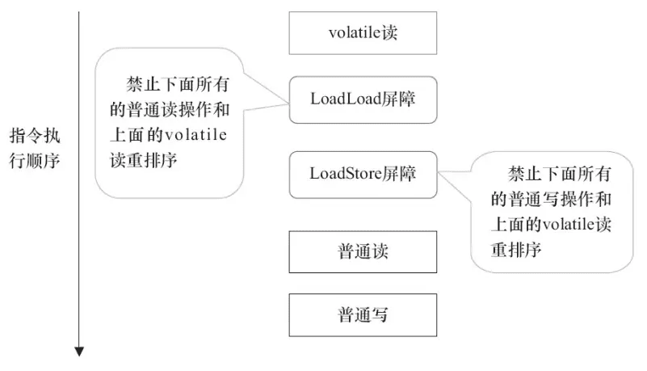

#### 8.5.3 volatile 的应用场景

使用 volatile 必须具备的条件

>- 对变量的写操作不依赖于当前值。
>- 该变量没有包含在具有其他变量的不变式中。
>- 只有在状态真正独立于程序内其他内容时才能使用 volatile。

- 模式1：状态标志

也许实现 volatile 变量的规范使用仅仅是使用一个布尔状态标志，用于指示发生了一个重要的一次性事件，例如完成初始化或请求停机。
```java
volatile boolean shutdownRequested;
......
public void shutdown() { shutdownRequested = true; }
public void doWork() { 
    while (!shutdownRequested) { 
        // do stuff
    }
}
```
- 模式2：一次性安全发布(one-time safe publication)

缺乏同步会导致无法实现可见性，这使得确定何时写入对象引用而不是原始值变得更加困难。在缺乏同步的情况下，可能会遇到某个对象引用的更新值(由另一个线程写入)和该对象状态的旧值同时存在。(这就是造成著名的双重检查锁定(double-checked-locking)问题的根源，其中对象引用在没有同步的情况下进行读操作，产生的问题是您可能会看到一个更新的引用，但是仍然会通过该引用看到不完全构造的对象)。
```java
public class BackgroundFloobleLoader {
    public volatile Flooble theFlooble;
 
    public void initInBackground() {
        // do lots of stuff
        theFlooble = new Flooble();  // this is the only write to theFlooble
    }
}
 
public class SomeOtherClass {
    public void doWork() {
        while (true) { 
            // do some stuff...
            // use the Flooble, but only if it is ready
            if (floobleLoader.theFlooble != null) 
                doSomething(floobleLoader.theFlooble);
        }
    }
}
```
- 模式3：独立观察(independent observation)

安全使用 volatile 的另一种简单模式是定期 发布 观察结果供程序内部使用。例如，假设有一种环境传感器能够感觉环境温度。一个后台线程可能会每隔几秒读取一次该传感器，并更新包含当前文档的 volatile 变量。然后，其他线程可以读取这个变量，从而随时能够看到最新的温度值。

```java
public class UserManager {
    public volatile String lastUser;
 
    public boolean authenticate(String user, String password) {
        boolean valid = passwordIsValid(user, password);
        if (valid) {
            User u = new User();
            activeUsers.add(u);
            lastUser = user;
        }
        return valid;
    }
}
```
- 模式4：volatile bean 模式

在 volatile bean 模式中，JavaBean 的所有数据成员都是 volatile 类型的，并且 getter 和 setter 方法必须非常普通 —— 除了获取或设置相应的属性外，不能包含任何逻辑。此外，对于对象引用的数据成员，引用的对象必须是有效不可变的。(这将禁止具有数组值的属性，因为当数组引用被声明为 volatile 时，只有引用而不是数组本身具有 volatile 语义)。对于任何 volatile 变量，不变式或约束都不能包含 JavaBean 属性。

```java
@ThreadSafe
public class Person {
    private volatile String firstName;
    private volatile String lastName;
    private volatile int age;
 
    public String getFirstName() { return firstName; }
    public String getLastName() { return lastName; }
    public int getAge() { return age; }
 
    public void setFirstName(String firstName) { 
        this.firstName = firstName;
    }
 
    public void setLastName(String lastName) { 
        this.lastName = lastName;
    }
 
    public void setAge(int age) { 
        this.age = age;
    }
}
```
- 模式5：开销较低的读－写锁策略

volatile 的功能还不足以实现计数器。因为 ++x 实际上是三种操作(读、添加、存储)的简单组合，如果多个线程凑巧试图同时对 volatile 计数器执行增量操作，那么它的更新值有可能会丢失。 如果读操作远远超过写操作，可以结合使用内部锁和 volatile 变量来减少公共代码路径的开销。 安全的计数器使用 synchronized 确保增量操作是原子的，并使用 volatile 保证当前结果的可见性。如果更新不频繁的话，该方法可实现更好的性能，因为读路径的开销仅仅涉及 volatile 读操作，这通常要优于一个无竞争的锁获取的开销。
```java
@ThreadSafe
public class CheesyCounter {
    // Employs the cheap read-write lock trick
    // All mutative operations MUST be done with the 'this' lock held
    @GuardedBy("this") private volatile int value;
 
    public int getValue() { return value; }
 
    public synchronized int increment() {
        return value++;
    }
}
```
- 模式6：双重检查(double-checked)
  
就是我们上文举的例子。单例模式的一种实现方式，但很多人会忽略 volatile 关键字，因为没有该关键字，程序也可以很好的运行，只不过代码的稳定性总不是 100%，说不定在未来的某个时刻，隐藏的 bug 就出来了。
```java
class Singleton {
    private volatile static Singleton instance;
    private Singleton() {
    }
    public static Singleton getInstance() {
        if (instance == null) {
            syschronized(Singleton.class) {
                if (instance == null) {
                    instance = new Singleton();
                }
            }
        }
        return instance;
    } 
}
```
### 8.6 关键字: final详解

> 请带着这些问题继续后文，会很大程度上帮助你更好的理解final。

- 所有的final修饰的字段都是编译期常量吗?
- 如何理解private所修饰的方法是隐式的final?
- 说说final类型的类如何拓展? 比如String是final类型，我们想写个MyString复用所有String中方法，同时增加一个新的toMyString()的方法，应该如何做?
- final方法可以被重载吗? 可以
- 父类的final方法能不能够被子类重写? 不可以
- 说说final域重排序规则?
- 说说final的原理?
- 使用 final 的限制条件和局限性?
- 看本文最后的一个思考题

#### 8.6.1 final基础使用
##### 8.6.1.1 修饰类

当某个类的整体定义为final时，就表明了你不能打算继承该类，而且也不允许别人这么做。即这个类是不能有子类的。

注意：final类中的所有方法都隐式为final，因为无法覆盖他们，所以在final类中给任何方法添加final关键字是没有任何意义的。

> 这里顺道说说final类型的类如何拓展? 比如String是final类型，我们想写个MyString复用所有String中方法，同时增加一个新的toMyString()的方法，应该如何做? 

设计模式中最重要的两种关系，一种是继承/实现；另外一种是组合关系。所以当遇到不能用继承的(final修饰的类),应该考虑用组合, 如下代码大概写个组合实现的意思：
```java
/**
* @pdai
*/
class MyString{

    private String innerString;

    // ...init & other methods

    // 支持老的方法
    public int length(){
        return innerString.length(); // 通过innerString调用老的方法
    }

    // 添加新方法
    public String toMyString(){
        //...
    }
}
```
##### 8.6.1.2 修饰方法
> - private 方法是隐式的final
> - final方法是可以被重载的

- private final

类中所有private方法都隐式地指定为final的，由于无法取用private方法，所以也就不能覆盖它。可以对private方法增添final关键字，但这样做并没有什么好处。看下下面的例子：
```java
public class Base {
    private void test() {
    }
}

public class Son extends Base{
    public void test() {
    }
    public static void main(String[] args) {
        Son son = new Son();
        Base father = son;
        //father.test();
    }
}
```
Base和Son都有方法test(),但是这并不是一种覆盖，因为private所修饰的方法是隐式的final，也就是无法被继承，所以更不用说是覆盖了，在Son中的test()方法不过是属于Son的新成员罢了，Son进行向上转型得到father，但是father.test()是不可执行的，因为Base中的test方法是private的，无法被访问到。

- final方法是可以被重载的

我们知道父类的final方法是不能够被子类重写的，那么final方法可以被重载吗? 答案是可以的，下面代码是正确的。
```java
public class FinalExampleParent {
    public final void test() {
    }

    public final void test(String str) {
    }
}
```
##### 8.6.1.3 修饰参数
Java允许在参数列表中以声明的方式将参数指明为final，这意味这你无法在方法中更改参数引用所指向的对象。这个特性主要用来向匿名内部类传递数据。
##### 8.6.1.4 修饰变量

- 所有的final修饰的字段都是编译期常量吗?

现在来看编译期常量和非编译期常量, 如：
```java
public class Test {
    //编译期常量
    final int i = 1;
    final static int J = 1;
    final int[] a = {1,2,3,4};
    //非编译期常量
    Random r = new Random();
    final int k = r.nextInt();

    public static void main(String[] args) {

    }
}
```
k的值由随机数对象决定，所以不是所有的final修饰的字段都是编译期常量，只是k的值在被初始化后无法被更改。

- static final

一个既是static又是final 的字段只占据一段不能改变的存储空间，它必须在定义的时候进行赋值，否则编译器将不予通过。
```java
import java.util.Random;
public class Test {
    static Random r = new Random();
    final int k = r.nextInt(10);
    static final int k2 = r.nextInt(10); 
    public static void main(String[] args) {
        Test t1 = new Test();
        System.out.println("k="+t1.k+" k2="+t1.k2);
        Test t2 = new Test();
        System.out.println("k="+t2.k+" k2="+t2.k2);
    }
}
```
上面代码某次输出结果：
```
k=2 k2=7
k=8 k2=7
```
我们可以发现对于不同的对象k的值是不同的，但是k2的值却是相同的，这是为什么呢? 因为static关键字所修饰的字段并不属于一个对象，而是属于这个类的。也可简单的理解为static final所修饰的字段仅占据内存的一个一份空间，一旦被初始化之后便不会被更改。

- blank final

Java允许生成空白final，也就是说被声明为final但又没有给出定值的字段,但是必须在该字段被使用之前被赋值，这给予我们两种选择：
>- 在定义处进行赋值(这不叫空白final)
>- 在构造器中进行赋值，保证了该值在被使用前赋值。

这增强了final的灵活性。

看下面代码:
```java
public class Test {
    final int i1 = 1;
    final int i2;//空白final
    static final  int i3;
    
    //静态代码块
    static {
        i3=2;
    }
    //无参构造函数
    public Test() {
        i2 = 1;
    }
    //有參构造函数
    public Test(int x) {
        this.i2 = x;
    }
}
```
可以看到i2的赋值更为灵活。但是请注意，如果字段由static和final修饰，仅能在声明时赋值或声明后在静态代码块中赋值，因为该字段不属于对象，属于这个类。# 
#### 8.6.2 final域重排序规则
##### 8.6.2.1 final域为基本类型
先看一段示例性的代码：
```java
public class FinalDemo {
    private int a;  //普通域
    private final int b; //final域
    private static FinalDemo finalDemo;

    public FinalDemo() {
        a = 1; // 1. 写普通域
        b = 2; // 2. 写final域
    }

    public static void writer() {
        finalDemo = new FinalDemo();
    }

    public static void reader() {
        FinalDemo demo = finalDemo; // 3.读对象引用
        int a = demo.a;    //4.读普通域
        int b = demo.b;    //5.读final域
    }
}
```
假设线程A在执行writer()方法，线程B执行reader()方法。

- 写final域重排序规则

写final域的重排序规则禁止对final域的写重排序到构造函数之外，这个规则的实现主要包含了两个方面：
> - **JMM禁止编译器把final域的写重排序到构造函数之外**；
> - 编译器会在final域写之后，构造函数return之前，插入一个storestore屏障。这个屏障可以禁止处理器把final域的写重排序到构造函数之外。
我们再来分析writer方法，虽然只有一行代码，但实际上做了两件事情：
> - 构造了一个FinalDemo对象；
> - 把这个对象赋值给成员变量finalDemo。

我们来画下存在的一种可能执行时序图，如下：
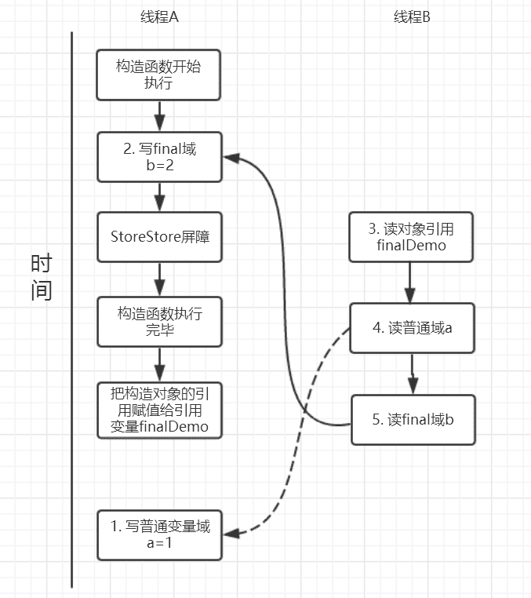

由于a,b之间没有数据依赖性，普通域(普通变量)a可能会被重排序到构造函数之外，线程B就有可能读到的是普通变量a初始化之前的值(零值)，这样就可能出现错误。而final域变量b，根据重排序规则，会禁止final修饰的变量b重排序到构造函数之外，从而b能够正确赋值，线程B就能够读到final变量初始化后的值。

因此，写final域的重排序规则可以确保：在对象引用为任意线程可见之前，对象的final域已经被正确初始化过了，而普通域就不具有这个保障。比如在上例，线程B有可能就是一个未正确初始化的对象finalDemo。

- 读final域重排序规则
读final域重排序规则为：在一个线程中，初次读对象引用和初次读该对象包含的final域，JMM会禁止这两个操作的重排序。(注意，这个规则仅仅是针对处理器)，处理器会在读final域操作的前面插入一个LoadLoad屏障。实际上，读对象的引用和读该对象的final域存在间接依赖性，一般处理器不会重排序这两个操作。但是有一些处理器会重排序，因此，这条禁止重排序规则就是针对这些处理器而设定的。

read()方法主要包含了三个操作：

> - 初次读引用变量finalDemo;
> - 初次读引用变量finalDemo的普通域a;
> - 初次读引用变量finalDemo的final域b;
```java
public class ProblematicRead {
    private int x;      // 普通域
    private final int y; // final域
    private static ProblematicRead shared;
    
    public ProblematicRead() {
        x = 10;
        y = 20;
    }
    
    public static void threadA() {
        shared = new ProblematicRead();
    }
    
    public static void threadB() {
        // 危险的操作序列（理论上可能发生，实际受规则保护）
        int localX = shared.x;    // 可能读到默认值0（如果对象构造未完成）
        ProblematicRead localRef = shared;  // 读引用
        int localY = shared.y;    // 保证读到正确值20
    }
}
```
假设线程A写过程没有重排序，那么线程A和线程B有一种的可能执行时序为下图：

读对象的普通域被重排序到了读对象引用的前面就会出现线程B还未读到对象引用就在读取该对象的普通域变量，这显然是错误的操作。而final域的读操作就“限定”了在读final域变量前已经读到了该对象的引用，从而就可以避免这种情况。

读final域的重排序规则可以确保：在读一个对象的final域之前，一定会先读这个包含这个final域的对象的引用。
##### 8.6.2.2 final域为引用类型

我们已经知道了final域是基本数据类型的时候重排序规则是怎么的了? 如果是引用数据类型了? 我们接着继续来探讨。

- 对final修饰的对象的成员域写操作
针对引用数据类型，final域写针对编译器和处理器重排序增加了这样的约束：在构造函数内对一个final修饰的对象的成员域的写入，与随后在构造函数之外把这个被构造的对象的引用赋给一个引用变量，这两个操作是不能被重排序的。注意这里的是“增加”也就说前面对final基本数据类型的重排序规则在这里还是使用。这句话是比较拗口的，下面结合实例来看。
```java
public class FinalReferenceDemo {
    final int[] arrays;
    private FinalReferenceDemo finalReferenceDemo;

    public FinalReferenceDemo() {
        arrays = new int[1];  //1
        arrays[0] = 1;        //2
    }

    public void writerOne() {
        finalReferenceDemo = new FinalReferenceDemo(); //3
    }

    public void writerTwo() {
        arrays[0] = 2;  //4
    }

    public void reader() {
        if (finalReferenceDemo != null) {  //5
            int temp = finalReferenceDemo.arrays[0];  //6
        }
    }
}
```
针对上面的实例程序，线程线程A执行wirterOne方法，执行完后线程B执行writerTwo方法，然后线程C执行reader方法。下图就以这种执行时序出现的一种情况来讨论(耐心看完才有收获)。


由于对final域的写禁止重排序到构造方法外，因此1和3不能被重排序。由于一个final域的引用对象的成员域写入不能与随后将这个被构造出来的对象赋给引用变量重排序，因此2和3不能重排序。

- 对final修饰的对象的成员域读操作

JMM可以确保线程C至少能看到写线程A对final引用的对象的成员域的写入，即能看下arrays[0] = 1，而写线程B对数组元素的写入可能看到可能看不到。JMM不保证线程B的写入对线程C可见，线程B和线程C之间存在数据竞争，此时的结果是不可预知的。如果可见的，可使用锁或者volatile。# 
##### 8.6.2.3 关于final重排序的总结
按照final修饰的数据类型分类：
- 基本数据类型:
  - final域写：禁止final域写与构造方法重排序，即禁止final域写重排序到构造方法之外，从而保证该对象对所有线程可见时，该对象的final域全部已经初始化过。
  - final域读：禁止初次读对象的引用与读该对象包含的final域的重排序。
- 引用数据类型：
  - 额外增加约束：禁止在构造函数对一个final修饰的对象的成员域的写入与随后将这个被构造的对象的引用赋值给引用变量 重排序

**final重排序规则的核心保证**：

1. **基本类型final域**：一定能读到构造函数中设置的值
2. **引用类型final域**：
   - 引用本身一定不为null
   - 引用指向的对象一定已完全构造（构造函数中的所有操作对其他线程可见）
3. **时序保证**：
   - 写操作：在构造函数返回前完成
   - 读操作：在读对象引用之后执行
#### 8.6.3 final再深入理解
##### 8.6.3.1 final的实现原理
上面我们提到过，写final域会要求编译器在final域写之后，构造函数返回前插入一个StoreStore屏障。读final域的重排序规则会要求编译器在读final域的操作前插入一个LoadLoad屏障。

很有意思的是，如果以X86处理为例，X86不会对写-写重排序，所以StoreStore屏障可以省略。由于不会对有间接依赖性的操作重排序，所以在X86处理器中，读final域需要的LoadLoad屏障也会被省略掉。也就是说，以X86为例的话，对final域的读/写的内存屏障都会被省略！具体是否插入还是得看是什么处理器
##### 8.6.3.2 为什么final引用不能从构造函数中“溢出”

这里还有一个比较有意思的问题：上面对final域写重排序规则可以确保我们在使用一个对象引用的时候该对象的final域已经在构造函数被初始化过了。但是这里其实是有一个前提条件的，也就是：在构造函数，不能让这个被构造的对象被其他线程可见，也就是说该对象引用不能在构造函数中“溢出”。以下面的例子来说：
```java
public class FinalReferenceEscapeDemo {
    private final int a;
    private FinalReferenceEscapeDemo referenceDemo;

    public FinalReferenceEscapeDemo() {
        a = 1;  //1
        referenceDemo = this; //2
    }

    public void writer() {
        new FinalReferenceEscapeDemo();
    }

    public void reader() {
        if (referenceDemo != null) {  //3
            int temp = referenceDemo.a; //4
        }
    }
}
```
可能的执行时序如图所示：
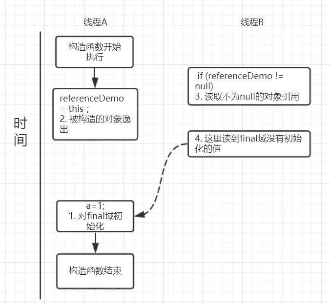
假设一个线程A执行writer方法另一个线程执行reader方法。因为构造函数中操作1和2之间没有数据依赖性，1和2可以重排序，先执行了2，这个时候引用对象referenceDemo是个没有完全初始化的对象，而当线程B去读取该对象时就会出错。尽管依然满足了final域写重排序规则：在引用对象对所有线程可见时，其final域已经完全初始化成功。但是，引用对象“this”逸出，该代码依然存在线程安全的问题。
#### 8.6.4 使用 final 的限制条件和局限性
当声明一个 final 成员时，必须在构造函数退出前设置它的值。
```java
public class MyClass {
  private final int myField = 1;
  public MyClass() {
    ...
  }
}
```
或者
```java
public class MyClass {
  private final int myField;
  public MyClass() {
    ...
    myField = 1;
    ...
  }
}
```
**将指向对象的成员声明为 final 只能将该引用设为不可变的，而非所指的对象。**

下面的方法仍然可以修改该 list。
```java
private final List myList = new ArrayList();
myList.add("Hello");
```
声明为 final 可以保证如下操作不合法
```java
myList = new ArrayList();
myList = someOtherList;
```

如果一个对象将会在多个线程中访问并且你并没有将其成员声明为 final，则必须提供其他方式保证线程安全。

" 其他方式 " 可以包括声明成员为 volatile，使用 synchronized 或者显式 Lock 控制所有该成员的访问。

#### 8.6.5 再思考一个有趣的现象：
- 例子1：没有final修饰

```java
byte b1 = 1;
byte b2 = 3;
byte b3 = b1 + b2;  // 编译错误: 不兼容的类型: 从int转换到byte可能会有损失
```
- 例子2：使用final修饰

```java
final byte b1 = 1;
final byte b2 = 3;
byte b3 = b1 + b2;  // 编译通过，因为b1和b2是常量，编译器会进行常量折叠，并检查结果是否在byte范围内
```
同样，对于其他小于int的类型（如short）也是如此。

- 另外，如果常量表达式的值超出了目标类型的范围，仍然会编译错误。例如：

```java
final byte b1 = 100;
final byte b2 = 100;
byte b3 = b1 + b2;  // 编译错误: 不兼容的类型: 从int转换到byte可能会有损失，因为100+100=200，超出了byte范围
```
总结：final修饰的变量在编译期能确定值，并且参与运算时，编译器会进行常量折叠，并检查结果是否在目标类型范围内，从而决定是否允许赋值。

重点在于编译时常量的编译器常量折叠：

什么是编译时常量？

```java
// 这些都是编译时常量
final int a = 10;           // 基本类型字面量
final String s = "hello";   // 字符串字面量
final double d = 3.14;      // 浮点字面量
final boolean b = true;     // 布尔字面量

// 这些不是编译时常量
final int x = getValue();   // 方法调用
final Random r = new Random(); // 对象创建
final int y = someVariable; // 变量引用
```
### 8.7 JUC - 类汇总和学习指南
>- JUC框架包含几个部分?
>- 每个部分有哪些核心的类?
>- 最最核心的类有哪些?

正式学习时先了解五个部分：

主要包含: (注意: 上图是网上找的图，无法表述一些继承关系，同时少了部分类；但是主体上可以看出其分类关系也够了)
- Lock框架和Tools类(把图中这两个放到一起理解)
- Collections:并发集合
- Atomic:原子类
- Executors: 线程池
#### 8.7.1 Lock框架和Tools类


**接口: Condition**  
Condition为接口类型，它将 Object 监视器方法(wait、notify 和 notifyAll)分解成截然不同的对象，以便通过将这些对象与任意 Lock 实现组合使用，为每个对象提供多个等待 set (wait-set)。其中，Lock 替代了 synchronized 方法和语句的使用，Condition 替代了 Object 监视器方法的使用。可以通过await(),signal()来休眠/唤醒线程。在JUC锁: AbstractQueuedSynchronizer详解中类的内部类-conditionobject类有具体分析。

**接口: Lock**  
Lock为接口类型，Lock实现提供了比使用synchronized方法和语句可获得的更广泛的锁定操作。此实现允许更灵活的结构，可以具有差别很大的属性，可以支持多个相关的Condition对象。

**接口: ReadWriteLock**  
ReadWriteLock为接口类型， 维护了一对相关的锁，一个用于只读操作，另一个用于写入操作。只要没有 writer，读取锁可以由多个 reader 线程同时保持。写入锁是独占的。

**抽象类: AbstractOwnableSynchonizer**  
AbstractOwnableSynchonizer为抽象类，可以由线程以独占方式拥有的同步器。此类为创建锁和相关同步器(伴随着所有权的概念)提供了基础。AbstractOwnableSynchronizer 类本身不管理或使用此信息。但是，子类和工具可以使用适当维护的值帮助控制和监视访问以及提供诊断。

**抽象类(long): AbstractQueuedLongSynchronizer**  
AbstractQueuedLongSynchronizer为抽象类，以 long 形式维护同步状态的一个 AbstractQueuedSynchronizer 版本。此类具有的结构、属性和方法与 AbstractQueuedSynchronizer 完全相同，但所有与状态相关的参数和结果都定义为 long 而不是 int。当创建需要 64 位状态的多级别锁和屏障等同步器时，此类很有用。

**核心抽象类(int): AbstractQueuedSynchronizer**  
AbstractQueuedSynchronizer为抽象类，其为实现依赖于先进先出 (FIFO) 等待队列的阻塞锁和相关同步器(信号量、事件，等等)提供一个框架。此类的设计目标是成为依靠单个原子 int 值来表示状态的大多数同步器的一个有用基础。详细分析请看: JUC锁: AbstractQueuedSynchronizer详解

**锁常用类: LockSupport**  
LockSupport为常用类，用来创建锁和其他同步类的基本线程阻塞原语。LockSupport的功能和"Thread中的 Thread.suspend()和Thread.resume()有点类似"，LockSupport中的park() 和 unpark() 的作用分别是阻塞线程和解除阻塞线程。但是park()和unpark()不会遇到"Thread.suspend 和 Thread.resume所可能引发的死锁"问题。详细分析请看: JUC锁: LockSupport详解

**锁常用类: ReentrantLock**  
ReentrantLock为常用类，它是一个可重入的互斥锁 Lock，它具有与使用 synchronized 方法和语句所访问的隐式监视器锁相同的一些基本行为和语义，但功能更强大。详细分析请看: JUC锁: ReentrantLock详解

**锁常用类: ReentrantReadWriteLock**  
ReentrantReadWriteLock是读写锁接口ReadWriteLock的实现类，它包括Lock子类ReadLock和WriteLock。ReadLock是共享锁，WriteLock是独占锁。详细分析请看: JUC工具类: ReentrantReadWriteLock详解

**锁常用类: StampedLock**  
它是java8在java.util.concurrent.locks新增的一个API。StampedLock控制锁有三种模式(写，读，乐观读)，一个StampedLock状态是由版本和模式两个部分组成，锁获取方法返回一个数字作为票据stamp，它用相应的锁状态表示并控制访问，数字0表示没有写锁被授权访问。在读锁上分为悲观锁和乐观锁。详细分析请看: Java 8 - StampedLock详解

**工具常用类: CountDownLatch**  
CountDownLatch为常用类，它是一个同步辅助类，在完成一组正在其他线程中执行的操作之前，它允许一个或多个线程一直等待。详细分析请看: JUC工具类: CountDownLatch详解

**工具常用类: CyclicBarrier**  
CyclicBarrier为常用类，其是一个同步辅助类，它允许一组线程互相等待，直到到达某个公共屏障点 (common barrier point)。在涉及一组固定大小的线程的程序中，这些线程必须不时地互相等待，此时 CyclicBarrier 很有用。因为该 barrier 在释放等待线程后可以重用，所以称它为循环 的 barrier。详细分析请看: JUC工具类: CyclicBarrier详解

**工具常用类: Phaser**  
Phaser是JDK 7新增的一个同步辅助类，它可以实现CyclicBarrier和CountDownLatch类似的功能，而且它支持对任务的动态调整，并支持分层结构来达到更高的吞吐量。详细分析请看: JUC工具类: Phaser详解

**工具常用类: Semaphore**  
Semaphore为常用类，其是一个计数信号量，从概念上讲，信号量维护了一个许可集。如有必要，在许可可用前会阻塞每一个 acquire()，然后再获取该许可。每个 release() 添加一个许可，从而可能释放一个正在阻塞的获取者。但是，不使用实际的许可对象，Semaphore 只对可用许可的号码进行计数，并采取相应的行动。通常用于限制可以访问某些资源(物理或逻辑的)的线程数目。详细分析请看: JUC工具类: Semaphore详解

**工具常用类: Exchanger**  
Exchanger是用于线程协作的工具类, 主要用于两个线程之间的数据交换。它提供一个同步点，在这个同步点，两个线程可以交换彼此的数据。这两个线程通过exchange()方法交换数据，当一个线程先执行exchange()方法后，它会一直等待第二个线程也执行exchange()方法，当这两个线程到达同步点时，这两个线程就可以交换数据了。详细分析请看: JUC工具类: Exchanger详解
#### 8.7.2 Collections: 并发集合

**Queue: ArrayBlockingQueue**  
一个由数组支持的有界阻塞队列。此队列按 FIFO(先进先出)原则对元素进行排序。队列的头部是在队列中存在时间最长的元素。队列的尾部是在队列中存在时间最短的元素。新元素插入到队列的尾部，队列获取操作则是从队列头部开始获得元素。详细分析请看: JUC并发集合: BlockingQueue详解

**Queue: LinkedBlockingQueue**  
一个基于已链接节点的、范围任意的 blocking queue。此队列按 FIFO(先进先出)排序元素。队列的头部是在队列中时间最长的元素。队列的尾部是在队列中时间最短的元素。新元素插入到队列的尾部，并且队列获取操作会获得位于队列头部的元素。链接队列的吞吐量通常要高于基于数组的队列，但是在大多数并发应用程序中，其可预知的性能要低。详细分析请看: JUC并发集合: BlockingQueue详解

**Queue: LinkedBlockingDeque**  
一个基于已链接节点的、任选范围的阻塞双端队列。详细分析请看: JUC并发集合: BlockingQueue详解

**Queue: ConcurrentLinkedQueue**  
一个基于链接节点的无界线程安全队列。此队列按照 FIFO(先进先出)原则对元素进行排序。队列的头部是队列中时间最长的元素。队列的尾部是队列中时间最短的元素。新的元素插入到队列的尾部，队列获取操作从队列头部获得元素。当多个线程共享访问一个公共 collection 时，ConcurrentLinkedQueue 是一个恰当的选择。此队列不允许使用 null 元素。详细分析请看: JUC并发集合: ConcurrentLinkedQueue详解

**Queue: ConcurrentLinkedDeque**  
是双向链表实现的无界队列，该队列同时支持FIFO和FILO两种操作方式。

**Queue: DelayQueue**  
延时无界阻塞队列，使用Lock机制实现并发访问。队列里只允许放可以"延期"的元素，队列中的head是最先"到期"的元素。如果队里中没有元素到"到期"，那么就算队列中有元素也不能获取到。

**Queue: PriorityBlockingQueue**  
无界优先级阻塞队列，使用Lock机制实现并发访问。priorityQueue的线程安全版，不允许存放null值，依赖于comparable的排序，不允许存放不可比较的对象类型。

**Queue: SynchronousQueue**  
没有容量的同步队列，通过CAS实现并发访问，支持FIFO和FILO。

**Queue: LinkedTransferQueue**  
JDK 7新增，单向链表实现的无界阻塞队列，通过CAS实现并发访问，队列元素使用 FIFO(先进先出)方式。LinkedTransferQueue可以说是ConcurrentLinkedQueue、SynchronousQueue(公平模式)和LinkedBlockingQueue的超集, 它不仅仅综合了这几个类的功能，同时也提供了更高效的实现。

**List: CopyOnWriteArrayList**  
ArrayList 的一个线程安全的变体，其中所有可变操作(add、set 等等)都是通过对底层数组进行一次新的复制来实现的。这一般需要很大的开销，但是当遍历操作的数量大大超过可变操作的数量时，这种方法可能比其他替代方法更有效。在不能或不想进行同步遍历，但又需要从并发线程中排除冲突时，它也很有用。详细分析请看: JUC并发集合: CopyOnWriteArrayList详解

**Set: CopyOnWriteArraySet**  
对其所有操作使用内部CopyOnWriteArrayList的Set。即将所有操作转发至CopyOnWriteArayList来进行操作，能够保证线程安全。在add时，会调用addIfAbsent，由于每次add时都要进行数组遍历，因此性能会略低于CopyOnWriteArrayList。

**Set: ConcurrentSkipListSet**  
一个基于ConcurrentSkipListMap 的可缩放并发 NavigableSet 实现。set 的元素可以根据它们的自然顺序进行排序，也可以根据创建 set 时所提供的 Comparator 进行排序，具体取决于使用的构造方法。

**Map: ConcurrentHashMap**  
是线程安全HashMap的。ConcurrentHashMap在JDK 7之前是通过Lock和segment(分段锁)实现，JDK 8 之后改为CAS+synchronized来保证并发安全。详细分析请看: JUC并发集合: ConcurrentHashMap详解, 包含了对JDK 7和JDK 8版本的源码分析。

**Map: ConcurrentSkipListMap**  
线程安全的有序的哈希表(相当于线程安全的TreeMap);映射可以根据键的自然顺序进行排序，也可以根据创建映射时所提供的 Comparator 进行排序，具体取决于使用的构造方法。
#### 8.7.3 Atomic: 原子类
其基本的特性就是在多线程环境下，当有多个线程同时执行这些类的实例包含的方法时，具有排他性，即当某个线程进入方法，执行其中的指令时，不会被其他线程打断，而别的线程就像自旋锁一样，一直等到该方法执行完成，才由JVM从等待队列中选择一个另一个线程进入，这只是一种逻辑上的理解。实际上是借助硬件的相关指令来实现的，不会阻塞线程(或者说只是在硬件级别上阻塞了)。对CAS，Unsafe类，以及13个原子类详解请参考：详细分析请看: JUC原子类: CAS, Unsafe和原子类详解

**基础类型：AtomicBoolean，AtomicInteger，AtomicLong**  
AtomicBoolean，AtomicInteger，AtomicLong是类似的，分别针对bool，interger，long的原子类。

**数组：AtomicIntegerArray，AtomicLongArray，BooleanArray**  
AtomicIntegerArray，AtomicLongArray，AtomicBooleanArray是数组原子类。

**引用：AtomicReference，AtomicMarkedReference，AtomicStampedReference**  
AtomicReference，AtomicMarkedReference，AtomicStampedReference是引用相关的原子类。

**FieldUpdater：AtomicLongFieldUpdater，AtomicIntegerFieldUpdater，AtomicReferenceFieldUpdater**  
AtomicLongFieldUpdater，AtomicIntegerFieldUpdater，AtomicReferenceFieldUpdater是FieldUpdater原子类。
#### 8.7.4 Executors: 线程池

**接口: Executor**  
Executor接口提供一种将任务提交与每个任务将如何运行的机制(包括线程使用的细节、调度等)分离开来的方法。通常使用 Executor 而不是显式地创建线程。

**ExecutorService**  
ExecutorService继承自Executor接口，ExecutorService提供了管理终止的方法，以及可为跟踪一个或多个异步任务执行状况而生成 Future 的方法。可以关闭 ExecutorService，这将导致其停止接受新任务。关闭后，执行程序将最后终止，这时没有任务在执行，也没有任务在等待执行，并且无法提交新任务。

**ScheduledExecutorService**  
ScheduledExecutorService继承自ExecutorService接口，可安排在给定的延迟后运行或定期执行的命令。

**AbstractExecutorService**  
AbstractExecutorService继承自ExecutorService接口，其提供 ExecutorService 执行方法的默认实现。此类使用 newTaskFor 返回的 RunnableFuture 实现 submit、invokeAny 和 invokeAll 方法，默认情况下，RunnableFuture 是此包中提供的 FutureTask 类。

**FutureTask**  
FutureTask 为 Future 提供了基础实现，如获取任务执行结果(get)和取消任务(cancel)等。如果任务尚未完成，获取任务执行结果时将会阻塞。一旦执行结束，任务就不能被重启或取消(除非使用runAndReset执行计算)。FutureTask 常用来封装 Callable 和 Runnable，也可以作为一个任务提交到线程池中执行。除了作为一个独立的类之外，此类也提供了一些功能性函数供我们创建自定义 task 类使用。FutureTask 的线程安全由CAS来保证。详细分析请看: JUC线程池: FutureTask详解

**核心: ThreadPoolExecutor**  
ThreadPoolExecutor实现了AbstractExecutorService接口，也是一个 ExecutorService，它使用可能的几个池线程之一执行每个提交的任务，通常使用 Executors 工厂方法配置。线程池可以解决两个不同问题: 由于减少了每个任务调用的开销，它们通常可以在执行大量异步任务时提供增强的性能，并且还可以提供绑定和管理资源(包括执行任务集时使用的线程)的方法。每个 ThreadPoolExecutor 还维护着一些基本的统计数据，如完成的任务数。详细分析请看: JUC线程池: ThreadPoolExecutor详解

**核心: ScheduledThreadExecutor**  
ScheduledThreadPoolExecutor实现ScheduledExecutorService接口，可安排在给定的延迟后运行命令，或者定期执行命令。需要多个辅助线程时，或者要求 ThreadPoolExecutor 具有额外的灵活性或功能时，此类要优于 Timer。详细分析请看: JUC线程池: ScheduledThreadExecutor详解

**核心: Fork/Join框架**  
ForkJoinPool 是JDK 7加入的一个线程池类。Fork/Join 技术是分治算法(Divide-and-Conquer)的并行实现，它是一项可以获得良好的并行性能的简单且高效的设计技术。目的是为了帮助我们更好地利用多处理器带来的好处，使用所有可用的运算能力来提升应用的性能。详细分析请看: JUC线程池: Fork/Join框架详解

**工具类: Executors**  
Executors是一个工具类，用其可以创建ExecutorService、ScheduledExecutorService、ThreadFactory、Callable等对象。它的使用融入到了ThreadPoolExecutor, ScheduledThreadExecutor和ForkJoinPool中。
### 8.8 JUC原子类: CAS, Unsafe和原子类详解

>- 线程安全的实现方法有哪些?
>- 什么是CAS?
>- CAS使用示例，结合AtomicInteger给出示例?
>- CAS会有哪些问题?
>- 针对这这些问题，Java提供了哪几个解决的
>- ?AtomicInteger底层实现? CAS+volatile
>- 请阐述你对Unsafe类的理解?
>- 说说你对Java原子类的理解? 包含13个，4组分类，说说作用和使用场景。
>- AtomicStampedReference是什么?
>- AtomicStampedReference是怎么解决ABA的? 内部使用Pair来存储元素值及其版本号
>- java中还有哪些类可以解决ABA的问题? AtomicMarkableReference
#### 8.8.1 CAS
前面我们说到，<a href='#线程安全的实现方法'>线程安全的实现方法</a>包含:
- 互斥同步: synchronized 和 ReentrantLock
- 非阻塞同步: CAS, AtomicXXXX无同步方案: 
- 栈封闭，Thread Local，可重入代码

这里我们将对CAS重点阐释。
##### 8.8.1.1 什么是CAS
CAS的全称为Compare-And-Swap，直译就是对比交换。是一条CPU的原子指令，其作用是让CPU先进行比较两个值是否相等，然后原子地更新某个位置的值，经过调查发现，其实现方式是基于硬件平台的汇编指令，就是说CAS是靠硬件实现的，JVM只是封装了汇编调用，那些AtomicInteger类便是使用了这些封装后的接口。   简单解释：CAS操作需要输入两个数值，一个旧值(期望操作前的值)和一个新值，在操作期间先比较下在旧值有没有发生变化，如果没有发生变化，才交换成新值，发生了变化则不交换。

CAS操作是原子性的，所以多线程并发使用CAS更新数据时，可以不使用锁。JDK中大量使用了CAS来更新数据而防止加锁(synchronized 重量级锁)来保持原子更新。

相信sql大家都熟悉，类似sql中的条件更新一样：update set id=3 from table where id=2。因为单条sql执行具有原子性，如果有多个线程同时执行此sql语句，只有一条能更新成功。

##### 8.8.1.2 CAS使用示例

如果不使用CAS，在高并发下，多线程同时修改一个变量的值我们需要synchronized加锁(可能有人说可以用Lock加锁，Lock底层的AQS也是基于CAS进行获取锁的)。
```java
public class Test {
    private int i=0;
    public synchronized int add(){
        return i++;
    }
}
```
java中为我们提供了AtomicInteger 原子类(底层基于CAS进行更新数据的)，不需要加锁就在多线程并发场景下实现数据的一致性。
```java
public class Test {
    private  AtomicInteger i = new AtomicInteger(0);
    public int add(){
        return i.addAndGet(1);
    }
}
```
##### 8.8.1.3 CAS 存在的问题
CAS 方式为乐观锁，synchronized 为悲观锁。因此使用 CAS 解决并发问题通常情况下性能更优。

但使用 CAS 方式也会有几个问题：
- ABA问题

因为CAS需要在操作值的时候，检查值有没有发生变化，比如没有发生变化则更新，但是如果一个值原来是A，变成了B，又变成了A，那么使用CAS进行检查时则会发现它的值没有发生变化，但是实际上却变化了。

ABA问题的解决思路就是使用版本号。在变量前面追加上版本号，每次变量更新的时候把版本号加1，那么A->B->A就会变成1A->2B->3A。

从Java 1.5开始，JDK的Atomic包里提供了一个类AtomicStampedReference来解决ABA问题。这个类的compareAndSet方法的作用是首先检查当前引用是否等于预期引用，并且检查当前标志是否等于预期标志，如果全部相等，则以原子方式将该引用和该标志的值设置为给定的更新值。

- 循环时间长开销大

自旋CAS如果长时间不成功，会给CPU带来非常大的执行开销。如果JVM能支持处理器提供的pause指令，那么效率会有一定的提升。pause指令有两个作用：第一，它可以延迟流水线执行命令(de-pipeline)，使CPU不会消耗过多的执行资源，延迟的时间取决于具体实现的版本，在一些处理器上延迟时间是零；第二，它可以避免在退出循环的时候因内存顺序冲突(Memory Order Violation)而引起CPU流水线被清空(CPU Pipeline Flush)，从而提高CPU的执行效率。
- 只能保证一个共享变量的原子操作

当对一个共享变量执行操作时，我们可以使用循环CAS的方式来保证原子操作，但是对多个共享变量操作时，循环CAS就无法保证操作的原子性，这个时候就可以用锁。

还有一个取巧的办法，就是把多个共享变量合并成一个共享变量来操作。比如，有两个共享变量i = 2，j = a，合并一下ij = 2a，然后用CAS来操作ij。

从Java 1.5开始，JDK提供了AtomicReference类来保证引用对象之间的原子性，就可以把多个变量放在一个对象里来进行CAS操作。
#### 8.8.2 UnSafe类详解
>上文我们了解到Java原子类是通过UnSafe类实现的，这节主要分析下UnSafe类。UnSafe类在J.U.C中CAS操作有很广泛的应用。

Unsafe是位于sun.misc包下的一个类，主要提供一些用于执行低级别、不安全操作的方法，如直接访问系统内存资源、自主管理内存资源等，这些方法在提升Java运行效率、增强Java语言底层资源操作能力方面起到了很大的作用。但由于Unsafe类使Java语言拥有了类似C语言指针一样操作内存空间的能力，这无疑也增加了程序发生相关指针问题的风险。在程序中过度、不正确使用Unsafe类会使得程序出错的概率变大，使得Java这种安全的语言变得不再“安全”，因此对Unsafe的使用一定要慎重。

这个类尽管里面的方法都是 public 的，但是并没有办法使用它们，JDK API 文档也没有提供任何关于这个类的方法的解释。总而言之，对于 Unsafe 类的使用都是受限制的，只有授信的代码才能获得该类的实例，当然 JDK 库里面的类是可以随意使用的。

先来看下这张图，对UnSafe类总体功能：

如上图所示，Unsafe提供的API大致可分为内存操作、CAS、Class相关、对象操作、线程调度、系统信息获取、内存屏障、数组操作等几类，下面将对其相关方法和应用场景进行详细介绍。
##### 8.8.2.1 Unsafe与CAS
反编译出来的代码：
```java
public final int getAndAddInt(Object paramObject, long paramLong, int paramInt)
  {
    int i;
    do
      i = getIntVolatile(paramObject, paramLong);
    while (!compareAndSwapInt(paramObject, paramLong, i, i + paramInt));
    return i;
  }

  public final long getAndAddLong(Object paramObject, long paramLong1, long paramLong2)
  {
    long l;
    do
      l = getLongVolatile(paramObject, paramLong1);
    while (!compareAndSwapLong(paramObject, paramLong1, l, l + paramLong2));
    return l;
  }

  public final int getAndSetInt(Object paramObject, long paramLong, int paramInt)
  {
    int i;
    do
      i = getIntVolatile(paramObject, paramLong);
    while (!compareAndSwapInt(paramObject, paramLong, i, paramInt));
    return i;
  }

  public final long getAndSetLong(Object paramObject, long paramLong1, long paramLong2)
  {
    long l;
    do
      l = getLongVolatile(paramObject, paramLong1);
    while (!compareAndSwapLong(paramObject, paramLong1, l, paramLong2));
    return l;
  }

  public final Object getAndSetObject(Object paramObject1, long paramLong, Object paramObject2)
  {
    Object localObject;
    do
      localObject = getObjectVolatile(paramObject1, paramLong);
    while (!compareAndSwapObject(paramObject1, paramLong, localObject, paramObject2));
    return localObject;
  }
```
从源码中发现，内部使用自旋的方式进行CAS更新(while循环进行CAS更新，如果更新失败，则循环再次重试)。

又从Unsafe类中发现，原子操作其实只支持下面三个方法。
```java
public final native boolean compareAndSwapObject(Object paramObject1, long paramLong, Object paramObject2, Object paramObject3);

public final native boolean compareAndSwapInt(Object paramObject, long paramLong, int paramInt1, int paramInt2);

public final native boolean compareAndSwapLong(Object paramObject, long paramLong1, long paramLong2, long paramLong3);
```
我们发现Unsafe只提供了3种CAS方法：compareAndSwapObject、compareAndSwapInt和compareAndSwapLong。都是native方法。

JDK9之后，模块化处理，已经将上述方法废弃而是通过java.lang.invoke.VarHandle(冲向类)以及相应的实现类完成CAS操作

VarHandle（变量句柄）是 Java 9 引入的核心并发工具，用于替代 sun.misc.Unsafe 的直接内存操作，提供类型安全、内存模型合规的底层变量访问机制。它本质上是 JVM 层面对变量操作的抽象句柄，支持原子操作、内存屏障等高级特性。

为什么 JDK 9 引入 VarHandle？
- 安全性问题

sun.misc.Unsafe 允许直接操作内存偏移量，可能导致 JVM 崩溃（如非法内存访问）
开发者需手动计算字段偏移量，易出错且破坏 JVM 内存模型（JMM）约束
- 模块化限制（JPMS）

JDK 9 引入模块化系统，禁止应用层访问 sun.* 内部包
Unsafe 被隔离在 jdk.unsupported 模块，不再作为公共 API
- 标准化需求

提供符合 JMM 规范的官方 API，支持细粒度内存控制（如内存屏障）
统一原子操作接口，替代分散的 Atomic*FieldUpdater 和 Unsafe 调用
- 性能优化

JVM 可对 VarHandle 进行深度内联优化（直接映射为 CPU 指令）
避免 Unsafe 的反射开销和类型转换损耗
##### 8.8.2.2 Unsafe底层
不妨再看看Unsafe的compareAndSwap*方法来实现CAS操作，它是一个本地方法，实现位于unsafe.cpp中。
```cpp
UNSAFE_ENTRY(jboolean, Unsafe_CompareAndSwapInt(JNIEnv *env, jobject unsafe, jobject obj, jlong offset, jint e, jint x))
  UnsafeWrapper("Unsafe_CompareAndSwapInt");
  oop p = JNIHandles::resolve(obj);
  jint* addr = (jint *) index_oop_from_field_offset_long(p, offset);
  return (jint)(Atomic::cmpxchg(x, addr, e)) == e;
UNSAFE_END
```
可以看到它通过 Atomic::cmpxchg 来实现比较和替换操作。其中参数x是即将更新的值，参数e是原内存的值。

如果是Linux的x86，Atomic::cmpxchg方法的实现如下：
```cpp
inline jint Atomic::cmpxchg (jint exchange_value, volatile jint* dest, jint compare_value) {
  int mp = os::is_MP();
  __asm__ volatile (LOCK_IF_MP(%4) "cmpxchgl %1,(%3)"
                    : "=a" (exchange_value)
                    : "r" (exchange_value), "a" (compare_value), "r" (dest), "r" (mp)
                    : "cc", "memory");
  return exchange_value;
}
```
而windows的x86的实现如下：
```cpp
inline jint Atomic::cmpxchg (jint exchange_value, volatile jint* dest, jint compare_value) {
    int mp = os::isMP(); //判断是否是多处理器
    _asm {
        mov edx, dest
        mov ecx, exchange_value
        mov eax, compare_value
        LOCK_IF_MP(mp)
        cmpxchg dword ptr [edx], ecx
    }
}

// Adding a lock prefix to an instruction on MP machine
// VC++ doesn't like the lock prefix to be on a single line
// so we can't insert a label after the lock prefix.
// By emitting a lock prefix, we can define a label after it.
#define LOCK_IF_MP(mp) __asm cmp mp, 0  \
                       __asm je L0      \
                       __asm _emit 0xF0 \
                       __asm L0:
```
如果是多处理器，为cmpxchg指令添加lock前缀。反之，就省略lock前缀(单处理器会不需要lock前缀提供的内存屏障效果)。这里的lock前缀就是使用了处理器的总线锁(最新的处理器都使用缓存锁代替总线锁来提高性能)。

>cmpxchg(void* ptr, int old, int new)，如果ptr和old的值一样，则把new写到ptr内存，否则返回ptr的值，整个操作是原子的。在Intel平台下，会用lock cmpxchg来实现，使用lock触发缓存锁，这样另一个线程想访问ptr的内存，就会被block住。

##### 8.8.2.3 Unsafe其它功能
Unsafe 提供了硬件级别的操作，比如说获取某个属性在内存中的位置，比如说修改对象的字段值，即使它是私有的。不过 Java 本身就是为了屏蔽底层的差异，对于一般的开发而言也很少会有这样的需求。

举两个例子，比方说：
```java
public native long staticFieldOffset(Field paramField);
```
这个方法可以用来获取给定的 paramField 的内存地址偏移量，这个值对于给定的 field 是唯一的且是固定不变的。再比如说：
```java
public native int arrayBaseOffset(Class paramClass);
public native int arrayIndexScale(Class paramClass);
```
前一个方法是用来获取数组第一个元素的偏移地址，后一个方法是用来获取数组的转换因子即数组中元素的增量地址的。最后看三个方法：
```java
public native long allocateMemory(long paramLong);
public native long reallocateMemory(long paramLong1, long paramLong2);
public native void freeMemory(long paramLong);
```
分别用来分配内存，扩充内存和释放内存的。
#### 8.8.3 AtomicInteger
##### 8.8.3.1  使用举例
以 AtomicInteger 为例，常用 API：
```java
public final int get()：获取当前的值
public final int getAndSet(int newValue)：获取当前的值，并设置新的值
public final int getAndIncrement()：获取当前的值，并自增
public final int getAndDecrement()：获取当前的值，并自减
public final int getAndAdd(int delta)：获取当前的值，并加上预期的值
void lazySet(int newValue): 最终会设置成newValue,使用lazySet设置值后，可能导致其他线程在之后的一小段时间内还是可以读到旧的值。
```
相比 Integer 的优势，多线程中让变量自增：
```java
private volatile int count = 0;
// 若要线程安全执行执行 count++，需要加锁
public synchronized void increment() {
    count++;
}
public int getCount() {
    return count;
}
```
使用 AtomicInteger 后：
```java
private AtomicInteger count = new AtomicInteger();
public void increment() {
    count.incrementAndGet();
}
// 使用 AtomicInteger 后，不需要加锁，也可以实现线程安全
public int getCount() {
    return count.get();
}
```
##### 8.8.3.2 源码解析
```java
public class AtomicInteger extends Number implements java.io.Serializable {
    private static final Unsafe unsafe = Unsafe.getUnsafe();
    private static final long valueOffset;
    static {
        try {
            //用于获取value字段相对当前对象的“起始地址”的偏移量
            valueOffset = unsafe.objectFieldOffset(AtomicInteger.class.getDeclaredField("value"));
        } catch (Exception ex) { throw new Error(ex); }
    }

    private volatile int value;

    //返回当前值
    public final int get() {
        return value;
    }

    //递增加detla
    public final int getAndAdd(int delta) {
        //三个参数，1、当前的实例 2、value实例变量的偏移量 3、当前value要加上的数(value+delta)。
        return unsafe.getAndAddInt(this, valueOffset, delta);
    }

    //递增加1
    public final int incrementAndGet() {
        return unsafe.getAndAddInt(this, valueOffset, 1) + 1;
    }
...
}
```
们可以看到 AtomicInteger 底层用的是volatile的变量和CAS来进行更改数据的。

- volatile保证线程的可见性，多线程并发时，一个线程修改数据，可以保证其它线程立马看到修改后的值
- CAS 保证数据更新的原子性。

#### 8.8.4 延伸到所有原子类：共12个
>JDK中提供了12个原子操作类。

##### 8.8.4.1 原子更新基本类型

使用原子的方式更新基本类型，Atomic包提供了以下3个类。
- AtomicBoolean: 原子更新布尔类型。
- AtomicInteger: 原子更新整型。
- AtomicLong: 原子更新长整型。

以上3个类提供的方法几乎一模一样，可以参考上面AtomicInteger中的相关方法。
##### 8.8.4.2 原子更新数组
通过原子的方式更新数组里的某个元素，Atomic包提供了以下的3个类：
- AtomicIntegerArray: 原子更新整型数组里的元素。
- AtomicLongArray: 原子更新长整型数组里的元素。
- AtomicReferenceArray: 原子更新引用类型数组里的元素。

这三个类的最常用的方法是如下两个方法：
- get(int index)：获取索引为index的元素值。
- compareAndSet(int i,E expect,E update): 如果当前值等于预期值，则以原子方式将数组位置i的元素设置为update值。

举个AtomicIntegerArray例子：
```java
import java.util.concurrent.atomic.AtomicIntegerArray;

public class Demo5 {
    public static void main(String[] args) throws InterruptedException {
        AtomicIntegerArray array = new AtomicIntegerArray(new int[] { 0, 0 });
        System.out.println(array);
        System.out.println(array.getAndAdd(1, 2));
        System.out.println(array);
    }
}
```
输出结果：
```java
[0, 0]
0
[0, 2]
```
##### 8.8.4.3 原子更新引用类型
Atomic包提供了以下三个类：
- AtomicReference: 原子更新引用类型。
- AtomicStampedReference: 原子更新引用类型, 内部使用Pair来存储元素值及其版本号。
- AtomicMarkableReferce: 原子更新带有标记位的引用类型。

这三个类提供的方法都差不多，首先构造一个引用对象，然后把引用对象set进Atomic类，然后调用compareAndSet等一些方法去进行原子操作，原理都是基于Unsafe实现，**但AtomicReferenceFieldUpdater略有不同，更新的字段必须用volatile修饰。**

举个AtomicReference例子：
```java
import java.util.concurrent.atomic.AtomicReference;

public class AtomicReferenceTest {
    
    public static void main(String[] args){

        // 创建两个Person对象，它们的id分别是101和102。
        Person p1 = new Person(101);
        Person p2 = new Person(102);
        // 新建AtomicReference对象，初始化它的值为p1对象
        AtomicReference ar = new AtomicReference(p1);
        // 通过CAS设置ar。如果ar的值为p1的话，则将其设置为p2。
        ar.compareAndSet(p1, p2);

        Person p3 = (Person)ar.get();
        System.out.println("p3 is "+p3);
        System.out.println("p3.equals(p1)="+p3.equals(p1));
    }
}

class Person {
    volatile long id;
    public Person(long id) {
        this.id = id;
    }
    public String toString() {
        return "id:"+id;
    }
}
```
结果输出：
```java
p3 is id:102
p3.equals(p1)=false
```
结果说明：
- 新建AtomicReference对象ar时，将它初始化为p1。
- 紧接着，通过CAS函数对它进行设置。如果ar的值为p1的话，则将其设置为p2。
- 最后，获取ar对应的对象，并打印结果。p3.equals(p1)的结果为false，这是因为Person并没有覆盖equals()方法，而是采用继承自Object.java的equals()方法；而Object.java中的equals()实际上是调用"=="去比较两个对象，即比较两个对象的地址是否相等。

**注意：**

**`AtomicInteger` 无法避免 ABA 问题**。这是 Java 并发编程中一个经典的问题，也是 `AtomicInteger` 等基础原子类的局限性所在。

---

- 为什么 `AtomicInteger` 无法解决

| **特性**             | `AtomicInteger` 的局限性          |
|----------------------|----------------------------------|
| **值检查机制**       | 仅检查**当前值是否等于预期值**，不记录历史变化 |
| **状态跟踪**         | 无版本号/时间戳等状态标记机制      |
| **底层实现**         | 单纯依赖 `Unsafe/VarHandle` 的 CAS 指令 |

- 解决方案：带版本号的原子类
1. `AtomicStampedReference`（JDK 5+）
通过 **整型版本号** 标记状态变化：
```java
AtomicStampedReference<Integer> ref = 
    new AtomicStampedReference<>(100, 0); // 初始值100，版本0

// 更新时需同时匹配值和版本号
boolean success = ref.compareAndSet(
    100,        // 预期值
    200,        // 新值
    0,          // 预期版本号
    1           // 新版本号
);
```

2. `AtomicMarkableReference`（JDK 5+）
用 **布尔标记** 简化版本控制：
```java
AtomicMarkableReference<Integer> ref =
    new AtomicMarkableReference<>(100, false); // 初始值100，标记false

// 更新时检查值和标记
boolean success = ref.compareAndSet(
    100,        // 预期值
    200,        // 新值
    false,      // 预期标记
    true        // 新标记
);
```
- 解决方案对比

| **方案**                  | 原理               | 适用场景                      | 性能开销 |
|---------------------------|--------------------|-----------------------------|----------|
| `AtomicInteger`           | 纯值比较           | 简单计数，ABA 无影响         | ⚡ 最低  |
| `AtomicStampedReference`  | 值+整型版本号      | 需严格状态跟踪（如链表）     | ⚡⚡ 中   |
| `AtomicMarkableReference` | 值+布尔标记        | 二态状态检测（如锁标志）     | ⚡ 低    |
| 显式锁（`ReentrantLock`） | 完全互斥           | 复杂事务操作                 | ⚡⚡⚡ 高 |

##### 8.8.4.4 原子更新字段类

Atomic包提供了四个类进行原子字段更新：
- AtomicIntegerFieldUpdater: 原子更新整型的字段的更新器。
- AtomicLongFieldUpdater: 原子更新长整型字段的更新器。
- AtomicReferenceFieldUpdater: 上面已经说过此处不在赘述。

这四个类的使用方式都差不多，是基于反射的原子更新字段的值。要想原子地更新字段类需要两步:
- 第一步，因为原子更新字段类都是抽象类，每次使用的时候必须使用静态方法newUpdater()创建一个更新器，并且需要设置想要更新的类和属性。
- 第二步，更新类的字段必须使用public volatile修饰。

举个例子：
```java
public class TestAtomicIntegerFieldUpdater {

    public static void main(String[] args){
        TestAtomicIntegerFieldUpdater tIA = new TestAtomicIntegerFieldUpdater();
        tIA.doIt();
    }

    public AtomicIntegerFieldUpdater<DataDemo> updater(String name){
        return AtomicIntegerFieldUpdater.newUpdater(DataDemo.class,name);

    }

    public void doIt(){
        DataDemo data = new DataDemo();
        System.out.println("publicVar = "+updater("publicVar").getAndAdd(data, 2));
        /*
            * 由于在DataDemo类中属性value2/value3,在TestAtomicIntegerFieldUpdater中不能访问
            * */
        //System.out.println("protectedVar = "+updater("protectedVar").getAndAdd(data,2));
        //System.out.println("privateVar = "+updater("privateVar").getAndAdd(data,2));

        //System.out.println("staticVar = "+updater("staticVar").getAndIncrement(data));//报java.lang.IllegalArgumentException
        /*
            * 下面报异常：must be integer
            * */
        //System.out.println("integerVar = "+updater("integerVar").getAndIncrement(data));
        //System.out.println("longVar = "+updater("longVar").getAndIncrement(data));
    }

}

class DataDemo{
    public volatile int publicVar=3;
    protected volatile int protectedVar=4;
    private volatile  int privateVar=5;

    public volatile static int staticVar = 10;
    //public  final int finalVar = 11;

    public volatile Integer integerVar = 19;
    public volatile Long longVar = 18L;

}
```
再说下对于AtomicIntegerFieldUpdater 的使用稍微有一些限制和约束，约束如下：
- 字段必须是volatile类型的，在线程之间共享变量时保证立即可见.eg:volatile int value = 3
- 字段的描述类型(修饰符public/protected/default/private)是与调用者与操作对象字段的关系一致。也就是说调用者能够直接操作对象字段，那么就可以反射进行原子操作。但是对于父类的字段，子类是不能直接操作的，尽管子类可以访问父类的字段。
- 只能是实例变量，不能是类变量，也就是说不能加static关键字。
- 只能是可修改变量，不能使final变量，因为final的语义就是不可修改。**实际上final的语义和volatile是有冲突的，这两个关键字不能同时存在**。
- 对于AtomicIntegerFieldUpdater和AtomicLongFieldUpdater只能修改int/long类型的字段，不能修改其包装类型(Integer/Long)。如果要修改包装类型就需要使用AtomicReferenceFieldUpdater。

#### 8.8.5 再讲讲AtomicStampedReference解决CAS的ABA问题
##### 8.8.5.1 AtomicStampedReference解决ABA问题
AtomicStampedReference主要维护包含一个对象引用以及一个可以自动更新的整数"stamp"的pair对象来解决ABA问题。

```java
public class AtomicStampedReference<V> {
    private static class Pair<T> {
        final T reference;  //维护对象引用
        final int stamp;  //用于标志版本
        private Pair(T reference, int stamp) {
            this.reference = reference;
            this.stamp = stamp;
        }
        static <T> Pair<T> of(T reference, int stamp) {
            return new Pair<T>(reference, stamp);
        }
    }
    private volatile Pair<V> pair;
    ....
    
    /**
      * expectedReference ：更新之前的原始值
      * newReference : 将要更新的新值
      * expectedStamp : 期待更新的标志版本
      * newStamp : 将要更新的标志版本
      */
    public boolean compareAndSet(V   expectedReference,
                             V   newReference,
                             int expectedStamp,
                             int newStamp) {
        // 获取当前的(元素值，版本号)对
        Pair<V> current = pair;
        return
            // 引用没变
            expectedReference == current.reference &&
            // 版本号没变
            expectedStamp == current.stamp &&
            // 新引用等于旧引用
            ((newReference == current.reference &&
            // 新版本号等于旧版本号
            newStamp == current.stamp) ||
            // 构造新的Pair对象并CAS更新
            casPair(current, Pair.of(newReference, newStamp)));
    }

    private boolean casPair(Pair<V> cmp, Pair<V> val) {
        // 调用Unsafe的compareAndSwapObject()方法CAS更新pair的引用为新引用
        return UNSAFE.compareAndSwapObject(this, pairOffset, cmp, val);
    }
```
- 如果元素值和版本号都没有变化，并且和新的也相同，返回true；
- 如果元素值和版本号都没有变化，并且和新的不完全相同，就构造一个新的Pair对象并执行CAS更新pair。

可以看到，java中的实现跟我们上面讲的ABA的解决方法是一致的。
- 首先，使用版本号控制；
- 其次，不重复使用节点(Pair)的引用，每次都新建一个新的Pair来作为CAS比较的对象，而不是复用旧的；
- 最后，外部传入元素值及版本号，而不是节点(Pair)的引用。

##### 8.8.5.2 使用举例
```java
public class AtomicTester {

    private static AtomicStampedReference<Integer> atomicStampedRef =
            new AtomicStampedReference<>(1, 0);

    public static void main(String[] args){
        first().start();
        second().start();
    }

    private static Thread first() {
        return new Thread(() -> {
            System.out.println("操作线程" + Thread.currentThread() +",初始值 a = " + atomicStampedRef.getReference());
            int stamp = atomicStampedRef.getStamp(); //获取当前标识别
            try {
                Thread.sleep(1000); //等待1秒 ，以便让干扰线程执行
            } catch (InterruptedException e) {
                e.printStackTrace();
            }
            boolean isCASSuccess = atomicStampedRef.compareAndSet(1,2,stamp,stamp +1);  //此时expectedReference未发生改变，但是stamp已经被修改了,所以CAS失败
            System.out.println("操作线程" + Thread.currentThread() +",CAS操作结果: " + isCASSuccess);
        },"主操作线程");
    }

    private static Thread second() {
        return new Thread(() -> {
            Thread.yield(); // 确保thread-first 优先执行
            atomicStampedRef.compareAndSet(1,2,atomicStampedRef.getStamp(),atomicStampedRef.getStamp() +1);
            System.out.println("操作线程" + Thread.currentThread() +",【increment】 ,值 = "+ atomicStampedRef.getReference());
            atomicStampedRef.compareAndSet(2,1,atomicStampedRef.getStamp(),atomicStampedRef.getStamp() +1);
            System.out.println("操作线程" + Thread.currentThread() +",【decrement】 ,值 = "+ atomicStampedRef.getReference());
        },"干扰线程");
    }
}
```
输出结果：
```java
操作线程Thread[主操作线程,5,main],初始值 a = 1
操作线程Thread[干扰线程,5,main],【increment】 ,值 = 2
操作线程Thread[干扰线程,5,main],【decrement】 ,值 = 1
操作线程Thread[主操作线程,5,main],CAS操作结果: false
```
#### 8.8.6 java中还有哪些类可以解决ABA的问题?
AtomicMarkableReference，它不是维护一个版本号，而是维护一个boolean类型的标记，标记值有修改，了解一下。

##### 8.8.6.1 AtomicMarkableReference：能否真正避免ABA问题？

1. AtomicMarkableReference工作机制
```java
public class AtomicMarkableReference<V> {
    private static class Pair<T> {
        final T reference;
        final boolean mark; // 布尔标记
    }
    
    public boolean compareAndSet(
        V expectedReference,
        V newReference,
        boolean expectedMark,
        boolean newMark
    ) {
        // 需要同时匹配引用值和标记
    }
}
```

2. 它能避免ABA吗？- 场景分析

- ✅ 场景1：标记状态变化 (能避免)

**结果**：因为标记从`false`变为`true`，CAS检测到变化，操作失败

- ❌ 场景2：标记状态还原 (不能避免)

**结果**：值变回A且标记还原为false，CAS成功，ABA问题发生！

3. 与AtomicStampedReference对比

| **特性**               | AtomicMarkableReference     | AtomicStampedReference      |
|------------------------|-----------------------------|-----------------------------|
| **状态维度**           | 布尔标记 (true/false)       | 整数版本号 (持续递增)        |
| **ABA防护能力**        | 部分防护                    | 完全防护                    |
| **状态还原可能性**     | 高 (50%概率)                | 极低 (版本号单向递增)        |
| **内存开销**           | 1 bit                       | 32-bit整数 (通常)           |
| **典型应用场景**       | 二态标记（如 已读/未读）     | 需要完整版本跟踪的场景       |

4. 适用场景分析

- ✅ 适合使用AtomicMarkableReference：
```java
// 简单的资源锁定标记
AtomicMarkableReference<Resource> resourceRef = 
    new AtomicMarkableResource<>(resource, false);

// 尝试锁定资源
boolean success = resourceRef.compareAndSet(
    resource, 
    resource, 
    false,   // 预期未锁定
    true     // 标记为锁定
);
```
**特点**：标记状态通常不会还原（锁定后不会自动解锁）

- ❌ 不适合场景：
```java
// 链表头节点更新（需严格ABA防护）
AtomicMarkableReference<Node> head = ...;

// 线程1：准备更新头节点
Node currentHead = head.getReference();
boolean currentMark = head.isMarked();

// 线程2：修改并还原头节点
head.set(newNode, true);
head.set(currentHead, false); // 危险！还原操作

// 线程1：CAS成功但链表已损坏
head.compareAndSet(currentHead, newNode, currentMark, true);
```

 5. 实战建议

-  当需要严格ABA防护时：
```java
// 使用版本号解决方案
AtomicStampedReference<Node> safeHead = 
    new AtomicStampedReference<>(headNode, 0);

int[] stampHolder = new int[1];
Node current = safeHead.get(stampHolder);

// 更新时版本号+1
safeHead.compareAndSet(
    current, 
    newNode,
    stampHolder[0], 
    stampHolder[0] + 1  // 版本号永不复原
);
```

- 优化标记使用策略：
```java
// 添加状态机约束，防止标记还原
enum State { FREE, LOCKED, PROCESSED } // 三态不可逆

// 使用引用+标记模拟状态机
AtomicMarkableReference<Resource> ref = 
    new AtomicMarkableReference<>(resource, State.FREE.ordinal());

// 状态转换：FREE → LOCKED
ref.compareAndSet(
    resource,
    resource,
    State.FREE.ordinal(),
    State.LOCKED.ordinal()
);
```
### 8.9 JUC锁: LockSupport详解
> 为什么LockSupport也是核心基础类? AQS框架借助于两个类：Unsafe(提供CAS操作)和LockSupport(提供park/unpark操作)
> 写出分别通过wait/notify和LockSupport的park/unpark实现同步?
> LockSupport.park()会释放锁资源吗? 那么Condition.await()呢?
> Thread.sleep()、Object.wait()、Condition.await()、LockSupport.park()的区别? **重点**
> 如果在wait()之前执行了notify()会怎样?
> 如果在park()之前执行了unpark()会怎样?
#### 8.9.1 LockSupport简介
LockSupport用来创建锁和其他同步类的基本线程阻塞原语。简而言之，当调用LockSupport.park时，表示当前线程将会等待，直至获得许可，当调用LockSupport.unpark时，必须把等待获得许可的线程作为参数进行传递，好让此线程继续运行。
#### 8.9.2 LockSupport源码分析
##### 8.9.2.1 类的属性
```java
public class LockSupport {
    // Hotspot implementation via intrinsics API
    private static final sun.misc.Unsafe UNSAFE;
    // 表示内存偏移地址
    private static final long parkBlockerOffset;
    // 表示内存偏移地址
    private static final long SEED;
    // 表示内存偏移地址
    private static final long PROBE;
    // 表示内存偏移地址
    private static final long SECONDARY;
    
    static {
        try {
            // 获取Unsafe实例
            UNSAFE = sun.misc.Unsafe.getUnsafe();
            // 线程类类型
            Class<?> tk = Thread.class;
            // 获取Thread的parkBlocker字段的内存偏移地址
            parkBlockerOffset = UNSAFE.objectFieldOffset
                (tk.getDeclaredField("parkBlocker"));
            // 获取Thread的threadLocalRandomSeed字段的内存偏移地址
            SEED = UNSAFE.objectFieldOffset
                (tk.getDeclaredField("threadLocalRandomSeed"));
            // 获取Thread的threadLocalRandomProbe字段的内存偏移地址
            PROBE = UNSAFE.objectFieldOffset
                (tk.getDeclaredField("threadLocalRandomProbe"));
            // 获取Thread的threadLocalRandomSecondarySeed字段的内存偏移地址
            SECONDARY = UNSAFE.objectFieldOffset
                (tk.getDeclaredField("threadLocalRandomSecondarySeed"));
        } catch (Exception ex) { throw new Error(ex); }
    }
}
```
##### 8.9.2.2 类的构造函数
```java
// 私有构造函数，无法被实例化
private LockSupport() {}
```
说明: LockSupport只有一个私有构造函数，无法被实例化。
##### 8.9.2.3 核心函数分析
在分析LockSupport函数之前，先引入sun.misc.Unsafe类中的park和unpark函数，因为LockSupport的核心函数都是基于Unsafe类中定义的park和unpark函数，下面给出两个函数的定义:
```java
public native void park(boolean isAbsolute, long time);
public native void unpark(Thread thread);
```
说明: 对两个函数的说明如下:
- park函数，阻塞线程，并且该线程在下列情况发生之前都会被阻塞: ① 调用unpark函数，释放该线程的许可。② 该线程被中断。③ 设置的时间到了。并且，当time为绝对时间时，isAbsolute为true，否则，isAbsolute为false。当time为0时，表示无限等待，直到unpark发生。
- unpark函数，释放线程的许可，即激活调用park后阻塞的线程。这个函数不是安全的，调用这个函数时要确保线程依旧存活。

###### 8.9.2.3.1 park函数
park函数有两个重载版本，方法摘要如下
```java
public static void park()；
public static void park(Object blocker)；
```
说明: 两个函数的区别在于park()函数没有没有blocker，即没有设置线程的parkBlocker字段。park(Object)型函数如下。
```java
public static void park(Object blocker) {
    // 获取当前线程
    Thread t = Thread.currentThread();
    // 设置Blocker
    setBlocker(t, blocker);
    // 获取许可
    UNSAFE.park(false, 0L);
    // 重新可运行后再此设置Blocker
    setBlocker(t, null);
}
```
说明: 调用park函数时，首先获取当前线程，然后设置当前线程的parkBlocker字段，即调用setBlocker函数，之后调用Unsafe类的park函数，之后再调用setBlocker函数。那么问题来了，为什么要在此park函数中要调用两次setBlocker函数呢? 原因其实很简单，调用park函数时，当前线程首先设置好parkBlocker字段，然后再调用Unsafe的park函数，此后，当前线程就已经阻塞了，等待该线程的unpark函数被调用，所以后面的一个setBlocker函数无法运行，unpark函数被调用，该线程获得许可后，就可以继续运行了，也就运行第二个setBlocker，把该线程的parkBlocker字段设置为null，这样就完成了整个park函数的逻辑。如果没有第二个setBlocker，那么之后没有调用park(Object blocker)，而直接调用getBlocker函数，得到的还是前一个park(Object blocker)设置的blocker，显然是不符合逻辑的。总之，必须要保证在park(Object blocker)整个函数执行完后，该线程的parkBlocker字段又恢复为null。所以，park(Object)型函数里必须要调用setBlocker函数两次。setBlocker方法如下。
```java
private static void setBlocker(Thread t, Object arg) {
    // 设置线程t的parkBlocker字段的值为arg
    UNSAFE.putObject(t, parkBlockerOffset, arg);
}
```
说明: 此方法用于设置线程t的parkBlocker字段的值为arg。

另外一个无参重载版本，park()函数如下。
```java
public static void park() {
    // 获取许可，设置时间为无限长，直到可以获取许可
    UNSAFE.park(false, 0L);
}
```
说明: 调用了park函数后，会禁用当前线程，除非许可可用。在以下三种情况之一发生之前，当前线程都将处于休眠状态，即下列情况发生时，当前线程会获取许可，可以继续运行。
- 其他某个线程将当前线程作为目标调用 unpark。
- 其他某个线程中断当前线程。
- 该调用不合逻辑地(即毫无理由地)返回。
###### 8.9.2.3.2 parkNanos函数
此函数表示在许可可用前禁用当前线程，并最多等待指定的等待时间。具体函数如下。
```java
public static void parkNanos(Object blocker, long nanos) {
    if (nanos > 0) { // 时间大于0
        // 获取当前线程
        Thread t = Thread.currentThread();
        // 设置Blocker
        setBlocker(t, blocker);
        // 获取许可，并设置了时间
        UNSAFE.park(false, nanos);
        // 设置许可
        setBlocker(t, null);
    }
}
```
说明: 该函数也是调用了两次setBlocker函数，nanos参数表示相对时间，表示等待多长时间。

###### 8.9.2.3.3 parkUntil函数
此函数表示在指定的时限前禁用当前线程，除非许可可用, 具体函数如下:
```java
public static void parkUntil(Object blocker, long deadline) {
    // 获取当前线程
    Thread t = Thread.currentThread();
    // 设置Blocker
    setBlocker(t, blocker);
    UNSAFE.park(true, deadline);
    // 设置Blocker为null
    setBlocker(t, null);
}
```
说明: 该函数也调用了两次setBlocker函数，deadline参数表示绝对时间，表示指定的时间。

parkNanos和parkUntil的区别是：
- parkNanos(long nanos) - 相对时间阻塞
- parkUntil(long deadline) - 绝对时间阻塞
###### 8.9.2.3.4 unpark函数
此函数表示如果给定线程的许可尚不可用，则使其可用。如果线程在 park 上受阻塞，则它将解除其阻塞状态。否则，保证下一次调用 park 不会受阻塞。如果给定线程尚未启动，则无法保证此操作有任何效果。具体函数如下:
```java
public static void unpark(Thread thread) {
    if (thread != null) // 线程为不空
        UNSAFE.unpark(thread); // 释放该线程许可
}
```
说明: 释放许可，指定线程可以继续运行。
#### 8.9.3 LockSupport示例说明
##### 8.9.3.1 使用wait/notify实现线程同步
```java
class MyThread extends Thread {
    
    public void run() {
        synchronized (this) {
            System.out.println("before notify");            
            notify();
            System.out.println("after notify");    
        }
    }
}

public class WaitAndNotifyDemo {
    public static void main(String[] args) throws InterruptedException {
        MyThread myThread = new MyThread();            
        synchronized (myThread) {
            try {        
                myThread.start();
                // 主线程睡眠3s
                Thread.sleep(3000);
                System.out.println("before wait");
                // 阻塞主线程
                myThread.wait();
                System.out.println("after wait");
            } catch (InterruptedException e) {
                e.printStackTrace();
            }            
        }        
    }
}
```
运行结果
```java
before wait
before notify
after notify
after wait
```
说明: 具体的流程图如下

**这里值得注意的是需要明确为什么mythread.awit()阻塞的是main线程：**

当调用 obj.wait() 时：

- 阻塞的是当前执行线程（哪个线程调用 wait()，就阻塞哪个线程）
- 释放的是 obj 的锁（不是当前线程持有的其他锁）
- 唤醒依赖其他线程在同一个 obj 上调用 notify()
```java
// 主线程
synchronized (myThread) {      // 获取 myThread 对象的锁
    myThread.wait();           // ①释放 myThread 锁 ②阻塞主线程
}

// 子线程
synchronized (this) {          // this = myThread (同一个对象)
    notify();                  // 唤醒在 myThread 上等待的线程
}
```
使用wait/notify实现同步时，必须先调用wait，后调用notify，如果先调用notify，再调用wait，将起不了作用。具体代码如下
```java
class MyThread extends Thread {
    public void run() {
        synchronized (this) {
            System.out.println("before notify");            
            notify();
            System.out.println("after notify");    
        }
    }
}

public class WaitAndNotifyDemo {
    public static void main(String[] args) throws InterruptedException {
        MyThread myThread = new MyThread();        
        myThread.start();
        // 主线程睡眠3s
        Thread.sleep(3000);
        synchronized (myThread) {
            try {        
                System.out.println("before wait");
                // 阻塞主线程
                myThread.wait();
                System.out.println("after wait");
            } catch (InterruptedException e) {
                e.printStackTrace();
            }            
        }        
    }
}
```
运行结果:
```java
before notify
after notify
before wait
```
说明: 由于先调用了notify，再调用的wait，此时主线程还是会一直阻塞。
##### 8.9.3.2 使用park/unpark实现线程同步
```java
import java.util.concurrent.locks.LockSupport;

class MyThread extends Thread {
    private Object object;

    public MyThread(Object object) {
        this.object = object;
    }

    public void run() {
        System.out.println("before unpark");
        try {
            Thread.sleep(1000);//延迟MyThread线程，保证main线程的LockSupport.park("ParkAndUnparkDemo");先执行
        } catch (InterruptedException e) {
            e.printStackTrace();
        }
        // 获取blocker
        System.out.println("Blocker info " + LockSupport.getBlocker((Thread) object));
        // 释放许可
        LockSupport.unpark((Thread) object);
        // 休眠500ms，保证先执行park中的setBlocker(t, null);
        try {
            Thread.sleep(500);
        } catch (InterruptedException e) {
            e.printStackTrace();
        }
        // 再次获取blocker
        System.out.println("Blocker info " + LockSupport.getBlocker((Thread) object));

        System.out.println("after unpark");
    }
}

public class test {
    public static void main(String[] args) {
        MyThread myThread = new MyThread(Thread.currentThread());
        myThread.start();
        System.out.println("before park");
        // 获取许可
        LockSupport.park("ParkAndUnparkDemo");
        System.out.println("after park");
    }
}
```
运行结果:
```java
before park
before unpark
Blocker info ParkAndUnparkDemo
after park
Blocker info null
after unpark
```
说明: 本程序先执行park，然后在执行unpark，进行同步，并且在unpark的前后都调用了getBlocker，可以看到两次的结果不一样，并且第二次调用的结果为null，这是因为在调用unpark之后，执行了Lock.park(Object blocker)函数中的setBlocker(t, null)函数，所以第二次调用getBlocker时为null。

上例是先调用park，然后调用unpark，现在修改程序，先调用unpark，然后调用park，看能不能正确同步。具体代码如下
```java
import java.util.concurrent.locks.LockSupport;

class MyThread extends Thread {
    private Object object;

    public MyThread(Object object) {
        this.object = object;
    }

    public void run() {
        System.out.println("before unpark");        
        // 释放许可
        LockSupport.unpark((Thread) object);
        System.out.println("after unpark");
    }
}

public class ParkAndUnparkDemo {
    public static void main(String[] args) {
        MyThread myThread = new MyThread(Thread.currentThread());
        myThread.start();
        try {
            // 主线程睡眠3s
            Thread.sleep(3000);
        } catch (InterruptedException e) {
            e.printStackTrace();
        }
        System.out.println("before park");
        // 获取许可
        LockSupport.park("ParkAndUnparkDemo");
        System.out.println("after park");
    }
}
```
运行结果:
```java
before unpark
after unpark
before park
after park
```
说明: 可以看到，在先调用unpark，再调用park时，仍能够正确实现同步，不会造成由wait/notify调用顺序不当所引起的阻塞。因此park/unpark相比wait/notify更加的灵活。

**为什么先调用unpark()在调用park()不会阻塞？**

`LockSupport` 使用一个隐式的 **许可(permit)** 系统(JVM提供)：
1. 每个线程都有一个关联的 permit（初始为 0）
2. `unpark(thread)` 会增加目标线程的 permit（**最多为 1**）
3. `park()` 会消耗 permit（如果有）并立即返回；如果没有 permit 则阻塞

### 代码执行流程分析：


#### 8.9.4 中断响应
看下面示例
```java
import java.util.concurrent.locks.LockSupport;

class MyThread extends Thread {
    private Object object;

    public MyThread(Object object) {
        this.object = object;
    }

    public void run() {
        System.out.println("before interrupt");        
        try {
            // 休眠3s
            Thread.sleep(3000);
        } catch (InterruptedException e) {
            e.printStackTrace();
        }    
        Thread thread = (Thread) object;
        // 中断线程
        thread.interrupt();
        System.out.println("after interrupt");
    }
}

public class InterruptDemo {
    public static void main(String[] args) {
        MyThread myThread = new MyThread(Thread.currentThread());
        myThread.start();
        System.out.println("before park");
        // 获取许可
        LockSupport.park("ParkAndUnparkDemo");
        System.out.println("after park");
    }
}
```
运行结果:
```java
before park
before interrupt
after interrupt
after park
```
说明: 可以看到，在主线程调用park阻塞后，在myThread线程中发出了中断信号，此时主线程会继续运行，也就是说明此时interrupt起到的作用与unpark一样。
#### 8.9.5 更深入的理解
##### 8.9.5.1 Thread.sleep()和Object.wait()的区别
首先，我们先来看看Thread.sleep()和Object.wait()的区别，这是一个烂大街的题目了，大家应该都能说上来两点。
- Thread.sleep()不会释放占有的锁，Object.wait()会释放占有的锁；
- Thread.sleep()必须传入时间，Object.wait()可传可不传，不传表示一直阻塞下去；
- Thread.sleep()到时间了会自动唤醒，然后继续执行；
- Object.wait()不带时间的，需要另一个线程使用Object.notify()唤醒；
- Object.wait()带时间的，假如没有被notify，到时间了会自动唤醒，这时又分两种情况，一是立即获取到了锁，线程自然会继续执行；二是没有立即获取锁，线程进入同步队列等待获取锁；

其实，他们俩最大的区别就是Thread.sleep()不会释放锁资源，Object.wait()会释放锁资源。
##### 8.9.5.2 Object.wait()和Condition.await()的区别
Object.wait()和Condition.await()的原理是基本一致的，不同的是Condition.await()底层是调用LockSupport.park()来实现阻塞当前线程的。

实际上，它在阻塞当前线程之前还干了两件事，一是把当前线程添加到条件队列中，二是“完全”释放锁，也就是让state状态变量变为0，然后才是调用LockSupport.park()阻塞当前线程。

在 AQS（AbstractQueuedSynchronizer）的实现中，state 变量代表 锁的持有状态：

- 对于互斥锁（如 ReentrantLock），state 表示锁的持有次数（重入计数）
- 当调用 Condition.await() 时，state 被置为 0 表示：
- 完全释放当前线程持有的锁，让其他线程有机会获取锁

另外：
- LockSupport.park() 仅阻塞线程，不操作任何锁
- 锁的释放必须由开发者显式控制
- Condition.await() 的锁释放是其自身实现的逻辑
##### 8.9.5.3 Thread.sleep()和LockSupport.park()的区别
LockSupport.park()还有几个兄弟方法——parkNanos()、parkUtil()等，我们这里说的park()方法统称这一类方法。
- 从功能上来说，Thread.sleep()和LockSupport.park()方法类似，都是阻塞当前线程的执行，且都不会释放当前线程占有的锁资源；
- Thread.sleep()没法从外部唤醒，只能自己醒过来；
- LockSupport.park()方法可以被另一个线程调用LockSupport.unpark()方法唤醒；
- Thread.sleep()方法声明上抛出了InterruptedException中断异常，所以调用者需要捕获这个异常或者再抛出；
- LockSupport.park()方法不需要捕获中断异常；
- Thread.sleep()本身就是一个native方法；
- LockSupport.park()底层是调用的Unsafe的native方法；
##### 8.9.5.4 Object.wait()和LockSupport.park()的区别
二者都会阻塞当前线程的运行，他们有什么区别呢? 经过上面的分析相信你一定很清楚了，真的吗? 往下看！
- Object.wait()方法需要在synchronized块中执行；
- LockSupport.park()可以在任意地方执行；
- Object.wait()方法声明抛出了中断异常，调用者需要捕获或者再抛出；
- LockSupport.park()不需要捕获中断异常；
- Object.wait()不带超时的，需要另一个线程执行notify()来唤醒，但不一定继续执行后续内容；
- LockSupport.park()不带超时的，需要另一个线程执行unpark()来唤醒，一定会继续执行后续内容；
- Object.wait()调用之后强制释放锁，但是LockSupport.park() 完全独立于锁系统

park()/unpark()底层的原理是“二元信号量”，你可以把它相像成只有一个许可证的Semaphore，只不过这个信号量在重复执行unpark()的时候也不会再增加许可证，最多只有一个许可证。

##### 8.9.5.5 如果在wait()之前执行了notify()会怎样?
如果当前的线程不是此对象锁的所有者，却调用该对象的notify()或wait()方法时抛出IllegalMonitorStateException异常；

如果当前线程是此对象锁的所有者，wait()将一直阻塞，因为后续将没有其它notify()唤醒它。

##### 8.9.5.6 如果在park()之前执行了unpark()会怎样?
线程不会被阻塞，直接跳过park()，继续执行后续内容
##### 8.9.5.7 LockSupport.park()会释放锁资源吗?
不会，它只负责阻塞当前线程，释放锁资源实际上是在Condition的await()方法中实现的。
### 8.10 JUC锁: 锁核心类AQS详解

>- 什么是AQS? 为什么它是核心?
>- AQS的核心思想是什么? 它是怎么实现的? 底层数据结构等
>- AQS有哪些核心的方法?
AQS定义什么样的资源获取方式? AQS定义了两种资源获取方式：独占(只有一个线程能访问执行，又根据是否按队列的顺序分为公平锁和非公平锁，如ReentrantLock) 和共享(多个线程可同时访问执行，如Semaphore、CountDownLatch、 CyclicBarrier )。ReentrantReadWriteLock可以看成是组合式，允许多个线程同时对某一资源进行读。
>- AQS底层使用了什么样的设计模式?
>- 模板AQS的应用示例?
#### 8.10.1 AbstractQueuedSynchronizer简介
AQS是一个用来构建锁和同步器的框架，使用AQS能简单且高效地构造出应用广泛的大量的同步器，比如我们提到的ReentrantLock，Semaphore，其他的诸如ReentrantReadWriteLock，SynchronousQueue，FutureTask等等皆是基于AQS的。当然，我们自己也能利用AQS非常轻松容易地构造出符合我们自己需求的同步器。
#### 8.10.2 AQS  核心思想
AQS核心思想是，如果被请求的共享资源空闲，则将当前请求资源的线程设置为有效的工作线程，并且将共享资源设置为锁定状态。如果被请求的共享资源被占用，那么就需要一套线程阻塞等待以及被唤醒时锁分配的机制，这个机制AQS是用CLH队列锁实现的，即将暂时获取不到锁的线程加入到队列中。
> CLH(Craig,Landin,and Hagersten)队列是一个虚拟的双向队列(虚拟的双向队列即不存在队列实例，仅存在结点之间的关联关系)。AQS是将每条请求共享资源的线程封装成一个CLH锁队列的一个结点(Node)来实现锁的分配。

AQS使用一个int成员变量来表示同步状态，通过内置的FIFO队列来完成获取资源线程的排队工作。AQS使用CAS对该同步状态进行原子操作实现对其值的修改。
```java
private volatile int state;//共享变量，使用volatile修饰保证线程可见性
```
状态信息通过procted类型的getState，setState，compareAndSetState进行操作
```java
//返回同步状态的当前值
protected final int getState() {  
        return state;
}
 // 设置同步状态的值
protected final void setState(int newState) { 
        state = newState;
}
//原子地(CAS操作)将同步状态值设置为给定值update如果当前同步状态的值等于expect(期望值)
protected final boolean compareAndSetState(int expect, int update) {
        return unsafe.compareAndSwapInt(this, stateOffset, expect, update);
}
```
#### 8.10.3 AQS 对资源的共享方式
AQS定义两种资源共享方式
- Exclusive(独占)：只有一个线程能执行，如ReentrantLock。又可分为公平锁和非公平锁： 公平锁：按照线程在队列中的排队顺序，先到者先拿到锁非公平锁：当线程要获取锁时，无视队列顺序直接去抢锁，谁抢到就是谁的
- Share(共享)：多个线程可同时执行，如Semaphore/CountDownLatch。Semaphore、CountDownLatCh、 CyclicBarrier、ReadWriteLock 我们都会在后面讲到。

ReentrantReadWriteLock 可以看成是组合式，因为ReentrantReadWriteLock也就是读写锁允许多个线程同时对某一资源进行读。

不同的自定义同步器争用共享资源的方式也不同。自定义同步器在实现时只需要实现共享资源 state 的获取与释放方式即可，至于具体线程等待队列的维护(如获取资源失败入队/唤醒出队等)，AQS已经在上层已经帮我们实现好了。

#### 8.10.4 AQS底层使用了模板方法模式
> 同步器的设计是基于模板方法模式的，如果需要自定义同步器一般的方式是这样(模板方法模式很经典的一个应用)：

使用者继承AbstractQueuedSynchronizer并重写指定的方法。(这些重写方法很简单，无非是对于共享资源state的获取和释放) 将AQS组合在自定义同步组件的实现中，并调用其模板方法，而这些模板方法会调用使用者重写的方法。

这和我们以往通过实现接口的方式有很大区别,AQS使用了模板方法模式，自定义同步器时需要重写下面几个AQS提供的模板方法：
```java
isHeldExclusively()//该线程是否正在独占资源。只有用到condition才需要去实现它。
tryAcquire(int)//独占方式。尝试获取资源，成功则返回true，失败则返回false。
tryRelease(int)//独占方式。尝试释放资源，成功则返回true，失败则返回false。
tryAcquireShared(int)//共享方式。尝试获取资源。负数表示失败；0表示成功，但没有剩余可用资源；正数表示成功，且有剩余资源。
tryReleaseShared(int)//共享方式。尝试释放资源，成功则返回true，失败则返回false。
```
默认情况下，每个方法都抛出 UnsupportedOperationException。 这些方法的实现必须是内部线程安全的，并且通常应该简短而不是阻塞。AQS类中的其他方法都是final ，所以无法被其他类使用，只有这几个方法可以被其他类使用。

以ReentrantLock为例，state初始化为0，表示未锁定状态。A线程lock()时，会调用tryAcquire()独占该锁并将state+1。此后，其他线程再tryAcquire()时就会失败，直到A线程unlock()到state=0(即释放锁)为止，其它线程才有机会获取该锁。当然，释放锁之前，A线程自己是可以重复获取此锁的(state会累加)，这就是可重入的概念。但要注意，获取多少次就要释放多么次，这样才能保证state是能回到零态的。

#### 8.10.5 AbstractQueuedSynchronizer数据结构
AbstractQueuedSynchronizer类底层的数据结构是使用CLH(Craig,Landin,and Hagersten)队列是一个虚拟的双向队列(虚拟的双向队列即不存在队列实例，仅存在结点之间的关联关系)。AQS是将每条请求共享资源的线程封装成一个CLH锁队列的一个结点(Node)来实现锁的分配。其中Sync queue，即同步队列，是双向链表，包括head结点和tail结点，head结点主要用作后续的调度。而Condition queue不是必须的，其是一个单向链表，只有当使用Condition时，才会存在此单向链表。并且可能会有多个Condition queue。


#### 8.10.6 AbstractQueuedSynchronizer源码分析
##### 8.10.6.1 类的继承关系
AbstractQueuedSynchronizer继承自AbstractOwnableSynchronizer抽象类，并且实现了Serializable接口，可以进行序列化。
```java
public abstract class AbstractQueuedSynchronizer extends AbstractOwnableSynchronizer implements java.io.Serializable
```
其中AbstractOwnableSynchronizer抽象类的源码如下:
```java
public abstract class AbstractOwnableSynchronizer implements java.io.Serializable {
    
    // 版本序列号
    private static final long serialVersionUID = 3737899427754241961L;
    // 构造方法
    protected AbstractOwnableSynchronizer() { }
    // 独占模式下的线程
    private transient Thread exclusiveOwnerThread;
    
    // 设置独占线程 
    protected final void setExclusiveOwnerThread(Thread thread) {
        exclusiveOwnerThread = thread;
    }
    
    // 获取独占线程 
    protected final Thread getExclusiveOwnerThread() {
        return exclusiveOwnerThread;
    }
}
```
AbstractOwnableSynchronizer抽象类中，可以设置独占资源线程和获取独占资源线程。分别为setExclusiveOwnerThread与getExclusiveOwnerThread方法，这两个方法会被子类调用。

> AbstractQueuedSynchronizer类有两个内部类，分别为Node类与ConditionObject类。下面分别做介绍。

##### 8.10.6.2 AQS类的内部类 - Node类
```java
static final class Node {
    // 模式，分为共享与独占
    // 共享模式
    static final Node SHARED = new Node();
    // 独占模式
    static final Node EXCLUSIVE = null;        
    // 结点状态
    // CANCELLED，值为1，表示当前的线程被取消
    // SIGNAL，值为-1，表示当前节点的后继节点包含的线程需要运行，也就是unpark
    // CONDITION，值为-2，表示当前节点在等待condition，也就是在condition队列中
    // PROPAGATE，值为-3，表示当前场景下后续的acquireShared能够得以执行
    // 值为0，表示当前节点在sync队列中，等待着获取锁
    static final int CANCELLED =  1;
    static final int SIGNAL    = -1;
    static final int CONDITION = -2;
    static final int PROPAGATE = -3;        

    // 结点状态
    volatile int waitStatus;        
    // 前驱结点
    volatile Node prev;    
    // 后继结点
    volatile Node next;        
    // 结点所对应的线程
    volatile Thread thread;        
    // 下一个等待者
    Node nextWaiter;
    
    // 结点是否在共享模式下等待
    final boolean isShared() {
        return nextWaiter == SHARED;
    }
    
    // 获取前驱结点，若前驱结点为空，抛出异常
    final Node predecessor() throws NullPointerException {
        // 保存前驱结点
        Node p = prev; 
        if (p == null) // 前驱结点为空，抛出异常
            throw new NullPointerException();
        else // 前驱结点不为空，返回
            return p;
    }
    
    // 无参构造方法
    Node() {    // Used to establish initial head or SHARED marker
    }
    
    // 构造方法
        Node(Thread thread, Node mode) {    // Used by addWaiter
        this.nextWaiter = mode;
        this.thread = thread;
    }
    
    // 构造方法
    Node(Thread thread, int waitStatus) { // Used by Condition
        this.waitStatus = waitStatus;
        this.thread = thread;
    }
}
```
每个线程被阻塞的线程都会被封装成一个Node结点，放入队列。每个节点包含了一个Thread类型的引用，并且每个节点都存在一个状态，具体状态如下。
- CANCELLED，值为1，表示当前的线程被取消。
- SIGNAL，值为-1，表示当前节点的后继节点包含的线程需要运行，需要进行unpark操作。
- CONDITION，值为-2，表示当前节点在等待condition，也就是在condition queue中。
- PROPAGATE，值为-3，表示当前场景下后续的acquireShared能够得以执行。
- 值为0，表示当前节点在sync queue中，等待着获取锁。

isShared()方法直接判断extWaiter == SHARED的结果来确定是否为共享模式，是因为 AQS 对 nextWaiter 字段的双重用途设计
```java
// 共享模式节点创建
Node sharedNode = new Node();
sharedNode.nextWaiter = Node.SHARED;  // 标记为共享模式

// 独占模式节点创建
Node exclusiveNode = new Node();
exclusiveNode.nextWaiter = null;      // 独占模式设为null
```
##### 8.10.6.3 AQS类的内部类 - ConditionObject类
```java
// 内部类
public class ConditionObject implements Condition, java.io.Serializable {
    // 版本号
    private static final long serialVersionUID = 1173984872572414699L;
    /** First node of condition queue. */
    // condition队列的头节点
    private transient Node firstWaiter;
    /** Last node of condition queue. */
    // condition队列的尾结点
    private transient Node lastWaiter;

    /**
        * Creates a new {@code ConditionObject} instance.
        */
    // 构造方法
    public ConditionObject() { }

    // Internal methods

    /**
        * Adds a new waiter to wait queue.
        * @return its new wait node
        */
    // 添加新的waiter到wait队列
    private Node addConditionWaiter() {
        // 保存尾结点
        Node t = lastWaiter;
        // If lastWaiter is cancelled, clean out.
        if (t != null && t.waitStatus != Node.CONDITION) { // 尾结点不为空，并且尾结点的状态不为CONDITION
            // 清除状态为CONDITION的结点
            unlinkCancelledWaiters(); 
            // 将最后一个结点重新赋值给t
            t = lastWaiter;
        }
        // 新建一个结点
        Node node = new Node(Thread.currentThread(), Node.CONDITION);
        if (t == null) // 尾结点为空
            // 设置condition队列的头节点
            firstWaiter = node;
        else // 尾结点不为空
            // 设置为节点的nextWaiter域为node结点
            t.nextWaiter = node;
        // 更新condition队列的尾结点
        lastWaiter = node;
        return node;
    }

    /**
        * Removes and transfers nodes until hit non-cancelled one or
        * null. Split out from signal in part to encourage compilers
        * to inline the case of no waiters.
        * @param first (non-null) the first node on condition queue
        */
    private void doSignal(Node first) {
        // 循环
        do {
            if ( (firstWaiter = first.nextWaiter) == null) // 该节点的nextWaiter为空
                // 设置尾结点为空
                lastWaiter = null;
            // 设置first结点的nextWaiter域
            first.nextWaiter = null;
        } while (!transferForSignal(first) &&
                    (first = firstWaiter) != null); // 将结点从condition队列转移到sync队列失败并且condition队列中的头节点不为空，一直循环
    }

    /**
        * Removes and transfers all nodes.
        * @param first (non-null) the first node on condition queue
        */
    private void doSignalAll(Node first) {
        // condition队列的头节点尾结点都设置为空
        lastWaiter = firstWaiter = null;
        // 循环
        do {
            // 获取first结点的nextWaiter域结点
            Node next = first.nextWaiter;
            // 设置first结点的nextWaiter域为空
            first.nextWaiter = null;
            // 将first结点从condition队列转移到sync队列
            transferForSignal(first);
            // 重新设置first
            first = next;
        } while (first != null);
    }

    /**
        * Unlinks cancelled waiter nodes from condition queue.
        * Called only while holding lock. This is called when
        * cancellation occurred during condition wait, and upon
        * insertion of a new waiter when lastWaiter is seen to have
        * been cancelled. This method is needed to avoid garbage
        * retention in the absence of signals. So even though it may
        * require a full traversal, it comes into play only when
        * timeouts or cancellations occur in the absence of
        * signals. It traverses all nodes rather than stopping at a
        * particular target to unlink all pointers to garbage nodes
        * without requiring many re-traversals during cancellation
        * storms.
        */
    // 从condition队列中清除状态为CANCEL的结点
    private void unlinkCancelledWaiters() {
        // 保存condition队列头节点
        Node t = firstWaiter;
        Node trail = null;
        while (t != null) { // t不为空
            // 下一个结点
            Node next = t.nextWaiter;
            if (t.waitStatus != Node.CONDITION) { // t结点的状态不为CONDTION状态
                // 设置t节点的nextWaiter域为空
                t.nextWaiter = null;
                if (trail == null) // trail为空
                    // 重新设置condition队列的头节点
                    firstWaiter = next;
                else // trail不为空
                    // 设置trail结点的nextWaiter域为next结点
                    trail.nextWaiter = next;
                if (next == null) // next结点为空
                    // 设置condition队列的尾结点
                    lastWaiter = trail;
            }
            else // t结点的状态为CONDTION状态
                // 设置trail结点
                trail = t;
            // 设置t结点
            t = next;
        }
    }

    // public methods

    /**
        * Moves the longest-waiting thread, if one exists, from the
        * wait queue for this condition to the wait queue for the
        * owning lock.
        *
        * @throws IllegalMonitorStateException if {@link #isHeldExclusively}
        *         returns {@code false}
        */
    // 唤醒一个等待线程。如果所有的线程都在等待此条件，则选择其中的一个唤醒。在从 await 返回之前，该线程必须重新获取锁。
    public final void signal() {
        if (!isHeldExclusively()) // 不被当前线程独占，抛出异常
            throw new IllegalMonitorStateException();
        // 保存condition队列头节点
        Node first = firstWaiter;
        if (first != null) // 头节点不为空
            // 唤醒一个等待线程
            doSignal(first);
    }

    /**
        * Moves all threads from the wait queue for this condition to
        * the wait queue for the owning lock.
        *
        * @throws IllegalMonitorStateException if {@link #isHeldExclusively}
        *         returns {@code false}
        */
    // 唤醒所有等待线程。如果所有的线程都在等待此条件，则唤醒所有线程。在从 await 返回之前，每个线程都必须重新获取锁。
    public final void signalAll() {
        if (!isHeldExclusively()) // 不被当前线程独占，抛出异常
            throw new IllegalMonitorStateException();
        // 保存condition队列头节点
        Node first = firstWaiter;
        if (first != null) // 头节点不为空
            // 唤醒所有等待线程
            doSignalAll(first);
    }

    /**
        * Implements uninterruptible condition wait.
        * <ol>
        * <li> Save lock state returned by {@link #getState}.
        * <li> Invoke {@link #release} with saved state as argument,
        *      throwing IllegalMonitorStateException if it fails.
        * <li> Block until signalled.
        * <li> Reacquire by invoking specialized version of
        *      {@link #acquire} with saved state as argument.
        * </ol>
        */
    // 等待，当前线程在接到信号之前一直处于等待状态，不响应中断
    public final void awaitUninterruptibly() {
        // 添加一个结点到等待队列
        Node node = addConditionWaiter();
        // 获取释放的状态
        int savedState = fullyRelease(node);
        boolean interrupted = false;
        while (!isOnSyncQueue(node)) { // 
            // 阻塞当前线程
            LockSupport.park(this);
            if (Thread.interrupted()) // 当前线程被中断
                // 设置interrupted状态
                interrupted = true; 
        }
        if (acquireQueued(node, savedState) || interrupted) // 
            selfInterrupt();
    }

    /*
        * For interruptible waits, we need to track whether to throw
        * InterruptedException, if interrupted while blocked on
        * condition, versus reinterrupt current thread, if
        * interrupted while blocked waiting to re-acquire.
        */

    /** Mode meaning to reinterrupt on exit from wait */
    private static final int REINTERRUPT =  1;
    /** Mode meaning to throw InterruptedException on exit from wait */
    private static final int THROW_IE    = -1;

    /**
        * Checks for interrupt, returning THROW_IE if interrupted
        * before signalled, REINTERRUPT if after signalled, or
        * 0 if not interrupted.
        */
    private int checkInterruptWhileWaiting(Node node) {
        return Thread.interrupted() ?
            (transferAfterCancelledWait(node) ? THROW_IE : REINTERRUPT) :
            0; 
    }

    /**
        * Throws InterruptedException, reinterrupts current thread, or
        * does nothing, depending on mode.
        */
    private void reportInterruptAfterWait(int interruptMode)
        throws InterruptedException {
        if (interruptMode == THROW_IE)
            throw new InterruptedException();
        else if (interruptMode == REINTERRUPT)
            selfInterrupt();
    }

    /**
        * Implements interruptible condition wait.
        * <ol>
        * <li> If current thread is interrupted, throw InterruptedException.
        * <li> Save lock state returned by {@link #getState}.
        * <li> Invoke {@link #release} with saved state as argument,
        *      throwing IllegalMonitorStateException if it fails.
        * <li> Block until signalled or interrupted.
        * <li> Reacquire by invoking specialized version of
        *      {@link #acquire} with saved state as argument.
        * <li> If interrupted while blocked in step 4, throw InterruptedException.
        * </ol>
        */
    // // 等待，当前线程在接到信号或被中断之前一直处于等待状态
    public final void await() throws InterruptedException {
        if (Thread.interrupted()) // 当前线程被中断，抛出异常
            throw new InterruptedException();
        // 在wait队列上添加一个结点
        Node node = addConditionWaiter();
        // 
        int savedState = fullyRelease(node);
        int interruptMode = 0;
        while (!isOnSyncQueue(node)) {
            // 阻塞当前线程
            LockSupport.park(this);
            if ((interruptMode = checkInterruptWhileWaiting(node)) != 0) // 检查结点等待时的中断类型
                break;
        }
        if (acquireQueued(node, savedState) && interruptMode != THROW_IE)
            interruptMode = REINTERRUPT;
        if (node.nextWaiter != null) // clean up if cancelled
            unlinkCancelledWaiters();
        if (interruptMode != 0)
            reportInterruptAfterWait(interruptMode);
    }

    /**
        * Implements timed condition wait.
        * <ol>
        * <li> If current thread is interrupted, throw InterruptedException.
        * <li> Save lock state returned by {@link #getState}.
        * <li> Invoke {@link #release} with saved state as argument,
        *      throwing IllegalMonitorStateException if it fails.
        * <li> Block until signalled, interrupted, or timed out.
        * <li> Reacquire by invoking specialized version of
        *      {@link #acquire} with saved state as argument.
        * <li> If interrupted while blocked in step 4, throw InterruptedException.
        * </ol>
        */
    // 等待，当前线程在接到信号、被中断或到达指定等待时间之前一直处于等待状态 
    public final long awaitNanos(long nanosTimeout)
            throws InterruptedException {
        if (Thread.interrupted())
            throw new InterruptedException();
        Node node = addConditionWaiter();
        int savedState = fullyRelease(node);
        final long deadline = System.nanoTime() + nanosTimeout;
        int interruptMode = 0;
        while (!isOnSyncQueue(node)) {
            if (nanosTimeout <= 0L) {
                transferAfterCancelledWait(node);
                break;
            }
            if (nanosTimeout >= spinForTimeoutThreshold)
                LockSupport.parkNanos(this, nanosTimeout);
            if ((interruptMode = checkInterruptWhileWaiting(node)) != 0)
                break;
            nanosTimeout = deadline - System.nanoTime();
        }
        if (acquireQueued(node, savedState) && interruptMode != THROW_IE)
            interruptMode = REINTERRUPT;
        if (node.nextWaiter != null)
            unlinkCancelledWaiters();
        if (interruptMode != 0)
            reportInterruptAfterWait(interruptMode);
        return deadline - System.nanoTime();
    }

    /**
        * Implements absolute timed condition wait.
        * <ol>
        * <li> If current thread is interrupted, throw InterruptedException.
        * <li> Save lock state returned by {@link #getState}.
        * <li> Invoke {@link #release} with saved state as argument,
        *      throwing IllegalMonitorStateException if it fails.
        * <li> Block until signalled, interrupted, or timed out.
        * <li> Reacquire by invoking specialized version of
        *      {@link #acquire} with saved state as argument.
        * <li> If interrupted while blocked in step 4, throw InterruptedException.
        * <li> If timed out while blocked in step 4, return false, else true.
        * </ol>
        */
    // 等待，当前线程在接到信号、被中断或到达指定最后期限之前一直处于等待状态
    public final boolean awaitUntil(Date deadline)
            throws InterruptedException {
        long abstime = deadline.getTime();
        if (Thread.interrupted())
            throw new InterruptedException();
        Node node = addConditionWaiter();
        int savedState = fullyRelease(node);
        boolean timedout = false;
        int interruptMode = 0;
        while (!isOnSyncQueue(node)) {
            if (System.currentTimeMillis() > abstime) {
                timedout = transferAfterCancelledWait(node);
                break;
            }
            LockSupport.parkUntil(this, abstime);
            if ((interruptMode = checkInterruptWhileWaiting(node)) != 0)
                break;
        }
        if (acquireQueued(node, savedState) && interruptMode != THROW_IE)
            interruptMode = REINTERRUPT;
        if (node.nextWaiter != null)
            unlinkCancelledWaiters();
        if (interruptMode != 0)
            reportInterruptAfterWait(interruptMode);
        return !timedout;
    }

    /**
        * Implements timed condition wait.
        * <ol>
        * <li> If current thread is interrupted, throw InterruptedException.
        * <li> Save lock state returned by {@link #getState}.
        * <li> Invoke {@link #release} with saved state as argument,
        *      throwing IllegalMonitorStateException if it fails.
        * <li> Block until signalled, interrupted, or timed out.
        * <li> Reacquire by invoking specialized version of
        *      {@link #acquire} with saved state as argument.
        * <li> If interrupted while blocked in step 4, throw InterruptedException.
        * <li> If timed out while blocked in step 4, return false, else true.
        * </ol>
        */
    // 等待，当前线程在接到信号、被中断或到达指定等待时间之前一直处于等待状态。此方法在行为上等效于: awaitNanos(unit.toNanos(time)) > 0
    public final boolean await(long time, TimeUnit unit)
            throws InterruptedException {
        long nanosTimeout = unit.toNanos(time);
        if (Thread.interrupted())
            throw new InterruptedException();
        Node node = addConditionWaiter();
        int savedState = fullyRelease(node);
        final long deadline = System.nanoTime() + nanosTimeout;
        boolean timedout = false;
        int interruptMode = 0;
        while (!isOnSyncQueue(node)) {
            if (nanosTimeout <= 0L) {
                timedout = transferAfterCancelledWait(node);
                break;
            }
            if (nanosTimeout >= spinForTimeoutThreshold)
                LockSupport.parkNanos(this, nanosTimeout);
            if ((interruptMode = checkInterruptWhileWaiting(node)) != 0)
                break;
            nanosTimeout = deadline - System.nanoTime();
        }
        if (acquireQueued(node, savedState) && interruptMode != THROW_IE)
            interruptMode = REINTERRUPT;
        if (node.nextWaiter != null)
            unlinkCancelledWaiters();
        if (interruptMode != 0)
            reportInterruptAfterWait(interruptMode);
        return !timedout;
    }

    //  support for instrumentation

    /**
        * Returns true if this condition was created by the given
        * synchronization object.
        *
        * @return {@code true} if owned
        */
    final boolean isOwnedBy(AbstractQueuedSynchronizer sync) {
        return sync == AbstractQueuedSynchronizer.this;
    }

    /**
        * Queries whether any threads are waiting on this condition.
        * Implements {@link AbstractQueuedSynchronizer#hasWaiters(ConditionObject)}.
        *
        * @return {@code true} if there are any waiting threads
        * @throws IllegalMonitorStateException if {@link #isHeldExclusively}
        *         returns {@code false}
        */
    //  查询是否有正在等待此条件的任何线程
    protected final boolean hasWaiters() {
        if (!isHeldExclusively())
            throw new IllegalMonitorStateException();
        for (Node w = firstWaiter; w != null; w = w.nextWaiter) {
            if (w.waitStatus == Node.CONDITION)
                return true;
        }
        return false;
    }

    /**
        * Returns an estimate of the number of threads waiting on
        * this condition.
        * Implements {@link AbstractQueuedSynchronizer#getWaitQueueLength(ConditionObject)}.
        *
        * @return the estimated number of waiting threads
        * @throws IllegalMonitorStateException if {@link #isHeldExclusively}
        *         returns {@code false}
        */
    // 返回正在等待此条件的线程数估计值
    protected final int getWaitQueueLength() {
        if (!isHeldExclusively())
            throw new IllegalMonitorStateException();
        int n = 0;
        for (Node w = firstWaiter; w != null; w = w.nextWaiter) {
            if (w.waitStatus == Node.CONDITION)
                ++n;
        }
        return n;
    }

    /**
        * Returns a collection containing those threads that may be
        * waiting on this Condition.
        * Implements {@link AbstractQueuedSynchronizer#getWaitingThreads(ConditionObject)}.
        *
        * @return the collection of threads
        * @throws IllegalMonitorStateException if {@link #isHeldExclusively}
        *         returns {@code false}
        */
    // 返回包含那些可能正在等待此条件的线程集合
    protected final Collection<Thread> getWaitingThreads() {
        if (!isHeldExclusively())
            throw new IllegalMonitorStateException();
        ArrayList<Thread> list = new ArrayList<Thread>();
        for (Node w = firstWaiter; w != null; w = w.nextWaiter) {
            if (w.waitStatus == Node.CONDITION) {
                Thread t = w.thread;
                if (t != null)
                    list.add(t);
            }
        }
        return list;
    }
}
```
此类实现了Condition接口，Condition接口定义了条件操作规范，具体如下
```java
public interface Condition {

    // 等待，当前线程在接到信号或被中断之前一直处于等待状态
    void await() throws InterruptedException;
    
    // 等待，当前线程在接到信号之前一直处于等待状态，不响应中断
    void awaitUninterruptibly();
    
    //等待，当前线程在接到信号、被中断或到达指定等待时间之前一直处于等待状态 
    long awaitNanos(long nanosTimeout) throws InterruptedException;
    
    // 等待，当前线程在接到信号、被中断或到达指定等待时间之前一直处于等待状态。此方法在行为上等效于: awaitNanos(unit.toNanos(time)) > 0
    boolean await(long time, TimeUnit unit) throws InterruptedException;
    
    // 等待，当前线程在接到信号、被中断或到达指定最后期限之前一直处于等待状态
    boolean awaitUntil(Date deadline) throws InterruptedException;
    
    // 唤醒一个等待线程。如果所有的线程都在等待此条件，则选择其中的一个唤醒。在从 await 返回之前，该线程必须重新获取锁。
    void signal();
    
    // 唤醒所有等待线程。如果所有的线程都在等待此条件，则唤醒所有线程。在从 await 返回之前，每个线程都必须重新获取锁。
    void signalAll();
}
```
Condition接口中定义了await、signal方法，用来等待条件、释放条件。之后会详细分析CondtionObject的源码。

##### 8.10.6.4 AQS类的属性
属性中包含了头节点head，尾结点tail，状态state、自旋时间spinForTimeoutThreshold，还有AbstractQueuedSynchronizer抽象的属性在内存中的偏移地址，通过该偏移地址，可以获取和设置该属性的值，同时还包括一个静态初始化块，用于加载内存偏移地址。
```java
public abstract class AbstractQueuedSynchronizer extends AbstractOwnableSynchronizer
    implements java.io.Serializable {    
    // 版本号
    private static final long serialVersionUID = 7373984972572414691L;    
    // 头节点
    private transient volatile Node head;    
    // 尾结点
    private transient volatile Node tail;    
    // 状态
    private volatile int state;    
    // 自旋时间
    static final long spinForTimeoutThreshold = 1000L;
    
    // Unsafe类实例
    private static final Unsafe unsafe = Unsafe.getUnsafe();
    // state内存偏移地址
    private static final long stateOffset;
    // head内存偏移地址
    private static final long headOffset;
    // state内存偏移地址
    private static final long tailOffset;
    // tail内存偏移地址
    private static final long waitStatusOffset;
    // next内存偏移地址
    private static final long nextOffset;
    // 静态初始化块
    static {
        try {
            stateOffset = unsafe.objectFieldOffset
                (AbstractQueuedSynchronizer.class.getDeclaredField("state"));
            headOffset = unsafe.objectFieldOffset
                (AbstractQueuedSynchronizer.class.getDeclaredField("head"));
            tailOffset = unsafe.objectFieldOffset
                (AbstractQueuedSynchronizer.class.getDeclaredField("tail"));
            waitStatusOffset = unsafe.objectFieldOffset
                (Node.class.getDeclaredField("waitStatus"));
            nextOffset = unsafe.objectFieldOffset
                (Node.class.getDeclaredField("next"));

        } catch (Exception ex) { throw new Error(ex); }
    }
}
```
##### 8.10.6.5 AQS类的构造方法
此类构造方法为从抽象构造方法，供子类调用。
```java
protected AbstractQueuedSynchronizer() { }   
```
##### 8.10.6.6 AQS类的核心方法 - acquire方法
该方法以独占模式获取(资源)，忽略中断，即线程在aquire过程中，中断此线程是无效的。源码如下:
```java
public final void acquire(int arg) {
    if (!tryAcquire(arg) && acquireQueued(addWaiter(Node.EXCLUSIVE), arg))
        selfInterrupt();
}
```
由上述源码可以知道，当一个线程调用acquire时，调用方法流程如下


- 首先调用tryAcquire方法，调用此方法的线程会试图在独占模式下获取对象状态。此方法应该查询是否允许它在独占模式下获取对象状态，如果允许，则获取它。在AbstractQueuedSynchronizer源码中默认会抛出一个异常，即需要子类去重写此方法完成自己的逻辑。之后会进行分析。
- 若tryAcquire失败，则调用addWaiter方法，addWaiter方法完成的功能是将调用此方法的线程封装成为一个结点并放入Sync queue。
- 调用acquireQueued方法，此方法完成的功能是Sync queue中的结点不断尝试获取资源，若成功，则返回true，否则，返回false。
- 由于tryAcquire默认实现是抛出异常，所以此时，不进行分析，之后会结合一个例子进行分析。

首先分析addWaiter方法
```java
// 添加等待者
private Node addWaiter(Node mode) {
    // 新生成一个结点，默认为独占模式
    Node node = new Node(Thread.currentThread(), mode);
    // Try the fast path of enq; backup to full enq on failure
    // 保存尾结点
    Node pred = tail;
    if (pred != null) { // 尾结点不为空，即已经被初始化
        // 将node结点的prev域连接到尾结点
        node.prev = pred; 
        if (compareAndSetTail(pred, node)) { // 比较pred是否为尾结点，是则将尾结点设置为node 
            // 设置尾结点的next域为node
            pred.next = node;
            return node; // 返回新生成的结点
        }
    }
    enq(node); // 尾结点为空(即还没有被初始化过)，或者是compareAndSetTail操作失败，则入队列
    return node;
}
```
addWaiter方法使用快速添加的方式往sync queue尾部添加结点，如果sync queue队列还没有初始化，则会使用enq插入队列中，enq方法源码如下
```java
private Node enq(final Node node) {
    for (;;) { // 无限循环，确保结点能够成功入队列
        // 保存尾结点
        Node t = tail;
        if (t == null) { // 尾结点为空，即还没被初始化
            if (compareAndSetHead(new Node())) // 头节点为空，并设置头节点为新生成的结点
                tail = head; // 头节点与尾结点都指向同一个新生结点
        } else { // 尾结点不为空，即已经被初始化过
            // 将node结点的prev域连接到尾结点
            node.prev = t; 
            if (compareAndSetTail(t, node)) { // 比较结点t是否为尾结点，若是则将尾结点设置为node
                // 设置尾结点的next域为node
                t.next = node; 
                return t; // 返回尾结点
            }
        }
    }
}
```
enq方法会使用无限循环来确保节点的成功插入。

现在，分析acquireQueue方法。其源码如下
```java
// sync队列中的结点在独占且忽略中断的模式下获取(资源)
final boolean acquireQueued(final Node node, int arg) {
    // 标志
    boolean failed = true;
    try {
        // 中断标志
        boolean interrupted = false;
        for (;;) { // 无限循环
            // 获取node节点的前驱结点
            final Node p = node.predecessor(); 
            if (p == head && tryAcquire(arg)) { // 前驱为头节点并且成功获得锁
                setHead(node); // 设置头节点
                p.next = null; // help GC
                failed = false; // 设置标志
                return interrupted; 
            }
            if (shouldParkAfterFailedAcquire(p, node) &&
                parkAndCheckInterrupt())
                interrupted = true;
        }
    } finally {
        if (failed)
            cancelAcquire(node);
    }
}
```
首先获取当前节点的前驱节点，如果前驱节点是头节点并且能够获取(资源)，代表该当前节点能够占有锁，设置头节点为当前节点，返回。否则，调用shouldParkAfterFailedAcquire和parkAndCheckInterrupt方法，首先，我们看shouldParkAfterFailedAcquire方法，代码如下
```java
// 当获取(资源)失败后，检查并且更新结点状态
private static boolean shouldParkAfterFailedAcquire(Node pred, Node node) {
    // 获取前驱结点的状态
    int ws = pred.waitStatus;
    if (ws == Node.SIGNAL) // 状态为SIGNAL，为-1
        /*
            * This node has already set status asking a release
            * to signal it, so it can safely park.
            */
        // 可以进行park操作
        return true; 
    if (ws > 0) { // 表示状态为CANCELLED，为1
        /*
            * Predecessor was cancelled. Skip over predecessors and
            * indicate retry.
            */
        do {
            node.prev = pred = pred.prev;
        } while (pred.waitStatus > 0); // 找到pred结点前面最近的一个状态不为CANCELLED的结点
        // 赋值pred结点的next域
        pred.next = node; 
    } else { // 为PROPAGATE -3 或者是0 表示无状态,(为CONDITION -2时，表示此节点在condition queue中) 
        /*
            * waitStatus must be 0 or PROPAGATE.  Indicate that we
            * need a signal, but don't park yet.  Caller will need to
            * retry to make sure it cannot acquire before parking.
            */
        // 比较并设置前驱结点的状态为SIGNAL
        compareAndSetWaitStatus(pred, ws, Node.SIGNAL); 
    }
    // 不能进行park操作
    return false;
}
```
只有当该节点的前驱结点的状态为SIGNAL(表示当前节点的后继节点包含的线程需要运行，需要进行unpack操作)时，才可以对该结点所封装的线程进行park操作。否则，将不能进行park操作。再看parkAndCheckInterrupt方法，源码如下
```java
// 进行park操作并且返回该线程是否被中断
private final boolean parkAndCheckInterrupt() {
    // 在许可可用之前禁用当前线程，并且设置了blocker
    LockSupport.park(this);
    return Thread.interrupted(); // 当前线程是否已被中断，并清除中断标记位
}
```
parkAndCheckInterrupt方法里的逻辑是首先执行park操作，即禁用当前线程，然后返回该线程是否已经被中断。再看final块中的cancelAcquire方法，其源码如下
```java
// 取消继续获取(资源)
private void cancelAcquire(Node node) {
    // Ignore if node doesn't exist
    // node为空，返回
    if (node == null)
        return;
    // 设置node结点的thread为空
    node.thread = null;

    // Skip cancelled predecessors
    // 保存node的前驱结点
    Node pred = node.prev;
    while (pred.waitStatus > 0) // 找到node前驱结点中第一个状态小于0的结点，即不为CANCELLED状态的结点
        node.prev = pred = pred.prev;

    // predNext is the apparent node to unsplice. CASes below will
    // fail if not, in which case, we lost race vs another cancel
    // or signal, so no further action is necessary.
    // 获取pred结点的下一个结点
    Node predNext = pred.next;

    // Can use unconditional write instead of CAS here.
    // After this atomic step, other Nodes can skip past us.
    // Before, we are free of interference from other threads.
    // 设置node结点的状态为CANCELLED
    node.waitStatus = Node.CANCELLED;

    // If we are the tail, remove ourselves.
    if (node == tail && compareAndSetTail(node, pred)) { // node结点为尾结点，则设置尾结点为pred结点
        // 比较并设置pred结点的next节点为null
        compareAndSetNext(pred, predNext, null); 
    } else { // node结点不为尾结点，或者比较设置不成功
        // If successor needs signal, try to set pred's next-link
        // so it will get one. Otherwise wake it up to propagate.
        int ws;
        if (pred != head &&
            ((ws = pred.waitStatus) == Node.SIGNAL ||
                (ws <= 0 && compareAndSetWaitStatus(pred, ws, Node.SIGNAL))) &&
            pred.thread != null) { // (pred结点不为头节点，并且pred结点的状态为SIGNAL)或者 
                                // pred结点状态小于等于0，并且比较并设置等待状态为SIGNAL成功，并且pred结点所封装的线程不为空
            // 保存结点的后继
            Node next = node.next;
            if (next != null && next.waitStatus <= 0) // 后继不为空并且后继的状态小于等于0
                compareAndSetNext(pred, predNext, next); // 比较并设置pred.next = next;
        } else {
            unparkSuccessor(node); // 释放node的前一个结点
        }

        node.next = node; // help GC
    }
}
```
该方法完成的功能就是取消当前线程对资源的获取，即设置该结点的状态为CANCELLED，接着我们再看unparkSuccessor方法，源码如下
```java
// 释放后继结点
private void unparkSuccessor(Node node) {
    /*
        * If status is negative (i.e., possibly needing signal) try
        * to clear in anticipation of signalling.  It is OK if this
        * fails or if status is changed by waiting thread.
        */
    // 获取node结点的等待状态
    int ws = node.waitStatus;
    if (ws < 0) // 状态值小于0，为SIGNAL -1 或 CONDITION -2 或 PROPAGATE -3
        // 比较并且设置结点等待状态，设置为0
        compareAndSetWaitStatus(node, ws, 0);

    /*
        * Thread to unpark is held in successor, which is normally
        * just the next node.  But if cancelled or apparently null,
        * traverse backwards from tail to find the actual
        * non-cancelled successor.
        */
    // 获取node节点的下一个结点
    Node s = node.next;
    if (s == null || s.waitStatus > 0) { // 下一个结点为空或者下一个节点的等待状态大于0，即为CANCELLED
        // s赋值为空
        s = null; 
        // 从尾结点开始从后往前开始遍历
        for (Node t = tail; t != null && t != node; t = t.prev)
            if (t.waitStatus <= 0) // 找到等待状态小于等于0的结点，找到最前的状态小于等于0的结点
                // 保存结点
                s = t;
    }
    if (s != null) // 该结点不为为空，释放许可
        LockSupport.unpark(s.thread);
}
```
该方法的作用就是为了释放node节点的后继结点。

对于cancelAcquire与unparkSuccessor方法，如下示意图可以清晰的表示:


其中node为参数，在执行完cancelAcquire方法后的效果就是unpark了s结点所包含的t4线程。

现在，再来看acquireQueued方法的整个的逻辑。逻辑如下:
- 1.判断结点的前驱是否为head并且是否成功获取(资源)。
- 2.若步骤1均满足，则设置结点为head，之后会判断是否finally模块，然后返回。
- 3.若步骤2不满足，则判断是否需要park当前线程，是否需要park当前线程的逻辑是判断结点的前驱结点的状态是否为SIGNAL，若是，则park当前结点，否则，不进行park操作。
- 4.若park了当前线程，之后某个线程对本线程unpark后，并且本线程也获得机会运行。那么，将会继续进行步骤1的判断。
##### 8.10.6.7 AQS类的核心方法 - release方法
以独占模式释放对象，其源码如下:
```java
public final boolean release(int arg) {
    if (tryRelease(arg)) { // 释放成功
        // 保存头节点
        Node h = head; 
        if (h != null && h.waitStatus != 0) // 头节点不为空并且头节点状态不为0
            unparkSuccessor(h); //释放头节点的后继结点
        return true;
    }
    return false;
}
```
其中，tryRelease的默认实现是抛出异常，需要具体的子类实现，如果tryRelease成功，那么如果头节点不为空并且头节点的状态不为0，则释放头节点的后继结点，unparkSuccessor方法已经分析过，不再累赘。对于其他方法我们也可以分析，与前面分析的方法大同小异，所以，不再累赘。
#### 8.10.7 AbstractQueuedSynchronizer示例详解一
借助下面示例来分析AbstractQueuedSyncrhonizer内部的工作机制。示例源码如下
```java
import java.util.concurrent.locks.Lock;
import java.util.concurrent.locks.ReentrantLock;

class MyThread extends Thread {
    private Lock lock;
    public MyThread(String name, Lock lock) {
        super(name);
        this.lock = lock;
    }
    
    public void run () {
        lock.lock();
        try {
            System.out.println(Thread.currentThread() + " running");
        } finally {
            lock.unlock();
        }
    }
}
public class AbstractQueuedSynchronizerDemo {
    public static void main(String[] args) {
        Lock lock = new ReentrantLock();
        
        MyThread t1 = new MyThread("t1", lock);
        MyThread t2 = new MyThread("t2", lock);
        t1.start();
        t2.start();    
    }
}
```
运行结果(可能的一种):
```java
Thread[t1,5,main] running
Thread[t2,5,main] running
```
结果分析: 从示例可知，线程t1与t2共用了一把锁，即同一个lock。可能会存在如下一种时序。


说明: 首先线程t1先执行lock.lock操作，然后t2执行lock.lock操作，然后t1执行lock.unlock操作，最后t2执行lock.unlock操作。基于这样的时序，分析AbstractQueuedSynchronizer内部的工作机制。
- t1线程调用lock.lock方法，其方法调用顺序如下，只给出了主要的方法调用。

说明: 其中，前面的部分表示哪个类，后面是具体的类中的哪个方法，AQS表示AbstractQueuedSynchronizer类，AQS表示AbstractOwnableSynchronizer类。
- t2线程调用lock.lock方法，其方法调用顺序如下，只给出了主要的方法调用。

说明: 经过一系列的方法调用，最后达到的状态是禁用t2线程，因为调用了LockSupport.park。
- t1线程调用lock.unlock，其方法调用顺序如下，只给出了主要的方法调用。

说明: t1线程中调用lock.unlock后，经过一系列的调用，最终的状态是释放了许可，因为调用了LockSupport.unpark。这时，t2线程就可以继续运行了。此时，会继续恢复t2线程运行环境，继续执行LockSupport.park后面的语句，即进一步调用如下。

说明: 在上一步调用了LockSupport.unpark后，t2线程恢复运行，则运行parkAndCheckInterrupt，之后，继续运行acquireQueued方法，最后达到的状态是头节点head与尾结点tail均指向了t2线程所在的结点，并且之前的头节点已经从sync队列中断开了。
- t2线程调用lock.unlock，其方法调用顺序如下，只给出了主要的方法调用。

说明: t2线程执行lock.unlock后，最终达到的状态还是与之前的状态一样。
#### 8.10.8 AbstractQueuedSynchronizer示例详解二
下面我们结合Condition实现生产者与消费者，来进一步分析AbstractQueuedSynchronizer的内部工作机制。

- Depot(仓库)类
```java
import java.util.concurrent.locks.Condition;
import java.util.concurrent.locks.Lock;
import java.util.concurrent.locks.ReentrantLock;

public class Depot {
    private int size;
    private int capacity;
    private Lock lock;
    private Condition fullCondition;
    private Condition emptyCondition;
    
    public Depot(int capacity) {
        this.capacity = capacity;    
        lock = new ReentrantLock();
        fullCondition = lock.newCondition();
        emptyCondition = lock.newCondition();
    }
    
    public void produce(int no) {
        lock.lock();
        int left = no;
        try {
            while (left > 0) {
                while (size >= capacity)  {
                    System.out.println(Thread.currentThread() + " before await");
                    fullCondition.await();
                    System.out.println(Thread.currentThread() + " after await");
                }
                int inc = (left + size) > capacity ? (capacity - size) : left;
                left -= inc;
                size += inc;
                System.out.println("produce = " + inc + ", size = " + size);
                emptyCondition.signal();
            }
        } catch (InterruptedException e) {
            e.printStackTrace();
        } finally {
            lock.unlock();
        }
    }
    
    public void consume(int no) {
        lock.lock();
        int left = no;
        try {            
            while (left > 0) {
                while (size <= 0) {
                    System.out.println(Thread.currentThread() + " before await");
                    emptyCondition.await();
                    System.out.println(Thread.currentThread() + " after await");
                }
                int dec = (size - left) > 0 ? left : size;
                left -= dec;
                size -= dec;
                System.out.println("consume = " + dec + ", size = " + size);
                fullCondition.signal();
            }
        } catch (InterruptedException e) {
            e.printStackTrace();
        } finally {
            lock.unlock();
        }
    }
}
```
- 测试类
```java
class Consumer {
    private Depot depot;
    public Consumer(Depot depot) {
        this.depot = depot;
    }
    
    public void consume(int no) {
        new Thread(new Runnable() {
            @Override
            public void run() {
                depot.consume(no);
            }
        }, no + " consume thread").start();
    }
}

class Producer {
    private Depot depot;
    public Producer(Depot depot) {
        this.depot = depot;
    }
    
    public void produce(int no) {
        new Thread(new Runnable() {
            
            @Override
            public void run() {
                depot.produce(no);
            }
        }, no + " produce thread").start();
    }
}

public class ReentrantLockDemo {
    public static void main(String[] args) throws InterruptedException {
        Depot depot = new Depot(500);
        new Producer(depot).produce(500);
        new Producer(depot).produce(200);
        new Consumer(depot).consume(500);
        new Consumer(depot).consume(200);
    }
}
```
- 运行结果(可能的一种):
```java
produce = 500, size = 500
Thread[200 produce thread,5,main] before await
consume = 500, size = 0
Thread[200 consume thread,5,main] before await
Thread[200 produce thread,5,main] after await
produce = 200, size = 200
Thread[200 consume thread,5,main] after await
consume = 200, size = 0
```
说明: 根据结果，我们猜测一种可能的时序如下

说明: p1代表produce 500的那个线程，p2代表produce 200的那个线程，c1代表consume 500的那个线程，c2代表consume 200的那个线程。
- p1线程调用lock.lock，获得锁，继续运行，方法调用顺序在前面已经给出。
- p2线程调用lock.lock，由前面的分析可得到如下的最终状态。

说明: p2线程调用lock.lock后，会禁止p2线程的继续运行，因为执行了LockSupport.park操作。

- c1线程调用lock.lock，由前面的分析得到如下的最终状态。

说明: 最终c1线程会在sync queue队列的尾部，并且其结点的前驱结点(包含p2的结点)的waitStatus变为了SIGNAL。
- c2线程调用lock.lock，由前面的分析得到如下的最终状态。

说明: 最终c1线程会在sync queue队列的尾部，并且其结点的前驱结点(包含c1的结点)的waitStatus变为了SIGNAL。
- p1线程执行emptyCondition.signal，其方法调用顺序如下，只给出了主要的方法调用。

说明: AQS.CO表示AbstractQueuedSynchronizer.ConditionObject类。此时调用signal方法不会产生任何其他效果。
- p1线程执行lock.unlock，根据前面的分析可知，最终的状态如下。

说明: 此时，p2线程所在的结点为头节点，并且其他两个线程(c1、c2)依旧被禁止，所以，此时p2线程继续运行，执行用户逻辑。
- p2线程执行fullCondition.await，其方法调用顺序如下，只给出了主要的方法调用。


说明: 最终到达的状态是新生成了一个结点，包含了p2线程，此结点在condition queue中；并且sync queue中p2线程被禁止了，因为在执行了LockSupport.park操作。从方法一些调用可知，在await操作中线程会释放锁资源，供其他线程获取。同时，head结点后继结点的包含的线程的许可被释放了，故其可以继续运行。由于此时，只有c1线程可以运行，故运行c1。
- 继续运行c1线程，c1线程由于之前被park了，所以此时恢复，继续之前的步骤，即还是执行前面提到的acquireQueued方法，之后，c1判断自己的前驱结点为head，并且可以获取锁资源，最终到达的状态如下。

说明: 其中，head设置为包含c1线程的结点，c1继续运行。

- c1线程执行fullCondtion.signal，其方法调用顺序如下，只给出了主要的方法调用。

说明: signal方法达到的最终结果是将包含p2线程的结点从condition queue中转移到sync queue中，之后condition queue为null，之前的尾结点的状态变为SIGNAL。
- c1线程执行lock.unlock操作，根据之前的分析，经历的状态变化如下。

说明: 最终c2线程会获取锁资源，继续运行用户逻辑。

- c2线程执行emptyCondition.await，由前面的第七步分析，可知最终的状态如下。

说明: await操作将会生成一个结点放入condition queue中与之前的一个condition queue是不相同的，并且unpark头节点后面的结点，即包含线程p2的结点。
- p2线程被unpark，故可以继续运行，经过CPU调度后，p2继续运行，之后p2线程在AQS:await方法中被park，继续AQS.CO:await方法的运行，其方法调用顺序如下，只给出了主要的方法调用。

- p2继续运行，执行emptyCondition.signal，根据第九步分析可知，最终到达的状态如下。

说明: 最终，将condition queue中的结点转移到sync queue中，并添加至尾部，condition queue会为空，并且将head的状态设置为SIGNAL。
- p2线程执行lock.unlock操作，根据前面的分析可知，最后的到达的状态如下。

说明: unlock操作会释放c2线程的许可，并且将头节点设置为c2线程所在的结点。
- c2线程继续运行，执行fullCondition. signal，由于此时fullCondition的condition queue已经不存在任何结点了，故其不会产生作用。
- c2执行lock.unlock，由于c2是sync队列中最后一个结点，故其不会再调用unparkSuccessor了，直接返回true。即整个流程就完成了。
#### 8.10.9 AbstractQueuedSynchronizer总结
对于AbstractQueuedSynchronizer的分析，最核心的就是sync queue的分析。
- **每一个结点都是由前一个结点唤醒**
- 当结点发现前驱结点是head并且尝试获取成功，则会轮到该线程运行。
- condition queue中的结点向sync queue中转移是通过signal操作完成的。
- 当结点的状态为SIGNAL时，表示后面的结点需要运行
#### 8.10.10 AbstractQueuedSynchronizer (AQS) 队列机制详解

AQS 是 Java 并发包的核心基础组件，通过**两个队列**实现高效的线程同步：
1. **同步队列 (Sync Queue)**：实现锁获取的排队机制
2. **条件队列 (Condition Queue)**：实现条件等待机制

##### 8.10.10.1 一、同步队列 (Sync Queue)

###### 8.10.10.1.1  核心特性
- **数据结构**：CLH变体（Craig, Landin, and Hagersten）双向链表
- **节点状态**：
  ```java
  volatile int waitStatus; // 状态值：
  //  0: 初始化状态
  //  1: CANCELLED（节点已取消）
  // -1: SIGNAL（后继节点需要唤醒）
  // -2: CONDITION（节点在条件队列）
  // -3: PROPAGATE（共享模式传播）
  ```
- **队列结构**：
  ```java
  +------+       +------+       +------+
  | HEAD | <---> | Node | <---> | TAIL |
  +------+       +------+       +------+
  ```

###### 8.10.10.1.2 工作流程
1. **入队**：线程获取锁失败时，创建节点加入尾部
   ```java
   private Node enq(final Node node) {
       for (;;) {
           Node t = tail;
           if (t == null) { // 初始化
               if (compareAndSetHead(new Node()))
                   tail = head;
           } else {
               node.prev = t;
               if (compareAndSetTail(t, node)) {
                   t.next = node;
                   return t;
               }
           }
       }
   }
   ```
   
2. **出队**：头节点释放锁后唤醒后继节点

- 头节点 (HEAD) 的特殊性：
    - 不是实际线程节点：头节点是一个虚拟节点 (dummy node)，它不代表任何等待线程
    - 代表当前持锁线程：头节点标识当前持有锁的线程（尽管它本身不包含线程引用）
    - 状态指示器：其 waitStatus 指示后续节点是否需要唤醒
- 实际线程节点位置：

    - 所有实际等待线程从第二个节点开始排队
    - 队列结构：
```java
HEAD (虚拟节点) → 线程1节点 → 线程2节点 → ... → TAIL
```
   ```java
   private void unparkSuccessor(Node node) {
       int ws = node.waitStatus;
       if (ws < 0) compareAndSetWaitStatus(node, ws, 0);
       
       Node s = node.next;
       if (s == null || s.waitStatus > 0) {
           s = null;
           // 从尾部向前查找有效节点
           for (Node t = tail; t != null && t != node; t = t.prev)
               if (t.waitStatus <= 0) s = t;
       }
       if (s != null) LockSupport.unpark(s.thread);
   }
   ```

###### 8.10.10.1.3 锁获取过程（独占模式）


##### 8.10.10.2 二、条件队列 (Condition Queue)

###### 8.10.10.2.1 核心特性
- **数据结构**：单向链表（仅维护头尾指针）
- **节点状态**：固定为 CONDITION (-2)
- **队列结构**：
  ```java
  +-------------+    +-------------+
  | firstWaiter | -> | nextWaiter | -> ... -> null
  +-------------+    +-------------+
  ```

###### 8.10.10.2.2 工作流程
1. **await() 流程**：
   ```java
   public final void await() throws InterruptedException {
       // 1. 创建CONDITION节点加入条件队列
       Node node = addConditionWaiter();
       // 2. 完全释放锁
       int savedState = fullyRelease(node);
       // 3. 进入等待状态
       while (!isOnSyncQueue(node)) {
           LockSupport.park(this);
           if (Thread.interrupted()) break;
       }
       // 4. 重新获取锁
       acquireQueued(node, savedState);
   }
   ```

2. **signal() 流程**：
   ```java
   public final void signal() {
       // 1. 检查当前线程是否持有锁
       if (!isHeldExclusively()) throw new IllegalMonitorStateException();
       // 2. 获取条件队列首个节点
       Node first = firstWaiter;
       if (first != null) doSignal(first);
   }
   
   private void doSignal(Node first) {
       do {
           // 3. 将节点从条件队列移除
           if ((firstWaiter = first.nextWaiter) == null)
               lastWaiter = null;
           first.nextWaiter = null;
           // 4. 转移节点到同步队列
       } while (!transferForSignal(first) && (first = firstWaiter) != null);
   }
   ```

###### 8.10.10.2.3 两队列交互


##### 8.10.10.3 三、关键区别与联系

| 特性               | 同步队列 (Sync Queue)             | 条件队列 (Condition Queue)        |
|--------------------|----------------------------------|----------------------------------|
| **数据结构**       | 双向链表                         | 单向链表                         |
| **节点状态**       | 多种状态 (0,1,-1,-2,-3)          | 固定 CONDITION (-2)              |
| **入队时机**       | 锁获取失败时                     | 调用 await() 时                  |
| **出队时机**       | 获取锁成功或取消                 | 被 signal() 转移到同步队列       |
| **队列数量**       | 每个 AQS 实例一个                | 每个 Condition 对象一个          |
| **唤醒机制**       | 前驱节点释放锁时唤醒             | signal() 触发转移到同步队列      |
| **锁状态关联**     | 直接关联锁获取                   | 必须先持有锁才能操作             |

##### 8.10.10.4 四、设计要点解析

1. **状态复用**：
   - 同一个 Node 类用于两个队列
   - 通过 `waitStatus` 区分角色
   - `nextWaiter` 字段双重用途：
     - 在同步队列：标记共享/独占模式
     - 在条件队列：作为链表指针

2. **高效转移**：
   ```java
   final boolean transferForSignal(Node node) {
       // 尝试将状态从CONDITION改为0
       if (!compareAndSetWaitStatus(node, Node.CONDITION, 0))
           return false;
           
       // 加入同步队列尾部
       Node p = enq(node);
       int ws = p.waitStatus;
       // 设置前驱节点状态为SIGNAL
       if (ws > 0 || !compareAndSetWaitStatus(p, ws, Node.SIGNAL))
           LockSupport.unpark(node.thread); // 需要立即唤醒
       return true;
   }
   ```

3. **避免竞争**：
   - 条件队列操作必须持有锁
   - 同步队列使用 CAS 保证线程安全
   - 状态修改都通过原子操作

##### 8.10.10.5 五、实际应用场景

1. **ReentrantLock 条件变量**：
   ```java
   Lock lock = new ReentrantLock();
   Condition condition = lock.newCondition();
   
   // 等待线程
   lock.lock();
   try {
       condition.await(); // 进入条件队列
   } finally {
       lock.unlock();
   }
   
   // 通知线程
   lock.lock();
   try {
       condition.signal(); // 转移到同步队列
   } finally {
       lock.unlock();
   }
   ```

2. **ThreadPoolExecutor**：
   - 使用 AQS 实现 Worker 锁
   - 条件队列实现任务等待

3. **CountDownLatch**：
   - 同步队列管理等待线程
   - 共享模式实现计数同步

##### 8.10.10.6 总结

AQS 的双队列设计是其成为 Java 并发框架基石的关键：
1. **同步队列**实现锁获取的排队和唤醒机制
2. **条件队列**提供精细化的线程等待/通知能力
3. 两队列通过**节点转移**实现协作
4. **状态复用**和**原子操作**保证高效线程安全

理解这两个队列的交互机制，是掌握 Java 并发编程底层原理的核心所在。这种设计在保持灵活性的同时，提供了极高的性能，支撑了 Java 强大的并发工具集。
### 8.11 JUC锁: ReentrantLock详解
> 什么是可重入，什么是可重入锁? 它用来解决什么问题?
> ReentrantLock的核心是AQS，那么它怎么来实现的，继承吗? 说说其类内部结构关系。
> ReentrantLock是如何实现公平锁的?
> ReentrantLock是如何实现非公平锁的?
> ReentrantLock默认实现的是公平还是非公平锁?
> 使用ReentrantLock实现公平和非公平锁的示例?
> ReentrantLock和Synchronized的对比?
#### 8.11.1 ReentrantLock源码分析
##### 8.11.1.1 类的继承关系
ReentrantLock实现了Lock接口，Lock接口中定义了lock与unlock相关操作，并且还存在newCondition方法，表示生成一个条件。
```java
public class ReentrantLock implements Lock, java.io.Serializable
```
##### 8.11.1.2 类的内部类
ReentrantLock总共有三个内部类，并且三个内部类是紧密相关的，下面先看三个类的关系。
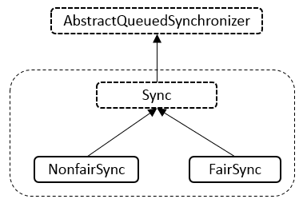
说明: ReentrantLock类内部总共存在Sync、NonfairSync、FairSync三个类，NonfairSync与FairSync类继承自Sync类，Sync类继承自AbstractQueuedSynchronizer抽象类。下面逐个进行分析。
- Sync类

Sync类的源码如下:
```java
abstract static class Sync extends AbstractQueuedSynchronizer {
    // 序列号
    private static final long serialVersionUID = -5179523762034025860L;
    
    // 获取锁
    abstract void lock();
    
    // 非公平方式获取
    final boolean nonfairTryAcquire(int acquires) {
        // 当前线程
        final Thread current = Thread.currentThread();
        // 获取状态
        int c = getState();
        if (c == 0) { // 表示没有线程正在竞争该锁
            if (compareAndSetState(0, acquires)) { // 比较并设置状态成功，状态0表示锁没有被占用
                // 设置当前线程独占
                setExclusiveOwnerThread(current); 
                return true; // 成功
            }
        }
        else if (current == getExclusiveOwnerThread()) { // 当前线程拥有该锁
            int nextc = c + acquires; // 增加重入次数
            if (nextc < 0) // overflow
                throw new Error("Maximum lock count exceeded");
            // 设置状态
            setState(nextc); 
            // 成功
            return true; 
        }
        // 失败
        return false;
    }
    
    // 试图在共享模式下获取对象状态，此方法应该查询是否允许它在共享模式下获取对象状态，如果允许，则获取它
    protected final boolean tryRelease(int releases) {
        int c = getState() - releases;
        if (Thread.currentThread() != getExclusiveOwnerThread()) // 当前线程不为独占线程
            throw new IllegalMonitorStateException(); // 抛出异常
        // 释放标识
        boolean free = false; 
        if (c == 0) {
            free = true;
            // 已经释放，清空独占
            setExclusiveOwnerThread(null); 
        }
        // 设置标识
        setState(c); 
        return free; 
    }
    
    // 判断资源是否被当前线程占有
    protected final boolean isHeldExclusively() {
        // While we must in general read state before owner,
        // we don't need to do so to check if current thread is owner
        return getExclusiveOwnerThread() == Thread.currentThread();
    }

    // 新生一个条件
    final ConditionObject newCondition() {
        return new ConditionObject();
    }

    // Methods relayed from outer class
    // 返回资源的占用线程
    final Thread getOwner() {        
        return getState() == 0 ? null : getExclusiveOwnerThread();
    }
    // 返回状态
    final int getHoldCount() {            
        return isHeldExclusively() ? getState() : 0;
    }

    // 资源是否被占用
    final boolean isLocked() {        
        return getState() != 0;
    }

    /**
        * Reconstitutes the instance from a stream (that is, deserializes it).
        */
    // 自定义反序列化逻辑
    private void readObject(java.io.ObjectInputStream s)
        throws java.io.IOException, ClassNotFoundException {
        s.defaultReadObject();
        setState(0); // reset to unlocked state
    }
}　　
```
Sync类存在如下方法和作用如下。

- NonfairSync类

NonfairSync类继承了Sync类，表示采用非公平策略获取锁，其实现了Sync类中抽象的lock方法，源码如下:
```java
// 非公平锁
static final class NonfairSync extends Sync {
    // 版本号
    private static final long serialVersionUID = 7316153563782823691L;

    // 获得锁
    final void lock() {
        if (compareAndSetState(0, 1)) // 比较并设置状态成功，状态0表示锁没有被占用
            // 把当前线程设置独占锁
            setExclusiveOwnerThread(Thread.currentThread());
        else // 锁已经被占用，或者set失败
            // 以独占模式获取对象，忽略中断
            acquire(1); 
    }

    protected final boolean tryAcquire(int acquires) {
        return nonfairTryAcquire(acquires);
    }
}
```
说明: 从lock方法的源码可知，每一次都尝试获取锁，而并不会按照公平等待的原则进行等待，让等待时间最久的线程获得锁。
- FairSyn类

FairSync类也继承了Sync类，表示采用公平策略获取锁，其实现了Sync类中的抽象lock方法，源码如下:
```java
// 公平锁
static final class FairSync extends Sync {
    // 版本序列化
    private static final long serialVersionUID = -3000897897090466540L;

    final void lock() {
        // 以独占模式获取对象，忽略中断
        acquire(1);
    }

    /**
        * Fair version of tryAcquire.  Don't grant access unless
        * recursive call or no waiters or is first.
        */
    // 尝试公平获取锁
    protected final boolean tryAcquire(int acquires) {
        // 获取当前线程
        final Thread current = Thread.currentThread();
        // 获取状态
        int c = getState();
        if (c == 0) { // 状态为0
            if (!hasQueuedPredecessors() &&
                compareAndSetState(0, acquires)) { // 不存在已经等待更久的线程并且比较并且设置状态成功
                // 设置当前线程独占
                setExclusiveOwnerThread(current);
                return true;
            }
        }
        else if (current == getExclusiveOwnerThread()) { // 状态不为0，即资源已经被线程占据
            // 下一个状态
            int nextc = c + acquires;
            if (nextc < 0) // 超过了int的表示范围
                throw new Error("Maximum lock count exceeded");
            // 设置状态
            setState(nextc);
            return true;
        }
        return false;
    }
}
```
说明: 跟踪lock方法的源码可知，当资源空闲时，它总是会先判断sync队列(AbstractQueuedSynchronizer中的数据结构)是否有等待时间更长的线程，如果存在，则将该线程加入到等待队列的尾部，实现了公平获取原则。其中，FairSync类的lock的方法调用如下，只给出了主要的方法。

说明: 可以看出只要资源被其他线程占用，该线程就会添加到sync queue中的尾部，而不会先尝试获取资源。这也是和Nonfair最大的区别，Nonfair每一次都会尝试去获取资源，如果此时该资源恰好被释放，则会被当前线程获取，这就造成了不公平的现象，当获取不成功，再加入队列尾部
##### 8.11.1.3 类的属性
ReentrantLock类的sync非常重要，对ReentrantLock类的操作大部分都直接转化为对Sync和AbstractQueuedSynchronizer类的操作。
```java
public class ReentrantLock implements Lock, java.io.Serializable {
    // 序列号
    private static final long serialVersionUID = 7373984872572414699L;    
    // 同步队列
    private final Sync sync;
}
```
##### 8.11.1.4 类的构造函数

- ReentrantLock()型构造函数

默认是采用的非公平策略获取锁
```java
public ReentrantLock() {
    // 默认非公平策略
    sync = new NonfairSync();
}
```
- ReentrantLock(boolean)型构造函数

可以传递参数确定采用公平策略或者是非公平策略，参数为true表示公平策略，否则，采用非公平策略:
```java
public ReentrantLock(boolean fair) {
    sync = fair ? new FairSync() : new NonfairSync();
}
```
##### 8.11.1.5 核心函数分析

通过分析ReentrantLock的源码，可知对其操作都转化为对Sync对象的操作，由于Sync继承了AQS，所以基本上都可以转化为对AQS的操作。如将ReentrantLock的lock函数转化为对Sync的lock函数的调用，而具体会根据采用的策略(如公平策略或者非公平策略)的不同而调用到Sync的不同子类。

所以可知，在ReentrantLock的背后，是AQS对其服务提供了支持，由于之前我们分析AQS的核心源码，遂不再累赘。下面还是通过例子来更进一步分析源码。
#### 8.11.2 示例分析
##### 8.11.2.1 公平锁
```java
import java.util.concurrent.locks.Lock;
import java.util.concurrent.locks.ReentrantLock;

class MyThread extends Thread {
    private Lock lock;
    public MyThread(String name, Lock lock) {
        super(name);
        this.lock = lock;
    }
    
    public void run () {
        lock.lock();
        try {
            System.out.println(Thread.currentThread() + " running");
            try {
                Thread.sleep(500);
            } catch (InterruptedException e) {
                e.printStackTrace();
            }
        } finally {
            lock.unlock();
        }
    }
}

public class AbstractQueuedSynchronizerDemo {
    public static void main(String[] args) throws InterruptedException {
        Lock lock = new ReentrantLock(true);
        
        MyThread t1 = new MyThread("t1", lock);        
        MyThread t2 = new MyThread("t2", lock);
        MyThread t3 = new MyThread("t3", lock);
        t1.start();
        t2.start();    
        t3.start();
    }
}
```
运行结果(某一次):
```java
Thread[t1,5,main] running
Thread[t2,5,main] running
Thread[t3,5,main] running
```
说明: 首先，t1线程的lock操作 -> t2线程的lock操作 -> t3线程的lock操作 -> t1线程的unlock操作 -> t2线程的unlock操作 -> t3线程的unlock操作。
### 8.12 JUC锁: ReentrantReadWriteLock详解
> - 有了ReentrantLock还需要ReentrantReadWriteLock?
> - ReentrantReadWriteLock底层实现原理?
> - ReentrantReadWriteLock底层读写状态如何设计的? 高16位为读锁，低16位为写锁
> - 读锁和写锁的最大数量是多少?
> - 本地线程计数器ThreadLocalHoldCounter是用来做什么的?
> - 缓存计数器HoldCounter是用来做什么的?
> - 写锁的获取与释放是怎么实现的?
> - 读锁的获取与释放是怎么实现的?
> - RentrantReadWriteLock为什么不支持锁升级?
> - 什么是锁的升降级? 
> - RentrantReadWriteLock为什么不支持锁升级?
#### 8.12.1 ReentrantReadWriteLock数据结构
ReentrantReadWriteLock底层是基于ReentrantLock和AbstractQueuedSynchronizer来实现的，所以，ReentrantReadWriteLock的数据结构也依托于AQS的数据结构。
#### 8.12.2 ReentrantReadWriteLock源码分析
##### 8.12.2.1 类的继承关系
```java
public class ReentrantReadWriteLock implements ReadWriteLock, java.io.Serializable {}
```
说明: 可以看到，ReentrantReadWriteLock实现了ReadWriteLock接口，ReadWriteLock接口定义了获取读锁和写锁的规范，具体需要实现类去实现；同时其还实现了Serializable接口，表示可以进行序列化，在源代码中可以看到ReentrantReadWriteLock实现了自己的序列化逻辑。
##### 8.12.2.2 类的内部类
ReentrantReadWriteLock有五个内部类，五个内部类之间也是相互关联的。内部类的关系如下图所示。

说明: 如上图所示，Sync继承自AQS、NonfairSync继承自Sync类、FairSync继承自Sync类；ReadLock实现了Lock接口、WriteLock也实现了Lock接口。
###### 8.12.2.2.1 内部类 - Sync类
- 类的继承关系
```java
abstract static class Sync extends AbstractQueuedSynchronizer {}
```
说明: Sync抽象类继承自AQS抽象类，Sync类提供了对ReentrantReadWriteLock的支持。
- 类的内部类
Sync类内部存在两个内部类，分别为HoldCounter和ThreadLocalHoldCounter，其中HoldCounter主要与读锁配套使用，其中，HoldCounter源码如下。
```java
// 计数器
static final class HoldCounter {
    // 计数
    int count = 0;
    // Use id, not reference, to avoid garbage retention
    // 获取当前线程的TID属性的值
    final long tid = getThreadId(Thread.currentThread());
}
```
说明: HoldCounter主要有两个属性，count和tid，其中count表示某个读线程重入的次数，tid表示该线程的tid字段的值，该字段可以用来唯一标识一个线程。

ThreadLocalHoldCounter的源码如下
```java
// 本地线程计数器
static final class ThreadLocalHoldCounter
    extends ThreadLocal<HoldCounter> {
    // 重写初始化方法，在没有进行set的情况下，获取的都是该HoldCounter值
    public HoldCounter initialValue() {
        return new HoldCounter();
    }
}
```
说明: ThreadLocalHoldCounter重写了ThreadLocal的initialValue方法，ThreadLocal类可以将线程与对象相关联。在没有进行set的情况下，get到的均是initialValue方法里面生成的那个HolderCounter对象。

- 类的属性
```java
abstract static class Sync extends AbstractQueuedSynchronizer {
    // 版本序列号
    private static final long serialVersionUID = 6317671515068378041L;        
    // 高16位为读锁，低16位为写锁
    static final int SHARED_SHIFT   = 16;
    // 读锁单位
    static final int SHARED_UNIT    = (1 << SHARED_SHIFT);
    // 读锁最大数量
    static final int MAX_COUNT      = (1 << SHARED_SHIFT) - 1;
    // 写锁最大数量
    static final int EXCLUSIVE_MASK = (1 << SHARED_SHIFT) - 1;
    // 本地线程计数器
    private transient ThreadLocalHoldCounter readHolds;
    // 缓存的计数器
    private transient HoldCounter cachedHoldCounter;
    // 第一个读线程
    private transient Thread firstReader = null;
    // 第一个读线程的计数
    private transient int firstReaderHoldCount;
}
```
说明: 该属性中包括了读锁、写锁线程的最大量。本地线程计数器等。
- 类的构造函数
```java
// 构造函数
Sync() {
    // 本地线程计数器
    readHolds = new ThreadLocalHoldCounter();
    // 设置AQS的状态
    setState(getState()); // ensures visibility of readHolds
}
```
说明: 在Sync的构造函数中设置了本地线程计数器和AQS的状态state。

###### 8.12.2.2.2 内部类 - Sync核心函数分析
对ReentrantReadWriteLock对象的操作绝大多数都转发至Sync对象进行处理。下面对Sync类中的重点函数进行分析
- sharedCount函数

表示占有读锁的线程数量，源码如下
```java
static int sharedCount(int c)    { return c >>> SHARED_SHIFT; }
```
说明: 直接将state（sharedCount被调用时传入的都是getstate()）右移16位，就可以得到读锁的线程数量，因为state的高16位表示读锁，对应的低十六位表示写锁数量。
- exclusiveCount函数

表示占有写锁的线程数量，源码如下
```java
static int exclusiveCount(int c) { return c & EXCLUSIVE_MASK; }
```
说明: 直接将状态state和(2^16 - 1)做与运算，其等效于将state模上2^16。写锁数量由state的低十六位表示。
- tryRelease函数
```java
/*
* Note that tryRelease and tryAcquire can be called by
* Conditions. So it is possible that their arguments contain
* both read and write holds that are all released during a
* condition wait and re-established in tryAcquire.
*/

protected final boolean tryRelease(int releases) {
    // 判断是否伪独占线程
    if (!isHeldExclusively())
        throw new IllegalMonitorStateException();
    // 计算释放资源后的写锁的数量
    int nextc = getState() - releases;
    boolean free = exclusiveCount(nextc) == 0; // 是否释放成功
    if (free)
        setExclusiveOwnerThread(null); // 设置独占线程为空
    setState(nextc); // 设置状态
    return free;
}
```
说明: 此函数用于释放写锁资源，首先会判断该线程是否为独占线程，若不为独占线程，则抛出异常，否则，计算释放资源后的写锁的数量，若为0，表示成功释放，资源不将被占用，否则，表示资源还被占用。其函数流程图如下。

- tryAcquire函数
```java
protected final boolean tryAcquire(int acquires) {
    /*
        * Walkthrough:
        * 1. If read count nonzero or write count nonzero
        *    and owner is a different thread, fail.
        * 2. If count would saturate, fail. (This can only
        *    happen if count is already nonzero.)
        * 3. Otherwise, this thread is eligible for lock if
        *    it is either a reentrant acquire or
        *    queue policy allows it. If so, update state
        *    and set owner.
        */
    // 获取当前线程
    Thread current = Thread.currentThread();
    // 获取状态
    int c = getState();
    // 写线程数量
    int w = exclusiveCount(c);
    if (c != 0) { // 状态不为0
        // (Note: if c != 0 and w == 0 then shared count != 0)
        if (w == 0 || current != getExclusiveOwnerThread()) // 写线程数量为0或者当前线程没有占有独占资源
            return false;
        if (w + exclusiveCount(acquires) > MAX_COUNT) // 判断是否超过最高写线程数量
            throw new Error("Maximum lock count exceeded");
        // Reentrant acquire
        // 设置AQS状态
        setState(c + acquires);
        return true;
    }
    if (writerShouldBlock() ||
        !compareAndSetState(c, c + acquires)) // 写线程是否应该被阻塞
        return false;
    // 设置独占线程
    setExclusiveOwnerThread(current);
    return true;
}
```
说明: 此函数用于获取写锁，首先会获取state，判断是否为0，若为0，表示此时没有读锁线程，再判断写线程是否应该被阻塞，而在非公平策略下总是不会被阻塞，在公平策略下会进行判断(判断同步队列中是否有等待时间更长的线程，若存在，则需要被阻塞，否则，无需阻塞)，之后在设置状态state，然后返回true。若state不为0，则表示此时存在读锁或写锁线程，若写锁线程数量为0或者当前线程为独占锁线程，则返回false，表示不成功，否则，判断写锁线程的重入次数是否大于了最大值，若是，则抛出异常，否则，设置状态state，返回true，表示成功。其函数流程图如下
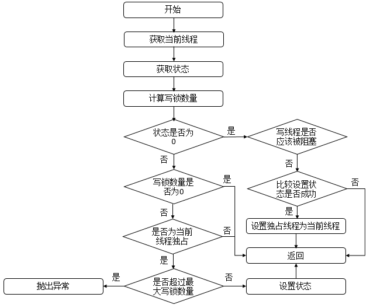
- tryReleaseShared函数
```java
protected final boolean tryReleaseShared(int unused) {
    // 获取当前线程
    Thread current = Thread.currentThread();
    if (firstReader == current) { // 当前线程为第一个读线程
        // assert firstReaderHoldCount > 0;
        if (firstReaderHoldCount == 1) // 读线程占用的资源数为1
            firstReader = null;
        else // 减少占用的资源
            firstReaderHoldCount--;
    } else { // 当前线程不为第一个读线程
        // 获取缓存的计数器
        HoldCounter rh = cachedHoldCounter;
        if (rh == null || rh.tid != getThreadId(current)) // 计数器为空或者计数器的tid不为当前正在运行的线程的tid
            // 获取当前线程对应的计数器
            rh = readHolds.get();
        // 获取计数
        int count = rh.count;
        if (count <= 1) { // 计数小于等于1
            // 移除
            readHolds.remove();
            if (count <= 0) // 计数小于等于0，抛出异常
                throw unmatchedUnlockException();
        }
        // 减少计数
        --rh.count;
    }
    for (;;) { // 无限循环
        // 获取状态
        int c = getState();
        // 获取状态
        int nextc = c - SHARED_UNIT;
        if (compareAndSetState(c, nextc)) // 比较并进行设置
            // Releasing the read lock has no effect on readers,
            // but it may allow waiting writers to proceed if
            // both read and write locks are now free.
            return nextc == 0;
    }
}
```
说明: 此函数表示读锁线程释放锁。首先判断当前线程是否为第一个读线程firstReader，若是，则判断第一个读线程占有的资源数firstReaderHoldCount是否为1，若是，则设置第一个读线程firstReader为空，否则，将第一个读线程占有的资源数firstReaderHoldCount减1；若当前线程不是第一个读线程，那么首先会获取缓存计数器(上一个读锁线程对应的计数器 )，若计数器为空或者tid不等于当前线程的tid值，则获取当前线程的计数器，如果计数器的计数count小于等于1，则移除当前线程对应的计数器，如果计数器的计数count小于等于0，则抛出异常，之后再减少计数即可。无论何种情况，都会进入无限循环，该循环可以确保成功设置状态state。其流程图如下

- tryAcquireShared函数
```java
private IllegalMonitorStateException unmatchedUnlockException() {
    return new IllegalMonitorStateException(
        "attempt to unlock read lock, not locked by current thread");
}

// 共享模式下获取资源
protected final int tryAcquireShared(int unused) {
    /*
        * Walkthrough:
        * 1. If write lock held by another thread, fail.
        * 2. Otherwise, this thread is eligible for
        *    lock wrt state, so ask if it should block
        *    because of queue policy. If not, try
        *    to grant by CASing state and updating count.
        *    Note that step does not check for reentrant
        *    acquires, which is postponed to full version
        *    to avoid having to check hold count in
        *    the more typical non-reentrant case.
        * 3. If step 2 fails either because thread
        *    apparently not eligible or CAS fails or count
        *    saturated, chain to version with full retry loop.
        */
    // 获取当前线程
    Thread current = Thread.currentThread();
    // 获取状态
    int c = getState();
    if (exclusiveCount(c) != 0 &&
        getExclusiveOwnerThread() != current) // 写线程数不为0并且占有资源的不是当前线程
        return -1;
    // 读锁数量
    int r = sharedCount(c);
    if (!readerShouldBlock() &&
        r < MAX_COUNT &&
        compareAndSetState(c, c + SHARED_UNIT)) { // 读线程是否应该被阻塞、并且小于最大值、并且比较设置成功
        if (r == 0) { // 读锁数量为0
            // 设置第一个读线程
            firstReader = current;
            // 读线程占用的资源数为1
            firstReaderHoldCount = 1;
        } else if (firstReader == current) { // 当前线程为第一个读线程
            // 占用资源数加1
            firstReaderHoldCount++;
        } else { // 读锁数量不为0并且不为当前线程
            // 获取计数器
            HoldCounter rh = cachedHoldCounter;
            if (rh == null || rh.tid != getThreadId(current)) // 计数器为空或者计数器的tid不为当前正在运行的线程的tid
                // 获取当前线程对应的计数器
                cachedHoldCounter = rh = readHolds.get();
            else if (rh.count == 0) // 计数为0
                // 设置
                readHolds.set(rh);
            rh.count++;
        }
        return 1;
    }
    return fullTryAcquireShared(current);
}
```
说明: 此函数表示读锁线程获取读锁。首先判断写锁是否为0并且当前线程不占有独占锁，直接返回；否则，判断读线程是否需要被阻塞并且读锁数量是否小于最大值并且比较设置状态成功，若当前没有读锁，则设置第一个读线程firstReader和firstReaderHoldCount；若当前线程线程为第一个读线程，则增加firstReaderHoldCount；否则，将设置当前线程对应的HoldCounter对象的值。流程图如下。

- fullTryAcquireShared函数
```java
final int fullTryAcquireShared(Thread current) {
    /*
        * This code is in part redundant with that in
        * tryAcquireShared but is simpler overall by not
        * complicating tryAcquireShared with interactions between
        * retries and lazily reading hold counts.
        */
    HoldCounter rh = null;
    for (;;) { // 无限循环
        // 获取状态
        int c = getState();
        if (exclusiveCount(c) != 0) { // 写线程数量不为0
            if (getExclusiveOwnerThread() != current) // 不为当前线程
                return -1;
            // else we hold the exclusive lock; blocking here
            // would cause deadlock.
        } else if (readerShouldBlock()) { // 写线程数量为0并且读线程被阻塞
            // Make sure we're not acquiring read lock reentrantly
            if (firstReader == current) { // 当前线程为第一个读线程
                // assert firstReaderHoldCount > 0;
            } else { // 当前线程不为第一个读线程
                if (rh == null) { // 计数器不为空
                    // 
                    rh = cachedHoldCounter;
                    if (rh == null || rh.tid != getThreadId(current)) { // 计数器为空或者计数器的tid不为当前正在运行的线程的tid
                        rh = readHolds.get();
                        if (rh.count == 0)
                            readHolds.remove();
                    }
                }
                if (rh.count == 0)
                    return -1;
            }
        }
        if (sharedCount(c) == MAX_COUNT) // 读锁数量为最大值，抛出异常
            throw new Error("Maximum lock count exceeded");
        if (compareAndSetState(c, c + SHARED_UNIT)) { // 比较并且设置成功
            if (sharedCount(c) == 0) { // 读线程数量为0
                // 设置第一个读线程
                firstReader = current;
                // 
                firstReaderHoldCount = 1;
            } else if (firstReader == current) {
                firstReaderHoldCount++;
            } else {
                if (rh == null)
                    rh = cachedHoldCounter;
                if (rh == null || rh.tid != getThreadId(current))
                    rh = readHolds.get();
                else if (rh.count == 0)
                    readHolds.set(rh);
                rh.count++;
                cachedHoldCounter = rh; // cache for release
            }
            return 1;
        }
    }
}
```
说明: 在tryAcquireShared函数中，如果下列三个条件不满足(读线程是否应该被阻塞、小于最大值、比较设置成功)则会进行fullTryAcquireShared函数中，它用来保证相关操作可以成功。其逻辑与tryAcquireShared逻辑类似，不再累赘。而其他内部类的操作基本上都是转化到了对Sync对象的操作，在此不再累赘。

##### 8.12.2.3 类的属性

```java
public class ReentrantReadWriteLock
        implements ReadWriteLock, java.io.Serializable {
    // 版本序列号    
    private static final long serialVersionUID = -6992448646407690164L;    
    // 读锁
    private final ReentrantReadWriteLock.ReadLock readerLock;
    // 写锁
    private final ReentrantReadWriteLock.WriteLock writerLock;
    // 同步队列
    final Sync sync;
    
    private static final sun.misc.Unsafe UNSAFE;
    // 线程ID的偏移地址
    private static final long TID_OFFSET;
    static {
        try {
            UNSAFE = sun.misc.Unsafe.getUnsafe();
            Class<?> tk = Thread.class;
            // 获取线程的tid字段的内存地址
            TID_OFFSET = UNSAFE.objectFieldOffset
                (tk.getDeclaredField("tid"));
        } catch (Exception e) {
            throw new Error(e);
        }
    }
}
```
说明: 可以看到ReentrantReadWriteLock属性包括了一个ReentrantReadWriteLock.ReadLock对象，表示读锁；一个ReentrantReadWriteLock.WriteLock对象，表示写锁；一个Sync对象，表示同步队列。

##### 8.12.2.4 类的构造函数
- ReentrantReadWriteLock()型构造函数
```java
public ReentrantReadWriteLock() {
    this(false);
}
```
说明: 此构造函数会调用另外一个有参构造函数。
- ReentrantReadWriteLock(boolean)型构造函数
```java
public ReentrantReadWriteLock(boolean fair) {
    // 公平策略或者是非公平策略
    sync = fair ? new FairSync() : new NonfairSync();
    // 读锁
    readerLock = new ReadLock(this);
    // 写锁
    writerLock = new WriteLock(this);
}
```
说明: 可以指定设置公平策略或者非公平策略，并且该构造函数中生成了读锁与写锁两个对象。

##### 8.12.2.5 核心函数分析
对ReentrantReadWriteLock的操作基本上都转化为了对Sync对象的操作，而Sync的函数已经分析过，不再累赘。
#### 8.12.3 ReentrantReadWriteLock示例
下面给出了一个使用ReentrantReadWriteLock的示例，源代码如下。
```java
import java.util.concurrent.locks.ReentrantReadWriteLock;

class ReadThread extends Thread {
    private ReentrantReadWriteLock rrwLock;
    
    public ReadThread(String name, ReentrantReadWriteLock rrwLock) {
        super(name);
        this.rrwLock = rrwLock;
    }
    
    public void run() {
        System.out.println(Thread.currentThread().getName() + " trying to lock");
        try {
            rrwLock.readLock().lock();
            System.out.println(Thread.currentThread().getName() + " lock successfully");
            Thread.sleep(5000);        
        } catch (InterruptedException e) {
            e.printStackTrace();
        } finally {
            rrwLock.readLock().unlock();
            System.out.println(Thread.currentThread().getName() + " unlock successfully");
        }
    }
}

class WriteThread extends Thread {
    private ReentrantReadWriteLock rrwLock;
    
    public WriteThread(String name, ReentrantReadWriteLock rrwLock) {
        super(name);
        this.rrwLock = rrwLock;
    }
    
    public void run() {
        System.out.println(Thread.currentThread().getName() + " trying to lock");
        try {
            rrwLock.writeLock().lock();
            System.out.println(Thread.currentThread().getName() + " lock successfully");    
        } finally {
            rrwLock.writeLock().unlock();
            System.out.println(Thread.currentThread().getName() + " unlock successfully");
        }
    }
}

public class ReentrantReadWriteLockDemo {
    public static void main(String[] args) {
        ReentrantReadWriteLock rrwLock = new ReentrantReadWriteLock();
        ReadThread rt1 = new ReadThread("rt1", rrwLock);
        ReadThread rt2 = new ReadThread("rt2", rrwLock);
        WriteThread wt1 = new WriteThread("wt1", rrwLock);
        rt1.start();
        rt2.start();
        wt1.start();
    } 
}
```
运行结果(某一次):
```java
rt1 trying to lock
rt2 trying to lock
wt1 trying to lock
rt1 lock successfully
rt2 lock successfully
rt1 unlock successfully
rt2 unlock successfully
wt1 lock successfully
wt1 unlock successfully
```
说明: 程序中生成了一个ReentrantReadWriteLock对象，并且设置了两个读线程，一个写线程。根据结果，可能存在如下的时序图。


#### 8.12.4 **ReentrantReadWriteLock** 的核心功能和使用要点总结：
---

 🔑 **核心功能**

1. **读写分离**  
   - **读锁（共享锁）**：允许多个线程**并发读取**（读读不互斥）
   - **写锁（独占锁）**：只允许**一个线程独占写入**（写写互斥、读写互斥）

2. **锁升级/降级**  
   - 支持从写锁降级为读锁（避免数据不一致）
   - **不支持读锁升级为写锁**（会导致死锁风险）

---

⚙️ **核心使用场景**


| 场景 | 读锁 | 写锁 |
|------|------|------|
| **高频读、低频写** | ✅ 多线程并发读取 | ⚠️ 单线程独占写入 |
| **数据缓存** | ✅ 多个线程同时读缓存 | ⚠️ 更新缓存时阻塞读写 |
| **配置热更新** | ✅ 读取配置无阻塞 | ⚠️ 更新配置时独占 |


#### 8.12.5 什么是锁升降级?

锁降级指的是写锁降级成为读锁。如果当前线程拥有写锁，然后将其释放，最后再获取读锁，这种分段完成的过程不能称之为锁降级。**锁降级是指把持住(当前拥有的)写锁，再获取到读锁，随后释放(先前拥有的)写锁的过程。**

接下来看一个锁降级的示例。因为数据不常变化，所以多个线程可以并发地进行数据处理，当数据变更后，如果当前线程感知到数据变化，则进行数据的准备工作，同时其他处理线程被阻塞，直到当前线程完成数据的准备工作，如代码如下所示：
```java
public void processData() {
    readLock.lock();
    if (!update) {
        // 必须先释放读锁
        readLock.unlock();
        // 锁降级从写锁获取到开始
        writeLock.lock();
        try {
            if (!update) {
                // 准备数据的流程(略)
                update = true;
            }
            readLock.lock();
        } finally {
            writeLock.unlock();
        }
        // 锁降级完成，写锁降级为读锁
    }
    try {
        // 使用数据的流程(略)
    } finally {
        readLock.unlock();
    }
}
```
上述示例中，当数据发生变更后，update变量(布尔类型且volatile修饰)被设置为false，此时所有访问processData()方法的线程都能够感知到变化，但只有一个线程能够获取到写锁，其他线程会被阻塞在读锁和写锁的lock()方法上。当前线程获取写锁完成数据准备之后，再获取读锁，随后释放写锁，完成锁降级。

锁降级中读锁的获取是否必要呢? 答案是必要的。主要是为了保证数据的可见性，如果当前线程不获取读锁而是直接释放写锁，假设此刻另一个线程(记作线程T)获取了写锁并修改了数据，那么当前线程无法感知线程T的数据更新。如果当前线程获取读锁，即遵循锁降级的步骤，则线程T将会被阻塞，直到当前线程使用数据并释放读锁之后，线程T才能获取写锁进行数据更新。

RentrantReadWriteLock不支持锁升级(把持读锁、获取写锁，最后释放读锁的过程)。目的也是保证数据可见性，如果读锁已被多个线程获取，其中任意线程成功获取了写锁并更新了数据，则其更新对其他获取到读锁的线程是不可见的。

好的，这是一个关于并发编程中非常经典且重要的问题。我们来详细拆解一下。

##### 8.12.5.1 如何理解锁降级？

要理解锁降级，首先要明白 `ReentrantReadWriteLock` 为什么存在。它将锁分为了两种：

- **写锁**：独占锁。同一时刻只允许一个线程持有。用于修改共享数据。
- **读锁**：共享锁。同一时刻允许多个线程同时持有。用于读取共享数据。

**锁降级的定义**：
锁降级是指，**在持有写锁的情况下，再获取读锁，然后释放写锁的过程**。这个操作使得线程从“写入者”的身份降级为“读取者”的身份。

**为什么需要锁降级？—— 核心目的：数据可见性**

锁降级的核心目的是为了保证数据的**可见性**，防止其他写线程在本次修改完成之后、本线程读取之前趁机修改数据，从而导致本线程读取到不一致的“旧”数据。

我们通过一个经典的、没有锁降级会出问题的场景来理解：

```java
// 假设这是一个共享数据
private volatile Map<String, Object> cache = new HashMap<>();
private final ReentrantReadWriteLock rwLock = new ReentrantReadWriteLock();

// 线程A： 更新缓存
public void updateCache(String key, Object value) {
    rwLock.writeLock().lock();
    try {
        // 1. 模拟耗时操作，准备数据
        Map<String, Object> newMap = new HashMap<>(cache);
        newMap.put(key, value);
        // ... 其他准备工作

        // 2. 更新共享变量
        cache = newMap; // 假设cache是volatile的，保证引用立即可见
    } finally {
        rwLock.writeLock().unlock(); // 3. 释放写锁
    }
    // 问题点：在写锁释放后，其他写线程可以立刻获取写锁并再次修改cache
}

// 线程B： 读取缓存
public Object getCache(String key) {
    rwLock.readLock().lock();
    try {
        return cache.get(key);
    } finally {
        rwLock.readLock().unlock();
    }
}
```

**问题在于**：
如果在线程A释放写锁（步骤3）之后，但在它自己或其他线程使用 `getCache` 读取数据之前，有另一个**线程C**获取了写锁并再次修改了 `cache`。那么当线程A或线程B再去读取时，读到的就不是线程A刚刚更新的那份数据了，而是被线程C修改后的新数据。这在线程A的视角来看，它的更新结果“丢失”了，或者说读取到了意外的数据。

**使用锁降级解决这个问题**：

```java
public void updateCacheWithDowngrade(String key, Object value) {
    rwLock.writeLock().lock(); // 1. 获取写锁
    try {
        // ... 准备数据
        Map<String, Object> newMap = new HashMap<>(cache);
        newMap.put(key, value);
        cache = newMap;

        // === 锁降级开始 ===
        rwLock.readLock().lock(); // 2. 在释放写锁前，先获取读锁
    } finally {
        rwLock.writeLock().unlock(); // 3. 释放写锁。此时锁降级完成，本线程持有读锁。
    }

    // 4. 仍然持有读锁，可以安全地读取cache，因为其他写线程无法获取写锁
    try {
        // 使用cache做一些事情，比如验证数据、记录日志等
        System.out.println("Current value for " + key + " is: " + cache.get(key));
    } finally {
        rwLock.readLock().unlock(); // 5. 最终释放读锁
    }
}
```

**锁降级如何保证了可见性？**

1.  线程A持有**写锁**，期间没有任何其他线程能持有读锁或写锁，因此可以安全地修改数据。
2.  在释放写锁**之前**，线程A先获取了**读锁**。这个操作是允许的（ReentrantReadWriteLock 支持可重入和锁降级）。
3.  当线程A释放**写锁**时，它仍然持有**读锁**。
4.  由于读锁是共享锁，其他读线程可以同时获取读锁并读取数据。但是，**任何写线程都无法获取写锁**，因为至少有一个读锁（线程A持有的）还没有被释放。
5.  因此，在从 `rwLock.writeLock().unlock()` 到 `rwLock.readLock().unlock()` 的这段时间里，共享数据 `cache` 被“冻结”了，不会被任何写线程修改。这就保证了线程A在更新后能读取到自己写入的、一致的数据。

**简单总结锁降级的理解**：
它是一个“防守”动作，通过在释放写锁前“提前”拿到一个读锁，来防止其他写线程在自己“收工”（释放写锁）和“检查”（读取数据）的间隙搞破坏，确保了自身修改结果对自己后续操作的可见性。

---

##### 8.12.5.1.2 锁降级是需要自己编程实现还是自带的功能？

这是一个非常好的问题，答案有两面性：

**1. 它是“自带”的功能**

`ReentrantReadWriteLock` 的底层设计**允许**这种“持有写锁时再获取读锁”的操作。从API层面看，你直接调用 `readLock().lock()` 不会被阻塞，这就是对锁降级的“内置支持”。如果它不支持，你在持有写锁时尝试获取读锁可能会死锁或被拒绝。

**2. 但它需要“自己编程实现”**

锁降级不是一个你调用一个像 `downgradeLock()` 这样的方法就能完成的事情。**它是一套你必须严格遵守的、正确的编程范式（代码顺序）**。

你必须手动地、按顺序地执行以下步骤：
1.  获取写锁。
2.  修改数据。
3.  **获取读锁。**
4.  **释放写锁。** （至此，降级完成）
5.  读取数据/执行后续操作。
6.  释放读锁。

**如果你不按照这个顺序写代码，比如先释放写锁再获取读锁，那就不是锁降级了，而且中间会存在一个 unprotected 的空窗期，可能导致数据不一致。**

---

##### 8.12.5.1.3 补充：锁升级

与锁降级相对的是锁升级，即**在持有读锁的情况下，尝试获取写锁**。

- **`ReentrantReadWriteLock` 明确不支持锁升级**。
- 原因：死锁风险极高。假设有线程A和线程B都持有了读锁，现在线程A想升级为写锁，它必须等待线程B释放读锁；但如果线程B也试图升级为写锁，它也必须等待线程A释放读锁。这就导致了经典的死锁局面。
- 因此，如果你试图在持有读锁时获取写锁，`ReentrantReadWriteLock` 的默认策略是让当前线程永远等待，从而导致死锁。你必须先释放读锁，再去获取写锁。

##### 8.12.5.1.4 总结

- **理解**：锁降级是通过“写锁 -> 读锁 -> 释放写锁”的序列，在保证数据一致性的前提下，将独占锁转换为共享锁，从而提高并发性的技术。其核心是**保证当前线程修改后数据的可见性**。
- **实现**：`ReentrantReadWriteLock` **内置支持**锁降级的操作，但正确的降级流程**需要开发者通过编程来保证**。你必须严格遵循 `获取写锁 -> 获取读锁 -> 释放写锁` 的顺序。
- 读锁是共享锁，可以多线程持有同一个读锁，但是写锁是独占锁，在任何线程持有读锁的时候，任何一个线程都不能持有写锁，同理一个线程持有了写锁之后任何线程都不能持有读锁但**除了自己本身（锁降级的基础）**。正因如此在写锁持有后再持有读锁至少能保证有一个线程在持有读锁，保证了数据可见。

- 完整的互斥关系总结：

| 当前持有的锁 | 其他线程能否获取读锁 | 其他线程能否获取写锁 | 本线程能否获取读锁 | 本线程能否获取写锁 |
|-------------|-------------------|-------------------|-----------------|-----------------|
| 无锁 | ✅ 可以 | ✅ 可以 | - | - |
| 有读锁（本线程） | ✅ 可以 | ❌ 不可以 | ✅ 可以（重入） | ❌ 不可以（不支持升级） |
| 有写锁（本线程） | ❌ 不可以 | ❌ 不可以 | ✅ 可以（锁降级） | ✅ 可以（重入） |
| 其他线程持有读锁 | ✅ 可以 | ❌ 不可以 | - | - |
| 其他线程持有写锁 | ❌ 不可以 | ❌ 不可以 | - | - |

### 关键要点：

1. **读写互斥**：读锁和写锁是互斥的，不能同时被不同线程持有
2. **写读互斥**：写锁和读锁是互斥的，不能同时被不同线程持有  
3. **重入性**：同一个线程可以重复获取已经持有的锁
4. **锁降级**：持有写锁的线程可以再获取读锁，然后释放写锁
5. **不支持锁升级**：持有读锁的线程不能直接获取写锁（必须先释放读锁）


### 8.13 JUC集合: ConcurrentHashMap详解

> 为什么HashTable慢? 它的并发度是什么? 那么ConcurrentHashMap并发度是什么?
> ConcurrentHashMap在JDK1.7和JDK1.8中实现有什么差别? JDK1.8解決了JDK1.7中什么问题
> ConcurrentHashMap JDK1.7实现的原理是什么? 分段锁机制
> ConcurrentHashMap JDK1.8实现的原理是什么? 数组+链表+红黑树，CAS
> ConcurrentHashMap JDK1.7中Segment数(concurrencyLevel)默认值是多少? 为何一旦初始化就不可再扩容?
> ConcurrentHashMap JDK1.7说说其put的机制?
> ConcurrentHashMap JDK1.7是如何扩容的? rehash(注：segment 数组不能扩容，扩容是 segment 数组某个位置内部的数组 HashEntry<K,V>[] 进行扩容)
> ConcurrentHashMap JDK1.8是如何扩容的? tryPresize
> ConcurrentHashMap JDK1.8链表转红黑树的时机是什么? 临界值为什么是8?
> ConcurrentHashMap JDK1.8是如何进行数据迁移的? transfer
#### 8.13.1 为什么HashTable慢
Hashtable之所以效率低下主要是因为其实现使用了synchronized关键字对put等操作进行加锁，而synchronized关键字加锁是对整个对象进行加锁，也就是说在进行put等修改Hash表的操作时，锁住了整个Hash表，从而使得其表现的效率低下。
#### 8.13.2 ConcurrentHashMap - JDK 1.7
在JDK1.5~1.7版本，Java使用了分段锁机制实现ConcurrentHashMap.

简而言之，ConcurrentHashMap在对象中保存了一个Segment数组，即将整个Hash表划分为多个分段；而每个Segment元素，即每个分段则类似于一个Hashtable；这样，在执行put操作时首先根据hash算法定位到元素属于哪个Segment，然后对该Segment加锁即可。因此，ConcurrentHashMap在多线程并发编程中可以实现多线程put操作。接下来分析JDK1.7版本中ConcurrentHashMap的实现原理。
##### 8.13.2.1 数据结构
整个 ConcurrentHashMap 由一个个 Segment 组成，Segment 代表”部分“或”一段“的意思，所以很多地方都会将其描述为分段锁。注意，行文中，我很多地方用了“槽”来代表一个 segment。

简单理解就是，ConcurrentHashMap 是一个 Segment 数组，Segment 通过继承 ReentrantLock 来进行加锁，所以每次需要加锁的操作锁住的是一个 segment，这样只要保证每个 Segment 是线程安全的，也就实现了全局的线程安全。

`concurrencyLevel`: 并行级别、并发数、Segment 数，怎么翻译不重要，理解它。默认是 16，也就是说 ConcurrentHashMap 有 16 个 Segments，所以理论上，这个时候，最多可以同时支持 16 个线程并发写，只要它们的操作分别分布在不同的 Segment 上。这个值可以在初始化的时候设置为其他值，但是一旦初始化以后，它是不可以扩容的。

再具体到每个 Segment 内部，其实每个 Segment 很像之前介绍的 HashMap，不过它要保证线程安全，所以处理起来要麻烦些。
##### 8.13.2.2 初始化
- initialCapacity: 初始容量，这个值指的是整个 ConcurrentHashMap 的初始容量，实际操作的时候需要平均分给每个 Segment。
- loadFactor: 负载因子，之前我们说了，Segment 数组不可以扩容，所以这个负载因子是给每个 Segment 内部使用的。
```java
public ConcurrentHashMap(int initialCapacity,
                         float loadFactor, int concurrencyLevel) {
    if (!(loadFactor > 0) || initialCapacity < 0 || concurrencyLevel <= 0)
        throw new IllegalArgumentException();
    if (concurrencyLevel > MAX_SEGMENTS)
        concurrencyLevel = MAX_SEGMENTS;
    // Find power-of-two sizes best matching arguments
    int sshift = 0;
    int ssize = 1;
    // 计算并行级别 ssize，因为要保持并行级别是 2 的 n 次方
    while (ssize < concurrencyLevel) {
        ++sshift;
        ssize <<= 1;
    }
    // 我们这里先不要那么烧脑，用默认值，concurrencyLevel 为 16，sshift 为 4
    // 那么计算出 segmentShift 为 28，segmentMask 为 15，后面会用到这两个值
    this.segmentShift = 32 - sshift;
    this.segmentMask = ssize - 1;

    if (initialCapacity > MAXIMUM_CAPACITY)
        initialCapacity = MAXIMUM_CAPACITY;

    // initialCapacity 是设置整个 map 初始的大小，
    // 这里根据 initialCapacity 计算 Segment 数组中每个位置可以分到的大小
    // 如 initialCapacity 为 64，那么每个 Segment 或称之为"槽"可以分到 4 个
    int c = initialCapacity / ssize;
    if (c * ssize < initialCapacity)
        ++c;
    // 默认 MIN_SEGMENT_TABLE_CAPACITY 是 2，这个值也是有讲究的，因为这样的话，对于具体的槽上，
    // 插入一个元素不至于扩容，插入第二个的时候才会扩容
    int cap = MIN_SEGMENT_TABLE_CAPACITY; 
    while (cap < c)
        cap <<= 1;

    // 创建 Segment 数组，
    // 并创建数组的第一个元素 segment[0]
    Segment<K,V> s0 =
        new Segment<K,V>(loadFactor, (int)(cap * loadFactor),
                         (HashEntry<K,V>[])new HashEntry[cap]);
    Segment<K,V>[] ss = (Segment<K,V>[])new Segment[ssize];
    // 往数组写入 segment[0]
    UNSAFE.putOrderedObject(ss, SBASE, s0); // ordered write of segments[0]
    this.segments = ss;
}
```
初始化完成，我们得到了一个 Segment 数组。

我们就当是用 new ConcurrentHashMap() 无参构造函数进行初始化的，那么初始化完成后:
- Segment 数组长度为 16，不可以扩容
- Segment[i] 的默认大小为 2，负载因子是 0.75，得出初始阈值为 1.5，也就是以后插入第一个元素不会触发扩容，插入第二个会进行第一次扩容这里
- 初始化了 segment[0]，其他位置还是 null，至于为什么要初始化 segment[0]，后面的代码会介绍
- 当前 segmentShift 的值为 32 - 4 = 28，segmentMask 为 16 - 1 = 15，姑且把它们简单翻译为移位数和掩码，这两个值马上就会用到
##### 8.13.2.3 put 过程分析
我们先看 put 的主流程，对于其中的一些关键细节操作，后面会进行详细介绍。
```java
public V put(K key, V value) {
    Segment<K,V> s;
    if (value == null)
        throw new NullPointerException();
    // 1. 计算 key 的 hash 值
    int hash = hash(key);
    // 2. 根据 hash 值找到 Segment 数组中的位置 j
    //    hash 是 32 位，无符号右移 segmentShift(28) 位，剩下高 4 位，
    //    然后和 segmentMask(15) 做一次与操作，也就是说 j 是 hash 值的高 4 位，也就是槽的数组下标
    int j = (hash >>> segmentShift) & segmentMask;//计算出的j一定是0~15之间，用以确定属于哪个segment
    // 刚刚说了，初始化的时候初始化了 segment[0]，但是其他位置还是 null，
    // ensureSegment(j) 对 segment[j] 进行初始化
    if ((s = (Segment<K,V>)UNSAFE.getObject          // nonvolatile; recheck
         (segments, (j << SSHIFT) + SBASE)) == null) //  in ensureSegment
        s = ensureSegment(j);
    // 3. 插入新值到 槽 s 中
    return s.put(key, hash, value, false);
}
```
1. **`int j = (hash >>> segmentShift) & segmentMask;`**
- **目的**：计算键值对应该分配到哪个 `Segment` 中。
- **变量说明**：
  - `hash`：键的哈希值（32 位整数）。
  - `segmentShift`：位移位数（默认 `32 - n`，其中 `n` 是 `ConcurrentHashMap` 的分段数取 2 的对数）。
  - `segmentMask`：掩码（值为 `分段数 - 1`，二进制全为 1）。
- **计算逻辑**：
  1. `hash >>> segmentShift`：将哈希值**无符号右移**，保留哈希值的高位部分（因为哈希值的低位通常重复度高，高位更随机）。
  2. `& segmentMask`：用掩码取模，确保结果在 `[0, segmentMask]` 范围内（即有效的 `Segment` 下标）。
- **示例**：
  - 若分段数为 16（`segmentMask = 15`，二进制 `1111`），`segmentShift = 28`。
  - 假设 `hash = 0x8A3B_C1D2`（32 位）：
    - 右移 28 位：`0x8A3B_C1D2 >>> 28 = 0x8`（保留高 4 位）。
    - 与掩码运算：`0x8 & 15 = 8` → 分配到 `Segment[8]`。

---
2. **`if ((s = (Segment<K,V>)UNSAFE.getObject(segments, (j << SSHIFT) + SBASE)) == null)`**
- **目的**：从 `Segment` 数组中获取下标 `j` 对应的分段，并检查是否已初始化。
- **关键方法**：`UNSAFE.getObject`  
  直接通过**内存偏移量**访问数组元素（绕过 Java 数组边界检查，提升性能）。
- **偏移量计算**：`(j << SSHIFT) + SBASE`
  - `SSHIFT`：每个数组元素的内存偏移量（如 32 位 JVM 为 4，64 位为 8）。
  - `SBASE`：`Segment[]` 数组的首元素内存地址偏移量。
  - `j << SSHIFT`：计算下标 `j` 的元素相对于数组基址的偏移量（`j * 元素大小`）。
- **逻辑流程**：
  1. 计算 `Segment[j]` 的内存地址：`基址 + j * 元素大小`。
  2. 通过 `UNSAFE.getObject` 读取该地址的 `Segment` 对象。
  3. 若对象为 `null`，说明该 `Segment` 尚未初始化。

---
3. **`s = ensureSegment(j);`**
- **目的**：懒初始化 `Segment[j]`（线程安全）。
- **实现逻辑**：
  1. 以 `Segment[0]` 为模板创建新 `Segment`（继承其负载因子、扩容阈值等配置）。
  2. 使用 **CAS（Compare-and-Swap）** 或 **锁** 确保并发下仅初始化一次。
- **设计意图**：  
  避免启动时一次性初始化所有 `Segment`（节省内存），同时保证线程安全。
---
第一层皮很简单，根据 hash 值很快就能找到相应的 Segment，之后就是 Segment 内部的 put 操作了。

Segment 内部是由 数组+链表 组成的。
```java
final V put(K key, int hash, V value, boolean onlyIfAbsent) {
    // 在往该 segment 写入前，需要先获取该 segment 的独占锁
    //    先看主流程，后面还会具体介绍这部分内容
    HashEntry<K,V> node = tryLock() ? null :
        scanAndLockForPut(key, hash, value);
    V oldValue;
    try {
        // 这个是 segment 内部的数组
        HashEntry<K,V>[] tab = table;
        // 再利用 hash 值，求应该放置的数组下标
        int index = (tab.length - 1) & hash;
        // first 是数组该位置处的链表的表头
        HashEntry<K,V> first = entryAt(tab, index);

        // 下面这串 for 循环虽然很长，不过也很好理解，想想该位置没有任何元素和已经存在一个链表这两种情况
        for (HashEntry<K,V> e = first;;) {
            if (e != null) {
                K k;
                if ((k = e.key) == key ||
                    (e.hash == hash && key.equals(k))) {
                    oldValue = e.value;
                    if (!onlyIfAbsent) {
                        // 覆盖旧值
                        e.value = value;
                        ++modCount;
                    }
                    break;
                }
                // 继续顺着链表走
                e = e.next;
            }
            else {
                // node 到底是不是 null，这个要看获取锁的过程，不过和这里都没有关系。
                // 如果不为 null，那就直接将它设置为链表表头；如果是null，初始化并设置为链表表头。
                if (node != null)
                    node.setNext(first);
                else
                    node = new HashEntry<K,V>(hash, key, value, first);

                int c = count + 1;
                // 如果超过了该 segment 的阈值，这个 segment 需要扩容
                if (c > threshold && tab.length < MAXIMUM_CAPACITY)
                    rehash(node); // 扩容后面也会具体分析
                else
                    // 没有达到阈值，将 node 放到数组 tab 的 index 位置，
                    // 其实就是将新的节点设置成原链表的表头
                    setEntryAt(tab, index, node);
                ++modCount;
                count = c;
                oldValue = null;
                break;
            }
        }
    } finally {
        // 解锁
        unlock();
    }
    return oldValue;
}
```
整体流程还是比较简单的，由于有独占锁的保护，所以 segment 内部的操作并不复杂。至于这里面的并发问题，我们稍后再进行介绍。

到这里 put 操作就结束了，接下来，我们说一说其中几步关键的操作。

##### 8.13.2.4 初始化槽: ensureSegment
ConcurrentHashMap 初始化的时候会初始化第一个槽 segment[0]，对于其他槽来说，在插入第一个值的时候进行初始化。

这里需要考虑并发，因为很可能会有多个线程同时进来初始化同一个槽 segment[k]，不过只要有一个成功了就可以。
```java
private Segment<K,V> ensureSegment(int k) {
    final Segment<K,V>[] ss = this.segments;
    long u = (k << SSHIFT) + SBASE; // raw offset
    Segment<K,V> seg;
    if ((seg = (Segment<K,V>)UNSAFE.getObjectVolatile(ss, u)) == null) {
        // 这里看到为什么之前要初始化 segment[0] 了，
        // 使用当前 segment[0] 处的数组长度和负载因子来初始化 segment[k]
        // 为什么要用“当前”，因为 segment[0] 可能早就扩容过了
        Segment<K,V> proto = ss[0];
        int cap = proto.table.length;
        float lf = proto.loadFactor;
        int threshold = (int)(cap * lf);

        // 初始化 segment[k] 内部的数组
        HashEntry<K,V>[] tab = (HashEntry<K,V>[])new HashEntry[cap];
        if ((seg = (Segment<K,V>)UNSAFE.getObjectVolatile(ss, u))
            == null) { // 再次检查一遍该槽是否被其他线程初始化了。

            Segment<K,V> s = new Segment<K,V>(lf, threshold, tab);
            // 使用 while 循环，内部用 CAS，当前线程成功设值或其他线程成功设值后，退出
            while ((seg = (Segment<K,V>)UNSAFE.getObjectVolatile(ss, u))
                   == null) {
                if (UNSAFE.compareAndSwapObject(ss, u, null, seg = s))
                    break;
            }
        }
    }
    return seg;
}
```
总的来说，ensureSegment(int k) 比较简单，对于并发操作使用 CAS 进行控制
##### 8.13.2.5 获取写入锁: scanAndLockForPut
前面我们看到，在往某个 segment 中 put 的时候，首先会调用 node = tryLock() ? null : scanAndLockForPut(key, hash, value)，也就是说先进行一次 tryLock() 快速获取该 segment 的独占锁，如果失败，那么进入到 scanAndLockForPut 这个方法来获取锁。

下面我们来具体分析这个方法中是怎么控制加锁的。
```java
private HashEntry<K,V> scanAndLockForPut(K key, int hash, V value) {
    HashEntry<K,V> first = entryForHash(this, hash);
    HashEntry<K,V> e = first;
    HashEntry<K,V> node = null;
    int retries = -1; // negative while locating node

    // 循环获取锁
    while (!tryLock()) {
        HashEntry<K,V> f; // to recheck first below
        if (retries < 0) {
            if (e == null) {
                if (node == null) // speculatively create node
                    // 进到这里说明数组该位置的链表是空的，没有任何元素
                    // 当然，进到这里的另一个原因是 tryLock() 失败，所以该槽存在并发，不一定是该位置
                    node = new HashEntry<K,V>(hash, key, value, null);
                retries = 0;
            }
            else if (key.equals(e.key))
                retries = 0;
            else
                // 顺着链表往下走
                e = e.next;
        }
        // 重试次数如果超过 MAX_SCAN_RETRIES(单核1多核64)，那么不抢了，进入到阻塞队列等待锁
        //    lock() 是阻塞方法，直到获取锁后返回
        else if (++retries > MAX_SCAN_RETRIES) {
            lock();
            break;
        }
        else if ((retries & 1) == 0 &&
                 // 这个时候是有大问题了，那就是有新的元素进到了链表，成为了新的表头
                 //     所以这边的策略是，相当于重新走一遍这个 scanAndLockForPut 方法
                 (f = entryForHash(this, hash)) != first) {
            e = first = f; // re-traverse if entry changed
            retries = -1;
        }
    }
    return node;
}
```
这个方法有两个出口，一个是 tryLock() 成功了，循环终止，另一个就是重试次数超过了 MAX_SCAN_RETRIES，进到 lock() 方法，此方法会阻塞等待，直到成功拿到独占锁。

这个方法就是看似复杂，但是其实就是做了一件事，那就是获取该 segment 的独占锁，如果需要的话顺便实例化了一下 node。
##### 8.13.2.6 扩容: rehash
重复一下，segment 数组不能扩容，扩容是 segment 数组某个位置内部的数组 HashEntry<K,V>[] 进行扩容，扩容后，容量为原来的 2 倍。

首先，我们要回顾一下触发扩容的地方，put 的时候，如果判断该值的插入会导致该 segment 的元素个数超过阈值，那么先进行扩容，再插值，读者这个时候可以回去 put 方法看一眼。

该方法不需要考虑并发，因为到这里的时候，是持有该 segment 的独占锁的。
```java
// 方法参数上的 node 是这次扩容后，需要添加到新的数组中的数据。
private void rehash(HashEntry<K,V> node) {
    HashEntry<K,V>[] oldTable = table;
    int oldCapacity = oldTable.length;
    // 2 倍
    int newCapacity = oldCapacity << 1;
    threshold = (int)(newCapacity * loadFactor);
    // 创建新数组
    HashEntry<K,V>[] newTable =
        (HashEntry<K,V>[]) new HashEntry[newCapacity];
    // 新的掩码，如从 16 扩容到 32，那么 sizeMask 为 31，对应二进制 ‘000...00011111’
    int sizeMask = newCapacity - 1;

    // 遍历原数组，老套路，将原数组位置 i 处的链表拆分到 新数组位置 i 和 i+oldCap 两个位置
    for (int i = 0; i < oldCapacity ; i++) {
        // e 是链表的第一个元素
        HashEntry<K,V> e = oldTable[i];
        if (e != null) {
            HashEntry<K,V> next = e.next;
            // 计算应该放置在新数组中的位置，
            // 假设原数组长度为 16，e 在 oldTable[3] 处，那么 idx 只可能是 3 或者是 3 + 16 = 19
            int idx = e.hash & sizeMask;
            if (next == null)   // 该位置处只有一个元素，那比较好办
                newTable[idx] = e;
            else { // Reuse consecutive sequence at same slot
                // e 是链表表头
                HashEntry<K,V> lastRun = e;
                // idx 是当前链表的头节点 e 的新位置
                int lastIdx = idx;

                // 下面这个 for 循环会找到一个 lastRun 节点，这个节点之后的所有元素是将要放到一起的
                for (HashEntry<K,V> last = next;
                     last != null;
                     last = last.next) {
                    int k = last.hash & sizeMask;
                    if (k != lastIdx) {
                        lastIdx = k;
                        lastRun = last;
                    }
                }
                // 将 lastRun 及其之后的所有节点组成的这个链表放到 lastIdx 这个位置
                newTable[lastIdx] = lastRun;
                // 下面的操作是处理 lastRun 之前的节点，
                //    这些节点可能分配在另一个链表中，也可能分配到上面的那个链表中
                for (HashEntry<K,V> p = e; p != lastRun; p = p.next) {
                    V v = p.value;
                    int h = p.hash;
                    int k = h & sizeMask;
                    HashEntry<K,V> n = newTable[k];
                    newTable[k] = new HashEntry<K,V>(h, p.key, v, n);
                }
            }
        }
    }
    // 将新来的 node 放到新数组中刚刚的 两个链表之一 的 头部
    int nodeIndex = node.hash & sizeMask; // add the new node
    node.setNext(newTable[nodeIndex]);
    newTable[nodeIndex] = node;
    table = newTable;
}
```
这里的扩容比之前的 HashMap 要复杂一些，代码难懂一点。上面有两个挨着的 for 循环，第一个 for 有什么用呢?

仔细一看发现，如果没有第一个 for 循环，也是可以工作的，但是，这个 for 循环下来，如果 lastRun 的后面还有比较多的节点，那么这次就是值得的。因为我们只需要克隆 lastRun 前面的节点，后面的一串节点跟着 lastRun 走就是了，不需要做任何操作。

Doug Lea 的这个想法也是挺有意思的，不过比较坏的情况就是每次 lastRun 都是链表的最后一个元素或者很靠后的元素，那么这次遍历就有点浪费了。不过 Doug Lea 也说了，根据统计，如果使用默认的阈值，大约只有 1/6 的节点需要克隆。
##### 8.13.2.7 get 过程分析
相对于 put 来说，get 就很简单了。
- 计算 hash 值，找到 segment 数组中的具体位置，或我们前面用的“槽”
- 槽中也是一个数组，根据 hash 找到数组中具体的位置
- 到这里是链表了，顺着链表进行查找即可
```java
ublic V get(Object key) {
    Segment<K,V> s; // manually integrate access methods to reduce overhead
    HashEntry<K,V>[] tab;
    // 1. hash 值
    int h = hash(key);
    long u = (((h >>> segmentShift) & segmentMask) << SSHIFT) + SBASE;
    // 2. 根据 hash 找到对应的 segment
    if ((s = (Segment<K,V>)UNSAFE.getObjectVolatile(segments, u)) != null &&
        (tab = s.table) != null) {
        // 3. 找到segment 内部数组相应位置的链表，遍历
        for (HashEntry<K,V> e = (HashEntry<K,V>) UNSAFE.getObjectVolatile
                 (tab, ((long)(((tab.length - 1) & h)) << TSHIFT) + TBASE);
             e != null; e = e.next) {
            K k;
            if ((k = e.key) == key || (e.hash == h && key.equals(k)))
                return e.value;
        }
    }
    return null;
}
```
##### 8.13.2.8 并发问题分析
现在我们已经说完了 put 过程和 get 过程，我们可以看到 get 过程中是没有加锁的，那自然我们就需要去考虑并发问题。

添加节点的操作 put 和删除节点的操作 remove 都是要加 segment 上的独占锁的，所以它们之间自然不会有问题，我们需要考虑的问题就是 get 的时候在同一个 segment 中发生了 put 或 remove 操作。
- put 操作的线程安全性。 
  - 初始化槽，这个我们之前就说过了，使用了 CAS 来初始化 Segment 中的数组。
  - 添加节点到链表的操作是插入到表头的，所以，如果这个时候 get 操作在链表遍历的过程已经到了中间，是不会影响的。当然，另一个并发问题就是 get 操作在 put 之后，需要保证刚刚插入表头的节点被读取，这个依赖于 setEntryAt 方法中使用的 UNSAFE.putOrderedObject。
  - 扩容。扩容是新创建了数组，然后进行迁移数据，最后面将 newTable 设置给属性 table。所以，如果 get 操作此时也在进行，那么也没关系，如果 get 先行，那么就是在旧的 table 上做查询操作；而 put 先行，那么 put 操作的可见性保证就是 table 使用了 volatile 关键字。
- remove 操作的线程安全性。 
  - remove 操作我们没有分析源码，所以这里说的读者感兴趣的话还是需要到源码中去求实一下的。
  - get 操作需要遍历链表，但是 remove 操作会"破坏"链表。
  - 如果 remove 破坏的节点 get 操作已经过去了，那么这里不存在任何问题。
  - 如果 remove 先破坏了一个节点，分两种情况考虑。 
    - 1、如果此节点是头节点，那么需要将头节点的 next 设置为数组该位置的元素，table 虽然使用了 volatile 修饰，但是 volatile 并不能提供数组内部操作的可见性保证，所以源码中使用了 UNSAFE 来操作数组，请看方法 setEntryAt。
    - 2、如果要删除的节点不是头节点，它会将要删除节点的后继节点接到前驱节点中，这里的并发保证就是 next 属性是 volatile 的。

在 `ConcurrentHashMap`（以 JDK 1.7 为例）的设计中，**使用 `get()` 方法时不需要开发者额外考虑并发问题**。以下是详细分析和解释：

---

1. **`get()` 方法的无锁设计**

`ConcurrentHashMap` 的 `get()` 操作是**完全无锁**的，其线程安全性通过以下机制保证：
- **内存可见性**：  
  `HashEntry` 的关键字段（如 `value` 和 `next`）使用 **`volatile`** 修饰：
  ```java
  static final class HashEntry<K,V> {
      final int hash;
      final K key;
      volatile V value;    // 保证可见性
      volatile HashEntry<K,V> next; // 保证可见性
  }
  ```
  这确保了：
  - 当线程 A 通过 `put()` 修改某个节点的 `value` 后，线程 B 通过 `get()` 能立即看到最新值。
  - 链表结构的变更（如 `next` 指针的更新）对所有线程可见。

- **原子性操作**：  
  读取 `value` 和遍历链表是原子的，不会因并发修改而读取到中间状态。

---

2. **`get()` 与 `put()`/`remove()` 的并发安全**

虽然 `put()` 和 `remove()` 需要获取 `Segment` 锁，但 `get()` 无需锁也能安全运行：
- **写操作不影响读操作**：  
  `put()` 或 `remove()` 修改链表时，会创建新的链表节点（或更新指针），**不会破坏原有链表结构**。  
  `get()` 操作可能遍历到旧链表或新链表，但**不会读取到损坏的数据**（如 `NullPointerException`）。

- **弱一致性（Weakly Consistent）**：  
  `get()` 可能返回稍旧的数据（如遍历过程中链表被更新），但这是设计允许的，且**不会抛出异常**。  
  例如：
  - 线程 A 在遍历链表时，线程 B 删除了某个节点：线程 A 可能仍会读到该节点（弱一致性）。
  - 线程 A 在读取 `value` 时，线程 B 更新了 `value`：线程 A 可能读到旧值或新值（由 `volatile` 保证最终可见）。

---

3. **需要开发者注意的场景**

虽然 `ConcurrentHashMap` 自身保证线程安全，但以下情况需开发者处理：
- **复合操作**：  
  如 "先检查后操作"（Check-Then-Act）：
  ```java
  if (map.get(key) == null) {
      map.put(key, value); // 非原子操作，可能重复插入
  }
  ```
  需改用原子方法（如 `putIfAbsent()`）。

- **迭代器的弱一致性**：  
  迭代过程中可能反映部分更新，但不会抛出 `ConcurrentModificationException`。

---

#### 8.13.3 ConcurrentHashMap - JDK 1.8

在JDK1.7之前，ConcurrentHashMap是通过分段锁机制来实现的，所以其最大并发度受Segment的个数限制。因此，在JDK1.8中，ConcurrentHashMap的实现原理摒弃了这种设计，而是选择了与HashMap类似的数组+链表+红黑树的方式实现，而加锁则采用CAS和synchronized实现。
##### 8.13.3.1 数据结构

结构上和 Java8 的 HashMap 基本上一样，不过它要保证线程安全性，所以在源码上确实要复杂一些。

##### 8.13.3.2 初始化
```java
// 这构造函数里，什么都不干
public ConcurrentHashMap() {
}
public ConcurrentHashMap(int initialCapacity) {
    if (initialCapacity < 0)
        throw new IllegalArgumentException();
    int cap = ((initialCapacity >= (MAXIMUM_CAPACITY >>> 1)) ?
               MAXIMUM_CAPACITY :
               tableSizeFor(initialCapacity + (initialCapacity >>> 1) + 1));
    this.sizeCtl = cap;
}
```
这个初始化方法有点意思，通过提供初始容量，计算了 sizeCtl，sizeCtl = 【 (1.5 * initialCapacity + 1)，然后向上取最近的 2 的 n 次方】。如 initialCapacity 为 10，那么得到 sizeCtl 为 16，如果 initialCapacity 为 11，得到 sizeCtl 为 32。
##### 8.13.3.3 put 过程分析
```java
public V put(K key, V value) {
    return putVal(key, value, false);
}
final V putVal(K key, V value, boolean onlyIfAbsent) {
    if (key == null || value == null) throw new NullPointerException();
    // 得到 hash 值
    int hash = spread(key.hashCode());
    // 用于记录相应链表的长度
    int binCount = 0;
    for (Node<K,V>[] tab = table;;) {
        Node<K,V> f; int n, i, fh;
        // 如果数组"空"，进行数组初始化
        if (tab == null || (n = tab.length) == 0)
            // 初始化数组，后面会详细介绍
            tab = initTable();

        // 找该 hash 值对应的数组下标，得到第一个节点 f
        else if ((f = tabAt(tab, i = (n - 1) & hash)) == null) {
            // 如果数组该位置为空，
            //    用一次 CAS 操作将这个新值放入其中即可，这个 put 操作差不多就结束了，可以拉到最后面了
            //          如果 CAS 失败，那就是有并发操作，进到下一个循环就好了
            if (casTabAt(tab, i, null,
                         new Node<K,V>(hash, key, value, null)))
                break;                   // no lock when adding to empty bin
        }
        // hash 居然可以等于 MOVED，这个需要到后面才能看明白(transfer()方法中ForwardingNode)，不过从名字上也能猜到，肯定是因为在扩容
        else if ((fh = f.hash) == MOVED)
            // 帮助数据迁移，这个等到看完数据迁移部分的介绍后，再理解这个就很简单了
            tab = helpTransfer(tab, f);

        else { // 到这里就是说，f 是该位置的头节点，而且不为空

            V oldVal = null;
            // 获取数组该位置的头节点的监视器锁
            synchronized (f) {
                if (tabAt(tab, i) == f) {
                    if (fh >= 0) { // 头节点的 hash 值大于 0，说明是链表
                        // 用于累加，记录链表的长度
                        binCount = 1;
                        // 遍历链表
                        for (Node<K,V> e = f;; ++binCount) {
                            K ek;
                            // 如果发现了"相等"的 key，判断是否要进行值覆盖，然后也就可以 break 了
                            if (e.hash == hash &&
                                ((ek = e.key) == key ||
                                 (ek != null && key.equals(ek)))) {
                                oldVal = e.val;
                                if (!onlyIfAbsent)
                                    e.val = value;
                                break;
                            }
                            // 到了链表的最末端，将这个新值放到链表的最后面
                            Node<K,V> pred = e;
                            if ((e = e.next) == null) {
                                pred.next = new Node<K,V>(hash, key,
                                                          value, null);
                                break;
                            }
                        }
                    }
                    else if (f instanceof TreeBin) { // 红黑树
                        Node<K,V> p;
                        binCount = 2;
                        // 调用红黑树的插值方法插入新节点
                        if ((p = ((TreeBin<K,V>)f).putTreeVal(hash, key,
                                                       value)) != null) {
                            oldVal = p.val;
                            if (!onlyIfAbsent)
                                p.val = value;
                        }
                    }
                }
            }

            if (binCount != 0) {
                // 判断是否要将链表转换为红黑树，临界值和 HashMap 一样，也是 8
                if (binCount >= TREEIFY_THRESHOLD)
                    // 这个方法和 HashMap 中稍微有一点点不同，那就是它不是一定会进行红黑树转换，
                    // 如果当前数组的长度小于 64，那么会选择进行数组扩容，而不是转换为红黑树
                    //    具体源码我们就不看了，扩容部分后面说
                    treeifyBin(tab, i);
                if (oldVal != null)
                    return oldVal;
                break;
            }
        }
    }
    // 
    addCount(1L, binCount);
    return null;
}
```
根据上面的代码可知：
- **数组位置为空** → 使用 **CAS**（无锁插入）。  
- **数组位置非空** → 使用 **`synchronized`**（加锁操作链表/红黑树）。  
---

1. **CAS 的使用场景：初始化空桶**

- **触发条件**：  
  当目标数组位置（桶）为 **`null`**（即空桶）时。
- **操作逻辑**：
  ```java
  if ((f = tabAt(tab, i = (n - 1) & hash)) == null) {
      if (casTabAt(tab, i, null, new Node<K,V>(hash, key, value)))
          break; // CAS 成功，插入完成
  }
  ```
- **目的**：  
  通过 **无锁的 CAS 操作** 尝试将新节点直接放入空桶。  
  - ✅ **优点**：避免加锁开销，提升并发性能。
  - ⚠️ **失败处理**：  
    若 CAS 失败（其他线程抢先插入），则转为 `synchronized` 锁处理。

---

2. **`synchronized` 的使用场景：非空桶操作**

- **触发条件**：  
  当目标桶**非空**（已有链表或红黑树）时，或 **CAS 插入空桶失败** 时。
- **操作逻辑**：
  ```java
  synchronized (f) { // f 是桶的头节点（锁粒度细化到单个桶）
      if (tabAt(tab, i) == f) { // 双重检查防止锁期间桶被修改
          // 处理链表或红黑树的插入/更新
          if (fh >= 0) { ... } // 链表操作
          else if (f instanceof TreeBin) { ... } // 红黑树操作
      }
  }
  ```
- **目的**：  
  - 加锁保证链表/红黑树结构修改的**线程安全**。
  - 锁粒度是**单个桶的头节点**（非全局锁），减少竞争。

---

3. **特殊场景：协助扩容（ForwardingNode）**

- **触发条件**：  
  发现桶的头节点是 **`ForwardingNode`**（`hash = MOVED = -1`），表示当前正在扩容。
- **操作逻辑**：
  ```java
  if ((fh = f.hash) == MOVED)
      tab = helpTransfer(tab, f); // 协助数据迁移
  ```
- **机制**：  
  使用 **CAS 操作** 协助完成数据迁移（无锁并发扩容）。

---
##### 8.13.3.4 初始化数组: initTable
这个比较简单，主要就是初始化一个合适大小的数组，然后会设置 sizeCtl。

初始化方法中的并发问题是通过对 sizeCtl 进行一个 CAS 操作来控制的。
```java
private final Node<K,V>[] initTable() {
    Node<K,V>[] tab; int sc;
    while ((tab = table) == null || tab.length == 0) {
        // 初始化的"功劳"被其他线程"抢去"了
        if ((sc = sizeCtl) < 0)
            Thread.yield(); // lost initialization race; just spin
        // CAS 一下，将 sizeCtl 设置为 -1，代表抢到了锁
        else if (U.compareAndSwapInt(this, SIZECTL, sc, -1)) {
            try {
                if ((tab = table) == null || tab.length == 0) {
                    // DEFAULT_CAPACITY 默认初始容量是 16
                    int n = (sc > 0) ? sc : DEFAULT_CAPACITY;
                    // 初始化数组，长度为 16 或初始化时提供的长度
                    Node<K,V>[] nt = (Node<K,V>[])new Node<?,?>[n];
                    // 将这个数组赋值给 table，table 是 volatile 的
                    table = tab = nt;
                    // 如果 n 为 16 的话，那么这里 sc = 12
                    // 其实就是 0.75 * n
                    sc = n - (n >>> 2);
                }
            } finally {
                // 设置 sizeCtl 为 sc，我们就当是 12 吧
                sizeCtl = sc;
            }
            break;
        }
    }
    return tab;
}
```
##### 8.13.3.5 链表转红黑树: treeifyBin
前面我们在 put 源码分析也说过，treeifyBin 不一定就会进行红黑树转换，也可能是仅仅做数组扩容。我们还是进行源码分析吧。
```java
private final void treeifyBin(Node<K,V>[] tab, int index) {
    Node<K,V> b; int n, sc;
    if (tab != null) {
        // MIN_TREEIFY_CAPACITY 为 64
        // 所以，如果数组长度小于 64 的时候，其实也就是 32 或者 16 或者更小的时候，会进行数组扩容
        if ((n = tab.length) < MIN_TREEIFY_CAPACITY)
            // 后面我们再详细分析这个方法
            tryPresize(n << 1);
        // b 是头节点
        else if ((b = tabAt(tab, index)) != null && b.hash >= 0) {
            // 加锁
            synchronized (b) {

                if (tabAt(tab, index) == b) {
                    // 下面就是遍历链表，建立一颗红黑树
                    TreeNode<K,V> hd = null, tl = null;
                    for (Node<K,V> e = b; e != null; e = e.next) {
                        TreeNode<K,V> p =
                            new TreeNode<K,V>(e.hash, e.key, e.val,
                                              null, null);
                        if ((p.prev = tl) == null)
                            hd = p;
                        else
                            tl.next = p;
                        tl = p;
                    }
                    // 将红黑树设置到数组相应位置中
                    setTabAt(tab, index, new TreeBin<K,V>(hd));
                }
            }
        }
    }
}
```
##### 8.13.3.6 扩容: tryPresize
如果说 Java8 ConcurrentHashMap 的源码不简单，那么说的就是扩容操作和迁移操作。

这个方法要完完全全看懂还需要看之后的 transfer 方法，读者应该提前知道这点。

这里的扩容也是做翻倍扩容的，扩容后数组容量为原来的 2 倍。
```java
// 首先要说明的是，方法参数 size 传进来的时候就已经翻了倍了
private final void tryPresize(int size) {
    // c: size 的 1.5 倍，再加 1，再往上取最近的 2 的 n 次方。
    int c = (size >= (MAXIMUM_CAPACITY >>> 1)) ? MAXIMUM_CAPACITY ://从这里可以看出，扩容最大不会超过MAXIMUM_CAPACITY(1<<30 = 2^30)
        tableSizeFor(size + (size >>> 1) + 1);
    /**
     * sizeCtl 含义：
     * >0：下一次扩容的阈值（容量 * 0.75）。
     * =0：默认初始状态。
     * <0：有其他线程正在初始化或扩容。
     **/
    int sc;
    while ((sc = sizeCtl) >= 0) {
        Node<K,V>[] tab = table; int n;

        /**
         * 分支 1：表未初始化
         * 作用：初始化底层数组（首次扩容时触发）。
         * 关键步骤：
         * 通过 CAS 将 sizeCtl 设为 -1（获取初始化锁）。
         * 创建大小为 n 的新数组。
         * 计算新阈值 sc = 0.75 * n。
         **/
        if (tab == null || (n = tab.length) == 0) {
            n = (sc > c) ? sc : c;
            if (U.compareAndSwapInt(this, SIZECTL, sc, -1)) {
                try {
                    if (table == tab) {
                        @SuppressWarnings("unchecked")
                        Node<K,V>[] nt = (Node<K,V>[])new Node<?,?>[n];
                        table = nt;
                        sc = n - (n >>> 2); // 0.75 * n
                    }
                } finally {
                    sizeCtl = sc;
                }
            }
        }
        /**
         *  分支 2：无需扩容
         * 条件：
         * c <= sc：目标容量 ≤ 当前阈值（其他线程已扩容完成）。
         * n >= MAXIMUM_CAPACITY：已达最大容量（2³⁰）。
         * 行为：直接退出扩容流程.
         **/
        else if (c <= sc || n >= MAXIMUM_CAPACITY)
            break;
        /**
         *  分支 3：触发扩容
         **/
        else if (tab == table) { // 确保表未被其他线程修改
            // resizeStamp(n)：生成一个唯一标识扩容批次的标记（低 16 位）（基于当前容量 n）。
            int rs = resizeStamp(n);
            /**
             * 子分支 3.1：协助扩容
             * 作用：当前线程协助其他线程扩容。
             * 关键检查：
             * 扩容标记匹配（确保是同一批次扩容）。
             * 扩容线程数未达上限（MAX_RESIZERS）。
             * 扩容未完成（nextTable 非空且还有待迁移区间）。
             **/
            if (sc < 0) { // 已有线程在扩容
                Node<K,V>[] nt;
                if ((sc >>> RESIZE_STAMP_SHIFT) != rs // 标记不匹配
                    || sc == rs + 1  
                    || sc == rs + MAX_RESIZERS  // 扩容线程数超标
                    || (nt = nextTable) == null  // 扩容已完成
                    || transferIndex <= 0)     // 无待迁移区间
                    break;
                    //正式协助扩容
                if (U.compareAndSwapInt(this, SIZECTL, sc, sc + 1)) // CAS 增加扩容线程数
                    transfer(tab, nt); // 协助迁移数据（传入 nextTable）
            }

            /**
             * 子分支 3.2：发起扩容
             * 作用：当前线程作为首个线程发起扩容。
             * (rs << RESIZE_STAMP_SHIFT) + 2：
             * 高 16 位：扩容标记 rs。
             * 低 16 位：扩容线程数 + 2（实际表示 线程数 + 1，因初始值为 2）。
             **/
            else if (U.compareAndSwapInt(this, // 目标对象：当前 ConcurrentHashMap 实例
                                         SIZECTL, // 要修改的字段：sizeCtl 的内存偏移量
                                         sc,// 预期原值：当前线程看到的 sizeCtl 值
                                         (rs << RESIZE_STAMP_SHIFT) + 2// 新值
                                         ))
                transfer(tab, null);// 发起扩容（nextTable=null）
        }
    }
}
```
这个方法的核心在于 sizeCtl 值的操作，首先将其设置为一个负数，然后执行 transfer(tab, null)，再下一个循环将 sizeCtl 加 1，并执行 transfer(tab, nt)，之后可能是继续 sizeCtl 加 1，并执行 transfer(tab, nt)。


 - 核心设计总结

1. **分层控制**：
   - **未初始化** → 初始化数组。
   - **无需扩容** → 快速退出。
   - **需扩容** → 发起或协助迁移。

2. **无锁协作**：
   - 通过 CAS 操作 `sizeCtl` 协调多线程扩容。
   - `resizeStamp` 保证扩容批次一致性。

3. **扩容上限**：
   ```java
   n >= MAXIMUM_CAPACITY // 直接退出
   ```
   确保容量不超过 `2³⁰`，后续插入在固定容量中处理。

4. **性能优化**：
   - 首个线程创建 `nextTable`（`transfer(tab, null)`）。
   - 后续线程协助迁移（`transfer(tab, nt)`）。
   - 迁移区间分割（`transferIndex`）实现并发迁移。
   - 线程T1作为创建者完成 transfer(tab, null)不会继续循环作为协助分支（下一次的循环条件不满足，因为SizeCtl一定是负数）
   - 线程T2可能在第一次循环作为协助分支，下一次循环若迁移未完成，T2可能再次进入协助分支，多次参与迁移

##### 8.13.3.6-2 扩容: tryPresize补充： `U.compareAndSwapInt(this, SIZECTL, sc, (rs << RESIZE_STAMP_SHIFT) + 2)` 详解

这行代码是 `ConcurrentHashMap` 扩容机制的核心操作，用于**启动扩容流程**。让我们逐层解析：

---

1. **方法作用**

```java
U.compareAndSwapInt( // Unsafe 类的 CAS 原子操作
    this,          // 目标对象：当前 ConcurrentHashMap 实例
    SIZECTL,       // 要修改的字段：sizeCtl 的内存偏移量
    sc,            // 预期原值：当前线程看到的 sizeCtl 值
    (rs << RESIZE_STAMP_SHIFT) + 2 // 新值
)
```
- ✅ **目的**：通过 CAS 将 `sizeCtl` 更新为一个特殊值，表示扩容开始

---

2. **参数解析**

- (1) `rs` (resizeStamp)

```java
int rs = resizeStamp(n); // n 是当前数组长度
```
- 生成基于当前容量 `n` 的扩容标记（16位整数）
- **计算逻辑**：
  ```java
  Integer.numberOfLeadingZeros(n) | (1 << (RESIZE_STAMP_BITS - 1))
  ```
  - `numberOfLeadingZeros(n)`：`n` 的二进制前导零数量  
    （如 `n=16` (10000₂) → 前导零=27）
  - `| (1 << 15)`：保证结果 ≥ 2¹⁵（高位的标记位）

- (2) `RESIZE_STAMP_SHIFT`

    - 常量值 `16`（源码定义）
    - 作用：将 `rs` **左移 16 位**到 `sizeCtl` 的高 16 位

- (3) `(rs << RESIZE_STAMP_SHIFT) + 2`

| 组成部分             | 位域    | 作用                     | 示例值 (n=16)             |
|----------------------|--------|--------------------------|--------------------------|
| `rs << 16`           | 高16位 | 扩容批次唯一标记         | 0x8000_0000 (假设 rs=32768) |
| `+2`                 | 低16位 | 扩容线程数计数器（见注） | 最终值：0x8000_0002      |

> 🔍 **关键特性**：结果值一定是**负数**（因最高位=1）

---

3. **操作语义**
- 成功条件：
1. 当前 `sizeCtl == sc`（未被其他线程修改）
2. CAS 原子更新为新值 `(rs<<16)+2`

- 成功后的行为：
```java
transfer(tab, null); // 启动扩容，创建新数组
```
- 当前线程成为**扩容发起者**
- 参数 `null` 表示需要初始化 `nextTable`

---

4. **低16位为何是`+2`？**

这是 JDK 的巧妙设计：
- 低 16 位存储 `1 + 扩容线程数`
- **`+2` 的实际含义**：
  - `2 = 1(基数) + 1(当前线程)`  
    → 表示当前有 1 个线程参与扩容
- **后续线程协助时**：
  ```java
  U.compareAndSwapInt(this, SIZECTL, sc, sc + 1)
  ```
  - 将低16位 `+1`（表示新增一个协助线程）

---

5. **位域结构解析**
成功设置后的 `sizeCtl`：
```
 31                             16 15                              0
┌──────────────────────────────┬──────────────────────────────────┐
│         resizeStamp(n)       │       (线程数 + 1)               │
└──────────────────────────────┴──────────────────────────────────┘
        高16位：扩容标记                 低16位：扩容线程计数器
```
- **示例**：当 `n=16` 时：
  - `rs = resizeStamp(16) ≈ 32768` (0x8000)
  - 新值 = `(0x8000 << 16) + 2 = 0x80000002`

---

6. **设计意义**

   1. **状态编码**：单个 `int` 同时存储：
      - 扩容批次标记（高16位）
      - 活跃线程数（低16位）
      
   2. **并发控制**：
      ```java
      if ((sc >>> RESIZE_STAMP_SHIFT) != rs) // 检查是否同一批次
      ```
      确保协助线程加入正确的扩容

   3.  **扩容中止条件**：
      ```java
      sc == rs + MAX_RESIZERS // 超过最大扩容线程数
      ```

---

7. 总结

这行代码通过 CAS 实现：
✅ **原子启动扩容**：将 `sizeCtl` 设为包含扩容标记和线程计数的负值  
✅ **双重信息编码**：高16位标识扩容批次，低16位计数线程数  
✅ **协作基础**：为后续线程提供协助扩容的入口点

这是 `ConcurrentHashMap` 无锁扩容设计的核心枢纽，确保多线程扩容的协调性和高效性。

##### 8.13.3.7 数据迁移: transfer

下面这个方法有点长，将原来的 tab 数组的元素迁移到新的 nextTab 数组中。

虽然我们之前说的 tryPresize 方法中多次调用 transfer 不涉及多线程，但是这个 transfer 方法可以在其他地方被调用，典型地，我们之前在说 put 方法的时候就说过了，请往上看 put 方法，是不是有个地方调用了 helpTransfer 方法，helpTransfer 方法会调用 transfer 方法的。

此方法支持多线程执行，外围调用此方法的时候，会保证第一个发起数据迁移的线程，nextTab 参数为 null，之后再调用此方法的时候，nextTab 不会为 null。

阅读源码之前，先要理解并发操作的机制。原数组长度为 n，所以我们有 n 个迁移任务，让每个线程每次负责一个小任务是最简单的，每做完一个任务再检测是否有其他没做完的任务，帮助迁移就可以了，而 Doug Lea 使用了一个 stride，简单理解就是步长，每个线程每次负责迁移其中的一部分，如每次迁移 16 个小任务。所以，我们就需要一个全局的调度者来安排哪个线程执行哪几个任务，这个就是属性 transferIndex 的作用。

第一个发起数据迁移的线程会将 transferIndex 指向原数组最后的位置，然后从后往前的 stride 个任务属于第一个线程，然后将 transferIndex 指向新的位置，再往前的 stride 个任务属于第二个线程，依此类推。当然，这里说的第二个线程不是真的一定指代了第二个线程，也可以是同一个线程，这个读者应该能理解吧。其实就是将一个大的迁移任务分为了一个个任务包。
```java
/**
 * tab：当前旧哈希表（需要迁移的数组）
 * nextTab：新数组（扩容后的数组）
 * 关键点：只有第一个发起扩容的线程传入 nextTab=null（需要创建新数组），协助线程传入已创建的新数组
 **/
private final void transfer(Node<K,V>[] tab, Node<K,V>[] nextTab) {
    int n = tab.length, stride;


    /**
     * 计算任务步长 (stride)
     * 作用：确定每个线程处理的桶区间大小
     * 逻辑：
     * 多核CPU：(n/8)/CPU核心数，最小16
     * 单核CPU：stride = n（整个数组）
     * 设计意图：平衡并行效率与任务粒度
     **/
    if ((stride = (NCPU > 1) ? (n >>> 3) / NCPU : n) < MIN_TRANSFER_STRIDE)
        stride = MIN_TRANSFER_STRIDE; // subdivide range
    /**
     * 初始化新数组（仅发起线程执行）
     * 关键点：只有第一个线程（发起者）会进入此分支
     * transferIndex = n：任务分配指针初始化为数组长度（如16）
     **/
    if (nextTab == null) {
        try {
            // 容量翻倍
            Node<K,V>[] nt = (Node<K,V>[])new Node<?,?>[n << 1];// 容量翻倍
            nextTab = nt;
        } catch (Throwable ex) {      // try to cope with OOME
            sizeCtl = Integer.MAX_VALUE;// OOM处理
            return;
        }
        // nextTable 是 ConcurrentHashMap 中的属性
        nextTable = nextTab; // 更新全局引用
        // transferIndex 也是 ConcurrentHashMap 的属性，用于控制迁移的位置
        transferIndex = n; // 从数组末尾开始迁移
    }

    int nextn = nextTab.length;

    // ForwardingNode 翻译过来就是正在被迁移的 Node
    // 这个构造方法会生成一个Node，key、value 和 next 都为 null，关键是 hash 为 MOVED
    // 后面我们会看到，原数组中位置 i 处的节点完成迁移工作后，
    //    就会将位置 i 处设置为这个 ForwardingNode，用来告诉其他线程该位置已经处理过了
    //    所以它其实相当于是一个标志。
    /**
     * 创建转发节点
     * 作用：迁移完成的桶会被标记为此节点（hash=MOVED）
     * 意义：其他线程看到此节点会跳过或加入协助
     **/
    ForwardingNode<K,V> fwd = new ForwardingNode<K,V>(nextTab);


    // advance 指的是做完了一个位置的迁移工作，可以准备做下一个位置的了
    /**
     * 状态控制变量
     * 这些变量控制迁移流程的推进状态
     **/
    boolean advance = true;  // 是否推进到下一个桶
    boolean finishing = false; // 是否最终完成阶段:to ensure sweep before committing nextTab

    /*
     * 下面这个 for 循环，最难理解的在前面，而要看懂它们，应该先看懂后面的，然后再倒回来看
     * 
     */

    // i 是位置索引，bound 是边界，注意是从后往前
    for (int i = 0, bound = 0;;) {
        Node<K,V> f; int fh;

        // 下面这个 while 真的是不好理解
        // advance 为 true 表示可以进行下一个位置的迁移了
        //   简单理解结局: i 指向了 transferIndex，bound 指向了 transferIndex-stride
        /**
         * 任务分配（while (advance) 块）
         * 核心逻辑：通过 CAS 原子操作从 transferIndex 分配一段桶区间（长度为 stride）给当前线程。
         * 迁移方向：从数组末尾（n-1）向头部（0）推进。
         **/
        while (advance) {
            int nextIndex, nextBound;
            if (--i >= bound || finishing)
                advance = false; // 当前任务未完成或全局结束

            // 将 transferIndex 值赋给 nextIndex
            // 这里 transferIndex 一旦小于等于 0，说明原数组的所有位置都有相应的线程去处理了
            else if ((nextIndex = transferIndex) <= 0) {
                i = -1;// 所有桶已分配完毕
                advance = false;
            }
             // CAS 竞争任务区间 [nextBound, nextIndex-1]
            else if (U.compareAndSwapInt
                     (this, TRANSFERINDEX, nextIndex,
                      nextBound = (nextIndex > stride ?
                                   nextIndex - stride : 0))) {
                // 看括号中的代码，nextBound 是这次迁移任务的边界，注意，是从后往前
                bound = nextBound;// 当前线程负责的起始索引
                i = nextIndex - 1;// 从后向前处理（起始位置）
                advance = false;
            }
        }
        /**
         * 迁移完成检查
         * 结束条件：所有线程完成任务（sc - 2 == 扩容标记）。
         * 收尾工作：替换数组、更新扩容阈值 sizeCtl。
         **/
        if (i < 0 || i >= n || i + n >= nextn) {
            int sc;
            if (finishing) {
                // 所有的迁移操作已经完成
                nextTable = null;
                // 将新的 nextTab 赋值给 table 属性，完成迁移
                table = nextTab;
                // 重新计算 sizeCtl: n 是原数组长度，所以 sizeCtl 得出的值将是新数组长度的 0.75 倍
                sizeCtl = (n << 1) - (n >>> 1);
                return;
            }

            // 之前我们说过，sizeCtl 在迁移前会设置为 (rs << RESIZE_STAMP_SHIFT) + 2
            // 然后，每有一个线程参与迁移就会将 sizeCtl 加 1，
            // 这里使用 CAS 操作对 sizeCtl 进行减 1，代表做完了属于自己的任务
            if (U.compareAndSwapInt(this, SIZECTL, sc = sizeCtl, sc - 1)) {
                // 任务结束，方法退出
                if ((sc - 2) != resizeStamp(n) << RESIZE_STAMP_SHIFT)
                    return;

                // 到这里，说明 (sc - 2) == resizeStamp(n) << RESIZE_STAMP_SHIFT，
                // 也就是说，所有的迁移任务都做完了，也就会进入到上面的 if(finishing){} 分支了
                finishing = advance = true;
                i = n; // recheck before commit
            }
        }
        // 如果位置 i 处是空的，没有任何节点，那么放入刚刚初始化的 ForwardingNode ”空节点“
        else if ((f = tabAt(tab, i)) == null)
            advance = casTabAt(tab, i, null, fwd);
        // 该位置处是一个 ForwardingNode，代表该位置已经迁移过了, 跳过已迁移的桶
        else if ((fh = f.hash) == MOVED)
            advance = true; // already processed
        else {
            /**
             * 处理单个桶
             * 链表迁移：根据 hash & n 将链表拆分为 低位链（索引 i）和 高位链（索引 i + n）。
             * 红黑树迁移：同样拆分为两棵树，若节点数 <= 6 则退化为链表。
             * 标记迁移完成：用 ForwardingNode 替换旧桶。
             **/
            // 对数组该位置处的结点加锁，开始处理数组该位置处的迁移工作
            synchronized (f) {
                if (tabAt(tab, i) == f) {
                    Node<K,V> ln, hn;
                    // 头节点的 hash 大于 0，说明是链表的 Node 节点
                    if (fh >= 0) {
                        // 下面这一块和 Java7 中的 ConcurrentHashMap 迁移是差不多的，
                        // 需要将链表一分为二，
                        //   找到原链表中的 lastRun，然后 lastRun 及其之后的节点是一起进行迁移的
                        //   lastRun 之前的节点需要进行克隆，然后分到两个链表中
                        int runBit = fh & n;
                        Node<K,V> lastRun = f;
                        for (Node<K,V> p = f.next; p != null; p = p.next) {
                            int b = p.hash & n;
                            if (b != runBit) {
                                runBit = b;
                                lastRun = p;
                            }
                        }
                        if (runBit == 0) {
                            ln = lastRun;
                            hn = null;
                        }
                        else {
                            hn = lastRun;
                            ln = null;
                        }
                        for (Node<K,V> p = f; p != lastRun; p = p.next) {
                            int ph = p.hash; K pk = p.key; V pv = p.val;
                            if ((ph & n) == 0)
                                ln = new Node<K,V>(ph, pk, pv, ln);
                            else
                                hn = new Node<K,V>(ph, pk, pv, hn);
                        }
                        // 其中的一个链表放在新数组的位置 i
                        setTabAt(nextTab, i, ln);
                        // 另一个链表放在新数组的位置 i+n
                        setTabAt(nextTab, i + n, hn);
                        // 将原数组该位置处设置为 fwd，代表该位置已经处理完毕，
                        //    其他线程一旦看到该位置的 hash 值为 MOVED，就不会进行迁移了
                        setTabAt(tab, i, fwd);
                        // advance 设置为 true，代表该位置已经迁移完毕
                        advance = true;
                    }
                    else if (f instanceof TreeBin) {
                        // 红黑树的迁移
                        TreeBin<K,V> t = (TreeBin<K,V>)f;
                        TreeNode<K,V> lo = null, loTail = null;
                        TreeNode<K,V> hi = null, hiTail = null;
                        int lc = 0, hc = 0;
                        for (Node<K,V> e = t.first; e != null; e = e.next) {
                            int h = e.hash;
                            TreeNode<K,V> p = new TreeNode<K,V>
                                (h, e.key, e.val, null, null);
                            if ((h & n) == 0) {
                                if ((p.prev = loTail) == null)
                                    lo = p;
                                else
                                    loTail.next = p;
                                loTail = p;
                                ++lc;
                            }
                            else {
                                if ((p.prev = hiTail) == null)
                                    hi = p;
                                else
                                    hiTail.next = p;
                                hiTail = p;
                                ++hc;
                            }
                        }
                        // 如果一分为二后，节点数小于等于6，那么将红黑树转换回链表
                        ln = (lc <= UNTREEIFY_THRESHOLD) ? untreeify(lo) :
                            (hc != 0) ? new TreeBin<K,V>(lo) : t;
                        hn = (hc <= UNTREEIFY_THRESHOLD) ? untreeify(hi) :
                            (lc != 0) ? new TreeBin<K,V>(hi) : t;

                        // 将 ln 放置在新数组的位置 i
                        setTabAt(nextTab, i, ln);
                        // 将 hn 放置在新数组的位置 i+n
                        setTabAt(nextTab, i + n, hn);
                        // 将原数组该位置处设置为 fwd，代表该位置已经处理完毕，
                        //    其他线程一旦看到该位置的 hash 值为 MOVED，就不会进行迁移了
                        setTabAt(tab, i, fwd);
                        // advance 设置为 true，代表该位置已经迁移完毕
                        advance = true;
                    }
                }
            }
        }
    }
}
```
到底，transfer 这个方法并没有实现所有的迁移任务，每次调用这个方法只实现了 transferIndex 往前 stride 个位置的迁移工作，其他的需要由外围来控制。

这个时候，再回去仔细看 tryPresize 方法可能就会更加清晰一些了。
- **核心设计思想**

1. **多线程协作**：
   - 通过 `transferIndex` 和 CAS 实现任务分段分配。
   - 线程完成自身任务后，可帮助其他线程（通过 `advance` 推进）。
2. **无锁化推进**：
   - 使用 `ForwardingNode` 标记已迁移桶，其他线程直接跳过。
3. **数据一致性**：
   - 迁移时对桶加锁（`synchronized`），保证线程安全。
   - 读操作遇到 `ForwardingNode` 时会转发到新数组查询。
4. **扩容阈值**：
   - 完成时更新 `sizeCtl = 新容量 * 0.75`。

---

- **示意图**
```
旧数组: [0, 1, ... n-1]
新数组: [0, 1, ... 2n-1]
迁移方向: n-1 → 0
线程任务区间: [transferIndex - stride, transferIndex - 1]
```
迁移完成后，旧数组所有桶被 `ForwardingNode` 替换，新数组投入使用。

##### 8.13.3.8 get 过程分析

- get 方法从来都是最简单的，这里也不例外:
  - 计算 hash 值
  - 根据 hash 值找到数组对应位置: (n - 1) & h
  - 根据该位置处结点性质进行相应查找 
    - 如果该位置为 null，那么直接返回 null 就可以了
    - 如果该位置处的节点刚好就是我们需要的，返回该节点的值即可
    - 如果该位置节点的 hash 值小于 0，说明正在扩容，或者是红黑树，后面我们再介绍 find 方法
    - 如果以上 3 条都不满足，那就是链表，进行遍历比对即可

**1. 节点类型与 `hash` 值的关系**


| **节点类型**       | **`hash` 值范围** | **说明**                                                                 |
|--------------------|-------------------|--------------------------------------------------------------------------|
| **链表节点**       | `>= 0`            | 普通链表节点，存储键值对数据                                             |
| **红黑树节点**     | `= -2` (TREEBIN)  | `TreeBin` 对象（红黑树的包装类），其 `hash` 字段固定为常量 `-2`         |
| **迁移标记节点**   | `= -1` (MOVED)    | `ForwardingNode` 对象（扩容迁移完成标记）                                |
| **保留节点**       | `= -3` (RESERVED) | 用于 `computeIfAbsent` 等方法的临时占位节点                              |

```java
public V get(Object key) {
    Node<K,V>[] tab; Node<K,V> e, p; int n, eh; K ek;
    int h = spread(key.hashCode());
    if ((tab = table) != null && (n = tab.length) > 0 &&
        (e = tabAt(tab, (n - 1) & h)) != null) {
        // 判断头节点是否就是我们需要的节点
        if ((eh = e.hash) == h) {
            if ((ek = e.key) == key || (ek != null && key.equals(ek)))
                return e.val;
        }
        // 如果头节点的 hash 小于 0，说明 正在扩容，或者该位置是红黑树
        else if (eh < 0)
            // 参考 ForwardingNode.find(int h, Object k) 和 TreeBin.find(int h, Object k)
            return (p = e.find(h, key)) != null ? p.val : null;

        // 遍历链表
        while ((e = e.next) != null) {
            if (e.hash == h &&
                ((ek = e.key) == key || (ek != null && key.equals(ek))))
                return e.val;
        }
    }
    return null;
}
```
简单说一句，此方法的大部分内容都很简单，只有正好碰到扩容的情况，ForwardingNode.find(int h, Object k) 稍微复杂一些，不过在了解了数据迁移的过程后，这个也就不难了，所以限于篇幅这里也不展开说了
对比总结
- HashTable : 使用了synchronized关键字对put等操作进行加锁;
- ConcurrentHashMap JDK1.7: 使用分段锁机制实现;
- ConcurrentHashMap JDK1.8: 则使用数组+链表+红黑树数据结构和CAS原子操作实现;

### 8.14 JUC集合: CopyOnWriteArrayList详解

> - 先说说非并发集合中Fail-fast机制?
> - 再为什么说ArrayList查询快而增删慢?
> - 对比ArrayList说说CopyOnWriteArrayList的增删改查实现原理? COW基于拷贝
> - 再说下弱一致性的迭代器原理是怎么样的? COWIterator<E>
> - CopyOnWriteArrayList为什么并发安全且性能比Vector好?
> - CopyOnWriteArrayList有何缺陷，说说其应用场景?

#### 8.14.1 CopyOnWriteArrayList源码分析
##### 8.14.1.1 类的继承关系
CopyOnWriteArrayList实现了List接口，List接口定义了对列表的基本操作；同时实现了RandomAccess接口，表示可以随机访问(数组具有随机访问的特性)；同时实现了Cloneable接口，表示可克隆；同时也实现了Serializable接口，表示可被序列化。
```java
public class CopyOnWriteArrayList<E> implements List<E>, RandomAccess, Cloneable, java.io.Serializable {}
```
##### 8.14.1.2 类的内部类
###### 8.14.1.2.1 COWIterator类
COWIterator表示迭代器，其也有一个Object类型的数组作为CopyOnWriteArrayList数组的快照，这种快照风格的迭代器方法在创建迭代器时使用了对当时数组状态的引用。此数组在迭代器的生存期内不会更改，因此不可能发生冲突，并且迭代器保证不会抛出 ConcurrentModificationException。创建迭代器以后，迭代器就不会反映列表的添加、移除或者更改。在迭代器上进行的元素更改操作(remove、set 和 add)不受支持。这些方法将抛出 UnsupportedOperationException。
```java
static final class COWIterator<E> implements ListIterator<E> {
    /** Snapshot of the array */
    // 快照
    private final Object[] snapshot;
    /** Index of element to be returned by subsequent call to next.  */
    // 游标
    private int cursor;
    // 构造函数
    private COWIterator(Object[] elements, int initialCursor) {
        cursor = initialCursor;
        snapshot = elements;
    }
    // 是否还有下一项
    public boolean hasNext() {
        return cursor < snapshot.length;
    }
    // 是否有上一项
    public boolean hasPrevious() {
        return cursor > 0;
    }
    // next项
    @SuppressWarnings("unchecked")
    public E next() {
        if (! hasNext()) // 不存在下一项，抛出异常
            throw new NoSuchElementException();
        // 返回下一项
        return (E) snapshot[cursor++];
    }

    @SuppressWarnings("unchecked")
    public E previous() {
        if (! hasPrevious())
            throw new NoSuchElementException();
        return (E) snapshot[--cursor];
    }
    
    // 下一项索引
    public int nextIndex() {
        return cursor;
    }
    
    // 上一项索引
    public int previousIndex() {
        return cursor-1;
    }

    /**
        * Not supported. Always throws UnsupportedOperationException.
        * @throws UnsupportedOperationException always; {@code remove}
        *         is not supported by this iterator.
        */
    // 不支持remove操作
    public void remove() {
        throw new UnsupportedOperationException();
    }

    /**
        * Not supported. Always throws UnsupportedOperationException.
        * @throws UnsupportedOperationException always; {@code set}
        *         is not supported by this iterator.
        */
    // 不支持set操作
    public void set(E e) {
        throw new UnsupportedOperationException();
    }

    /**
        * Not supported. Always throws UnsupportedOperationException.
        * @throws UnsupportedOperationException always; {@code add}
        *         is not supported by this iterator.
        */
    // 不支持add操作
    public void add(E e) {
        throw new UnsupportedOperationException();
    }

    @Override
    public void forEachRemaining(Consumer<? super E> action) {
        Objects.requireNonNull(action);
        Object[] elements = snapshot;
        final int size = elements.length;
        for (int i = cursor; i < size; i++) {
            @SuppressWarnings("unchecked") E e = (E) elements[i];
            action.accept(e);
        }
        cursor = size;
    }
}
```
##### 8.14.1.3 类的属性
属性中有一个可重入锁，用来保证线程安全访问，还有一个Object类型的数组，用来存放具体的元素。当然，也使用到了反射机制和CAS来保证原子性的修改lock域。
```java
public class CopyOnWriteArrayList<E>
    implements List<E>, RandomAccess, Cloneable, java.io.Serializable {
    // 版本序列号
    private static final long serialVersionUID = 8673264195747942595L;
    // 可重入锁
    final transient ReentrantLock lock = new ReentrantLock();
    // 对象数组，用于存放元素
    private transient volatile Object[] array;
    // 反射机制
    private static final sun.misc.Unsafe UNSAFE;
    // lock域的内存偏移量
    private static final long lockOffset;
    static {
        try {
            UNSAFE = sun.misc.Unsafe.getUnsafe();
            Class<?> k = CopyOnWriteArrayList.class;
            lockOffset = UNSAFE.objectFieldOffset
                (k.getDeclaredField("lock"));
        } catch (Exception e) {
            throw new Error(e);
        }
    }
}
```
##### 8.14.1.4 类的构造函数
###### 8.14.1.4.1 默认构造函数
```java
public CopyOnWriteArrayList() {
    // 设置数组
    setArray(new Object[0]);
}
```
###### 8.14.1.4.2 CopyOnWriteArrayList(Collection<? extends E>)型构造函数
 该构造函数用于创建一个按 collection 的迭代器返回元素的顺序包含指定 collection 元素的列表。
```java
public CopyOnWriteArrayList(Collection<? extends E> c) {
    Object[] elements;
    if (c.getClass() == CopyOnWriteArrayList.class) // 类型相同
        // 获取c集合的数组
        elements = ((CopyOnWriteArrayList<?>)c).getArray();
    else { // 类型不相同
        // 将c集合转化为数组并赋值给elements
        elements = c.toArray();
        // c.toArray might (incorrectly) not return Object[] (see 6260652)
        if (elements.getClass() != Object[].class) // elements类型不为Object[]类型
            // 将elements数组转化为Object[]类型的数组
            elements = Arrays.copyOf(elements, elements.length, Object[].class);
    }
    // 设置数组
    setArray(elements);
}
```
###### 8.14.1.4.3 CopyOnWriteArrayList(E[])型构造函数

该构造函数用于创建一个保存给定数组的副本的列表。
```java
public CopyOnWriteArrayList(E[] toCopyIn) {
    // 将toCopyIn转化为Object[]类型数组，然后设置当前数组
    setArray(Arrays.copyOf(toCopyIn, toCopyIn.length, Object[].class));
}
```
##### 8.14.1.5 核心函数分析
对于CopyOnWriteArrayList的函数分析，主要明白Arrays.copyOf方法即可理解CopyOnWriteArrayList其他函数的意义。

###### 8.14.1.5.1 copyOf函数

该函数用于复制指定的数组，截取或用 null 填充(如有必要)，以使副本具有指定的长度。
```java
public static <T,U> T[] copyOf(U[] original, int newLength, Class<? extends T[]> newType) {
    @SuppressWarnings("unchecked")
    // 确定copy的类型(将newType转化为Object类型，将Object[].class转化为Object类型，判断两者是否相等，若相等，则生成指定长度的Object数组
    // 否则,生成指定长度的新类型的数组)
    T[] copy = ((Object)newType == (Object)Object[].class)
        ? (T[]) new Object[newLength]
        : (T[]) Array.newInstance(newType.getComponentType(), newLength);
    // 将original数组从下标0开始，复制长度为(original.length和newLength的较小者),复制到copy数组中(也从下标0开始)
    System.arraycopy(original, 0, copy, 0,
                        Math.min(original.length, newLength));
    return copy;
}
```
###### 8.14.1.5.2 add函数
```java
public boolean add(E e) {
    // 可重入锁
    final ReentrantLock lock = this.lock;
    // 获取锁
    lock.lock();
    try {
        // 元素数组
        Object[] elements = getArray();
        // 数组长度
        int len = elements.length;
        // 复制数组
        Object[] newElements = Arrays.copyOf(elements, len + 1);
        // 存放元素e
        newElements[len] = e;
        // 设置数组
        setArray(newElements);
        return true;
    } finally {
        // 释放锁
        lock.unlock();
    }
}
```
此函数用于将指定元素添加到此列表的尾部，处理流程如下
- 获取锁(保证多线程的安全访问)，获取当前的Object数组，获取Object数组的长度为length，进入步骤②。
- 根据Object数组复制一个长度为length+1的Object数组为newElements(此时，newElements[length]为null)，进入下一步骤。
- 将下标为length的数组元素newElements[length]设置为元素e，再设置当前Object[]为newElements，释放锁，返回。这样就完成了元素的添加。
###### 8.14.1.5.3 addIfAbsent方法
该函数用于添加元素(如果数组中不存在，则添加；否则，不添加，直接返回)，可以保证多线程环境下不会重复添加元素。
```java
private boolean addIfAbsent(E e, Object[] snapshot) {
    // 重入锁
    final ReentrantLock lock = this.lock;
    // 获取锁
    lock.lock();
    try {
        // 获取数组
        Object[] current = getArray();
        // 数组长度
        int len = current.length;
        if (snapshot != current) { // 快照不等于当前数组，对数组进行了修改
            // Optimize for lost race to another addXXX operation
            // 取较小者
            int common = Math.min(snapshot.length, len);
            for (int i = 0; i < common; i++) // 遍历
                if (current[i] != snapshot[i] && eq(e, current[i])) // 当前数组的元素与快照的元素不相等并且e与当前元素相等
                    // 表示在snapshot与current之间修改了数组，并且设置了数组某一元素为e，已经存在
                    // 返回
                    return false;
            if (indexOf(e, current, common, len) >= 0) // 在当前数组中找到e元素
                    // 返回
                    return false;
        }
        // 复制数组
        Object[] newElements = Arrays.copyOf(current, len + 1);
        // 对数组len索引的元素赋值为e
        newElements[len] = e;
        // 设置数组
        setArray(newElements);
        return true;
    } finally {
        // 释放锁
        lock.unlock();
    }
}
```
该函数的流程如下:
- ① 获取锁，获取当前数组为current，current长度为len，判断数组之前的快照snapshot是否等于当前数组current，若不相等，则进入步骤②；否则，进入步骤④
- ② 不相等，表示在snapshot与current之间，对数组进行了修改(如进行了add、set、remove等操作)，获取长度(snapshot与current之间的较小者)，对current进行遍历操作，若遍历过程发现snapshot与current的元素不相等并且current的元素与指定元素相等(可能进行了set操作)，进入步骤⑤，否则，进入步骤③
- ③ 在当前数组中索引指定元素，若能够找到，进入步骤⑤，否则，进入步骤④
- ④ 复制当前数组current为newElements，长度为len+1，此时newElements[len]为null。再设置newElements[len]为指定元素e，再设置数组，进入步骤⑤
- ⑤ 释放锁，返回。

- 解答：为什么在 `addIfAbsent` 方法中需要查找两次？

在 `CopyOnWriteArrayList.addIfAbsent` 方法中出现的两次查找操作（步骤②和步骤③）是经过精心设计的优化策略，目的是在保证线程安全的前提下，**尽可能减少不必要的全量扫描**。以下是详细解释：

---

 **1. 核心设计思想：乐观锁优化**

`CopyOnWriteArrayList` 采用 **"乐观重试"** 策略处理并发修改：
- 执行操作前获取一个数组快照 `snapshot`
- 操作时加锁，但**不直接信任快照**（可能被其他线程修改）
- 通过两次**局部检查**代替全量扫描，减少性能开销

---

**2. 两次查找的详细逻辑**

 **(1) 第一次局部检查（步骤②）**

```java
int common = Math.min(snapshot.length, len);
for (int i = 0; i < common; i++) 
    if (current[i] != snapshot[i] && eq(e, current[i])) 
        return false;
```
- **目标**：仅检查被修改过的位置  
- **范围**：新旧数组的公共部分（`[0, common-1]`）
- **触发条件**：`snapshot != current`（说明数组已被修改）
- **优化点**：  
  只关注 **被修改的位置**（`current[i] != snapshot[i]`），如果这些位置中出现了目标元素 `e`，则立即返回（避免全量扫描）

**(2) 第二次局部检查（步骤③）**
```java
if (indexOf(e, current, common, len) >= 0)
    return false;
```
- **目标**：检查新数组新增的部分  
- **范围**：`[common, len-1]`（新数组多出的部分）
- **必要性**：  
  其他线程可能**在数组末尾添加了 `e`**（旧数组没有这部分数据）

---

**3. 为什么不是重复检查？**
| **检查范围**       | 覆盖区域                | 检查目标                  | 是否重复 |
|--------------------|------------------------|--------------------------|----------|
| **第一次检查**     | `[0, common-1]`        | 仅**被修改过**的元素      | ❌ 不重复 |
| **第二次检查**     | `[common, len-1]`      | **新增部分**的所有元素    | ❌ 不重复 |

- **关键区别**：  
  第一次检查跳过未修改的元素（已知这些元素在快照中不等于 `e`）  
  第二次检查处理快照中不存在的新增区域

---

**4. 性能优化分析**
假设场景：  
- 原数组长度 1000，新数组长度 1005（其他线程添加了5个元素）
- 只有索引 3 和 500 被修改

| **检查策略**       | 扫描次数 | 说明 |
|--------------------|----------|------|
| 全量扫描           | 1005     | 低效 |
| 两次局部检查       | 2(修改) + 5(新增) = 7 | **高效** |

**优化效果**：避免了对 998 个未修改元素的无效检查

---

**5. 特殊场景处理**
**(1) 数组缩短的情况**
```java
// 删除元素导致数组缩短
// 此时 common = min(oldLen, newLen) = newLen
// 第一次检查已覆盖所有位置
```
- 第二次检查范围 `[common, len-1]` 为空（`common = len`）
- 自动跳过，无额外开销

**(2) 数组未修改**
```java
if (snapshot == current) {
    // 只需一次全量检查 indexOf(e, current, 0, len)
}
```
- 直接进入步骤④（复制添加）
- 完全避开了两次检查

---

- **总结**

两次查找是**针对不同区域的分级检查策略**：
1. **被修改区域**：精确定位变更点，最小化检查范围  
2. **新增区域**：补充检查快照中不存在的部分  

这种设计在保证线程安全（通过加锁）的同时，**将最坏情况下的时间复杂度从 O(n) 降低到 O(修改量+新增量)**，是 `CopyOnWriteArrayList` 高性能的关键优化之一。
###### 8.14.1.5.4 set函数
此函数用于用指定的元素替代此列表指定位置上的元素，也是基于数组的复制来实现的。
```java
public E set(int index, E element) {
    // 可重入锁
    final ReentrantLock lock = this.lock;
    // 获取锁
    lock.lock();
    try {
        // 获取数组
        Object[] elements = getArray();
        // 获取index索引的元素
        E oldValue = get(elements, index);

        if (oldValue != element) { // 旧值等于element
            // 数组长度
            int len = elements.length;
            // 复制数组
            Object[] newElements = Arrays.copyOf(elements, len);
            // 重新赋值index索引的值
            newElements[index] = element;
            // 设置数组
            setArray(newElements);
        } else {
            // Not quite a no-op; ensures volatile write semantics
            // 设置数组
            setArray(elements);
        }
        // 返回旧值
        return oldValue;
    } finally {
        // 释放锁
        lock.unlock();
    }
}
```
###### 8.14.1.5.5 remove函数
此函数用于移除此列表指定位置上的元素。
```java
public E remove(int index) {
    // 可重入锁
    final ReentrantLock lock = this.lock;
    // 获取锁
    lock.lock();
    try {
        // 获取数组
        Object[] elements = getArray();
        // 数组长度
        int len = elements.length;
        // 获取旧值
        E oldValue = get(elements, index);
        // 需要移动的元素个数
        int numMoved = len - index - 1;
        if (numMoved == 0) // 移动个数为0
            // 复制后设置数组
            setArray(Arrays.copyOf(elements, len - 1));
        else { // 移动个数不为0
            // 新生数组
            Object[] newElements = new Object[len - 1];
            // 复制index索引之前的元素
            System.arraycopy(elements, 0, newElements, 0, index);
            // 复制index索引之后的元素
            System.arraycopy(elements, index + 1, newElements, index,
                                numMoved);
            // 设置索引
            setArray(newElements);
        }
        // 返回旧值
        return oldValue;
    } finally {
        // 释放锁
        lock.unlock();
    }
}
```
处理流程如下
- ① 获取锁，获取数组elements，数组长度为length，获取索引的值elements[index]，计算需要移动的元素个数(length - index - 1),若个数为0，则表示移除的是数组的最后一个元素，复制elements数组，复制长度为length-1，然后设置数组，进入步骤③；否则，进入步骤②
- ② 先复制index索引前的元素，再复制index索引后的元素，然后设置数组。
- ③ 释放锁，返回旧值。

#### 8.14.2 CopyOnWriteArrayList示例
下面通过一个示例来了解CopyOnWriteArrayList的使用: 在程序中，有一个PutThread线程会每隔50ms就向CopyOnWriteArrayList中添加一个元素，并且两次使用了迭代器，迭代器输出的内容都是生成迭代器时，CopyOnWriteArrayList的Object数组的快照的内容，在迭代的过程中，往CopyOnWriteArrayList中添加元素也不会抛出异常。
```
import java.util.Iterator;
import java.util.concurrent.CopyOnWriteArrayList;

class PutThread extends Thread {
    private CopyOnWriteArrayList<Integer> cowal;

    public PutThread(CopyOnWriteArrayList<Integer> cowal) {
        this.cowal = cowal;
    }

    public void run() {
        try {
            for (int i = 100; i < 110; i++) {
                cowal.add(i);
                Thread.sleep(50);
            }
        } catch (InterruptedException e) {
            e.printStackTrace();
        }
    }
}

public class CopyOnWriteArrayListDemo {
    public static void main(String[] args) {
        CopyOnWriteArrayList<Integer> cowal = new CopyOnWriteArrayList<Integer>();
        for (int i = 0; i < 10; i++) {
            cowal.add(i);
        }
        PutThread p1 = new PutThread(cowal);
        p1.start();
        Iterator<Integer> iterator = cowal.iterator();
        while (iterator.hasNext()) {
            System.out.print(iterator.next() + " ");
        }
        System.out.println();
        try {
            Thread.sleep(200);
        } catch (InterruptedException e) {
            e.printStackTrace();
        }
        
        iterator = cowal.iterator();
        while (iterator.hasNext()) {
            System.out.print(iterator.next() + " ");
        }
    }
}
```
运行结果(某一次)
```java
0 1 2 3 4 5 6 7 8 9 100 
0 1 2 3 4 5 6 7 8 9 100 101 102 103 
```
#### 8.14.3 CopyOnWriteArrayList的缺陷
CopyOnWriteArrayList 有几个缺点：
- 由于写操作的时候，需要拷贝数组，会消耗内存，如果原数组的内容比较多的情况下，可能导致young gc或者full gc
- 不能用于实时读的场景，像拷贝数组、新增元素都需要时间，所以调用一个set操作后，读取到数据可能还是旧的,虽然CopyOnWriteArrayList 能做到最终一致性,但是还是没法满足实时性要求；
#### 8.14.3 CopyOnWriteArrayList的使用场景
CopyOnWriteArrayList 合适读多写少的场景，不过这类慎用因为谁也没法保证CopyOnWriteArrayList 到底要放置多少数据，万一数据稍微有点多，每次add/set都要重新复制数组，这个代价实在太高昂了。在高性能的互联网应用中，这种操作分分钟引起故障。
#### 8.14.4 CopyOnWriteArrayList为什么并发安全且性能比Vector好?
Vector对单独的add，remove等方法都是在方法上加了synchronized; 并且如果一个线程A调用size时，另一个线程B 执行了remove，然后size的值就不是最新的，然后线程A调用remove就会越界(这时就需要再加一个Synchronized)。这样就导致有了双重锁，效率大大降低，何必呢。于是vector废弃了，要用就用CopyOnWriteArrayList吧

一、**并发安全机制对比**

| **特性**               | `CopyOnWriteArrayList`                     | `Vector`                      |
|------------------------|--------------------------------------------|-------------------------------|
| **写操作锁机制**       | 写时复制 + 独占锁                          | 全方法 `synchronized`         |
| **读操作锁机制**       | **完全无锁**                               | 所有方法 `synchronized`       |
| **数据可见性**         | 通过 volatile 数组保证                     | 通过 synchronized 保证        |
| **迭代器安全性**       | **快照迭代（绝对安全）**                   | 需外部同步（可能 `ConcurrentModificationException`） |


二、**写操作场景优化**

| **场景**               | COWList 策略                              | Vector 策略                     |
|------------------------|-------------------------------------------|---------------------------------|
| **单线程写**           | 复制数组（O(n)）                          | 直接修改（O(1)）                |
| **多线程并发写**       | 锁竞争少（每次写独占锁时间短）             | 全局锁激烈竞争（阻塞所有操作）   |
| **写后立即读**         | 读操作访问旧数组（**无阻塞**）             | 读操作需等待写锁释放（**阻塞**）|

- **实际表现**：  
  - 小数组（<1000元素）：两者写性能接近  
  - 大数组 + 高并发写：Vector 略优（但整体系统吞吐量仍低于 COWList）

三、 **内存一致性模型**

- **COWList**：  
  通过 `volatile Object[] array` 保证写操作完成后，新数组对所有线程立即可见。

- **Vector**：  
  依赖 `synchronized` 的 happens-before 原则，但锁竞争导致可见性延迟更高。


四、**适用场景总结**

| **场景**                | 推荐选择          | 原因                                                                 |
|-------------------------|-------------------|----------------------------------------------------------------------|
| **高频读 + 低频写**     | ✅ `CopyOnWriteArrayList` | 无锁读带来极致性能（如监听器列表、配置存储）                          |
| **读写均衡**            | ⚠️ 两者都不佳      | 考虑 `ConcurrentLinkedQueue` 或 `Collections.synchronizedList`+分段锁 |
| **高频写 + 大数据集**   | ❌ 避免 COWList    | 数组复制成本过高（推荐 `ConcurrentHashMap` 或 `ConcurrentSkipList`）  |
| **遗留系统兼容**        | ✅ `Vector`        | 仅需线程安全且不关心性能的场景                                        |
### 8.15 JUC集合: ConcurrentLinkedQueue详解
> 要想用线程安全的队列有哪些选择? Vector，Collections.synchronizedList(List<T> list), ConcurrentLinkedQueue等
> - ConcurrentLinkedQueue实现的数据结构?
> - ConcurrentLinkedQueue底层原理? 全程无锁(CAS)
> - ConcurrentLinkedQueue的核心方法有哪些? offer()，poll()，peek()，isEmpty()等队列常用方法
> - 说说ConcurrentLinkedQueue的HOPS(延迟更新的策略)的设计?
> - ConcurrentLinkedQueue适合什么样的使用场景?
#### 8.15.1 ConcurrentLinkedQueue数据结构
通过源码分析可知，ConcurrentLinkedQueue的数据结构与LinkedBlockingQueue的数据结构相同，都是使用的链表结构。ConcurrentLinkedQueue的数据结构如下:

说明: ConcurrentLinkedQueue采用的链表结构，并且包含有一个头节点和一个尾结点。

#### 8.15.2 ConcurrentLinkedQueue源码分析
##### 8.15.2.1 类的继承关系
```java
public class ConcurrentLinkedQueue<E> extends AbstractQueue<E>
        implements Queue<E>, java.io.Serializable {}
```
说明: ConcurrentLinkedQueue继承了抽象类AbstractQueue，AbstractQueue定义了对队列的基本操作；同时实现了Queue接口，Queue定义了对队列的基本操作，同时，还实现了Serializable接口，表示可以被序列化。
##### 8.15.2.2 类的内部类
```java
private static class Node<E> {
    // 元素
    volatile E item;
    // next域
    volatile Node<E> next;

    /**
        * Constructs a new node.  Uses relaxed write because item can
        * only be seen after publication via casNext.
        */
    // 构造函数
    Node(E item) {
        // 设置item的值
        UNSAFE.putObject(this, itemOffset, item);
    }
    // 比较并替换item值
    boolean casItem(E cmp, E val) {
        return UNSAFE.compareAndSwapObject(this, itemOffset, cmp, val);
    }
    
    void lazySetNext(Node<E> val) {
        // 设置next域的值，并不会保证修改对其他线程立即可见
        UNSAFE.putOrderedObject(this, nextOffset, val);
    }
    // 比较并替换next域的值
    boolean casNext(Node<E> cmp, Node<E> val) {
        return UNSAFE.compareAndSwapObject(this, nextOffset, cmp, val);
    }

    // Unsafe mechanics
    // 反射机制
    private static final sun.misc.Unsafe UNSAFE;
    // item域的偏移量
    private static final long itemOffset;
    // next域的偏移量
    private static final long nextOffset;

    static {
        try {
            UNSAFE = sun.misc.Unsafe.getUnsafe();
            Class<?> k = Node.class;
            itemOffset = UNSAFE.objectFieldOffset
                (k.getDeclaredField("item"));
            nextOffset = UNSAFE.objectFieldOffset
                (k.getDeclaredField("next"));
        } catch (Exception e) {
            throw new Error(e);
        }
    }
}
```
说明: Node类表示链表结点，用于存放元素，包含item域和next域，item域表示元素，next域表示下一个结点，其利用反射机制和CAS机制来更新item域和next域，保证原子性。
##### 8.15.2.3 类的属性
```java
public class ConcurrentLinkedQueue<E> extends AbstractQueue<E>
        implements Queue<E>, java.io.Serializable {
    // 版本序列号        
    private static final long serialVersionUID = 196745693267521676L;
    // 反射机制
    private static final sun.misc.Unsafe UNSAFE;
    // head域的偏移量
    private static final long headOffset;
    // tail域的偏移量
    private static final long tailOffset;
    static {
        try {
            UNSAFE = sun.misc.Unsafe.getUnsafe();
            Class<?> k = ConcurrentLinkedQueue.class;
            headOffset = UNSAFE.objectFieldOffset
                (k.getDeclaredField("head"));
            tailOffset = UNSAFE.objectFieldOffset
                (k.getDeclaredField("tail"));
        } catch (Exception e) {
            throw new Error(e);
        }
    }
    
    // 头节点
    private transient volatile Node<E> head;
    // 尾结点
    private transient volatile Node<E> tail;
}
```
说明: 属性中包含了head域和tail域，表示链表的头节点和尾结点，同时，ConcurrentLinkedQueue也使用了反射机制和CAS机制来更新头节点和尾结点，保证原子性。
##### 8.15.2.4 类的构造函数
###### 8.15.2.4.1 ConcurrentLinkedQueue()型构造函数
```java
public ConcurrentLinkedQueue() {
    // 初始化头节点与尾结点
    head = tail = new Node<E>(null);
}
```
说明: 该构造函数用于创建一个最初为空的 ConcurrentLinkedQueue，头节点与尾结点指向同一个结点，该结点的item域为null，next域也为null。
###### 8.15.2.4.2 ConcurrentLinkedQueue(Collection<? extends E>)型构造函数
```java
public ConcurrentLinkedQueue(Collection<? extends E> c) {
    Node<E> h = null, t = null;
    for (E e : c) { // 遍历c集合
        // 保证元素不为空
        checkNotNull(e);
        // 新生一个结点
        Node<E> newNode = new Node<E>(e);
        if (h == null) // 头节点为null
            // 赋值头节点与尾结点
            h = t = newNode;
        else {
            // 直接头节点的next域
            t.lazySetNext(newNode);
            // 重新赋值头节点
            t = newNode;
        }
    }
    if (h == null) // 头节点为null
        // 新生头节点与尾结点
        h = t = new Node<E>(null);
    // 赋值头节点
    head = h;
    // 赋值尾结点
    tail = t;
}
```
说明: 该构造函数用于创建一个最初包含给定 collection 元素的 ConcurrentLinkedQueue，按照此 collection 迭代器的遍历顺序来添加元素。

##### 8.15.2.5 核心函数分析
###### 8.15.2.5.1 offer函数
```java
public boolean offer(E e) {
    checkNotNull(e);// 1. 非空检查（禁止插入 null）
    final Node<E> newNode = new Node<E>(e);// 2. 创建新节点

    // 3. 循环：t 记录初始 tail，p 作为移动指针（初始指向 t）
    for (Node<E> t = tail, p = t;;) { // 无限循环
        Node<E> q = p.next;// 4. 获取 p 的下一个节点 q
        if (q == null) {  // 5. CASE 1：q 为 null（p 是尾节点）
            // 6. CAS 尝试将新节点插入 p 后方
            if (p.casNext(null, newNode)) { // 比较并进行替换p结点的next域
                // Successful CAS is the linearization point
                // for e to become an element of this queue,
                // and for newNode to become "live".
                // 7. HOPS 策略核心：仅当 p 与初始 tail (t) 不同时更新 tail
                if (p != t) // 8. 检查距离（默认 HOPS=1）hop two nodes at a time
                    casTail(t, newNode);  // 9. 延迟更新 tail（失败也无妨）
                return true; // 10. 插入成功
            }
          // 11. CAS 失败（其他线程抢先插入），继续循环
        }
        else if (p == q) // 12. CASE 2：p 已删除（自引用）
            // 13. 若 tail 被更新，用新 tail；否则跳回 head
            p = (t != (t = tail)) ? t : head;
        else    // 14. CASE 3：正常中间节点
            // 15. 若 tail 被更新 或 p 已移动，用新 tail；否则后移
            p = (p != t && t != (t = tail)) ? t : q;
    }
}
```
说明: offer函数用于将指定元素插入此队列的尾部。下面模拟offer函数的操作，队列状态的变化(假设单线程添加元素，连续添加10、20两个元素)。

###### 8.15.2.5.2 poll函数
```java
public E poll() {
    restartFromHead:
    for (;;) { // 无限循环
        for (Node<E> h = head, p = h, q;;) { // 保存头节点
            // item项
            E item = p.item;

            if (item != null && p.casItem(item, null)) { // item不为null并且比较并替换item成功
                // CAS成功后的逻辑
                // Successful CAS is the linearization point
                // for item to be removed from this queue.
                if (p != h) // p不等于h    // hop two nodes at a time
                    // 更新头节点
                    updateHead(h, ((q = p.next) != null) ? q : p); 
                // 返回item
                return item;
            }
            else if ((q = p.next) == null) { // q结点为null
                // 更新头节点
                updateHead(h, p);
                return null;
            }
            else if (p == q) // p等于q
                // 继续循环
                continue restartFromHead;
            else
                // p赋值为q
                p = q;
        }
    }
}
```
说明: 此函数用于获取并移除此队列的头，如果此队列为空，则返回null。下面模拟poll函数的操作，队列状态的变化(假设单线程操作，状态为之前offer10、20后的状态，poll两次)。

###### 8.15.2.5.3 remove函数
```java
public boolean remove(Object o) {
    // 元素为null，返回
    if (o == null) return false;
    Node<E> pred = null;
    for (Node<E> p = first(); p != null; p = succ(p)) { // 获取第一个存活的结点
        // 第一个存活结点的item值
        E item = p.item;
        if (item != null &&
            o.equals(item) &&
            p.casItem(item, null)) { // 找到item相等的结点，并且将该结点的item设置为null
            // p的后继结点
            Node<E> next = succ(p);
            if (pred != null && next != null) // pred不为null并且next不为null
                // 比较并替换next域
                pred.casNext(p, next);
            return true;
        }
        // pred赋值为p
        pred = p;
    }
    return false;
}
```
说明: 此函数用于从队列中移除指定元素的单个实例(如果存在)。其中，会调用到first函数和succ函数，first函数的源码如下
```java
Node<E> first() {
    restartFromHead:
    for (;;) { // 无限循环，确保成功
        for (Node<E> h = head, p = h, q;;) {
            // p结点的item域是否为null
            boolean hasItem = (p.item != null);
            if (hasItem || (q = p.next) == null) { // item不为null或者next域为null
                // 更新头节点
                updateHead(h, p);
                // 返回结点
                return hasItem ? p : null;
            }
            else if (p == q) // p等于q
                // 继续从头节点开始
                continue restartFromHead;
            else
                // p赋值为q
                p = q;
        }
    }
}
```
说明: first函数用于找到链表中第一个存活的结点。succ函数源码如下
```java
final Node<E> succ(Node<E> p) {
    // p结点的next域
    Node<E> next = p.next;
    // 如果next域为自身，则返回头节点，否则，返回next
    return (p == next) ? head : next;
}
```
说明: succ用于获取结点的下一个结点。如果结点的next域指向自身，则返回head头节点，否则，返回next结点。下面模拟remove函数的操作，队列状态的变化(假设单线程操作，状态为之前offer10、20后的状态，执行remove(10)、remove(20)操作)。

###### 8.15.2.5.4 size函数
```java
public int size() {
    // 计数
    int count = 0;
    for (Node<E> p = first(); p != null; p = succ(p)) // 从第一个存活的结点开始往后遍历
        if (p.item != null) // 结点的item域不为null
            // Collection.size() spec says to max out
            if (++count == Integer.MAX_VALUE) // 增加计数，若达到最大值，则跳出循环
                break;
    // 返回大小
    return count;
}
```
说明: 此函数用于返回ConcurrenLinkedQueue的大小，从第一个存活的结点(first)开始，往后遍历链表，当结点的item域不为null时，增加计数，之后返回大小。
###### 8.15.2.5.5 注意事项

| **特性**          | 实现方式                                                                 |
|-------------------|--------------------------------------------------------------------------|
| **无锁并发**      | 基于 CAS (Compare-And-Swap) 原子操作                                    |
| **内存可见性**    | 所有字段使用 `volatile` 修饰                                            |
| **FIFO 一致性**   | 通过 `head`/`tail` 指针的原子更新保证顺序                                |


1. **`size()` 方法的代价**  
   由于无锁设计，获取队列大小需要遍历整个链表（时间复杂度 O(n)）：
   ```java
   int count = 0;
   for (Node<E> p = first(); p != null; p = succ(p)) 
       if (p.item != null) count++;
   ```
   **建议**：在高并发场景避免频繁调用 `size()`

2. **批量操作非原子性**  
   ```java
   if (!queue.isEmpty()) {
       queue.poll(); // 可能被其他线程提前取走元素
   }
   ```
   **正确做法**：始终通过 `poll()` 的返回值判断是否成功（返回 `null` 表示空队列）
#### 8.15.3 ConcurrentLinkedQueue示例
下面通过一个示例来了解ConcurrentLinkedQueue的使用
```java
import java.util.concurrent.ConcurrentLinkedQueue;

class PutThread extends Thread {
    private ConcurrentLinkedQueue<Integer> clq;
    public PutThread(ConcurrentLinkedQueue<Integer> clq) {
        this.clq = clq;
    }
    
    public void run() {
        for (int i = 0; i < 10; i++) {
            try {
                System.out.println("add " + i);
                clq.add(i);
                Thread.sleep(100);
            } catch (InterruptedException e) {
                e.printStackTrace();
            }
        }
    }
}

class GetThread extends Thread {
    private ConcurrentLinkedQueue<Integer> clq;
    public GetThread(ConcurrentLinkedQueue<Integer> clq) {
        this.clq = clq;
    }
    
    public void run() {
        for (int i = 0; i < 10; i++) {
            try {
                System.out.println("poll " + clq.poll());
                Thread.sleep(100);
            } catch (InterruptedException e) {
                e.printStackTrace();
            }
        }
    }
}

public class ConcurrentLinkedQueueDemo {
    public static void main(String[] args) {
        ConcurrentLinkedQueue<Integer> clq = new ConcurrentLinkedQueue<Integer>();
        PutThread p1 = new PutThread(clq);
        GetThread g1 = new GetThread(clq);
        
        p1.start();
        g1.start();
        
    }
}
```
运行结果(某一次):
```java
add 0
poll null
add 1
poll 0
add 2
poll 1
add 3
poll 2
add 4
poll 3
add 5
poll 4
poll 5
add 6
add 7
poll 6
poll 7
add 8
add 9
poll 8
```
说明: GetThread线程不会因为ConcurrentLinkedQueue队列为空而等待，而是直接返回null，所以当实现队列不空时，等待时，则需要用户自己实现等待逻辑。
#### 8.15.4 HOPS(延迟更新的策略)的设计
通过上面对offer和poll方法的分析，我们发现tail和head是延迟更新的，两者更新触发时机为：
- `tail更新触发时机`：当tail指向的节点的下一个节点不为null的时候，会执行定位队列真正的队尾节点的操作，找到队尾节点后完成插入之后才会通过casTail进行tail更新；当tail指向的节点的下一个节点为null的时候，只插入节点不更新tail。
- `head更新触发时机`：当head指向的节点的item域为null的时候，会执行定位队列真正的队头节点的操作，找到队头节点后完成删除之后才会通过updateHead进行head更新；当head指向的节点的item域不为null的时候，只删除节点不更新head。

并且在更新操作时，源码中会有注释为：hop two nodes at a time。所以这种延迟更新的策略就被叫做HOPS的大概原因是这个(猜的 😃)，从上面更新时的状态图可以看出，head和tail的更新是“跳着的”即中间总是间隔了一个。那么这样设计的意图是什么呢?

如果让tail永远作为队列的队尾节点，实现的代码量会更少，而且逻辑更易懂。但是，这样做有一个缺点，如果大量的入队操作，每次都要执行CAS进行tail的更新，汇总起来对性能也会是大大的损耗。如果能减少CAS更新的操作，无疑可以大大提升入队的操作效率，所以doug lea大师每间隔1次(tail和队尾节点的距离为1)进行才利用CAS更新tail。对head的更新也是同样的道理，虽然，这样设计会多出在循环中定位队尾节点，但总体来说读的操作效率要远远高于写的性能，因此，多出来的在循环中定位尾节点的操作的性能损耗相对而言是很小的。

ConcurrentLinkedQueue 的 **HOPS（延迟更新策略）** 是一种优化机制，旨在减少多线程环境下更新 `head` 和 `tail` 指针的竞争开销。以下是其核心原理和实现细节：

---

**1. 设计目标**
- **减少 volatile 写操作**：`head` 和 `tail` 是 volatile 变量，频繁更新会引发缓存同步开销。
- **降低竞争**：避免多个线程同时修改同一指针导致的 CPU 缓存行争用。

---

**2. HOPS 实现机制**

**(1) 入队（Enqueue）优化**
- **默认 `HOPS = 1`**  
  新节点入队时，不会立即更新 `tail`，而是检查当前 `tail` 与真正尾节点的距离（称为 **hop**）：
  - 若距离 ≥ `HOPS` 值，则更新 `tail` 指向新节点。
  - 否则，保留 `tail` 指向旧的尾节点。

  ```java
  // 伪代码示例
  public void offer(E e) {
      Node<E> newNode = new Node<>(e);
      Node<E> t = tail;
      Node<E> realTail = findRealTail(); // 实际尾节点
      if (distance(t, realTail) >= HOPS) {
          CAS(tail, t, newNode); // 延迟更新 tail
      }
  }
  ```

**(2) 出队（Dequeue）优化**
- 类似入队逻辑：
  - 当 `head` 节点被取出后，不会立即更新 `head`。
  - 检查 `head` 与真正头节点的距离，超过 `HOPS` 时才更新。


**(3 ) 滞后示意图**
```java
初始状态：
   head → N1(item=A) → N2(item=B) → N3(item=C) → N4(item=D) ← tail

线程A出队 N1 后（未更新 head）：
   head → N1(item=null)   // head 滞后，指向无效节点
          ↓
          N2(item=B) → N3(item=C) → N4(item=D) ← tail  // 真实头节点是 N2

线程B插入 N5 后（未更新 tail）：
   head → N1(item=null)
          ↓
          N2(item=B) → N3(item=C) → N4(item=D) → N5(item=E) 
                                              ↑
                                             tail      // tail 滞后，指向倒数第2个节点
```


---

**3. 关键特点**

| **特性**         | **说明**                                                                 |
|------------------|--------------------------------------------------------------------------|
| **弱一致性**     | `head`/`tail` 指针可能滞后，迭代时反映某一瞬间的状态，不保证实时性。       |
| **减少 CAS 竞争** | 通过减少指针更新次数，显著降低多线程竞争。                                |
| **HOPS 默认值**  | JDK 中通常为 `1`（平衡更新频率与遍历成本）。                             |

---

在 `offer` 和 `poll` 方法中，**HOPS 策略**的实现体现在对 `head` 和 `tail` 指针的延迟更新逻辑上，具体对应以下代码：

---

**1. `offer` 方法中的 HOPS（入队延迟更新）**
```java
public boolean offer(E e) {
    final Node<E> newNode = new Node<E>(e);
    for (Node<E> t = tail, p = t;;) {
        Node<E> q = p.next;
        if (q == null) {
            if (p.casNext(null, newNode)) {
                // HOPS 核心：仅在 p 与初始 tail (t) 不一致时才更新 tail
                if (p != t) // 检查距离是否 ≥ HOPS（默认1）
                    casTail(t, newNode); // 延迟更新 tail
                return true;
            }
        }
        // ... 其他逻辑
    }
}
```
- **HOPS 触发条件**：`if (p != t)`  
  当实际插入位置 `p` 与初始记录的 `tail (t)` 不同时（即 `p` 距离 `t` 至少 1 个节点），才更新 `tail`。
- **目的**：避免每次入队都更新 `tail`，减少 volatile 写操作的开销。

---

**2. `poll` 方法中的 HOPS（出队延迟更新）**
```java
public E poll() {
    restartFromHead:
    for (;;) {
        for (Node<E> h = head, p = h, q;;) {
            E item = p.item;
            if (item != null && p.casItem(item, null)) {
                // HOPS 核心：仅在 p 与初始 head (h) 不一致时才更新 head
                if (p != h) // 检查距离是否 ≥ HOPS（默认1）
                    updateHead(h, ((q = p.next) != null) ? q : p); 
                return item;
            }
            // ... 其他逻辑
        }
    }
}
```
- **HOPS 触发条件**：`if (p != h)`  
  当实际出队位置 `p` 与初始记录的 `head (h)` 不同时（即 `p` 距离 `h` 至少 1 个节点），才更新 `head`。
- **`updateHead` 方法**：内部通过 CAS 更新 `head`，并将旧 `head` 指向自身（帮助 GC）。

#### 8.15.5 HOPS导致的弱一致性

 1. **何时会获取到"错误"内容？**
| **场景**              | "错误"内容         | 原因                                                                 |
|-----------------------|-------------------|----------------------------------------------------------------------|
| **直接读 `head.item`** | `null`           | `head` 可能滞后指向已出队的节点（其 `item` 已被置为 `null`)         |
| **直接读 `tail.item`** | 倒数第二节点数据   | `tail` 可能滞后指向倒数第二个节点                                   |
| **迭代器中途**        | 可能跳过部分节点   | 迭代器通过 `succ()` 跳过 `item=null` 的节点                         |

---

 2. **为什么不算真正的错误？**

 (1) **`poll()` 方法保证返回有效数据**
```java
public E poll() {
    for (;;) {
        E item = p.item;
        if (item != null && p.casItem(item, null)) { // 关键点！
            return item; // 只返回非 null 的有效数据
        }
        // ... 其他逻辑
    }
}
```
- **过滤机制**：`poll()` 在返回前会严格检查 `item != null`，确保不会返回无效数据。
- **跳过无效节点**：如果遇到 `item=null` 的节点（已出队），会自动向后查找有效节点。

 (2) **迭代器保证数据一致性**

迭代器使用 `succ()` 方法安全遍历：
```java
Node<E> succ(Node<E> p) {
    Node<E> next = p.next;
    return (p == next) ? head : next; // 跳过自引用节点
}
```
- **跳过无效节点**：自动忽略 `item=null` 的节点（已出队节点）。
- **防止死循环**：遇到自引用节点（`p.next == p`）时跳回 `head`。

 (3) **`size()` 和 `isEmpty()` 的准确性**
```java
public boolean isEmpty() {
    return first() == null; // 通过 first() 查找有效节点
}

Node<E> first() {
    for (Node<E> p = head;; p = succ(p)) {
        if (p.item != null) // 跳过无效节点
            return p;
        // ... 边界处理
    }
}
```
- **实际效果**：这些方法通过遍历跳过无效节点，返回正确结果。

---

3. **用户可能观察到的现象**

| **操作**               | 可能观察到的现象                          | 是否影响正确性 |
|------------------------|------------------------------------------|----------------|
| **直接读取 `head.item`** | 看到 `null` (已出队的节点)               | ✅ 无影响       |
| **直接读取 `tail.item`** | 看到倒数第二节点的数据                   | ✅ 无影响       |
| **迭代过程中**          | 跳过部分节点（但不会返回无效数据）       | ✅ 无影响       |
| **并发出队时调用 `size()`** | 返回近似值（非精确）                    | ⚠️ 弱一致性    |

> ℹ️ 注：`size()` 方法是 **O(n)** 且弱一致的，高并发时可能返回过时值，但队列的核心操作（入队/出队）始终保证数据正确性。

---

4. **设计哲学：弱一致性 (Weakly Consistent)**

`ConcurrentLinkedQueue` 不保证强一致性，而是提供：
1. **安全保证**：不会返回错误数据（如 `null` 或重复数据）。
2. **进度保证**：入队元素最终会被所有线程看到。
3. **顺序保证**：元素的出队顺序严格等于入队顺序（FIFO）。

---

示例场景
```java
ConcurrentLinkedQueue<String> queue = new ConcurrentLinkedQueue<>();
queue.offer("A"); 
queue.offer("B");

// 线程1：出队 "A"
String item1 = queue.poll(); // 返回 "A"，此时 head 可能仍指向 A (item=null)

// 线程2：读取 head.item
if (queue.head.item != null) { 
    // 可能读到 null，但不会误认为有数据
}

// 线程3：迭代器
Iterator<String> it = queue.iterator();
while (it.hasNext()) {
    // 一定返回 "B"，跳过 item=null 的节点
    System.out.println(it.next()); 
}
```

---

 结论

1. **会观察到滞后现象**：  
   - 可能看到 `head` 指向 `item=null` 的节点
   - 可能看到 `tail` 指向倒数第二个节点

2. **不会导致数据错误**：  
   - `poll()` 和迭代器会**自动过滤无效节点**，只返回有效数据。
   - 队列的 **FIFO 顺序和原子性** 严格保证。

3. **这是设计权衡**：  
   通过容忍指针的弱一致性，换取了**高并发性能**（减少 CAS 竞争）。如果业务需要强一致性，应考虑其他并发队列（如 `LinkedBlockingQueue`）。

#### 8.15.6 ConcurrentLinkedQueue适合的场景

ConcurrentLinkedQueue通过无锁来做到了更高的并发量，是个高性能的队列，但是使用场景相对不如阻塞队列常见，毕竟取数据也要不停的去循环，不如阻塞的逻辑好设计，但是在并发量特别大的情况下，是个不错的选择，性能上好很多，而且这个队列的设计也是特别费力，尤其的使用的改良算法和对哨兵的处理。整体的思路都是比较严谨的，这个也是使用了无锁造成的，我们自己使用无锁的条件的话，这个队列是个不错的参考。# 参考文章

一、**适合的场景**

1. **高并发生产-消费模型**  
   - ✅ 多线程环境下生产者持续入队，消费者持续出队（如事件总线、日志缓冲）
   - ✅ 典型场景：  
     ```java
     // 生产者
     executor.submit(() -> {
         while (hasData()) {
             queue.offer(generateData()); // 无锁入队
         }
     });

     // 消费者
     executor.submit(() -> {
         while (running) {
             Data item = queue.poll(); // 无锁出队
             if (item != null) process(item);
         }
     });
     ```

2. **无界队列需求**  
   - ✅ 数据量不可预测或可能突发增长的场景（如实时消息推送）
   - ❌ 不适合需要严格控制内存的场景（可能 OOM）

3. **弱一致性可接受的场景**  
   - ✅ 容忍 `size()` 不精确（如监控数据采集）
   - ✅ 允许迭代器返回"某一瞬间的快照"（如批量导出数据）

4. **高性能要求**  
   - ✅ CAS 无锁设计比 `LinkedBlockingQueue` 吞吐量高 30%~50%
   - 📊 基准测试：16 线程下可达 5000 万 ops/sec

---

二、**线程安全性评估**

1. **无需额外同步的操作**

| **操作**              | 是否线程安全 | 说明                          |
|-----------------------|--------------|------------------------------|
| 单次 `offer()`         | ✅ 安全       | CAS 保证原子性               |
| 单次 `poll()`          | ✅ 安全       | CAS 保证原子性               |
| 批量生产/消费         | ✅ 安全       | 独立操作无竞争               |

2. **需要额外同步的场景**

| **场景**                          | 风险                                                                 | 解决方案                     |
|-----------------------------------|----------------------------------------------------------------------|------------------------------|
| **复合操作**                      | `isEmpty()` + `poll()` 非原子                                        | 加锁或改用 `poll()` 判空：  

### 8.15 JUC集合: BlockingQueue,BlockingDeque详解
> 什么是BlockingDeque?
> BlockingQueue大家族有哪些? ArrayBlockingQueue, DelayQueue, LinkedBlockingQueue, SynchronousQueue...
> BlockingQueue适合用在什么样的场景?
> BlockingQueue常用的方法?
> BlockingQueue插入方法有哪些? 这些方法(add(o),offer(o),put(o),offer(o, timeout, timeunit))的区别是什么?
> BlockingDeque 与BlockingQueue有何关系，请对比下它们的方法?
> BlockingDeque适合用在什么样的场景?
> BlockingDeque大家族有哪些?
> BlockingDeque 与BlockingQueue实现例子?
#### 8.15.1 BlockingQueue和BlockingDeque
##### 8.15.1.1 BlockingQueue
BlockingQueue 通常用于一个线程生产对象，而另外一个线程消费这些对象的场景。下图是对这个原理的阐述:

一个线程往里边放，另外一个线程从里边取的一个 BlockingQueue。

一个线程将会持续生产新对象并将其插入到队列之中，直到队列达到它所能容纳的临界点。也就是说，它是有限的。如果该阻塞队列到达了其临界点，负责生产的线程将会在往里边插入新对象时发生阻塞。它会一直处于阻塞之中，直到负责消费的线程从队列中拿走一个对象。 负责消费的线程将会一直从该阻塞队列中拿出对象。如果消费线程尝试去从一个空的队列中提取对象的话，这个消费线程将会处于阻塞之中，直到一个生产线程把一个对象丢进队列。
##### 8.15.1.2 BlockingQueue 的方法
BlockingQueue 具有 4 组不同的方法用于插入、移除以及对队列中的元素进行检查。如果请求的操作不能得到立即执行的话，每个方法的表现也不同。这些方法如下:
好的，这是对阻塞队列主要操作方法的整理表格：


| 操作类型 | 方法名 | 抛出异常 | 返回特定值 | 阻塞 | 超时 |
|---------|--------|----------|-----------|------|------|
| **插入** | `add(o)` | ✅ 队列满时抛出`IllegalStateException` | ❌ | ❌ | ❌ |
| | `offer(o)` | ❌ | ✅ 队列满时返回`false` | ❌ | ❌ |
| | `put(o)` | ❌ | ❌ | ✅ 队列满时阻塞直到有空间 | ❌ |
| | `offer(o, timeout, timeunit)` | ❌ | ✅ 超时后返回`false` | ✅ 队列满时阻塞 | ✅ 支持超时 |
| **移除** | `remove()` | ✅ 队列空时抛出`NoSuchElementException` | ❌ | ❌ | ❌ |
| | `poll()` | ❌ | ✅ 队列空时返回`null` | ❌ | ❌ |
| | `take()` | ❌ | ❌ | ✅ 队列空时阻塞直到有元素 | ❌ |
| | `poll(timeout, timeunit)` | ❌ | ✅ 超时后返回`null` | ✅ 队列空时阻塞 | ✅ 支持超时 |
| **检查** | `element()` | ✅ 队列空时抛出`NoSuchElementException` | ❌ | ❌ | ❌ |
| | `peek()` | ❌ | ✅ 队列空时返回`null` | ❌ | ❌ |


四组不同的行为方式解释:
- 抛异常: 如果试图的操作无法立即执行，抛一个异常。
- 特定值: 如果试图的操作无法立即执行，返回一个特定的值(常常是 true / false)。
- 阻塞: 如果试图的操作无法立即执行，该方法调用将会发生阻塞，直到能够执行。
- 超时: 如果试图的操作无法立即执行，该方法调用将会发生阻塞，直到能够执行，但等待时间不会超过给定值。返回一个特定值以告知该操作是否成功(典型的是 true / false)。

无法向一个 BlockingQueue 中插入 null。如果你试图插入 null，BlockingQueue 将会抛出一个 NullPointerException。 可以访问到 BlockingQueue 中的所有元素，而不仅仅是开始和结束的元素。比如说，你将一个对象放入队列之中以等待处理，但你的应用想要将其取消掉。那么你可以调用诸如 remove(o) 方法来将队列之中的特定对象进行移除。但是这么干效率并不高(译者注: 基于队列的数据结构，获取除开始或结束位置的其他对象的效率不会太高)，因此你尽量不要用这一类的方法，除非你确实不得不那么做。

##### 8.15.1.3 BlockingDeque
java.util.concurrent 包里的 BlockingDeque 接口表示一个线程安放入和提取实例的双端队列。

BlockingDeque 类是一个双端队列，在不能够插入元素时，它将阻塞住试图插入元素的线程；在不能够抽取元素时，它将阻塞住试图抽取的线程。 deque(双端队列) 是 "Double Ended Queue" 的缩写。因此，双端队列是一个你可以从任意一端插入或者抽取元素的队列。

在线程既是一个队列的生产者又是这个队列的消费者的时候可以使用到 BlockingDeque。如果生产者线程需要在队列的两端都可以插入数据，消费者线程需要在队列的两端都可以移除数据，这个时候也可以使用 BlockingDeque。BlockingDeque 图解:


##### 8.15.1.4 BlockingDeque 的方法
一个 BlockingDeque - 线程在双端队列的两端都可以插入和提取元素。 一个线程生产元素，并把它们插入到队列的任意一端。如果双端队列已满，插入线程将被阻塞，直到一个移除线程从该队列中移出了一个元素。如果双端队列为空，移除线程将被阻塞，直到一个插入线程向该队列插入了一个新元素。

BlockingDeque 具有 4 组不同的方法用于插入、移除以及对双端队列中的元素进行检查。如果请求的操作不能得到立即执行的话，每个方法的表现也不同。这些方法如下:
好的，这是针对双端队列（Deque）操作方法的整理表格：

- First端（头部）操作

| 操作类型 | 方法名 | 抛出异常 | 返回特定值 | 阻塞 | 超时 |
|---------|--------|----------|-----------|------|------|
| **插入** | `addFirst(o)` | ✅ 队列满时抛出异常 | ❌ | ❌ | ❌ |
| | `offerFirst(o)` | ❌ | ✅ 队列满时返回`false` | ❌ | ❌ |
| | `putFirst(o)` | ❌ | ❌ | ✅ 队列满时阻塞直到有空间 | ❌ |
| | `offerFirst(o, timeout, timeunit)` | ❌ | ✅ 超时后返回`false` | ✅ 队列满时阻塞 | ✅ 支持超时 |
| **移除** | `removeFirst()` | ✅ 队列空时抛出异常 | ❌ | ❌ | ❌ |
| | `pollFirst()` | ❌ | ✅ 队列空时返回`null` | ❌ | ❌ |
| | `takeFirst()` | ❌ | ❌ | ✅ 队列空时阻塞直到有元素 | ❌ |
| | `pollFirst(timeout, timeunit)` | ❌ | ✅ 超时后返回`null` | ✅ 队列空时阻塞 | ✅ 支持超时 |
| **检查** | `getFirst()` | ✅ 队列空时抛出异常 | ❌ | ❌ | ❌ |
| | `peekFirst()` | ❌ | ✅ 队列空时返回`null` | ❌ | ❌ |

- Last端（尾部）操作

| 操作类型 | 方法名 | 抛出异常 | 返回特定值 | 阻塞 | 超时 |
|---------|--------|----------|-----------|------|------|
| **插入** | `addLast(o)` | ✅ 队列满时抛出异常 | ❌ | ❌ | ❌ |
| | `offerLast(o)` | ❌ | ✅ 队列满时返回`false` | ❌ | ❌ |
| | `putLast(o)` | ❌ | ❌ | ✅ 队列满时阻塞直到有空间 | ❌ |
| | `offerLast(o, timeout, timeunit)` | ❌ | ✅ 超时后返回`false` | ✅ 队列满时阻塞 | ✅ 支持超时 |
| **移除** | `removeLast()` | ✅ 队列空时抛出异常 | ❌ | ❌ | ❌ |
| | `pollLast()` | ❌ | ✅ 队列空时返回`null` | ❌ | ❌ |
| | `takeLast()` | ❌ | ❌ | ✅ 队列空时阻塞直到有元素 | ❌ |
| | `pollLast(timeout, timeunit)` | ❌ | ✅ 超时后返回`null` | ✅ 队列空时阻塞 | ✅ 支持超时 |
| **检查** | `getLast()` | ✅ 队列空时抛出异常 | ❌ | ❌ | ❌ |
| | `peekLast()` | ❌ | ✅ 队列空时返回`null` | ❌ | ❌ |


四组不同的行为方式解释:
- 抛异常: 如果试图的操作无法立即执行，抛一个异常。
- 特定值: 如果试图的操作无法立即执行，返回一个特定的值(常常是 true / false)。
- 阻塞: 如果试图的操作无法立即执行，该方法调用将会发生阻塞，直到能够执行。
- 超时: 如果试图的操作无法立即执行，该方法调用将会发生阻塞，直到能够执行，但等待时间不会超过给定值。返回一个特定值以告知该操作是否成功(典型的是 true / false)。
##### 8.15.1.4 BlockingDeque 与BlockingQueue关系
BlockingDeque 接口继承自 BlockingQueue 接口。这就意味着你可以像使用一个 BlockingQueue 那样使用 BlockingDeque。如果你这么干的话，各种插入方法将会把新元素添加到双端队列的尾端，而移除方法将会把双端队列的首端的元素移除。正如 BlockingQueue 接口的插入和移除方法一样。

以下是 BlockingDeque 对 BlockingQueue 接口的方法的具体内部实现:

| BlockingQueue 方法 | BlockingDeque 对应方法 | 说明 |
|-------------------|----------------------|------|
| **插入操作** | | |
| `add(e)` | `addLast(e)` | 队列满时抛出异常 |
| `offer(e)` | `offerLast(e)` | 队列满时返回 false |
| `offer(e, timeout, unit)` | `offerLast(e, timeout, unit)` | 超时插入 |
| `put(e)` | `putLast(e)` | 阻塞插入 |
| **移除操作** | | |
| `remove()` | `removeFirst()` | 队列空时抛出异常 |
| `poll()` | `pollFirst()` | 队列空时返回 null |
| `poll(timeout, unit)` | `pollFirst(timeout, unit)` | 超时移除 |
| `take()` | `takeFirst()` | 阻塞移除 |
| **检查操作** | | |
| `element()` | `getFirst()` | 队列空时抛出异常 |
| `peek()` | `peekFirst()` | 队列空时返回 null |

#### 8.15.2 BlockingQueue接口的实现类

这里是一个 Java 中使用 BlockingQueue 的示例。本示例使用的是 BlockingQueue 接口的 ArrayBlockingQueue 实现。 首先，BlockingQueueExample 类分别在两个独立的线程中启动了一个 Producer 和 一个 Consumer。Producer 向一个共享的 BlockingQueue 中注入字符串，而 Consumer 则会从中把它们拿出来。
```java
public class BlockingQueueExample {
 
    public static void main(String[] args) throws Exception {
 
        BlockingQueue queue = new ArrayBlockingQueue(1024);
 
        Producer producer = new Producer(queue);
        Consumer consumer = new Consumer(queue);
 
        new Thread(producer).start();
        new Thread(consumer).start();
 
        Thread.sleep(4000);
    }
}
```
以下是 Producer 类。注意它在每次 put() 调用时是如何休眠一秒钟的。这将导致 Consumer 在等待队列中对象的时候发生阻塞。
```java
public class Producer implements Runnable{
 
    protected BlockingQueue queue = null;
 
    public Producer(BlockingQueue queue) {
        this.queue = queue;
    }
 
    public void run() {
        try {
            queue.put("1");
            Thread.sleep(1000);
            queue.put("2");
            Thread.sleep(1000);
            queue.put("3");
        } catch (InterruptedException e) {
            e.printStackTrace();
        }
    }
}
```
以下是 Consumer 类。它只是把对象从队列中抽取出来，然后将它们打印到 System.out。
```java
public class Consumer implements Runnable{
 
    protected BlockingQueue queue = null;
 
    public Consumer(BlockingQueue queue) {
        this.queue = queue;
    }
 
    public void run() {
        try {
            System.out.println(queue.take());
            System.out.println(queue.take());
            System.out.println(queue.take());
        } catch (InterruptedException e) {
            e.printStackTrace();
        }
    }
}
```
##### 8.15.2.1  数组阻塞队列 ArrayBlockingQueue
ArrayBlockingQueue 类实现了 BlockingQueue 接口。

ArrayBlockingQueue 是一个有界的阻塞队列，其内部实现是将对象放到一个数组里。有界也就意味着，它不能够存储无限多数量的元素。它有一个同一时间能够存储元素数量的上限。你可以在对其初始化的时候设定这个上限，但之后就无法对这个上限进行修改了(译者注: 因为它是基于数组实现的，也就具有数组的特性: 一旦初始化，大小就无法修改)。 ArrayBlockingQueue 内部以 FIFO(先进先出)的顺序对元素进行存储。队列中的头元素在所有元素之中是放入时间最久的那个，而尾元素则是最短的那个。 以下是在使用 ArrayBlockingQueue 的时候对其初始化的一个示例:
```java
BlockingQueue queue = new ArrayBlockingQueue(1024);
queue.put("1");
Object object = queue.take();
```
以下是使用了 Java 泛型的一个 BlockingQueue 示例。注意其中是如何对 String 元素放入和提取的:
```java
BlockingQueue<String> queue = new ArrayBlockingQueue<String>(1024);
queue.put("1");
String string = queue.take();
```
##### 8.15.2.2  延迟队列 DelayQueue
DelayQueue 实现了 BlockingQueue 接口。

DelayQueue 对元素进行持有直到一个特定的延迟到期。注入其中的元素必须实现 java.util.concurrent.Delayed 接口，该接口定义:
```java
public interface Delayed extends Comparable<Delayed< {
    public long getDelay(TimeUnit timeUnit);
}
```
DelayQueue 将会在每个元素的 getDelay() 方法返回的值的时间段之后才释放掉该元素。如果返回的是 0 或者负值，延迟将被认为过期，该元素将会在 DelayQueue 的下一次 take 被调用的时候被释放掉。

传递给 getDelay 方法的 getDelay 实例是一个枚举类型，它表明了将要延迟的时间段。TimeUnit 枚举将会取以下值
- DAYS
- HOURS
- INUTES
- SECONDS
- MILLISECONDS
- MICROSECONDS
- NANOSECONDS

正如你所看到的，Delayed 接口也继承了 java.lang.Comparable 接口，这也就意味着 Delayed 对象之间可以进行对比。这个可能在对 DelayQueue 队列中的元素进行排序时有用，因此它们可以根据过期时间进行有序释放。 以下是使用 DelayQueue 的例子:
```java
public class DelayQueueExample {
 
    public static void main(String[] args) {
        DelayQueue queue = new DelayQueue();
        Delayed element1 = new DelayedElement();
        queue.put(element1);
        Delayed element2 = queue.take();
    }
}
```
```java
class DelayElement implements Delayed {
    private final String data;
    private final long expireTime; // 到期时间戳
    
    public DelayElement(String data, long delay, TimeUnit unit) {
        this.data = data;
        // 计算到期时间：当前时间 + 延迟时间
        this.expireTime = System.currentTimeMillis() + unit.toMillis(delay);
    }
    
    @Override
    public long getDelay(TimeUnit unit) {
        // 返回剩余延迟时间
        long remaining = expireTime - System.currentTimeMillis();
        return unit.convert(remaining, TimeUnit.MILLISECONDS);
    }
    
    @Override
    public int compareTo(Delayed other) {
        // 按到期时间排序，最先到期的排在前面
        return Long.compare(this.expireTime, ((DelayElement) other).expireTime);
    }
}
```
DelayedElement 是我所创建的一个 DelayedElement 接口的实现类，它不在 java.util.concurrent 包里。你需要自行创建你自己的 Delayed 接口的实现以使用 DelayQueue 类。

元素到期后的处理：

**元素不会自动丢弃**，而是有以下几种处理方式：

1. 消费者主动获取
```java
DelayQueue<DelayElement> queue = new DelayQueue<>();

// 方式1：take() - 阻塞直到有元素到期
DelayElement element = queue.take(); // 阻塞等待，返回第一个到期的元素

// 方式2：poll() - 非阻塞，立即返回
DelayElement element = queue.poll(); // 如果没有到期元素，返回null

// 方式3：poll(timeout) - 超时等待
DelayElement element = queue.poll(5, TimeUnit.SECONDS); // 最多等待5秒
```

2. 元素状态

- **未到期**：元素在队列中等待，`getDelay()` 返回正数
- **已到期**：元素可以被消费者取出，`getDelay()` 返回 0 或负数
- **被取出**：元素从队列中移除，交给消费者处理

3. 完整使用示例
```java
public class DelayQueueExample {
    public static void main(String[] args) throws InterruptedException {
        DelayQueue<DelayElement> queue = new DelayQueue<>();
        
        // 添加3个元素，分别延迟 3s、1s、2s
        queue.put(new DelayElement("Task1", 3, TimeUnit.SECONDS));
        queue.put(new DelayElement("Task2", 1, TimeUnit.SECONDS));
        queue.put(new DelayElement("Task3", 2, TimeUnit.SECONDS));
        
        // 按到期顺序取出
        while (!queue.isEmpty()) {
            DelayElement element = queue.take(); // 按 1s、2s、3s 的顺序取出
            System.out.println("Processed: " + element.getData() + " at " + System.currentTimeMillis());
        }
    }
}
```

- 关键特性总结

| 特性 | 说明 |
|------|------|
| **时间指定** | 通过实现 `Delayed` 接口的 `getDelay()` 方法 |
| **排序机制** | 按到期时间排序，最早到期的在队列头部（内部使用PriorityQueue） |
| **到期处理** | 不会自动丢弃，需要消费者主动获取 |
| **获取方式** | `take()`（阻塞）、`poll()`（非阻塞）、`poll(timeout)`（超时） |
| **使用场景** | 缓存过期、任务调度、超时处理、限流器等 |

**重要**：`DelayQueue` 不保证同一到期时间的多个元素的取出顺序，如果多个元素同时到期，它们的取出顺序是不确定的。

##### 8.15.2.3 链阻塞队列 LinkedBlockingQueue
LinkedBlockingQueue 类实现了 BlockingQueue 接口。

LinkedBlockingQueue 内部以一个链式结构(链接节点)对其元素进行存储。如果需要的话，这一链式结构可以选择一个上限。如果没有定义上限，将使用 Integer.MAX_VALUE 作为上限。

LinkedBlockingQueue 内部以 FIFO(先进先出)的顺序对元素进行存储。队列中的头元素在所有元素之中是放入时间最久的那个，而尾元素则是最短的那个。 以下是 LinkedBlockingQueue 的初始化和使用示例代码:
```java
BlockingQueue<String> unbounded = new LinkedBlockingQueue<String>();
BlockingQueue<String> bounded   = new LinkedBlockingQueue<String>(1024);
bounded.put("Value");
String value = bounded.take();
```
##### 8.15.2.4 具有优先级的阻塞队列 PriorityBlockingQueue
PriorityBlockingQueue 类实现了 BlockingQueue 接口。

PriorityBlockingQueue 是一个无界的并发队列。它使用了和类 java.util.PriorityQueue 一样的排序规则。你无法向这个队列中插入 null 值。 所有插入到 PriorityBlockingQueue 的元素必须实现 java.lang.Comparable 接口。因此该队列中元素的排序就取决于你自己的 Comparable 实现。 注意 PriorityBlockingQueue 对于具有相等优先级(compare() == 0)的元素并不强制任何特定行为。

同时注意，如果你从一个 PriorityBlockingQueue 获得一个 Iterator 的话，该 Iterator 并不能保证它对元素的遍历是以优先级为序的。 以下是使用 PriorityBlockingQueue 的示例:
```java
BlockingQueue queue   = new PriorityBlockingQueue();
//String implements java.lang.Comparable
queue.put("Value");
String value = queue.take();
```
##### 8.15.2.5 同步队列 SynchronousQueue
SynchronousQueue 类实现了 BlockingQueue 接口。

SynchronousQueue 是一个特殊的队列，它的内部同时只能够容纳单个元素。如果该队列已有一元素的话，试图向队列中插入一个新元素的线程将会阻塞，直到另一个线程将该元素从队列中抽走。同样，如果该队列为空，试图向队列中抽取一个元素的线程将会阻塞，直到另一个线程向队列中插入了一条新的元素。 据此，把这个类称作一个队列显然是夸大其词了。它更多像是一个汇合点。
#### 8.15.3 lockingDeque接口的实现类
既然 BlockingDeque 是一个接口，那么你想要使用它的话就得使用它的众多的实现类的其中一个。java.util.concurrent 包提供了以下 BlockingDeque 接口的实现类: LinkedBlockingDeque。

以下是如何使用 BlockingDeque 方法的一个简短代码示例:
```java
BlockingDeque<String> deque = new LinkedBlockingDeque<String>();
deque.addFirst("1");
deque.addLast("2");
 
String two = deque.takeLast();
String one = deque.takeFirst();
```
##### 8.15.3.1 链阻塞双端队列 LinkedBlockingDeque
LinkedBlockingDeque 类实现了 BlockingDeque 接口。

deque(双端队列) 是 "Double Ended Queue" 的缩写。因此，双端队列是一个你可以从任意一端插入或者抽取元素的队列。

LinkedBlockingDeque 是一个双端队列，在它为空的时候，一个试图从中抽取数据的线程将会阻塞，无论该线程是试图从哪一端抽取数据。
### 8.16 JUC线程池: FutureTask详解
> FutureTask用来解决什么问题的? 为什么会出现?
> FutureTask类结构关系怎么样的?
> FutureTask的线程安全是由什么保证的?
> FutureTask结果返回机制?
> FutureTask内部运行状态的转变?
> FutureTask通常会怎么用? 举例说明。
#### 8.16.1 FutureTask简介
FutureTask 为 Future 提供了基础实现，如获取任务执行结果(get)和取消任务(cancel)等。如果任务尚未完成，获取任务执行结果时将会阻塞。一旦执行结束，任务就不能被重启或取消(除非使用runAndReset执行计算)。FutureTask 常用来封装 Callable 和 Runnable，也可以作为一个任务提交到线程池中执行。除了作为一个独立的类之外，此类也提供了一些功能性函数供我们创建自定义 task 类使用。FutureTask 的线程安全由CAS来保证。
#### 8.16.2 FutureTask类关系

可以看到,FutureTask实现了RunnableFuture接口，则RunnableFuture接口继承了Runnable接口和Future接口，所以FutureTask既能当做一个Runnable直接被Thread执行，也能作为Future用来得到Callable的计算结果。
#### 8.16.3 FutureTask源码解析
##### 8.16.3.1 Callable接口
Callable是个泛型接口，泛型V就是要call()方法返回的类型。对比Runnable接口，Runnable不会返回数据也不能抛出异常。
```java
public interface Callable<V> {
    /**
     * Computes a result, or throws an exception if unable to do so.
     *
     * @return computed result
     * @throws Exception if unable to compute a result
     */
    V call() throws Exception;
}
```
##### 8.16.3.2 Future接口
Future接口代表异步计算的结果，通过Future接口提供的方法可以查看异步计算是否执行完成，或者等待执行结果并获取执行结果，同时还可以取消执行。Future接口的定义如下:
```java
public interface Future<V> {
    boolean cancel(boolean mayInterruptIfRunning);
    boolean isCancelled();
    boolean isDone();
    V get() throws InterruptedException, ExecutionException;
    V get(long timeout, TimeUnit unit)
        throws InterruptedException, ExecutionException, TimeoutException;
}
```
- cancel():cancel()方法用来取消异步任务的执行。如果异步任务已经完成或者已经被取消，或者由于某些原因不能取消，则会返回false。如果任务还没有被执行，则会返回true并且异步任务不会被执行。如果任务已经开始执行了但是还没有执行完成，若mayInterruptIfRunning为true，则会立即中断执行任务的线程并返回true，若mayInterruptIfRunning为false，则会返回true且不会中断任务执行线程。
- isCanceled():判断任务是否被取消，如果任务在结束(正常执行结束或者执行异常结束)前被取消则返回true，否则返回false。
- isDone():判断任务是否已经完成，如果完成则返回true，否则返回false。需要注意的是：任务执行过程中发生异常、任务被取消也属于任务已完成，也会返回true。
- get():获取任务执行结果，如果任务还没完成则会阻塞等待直到任务执行完成。如果任务被取消则会抛出CancellationException异常，如果任务执行过程发生异常则会抛出ExecutionException异常，如果阻塞等待过程中被中断则会抛出InterruptedException异常。
- get(long timeout,Timeunit unit):带超时时间的get()版本，如果阻塞等待过程中超时则会抛出TimeoutException异常。
##### 8.16.3.3 核心属性
```java
//内部持有的callable任务，运行完毕后置空
private Callable<V> callable;

//从get()中返回的结果或抛出的异常
private Object outcome; // non-volatile, protected by state reads/writes

//运行callable的线程
private volatile Thread runner;

//使用Treiber栈保存等待线程
private volatile WaitNode waiters;

//任务状态
private volatile int state;
private static final int NEW          = 0;
private static final int COMPLETING   = 1;
private static final int NORMAL       = 2;
private static final int EXCEPTIONAL  = 3;
private static final int CANCELLED    = 4;
private static final int INTERRUPTING = 5;
private static final int INTERRUPTED  = 6;
```
其中需要注意的是state是volatile类型的，也就是说只要有任何一个线程修改了这个变量，那么其他所有的线程都会知道最新的值。

7种状态具体表示：
- NEW:表示是个新的任务或者还没被执行完的任务。这是初始状态。
- COMPLETING:任务已经执行完成或者执行任务的时候发生异常，但是任务执行结果或者异常原因还没有保存到outcome字段(outcome字段用来保存任务执行结果，如果发生异常，则用来保存异常原因)的时候，状态会从NEW变更到COMPLETING。但是这个状态会时间会比较短，属于中间状态。
- NORMAL:任务已经执行完成并且任务执行结果已经保存到outcome字段，状态会从COMPLETING转换到NORMAL。这是一个最终态。
- EXCEPTIONAL:任务执行发生异常并且异常原因已经保存到outcome字段中后，状态会从COMPLETING转换到EXCEPTIONAL。这是一个最终态。
- CANCELLED:任务还没开始执行或者已经开始执行但是还没有执行完成的时候，用户调用了cancel(false)方法取消任务且不中断任务执行线程，这个时候状态会从NEW转化为CANCELLED状态。这是一个最终态。
- INTERRUPTING: 任务还没开始执行或者已经执行但是还没有执行完成的时候，用户调用了cancel(true)方法取消任务并且要中断任务执行线程但是还没有中断任务执行线程之前，状态会从NEW转化为INTERRUPTING。这是一个中间状态。
- INTERRUPTED:调用interrupt()中断任务执行线程之后状态会从INTERRUPTING转换到INTERRUPTED。这是一个最终态。 有一点需要注意的是，所有值大于COMPLETING的状态都表示任务已经执行完成(任务正常执行完成，任务执行异常或者任务被取消)。

各个状态之间的可能转换关系如下图所示:

##### 8.16.3.4 构造函数
- FutureTask(Callable<V> callable)
```java
public FutureTask(Callable<V> callable) {
    if (callable == null)
        throw new NullPointerException();
    this.callable = callable;
    this.state = NEW;       // ensure visibility of callable
}
```
这个构造函数会把传入的Callable变量保存在this.callable字段中，该字段定义为private Callable<V> callable;用来保存底层的调用，在被执行完成以后会指向null,接着会初始化state字段为NEW。
- FutureTask(Runnable runnable, V result)
```java
public FutureTask(Runnable runnable, V result) {
    this.callable = Executors.callable(runnable, result);
    this.state = NEW;       // ensure visibility of callable
}
```
这个构造函数会把传入的Runnable封装成一个Callable对象保存在callable字段中，同时如果任务执行成功的话就会返回传入的result。这种情况下如果不需要返回值的话可以传入一个null。

顺带看下Executors.callable()这个方法，这个方法的功能是把Runnable转换成Callable，代码如下:
```java
public static <T> Callable<T> callable(Runnable task, T result) {
    if (task == null)
       throw new NullPointerException();
    return new RunnableAdapter<T>(task, result);
}
```
可以看到这里采用的是适配器模式，调用RunnableAdapter<T>(task, result)方法来适配，实现如下:
```java
static final class RunnableAdapter<T> implements Callable<T> {
    final Runnable task;
    final T result;
    RunnableAdapter(Runnable task, T result) {
        this.task = task;
        this.result = result;
    }
    public T call() {
        task.run();
        return result;
    }
}
```
这个适配器很简单，就是简单的实现了Callable接口，在call()实现中调用Runnable.run()方法，然后把传入的result作为任务的结果返回。

在new了一个FutureTask对象之后，接下来就是在另一个线程中执行这个Task,无论是通过直接new一个Thread还是通过线程池，执行的都是run()方法，接下来就看看run()方法的实现。
##### 8.16.3.5 核心方法 - run()
```java
public void run() {
    //新建任务，CAS替换runner为当前线程
    if (state != NEW ||
        !UNSAFE.compareAndSwapObject(this, runnerOffset,
                                     null, Thread.currentThread()))
        return;
    try {
        Callable<V> c = callable;
        if (c != null && state == NEW) {
            V result;
            boolean ran;
            try {
                result = c.call();
                ran = true;
            } catch (Throwable ex) {
                result = null;
                ran = false;
                setException(ex);
            }
            if (ran)
                set(result);//设置执行结果
        }
    } finally {
        // runner must be non-null until state is settled to
        // prevent concurrent calls to run()
        runner = null;
        // state must be re-read after nulling runner to prevent
        // leaked interrupts
        int s = state;
        if (s >= INTERRUPTING)
            handlePossibleCancellationInterrupt(s);//处理中断逻辑
    }
}
```
说明：

- 运行任务，如果任务状态为NEW状态，则利用CAS修改为当前线程。执行完毕调用set(result)方法设置执行结果。set(result)源码如下：
```java
protected void set(V v) {
    if (UNSAFE.compareAndSwapInt(this, stateOffset, NEW, COMPLETING)) {
        outcome = v;
        UNSAFE.putOrderedInt(this, stateOffset, NORMAL); // final state
        finishCompletion();//执行完毕，唤醒等待线程
    }
}
```
- 首先利用cas修改state状态为COMPLETING，设置返回结果，然后使用 lazySet(UNSAFE.putOrderedInt)的方式设置state状态为NORMAL。结果设置完毕后，调用finishCompletion()方法唤醒等待线程，源码如下：
```java
private void finishCompletion() {
    // assert state > COMPLETING;
    for (WaitNode q; (q = waiters) != null;) {
        if (UNSAFE.compareAndSwapObject(this, waitersOffset, q, null)) {//移除等待线程
            for (;;) {//自旋遍历等待线程
                Thread t = q.thread;
                if (t != null) {
                    q.thread = null;
                    LockSupport.unpark(t);//唤醒等待线程
                }
                WaitNode next = q.next;
                if (next == null)
                    break;
                q.next = null; // unlink to help gc
                q = next;
            }
            break;
        }
    }
    //任务完成后调用函数，自定义扩展
    done();

    callable = null;        // to reduce footprint
}
```
- 回到run方法，如果在 run 期间被中断，此时需要调用handlePossibleCancellationInterrupt方法来处理中断逻辑，确保任何中断(例如cancel(true))只停留在当前run或runAndReset的任务中，源码如下：
```java
private void handlePossibleCancellationInterrupt(int s) {
    //在中断者中断线程之前可能会延迟，所以我们只需要让出CPU时间片自旋等待
    if (s == INTERRUPTING)
        while (state == INTERRUPTING)
            Thread.yield(); // wait out pending interrupt
}
```
##### 8.16.3.6 核心方法 - get()
```java
//获取执行结果
public V get() throws InterruptedException, ExecutionException {
    int s = state;
    if (s <= COMPLETING)
        s = awaitDone(false, 0L);
    return report(s);
}
```
说明：FutureTask 通过get()方法获取任务执行结果。如果任务处于未完成的状态(state <= COMPLETING)，就调用awaitDone方法(后面单独讲解)等待任务完成。任务完成后，通过report方法获取执行结果或抛出执行期间的异常。report源码如下：
```java
//返回执行结果或抛出异常
private V report(int s) throws ExecutionException {
    Object x = outcome;
    if (s == NORMAL)
        return (V)x;
    if (s >= CANCELLED)
        throw new CancellationException();
    throw new ExecutionException((Throwable)x);
}
```
##### 8.16.3.7 核心方法 - awaitDone(boolean timed, long nanos)
```java
private int awaitDone(boolean timed, long nanos)
    throws InterruptedException {
    final long deadline = timed ? System.nanoTime() + nanos : 0L;
    WaitNode q = null;
    boolean queued = false;
    for (;;) {//自旋
        if (Thread.interrupted()) {//获取并清除中断状态
            removeWaiter(q);//移除等待WaitNode
            throw new InterruptedException();
        }

        int s = state;
        if (s > COMPLETING) {
            if (q != null)
                q.thread = null;//置空等待节点的线程
            return s;
        }
        else if (s == COMPLETING) // cannot time out yet
            Thread.yield();
        else if (q == null)
            q = new WaitNode();
        else if (!queued)
            //CAS修改waiter
            queued = UNSAFE.compareAndSwapObject(this, waitersOffset,
                                                 q.next = waiters, q);
        else if (timed) {
            nanos = deadline - System.nanoTime();
            if (nanos <= 0L) {
                removeWaiter(q);//超时，移除等待节点
                return state;
            }
            LockSupport.parkNanos(this, nanos);//阻塞当前线程
        }
        else
            LockSupport.park(this);//阻塞当前线程
    }
}
```
说明：awaitDone用于等待任务完成，或任务因为中断或超时而终止。返回任务的完成状态。
- 如果当前状态为结束状态(state>COMPLETING),则根据需要置空等待节点的线程，并返回 Future 状态；
- 如果当前状态为正在完成(COMPLETING)，说明此时 Future 还不能做出超时动作，为任务让出CPU执行时间片yeild()；
- 如果state为NEW，先新建一个WaitNode，然后CAS修改当前waiters；
- 如果等待超时，则调用removeWaiter移除等待节点，返回任务状态；
- 如果设置了超时时间但是尚未超时，则park阻塞当前线程；
- 其他情况直接阻塞当前线程。

如果线程被中断，首先清除中断状态，调用removeWaiter移除等待节点，然后抛出InterruptedException。removeWaiter源码如下：
```java
private void removeWaiter(WaitNode node) {
    if (node != null) {
        node.thread = null;//首先置空线程
        retry:
        for (;;) {          // restart on removeWaiter race
            //依次遍历查找
            for (WaitNode pred = null, q = waiters, s; q != null; q = s) {
                s = q.next;
                if (q.thread != null)
                    pred = q;
                else if (pred != null) {
                    pred.next = s;
                    if (pred.thread == null) // check for race
                        continue retry;
                }
                else if (!UNSAFE.compareAndSwapObject(this, waitersOffset,q, s)) //cas替换
                    continue retry;
            }
            break;
        }
    }
}
```
##### 8.16.3.8 核心方法 - cancel(boolean mayInterruptIfRunning)
```java
public boolean cancel(boolean mayInterruptIfRunning) {
    //如果当前Future状态为NEW，根据参数修改Future状态为INTERRUPTING或CANCELLED
    if (!(state == NEW &&
          UNSAFE.compareAndSwapInt(this, stateOffset, NEW,
              mayInterruptIfRunning ? INTERRUPTING : CANCELLED)))
        return false;
    try {    // in case call to interrupt throws exception
        if (mayInterruptIfRunning) {//可以在运行时中断
            try {
                Thread t = runner;
                if (t != null)
                    t.interrupt();
            } finally { // final state
                UNSAFE.putOrderedInt(this, stateOffset, INTERRUPTED);
            }
        }
    } finally {
        finishCompletion();//移除并唤醒所有等待线程
    }
    return true;
}
```
说明：尝试取消任务。如果任务已经完成或已经被取消，此操作会失败。
- 如果当前Future状态为NEW，根据参数修改Future状态为INTERRUPTING或CANCELLED。
- 如果当前状态不为NEW，则根据参数mayInterruptIfRunning决定是否在任务运行中也可以中断。中断操作完成后，调用finishCompletion移除并唤醒所有等待线程。

#### 8.16.4 FutureTask示例
常用使用方式：
- 第一种方式: Future + ExecutorService
- 第二种方式: FutureTask + ExecutorService
- 第三种方式: FutureTask + Thread# 

##### 8.16.4.1 Future使用示例
```java
public class FutureDemo {
      public static void main(String[] args) {
          ExecutorService executorService = Executors.newCachedThreadPool();
          Future future = executorService.submit(new Callable<Object>() {
              @Override
              public Object call() throws Exception {
                  Long start = System.currentTimeMillis();
                  while (true) {
                      Long current = System.currentTimeMillis();
                     if ((current - start) > 1000) {
                         return 1;
                     }
                 }
             }
         });
  
         try {
             Integer result = (Integer)future.get();
             System.out.println(result);
         }catch (Exception e){
             e.printStackTrace();
         }
     }
}
```
##### 8.16.4.2 FutureTask+Thread例子
```java
import java.util.concurrent.*;
 
public class CallDemo {
 
    public static void main(String[] args) throws ExecutionException, InterruptedException {
 
        /**
         * 第一种方式:Future + ExecutorService
         * Task task = new Task();
         * ExecutorService service = Executors.newCachedThreadPool();
         * Future<Integer> future = service.submit(task1);
         * service.shutdown();
         */
 
 
        /**
         * 第二种方式: FutureTask + ExecutorService
         * ExecutorService executor = Executors.newCachedThreadPool();
         * Task task = new Task();
         * FutureTask<Integer> futureTask = new FutureTask<Integer>(task);
         * executor.submit(futureTask);
         * executor.shutdown();
         */
 
        /**
         * 第三种方式:FutureTask + Thread
         */
 
        // 2. 新建FutureTask,需要一个实现了Callable接口的类的实例作为构造函数参数
        FutureTask<Integer> futureTask = new FutureTask<Integer>(new Task());
        // 3. 新建Thread对象并启动
        Thread thread = new Thread(futureTask);
        thread.setName("Task thread");
        thread.start();
 
        try {
            Thread.sleep(1000);
        } catch (InterruptedException e) {
            e.printStackTrace();
        }
 
        System.out.println("Thread [" + Thread.currentThread().getName() + "] is running");
 
        // 4. 调用isDone()判断任务是否结束
        if(!futureTask.isDone()) {
            System.out.println("Task is not done");
            try {
                Thread.sleep(2000);
            } catch (InterruptedException e) {
                e.printStackTrace();
            }
        }
        int result = 0;
        try {
            // 5. 调用get()方法获取任务结果,如果任务没有执行完成则阻塞等待
            result = futureTask.get();
        } catch (Exception e) {
            e.printStackTrace();
        }
 
        System.out.println("result is " + result);
 
    }
 
    // 1. 继承Callable接口,实现call()方法,泛型参数为要返回的类型
    static class Task  implements Callable<Integer> {
 
        @Override
        public Integer call() throws Exception {
            System.out.println("Thread [" + Thread.currentThread().getName() + "] is running");
            int result = 0;
            for(int i = 0; i < 100;++i) {
                result += i;
            }
 
            Thread.sleep(3000);
            return result;
        }
    }
}

```
#### 8.16.5 FutureTask的常见业务使用模式

1. 基本应用模式

作为 Future 使用（最常用）
```java
public class FutureTaskBasicUsage {
    public static void main(String[] args) throws Exception {
        // 创建 Callable 任务
        Callable<Integer> callableTask = () -> {
            System.out.println("任务开始执行...");
            Thread.sleep(2000); // 模拟耗时操作
            return 42; // 返回计算结果
        };
        
        // 包装成 FutureTask
        FutureTask<Integer> futureTask = new FutureTask<>(callableTask);
        
        // 提交给线程执行
        Thread workerThread = new Thread(futureTask);
        workerThread.start();
        
        // 主线程可以继续做其他工作
        System.out.println("主线程继续处理其他任务...");
        
        // 在需要结果时获取（会阻塞直到计算完成）
        Integer result = futureTask.get();
        System.out.println("计算结果: " + result);
    }
}
```

2. 与线程池结合使用

使用 ExecutorService 提交
```java
public class FutureTaskWithExecutor {
    public static void main(String[] args) throws Exception {
        ExecutorService executor = Executors.newFixedThreadPool(3);
        
        // 创建多个 FutureTask
        FutureTask<Integer> task1 = new FutureTask<>(() -> heavyComputation(1));
        FutureTask<Integer> task2 = new FutureTask<>(() -> heavyComputation(2));
        FutureTask<Integer> task3 = new FutureTask<>(() -> heavyComputation(3));
        
        // 提交到线程池
        executor.execute(task1);
        executor.execute(task2);
        executor.execute(task3);
        
        // 获取所有结果
        System.out.println("Task1 结果: " + task1.get());
        System.out.println("Task2 结果: " + task2.get());
        System.out.println("Task3 结果: " + task3.get());
        
        executor.shutdown();
    }
    
    private static Integer heavyComputation(int id) throws InterruptedException {
        System.out.println("任务 " + id + " 开始执行");
        Thread.sleep(1000);
        return id * 100;
    }
}
```

3. 高级应用场景

异步计算与结果缓存
```java
public class AsyncComputer<V> {
    private final Map<String, FutureTask<V>> cache = new ConcurrentHashMap<>();
    
    public V compute(final String key) throws Exception {
        FutureTask<V> future = cache.get(key);
        if (future == null) {
            Callable<V> eval = () -> {
                // 模拟昂贵的计算
                System.out.println("计算 key: " + key);
                Thread.sleep(1000);
                return (V) ("结果-" + key);
            };
            
            FutureTask<V> newTask = new FutureTask<>(eval);
            future = cache.putIfAbsent(key, newTask);
            if (future == null) {
                future = newTask;
                newTask.run(); // 启动计算
            }
        }
        return future.get(); // 等待计算结果
    }
}
```

超时控制
```java
public class TimeoutExample {
    public static void main(String[] args) {
        FutureTask<String> futureTask = new FutureTask<>(() -> {
            Thread.sleep(5000); // 模拟长时间任务
            return "完成";
        });
        
        new Thread(futureTask).start();
        
        try {
            // 设置超时时间为 2 秒
            String result = futureTask.get(2, TimeUnit.SECONDS);
            System.out.println("结果: " + result);
        } catch (TimeoutException e) {
            System.out.println("任务超时，尝试取消");
            futureTask.cancel(true); // 尝试中断任务
        } catch (Exception e) {
            e.printStackTrace();
        }
    }
}
```

任务链式执行
```java
public class ChainedTasks {
    public static void main(String[] args) throws Exception {
        // 第一阶段任务
        FutureTask<Integer> firstStage = new FutureTask<>(() -> {
            System.out.println("执行第一阶段");
            return 10;
        });
        
        // 第二阶段任务依赖第一阶段结果
        FutureTask<String> secondStage = new FutureTask<>(() -> {
            Integer firstResult = firstStage.get(); // 等待第一阶段完成
            System.out.println("执行第二阶段，使用第一阶段结果: " + firstResult);
            return "最终结果: " + (firstResult * 2);
        });
        
        // 启动任务
        new Thread(firstStage).start();
        new Thread(secondStage).start();
        
        System.out.println("最终结果: " + secondStage.get());
    }
}
```

4. 与 CompletableFuture 的对比

虽然 `CompletableFuture` 更强大，但 `FutureTask` 在某些场景下仍有优势：

```java
public class FutureTaskVsCompletableFuture {
    
    // 使用 FutureTask - 更轻量，手动控制
    public static FutureTask<String> futureTaskWay() {
        FutureTask<String> task = new FutureTask<>(() -> {
            // 复杂计算
            return "FutureTask 结果";
        });
        new Thread(task).start();
        return task;
    }
    
    // 使用 CompletableFuture - 功能更丰富
    public static CompletableFuture<String> completableFutureWay() {
        return CompletableFuture.supplyAsync(() -> {
            // 复杂计算
            return "CompletableFuture 结果";
        });
    }
}
```

5. 实际应用场景总结

| 应用场景 | 说明 | 优势 |
|---------|------|------|
| **异步计算** | 将耗时操作放到后台线程 | 避免阻塞主线程 |
| **结果缓存** | 避免重复计算相同内容 | 提高性能，线程安全 |
| **超时控制** | 限制任务执行时间 | 防止长时间阻塞 |
| **任务依赖** | 构建任务执行链 | 明确执行顺序 |
| **资源清理** | 在任务完成后清理资源 | 使用 `done()` 方法回调 |

6. 注意事项

```java
public class FutureTaskBestPractices {
    
    public void goodPractice() throws Exception {
        FutureTask<String> task = new FutureTask<>(() -> "result");
        ExecutorService executor = Executors.newSingleThreadExecutor();
        
        try {
            executor.execute(task);
            String result = task.get(5, TimeUnit.SECONDS); // 总是设置超时
            System.out.println(result);
        } catch (TimeoutException e) {
            task.cancel(true); // 超时后取消任务
        } finally {
            executor.shutdown(); // 清理资源
        }
    }
    
    // 避免的用法：重复执行同一个 FutureTask
    public void badPractice() {
        FutureTask<String> task = new FutureTask<>(() -> "result");
        
        new Thread(task).start(); // 第一次执行
        // new Thread(task).start(); // 错误！同一个 FutureTask 只能执行一次
    }
}
```

**总结**：`FutureTask` 主要用于将 `Callable` 或 `Runnable` 任务包装成可取消的异步计算，它提供了检查计算是否完成、等待计算完成以及获取计算结果的方法。在与线程池结合使用时特别有用，可以实现高效的异步编程模式。
### 8.17 JUC线程池: CompletableFuture详解
`CompletableFuture` 是 Java 8 引入的强大的异步编程工具，它实现了 `Future` 和 `CompletionStage` 接口，提供了丰富的异步编程能力。

#### 8.17.1 基本概念

- 核心特性
  - **异步计算**：支持非阻塞的异步操作
  - **链式调用**：可以串联多个异步操作
  - **组合操作**：支持多个 Future 的组合
  - **异常处理**：完善的异常处理机制
  - **手动完成**：可以手动设置结果或异常

- 与 FutureTask 对比

| 特性 | FutureTask | CompletableFuture |
|------|------------|------------------|
| 异步组合 | 不支持 | 强大支持 |
| 异常处理 | 基础 | 丰富 |
| 回调机制 | 无 | 完善 |
| 使用复杂度 | 简单 | 相对复杂 |
| 功能丰富度 | 基础 | 非常丰富 |

#### 8.17.2. 创建 CompletableFuture

##### 8.17.2.1 静态工厂方法
```java
public class CreationExamples {
    
    // 1. 创建已完成的 Future
    CompletableFuture<String> completedFuture = 
        CompletableFuture.completedFuture("Hello World");
    
    // 2. 运行异步任务（无返回值）
    CompletableFuture<Void> runAsyncFuture = 
        CompletableFuture.runAsync(() -> {
            System.out.println("异步执行任务");
        });
    
    // 3. 供应异步任务（有返回值）
    CompletableFuture<String> supplyAsyncFuture = 
        CompletableFuture.supplyAsync(() -> {
            try {
                Thread.sleep(1000);
            } catch (InterruptedException e) {
                throw new IllegalStateException(e);
            }
            return "异步计算结果";
        });
    
    // 4. 使用自定义线程池
    ExecutorService customExecutor = Executors.newFixedThreadPool(3);
    CompletableFuture<String> customFuture = 
        CompletableFuture.supplyAsync(() -> "使用自定义线程池", customExecutor);
}
```

#### 8.17.3. 结果处理与转换

##### 8.17.3.1 同步获取结果
```java
public class ResultHandling {
    
    public static void main(String[] args) throws Exception {
        CompletableFuture<String> future = CompletableFuture.supplyAsync(() -> "Hello");
        
        // 阻塞获取结果
        String result1 = future.get();
        String result2 = future.get(1, TimeUnit.SECONDS); // 超时获取
        String result3 = future.join(); // 不检查异常版本
        
        System.out.println("结果: " + result1);
    }
}
```

##### 8.17.3.2 异步回调处理
```java
public class AsyncCallbacks {
    
    public static void main(String[] args) {
        CompletableFuture<String> future = CompletableFuture.supplyAsync(() -> {
            System.out.println("计算任务在: " + Thread.currentThread().getName());
            return "原始结果";
        });
        
        // thenApply - 同步转换
        CompletableFuture<String> thenApplyFuture = future.thenApply(result -> {
            System.out.println("thenApply 在: " + Thread.currentThread().getName());
            return result + " -> 转换后";
        });
        
        // thenApplyAsync - 异步转换
        CompletableFuture<String> thenApplyAsyncFuture = future.thenApplyAsync(result -> {
            System.out.println("thenApplyAsync 在: " + Thread.currentThread().getName());
            return result + " -> 异步转换后";
        });
        
        // thenAccept - 消费结果
        future.thenAccept(result -> {
            System.out.println("消费结果: " + result);
        });
        
        // thenRun - 不关心结果，只执行操作
        future.thenRun(() -> {
            System.out.println("任务完成，执行清理操作");
        });
    }
}
```

#### 8.17.4. 组合多个 CompletableFuture
##### 8.17.4.1 链式组合
```java
public class ChainingExamples {
    
    public static void main(String[] args) {
        // 模拟异步操作
        CompletableFuture<String> userFuture = getUserInfo();
        CompletableFuture<Integer> creditFuture = getCreditScore();
        
        // thenCompose - 扁平化链式调用
        CompletableFuture<String> composedFuture = userFuture.thenCompose(user -> {
            return getUserDetails(user);
        });
        
        // thenCombine - 合并两个独立 Future 的结果
        CompletableFuture<String> combinedFuture = userFuture.thenCombine(creditFuture, 
            (user, credit) -> "用户: " + user + ", 信用分: " + credit);
        
        // thenAcceptBoth - 同时消费两个结果
        userFuture.thenAcceptBoth(creditFuture, (user, credit) -> {
            System.out.println("用户: " + user + ", 信用分: " + credit);
        });
    }
    
    private static CompletableFuture<String> getUserInfo() {
        return CompletableFuture.supplyAsync(() -> "张三");
    }
    
    private static CompletableFuture<Integer> getCreditScore() {
        return CompletableFuture.supplyAsync(() -> 750);
    }
    
    private static CompletableFuture<String> getUserDetails(String user) {
        return CompletableFuture.supplyAsync(() -> user + " 的详细信息");
    }
}
```

##### 8.17.4.2 多 Future 组合
```java
public class MultipleFutures {
    
    public static void main(String[] args) {
        List<CompletableFuture<String>> futures = Arrays.asList(
            createFuture("任务1", 1000),
            createFuture("任务2", 2000),
            createFuture("任务3", 1500)
        );
        
        // allOf - 等待所有 Future 完成
        CompletableFuture<Void> allFutures = CompletableFuture.allOf(
            futures.toArray(new CompletableFuture[0])
        );
        
        CompletableFuture<List<String>> allResults = allFutures.thenApply(v -> 
            futures.stream()
                .map(CompletableFuture::join)
                .collect(Collectors.toList())
        );
        
        // anyOf - 任意一个完成即可
        CompletableFuture<Object> anyFuture = CompletableFuture.anyOf(
            futures.toArray(new CompletableFuture[0])
        );
        
        anyFuture.thenAccept(result -> {
            System.out.println("第一个完成的任务: " + result);
        });
    }
    
    private static CompletableFuture<String> createFuture(String name, int delay) {
        return CompletableFuture.supplyAsync(() -> {
            try {
                Thread.sleep(delay);
            } catch (InterruptedException e) {
                throw new RuntimeException(e);
            }
            return name + " 完成";
        });
    }
}
```

#### 8.17.5. 异常处理

##### 8.17.5.1 完整的异常处理机制
```java
public class ExceptionHandling {
    
    public static void main(String[] args) {
        CompletableFuture<String> future = CompletableFuture.supplyAsync(() -> {
            if (Math.random() > 0.5) {
                throw new RuntimeException("模拟异常");
            }
            return "成功结果";
        });
        
        // exceptionally - 异常时返回默认值
        CompletableFuture<String> safeFuture = future.exceptionally(ex -> {
            System.out.println("捕获异常: " + ex.getMessage());
            return "默认值";
        });
        
        // handle - 同时处理正常和异常情况
        CompletableFuture<String> handledFuture = future.handle((result, ex) -> {
            if (ex != null) {
                return "处理异常: " + ex.getMessage();
            }
            return "处理结果: " + result;
        });
        
        // whenComplete - 无论成功失败都执行
        future.whenComplete((result, ex) -> {
            if (ex != null) {
                System.out.println("任务失败: " + ex.getMessage());
            } else {
                System.out.println("任务成功: " + result);
            }
        });
    }
}
```

#### 8.17.6. 高级特性

##### 8.17.6.1 超时控制
```java
public class TimeoutExamples {
    
    public static CompletableFuture<String> withTimeout(
            CompletableFuture<String> future, long timeout, TimeUnit unit) {
        
        CompletableFuture<String> timeoutFuture = new CompletableFuture<>();
        
        // 超时任务
        CompletableFuture<Void> timeoutTask = CompletableFuture.runAsync(() -> {
            try {
                Thread.sleep(unit.toMillis(timeout));
                timeoutFuture.completeExceptionally(new TimeoutException("操作超时"));
            } catch (InterruptedException e) {
                // 忽略中断
            }
        });
        
        // 任意一个完成就结束
        future.whenComplete((result, ex) -> {
            timeoutTask.cancel(true);
            if (ex != null) {
                timeoutFuture.completeExceptionally(ex);
            } else {
                timeoutFuture.complete(result);
            }
        });
        
        return timeoutFuture;
    }
}
```

##### 8.17.6.2 手动控制
```java
public class ManualControl {
    
    public static void main(String[] args) {
        CompletableFuture<String> future = new CompletableFuture<>();
        
        // 手动完成
        new Thread(() -> {
            try {
                Thread.sleep(1000);
                future.complete("手动完成的结果");
                // future.completeExceptionally(new RuntimeException("手动异常"));
            } catch (InterruptedException e) {
                future.completeExceptionally(e);
            }
        }).start();
        
        // 取消任务
        // future.cancel(true);
        
        future.thenAccept(result -> {
            System.out.println("收到结果: " + result);
        });
    }
}
```

##### 8.17.7. 实际应用场景

##### 8.17.7.1 异步服务调用
```java
public class AsyncService {
    
    private final ExecutorService executor = Executors.newFixedThreadPool(5);
    
    public CompletableFuture<UserProfile> getUserProfile(String userId) {
        return CompletableFuture.supplyAsync(() -> getUserBasicInfo(userId), executor)
            .thenCompose(userBasic -> 
                CompletableFuture.supplyAsync(() -> getCreditInfo(userBasic), executor)
                    .thenCombine(
                        CompletableFuture.supplyAsync(() -> getOrderHistory(userBasic), executor),
                        (credit, orders) -> combineProfile(userBasic, credit, orders)
                    )
            )
            .exceptionally(ex -> {
                System.err.println("获取用户画像失败: " + ex.getMessage());
                return createDefaultProfile(userId);
            });
    }
    
    // 模拟服务方法
    private UserBasicInfo getUserBasicInfo(String userId) { /* ... */ }
    private CreditInfo getCreditInfo(UserBasicInfo user) { /* ... */ }
    private List<Order> getOrderHistory(UserBasicInfo user) { /* ... */ }
    private UserProfile combineProfile(UserBasicInfo basic, CreditInfo credit, List<Order> orders) { /* ... */ }
    private UserProfile createDefaultProfile(String userId) { /* ... */ }
}
```

##### 8.17.7.2 批量异步处理
```java
public class BatchProcessing {
    
    public CompletableFuture<List<String>> processBatch(List<String> items) {
        List<CompletableFuture<String>> futures = items.stream()
            .map(item -> processItemAsync(item))
            .collect(Collectors.toList());
            
        return CompletableFuture.allOf(futures.toArray(new CompletableFuture[0]))
            .thenApply(v -> futures.stream()
                .map(CompletableFuture::join)
                .collect(Collectors.toList()));
    }
    
    private CompletableFuture<String> processItemAsync(String item) {
        return CompletableFuture.supplyAsync(() -> {
            // 模拟处理逻辑
            return "处理: " + item;
        });
    }
}
```

#### 8.17.8. 最佳实践

##### 8.17.8.1 线程池管理
```java
public class BestPractices {
    
    // 为不同类型的任务使用不同的线程池
    private static final ExecutorService IO_EXECUTOR = 
        Executors.newCachedThreadPool();
    private static final ExecutorService COMPUTATION_EXECUTOR = 
        Executors.newWorkStealingPool();
    
    public void properThreadPoolUsage() {
        // I/O 密集型任务
        CompletableFuture<String> ioFuture = CompletableFuture.supplyAsync(() -> {
            // 模拟 I/O 操作
            return dbQuery();
        }, IO_EXECUTOR);
        
        // CPU 密集型任务
        CompletableFuture<Integer> computationFuture = CompletableFuture.supplyAsync(() -> {
            // 复杂计算
            return heavyComputation();
        }, COMPUTATION_EXECUTOR);
    }
    
    // 避免在回调中阻塞
    public void avoidBlockingInCallbacks() {
        CompletableFuture.supplyAsync(() -> "data")
            .thenApplyAsync(data -> transformData(data), COMPUTATION_EXECUTOR) // ✅ 正确
            .thenAccept(data -> System.out.println(data));
            
        // 避免这样写：
        // .thenApply(data -> { Thread.sleep(1000); return data; }) // ❌ 阻塞
    }
}
```

#### 8.17.9 总结

`CompletableFuture` 提供了强大的异步编程能力：

- **创建**：`supplyAsync()`, `runAsync()`
- **转换**：`thenApply()`, `thenApplyAsync()`
- **组合**：`thenCompose()`, `thenCombine()`
- **消费**：`thenAccept()`, `thenRun()`
- **异常处理**：`exceptionally()`, `handle()`, `whenComplete()`
- **多任务**：`allOf()`, `anyOf()`

合理使用 `CompletableFuture` 可以构建高效、可读性强的异步应用程序。
### 8.18 JUC线程池: ThreadPoolExecutor详解
> - 为什么要有线程池?
> - Java是实现和管理线程池有哪些方式? 请简单举例如何使用。
> - 为什么很多公司不允许使用Executors去创建线程池? 那么推荐怎么使用呢?
> - ThreadPoolExecutor有哪些核心的配置参数? 请简要说明
> - ThreadPoolExecutor可以创建哪三种线程池呢?
> - 当队列满了并且worker的数量达到maxSize的时候，会怎么样?
> - 说说ThreadPoolExecutor有哪些RejectedExecutionHandler策略? 默认是什么策略?
> - 简要说下线程池的任务执行机制? execute –> addWorker –>runworker (getTask)
> - 线程池中任务是如何提交的?
> - 线程池中任务是如何关闭的?
> - 在配置线程池的时候需要考虑哪些配置因素?
> - 如何监控线程池的状态?
#### 8.18.1 为什么要有线程池
线程池能够对线程进行统一分配，调优和监控:

- 降低资源消耗(线程无限制地创建，然后使用完毕后销毁)
- 提高响应速度(无须创建线程)
- 提高线程的可管理性
#### 8.18.2 ThreadPoolExecutor例子
Java是如何实现和管理线程池的?

从JDK 5开始，把工作单元与执行机制分离开来，工作单元包括Runnable和Callable，而执行机制由Executor框架提供。
- WorkerThread
```java
public class WorkerThread implements Runnable {
     
    private String command;
     
    public WorkerThread(String s){
        this.command=s;
    }
 
    @Override
    public void run() {
        System.out.println(Thread.currentThread().getName()+" Start. Command = "+command);
        processCommand();
        System.out.println(Thread.currentThread().getName()+" End.");
    }
 
    private void processCommand() {
        try {
            Thread.sleep(5000);
        } catch (InterruptedException e) {
            e.printStackTrace();
        }
    }
 
    @Override
    public String toString(){
        return this.command;
    }
}
```
- SimpleThreadPool
```java
import java.util.concurrent.ExecutorService;
import java.util.concurrent.Executors;
 
public class SimpleThreadPool {
 
    public static void main(String[] args) {
        ExecutorService executor = Executors.newFixedThreadPool(5);
        for (int i = 0; i < 10; i++) {
            Runnable worker = new WorkerThread("" + i);
            executor.execute(worker);
          }
        // shutdown()等待全部线程执行完毕后停止，shutdownnow()则对每个线程执行interrupt()方法
        executor.shutdown(); // This will make the executor accept no new threads and finish all existing threads in the queue
        while (!executor.isTerminated()) { // Wait until all threads are finish,and also you can use "executor.awaitTermination();" to wait
        }
        System.out.println("Finished all threads");
    }

}
```
程序中我们创建了固定大小为五个工作线程的线程池。然后分配给线程池十个工作，因为线程池大小为五，它将启动五个工作线程先处理五个工作，其他的工作则处于等待状态，一旦有工作完成，空闲下来工作线程就会捡取等待队列里的其他工作进行执行。

这里是以上程序的输出。
```java
pool-1-thread-2 Start. Command = 1
pool-1-thread-4 Start. Command = 3
pool-1-thread-1 Start. Command = 0
pool-1-thread-3 Start. Command = 2
pool-1-thread-5 Start. Command = 4
pool-1-thread-4 End.
pool-1-thread-5 End.
pool-1-thread-1 End.
pool-1-thread-3 End.
pool-1-thread-3 Start. Command = 8
pool-1-thread-2 End.
pool-1-thread-2 Start. Command = 9
pool-1-thread-1 Start. Command = 7
pool-1-thread-5 Start. Command = 6
pool-1-thread-4 Start. Command = 5
pool-1-thread-2 End.
pool-1-thread-4 End.
pool-1-thread-3 End.
pool-1-thread-5 End.
pool-1-thread-1 End.
Finished all threads
```
输出表明线程池中至始至终只有五个名为 "pool-1-thread-1" 到 "pool-1-thread-5" 的五个线程，这五个线程不随着工作的完成而消亡，会一直存在，并负责执行分配给线程池的任务，直到线程池消亡。

Executors 类提供了使用了 ThreadPoolExecutor 的简单的 ExecutorService 实现，但是 ThreadPoolExecutor 提供的功能远不止于此。我们可以在创建 ThreadPoolExecutor 实例时指定活动线程的数量，我们也可以限制线程池的大小并且创建我们自己的 RejectedExecutionHandler 实现来处理不能适应工作队列的工作。

这里是我们自定义的 RejectedExecutionHandler 接口的实现。
- RejectedExecutionHandlerImpl.java
```java
import java.util.concurrent.RejectedExecutionHandler;
import java.util.concurrent.ThreadPoolExecutor;
 
public class RejectedExecutionHandlerImpl implements RejectedExecutionHandler {
 
    @Override
    public void rejectedExecution(Runnable r, ThreadPoolExecutor executor) {
        System.out.println(r.toString() + " is rejected");
    }
 
}
```
ThreadPoolExecutor 提供了一些方法，我们可以使用这些方法来查询 executor 的当前状态，线程池大小，活动线程数量以及任务数量。因此我是用来一个监控线程在特定的时间间隔内打印 executor 信息。
- MyMonitorThread.java
```java
import java.util.concurrent.ThreadPoolExecutor;
 
public class MyMonitorThread implements Runnable
{
    private ThreadPoolExecutor executor;
     
    private int seconds;
     
    private boolean run=true;
 
    public MyMonitorThread(ThreadPoolExecutor executor, int delay)
    {
        this.executor = executor;
        this.seconds=delay;
    }
     
    public void shutdown(){
        this.run=false;
    }
 
    @Override
    public void run()
    {
        while(run){
                System.out.println(
                    String.format("[monitor] [%d/%d] Active: %d, Completed: %d, Task: %d, isShutdown: %s, isTerminated: %s",
                        this.executor.getPoolSize(),
                        this.executor.getCorePoolSize(),
                        this.executor.getActiveCount(),
                        this.executor.getCompletedTaskCount(),
                        this.executor.getTaskCount(),
                        this.executor.isShutdown(),
                        this.executor.isTerminated()));
                try {
                    Thread.sleep(seconds*1000);
                } catch (InterruptedException e) {
                    e.printStackTrace();
                }
        }
             
    }
}
```
这里是使用 ThreadPoolExecutor 的线程池实现例子。
- WorkerPool.java
```java
import java.util.concurrent.ArrayBlockingQueue;
import java.util.concurrent.Executors;
import java.util.concurrent.ThreadFactory;
import java.util.concurrent.ThreadPoolExecutor;
import java.util.concurrent.TimeUnit;
 
public class WorkerPool {
 
    public static void main(String args[]) throws InterruptedException{
        //RejectedExecutionHandler implementation
        RejectedExecutionHandlerImpl rejectionHandler = new RejectedExecutionHandlerImpl();
        //Get the ThreadFactory implementation to use
        ThreadFactory threadFactory = Executors.defaultThreadFactory();
        //creating the ThreadPoolExecutor
        ThreadPoolExecutor executorPool = new ThreadPoolExecutor(2, 4, 10, TimeUnit.SECONDS, new ArrayBlockingQueue<Runnable>(2), threadFactory, rejectionHandler);
        //start the monitoring thread
        MyMonitorThread monitor = new MyMonitorThread(executorPool, 3);
        Thread monitorThread = new Thread(monitor);
        monitorThread.start();
        //submit work to the thread pool
        for(int i=0; i<10; i++){
            executorPool.execute(new WorkerThread("cmd"+i));
        }
         
        Thread.sleep(30000);
        //shut down the pool
        executorPool.shutdown();
        //shut down the monitor thread
        Thread.sleep(5000);
        monitor.shutdown();
         
    }
}
```
注意在初始化 ThreadPoolExecutor 时，我们保持初始池大小为 2，最大池大小为 4 而工作队列大小为 2。因此如果已经有四个正在执行的任务而此时分配来更多任务的话，工作队列将仅仅保留他们(新任务)中的两个，其他的将会被 RejectedExecutionHandlerImpl 处理。

上面程序的输出可以证实以上观点。
```java
pool-1-thread-1 Start. Command = cmd0
pool-1-thread-4 Start. Command = cmd5
cmd6 is rejected
pool-1-thread-3 Start. Command = cmd4
pool-1-thread-2 Start. Command = cmd1
cmd7 is rejected
cmd8 is rejected
cmd9 is rejected
[monitor] [0/2] Active: 4, Completed: 0, Task: 6, isShutdown: false, isTerminated: false
[monitor] [4/2] Active: 4, Completed: 0, Task: 6, isShutdown: false, isTerminated: false
pool-1-thread-4 End.
pool-1-thread-1 End.
pool-1-thread-2 End.
pool-1-thread-3 End.
pool-1-thread-1 Start. Command = cmd3
pool-1-thread-4 Start. Command = cmd2
[monitor] [4/2] Active: 2, Completed: 4, Task: 6, isShutdown: false, isTerminated: false
[monitor] [4/2] Active: 2, Completed: 4, Task: 6, isShutdown: false, isTerminated: false
pool-1-thread-1 End.
pool-1-thread-4 End.
[monitor] [4/2] Active: 0, Completed: 6, Task: 6, isShutdown: false, isTerminated: false
[monitor] [2/2] Active: 0, Completed: 6, Task: 6, isShutdown: false, isTerminated: false
[monitor] [2/2] Active: 0, Completed: 6, Task: 6, isShutdown: false, isTerminated: false
[monitor] [2/2] Active: 0, Completed: 6, Task: 6, isShutdown: false, isTerminated: false
[monitor] [2/2] Active: 0, Completed: 6, Task: 6, isShutdown: false, isTerminated: false
[monitor] [2/2] Active: 0, Completed: 6, Task: 6, isShutdown: false, isTerminated: false
[monitor] [0/2] Active: 0, Completed: 6, Task: 6, isShutdown: true, isTerminated: true
[monitor] [0/2] Active: 0, Completed: 6, Task: 6, isShutdown: true, isTerminated: true
```
注意 executor 的活动任务、完成任务以及所有完成任务，这些数量上的变化。我们可以调用 shutdown() 方法来结束所有提交的任务并终止线程池。
#### 8.18.3 ThreadPoolExecutor使用详解
其实java线程池的实现原理很简单，说白了就是一个线程集合workerSet和一个阻塞队列workQueue。当用户向线程池提交一个任务(也就是线程)时，线程池会先将任务放入workQueue中。workerSet中的线程会不断的从workQueue中获取线程然后执行。当workQueue中没有任务的时候，worker就会阻塞，直到队列中有任务了就取出来继续执行。

##### 8.18.3.1  Execute原理

当一个任务提交至线程池之后:
- 线程池首先判断当前运行的线程数量是否少于corePoolSize。如果是，则创建一个新的工作线程来执行任务。如果都在执行任务，则进入2.
- 判断BlockingQueue是否已经满了，倘若还没有满，则将线程放入BlockingQueue。否则进入3.
- 如果创建一个新的工作线程将使当前运行的线程数量超过maximumPoolSize，则交给RejectedExecutionHandler来处理任务。

当ThreadPoolExecutor创建新线程时，通过CAS来更新线程池的状态ctl.

##### 8.18.3.2 参数
```java
public ThreadPoolExecutor(int corePoolSize,
                              int maximumPoolSize,
                              long keepAliveTime,
                              TimeUnit unit,
                              BlockingQueue<Runnable> workQueue,
                              RejectedExecutionHandler handler)
```
- `corePoolSize` 线程池中的核心线程数，当提交一个任务时，线程池创建一个新线程执行任务，直到当前线程数等于corePoolSize, 即使有其他空闲线程能够执行新来的任务, 也会继续创建线程；如果当前线程数为corePoolSize，继续提交的任务被保存到阻塞队列中，等待被执行；如果执行了线程池的`prestartAllCoreThreads()`方法，线程池会提前创建并启动所有核心线程。
- ``workQueue` 用来保存等待被执行的任务的阻塞队列. 在JDK中提供了如下阻塞队列: 具体可以参考JUC 集合: BlockQueue详解
  - ArrayBlockingQueue: 基于数组结构的有界阻塞队列，按FIFO排序任务；
  - LinkedBlockingQueue: 基于链表结构的阻塞队列，按FIFO排序任务，吞吐量通常要高于ArrayBlockingQueue；
  - SynchronousQueue: 一个不存储元素的阻塞队列，每个插入操作必须等到另一个线程调用移除操作，否则插入操作一直处于阻塞状态，吞吐量通常要高于LinkedBlockingQueue；
  - PriorityBlockingQueue: 具有优先级的无界阻塞队列；

LinkedBlockingQueue比ArrayBlockingQueue在插入删除节点性能方面更优，但是二者在put(), take()任务的时均需要加锁，SynchronousQueue使用无锁算法，根据节点的状态判断执行，而不需要用到锁，其核心是Transfer.transfer().

- `maximumPoolSize`  线程池中允许的最大线程数。如果当前阻塞队列满了，且继续提交任务，则创建新的线程执行任务，前提是当前线程数小于maximumPoolSize；当阻塞队列是无界队列, 则maximumPoolSize则不起作用, 因为无法提交至核心线程池的线程会一直持续地放入workQueue.
- `keepAliveTime`  （非核心线程）线程空闲时的存活时间，即当线程没有任务执行时，该线程继续存活的时间；默认情况下，该参数只在线程数大于corePoolSize时才有用, 超过这个时间的空闲线程将被终止；
- `unit`  keepAliveTime的单位
- `threadFactory`  创建线程的工厂，通过自定义的线程工厂可以给每个新建的线程设置一个具有识别度的线程名。默认为DefaultThreadFactory
- `handler`  线程池的饱和策略，当阻塞队列满了，且没有空闲的工作线程，如果继续提交任务，必须采取一种策略处理该任务，线程池提供了4种策略:
  - AbortPolicy: 直接抛出异常，默认策略；
  - CallerRunsPolicy: 用调用者所在的线程来执行任务；
  - DiscardOldestPolicy: 丢弃阻塞队列中靠最前的任务(旧任务)，并执行当前任务；
    ```mermaid
    graph LR
    A[新任务提交] --> B{线程池已满？}
    B -->|是| C[丢弃队列头部任务]
    C --> D[将新任务加入队列尾部]
    B -->|否| E[正常执行]
    ```
  - DiscardPolicy: 直接丢弃任务(新任务)；
    ```mermaid
    graph LR
    A[新任务提交] --> B{线程池已满？}
    B -->|是| C[直接丢弃新任务]
    B -->|否| D[正常执行]
    ```
当然也可以根据应用场景实现RejectedExecutionHandler接口，自定义饱和策略，如记录日志或持久化存储不能处理的任务。
##### 8.18.3.3 三种类型
值得注意的是。这里指的三种类型是`Executors`提供的三种线程池构建工具，而这三种的内部使用的是ThreadPoolExecutor创建线程池。
1. newFixedThreadPool
```java
public static ExecutorService newFixedThreadPool(int nThreads) {
    return new ThreadPoolExecutor(nThreads, nThreads,
                                0L, TimeUnit.MILLISECONDS,
                                new LinkedBlockingQueue<Runnable>());
}
```
线程池的线程数量达corePoolSize后，即使线程池没有可执行任务时，也不会释放线程。

FixedThreadPool的工作队列为无界队列LinkedBlockingQueue(队列容量为Integer.MAX_VALUE), 这会导致以下问题:
- 线程池里的线程数量不超过corePoolSize,这导致了maximumPoolSize和keepAliveTime将会是个无用参数
- 由于使用了无界队列, 所以FixedThreadPool永远不会拒绝, 即饱和策略失效

2. newSingleThreadExecutor
```java
public static ExecutorService newSingleThreadExecutor() {
    return new FinalizableDelegatedExecutorService
        (new ThreadPoolExecutor(1, 1,
                                0L, TimeUnit.MILLISECONDS,
                                new LinkedBlockingQueue<Runnable>()));
}
```
初始化的线程池中只有一个线程，如果该线程异常结束，会重新创建一个新的线程继续执行任务，唯一的线程可以保证所提交任务的顺序执行.

由于使用了无界队列, 所以SingleThreadPool永远不会拒绝, 即饱和策略失效

3.newCachedThreadPool
```java
public static ExecutorService newCachedThreadPool() {
    return new ThreadPoolExecutor(0, Integer.MAX_VALUE,
                                    60L, TimeUnit.SECONDS,
                                    new SynchronousQueue<Runnable>());
}
```
线程池的线程数可达到Integer.MAX_VALUE，即2147483647，内部使用SynchronousQueue作为阻塞队列； 和newFixedThreadPool创建的线程池不同，newCachedThreadPool在没有任务执行时，当线程的空闲时间超过keepAliveTime，会自动释放线程资源，当提交新任务时，如果没有空闲线程，则创建新线程执行任务，会导致一定的系统开销； 执行过程与前两种稍微不同:
- 主线程调用SynchronousQueue的offer()方法放入task, 倘若此时线程池中有空闲的线程尝试读取 SynchronousQueue的task, 即调用了SynchronousQueue的poll(), 那么主线程将该task交给空闲线程. 否则执行(2)
- 当线程池为空或者没有空闲的线程, 则创建新的线程执行任务.
- 执行完任务的线程倘若在60s内仍空闲, 则会被终止. 因此长时间空闲的CachedThreadPool不会持有任何线程资源.

#### 8.18.4 关闭线程池
遍历线程池中的所有线程，然后逐个调用线程的interrupt方法来中断线程.
- 关闭方式 - shutdown

将线程池里的线程状态设置成SHUTDOWN状态, 然后中断所有没有正在执行任务的线程.
- 关闭方式 - shutdownNow

将线程池里的线程状态设置成STOP状态, 然后停止所有正在执行或暂停任务的线程. 只要调用这两个关闭方法中的任意一个, isShutDown() 返回true. 当所有任务都成功关闭了, isTerminated()返回true.
#### 8.18.5 ThreadPoolExecutor源码详解
##### 8.18.5.1 几个关键属性
```java
//这个属性是用来存放 当前运行的worker数量以及线程池状态的
//int是32位的，这里把int的高3位拿来充当线程池状态的标志位,后29位拿来充当当前运行worker的数量
private final AtomicInteger ctl = new AtomicInteger(ctlOf(RUNNING, 0));
//存放任务的阻塞队列
private final BlockingQueue<Runnable> workQueue;
//worker的集合,用set来存放
private final HashSet<Worker> workers = new HashSet<Worker>();
//历史达到的worker数最大值
private int largestPoolSize;
//当队列满了并且worker的数量达到maxSize的时候,执行具体的拒绝策略
private volatile RejectedExecutionHandler handler;
//超出coreSize的worker的生存时间
private volatile long keepAliveTime;
//常驻worker的数量
private volatile int corePoolSize;
//最大worker的数量,一般当workQueue满了才会用到这个参数
private volatile int maximumPoolSize;
```
##### 8.18.5.2 内部状态
```java
private final AtomicInteger ctl = new AtomicInteger(ctlOf(RUNNING, 0));
private static final int COUNT_BITS = Integer.SIZE - 3;
private static final int CAPACITY   = (1 << COUNT_BITS) - 1;

// runState is stored in the high-order bits
private static final int RUNNING    = -1 << COUNT_BITS;
private static final int SHUTDOWN   =  0 << COUNT_BITS;
private static final int STOP       =  1 << COUNT_BITS;
private static final int TIDYING    =  2 << COUNT_BITS;
private static final int TERMINATED =  3 << COUNT_BITS;

// Packing and unpacking ctl
private static int runStateOf(int c)     { return c & ~CAPACITY; }
private static int workerCountOf(int c)  { return c & CAPACITY; }
private static int ctlOf(int rs, int wc) { return rs | wc; }
```
其中AtomicInteger变量ctl的功能非常强大: 利用低29位表示线程池中线程数，通过高3位表示线程池的运行状态:
- RUNNING: -1 << COUNT_BITS，即高3位为111，该状态的线程池会接收新任务，并处理阻塞队列中的任务；
- SHUTDOWN: 0 << COUNT_BITS，即高3位为000，该状态的线程池不会接收新任务，但会处理阻塞队列中的任务；
- STOP : 1 << COUNT_BITS，即高3位为001，该状态的线程不会接收新任务，也不会处理阻塞队列中的任务，而且会中断正在运行的任务；
- TIDYING : 2 << COUNT_BITS，即高3位为010, 所有的任务都已经终止；
- TERMINATED: 3 << COUNT_BITS，即高3位为011, terminated()方法已经执行完成
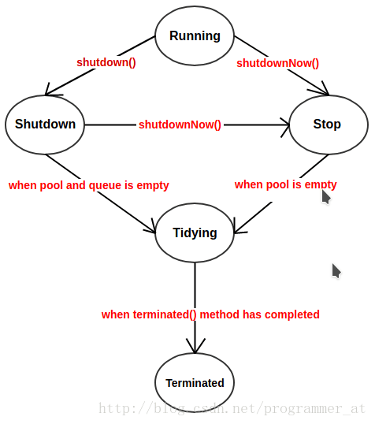
##### 8.18.5.3 任务的执行
> execute –> addWorker –>runworker (getTask)

线程池的工作线程通过Woker类实现，在ReentrantLock锁的保证下，把Woker实例插入到HashSet后，并启动Woker中的线程。 从Woker类的构造方法实现可以发现: 线程工厂在创建线程thread时，将Woker实例本身this作为参数传入，当执行start方法启动线程thread时，本质是执行了Worker的runWorker方法。 firstTask执行完成之后，通过getTask方法从阻塞队列中获取等待的任务，如果队列中没有任务，getTask方法会被阻塞并挂起，不会占用cpu资源；
###### 8.18.5.3.1 execute()方法
ThreadPoolExecutor.execute(task)实现了Executor.execute(task)
```java
public void execute(Runnable command) {
    if (command == null)
        throw new NullPointerException();
    /*
     * Proceed in 3 steps:
     *
     * 1. If fewer than corePoolSize threads are running, try to
     * start a new thread with the given command as its first
     * task.  The call to addWorker atomically checks runState and
     * workerCount, and so prevents false alarms that would add
     * threads when it shouldn't, by returning false.
     *
     * 2. If a task can be successfully queued, then we still need
     * to double-check whether we should have added a thread
     * (because existing ones died since last checking) or that
     * the pool shut down since entry into this method. So we
     * recheck state and if necessary roll back the enqueuing if
     * stopped, or start a new thread if there are none.
     *
     * 3. If we cannot queue task, then we try to add a new
     * thread.  If it fails, we know we are shut down or saturated
     * and so reject the task.
     */
    int c = ctl.get();
    if (workerCountOf(c) < corePoolSize) {  
    //workerCountOf获取线程池的当前线程数；小于corePoolSize，执行addWorker创建新线程执行command任务
       if (addWorker(command, true))
            return;
        c = ctl.get();
    }
    // double check: c, recheck
    // 线程池处于RUNNING状态，把提交的任务成功放入阻塞队列中
    if (isRunning(c) && workQueue.offer(command)) {
        int recheck = ctl.get();
        // recheck and if necessary 回滚到入队操作前，即倘若线程池shutdown状态，就remove(command)
        //如果线程池没有RUNNING，成功从阻塞队列中删除任务，执行reject方法处理任务
        if (! isRunning(recheck) && remove(command))
            reject(command);
        //线程池处于running状态，但是没有线程，则创建线程
        else if (workerCountOf(recheck) == 0)
            addWorker(null, false);
    }
    // 往线程池中创建新的线程失败，则reject任务
    else if (!addWorker(command, false))
        reject(command);
}
```
- 为什么需要double check线程池的状态?

在多线程环境下，线程池的状态时刻在变化，而ctl.get()是非原子操作，很有可能刚获取了线程池状态后线程池状态就改变了。判断是否将command加入workque是线程池之前的状态。倘若没有double check，万一线程池处于非running状态(在多线程环境下很有可能发生)，那么command永远不会执行。
###### 8.18.5.3.2 addWorker方法
从方法execute的实现可以看出: addWorker主要负责创建新的线程并执行任务 线程池创建新线程执行任务时，需要 获取全局锁:
```java
private final ReentrantLock mainLock = new ReentrantLock();
```

```java
private boolean addWorker(Runnable firstTask, boolean core) {
    // CAS更新线程池数量
    retry:
    for (;;) {
        int c = ctl.get();
        int rs = runStateOf(c);

        // Check if queue empty only if necessary.
        if (rs >= SHUTDOWN &&
            ! (rs == SHUTDOWN &&
                firstTask == null &&
                ! workQueue.isEmpty()))
            return false;

        for (;;) {
            int wc = workerCountOf(c);
            if (wc >= CAPACITY ||
                wc >= (core ? corePoolSize : maximumPoolSize))
                return false;
            if (compareAndIncrementWorkerCount(c))
                break retry;
            c = ctl.get();  // Re-read ctl
            if (runStateOf(c) != rs)
                continue retry;
            // else CAS failed due to workerCount change; retry inner loop
        }
    }

    boolean workerStarted = false;
    boolean workerAdded = false;
    Worker w = null;
    try {
        w = new Worker(firstTask);
        final Thread t = w.thread;
        if (t != null) {
            // 线程池重入锁
            final ReentrantLock mainLock = this.mainLock;
            mainLock.lock();
            try {
                // Recheck while holding lock.
                // Back out on ThreadFactory failure or if
                // shut down before lock acquired.
                int rs = runStateOf(ctl.get());

                if (rs < SHUTDOWN ||
                    (rs == SHUTDOWN && firstTask == null)) {
                    if (t.isAlive()) // precheck that t is startable
                        throw new IllegalThreadStateException();
                    workers.add(w);
                    int s = workers.size();
                    if (s > largestPoolSize)
                        largestPoolSize = s;
                    workerAdded = true;
                }
            } finally {
                mainLock.unlock();
            }
            if (workerAdded) {
                t.start();  // 线程启动，执行任务(Worker.thread(firstTask).start());
                workerStarted = true;
            }
        }
    } finally {
        if (! workerStarted)
            addWorkerFailed(w);
    }
    return workerStarted;
}
```
###### 8.18.5.3.3 Worker类的runworker方法
```java
private final class Worker extends AbstractQueuedSynchronizer implements Runnable{
     Worker(Runnable firstTask) {
         setState(-1); // inhibit interrupts until runWorker
         this.firstTask = firstTask;
         this.thread = getThreadFactory().newThread(this); // 创建线程
     }
     /** Delegates main run loop to outer runWorker  */
     public void run() {
         runWorker(this);
     }
     // ...
 }
```
- 继承了AQS类，可以方便的实现工作线程的中止操作；
- 实现了Runnable接口，可以将自身作为一个任务在工作线程中执行；
- 当前提交的任务firstTask作为参数传入Worker的构造方法；

一些属性还有构造方法:
```java
//运行的线程,前面addWorker方法中就是直接通过启动这个线程来启动这个worker
final Thread thread;
//当一个worker刚创建的时候,就先尝试执行这个任务
Runnable firstTask;
//记录完成任务的数量
volatile long completedTasks;

Worker(Runnable firstTask) {
    setState(-1); // inhibit interrupts until runWorker
    this.firstTask = firstTask;
    //创建一个Thread,将自己设置给他,后面这个thread启动的时候,也就是执行worker的run方法
    this.thread = getThreadFactory().newThread(this);
}   
```
runWorker方法是线程池的核心:
- 线程启动之后，通过unlock方法释放锁，设置AQS的state为0，表示运行可中断；
- Worker执行firstTask或从workQueue中获取任务:
  -  进行加锁操作，保证thread不被其他线程中断(除非线程池被中断)
  -  检查线程池状态，倘若线程池处于中断状态，当前线程将中断。
  -  执行beforeExecute
  -  执行任务的run方法
  -  执行afterExecute方法解锁操作
> 通过getTask方法从阻塞队列中获取等待的任务，如果队列中没有任务，getTask方法会被阻塞并挂起，不会占用cpu资源；
```java
final void runWorker(Worker w) {
    Thread wt = Thread.currentThread();
    Runnable task = w.firstTask;
    w.firstTask = null;
    w.unlock(); // allow interrupts
    boolean completedAbruptly = true;
    try {
        // 先执行firstTask，再从workerQueue中取task(getTask())

        while (task != null || (task = getTask()) != null) {
            w.lock();
            // If pool is stopping, ensure thread is interrupted;
            // if not, ensure thread is not interrupted.  This
            // requires a recheck in second case to deal with
            // shutdownNow race while clearing interrupt
            if ((runStateAtLeast(ctl.get(), STOP) ||
                    (Thread.interrupted() &&
                    runStateAtLeast(ctl.get(), STOP))) &&
                !wt.isInterrupted())
                wt.interrupt();
            try {
                beforeExecute(wt, task);
                Throwable thrown = null;
                try {
                    task.run();
                } catch (RuntimeException x) {
                    thrown = x; throw x;
                } catch (Error x) {
                    thrown = x; throw x;
                } catch (Throwable x) {
                    thrown = x; throw new Error(x);
                } finally {
                    afterExecute(task, thrown);
                }
            } finally {
                task = null;
                w.completedTasks++;
                w.unlock();
            }
        }
        completedAbruptly = false;
    } finally {
        processWorkerExit(w, completedAbruptly);
    }
}
```
###### 8.18.5.3.4 getTask方法
下面来看一下getTask()方法，这里面涉及到keepAliveTime的使用，从这个方法我们可以看出线程池是怎么让超过corePoolSize的那部分worker销毁的。
```java
private Runnable getTask() {
    boolean timedOut = false; // Did the last poll() time out?

    for (;;) {
        int c = ctl.get();
        int rs = runStateOf(c);

        // Check if queue empty only if necessary.
        if (rs >= SHUTDOWN && (rs >= STOP || workQueue.isEmpty())) {
            decrementWorkerCount();
            return null;
        }

        int wc = workerCountOf(c);

        // Are workers subject to culling?
        boolean timed = allowCoreThreadTimeOut || wc > corePoolSize;

        if ((wc > maximumPoolSize || (timed && timedOut))
            && (wc > 1 || workQueue.isEmpty())) {
            if (compareAndDecrementWorkerCount(c))
                return null;
            continue;
        }

        try {
            Runnable r = timed ?
                workQueue.poll(keepAliveTime, TimeUnit.NANOSECONDS) :
                workQueue.take();
            if (r != null)
                return r;
            timedOut = true;
        } catch (InterruptedException retry) {
            timedOut = false;
        }
    }
}
```
注意这里一段代码是keepAliveTime起作用的关键:
```java
boolean timed = allowCoreThreadTimeOut || wc > corePoolSize;
Runnable r = timed ?
                workQueue.poll(keepAliveTime, TimeUnit.NANOSECONDS) :
                workQueue.take();
```
allowCoreThreadTimeOut为false，线程即使空闲也不会被销毁；倘若为ture，在keepAliveTime内仍空闲则会被销毁。

如果线程允许空闲等待而不被销毁timed == false，workQueue.take任务: 如果阻塞队列为空，当前线程会被挂起等待；当队列中有任务加入时，线程被唤醒，take方法返回任务，并执行；

如果线程不允许无休止空闲timed == true, workQueue.poll任务: 如果在keepAliveTime时间内，阻塞队列还是没有任务，则返回null；
- 任务的提交

1.submit任务，等待线程池execute

2.执行FutureTask类的get方法时，会把主线程封装成WaitNode节点并保存在waiters链表中， 并阻塞等待运行结果；

3.FutureTask任务执行完成后，通过UNSAFE设置waiters相应的waitNode为null，并通过LockSupport类unpark方法唤醒主线程；
```java
public class Test{
    public static void main(String[] args) {

        ExecutorService es = Executors.newCachedThreadPool();
        Future<String> future = es.submit(new Callable<String>() {
            @Override
            public String call() throws Exception {
                try {
                    TimeUnit.SECONDS.sleep(2);
                } catch (InterruptedException e) {
                    e.printStackTrace();
                }
                return "future result";
            }
        });
        try {
            String result = future.get();
            System.out.println(result);
        } catch (Exception e) {
            e.printStackTrace();
        }
    }
}
```
在实际业务场景中，Future和Callable基本是成对出现的，Callable负责产生结果，Future负责获取结果。
- Callable接口类似于Runnable，只是Runnable没有返回值。
- Callable任务除了返回正常结果之外，如果发生异常，该异常也会被返回，即Future可以拿到异步执行任务各种结果；
- Future.get方法会导致主线程阻塞，直到Callable任务执行完成；
###### 8.18.5.3.5 submit方法
AbstractExecutorService.submit()实现了ExecutorService.submit() 可以获取执行完的返回值, 而ThreadPoolExecutor 是AbstractExecutorService.submit()的子类，所以submit方法也是ThreadPoolExecutor`的方法。
```java
// submit()在ExecutorService中的定义
<T> Future<T> submit(Callable<T> task);

<T> Future<T> submit(Runnable task, T result);

Future<?> submit(Runnable task);
```
```java
// submit方法在AbstractExecutorService中的实现
public Future<?> submit(Runnable task) {
    if (task == null) throw new NullPointerException();
    // 通过submit方法提交的Callable任务会被封装成了一个FutureTask对象。
    RunnableFuture<Void> ftask = newTaskFor(task, null);
    execute(ftask);
    return ftask;
}
```
通过submit方法提交的Callable任务会被封装成了一个FutureTask对象。通过Executor.execute方法提交FutureTask到线程池中等待被执行，最终执行的是FutureTask的run方法；
###### 8.18.5.3.6 FutureTask对象
`public class FutureTask<V> implements RunnableFuture<V> `可以将FutureTask提交至线程池中等待被执行(通过FutureTask的run方法来执行)
- 内部状态
```java
/* The run state of this task, initially NEW. 
    * ...
    * Possible state transitions:
    * NEW -> COMPLETING -> NORMAL
    * NEW -> COMPLETING -> EXCEPTIONAL
    * NEW -> CANCELLED
    * NEW -> INTERRUPTING -> INTERRUPTED
    */
private volatile int state;
private static final int NEW          = 0;
private static final int COMPLETING   = 1;
private static final int NORMAL       = 2;
private static final int EXCEPTIONAL  = 3;
private static final int CANCELLED    = 4;
private static final int INTERRUPTING = 5;
private static final int INTERRUPTED  = 6;
```
内部状态的修改通过sun.misc.Unsafe修改
- get()
```java
public V get() throws InterruptedException, ExecutionException {
    int s = state;
    if (s <= COMPLETING)
        s = awaitDone(false, 0L);
    return report(s);
} 
```
内部通过awaitDone方法对主线程进行阻塞，具体实现如下:
```java
private int awaitDone(boolean timed, long nanos)
    throws InterruptedException {
    final long deadline = timed ? System.nanoTime() + nanos : 0L;
    WaitNode q = null;
    boolean queued = false;
    for (;;) {
        if (Thread.interrupted()) {
            removeWaiter(q);
            throw new InterruptedException();
        }

        int s = state;
        if (s > COMPLETING) {
            if (q != null)
                q.thread = null;
            return s;
        }
        else if (s == COMPLETING) // cannot time out yet
            Thread.yield();
        else if (q == null)
            q = new WaitNode();
        else if (!queued)
            queued = UNSAFE.compareAndSwapObject(this, waitersOffset,q.next = waiters, q);
        else if (timed) {
            nanos = deadline - System.nanoTime();
            if (nanos <= 0L) {
                removeWaiter(q);
                return state;
            }
            LockSupport.parkNanos(this, nanos);
        }
        else
            LockSupport.park(this);
    }
}
```
1. 如果主线程被中断，则抛出中断异常；
2. 判断FutureTask当前的state，如果大于COMPLETING，说明任务已经执行完成，则直接返回；
3. 如果当前state等于COMPLETING，说明任务已经执行完，这时主线程只需通过yield方法让出cpu资源，等待state变成NORMAL；
4. 通过WaitNode类封装当前线程，并通过UNSAFE添加到waiters链表；
5. 最终通过LockSupport的park或parkNanos挂起线程；

- run方法
```java
public void run() {
    if (state != NEW || !UNSAFE.compareAndSwapObject(this, runnerOffset, null, Thread.currentThread()))
        return;
    try {
        Callable<V> c = callable;
        if (c != null && state == NEW) {
            V result;
            boolean ran;
            try {
                result = c.call();
                ran = true;
            } catch (Throwable ex) {
                result = null;
                ran = false;
                setException(ex);
            }
            if (ran)
                set(result);
        }
    } finally {
        // runner must be non-null until state is settled to
        // prevent concurrent calls to run()
        runner = null;
        // state must be re-read after nulling runner to prevent
        // leaked interrupts
        int s = state;
        if (s >= INTERRUPTING)
            handlePossibleCancellationInterrupt(s);
    }
}
```
FutureTask.run方法是在线程池中被执行的，而非主线程
1. 通过执行Callable任务的call方法；如
2. 果call执行成功，则通过set方法保存结果；
3. 如果call执行有异常，则通过setException保存异常；
##### 8.18.5.4 任务的关闭
shutdown方法会将线程池的状态设置为SHUTDOWN,线程池进入这个状态后,就拒绝再接受任务,然后会将剩余的任务全部执行完
```java
public void shutdown() {
    final ReentrantLock mainLock = this.mainLock;
    mainLock.lock();
    try {
        //检查是否可以关闭线程
        checkShutdownAccess();
        //设置线程池状态
        advanceRunState(SHUTDOWN);
        //尝试中断worker
        interruptIdleWorkers();
            //预留方法,留给子类实现
        onShutdown(); // hook for ScheduledThreadPoolExecutor
    } finally {
        mainLock.unlock();
    }
    tryTerminate();
}

private void interruptIdleWorkers() {
    interruptIdleWorkers(false);
}

private void interruptIdleWorkers(boolean onlyOne) {
    final ReentrantLock mainLock = this.mainLock;
    mainLock.lock();
    try {
        //遍历所有的worker
        for (Worker w : workers) {
            Thread t = w.thread;
            //先尝试调用w.tryLock(),如果获取到锁,就说明worker是空闲的,就可以直接中断它
            //注意的是,worker自己本身实现了AQS同步框架,然后实现的类似锁的功能
            //它实现的锁是不可重入的,所以如果worker在执行任务的时候,会先进行加锁,这里tryLock()就会返回false
            if (!t.isInterrupted() && w.tryLock()) {
                try {
                    t.interrupt();
                } catch (SecurityException ignore) {
                } finally {
                    w.unlock();
                }
            }
            if (onlyOne)
                break;
        }
    } finally {
        mainLock.unlock();
    }
}
```
shutdownNow做的比较绝，它先将线程池状态设置为STOP，然后拒绝所有提交的任务。最后中断左右正在运行中的worker,然后清空任务队列。
```java
public List<Runnable> shutdownNow() {
    List<Runnable> tasks;
    final ReentrantLock mainLock = this.mainLock;
    mainLock.lock();
    try {
        checkShutdownAccess();
        //检测权限
        advanceRunState(STOP);
        //中断所有的worker
        interruptWorkers();
        //清空任务队列
        tasks = drainQueue();
    } finally {
        mainLock.unlock();
    }
    tryTerminate();
    return tasks;
}

private void interruptWorkers() {
    final ReentrantLock mainLock = this.mainLock;
    mainLock.lock();
    try {
        //遍历所有worker，然后调用中断方法
        for (Worker w : workers)
            w.interruptIfStarted();
    } finally {
        mainLock.unlock();
    }
}
```
#### 8.18.6 为什么线程池不允许使用Executors去创建? 推荐方式是什么?
线程池不允许使用Executors去创建，而是通过ThreadPoolExecutor的方式，这样的处理方式让写的同学更加明确线程池的运行规则，规避资源耗尽的风险。 说明：Executors各个方法的弊端：
- newFixedThreadPool和newSingleThreadExecutor:   主要问题是堆积的请求处理队列可能会耗费非常大的内存，甚至OOM。
- newCachedThreadPool和newScheduledThreadPool:   主要问题是线程数最大数是Integer.MAX_VALUE，可能会创建数量非常多的线程，甚至OOM。
##### 8.18.6.1 推荐方式 1
首先引入：commons-lang3包
```java
ScheduledExecutorService executorService = new ScheduledThreadPoolExecutor(1,
        new BasicThreadFactory.Builder().namingPattern("example-schedule-pool-%d").daemon(true).build());
```
##### 8.18.6.2 推荐方式 2
首先引入：com.google.guava包
```java
ThreadFactory namedThreadFactory = new ThreadFactoryBuilder().setNameFormat("demo-pool-%d").build();

//Common Thread Pool
ExecutorService pool = new ThreadPoolExecutor(5, 200, 0L, TimeUnit.MILLISECONDS, new LinkedBlockingQueue<Runnable>(1024), namedThreadFactory, new ThreadPoolExecutor.AbortPolicy());

// excute
pool.execute(()-> System.out.println(Thread.currentThread().getName()));

 //gracefully shutdown
pool.shutdown();
```
##### 8.18.6.3 推荐方式 3(spring的ThreadTaskPoolExecutor)
spring配置线程池方式：自定义线程工厂bean需要实现ThreadFactory，可参考该接口的其它默认实现类，使用方式直接注入bean调用execute(Runnable task)方法即可.常见的就是使用`ThreadTaskPoolExecutor`

`ThreadPoolTaskExecutor` 和 `ThreadPoolExecutor` 都是 Java 中管理线程池的核心组件，但设计目标和应用场景有显著差异。以下是它们的详细对比：

---

###### 8.18.6.3.1 **ThreadTaskPoolExecutor和ThreadPoolExecutor的相同点**
1. **核心功能一致**  
   二者均基于线程池模型实现，支持：
   - 任务提交（`execute()` 和 `submit()`）
   - 核心线程数、最大线程数配置
   - 任务队列管理（如 `LinkedBlockingQueue`）
   - 拒绝策略（如 `AbortPolicy`）

2. **底层实现相似**  
   `ThreadPoolTaskExecutor` **内部封装了 `ThreadPoolExecutor`**，本质是 Spring 对 JDK 线程池的增强扩展。

---

###### 8.18.6.3.2 **ThreadTaskPoolExecutor和ThreadPoolExecutor的不同点**
| **维度**               | **ThreadPoolExecutor** (JDK)                          | **ThreadPoolTaskExecutor** (Spring)                     |
|------------------------|-------------------------------------------------------|---------------------------------------------------------|
| **所属框架**           | Java 标准库 (`java.util.concurrent`)                  | Spring 框架 (`org.springframework.scheduling.concurrent`) |
| **设计目标**           | 通用线程池实现                                        | 与 Spring 生态深度集成（如 `@Async`、定时任务）         |
| **配置方式**           | 编程式配置（代码中 `new` 实例化）                     | 声明式配置（Spring XML/注解 + 依赖注入）                |
| **生命周期管理**       | 需手动调用 `shutdown()`                               | 由 Spring 容器自动管理（随应用上下文启停）              |
| **任务装饰器**         | 不支持                                                | 支持 `TaskDecorator`（传递线程上下文，如 MDC 日志跟踪） |
| **异常处理**           | 依赖 `UncaughtExceptionHandler`                       | 支持 `AsyncUncaughtExceptionHandler`（配合 `@Async` 使用） |
| **监控与管理**         | 需自行扩展                                            | 集成 Spring Actuator 暴露监控指标（如线程池状态）       |
| **典型应用场景**       | 非 Spring 项目、基础并发需求                          | Spring Boot/Spring MVC 项目（尤其需异步任务时）         |

---

###### 8.18.6.3.3 **使用示例**
1. JDK `ThreadPoolExecutor`
```java
ThreadPoolExecutor executor = new ThreadPoolExecutor(
    5,  // 核心线程数
    10, // 最大线程数
    60, TimeUnit.SECONDS,
    new LinkedBlockingQueue<>(100),
    new ThreadPoolExecutor.AbortPolicy()
);
executor.execute(() -> System.out.println("Task running"));
executor.shutdown(); // 需手动关闭
```

2. Spring `ThreadPoolTaskExecutor`
```java
@Bean
public ThreadPoolTaskExecutor taskExecutor() {
    ThreadPoolTaskExecutor executor = new ThreadPoolTaskExecutor();
    executor.setCorePoolSize(5);
    executor.setMaxPoolSize(10);
    executor.setQueueCapacity(100);
    executor.setRejectedExecutionHandler(new ThreadPoolExecutor.AbortPolicy());
    executor.setTaskDecorator(new MDCTaskDecorator()); // 支持上下文传递
    executor.initialize(); // 初始化
    return executor; // 由 Spring 管理生命周期
}

// 配合 @Async 使用
@Async("taskExecutor")
public void asyncMethod() { /* ... */ }
```

---

- **如何选择？**
  - **非 Spring 项目** → 选 `ThreadPoolExecutor`。  
  - **Spring 项目** → **优先 `ThreadPoolTaskExecutor`**（简化配置、生命周期管理、集成异步任务）。  
  - **需传递线程上下文**（如日志链路追踪）→ 必须用 `ThreadPoolTaskExecutor` + `TaskDecorator`。
#### 8.18.7 配置线程池需要考虑因素
从任务的优先级，任务的执行时间长短，任务的性质(CPU密集/ IO密集)，任务的依赖关系这四个角度来分析。并且近可能地使用有界的工作队列。

性质不同的任务可用使用不同规模的线程池分开处理:
- CPU密集型: 尽可能少的线程，Ncpu+1
- IO密集型: 尽可能多的线程, Ncpu*2，比如数据库连接池
- 混合型: CPU密集型的任务与IO密集型任务的执行时间差别较小，拆分为两个线程池；否则没有必要拆分。
#### 8.18.8 监控线程池的状态
可以使用ThreadPoolExecutor以下方法:
以下是 `ThreadPoolExecutor` 中关键监控方法的详细说明和区别总结：

---

##### 8.18.8.1 **`long getTaskCount()`**
- **含义**：  
  返回**计划执行的任务总数**（近似值）  
  - 包含：已完成的任务 + 正在执行的任务 + 队列中等待的任务  
- **特点**：  
  - 值会持续增长（除非线程池关闭）  
  - "近似"说明：并发环境下可能因线程竞争导致微小误差  
- **公式**：  
  `任务总数 = getCompletedTaskCount() + 队列中任务数 + 活跃线程执行的任务数`

---

##### 8.18.8.2 **`long getCompletedTaskCount()`**
- **含义**：  
  返回**已完成执行的任务总数**（近似值）  
- **特点**：  
  - 始终满足：`getCompletedTaskCount() <= getTaskCount()`  
  - 已完成任务包括正常执行结束和被取消的任务  
- **典型用途**：  
  ```java
  // 计算任务完成比例
  double progress = (double) executor.getCompletedTaskCount() 
                   / executor.getTaskCount();
  ```

---

##### 8.18.8.3 **`int getLargestPoolSize()`**
- **含义**：  
  返回**线程池历史最大线程数量**  
- **特点**：  
  - 值范围：`0 <= getLargestPoolSize() <= getMaximumPoolSize()`  
  - 重置条件：线程池重启后重置为0  
- **使用场景**：  
  监控线程池峰值负载，辅助容量规划  
  ```java
  // 检查是否达到过最大线程容量
  if (executor.getLargestPoolSize() == executor.getMaximumPoolSize()) {
      log.warn("线程池曾达到最大线程数，需扩容！");
  }
  ```

---

##### 8.18.8.4 **`int getPoolSize()`**
- **含义**：  
  返回**当前线程池中的线程总数**  
- **组成**：  
  `核心线程 + 非核心线程（包括空闲和活跃线程）`  
- **特点**：  
  - 实时值（但获取瞬间可能已变化）  
  - 满足：`getActiveCount() <= getPoolSize()`

---

##### 8.18.8.5 **`int getActiveCount()`**
- **含义**：  
  返回**正在执行任务的活跃线程数**（近似值）  
- **特点**：  
  - 不包括空闲线程（Idle Threads）  
  - 值可能瞬间变化（任务开始/结束的间隙）  
- **典型用途**：  
  ```java
  // 检查线程池是否过载
  if (executor.getActiveCount() == executor.getMaximumPoolSize()) {
      log.warn("所有线程繁忙，任务可能堆积！");
  }
  ```

---

##### 8.18.8.6 **监控指标对比表**

| **方法**                  | **返回内容**                     | **数值范围**                          | **典型用途**                     |
|---------------------------|----------------------------------|----------------------------------------|----------------------------------|
| `getTaskCount()`          | 计划执行的任务总数               | ≥0，持续增长                          | 总负载评估                       |
| `getCompletedTaskCount()` | 已完成的任务数                   | 0 ≤ 值 ≤ getTaskCount()               | 计算进度/吞吐量                  |
| `getLargestPoolSize()`    | 历史最大线程数                   | 0 ≤ 值 ≤ maximumPoolSize              | 容量规划                         |
| `getPoolSize()`           | 当前线程总数                     | 0 ≤ 值 ≤ maximumPoolSize              | 实时资源占用监控                 |
| `getActiveCount()`        | 活跃线程数（正执行任务）         | 0 ≤ 值 ≤ getPoolSize()                | 瓶颈检测/过载预警               |

---

##### 8.18.8.7 **使用注意事项**
1. **近似值问题**：  
   所有方法返回的都是**瞬间快照**，高并发场景下：
   ```java
   // 错误用法（值可能不一致）：
   long total = executor.getTaskCount();
   long completed = executor.getCompletedTaskCount();
   // 此时total可能已变化

   // 正确用法（需加锁或容忍误差）：
   synchronized(executor) {
       long t = executor.getTaskCount();
       long c = executor.getCompletedTaskCount();
   }
   ```

2. **监控组合建议**：  
   ```java
   // 健康检查示例
   public void monitor() {
       log.info("负载: {}/{} (活跃/总线程)", 
                executor.getActiveCount(), 
                executor.getPoolSize());
       log.info("任务: {}/{} (完成/总数)", 
                executor.getCompletedTaskCount(),
                executor.getTaskCount());
       log.info("峰值线程: {}", executor.getLargestPoolSize());
   }
   ```

> ⚠️ **性能影响**：  
> 这些方法通过遍历内部状态实现，高频调用可能影响性能，生产环境建议间隔采样（如每5秒采集一次）。
### 8.19 JUC线程池: ScheduledThreadPoolExecutor详解
> ScheduledThreadPoolExecutor要解决什么样的问题?
> ScheduledThreadPoolExecutor相比ThreadPoolExecutor有哪些特性?
> ScheduledThreadPoolExecutor有什么样的数据结构，核心内部类和抽象类?
> ScheduledThreadPoolExecutor有哪两个关闭策略? 区别是什么?
> ScheduledThreadPoolExecutor中scheduleAtFixedRate 和 scheduleWithFixedDelay区别是什么?
> 为什么ThreadPoolExecutor 的调整策略却不适用于 ScheduledThreadPoolExecutor?
> Executors 提供了几种方法来构造 ScheduledThreadPoolExecutor?
#### 8.19.1 ScheduledThreadPoolExecutor简介  
`ScheduledThreadPoolExecutor` 继承自 `ThreadPoolExecutor`，用于执行延迟或周期性任务。相比 `ThreadPoolExecutor`，它具有以下特性：  
- 使用专门的任务类型 **`ScheduledFutureTask`** 处理周期任务，普通任务仍通过 `ExecutorService` 执行  
- 使用无界延迟队列 **`DelayedWorkQueue`**（`DelayQueue` 的变种）存储任务  
- 简化执行机制（通过 `delayedExecute` 方法）  
- 支持 **run-after-shutdown** 参数，控制关闭后是否继续执行周期/延迟任务  
- 任务提交与关闭操作的复查逻辑不同  

---

#### 8.19.2 ScheduledThreadPoolExecutor数据结构  
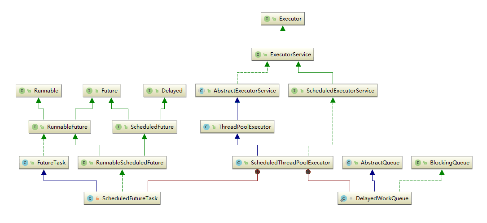

**继承关系**：  
```java
ScheduledThreadPoolExecutor extends ThreadPoolExecutor
```

**核心内部类**：  
| 类名                  | 作用                                                                 |  
|-----------------------|----------------------------------------------------------------------|  
| `ScheduledFutureTask` | 继承 `FutureTask`，实现 `Runnable`、`Future`、`Delayed` 接口，支持延迟执行的异步运算任务 |  
| `DelayedWorkQueue`    | 专属无界延迟队列，仅存储 `RunnableScheduledFuture` 类型任务           |  

> 💡 `DelayedWorkQueue` 与 `DelayQueue` 的区别：  
> - 仅允许存放 `RunnableScheduledFuture` 对象  
> - 自主实现二叉堆（而非依赖 `PriorityQueue`）  

---

#### 8.19.3 ScheduledThreadPoolExecutor源码解析  
> *以下解析基于已理解 `FutureTask`*

##### 8.19.3.1 内部类 ScheduledFutureTask  
**属性**：  
```java
private final long sequenceNumber;  // 相同延时任务的顺序编号（FIFO保证）
private long time;                 // 任务执行时间（纳秒）
private final long period;         // 周期执行间隔（纳秒）
RunnableScheduledFuture<V> outerTask = this;  // 用于重新入队的任务引用
int heapIndex;                     // 延迟队列中的索引（加速取消操作）
```
- sequenceNumber: 当两个任务有相同的延迟时间时，按照 FIFO 的顺序入队。sequenceNumber 就是为相同延时任务提供的顺序编号。
- time: 任务可以执行时的时间，纳秒级，通过triggerTime方法计算得出。
- period: 任务的执行周期时间，纳秒级。正数表示固定速率执行(为scheduleAtFixedRate提供服务)，负数表示固定延迟执行(为scheduleWithFixedDelay提供服务)，0表示不重复任务。
- outerTask: 重新入队的任务，通过reExecutePeriodic方法入队重新排序。
- `period` 取值含义：  
  - **正数**：固定速率（`scheduleAtFixedRate`）  
  - **负数**：固定延迟（`scheduleWithFixedDelay`）  
  - **0**：非周期任务  

**核心方法**：  
1. **`run()`**：  
   ```java
   public void run() {
       boolean periodic = isPeriodic();//是否为周期任务
       if (!canRunInCurrentRunState(periodic))  // 检查运行状态
           cancel(false);
       else if (!periodic)  // 非周期任务直接执行
           ScheduledFutureTask.super.run();
       else if (ScheduledFutureTask.super.runAndReset()) {
           setNextRunTime();      // 设置下次执行时间
           reExecutePeriodic(outerTask);  // 重新入队
       }
   }
   ```
说明: ScheduledFutureTask 的run方法重写了 FutureTask 的版本，以便执行周期任务时重置/重排序任务。任务的执行通过父类 FutureTask 的run实现。内部有两个针对周期任务的方法:

1. **`setNextRunTime()`**：  
   ```java
   //设置下一次执行任务的时间
   private void setNextRunTime() {
       if (period > 0)  // 固定速率：time = 上次执行时间 + period
           time += period;
       else  // 固定延迟：time = 当前时间 + |period|
           time = triggerTime(-period); 
   }
   //计算固定延迟任务的执行时间
    long triggerTime(long delay) {
        return now() +
            ((delay < (Long.MAX_VALUE >> 1)) ? delay : overflowFree(delay));
    }
   ```

1. **`reExecutePeriodic()`**：  
   ```java
   // 周期任务重新入队等待下一次执行
   void reExecutePeriodic(RunnableScheduledFuture<?> task) {
       if (canRunInCurrentRunState(true)) {//池关闭后可继续执行
           super.getQueue().add(task);  // 重新入队
           //重新检查run-after-shutdown参数，如果不能继续运行就移除队列任务，并取消任务的执行
           if (!canRunInCurrentRunState(true) && remove(task))
               task.cancel(false);  // 关闭后移除任务
           else
               ensurePrestart();  // 启动新线程等待
       }
   }
   ```
reExecutePeriodic与delayedExecute的执行策略一致，只不过reExecutePeriodic不会执行拒绝策略而是直接丢掉任务。
2. **`cancel()`**：  
   ```java
   public boolean cancel(boolean mayInterruptIfRunning) {
       boolean cancelled = super.cancel(mayInterruptIfRunning);
       if (cancelled && removeOnCancel && heapIndex >= 0)
           remove(this);  // 根据策略移除任务
       return cancelled;
   }
   ```
    ScheduledFutureTask.cancel本质上由其父类 FutureTask.cancel 实现。取消任务成功后会根据removeOnCancel参数决定是否从队列中移除此任务。
---

##### 8.19.3.2 核心属性
```java
// 关闭后是否继续执行已经存在的周期任务
private volatile boolean continueExistingPeriodicTasksAfterShutdown;

// 关闭后是否继续执行已经存在的延迟任务（默认 true）
private volatile boolean executeExistingDelayedTasksAfterShutdown = true;

// 取消任务后是否立即移除（默认 false）
private volatile boolean removeOnCancel = false;

// 相同延时任务的顺序编号生成器,保证任务之间的FIFO顺序
private static final AtomicLong sequencer = new AtomicLong();
```
- continueExistingPeriodicTasksAfterShutdown和executeExistingDelayedTasksAfterShutdown是 ScheduledThreadPoolExecutor 定义的 run-after-shutdown 参数，用来控制池关闭之后的任务执行逻辑。
- removeOnCancel用来控制任务取消后是否从队列中移除。当一个已经提交的周期或延迟任务在运行之前被取消，那么它之后将不会运行。默认配置下，这种已经取消的任务在届期之前不会被移除。 通过这种机制，可以方便检查和监控线程池状态，但也可能导致已经取消的任务无限滞留。为了避免这种情况的发生，我们可以通过setRemoveOnCancelPolicy方法设置移除策略，把参数removeOnCancel设为true可以在任务取消后立即从队列中移除。
- sequencer是为相同延时的任务提供的顺序编号，保证任务之间的 FIFO 顺序。与 ScheduledFutureTask 内部的sequenceNumber参数作用一致。

---

##### 8.19.3.3 构造函数
首先看下构造函数，ScheduledThreadPoolExecutor 内部有四个构造函数，这里我们只看这个最大构造灵活度的:
```java
public ScheduledThreadPoolExecutor(int corePoolSize,
                                   ThreadFactory threadFactory,
                                   RejectedExecutionHandler handler) {
    super(corePoolSize, Integer.MAX_VALUE, 0, NANOSECONDS,
          new DelayedWorkQueue(), threadFactory, handler);
}
```
> 构造函数都是通过super调用了ThreadPoolExecutor的构造，并且使用特定等待队列DelayedWorkQueue。

> ⚠️ 最大线程数固定为 `Integer.MAX_VALUE`，队列为 `DelayedWorkQueue`

---

##### 8.19.3.4 核心方法：schedule
```java
public <V> ScheduledFuture<V> schedule(Callable<V> callable, long delay, TimeUnit unit) {
    // 1. 构造 ScheduledFutureTask
    RunnableScheduledFuture<V> t = decorateTask(callable,
        new ScheduledFutureTask<>(callable, triggerTime(delay, unit)));
    // 2. 执行任务
    delayedExecute(t);
    return t;
}
```
说明: schedule主要用于执行一次性(延迟)任务。函数执行逻辑分两步:
- 封装 Callable/Runnable: 首先通过triggerTime计算任务的延迟执行时间，然后通过 ScheduledFutureTask 的构造函数把 Runnable/Callable 任务构造为ScheduledThreadPoolExecutor可以执行的任务类型，最后调用decorateTask方法执行用户自定义的逻辑；decorateTask是一个用户可自定义扩展的方法，默认实现下直接返回封装的RunnableScheduledFuture任务，源码如下:
```java
protected <V> RunnableScheduledFuture<V> decorateTask(
    Runnable runnable, RunnableScheduledFuture<V> task) {
    return task;
}
```
执行任务: 通过delayedExecute实现。下面我们来详细分析。
```java
private void delayedExecute(RunnableScheduledFuture<?> task) {
    if (isShutdown())
        reject(task);//池已关闭，执行拒绝策略
    else {
        super.getQueue().add(task);//任务入队
        if (isShutdown() &&
            !canRunInCurrentRunState(task.isPeriodic()) &&//判断run-after-shutdown参数
            remove(task))//移除任务
            task.cancel(false);
        else
            ensurePrestart();//启动一个新的线程等待任务
    }
}
```
说明: delayedExecute是执行任务的主方法，方法执行逻辑如下:
- 如果池已关闭(ctl >= SHUTDOWN)，执行任务拒绝策略；
- 池正在运行，首先把任务入队排序；然后重新检查池的关闭状态，执行如下逻辑:
  - `A`: 如果池正在运行，或者 run-after-shutdown 参数值为true，则调用父类方法ensurePrestart启动一个新的线程等待执行任务。ensurePrestart源码如下:
    ```java
    void ensurePrestart() {
        int wc = workerCountOf(ctl.get());
        if (wc < corePoolSize)
            addWorker(null, true);
        else if (wc == 0)
            addWorker(null, false);
    }
    ```
    ensurePrestart是父类 ThreadPoolExecutor 的方法，用于启动一个新的工作线程等待执行任务，即使corePoolSize为0也会安排一个新线程。
  - `B`: 如果池已经关闭，并且 run-after-shutdown 参数值为false，则执行父类(ThreadPoolExecutor)方法remove移除队列中的指定任务，成功移除后调用ScheduledFutureTask.cancel取消任务
**执行流程**：  
1. 任务入队：`super.getQueue().add(task)`  
2. 检查状态：  
   - 若线程池关闭且不允许执行 → 移除任务并取消  
   - 否则调用 `ensurePrestart()` 启动新线程  

---

##### 8.19.3.5 核心方法：scheduleAtFixedRate 和 scheduleWithFixedDelay  
```java
/**
 * 创建一个周期执行的任务，第一次执行延期时间为initialDelay，
 * 之后每隔period执行一次，不等待第一次执行完成就开始计时
 */
public ScheduledFuture<?> scheduleAtFixedRate(Runnable command,
                                              long initialDelay,
                                              long period,
                                              TimeUnit unit) {
    if (command == null || unit == null)
        throw new NullPointerException();
    if (period <= 0)
        throw new IllegalArgumentException();
    //构建RunnableScheduledFuture任务类型
    ScheduledFutureTask<Void> sft =
        new ScheduledFutureTask<Void>(command,
                                      null,
                                      triggerTime(initialDelay, unit),//计算任务的延迟时间
                                      unit.toNanos(period));//计算任务的执行周期
    RunnableScheduledFuture<Void> t = decorateTask(command, sft);//执行用户自定义逻辑
    sft.outerTask = t;//赋值给outerTask，准备重新入队等待下一次执行
    delayedExecute(t);//执行任务
    return t;
}

/**
 * 创建一个周期执行的任务，第一次执行延期时间为initialDelay，
 * 在第一次执行完之后延迟delay后开始下一次执行
 */
public ScheduledFuture<?> scheduleWithFixedDelay(Runnable command,
                                                 long initialDelay,
                                                 long delay,
                                                 TimeUnit unit) {
    if (command == null || unit == null)
        throw new NullPointerException();
    if (delay <= 0)
        throw new IllegalArgumentException();
    //构建RunnableScheduledFuture任务类型
    ScheduledFutureTask<Void> sft =
        new ScheduledFutureTask<Void>(command,
                                      null,
                                      triggerTime(initialDelay, unit),//计算任务的延迟时间
                                      unit.toNanos(-delay));//计算任务的执行周期
    RunnableScheduledFuture<Void> t = decorateTask(command, sft);//执行用户自定义逻辑
    sft.outerTask = t;//赋值给outerTask，准备重新入队等待下一次执行
    delayedExecute(t);//执行任务
    return t;
}
```
说明: scheduleAtFixedRate和scheduleWithFixedDelay方法的逻辑与schedule类似。注意scheduleAtFixedRate和scheduleWithFixedDelay的区别: 乍一看两个方法一模一样，其实，在unit.toNanos这一行代码中还是有区别的。没错，scheduleAtFixedRate传的是正值，而scheduleWithFixedDelay传的则是负值，这个值就是 ScheduledFutureTask 的period属性。

**关键区别**：  
| 方法                      | `period` 取值  | 执行策略                     |  
|---------------------------|----------------|------------------------------|  
| `scheduleAtFixedRate`     | **正数**       | 固定速率（不等待上次完成）   |  
| `scheduleWithFixedDelay`  | **负数**       | 固定延迟（上次完成后计时）   |  

**源码共性逻辑**：  
```java
// 1. 构建 ScheduledFutureTask
ScheduledFutureTask<Void> sft = new ScheduledFutureTask<>(
    command, null, triggerTime(initialDelay, unit), unit.toNanos(period)
);
// 2. 用户自定义扩展
RunnableScheduledFuture<Void> t = decorateTask(command, sft);
// 3. 设置重新入队引用
sft.outerTask = t;
// 4. 执行任务
delayedExecute(t);
```

---

##### 8.19.3.6 核心方法：shutdown  
```java
public void shutdown() {
    super.shutdown();  // 调用父类关闭逻辑
}
//取消并清除由于关闭策略不应该运行的所有任务
@Override void onShutdown() {
    BlockingQueue<Runnable> q = super.getQueue();
    // 根据 run-after-shutdown 参数清理任务
    boolean keepDelayed = getExecuteExistingDelayedTasksAfterShutdownPolicy();
    boolean keepPeriodic = getContinueExistingPeriodicTasksAfterShutdownPolicy();
    
    if (!keepDelayed && !keepPeriodic) {//池关闭后不保留任务
        // 清理所有任务
        for (Object e : q.toArray()) {
            if (e instanceof RunnableScheduledFuture<?>)
                ((RunnableScheduledFuture<?>) e).cancel(false);
        }
        q.clear();
    } else {//池关闭后保留任务
        // 选择性清理（如已取消的任务）
        for (Object e : q.toArray()) {
             //遍历快照以避免迭代器异常
            if (e instanceof RunnableScheduledFuture) {
                RunnableScheduledFuture<?> t = (RunnableScheduledFuture<?>)e;
                if ((t.isPeriodic() ? !keepPeriodic : !keepDelayed) || t.isCancelled()) {
                     //如果任务已经取消，移除队列中的任务
                    if (q.remove(t)) t.cancel(false);
                }
            }
        }
    }
    tryTerminate();  // 终止线程池
}
```
说明: 池关闭方法调用了父类ThreadPoolExecutor的shutdown，具体分析见 ThreadPoolExecutor 篇。这里主要介绍以下在shutdown方法中调用的关闭钩子onShutdown方法，它的主要作用是在关闭线程池后取消并清除由于关闭策略不应该运行的所有任务，这里主要是根据 run-after-shutdown 参数(continueExistingPeriodicTasksAfterShutdown和executeExistingDelayedTasksAfterShutdown)来决定线程池关闭后是否关闭已经存在的任务。

#### 8.19.4 再深入理解  
**为何 `ThreadPoolExecutor` 调整策略不适用？**  

例如: 由于 ScheduledThreadPoolExecutor 是一个固定核心线程数大小的线程池，并且使用了一个无界队列，所以调整maximumPoolSize对其没有任何影响(所以 ScheduledThreadPoolExecutor 没有提供可以调整最大线程数的构造函数，默认最大线程数固定为Integer.MAX_VALUE)。此外，设置corePoolSize为0或者设置核心线程空闲后清除(allowCoreThreadTimeOut)同样也不是一个好的策略，因为一旦周期任务到达某一次运行周期时，可能导致线程池内没有线程去处理这些任务。

- **最大线程数无效**：  
  固定为 `Integer.MAX_VALUE`（构造函数硬编码），调整 `maximumPoolSize` 无影响  
- **核心线程数需谨慎**：  
  - 设置 `corePoolSize=0` 或 `allowCoreThreadTimeOut=true` 可能导致周期任务无线程执行  
- **无界队列风险**：  
  `DelayedWorkQueue` 无容量限制，可能堆积任务导致 OOM  

---

#### 8.19.5 Executors 提供的构造方法  
| 工厂方法                          | 特点                                                                 |  
|-----------------------------------|----------------------------------------------------------------------|  
| `newScheduledThreadPool(nThreads)` | 固定核心线程数，最大线程数=`Integer.MAX_VALUE`                      |  
| `newSingleThreadScheduledExecutor()` | **单工作线程**，线程异常终止时会新建替换<br>≠ `newScheduledThreadPool(1)`（后者线程数可调整） |  

> ⚠️ 注意：  
> `newSingleThreadScheduledExecutor()` 严格保证单线程执行，而 `newScheduledThreadPool(1)` 可通过 `setCorePoolSize()` 修改线程数。

#### 8.19.6 简单代码示例
```java
import java.util.concurrent.Executors;
import java.util.concurrent.ScheduledExecutorService;
import java.util.concurrent.TimeUnit;

public class ScheduledExample {
    public static void main(String[] args) {
        // 创建线程池（核心线程数为2）
        ScheduledExecutorService executor = Executors.newScheduledThreadPool(2);

        // 延迟5秒执行一次
        executor.schedule(() -> System.out.println("延迟任务执行"), 5, TimeUnit.SECONDS);

        // 固定速率：每2秒执行，无视任务耗时（适合定时触发）
        executor.scheduleAtFixedRate(() -> System.out.println("固定速率任务"), 0, 2, TimeUnit.SECONDS);

        // 固定延迟：任务完成后3秒再执行下一次（适合依赖前次完成的任务）
        executor.scheduleWithFixedDelay(() -> System.out.println("固定延迟任务"), 0, 3, TimeUnit.SECONDS);

        // 注意：实际使用时需在适当位置关闭executor（如shutdown()）
    }
}
```
### 8.20 JUC线程池: Fork/Join框架详解
> Fork/Join主要用来解决什么样的问题?
> Fork/Join框架是在哪个JDK版本中引入的?
> Fork/Join框架主要包含哪三个模块? 模块之间的关系是怎么样的?
> ForkJoinPool类继承关系?
> ForkJoinTask抽象类继承关系? 在实际运用中，我们一般都会继承 RecursiveTask 、RecursiveAction 或 CountedCompleter 来实现我们的业务需求，而不会直接继承 ForkJoinTask 类。
> 整个Fork/Join 框架的执行流程/运行机制是怎么样的?
> 具体阐述Fork/Join的分治思想和work-stealing 实现方式?
> 有哪些JDK源码中使用了Fork/Join思想?
> 如何使用Executors工具类创建ForkJoinPool?
> 写一个例子: 用ForkJoin方式实现1+2+3+...+100000?
> Fork/Join在使用时有哪些注意事项? 结合JDK中的斐波那契数列实例具体说明。
#### 8.20.1 Fork/Join框架简介
Fork/Join框架是Java并发工具包中的一种可以将一个大任务拆分为很多小任务来异步执行的工具，自`JDK1.7`引入。

#### 8.20.2 三个模块及关系
Fork/Join框架主要包含三个模块:
- 任务对象: ForkJoinTask (包括RecursiveTask、RecursiveAction 和 CountedCompleter)
- 执行Fork/Join任务的线程: ForkJoinWorkerThread
- 线程池: ForkJoinPool

这三者的关系是: ForkJoinPool可以通过池中的ForkJoinWorkerThread来处理ForkJoinTask任务。
```java
// from 《A Java Fork/Join Framework》Dong Lea
Result solve(Problem problem) {
	if (problem is small)
 		directly solve problem
 	else {
 		split problem into independent parts
 		fork new subtasks to solve each part
 		join all subtasks
 		compose result from subresults
	}
}
```
ForkJoinPool 只接收 ForkJoinTask 任务(在实际使用中，也可以接收 Runnable/Callable 任务，但在真正运行时，也会把这些任务封装成 ForkJoinTask 类型的任务)，`RecursiveTask` 是 ForkJoinTask 的子类，是一个可以递归执行的 ForkJoinTask，`RecursiveAction `是一个无返回值的 RecursiveTask，
`CountedCompleter` 在任务完成执行后会触发执行一个自定义的钩子函数。

在实际运用中，我们一般都会继承 RecursiveTask 、RecursiveAction 或 CountedCompleter 来实现我们的业务需求，而不会直接继承 ForkJoinTask 类。
#### 8.20.3 核心思想: 分治算法(Divide-and-Conquer)
分治算法(Divide-and-Conquer)把任务递归的拆分为各个子任务，这样可以更好的利用系统资源，尽可能的使用所有可用的计算能力来提升应用性能。首先看一下 Fork/Join 框架的任务运行机制:

#### 8.20.4 核心思想: 工作窃取(work-stealing)算法
work-stealing(工作窃取)算法: 线程池内的所有工作线程都尝试找到并执行已经提交的任务，或者是被其他活动任务创建的子任务(如果不存在就阻塞等待)。这种特性使得 ForkJoinPool 在运行多个可以产生子任务的任务，或者是提交的许多小任务时效率更高。尤其是构建异步模型的 ForkJoinPool 时，对不需要合并(join)的事件类型任务也非常适用。

在 ForkJoinPool 中，线程池中每个工作线程(ForkJoinWorkerThread)都对应一个任务队列(WorkQueue)，工作线程优先处理来自自身队列的任务(LIFO或FIFO顺序，参数 mode 决定)，然后以FIFO的顺序随机窃取其他队列中的任务。

具体思路如下:
- 每个线程都有自己的一个WorkQueue，该工作队列是一个双端队列。
- 队列支持三个功能push、pop、poll
- push/pop只能被队列的所有者线程调用，而poll可以被其他线程调用。
- 划分的子任务调用fork时，都会被push到自己的队列中。
- 默认情况下，工作线程从自己的双端队列获出任务并执行。
- 当自己的队列为空时，线程随机从另一个线程的队列末尾调用poll方法窃取任务。

#### 8.20.5 Fork/Join 框架的执行流程
上图可以看出ForkJoinPool 中的任务执行分两种:
- 直接通过 FJP 提交的外部任务(external/submissions task)，存放在 workQueues 的偶数槽位；
- 通过内部 fork 分割的子任务(Worker task)，存放在 workQueues 的奇数槽位。

那Fork/Join 框架的执行流程是什么样的?

>后续的源码解析将围绕上图进行。
#### 8.20.6 Fork/Join类关系
##### 8.20.6.1 ForkJoinPool继承关系

内部类介绍:
- ForkJoinWorkerThreadFactory: 内部线程工厂接口，用于创建工作线程ForkJoinWorkerThread
- DefaultForkJoinWorkerThreadFactory: ForkJoinWorkerThreadFactory 的默认实现类
- InnocuousForkJoinWorkerThreadFactory: 实现了 ForkJoinWorkerThreadFactory，无许可线程工厂，当系统变量中有系统安全管理相关属性时，默认使用这个工厂创建工作线程。
- EmptyTask: 内部占位类，用于替换队列中 join 的任务。
- ManagedBlocker: 为 ForkJoinPool 中的任务提供扩展管理并行数的接口，一般用在可能会阻塞的任务(如在 Phaser 中用于等待 phase 到下一个generation)。
- WorkQueue: ForkJoinPool 的核心数据结构，本质上是work-stealing 模式的双端任务队列，内部存放 ForkJoinTask 对象任务，使用 @Contented 注解修饰防止伪共享。
  - 工作线程在运行中产生新的任务(通常是因为调用了 fork())时，此时可以把 WorkQueue 的数据结构视为一个栈，新的任务会放入栈顶(top 位)；工作线程在处理自己工作队列的任务时，按照 LIFO 的顺序。
  - 工作线程在处理自己的工作队列同时，会尝试窃取一个任务(可能是来自于刚刚提交到 pool 的任务，或是来自于其他工作线程的队列任务)，此时可以把 WorkQueue 的数据结构视为一个 FIFO 的队列，窃取的任务位于其他线程的工作队列的队首(base位)。
- 伪共享状态: 缓存系统中是以缓存行(cache line)为单位存储的。缓存行是2的整数幂个连续字节，一般为32-256个字节。最常见的缓存行大小是64个字节。当多线程修改互相独立的变量时，如果这些变量共享同一个缓存行，就会无意中影响彼此的性能，这就是伪共享。
##### 8.20.6.2 ForkJoinTask继承关系


ForkJoinTask 实现了 Future 接口，说明它也是一个可取消的异步运算任务，实际上ForkJoinTask 是 Future 的轻量级实现，主要用在纯粹是计算的函数式任务或者操作完全独立的对象计算任务。fork 是主运行方法，用于异步执行；而 join 方法在任务结果计算完毕之后才会运行，用来合并或返回计算结果。 其内部类都比较简单，ExceptionNode 是用于存储任务执行期间的异常信息的单向链表；其余四个类是为 Runnable/Callable 任务提供的适配器类，用于把 Runnable/Callable 转化为 ForkJoinTask 类型的任务(因为 ForkJoinPool 只可以运行 ForkJoinTask 类型的任务)。
#### 8.20.7 Fork/Join框架源码解析
> 分析思路: 在对类层次结构有了解以后，我们先看下内部核心参数，然后分析上述流程图。会分4个部分:
- 首先介绍任务的提交流程 - 外部任务(external/submissions task)提交
- 然后介绍任务的提交流程 - 子任务(Worker task)提交再
- 分析任务的执行过程(ForkJoinWorkerThread.run()到ForkJoinTask.doExec()这一部分)；
- 最后介绍任务的结果获取(ForkJoinTask.join()和ForkJoinTask.invoke())
##### 8.20.7.1  ForkJoinPool
###### 8.20.7.1.1 核心参数
在后面的源码解析中，我们会看到大量的位运算，这些位运算都是通过我们接下来介绍的一些常量参数来计算的。

例如，如果要更新活跃线程数，使用公式(UC_MASK & (c + AC_UNIT)) | (SP_MASK & c)；c 代表当前 ctl，UC_MASK 和 SP_MASK 分别是高位和低位掩码，AC_UNIT 为活跃线程的增量数，使用(UC_MASK & (c + AC_UNIT))就可以计算出高32位，然后再加上低32位(SP_MASK & c)，就拼接成了一个新的ctl。

这些运算的可读性很差，看起来有些复杂。在后面源码解析中有位运算的地方我都会加上注释，大家只需要了解它们的作用即可。

ForkJoinPool 与 内部类 WorkQueue 共享的一些常量:
```java
// Constants shared across ForkJoinPool and WorkQueue

// 限定参数
static final int SMASK = 0xffff;        //  低位掩码，也是最大索引位
static final int MAX_CAP = 0x7fff;        //  工作线程最大容量
static final int EVENMASK = 0xfffe;        //  偶数低位掩码
static final int SQMASK = 0x007e;        //  workQueues 数组最多64个槽位

// ctl 子域和 WorkQueue.scanState 的掩码和标志位
static final int SCANNING = 1;             // 标记是否正在运行任务
static final int INACTIVE = 1 << 31;       // 失活状态  负数
static final int SS_SEQ = 1 << 16;       // 版本戳，防止ABA问题

// ForkJoinPool.config 和 WorkQueue.config 的配置信息标记
static final int MODE_MASK = 0xffff << 16;  // 模式掩码
static final int LIFO_QUEUE = 0; //LIFO队列
static final int FIFO_QUEUE = 1 << 16;//FIFO队列
static final int SHARED_QUEUE = 1 << 31;       // 共享模式队列，负数
```
ForkJoinPool 中的相关常量和实例字段:
```java
//  低位和高位掩码
private static final long SP_MASK = 0xffffffffL;
private static final long UC_MASK = ~SP_MASK;

// 活跃线程数
private static final int AC_SHIFT = 48;
private static final long AC_UNIT = 0x0001L << AC_SHIFT; //活跃线程数增量
private static final long AC_MASK = 0xffffL << AC_SHIFT; //活跃线程数掩码

// 工作线程数
private static final int TC_SHIFT = 32;
private static final long TC_UNIT = 0x0001L << TC_SHIFT; //工作线程数增量
private static final long TC_MASK = 0xffffL << TC_SHIFT; //掩码
private static final long ADD_WORKER = 0x0001L << (TC_SHIFT + 15);  // 创建工作线程标志

// 池状态
private static final int RSLOCK = 1;
private static final int RSIGNAL = 1 << 1;
private static final int STARTED = 1 << 2;
private static final int STOP = 1 << 29;
private static final int TERMINATED = 1 << 30;
private static final int SHUTDOWN = 1 << 31;

// 实例字段
volatile long ctl;                   // 主控制参数
volatile int runState;               // 运行状态锁
final int config;                    // 并行度|模式
int indexSeed;                       // 用于生成工作线程索引
volatile WorkQueue[] workQueues;     // 主对象注册信息，workQueue
final ForkJoinWorkerThreadFactory factory;// 线程工厂
final UncaughtExceptionHandler ueh;  // 每个工作线程的异常信息
final String workerNamePrefix;       // 用于创建工作线程的名称
volatile AtomicLong stealCounter;    // 偷取任务总数，也可作为同步监视器

/** 静态初始化字段 */
//线程工厂
public static final ForkJoinWorkerThreadFactory defaultForkJoinWorkerThreadFactory;
//启动或杀死线程的方法调用者的权限
private static final RuntimePermission modifyThreadPermission;
// 公共静态pool
static final ForkJoinPool common;
//并行度，对应内部common池
static final int commonParallelism;
//备用线程数，在tryCompensate中使用
private static int commonMaxSpares;
//创建workerNamePrefix(工作线程名称前缀)时的序号
private static int poolNumberSequence;
//线程阻塞等待新的任务的超时值(以纳秒为单位)，默认2秒
private static final long IDLE_TIMEOUT = 2000L * 1000L * 1000L; // 2sec
//空闲超时时间，防止timer未命中
private static final long TIMEOUT_SLOP = 20L * 1000L * 1000L;  // 20ms
//默认备用线程数
private static final int DEFAULT_COMMON_MAX_SPARES = 256;
//阻塞前自旋的次数，用在在awaitRunStateLock和awaitWork中
private static final int SPINS  = 0;
//indexSeed的增量
private static final int SEED_INCREMENT = 0x9e3779b9;
```
说明: ForkJoinPool 的内部状态都是通过一个64位的 long 型 变量ctl来存储，它由四个16位的子域组成:
- AC: 正在运行工作线程数减去目标并行度，高16位
- TC: 总工作线程数减去目标并行度，中高16位
- SS: 栈顶等待线程的版本计数和状态，中低16位
- ID: 栈顶 WorkQueue 在池中的索引(poolIndex)，低16位

在后面的源码解析中，某些地方也提取了ctl的低32位(sp=(int)ctl)来检查工作线程状态，例如，当sp不为0时说明当前还有空闲工作线程。# 
###### 8.20.7.1.2 ForkJoinPool.WorkQueue 中的相关属性:
```java
//初始队列容量，2的幂
static final int INITIAL_QUEUE_CAPACITY = 1 << 13;
//最大队列容量
static final int MAXIMUM_QUEUE_CAPACITY = 1 << 26; // 64M

// 实例字段
volatile int scanState;    // Woker状态, <0: inactive; odd:scanning
int stackPred;             // 记录前一个栈顶的ctl
int nsteals;               // 偷取任务数
int hint;                  // 记录偷取者索引，初始为随机索引
int config;                // 池索引和模式
volatile int qlock;        // 1: locked, < 0: terminate; else 0
volatile int base;         //下一个poll操作的索引(栈底/队列头)
int top;                   //  下一个push操作的索引(栈顶/队列尾)
ForkJoinTask<?>[] array;   // 任务数组
final ForkJoinPool pool;   // the containing pool (may be null)
final ForkJoinWorkerThread owner; // 当前工作队列的工作线程，共享模式下为null
volatile Thread parker;    // 调用park阻塞期间为owner，其他情况为null
volatile ForkJoinTask<?> currentJoin;  // 记录被join过来的任务
volatile ForkJoinTask<?> currentSteal; // 记录从其他工作队列偷取过来的任务
```
##### 8.20.7.2 ForkJoinTask
###### 8.20.7.2.1  核心参数
```java
/** 任务运行状态 */
volatile int status; // 任务运行状态
static final int DONE_MASK   = 0xf0000000;  // 任务完成状态标志位
static final int NORMAL      = 0xf0000000;  // must be negative
static final int CANCELLED   = 0xc0000000;  // must be < NORMAL
static final int EXCEPTIONAL = 0x80000000;  // must be < CANCELLED
static final int SIGNAL      = 0x00010000;  // must be >= 1 << 16 等待信号
static final int SMASK       = 0x0000ffff;  //  低位掩码
```
#### 8.20.7.3 Fork/Join框架源码解析

##### 8.20.7.3.1 构造函数

```java
public ForkJoinPool(int parallelism,
                   ForkJoinWorkerThreadFactory factory,
                   UncaughtExceptionHandler handler,
                   boolean asyncMode) {
    this(checkParallelism(parallelism),
         checkFactory(factory),
         handler,
         asyncMode ? FIFO_QUEUE : LIFO_QUEUE,
         "ForkJoinPool-" + nextPoolId() + "-worker-");
    checkPermission();
}
```

**说明**：在 ForkJoinPool 中我们可以自定义四个参数：
- `parallelism`：并行度，默认为CPU数，最小为1
- `factory`：工作线程工厂
- `handler`：处理工作线程运行任务时的异常情况类，默认为null
- `asyncMode`：是否为异步模式，默认为 false。如果为true，表示子任务的执行遵循 FIFO 顺序并且任务不能被合并(join)，这种模式适用于工作线程只运行事件类型的异步任务。

在多数场景使用时，如果没有太强的业务需求，我们一般直接使用 ForkJoinPool 中的common池，在JDK1.8之后提供了`ForkJoinPool.commonPool()`方法可以直接使用common池，来看一下它的构造：

```java
private static ForkJoinPool makeCommonPool() {
    int parallelism = -1;
    ForkJoinWorkerThreadFactory factory = null;
    UncaughtExceptionHandler handler = null;
    try {  // ignore exceptions in accessing/parsing
        String pp = System.getProperty
            ("java.util.concurrent.ForkJoinPool.common.parallelism");//并行度
        String fp = System.getProperty
            ("java.util.concurrent.ForkJoinPool.common.threadFactory");//线程工厂
        String hp = System.getProperty
            ("java.util.concurrent.ForkJoinPool.common.exceptionHandler");//异常处理类
        if (pp != null)
            parallelism = Integer.parseInt(pp);
        if (fp != null)
            factory = ((ForkJoinWorkerThreadFactory) ClassLoader.
                      getSystemClassLoader().loadClass(fp).newInstance());
        if (hp != null)
            handler = ((UncaughtExceptionHandler) ClassLoader.
                      getSystemClassLoader().loadClass(hp).newInstance());
    } catch (Exception ignore) {
    }
    if (factory == null) {
        if (System.getSecurityManager() == null)
            factory = defaultForkJoinWorkerThreadFactory;
        else // use security-managed default
            factory = new InnocuousForkJoinWorkerThreadFactory();
    }
    if (parallelism < 0 && // default 1 less than #cores
        (parallelism = Runtime.getRuntime().availableProcessors() - 1) <= 0)
        parallelism = 1;//默认并行度为1
    if (parallelism > MAX_CAP)
        parallelism = MAX_CAP;
    return new ForkJoinPool(parallelism, factory, handler, LIFO_QUEUE,
                           "ForkJoinPool.commonPool-worker-");
}
```

使用common pool的优点就是我们可以通过指定系统参数的方式定义"并行度、线程工厂和异常处理类"；并且它使用的是同步模式，也就是说可以支持任务合并(join)。

##### 8.20.7.3.2 执行流程 - 外部任务(external/submissions task)提交

向 ForkJoinPool 提交任务有三种方式：
- `invoke()`会等待任务计算完毕并返回计算结果；
- `execute()`是直接向池提交一个任务来异步执行，无返回结果；
- `submit()`也是异步执行，但是会返回提交的任务，在适当的时候可通过`task.get()`获取执行结果。

这三种提交方式都都是调用`externalPush()`方法来完成，所以接下来我们将从`externalPush()`方法开始逐步分析外部任务的执行过程。

###### externalPush(ForkJoinTask<?> task)

```java
//添加给定任务到submission队列中
final void externalPush(ForkJoinTask<?> task) {
    WorkQueue[] ws;
    WorkQueue q;
    int m;
    int r = ThreadLocalRandom.getProbe();//探针值，用于计算WorkQueue槽位索引
    int rs = runState;
    if ((ws = workQueues) != null && (m = (ws.length - 1)) >= 0 &&
        (q = ws[m & r & SQMASK]) != null && r != 0 && rs > 0 && //获取随机偶数槽位的workQueue
        U.compareAndSwapInt(q, QLOCK, 0, 1)) {//锁定workQueue
        ForkJoinTask<?>[] a;
        int am, n, s;
        if ((a = q.array) != null &&
            (am = a.length - 1) > (n = (s = q.top) - q.base)) {
            int j = ((am & s) << ASHIFT) + ABASE;//计算任务索引位置
            U.putOrderedObject(a, j, task);//任务入列
            U.putOrderedInt(q, QTOP, s + 1);//更新push slot
            U.putIntVolatile(q, QLOCK, 0);//解除锁定
            if (n <= 1)
                signalWork(ws, q);//任务数小于1时尝试创建或激活一个工作线程
            return;
        }
        U.compareAndSwapInt(q, QLOCK, 1, 0);//解除锁定
    }
    externalSubmit(task);//初始化workQueues及相关属性
}
```

**说明**：首先说明一下`externalPush`和`externalSubmit`两个方法的联系：它们的作用都是把任务放到队列中等待执行。不同的是，`externalSubmit`可以说是完整版的`externalPush`，在任务首次提交时，需要初始化workQueues及其他相关属性，这个初始化操作就是`externalSubmit`来完成的；而后再向池中提交的任务都是通过简化版的`externalSubmit`-`externalPush`来完成。

`externalPush`的执行流程很简单：
1. 首先找到一个随机偶数槽位的 workQueue
2. 然后把任务放入这个 workQueue 的任务数组中，并更新top位
3. 如果队列的剩余任务数小于1，则尝试创建或激活一个工作线程来运行任务（防止在`externalSubmit`初始化时发生异常导致工作线程创建失败）

###### externalSubmit(ForkJoinTask<?> task)

```java
//任务提交
private void externalSubmit(ForkJoinTask<?> task) {
    //初始化调用线程的探针值，用于计算WorkQueue索引
    int r;                                    // initialize caller's probe
    if ((r = ThreadLocalRandom.getProbe()) == 0) {
        ThreadLocalRandom.localInit();
        r = ThreadLocalRandom.getProbe();
    }
    for (; ; ) {
        WorkQueue[] ws;
        WorkQueue q;
        int rs, m, k;
        boolean move = false;
        if ((rs = runState) < 0) {// 池已关闭
            tryTerminate(false, false);     // help terminate
            throw new RejectedExecutionException();
        }
        //初始化workQueues
        else if ((rs & STARTED) == 0 ||     // initialize
                 ((ws = workQueues) == null || (m = ws.length - 1) < 0)) {
            int ns = 0;
            rs = lockRunState();//锁定runState
            try {
                //初始化
                if ((rs & STARTED) == 0) {
                    //初始化stealCounter
                    U.compareAndSwapObject(this, STEALCOUNTER, null,
                                          new AtomicLong());
                    //创建workQueues，容量为2的幂次方
                    // create workQueues array with size a power of two
                    int p = config & SMASK; // ensure at least 2 slots
                    int n = (p > 1) ? p - 1 : 1;
                    n |= n >>> 1;
                    n |= n >>> 2;
                    n |= n >>> 4;
                    n |= n >>> 8;
                    n |= n >>> 16;
                    n = (n + 1) << 1;
                    workQueues = new WorkQueue[n];
                    ns = STARTED;
                }
            } finally {
                unlockRunState(rs, (rs & ~RSLOCK) | ns);//解锁并更新runState
            }
        } else if ((q = ws[k = r & m & SQMASK]) != null) {//获取随机偶数槽位的workQueue
            if (q.qlock == 0 && U.compareAndSwapInt(q, QLOCK, 0, 1)) {//锁定 workQueue
                ForkJoinTask<?>[] a = q.array;//当前workQueue的全部任务
                int s = q.top;
                boolean submitted = false; // initial submission or resizing
                try {                      // locked version of push
                    if ((a != null && a.length > s + 1 - q.base) ||
                        (a = q.growArray()) != null) {//扩容
                        int j = (((a.length - 1) & s) << ASHIFT) + ABASE;
                        U.putOrderedObject(a, j, task);//放入给定任务
                        U.putOrderedInt(q, QTOP, s + 1);//修改push slot
                        submitted = true;
                    }
                } finally {
                    U.compareAndSwapInt(q, QLOCK, 1, 0);//解除锁定
                }
                if (submitted) {//任务提交成功，创建或激活工作线程
                    signalWork(ws, q);//创建或激活一个工作线程来运行任务
                    return;
                }
            }
            move = true;                   // move on failure 操作失败，重新获取探针值
        } else if (((rs = runState) & RSLOCK) == 0) { // create new queue
            q = new WorkQueue(this, null);
            q.hint = r;
            q.config = k | SHARED_QUEUE;
            q.scanState = INACTIVE;
            rs = lockRunState();           // publish index
            if (rs > 0 && (ws = workQueues) != null &&
                k < ws.length && ws[k] == null)
                ws[k] = q;                 // 更新索引k位值的workQueue
            //else terminated
            unlockRunState(rs, rs & ~RSLOCK);
        } else
            move = true;                   // move if busy
        if (move)
            r = ThreadLocalRandom.advanceProbe(r);//重新获取线程探针值
    }
}
```

**说明**：`externalSubmit`是`externalPush`的完整版本，主要用于第一次提交任务时初始化workQueues及相关属性，并且提交给定任务到队列中。具体执行步骤如下：

1. 如果池为终止状态(`runState<0`)，调用`tryTerminate`来终止线程池，并抛出任务拒绝异常；
2. 如果尚未初始化，就为 FJP 执行初始化操作：初始化stealCounter、创建workerQueues，然后继续自旋；
3. 初始化完成后，执行在`externalPush`中相同的操作：获取 workQueue，放入指定任务。任务提交成功后调用`signalWork`方法创建或激活线程；
4. 如果在步骤3中获取到的 workQueue 为null，会在这一步中创建一个 workQueue，创建成功继续自旋执行第三步操作；
5. 如果非上述情况，或者有线程争用资源导致获取锁失败，就重新获取线程探针值继续自旋。

###### signalWork(WorkQueue[] ws, WorkQueue q)

```java
final void signalWork(WorkQueue[] ws, WorkQueue q) {
    long c;
    int sp, i;
    WorkQueue v;
    Thread p;
    while ((c = ctl) < 0L) {                       // too few active
        if ((sp = (int) c) == 0) {                  // no idle workers
            if ((c & ADD_WORKER) != 0L)            // too few workers
                tryAddWorker(c);//工作线程太少，添加新的工作线程
            break;
        }
        if (ws == null)                            // unstarted/terminated
            break;
        if (ws.length <= (i = sp & SMASK))         // terminated
            break;
        if ((v = ws[i]) == null)                   // terminating
            break;
        //计算ctl，加上版本戳SS_SEQ避免ABA问题
        int vs = (sp + SS_SEQ) & ~INACTIVE;        // next scanState
        int d = sp - v.scanState;                  // screen CAS
        //计算活跃线程数(高32位)并更新为下一个栈顶的scanState(低32位)
        long nc = (UC_MASK & (c + AC_UNIT)) | (SP_MASK & v.stackPred);
        if (d == 0 && U.compareAndSwapLong(this, CTL, c, nc)) {
            v.scanState = vs;                      // activate v
            if ((p = v.parker) != null)
                U.unpark(p);//唤醒阻塞线程
            break;
        }
        if (q != null && q.base == q.top)          // no more work
            break;
    }
}
```

**说明**：新建或唤醒一个工作线程，在`externalPush`、`externalSubmit`、`workQueue.push`、`scan`中调用。如果还有空闲线程，则尝试唤醒索引到的 WorkQueue 的parker线程；如果工作线程过少`((ctl & ADD_WORKER) != 0L)`，则调用`tryAddWorker`添加一个新的工作线程。

###### tryAddWorker(long c)

```java
private void tryAddWorker(long c) {
    boolean add = false;
    do {
        long nc = ((AC_MASK & (c + AC_UNIT)) |
                   (TC_MASK & (c + TC_UNIT)));
        if (ctl == c) {
            int rs, stop;                 // check if terminating
            if ((stop = (rs = lockRunState()) & STOP) == 0)
                add = U.compareAndSwapLong(this, CTL, c, nc);
            unlockRunState(rs, rs & ~RSLOCK);//释放锁
            if (stop != 0)
                break;
            if (add) {
                createWorker();//创建工作线程
                break;
            }
        }
    } while (((c = ctl) & ADD_WORKER) != 0L && (int)c == 0);
}
```

**说明**：尝试添加一个新的工作线程，首先更新ctl中的工作线程数，然后调用`createWorker()`创建工作线程。

###### createWorker()

```java
private boolean createWorker() {
    ForkJoinWorkerThreadFactory fac = factory;
    Throwable ex = null;
    ForkJoinWorkerThread wt = null;
    try {
        if (fac != null && (wt = fac.newThread(this)) != null) {
            wt.start();
            return true;
        }
    } catch (Throwable rex) {
        ex = rex;
    }
    deregisterWorker(wt, ex);//线程创建失败处理
    return false;
}
```

**说明**：`createWorker`首先通过线程工厂创一个新的`ForkJoinWorkerThread`，然后启动这个工作线程`(wt.start())`。如果期间发生异常，调用`deregisterWorker`处理线程创建失败的逻辑（`deregisterWorker`在后面再详细说明）。

`ForkJoinWorkerThread` 的构造函数如下：

```java
protected ForkJoinWorkerThread(ForkJoinPool pool) {
    // Use a placeholder until a useful name can be set in registerWorker
    super("aForkJoinWorkerThread");
    this.pool = pool;
    this.workQueue = pool.registerWorker(this);
}
```

可以看到 `ForkJoinWorkerThread` 在构造时首先调用父类 `Thread` 的方法，然后为工作线程注册pool和workQueue，而workQueue的注册任务由`ForkJoinPool.registerWorker`来完成。

###### registerWorker()

```java
final WorkQueue registerWorker(ForkJoinWorkerThread wt) {
    UncaughtExceptionHandler handler;
    //设置为守护线程
    wt.setDaemon(true);                           // configure thread
    if ((handler = ueh) != null)
        wt.setUncaughtExceptionHandler(handler);
    WorkQueue w = new WorkQueue(this, wt);//构造新的WorkQueue
    int i = 0;                                    // assign a pool index
    int mode = config & MODE_MASK;
    int rs = lockRunState();
    try {
        WorkQueue[] ws;
        int n;                    // skip if no array
        if ((ws = workQueues) != null && (n = ws.length) > 0) {
            //生成新建WorkQueue的索引
            int s = indexSeed += SEED_INCREMENT;  // unlikely to collide
            int m = n - 1;
            i = ((s << 1) | 1) & m;               // Worker任务放在奇数索引位 odd-numbered indices
            if (ws[i] != null) {                  // collision 已存在，重新计算索引位
                int probes = 0;                   // step by approx half n
                int step = (n <= 4) ? 2 : ((n >>> 1) & EVENMASK) + 2;
                //查找可用的索引位
                while (ws[i = (i + step) & m] != null) {
                    if (++probes >= n) {//所有索引位都被占用，对workQueues进行扩容
                        workQueues = ws = Arrays.copyOf(ws, n <<= 1);//workQueues 扩容
                        m = n - 1;
                        probes = 0;
                    }
                }
            }
            w.hint = s;                           // use as random seed
            w.config = i | mode;
            w.scanState = i;                      // publication fence
            ws[i] = w;
        }
    } finally {
        unlockRunState(rs, rs & ~RSLOCK);
    }
    wt.setName(workerNamePrefix.concat(Integer.toString(i >>> 1)));
    return w;
}
```

**说明**：`registerWorker`是 `ForkJoinWorkerThread` 构造器的回调函数，用于创建和记录工作线程的 WorkQueue。比较简单，就不多赘述了。注意在此为工作线程创建的 WorkQueue 是放在奇数索引的（代码行：`i = ((s << 1) | 1) & m;`）

##### 8.20.7.3.3 小结

OK，外部任务的提交流程就先讲到这里。在`createWorker()`中启动工作线程后`(wt.start())`，当为线程分配到CPU执行时间片之后会运行 `ForkJoinWorkerThread` 的`run`方法开启线程来执行任务。工作线程执行任务的流程我们在讲完内部任务提交之后会统一讲解。
##### 8.20.7.3.4 执行流程：子任务(Worker task)提交

子任务的提交相对比较简单，由任务的`fork()`方法完成。通过上面的流程图可以看到任务被分割(fork)之后调用了`ForkJoinPool.WorkQueue.push()`方法直接把任务放到队列中等待被执行。

###### ForkJoinTask.fork()

```java
public final ForkJoinTask<V> fork() {
    Thread t;
    if ((t = Thread.currentThread()) instanceof ForkJoinWorkerThread)
        ((ForkJoinWorkerThread)t).workQueue.push(this);
    else
        ForkJoinPool.common.externalPush(this);
    return this;
}
```

**说明**：如果当前线程是 Worker 线程，说明当前任务是fork分割的子任务，通过`ForkJoinPool.workQueue.push()`方法直接把任务放到自己的等待队列中；否则调用`ForkJoinPool.externalPush()`提交到一个随机的等待队列中(外部任务)。

###### ForkJoinPool.WorkQueue.push()

```java
final void push(ForkJoinTask<?> task) {
    ForkJoinTask<?>[] a;
    ForkJoinPool p;
    int b = base, s = top, n;
    if ((a = array) != null) {    // ignore if queue removed
        int m = a.length - 1;     // fenced write for task visibility
        U.putOrderedObject(a, ((m & s) << ASHIFT) + ABASE, task);
        U.putOrderedInt(this, QTOP, s + 1);
        if ((n = s - b) <= 1) {//首次提交，创建或唤醒一个工作线程
            if ((p = pool) != null)
                p.signalWork(p.workQueues, this);
        } else if (n >= m)
            growArray();
    }
}
```

**说明**：首先把任务放入等待队列并更新top位；如果当前 WorkQueue 为新建的等待队列(`top-base<=1`)，则调用`signalWork`方法为当前 WorkQueue 新建或唤醒一个工作线程；如果 WorkQueue 中的任务数组容量过小，则调用`growArray()`方法对其进行两倍扩容。

`growArray()`方法源码如下：

```java
final ForkJoinTask<?>[] growArray() {
    ForkJoinTask<?>[] oldA = array;//获取内部任务列表
    int size = oldA != null ? oldA.length << 1 : INITIAL_QUEUE_CAPACITY;
    if (size > MAXIMUM_QUEUE_CAPACITY)
        throw new RejectedExecutionException("Queue capacity exceeded");
    int oldMask, t, b;
    //新建一个两倍容量的任务数组
    ForkJoinTask<?>[] a = array = new ForkJoinTask<?>[size];
    if (oldA != null && (oldMask = oldA.length - 1) >= 0 &&
        (t = top) - (b = base) > 0) {
        int mask = size - 1;
        //从老数组中拿出数据，放到新的数组中
        do { // emulate poll from old array, push to new array
            ForkJoinTask<?> x;
            int oldj = ((b & oldMask) << ASHIFT) + ABASE;
            int j = ((b & mask) << ASHIFT) + ABASE;
            x = (ForkJoinTask<?>) U.getObjectVolatile(oldA, oldj);
            if (x != null &&
                U.compareAndSwapObject(oldA, oldj, x, null))
                U.putObjectVolatile(a, j, x);
        } while (++b != t);
    }
    return a;
}
```

###### 小结

到此，两种任务的提交流程都已经解析完毕，下一节我们来一起看看任务提交之后是如何被运行的。

##### 8.20.7.3.5 执行流程：任务执行

回到我们开始时的流程图，在`ForkJoinPool .createWorker()`方法中创建工作线程后，会启动工作线程，系统为工作线程分配到CPU执行时间片之后会执行 ForkJoinWorkerThread 的`run()`方法正式开始执行任务。

###### ForkJoinWorkerThread.run()

```java
public void run() {
    if (workQueue.array == null) { // only run once
        Throwable exception = null;
        try {
            onStart();//钩子方法，可自定义扩展
            pool.runWorker(workQueue);
        } catch (Throwable ex) {
            exception = ex;
        } finally {
            try {
                onTermination(exception);//钩子方法，可自定义扩展
            } catch (Throwable ex) {
                if (exception == null)
                    exception = ex;
            } finally {
                pool.deregisterWorker(this, exception);//处理异常
            }
        }
    }
}
```

**说明**：方法很简单，在工作线程运行前后会调用自定义钩子函数(`onStart`和`onTermination`)，任务的运行则是调用了`ForkJoinPool.runWorker()`。如果全部任务执行完毕或者期间遭遇异常，则通过`ForkJoinPool.deregisterWorker`关闭工作线程并处理异常信息。

###### ForkJoinPool.runWorker(WorkQueue w)

```java
final void runWorker(WorkQueue w) {
    w.growArray();                   // allocate queue
    int seed = w.hint;               // initially holds randomization hint
    int r = (seed == 0) ? 1 : seed;  // avoid 0 for xorShift
    for (ForkJoinTask<?> t; ; ) {
        if ((t = scan(w, r)) != null)//扫描任务执行
            w.runTask(t);
        else if (!awaitWork(w, r))
            break;
        r ^= r << 13;
        r ^= r >>> 17;
        r ^= r << 5; // xorshift
    }
}
```

**说明**：`runWorker`是 ForkJoinWorkerThread 的主运行方法，用来依次执行当前工作线程中的任务。函数流程很简单：调用`scan`方法依次获取任务，然后调用`WorkQueue .runTask`运行任务；如果未扫描到任务，则调用`awaitWork`等待，直到工作线程/线程池终止或等待超时。

###### ForkJoinPool.scan(WorkQueue w, int r)

```java
private ForkJoinTask<?> scan(WorkQueue w, int r) {
    WorkQueue[] ws;
    int m;
    if ((ws = workQueues) != null && (m = ws.length - 1) > 0 && w != null) {
        int ss = w.scanState;                     // initially non-negative
        //初始扫描起点，自旋扫描
        for (int origin = r & m, k = origin, oldSum = 0, checkSum = 0; ; ) {
            WorkQueue q;
            ForkJoinTask<?>[] a;
            ForkJoinTask<?> t;
            int b, n;
            long c;
            if ((q = ws[k]) != null) {//获取workQueue
                if ((n = (b = q.base) - q.top) < 0 &&
                    (a = q.array) != null) {      // non-empty
                    //计算偏移量
                    long i = (((a.length - 1) & b) << ASHIFT) + ABASE;
                    if ((t = ((ForkJoinTask<?>)
                         U.getObjectVolatile(a, i))) != null && //取base位置任务
                        q.base == b) {//stable
                        if (ss >= 0) {  //scanning
                            if (U.compareAndSwapObject(a, i, t, null)) {//
                                q.base = b + 1;//更新base位
                                if (n < -1)       // signal others
                                    signalWork(ws, q);//创建或唤醒工作线程来运行任务
                                return t;
                            }
                        } else if (oldSum == 0 &&   // try to activate 尝试激活工作线程
                                 w.scanState < 0)
                            tryRelease(c = ctl, ws[m & (int) c], AC_UNIT);//唤醒栈顶工作线程
                    }
                    //base位置任务为空或base位置偏移，随机移位重新扫描
                    if (ss < 0)                   // refresh
                        ss = w.scanState;
                    r ^= r << 1;
                    r ^= r >>> 3;
                    r ^= r << 10;
                    origin = k = r & m;           // move and rescan
                    oldSum = checkSum = 0;
                    continue;
                }
                checkSum += b;//队列任务为空，记录base位
            }
            //更新索引k 继续向后查找
            if ((k = (k + 1) & m) == origin) {    // continue until stable
                //运行到这里说明已经扫描了全部的 workQueues，但并未扫描到任务

                if ((ss >= 0 || (ss == (ss = w.scanState))) &&
                    oldSum == (oldSum = checkSum)) {
                    if (ss < 0 || w.qlock < 0)    // already inactive
                        break;// 已经被灭活或终止,跳出循环

                    //对当前WorkQueue进行灭活操作
                    int ns = ss | INACTIVE;       // try to inactivate
                    long nc = ((SP_MASK & ns) |
                              (UC_MASK & ((c = ctl) - AC_UNIT)));//计算ctl为INACTIVE状态并减少活跃线程数
                    w.stackPred = (int) c;         // hold prev stack top
                    U.putInt(w, QSCANSTATE, ns);//修改scanState为inactive状态
                    if (U.compareAndSwapLong(this, CTL, c, nc))//更新scanState为灭活状态
                        ss = ns;
                    else
                        w.scanState = ss;         // back out
                }
                checkSum = 0;//重置checkSum，继续循环
            }
        }
    }
    return null;
}
```

**说明**：扫描并尝试偷取一个任务。使用`w.hint`进行随机索引 WorkQueue，也就是说并不一定会执行当前 WorkQueue 中的任务，而是偷取别的Worker的任务来执行。函数的大概执行流程如下：

1. 取随机位置的一个 WorkQueue；
2. 获取base位的 ForkJoinTask，成功取到后更新base位并返回任务；
3. 如果取到的 WorkQueue 中任务数大于1，则调用`signalWork`创建或唤醒其他工作线程；
4. 如果当前工作线程处于不活跃状态(INACTIVE)，则调用`tryRelease`尝试唤醒栈顶工作线程来执行。

`tryRelease`源码如下：

```java
private boolean tryRelease(long c, WorkQueue v, long inc) {
    int sp = (int) c, vs = (sp + SS_SEQ) & ~INACTIVE;
    Thread p;
    //ctl低32位等于scanState，说明可以唤醒parker线程
    if (v != null && v.scanState == sp) {          // v is at top of stack
        //计算活跃线程数(高32位)并更新为下一个栈顶的scanState(低32位)
        long nc = (UC_MASK & (c + inc)) | (SP_MASK & v.stackPred);
        if (U.compareAndSwapLong(this, CTL, c, nc)) {
            v.scanState = vs;
            if ((p = v.parker) != null)
                U.unpark(p);//唤醒线程
            return true;
        }
    }
    return false;
}
```

5. 如果base位任务为空或发生偏移，则对索引位进行随机移位，然后重新扫描；
6. 如果扫描整个workQueues之后没有获取到任务，则设置当前工作线程为INACTIVE状态；
7. 然后重置checkSum，再次扫描一圈之后如果还没有任务则跳出循环返回null。

###### ForkJoinPool.awaitWork(WorkQueue w, int r)

```java
private boolean awaitWork(WorkQueue w, int r) {
    if (w == null || w.qlock < 0)                 // w is terminating
        return false;
    for (int pred = w.stackPred, spins = SPINS, ss; ; ) {
        if ((ss = w.scanState) >= 0)//正在扫描，跳出循环
            break;
        else if (spins > 0) {
            r ^= r << 6;
            r ^= r >>> 21;
            r ^= r << 7;
            if (r >= 0 && --spins == 0) {         // randomize spins
                WorkQueue v;
                WorkQueue[] ws;
                int s, j;
                AtomicLong sc;
                if (pred != 0 && (ws = workQueues) != null &&
                    (j = pred & SMASK) < ws.length &&
                    (v = ws[j]) != null &&        // see if pred parking
                    (v.parker == null || v.scanState >= 0))
                    spins = SPINS;                // continue spinning
            }
        } else if (w.qlock < 0)                     // 当前workQueue已经终止，返回false recheck after spins
            return false;
        else if (!Thread.interrupted()) {//判断线程是否被中断，并清除中断状态
            long c, prevctl, parkTime, deadline;
            int ac = (int) ((c = ctl) >> AC_SHIFT) + (config & SMASK);//活跃线程数
            if ((ac <= 0 && tryTerminate(false, false)) || //无active线程，尝试终止
                (runState & STOP) != 0)           // pool terminating
                return false;
            if (ac <= 0 && ss == (int) c) {        // is last waiter
                //计算活跃线程数(高32位)并更新为下一个栈顶的scanState(低32位)
                prevctl = (UC_MASK & (c + AC_UNIT)) | (SP_MASK & pred);
                int t = (short) (c >>> TC_SHIFT);  // shrink excess spares
                if (t > 2 && U.compareAndSwapLong(this, CTL, c, prevctl))//总线程过量
                    return false;                 // else use timed wait
                //计算空闲超时时间
                parkTime = IDLE_TIMEOUT * ((t >= 0) ? 1 : 1 - t);
                deadline = System.nanoTime() + parkTime - TIMEOUT_SLOP;
            } else
                prevctl = parkTime = deadline = 0L;
            Thread wt = Thread.currentThread();
            U.putObject(wt, PARKBLOCKER, this);   // emulate LockSupport
            w.parker = wt;//设置parker，准备阻塞
            if (w.scanState < 0 && ctl == c)      // recheck before park
                U.park(false, parkTime);//阻塞指定的时间

            U.putOrderedObject(w, QPARKER, null);
            U.putObject(wt, PARKBLOCKER, null);
            if (w.scanState >= 0)//正在扫描，说明等到任务，跳出循环
                break;
            if (parkTime != 0L && ctl == c &&
                deadline - System.nanoTime() <= 0L &&
                U.compareAndSwapLong(this, CTL, c, prevctl))//未等到任务，更新ctl，返回false
                return false;                     // shrink pool
        }
    }
    return true;
}
```

**说明**：回到`runWorker`方法，如果`scan`方法未扫描到任务，会调用`awaitWork`等待获取任务。函数的具体执行流程大家看源码，这里简单说一下：

- 在等待获取任务期间，如果工作线程或线程池已经终止则直接返回false。
- 如果当前无 active 线程，尝试终止线程池并返回false，如果终止失败并且当前是最后一个等待的 Worker，就阻塞指定的时间(`IDLE_TIMEOUT`)；
- 等到届期或被唤醒后如果发现自己是scanning(`scanState >= 0`)状态，说明已经等到任务，跳出等待返回true继续 scan，否则的更新ctl并返回false。

###### WorkQueue.runTask()

```java
final void runTask(ForkJoinTask<?> task) {
    if (task != null) {
        scanState &= ~SCANNING; // mark as busy
        (currentSteal = task).doExec();//更新currentSteal并执行任务
        U.putOrderedObject(this, QCURRENTSTEAL, null); // release for GC
        execLocalTasks();//依次执行本地任务
        ForkJoinWorkerThread thread = owner;
        if (++nsteals < 0)      // collect on overflow
            transferStealCount(pool);//增加偷取任务数
        scanState |= SCANNING;
        if (thread != null)
            thread.afterTopLevelExec();//执行钩子函数
    }
}
```

**说明**：在`scan`方法扫描到任务之后，调用`WorkQueue.runTask()`来执行获取到的任务，大概流程如下：

1. 标记scanState为正在执行状态；
2. 更新currentSteal为当前获取到的任务并执行它，任务的执行调用了`ForkJoinTask.doExec()`方法，源码如下：

```java
//ForkJoinTask.doExec()
final int doExec() {
    int s; boolean completed;
    if ((s = status) >= 0) {
        try {
            completed = exec();//执行我们定义的任务
        } catch (Throwable rex) {
            return setExceptionalCompletion(rex);
        }
        if (completed)
            s = setCompletion(NORMAL);
    }
    return s;
}
```

3. 调用`execLocalTasks`依次执行当前WorkerQueue中的任务，源码如下：

```java
//执行并移除所有本地任务
final void execLocalTasks() {
    int b = base, m, s;
    ForkJoinTask<?>[] a = array;
    if (b - (s = top - 1) <= 0 && a != null &&
        (m = a.length - 1) >= 0) {
        if ((config & FIFO_QUEUE) == 0) {//FIFO模式
            for (ForkJoinTask<?> t; ; ) {
                if ((t = (ForkJoinTask<?>) U.getAndSetObject
                    (a, ((m & s) << ASHIFT) + ABASE, null)) == null)//FIFO执行，取top任务
                    break;
                U.putOrderedInt(this, QTOP, s);
                t.doExec();//执行
                if (base - (s = top - 1) > 0)
                    break;
            }
        } else
            pollAndExecAll();//LIFO模式执行，取base任务
    }
}
```

4. 更新偷取任务数；
5. 还原scanState并执行钩子函数。

###### ForkJoinPool.deregisterWorker(ForkJoinWorkerThread wt, Throwable ex)

```java
final void deregisterWorker(ForkJoinWorkerThread wt, Throwable ex) {
    WorkQueue w = null;
    //1.移除workQueue
    if (wt != null && (w = wt.workQueue) != null) {//获取ForkJoinWorkerThread的等待队列
        WorkQueue[] ws;                           // remove index from array
        int idx = w.config & SMASK;//计算workQueue索引
        int rs = lockRunState();//获取runState锁和当前池运行状态
        if ((ws = workQueues) != null && ws.length > idx && ws[idx] == w)
            ws[idx] = null;//移除workQueue
        unlockRunState(rs, rs & ~RSLOCK);//解除runState锁
    }
    //2.减少CTL数
    long c;                                       // decrement counts
    do {} while (!U.compareAndSwapLong
                 (this, CTL, c = ctl, ((AC_MASK & (c - AC_UNIT)) |
                                       (TC_MASK & (c - TC_UNIT)) |
                                       (SP_MASK & c))));
    //3.处理被移除workQueue内部相关参数
    if (w != null) {
        w.qlock = -1;                             // ensure set
        w.transferStealCount(this);
        w.cancelAll();                            // cancel remaining tasks
    }
    //4.如果线程未终止，替换被移除的workQueue并唤醒内部线程
    for (;;) {                                    // possibly replace
        WorkQueue[] ws; int m, sp;
        //尝试终止线程池
        if (tryTerminate(false, false) || w == null || w.array == null ||
            (runState & STOP) != 0 || (ws = workQueues) == null ||
            (m = ws.length - 1) < 0)              // already terminating
            break;
        //唤醒被替换的线程，依赖于下一步
        if ((sp = (int)(c = ctl)) != 0) {         // wake up replacement
            if (tryRelease(c, ws[sp & m], AC_UNIT))
                break;
        }
        //创建工作线程替换
        else if (ex != null && (c & ADD_WORKER) != 0L) {
            tryAddWorker(c);                      // create replacement
            break;
        }
        else                                      // don't need replacement
            break;
    }
    //5.处理异常
    if (ex == null)                               // help clean on way out
        ForkJoinTask.helpExpungeStaleExceptions();
    else                                          // rethrow
        ForkJoinTask.rethrow(ex);
}
```

**说明**：`deregisterWorker`方法用于工作线程运行完毕之后终止线程或处理工作线程异常，主要就是清除已关闭的工作线程或回滚创建线程之前的操作，并把传入的异常抛给 ForkJoinTask 来处理。具体步骤见源码注释。

###### 小结

本节我们对任务的执行流程进行了说明，后面我们将继续介绍任务的结果获取(join/invoke)。
##### 8.20.7.3.6 获取任务结果 - ForkJoinTask.join() / ForkJoinTask.invoke()

###### ForkJoinTask.join()

```java
//合并任务结果
public final V join() {
    int s;
    if ((s = doJoin() & DONE_MASK) != NORMAL)
        reportException(s);
    return getRawResult();
}

//join, get, quietlyJoin的主实现方法
private int doJoin() {
    int s; Thread t; ForkJoinWorkerThread wt; ForkJoinPool.WorkQueue w;
    return (s = status) < 0 ? s :
        ((t = Thread.currentThread()) instanceof ForkJoinWorkerThread) ?
        (w = (wt = (ForkJoinWorkerThread)t).workQueue).
        tryUnpush(this) && (s = doExec()) < 0 ? s :
        wt.pool.awaitJoin(w, this, 0L) :
        externalAwaitDone();
}
```

###### ForkJoinTask.invoke()

```java
//执行任务，并等待任务完成并返回结果
public final V invoke() {
    int s;
    if ((s = doInvoke() & DONE_MASK) != NORMAL)
        reportException(s);
    return getRawResult();
}

//invoke, quietlyInvoke的主实现方法
private int doInvoke() {
    int s; Thread t; ForkJoinWorkerThread wt;
    return (s = doExec()) < 0 ? s :
        ((t = Thread.currentThread()) instanceof ForkJoinWorkerThread) ?
        (wt = (ForkJoinWorkerThread)t).pool.
        awaitJoin(wt.workQueue, this, 0L) :
        externalAwaitDone();
}
```

**说明**： 
- `join()`方法一般是在任务`fork()`之后调用，用来获取（或者叫"合并"）任务的执行结果。
- `ForkJoinTask`的`join()`和`invoke()`方法都可以用来获取任务的执行结果（另外还有`get`方法也是调用了`doJoin`来获取任务结果，但是会响应运行时异常），它们对外部提交任务的执行方式一致，都是通过`externalAwaitDone`方法等待执行结果。
- 不同的是`invoke()`方法会直接执行当前任务；而`join()`方法则是在当前任务在队列 top 位时（通过`tryUnpush`方法判断）才能执行，如果当前任务不在 top 位或者任务执行失败调用`ForkJoinPool.awaitJoin`方法帮助执行或阻塞当前 join 任务。

在官方文档中建议了对`ForkJoinTask`任务的调用顺序，一对 fork-join操作一般按照如下顺序调用： 
```java
a.fork(); 
b.fork(); 
b.join(); 
a.join();
```
因为任务 b 是后面进入队列，也就是说它是在栈顶的（top 位），在它`fork()`之后直接调用`join()`就可以直接执行而不会调用`ForkJoinPool.awaitJoin`方法去等待。

在这些方法中，`join()`相对比较全面，所以之后的讲解我们将从`join()`开始逐步向下分析，首先看一下`join()`的执行流程：
的执行流程png.png)
后面的源码分析中，我们首先讲解比较简单的外部 join 任务（`externalAwaitDone`），然后再讲解内部 join 任务（从`ForkJoinPool.awaitJoin()`开始）。

###### ForkJoinTask.externalAwaitDone()

```java
private int externalAwaitDone() {
    //执行任务
    int s = ((this instanceof CountedCompleter) ? // try helping
             ForkJoinPool.common.externalHelpComplete(  // CountedCompleter任务
                 (CountedCompleter<?>)this, 0) :
             ForkJoinPool.common.tryExternalUnpush(this) ? doExec() : 0);  // ForkJoinTask任务
    if (s >= 0 && (s = status) >= 0) {//执行失败，进入等待
        boolean interrupted = false;
        do {
            if (U.compareAndSwapInt(this, STATUS, s, s | SIGNAL)) {  //更新state
                synchronized (this) {
                    if (status >= 0) {//SIGNAL 等待信号
                        try {
                            wait(0L);
                        } catch (InterruptedException ie) {
                            interrupted = true;
                        }
                    }
                    else
                        notifyAll();
                }
            }
        } while ((s = status) >= 0);
        if (interrupted)
            Thread.currentThread().interrupt();
    }
    return s;
}
```

**说明**： 如果当前join为外部调用，则调用此方法执行任务，如果任务执行失败就进入等待。方法本身是很简单的，需要注意的是对不同的任务类型分两种情况：
- 如果我们的任务为 CountedCompleter 类型的任务，则调用`externalHelpComplete`方法来执行任务。
- 其他类型的 ForkJoinTask 任务调用`tryExternalUnpush`来执行，源码如下：

```java
//为外部提交者提供 tryUnpush 功能(给定任务在top位时弹出任务)
final boolean tryExternalUnpush(ForkJoinTask<?> task) {
    WorkQueue[] ws;
    WorkQueue w;
    ForkJoinTask<?>[] a;
    int m, s;
    int r = ThreadLocalRandom.getProbe();
    if ((ws = workQueues) != null && (m = ws.length - 1) >= 0 &&
            (w = ws[m & r & SQMASK]) != null &&
            (a = w.array) != null && (s = w.top) != w.base) {
        long j = (((a.length - 1) & (s - 1)) << ASHIFT) + ABASE;  //取top位任务
        if (U.compareAndSwapInt(w, QLOCK, 0, 1)) {  //加锁
            if (w.top == s && w.array == a &&
                    U.getObject(a, j) == task &&
                    U.compareAndSwapObject(a, j, task, null)) {  //符合条件，弹出
                U.putOrderedInt(w, QTOP, s - 1);  //更新top
                U.putOrderedInt(w, QLOCK, 0); //解锁，返回true
                return true;
            }
            U.compareAndSwapInt(w, QLOCK, 1, 0);  //当前任务不在top位，解锁返回false
        }
    }
    return false;
}
```

`tryExternalUnpush`的作用就是判断当前任务是否在top位，如果是则弹出任务，然后在`externalAwaitDone`中调用`doExec()`执行任务。

###### ForkJoinPool.awaitJoin()

```java
final int awaitJoin(WorkQueue w, ForkJoinTask<?> task, long deadline) {
    int s = 0;
    if (task != null && w != null) {
        ForkJoinTask<?> prevJoin = w.currentJoin;  //获取给定Worker的join任务
        U.putOrderedObject(w, QCURRENTJOIN, task);  //把currentJoin替换为给定任务
        //判断是否为CountedCompleter类型的任务
        CountedCompleter<?> cc = (task instanceof CountedCompleter) ?
                (CountedCompleter<?>) task : null;
        for (; ; ) {
            if ((s = task.status) < 0)  //已经完成|取消|异常 跳出循环
                break;

            if (cc != null)//CountedCompleter任务由helpComplete来完成join
                helpComplete(w, cc, 0);
            else if (w.base == w.top || w.tryRemoveAndExec(task))  //尝试执行
                helpStealer(w, task);  //队列为空或执行失败，任务可能被偷，帮助偷取者执行该任务

            if ((s = task.status) < 0) //已经完成|取消|异常，跳出循环
                break;
            //计算任务等待时间
            long ms, ns;
            if (deadline == 0L)
                ms = 0L;
            else if ((ns = deadline - System.nanoTime()) <= 0L)
                break;
            else if ((ms = TimeUnit.NANOSECONDS.toMillis(ns)) <= 0L)
                ms = 1L;

            if (tryCompensate(w)) {//执行补偿操作
                task.internalWait(ms);//补偿执行成功，任务等待指定时间
                U.getAndAddLong(this, CTL, AC_UNIT);//更新活跃线程数
            }
        }
        U.putOrderedObject(w, QCURRENTJOIN, prevJoin);//循环结束，替换为原来的join任务
    }
    return s;
}
```

**说明**： 如果当前 join 任务不在Worker等待队列的top位，或者任务执行失败，调用此方法来帮助执行或阻塞当前 join 的任务。函数执行流程如下：
- 由于每次调用`awaitJoin`都会优先执行当前join的任务，所以首先会更新`currentJoin`为当前join任务；
- 进入自旋：
  - 首先检查任务是否已经完成（通过`task.status < 0`判断），如果给定任务执行完毕|取消|异常 则跳出循环返回执行状态s；
  - 如果是 CountedCompleter 任务类型，调用`helpComplete`方法来完成join操作（后面笔者会开新篇来专门讲解CountedCompleter，本篇暂时不做详细解析）；
  - 非 CountedCompleter 任务类型调用`WorkQueue.tryRemoveAndExec`尝试执行任务；
  - 如果给定 WorkQueue 的等待队列为空或任务执行失败，说明任务可能被偷，调用`helpStealer`帮助偷取者执行任务（也就是说，偷取者帮我执行任务，我去帮偷取者执行它的任务）；
  - 再次判断任务是否执行完毕（`task.status < 0`），如果任务执行失败，计算一个等待时间准备进行补偿操作；
  - 调用`tryCompensate`方法为给定 WorkQueue 尝试执行补偿操作。在执行补偿期间，如果发现 资源争用|池处于unstable状态|当前Worker已终止，则调用`ForkJoinTask.internalWait()`方法等待指定的时间，任务唤醒之后继续自旋。

`ForkJoinTask.internalWait()`源码如下：

```java
final void internalWait(long timeout) {
    int s;
    if ((s = status) >= 0 && // force completer to issue notify
        U.compareAndSwapInt(this, STATUS, s, s | SIGNAL)) {//更新任务状态为SIGNAL(等待唤醒)
        synchronized (this) {
            if (status >= 0)
                try { wait(timeout); } catch (InterruptedException ie) { }
            else
                notifyAll();
        }
    }
}
```

在`awaitJoin`中，我们总共调用了三个比较复杂的方法： `tryRemoveAndExec`、`helpStealer`和`tryCompensate`，下面我们依次讲解。

###### WorkQueue.tryRemoveAndExec(ForkJoinTask<?> task)

```java
final boolean tryRemoveAndExec(ForkJoinTask<?> task) {
    ForkJoinTask<?>[] a;
    int m, s, b, n;
    if ((a = array) != null && (m = a.length - 1) >= 0 &&
            task != null) {
        while ((n = (s = top) - (b = base)) > 0) {
            //从top往下自旋查找
            for (ForkJoinTask<?> t; ; ) {      // traverse from s to b
                long j = ((--s & m) << ASHIFT) + ABASE;//计算任务索引
                if ((t = (ForkJoinTask<?>) U.getObject(a, j)) == null) //获取索引到的任务
                    return s + 1 == top;     // shorter than expected
                else if (t == task) { //给定任务为索引任务
                    boolean removed = false;
                    if (s + 1 == top) {      // pop
                        if (U.compareAndSwapObject(a, j, task, null)) { //弹出任务
                            U.putOrderedInt(this, QTOP, s); //更新top
                            removed = true;
                        }
                    } else if (base == b)      // replace with proxy
                        removed = U.compareAndSwapObject(
                                a, j, task, new EmptyTask()); //join任务已经被移除，替换为一个占位任务
                    if (removed)
                        task.doExec(); //执行
                    break;
                } else if (t.status < 0 && s + 1 == top) { //给定任务不是top任务
                    if (U.compareAndSwapObject(a, j, t, null)) //弹出任务
                        U.putOrderedInt(this, QTOP, s);//更新top
                    break;                  // was cancelled
                }
                if (--n == 0) //遍历结束
                    return false;
            }
            if (task.status < 0) //任务执行完毕
                return false;
        }
    }
    return true;
}
```

**说明**： 从top位开始自旋向下找到给定任务，如果找到把它从当前 Worker 的任务队列中移除并执行它。注意返回的参数： 如果任务队列为空或者任务未执行完毕返回true；任务执行完毕返回false。

###### ForkJoinPool.helpStealer(WorkQueue w, ForkJoinTask<?> task)

```java
private void helpStealer(WorkQueue w, ForkJoinTask<?> task) {
    WorkQueue[] ws = workQueues;
    int oldSum = 0, checkSum, m;
    if (ws != null && (m = ws.length - 1) >= 0 && w != null &&
            task != null) {
        do {                                       // restart point
            checkSum = 0;                          // for stability check
            ForkJoinTask<?> subtask;
            WorkQueue j = w, v;                    // v is subtask stealer
            descent:
            for (subtask = task; subtask.status >= 0; ) {
                //1. 找到给定WorkQueue的偷取者v
                for (int h = j.hint | 1, k = 0, i; ; k += 2) {//跳两个索引，因为Worker在奇数索引位
                    if (k > m)                     // can't find stealer
                        break descent;
                    if ((v = ws[i = (h + k) & m]) != null) {
                        if (v.currentSteal == subtask) {//定位到偷取者
                            j.hint = i;//更新stealer索引
                            break;
                        }
                        checkSum += v.base;
                    }
                }
                //2. 帮助偷取者v执行任务
                for (; ; ) {                         // help v or descend
                    ForkJoinTask<?>[] a;            //偷取者内部的任务
                    int b;
                    checkSum += (b = v.base);
                    ForkJoinTask<?> next = v.currentJoin;//获取偷取者的join任务
                    if (subtask.status < 0 || j.currentJoin != subtask ||
                            v.currentSteal != subtask) // stale
                        break descent; // stale，跳出descent循环重来
                    if (b - v.top >= 0 || (a = v.array) == null) {
                        if ((subtask = next) == null)   //偷取者的join任务为null，跳出descent循环
                            break descent;
                        j = v;
                        break; //偷取者内部任务为空，可能任务也被偷走了；跳出本次循环，查找偷取者的偷取者
                    }
                    int i = (((a.length - 1) & b) << ASHIFT) + ABASE;//获取base偏移地址
                    ForkJoinTask<?> t = ((ForkJoinTask<?>)
                            U.getObjectVolatile(a, i));//获取偷取者的base任务
                    if (v.base == b) {
                        if (t == null)             // stale
                            break descent; // stale，跳出descent循环重来
                        if (U.compareAndSwapObject(a, i, t, null)) {//弹出任务
                            v.base = b + 1;         //更新偷取者的base位
                            ForkJoinTask<?> ps = w.currentSteal;//获取调用者偷来的任务
                            int top = w.top;
                            //首先更新给定workQueue的currentSteal为偷取者的base任务，然后执行该任务
                            //然后通过检查top来判断给定workQueue是否有自己的任务，如果有，
                            // 则依次弹出任务(LIFO)->更新currentSteal->执行该任务(注意这里是自己偷自己的任务执行)
                            do {
                                U.putOrderedObject(w, QCURRENTSTEAL, t);
                                t.doExec();        // clear local tasks too
                            } while (task.status >= 0 &&
                                    w.top != top && //内部有自己的任务，依次弹出执行
                                    (t = w.pop()) != null);
                            U.putOrderedObject(w, QCURRENTSTEAL, ps);//还原给定workQueue的currentSteal
                            if (w.base != w.top)//给定workQueue有自己的任务了，帮助结束，返回
                                return;            // can't further help
                        }
                    }
                }
            }
        } while (task.status >= 0 && oldSum != (oldSum = checkSum));
    }
}
```

**说明**： 如果队列为空或任务执行失败，说明任务可能被偷，调用此方法来帮助偷取者执行任务。基本思想是: 偷取者帮助我执行任务，我去帮助偷取者执行它的任务。 函数执行流程如下：
- 循环定位偷取者，由于Worker是在奇数索引位，所以每次会跳两个索引位。定位到偷取者之后，更新调用者 WorkQueue 的hint为偷取者的索引，方便下次定位；
- 定位到偷取者后，开始帮助偷取者执行任务。从偷取者的base索引开始，每次偷取一个任务执行。在帮助偷取者执行任务后，如果调用者发现本身已经有任务（`w.top != top`），则依次弹出自己的任务（LIFO顺序）并执行（也就是说自己偷自己的任务执行）。

###### ForkJoinPool.tryCompensate(WorkQueue w)

```java
//执行补偿操作: 尝试缩减活动线程量，可能释放或创建一个补偿线程来准备阻塞
private boolean tryCompensate(WorkQueue w) {
    boolean canBlock;
    WorkQueue[] ws;
    long c;
    int m, pc, sp;
    if (w == null || w.qlock < 0 ||           // caller terminating
            (ws = workQueues) == null || (m = ws.length - 1) <= 0 ||
            (pc = config & SMASK) == 0)           // parallelism disabled
        canBlock = false; //调用者已终止
    else if ((sp = (int) (c = ctl)) != 0)      // release idle worker
        canBlock = tryRelease(c, ws[sp & m], 0L);//唤醒等待的工作线程
    else {//没有空闲线程
        int ac = (int) (c >> AC_SHIFT) + pc; //活跃线程数
        int tc = (short) (c >> TC_SHIFT) + pc;//总线程数
        int nbusy = 0;                        // validate saturation
        for (int i = 0; i <= m; ++i) {        // two passes of odd indices
            WorkQueue v;
            if ((v = ws[((i << 1) | 1) & m]) != null) {//取奇数索引位
                if ((v.scanState & SCANNING) != 0)//没有正在运行任务，跳出
                    break;
                ++nbusy;//正在运行任务，添加标记
            }
        }
        if (nbusy != (tc << 1) || ctl != c)
            canBlock = false;                 // unstable or stale
        else if (tc >= pc && ac > 1 && w.isEmpty()) {//总线程数大于并行度 && 活动线程数大于1 && 调用者任务队列为空，不需要补偿
            long nc = ((AC_MASK & (c - AC_UNIT)) |
                    (~AC_MASK & c));       // uncompensated
            canBlock = U.compareAndSwapLong(this, CTL, c, nc);//更新活跃线程数
        } else if (tc >= MAX_CAP ||
                (this == common && tc >= pc + commonMaxSpares))//超出最大线程数
            throw new RejectedExecutionException(
                    "Thread limit exceeded replacing blocked worker");
        else {                                // similar to tryAddWorker
            boolean add = false;
            int rs;      // CAS within lock
            long nc = ((AC_MASK & c) |
                    (TC_MASK & (c + TC_UNIT)));//计算总线程数
            if (((rs = lockRunState()) & STOP) == 0)
                add = U.compareAndSwapLong(this, CTL, c, nc);//更新总线程数
            unlockRunState(rs, rs & ~RSLOCK);
            //运行到这里说明活跃工作线程数不足，需要创建一个新的工作线程来补偿
            canBlock = add && createWorker(); // throws on exception
        }
    }
    return canBlock;
}
```

**说明**： 具体的执行看源码及注释，这里我们简单总结一下需要和不需要补偿的几种情况：

- 需要补偿 ：
  - 调用者队列不为空，并且有空闲工作线程，这种情况会唤醒空闲线程（调用`tryRelease`方法）
  - 池尚未停止，活跃线程数不足，这时会新建一个工作线程（调用`createWorker`方法）
- 不需要补偿 ：
  - 调用者已终止或池处于不稳定状态
  - 总线程数大于并行度 && 活动线程数大于1 && 调用者任务队列为空

##### 8.20.7.3.7 小结

本节我们详细分析了Fork/Join框架中获取任务结果的`join()`和`invoke()`方法，以及它们内部调用的`awaitJoin`、`externalAwaitDone`、`tryRemoveAndExec`、`helpStealer`和`tryCompensate`等方法。这些方法共同保证了Fork/Join框架能够高效地执行任务，并且在任务执行过程中能够动态地调整工作线程的数量，以充分利用系统资源。

接下来，我们可能会继续分析Fork/Join框架中的其他组件，例如CountedCompleter，或者总结Fork/Join框架的使用注意事项和最佳实践。
#### 8.20.8 Fork/Join的陷阱与注意事项

使用Fork/Join框架时，需要注意一些陷阱，在下面斐波那契数列例子中你将看到示例：

##### 8.20.8.1 避免不必要的fork()

划分成两个子任务后，不要同时调用两个子任务的fork()方法。表面上看上去两个子任务都fork()，然后join()两次似乎更自然。但事实证明，直接调用compute()效率更高。因为直接调用子任务的compute()方法实际上就是在当前的工作线程进行了计算（线程重用），这比"将子任务提交到工作队列，线程又从工作队列中拿任务"快得多。

当一个大任务被划分成两个以上的子任务时，尽可能使用前面说到的三个衍生的invokeAll方法，因为使用它们能避免不必要的fork()。

##### 8.20.8.2 注意fork()、compute()、join()的顺序

为了两个任务并行，三个方法的调用顺序需要万分注意。

**正确的顺序：**
```java
right.fork(); // 计算右边的任务
long leftAns = left.compute(); // 计算左边的任务(同时右边任务也在计算)
long rightAns = right.join(); // 等待右边的结果
return leftAns + rightAns;
```

**错误的顺序1：**
```java
left.fork(); // 计算完左边的任务
long leftAns = left.join(); // 等待左边的计算结果
long rightAns = right.compute(); // 再计算右边的任务
return leftAns + rightAns;
```

**错误的顺序2：**
```java
long rightAns = right.compute(); // 计算完右边的任务
left.fork(); // 再计算左边的任务
long leftAns = left.join(); // 等待左边的计算结果
return leftAns + rightAns;
```

这两种实际上都没有并行。

##### 8.20.8.3 选择合适的子任务粒度

选择划分子任务的粒度（顺序执行的阈值）很重要，因为使用Fork/Join框架并不一定比顺序执行任务的效率高：

- 如果任务太大，则无法提高并行的吞吐量；
- 如果任务太小，子任务的调度开销可能会大于并行计算的性能提升，我们还要考虑创建子任务、fork()子任务、线程调度以及合并子任务处理结果的耗时以及相应的内存消耗。

官方文档给出的粗略经验是：任务应该执行100~10000个基本的计算步骤。决定子任务的粒度的最好办法是实践，通过实际测试结果来确定这个阈值才是"上上策"。

和其他Java代码一样，Fork/Join框架测试时需要"预热"或者说执行几遍才会被JIT（Just-in-time）编译器优化，所以测试性能之前跑几遍程序很重要。

##### 8.20.8.4 避免重量级任务划分与结果合并

Fork/Join的很多使用场景都用到数组或者List等数据结构，子任务在某个分区中运行，最典型的例子如并行排序和并行查找。拆分子任务以及合并处理结果的时候，应该尽量避免System.arraycopy这样耗时耗空间的操作，从而最小化任务的处理开销。

#### 8.20.9 再深入理解

##### 8.20.9.1 有哪些JDK源码中使用了Fork/Join思想？

我们常用的数组工具类 Arrays 在JDK 8之后新增的并行排序方法（parallelSort）就运用了 ForkJoinPool 的特性，还有 ConcurrentHashMap 在JDK 8之后添加的函数式方法（如forEach等）也有运用。

##### 8.20.9.2 使用Executors工具类创建ForkJoinPool

Java8在Executors工具类中新增了两个工厂方法：

```java
// parallelism定义并行级别
public static ExecutorService newWorkStealingPool(int parallelism);
// 默认并行级别为JVM可用的处理器个数
// Runtime.getRuntime().availableProcessors()
public static ExecutorService newWorkStealingPool();
```

##### 8.20.9.3 关于Fork/Join异常处理

Java的受检异常机制一直饱受诟病，所以在ForkJoinTask的invoke()、join()方法及其衍生方法中都没有像get()方法那样抛出个ExecutionException的受检异常。所以你可以在ForkJoinTask中看到内部把受检异常转换成了运行时异常。

```java
static void rethrow(Throwable ex) {
    if (ex != null)
        ForkJoinTask.<RuntimeException>uncheckedThrow(ex);
}

@SuppressWarnings("unchecked")
static <T extends Throwable> void uncheckedThrow(Throwable t) throws T {
    throw (T)t; // rely on vacuous cast
}
```

关于Java你不知道的10件事中已经指出，JVM实际并不关心这个异常是受检异常还是运行时异常，受检异常这东西完全是给Java编译器用的：用于警告程序员这里有个异常没有处理。

但不可否认的是invoke、join()仍可能会抛出运行时异常，所以ForkJoinTask还提供了两个不提取结果和异常的方法quietlyInvoke()、quietlyJoin()，这两个方法允许你在所有任务完成后对结果和异常进行处理。

使用quitelyInvoke()和quietlyJoin()时可以配合isCompletedAbnormally()和isCompletedNormally()方法使用。

#### 8.20.10 一些Fork/Join例子

##### 8.20.10.1 采用Fork/Join来异步计算1+2+3+…+10000的结果

```java
public class Test {
    static final class SumTask extends RecursiveTask<Integer> {
        private static final long serialVersionUID = 1L;
        
        final int start; //开始计算的数
        final int end; //最后计算的数
        
        SumTask(int start, int end) {
            this.start = start;
            this.end = end;
        }

        @Override
        protected Integer compute() {
            //如果计算量小于1000，那么分配一个线程执行if中的代码块，并返回执行结果
            if(end - start < 1000) {
                System.out.println(Thread.currentThread().getName() + " 开始执行: " + start + "-" + end);
                int sum = 0;
                for(int i = start; i <= end; i++)
                    sum += i;
                return sum;
            }
            //如果计算量大于1000，那么拆分为两个任务
            SumTask task1 = new SumTask(start, (start + end) / 2);
            SumTask task2 = new SumTask((start + end) / 2 + 1, end);
            //执行任务
            task1.fork();
            task2.fork();
            //获取任务执行的结果
            return task1.join() + task2.join();
        }
    }
    
    public static void main(String[] args) throws InterruptedException, ExecutionException {
        ForkJoinPool pool = new ForkJoinPool();
        ForkJoinTask<Integer> task = new SumTask(1, 10000);
        pool.submit(task);
        System.out.println(task.get());
    }
}
```

**执行结果：**
```
ForkJoinPool-1-worker-1 开始执行: 1-625
ForkJoinPool-1-worker-7 开始执行: 6251-6875
ForkJoinPool-1-worker-6 开始执行: 5626-6250
ForkJoinPool-1-worker-10 开始执行: 3751-4375
ForkJoinPool-1-worker-13 开始执行: 2501-3125
ForkJoinPool-1-worker-8 开始执行: 626-1250
ForkJoinPool-1-worker-11 开始执行: 5001-5625
ForkJoinPool-1-worker-3 开始执行: 7501-8125
ForkJoinPool-1-worker-14 开始执行: 1251-1875
ForkJoinPool-1-worker-4 开始执行: 9376-10000
ForkJoinPool-1-worker-8 开始执行: 8126-8750
ForkJoinPool-1-worker-0 开始执行: 1876-2500
ForkJoinPool-1-worker-12 开始执行: 4376-5000
ForkJoinPool-1-worker-5 开始执行: 8751-9375
ForkJoinPool-1-worker-7 开始执行: 6876-7500
ForkJoinPool-1-worker-1 开始执行: 3126-3750
50005000
```

##### 8.20.10.2 实现斐波那契数列

斐波那契数列: 1、1、2、3、5、8、13、21、34、…… 
公式 : F(1)=1，F(2)=1, F(n)=F(n-1)+F(n-2)(n>=3，n∈N*)

```java
public static void main(String[] args) {
    ForkJoinPool forkJoinPool = new ForkJoinPool(4); // 最大并发数4
    Fibonacci fibonacci = new Fibonacci(20);
    long startTime = System.currentTimeMillis();
    Integer result = forkJoinPool.invoke(fibonacci);
    long endTime = System.currentTimeMillis();
    System.out.println("Fork/join sum: " + result + " in " + (endTime - startTime) + " ms.");
}

//以下为官方API文档示例
static class Fibonacci extends RecursiveTask<Integer> {
    final int n;
    Fibonacci(int n) {
        this.n = n;
    }
    @Override
    protected Integer compute() {
        if (n <= 1) {
            return n;
        }
        Fibonacci f1 = new Fibonacci(n - 1);
        f1.fork(); 
        Fibonacci f2 = new Fibonacci(n - 2);
        return f2.compute() + f1.join(); 
    }
}
```

当然你也可以两个任务都fork，要注意的是两个任务都fork的情况，必须按照f1.fork()，f2.fork()， f2.join()，f1.join()这样的顺序，不然有性能问题，详见上面注意事项中的说明。

官方API文档是这样写到的，所以平日用invokeAll就好了。invokeAll会把传入的任务的第一个交给当前线程来执行，其他的任务都fork加入工作队列，这样等于利用当前线程也执行任务了。

```java
{
    // ...
    Fibonacci f1 = new Fibonacci(n - 1);
    Fibonacci f2 = new Fibonacci(n - 2);
    invokeAll(f1,f2);
    return f2.join() + f1.join();
}

public static void invokeAll(ForkJoinTask<?>... tasks) {
    Throwable ex = null;
    int last = tasks.length - 1;
    for (int i = last; i >= 0; --i) {
        ForkJoinTask<?> t = tasks[i];
        if (t == null) {
            if (ex == null)
                ex = new NullPointerException();
        }
        else if (i != 0)   //除了第一个都fork
            t.fork();
        else if (t.doInvoke() < NORMAL && ex == null)  //留一个自己执行
            ex = t.getException();
    }
    for (int i = 1; i <= last; ++i) {
        ForkJoinTask<?> t = tasks[i];
        if (t != null) {
            if (ex != null)
                t.cancel(false);
            else if (t.doJoin() < NORMAL)
                ex = t.getException();
        }
    }
    if (ex != null)
        rethrow(ex);
}
```
#### 8.20.11 总体总结
##### JUC Fork/Join框架简介

###### 什么是Fork/Join框架

Fork/Join框架是Java 7引入的一个并行计算框架，基于"分而治之"的思想，专门用于处理可以递归分解的任务。它采用工作窃取算法（Work-Stealing）来提高并行计算的效率。

###### 核心类

###### 1. ForkJoinPool
- 特殊的线程池，用于执行ForkJoinTask
- 使用工作窃取算法平衡线程负载
- 可以通过`ForkJoinPool.commonPool()`获取公共池

###### 2. ForkJoinTask
- 所有Fork/Join任务的基类
- 主要子类：
  - **RecursiveTask**：有返回值的任务
  - **RecursiveAction**：无返回值的任务
  - **CountedCompleter**：在任务完成执行后会触发执行一个自定义的钩子函数。

###### 业务应用场景

1. **大数据处理**：大规模数据的分批处理
2. **递归计算**：如斐波那契数列、归并排序等
3. **并行搜索**：在大型数据集中并行搜索
4. **图像处理**：分块处理图像数据
5. **科学计算**：复杂的数学计算任务

###### 基本使用示例

###### 示例1：计算1到n的和（RecursiveTask）

```java
public class SumTask extends RecursiveTask<Long> {
    private final int start;
    private final int end;
    private static final int THRESHOLD = 1000; // 阈值
    
    public SumTask(int start, int end) {
        this.start = start;
        this.end = end;
    }
    
    @Override
    protected Long compute() {
        // 如果任务足够小，直接计算
        if (end - start <= THRESHOLD) {
            long sum = 0;
            for (int i = start; i <= end; i++) {
                sum += i;
            }
            return sum;
        }
        
        // 拆分任务
        int mid = (start + end) / 2;
        SumTask leftTask = new SumTask(start, mid);
        SumTask rightTask = new SumTask(mid + 1, end);
        
        // 异步执行子任务
        leftTask.fork();
        rightTask.fork();
        
        // 合并结果
        return leftTask.join() + rightTask.join();
    }
}

// 使用方式
public static void main(String[] args) {
    ForkJoinPool pool = ForkJoinPool.commonPool();
    SumTask task = new SumTask(1, 10000);
    Long result = pool.invoke(task);
    System.out.println("结果: " + result);
}
```

###### 示例2：无返回值的任务（RecursiveAction）

```java
public class PrintTask extends RecursiveAction {
    private final String[] array;
    private final int start;
    private final int end;
    private static final int THRESHOLD = 10;
    
    public PrintTask(String[] array, int start, int end) {
        this.array = array;
        this.start = start;
        this.end = end;
    }
    
    @Override
    protected void compute() {
        if (end - start <= THRESHOLD) {
            // 直接处理
            for (int i = start; i < end; i++) {
                System.out.println(Thread.currentThread().getName() + ": " + array[i]);
            }
        } else {
            // 拆分任务
            int mid = (start + end) / 2;
            invokeAll(new PrintTask(array, start, mid),
                     new PrintTask(array, mid, end));
        }
    }
}
```

###### 示例3：使用invokeAll简化代码

```java
public class OptimizedSumTask extends RecursiveTask<Long> {
    private final int[] array;
    private final int start;
    private final int end;
    private static final int THRESHOLD = 1000;
    
    public OptimizedSumTask(int[] array, int start, int end) {
        this.array = array;
        this.start = start;
        this.end = end;
    }
    
    @Override
    protected Long compute() {
        if (end - start <= THRESHOLD) {
            long sum = 0;
            for (int i = start; i < end; i++) {
                sum += array[i];
            }
            return sum;
        }
        
        int mid = (start + end) / 2;
        OptimizedSumTask left = new OptimizedSumTask(array, start, mid);
        OptimizedSumTask right = new OptimizedSumTask(array, mid, end);
        
        // 使用invokeAll同时执行多个任务
        invokeAll(left, right);
        
        return left.join() + right.join();
    }
}
```

###### 使用建议

1. **合理设置阈值**：任务拆分粒度要适中
2. **避免过度拆分**：防止任务调度开销大于计算收益
3. **使用invokeAll**：简化多个子任务的执行
4. **注意任务顺序**：确保真正的并行执行
5. **异常处理**：使用`isCompletedAbnormally()`检查任务异常

###### 优势

- **自动负载均衡**：工作窃取算法自动平衡线程负载
- **高效利用CPU**：充分利用多核处理器
- **简化并行编程**：隐藏了复杂的线程管理细节

Fork/Join框架特别适合处理递归可分的数据处理任务，在合适的场景下可以显著提升程序性能。
### 8.21 JUC工具类: CountDownLatch详解
> 什么是CountDownLatch?
> CountDownLatch底层实现原理?
> CountDownLatch一次可以唤醒几个任务? 多个
> CountDownLatch有哪些主要方法? await(),countDown()
> CountDownLatch适用于什么场景?
> 写道题：实现一个容器，提供两个方法，add，size 写两个线程，线程1添加10个元素到容器中，线程2实现监控元素的个数，当个数到5个时，线程2给出提示并结束? 使用CountDownLatch 代替wait notify 好处。
#### 8.21.1 CountDownLatch介绍
从源码可知，其底层是由AQS提供支持，所以其数据结构可以参考AQS的数据结构，而AQS的数据结构核心就是两个虚拟队列: 同步队列sync queue 和条件队列condition queue，不同的条件会有不同的条件队列。CountDownLatch典型的用法是将一个程序分为n个互相独立的可解决任务，并创建值为n的CountDownLatch。当每一个任务完成时，都会在这个锁存器上调用countDown，等待问题被解决的任务调用这个锁存器的await，将他们自己拦住，直至锁存器计数结束。
#### 8.21.2 CountDownLatch源码分析
##### 8.21.2.1 类的继承关系
CountDownLatch没有显示继承哪个父类或者实现哪个父接口, 它底层是AQS是通过内部类Sync来实现的。
```java
public class CountDownLatch {}
```
##### 8.21.2.2 类的内部类
CountDownLatch类存在一个内部类Sync，继承自AbstractQueuedSynchronizer，其源代码如下。
```java
private static final class Sync extends AbstractQueuedSynchronizer {
    // 版本号
    private static final long serialVersionUID = 4982264981922014374L;
    
    // 构造器
    Sync(int count) {
        setState(count);
    }
    
    // 返回当前计数
    int getCount() {
        return getState();
    }

    // 试图在共享模式下获取对象状态
    protected int tryAcquireShared(int acquires) {
        return (getState() == 0) ? 1 : -1;
    }

    // 试图设置状态来反映共享模式下的一个释放
    protected boolean tryReleaseShared(int releases) {
        // Decrement count; signal when transition to zero
        // 无限循环
        for (;;) {
            // 获取状态
            int c = getState();
            if (c == 0) // 没有被线程占有
                return false;
            // 下一个状态
            int nextc = c-1;
            if (compareAndSetState(c, nextc)) // 比较并且设置成功
                return nextc == 0;
        }
    }
}
```
说明: 对CountDownLatch方法的调用会转发到对Sync或AQS的方法的调用，所以，AQS对CountDownLatch提供支持。

##### 8.21.2.3 类的属性
可以看到CountDownLatch类的内部只有一个Sync类型的属性:
```java
public class CountDownLatch {
    // 同步队列
    private final Sync sync;
}
```
##### 8.21.2.4 类的构造函数
```java
public CountDownLatch(int count) {
    if (count < 0) throw new IllegalArgumentException("count < 0");
    // 初始化状态数
    this.sync = new Sync(count);
}
```
说明: 该构造函数可以构造一个用给定计数初始化的CountDownLatch，并且构造函数内完成了sync的初始化，并设置了状态数。

##### 8.21.2.5 核心函数 - await函数
此函数将会使当前线程在锁存器倒计数至零之前一直等待，除非线程被中断。其源码如下
```java
public void await() throws InterruptedException {
    // 转发到sync对象上
    sync.acquireSharedInterruptibly(1);
}
```
说明: 由源码可知，对CountDownLatch对象的await的调用会转发为对Sync的acquireSharedInterruptibly(从AQS继承的方法)方法的调用。
- acquireSharedInterruptibly源码如下:
```java
public final void acquireSharedInterruptibly(int arg)
        throws InterruptedException {
    if (Thread.interrupted())
        throw new InterruptedException();
    if (tryAcquireShared(arg) < 0)
        doAcquireSharedInterruptibly(arg);
}
```
说明: 从源码中可知，acquireSharedInterruptibly又调用了CountDownLatch的内部类Sync的tryAcquireShared和AQS的doAcquireSharedInterruptibly函数。
- tryAcquireShared函数的源码如下:
```java
protected int tryAcquireShared(int acquires) {
    return (getState() == 0) ? 1 : -1;
}
```
说明: 该函数只是简单的判断AQS的state是否为0，为0则返回1，不为0则返回-1。

- doAcquireSharedInterruptibly函数的源码如下:
```java
private void doAcquireSharedInterruptibly(int arg) throws InterruptedException {
    // 添加节点至等待队列
    final Node node = addWaiter(Node.SHARED);
    boolean failed = true;
    try {
        for (;;) { // 无限循环
            // 获取node的前驱节点
            final Node p = node.predecessor();
            if (p == head) { // 前驱节点为头节点
                // 试图在共享模式下获取对象状态
                int r = tryAcquireShared(arg);
                if (r >= 0) { // 获取成功
                    // 设置头节点并进行繁殖
                    setHeadAndPropagate(node, r);
                    // 设置节点next域
                    p.next = null; // help GC
                    failed = false;
                    return;
                }
            }
            if (shouldParkAfterFailedAcquire(p, node) &&
                parkAndCheckInterrupt()) // 在获取失败后是否需要禁止线程并且进行中断检查
                // 抛出异常
                throw new InterruptedException();
        }
    } finally {
        if (failed)
            cancelAcquire(node);
    }
}
```
说明: 在AQS的doAcquireSharedInterruptibly中可能会再次调用CountDownLatch的内部类Sync的tryAcquireShared方法和AQS的setHeadAndPropagate方法。
- setHeadAndPropagate方法源码如下。
```java
private void setHeadAndPropagate(Node node, int propagate) {
    // 获取头节点
    Node h = head; // Record old head for check below
    // 设置头节点
    setHead(node);
    /*
        * Try to signal next queued node if:
        *   Propagation was indicated by caller,
        *     or was recorded (as h.waitStatus either before
        *     or after setHead) by a previous operation
        *     (note: this uses sign-check of waitStatus because
        *      PROPAGATE status may transition to SIGNAL.)
        * and
        *   The next node is waiting in shared mode,
        *     or we don't know, because it appears null
        *
        * The conservatism in both of these checks may cause
        * unnecessary wake-ups, but only when there are multiple
        * racing acquires/releases, so most need signals now or soon
        * anyway.
        */
    // 进行判断
    if (propagate > 0 || h == null || h.waitStatus < 0 ||
        (h = head) == null || h.waitStatus < 0) {
        // 获取节点的后继
        Node s = node.next;
        if (s == null || s.isShared()) // 后继为空或者为共享模式
            // 以共享模式进行释放
            doReleaseShared();
    }
}
```
说明: 该方法设置头节点并且释放头节点后面的满足条件的结点，该方法中可能会调用到AQS的doReleaseShared方法，其源码如下。
```java
private void doReleaseShared() {
    /*
        * Ensure that a release propagates, even if there are other
        * in-progress acquires/releases.  This proceeds in the usual
        * way of trying to unparkSuccessor of head if it needs
        * signal. But if it does not, status is set to PROPAGATE to
        * ensure that upon release, propagation continues.
        * Additionally, we must loop in case a new node is added
        * while we are doing this. Also, unlike other uses of
        * unparkSuccessor, we need to know if CAS to reset status
        * fails, if so rechecking.
        */
    // 无限循环
    for (;;) {
        // 保存头节点
        Node h = head;
        if (h != null && h != tail) { // 头节点不为空并且头节点不为尾结点
            // 获取头节点的等待状态
            int ws = h.waitStatus; 
            if (ws == Node.SIGNAL) { // 状态为SIGNAL
                if (!compareAndSetWaitStatus(h, Node.SIGNAL, 0)) // 不成功就继续
                    continue;            // loop to recheck cases
                // 释放后继结点
                unparkSuccessor(h);
            }
            else if (ws == 0 &&
                        !compareAndSetWaitStatus(h, 0, Node.PROPAGATE)) // 状态为0并且不成功，继续
                continue;                // loop on failed CAS
        }
        if (h == head) // 若头节点改变，继续循环  
            break;
    }
}
```
说明: 该方法在共享模式下释放，具体的流程再之后会通过一个示例给出。

所以，对CountDownLatch的await调用大致会有如下的调用链。


说明: 上图给出了可能会调用到的主要方法，并非一定会调用到，之后，会通过一个示例给出详细的分析。

##### 8.21.2.6 核心函数 - countDown函数
此函数将递减锁存器的计数，如果计数到达零，则释放所有等待的线程
```java
public void countDown() {
    sync.releaseShared(1);
}
```
说明: 对countDown的调用转换为对Sync对象的releaseShared(从AQS继承而来)方法的调用。
- releaseShared源码如下
```java
public final boolean releaseShared(int arg) {
    if (tryReleaseShared(arg)) {
        doReleaseShared();
        return true;
    }
    return false;
}
```
说明: 此函数会以共享模式释放对象，并且在函数中会调用到CountDownLatch的tryReleaseShared函数，并且可能会调用AQS的doReleaseShared函数。
- tryReleaseShared源码如下
```java
protected boolean tryReleaseShared(int releases) {
    // Decrement count; signal when transition to zero
    // 无限循环
    for (;;) {
        // 获取状态
        int c = getState();
        if (c == 0) // 没有被线程占有
            return false;
        // 下一个状态
        int nextc = c-1;
        if (compareAndSetState(c, nextc)) // 比较并且设置成功
            return nextc == 0;
    }
}
```
说明: 此函数会试图设置状态来反映共享模式下的一个释放。具体的流程在下面的示例中会进行分析。
- AQS的doReleaseShared的源码如下
```java
private void doReleaseShared() {
    /*
        * Ensure that a release propagates, even if there are other
        * in-progress acquires/releases.  This proceeds in the usual
        * way of trying to unparkSuccessor of head if it needs
        * signal. But if it does not, status is set to PROPAGATE to
        * ensure that upon release, propagation continues.
        * Additionally, we must loop in case a new node is added
        * while we are doing this. Also, unlike other uses of
        * unparkSuccessor, we need to know if CAS to reset status
        * fails, if so rechecking.
        */
    // 无限循环
    for (;;) {
        // 保存头节点
        Node h = head;
        if (h != null && h != tail) { // 头节点不为空并且头节点不为尾结点
            // 获取头节点的等待状态
            int ws = h.waitStatus; 
            if (ws == Node.SIGNAL) { // 状态为SIGNAL
                if (!compareAndSetWaitStatus(h, Node.SIGNAL, 0)) // 不成功就继续
                    continue;            // loop to recheck cases
                // 释放后继结点
                unparkSuccessor(h);
            }
            else if (ws == 0 &&
                        !compareAndSetWaitStatus(h, 0, Node.PROPAGATE)) // 状态为0并且不成功，继续
                continue;                // loop on failed CAS
        }
        if (h == head) // 若头节点改变，继续循环  
            break;
    }
}
```
说明: 此函数在共享模式下释放资源。

所以，对CountDownLatch的countDown调用大致会有如下的调用链。

说明: 上图给出了可能会调用到的主要方法，并非一定会调用到，之后，会通过一个示例给出详细的分析。

#### 8.21.3 CountDownLatch示例
下面给出了一个使用CountDownLatch的示例。
```java
import java.util.concurrent.CountDownLatch;

class MyThread extends Thread {
    private CountDownLatch countDownLatch;
    
    public MyThread(String name, CountDownLatch countDownLatch) {
        super(name);
        this.countDownLatch = countDownLatch;
    }
    
    public void run() {
        System.out.println(Thread.currentThread().getName() + " doing something");
        try {
            Thread.sleep(1000);
        } catch (InterruptedException e) {
            e.printStackTrace();
        }
        System.out.println(Thread.currentThread().getName() + " finish");
        countDownLatch.countDown();
    }
}

public class CountDownLatchDemo {
    public static void main(String[] args) {
        CountDownLatch countDownLatch = new CountDownLatch(2);
        MyThread t1 = new MyThread("t1", countDownLatch);
        MyThread t2 = new MyThread("t2", countDownLatch);
        t1.start();
        t2.start();
        System.out.println("Waiting for t1 thread and t2 thread to finish");
        try {
            countDownLatch.await();
        } catch (InterruptedException e) {
            e.printStackTrace();
        }            
        System.out.println(Thread.currentThread().getName() + " continue");        
    }
}
```
运行结果(某一次):
```java
Waiting for t1 thread and t2 thread to finish
t1 doing something
t2 doing something
t1 finish
t2 finish
main continue
```
说明: 本程序首先计数器初始化为2。根据结果，可能会存在如下的一种时序图。


说明: 首先main线程会调用await操作，此时main线程会被阻塞，等待被唤醒，之后t1线程执行了countDown操作，最后，t2线程执行了countDown操作，此时main线程就被唤醒了，可以继续运行。下面，进行详细分析。
- main线程执行countDownLatch.await操作，主要调用的函数如下。

说明: 在最后，main线程就被park了，即禁止运行了。此时Sync queue(同步队列)中有两个节点，AQS的state为2，包含main线程的结点的nextWaiter指向SHARED结点。
- t1线程执行countDownLatch.countDown操作，主要调用的函数如下。

说明: 此时，Sync queue队列里的结点个数未发生变化，但是此时，AQS的state已经变为1了。
- t2线程执行countDownLatch.countDown操作，主要调用的函数如下。


说明: 经过调用后，AQS的state为0，并且此时，main线程会被unpark，可以继续运行。当main线程获取cpu资源后，继续运行。

- main线程获取cpu资源，继续运行，由于main线程是在parkAndCheckInterrupt函数中被禁止的，所以此时，继续在parkAndCheckInterrupt函数运行。


说明: main线程恢复，继续在parkAndCheckInterrupt函数中运行，之后又会回到最终达到的状态为AQS的state为0，并且head与tail指向同一个结点，该节点的额nextWaiter域还是指向SHARED结点。


#### 8.21.4 写道面试题

> 实现一个容器，提供两个方法，add，size 写两个线程，线程1添加10个元素到容器中，线程2实现监控元素的个数，当个数到5个时，线程2给出提示并结束.
- 使用wait和notify实现
```java
import java.util.ArrayList;
import java.util.List;

/**
 *  必须先让t2先进行启动 使用wait 和 notify 进行相互通讯，wait会释放锁，notify不会释放锁
 */
public class T2 {

 volatile   List list = new ArrayList();

    public void add (int i){
        list.add(i);
    }

    public int getSize(){
        return list.size();
    }

    public static void main(String[] args) {

        T2 t2 = new T2();

        Object lock = new Object();

        new Thread(() -> {
            synchronized(lock){
                System.out.println("t2 启动");
                if(t2.getSize() != 5){
                    try {
                        /**会释放锁*/
                        lock.wait();
                        System.out.println("t2 结束");
                    } catch (InterruptedException e) {
                        e.printStackTrace();
                    }
                }
                lock.notify();
            }
        },"t2").start();

        new Thread(() -> {
           synchronized (lock){
               System.out.println("t1 启动");
               for (int i=0;i<9;i++){
                   t2.add(i);
                   System.out.println("add"+i);
                   if(t2.getSize() == 5){
                       /**不会释放锁*/
                       lock.notify();
                       try {
                           lock.wait();
                       } catch (InterruptedException e) {
                           e.printStackTrace();
                       }
                   }
               }
           }
        }).start();
    }
}
```
输出：
```java
t2 启动
t1 启动
add0
add1
add2
add3
add4
t2 结束
add5
add6
add7
add8
```
- CountDownLatch实现
说出使用CountDownLatch 代替wait notify 好处?
```java
import java.util.ArrayList;
import java.util.List;
import java.util.concurrent.CountDownLatch;

/**
 * 使用CountDownLatch 代替wait notify 好处是通讯方式简单，不涉及锁定  Count 值为0时当前线程继续执行，
 */
public class T3 {

   volatile List list = new ArrayList();

    public void add(int i){
        list.add(i);
    }

    public int getSize(){
        return list.size();
    }


    public static void main(String[] args) {
        T3 t = new T3();
        CountDownLatch countDownLatch = new CountDownLatch(1);

        new Thread(() -> {
            System.out.println("t2 start");
           if(t.getSize() != 5){
               try {
                   countDownLatch.await();
                   System.out.println("t2 end");
               } catch (InterruptedException e) {
                   e.printStackTrace();
               }
           }
        },"t2").start();

        new Thread(()->{
            System.out.println("t1 start");
           for (int i = 0;i<9;i++){
               t.add(i);
               System.out.println("add"+ i);
               if(t.getSize() == 5){
                   System.out.println("countdown is open");
                   countDownLatch.countDown();
               }
           }
            System.out.println("t1 end");
        },"t1").start();
    }

}
```
#### 8.21.5 CountDownLatch与wait/notify的区别

**CountDownLatch 的核心特性：**
- `countDown()` 只是减少计数器，**不会阻塞当前线程**
- `await()` 会阻塞线程，直到计数器变为0
- CountDownLatch **不会持有锁**，不会影响线程的同步执行

##### 代码执行过程分析

###### 执行流程：

1. **t2线程启动**：
   - 打印 "t2 start"
   - 检查 size=0 ≠ 5，调用 `countDownLatch.await()`，t2 **被阻塞**

2. **t1线程启动**：
   - 打印 "t1 start"
   - 循环添加 0-4，打印 "add0" 到 "add4"
   - 当 size=5 时：
     - 打印 "countdown is open"
     - 执行 `countDownLatch.countDown()`（计数器从1变为0）
   - **t1继续执行**，添加 5-8，打印 "add5" 到 "add8"
   - 打印 "t1 end"

3. **t2线程**：
   - 在 `countDownLatch.countDown()` 执行后，t2 **立即被唤醒**
   - 打印 "t2 end"

##### 关键结论

**`countDownLatch.countDown()` 执行后：**
- ✅ **会立即唤醒**等待的 t2 线程
- ❌ **不会阻塞** t1 线程
- t1 和 t2 **可以并发执行**

##### 可能的输出结果

由于线程调度不确定性，有两种主要情况：

**情况1（t2先被调度）：**
```
t2 start
t1 start
add0
add1
add2
add3
add4
countdown is open
t2 end
add5
add6
add7
add8
t1 end
```

**情况2（t1继续先执行）：**
```
t2 start
t1 start
add0
add1
add2
add3
add4
countdown is open
add5
t2 end
add6
add7
add8
t1 end
```

##### 与 wait/notify 的区别

| 特性 | CountDownLatch | wait/notify |
|------|----------------|-------------|
| 锁机制 | 无锁 | 需要 synchronized |
| 阻塞行为 | await() 阻塞 | wait() 阻塞并释放锁 |
| 唤醒机制 | countDown() 唤醒所有等待线程 | notify() 唤醒一个线程 |
| 线程继续 | countDown() 后当前线程继续执行 | notify() 后当前线程继续持有锁 |

**总结：** `countDownLatch.countDown()` 会立即唤醒等待的线程，但不会阻塞当前线程，两个线程可以并行执行。

### 8.22 JUC工具类: CyclicBarrier详解
> 什么是CyclicBarrier?
> CyclicBarrier底层实现原理?
> CountDownLatch和CyclicBarrier对比?
> CyclicBarrier的核心函数有哪些?
> CyclicBarrier适用于什么场景?
#### 8.22.1 CyclicBarrier简介
- 对于CountDownLatch，其他线程为游戏玩家，比如英雄联盟，主线程为控制游戏开始的线程。在所有的玩家都准备好之前，主线程是处于等待状态的，也就是游戏不能开始。当所有的玩家准备好之后，下一步的动作实施者为主线程，即开始游戏。
- 对于CyclicBarrier，假设有一家公司要全体员工进行团建活动，活动内容为翻越三个障碍物，每一个人翻越障碍物所用的时间是不一样的。但是公司要求所有人在翻越当前障碍物之后再开始翻越下一个障碍物，也就是所有人翻越第一个障碍物之后，才开始翻越第二个，以此类推。类比地，每一个员工都是一个“其他线程”。当所有人都翻越的所有的障碍物之后，程序才结束。而主线程可能早就结束了，这里我们不用管主线程。
#### 8.22.2 CyclicBarrier源码分析
##### 8.22.2.1 类的继承关系
CyclicBarrier没有显示继承哪个父类或者实现哪个父接口, 所有AQS和重入锁不是通过继承实现的，而是通过组合实现的。
```java
public class CyclicBarrier {}
```
##### 8.22.2.2 类的内部类
CyclicBarrier类存在一个内部类Generation，每一次使用的CyclicBarrier可以当成Generation的实例，其源代码如下
```java
private static class Generation {
    boolean broken = false;
}
```
说明: Generation类有一个属性broken，用来表示当前屏障是否被损坏。
##### 8.22.2.3 类的属性
```java
public class CyclicBarrier {
    
    /** The lock for guarding barrier entry */
    // 可重入锁
    private final ReentrantLock lock = new ReentrantLock();
    /** Condition to wait on until tripped */
    // 条件队列
    private final Condition trip = lock.newCondition();
    /** The number of parties */
    // 参与的线程数量
    private final int parties;
    /* The command to run when tripped */
    // 由最后一个进入 barrier 的线程执行的操作
    private final Runnable barrierCommand;
    /** The current generation */
    // 当前代
    private Generation generation = new Generation();
    // 正在等待进入屏障的线程数量
    private int count;
}
```
说明: 该属性有一个为ReentrantLock对象，有一个为Condition对象，而Condition对象又是基于AQS的，所以，归根到底，底层还是由AQS提供支持。
##### 8.22.2.4 类的构造函数
- CyclicBarrier(int, Runnable)型构造函数
```java
public CyclicBarrier(int parties, Runnable barrierAction) {
    // 参与的线程数量小于等于0，抛出异常
    if (parties <= 0) throw new IllegalArgumentException();
    // 设置parties
    this.parties = parties;
    // 设置count
    this.count = parties;
    // 设置barrierCommand
    this.barrierCommand = barrierAction;
}
```
说明: 该构造函数可以指定关联该CyclicBarrier的线程数量，并且可以指定在所有线程都进入屏障后的执行动作，该执行动作由最后一个进行屏障的线程执行。

- CyclicBarrier(int)型构造函数
```java
public CyclicBarrier(int parties) {
    // 调用含有两个参数的构造函数
    this(parties, null);
}
```
说明: 该构造函数仅仅执行了关联该CyclicBarrier的线程数量，没有设置执行动作。
##### 8.22.2.5 核心函数 - dowait函数
此函数为CyclicBarrier类的核心函数，CyclicBarrier类对外提供的await函数在底层都是调用该了doawait函数，其源代码如下。
```java
private int dowait(boolean timed, long nanos)
    throws InterruptedException, BrokenBarrierException,
            TimeoutException {
    // 保存当前锁
    final ReentrantLock lock = this.lock;
    // 锁定
    lock.lock();
    try {
        // 保存当前代
        final Generation g = generation;
        
        if (g.broken) // 屏障被破坏，抛出异常
            throw new BrokenBarrierException();

        if (Thread.interrupted()) { // 线程被中断
            // 损坏当前屏障，并且唤醒所有的线程，只有拥有锁的时候才会调用
            breakBarrier();
            // 抛出异常
            throw new InterruptedException();
        }
        
        // 减少正在等待进入屏障的线程数量
        int index = --count;
        if (index == 0) {  // 正在等待进入屏障的线程数量为0，所有线程都已经进入
            // 运行的动作标识
            boolean ranAction = false;
            try {
                // 保存运行动作
                final Runnable command = barrierCommand;
                if (command != null) // 动作不为空
                    // 运行
                    command.run();
                // 设置ranAction状态
                ranAction = true;
                // 进入下一代
                nextGeneration();
                return 0;
            } finally {
                if (!ranAction) // 没有运行的动作
                    // 损坏当前屏障
                    breakBarrier();
            }
        }

        // loop until tripped, broken, interrupted, or timed out
        // 无限循环
        for (;;) {
            try {
                if (!timed) // 没有设置等待时间
                    // 等待
                    trip.await(); 
                else if (nanos > 0L) // 设置了等待时间，并且等待时间大于0
                    // 等待指定时长
                    nanos = trip.awaitNanos(nanos);
            } catch (InterruptedException ie) { 
                if (g == generation && ! g.broken) { // 等于当前代并且屏障没有被损坏
                    // 损坏当前屏障
                    breakBarrier();
                    // 抛出异常
                    throw ie;
                } else { // 不等于当前带后者是屏障被损坏
                    // We're about to finish waiting even if we had not
                    // been interrupted, so this interrupt is deemed to
                    // "belong" to subsequent execution.
                    // 中断当前线程
                    Thread.currentThread().interrupt();
                }
            }

            if (g.broken) // 屏障被损坏，抛出异常
                throw new BrokenBarrierException();

            if (g != generation) // 不等于当前代
                // 返回索引
                return index;

            if (timed && nanos <= 0L) { // 设置了等待时间，并且等待时间小于0
                // 损坏屏障
                breakBarrier();
                // 抛出异常
                throw new TimeoutException();
            }
        }
    } finally {
        // 释放锁
        lock.unlock();
    }
}
```
说明: dowait方法的逻辑会进行一系列的判断，大致流程如下:


##### 8.22.2.6 核心函数 - nextGeneration函数
此函数在所有线程进入屏障后会被调用，即生成下一个版本，所有线程又可以重新进入到屏障中，其源代码如下
```java
private void nextGeneration() {
    // signal completion of last generation
    // 唤醒所有线程
    trip.signalAll();
    // set up next generation
    // 恢复正在等待进入屏障的线程数量
    count = parties;
    // 新生一代
    generation = new Generation();
}
```
在此函数中会调用AQS的signalAll方法，即唤醒所有等待线程。如果所有的线程都在等待此条件，则唤醒所有线程。其源代码如下
```java
public final void signalAll() {
    if (!isHeldExclusively()) // 不被当前线程独占，抛出异常
        throw new IllegalMonitorStateException();
    // 保存condition队列头节点
    Node first = firstWaiter;
    if (first != null) // 头节点不为空
        // 唤醒所有等待线程
        doSignalAll(first);
}
```
说明: 此函数判断头节点是否为空，即条件队列是否为空，然后会调用doSignalAll函数，doSignalAll函数源码如下
```java
private void doSignalAll(Node first) {
    // condition队列的头节点尾结点都设置为空
    lastWaiter = firstWaiter = null;
    // 循环
    do {
        // 获取first结点的nextWaiter域结点
        Node next = first.nextWaiter;
        // 设置first结点的nextWaiter域为空
        first.nextWaiter = null;
        // 将first结点从condition队列转移到sync队列
        transferForSignal(first);
        // 重新设置first
        first = next;
    } while (first != null);
}
```
说明: 此函数会依次将条件队列中的节点转移到同步队列中，会调用到transferForSignal函数，其源码如下
```java
final boolean transferForSignal(Node node) {
    /*
        * If cannot change waitStatus, the node has been cancelled.
        */
    if (!compareAndSetWaitStatus(node, Node.CONDITION, 0))
        return false;

    /*
        * Splice onto queue and try to set waitStatus of predecessor to
        * indicate that thread is (probably) waiting. If cancelled or
        * attempt to set waitStatus fails, wake up to resync (in which
        * case the waitStatus can be transiently and harmlessly wrong).
        */
    Node p = enq(node);
    int ws = p.waitStatus;
    if (ws > 0 || !compareAndSetWaitStatus(p, ws, Node.SIGNAL))
        LockSupport.unpark(node.thread);
    return true;
}
```
说明: 此函数的作用就是将处于条件队列中的节点转移到同步队列中，并设置结点的状态信息，其中会调用到enq函数，其源代码如下。
```java
private Node enq(final Node node) {
    for (;;) { // 无限循环，确保结点能够成功入队列
        // 保存尾结点
        Node t = tail;
        if (t == null) { // 尾结点为空，即还没被初始化
            if (compareAndSetHead(new Node())) // 头节点为空，并设置头节点为新生成的结点
                tail = head; // 头节点与尾结点都指向同一个新生结点
        } else { // 尾结点不为空，即已经被初始化过
            // 将node结点的prev域连接到尾结点
            node.prev = t; 
            if (compareAndSetTail(t, node)) { // 比较结点t是否为尾结点，若是则将尾结点设置为node
                // 设置尾结点的next域为node
                t.next = node; 
                return t; // 返回尾结点
            }
        }
    }
}
```
说明: 此函数完成了结点插入同步队列的过程，也很好理解。

综合上面的分析可知，newGeneration函数的主要方法的调用如下，之后会通过一个例子详细讲解:


##### 8.22.2.7 breakBarrier函数
此函数的作用是损坏当前屏障，会唤醒所有在屏障中的线程。源代码如下:
```java
private void breakBarrier() {
    // 设置状态
    generation.broken = true;
    // 恢复正在等待进入屏障的线程数量
    count = parties;
    // 唤醒所有线程
    trip.signalAll();
}
```
说明: 可以看到，此函数也调用了AQS的signalAll函数，由signal函数提供支持。
#### 8.22.3 CyclicBarrier示例
下面通过一个例子来详解CyclicBarrier的使用和内部工作机制，源代码如下
```java
import java.util.concurrent.BrokenBarrierException;
import java.util.concurrent.CyclicBarrier;

class MyThread extends Thread {
    private CyclicBarrier cb;
    public MyThread(String name, CyclicBarrier cb) {
        super(name);
        this.cb = cb;
    }
    
    public void run() {
        System.out.println(Thread.currentThread().getName() + " going to await");
        try {
            cb.await();
            System.out.println(Thread.currentThread().getName() + " continue");
        } catch (Exception e) {
            e.printStackTrace();
        }
    }
}
public class CyclicBarrierDemo {
    public static void main(String[] args) throws InterruptedException, BrokenBarrierException {
        CyclicBarrier cb = new CyclicBarrier(3, new Thread("barrierAction") {
            public void run() {
                System.out.println(Thread.currentThread().getName() + " barrier action");
                
            }
        });
        MyThread t1 = new MyThread("t1", cb);
        MyThread t2 = new MyThread("t2", cb);
        t1.start();
        t2.start();
        System.out.println(Thread.currentThread().getName() + " going to await");
        cb.await();
        System.out.println(Thread.currentThread().getName() + " continue");

    }
}
```
运行结果(某一次):
```java
t1 going to await
main going to await
t2 going to await
t2 barrier action
t2 continue
t1 continue
main continue
```
说明: 根据结果可知，可能会存在如下的调用时序。

说明: 由上图可知，假设t1线程的cb.await是在main线程的cb.barrierAction动作是由最后一个进入屏障的线程执行的。根据时序图，进一步分析出其内部工作流程。
- main(主)线程执行cb.await操作，主要调用的函数如下。


说明: 可以看到，之后condition queue(条件队列)里面有两个节点，包含t1线程的结点插入在队列的尾部，并且t1线程也被禁止了，因为执行了park操作，此时两个线程都被禁止了。
- t2线程执行cb.await操作，其中假设t2线程的lock.lock操作在t1线程释放了资源之后，则其主要调用的函数如下。

说明: 由上图可知，在t2线程执行await操作后，会直接执行command.run方法，不是重新开启一个线程，而是最后进入屏障的线程执行。同时，会将Condition queue中的所有节点都转移到Sync queue中，并且最后main线程会被unpark，可以继续运行。main线程获取cpu资源，继续运行。
- main线程获取cpu资源，继续运行，下图给出了主要的方法调用:

说明: 其中，由于main线程是在AQS.CO的wait中被park的，所以恢复时，会继续在该方法中运行。运行过后，t1线程被unpark，它获得cpu资源可以继续运行。
- t1线程获取cpu资源，继续运行，下图给出了主要的方法调用。

说明: 其中，由于t1线程是在AQS.CO的wait方法中被park，所以恢复时，会继续在该方法中运行。运行过后，Sync queue中保持着一个空节点。头节点与尾节点均指向它。

注意: 在线程await过程中中断线程会抛出异常，所有进入屏障的线程都将被释放。至于CyclicBarrier的其他用法，读者可以自行查阅API，不再累赘。
#### 8.22.4 和CountDonwLatch再对比
- CountDownLatch减计数，CyclicBarrier加计数。
- CountDownLatch是一次性的，CyclicBarrier可以重用。
- CountDownLatch和CyclicBarrier都有让多个线程等待同步然后再开始下一步动作的意思，但是CountDownLatch的下一步的动作实施者是主线程，具有不可重复性；而CyclicBarrier的下一步动作实施者还是“其他线程”本身，具有往复多次实施动作的特点。

| 特性 | CountDownLatch | CyclicBarrier |
|------|----------------|---------------|
| 重用性 | 一次性，计数器到零后无效 | 可多次重用，自动重置 |
| 动作执行 | 无内置动作，仅唤醒线程 | 可定义屏障动作，由最后线程执行 |
| 等待机制 | 线程等待计数器归零 | 线程相互等待到达屏障 |
| 计数器 | 递减，不可重置 | 自动重置 |
#### 8.22.5 CyclicBarrier重用举例

CyclicBarrier 的核心特点是它可以重复使用（Reset）。当所有线程到达屏障后，屏障会打开，所有线程继续执行，然后屏障会自动重置到初始状态，可以再次使用。这与 CountDownLatch 的一次性使用形成对比。

**重用示例：**
```java
import java.util.concurrent.CyclicBarrier;

public class CyclicBarrierExample {
    public static void main(String[] args) {
        int threadCount = 3;
        // 创建 CyclicBarrier，指定线程数量和屏障动作
        CyclicBarrier barrier = new CyclicBarrier(threadCount, () -> {
            System.out.println("所有线程已到达屏障，执行屏障动作！屏障重置准备下一轮。");
        });

        for (int i = 0; i < threadCount; i++) {
            new Thread(new Worker(barrier, i), "线程-" + i).start();
        }
    }

    static class Worker implements Runnable {
        private CyclicBarrier barrier;
        private int id;

        public Worker(CyclicBarrier barrier, int id) {
            this.barrier = barrier;
            this.id = id;
        }

        @Override
        public void run() {
            try {
                for (int round = 0; round < 3; round++) { // 模拟3轮重用
                    System.out.println("线程 " + id + " 正在执行第 " + round + " 轮任务");
                    Thread.sleep(1000); // 模拟工作耗时
                    System.out.println("线程 " + id + " 到达屏障，等待其他线程");
                    barrier.await(); // 等待其他线程
                    System.out.println("线程 " + id + " 继续执行第 " + round + " 轮后续工作");
                }
            } catch (Exception e) {
                e.printStackTrace();
            }
        }
    }
}
```

**输出可能类似：**
```
线程 0 正在执行第 0 轮任务
线程 1 正在执行第 0 轮任务
线程 2 正在执行第 0 轮任务
线程 1 到达屏障，等待其他线程
线程 0 到达屏障，等待其他线程
线程 2 到达屏障，等待其他线程
所有线程已到达屏障，执行屏障动作！屏障重置准备下一轮。
线程 2 继续执行第 0 轮后续工作
线程 0 继续执行第 0 轮后续工作
线程 1 继续执行第 0 轮后续工作
线程 0 正在执行第 1 轮任务
...
```

在这个例子中，CyclicBarrier 被重用了3次（3轮）。每轮所有线程到达屏障后，屏障动作执行，然后屏障重置，线程继续执行下一轮。

- **实施者：** CyclicBarrier 的屏障动作（Runnable 任务）是由**最后到达屏障的那个线程**执行的。也就是说，当所有线程都调用 `await()` 后，最后一个调用 `await()` 的线程会执行这个屏障动作。
- **执行顺序：** 屏障动作的执行**优先于**所有被唤醒线程的后续代码。具体顺序如下：
  1. 所有线程到达屏障（调用 `await()`）。
  2. 最后一个到达的线程执行屏障动作（如果有定义）。
  3. 屏障动作执行完成后，所有等待的线程被同时唤醒，继续执行 `await()` 之后的代码。

因此，屏障动作的执行确实比其他唤醒线程的后续执行要早。屏障动作是同步执行的，由最后一个线程执行，期间其他线程仍在等待状态。
#### 8.22.6 CyclicBarrier的重置
##### 自动重置过程

当所有参与线程都到达屏障（调用 `await()` 方法）后：

1. **执行屏障动作**（如果设置了）
2. **自动重置计数器**到初始值
3. **所有等待线程被释放**，继续执行
4. **屏障进入新一轮等待**，可以再次使用

##### 自动重置示例

```java
import java.util.concurrent.CyclicBarrier;

public class CyclicBarrierAutoResetExample {
    public static void main(String[] args) {
        int parties = 3;
        CyclicBarrier barrier = new CyclicBarrier(parties, () -> {
            System.out.println("屏障已触发，自动重置！当前时间: " + System.currentTimeMillis());
        });

        for (int i = 0; i < parties; i++) {
            final int threadId = i;
            new Thread(() -> {
                try {
                    // 第一轮
                    System.out.println("线程 " + threadId + " 第一轮准备");
                    Thread.sleep(1000 * threadId);
                    System.out.println("线程 " + threadId + " 第一轮到达屏障");
                    barrier.await();
                    
                    // 第二轮 - 屏障已自动重置
                    System.out.println("线程 " + threadId + " 第二轮准备");
                    Thread.sleep(500 * threadId);
                    System.out.println("线程 " + threadId + " 第二轮到达屏障");
                    barrier.await();
                    
                    // 第三轮 - 屏障再次自动重置
                    System.out.println("线程 " + threadId + " 第三轮准备");
                    Thread.sleep(300 * threadId);
                    System.out.println("线程 " + threadId + " 第三轮到达屏障");
                    barrier.await();
                    
                    System.out.println("线程 " + threadId + " 完成所有轮次");
                } catch (Exception e) {
                    e.printStackTrace();
                }
            }).start();
        }
    }
}
```

##### 手动重置

虽然 CyclicBarrier 会自动重置，但在某些情况下也可以**手动重置**：

```java
public class ManualResetExample {
    public static void main(String[] args) throws InterruptedException {
        CyclicBarrier barrier = new CyclicBarrier(3);
        
        // 启动线程
        for (int i = 0; i < 3; i++) {
            new Thread(() -> {
                try {
                    System.out.println(Thread.currentThread().getName() + " 到达屏障");
                    barrier.await();
                    System.out.println(Thread.currentThread().getName() + " 通过屏障");
                } catch (Exception e) {
                    System.out.println(Thread.currentThread().getName() + " 遇到异常: " + e.getClass().getSimpleName());
                }
            }).start();
        }
        
        Thread.sleep(1000);
        
        // 手动重置屏障
        System.out.println("手动重置屏障");
        barrier.reset(); // 这会打破当前等待的屏障，所有等待线程会收到 BrokenBarrierException
        
        // 重置后可以重新使用
        for (int i = 0; i < 3; i++) {
            new Thread(() -> {
                try {
                    System.out.println(Thread.currentThread().getName() + " 重新使用屏障");
                    barrier.await();
                    System.out.println(Thread.currentThread().getName() + " 通过重置后的屏障");
                } catch (Exception e) {
                    e.printStackTrace();
                }
            }).start();
        }
    }
}
```

##### 屏障打破的情况

CyclicBarrier 在以下情况下会被打破（需要重置才能继续使用）：

1. **线程被中断**：等待过程中线程被中断
2. **等待超时**：使用 `await(timeout, unit)` 且超时
3. **屏障重置**：调用 `reset()` 方法
4. **屏障动作异常**：屏障动作抛出异常

当屏障被打破时，所有等待的线程会收到 `BrokenBarrierException`。

##### 总结

- **主要机制**：CyclicBarrier 在屏障触发后**自动重置**
- **手动重置**：可以通过 `reset()` 方法手动重置，但会打破当前屏障
- **重用性**：正是由于自动重置机制，CyclicBarrier 可以多次重用
- **适用场景**：适合需要多轮同步的场景，如分阶段计算、多轮游戏等

这种自动重置机制使得 CyclicBarrier 在需要重复同步的多阶段任务中非常有用。

### 8.23 JUC工具类: Semaphore详解
> 什么是Semaphore?
> Semaphore内部原理?
> Semaphore常用方法有哪些? 如何实现线程同步和互斥的?
> Semaphore适合用在什么场景?
> 单独使用Semaphore是不会使用到AQS的条件队列?
> Semaphore中申请令牌(acquire)、释放令牌(release)的实现?
> Semaphore初始化有10个令牌，11个线程同时各调用1次acquire方法，会发生什么?
> Semaphore初始化有10个令牌，一个线程重复调用11次acquire方法，会发生什么?
> Semaphore初始化有1个令牌，1个线程调用一次acquire方法，然后调用两次release方法，之后另外一个线程调用acquire(2)方法，此线程能够获取到足够的令牌并继续运行吗?
> Semaphore初始化有2个令牌，一个线程调用1次release方法，然后一次性获取3个令牌，会获取到吗?
#### 8.23.1 Semaphore源码分析
##### 8.23.1.1 类的继承关系
```java
public class Semaphore implements java.io.Serializable {}
```
说明: Semaphore实现了Serializable接口，即可以进行序列化。
##### 8.23.1.2 类的内部类
Semaphore总共有三个内部类，并且三个内部类是紧密相关的，下面先看三个类的关系。

说明: Semaphore与ReentrantLock的内部类的结构相同，类内部总共存在Sync、NonfairSync、FairSync三个类，NonfairSync与FairSync类继承自Sync类，Sync类继承自AbstractQueuedSynchronizer抽象类。下面逐个进行分析。
###### 8.23.1.2.1 类的内部类- Sync类
Sync类的源码如下
```java
// 内部类，继承自AQS
abstract static class Sync extends AbstractQueuedSynchronizer {
    // 版本号
    private static final long serialVersionUID = 1192457210091910933L;
    
    // 构造函数
    Sync(int permits) {
        // 设置状态数
        setState(permits);
    }
    
    // 获取许可
    final int getPermits() {
        return getState();
    }

    // 共享模式下非公平策略获取
    final int nonfairTryAcquireShared(int acquires) {
        for (;;) { // 无限循环
            // 获取许可数
            int available = getState();
            // 剩余的许可
            int remaining = available - acquires;
            if (remaining < 0 ||
                compareAndSetState(available, remaining)) // 许可小于0或者比较并且设置状态成功
                return remaining;
        }
    }
    
    // 共享模式下进行释放
    protected final boolean tryReleaseShared(int releases) {
        for (;;) { // 无限循环
            // 获取许可
            int current = getState();
            // 可用的许可
            int next = current + releases;
            if (next < current) // overflow
                throw new Error("Maximum permit count exceeded");
            if (compareAndSetState(current, next)) // 比较并进行设置成功
                return true;
        }
    }

    // 根据指定的缩减量减小可用许可的数目
    final void reducePermits(int reductions) {
        for (;;) { // 无限循环
            // 获取许可
            int current = getState();
            // 可用的许可
            int next = current - reductions;
            if (next > current) // underflow
                throw new Error("Permit count underflow");
            if (compareAndSetState(current, next)) // 比较并进行设置成功
                return;
        }
    }

    // 获取并返回立即可用的所有许可
    final int drainPermits() {
        for (;;) { // 无限循环
            // 获取许可
            int current = getState();
            if (current == 0 || compareAndSetState(current, 0)) // 许可为0或者比较并设置成功
                return current;
        }
    }
}
```
说明: Sync类的属性相对简单，只有一个版本号，Sync类存在如下方法和作用如下。

###### 8.23.1.2.2 类的内部类 - NonfairSync类
NonfairSync类继承了Sync类，表示采用非公平策略获取资源，其只有一个tryAcquireShared方法，重写了AQS的该方法，其源码如下:
```java
static final class NonfairSync extends Sync {
    // 版本号
    private static final long serialVersionUID = -2694183684443567898L;
    
    // 构造函数
    NonfairSync(int permits) {
        super(permits);
    }
    // 共享模式下获取
    protected int tryAcquireShared(int acquires) {
        return nonfairTryAcquireShared(acquires);
    }
}
```
说明: 从tryAcquireShared方法的源码可知，其会调用父类Sync的nonfairTryAcquireShared方法，表示按照非公平策略进行资源的获取。
###### 8.23.1.2.3 类的内部类 - FairSync类
FairSync类继承了Sync类，表示采用公平策略获取资源，其只有一个tryAcquireShared方法，重写了AQS的该方法，其源码如下。
```java
protected int tryAcquireShared(int acquires) {
    for (;;) { // 无限循环
        if (hasQueuedPredecessors()) // 同步队列中存在其他节点
            return -1;
        // 获取许可
        int available = getState();
        // 剩余的许可
        int remaining = available - acquires;
        if (remaining < 0 ||
            compareAndSetState(available, remaining)) // 剩余的许可小于0或者比较设置成功
            return remaining;
    }
}
```
说明: 从tryAcquireShared方法的源码可知，它使用公平策略来获取资源，它会判断同步队列中是否存在其他的等待节点。
##### 8.23.1.3 类的属性
```java
public class Semaphore implements java.io.Serializable {
    // 版本号
    private static final long serialVersionUID = -3222578661600680210L;
    // 属性
    private final Sync sync;
}
```
说明: Semaphore自身只有两个属性，最重要的是sync属性，基于Semaphore对象的操作绝大多数都转移到了对sync的操作。
##### 8.23.1.4 类的构造函数
- Semaphore(int)型构造函数
```java
public Semaphore(int permits) {
    sync = new NonfairSync(permits);
}
```
说明: 该构造函数会创建具有给定的许可数和非公平的公平设置的Semaphore。
- Semaphore(int, boolean)型构造函数
```java
public Semaphore(int permits, boolean fair) {
    sync = fair ? new FairSync(permits) : new NonfairSync(permits);
}
```
说明: 该构造函数会创建具有给定的许可数和给定的公平设置的Semaphore。
##### 8.23.1.5 核心函数分析 - acquire函数
此方法从信号量获取一个(多个)许可，在提供一个许可前一直将线程阻塞，或者线程被中断，其源码如下
```java
public void acquire() throws InterruptedException {
    sync.acquireSharedInterruptibly(1);
}
```
说明: 该方法中将会调用Sync对象的acquireSharedInterruptibly(从AQS继承而来的方法)方法，而acquireSharedInterruptibly方法在上一篇CountDownLatch中已经进行了分析，在此不再累赘。

最终可以获取大致的方法调用序列(假设使用非公平策略)。如下图所示。


说明: 上图只是给出了大体会调用到的方法，和具体的示例可能会有些差别，之后会根据具体的示例进行分析

##### 8.23.1.5 核心函数分析 - release函数
此方法释放一个(多个)许可，将其返回给信号量，源码如下。
```java
public void release() {
    sync.releaseShared(1);
}
```
说明: 该方法中将会调用Sync对象的releaseShared(从AQS继承而来的方法)方法，而releaseShared方法在上一篇CountDownLatch中已经进行了分析，在此不再累赘。

最终可以获取大致的方法调用序列(假设使用非公平策略)。如下图所示:

说明: 上图只是给出了大体会调用到的方法，和具体的示例可能会有些差别，之后会根据具体的示例进行分析。

#### 8.23.2 Semaphore示例
下面给出了一个使用Semaphore的示例。
```java
import java.util.concurrent.Semaphore;

class MyThread extends Thread {
    private Semaphore semaphore;
    
    public MyThread(String name, Semaphore semaphore) {
        super(name);
        this.semaphore = semaphore;
    }
    
    public void run() {        
        int count = 3;
        System.out.println(Thread.currentThread().getName() + " trying to acquire");
        try {
            semaphore.acquire(count);
            System.out.println(Thread.currentThread().getName() + " acquire successfully");
            Thread.sleep(1000);
        } catch (InterruptedException e) {
            e.printStackTrace();
        } finally {
            semaphore.release(count);
            System.out.println(Thread.currentThread().getName() + " release successfully");
        }
    }
}

public class SemaphoreDemo {
    public final static int SEM_SIZE = 10;
    
    public static void main(String[] args) {
        Semaphore semaphore = new Semaphore(SEM_SIZE);
        MyThread t1 = new MyThread("t1", semaphore);
        MyThread t2 = new MyThread("t2", semaphore);
        t1.start();
        t2.start();
        int permits = 5;
        System.out.println(Thread.currentThread().getName() + " trying to acquire");
        try {
            semaphore.acquire(permits);
            System.out.println(Thread.currentThread().getName() + " acquire successfully");
            Thread.sleep(1000);
        } catch (InterruptedException e) {
            e.printStackTrace();
        } finally {
            semaphore.release();
            System.out.println(Thread.currentThread().getName() + " release successfully");
        }      
    }
}
```
运行结果(某一次):

```java
main trying to acquire
main acquire successfully
t1 trying to acquire
t1 acquire successfully
t2 trying to acquire
t1 release successfully
main release successfully
t2 acquire successfully
t2 release successfully
```
说明: 首先，生成一个信号量，信号量有10个许可，然后，main，t1，t2三个线程获取许可运行，根据结果，可能存在如下的一种时序。

说明: 如上图所示，首先，main线程执行acquire操作，并且成功获得许可，之后t1线程执行acquire操作，成功获得许可，之后t2执行acquire操作，由于此时许可数量不够，t2线程将会阻塞，直到许可可用。之后t1线程释放许可，main线程释放许可，此时的许可数量可以满足t2线程的要求，所以，此时t2线程会成功获得许可运行，t2运行完成后释放许可。下面进行详细分析。
- main线程执行semaphore.acquire操作。主要的函数调用如下图所示。

说明: 此时，可以看到只是AQS的state变为了5，main线程并没有被阻塞，可以继续运行。
- t1线程执行semaphore.acquire操作。主要的函数调用如下图所示。

说明: 此时，可以看到只是AQS的state变为了2，t1线程并没有被阻塞，可以继续运行。
- t2线程执行semaphore.acquire操作。主要的函数调用如下图所示。

说明: 此时，t2线程获取许可不会成功，之后会导致其被禁止运行，值得注意的是，AQS的state还是为2。
- t1执行semaphore.release操作。主要的函数调用如下图所示。

说明: 此时，t2线程将会被unpark，并且AQS的state为5，t2获取cpu资源后可以继续运行。
- main线程执行semaphore.release操作。主要的函数调用如下图所示。

说明: 此时，t2线程还会被unpark，但是不会产生影响，此时，只要t2线程获得CPU资源就可以运行了。此时，AQS的state为10。
- t2获取CPU资源，继续运行，此时t2需要恢复现场，回到parkAndCheckInterrupt函数中，也是在should继续运行。主要的函数调用如下图所示。

说明: 此时，可以看到，Sync queue中只有一个结点，头节点与尾节点都指向该结点，在setHeadAndPropagate的函数中会设置头节点并且会unpark队列中的其他结点。
- t2线程执行semaphore.release操作。主要的函数调用如下图所示。

说明: t2线程经过release后，此时信号量的许可又变为10个了，此时Sync queue中的结点还是没有变化。
#### 8.23.3 更深入理解
##### 8.23.3.1 单独使用Semaphore是不会使用到AQS的条件队列的
不同于CyclicBarrier和ReentrantLock，单独使用Semaphore是不会使用到AQS的条件队列的，其实，只有进行await操作才会进入条件队列，其他的都是在同步队列中，只是当前线程会被park。
##### 8.23.3.2 场景问题
- semaphore初始化有10个令牌，11个线程同时各调用1次acquire方法，会发生什么?

答案：拿不到令牌的线程阻塞，不会继续往下运行。
- semaphore初始化有10个令牌，一个线程重复调用11次acquire方法，会发生什么?

答案：线程阻塞，不会继续往下运行。可能你会考虑类似于锁的重入的问题，很好，但是，令牌没有重入的概念。你只要调用一次acquire方法，就需要有一个令牌才能继续运行。
- semaphore初始化有1个令牌，1个线程调用一次acquire方法，然后调用两次release方法，之后另外一个线程调用acquire(2)方法，此线程能够获取到足够的令牌并继续运行吗?

答案：**能，原因是release方法会添加令牌，并不会以初始化的大小为准。**

- semaphore初始化有2个令牌，一个线程调用1次release方法，然后一次性获取3个令牌，会获取到吗?答案：

能，原因是release会添加令牌，并不会以初始化的大小为准。Semaphore中release方法的调用并没有限制要在acquire后调用。具体示例如下，如果不相信的话，可以运行一下下面的demo，在做实验之前，笔者也认为应该是不允许的。。
```java
public class TestSemaphore2 {
    public static void main(String[] args) {
        int permitsNum = 2;
        final Semaphore semaphore = new Semaphore(permitsNum);
        try {
            System.out.println("availablePermits:"+semaphore.availablePermits()+",semaphore.tryAcquire(3,1, TimeUnit.SECONDS):"+semaphore.tryAcquire(3,1, TimeUnit.SECONDS));
            semaphore.release();
            System.out.println("availablePermits:"+semaphore.availablePermits()+",semaphore.tryAcquire(3,1, TimeUnit.SECONDS):"+semaphore.tryAcquire(3,1, TimeUnit.SECONDS));
        }catch (Exception e) {

        }
    }
}
```
##### 8.23.3.3 关于 Semaphore 令牌数量的理解

**您的理解基本正确，但需要更精确的说明：**

###### Semaphore 令牌数量管理

1. **初始设置**：创建 Semaphore 时指定初始令牌数量
2. **acquire()**：减少令牌数量（如果令牌不足会阻塞）
3. **release()**：增加令牌数量
4. **最终数量**：确实取决于 acquire 和 release 的调用次数

###### 关键细节说明

```java
import java.util.concurrent.Semaphore;

public class SemaphoreExample {
    public static void main(String[] args) throws InterruptedException {
        // 初始化1个令牌
        Semaphore semaphore = new Semaphore(1);
        
        System.out.println("初始令牌数: " + semaphore.availablePermits()); // 1
        
        semaphore.acquire(); // 获取1个令牌
        System.out.println("acquire后令牌数: " + semaphore.availablePermits()); // 0
        
        semaphore.release(); // 释放1个令牌
        System.out.println("release后令牌数: " + semaphore.availablePermits()); // 1
        
        semaphore.release(); // 再释放1个令牌
        System.out.println("再次release后令牌数: " + semaphore.availablePermits()); // 2
        
        semaphore.release(); // 再释放1个令牌  
        System.out.println("第三次release后令牌数: " + semaphore.availablePermits()); // 3
    }
}
```

**输出：**
```
初始令牌数: 1
acquire后令牌数: 0
release后令牌数: 1
再次release后令牌数: 2
第三次release后令牌数: 3
```

###### 重要特性

1. **release() 不受限制**：
   - 可以释放比初始数量更多的令牌
   - 可以释放比获取数量更多的令牌

2. **acquire() 可能阻塞**：
   - 如果令牌不足，acquire() 会阻塞直到有令牌可用
   - 可以一次性获取多个令牌：`acquire(int permits)`

3. **最终令牌数量计算**：
   ```
   最终令牌数 = 初始令牌数 - 成功acquire的令牌总数 + release的令牌总数
   ```

###### 实际应用场景

**正确用法（资源池）：**
```java
public class ConnectionPool {
    private Semaphore semaphore;
    
    public ConnectionPool(int poolSize) {
        // 固定大小的资源池
        semaphore = new Semaphore(poolSize);
    }
    
    public Connection getConnection() throws InterruptedException {
        semaphore.acquire(); // 获取访问权限
        return getAvailableConnection();
    }
    
    public void releaseConnection(Connection conn) {
        returnConnectionToPool(conn);
        semaphore.release(); // 严格配对释放
    }
}
```

**潜在问题用法：**
```java
public class ProblematicUsage {
    public static void main(String[] args) throws InterruptedException {
        Semaphore semaphore = new Semaphore(2);
        
        // 只获取1次
        semaphore.acquire();
        
        // 但释放多次 - 这可能导致令牌数量超过预期
        semaphore.release();
        semaphore.release();
        semaphore.release();
        
        System.out.println("当前令牌: " + semaphore.availablePermits()); // 4
        // 现在有4个线程可以同时访问，而不是初始的2个
    }
}
```

###### 总结

**您的理解是正确的：**
- ✅ Semaphore 的最终令牌数量确实取决于 acquire 和 release 的调用次数
- ✅ release() 调用不受限制，可以增加超过初始数量的令牌
- ✅ 这既是灵活性也是潜在风险点

**最佳实践：**
- 通常建议保持 acquire 和 release 的严格配对
- 如果不需要动态调整容量，考虑使用固定大小的模式
- 在复杂场景中，可以通过监控 availablePermits() 来了解当前状态

###### 关于 Semaphore 令牌释放的异常情况

**这是一个非常重要的问题！如果一个线程获取了令牌但在执行释放之前抛出异常，那么这个令牌将无法被释放，会导致令牌泄漏，最终可能使整个系统停滞。**

###### 问题演示

```java
import java.util.concurrent.Semaphore;

public class SemaphoreLeakExample {
    private static Semaphore semaphore = new Semaphore(2);

    public static void main(String[] args) throws InterruptedException {
        System.out.println("初始令牌数: " + semaphore.availablePermits());
        
        // 启动多个工作线程
        for (int i = 0; i < 5; i++) {
            new Thread(new Worker(i), "Worker-" + i).start();
            Thread.sleep(500);
        }
    }

    static class Worker implements Runnable {
        private int id;
        
        public Worker(int id) {
            this.id = id;
        }
        
        @Override
        public void run() {
            try {
                System.out.println(Thread.currentThread().getName() + " 尝试获取令牌，当前可用: " + semaphore.availablePermits());
                semaphore.acquire(); // 获取令牌
                System.out.println(Thread.currentThread().getName() + " 成功获取令牌，开始工作");
                
                // 模拟工作
                Thread.sleep(2000);
                
                // 模拟异常 - 这会导致令牌无法释放！
                if (id == 1) {
                    System.out.println(Thread.currentThread().getName() + " 发生异常！");
                    throw new RuntimeException("工作过程中发生错误");
                }
                
                System.out.println(Thread.currentThread().getName() + " 工作完成，释放令牌");
                
            } catch (Exception e) {
                System.out.println(Thread.currentThread().getName() + " 捕获异常: " + e.getMessage());
                // 注意：这里没有释放令牌！
            } finally {
                // 但即使有finally块，如果没有主动释放，令牌还是会丢失
                System.out.println(Thread.currentThread().getName() + " 执行finally块，当前令牌: " + semaphore.availablePermits());
            }
        }
    }
}
```

###### 解决方案：使用 try-finally 确保释放

```java
import java.util.concurrent.Semaphore;

public class SemaphoreSafeExample {
    private static Semaphore semaphore = new Semaphore(2);

    public static void main(String[] args) throws InterruptedException {
        System.out.println("初始令牌数: " + semaphore.availablePermits());
        
        for (int i = 0; i < 5; i++) {
            new Thread(new SafeWorker(i), "SafeWorker-" + i).start();
            Thread.sleep(500);
        }
    }

    static class SafeWorker implements Runnable {
        private int id;
        private boolean acquired = false;
        
        public SafeWorker(int id) {
            this.id = id;
        }
        
        @Override
        public void run() {
            try {
                System.out.println(Thread.currentThread().getName() + " 尝试获取令牌");
                semaphore.acquire();
                acquired = true;
                System.out.println(Thread.currentThread().getName() + " 成功获取令牌，开始工作");
                
                // 模拟工作
                Thread.sleep(2000);
                
                // 模拟异常
                if (id == 1) {
                    throw new RuntimeException("工作过程中发生错误");
                }
                
                System.out.println(Thread.currentThread().getName() + " 工作完成");
                
            } catch (Exception e) {
                System.out.println(Thread.currentThread().getName() + " 捕获异常: " + e.getMessage());
            } finally {
                // 关键：在finally块中确保释放令牌
                if (acquired) {
                    semaphore.release();
                    System.out.println(Thread.currentThread().getName() + " 在finally中释放令牌");
                }
                System.out.println(Thread.currentThread().getName() + " 结束，当前令牌: " + semaphore.availablePermits());
            }
        }
    }
}
```

###### 更优雅的解决方案：使用 try-with-resources 风格

Java 中没有内置的 Semaphore 自动关闭机制，但可以自己封装：

```java
import java.util.concurrent.Semaphore;

public class SemaphoreAutoCloseable implements AutoCloseable {
    private final Semaphore semaphore;
    private boolean acquired = false;
    
    public SemaphoreAutoCloseable(Semaphore semaphore) {
        this.semaphore = semaphore;
    }
    
    public void acquire() throws InterruptedException {
        semaphore.acquire();
        acquired = true;
    }
    
    public boolean tryAcquire() {
        acquired = semaphore.tryAcquire();
        return acquired;
    }
    
    @Override
    public void close() {
        if (acquired) {
            semaphore.release();
            acquired = false;
        }
    }
}

// 使用示例
public class SemaphoreBestPractice {
    private static Semaphore semaphore = new Semaphore(2);
    
    public static void doWork(int id) {
        // 使用 try-with-resources 确保自动释放
        try (SemaphoreAutoCloseable lock = new SemaphoreAutoCloseable(semaphore)) {
            lock.acquire();
            System.out.println("线程 " + id + " 获取令牌，开始工作");
            
            // 模拟工作
            Thread.sleep(1000);
            
            if (id == 1) {
                throw new RuntimeException("模拟异常");
            }
            
            System.out.println("线程 " + id + " 工作完成");
        } catch (Exception e) {
            System.out.println("线程 " + id + " 发生异常: " + e.getMessage());
        }
    }
}
```

###### 关键总结

1. **问题严重性**：未释放的令牌会导致资源泄漏，可能使系统死锁
2. **解决方案**：始终在 `finally` 块中释放令牌
3. **最佳实践**：
   - 使用 `try-finally` 模式
   - 使用标志位跟踪是否成功获取令牌
   - 考虑封装自动关闭的包装类
4. **注意事项**：
   - 确保 `release()` 调用次数不超过 `acquire()` 成功次数
   - 在复杂的异常处理中要特别小心

**记住：Semaphore 令牌就像是系统的重要资源，必须确保在任何情况下（包括异常）都能正确释放！**

### 8.24 JUC工具类: Phaser详解

> Phaser主要用来解决什么问题?
> Phaser与CyclicBarrier和CountDownLatch的区别是什么?
> 如果用CountDownLatch来实现Phaser的功能应该怎么实现?
> Phaser运行机制是什么样的?
> 给一个Phaser使用的示例?
#### 8.24.1 Phaser运行机制

- Registration(注册)
跟其他barrier不同，在phaser上注册的parties会随着时间的变化而变化。任务可以随时注册(使用方法register,bulkRegister注册，或者由构造器确定初始parties)，并且在任何抵达点可以随意地撤销注册(方法arriveAndDeregister)。就像大多数基本的同步结构一样，注册和撤销只影响内部count；不会创建更深的内部记录，所以任务不能查询他们是否已经注册。(不过，可以通过继承来实现类似的记录)
- Synchronization(同步机制)
和CyclicBarrier一样，Phaser也可以重复await。方法arriveAndAwaitAdvance的效果类似CyclicBarrier.await。phaser的每一代都有一个相关的phase number，初始值为0，当所有注册的任务都到达phaser时phase+1，到达最大值(Integer.MAX_VALUE)之后清零。使用phase number可以独立控制 到达phaser 和 等待其他线程 的动作，通过下面两种类型的方法:

> - `Arrival(到达机制)` arrive和arriveAndDeregister方法记录到达状态。这些方法不会阻塞，但是会返回一个相关的arrival phase number；也就是说，phase number用来确定到达状态。当所有任务都到达给定phase时，可以执行一个可选的函数，这个函数通过重写onAdvance方法实现，通常可以用来控制终止状态。重写此方法类似于为CyclicBarrier提供一个barrierAction，但比它更灵活。
> - `Waiting(等待机制)` awaitAdvance方法需要一个表示arrival phase number的参数，并且在phaser前进到与给定phase不同的phase时返回。和CyclicBarrier不同，即使等待线程已经被中断，awaitAdvance方法也会一直等待。中断状态和超时时间同样可用，但是当任务等待中断或超时后未改变phaser的状态时会遭遇异常。如果有必要，在方法forceTermination之后可以执行这些异常的相关的handler进行恢复操作，Phaser也可能被ForkJoinPool中的任务使用，这样在其他任务阻塞等待一个phase时可以保证足够的并行度来执行任务。
- Termination(终止机制) :可以用isTerminated方法检查phaser的终止状态。在终止时，所有同步方法立刻返回一个负值。在终止时尝试注册也没有效果。当调用onAdvance返回true时Termination被触发。当deregistration操作使已注册的parties变为0时，onAdvance的默认实现就会返回true。也可以重写onAdvance方法来定义终止动作。forceTermination方法也可以释放等待线程并且允许它们终止。
- Tiering(分层结构) :Phaser支持分层结构(树状构造)来减少竞争。注册了大量parties的Phaser可能会因为同步竞争消耗很高的成本， 因此可以设置一些子Phaser来共享一个通用的parent。这样的话即使每个操作消耗了更多的开销，但是会提高整体吞吐量。 在一个分层结构的phaser里，子节点phaser的注册和取消注册都通过父节点管理。子节点phaser通过构造或方法register、bulkRegister进行首次注册时，在其父节点上注册。子节点phaser通过调用arriveAndDeregister进行最后一次取消注册时，也在其父节点上取消注册。
- Monitoring(状态监控) :由于同步方法可能只被已注册的parties调用，所以phaser的当前状态也可能被任何调用者监控。在任何时候，可以通过getRegisteredParties获取parties数，其中getArrivedParties方法返回已经到达当前phase的parties数。当剩余的parties(通过方法getUnarrivedParties获取)到达时，phase进入下一代。这些方法返回的值可能只表示短暂的状态，所以一般来说在同步结构里并没有啥卵用。
#### 8.24.2 Phaser源码详解
##### 8.24.2.1 核心参数
```java
private volatile long state;
/**
 * The parent of this phaser, or null if none
 */
private final Phaser parent;
/**
 * The root of phaser tree. Equals this if not in a tree.
 */
private final Phaser root;
//等待线程的栈顶元素，根据phase取模定义为一个奇数header和一个偶数header
private final AtomicReference<QNode> evenQ;
private final AtomicReference<QNode> oddQ;
```
state状态说明:

Phaser使用一个long型state值来标识内部状态:
- 低0-15位表示未到达parties数；
- 中16-31位表示等待的parties数；
- 中32-62位表示phase当前代；
- 高63位表示当前phaser的终止状态。

注意: 子Phaser的phase在没有被真正使用之前，允许滞后于它的root节点。这里在后面源码分析的reconcileState方法里会讲解。 Qnode是Phaser定义的内部等待队列，用于在阻塞时记录等待线程及相关信息。实现了ForkJoinPool的一个内部接口ManagedBlocker，上面已经说过，Phaser也可能被ForkJoinPool中的任务使用，这样在其他任务阻塞等待一个phase时可以保证足够的并行度来执行任务(通过内部实现方法isReleasable和block)。
##### 8.24.2.2 函数列表
```java
//构造方法
public Phaser() {
    this(null, 0);
}
public Phaser(int parties) {
    this(null, parties);
}
public Phaser(Phaser parent) {
    this(parent, 0);
}
public Phaser(Phaser parent, int parties)
//注册一个新的party
public int register()
//批量注册
public int bulkRegister(int parties)
//使当前线程到达phaser，不等待其他任务到达。返回arrival phase number
public int arrive() 
//使当前线程到达phaser并撤销注册，返回arrival phase number
public int arriveAndDeregister()
/*
 * 使当前线程到达phaser并等待其他任务到达，等价于awaitAdvance(arrive())。
 * 如果需要等待中断或超时，可以使用awaitAdvance方法完成一个类似的构造。
 * 如果需要在到达后取消注册，可以使用awaitAdvance(arriveAndDeregister())。
 */
public int arriveAndAwaitAdvance()
//等待给定phase数，返回下一个 arrival phase number
public int awaitAdvance(int phase)
//阻塞等待，直到phase前进到下一代，返回下一代的phase number
public int awaitAdvance(int phase) 
//响应中断版awaitAdvance
public int awaitAdvanceInterruptibly(int phase) throws InterruptedException
public int awaitAdvanceInterruptibly(int phase, long timeout, TimeUnit unit)
    throws InterruptedException, TimeoutException
//使当前phaser进入终止状态，已注册的parties不受影响，如果是分层结构，则终止所有phaser
public void forceTermination()
```
##### 8.24.2.3 register()
```java
//注册一个新的party
public int register() {
    return doRegister(1);
}
private int doRegister(int registrations) {
    // adjustment to state
    long adjust = ((long)registrations << PARTIES_SHIFT) | registrations;
    final Phaser parent = this.parent;
    int phase;
    for (;;) {
        long s = (parent == null) ? state : reconcileState();
        int counts = (int)s;
        int parties = counts >>> PARTIES_SHIFT;//获取已注册parties数
        int unarrived = counts & UNARRIVED_MASK;//未到达数
        if (registrations > MAX_PARTIES - parties)
            throw new IllegalStateException(badRegister(s));
        phase = (int)(s >>> PHASE_SHIFT);//获取当前代
        if (phase < 0)
            break;
        if (counts != EMPTY) {                  // not 1st registration
            if (parent == null || reconcileState() == s) {
                if (unarrived == 0)             // wait out advance
                    root.internalAwaitAdvance(phase, null);//等待其他任务到达
                else if (UNSAFE.compareAndSwapLong(this, stateOffset,
                                                   s, s + adjust))//更新注册的parties数
                    break;
            }
        }
        else if (parent == null) {              // 1st root registration
            long next = ((long)phase << PHASE_SHIFT) | adjust;
            if (UNSAFE.compareAndSwapLong(this, stateOffset, s, next))//更新phase
                break;
        }
        else {
            //分层结构，子phaser首次注册用父节点管理
            synchronized (this) {               // 1st sub registration
                if (state == s) {               // recheck under lock
                    phase = parent.doRegister(1);//分层结构，使用父节点注册
                    if (phase < 0)
                        break;
                    // finish registration whenever parent registration
                    // succeeded, even when racing with termination,
                    // since these are part of the same "transaction".
                    //由于在同一个事务里，即使phaser已终止，也会完成注册
                    while (!UNSAFE.compareAndSwapLong
                           (this, stateOffset, s,
                            ((long)phase << PHASE_SHIFT) | adjust)) {//更新phase
                        s = state;
                        phase = (int)(root.state >>> PHASE_SHIFT);
                        // assert (int)s == EMPTY;
                    }
                    break;
                }
            }
        }
    }
    return phase;
}
```
说明: register方法为phaser添加一个新的party，如果onAdvance正在运行，那么这个方法会等待它运行结束再返回结果。如果当前phaser有父节点，并且当前phaser上没有已注册的party，那么就会交给父节点注册。

register和bulkRegister都由doRegister实现，大概流程如下:
- 如果当前操作不是首次注册，那么直接在当前phaser上更新注册parties数
- 如果是首次注册，并且当前phaser没有父节点，说明是root节点注册，直接更新phase
- 如果当前操作是首次注册，并且当前phaser由父节点，则注册操作交由父节点，并更新当前phaser的phase
- 上面说过，子Phaser的phase在没有被真正使用之前，允许滞后于它的root节点。非首次注册时，如果Phaser有父节点，则调用reconcileState()方法解决root节点的phase延迟传递问题， 源码如下:
```java
private long reconcileState() {
    final Phaser root = this.root;
    long s = state;
    if (root != this) {
        int phase, p;
        // CAS to root phase with current parties, tripping unarrived
        while ((phase = (int)(root.state >>> PHASE_SHIFT)) !=
               (int)(s >>> PHASE_SHIFT) &&
               !UNSAFE.compareAndSwapLong
               (this, stateOffset, s,
                s = (((long)phase << PHASE_SHIFT) |
                     ((phase < 0) ? (s & COUNTS_MASK) :
                      (((p = (int)s >>> PARTIES_SHIFT) == 0) ? EMPTY :
                       ((s & PARTIES_MASK) | p))))))
            s = state;
    }
    return s;
}
```
当root节点的phase已经advance到下一代，但是子节点phaser还没有，这种情况下它们必须通过更新未到达parties数 完成它们自己的advance操作(如果parties为0，重置为EMPTY状态)。

回到register方法的第一步，如果当前未到达数为0，说明上一代phase正在进行到达操作，此时调用internalAwaitAdvance()方法等待其他任务完成到达操作，源码如下:
```java
//阻塞等待phase到下一代
private int internalAwaitAdvance(int phase, QNode node) {
    // assert root == this;
    releaseWaiters(phase-1);          // ensure old queue clean
    boolean queued = false;           // true when node is enqueued
    int lastUnarrived = 0;            // to increase spins upon change
    int spins = SPINS_PER_ARRIVAL;
    long s;
    int p;
    while ((p = (int)((s = state) >>> PHASE_SHIFT)) == phase) {
        if (node == null) {           // spinning in noninterruptible mode
            int unarrived = (int)s & UNARRIVED_MASK;//未到达数
            if (unarrived != lastUnarrived &&
                (lastUnarrived = unarrived) < NCPU)
                spins += SPINS_PER_ARRIVAL;
            boolean interrupted = Thread.interrupted();
            if (interrupted || --spins < 0) { // need node to record intr
                //使用node记录中断状态
                node = new QNode(this, phase, false, false, 0L);
                node.wasInterrupted = interrupted;
            }
        }
        else if (node.isReleasable()) // done or aborted
            break;
        else if (!queued) {           // push onto queue
            AtomicReference<QNode> head = (phase & 1) == 0 ? evenQ : oddQ;
            QNode q = node.next = head.get();
            if ((q == null || q.phase == phase) &&
                (int)(state >>> PHASE_SHIFT) == phase) // avoid stale enq
                queued = head.compareAndSet(q, node);
        }
        else {
            try {
                ForkJoinPool.managedBlock(node);//阻塞给定node
            } catch (InterruptedException ie) {
                node.wasInterrupted = true;
            }
        }
    }

    if (node != null) {
        if (node.thread != null)
            node.thread = null;       // avoid need for unpark()
        if (node.wasInterrupted && !node.interruptible)
            Thread.currentThread().interrupt();
        if (p == phase && (p = (int)(state >>> PHASE_SHIFT)) == phase)
            return abortWait(phase); // possibly clean up on abort
    }
    releaseWaiters(phase);
    return p;
}
```
简单介绍下第二个参数node，如果不为空，则说明等待线程需要追踪中断状态或超时状态。以doRegister中的调用为例，不考虑线程争用，internalAwaitAdvance大概流程如下:
- 首先调用releaseWaiters唤醒上一代所有等待线程，确保旧队列中没有遗留的等待线程。
- 循环SPINS_PER_ARRIVAL指定的次数或者当前线程被中断，创建node记录等待线程及相关信息。
- 继续循环调用ForkJoinPool.managedBlock运行被阻塞的任务
- 继续循环，阻塞任务运行成功被释放，跳出循环
- 最后唤醒当前phase的线程
##### 8.24.2.4 方法 - arrive()
```java
//使当前线程到达phaser，不等待其他任务到达。返回arrival phase number
public int arrive() {
    return doArrive(ONE_ARRIVAL);
}

private int doArrive(int adjust) {
    final Phaser root = this.root;
    for (;;) {
        long s = (root == this) ? state : reconcileState();
        int phase = (int)(s >>> PHASE_SHIFT);
        if (phase < 0)
            return phase;
        int counts = (int)s;
        //获取未到达数
        int unarrived = (counts == EMPTY) ? 0 : (counts & UNARRIVED_MASK);
        if (unarrived <= 0)
            throw new IllegalStateException(badArrive(s));
        if (UNSAFE.compareAndSwapLong(this, stateOffset, s, s-=adjust)) {//更新state
            if (unarrived == 1) {//当前为最后一个未到达的任务
                long n = s & PARTIES_MASK;  // base of next state
                int nextUnarrived = (int)n >>> PARTIES_SHIFT;
                if (root == this) {
                    if (onAdvance(phase, nextUnarrived))//检查是否需要终止phaser
                        n |= TERMINATION_BIT;
                    else if (nextUnarrived == 0)
                        n |= EMPTY;
                    else
                        n |= nextUnarrived;
                    int nextPhase = (phase + 1) & MAX_PHASE;
                    n |= (long)nextPhase << PHASE_SHIFT;
                    UNSAFE.compareAndSwapLong(this, stateOffset, s, n);
                    releaseWaiters(phase);//释放等待phase的线程
                }
                //分层结构，使用父节点管理arrive
                else if (nextUnarrived == 0) { //propagate deregistration
                    phase = parent.doArrive(ONE_DEREGISTER);
                    UNSAFE.compareAndSwapLong(this, stateOffset,
                                              s, s | EMPTY);
                }
                else
                    phase = parent.doArrive(ONE_ARRIVAL);
            }
            return phase;
        }
    }
}
```
说明: arrive方法手动调整到达数，使当前线程到达phaser。arrive和arriveAndDeregister都调用了doArrive实现，大概流程如下:
- 首先更新state(state - adjust)；
- 如果当前不是最后一个未到达的任务，直接返回phase
- 如果当前是最后一个未到达的任务: 
  - 如果当前是root节点，判断是否需要终止phaser，CAS更新phase，最后释放等待的线程；
  - 如果是分层结构，并且已经没有下一代未到达的parties，则交由父节点处理doArrive逻辑，然后更新state为EMPTY。
##### 8.24.2.5 方法 - arriveAndAwaitAdvance()
```java
public int arriveAndAwaitAdvance() {
    // Specialization of doArrive+awaitAdvance eliminating some reads/paths
    final Phaser root = this.root;
    for (;;) {
        long s = (root == this) ? state : reconcileState();
        int phase = (int)(s >>> PHASE_SHIFT);
        if (phase < 0)
            return phase;
        int counts = (int)s;
        int unarrived = (counts == EMPTY) ? 0 : (counts & UNARRIVED_MASK);//获取未到达数
        if (unarrived <= 0)
            throw new IllegalStateException(badArrive(s));
        if (UNSAFE.compareAndSwapLong(this, stateOffset, s,
                                      s -= ONE_ARRIVAL)) {//更新state
            if (unarrived > 1)
                return root.internalAwaitAdvance(phase, null);//阻塞等待其他任务
            if (root != this)
                return parent.arriveAndAwaitAdvance();//子Phaser交给父节点处理
            long n = s & PARTIES_MASK;  // base of next state
            int nextUnarrived = (int)n >>> PARTIES_SHIFT;
            if (onAdvance(phase, nextUnarrived))//全部到达，检查是否可销毁
                n |= TERMINATION_BIT;
            else if (nextUnarrived == 0)
                n |= EMPTY;
            else
                n |= nextUnarrived;
            int nextPhase = (phase + 1) & MAX_PHASE;//计算下一代phase
            n |= (long)nextPhase << PHASE_SHIFT;
            if (!UNSAFE.compareAndSwapLong(this, stateOffset, s, n))//更新state
                return (int)(state >>> PHASE_SHIFT); // terminated
            releaseWaiters(phase);//释放等待phase的线程
            return nextPhase;
        }
    }
}
```
说明: 使当前线程到达phaser并等待其他任务到达，等价于awaitAdvance(arrive())。如果需要等待中断或超时，可以使用awaitAdvance方法完成一个类似的构造。如果需要在到达后取消注册，可以使用awaitAdvance(arriveAndDeregister())。效果类似于CyclicBarrier.await。大概流程如下:
- 更新state(state - 1)；
- 如果未到达数大于1，调用internalAwaitAdvance阻塞等待其他任务到达，返回当前phase
- 如果为分层结构，则交由父节点处理arriveAndAwaitAdvance逻辑
- 如果未到达数<=1，判断phaser终止状态，CAS更新phase到下一代，最后释放等待当前phase的线程，并返回下一代phase。
##### 8.24.2.6 方法 - awaitAdvance(int phase)
```java
public int awaitAdvance(int phase) {
    final Phaser root = this.root;
    long s = (root == this) ? state : reconcileState();
    int p = (int)(s >>> PHASE_SHIFT);
    if (phase < 0)
        return phase;
    if (p == phase)
        return root.internalAwaitAdvance(phase, null);
    return p;
}
//响应中断版awaitAdvance
public int awaitAdvanceInterruptibly(int phase)
    throws InterruptedException {
    final Phaser root = this.root;
    long s = (root == this) ? state : reconcileState();
    int p = (int)(s >>> PHASE_SHIFT);
    if (phase < 0)
        return phase;
    if (p == phase) {
        QNode node = new QNode(this, phase, true, false, 0L);
        p = root.internalAwaitAdvance(phase, node);
        if (node.wasInterrupted)
            throw new InterruptedException();
    }
    return p;
}
```
说明: awaitAdvance用于阻塞等待线程到达，直到phase前进到下一代，返回下一代的phase number。方法很简单，不多赘述。awaitAdvanceInterruptibly方法是响应中断版的awaitAdvance，不同之处在于，调用阻塞时会记录线程的中断状态。
#### 8.24.3 使用示例和解释
##### Phaser 概述

Phaser 是 Java 7 引入的一个强大的同步辅助类，它提供了比 CyclicBarrier 和 CountDownLatch 更灵活的多阶段同步机制。

##### 核心概念

- **阶段（Phase）**：Phaser 的工作是按阶段进行的，每个阶段都有一个阶段号（从0开始）
- **参与方（Parties）**：注册到 Phaser 的线程数量
- **到达（Arrival）**：线程完成当前阶段工作
- **推进（Advance）**：所有线程到达后，Phaser 进入下一阶段

##### 基本使用示例

###### 示例1：基础阶段同步

**代码：**
```java
import java.util.concurrent.Phaser;

public class PhaserBasicExample {
    public static void main(String[] args) {
        Phaser phaser = new Phaser(3);
        
        for (int i = 0; i < 3; i++) {
            final int threadId = i;
            new Thread(() -> {
                System.out.println("线程 " + threadId + " 开始阶段 0");
                phaser.arriveAndAwaitAdvance();
                
                System.out.println("线程 " + threadId + " 开始阶段 1");
                phaser.arriveAndAwaitAdvance();
                
                System.out.println("线程 " + threadId + " 开始阶段 2");
                phaser.arriveAndAwaitAdvance();
                
                System.out.println("线程 " + threadId + " 完成所有阶段");
            }).start();
        }
    }
}
```

**可能的输出：**
```
线程 0 开始阶段 0
线程 1 开始阶段 0
线程 2 开始阶段 0
线程 2 开始阶段 1
线程 0 开始阶段 1
线程 1 开始阶段 1
线程 1 开始阶段 2
线程 0 开始阶段 2
线程 2 开始阶段 2
线程 2 完成所有阶段
线程 0 完成所有阶段
线程 1 完成所有阶段
```

**输出说明：**
- 所有线程同时开始阶段0
- 只有当所有3个线程都调用 `arriveAndAwaitAdvance()` 后，才会一起进入阶段1
- 阶段1和阶段2同理，所有线程同步前进
- 线程执行顺序可能有变化，但阶段转换是同步的

###### 示例2：动态注册参与方

**代码：**
```java
import java.util.concurrent.Phaser;

public class PhaserDynamicExample {
    public static void main(String[] args) {
        Phaser phaser = new Phaser(0);
        
        for (int i = 0; i < 5; i++) {
            phaser.register();
            final int threadId = i;
            new Thread(() -> {
                System.out.println("线程 " + threadId + " 注册成功");
                
                System.out.println("线程 " + threadId + " 完成阶段1工作");
                phaser.arriveAndAwaitAdvance();
                
                System.out.println("线程 " + threadId + " 完成阶段2工作");
                phaser.arriveAndAwaitAdvance();
                
                phaser.arriveAndDeregister();
                System.out.println("线程 " + threadId + " 注销并退出");
            }).start();
        }
        
        try { Thread.sleep(1000); } catch (InterruptedException e) {}
        System.out.println("所有线程注册完成，开始第一阶段");
    }
}
```

**可能的输出：**
```
线程 0 注册成功
线程 0 完成阶段1工作
线程 1 注册成功
线程 1 完成阶段1工作
线程 2 注册成功
线程 2 完成阶段1工作
线程 3 注册成功
线程 3 完成阶段1工作
线程 4 注册成功
线程 4 完成阶段1工作
所有线程注册完成，开始第一阶段
线程 4 完成阶段2工作
线程 0 完成阶段2工作
线程 1 完成阶段2工作
线程 2 完成阶段2工作
线程 3 完成阶段2工作
线程 3 注销并退出
线程 0 注销并退出
线程 1 注销并退出
线程 2 注销并退出
线程 4 注销并退出
```

**输出说明：**
- 5个线程依次注册到Phaser
- 所有线程注册完成后开始第一阶段
- 所有线程必须完成阶段1才能进入阶段2
- 线程完成所有工作后注销自己

###### 示例3：阶段动作（OnAdvance）

**代码：**
```java
import java.util.concurrent.Phaser;

public class PhaserOnAdvanceExample {
    public static void main(String[] args) {
        Phaser phaser = new Phaser(3) {
            @Override
            protected boolean onAdvance(int phase, int registeredParties) {
                System.out.println("=== 阶段 " + phase + " 完成，注册参与方: " + registeredParties + " ===");
                return phase >= 2 || registeredParties == 0;
            }
        };
        
        for (int i = 0; i < 3; i++) {
            final int threadId = i;
            new Thread(() -> {
                while (!phaser.isTerminated()) {
                    System.out.println("线程 " + threadId + " 正在工作，当前阶段: " + phaser.getPhase());
                    
                    try { Thread.sleep(1000); } catch (InterruptedException e) {}
                    
                    phaser.arriveAndAwaitAdvance();
                }
                System.out.println("线程 " + threadId + " 检测到Phaser终止");
            }).start();
        }
    }
}
```

**可能的输出：**
```
线程 0 正在工作，当前阶段: 0
线程 1 正在工作，当前阶段: 0
线程 2 正在工作，当前阶段: 0
=== 阶段 0 完成，注册参与方: 3 ===
线程 2 正在工作，当前阶段: 1
线程 0 正在工作，当前阶段: 1
线程 1 正在工作，当前阶段: 1
=== 阶段 1 完成，注册参与方: 3 ===
线程 1 正在工作，当前阶段: 2
线程 0 正在工作，当前阶段: 2
线程 2 正在工作，当前阶段: 2
=== 阶段 2 完成，注册参与方: 3 ===
线程 0 检测到Phaser终止
线程 1 检测到Phaser终止
线程 2 检测到Phaser终止
```

**输出说明：**
- 每个阶段完成后都会调用 `onAdvance` 方法
- 当阶段达到2时，`onAdvance` 返回true，Phaser终止
- 所有线程检测到Phaser终止后退出循环

###### 示例4：分层Phaser（树形结构）

**代码：**
```java
import java.util.concurrent.Phaser;

public class PhaserHierarchyExample {
    public static void main(String[] args) {
        Phaser rootPhaser = new Phaser(1);
        
        for (int group = 0; group < 3; group++) {
            final int groupId = group;
            Phaser groupPhaser = new Phaser(rootPhaser, 0);
            
            for (int i = 0; i < 2; i++) {
                final int threadId = i;
                groupPhaser.register();
                
                new Thread(() -> {
                    System.out.println("组 " + groupId + " - 线程 " + threadId + " 开始");
                    
                    for (int phase = 0; phase < 3; phase++) {
                        try { Thread.sleep(500); } catch (InterruptedException e) {}
                        System.out.println("组 " + groupId + " - 线程 " + threadId + " 完成阶段 " + phase);
                        
                        groupPhaser.arriveAndAwaitAdvance();
                    }
                    
                    groupPhaser.arriveAndDeregister();
                    System.out.println("组 " + groupId + " - 线程 " + threadId + " 退出");
                }).start();
            }
        }
        
        rootPhaser.arriveAndAwaitAdvance();
        System.out.println("所有组完成第一阶段");
        
        rootPhaser.arriveAndAwaitAdvance();
        System.out.println("所有组完成第二阶段");
        
        rootPhaser.arriveAndAwaitAdvance();
        System.out.println("所有组完成第三阶段");
        
        rootPhaser.arriveAndDeregister();
    }
}
```

**可能的输出：**
```
组 0 - 线程 0 开始
组 0 - 线程 1 开始
组 1 - 线程 0 开始
组 1 - 线程 1 开始
组 2 - 线程 0 开始
组 2 - 线程 1 开始
组 0 - 线程 0 完成阶段 0
组 0 - 线程 1 完成阶段 0
组 1 - 线程 0 完成阶段 0
组 1 - 线程 1 完成阶段 0
组 2 - 线程 0 完成阶段 0
组 2 - 线程 1 完成阶段 0
所有组完成第一阶段
组 0 - 线程 0 完成阶段 1
组 0 - 线程 1 完成阶段 1
组 1 - 线程 0 完成阶段 1
组 1 - 线程 1 完成阶段 1
组 2 - 线程 0 完成阶段 1
组 2 - 线程 1 完成阶段 1
所有组完成第二阶段
组 0 - 线程 0 完成阶段 2
组 0 - 线程 1 完成阶段 2
组 1 - 线程 0 完成阶段 2
组 1 - 线程 1 完成阶段 2
组 2 - 线程 0 完成阶段 2
组 2 - 线程 1 完成阶段 2
所有组完成第三阶段
组 0 - 线程 0 退出
组 0 - 线程 1 退出
组 1 - 线程 0 退出
组 1 - 线程 1 退出
组 2 - 线程 0 退出
组 2 - 线程 1 退出
```

**输出说明：**
- 3个组，每组2个线程，共6个线程
- 每个组内的线程同步执行
- 主线程（根Phaser）等待所有组完成每个阶段
- 分层结构使得组内同步和组间同步分离

###### 示例5：多阶段数据处理

**代码：**
```java
import java.util.concurrent.Phaser;
import java.util.Random;

public class PhaserDataProcessingExample {
    public static void main(String[] args) {
        final int dataSize = 10;
        final int[] data = new int[dataSize];
        final Random random = new Random();
        
        for (int i = 0; i < dataSize; i++) {
            data[i] = random.nextInt(100);
        }
        
        Phaser phaser = new Phaser(1);
        
        for (int i = 0; i < 3; i++) {
            final int processorId = i;
            phaser.register();
            
            new Thread(() -> {
                System.out.println("处理器 " + processorId + " 开始预处理");
                preprocessData(data, processorId, 3);
                phaser.arriveAndAwaitAdvance();
                
                System.out.println("处理器 " + processorId + " 开始分析");
                analyzeData(data, processorId, 3);
                phaser.arriveAndAwaitAdvance();
                
                System.out.println("处理器 " + processorId + " 开始汇总");
                summarizeData(data, processorId, 3);
                phaser.arriveAndDeregister();
                
            }).start();
        }
        
        for (int phase = 0; phase < 3; phase++) {
            System.out.println("主线程等待阶段 " + phase + " 完成");
            phaser.arriveAndAwaitAdvance();
            System.out.println("阶段 " + phase + " 已完成");
        }
        
        phaser.arriveAndDeregister();
        System.out.println("所有数据处理完成");
    }
    
    private static void preprocessData(int[] data, int processorId, int totalProcessors) {
        try { Thread.sleep(1000); } catch (InterruptedException e) {}
    }
    
    private static void analyzeData(int[] data, int processorId, int totalProcessors) {
        try { Thread.sleep(1500); } catch (InterruptedException e) {}
    }
    
    private static void summarizeData(int[] data, int processorId, int totalProcessors) {
        try { Thread.sleep(800); } catch (InterruptedException e) {}
    }
}
```

**可能的输出：**
```
主线程等待阶段 0 完成
处理器 0 开始预处理
处理器 1 开始预处理
处理器 2 开始预处理
阶段 0 已完成
主线程等待阶段 1 完成
处理器 0 开始分析
处理器 1 开始分析
处理器 2 开始分析
阶段 1 已完成
主线程等待阶段 2 完成
处理器 0 开始汇总
处理器 1 开始汇总
处理器 2 开始汇总
阶段 2 已完成
所有数据处理完成
```

**输出说明：**
- 主线程和3个处理器线程协同工作
- 每个阶段所有处理器必须完成工作后才能进入下一阶段
- 主线程在每个阶段开始时等待，阶段完成后继续
- 清晰的阶段划分：预处理→分析→汇总

这些输出展示了Phaser在多阶段同步中的强大能力，能够确保所有参与方在每个阶段都完成工作后才一起进入下一阶段。


##### Phaser 核心方法总结

| 方法 | 描述 |
|------|------|
| `register()` | 注册一个新的参与方 |
| `arrive()` | 到达当前阶段，但不等待 |
| `arriveAndAwaitAdvance()` | 到达并等待其他参与方 |
| `arriveAndDeregister()` | 到达并注销参与方 |
| `awaitAdvance(int phase)` | 等待特定阶段完成 |
| `bulkRegister(int parties)` | 批量注册多个参与方 |
| `getPhase()` | 获取当前阶段号 |
| `getRegisteredParties()` | 获取注册的参与方数量 |
| `onAdvance(int phase, int parties)` | 阶段推进时的回调方法 |

Phaser 的优势

1. **动态性**：可以运行时动态调整参与方数量
2. **灵活性**：支持分层结构和复杂的同步模式
3. **可终止性**：可以通过 `onAdvance` 方法控制终止条件
4. **丰富的API**：提供多种到达和等待方法

Phaser 特别适用于需要多阶段同步的复杂并发场景，如多阶段计算、工作流处理、分层任务执行等。

### 8.25 JUC工具类: Exchanger详解
> Exchanger主要解决什么问题?
> 对比SynchronousQueue，为什么说Exchanger可被视为 SynchronousQueue 的双向形式?
> Exchanger在不同的JDK版本中实现有什么差别?
> Exchanger实现机制?
> Exchanger已经有了slot单节点，为什么会加入arena node数组? 什么时候会用到数组?
> arena可以确保不同的slot在arena中是不会相冲突的，那么是怎么保证的呢?
> 什么是伪共享，Exchanger中如何体现的?
> Exchanger实现举例

#### 8.25.1 Exchanger简介

Exchanger用于进行两个线程之间的数据交换。它提供一个同步点，在这个同步点，两个线程可以交换彼此的数据。这两个线程通过exchange()方法交换数据，当一个线程先执行exchange()方法后，它会一直等待第二个线程也执行exchange()方法，当这两个线程到达同步点时，这两个线程就可以交换数据了。
#### 8.25.2 Exchanger实现机制
```java
for (;;) {
    if (slot is empty) { // offer
        // slot为空时，将item 设置到Node 中        
        place item in a Node;
        if (can CAS slot from empty to node) {
            // 当将node通过CAS交换到slot中时，挂起线程等待被唤醒
            wait for release;
            // 被唤醒后返回node中匹配到的item
            return matching item in node;
        }
    } else if (can CAS slot from node to empty) { // release
         // 将slot设置为空
        // 获取node中的item，将需要交换的数据设置到匹配的item
        get the item in node;
        set matching item in node;
        // 唤醒等待的线程
        release waiting thread;
    }
    // else retry on CAS failure
}
```
比如有2条线程A和B，A线程交换数据时，发现slot为空，则将需要交换的数据放在slot中等待其它线程进来交换数据，等线程B进来，读取A设置的数据，然后设置线程B需要交换的数据，然后唤醒A线程，原理就是这么简单。但是当多个线程之间进行交换数据时就会出现问题，所以Exchanger加入了slot数组。
#### 8.25.3 Exchanger源码解析
##### 8.25.3.1 内部类 - Participant
```java
static final class Participant extends ThreadLocal<Node> {
    public Node initialValue() { return new Node(); }
}
```
Participant的作用是为每个线程保留唯一的一个Node节点, 它继承ThreadLocal，说明每个线程具有不同的状态。
##### 8.25.3.1 内部类 - Node
```java
@sun.misc.Contended static final class Node {
     // arena的下标，多个槽位的时候利用
    int index; 
    // 上一次记录的Exchanger.bound
    int bound; 
    // 在当前bound下CAS失败的次数；
    int collides;
    // 用于自旋；
    int hash; 
    // 这个线程的当前项，也就是需要交换的数据；
    Object item; 
    //做releasing操作的线程传递的项；
    volatile Object match; 
    //挂起时设置线程值，其他情况下为null；
    volatile Thread parked;
}
```
在Node定义中有两个变量值得思考：bound以及collides。前面提到了数组area是为了避免竞争而产生的，如果系统不存在竞争问题，那么完全没有必要开辟一个高效的arena来徒增系统的复杂性。首先通过单个slot的exchanger来交换数据，当探测到竞争时将安排不同的位置的slot来保存线程Node，并且可以确保没有slot会在同一个缓存行上。如何来判断会有竞争呢? CAS替换slot失败，如果失败，则通过记录冲突次数来扩展arena的尺寸，我们在记录冲突的过程中会跟踪“bound”的值，以及会重新计算冲突次数在bound的值被改变时。
##### 8.25.3.3 核心属性
```java
private final Participant participant;
private volatile Node[] arena;
private volatile Node slot;
```
- 为什么会有 `arena数组槽`?

slot为单个槽，arena为数组槽, 他们都是Node类型。在这里可能会感觉到疑惑，slot作为Exchanger交换数据的场景，应该只需要一个就可以了啊? 为何还多了一个Participant 和数组类型的arena呢? 一个slot交换场所原则上来说应该是可以的，但实际情况却不是如此，多个参与者使用同一个交换场所时，会存在严重伸缩性问题。既然单个交换场所存在问题，那么我们就安排多个，也就是数组arena。通过数组arena来安排不同的线程使用不同的slot来降低竞争问题，并且可以保证最终一定会成对交换数据。**但是Exchanger不是一来就会生成arena数组来降低竞争，只有当产生竞争是才会生成arena数组。**
- 那么怎么将Node与当前线程绑定呢？
Participant，Participant 的作用就是为每个线程保留唯一的一个Node节点，它继承ThreadLocal，同时在Node节点中记录在arena中的下标index。
##### 8.25.3.4 构造函数
```java
/**
* Creates a new Exchanger.
*/
public Exchanger() {
    participant = new Participant();
}
```
初始化participant对象。
##### 8.25.3.5 核心方法 - exchange(V x)
等待另一个线程到达此交换点(除非当前线程被中断)，然后将给定的对象传送给该线程，并接收该线程的对象。
```java
public V exchange(V x) throws InterruptedException {
    Object v;
    // 当参数为null时需要将item设置为空的对象
    Object item = (x == null) ? NULL_ITEM : x; // translate null args
    // 注意到这里的这个表达式是整个方法的核心
    if ((arena != null ||
            (v = slotExchange(item, false, 0 L)) == null) &&
        ((Thread.interrupted() || // disambiguates null return
            (v = arenaExchange(item, false, 0 L)) == null)))
        throw new InterruptedException();
    return (v == NULL_ITEM) ? null : (V) v;
}
```
这个方法比较好理解：arena为数组槽，如果为null，则执行slotExchange()方法，否则判断线程是否中断，如果中断值抛出InterruptedException异常，没有中断则执行arenaExchange()方法。整套逻辑就是：如果slotExchange(Object item, boolean timed, long ns)方法执行失败了就执行arenaExchange(Object item, boolean timed, long ns)方法，最后返回结果V。NULL_ITEM 为一个空节点，其实就是一个Object对象而已，slotExchange()为单个slot交换。
##### 8.25.3.6 slotExchange(Object item, boolean timed, long ns)
```java
private final Object slotExchange(Object item, boolean timed, long ns) {
    // 获取当前线程node对象
    Node p = participant.get();
    // 当前线程
    Thread t = Thread.currentThread();
    // 若果线程被中断，就直接返回null
    if (t.isInterrupted()) // preserve interrupt status so caller can recheck
        return null;
	// 自旋
    for (Node q;;) {
        // 将slot值赋给q
        if ((q = slot) != null) {
             // slot 不为null，即表示已有线程已经把需要交换的数据设置在slot中了
			// 通过CAS将slot设置成null
            if (U.compareAndSwapObject(this, SLOT, q, null)) {
                // CAS操作成功后，将slot中的item赋值给对象v，以便返回。
                // 这里也是就读取之前线程要交换的数据
                Object v = q.item;
                // 将当前线程需要交给的数据设置在q中的match
                q.match = item;
                 // 获取被挂起的线程
                Thread w = q.parked;
                if (w != null)
                    // 如果线程不为null，唤醒它
                    U.unpark(w);
                // 返回其他线程给的V
                return v;
            }
            // create arena on contention, but continue until slot null
            // CAS 操作失败，表示有其它线程竞争，在此线程之前将数据已取走
            // NCPU:CPU的核数
            // bound == 0 表示arena数组未初始化过，CAS操作bound将其增加SEQ
            if (NCPU > 1 && bound == 0 &&
                U.compareAndSwapInt(this, BOUND, 0, SEQ))
                // 初始化arena数组
                arena = new Node[(FULL + 2) << ASHIFT];
        }
        // 上面分析过，只有当arena不为空才会执行slotExchange方法的
		// 所以表示刚好已有其它线程加入进来将arena初始化
        else if (arena != null)
            // 这里就需要去执行arenaExchange
            return null; // caller must reroute to arenaExchange
        else {
            // 这里表示当前线程是以第一个线程进来交换数据
            // 或者表示之前的数据交换已进行完毕，这里可以看作是第一个线程
            // 将需要交换的数据先存放在当前线程变量p中
            p.item = item;
            // 将需要交换的数据通过CAS设置到交换区slot
            if (U.compareAndSwapObject(this, SLOT, null, p))
                // 交换成功后跳出自旋
                break;
            // CAS操作失败，表示有其它线程刚好先于当前线程将数据设置到交换区slot
            // 将当前线程变量中的item设置为null，然后自旋获取其它线程存放在交换区slot的数据
            p.item = null;
        }
    }

    // await release
    // 执行到这里表示当前线程已将需要的交换的数据放置于交换区slot中了，
    // 等待其它线程交换数据然后唤醒当前线程
    int h = p.hash;
    long end = timed ? System.nanoTime() + ns : 0 L;
    // 自旋次数
    int spins = (NCPU > 1) ? SPINS : 1;
    Object v;
    // 自旋等待直到p.match不为null，也就是说等待其它线程将需要交换的数据放置于交换区slot
    while ((v = p.match) == null) {
        // 下面的逻辑主要是自旋等待，直到spins递减到0为止
        if (spins > 0) {
            h ^= h << 1;
            h ^= h >>> 3;
            h ^= h << 10;
            if (h == 0)
                h = SPINS | (int) t.getId();
            else if (h < 0 && (--spins & ((SPINS >>> 1) - 1)) == 0)
                Thread.yield();
        } else if (slot != p)
            spins = SPINS;
        // 此处表示未设置超时或者时间未超时
        else if (!t.isInterrupted() && arena == null &&
            (!timed || (ns = end - System.nanoTime()) > 0 L)) {
            // 设置线程t被当前对象阻塞
            U.putObject(t, BLOCKER, this);
            // 给p挂机线程的值赋值
            p.parked = t;
            if (slot == p)
                // 如果slot还没有被置为null，也就表示暂未有线程过来交换数据，需要将当前线程挂起
                U.park(false, ns);
            // 线程被唤醒，将被挂起的线程设置为null
            p.parked = null;
            // 设置线程t未被任何对象阻塞
            U.putObject(t, BLOCKER, null);
        // 不是以上条件时(可能是arena已不为null或者超时)    
        } else if (U.compareAndSwapObject(this, SLOT, p, null)) {
             // arena不为null则v为null,其它为超时则v为超市对象TIMED_OUT，并且跳出循环
            v = timed && ns <= 0 L && !t.isInterrupted() ? TIMED_OUT : null;
            break;
        }
    }
    // 取走match值，并将p中的match置为null
    U.putOrderedObject(p, MATCH, null);
    // 设置item为null
    p.item = null;
    p.hash = h;
    // 返回交换值
    return v;
}
```
程序首先通过participant获取当前线程节点Node。检测是否中断，如果中断return null，等待后续抛出InterruptedException异常。
- 如果slot不为null，则进行slot消除，成功直接返回数据V，否则失败，则创建arena消除数组。
- 如果slot为null，但arena不为null，则返回null，进入arenaExchange逻辑。
- 如果slot为null，且arena也为null，则尝试占领该slot，失败重试，成功则跳出循环进入spin+block(自旋+阻塞)模式。

在自旋+阻塞模式中，首先取得结束时间和自旋次数。如果match(做releasing操作的线程传递的项)为null，其首先尝试spins+随机次自旋(改自旋使用当前节点中的hash，并改变之)和退让。当自旋数为0后，假如slot发生了改变(slot != p)则重置自旋数并重试。否则假如：当前未中断&arena为null&(当前不是限时版本或者限时版本+当前时间未结束)：阻塞或者限时阻塞。假如：当前中断或者arena不为null或者当前为限时版本+时间已经结束：不限时版本：置v为null；限时版本：如果时间结束以及未中断则TIMED_OUT；否则给出null(原因是探测到arena非空或者当前线程中断)。

match不为空时跳出循环。
##### 8.25.3.7 arenaExchange(Object item, boolean timed, long ns)
此方法被执行时表示多个线程进入交换区交换数据，arena数组已被初始化，此方法中的一些处理方式和slotExchange比较类似，它是通过遍历arena数组找到需要交换的数据。
```java
// timed 为true表示设置了超时时间，ns为>0的值，反之没有设置超时时间
private final Object arenaExchange(Object item, boolean timed, long ns) {
    Node[] a = arena;
    // 获取当前线程中的存放的node
    Node p = participant.get();
    //index初始值0
    for (int i = p.index;;) { // access slot at i
        // 遍历，如果在数组中找到数据则直接交换并唤醒线程，如未找到则将需要交换给其它线程的数据放置于数组中
        int b, m, c;
        long j; // j is raw array offset
        // 其实这里就是向右遍历数组，只是用到了元素在内存偏移的偏移量
        // q实际为arena数组偏移(i + 1) *  128个地址位上的node
        Node q = (Node) U.getObjectVolatile(a, j = (i << ASHIFT) + ABASE);
        // 如果q不为null，并且CAS操作成功，将下标j的元素置为null
        if (q != null && U.compareAndSwapObject(a, j, q, null)) {
            // 表示当前线程已发现有交换的数据，然后获取数据，唤醒等待的线程
            Object v = q.item; // release
            q.match = item;
            Thread w = q.parked;
            if (w != null)
                U.unpark(w);
            return v;
        // q 为null 并且 i 未超过数组边界    
        } else if (i <= (m = (b = bound) & MMASK) && q == null) {
             // 将需要给其它线程的item赋予给p中的item
            p.item = item; // offer
            if (U.compareAndSwapObject(a, j, null, p)) {
                // 交换成功
                long end = (timed && m == 0) ? System.nanoTime() + ns : 0 L;
                Thread t = Thread.currentThread(); // wait
                // 自旋直到有其它线程进入，遍历到该元素并与其交换，同时当前线程被唤醒
                for (int h = p.hash, spins = SPINS;;) {
                    Object v = p.match;
                    if (v != null) {
                        // 其它线程设置的需要交换的数据match不为null
                        // 将match设置null,item设置为null
                        U.putOrderedObject(p, MATCH, null);
                        p.item = null; // clear for next use
                        p.hash = h;
                        return v;
                    } else if (spins > 0) {
                        h ^= h << 1;
                        h ^= h >>> 3;
                        h ^= h << 10; // xorshift
                        if (h == 0) // initialize hash
                            h = SPINS | (int) t.getId();
                        else if (h < 0 && // approx 50% true
                            (--spins & ((SPINS >>> 1) - 1)) == 0)
                            Thread.yield(); // two yields per wait
                    } else if (U.getObjectVolatile(a, j) != p)
                        // 和slotExchange方法中的类似，arena数组中的数据已被CAS设置
                       // match值还未设置，让其再自旋等待match被设置
                        spins = SPINS; // releaser hasn't set match yet
                    else if (!t.isInterrupted() && m == 0 &&
                        (!timed ||
                            (ns = end - System.nanoTime()) > 0 L)) {
                        // 设置线程t被当前对象阻塞
                        U.putObject(t, BLOCKER, this); // emulate LockSupport
                         // 线程t赋值
                        p.parked = t; // minimize window
                        if (U.getObjectVolatile(a, j) == p)
                            // 数组中对象还相等，表示线程还未被唤醒，唤醒线程
                            U.park(false, ns);
                        p.parked = null;
                         // 设置线程t未被任何对象阻塞
                        U.putObject(t, BLOCKER, null);
                    } else if (U.getObjectVolatile(a, j) == p &&
                        U.compareAndSwapObject(a, j, p, null)) {
                        // 这里给bound增加加一个SEQ
                        if (m != 0) // try to shrink
                            U.compareAndSwapInt(this, BOUND, b, b + SEQ - 1);
                        p.item = null;
                        p.hash = h;
                        i = p.index >>>= 1; // descend
                        if (Thread.interrupted())
                            return null;
                        if (timed && m == 0 && ns <= 0 L)
                            return TIMED_OUT;
                        break; // expired; restart
                    }
                }
            } else
                // 交换失败，表示有其它线程更改了arena数组中下标i的元素
                p.item = null; // clear offer
        } else {
            // 此时表示下标不在bound & MMASK或q不为null但CAS操作失败
           // 需要更新bound变化后的值
            if (p.bound != b) { // stale; reset
                p.bound = b;
                p.collides = 0;
                // 反向遍历
                i = (i != m || m == 0) ? m : m - 1;
            } else if ((c = p.collides) < m || m == FULL ||
                !U.compareAndSwapInt(this, BOUND, b, b + SEQ + 1)) {
                 // 记录CAS失败的次数
                p.collides = c + 1;
                // 循环遍历
                i = (i == 0) ? m : i - 1; // cyclically traverse
            } else
                // 此时表示bound值增加了SEQ+1
                i = m + 1; // grow
            // 设置下标
            p.index = i;
        }
    }
}
```
首先通过participant取得当前节点Node，然后根据当前节点Node的index去取arena中相对应的节点node。
- 前面提到过arena可以确保不同的slot在arena中是不会相冲突的，那么是怎么保证的呢？
```java
arena = new Node[(FULL + 2) << ASHIFT];
// 这个arena到底有多大呢? 我们先看FULL 和ASHIFT的定义：
static final int FULL = (NCPU >= (MMASK << 1)) ? MMASK : NCPU >>> 1;
private static final int ASHIFT = 7;

private static final int NCPU = Runtime.getRuntime().availableProcessors();
private static final int MMASK = 0xff;        // 255
// 假如我的机器NCPU = 8 ，则得到的是768大小的arena数组。然后通过以下代码取得在arena中的节点：

Node q = (Node)U.getObjectVolatile(a, j = (i << ASHIFT) + ABASE);
// 它仍然是通过右移ASHIFT位来取得Node的，ABASE定义如下：

Class<?> ak = Node[].class;
ABASE = U.arrayBaseOffset(ak) + (1 << ASHIFT);
// U.arrayBaseOffset获取对象头长度，数组元素的大小可以通过unsafe.arrayIndexScale(T[].class) 方法获取到。这也就是说要访问类型为T的第N个元素的话，你的偏移量offset应该是arrayOffset+N*arrayScale。也就是说BASE = arrayOffset+ 128 。
```
- 用@sun.misc.Contended来规避伪共享？
`伪共享说明`：假设一个类的两个相互独立的属性a和b在内存地址上是连续的(比如FIFO队列的头尾指针)，那么它们通常会被加载到相同的cpu cache line里面。并发情况下，如果一个线程修改了a，会导致整个cache line失效(包括b)，这时另一个线程来读b，就需要从内存里再次加载了，这种多线程频繁修改ab的情况下，虽然a和b看似独立，但它们会互相干扰，非常影响性能。我们再看Node节点的定义, 在Java 8 中我们是可以利用sun.misc.Contended来规避伪共享的。所以说通过 << ASHIFT方式加上sun.misc.Contended，所以使得任意两个可用Node不会再同一个缓存行中。
```java
@sun.misc.Contended static final class Node{
....
}
```
我们再次回到arenaExchange()。取得arena中的node节点后，如果定位的节点q 不为空，且CAS操作成功，则交换数据，返回交换的数据，唤醒等待的线程。
- 如果q等于null且下标在bound & MMASK范围之内，则尝试占领该位置，如果成功，则采用自旋 + 阻塞的方式进行等待交换数据。
- 如果下标不在bound & MMASK范围之内获取由于q不为null但是竞争失败的时候：消除p。加入bound 不等于当前节点的bond(b != p.bound)，则更新p.bound = b，collides = 0 ，i = m或者m - 1。如果冲突的次数不到m 获取m 已经为最大值或者修改当前bound的值失败，则通过增加一次collides以及循环递减下标i的值；否则更新当前bound的值成功：我们令i为m+1即为此时最大的下标。最后更新当前index的值。
#### 8.25.4 更深入理解
- SynchronousQueue对比？
Exchanger是一种线程间安全交换数据的机制。可以和之前分析过的SynchronousQueue对比一下：线程A通过SynchronousQueue将数据a交给线程B；线程A通过Exchanger和线程B交换数据，线程A把数据a交给线程B，同时线程B把数据b交给线程A。可见，SynchronousQueue是交给一个数据，Exchanger是交换两个数据。
- 不同JDK实现有何差别？
  - 在JDK5中Exchanger被设计成一个容量为1的容器，存放一个等待线程，直到有另外线程到来就会发生数据交换，然后清空容器，等到下一个到来的线程。
  - 从JDK6开始，Exchanger用了类似ConcurrentMap的分段思想，提供了多个slot，增加了并发执行时的吞吐量。
- Slot vs Arena 详细对比

| 特性 | Slot 机制 (JDK6) | Arena 机制 (JDK7+) |
|------|------------------|-------------------|
| **数据结构** | 单个共享 slot | slot 数组（arena） |
| **并发能力** | 每次只能处理一对线程交换 | 可同时处理多对线程交换 |
| **竞争处理** | 所有线程竞争同一个slot | 线程哈希分散到不同slot |
| **性能** | 高并发下性能急剧下降 | 高并发下性能更好 |
| **复杂度** | 简单直接 | 相对复杂，但更高效 |
| **适用场景** | 低并发环境 | 高并发环境 |
#### 8.25.5 Exchanger示例
来一个非常经典的并发问题：你有相同的数据buffer，一个或多个数据生产者，和一个或多个数据消费者。只是Exchange类只能同步2个线程，所以你只能在你的生产者和消费者问题中只有一个生产者和一个消费者时使用这个类。
```java
public class Test {
    static class Producer extends Thread {
        private Exchanger<Integer> exchanger;
        private static int data = 0;
        Producer(String name, Exchanger<Integer> exchanger) {
            super("Producer-" + name);
            this.exchanger = exchanger;
        }

        @Override
        public void run() {
            for (int i=1; i<5; i++) {
                try {
                    TimeUnit.SECONDS.sleep(1);
                    data = i;
                    System.out.println(getName()+" 交换前:" + data);
                    data = exchanger.exchange(data);
                    System.out.println(getName()+" 交换后:" + data);
                } catch (InterruptedException e) {
                    e.printStackTrace();
                }
            }
        }
    }

    static class Consumer extends Thread {
        private Exchanger<Integer> exchanger;
        private static int data = 0;
        Consumer(String name, Exchanger<Integer> exchanger) {
            super("Consumer-" + name);
            this.exchanger = exchanger;
        }

        @Override
        public void run() {
            while (true) {
                data = 0;
                System.out.println(getName()+" 交换前:" + data);
                try {
                    TimeUnit.SECONDS.sleep(1);
                    data = exchanger.exchange(data);
                } catch (InterruptedException e) {
                    e.printStackTrace();
                }
                System.out.println(getName()+" 交换后:" + data);
            }
        }
    }

    public static void main(String[] args) throws InterruptedException {
        Exchanger<Integer> exchanger = new Exchanger<Integer>();
        new Producer("", exchanger).start();
        new Consumer("", exchanger).start();
        TimeUnit.SECONDS.sleep(7);
        System.exit(-1);
    }
}
```
可以看到，其结果可能如下：

```java
Consumer- 交换前:0
Producer- 交换前:1
Consumer- 交换后:1
Consumer- 交换前:0
Producer- 交换后:0
Producer- 交换前:2
Producer- 交换后:0
Consumer- 交换后:2
Consumer- 交换前:0
Producer- 交换前:3
Producer- 交换后:0
Consumer- 交换后:3
Consumer- 交换前:0
Producer- 交换前:4
Producer- 交换后:0
Consumer- 交换后:4
Consumer- 交换前:0
```
#### 8.25.6 Exchanger多线程交换是不确定接收的
我来用一个具体的代码示例展示4个线程交换数据的过程，让你清楚地看到每个线程交换的内容是如何确定的。

```java
import java.util.concurrent.Exchanger;
import java.util.concurrent.TimeUnit;

public class FourThreadExchangeExample {
    public static void main(String[] args) throws InterruptedException {
        // 创建Exchanger用于交换Integer数据
        Exchanger<Integer> exchanger = new Exchanger<>();
        
        // 创建4个线程，分别传递1,2,3,4
        Thread thread1 = new Thread(new Worker(exchanger, 1), "Thread-1");
        Thread thread2 = new Thread(new Worker(exchanger, 2), "Thread-2");
        Thread thread3 = new Thread(new Worker(exchanger, 3), "Thread-3");
        Thread thread4 = new Thread(new Worker(exchanger, 4), "Thread-4");
        
        System.out.println("=== 开始执行，4个线程将随机配对交换 ===");
        
        // 按顺序启动线程，但实际执行顺序由系统调度决定
        thread1.start();
        Thread.sleep(100); // 稍微错开启动时间
        thread2.start();
        Thread.sleep(100);
        thread3.start();
        Thread.sleep(100);
        thread4.start();
        
        // 等待所有线程完成
        thread1.join();
        thread2.join();
        thread3.join();
        thread4.join();
        
        System.out.println("=== 所有线程交换完成 ===");
    }
    
    static class Worker implements Runnable {
        private final Exchanger<Integer> exchanger;
        private final int myValue;
        
        public Worker(Exchanger<Integer> exchanger, int value) {
            this.exchanger = exchanger;
            this.myValue = value;
        }
        
        @Override
        public void run() {
            try {
                System.out.println(Thread.currentThread().getName() + 
                                 " 准备交换数据: " + myValue + 
                                 " (时间: " + System.currentTimeMillis() + ")");
                
                // 执行交换，这里会阻塞直到找到配对线程
                Integer receivedValue = exchanger.exchange(myValue);
                
                System.out.println(Thread.currentThread().getName() + 
                                 " 交换完成! 发送: " + myValue + 
                                 " → 收到: " + receivedValue +
                                 " (配对线程: 传递" + receivedValue + "的线程)");
                
            } catch (InterruptedException e) {
                Thread.currentThread().interrupt();
                System.out.println(Thread.currentThread().getName() + " 被中断");
            }
        }
    }
}
```

##### 多次运行的可能输出

###### 运行结果1：
```
=== 开始执行，4个线程将随机配对交换 ===
Thread-1 准备交换数据: 1 (时间: 1641234567890)
Thread-2 准备交换数据: 2 (时间: 1641234567990)
Thread-3 准备交换数据: 3 (时间: 1641234568090)
Thread-4 准备交换数据: 4 (时间: 1641234568190)
Thread-2 交换完成! 发送: 2 → 收到: 1 (配对线程: 传递1的线程)
Thread-1 交换完成! 发送: 1 → 收到: 2 (配对线程: 传递2的线程)
Thread-4 交换完成! 发送: 4 → 收到: 3 (配对线程: 传递3的线程)
Thread-3 交换完成! 发送: 3 → 收到: 4 (配对线程: 传递4的线程)
=== 所有线程交换完成 ===
```
**配对结果**：Thread-1 ↔ Thread-2，Thread-3 ↔ Thread-4

###### 运行结果2：
```
=== 开始执行，4个线程将随机配对交换 ===
Thread-1 准备交换数据: 1 (时间: 1641234567890)
Thread-2 准备交换数据: 2 (时间: 1641234567990)
Thread-3 准备交换数据: 3 (时间: 1641234568090)
Thread-4 准备交换数据: 4 (时间: 1641234568190)
Thread-3 交换完成! 发送: 3 → 收到: 1 (配对线程: 传递1的线程)
Thread-1 交换完成! 发送: 1 → 收到: 3 (配对线程: 传递3的线程)
Thread-4 交换完成! 发送: 4 → 收到: 2 (配对线程: 传递2的线程)
Thread-2 交换完成! 发送: 2 → 收到: 4 (配对线程: 传递4的线程)
=== 所有线程交换完成 ===
```
**配对结果**：Thread-1 ↔ Thread-3，Thread-2 ↔ Thread-4

##### 更详细的调试版本

让我们添加更多信息来理解配对过程：

```java
import java.util.concurrent.Exchanger;
import java.util.concurrent.atomic.AtomicInteger;

public class DetailedExchangeExample {
    private static final AtomicInteger pairIdGenerator = new AtomicInteger(1);
    
    public static void main(String[] args) throws InterruptedException {
        Exchanger<DataPackage> exchanger = new Exchanger<>();
        
        // 创建4个数据包
        DataPackage p1 = new DataPackage(1, "Thread-1");
        DataPackage p2 = new DataPackage(2, "Thread-2");
        DataPackage p3 = new DataPackage(3, "Thread-3");
        DataPackage p4 = new DataPackage(4, "Thread-4");
        
        System.out.println("初始数据包:");
        System.out.println("  " + p1);
        System.out.println("  " + p2);
        System.out.println("  " + p3);
        System.out.println("  " + p4);
        System.out.println();
        
        // 启动线程
        new Thread(new DetailedWorker(exchanger, p1), "Thread-1").start();
        Thread.sleep(50);
        new Thread(new DetailedWorker(exchanger, p2), "Thread-2").start();
        Thread.sleep(50);
        new Thread(new DetailedWorker(exchanger, p3), "Thread-3").start();
        Thread.sleep(50);
        new Thread(new DetailedWorker(exchanger, p4), "Thread-4").start();
    }
    
    static class DataPackage {
        final int value;
        final String owner;
        volatile int pairId; // 记录配对ID
        volatile String partner; // 记录配对伙伴
        
        DataPackage(int value, String owner) {
            this.value = value;
            this.owner = owner;
        }
        
        @Override
        public String toString() {
            return String.format("值=%d, 所有者=%s, 配对ID=%d, 伙伴=%s", 
                value, owner, pairId, partner != null ? partner : "无");
        }
    }
    
    static class DetailedWorker implements Runnable {
        private final Exchanger<DataPackage> exchanger;
        private final DataPackage myData;
        
        public DetailedWorker(Exchanger<DataPackage> exchanger, DataPackage data) {
            this.exchanger = exchanger;
            this.myData = data;
        }
        
        @Override
        public void run() {
            try {
                System.out.println(Thread.currentThread().getName() + 
                                 " 开始交换，持有: " + myData.value);
                
                // 执行交换
                DataPackage receivedData = exchanger.exchange(myData);
                
                // 记录配对信息
                int pairId = pairIdGenerator.getAndIncrement();
                myData.pairId = pairId;
                myData.partner = receivedData.owner;
                receivedData.pairId = pairId;
                receivedData.partner = myData.owner;
                
                System.out.println(">>> 配对组 " + pairId + " 形成:");
                System.out.println("    " + Thread.currentThread().getName() + 
                                 " 发送 " + myData.value + " → 收到 " + receivedData.value +
                                 " (来自 " + receivedData.owner + ")");
                
            } catch (InterruptedException e) {
                Thread.currentThread().interrupt();
            }
        }
    }
}
```

**可能的输出：**
```
初始数据包:
  值=1, 所有者=Thread-1, 配对ID=0, 伙伴=无
  值=2, 所有者=Thread-2, 配对ID=0, 伙伴=无
  值=3, 所有者=Thread-3, 配对ID=0, 伙伴=无
  值=4, 所有者=Thread-4, 配对ID=0, 伙伴=无

Thread-1 开始交换，持有: 1
Thread-2 开始交换，持有: 2
Thread-3 开始交换，持有: 3
Thread-4 开始交换，持有: 4
>>> 配对组 1 形成:
    Thread-2 发送 2 → 收到 1 (来自 Thread-1)
>>> 配对组 2 形成:
    Thread-1 发送 1 → 收到 2 (来自 Thread-2)
>>> 配对组 3 形成:
    Thread-4 发送 4 → 收到 3 (来自 Thread-3)
>>> 配对组 4 形成:
    Thread-3 发送 3 → 收到 4 (来自 Thread-4)
```

##### 关键理解点

###### 1. **交换的确定性规则**
- 每个线程**发送**的数据是确定的（你传入的参数）
- 每个线程**接收**的数据是不确定的（取决于配对线程发送的数据）
- 交换是**双向对称**的：如果线程A收到线程B的数据，那么线程B一定收到线程A的数据

###### 2. **配对机制**
```java
// 简化的配对逻辑
if (当前slot为空) {
    // 我是第一个到达的线程
    占用slot并等待配对线程;
} else {
    // 我是第二个到达的线程  
    与slot中的线程交换数据;
    唤醒对方线程;
}
```

###### 3. **数据流向示例**

假设最终配对是：
- Thread-1 ↔ Thread-3
- Thread-2 ↔ Thread-4

那么数据流向为：
```
Thread-1: 发送1 → 收到3
Thread-3: 发送3 → 收到1
Thread-2: 发送2 → 收到4  
Thread-4: 发送4 → 收到2
```

##### 总结

1. **发送数据确定**：每个线程发送什么数据由你自己决定（构造时传入）
2. **接收数据不确定**：每个线程收到什么数据取决于它配对到的线程发送的数据
3. **配对关系不确定**：哪两个线程会配对由系统调度和Exchanger内部机制决定
4. **交换对称性**：如果A收到B的数据，那么B一定收到A的数据

**核心答案**：每个线程交换时**发送的内容是确定的**（你传入的值），但**接收的内容是不确定的**（取决于配对线程发送的值）。

### 8.26 Java 并发 - ThreadLocal详解
> 什么是ThreadLocal? 用来解决什么问题的?
> 说说你对ThreadLocal的理解
> ThreadLocal是如何实现线程隔离的?
> 为什么ThreadLocal会造成内存泄露? 如何解决
> 还有哪些使用ThreadLocal的应用场景?

#### 8.26.1  ThreadLocal简介
我们在Java 并发 - 并发理论基础总结过线程安全(是指广义上的共享资源访问安全性，因为线程隔离是通过副本保证本线程访问资源安全性，它不保证线程之间还存在共享关系的狭义上的安全性)的解决思路：
- 互斥同步: synchronized 和 ReentrantLock
- 非阻塞同步: CAS, AtomicXXXX
- 无同步方案: 栈封闭，本地存储(Thread Local)，可重入代码

这个章节将详细的讲讲 本地存储(Thread Local)。官网的解释是这样的：

> This class provides thread-local variables. These variables differ from their normal counterparts in that each thread that accesses one (via its {@code get} or {@code set} method) has its own, independently initialized copy of the variable. {@code ThreadLocal} instances are typically private static fields in classes that wish to associate state with a thread (e.g., a user ID or Transaction ID) 该类提供了线程局部 (thread-local) 变量。这些变量不同于它们的普通对应物，因为访问某个变量(通过其 get 或 set 方法)的每个线程都有自己的局部变量，它独立于变量的初始化副本。ThreadLocal 实例通常是类中的 private static 字段，它们希望将状态与某一个线程(例如，用户 ID 或事务 ID)相关联。


总结而言：ThreadLocal是一个将在多线程中为每一个线程创建单独的变量副本的类; 当使用ThreadLocal来维护变量时, ThreadLocal会为每个线程创建单独的变量副本, 避免因多线程操作共享变量而导致的数据不一致的情况。

#### 8.26.2 ThreadLocal理解
> 提到ThreadLocal被提到应用最多的是session管理和数据库链接管理，这里以数据访问为例帮助你理解ThreadLocal：
- 如下数据库管理类在单线程使用是没有任何问题的
```java
class ConnectionManager {
    private static Connection connect = null;

    public static Connection openConnection() {
        if (connect == null) {
            connect = DriverManager.getConnection();
        }
        return connect;
    }

    public static void closeConnection() {
        if (connect != null)
            connect.close();
    }
}
```
很显然，在多线程中使用会存在线程安全问题：第一，这里面的2个方法都没有进行同步，很可能在openConnection方法中会多次创建connect；第二，由于connect是共享变量，那么必然在调用connect的地方需要使用到同步来保障线程安全，因为很可能一个线程在使用connect进行数据库操作，而另外一个线程调用closeConnection关闭链接。

- 为了解决上述线程安全的问题，第一考虑：互斥同步

你可能会说，将这段代码的两个方法进行同步处理，并且在调用connect的地方需要进行同步处理，比如用Synchronized或者ReentrantLock互斥锁。

- 这里再抛出一个问题：这地方到底需不需要将connect变量进行共享?

事实上，是不需要的。假如每个线程中都有一个connect变量，各个线程之间对connect变量的访问实际上是没有依赖关系的，即一个线程不需要关心其他线程是否对这个connect进行了修改的。即改后的代码可以这样：
```java
class ConnectionManager {
    private Connection connect = null;

    public Connection openConnection() {
        if (connect == null) {
            connect = DriverManager.getConnection();
        }
        return connect;
    }

    public void closeConnection() {
        if (connect != null)
            connect.close();
    }
}

class Dao {
    public void insert() {
        ConnectionManager connectionManager = new ConnectionManager();
        Connection connection = connectionManager.openConnection();

        // 使用connection进行操作

        connectionManager.closeConnection();
    }
}
```
这样处理确实也没有任何问题，由于每次都是在方法内部创建的连接，那么线程之间自然不存在线程安全问题。但是这样会有一个致命的影响：导致服务器压力非常大，并且严重影响程序执行性能。由于在方法中需要频繁地开启和关闭数据库连接，这样不仅严重影响程序执行效率，还可能导致服务器压力巨大。
- 这时候ThreadLocal登场了

那么这种情况下使用ThreadLocal是再适合不过的了，因为ThreadLocal在每个线程中对该变量会创建一个副本，即每个线程内部都会有一个该变量，且在线程内部任何地方都可以使用，线程之间互不影响，这样一来就不存在线程安全问题，也不会严重影响程序执行性能。下面就是网上出现最多的例子：
```java
import java.sql.Connection;
import java.sql.DriverManager;
import java.sql.SQLException;

public class ConnectionManager {

    private static final ThreadLocal<Connection> dbConnectionLocal = new ThreadLocal<Connection>() {
        @Override
        protected Connection initialValue() {
            try {
                return DriverManager.getConnection("", "", "");
            } catch (SQLException e) {
                e.printStackTrace();
            }
            return null;
        }
    };

    public Connection getConnection() {
        return dbConnectionLocal.get();
    }
}
```
- 再注意下ThreadLocal的修饰符

ThreaLocal的JDK文档中说明：ThreadLocal instances are typically private static fields in classes that wish to associate state with a thread。如果我们希望通过某个类将状态(例如用户ID、事务ID)与线程关联起来，那么通常在这个类中定义private static类型的ThreadLocal 实例。

> 但是要注意，虽然ThreadLocal能够解决上面说的问题，但是由于在每个线程中都创建了副本，所以要考虑它对资源的消耗，比如内存的占用会比不使用ThreadLocal要大。
#### 8.26.3 ThreadLocal原理
##### 8.26.3.1 如何实现线程隔离
主要是用到了Thread对象中的一个ThreadLocalMap类型的变量threadLocals, 负责存储当前线程的关于Connection的对象, dbConnectionLocal(以上述例子中为例) 这个变量为Key, 以新建的Connection对象为Value; 这样的话, 线程第一次读取的时候如果不存在就会调用ThreadLocal的initialValue方法创建一个Connection对象并且返回;

具体关于为线程分配变量副本的代码如下:
```java
public T get() {
    Thread t = Thread.currentThread();
    ThreadLocalMap threadLocals = getMap(t);
    if (threadLocals != null) {
        ThreadLocalMap.Entry e = threadLocals.getEntry(this);
        if (e != null) {
            @SuppressWarnings("unchecked")
            T result = (T)e.value;
            return result;
        }
    }
    return setInitialValue();
}
```
- 首先获取当前线程对象t, 然后从线程t中获取到ThreadLocalMap的成员属性threadLocals
- 如果当前线程的threadLocals已经初始化(即不为null) 并且存在以当前ThreadLocal对象为Key的值, 则直接返回当前线程要获取的对象(本例中为Connection);
- 如果当前线程的threadLocals已经初始化(即不为null)但是不存在以当前ThreadLocal对象为Key的的对象, 那么重新创建一个Connection对象, 并且添加到当前线程的threadLocals Map中,并返回
- 如果当前线程的threadLocals属性还没有被初始化, 则重新创建一个ThreadLocalMap对象, 并且创建一个Connection对象并添加到ThreadLocalMap对象中并返回。

如果存在则直接返回很好理解, 那么对于如何初始化的代码又是怎样的呢?
```java
private T setInitialValue() {
    T value = initialValue();
    Thread t = Thread.currentThread();
    ThreadLocalMap map = getMap(t);
    if (map != null)
        map.set(this, value);
    else
        createMap(t, value);
    return value;
}
```
- 首先调用我们上面写的重载过后的initialValue方法, 产生一个Connection对象
- 继续查看当前线程的threadLocals是不是空的, 如果ThreadLocalMap已被初始化, 那么直接将产生的对象添加到ThreadLocalMap中, 如果没有初始化, 则创建并添加对象到其中;

同时, ThreadLocal还提供了直接操作Thread对象中的threadLocals的方法
```java
public void set(T value) {
    Thread t = Thread.currentThread();
    ThreadLocalMap map = getMap(t);
    if (map != null)
        map.set(this, value);
    else
        createMap(t, value);
}
```
我们也可以不实现initialValue, 将初始化工作放到DBConnectionFactory的getConnection方法中:
```java
public Connection getConnection() {
    Connection connection = dbConnectionLocal.get();
    if (connection == null) {
        try {
            connection = DriverManager.getConnection("", "", "");
            dbConnectionLocal.set(connection);
        } catch (SQLException e) {
            e.printStackTrace();
        }
    }
    return connection;
}
```
那么我们看过代码之后就很清晰的知道了为什么ThreadLocal能够实现变量的多线程隔离了; 其实就是用了Map的数据结构给当前线程缓存了, 要使用的时候就从本线程的threadLocals对象中获取就可以了, key就是当前线程;

当然了在当前线程下获取当前线程里面的Map里面的对象并操作肯定没有线程并发问题了, 当然能做到变量的线程间隔离了;

现在我们知道了ThreadLocal到底是什么了, 又知道了如何使用ThreadLocal以及其基本实现原理了是不是就可以结束了呢? 其实还有一个问题就是ThreadLocalMap是个什么对象, 为什么要用这个对象呢?


##### 8.26.3.2 ThreadLocalMap对象是什么
本质上来讲, 它就是一个Map, 但是这个ThreadLocalMap与我们平时见到的Map有点不一样
- 它没有实现Map接口;
- 它没有public的方法, 最多有一个default的构造方法, 因为这个ThreadLocalMap的方法仅仅在ThreadLocal类中调用, 属于静态内部类
- ThreadLocalMap的Entry实现继承了WeakReference<ThreadLocal<?>>
- 该方法仅仅用了一个Entry数组来存储Key, Value; Entry并不是链表形式, 而是每个bucket里面仅仅放一个Entry;

要了解ThreadLocalMap的实现, 我们先从入口开始, 就是往该Map中添加一个值:
```java
private void set(ThreadLocal<?> key, Object value) {

    // We don't use a fast path as with get() because it is at
    // least as common to use set() to create new entries as
    // it is to replace existing ones, in which case, a fast
    // path would fail more often than not.

    Entry[] tab = table;
    int len = tab.length;
    int i = key.threadLocalHashCode & (len-1);

    for (Entry e = tab[i];
         e != null;
         e = tab[i = nextIndex(i, len)]) {
        ThreadLocal<?> k = e.get();

        if (k == key) {
            e.value = value;
            return;
        }

        if (k == null) {
            replaceStaleEntry(key, value, i);
            return;
        }
    }

    tab[i] = new Entry(key, value);
    int sz = ++size;
    if (!cleanSomeSlots(i, sz) && sz >= threshold)
        rehash();
}
```
先进行简单的分析, 对该代码表层意思进行解读:
- 看下当前threadLocal的在数组中的索引位置 比如: i = 2, 看 i = 2 位置上面的元素(Entry)的Key是否等于threadLocal 这个 Key, 如果等于就很好说了, 直接将该位置上面的Entry的Value替换成最新的就可以了;
- 如果当前位置上面的 Entry 的 Key为空, 说明ThreadLocal对象已经被回收了, 那么就调用replaceStaleEntry
- 如果清理完无用条目(ThreadLocal被回收的条目)、并且数组中的数据大小 > 阈值的时候对当前的Table进行重新哈希 所以, 该HashMap是处理冲突检测的机制是向后移位, 清除过期条目 最终找到合适的位置;

了解完Set方法, 后面就是Get方法了:
```java
private Entry getEntry(ThreadLocal<?> key) {
    int i = key.threadLocalHashCode & (table.length - 1);
    Entry e = table[i];
    if (e != null && e.get() == key)
        return e;
    else
        return getEntryAfterMiss(key, i, e);
}
```
先找到ThreadLocal的索引位置, 如果索引位置处的entry不为空并且键与threadLocal是同一个对象, 则直接返回; 否则去后面的索引位置继续查找。

这里就涉及一个问题，ThreadLocalMap是怎么解决hash冲突的呢

ThreadLocalMap 使用了一种独特的`线性探测法（Linear Probing）`来解决哈希冲突，这与大多数 HashMap 使用的链表法或红黑树法不同。

| 特性 | ThreadLocalMap | HashMap |
|------|----------------|---------|
| **冲突解决** | 线性探测法 | 链表+红黑树 |
| **内存占用** | 更紧凑，无链表指针 | 需要额外指针 |
| **性能特点** | 缓存友好，局部性好 | 哈希分布均匀时性能好 |
| **清理机制** | 主动清理过期Entry | 依赖GC或手动清理 |
| **扩容策略** | 2倍扩容，重新哈希 | 2倍扩容，重新哈希 |

##### 8.26.3.3 线性探测法（Linear Probing）

1. 基本概念

**线性探测法**是一种**开放地址法**的哈希冲突解决策略。当发生哈希冲突时，它不是将冲突元素存储在链表中，而是按照某种顺序在哈希表中寻找下一个可用的空槽位。

2. 核心原理

- 1. 初始位置计算

  - 首先使用哈希函数计算键的初始位置：`position = hash(key) % table_size`
  - 如果该位置为空，直接存储元素
  - 如果该位置已被占用，发生哈希冲突

- 2. 冲突解决策略

    当发生冲突时，线性探测法采用最简单的策略：
    - **从冲突位置开始，依次检查后续的每个槽位**（通常是索引+1）
    - 找到第一个空槽位并存储元素
    - 如果到达数组末尾，则**回到数组开头继续查找**

- 3. 查找过程

    查找元素时：
    1. 计算初始哈希位置
    2. 如果该位置的键与目标键匹配，返回元素
    3. 如果不匹配，继续检查下一个位置
    4. 直到找到目标元素或遇到空槽位（表示元素不存在）

- 4. 删除操作

    删除元素时：
    - 不能简单地将槽位置空，否则会破坏查找链
    - 通常使用"墓碑标记"（tombstone）来标记已删除位置
    - 或者重新哈希后续受影响的元素

3. 工作流程示意图

```
哈希表: [0] [1] [2] [3] [4] [5] [6] [7]
        
步骤1: 插入元素A，哈希到位置2 → [ ] [ ] [A] [ ] [ ] [ ] [ ] [ ]
步骤2: 插入元素B，哈希到位置2（冲突）
       检查位置2 → 被占用
       检查位置3 → 空，存储B → [ ] [ ] [A] [B] [ ] [ ] [ ] [ ]
步骤3: 插入元素C，哈希到位置2（冲突）
       检查位置2 → 被占用
       检查位置3 → 被占用  
       检查位置4 → 空，存储C → [ ] [ ] [A] [B] [C] [ ] [ ] [ ]
步骤4: 查找元素C
       初始位置2 → 找到A，不匹配
       位置3 → 找到B，不匹配
       位置4 → 找到C，匹配成功
```

4. 数学表达

对于键 `k`，第 `i` 次探测的位置为：
```
h(k, i) = (hash(k) + i) % table_size
```
其中：
- `hash(k)` 是哈希函数
- `i` 是探测次数（0, 1, 2, ...）
- `table_size` 是哈希表大小

5. 关键特性

- 优点：
1. **缓存友好**：连续内存访问，提高CPU缓存命中率
2. **内存效率**：不需要额外的指针存储，空间利用率高
3. **实现简单**：算法逻辑简单，易于实现

- 缺点：
1. **聚集现象**：
   - **初级聚集**：相同哈希值的元素形成聚集
   - **次级聚集**：不同哈希值但探测路径重叠的元素形成聚集
2. **性能衰减**：随着负载因子增加，性能急剧下降
3. **删除复杂**：需要特殊处理已删除的位置

6. 在ThreadLocalMap中的具体应用

在ThreadLocalMap中，线性探测法的实现具有一些特殊优化：

```java
// ThreadLocalMap中的线性探测
private static int nextIndex(int i, int len) {
    return ((i + 1 < len) ? i + 1 : 0);  // 环形探测
}

private static int prevIndex(int i, int len) {
    return ((i - 1 >= 0) ? i - 1 : len - 1);  // 反向探测
}
```

**特殊优化包括：**
- **环形探测**：到达数组末尾时回到开头
- **主动清理**：在探测过程中清理过期的弱引用Entry
- **重新哈希**：清理后重新排列元素以减少聚集

7. 性能考虑

- 负载因子影响

  - **负载因子 < 0.7**：性能良好
  - **负载因子 > 0.8**：性能显著下降
  - **负载因子 ≈ 1.0**：查找时间趋近O(n)

- 平均查找长度

成功查找的平均探测次数约为：
```
ASL ≈ (1 + 1/(1-α)) / 2
```
其中 α 是负载因子

8. 总结

线性探测法是一种简单直观的哈希冲突解决方案，通过"顺序查找下一个空位"的方式处理冲突。它的核心思想是**就近原则**——在冲突位置附近寻找解决方案。

虽然存在聚集现象等缺点，但在特定场景下（如ThreadLocalMap中元素数量较少、内存效率要求高的场景），线性探测法仍然是一个有效的选择，特别是结合了环形探测、主动清理等优化措施后。
#### 8.26.4 ThreadLocal造成内存泄露的问题
网上有这样一个例子：
```java
import java.util.concurrent.LinkedBlockingQueue;
import java.util.concurrent.ThreadPoolExecutor;
import java.util.concurrent.TimeUnit;

public class ThreadLocalDemo {
    static class LocalVariable {
        private Long[] a = new Long[1024 * 1024];
    }

    // (1)
    final static ThreadPoolExecutor poolExecutor = new ThreadPoolExecutor(5, 5, 1, TimeUnit.MINUTES,
            new LinkedBlockingQueue<>());
    // (2)
    final static ThreadLocal<LocalVariable> localVariable = new ThreadLocal<LocalVariable>();

    public static void main(String[] args) throws InterruptedException {
        // (3)
        Thread.sleep(5000 * 4);
        for (int i = 0; i < 50; ++i) {
            poolExecutor.execute(new Runnable() {
                public void run() {
                    // (4)
                    localVariable.set(new LocalVariable());
                    // (5)
                    System.out.println("use local varaible" + localVariable.get());
                    localVariable.remove();
                }
            });
        }
        // (6)
        System.out.println("pool execute over");
    }
}
```
如果用线程池来操作ThreadLocal 对象确实会造成内存泄露, 因为对于线程池里面不会销毁的线程, 里面总会存在着<ThreadLocal, LocalVariable>的强引用, 因为final static 修饰的 ThreadLocal 并不会释放, 而ThreadLocalMap 对于 Key 虽然是弱引用, 但是强引用不会释放, 弱引用当然也会一直有值, 同时创建的LocalVariable对象也不会释放, 就造成了内存泄露; 如果LocalVariable对象不是一个大对象的话, 其实泄露的并不严重, 泄露的内存 = 核心线程数 * LocalVariable对象的大小;

所以, 为了避免出现内存泄露的情况, ThreadLocal提供了一个清除线程中对象的方法, 即 remove, 其实内部实现就是调用 ThreadLocalMap 的remove方法:
```java
private void remove(ThreadLocal<?> key) {
    Entry[] tab = table;
    int len = tab.length;
    int i = key.threadLocalHashCode & (len-1);
    for (Entry e = tab[i];
         e != null;
         e = tab[i = nextIndex(i, len)]) {
        if (e.get() == key) {
            e.clear();
            expungeStaleEntry(i);
            return;
        }
    }
}
```
找到Key对应的Entry, 并且清除Entry的Key(ThreadLocal)置空, 随后清除过期的Entry即可避免内存泄露。
#### 8.26.5 ThreadLocal应用场景
除了上述的数据库管理类的例子，我们再看看其它一些应用：

##### 8.26.5.1 每个线程维护了一个“序列号”
> 再回想上文说的，如果我们希望通过某个类将状态(例如用户ID、事务ID)与线程关联起来，那么通常在这个类中定义private static类型的ThreadLocal 实例。

每个线程维护了一个“序列号”
```java
public class SerialNum {
    // The next serial number to be assigned
    private static int nextSerialNum = 0;

    private static ThreadLocal serialNum = new ThreadLocal() {
        protected synchronized Object initialValue() {
            return new Integer(nextSerialNum++);
        }
    };

    public static int get() {
        return ((Integer) (serialNum.get())).intValue();
    }
}
```
##### 8.26.5.2 Session的管理
```java
private static final ThreadLocal threadSession = new ThreadLocal();  
  
public static Session getSession() throws InfrastructureException {  
    Session s = (Session) threadSession.get();  
    try {  
        if (s == null) {  
            s = getSessionFactory().openSession();  
            threadSession.set(s);  
        }  
    } catch (HibernateException ex) {  
        throw new InfrastructureException(ex);  
    }  
    return s;  
}  
```
##### 8.26.5.3 在线程内部创建ThreadLocal
还有一种用法是在线程类内部创建ThreadLocal，基本步骤如下：
- 在多线程的类(如ThreadDemo类)中，创建一个ThreadLocal对象threadXxx，用来保存线程间需要隔离处理的对象xxx。
- 在ThreadDemo类中，创建一个获取要隔离访问的数据的方法getXxx()，在方法中判断，若ThreadLocal对象为null时候，应该new()一个隔离访问类型的对象，并强制转换为要应用的类型。
- 在ThreadDemo类的run()方法中，通过调用getXxx()方法获取要操作的数据，这样可以保证每个线程对应一个数据对象，在任何时刻都操作的是这个对象。
```java
public class ThreadLocalTest implements Runnable{
    
    ThreadLocal<Student> StudentThreadLocal = new ThreadLocal<Student>();

    @Override
    public void run() {
        String currentThreadName = Thread.currentThread().getName();
        System.out.println(currentThreadName + " is running...");
        Random random = new Random();
        int age = random.nextInt(100);
        System.out.println(currentThreadName + " is set age: "  + age);
        Student Student = getStudentt(); //通过这个方法，为每个线程都独立的new一个Studentt对象，每个线程的的Studentt对象都可以设置不同的值
        Student.setAge(age);
        System.out.println(currentThreadName + " is first get age: " + Student.getAge());
        try {
            Thread.sleep(500);
        } catch (InterruptedException e) {
            e.printStackTrace();
        }
        System.out.println( currentThreadName + " is second get age: " + Student.getAge());
        
    }
    
    private Student getStudentt() {
        Student Student = StudentThreadLocal.get();
        if (null == Student) {
            Student = new Student();
            StudentThreadLocal.set(Student);
        }
        return Student;
    }

    public static void main(String[] args) {
        ThreadLocalTest t = new ThreadLocalTest();
        Thread t1 = new Thread(t,"Thread A");
        Thread t2 = new Thread(t,"Thread B");
        t1.start();
        t2.start();
    }
    
}

class Student{
    int age;
    public int getAge() {
        return age;
    }
    public void setAge(int age) {
        this.age = age;
    }
    
}
```
#### 8.26.6 java 开发手册中推荐的 ThreadLocal
看看阿里巴巴 java 开发手册中推荐的 ThreadLocal 的用法:
```java
import java.text.DateFormat;
import java.text.SimpleDateFormat;
 
public class DateUtils {
    public static final ThreadLocal<DateFormat> df = new ThreadLocal<DateFormat>(){
        @Override
        protected DateFormat initialValue() {
            return new SimpleDateFormat("yyyy-MM-dd");
        }
    };
}
```
然后我们再要用到 DateFormat 对象的地方，这样调用：
```java
DateUtils.df.get().format(new Date());
```
```java
// 传统用法 - 线程不安全
public class UnsafeDateUtils {
    private static final SimpleDateFormat sdf = new SimpleDateFormat("yyyy-MM-dd");
    
    public static String format(Date date) {
        return sdf.format(date);  // 多线程环境下会出问题
    }
}
```
**问题分析：**
- `SimpleDateFormat` 不是线程安全的，内部有共享的可变状态
- 多线程同时调用 `format()` 或 `parse()` 会导致数据错乱或异常
- ThreadLocal 为每个线程提供独立的实例，彻底解决线程安全问题

#### 8.26.7 ThreadLocalMap 的删除机制分析
ThreadLocalMap 确实没有使用传统的"墓碑标记"，而是采用了不同的策略。让我详细分析这种设计的原理。

##### ThreadLocalMap 删除机制详解

###### 1. 删除过程分析

```java
private void remove(ThreadLocal<?> key) {
    Entry[] tab = table;
    int len = tab.length;
    int i = key.threadLocalHashCode & (len-1);
    for (Entry e = tab[i];
         e != null;
         e = tab[i = nextIndex(i, len)]) {
        if (e.get() == key) {
            e.clear();          // 步骤1：清除弱引用
            expungeStaleEntry(i); // 步骤2：清理并重新哈希
            return;
        }
    }
}
```

###### 2. `expungeStaleEntry` 的关键作用

```java
private int expungeStaleEntry(int staleSlot) {
    Entry[] tab = table;
    int len = tab.length;

    // 步骤1：清理当前过期的entry
    tab[staleSlot].value = null;  // 帮助GC
    tab[staleSlot] = null;        // 真正置空槽位
    size--;

    // 步骤2：重新哈希后续的entry
    Entry e;
    int i;
    for (i = nextIndex(staleSlot, len); (e = tab[i]) != null; i = nextIndex(i, len)) {
        ThreadLocal<?> k = e.get();
        if (k == null) {
            // 发现其他过期entry，一并清理
            e.value = null;
            tab[i] = null;
            size--;
        } else {
            // 重新计算这个entry的理想位置
            int h = k.threadLocalHashCode & (len - 1);
            
            // 如果当前位置不是理想位置，尝试移动
            if (h != i) {
                tab[i] = null;  // 释放当前位置

                // 从理想位置开始线性探测
                while (tab[h] != null) {
                    h = nextIndex(h, len);
                }
                tab[h] = e;  // 移动到新位置
            }
        }
    }
    return i;
}
```

##### 为什么不使用墓碑标记？

###### ThreadLocalMap 的特殊性

1. **主动清理机制**：
   - ThreadLocalMap 在多种操作中都会触发过期entry清理
   - `set()`, `get()`, `remove()` 都可能调用 `expungeStaleEntry()`
   - 不需要墓碑来标记待删除位置

2. **弱引用特性**：
   - Entry的key是弱引用，GC会自动回收
   - 当key为null时，entry自动变为"逻辑删除"状态

3. **性能考虑**：
   - ThreadLocal数量通常较少
   - 重新哈希的开销相对可控

线性探测法是否失效？

**不会失效**，原因在于：

###### 1. `expungeStaleEntry` 的修复作用

```java
// 示例：删除前后的状态变化
删除前: [A] [B] [C] [D] [E] [ ] [ ] [ ]
        0   1   2   3   4   5   6   7

删除位置2的C元素后:
临时状态: [A] [B] [null] [D] [E] [ ] [ ] [ ]

expungeStaleEntry执行后:
重新哈希: [A] [B] [D] [E] [ ] [ ] [ ] [ ]
```

###### 2. 查找过程的适应性

```java
private Entry getEntry(ThreadLocal<?> key) {
    int i = key.threadLocalHashCode & (table.length - 1);
    Entry e = table[i];
    
    if (e != null && e.get() == key) {
        return e;
    } else {
        return getEntryAfterMiss(key, i, e);
    }
}

private Entry getEntryAfterMiss(ThreadLocal<?> key, int i, Entry e) {
    Entry[] tab = table;
    int len = tab.length;
    
    while (e != null) {
        ThreadLocal<?> k = e.get();
        if (k == key) {
            return e;
        }
        if (k == null) {
            // 关键：遇到过期entry时进行清理
            expungeStaleEntry(i);
        } else {
            i = nextIndex(i, len);
        }
        e = tab[i];
    }
    return null;
}
```

##### 完整示例演示

```java
public class ThreadLocalMapRemoveDemo {
    public static void main(String[] args) {
        // 模拟ThreadLocalMap的删除过程
        DemoMap map = new DemoMap();
        
        // 插入一些元素
        map.put("A", "ValueA");  // 假设哈希到位置1
        map.put("B", "ValueB");  // 假设哈希到位置2  
        map.put("C", "ValueC");  // 假设哈希到位置1 → 冲突 → 位置3
        map.put("D", "ValueD");  // 假设哈希到位置1 → 冲突 → 位置4
        
        System.out.println("删除前:");
        map.printTable();
        
        // 删除元素B（位置2）
        map.remove("B");
        
        System.out.println("删除后:");
        map.printTable();
        
        // 测试查找C元素（原本在位置3）
        System.out.println("查找C: " + map.get("C"));
    }
    
    static class DemoMap {
        private Entry[] table = new Entry[8];
        private int size = 0;
        
        public void put(String key, Object value) {
            int hash = key.hashCode();
            int i = hash & (table.length - 1);
            
            while (table[i] != null) {
                i = (i + 1) % table.length;
            }
            table[i] = new Entry(key, value);
            size++;
        }
        
        public void remove(String key) {
            int hash = key.hashCode();
            int i = hash & (table.length - 1);
            
            // 模拟线性探测查找
            while (table[i] != null) {
                if (table[i].key.equals(key)) {
                    // 模拟 expungeStaleEntry 的清理和重新哈希
                    cleanAndRehash(i);
                    return;
                }
                i = (i + 1) % table.length;
            }
        }
        
        private void cleanAndRehash(int removedIndex) {
            // 清理当前位置
            table[removedIndex] = null;
            size--;
            
            // 重新哈希后续元素
            int i = (removedIndex + 1) % table.length;
            while (table[i] != null) {
                Entry e = table[i];
                table[i] = null;  // 临时移除
                
                // 重新插入
                int newPos = e.key.hashCode() & (table.length - 1);
                while (table[newPos] != null) {
                    newPos = (newPos + 1) % table.length;
                }
                table[newPos] = e;
                
                i = (i + 1) % table.length;
            }
        }
        
        public Object get(String key) {
            int hash = key.hashCode();
            int i = hash & (table.length - 1);
            
            while (table[i] != null) {
                if (table[i].key.equals(key)) {
                    return table[i].value;
                }
                i = (i + 1) % table.length;
            }
            return null;
        }
        
        public void printTable() {
            for (int i = 0; i < table.length; i++) {
                System.out.println(i + ": " + 
                    (table[i] != null ? table[i].key + "->" + table[i].value : "null"));
            }
        }
    }
    
    static class Entry {
        String key;
        Object value;
        
        Entry(String k, Object v) {
            key = k;
            value = v;
        }
    }
}
```

##### 总结

1. **直接置空是安全的**：因为 `expungeStaleEntry` 会立即清理并重新哈希
2. **不需要墓碑标记**：ThreadLocalMap通过主动清理机制避免了传统线性探测法的删除问题
3. **查找链保持完整**：重新哈希确保后续元素仍然可以被正确找到
4. **内存管理优化**：结合弱引用和主动清理，有效防止内存泄漏

ThreadLocalMap 的这种设计是在权衡了实现复杂度、性能特性和内存管理需求后的最优选择。对于ThreadLocal这种通常元素数量较少的场景，重新哈希的开销是可接受的。
## 九、JAVA IO知识体系详解(IO/NIO/AIO)

### 9.1 Java IO - 分类(传输，操作)
#### 9.1.1 IO理解分类 - 从传输方式上
从数据传输方式或者说是运输方式角度看，可以将 IO 类分为:
- 字节流
- 字符流

`字节`是个计算机看的，`字符`才是给人看的
##### 9.1.1.1 字节流
(整体结构如下，部分派生类有缺失)

##### 9.1.1.2 字符流
(整体结构如下，部分派生类有缺失)

##### 9.1.1.3 字节流和字符流的区别
- 字节流读取单个字节，字符流读取单个字符(一个字符根据编码的不同，对应的字节也不同，如 UTF-8 编码中文汉字是 3 个字节，GBK编码中文汉字是 2 个字节。)
- 字节流用来处理二进制文件(图片、MP3、视频文件)，字符流用来处理文本文件(可以看做是特殊的二进制文件，使用了某种编码，人可以阅读)。
##### 9.1.1.4 字节转字符Input/OutputStreamReader/Writer
编码就是把字符转换为字节，而解码是把字节重新组合成字符。

如果编码和解码过程使用不同的编码方式那么就出现了乱码。
- GBK 编码中，中文字符占 2 个字节，英文字符占 1 个字节；
- UTF-8 编码中，中文字符占 3 个字节，英文字符占 1 个字节；
- UTF-16be 编码中，中文字符和英文字符都占 2 个字节。

UTF-16be 中的 be 指的是 Big Endian，也就是大端。相应地也有 UTF-16le，le 指的是 Little Endian，也就是小端。

`Java 使用双字节编码 UTF-16be`，这不是指 Java 只支持这一种编码方式，而是说 char 这种类型使用 UTF-16be 进行编码。char 类型占 16 位，也就是两个字节，Java 使用这种双字节编码是为了让一个中文或者一个英文都能使用一个 char 来存储。


##### 9.1.1.5 理解 Java 的字符编码机制

1. **用户引述的段落含义**
- **核心观点**：Java 的 `char` 类型使用 **UTF-16BE**（双字节编码）存储字符，每个 `char` 占 16 位（2 字节）。
- **目的**：  
  让单个 `char` 能容纳常见字符（如英文字母、常用汉字）。理论上，UTF-16 可覆盖 Unicode 基本多语言平面（BMP）的字符（如中文“你”的 Unicode 码点 `U+4F60` 可用一个 `char` 存储）。
- **局限性**：  
  超出 BMP 的字符（如生僻字、表情符号 😊）需两个 `char`（代理对，共 4 字节）表示，此时一个 `char` 无法存储完整字符。

2. **Java 底层存储的编码格式**
- **内存中的字符数据（如 `String`）**：  
  底层以 **UTF-16BE** 格式存储。例如：
  ```java
  String s = "A你"; // 内存中存储为：0x0041（'A'） + 0x4F60（'你'）
  ```
- **字节数据（如 `byte[]`）**：  
  若未指定编码，直接转换时默认使用 **UTF-16BE**。例如：
  ```java
  byte[] bytes = s.getBytes(); // 默认输出 UTF-16BE 编码的字节
  ```

3. **代码中设置的编码是底层转换吗？**
**是的！这是关键点：**  
- **内存与 I/O 的编码转换**  
  - **内存（JVM 内部）**：字符串始终以 UTF-16BE 格式存储。  
  - **I/O 操作（文件/网络）**：  
    通过指定编码（如 UTF-8、GBK）实现字节序列与内存字符串的转换：
    ```java
    // 写入文件（内存 UTF-16 → 磁盘 UTF-8）
    Files.writeString(Path.of("test.txt"), "你好", StandardCharsets.UTF_8);

    // 读取文件（磁盘 UTF-8 → 内存 UTF-16）
    String s = Files.readString(Path.of("test.txt"), StandardCharsets.UTF_8);
    ```
  - **转换过程**：  
    - 输出时：UTF-16 → 目标编码（如 UTF-8）的字节流。  
    - 输入时：字节流按指定编码解码 → UTF-16 字符串。

总结表

| **场景**         | 编码机制                     | 示例                          |
|------------------|----------------------------|-------------------------------|
| JVM 内存中的字符  | UTF-16BE（固定）           | `char c = '\u4F60';`          |
| 默认字节转换      | UTF-16BE                   | `"你".getBytes()`             |
| 指定编码的 I/O    | 用户定义编码（需转换）       | `"你".getBytes("UTF-8")`      |

> 💡 **关键结论**  
> - Java 的 **内存字符存储始终是 UTF-16BE**（`char` 类型的基础）。  
> - 代码中指定的编码（如 UTF-8）是 **I/O 时的转换规则**，与内存存储无关。  
> - 忽略编码转换可能导致乱码（如用 GBK 读 UTF-8 文件）。
#### 9.1.2 IO理解分类 - 从数据操作上
从数据来源或者说是操作对象角度看，IO 类可以分为:
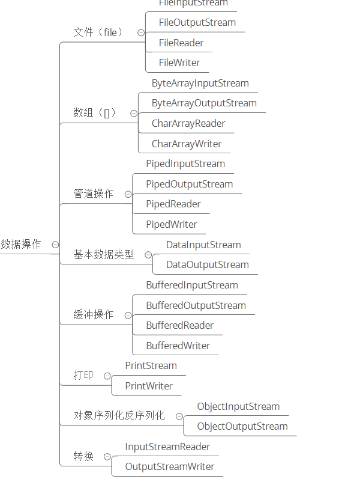

- 文件(file)
  - FileInputStream、FileOutputStream、FileReader、FileWriter
-  数组([])
   -  字节数组(byte[]): ByteArrayInputStream、ByteArrayOutputStream
   -  字符数组(char[]): CharArrayReader、CharArrayWriter
-  管道操作
   -  PipedInputStream、PipedOutputStream、PipedReader、PipedWriter
-  基本数据类型
   -  DataInputStream、DataOutputStream
-  缓冲操作
   -  BufferedInputStream、BufferedOutputStream、BufferedReader、BufferedWriter
-  打印
   -  PrintStream、PrintWriter
-  对象序列化反序列化
   -  ObjectInputStream、ObjectOutputStream
-  转换
   -  InputStreamReader、OutputStreamWriter
### 9.2 Java IO - 设计模式(装饰者模式)
#### 9.2.1 装饰者模式
装饰者(Decorator)和具体组件(ConcreteComponent)都继承自组件(Component)，具体组件的方法实现不需要依赖于其它对象，而装饰者组合了一个组件，这样它可以装饰其它装饰者或者具体组件。所谓装饰，就是把这个装饰者套在被装饰者之上，从而动态扩展被装饰者的功能。装饰者的方法有一部分是自己的，这属于它的功能，然后调用被装饰者的方法实现，从而也保留了被装饰者的功能。可以看到，具体组件应当是装饰层次的最低层，因为只有具体组件的方法实现不需要依赖于其它对象。

#### 9.2.2 I/O装饰者模式
以 InputStream 为例，
- InputStream 是抽象组件；
- FileInputStream 是 InputStream 的子类，属于具体组件，提供了字节流的输入操作；
- FilterInputStream 属于抽象装饰者，装饰者用于装饰组件，为组件提供额外的功能。例如 BufferedInputStream 为 FileInputStream 提供缓存的功能。

例化一个具有缓存功能的字节流对象时，只需要在 FileInputStream 对象上再套一层 BufferedInputStream 对象即可。
```java
FileInputStream fileInputStream = new FileInputStream(filePath);
BufferedInputStream bufferedInputStream = new BufferedInputStream(fileInputStream);
```
DataInputStream 装饰者提供了对更多数据类型进行输入的操作，比如 int、double 等基本类型。
### 9.3 Java IO - 源码: InputStream
#### 9.3.1 InputStream 类实现关系
> InputStream是输入字节流，具体的实现类层次结构如下：

#### 9.3.2 InputStream 抽象类
InputStream 类重要方法设计如下：
```java
// 读取下一个字节，如果没有则返回-1
public abstract int read() 

// 将读取到的数据放在 byte 数组中，该方法实际上调用read(byte b[], int off, int len)方法
public int read(byte b[]) 

// 从第 off 位置读取<b>最多(实际可能小于)</b> len 长度字节的数据放到 byte 数组中，流是以 -1 来判断是否读取结束的; 此方法会一直阻塞，直到输入数据可用、检测到stream结尾或引发异常为止。
public int read(byte b[], int off, int len) 

// JDK9新增：读取 InputStream 中的所有剩余字节，调用readNBytes(Integer.MAX_VALUE)方法
public byte[] readAllBytes()

// JDK11更新：读取 InputStream 中的剩余字节的指定上限大小的字节内容；此方法会一直阻塞，直到读取了请求的字节数、检测到流结束或引发异常为止。此方法不会关闭输入流。
public byte[] readNBytes(int len)

// JDK9新增：从输入流读取请求的字节数并保存在byte数组中； 此方法会一直阻塞，直到读取了请求的字节数、检测到流结束或引发异常为止。此方法不会关闭输入流。
public int readNBytes(byte[] b, int off, int len)

// 跳过指定个数的字节不读取
public long skip(long n) 

// 返回可读的字节数量
public int available() 

// 读取完，关闭流，释放资源
public void close() 

// 标记读取位置，下次还可以从这里开始读取，使用前要看当前流是否支持，可以使用 markSupport() 方法判断
public synchronized void mark(int readlimit) 

// 重置读取位置为上次 mark 标记的位置
public synchronized void reset() 

// 判断当前流是否支持标记流，和上面两个方法配套使用
public boolean markSupported() 

// JDK9新增：读取 InputStream 中的全部字节并写入到指定的 OutputStream 中
public long transferTo(OutputStream out)
```

#### 9.3.3 源码实现（InputStream）
> 梳理部分InputStream及其实现类的源码分析。
##### 9.3.3.1 InputStream
InputStream抽象类源码如下：
```java
public abstract class InputStream implements Closeable {
    
    // 当使用skip方法时，最大的buffer size大小
    private static final int MAX_SKIP_BUFFER_SIZE = 2048;

    // 默认的buffer size
    private static final int DEFAULT_BUFFER_SIZE = 8192;

    // JDK11中增加了一个nullInputStream，即空模式实现，以便可以直接调用而不用判空（可以看如下的补充说明）
    public static InputStream nullInputStream() {
        return new InputStream() {
            private volatile boolean closed;

            private void ensureOpen() throws IOException {
                if (closed) {
                    throw new IOException("Stream closed");
                }
            }

            @Override
            public int available () throws IOException {
                ensureOpen();
                return 0;
            }

            @Override
            public int read() throws IOException {
                ensureOpen();
                return -1;
            }

            @Override
            public int read(byte[] b, int off, int len) throws IOException {
                Objects.checkFromIndexSize(off, len, b.length);
                if (len == 0) {
                    return 0;
                }
                ensureOpen();
                return -1;
            }

            @Override
            public byte[] readAllBytes() throws IOException {
                ensureOpen();
                return new byte[0];
            }

            @Override
            public int readNBytes(byte[] b, int off, int len)
                throws IOException {
                Objects.checkFromIndexSize(off, len, b.length);
                ensureOpen();
                return 0;
            }

            @Override
            public byte[] readNBytes(int len) throws IOException {
                if (len < 0) {
                    throw new IllegalArgumentException("len < 0");
                }
                ensureOpen();
                return new byte[0];
            }

            @Override
            public long skip(long n) throws IOException {
                ensureOpen();
                return 0L;
            }

            @Override
            public long transferTo(OutputStream out) throws IOException {
                Objects.requireNonNull(out);
                ensureOpen();
                return 0L;
            }

            @Override
            public void close() throws IOException {
                closed = true;
            }
        };
    }
    
    // 读取下一个字节的数据，如果没有则返回-1
    public abstract int read() throws IOException;

    // 将读取到的数据放在 byte 数组中，该方法实际上调用read(byte b[], int off, int len)方法
    public int read(byte b[]) throws IOException {
        return read(b, 0, b.length);
    }

    // 从第 off 位置读取<b>最多(实际可能小于)</b> len 长度字节的数据放到 byte 数组中，流是以 -1 来判断是否读取结束的; 此方法会一直阻止，直到输入数据可用、检测到stream结尾或引发异常为止。
    public int read(byte b[], int off, int len) throws IOException {
        // 检查边界
        Objects.checkFromIndexSize(off, len, b.length);
        if (len == 0) {
            return 0;
        }

        // 读取下一个字节
        int c = read();
        if (c == -1) { // 读到stream末尾，则返回读取的字节数量为-1
            return -1;
        }
        b[off] = (byte)c;

        // i用来记录取了多少个字节
        int i = 1;
        try {
            // 循环读取
            for (; i < len ; i++) {
                c = read();
                if (c == -1) {// 读到stream末尾，则break
                    break;
                }
                b[off + i] = (byte)c;
            }
        } catch (IOException ee) {
        }
        // 返回读取到的字节个数
        return i;
    }

    // 分配的最大数组大小。
    // 由于一些VM在数组中保留一些头字，所以尝试分配较大的阵列可能会导致OutOfMemoryError（请求的阵列大小超过VM限制）
    private static final int MAX_BUFFER_SIZE = Integer.MAX_VALUE - 8;

    // JDK9新增：读取 InputStream 中的所有剩余字节，调用readNBytes(Integer.MAX_VALUE)方法
    public byte[] readAllBytes() throws IOException {
        return readNBytes(Integer.MAX_VALUE);
    }

    // JDK11更新：读取 InputStream 中的剩余字节的指定上限大小的字节内容；此方法会一直阻塞，直到读取了请求的字节数、检测到流结束或引发异常为止。此方法不会关闭输入流。
    public byte[] readNBytes(int len) throws IOException {
        // 边界检查
        if (len < 0) {
            throw new IllegalArgumentException("len < 0");
        }

        List<byte[]> bufs = null; // 缓存每次读取到的内容放到bufs，最后组装成result
        byte[] result = null; // 最后读取到的内容
        int total = 0;
        int remaining = len; // 剩余字节长度
        int n;
        do {
            byte[] buf = new byte[Math.min(remaining, DEFAULT_BUFFER_SIZE)];
            int nread = 0;

            // 读取到结束为止，读取大小n可能大于或小于缓冲区大小
            while ((n = read(buf, nread,
                    Math.min(buf.length - nread, remaining))) > 0) {
                nread += n; 
                remaining -= n;
            }

            if (nread > 0) {
                if (MAX_BUFFER_SIZE - total < nread) {
                    throw new OutOfMemoryError("Required array size too large");
                }
                total += nread;
                if (result == null) {
                    result = buf;
                } else {
                    if (bufs == null) {
                        bufs = new ArrayList<>();
                        bufs.add(result);
                    }
                    bufs.add(buf);
                }
            }
            // 如果读不到内容（返回-1）或者没有剩余的字节，则跳出循环
        } while (n >= 0 && remaining > 0);

        if (bufs == null) {
            if (result == null) {
                return new byte[0];
            }
            return result.length == total ?
                result : Arrays.copyOf(result, total);
        }

        // 组装最后的result
        result = new byte[total];
        int offset = 0;
        remaining = total;
        for (byte[] b : bufs) {
            int count = Math.min(b.length, remaining);
            System.arraycopy(b, 0, result, offset, count);
            offset += count;
            remaining -= count;
        }

        return result;
    }

    // JDK9新增：从输入流读取请求的字节数并保存在byte数组中； 此方法会一直阻塞，直到读取了请求的字节数、检测到流结束或引发异常为止。此方法不会关闭输入流。
    public int readNBytes(byte[] b, int off, int len) throws IOException {
        Objects.checkFromIndexSize(off, len, b.length);

        int n = 0;
        while (n < len) {
            int count = read(b, off + n, len - n);
            if (count < 0)
                break;
            n += count;
        }
        return n;
    }

    // 跳过指定个数的字节不读取
    public long skip(long n) throws IOException {

        long remaining = n;
        int nr;

        if (n <= 0) {
            return 0;
        }

        int size = (int)Math.min(MAX_SKIP_BUFFER_SIZE, remaining);
        byte[] skipBuffer = new byte[size];
        while (remaining > 0) {
            nr = read(skipBuffer, 0, (int)Math.min(size, remaining));
            if (nr < 0) {
                break;
            }
            remaining -= nr;
        }

        return n - remaining;
    }

    // 返回可读的字节数量
    public int available() throws IOException {
        return 0;
    }

    // 读取完，关闭流，释放资源
    public void close() throws IOException {}

    // 标记读取位置，下次还可以从这里开始读取，使用前要看当前流是否支持，可以使用 markSupport() 方法判断
    public synchronized void mark(int readlimit) {}

    // 重置读取位置为上次 mark 标记的位置
    public synchronized void reset() throws IOException {
        throw new IOException("mark/reset not supported");
    }

    // 判断当前流是否支持标记流，和上面两个方法配套使用。默认是false，由子类方法重写
    public boolean markSupported() {
        return false;
    }

    // JDK9新增：读取 InputStream 中的全部字节并写入到指定的 OutputStream 中
    public long transferTo(OutputStream out) throws IOException {
        Objects.requireNonNull(out, "out");
        long transferred = 0;
        byte[] buffer = new byte[DEFAULT_BUFFER_SIZE];
        int read;
        while ((read = this.read(buffer, 0, DEFAULT_BUFFER_SIZE)) >= 0) {
            out.write(buffer, 0, read);
            transferred += read;
        }
        return transferred;
    }
```
> 总结下JDK9的更新点

类 java.io.InputStream 中增加了新的方法来读取和复制 InputStream 中包含的数据。
- readAllBytes：读取 InputStream 中的所有剩余字节。
- readNBytes： 从 InputStream 中读取指定数量的字节到数组中。
- transferTo：读取 InputStream 中的全部字节并写入到指定的 OutputStream 中 。
```java
public class TestInputStream {
    private InputStream inputStream;
    private static final String CONTENT = "Hello World";
    @Before
    public void setUp() throws Exception {
        this.inputStream =
            TestInputStream.class.getResourceAsStream("/input.txt");
    }
    @Test
    public void testReadAllBytes() throws Exception {
        final String content = new String(this.inputStream.readAllBytes());
        assertEquals(CONTENT, content);
    }
    @Test
    public void testReadNBytes() throws Exception {
        final byte[] data = new byte[5];
        this.inputStream.readNBytes(data, 0, 5);
        assertEquals("Hello", new String(data));
    }
    @Test
    public void testTransferTo() throws Exception {
        final ByteArrayOutputStream outputStream = new ByteArrayOutputStream();
        this.inputStream.transferTo(outputStream);
        assertEquals(CONTENT, outputStream.toString());
    }
}
```
##### 9.3.3.2 read(byte[], int, int) 和 readNBytes(byte[], int, int)看似是实现的相同功能，为何会设计readNBytes方法呢？
`InputStream.read()` 与 `InputStream.readNBytes()` 区别详解

| **特性**               | `read(byte b[], int off, int len)`         | `readNBytes(byte b[], int off, int len)` |
|------------------------|-------------------------------------------|------------------------------------------|
| **阻塞行为**           | 阻塞直到至少 1 字节可用或 EOF             | 阻塞直到读满 `len` 字节或 EOF            |
| **返回值范围**         | `-1` (EOF) 或 `1~len` 字节                | `0~len` 字节（`len` 或 EOF 时 `< len`）  |
| **部分数据返回**       | ✅ 可能返回少于 `len` 的字节              | ❌ 必须读满 `len` 或 EOF 才返回          |
| **能否返回 `0`**       | 仅当 `len=0` 时                           | 仅当 `len=0` 时                          |
| **EOF 处理**           | 返回 `-1`                                 | 返回实际读取字节数（`0 ≤ N < len`）      |
| **设计目的**           | 流式数据处理                              | 固定长度数据块读取                       |
| **Java 版本**          | Java 1.0                                  | Java 9+                                  |

---

1. `public int read(byte b[], int off, int len)`

核心行为（修正关键错误）

- **阻塞特性**：  
  **会阻塞线程**，直到以下任一条件满足：
  - 至少读取到 1 个字节
  - 到达流末尾（EOF）
  - 发生 I/O 错误

- **返回值规则**：
  - `len > 0` 时：**永不返回 0**（必定返回 `1~len` 或 `-1`）
  - `len == 0` 时：返回 `0`（特殊场景）
  - `-1`：流已结束（EOF）

- **部分读取场景**：
  ```java
  // 请求读取 1024 字节
  int readCount = in.read(buffer, 0, 1024);
  
  // 可能结果：
  //   readCount = 300  (流中当前只有300字节)
  //   readCount = -1   (已到EOF)
  // 不可能：readCount = 0 (当len>0时)
  ```

典型应用场景
- 网络数据流处理（应对TCP分包）
- 大文件分块读取
- 实时数据流处理

```java
// 经典流处理模板
byte[] buffer = new byte[4096];
int bytesRead;
while ((bytesRead = input.read(buffer)) != -1) { // read()会阻塞但可能部分读取
    processData(buffer, 0, bytesRead); // 处理实际读取的字节
}
```

---

2. `public int readNBytes(byte b[], int off, int len)` (Java 9+)

核心行为
- **强阻塞特性**：  
  **阻塞直到满足以下任一条件**：
  - 精确读取 `len` 个字节 → 返回 `len`
  - 遇到 EOF → 返回实际读取字节数 `N`（`0 ≤ N < len`）
  - 发生 I/O 错误 → 抛出异常

- **严格保证**：
  - 要么读满 `len` 字节
  - 要么因 EOF 中断（返回已读取字节数）
  - **永不返回部分数据**（除非 EOF）

返回值详解

| 场景                      | 返回值 |
|---------------------------|--------|
| 成功读取 `len` 字节       | `len`  |
| EOF 前读取 `N` 字节       | `N` (`0 ≤ N < len`) |
| `len = 0`                 | `0`    |
| EOF 且 `len > 0`          | `-1` (仅当未读任何字节时) |

```java
// 读取固定长度协议头
byte[] header = new byte[16];
int readCount = in.readNBytes(header, 0, 16);

// 结果:
//   readCount = 16  (成功)
//   readCount = 8   (中途遇到EOF)
//   若readCount < 16 需处理不完整数据
```

设计意义
替代传统手动循环：
```java
// Java 9 之前需手动循环
int totalRead = 0;
while (totalRead < len) {
    int read = in.read(b, off + totalRead, len - totalRead);
    if (read == -1) break;
    totalRead += read;
}

// Java 9+ 等效单行
int totalRead = in.readNBytes(b, off, len);
```
##### 9.3.3.3 JDK11为什么会增加nullInputStream方法的设计？即空对象模式
- 空对象模式

举个例子：
```java
public class MyParser implements Parser {
  private static Action NO_ACTION = new Action() {
    public void doSomething() { /* do nothing */ }
  };

  public Action findAction(String userInput) {
    // ...
    if ( /* we can't find any actions */ ) {
      return NO_ACTION;
    }
  }
}
```
然后便可以`始终可以这么调用，而不用再判断空了`
```java
ParserFactory.getParser().findAction(someInput).doSomething();
```
##### 9.3.3.4 FilterInputStream
FilterInputStream 源码如下
```java
public class FilterInputStream extends InputStream {
    
    // 被装饰的inputStream
    protected volatile InputStream in;
    
    // 构造函数，注入被装饰的inputStream
    protected FilterInputStream(InputStream in) {
        this.in = in;
    }

    // 本质是调用被装饰的inputStream的方法
    public int read() throws IOException {
        return in.read();
    }
    public int read(byte b[]) throws IOException {
        return read(b, 0, b.length);
     }
    public int read(byte b[], int off, int len) throws IOException {
        return in.read(b, off, len);
     }
    public long skip(long n) throws IOException {
        return in.skip(n);
    }
    public int available() throws IOException {
        return in.available();
    }
    public void close() throws IOException {
        in.close();
    }
    public synchronized void mark(int readlimit) {
        in.mark(readlimit);
     }
    public synchronized void reset() throws IOException {
        in.reset();
    }
    public boolean markSupported() {
        return in.markSupported();
    }
}
```
InputStream使用volatile关键字的原因：
- 防止指令重排序（构造函数安全发布）： 非 volatile 时可能重排序到构造函数完成前，若 in 不是 volatile，其他线程可能看到未完全初始化的 FilterInputStream 对象（半初始化状态）。volatile 写操作（this.in = in）会插入内存屏障，确保对象安全发布。
-  保证多线程可见性：：非 volatile 字段在 CPU 缓存中的修改可能对其他线程不可见。
    ```java
    // 线程A
    filterIn.read(buffer); // 使用 in 字段

    // 线程B
    filterIn.close();      // 关闭 in 字段指向的流
    ```
    volatile 确保线程 B 修改 in 的状态后（如关闭流），线程 A 能立即看到最新值，避免：
    - 读取已关闭的流 → IOException: Stream closed
    - 使用无效的流状态
##### 9.3.3.4 ByteArrayInputStream
```java
public class ByteArrayInputStream extends InputStream {
    
    // 内部保存的byte 数组
    protected byte buf[];
    
    // 读取下一个字节的数组下标，byte[pos]就是read获取的下个字节
    protected int pos;
    
    // mark的数组下标位置
    protected int mark = 0;
    
    // 保存的有效byte的个数
    protected int count;

    // 构造方法
    public ByteArrayInputStream(byte buf[]) {
        this.buf = buf;              
        this.pos = 0;
        this.count = buf.length;
     }
    
    // 构造方法，带offset的
     public ByteArrayInputStream(byte buf[], int offset, int length) {                
        this.buf = buf;
        this.pos = offset;
        this.count = Math.min(offset + length, buf.length);
        this.mark = offset;
    }
    
    // 从流中读取下一个字节，没有读取到返回 -1
    public synchronized int read() {
        return (pos < count) ? (buf[pos++] & 0xff) : -1;
    }
    
    // 从第 off 位置读取<b>最多(实际可能小于)</b> len 长度字节的数据放到 byte 数组中，流是以 -1 来判断是否读取结束的
    public synchronized int read(byte b[], int off, int len) {
        // 边界检查
        if (b == null) {
            throw new NullPointerException();
        } else if (off < 0 || len < 0 || len > b.length - off) {
            throw new IndexOutOfBoundsException();
        }

        if (pos >= count) {
            return -1;
        }

        int avail = count - pos;
        if (len > avail) {
            len = avail;
        }
        if (len <= 0) {
            return 0;
        }

        // 从buf拷贝到byte 数组b中
        System.arraycopy(buf, pos, b, off, len);
        pos += len;
        return len;
    }

    // 跳过指定个数的字节不读取
    public synchronized long skip(long n) {
        long k = count - pos;
        if (n < k) {
            k = n < 0 ? 0 : n;
        }

        pos += k;
        return k;
    }

    // 还有稍稍byte在buffer中未读取，即总的count 减去 当前byte位置
    public synchronized int available() {
        return count - pos;
    }

    // 支持mark所以返回true
    public boolean markSupported() { 
        return true;
    }  

    // 在流中当前位置mark, readAheadLimit参数未使用    
    public void mark(int readAheadLimit) {            
        mark = pos;
    }

    // 重置流，即回到mark的位置
    public synchronized void reset() {
        pos = mark;
    }

    // 关闭ByteArrayInputStream不会产生任何动作
    public void close() throws IOException { 

    }
}
```
##### 9.3.3.5 BufferedInputStream
BufferedInputStream源码如下
```java
public class BufferedInputStream extends FilterInputStream {

    // 默认的buffer大小
    private static int DEFAULT_BUFFER_SIZE = 8192;

    // 分配的最大数组大小。
    // 由于一些VM在数组中保留一些头字，所以尝试分配较大的阵列可能会导致OutOfMemoryError（请求的阵列大小超过VM限制）
    private static int MAX_BUFFER_SIZE = Integer.MAX_VALUE - 8;

    // 内部保存在byte 数组中
    protected volatile byte buf[];

    // 关闭流的方法可能是异步的，所以使用原子AtomicReferenceFieldUpdater提供CAS无锁方式（可以解决CAS的ABA问题）来保证
    private static final AtomicReferenceFieldUpdater<BufferedInputStream, byte[]> bufUpdater =
        AtomicReferenceFieldUpdater.newUpdater(BufferedInputStream.class,  byte[].class, "buf");

    // 有效byte的大小
    protected int count;

    // 当前位置
    protected int pos;

    // 最后一次，调用mark方法，标记的位置
    protected int markpos = -1;

    /**
     * 该变量惟一入口就是mark(int readLimit)，好比调用方法mark(1024)，那么后面读取的数据若是
     * 超过了1024字节，那么这次mark就为无效标记，子类能够选择抛弃该mark标记，从头开始。不过具体实现
     * 跟具体的子类有关，在BufferedInputStream中，会抛弃mark标记，从新将markpos赋值为-1
     */
    protected int marklimit;

    // 获取被装饰的stream
    private InputStream getInIfOpen() throws IOException {
        InputStream input = in;
        if (input == null)
            throw new IOException("Stream closed");
        return input;
    }

    // 获取实际内部的buffer数组
    private byte[] getBufIfOpen() throws IOException {
        byte[] buffer = buf;
        if (buffer == null)
            throw new IOException("Stream closed");
        return buffer;
    }

    // 构造函数，buffer是8kb
    public BufferedInputStream(InputStream in) {
        this(in, DEFAULT_BUFFER_SIZE);
    }

    // 构造函数，指定buffer大小
    public BufferedInputStream(InputStream in, int size) {
        super(in);
        if (size <= 0) {
            throw new IllegalArgumentException("Buffer size <= 0");
        }
        buf = new byte[size];
    }

    /**
     * 用更多的数据填充缓冲区,考虑到shuffling和其他处理标记的技巧，
     * 假设它是由同步方法调用的。该方法还假设所有数据已经被读入，因此pos >count。
     */
    private void fill() throws IOException {
    	// 得到内部缓冲区buffer
        byte[] buffer = getBufIfOpen();
        // 没有mark的情况下， pos为0
        if (markpos < 0)
            pos = 0;            /* no mark: throw away the buffer */
        // pos >= buffer.length  buffer已经被读取完了 
        else if (pos >= buffer.length)  /* no room left in buffer */
        	// markpos > 0  有标记，标记处在缓存中间
            if (markpos > 0) {  /* can throw away early part of the buffer */
            	// 把buffer中，markpos到pos的部分移动到0-sz处，pos设置为sz，markpos为0
                int sz = pos - markpos;
                System.arraycopy(buffer, markpos, buffer, 0, sz);
                pos = sz;
                markpos = 0;
                // markpos已经为0了，marklimit比buffer.length小，再读取buffer已经没有地方了
            } else if (buffer.length >= marklimit) {
            	// 清空缓存，清空标记，markpos为-1，pos为0
                markpos = -1;   /* buffer got too big, invalidate mark */
                pos = 0;        /* drop buffer contents */
                // markpos已经为0了，marklimit比buffer.length大，而buffer.length已经最大了，不能扩容
            } else if (buffer.length >= MAX_BUFFER_SIZE) {
                throw new OutOfMemoryError("Required array size too large");
               // markpos已经为0了，marklimit比buffer.length大
            } else {            /* grow buffer */
            	// 建立一个长度为min(2*pos,marklimit,MAX_BUFFER_SIZE),的缓存数组，然后把原来0-pos移动到新数组的0-pos处
                int nsz = (pos <= MAX_BUFFER_SIZE - pos) ?
                        pos * 2 : MAX_BUFFER_SIZE;
                if (nsz > marklimit)
                    nsz = marklimit;
                byte nbuf[] = new byte[nsz];
                System.arraycopy(buffer, 0, nbuf, 0, pos);
                // 用bufUpdater替换buffer
                if (!bufUpdater.compareAndSet(this, buffer, nbuf)) {
                    // Can't replace buf if there was an async close.
                    // Note: This would need to be changed if fill()
                    // is ever made accessible to multiple threads.
                    // But for now, the only way CAS can fail is via close.
                    // assert buf == null;
                    throw new IOException("Stream closed");
                }
                buffer = nbuf;
            }
        // 当前读取上限count为pos
        count = pos;
        // 从内部的输入流，读取pos到buffer.length部分，读取的字节数加到count
        int n = getInIfOpen().read(buffer, pos, buffer.length - pos);
        if (n > 0)
            count = n + pos;
    }

    // 读取byte
    public synchronized int read() throws IOException {
        // 说明当前buf[]数组大小不够了，须要fill()
        if (pos >= count) {
            fill();
            // 说明没有读取到任何数据
            if (pos >= count)
                return -1;
        }
        return getBufIfOpen()[pos++] & 0xff;
    }

    /**
     * Read characters into a portion of an array, reading from the underlying
     * stream at most once if necessary.
     */
    private int read1(byte[] b, int off, int len) throws IOException {
        int avail = count - pos;
        if (avail <= 0) {
            // 当写入指定数组b的长度大小超过BufferedInputStream中核心缓存数组buf[]的大小而且 markpos < 0，那么就直接从数据流中读取数据给b数组，而不经过buf[]缓存数组，避免buf[]数组急剧增大
            if (len >= getBufIfOpen().length && markpos < 0) {
                return getInIfOpen().read(b, off, len);
            }
            fill();
            avail = count - pos;
            if (avail <= 0) return -1;
        }
        int cnt = (avail < len) ? avail : len;
        System.arraycopy(getBufIfOpen(), pos, b, off, cnt);
        pos += cnt;
        return cnt;
    }

    // 读取到byte数组b中
    public synchronized int read(byte b[], int off, int len)
        throws IOException
    {
        getBufIfOpen(); // Check for closed stream
        if ((off | len | (off + len) | (b.length - (off + len))) < 0) {
            throw new IndexOutOfBoundsException();
        } else if (len == 0) {
            return 0;
        }

        int n = 0;
        for (;;) {
            int nread = read1(b, off + n, len - n);
            if (nread <= 0)
                return (n == 0) ? nread : n;
            n += nread;
            if (n >= len)
                return n;
            // if not closed but no bytes available, return
            InputStream input = in;
            if (input != null && input.available() <= 0)
                return n;
        }
    }

    // 跳过n个
    public synchronized long skip(long n) throws IOException {
        getBufIfOpen(); // Check for closed stream
        if (n <= 0) {
            return 0;
        }
        long avail = count - pos;

        if (avail <= 0) {
            // If no mark position set then don't keep in buffer
            if (markpos <0)
                return getInIfOpen().skip(n);

            // Fill in buffer to save bytes for reset
            fill();
            avail = count - pos;
            if (avail <= 0)
                return 0;
        }

        long skipped = (avail < n) ? avail : n;
        pos += skipped;
        return skipped;
    }

    // buf[]数组剩余字节数+输入流中剩余字节数
    public synchronized int available() throws IOException {
        int n = count - pos;
        int avail = getInIfOpen().available();
        return n > (Integer.MAX_VALUE - avail)
                    ? Integer.MAX_VALUE
                    : n + avail;
    }

    
    // 标记位置，marklimit只有在这里才可以被赋值，readlimit表示mark()方法执行后，最多可以从流中读取的数据
    // 若是超过该字节大小，那么在fill()的时候，就会认为此mark()标记无效，从新将 markpos = -1，pos = 0
    public synchronized void mark(int readlimit) {
        marklimit = readlimit;
        markpos = pos;
    }

    // 重置位置
    public synchronized void reset() throws IOException {
        getBufIfOpen(); // 如果已经close, 则直接报错
        if (markpos < 0)
            throw new IOException("Resetting to invalid mark");
        pos = markpos;
    }

    // 支持mark, 所以返回true
    public boolean markSupported() {
        return true;
    }

    // 通过AtomicReferenceFieldUpdater的CAS无锁方式close
    public void close() throws IOException {
        byte[] buffer;
        while ( (buffer = buf) != null) {
            if (bufUpdater.compareAndSet(this, buffer, null)) {
                InputStream input = in;
                in = null;
                if (input != null)
                    input.close();
                return;
            }
            // Else retry in case a new buf was CASed in fill()
        }
    }
}
```
AtomicReferenceFieldUpdater只能对**对象的 volatile 引用字段进行原子操作**
### 9.4 Java IO - 源码: OutputStream
> OutputStream是输出字节流，具体的实现类层次结构如下：
#### 9.4.1 OutputStream 类实现关系

#### 9.4.2 OutputStream 抽象类
OutputStream 类重要方法设计如下：
```java
// 写入一个字节，可以看到这里的参数是一个 int 类型，对应上面的读方法，int 类型的 32 位，只有低 8 位才写入，高 24 位将舍弃。
public abstract void write(int b)

// 将数组中的所有字节写入，实际调用的是write(byte b[], int off, int len)方法。
public void write(byte b[])

// 将 byte 数组从 off 位置开始，len 长度的字节写入
public void write(byte b[], int off, int len)

// 强制刷新，将缓冲中的数据写入; 默认是空实现，供子类覆盖
public void flush()

// 关闭输出流，流被关闭后就不能再输出数据了; 默认是空实现，供子类覆盖
public void close()
```
#### 9.4.3 源码实现
> 梳理部分OutputStream及其实现类的源码分析。
##### 9.4.3.1 OutputStream
OutputStream抽象类源码如下：
```java
public abstract class OutputStream implements Closeable, Flushable {
    
    // JDK11中增加了一个nullOutputStream，即空模式实现，以便可以直接调用而不用判空（可以看如下的补充说明）
    public static OutputStream nullOutputStream() {
        return new OutputStream() {
            private volatile boolean closed;

            private void ensureOpen() throws IOException {
                if (closed) {
                    throw new IOException("Stream closed");
                }
            }

            @Override
            public void write(int b) throws IOException {
                ensureOpen();
            }

            @Override
            public void write(byte b[], int off, int len) throws IOException {
                Objects.checkFromIndexSize(off, len, b.length);
                ensureOpen();
            }

            @Override
            public void close() {
                closed = true;
            }
        };
    }

    // 写入一个字节，可以看到这里的参数是一个 int 类型，对应上面的读方法，int 类型的 32 位，只有低 8 位才写入，高 24 位将舍弃。
    public abstract void write(int b) throws IOException;

    // 将数组中的所有字节写入，实际调用的是write(byte b[], int off, int len)方法
    public void write(byte b[]) throws IOException {
        write(b, 0, b.length);
    }

    // 将 byte 数组从 off 位置开始，len 长度的字节写入
    public void write(byte b[], int off, int len) throws IOException {
        // 检查边界合理性
        Objects.checkFromIndexSize(off, len, b.length);
        // len == 0 的情况已经在如下的for循环中隐式处理了
        for (int i = 0 ; i < len ; i++) {
            write(b[off + i]);
        }
    }

    // 强制刷新，将缓冲中的数据写入; 默认是空实现，供子类覆盖
    public void flush() throws IOException {
    }

    // 关闭输出流，流被关闭后就不能再输出数据了; 默认是空实现，供子类覆盖
    public void close() throws IOException {
    }

}
```
##### 9.4.3.2 FilterOutputStream
FilterOutputStream 源码如下
```java
public class FilterOutputStream extends OutputStream {
    
    // 被装饰的实际outputStream
    protected OutputStream out;

    // 当前stream是否已经被close
    private volatile boolean closed;

    // close stream时加锁，防止其它线程同时close
    private final Object closeLock = new Object();

    // 初始化构造函数，传入被装饰的实际outputStream
    public FilterOutputStream(OutputStream out) {
        this.out = out;
    }

    // 写入数据，本质调用被装饰outputStream的方法
    @Override
    public void write(int b) throws IOException {
        out.write(b);
    }

    // 将数组中的所有字节写入
    @Override
    public void write(byte b[]) throws IOException {
        write(b, 0, b.length);
    }

    // 一个个写入
    @Override
    public void write(byte b[], int off, int len) throws IOException {
        if ((off | len | (b.length - (len + off)) | (off + len)) < 0)
            throw new IndexOutOfBoundsException();

        for (int i = 0 ; i < len ; i++) {
            write(b[off + i]);
        }
    }

     // 强制刷新，将缓冲中的数据写入; 本质调用被装饰outputStream的方法
    @Override
    public void flush() throws IOException {
        out.flush();
    }

    // 关闭Stream
    @Override
    public void close() throws IOException {
        // 如果已经close, 直接退出
        if (closed) {
            return;
        }
        // 加锁处理，如果已经有线程正在closing则退出；
        synchronized (closeLock) {
            if (closed) {
                return;
            }
            closed = true;
        }

        // close前调用flush
        Throwable flushException = null;
        try {
            flush();
        } catch (Throwable e) {
            flushException = e;
            throw e;
        } finally {
            if (flushException == null) {
                out.close();
            } else {
                try {
                    out.close();
                } catch (Throwable closeException) {
                   // evaluate possible precedence of flushException over closeException
                   if ((flushException instanceof ThreadDeath) &&
                       !(closeException instanceof ThreadDeath)) {
                       flushException.addSuppressed(closeException);
                       throw (ThreadDeath) flushException;
                   }

                    if (flushException != closeException) {
                        closeException.addSuppressed(flushException);
                    }

                    throw closeException;
                }
            }
        }
    }
}
```
> 对比下JDK8中，close方法是没有加锁处理的。这种情况下你可以看JDK8源码中，直接利用java7的try with resources方式，优雅的调用flush方法后对out进行关闭。
```java
public void close() throws IOException {
    try (OutputStream ostream = out) {
        flush();
    }
}
```
##### 9.4.3.3 JDK 8与JDK 11中FilterOutputStream.close()的差异分析

您提供的两个`close()`实现分别来自JDK 8和JDK 11，主要差异体现在**异常处理策略**和**线程安全设计**上：

- 核心差异对比

| 特性 | JDK 8实现 | JDK 11实现 |
|------|-----------|------------|
| **异常处理** | 简单（try-with-resources） | 复杂（显式异常链管理） |
| **线程安全** | 无同步控制 | 双重检查锁+closed状态标志 |
| **资源关闭** | 自动资源管理 | 手动异常传播控制 |
| **代码复杂度** | 简洁（5行） | 复杂（30+行） |
| 特殊异常处理 | 无 | 支持ThreadDeath特殊处理 |

- 关键差异解析

1. 异常处理机制的重构

**JDK 8实现**：
```java
// 简洁的try-with-resources
try (OutputStream ostream = out) {
    flush();
}
```
- **优点**：自动处理`flush()`和`close()`的异常（后者作为suppressed exception）
- **缺点**：无法控制异常优先级（总是以flush异常为主）

**JDK 11实现**：
```java
// 复杂的显式异常管理
Throwable flushException = null;
try {
    flush();
} catch (Throwable e) {
    flushException = e;
    throw e;
} finally {
    if (flushException == null) {
        out.close();
    } else {
        // 手动处理异常优先级
        if ((flushException instanceof ThreadDeath) && ...) {
            // 特殊处理
        }
    }
}
```
- **优势**：精确控制异常传播优先级
- **修复问题**：解决[JDK-8078628](https://bugs.openjdk.org/browse/JDK-8078628)中flush异常被close异常覆盖的问题
- **特殊处理**：对`ThreadDeath`（JVM内部错误）特殊处理

2. 线程安全增强

**JDK 11新增线程安全机制**：
```java
private volatile boolean closed;
private final Object closeLock = new Object();

public void close() throws IOException {
    if (closed) return;
    synchronized (closeLock) {  // 同步块
        if (closed) return;
        closed = true;  // 状态标记
    }
    // ...后续操作
}
```
- **双重检查锁**：避免多线程重复关闭
- `volatile closed`：保证状态可见性
- **解决**：防止多线程环境下重复调用flush()和close()

3. 资源关闭策略优化

**JDK 11的智能关闭逻辑**：
```java
if (flushException == null) {
    out.close();  // 正常关闭
} else {
    try {
        out.close();  // 尝试关闭
    } catch (Throwable closeException) {
        // 智能合并异常：
        // 1. ThreadDeath特殊处理
        // 2. 非重复异常时添加suppressed
    }
}
```
- 区分flush成功/失败场景
- 避免无意义的close调用（当flush已失败时）
- 保留原始异常上下文

- 变更原因分析

1. 历史问题驱动

- **JDK-8078628**：当flush和close同时抛出异常时，原始实现会错误地**覆盖flush异常**
- **JDK-8163558**：需要更精确的异常传播控制

2. 防御性编程强化


3. 特殊场景兼容性

对`ThreadDeath`的特殊处理：
```java
if ((flushException instanceof ThreadDeath) &&
    !(closeException instanceof ThreadDeath)) {
    flushException.addSuppressed(closeException);
    throw (ThreadDeath) flushException;
}
```
- **保护JVM状态**：ThreadDeath表示线程终止，需要优先处理
- **避免掩盖**：防止重要JVM错误被常规IO异常覆盖

- 设计启示

1. **异常传播优先级**：
   - JDK 11明确：flush异常 > close异常
   - 符合操作逻辑（flush是主动操作，close是清理）

2. **资源安全三重保障**：
   - 状态标记 (`closed`)
   - 同步控制 (`synchronized`)
   - volatile可见性

3. **向后兼容代价**：
   - 复杂度增加是保持行为一致性的代价
   - 旧版本流实现的兼容需求

> **最佳实践建议**：在自定义流实现中优先采用JDK 11模式，尤其涉及：  
> 1. 多线程环境  
> 2. 需要精确异常处理的场景  
> 3. 底层资源敏感的操作系统级资源
##### 9.4.3.4 ByteArrayOutputStream
ByteArrayOutputStream 源码如下
```java
public class ByteArrayOutputStream extends OutputStream {

    // 实际的byte数组
    protected byte buf[];

    // 数组中实际有效的byte的个数
    protected int count;

    // 初始化默认构造，初始化byte数组大小为32
    public ByteArrayOutputStream() {
        this(32);
    }

    // 初始化byte的大小
    public ByteArrayOutputStream(int size) {
        if (size < 0) {
            throw new IllegalArgumentException("Negative initial size: "
                                               + size);
        }
        buf = new byte[size];
    }

    // 扩容，确保它至少可以容纳由最小容量参数指定的元素数
    private void ensureCapacity(int minCapacity) {
        // overflow-conscious code
        if (minCapacity - buf.length > 0)
            grow(minCapacity);
    }

    // 分配的最大数组大小。
    // 由于一些VM在数组中保留一些头字，所以尝试分配较大的阵列可能会导致OutOfMemoryError（请求的阵列大小超过VM限制）
    private static final int MAX_ARRAY_SIZE = Integer.MAX_VALUE - 8;

    // 扩容的实质方法，确保它至少可以容纳由最小容量参数指定的元素数
    private void grow(int minCapacity) {
        // overflow-conscious code
        int oldCapacity = buf.length;
        int newCapacity = oldCapacity << 1;
        if (newCapacity - minCapacity < 0)
            newCapacity = minCapacity;
        if (newCapacity - MAX_ARRAY_SIZE > 0)
            newCapacity = hugeCapacity(minCapacity);
        buf = Arrays.copyOf(buf, newCapacity);
    }

    private static int hugeCapacity(int minCapacity) {
        if (minCapacity < 0) // overflow
            throw new OutOfMemoryError();
        return (minCapacity > MAX_ARRAY_SIZE) ?
            Integer.MAX_VALUE :
            MAX_ARRAY_SIZE;
    }

    // 写入，写入前确保byte数据长度
    public synchronized void write(int b) {
        ensureCapacity(count + 1);
        buf[count] = (byte) b;
        count += 1;
    }

    
    public synchronized void write(byte b[], int off, int len) {
        Objects.checkFromIndexSize(off, len, b.length);
        ensureCapacity(count + len);
        System.arraycopy(b, off, buf, count, len);
        count += len;
    }

    public void writeBytes(byte b[]) {
        write(b, 0, b.length);
    }

    public synchronized void writeTo(OutputStream out) throws IOException {
        out.write(buf, 0, count);
    }

    // 重置，显然将实际有效的byte数量置为0
    public synchronized void reset() {
        count = 0;
    }

    
    public synchronized byte[] toByteArray() {
        return Arrays.copyOf(buf, count);
    }

    // 长度，即count
    public synchronized int size() {
        return count;
    }

    // 转成string
    public synchronized String toString() {
        return new String(buf, 0, count);
    }

    // 转成string，指定的字符集
    public synchronized String toString(String charsetName)
        throws UnsupportedEncodingException
    {
        return new String(buf, 0, count, charsetName);
    }

    public synchronized String toString(Charset charset) {
        return new String(buf, 0, count, charset);
    }

    // 弃用
    @Deprecated
    public synchronized String toString(int hibyte) {
        return new String(buf, hibyte, 0, count);
    }

    // 对byte 数组而言，close没啥实质意义，所以空实现
    public void close() throws IOException {
    }

}
```
##### 9.4.3.5 BufferedOutputStream
BufferedOutputStream 源码如下
```java
public class BufferedOutputStream extends FilterOutputStream {
    
    // Buffered outputStream底层也是byte数组
    protected byte buf[];

    // 大小，buf[0]到buf[count-1]是实际存储的bytes
    protected int count;

    // 构造函数，被装饰的outputStream，以及默认buf大小是8192
    public BufferedOutputStream(OutputStream out) {
        this(out, 8192);
    }

    public BufferedOutputStream(OutputStream out, int size) {
        super(out);
        if (size <= 0) {
            throw new IllegalArgumentException("Buffer size <= 0");
        }
        buf = new byte[size];
    }

    /** Flush the internal buffer */
    // 内部的flush方法，将buffer中的有效bytes(count是有效的bytes大小)通过被装饰的outputStream写入
    private void flushBuffer() throws IOException {
        if (count > 0) {
            out.write(buf, 0, count);
            count = 0;
        }
    }

    // 写入byte
    @Override
    public synchronized void write(int b) throws IOException {
        // 当buffer满了以后，flush buffer
        if (count >= buf.length) {
            flushBuffer();
        }
        buf[count++] = (byte)b;
    }

    // 将 byte 数组从 off 位置开始，len 长度的字节写入
    @Override
    public synchronized void write(byte b[], int off, int len) throws IOException {
        if (len >= buf.length) {
            // 如果请求长度已经超过输出缓冲区的大小，直接刷新输出缓冲区，然后直接写入数据。
            flushBuffer();
            out.write(b, off, len);
            return;
        }
        if (len > buf.length - count) {
            flushBuffer();
        }
        System.arraycopy(b, off, buf, count, len);
        count += len;
    }

    // flush方法，需要先将buffer中写入，最后在调用被装饰outputStream的flush方法
    @Override
    public synchronized void flush() throws IOException {
        flushBuffer();
        out.flush();
    }
}
```
### 9.5 Java IO - 常见类使用

Java 的 I/O 大概可以分成以下几类:
- 磁盘操作: File
- 字节操作: InputStream 和 OutputStream
- 字符操作: Reader 和 Writer
- 对象操作: Serializable
- 网络操作: Socket


#### 9.5.1 File相关
File 类可以用于表示文件和目录的信息，但是它不表示文件的内容。

递归地列出一个目录下所有文件:
```java
public static void listAllFiles(File dir) {
    if (dir == null || !dir.exists()) {
        return;
    }
    if (dir.isFile()) {
        System.out.println(dir.getName());
        return;
    }
    for (File file : dir.listFiles()) {
        listAllFiles(file);
    }
}
```
#### 9.5.2 字节流相关
```java
public static void copyFile(String src, String dist) throws IOException {

    FileInputStream in = new FileInputStream(src);
    FileOutputStream out = new FileOutputStream(dist);
    byte[] buffer = new byte[20 * 1024];

    // read() 最多读取 buffer.length 个字节
    // 返回的是实际读取的个数
    // 返回 -1 的时候表示读到 eof，即文件尾
    while (in.read(buffer, 0, buffer.length) != -1) {
        out.write(buffer);
    }

    in.close();
    out.close();
}
```
#### 9.5.3 字符流(实现逐行输出文本文件的内容)
```java
public static void readFileContent(String filePath) throws IOException {

    FileReader fileReader = new FileReader(filePath);
    BufferedReader bufferedReader = new BufferedReader(fileReader);

    String line;
    while ((line = bufferedReader.readLine()) != null) {
        System.out.println(line);
    }

    // 装饰者模式使得 BufferedReader 组合了一个 Reader 对象
    // 在调用 BufferedReader 的 close() 方法时会去调用 Reader 的 close() 方法
    // 因此只要一个 close() 调用即可
    bufferedReader.close();
}
```
#### 9.5.4 序列化 & Serializable & transient
##### 9.5.4.1 序列化
序列化就是将一个对象转换成字节序列，方便存储和传输。
- 序列化: ObjectOutputStream.writeObject()
- 反序列化: ObjectInputStream.readObject()

不会对静态变量进行序列化，因为序列化只是保存对象的状态，静态变量属于类的状态。

##### 9.5.4.2 Serializable

序列化的类需要实现 Serializable 接口，它只是一个标准，没有任何方法需要实现，但是如果不去实现它的话而进行序列化，会抛出异常。

```java
public static void main(String[] args) throws IOException, ClassNotFoundException {
    A a1 = new A(123, "abc");
    String objectFile = "file/a1";
    ObjectOutputStream objectOutputStream = new ObjectOutputStream(new FileOutputStream(objectFile));
    objectOutputStream.writeObject(a1);
    objectOutputStream.close();

    ObjectInputStream objectInputStream = new ObjectInputStream(new FileInputStream(objectFile));
    A a2 = (A) objectInputStream.readObject();
    objectInputStream.close();
    System.out.println(a2);
}

private static class A implements Serializable {
    private int x;
    private String y;

    A(int x, String y) {
        this.x = x;
        this.y = y;
    }

    @Override
    public String toString() {
        return "x = " + x + "  " + "y = " + y;
    }
}
```
##### 9.5.4.3 transient

transient 关键字可以使一些属性不会被序列化。

ArrayList 中存储数据的数组 elementData 是用 transient 修饰的，因为这个数组是动态扩展的，并不是所有的空间都被使用，因此就不需要所有的内容都被序列化。通过重写序列化和反序列化方法，使得可以只序列化数组中有内容的那部分数据。
```java
private transient Object[] elementData;
```

##### 9.5.4.4 深入解析 ArrayList 的 transient 序列化机制

ArrayList 的实现展示了 Java 序列化的 **灵活性和可定制性**。让我们深入分析这个看似矛盾的设计：

- 核心机制解析

1. `transient` 的标准行为
```java
private transient Object[] elementData;
```
- ✅ **确实阻止默认序列化**：当对象被序列化时，默认的 `ObjectOutputStream` 会跳过 `transient` 字段
- ❌ **但这不是终点**：类可以通过自定义序列化逻辑覆盖此行为

1. ArrayList 的自定义序列化实现

ArrayList 通过重写 `writeObject` 和 `readObject` 方法实现定制序列化：

**序列化过程 (`writeObject`)**:
```java
private void writeObject(java.io.ObjectOutputStream s)
    throws java.io.IOException {
    // 1. 执行默认序列化（处理非transient字段）
    s.defaultWriteObject();
    
    // 2. 写入实际元素数量（size）
    s.writeInt(size);
    
    // 3. 仅序列化有效元素（0 到 size-1）
    for (int i = 0; i < size; i++) {
        s.writeObject(elementData[i]);
    }
}
```

**反序列化过程 (`readObject`)**:
```java
private void readObject(java.io.ObjectInputStream s)
    throws java.io.IOException, ClassNotFoundException {
    // 1. 执行默认反序列化
    s.defaultReadObject();
    
    // 2. 读取实际元素数量
    int size = s.readInt();
    
    // 3. 创建新数组（精确大小）
    elementData = new Object[size];
    
    // 4. 逐个读取元素
    for (int i = 0; i < size; i++) {
        elementData[i] = s.readObject();
    }
}
```

- 设计原理图解


- 为什么这样设计？

  1. 空间效率优化

  - **避免序列化"空洞"**：ArrayList 的容量通常大于实际元素数量
  - **示例对比**：
    ```java
    // 原始状态：容量10，实际元素3个
    [A, B, C, null, null, ...] 
    
    // 标准序列化：序列化10个元素（浪费）
    // 定制序列化：仅序列化3个元素
    ```

  1. 版本兼容性

  - 当 ArrayList 内部实现变更时（如数组扩容策略变化）
  - 定制序列化保证：**只存储业务数据**，不存储实现细节

  3. 安全边界

  - 防止序列化未初始化的数组部分（可能包含敏感内存残留）

- 关键验证实验

```java
public class SerializationTest {
    public static void main(String[] args) throws Exception {
        // 创建容量5，实际元素3个的ArrayList
        ArrayList<String> list = new ArrayList<>(5);
        list.add("A");
        list.add("B");
        list.add("C");
        
        // 序列化
        ByteArrayOutputStream bos = new ByteArrayOutputStream();
        try (ObjectOutputStream oos = new ObjectOutputStream(bos)) {
            oos.writeObject(list);
        }
        
        // 计算序列化大小
        byte[] bytes = bos.toByteArray();
        System.out.println("Serialized size: " + bytes.length + " bytes");
        
        // 反序列化验证
        ByteArrayInputStream bis = new ByteArrayInputStream(bytes);
        try (ObjectInputStream ois = new ObjectInputStream(bis)) {
            ArrayList<?> deserialized = (ArrayList<?>) ois.readObject();
            System.out.println("Deserialized size: " + deserialized.size());
        }
    }
}
```

**输出结果**：
```
Serialized size: 121 bytes  // 实际值可能变动，但远小于完整数组序列化
Deserialized size: 3
```

- 对比：默认序列化 vs ArrayList 定制序列化

| 特性 | 默认序列化 | ArrayList 定制序列化 |
|------|------------|----------------------|
| 处理 `transient` 字段 | 完全忽略 | 选择性处理有效部分 |
| 序列化数据量 | 整个数组（含 null） | 仅有效元素 |
| 反序列化结果 | 原样恢复（含空洞） | 紧凑数组（无空洞） |
| 版本兼容性 | 依赖数组结构 | 仅依赖元素类型 |
| 安全性 | 可能暴露未初始化内存 | 只恢复有效数据 |

- 设计启示

1. **`transient` 不是黑名单**：而是"默认不处理"的声明，开发者仍可接管
2. **序列化是接口而非实现**：可通过 `writeObject/readObject` 自定义
3. **空间效率优先**：网络传输和存储场景尤其重要
4. **防御性编程**：避免序列化冗余或敏感数据

> 当您设计可序列化类时：  
> - 使用 `transient` 标记不应默认序列化的字段  
> - 对于需要特殊处理的字段，重写 `writeObject/readObject`  
> - 始终考虑数据最小化原则（GDPR 合规基础）

##### 9.5.4.5 ArrayList 如何实现自定义序列化

ArrayList 的自定义序列化是通过 **实现 Serializable 接口并重写特定方法** 来实现的，而不是通过继承其他类。以下是详细解析：

- 实现机制

  1. **Serializable 接口**
  ```java
  public class ArrayList<E> extends AbstractList<E>
          implements List<E>, RandomAccess, Cloneable, java.io.Serializable {
      // ...
  }
  ```
  - `java.io.Serializable` 是一个标记接口（无方法声明）
  - 表明该类支持序列化，但**不强制要求**实现任何方法

  2. **自定义序列化方法**

  ArrayList 重写了两个特殊方法实现定制序列化：
  ```java
  private void writeObject(java.io.ObjectOutputStream s)
      throws java.io.IOException
      
  private void readObject(java.io.ObjectInputStream s)
      throws java.io.IOException, ClassNotFoundException
  ```

- 实现原理图解


- ArrayList 源码实现（JDK 17）

    - writeObject 方法
    ```java
    private void writeObject(java.io.ObjectOutputStream s)
        throws java.io.IOException {
        // 1. 写入默认序列化数据（非transient字段,因此ArrayList源码中需要设置transient Object[] elementData防止默认序列化）
        s.defaultWriteObject();
        
        // 2. 写入元素数量（size）
        s.writeInt(size);
        
        // 3. 仅序列化有效元素
        for (int i = 0; i < size; i++) {
            s.writeObject(elementData[i]);
        }
    }
    ```

    - readObject 方法
    ```java
    private void readObject(java.io.ObjectInputStream s)
        throws java.io.IOException, ClassNotFoundException {
        
        // 1. 读取默认反序列化数据
        s.defaultReadObject();
        
        // 2. 读取元素数量
        size = s.readInt();
        
        // 3. 创建精确大小的数组
        elementData = new Object[size];
        
        // 4. 读取并填充元素
        for (int i = 0; i < size; i++) {
            elementData[i] = s.readObject();
        }
    }
    ```

- 关键设计要点

  1. **方法签名规则**
  - 必须**严格匹配**以下签名：
    ```java
    private void writeObject(ObjectOutputStream)
    private void readObject(ObjectInputStream)
    ```
  - 方法必须是`private`（不由外部调用）

  2. **调用机制**
  - 序列化时：`ObjectOutputStream` 通过反射检测是否存在 `writeObject`
  - 反序列化时：`ObjectInputStream` 通过反射检测是否存在 `readObject`
  - 若存在则调用，否则使用默认序列化

  3. **defaultWriteObject/defaultReadObject**
  - 处理**非transient字段**的默认序列化
  - 即使无字段需要处理也应调用（保持向前兼容）

  4. **执行顺序**
  ```mermaid
  sequenceDiagram
      participant OS as ObjectOutputStream
      participant AL as ArrayList
      OS->>AL: writeObject()
      AL->>OS: defaultWriteObject()
      AL->>OS: writeInt(size)
      loop 每个元素
          AL->>OS: writeObject(element)
      end
    ```
#### 9.5.5 Java 中的网络支持:
- InetAddress: 用于表示网络上的硬件资源，即 IP 地址；
- URL: 统一资源定位符；
- Sockets: 使用 TCP 协议实现网络通信；
- Datagram: 使用 UDP 协议实现网络通信。
##### 9.5.5.1 InetAddress
没有公有的构造函数，只能通过静态方法来创建实例。
```java
InetAddress.getByName(String host);
InetAddress.getByAddress(byte[] address);
```
##### 9.5.5.2 URL
可以直接从 URL 中读取字节流数据。
```java
public static void main(String[] args) throws IOException {

    URL url = new URL("http://www.baidu.com");

    /* 字节流 */
    InputStream is = url.openStream();

    /* 字符流 */
    InputStreamReader isr = new InputStreamReader(is, "utf-8");

    /* 提供缓存功能 */
    BufferedReader br = new BufferedReader(isr);

    String line;
    while ((line = br.readLine()) != null) {
        System.out.println(line);
    }

    br.close();
}
```
##### 9.5.5.3 Sockets
- ServerSocket: 服务器端类
- Socket: 客户端类
- 服务器和客户端通过 InputStream 和 OutputStream 进行输入输出。


##### 9.5.5.4 Datagram
- DatagramSocket: 通信类
- DatagramPacket: 数据包类

##### 9.5.5.5 为什么Java字节读取流read()方法返回int而不是byte/char
char类型无法表示流结束标记EOF(-1)。为了要让数据0xFF和结束标记-1区分必须要用大于8个bit的类型。所以java中采用如下处理。
```java
public int read() throws IOException {
    // 底层读取1字节
    byte b = readByteFromSource(); 
    
    if (b == -1) {
        return -1; // EOF
    } else {
        // 无符号转换：byte -> int
        return b & 0xFF; 
    }
}
```
### 9.6 IO 模型 - Unix IO 模型
一个输入操作通常包括两个阶段:
- 等待数据准备好(内核缓冲区)
- 从内核向进程复制数据

对于一个套接字上的输入操作，第一步通常涉及等待数据从网络中到达。当所等待分组到达时，它被复制到内核中的某个缓冲区。第二步就是把数据从内核缓冲区复制到应用进程缓冲区。

Unix 下有五种 I/O 模型:

- 阻塞式 I/O
- 非阻塞式 I/O
- I/O 复用(select 和 poll)
- 信号驱动式 I/O(SIGIO)
- 异步 I/O(AIO)

#### 9.6.1 阻塞式 I/O
应用进程被阻塞，直到数据复制到应用进程缓冲区中才返回。

应该注意到，在阻塞的过程中，其它程序还可以执行，因此阻塞不意味着整个操作系统都被阻塞。因为其他程序还可以执行，因此不消耗 CPU 时间，这种模型的执行效率会比较高。

下图中，recvfrom 用于接收 Socket 传来的数据，并复制到应用进程的缓冲区 buf 中。这里把 recvfrom() 当成系统调用。
```c
ssize_t recvfrom(int sockfd, void *buf, size_t len, int flags, struct sockaddr *src_addr, socklen_t *addrlen);
```

#### 9.6.2 非阻塞式 I/O
应用进程执行系统调用之后，内核返回一个错误码。应用进程可以继续执行，但是需要不断的执行系统调用来获知 I/O 是否完成，这种方式称为轮询(polling)。

由于 CPU 要处理更多的系统调用，因此这种模型是比较低效的。

#### 9.6.3 I/O 复用（事件驱动IO）
使用 select 或者 poll 等待数据，并且可以等待多个套接字中的任何一个变为可读，这一过程会被阻塞，当某一个套接字可读时返回。之后再使用 recvfrom 把数据从内核复制到进程中。

它可以让单个进程具有处理多个 I/O 事件的能力。又被称为 Event Driven I/O，即事件驱动 I/O。

如果一个 Web 服务器没有 I/O 复用，那么每一个 Socket 连接都需要创建一个线程去处理。如果同时有几万个连接，那么就需要创建相同数量的线程。并且相比于多进程和多线程技术，I/O 复用不需要进程线程创建和切换的开销，系统开销更小。


**核心思想**：**单线程监控多文件描述符**

I/O复用的三种实现对比：

| 模型       | 数据结构       | 时间复杂度 | 最大FD数 | 触发方式      |
|------------|----------------|------------|----------|---------------|
| **select** | bitmap         | O(n)       | 1024     | 水平触发      |
| **poll**   | 链表           | O(n)       | 无限制   | 水平触发      |
| **epoll**  | 红黑树+就绪链表| O(1)       | 10万+    | 水平/边缘触发 |

**epoll 工作流程**：
```c
// 创建epoll实例
int epfd = epoll_create1(0);

// 添加监控fd
struct epoll_event ev;
ev.events = EPOLLIN;
epoll_ctl(epfd, EPOLL_CTL_ADD, fd, &ev);

// 等待事件
while(1) {
    int n = epoll_wait(epfd, events, MAX_EVENTS, -1);
    for(int i=0; i<n; i++) {
        if(events[i].events & EPOLLIN) {
            // 处理可读事件
        }
    }
}
```
- **边缘触发(ET)**：仅状态变化时通知（高性能）
- **水平触发(LT)**：数据未处理完持续通知（易用）


**IO多路复用工作模式**
epoll 的描述符事件有两种触发模式: LT(level trigger)和 ET(edge trigger)。
- 1. LT 模式

当 epoll_wait() 检测到描述符事件到达时，将此事件通知进程，进程可以不立即处理该事件，下次调用 epoll_wait() 会再次通知进程。是默认的一种模式，并且同时支持 Blocking 和 No-Blocking。
- 2. ET 模式

和 LT 模式不同的是，通知之后进程必须立即处理事件，下次再调用 epoll_wait() 时不会再得到事件到达的通知。很大程度上减少了 epoll 事件被重复触发的次数，因此效率要比 LT 模式高。只支持 No-Blocking，以避免由于一个文件句柄的阻塞读/阻塞写操作把处理多个文件描述符的任务饿死。

**应用场景**

很容易产生一种错觉认为只要用 epoll 就可以了，select 和 poll 都已经过时了，其实它们都有各自的使用场景。
- 1. select 应用场景

select 的 timeout 参数精度为 1ns，而 poll 和 epoll 为 1ms，因此 select 更加适用于实时要求更高的场景，比如核反应堆的控制。select 可移植性更好，几乎被所有主流平台所支持。
- 2. poll 应用场景

poll 没有最大描述符数量的限制，如果平台支持并且对实时性要求不高，应该使用 poll 而不是 select。需要同时监控小于 1000 个描述符，就没有必要使用 epoll，因为这个应用场景下并不能体现 epoll 的优势。需要监控的描述符状态变化多，而且都是非常短暂的，也没有必要使用 epoll。因为 epoll 中的所有描述符都存储在内核中，造成每次需要对描述符的状态改变都需要通过 epoll_ctl() 进行系统调用，频繁系统调用降低效率。并且epoll 的描述符存储在内核，不容易调试。
- 3. epoll 应用场景

只需要运行在 Linux 平台上，并且有非常大量的描述符需要同时轮询，而且这些连接最好是长连接。


#### 9.6.4 信号驱动 I/O
应用进程使用 sigaction 系统调用，内核立即返回，应用进程可以继续执行，也就是说等待数据阶段应用进程是非阻塞的。内核在数据到达时向应用进程发送 SIGIO 信号，应用进程收到之后在信号处理程序中调用 recvfrom 将数据从内核复制到应用进程中。

相比于非阻塞式 I/O 的轮询方式，信号驱动 I/O 的 CPU 利用率更高。


- **特点**：
  - 内核通过信号通知进程（`SIGIO`）
  - 无需主动轮询
- **缺点**：
  - 信号处理复杂（信号队列溢出风险）
  - 不适用于 TCP（多个连接无法区分）

#### 9.6.5 异步 I/O
进行 aio_read 系统调用会立即返回，应用进程继续执行，不会被阻塞，内核会在所有操作完成之后向应用进程发送信号。

异步 I/O 与信号驱动 I/O 的区别在于，异步 I/O 的信号是通知应用进程 I/O 完成，而信号驱动 I/O 的信号是通知应用进程可以开始 I/O。
; // 非阻塞调用
  ```
- **内核支持**：
  - Linux: io_uring（新一代异步接口）
  - Windows: IOCP
- **优势**：零拷贝技术、批处理提交

---


#### 9.6.6 I/O 模型比较
- 同步 I/O 与异步 I/O
  - 同步 I/O: 应用进程在调用 recvfrom 操作时会阻塞。
  - 异步 I/O: 不会阻塞。

阻塞式 I/O、非阻塞式 I/O、I/O 复用和信号驱动 I/O 都是同步 I/O，虽然非阻塞式 I/O 和信号驱动 I/O 在等待数据阶段不会阻塞，但是在之后的将数据从内核复制到应用进程这个操作会阻塞。
#### 9.6.7 五大 I/O 模型比较
- 前四种 I/O 模型的主要区别在于第一个阶段，而第二个阶段是一样的: **将数据从内核复制到应用进程过程中，应用进程会被阻塞。**
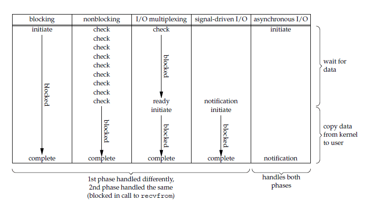

- 五大模型性能对比

| 模型          | CPU占用 | 延迟   | 吞吐量 | 编程复杂度 |
|---------------|---------|--------|--------|------------|
| 阻塞I/O       | 低      | 高     | 低     | ★☆☆☆☆      |
| 非阻塞I/O     | 高      | 中     | 中     | ★★★☆☆      |
| I/O多路复用   | 中      | 低     | 高     | ★★★★☆      |
| 信号驱动I/O   | 低      | 中低   | 中     | ★★★★☆      |
| 异步I/O       | 低      | 最低   | 最高   | ★★★★★      |

### 9.7 Java IO - BIO 详解
#### 9.7.1 几个重要概念
- 阻塞IO 和 非阻塞IO

这两个概念是程序级别的。主要描述的是程序请求操作系统IO操作后，如果IO资源没有准备好，那么程序该如何处理的问题: 前者等待；后者继续执行(并且使用线程一直轮询，直到有IO资源准备好了)
- 同步IO 和 非同步IO

这两个概念是操作系统级别的。主要描述的是操作系统在收到程序请求IO操作后，如果IO资源没有准备好，该如何响应程序的问题: 前者不响应，直到IO资源准备好以后；后者返回一个标记(好让程序和自己知道以后的数据往哪里通知)，当IO资源准备好以后，再用事件机制返回给程序。
#### 9.7.2 传统的BIO通信方式简介
以前大多数网络通信方式都是阻塞模式的，即:
- 客户端向服务器端发出请求后，客户端会一直等待(不会再做其他事情)，直到服务器端返回结果或者网络出现问题。
- 服务器端同样的，当在处理某个客户端A发来的请求时，另一个客户端B发来的请求会等待，直到服务器端的这个处理线程完成上一个处理。

#### 9.7.2 传统的BIO通信方式简介
- 同一时间，服务器只能接受来自于客户端A的请求信息；虽然客户端A和客户端B的请求是同时进行的，但客户端B发送的请求信息只能等到服务器接受完A的请求数据后，才能被接受。
- 由于服务器一次只能处理一个客户端请求，当处理完成并返回后(或者异常时)，才能进行第二次请求的处理。很显然，这样的处理方式在高并发的情况下，是不能采用-
#### 9.7.3 多线程方式 - 伪异步方式
上面说的情况是服务器只有一个线程的情况，那么读者会直接提出我们可以使用多线程技术来解决这个问题:
- 当服务器收到客户端X的请求后，(读取到所有请求数据后)将这个请求送入一个独立线程进行处理，然后主线程继续接受客户端Y的请求。
- 客户端一侧，也可以使用一个子线程和服务器端进行通信。这样客户端主线程的其他工作就不受影响了，当服务器端有响应信息的时候再由这个子线程通过 监听模式/观察模式(等其他设计模式)通知主线程。

但是使用线程来解决这个问题实际上是有局限性的:
- 虽然在服务器端，请求的处理交给了一个独立线程进行，但是操作系统通知accept()的方式还是单个的。也就是，实际上是服务器接收到数据报文后的“业务处理过程”可以多线程，但是数据报文的接受还是需要一个一个的来(下文的示例代码和debug过程我们可以明确看到这一点)
- 在linux系统中，可以创建的线程是有限的。我们可以通过cat /proc/sys/kernel/threads-max 命令查看可以创建的最大线程数。当然这个值是可以更改的，但是线程越多，CPU切换所需的时间也就越长，用来处理真正业务的需求也就越少。
- 创建一个线程是有较大的资源消耗的。JVM创建一个线程的时候，即使这个线程不做任何的工作，JVM都会分配一个堆栈空间。这个空间的大小默认为128K，您可以通过-Xss参数进行调整。当然您还可以使用ThreadPoolExecutor线程池来缓解线程的创建问题，但是又会造成BlockingQueue积压任务的持续增加，同样消耗了大量资源。
- 另外，如果您的应用程序大量使用长连接的话，线程是不会关闭的。这样系统资源的消耗更容易失控。 那么，如果你真想单纯使用线程解决阻塞的问题，那么您自己都可以算出来您一个服务器节点可以一次接受多大的并发了。看来，单纯使用线程解决这个问题不是最好的办法。
#### 9.7.4 BIO通信方式深入分析

BIO的问题关键不在于是否使用了多线程(包括线程池)处理这次请求，而在于accept()、read()的操作点都是被阻塞。要测试这个问题，也很简单。我们模拟了20个客户端(用20根线程模拟)，利用JAVA的同步计数器CountDownLatch，保证这20个客户都初始化完成后然后同时向服务器发送请求，然后我们来观察一下Server这边接受信息的情况。

- 模拟20个客户端并发请求，服务器端使用单线程:

客户端代码(SocketClientDaemon)
```java
package testBSocket;

import java.util.concurrent.CountDownLatch;

public class SocketClientDaemon {
    public static void main(String[] args) throws Exception {
        Integer clientNumber = 20;
        CountDownLatch countDownLatch = new CountDownLatch(clientNumber);

        //分别开始启动这20个客户端
        for(int index = 0 ; index < clientNumber ; index++ , countDownLatch.countDown()) {
            SocketClientRequestThread client = new SocketClientRequestThread(countDownLatch, index);
            new Thread(client).start();
        }

        //这个wait不涉及到具体的实验逻辑，只是为了保证守护线程在启动所有线程后，进入等待状态
        synchronized (SocketClientDaemon.class) {
            SocketClientDaemon.class.wait();
        }
    }
}
```
客户端代码(SocketClientRequestThread模拟请求)
```java
package testBSocket;

import java.io.IOException;
import java.io.InputStream;
import java.io.OutputStream;
import java.net.Socket;
import java.util.concurrent.CountDownLatch;

import org.apache.commons.logging.Log;
import org.apache.commons.logging.LogFactory;
import org.apache.log4j.BasicConfigurator;

/**
 * 一个SocketClientRequestThread线程模拟一个客户端请求。
 * @author yinwenjie
 */
public class SocketClientRequestThread implements Runnable {

    static {
        BasicConfigurator.configure();
    }

    /**
     * 日志
     */
    private static final Log LOGGER = LogFactory.getLog(SocketClientRequestThread.class);

    private CountDownLatch countDownLatch;

    /**
     * 这个线层的编号
     * @param countDownLatch
     */
    private Integer clientIndex;

    /**
     * countDownLatch是java提供的同步计数器。
     * 当计数器数值减为0时，所有受其影响而等待的线程将会被激活。这样保证模拟并发请求的真实性
     * @param countDownLatch
     */
    public SocketClientRequestThread(CountDownLatch countDownLatch , Integer clientIndex) {
        this.countDownLatch = countDownLatch;
        this.clientIndex = clientIndex;
    }

    @Override
    public void run() {
        Socket socket = null;
        OutputStream clientRequest = null;
        InputStream clientResponse = null;

        try {
            socket = new Socket("localhost",83);
            clientRequest = socket.getOutputStream();
            clientResponse = socket.getInputStream();

            //等待，直到SocketClientDaemon完成所有线程的启动，然后所有线程一起发送请求
            this.countDownLatch.await();

            //发送请求信息
            clientRequest.write(("这是第" + this.clientIndex + " 个客户端的请求。").getBytes());
            clientRequest.flush();

            //在这里等待，直到服务器返回信息
            SocketClientRequestThread.LOGGER.info("第" + this.clientIndex + "个客户端的请求发送完成，等待服务器返回信息");
            int maxLen = 1024;
            byte[] contextBytes = new byte[maxLen];
            int realLen;
            String message = "";
            //程序执行到这里，会一直等待服务器返回信息(注意，前提是in和out都不能close，如果close了就收不到服务器的反馈了)
            while((realLen = clientResponse.read(contextBytes, 0, maxLen)) != -1) {
                message += new String(contextBytes , 0 , realLen);
            }
            SocketClientRequestThread.LOGGER.info("接收到来自服务器的信息:" + message);
        } catch (Exception e) {
            SocketClientRequestThread.LOGGER.error(e.getMessage(), e);
        } finally {
            try {
                if(clientRequest != null) {
                    clientRequest.close();
                }
                if(clientResponse != null) {
                    clientResponse.close();
                }
            } catch (IOException e) {
                SocketClientRequestThread.LOGGER.error(e.getMessage(), e);
            }
        }
    }
}
```
服务器端(SocketServer1)单个线程
```java
package testBSocket;

import java.io.InputStream;
import java.io.OutputStream;
import java.net.ServerSocket;
import java.net.Socket;

import org.apache.commons.logging.Log;
import org.apache.commons.logging.LogFactory;
import org.apache.log4j.BasicConfigurator;

public class SocketServer1 {

    static {
        BasicConfigurator.configure();
    }

    /**
     * 日志
     */
    private static final Log LOGGER = LogFactory.getLog(SocketServer1.class);

    public static void main(String[] args) throws Exception{
        ServerSocket serverSocket = new ServerSocket(83);//监听83端口

        try {
            while(true) {
                Socket socket = serverSocket.accept();//阻塞

                //下面我们收取信息
                InputStream in = socket.getInputStream();
                OutputStream out = socket.getOutputStream();
                Integer sourcePort = socket.getPort();
                int maxLen = 2048;
                byte[] contextBytes = new byte[maxLen];
                //这里也会被阻塞，直到有数据准备好
                int realLen = in.read(contextBytes, 0, maxLen);
                //读取信息
                String message = new String(contextBytes , 0 , realLen);

                //下面打印信息
                SocketServer1.LOGGER.info("服务器收到来自于端口: " + sourcePort + "的信息: " + message);

                //下面开始发送信息
                out.write("回发响应信息！".getBytes());

                //关闭
                out.close();
                in.close();
                socket.close();
            }
        } catch(Exception e) {
            SocketServer1.LOGGER.error(e.getMessage(), e);
        } finally {
            if(serverSocket != null) {
                serverSocket.close();
            }
        }
    }
}
```
- 服务器端(SocketServer2)多线程优化服务器端
```java
package testBSocket;

import java.io.IOException;
import java.io.InputStream;
import java.io.OutputStream;
import java.net.ServerSocket;
import java.net.Socket;

import org.apache.commons.logging.Log;
import org.apache.commons.logging.LogFactory;
import org.apache.log4j.BasicConfigurator;

public class SocketServer2 {

    static {
        BasicConfigurator.configure();
    }

    private static final Log LOGGER = LogFactory.getLog(SocketServer2.class);

    public static void main(String[] args) throws Exception{
        ServerSocket serverSocket = new ServerSocket(83);

        try {
            while(true) {
                Socket socket = serverSocket.accept();
                //当然业务处理过程可以交给一个线程(这里可以使用线程池),并且线程的创建是很耗资源的。
                //最终改变不了.accept()只能一个一个接受socket的情况,并且被阻塞的情况
                SocketServerThread socketServerThread = new SocketServerThread(socket);
                new Thread(socketServerThread).start();
            }
        } catch(Exception e) {
            SocketServer2.LOGGER.error(e.getMessage(), e);
        } finally {
            if(serverSocket != null) {
                serverSocket.close();
            }
        }
    }
}

/**
 * 当然，接收到客户端的socket后，业务的处理过程可以交给一个线程来做。
 * 但还是改变不了socket被一个一个的做accept()的情况。
 * @author yinwenjie
 */
class SocketServerThread implements Runnable {

    /**
     * 日志
     */
    private static final Log LOGGER = LogFactory.getLog(SocketServerThread.class);

    private Socket socket;

    public SocketServerThread (Socket socket) {
        this.socket = socket;
    }

    @Override
    public void run() {
        InputStream in = null;
        OutputStream out = null;
        try {
            //下面我们收取信息
            in = socket.getInputStream();
            out = socket.getOutputStream();
            Integer sourcePort = socket.getPort();
            int maxLen = 1024;
            byte[] contextBytes = new byte[maxLen];
            //使用线程，同样无法解决read方法的阻塞问题，
            //也就是说read方法处同样会被阻塞，直到操作系统有数据准备好
            int realLen = in.read(contextBytes, 0, maxLen);
            //读取信息
            String message = new String(contextBytes , 0 , realLen);

            //下面打印信息
            SocketServerThread.LOGGER.info("服务器收到来自于端口: " + sourcePort + "的信息: " + message);

            //下面开始发送信息
            out.write("回发响应信息！".getBytes());
        } catch(Exception e) {
            SocketServerThread.LOGGER.error(e.getMessage(), e);
        } finally {
            //试图关闭
            try {
                if(in != null) {
                    in.close();
                }
                if(out != null) {
                    out.close();
                }
                if(this.socket != null) {
                    this.socket.close();
                }
            } catch (IOException e) {
                SocketServerThread.LOGGER.error(e.getMessage(), e);
            }
        }
    }
}
```


- 连接建立 vs 数据操作

| **操作类型** | **第一阶段** | **第二阶段** | **对应系统调用** |
|-------------|-------------|-------------|----------------|
| **数据读写** | 等待数据到达内核缓冲区 | 数据从内核复制到用户空间 | `read()/recv()` |
| **连接接受** | 等待连接建立完成 | 创建用户态Socket对象 | `accept()` |

重点的问题并不是“是否使用了多线程”，而是为什么accept()、read()方法会被阻塞。即: 异步IO模式 就是为了解决这样的并发性存在的。但是为了说清楚异步IO模式，在介绍IO模式的时候，我们就要首先了解清楚，什么是 阻塞式同步、非阻塞式同步、多路复用同步模式


API文档中对于 serverSocket.accept() 方法的使用描述:
> Listens for a connection to be made to this socket and accepts it. The method blocks until a connection is made.

serverSocket.accept()会被阻塞? 这里涉及到阻塞式同步IO的工作原理:

- 服务器线程发起一个accept动作，询问操作系统 是否有新的socket套接字信息从端口X发送过来。

- 注意，是询问操作系统。也就是说socket套接字的IO模式支持是基于操作系统的，那么自然同步IO/异步IO的支持就是需要操作系统级别的了。如下图:


如果操作系统没有发现有套接字从指定的端口X来，那么操作系统就会等待。这样serverSocket.accept()方法就会一直等待。这就是为什么accept()方法为什么会阻塞: 它内部的实现是使用的操作系统级别的同步IO。
### 9.8 Java NIO - 基础详解
> 新的输入/输出 (NIO) 库是在 JDK 1.4 中引入的，弥补了原来的 I/O 的不足，提供了高速的、面向块的 I/O

Standard IO是对字节流的读写，在进行IO之前，首先创建一个流对象，流对象进行读写操作都是按字节 ，一个字节一个字节的来读或写。而NIO把IO抽象成块，类似磁盘的读写，每次IO操作的单位都是一个块，块被读入内存之后就是一个byte[]，NIO一次可以读或写多个字节。
#### 9.8.1 流与块
I/O 与 NIO 最重要的区别是数据打包和传输的方式，I/O 以流的方式处理数据，而 NIO 以块的方式处理数据。

面向流的 I/O 一次处理一个字节数据: 一个输入流产生一个字节数据，一个输出流消费一个字节数据。为流式数据创建过滤器非常容易，链接几个过滤器，以便每个过滤器只负责复杂处理机制的一部分。不利的一面是，面向流的 I/O 通常相当慢。

面向块的 I/O 一次处理一个数据块，按块处理数据比按流处理数据要快得多。但是面向块的 I/O 缺少一些面向流的 I/O 所具有的优雅性和简单性。

I/O 包和 NIO 已经很好地集成了，java.io.* 已经以 NIO 为基础重新实现了，所以现在它可以利用 NIO 的一些特性。例如，java.io.* 包中的一些类包含以块的形式读写数据的方法，这使得即使在面向流的系统中，处理速度也会更快。
#### 9.8.2 通道与缓冲区
##### 9.8.2.1 通道
通道 Channel 是对原 I/O 包中的流的模拟，可以通过它读取和写入数据。

通道与流的不同之处在于，流只能在一个方向上移动(一个流必须是 InputStream 或者 OutputStream 的子类)，而通道是双向的，可以用于读、写或者同时用于读写。

通道包括以下类型:
- FileChannel: 从文件中读写数据；
- DatagramChannel: 通过 UDP 读写网络中数据；
- SocketChannel: 通过 TCP 读写网络中数据；
- ServerSocketChannel: 可以监听新进来的 TCP 连接，对每一个新进来的连接都会创建一个 SocketChannel。
##### 9.8.2.2 缓冲区
发送给一个通道的所有数据都必须首先放到缓冲区中，同样地，从通道中读取的任何数据都要先读到缓冲区中。也就是说，不会直接对通道进行读写数据，而是要先经过缓冲区。

缓冲区实质上是一个数组，但它不仅仅是一个数组。缓冲区提供了对数据的结构化访问，而且还可以跟踪系统的读/写进程。

缓冲区包括以下类型:
- ByteBuffer
- CharBuffer
- ShortBuffer
- IntBuffer
- LongBuffer
- FloatBuffer
- DoubleBuffer
##### 9.8.2.3 缓冲区状态变量
| 变量名 | 含义 | 初始值 |
|--------|------|--------|
| **capacity** | 缓冲区最大容量（固定不变） | 创建时指定 |
| **position** | 下一个读写位置（指针） | 0 |
| **limit** | 可读写边界（position 不能超过此值） | = capacity |
状态变量的改变过程举例:

① 新建一个大小为 8 个字节的缓冲区，此时 position 为 0，而 limit = capacity = 8。capacity 变量不会改变，下面的讨论会忽略它。

② 从输入通道中读取 5 个字节数据写入缓冲区中，此时 position 移动设置为 5，limit 保持不变。

③ 在将缓冲区的数据写到输出通道之前，需要先调用 flip() 方法，这个方法将 limit 设置为当前 position，并将 position 设置为 0。

④ 从缓冲区中取 4 个字节到输出缓冲中，此时 position 设为 4。

⑤ 最后需要调用 clear() 方法来清空缓冲区，此时 position 和 limit 都被设置为最初位置。


- 关键操作解析

1. 创建缓冲区 (`ByteBuffer.allocate(8)`)
```java
ByteBuffer buf = ByteBuffer.allocate(8);
```
- `capacity=8` (固定不变)
- `position=0` (起始位置)
- `limit=8` (可写入整个缓冲区)

2. 写入5字节数据 (`buf.put(data)`)
```java
byte[] data = "ABCDE".getBytes();
buf.put(data);  // 写入5字节
```
- `position` 移动到5 (下一个写入位置)
- `limit` 保持8 (仍可写入3字节)

3. 切换读模式 (`buf.flip()`)
```java
buf.flip();  // 关键转换！
```
- `limit = position` (5 → 设置可读边界)
- `position = 0` (重置读位置)
- **作用**：将写模式切换为读模式

4. 读取4字节数据 (`buf.get(dest)`)
```java
byte[] dest = new byte[4];
buf.get(dest);  // 读取4字节
```
- `position` 移动到4 (下一个读取位置)
- `limit` 保持5 (还剩1字节可读)

5. 重置缓冲区 (`buf.clear()`)
```java
buf.clear();  // 准备重新写入
```
- `position = 0` (重置写位置)
- `limit = capacity` (8 → 恢复可写区域)
- **注意**：不会清除数据！只是重置指针

---

-  核心方法对比

| 方法     | position 变化 | limit 变化       | 主要用途               |
|----------|---------------|------------------|------------------------|
| `flip()` | 0             | = 原position     | 写模式 → 读模式        |
| `clear()`| 0             | = capacity       | 重置缓冲区（重新写入） |
| `rewind()`| 0             | 保持不变         | 重新读取数据           |
| `compact()`| 剩余数据位置 | = capacity       | 保留未读数据并继续写入 |

#### 9.8.3 文件 NIO 实例
以下展示了使用 NIO 快速复制文件的实例:
```java
public static void fastCopy(String src, String dist) throws IOException {

    /* 获得源文件的输入字节流 */
    FileInputStream fin = new FileInputStream(src);

    /* 获取输入字节流的文件通道 */
    FileChannel fcin = fin.getChannel();

    /* 获取目标文件的输出字节流 */
    FileOutputStream fout = new FileOutputStream(dist);

    /* 获取输出字节流的通道 */
    FileChannel fcout = fout.getChannel();

    /* 为缓冲区分配 1024 个字节 */
    ByteBuffer buffer = ByteBuffer.allocateDirect(1024);

    while (true) {

        /* 从输入通道中读取数据到缓冲区中 */
        int r = fcin.read(buffer);

        /* read() 返回 -1 表示 EOF */
        if (r == -1) {
            break;
        }

        /* 切换读写 */
        buffer.flip();

        /* 把缓冲区的内容写入输出文件中 */
        fcout.write(buffer);
        
        /* 清空缓冲区 */
        buffer.clear();
    }
}
```
#### 9.8.4 选择器
NIO 常常被叫做非阻塞 IO，主要是因为 NIO 在网络通信中的非阻塞特性被广泛使用。

NIO 实现了 IO 多路复用中的 Reactor 模型，一个线程 Thread 使用一个选择器 Selector 通过轮询的方式去监听多个通道 Channel 上的事件，从而让一个线程就可以处理多个事件。

通过配置监听的通道 Channel 为非阻塞，那么当 Channel 上的 IO 事件还未到达时，就不会进入阻塞状态一直等待，而是继续轮询其它 Channel，找到 IO 事件已经到达的 Channel 执行。

因为创建和切换线程的开销很大，因此使用一个线程来处理多个事件而不是一个线程处理一个事件具有更好的性能。

应该注意的是，只有套接字 Channel 才能配置为非阻塞，而 FileChannel 不能，为 FileChannel 配置非阻塞也没有意义。

##### 9.8.4.1 创建选择器

```java
Selector selector = Selector.open();// 创建选择器实例
```
##### 9.8.4.2. 注册通道到选择器
```java
// 创建服务器通道
ServerSocketChannel ssChannel = ServerSocketChannel.open();
ssChannel.configureBlocking(false);  // 必须配置为非阻塞模式

// 注册ACCEPT事件（监听新连接）
ssChannel.register(selector, SelectionKey.OP_ACCEPT);
```

> **关键说明**：
> - 通道必须设为非阻塞模式，否则选择器无法工作
> - 事件类型使用位掩码组合：
>   ```java
>   public static final int OP_READ = 1 << 0;    // 1
>   public static final int OP_WRITE = 1 << 2;   // 4
>   public static final int OP_CONNECT = 1 << 3; // 8
>   public static final int OP_ACCEPT = 1 << 4;  // 16
>   ```
> - 组合事件示例：
>   ```java
>   int interestSet = SelectionKey.OP_READ | SelectionKey.OP_WRITE;
>   ```

##### 9.8.4.3. 监听事件
```java
int num = selector.select();  // 阻塞直到至少一个事件发生
```

##### 9.8.4.4. 处理就绪事件
```java
Set<SelectionKey> keys = selector.selectedKeys();
Iterator<SelectionKey> keyIterator = keys.iterator();

while (keyIterator.hasNext()) {
    SelectionKey key = keyIterator.next();
    
    if (key.isAcceptable()) {
        // 处理新连接
    } else if (key.isReadable()) {
        // 处理可读事件
    } else if (key.isWritable()) {
        // 处理可写事件
    }
    
    keyIterator.remove();  // 必须移除已处理的事件
}
```

##### 9.8.4.5. 完整事件循环
```java
while (true) {
    int num = selector.select();  // 阻塞等待事件
    
    Set<SelectionKey> keys = selector.selectedKeys();
    Iterator<SelectionKey> keyIterator = keys.iterator();
    
    while (keyIterator.hasNext()) {
        SelectionKey key = keyIterator.next();
        
        if (key.isAcceptable()) {
            // 接受新连接处理
        } else if (key.isReadable()) {
            // 读取数据处理
        }
        
        keyIterator.remove();  // 关键：移除已处理事件
    }
}
```

---

#### 9.8.5 套接字 NIO 实例

##### 9.8.5.1 服务端代码
```java
public class NIOServer {

    public static void main(String[] args) throws IOException {
        // 1. 创建选择器
        Selector selector = Selector.open();
        
        // 2. 配置服务器通道
        ServerSocketChannel ssChannel = ServerSocketChannel.open();
        ssChannel.configureBlocking(false);
        ssChannel.register(selector, SelectionKey.OP_ACCEPT);
        
        // 3. 绑定端口
        ServerSocket serverSocket = ssChannel.socket();
        InetSocketAddress address = new InetSocketAddress("127.0.0.1", 8888);
        serverSocket.bind(address);

        // 4. 事件循环
        while (true) {
            selector.select();
            Set<SelectionKey> keys = selector.selectedKeys();
            Iterator<SelectionKey> keyIterator = keys.iterator();

            while (keyIterator.hasNext()) {
                SelectionKey key = keyIterator.next();

                if (key.isAcceptable()) {
                    // 5. 处理新连接
                    ServerSocketChannel ssChannel1 = (ServerSocketChannel) key.channel();
                    SocketChannel sChannel = ssChannel1.accept();
                    sChannel.configureBlocking(false);
                    sChannel.register(selector, SelectionKey.OP_READ);
                    
                } else if (key.isReadable()) {
                    // 6. 处理可读事件
                    SocketChannel sChannel = (SocketChannel) key.channel();
                    System.out.println(readDataFromSocketChannel(sChannel));
                    sChannel.close();
                }

                keyIterator.remove();
            }
        }
    }

    private static String readDataFromSocketChannel(SocketChannel sChannel) throws IOException {
        ByteBuffer buffer = ByteBuffer.allocate(1024);
        StringBuilder data = new StringBuilder();

        while (true) {
            buffer.clear();
            int n = sChannel.read(buffer);
            if (n == -1) break;
            
            buffer.flip();
            int limit = buffer.limit();
            char[] dst = new char[limit];
            for (int i = 0; i < limit; i++) {
                dst[i] = (char) buffer.get(i);
            }
            data.append(dst);
        }
        return data.toString();
    }
}
```

##### 9.8.5.2 客户端代码
```java
public class NIOClient {
    public static void main(String[] args) throws IOException {
        Socket socket = new Socket("127.0.0.1", 8888);
        OutputStream out = socket.getOutputStream();
        String s = "hello world";
        out.write(s.getBytes());
        out.close();
    }
}
```

##### 9.8.5.3 关键要点说明
1. **通道非阻塞**：所有注册到选择器的通道必须配置为非阻塞模式
2. **事件移除**：处理完 `SelectionKey` 后必须调用 `keyIterator.remove()`
3. **事件类型**：
   - `OP_ACCEPT`：服务端专用，接收新连接
   - `OP_READ`：通道有数据可读
   - `OP_WRITE`：通道可写入数据
   - `OP_CONNECT`：客户端连接建立完成
4. **资源释放**：示例中读取后立即关闭通道，实际应复用通道
5. **性能优化**：单线程可处理数千连接，适合高并发场景

> 注意：实际生产环境应添加异常处理，使用线程池处理耗时操作，避免阻塞事件循环线程。

#### 9.8.6 内存映射文件
内存映射文件内存映射文件 I/O 是一种读和写文件数据的方法，它可以比常规的基于流或者基于通道的 I/O 快得多。

向内存映射文件写入可能是危险的，只是改变数组的单个元素这样的简单操作，就可能会直接修改磁盘上的文件。修改数据与将数据保存到磁盘是没有分开的。

下面代码行将文件的前 1024 个字节映射到内存中，map() 方法返回一个 MappedByteBuffer，它是 ByteBuffer 的子类。因此，可以像使用其他任何 ByteBuffer 一样使用新映射的缓冲区，操作系统会在需要时负责执行映射。
```java
MappedByteBuffer mbb = fc.map(FileChannel.MapMode.READ_WRITE, 0, 1024);
```
NIO 与普通 I/O 的区别主要有以下两点:

- NIO 是非阻塞的
- NIO 面向块，I/O 面向流

#### 9.8.7 NIO 的核心特性与适用场景
```mermaid
graph LR
    A[NIO 核心特性] --> B[非阻塞网络IO]
    A --> C[IO多路复用]
    A --> D[缓冲区管理]
    
    B --> E[SocketChannel]
    C --> F[Selector+事件驱动]
    D --> G[ByteBuffer]
    
    E --> H[TCP/UDP通信]
    F --> I[单线程处理多连接]
    G --> J[统一数据容器]
    
    X[不适用场景] --> Y[文件IO]
    Y --> Z[FileChannel本质阻塞]
```

##### 9.8.7.1 关键结论分析：
1. **网络通信是 NIO 的主战场** ✅
   - **非阻塞特性**：仅 `SocketChannel`/`ServerSocketChannel`/`DatagramChannel` 支持 `configureBlocking(false)`
   - **性能优势**：单线程通过 Selector 管理数千连接（Reactor 模式）
   - **典型场景**：高并发服务器（如聊天服务器、API网关）

2. **文件操作无实质改进** ⚠️
   - **FileChannel 强制阻塞**：
     ```java
     // 尝试设置非阻塞会直接报错
     FileChannel fc = FileChannel.open(Path.of("test.txt"));
     fc.configureBlocking(false); 
     // 抛出 UnsupportedOperationException
     ```
   - **性能对比**：
     | 操作类型       | 传统IO       | NIO          | 优势差异       |
     |---------------|-------------|-------------|--------------|
     | 小文件读写     | 无差异       | 无差异       | 基本持平      |
     | 大文件传输     | 多次缓冲拷贝 | 零拷贝技术   | NIO 快 30-50% |
     | 网络高并发     | 线程爆炸     | 单线程处理   | NIO 碾压优势  |

3. **NIO 在文件操作中的价值点**：
   - **内存映射文件**（MappedByteBuffer）
     ```java
     // 将文件映射到内存直接操作
     MappedByteBuffer buf = channel.map(
         MapMode.READ_WRITE, 0, channel.size()
     );
     ```
     - 优势：避免内核态/用户态拷贝，适合大文件随机访问
   - **文件锁**（FileLock）
     ```java
     FileLock lock = channel.tryLock(); // 非阻塞锁
     ```
   - **分散/聚集 IO**（Scatter/Gather）
     ```java
     channel.read(new ByteBuffer[]{buf1, buf2}); // 分散读
     channel.write(new ByteBuffer[]{buf1, buf2}); // 聚集写
     ```

##### 9.8.7.2 为什么文件操作无法非阻塞？
1. **硬件本质限制**：
   - 磁盘寻道/旋转是物理操作，必须等待完成
   - 操作系统没有提供异步磁盘 IO 的完备支持
   
2. **设计哲学差异**：
   ```mermaid
   flowchart LR
      网络IO --> 等待远程数据 --> 可中断
      文件IO --> 等待机械操作 --> 不可中断
   ```

3. **现代扩展方案**：
   - **AIO (AsynchronousFileChannel)**：
     ```java
     // 异步文件操作（回调机制）
     AsynchronousFileChannel afc = AsynchronousFileChannel.open(path);
     afc.read(buffer, position, null, 
         new CompletionHandler<>() {
             public void completed(Integer result, Object att) {
                 // 完成回调
             }
         });
     ```
     - 但实际性能提升有限且API复杂

##### 9.8.7.3 终极建议
- **网络编程**：优先选择 NIO（Netty/Mina 等框架）
- **文件操作**：
  - 小文件：传统 IO 更简单
  - 大文件：使用 NIO 的 `FileChannel.transferTo()` 零拷贝
  - 随机访问：用 `MappedByteBuffer` 内存映射
- **混合场景**：NIO 的统一 Buffer 仍具价值

> NIO 的革命性在于**用单线程管理海量网络连接**，文件操作只是附带功能。这种设计差异源于网络等待可优化（等包到达）而磁盘等待不可优化（等磁头转动）的物理本质。
### 9.9 Java NIO - IO多路复用详解
#### 9.9.1 现实场景
我们试想一下这样的现实场景:
一个餐厅同时有100位客人到店，当然到店后第一件要做的事情就是点菜。但是问题来了，餐厅老板为了节约人力成本目前只有一位大堂服务员拿着唯一的一本菜单等待客人进行服务。
- 那么最笨(但是最简单)的方法是(方法A)，无论有多少客人等待点餐，服务员都把仅有的一份菜单递给其中一位客人，然后站在客人身旁等待这个客人完成点菜过程。在记录客人点菜内容后，把点菜记录交给后堂厨师。然后是第二位客人。。。。然后是第三位客人。很明显，只有脑袋被门夹过的老板，才会这样设置服务流程。因为随后的80位客人，再等待超时后就会离店(还会给差评)。
- 于是还有一种办法(方法B)，老板马上新雇佣99名服务员，同时印制99本新的菜单。每一名服务员手持一本菜单负责一位客人(关键不只在于服务员，还在于菜单。因为没有菜单客人也无法点菜)。在客人点完菜后，记录点菜内容交给后堂厨师(当然为了更高效，后堂厨师最好也有100名)。这样每一位客人享受的就是VIP服务咯，当然客人不会走，但是人力成本可是一个大头哦(亏死你)。
- 另外一种办法(方法C)，就是改进点菜的方式，当客人到店后，自己申请一本菜单。想好自己要点的才后，就呼叫服务员。服务员站在自己身边后记录客人的菜单内容。将菜单递给厨师的过程也要进行改进，并不是每一份菜单记录好以后，都要交给后堂厨师。服务员可以记录号多份菜单后，同时交给厨师就行了。那么这种方式，对于老板来说人力成本是最低的；对于客人来说，虽然不再享受VIP服务并且要进行一定的等待，但是这些都是可接受的；对于服务员来说，基本上她的时间都没有浪费，基本上被老板压杆了最后一滴油水。

如果您是老板，您会采用哪种方式呢?

到店情况: 并发量。到店情况不理想时，一个服务员一本菜单，当然是足够了。所以不同的老板在不同的场合下，将会灵活选择服务员和菜单的配置。
- 客人: 客户端请求
- 点餐内容: 客户端发送的实际数据
- 老板: 操作系统
- 人力成本: 系统资源
- 菜单: 文件状态描述符。操作系统对于一个进程能够同时持有的文件状态描述符的个数是有限制的，在linux系统中$ulimit -n查看这个限制值，当然也是可以(并且应该)进行内核参数调整的。
- 服务员: 操作系统内核用于IO操作的线程(内核线程)
- 厨师: 应用程序线程(当然厨房就是应用程序进程咯)
- 餐单传递方式: 包括了阻塞式和非阻塞式两种。 
  - 方法A: 阻塞式/非阻塞式 同步IO
  - 方法B: 使用线程进行处理的 阻塞式/非阻塞式 同步IO
  - 方法C: 阻塞式/非阻塞式 多路复用IO
#### 9.9.2 典型的多路复用IO实现
目前流程的多路复用IO实现主要包括四种: `select`、`poll`、`epoll`、`kqueue`。下表是他们的一些重要特性的比较:

| I/O 模型 | 相对性能 | 关键思路      | 操作系统支持     | Java 支持情况                                                                 |
|----------|----------|---------------|------------------|-------------------------------------------------------------------------------|
| select   | 较高     | Reactor       | Windows/Linux    | 支持<br>• Linux 2.4 内核前默认使用<br>• Windows 同步 I/O 使用此模型           |
| poll     | 较高     | Reactor       | Linux            | 支持<br>• Linux 2.6 内核前使用<br>• Java NIO 在旧版 Linux 中使用此模型        |
| epoll    | 高       | Reactor/Proactor | Linux            | 支持<br>• Linux 2.6+ 内核使用<br>• 通过 epoll 模拟异步 I/O（Linux 无原生 AIO）|
| kqueue   | 高       | Proactor      | FreeBSD          | 不支持<br>• Java 目前未提供原生支持                                          |

多路复用IO技术最适用的是“高并发”场景，所谓高并发是指1毫秒内至少同时有上千个连接请求准备好。其他情况下多路复用IO技术发挥不出来它的优势。另一方面，使用JAVA NIO进行功能实现，相对于传统的Socket套接字实现要复杂一些，所以实际应用中，需要根据自己的业务需求进行技术选择。
#### 9.9.3 Reactor模型和Proactor模型
##### 9.9.3.1 传统IO模型
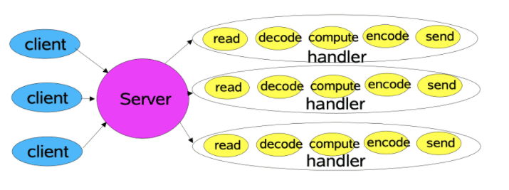
从图中可以看出，传统IO的特点在于：
- 每个客户端连接到达之后，服务端会分配一个线程给该客户端，该线程会处理包括读取数据，解码，业务计算，编码，以及发送数据整个过程；
- 同一时刻，服务端的吞吐量与服务器所提供的线程数量是呈线性关系的。

这种设计模式在客户端连接不多，并发量不大的情况下是可以运行得很好的，但是在海量并发的情况下，这种模式就显得力不从心了。这种模式主要存在的问题有如下几点：
- 服务器的并发量对服务端能够创建的线程数有很大的依赖关系，但是服务器线程却是不能无限增长的；
- 服务端每个线程不仅要进行IO读写操作，而且还需要进行业务计算；
- 服务端在获取客户端连接，读取数据，以及写入数据的过程都是阻塞类型的，在网络状况不好的情况下，这将极大的降低服务器每个线程的利用率，从而降低服务器吞吐量。
##### 9.9.3.2 Reactor事件驱动模型
在传统IO模型中，由于线程在等待连接以及进行IO操作时都会阻塞当前线程，这部分损耗是非常大的。因而jdk 1.4中就提供了一套非阻塞IO的API。该API本质上是以事件驱动来处理网络事件的，而Reactor是基于该API提出的一套IO模型。如下是Reactor事件驱动模型的示意图：
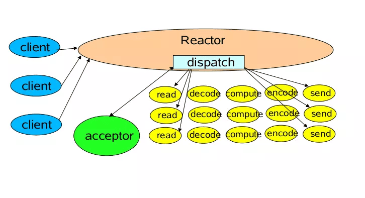
从图中可以看出，在Reactor模型中，主要有四个角色：客户端连接，Reactor，Acceptor和Handler。这里Acceptor会不断地接收客户端的连接，然后将接收到的连接交由Reactor进行分发，最后由具体的Handler进行处理。改进后的Reactor模型相对于传统的IO模型主要有如下优点：
- 从模型上来讲，如果仅仅还是只使用一个线程池来处理客户端连接的网络读写，以及业务计算，那么Reactor模型与传统IO模型在效率上并没有什么提升。但是Reactor模型是以事件进行驱动的，其能够将接收客户端连接，+ 网络读和网络写，以及业务计算进行拆分，从而极大的提升处理效率；
- Reactor模型是异步非阻塞模型，工作线程在没有网络事件时可以处理其他的任务，而不用像传统IO那样必须阻塞等待。
##### 9.9.3.3 Reactor模型----业务处理与IO分离
在上面的Reactor模型中，由于网络读写和业务操作都在同一个线程中，在高并发情况下，这里的系统瓶颈主要在两方面：
- 高频率的网络读写事件处理；
- 大量的业务操作处理；

基于上述两个问题，这里在单线程Reactor模型的基础上提出了使用线程池的方式处理业务操作的模型。如下是该模型的示意图：

从图中可以看出，在多线程进行业务操作的模型下，该模式主要具有如下特点：
- 使用一个线程进行客户端连接的接收以及网络读写事件的处理；
- 在接收到客户端连接之后，将该连接交由线程池进行数据的编解码以及业务计算。

这种模式相较于前面的模式性能有了很大的提升，主要在于在进行网络读写的同时，也进行了业务计算，从而大大提升了系统的吞吐量。但是这种模式也有其不足，主要在于：
- 网络读写是一个比较消耗CPU的操作，在高并发的情况下，将会有大量的客户端数据需要进行网络读写，此时一个线程将不足以处理这么多请求。
##### 9.9.3.4 Reactor模型----并发读写
对于使用线程池处理业务操作的模型，由于网络读写在高并发情况下会成为系统的一个瓶颈，因而针对该模型这里提出了一种改进后的模型，即使用线程池进行网络读写，而仅仅只使用一个线程专门接收客户端连接。如下是该模型的示意图：
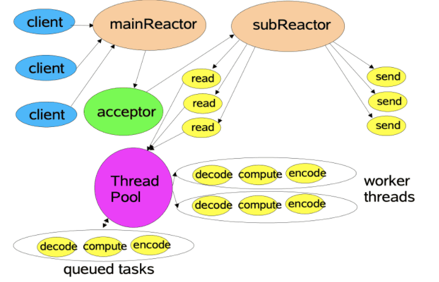

##### 9.9.3.5 Reactor模型示例
对于上述Reactor模型，服务端主要有三个角色：Reactor，Acceptor和Handler。这里基于Doug Lea的文档对其进行了实现，如下是Reactor的实现代码：
```java
public class Reactor implements Runnable {
  private final Selector selector;
  private final ServerSocketChannel serverSocket;

  public Reactor(int port) throws IOException {
    serverSocket = ServerSocketChannel.open();  // 创建服务端的ServerSocketChannel
    serverSocket.configureBlocking(false);  // 设置为非阻塞模式
    selector = Selector.open();  // 创建一个Selector多路复用器
    SelectionKey key = serverSocket.register(selector, SelectionKey.OP_ACCEPT);
    serverSocket.bind(new InetSocketAddress(port));  // 绑定服务端端口
    key.attach(new Acceptor(serverSocket));  // 为服务端Channel绑定一个Acceptor
  }

  @Override
  public void run() {
    try {
      while (!Thread.interrupted()) {
        selector.select();  // 服务端使用一个线程不断等待客户端的连接到达
        Set<SelectionKey> keys = selector.selectedKeys();
        Iterator<SelectionKey> iterator = keys.iterator();
        while (iterator.hasNext()) {
          dispatch(iterator.next());  // 监听到客户端连接事件后将其分发给Acceptor
          iterator.remove();
        }

        selector.selectNow();
      }
    } catch (IOException e) {
      e.printStackTrace();
    }
  }

  private void dispatch(SelectionKey key) throws IOException {
    // 这里的attachement也即前面为服务端Channel绑定的Acceptor，调用其run()方法进行
    // 客户端连接的获取，并且进行分发
    Runnable attachment = (Runnable) key.attachment();
    attachment.run();
  }
}
```
这里Reactor首先开启了一个ServerSocketChannel，然后将其绑定到指定的端口，并且注册到了一个多路复用器上。接着在一个线程中，其会在多路复用器上等待客户端连接。当有客户端连接到达后，Reactor就会将其派发给一个Acceptor，由该Acceptor专门进行客户端连接的获取。下面我们继续看一下Acceptor的代码：
```java
public class Acceptor implements Runnable {
  private final ExecutorService executor = Executors.newFixedThreadPool(20);

  private final ServerSocketChannel serverSocket;

  public Acceptor(ServerSocketChannel serverSocket) {
    this.serverSocket = serverSocket;
  }

  @Override
  public void run() {
    try {
      SocketChannel channel = serverSocket.accept();  // 获取客户端连接
      if (null != channel) {
        executor.execute(new Handler(channel));  // 将客户端连接交由线程池处理
      }
    } catch (IOException e) {
      e.printStackTrace();
    }
  }
}
```
这里可以看到，在Acceptor获取到客户端连接之后，其就将其交由线程池进行网络读写了，而这里的主线程只是不断监听客户端连接事件。下面我们看看Handler的具体逻辑：

```java
public class Handler implements Runnable {
  private volatile static Selector selector;
  private final SocketChannel channel;
  private SelectionKey key;
  private volatile ByteBuffer input = ByteBuffer.allocate(1024);
  private volatile ByteBuffer output = ByteBuffer.allocate(1024);

  public Handler(SocketChannel channel) throws IOException {
    this.channel = channel;
    channel.configureBlocking(false);  // 设置客户端连接为非阻塞模式
    selector = Selector.open();  // 为客户端创建一个新的多路复用器
    key = channel.register(selector, SelectionKey.OP_READ);  // 注册客户端Channel的读事件
  }

  @Override
  public void run() {
    try {
      while (selector.isOpen() && channel.isOpen()) {
        Set<SelectionKey> keys = select();  // 等待客户端事件发生
        Iterator<SelectionKey> iterator = keys.iterator();
        while (iterator.hasNext()) {
          SelectionKey key = iterator.next();
          iterator.remove();

          // 如果当前是读事件，则读取数据
          if (key.isReadable()) {
            read(key);
          } else if (key.isWritable()) {
           // 如果当前是写事件，则写入数据
            write(key);
          }
        }
      }
    } catch (Exception e) {
      e.printStackTrace();
    }
  }

  // 这里处理的主要目的是处理Jdk的一个bug，该bug会导致Selector被意外触发，但是实际上没有任何事件到达，
  // 此时的处理方式是新建一个Selector，然后重新将当前Channel注册到该Selector上
  private Set<SelectionKey> select() throws IOException {
    selector.select();
    Set<SelectionKey> keys = selector.selectedKeys();
    if (keys.isEmpty()) {
      int interestOps = key.interestOps();
      selector = Selector.open();
      key = channel.register(selector, interestOps);
      return select();
    }

    return keys;
  }

  // 读取客户端发送的数据
  private void read(SelectionKey key) throws IOException {
    channel.read(input);
    if (input.position() == 0) {
      return;
    }

    input.flip();
    process();  // 对读取的数据进行业务处理
    input.clear();
    key.interestOps(SelectionKey.OP_WRITE);  // 读取完成后监听写入事件
  }

  private void write(SelectionKey key) throws IOException {
    output.flip();
    if (channel.isOpen()) {
      channel.write(output);  // 当有写入事件时，将业务处理的结果写入到客户端Channel中
      key.channel();
      channel.close();
      output.clear();
    }
  }
    
  // 进行业务处理，并且获取处理结果。本质上，基于Reactor模型，如果这里成为处理瓶颈，
  // 则直接将其处理过程放入线程池即可，并且使用一个Future获取处理结果，最后写入客户端Channel
  private void process() {
    byte[] bytes = new byte[input.remaining()];
    input.get(bytes);
    String message = new String(bytes, CharsetUtil.UTF_8);
    System.out.println("receive message from client: \n" + message);

    output.put("hello client".getBytes());
  }
}
```

在Handler中，主要进行的就是为每一个客户端Channel创建一个Selector，并且监听该Channel的网络读写事件。当有事件到达时，进行数据的读写，而业务操作这交由具体的业务线程池处理

#### 9.9.4 JAVA对多路复用IO的支持

##### 9.9.4.1 重要概念: Channel

通道，被建立的一个应用程序和操作系统交互事件、传递内容的渠道(注意是连接到操作系统)。一个通道会有一个专属的文件状态描述符。那么既然是和操作系统进行内容的传递，那么说明应用程序可以通过通道读取数据，也可以通过通道向操作系统写数据。

JDK API中的Channel的描述是:

> A channel represents an open connection to an entity such as a hardware device, a file, a network socket, or a program component that is capable of performing one or more distinct I/O operations, for example reading or writing.[通道表示与实体（例如硬件设备、文件、网络套接字或程序组件）的开放连接，该连接能够执行一个或多个不同的 I/O 操作，例如读取或写入。]

> A channel is either open or closed. A channel is open upon creation, and once closed it remains closed. Once a channel is closed, any attempt to invoke an I/O operation upon it will cause a ClosedChannelException to be thrown. Whether or not a channel is open may be tested by invoking its isOpen method.[通道要么处于打开状态，要么处于关闭状态。通道在创建时处于打开状态，一旦关闭，它将保持关闭状态。一旦通道关闭，任何尝试在其上调用 I/O 操作都将引发 ClosedChannelException。可以通过调用通道的 isOpen 方法来测试通道是否处于打开状态。]

JAVA NIO 框架中，自有的Channel通道包括:

所有被Selector(选择器)注册的通道，只能是继承了SelectableChannel类的子类。如上图所示
- ServerSocketChannel: 应用服务器程序的监听通道。只有通过这个通道，应用程序才能向操作系统注册支持“多路复用IO”的端口监听。同时支持UDP协议和TCP协议。
- ScoketChannel: TCP Socket套接字的监听通道，一个Socket套接字对应了一个客户端IP: 端口 到 服务器IP: 端口的通信连接。
- DatagramChannel: UDP 数据报文的监听通道。
##### 9.9.4.2 重要概念: Buffer
数据缓存区: 在JAVA NIO 框架中，为了保证每个通道的数据读写速度JAVA NIO 框架为每一种需要支持数据读写的通道集成了Buffer的支持。

这句话怎么理解呢? 例如ServerSocketChannel通道它只支持对OP_ACCEPT事件的监听，所以它是不能直接进行网络数据内容的读写的。所以ServerSocketChannel是没有集成Buffer的。

**Buffer有两种工作模式: 写模式和读模式。在读模式下，应用程序只能从Buffer中读取数据，不能进行写操作。但是在写模式下，应用程序是可以进行读操作的，这就表示可能会出现脏读的情况。所以一旦您决定要从Buffer中读取数据，一定要将Buffer的状态改为读模式。**

如下图:


- position: 缓存区目前这在操作的数据块位置
- limit: 缓存区最大可以进行操作的位置。缓存区的读写状态正式由这个属性控制的。
- capacity: 缓存区的最大容量。这个容量是在缓存区创建时进行指定的。由于高并发时通道数量往往会很庞大，所以每一个缓存区的容量最好不要过大。

在下文JAVA NIO框架的代码实例中，我们将进行Buffer缓存区操作的演示。
##### 9.9.4.3 重要概念: Selector
Selector的英文含义是“选择器”，不过根据我们详细介绍的Selector的岗位职责，您可以把它称之为“轮询代理器”、“事件订阅器”、“channel容器管理机”都行。
- 事件订阅和Channel管理

应用程序将向Selector对象注册需要它关注的Channel，以及具体的某一个Channel会对哪些IO事件感兴趣。Selector中也会维护一个“已经注册的Channel”的容器。以下代码来自WindowsSelectorImpl实现类中，对已经注册的Channel的管理容器:
```java
// Initial capacity of the poll array
private final int INIT_CAP = 8;
// Maximum number of sockets for select().
// Should be INIT_CAP times a power of 2
private final static int MAX_SELECTABLE_FDS = 1024;

// The list of SelectableChannels serviced by this Selector. Every mod
// MAX_SELECTABLE_FDS entry is bogus, to align this array with the poll
// array,  where the corresponding entry is occupied by the wakeupSocket
private SelectionKeyImpl[] channelArray = new SelectionKeyImpl[INIT_CAP];
```
- 轮询代理

应用层不再通过阻塞模式或者非阻塞模式直接询问操作系统“事件有没有发生”，而是由Selector代其询问。

- 实现不同操作系统的支持

之前已经提到过，多路复用IO技术 是需要操作系统进行支持的，其特点就是操作系统可以同时扫描同一个端口上不同网络连接的事件。所以作为上层的JVM，必须要为 不同操作系统的多路复用IO实现 编写不同的代码。同样我使用的测试环境是Windows，它对应的实现类是sun.nio.ch.WindowsSelectorImpl:

#### 9.9.5 JAVA NIO 框架简要设计分析
通过上文的描述，我们知道了多路复用IO技术是操作系统的内核实现。在不同的操作系统，甚至同一系列操作系统的版本中所实现的多路复用IO技术都是不一样的。那么作为跨平台的JAVA JVM来说如何适应多种多样的多路复用IO技术实现呢? 面向对象的威力就显现出来了: 无论使用哪种实现方式，他们都会有“选择器”、“通道”、“缓存”这几个操作要素，那么可以为不同的多路复用IO技术创建一个统一的抽象组，并且为不同的操作系统进行具体的实现。JAVA NIO中对各种多路复用IO的支持，主要的基础是java.nio.channels.spi.SelectorProvider抽象类，其中的几个主要抽象方法包括:
- public abstract DatagramChannel openDatagramChannel(): 创建和这个操作系统匹配的UDP 通道实现。
- public abstract AbstractSelector openSelector(): 创建和这个操作系统匹配的NIO选择器，就像上文所述，不同的操作系统，不同的版本所默认支持的NIO模型是不一样的。
- public abstract ServerSocketChannel openServerSocketChannel(): 创建和这个NIO模型匹配的服务器端通道。
- public abstract SocketChannel openSocketChannel(): 创建和这个NIO模型匹配的TCP Socket套接字通道(用来反映客户端的TCP连接)

由于JAVA NIO框架的整个设计是很大的，所以我们只能还原一部分我们关心的问题。这里我们以JAVA NIO框架中对于不同多路复用IO技术的选择器 进行实例化创建的方式作为例子，以点窥豹观全局:


很明显，不同的SelectorProvider实现对应了不同的 选择器。由具体的SelectorProvider实现进行创建。另外说明一下，实际上netty底层也是通过这个设计获得具体使用的NIO模型，我们后文讲解Netty时，会讲到这个问题。以下代码是Netty 4.0中NioServerSocketChannel进行实例化时的核心代码片段:
```java
private static ServerSocketChannel newSocket(SelectorProvider provider) {
    try {
        /**
            *  Use the {@link SelectorProvider} to open {@link SocketChannel} and so remove condition in
            *  {@link SelectorProvider#provider()} which is called by each ServerSocketChannel.open() otherwise.
            *
            *  See <a href="See https://github.com/netty/netty/issues/2308">#2308</a>.
            */
        return provider.openServerSocketChannel();
    } catch (IOException e) {
        throw new ChannelException(
                "Failed to open a server socket.", e);
    }
}
```
#### 9.9.6 JAVA实例
下面，我们使用JAVA NIO框架，实现一个支持多路复用IO的服务器端(实际上客户端是否使用多路复用IO技术，对整个系统架构的性能提升相关性不大):
```java
package testNSocket;

import java.net.InetSocketAddress;
import java.net.ServerSocket;
import java.net.URLDecoder;
import java.net.URLEncoder;
import java.nio.ByteBuffer;
import java.nio.channels.SelectableChannel;
import java.nio.channels.SelectionKey;
import java.nio.channels.Selector;
import java.nio.channels.ServerSocketChannel;
import java.nio.channels.SocketChannel;
import java.util.Iterator;

import org.apache.commons.logging.Log;
import org.apache.commons.logging.LogFactory;
import org.apache.log4j.BasicConfigurator;

public class SocketServer1 {

    static {
        BasicConfigurator.configure();
    }

    /**
     * 日志
     */
    private static final Log LOGGER = LogFactory.getLog(SocketServer1.class);

    public static void main(String[] args) throws Exception {
        ServerSocketChannel serverChannel = ServerSocketChannel.open();
        serverChannel.configureBlocking(false);
        ServerSocket serverSocket = serverChannel.socket();
        serverSocket.setReuseAddress(true);
        serverSocket.bind(new InetSocketAddress(83));

        Selector selector = Selector.open();
        //注意、服务器通道只能注册SelectionKey.OP_ACCEPT事件
        serverChannel.register(selector, SelectionKey.OP_ACCEPT);

        try {
            while(true) {
                //如果条件成立，说明本次询问selector，并没有获取到任何准备好的、感兴趣的事件
                //java程序对多路复用IO的支持也包括了阻塞模式 和非阻塞模式两种。
                if(selector.select(100) == 0) {
                    //================================================
                    //      这里视业务情况，可以做一些然并卵的事情
                    //================================================
                    continue;
                }
                //这里就是本次询问操作系统，所获取到的“所关心的事件”的事件类型(每一个通道都是独立的)
                Iterator<SelectionKey> selecionKeys = selector.selectedKeys().iterator();

                while(selecionKeys.hasNext()) {
                    SelectionKey readyKey = selecionKeys.next();
                    //这个已经处理的readyKey一定要移除。如果不移除，就会一直存在在selector.selectedKeys集合中
                    //待到下一次selector.select() > 0时，这个readyKey又会被处理一次
                    selecionKeys.remove();

                    SelectableChannel selectableChannel = readyKey.channel();
                    if(readyKey.isValid() && readyKey.isAcceptable()) {
                        SocketServer1.LOGGER.info("======channel通道已经准备好=======");
                        /*
                         * 当server socket channel通道已经准备好，就可以从server socket channel中获取socketchannel了
                         * 拿到socket channel后，要做的事情就是马上到selector注册这个socket channel感兴趣的事情。
                         * 否则无法监听到这个socket channel到达的数据
                         * */
                        ServerSocketChannel serverSocketChannel = (ServerSocketChannel)selectableChannel;
                        SocketChannel socketChannel = serverSocketChannel.accept();
                        registerSocketChannel(socketChannel , selector);

                    } else if(readyKey.isValid() && readyKey.isConnectable()) {
                        SocketServer1.LOGGER.info("======socket channel 建立连接=======");
                    } else if(readyKey.isValid() && readyKey.isReadable()) {
                        SocketServer1.LOGGER.info("======socket channel 数据准备完成，可以去读==读取=======");
                        readSocketChannel(readyKey);
                    }
                }
            }
        } catch(Exception e) {
            SocketServer1.LOGGER.error(e.getMessage() , e);
        } finally {
            serverSocket.close();
        }
    }

    /**
     * 在server socket channel接收到/准备好 一个新的 TCP连接后。
     * 就会向程序返回一个新的socketChannel。<br>
     * 但是这个新的socket channel并没有在selector“选择器/代理器”中注册，
     * 所以程序还没法通过selector通知这个socket channel的事件。
     * 于是我们拿到新的socket channel后，要做的第一个事情就是到selector“选择器/代理器”中注册这个
     * socket channel感兴趣的事件
     * @param socketChannel 新的socket channel
     * @param selector selector“选择器/代理器”
     * @throws Exception
     */
    private static void registerSocketChannel(SocketChannel socketChannel , Selector selector) throws Exception {
        socketChannel.configureBlocking(false);
        //socket通道可以且只可以注册三种事件SelectionKey.OP_READ | SelectionKey.OP_WRITE | SelectionKey.OP_CONNECT
        socketChannel.register(selector, SelectionKey.OP_READ , ByteBuffer.allocate(2048));
    }

    /**
     * 这个方法用于读取从客户端传来的信息。
     * 并且观察从客户端过来的socket channel在经过多次传输后，是否完成传输。
     * 如果传输完成，则返回一个true的标记。
     * @param socketChannel
     * @throws Exception
     */
    private static void readSocketChannel(SelectionKey readyKey) throws Exception {
        SocketChannel clientSocketChannel = (SocketChannel)readyKey.channel();
        //获取客户端使用的端口
        InetSocketAddress sourceSocketAddress = (InetSocketAddress)clientSocketChannel.getRemoteAddress();
        Integer resoucePort = sourceSocketAddress.getPort();

        //拿到这个socket channel使用的缓存区，准备读取数据
        //在后文，将详细讲解缓存区的用法概念，实际上重要的就是三个元素capacity,position和limit。
        ByteBuffer contextBytes = (ByteBuffer)readyKey.attachment();
        //将通道的数据写入到缓存区，注意是写入到缓存区。
        //由于之前设置了ByteBuffer的大小为2048 byte，所以可以存在写入不完的情况
        //没关系，我们后面来调整代码。这里我们暂时理解为一次接受可以完成
        int realLen = -1;
        try {
            realLen = clientSocketChannel.read(contextBytes);
        } catch(Exception e) {
            //这里抛出了异常，一般就是客户端因为某种原因终止了。所以关闭channel就行了
            SocketServer1.LOGGER.error(e.getMessage());
            clientSocketChannel.close();
            return;
        }

        //如果缓存区中没有任何数据(但实际上这个不太可能，否则就不会触发OP_READ事件了)
        if(realLen == -1) {
            SocketServer1.LOGGER.warn("====缓存区没有数据? ====");
            return;
        }

        //将缓存区从写状态切换为读状态(实际上这个方法是读写模式互切换)。
        //这是java nio框架中的这个socket channel的写请求将全部等待。
        contextBytes.flip();
        //注意中文乱码的问题，我个人喜好是使用URLDecoder/URLEncoder，进行解编码。
        //当然java nio框架本身也提供编解码方式，看个人咯
        byte[] messageBytes = contextBytes.array();
        String messageEncode = new String(messageBytes , "UTF-8");
        String message = URLDecoder.decode(messageEncode, "UTF-8");

        //如果收到了“over”关键字，才会清空buffer，并回发数据；
        //否则不清空缓存，还要还原buffer的“写状态”
        if(message.indexOf("over") != -1) {
            //清空已经读取的缓存，并从新切换为写状态(这里要注意clear()和capacity()两个方法的区别)
            contextBytes.clear();
            SocketServer1.LOGGER.info("端口:" + resoucePort + "客户端发来的信息======message : " + message);

            //======================================================
            //          当然接受完成后，可以在这里正式处理业务了        
            //======================================================

            //回发数据，并关闭channel
            ByteBuffer sendBuffer = ByteBuffer.wrap(URLEncoder.encode("回发处理结果", "UTF-8").getBytes());
            clientSocketChannel.write(sendBuffer);
            clientSocketChannel.close();
        } else {
            SocketServer1.LOGGER.info("端口:" + resoucePort + "客户端信息还未接受完，继续接受======message : " + message);
            //这是，limit和capacity的值一致，position的位置是realLen的位置
            contextBytes.position(realLen);
            contextBytes.limit(contextBytes.capacity());
        }
    }
}
```
代码中的注释是比较清楚的，但是还是要对几个关键点进行一下讲解:

- serverChannel.register(Selector sel, int ops, Object att): 实际上register(Selector sel, int ops, Object att)方法是ServerSocketChannel类的父类AbstractSelectableChannel提供的一个方法，表示只要继承了AbstractSelectableChannel类的子类都可以注册到选择器中。通过观察整个AbstractSelectableChannel继承关系，下图中的这些类可以被注册到选择器中:

- SelectionKey.OP_ACCEPT: 不同的Channel对象可以注册的“我关心的事件”是不一样的。例如ServerSocketChannel除了能够被允许关注OP_ACCEPT事件外，不允许再关心其他事件了(否则运行时会抛出异常)。以下梳理了常使用的AbstractSelectableChannel子类可以注册的事件列表:

| 通道类              | 通道作用                     | 可关注的事件                                                                 |
|---------------------|------------------------------|-----------------------------------------------------------------------------|
| `ServerSocketChannel` | 服务器端 TCP 监听通道        | `SelectionKey.OP_ACCEPT`<br>（仅接收新连接事件）                          |
| `DatagramChannel`     | UDP 协议数据报通道           | `SelectionKey.OP_READ`<br>`SelectionKey.OP_WRITE`<br>（读写UDP数据包事件） |
| `SocketChannel`       | TCP 协议套接字通道           | `SelectionKey.OP_READ`<br>`SelectionKey.OP_WRITE`<br>`SelectionKey.OP_CONNECT`<br>（连接建立/数据读写事件） |

实际上通过每一个AbstractSelectableChannel子类所实现的public final int validOps()方法，就可以查看这个通道“可以关心的IO事件”。
- selector.selectedKeys().iterator(): 当选择器Selector收到操作系统的IO操作事件后，它的selectedKeys将在下一次轮询操作中，收到这些事件的关键描述字(不同的channel，就算关键字一样，也会存储成两个对象)。但是每一个“事件关键字”被处理后都必须移除，否则下一次轮询时，这个事件会被重复处理。

> Returns this selector’s selected-key set. Keys may be removed from, but not directly added to, the selected-key set. Any attempt to add an object to the key set will cause an UnsupportedOperationException to be thrown. The selected-key set is not thread-safe.(返回此选择器的选定键集合。可以从选定键集合中移除键，但不能直接添加键。任何尝试向该集合添加对象的行为都将引发 UnsupportedOperationException。选定键集合不是线程安全的。)
#### 9.9.7 JAVA实例改进
```java
package testNSocket;

import java.net.InetSocketAddress;
import java.net.ServerSocket;
import java.net.URLDecoder;
import java.net.URLEncoder;

import java.nio.ByteBuffer;
import java.nio.channels.SelectableChannel;
import java.nio.channels.SelectionKey;
import java.nio.channels.Selector;
import java.nio.channels.ServerSocketChannel;
import java.nio.channels.SocketChannel;

import java.util.Iterator;
import java.util.concurrent.ConcurrentHashMap;
import java.util.concurrent.ConcurrentMap;

import org.apache.commons.logging.Log;
import org.apache.commons.logging.LogFactory;
import org.apache.log4j.BasicConfigurator;

public class SocketServer2 {

    static {
        BasicConfigurator.configure();
    }

    /**
     * 日志
     */
    private static final Log LOGGER = LogFactory.getLog(SocketServer2.class);

    /**
     * 改进的java nio server的代码中，由于buffer的大小设置的比较小。
     * 我们不再把一个client通过socket channel多次传给服务器的信息保存在beff中了(因为根本存不下)<br>
     * 我们使用socketchanel的hashcode作为key(当然您也可以自己确定一个id)，信息的stringbuffer作为value，存储到服务器端的一个内存区域MESSAGEHASHCONTEXT。
     * 
     * 如果您不清楚ConcurrentHashMap的作用和工作原理，请自行百度/Google
     */
    private static final ConcurrentMap<Integer, StringBuffer> MESSAGEHASHCONTEXT = new ConcurrentHashMap<Integer , StringBuffer>();

    public static void main(String[] args) throws Exception {
        ServerSocketChannel serverChannel = ServerSocketChannel.open();
        serverChannel.configureBlocking(false);
        ServerSocket serverSocket = serverChannel.socket();
        serverSocket.setReuseAddress(true);
        serverSocket.bind(new InetSocketAddress(83));

        Selector selector = Selector.open();
        //注意、服务器通道只能注册SelectionKey.OP_ACCEPT事件
        serverChannel.register(selector, SelectionKey.OP_ACCEPT);

        try {
            while(true) {
                //如果条件成立，说明本次询问selector，并没有获取到任何准备好的、感兴趣的事件
                //java程序对多路复用IO的支持也包括了阻塞模式 和非阻塞模式两种。
                if(selector.select(100) == 0) {
                    //================================================
                    //      这里视业务情况，可以做一些然并卵的事情
                    //================================================
                    continue;
                }
                //这里就是本次询问操作系统，所获取到的“所关心的事件”的事件类型(每一个通道都是独立的)
                Iterator<SelectionKey> selecionKeys = selector.selectedKeys().iterator();

                while(selecionKeys.hasNext()) {
                    SelectionKey readyKey = selecionKeys.next();
                    //这个已经处理的readyKey一定要移除。如果不移除，就会一直存在在selector.selectedKeys集合中
                    //待到下一次selector.select() > 0时，这个readyKey又会被处理一次
                    selecionKeys.remove();

                    SelectableChannel selectableChannel = readyKey.channel();
                    if(readyKey.isValid() && readyKey.isAcceptable()) {
                        SocketServer2.LOGGER.info("======channel通道已经准备好=======");
                        /*
                         * 当server socket channel通道已经准备好，就可以从server socket channel中获取socketchannel了
                         * 拿到socket channel后，要做的事情就是马上到selector注册这个socket channel感兴趣的事情。
                         * 否则无法监听到这个socket channel到达的数据
                         * */
                        ServerSocketChannel serverSocketChannel = (ServerSocketChannel)selectableChannel;
                        SocketChannel socketChannel = serverSocketChannel.accept();
                        registerSocketChannel(socketChannel , selector);

                    } else if(readyKey.isValid() && readyKey.isConnectable()) {
                        SocketServer2.LOGGER.info("======socket channel 建立连接=======");
                    } else if(readyKey.isValid() && readyKey.isReadable()) {
                        SocketServer2.LOGGER.info("======socket channel 数据准备完成，可以去读==读取=======");
                        readSocketChannel(readyKey);
                    }
                }
            }
        } catch(Exception e) {
            SocketServer2.LOGGER.error(e.getMessage() , e);
        } finally {
            serverSocket.close();
        }
    }

    /**
     * 在server socket channel接收到/准备好 一个新的 TCP连接后。
     * 就会向程序返回一个新的socketChannel。<br>
     * 但是这个新的socket channel并没有在selector“选择器/代理器”中注册，
     * 所以程序还没法通过selector通知这个socket channel的事件。
     * 于是我们拿到新的socket channel后，要做的第一个事情就是到selector“选择器/代理器”中注册这个
     * socket channel感兴趣的事件
     * @param socketChannel 新的socket channel
     * @param selector selector“选择器/代理器”
     * @throws Exception
     */
    private static void registerSocketChannel(SocketChannel socketChannel , Selector selector) throws Exception {
        socketChannel.configureBlocking(false);
        //socket通道可以且只可以注册三种事件SelectionKey.OP_READ | SelectionKey.OP_WRITE | SelectionKey.OP_CONNECT
        //最后一个参数视为 为这个socketchanne分配的缓存区
        socketChannel.register(selector, SelectionKey.OP_READ , ByteBuffer.allocate(50));
    }

    /**
     * 这个方法用于读取从客户端传来的信息。
     * 并且观察从客户端过来的socket channel在经过多次传输后，是否完成传输。
     * 如果传输完成，则返回一个true的标记。
     * @param socketChannel
     * @throws Exception
     */
    private static void readSocketChannel(SelectionKey readyKey) throws Exception {
        SocketChannel clientSocketChannel = (SocketChannel)readyKey.channel();
        //获取客户端使用的端口
        InetSocketAddress sourceSocketAddress = (InetSocketAddress)clientSocketChannel.getRemoteAddress();
        Integer resoucePort = sourceSocketAddress.getPort();

        //拿到这个socket channel使用的缓存区，准备读取数据
        //在后文，将详细讲解缓存区的用法概念，实际上重要的就是三个元素capacity,position和limit。
        ByteBuffer contextBytes = (ByteBuffer)readyKey.attachment();
        //将通道的数据写入到缓存区，注意是写入到缓存区。
        //这次，为了演示buff的使用方式，我们故意缩小了buff的容量大小到50byte，
        //以便演示channel对buff的多次读写操作
        int realLen = 0;
        StringBuffer message = new StringBuffer();
        //这句话的意思是，将目前通道中的数据写入到缓存区
        //最大可写入的数据量就是buff的容量
        while((realLen = clientSocketChannel.read(contextBytes)) != 0) {

            //一定要把buffer切换成“读”模式，否则由于limit = capacity
            //在read没有写满的情况下，就会导致多读
            contextBytes.flip();
            int position = contextBytes.position();
            int capacity = contextBytes.capacity();
            byte[] messageBytes = new byte[capacity];
            contextBytes.get(messageBytes, position, realLen);

            //这种方式也是可以读取数据的，而且不用关心position的位置。
            //因为是目前contextBytes所有的数据全部转出为一个byte数组。
            //使用这种方式时，一定要自己控制好读取的最终位置(realLen很重要)
            //byte[] messageBytes = contextBytes.array();

            //注意中文乱码的问题，我个人喜好是使用URLDecoder/URLEncoder，进行解编码。
            //当然java nio框架本身也提供编解码方式，看个人咯
            String messageEncode = new String(messageBytes , 0 , realLen , "UTF-8");
            message.append(messageEncode);

            //再切换成“写”模式，直接情况缓存的方式，最快捷
            contextBytes.clear();
        }

        //如果发现本次接收的信息中有over关键字，说明信息接收完了
        if(URLDecoder.decode(message.toString(), "UTF-8").indexOf("over") != -1) {
            //则从messageHashContext中，取出之前已经收到的信息，组合成完整的信息
            Integer channelUUID = clientSocketChannel.hashCode();
            SocketServer2.LOGGER.info("端口:" + resoucePort + "客户端发来的信息======message : " + message);
            StringBuffer completeMessage;
            //清空MESSAGEHASHCONTEXT中的历史记录
            StringBuffer historyMessage = MESSAGEHASHCONTEXT.remove(channelUUID);
            if(historyMessage == null) {
                completeMessage = message;
            } else {
                completeMessage = historyMessage.append(message);
            }
            SocketServer2.LOGGER.info("端口:" + resoucePort + "客户端发来的完整信息======completeMessage : " + URLDecoder.decode(completeMessage.toString(), "UTF-8"));

            //======================================================
            //          当然接受完成后，可以在这里正式处理业务了        
            //======================================================

            //回发数据，并关闭channel
            ByteBuffer sendBuffer = ByteBuffer.wrap(URLEncoder.encode("回发处理结果", "UTF-8").getBytes());
            clientSocketChannel.write(sendBuffer);
            clientSocketChannel.close();
        } else {
            //如果没有发现有“over”关键字，说明还没有接受完，则将本次接受到的信息存入messageHashContext
            SocketServer2.LOGGER.info("端口:" + resoucePort + "客户端信息还未接受完，继续接受======message : " + URLDecoder.decode(message.toString(), "UTF-8"));
            //每一个channel对象都是独立的，所以可以使用对象的hash值，作为唯一标示
            Integer channelUUID = clientSocketChannel.hashCode();

            //然后获取这个channel下以前已经达到的message信息
            StringBuffer historyMessage = MESSAGEHASHCONTEXT.get(channelUUID);
            if(historyMessage == null) {
                historyMessage = new StringBuffer();
                MESSAGEHASHCONTEXT.put(channelUUID, historyMessage.append(message));
            }
        }
    }
}
```
以上代码应该没有过多需要讲解的了。当然，您还是可以加入线程池技术，进行具体的业务处理。注意，一定是线程池，因为这样可以保证线程规模的可控性。
#### 9.9.8 多路复用IO的优缺点
- 不用再使用多线程来进行IO处理了(包括操作系统内核IO管理模块和应用程序进程而言)。当然实际业务的处理中，应用程序进程还是可以引入线程池技术的
- 同一个端口可以处理多种协议，例如，使用ServerSocketChannel测测的服务器端口监听，既可以处理TCP协议又可以处理UDP协议。
- 操作系统级别的优化: 多路复用IO技术可以是操作系统级别在一个端口上能够同时接受多个客户端的IO事件。同时具有之前我们讲到的阻塞式同步IO和非阻塞式同步IO的所有特点。Selector的一部分作用更相当于“轮询代理器”。
- 都是同步IO: 目前我们介绍的 阻塞式IO、非阻塞式IO甚至包括多路复用IO，这些都是基于操作系统级别对“同步IO”的实现。我们一直在说“同步IO”，一直都没有详细说，**什么叫做“同步IO”。实际上一句话就可以说清楚: 只有上层(包括上层的某种代理机制)系统询问我是否有某个事件发生了，否则我不会主动告诉上层系统事件发生了.**
#### 9.9.9 Java NIO 多路复用 I/O 的客户端区分机制详解(一个端口上能够同时接受多个客户端的IO事件)
 多路复用IO技术可以是操作系统级别在一个端口上能够同时接受多个客户端的IO事件。如何区分属于哪个客户端？

##### 9.9.9.1 🌟 核心原理：文件描述符 + 连接标识
操作系统通过 **文件描述符（File Descriptor）** 和 **四元组标识** 区分客户端，Selector 则通过 **SelectionKey 与 Channel 绑定** 实现事件路由：

```mermaid
graph TD
    A[客户端A] -->|连接| B(服务端端口:8080)
    C[客户端B] -->|连接| B
    D[客户端C] -->|连接| B
    
    B --> E[操作系统内核]
    E --> F[文件描述符表]
    
    F --> G[fd=102：客户端A<br>IP:192.168.1.2:54321]
    F --> H[fd=103：客户端B<br>IP:192.168.1.3:12345]
    F --> I[fd=104：客户端C<br>IP:192.168.1.4:22222]
    
    E --> J[Selector]
    J --> K[SelectionKey-1<br>Channel=SocketChannel@102]
    J --> L[SelectionKey-2<br>Channel=SocketChannel@103]
    J --> M[SelectionKey-3<br>Channel=SocketChannel@104]
```

##### 9.9.9.2 🔑 区分客户端的 3 层机制

| 层级            | 实现方式                                                                 | Java NIO 对应组件         |
|-----------------|--------------------------------------------------------------------------|---------------------------|
| **操作系统层**  | 每个TCP连接分配唯一文件描述符(fd) + 四元组标识(源IP+源端口+目标IP+目标端口) | 底层Socket实现            |
| **Selector层**  | 将fd封装为Channel，每个Channel绑定到SelectionKey                          | `SocketChannel` + `SelectionKey` |
| **应用层**      | 通过SelectionKey获取关联的Channel，进而操作具体客户端连接                 | `key.channel()`           |

##### 9.9.9.3 💻 代码实现流程
```java
// 1. 创建Selector
Selector selector = Selector.open();

// 2. 服务端监听通道（绑定8080端口）
ServerSocketChannel serverChannel = ServerSocketChannel.open();
serverChannel.bind(new InetSocketAddress(8080));
serverChannel.register(selector, SelectionKey.OP_ACCEPT); // 关注ACCEPT事件

while (true) {
    selector.select(); // 阻塞等待事件
    
    // 3. 获取就绪事件集合
    Set<SelectionKey> keys = selector.selectedKeys();
    for (SelectionKey key : keys) {
        if (key.isAcceptable()) {
            // 4. 接受新连接（创建客户端通道）
            SocketChannel clientChannel = serverChannel.accept();
            
            // 5. 注册客户端通道并绑定数据
            clientChannel.register(
                selector, 
                SelectionKey.OP_READ,
                new ClientSession() // 附加自定义对象
            );
            
        } else if (key.isReadable()) {
            // 6. 处理客户端数据（关键步骤）
            SocketChannel clientChannel = (SocketChannel) key.channel();
            ClientSession session = (ClientSession) key.attachment();
            
            // 7. 读取数据并处理（自动区分客户端）
            ByteBuffer buffer = ByteBuffer.allocate(1024);
            clientChannel.read(buffer);
            processData(buffer, session); 
        }
    }
    keys.clear(); // 清空已处理事件
}
```

##### 9.9.9.4 ⚡ 关键区分技术
1. **通道绑定**  
   每个 `SocketChannel` 对象对应唯一客户端连接，包含操作系统的 fd 和网络四元组信息

2. **附件机制**  
   通过 `register()` 的第三个参数附加自定义对象：
   ```java
   // 注册时附加客户端会话对象
   clientChannel.register(selector, SelectionKey.OP_READ, new ClientSession());
   
   // 使用时获取
   ClientSession session = (ClientSession) key.attachment();
   ```

3. **直接通道访问**  
   事件触发时直接获取关联通道：
   ```java
   SocketChannel specificClient = (SocketChannel) key.channel();
   ```

##### 9.9.9.5 🌐 网络层区分原理
操作系统通过 TCP 连接四元组精确区分数据包归属：
```
客户端A：192.168.1.2:54321 → 服务端IP:8080
客户端B：192.168.1.3:12345 → 服务端IP:8080
客户端C：192.168.1.4:22222 → 服务端IP:8080
```
即使 10000 个客户端连接同一端口，操作系统内核也能通过 **源IP+源端口** 的组合唯一标识每个连接💡
#### 9.9.10 同一个端口处理多协议（TCP/UDP）的实现原理


在同一个端口上同时处理 TCP 和 UDP 协议是可行的，但需要特殊实现。以下是详细的技术原理和实现方式：

##### 9.9.10.1 🌐 核心原理：端口复用（SO_REUSEPORT）
```mermaid
graph LR
    A[客户端A TCP] -->|:8080| B(操作系统内核)
    C[客户端B UDP] -->|:8080| B
    D[协议分发器] --> B
    
    B --> E[TCP协议栈]
    B --> F[UDP协议栈]
    
    E --> G[ServerSocketChannel]
    F --> H[DatagramChannel]
    
    G --> I[Selector TCP事件]
    H --> I
    I --> J[应用层处理]
```

1. **操作系统支持**：
   - 通过设置 `SO_REUSEPORT` 套接字选项，允许多个套接字绑定到同一端口
   - 内核根据 IP 包的协议字段区分 TCP/UDP（TCP=6, UDP=17）
   - 数据包通过协议类型自动路由到对应协议栈

2. **Java NIO 实现步骤**：
```java
// 1. 创建 TCP 通道 (ServerSocketChannel)
ServerSocketChannel tcpChannel = ServerSocketChannel.open();
tcpChannel.setOption(StandardSocketOptions.SO_REUSEPORT, true); // 关键选项
tcpChannel.bind(new InetSocketAddress(8080));
tcpChannel.configureBlocking(false);

// 2. 创建 UDP 通道 (DatagramChannel)
DatagramChannel udpChannel = DatagramChannel.open();
udpChannel.setOption(StandardSocketOptions.SO_REUSEPORT, true); // 关键选项
udpChannel.bind(new InetSocketAddress(8080));
udpChannel.configureBlocking(false);

// 3. 注册到同一个 Selector
Selector selector = Selector.open();
tcpChannel.register(selector, SelectionKey.OP_ACCEPT);
udpChannel.register(selector, SelectionKey.OP_READ);

// 4. 事件处理循环
while (true) {
    selector.select();
    for (SelectionKey key : selector.selectedKeys()) {
        if (key.channel() instanceof ServerSocketChannel) {
            // 处理TCP新连接
            SocketChannel client = ((ServerSocketChannel)key.channel()).accept();
            client.register(selector, SelectionKey.OP_READ);
        } 
        else if (key.channel() instanceof DatagramChannel) {
            // 处理UDP数据包
            ByteBuffer buffer = ByteBuffer.allocate(1024);
            SocketAddress clientAddr = ((DatagramChannel)key.channel()).receive(buffer);
            processUdpPacket(buffer, clientAddr);
        } 
        else if (key.channel() instanceof SocketChannel) {
            // 处理TCP数据
            ((SocketChannel)key.channel()).read(buffer);
            processTcpData(buffer);
        }
    }
    selector.selectedKeys().clear();
}
```

##### 9.9.10.2 🔧 关键技术细节
1. **协议区分机制**：
   - **传输层**：内核根据 IP 包头中的 Protocol 字段区分协议
     ```
     TCP包：IP头 Protocol=6 → 交给 TCP 协议栈
     UDP包：IP头 Protocol=17 → 交给 UDP 协议栈
     ```
   - **应用层**：通过通道类型判断
     ```java
     if (channel instanceof ServerSocketChannel) // TCP监听
     if (channel instanceof DatagramChannel)    // UDP
     if (channel instanceof SocketChannel)      // TCP连接
     ```

2. **端口绑定特性**：
   | 特性                | TCP                              | UDP                              |
   |---------------------|----------------------------------|----------------------------------|
   | 连接方式            | 面向连接                         | 无连接                           |
   | 端口绑定冲突        | 允许与UDP共享端口 (SO_REUSEPORT) | 允许与TCP共享端口 (SO_REUSEPORT) |
   | 数据流特性          | 字节流                           | 数据报文                         |

3. **真实应用场景**：
   - DNS 服务器：同时监听 TCP/53 和 UDP/53
   - HTTP/3 服务：UDP 承载 QUIC 协议 + TCP 回退
   - 游戏服务器：TCP 用于控制指令，UDP 用于实时位置同步

##### 9.9.10.3 ⚠️ 注意事项
1. **操作系统限制**：
   - Windows 需要 Windows 10 Build 17035+ 支持 `SO_REUSEPORT_UNIQUE`
   - Linux 内核 3.9+ 原生支持 `SO_REUSEPORT`

2. **编程要点**：
   ```java
   // 必须设置的选项
   channel.setOption(StandardSocketOptions.SO_REUSEPORT, true);
   
   // UDP需要额外设置避免阻塞
   udpChannel.setOption(StandardSocketOptions.SO_RCVBUF, 1 * 1024 * 1024);
   ```

3. **性能考量**：
   - TCP 的 `accept()` 和 UDP 的 `receive()` 由不同线程处理更高效
   - 建议使用独立 Selector 分别处理 TCP/UDP 以避免事件混淆

> 💡 典型案例：Nginx 通过 `listen 80 udp` 和 `listen 80 tcp` 配置实现同一端口的多协议支持，Java 可通过 Netty 的 `NioDatagramChannel` + `NioServerSocketChannel` 简化实现。
### 9.10 Java NIO零拷贝
在 Java NIO 中的通道（Channel）就相当于操作系统的内核空间（kernel space）的缓冲区，而缓冲区（Buffer）对应的相当于操作系统的用户空间（user space）中的用户缓冲区（user buffer）。
- `通道（Channel）`是全双工的（双向传输），它既可能是读缓冲区（read buffer），也可能是网络缓冲区（socket buffer）。
- `缓冲区（Buffer）`分为堆内存（HeapBuffer）和堆外内存（DirectBuffer），这是通过 malloc() 分配出来的用户态内存。
 
堆外内存（DirectBuffer）在使用后需要应用程序手动回收，而堆内存（HeapBuffer）的数据在 GC 时可能会被自动回收。因此，在使用 HeapBuffer 读写数据时，为了避免缓冲区数据因为 GC 而丢失，NIO 会先把 HeapBuffer 内部的数据拷贝到一个临时的 DirectBuffer 中的本地内存（native memory），这个拷贝涉及到 sun.misc.Unsafe.copyMemory() 的调用，背后的实现原理与 memcpy() 类似。 最后，将临时生成的 DirectBuffer 内部的数据的内存地址传给 I/O 调用函数，这样就避免了再去访问 Java 对象处理 I/O 读写。
#### 9.10.1 MappedByteBuffer
MappedByteBuffer 是 NIO 基于**内存映射（mmap）**这种零拷贝方式的提供的一种实现，它继承自 ByteBuffer。FileChannel 定义了一个 map() 方法，它可以把一个文件从 position 位置开始的 size 大小的区域映射为内存映像文件。抽象方法 map() 方法在 FileChannel 中的定义如下：
```java
public abstract MappedByteBuffer map(MapMode mode, long position, long size)
        throws IOException;
```
- `mode`：限定内存映射区域（MappedByteBuffer）对内存映像文件的访问模式，包括只可读（READ_ONLY）、可读可写（READ_WRITE）和写时拷贝（PRIVATE）三种模式。
- `position`：文件映射的起始地址，对应内存映射区域（MappedByteBuffer）的首地址。
- `size`：文件映射的字节长度，从 position 往后的字节数，对应内存映射区域（MappedByteBuffer）的大小。

MappedByteBuffer 相比 ByteBuffer 新增了 fore()、load() 和 isLoad() 三个重要的方法：
- `fore()`：对于处于 READ_WRITE 模式下的缓冲区，把对缓冲区内容的修改强制刷新到本地文件。
- `load()`：将缓冲区的内容载入物理内存中，并返回这个缓冲区的引用。
- `isLoaded()`：如果缓冲区的内容在物理内存中，则返回 true，否则返回 false。

下面给出一个利用 MappedByteBuffer 对文件进行读写的使用示例：
```java
private final static String CONTENT = "Zero copy implemented by MappedByteBuffer";
private final static String FILE_NAME = "/mmap.txt";
private final static String CHARSET = "UTF-8";
```
- `写文件数据:` 打开文件通道 fileChannel 并提供读权限、写权限和数据清空权限，通过 fileChannel 映射到一个可写的内存缓冲区 mappedByteBuffer，将目标数据写入 mappedByteBuffer，通过 force() 方法把缓冲区更改的内容强制写入本地文件。
```java
@Test
public void writeToFileByMappedByteBuffer() {
    Path path = Paths.get(getClass().getResource(FILE_NAME).getPath());
    byte[] bytes = CONTENT.getBytes(Charset.forName(CHARSET));
    try (FileChannel fileChannel = FileChannel.open(path, StandardOpenOption.READ,
            StandardOpenOption.WRITE, StandardOpenOption.TRUNCATE_EXISTING)) {
        MappedByteBuffer mappedByteBuffer = fileChannel.map(READ_WRITE, 0, bytes.length);
        if (mappedByteBuffer != null) {
            mappedByteBuffer.put(bytes);
            mappedByteBuffer.force();
        }
    } catch (IOException e) {
        e.printStackTrace();
    }
}
```
- `读文件数据:`打开文件通道 fileChannel 并提供只读权限，通过 fileChannel 映射到一个只可读的内存缓冲区 mappedByteBuffer，读取 mappedByteBuffer 中的字节数组即可得到文件数据。
```java
@Test
public void readFromFileByMappedByteBuffer() {
    Path path = Paths.get(getClass().getResource(FILE_NAME).getPath());
    int length = CONTENT.getBytes(Charset.forName(CHARSET)).length;
    try (FileChannel fileChannel = FileChannel.open(path, StandardOpenOption.READ)) {
        MappedByteBuffer mappedByteBuffer = fileChannel.map(READ_ONLY, 0, length);
        if (mappedByteBuffer != null) {
            byte[] bytes = new byte[length];
            mappedByteBuffer.get(bytes);
            String content = new String(bytes, StandardCharsets.UTF_8);
            assertEquals(content, "Zero copy implemented by MappedByteBuffer");
        }
    } catch (IOException e) {
        e.printStackTrace();
    }
}
```
下面介绍 map() 方法的底层实现原理。map() 方法是 java.nio.channels.FileChannel 的抽象方法，由子类 sun.nio.ch.FileChannelImpl.java 实现，下面是和内存映射相关的核心代码：
```java
public MappedByteBuffer map(MapMode mode, long position, long size) throws IOException {
    int pagePosition = (int)(position % allocationGranularity);
    long mapPosition = position - pagePosition;
    long mapSize = size + pagePosition;
    try {
        addr = map0(imode, mapPosition, mapSize);
    } catch (OutOfMemoryError x) {
        System.gc();
        try {
            Thread.sleep(100);
        } catch (InterruptedException y) {
            Thread.currentThread().interrupt();
        }
        try {
            addr = map0(imode, mapPosition, mapSize);
        } catch (OutOfMemoryError y) {
            throw new IOException("Map failed", y);
        }
    }

    int isize = (int)size;
    Unmapper um = new Unmapper(addr, mapSize, isize, mfd);
    if ((!writable) || (imode == MAP_RO)) {
        return Util.newMappedByteBufferR(isize, addr + pagePosition, mfd, um);
    } else {
        return Util.newMappedByteBuffer(isize, addr + pagePosition, mfd, um);
    }
}
```
map() 方法通过本地方法 map0() 为文件分配一块虚拟内存，作为它的内存映射区域，然后返回这块内存映射区域的起始地址。
- 文件映射需要在 Java 堆中创建一个 MappedByteBuffer 的实例。如果第一次文件映射导致 OOM，则手动触发垃圾回收，休眠 100ms 后再尝试映射，如果失败则抛出异常。
- 通过 Util 的 newMappedByteBuffer （可读可写）方法或者 newMappedByteBufferR（仅读） 方法方法反射创建一个 DirectByteBuffer 实例，其中 DirectByteBuffer 是 MappedByteBuffer 的子类。

`map() `方法返回的是内存映射区域的起始地址，通过（起始地址 + 偏移量）就可以获取指定内存的数据。这样一定程度上替代了 read() 或 write() 方法，底层直接采用 sun.misc.Unsafe类的 getByte() 和 putByte() 方法对数据进行读写。
```java
private native long map0(int prot, long position, long mapSize) throws IOException;
```
上面是本地方法（native method）map0 的定义，它通过 JNI（Java Native Interface）调用底层 C 的实现，这个 native 函数（Java_sun_nio_ch_FileChannelImpl_map0）的实现位于 JDK 源码包下的 native/sun/nio/ch/FileChannelImpl.c这个源文件里面。
```c
JNIEXPORT jlong JNICALL
Java_sun_nio_ch_FileChannelImpl_map0(JNIEnv *env, jobject this,
                                     jint prot, jlong off, jlong len)
{
    void *mapAddress = 0;
    jobject fdo = (*env)->GetObjectField(env, this, chan_fd);
    jint fd = fdval(env, fdo);
    int protections = 0;
    int flags = 0;

    if (prot == sun_nio_ch_FileChannelImpl_MAP_RO) {
        protections = PROT_READ;
        flags = MAP_SHARED;
    } else if (prot == sun_nio_ch_FileChannelImpl_MAP_RW) {
        protections = PROT_WRITE | PROT_READ;
        flags = MAP_SHARED;
    } else if (prot == sun_nio_ch_FileChannelImpl_MAP_PV) {
        protections =  PROT_WRITE | PROT_READ;
        flags = MAP_PRIVATE;
    }

    mapAddress = mmap64(
        0,                    /* Let OS decide location */
        len,                  /* Number of bytes to map */
        protections,          /* File permissions */
        flags,                /* Changes are shared */
        fd,                   /* File descriptor of mapped file */
        off);                 /* Offset into file */

    if (mapAddress == MAP_FAILED) {
        if (errno == ENOMEM) {
            JNU_ThrowOutOfMemoryError(env, "Map failed");
            return IOS_THROWN;
        }
        return handle(env, -1, "Map failed");
    }

    return ((jlong) (unsigned long) mapAddress);
}
```
可以看出 map0() 函数最终是通过 mmap64() 这个函数对 Linux 底层内核发出内存映射的调用， mmap64() 函数的原型如下：
```c
#include <sys/mman.h>

void *mmap64(void *addr, size_t len, int prot, int flags, int fd, off64_t offset);
```
- addr：文件在用户进程空间的内存映射区中的起始地址，是一个建议的参数，通常可设置为 0 或 NULL，此时由内核去决定真实的起始地址。当 + flags 为 MAP_FIXED 时，addr 就是一个必选的参数，即需要提供一个存在的地址。
- len：文件需要进行内存映射的字节长度
- prot：控制用户进程对内存映射区的访问权限
  -  PROT_READ：读权限
  -  PROT_WRITE：写权限
  -  PROT_EXEC：执行权限
  -  PROT_NONE：无权限
-  flags：控制内存映射区的修改是否被多个进程共享 
   -  MAP_PRIVATE：对内存映射区数据的修改不会反映到真正的文件，数据修改发生时采用写时复制机制
   -  MAP_SHARED：对内存映射区的修改会同步到真正的文件，修改对共享此内存映射区的进程是可见的
   -  MAP_FIXED：不建议使用，这种模式下 addr 参数指定的必须的提供一个存在的 addr 参数
-  fd：文件描述符。每次 map 操作会导致文件的引用计数加 1，每次 unmap 操作或者结束进程会导致引用计数减 1
-  offset：文件偏移量。进行映射的文件位置，从文件起始地址向后的位移量

下面总结一下 MappedByteBuffer 的特点和不足之处：

- MappedByteBuffer 使用是堆外的虚拟内存，因此分配（map）的内存大小不受 JVM 的 -Xmx 参数限制，但是也是有大小限制的。 如果当文件超出 Integer.MAX_VALUE 字节限制时，可以通过 position 参数重新 map 文件后面的内容。
- MappedByteBuffer 在处理大文件时性能的确很高，但也存内存占用、文件关闭不确定等问题，被其打开的文件只有在垃圾回收的才会被关闭，而且这个时间点是不确定的。
- MappedByteBuffer 提供了文件映射内存的 mmap() 方法，也提供了释放映射内存的 unmap() 方法。然而 unmap() 是 FileChannelImpl 中的私有方法，无法直接显示调用。因此，用户程序需要通过 Java 反射的调用 sun.misc.Cleaner 类的 clean() 方法手动释放映射占用的内存区域。
```java
public static void clean(final Object buffer) throws Exception {
    AccessController.doPrivileged((PrivilegedAction<Void>) () -> {
        try {
            Method getCleanerMethod = buffer.getClass().getMethod("cleaner", new Class[0]);
            getCleanerMethod.setAccessible(true);
            Cleaner cleaner = (Cleaner) getCleanerMethod.invoke(buffer, new Object[0]);
            cleaner.clean();
        } catch(Exception e) {
            e.printStackTrace();
        }
    });
}
```
#### 9.10.2 DirectByteBuffer
DirectByteBuffer 的对象引用位于 Java 内存模型的堆里面，JVM 可以对 DirectByteBuffer 的对象进行内存分配和回收管理，一般使用 DirectByteBuffer 的静态方法 allocateDirect() 创建 DirectByteBuffer 实例并分配内存。
```java
public static ByteBuffer allocateDirect(int capacity) {
    return new DirectByteBuffer(capacity);
}
```
DirectByteBuffer 内部的字节缓冲区位在于堆外的（用户态）直接内存，它是通过 Unsafe 的本地方法 allocateMemory() 进行内存分配，底层调用的是操作系统的 malloc() 函数。
```java
DirectByteBuffer(int cap) {
    super(-1, 0, cap, cap);
    boolean pa = VM.isDirectMemoryPageAligned();
    int ps = Bits.pageSize();
    long size = Math.max(1L, (long)cap + (pa ? ps : 0));
    Bits.reserveMemory(size, cap);

    long base = 0;
    try {
        base = unsafe.allocateMemory(size);
    } catch (OutOfMemoryError x) {
        Bits.unreserveMemory(size, cap);
        throw x;
    }
    unsafe.setMemory(base, size, (byte) 0);
    if (pa && (base % ps != 0)) {
        address = base + ps - (base & (ps - 1));
    } else {
        address = base;
    }
    cleaner = Cleaner.create(this, new Deallocator(base, size, cap));
    att = null;
}
```
除此之外，初始化 DirectByteBuffer 时还会创建一个 Deallocator 线程，并通过 Cleaner 的 freeMemory() 方法来对直接内存进行回收操作，freeMemory() 底层调用的是操作系统的 free() 函数。
```java
private static class Deallocator implements Runnable {
    private static Unsafe unsafe = Unsafe.getUnsafe();

    private long address;
    private long size;
    private int capacity;

    private Deallocator(long address, long size, int capacity) {
        assert (address != 0);
        this.address = address;
        this.size = size;
        this.capacity = capacity;
    }

    public void run() {
        if (address == 0) {
            return;
        }
        unsafe.freeMemory(address);
        address = 0;
        Bits.unreserveMemory(size, capacity);
    }
}
```
由于使用 DirectByteBuffer 分配的是系统本地的内存，不在 JVM 的管控范围之内，因此直接内存的回收和堆内存的回收不同，直接内存如果使用不当，很容易造成 OutOfMemoryError。

说了这么多，那么 DirectByteBuffer 和零拷贝有什么关系？前面有提到在 MappedByteBuffer 进行内存映射时，它的 map() 方法会通过 Util.newMappedByteBuffer() 来创建一个缓冲区实例，初始化的代码如下：
```java
static MappedByteBuffer newMappedByteBuffer(int size, long addr, FileDescriptor fd,
                                            Runnable unmapper) {
    MappedByteBuffer dbb;
    if (directByteBufferConstructor == null)
        initDBBConstructor();
    try {
        dbb = (MappedByteBuffer)directByteBufferConstructor.newInstance(
            new Object[] { new Integer(size), new Long(addr), fd, unmapper });
    } catch (InstantiationException | IllegalAccessException | InvocationTargetException e) {
        throw new InternalError(e);
    }
    return dbb;
}

private static void initDBBRConstructor() {
    AccessController.doPrivileged(new PrivilegedAction<Void>() {
        public Void run() {
            try {
                Class<?> cl = Class.forName("java.nio.DirectByteBufferR");
                Constructor<?> ctor = cl.getDeclaredConstructor(
                    new Class<?>[] { int.class, long.class, FileDescriptor.class,
                                    Runnable.class });
                ctor.setAccessible(true);
                directByteBufferRConstructor = ctor;
            } catch (ClassNotFoundException | NoSuchMethodException |
                     IllegalArgumentException | ClassCastException x) {
                throw new InternalError(x);
            }
            return null;
        }});
}
```
**DirectByteBuffer 是 MappedByteBuffer 的具体实现类**。实际上，Util.newMappedByteBuffer() 方法通过反射机制获取 DirectByteBuffer 的构造器，然后创建一个 DirectByteBuffer 的实例，对应的是一个单独用于内存映射的构造方法：
```java
protected DirectByteBuffer(int cap, long addr, FileDescriptor fd, Runnable unmapper) {
    super(-1, 0, cap, cap, fd);
    address = addr;
    cleaner = Cleaner.create(this, unmapper);
    att = null;
}
```
因此，除了允许分配操作系统的直接内存以外，DirectByteBuffer 本身也具有文件内存映射的功能，这里不做过多说明。我们需要关注的是，DirectByteBuffer 在 MappedByteBuffer 的基础上提供了内存映像文件的随机读取 get() 和写入 write() 的操作。
- 内存映像文件的随机读操作
```java
public byte get() {
    return ((unsafe.getByte(ix(nextGetIndex()))));
}

public byte get(int i) {
    return ((unsafe.getByte(ix(checkIndex(i)))));
}
```
- 内存映像文件的随机写操作
```java
public ByteBuffer put(byte x) {
    unsafe.putByte(ix(nextPutIndex()), ((x)));
    return this;
}

public ByteBuffer put(int i, byte x) {
    unsafe.putByte(ix(checkIndex(i)), ((x)));
    return this;
}
```
内存映像文件的随机读写都是借助 ix() 方法实现定位的， ix() 方法通过内存映射空间的内存首地址（address）和给定偏移量 i 计算出指针地址，然后由 unsafe 类的 get() 和 put() 方法和对指针指向的数据进行读取或写入。
```java
private long ix(int i) {
    return address + ((long)i << 0);
}
```
| 特性                | DirectByteBuffer          | MappedByteBuffer         |
|---------------------|---------------------------|--------------------------|
| **内存来源**        | JVM 堆外内存              | 内存映射文件             |
| **生命周期**        | 随 Buffer 回收而释放      | 需显式解除映射           |
| **数据关联**        | 独立内存区域              | 直接关联物理文件         |
| **适用场景**        | 网络传输/JNI/临时缓存     | 文件随机访问/进程间共享  |
| **最大大小限制**    | `-XX:MaxDirectMemorySize` | 虚拟地址空间上限（TB级） |
| **修改同步**        | 仅内存操作                | 自动同步到文件           |


```mermaid
classDiagram
    class ByteBuffer {
        <<abstract>>
        +capacity() int
        +position() int
        +limit() int
    }
    
    class HeapByteBuffer {
        +存储位置： JVM 堆内存
        +创建方式： ByteBuffer.allocate()
        +GC管理： 自动垃圾回收
        +性能： 普通读写
        +特点： 数据拷贝开销大
    }
    
    class DirectByteBuffer {
        +存储位置： 堆外直接内存
        +创建方式： ByteBuffer.allocateDirect()
        +GC管理： Cleaner机制
        +性能： 零拷贝操作
        +特点： 适合I/O传输
    }
    
    class MappedByteBuffer {
        +存储位置： 内存映射文件
        +创建方式： FileChannel.map()
        +GC管理： 手动释放
        +性能： 文件直接访问
        +特点： 文件-内存映射
    }
    
    ByteBuffer <|-- HeapByteBuffer
    ByteBuffer <|-- DirectByteBuffer
    ByteBuffer <|-- MappedByteBuffer
```


- 📌 核心特性对比表

| 特性                | HeapByteBuffer              | DirectByteBuffer            | MappedByteBuffer             |
|---------------------|-----------------------------|-----------------------------|------------------------------|
| **内存位置**        | JVM 堆内存                  | 堆外直接内存                | 内存映射文件区域             |
| **创建方式**        | `ByteBuffer.allocate()`     | `ByteBuffer.allocateDirect()` | `FileChannel.map()`          |
| **内存管理**        | GC 自动回收                 | `Cleaner` + PhantomReference | 需手动 `clean()` 或等待 GC   |
| **数据来源**        | 新建空缓冲区                | 新建空缓冲区                | 直接映射物理文件             |
| **最大容量**        | 受 JVM 堆大小限制           | `-XX:MaxDirectMemorySize`    | 虚拟地址空间上限 (通常 TB 级) |
| **I/O 性能**        | 一般（需要拷贝）            | 高（零拷贝）                | 极高（直接访问文件）         |
| **线程安全**        | 非线程安全                  | 非线程安全                  | 非线程安全                   |
| **典型使用场景**    | 小数据临时处理              | 网络传输/JNI/通道I/O        | 大文件随机访问/进程间共享    |

- 🧠 底层原理详解

1. **HeapByteBuffer**
   ```java
   // 创建示例
   ByteBuffer heapBuf = ByteBuffer.allocate(1024);
   ```
   - **内存结构**：
     ```plaintext
     JVM Heap
     ┌─────────────────┐
     │ HeapByteBuffer  │
     │   array: byte[] ├──→ 实际数据存储在堆数组
     └─────────────────┘
     ```
   - **操作流程**：
     ```mermaid
     graph LR
         A[应用读写] --> B[HeapByteBuffer]
         B --> C[JVM堆内数组]
         C --> D[系统调用时复制到OS缓冲区]
         D --> E[磁盘/网卡]
     ```

2. **DirectByteBuffer**
   ```java
   // 创建示例
   ByteBuffer directBuf = ByteBuffer.allocateDirect(1024);
   ```
   - **内存结构**：
     ```plaintext
     JVM Heap              Native Memory
     ┌─────────────────┐   ┌──────────────┐
     │ DirectByteBuffer├──→│ 直接内存区域  │
     └─────────────────┘   └──────────────┘
     ```
   - **零拷贝优势**：
     ```mermaid
     graph LR
         A[应用读写] --> B[DirectByteBuffer]
         B --> C[直接操作直接内存]
         C --> D[磁盘/网卡无需复制]
     ```

3. **MappedByteBuffer**
   ```java
   // 创建示例
   MappedByteBuffer mappedBuf = fileChannel.map(
       FileChannel.MapMode.READ_WRITE, 0, fileSize);
   ```
   - **内存结构**：
     ```plaintext
     Virtual Memory Space
     ┌──────────────────────┐
     │ MappedByteBuffer     │
     │   (文件映射区域)      │←──┐
     └──────────────────────┘   │
           ↑                    │
     MMU(Memory Management Unit)│
           ↓                    │
     ┌──────────────────────┐   │
     │ 磁盘文件              │───┘
     └──────────────────────┘
     ```
   - **文件同步机制**：
     - 修改后调用 `force()` 确保写入磁盘
     - 内核自动处理缺页中断加载文件数据
#### 9.10.3 FileChannel

FileChannel 是一个用于文件读写、映射和操作的通道，同时它在并发环境下是线程安全的，基于 FileInputStream、FileOutputStream 或者 RandomAccessFile 的 getChannel() 方法可以创建并打开一个文件通道。FileChannel 定义了 transferFrom() 和 transferTo() 两个抽象方法，它通过在通道和通道之间建立连接实现数据传输的。
- `transferTo()`：通过 FileChannel 把文件里面的源数据写入一个 WritableByteChannel 的目的通道。
```java
public abstract long transferTo(long position, long count, WritableByteChannel target)
        throws IOException;
```
- `transferFrom()`:把一个源通道 ReadableByteChannel 中的数据读取到当前 FileChannel 的文件里面。
```java
public abstract long transferFrom(ReadableByteChannel src, long position, long count)
        throws IOException;
```
下面给出 FileChannel 利用 transferTo() 和 transferFrom() 方法进行数据传输的使用示例：
```java
private static final String CONTENT = "Zero copy implemented by FileChannel";
private static final String SOURCE_FILE = "/source.txt";
private static final String TARGET_FILE = "/target.txt";
private static final String CHARSET = "UTF-8";
```
首先在类加载根路径下创建 source.txt 和 target.txt 两个文件，对源文件 source.txt 文件写入初始化数据。
```java
@Before
public void setup() {
    Path source = Paths.get(getClassPath(SOURCE_FILE));
    byte[] bytes = CONTENT.getBytes(Charset.forName(CHARSET));
    try (FileChannel fromChannel = FileChannel.open(source, StandardOpenOption.READ,
            StandardOpenOption.WRITE, StandardOpenOption.TRUNCATE_EXISTING)) {
        fromChannel.write(ByteBuffer.wrap(bytes));
    } catch (IOException e) {
        e.printStackTrace();
    }
}
```
对于 transferTo() 方法而言，目的通道 toChannel 可以是任意的单向字节写通道 WritableByteChannel；而对于 transferFrom() 方法而言，源通道 fromChannel 可以是任意的单向字节读通道 ReadableByteChannel。其中，FileChannel、SocketChannel 和 DatagramChannel 等通道实现了 WritableByteChannel 和 ReadableByteChannel 接口，都是同时支持读写的双向通道。为了方便测试，下面给出基于 FileChannel 完成 channel-to-channel 的数据传输示例。

通过 transferTo() 将 fromChannel 中的数据拷贝到 toChannel
```java
@Test
public void transferTo() throws Exception {
    try (FileChannel fromChannel = new RandomAccessFile(
             getClassPath(SOURCE_FILE), "rw").getChannel();
         FileChannel toChannel = new RandomAccessFile(
             getClassPath(TARGET_FILE), "rw").getChannel()) {
        long position = 0L;
        long offset = fromChannel.size();
        fromChannel.transferTo(position, offset, toChannel);
    }
}
```
通过 transferFrom() 将 fromChannel 中的数据拷贝到 toChannel
```java
@Test
public void transferFrom() throws Exception {
    try (FileChannel fromChannel = new RandomAccessFile(
             getClassPath(SOURCE_FILE), "rw").getChannel();
         FileChannel toChannel = new RandomAccessFile(
             getClassPath(TARGET_FILE), "rw").getChannel()) {
        long position = 0L;
        long offset = fromChannel.size();
        toChannel.transferFrom(fromChannel, position, offset);
    }
}
```
下面介绍 transferTo() 和 transferFrom() 方法的底层实现原理，这两个方法也是 java.nio.channels.FileChannel 的抽象方法，由子类 sun.nio.ch.FileChannelImpl.java 实现。**transferTo() 和 transferFrom() 底层都是基于 `sendfile`实现数据传输的**，其中 FileChannelImpl.java 定义了 3 个常量，用于标示当前操作系统的内核是否支持 sendfile 以及 sendfile 的相关特性。
```java
private static volatile boolean transferSupported = true;
private static volatile boolean pipeSupported = true;
private static volatile boolean fileSupported = true;
```
- `transferSupported`：用于标记当前的系统内核是否支持 sendfile() 调用，默认为 true。
- `pipeSupported`：用于标记当前的系统内核是否支持文件描述符（fd）基于管道（pipe）的 sendfile() 调用，默认为 true。
- `fileSupported`：用于标记当前的系统内核是否支持文件描述符（fd）基于文件（file）的 sendfile() 调用，默认为 true。

下面以 transferTo() 的源码实现为例。FileChannelImpl 首先执行 transferToDirectly() 方法，以 sendfile 的零拷贝方式尝试数据拷贝。如果系统内核不支持 sendfile，进一步执行 transferToTrustedChannel() 方法，以 mmap 的零拷贝方式进行内存映射，这种情况下目的通道必须是 FileChannelImpl 或者 SelChImpl 类型。如果以上两步都失败了，则执行 transferToArbitraryChannel() 方法，基于传统的 I/O 方式完成读写，具体步骤是初始化一个临时的 DirectBuffer，将源通道 FileChannel 的数据读取到 DirectBuffer，再写入目的通道 WritableByteChannel 里面。
```java
public long transferTo(long position, long count, WritableByteChannel target)
        throws IOException {
    // 计算文件的大小
    long sz = size();
    // 校验起始位置
    if (position > sz)
        return 0;
    int icount = (int)Math.min(count, Integer.MAX_VALUE);
    // 校验偏移量
    if ((sz - position) < icount)
        icount = (int)(sz - position);

    long n;

    if ((n = transferToDirectly(position, icount, target)) >= 0)
        return n;

    if ((n = transferToTrustedChannel(position, icount, target)) >= 0)
        return n;

    return transferToArbitraryChannel(position, icount, target);
}
```
接下来重点分析一下 transferToDirectly() 方法的实现，也就是 transferTo() 通过 sendfile 实现零拷贝的精髓所在。可以看到，transferToDirectlyInternal() 方法先获取到目的通道 WritableByteChannel 的文件描述符 targetFD，获取同步锁然后执行 transferToDirectlyInternal() 方法。
```java
private long transferToDirectly(long position, int icount, WritableByteChannel target)
        throws IOException {
    // 省略从target获取targetFD的过程
    if (nd.transferToDirectlyNeedsPositionLock()) {
        synchronized (positionLock) {
            long pos = position();
            try {
                return transferToDirectlyInternal(position, icount,
                        target, targetFD);
            } finally {
                position(pos);
            }
        }
    } else {
        return transferToDirectlyInternal(position, icount, target, targetFD);
    }
}
```
最终由 transferToDirectlyInternal() 调用本地方法 transferTo0() ，尝试以 sendfile 的方式进行数据传输。如果系统内核完全不支持 sendfile，比如 Windows 操作系统，则返回 UNSUPPORTED 并把 transferSupported 标识为 false。如果系统内核不支持 sendfile 的一些特性，比如说低版本的 Linux 内核不支持 DMA gather copy 操作，则返回 UNSUPPORTED_CASE 并把 pipeSupported 或者 fileSupported 标识为 false。
```java
private long transferToDirectlyInternal(long position, int icount,
                                        WritableByteChannel target,
                                        FileDescriptor targetFD) throws IOException {
    assert !nd.transferToDirectlyNeedsPositionLock() ||
            Thread.holdsLock(positionLock);

    long n = -1;
    int ti = -1;
    try {
        begin();
        ti = threads.add();
        if (!isOpen())
            return -1;
        do {
            n = transferTo0(fd, position, icount, targetFD);
        } while ((n == IOStatus.INTERRUPTED) && isOpen());
        if (n == IOStatus.UNSUPPORTED_CASE) {
            if (target instanceof SinkChannelImpl)
                pipeSupported = false;
            if (target instanceof FileChannelImpl)
                fileSupported = false;
            return IOStatus.UNSUPPORTED_CASE;
        }
        if (n == IOStatus.UNSUPPORTED) {
            transferSupported = false;
            return IOStatus.UNSUPPORTED;
        }
        return IOStatus.normalize(n);
    } finally {
        threads.remove(ti);
        end (n > -1);
    }
}
```
本地方法（native method）transferTo0() 通过 JNI（Java Native Interface）调用底层 C 的函数，这个 native 函数（Java_sun_nio_ch_FileChannelImpl_transferTo0）同样位于 JDK 源码包下的 native/sun/nio/ch/FileChannelImpl.c 源文件里面。JNI 函数 Java_sun_nio_ch_FileChannelImpl_transferTo0() 基于条件编译对不同的系统进行预编译，下面是 JDK 基于 Linux 系统内核对 transferTo() 提供的调用封装。
```c
#if defined(__linux__) || defined(__solaris__)
#include <sys/sendfile.h>
#elif defined(_AIX)
#include <sys/socket.h>
#elif defined(_ALLBSD_SOURCE)
#include <sys/types.h>
#include <sys/socket.h>
#include <sys/uio.h>

#define lseek64 lseek
#define mmap64 mmap
#endif

JNIEXPORT jlong JNICALL
Java_sun_nio_ch_FileChannelImpl_transferTo0(JNIEnv *env, jobject this,
                                            jobject srcFDO,
                                            jlong position, jlong count,
                                            jobject dstFDO)
{
    jint srcFD = fdval(env, srcFDO);
    jint dstFD = fdval(env, dstFDO);

#if defined(__linux__)
    off64_t offset = (off64_t)position;
    jlong n = sendfile64(dstFD, srcFD, &offset, (size_t)count);
    return n;
#elif defined(__solaris__)
    result = sendfilev64(dstFD, &sfv, 1, &numBytes);    
    return result;
#elif defined(__APPLE__)
    result = sendfile(srcFD, dstFD, position, &numBytes, NULL, 0);
    return result;
#endif
}
```
对 Linux、Solaris 以及 Apple 系统而言，transferTo0() 函数底层会执行 sendfile64 这个系统调用完成零拷贝操作，sendfile64() 函数的原型如下：
```c
#include <sys/sendfile.h>

ssize_t sendfile64(int out_fd, int in_fd, off_t *offset, size_t count);
```
下面简单介绍一下 sendfile64() 函数各个参数的含义：
- out_fd：待写入的文件描述符
- in_fd：待读取的文件描述符
- offset：指定 in_fd 对应文件流的读取位置，如果为空，则默认从起始位置开始
- count：指定在文件描述符 in_fd 和 out_fd 之间传输的字节数

在 Linux 2.6.3 之前，out_fd 必须是一个 socket，而从 Linux 2.6.3 以后，out_fd 可以是任何文件。也就是说，sendfile64() 函数不仅可以进行网络文件传输，还可以对本地文件实现零拷贝操作。

#### 9.10.4 其它的零拷贝实现
- Netty零拷贝
Netty 中的零拷贝和上面提到的操作系统层面上的零拷贝不太一样, 我们所说的 Netty 零拷贝完全是基于（Java 层面）用户态的，它的更多的是偏向于数据操作优化这样的概念，具体表现在以下几个方面：

Netty 通过 DefaultFileRegion 类对 java.nio.channels.FileChannel 的 tranferTo() 方法进行包装，在文件传输时可以将文件缓冲区的数据直接发送到目的通道（Channel）

ByteBuf 可以通过 wrap 操作把字节数组、ByteBuf、ByteBuffer 包装成一个 ByteBuf 对象, 进而避免了拷贝操作 ByteBuf 支持 slice 操作, 因此可以将 ByteBuf 分解为多个共享同一个存储区域的 ByteBuf，避免了内存的拷贝 Netty 提供了 CompositeByteBuf 类，它可以将多个 ByteBuf 合并为一个逻辑上的 ByteBuf，避免了各个 ByteBuf 之间的拷贝 其中第 1 条属于操作系统层面的零拷贝操作，后面 3 条只能算用户层面的数据操作优化。

- RocketMQ和Kafka对比
RocketMQ 选择了 mmap + write 这种零拷贝方式，适用于业务级消息这种小块文件的数据持久化和传输；而 Kafka 采用的是 sendfile 这种零拷贝方式，适用于系统日志消息这种高吞吐量的大块文件的数据持久化和传输。但是值得注意的一点是，Kafka 的索引文件使用的是 mmap + write 方式，数据文件使用的是 sendfile 方式。

#### 9.10.5 总结：零拷贝（Zero-Copy）深度解析

##### 9.10.5.1 🔍 **什么是零拷贝？**
零拷贝是一种**高性能 I/O 优化技术**，其核心目标是**避免数据在内存中的冗余复制**。在传统 I/O 中，数据需要在操作系统内核空间和用户空间之间多次拷贝，而零拷贝通过特殊的系统调用或内存管理技术，实现以下效果：
```mermaid
flowchart LR
    A[传统I/O] -->|4次拷贝+4次上下文切换| B[高CPU占用]
    C[零拷贝] -->|0-2次拷贝+2次上下文切换| D[低CPU占用]
```

##### 9.10.5.2 ⚙️ **NIO 中零拷贝的实现位置**
在 Java NIO 中，零拷贝主要通过三种技术实现：

1. **`FileChannel.transferTo()`/`transferFrom()`**  
   （底层使用 `sendfile` 系统调用）
   ```java
   // Java 实现示例
   try (FileChannel src = FileChannel.open(sourcePath);
        FileChannel dest = FileChannel.open(destPath, CREATE, WRITE)) {
        src.transferTo(0, src.size(), dest); // 零拷贝传输
   }
   ```
   - **零拷贝原理**：  
     数据直接从文件描述符传输到套接字描述符，**完全绕过用户空间**
     ```mermaid
     sequenceDiagram
         磁盘->>内核Page Cache: 读取数据
         内核Page Cache->>网卡缓冲区: 直接DMA传输
         网卡缓冲区->>网络: 发送数据
     ```

2. **`DirectByteBuffer`（直接缓冲区）**  
   ```java
   ByteBuffer directBuf = ByteBuffer.allocateDirect(1024);
   ```
   - **半零拷贝特性**：  
     - 避免 JVM 堆与本地内存间的拷贝（对比 `HeapByteBuffer`）
     - 但仍有磁盘→内核缓存→直接缓冲区的拷贝
     - **不是完全零拷贝**，但相比堆缓冲区减少 1 次拷贝

3. **`MappedByteBuffer`（内存映射文件）**  
   ```java
   MappedByteBuffer mappedBuf = fileChannel.map(READ_WRITE, 0, fileSize);
   ```
   - **零拷贝特性**：  
     - 文件直接映射到虚拟内存空间
     - 读写操作**无需系统调用**，由 MMU 直接处理
     - 但网络传输时仍需额外拷贝

##### 9.10.5.3 📌 **真正的零拷贝场景对比**
| 技术                      | 是否零拷贝 | 数据流路径                          | 拷贝次数 |
|--------------------------|------------|-------------------------------------|----------|
| `transferTo()`           | ✅ 完全     | 磁盘 → 内核缓存 → 网卡              | 0        |
| `DirectByteBuffer`读文件 | ❌ 部分     | 磁盘 → 内核缓存 → DirectBuffer      | 1        |
| `MappedByteBuffer`       | ✅ 文件访问 | 磁盘 ↔ 内存映射区                   | 0        |
| 传统 `FileInputStream`   | ❌ 无       | 磁盘→内核→用户堆→内核→网卡          | 4        |

##### 9.10.5.4 🚀 **零拷贝的核心应用场景**
1. **高性能文件传输**  
   ```java
   // Web服务器发送静态文件
   try (FileChannel fileChannel = FileChannel.open(filePath);
        SocketChannel socketChannel = SocketChannel.open(socket)) {
        fileChannel.transferTo(0, fileSize, socketChannel);
   }
   ```
   - **典型用户**：Nginx（`sendfile on`）、Tomcat、Netty

2. **大数据处理**  
   - Kafka 使用零拷贝实现每秒百万级消息传输
   - Hadoop HDFS 数据节点间的数据传输

3. **数据库系统**  
   - MySQL 的 InnoDB 日志写入
   - RocksDB 的 SSTable 文件访问

4. **媒体流服务**  
   ```java
   // 视频流服务器发送分片
   MappedByteBuffer videoChunk = channel.map(READ_ONLY, offset, chunkSize);
   while (videoChunk.hasRemaining()) {
        socketChannel.write(videoChunk); 
   }
   ```
   - 优酷/Netflix 等视频平台的 CDN 边缘节点

##### 9.10.5.5 💻 底层系统调用
在 Linux 中，零拷贝主要依赖：
```bash
# strace 抓取 Java 进程调用
sendfile64(3, 4, NULL, 1048576) = 1048576  # 文件描述符3→4传输1MB
mmap(NULL, 1048576, PROT_READ, MAP_SHARED, 3, 0) # 内存映射
```

##### 9.10.5.6 ⚠️ **注意事项**
1. **操作系统差异**：
   - Linux：完整支持 `sendfile`
   - macOS：`sendfile` 但有不同限制
   - Windows：需用 `TransmitFile()` API

2. **数据不可修改**：
   - 零拷贝传输中无法修改数据（如加密/压缩）

3. **小文件陷阱**：
   ```java
   // 小于4KB的文件使用零拷贝反而性能下降
   if (fileSize > 4096) {
        channel.transferTo(...);
   } else {
        // 使用传统I/O
   }
   ```

> **终极建议**：在传输 > 64KB 的文件时，优先使用 `transferTo()` 实现真零拷贝，这是 NIO 中最高效的数据传输方案。

#### 9.10.6 mmap vs sendfile：零拷贝实现的本质区别

这两者都是零拷贝的核心技术，但设计目标和应用场景有根本性差异：

```mermaid
graph TD
    A[零拷贝技术] --> B[mmap]
    A --> C[sendfile]
    B --> D[文件↔内存映射]
    C --> E[文件→网络直接传输]
```

---

##### 9.10.6.1 🔍 **核心区别对比表**
| 特性                | `mmap` (内存映射文件)               | `sendfile` (直接传输)             |
|---------------------|-----------------------------------|-----------------------------------|
| **核心目的**        | 高效文件访问                      | 高效文件传输                      |
| **数据流向**        | 文件 ↔ 内存（双向）               | 文件 → 网络（单向）               |
| **修改能力**        | ✅ 可直接修改文件内容              | ❌ 传输中不可修改数据             |
| **实现层级**        | 虚拟内存系统                      | 系统调用层                        |
| **Java API**        | `FileChannel.map()`               | `FileChannel.transferTo()`        |
| **最佳文件大小**    | 大文件随机访问(GB级)              | 大文件顺序传输(MB~GB级)           |
| **CPU参与度**       | 中（处理缺页中断）                | 低（DMA控制）                    |
| **内核版本要求**    | 所有现代系统                      | Linux 2.4+                       |

---

##### 9.10.6.2 ⚙️ **技术原理深度解析**

###### 9.10.6.2.1. `mmap` 零拷贝（内存映射）
```mermaid
sequenceDiagram
    应用程序->>内核： mmap()系统调用
    内核-->>应用程序： 返回虚拟地址指针
    应用程序->>映射内存： 读写数据
    loop 缺页处理
        映射内存->>内核： 触发缺页中断
        内核->>磁盘： 加载数据到Page Cache
    end
    磁盘-->>映射内存： 数据就绪
```
- **零拷贝本质**：消除 **用户空间↔内核空间** 的拷贝
- **数据路径**：磁盘 → Page Cache → 应用程序虚拟地址空间
- **修改同步**：通过`msync()`或自动回写机制持久化

###### 9.10.6.2.2. `sendfile` 零拷贝（直接传输）
```mermaid
sequenceDiagram
    应用程序->>内核： sendfile(out_fd, in_fd)
    内核->>磁盘： 读取数据到Page Cache
    内核->>网卡： 直接从Page Cache DMA传输
    网卡-->>网络： 发送数据
```
- **零拷贝本质**：消除 **所有用户空间拷贝** + **减少内核拷贝**
- **理想情况**：支持SG-DMA的网卡实现 **真正零拷贝**（磁盘→网卡）
- **数据路径**：磁盘 → Page Cache → 网卡（完全绕过用户空间）

---

##### 9.10.6.3 📊 **性能对比场景**
| 场景                | mmap 耗时 | sendfile 耗时 | 胜出方     |
|---------------------|-----------|---------------|-----------|
| 10GB文件读取        | 1.8s      | N/A           | mmap      |
| 10GB文件发送        | 4.2s      | 2.1s          | sendfile  |
| 随机修改1TB文件     | 0.01ms/op | 不支持        | mmap      |
| 并发小文件(1MB)传输 | 120ms     | 85ms          | sendfile  |

> 测试环境：Linux 5.15, NVMe SSD, 100Gbps网络

---

##### 9.10.6.4 🛠 **典型应用场景**

###### 9.10.6.4.1 `mmap` 适用场景：
```java
// 数据库引擎访问索引文件
MappedByteBuffer index = channel.map(READ_ONLY, 0, 256*1024*1024);
int recordPos = index.getInt(offset); // 直接访问磁盘数据

// 进程间共享内存
MappedByteBuffer shm = channel.map(READ_WRITE, 0, 1024);
shm.putInt(0, sharedValue); // 多进程可见
```

###### 9.10.6..4.2 `sendfile` 适用场景：
```java
// CDN节点分发视频
try (FileChannel video = FileChannel.open(videoPath);
     SocketChannel client = serverSocket.accept()) {
    video.transferTo(0, fileSize, client); // 零拷贝传输
}

// 日志批量上传
while (!logFiles.isEmpty()) {
    FileChannel log = getNextLog();
    log.transferTo(0, log.size(), cloudSocket); 
}
```

---

##### 9.10.6.5 ⚠️ **关键限制对比**

| 限制项              | mmap                          | sendfile                     |
|---------------------|-------------------------------|------------------------------|
| 最大文件尺寸        | 虚拟地址空间限制(通常128TB)   | Linux无限制                  |
| Windows兼容性       | 支持                          | 需TransmitFile() API         |
| 数据加密/压缩       | 可直接处理                    | 必须前置处理                 |
| 传输目标            | 内存                          | 仅限Socket描述符             |
| 内存占用            | 映射区域占用虚拟地址空间      | 仅需Page Cache               |

---

##### 9.10.6.6 💎 **终极选择建议**
1. **需要随机读写文件** → 选 `mmap`  
   （如数据库、内存分析）
   
2. **只需发送文件内容** → 选 `sendfile`  
   （如Web服务器、文件同步）

3. **混合场景最佳实践**：
```java
// 先mmap处理再sendfile传输
MappedByteBuffer buffer = fileChannel.map(READ_ONLY, 0, size);
processData(buffer);  // 内存中处理数据
buffer.force();       // 确保修改持久化
fileChannel.transferTo(0, size, socket); // 零拷贝发送
```

> 在Linux 5.20+内核中，二者性能差距已缩小到10%以内。**真实场景选择应基于代码可维护性需求**，而非单纯追求零拷贝。
### 9.11 Java AIO - 异步IO详解

#### 9.11.1 异步IO
上面两篇文章中，我们分别讲解了阻塞式同步IO、非阻塞式同步IO、多路复用IO 这三种IO模型，以及JAVA对于这三种IO模型的支持。重点说明了IO模型是由操作系统提供支持，且这三种IO模型都是同步IO，都是采用的“应用程序不询问我，我绝不会主动通知”的方式。

异步IO则是采用“订阅-通知”模式: 即应用程序向操作系统注册IO监听，然后继续做自己的事情。当操作系统发生IO事件，并且准备好数据后，在主动通知应用程序，触发相应的函数:


和同步IO一样，异步IO也是由操作系统进行支持的。微软的windows系统提供了一种异步IO技术: IOCP(I/O Completion Port，I/O完成端口)；

Linux下由于没有这种异步IO技术，所以使用的是epoll(上文介绍过的一种多路复用IO技术的实现)对异步IO进行模拟。
#### 9.11.2 JAVA对AIO的支持
##### 9.11.2.1 JAVA AIO框架简析

这里通过这个结构分析要告诉各位读者JAVA AIO中类设计和操作系统的相关性

在文中我们一再说明JAVA AIO框架在windows下使用windows IOCP技术，在Linux下使用epoll多路复用IO技术模拟异步IO，这个从JAVA AIO框架的部分类设计上就可以看出来。例如框架中，在Windows下负责实现套接字通道的具体类是“sun.nio.ch.WindowsAsynchronousSocketChannelImpl”，其引用的IOCP类型文档注释如是:
```java
/** 
* Windows implementation of AsynchronousChannelGroup encapsulating an I/O 
* completion port. 
*/
```
如果您感兴趣，当然可以去看看全部完整代码(建议从“java.nio.channels.spi.AsynchronousChannelProvider”这个类看起)。特别说明一下，请注意图中的“java.nio.channels.NetworkChannel”接口，这个接口同样被JAVA NIO框架实现了，如下图所示:

#### 9.11.3 代码实例
下面，我们通过一个代码示例，来讲解JAVA AIO框架的具体使用，先上代码，在针对代码编写和运行中的要点进行讲解:
```java
package testASocket;

import java.io.IOException;
import java.io.UnsupportedEncodingException;
import java.net.InetSocketAddress;
import java.nio.ByteBuffer;
import java.nio.channels.AsynchronousChannelGroup;
import java.nio.channels.AsynchronousServerSocketChannel;
import java.nio.channels.AsynchronousSocketChannel;
import java.nio.channels.CompletionHandler;
import java.util.concurrent.ExecutorService;
import java.util.concurrent.Executors;

import org.apache.commons.logging.Log;
import org.apache.commons.logging.LogFactory;
import org.apache.log4j.BasicConfigurator;

/**
 * @author yinwenjie
 */
public class SocketServer {

    static {
        BasicConfigurator.configure();
    }

    private static final Object waitObject = new Object();

    /**
     * @param args
     * @throws Exception
     */
    public static void main(String[] args) throws Exception {
        /*
         * 对于使用的线程池技术，我一定要多说几句
         * 1、Executors是线程池生成工具，通过这个工具我们可以很轻松的生成“固定大小的线程池”、“调度池”、“可伸缩线程数量的池”。具体请看API Doc
         * 2、当然您也可以通过ThreadPoolExecutor直接生成池。
         * 3、这个线程池是用来得到操作系统的“IO事件通知”的，不是用来进行“得到IO数据后的业务处理的”。要进行后者的操作，您可以再使用一个池(最好不要混用)
         * 4、您也可以不使用线程池(不推荐)，如果决定不使用线程池，直接AsynchronousServerSocketChannel.open()就行了。
         * */
        ExecutorService threadPool = Executors.newFixedThreadPool(20);
        AsynchronousChannelGroup group = AsynchronousChannelGroup.withThreadPool(threadPool);
        final AsynchronousServerSocketChannel serverSocket = AsynchronousServerSocketChannel.open(group);

        //设置要监听的端口“0.0.0.0”代表本机所有IP设备
        serverSocket.bind(new InetSocketAddress("0.0.0.0", 83));
        //为AsynchronousServerSocketChannel注册监听，注意只是为AsynchronousServerSocketChannel通道注册监听
        //并不包括为 随后客户端和服务器 socketchannel通道注册的监听
        serverSocket.accept(null, new ServerSocketChannelHandle(serverSocket));

        //等待，以便观察现象(这个和要讲解的原理本身没有任何关系，只是为了保证守护线程不会退出)
        synchronized(waitObject) {
            waitObject.wait();
        }
    }
}

/**
 * 这个处理器类，专门用来响应 ServerSocketChannel 的事件。
 * @author yinwenjie
 */
class ServerSocketChannelHandle implements CompletionHandler<AsynchronousSocketChannel, Void> {
    /**
     * 日志
     */
    private static final Log LOGGER = LogFactory.getLog(ServerSocketChannelHandle.class);

    private AsynchronousServerSocketChannel serverSocketChannel;

    /**
     * @param serverSocketChannel
     */
    public ServerSocketChannelHandle(AsynchronousServerSocketChannel serverSocketChannel) {
        this.serverSocketChannel = serverSocketChannel;
    }

    /**
     * 注意，我们分别观察 this、socketChannel、attachment三个对象的id。
     * 来观察不同客户端连接到达时，这三个对象的变化，以说明ServerSocketChannelHandle的监听模式
     */
    @Override
    public void completed(AsynchronousSocketChannel socketChannel, Void attachment) {
        ServerSocketChannelHandle.LOGGER.info("completed(AsynchronousSocketChannel result, ByteBuffer attachment)");
        //每次都要重新注册监听(一次注册，一次响应)，但是由于“文件状态标示符”是独享的，所以不需要担心有“漏掉的”事件
        this.serverSocketChannel.accept(attachment, this);

        //为这个新的socketChannel注册“read”事件，以便操作系统在收到数据并准备好后，主动通知应用程序
        //在这里，由于我们要将这个客户端多次传输的数据累加起来一起处理，所以我们将一个stringbuffer对象作为一个“附件”依附在这个channel上
        //
        ByteBuffer readBuffer = ByteBuffer.allocate(50);
        socketChannel.read(readBuffer, new StringBuffer(), new SocketChannelReadHandle(socketChannel , readBuffer));
    }

    /* (non-Javadoc)
     * @see java.nio.channels.CompletionHandler#failed(java.lang.Throwable, java.lang.Object)
     */
    @Override
    public void failed(Throwable exc, Void attachment) {
        ServerSocketChannelHandle.LOGGER.info("failed(Throwable exc, ByteBuffer attachment)");
    }
}

/**
 * 负责对每一个socketChannel的数据获取事件进行监听。<p>
 * 
 * 重要的说明: 一个socketchannel都会有一个独立工作的SocketChannelReadHandle对象(CompletionHandler接口的实现)，
 * 其中又都将独享一个“文件状态标示”对象FileDescriptor、
 * 一个独立的由程序员定义的Buffer缓存(这里我们使用的是ByteBuffer)、
 * 所以不用担心在服务器端会出现“窜对象”这种情况，因为JAVA AIO框架已经帮您组织好了。<p>
 * 
 * 但是最重要的，用于生成channel的对象: AsynchronousChannelProvider是单例模式，无论在哪组socketchannel，
 * 对是一个对象引用(但这没关系，因为您不会直接操作这个AsynchronousChannelProvider对象)。
 * @author yinwenjie
 */
class SocketChannelReadHandle implements CompletionHandler<Integer, StringBuffer> {
    /**
     * 日志
     */
    private static final Log LOGGER = LogFactory.getLog(SocketChannelReadHandle.class);

    private AsynchronousSocketChannel socketChannel;

    /**
     * 专门用于进行这个通道数据缓存操作的ByteBuffer<br>
     * 当然，您也可以作为CompletionHandler的attachment形式传入。<br>
     * 这是，在这段示例代码中，attachment被我们用来记录所有传送过来的Stringbuffer了。
     */
    private ByteBuffer byteBuffer;

    public SocketChannelReadHandle(AsynchronousSocketChannel socketChannel , ByteBuffer byteBuffer) {
        this.socketChannel = socketChannel;
        this.byteBuffer = byteBuffer;
    }

    /* (non-Javadoc)
     * @see java.nio.channels.CompletionHandler#completed(java.lang.Object, java.lang.Object)
     */
    @Override
    public void completed(Integer result, StringBuffer historyContext) {
        //如果条件成立，说明客户端主动终止了TCP套接字，这时服务端终止就可以了
        if(result == -1) {
            try {
                this.socketChannel.close();
            } catch (IOException e) {
                SocketChannelReadHandle.LOGGER.error(e);
            }
            return;
        }

        SocketChannelReadHandle.LOGGER.info("completed(Integer result, Void attachment) : 然后我们来取出通道中准备好的值");
        /*
         * 实际上，由于我们从Integer result知道了本次channel从操作系统获取数据总长度
         * 所以实际上，我们不需要切换成“读模式”的，但是为了保证编码的规范性，还是建议进行切换。
         * 
         * 另外，无论是JAVA AIO框架还是JAVA NIO框架，都会出现“buffer的总容量”小于“当前从操作系统获取到的总数据量”，
         * 但区别是，JAVA AIO框架中，我们不需要专门考虑处理这样的情况，因为JAVA AIO框架已经帮我们做了处理(做成了多次通知)
         * */
        this.byteBuffer.flip();
        byte[] contexts = new byte[1024];
        this.byteBuffer.get(contexts, 0, result);
        this.byteBuffer.clear();
        try {
            String nowContent = new String(contexts , 0 , result , "UTF-8");
            historyContext.append(nowContent);
            SocketChannelReadHandle.LOGGER.info("================目前的传输结果: " + historyContext);
        } catch (UnsupportedEncodingException e) {
            SocketChannelReadHandle.LOGGER.error(e);
        }

        //如果条件成立，说明还没有接收到“结束标记”
        if(historyContext.indexOf("over") == -1) {
            return;
        }

        //=========================================================================
        //          和上篇文章的代码相同，我们以“over”符号作为客户端完整信息的标记
        //=========================================================================
        SocketChannelReadHandle.LOGGER.info("=======收到完整信息，开始处理业务=========");
        historyContext = new StringBuffer();

        //还要继续监听(一次监听一次通知)
        this.socketChannel.read(this.byteBuffer, historyContext, this);
    }

    /* (non-Javadoc)
     * @see java.nio.channels.CompletionHandler#failed(java.lang.Throwable, java.lang.Object)
     */
    @Override
    public void failed(Throwable exc, StringBuffer historyContext) {
        SocketChannelReadHandle.LOGGER.info("=====发现客户端异常关闭，服务器将关闭TCP通道");
        try {
            this.socketChannel.close();
        } catch (IOException e) {
            SocketChannelReadHandle.LOGGER.error(e);
        }
    }
}
```
- 要点讲解
注意在JAVA NIO框架中，我们说到了一个重要概念“selector”(选择器)。它负责代替应用查询中所有已注册的通道到操作系统中进行IO事件轮询、管理当前注册的通道集合，定位发生事件的通道等操操作；但是在JAVA AIO框架中，由于应用程序不是“轮询”方式，而是订阅-通知方式，所以不再需要“selector”(选择器)了，改由channel通道直接到操作系统注册监听。

JAVA AIO框架中，只实现了两种网络IO通道“AsynchronousServerSocketChannel”(服务器监听通道)、“AsynchronousSocketChannel”(socket套接字通道)。但是无论哪种通道他们都有独立的fileDescriptor(文件标识符)、attachment(附件，附件可以使任意对象，类似“通道上下文”)，并被独立的SocketChannelReadHandle类实例引用。我们通过debug操作来看看它们的引用结构:

在测试过程中，我们启动了两个客户端(客户端用什么语言来写都行，用阻塞或者非阻塞方式也都行，只要是支持 TCP Socket套接字的就行)，然后我们观察服务器端对这两个客户端通道的处理情况:

可以看到，在服务器端分别为客户端1和客户端2创建的两个WindowsAsynchronousSocketChannelImpl对象为:

客户端1: WindowsAsynchronousSocketChannelImpl: 760 | FileDescriptor: 762

客户端2: WindowsAsynchronousSocketChannelImpl: 792 | FileDescriptor: 797

接下来，我们让两个客户端发送信息到服务器端，并观察服务器端的处理情况。客户端1发来的消息和客户端2发来的消息，在服务器端的处理情况如下图所示:

客户端1: WindowsAsynchronousSocketChannelImpl: 760 | FileDescriptor: 762 | SocketChannelReadHandle: 803 | HeapByteBuffer: 808

客户端2: WindowsAsynchronousSocketChannelImpl: 792 | FileDescriptor: 797 | SocketChannelReadHandle: 828 | HeapByteBuffer: 833

可以明显看到，服务器端处理每一个客户端通道所使用的SocketChannelReadHandle(处理器)对象都是独立的，并且所引用的SocketChannel对象都是独立的。

JAVA NIO和JAVA AIO框架，除了因为操作系统的实现不一样而去掉了Selector外，其他的重要概念都是存在的，例如上文中提到的Channel的概念，还有演示代码中使用的Buffer缓存方式。实际上JAVA NIO和JAVA AIO框架您可以看成是一套完整的“高并发IO处理”的实现。

#### 9.11.4 还有改进可能
当然，以上代码是示例代码，目标是为了让您了解JAVA AIO框架的基本使用。所以它还有很多改造的空间，例如:
- 在生产环境下，我们需要记录这个通道上“用户的登录信息”。那么这个需求可以使用JAVA AIO中的“附件”功能进行实现。
- 记住JAVA AIO 和 JAVA NIO 框架都是要使用线程池的(当然您也可以不用)，线程池的使用原则，一定是只有业务处理部分才使用，使用后马上结束线程的执行(还回线程池或者消灭它)。JAVA AIO框架中还有一个线程池，是拿给“通知处理器”使用的，这是因为JAVA AIO框架是基于“订阅-通知”模型的，“订阅”操作可以由主线程完成，但是您总不能要求在应用程序中并发的“通知”操作也在主线程上完成吧_。
- 最好的改进方式，当然就是使用Netty或者Mina咯。
#### 9.11.5 为什么还有Netty
- 那么有的读者可能就会问，既然JAVA NIO / JAVA AIO已经实现了各主流操作系统的底层支持，那么为什么现在主流的JAVA NIO技术会是Netty和MINA呢? 答案很简单: 因为更好用，这里举几个方面的例子:
- 虽然JAVA NIO 和 JAVA AIO框架提供了 多路复用IO/异步IO的支持，但是并没有提供上层“信息格式”的良好封装。例如前两者并没有提供针对 Protocol Buffer、JSON这些信息格式的封装，但是Netty框架提供了这些数据格式封装(基于责任链模式的编码和解码功能)
- 要编写一个可靠的、易维护的、高性能的(注意它们的排序)NIO/AIO 服务器应用。除了框架本身要兼容实现各类操作系统的实现外。更重要的是它应该还要处理很多上层特有服务，例如: 客户端的权限、还有上面提到的信息格式封装、简单的数据读取。这些Netty框架都提供了响应的支持。
- JAVA NIO框架存在一个poll/epoll bug: Selector doesn’t block on Selector.select(timeout)，不能block意味着CPU的使用率会变成100%(这是底层JNI的问题，上层要处理这个异常实际上也好办)。当然这个bug只有在Linux内核上才能重现。
- 这个问题在JDK 1.7版本中还没有被完全解决: http://bugs.java.com/bugdatabase/view_bug.do?bug_id=2147719。虽然Netty 4.0中也是基于JAVA NIO框架进行封装的(上文中已经给出了Netty中NioServerSocketChannel类的介绍)，但是Netty已经将这个bug进行了处理。
- 其他原因，用过Netty后，您就可以自己进行比较了。
### 9.12 Java N(A)IO - 框架: Netty
#### 9.12.1 NIO框架
目前流行的NIO框架非常的多。在论坛上、互联网上大家讨论和使用最多的有以下几种:
- 原生JAVA NIO框架:

JAVA NIO通信框架基于多路复用IO原理，我们将详细讲解它的工作原理。
- APACHE MINA 2:

是一个网络应用程序框架，用来帮助用户简单地开发高性能和高可扩展性的网络应用程序。它提供了一个通过Java NIO在不同的传输例如TCP/IP和UDP/
- NETTY 4/5:

Netty是由JBOSS提供的一个java开源框架。Netty提供异步的、事件驱动的网络应用程序框架和工具，用以快速开发高性能、高可靠性的网络服务器和客户端程序。我们将讲解NETTY 4 的工作原理。另外说一句: MINA和NETTY的主要作者是同一人Trustin Lee。
- Grizzly:

Grizzly是一种应用程序框架，专门解决编写成千上万用户访问服务器时候产生的各种问题。使用JAVA NIO作为基础，并隐藏其编程的复杂性。
#### 9.12.2 比较好的基于NIO的开源框架(Netty)
##### 9.12.2.1 优点
- api简单，开发门槛低
- 功能强大，内置了多种编码、解码功能
- 与其它业界主流的NIO框架对比，netty的综合性能最优
- 社区活跃，使用广泛，经历过很多商业应用项目的考验
- 定制能力强，可以对框架进行灵活的扩展
##### 9.12.2.2 例子
```xml
<dependency>
     <groupId>org.jboss.netty</groupId>
     <artifactId>netty</artifactId>
     <version>3.2.5.Final</version>
</dependency>
```
- 服务端。接收客户端请求并将内容打印出来，同时发送一个消息收到回执。
```java
public class NettyServer {

    private static int HEADER_LENGTH = 4;

    public void bind(int port) throws Exception {

        ServerBootstrap b = new ServerBootstrap(new NioServerSocketChannelFactory(Executors.newCachedThreadPool(),
                                                                                  Executors.newCachedThreadPool()));

        // 构造对应的pipeline
        b.setPipelineFactory(new ChannelPipelineFactory() {

            public ChannelPipeline getPipeline() throws Exception {
                ChannelPipeline pipelines = Channels.pipeline();
                pipelines.addLast(MessageHandler.class.getName(), new MessageHandler());
                return pipelines;
            }
        });
        // 监听端口号
        b.bind(new InetSocketAddress(port));
    }

    // 处理消息
    static class MessageHandler extends SimpleChannelHandler {

        public void messageReceived(ChannelHandlerContext ctx, MessageEvent e) throws Exception {
            // 接收客户端请求
            ChannelBuffer buffer = (ChannelBuffer) e.getMessage();
            String message = new String(buffer.readBytes(buffer.readableBytes()).array(), "UTF-8");
            System.out.println("<服务端>收到内容=" + message);

            // 给客户端发送回执
            byte[] body = "服务端已收到".getBytes();
            byte[] header = ByteBuffer.allocate(HEADER_LENGTH).order(ByteOrder.BIG_ENDIAN).putInt(body.length).array();
            Channels.write(ctx.getChannel(), ChannelBuffers.wrappedBuffer(header, body));
            System.out.println("<服务端>发送回执,time=" + System.currentTimeMillis());

        }
    }

    public static void main(String[] args) {
        try {
            new NettyServer().bind(1088);
        } catch (Exception e) {
            e.printStackTrace();
        }
        ;
    }
}
```
- 客户端。向服务端发送一个请求，然后打印服务端响应的内容。
```java
public class NettyClient {

    private final ByteBuffer readHeader  = ByteBuffer.allocate(4).order(ByteOrder.BIG_ENDIAN);
    private final ByteBuffer writeHeader = ByteBuffer.allocate(4).order(ByteOrder.BIG_ENDIAN);
    private SocketChannel    channel;

    public void sendMessage(byte[] body) throws Exception {
        // 创建客户端通道
        channel = SocketChannel.open();
        channel.socket().setSoTimeout(60000);
        channel.connect(new InetSocketAddress(AddressUtils.getHostIp(), 1088));

        // 客户端发请求
        writeWithHeader(channel, body);

        // 接收服务端响应的信息
        readHeader.clear();
        read(channel, readHeader);
        int bodyLen = readHeader.getInt(0);
        ByteBuffer bodyBuf = ByteBuffer.allocate(bodyLen).order(ByteOrder.BIG_ENDIAN);
        read(channel, bodyBuf);
        System.out.println("<客户端>收到响应内容: " + new String(bodyBuf.array(), "UTF-8") + ",长度:" + bodyLen);
    }

    private void writeWithHeader(SocketChannel channel, byte[] body) throws IOException {
        writeHeader.clear();
        writeHeader.putInt(body.length);
        writeHeader.flip();
        // channel.write(writeHeader);
        channel.write(ByteBuffer.wrap(body));
    }

    private void read(SocketChannel channel, ByteBuffer buffer) throws IOException {
        while (buffer.hasRemaining()) {
            int r = channel.read(buffer);
            if (r == -1) {
                throw new IOException("end of stream when reading header");
            }
        }
    }

    public static void main(String[] args) {
        String body = "客户发的测试请求！";
        try {
            new NettyClient().sendMessage(body.getBytes());
        } catch (Exception e) {
            e.printStackTrace();
        }
    }
}
```


### 2.1 List接口实现
| 实现类       | 线程安全 | 底层结构     | 特点               |
|--------------|----------|--------------|--------------------|
| ArrayList    | ❌       | 动态数组     | 随机访问快         |
| LinkedList   | ❌       | 双向链表     | 插入删除快         |
| Vector       | ✅       | 动态数组     | 同步方法           |
| CopyOnWriteArrayList | ✅ | 动态数组 | 写时复制，读无锁 |

### 2.2 HashMap原理
#### 存储结构
```java
// JDK1.8后的节点结构
static class Node<K,V> implements Map.Entry<K,V> {
    final int hash;
    final K key;
    V value;
    Node<K,V> next;  // 链表结构
}
```

#### 扩容机制
- 默认容量16，负载因子0.75
- 扩容时rehash过程优化


---

## 三、并发编程
### 3.1 线程状态转换
```mermaid
stateDiagram-v2
    [*] --> NEW
    NEW --> RUNNABLE： start()
    RUNNABLE --> BLOCKED： 等待锁
    BLOCKED --> RUNNABLE： 获取锁
    RUNNABLE --> WAITING： wait()
    WAITING --> RUNNABLE： notify()
    RUNNABLE --> TIMED_WAITING： sleep(ms)
    TIMED_WAITING --> RUNNABLE： 超时唤醒
    RUNNABLE --> TERMINATED： run()结束
```

### 3.2 线程池核心参数
- `corePoolSize`：核心线程数
- `maximumPoolSize`：最大线程数
- `workQueue`：任务队列
- `RejectedExecutionHandler`：拒绝策略

---

## 四、新特性
### 4.1 Lambda表达式
```java
// 传统写法
Thread t1 = new Thread(new Runnable() {
    @Override
    public void run() {
        System.out.println("Thread running");
    }
});

// Lambda写法
Thread t2 = new Thread(() -> System.out.println("Thread running"));
```

### 4.2 Stream API
```java
List<String> names = Arrays.asList("Tom", "Jerry", "Spike");
long count = names.stream()
                 .filter(name -> name.length() > 4)
                 .count();  // 结果：1
```

## 五、扩展阅读
- [Oracle官方Java文档](https://docs.oracle.com/javase/)
- [Java编码规范](../08-开发工具.md#java编码规范)
