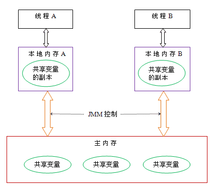
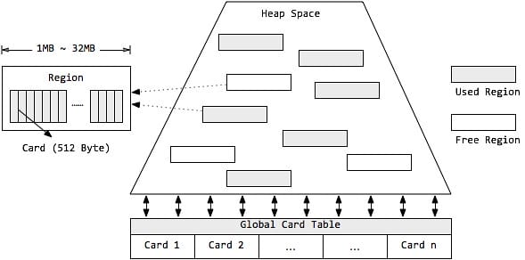
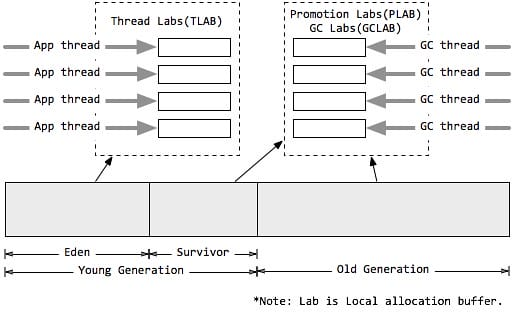
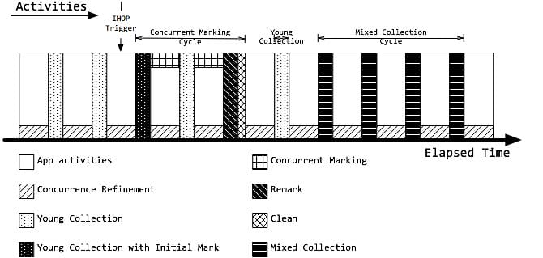
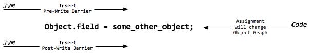

> 最后更新：2025-10-22 | [返回主目录](../README.md)

# 一、概述

## 1.1 学习要点
> 不同的虚拟机实现方式上也有差别，如果没有特别指出，这里的JVM指的是sun的HotSpot；不同的JDK版本略有差别，这里主要以1.8为主，具体差异请看各个章节中详解。下图主要表示的逻辑关系，用来将所有知识点放到一张图里，帮助你理解。

>Java进阶 - JVM相关 排错调优： 最后围绕着调试和排错，分析理解JVM调优参数，动态字节码技术及动态在线调试的原理；学会使用常用的调工具和在线动态调试工具等。

# 二、JVM 基础 - 类字节码详解
> 源代码通过编译器编译为字节码，再通过类加载子系统进行加载到JVM中运行。
## 2.1 多语言编译为字节码在JVM运行
计算机是不能直接运行java代码的，必须要先运行java虚拟机，再由java虚拟机运行编译后的java代码。这个编译后的java代码，就是本文要介绍的java字节码。

为什么jvm不能直接运行java代码呢，这是因为在cpu层面看来计算机中所有的操作都是一个个指令的运行汇集而成的，java是高级语言，只有人类才能理解其逻辑，计算机是无法识别的，所以java代码必须要先编译成字节码文件，jvm才能正确识别代码转换后的指令并将其运行。
- Java代码间接翻译成字节码，储存字节码的文件再交由运行于不同平台上的JVM虚拟机去读取执行，从而实现一次编写，到处运行的目的。
- JVM也不再只支持Java，由此衍生出了许多基于JVM的编程语言，如Groovy, Scala, Koltin等等。

## 2.2 Java字节码文件
class文件本质上是一个以8位字节为基础单位的二进制流，各个数据项目严格按照顺序紧凑的排列在class文件中。jvm根据其特定的规则解析该二进制数据，从而得到相关信息。

Class文件采用一种伪结构来存储数据，它有两种类型：无符号数和表。这里暂不详细的讲。

本文将通过简单的java例子编译后的文件来理解。
### 2.2.1 Class文件的结构属性
在理解之前先从整体看下java字节码文件包含了哪些类型的数据：

### 2.2.2 从一个例子开始
下面以一个简单的例子来逐步讲解字节码。
```java
//Main.java
public class Main {
    
    private int m;
    
    public int inc() {
        return m + 1;
    }
}
```
通过以下命令, 可以在当前所在路径下生成一个Main.class文件。
```sh
javac Main.java
```
以文本的形式打开生成的class文件，内容如下:
```sh
cafe babe 0000 0034 0013 0a00 0400 0f09
0003 0010 0700 1107 0012 0100 016d 0100
0149 0100 063c 696e 6974 3e01 0003 2829
5601 0004 436f 6465 0100 0f4c 696e 654e
756d 6265 7254 6162 6c65 0100 0369 6e63
0100 0328 2949 0100 0a53 6f75 7263 6546
696c 6501 0009 4d61 696e 2e6a 6176 610c
0007 0008 0c00 0500 0601 0010 636f 6d2f
7268 7974 686d 372f 4d61 696e 0100 106a
6176 612f 6c61 6e67 2f4f 626a 6563 7400
2100 0300 0400 0000 0100 0200 0500 0600
0000 0200 0100 0700 0800 0100 0900 0000
1d00 0100 0100 0000 052a b700 01b1 0000
0001 000a 0000 0006 0001 0000 0003 0001
000b 000c 0001 0009 0000 001f 0002 0001
0000 0007 2ab4 0002 0460 ac00 0000 0100
0a00 0000 0600 0100 0000 0800 0100 0d00
0000 0200 0e
```
- 文件开头的4个字节("cafe babe")称之为 魔数，唯有以"cafe babe"开头的class文件方可被虚拟机所接受，这4个字节就是字节码文件的身份识别。
- 0000是编译器jdk版本的次版本号0，0034转化为十进制是52,是主版本号，java的版本号从45开始，除1.0和1.1都是使用45.x外,以后每升一个大版本，版本号加一。也就是说，编译生成该class文件的jdk版本为1.8.0。

通过java -version命令稍加验证, 可得结果。
```sh
Java(TM) SE Runtime Environment (build 1.8.0_131-b11)
Java HotSpot(TM) 64-Bit Server VM (build 25.131-b11, mixed mode)
```
继续往下是常量池... 知道是这么分析的就可以了，然后我们通过工具反编译字节码文件继续去看。
### 2.2.3 反编译字节码文件
> 使用到java内置的一个反编译工具javap可以反编译字节码文件, 用法: javap <options> <classes>
其中<options>选项包括:
```sh
  -help  --help  -?        输出此用法消息
  -version                 版本信息
  -v  -verbose             输出附加信息
  -l                       输出行号和本地变量表
  -public                  仅显示公共类和成员
  -protected               显示受保护的/公共类和成员
  -package                 显示程序包/受保护的/公共类和成员(默认)
  -p  -private             显示所有类和成员
  -c                       对代码进行反汇编
  -s                       输出内部类型签名
  -sysinfo                 显示正在处理的类的系统信息 (路径, 大小, 日期, MD5 散列)
  -constants               显示最终常量
  -classpath <path>        指定查找用户类文件的位置
  -cp <path>               指定查找用户类文件的位置
  -bootclasspath <path>    覆盖引导类文件的位置
```
输入命令javap -verbose -p Main.class查看输出内容:
```java
Classfile /E:/JavaCode/TestProj/out/production/TestProj/com/rhythm7/Main.class
  Last modified 2018-4-7; size 362 bytes
  MD5 checksum 4aed8540b098992663b7ba08c65312de
  Compiled from "Main.java"
public class com.rhythm7.Main
  minor version: 0
  major version: 52
  flags: ACC_PUBLIC, ACC_SUPER
Constant pool:
   #1 = Methodref          #4.#18         // java/lang/Object."<init>":()V
   #2 = Fieldref           #3.#19         // com/rhythm7/Main.m:I
   #3 = Class              #20            // com/rhythm7/Main
   #4 = Class              #21            // java/lang/Object
   #5 = Utf8               m
   #6 = Utf8               I
   #7 = Utf8               <init>
   #8 = Utf8               ()V
   #9 = Utf8               Code
  #10 = Utf8               LineNumberTable
  #11 = Utf8               LocalVariableTable
  #12 = Utf8               this
  #13 = Utf8               Lcom/rhythm7/Main;
  #14 = Utf8               inc
  #15 = Utf8               ()I
  #16 = Utf8               SourceFile
  #17 = Utf8               Main.java
  #18 = NameAndType        #7:#8          // "<init>":()V
  #19 = NameAndType        #5:#6          // m:I
  #20 = Utf8               com/rhythm7/Main
  #21 = Utf8               java/lang/Object
{
  private int m;
    descriptor: I
    flags: ACC_PRIVATE

  public com.rhythm7.Main();
    descriptor: ()V
    flags: ACC_PUBLIC
    Code:
      stack=1, locals=1, args_size=1
         0: aload_0
         1: invokespecial #1                  // Method java/lang/Object."<init>":()V
         4: return
      LineNumberTable:
        line 3: 0
      LocalVariableTable:
        Start  Length  Slot  Name   Signature
            0       5     0  this   Lcom/rhythm7/Main;

  public int inc();
    descriptor: ()I
    flags: ACC_PUBLIC
    Code:
      stack=2, locals=1, args_size=1
         0: aload_0
         1: getfield      #2                  // Field m:I
         4: iconst_1
         5: iadd
         6: ireturn
      LineNumberTable:
        line 8: 0
      LocalVariableTable:
        Start  Length  Slot  Name   Signature
            0       7     0  this   Lcom/rhythm7/Main;
}
```
### 2.2.4 字节码文件信息

开头的7行信息包括:Class文件当前所在位置，最后修改时间，文件大小，MD5值，编译自哪个文件，类的全限定名，jdk次版本号，主版本号。

然后紧接着的是该类的访问标志：ACC_PUBLIC, ACC_SUPER，访问标志的含义如下:

| 标志名称        | 标志值 (十六进制) | 含义                                       |
|----------------|------------------|-------------------------------------------|
| ACC_PUBLIC     | 0x0001           | 声明为 public 类型                        |
| ACC_FINAL      | 0x0010           | 声明为 final（仅类可用）                  |
| **ACC_SUPER**  | **0x0020**       | **启用 invokespecial 指令的新语义**        |
| ACC_INTERFACE  | 0x0200           | 标识为接口                                |
| ACC_ABSTRACT   | 0x0400           | 抽象类型（接口/抽象类为 true）            |
| ACC_SYNTHETIC  | 0x1000           | 由编译器生成（非用户代码）                |
| ACC_ANNOTATION | 0x2000           | 标识为注解                                |
| ACC_ENUM       | 0x4000           | 标识为枚举                                |

`invokespecial` 是 JVM 字节码指令，用于调用：

- 实例初始化方法（<init> 构造器）
- 私有方法
- 父类方法（通过 super.method() 调用）
- 通过接口引用的默认方法


### 2.2.5 常量池
`Constant pool`意为常量池。

常量池可以理解成Class文件中的资源仓库。主要存放的是两大类常量：`字面量(Literal)`和`符号引用(Symbolic References)`。字面量类似于java中的常量概念，如文本字符串，final常量等，而符号引用则属于编译原理方面的概念，包括以下三种:
- 类和接口的全限定名(Fully Qualified Name)
- 字段的名称和描述符号(Descriptor)
- 方法的名称和描述符

不同于C/C++, JVM是在加载Class文件的时候才进行的动态链接，也就是说这些字段和方法符号引用只有在运行期转换后才能获得真正的内存入口地址。当虚拟机运行时，需要从常量池获得对应的符号引用，再在类创建或运行时解析并翻译到具体的内存地址中。 直接通过反编译文件来查看字节码内容：
```java
#1 = Methodref          #4.#18         // java/lang/Object."<init>":()V
#4 = Class              #21            // java/lang/Object
#7 = Utf8               <init>
#8 = Utf8               ()V
#18 = NameAndType        #7:#8          // "<init>":()V
#21 = Utf8               java/lang/Object
```
`第一个常量`是一个方法定义，指向了第4和第18个常量。以此类推查看第4和第18个常量。最后可以拼接成第一个常量右侧的注释内容:
```java
java/lang/Object."<init>":()V
```
这段可以理解为该类的实例构造器的声明，由于Main类没有重写构造方法，所以调用的是父类的构造方法（**所有构造器（无论是默认构造器还是自定义构造器）都会包含对父类构造器的调用**）。此处也说明了Main类的直接父类是Object。 该方法默认返回值是V, 也就是void，无返回值。

为什么是父类的构造器在常量池而不是自身的构造器
- 默认构造器真实存在：
    - 在反编译输出中明确显示为 public com.rhythm7.Main();
    - 这是编译器自动生成的
    - 构造器方法 (<init>) 不需要单独的常量池方法引用
- 常量池 #1 的作用：
  - 不是 Main 的构造器定义
  - 而是 Main 构造器需要调用的父类构造器 (Object.<init>)
  - 因为所有 Java 类最终都继承自 Object
`第二个常量`同理可得: 
```java
#2 = Fieldref           #3.#19         // com/rhythm7/Main.m:I
#3 = Class              #20            // com/rhythm7/Main
#5 = Utf8               m
#6 = Utf8               I
#19 = NameAndType        #5:#6          // m:I
#20 = Utf8               com/rhythm7/Main
```
此处声明了一个字段m，类型为I, I即是int类型。关于字节码的类型对应如下：

| 标识字符 | 对应类型      | 说明                                                                 | 示例                          |
|----------|--------------|----------------------------------------------------------------------|-------------------------------|
| **B**    | `byte`       | 8位有符号整数                                                        | `B` → `byte`                 |
| **C**    | `char`       | Unicode 字符（UTF-16）                                               | `C` → `char`                 |
| **D**    | `double`     | 双精度浮点数 (64位)                                                  | `D` → `double`               |
| **F**    | `float`      | 单精度浮点数 (32位)                                                  | `F` → `float`                |
| **I**    | `int`        | 32位整数                                                             | `I` → `int`                  |
| **J**    | `long`       | 64位整数                                                             | `J` → `long`                 |
| **S**    | `short`      | 16位整数                                                             | `S` → `short`                |
| **Z**    | `boolean`    | 布尔值 (`true`/`false`)                                              | `Z` → `boolean`              |
| **V**    | `void`       | 无返回值类型                                                         | `V` → `void`                 |
| **L**    | 对象引用类型 | 全限定类名，以 `;` 结尾                                              | `Ljava/lang/Object;` → `Object` |
| **[**    | 数组         | 前缀符号，可多层嵌套                                                 | `[I` → `int[]`               |

---

- 补充说明：

1. **数组类型**：使用 `[` 前缀表示
   - `[I` → 一维 `int` 数组
   - `[[D` → 二维 `double` 数组
   - `[Ljava/lang/String;` → `String[]`

2. **方法描述符**：结合类型标识符描述方法签名
   - `(I)V` → 参数 `int`，返回 `void`
   - `(Ljava/lang/String;[B)Z` → 参数 `String` 和 `byte[]`，返回 `boolean`

3. **特殊规则**：
   - `long` 和 `double` 在局部变量表中占用 2 个槽位（slot）
   - 对象类型必须使用全限定类名（如 `Ljava/lang/Object;`）

### 2.2.6 字段表
在常量池之后的是对类内部的方法描述，在字节码中以表的集合形式表现，暂且不管字节码文件的16进制文件内容如何，我们直接看反编译后的内容。
```java
private int m;
  descriptor: I
  flags: ACC_PRIVATE
```
此处声明了一个私有变量m，类型为int，返回值为int
### 2.2.7 方法表
```java
public com.rhythm7.Main();
   descriptor: ()V
   flags: ACC_PUBLIC
   Code:
     stack=1, locals=1, args_size=1
        0: aload_0
        1: invokespecial #1                  // Method java/lang/Object."<init>":()V
        4: return
```
这里是构造方法：Main()，返回值为void, 公开方法。

code内的主要属性为:

- `stack`: 最大操作数栈，JVM运行时会根据这个值来分配栈帧(Frame)中的操作栈深度,此处为1
- `locals`: 局部变量所需的存储空间，单位为Slot, Slot是虚拟机为局部变量分配内存时所使用的最小单位，为4个字节大小。方法参数(包括实例方法中的隐藏参数this)，显示异常处理器的参数(try catch中的catch块所定义的异常)，方法体中定义的局部变量都需要使用局部变量表来存放。值得一提的是，locals的大小并不一定等于所有局部变量所占的Slot之和，因为局部变量中的Slot是可以重用的。
- `args_size`: 方法参数的个数，这里是1，因为每个实例方法都会有一个隐藏参数this
- `attribute_info`: 方法体内容，0,1,4为字节码"行号"，该段代码的意思是将第一个引用类型本地变量推送至栈顶，然后执行该类型的实例方法，也就是常量池存放的第一个变量，也就是注释里的java/lang/Object."":()V, 然后执行返回语句，结束方法。
- `LineNumberTable`: 该属性的作用是描述源码行号与字节码行号(字节码偏移量)之间的对应关系。可以使用 -g:none 或-g:lines选项来取消或要求生成这项信息，如果选择不生成LineNumberTable，当程序运行异常时将无法获取到发生异常的源码行号，也无法按照源码的行数来调试程序。
- `LocalVariableTable`: 该属性的作用是描述帧栈中局部变量与源码中定义的变量之间的关系。可以使用 -g:none 或 -g:vars来取消或生成这项信息，如果没有生成这项信息，那么当别人引用这个方法时，将无法获取到参数名称，取而代之的是arg0, arg1这样的占位符。 start 表示该局部变量在哪一行开始可见，length表示可见行数，Slot代表所在帧栈位置，Name是变量名称，然后是类型签名。

同理可以分析Main类中的另一个方法"inc()":

方法体内的内容是：将this入栈，获取字段#2并置于栈顶, 将int类型的1入栈，将栈内顶部的两个数值相加，返回一个int类型的值。

### 2.2.8 属性表
```java
   LineNumberTable:
       line 3: 0
     LocalVariableTable:
       Start  Length  Slot  Name   Signature
           0       5     0  this   Lcom/rhythm7/Main;
```
### 2.2.9 字节码文件的整体介绍
**下面针对完整的反编译字节码进行总体介绍：**

#### 1. **类文件头信息**
```plaintext
Classfile /E:/.../Main.class
Last modified 2018-4-7; size 362 bytes
MD5 checksum 4aed8540b098992663b7ba08c65312de
Compiled from "Main.java"
```
- **文件路径**：类文件存储位置
- **修改时间**：2018-4-7
- **文件大小**：362字节
- **MD5校验**：确保文件完整性
- **源文件**：`Main.java`

---

#### 2. **类基本信息**
```plaintext
public class com.rhythm7.Main
minor version: 0
major version: 52
flags: ACC_PUBLIC, ACC_SUPER
```
- **类名**：`com.rhythm7.Main`（全限定名）
- **版本号**：
  - `major 52` → Java 8（版本映射：45=Java 1.1, 52=Java 8）
  - `minor 0` → 次要版本号（通常为0）
- **访问标志**：
  - `ACC_PUBLIC`：公有类
  - `ACC_SUPER`：历史遗留标志（保持向后兼容）

---

#### 3. **常量池（Constant Pool）**
常量池是类文件的"符号表"，存储所有字面量和符号引用：
```plaintext
#1 = Methodref    #4.#18  // java/lang/Object."<init>":()V
#2 = Fieldref     #3.#19  // com/rhythm7/Main.m:I
#3 = Class        #20     // com/rhythm7/Main
...
#5 = Utf8         m       // 字段名
#6 = Utf8         I       // int类型符
#7 = Utf8         <init>  // 构造器方法名
```
- **符号引用类型**：
  - `Methodref`：方法引用（类+方法）
  - `Fieldref`：字段引用（类+字段）
  - `Class`：类引用
  - `Utf8`：UTF-8编码字符串
  - `NameAndType`：名称+描述符组合

> 常量池索引**从1开始**，索引0保留不用

---

#### 4. **字段表（Field Table）**
```plaintext
private int m;
descriptor: I
flags: ACC_PRIVATE
```
- **字段元数据**：
  - 名称：`m`（对应常量池 `#5`）
  - 类型：`I`（基本类型int）
  - 访问标志：`ACC_PRIVATE`
- **作用**：定义类的成员变量，不包含具体值（值在对象实例化时分配）

---

#### 5. **方法表（Method Table）**
##### 5.1 构造器方法
```plaintext
public com.rhythm7.Main();
descriptor: ()V
flags: ACC_PUBLIC
Code:
  stack=1, locals=1, args_size=1
  0: aload_0
  1: invokespecial #1  // Object.<init>
  4: return
```
- **方法描述符**：`()V` → 无参数，返回void
- **操作数栈深度**：stack=1
- **局部变量槽**：locals=1
- **字节码指令**：
  - `aload_0`：加载this引用
  - `invokespecial #1`：调用父类构造器
  - `return`：方法返回

##### 5.2 inc()方法
```plaintext
public int inc();
descriptor: ()I
flags: ACC_PUBLIC
Code:
  stack=2, locals=1, args_size=1
  0: aload_0
  1: getfield #2  // Field m:I
  4: iconst_1
  5: iadd
  6: ireturn
```
- **方法描述符**：`()I` → 无参数，返回int
- **字节码指令**：
  - `getfield #2`：获取字段m的值
  - `iconst_1`：压入常量1
  - `iadd`：执行加法（m+1）
  - `ireturn`：返回int结果

---

#### 6. **属性表（Attribute Table）**
##### 6.1 LineNumberTable
```plaintext
LineNumberTable:
  line 3: 0   // Main.java第3行对应字节码偏移0
```
- **源码映射**：关联字节码偏移量与源代码行号

##### 6.2 LocalVariableTable
```plaintext
LocalVariableTable:
  Start Length Slot Name Signature
  0     5      0   this Lcom/rhythm7/Main;
```
- **局部变量信息**：
  - `this`：引用类型，Slot 0
  - 作用范围：字节码偏移0-5

---
### 2.2.10 类名
最后很显然是源码文件：
```java
SourceFile: "Main.java"
```
## 2.3 再看两个示例
### 2.3.1 分析try-catch-finally
通过以上一个最简单的例子，可以大致了解源码被编译成字节码后是什么样子的。 下面利用所学的知识点来分析一些Java问题:
```java
public class TestCode {
    public int foo() {
        int x;
        try {
            x = 1;
            return x;
        } catch (Exception e) {
            x = 2;
            return x;
        } finally {
            x = 3;
        }
    }
}
```
试问当不发生异常和发生异常的情况下，foo()的返回值分别是多少。
```sh
javac TestCode.java
javap -verbose TestCode.class
```
查看字节码的foo方法内容:
```java
public int foo();
    descriptor: ()I
    flags: ACC_PUBLIC
    Code:
      stack=1, locals=5, args_size=1
         0: iconst_1 //int型1入栈 ->栈顶=1
         1: istore_1 //将栈顶的int型数值存入第二个局部变量 ->局部2=1
         2: iload_1 //将第二个int型局部变量推送至栈顶 ->栈顶=1
         3: istore_2 //!!将栈顶int型数值存入第三个局部变量 ->局部3=1
         
         4: iconst_3 //int型3入栈 ->栈顶=3
         5: istore_1 //将栈顶的int型数值存入第二个局部变量 ->局部2=3
         6: iload_2 //!!将第三个int型局部变量推送至栈顶 ->栈顶=1
         7: ireturn //从当前方法返回栈顶int数值 ->1
         
         8: astore_2 // ->局部3=Exception
         9: iconst_2 // ->栈顶=2
        10: istore_1 // ->局部2=2
        11: iload_1 //->栈顶=2
        12: istore_3 //!! ->局部4=2
        
        13: iconst_3 // ->栈顶=3
        14: istore_1 // ->局部1=3
        15: iload_3 //!! ->栈顶=2
        16: ireturn // -> 2
        
        17: astore        4 //将栈顶引用型数值存入第五个局部变量=any
        19: iconst_3 //将int型数值3入栈 -> 栈顶3
        20: istore_1 //将栈顶第一个int数值存入第二个局部变量 -> 局部2=3
        21: aload         4 //将局部第五个局部变量(引用型)推送至栈顶
        23: athrow //将栈顶的异常抛出
      Exception table:
         from    to  target type
             0     4     8   Class java/lang/Exception //0到4行对应的异常，对应#8中储存的异常
             0     4    17   any //Exeption之外的其他异常
             8    13    17   any
            17    19    17   any
```
在字节码的4,5，以及13,14中执行的是同一个操作，就是将int型的3入操作数栈顶，并存入第二个局部变量。这正是我们源码在finally语句块中内容。也就是说，JVM在处理异常时，会在每个可能的分支都将finally语句重复执行一遍。

通过一步步分析字节码，可以得出最后的运行结果是：
- 不发生异常时: return 1
- 发生异常时: return 2
- 发生非Exception及其子类的异常，抛出异常，不返回值
### 2.3.2 扩展分析下面类三个方法的输出结果
```java
public class Main {

    private int m;

    public int foo() {
        int x;
        try {
            x = 1;
            return x;
        } catch (Exception e) {
            x = 2;
            return x;
        } finally {
            x = 3;
        }
    }

    public int foo2() {
        int x;
        try {
            x = 1;
            return x;
        } catch (Exception e) {
            x = 2;
            return x;
        } finally {
            x = 3;
            return x;
        }
    }

    public int foo3() {
        try {
            m = 1;
            return m;
        } catch (Exception e) {
            m = 2;
            return m;
        } finally {
            m = 3;
        }
    }

    public static void main(String[] args) {
        Main main = new Main();
        System.out.println("foo():"+main.foo());
        System.out.println("foo2():"+main.foo2());
        System.out.println("foo3():"+main.foo3());
        System.out.println("m:"+main.m);
    }
}
```
输出结果：
```java
foo():1
foo2():3
foo3():1
m:3
```

从字节码角度分析输出结果的原因如下，我们将逐个方法进行解析（基于标准 Javac 编译行为）：

---

### 1. `foo()` 方法分析
**输出结果：1**  
字节码关键逻辑：
```java
public int foo();
  Code:
   0: iconst_1       // 将常量1压入栈 (x=1)
   1: istore_1       // 存储到局部变量x (槽位1)
   2: iload_1        // 加载x的值 (1) 到栈顶 (准备返回)
   3: istore_2       // 将返回值暂存到槽位2 (固定返回值保存位置)
   4: iconst_3       // finally块开始 (x=3)
   5: istore_1       // 更新x=3 (但返回值已保存)
   6: iload_2        // 加载暂存的返回值 (1)
   7: ireturn        // 返回1

   8: astore_2       // catch块开始 (异常处理)
   ...               // catch逻辑（本例未触发）
   16: iconst_3      // finally块 (x=3)
   17: istore_1
   18: aload_2       // 重新抛出异常
   19: athrow
```

**关键机制**：
- **遇到 return x 时，需要暂存返回值（因 finally 必须执行）**: iconst_1; istore_1
- **返回值提前固化**：在进入 finally 前（字节码偏移3），返回值 1 已存入局部变量表槽位2
- **finally 修改无效**：虽然 finally 将 x 改为 3，但不影响已固化的返回值
- **返回路径**：`ireturn` 指令从槽位2加载值返回

---

### 2. `foo2()` 方法分析
**输出结果：3**  
字节码关键逻辑：
```java
public int foo2();
  Code:
   0: iconst_1       // x=1
   1: istore_1
   2: iload_1        // 加载x(1)准备返回
   3: istore_2       // 暂存返回值1 (槽位2)
   4: iconst_3       // finally块 (x=3)
   5: istore_1
   6: iload_1        // 加载x的新值(3) 
   7: ireturn        // 返回3

   8: astore_2      // catch块
   ...               // catch逻辑
   18: iconst_3      // finally块
   19: istore_1
   20: iload_1
   21: istore_3      // 再次覆盖返回值为3
   22: iload_3
   23: ireturn       // 返回3
```

**关键机制**：
- **finally 中的 return 优先**：字节码偏移7-9 覆盖了之前暂存的返回值
- **双保险设计**：
  - 正常路径：偏移3暂存1 → 偏移7用3覆盖
  - 异常路径：catch后同样用3覆盖返回值
- **本质**：finally 中的 return 会劫持所有退出路径

---

### 3. `foo3()` 方法分析
**输出结果：1（但成员变量 m 最终为3）**  
字节码关键逻辑：
```java
public int foo3();
  Code:
   0: aload_0        // 加载this
   1: iconst_1       
   2: putfield #2    // m=1 (Field m:I)
   5: aload_0
   6: getfield #2    // 获取m的值(1)
   9: istore_1       // 暂存返回值1 (槽位1)
   10: aload_0       // finally块开始
   11: iconst_3
   12: putfield #2   // m=3 (修改成员变量)
   13: iload_1       // 加载暂存值1
   14: ireturn       // 返回1

   15: astore_1      // catch块
   ...               // catch逻辑
   23: aload_0       // finally块
   24: iconst_3
   25: putfield #2   // m=3
   26: aload_1       // 重新抛出异常
   27: athrow
```

**关键机制**：
- **成员变量 vs 返回值**：
  - 返回值：在偏移9处固化 m 的当前值 1
  - 成员变量：finally 修改的是对象状态（偏移12）
- **两次内存操作**：
  ```mermaid
  sequenceDiagram
    字节码->>堆内存: putfield m=1 (偏移2)
    字节码->>局部变量表: istore_1=1 (偏移9)
    字节码->>堆内存: putfield m=3 (偏移12)
    返回指令->>调用者: 返回局部变量1的值(1)
  ```

---

### 内存状态变化时序图
```mermaid
sequenceDiagram
  main->>foo(): 调用
  foo()->>局部变量表: 固化返回值1
  foo()->>局部变量表: 修改x=3 (finally)
  foo()->>main: 返回1
  
  main->>foo2(): 调用
  foo2()->>局部变量表: 暂存1
  foo2()->>局部变量表: 覆盖返回值为3 (finally)
  foo2()->>main: 返回3
  
  main->>foo3(): 调用
  foo3()->>堆内存: m=1
  foo3()->>局部变量表: 固化返回值1
  foo3()->>堆内存: m=3 (finally)
  foo3()->>main: 返回1
  
  main->>堆内存: 读取m=3
```

### 最终输出解析
| 输出项         | 值  | 原因 |
|----------------|-----|------|
| `foo()`        | 1   | 返回值在finally执行前固化 |
| `foo2()`       | 3   | finally中的return覆盖原值 |
| `foo3()`       | 1   | 返回m的快照值（修改前） |
| `m`            | 3   | finally修改了对象状态 |

> **设计本质**：Java 使用局部变量槽固化返回值，finally 修改局部变量不影响已固化的返回值，但修改成员变量会影响对象状态。finally 中的 return 会彻底改变返回路径。

**这里最重要的是要明确这几个地方：**
- 1.遇到 return 时，需要暂存返回值（因 finally 必须执行）i_store
- 2.finally有return时的编译器优化，当检测到finally中有return语句时，废弃所有路径的暂存返回值
- 3.finally没有return的时候返回暂存值

| 场景                  | 返回值加载指令 | 是否需要临时槽位 | 典型字节码模式               |
|-----------------------|----------------|------------------|------------------------------|
| **无 finally 块**     | `iload_1`      | 否               | `iload_1 → ireturn`          |
| **有 finally(无return)** | `iload_2`      | 是               | `istore_2 → ... → iload_2`   |
| **有 finally(有return)** | `iload_1`      | 否（最终路径）   | `iload_1 → ireturn`          |
# 三、JVM 基础 - 字节码的增强技术
## 3.1 概述
在上文中，着重介绍了字节码的结构，这为我们了解字节码增强技术的实现打下了基础。字节码增强技术就是一类对现有字节码进行修改或者动态生成全新字节码文件的技术。接下来，我们将从最直接操纵字节码的实现方式开始深入进行剖析

## 3.2 ASM
对于需要手动操纵字节码的需求，可以使用ASM，它可以直接生产 .class字节码文件，也可以在类被加载入JVM之前动态修改类行为（如下图17所示）。ASM的应用场景有AOP（Cglib就是基于ASM）、热部署、修改其他jar包中的类等。当然，涉及到如此底层的步骤，实现起来也比较麻烦。接下来，本文将介绍ASM的两种API，并用ASM来实现一个比较粗糙的AOP。但在此之前，为了让大家更快地理解ASM的处理流程，强烈建议读者先对访问者模式进行了解。简单来说，访问者模式主要用于修改或操作一些数据结构比较稳定的数据，而通过第一章，我们知道字节码文件的结构是由JVM固定的，所以很适合利用访问者模式对字节码文件进行修改。

### 3.2.1 ASM API
#### 3.2.1.1 核心API(Core API)
ASM Core API可以类比解析XML文件中的SAX方式，不需要把这个类的整个结构读取进来，就可以用流式的方法来处理字节码文件。好处是非常节约内存，但是编程难度较大。然而出于性能考虑，一般情况下编程都使用Core API。在Core API中有以下几个关键类：
- ClassReader：用于读取已经编译好的.class文件。
- ClassWriter：用于重新构建编译后的类，如修改类名、属性以及方法，也可以生成新的类的字节码文件。
- 各种Visitor类：如上所述，CoreAPI根据字节码从上到下依次处理，对于字节码文件中不同的区域有不同的Visitor，比如用于访问方法的MethodVisitor、用于访问类变量的FieldVisitor、用于访问注解的AnnotationVisitor等。为了实现AOP，重点要使用的是MethodVisitor。
#### 3.2.1.2 树形API(Tree API)
ASM Tree API可以类比解析XML文件中的DOM方式，把整个类的结构读取到内存中，缺点是消耗内存多，但是编程比较简单。TreeApi不同于CoreAPI，TreeAPI通过各种Node类来映射字节码的各个区域，类比DOM节点，就可以很好地理解这种编程方式。
### 3.2.2 直接利用ASM实现AOP
利用ASM的CoreAPI来增强类。这里不纠结于AOP的专业名词如切片、通知，只实现在方法调用前、后增加逻辑，通俗易懂且方便理解。首先定义需要被增强的Base类：其中只包含一个process()方法，方法内输出一行“process”。增强后，我们期望的是，方法执行前输出“start”，之后输出”end”。
```java
public class Base {
    public void process(){
        System.out.println("process");
    }
}
```
为了利用ASM实现AOP，需要定义两个类：一个是MyClassVisitor类，用于对字节码的visit以及修改；另一个是Generator类，在这个类中定义ClassReader和ClassWriter，其中的逻辑是，classReader读取字节码，然后交给MyClassVisitor类处理，处理完成后由ClassWriter写字节码并将旧的字节码替换掉。Generator类较简单，我们先看一下它的实现，如下所示，然后重点解释MyClassVisitor类。
```java
import org.objectweb.asm.ClassReader;
import org.objectweb.asm.ClassVisitor;
import org.objectweb.asm.ClassWriter;

public class Generator {
    public static void main(String[] args) throws Exception {
		//读取
        ClassReader classReader = new ClassReader("meituan/bytecode/asm/Base");
        ClassWriter classWriter = new ClassWriter(ClassWriter.COMPUTE_MAXS);
        //处理
        ClassVisitor classVisitor = new MyClassVisitor(classWriter);
        classReader.accept(classVisitor, ClassReader.SKIP_DEBUG);
        byte[] data = classWriter.toByteArray();
        //输出
        File f = new File("operation-server/target/classes/meituan/bytecode/asm/Base.class");
        FileOutputStream fout = new FileOutputStream(f);
        fout.write(data);
        fout.close();
        System.out.println("now generator cc success!!!!!");
    }
}
```
MyClassVisitor继承自ClassVisitor，用于对字节码的观察。它还包含一个内部类MyMethodVisitor，继承自MethodVisitor用于对类内方法的观察，它的整体代码如下：
```java
import org.objectweb.asm.ClassVisitor;
import org.objectweb.asm.MethodVisitor;
import org.objectweb.asm.Opcodes;

public class MyClassVisitor extends ClassVisitor implements Opcodes {
    public MyClassVisitor(ClassVisitor cv) {
        super(ASM5, cv);
    }
    @Override
    public void visit(int version, int access, String name, String signature,
                      String superName, String[] interfaces) {
        cv.visit(version, access, name, signature, superName, interfaces);
    }
    @Override
    public MethodVisitor visitMethod(int access, String name, String desc, String signature, String[] exceptions) {
        MethodVisitor mv = cv.visitMethod(access, name, desc, signature,
                exceptions);
        //Base类中有两个方法：无参构造以及process方法，这里不增强构造方法
        if (!name.equals("<init>") && mv != null) {
            mv = new MyMethodVisitor(mv);
        }
        return mv;
    }
    class MyMethodVisitor extends MethodVisitor implements Opcodes {
        public MyMethodVisitor(MethodVisitor mv) {
            super(Opcodes.ASM5, mv);
        }

        @Override
        public void visitCode() {
            super.visitCode();
            mv.visitFieldInsn(GETSTATIC, "java/lang/System", "out", "Ljava/io/PrintStream;");
            mv.visitLdcInsn("start");
            mv.visitMethodInsn(INVOKEVIRTUAL, "java/io/PrintStream", "println", "(Ljava/lang/String;)V", false);
        }
        @Override
        public void visitInsn(int opcode) {
            if ((opcode >= Opcodes.IRETURN && opcode <= Opcodes.RETURN)
                    || opcode == Opcodes.ATHROW) {
                //方法在返回之前，打印"end"
                mv.visitFieldInsn(GETSTATIC, "java/lang/System", "out", "Ljava/io/PrintStream;");
                mv.visitLdcInsn("end");
                mv.visitMethodInsn(INVOKEVIRTUAL, "java/io/PrintStream", "println", "(Ljava/lang/String;)V", false);
            }
            mv.visitInsn(opcode);
        }
    }
}
```
利用这个类就可以实现对字节码的修改。详细解读其中的代码，对字节码做修改的步骤是：
- 首先通过MyClassVisitor类中的visitMethod方法，判断当前字节码读到哪一个方法了。跳过构造方法 <init> 后，将需要被增强的方法交给内部类MyMethodVisitor来进行处理。
- 接下来，进入内部类MyMethodVisitor中的visitCode方法，它会在ASM开始访问某一个方法的Code区时被调用，重写visitCode方法，将AOP中的前置逻辑就放在这里。 MyMethodVisitor继续读取字节码指令，每当ASM访问到无参数指令时，都会调用MyMethodVisitor中的visitInsn方法。我们判断了当前指令是否为无参数的“return”指令，如果是就在它的前面添加一些指令，也就是将AOP的后置逻辑放在该方法中。
- 综上，重写MyMethodVisitor中的两个方法，就可以实现AOP了，而重写方法时就需要用ASM的写法，手动写入或者修改字节码。通过调用methodVisitor的visitXXXXInsn()方法就可以实现字节码的插入，XXXX对应相应的操作码助记符类型，比如mv.visitLdcInsn(“end”)对应的操作码就是ldc “end”，即将字符串“end”压入栈。 完成这两个visitor类后，运行Generator中的main方法完成对Base类的字节码增强，增强后的结果可以在编译后的target文件夹中找到Base.class文件进行查看，可以看到反编译后的代码已经改变了。然后写一个测试类MyTest，在其中new Base()，并调用base.process()方法，可以看到下图右侧所示的AOP实现效果：

### 3.2.3 ASM工具
利用ASM手写字节码时，需要利用一系列visitXXXXInsn()方法来写对应的助记符，所以需要先将每一行源代码转化为一个个的助记符，然后通过ASM的语法转换为visitXXXXInsn()这种写法。第一步将源码转化为助记符就已经够麻烦了，不熟悉字节码操作集合的话，需要我们将代码编译后再反编译，才能得到源代码对应的助记符。第二步利用ASM写字节码时，如何传参也很令人头疼。ASM社区也知道这两个问题，所以提供了工具<a href= 'https://plugins.jetbrains.com/plugin/5918-asm-bytecode-outline'>ASM ByteCode Outline</a>
安装后，右键选择“Show Bytecode Outline”，在新标签页中选择“ASMified”这个tab，如图19所示，就可以看到这个类中的代码对应的ASM写法了。图中上下两个红框分别对应AOP中的前置逻辑于后置逻辑，将这两块直接复制到visitor中的visitMethod()以及visitInsn()方法中，就可以了。

## 3.3 Javassist
ASM是在指令层次上操作字节码的，阅读上文后，我们的直观感受是在指令层次上操作字节码的框架实现起来比较晦涩。故除此之外，我们再简单介绍另外一类框架：强调源代码层次操作字节码的框架Javassist。

利用Javassist实现字节码增强时，可以无须关注字节码刻板的结构，其优点就在于编程简单。直接使用java编码的形式，而不需要了解虚拟机指令，就能动态改变类的结构或者动态生成类。其中最重要的是ClassPool、CtClass、CtMethod、CtField这四个类：

- CtClass（compile-time class）：编译时类信息，它是一个class文件在代码中的抽象表现形式，可以通过一个类的全限定名来获取一个CtClass对象，用来表示这个类文件。
- ClassPool：从开发视角来看，ClassPool是一张保存CtClass信息的HashTable，key为类名，value为类名对应的CtClass对象。当我们需要对某个类进行修改时，就是通过pool.getCtClass(“className”)方法从pool中获取到相应的CtClass。
- CtMethod、CtField：这两个比较好理解，对应的是类中的方法和属性。

了解这四个类后，我们可以写一个小Demo来展示Javassist简单、快速的特点。我们依然是对Base中的process()方法做增强，在方法调用前后分别输出”start”和”end”，实现代码如下。我们需要做的就是从pool中获取到相应的CtClass对象和其中的方法，然后执行method.insertBefore和insertAfter方法，参数为要插入的Java代码，再以字符串的形式传入即可，实现起来也极为简单。
```java
import com.meituan.mtrace.agent.javassist.*;

public class JavassistTest {
    public static void main(String[] args) throws NotFoundException, CannotCompileException, IllegalAccessException, InstantiationException, IOException {
        // 1. 获取默认的类池（管理类的容器）
        ClassPool cp = ClassPool.getDefault();
        
        // 2. 从类池中获取目标类 "meituan.bytecode.javassist.Base" 的 CtClass 对象
        CtClass cc = cp.get("meituan.bytecode.javassist.Base");
        
        // 3. 获取目标类中声明的 "process" 方法
        CtMethod m = cc.getDeclaredMethod("process");
        
        // 4. 在 process 方法开头插入字节码：打印 "start"
        m.insertBefore("{ System.out.println(\"start\"); }");
        
        // 5. 在 process 方法结尾插入字节码：打印 "end"（包括正常返回和异常退出）
        m.insertAfter("{ System.out.println(\"end\"); }");
        
        // 6. 将修改后的 CtClass 转换为可运行的 Class 对象
        Class c = cc.toClass();
        
        // 7. 将修改后的字节码写入文件系统（保存到 /Users/zen/projects 目录）
        cc.writeFile("/Users/zen/projects");
        
        // 8. 通过反射创建修改后类的实例
        Base h = (Base)c.newInstance();
        
        // 9. 调用 process 方法验证修改效果
        h.process();
    }
}

```
## 3.4 运行时类的重载
### 3.4.1 问题引出
上一章重点介绍了两种不同类型的字节码操作框架，且都利用它们实现了较为粗糙的AOP。其实，为了方便大家理解字节码增强技术，在上文中我们避重就轻将ASM实现AOP的过程分为了两个main方法：第一个是利用MyClassVisitor对已编译好的class文件进行修改，第二个是new对象并调用。这期间并不涉及到JVM运行时对类的重加载，而是在第一个main方法中，通过ASM对已编译类的字节码进行替换，在第二个main方法中，直接使用已替换好的新类信息。另外在Javassist的实现中，我们也只加载了一次Base类，也不涉及到运行时重加载类。

如果我们在一个JVM中，先加载了一个类，然后又对其进行字节码增强并重新加载会发生什么呢？模拟这种情况，只需要我们在上文中Javassist的Demo中main()方法的第一行添加Base b=new Base()，即在增强前就先让JVM加载Base类，然后在执行到c.toClass()方法时会抛出错误，如下图20所示。跟进c.toClass()方法中，我们会发现它是在最后调用了ClassLoader的native方法defineClass()时报错。也就是说，JVM是不允许在运行时动态重载一个类的。

显然，如果只能在类加载前对类进行强化，那字节码增强技术的使用场景就变得很窄了。我们期望的效果是：在一个持续运行并已经加载了所有类的JVM中，还能利用字节码增强技术对其中的类行为做替换并重新加载。为了模拟这种情况，我们将Base类做改写，在其中编写main方法，每五秒调用一次process()方法，在process()方法中输出一行“process”。

我们的目的就是，在JVM运行中的时候，将process()方法做替换，在其前后分别打印“start”和“end”。也就是在运行中时，每五秒打印的内容由”process”变为打印”start process end”。那如何解决JVM不允许运行时重加载类信息的问题呢？为了达到这个目的，我们接下来一一来介绍需要借助的Java类库。
```java
import java.lang.management.ManagementFactory;

public class Base {
    public static void main(String[] args) {
        String name = ManagementFactory.getRuntimeMXBean().getName();
        String s = name.split("@")[0];
        //打印当前Pid
        System.out.println("pid:"+s);
        while (true) {
            try {
                Thread.sleep(5000L);
            } catch (Exception e) {
                break;
            }
            process();
        }
    }

    public static void process() {
        System.out.println("process");
    }
}
```
### 3.4.2 Instrument
instrument是JVM提供的一个可以修改已加载类的类库，专门为Java语言编写的插桩服务提供支持。它需要依赖JVMTI的Attach API机制实现，JVMTI这一部分，我们将在下一小节进行介绍。在JDK 1.6以前，instrument只能在JVM刚启动开始加载类时生效，而在JDK 1.6之后，instrument支持了在运行时对类定义的修改。要使用instrument的类修改功能，我们需要实现它提供的ClassFileTransformer接口，定义一个类文件转换器。接口中的transform()方法会在类文件被加载时调用，而在transform方法里，我们可以利用上文中的ASM或Javassist对传入的字节码进行改写或替换，生成新的字节码数组后返回。

我们定义一个实现了ClassFileTransformer接口的类TestTransformer，依然在其中利用Javassist对Base类中的process()方法进行增强，在前后分别打印“start”和“end”，代码如下
```java
import java.lang.instrument.ClassFileTransformer;

public class TestTransformer implements ClassFileTransformer {
    @Override
    public byte[] transform(ClassLoader loader, String className, Class<?> classBeingRedefined, ProtectionDomain protectionDomain, byte[] classfileBuffer) {
        System.out.println("Transforming " + className);
        try {
            ClassPool cp = ClassPool.getDefault();
            CtClass cc = cp.get("meituan.bytecode.jvmti.Base");
            CtMethod m = cc.getDeclaredMethod("process");
            m.insertBefore("{ System.out.println(\"start\"); }");
            m.insertAfter("{ System.out.println(\"end\"); }");
            return cc.toBytecode();
        } catch (Exception e) {
            e.printStackTrace();
        }
        return null;
    }
}
```
现在有了Transformer，那么它要如何注入到正在运行的JVM呢？还需要定义一个Agent，借助Agent的能力将Instrument注入到JVM中。我们将在下一小节介绍Agent，现在要介绍的是Agent中用到的另一个类Instrumentation。在JDK 1.6之后，Instrumentation可以做启动后的Instrument、本地代码（Native Code）的Instrument，以及动态改变Classpath等等。我们可以向Instrumentation中添加上文中定义的Transformer，并指定要被重加载的类，代码如下所示。这样，当Agent被Attach到一个JVM中时，就会执行类字节码替换并重载入JVM的操作。
```java
import java.lang.instrument.Instrumentation;

public class TestAgent {
    public static void agentmain(String args, Instrumentation inst) {
        //指定我们自己定义的Transformer，在其中利用Javassist做字节码替换
        inst.addTransformer(new TestTransformer(), true);
        try {
            //重定义类并载入新的字节码
            inst.retransformClasses(Base.class);
            System.out.println("Agent Load Done.");
        } catch (Exception e) {
            System.out.println("agent load failed!");
        }
    }
}
```
### 3.4.3 JVMTI & Agent & Attach API
上一小节中，我们给出了Agent类的代码，追根溯源需要先介绍JPDA（Java Platform Debugger Architecture）[Java 平台调试器架构]。如果JVM启动时开启了JPDA，那么类是允许被重新加载的。在这种情况下，已被加载的旧版本类信息可以被卸载，然后重新加载新版本的类。正如JDPA名称中的Debugger，JDPA其实是一套用于调试Java程序的标准，任何JDK都必须实现该标准。

JPDA定义了一整套完整的体系，它将调试体系分为三部分，并规定了三者之间的通信接口。三部分由低到高分别是Java 虚拟机工具接口（JVMTI），Java 调试协议（JDWP）以及 Java 调试接口（JDI），三者之间的关系如下图所示：


现在回到正题，我们可以借助JVMTI的一部分能力，帮助动态重载类信息。JVM TI（JVM TOOL INTERFACE，JVM工具接口）是JVM提供的一套对JVM进行操作的工具接口。通过JVMTI，可以实现对JVM的多种操作，它通过接口注册各种事件勾子，在JVM事件触发时，同时触发预定义的勾子，以实现对各个JVM事件的响应，事件包括类文件加载、异常产生与捕获、线程启动和结束、进入和退出临界区、成员变量修改、GC开始和结束、方法调用进入和退出、临界区竞争与等待、VM启动与退出等等。

而Agent就是JVMTI的一种实现，Agent有两种启动方式，一是随Java进程启动而启动，经常见到的java -agentlib就是这种方式；二是运行时载入，通过attach API，将模块（jar包）动态地Attach到指定进程id的Java进程内。

Attach API 的作用是提供JVM进程间通信的能力，比如说我们为了让另外一个JVM进程把线上服务的线程Dump出来，会运行jstack或jmap的进程，并传递pid的参数，告诉它要对哪个进程进行线程Dump，这就是Attach API做的事情。在下面，我们将通过Attach API的loadAgent()方法，将打包好的Agent jar包动态Attach到目标JVM上。具体实现起来的步骤如下：

- 定义Agent，并在其中实现AgentMain方法，如上一小节中定义的代码块7中的TestAgent类；
- 然后将TestAgent类打成一个包含MANIFEST.MF的jar包，其中MANIFEST.MF文件中将Agent-Class属性指定为TestAgent的全限定名，如下图所示；

- 最后利用Attach API，将我们打包好的jar包Attach到指定的JVM pid上，代码如下：
```java
import com.sun.tools.attach.VirtualMachine;

public class Attacher {
    public static void main(String[] args) throws AttachNotSupportedException, IOException, AgentLoadException, AgentInitializationException {
        // 传入目标 JVM pid
        VirtualMachine vm = VirtualMachine.attach("39333");
        vm.loadAgent("/Users/zen/operation_server_jar/operation-server.jar");
    }
}
```
- 由于在MANIFEST.MF中指定了Agent-Class，所以在Attach后，目标JVM在运行时会走到TestAgent类中定义的agentmain()方法，而在这个方法中，我们利用Instrumentation，将指定类的字节码通过定义的类转化器TestTransformer做了Base类的字节码替换（通过javassist），并完成了类的重新加载。由此，我们达成了“在JVM运行时，改变类的字节码并重新载入类信息”的目的。

以下为运行时重新载入类的效果：先运行Base中的main()方法，启动一个JVM，可以在控制台看到每隔五秒输出一次”process”。接着执行Attacher中的main()方法，并将上一个JVM的pid传入。此时回到上一个main()方法的控制台，可以看到现在每隔五秒输出”process”前后会分别输出”start”和”end”，也就是说完成了运行时的字节码增强，并重新载入了这个类。


总结：

Attacher **不是**在 Java 项目最开始运行时就在的，而是需要**通过另一个独立的 Java 进程**来将增强的字节码加载到已经运行的 Java 进程中。以下是详细说明：

- 📌 关键流程解析
1. **目标 JVM 进程启动**  
   - 首先运行包含 `Base.main()` 的 Java 程序（目标进程）
   - 该进程正常执行，无任何字节码增强逻辑
   - 示例输出：每隔5秒输出 `"process"`

2. **Attacher 作为独立进程启动**  
   - 在另一个独立的 Java 进程中运行 `Attacher.main()`
   - 此进程通过 `VirtualMachine.attach(pid)` 连接到目标 JVM 进程
   - 使用 `vm.loadAgent()` 加载包含字节码增强逻辑的 Agent JAR 包

3. **动态注入过程**  
   ```mermaid
   sequenceDiagram
       目标JVM->>Attacher: 正在运行(输出"process")
       Attacher->>目标JVM: attach(pid)
       Attacher->>目标JVM: loadAgent(agent.jar)
       目标JVM->>TestAgent: 执行agentmain()
       TestAgent->>Instrumentation: addTransformer()
       TestAgent->>Instrumentation: retransformClasses(Base)
       Instrumentation->>TestTransformer: transform() 修改字节码
       目标JVM->>Base: 重加载增强后的类
       目标JVM->>控制台: 开始输出"start"和"end"
   ```

   🔧 技术组件角色
| 组件 | 运行位置 | 作用 |
|------|----------|------|
| **目标 JVM** | 独立进程 | 运行被监控/增强的业务程序 |
| **Attacher** | 独立进程 | 将 Agent 注入目标 JVM 的"注入器" |
| **TestAgent** | 注入到目标 JVM | 注册字节码转换器 |
| **TestTransformer** | 在目标 JVM 内执行 | 动态修改类字节码 |

- ⚠️ 重要注意事项
1. **Attacher 必须独立运行**
   - 不能和目标 JVM 在同一个进程内
   - 需要获取目标 JVM 的进程 ID (pid)

2. **依赖 JDK 工具包**
   ```java
   import com.sun.tools.attach.VirtualMachine; // 属于 JDK 的 tools.jar
   ```
   - 运行 Attacher 时需要 JDK 而非 JRE
   - Maven 依赖示例：
     ```xml
     <dependency>
         <groupId>com.sun</groupId>
         <artifactId>tools</artifactId>
         <version>${java.version}</version>
         <scope>system</scope>
         <systemPath>${java.home}/../lib/tools.jar</systemPath>
     </dependency>
     ```

3. **权限要求**
   - Attacher 进程需要和目标 JVM 相同的用户权限
   - Linux/Unix 系统可能需要 `sudo` 权限

- 🌰 典型执行流程
1. 终端1 启动目标程序：
   ```bash
   java -cp app.jar com.example.Main # 输出"process" every 5s
   ```
   PID=39333

2. 终端2 编译并运行 Attacher：
   ```bash
   javac -cp $JAVA_HOME/lib/tools.jar Attacher.java
   java -cp .:$JAVA_HOME/lib/tools.jar Attacher 39333
   ```

3. 观察终端1输出变化：
   ```
   process     # 原始输出
   process     # 原始输出
   start       # Agent注入后
   process     # 增强逻辑
   end         # Agent注入后
   ```

- 💡 设计价值
这种"进程分离"架构实现了：
1. **无侵入式增强**：无需修改目标程序代码
2. **运行时热更新**：业务系统无需重启
3. **生产环境诊断**：动态添加监控/日志功能
4. **安全隔离**：注入失败不影响目标进程

> **总结**：Attacher 是一个独立的外部进程，专门用于将字节码增强逻辑动态注入到**已经运行的目标 JVM 进程**中，不是目标程序的一部分。这种机制是 Java 热更新和 APM（应用性能监控）系统的核心实现原理。
## 3.5 使用场景
至此，字节码增强技术的可使用范围就不再局限于JVM加载类前了。通过上述几个类库，我们可以在运行时对JVM中的类进行修改并重载了。通过这种手段，可以做的事情就变得很多了：
- 热部署：不部署服务而对线上服务做修改，可以做打点、增加日志等操作。
- Mock：测试时候对某些服务做Mock。
- 性能诊断工具：比如bTrace就是利用Instrument，实现无侵入地跟踪一个正在运行的JVM，监控到类和方法级别的状态信息。
## 3.6 总结
字节码增强技术相当于是一把打开运行时JVM的钥匙，利用它可以动态地对运行中的程序做修改，也可以跟踪JVM运行中程序的状态。此外，我们平时使用的动态代理、AOP也与字节码增强密切相关，它们实质上还是利用各种手段生成符合规范的字节码文件。综上所述，掌握字节码增强后可以高效地定位并快速修复一些棘手的问题（如线上性能问题、方法出现不可控的出入参需要紧急加日志等问题），也可以在开发中减少冗余代码，大大提高开发效率。
# 四、JVM 基础 - Java 类加载机制
## 4.1 类的生命周期
其中类加载的过程包括了`加载`、`连接`(验证、准备、解析)、`初始化`五个阶段。在这五个阶段中，加载、验证、准备和初始化这四个阶段发生的顺序是确定的，而解析阶段则不一定，它在某些情况下可以在初始化阶段之后开始，这是为了支持Java语言的运行时绑定(也成为动态绑定或晚期绑定)。另外注意这里的几个阶段是按顺序开始，而不是按顺序进行或完成，因为这些阶段通常都是互相交叉地混合进行的，通常在一个阶段执行的过程中调用或激活另一个阶段。

## 4.2 类的加载: 查找并加载类的二进制数据
加载是类加载过程的第一个阶段，在加载阶段，虚拟机需要完成以下三件事情:
- 通过一个类的全限定名来获取其定义的二进制字节流。
- 将这个字节流所代表的静态存储结构转化为方法区的运行时数据结构。
- 在Java堆中生成一个代表这个类的java.lang.Class对象，作为对方法区中这些数据的访问入口。

相对于类加载的其他阶段而言，加载阶段(准确地说，是加载阶段获取类的二进制字节流的动作)是可控性最强的阶段，因为开发人员既可以使用系统提供的类加载器来完成加载，也可以自定义自己的类加载器来完成加载。

加载阶段完成后，虚拟机外部的 二进制字节流就按照虚拟机所需的格式存储在方法区之中，而且在Java堆中也创建一个java.lang.Class类的对象，这样便可以通过该对象访问方法区中的这些数据。

类加载器并不需要等到某个类被“首次主动使用”时再加载它，JVM规范允许类加载器在预料某个类将要被使用时就预先加载它，如果在预先加载的过程中遇到了.class文件缺失或存在错误，类加载器必须在程序首次主动使用该类时才报告错误(LinkageError错误)如果这个类一直没有被程序主动使用，那么类加载器就不会报告错误。
> 加载.class文件的方式
- 从本地系统中直接加载
- 通过网络下载.class文件
- 从zip，jar等归档文件中加载.class文件
- 从专有数据库中提取.class文件
- 将Java源文件动态编译为.class文件
## 4.3 连接
### 4.3.1 验证: 确保被加载的类的正确性
验证是连接阶段的第一步，这一阶段的目的是为了确保Class文件的字节流中包含的信息符合当前虚拟机的要求，并且不会危害虚拟机自身的安全。验证阶段大致会完成4个阶段的检验动作:
- `文件格式验证`:验证字节流是否符合Class文件格式的规范；例如: 是否以0xCAFEBABE开头、主次版本号是否在当前虚拟机的处理范围之内、常量池中的常量是否有不被支持的类型。
- `元数据验证`: 对字节码描述的信息进行语义分析(注意: 对比javac编译阶段的语义分析)，以保证其描述的信息符合Java语言规范的要求；例如: 这个类是否有父类，除了java.lang.Object之外。
- `字节码验证`: 通过数据流和控制流分析，确定程序语义是合法的、符合逻辑的。
- `符号引用验证`: 确保解析动作能正确执行。
> 验证阶段是非常重要的，但不是必须的，它对程序运行期没有影响，如果所引用的类经过反复验证，那么可以考虑采用-Xverifynone参数来关闭大部分的类验证措施，以缩短虚拟机类加载的时间。
### 4.3.2 准备: 为类的静态变量分配内存，并将其初始化为默认值
准备阶段是正式为类变量分配内存并设置类变量初始值的阶段，这些内存都将在**方法区**中分配。对于该阶段有以下几点需要注意*:
- 这时候进行内存分配的仅包括类变量(static)，而不包括实例变量，**实例变量会在对象实例化时随着对象一块分配在Java堆中**。
- **这里所设置的初始值通常情况下是数据类型默认的零值(如0、0L、null、false等)，而不是被在Java代码中被显式地赋予的值。**

假设一个类变量的定义为: `public static int value = 3`；那么变量value在准备阶段过后的初始值为0，而不是3，因为这时候尚未开始执行任何Java方法，而把value赋值为3的`put static`指令是在程序编译后，存放于类构造器<clinit>()方法之中的，所以把value赋值为3的动作将在初始化阶段才会执行。
> 这里还需要注意如下几点
- 对基本数据类型来说，对于`类变量(static:一定是全局变量)和全局变量`，如果不显式地对其赋值而直接使用，则系统会为其赋予默认的零值，而对于`局部变量`来说，在使用前必须显式地为其赋值，否则编译时不通过。
- 对于同时被static和final修饰的常量，必须在声明的时候就为其显式地赋值，否则编译时不通过；而只被final修饰的常量则既可以在声明时显式地为其赋值，也可以在类初始化时显式地为其赋值，总之，`final在使用前必须为其显式地赋值，系统不会为其赋予默认零值`。
- 对于引用数据类型reference来说，如数组引用、对象引用等，如果没有对其进行显式地赋值而直接使用，系统都会为其赋予默认的零值，即null。
- 如果在数组初始化时没有对数组中的各元素赋值，那么其中的元素将根据对应的数据类型而被赋予默认的零值。
- 如果类字段的字段属性表中存在ConstantValue属性，即同时被final和static修饰，那么在准备阶段变量value就会被初始化为ConstValue属性所指定的值。假设上面的类变量value被定义为:  public static final int value = 3；编译时Javac将会为value生成ConstantValue属性，在准备阶段虚拟机就会根据ConstantValue的设置将value赋值为3。我们可以理解为static final常量在**编译期**就将其结果放入了调用它的类的常量池中(注意和public static int value = 3赋值在初始化阶段有区别)
 
#### static int i=3和static final int i=3的区别
- 📌 核心区别对比

| 特性 | `static int i = 3` | `static final int i = 3` |
|------|-------------------|-------------------------|
| **赋值时机** | 类加载的**初始化阶段** | 编译期间|
| **存储位置** | 方法区的类变量区域 | 运行时常量池 |
| **是否可修改** | ✅ 可重新赋值 | ❌ 不可修改（编译时常量） |
| **内存分配** | 类加载时分配内存 | 编译期确定，直接内联到代码 |

- 🔧 具体实现机制

1. `static int i = 3`（类加载初始化阶段）
```java
public class Test {
    static int i = 3;  // 在<clinit>()方法中赋值
    
    // 编译后生成的字节码逻辑：
    static <clinit>() {
        i = 3;  // 在类初始化时执行赋值
    }
}
```

**类加载过程：**
1. **加载** → 2. **验证** → 3. **准备** → 4. **解析** → 5. **初始化**
- 在**准备阶段**：`i` 被赋默认值 `0`
- 在**初始化阶段**：执行 `<clinit>()` 方法，`i` 被赋值为 `3`

2. `static final int i = 3`（编译期常量池）
```java
public class Test {
    static final int i = 3;  // 编译时常量
    
    public void print() {
        System.out.println(i);  // 编译后直接变为：System.out.println(3)
    }
}
```

**编译期处理：**
- 编译器直接将常量值 `3` 写入 `.class` 文件的**常量池**
- **所有使用 `i` 的地方都会被替换为字面量 `3`**
- 运行时**不会**有内存分配和赋值操作

- 🧪 验证示例

1. 反编译对比
```java
// 源代码
public class ConstantTest {
    static int normalStatic = 3;
    static final int CONSTANT_STATIC = 3;
    
    public void test() {
        int a = normalStatic;     // 需要访问静态变量
        int b = CONSTANT_STATIC;  // 直接替换为3
    }
}
```

**编译后的字节码伪代码：**
```java
public class ConstantTest {
    static int normalStatic = 0;  // 准备阶段默认值
    
    // 没有CONSTANT_STATIC字段，因为被内联了
    
    public void test() {
        int a = ConstantTest.normalStatic;  // getstatic指令
        int b = 3;                         // ldc指令，直接加载常量3
    }
    
    static <clinit>() {
        normalStatic = 3;  // 初始化阶段赋值
    }
}
```

- 💡 实际影响

1. 性能差异
```java
// 场景1：访问static变量（需要类加载和内存访问）
static int count = 100;
for (int i = 0; i < 1000000; i++) {
    sum += count;  // 每次都需要读取内存
}

// 场景2：访问static final常量（编译期优化）
static final int COUNT = 100;
for (int i = 0; i < 1000000; i++) {
    sum += COUNT;  // 编译为：sum += 100;
}
```

2. 跨类引用影响
```java
// A.java
public class A {
    public static int VAR = 10;
    public static final int CONST = 20;
}

// B.java  
public class B {
    public void method() {
        System.out.println(A.VAR);    // 需要加载A类
        System.out.println(A.CONST);  // 不需要加载A类，直接内联20
    }
}
```

3. 反射可修改性
```java
public class ReflectionTest {
    static int mutable = 1;
    static final int immutable = 2;
    
    public static void main(String[] args) throws Exception {
        Field f1 = ReflectionTest.class.getDeclaredField("mutable");
        f1.set(null, 100);  // ✅ 修改成功
        
        Field f2 = ReflectionTest.class.getDeclaredField("immutable");
        f2.setAccessible(true);
        f2.set(null, 200);  // ❌ 可能抛出IllegalAccessException
    }
}
```
#### final修饰不同场景的区别
| 场景 | 是否编译期常量 | 关键特征 |
|------|---------------|----------|
| `static final int = 3` | ✅ **是** | 值内联到字节码 |
| `static final Object = new Object()` | ❌ **不是** | 引用不可变，对象内容可能可变 |
| `static final String = "字面量"` | ✅ **是** | 字符串字面量是特例 |
| `static final String = new String()` | ❌ **不是** | 运行时创建的对象 |

### 4.3.3 解析: 把类中的符号引用转换为直接引用

解析阶段是虚拟机将常量池内的符号引用替换为直接引用的过程，解析动作主要针对`类`或`接口`、`字段`、`类方法`、`接口方法`、`方法类型`、`方法句柄`和`调用点`限定符7类符号引用进行。

`符号引用`就是一组符号来描述目标，可以是任何字面量。

`直接引用`就是直接指向目标的指针、相对偏移量或一个间接定位到目标的句柄。

<a href='#双亲委派机制的实现'>双亲委派机制源码(ClassLoader.loadClass())</a>中存在resolve参数，用来控制加载之后是否进行解析

#### 4.3.3.1. **符号引用解析为直接引用**
```java
public class Example {
    public void method() {
        // 在字节码中，这些是符号引用（Symbolic References）
        String str = "hello";
        System.out.println(str);  // System/out 和 println 都是符号引用
    }
}
```

**解析过程：**
- `java/lang/System` → 内存地址 0x7f123456
- `java/io/PrintStream` → 内存地址 0x7f123789  
- `println` 方法 → 方法表索引 #15

#### 4.3.3.2. **解析的具体内容**
```java
// 解析以下类型的符号引用：
resolveClass(c) {
    // 1. 类/接口解析
    resolveClassReferences();     // 将类名解析为Class对象
    
    // 2. 字段解析  
    resolveFieldReferences();     // 将字段名解析为内存偏移量
    
    // 3. 方法解析
    resolveMethodReferences();    // 将方法名解析为方法指针
    
    // 4. 接口方法解析
    resolveInterfaceMethodReferences();
}
```

## 4.4 初始化
初始化，为类的静态变量赋予正确的初始值，JVM负责对类进行初始化，主要对`类变量`进行初始化。在Java中对类变量进行初始值设定有两种方式:

- 声明类变量时指定初始值
- 使用静态代码块为类变量指定初始值
### 4.4.1 JVM初始化步骤
- 假如这个类还没有被加载和连接，则程序先加载并连接该类
- 假如该类的直接父类还没有被初始化，则先初始化其直接父类
- 假如类中有初始化语句，则系统依次执行这些初始化语句

### 4.4.2 类初始化时机: 
只有当对类的主动使用的时候才会导致类的初始化，类的主动使用包括以下六种:
- 创建类的实例，也就是new的方式
- 访问某个类或接口的静态变量，或者对该静态变量赋值
- 调用类的静态方法
- 反射(如Class.forName("com.pdai.jvm.Test"))
- 初始化某个类的子类，则其父类也会被初始化
- Java虚拟机启动时被标明为启动类的类(Java Test)，直接使用java.exe命令来运行某个主类
## 4.5 使用
类访问方法区内的数据结构的接口， 对象是Heap区的数据。
## 4.6 卸载
Java虚拟机将结束生命周期的几种情况
- 执行了System.exit()方法
- 程序正常执行结束
- 程序在执行过程中遇到了异常或错误而异常终止
- 由于操作系统出现错误而导致Java虚拟机进程终止

## 4.7 类加载器
### 4.7.1 类加载器的层次

> 注意: 这里父类加载器并不是通过继承关系来实现的，而是采用组合实现的。

- 站在Java虚拟机的角度来讲，只存在两种不同的类加载器: 
  - 启动类加载器: 它使用C++实现(这里仅限于Hotspot，也就是JDK1.5之后默认的虚拟机，有很多其他的虚拟机是用Java语言实现的)，是虚拟机自身的一部分；
  - 所有其他的类加载器: 这些类加载器都由Java语言实现，独立于虚拟机之外，并且全部继承自抽象类java.lang.ClassLoader，这些类加载器需要由启动类加载器加载到内存中之后才能去加载其他的类。
- 站在Java开发人员的角度来看，类加载器可以大致划分为以下三类 :
- `启动类加载器`: Bootstrap ClassLoader，负责加载存放在JDK\jre\lib(JDK代表JDK的安装目录，下同)下，或被-Xbootclasspath参数指定的路径中的，并且能被虚拟机识别的类库(如rt.jar，所有的java.*开头的类均被Bootstrap ClassLoader加载)。启动类加载器是无法被Java程序直接引用的。
- `扩展类加载器`: Extension ClassLoader，该加载器由sun.misc.Launcher$ExtClassLoader实现，它负责加载JDK\jre\lib\ext目录中，或者由java.ext.dirs系统变量指定的路径中的所有类库(如javax.*开头的类)，开发者可以直接使用扩展类加载器。
- `应用程序类加载器`: Application ClassLoader，该类加载器由sun.misc.Launcher$AppClassLoader来实现，它负责加载用户类路径(ClassPath)所指定的类，开发者可以直接使用该类加载器，如果应用程序中没有自定义过自己的类加载器，一般情况下这个就是程序中默认的类加载器。

应用程序都是由这三种类加载器互相配合进行加载的，如果有必要，我们还可以加入自定义的类加载器。因为JVM自带的ClassLoader只是懂得从本地文件系统加载标准的java class文件，因此如果编写了自己的ClassLoader，便可以做到如下几点:
- 在执行非置信代码之前，自动验证数字签名。
- 动态地创建符合用户特定需要的定制化构建类。
- 从特定的场所取得java class，例如数据库中和网络中。
### 4.7.2 寻找类加载器
寻找类加载器小例子如下:
```java
package com.pdai.jvm.classloader;
public class ClassLoaderTest {
     public static void main(String[] args) {
        ClassLoader loader = Thread.currentThread().getContextClassLoader();
        System.out.println(loader);
        System.out.println(loader.getParent());
        System.out.println(loader.getParent().getParent());
    }
}
```
结果如下:
```java
sun.misc.Launcher$AppClassLoader@64fef26a
sun.misc.Launcher$ExtClassLoader@1ddd40f3
null
```
从上面的结果可以看出，并没有获取到ExtClassLoader的父Loader，原因是BootstrapLoader(引导类加载器)是用C语言实现的，找不到一个确定的返回父Loader的方式，于是就返回null。
## 4.8 类的加载
类加载有三种方式:
- 1、命令行启动应用时候由JVM初始化加载
- 2、通过Class.forName()方法动态加载
- 3、通过ClassLoader.loadClass()方法动态加载
```java
package com.pdai.jvm.classloader;
public class loaderTest { 
        public static void main(String[] args) throws ClassNotFoundException { 
                ClassLoader loader = HelloWorld.class.getClassLoader(); 
                System.out.println(loader); 
                //使用ClassLoader.loadClass()来加载类，不会执行初始化块 
                loader.loadClass("Test2"); 
                //使用Class.forName()来加载类，默认会执行初始化块 
//                Class.forName("Test2"); 
                //使用Class.forName()来加载类，并指定ClassLoader，初始化时不执行静态块 
//                Class.forName("Test2", false, loader); 
        } 
}

public class Test2 { 
        static { 
                System.out.println("静态初始化块执行了！"); 
        } 
}
```
分别切换加载方式，会有不同的输出结果。
> Class.forName()和ClassLoader.loadClass()区别?
- Class.forName(): 将类的.class文件加载到jvm中之外，还会对类进行解释，执行类中的static块；
- ClassLoader.loadClass(): 只干一件事情，就是将.class文件加载到jvm中，不会执行static中的内容,只有在newInstance才会去执行static块。
- Class.forName(name, initialize, loader)带参函数也可控制是否加载static块。并且只有调用了newInstance()方法采用调用构造函数，创建类的对象 。
 
 **"需要知道"原则**
- **Class.forName()**：我需要这个类**立即工作**，包括它的所有静态初始化
- **ClassLoader.loadClass()**：我只需要知道这个类存在，但还不需要它工作
## 4.9 JVM类加载机制
- `全盘负责`，当一个类加载器负责加载某个Class时，该Class所依赖的和引用的其他Class也将由该类加载器负责载入，除非显示使用另外一个类加载器来载入
- `父类委托`，先让父类加载器试图加载该类，只有在父类加载器无法加载该类时才尝试从自己的类路径中加载该类
- `缓存机制`，缓存机制将会保证所有加载过的Class都会被缓存，当程序中需要使用某个Class时，类加载器先从缓存区寻找该Class，只有缓存区不存在，系统才会读取该类对应的二进制数据，并将其转换成Class对象，存入缓存区。**这就是为什么修改了Class后，必须重启JVM，程序的修改才会生效**
- `双亲委派机制`, 如果一个类加载器收到了类加载的请求，它首先不会自己去尝试加载这个类，而是把请求委托给父加载器去完成，依次向上，因此，所有的类加载请求最终都应该被传递到顶层的启动类加载器中，只有当父加载器在它的搜索范围中没有找到所需的类时，即无法完成该加载，子加载器才会尝试自己去加载该类。
### 4.9.1 双亲委派机制过程？
- 当AppClassLoader加载一个class时，它首先不会自己去尝试加载这个类，而是把类加载请求委派给父类加载器ExtClassLoader去完成。
- 当ExtClassLoader加载一个class时，它首先也不会自己去尝试加载这个类，而是把类加载请求委派给BootStrapClassLoader去完成。
- 如果BootStrapClassLoader加载失败(**例如在$JAVA_HOME/jre/lib里未查找到该class**)，会使用ExtClassLoader来尝试加载；
- 若ExtClassLoader也加载失败，则会使用AppClassLoader来加载，如果AppClassLoader也加载失败，则会报出异常ClassNotFoundException。
### 4.9.2 <a id='双亲委派机制的实现'>双亲委派代码实现</a>
```java
public Class<?> loadClass(String name)throws ClassNotFoundException {
            return loadClass(name, false);
    }
    protected synchronized Class<?> loadClass(String name, boolean resolve)throws ClassNotFoundException {
            // 首先判断该类型是否已经被加载
            Class c = findLoadedClass(name);
            if (c == null) {
                //如果没有被加载，就委托给父类加载或者委派给启动类加载器加载
                try {
                    if (parent != null) {
                         //如果存在父类加载器，就委派给父类加载器加载
                        c = parent.loadClass(name, false);
                    } else {
                    //如果不存在父类加载器，就检查是否是由启动类加载器加载的类，通过调用本地方法native Class findBootstrapClass(String name)
                        c = findBootstrapClass0(name);
                    }
                } catch (ClassNotFoundException e) {
                 // 如果父类加载器和启动类加载器都不能完成加载任务，才调用自身的加载功能
                    c = findClass(name);
                }
            }
            // resolve 控制是否在加载后立即进行类的"链接（Linking）"阶段的解析（Resolution）步骤
            if (resolve) {
                resolveClass(c);
            }
            return c;
        }
```
### 4.9.3 双亲委派优势
- 系统类防止内存中出现多份同样的字节码（同名的类会优先原则jdk中的加载而不是Application ClassLoader）
- 保证Java程序安全稳定运行
## 4.10 自定义类加载器
通常情况下，我们都是直接使用系统类加载器。但是，有的时候，我们也需要自定义类加载器。比如应用是通过网络来传输 Java 类的字节码，为保证安全性，这些字节码经过了加密处理，这时系统类加载器就无法对其进行加载，这样则需要自定义类加载器来实现。自定义类加载器一般都是继承自 ClassLoader 类(抽象类，基础)，从上面对 loadClass 方法来分析来看，我们只需要重写 findClass 方法(自定义扩展点)即可。下面我们通过一个示例来演示自定义类加载器的流程:
```java
package com.pdai.jvm.classloader;
import java.io.*;

public class MyClassLoader extends ClassLoader {

    private String root;

    protected Class<?> findClass(String name) throws ClassNotFoundException {
        byte[] classData = loadClassData(name);
        if (classData == null) {
            throw new ClassNotFoundException();
        } else {
            return defineClass(name, classData, 0, classData.length);
        }
    }

    private byte[] loadClassData(String className) {
        String fileName = root + File.separatorChar
                + className.replace('.', File.separatorChar) + ".class";
        try {
            InputStream ins = new FileInputStream(fileName);
            ByteArrayOutputStream baos = new ByteArrayOutputStream();
            int bufferSize = 1024;
            byte[] buffer = new byte[bufferSize];
            int length = 0;
            while ((length = ins.read(buffer)) != -1) {
                baos.write(buffer, 0, length);
            }
            return baos.toByteArray();
        } catch (IOException e) {
            e.printStackTrace();
        }
        return null;
    }

    public String getRoot() {
        return root;
    }

    public void setRoot(String root) {
        this.root = root;
    }

    public static void main(String[] args)  {

        MyClassLoader classLoader = new MyClassLoader();
        classLoader.setRoot("D:\\temp");

        Class<?> testClass = null;
        try {
            testClass = classLoader.loadClass("com.pdai.jvm.classloader.Test2");
            Object object = testClass.newInstance();
            System.out.println(object.getClass().getClassLoader());
        } catch (ClassNotFoundException e) {
            e.printStackTrace();
        } catch (InstantiationException e) {
            e.printStackTrace();
        } catch (IllegalAccessException e) {
            e.printStackTrace();
        }
    }
}
```
自定义类加载器的核心在于对字节码文件的获取，如果是加密的字节码则需要在该类中对文件进行解密。由于这里只是演示，我并未对class文件进行加密，因此没有解密的过程。

这里有几点需要注意 :
- 1、这里传递的文件名需要是类的全限定性名称，即com.pdai.jvm.classloader.Test2格式的，因为 defineClass 方法是按这种格式进行处理的。
- 最好不要重写loadClass方法，因为这样容易破坏双亲委托模式。
- Test 类本身可以被 AppClassLoader 类加载，因此我们不能把com/pdai/jvm/classloader/Test2.class 放在类路径下(`AppClassLoader默认加载类路径`)。否则，由于双亲委托机制的存在，会直接导致该类由 AppClassLoader 加载，而不会通过我们自定义类加载器来加载。
- ClassLoader抽象类的parent默认值AppClassLoader
```java
// 当你这样创建自定义ClassLoader时：
public class MyClassLoader extends ClassLoader {
    // 没有显式调用父类构造器
}

// 实际上Java会调用ClassLoader的无参构造函数：
public ClassLoader() {
    this(checkCreateClassLoader(), getSystemClassLoader()); // ← 关键！
}

// getSystemClassLoader() 返回系统类加载器（AppClassLoader）
```

## 4.11 JDK 11版本中`ClassLoader.loadClass()`主要改进

### 4.11.1 🔍 **关键区别分析**

| 特性 | 旧版本 | JDK 11版本 |
|------|-------|------------|
| **同步机制** | `synchronized`方法级锁 | `synchronized(getClassLoadingLock(name))`细粒度锁 |
| **异常处理** | 直接抛出异常 | 捕获异常后继续尝试当前加载器 |
| **性能监控** | 无 | 增加了`PerfCounter`性能统计 |
| **启动类加载** | `findBootstrapClass0()` | `findBootstrapClassOrNull()`更清晰的方法名 |

### 4.11.2 🔧 **`findClass()`的核心作用**

#### 4.11.2.1. **`findClass()`是类加载的"模板方法"**

```java
// ClassLoader中的默认实现 - 需要子类重写
protected Class<?> findClass(String name) throws ClassNotFoundException {
    throw new ClassNotFoundException(name);
}
```

**设计意图：** `findClass()`是留给子类实现的**扩展点**，用于定义自定义的类加载逻辑。

#### 4.11.2.2. **`loadClass()` vs `findClass()`的分工**

```java
public class CustomClassLoader extends ClassLoader {
    
    // loadClass() 负责双亲委派机制（框架逻辑）
    // 这个方法通常不需要重写
    
    // findClass() 负责具体的类加载实现（业务逻辑）
    @Override
    protected Class<?> findClass(String name) throws ClassNotFoundException {
        // 自定义加载逻辑：从文件、网络、数据库等加载类字节码
        byte[] classBytes = loadClassBytes(name);
        return defineClass(name, classBytes, 0, classBytes.length);
    }
    
    private byte[] loadClassBytes(String className) {
        // 实现具体的字节码加载逻辑
        // 例如：从特定目录读取.class文件
    }
}
```

### 4.11.3 🏗️ **实际自定义类加载器示例**

#### 4.11.3.1 示例1：文件系统类加载器
```java
public class FileSystemClassLoader extends ClassLoader {
    private String classPath;
    
    public FileSystemClassLoader(String classPath) {
        this.classPath = classPath;
    }
    
    @Override
    protected Class<?> findClass(String name) throws ClassNotFoundException {
        try {
            // 1. 读取.class文件
            String path = classPath + name.replace('.', '/') + ".class";
            byte[] classBytes = Files.readAllBytes(Paths.get(path));
            
            // 2. 调用defineClass完成类定义
            return defineClass(name, classBytes, 0, classBytes.length);
        } catch (IOException e) {
            throw new ClassNotFoundException("类文件未找到: " + name, e);
        }
    }
}
```

#### 4.11.3.2 示例2：网络类加载器
```java
public class NetworkClassLoader extends ClassLoader {
    private String serverUrl;
    
    @Override
    protected Class<?> findClass(String name) throws ClassNotFoundException {
        try {
            // 从网络服务器加载类字节码
            URL url = new URL(serverUrl + name.replace('.', '/') + ".class");
            try (InputStream is = url.openStream()) {
                byte[] classBytes = is.readAllBytes();
                return defineClass(name, classBytes, 0, classBytes.length);
            }
        } catch (IOException e) {
            throw new ClassNotFoundException("网络加载失败: " + name, e);
        }
    }
}
```

### 4.11.4 🔄 **完整的类加载流程**

#### 4.11.4.1 **JDK 11的`loadClass()`详细执行流程：**

```java
// 伪代码展示完整流程
public Class<?> loadClass(String name, boolean resolve) {
    // 1. 获取类加载锁（避免重复加载）
    synchronized (getClassLoadingLock(name)) {
        
        // 2. 检查是否已加载（缓存机制）
        Class<?> c = findLoadedClass(name);
        if (c != null) {
            if (resolve) resolveClass(c);
            return c;
        }
        
        long t0 = System.nanoTime();
        
        // 3. 双亲委派：先让父加载器尝试
        try {
            if (parent != null) {
                c = parent.loadClass(name, false);  // 注意：resolve=false
            } else {
                c = findBootstrapClassOrNull(name); // 启动类加载器
            }
        } catch (ClassNotFoundException e) {
            // 4. 父加载器找不到，不立即失败，继续尝试当前加载器
        }
        
        // 5. 当前加载器尝试（核心：调用findClass）
        if (c == null) {
            long t1 = System.nanoTime();
            c = findClass(name);  // ⭐ 这里是关键调用！
            
            // 6. 性能统计
            recordStatistics(t1 - t0, t1);
        }
        
        // 7. 解析阶段
        if (resolve) {
            resolveClass(c);
        }
        
        return c;
    }
}
```

### 4.11.5 💡 **`findClass()`的设计哲学**

#### 4.11.5.1  **模板方法模式的应用**
```java
// ClassLoader框架提供了算法骨架
public abstract class ClassLoader {
    
    // 模板方法 - 定义加载流程
    public final Class<?> loadClass(String name) {
        // 1. 检查缓存
        // 2. 双亲委派
        // 3. 调用findClass() ← 留给子类实现
        // 4. 解析类
    }
    
    // 抽象方法 - 子类必须实现
    protected abstract Class<?> findClass(String name);
}
```

#### 4.11.5.2 **为什么分离`loadClass()`和`findClass()`？**

| 方法 | 责任 | 可变性 |
|------|------|--------|
| **`loadClass()`** | 框架逻辑（双亲委派、缓存、同步） | **final** - 不允许修改 |
| **`findClass()`** | 业务逻辑（如何获取字节码） | **protected** - 需要子类实现 |

**好处：**
- **框架稳定性**：双亲委派等核心机制不可修改
- **扩展灵活性**：加载来源可以自由定制
- **职责分离**：框架管流程，子类管实现

### 4.11.6 🎯 **JDK 11改进的实际价值**

#### 4.11.6.1. **更细粒度的锁机制**
```java
// 旧版本：整个方法同步，性能瓶颈
public synchronized Class<?> loadClass(String name) {...}

// JDK 11：基于类名的细粒度锁
protected Class<?> loadClass(String name, boolean resolve) {
    synchronized (getClassLoadingLock(name)) {  // 每个类独立的锁
        // ...
    }
}

// 锁实现：通常使用ConcurrentHashMap
protected Object getClassLoadingLock(String className) {
    Object lock = this;
    if (parallelLockMap != null) {
        // 为每个类名创建独立的锁对象
        lock = parallelLockMap.computeIfAbsent(className, k -> new Object());
    }
    return lock;
}
```

#### 4.11.6.2. **更好的异常处理策略**
```java
// 旧版本：父加载器失败就立即抛出异常
try {
    c = parent.loadClass(name, false);
} catch (ClassNotFoundException e) {
    // 直接抛出，不给当前加载器机会
    throw e;
}

// JDK 11：父加载器失败后，当前加载器还有机会
try {
    c = parent.loadClass(name, false);
} catch (ClassNotFoundException e) {
    // 捕获异常，继续执行下面的当前加载器逻辑
    // 这样设计更合理：父加载器找不到，不代表当前加载器也找不到
}
```

#### 4.11.6.3. **性能监控支持**
```java
// 新增的性能计数器
PerfCounter.getParentDelegationTime().addTime(t1 - t0);  // 父委派时间
PerfCounter.getFindClassTime().addElapsedTimeFrom(t1);   // 查找类时间
PerfCounter.getFindClasses().increment();                // 加载类计数
```
# 五、JVM 基础 - JVM 内存结构

## 5.1 运行时数据区
内存是非常重要的系统资源，是硬盘和 CPU 的中间仓库及桥梁，承载着操作系统和应用程序的实时运行。JVM 内存布局规定了 Java 在运行过程中内存申请、分配、管理的策略，保证了 JVM 的高效稳定运行。不同的 JVM 对于内存的划分方式和管理机制存在着部分差异。

下图是 JVM 整体架构，中间部分就是 Java 虚拟机定义的各种运行时数据区域。


Java 虚拟机定义了若干种程序运行期间会使用到的运行时数据区，其中有一些会随着虚拟机启动而创建，随着虚拟机退出而销毁。另外一些则是与线程一一对应的，这些与线程一一对应的数据区域会随着线程开始和结束而创建和销毁。

- 线程私有：程序计数器、虚拟机栈、本地方法栈(Hotspot JVM将虚拟机栈和本地方法栈合二为一)
- 线程共享：堆、方法区, 堆外内存（Java7的永久代或JDK8的元空间、代码缓存）

**但值得注意的一个重要的补充：线程专属内存区**

虽然我们说线程私有的**区域**主要是PC寄存器和栈，但还有一个非常重要的**线程私有数据**存在于“堆”中，那就是 **TLAB**。

*   **TLAB**： 即线程本地分配缓冲区。它是堆内存中划分出来的一小块专属区域，每个线程独立拥有一份。当线程需要创建新对象时，会优先在自己的TLAB中快速分配内存，这样可以避免在堆上进行同步操作，提升效率。

所以，更严谨地说，在 Hotspot JVM 中：
*   线程私有的**内存区域**：程序计数器、虚拟机栈。
*   线程私有的**数据**：程序计数器、虚拟机栈中的数据，以及堆中的 TLAB。


> 下面我们就来一一解读下这些内存区域，先从最简单的入手

## 5.2 一、程序计数器
程序计数寄存器（Program Counter Register），Register 的命名源于 CPU 的寄存器，寄存器存储指令相关的线程信息，CPU 只有把数据装载到寄存器才能够运行。

这里，并非是广义上所指的物理寄存器，叫程序计数器（或PC计数器或指令计数器）会更加贴切，并且也不容易引起一些不必要的误会。`JVM 中的 PC 寄存器是对物理 PC 寄存器的一种抽象模拟`。

程序计数器是一块较小的内存空间，可以看作是当前线程所执行的字节码的行号指示器。

### 5.2.1 作用
PC 寄存器用来存储指向下一条指令的地址，即将要执行的指令代码。由执行引擎读取下一条指令。

（分析：进入class文件所在目录，执行 javap -v xx.class 反解析（或者通过 IDEA 插件 Jclasslib 直接查看，上图），可以看到当前类对应的Code区（汇编指令）、本地变量表、异常表和代码行偏移量映射表、常量池等信息。）
### 5.2.2 概述
> 通过下面两个问题，理解下PC计数器
- 使用PC寄存器存储字节码指令地址有什么用呢？为什么使用PC寄存器记录当前线程的执行地址呢？

因为CPU需要不停的切换各个线程，这时候切换回来以后，就得知道接着从哪开始继续执行。JVM的字节码解释器就需要通过改变PC寄存器的值来明确下一条应该执行什么样的字节码指令。
- PC寄存器为什么会被设定为线程私有的？

多线程在一个特定的时间段内只会执行其中某一个线程方法，CPU会不停的做任务切换，这样必然会导致经常中断或恢复。为了能够准确的记录各个线程正在执行的当前字节码指令地址，所以为每个线程都分配了一个PC寄存器，每个线程都独立计算，不会互相影响。
> 相关总结如下：
- 它是一块很小的内存空间，几乎可以忽略不计。也是运行速度最快的存储区域
- 在 JVM 规范中，每个线程都有它自己的程序计数器，是线程私有的，生命周期与线程的生命周期一致
- 任何时间一个线程都只有一个方法在执行，也就是所谓的当前方法。如果当前线程正在执行的是 Java 方法，程序计数器记录的是 JVM 字节码指令地址，如果是执行 native 方法，则是未指定值（undefined）
- 它是程序控制流的指示器，分支、循环、跳转、异常处理、线程恢复等基础功能都需要依赖这个计数器来完成
- 字节码解释器工作时就是通过改变这个计数器的值来选取下一条需要执行的字节码指令
- **它是唯一一个在 JVM 规范中没有规定任何 `OutOfMemoryError` 情况的区域**
## 5.3 二、虚拟机栈
### 5.3.1 概述
> Java 虚拟机栈(Java Virtual Machine Stacks)，早期也叫 Java 栈。每个线程在创建的时候都会创建一个虚拟机栈，其内部保存一个个的栈帧(Stack Frame)，对应着一次次 Java 方法调用，是线程私有的，生命周期和线程一致。
- 作用：主管 Java 程序的运行，它保存方法的局部变量、部分结果，并参与方法的调用和返回。
- 特点：
  - 栈是一种快速有效的分配存储方式，访问速度仅次于程序计数器
  - JVM 直接对虚拟机栈的操作只有两个：每个方法执行，伴随着入栈（进栈/压栈），方法执行结束出栈
  - `栈不存在垃圾回收问题`
- 栈中可能出现的异常：
  - Java 虚拟机规范允许 `Java虚拟机栈的大小是动态的或者是固定不变的`
    - 果采用固定大小的 Java 虚拟机栈，那每个线程的 Java 虚拟机栈容量可以在线程创建的时候独立选定。如果线程请求分配的栈容量超过 Java 虚拟机栈允许的最大容量，Java 虚拟机将会抛出一个 `StackOverflowError` 异常
    - 如果 Java 虚拟机栈可以动态扩展，并且在尝试扩展的时候无法申请到足够的内存，或者在创建新的线程时没有足够的内存去创建对应的虚拟机栈，那 Java 虚拟机将会抛出一个`OutOfMemoryError`异常
    - HotSpot虚拟机不实现`栈动态扩展`这个功能，而是采用固定大小的栈
- 可以通过参数-Xss来设置线程的最大栈空间，栈的大小直接决定了函数调用的最大可达深度。
- 官方提供的参考工具，可查一些参数和操作：https://docs.oracle.com/javase/8/docs/technotes/tools/windows/java.html#BGBCIEFC
### 5.3.2 栈的存储单位
栈中存储什么？
- 每个线程都有自己的栈，栈中的数据都是以`栈帧（Stack Frame）的格式存在`
- 在这个线程上`正在执行的每个方法都各自有对应的一个栈帧`
- 栈帧是一个内存区块，是一个数据集，维系着方法执行过程中的各种数据信息
### 5.3.3 栈运行原理
- JVM 直接对 Java 栈的操作只有两个，对栈帧的`压栈`和`出栈`，遵循“先进后出/后进先出”原则
- 在一条活动线程中，一个时间点上，只会有一个活动的栈帧。即只有当前正在执行的方法的栈帧（`栈顶栈帧`）是有效的，这个栈帧被称为`当前栈帧（Current Frame）`，与当前栈帧对应的方法就是`当前方法（Current Method）`，定义这个方法的类就是`当前类（Current Class）`
- 执行引擎运行的所有字节码指令只针对当前栈帧
- 进行操作如果在该方法中调用了其他方法，对应的新的栈帧会被创建出来，放在栈的顶端，称为`新的当前栈帧`
- 不同线程中所包含的栈帧是不允许存在相互引用的，即不可能在一个栈帧中引用另外一个线程的栈帧
- 如果当前方法调用了其他方法，方法返回之际，当前栈帧会传回此方法的执行结果给前一个栈帧，接着，虚拟机会丢弃当前栈帧，使得前一个栈帧重新成为当前栈帧
- Java 方法有两种返回函数的方式，一种是正常的函数返回，使用 return 指令，另一种是抛出异常，不管用哪种方式，都会导致栈帧被弹出

IDEA 在 debug 时候，可以在 debug 窗口看到 Frames 中各种方法的压栈和出栈情况

### 5.3.4 栈帧的内部结构
每个`栈帧`（Stack Frame）中存储着：
- 局部变量表（Local Variables）
- 操作数栈（Operand Stack）(或称为表达式栈)
- 动态链接（Dynamic Linking）：指向运行时常量池的方法引用
- 方法返回地址（Return Address）：方法正常退出或异常退出的地址
- 一些附加信息

#### 5.3.4.1 局部变量表
- 局部变量表也被称为局部变量数组或者本地变量表
- 是一组变量值存储空间，`主要用于存储方法参数和定义在方法体内的局部变量`，包括编译器可知的各种 Java 虚拟机基本数据类型（boolean、byte、char、short、int、float、long、double）、对象引用（reference类型，它并不等同于对象本身，可能是一个指向对象起始地址的引用指针，也可能是指向一个代表对象的句柄或其他与此相关的位置）和 returnAddress 类型（指向了一条字节码指令的地址，已被异常表取代）
- 由于局部变量表是建立在线程的栈上，是线程的私有数据，因此不存在数据安全问题
- 局部变量表所需要的容量大小是编译期确定下来的，并保存在方法的 Code 属性的 maximum local variables 数据项中。在方法运行期间是不会改变局部变量表的大小的
- 方法嵌套调用的次数由栈的大小决定。一般来说，栈越大，方法嵌套调用次数越多。对一个函数而言，它的参数和局部变量越多，使得局部变量表膨胀，它的栈帧就越大，以满足方法调用所需传递的信息增大的需求。进而函数调用就会占用更多的栈空间，导致其嵌套调用次数就会减少。
- 局部变量表中的变量只在当前方法调用中有效。在方法执行时，虚拟机通过使用局部变量表完成参数值到参数变量列表的传递过程。当方法调用结束后，随着方法栈帧的销毁，局部变量表也会随之销毁。
- 参数值的存放总是在局部变量数组的 index0 开始，到数组长度 -1 的索引结束
##### 5.3.4.1.1 槽 Slot
- 局部变量表最基本的存储单元是 Slot（变量槽）
- 在局部变量表中，32 位以内的类型只占用一个 Slot(包括returnAddress类型)，64 位的类型（long和double）占用两个连续的 Slot
  - byte、short、char 在存储前被转换为int，boolean也被转换为int，0 表示 false，非 0 表示 true
  - long 和 double 则占据两个 Slot
- JVM 会为局部变量表中的每一个 Slot 都分配一个访问索引，通过这个索引即可成功访问到局部变量表中指定的局部变量值，索引值的范围从 0 开始到局部变量表最大的 Slot 数量
- 当一个实例方法被调用的时候，它的方法参数和方法体内部定义的局部变量将会`按照顺序被复制`到局部变量表中的每一个 Slot 上
- `如果需要访问局部变量表中一个 64bit 的局部变量值时，只需要使用前一个索引即可。`（比如：访问 long 或 double 类型变量，不允许采用任何方式单独访问其中的某一个 Slot）
- 如果当前帧是由构造方法或实例方法创建的，那么该对象引用 this 将会存放在 index 为 0 的 Slot 处，其余的参数按照参数表顺序继续排列（这里就引出一个问题：`静态方法中为什么不可以引用 this，就是因为this 变量不存在于当前方法的局部变量表中`）
  - 非静态方法（实例方法）：这些方法依赖于对象实例调用，因此在栈帧的局部变量表中，第一个槽位（索引0）会自动存放当前对象的引用，即this。这样，方法内部可以通过this访问实例变量或其他实例方法。
  - 静态方法（类方法）：这些方法不依赖于对象实例，而是属于类本身。因此，在静态方法的栈帧中，局部变量表的索引0不会存放this引用。 Instead，局部变量表直接从索引0开始存放方法的参数（如果有的话）
- `栈帧中的局部变量表中的槽位是可以重用的`，如果一个局部变量过了其作用域，那么在其作用域之后申明的新的局部变量就很有可能会复用过期局部变量的槽位，从而达到节省资源的目的。（下图中，this、a、b、c 理论上应该有 4 个变量，c 复用了 b 的槽）

- 在栈帧中，与性能调优关系最为密切的就是局部变量表。在方法执行时，虚拟机使用局部变量表完成方法的传递
- `局部变量表中的变量也是重要的垃圾回收根节点，只要被局部变量表中直接或间接引用的对象都不会被回收`
#### 5.3.4.2 操作数栈
- 每个独立的栈帧中除了包含局部变量表之外，还包含一个后进先出（Last-In-First-Out）的操作数栈，也可以称为表达式栈（Expression Stack）
- `操作数栈，在方法执行过程中，根据字节码指令，往操作数栈中写入数据或提取数据，即入栈（push）、出栈`（pop）
- 某些字节码指令将值压入操作数栈，其余的字节码指令将操作数取出栈。使用它们后再把结果压入栈。比如，执行复制、交换、求和等操作
##### 5.3.4.2.1 概述
- `操作数栈，主要用于保存计算过程的中间结果，同时作为计算过程中变量临时的存储空间`
- 操作数栈就是 JVM 执行引擎的一个工作区，当一个方法刚开始执行的时候，一个新的栈帧也会随之被创建出来，此时这个方法的操作数栈是空的
- 每一个操作数栈都会拥有一个明确的栈深度用于存储数值，其所需的最大深度在编译期就定义好了，保存在方法的 Code 属性的 max_stack 数据项中
- 栈中的任何一个元素都可以是任意的 Java 数据类型 
  - 32bit 的类型占用一个栈单位深度
  - 64bit 的类型占用两个栈单位深度
- 操作数栈并非采用访问索引的方式来进行数据访问的，而是只能通过标准的入栈和出栈操作来完成一次数据访问
- `如果被调用的方法带有返回值的话，其返回值将会被压入当前栈帧的操作数栈中，并更新 PC 寄存器中下一条需要执行的字节码指令 `
- 操作数栈中元素的数据类型必须与字节码指令的序列严格匹配，这由编译器在编译期间进行验证，同时在类加载过程中的类检验阶段的数据流分析阶段要再次验证
- 另外，我们说`Java虚拟机的解释引擎是基于栈的执行引擎`，其中的栈指的就是操作数栈
##### 5.3.4.2.2 栈顶缓存（Top-of-stack-Cashing）
HotSpot 的执行引擎采用的并非是基于寄存器的架构，但这并不代表 HotSpot VM 的实现并没有间接利用到寄存器资源。寄存器是物理 CPU 中的组成部分之一，它同时也是 CPU 中非常重要的高速存储资源。一般来说，寄存器的读/写速度非常迅速，甚至可以比内存的读/写速度快上几十倍不止，不过寄存器资源却非常有限，不同平台下的CPU 寄存器数量是不同和不规律的。寄存器主要用于缓存本地机器指令、数值和下一条需要被执行的指令地址等数据。

基于栈式架构的虚拟机所使用的零地址指令更加紧凑，但完成一项操作的时候必然需要使用更多的入栈和出栈指令，这同时也就意味着将需要更多的指令分派（instruction dispatch）次数和内存读/写次数。由于操作数是存储在内存中的，因此频繁的执行内存读/写操作必然会影响执行速度。为了解决这个问题，HotSpot JVM 设计者们提出了栈顶缓存技术，`将栈顶元素全部缓存在物理 CPU 的寄存器中，以此降低对内存的读/写次数，提升执行引擎的执行效率`
#### 5.3.4.3 动态链接（指向运行时常量池的方法引用）
-` 每一个栈帧内部都包含一个指向运行时常量池中该栈帧所属方法的引用`。包含这个引用的目的就是为了支持当前方法的代码能够实现动态链接(Dynamic Linking)。
- 在 Java 源文件被编译到字节码文件中时，所有的变量和方法引用都作为`符号引用（Symbolic Reference）`保存在 Class 文件的常量池中。比如：`描述一个方法调用了另外的其他方法时，就是通过常量池中指向方法的符号引用来表示的，那么动态链接的作用就是为了将这些符号引用转换为调用方法的直接引用`
##### 5.3.4.3.1 JVM 是如何执行方法调用的
方法调用不同于方法执行，方法调用阶段的唯一任务就是确定被调用方法的版本（即调用哪一个方法），暂时还不涉及方法内部的具体运行过程。Class 文件的编译过程中不包括传统编译器中的连接步骤，一切方法调用在 Class文件里面存储的都是符号引用，而不是方法在实际运行时内存布局中的入口地址（直接引用）。也就是需要在类加载阶段，甚至到运行期才能确定目标方法的直接引用。
> 【这一块内容，除了方法调用，还包括解析、分派（静态分派、动态分派、单分派与多分派），这里先不介绍，后续再挖】
在 JVM 中，将符号引用转换为调用方法的直接引用与方法的绑定机制有关
- `静态链接`：当一个字节码文件被装载进 JVM 内部时，如果被调用的目标方法在编译期可知，且运行期保持不变时。这种情况下将调用方法的符号引用转换为直接引用的过程称之为静态链接
- `动态链接`: 如果被调用的方法在编译期无法被确定下来，也就是说，只能在程序运行期将调用方法的符号引用转换为直接引用，由于这种引用转换过程具备动态性，因此也就被称之为动态链接

对应的方法的绑定机制为：早期绑定（Early Binding）和晚期绑定（Late Binding）。`绑定是一个字段、方法或者类在符号引用被替换为直接引用的过程，这仅仅发生一次。`

- 早期绑定：早期绑定就是指被调用的目标方法如果在编译期可知，且运行期保持不变时，即可将这个方法与所属的类型进行绑定，这样一来，由于明确了被调用的目标方法究竟是哪一个，因此也就可以使用静态链接的方式将符号引用转换为直接引用。
- 晚期绑定：如果被调用的方法在编译器无法被确定下来，只能够在程序运行期根据实际的类型绑定相关的方法，这种绑定方式就被称为晚期绑定。
##### 5.3.4.3.2 虚方法和非虚方法
- 如果方法在编译器就确定了具体的调用版本，这个版本在运行时是不可变的。这样的方法称为非虚方法，比如静态方法、私有方法、final 方法、实例构造器、父类方法都是非虚方法
- 其他方法称为虚方法
##### 5.3.4.3.3 虚方法表
- 在面向对象编程中，会频繁的使用到动态分派，如果每次动态分派都要重新在类的方法元数据中搜索合适的目标有可能会影响到执行效率。为了提高性能，JVM 采用在类的方法区建立一个虚方法表（virtual method table），使用索引表来代替查找。非虚方法不会出现在表中。
- 每个类中都有一个虚方法表，表中存放着各个方法的实际入口。
- 虚方法表会在类加载的连接阶段被创建并开始初始化，类的变量初始值准备完成之后，JVM 会把该类的方法表也初始化完毕。
##### 5.3.4.3.4 总结

1. 核心概念回顾

- **早期绑定（静态绑定）**：在**编译期**就能确定具体调用哪个方法。方法调用与方法的实现（即直接引用）在编译时就已经绑定好了。
- **晚期绑定（动态绑定）**：在**运行期**才能根据对象的实际类型来确定调用哪个方法。方法调用在编译时无法确定具体实现。

---

2. 什么情况下会出现早期绑定？

早期绑定发生在方法**不可能被重写或继承**，因此在编译时就能唯一确定的情况下。主要包括以下几类方法：

1.  **静态方法**
    - **原因**：静态方法属于类本身，与对象实例无关。调用时直接通过类名引用，不存在多态。
    - **示例**：`Math.max(1, 2)`，编译时就知道是调用 `java.lang.Math` 类的 `max` 方法。

2.  **私有方法**
    - **原因**：私有方法只在当前类中可见，不能被继承或重写，因此调用它的唯一可能就是在当前类内部。
    - **示例**：一个类内部的 `private void helper()` 方法。

3.  **final 方法**
    - **原因**：被 `final` 修饰的方法不能被子类重写，所以其实现是固定的。
    - **示例**：`public final void cannotOverride()`

4.  **实例构造器**
    - **原因**：构造器不能被重写（虽然可以重载），调用哪个构造器在编译时通过 `new` 关键字后的类名就能确定。
    - **示例**：`new MyObject()`

5.  **通过 super 关键字调用的父类方法**
    - **原因**：`super.method()` 明确指定了要调用父类的实现，绕过了子类的重写，因此也是编译期可知的。
    - **示例**：在子类方法中调用 `super.toString()`。

**对于早期绑定的方法，JVM 会使用静态链接，将符号引用直接转换为直接引用。**

---

3. 什么情况下会出现晚期绑定？

晚期绑定发生在方法**可能被子类重写**，因此在编译时无法知道最终会调用哪个类的实现，必须等到运行时根据对象的实际类型来决定。主要包括：

3.1  **普通（非final）的实例方法（虚方法）**

    - **原因**：这是面向对象多态性的核心体现。一个父类引用可以指向子类对象，而子类可能重写了父类的方法。编译时只能知道引用的类型（静态类型），但运行时需要根据对象的实际类型（动态类型）来调用正确的方法。
    - **示例**：

```java
class Animal {
    public void speak() { // 这是一个虚方法
        System.out.println("Animal speaks");
    }
}
class Dog extends Animal {
    @Override
    public void speak() { // 重写了父类方法
        System.out.println("Woof!");
    }
}

public class Test {
    public static void main(String[] args) {
        Animal myAnimal = new Dog(); // 编译时类型是Animal，运行时类型是Dog
        myAnimal.speak(); // 晚期绑定：运行时才能确定调用的是Dog的speak方法
    }
}
```

**对于晚期绑定的方法，JVM 会使用动态链接，在运行时将符号引用转换为直接引用。** 这个过程通常涉及虚方法表（vtable）的查找。

4. 总结表格

| 绑定类型 | 发生时机 | 典型方法 | JVM 链接方式 |
| :--- | :--- | :--- | :--- |
| **早期绑定** | 编译期 | 静态方法、私有方法、final方法、构造器、super调用 | 静态链接 |
| **晚期绑定** | 运行期 | 可被重写的普通实例方法（虚方法） | 动态链接 |

简单来说，**判断标准就是“这个方法在运行时会不会因为对象的不同而表现出不同的行为（多态）”。** 如果不会（如静态方法、final方法），就是早期绑定；如果会（如普通实例方法），就是晚期绑定。

#### 5.3.4.4 方法返回地址（return address）
用来存放调用该方法的 PC 寄存器的值(PC 寄存器用来存储指向下一条指令的地址)。

一个方法的结束，有两种方式
- 正常执行完成
- 出现未处理的异常，非正常退出

无论通过哪种方式退出，在方法退出后都返回到该方法被调用的位置。
- 方法正常退出时，调用者的 PC 计数器的值作为返回地址，即调用该方法的指令的下一条指令的地址。
- 而通过异常退出的，返回地址是要通过异常表来确定的，栈帧中一般不会保存这部分信息。
当一个方法开始执行后，只有两种方式可以退出这个方法：

1. 执行引擎遇到任意一个方法返回的字节码指令，会有返回值传递给上层的方法调用者，简称**正常完成出口**

一个方法的正常调用完成之后究竟需要使用哪一个返回指令还需要根据方法返回值的实际数据类型而定

在字节码指令中，返回指令包含 ireturn(当返回值是 boolean、byte、char、short 和 int 类型时使用)、lreturn、freturn、dreturn 以及 areturn，另外还有一个 return 指令供声明为 void 的方法、实例初始化方法、类和接口的初始化方法使用。

2. 在方法执行的过程中遇到了异常，并且这个异常没有在方法内进行处理，也就是只要在`本方法的异常表中没有搜索到匹配的异常处理器`，就会导致方法退出。简称**异常完成出口**

方法执行过程中抛出异常时的异常处理，存储在一个异常处理表，方便在发生异常的时候找到处理异常的代码。本质上，`方法的退出就是当前栈帧出栈的过程`。此时，需要恢复上层方法的局部变量表、操作数栈、将返回值压入调用者栈帧的操作数栈、设置PC寄存器值等，让调用者方法继续执行下去。

正常完成出口和异常完成出口的区别在于：**通过异常完成出口退出的不会给他的上层调用者产生任何的返回值**
#### 5.3.4.5  附加信息
栈帧中还允许携带与 Java 虚拟机实现相关的一些附加信息。例如，对程序调试提供支持的信息，但这些信息取决于具体的虚拟机实现。
##  5.4 三、本地方法栈
### 5.4.1 本地方法接口(JNI)
简单的讲，`一个 Native Method 就是一个 Java 调用非 Java 代码的接口`。我们知道的 Unsafe 类就有很多本地方法。
> 为什么要使用本地方法（Native Method）?

Java 使用起来非常方便，然而有些层次的任务用 Java 实现起来也不容易，或者我们对程序的效率很在意时，问题就来了
- 与 Java 环境外交互：有时 Java 应用需要与 Java 外面的环境交互，这就是本地方法存在的原因。
- 与操作系统交互：JVM 支持 Java 语言本身和运行时库，但是有时仍需要依赖一些底层系统的支持。通过本地方法，我们可以实现用 Java 与实现了 jre 的底层系统交互， JVM 的一些部分就是 C 语言写的。
- Sun's Java：Sun的解释器就是C实现的，这使得它能像一些普通的C一样与外部交互。jre大部分都是用 Java 实现的，它也通过一些本地方法与外界交互。比如，类 java.lang.Thread 的 setPriority() 的方法是用Java 实现的，但它实现调用的是该类的本地方法 setPrioruty()，该方法是C实现的，并被植入 JVM 内部。
### 5.4.2 本地方法栈（Native Method Stack）
- Java 虚拟机栈用于管理 Java 方法的调用，而本地方法栈用于管理本地方法的调用
- 本地方法栈也是线程私有的
- 允许线程固定或者可动态扩展的内存大小
  - 如果线程请求分配的栈容量超过本地方法栈允许的最大容量，Java 虚拟机将会抛出一个 StackOverflowError 异常
  - 如果本地方法栈可以动态扩展，并且在尝试扩展的时候无法申请到足够的内存，或者在创建新的线程时没有足够的内存去创建对应的本地方法栈，那么 Java虚拟机将会抛出一个OutofMemoryError异常
- 本地方法是使用 C 语言实现的
- 它的具体做法是 Native Method Stack 中登记 native 方法，在 Execution Engine 执行时加载本地方法库当某个线程调用一个本地方法时，它就进入了一个全新的并且不再受虚拟机限制的世界。它和虚拟机拥有同样的权限。
- 本地方法可以通过本地方法接口来访问虚拟机内部的运行时数据区，它甚至可以直接使用本地处理器中的寄存器，直接从本地内存的堆中分配任意数量的内存
- 并不是所有 JVM 都支持本地方法。因为 Java 虚拟机规范并没有明确要求本地方法栈的使用语言、具体实现方式、数据结构等。如果 JVM 产品不打算支持 native 方法，也可以无需实现本地方法栈
- `在 Hotspot JVM 中，直接将本地方法栈和虚拟机栈合二为一`

> **栈是运行时的单位，而堆是存储的单位。**
> 栈解决程序的运行问题，即程序如何执行，或者说如何处理数据。堆解决的是数据存储的问题，即数据怎么放、放在哪。

## 5.5 四、堆内存
### 5.5.1 内存划分
对于大多数应用，Java 堆是 Java 虚拟机管理的内存中最大的一块，被所有线程共享。此内存区域的唯一目的就是存放对象实例，`几乎所有的对象实例以及数据都在堆这里分配内存`。
为了进行高效的垃圾回收，虚拟机把堆内存逻辑上划分成三块区域（`分代的唯一理由就是优化 GC 性能`）：
- 新生带（年轻代）：新对象和没达到一定年龄的对象都在新生代
- 老年代（养老区）：被长时间使用的对象，老年代的内存空间应该要比年轻代更大
- 元空间（JDK1.8 之前叫永久代）：主要存储的是类的元数据，如`类型信息、方法信息、字段信息等`等，JDK1.8 之前是占用 JVM 内存（堆内存中），`JDK1.8 之后直接使用物理内存（本地内存）`

Java 虚拟机规范规定，Java 堆可以是处于物理上不连续的内存空间中，只要逻辑上是连续的即可，像磁盘空间一样。实现时，既可以是固定大小，也可以是可扩展的，主流虚拟机都是可扩展的（通过 -Xmx 和 -Xms 控制），如果堆中没有完成实例分配，并且堆无法再扩展时，就会抛出 OutOfMemoryError 异常。
- JVM参数调整内存分区
  - 新生代（年轻代）参数设置
    ```bash
    # 设置新生代初始大小
    -XX:NewSize=256m

    # 设置新生代最大大小
    -XX:MaxNewSize=512m

    # 简写方式：设置新生代大小（同时设置初始和最大）
    -Xmn512m
    # 设置新生代中Eden区与Survivor区的比例（默认8:1:1）
    -XX:SurvivorRatio=8

    # 设置老年代与新生代的比例（默认约2:1）
    -XX:NewRatio=2
    ```
  - 老年代参数设置
    ```bash
    # 设置堆内存初始大小
    -Xms2g

    # 设置堆内存最大大小
    -Xmx4g

    # 设置老年代大小（通过总堆减去新生代计算得出）
    # 如果 -Xmx=4g, -Xmn=1g，则老年代为3g

    # 设置大对象直接进入老年代的阈值
    -XX:PretenureSizeThreshold=1m

    # 设置晋升到老年代的对象年龄阈值（默认15次：对象在新生代中经历Minor GC的次数）
    -XX:MaxTenuringThreshold=15
    ```
  - 元空间参数设置（JDK 8+）
    ```bash
    # 设置元空间初始大小（JDK 8+）
    -XX:MetaspaceSize=256m

    # 设置元空间最大大小（默认无限制，使用系统内存）
    -XX:MaxMetaspaceSize=512m

    # 设置元空间触发Full GC的阈值
    -XX:MetaspaceSize=128m  # 当使用量达到此值时触发GC

    # JDK 7及之前设置永久代大小
    -XX:PermSize=128m
    -XX:MaxPermSize=256m
    ```
#### 5.5.1.1 年轻代 (Young Generation)
年轻代是所有新对象创建的地方。当填充年轻代时，执行垃圾收集。这种垃圾收集称为 `Minor GC`。年轻一代被分为三个部分——`伊甸园（Eden Memory）`和`两个幸存区（Survivor Memory，被称为from/to或s0/s1）`，默认比例是8:1:1
- 大多数新创建的对象都位于 Eden 内存空间中
- 当 Eden 空间被对象填充时，执行Minor GC，并将所有幸存者对象移动到一个幸存者空间中
- Minor GC 检查幸存者对象，并将它们移动到另一个幸存者空间。**所以每次，一个幸存者空间总是空的**
- 经过多次 GC 循环后存活下来的对象被移动到老年代。通常，这是通过设置年轻一代对象的年龄阈值来实现的，然后他们才有资格提升到老一代
#### 5.5.1.2 老年代(Old Generation)
旧的一代内存包含那些经过许多轮小型 GC 后仍然存活的对象。通常，垃圾收集是在老年代内存满时执行的。老年代垃圾收集称为 `主GC（Major GC）`，通常需要更长的时间。`大对象直接进入老年代（大对象是指需要大量连续内存空间的对象）。这样做的目的是避免在 Eden 区和两个Survivor 区之间发生大量的内存拷贝`

#### 5.5.1.3 元空间
不管是 JDK8 之前的永久代，还是 JDK8 及以后的元空间，都可以看作是 Java 虚拟机规范中方法区的实现。虽然 Java 虚拟机规范把方法区描述为堆的一个逻辑部分，但是它却有一个别名叫 Non-Heap（非堆），目的应该是与 Java 堆区分开。所以元空间放在后边的方法区再说。
### 5.5.2 设置堆内存大小和 OOM
Java 堆用于存储 Java 对象实例，那么堆的大小在 JVM 启动的时候就确定了，我们可以通过 -Xmx 和 -Xms 来设定
- -Xms 用来表示堆的起始内存，等价于 -XX:InitialHeapSize
- -Xmx 用来表示堆的最大内存，等价于 -XX:MaxHeapSize

如果堆的内存大小超过 -Xmx 设定的最大内存， 就会抛出 OutOfMemoryError 异常。

我们通常会将 -Xmx 和 -Xms 两个参数配置为相同的值，其目的是为了能够在垃圾回收机制清理完堆区后不再需要重新分隔计算堆的大小，从而提高性能
- 默认情况下，初始堆内存大小为：电脑内存大小/64
- 默认情况下，最大堆内存大小为：电脑内存大小/4

可以通过代码获取到我们的设置值，当然也可以模拟 OOM：
```java
public static void main(String[] args) {

  //返回 JVM 堆大小
  long initalMemory = Runtime.getRuntime().totalMemory() / 1024 /1024;
  //返回 JVM 堆的最大内存
  long maxMemory = Runtime.getRuntime().maxMemory() / 1024 /1024;

  System.out.println("-Xms : "+initalMemory + "M");
  System.out.println("-Xmx : "+maxMemory + "M");

  System.out.println("系统内存大小：" + initalMemory * 64 / 1024 + "G");
  System.out.println("系统内存大小：" + maxMemory * 4 / 1024 + "G");
}
```
### 5.5.3 查看 JVM 堆内存分配
- 在默认不配置 JVM 堆内存大小的情况下，JVM 根据默认值来配置当前内存大小
- 默认情况下新生代和老年代的比例是 1:2，可以通过 –XX:NewRatio 来配置
  - 新生代中的 Eden:From Survivor:To Survivor 的比例是 8:1:1，可以通过 -XX:SurvivorRatio 来配置
- 若在 JDK 7 中开启了 -XX:+UseAdaptiveSizePolicy，JVM 会动态调整 JVM 堆中各个区域的大小以及进入老年代的年龄
  - 此时 –XX:NewRatio 和 -XX:SurvivorRatio 将会失效，而 JDK 8 是默认开启-XX:+UseAdaptiveSizePolicy
  - 在 JDK 8中，不要随意关闭-XX:+UseAdaptiveSizePolicy，除非对堆内存的划分有明确的规划
- 每次 GC 后都会重新计算 Eden、From Survivor、To Survivor 的大小
- 计算依据是GC过程中统计的`GC时间、吞吐量、内存占用量`
```sh
java -XX:+PrintFlagsFinal -version | grep HeapSize
    uintx ErgoHeapSizeLimit                         = 0                                   {product}
    uintx HeapSizePerGCThread                       = 87241520                            {product}
    uintx InitialHeapSize                          := 134217728                           {product}
    uintx LargePageHeapSizeThreshold                = 134217728                           {product}
    uintx MaxHeapSize                              := 2147483648                          {product}
java version "1.8.0_211"
Java(TM) SE Runtime Environment (build 1.8.0_211-b12)
Java HotSpot(TM) 64-Bit Server VM (build 25.211-b12, mixed mode)
```
```sh
$ jmap -heap 进程号
```
### 5.5.4 对象在堆中的生命周期
- 在 JVM 内存模型的堆中，堆被划分为新生代和老年代 
  - 新生代又被进一步划分为 `Eden区` 和 `Survivor区`，Survivor 区由 From Survivor 和 To Survivor 组成
- 当创建一个对象时，对象会被优先分配到新生代的 Eden 区 
  - 此时 JVM 会给对象定义一个`对象年轻计数器（-XX:MaxTenuringThreshold）`
- 当 Eden 空间不足时，JVM 将执行新生代的垃圾回收（Minor GC）
  -  JVM 会把存活的对象转移到 Survivor 中，并且对象年龄 +1
  -  对象在 Survivor 中同样也会经历 Minor GC，每经历一次 Minor GC，对象年龄都会+1
-  如果分配的对象超过了-XX:PetenureSizeThreshold，对象会`直接被分配到老年代`
### 5.5.5 对象的分配过程
为对象分配内存是一件非常严谨和复杂的任务，JVM 的设计者们不仅需要考虑内存如何分配、在哪里分配等问题，并且由于内存分配算法和内存回收算法密切相关，所以还需要考虑 GC 执行完内存回收后是否会在内存空间中产生内存碎片。
- new 的对象先放在伊甸园区，此区有大小限制
- 当伊甸园的空间填满时，程序又需要创建对象，JVM 的垃圾回收器将对伊甸园区进行垃圾回收（Minor GC），将伊甸园区中的不再被其他对象所引用的对象进行销毁。再加载新的对象放到伊甸园区
- 然后将伊甸园中的剩余对象移动到幸存者 0 区
- 如果再次触发垃圾回收，此时上次幸存下来的放到幸存者 0 区，如果没有回收，就会放到幸存者 1 区
- 如果再次经历垃圾回收，此时会重新放回幸存者 0 区，接着再去幸存者 1 区
- 什么时候才会去养老区呢？ 默认是 15 次回收标记
- 在养老区，相对悠闲。当养老区内存不足时，再次触发 Major GC，进行养老区的内存清理
- 若养老区执行了 Major GC 之后发现依然无法进行对象的保存，就会产生 OOM 异常
### 5.5.6 GC 垃圾回收简介
Minor GC、Major GC、Full GC(一次清理整个堆内存（年轻代 + 老年代 + 元空间） 的垃圾回收事件)

JVM 在进行 GC 时，并非每次都对堆内存（新生代、老年代；方法区）区域一起回收的，大部分时候回收的都是指新生代。

针对 HotSpot VM 的实现，它里面的 GC 按照回收区域又分为两大类：`部分收集（Partial GC），整堆收集（Full GC）`
- 部分收集：不是完整收集整个 Java 堆的垃圾收集。其中又分为： 
  - 新生代收集（Minor GC/Young GC）：只是新生代的垃圾收集
  - 老年代收集（Major GC/Old GC）：只是老年代的垃圾收集 
    - 目前，只有 CMS GC 会有单独收集老年代的行为
    - 很多时候 Major GC 会和 Full GC 混合使用，需要具体分辨是老年代回收还是整堆回收
  - 混合收集（Mixed GC）：收集整个新生代以及部分老年代的垃圾收集
    -  目前只有 G1 GC 会有这种行为
-  整堆收集（Full GC）：收集整个 Java 堆和方法区的垃圾
### 5.5.7  TLAB
#### 5.5.7.1 什么是 TLAB（Thread Local Allocation Buffer:线程本地分配缓冲区）
- 从内存模型而不是垃圾回收的角度，对 Eden 区域继续进行划分，JVM 为每个线程分配了一个私有缓存区域，它包含在 Eden 空间内
- 多线程同时分配内存时，使用 TLAB 可以避免一系列的非线程安全问题，同时还能提升内存分配的吞吐量，因此我们可以将这种内存分配方式称为快速分配策略
- OpenJDK 衍生出来的 JVM 大都提供了 TLAB 设计
#### 5.5.7.2 为什么要有 TLAB ?
- 堆区是线程共享的，任何线程都可以访问到堆区中的共享数据
- 由于对象实例的创建在 JVM 中非常频繁，因此在并发环境下从堆区中划分内存空间是线程不安全的
- 为避免多个线程操作同一地址，需要使用加锁等机制，进而影响分配速度

`**尽管不是所有的对象实例都能够在 TLAB 中成功分配内存，但 JVM 确实是将 TLAB 作为内存分配的首选**`。

在程序中，可以通过 -XX:UseTLAB 设置是否开启 TLAB 空间。

默认情况下，TLAB 空间的内存非常小，仅占有整个 Eden 空间的 1%，我们可以通过 -XX:TLABWasteTargetPercent 设置 TLAB 空间所占用 Eden 空间的百分比大小。

一旦对象在 TLAB 空间分配内存失败时，JVM 就会尝试着通过使用加锁机制确保数据操作的原子性，从而直接在 Eden 空间中分配内存。

#### 5.5.7.3 TLAB 的工作原理

1.  **申请**：在应用启动时，JVM 会为每个线程在 Eden 区初始化一个 TLAB。当线程的 TLAB 用尽时，它会向 JVM 申请一个新的 TLAB。
2.  **分配**：线程创建新对象时，优先在自己的 TLAB 中分配。分配过程仅仅是移动 TLAB 内部的偏移量指针，无需同步。
3.  **用尽与回收**：当 TLAB 剩余空间不足以分配新对象时，会发生两种情况：
    -   **如果对象不大**：线程会放弃当前的 TLAB，申请一个新的 TLAB 来分配该对象。旧的 TLAB 就被“退回”给 Eden 区，其剩余空间会被其他线程在申请 TLAB 时复用（但不会被该线程自己用来分配小对象）
    -   **Refill（重新填充）**：当 TLAB 用尽时，申请新 TLAB 的过程叫 “refill”。这个操作本身是有成本的，所以 JVM 会尽量优化。。
    -   **如果对象非常大**：JVM 会尝试直接在 TLAB 之外（仍在 Eden 区）进行分配，这种分配可能需要加锁，但大对象分配不频繁，所以影响较小。
4.  **GC 回收**：当发生 Minor GC 时，Eden 区（包括所有的 TLAB）会被整体回收。之后，存活下来的线程会获得新的 TLAB。
### 5.5.8 堆是分配对象存储的唯一选择吗
> 随着 JIT 编译期的发展和逃逸分析技术的逐渐成熟，栈上分配、标量替换优化技术将会导致一些微妙的变化，所有的对象都分配到堆上也渐渐变得不那么“绝对”了。 ——《深入理解 Java 虚拟机》
#### 5.5.8.1 逃逸分析
`逃逸分析(Escape Analysis)是目前 Java 虚拟机中比较前沿的优化技术。这是一种可以有效减少 Java 程序中同步负载和内存堆分配压力的跨函数全局数据流分析算法`。通过逃逸分析，Java Hotspot 编译器能够分析出一个新的对象的引用的使用范围从而决定是否要将这个对象分配到堆上。

逃逸分析的基本行为就是分析对象动态作用域：

- 当一个对象在方法中被定义后，对象只在方法内部使用，则认为没有发生逃逸。
- 当一个对象在方法中被定义后，它被外部方法所引用，则认为发生逃逸。例如作为调用参数传递到其他地方中，称为方法逃逸。
```java
public static StringBuffer craeteStringBuffer(String s1, String s2) {
   StringBuffer sb = new StringBuffer();
   sb.append(s1);
   sb.append(s2);
   return sb;
}
```
`StringBuffer sb`是一个方法内部变量，上述代码中直接将sb返回，这样这个 StringBuffer 有可能被其他方法所改变，这样它的作用域就不只是在方法内部，虽然它是一个局部变量，但是其逃逸到了方法外部。甚至还有可能被外部线程访问到，譬如赋值给类变量或可以在其他线程中访问的实例变量，称为线程逃逸。

上述代码如果想要 StringBuffer sb不逃出方法，可以这样写：
```java
public static String createStringBuffer(String s1, String s2) {
   StringBuffer sb = new StringBuffer();
   sb.append(s1);
   sb.append(s2);
   return sb.toString();
}
```
不直接返回 StringBuffer，那么 StringBuffer 将不会逃逸出方法。

参数设置：
- 在 JDK 6u23 版本之后，HotSpot 中默认就已经开启了逃逸分析
- 如果使用较早版本，可以通过-XX"+DoEscapeAnalysis显式开启

开发中使用局部变量，就不要在方法外定义。

使用逃逸分析，编译器可以对代码做优化：
- `栈上分配`：将堆分配转化为栈分配。如果一个对象在子程序中被分配，要使指向该对象的指针永远不会逃逸，对象可能是栈分配的候选，而不是堆分配
- `同步省略`：如果一个对象被发现只能从一个线程被访问到，那么对于这个对象的操作可以不考虑同步
- `分离对象或标量替换`：有的对象可能不需要作为一个连续的内存结构存在也可以被访问到，那么对象的部分（或全部）可以不存储在内存，而存储在 CPU 寄存器

JIT 编译器在编译期间根据逃逸分析的结果，发现如果一个对象并没有逃逸出方法的话，就可能被优化成栈上分配。分配完成后，继续在调用栈内执行，最后线程结束，栈空间被回收，局部变量对象也被回收。这样就无需进行垃圾回收了。

常见栈上分配的场景：成员变量赋值、方法返回值、实例引用传递

**逃逸分析的约束：**
关于逃逸分析的论文在1999年就已经发表了，但直到JDK 1.6才有实现，而且这项技术到如今也并不是十分成熟的。

- **其根本原因就是无法保证逃逸分析的性能消耗一定能高于他的消耗。虽然经过逃逸分析可以做标量替换、栈上分配、和锁消除。但是逃逸分析自身也是需要进行一系列复杂的分析的，这其实也是一个相对耗时的过程。**
- 一个极端的例子，就是经过逃逸分析之后，发现没有一个对象是不逃逸的。那这个逃逸分析的过程就白白浪费掉了。
- 虽然这项技术并不十分成熟，但是他也是即时编译器优化技术中一个十分重要的手段。


##### 5.5.8.1.1. 栈上分配（Stack Allocation）
- 我们通过 JVM 内存分配可以知道 JAVA 中的对象都是在堆上进行分配，当对象没有被引用的时候，需要依靠 GC 进行回收内存，如果对象数量较多的时候，会给 GC 带来较大压力，也间接影响了应用的性能。为了减少临时对象在堆内分配的数量，JVM 通过逃逸分析确定该对象不会被外部访问。那就通过标量替换将该对象分解在栈上分配内存，这样该对象所占用的内存空间就可以随栈帧出栈而销毁，就减轻了垃圾回收的压力。

**优化原理**：如果对象仅在方法内部使用，没有逃逸到方法外部（例如，没有被其他方法引用或返回），那么 JVM 可能会将该对象分配在栈上（而不是堆上）。栈上分配的对象随方法调用结束而自动销毁，无需垃圾回收，从而提高性能。

**示例**：
假设我们有一个方法，内部创建了一个临时对象，只用于局部计算：
```java
public class StackAllocationExample {
    public int calculate() {
        // 创建一个局部对象，它没有逃逸出方法
        Point point = new Point(10, 20);
        return point.x + point.y; // 仅在此方法内使用
    }
    
    static class Point {
        int x, y;
        Point(int x, int y) {
            this.x = x;
            this.y = y;
        }
    }
}
```
**优化效果**：
- 如果没有逃逸分析，`Point` 对象会在堆上分配。
- 经过逃逸分析后，编译器发现 `point` 对象没有逃逸，因此可能将 `point` 的字段（`x` 和 `y`）直接存储在栈上，或者完全省略对象分配，直接使用两个整型变量。这减少了堆内存分配和 GC 压力。

---

##### 5.5.8.1.2. 同步省略（Synchronization Elimination）[锁消除]
- 线程同步的代价是相当高的，同步的后果是降低并发性和性能
- 在动态编译同步块的时候，JIT 编译器可以借助逃逸分析来判断同步块所使用的锁对象是否能够被一个线程访问而没有被发布到其他线程。如果没有，那么 JIT 编译器在编译这个同步块的时候就会取消对这个代码的同步。这样就能大大提高并发性和性能。这个取消同步的过程就叫做**同步省略，也叫锁消除**。

**优化原理**：如果对象被同步锁（如 `synchronized`）保护，但逃逸分析发现该对象只能被一个线程访问（即没有逃逸到其他线程），那么 JVM 会移除同步操作，因为锁是多余的。


**示例**：
假设我们有一个方法，使用 `synchronized` 块操作一个局部对象：
```java
public class SyncEliminationExample {
    public void doSomething() {
        // 创建一个局部对象，它没有逃逸到其他线程
        Object lock = new Object();
        synchronized(lock) { // 这个同步块可能被优化掉
            System.out.println("操作锁对象");
        }
    }
}
```
**优化效果**：
- 逃逸分析确定 `lock` 对象只在当前线程的 `doSomething` 方法内使用，不会被其他线程共享。
- 因此，编译器会省略 `synchronized` 块，直接执行代码，避免了锁获取和释放的开销。这提升了性能，尤其是在高并发场景下。
```java
public void doSomething() {
  System.out.println("操作锁对象");
}
```
---

##### 5.5.8.1.3. 分离对象或标量替换（Scalar Replacement）
- 标量（Scalar）是指一个无法再分解成更小的数据的数据。Java 中的原始数据类型就是标量。
- 相对的，那些的还可以分解的数据叫做聚合量（Aggregate），Java 中的对象就是聚合量，因为其还可以分解成其他聚合量和标量。
- 在 JIT 阶段，通过逃逸分析确定该对象不会被外部访问，并且对象可以被进一步分解时，JVM 不会创建该对象，而会将该对象成员变量分解若干个被这个方法使用的成员变量所代替。这些代替的成员变量在栈帧或寄存器上分配空间。这个过程就是标量替换。

**优化原理**：如果对象不需要作为一个连续的内存结构存在（即对象被分解后不影响逻辑），编译器可能会将对象的字段替换为多个独立的局部变量（标量，如 int、float），这些变量可以存储在栈或 CPU 寄存器中。

**示例**：
假设我们有一个方法，使用一个对象来存储临时数据：
```java
public class ScalarReplacementExample {
    public int compute() {
        // 创建一个对象，用于存储两个值
        Rectangle rect = new Rectangle(5, 10);
        return rect.width * rect.height; // 仅使用对象的字段
    }
    
    static class Rectangle {
        int width, height;
        Rectangle(int w, int h) {
            this.width = w;
            this.height = h;
        }
    }
}
```
**优化效果**：
- 逃逸分析发现 `rect` 对象没有逃逸，且仅用于计算。
- 编译器会进行标量替换：将 `rect.width` 和 `rect.height` 替换为两个局部变量 `int width = 5` 和 `int height = 10`，然后直接计算 `width * height`。
- 这样，`Rectangle` 对象本身不会被分配内存，而是被分解为基本类型，减少了内存占用和访问开销。
```java
 public int compute() {
        // 创建一个对象，用于存储两个值
       int x = 5;
       int y = 10
        return x * y; // 仅使用对象的字段
    }
```
## 5.6 五、方法区
- 方法区（Method Area）与 Java 堆一样，是所有线程共享的内存区域。
- 虽然 Java 虚拟机规范把方法区描述为堆的一个逻辑部分，但是它却有一个别名叫 Non-Heap（非堆），目的应该是与 Java 堆区分开。
- 运行时常量池（Runtime Constant Pool）是方法区的一部分。Class 文件中除了有类的版本/字段/方法/接口等描述信息外，还有一项信息是常量池（Constant Pool Table），用于存放编译期生成的各种字面量和符号引用，这部分内容将类在加载后进入方法区的运行时常量池中存放。运行期间也可能将新的常量放入池中，这种特性被开发人员利用得比较多的是`String.intern()`方法。受方法区内存的限制，当常量池无法再申请到内存时会抛出 OutOfMemoryError 异常。
- 方法区的大小和堆空间一样，可以选择固定大小也可选择可扩展，方法区的大小决定了系统可以放多少个类，如果系统类太多，导致方法区溢出，虚拟机同样会抛出内存溢出错误
- JVM 关闭后方法区即被释放

### 5.6.1 概念上的解惑
你是否也有看不同的参考资料，有的内存结构图有方法区，有的又是永久代，元数据区，一脸懵逼的时候？

- 方法区（method area）只是 JVM 规范中定义的一个概念，用于存储类信息、常量池、静态变量、JIT编译后的代码等数据，并没有规定如何去实现它，不同的厂商有不同的实现。而`永久代（PermGen）`是 Hotspot 虚拟机特有的概念， Java8 的时候又被`元空间`取代了，**永久代和元空间都可以理解为方法区的落地实现。**
- 永久代物理是堆的一部分，和新生代，老年代地址是连续的（受垃圾回收器管理），而元空间存在于本地内存（我们常说的堆外内存，不受垃圾回收器管理），这样就不受 JVM 限制了，也比较难发生OOM（都会有溢出异常）
- Java7 中我们通过`-XX:PermSize` 和 `-xx:MaxPermSize`来设置永久代参数，Java8 之后，随着永久代的取消，这些参数也就随之失效了，改为通过`-XX:MetaspaceSize` 和` -XX:MaxMetaspaceSize `用来设置元空间参数
- 存储内容不同，元空间存储类的元信息，静态变量和常量池等并入堆中。相当于永久代的数据被分到了堆和元空间中
- 如果方法区域中的内存不能用于满足分配请求，则 Java 虚拟机抛出 OutOfMemoryError
- JVM 规范说方法区在逻辑上是堆的一部分，但目前实际上是与 Java 堆分开的（Non-Heap）

所以对于方法区，Java8 之后的变化：
- 移除了永久代（PermGen），替换为元空间（Metaspace）；
- 永久代中的 class metadata 转移到了 native memory（本地内存，而不是虚拟机）；
- 永久代中的 interned Strings 和 class static variables 转移到了 Java heap；
- 永久代参数 （PermSize MaxPermSize） -> 元空间参数（MetaspaceSize MaxMetaspaceSize）

| 数据内容 | JDK 7（永久代） | JDK 8+（元空间 + 堆） |
| :--- | :--- | :--- |
| **类的元信息**<br>（类名、方法、字段、注解等） | **永久代** | **元空间**（本地内存） |
| **运行时常量池**<br>（字面量、符号引用等） | **永久代** | **元空间**（本地内存）|
| **字符串常量池**<br>（String Table） | **永久代** | **堆**（Java Heap） |
| **静态变量**<br>（static variables） | **永久代** | **堆**（Java Heap） |

- 栈、堆、方法区的交互关系

### 5.6.2 设置方法区内存的大小
JDK8 及以后：
- 元数据区大小可以使用参数 -XX:MetaspaceSize 和 -XX:MaxMetaspaceSize 指定，替代上述原有的两个参数
- 默认值依赖于平台。Windows 下，-XX:MetaspaceSize 是 21M，-XX:MaxMetaspacaSize 的值是 -1，即没有限制
- 与永久代不同，如果不指定大小，默认情况下，虚拟机会耗尽所有的可用系统内存。如果元数据发生溢出，虚拟机一样会抛出异常 OutOfMemoryError:Metaspace
- -XX:MetaspaceSize ：设置初始的元空间大小。对于一个 64 位的服务器端 JVM 来说，其默认的 -XX:MetaspaceSize 的值为20.75MB，这就是初始的高水位线，一旦触及这个水位线，Full GC 将会被触发并卸载没用的类（即这些类对应的类加载器不再存活），然后这个高水位线将会重置，新的高水位线的值取决于 GC 后释放了多少元空间。如果释放的空间不足，那么在不超过 MaxMetaspaceSize时，适当提高该值。如果释放空间过多，则适当降低该值
- 如果初始化的高水位线设置过低，上述高水位线调整情况会发生很多次，通过垃圾回收的日志可观察到 Full GC 多次调用。为了避免频繁 GC，建议将 -XX:MetaspaceSize 设置为一个相对较高的值。
### 5.6.3 方法区内部结构
`方法区用于存储已被虚拟机加载的类型信息、常量、静态变量、即时编译器编译后的代码缓存等。`
#### 5.6.3.1 类型信息
对每个加载的类型（类 class、接口 interface、枚举 enum、注解 annotation），JVM 必须在方法区中存储以下类型信息
- 这个类型的完整有效名称（全名=包名.类名）
- 这个类型直接父类的完整有效名（对于 interface或是 java.lang.Object，都没有父类）
- 这个类型的修饰符（public，abstract，final 的某个子集）
- 这个类型直接接口的一个有序列表
#### 5.6.3.2 域（Field）信息
- JVM 必须在方法区中保存类型的所有域的相关信息以及域的声明顺序
- 域的相关信息包括：域名称、域类型、域修饰符（public、private、protected、static、final、volatile、transient 的某个子集）
#### 5.6.3.3 方法（Method）信息
JVM 必须保存所有方法的
- 方法名称
- 方法的返回类型
- 方法参数的数量和类型
- 方法的修饰符（public，private，protected，static，final，synchronized，native，abstract 的一个子集）
- 方法的字符码（bytecodes）、操作数栈、局部变量表及大小（abstract 和 native 方法除外）
- 异常表（abstract 和 native 方法除外）
  -  每个异常处理的开始位置、结束位置、代码处理在程序计数器中的偏移地址、被捕获的异常类的常量池索引
### 5.6.4 运行时常量池
运行时常量池（Runtime Constant Pool）是方法区的一部分，理解运行时常量池的话，我们先来说说字节码文件（Class 文件）中的常量池（常量池表）
#### 5.6.4.1 常量池
一个有效的字节码文件中除了包含类的版本信息、字段、方法以及接口等描述信息外，还包含一项信息那就是常量池表（Constant Pool Table），包含各种字面量和对类型、域和方法的符号引用。
#### 5.6.4.2 为什么需要常量池？
一个 Java 源文件中的类、接口，编译后产生一个字节码文件。而 Java 中的字节码需要数据支持，通常这种数据会很大以至于不能直接存到字节码里，换另一种方式，可以存到常量池，这个字节码包含了指向常量池的引用。在动态链接的时候用到的就是运行时常量池。
如下，我们通过 jclasslib 查看一个只有 Main 方法的简单类，字节码中的 #2 指向的就是 Constant Pool

常量池可以看作是一张表，虚拟机指令根据这张常量表找到要执行的类名、方法名、参数类型、字面量等类型。
#### 5.6.4.3 运行时常量池
- 在加载类和结构到虚拟机后，就会创建对应的运行时常量池
- 常量池表（Constant Pool Table）是 Class 文件的一部分，用于存储编译期生成的各种字面量和符号引用，**这部分内容将在类加载后存放到方法区的运行时常量池中**
- JVM 为每个已加载的类型（类或接口）都维护一个常量池。池中的数据项像数组项一样，是通过索引访问的
- 运行时常量池中包含各种不同的常量，包括编译器就已经明确的数值字面量，也包括到运行期解析后才能够获得的方法或字段引用。此时不再是常量池中的符号地址了，这里换为真实地址 
  - 运行时常量池，相对于 Class 文件常量池的另一个重要特征是：`动态性`，Java 语言并不要求常量一定只有编译期间才能产生，运行期间也可以将新的常量放入池中，String 类的 `intern() `方法就是这样的
- 当创建类或接口的运行时常量池时，如果构造运行时常量池所需的内存空间超过了方法区所能提供的最大值，则 JVM 会抛出 OutOfMemoryError 异常。
### 5.6.5 方法区在 JDK6、7、8中的演进细节
只有 HotSpot 才有永久代的概念
| JDK 版本 | 方法区实现 | 静态变量存放位置 | 字符串常量池存放位置 | 类型信息、字段、方法、常量存放位置 |
| :--- | :--- | :--- | :--- | :--- |
| **JDK 1.6 及之前** | 永久代（在堆中） | 永久代 | 永久代 | 永久代 |
| **JDK 1.7** | 永久代（在堆中，但开始“去永久代”） | **堆** | **堆** | 永久代 |
| **JDK 1.8 及之后** | 元空间（在本地内存） | **堆** | **堆** | **元空间（本地内存）** |


- HotSpot中字符串常量池保存哪里？永久代？方法区还是堆区？
  - 运行时常量池（Runtime Constant Pool）是虚拟机规范中是方法区的一部分，在加载类和结构到虚拟机后，就会创建对应的运行时常量池；而字符串常量池是这个过程中常量字符串的存放位置。所以从这个角度，字符串常量池属于虚拟机规范中的方法区，它是一个逻辑上的概念；而堆区，永久代以及元空间是实际的存放位置。
  - 不同的虚拟机对虚拟机的规范（比如方法区）是不一样的，只有 HotSpot 才有永久代的概念。
  - HotSpot也是发展的，由于一些问题的存在，HotSpot考虑逐渐去永久代，对于不同版本的JDK，实际的存储位置是有差异的，具体看如下表格：
- 为永久代设置空间大小是很难确定的。

在某些场景下，如果动态加载类过多，容易产生 Perm 区的 OOM。如果某个实际 Web 工程中，因为功能点比较多，在运行过程中，要不断动态加载很多类，经常出现 OOM。而元空间和永久代最大的区别在于，元空间不在虚拟机中，而是使用本地内存，所以默认情况下，元空间的大小仅受本地内存限制
- 对永久代进行调优较困难#
### 5.6.6 方法区的垃圾回收
方法区的垃圾收集主要回收两部分内容：`常量池中废弃的常量和不再使用的类型。`

先来说说方法区内常量池之中主要存放的两大类常量：字面量和符号引用。字面量比较接近 Java 语言层次的常量概念，如文本字符串、被声明为 final 的常量值等。而符号引用则属于编译原理方面的概念，包括下面三类常量：
- 类和接口的全限定名
- 字段的名称和描述符
- 方法的名称和描述符

HotSpot 虚拟机对常量池的回收策略是很明确的，只要常量池中的常量没有被任何地方引用，就可以被回收

判定一个类型是否属于“不再被使用的类”，需要同时满足三个条件：

- 该类所有的实例都已经被回收，也就是 Java 堆中不存在该类及其任何派生子类的实例
- 加载该类的类加载器已经被回收，这个条件除非是经过精心设计的可替换类加载器的场景，如 OSGi、JSP 的重加载等，否则通常很难达成
- 该类对应的 java.lang.Class 对象没有在任何地方被引用，无法在任何地方通过反射访问该类的方法

Java 虚拟机被允许堆满足上述三个条件的无用类进行回收，这里说的仅仅是“被允许”，而并不是和对象一样，不使用了就必然会回收。是否对类进行回收，HotSpot 虚拟机提供了 -Xnoclassgc 参数进行控制，还可以使用 -verbose:class 以及 -XX:+TraceClassLoading 、-XX:+TraceClassUnLoading 查看类加载和卸载信息。

`在大量使用反射、动态代理、CGLib 等 ByteCode 框架、动态生成 JSP 以及 OSGi 这类频繁自定义 ClassLoader 的场景都需要虚拟机具备类卸载的功能，以保证永久代不会溢出。`

### 5.6.7 运行时常量池和字符串常量池的区别
这是一个非常核心的JVM面试题，很多初学者容易混淆。它们的主要区别在于**所属维度、包含内容和创建时机**。

简单来说：
*   **运行时常量池是“类”级别的**，每个类都有一个。
*   **字符串常量池是“全局”级别的**，整个JVM实例只有一个。

下面通过一个对比表格和详细解释来说明。

#### 5.6.7.1 核心区别对比表

| 特征 | 运行时常量池 | 字符串常量池 |
| :--- | :--- | :--- |
| **所属维度** | **类级别**（每个类都有自己的运行时常量池） | **全局级别**（整个JVM实例共享一个） |
| **数据来源** | **Class文件中的常量池表** | 1. **字面量**（双引号括起来的字符串）<br>2. **String.intern()** 方法主动添加 |
| **包含内容** | 丰富多彩的符号引用：<br>• 类、接口、字段、方法的**符号引用**<br>• **各种字面量**（包括字符串字面量、数值字面量等） | **极其单一**，只包含**字符串对象的直接引用** |
| **创建时机** | **类加载时**，JVM将Class文件中的常量池表加载到内存中，转换为运行时常量池 | **JVM启动时**就被创建，是一个全局的缓存池 |
| **与Class文件的关系** | 是Class文件中**常量池表**的内存映射和运行时形态 | **没有直接的对应关系**，它是一个运行时动态维护的缓存 |

---

#### 5.6.7.2 详细解释与互动关系

##### 5.6.7.2.1. 运行时常量池

*   **是什么**：它是 **Java Class 文件中“常量池表”的运行时表示**。当你编译一个 `.java` 文件后，编译器会在生成的 `.class` 文件中创建一个“常量池表”，这个表里存放了编译期可知的各种字面量和符号引用。
*   **作用**：在类加载的“解析”阶段，JVM会将运行时常量池中的**符号引用**（如类的全限定名、方法名）**解析**为**直接引用**（具体的内存地址或句柄）。
*   **例子**：一个类中定义了 `private int age = 18;` 和 `String name = "张三";`，那么数字 `18` 和字符串 `"张三"` 的字面量信息都会存在于这个类的运行时常量池中。

##### 5.6.7.2.2. 字符串常量池

*   **是什么**：可以理解为一个**全局的 `String` 对象缓存池**。它的**唯一目的就是避免重复创建字符串对象**，以节省内存、提高性能。
*   **工作原理（String Interning）**：
    1.  当代码中出现一个字符串字面量（如 `String s1 = "hello";`）时，JVM会先去字符串常量池中查找是否存在内容相等的字符串对象。
    2.  **如果找到了**，则直接返回池中那个对象的引用。
    3.  **如果没找到**，则会在池中（JDK 1.7后是在堆中）创建一个新的字符串对象，并将其引用放入字符串常量池，然后返回这个引用。
    4.  使用 `new String("hello")` 这种方式，会**强制**在堆中创建一个新的对象（即使池中已存在"hello"）。

##### 5.6.7.2.3. 它们如何互动？

这是理解两者关系的关键。我们通过一段代码来演示：

```java
String s1 = "hello"; // 字面量赋值
String s2 = new String("hello"); // new 关键字创建

System.out.println(s1 == s2); // 比较引用地址，输出：false
```

**JVM 内部的执行步骤：**

1.  **类加载**：JVM加载这个包含代码的类，解析其Class文件。
2.  **运行时常量池的创建**：在类加载过程中，Class文件常量池表的内容被加载到内存，形成**该类的运行时常量池**。此时，字符串字面量 `"hello"` 作为一项内容被记录在**运行时常量池**中。
3.  **执行 `String s1 = "hello";`**：
    *   JVM看到字面量 `"hello"`，它会去**全局的字符串常量池**中查找是否已有 `"hello"`。
    *   假设是第一次执行，池中没有。于是，JVM**在堆中创建一个新的String对象**，内容为"hello"，然后**将这个对象的引用登记到字符串常量池中**。
    *   最后，将这个引用赋值给变量 `s1`。
4.  **执行 `String s2 = new String("hello");`**：
    *   JVM同样看到字面量 `"hello"`，它会重复第3步的查找过程。但这次，因为第3步已经创建过了，所以会**直接从字符串常量池中拿到同一个 "hello" 对象的引用**（注意：这里拿到的是作为构造函数参数的引用）。
    *   但是，`new` 关键字会**强制在堆中创建一个全新的、不同的String对象**。
    *   这个新对象在构造时，会将池中那个"hello"对象的内容（char数组）复制过来。
    *   最终，变量 `s2` 指向的是那个**新创建的**String对象，而不是池中的那个。
5.  **结果**：`s1` 指向池中的对象，`s2` 指向堆中的一个新对象，所以 `s1 == s2` 为 `false`。

#### 5.6.7.3 总结与比喻

*   **运行时常量池**：像一个**班级的花名册**（每个班级/类都有自己的花名册），上面记录了本班学生的基本信息（名字、学号等符号描述）。
*   **字符串常量池**：像学校的**总学生档案室**（全校只有一个），里面存放着所有学生的实体档案（直接引用）。当某个班级的花名册上提到“张三”时，会去总档案室找到张三的实体档案。
# 六、JVM 基础 - Java 内存模型引入
## 6.1 JMM引入
### 6.1.1 从堆栈说起
JVM内部使用的Java内存模型在线程栈和堆之间划分内存。 此图从逻辑角度说明了Java内存模型：


### 6.1.2 堆栈里面放了什么?
线程堆栈还包含正在执行的每个方法的所有局部变量(调用堆栈上的所有方法)。 线程只能访问它自己的线程堆栈。 由线程创建的局部变量对于创建它的线程以外的所有其他线程是不可见的。 即使两个线程正在执行完全相同的代码，两个线程仍将在每个自己的线程堆栈中创建该代码的局部变量。 因此，每个线程都有自己的每个局部变量的版本。

基本类型的所有局部变量(boolean，byte，short，char，int，long，float，double)完全存储在线程堆栈中，因此对其他线程不可见。 一个线程可以将一个基本类型变量的副本传递给另一个线程，但它不能共享原始局部变量本身。

堆包含了在Java应用程序中创建的所有对象，无论创建该对象的线程是什么。 这包括基本类型的包装类(例如Byte，Integer，Long等)。 无论是创建对象并将其分配给局部变量，还是创建为另一个对象的成员变量，该对象仍然存储在堆上。

- 局部变量可以是基本类型，在这种情况下，它完全保留在线程堆栈上。
- 局部变量也可以是对象的引用。 在这种情况下，引用(局部变量)存储在线程堆栈中，但是对象本身存储在堆(Heap)上。
- 对象的成员变量与对象本身一起存储在堆上。 当成员变量是基本类型时，以及它是对象的引用时都是如此。
- 静态类变量也与类定义一起存储在堆上。
### 6.1.3 线程栈如何访问堆上对象?
所有具有对象引用的线程都可以访问堆上的对象。 当一个线程有权访问一个对象时，它也可以访问该对象的成员变量。 如果两个线程同时在同一个对象上调用一个方法，它们都可以访问该对象的成员变量，但每个线程都有自己的局部变量副本。

- 两个线程有一组局部变量。 其中一个局部变量(局部变量2)指向堆上的共享对象(对象3)。 两个线程各自对同一对象具有不同的引用。 它们的引用是局部变量，因此存储在每个线程的线程堆栈中(在每个线程堆栈上)。 但是，这两个不同的引用指向堆上的同一个对象。
- 注意共享对象(对象3)如何将对象2和对象4作为成员变量引用(由对象3到对象2和对象4的箭头所示)。 通过对象3中的这些成员变量引用，两个线程可以访问对象2和对象4.
- 该图还显示了一个局部变量，该变量指向堆上的两个不同对象。 在这种情况下，引用指向两个不同的对象(对象1和对象5)，而不是同一个对象。 理论上，如果两个线程都引用了两个对象，则两个线程都可以访问对象1和对象5。 但是在上图中，每个线程只引用了两个对象中的一个。
### 6.1.4 线程栈访问堆示例
那么，什么样的Java代码可以导致上面的内存图? 好吧，代码就像下面的代码一样简单：
```java
public class MyRunnable implements Runnable() {

    public void run() {
        methodOne();
    }

    public void methodOne() {
        int localVariable1 = 45;

        MySharedObject localVariable2 =
            MySharedObject.sharedInstance;

        //... do more with local variables.

        methodTwo();
    }

    public void methodTwo() {
        Integer localVariable1 = new Integer(99);

        //... do more with local variable.
    }
}

public class MySharedObject {

    //static variable pointing to instance of MySharedObject

    public static final MySharedObject sharedInstance =
        new MySharedObject();


    //member variables pointing to two objects on the heap

    public Integer object2 = new Integer(22);
    public Integer object4 = new Integer(44);

    public long member1 = 12345;
    public long member1 = 67890;
}
```
- 如果两个线程正在执行run()方法，则前面显示的图表将是结果。 run()方法调用methodOne()，methodOne()调用methodTwo()。
- methodOne()声明一个局部基本类型变量(类型为int的localVariable1)和一个局部变量，它是一个对象引用(localVariable2)。执行methodOne()的每个线程将在各自的线程堆栈上创建自己的localVariable1和localVariable2副本。 localVariable1变量将完全相互分离，只存在于每个线程的线程堆栈中。 一个线程无法看到另一个线程对其localVariable1副本所做的更改。
- 执行methodOne()的每个线程也将创建自己的localVariable2副本。 但是，localVariable2的两个不同副本最终都指向堆上的同一个对象。 代码将localVariable2设置为指向静态变量引用的对象。 静态变量只有一个副本，此副本存储在堆上。 因此，localVariable2的两个副本最终都指向静态变量指向的MySharedObject的同一个实例。 MySharedObject实例也存储在堆上。 它对应于上图中的对象3。
- 注意MySharedObject类还包含两个成员变量。 成员变量本身与对象一起存储在堆上。 两个成员变量指向另外两个Integer对象。 这些Integer对象对应于上图中的Object 2和Object 4。
- 另请注意methodTwo()如何创建名为localVariable1的局部变量。 此局部变量是对Integer对象的对象引用。 该方法将localVariable1引用设置为指向新的Integer实例。 localVariable1引用将存储在执行methodTwo()的每个线程的一个副本中。 实例化的两个Integer对象将存储在堆上，但由于该方法每次执行该方法时都会创建一个新的Integer对象，因此执行此方法的两个线程将创建单独的Integer实例。 在methodTwo()中创建的Integer对象对应于上图中的Object 1和Object 5。
- 另请注意类型为long的MySharedObject类中的两个成员变量，它们是基本类型。 由于这些变量是成员变量，因此它们仍与对象一起存储在堆上。 只有局部变量存储在线程堆栈中。
## 6.2 JMM与硬件内存结构关系
### 6.2.1 硬件内存结构简介
现代硬件内存架构与内部Java内存模型略有不同。 了解硬件内存架构也很重要，以了解Java内存模型如何与其一起工作。 本节介绍了常见的硬件内存架构，后面的部分将介绍Java内存模型如何与其配合使用。

这是现代计算机硬件架构的简化图：

- 现代计算机通常有2个或更多CPU。 其中一些CPU也可能有多个内核。 关键是，在具有2个或更多CPU的现代计算机上，可以同时运行多个线程。 每个CPU都能够在任何给定时间运行一个线程。 这意味着如果您的Java应用程序是多线程的，线程真的在可能同时运行.
- 每个CPU基本上都包含一组在CPU内存中的寄存器。 CPU可以在这些寄存器上执行的操作比在主存储器中对变量执行的操作快得多。 这是因为CPU可以比访问主存储器更快地访问这些寄存器。
- 每个CPU还可以具有CPU高速缓存存储器层。 事实上，大多数现代CPU都有一些大小的缓存存储层。 CPU可以比主存储器更快地访问其高速缓存存储器，但通常不会像访问其内部寄存器那样快。 因此，CPU高速缓存存储器介于内部寄存器和主存储器的速度之间。 某些CPU可能有多个缓存层(级别1和级别2)，但要了解Java内存模型如何与内存交互，这一点并不重要。 重要的是要知道CPU可以有某种缓存存储层。
- 计算机还包含主存储区(RAM)。 所有CPU都可以访问主内存。 主存储区通常比CPU的高速缓存存储器大得多。同时访问速度也就较慢.
- 通常，当CPU需要访问主存储器时，它会将部分主存储器读入其CPU缓存。 它甚至可以将部分缓存读入其内部寄存器，然后对其执行操作。 当CPU需要将结果写回主存储器时，它会将值从其内部寄存器刷新到高速缓冲存储器，并在某些时候将值刷新回主存储器。
### 6.2.2 JMM与硬件内存连接 - 引入
如前所述，Java内存模型和硬件内存架构是不同的。 硬件内存架构不区分线程堆栈和堆。 在硬件上，线程堆栈和堆都位于主存储器中。 线程堆栈和堆的一部分有时可能存在于CPU高速缓存和内部CPU寄存器中。 这在图中说明：

当对象和变量可以存储在计算机的各种不同存储区域中时，可能会出现某些问题。 两个主要问题是：
- Visibility of thread updates (writes) to shared variables.线程更新（写入）到共享变量的可见性。

- Race conditions when reading, checking and writing shared variables. 读取、检查和写入共享变量时的竞态条件。

以下各节将解释这两个问题。
### 6.2.3 JMM与硬件内存连接 - 对象共享后的可见性
- 如果两个或多个线程共享一个对象，而没有正确使用volatile声明或同步，则一个线程对共享对象的更新可能对其他线程不可见。
- 想象一下，共享对象最初存储在主存储器中。 然后，在CPU上运行的线程将共享对象读入其CPU缓存中。 它在那里对共享对象进行了更改。 只要CPU缓存尚未刷新回主内存，共享对象的更改版本对于在其他CPU上运行的线程是不可见的。 这样，每个线程最终都可能拥有自己的共享对象副本，每个副本都位于不同的CPU缓存中。
- 下图描绘了该情况。 在左CPU上运行的一个线程将共享对象复制到其CPU缓存中，并将其count变量更改为2.对于在右边的CPU上运行的其他线程，此更改不可见，因为计数更新尚未刷新回主内存中.

要解决此问题，您可以使用Java的volatile关键字。 volatile关键字可以确保直接从主内存读取给定变量，并在更新时始终写回主内存。
### 6.2.4 JMM与硬件内存连接 - 竞态条件
- 如果两个或多个线程共享一个对象，并且多个线程更新该共享对象中的变量，则可能会出现竞态。
- 想象一下，如果线程A将共享对象的变量计数读入其CPU缓存中。 想象一下，线程B也做同样的事情，但是进入不同的CPU缓存。 现在，线程A将一个添加到count，而线程B执行相同的操作。 现在var1已经增加了两次，每个CPU缓存一次。
- 如果这些增量是按先后顺序执行的，则变量计数将增加两次并将原始值+ 2写回主存储器。
- 但是，两个增量同时执行而没有适当的同步。 无论线程A和B中哪一个将其更新后的计数版本写回主存储器，更新的值将仅比原始值高1，尽管有两个增量。
- 该图说明了如上所述的竞争条件问题的发生：

要解决此问题，您可以使用Java synchronized块。 同步块保证在任何给定时间只有一个线程可以进入代码的给定关键部分。 同步块还保证在同步块内访问的所有变量都将从主存储器中读入，当线程退出同步块时，所有更新的变量将再次刷新回主存储器，无论变量是不是声明为volatile
# 七、JVM 基础 - Java 内存模型详解
## 7.1 基础
### 7.1.1 并发编程模型的分类
在并发编程中，我们需要处理两个关键问题：线程之间如何通信及线程之间如何同步（这里的线程是指并发执行的活动实体）。通信是指线程之间以何种机制来交换信息。在命令式编程中，线程之间的通信机制有两种：`共享内存`和`消息传递`。

在共享内存的并发模型里，线程之间共享程序的公共状态，`线程之间通过写 - 读内存中的公共状态`来隐式进行通信。在消息传递的并发模型里，线程之间没有公共状态，线程之间必须通过明确的发送消息来显式进行通信。

`同步`是指程序用于控制不同线程之间操作发生相对顺序的机制。在共享内存并发模型里，同步是显式进行的。程序员必须显式指定某个方法或某段代码需要在线程之间互斥执行。在消息传递的并发模型里，由于消息的发送必须在消息的接收之前，因此同步是隐式进行的。

`Java 的并发采用的是共享内存模型`，Java 线程之间的通信总是隐式进行，整个通信过程对程序员完全透明。如果编写多线程程序的 Java 程序员不理解隐式进行的线程之间通信的工作机制，很可能会遇到各种奇怪的内存可见性问题。
### 7.1.2 Java 内存模型的抽象
在 java 中，所有实例域、静态域和数组元素存储在堆内存中，堆内存在线程之间共享（本文使用“共享变量”这个术语代指实例域，静态域和数组元素）。局部变量（Local variables），方法定义参数（java 语言规范称之为 formal method parameters）和异常处理器参数（exception handler parameters）不会在线程之间共享，它们不会有内存可见性问题，也不受内存模型的影响。

Java 线程之间的通信由 Java 内存模型（本文简称为 JMM）控制，JMM 决定一个线程对共享变量的写入何时对另一个线程可见。从抽象的角度来看，JMM 定义了线程和主内存之间的抽象关系：线程之间的共享变量存储在主内存（main memory）中，每个线程都有一个私有的本地内存（local memory），本地内存中存储了该线程以读 / 写共享变量的副本。本地内存是 JMM 的一个抽象概念，并不真实存在。它涵盖了缓存，写缓冲区，寄存器以及其他的硬件和编译器优化。Java 内存模型的抽象示意图如下：

从上图来看，线程 A 与线程 B 之间如要通信的话，必须要经历下面 2 个步骤：
- 首先，线程 A 把本地内存 A 中更新过的共享变量刷新到主内存中去。
- 然后，线程 B 到主内存中去读取线程 A 之前已更新过的共享变量。

下面通过示意图来说明这两个步骤：

如上图所示，本地内存 A 和 B 有主内存中共享变量 x 的副本。假设初始时，这三个内存中的 x 值都为 0。线程 A 在执行时，把更新后的 x 值（假设值为 1）临时存放在自己的本地内存 A 中。当线程 A 和线程 B 需要通信时，线程 A 首先会把自己本地内存中修改后的 x 值刷新到主内存中，此时主内存中的 x 值变为了 1。随后，线程 B 到主内存中去读取线程 A 更新后的 x 值，此时线程 B 的本地内存的 x 值也变为了 1。

从整体来看，这两个步骤实质上是线程 A 在向线程 B 发送消息，而且这个通信过程必须要经过主内存。JMM 通过控制主内存与每个线程的本地内存之间的交互，来为 java 程序员提供内存可见性保证。
### 7.1.3 重排序
在执行程序时为了提高性能，编译器和处理器常常会对指令做重排序。重排序分三种类型：
- `编译器优化的重排序`。编译器在不改变单线程程序语义的前提下，可以重新安排语句的执行顺序。
- `指令级并行的重排序`。现代处理器采用了指令级并行技术（Instruction-Level Parallelism， ILP）来将多条指令重叠执行。如果不存在数据依赖性，处理器可以改变语句对应机器指令的执行顺序。
- `内存系统的重排序`。由于处理器使用缓存和读 / 写缓冲区，这使得加载和存储操作看上去可能是在乱序执行。

从 java 源代码到最终实际执行的指令序列，会分别经历下面三种重排序：

上述的 1 属于编译器重排序，2 和 3 属于处理器重排序。这些重排序都可能会导致多线程程序出现内存可见性问题。对于编译器，JMM 的编译器重排序规则会禁止特定类型的编译器重排序（不是所有的编译器重排序都要禁止）。对于处理器重排序，JMM 的处理器重排序规则会要求 java 编译器在生成指令序列时，插入特定类型的内存屏障（memory barriers，intel 称之为 memory fence）指令，通过内存屏障指令来禁止特定类型的处理器重排序（不是所有的处理器重排序都要禁止）。

JMM 属于语言级的内存模型，它确保在不同的编译器和不同的处理器平台之上，通过禁止特定类型的编译器重排序和处理器重排序，为程序员提供一致的内存可见性保证。
### 7.1.4 处理器重排序与内存屏障指令
现代的处理器使用写缓冲区来临时保存向内存写入的数据。写缓冲区可以保证指令流水线持续运行，它可以避免由于处理器停顿下来等待向内存写入数据而产生的延迟。同时，通过以批处理的方式刷新写缓冲区，以及合并写缓冲区中对同一内存地址的多次写，可以减少对内存总线的占用。虽然写缓冲区有这么多好处，但每个处理器上的写缓冲区，仅仅对它所在的处理器可见。这个特性会对内存操作的执行顺序产生重要的影响：处理器对内存的读 / 写操作的执行顺序，不一定与内存实际发生的读 / 写操作顺序一致！为了具体说明，请看下面示例：
```java
// Processor A
a = 1; //A1  
x = b; //A2

// Processor B
b = 2; //B1  
y = a; //B2

// 初始状态：a = b = 0；处理器允许执行后得到结果：x = y = 0

```
假设处理器 A 和处理器 B 按程序的顺序并行执行内存访问，最终却可能得到 x = y = 0 的结果。具体的原因如下图所示：

这里处理器 A 和处理器 B 可以同时把共享变量写入自己的写缓冲区（A1，B1），然后从内存中读取另一个共享变量（A2，B2），最后才把自己写缓存区中保存的脏数据刷新到内存中（A3，B3）。当以这种时序执行时，程序就可以得到 x = y = 0 的结果。

从内存操作实际发生的顺序来看，直到处理器 A 执行 A3 来刷新自己的写缓存区，写操作 A1 才算真正执行了。虽然处理器 A 执行内存操作的顺序为：A1->A2，但内存操作实际发生的顺序却是：A2->A1。此时，处理器 A 的内存操作顺序被重排序了（处理器 B 的情况和处理器 A 一样，这里就不赘述了）。

这里的关键是，由于写缓冲区仅对自己的处理器可见，它会导致处理器执行内存操作的顺序可能会与内存实际的操作执行顺序不一致。由于现代的处理器都会使用写缓冲区，因此现代的处理器都会允许对写 - 读操做重排序。

下面是常见处理器允许的重排序类型的列表：
| 架构 | Load-Load | Load-Store | Store-Store | Store-Load | 数据依赖 |
| :--- | :---: | :---: | :---: | :---: | :---: |
| sparc-TSO | N | N | N | Y | N |
| x86 | N | N | N | Y | N |
| ia64 | Y | Y | Y | Y | N |
| PowerPC | Y | Y | Y | Y | N |
上表单元格中的“N”表示处理器不允许两个操作重排序，“Y”表示允许重排序。

从上表我们可以看出：常见的处理器都允许 Store-Load 重排序；常见的处理器都不允许对存在数据依赖的操作做重排序。sparc-TSO 和 x86 拥有相对较强的处理器内存模型，它们仅允许对写 - 读操作做重排序（因为它们都使用了写缓冲区）。
- ※注 1：sparc-TSO 是指以 TSO(Total Store Order) 内存模型运行时，sparc 处理器的特性。
- ※注 2：上表中的 x86 包括 x64 及 AMD64。
- ※注 3：由于 ARM 处理器的内存模型与 PowerPC 处理器的内存模型非常类似，本文将忽略它。
- ※注 4：数据依赖性后文会专门说明。

为了保证内存可见性，java 编译器在生成指令序列的适当位置会插入内存屏障指令来禁止特定类型的处理器重排序。JMM 把内存屏障指令分为下列四类：
| 屏障类型 | 指令示例 | 说明 |
| :--- | :--- | :--- |
| **LoadLoad Barriers** | `Load1; LoadLoad; Load2` | 确保 Load1 数据的装载，之前于 Load2 及所有后续装载指令的装载。 |
| **StoreStore Barriers** | `Store1; StoreStore; Store2` | 确保 Store1 数据对其他处理器可见（刷新到内存），之前于 Store2 及所有后续存储指令的存储。 |
| **LoadStore Barriers** | `Load1; LoadStore; Store2` | 确保 Load1 数据装载，之前于 Store2 及所有后续的存储指令刷新到内存。 |
| **StoreLoad Barriers** | `Store1; StoreLoad; Load2` | 确保 Store1 数据对其他处理器变得可见（指刷新到内存），之前于 Load2 及所有后续装载指令的装载。 |

StoreLoad Barriers 会使该屏障之前的所有内存访问指令（存储和装载指令，也就是**写指令+读指令**）完成之后，才执行该屏障之后的内存访问指令(存储和装载指令，也就是**写指令+读指令**)。

- 内存访问指令包含：存储(Store)和装载(Load)的对应关系
  - **存储(Store) = 写操作**：把数据写入内存
  - **装载(Load) = 读操作**：从内存读取数据

| 屏障类型 | 防止的重排序 | 比喻 |
|---------|-------------|------|
| **LoadLoad** | 后面的读 → 前面的读 | 单向门 |
| **StoreStore** | 后面的写 → 前面的写 | 单向门 |
| **LoadStore** | 后面的写 → 前面的读 | 单向门 |
| **StoreLoad** | **后面的读 → 前面的写** + **后面的写 → 前面的读** | **双向墙** |

**关键理解：** StoreLoad屏障之所以强大，就是因为它创建了一个**完全的内存同步点**，屏障前后的任何内存访问操作都不能互相跨越，这既是它的设计目的，也是它开销大的原因。

StoreLoad Barriers 是一个“全能型”的屏障，它同时具有其他三个屏障的效果。现代的多处理器大都支持该屏障（其他类型的屏障不一定被所有处理器支持）。执行该屏障开销会很昂贵，因为当前处理器通常要把写缓冲区中的数据全部刷新到内存中（buffer fully flush）。

**StoreLoad屏障实际上是两个独立约束的组合**

- 约束1：防止"写→读"重排序（主要目的）
```
Store1; StoreLoad; Load2
```
**禁止：** `Load2` 被重排序到 `Store1` 之前

这是StoreLoad屏障的**主要目的** - 防止后续的读操作看到陈旧数据。

- 约束2：防止"读→写"重排序（副作用）
```
Load1; StoreLoad; Store2  
```
**禁止：** `Store2` 被重排序到 `Load1` 之前

这是StoreLoad屏障的**副作用**，因为它在实现主要目的时自然获得了这个能力。

**为什么会有这种"双向"效果？**

- 硬件实现的角度

当CPU执行StoreLoad屏障时，它需要：
1. **清空存储缓冲区**（处理Store部分）
2. **等待所有挂起操作完成**（处理Load部分）

当CPU执行StoreLoad屏障时：

- 步骤1：等待所有挂起的存储完成
  - 必须等待存储缓冲区(Store Buffer)中的所有写操作被提交到缓存
  - 这**自然地**阻止了屏障**后**的写操作被提前执行（因为存储缓冲区被阻塞了）

- 步骤2：使缓存失效并同步
  - 为了确保后续的读操作能看到最新数据，需要使相应缓存行失效
  - 这**自然地**创建了一个同步点，屏障前后的操作无法跨越

- 步骤3：执行屏障后的操作
  - 只有在前面的所有内存操作都完成后，才能继续
### 7.1.5 happens-before
从 JDK5 开始，java 使用新的 JSR -133 内存模型（本文除非特别说明，针对的都是 JSR- 133 内存模型）。JSR-133 提出了 happens-before 的概念，通过这个概念来阐述操作之间的内存可见性。如果一个操作执行的结果需要对另一个操作可见，那么这两个操作之间必须存在 happens-before 关系。这里提到的两个操作既可以是在一个线程之内，也可以是在不同线程之间。 与程序员密切相关的 happens-before 规则如下：

- 程序顺序规则：一个线程中的每个操作，happens-before 于该线程中的任意后续操作。
- 监视器锁规则：对一个监视器锁的解锁，happens-before 于随后对这个监视器锁的加锁。
- volatile 变量规则：对一个 volatile 域的写，happens-before 于任意后续对这个 volatile 域的读。
- 传递性：如果 A happens-before B，且 B happens-before C，那么 A happens-before C。

注意，两个操作之间具有 happens-before 关系，并不意味着前一个操作必须要在后一个操作之前执行！happens-before 仅仅要求前一个操作（执行的结果）对后一个操作可见，且前一个操作按顺序排在第二个操作之前（the first is visible to and ordered before the second）。happens- before 的

happens-before 与 JMM 的关系如下图所示：

如上图所示，一个 happens-before 规则通常对应于多个编译器重排序规则和处理器重排序规则。对于 java 程序员来说，happens-before 规则简单易懂，它避免程序员为了理解 JMM 提供的内存可见性保证而去学习复杂的重排序规则以及这些规则的具体实现。
## 7.2 重排序
### 7.2.1 数据依赖性
如果两个操作访问同一个变量，且这两个操作中有一个为写操作，此时这两个操作之间就存在数据依赖性。数据依赖分下列三种类型：

| 名称 | 代码示例 | 说明 |
| :--- | :--- | :--- |
| 写后读 | `a = 1;`<br>`b = a;` | 写一个变量之后，再读这个位置 |
| 写后写 | `a = 1;`<br>`a = 2;` | 写一个变量之后，再写这个变量 |
| 读后写 | `a = b;`<br>`b = 1;` | 读一个变量之后，再写这个变量 |

上面三种情况，只要重排序两个操作的执行顺序，程序的执行结果将会被改变。

前面提到过，编译器和处理器可能会对操作做重排序。编译器和处理器在重排序时，会遵守数据依赖性，编译器和处理器不会改变存在数据依赖关系的两个操作的执行顺序。

注意，这里所说的数据依赖性仅针对单个处理器中执行的指令序列和单个线程中执行的操作，不同处理器之间和不同线程之间的数据依赖性不被编译器和处理器考虑。
### 7.2.2 as-if-serial 语义
as-if-serial 语义的意思指：不管怎么重排序（编译器和处理器为了提高并行度），（单线程）程序的执行结果不能被改变。编译器，runtime 和处理器都必须遵守 as-if-serial 语义。

为了遵守 as-if-serial 语义，编译器和处理器不会对存在数据依赖关系的操作做重排序，因为这种重排序会改变执行结果。但是，如果操作之间不存在数据依赖关系，这些操作可能被编译器和处理器重排序。为了具体说明，请看下面计算圆面积的代码示例：
```java
double pi  = 3.14;    //A
double r   = 1.0;     //B
double area = pi * r * r; //C
```
上面三个操作的数据依赖关系如下图所示：


如上图所示，A 和 C 之间存在数据依赖关系，同时 B 和 C 之间也存在数据依赖关系。因此在最终执行的指令序列中，C 不能被重排序到 A 和 B 的前面（C 排到 A 和 B 的前面，程序的结果将会被改变）。但 A 和 B 之间没有数据依赖关系，编译器和处理器可以重排序 A 和 B 之间的执行顺序。下图是该程序的两种执行顺序：


as-if-serial 语义把单线程程序保护了起来，遵守 as-if-serial 语义的编译器，runtime 和处理器共同为编写单线程程序的程序员创建了一个幻觉：单线程程序是按程序的顺序来执行的。as-if-serial 语义使单线程程序员无需担心重排序会干扰他们，也无需担心内存可见性问题。
### 7.2.3 程序顺序规则
根据 happens- before 的程序顺序规则，上面计算圆的面积的示例代码存在三个 happens- before 关系：
- A happens- before B；
- B happens- before C；
- A happens- before C；

这里的第 3 个 happens- before 关系，是根据 happens- before 的传递性推导出来的。

这里 A happens- before B，但实际执行时 B 却可以排在 A 之前执行（看上面的重排序后的执行顺序）。在第一章提到过，如果 A happens- before B，JMM 并不要求 A 一定要在 B 之前执行。`JMM 仅仅要求前一个操作（执行的结果）对后一个操作可见`，且前一个操作按顺序排在第二个操作之前。这里操作 A 的执行结果不需要对操作 B 可见；而且重排序操作 A 和操作 B 后的执行结果，与操作 A 和操作 B 按 happens- before 顺序执行的结果一致。在这种情况下，JMM 会认为这种重排序并不非法（not illegal），JMM 允许这种重排序。

在计算机中，软件技术和硬件技术有一个共同的目标：在不改变程序执行结果的前提下，尽可能的开发并行度。编译器和处理器遵从这一目标，从 happens- before 的定义我们可以看出，JMM 同样遵从这一目标。
### 7.2.4 重排序对多线程的影响
现在让我们来看看，重排序是否会改变多线程程序的执行结果。请看下面的示例代码：
```java
class ReorderExample {
    int a = 0;
    boolean flag = false;

    public void writer() {
        a = 1;                   //1
        flag = true;             //2
    }

    Public void reader() {
        if (flag) {                //3
            int i =  a * a;        //4
            ……
        }
    }
}
```
flag 变量是个标记，用来标识变量 a 是否已被写入。这里假设有两个线程 A 和 B，A 首先执行 writer() 方法，随后 B 线程接着执行 reader() 方法。线程 B 在执行操作 4 时，能否看到线程 A 在操作 1 对共享变量 a 的写入?

答案是：不一定能看到。

由于操作 1 和操作 2 没有数据依赖关系，编译器和处理器可以对这两个操作重排序；同样，操作 3 和操作 4 没有数据依赖关系，编译器和处理器也可以对这两个操作重排序。让我们先来看看，当操作 1 和操作 2 重排序时，可能会产生什么效果? 请看下面的程序执行时序图：


如上图所示，操作 1 和操作 2 做了重排序。程序执行时，线程 A 首先写标记变量 flag，随后线程 B 读这个变量。由于条件判断为真，线程 B 将读取变量 a。此时，变量 a 还根本没有被线程 A 写入，在这里多线程程序的语义被重排序破坏了！

※注：本文统一用红色的虚箭线表示错误的读操作，用绿色的虚箭线表示正确的读操作。

下面再让我们看看，当操作 3 和操作 4 重排序时会产生什么效果（借助这个重排序，可以顺便说明控制依赖性）。下面是操作 3 和操作 4 重排序后，程序的执行时序图：


在程序中，操作 3 和操作 4 存在控制依赖关系。当代码中存在控制依赖性时，会影响指令序列执行的并行度。为此，编译器和处理器会采用猜测（Speculation）执行来克服控制相关性对并行度的影响。以处理器的猜测执行为例，执行线程 B 的处理器可以提前读取并计算 a*a，然后把计算结果临时保存到一个名为重排序缓冲（reorder buffer ROB）的硬件缓存中。当接下来操作 3 的条件判断为真时，就把该计算结果写入变量 i 中。

从图中我们可以看出，猜测执行实质上对操作 3 和 4 做了重排序。重排序在这里破坏了多线程程序的语义！

在单线程程序中，对存在控制依赖的操作重排序，不会改变执行结果（这也是 as-if-serial 语义允许对存在控制依赖的操作做重排序的原因）；但在多线程程序中，对存在控制依赖的操作重排序，可能会改变程序的执行结果。
## 7.3 顺序一致性
### 7.3.1 数据竞争与顺序一致性保证
当程序未正确同步时，就会存在数据竞争。java 内存模型规范对数据竞争的定义如下：
- 在一个线程中写一个变量，
- 在另一个线程读同一个变量，
- 而且写和读没有通过同步来排序。

当代码中包含数据竞争时，程序的执行往往产生违反直觉的结果（前一章的示例正是如此）。如果一个多线程程序能正确同步，这个程序将是一个没有数据竞争的程序。

JMM 对正确同步的多线程程序的内存一致性做了如下保证：

- 如果程序是正确同步的，程序的执行将具有顺序一致性（sequentially consistent）-- 即程序的执行结果与该程序在顺序一致性内存模型中的执行结果相同（马上我们将会看到，这对于程序员来说是一个极强的保证）。这里的同步是指广义上的同步，包括对常用同步原语（lock，volatile 和 final）的正确使用。

### 7.3.2 顺序一致性内存模型
顺序一致性内存模型是一个被计算机科学家理想化了的理论参考模型，它为程序员提供了极强的内存可见性保证。顺序一致性内存模型有两大特性：
- 一个线程中的所有操作必须按照程序的顺序来执行。 +（不管程序是否同步）所有线程都只能看到一个单一的操作执行顺序。在顺序一致性内存模型中，每个操作都必须原子执行且立刻对所有线程可见。 顺序一致性内存模型为程序员提供的视图如下：


在概念上，顺序一致性模型有一个单一的全局内存，这个内存通过一个左右摆动的开关可以连接到任意一个线程。同时，每一个线程必须按程序的顺序来执行内存读 / 写操作。从上图我们可以看出，在任意时间点最多只能有一个线程可以连接到内存。当多个线程并发执行时，图中的开关装置能把所有线程的所有内存读 / 写操作串行化。

为了更好的理解，下面我们通过两个示意图来对顺序一致性模型的特性做进一步的说明。

假设有两个线程 A 和 B 并发执行。其中 A 线程有三个操作，它们在程序中的顺序是：A1->A2->A3。B 线程也有三个操作，它们在程序中的顺序是：B1->B2->B3。

假设这两个线程使用监视器来正确同步：A 线程的三个操作执行后释放监视器，随后 B 线程获取同一个监视器。那么程序在顺序一致性模型中的执行效果将如下图所示：

现在我们再假设这两个线程没有做同步，下面是这个未同步程序在顺序一致性模型中的执行示意图：

未同步程序在顺序一致性模型中虽然整体执行顺序是无序的，但所有线程都只能看到一个一致的整体执行顺序。以上图为例，线程 A 和 B 看到的执行顺序都是：B1->A1->A2->B2->A3->B3。之所以能得到这个保证是因为顺序一致性内存模型中的每个操作必须立即对任意线程可见。

但是，在 JMM 中就没有这个保证。未同步程序在 JMM 中不但整体的执行顺序是无序的，而且所有线程看到的操作执行顺序也可能不一致。比如，在当前线程把写过的数据缓存在本地内存中，且还没有刷新到主内存之前，这个写操作仅对当前线程可见；从其他线程的角度来观察，会认为这个写操作根本还没有被当前线程执行。只有当前线程把本地内存中写过的数据刷新到主内存之后，这个写操作才能对其他线程可见。在这种情况下，当前线程和其它线程看到的操作执行顺序将不一致。

### 7.3.3 同步程序的顺序一致性效果

下面我们对前面的示例程序 ReorderExample 用监视器来同步，看看正确同步的程序如何具有顺序一致性。

请看下面的示例代码：
```java
class SynchronizedExample {
    int a = 0;
    boolean flag = false;

    public synchronized void writer() {
        a = 1;
        flag = true;
    }

    public synchronized void reader() {
        if (flag) {
            int i = a;
            ……
        }
    }
}
```
面示例代码中，假设 A 线程执行 writer() 方法后，B 线程执行 reader() 方法。这是一个正确同步的多线程程序。根据 JMM 规范，该程序的执行结果将与该程序在顺序一致性模型中的执行结果相同。下面是该程序在两个内存模型中的执行时序对比图：

在顺序一致性模型中，所有操作完全按程序的顺序串行执行。而在 JMM 中，临界区内的代码可以重排序（但 JMM 不允许临界区内的代码“逸出”到临界区之外，那样会破坏监视器的语义）。JMM 会在退出监视器和进入监视器这两个关键时间点做一些特别处理，使得线程在这两个时间点具有与顺序一致性模型相同的内存视图（具体细节后文会说明）。虽然线程 A 在临界区内做了重排序，但由于监视器的互斥执行的特性，这里的线程 B 根本无法“观察”到线程 A 在临界区内的重排序。这种重排序既提高了执行效率，又没有改变程序的执行结果。

从这里我们可以看到 JMM 在具体实现上的基本方针：在不改变（正确同步的）程序执行结果的前提下，尽可能的为编译器和处理器的优化打开方便之门。

### 7.3.4 未同步程序的执行特性
对于未同步或未正确同步的多线程程序，JMM 只提供最小安全性：线程执行时读取到的值，要么是之前某个线程写入的值，要么是默认值（0，null，false），JMM 保证线程读操作读取到的值不会无中生有（out of thin air）的冒出来。为了实现最小安全性，JVM 在堆上分配对象时，首先会清零内存空间，然后才会在上面分配对象（JVM 内部会同步这两个操作）。因此，在以清零的内存空间（pre-zeroed memory）分配对象时，域的默认初始化已经完成了。

JMM 不保证未同步程序的执行结果与该程序在顺序一致性模型中的执行结果一致。因为未同步程序在顺序一致性模型中执行时，整体上是无序的，其执行结果无法预知。保证未同步程序在两个模型中的执行结果一致毫无意义。

和顺序一致性模型一样，未同步程序在 JMM 中的执行时，整体上也是无序的，其执行结果也无法预知。同时，未同步程序在这两个模型中的执行特性有下面几个差异：

- 顺序一致性模型保证单线程内的操作会按程序的顺序执行，而 JMM 不保证单线程内的操作会按程序的顺序执行（比如上面正确同步的多线程程序在临界区内的重排序）。这一点前面已经讲过了，这里就不再赘述。
- 顺序一致性模型保证所有线程只能看到一致的操作执行顺序，而 JMM 不保证所有线程能看到一致的操作执行顺序。这一点前面也已经讲过，这里就不再赘述。
- JMM 不保证对 64 位的 long 型和 double 型变量的读 / 写操作具有原子性，而顺序一致性模型保证对所有的内存读 / 写操作都具有原子性。

第 3 个差异与处理器总线的工作机制密切相关。在计算机中，数据通过总线在处理器和内存之间传递。每次处理器和内存之间的数据传递都是通过一系列步骤来完成的，这一系列步骤称之为总线事务（bus transaction）。总线事务包括读事务（read transaction）和写事务（write transaction）。读事务从内存传送数据到处理器，写事务从处理器传送数据到内存，每个事务会读 / 写内存中一个或多个物理上连续的字。这里的关键是，总线会同步试图并发使用总线的事务。在一个处理器执行总线事务期间，总线会禁止其它所有的处理器和 I/O 设备执行内存的读 / 写。下面让我们通过一个示意图来说明总线的工作机制：


如上图所示，假设处理器 A，B 和 C 同时向总线发起总线事务，这时总线仲裁（bus arbitration）会对竞争作出裁决，这里我们假设总线在仲裁后判定处理器 A 在竞争中获胜（总线仲裁会确保所有处理器都能公平的访问内存）。此时处理器 A 继续它的总线事务，而其它两个处理器则要等待处理器 A 的总线事务完成后才能开始再次执行内存访问。假设在处理器 A 执行总线事务期间（不管这个总线事务是读事务还是写事务），处理器 D 向总线发起了总线事务，此时处理器 D 的这个请求会被总线禁止。

总线的这些工作机制可以把所有处理器对内存的访问以串行化的方式来执行；在任意时间点，最多只能有一个处理器能访问内存。这个特性确保了单个总线事务之中的内存读 / 写操作具有原子性。

在一些 32 位的处理器上，如果要求对 64 位数据的读 / 写操作具有原子性，会有比较大的开销。为了照顾这种处理器，java 语言规范鼓励但不强求 JVM 对 64 位的 long 型变量和 double 型变量的读 / 写具有原子性。当 JVM 在这种处理器上运行时，会把一个 64 位 long/ double 型变量的读 / 写操作拆分为两个 32 位的读 / 写操作来执行。这两个 32 位的读 / 写操作可能会被分配到不同的总线事务中执行，此时对这个 64 位变量的读 / 写将不具有原子性。

当单个内存操作不具有原子性，将可能会产生意想不到后果。请看下面示意图：

如上图所示，假设处理器 A 写一个 long 型变量，同时处理器 B 要读这个 long 型变量。处理器 A 中 64 位的写操作被拆分为两个 32 位的写操作，且这两个 32 位的写操作被分配到不同的写事务中执行。同时处理器 B 中 64 位的读操作被拆分为两个 32 位的读操作，且这两个 32 位的读操作被分配到同一个的读事务中执行。当处理器 A 和 B 按上图的时序来执行时，处理器 B 将看到仅仅被处理器 A“写了一半“的无效值。
## 7.4 总结
### 7.4.1 处理器内存模型
顺序一致性内存模型是一个理论参考模型，JMM 和处理器内存模型在设计时通常会把顺序一致性内存模型作为参照。JMM 和处理器内存模型在设计时会对顺序一致性模型做一些放松，因为如果完全按照顺序一致性模型来实现处理器和 JMM，那么很多的处理器和编译器优化都要被禁止，这对执行性能将会有很大的影响。

根据对不同类型读 / 写操作组合的执行顺序的放松，可以把常见处理器的内存模型划分为下面几种类型：

- 放松程序中写 - 读操作的顺序，由此产生了 total store ordering 内存模型（简称为 TSO）。
- 在前面 1 的基础上，继续放松程序中写 - 写操作的顺序，由此产生了 partial store order 内存模型（简称为 PSO）。
- 在前面 1 和 2 的基础上，继续放松程序中读 - 写和读 - 读操作的顺序，由此产生了 relaxed memory order 内存模型（简称为 RMO）和 PowerPC 内存模型。

注意，这里处理器对读 / 写操作的放松，是以两个操作之间不存在数据依赖性为前提的（因为处理器要遵守 as-if-serial 语义，处理器不会对存在数据依赖性的两个内存操作做重排序）。

下面的表格展示了常见处理器内存模型的细节特征：


| 内存模型名称 | 对应的处理器 | Store-Load 重排序 | Store-Store 重排序 | Load-Load 和 Load-Store 重排序 | 可以更早读取到其它处理器的写 | 可以更早读取到当前处理器的写 |
| :--- | :--- | :---: | :---: | :---: | :---: | :---: |
| TSO | sparc-TSO, X64 | Y | N | N | N | Y |
| PSO | sparc-PSO | Y | Y | N | N | Y |
| RMO | ia64 | Y | Y | Y | Y | Y |
| PowerPC | PowerPC | Y | Y | Y | Y | Y |

在这个表格中，我们可以看到所有处理器内存模型都允许写 - 读重排序，原因在第一章以说明过：它们都使用了写缓存区，写缓存区可能导致写 - 读操作重排序。同时，我们可以看到这些处理器内存模型都允许更早读到当前处理器的写，原因同样是因为写缓存区：由于写缓存区仅对当前处理器可见，这个特性导致当前处理器可以比其他处理器先看到临时保存在自己的写缓存区中的写。

上面表格中的各种处理器内存模型，从上到下，模型由强变弱。越是追求性能的处理器，内存模型设计的会越弱。因为这些处理器希望内存模型对它们的束缚越少越好，这样它们就可以做尽可能多的优化来提高性能。

由于常见的处理器内存模型比 JMM 要弱，java 编译器在生成字节码时，会在执行指令序列的适当位置插入内存屏障来限制处理器的重排序。同时，由于各种处理器内存模型的强弱并不相同，为了在不同的处理器平台向程序员展示一个一致的内存模型，JMM 在不同的处理器中需要插入的内存屏障的数量和种类也不相同。下图展示了 JMM 在不同处理器内存模型中需要插入的内存屏障的示意图：

如上图所示，JMM 屏蔽了不同处理器内存模型的差异，它在不同的处理器平台之上为 java 程序员呈现了一个一致的内存模型。
### 7.4.2 JMM，处理器内存模型与顺序一致性内存模型之间的关系
JMM 是一个语言级的内存模型，处理器内存模型是硬件级的内存模型，顺序一致性内存模型是一个理论参考模型。下面是语言内存模型，处理器内存模型和顺序一致性内存模型的强弱对比示意图：

从上图我们可以看出：常见的 4 种处理器内存模型比常用的 3 中语言内存模型要弱，处理器内存模型和语言内存模型都比顺序一致性内存模型要弱。同处理器内存模型一样，越是追求执行性能的语言，内存模型设计的会越弱。
### 7.4.3 MM 的设计

从 JMM 设计者的角度来说，在设计 JMM 时，需要考虑两个关键因素：

- 程序员对内存模型的使用。程序员希望内存模型易于理解，易于编程。程序员希望基于一个强内存模型来编写代码。
- 编译器和处理器对内存模型的实现。编译器和处理器希望内存模型对它们的束缚越少越好，这样它们就可以做尽可能多的优化来提高性能。编译器和处理器希望实现一个弱内存模型。

由于这两个因素互相矛盾，所以 JSR-133 专家组在设计 JMM 时的核心目标就是找到一个好的平衡点：一方面要为程序员提供足够强的内存可见性保证；另一方面，对编译器和处理器的限制要尽可能的放松。下面让我们看看 JSR-133 是如何实现这一目标的。

为了具体说明，请看前面提到过的计算圆面积的示例代码：

```java
double pi  = 3.14;    //A
double r   = 1.0;     //B
double area = pi * r * r; //C
```
上面计算圆的面积的示例代码存在三个 happens- before 关系：

- A happens- before B；
- B happens- before C；
- A happens- before C；

由于 A happens- before B，happens- before 的定义会要求：A 操作执行的结果要对 B 可见，且 A 操作的执行顺序排在 B 操作之前。 但是从程序语义的角度来说，对 A 和 B 做重排序即不会改变程序的执行结果，也还能提高程序的执行性能（允许这种重排序减少了对编译器和处理器优化的束缚）。也就是说，上面这 3 个 happens- before 关系中，虽然 2 和 3 是必需要的，但 1 是不必要的。因此，JMM 把 happens- before 要求禁止的重排序分为了下面两类：
- 会改变程序执行结果的重排序。
- 不会改变程序执行结果的重排序。

JMM 对这两种不同性质的重排序，采取了不同的策略：

- 对于会改变程序执行结果的重排序，JMM 要求编译器和处理器必须禁止这种重排序。
- 对于不会改变程序执行结果的重排序，JMM 对编译器和处理器不作要求（JMM 允许这种重排序）。

下面是 JMM 的设计示意图：

从上图可以看出两点：
- JMM 向程序员提供的 happens- before 规则能满足程序员的需求。JMM 的 happens- before 规则不但简单易懂，而且也向程序员提供了足够强的内存可见性保证（有些内存可见性保证其实并不一定真实存在，比如上面的 A happens- before B）。
- JMM 对编译器和处理器的束缚已经尽可能的少。从上面的分析我们可以看出，JMM 其实是在遵循一个基本原则：只要不改变程序的执行结果（指的是单线程程序和正确同步的多线程程序），编译器和处理器怎么优化都行。比如，如果编译器经过细致的分析后，认定一个锁只会被单个线程访问，那么这个锁可以被消除。再比如，如果编译器经过细致的分析后，认定一个 volatile 变量仅仅只会被单个线程访问，那么编译器可以把这个 volatile 变量当作一个普通变量来对待。这些优化既不会改变程序的执行结果，又能提高程序的执行效率。
### 7.4.4 JMM 的内存可见性保证
Java 程序的内存可见性保证按程序类型可以分为下列三类：
- 单线程程序。单线程程序不会出现内存可见性问题。编译器，runtime 和处理器会共同确保单线程程序的执行结果与该程序在顺序一致性模型中的执行结果相同。
- 正确同步的多线程程序。正确同步的多线程程序的执行将具有顺序一致性（程序的执行结果与该程序在顺序一致性内存模型中的执行结果相同）。这是 JMM 关注的重点，JMM 通过限制编译器和处理器的重排序来为程序员提供内存可见性保证。
- 未同步 / 未正确同步的多线程程序。JMM 为它们提供了最小安全性保障：线程执行时读取到的值，要么是之前某个线程写入的值，要么是默认值（0，null，false）。
下图展示了这三类程序在 JMM 中与在顺序一致性内存模型中的执行结果的异同：

## 7.5 JSR-133 对旧内存模型的修补
JSR-133 对 JDK5 之前的旧内存模型的修补主要有两个：
- 增强 volatile 的内存语义。旧内存模型允许 volatile 变量与普通变量重排序。JSR-133 严格限制 volatile 变量与普通变量的重排序，使 volatile 的写 - 读和锁的释放 - 获取具有相同的内存语义。
- 增强 final 的内存语义。在旧内存模型中，多次读取同一个 final 变量的值可能会不相同。为此，JSR-133 为 final 增加了两个重排序规则。现在，final 具有了初始化安全性。
# 八、GC - Java 垃圾回收基础知识
## 8.1 判断一个对象是否可被回收
### 8.1.1 引用计数算法
给对象添加一个引用计数器，当对象增加一个引用时计数器加 1，引用失效时计数器减 1。引用计数为 0 的对象可被回收。

两个对象出现循环引用的情况下，此时引用计数器永远不为 0，导致无法对它们进行回收。

`正因为循环引用的存在，因此 Java 虚拟机不使用引用计数算法。`
```java
public class ReferenceCountingGC {

    public Object instance = null;

    public static void main(String[] args) {
        ReferenceCountingGC objectA = new ReferenceCountingGC();
        ReferenceCountingGC objectB = new ReferenceCountingGC();
        objectA.instance = objectB;
        objectB.instance = objectA;
    }
}
```
### 8.1.2 可达性分析算法
通过 GC Roots 作为起始点进行搜索，能够到达到的对象都是存活的，不可达的对象可被回收。

`Java 虚拟机使用该算法来判断对象是否可被回收`，在 Java 中 GC Roots 一般包含以下内容:
- 虚拟机栈中引用的对象
- 本地方法栈中引用的对象
- 方法区中类静态属性引用的对象
- 方法区中的常量引用的对象
### 8.1.3 方法区的回收
因为方法区主要存放永久代对象，而永久代对象的回收率比新生代低很多，因此在方法区上进行回收性价比不高。

`主要是对常量池的回收和对类的卸载。`

在大量使用反射、动态代理、CGLib 等 ByteCode 框架、动态生成 JSP 以及 OSGi 这类频繁自定义 ClassLoader 的场景都需要虚拟机具备类卸载功能，以保证不会出现内存溢出。

类的卸载条件很多，需要满足以下三个条件，并且满足了也不一定会被卸载:

- 该类所有的实例都已经被回收，也就是堆中不存在该类的任何实例。
- 加载该类的 ClassLoader 已经被回收。
- 该类对应的 Class 对象没有在任何地方被引用，也就无法在任何地方通过反射访问该类方法。

可以通过 -Xnoclassgc 参数来控制是否对类进行卸载。

### 8.1.4 finalize()
finalize() 是 Java 编程语言中 Object 类的一个方法，用于在对象被垃圾回收器回收之前执行清理操作（如释放资源）
finalize() 类似 C++ 的析构函数，用来做关闭外部资源等工作。但是 try-finally 等方式可以做的更好，并且该方法运行代价高昂，不确定性大，无法保证各个对象的调用顺序，因此最好不要使用。

当一个对象可被回收时，如果需要执行该对象的 finalize() 方法，那么就有可能通过在该方法中让对象重新被引用，从而实现自救。自救只能进行一次，如果回收的对象之前调用了 finalize() 方法自救，后面回收时不会调用 finalize() 方法。
## 8.2 引用类型
无论是通过引用计算算法判断对象的引用数量，还是通过可达性分析算法判断对象是否可达，判定对象是否可被回收都与引用有关。

Java 具有四种强度不同的引用类型。

### 8.2.1 强引用
被强引用关联的对象不会被回收。

使用 new 一个新对象的方式来创建强引用。
```java
Object obj = new Object();
```
### 8.2.2 软引用
被软引用关联的对象只有在内存不够的情况下才会被回收。

使用 SoftReference 类来创建软引用。
```java
Object obj = new Object();
SoftReference<Object> sf = new SoftReference<Object>(obj);
obj = null;  // 使对象只被软引用关联
```
### 8.2.3 弱引用
被弱引用关联的对象一定会被回收，也就是说它只能存活到下一次垃圾回收发生之前。

使用 WeakReference 类来实现弱引用。
```java
Object obj = new Object();
WeakReference<Object> wf = new WeakReference<Object>(obj);
obj = null;
```
### 8.2.4 虚引用
又称为幽灵引用或者幻影引用。一个对象是否有虚引用的存在，完全不会对其生存时间构成影响，也无法通过虚引用取得一个对象。

为一个对象设置虚引用关联的唯一目的就是能在这个对象被回收时收到一个系统通知。

使用 PhantomReference 来实现虚引用。
```java
Object obj = new Object();
PhantomReference<Object> pf = new PhantomReference<Object>(obj);
obj = null;
```
## 8.3 垃圾回收算法
### 8.3.1 标记-清除算法

将存活的对象进行标记，然后清理掉未被标记的对象。

不足：
- 标记和清除过程效率都不高；
- 会产生大量不连续的内存碎片，导致无法给大对象分配内存
### 8.3.2 标记-整理算法

让所有存活的对象都向一端移动，然后直接清理掉端边界以外的内存。
### 8.3.3 复制算法

将内存划分为大小相等的两块，每次只使用其中一块，当这一块内存用完了就将还存活的对象复制到另一块上面，然后再把使用过的内存空间进行一次清理。

主要不足是只使用了内存的一半。

将内存划分为大小相等的两块，每次只使用其中一块，当这一块内存用完了就将还存活的对象复制到另一块上面，然后再把使用过的内存空间进行一次清理。

主要不足是只使用了内存的一半。

现在的商业虚拟机都采用这种收集算法来回收新生代，但是并不是将新生代划分为大小相等的两块，而是分为一块较大的 Eden 空间和两块较小的 Survivor 空间，每次使用 Eden 空间和其中一块 Survivor。在回收时，将 Eden 和 Survivor 中还存活着的对象一次性复制到另一块 Survivor 空间上，最后清理 Eden 和使用过的那一块 Survivor。

HotSpot 虚拟机的 Eden 和 Survivor 的大小比例默认为 8:1，保证了内存的利用率达到 90%。如果每次回收有多于 10% 的对象存活，那么一块 Survivor 空间就不够用了，此时需要依赖于老年代进行分配担保，也就是借用老年代的空间存储放不下的对象。
### 8.3.4 
现在的商业虚拟机采用分代收集算法，它根据对象存活周期将内存划分为几块，不同块采用适当的收集算法。

一般将堆分为新生代和老年代。
- 新生代使用: 复制算法
- 老年代使用: 标记 - 清除 或者 标记 - 整理 算法

| 垃圾回收器 (组合) | **首次引入的JDK版本** | **新生代主要算法** | **老年代主要算法** | 工作原理与特点（代际协同） |
| :--- | :--- | :--- | :--- | :--- |
| **Serial(新生代) / Serial Old(老年代)** | JDK 1.3.1 | **复制算法** | **标记-整理** | **串行STW。** 新生代和老年代回收都是单线程执行，会触发全线停顿。是Client模式下的默认GC器。 |
| **ParNew(新生代)  / CMS(老年代)** | **ParNew:** JDK 1.4.2<br>**CMS:** JDK 1.4 | **复制算法** | **ParNew(标记-整理)/CMS(标记-清除)** | **并行新生代 + 并发老年代。** ParNew是CMS的专属新生代收集器。CMS旨在减少老年代回收的停顿时间，但会产生碎片。**注意：** JDK 14中已弃用CMS。 |
| **Parallel Scavenge(新生代) / Parallel Old(老年代)** | **Parallel Scavenge:** JDK 1.4.2<br>**Parallel Old:** JDK 1.6 | **复制算法** | **标记-整理** | **并行STW，高吞吐量。** 新生代和老年代回收都是多线程并行执行。在JDK 8及之前是Server模式下的默认GC器，注重吞吐量。 |
| **G1 (Garbage-First)** | **作为实验功能:** JDK 6u14<br>**正式可用:** JDK 7u4<br>**成为默认:** JDK 9 | **复制算法** | **复制算法 + 标记-整理（局部）** | **分区模型，可控停顿。** 不再物理分代，而是将堆划分为多个Region。它是一款面向服务端、追求可控停顿时间的收集器。从JDK 9开始成为默认GC器。 |
| **ZGC** | **作为实验功能:** JDK 11<br>**正式可用:** JDK 15<br>**生产就绪:** JDK 21 (LTS) | **复制算法** | **染色指针 + 并发整理** | **全时段并发，超低延迟。** 旨在实现不超过10ms的停顿时间，且停顿时间不会随堆大小增长而增加。适用于大内存和极低延迟要求的场景。 |
| **Shenandoah** | **作为实验功能:** JDK 12 (由RedHat贡献)<br>**正式可用:** JDK 15 | **复制算法** | **转发指针 + 并发整理** | **全时段并发，低延迟。** 与ZGC目标类似，通过不同的技术（转发指针）实现并发整理，以减少停顿时间。 |
## 8.4 垃圾收集器


以上是 HotSpot 虚拟机中的 7 个垃圾收集器，连线表示垃圾收集器可以配合使用。
- 单线程与多线程: 单线程指的是垃圾收集器只使用一个线程进行收集，而多线程使用多个线程；
- 串行与并行: 串行指的是垃圾收集器与用户程序交替执行，这意味着在执行垃圾收集的时候需要停顿用户程序；并形指的是垃圾收集器和用户程序同时执行。除了 CMS 和 G1 之外，其它垃圾收集器都是以串行的方式执行。
### 8.4.1  Serial 收集器


- Serial 翻译为串行，也就是说它以串行的方式执行。
- 它是单线程的收集器，只会使用一个线程进行垃圾收集工作。
- 它的优点是简单高效，对于单个 CPU 环境来说，由于没有线程交互的开销，因此拥有最高的单线程收集效率。
- 它是 Client 模式下的默认新生代收集器，因为在用户的桌面应用场景下，分配给虚拟机管理的内存一般来说不会很大。
- Serial 收集器收集几十兆甚至一两百兆的新生代停顿时间可以控制在一百多毫秒以内，只要不是太频繁，这点停顿是可以接受的。
### 8.4.2 ParNew 收集器

- 它是 Serial 收集器的多线程版本。
- 是 Server 模式下的虚拟机首选新生代收集器，除了性能原因外，主要是因为除了 Serial 收集器，只有它能与 CMS 收集器配合工作。
- 默认开启的线程数量与 CPU 数量相同，可以使用 -XX:ParallelGCThreads 参数来设置线程数。
### 8.4.3 Parallel Scavenge 收集器
- 与 ParNew 一样是多线程收集器。
- 其它收集器关注点是尽可能缩短垃圾收集时用户线程的停顿时间，而它的目标是达到一个可控制的吞吐量，它被称为“吞吐量优先”收集器。这里的`吞吐量指 CPU 用于运行用户代码的时间占总时间的比值`。
- 停顿时间越短就越适合需要与用户交互的程序，良好的响应速度能提升用户体验。而高吞吐量则可以高效率地利用 CPU 时间，尽快完成程序的运算任务，主要适合在后台运算而不需要太多交互的任务。
- 缩短停顿时间是以牺牲吞吐量和新生代空间来换取的: 新生代空间变小，垃圾回收变得频繁，导致吞吐量下降。
- 可以通过一个开关参数打开 GC 自适应的调节策略(GC Ergonomics)，就不需要手动指定新生代的大小(-Xmn)、Eden 和 Survivor 区的比例、晋升老年代对象年龄等细节参数了。虚拟机会根据当前系统的运行情况收集性能监控信息，动态调整这些参数以提供最合适的停顿时间或者最大的吞吐量。
### 8.4.4 Serial Old 收集器

- 是 Serial 收集器的老年代版本，也是给 Client 模式下的虚拟机使用。
- 如果用在 Server 模式下，它有两大用途:
  - 在 JDK 1.5 以及之前版本(Parallel Old 诞生以前)中与 Parallel Scavenge 收集器搭配使用。
  - 作为 CMS 收集器的后备预案，在并发收集发生 Concurrent Mode Failure 时使用。
### 8.4.5 Parallel Old 收集器

- 是 Parallel Scavenge 收集器的老年代版本。
- 在注重吞吐量以及 CPU 资源敏感的场合，都可以优先考虑 Parallel Scavenge 加 Parallel Old 收集器
### 8.4.6 CMS 收集器


CMS(Concurrent Mark Sweep)，Mark Sweep 指的是标记 - 清除算法。

分为以下四个流程:
- `初始标记`: 仅仅只是标记一下 GC Roots 能直接关联到的对象，速度很快，`需要停顿`。
- `并发标记`: 进行 GC Roots Tracing 的过程，它在整个回收过程中耗时最长，`不需要停顿`。
- `重新标记`: 为了修正并发标记期间因用户程序继续运作而导致标记产生变动的那一部分对象的标记记录，`需要停顿`。
- `并发清除`: `不需要停顿`。

在整个过程中耗时最长的并发标记和并发清除过程中，收集器线程都可以与用户线程一起工作，不需要进行停顿。

具有以下缺点:
- 吞吐量低: 低停顿时间是以牺牲吞吐量为代价的，导致 CPU 利用率不够高。
- 无法处理浮动垃圾，可能出现 Concurrent Mode Failure。浮动垃圾是指并发清除阶段由于用户线程继续运行而产生的垃圾，这部分垃圾只能到下一次 GC 时才能进行回收。由于浮动垃圾的存在，因此需要预留出一部分内存，意味着 CMS 收集不能像其它收集器那样等待老年代快满的时候再回收。如果预留的内存不够存放浮动垃圾，就会出现 Concurrent Mode Failure，这时虚拟机将临时启用 Serial Old 来替代 CMS。
- 标记 - 清除算法导致的空间碎片，往往出现老年代空间剩余，但无法找到足够大连续空间来分配当前对象，不得不提前触发一次 Full GC。
### 8.4.7 G1 收集器
G1(Garbage-First)，它是一款面向服务端应用的垃圾收集器，在多 CPU 和大内存的场景下有很好的性能。HotSpot 开发团队赋予它的使命是未来可以替换掉 CMS 收集器。

堆被分为新生代和老年代，其它收集器进行收集的范围都是整个新生代或者老年代，而 G1 可以直接对新生代和老年代一起回收。

G1 把堆划分成多个大小相等的独立区域(Region)，新生代和老年代不再物理隔离。

通过引入 Region 的概念，从而将原来的一整块内存空间划分成多个的小空间，使得每个小空间可以单独进行垃圾回收。这种划分方法带来了很大的灵活性，使得可预测的停顿时间模型成为可能。通过记录每个 Region 垃圾回收时间以及回收所获得的空间(这两个值是通过过去回收的经验获得)，并维护一个优先列表，每次根据允许的收集时间，优先回收价值最大的 Region。

每个 Region 都有一个 Remembered Set，用来记录该 Region 对象的引用对象所在的 Region。通过使用 Remembered Set，在做可达性分析的时候就可以避免全堆扫描。

如果不计算维护 Remembered Set 的操作，G1 收集器的运作大致可划分为以下几个步骤:
- `初始标记`
- `并发标记`
- `最终标记`: 为了修正在并发标记期间因用户程序继续运作而导致标记产生变动的那一部分标记记录，虚拟机将这段时间对象变化记录在线程的 Remembered Set Logs 里面，最终标记阶段需要把 Remembered Set Logs 的数据合并到 Remembered Set 中。这阶段需要停顿线程，但是可并行执行。
- `筛选回收`: 首先对各个 Region 中的回收价值和成本进行排序，根据用户所期望的 GC 停顿时间来制定回收计划。此阶段其实也可以做到与用户程序一起并发执行，但是因为只回收一部分 Region，时间是用户可控制的，而且停顿用户线程将大幅度提高收集效率。

具备如下特点:
- 空间整合: 整体来看是基于“标记 - 整理”算法实现的收集器，从局部(两个 Region 之间)上来看是基于“复制”算法实现的，这意味着运行期间不会产生内存空间碎片。
- 可预测的停顿: 能让使用者明确指定在一个长度为 M 毫秒的时间片段内，消耗在 GC 上的时间不得超过 N 毫秒。
### 8.4.8 新生代垃圾回收器(ZGC、Shenandoah)

#### 8.4.8.1 ZGC（Z Garbage Collector）原理

##### 8.4.8.1.1 核心设计目标
- **停顿时间不超过10ms**
- **停顿时间不随堆大小增长而增加**
- **支持TB级别的堆内存**

##### 8.4.8.1.2 关键技术：染色指针（Colored Pointers）

ZGC的核心创新是在**指针本身**存储元数据，而不是在对象头中。

**染色指针的位布局（64位系统）：**
```
| 18位预留 | 1位Finalizable | 1位Remapped | 1位Marked1 | 1位Marked0 | 42位地址 |
```
- **Marked0/Marked1**：标记位，用于并发标记阶段
- **Remapped**：表示指针已被重映射（对象已移动）
- **Finalizable**：表示对象只能通过finalizer访问
- **42位地址**：支持4TB堆内存

##### 8.4.8.1.3 工作流程（三色标记的并发执行）

###### 1. **并发标记（Concurrent Mark）**
- **初始标记（STW，很短）**：从GC Roots开始，标记直接可达的对象
- **并发标记**：应用程序继续运行，ZGC线程遍历对象图标记存活对象
- **再标记（STW，很短）**：处理在并发标记期间变化的引用

###### 2. **并发重定位（Concurrent Relocate）**
- ZGC选择需要压缩的区域（重定位集）
- **并发地**将存活对象复制到新的内存区域
- 使用**加载屏障（Load Barrier）** 来处理并发访问：
  ```java
  // 伪代码：加载屏障的工作方式
  Object load_barrier(Object* field) {
      if (is_remapped_or_marked(field)) { // 检查指针颜色
          return remapped_object; // 返回新地址
      }
      return field; // 直接返回
  }
  ```

###### 3. **引用处理**
- 并发处理软引用、弱引用、虚引用等

##### 8.4.8.1.4 ZGC的优势
- **真正的并发**：标记和重定位阶段几乎完全并发
- **内存效率**：染色指针减少内存开销
- **可扩展性**：适合超大堆内存场景

---

#### 8.4.8.2 Shenandoah垃圾回收器原理

##### 8.4.8.2.1 核心设计目标
- **与ZGC类似：低停顿时间**
- **停顿时间与堆大小无关**
- **由Red Hat主导开发**

##### 8.4.8.2.2 关键技术：转发指针（Brooks Pointer）

Shenandoah在每个对象头部添加一个额外的**转发指针**字段：

```
[对象头] -> [转发指针] -> [对象数据]
```

##### 8.4.8.2.3 工作流程

###### 1. **初始标记（STW）**
- 暂停所有应用线程，扫描GC Roots
- 这个阶段非常短暂

###### 2. **并发标记**
- 应用程序线程继续运行
- Shenandoah线程并发遍历对象图
- 使用**写屏障（Write Barrier）** 来跟踪引用变化：
  ```java
  // 伪代码：Shenandoah写屏障
  void write_barrier(Object** field, Object* new_value) {
      // 记录引用变化，用于后续处理
      if (during_concurrent_marking) {
          remember_reference_change(field, new_value);
      }
      *field = new_value; // 实际写入
  }
  ```

###### 3. **最终标记（STW）**
- 短暂停顿，处理在并发标记期间遗漏的引用

###### 4. **并发压缩（核心创新）**
- **并发地**将对象从碎片化区域复制到紧凑区域
- 使用转发指针机制：
  1. 复制对象到新位置
  2. 在原对象位置设置转发指针指向新地址
  3. 通过**读屏障**自动重定向访问：
     ```java
     // 伪代码：Shenandoah读屏障
     Object* read_barrier(Object* obj) {
         if (obj->forwarding_pointer != NULL) {
             return obj->forwarding_pointer; // 返回新地址
         }
         return obj; // 直接返回原对象
     }
     ```

###### 5. **更新引用**
- 并发更新所有指向已移动对象的引用

---

#### 8.4.8.3 ZGC vs Shenandoah 技术对比

| 特性 | ZGC | Shenandoah |
|------|-----|------------|
| **核心技术** | 染色指针（指针中存储元数据） | 转发指针（对象头中添加额外字段） |
| **主要屏障** | 加载屏障（读时检查） | 写屏障 + 读屏障 |
| **内存开销** | 较小（利用指针空闲位） | 较大（每个对象多一个指针） |
| **并发阶段** | 标记、重定位都并发 | 标记、压缩都并发 |
| **平台支持** | 主要Linux，逐步支持其他 | 跨平台支持较好 |
| **开发主导** | Oracle | Red Hat |

#### 8.4.8.4 共同优势

1. **超低延迟**：停顿时间通常控制在10ms以内
2. **堆大小无关**：TB级堆内存也能保持低停顿
3. **并发压缩**：解决了传统GC的内存碎片问题
4. **适应现代应用**：特别适合微服务、云原生等对响应时间敏感的场景

#### 8.4.8.5 使用场景建议

- **ZGC**：Oracle环境、超大堆内存、追求极致低延迟
- **Shenandoah**：Red Hat环境、需要更好跨平台支持、已有Shenandoah优化经验

两种收集器都是Java垃圾回收技术的重大突破，让Java在大内存、低延迟场景下具备了更强的竞争力。

## 8.5 内存分配与回收策略
### 8.5.1 Minor GC、Major GC、Full GC
JVM 在进行 GC 时，并非每次都对堆内存（新生代、老年代；方法区）区域一起回收的，大部分时候回收的都是指新生代。

针对 HotSpot VM 的实现，它里面的 GC 按照回收区域又分为两大类：部分收集（Partial GC），整堆收集（Full GC）
- 部分收集：不是完整收集整个 Java 堆的垃圾收集。其中又分为： 
  - 新生代收集（Minor GC/Young GC）：只是新生代的垃圾收集
  - 老年代收集（Major GC/Old GC）：只是老年代的垃圾收集
    -  目前，只有 CMS GC 会有单独收集老年代的行为
    -  很多时候 Major GC 会和 Full GC 混合使用，需要具体分辨是老年代回收还是整堆回收
-  混合收集（Mixed GC）：收集整个新生代以及部分老年代的垃圾收集 
   -  目前只有 G1 GC 会有这种行为
-  整堆收集（Full GC）：收集整个 Java 堆和方法区的垃圾
## 8.6 内存分配策略
### 8.6.1. 对象优先在 Eden 分配
大多数情况下，对象在新生代 Eden 区分配，当 Eden 区空间不够时，发起 Minor GC。
### 8.6.2. 大对象直接进入老年代
- 大对象是指需要连续内存空间的对象，最典型的大对象是那种很长的字符串以及数组。
- 经常出现大对象会提前触发垃圾收集以获取足够的连续空间分配给大对象。
- -XX:PretenureSizeThreshold，大于此值的对象直接在老年代分配，避免在 Eden 区和 Survivor 区之间的大量内存复制。
### 8.6.3. 长期存活的对象进入老年代
- 为对象定义年龄计数器，对象在 Eden 出生并经过 Minor GC 依然存活，将移动到 Survivor 中，年龄就增加 1 岁，增加到一定年龄则移动到老年代中。
- -XX:MaxTenuringThreshold 用来定义年龄的阈值。
### 8.6.4. 动态对象年龄判定
- 虚拟机并不是永远地要求对象的年龄必须达到 MaxTenuringThreshold 才能晋升老年代，如果在 Survivor 中相同年龄所有对象大小的总和大于 Survivor 空间的一半，则年龄大于或等于该年龄的对象可以直接进入老年代，无需等到 MaxTenuringThreshold 中要求的年龄。
### 8.6.5. 空间分配担保
- 在发生 Minor GC 之前，虚拟机先检查老年代最大可用的连续空间是否大于新生代所有对象总空间，如果条件成立的话，那么 Minor GC 可以确认是安全的。
- 如果不成立的话虚拟机会查看 HandlePromotionFailure 设置值是否允许担保失败，如果允许那么就会继续检查老年代最大可用的连续空间是否大于历次晋升到老年代对象的平均大小，如果大于，将尝试着进行一次 Minor GC；如果小于，或者 HandlePromotionFailure 设置不允许冒险，那么就要进行一次 Full GC。
## 8.7 Full GC 的触发条件
对于 Minor GC，其触发条件非常简单，当 Eden 空间满时，就将触发一次 Minor GC。而 Full GC 则相对复杂，有以下条件:
### 8.7.1. 调用 System.gc()
只是建议虚拟机执行 Full GC，但是虚拟机不一定真正去执行。不建议使用这种方式，而是让虚拟机管理内存。
### 8.7.2.  老年代空间不足
老年代空间不足的常见场景为前文所讲的大对象直接进入老年代、长期存活的对象进入老年代等。

为了避免以上原因引起的 Full GC，应当尽量不要创建过大的对象以及数组。除此之外，可以通过 -Xmn 虚拟机参数调大新生代的大小，让对象尽量在新生代被回收掉，不进入老年代。还可以通过 -XX:MaxTenuringThreshold 调大对象进入老年代的年龄，让对象在新生代多存活一段时间。
### 8.7.3. 空间分配担保失败
使用复制算法的 Minor GC 需要老年代的内存空间作担保，如果担保失败会执行一次 Full GC。具体内容请参考上面的第五小节。
### 8.7.4. JDK 1.7 及以前的永久代空间不足
在 JDK 1.7 及以前，HotSpot 虚拟机中的方法区是用永久代实现的，永久代中存放的为一些 Class 的信息、常量、静态变量等数据。

当系统中要加载的类、反射的类和调用的方法较多时，永久代可能会被占满，在未配置为采用 CMS GC 的情况下也会执行 Full GC。如果经过 Full GC 仍然回收不了，那么虚拟机会抛出 java.lang.OutOfMemoryError。

为避免以上原因引起的 Full GC，可采用的方法为增大永久代空间或转为使用 CMS GC。

### 8.7.5. Concurrent Mode Failure
执行 CMS GC 的过程中同时有对象要放入老年代，而此时老年代空间不足(可能是 GC 过程中浮动垃圾过多导致暂时性的空间不足)，便会报 Concurrent Mode Failure 错误，并触发 Full GC。
# 九、GC - Java 垃圾回收器之G1详解
## 9.1 概述
G1垃圾回收器是在Java7 update 4之后引入的一个新的垃圾回收器。G1是一个分代的，增量的，并行与并发的标记-复制垃圾回收器。它的设计目标是为了适应现在不断扩大的内存和不断增加的处理器数量，进一步降低暂停时间（pause time），同时兼顾良好的吞吐量。G1回收器和CMS比起来，有以下不同：
- G1垃圾回收器是compacting的，因此其回收得到的空间是连续的。这避免了CMS回收器因为不连续空间所造成的问题。如需要更大的堆空间，更多的floating garbage。连续空间意味着G1垃圾回收器可以不必采用空闲链表的内存分配方式，而可以直接采用bump-the-pointer的方式；
- G1回收器的内存与CMS回收器要求的内存模型有极大的不同。G1将内存划分一个个固定大小的region，每个region可以是年轻代、老年代的一个。内存的回收是以region作为基本单位的；
- G1还有一个及其重要的特性：软实时（soft real-time）。所谓的实时垃圾回收，是指在要求的时间内完成垃圾回收。“软实时”则是指，用户可以指定垃圾回收时间的限时，G1会努力在这个时限内完成垃圾回收，但是G1并不担保每次都能在这个时限内完成垃圾回收。通过设定一个合理的目标，可以让达到90%以上的垃圾回收时间都在这个时限内。
## 9.2 G1的内存模型
### 9.2.1 分区概念
G1分区示意图

#### 9.2.1.1 分区Region
G1采用了分区(Region)的思路，将整个堆空间分成若干个大小相等的内存区域，每次分配对象空间将逐段地使用内存。因此，在堆的使用上，G1并不要求对象的存储一定是物理上连续的，只要逻辑上连续即可；每个分区也不会确定地为某个代服务，可以按需在年轻代和老年代之间切换。启动时可以通过参数-XX:G1HeapRegionSize=n可指定分区大小(1MB~32MB，且必须是2的幂)，默认将整堆划分为2048个分区。
#### 9.2.1.2 卡片Card
在每个分区内部又被分成了若干个大小为512 Byte卡片(Card)，标识堆内存最小可用粒度所有分区的卡片将会记录在全局卡片表(Global Card Table)中，分配的对象会占用物理上连续的若干个卡片，当查找对分区内对象的引用时便可通过记录卡片来查找该引用对象(见RSet)。每次对内存的回收，都是对指定分区的卡片进行处理。
#### 9.2.1.3 堆Heap
G1同样可以通过-Xms/-Xmx来指定堆空间大小。当发生年轻代收集或混合收集时，通过计算GC与应用的耗费时间比，自动调整堆空间大小。如果GC频率太高，则通过增加堆尺寸，来减少GC频率，相应地GC占用的时间也随之降低；目标参数-XX:GCTimeRatio即为GC与应用的耗费时间比，G1默认为9，而CMS默认为99，因为CMS的设计原则是耗费在GC上的时间尽可能的少。另外，当空间不足，如对象空间分配或转移失败时，G1会首先尝试增加堆空间，如果扩容失败，则发起担保的Full GC。Full GC后，堆尺寸计算结果也会调整堆空间。
### 9.2.2 分代模型

#### 9.2.2.1 分代垃圾收集
分代垃圾收集可以将关注点集中在最近被分配的对象上，而无需整堆扫描，避免长命对象的拷贝，同时独立收集有助于降低响应时间。虽然分区使得内存分配不再要求紧凑的内存空间，但G1依然使用了分代的思想。与其他垃圾收集器类似，G1将内存在逻辑上划分为年轻代和老年代，其中年轻代又划分为Eden空间和Survivor空间。但年轻代空间并不是固定不变的，当现有年轻代分区占满时，JVM会分配新的空闲分区加入到年轻代空间。

整个年轻代内存会在初始空间-XX:G1NewSizePercent(默认整堆5%)与最大空间(默认60%)之间动态变化，且由参数目标暂停时间-XX:MaxGCPauseMillis(默认200ms)、需要扩缩容的大小以-XX:G1MaxNewSizePercent及分区的已记忆集合(RSet)计算得到。当然，G1依然可以设置固定的年轻代大小(参数-XX:NewRatio、-Xmn)，但同时暂停目标将失去意义。
#### 9.2.2.2 本地分配缓冲 Local allocation buffer (Lab)
值得注意的是，由于分区的思想，每个线程均可以"认领"某个分区用于线程本地的内存分配，而不需要顾及分区是否连续。因此，每个应用线程和GC线程都会独立的使用分区，进而减少同步时间，提升GC效率，这个分区称为本地分配缓冲区(Lab)。

其中，`应用线程可以独占一个本地缓冲区(TLAB)来创建的对象`，而大部分都会落入**Eden区域**(巨型对象或分配失败除外)，因此TLAB的分区属于Eden空间；而每次垃圾收集时，`每个GC线程同样可以独占一个本地缓冲区(GCLAB)用来转移对象`，每次回收会将对象复制到Suvivor空间或老年代空间；`对于从Eden/Survivor空间晋升(Promotion)到Survivor/老年代空间的对象，同样有GC独占的本地缓冲区进行操作，该部分称为晋升本地缓冲区(PLAB)`。
### 9.2.3 分区模型


G1对内存的使用以分区(Region)为单位，而对对象的分配则以卡片(Card)为单位。
#### 9.2.3.1 巨形对象Humongous Region
一个大小达到甚至超过分区大小一半的对象称为巨型对象(Humongous Object)。当线程为巨型分配空间时，不能简单在TLAB进行分配，因为巨型对象的移动成本很高，而且有可能一个分区不能容纳巨型对象。因此，巨型对象会直接在老年代分配，所占用的连续空间称为巨型分区(Humongous Region)。G1内部做了一个优化，一旦发现没有引用指向巨型对象，则可直接在年轻代收集周期中被回收。

巨型对象会独占一个、或多个连续分区，其中第一个分区被标记为开始巨型(StartsHumongous)，相邻连续分区被标记为连续巨型(ContinuesHumongous)。由于无法享受Lab带来的优化，并且确定一片连续的内存空间需要扫描整堆，因此确定巨型对象开始位置的成本非常高，如果可以，`应用程序应避免生成巨型对象`。
#### 9.2.3.2 已记忆集合Remember Set (RSet)
在串行和并行收集器中，GC通过整堆扫描，来确定对象是否处于可达路径中。然而G1为了避免STW式的整堆扫描，在每个分区记录了一个已记忆集合(RSet)，内部类似一个反向指针，记录引用分区内对象的卡片索引。当要回收该分区时，通过扫描分区的RSet，来确定引用本分区内的对象是否存活，进而确定本分区内的对象存活情况。

事实上，并非所有的引用都需要记录在RSet中，如果一个分区确定需要扫描，那么无需RSet也可以无遗漏的得到引用关系。那么引用源自本分区的对象，当然不用落入RSet中；同时，G1 GC每次都会对年轻代进行整体收集，因此引用源自年轻代的对象，也不需要在RSet中记录。`最后只有老年代的分区可能会有RSet记录，这些分区称为拥有RSet分区(an RSet’s owning region)。`
#### 9.2.3.3 Per Region Table (PRT)
RSet在内部使用Per Region Table(PRT)记录分区的引用情况。由于RSet的记录要占用分区的空间，如果一个分区非常"受欢迎"，那么RSet占用的空间会上升，从而降低分区的可用空间。G1应对这个问题采用了改变RSet的密度的方式，在PRT中将会以三种模式记录引用：
- 稀少：直接记录引用对象的卡片索引
- 细粒度：记录引用对象的分区索引
- 粗粒度：只记录引用情况，每个分区对应一个比特位

由上可知，粗粒度的PRT只是记录了引用数量，需要通过整堆扫描才能找出所有引用，因此扫描速度也是最慢的。
### 9.2.4 收集集合 (CSet)
CSet收集示意图

收集集合(CSet)代表每次GC暂停时回收的一系列目标分区。在任意一次收集暂停中，CSet所有分区都会被释放，内部存活的对象都会被转移到分配的空闲分区中。因此无论是年轻代收集，还是混合收集，工作的机制都是一致的。年轻代收集CSet只容纳年轻代分区，而混合收集会通过启发式算法，在老年代候选回收分区中，筛选出回收收益最高的分区添加到CSet中。

候选老年代分区的CSet准入条件，可以通过活跃度阈值-XX:G1MixedGCLiveThresholdPercent(默认85%)进行设置，从而拦截那些回收开销巨大的对象；同时，每次混合收集可以包含候选老年代分区，可根据CSet对堆的总大小占比-XX:G1OldCSetRegionThresholdPercent(默认10%)设置数量上限。

由上述可知，G1的收集都是根据CSet进行操作的，年轻代收集与混合收集没有明显的不同，最大的区别在于两种收集的触发条件。
#### 9.2.4.1 年轻代收集集合 CSet of Young Collection
应用线程不断活动后，年轻代空间会被逐渐填满。当JVM分配对象到Eden区域失败(Eden区已满)时，便会触发一次STW式的年轻代收集。在年轻代收集中，Eden分区存活的对象将被拷贝到Survivor分区；原有Survivor分区存活的对象，将根据任期阈值(tenuring threshold)分别晋升到PLAB中，新的survivor分区和老年代分区。而原有的年轻代分区将被整体回收掉。

同时，年轻代收集还负责维护对象的年龄(存活次数)，辅助判断老化(tenuring)对象晋升的时候是到Survivor分区还是到老年代分区。年轻代收集首先先将晋升对象尺寸总和、对象年龄信息维护到年龄表中，再根据年龄表、Survivor尺寸、Survivor填充容量-XX:TargetSurvivorRatio(默认50%)、最大任期阈值-XX:MaxTenuringThreshold(默认15)，计算出一个恰当的任期阈值，凡是超过任期阈值的对象都会被晋升到老年代
#### 9.2.4.2 混合收集集合 CSet of Mixed Collection
年轻代收集不断活动后，老年代的空间也会被逐渐填充。当老年代占用空间超过整堆比IHOP阈值-XX:InitiatingHeapOccupancyPercent(默认45%)时，G1就会启动一次混合垃圾收集周期。为了满足暂停目标，G1可能不能一口气将所有的候选分区收集掉，因此G1可能会产生连续多次的混合收集与应用线程交替执行，每次STW的混合收集与年轻代收集过程相类似。

为了确定包含到年轻代收集集合CSet的老年代分区，JVM通过参数混合周期的最大总次数-XX:G1MixedGCCountTarget(默认8)、堆废物百分比-XX:G1HeapWastePercent(默认5%)。通过候选老年代分区总数与混合周期最大总次数，确定每次包含到CSet的最小分区数量；根据堆废物百分比，当收集达到参数时，不再启动新的混合收集。而每次添加到CSet的分区，则通过计算得到的GC效率进行安排。
#### 9.2.4.3 并发标记算法（三色标记法）
CMS和G1在并发标记时使用的是同一个算法：三色标记法，使用白灰黑三种颜色标记对象。白色是未标记；灰色自身被标记，引用的对象未标记；黑色自身与引用对象都已标记。

GC 开始前所有对象都是白色，GC 一开始所有根能够直达的对象被压到栈中，待搜索，此时颜色是灰色。然后灰色对象依次从栈中取出搜索子对象，子对象也会被涂为灰色，入栈。当其所有的子对象都涂为灰色之后该对象被涂为黑色。当 GC 结束之后灰色对象将全部没了，剩下黑色的为存活对象，白色的为垃圾。

#### 9.2.4.4 漏标问题
在remark过程中，黑色指向了白色，如果不对黑色重新扫描，则会漏标。会把白色D对象当作没有新引用指向从而回收掉。


并发标记过程中，Mutator删除了所有从灰色到白色的引用，会产生漏标。此时白色对象应该被回收

产生漏标问题的条件有两个：
- 黑色对象指向了白色对象
- 灰色对象指向白色对象的引用消失

所以要解决漏标问题，打破两个条件之一即可：
- `跟踪黑指向白的增加 incremental update`：增量更新，关注引用的增加，把黑色重新标记为灰色，下次重新扫描属性。**CMS采用该方法**。
- `记录灰指向白的消失 SATB snapshot at the beginning`：关注引用的删除，当灰–>白消失时，要把这个 引用 推到GC的堆栈，保证白还能被GC扫描到。**G1采用该方法**。

**为什么G1采用SATB而不用incremental update？**

因为采用incremental update把黑色重新标记为灰色后，之前扫描过的还要再扫描一遍，效率太低。G1有RSet与SATB相配合。Card Table里记录了RSet，RSet里记录了其他对象指向自己的引用，这样就不需要再扫描其他区域，只要扫描RSet就可以了。

也就是说 灰色–>白色 引用消失时，如果没有 黑色–>白色，引用会被push到堆栈，下次扫描时拿到这个引用，由于有RSet的存在，不需要扫描整个堆去查找指向白色的引用，效率比较高。SATB配合RSet浑然天成。
## 9.3 G1的活动周期
### 9.3.1 G1垃圾收集活动汇总
G1垃圾收集活动周期图

### 9.3.2 RSet的维护
由于不能整堆扫描，又需要计算分区确切的活跃度，因此，G1需要一个增量式的完全标记并发算法，通过维护RSet，得到准确的分区引用信息。在G1中，RSet的维护主要来源两个方面：写栅栏(Write Barrier)和并发优化线程(Concurrence Refinement Threads)
#### 9.3.2.1 栅栏Barrier
栅栏代码示意


我们首先介绍一下栅栏(Barrier)的概念。栅栏是指在原生代码片段中，当某些语句被执行时，栅栏代码也会被执行。而G1主要在赋值语句中，使用写前栅栏(Pre-Write Barrrier)和写后栅栏(Post-Write Barrrier)。事实上，写栅栏的指令序列开销非常昂贵，应用吞吐量也会根据栅栏复杂度而降低。
- 写前栅栏 Pre-Write Barrrier

即将执行一段赋值语句时，等式左侧对象将修改引用到另一个对象，那么等式左侧对象原先引用的对象所在分区将因此丧失一个引用，那么JVM就需要在赋值语句生效之前，记录丧失引用的对象。JVM并不会立即维护RSet，而是通过批量处理，在将来RSet更新(见SATB)。
- 写后栅栏 Post-Write Barrrier

当执行一段赋值语句后，等式右侧对象获取了左侧对象的引用，那么等式右侧对象所在分区的RSet也应该得到更新。同样为了降低开销，写后栅栏发生后，RSet也不会立即更新，同样只是记录此次更新日志，在将来批量处理(见Concurrence Refinement Threads)。
#### 9.3.2.2 起始快照算法Snapshot at the beginning (SATB)
Taiichi Tuasa贡献的增量式完全并发标记算法起始快照算法(SATB)，主要针对标记-清除垃圾收集器的并发标记阶段，非常适合G1的分区块的堆结构，同时解决了CMS的主要烦恼：重新标记暂停时间长带来的潜在风险。

SATB会创建一个对象图，相当于堆的逻辑快照，从而确保并发标记阶段所有的垃圾对象都能通过快照被鉴别出来。当赋值语句发生时，应用将会改变了它的对象图，那么JVM需要记录被覆盖的对象。因此写前栅栏会在引用变更前，将值记录在SATB日志或缓冲区中。每个线程都会独占一个SATB缓冲区，初始有256条记录空间。当空间用尽时，线程会分配新的SATB缓冲区继续使用，而原有的缓冲去则加入全局列表中。最终在并发标记阶段，并发标记线程(Concurrent Marking Threads)在标记的同时，还会定期检查和处理全局缓冲区列表的记录，然后根据标记位图分片的标记位，扫描引用字段来更新RSet。此过程又称为并发标记/SATB写前栅栏。
#### 9.3.2.3 并发优化线程Concurrence Refinement Threads
G1中使用基于Urs Hölzle的快速写栅栏，将栅栏开销缩减到2个额外的指令。栅栏将会更新一个card table type的结构来跟踪代间引用。

当赋值语句发生后，写后栅栏会先通过G1的过滤技术判断是否是跨分区的引用更新，并将跨分区更新对象的卡片加入缓冲区序列，即更新日志缓冲区或脏卡片队列。与SATB类似，一旦日志缓冲区用尽，则分配一个新的日志缓冲区，并将原来的缓冲区加入全局列表中。

并发优化线程(Concurrence Refinement Threads)，只专注扫描日志缓冲区记录的卡片来维护更新RSet，线程最大数目可通过-XX:G1ConcRefinementThreads(默认等于-XX:ParellelGCThreads)设置。并发优化线程永远是活跃的，一旦发现全局列表有记录存在，就开始并发处理。如果记录增长很快或者来不及处理，那么通过阈值-X:G1ConcRefinementGreenZone/-XX:G1ConcRefinementYellowZone/-XX:G1ConcRefinementRedZone，G1会用分层的方式调度，使更多的线程处理全局列表。如果并发优化线程也不能跟上缓冲区数量，则Mutator线程(Java应用线程)会挂起应用并被加进来帮助处理，直到全部处理完。因此，必须避免此类场景出现。
### 9.3.3 并发标记周期 Concurrent Marking Cycle
并发标记周期是G1中非常重要的阶段，这个阶段将会为混合收集周期识别垃圾最多的老年代分区。整个周期完成根标记、识别所有(可能)存活对象，并计算每个分区的活跃度，从而确定GC效率等级。

当达到IHOP阈值-XX:InitiatingHeapOccupancyPercent(老年代占整堆比，默认45%)时，便会触发并发标记周期。`整个并发标记周期将由初始标记(Initial Mark)、根分区扫描(Root Region Scanning)、并发标记(Concurrent Marking)、重新标记(Remark)、清除(Cleanup)几个阶段组成`。其中，**初始标记(随年轻代收集一起活动)、重新标记、清除是STW的**，而并发标记如果来不及标记存活对象，则可能在并发标记过程中，G1又触发了几次年轻代收集。
#### 9.3.3.1 并发标记线程 Concurrent Marking Threads
并发标记位图过程

要标记存活的对象，每个分区都需要创建位图(Bitmap)信息来存储标记数据，来确定标记周期内被分配的对象。G1采用了两个位图Previous Bitmap、Next Bitmap，来存储标记数据，Previous位图存储上次的标记数据，Next位图在标记周期内不断变化更新，同时Previous位图的标记数据也越来越过时，当标记周期结束后Next位图便替换Previous位图，成为上次标记的位图。同时，每个分区通过顶部开始标记(TAMS)，来记录已标记过的内存范围。同样的，G1使用了两个顶部开始标记Previous TAMS(PTAMS)、Next TAMS(NTAMS)，记录已标记的范围。

在并发标记阶段，G1会根据参数-XX:ConcGCThreads(默认GC线程数的1/4，即-XX:ParallelGCThreads/4)，分配并发标记线程(Concurrent Marking Threads)，进行标记活动。每个并发线程一次只扫描一个分区，并通过"手指"指针的方式优化获取分区。并发标记线程是爆发式的，在给定的时间段拼命干活，然后休息一段时间，再拼命干活。

每个并发标记周期，在初始标记STW的最后，G1会分配一个空的Next位图和一个指向分区顶部(Top)的NTAMS标记。Previous位图记录的上次标记数据，上次的标记位置，即PTAMS，在PTAMS与分区底部(Bottom)的范围内，所有的存活对象都已被标记。那么，在PTAMS与Top之间的对象都将是隐式存活(Implicitly Live)对象。在并发标记阶段，Next位图吸收了Previous位图的标记数据，同时每个分区都会有新的对象分配，则Top与NTAMS分离，前往更高的地址空间。在并发标记的一次标记中，并发标记线程将找出NTAMS与PTAMS之间的所有存活对象，将标记数据存储在Next位图中。同时，在NTAMS与Top之间的对象即成为已标记对象。如此不断地更新Next位图信息，并在清除阶段与Previous位图交换角色
#### 9.3.3.2 初始标记 Initial Mark
初始标记(Initial Mark)负责标记所有能被直接可达的根对象(原生栈对象、全局对象、JNI对象)，根是对象图的起点，因此初始标记需要将Mutator线程(Java应用线程)暂停掉，也就是需要一个STW的时间段。事实上，当达到IHOP阈值时，G1并不会立即发起并发标记周期，而是等待下一次年轻代收集，利用年轻代收集的STW时间段，完成初始标记，这种方式称为借道(Piggybacking)。在初始标记暂停中，分区的NTAMS都被设置到分区顶部Top，初始标记是并发执行，直到所有的分区处理完。
#### 9.3.3.3 根分区扫描 Root Region Scanning
在初始标记暂停结束后，年轻代收集也完成的对象复制到Survivor的工作，应用线程开始活跃起来。此时为了保证标记算法的正确性，所有新复制到Survivor分区的对象，都需要被扫描并标记成根，这个过程称为根分区扫描(Root Region Scanning)，同时扫描的Suvivor分区也被称为根分区(Root Region)。根分区扫描必须在下一次年轻代垃圾收集启动前完成(并发标记的过程中，可能会被若干次年轻代垃圾收集打断)，因为每次GC会产生新的存活对象集合。
#### 9.3.3.4 并发标记 Concurrent Marking
和应用线程并发执行，并发标记线程在并发标记阶段启动，由参数-XX:ConcGCThreads(默认GC线程数的1/4，即-XX:ParallelGCThreads/4)控制启动数量，每个线程每次只扫描一个分区，从而标记出存活对象图。在这一阶段会处理Previous/Next标记位图，扫描标记对象的引用字段。同时，并发标记线程还会定期检查和处理STAB全局缓冲区列表的记录，更新对象引用信息。参数-XX:+ClassUnloadingWithConcurrentMark会开启一个优化，如果一个类不可达(不是对象不可达)，则在重新标记阶段，这个类就会被直接卸载。所有的标记任务必须在堆满前就完成扫描，如果并发标记耗时很长，那么有可能在并发标记过程中，又经历了几次年轻代收集。如果堆满前没有完成标记任务，则会触发担保机制，经历一次长时间的串行Full GC。
#### 9.3.3.5 存活数据计算 Live Data Accounting
存活数据计算(Live Data Accounting)是标记操作的附加产物，只要一个对象被标记，同时会被计算字节数，并计入分区空间。只有NTAMS以下的对象会被标记和计算，在标记周期的最后，Next位图将被清空，等待下次标记周期。
#### 9.3.3.6 重新标记 Remark
重新标记(Remark)是最后一个标记阶段。在该阶段中，G1需要一个暂停的时间，去处理剩下的SATB日志缓冲区和所有更新，找出所有未被访问的存活对象，同时安全完成存活数据计算。这个阶段也是并行执行的，通过参数-XX:ParallelGCThread可设置GC暂停时可用的GC线程数。同时，引用处理也是重新标记阶段的一部分，所有重度使用引用对象(弱引用、软引用、虚引用、最终引用)的应用都会在引用处理上产生开销。
#### 9.3.3.7 3.3.7 清除 Cleanup
紧挨着重新标记阶段的清除(Clean)阶段也是STW的。Previous/Next标记位图、以及PTAMS/NTAMS，都会在清除阶段交换角色。清除阶段主要执行以下操作：
- RSet梳理，启发式算法会根据活跃度和RSet尺寸对分区定义不同等级，同时RSet数理也有助于发现无用的引用。参数-XX:+PrintAdaptiveSizePolicy可以开启打印启发式算法决策细节；
- 整理堆分区，为混合收集周期识别回收收益高(基于释放空间和暂停目标)的老年代分区集合；
- 识别所有空闲分区，即发现无存活对象的分区。该分区可在清除阶段直接回收，无需等待下次收集周期。
### 9.3.4 年轻代收集/混合收集周期
年轻代收集和混合收集周期，是G1回收空间的主要活动。当应用运行开始时，堆内存可用空间还比较大，只会在年轻代满时，触发年轻代收集；随着老年代内存增长，当到达IHOP阈值-XX:InitiatingHeapOccupancyPercent(老年代占整堆比，默认45%)时，G1开始着手准备收集老年代空间。首先经历并发标记周期，识别出高收益的老年代分区，前文已述。但随后G1并不会马上开始一次混合收集，而是让应用线程先运行一段时间，等待触发一次年轻代收集。在这次STW中，G1将保准整理混合收集周期。接着再次让应用线程运行，当接下来的几次年轻代收集时，将会有老年代分区加入到CSet中，即触发混合收集，这些连续多次的混合收集称为混合收集周期(Mixed Collection Cycle)。
#### 9.3.4.1 GC工作线程数
JVM可以通过参数-XX:ParallelGCThreads进行指定GC工作的线程数量。参数-XX:ParallelGCThreads默认值并不是固定的，而是根据当前的CPU资源进行计算。如果用户没有指定，且CPU小于等于8，则默认与CPU核数相等；若CPU大于8，则默认JVM会经过计算得到一个小于CPU核数的线程数；当然也可以人工指定与CPU核数相等。
#### 9.3.4.2 年轻代收集 Young Collection
每次收集过程中，既有并行执行的活动，也有串行执行的活动，但都可以是多线程的。在并行执行的任务中，如果某个任务过重，会导致其他线程在等待某项任务的处理，需要对这些地方进行优化。

- 并行活动
    - `外部根分区扫描 Ext Root Scanning`：此活动对堆外的根(JVM系统目录、VM数据结构、JNI线程句柄、硬件寄存器、全局变量、线程对栈根)进行扫描，发现那些没有加入到暂停收集集合CSet中的对象。如果系统目录(单根)拥有大量加载的类，最终可能其他并行活动结束后，该活动依然没有结束而带来的等待时间。
    - `更新已记忆集合 Update RS`：并发优化线程会对脏卡片的分区进行扫描更新日志缓冲区来更新RSet，但只会处理全局缓冲列表。作为补充，所有被记录但是还没有被优化线程处理的剩余缓冲区，会在该阶段处理，变成已处理缓冲区(Processed Buffers)。为了限制花在更新RSet的时间，可以设置暂停占用百分比-XX:G1RSetUpdatingPauseTimePercent(默认10%，即-XX:MaxGCPauseMills/10)。值得注意的是，如果更新日志缓冲区更新的任务不降低，单纯地减少RSet的更新时间，会导致暂停中被处理的缓冲区减少，将日志缓冲区更新工作推到并发优化线程上，从而增加对Java应用线程资源的争夺。
    - `RSet扫描 Scan RS`：在收集当前CSet之前，考虑到分区外的引用，必须扫描CSet分区的RSet。如果RSet发生粗化，则会增加RSet的扫描时间。开启诊断模式-XX:UnlockDiagnosticVMOptions后，通过参数-XX:+G1SummarizeRSetStats可以确定并发优化线程是否能够及时处理更新日志缓冲区，并提供更多的信息，来帮助为RSet粗化总数提供窗口。参数-XX：G1SummarizeRSetStatsPeriod=n可设置RSet的统计周期，即经历多少此GC后进行一次统计
    - `代码根扫描 Code Root Scanning`：对代码根集合进行扫描，扫描JVM编译后代码Native Method的引用信息(nmethod扫描)，进行RSet扫描。事实上，只有CSet分区中的RSet有强代码根时，才会做nmethod扫描，查找对CSet的引用。
    - `转移和回收 Object Copy`：通过选定的CSet以及CSet分区完整的引用集，将执行暂停时间的主要部分：CSet分区存活对象的转移、CSet分区空间的回收。通过工作窃取机制来负载均衡地选定复制对象的线程，并且复制和扫描对象被转移的存活对象将拷贝到每个GC线程分配缓冲区GCLAB。G1会通过计算，预测分区复制所花费的时间，从而调整年轻代的尺寸。
    - `终止 Termination`：完成上述任务后，如果任务队列已空，则工作线程会发起终止要求。如果还有其他线程继续工作，空闲的线程会通过工作窃取机制尝试帮助其他线程处理。而单独执行根分区扫描的线程，如果任务过重，最终会晚于终止。
    - `GC外部的并行活动 GC Worker Other`：该部分并非GC的活动，而是JVM的活动导致占用了GC暂停时间(例如JNI编译)。
- 串行活动
  - `代码根更新 Code Root Fixup`：根据转移对象更新代码根。
  - `代码根清理 Code Root Purge`：清理代码根集合表。
  - `清除全局卡片标记 Clear CT`：在任意收集周期会扫描CSet与RSet记录的PRT，扫描时会在全局卡片表中进行标记，防止重复扫描。在收集周期的最后将会清除全局卡片表中的已扫描标志。
  - `选择下次收集集合 Choose CSet`：该部分主要用于并发标记周期后的年轻代收集、以及混合收集中，在这些收集过程中，由于有老年代候选分区的加入，往往需要对下次收集的范围做出界定；但单纯的年轻代收集中，所有收集的分区都会被收集，不存在选择。
  - `引用处理 Ref Proc`：主要针对软引用、弱引用、虚引用、final引用、JNI引用。当Ref Proc占用时间过多时，可选择使用参数-XX:ParallelRefProcEnabled激活多线程引用处理。G1希望应用能小心使用软引用，因为软引用会一直占据内存空间直到空间耗尽时被Full GC回收掉；即使未发生Full GC，软引用对内存的占用，也会导致GC次数的增加。
  - `引用排队 Ref Enq`：此项活动可能会导致RSet的更新，此时会通过记录日志，将关联的卡片标记为脏卡片。
  - `卡片重新脏化 Redirty Cards`：重新脏化卡片。
  - `回收空闲巨型分区 Humongous Reclaim`：G1做了一个优化：通过查看所有根对象以及年轻代分区的RSet，如果确定RSet中巨型对象没有任何引用，则说明G1发现了一个不可达的巨型对象，该对象分区会被回收。
  - `释放分区 Free CSet`：回收CSet分区的所有空间，并加入到空闲分区中。
  - `其他活动 Other`：GC中可能还会经历其他耗时很小的活动，如修复JNI句柄等。
### 9.3.5 并发标记周期后的年轻代收集 Young Collection Following Concurrent Marking Cycle

当G1发起并发标记周期之后，并不会马上开始混合收集。G1会先等待下一次年轻代收集，然后在该收集阶段中，确定下次混合收集的CSet(Choose CSet)。
#### 9.3.5.1 混合收集周期 Mixed Collection Cycle
单次的混合收集与年轻代收集并无二致。根据暂停目标，老年代的分区可能不能一次暂停收集中被处理完，G1会发起连续多次的混合收集，称为混合收集周期(Mixed Collection Cycle)。G1会计算每次加入到CSet中的分区数量、混合收集进行次数，并且在上次的年轻代收集、以及接下来的混合收集中，G1会确定下次加入CSet的分区集(Choose CSet)，并且确定是否结束混合收集周期。
#### 9.3.5.2 转移失败的担保机制 Full GC
转移失败(Evacuation Failure)是指当G1无法在堆空间中申请新的分区时，G1便会触发担保机制，执行一次STW式的、单线程的Full GC。Full GC会对整堆做标记清除和压缩，最后将只包含纯粹的存活对象。参数-XX:G1ReservePercent(默认10%)可以保留空间，来应对晋升模式下的异常情况，最大占用整堆50%，更大也无意义。
`G1在以下场景中会触发Full GC，同时会在日志中记录to-space-exhausted以及Evacuation Failure：`
- 从年轻代分区拷贝存活对象时，无法找到可用的空闲分区
- 从老年代分区转移存活对象时，无法找到可用的空闲分区
- 分配巨型对象时在老年代无法找到足够的连续分区

由于G1的应用场合往往堆内存都比较大，所以Full GC的收集代价非常昂贵，应该避免Full GC的发生。
## 9.4 总结
G1是一款非常优秀的垃圾收集器，不仅适合堆内存大的应用，同时也简化了调优的工作。通过主要的参数初始和最大堆空间、以及最大容忍的GC暂停目标，就能得到不错的性能；同时，我们也看到G1对内存空间的浪费较高，但通过`首先收集尽可能多的垃圾(Garbage First)的设计原则`，可以及时发现过期对象，从而让内存占用处于合理的水平。

虽然G1也有类似CMS的收集动作：初始标记、并发标记、重新标记、清除、转移回收，并且也以一个串行收集器做担保机制，但单纯地以类似前三种的过程描述显得并不是很妥当。
- G1的设计原则是"`首先收集尽可能多的垃圾(Garbage First)`"。因此，G1并不会等内存耗尽(串行、并行)或者快耗尽(CMS)的时候开始垃圾收集，而是在内部采用了启发式算法，在老年代找出具有高收集收益的分区进行收集。同时G1可以根据用户设置的暂停时间目标自动调整年轻代和总堆大小，暂停目标越短年轻代空间越小、总空间就越大；
- G1采用内存分区(Region)的思路，将内存划分为一个个相等大小的内存分区，回收时则以分区为单位进行回收，存活的对象复制到另一个空闲分区中。由于都是以相等大小的分区为单位进行操作，因此G1天然就是一种压缩方案(局部压缩)；
- G1虽然也是分代收集器，但整个内存分区不存在物理上的年轻代与老年代的区别，也不需要完全独立的survivor(to space)堆做复制准备。G1只有逻辑上的分代概念，或者说每个分区都可能随G1的运行在不同代之间前后切换；
- `G1的收集都是STW的`，但年轻代和老年代的收集界限比较模糊，采用了混合(mixed)收集的方式。即每次收集既可能只收集年轻代分区(年轻代收集)，也可能在收集年轻代的同时，包含部分老年代分区(混合收集)，这样即使堆内存很大时，也可以限制收集范围，从而降低停顿。

G1 GC主要有三种收集类型：
- **年轻代收集（Young GC）**：主要负责回收年轻代（Eden区和Survivor区）。这个收集是**完全STW**的，但暂停时间通常较短，因为只处理年轻代。
- **混合收集（Mixed GC）**：在并发标记周期完成后触发，同时回收年轻代和部分老年代。混合收集本身是STW的，但依赖并发标记来减少老年代的暂停时间。（**并发标记周期（Concurrent Marking Cycle）是为混合收集（Mixed GC）服务的一个准备阶段,一个前置任务**）
- **Full GC**：当G1无法通过并发方式回收足够内存时（如晋升失败或并发模式失败），会回退到串行Full GC，这是**完全STW**的，应尽量避免。
# 十、GC - <a id = 'Java垃圾回收器之ZGC详解'>Java 垃圾回收器之ZGC详解</a>
## 10.1 ZGC概述
> ZGC（The Z Garbage Collector）是JDK 11中推出的一款低延迟垃圾回收器，它的设计目标包括：
- 停顿时间不超过10ms；
- 停顿时间不会随着堆的大小，或者活跃对象的大小而增加（对程序吞吐量影响小于15%）；
- 支持8MB~4TB级别的堆（未来支持16TB）。

从设计目标来看，我们知道ZGC适用于`大内存低延迟`服务的内存管理和回收。本文主要介绍ZGC在低延时场景中的应用和卓越表现，文章内容主要分为四部分：
- `GC之痛`：介绍实际业务中遇到的GC痛点，并分析CMS收集器和G1收集器停顿时间瓶颈；
- `ZGC原理`：分析ZGC停顿时间比G1或CMS更短的本质原因，以及背后的技术原理；
- `ZGC调优实践`：重点分享对ZGC调优的理解，并分析若干个实际调优案例；
- `升级ZGC效果`：展示在生产环境应用ZGC取得的效果。
## 10.2 GC之痛
> 很多低延迟高可用Java服务的系统可用性经常受GC停顿的困扰。GC停顿指垃圾回收期间STW（Stop The World），当STW时，所有应用线程停止活动，等待GC停顿结束。

以美团风控服务为例，部分上游业务要求风控服务65ms内返回结果，并且可用性要达到99.99%。但因为GC停顿，我们未能达到上述可用性目标。当时使用的是CMS垃圾回收器，单次Young GC 40ms，一分钟10次，接口平均响应时间30ms。通过计算可知，有(40ms + 30ms)* 10次 / 60000ms = 1.12%的请求的响应时间会增加0 ~ 40ms不等，其中30ms * 10次 / 60000ms = 0.5%的请求响应时间会增加40ms。可见，GC停顿对响应时间的影响较大。为了降低GC停顿对系统可用性的影响，我们从降低单次GC时间和降低GC频率两个角度出发进行了调优，还测试过G1垃圾回收器，但这三项措施均未能降低GC对服务可用性的影响。
## 10.3 CMS与G1停顿时间瓶颈
> 在介绍ZGC之前，首先回顾一下CMS和G1的GC过程以及停顿时间的瓶颈。CMS新生代的Young GC、G1和ZGC都基于标记-复制算法，但算法具体实现的不同就导致了巨大的性能差异。

`标记-复制算法`应用在CMS新生代（ParNew是CMS默认的新生代垃圾回收器）和G1垃圾回收器中。标记-复制算法可以分为三个阶段：

- **标记阶段**，即从GC Roots集合开始，标记活跃对象；
- **转移阶段**，即把活跃对象复制到新的内存地址上；
- **重定位阶段**，因为转移导致对象的地址发生了变化，在重定位阶段，所有指向对象旧地址的指针都要调整到对象新的地址上。

下面以G1为例，通过G1中标记-复制算法过程（G1的Young GC和Mixed GC均采用该算法），分析G1停顿耗时的主要瓶颈。G1垃圾回收周期如下图所示：


G1的混合回收过程可以分为标记阶段、清理阶段和复制阶段。

### 10.3.1 标记阶段停顿分析
- `初始标记阶段`：初始标记阶段是指从GC Roots出发标记全部直接子节点的过程，该阶段是STW的。由于GC Roots数量不多，通常该阶段耗时非常短。
- `并发标记阶段`：并发标记阶段是指从GC Roots开始对堆中对象进行可达性分析，找出存活对象。该阶段是并发的，即应用线程和GC线程可以同时活动。并发标记耗时相对长很多，但因为不是STW，所以我们不太关心该阶段耗时的长短。
- `再标记阶段`：重新标记那些在并发标记阶段发生变化的对象。该阶段是STW的。
### 10.3.2 清理阶段停顿分析
- `清理阶段`清点出有存活对象的分区和没有存活对象的分区，该阶段不会清理垃圾对象，也不会执行存活对象的复制。该阶段是STW的。
### 10.3.3 复制阶段停顿分析
- `复制算法`中的转移阶段需要分配新内存和复制对象的成员变量。转移阶段是STW的，其中内存分配通常耗时非常短，但对象成员变量的复制耗时有可能较长，这是因为复制耗时与存活对象数量与对象复杂度成正比。对象越复杂，复制耗时越长。

四个STW过程中，初始标记因为只标记GC Roots，耗时较短。再标记因为对象数少，耗时也较短。清理阶段因为内存分区数量少，耗时也较短。转移阶段要处理所有存活的对象，耗时会较长。因此，`G1停顿时间的瓶颈主要是标记-复制中的转移阶段STW`。为什么转移阶段不能和标记阶段一样并发执行呢？主要是G1未能解决转移过程中准确定位对象地址的问题。

G1的Young GC和CMS的Young GC，其标记-复制全过程STW，这里不再详细阐述。
## 10.4 ZGC原理
### 10.4.1 全并发的ZGC
> 与CMS中的ParNew和G1类似，ZGC也采用`标记-复制算法`，不过ZGC对该算法做了重大改进：`ZGC在标记、转移和重定位阶段几乎都是并发的`，这是ZGC实现停顿时间小于10ms目标的最关键原因。

ZGC垃圾回收周期如下图所示：


ZGC只有三个STW阶段：初始标记，再标记，初始转移。其中，初始标记和初始转移分别都只需要扫描所有GC Roots，其处理时间和GC Roots的数量成正比，一般情况耗时非常短；再标记阶段STW时间很短，最多1ms，超过1ms则再次进入并发标记阶段。即，ZGC几乎所有暂停都只依赖于GC Roots集合大小，停顿时间不会随着堆的大小或者活跃对象的大小而增加。与ZGC对比，G1的转移阶段完全STW的，且停顿时间随存活对象的大小增加而增加。
### 10.4.2 ZGC关键技术
ZGC通过着色指针和读屏障技术，解决了转移过程中准确访问对象的问题，实现了并发转移。大致原理描述如下：并发转移中“并发”意味着GC线程在转移对象的过程中，应用线程也在不停地访问对象。假设对象发生转移，但对象地址未及时更新，那么应用线程可能访问到旧地址，从而造成错误。`而在ZGC中，应用线程访问对象将触发“读屏障”，如果发现对象被移动了，那么“读屏障”会把读出来的指针更新到对象的新地址上，这样应用线程始终访问的都是对象的新地址。那么，JVM是如何判断对象被移动过呢？就是利用对象引用的地址，即着色指针`。下面介绍着色指针和读屏障技术细节。
#### 10.4.2.1 着色指针
> 着色指针是一种将信息存储在指针中的技术。

ZGC仅支持64位系统，它把64位虚拟地址空间划分为多个子空间，如下图所示：


其中，[0~4TB) 对应Java堆，[4TB ~ 8TB) 称为M0地址空间，[8TB ~ 12TB) 称为M1地址空间，[12TB ~ 16TB) 预留未使用，[16TB ~ 20TB) 称为Remapped空间。

当应用程序创建对象时，首先在堆空间申请一个虚拟地址，但该虚拟地址并不会映射到真正的物理地址。ZGC同时会为该对象在M0、M1和Remapped地址空间分别申请一个虚拟地址，且这三个虚拟地址对应同一个物理地址，但这三个空间在同一时间有且只有一个空间有效。ZGC之所以设置三个虚拟地址空间，是因为它使用“空间换时间”思想，去降低GC停顿时间。“空间换时间”中的空间是虚拟空间，而不是真正的物理空间。后续章节将详细介绍这三个空间的切换过程。

与上述地址空间划分相对应，ZGC实际仅使用64位地址空间的第0-41位，而第42-45位存储元数据，第47~63位固定为0。


ZGC将对象存活信息存储在42~45位中，这与传统的垃圾回收并将对象存活信息放在对象头中完全不同。

#### 10.4.2.2 读屏障
> 读屏障是JVM向应用代码插入一小段代码的技术。当应用线程从堆中读取对象引用时，就会执行这段代码。需要注意的是，仅“从堆中读取对象引用”才会触发这段代码。

读屏障示例：
```java
Object o = obj.FieldA   // 从堆中读取引用，需要加入屏障
<Load barrier>
Object p = o  // 无需加入屏障，因为不是从堆中读取引用
o.dosomething() // 无需加入屏障，因为不是从堆中读取引用
int i =  obj.FieldB  //无需加入屏障，因为不是对象引用
```
ZGC中读屏障的代码作用：在对象标记和转移过程中，用于确定对象的引用地址是否满足条件，并作出相应动作。
### 10.4.3 ZGC并发处理演示
接下来详细介绍ZGC一次垃圾回收周期中地址视图的切换过程：
- `初始化`：ZGC初始化之后，整个内存空间的地址视图被设置为Remapped。程序正常运行，在内存中分配对象，满足一定条件后垃圾回收启动，此时进入标记阶段。
- `并发标记阶段`：第一次进入标记阶段时视图为M0，如果对象被GC标记线程或者应用线程访问过，那么就将对象的地址视图从Remapped调整为M0。所以，在标记阶段结束之后，对象的地址要么是M0视图，要么是Remapped。如果对象的地址是M0视图，那么说明对象是活跃的；如果对象的地址是Remapped视图，说明对象是不活跃的。
- `并发转移阶段`：标记结束后就进入转移阶段，此时地址视图再次被设置为Remapped。如果对象被GC转移线程或者应用线程访问过，那么就将对象的地址视图从M0调整为Remapped。

其实，在标记阶段存在两个地址视图M0和M1，上面的过程显示只用了一个地址视图。之所以设计成两个，是为了区别前一次标记和当前标记。也即，第二次进入并发标记阶段后，地址视图调整为M1，而非M0。

着色指针和读屏障技术不仅应用在并发转移阶段，还应用在并发标记阶段：将对象设置为已标记，传统的垃圾回收器需要进行一次内存访问，并将对象存活信息放在对象头中；而在ZGC中，只需要设置指针地址的第42~45位即可，并且因为是寄存器访问，所以速度比访问内存更快。

## 10.5 ZGC调优实践
> ZGC不是“银弹”，需要根据服务的具体特点进行调优。网络上能搜索到实战经验较少，调优理论需自行摸索，我们在此阶段也耗费了不少时间，最终才达到理想的性能。本文的一个目的是列举一些使用ZGC时常见的问题，帮助大家使用ZGC提高服务可用性。
### 10.5.1 调优基础知识
#### 10.5.1.1 理解ZGC重要配置参数
> 以我们服务在生产环境中ZGC参数配置为例，说明各个参数的作用：

重要参数配置样例：
```sh
-Xms10G -Xmx10G 
-XX:ReservedCodeCacheSize=256m -XX:InitialCodeCacheSize=256m 
-XX:+UnlockExperimentalVMOptions -XX:+UseZGC 
-XX:ConcGCThreads=2 -XX:ParallelGCThreads=6 
-XX:ZCollectionInterval=120 -XX:ZAllocationSpikeTolerance=5 
-XX:+UnlockDiagnosticVMOptions -XX:-ZProactive 
-Xlog:safepoint,classhisto*=trace,age*,gc*=info:file=/opt/logs/logs/gc-%t.log:time,tid,tags:filecount=5,filesize=50m 
```
- `-Xms -Xmx`：堆的最大内存和最小内存，这里都设置为10G，程序的堆内存将保持10G不变。
- `-XX:ReservedCodeCacheSize -XX:InitialCodeCacheSize`：设置CodeCache的大小， JIT编译的代码都放在CodeCache中，一般服务64m或128m就已经足够。我们的服务因为有一定特殊性，所以设置的较大，后面会详细介绍。
- `-XX:+UnlockExperimentalVMOptions -XX:+UseZGC`：启用ZGC的配置。
- `-XX:ConcGCThreads`：并发回收垃圾的线程。默认是总核数的12.5%，8核CPU默认是1。调大后GC变快，但会占用程序运行时的CPU资源，吞吐会受到影响。
- `-XX:ParallelGCThreads`：STW阶段使用线程数，默认是总核数的60%。
- `-XX:ZCollectionInterval`：ZGC发生的最小时间间隔，单位秒。
- `-XX:ZAllocationSpikeTolerance`：ZGC触发自适应算法的修正系数，默认2，数值越大，越早的触发ZGC。
- `-XX:+UnlockDiagnosticVMOptions -XX:-ZProactive`：是否启用主动回收，默认开启，这里的配置表示关闭。
- `-Xlog`：设置GC日志中的内容、格式、位置以及每个日志的大小。
#### 10.5.1.2 理解ZGC触发时机
> 相比于CMS和G1的GC触发机制，ZGC的GC触发机制有很大不同。ZGC的核心特点是并发，GC过程中一直有新的对象产生。如何保证在GC完成之前，新产生的对象不会将堆占满，是ZGC参数调优的第一大目标。因为在ZGC中，当垃圾来不及回收将堆占满时，会导致正在运行的线程停顿，持续时间可能长达秒级之久。

ZGC有多种GC触发机制，总结如下：

- `阻塞内存分配请求触发`：当垃圾来不及回收，垃圾将堆占满时，会导致部分线程阻塞。我们应当避免出现这种触发方式。日志中关键字是“Allocation Stall”。
- `基于分配速率的自适应算法`：最主要的GC触发方式，其算法原理可简单描述为”ZGC根据近期的对象分配速率以及GC时间，计算出当内存占用达到什么阈值时触发下一次GC”。自适应算法的详细理论可参考彭成寒《新一代垃圾回收器ZGC设计与实现》一书中的内容。通过ZAllocationSpikeTolerance参数控制阈值大小，该参数默认2，数值越大，越早的触发GC。我们通过调整此参数解决了一些问题。日志中关键字是“Allocation Rate”。
- `基于固定时间间隔`：通过ZCollectionInterval控制，适合应对突增流量场景。流量平稳变化时，自适应算法可能在堆使用率达到95%以上才触发GC。流量突增时，自适应算法触发的时机可能会过晚，导致部分线程阻塞。我们通过调整此参数解决流量突增场景的问题，比如定时活动、秒杀等场景。日志中关键字是“Timer”。
- `主动触发规则`：类似于固定间隔规则，但时间间隔不固定，是ZGC自行算出来的时机，我们的服务因为已经加了基于固定时间间隔的触发机制，所以通过-ZProactive参数将该功能关闭，以免GC频繁，影响服务可用性。 日志中关键字是“Proactive”。
- `预热规则`：服务刚启动时出现，一般不需要关注。日志中关键字是“Warmup”。
- `外部触发`：代码中显式调用System.gc()触发。 日志中关键字是“System.gc()”。
- `元数据分配触发`：元数据区不足时导致，一般不需要关注。 日志中关键字是“Metadata GC Threshold”。
#### 10.5.1.3 理解ZGC日志
一次完整的GC过程，需要注意的点已在图中标出。


注意：该日志过滤了进入安全点的信息。正常情况，在一次GC过程中还穿插着进入安全点的操作。

GC日志中每一行都注明了GC过程中的信息，关键信息如下：
- `Start`：开始GC，并标明的GC触发的原因。上图中触发原因是自适应算法。
- `Phase-Pause Mark Start`：初始标记，会STW。
- `Phase-Pause Mark End`：再次标记，会STW。
- `Phase-Pause Relocate Start`：初始转移，会STW。
- `Heap信息`：记录了GC过程中Mark、Relocate前后的堆大小变化状况。High和Low记录了其中的最大值和最小值，我们一般关注High中Used的值，如果达到100%，在GC过程中一定存在内存分配不足的情况，需要调整GC的触发时机，更早或者更快地进行GC。
- `GC信息统计`：可以定时的打印垃圾收集信息，观察10秒内、10分钟内、10个小时内，从启动到现在的所有统计信息。利用这些统计信息，可以排查定位一些异常点。

日志中内容较多，关键点已用红线标出，含义较好理解，更详细的解释大家可以自行在网上查阅资料。

#### 10.5.1.4 理解ZGC停顿原因
我们在实战过程中共发现了6种使程序停顿的场景，分别如下：
- GC时，初始标记：日志中Pause Mark Start。
- GC时，再标记：日志中Pause Mark End。
- GC时，初始转移：日志中Pause Relocate Start。
- 内存分配阻塞：当内存不足时线程会阻塞等待GC完成，关键字是”Allocation Stall”。

- 安全点：所有线程进入到安全点后才能进行GC，ZGC定期进入安全点判断是否需要GC。先进入安全点的线程需要等待后进入安全点的线程直到所有线程挂起。
- dump线程、内存：比如jstack、jmap命令。


## 10.6 调优案例
我们维护的服务名叫Zeus，它是美团的规则平台，常用于风控场景中的规则管理。规则运行是基于开源的表达式执行引擎Aviator。Aviator内部将每一条表达式转化成Java的一个类，通过调用该类的接口实现表达式逻辑。

Zeus服务内的规则数量超过万条，且每台机器每天的请求量几百万。这些客观条件导致Aviator生成的类和方法会产生很多的ClassLoader和CodeCache，这些在使用ZGC时都成为过GC的性能瓶颈。接下来介绍两类调优案例。

> **第一类：内存分配阻塞，系统停顿可达到秒级**

### 10.6.1 案例一：秒杀活动中流量突增，出现性能毛刺
日志信息：对比出现性能毛刺时间点的GC日志和业务日志，发现JVM停顿了较长时间，且停顿时GC日志中有大量的“Allocation Stall”日志。

分析：这种案例多出现在“自适应算法”为主要GC触发机制的场景中。ZGC是一款并发的垃圾回收器，GC线程和应用线程同时活动，在GC过程中，还会产生新的对象。GC完成之前，新产生的对象将堆占满，那么应用线程可能因为申请内存失败而导致线程阻塞。当秒杀活动开始，大量请求打入系统，但自适应算法计算的GC触发间隔较长，导致GC触发不及时，引起了内存分配阻塞，导致停顿。

解决方法：

- （1）开启”基于固定时间间隔“的GC触发机制：-XX:ZCollectionInterval。比如调整为5秒，甚至更短。 
- （2）增大修正系数-XX:ZAllocationSpikeTolerance，更早触发GC。ZGC采用正态分布模型预测内存分配速率，模型修正系数ZAllocationSpikeTolerance默认值为2，值越大，越早的触发GC，Zeus中所有集群设置的是5。
### 10.6.2 案例二：压测时，流量逐渐增大到一定程度后，出现性能毛刺
日志信息：平均1秒GC一次，两次GC之间几乎没有间隔。

分析：GC触发及时，但内存标记和回收速度过慢，引起内存分配阻塞，导致停顿。

解决方法：增大-XX:ConcGCThreads， 加快并发标记和回收速度。ConcGCThreads默认值是核数的1/8，8核机器，默认值是1。该参数影响系统吞吐，如果GC间隔时间大于GC周期，不建议调整该参数。

> **第二类：GC Roots 数量大，单次GC停顿时间长**
### 10.6.3 案例三： 单次GC停顿时间30ms，与预期停顿10ms左右有较大差距
日志信息：观察ZGC日志信息统计，“Pause Roots ClassLoaderDataGraph”一项耗时较长。

分析：dump内存文件，发现系统中有上万个ClassLoader实例。我们知道ClassLoader属于GC Roots一部分，且ZGC停顿时间与GC Roots成正比，GC Roots数量越大，停顿时间越久。再进一步分析，ClassLoader的类名表明，这些ClassLoader均由Aviator组件生成。分析Aviator源码，发现Aviator对每一个表达式新生成类时，会创建一个ClassLoader，这导致了ClassLoader数量巨大的问题。在更高Aviator版本中，该问题已经被修复，即仅创建一个ClassLoader为所有表达式生成类。

解决方法：升级Aviator组件版本，避免生成多余的ClassLoader。
### 10.6.4 案例四：服务启动后，运行时间越长，单次GC时间越长，重启后恢复
日志信息：观察ZGC日志信息统计，“Pause Roots CodeCache”的耗时会随着服务运行时间逐渐增长。

分析：CodeCache空间用于存放Java热点代码的JIT编译结果，而CodeCache也属于GC Roots一部分。通过添加-XX:+PrintCodeCacheOnCompilation参数，打印CodeCache中的被优化的方法，发现大量的Aviator表达式代码。定位到根本原因，每个表达式都是一个类中一个方法。随着运行时间越长，执行次数增加，这些方法会被JIT优化编译进入到Code Cache中，导致CodeCache越来越大。

解决方法：JIT有一些参数配置可以调整JIT编译的条件，但对于我们的问题都不太适用。我们最终通过业务优化解决，删除不需要执行的Aviator表达式，从而避免了大量Aviator方法进入CodeCache中。

值得一提的是，我们并不是在所有这些问题都解决后才全量部署所有集群。即使开始有各种各样的毛刺，但计算后发现，有各种问题的ZGC也比之前的CMS对服务可用性影响小。所以从开始准备使用ZGC到全量部署，大概用了2周的时间。在之后的3个月时间里，我们边做业务需求，边跟进这些问题，最终逐个解决了上述问题，从而使ZGC在各个集群上达到了一个更好表现。
## 10.7 升级ZGC效果
### 10.7.1 延迟降低
TP(Top Percentile)是一项衡量系统延迟的指标：TP999表示99.9%请求都能被响应的最小耗时；TP99表示99%请求都能被响应的最小耗时。
### 10.7.2 吞吐下降
对吞吐量优先的场景，ZGC可能并不适合。例如，Zeus某离线集群原先使用CMS，升级ZGC后，系统吞吐量明显降低。究其原因有二：
- 第一，ZGC是单代垃圾回收器，而CMS是分代垃圾回收器。单代垃圾回收器每次处理的对象更多，更耗费CPU资源；
- 第二，ZGC使用读屏障，读屏障操作需耗费额外的计算资源。
## 10.8 总结
- ZGC作为下一代垃圾回收器，性能非常优秀。ZGC垃圾回收过程几乎全部是并发，实际STW停顿时间极短，不到10ms。这得益于其采用的着色指针和读屏障技术。
- Zeus在升级JDK 11+ZGC中，通过将风险和问题分类，然后各个击破，最终顺利实现了升级目标，GC停顿也几乎不再影响系统可用性。
- 最后推荐大家升级ZGC，Zeus系统因为业务特点，遇到了较多问题，而风控其他团队在升级时都非常顺利。

# 十一、各垃圾收集器的对比
| 垃圾回收器 | **状态** | 核心目标 | 吞吐量 | 延迟（停顿时间） | 适用场景 | JDK 默认 | 关键特点与退役原因 |
| :--- | :--- | :--- | :--- | :--- | :--- | :--- | :--- |
| **Serial GC** | 活跃 | 简单/低开销 | 低 | 高（单线程STW） | 客户端模式、微服务 | 客户端模式 | 单线程，适用于极小堆（<100MB） |
| **Parallel GC** | 活跃 | **最大化吞吐量** | **极高** | 高（停顿长） | 后端计算、批处理 | JDK 8 | 多线程并行回收，吞吐量优先 |
| **CMS GC** | **已退役** | **低延迟（老年代）** | 中 | **中低（但不可预测）** | 历史：响应时间敏感的应用 | 从未是默认 | **退役原因：1. 内存碎片；2. 并发模式失败；3. 算法复杂且被G1/ZGC超越** |
| **G1 GC** | 活跃 | **平衡吞吐量与延迟** | 高 | 中低（可预测） | 通用服务器应用（大多数场景） | **JDK 9+** | 分区模型，可预测的停顿时间 |
| **Shenandoah** | 活跃 | **极致低延迟** | 中高 | **极低**（<10ms） | 对响应时间极度敏感的服务 | 需额外启用 | 革命性的并发整理(转发指针)，Red Hat贡献 |
| **ZGC** | 活跃 | **极致低延迟** | 中高 | **极低**（<10ms） | 超大堆、硬实时要求 | 需额外启用 | 基于着色指针，Oracle主推的未来方向 |

# 十二、GC - Java 垃圾回收器之CMS GC问题分析与解决
## 12.1 写在前面
> 本文主要针对 Hotspot VM 中“CMS + ParNew”组合的一些使用场景进行总结。重点通过部分源码对根因进行分析以及对排查方法进行总结，排查过程会省略较多，另外本文专业术语较多，有一定的阅读门槛，如未介绍清楚，还请自行查阅相关材料。

### 12.1.1 引言
自 Sun 发布 Java 语言以来，开始使用 GC 技术来进行内存自动管理，避免了手动管理带来的悬挂指针（Dangling Pointer）问题，很大程度上提升了开发效率，从此 GC 技术也一举成名。GC 有着非常悠久的历史，1960 年有着“Lisp 之父”和“人工智能之父”之称的 John McCarthy 就在论文中发布了 GC 算法，60 年以来， GC 技术的发展也突飞猛进，但不管是多么前沿的收集器也都是基于三种基本算法的组合或应用，也就是说 GC 要解决的根本问题这么多年一直都没有变过。笔者认为，在不太远的将来， GC 技术依然不会过时，比起日新月异的新技术，GC 这门古典技术更值得我们学习。

目前，互联网上 Java 的 GC 资料要么是主要讲解理论，要么就是针对单一场景的 GC 问题进行了剖析，对整个体系总结的资料少之又少。前车之鉴，后事之师，美团的几位工程师搜集了内部各种 GC 问题的分析文章，并结合个人的理解做了一些总结，希望能起到“抛砖引玉”的作用，文中若有错误之处，还请大家不吝指正。

GC 问题处理能力能不能系统性掌握？一些影响因素都是互为因果的问题该怎么分析？比如一个服务 RT 突然上涨，有 GC 耗时增大、线程 Block 增多、慢查询增多、CPU 负载高四个表象，到底哪个是诱因？如何判断 GC 有没有问题？使用 CMS 有哪些常见问题？如何判断根因是什么？如何解决或避免这些问题？阅读完本文，相信你将会对 CMS GC 的问题处理有一个系统性的认知，更能游刃有余地解决这些问题，下面就让我们开始吧！
### 12.1.2 概览
想要系统性地掌握 GC 问题处理，笔者这里给出一个学习路径，整体文章的框架也是按照这个结构展开，主要分四大步。

- `建立知识体系`： 从 JVM 的内存结构到垃圾收集的算法和收集器，学习 GC 的基础知识，掌握一些常用的 GC 问题分析工具。
- `确定评价指标`： 了解基本 GC 的评价方法，摸清如何设定独立系统的指标，以及在业务场景中判断 GC 是否存在问题的手段。
- `场景调优实践`： 运用掌握的知识和系统评价指标，分析与解决九种 CMS 中常见 GC 问题场景。
- `总结优化经验`： 对整体过程做总结并提出笔者的几点建议，同时将总结到的经验完善到知识体系之中。
## 12.2 GC 基础
在正式开始前，先做些简要铺垫，介绍下 JVM 内存划分、收集算法、收集器等常用概念介绍，基础比较好的同学可以直接跳过这部分。
### 12.2.1 基础概念
- `GC`： GC 本身有三种语义，下文需要根据具体场景带入不同的语义：
  - Garbage Collection：垃圾收集技术，名词。
  - Garbage Collector：垃圾收集器，名词。
  - Garbage Collecting：垃圾收集动作，动词。
- `Mutator`： 生产垃圾的角色，也就是我们的应用程序，垃圾制造者，通过 Allocator 进行 allocate 和 free。
- `TLAB`： Thread Local Allocation Buffer 的简写，基于 CAS 的独享线程（Mutator Threads）可以优先将对象分配在 Eden 中的一块内存，因为是 Java 线程独享的内存区没有锁竞争，所以分配速度更快，每个 TLAB 都是一个线程独享的。
- `Card Table`： 中文翻译为卡表，主要是用来标记卡页的状态，每个卡表项对应一个卡页。当卡页中一个对象引用有写操作时，写屏障将会标记对象所在的卡表状态改为 dirty，卡表的本质是用来解决跨代引用的问题。
### 12.2.2 Card Table
#### 一、什么是 Card Table？

**Card Table** 可以理解为一个**“小本子”或“标记地图”**，它记录了堆内存中哪些区域可能包含对年轻代对象的引用。

从技术上讲：
*   Card Table 是一个**字节数组**，其中的每个字节称为一个 **“卡”（Card）**。
*   堆内存被划分成若干个连续的、大小相等的内存块（例如 512 字节），每一个这样的内存块对应 Card Table 中的一个卡。
*   卡的状态非常简单，通常只有两种：
    *   **脏（Dirty）**：表示这个卡对应的内存块中的对象，自从上次垃圾回收以来，**可能**被修改过（即写入了新的引用）。
    *   **干净（Clean）**：表示这个卡对应的内存块自上次垃圾回收以来没有被修改过。

#### 二、它起到什么作用？目的是什么？

**核心作用：** 在执行 **Minor GC（年轻代垃圾回收）** 时，快速、准确地找到所有对年轻代对象的引用，而无需扫描整个老年代。

**目的：** **极大地提升垃圾回收的效率，缩短 STW 停顿时间。**

为了理解这个目的，我们需要先了解一个背景知识：**分代假说** 和 **跨代引用**。

1.  **分代假说**：大多数JVM的GC器都采用分代收集，将堆分为年轻代和老年代。基于“绝大多数对象都是朝生夕死”的假说，GC会频繁地对年轻代进行回收（Minor GC）。
2.  **跨代引用问题**：
    *   年轻代中的对象可能会被老年代中的对象引用（例如，一个长期存活的老年代对象持有一个新创建的年轻代对象的引用）。
    *   当进行 Minor GC 时，为了确定年轻代中的某个对象是否存活，**必须检查所有可能引用它的地方，包括老年代**。
    *   如果每次 Minor GC 都去扫描整个庞大的老年代，那将是一个非常耗时的操作，会严重延长 STW 时间，这与分代收集的设计初衷背道而驰。

**Card Table 就是为了解决“跨代引用”带来的扫描开销问题而引入的。**

#### 三、它是如何工作的？（工作原理）

Card Table 的工作机制与 **写屏障** 紧密配合。

**1. 写屏障**

*   这不是内存屏障，而是一小段代码。JVM 在编译程序时，会在所有可能**更新对象引用**的指令之后（例如 `objectA.field = objectB`），插入这段额外的代码。
*   你可以把它想象成一个“哨兵”，监视着所有对对象字段的写操作。

**2. 工作流程**

整个流程可以概括为以下几个步骤：

*   **步骤 1： 监控写操作**
    当程序执行 `老年代对象A.字段 = 年轻代对象B` 这样的语句时，写屏障代码会被触发。

*   **步骤 2： 标记卡为脏**
    写屏障会检查被修改的字段（即 `对象A`）位于堆内存的哪个位置。然后，它找到这个内存地址对应的那个“卡”，并将它在 Card Table 中的条目标记为“脏”。
    *   *注意：写屏障并不记录具体是哪个引用被修改了，它只是粗粒度地标记整个内存块为“脏”。这非常快，只是一次内存写入。*

*   **步骤 3： Minor GC 前的准备**
    当需要进行 Minor GC 时，垃圾回收器知道，只有那些被标记为“脏”的卡对应的老年代内存区域，才**可能**包含对年轻代的引用。

*   **步骤 4： 精确扫描**
    垃圾回收器不再扫描整个老年代，而是直接遍历 Card Table，找到所有“脏”卡。然后，**只扫描这些“脏”卡对应的老年代内存块**，从中找出所有对年轻代的引用，并将这些引用加入到 GC Roots 的集合中。

*   **步骤 5： 清理 Card Table**
    Minor GC 结束后，在进入下一个垃圾回收周期前，JVM 会将整个 Card Table 重置为“干净”状态。

#### 四、为什么引入这个概念？

引入 Card Table 的核心原因就是 **“以空间换时间”**。

*   **解决的问题**：直接扫描整个老年代来寻找跨代引用的性能瓶颈。
*   **带来的好处**：
    *   **大幅减少扫描范围**：将扫描区域从整个老年代缩小到少数几个“脏”的内存块。
    *   **显著降低 STW 停顿时间**：这是最重要的收益，使得对响应时间敏感的应用（如Web服务、交易系统）能够运行得更平滑。
    *   **开销可控**：
        *   **空间开销**：Card Table 本身很小（例如，对于 16GB 的堆，每 512 字节一个卡，Card Table 大小约为 16GB / 512 ≈ 32MB）。
        *   **时间开销**：写屏障带来的性能损耗通常很小，现代 JVM 对其有高度优化。相比于全堆扫描带来的巨大停顿，这点损耗是完全可以接受的。

#### 总结与类比

| 概念 | 解释 | 类比 |
| :--- | :--- | :--- |
| **堆内存** | 存储所有对象的大仓库。 | 一个巨大的图书馆，里面有成千上万本书（对象）。 |
| **年轻代 / 老年代** | 图书馆的新书区（周转快）和旧书区（长期存放）。 | 新书区、旧书区。 |
| **跨代引用** | 旧书区的一本书里夹着一张纸条，写着新书区某本书的索书号（引用）。 | 一张引用纸条。 |
| **Minor GC** | 清理新书区无人问津的书。需要检查是否还有纸条引用它们。 | 清理新书区。 |
| **没有 Card Table** | 清理时，管理员必须翻遍整个旧书区的每一本书，检查所有纸条。效率极低。 | 翻遍整个旧书区。 |
| **Card Table** | 一个记录本，记录了旧书区哪些书架（内存块）的书最近被动过（可能新增了纸条）。 | 一个记录本。 |
| **写屏障** | 每当有人往旧书区的书里夹纸条时，他必须顺手在记录本上标记对应的书架号。 | 夹纸条时顺手做标记。 |
| **工作原理** | 清理新书区时，管理员只看记录本，只去检查那些被标记过的书架，大大提高了效率。 | 只看记录本，检查标记过的书架。 |
### 12.2.3 JVM 内存划分
从 JCP（Java Community Process）的官网中可以看到，目前 Java 版本最新已经到了 Java 16，未来的 Java 17 以及现在的 Java 11 和 Java 8 是 LTS 版本，JVM 规范也在随着迭代在变更，由于本文主要讨论 CMS，此处还是放 Java 8 的内存结构。


GC 主要工作在 Heap 区和 MetaSpace 区（上图蓝色部分），在 Direct Memory 中，如果使用的是 DirectByteBuffer，那么在分配内存不够时则是 GC 通过 Cleaner#clean 间接管理。任何自动内存管理系统都会面临的步骤：为新对象分配空间，然后收集垃圾对象空间，下面我们就展开介绍一下这些基础知识
### 12.2.4 分配对象
Java 中对象地址操作主要使用 Unsafe 调用了 C 的 allocate 和 free 两个方法，分配方法有两种：
- `空闲链表（free list）`： 通过额外的存储记录空闲的地址，将随机 IO 变为顺序 IO，但带来了额外的空间消耗。
- `碰撞指针（bump pointer）`： 通过一个指针作为分界点，需要分配内存时，仅需把指针往空闲的一端移动与对象大小相等的距离，分配效率较高，但使用场景有限。
### 12.2.5 收集对象
#### 12.2.5.1 识别垃圾
- `引用计数法（Reference Counting）`： 对每个对象的引用进行计数，每当有一个地方引用它时计数器 +1、引用失效则 -1，引用的计数放到对象头中，大于 0 的对象被认为是存活对象。虽然循环引用的问题可通过 Recycler 算法解决，但是在多线程环境下，引用计数变更也要进行昂贵的同步操作，性能较低，早期的编程语言会采用此算法。
- `可达性分析，又称引用链法（Tracing GC）`： 从 GC Root 开始进行对象搜索，可以被搜索到的对象即为可达对象，此时还不足以判断对象是否存活/死亡，需要经过多次标记才能更加准确地确定，整个连通图之外的对象便可以作为垃圾被回收掉。目前 Java 中主流的虚拟机均采用此算法。
> 备注：引用计数法是可以处理循环引用问题的，下次面试时不要再这么说啦~ ~
#### 12.2.5.2 收集算法
自从有自动内存管理出现之时就有的一些收集算法，不同的收集器也是在不同场景下进行组合。

- `Mark-Sweep（标记-清除）`： 回收过程主要分为两个阶段，第一阶段为追踪（Tracing）阶段，即从 GC Root 开始遍历对象图，并标记（Mark）所遇到的每个对象，第二阶段为清除（Sweep）阶段，即回收器检查堆中每一个对象，并将所有未被标记的对象进行回收，整个过程不会发生对象移动。整个算法在不同的实现中会使用三色抽象（Tricolour Abstraction）、位图标记（BitMap）等技术来提高算法的效率，存活对象较多时较高效。
- `Mark-Compact （标记-整理）`： 这个算法的主要目的就是解决在非移动式回收器中都会存在的碎片化问题，也分为两个阶段，第一阶段与 Mark-Sweep 类似，第二阶段则会对存活对象按照整理顺序（Compaction Order）进行整理。主要实现有双指针（Two-Finger）回收算法、滑动回收（Lisp2）算法和引线整理（Threaded Compaction）算法等。
- `Copying（复制）`: 将空间分为两个大小相同的 From 和 To 两个半区，同一时间只会使用其中一个，每次进行回收时将一个半区的存活对象通过复制的方式转移到另一个半区。有递归（Robert R. Fenichel 和 Jerome C. Yochelson提出）和迭代（Cheney 提出）算法，以及解决了前两者递归栈、缓存行等问题的近似优先搜索算法。复制算法可以通过碰撞指针的方式进行快速地分配内存，但是也存在着空间利用率不高的缺点，另外就是存活对象比较大时复制的成本比较高。

三种算法在是否移动对象、空间和时间方面的一些对比，假设存活对象数量为 L、堆空间大小为 H，则：


把 mark(标记)、sweep(清除)、compaction(整理)、copying(复制)这几种动作的耗时放在一起看，大致有这样的关系：


虽然 compaction 与 copying 都涉及移动对象，但取决于具体算法，compaction 可能要先计算一次对象的目标地址，然后修正指针，最后再移动对象。copying 则可以把这几件事情合为一体来做，所以可以快一些。另外，还需要留意 GC 带来的开销不能只看 Collector 的耗时，还得看 Allocator 。如果能保证内存没碎片，分配就可以用 pointer bumping 方式，只需要挪一个指针就完成了分配，非常快。而如果内存有碎片就得用 freelist 之类的方式管理，分配速度通常会慢一些。
### 12.2.6 收集器
目前在 Hotspot VM 中主要有分代收集和分区收集两大类，具体可以看下面的这个图，不过未来会逐渐向分区收集发展。在美团内部，有部分业务尝试用了 ZGC（感兴趣的同学可以学习下这篇文章 <a href = '#Java垃圾回收器之ZGC详解'>新一代垃圾回收器ZGC的探索与实践</a>），其余基本都停留在 CMS 和 G1 上。另外在 JDK11 后提供了一个不执行任何垃圾回收动作的回收器 Epsilon（A No-Op Garbage Collector）用作性能分析。另外一个就是 Azul 的 Zing JVM，其 C4（Concurrent Continuously Compacting Collector）收集器也在业内有一定的影响力。

> 备注：值得一提的是，早些年国内 GC 技术的布道者 RednaxelaFX （江湖人称 R 大）也曾就职于 Azul，本文的一部分材料也参考了他的一些文章。
#### 12.2.6.1 分代收集器
- ParNew： 一款多线程的收集器，采用复制算法，主要工作在 Young 区，可以通过 -XX:ParallelGCThreads 参数来控制收集的线程数，整个过程都是 STW 的，常与 CMS 组合使用。
- CMS： 以获取最短回收停顿时间为目标，采用“标记-清除”算法，分 4 大步进行垃圾收集，其中初始标记和重新标记会 STW ，多数应用于互联网站或者 B/S 系统的服务器端上，JDK9 被标记弃用，JDK14 被删除，详情可见 <a href = 'https://openjdk.org/jeps/363'>JEP 363</a>。
#### 12.2.6.2 分区收集器
- `G1`： 一种服务器端的垃圾收集器，应用在多处理器和大容量内存环境中，在实现高吞吐量的同时，尽可能地满足垃圾收集暂停时间的要求。
- `ZGC`： JDK11 中推出的一款低延迟垃圾回收器，适用于大内存低延迟服务的内存管理和回收，SPECjbb 2015 基准测试，在 128G 的大堆下，最大停顿时间才 1.68 ms，停顿时间远胜于 G1 和 CMS。
- `Shenandoah`： 由 Red Hat 的一个团队负责开发，与 G1 类似，基于 Region 设计的垃圾收集器，但不需要 Remember Set 或者 Card Table 来记录跨 Region 引用，停顿时间和堆的大小没有任何关系。停顿时间与 ZGC 接近，下图为与 CMS 和 G1 等收集器的 benchmark。

#### 12.2.6.3 常用收集器
目前使用最多的是 CMS 和 G1 收集器，二者都有分代的概念，主要内存结构如下：

#### 12.2.6.4 其他收集器
以上仅列出常见收集器，除此之外还有很多，如 Metronome、Stopless、Staccato、Chicken、Clover 等实时回收器，Sapphire、Compressor、Pauseless 等并发复制/整理回收器，Doligez-Leroy-Conthier 等标记整理回收器，由于篇幅原因，不在此一一介绍。
### 12.2.7 常用工具
工欲善其事，必先利其器，此处列出一些笔者常用的工具，具体情况大家可以自由选择，本文的问题都是使用这些工具来定位和分析的。
#### 12.2.7.1 命令行终端
- 标准终端类：jps、jinfo、jstat、jstack、jmap
- 功能整合类：jcmd、vjtools、arthas、grey
#### 12.2.7.2 可视化界面
- 简易：JConsole、JVisualvm、HA、GCHisto、GCViewer
- 进阶：MAT、JProfiler
- `命令行推荐 arthas ，可视化界面推荐 JProfiler`，此外还有一些在线的平台 gceasy、heaphero、fastthread ，美团内部的 Scalpel（一款自研的 JVM 问题诊断工具，暂时未开源）也比较好用。
## 12.3 GC 问题判断
在做 GC 问题排查和优化之前，我们需要先来明确下到底是不是 GC 直接导致的问题，或者应用代码导致的 GC 异常，最终出现问题。

### 12.3.1 判断 GC 有没有问题？
#### 12.3.1.1 设定评价标准
评判 GC 的两个核心指标：
- **延迟（Latency）**： 也可以理解为最大停顿时间，即垃圾收集过程中一次 STW 的最长时间，越短越好，一定程度上可以接受频次的增大，GC 技术的主要发展方向。
- **吞吐量（Throughput）**： 应用系统的生命周期内，由于 GC 线程会占用 Mutator 当前可用的 CPU 时钟周期，吞吐量即为 Mutator 有效花费的时间占系统总运行时间的百分比，例如系统运行了 100 min，GC 耗时 1 min，则系统吞吐量为 99%，吞吐量优先的收集器可以接受较长的停顿。

目前各大互联网公司的系统基本都更追求低延时，避免一次 GC 停顿的时间过长对用户体验造成损失，衡量指标需要结合一下应用服务的 SLA（服务等级协议），主要如下两点来判断：


简而言之，即为一次停顿的时间不超过应用服务的 TP9999 **（99.99% 可用性：表示系统在一年中允许的不可用时间仅为 0.01%）**，GC 的吞吐量不小于 99.99%。举个例子，假设某个服务 A 的 TP9999 为 80 ms，平均 GC 停顿为 30 ms，那么该服务的最大停顿时间最好不要超过 80 ms，GC 频次控制在 5 min 以上一次。如果满足不了，那就需要调优或者通过更多资源来进行并联冗余。（大家可以先停下来，看看监控平台上面的 gc.meantime 分钟级别指标，如果超过了 6 ms 那单机 GC 吞吐量就达不到 4 个 9 了。）
> 备注：除了这两个指标之外还有 Footprint（资源量大小测量）、反应速度等指标，互联网这种实时系统追求低延迟，而很多嵌入式系统则追求 Footprint。
#### 12.3.1.2 读懂 GC Cause
拿到 GC 日志，我们就可以简单分析 GC 情况了，通过一些工具，我们可以比较直观地看到 Cause 的分布情况，如下图就是使用 gceasy 绘制的图表：


如上图所示，我们很清晰的就能知道是什么原因引起的 GC，以及每次的时间花费情况，但是要分析 GC 的问题，先要读懂 GC Cause，即 JVM 什么样的条件下选择进行 GC 操作，具体 Cause 的分类可以看一下 Hotspot 源码：src/share/vm/gc/shared/gcCause.hpp 和 src/share/vm/gc/shared/gcCause.cpp 中。
```cpp
const char* GCCause::to_string(GCCause::Cause cause) {
  switch (cause) {
    case _java_lang_system_gc:
      return "System.gc()";

    case _full_gc_alot:
      return "FullGCAlot";

    case _scavenge_alot:
      return "ScavengeAlot";

    case _allocation_profiler:
      return "Allocation Profiler";

    case _jvmti_force_gc:
      return "JvmtiEnv ForceGarbageCollection";

    case _gc_locker:
      return "GCLocker Initiated GC";

    case _heap_inspection:
      return "Heap Inspection Initiated GC";

    case _heap_dump:
      return "Heap Dump Initiated GC";

    case _wb_young_gc:
      return "WhiteBox Initiated Young GC";

    case _wb_conc_mark:
      return "WhiteBox Initiated Concurrent Mark";

    case _wb_full_gc:
      return "WhiteBox Initiated Full GC";

    case _no_gc:
      return "No GC";

    case _allocation_failure:
      return "Allocation Failure";

    case _tenured_generation_full:
      return "Tenured Generation Full";

    case _metadata_GC_threshold:
      return "Metadata GC Threshold";

    case _metadata_GC_clear_soft_refs:
      return "Metadata GC Clear Soft References";

    case _cms_generation_full:
      return "CMS Generation Full";

    case _cms_initial_mark:
      return "CMS Initial Mark";

    case _cms_final_remark:
      return "CMS Final Remark";

    case _cms_concurrent_mark:
      return "CMS Concurrent Mark";

    case _old_generation_expanded_on_last_scavenge:
      return "Old Generation Expanded On Last Scavenge";

    case _old_generation_too_full_to_scavenge:
      return "Old Generation Too Full To Scavenge";

    case _adaptive_size_policy:
      return "Ergonomics";

    case _g1_inc_collection_pause:
      return "G1 Evacuation Pause";

    case _g1_humongous_allocation:
      return "G1 Humongous Allocation";

    case _dcmd_gc_run:
      return "Diagnostic Command";

    case _last_gc_cause:
      return "ILLEGAL VALUE - last gc cause - ILLEGAL VALUE";

    default:
      return "unknown GCCause";
  }
  ShouldNotReachHere();
}
```
重点需要关注的几个GC Cause：
- `System.gc()`： 手动触发GC操作。
- `CMS`： CMS GC 在执行过程中的一些动作，重点关注 CMS Initial Mark 和 CMS Final Remark 两个 STW 阶段。
- `Promotion Failure`： Old 区没有足够的空间分配给 Young 区晋升的对象（即使总可用内存足够大）。
- `Concurrent Mode Failure`： CMS GC 运行期间，Old 区预留的空间不足以分配给新的对象，此时收集器会发生退化，严重影响 GC 性能，下面的一个案例即为这种场景。
- `GCLocker Initiated GC`： 如果线程执行在 JNI 临界区时，刚好需要进行 GC，此时 GC Locker 将会阻止 GC 的发生，同时阻止其他线程进入 JNI 临界区，直到最后一个线程退出临界区时触发一次 GC。

什么时机使用这些 Cause 触发回收，大家可以看一下 CMS 的代码，这里就不讨论了，具体在 /src/hotspot/share/gc/cms/concurrentMarkSweepGeneration.cpp 中。
```cpp
bool CMSCollector::shouldConcurrentCollect() {
  LogTarget(Trace, gc) log;

  if (_full_gc_requested) {
    log.print("CMSCollector: collect because of explicit  gc request (or GCLocker)");
    return true;
  }

  FreelistLocker x(this);
  // ------------------------------------------------------------------
  // Print out lots of information which affects the initiation of
  // a collection.
  if (log.is_enabled() && stats().valid()) {
    log.print("CMSCollector shouldConcurrentCollect: ");

    LogStream out(log);
    stats().print_on(&out);

    log.print("time_until_cms_gen_full %3.7f", stats().time_until_cms_gen_full());
    log.print("free=" SIZE_FORMAT, _cmsGen->free());
    log.print("contiguous_available=" SIZE_FORMAT, _cmsGen->contiguous_available());
    log.print("promotion_rate=%g", stats().promotion_rate());
    log.print("cms_allocation_rate=%g", stats().cms_allocation_rate());
    log.print("occupancy=%3.7f", _cmsGen->occupancy());
    log.print("initiatingOccupancy=%3.7f", _cmsGen->initiating_occupancy());
    log.print("cms_time_since_begin=%3.7f", stats().cms_time_since_begin());
    log.print("cms_time_since_end=%3.7f", stats().cms_time_since_end());
    log.print("metadata initialized %d", MetaspaceGC::should_concurrent_collect());
  }
  // ------------------------------------------------------------------

  // If the estimated time to complete a cms collection (cms_duration())
  // is less than the estimated time remaining until the cms generation
  // is full, start a collection.
  if (!UseCMSInitiatingOccupancyOnly) {
    if (stats().valid()) {
      if (stats().time_until_cms_start() == 0.0) {
        return true;
      }
    } else {
   
      if (_cmsGen->occupancy() >= _bootstrap_occupancy) {
        log.print(" CMSCollector: collect for bootstrapping statistics: occupancy = %f, boot occupancy = %f",
                  _cmsGen->occupancy(), _bootstrap_occupancy);
        return true;
      }
    }
  }
  if (_cmsGen->should_concurrent_collect()) {
    log.print("CMS old gen initiated");
    return true;
  }

  CMSHeap* heap = CMSHeap::heap();
  if (heap->incremental_collection_will_fail(true /* consult_young */)) {
    log.print("CMSCollector: collect because incremental collection will fail ");
    return true;
  }

  if (MetaspaceGC::should_concurrent_collect()) {
    log.print("CMSCollector: collect for metadata allocation ");
    return true;
  }

  // CMSTriggerInterval starts a CMS cycle if enough time has passed.
  if (CMSTriggerInterval >= 0) {
    if (CMSTriggerInterval == 0) {
      // Trigger always
      return true;
    }

    // Check the CMS time since begin (we do not check the stats validity
    // as we want to be able to trigger the first CMS cycle as well)
    if (stats().cms_time_since_begin() >= (CMSTriggerInterval / ((double) MILLIUNITS))) {
      if (stats().valid()) {
        log.print("CMSCollector: collect because of trigger interval (time since last begin %3.7f secs)",
                  stats().cms_time_since_begin());
      } else {
        log.print("CMSCollector: collect because of trigger interval (first collection)");
      }
      return true;
    }
  }

  return false;
}
```
### 12.3.2 判断是不是 GC 引发的问题？
到底是结果（现象）还是原因，在一次 GC 问题处理的过程中，如何判断是 GC 导致的故障，还是系统本身引发 GC 问题。这里继续拿在本文开头提到的一个 Case：“GC 耗时增大、线程 Block 增多、慢查询增多、CPU 负载高等四个表象，如何判断哪个是根因？”，笔者这里根据自己的经验大致整理了四种判断方法供参考：
- `时序分析`： 先发生的事件是根因的概率更大，通过监控手段分析各个指标的异常时间点，还原事件时间线，如先观察到 CPU 负载高（要有足够的时间 Gap），那么整个问题影响链就可能是：CPU 负载高 -> 慢查询增多 -> GC 耗时增大 -> 线程Block增多 -> RT 上涨。
- `概率分析`： 使用统计概率学，结合历史问题的经验进行推断，由近到远按类型分析，如过往慢查的问题比较多，那么整个问题影响链就可能是：慢查询增多 -> GC 耗时增大 -> CPU 负载高 -> 线程 Block 增多 -> RT上涨。
- `实验分析`： 通过故障演练等方式对问题现场进行模拟，触发其中部分条件（一个或多个），观察是否会发生问题，如只触发线程 Block 就会发生问题，那么整个问题影响链就可能是：线程Block增多 -> CPU 负载高 -> 慢查询增多 -> GC 耗时增大 -> RT 上涨。
- `反证分析`： 对其中某一表象进行反证分析，即判断表象的发不发生跟结果是否有相关性，例如我们从整个集群的角度观察到某些节点慢查和 CPU 都正常，但也出了问题，那么整个问题影响链就可能是：GC 耗时增大 -> 线程 Block 增多 -> RT 上涨。

不同的根因，后续的分析方法是完全不同的。如果是 CPU 负载高那可能需要用火焰图看下热点、如果是慢查询增多那可能需要看下 DB 情况、如果是线程 Block 引起那可能需要看下锁竞争的情况，最后如果各个表象证明都没有问题，那可能 GC 确实存在问题，可以继续分析 GC 问题了。
### 12.3.3 问题分类导读
#### 12.3.3.1 Mutator 类型
Mutator 的类型根据对象存活时间比例图来看主要分为两种，在弱分代假说中也提到类似的说法，如下图所示 “Survival Time” 表示对象存活时间，“Rate” 表示对象分配比例：
- IO 交互型： 互联网上目前大部分的服务都属于该类型，例如分布式 RPC、MQ、HTTP 网关服务等，对内存要求并不大，大部分对象在 TP9999 的时间内都会死亡， Young 区越大越好。
- MEM 计算型： 主要是分布式数据计算 Hadoop，分布式存储 HBase、Cassandra，自建的分布式缓存等，对内存要求高，对象存活时间长，Old 区越大越好。

当然，除了二者之外还有介于两者之间的场景，本篇文章主要讨论第一种情况。对象 Survival Time 分布图，对我们设置 GC 参数有着非常重要的指导意义，如下图就可以简单推算分代的边界。

#### 12.3.3.2  GC 问题分类
笔者选取了九种不同类型的 GC 问题，覆盖了大部分场景，如果有更好的场景，欢迎在评论区给出。
- Unexpected GC： 意外发生的 GC，实际上不需要发生，我们可以通过一些手段去避免。
  - Space Shock： 空间震荡问题，参见“场景一：动态扩容引起的空间震荡”。
  - Explicit GC： 显示执行 GC 问题，参见“场景二：显式 GC 的去与留”。
- Partial GC： 部分收集操作的 GC，只对某些分代/分区进行回收。
  - Young GC： 分代收集里面的 Young 区收集动作，也可以叫做 Minor GC。
    -  ParNew： Young GC 频繁，参见“场景四：过早晋升”。
-  Old GC： 分代收集里面的 Old 区收集动作，也可以叫做 Major GC，有些也会叫做 Full GC，但其实这种叫法是不规范的，在 CMS 发生 Foreground GC 时才是 Full GC，CMSScavengeBeforeRemark 参数也只是在 Remark 前触发一次Young GC。 
   -  CMS： Old GC 频繁，参见“场景五：CMS Old GC 频繁”。
   -  CMS： Old GC 不频繁但单次耗时大，参见“场景六：单次 CMS Old GC 耗时长”。
-  Full GC： 全量收集的 GC，对整个堆进行回收，STW 时间会比较长，一旦发生，影响较大，也可以叫做 Major GC，参见“场景七：内存碎片&收集器退化”。
-  MetaSpace： 元空间回收引发问题，参见“场景三：MetaSpace 区 OOM”。Direct Memory：
-  直接内存（也可以称作为堆外内存）回收引发问题，参见“场景八：堆外内存 OOM”。
-  JNI： 本地 Native 方法引发问题，参见“场景九：JNI 引发的 GC 问题”。
#### 12.3.3.3 排查难度
一个问题的`解决难度跟它的常见程度成反比`，大部分我们都可以通过各种搜索引擎找到类似的问题，然后用同样的手段尝试去解决。当一个问题在各种网站上都找不到相似的问题时，那么可能会有两种情况，一种这不是一个问题，另一种就是遇到一个隐藏比较深的问题，遇到这种问题可能就要深入到源码级别去调试了。以下 GC 问题场景，排查难度从上到下依次递增。
## 12.4 常见场景分析与解决
### 12.4.1 场景一：动态扩容引起的空间震荡
#### 12.4.1.1 现象
服务刚刚启动时 GC 次数较多，最大空间剩余很多但是依然发生 GC，这种情况我们可以通过观察 GC 日志或者通过监控工具来观察堆的空间变化情况即可。GC Cause 一般为 Allocation Failure，且在 GC 日志中会观察到经历一次 GC ，堆内各个空间的大小会被调整，如下图所示：
#### 12.4.1.2 原因
在 JVM 的参数中 -Xms 和 -Xmx 设置的不一致，在初始化时只会初始 -Xms 大小的空间存储信息，每当空间不够用时再向操作系统申请，这样的话必然要进行一次 GC。具体是通过`ConcurrentMarkSweepGeneration::compute_new_size()` 方法计算新的空间大小：
```cpp
void ConcurrentMarkSweepGeneration::compute_new_size() {
  assert_locked_or_safepoint(Heap_lock);

  // If incremental collection failed, we just want to expand
  // to the limit.
  if (incremental_collection_failed()) {
    clear_incremental_collection_failed();
    grow_to_reserved();
    return;
  }

  // The heap has been compacted but not reset yet.
  // Any metric such as free() or used() will be incorrect.

  CardGeneration::compute_new_size();

  // Reset again after a possible resizing
  if (did_compact()) {
    cmsSpace()->reset_after_compaction();
  }
}
```
另外，如果空间剩余很多时也会进行缩容操作，JVM 通过 -XX:MinHeapFreeRatio 和 -XX:MaxHeapFreeRatio 来控制扩容和缩容的比例，调节这两个值也可以控制伸缩的时机，例如扩容便是使用`GenCollectedHeap::expand_heap_and_allocate() `来完成的，代码如下：
```cpp
HeapWord* GenCollectedHeap::expand_heap_and_allocate(size_t size, bool   is_tlab) {
  HeapWord* result = NULL;
  if (_old_gen->should_allocate(size, is_tlab)) {
    result = _old_gen->expand_and_allocate(size, is_tlab);
  }
  if (result == NULL) {
    if (_young_gen->should_allocate(size, is_tlab)) {
      result = _young_gen->expand_and_allocate(size, is_tlab);
    }
  }
  assert(result == NULL || is_in_reserved(result), "result not in heap");
  return result;
}
```
整个伸缩的模型理解可以看这个图，当 committed 的空间大小超过了低水位/高水位的大小，capacity 也会随之调整：

#### 12.4.1.3 策略
- `定位`：观察 CMS GC 触发时间点 Old/MetaSpace 区的 committed 占比是不是一个固定的值，或者像上文提到的观察总的内存使用率也可以。
- `解决`：尽量将`成对出现的空间大小配置参数设置成固定`的，如 -Xms 和 -Xmx，-XX:MaxNewSize 和 -XX:NewSize，-XX:MetaSpaceSize 和 -XX:MaxMetaSpaceSize 等。
#### 12.4.1.4 小结
一般来说，我们需要保证 Java 虚拟机的堆是稳定的，确保 -Xms 和 -Xmx 设置的是一个值（即初始值和最大值一致），获得一个稳定的堆，同理在 MetaSpace 区也有类似的问题。不过在不追求停顿时间的情况下震荡的空间也是有利的，可以动态地伸缩以节省空间，例如作为富客户端的 Java 应用。

这个问题虽然初级，但是发生的概率还真不小，尤其是在一些规范不太健全的情况下。
### 12.4.2 场景二：显式 GC 的去与留
#### 12.4.2.1 现象
除了扩容缩容会触发 CMS GC 之外，还有 Old 区达到回收阈值、MetaSpace 空间不足、Young 区晋升失败、大对象担保失败等几种触发条件，如果这些情况都没有发生却触发了 GC ？这种情况有可能是代码中手动调用了 System.gc 方法，此时可以找到 GC 日志中的 GC Cause 确认下。那么这种 GC 到底有没有问题，翻看网上的一些资料，有人说可以添加 -XX:+DisableExplicitGC 参数来避免这种 GC，也有人说不能加这个参数，加了就会影响 Native Memory 的回收。先说结论，`笔者这里建议保留 System.gc`，那为什么要保留？我们一起来分析下。
#### 12.4.2.2 原因
找到 System.gc 在 Hotspot 中的源码，可以发现增加 -XX:+DisableExplicitGC 参数后，这个方法变成了一个空方法，如果没有加的话便会调用 Universe::heap()::collect 方法，继续跟进到这个方法中，发现 System.gc 会引发一次 STW 的 Full GC，对整个堆做收集。
```java
JVM_ENTRY_NO_ENV(void, JVM_GC(void))
  JVMWrapper("JVM_GC");
  if (!DisableExplicitGC) {
    Universe::heap()->collect(GCCause::_java_lang_system_gc);
  }
JVM_END
void GenCollectedHeap::collect(GCCause::Cause cause) {
  if (cause == GCCause::_wb_young_gc) {
    // Young collection for the WhiteBox API.
    collect(cause, YoungGen);
  } else {
#ifdef ASSERT
  if (cause == GCCause::_scavenge_alot) {
    // Young collection only.
    collect(cause, YoungGen);
  } else {
    // Stop-the-world full collection.
    collect(cause, OldGen);
  }
#else
    // Stop-the-world full collection.
    collect(cause, OldGen);
#endif
  }
}
```
- 保留 System.gc

此处补充一个知识点，`CMS GC 共分为 Background 和 Foreground 两种模式`，前者就是我们常规理解中的并发收集，可以不影响正常的业务线程运行，但 Foreground Collector 却有很大的差异，他会进行一次压缩式 GC。此压缩式 GC 使用的是跟 Serial Old GC 一样的 Lisp2 算法，其使用 Mark-Compact 来做 Full GC，一般称之为 MSC（Mark-Sweep-Compact），它收集的范围是 Java 堆的 Young 区和 Old 区以及 MetaSpace。由上面的算法章节中我们知道 compact 的代价是巨大的，那么使用 Foreground Collector 时将会带来非常长的 STW。如果在应用程序中 System.gc 被频繁调用，那就非常危险了。
- 去掉 System.gc

如果禁用掉的话就会带来另外一个内存泄漏问题，此时就需要说一下 DirectByteBuffer，它有着零拷贝等特点，被 Netty 等各种 NIO 框架使用，会使用到堆外内存。堆内存由 JVM 自己管理，堆外内存必须要手动释放，DirectByteBuffer 没有 Finalizer，它的 Native Memory 的清理工作是通过 sun.misc.Cleaner 自动完成的，是一种基于 PhantomReference 的清理工具，比普通的 Finalizer 轻量些。

为 DirectByteBuffer 分配空间过程中会显式调用 System.gc ，希望通过 Full GC 来强迫已经无用的 DirectByteBuffer 对象释放掉它们关联的 Native Memory，下面为代码实现：
```cpp
// These methods should be called whenever direct memory is allocated or
// freed.  They allow the user to control the amount of direct memory
// which a process may access.  All sizes are specified in bytes.
static void reserveMemory(long size) {

    synchronized (Bits.class) {
        if (!memoryLimitSet && VM.isBooted()) {
            maxMemory = VM.maxDirectMemory();
            memoryLimitSet = true;
        }
        if (size <= maxMemory - reservedMemory) {
            reservedMemory += size;
            return;
        }
    }

    System.gc();
    try {
        Thread.sleep(100);
    } catch (InterruptedException x) {
        // Restore interrupt status
        Thread.currentThread().interrupt();
    }
    synchronized (Bits.class) {
        if (reservedMemory + size > maxMemory)
            throw new OutOfMemoryError("Direct buffer memory");
        reservedMemory += size;
    }

}
```
HotSpot VM 只会在 Old GC 的时候才会对 Old 中的对象做 Reference Processing，而在 Young GC 时只会对 Young 里的对象做 Reference Processing。Young 中的 DirectByteBuffer 对象会在 Young GC 时被处理，也就是说，做 CMS GC 的话会对 Old 做 Reference Processing，进而能触发 Cleaner 对已死的 DirectByteBuffer 对象做清理工作。但如果很长一段时间里没做过 GC 或者只做了 Young GC 的话则不会在 Old 触发 Cleaner 的工作，那么就可能让本来已经死亡，但已经晋升到 Old 的 DirectByteBuffer 关联的 Native Memory 得不到及时释放。这几个实现特征使得依赖于 System.gc 触发 GC 来保证 DirectByteMemory 的清理工作能及时完成。如果打开了 -XX:+DisableExplicitGC，清理工作就可能得不到及时完成，于是就有发生 Direct Memory 的 OOM。
#### 12.4.2.3 策略
通过上面的分析看到，无论是保留还是去掉都会有一定的风险点，不过目前互联网中的 RPC 通信会大量使用 NIO，所以笔者在这里建议保留。此外 JVM 还提供了 -XX:+ExplicitGCInvokesConcurrent 和 -XX:+ExplicitGCInvokesConcurrentAndUnloadsClasses 参数来将 System.gc 的触发类型从 Foreground 改为 Background，同时 Background 也会做 Reference Processing，这样的话就能大幅降低了 STW 开销，同时也不会发生 NIO Direct Memory OOM。
#### 12.4.2.4 小结
不止 CMS，在 G1 或 ZGC中开启 ExplicitGCInvokesConcurrent 模式，都会采用高性能的并发收集方式进行收集，不过还是建议在代码规范方面也要做好约束，规范好 System.gc 的使用。
> P.S. HotSpot 对 System.gc 有特别处理，最主要的地方体现在一次 System.gc 是否与普通 GC 一样会触发 GC 的统计/阈值数据的更新，HotSpot 里的许多 GC 算法都带有自适应的功能，会根据先前收集的效率来决定接下来的 GC 中使用的参数，但 System.gc 默认不更新这些统计数据，避免用户强行 GC 对这些自适应功能的干扰（可以参考 -XX:+UseAdaptiveSizePolicyWithSystemGC 参数，默认是 false）。
### 12.4.3 场景三：MetaSpace 区 OOM
#### 12.4.3.1 现象
VM 在启动后或者某个时间点开始，**MetaSpace 的已使用大小在持续增长，同时每次 GC 也无法释放，调大 MetaSpace 空间也无法彻底解决。**

#### 12.4.3.2 原因
在讨论为什么会 OOM 之前，我们先来看一下这个区里面会存什么数据，Java7 之前字符串常量池被放到了 Perm 区，所有被 intern 的 String 都会被存在这里，由于 String.intern 是不受控的，所以 `-XX:MaxPermSize` 的值也不太好设置，经常会出现 `java.lang.OutOfMemoryError: PermGen space` 异常，所以在 Java7 之后常量池等字面量（Literal）、类静态变量（Class Static）、符号引用（Symbols Reference）等几项被移到 Heap 中。而 Java8 之后 PermGen 也被移除，取而代之的是 MetaSpace。

在最底层，JVM 通过 mmap 接口向操作系统申请内存映射，每次申请 2MB 空间，这里是虚拟内存映射，不是真的就消耗了主存的 2MB，只有之后在使用的时候才会真的消耗内存。申请的这些内存放到一个链表中 VirtualSpaceList，作为其中的一个 Node。

在上层，MetaSpace 主要由 Klass Metaspace 和 NoKlass Metaspace 两大部分组成。
- `Klass MetaSpace`： 就是用来存 Klass 的，就是 Class 文件在 JVM 里的运行时数据结构，这部分默认放在 Compressed Class Pointer Space 中，是一块连续的内存区域，紧接着 Heap。Compressed Class Pointer Space 不是必须有的，如果设置了 -XX:-UseCompressedClassPointers，或者 -Xmx 设置大于 32 G，就不会有这块内存，这种情况下 Klass 都会存在 NoKlass Metaspace 里。
- `NoKlass MetaSpace`： 专门来存 Klass 相关的其他的内容，比如 Method，ConstantPool 等，可以由多块不连续的内存组成。虽然叫做 NoKlass Metaspace，但是也其实可以存 Klass 的内容，上面已经提到了对应场景。 具体的定义都可以在源码 shared/vm/memory/metaspace.hpp 中找到：
```java
class Metaspace : public AllStatic {

  friend class MetaspaceShared;

 public:
  enum MetadataType {
    ClassType,
    NonClassType,
    MetadataTypeCount
  };
  enum MetaspaceType {
    ZeroMetaspaceType = 0,
    StandardMetaspaceType = ZeroMetaspaceType,
    BootMetaspaceType = StandardMetaspaceType + 1,
    AnonymousMetaspaceType = BootMetaspaceType + 1,
    ReflectionMetaspaceType = AnonymousMetaspaceType + 1,
    MetaspaceTypeCount
  };

 private:

  // Align up the word size to the allocation word size
  static size_t align_word_size_up(size_t);

  // Aligned size of the metaspace.
  static size_t _compressed_class_space_size;

  static size_t compressed_class_space_size() {
    return _compressed_class_space_size;
  }

  static void set_compressed_class_space_size(size_t size) {
    _compressed_class_space_size = size;
  }

  static size_t _first_chunk_word_size;
  static size_t _first_class_chunk_word_size;

  static size_t _commit_alignment;
  static size_t _reserve_alignment;
  DEBUG_ONLY(static bool   _frozen;)

  // Virtual Space lists for both classes and other metadata
  static metaspace::VirtualSpaceList* _space_list;
  static metaspace::VirtualSpaceList* _class_space_list;

  static metaspace::ChunkManager* _chunk_manager_metadata;
  static metaspace::ChunkManager* _chunk_manager_class;

  static const MetaspaceTracer* _tracer;
}
```
MetaSpace 的对象为什么无法释放，我们看下面两点：
- `MetaSpace 内存管理`： 类和其元数据的生命周期与其对应的类加载器相同，只要类的类加载器是存活的，在 Metaspace 中的类元数据也是存活的，不能被回收。每个加载器有单独的存储空间，通过 ClassLoaderMetaspace 来进行管理 SpaceManager* 的指针，相互隔离的。
- `MetaSpace 弹性伸缩`： 由于 MetaSpace 空间和 Heap 并不在一起，所以这块的空间可以不用设置或者单独设置，一般情况下避免 MetaSpace 耗尽 VM 内存都会设置一个 MaxMetaSpaceSize，在运行过程中，如果实际大小小于这个值，JVM 就会通过 -XX:MinMetaspaceFreeRatio 和 -XX:MaxMetaspaceFreeRatio 两个参数动态控制整个 MetaSpace 的大小，具体使用可以看 MetaSpaceGC::compute_new_size() 方法（下方代码），这个方法会在 CMSCollector 和 G1CollectorHeap 等几个收集器执行 GC 时调用。这个里面会根据 used_after_gc，MinMetaspaceFreeRatio 和 MaxMetaspaceFreeRatio 这三个值计算出来一个新的 _capacity_until_GC 值（水位线）。然后根据实际的 _capacity_until_GC 值使用 MetaspaceGC::inc_capacity_until_GC() 和 MetaspaceGC::dec_capacity_until_GC() 进行 expand 或 shrink，这个过程也可以参照场景一中的伸缩模型进行理解。
```cpp
void MetaspaceGC::compute_new_size() {
  assert(_shrink_factor <= 100, "invalid shrink factor");
  uint current_shrink_factor = _shrink_factor;
  _shrink_factor = 0;
  const size_t used_after_gc = MetaspaceUtils::committed_bytes();
  const size_t capacity_until_GC = MetaspaceGC::capacity_until_GC();

  const double minimum_free_percentage = MinMetaspaceFreeRatio / 100.0;
  const double maximum_used_percentage = 1.0 - minimum_free_percentage;

  const double min_tmp = used_after_gc / maximum_used_percentage;
  size_t minimum_desired_capacity =
    (size_t)MIN2(min_tmp, double(max_uintx));
  // Don't shrink less than the initial generation size
  minimum_desired_capacity = MAX2(minimum_desired_capacity,
                                  MetaspaceSize);

  log_trace(gc, metaspace)("MetaspaceGC::compute_new_size: ");
  log_trace(gc, metaspace)("    minimum_free_percentage: %6.2f  maximum_used_percentage: %6.2f",
                           minimum_free_percentage, maximum_used_percentage);
  log_trace(gc, metaspace)("     used_after_gc       : %6.1fKB", used_after_gc / (double) K);


  size_t shrink_bytes = 0;
  if (capacity_until_GC < minimum_desired_capacity) {
    // If we have less capacity below the metaspace HWM, then
    // increment the HWM.
    size_t expand_bytes = minimum_desired_capacity - capacity_until_GC;
    expand_bytes = align_up(expand_bytes, Metaspace::commit_alignment());
    // Don't expand unless it's significant
    if (expand_bytes >= MinMetaspaceExpansion) {
      size_t new_capacity_until_GC = 0;
      bool succeeded = MetaspaceGC::inc_capacity_until_GC(expand_bytes, &new_capacity_until_GC);
      assert(succeeded, "Should always succesfully increment HWM when at safepoint");

      Metaspace::tracer()->report_gc_threshold(capacity_until_GC,
                                               new_capacity_until_GC,
                                               MetaspaceGCThresholdUpdater::ComputeNewSize);
      log_trace(gc, metaspace)("    expanding:  minimum_desired_capacity: %6.1fKB  expand_bytes: %6.1fKB  MinMetaspaceExpansion: %6.1fKB  new metaspace HWM:  %6.1fKB",
                               minimum_desired_capacity / (double) K,
                               expand_bytes / (double) K,
                               MinMetaspaceExpansion / (double) K,
                               new_capacity_until_GC / (double) K);
    }
    return;
  }

  // No expansion, now see if we want to shrink
  // We would never want to shrink more than this
  assert(capacity_until_GC >= minimum_desired_capacity,
         SIZE_FORMAT " >= " SIZE_FORMAT,
         capacity_until_GC, minimum_desired_capacity);
  size_t max_shrink_bytes = capacity_until_GC - minimum_desired_capacity;

  // Should shrinking be considered?
  if (MaxMetaspaceFreeRatio < 100) {
    const double maximum_free_percentage = MaxMetaspaceFreeRatio / 100.0;
    const double minimum_used_percentage = 1.0 - maximum_free_percentage;
    const double max_tmp = used_after_gc / minimum_used_percentage;
    size_t maximum_desired_capacity = (size_t)MIN2(max_tmp, double(max_uintx));
    maximum_desired_capacity = MAX2(maximum_desired_capacity,
                                    MetaspaceSize);
    log_trace(gc, metaspace)("    maximum_free_percentage: %6.2f  minimum_used_percentage: %6.2f",
                             maximum_free_percentage, minimum_used_percentage);
    log_trace(gc, metaspace)("    minimum_desired_capacity: %6.1fKB  maximum_desired_capacity: %6.1fKB",
                             minimum_desired_capacity / (double) K, maximum_desired_capacity / (double) K);

    assert(minimum_desired_capacity <= maximum_desired_capacity,
           "sanity check");

    if (capacity_until_GC > maximum_desired_capacity) {
      // Capacity too large, compute shrinking size
      shrink_bytes = capacity_until_GC - maximum_desired_capacity;
      shrink_bytes = shrink_bytes / 100 * current_shrink_factor;

      shrink_bytes = align_down(shrink_bytes, Metaspace::commit_alignment());

      assert(shrink_bytes <= max_shrink_bytes,
             "invalid shrink size " SIZE_FORMAT " not <= " SIZE_FORMAT,
             shrink_bytes, max_shrink_bytes);
      if (current_shrink_factor == 0) {
        _shrink_factor = 10;
      } else {
        _shrink_factor = MIN2(current_shrink_factor * 4, (uint) 100);
      }
      log_trace(gc, metaspace)("    shrinking:  initThreshold: %.1fK  maximum_desired_capacity: %.1fK",
                               MetaspaceSize / (double) K, maximum_desired_capacity / (double) K);
      log_trace(gc, metaspace)("    shrink_bytes: %.1fK  current_shrink_factor: %d  new shrink factor: %d  MinMetaspaceExpansion: %.1fK",
                               shrink_bytes / (double) K, current_shrink_factor, _shrink_factor, MinMetaspaceExpansion / (double) K);
    }
  }

  // Don't shrink unless it's significant
  if (shrink_bytes >= MinMetaspaceExpansion &&
      ((capacity_until_GC - shrink_bytes) >= MetaspaceSize)) {
    size_t new_capacity_until_GC = MetaspaceGC::dec_capacity_until_GC(shrink_bytes);
    Metaspace::tracer()->report_gc_threshold(capacity_until_GC,
                                             new_capacity_until_GC,
                                             MetaspaceGCThresholdUpdater::ComputeNewSize);
  }
}
```
由场景一可知，为了避免弹性伸缩带来的额外 GC 消耗，我们会将 -XX:MetaSpaceSize 和 -XX:MaxMetaSpaceSize 两个值设置为固定的，但是这样也会导致在空间不够的时候无法扩容，然后频繁地触发 GC，最终 OOM。所以关键原因就是 ClassLoader 不停地在内存中 load 了新的 Class ，一般这种问题都发生在动态类加载等情况上。
#### 12.4.3.3 策略
了解大概什么原因后，如何定位和解决就很简单了，可以 dump 快照之后通过 JProfiler 或 MAT 观察 Classes 的 Histogram（直方图） 即可，或者直接通过命令即可定位， jcmd 打几次 Histogram 的图，看一下具体是哪个包下的 Class 增加较多就可以定位了。不过有时候也要结合InstBytes、KlassBytes、Bytecodes、MethodAll 等几项指标综合来看下。如下图便是笔者使用 jcmd 排查到一个 Orika 的问题。
```sh
jcmd <PID> GC.class_stats|awk '{print$13}'|sed  's/\(.*\)\.\(.*\)/\1/g'|sort |uniq -c|sort -nrk1
```


如果无法从整体的角度定位，可以添加 -XX:+TraceClassLoading 和 -XX:+TraceClassUnLoading 参数观察详细的类加载和卸载信息。
#### 12.4.3.4 小结
原理理解比较复杂，但定位和解决问题会比较简单，经常会出问题的几个点有 Orika 的 classMap、JSON 的 ASMSerializer、Groovy 动态加载类等，基本都集中在反射、Javasisit 字节码增强、CGLIB 动态代理、OSGi 自定义类加载器等的技术点上。另外就是及时给 MetaSpace 区的使用率加一个监控，如果指标有波动提前发现并解决问题。
#### 12.4.3.5 补充(元空间因为ClassLoader未释放导致的无法回收)
##### **1. 元空间垃圾回收（Metaspace GC）与类卸载**

元空间本身是会进行垃圾回收的。当满足特定条件时，JVM 会进行 **Full GC**，其中就包括对元空间的清理（即卸载不再使用的类）。但这个过程非常苛刻。

一个类要被卸载，必须同时满足以下三个条件：
1.  **该类的所有实例都已被回收**（堆中不存在任何该类的实例对象）。
2.  **加载该类的 `ClassLoader` 实例已被回收**。
3.  **该类对应的 `java.lang.Class` 对象没有被任何地方引用**（例如通过反射）。

这三个条件中，**第2条——“ClassLoader 被回收”——是最大的瓶颈。**

---

##### **2. 为什么 ClassLoader 会“一直存在”？**

在很多应用场景下，ClassLoader 的生命周期与应用程序的生命周期是绑定的，导致其无法被回收。常见情况包括：

###### **a) 应用服务器（如 Tomcat, Jetty）的热部署/热加载**
- 每次重新部署应用时，服务器通常会创建一个新的 **WebApp ClassLoader** 来加载新版本的应用类。
- 理想情况下，旧的 ClassLoader 应该随着旧应用的卸载而被回收。
- **但问题在于**：如果应用程序代码中存在**内存泄漏**（例如，有全局静态集合类持有了由旧 ClassLoader 加载的对象的引用），就会导致旧的 ClassLoader 无法被 GC 回收。
- 这样，每次热部署都会留下一个“僵尸”ClassLoader 以及它加载的所有类元数据，最终撑爆元空间，导致 `OutOfMemoryError: Metaspace`。

###### **b) 使用动态字节码技术（如 CGLib, Javassist）**
- 框架（如 Spring AOP、Hibernate）会动态生成代理类。这些代理类通常由框架自己创建的 ClassLoader 加载。
- 如果框架没有正确管理这些 ClassLoader 的生命周期，或者生成的代理类被长期引用，同样会导致 ClassLoader 无法被回收。

###### **c) 线程上下文类加载器（Thread Context ClassLoader）使用不当**
- 如果某个长期存活的线程（如线程池中的线程）的上下文类加载器被设置为一个自定义的 ClassLoader，而这个 ClassLoader 加载的类又被该线程间接引用，也会阻止其被回收。

---

##### **3. 如何诊断和避免？**

###### **诊断工具：**
- 使用 **JVisualVM** 或 **JProfiler** 等工具，安装插件（如 `VisualGC`）来监控 **Metaspace** 的使用情况，观察其是否只增不减。
- 使用命令行工具 `jmap -clstats <pid>` 来查看当前 JVM 中所有的 ClassLoader 及其统计信息，判断是否有大量同类型的 ClassLoader 累积。

###### **避免措施：**
1.  **合理设置元空间大小**：通过 JVM 参数 `-XX:MaxMetaspaceSize` 设置一个上限，避免无限扩张耗尽系统内存。
2.  **监控和代码审查**：在频繁热部署的环境下，密切关注元空间增长。检查代码中是否存在静态集合、缓存等可能持有类或对象引用的地方。
3.  **框架选择**：选择那些对 ClassLoader 生命周期管理良好的框架和库。

---

##### **总结**

您可以这样理解这个链条：

**应用程序内存泄漏（如静态集合持有对象） → 对象所属的 ClassLoader 无法被回收 → 该 ClassLoader 加载的所有类都无法被卸载 → 这些类的元数据永久占据元空间 → 多次部署后，元空间被撑爆。**
### 12.4.4 场景四：过早晋升 *
#### 12.4.4.1 现象
这种场景主要发生在分代的收集器上面，专业的术语称为“Premature Promotion”。90% 的对象朝生夕死，只有在 Young 区经历过几次 GC 的洗礼后才会晋升到 Old 区，每经历一次 GC 对象的 GC Age 就会增长 1，最大通过 `-XX:MaxTenuringThreshold`来控制。

过早晋升一般不会直接影响 GC，总会伴随着浮动垃圾、大对象担保失败等问题，但这些问题不是立刻发生的，我们可以观察以下几种现象来判断是否发生了过早晋升。

分配速率接近于晋升速率，对象晋升年龄较小。

GC 日志中出现`“Desired survivor size 107347968 bytes, new threshold 1(max 6)”`等信息，说明此时经历过一次 GC 就会放到 Old 区。

**Full GC 比较频繁**，且经历过一次 GC 之后 Old 区的变化比例非常大。

比如说 Old 区触发的回收阈值是 80%，经历过一次 GC 之后下降到了 10%，这就说明 Old 区的 70% 的对象存活时间其实很短，如下图所示，Old 区大小每次 GC 后从 2.1G 回收到 300M，也就是说回收掉了 1.8G 的垃圾，只有 300M 的活跃对象。整个 Heap 目前是 4G，活跃对象只占了不到十分之一。


过早晋升的危害：
- Young GC 频繁，总的吞吐量下降。
- Full GC 频繁，可能会有较大停顿。
#### 12.4.4.2 原因
主要的原因有以下两点：
- `Young/Eden 区过小`： 过小的直接后果就是 Eden 被装满的时间变短，本应该回收的对象参与了 GC 并晋升，Young GC 采用的是复制算法，由基础篇我们知道 copying 耗时远大于 mark，也就是 Young GC 耗时本质上就是 copy 的时间（CMS 扫描 Card Table 或 G1 扫描 Remember Set 出问题的情况另说），没来及回收的对象增大了回收的代价，所以 Young GC 时间增加，同时又无法快速释放空间，Young GC 次数也跟着增加。
- `分配速率过大`： 分配速率过大指的是**应用程序在单位时间内创建新对象的速度超过了年轻代（Young Generation）的回收能力**。可以观察出问题前后 Mutator 的分配速率，如果有明显波动可以尝试观察网卡流量、存储类中间件慢查询日志等信息，看是否有大量数据被加载到内存中。

同时无法 GC 掉对象还会带来另外一个问题，引发动态年龄计算：JVM 通过 -XX:MaxTenuringThreshold 参数来控制晋升年龄，每经过一次 GC，年龄就会加一，达到最大年龄就可以进入 Old 区，最大值为 15（因为 JVM 中使用 4 个比特来表示对象的年龄）。设定固定的 MaxTenuringThreshold 值作为晋升条件：
- `MaxTenuringThreshold` 如果设置得过大，原本应该晋升的对象一直停留在 Survivor 区，直到 Survivor 区溢出，一旦溢出发生，Eden + Survivor 中对象将不再依据年龄全部提升到 Old 区，这样对象老化的机制就失效了。
- `MaxTenuringThreshold` 如果设置得过小，过早晋升即对象不能在 Young 区充分被回收，大量短期对象被晋升到 Old 区，Old 区空间迅速增长，引起频繁的 Major GC，分代回收失去了意义，严重影响 GC 性能。

相同应用在不同时间的表现不同，特殊任务的执行或者流量成分的变化，都会导致对象的生命周期分布发生波动，那么固定的阈值设定，因为无法动态适应变化，会造成和上面问题，所以 Hotspot 会使用动态计算的方式来调整晋升的阈值。

具体动态计算可以看一下 Hotspot 源码，具体在 /src/hotspot/share/gc/shared/ageTable.cpp 的 compute_tenuring_threshold方法中：
```cpp
uint ageTable::compute_tenuring_threshold(size_t survivor_capacity) {
  //TargetSurvivorRatio默认50，意思是：在回收之后希望survivor区的占用率达到这个比例
  size_t desired_survivor_size = (size_t)((((double) survivor_capacity)*TargetSurvivorRatio)/100);
  size_t total = 0;
  uint age = 1;
  assert(sizes[0] == 0, "no objects with age zero should be recorded");
  while (age < table_size) {//table_size=16
    total += sizes[age];
    //如果加上这个年龄的所有对象的大小之后，占用量>期望的大小，就设置age为新的晋升阈值
    if (total > desired_survivor_size) break;
    age++;
  }

  uint result = age < MaxTenuringThreshold ? age : MaxTenuringThreshold;
  if (PrintTenuringDistribution || UsePerfData) {

    //打印期望的survivor的大小以及新计算出来的阈值，和设置的最大阈值
    if (PrintTenuringDistribution) {
      gclog_or_tty->cr();
      gclog_or_tty->print_cr("Desired survivor size " SIZE_FORMAT " bytes, new threshold %u (max %u)",
        desired_survivor_size*oopSize, result, (int) MaxTenuringThreshold);
    }

    total = 0;
    age = 1;
    while (age < table_size) {
      total += sizes[age];
      if (sizes[age] > 0) {
        if (PrintTenuringDistribution) {
          gclog_or_tty->print_cr("- age %3u: " SIZE_FORMAT_W(10) " bytes, " SIZE_FORMAT_W(10) " total",
                                        age,    sizes[age]*oopSize,          total*oopSize);
        }
      }
      if (UsePerfData) {
        _perf_sizes[age]->set_value(sizes[age]*oopSize);
      }
      age++;
    }
    if (UsePerfData) {
      SharedHeap* sh = SharedHeap::heap();
      CollectorPolicy* policy = sh->collector_policy();
      GCPolicyCounters* gc_counters = policy->counters();
      gc_counters->tenuring_threshold()->set_value(result);
      gc_counters->desired_survivor_size()->set_value(
        desired_survivor_size*oopSize);
    }
  }

  return result;
}
```
可以看到 Hotspot 遍历所有对象时，从所有年龄为 0 的对象占用的空间开始累加，如果加上年龄等于 n 的所有对象的空间之后，使用 Survivor 区的条件值（TargetSurvivorRatio / 100，TargetSurvivorRatio 默认值为 50）进行判断，若大于这个值则结束循环，将 n 和 MaxTenuringThreshold 比较，若 n 小，则阈值为 n，若 n 大，则只能去设置最大阈值为 MaxTenuringThreshold。**动态年龄触发后导致更多的对象进入了 Old 区，造成资源浪费。**
#### 12.4.4.3 策略
知道问题原因后我们就有解决的方向，如果是 Young/Eden 区过小，我们可以在总的 Heap 内存不变的情况下适当增大 Young 区，具体怎么增加？一般情况下 Old 的大小应当为活跃对象的 2~3 倍左右，考虑到浮动垃圾问题最好在 3 倍左右，剩下的都可以分给 Young 区。

拿笔者的一次典型过早晋升优化来看，原配置为 Young 1.2G + Old 2.8G，通过观察 CMS GC 的情况找到存活对象大概为 300~400M，于是调整 Old 1.5G 左右，剩下 2.5G 分给 Young 区。仅仅调了一个 Young 区大小参数（-Xmn），整个 JVM 一分钟 Young GC 从 26 次降低到了 11 次，单次时间也没有增加，总的 GC 时间从 1100ms 降低到了 500ms，CMS GC 次数也从 40 分钟左右一次降低到了 7 小时 30 分钟一次。

如果是分配速率过大：
- 偶发较大：通过内存分析工具找到问题代码，从业务逻辑上做一些优化。
- 一直较大：当前的 Collector 已经不满足 Mutator 的期望了，这种情况要么扩容 Mutator 的 VM，要么调整 GC 收集器类型或加大空间。
#### 12.4.4.4 小结
过早晋升问题一般不会特别明显，但日积月累之后可能会爆发一波收集器退化之类的问题，所以我们还是要提前避免掉的，可以看看自己系统里面是否有这些现象，如果比较匹配的话，可以尝试优化一下。一行代码优化的 ROI 还是很高的。

如果在观察 Old 区前后比例变化的过程中，发现可以回收的比例非常小，如从 80% 只回收到了 60%，说明我们大部分对象都是存活的，Old 区的空间可以适当调大些。
#### 12.4.4.5 加餐
关于在调整 Young 与 Old 的比例时，如何选取具体的 NewRatio 值，这里将问题抽象成为一个蓄水池模型，找到以下关键衡量指标，大家可以根据自己场景进行推算。


- NewRatio 的值 r 与 va、vp、vyc、voc、rs 等值存在一定函数相关性（rs 越小 r 越大、r 越小 vp 越小，…，之前尝试使用 NN 来辅助建模，但目前还没有完全算出具体的公式，有想法的同学可以在评论区给出你的答案）。
- 总停顿时间 T 为 Young GC 总时间 Tyc 和 Old GC 总时间 Toc 之和，其中 Tyc 与 vyc 和 vp 相关，Toc 与 voc相关。
- 忽略掉 GC 时间后，两次 Young GC 的时间间隔要大于 TP9999 时间，这样尽量让对象在 Eden 区就被回收，可以减少很多停顿。
### 12.4.5 场景五：CMS Old GC 频繁*
#### 12.4.5.1 现象
Old 区频繁的做 CMS GC，但是每次耗时不是特别长，整体最大 STW 也在可接受范围内，但由于 GC 太频繁导致吞吐下降比较多。
#### 12.4.5.2 原因
这种情况比较常见，基本都是一次 Young GC 完成后，负责处理 CMS GC 的一个后台线程 concurrentMarkSweepThread 会不断地轮询，使用 shouldConcurrentCollect() 方法做一次检测，判断是否达到了回收条件。如果达到条件，使用 collect_in_background() 启动一次 Background 模式 GC。轮询的判断是使用 sleepBeforeNextCycle() 方法，间隔周期为 -XX:CMSWaitDuration 决定，默认为2s。

具体代码在： src/hotspot/share/gc/cms/concurrentMarkSweepThread.cpp。
```cpp
void ConcurrentMarkSweepThread::run_service() {
  assert(this == cmst(), "just checking");

  if (BindCMSThreadToCPU && !os::bind_to_processor(CPUForCMSThread)) {
    log_warning(gc)("Couldn't bind CMS thread to processor " UINTX_FORMAT, CPUForCMSThread);
  }

  while (!should_terminate()) {
    sleepBeforeNextCycle();
    if (should_terminate()) break;
    GCIdMark gc_id_mark;
    GCCause::Cause cause = _collector->_full_gc_requested ?
      _collector->_full_gc_cause : GCCause::_cms_concurrent_mark;
    _collector->collect_in_background(cause);
  }
  verify_ok_to_terminate();
}
void ConcurrentMarkSweepThread::sleepBeforeNextCycle() {
  while (!should_terminate()) {
    if(CMSWaitDuration >= 0) {
      // Wait until the next synchronous GC, a concurrent full gc
      // request or a timeout, whichever is earlier.
      wait_on_cms_lock_for_scavenge(CMSWaitDuration);
    } else {
      // Wait until any cms_lock event or check interval not to call shouldConcurrentCollect permanently
      wait_on_cms_lock(CMSCheckInterval);
    }
    // Check if we should start a CMS collection cycle
    if (_collector->shouldConcurrentCollect()) {
      return;
    }
    // .. collection criterion not yet met, let's go back
    // and wait some more
  }
}
```
判断是否进行回收的代码在：/src/hotspot/share/gc/cms/concurrentMarkSweepGeneration.cpp。
```cpp
bool CMSCollector::shouldConcurrentCollect() {
  LogTarget(Trace, gc) log;

  if (_full_gc_requested) {
    log.print("CMSCollector: collect because of explicit  gc request (or GCLocker)");
    return true;
  }

  FreelistLocker x(this);
  // ------------------------------------------------------------------
  // Print out lots of information which affects the initiation of
  // a collection.
  if (log.is_enabled() && stats().valid()) {
    log.print("CMSCollector shouldConcurrentCollect: ");

    LogStream out(log);
    stats().print_on(&out);

    log.print("time_until_cms_gen_full %3.7f", stats().time_until_cms_gen_full());
    log.print("free=" SIZE_FORMAT, _cmsGen->free());
    log.print("contiguous_available=" SIZE_FORMAT, _cmsGen->contiguous_available());
    log.print("promotion_rate=%g", stats().promotion_rate());
    log.print("cms_allocation_rate=%g", stats().cms_allocation_rate());
    log.print("occupancy=%3.7f", _cmsGen->occupancy());
    log.print("initiatingOccupancy=%3.7f", _cmsGen->initiating_occupancy());
    log.print("cms_time_since_begin=%3.7f", stats().cms_time_since_begin());
    log.print("cms_time_since_end=%3.7f", stats().cms_time_since_end());
    log.print("metadata initialized %d", MetaspaceGC::should_concurrent_collect());
  }
  // ------------------------------------------------------------------
  if (!UseCMSInitiatingOccupancyOnly) {
    if (stats().valid()) {
      if (stats().time_until_cms_start() == 0.0) {
        return true;
      }
    } else {
  
      if (_cmsGen->occupancy() >= _bootstrap_occupancy) {
        log.print(" CMSCollector: collect for bootstrapping statistics: occupancy = %f, boot occupancy = %f",
                  _cmsGen->occupancy(), _bootstrap_occupancy);
        return true;
      }
    }
  }

  if (_cmsGen->should_concurrent_collect()) {
    log.print("CMS old gen initiated");
    return true;
  }

  // We start a collection if we believe an incremental collection may fail;
  // this is not likely to be productive in practice because it's probably too
  // late anyway.
  CMSHeap* heap = CMSHeap::heap();
  if (heap->incremental_collection_will_fail(true /* consult_young */)) {
    log.print("CMSCollector: collect because incremental collection will fail ");
    return true;
  }

  if (MetaspaceGC::should_concurrent_collect()) {
    log.print("CMSCollector: collect for metadata allocation ");
    return true;
  }

  // CMSTriggerInterval starts a CMS cycle if enough time has passed.
  if (CMSTriggerInterval >= 0) {
    if (CMSTriggerInterval == 0) {
      // Trigger always
      return true;
    }

    // Check the CMS time since begin (we do not check the stats validity
    // as we want to be able to trigger the first CMS cycle as well)
    if (stats().cms_time_since_begin() >= (CMSTriggerInterval / ((double) MILLIUNITS))) {
      if (stats().valid()) {
        log.print("CMSCollector: collect because of trigger interval (time since last begin %3.7f secs)",
                  stats().cms_time_since_begin());
      } else {
        log.print("CMSCollector: collect because of trigger interval (first collection)");
      }
      return true;
    }
  }

  return false;
}
```
分析其中逻辑判断是否触发 GC，分为以下几种情况：
- `触发 CMS GC`： 通过调用 _collector->collect_in_background() 进行触发 Background GC 。
  - CMS 默认采用 JVM 运行时的统计数据判断是否需要触发 CMS GC，如果需要根据 -XX:CMSInitiatingOccupancyFraction 的值进行判断，需要设置参数 -XX:+UseCMSInitiatingOccupancyOnly。
  - 如果开启了 -XX:UseCMSInitiatingOccupancyOnly 参数，判断当前 Old 区使用率是否大于阈值，则触发 CMS GC，该阈值可以通过参数 -XX:CMSInitiatingOccupancyFraction 进行设置，如果没有设置，默认为 92%。
  - 如果之前的 Young GC 失败过，或者下次 Young 区执行 Young GC 可能失败，这两种情况下都需要触发 CMS GC。
  - CMS 默认不会对 MetaSpace 或 Perm 进行垃圾收集，如果希望对这些区域进行垃圾收集，需要设置参数 -XX:+CMSClassUnloadingEnabled。
- `触发 Full GC`： 直接进行 Full GC，这种情况到场景七中展开说明。
  - 如果 _full_gc_requested 为真，说明有明确的需求要进行 GC，比如调用 System.gc。
  - 在 Eden 区为对象或 TLAB 分配内存失败，导致一次 Young GC，在 GenCollectorPolicy 类的 satisfy_failed_allocation() 方法中进行判断。

大家可以看一下源码中的日志打印，通过日志我们就可以比较清楚地知道具体的原因，然后就可以着手分析了。
#### 12.4.5.3 策略
我们这里还是拿最常见的达到回收比例这个场景来说，与过早晋升不同的是这些对象确实存活了一段时间，Survival Time 超过了 TP9999 时间，但是又达不到长期存活，如各种数据库、网络链接，带有失效时间的缓存等。

处理这种常规内存泄漏问题基本是一个思路，主要步骤如下：


Dump Diff 和 Leak Suspects 比较直观就不介绍了，这里说下其它几个关键点：

- `内存 Dump`： 使用 jmap、arthas 等 dump 堆进行快照时记得摘掉流量，同时分别在 CMS GC 的发生前后分别 dump 一次。
- `分析 Top Component`： 要记得按照对象、类、类加载器、包等多个维度观察 Histogram，同时使用 outgoing 和 incoming 分析关联的对象，另外就是 Soft Reference 和 Weak Reference、Finalizer 等也要看一下。
- `分析 Unreachable`： 重点看一下这个，关注下 Shallow 和 Retained 的大小。如下图所示，笔者之前一次 GC 优化，就根据 Unreachable Objects 发现了 Hystrix 的滑动窗口问题。
#### 12.4.5.4 小结
经过整个流程下来基本就能定位问题了，不过在优化的过程中记得使用控制变量的方法来优化，防止一些会加剧问题的改动被掩盖。

### 12.4.6 场景六：单次 CMS Old GC 耗时长*
#### 12.4.3.1 现象
CMS GC 单次 STW 最大超过 1000ms，不会频繁发生，如下图所示最长达到了 8000ms。某些场景下会引起“雪崩效应”，这种场景非常危险，我们应该尽量避免出现。

#### 12.4.3.2 原因
CMS 在回收的过程中，STW 的阶段主要是 Init Mark 和 Final Remark 这两个阶段，也是导致 CMS Old GC 最多的原因，另外有些情况就是在 STW 前等待 Mutator 的线程到达 SafePoint 也会导致时间过长，但这种情况较少，我们在此处主要讨论前者。发生收集器退化或者碎片压缩的场景请看场景七。

想要知道这两个阶段为什么会耗时，我们需要先看一下这两个阶段都会干什么。

核心代码都在 /src/hotspot/share/gc/cms/concurrentMarkSweepGeneration.cpp 中，内部有个线程 ConcurrentMarkSweepThread 轮询来校验，Old 区的垃圾回收相关细节被完全封装在 CMSCollector 中，调用入口就是 ConcurrentMarkSweepThread 调用的 CMSCollector::collect_in_background 和 ConcurrentMarkSweepGeneration 调用的 CMSCollector::collect 方法，此处我们讨论大多数场景的 collect_in_background。整个过程中会 STW 的主要是 initial Mark 和 Final Remark，核心代码在 VM_CMS_Initial_Mark / VM_CMS_Final_Remark 中，执行时需要将执行权交由 VMThread 来执行。
- CMS Init Mark执行步骤，实现在 CMSCollector::checkpointRootsInitialWork() 和 CMSParInitialMarkTask::work 中，整体步骤和代码如下：
```cpp
void CMSCollector::checkpointRootsInitialWork() {
  assert(SafepointSynchronize::is_at_safepoint(), "world should be stopped");
  assert(_collectorState == InitialMarking, "just checking");

  // Already have locks.
  assert_lock_strong(bitMapLock());
  assert(_markBitMap.isAllClear(), "was reset at end of previous cycle");

  // Setup the verification and class unloading state for this
  // CMS collection cycle.
  setup_cms_unloading_and_verification_state();

  GCTraceTime(Trace, gc, phases) ts("checkpointRootsInitialWork", _gc_timer_cm);

  // Reset all the PLAB chunk arrays if necessary.
  if (_survivor_plab_array != NULL && !CMSPLABRecordAlways) {
    reset_survivor_plab_arrays();
  }

  ResourceMark rm;
  HandleMark  hm;

  MarkRefsIntoClosure notOlder(_span, &_markBitMap);
  CMSHeap* heap = CMSHeap::heap();

  verify_work_stacks_empty();
  verify_overflow_empty();

  heap->ensure_parsability(false);  // fill TLABs, but no need to retire them
  // Update the saved marks which may affect the root scans.
  heap->save_marks();

  // weak reference processing has not started yet.
  ref_processor()->set_enqueuing_is_done(false);

  // Need to remember all newly created CLDs,
  // so that we can guarantee that the remark finds them.
  ClassLoaderDataGraph::remember_new_clds(true);

  // Whenever a CLD is found, it will be claimed before proceeding to mark
  // the klasses. The claimed marks need to be cleared before marking starts.
  ClassLoaderDataGraph::clear_claimed_marks();

  print_eden_and_survivor_chunk_arrays();

  {
    if (CMSParallelInitialMarkEnabled) {
      // The parallel version.
      WorkGang* workers = heap->workers();
      assert(workers != NULL, "Need parallel worker threads.");
      uint n_workers = workers->active_workers();

      StrongRootsScope srs(n_workers);

      CMSParInitialMarkTask tsk(this, &srs, n_workers);
      initialize_sequential_subtasks_for_young_gen_rescan(n_workers);
      // If the total workers is greater than 1, then multiple workers
      // may be used at some time and the initialization has been set
      // such that the single threaded path cannot be used.
      if (workers->total_workers() > 1) {
        workers->run_task(&tsk);
      } else {
        tsk.work(0);
      }
    } else {
      // The serial version.
      CLDToOopClosure cld_closure(&notOlder, true);
      heap->rem_set()->prepare_for_younger_refs_iterate(false); // Not parallel.

      StrongRootsScope srs(1);

      heap->cms_process_roots(&srs,
                             true,   // young gen as roots
                             GenCollectedHeap::ScanningOption(roots_scanning_options()),
                             should_unload_classes(),
                             &notOlder,
                             &cld_closure);
    }
  }

  // Clear mod-union table; it will be dirtied in the prologue of
  // CMS generation per each young generation collection.
  assert(_modUnionTable.isAllClear(),
       "Was cleared in most recent final checkpoint phase"
       " or no bits are set in the gc_prologue before the start of the next "
       "subsequent marking phase.");

  assert(_ct->cld_rem_set()->mod_union_is_clear(), "Must be");
  // Save the end of the used_region of the constituent generations
  // to be used to limit the extent of sweep in each generation.
  save_sweep_limits();
  verify_overflow_empty();
}
void CMSParInitialMarkTask::work(uint worker_id) {
  elapsedTimer _timer;
  ResourceMark rm;
  HandleMark   hm;

  // ---------- scan from roots --------------
  _timer.start();
  CMSHeap* heap = CMSHeap::heap();
  ParMarkRefsIntoClosure par_mri_cl(_collector->_span, &(_collector->_markBitMap));

  // ---------- young gen roots --------------
  {
    work_on_young_gen_roots(&par_mri_cl);
    _timer.stop();
    log_trace(gc, task)("Finished young gen initial mark scan work in %dth thread: %3.3f sec", worker_id, _timer.seconds());
  }

  // ---------- remaining roots --------------
  _timer.reset();
  _timer.start();

  CLDToOopClosure cld_closure(&par_mri_cl, true);

  heap->cms_process_roots(_strong_roots_scope,
                          false,     // yg was scanned above
                          GenCollectedHeap::ScanningOption(_collector->CMSCollector::roots_scanning_options()),
                          _collector->should_unload_classes(),
                          &par_mri_cl,
                          &cld_closure,
                          &_par_state_string);

  assert(_collector->should_unload_classes()
         || (_collector->CMSCollector::roots_scanning_options() & GenCollectedHeap::SO_AllCodeCache),
         "if we didn't scan the code cache, we have to be ready to drop nmethods with expired weak oops");
  _timer.stop();
  log_trace(gc, task)("Finished remaining root initial mark scan work in %dth thread: %3.3f sec", worker_id, _timer.seconds());
}
```


整个过程比较简单，从 GC Root 出发标记 Old 中的对象，处理完成后借助 BitMap 处理下 Young 区对 Old 区的引用，整个过程基本都比较快，很少会有较大的停顿。
- CMS Final Remark 执行步骤，实现在 CMSCollector::checkpointRootsFinalWork() 中，整体代码和步骤如下：
```cpp
void CMSCollector::checkpointRootsFinalWork() {
  GCTraceTime(Trace, gc, phases) tm("checkpointRootsFinalWork", _gc_timer_cm);

  assert(haveFreelistLocks(), "must have free list locks");
  assert_lock_strong(bitMapLock());

  ResourceMark rm;
  HandleMark   hm;

  CMSHeap* heap = CMSHeap::heap();

  if (should_unload_classes()) {
    CodeCache::gc_prologue();
  }
  assert(haveFreelistLocks(), "must have free list locks");
  assert_lock_strong(bitMapLock());

  heap->ensure_parsability(false);  // fill TLAB's, but no need to retire them
  // Update the saved marks which may affect the root scans.
  heap->save_marks();

  print_eden_and_survivor_chunk_arrays();

  {
    if (CMSParallelRemarkEnabled) {
      GCTraceTime(Debug, gc, phases) t("Rescan (parallel)", _gc_timer_cm);
      do_remark_parallel();
    } else {
      GCTraceTime(Debug, gc, phases) t("Rescan (non-parallel)", _gc_timer_cm);
      do_remark_non_parallel();
    }
  }
  verify_work_stacks_empty();
  verify_overflow_empty();

  {
    GCTraceTime(Trace, gc, phases) ts("refProcessingWork", _gc_timer_cm);
    refProcessingWork();
  }
  verify_work_stacks_empty();
  verify_overflow_empty();

  if (should_unload_classes()) {
    CodeCache::gc_epilogue();
  }
  JvmtiExport::gc_epilogue();
  assert(_markStack.isEmpty(), "No grey objects");
  size_t ser_ovflw = _ser_pmc_remark_ovflw + _ser_pmc_preclean_ovflw +
                     _ser_kac_ovflw        + _ser_kac_preclean_ovflw;
  if (ser_ovflw > 0) {
    log_trace(gc)("Marking stack overflow (benign) (pmc_pc=" SIZE_FORMAT ", pmc_rm=" SIZE_FORMAT ", kac=" SIZE_FORMAT ", kac_preclean=" SIZE_FORMAT ")",
                         _ser_pmc_preclean_ovflw, _ser_pmc_remark_ovflw, _ser_kac_ovflw, _ser_kac_preclean_ovflw);
    _markStack.expand();
    _ser_pmc_remark_ovflw = 0;
    _ser_pmc_preclean_ovflw = 0;
    _ser_kac_preclean_ovflw = 0;
    _ser_kac_ovflw = 0;
  }
  if (_par_pmc_remark_ovflw > 0 || _par_kac_ovflw > 0) {
     log_trace(gc)("Work queue overflow (benign) (pmc_rm=" SIZE_FORMAT ", kac=" SIZE_FORMAT ")",
                          _par_pmc_remark_ovflw, _par_kac_ovflw);
     _par_pmc_remark_ovflw = 0;
    _par_kac_ovflw = 0;
  }
   if (_markStack._hit_limit > 0) {
     log_trace(gc)(" (benign) Hit max stack size limit (" SIZE_FORMAT ")",
                          _markStack._hit_limit);
   }
   if (_markStack._failed_double > 0) {
     log_trace(gc)(" (benign) Failed stack doubling (" SIZE_FORMAT "), current capacity " SIZE_FORMAT,
                          _markStack._failed_double, _markStack.capacity());
   }
  _markStack._hit_limit = 0;
  _markStack._failed_double = 0;

  if ((VerifyAfterGC || VerifyDuringGC) &&
      CMSHeap::heap()->total_collections() >= VerifyGCStartAt) {
    verify_after_remark();
  }

  _gc_tracer_cm->report_object_count_after_gc(&_is_alive_closure);

  // Change under the freelistLocks.
  _collectorState = Sweeping;
  // Call isAllClear() under bitMapLock
  assert(_modUnionTable.isAllClear(),
      "Should be clear by end of the final marking");
  assert(_ct->cld_rem_set()->mod_union_is_clear(),
      "Should be clear by end of the final marking");
}
```


Final Remark 是最终的第二次标记，这种情况只有在 Background GC 执行了 InitialMarking 步骤的情形下才会执行，如果是 Foreground GC 执行的 InitialMarking 步骤则不需要再次执行 FinalRemark。Final Remark 的开始阶段与 Init Mark 处理的流程相同，但是后续多了 Card Table 遍历、Reference 实例的清理并将其加入到 Reference 维护的 pend_list 中，如果要收集元数据信息，还要清理 SystemDictionary、CodeCache、SymbolTable、StringTable 等组件中不再使用的资源。
#### 12.4.6.3 策略
知道了两个 STW 过程执行流程，我们分析解决就比较简单了，由于大部分问题都出在 Final Remark 过程，这里我们也拿这个场景来举例，主要步骤：

+ **【方向】** 观察详细 GC 日志，找到出问题时 Final Remark 日志，分析下 Reference 处理和元数据处理 real 耗时是否正常，详细信息需要通过 -XX:+PrintReferenceGC 参数开启。基本在日志里面就能定位到大概是哪个方向出了问题，耗时超过 10% 的就需要关注。
```sh
2019-02-27T19:55:37.920+0800: 516952.915: [GC (CMS Final Remark) 516952.915: [ParNew516952.939: [SoftReference, 0 refs, 0.0003857 secs]516952.939: [WeakReference, 1362 refs, 0.0002415 secs]516952.940: [FinalReference, 146 refs, 0.0001233 secs]516952.940: [PhantomReference, 0 refs, 57 refs, 0.0002369 secs]516952.940: [JNI Weak Reference, 0.0000662 secs]
[class unloading, 0.1770490 secs]516953.329: [scrub symbol table, 0.0442567 secs]516953.373: [scrub string table, 0.0036072 secs][1 CMS-remark: 1638504K(2048000K)] 1667558K(4352000K), 0.5269311 secs] [Times: user=1.20 sys=0.03, real=0.53 secs]
```
+ **【根因】** 有了具体的方向我们就可以进行深入的分析，一般来说最容易出问题的地方就是 Reference 中的 FinalReference 和元数据信息处理中的 scrub symbol table 两个阶段，想要找到具体问题代码就需要内存分析工具 MAT 或 JProfiler 了，注意要 dump 即将开始 CMS GC 的堆。在用 MAT 等工具前也可以先用命令行看下对象 Histogram，有可能直接就能定位问题。
  - 对 FinalReference 的分析主要观察 java.lang.ref.Finalizer 对象的 dominator tree，找到泄漏的来源。经常会出现问题的几个点有 Socket 的 SocksSocketImpl 、Jersey 的 ClientRuntime、MySQL 的 ConnectionImpl 等等。
  - scrub symbol table 表示清理元数据符号引用耗时，符号引用是 Java 代码被编译成字节码时，方法在 JVM 中的表现形式，生命周期一般与 Class 一致，当 _should_unload_classes 被设置为 true 时在 CMSCollector::refProcessingWork() 中与 Class Unload、String Table 一起被处理。
```cpp
if (should_unload_classes()) {
    {
      GCTraceTime(Debug, gc, phases) t("Class Unloading", _gc_timer_cm);

      // Unload classes and purge the SystemDictionary.
      bool purged_class = SystemDictionary::do_unloading(_gc_timer_cm);

      // Unload nmethods.
      CodeCache::do_unloading(&_is_alive_closure, purged_class);

      // Prune dead klasses from subklass/sibling/implementor lists.
      Klass::clean_weak_klass_links(purged_class);
    }

    {
      GCTraceTime(Debug, gc, phases) t("Scrub Symbol Table", _gc_timer_cm);
      // Clean up unreferenced symbols in symbol table.
      SymbolTable::unlink();
    }

    {
      GCTraceTime(Debug, gc, phases) t("Scrub String Table", _gc_timer_cm);
      // Delete entries for dead interned strings.
      StringTable::unlink(&_is_alive_closure);
    }
  }
```
+ **【策略】** 知道 GC 耗时的根因就比较好处理了，这种问题不会大面积同时爆发，不过有很多时候单台 STW 的时间会比较长，如果业务影响比较大，及时摘掉流量，具体后续优化策略如下：
- `FinalReference`：找到内存来源后通过优化代码的方式来解决，如果短时间无法定位可以增加 -XX:+ParallelRefProcEnabled 对 Reference 进行并行处理。
- `symbol table`：观察 MetaSpace 区的历史使用峰值，以及每次 GC 前后的回收情况，一般没有使用动态类加载或者 DSL 处理等，MetaSpace 的使用率上不会有什么变化，这种情况可以通过 -XX:-CMSClassUnloadingEnabled 来避免 MetaSpace 的处理，JDK8 会默认开启 CMSClassUnloadingEnabled，这会使得 CMS 在 CMS-Remark 阶段尝试进行类的卸载。
#### 12.4.6.4 小结
正常情况进行的 Background CMS GC，出现问题基本都集中在 Reference 和 Class 等元数据处理上，在 Reference 类的问题处理方面，不管是 FinalReference，还是 SoftReference、WeakReference 核心的手段就是找准时机 dump 快照，然后用内存分析工具来分析。Class 处理方面目前除了关闭类卸载开关，没有太好的方法。

在 G1 中同样有 Reference 的问题，可以观察日志中的 Ref Proc，处理方法与 CMS 类似。
### 12.4.7 场景七：内存碎片&收集器退化
#### 12.4.7.1 现象
并发的 CMS GC 算法，退化为 Foreground 单线程串行 GC 模式，STW 时间超长，有时会长达十几秒。其中 CMS 收集器退化后单线程串行 GC 算法有两种：
- 带压缩动作的算法，称为 MSC，上面我们介绍过，使用标记-清理-压缩，单线程全暂停的方式，对整个堆进行垃圾收集，也就是真正意义上的 Full GC，暂停时间要长于普通 CMS。
- 不带压缩动作的算法，收集 Old 区，和普通的 CMS 算法比较相似，暂停时间相对 MSC 算法短一些。
#### 12.4.7.2 原因
CMS 发生收集器退化主要有以下几种情况：
##### 12.4.7.2.1 晋升失败（Promotion Failed）

顾名思义，晋升失败就是指在进行 Young GC 时，Survivor 放不下，对象只能放入 Old，但此时 Old 也放不下。直觉上乍一看这种情况可能会经常发生，但其实因为有 concurrentMarkSweepThread 和担保机制的存在，发生的条件是很苛刻的，除非是短时间将 Old 区的剩余空间迅速填满，例如上文中说的动态年龄判断导致的过早晋升（见下文的增量收集担保失败）。另外还有一种情况就是内存碎片导致的 Promotion Failed，Young GC 以为 Old 有足够的空间，结果到分配时，晋级的大对象找不到连续的空间存放。

使用 CMS 作为 GC 收集器时，运行过一段时间的 Old 区如下图所示，清除算法导致内存出现多段的不连续，出现大量的内存碎片。
使用 CMS 作为 GC 收集器时，运行过一段时间的 Old 区如下图所示，清除算法导致内存出现多段的不连续，出现大量的内存碎片。


碎片带来了两个问题：

- `空间分配效率较低`：上文已经提到过，如果是连续的空间 JVM 可以通过使用 pointer bumping 的方式来分配，而对于这种有大量碎片的空闲链表则需要逐个访问 freelist 中的项来访问，查找可以存放新建对象的地址。
- `空间利用效率变低`：Young 区晋升的对象大小大于了连续空间的大小，那么将会触发 Promotion Failed ，即使整个 Old 区的容量是足够的，但由于其不连续，也无法存放新对象，也就是本文所说的问题。 增量收集担保失败

分配内存失败后，会判断统计得到的 Young GC 晋升到 Old 的平均大小，以及当前 Young 区已使用的大小也就是最大可能晋升的对象大小，是否大于 Old 区的剩余空间。只要 CMS 的剩余空间比前两者的任意一者大，CMS 就认为晋升还是安全的，反之，则代表不安全，不进行Young GC，直接触发Full GC。

##### 12.4.7.2.2 显式 GC

这种情况参见场景二。

##### 12.4.7.2.3 并发模式失败（Concurrent Mode Failure）

最后一种情况，也是发生概率较高的一种，在 GC 日志中经常能看到 Concurrent Mode Failure 关键字。这种是由于并发 Background CMS GC 正在执行，同时又有 Young GC 晋升的对象要放入到了 Old 区中，而此时 Old 区空间不足造成的。为什么 CMS GC 正在执行还会导致收集器退化呢？主要是由于 CMS 无法处理浮动垃圾（Floating Garbage）引起的。CMS 的并发清理阶段，Mutator 还在运行，因此不断有新的垃圾产生，而这些垃圾不在这次清理标记的范畴里，无法在本次 GC 被清除掉，这些就是浮动垃圾，除此之外在 Remark 之前那些断开引用脱离了读写屏障控制的对象也算浮动垃圾。所以 Old 区回收的阈值不能太高，否则预留的内存空间很可能不够，从而导致 Concurrent Mode Failure 发生。
```
**CMS收集器退化**指的是：CMS在设计上是**并发**的低停顿收集器，旨在避免长时间的Full GC。但在某些特定条件下，CMS无法继续其并发收集过程，不得不**暂停所有应用线程（Stop-The-World）**，转而使用一种更简单、但停顿时间长得多的单线程垃圾收集方式（通常是Serial Old收集器）来清理老年代。这个“从并发模式切换到完全暂停模式”的过程，就称为“退化”。

可以把CMS想象成一个边打扫客厅（垃圾回收）边招待客人（处理用户请求）的管家。退化就是突然来了太多客人，客厅马上要满了，管家不得不把所有客人请出门外暂停接待，自己快速地把客厅彻底打扫一遍。

CMS退化通常发生在以下四种情况：

#### 1. 并发模式失败（Concurrent Mode Failure）
- **这是最常见、最典型的退化原因。**
- **发生过程**：
    1.  在CMS**并发收集周期**进行的同时，应用程序（Mutator）仍在运行并持续创建新对象。
    2.  新对象可能直接进入老年代（如大对象），或年轻代的对象在CMS完成前就晋升到老年代。
    3.  如果老年代剩余空间无法容纳这些新来的对象，JVM会立即中止并发收集，触发一次 **“Stop-The-World”的Full GC**。
- **原因**：老年代分配速度太快，超过了CMS并发回收的速度。通常是因为`-XX:CMSInitiatingOccupancyFraction`（触发CMS回收的老年代使用率阈值）设置得太高，或者年轻代晋升速率过快。

#### 2. 晋升失败（Promotion Failed）
- **发生过程**：
    1.  当发生 **Young GC** 时，需要将年轻代的存活对象晋升到老年代。
    2.  但此时老年代**虽然有足够的剩余空间**（没有并发模式失败），但这些空间是**碎片化的**，无法找到一块连续的内存来存放这个晋升的对象。
    3.  此时，Young GC 会被迫触发一次 Full GC 来整理老年代碎片，以便腾出连续空间。
- **原因**：老年代内存碎片化严重。CMS是“标记-清除”算法，不进行压缩，长期运行后会产生大量内存碎片。

#### 3. 担保失败（Handle Promotion Failure）
- 这是晋升失败的一种特殊情况，与虚拟机内部的担保机制有关，现象和后果类似。

#### 4. 系统执行周期性的Full GC
- 即使没有上述失败，JVM也可能（取决于配置）定期执行Full GC来避免碎片化。例如，使用 `-XX:+UseCMSCompactAtFullCollection`（默认开启）和 `-XX:CMSFullGCsBeforeCompaction`（默认为0，即每次Full GC都压缩）时，会进行压缩整理。

```
#### 12.4.7.3 策略
分析到具体原因后，我们就可以针对性解决了，具体思路还是从根因出发，具体解决策略：
- `内存碎片`： 通过配置 -XX:UseCMSCompactAtFullCollection=true 来控制 Full GC的过程中是否进行空间的整理（默认开启，注意是Full GC，不是普通CMS GC），以及 -XX: CMSFullGCsBeforeCompaction=n 来控制多少次 Full GC 后进行一次压缩。
- `增量收集`： 降低触发 CMS GC 的阈值，即参数 -XX:CMSInitiatingOccupancyFraction 的值，让 CMS GC 尽早执行，以保证有足够的连续空间，也减少 Old 区空间的使用大小，另外需要使用 -XX:+UseCMSInitiatingOccupancyOnly 来配合使用，不然 JVM 仅在第一次使用设定值，后续则自动调整。
- `浮动垃圾`： 视情况控制每次晋升对象的大小，或者缩短每次 CMS GC 的时间，必要时可调节 NewRatio 的值。另外就是使用 -XX:+CMSScavengeBeforeRemark 在过程中提前触发一次 Young GC，防止后续晋升过多对象。
#### 12.4.7.4 小结
正常情况下触发并发模式的 CMS GC，停顿非常短，对业务影响很小，但 CMS GC 退化后，影响会非常大，建议发现一次后就彻底根治。只要能定位到内存碎片、浮动垃圾、增量收集相关等具体产生原因，还是比较好解决的，关于内存碎片这块，如果 -XX:CMSFullGCsBeforeCompaction 的值不好选取的话，可以使用 -XX:PrintFLSStatistics 来观察内存碎片率情况，然后再设置具体的值。

最后就是在编码的时候也要避免需要连续地址空间的大对象的产生，如过长的字符串，用于存放附件、序列化或反序列化的 byte 数组等，还有就是过早晋升问题尽量在爆发问题前就避免掉。
### 12.4.8 场景八：堆外内存 OOM
#### 12.4.8.1 现象
内存使用率不断上升，甚至开始使用 SWAP 内存，同时可能出现 GC 时间飙升，线程被 Block 等现象，通过 top 命令发现 Java 进程的 RES 甚至超过了 -Xmx 的大小。出现这些现象时，基本可以确定是出现了堆外内存泄漏。
#### 12.4.8.2 原因
JVM 的堆外内存泄漏，主要有两种的原因：
- 通过 UnSafe#allocateMemory，ByteBuffer#allocateDirect 主动申请了堆外内存而没有释放，常见于 NIO、Netty 等相关组件。
- 代码中有通过 JNI 调用 Native Code 申请的内存没有释放。
#### 12.4.8.3 策略
哪种原因造成的堆外内存泄漏？

首先，我们需要确定是哪种原因导致的堆外内存泄漏。这里可以使用 <a href = 'https://docs.oracle.com/javase/8/docs/technotes/guides/troubleshoot/tooldescr007.html'>NMT</a>（NativeMemoryTracking） 进行分析。在项目中添加 -XX:NativeMemoryTracking=detail JVM参数后重启项目（需要注意的是，打开 NMT 会带来 5%~10% 的性能损耗）。使用命令 jcmd pid VM.native_memory detail 查看内存分布。重点观察 total 中的 committed，因为 jcmd 命令显示的内存包含堆内内存、Code 区域、通过 Unsafe.allocateMemory 和 DirectByteBuffer 申请的内存，但是不包含其他 Native Code（C 代码）申请的堆外内存。

如果 total 中的 committed 和 top 中的 RES 相差不大，则应为主动申请的堆外内存未释放造成的，如果相差较大，则基本可以确定是 JNI 调用造成的。
- 原因一：主动申请未释放

JVM 使用 -XX:MaxDirectMemorySize=size 参数来控制可申请的堆外内存的最大值。在 Java8 中，如果未配置该参数，默认和 -Xmx 相等。

NIO 和 Netty 都会取 -XX:MaxDirectMemorySize 配置的值，来限制申请的堆外内存的大小。NIO 和 Netty 中还有一个计数器字段，用来计算当前已申请的堆外内存大小，NIO 中是 java.nio.Bits#totalCapacity、Netty 中 io.netty.util.internal.PlatformDependent#DIRECT_MEMORY_COUNTER。

当申请堆外内存时，NIO 和 Netty 会比较计数器字段和最大值的大小，如果计数器的值超过了最大值的限制，会抛出 OOM 的异常。

NIO 中是：OutOfMemoryError: Direct buffer memory。

Netty 中是：OutOfDirectMemoryError: failed to allocate capacity byte(s) of direct memory (used: usedMemory , max: DIRECT_MEMORY_LIMIT )。

我们可以检查代码中是如何使用堆外内存的，NIO 或者是 Netty，通过反射，获取到对应组件中的计数器字段，并在项目中对该字段的数值进行打点，即可准确地监控到这部分堆外内存的使用情况。

此时，可以通过 Debug 的方式确定使用堆外内存的地方是否正确执行了释放内存的代码。另外，需要检查 JVM 的参数是否有 -XX:+DisableExplicitGC 选项，如果有就去掉，因为该参数会使 System.gc 失效。（场景二：显式 GC 的去与留）
- 原因二：通过 JNI 调用的 Native Code 申请的内存未释放

这种情况排查起来比较困难，我们可以通过 Google perftools + Btrace 等工具，帮助我们分析出问题的代码在哪里。

gperftools 是 Google 开发的一款非常实用的工具集，它的原理是在 Java 应用程序运行时，当调用 malloc 时换用它的 libtcmalloc.so，这样就能对内存分配情况做一些统计。我们使用 gperftools 来追踪分配内存的命令。如下图所示，通过 gperftools 发现 Java_java_util_zip_Inflater_init 比较可疑。


接下来可以使用 Btrace，尝试定位具体的调用栈。Btrace 是 Sun 推出的一款 Java 追踪、监控工具，可以在不停机的情况下对线上的 Java 程序进行监控。如下图所示，通过 Btrace 定位出项目中的 ZipHelper 在频繁调用 GZIPInputStream ，在堆外内存分配对象。


最终定位到是，项目中对 GIPInputStream 的使用错误，没有正确的 close()。


除了项目本身的原因，还可能有外部依赖导致的泄漏，如 Netty 和 Spring Boot，详细情况可以学习下这两篇文章，Spring Boot引起的“堆外内存泄漏”排查及经验总结、Netty堆外内存泄露排查盛宴。
#### 12.4.8.4 小结
首先可以使用 NMT + jcmd 分析泄漏的堆外内存是哪里申请，确定原因后，使用不同的手段，进行原因定位。

### 12.4.9 场景九：JNI 引发的 GC 问题
#### 12.4.9.1 现象
在 GC 日志中，出现 GC Cause 为 GCLocker Initiated GC。
```sh
2020-09-23T16:49:09.727+0800: 504426.742: [GC (GCLocker Initiated GC) 504426.742: [ParNew (promotion failed): 209716K->6042K(1887488K), 0.0843330 secs] 1449487K->1347626K(3984640K), 0.0848963 secs] [Times: user=0.19 sys=0.00, real=0.09 secs]
2020-09-23T16:49:09.812+0800: 504426.827: [Full GC (GCLocker Initiated GC) 504426.827: [CMS: 1341583K->419699K(2097152K), 1.8482275 secs] 1347626K->419699K(3984640K), [Metaspace: 297780K->297780K(1329152K)], 1.8490564 secs] [Times: user=1.62 sys=0.20, real=1.85 secs]
```
#### 12.4.9.2 原因
JNI（Java Native Interface）意为 Java 本地调用，它允许 Java 代码和其他语言写的 Native 代码进行交互。

JNI 如果需要获取 JVM 中的 String 或者数组，有两种方式：

- 拷贝传递。
- 共享引用（指针），性能更高。

由于 Native 代码直接使用了 JVM 堆区的指针，如果这时发生 GC，就会导致数据错误。因此，在发生此类 JNI 调用时，禁止 GC 的发生，同时阻止其他线程进入 JNI 临界区，直到最后一个线程退出临界区时触发一次 GC。

GC Locker 实验：
```java
public class GCLockerTest {

  static final int ITERS = 100;
  static final int ARR_SIZE =  10000;
  static final int WINDOW = 10000000;

  static native void acquire(int[] arr);
  static native void release(int[] arr);

  static final Object[] window = new Object[WINDOW];

  public static void main(String... args) throws Throwable {
    System.loadLibrary("GCLockerTest");
    int[] arr = new int[ARR_SIZE];

    for (int i = 0; i < ITERS; i++) {
      acquire(arr);
      System.out.println("Acquired");
      try {
        for (int c = 0; c < WINDOW; c++) {
          window[c] = new Object();
        }
      } catch (Throwable t) {
        // omit
      } finally {
        System.out.println("Releasing");
        release(arr);
      }
    }
  }
}
```
```cpp
#include <jni.h>
#include "GCLockerTest.h"

static jbyte* sink;

JNIEXPORT void JNICALL Java_GCLockerTest_acquire(JNIEnv* env, jclass klass, jintArray arr) {
sink = (*env)->GetPrimitiveArrayCritical(env, arr, 0);
}

JNIEXPORT void JNICALL Java_GCLockerTest_release(JNIEnv* env, jclass klass, jintArray arr) {
(*env)->ReleasePrimitiveArrayCritical(env, arr, sink, 0);
}
```
运行该 JNI 程序，可以看到发生的 GC 都是 GCLocker Initiated GC，并且注意在 “Acquired” 和 “Released” 时不可能发生 GC。
```sh
Acquired
Releasing
Acquired
Releasing
Acquired
Releasing
[GC (GCLocker Initiated GC) 1801127K->1269053K(4126208K), 0.1635153 secs]
Acquired
Releasing
Acquired
Releasing
Acquired
Releasing
Acquired
Releasing
[GC (GCLocker Initiated GC) 1942063K->1401284K(4126208K), 0.1379408 secs]
```
GC Locker 可能导致的不良后果有：
- 如果此时是 Young 区不够 Allocation Failure 导致的 GC，由于无法进行 Young GC，会将对象直接分配至 Old 区。
- 如果 Old 区也没有空间了，则会等待锁释放，导致线程阻塞。
- 可能触发额外不必要的 Young GC，JDK 有一个 Bug，有一定的几率，本来只该触发一次 GCLocker Initiated GC 的 Young GC，实际发生了一次 Allocation Failure GC 又紧接着一次 GCLocker Initiated GC。是因为 GCLocker Initiated GC 的属性被设为 full，导致两次 GC 不能收敛。

##### 12.4.9.2.1 什么是 GCLocker？

**GCLocker（垃圾收集器锁）** 是 JVM 中的一种机制，其主要目的是为了支持 **JNI 临界区（JNI Critical Region）**。

*   **JNI 临界区**：当 Java 代码通过 JNI 调用本地方法（如用 C/C++ 编写的库），并且该本地方法使用了像 `GetPrimitiveArrayCritical` 或 `GetStringCritical` 这样的函数时，它就进入了一个“临界区”。这些函数会尝试直接返回一个指向 Java 堆内数组数据的指针，以避免昂贵的复制操作。
*   **GCLocker 的作用**：为了保证本地代码在操作这个指针时数据不会因垃圾收集（GC）导致对象移动而失效，JVM 会激活 GCLocker。**只要有一个线程持有 GCLocker，JVM 就不能进行 Stop-The-World 的垃圾收集**（比如 Young GC 或 Full GC）。

可以把 GCLocker 想象成一个 **“GC 暂停开关”**。当有重要客人（JNI 临界区）在使用客厅（Java 堆）时，管家（GC）不能进来打扫，必须等待。
##### 12.4.9.2.2  GCLocker Initiated GC 
可以把它理解为一个 **“被延迟执行后，终于获得许可而触发的垃圾回收”**。

它是垃圾回收发生的一种 **原因** 或 **触发条件**，就好比“因为Eden区满了”是触发Young GC的常见条件一样。“GCLocker Initiated” 就是一个特殊的触发条件。


想象一个场景：JVM 需要按时进行垃圾回收来维持秩序，但有一个拥有“特权”的线程可以临时叫停GC。

1.  **该GC了，但被“亮红灯”**：在某一时刻，JVM 满足了一次垃圾回收的触发条件（比如，Young Gen 的 Eden 区快要满了）。正常情况下，JVM 会立即发起一次 **Stop-The-World (STW)** 的 GC。
2.  **GCLocker 激活**：然而，就在此刻，有一个或多个线程正处在 **JNI 临界区**（例如，正在执行一个通过 `GetPrimitiveArrayCritical` 获取了堆内存直接指针的本地方法）。为了保护这些关键操作，GCLocker 被激活了。
3.  **GC 被推迟**：由于 GCLocker 处于“锁定”状态，JVM **不能** 进行那种需要停止所有应用线程的 GC。于是，这次本该发生的 GC 被强行延迟了。JVM 会在内部记录下：“有一次 GC 请求因为 GCLocker 被挂起了”。
4.  **“绿灯”亮起，立即行动**：当所有持有 GCLocker 的线程都退出临界区后，GCLocker 被释放。JVM 检测到锁已释放，并且之前有一个被挂起的 GC 请求，于是 **立即发起** 这次垃圾回收。
5.  **记录在案**：这次最终得以执行的 GC，在日志中就会被标记为 **`GCLocker Initiated GC`**。它明确地告诉我们：“这次GC本来早该发生，是因为等了GCLocker才拖到现在的。”
##### 12.4.9.2.3 GC日志记录
*   **在 JDK 8 及之前**，使用 `-XX:+PrintGCDetails`。
*   **在 JDK 9 及之后**，使用统一日志，如 `-Xlog:gc*`。
#### 12.4.9.3 策略
- 添加 -XX+PrintJNIGCStalls 参数，可以打印出发生 JNI 调用时的线程，进一步分析，找到引发问题的 JNI 调用。
- JNI 调用需要谨慎，不一定可以提升性能，反而可能造成 GC 问题。
- 升级 JDK 版本到 14，避免<a href = 'https://bugs.openjdk.org/browse/JDK-8048556'>JDK-8048556</a>导致的重复 GC。
#### 12.4.9.4 小结
JNI 产生的 GC 问题较难排查，需要谨慎使用。

## 12.5 总结
在这里，我们把整个文章内容总结一下，方便大家整体地理解回顾。
### 12.5.1 处理流程（SOP）
下图为整体 GC 问题普适的处理流程，重点的地方下面会单独标注，其他的基本都是标准处理流程，此处不再赘述，最后在整个问题都处理完之后有条件的话建议做一下复盘。


- `制定标准`： 这块内容其实非常重要，但大部分系统都是缺失的，笔者过往面试的同学中只有不到一成的同学能给出自己的系统 GC 标准到底什么样，其他的都是用的统一指标模板，缺少预见性，具体指标制定可以参考 3.1 中的内容，需要结合应用系统的 TP9999 时间和延迟、吞吐量等设定具体的指标，而不是被问题驱动。
- `保留现场`： 目前线上服务基本都是分布式服务，某个节点发生问题后，如果条件允许一定不要直接操作重启、回滚等动作恢复，优先通过**摘掉流量**的方式来恢复，这样我们可以将堆、栈、GC 日志等关键信息保留下来，不然错过了定位根因的时机，后续解决难度将大大增加。当然除了这些，应用日志、中间件日志、内核日志、各种 Metrics 指标等对问题分析也有很大帮助。(“摘掉流量”是分布式系统运维中一个非常重要的概念，它指的是**在不关闭或重启服务进程的情况下，将该服务节点从承接外部用户请求的列表中移除**的操作。这是一种“无损”的服务下线方式，核心目标是**隔离问题节点，同时保留其“案发现场”**)
- `因果分析`： 判断 GC 异常与其他系统指标异常的因果关系，可以参考笔者在 3.2 中介绍的时序分析、概率分析、实验分析、反证分析等 4 种因果分析法，避免在排查过程中走入误区。
- `根因分析`： 确实是 GC 的问题后，可以借助上文提到的工具并通过 5 why 根因分析法以及跟第三节中的九种常见的场景进行逐一匹配，或者直接参考下文的根因鱼骨图，找出问题发生根因，最后再选择优化手段。
### 12.5.2 根因鱼骨图
送上一张问题根因鱼骨图，一般情况下我们在处理一个 GC 问题时，只要能定位到问题的“病灶”，有的放矢，其实就相当于解决了 80%，如果在某些场景下不太好定位，大家可以借助这种根因分析图通过排除法去定位。

### 12.5.3 调优建议
- `Trade Off`： 与 CAP 注定要缺一角一样，GC 优化要在延迟（Latency）、吞吐量（Throughput）、容量（Capacity）三者之间进行权衡。
- `最终手段`： GC 发生问题不是一定要对 JVM 的 GC 参数进行调优，大部分情况下是通过 GC 的情况找出一些业务问题，切忌上来就对 GC 参数进行调整，当然有明确配置错误的场景除外。
- `控制变量`： 控制变量法是在蒙特卡洛（Monte Carlo）方法中用于减少方差的一种技术方法，我们调优的时候尽量也要使用，每次调优过程尽可能只调整一个变量。
- `善用搜索`： 理论上 99.99% 的 GC 问题基本都被遇到了，我们要学会使用搜索引擎的高级技巧，重点关注 StackOverFlow、Github 上的 Issue、以及各种论坛博客，先看看其他人是怎么解决的，会让解决问题事半功倍。能看到这篇文章，你的搜索能力基本过关了~
- `调优重点`： 总体上来讲，我们开发的过程中遇到的问题类型也基本都符合正态分布，太简单或太复杂的基本遇到的概率很低，笔者这里将中间最重要的三个场景添加了“*”标识，希望阅读完本文之后可以观察下自己负责的系统，是否存在上述问题。
- `GC 参数`： 如果堆、栈确实无法第一时间保留，一定要保留 GC 日志，这样我们最起码可以看到 GC Cause，有一个大概的排查方向。关于 GC 日志相关参数，最基本的 -XX:+HeapDumpOnOutOfMemoryError 等一些参数就不再提了，笔者建议添加以下参数，可以提高我们分析问题的效率。


- `其他建议`： 上文场景中没有提到，但是对 GC 性能也有提升的一些建议。
  - `主动式 GC`： 也有另开生面的做法，通过监控手段监控观测 Old 区的使用情况，即将到达阈值时将应用服务摘掉流量，手动触发一次 Major GC，减少 CMS GC 带来的停顿，但随之系统的健壮性也会减少，如非必要不建议引入。
  - `禁用偏向锁`： 偏向锁在只有一个线程使用到该锁的时候效率很高，但是在竞争激烈情况会升级成轻量级锁，此时就需要先消除偏向锁，这个过程是 STW 的。如果每个同步资源都走这个升级过程，开销会非常大，**所以在已知并发激烈的前提下，一般会禁用偏向锁 -XX:-UseBiasedLocking 来提高性能。**
  - `虚拟内存`： 启动初期有些操作系统（例如 Linux）并没有真正分配物理内存给 JVM ，而是在虚拟内存中分配，使用的时候才会在物理内存中分配内存页，这样也会导致 GC 时间较长。这种情况可以添加 -XX:+AlwaysPreTouch 参数，让 VM 在 commit 内存时跑个循环来强制保证申请的内存真的 commit，避免运行时触发缺页异常。在一些大内存的场景下，有时候能将前几次的 GC 时间降一个数量级，但是添加这个参数后，启动的过程可能会变慢。
## 12.6 写在最后
最后，再说笔者个人的一些小建议，遇到一些 GC 问题，如果有精力，一定要探本穷源，找出最深层次的原因。另外，在这个信息泛滥的时代，有一些被“奉为圭臬”的经验可能都是错误的，尽量养成看源码的习惯，有一句话说到“源码面前，了无秘密”，也就意味着遇到搞不懂的问题，我们可以从源码中一窥究竟，某些场景下确有奇效。但也不是只靠读源码来学习，如果硬啃源码但不理会其背后可能蕴含的理论基础，那很容易“捡芝麻丢西瓜”，“只见树木，不见森林”，让“了无秘密”变成了一句空话，我们还是要结合一些实际的业务场景去针对性地学习。

**你的时间在哪里，你的成就就会在哪里**。笔者也是在前两年才开始逐步地在 GC 方向上不断深入，查问题、看源码、做总结，每个 Case 形成一个小的闭环，目前初步摸到了 GC 问题处理的一些门道，同时将经验总结应用于生产环境实践，慢慢地形成一个良性循环。

本篇文章主要是介绍了 CMS GC 的一些常见场景分析，另外一些，如 CodeCache 问题导致 JIT 失效、SafePoint 就绪时间长、Card Table 扫描耗时等问题不太常见就没有花太多篇幅去讲解。Java GC 是在“分代”的思想下内卷了很多年才突破到了“分区”，目前在美团也已经开始使用 G1 来替换使用了多年的 CMS，虽然在小的堆方面 G1 还略逊色于 CMS，但这是一个趋势，短时间无法升级到 ZGC，所以未来遇到的 G1 的问题可能会逐渐增多。目前已经收集到 Remember Set 粗化、Humongous 分配、Ergonomics 异常、Mixed GC 中 Evacuation Failure 等问题，除此之外也会给出 CMS 升级到 G1 的一些建议，接下来笔者将继续完成这部分文章整理，敬请期待。

“防火”永远要胜于“救火”，不放过任何一个异常的小指标（一般来说，任何不平滑的曲线都是值得怀疑的） ，就有可能避免一次故障的发生。作为 Java 程序员基本都会遇到一些 GC 的问题，独立解决 GC 问题是我们必须迈过的一道坎。开篇中也提到过 GC 作为经典的技术，非常值得我们学习，一些 GC 的学习材料，如《The Garbage Collection Handbook》《深入理解Java虚拟机》等也是常读常新，赶紧动起来，苦练 GC 基本功吧。

最后的最后，再多啰嗦一句，目前所有 GC 调优相关的文章，第一句讲的就是“不要过早优化”，使得很多同学对 GC 优化望而却步。在这里笔者提出不一样的观点，熵增定律（在一个孤立系统里，如果没有外力做功，其总混乱度（即熵）会不断增大）在计算机系统同样适用，如果不主动做功使熵减，系统终究会脱离你的掌控，在我们对业务系统和 GC 原理掌握得足够深的时候，可以放心大胆地做优化，因为我们基本可以预测到每一个操作的结果，放手一搏吧，少年！
# 十三、调试排错 - JVM 调优参数
## 13.1 jvm参数
### 13.1.1 -Xms
堆最小值
### 13.1.2 -Xmx
堆最大堆值。-Xms与-Xmx 的单位默认字节都是以k、m做单位的。

通常这两个配置参数相等，避免每次空间不足，动态扩容带来的影响。
### 13.1.3 -Xmn
新生代大小
### 13.1.4 -Xss
每个线程池的堆栈大小，为 JVM 中创建的每一个线程预先分配一块私有的内存空间，这块空间就叫做“栈”（虚拟机内存结构中虚拟机栈的内存）。在jdk5以上的版本，每个线程堆栈大小为1m，jdk5以前的版本是每个线程池大小为256k。一般在相同物理内存下，如果减少－xss值会产生更大的线程数，但不同的操作系统对进程内线程数是有限制的，是不能无限生成。
### 13.1.5 -XX:NewRatio
设置新生代与老年代比值，-XX:NewRatio=4 表示新生代与老年代所占比例为1:4 ，新生代占比整个堆的五分之一。如果设置了-Xmn的情况下，该参数是不需要在设置的。
### 13.1.6 -XX:PermSize
设置持久代初始值，默认是物理内存的六十四分之一
### 13.1.7 -XX:MaxPermSize
设置持久代最大值，默认是物理内存的四分之一
### 13.1.8 -XX:MaxTenuringThreshold
新生代中对象存活次数，默认15。(若对象在eden区，经历一次MinorGC后还活着，则被移动到Survior区，年龄加1。以后，对象每次经历MinorGC，年龄都加1。达到阀值，则移入老年代)
### 13.1.9 -XX:SurvivorRatio
Eden区与Subrvivor区大小的比值，如果设置为8，两个Subrvivor区与一个Eden区的比值为2:8，一个Survivor区占整个新生代的十分之一
### 13.1.10 -XX:+UseFastAccessorMethods
原始类型快速优化
### 13.1.11 -XX:+AggressiveOpts
编译速度加快
### 13.1.12 -XX:PretenureSizeThreshold
对象超过多大值时直接在老年代中分配
```text
说明: 
整个堆大小的计算公式: JVM 堆大小 ＝ 年轻代大小＋年老代大小＋持久代大小。
增大新生代大小就会减少对应的年老代大小，设置-Xmn值对系统性能影响较大，所以如果设置新生代大小的调整，则需要严格的测试调整。而新生代是用来存放新创建的对象，大小是随着堆大小增大和减少而有相应的变化，默认值是保持堆大小的十五分之一，-Xmn参数就是设置新生代的大小，也可以通过-XX:NewRatio来设置新生代与年老代的比例，java 官方推荐配置为3:8。

新生代的特点就是内存中的对象更新速度快，在短时间内容易产生大量的无用对象，如果在这个参数时就需要考虑垃圾回收器设置参数也需要调整。推荐使用: 复制清除算法和并行收集器进行垃圾回收，而新生代的垃圾回收叫做初级回收。
```
```text
StackOverflowError和OutOfMemoryException。当线程中的请求的栈的深度大于最大可用深度，就会抛出前者；若内存空间不够，无法创建新的线程，则会抛出后者。栈的大小直接决定了函数的调用最大深度，栈越大，函数嵌套可调用次数就越多。
```
- 经验 :
  - Xmn用于设置新生代的大小。过小会增加Minor GC频率，过大会减小老年代的大小。一般设为整个堆空间的1/4或1/3.
  - XX:SurvivorRatio用于设置新生代中survivor空间(from/to)和eden空间的大小比例； XX:TargetSurvivorRatio表示，当经历Minor GC后，survivor空间占有量(百分比)超过它的时候，就会压缩进入老年代(当然，如果survivor空间不够，则直接进入老年代)。默认值为50%。
  - 为了性能考虑，一开始尽量将新生代对象留在新生代，避免新生的大对象直接进入老年代。因为新生对象大部分都是短期的，这就造成了老年代的内存浪费，并且回收代价也高(Full GC发生在老年代和方法区Perm).
  - 当Xms=Xmx，可以使得堆相对稳定，避免不停震荡
  - 一般来说，MaxPermSize设为64MB可以满足绝大多数的应用了。若依然出现方法区溢出，则可以设为128MB。若128MB还不能满足需求，那么就应该考虑程序优化了，减少动态类的产生。
## 13.2 垃圾回收
### 13.2.1 垃圾回收算法
- 引用计数法: 会有循环引用的问题，古老的方法；
- Mark-Sweep: 标记清除。根可达判断，最大的问题是空间碎片(清除垃圾之后剩下不连续的内存空间)；
- Copying: 复制算法。对于短命对象来说有用，否则需要复制大量的对象，效率低。如Java的新生代堆空间中就是使用了它(survivor空间的from和to区)；
- Mark-Compact: 标记整理。对于老年对象来说有用，无需复制，不会产生内存碎片
### 13.2.2 GC考虑的指标
- 吞吐量: 应用耗时和实际耗时的比值；
- 停顿时间: 垃圾回收的时候，由于Stop the World，应用程序的所有线程会挂起，造成应用停顿。
```text
吞吐量和停顿时间是互斥的。
对于后端服务(比如后台计算任务)，吞吐量优先考虑(并行垃圾回收)；
对于前端应用，RT响应时间优先考虑，减少垃圾收集时的停顿时间，适用场景是Web系统(并发垃圾回收)
```
### 13.2.3 回收器的JVM参数
- -XX:+UseSerialGC
  - 串行垃圾回收，现在基本很少使用。
- -XX:+UseParNewGC
  - 新生代使用并行，老年代使用串行；
- -XX:+UseConcMarkSweepGC
  - 新生代使用并行，老年代使用CMS(一般都是使用这种方式)，CMS是Concurrent Mark Sweep的缩写，并发标记清除，一看就是老年代的算法，所以，它可以作为老年代的垃圾回收器。CMS不是独占式的，它关注停顿时间
- -XX:ParallelGCThreads
  - 指定并行的垃圾回收线程的数量，最好等于CPU数量
- -XX:+DisableExplicitGC
  - 禁用System.gc()，因为它会触发Full GC，这是很浪费性能的，JVM会在需要GC的时候自己触发GC。**但是在引入NIO由于 DirectByteBuffer零拷贝必须依赖gc()来回收，如果禁用会出现内存泄漏**
- -XX:CMSFullGCsBeforeCompaction
  - 在多少次GC后进行内存压缩，这个是因为并行收集器不对内存空间进行压缩的，所以运行一段时间后会产生很多碎片，使得运行效率降低。
- -XX:+CMSParallelRemarkEnabled
  - 降低标记停顿
- -XX:+UseCMSCompactAtFullCollection
  - 在每一次Full GC时对老年代区域碎片整理，因为CMS是不会移动内存的，因此会非常容易出现碎片导致内存不够用的
- -XX:+UseCmsInitiatingOccupancyOnly
  - 使用手动触发或者自定义触发cms 收集，同时也会禁止hostspot 自行触发CMS GC
- -XX:CMSInitiatingOccupancyFraction
  - 使用CMS作为垃圾回收，使用70%后开始CMS收集
- -XX:CMSInitiatingPermOccupancyFraction
  - 设置perm gen使用达到多少％比时触发垃圾回收，默认是92%
- -XX:+CMSIncrementalMode
  - 设置为增量模式
- -XX:+CmsClassUnloadingEnabled
  - CMS是不会默认对永久代进行垃圾回收的，设置此参数则是开启
- -XX:+PrintGCDetails
  - 开启详细GC日志模式，日志的格式是和所使用的算法有关
- -XX:+PrintGCDateStamps
  - 将时间和日期也加入到GC日志中
# 十四、调试排错 - Java 内存分析之堆内存和MetaSpace内存
## 14.1 常见的内存溢出问题(内存和MetaSpace内存)
### 14.1.1 Java 堆内存溢出
Java 堆内存（Heap Memory）主要有两种形式的错误：
- OutOfMemoryError: Java heap space
- OutOfMemoryError: GC overhead limit exceeded
#### 14.1.1.1 OutOfMemoryError: Java heap space
在 Java 堆中只要不断的创建对象，并且 GC-Roots 到对象之间存在引用链，这样 JVM 就不会回收对象。

只要将-Xms(最小堆),-Xmx(最大堆) 设置为一样禁止自动扩展堆内存。

当使用一个 while(true) 循环来不断创建对象就会发生 OutOfMemory，还可以使用 -XX:+HeapDumpOutofMemoryErorr 当发生 OOM 时会自动 dump 堆栈到文件中。

伪代码:
```java
public static void main(String[] args) {
	List<String> list = new ArrayList<>(10) ;
	while (true){
		list.add("1") ;
	}
}
```
当出现 OOM 时可以通过工具来分析 GC-Roots 引用链，查看对象和 GC-Roots 是如何进行关联的，是否存在对象的生命周期过长，或者是这些对象确实改存在的，那就要考虑将堆内存调大了。
```java
Exception in thread "main" java.lang.OutOfMemoryError: Java heap space
	at java.util.Arrays.copyOf(Arrays.java:3210)
	at java.util.Arrays.copyOf(Arrays.java:3181)
	at java.util.ArrayList.grow(ArrayList.java:261)
	at java.util.ArrayList.ensureExplicitCapacity(ArrayList.java:235)
	at java.util.ArrayList.ensureCapacityInternal(ArrayList.java:227)
	at java.util.ArrayList.add(ArrayList.java:458)
	at com.crossoverjie.oom.HeapOOM.main(HeapOOM.java:18)
	at sun.reflect.NativeMethodAccessorImpl.invoke0(Native Method)
	at sun.reflect.NativeMethodAccessorImpl.invoke(NativeMethodAccessorImpl.java:62)
	at sun.reflect.DelegatingMethodAccessorImpl.invoke(DelegatingMethodAccessorImpl.java:43)
	at java.lang.reflect.Method.invoke(Method.java:498)
	at com.intellij.rt.execution.application.AppMain.main(AppMain.java:147)

Process finished with exit code 1
```
java.lang.OutOfMemoryError: Java heap space表示堆内存溢出。

#### 14.1.1.2 OutOfMemoryError: GC overhead limit exceeded
GC overhead limt exceed检查是Hotspot VM 1.6定义的一个策略，通过统计GC时间来预测是否要OOM了，提前抛出异常，防止OOM发生。Sun 官方对此的定义是：“并行/并发回收器在GC回收时间过长时会抛出OutOfMemroyError。过长的定义是，超过98%的时间用来做GC并且回收了不到2%的堆内存。用来避免内存过小造成应用不能正常工作。“

PS：-Xmx最大内存配置2GB
```java
public void testOom1() {
	List<Map<String, Object>> mapList = new ArrayList<>();
	for (int i = 0; i < 1000000; i++) {
		Map<String, Object> map = new HashMap<>();
		for (int j = 0; j < i; j++) {
				map.put(String.valueOf(j), j);
		}
		mapList.add(map);
	}
}
```
上述的代码执行会：old区占用过多导致频繁Full GC，最终导致GC overhead limit exceed。
```java
java.lang.OutOfMemoryError: GC overhead limit exceeded
	at java.util.HashMap.newNode(HashMap.java:1747) ~[na:1.8.0_181]
	at java.util.HashMap.putVal(HashMap.java:642) ~[na:1.8.0_181]
	at java.util.HashMap.put(HashMap.java:612) ~[na:1.8.0_181]
	at tech.pdai.test.oom.controller.TestOomController.testOom1(TestOomController.java:33) ~[classes/:na]
	at sun.reflect.NativeMethodAccessorImpl.invoke0(Native Method) ~[na:1.8.0_181]
	at sun.reflect.NativeMethodAccessorImpl.invoke(NativeMethodAccessorImpl.java:62) ~[na:1.8.0_181]
	at sun.reflect.DelegatingMethodAccessorImpl.invoke(DelegatingMethodAccessorImpl.java:43) ~[na:1.8.0_181]
	at java.lang.reflect.Method.invoke(Method.java:498) ~[na:1.8.0_181]
	at org.springframework.web.method.support.InvocableHandlerMethod.doInvoke(InvocableHandlerMethod.java:197) ~[spring-web-5.3.9.jar:5.3.9]
	at org.springframework.web.method.support.InvocableHandlerMethod.invokeForRequest(InvocableHandlerMethod.java:141) ~[spring-web-5.3.9.jar:5.3.9]
	at org.springframework.web.servlet.mvc.method.annotation.ServletInvocableHandlerMethod.invokeAndHandle(ServletInvocableHandlerMethod.java:106) ~[spring-webmvc-5.3.9.jar:5.3.9]
	at org.springframework.web.servlet.mvc.method.annotation.RequestMappingHandlerAdapter.invokeHandlerMethod(RequestMappingHandlerAdapter.java:895) ~[spring-webmvc-5.3.9.jar:5.3.9]
	at org.springframework.web.servlet.mvc.method.annotation.RequestMappingHandlerAdapter.handleInternal(RequestMappingHandlerAdapter.java:808) ~[spring-webmvc-5.3.9.jar:5.3.9]
	at org.springframework.web.servlet.mvc.method.AbstractHandlerMethodAdapter.handle(AbstractHandlerMethodAdapter.java:87) ~[spring-webmvc-5.3.9.jar:5.3.9]
	at org.springframework.web.servlet.DispatcherServlet.doDispatch(DispatcherServlet.java:1064) ~[spring-webmvc-5.3.9.jar:5.3.9]
	at org.springframework.web.servlet.DispatcherServlet.doService(DispatcherServlet.java:963) ~[spring-webmvc-5.3.9.jar:5.3.9]
	at org.springframework.web.servlet.FrameworkServlet.processRequest(FrameworkServlet.java:1006) ~[spring-webmvc-5.3.9.jar:5.3.9]
	at org.springframework.web.servlet.FrameworkServlet.doGet(FrameworkServlet.java:898) ~[spring-webmvc-5.3.9.jar:5.3.9]
	at javax.servlet.http.HttpServlet.service(HttpServlet.java:655) ~[tomcat-embed-core-9.0.50.jar:4.0.FR]
	at org.springframework.web.servlet.FrameworkServlet.service(FrameworkServlet.java:883) ~[spring-webmvc-5.3.9.jar:5.3.9]
	at javax.servlet.http.HttpServlet.service(HttpServlet.java:764) ~[tomcat-embed-core-9.0.50.jar:4.0.FR]
	at org.apache.catalina.core.ApplicationFilterChain.internalDoFilter(ApplicationFilterChain.java:228) ~[tomcat-embed-core-9.0.50.jar:9.0.50]
	at org.apache.catalina.core.ApplicationFilterChain.doFilter(ApplicationFilterChain.java:163) ~[tomcat-embed-core-9.0.50.jar:9.0.50]
	at org.apache.tomcat.websocket.server.WsFilter.doFilter(WsFilter.java:53) ~[tomcat-embed-websocket-9.0.50.jar:9.0.50]
	at org.apache.catalina.core.ApplicationFilterChain.internalDoFilter(ApplicationFilterChain.java:190) ~[tomcat-embed-core-9.0.50.jar:9.0.50]
	at org.apache.catalina.core.ApplicationFilterChain.doFilter(ApplicationFilterChain.java:163) ~[tomcat-embed-core-9.0.50.jar:9.0.50]
	at org.springframework.web.filter.RequestContextFilter.doFilterInternal(RequestContextFilter.java:100) ~[spring-web-5.3.9.jar:5.3.9]
	at org.springframework.web.filter.OncePerRequestFilter.doFilter(OncePerRequestFilter.java:119) ~[spring-web-5.3.9.jar:5.3.9]
	at org.apache.catalina.core.ApplicationFilterChain.internalDoFilter(ApplicationFilterChain.java:190) ~[tomcat-embed-core-9.0.50.jar:9.0.50]
	at org.apache.catalina.core.ApplicationFilterChain.doFilter(ApplicationFilterChain.java:163) ~[tomcat-embed-core-9.0.50.jar:9.0.50]
	at org.springframework.web.filter.FormContentFilter.doFilterInternal(FormContentFilter.java:93) ~[spring-web-5.3.9.jar:5.3.9]
	at org.springframework.web.filter.OncePerRequestFilter.doFilter(OncePerRequestFilter.java:119) ~[spring-web-5.3.9.jar:5.3.9]
```
还可以使用 -XX:+HeapDumpOutofMemoryErorr 当发生 OOM 时会自动 dump 堆栈到文件中。

JVM还有这样一个参数：-XX:-UseGCOverheadLimit 设置为false可以禁用这个检查。其实这个参数解决不了内存问题，只是把错误的信息延后，替换成 java.lang.OutOfMemoryError: Java heap space。
### 14.1.2 MetaSpace (元数据) 内存溢出
> JDK8 中将永久代移除，使用 MetaSpace 来保存类加载之后的类信息，字符串常量池也被移动到 Java 堆。

JDK 8 中将类信息移到到了本地堆内存(Native Heap)中，将原有的永久代移动到了本地堆中成为 MetaSpace ,如果不指定该区域的大小，JVM 将会动态的调整。

可以使用 -XX:MaxMetaspaceSize=10M 来限制最大元数据。这样当不停的创建类时将会占满该区域并出现 OOM。
```java
public static void main(String[] args) {
	while (true){
		Enhancer  enhancer = new Enhancer() ;
		enhancer.setSuperclass(HeapOOM.class);
		enhancer.setUseCache(false) ;
		enhancer.setCallback(new MethodInterceptor() {
			@Override
			public Object intercept(Object o, Method method, Object[] objects, MethodProxy methodProxy) throws Throwable {
				return methodProxy.invoke(o,objects) ;
			}
		});
		enhancer.create() ;

	}
}
```
使用 cglib 不停的创建新类，最终会抛出:
```java
Caused by: java.lang.reflect.InvocationTargetException
	at sun.reflect.GeneratedMethodAccessor1.invoke(Unknown Source)
	at sun.reflect.DelegatingMethodAccessorImpl.invoke(DelegatingMethodAccessorImpl.java:43)
	at java.lang.reflect.Method.invoke(Method.java:498)
	at net.sf.cglib.core.ReflectUtils.defineClass(ReflectUtils.java:459)
	at net.sf.cglib.core.AbstractClassGenerator.generate(AbstractClassGenerator.java:336)
	... 11 more
Caused by: java.lang.OutOfMemoryError: Metaspace
	at java.lang.ClassLoader.defineClass1(Native Method)
	at java.lang.ClassLoader.defineClass(ClassLoader.java:763)
	... 16 more
```
注意: 这里的 OOM 伴随的是 java.lang.OutOfMemoryError: Metaspace 也就是元数据溢出。
## 14.2 分析案例
### 14.2.1 堆内存dump
- 通过OOM获取

即在OutOfMemoryError后获取一份HPROF二进制Heap Dump文件，在jvm中添加参数：
```sh
-XX:+HeapDumpOnOutOfMemoryError
```
- 主动获取

在虚拟机添加参数如下，然后在Ctrl+Break组合键即可获取一份Heap Dump
```sh
-XX:+HeapDumpOnCtrlBreak
```
- 使用HPROF agent

使用Agent可以在程序执行结束时或受到SIGOUT信号时生成Dump文件

配置在虚拟机的参数如下:
```sh
-agentlib:hprof=heap=dump,format=b
```
- jmap获取 (常用)

jmap可以在cmd里执行，命令如下：
```sh
jmap -dump:format=b file=<文件名XX.hprof> <pid>
```
- 使用JConsole
- 使用JProfile
### 14.2.2 使用MAT分析内存
参考 Java 问题排查之JVM可视化工具 - MAT
# 十五、调试排错 - Java 内存分析之堆外内存
## 15.1 背景
为了更好地实现对项目的管理，我们将组内一个项目迁移到MDP框架（基于Spring Boot），随后我们就发现系统会频繁报出Swap区域使用量过高的异常。笔者被叫去帮忙查看原因，发现配置了4G堆内内存，但是实际使用的物理内存竟然高达7G，确实不正常。JVM参数配置是“-XX:MetaspaceSize=256M -XX:MaxMetaspaceSize=256M -XX:+AlwaysPreTouch -XX:ReservedCodeCacheSize=128m -XX:InitialCodeCacheSize=128m, -Xss512k -Xmx4g -Xms4g,-XX:+UseG1GC -XX:G1HeapRegionSize=4M”，实际使用的物理内存如下图所示：

## 15.2 排查过程
### 15.2.1 使用Java层面的工具定位内存区域
> 使用Java层面的工具可以定位出堆内内存、Code区域或者使用unsafe.allocateMemory和DirectByteBuffer申请的堆外内存

笔者在项目中添加`-XX:NativeMemoryTracking=detailJVM`参数重启项目，使用命令`jcmd pid VM.native_memory detail`查看到的内存分布如下：


发现命令显示的committed的内存小于物理内存，**因为jcmd命令显示的内存包含堆内内存、Code区域、通过unsafe.allocateMemory和DirectByteBuffer申请的内存，但是不包含其他Native Code（C代码）申请的堆外内存。**所以猜测是使用Native Code申请内存所导致的问题。

为了防止误判，笔者使用了pmap查看内存分布，发现大量的64M的地址；而这些地址空间不在jcmd命令所给出的地址空间里面，基本上就断定就是这些64M的内存所导致。

### 15.2.2 使用系统层面的工具定位堆外内存
因为笔者已经基本上确定是Native Code所引起，而Java层面的工具不便于排查此类问题，只能使用系统层面的工具去定位问题。

- 首先，使用了gperftools去定位问题

gperftools的使用方法可以参考gperftools，gperftools的监控如下：


从上图可以看出：使用malloc申请的的内存最高到3G之后就释放了，之后始终维持在700M-800M。笔者第一反应是：难道Native Code中没有使用malloc申请，直接使用mmap/brk申请的？（gperftools原理就使用动态链接的方式替换了操作系统默认的内存分配器（glibc）。）
- 然后，使用strace去追踪系统调用

因为使用gperftools没有追踪到这些内存，于是直接使用命令“strace -f -e”brk,mmap,munmap” -p pid”追踪向OS申请内存请求，但是并没有发现有可疑内存申请。strace监控如下图所示:

- 接着，使用GDB去dump可疑内存
因为使用strace没有追踪到可疑内存申请；于是想着看看内存中的情况。就是直接使用命令gdp -pid pid进入GDB之后，然后使用命令dump memory mem.bin startAddress endAddressdump内存，其中startAddress和endAddress可以从/proc/pid/smaps中查找。然后使用strings mem.bin查看dump的内容，如下：


从内容上来看，像是解压后的JAR包信息。读取JAR包信息应该是在项目启动的时候，那么在项目启动之后使用strace作用就不是很大了。所以应该在项目启动的时候使用strace，而不是启动完成之后。
- 再次，项目启动时使用strace去追踪系统调用

项目启动使用strace追踪系统调用，发现确实申请了很多64M的内存空间，截图如下：


使用该mmap申请的地址空间在pmap对应如下：

- 最后，使用jstack去查看对应的线程

因为strace命令中已经显示申请内存的线程ID。直接使用命令jstack pid去查看线程栈，找到对应的线程栈（注意10进制和16进制转换）如下：


这里基本上就可以看出问题来了：MCC（美团统一配置中心）使用了Reflections进行扫包，底层使用了Spring Boot去加载JAR。因为解压JAR使用Inflater类，需要用到堆外内存，然后使用Btrace去追踪这个类，栈如下：


然后查看使用MCC的地方，发现没有配置扫包路径，默认是扫描所有的包。于是修改代码，配置扫包路径，发布上线后内存问题解决。

## 15.3 为什么堆外内存没有释放掉呢？

虽然问题已经解决了，但是有几个疑问：

- 为什么使用旧的框架没有问题？
- 为什么堆外内存没有释放？
- 为什么内存大小都是64M，JAR大小不可能这么大，而且都是一样大？
- 为什么gperftools最终显示使用的的内存大小是700M左右，解压包真的没有使用malloc申请内存吗？

带着疑问，笔者直接看了一下Spring Boot Loader那一块的源码。发现Spring Boot对Java JDK的InflaterInputStream进行了包装并且使用了Inflater，而Inflater本身用于解压JAR包的需要用到堆外内存。而包装之后的类ZipInflaterInputStream没有释放Inflater持有的堆外内存。于是笔者以为找到了原因，立马向Spring Boot社区反馈了这个bug。但是反馈之后，笔者就发现Inflater这个对象本身实现了<a href = '#finalize() 方法的工作原理和问题'>finalize方法</a>，在这个方法中有调用释放堆外内存的逻辑。也就是说Spring Boot依赖于GC释放堆外内存。

笔者使用jmap查看堆内对象时，发现已经基本上没有Inflater这个对象了。于是就怀疑GC的时候，没有调用finalize。带着这样的怀疑，笔者把Inflater进行包装在Spring Boot Loader里面替换成自己包装的Inflater，在finalize进行打点监控，结果finalize方法确实被调用了。于是笔者又去看了Inflater对应的C代码，发现初始化的使用了malloc申请内存，end的时候也调用了free去释放内存。

此刻，笔者只能怀疑free的时候没有真正释放内存，便把Spring Boot包装的InflaterInputStream替换成Java JDK自带的，发现替换之后，内存问题也得以解决了。

这时，再返过来看gperftools的内存分布情况，发现使用Spring Boot时，内存使用一直在增加，突然某个点内存使用下降了好多（使用量直接由3G降为700M左右）。这个点应该就是GC引起的，内存应该释放了，但是在操作系统层面并没有看到内存变化，那是不是没有释放到操作系统，被内存分配器持有了呢？

继续探究，发现系统默认的内存分配器（glibc 2.12版本）和使用gperftools内存地址分布差别很明显，2.5G地址使用smaps发现它是属于Native Stack。内存地址分布如下：


到此，基本上可以确定是内存分配器在捣鬼；搜索了一下glibc 64M，发现glibc从2.11开始对每个线程引入内存池（64位机器大小就是64M内存），原文如下：


按照文中所说去修改MALLOC_ARENA_MAX环境变量，发现没什么效果。查看tcmalloc（gperftools使用的内存分配器）也使用了内存池方式。

为了验证是内存池搞的鬼，笔者就简单写个不带内存池的内存分配器。使用命令gcc zjbmalloc.c -fPIC -shared -o zjbmalloc.so生成动态库，然后使用export LD_PRELOAD=zjbmalloc.so替换掉glibc的内存分配器。其中代码Demo如下：
```cpp
#include<sys/mman.h>
#include<stdlib.h>
#include<string.h>
#include<stdio.h>
//作者使用的64位机器，sizeof(size_t)也就是sizeof(long) 
void* malloc ( size_t size )
{
   long* ptr = mmap( 0, size + sizeof(long), PROT_READ | PROT_WRITE, MAP_PRIVATE | MAP_ANONYMOUS, 0, 0 );
   if (ptr == MAP_FAILED) {
  	return NULL;
   }
   *ptr = size;                     // First 8 bytes contain length.
   return (void*)(&ptr[1]);        // Memory that is after length variable
}

void *calloc(size_t n, size_t size) {
 void* ptr = malloc(n * size);
 if (ptr == NULL) {
	return NULL;
 }
 memset(ptr, 0, n * size);
 return ptr;
}
void *realloc(void *ptr, size_t size)
{
 if (size == 0) {
	free(ptr);
	return NULL;
 }
 if (ptr == NULL) {
	return malloc(size);
 }
 long *plen = (long*)ptr;
 plen--;                          // Reach top of memory
 long len = *plen;
 if (size <= len) {
	return ptr;
 }
 void* rptr = malloc(size);
 if (rptr == NULL) {
	free(ptr);
	return NULL;
 }
 rptr = memcpy(rptr, ptr, len);
 free(ptr);
 return rptr;
}

void free (void* ptr )
{
   if (ptr == NULL) {
	 return;
   }
   long *plen = (long*)ptr;
   plen--;                          // Reach top of memory
   long len = *plen;               // Read length
   munmap((void*)plen, len + sizeof(long));
}
```
通过在自定义分配器当中埋点可以发现其实程序启动之后应用实际申请的堆外内存始终在700M-800M之间，gperftools监控显示内存使用量也是在700M-800M左右。但是从操作系统角度来看进程占用的内存差别很大（这里只是监控堆外内存）。

笔者做了一下测试，使用不同分配器进行不同程度的扫包，占用的内存如下：


因为自定义内存分配器采用的是mmap分配内存，mmap分配内存按需向上取整到整数个页，所以存在着巨大的空间浪费。通过监控发现最终申请的页面数目在536k个左右，那实际上向系统申请的内存等于512k * 4k（pagesize） = 2G。

**为什么这个数据大于1.7G呢？**

因为操作系统采取的是延迟分配的方式，通过mmap向系统申请内存的时候，系统仅仅返回内存地址并没有分配真实的物理内存。只有在真正使用的时候，系统产生一个缺页中断，然后再分配实际的物理Page。

## 15.4 总结


整个内存分配的流程如上图所示。MCC扫包的默认配置是扫描所有的JAR包。在扫描包的时候，Spring Boot不会主动去释放堆外内存，导致在扫描阶段，堆外内存占用量一直持续飙升。当发生GC的时候，Spring Boot依赖于finalize机制去释放了堆外内存；但是glibc为了性能考虑，并没有真正把内存归返到操作系统，而是留下来放入内存池了，导致应用层以为发生了“内存泄漏”。所以修改MCC的配置路径为特定的JAR包，问题解决。笔者在发表这篇文章时，发现**Spring Boot的最新版本（2.0.5.RELEASE）已经做了修改，在ZipInflaterInputStream主动释放了堆外内存不再依赖GC**；所以Spring Boot升级到最新版本，这个问题也可以得到解决。
## 15.5 <a id = 'finalize() 方法的工作原理和问题'>补充： `finalize()` 方法的工作原理和问题</a>

当GC发现一个对象已经“死亡”（没有GC Roots可达）时，如果这个对象的类重写了`finalize()`方法，那么：

1.  **第一次标记**：JVM会把这个对象放入一个叫`F-Queue`的队列中。
2.  **低优先级执行**：由一个名为`Finalizer`的低优先级守护线程去执行这个队列中各个对象的`finalize()`方法。
3.  **第二次标记与回收**：执行完`finalize()`方法后，JVM会在**下一次**GC时，才能真正回收这个对象的内存。

这个过程导致了几个严重的问题，正是你遇到的情况的根源：

### 15.5.1. 执行时机的不确定性（致命的延迟）
- **这是最核心的问题。** 你无法知道`finalize()`方法什么时候会被调用。它依赖于GC的发生，而GC的发生是不确定的。
- 在你的案例中，如果系统负载很高，堆内内存压力不大，那么Full GC可能很久都不发生。这意味着，大量的`Inflater`对象虽然已经不再使用，但它们占用的堆外内存会一直无法释放，直到下一次（可能是很久以后的）GC被触发。
- 这就造成了**堆外内存的“延迟释放”**，从而引发内存泄漏的假象（实际上是释放不及时）。

### 15.5.2. 不保证执行
- 如果JVM在垃圾回收周期之间退出，那么`finalize()`方法可能根本没有机会被执行。
- 因此，绝对不能把释放关键资源的代码放在`finalize()`里。

### 15.5.3. 性能开销
- 带有`finalize()`方法的对象会拖慢垃圾回收过程。因为它们不能立即被回收，需要经过两次GC周期，并且`Finalizer`线程的运行本身也有开销。
# 十六、调试排错 - Java 线程分析之线程Dump分析
## 16.1 Thread Dump介绍
### 16.1.1 什么是Thread Dump
Thread Dump是非常有用的诊断Java应用问题的工具。每一个Java虚拟机都有及时生成所有线程在某一点状态的thread-dump的能力，虽然各个 Java虚拟机打印的thread dump略有不同，但是 大多都提供了当前活动线程的快照，及JVM中所有Java线程的堆栈跟踪信息，堆栈信息一般包含完整的类名及所执行的方法，如果可能的话还有源代码的行数。
### 16.1.2 Thread Dump特点
- 能在各种操作系统下使用；
- 能在各种Java应用服务器下使用；
- 能在生产环境下使用而不影响系统的性能；
- 能将问题直接定位到应用程序的代码行上；
### 16.1.3 Thread Dump抓取
一般当服务器挂起，崩溃或者性能低下时，就需要抓取服务器的线程堆栈（Thread Dump）用于后续的分析。在实际运行中，往往一次 dump的信息，还不足以确认问题。为了反映线程状态的动态变化，需要接连多次做thread dump，每次间隔10-20s，建议至少产生三次 dump信息，如果每次 dump都指向同一个问题，我们才确定问题的典型性。
- 操作系统命令获取ThreadDump
```sh
ps –ef | grep java
kill -3 <pid>
```
> 一定要谨慎, 一步不慎就可能让服务器进程被杀死。kill -9 命令会杀死进程。

| 特性 | `kill -3`（SIGQUIT） | `kill -9`（SIGKILL） |
| :--- | :--- | :--- |
| **信号性质** | 可被应用程序捕获和处理 | **不可**被应用程序捕获和处理 |
| **主要目的** | **诊断**：让 JVM 输出线程转储 | **强制终止**：立即结束进程 |
| **对进程的影响** | 进程**继续运行**，只是执行了一个诊断任务 | 进程**被强制终止** |
| **资源清理** | 不影响进程的正常运行和资源管理 | **不进行任何清理**，可能导致资源泄漏和数据损坏 |
| **使用场景** | 分析程序卡顿、死锁、高CPU等问题 | 进程无响应，使用普通 `kill`（即 `kill -15`）无效时 |

- JVM 自带的工具获取线程堆栈
```sh
jps 或 ps –ef | grep java （获取PID）
jstack [-l ] <pid> | tee -a jstack.log（获取ThreadDump）
```

#### 堆dump和线程dump的区别

| 类型       | 应用场景                                                                 |
|------------|--------------------------------------------------------------------------|
| **线程dump** | 诊断死锁、线程阻塞、CPU占用过高、响应缓慢等与线程并发相关的问题。          |
| **堆dump**   | 分析内存泄漏、对象占用过高、频繁Full GC等内存相关问题。                   |

1. **线程dump（Thread Dump）**  
   - 记录某一时刻JVM中所有线程的运行状态和调用栈信息。  
   - 包含内容：  
     - 线程名称、状态（如RUNNABLE、BLOCKED）  
     - 线程ID、优先级  
     - 锁信息（持有或等待的锁）  
     - 方法调用栈（Stack Trace）  

2. **堆dump（Heap Dump）**  
   - 记录某一时刻JVM堆内存中所有对象的快照。  
   - 包含内容：  
     - 对象类型、数量  
     - 对象大小、引用关系  
     - 内存泄漏可疑点  
## 16.2 Thread Dump分析
### 16.2.1 Thread Dump信息
- 头部信息：时间，JVM信息
```sh
2011-11-02 19:05:06  
Full thread dump Java HotSpot(TM) Server VM (16.3-b01 mixed mode): 
```
- 线程INFO信息块：
```sh
1. "Timer-0" daemon prio=10 tid=0xac190c00 nid=0xaef in Object.wait() [0xae77d000] 
# 线程名称：Timer-0；线程类型：daemon；优先级: 10，默认是5；
# JVM线程id：tid=0xac190c00，JVM内部线程的唯一标识（通过java.lang.Thread.getId()获取，通常用自增方式实现）。
# 对应系统线程id（NativeThread ID）：nid=0xaef，和top命令查看的线程pid对应，不过一个是10进制，一个是16进制。（通过命令：top -H -p pid，可以查看该进程的所有线程信息）
# 线程状态：in Object.wait()；
# 起始栈地址：[0xae77d000]，对象的内存地址，通过JVM内存查看工具，能够看出线程是在哪儿个对象上等待；
2.  java.lang.Thread.State: TIMED_WAITING (on object monitor)
3.  at java.lang.Object.wait(Native Method)
4.  -waiting on <0xb3885f60> (a java.util.TaskQueue)     # 继续wait 
5.  at java.util.TimerThread.mainLoop(Timer.java:509)
6.  -locked <0xb3885f60> (a java.util.TaskQueue)         # 已经locked
7.  at java.util.TimerThread.run(Timer.java:462)
Java thread statck trace：是上面2-7行的信息。到目前为止这是最重要的数据，Java stack trace提供了大部分信息来精确定位问题根源。
```
- Java thread statck trace详解：

**堆栈信息应该逆向解读**：程序先执行的是第7行，然后是第6行，依次类推。
```sh
- locked <0xb3885f60> (a java.util.ArrayList)
- waiting on <0xb3885f60> (a java.util.ArrayList) 
```
**也就是说对象先上锁，锁住对象0xb3885f60，然后释放该对象锁，进入waiting状态。**为啥会出现这样的情况呢？看看下面的java代码示例，就会明白：
```java
synchronized(obj) {  
   .........  
   obj.wait();  
   .........  
}
```
如上，线程的执行过程，先用 synchronized 获得了这个对象的 Monitor（对应于 locked <0xb3885f60> ）。当执行到 obj.wait()，线程即放弃了 Monitor的所有权，进入 “wait set”队列（对应于 waiting on <0xb3885f60> ）。

**在堆栈的第一行信息中，进一步标明了线程在代码级的状态，**例如：
```sh
java.lang.Thread.State: TIMED_WAITING (parking)
```
解释如下：
```sh
|blocked|

> This thread tried to enter asynchronized block, but the lock was taken by another thread. This thread isblocked until the lock gets released.

|blocked (on thin lock)|

> This is the same state asblocked, but the lock in question is a thin lock.

|waiting|

> This thread calledObject.wait() on an object. The thread will remain there until some otherthread sends a notification to that object.

|sleeping|

> This thread calledjava.lang.Thread.sleep().

|parked|

> This thread calledjava.util.concurrent.locks.LockSupport.park().

|suspended|

> The thread's execution wassuspended by java.lang.Thread.suspend() or a JVMTI agent call.
```
### 16.2.2 Thread状态分析
线程的状态是一个很重要的东西，因此thread dump中会显示这些状态，通过对这些状态的分析，能够得出线程的运行状况，进而发现可能存在的问题。**线程的状态在Thread.State这个枚举类型中定义：**
```java
public enum State   
{  
       /** 
        * Thread state for a thread which has not yet started. 
        */  
       NEW,  
         
       /** 
        * Thread state for a runnable thread.  A thread in the runnable 
        * state is executing in the Java virtual machine but it may 
        * be waiting for other resources from the operating system 
        * such as processor. 
        */  
       RUNNABLE,  
         
       /** 
        * Thread state for a thread blocked waiting for a monitor lock. 
        * A thread in the blocked state is waiting for a monitor lock 
        * to enter a synchronized block/method or  
        * reenter a synchronized block/method after calling 
        * {@link Object#wait() Object.wait}. 
        */  
       BLOCKED,  
     
       /** 
        * Thread state for a waiting thread. 
        * A thread is in the waiting state due to calling one of the  
        * following methods: 
        * <ul> 
        *   <li>{@link Object#wait() Object.wait} with no timeout</li> 
        *   <li>{@link #join() Thread.join} with no timeout</li> 
        *   <li>{@link LockSupport#park() LockSupport.park}</li> 
        * </ul> 
        *  
        * <p>A thread in the waiting state is waiting for another thread to 
        * perform a particular action.   
        * 
        * For example, a thread that has called <tt>Object.wait()</tt> 
        * on an object is waiting for another thread to call  
        * <tt>Object.notify()</tt> or <tt>Object.notifyAll()</tt> on  
        * that object. A thread that has called <tt>Thread.join()</tt>  
        * is waiting for a specified thread to terminate. 
        */  
       WAITING,  
         
       /** 
        * Thread state for a waiting thread with a specified waiting time. 
        * A thread is in the timed waiting state due to calling one of  
        * the following methods with a specified positive waiting time: 
        * <ul> 
        *   <li>{@link #sleep Thread.sleep}</li> 
        *   <li>{@link Object#wait(long) Object.wait} with timeout</li> 
        *   <li>{@link #join(long) Thread.join} with timeout</li> 
        *   <li>{@link LockSupport#parkNanos LockSupport.parkNanos}</li>  
        *   <li>{@link LockSupport#parkUntil LockSupport.parkUntil}</li> 
        * </ul> 
        */  
       TIMED_WAITING,  
  
       /** 
        * Thread state for a terminated thread. 
        * The thread has completed execution. 
        */  
       TERMINATED;  
}
```
- `NEW`：

每一个线程，在堆内存中都有一个对应的Thread对象。Thread t = new Thread();当刚刚在堆内存中创建Thread对象，还没有调用t.start()方法之前，线程就处在NEW状态。在这个状态上，线程与普通的java对象没有什么区别，就仅仅是一个堆内存中的对象。
- `RUNNABLE`：

该状态表示线程具备所有运行条件，在运行队列中准备操作系统的调度，或者正在运行。 这个状态的线程比较正常，但如果线程长时间停留在在这个状态就不正常了，这说明线程运行的时间很长（存在性能问题），或者是线程一直得不得执行的机会（存在线程饥饿的问题）。
- `BLOCKED`：

线程正在等待获取java对象的监视器(也叫内置锁)，即线程正在等待进入由synchronized保护的方法或者代码块。synchronized用来保证原子性，任意时刻最多只能由一个线程进入该临界区域，其他线程只能排队等待。
- `WAITING`：

处在该线程的状态，正在等待某个事件的发生，只有特定的条件满足，才能获得执行机会。而产生这个特定的事件，通常都是另一个线程。也就是说，如果不发生特定的事件，那么处在该状态的线程一直等待，不能获取执行的机会。比如：

A线程调用了obj对象的obj.wait()方法，如果没有线程调用obj.notify或obj.notifyAll，那么A线程就没有办法恢复运行； 

如果A线程调用了LockSupport.park()，没有别的线程调用LockSupport.unpark(A)，那么A没有办法恢复运行。
- `TIMED_WAITING`：

J.U.C中很多与线程相关类，都提供了限时版本和不限时版本的API。TIMED_WAITING意味着线程调用了限时版本的API，正在等待时间流逝。当等待时间过去后，线程一样可以恢复运行。如果线程进入了WAITING状态，一定要特定的事件发生才能恢复运行；而处在TIMED_WAITING的线程，如果特定的事件发生或者是时间流逝完毕，都会恢复运行。
- `TERMINATED`：

线程执行完毕，执行完run方法正常返回，或者抛出了运行时异常而结束，线程都会停留在这个状态。这个时候线程只剩下Thread对象了，没有什么用了。
### 16.2.3 关键状态分析
- `Wait on condition`：The thread is either sleeping or waiting to be notified by another thread.

该状态说明它在等待另一个条件的发生，来把自己唤醒，或者干脆它是调用了 sleep(n)。

时线程状态大致为以下几种：
```sh
java.lang.Thread.State: WAITING (parking)：一直等那个条件发生；
java.lang.Thread.State: TIMED_WAITING (parking或sleeping)：定时的，那个条件不到来，也将定时唤醒自己。
```
- `Waiting for Monitor Entry 和 in Object.wait()`：The thread is waiting to get the lock for an object (some other thread may be holding the lock). This happens if two or more threads try to execute synchronized code. Note that the lock is always for an object and not for individual methods.

在多线程的JAVA程序中，实现线程之间的同步，就要说说 Monitor。Monitor是Java中用以实现线程之间的互斥与协作的主要手段，它可以看成是对象或者Class的锁。`每一个对象都有，也仅有一个 Monitor` 。下面这个图，描述了线程和 Monitor之间关系，以及线程的状态转换图：


如上图，每个Monitor在某个时刻，只能被一个线程拥有，**该线程就是 “ActiveThread”，而其它线程都是 “Waiting Thread”，分别在两个队列“Entry Set”和“Wait Set”里等候**。在“Entry Set”中等待的线程状态是“Waiting for monitor entry”，而在“Wait Set”中等待的线程状态是“in Object.wait()”。

先看“Entry Set”里面的线程。我们称被 synchronized保护起来的代码段为临界区。**当一个线程申请进入临界区时，它就进入了“Entry Set”队列**。对应的 code就像：
```java
synchronized(obj) {
   .........
}
```
这时有两种可能性

- 该 monitor不被其它线程拥有， Entry Set里面也没有其它等待线程。本线程即成为相应类或者对象的 Monitor的 Owner，执行临界区的代码。
- 该 monitor被其它线程拥有，本线程在 Entry Set队列中等待。

第一种情况下，线程将处于 “Runnable”的状态，而第二种情况下，线程 DUMP会显示处于 “waiting for monitor entry”。如下：
```sh
"Thread-0" prio=10 tid=0x08222eb0 nid=0x9 waiting for monitor entry [0xf927b000..0xf927bdb8] 
at testthread.WaitThread.run(WaitThread.java:39) 
- waiting to lock <0xef63bf08> (a java.lang.Object) 
- locked <0xef63beb8> (a java.util.ArrayList) 
at java.lang.Thread.run(Thread.java:595) 
```
临界区的设置，是为了保证其内部的代码执行的原子性和完整性。但是因为临界区在任何时间只允许线程串行通过，这和我们多线程的程序的初衷是相反的。如果在多线程的程序中，大量使用 synchronized，或者不适当的使用了它，会造成大量线程在临界区的入口等待，造成系统的性能大幅下降。如果在线程 DUMP中发现了这个情况，应该审查源码，改进程序。

再看“Wait Set”里面的线程。当线程获得了 Monitor，进入了临界区之后，如果发现线程继续运行的条件没有满足，它则调用对象（一般就是被 synchronized 的对象）的 wait() 方法，放弃 Monitor，进入 “Wait Set”队列。只有当别的线程在该对象上调用了 notify() 或者 notifyAll()，“Wait Set”队列中线程才得到机会去竞争，但是只有一个线程获得对象的Monitor，恢复到运行态。在 “Wait Set”中的线程， DUMP中表现为： in Object.wait()。如下：
```sh
"Thread-1" prio=10 tid=0x08223250 nid=0xa in Object.wait() [0xef47a000..0xef47aa38] 
 at java.lang.Object.wait(Native Method) 
 - waiting on <0xef63beb8> (a java.util.ArrayList) 
 at java.lang.Object.wait(Object.java:474) 
 at testthread.MyWaitThread.run(MyWaitThread.java:40) 
 - locked <0xef63beb8> (a java.util.ArrayList) 
 at java.lang.Thread.run(Thread.java:595) 
综上，一般CPU很忙时，则关注runnable的线程，CPU很闲时，则关注waiting for monitor entry的线程。
```
- JDK 5.0 的 Lock

上面提到如果 synchronized和 monitor机制运用不当，可能会造成多线程程序的性能问题。在 JDK 5.0中，引入了 Lock机制，从而使开发者能更灵活的开发高性能的并发多线程程序，可以替代以往 JDK中的 synchronized和 Monitor的 机制。但是，要注意的是，因为 Lock类只是一个普通类，JVM无从得知 Lock对象的占用情况，所以在线程 DUMP中，也不会包含关于 Lock的信息， 关于死锁等问题，就不如用 synchronized的编程方式容易识别。

## 16.3 关键状态示例
- 显示BLOCKED状态
```java
package jstack;  

public class BlockedState  
{  
    private static Object object = new Object();  
    
    public static void main(String[] args)  
    {  
        Runnable task = new Runnable() {  

            @Override  
            public void run()  
            {  
                synchronized (object)  
                {  
                    long begin = System.currentTimeMillis();  
  
                    long end = System.currentTimeMillis();  

                    // 让线程运行5分钟,会一直持有object的监视器  
                    while ((end - begin) <= 5 * 60 * 1000)  
                    {  
  
                    }  
                }  
            }  
        };  

        new Thread(task, "t1").start();  
        new Thread(task, "t2").start();  
    }  
} 
```
先获取object的线程会执行5分钟，这5分钟内会一直持有object的监视器，另一个线程无法执行处在BLOCKED状态：
```sh
Full thread dump Java HotSpot(TM) Server VM (20.12-b01 mixed mode):  
  
"DestroyJavaVM" prio=6 tid=0x00856c00 nid=0x1314 waiting on condition [0x00000000]  
java.lang.Thread.State: RUNNABLE  

"t2" prio=6 tid=0x27d7a800 nid=0x1350 waiting for monitor entry [0x2833f000]  
java.lang.Thread.State: BLOCKED (on object monitor)  
     at jstack.BlockedState$1.run(BlockedState.java:17)  
     - waiting to lock <0x1cfcdc00> (a java.lang.Object)  
     at java.lang.Thread.run(Thread.java:662)  

"t1" prio=6 tid=0x27d79400 nid=0x1338 runnable [0x282ef000]  
 java.lang.Thread.State: RUNNABLE  
     at jstack.BlockedState$1.run(BlockedState.java:22)  
     - locked <0x1cfcdc00> (a java.lang.Object)  
     at java.lang.Thread.run(Thread.java:662)
```
通过thread dump可以看到：t2线程确实处在BLOCKED (on object monitor)。waiting for monitor entry 等待进入synchronized保护的区域。
- 显示WAITING状态
```java
package jstack;  
  
public class WaitingState  
{  
    private static Object object = new Object();  

    public static void main(String[] args)  
    {  
        Runnable task = new Runnable() {  

            @Override  
            public void run()  
            {  
                synchronized (object)  
                {  
                    long begin = System.currentTimeMillis();  
                    long end = System.currentTimeMillis();  

                    // 让线程运行5分钟,会一直持有object的监视器  
                    while ((end - begin) <= 5 * 60 * 1000)  
                    {  
                        try  
                        {  
                            // 进入等待的同时,会进入释放监视器  
                            object.wait();  
                        } catch (InterruptedException e)  
                        {  
                            e.printStackTrace();  
                        }  
                    }  
                }  
            }  
        };  

        new Thread(task, "t1").start();  
        new Thread(task, "t2").start();  
    }  
}  
```
```sh
Full thread dump Java HotSpot(TM) Server VM (20.12-b01 mixed mode):  

"DestroyJavaVM" prio=6 tid=0x00856c00 nid=0x1734 waiting on condition [0x00000000]  
java.lang.Thread.State: RUNNABLE  

"t2" prio=6 tid=0x27d7e000 nid=0x17f4 in Object.wait() [0x2833f000]  
java.lang.Thread.State: WAITING (on object monitor)  
     at java.lang.Object.wait(Native Method)  
     - waiting on <0x1cfcdc00> (a java.lang.Object)  
     at java.lang.Object.wait(Object.java:485)  
     at jstack.WaitingState$1.run(WaitingState.java:26)  
     - locked <0x1cfcdc00> (a java.lang.Object)  
     at java.lang.Thread.run(Thread.java:662)  

"t1" prio=6 tid=0x27d7d400 nid=0x17f0 in Object.wait() [0x282ef000]  
java.lang.Thread.State: WAITING (on object monitor)  
     at java.lang.Object.wait(Native Method)  
     - waiting on <0x1cfcdc00> (a java.lang.Object)  
     at java.lang.Object.wait(Object.java:485)  
     at jstack.WaitingState$1.run(WaitingState.java:26)  
     - locked <0x1cfcdc00> (a java.lang.Object)  
     at java.lang.Thread.run(Thread.java:662)  
```
可以发现t1和t2都处在WAITING (on object monitor)，进入等待状态的原因是调用了in Object.wait()。通过J.U.C包下的锁和条件队列，也是这个效果，大家可以自己实践下。

- 显示TIMED_WAITING状态
```java
package jstack;  

import java.util.concurrent.TimeUnit;  
import java.util.concurrent.locks.Condition;  
import java.util.concurrent.locks.Lock;  
import java.util.concurrent.locks.ReentrantLock;  
  
public class TimedWaitingState  
{  
    // java的显示锁,类似java对象内置的监视器  
    private static Lock lock = new ReentrantLock();  
  
    // 锁关联的条件队列(类似于object.wait)  
    private static Condition condition = lock.newCondition();  

    public static void main(String[] args)  
    {  
        Runnable task = new Runnable() {  

            @Override  
            public void run()  
            {  
                // 加锁,进入临界区  
                lock.lock();  
  
                try  
                {  
                    condition.await(5, TimeUnit.MINUTES);  
                } catch (InterruptedException e)  
                {  
                    e.printStackTrace();  
                }  
  
                // 解锁,退出临界区  
                lock.unlock();  
            }  
        };  
  
        new Thread(task, "t1").start();  
        new Thread(task, "t2").start();  
    }  
} 
```
```sh
Full thread dump Java HotSpot(TM) Server VM (20.12-b01 mixed mode):  

"DestroyJavaVM" prio=6 tid=0x00856c00 nid=0x169c waiting on condition [0x00000000]  
java.lang.Thread.State: RUNNABLE  

"t2" prio=6 tid=0x27d7d800 nid=0xc30 waiting on condition [0x2833f000]  
java.lang.Thread.State: TIMED_WAITING (parking)  
     at sun.misc.Unsafe.park(Native Method)  
     - parking to wait for  <0x1cfce5b8> (a java.util.concurrent.locks.AbstractQueuedSynchronizer$ConditionObject)  
     at java.util.concurrent.locks.LockSupport.parkNanos(LockSupport.java:196)  
     at java.util.concurrent.locks.AbstractQueuedSynchronizer$ConditionObject.await(AbstractQueuedSynchronizer.java:2116)  
     at jstack.TimedWaitingState$1.run(TimedWaitingState.java:28)  
     at java.lang.Thread.run(Thread.java:662)  

"t1" prio=6 tid=0x280d0c00 nid=0x16e0 waiting on condition [0x282ef000]  
java.lang.Thread.State: TIMED_WAITING (parking)  
     at sun.misc.Unsafe.park(Native Method)  
     - parking to wait for  <0x1cfce5b8> (a java.util.concurrent.locks.AbstractQueuedSynchronizer$ConditionObject)  
     at java.util.concurrent.locks.LockSupport.parkNanos(LockSupport.java:196)  
     at java.util.concurrent.locks.AbstractQueuedSynchronizer$ConditionObject.await(AbstractQueuedSynchronizer.java:2116)  
     at jstack.TimedWaitingState$1.run(TimedWaitingState.java:28)  
     at java.lang.Thread.run(Thread.java:662)  
```
可以看到t1和t2线程都处在java.lang.Thread.State: TIMED_WAITING (parking)，这个parking代表是调用的JUC下的工具类，而不是java默认的监视器。
## 16.4 案例分析
### 16.4.1 问题场景
- CPU飙高，load高，响应很慢
  - 一个请求过程中多次dump；
  - 对比多次dump文件的runnable线程，如果执行的方法有比较大变化，说明比较正常。如果在执行同一个方法，就有一些问题了；
- 查找占用CPU最多的线程
  - 使用命令：top -H -p pid（pid为被测系统的进程号），找到导致CPU高的线程ID，对应thread dump信息中线程的nid，只不过一个是十进制，一个是十六进制；在thread dump中，
  - 根据top命令查找的线程id，查找对应的线程堆栈信息；
- CPU使用率不高但是响应很慢
  - 进行dump，查看是否有很多thread struck在了i/o、数据库等地方，定位瓶颈原因；
- 请求无法响应
  - 多次dump，对比是否所有的runnable线程都一直在执行相同的方法，如果是的，恭喜你，锁住了！
### 16.4.2 死锁
死锁经常表现为程序的停顿，或者不再响应用户的请求。从操作系统上观察，对应进程的CPU占用率为零，很快会从top或prstat的输出中消失。

比如在下面这个示例中，是个较为典型的死锁情况：
```sh
"Thread-1" prio=5 tid=0x00acc490 nid=0xe50 waiting for monitor entry [0x02d3f000 
..0x02d3fd68] 
at deadlockthreads.TestThread.run(TestThread.java:31) 
- waiting to lock <0x22c19f18> (a java.lang.Object) 
- locked <0x22c19f20> (a java.lang.Object) 

"Thread-0" prio=5 tid=0x00accdb0 nid=0xdec waiting for monitor entry [0x02cff000 
..0x02cff9e8] 
at deadlockthreads.TestThread.run(TestThread.java:31) 
- waiting to lock <0x22c19f20> (a java.lang.Object) 
- locked <0x22c19f18> (a java.lang.Object) 
```
在 JAVA 5中加强了对死锁的检测。线程 Dump中可以直接报告出 Java级别的死锁，如下所示：
```sh
Found one Java-level deadlock: 
============================= 
"Thread-1": 
waiting to lock monitor 0x0003f334 (object 0x22c19f18, a java.lang.Object), 
which is held by "Thread-0" 

"Thread-0": 
waiting to lock monitor 0x0003f314 (object 0x22c19f20, a java.lang.Object), 
which is held by "Thread-1"
```
### 16.4.3 热锁
热锁，也往往是导致系统性能瓶颈的主要因素。其表现特征为：**由于多个线程对临界区，或者锁的竞争，**可能出现：
- `频繁的线程的上下文切换`：从操作系统对线程的调度来看，当线程在等待资源而阻塞的时候，操作系统会将之切换出来，放到等待的队列，当线程获得资源之后，调度算法会将这个线程切换进去，放到执行队列中。
- `大量的系统调用`：因为线程的上下文切换，以及热锁的竞争，或者临界区的频繁的进出，都可能导致大量的系统调用。
- `大部分CPU开销用在“系统态”`：线程上下文切换，和系统调用，都会导致 CPU在 “系统态 ”运行，换而言之，虽然系统很忙碌，但是CPU用在 “用户态 ”的比例较小，应用程序得不到充分的 CPU资源。
- `随着CPU数目的增多，系统的性能反而下降`。因为CPU数目多，同时运行的线程就越多，可能就会造成更频繁的线程上下文切换和系统态的CPU开销，从而导致更糟糕的性能。

上面的描述，都是一个 scalability（可扩展性）很差的系统的表现。从整体的性能指标看，由于线程热锁的存在，程序的响应时间会变长，吞吐量会降低。

**那么，怎么去了解 “热锁 ”出现在什么地方呢？**

一个重要的方法是 结合操作系统的各种工具观察系统资源使用状况，以及收集Java线程的DUMP信息，看线程都阻塞在什么方法上，了解原因，才能找到对应的解决方法。

## 16.5 JVM重要线程
JVM运行过程中产生的一些比较重要的线程罗列如下：

| 线程名称 | 解释说明 |
|----------|----------|
| Attach Listener | Attach Listener 线程是负责接收到外部的命令，而对该命令进行执行的并把结果返回给发送者。通常我们会用一些命令去要求JVM给我们一些反馈信息，如：java -version、jmap、jstack等等。 如果该线程在JVM启动的时候没有初始化，那么，则会在用户第一次执行JVM命令时，得到启动。 |
| Signal Dispatcher | 前面提到Attach Listener线程的职责是接收外部JVM命令，当命令接收成功后，会交给signal dispather线程去进行分发到各个不同的模块处理命令，并且返回处理结果。signal dispather线程也是在第一次接收外部JVM命令时，进行初始化工作。 |
| CompilerThread0 | 用来调用JITing，实时编译装卸class 。 通常，JVM会启动多个线程来处理这部分工作，线程名称后面的数字也会累加，例如：CompilerThread1。 |
| Concurrent Mark-Sweep GC Thread | 并发标记清除垃圾回收器（就是通常所说的CMS GC）线程， 该线程主要针对于老年代垃圾回收。ps：启用该垃圾回收器，需要在JVM启动参数中加上：-XX:+UseConcMarkSweepGC。 |
| DestroyJavaVM | 执行main()的线程，在main执行完后调用JNI中的 jni_DestroyJavaVM() 方法唤起DestroyJavaVM 线程，处于等待状态，等待其它线程（Java线程和Native线程）退出时通知它卸载JVM。每个线程退出时，都会判断自己当前是否是整个JVM中最后一个非deamon线程，如果是，则通知DestroyJavaVM 线程卸载JVM。 |
| Finalizer Thread | 这个线程也是在main线程之后创建的，其优先级为10，主要用于在垃圾收集前，调用对象的finalize()方法；关于Finalizer线程的几点：1) 只有当开始一轮垃圾收集时，才会开始调用finalize()方法；因此并不是所有对象的finalize()方法都会被执行；2) 该线程也是daemon线程，因此如果虚拟机中没有其他非daemon线程，不管该线程有没有执行完finalize()方法，JVM也会退出；3) JVM在垃圾收集时会将失去引用的对象包装成Finalizer对象（Reference的实现），并放入ReferenceQueue，由Finalizer线程来处理；最后将该Finalizer对象的引用置为null，由垃圾收集器来回收；4) JVM为什么要单独用一个线程来执行finalize()方法呢？如果JVM的垃圾收集线程自己来做，很有可能由于在finalize()方法中误操作导致GC线程停止或不可控，这对GC线程来说是一种灾难； |
| Low Memory Detector | 这个线程是负责对可使用内存进行检测，如果发现可用内存低，分配新的内存空间。 |
| Reference Handler | JVM在创建main线程后就创建Reference Handler线程，其优先级最高，为10，它主要用于处理引用对象本身（软引用、弱引用、虚引用）的垃圾回收问题 。 |
| VM Thread | 这个线程就比较牛b了，是JVM里面的线程母体，根据hotspot源码（vmThread.hpp）里面的注释，它是一个单个的对象（最原始的线程）会产生或触发所有其他的线程，这个单个的VM线程是会被其他线程所使用来做一些VM操作（如：清扫垃圾等）。 |
# 十七、调试排错 - Java 问题排查之Linux命令
## 17.1 文本操作
### 17.1.1 文本查找 - grep
grep常用命令：
```sh
# 基本使用
grep yoursearchkeyword f.txt     #文件查找
grep 'KeyWord otherKeyWord' f.txt cpf.txt #多文件查找, 含空格加引号
grep 'KeyWord' /home/admin -r -n #目录下查找所有符合关键字的文件
grep 'keyword' /home/admin -r -n -i # -i 忽略大小写
grep 'KeyWord' /home/admin -r -n --include *.{vm,java} #指定文件后缀
grep 'KeyWord' /home/admin -r -n --exclude *.{vm,java} #反匹配

# cat + grep
cat f.txt | grep -i keyword # 查找所有keyword且不分大小写  
cat f.txt | grep -c 'KeyWord' # 统计Keyword次数

# seq + grep
seq 10 | grep 5 -A 3    #上匹配
seq 10 | grep 5 -B 3    #下匹配
seq 10 | grep 5 -C 3    #上下匹配，平时用这个就妥了
```
grep的参数：
```sh
--color=auto：显示颜色;
-i, --ignore-case：忽略字符大小写;
-o, --only-matching：只显示匹配到的部分;
-n, --line-number：显示行号;
-v, --invert-match：反向显示,显示未匹配到的行;
-E, --extended-regexp：支持使用扩展的正则表达式;
-q, --quiet, --silent：静默模式,即不输出任何信息;
-w, --word-regexp：整行匹配整个单词;
-c, --count：统计匹配到的行数; print a count of matching lines;

-B, --before-context=NUM：print NUM lines of leading context   后#行 
-A, --after-context=NUM：print NUM lines of trailing context   前#行 
-C, --context=NUM：print NUM lines of output context           前后各#行 
```
### 17.1.2 文本分析 - awk
awk基本命令：

awk 是一个强大的文本处理工具，用于逐行扫描文件或输入流，根据模式匹配和动作处理数据。默认情况下，awk 以空格或制表符作为字段分隔符，每行被分割成多个字段（$1 表示第一个字段，$2 表示第二个，以此类推；$0 表示整行）。
```sh
# 基本使用
awk '{print $4,$6}' f.txt #从文件 f.txt 中读取每一行，打印第 4 个字段和第 6 个字段（字段之间用空格分隔）。例如，如果一行是 "a b c d e f"，则输出 "d f"。
awk '{print NR,$0}' f.txt cpf.txt #处理两个文件 f.txt 和 cpf.txt。NR 是累计行号（从第一个文件开始计数，跨文件递增），$0 是整行内容。输出格式为：行号 整行。例如，如果 f.txt 有 3 行，cpf.txt 有 2 行，则 NR 会从 1 到 5。    
awk '{print FNR,$0}' f.txt cpf.txt # 处理多个文件，但 FNR 是每个文件内的行号（每个文件单独从 1 开始计数）。输出格式为：文件内行号 整行。例如，f.txt 的 FNR 从 1 开始，cpf.txt 的 FNR 也重新从 1 开始。
awk '{print FNR,FILENAME,$0}' f.txt cpf.txt # 打印每个文件的 FNR（文件内行号）、FILENAME（当前文件名）和整行 \$0。这有助于区分行来自哪个文件。例如，输出可能为："1 f.txt 内容"。
awk '{print FILENAME,"NR="NR,"FNR="FNR,"$"NF"="$NF}' f.txt cpf.txt # 打印 FILENAME（当前文件名）、字符串 "NR=" 后跟累计行号 NR、"FNR=" 后跟文件内行号 FNR、以及 "NF="后跟最后一个字段的值（‘NF‘是字段数量，‘NF="后跟最后一个字段的值（‘NF‘是字段数量，‘NF` 是最后一个字段）。例如，输出可能为："f.txt NR=1 FNR=1 $3=c"（如果一行有 3 个字段，最后一个字段是 "c"）。
echo 1:2:3:4 | awk -F: '{print $1,$2,$3,$4}' # 首先 echo 输出字符串 "1:2:3:4"，然后通过管道传递给 awk。-F: 设置字段分隔符为冒号 :。awk 打印第 1、2、3、4 个字段，输出为 "1 2 3 4"。

# 匹配
awk '/ldb/ {print}' f.txt   #匹配ldb,从 f.txt 中匹配包含正则表达式 "ldb" 的行，并打印整行。{print} 是默认动作，可省略，等价于 awk '/ldb/' f.txt。
awk '!/ldb/ {print}' f.txt  #不匹配ldb,匹配不包含 "ldb" 的行（! 表示否定），并打印这些行。相当于过滤掉含 "ldb" 的行。
awk '/ldb/ && /LISTEN/ {print}' f.txt   #匹配ldb和LISTEN,使用逻辑与 && 匹配同时包含 "ldb" 和 "LISTEN" 的行，并打印整行。用于复杂条件过滤。
awk '$5 ~ /ldb/ {print}' f.txt #第五列匹配ldb,匹配第 5 个字段（\$5）包含正则表达式 "ldb" 的行（~ 表示匹配），并打印整行。这比整行匹配更精确，只检查特定字段。
```
注： **斜杠 / / 是用来界定正则表达式的分隔符，这是 awk 的语法要求。**

内建变量
```sh
`NR`: NR表示从awk开始执行后，按照记录分隔符读取的数据次数，默认的记录分隔符为换行符，因此默认的就是读取的数据行数，NR可以理解为Number of Record的缩写。

`FNR`: 在awk处理多个输入文件的时候，在处理完第一个文件后，NR并不会从1开始，而是继续累加，因此就出现了FNR，每当处理一个新文件的时候，FNR就从1开始计数，FNR可以理解为File Number of Record。

`NF`: NF表示目前的记录被分割的字段的数目，NF可以理解为Number of Field。
```
更多请参考：<a href = 'https://www.runoob.com/linux/linux-comm-awk.html' >Linux awk 命令</a>
### 17.1.3 文本处理 - sed
sed常用：
```sh
# 文本打印
sed -n '3p' xxx.log #只打印第三行
sed -n '$p' xxx.log #只打印最后一行
sed -n '3,9p' xxx.log #只查看文件的第3行到第9行
sed -n -e '3,9p' -e '=' xxx.log #打印3-9行，并显示行号
sed -n '/root/p' xxx.log #显示包含root的行
sed -n '/hhh/,/omc/p' xxx.log # 显示包含"hhh"的行到包含"omc"的行之间的行

# 文本替换
sed -i 's/root/world/g' xxx.log # 用world 替换xxx.log文件中的root; s==search  查找并替换, g==global  全部替换, -i: implace

# 文本插入
sed '1,4i hahaha' xxx.log # 在文件第一行和第四行的每行下面添加hahaha
sed -e '1i happy' -e '$a new year' xxx.log  #【界面显示】在文件第一行添加happy,文件结尾添加new year
sed -i -e '1i happy' -e '$a new year' xxx.log #【真实写入文件】在文件第一行添加happy,文件结尾添加new year

# 文本删除
sed  '3,9d' xxx.log # 删除第3到第9行,只是不显示而已
sed '/hhh/,/omc/d' xxx.log # 删除包含"hhh"的行到包含"omc"的行之间的行
sed '/omc/,10d' xxx.log # 删除包含"omc"的行到第十行的内容

# 与find结合
find . -name  "*.txt" |xargs   sed -i 's/hhhh/\hHHh/g'
find . -name  "*.txt" |xargs   sed -i 's#hhhh#hHHh#g'
find . -name  "*.txt" -exec sed -i 's/hhhh/\hHHh/g' {} \;
find . -name  "*.txt" |xargs cat
```
更多请参考：<a href ='https://www.runoob.com/linux/linux-comm-sed.html'>Linux sed 命令</a> 或者 <a href = 'https://www.cnblogs.com/ftl1012/p/sed.html'>Linux sed命令详解</a>
## 17.2 文件操作
### 17.2.1 文件监听 - tail
最常用的tail -f filename
```sh
# 基本使用
tail -f xxx.log # 循环监听文件
tail -300f xxx.log #倒数300行并追踪文件
tail -n +20 xxx.log #从第 20 行至文件末尾显示文件内容

# tailf使用
tailf xxx.log #等同于tail -f -n 10 打印最后10行，然后追踪文件
```
tail -f 与tail F 与tailf三者区别
```sh
`tail  -f `  等于--follow=descriptor，根据文件描述进行追踪，当文件改名或删除后，停止追踪。

`tail -F` 等于 --follow=name ==retry，根据文件名字进行追踪，当文件改名或删除后，保持重试，当有新的文件和他同名时，继续追踪

`tailf` 等于tail -f -n 10（tail -f或-F默认也是打印最后10行，然后追踪文件），与tail -f不同的是，如果文件不增长，它不会去访问磁盘文件，所以tailf特别适合那些便携机上跟踪日志文件，因为它减少了磁盘访问，可以省电。
```
tail的参数
```sh
-f 循环读取
-q 不显示处理信息
-v 显示详细的处理信息
-c<数目> 显示的字节数
-n<行数> 显示文件的尾部 n 行内容
--pid=PID 与-f合用,表示在进程ID,PID死掉之后结束
-q, --quiet, --silent 从不输出给出文件名的首部
-s, --sleep-interval=S 与-f合用,表示在每次反复的间隔休眠S秒
```
### 17.2.2 文件查找 - find
```sh
sudo -u admin find /home/admin /tmp /usr -name \*.log(多个目录去找)
find . -iname \*.txt(大小写都匹配)
find . -type d(当前目录下的所有子目录)
find /usr -type l(当前目录下所有的符号链接)
find /usr -type l -name "z*" -ls(符号链接的详细信息 eg:inode,目录)
find /home/admin -size +250000k(超过250000k的文件，当然+改成-就是小于了)
find /home/admin f -perm 777 -exec ls -l {} \; (按照权限查询文件)
find /home/admin -atime -1  1天内访问过的文件
find /home/admin -ctime -1  1天内状态改变过的文件    
find /home/admin -mtime -1  1天内修改过的文件
find /home/admin -amin -1  1分钟内访问过的文件
find /home/admin -cmin -1  1分钟内状态改变过的文件    
find /home/admin -mmin -1  1分钟内修改过的文件
```
## 17.3 查看网络和进程
### 17.3.1 查看所有网络接口的属性(ifconfig)
```sh
[root@pdai.tech ~]# ifconfig
eth0: flags=4163<UP,BROADCAST,RUNNING,MULTICAST>  mtu 1500
        inet 172.31.165.194  netmask 255.255.240.0  broadcast 172.31.175.255
        ether 00:16:3e:08:c1:ea  txqueuelen 1000  (Ethernet)
        RX packets 21213152  bytes 2812084823 (2.6 GiB)
        RX errors 0  dropped 0  overruns 0  frame 0
        TX packets 25264438  bytes 46566724676 (43.3 GiB)
        TX errors 0  dropped 0 overruns 0  carrier 0  collisions 0

lo: flags=73<UP,LOOPBACK,RUNNING>  mtu 65536
        inet 127.0.0.1  netmask 255.0.0.0
        loop  txqueuelen 1000  (Local Loopback)
        RX packets 502  bytes 86350 (84.3 KiB)
        RX errors 0  dropped 0  overruns 0  frame 0
        TX packets 502  bytes 86350 (84.3 KiB)
        TX errors 0  dropped 0 overruns 0  carrier 0  collisions 0
```
### 17.3.2 查看防火墙设置(iptables -L)
```sh
[root@pdai.tech ~]# iptables -L
Chain INPUT (policy ACCEPT)
target     prot opt source               destination

Chain FORWARD (policy ACCEPT)
target     prot opt source               destination

Chain OUTPUT (policy ACCEPT)
target     prot opt source               destination
```
### 17.3.3 查看路由表(route -n)
```sh
[root@pdai.tech ~]# route -n
Kernel IP routing table
Destination     Gateway         Genmask         Flags Metric Ref    Use Iface
0.0.0.0         172.31.175.253  0.0.0.0         UG    0      0        0 eth0
169.254.0.0     0.0.0.0         255.255.0.0     U     1002   0        0 eth0
172.31.160.0    0.0.0.0         255.255.240.0   U     0      0        0 eth0
```
### 17.3.4 netstat
查看所有监听端口
```sh
[root@pdai.tech ~]# netstat -lntp
Active Internet connections (only servers)
Proto Recv-Q Send-Q Local Address           Foreign Address         State       PID/Program name  
tcp        0      0 0.0.0.0:443             0.0.0.0:*               LISTEN      970/nginx: master p
tcp        0      0 0.0.0.0:9999            0.0.0.0:*               LISTEN      1249/java         
tcp        0      0 0.0.0.0:80              0.0.0.0:*               LISTEN      970/nginx: master p
tcp        0      0 0.0.0.0:22              0.0.0.0:*               LISTEN      1547/sshd         
tcp6       0      0 :::3306                 :::*                    LISTEN      1894/mysqld       
```
查看所有已经建立的连接
```sh
[root@pdai.tech ~]# netstat -antp
Active Internet connections (servers and established)
Proto Recv-Q Send-Q Local Address           Foreign Address         State       PID/Program name
tcp        0      0 0.0.0.0:443             0.0.0.0:*               LISTEN      970/nginx: master p
tcp        0      0 0.0.0.0:9999            0.0.0.0:*               LISTEN      1249/java
tcp        0      0 0.0.0.0:80              0.0.0.0:*               LISTEN      970/nginx: master p
tcp        0      0 0.0.0.0:22              0.0.0.0:*               LISTEN      1547/sshd
tcp        0      0 172.31.165.194:53874    100.100.30.25:80        ESTABLISHED 18041/AliYunDun
tcp        0     64 172.31.165.194:22       xxx.194.1.200:2649      ESTABLISHED 32516/sshd: root@pt
tcp6       0      0 :::3306                 :::*                    LISTEN      1894/m
```
查看当前连接
```sh
[root@pdai.tech ~]# netstat -nat|awk  '{print $6}'|sort|uniq -c|sort -rn
      5 LISTEN
      2 ESTABLISHED
      1 Foreign
      1 established)
```
查看网络统计信息进程
```sh
[root@pdai.tech ~]# netstat -s
Ip:
    21017132 total packets received
    0 forwarded
    0 incoming packets discarded
    21017131 incoming packets delivered
    25114367 requests sent out
    324 dropped because of missing route
Icmp:
    18088 ICMP messages received
    692 input ICMP message failed.
    ICMP input histogram:
        destination unreachable: 4241
        timeout in transit: 19
        echo requests: 13791
        echo replies: 4
        timestamp request: 33
    13825 ICMP messages sent
    0 ICMP messages failed
    ICMP output histogram:
        destination unreachable: 1
        echo replies: 13791
        timestamp replies: 33
IcmpMsg:
        InType0: 4
        InType3: 4241
        InType8: 13791
        InType11: 19
        InType13: 33
        OutType0: 13791
        OutType3: 1
        OutType14: 33
Tcp:
    12210 active connections openings
    208820 passive connection openings
    54198 failed connection attempts
    9805 connection resets received
...
```
netstat 请参考这篇文章: <a href = 'https://www.cnblogs.com/ftl1012/p/netstat.html'>Linux netstat命令详解</a>

### 17.3.5 查看所有进程(ps -ef)
```sh
[root@pdai.tech ~]# ps -ef | grep java
root      1249     1  0 Nov04 ?        00:58:05 java -jar /opt/tech_doc/bin/tech_arch-0.0.1-RELEASE.jar --server.port=9999
root     32718 32518  0 08:36 pts/0    00:00:00 grep --color=auto java
```
### 17.3.6 top
top除了看一些基本信息之外，剩下的就是配合来查询vm的各种问题了
```sh
# top -H -p <进程PID>  (查看指定进程内各个线程的CPU使用情况。)
top - 08:37:51 up 45 days, 18:45,  1 user,  load average: 0.01, 0.03, 0.05
Threads:  28 total,   0 running,  28 sleeping,   0 stopped,   0 zombie
%Cpu(s):  0.7 us,  0.7 sy,  0.0 ni, 98.6 id,  0.0 wa,  0.0 hi,  0.0 si,  0.0 st
KiB Mem :  1882088 total,    74608 free,   202228 used,  1605252 buff/cache
KiB Swap:  2097148 total,  1835392 free,   261756 used.  1502036 avail Mem

  PID USER      PR  NI    VIRT    RES    SHR S %CPU %MEM     TIME+ COMMAND
 1347 root      20   0 2553808 113752   1024 S  0.3  6.0  48:46.74 VM Periodic Tas
 1249 root      20   0 2553808 113752   1024 S  0.0  6.0   0:00.00 java
 1289 root      20   0 2553808 113752   1024 S  0.0  6.0   0:03.74 java
...
```
- 实际应用场景

    - 1. 查找高CPU占用的线程
    ```bash
    top -H -p <进程PID>
    ```
    这样可以查看指定进程内各个线程的CPU使用情况。
    ```bash
    top -H -p <进程PID>
    ```
    这样可以查看指定进程内各个线程的CPU使用情况。
    - 2. 结合线程ID定位问题
    ```bash
    # 1. 先用 top 找到高CPU的进程
    top

    # 2. 再用 top -H 查看该进程的线程详情
    top -H -p 1234

    # 3. 将线程ID转换为16进制（用于jstack等工具）
    printf "%x\n" 5678
    ```
- 输出列的含义

```
PID    USER    PR  NI   VIRT   RES   SHR  S  %CPU %MEM   TIME+  COMMAND


1. **PID** - 线程ID（不是进程ID）
2. **USER** - 运行该线程的用户
3. **PR** - 优先级
4. **NI** - 友好值（nice value）
5. **VIRT** - 虚拟内存使用量
6. **RES** - 驻留内存大小（实际物理内存）
7. **SHR** - 共享内存大小
8. **S** - 状态（S=睡眠, R=运行, Z=僵尸等）
9. **%CPU** - CPU使用百分比
10. **%MEM** - 内存使用百分比
11. **TIME+** - 累计CPU时间
12. **COMMAND** - 线程名称（通常会显示线程名）
```
## 17.4 查看磁盘和内存相关
### 17.4.1 查看内存使用 - free -m
```sh
[root@pdai.tech ~]# free -m
              total        used        free      shared  buff/cache   available
Mem:           1837         196         824           0         816        1469
Swap:          2047         255        1792
```
- Mem（物理内存）部分
  - total: 1837MB - 系统总物理内存
  - used: 196MB - 已使用的内存（包括应用程序使用的和缓存）
  - free: 824MB - 完全未被使用的内存
  - shared: 0MB - 多个进程共享的内存
  - buff/cache: 816MB - 缓冲区和缓存使用的内存
  - available: 1469MB - 估算的可用内存（包括free+buff/cache可回收部分）
- Swap（交换分区）部分
  - total: 0MB - 交换分区总大小
  - used: 0MB - 已使用的交换空间
  - free: 0MB - 空闲的交换空间


#### Swap（交换空间）详细解释

##### **什么是Swap？**

**Swap（交换空间）** 是硬盘上的一块特殊区域，用作**虚拟内存扩展**。当物理内存（RAM）不足时，系统会将部分不常用的内存数据暂时转移到Swap空间中。

##### **Swap的工作原理**

```
物理内存 (RAM)  ⇄  Swap空间 (硬盘)
    快速访问         较慢访问
```

- **当物理内存不足时**：系统将暂时不使用的内存页面"换出"到Swap
- **当需要这些数据时**：再从Swap"换入"到物理内存

#### **Swap的主要作用**

##### 1. **内存扩展**
```bash
# 实际可用内存 = 物理内存 + Swap空间
总内存 = 8GB RAM + 4GB Swap = 12GB 有效内存
```

##### 2. **防止内存耗尽导致的系统崩溃**
没有Swap时：内存耗尽 → 系统杀死进程或崩溃
有Swap时：内存耗尽 → 使用Swap作为缓冲

##### 3. **休眠支持**
系统休眠时需要将内存内容保存到Swap

#### **Swap的优缺点**

##### 优点：
- ✅ 提供额外的"虚拟内存"
- ✅ 提高系统稳定性
- ✅ 支持休眠功能
- ✅ 处理内存使用峰值

##### 缺点：
- ❌ **速度慢**（硬盘 vs 内存）
- ❌ **频繁使用会降低性能**

#### **实际应用场景**

##### 场景1：内存不足时
```bash
# 当物理内存使用接近100%时
[root@server ~]# free -m
              total        used        free
Mem:           2048        2000          48
Swap:          2048         500        1548
# 此时系统正在使用Swap来维持运行
```

##### 场景2：处理大内存应用
```bash
# 运行需要大量内存的程序时
# 即使物理内存不足，程序也能运行（但会变慢）
```

#### **Swap配置建议**

##### 不同内存大小的Swap配置：
| 物理内存 | 推荐Swap大小 | 说明 |
|---------|-------------|------|
| ≤ 2GB | 2倍内存 | 保证足够扩展空间 |
| 2GB-8GB | 等于内存 | 平衡性能和扩展 |
| > 8GB | 4GB-8GB | 主要用于休眠 |

##### 查看当前Swap配置：
```bash
# 查看Swap分区
swapon -s

# 查看Swap使用详情
cat /proc/swaps

# 实时监控Swap使用
vmstat 1
```


#### **是否需要配置Swap？**

##### 需要配置的情况：
- 物理内存较小（< 4GB）
- 运行内存密集型应用
- 需要系统休眠功能
- 追求系统稳定性

##### 可以不配置的情况：
- 内存充足（如您的1837MB对于轻负载足够）
- SSD硬盘（避免频繁写入影响寿命）
- 容器环境（通常不推荐使用Swap）

#### **创建Swap文件（如果需要）**
```bash
# 1. 创建2GB的Swap文件
sudo fallocate -l 2G /swapfile

# 2. 设置权限
sudo chmod 600 /swapfile

# 3. 格式化为Swap
sudo mkswap /swapfile

# 4. 启用Swap
sudo swapon /swapfile

# 5. 永久生效（添加到/etc/fstab）
echo '/swapfile none swap sw 0 0' | sudo tee -a /etc/fstab
```

#### **性能监控命令**
```bash
# 查看内存和Swap使用趋势
sar -r 1 5

# 查看Swap换入换出情况
vmstat 1

# 监控Swap使用率
watch -n 1 'free -m | grep Swap'
```
### 17.4.2 查看各分区使用情况(df -h)
```sh
[root@pdai.tech ~]# df -h
Filesystem      Size  Used Avail Use% Mounted on
devtmpfs        909M     0  909M   0% /dev
tmpfs           919M     0  919M   0% /dev/shm
tmpfs           919M  452K  919M   1% /run
tmpfs           919M     0  919M   0% /sys/fs/cgroup
/dev/vda1        40G   15G   23G  40% /
tmpfs           184M     0  184M   0% /run/user/0
```
### 17.4.3 查看指定目录的大小(du -sh)
```sh
[root@pdai.tech ~]# du -sh
803M
```
### 17.4.4 查看内存总量(grep MemTotal /proc/meminfo)
```sh
[root@pdai.tech ~]# grep MemTotal /proc/meminfo
MemTotal:        1882088 kB
```
### 17.4.5 查看空闲内存量(grep MemFree /proc/meminfo)
```sh
[root@pdai.tech ~]# grep MemFree /proc/meminfo
MemFree:           74120 kB
```
### 17.4.6 查看系统负载磁盘和分区(cat /proc/loadavg)
```sh
[root@pdai.tech ~]# cat /proc/loadavg
0.01 0.04 0.05 2/174 32751
```
### 17.4.7 查看挂接的分区状态( mount | column -t)
```sh
[root@pdai.tech ~]# mount | column -t
sysfs       on  /sys                             type  sysfs       (rw,nosuid,nodev,noexec,relatime)
proc        on  /proc                            type  proc        (rw,nosuid,nodev,noexec,relatime)
devtmpfs    on  /dev                             type  devtmpfs    (rw,nosuid,size=930732k,nr_inodes=232683,mode=755)
securityfs  on  /sys/kernel/security             type  securityfs  (rw,nosuid,nodev,noexec,relatime)
...
```
### 17.4.8  查看所有分区(fdisk -l)
```sh
[root@pdai.tech ~]# fdisk -l

Disk /dev/vda: 42.9 GB, 42949672960 bytes, 83886080 sectors
Units = sectors of 1 * 512 = 512 bytes
Sector size (logical/physical): 512 bytes / 512 bytes
I/O size (minimum/optimal): 512 bytes / 512 bytes
Disk label type: dos
Disk identifier: 0x0008d73a

   Device Boot      Start         End      Blocks   Id  System
/dev/vda1   *        2048    83884031    41940992   83  Linux
```
### 17.4.9 查看所有交换分区(swapon -s)
```sh
[root@pdai.tech ~]# swapon -s
Filename                                Type            Size    Used    Priority
/etc/swap                               file    2097148 261756  -2
```
### 17.4.10 查看硬盘大小(fdisk -l |grep Disk)

```sh
[root@pdai.tech ~]# fdisk -l |grep Disk
Disk /dev/vda: 42.9 GB, 42949672960 bytes, 83886080 sectors
Disk label type: dos
Disk identifier: 0x0008d73a
```
## 17.5 查看用户和组相关
### 17.5.1 查看活动用户(w)
```sh
[root@pdai.tech ~]# w
 08:47:20 up 45 days, 18:54,  1 user,  load average: 0.01, 0.03, 0.05
USER     TTY      FROM             LOGIN@   IDLE   JCPU   PCPU WHAT
root     pts/0    xxx.194.1.200    08:32    0.00s  0.32s  0.32s -bash
```
### 17.5.2 查看指定用户信息(id)
```sh
[root@pdai.tech ~]# id
uid=0(root) gid=0(root) groups=0(root)
```
### 17.5.3 查看用户登录日志(last)
```sh
[root@pdai.tech ~]# last
root     pts/0        xxx.194.1.200    Fri Dec 20 08:32   still logged in
root     pts/0        xxx.73.164.60     Thu Dec 19 21:47 - 00:28  (02:41)
root     pts/0        xxx.106.236.255  Thu Dec 19 16:00 - 18:24  (02:23)
root     pts/1        xxx.194.3.173    Tue Dec 17 13:35 - 17:37  (04:01)
root     pts/0        xxx.194.3.173    Tue Dec 17 13:35 - 17:37  (04:02)
...

```
### 17.5.4 查看系统所有用户(cut -d: -f1 /etc/passwd)
```sh
[root@pdai.tech ~]# cut -d: -f1 /etc/passwd
root
bin
daemon
adm
...
```
### 17.5.5 查看系统所有组(cut -d: -f1 /etc/group)
## 17.6 查看服务，模块和包相关
```sh
# 查看当前用户的计划任务服务
crontab -l 

# 列出所有系统服务
chkconfig –list 

# 列出所有启动的系统服务程序
chkconfig –list | grep on 

# 查看所有安装的软件包
rpm -qa 

# 列出加载的内核模块
lsmod 
```
## 17.7 查看系统，设备，环境信息
```sh
# 常用
env # 查看环境变量资源
uptime # 查看系统运行时间、用户数、负载
lsusb -tv # 列出所有USB设备的linux系统信息命令
lspci -tv # 列出所有PCI设备
head -n 1 /etc/issue # 查看操作系统版本，是数字1不是字母L
uname -a # 查看内核/操作系统/CPU信息的linux系统信息命令

# /proc/
cat /proc/cpuinfo ：查看CPU相关参数的linux系统命令
cat /proc/partitions ：查看linux硬盘和分区信息的系统信息命令
cat /proc/meminfo ：查看linux系统内存信息的linux系统命令
cat /proc/version ：查看版本，类似uname -r
cat /proc/ioports ：查看设备io端口
cat /proc/interrupts ：查看中断
cat /proc/pci ：查看pci设备的信息
cat /proc/swaps ：查看所有swap分区的信息
cat /proc/cpuinfo |grep "model name" && cat /proc/cpuinfo |grep "physical id"
```
## 17.8 tsar
tsar是淘宝开源的的采集工具。很好用, 将历史收集到的数据持久化在磁盘上，所以我们快速来查询历史的系统数据。当然实时的应用情况也是可以查询的啦。大部分机器上都有安装。
```sh
tsar  ##可以查看最近一天的各项指标
tsar --live ##可以查看实时指标，默认五秒一刷
tsar -d 20161218 ##指定查看某天的数据，貌似最多只能看四个月的数据
tsar --mem
tsar --load
tsar --cpu ##当然这个也可以和-d参数配合来查询某天的单个指标的情况 
```
具体可以看这篇文章：<a href ='https://www.jianshu.com/p/5562854ed901'>linux 淘宝开源监控工具tsar</a>
# 十八、调试排错 - Java 问题排查之工具单
## 18.1 Java 调试入门工具
### 18.1.1 jps
>jps是jdk提供的一个查看当前java进程的小工具， 可以看做是JavaVirtual Machine Process Status Tool的缩写。

jps常用命令
```sh
jps # 显示进程的ID 和 类的名称
jps –l # 输出输出完全的包名，应用主类名，jar的完全路径名 
jps –v # 输出jvm参数
jps –q # 显示java进程号
jps -m # main 方法
jps -l xxx.xxx.xx.xx # 远程查看 
```
jps参数
```sh
-q：仅输出VM标识符，不包括classname,jar name,arguments in main method 
-m：输出main method的参数 
-l：输出完全的包名，应用主类名，jar的完全路径名 
-v：输出jvm参数 
-V：输出通过flag文件传递到JVM中的参数(.hotspotrc文件或-XX:Flags=所指定的文件 
-Joption：传递参数到vm,例如:-J-Xms512m
```
jps原理
> java程序在启动以后，会在java.io.tmpdir指定的目录下，就是临时文件夹里，生成一个类似于hsperfdata_User的文件夹，这个文件夹里（在Linux中为/tmp/hsperfdata_{userName}/），有几个文件，名字就是java进程的pid，因此列出当前运行的java进程，只是把这个目录里的文件名列一下而已。 至于系统的参数什么，就可以解析这几个文件获得。

更多请参考 <a href = 'https://docs.oracle.com/javase/1.5.0/docs/tooldocs/share/jps.html'>jps - Java Virtual Machine Process Status Tool</a>

### 18.1.2 jstack
>jstack是jdk自带的线程堆栈分析工具，使用该命令可以查看或导出 Java 应用程序中线程堆栈信息。

jstack常用命令:
```sh
# 基本
jstack 2815

# java和native c/c++框架的所有栈信息
jstack -m 2815

# 额外的锁信息列表，查看是否死锁
jstack -l 2815
```
jstack参数：
```sh
-l 长列表. 打印关于锁的附加信息,例如属于java.util.concurrent 的 ownable synchronizers列表.

-F 当’jstack [-l] pid’没有相应的时候强制打印栈信息

-m 打印java和native c/c++框架的所有栈信息.

-h | -help 打印帮助信息
```
### 18.1.3 jinfo
>jinfo 是 JDK 自带的命令，可以用来查看正在运行的 java 应用程序的扩展参数，包括Java System属性和JVM命令行参数；也可以动态的修改正在运行的 JVM 一些参数。当系统崩溃时，jinfo可以从core文件里面知道崩溃的Java应用程序的配置信息

jinfo常用命令:
```sh
# 输出当前 jvm 进程的全部参数和系统属性
jinfo 2815

# 输出所有的参数
jinfo -flags 2815

# 查看指定的 jvm 参数的值
jinfo -flag PrintGC 2815

# 开启/关闭指定的JVM参数
jinfo -flag +PrintGC 2815

# 设置flag的参数
jinfo -flag name=value 2815

# 输出当前 jvm 进行的全部的系统属性
jinfo -sysprops 2815
```
jinfo参数：
```sh
no option 输出全部的参数和系统属性
-flag name 输出对应名称的参数
-flag [+|-]name 开启或者关闭对应名称的参数
-flag name=value 设定对应名称的参数
-flags 输出全部的参数
-sysprops 输出系统属性
```
### 18.1.4 jmap
> 命令jmap是一个多功能的命令。它可以生成 java 程序的 dump 文件， 也可以查看堆内对象示例的统计信息、查看 ClassLoader 的信息以及 finalizer 队列。

两个用途
```sh
# 查看堆的情况
jmap -heap 2815

# dump
jmap -dump:live,format=b,file=/tmp/heap2.bin 2815
jmap -dump:format=b,file=/tmp/heap3.bin 2815

# 查看堆的占用
jmap -histo 2815 | head -10
```
jmap参数
```sh
no option： 查看进程的内存映像信息,类似 Solaris pmap 命令。
heap： 显示Java堆详细信息
histo[:live]： 显示堆中对象的统计信息
clstats：打印类加载器信息
finalizerinfo： 显示在F-Queue队列等待Finalizer线程执行finalizer方法的对象
dump:<dump-options>：生成堆转储快照
F： 当-dump没有响应时，使用-dump或者-histo参数. 在这个模式下,live子参数无效.
help：打印帮助信息
J<flag>：指定传递给运行jmap的JVM的参数
```
### 18.1.5 jstat
>jstat 是 Java Virtual Machine Statistics Monitoring Tool（JVM统计监控工具），用于监控JVM的各种运行状态信息。

jstat参数众多，但是使用一个就够了
```sh
jstat -gcutil 2815 1000 
jstat -gcutil <pid> <采样间隔>
```
输出参数：
```
S0     S1     E      O      M     CCS    YGC     YGCT    FGC    FGCT     GCT
0.00  50.00  25.50  75.20  95.80  90.30     10     0.250     3     0.450    0.700
```

- **S0, S1**: Survivor区使用率
- **E**: Eden区使用率  
- **O**: 老年代使用率
- **M**: 元空间使用率
- **YGC**: Young GC次数
- **YGCT**: Young GC总时间
- **FGC**: Full GC次数
- **FGCT**: Full GC总时间
- **GCT**: GC总时间
### 18.1.6 jdb
> jdb可以用来预发debug,假设你预发的java_home是/opt/java/，远程调试端口是8000.那么
```sh
jdb -attach 8000
```
#### jdb 命令详解

`jdb` 是 **Java Debugger**（Java调试器），是JDK自带的命令行调试工具，用于对Java应用程序进行调试。

##### **jdb 的主要功能**

###### 1. **源代码级调试**
- 设置断点
- 单步执行
- 查看变量值
- 检查调用栈

###### 2. **运行时分析**
- 监控对象状态
- 跟踪方法调用
- 诊断运行时异常

##### **基本语法**
```bash
jdb [options] [class] [arguments]
```

##### **启动调试的几种方式**

###### 1. **直接启动调试**
```bash
# 调试HelloWorld程序
jdb HelloWorld

# 带参数调试
jdb MyApp arg1 arg2
```

###### 2. **附加到已运行的JVM**
```bash
# 先以调试模式启动Java程序
java -agentlib:jdwp=transport=dt_socket,server=y,suspend=n,address=5005 MyApp

# 然后使用jdb连接
jdb -attach localhost:5005
```

###### 3. **调试远程应用**
```bash
jdb -attach 192.168.1.100:5005
```

##### **常用调试命令**

###### 1. **基本控制命令**
```bash
# 运行程序
run

# 继续执行到下一个断点
cont

# 退出调试器
exit 或 quit
```

###### 2. **断点管理**
```bash
# 在指定行设置断点
stop at MyClass:20

# 在方法入口设置断点
stop in MyClass.myMethod

# 查看所有断点
clear

# 删除断点
clear MyClass:20
```

###### 3. **单步执行**
```bash
# 单步进入（进入方法内部）
step

# 单步跳过（执行完当前行）
next

# 执行到方法返回
step up

# 执行到下一个断点
cont
```

###### 4. **查看变量和表达式**
```bash
# 查看变量值
print variableName

# 查看对象字段
print obj.fieldName

# 计算表达式
print x + y * 2

# 查看所有局部变量
locals
```

###### 5. **堆栈和线程**
```bash
# 查看调用栈
where

# 查看所有线程
threads

# 切换到指定线程
thread 1

# 查看线程详细信息
threadgroup list
```

##### **实际调试示例**

###### 示例程序：`DebugExample.java`
```java
public class DebugExample {
    public static void main(String[] args) {
        int a = 10;
        int b = 20;
        int result = add(a, b);
        System.out.println("Result: " + result);
    }
    
    public static int add(int x, int y) {
        int sum = x + y;
        return sum;
    }
}
```

###### 调试会话示例：
```bash
# 启动jdb
jdb DebugExample

# 设置断点
> stop at DebugExample:3
> stop in DebugExample.add

# 运行程序
> run

# 程序停在main方法第3行
> print a          # 查看变量a
a = 10

> next            # 执行下一行

# 程序进入add方法
> print x         # 查看参数x
x = 10

> print y         # 查看参数y  
y = 20

> step            # 单步进入
> print sum       # 查看局部变量
sum = 30

> cont            # 继续执行
```

##### **高级调试技巧**

###### 1. **条件断点**
```bash
# 只有当条件满足时才中断
stop at MyClass:30 if i > 100
```

###### 2. **监视点（watchpoint）**
```bash
# 当字段被修改时中断
watch MyClass.myField
```

###### 3. **异常断点**
```bash
# 当抛出指定异常时中断
catch java.lang.NullPointerException
```

###### 4. **方法进入/退出断点**
```bash
# 方法进入时中断
stop in MyClass.myMethod

# 方法退出时中断
stop in MyClass.myMethod when return
```

##### **jdb 配置选项**

###### 常用启动选项：
```bash
# 指定类路径
jdb -classpath /path/to/classes MyApp

# 指定源文件路径
jdb -sourcepath /path/to/src MyApp

# 启动时挂起，等待调试器连接
jdb -launch MyApp
```

###### 远程调试配置：
```bash
# 目标JVM启动参数
java -agentlib:jdwp=transport=dt_socket,server=y,suspend=y,address=5005 MyApp

# 调试器连接
jdb -attach localhost:5005
```

##### **调试会话示例：排查空指针异常**

```bash
# 1. 设置异常断点
catch java.lang.NullPointerException

# 2. 运行程序
run

# 3. 当异常发生时，查看调用栈
where

# 4. 查看变量状态
locals

# 5. 检查可疑对象
print obj
```

##### **jdb 与其他工具对比**

| 工具 | 优点 | 缺点 |
|------|------|------|
| **jdb** | 轻量、无需GUI、服务器环境可用 | 命令行操作较复杂 |
| **IDE调试器** | 图形界面、操作直观 | 需要GUI环境 |
| **JVisualVM** | 功能丰富、性能监控 | 内存占用较大 |

##### **实用技巧**

###### 1. **调试脚本**
```bash
# 创建调试命令脚本
echo "stop at MyClass:20" > debug_script.txt
echo "run" >> debug_script.txt
echo "print variable" >> debug_script.txt

# 执行脚本
jdb -source debug_script.txt MyApp
```

###### 2. **调试死锁**
```bash
# 查看所有线程
threads

# 检查每个线程的堆栈
thread 1
where

thread 2  
where
```

###### 3. **内存问题调试**
```bash
# 监控对象创建
watch MyClass.myField

# 检查对象状态
print obj
dump obj
```

##### **注意事项**

1. **编译时包含调试信息**：
```bash
javac -g DebugExample.java  # -g 包含调试信息
```

2. **权限要求**：调试需要相应权限，特别是远程调试

3. **性能影响**：调试模式会降低程序运行速度

**总结：** `jdb` 是一个强大的命令行调试工具，虽然学习曲线较陡，但在服务器环境或无GUI环境下非常有用。掌握jdb可以帮助您深入理解Java程序的运行时行为。
### 18.1.7 CHLSDB
CHLSDB感觉很多情况下可以看到更好玩的东西，不详细叙述了。 查询资料听说jstack和jmap等工具就是基于它的。
```sh
java -classpath /opt/taobao/java/lib/sa-jdi.jar sun.jvm.hotspot.CLHSDB
```
更详细的可见R大此贴 http://rednaxelafx.iteye.com/blog/1847971
## 18.2 Java 调试进阶工具
### 18.2.1 btrace
首当其冲的要说的是btrace。真是生产环境&预发的排查问题大杀器。 简介什么的就不说了。直接上代码干
- 查看当前谁调用了ArrayList的add方法，同时只打印当前ArrayList的size大于500的线程调用栈
```java
@OnMethod(clazz = "java.util.ArrayList", method="add", location = @Location(value = Kind.CALL, clazz = "/./", method = "/./"))
public static void m(@ProbeClassName String probeClass, @ProbeMethodName String probeMethod, @TargetInstance Object instance, @TargetMethodOrField String method) {

    if(getInt(field("java.util.ArrayList", "size"), instance) > 479){
        println("check who ArrayList.add method:" + probeClass + "#" + probeMethod  + ", method:" + method + ", size:" + getInt(field("java.util.ArrayList", "size"), instance));
        jstack();
        println();
        println("===========================");
        println();
    }
}
```
- 监控当前服务方法被调用时返回的值以及请求的参数
```java
@OnMethod(clazz = "com.taobao.sellerhome.transfer.biz.impl.C2CApplyerServiceImpl", method="nav", location = @Location(value = Kind.RETURN))
public static void mt(long userId, int current, int relation, String check, String redirectUrl, @Return AnyType result) {

    println("parameter# userId:" + userId + ", current:" + current + ", relation:" + relation + ", check:" + check + ", redirectUrl:" + redirectUrl + ", result:" + result);
}
```
btrace 具体可以参考这里：https://github.com/btraceio/btrace

注意:经过观察，
- 1.3.9的release输出不稳定，要多触发几次才能看到正确的结果
- 正则表达式匹配trace类时范围一定要控制，否则极有可能出现跑满CPU导致应用卡死的情况
- 由于是字节码注入的原理，想要应用恢复到正常情况，需要重启应用。


### 18.2.2 Greys
Greys是@杜琨的大作吧。说几个挺棒的功能(部分功能和btrace重合):
- sc -df xxx: 输出当前类的详情,包括源码位置和classloader结构

- trace class method: 打印出当前方法调用的耗时情况，细分到每个方法, 对排查方法性能时很有帮助。
### 18.2.3 Arthas
> Arthas是基于Greys。具体请参考：调试排错 - Java应用在线调试Arthas

### 18.2.4 javOSize
就说一个功能:
- classes：通过修改了字节码，改变了类的内容，即时生效。 所以可以做到快速的在某个地方打个日志看看输出，缺点是对代码的侵入性太大。但是如果自己知道自己在干嘛，的确是不错的玩意儿。

其他功能Greys和btrace都能很轻易做的到，不说了。
### 18.2.5 JProfiler
之前判断许多问题要通过JProfiler，但是现在Greys和btrace基本都能搞定了。再加上出问题的基本上都是生产环境(网络隔离)，所以基本不怎么使用了，但是还是要标记一下。
更多请参考：<a href = 'https://www.ej-technologies.com/jprofiler'>官网</a>

| 特性 | JProfiler | MAT (Memory Analyzer Tool) |
| :--- | :--- | :--- |
| **主要定位** | **实时性能剖析和监控** | **离线内存快照分析** |
| **工作模式** | **主动式**：连接到运行中的JVM进行实时采样/注入 | **被动式**：分析已生成的堆转储文件（HPROF文件） |
| **核心优势** | **全面、实时、易用** | **深度、精准、免费开源** |
| **内存分析** | ✅ 实时查看对象数量、大小、引用关系<br>✅ 内存分配热点追踪（Allocation Hot Spots） | ✅ **极其强大的堆转储分析**<br>✅ **精准定位内存泄漏（Leak Suspects报告）**<br>✅ 分析对象支配树（Dominator Tree） |
| **CPU分析** | ✅ **非常强大**：方法级执行时间、调用树、热点分析<br>✅ 支持多种采样方式 | ❌ 基本不具备CPU分析能力 |
| **线程分析** | ✅ 监控线程状态、死锁检测、监控阻塞情况 | ❌ 不专注于线程分析 |
| **数据库分析** | ✅ 监控JDBC调用、SQL执行性能、慢查询 | ❌ 无此功能 |
| **VM遥测** | ✅ 实时监控堆、CPU、线程数等指标随时间的变化 | ❌ 无此功能 |
| **易用性** | **极高**：图形化界面非常直观，向导式操作，几乎无需学习成本 | **中等**：需要理解内存分析概念（如支配树、GC Root），界面相对专业 |
| **成本** | **商业软件**，需要购买许可证 | **完全免费开源** |

---


- **什么时候用 JProfiler？**

1.  **性能调优**：发现系统的CPU热点方法，优化代码性能。
2.  **综合问题排查**：应用响应慢，但不确定是CPU、内存、线程还是数据库的问题。
3.  **实时监控**：在性能测试或压测过程中，实时观察JVM的各项指标。
4.  **内存分配分析**：想了解哪些方法创建了最多的对象。

**命令行示例（连接远程JVM）：**
```bash
# 目标JVM启动参数
java -agentpath:/path/to/jprofiler/bin/linux-x64/libjprofilerti.so=port=8849 -jar yourapp.jar

# 然后使用JProfiler GUI连接到 localhost:8849
```

- **什么时候用 MAT？**

1.  **内存泄漏诊断**：应用出现 `OutOfMemoryError` 后，**这是MAT的主场**。
2.  **深度内存分析**：想知道堆里到底有哪些对象，谁在引用它们，为什么GC无法回收。
3.  **分析生产环境问题**：从生产环境导出一个堆转储文件，在开发机上用MAT进行离线分析，对线上影响最小。

**命令行示例（生成堆转储并分析）：**
```bash
# 1. 生成堆转储文件（有多种方式，这是一种）
jmap -dump:live,format=b,file=heapdump.hprof <pid>

# 2. 使用MAT打开 heapdump.hprof 文件进行分析
```

## 18.3 其它工具
### 18.3.1 dmesg
如果发现自己的java进程悄无声息的消失了，几乎没有留下任何线索，那么dmesg一发，很有可能有你想要的。

sudo dmesg|grep -i kill|less 去找关键字oom_killer。找到的结果类似如下:
```sh
[6710782.021013] java invoked oom-killer: gfp_mask=0xd0, order=0, oom_adj=0, oom_scoe_adj=0
[6710782.070639] [<ffffffff81118898>] ? oom_kill_process+0x68/0x140 
[6710782.257588] Task in /LXC011175068174 killed as a result of limit of /LXC011175068174 
[6710784.698347] Memory cgroup out of memory: Kill process 215701 (java) score 854 or sacrifice child 
[6710784.707978] Killed process 215701, UID 679, (java) total-vm:11017300kB, anon-rss:7152432kB, file-rss:1232kB
```
以上表明，对应的java进程被系统的OOM Killer给干掉了，得分为854. 解释一下OOM killer（Out-Of-Memory killer），该机制会监控机器的内存资源消耗。当机器内存耗尽前，该机制会扫描所有的进程（按照一定规则计算，内存占用，时间等），挑选出得分最高的进程，然后杀死，从而保护机器。

dmesg日志时间转换公式: log实际时间=格林威治1970-01-01+(当前时间秒数-系统启动至今的秒数+dmesg打印的log时间)秒数：

date -d "1970-01-01 UTC echo "$(date +%s)-$(cat /proc/uptime|cut -f 1 -d' ')+12288812.926194"|bc  seconds" 

剩下的，就是看看为什么内存这么大，触发了OOM-Killer了。
# 十九、调试排错 - Java 问题排查之JVM可视化工具
## 19.1 JConsole
> Jconsole （Java Monitoring and Management Console），JDK自带的基于JMX的可视化监视、管理工具。 官方文档可以参考<a href ='https://docs.oracle.com/javase/8/docs/technotes/guides/management/jconsole.html'>这里</a>
- 找到jconsole工具
- 打开jconsole

- 选择


- 查看概述、内存、线程、类、VM概要、MBean

- 内存

- 线程

- 类

- VM概要

- MBean

## 19.2 Visual VM(jvisualvm)
> VisualVM 是一款免费的，集成了多个 JDK 命令行工具的可视化工具，它能为您提供强大的分析能力，对 Java 应用程序做性能分析和调优。这些功能包括生成和分析海量数据、跟踪内存泄漏、监控垃圾回收器、执行内存和 CPU 分析，同时它还支持在 MBeans 上进行浏览和操作。

- Overview

- Monitor

- 线程

- Sampler

## 19.3 Visual GC
> visual gc 是 visualvm 中的图形化查看 gc 状况的插件。官方文档可以参考<a href = 'https://www.oracle.com/java/technologies/visual-garbage-collection-monitoring-tool.html'>这里</a>

比如我在IDEA中使用visual GC 插件来看GC状况。

## 19.4 JProfiler
> Profiler 是一个商业的主要用于检查和跟踪系统（限于Java开发的）的性能的工具。JProfiler可以通过时时的监控系统的内存使用情况，随时监视垃圾回收，线程运行状况等手段，从而很好的监视JVM运行情况及其性能。

JProfiler 是一个全功能的Java剖析工具（profiler），专用于分析J2SE和J2EE应用程序。它把CPU、执行绪和内存的剖析组合在一个强大的应用中。 JProfiler可提供许多IDE整合和应用服务器整合用途。JProfiler直觉式的GUI让你可以找到效能瓶颈、抓出内存漏失(memory leaks)、并解决执行绪的问题。它让你得以对heap walker作资源回收器的root analysis，可以轻易找出内存漏失；heap快照（snapshot）模式让未被参照（reference）的对象、稍微被参照的对象、或在终结（finalization）队列的对象都会被移除；整合精灵以便剖析浏览器的Java外挂功能。
- 核心组件

JProfiler 包含用于采集目标 JVM 分析数据的 JProfiler agent、用于可视化分析数据的 JProfiler UI、提供各种功能的命令行工具，它们之间的关系如下图所示。

- JProfiler agent

JProfiler agent 是一个本地库，它可以在 JVM 启动时通过参数-agentpath:<path to native library>进行加载或者在程序运行时通过<a href = 'http://lovestblog.cn/blog/2014/06/18/jvm-attach/'>JVM Attach 机制</a>进行加载。Agent 被成功加载后，会设置 JVMTI 环境，监听虚拟机产生的事件，如类加载、线程创建等。例如，当它监听到类加载事件后，会给这些类注入用于执行度量操作的字节码。
- JProfiler UI

JProfiler UI 是一个可独立部署的组件，它通过 socket 和 agent 建立连接。这意味着不论目标 JVM 运行在本地还是远端，JProfiler UI 和 agent 间的通信机制都是一样的。

JProfiler UI 的主要功能是展示通过 agent 采集上来的分析数据，此外还可以通过它控制 agent 的采集行为，将快照保存至磁盘，展示保存的快照。
- 命令行工具

JProfiler 提供了一系列命令行工具以实现不同的功能。

1. jpcontroller - 用于控制 agent 的采集行为。它通过 agent 注册的 JProfiler MBean 向 agent 传递命令。
2. jpenable - 用于将 agent 加载到一个正在运行的 JVM 上。
3. jpdump - 用于获取正在运行的 JVM 的堆快照。
4. jpexport & jpcompare - 用于从保存的快照中提取数据并创建 HTML 报告。

- 运行测试

**我们运行一个SpringBoot测试工程，选择attach到JVM**

- 选择指定的进程

- 设置数据采集模式

JProfier 提供两种数据采集模式 Sampling 和 Instrumentation。

1. Sampling - 适合于不要求数据完全精确的场景。优点是对系统性能的影响较小，缺点是某些特性不支持（如方法级别的统计信息）。
2. Instrumentation - 完整功能模式，统计信息也是精确的。缺点是如果需要分析的类比较多，对应用性能影响较大。为了降低影响，往往需要和 Filter 一起使用。

由于我们需要获取方法级别的统计信息，这里选择了 Instrumentation 模式。

- 概览

- 内存

- 实时内存分布（类对象）

- dump 堆内存

- dump完会直接打开显示

- 线程存储

- 导出HTML报告

- CPU 调用树

- 线程历史

- JEE & 探针

- MBeans

## 19.5 Eclipse Memory Analyzer (MAT)
> MAT 是一种快速且功能丰富的 Java 堆分析器，可帮助你发现内存泄漏并减少内存消耗。 MAT在的堆内存分析问题使用极为广泛，需要重点掌握。

可以在<a herf = 'https://eclipse.dev/mat/'>这里下载</a>， 官方文档可以看<a herf = 'https://help.eclipse.org/latest/index.jsp?topic=/org.eclipse.mat.ui.help/welcome.html'>这里</a>

- Overview

包含内存分布，以及潜在的问题推测

- Histogram

可以列出内存中的对象，对象的个数以及大小。


具体需要重点理解如下两个概念，可参考<a herf = 'https://help.eclipse.org/latest/index.jsp?topic=/org.eclipse.mat.ui.help/welcome.html'>官网文档</a>的解释

1. Shallow Heap ：一个对象内存的消耗大小，不包含对其他对象的引用
2. Retained Heap ：是shallow Heap的总和，也就是该对象被GC之后所能回收到内存的总和

- Dominator Tree

可以列出那个线程，以及线程下面的那些对象占用的空间。

- Top consumers

通过图形列出最大的object。

- Leak Suspects

自动分析潜在可能的泄漏。

# 二十、调试排错 - Java动态调试技术原理
## 20.1 简介
断点调试是我们最常使用的调试手段，它可以获取到方法执行过程中的变量信息，并可以观察到方法的执行路径。但断点调试会在断点位置停顿，使得整个应用停止响应。在线上停顿应用是致命的，动态调试技术给了我们创造新的调试模式的想象空间。本文将研究Java语言中的动态调试技术，首先概括Java动态调试所涉及的技术基础，接着介绍我们在Java动态调试领域的思考及实践，通过结合实际业务场景，设计并实现了一种具备动态性的断点调试工具Java-debug-tool，显著提高了故障排查效率。

JVMTI (JVM Tool Interface)是Java虚拟机对外提供的Native编程接口，通过JVMTI，外部进程可以获取到运行时JVM的诸多信息，比如线程、GC等。Agent是一个运行在目标JVM的特定程序，它的职责是负责从目标JVM中获取数据，然后将数据传递给外部进程。加载Agent的时机可以是目标JVM启动之时，也可以是在目标JVM运行时进行加载，而在目标JVM运行时进行Agent加载具备动态性，对于时机未知的Debug场景来说非常实用。下面将详细分析Java Agent技术的实现细节。
## 20.2 Agent的实现模式
JVMTI是一套Native接口，在Java SE 5之前，要实现一个Agent只能通过编写Native代码来实现。从Java SE 5开始，可以使用Java的Instrumentation接口(java.lang.instrument)来编写Agent。无论是通过Native的方式还是通过Java Instrumentation接口的方式来编写Agent，它们的工作都是借助JVMTI来进行完成，下面介绍通过Java Instrumentation接口编写Agent的方法。
### 20.2.1 通过Java Instrumentation API
- 实现Agent启动方法

Java Agent支持目标JVM启动时加载，也支持在目标JVM运行时加载，这两种不同的加载模式会使用不同的入口函数，如果需要在目标JVM启动的同时加载Agent，那么可以选择实现下面的方法：
```java
[1] public static void premain(String agentArgs, Instrumentation inst);
[2] public static void premain(String agentArgs);
```
JVM将首先寻找[1]，如果没有发现[1]，再寻找[2]。如果希望在目标JVM运行时加载Agent，则需要实现下面的方法：
```java
[1] public static void agentmain(String agentArgs, Instrumentation inst);
[2] public static void agentmain(String agentArgs);
```
这两组方法的第一个参数AgentArgs是随同 “– javaagent”一起传入的程序参数，如果这个字符串代表了多个参数，就需要自己解析这些参数。inst是Instrumentation类型的对象，是JVM自动传入的，我们可以拿这个参数进行类增强等操作。

- 指定Main-Class

Agent需要打包成一个jar包，在ManiFest属性中指定“Premain-Class”或者“Agent-Class”：
```java
Premain-Class: com.example.MyAgent
Agent-Class: com.example.MyAgent
```
- 挂载到目标JVM

将编写的Agent打成jar包后，就可以挂载到目标JVM上去了。如果选择在目标JVM启动时加载Agent，则可以使用 “-javaagent:[=]“，具体的使用方法可以使用“Java -Help”来查看。如果想要在运行时挂载Agent到目标JVM，就需要做一些额外的开发了。

com.sun.tools.attach.VirtualMachine 这个类代表一个JVM抽象，可以通过这个类找到目标JVM，并且将Agent挂载到目标JVM上。下面是使用com.sun.tools.attach.VirtualMachine进行动态挂载Agent的一般实现：
```java
  private void attachAgentToTargetJVM() throws Exception {
        List<VirtualMachineDescriptor> virtualMachineDescriptors = VirtualMachine.list();
        VirtualMachineDescriptor targetVM = null;
        for (VirtualMachineDescriptor descriptor : virtualMachineDescriptors) {
            if (descriptor.id().equals(configure.getPid())) {
                targetVM = descriptor;
                break;
            }
        }
        if (targetVM == null) {
            throw new IllegalArgumentException("could not find the target jvm by process id:" + configure.getPid());
        }
        VirtualMachine virtualMachine = null;
        try {
            virtualMachine = VirtualMachine.attach(targetVM);
            virtualMachine.loadAgent("{agent}", "{params}");
        } catch (Exception e) {
            if (virtualMachine != null) {
                virtualMachine.detach();
            }
        }
    }
```
首先通过指定的进程ID找到目标JVM，然后通过Attach挂载到目标JVM上，执行加载Agent操作。VirtualMachine的Attach方法就是用来将Agent挂载到目标JVM上去的，而Detach则是将Agent从目标JVM卸载。关于Agent是如何挂载到目标JVM上的具体技术细节，将在下文中进行分析。

## 20.3 启动时加载Agent
### 20.3.1 参数解析
创建JVM时，JVM会进行参数解析，即解析那些用来配置JVM启动的参数，比如堆大小、GC等；本文主要关注解析的参数为-agentlib、 -agentpath、 -javaagent，这几个参数用来指定Agent，JVM会根据这几个参数加载Agent。下面来分析一下JVM是如何解析这几个参数的。
```cpp
// -agentlib and -agentpath
  if (match_option(option, "-agentlib:", &tail) ||
          (is_absolute_path = match_option(option, "-agentpath:", &tail))) {
      if(tail != NULL) {
        const char* pos = strchr(tail, '=');
        size_t len = (pos == NULL) ? strlen(tail) : pos - tail;
        char* name = strncpy(NEW_C_HEAP_ARRAY(char, len + 1, mtArguments), tail, len);
        name[len] = '\0';
        char *options = NULL;
        if(pos != NULL) {
          options = os::strdup_check_oom(pos + 1, mtArguments);
        }
#if !INCLUDE_JVMTI
        if (valid_jdwp_agent(name, is_absolute_path)) {
          jio_fprintf(defaultStream::error_stream(),
            "Debugging agents are not supported in this VM\n");
          return JNI_ERR;
        }
#endif // !INCLUDE_JVMTI
        add_init_agent(name, options, is_absolute_path);
      }
    // -javaagent
    } else if (match_option(option, "-javaagent:", &tail)) {
#if !INCLUDE_JVMTI
      jio_fprintf(defaultStream::error_stream(),
        "Instrumentation agents are not supported in this VM\n");
      return JNI_ERR;
#else
      if (tail != NULL) {
        size_t length = strlen(tail) + 1;
        char *options = NEW_C_HEAP_ARRAY(char, length, mtArguments);
        jio_snprintf(options, length, "%s", tail);
        add_init_agent("instrument", options, false);
        // java agents need module java.instrument
        if (!create_numbered_property("jdk.module.addmods", "java.instrument", addmods_count++)) {
          return JNI_ENOMEM;
        }
      }
#endif // !INCLUDE_JVMTI
    }

```
上面的代码片段截取自hotspot/src/share/vm/runtime/arguments.cpp中的 Arguments::parse_each_vm_init_arg(const JavaVMInitArgs* args, bool* patch_mod_javabase, Flag::Flags origin) 函数，该函数用来解析一个具体的JVM参数。这段代码的主要功能是解析出需要加载的Agent路径，然后调用add_init_agent函数进行解析结果的存储。下面先看一下add_init_agent函数的具体实现：
```cpp
 // -agentlib and -agentpath arguments
  static AgentLibraryList _agentList;
  static void add_init_agent(const char* name, char* options, bool absolute_path)
    { _agentList.add(new AgentLibrary(name, options, absolute_path, NULL)); }
```
AgentLibraryList是一个简单的链表结构，add_init_agent函数将解析好的、需要加载的Agent添加到这个链表中，等待后续的处理。

这里需要注意，解析-javaagent参数有一些特别之处，这个参数用来指定一个我们通过Java Instrumentation API来编写的Agent，Java Instrumentation API底层依赖的是JVMTI，对-JavaAgent的处理也说明了这一点，在调用add_init_agent函数时第一个参数是“instrument”，关于加载Agent这个问题在下一小节进行展开。到此，我们知道在启动JVM时指定的Agent已经被JVM解析完存放在了一个链表结构中。下面来分析一下JVM是如何加载这些Agent的。
### 20.3.2 执行加载操作
在创建JVM进程的函数中，解析完JVM参数之后，下面的这段代码和加载Agent相关：
```cpp
// Launch -agentlib/-agentpath and converted -Xrun agents
  if (Arguments::init_agents_at_startup()) {
    create_vm_init_agents();
  }
  static bool init_agents_at_startup() {
    return !_agentList.is_empty(); 
  }
```
当JVM判断出上一小节中解析出来的Agent不为空的时候，就要去调用函数create_vm_init_agents来加载Agent，下面来分析一下create_vm_init_agents函数是如何加载Agent的。
```cpp
void Threads::create_vm_init_agents() {
  AgentLibrary* agent;
  for (agent = Arguments::agents(); agent != NULL; agent = agent->next()) {
    OnLoadEntry_t  on_load_entry = lookup_agent_on_load(agent);
    if (on_load_entry != NULL) {
      // Invoke the Agent_OnLoad function
      jint err = (*on_load_entry)(&main_vm, agent->options(), NULL);
    }
  }
}
```
create_vm_init_agents这个函数通过遍历Agent链表来逐个加载Agent。通过这段代码可以看出，首先通过lookup_agent_on_load来加载Agent并且找到Agent_OnLoad函数，这个函数是Agent的入口函数。如果没找到这个函数，则认为是加载了一个不合法的Agent，则什么也不做，否则调用这个函数，这样Agent的代码就开始执行起来了。对于使用Java Instrumentation API来编写Agent的方式来说，在解析阶段观察到在add_init_agent函数里面传递进去的是一个叫做”instrument”的字符串，其实这是一个动态链接库。在Linux里面，这个库叫做libinstrument.so，在BSD系统中叫做libinstrument.dylib，该动态链接库在{JAVA_HOME}/jre/lib/目录下。
### 20.3.3 instrument动态链接库
libinstrument用来支持使用Java Instrumentation API来编写Agent，在libinstrument中有一个非常重要的类称为：JPLISAgent(Java Programming Language Instrumentation Services Agent)，它的作用是初始化所有通过Java Instrumentation API编写的Agent，并且也承担着通过JVMTI实现Java Instrumentation中暴露API的责任。

我们已经知道，在JVM启动的时候，JVM会通过-javaagent参数加载Agent。最开始加载的是libinstrument动态链接库，然后在动态链接库里面找到JVMTI的入口方法：Agent_OnLoad。下面就来分析一下在libinstrument动态链接库中，Agent_OnLoad函数是怎么实现的。
```cpp
JNIEXPORT jint JNICALL
DEF_Agent_OnLoad(JavaVM *vm, char *tail, void * reserved) {
    initerror = createNewJPLISAgent(vm, &agent);
    if ( initerror == JPLIS_INIT_ERROR_NONE ) {
        if (parseArgumentTail(tail, &jarfile, &options) != 0) {
            fprintf(stderr, "-javaagent: memory allocation failure.\n");
            return JNI_ERR;
        }
        attributes = readAttributes(jarfile);
        premainClass = getAttribute(attributes, "Premain-Class");
        /* Save the jarfile name */
        agent->mJarfile = jarfile;
        /*
         * Convert JAR attributes into agent capabilities
         */
        convertCapabilityAttributes(attributes, agent);
        /*
         * Track (record) the agent class name and options data
         */
        initerror = recordCommandLineData(agent, premainClass, options);
    }
    return result;
}
```
上述代码片段是经过精简的libinstrument中Agent_OnLoad实现的，大概的流程就是：先创建一个JPLISAgent，然后将ManiFest中设定的一些参数解析出来， 比如(Premain-Class)等。创建了JPLISAgent之后，调用initializeJPLISAgent对这个Agent进行初始化操作。跟进initializeJPLISAgent看一下是如何初始化的：
```cpp
JPLISInitializationError initializeJPLISAgent(JPLISAgent *agent, JavaVM *vm, jvmtiEnv *jvmtienv) {
    /* check what capabilities are available */
    checkCapabilities(agent);
    /* check phase - if live phase then we don't need the VMInit event */
    jvmtierror = (*jvmtienv)->GetPhase(jvmtienv, &phase);
    /* now turn on the VMInit event */
    if ( jvmtierror == JVMTI_ERROR_NONE ) {
        jvmtiEventCallbacks callbacks;
        memset(&callbacks, 0, sizeof(callbacks));
        callbacks.VMInit = &eventHandlerVMInit;
        jvmtierror = (*jvmtienv)->SetEventCallbacks(jvmtienv,&callbacks,sizeof(callbacks));
    }
    if ( jvmtierror == JVMTI_ERROR_NONE ) {
        jvmtierror = (*jvmtienv)->SetEventNotificationMode(jvmtienv,JVMTI_ENABLE,JVMTI_EVENT_VM_INIT,NULL);
    }
    return (jvmtierror == JVMTI_ERROR_NONE)? JPLIS_INIT_ERROR_NONE : JPLIS_INIT_ERROR_FAILURE;
}
```
这里，我们关注callbacks.VMInit = &eventHandlerVMInit;这行代码，这里设置了一个VMInit事件的回调函数，表示在JVM初始化的时候会回调eventHandlerVMInit函数。下面来看一下这个函数的实现细节，猜测就是在这里调用了Premain方法：
```cpp
void JNICALL  eventHandlerVMInit( jvmtiEnv *jvmtienv,JNIEnv *jnienv,jthread thread) {
   // ...
   success = processJavaStart( environment->mAgent, jnienv);
  // ...
}
jboolean  processJavaStart(JPLISAgent *agent,JNIEnv *jnienv) {
    result = createInstrumentationImpl(jnienv, agent);
    /*
     *  Load the Java agent, and call the premain.
     */
    if ( result ) {
        result = startJavaAgent(agent, jnienv, agent->mAgentClassName, agent->mOptionsString, agent->mPremainCaller);
    }
    return result;
}
jboolean startJavaAgent( JPLISAgent *agent,JNIEnv *jnienv,const char *classname,const char *optionsString,jmethodID agentMainMethod) {
  // ...  
  invokeJavaAgentMainMethod(jnienv,agent->mInstrumentationImpl,agentMainMethod, classNameObject,optionsStringObject);
  // ...
}
```
看到这里，Instrument已经实例化，invokeJavaAgentMainMethod这个方法将我们的premain方法执行起来了。接着，我们就可以根据Instrument实例来做我们想要做的事情了。
## 20.4 运行时加载Agent
比起JVM启动时加载Agent，运行时加载Agent就比较有诱惑力了，因为运行时加载Agent的能力给我们提供了很强的动态性，我们可以在需要的时候加载Agent来进行一些工作。因为是动态的，我们可以按照需求来加载所需要的Agent，下面来分析一下动态加载Agent的相关技术细节。
### 20.4.1 AttachListener
Attach机制通过Attach Listener线程来进行相关事务的处理，下面来看一下Attach Listener线程是如何初始化的。
```cpp
// Starts the Attach Listener thread
void AttachListener::init() {
  // 创建线程相关部分代码被去掉了
  const char thread_name[] = "Attach Listener";
  Handle string = java_lang_String::create_from_str(thread_name, THREAD);
  { MutexLocker mu(Threads_lock);
    JavaThread* listener_thread = new JavaThread(&attach_listener_thread_entry);
    // ...
  }
}
```
我们知道，一个线程启动之后都需要指定一个入口来执行代码，Attach Listener线程的入口是attach_listener_thread_entry，下面看一下这个函数的具体实现：
```cpp
static void attach_listener_thread_entry(JavaThread* thread, TRAPS) {
  AttachListener::set_initialized();
  for (;;) {
      AttachOperation* op = AttachListener::dequeue();
      // find the function to dispatch too
      AttachOperationFunctionInfo* info = NULL;
      for (int i=0; funcs[i].name != NULL; i++) {
        const char* name = funcs[i].name;
        if (strcmp(op->name(), name) == 0) {
          info = &(funcs[i]); break;
        }}
       // dispatch to the function that implements this operation
        res = (info->func)(op, &st);
      //...
    }
}
```
整个函数执行逻辑，大概是这样的：

- 拉取一个需要执行的任务：AttachListener::dequeue。
- 查询匹配的命令处理函数。
- 执行匹配到的命令执行函数。

其中第二步里面存在一个命令函数表，整个表如下：
```cpp
static AttachOperationFunctionInfo funcs[] = {
  { "agentProperties",  get_agent_properties },
  { "datadump",         data_dump },
  { "dumpheap",         dump_heap },
  { "load",             load_agent },
  { "properties",       get_system_properties },
  { "threaddump",       thread_dump },
  { "inspectheap",      heap_inspection },
  { "setflag",          set_flag },
  { "printflag",        print_flag },
  { "jcmd",             jcmd },
  { NULL,               NULL }
};
```
对于加载Agent来说，命令就是“load”。现在，我们知道了Attach Listener大概的工作模式，但是还是不太清楚任务从哪来，这个秘密就藏在AttachListener::dequeue这行代码里面，接下来我们来分析一下dequeue这个函数：
```cpp
LinuxAttachOperation* LinuxAttachListener::dequeue() {
  for (;;) {
    // wait for client to connect
    struct sockaddr addr;
    socklen_t len = sizeof(addr);
    RESTARTABLE(::accept(listener(), &addr, &len), s);
    // get the credentials of the peer and check the effective uid/guid
    // - check with jeff on this.
    struct ucred cred_info;
    socklen_t optlen = sizeof(cred_info);
    if (::getsockopt(s, SOL_SOCKET, SO_PEERCRED, (void*)&cred_info, &optlen) == -1) {
      ::close(s);
      continue;
    }
    // peer credential look okay so we read the request
    LinuxAttachOperation* op = read_request(s);
    return op;
  }
}
```
这是Linux上的实现，不同的操作系统实现方式不太一样。上面的代码表面，Attach Listener在某个端口监听着，通过accept来接收一个连接，然后从这个连接里面将请求读取出来，然后将请求包装成一个AttachOperation类型的对象，之后就会从表里查询对应的处理函数，然后进行处理。

Attach Listener使用一种被称为“懒加载”的策略进行初始化，也就是说，JVM启动的时候Attach Listener并不一定会启动起来。下面我们来分析一下这种“懒加载”策略的具体实现方案。
```cpp
 // Start Attach Listener if +StartAttachListener or it can't be started lazily
  if (!DisableAttachMechanism) {
    AttachListener::vm_start();
    if (StartAttachListener || AttachListener::init_at_startup()) {
      AttachListener::init();
    }
  }
// Attach Listener is started lazily except in the case when
// +ReduseSignalUsage is used
bool AttachListener::init_at_startup() {
  if (ReduceSignalUsage) {
    return true;
  } else {
    return false;
  }
}
```
上面的代码截取自create_vm函数，DisableAttachMechanism、StartAttachListener和ReduceSignalUsage这三个变量默认都是false，所以AttachListener::init();这行代码不会在create_vm的时候执行，而vm_start会执行。下面来看一下这个函数的实现细节：
```cpp
void AttachListener::vm_start() {
  char fn[UNIX_PATH_MAX];
  struct stat64 st;
  int ret;
  int n = snprintf(fn, UNIX_PATH_MAX, "%s/.java_pid%d",
           os::get_temp_directory(), os::current_process_id());
  assert(n < (int)UNIX_PATH_MAX, "java_pid file name buffer overflow");
  RESTARTABLE(::stat64(fn, &st), ret);
  if (ret == 0) {
    ret = ::unlink(fn);
    if (ret == -1) {
      log_debug(attach)("Failed to remove stale attach pid file at %s", fn);
    }
  }
}
```
这是在Linux上的实现，是将/tmp/目录下的.java_pid{pid}文件删除，后面在创建Attach Listener线程的时候会创建出来这个文件。上面说到，AttachListener::init()这行代码不会在create_vm的时候执行，这行代码的实现已经在上文中分析了，就是创建Attach Listener线程，并监听其他JVM的命令请求。现在来分析一下这行代码是什么时候被调用的，也就是“懒加载”到底是怎么加载起来的。
```cpp
  // Signal Dispatcher needs to be started before VMInit event is posted
  os::signal_init();
```
这是create_vm中的一段代码，看起来跟信号相关，其实Attach机制就是使用信号来实现“懒加载“的。下面我们来仔细地分析一下这个过程。
```cpp
void os::signal_init() {
  if (!ReduceSignalUsage) {
    // Setup JavaThread for processing signals
    EXCEPTION_MARK;
    Klass* k = SystemDictionary::resolve_or_fail(vmSymbols::java_lang_Thread(), true, CHECK);
    instanceKlassHandle klass (THREAD, k);
    instanceHandle thread_oop = klass->allocate_instance_handle(CHECK);
    const char thread_name[] = "Signal Dispatcher";
    Handle string = java_lang_String::create_from_str(thread_name, CHECK);
    // Initialize thread_oop to put it into the system threadGroup
    Handle thread_group (THREAD, Universe::system_thread_group());
    JavaValue result(T_VOID);
    JavaCalls::call_special(&result, thread_oop,klass,vmSymbols::object_initializer_name(),vmSymbols::threadgroup_string_void_signature(),
                           thread_group,string,CHECK);
    KlassHandle group(THREAD, SystemDictionary::ThreadGroup_klass());
    JavaCalls::call_special(&result,thread_group,group,vmSymbols::add_method_name(),vmSymbols::thread_void_signature(),thread_oop,CHECK);
    os::signal_init_pd();
    { MutexLocker mu(Threads_lock);
      JavaThread* signal_thread = new JavaThread(&signal_thread_entry);
     // ...
    }
    // Handle ^BREAK
    os::signal(SIGBREAK, os::user_handler());
  }
}
```
JVM创建了一个新的进程来实现信号处理，这个线程叫“Signal Dispatcher”，一个线程创建之后需要有一个入口，“Signal Dispatcher”的入口是signal_thread_entry：


这段代码截取自signal_thread_entry函数，截取中的内容是和Attach机制信号处理相关的代码。这段代码的意思是，当接收到“SIGBREAK”信号，就执行接下来的代码，这个信号是需要Attach到JVM上的信号发出来，这个后面会再分析。我们先来看一句关键的代码：AttachListener::is_init_trigger()：
```cpp
bool AttachListener::is_init_trigger() {
  if (init_at_startup() || is_initialized()) {
    return false;               // initialized at startup or already initialized
  }
  char fn[PATH_MAX+1];
  sprintf(fn, ".attach_pid%d", os::current_process_id());
  int ret;
  struct stat64 st;
  RESTARTABLE(::stat64(fn, &st), ret);
  if (ret == -1) {
    log_trace(attach)("Failed to find attach file: %s, trying alternate", fn);
    snprintf(fn, sizeof(fn), "%s/.attach_pid%d", os::get_temp_directory(), os::current_process_id());
    RESTARTABLE(::stat64(fn, &st), ret);
  }
  if (ret == 0) {
    // simple check to avoid starting the attach mechanism when
    // a bogus user creates the file
    if (st.st_uid == geteuid()) {
      init();
      return true;
    }
  }
  return false;
}
```
首先检查了一下是否在JVM启动时启动了Attach Listener，或者是否已经启动过。如果没有，才继续执行，在/tmp目录下创建一个叫做.attach_pid%d的文件，然后执行AttachListener的init函数，这个函数就是用来创建Attach Listener线程的函数，上面已经提到多次并进行了分析。到此，我们知道Attach机制的奥秘所在，也就是Attach Listener线程的创建依靠Signal Dispatcher线程，Signal Dispatcher是用来处理信号的线程，当Signal Dispatcher线程接收到“SIGBREAK”信号之后，就会执行初始化Attach Listener的工作。
### 20.4.2 运行时加载Agent的实现
我们继续分析，到底是如何将一个Agent挂载到运行着的目标JVM上，在上文中提到了一段代码，用来进行运行时挂载Agent，可以参考上文中展示的关于“attachAgentToTargetJvm”方法的代码。这个方法里面的关键是调用VirtualMachine的attach方法进行Agent挂载的功能。下面我们就来分析一下VirtualMachine的attach方法具体是怎么实现的。
```java
public static VirtualMachine attach(String var0) throws AttachNotSupportedException, IOException {
    if (var0 == null) {
        throw new NullPointerException("id cannot be null");
    } else {
        List var1 = AttachProvider.providers();
        if (var1.size() == 0) {
            throw new AttachNotSupportedException("no providers installed");
        } else {
            AttachNotSupportedException var2 = null;
            Iterator var3 = var1.iterator();
            while(var3.hasNext()) {
                AttachProvider var4 = (AttachProvider)var3.next();
                try {
                    return var4.attachVirtualMachine(var0);
                } catch (AttachNotSupportedException var6) {
                    var2 = var6;
                }
            }
            throw var2;
        }
    }
}
```
这个方法通过attachVirtualMachine方法进行attach操作，在MacOS系统中，AttachProvider的实现类是BsdAttachProvider。我们来看一下BsdAttachProvider的attachVirtualMachine方法是如何实现的：
```java
public VirtualMachine attachVirtualMachine(String var1) throws AttachNotSupportedException, IOException {
    this.checkAttachPermission();
    this.testAttachable(var1);
    return new BsdVirtualMachine(this, var1);
}
BsdVirtualMachine(AttachProvider var1, String var2) throws AttachNotSupportedException, IOException {
    int var3 = Integer.parseInt(var2);
    this.path = this.findSocketFile(var3);
    if (this.path == null) {
        File var4 = new File(tmpdir, ".attach_pid" + var3);
        createAttachFile(var4.getPath());
        try {
            sendQuitTo(var3);
            int var5 = 0;
            long var6 = 200L;
            int var8 = (int)(this.attachTimeout() / var6);
            do {
                try {
                    Thread.sleep(var6);
                } catch (InterruptedException var21) {
                    ;
                }
                this.path = this.findSocketFile(var3);
                ++var5;
            } while(var5 <= var8 && this.path == null);
        } finally {
            var4.delete();
        }
    }
    int var24 = socket();
    connect(var24, this.path);
}
private String findSocketFile(int var1) {
    String var2 = ".java_pid" + var1;
    File var3 = new File(tmpdir, var2);
    return var3.exists() ? var3.getPath() : null;
}
```
findSocketFile方法用来查询目标JVM上是否已经启动了Attach Listener，它通过检查”tmp/“目录下是否存在java_pid{pid}来进行实现。如果已经存在了，则说明Attach机制已经准备就绪，可以接受客户端的命令了，这个时候客户端就可以通过connect连接到目标JVM进行命令的发送，比如可以发送“load”命令来加载Agent。如果java_pid{pid}文件还不存在，则需要通过sendQuitTo方法向目标JVM发送一个“SIGBREAK”信号，让它初始化Attach Listener线程并准备接受客户端连接。可以看到，发送了信号之后客户端会循环等待java_pid{pid}这个文件，之后再通过connect连接到目标JVM上。
### 20.4.3 load命令的实现
下面来分析一下，“load”命令在JVM层面的实现：
```cpp
static jint load_agent(AttachOperation* op, outputStream* out) {
  // get agent name and options
  const char* agent = op->arg(0);
  const char* absParam = op->arg(1);
  const char* options = op->arg(2);
  // If loading a java agent then need to ensure that the java.instrument module is loaded
  if (strcmp(agent, "instrument") == 0) {
    Thread* THREAD = Thread::current();
    ResourceMark rm(THREAD);
    HandleMark hm(THREAD);
    JavaValue result(T_OBJECT);
    Handle h_module_name = java_lang_String::create_from_str("java.instrument", THREAD);
    JavaCalls::call_static(&result,SystemDictionary::module_Modules_klass(),vmSymbols::loadModule_name(),
                           vmSymbols::loadModule_signature(),h_module_name,THREAD);
  }
  return JvmtiExport::load_agent_library(agent, absParam, options, out);
}
```
这个函数先确保加载了java.instrument模块，之后真正执行Agent加载的函数是 load_agent_library ,这个函数的套路就是加载Agent动态链接库，如果是通过Java instrument API实现的Agent，则加载的是libinstrument动态链接库，然后通过libinstrument里面的代码实现运行agentmain方法的逻辑，这一部分内容和libinstrument实现premain方法运行的逻辑其实差不多，这里不再做分析。至此，我们对Java Agent技术已经有了一个全面而细致的了解。
## 20.5 动态字节码修改的限制
上文中已经详细分析了Agent技术的实现，我们使用Java Instrumentation API来完成动态类修改的功能，在Instrumentation接口中，通过addTransformer方法来增加一个类转换器，类转换器由类ClassFileTransformer接口实现。ClassFileTransformer接口中唯一的方法transform用于实现类转换，当类被加载的时候，就会调用transform方法，进行类转换。在运行时，我们可以通过Instrumentation的redefineClasses方法进行类重定义，在方法上有一段注释需要特别注意：
```java
    * The redefinition may change method bodies, the constant pool and attributes.
    * The redefinition must not add, remove or rename fields or methods, change the
    * signatures of methods, or change inheritance.  These restrictions maybe be
    * lifted in future versions.  The class file bytes are not checked, verified and installed
    * until after the transformations have been applied, if the resultant bytes are in
    * error this method will throw an exception.
```
这里面提到，**我们不可以增加、删除或者重命名字段和方法，改变方法的签名或者类的继承关系**。认识到这一点很重要，当我们通过ASM获取到增强的字节码之后，如果增强后的字节码没有遵守这些规则，那么调用redefineClasses方法来进行类的重定义就会失败。那redefineClasses方法具体是怎么实现类的重定义的呢? 它对运行时的JVM会造成什么样的影响呢? 下面来分析redefineClasses的实现细节。
## 20.6 重定义类字节码的实现细节
上文中我们提到，libinstrument动态链接库中，JPLISAgent不仅实现了Agent入口代码执行的路由，而且还是Java代码与JVMTI之间的一道桥梁。我们在Java代码中调用Java Instrumentation API的redefineClasses，其实会调用libinstrument中的相关代码，我们来分析一下这条路径。
```java
public void redefineClasses(ClassDefinition... var1) throws ClassNotFoundException {
    if (!this.isRedefineClassesSupported()) {
        throw new UnsupportedOperationException("redefineClasses is not supported in this environment");
    } else if (var1 == null) {
        throw new NullPointerException("null passed as 'definitions' in redefineClasses");
    } else {
        for(int var2 = 0; var2 < var1.length; ++var2) {
            if (var1[var2] == null) {
                throw new NullPointerException("element of 'definitions' is null in redefineClasses");
            }
        }
        if (var1.length != 0) {
            this.redefineClasses0(this.mNativeAgent, var1);
        }
    }
}
private native void redefineClasses0(long var1, ClassDefinition[] var3) throws ClassNotFoundException;
```
这是InstrumentationImpl中的redefineClasses实现，该方法的具体实现依赖一个Native方法redefineClasses()，我们可以在libinstrument中找到这个Native方法的实现：
```cpp
JNIEXPORT void JNICALL Java_sun_instrument_InstrumentationImpl_redefineClasses0
  (JNIEnv * jnienv, jobject implThis, jlong agent, jobjectArray classDefinitions) {
    redefineClasses(jnienv, (JPLISAgent*)(intptr_t)agent, classDefinitions);
}
```
redefineClasses这个函数的实现比较复杂，代码很长。下面是一段关键的代码片段：


可以看到，其实是调用了JVMTI的RetransformClasses函数来完成类的重定义细节。
```cpp
// class_count - pre-checked to be greater than or equal to 0
// class_definitions - pre-checked for NULL
jvmtiError JvmtiEnv::RedefineClasses(jint class_count, const jvmtiClassDefinition* class_definitions) {
//TODO: add locking
  VM_RedefineClasses op(class_count, class_definitions, jvmti_class_load_kind_redefine);
  VMThread::execute(&op);
  return (op.check_error());
} /* end RedefineClasses */
```
重定义类的请求会被JVM包装成一个VM_RedefineClasses类型的VM_Operation，VM_Operation是JVM内部的一些操作的基类，包括GC操作等。VM_Operation由VMThread来执行，新的VM_Operation操作会被添加到VMThread的运行队列中去，VMThread会不断从队列里面拉取VM_Operation并调用其doit等函数执行具体的操作。VM_RedefineClasses函数的流程较为复杂，下面是VM_RedefineClasses的大致流程：
- 加载新的字节码，合并常量池，并且对新的字节码进行校验工作
```cpp
 // Load the caller's new class definition(s) into _scratch_classes.
  // Constant pool merging work is done here as needed. Also calls
  // compare_and_normalize_class_versions() to verify the class
  // definition(s).
  jvmtiError load_new_class_versions(TRAPS);
```
- 清除方法上的断点
```cpp
// Remove all breakpoints in methods of this class
  JvmtiBreakpoints& jvmti_breakpoints = JvmtiCurrentBreakpoints::get_jvmti_breakpoints();
  jvmti_breakpoints.clearall_in_class_at_safepoint(the_class());
```
- JIT逆优化
```cpp
 // Deoptimize all compiled code that depends on this class
  flush_dependent_code(the_class, THREAD);
```
- 进行字节码替换工作，需要进行更新类itable/vtable等操作
- 进行类重定义通知
```cpp
  SystemDictionary::notice_modification();
```
VM_RedefineClasses实现比较复杂的，详细实现可以参考<a href = 'https://github.com/pandening/openjdk/blob/0301fc792ffd3c7b506ef78887af250e0e3ae09e/src/hotspot/share/prims/jvmtiEnv.cpp#L456'>RedefineClasses</a>的实现。
## 20.7 Java-debug-tool
Java-debug-tool是一个使用Java Instrument API来实现的动态调试工具，它通过在目标JVM上启动一个TcpServer来和调试客户端通信。调试客户端通过命令行来发送调试命令给TcpServer，TcpServer中有专门用来处理命令的handler，handler处理完命令之后会将结果发送回客户端，客户端通过处理将调试结果展示出来。下面将详细介绍Java-debug-tool的整体设计和实现。
### 20.7.1 Java-debug-tool整体架构
Java-debug-tool包括一个Java Agent和一个用于处理调试命令的核心API，核心API通过一个自定义的类加载器加载进来，以保证目标JVM的类不会被污染。整体上Java-debug-tool的设计是一个Client-Server的架构，命令客户端需要完整的完成一个命令之后才能继续执行下一个调试命令。Java-debug-tool支持多人同时进行调试，下面是整体架构图：


下面对每一层做简单介绍：
- 交互层：负责将程序员的输入转换成调试交互协议，并且将调试信息呈现出来。
- 连接管理层：负责管理客户端连接，从连接中读调试协议数据并解码，对调试结果编码并将其写到连接中去；同时将那些超时未活动的连接关闭。
- 业务逻辑层：实现调试命令处理，包括命令分发、数据收集、数据处理等过程。
- 基础实现层：Java-debug-tool实现的底层依赖，通过Java Instrumentation提供的API进行类查找、类重定义等能力，Java Instrumentation底层依赖JVMTI来完成具体的功能。

在Agent被挂载到目标JVM上之后，Java-debug-tool会安排一个Spy在目标JVM内活动，这个Spy负责将目标JVM内部的相关调试数据转移到命令处理模块，命令处理模块会处理这些数据，然后给客户端返回调试结果。命令处理模块会增强目标类的字节码来达到数据获取的目的，多个客户端可以共享一份增强过的字节码，无需重复增强。下面从Java-debug-tool的字节码增强方案、命令设计与实现等角度详细说明。
### 20.7.2 Java-debug-tool的字节码增强方案
Java-debug-tool使用字节码增强来获取到方法运行时的信息，比如方法入参、出参等，可以在不同的字节码位置进行增强，这种行为可以称为“插桩”，每个“桩”用于获取数据并将他转储出去。Java-debug-tool具备强大的插桩能力，不同的桩负责获取不同类别的数据，下面是Java-debug-tool目前所支持的“桩”：
- 方法进入点：用于获取方法入参信息。
- Fields获取点1：在方法执行前获取到对象的字段信息。
- 变量存储点：获取局部变量信息。
- Fields获取点2：在方法退出前获取到对象的字段信息。
- 方法退出点：用于获取方法返回值。
- 抛出异常点：用于获取方法抛出的异常信息。

通过上面这些代码桩，Java-debug-tool可以收集到丰富的方法执行信息，经过处理可以返回更加可视化的调试结果。
#### 20.7.2.1 字节码增强
Java-debug-tool在实现上使用了ASM工具来进行字节码增强，并且每个插桩点都可以进行配置，如果不想要什么信息，则没必要进行对应的插桩操作。这种可配置的设计是非常有必要的，因为有时候我们仅仅是想要知道方法的入参和出参，但Java-debug-tool却给我们返回了所有的调试信息，这样我们就得在众多的输出中找到我们所关注的内容。如果可以进行配置，则除了入参点和出参点外其他的桩都不插，那么就可以快速看到我们想要的调试数据，这种设计的本质是为了让调试者更加专注。下面是Java-debug-tool的字节码增强工作方式：


如图所示，当调试者发出调试命令之后，Java-debug-tool会识别命令并判断是否需要进行字节码增强，如果命令需要增强字节码，则判断当前类+当前方法是否已经被增强过。上文已经提到，字节码替换是有一定损耗的，这种具有损耗的操作发生的次数越少越好，所以字节码替换操作会被记录起来，后续命令直接使用即可，不需要重复进行字节码增强，字节码增强还涉及多个调试客户端的协同工作问题，当一个客户端增强了一个类的字节码之后，这个客户端就锁定了该字节码，其他客户端变成只读，无法对该类进行字节码增强，只有当持有锁的客户端主动释放锁或者断开连接之后，其他客户端才能继续增强该类的字节码。

字节码增强模块收到字节码增强请求之后，会判断每个增强点是否需要插桩，这个判断的根据就是上文提到的插桩配置，之后字节码增强模块会生成新的字节码，Java-debug-tool将执行字节码替换操作，之后就可以进行调试数据收集了。

经过字节码增强之后，原来的方法中会插入收集运行时数据的代码，这些代码在方法被调用的时候执行，获取到诸如方法入参、局部变量等信息，这些信息将传递给数据收集装置进行处理。数据收集的工作通过Advice完成，每个客户端同一时间只能注册一个Advice到Java-debug-tool调试模块上，多个客户端可以同时注册自己的Advice到调试模块上。Advice负责收集数据并进行判断，如果当前数据符合调试命令的要求，Java-debug-tool就会卸载这个Advice，Advice的数据就会被转移到Java-debug-tool的命令结果处理模块进行处理，并将结果发送到客户端。
#### 20.7.2.2 Advice的工作方式
Advice是调试数据收集器，不同的调试策略会对应不同的Advice。Advice是工作在目标JVM的线程内部的，它需要轻量级和高效，意味着Advice不能做太过于复杂的事情，它的核心接口“match”用来判断本次收集到的调试数据是否满足调试需求。如果满足，那么Java-debug-tool就会将其卸载，否则会继续让他收集调试数据，这种“加载Advice” -> “卸载Advice”的工作模式具备很好的灵活性。

关于Advice，需要说明的另外一点就是线程安全，因为它加载之后会运行在目标JVM的线程中，目标JVM的方法极有可能是多线程访问的，这也就是说，Advice需要有能力处理多个线程同时访问方法的能力，如果Advice处理不当，则可能会收集到杂乱无章的调试数据。下面的图片展示了Advice和Java-debug-tool调试分析模块、目标方法执行以及调试客户端等模块的关系。


Advice的首次挂载由Java-debug-tool的命令处理器完成，当一次调试数据收集完成之后，调试数据处理模块会自动卸载Advice，然后进行判断，如果调试数据符合Advice的策略，则直接将数据交由数据处理模块进行处理，否则会清空调试数据，并再次将Advice挂载到目标方法上去，等待下一次调试数据。非首次挂载由调试数据处理模块进行，它借助Advice按需取数据，如果不符合需求，则继续挂载Advice来获取数据，否则对调试数据进行处理并返回给客户端。
### 20.7.3 Java-debug-tool的命令设计与实现
#### 20.7.3.1 命令执行
上文已经完整的描述了Java-debug-tool的设计以及核心技术方案，本小节将详细介绍Java-debug-tool的命令设计与实现。首先需要将一个调试命令的执行流程描述清楚，下面是一张用来表示命令请求处理流程的图片：


上图简单的描述了Java-debug-tool的命令处理方式，客户端连接到服务端之后，会进行一些协议解析、协议认证、协议填充等工作，之后将进行命令分发。服务端如果发现客户端的命令不合法，则会立即返回错误信息，否则再进行命令处理。命令处理属于典型的三段式处理，前置命令处理、命令处理以及后置命令处理，同时会对命令处理过程中的异常信息进行捕获处理，三段式处理的好处是命令处理被拆成了多个阶段，多个阶段负责不同的职责。前置命令处理用来做一些命令权限控制的工作，并填充一些类似命令处理开始时间戳等信息，命令处理就是通过字节码增强，挂载Advice进行数据收集，再经过数据处理来产生命令结果的过程，后置处理则用来处理一些连接关闭、字节码解锁等事项。

Java-debug-tool允许客户端设置一个命令执行超时时间，超过这个时间则认为命令没有结果，如果客户端没有设置自己的超时时间，就使用默认的超时时间进行超时控制。Java-debug-tool通过设计了两阶段的超时检测机制来实现命令执行超时功能：首先，第一阶段超时触发，则Java-debug-tool会友好的警告命令处理模块处理时间已经超时，需要立即停止命令执行，这允许命令自己做一些现场清理工作，当然需要命令执行线程自己感知到这种超时警告；当第二阶段超时触发，则Java-debug-tool认为命令必须结束执行，会强行打断命令执行线程。超时机制的目的是为了不让命令执行太长时间，命令如果长时间没有收集到调试数据，则应该停止执行，并思考是否调试了一个错误的方法。当然，超时机制还可以定期清理那些因为未知原因断开连接的客户端持有的调试资源，比如字节码锁。
#### 20.7.3.2 获取方法执行视图
Java-debug-tool通过下面的信息来向调试者呈现出一次方法执行的视图：
- 正在调试的方法信息。
- 方法调用堆栈。
- 调试耗时，包括对目标JVM造成的STW时间。
- 方法入参，包括入参的类型及参数值。
- 方法的执行路径。
- 代码执行耗时。
- 局部变量信息。
- 方法返回结果。
- 方法抛出的异常。
- 对象字段值快照。

下图展示了Java-debug-tool获取到正在运行的方法的执行视图的信息。


## 20.8 Java-debug-tool与同类产品对比分析
Java-debug-tool的同类产品主要是greys，其他类似的工具大部分都是基于greys进行的二次开发，所以直接选择greys来和Java-debug-tool进行对比。

# 二十一、调试排错 - Java 问题排查之应用在线调试Arthas
## 21.1 Arthas简介
### 21.1.1 Arthas是什么
`Arthas` 是Alibaba开源的Java诊断工具，深受开发者喜爱。
### 21.1.2 Arthas能解决什么问题
当你遇到以下类似问题而束手无策时，`Arthas`可以帮助你解决：
- 这个类从哪个 jar 包加载的? 为什么会报各种类相关的 Exception?
- 我改的代码为什么没有执行到? 难道是我没 commit? 分支搞错了?
- 遇到问题无法在线上 debug，难道只能通过加日志再重新发布吗?
- 线上遇到某个用户的数据处理有问题，但线上同样无法 debug，线下无法重现！
- 是否有一个全局视角来查看系统的运行状况?
- 有什么办法可以监控到JVM的实时运行状态?

`Arthas`支持JDK 6+，支持Linux/Mac/Windows，采用命令行交互模式，同时提供丰富的 `Tab`自动补全功能，进一步方便进行问题的定位和诊断。
### 21.1.3 Arthas资源推荐
- <a href = 'https://alibaba.github.io/arthas/'>用户文档</a>
- <a href = 'https://arthas.aliyun.com/doc/arthas-tutorials.html?language=cn'>官方在线教程(推荐)</a>
- <a href = 'https://arthas.aliyun.com/doc/arthas-tutorials.html?language=cn&id=arthas-basics'>快速入门</a>
- <a href = 'https://arthas.aliyun.com/doc/arthas-tutorials.html?language=cn&id=arthas-advanced'>进阶使用</a>
- <a href = 'https://arthas.aliyun.com/doc/arthas-tutorials.html?language=cn&id=command-help'>命令列表</a>
- <a href = 'https://arthas.aliyun.com/doc/arthas-tutorials.html?language=cn&id=case-web-console'>WebConsole</a>
- <a href = 'https://github.com/alibaba/arthas/issues?q=label%3Auser-case'>用户案例</a>
- <a href = 'https://github.com/alibaba/arthas/issues?utf8=%E2%9C%93&q=label%3Aquestion-answered+'>常见问题</a>
### 21.1.4 Arthas基于了哪些工具上发展而来
- greys-anatomy: Arthas代码基于Greys二次开发而来，非常感谢Greys之前所有的工作，以及Greys原作者对Arthas提出的意见和建议！
- termd: Arthas的命令行实现基于termd开发，是一款优秀的命令行程序开发框架，感谢termd提供了优秀的框架。
- crash: Arthas的文本渲染功能基于crash中的文本渲染功能开发，可以从这里看到源码，感谢crash在这方面所做的优秀工作。
- cli: Arthas的命令行界面基于vert.x提供的cli库进行开发，感谢vert.x在这方面做的优秀工作。
- compiler Arthas里的内存编绎器代码来源
- Apache Commons Net Arthas里的Telnet Client代码来源
- JavaAgent：运行在 main方法之前的拦截器，它内定的方法名叫 premain ，也就是说先执行 premain 方法然后再执行 main 方法ASM：一个通用的Java字节码操作和分析框架。它可以用于修改现有的类或直接以二进制形式动态生成类。
- ASM提供了一些常见的字节码转换和分析算法，可以从它们构建定制的复杂转换和代码分析工具。ASM提供了与其他Java字节码框架类似的功能，但是主要关注性能。因为它被设计和实现得尽可能小和快，所以非常适合在动态系统中使用(当然也可以以静态方式使用，例如在编译器中)
### 21.1.5 同类工具有哪些
- BTrace
- 美团 Java-debug-tool
- <a href = 'https://github.com/qunarcorp/bistoury'>去哪儿Bistoury</a>: 一个集成了Arthas的项目
- <a href = 'https://github.com/XhinLiang/arthas-mvel'>一个使用MVEL脚本的fork</a>
## 21.2 Arthas入门
### 21.2.1 Arthas 安装
下载arthas-boot.jar，然后用java -jar的方式启动：
```sh
curl -O https://alibaba.github.io/arthas/arthas-boot.jar
java -jar arthas-boot.jar
```
### 21.2.2 Arthas 官方案例展示
#### 21.2.2.1 Dashboard

#### 21.2.2.2 Thread
一目了然的了解系统的状态，哪些线程比较占cpu? 他们到底在做什么?
```sh
$ thread -n 3
"as-command-execute-daemon" Id=29 cpuUsage=75% RUNNABLE
    at sun.management.ThreadImpl.dumpThreads0(Native Method)
    at sun.management.ThreadImpl.getThreadInfo(ThreadImpl.java:440)
    at com.taobao.arthas.core.command.monitor200.ThreadCommand$1.action(ThreadCommand.java:58)
    at com.taobao.arthas.core.command.handler.AbstractCommandHandler.execute(AbstractCommandHandler.java:238)
    at com.taobao.arthas.core.command.handler.DefaultCommandHandler.handleCommand(DefaultCommandHandler.java:67)
    at com.taobao.arthas.core.server.ArthasServer$4.run(ArthasServer.java:276)
    at java.util.concurrent.ThreadPoolExecutor.runWorker(ThreadPoolExecutor.java:1145)
    at java.util.concurrent.ThreadPoolExecutor$Worker.run(ThreadPoolExecutor.java:615)
    at java.lang.Thread.run(Thread.java:745)

    Number of locked synchronizers = 1
    - java.util.concurrent.ThreadPoolExecutor$Worker@6cd0b6f8

"as-session-expire-daemon" Id=25 cpuUsage=24% TIMED_WAITING
    at java.lang.Thread.sleep(Native Method)
    at com.taobao.arthas.core.server.DefaultSessionManager$2.run(DefaultSessionManager.java:85)

"Reference Handler" Id=2 cpuUsage=0% WAITING on java.lang.ref.Reference$Lock@69ba0f27
    at java.lang.Object.wait(Native Method)
    -  waiting on java.lang.ref.Reference$Lock@69ba0f27
    at java.lang.Object.wait(Object.java:503)
    at java.lang.ref.Reference$ReferenceHandler.run(Reference.java:133)
```
#### 21.2.2.3 jad
对类进行反编译:
```sh
$ jad javax.servlet.Servlet

ClassLoader:
+-java.net.URLClassLoader@6108b2d7
  +-sun.misc.Launcher$AppClassLoader@18b4aac2
    +-sun.misc.Launcher$ExtClassLoader@1ddf84b8

Location:
/Users/xxx/work/test/lib/servlet-api.jar

/*
 * Decompiled with CFR 0_122.
 */
package javax.servlet;

import java.io.IOException;
import javax.servlet.ServletConfig;
import javax.servlet.ServletException;
import javax.servlet.ServletRequest;
import javax.servlet.ServletResponse;

public interface Servlet {
    public void init(ServletConfig var1) throws ServletException;

    public ServletConfig getServletConfig();

    public void service(ServletRequest var1, ServletResponse var2) throws ServletException, IOException;

    public String getServletInfo();

    public void destroy();
}
```
#### 21.2.2.4 mc
Memory Compiler/内存编译器，编译.java文件生成.class。
```sh
mc /tmp/Test.java
```
#### 21.2.2.5 redefine
加载外部的.class文件，redefine jvm已加载的类。
```sh
redefine /tmp/Test.class
redefine -c 327a647b /tmp/Test.class /tmp/Test\$Inner.class
```
#### 21.2.2.6 sc
查找JVM中已经加载的类
```sh
$ sc -d org.springframework.web.context.support.XmlWebApplicationContext
 class-info        org.springframework.web.context.support.XmlWebApplicationContext
 code-source       /Users/xxx/work/test/WEB-INF/lib/spring-web-3.2.11.RELEASE.jar
 name              org.springframework.web.context.support.XmlWebApplicationContext
 isInterface       false
 isAnnotation      false
 isEnum            false
 isAnonymousClass  false
 isArray           false
 isLocalClass      false
 isMemberClass     false
 isPrimitive       false
 isSynthetic       false
 simple-name       XmlWebApplicationContext
 modifier          public
 annotation
 interfaces
 super-class       +-org.springframework.web.context.support.AbstractRefreshableWebApplicationContext
                     +-org.springframework.context.support.AbstractRefreshableConfigApplicationContext
                       +-org.springframework.context.support.AbstractRefreshableApplicationContext
                         +-org.springframework.context.support.AbstractApplicationContext
                           +-org.springframework.core.io.DefaultResourceLoader
                             +-java.lang.Object
 class-loader      +-org.apache.catalina.loader.ParallelWebappClassLoader
                     +-java.net.URLClassLoader@6108b2d7
                       +-sun.misc.Launcher$AppClassLoader@18b4aac2
                         +-sun.misc.Launcher$ExtClassLoader@1ddf84b8
 classLoaderHash   25131501
```
#### 21.2.2.7 stack
查看方法 test.arthas.TestStack#doGet 的调用堆栈：
```sh
$ stack test.arthas.TestStack doGet
Press Ctrl+C to abort.
Affect(class-cnt:1 , method-cnt:1) cost in 286 ms.
ts=2018-09-18 10:11:45;thread_name=http-bio-8080-exec-10;id=d9;is_daemon=true;priority=5;TCCL=org.apache.catalina.loader.ParallelWebappClassLoader@25131501
    @test.arthas.TestStack.doGet()
        at javax.servlet.http.HttpServlet.service(HttpServlet.java:624)
        at javax.servlet.http.HttpServlet.service(HttpServlet.java:731)
        at org.apache.catalina.core.ApplicationFilterChain.internalDoFilter(ApplicationFilterChain.java:303)
        at org.apache.catalina.core.ApplicationFilterChain.doFilter(ApplicationFilterChain.java:208)
        at org.apache.tomcat.websocket.server.WsFilter.doFilter(WsFilter.java:52)
        at org.apache.catalina.core.ApplicationFilterChain.internalDoFilter(ApplicationFilterChain.java:241)
        at org.apache.catalina.core.ApplicationFilterChain.doFilter(ApplicationFilterChain.java:208)
        at org.apache.catalina.core.ApplicationFilterChain.internalDoFilter(ApplicationFilterChain.java:241)
        at org.apache.catalina.core.ApplicationFilterChain.doFilter(ApplicationFilterChain.java:208)
        at org.apache.catalina.core.StandardWrapperValve.invoke(StandardWrapperValve.java:220)
        at org.apache.catalina.core.StandardContextValve.invoke(StandardContextValve.java:110)
        ...
        at org.apache.catalina.core.StandardHostValve.invoke(StandardHostValve.java:169)
        at org.apache.catalina.valves.ErrorReportValve.invoke(ErrorReportValve.java:103)
        at org.apache.catalina.core.StandardEngineValve.invoke(StandardEngineValve.java:116)
        at org.apache.catalina.connector.CoyoteAdapter.service(CoyoteAdapter.java:451)
        at org.apache.coyote.http11.AbstractHttp11Processor.process(AbstractHttp11Processor.java:1121)
        at org.apache.coyote.AbstractProtocol$AbstractConnectionHandler.process(AbstractProtocol.java:637)
        at org.apache.tomcat.util.net.JIoEndpoint$SocketProcessor.run(JIoEndpoint.java:316)
        at java.util.concurrent.ThreadPoolExecutor.runWorker(ThreadPoolExecutor.java:1142)
        at java.util.concurrent.ThreadPoolExecutor$Worker.run(ThreadPoolExecutor.java:617)
        at org.apache.tomcat.util.threads.TaskThread$WrappingRunnable.run(TaskThread.java:61)
        at java.lang.Thread.run(Thread.java:745)
```
#### 21.2.2.8 Trace
观察方法执行的时候哪个子调用比较慢:


#### 21.2.2.9 Watch
观察方法 test.arthas.TestWatch#doGet 执行的入参，仅当方法抛出异常时才输出。
```sh
$ watch test.arthas.TestWatch doGet {params[0], throwExp} -e
Press Ctrl+C to abort.
Affect(class-cnt:1 , method-cnt:1) cost in 65 ms.
ts=2018-09-18 10:26:28;result=@ArrayList[
    @RequestFacade[org.apache.catalina.connector.RequestFacade@79f922b2],
    @NullPointerException[java.lang.NullPointerException],
]
```
#### 21.2.2.10 Monitor
监控某个特殊方法的调用统计数据，包括总调用次数，平均rt，成功率等信息，每隔5秒输出一次。
```sh
$ monitor -c 5 org.apache.dubbo.demo.provider.DemoServiceImpl sayHello
Press Ctrl+C to abort.
Affect(class-cnt:1 , method-cnt:1) cost in 109 ms.
 timestamp            class                                           method    total  success  fail  avg-rt(ms)  fail-rate
----------------------------------------------------------------------------------------------------------------------------
 2018-09-20 09:45:32  org.apache.dubbo.demo.provider.DemoServiceImpl  sayHello  5      5        0     0.67        0.00%

 timestamp            class                                           method    total  success  fail  avg-rt(ms)  fail-rate
----------------------------------------------------------------------------------------------------------------------------
 2018-09-20 09:45:37  org.apache.dubbo.demo.provider.DemoServiceImpl  sayHello  5      5        0     1.00        0.00%

 timestamp            class                                           method    total  success  fail  avg-rt(ms)  fail-rate
----------------------------------------------------------------------------------------------------------------------------
 2018-09-20 09:45:42  org.apache.dubbo.demo.provider.DemoServiceImpl  sayHello  5      5        0     0.43        0.00%
```
#### 21.2.2.11 Time Tunnel(tt)
记录方法调用信息，支持事后查看方法调用的参数，返回值，抛出的异常等信息，仿佛穿越时空隧道回到调用现场一般。
```sh
$ tt -t org.apache.dubbo.demo.provider.DemoServiceImpl sayHello
Press Ctrl+C to abort.
Affect(class-cnt:1 , method-cnt:1) cost in 75 ms.
 INDEX   TIMESTAMP            COST(ms)  IS-RET  IS-EXP   OBJECT         CLASS                          METHOD
-------------------------------------------------------------------------------------------------------------------------------------
 1000    2018-09-20 09:54:10  1.971195  true    false    0x55965cca     DemoServiceImpl                sayHello
 1001    2018-09-20 09:54:11  0.215685  true    false    0x55965cca     DemoServiceImpl                sayHello
 1002    2018-09-20 09:54:12  0.236303  true    false    0x55965cca     DemoServiceImpl                sayHello
 1003    2018-09-20 09:54:13  0.159598  true    false    0x55965cca     DemoServiceImpl                sayHello
 1004    2018-09-20 09:54:14  0.201982  true    false    0x55965cca     DemoServiceImpl                sayHello
 1005    2018-09-20 09:54:15  0.214205  true    false    0x55965cca     DemoServiceImpl                sayHello
 1006    2018-09-20 09:54:16  0.241863  true    false    0x55965cca     DemoServiceImpl                sayHello
 1007    2018-09-20 09:54:17  0.305747  true    false    0x55965cca     DemoServiceImpl                sayHello
 1008    2018-09-20 09:54:18  0.18468   true    false    0x55965cca     DemoServiceImpl                sayHello
```
#### 21.2.2.12 Classloader
了解当前系统中有多少类加载器，以及每个加载器加载的类数量，帮助您判断是否有类加载器泄露。
```sh
$ classloader
 name                                                  numberOfInstances  loadedCountTotal
 BootstrapClassLoader                                  1                  3346
 com.taobao.arthas.agent.ArthasClassloader             1                  1262
 java.net.URLClassLoader                               2                  1033
 org.apache.catalina.loader.ParallelWebappClassLoader  1                  628
 sun.reflect.DelegatingClassLoader                     166                166
 sun.misc.Launcher$AppClassLoader                      1                  31
 com.alibaba.fastjson.util.ASMClassLoader              6                  15
 sun.misc.Launcher$ExtClassLoader                      1                  7
 org.jvnet.hk2.internal.DelegatingClassLoader          2                  2
 sun.reflect.misc.MethodUtil                           1                  1
```
### 21.2.3 Web Console

## 21.3 Arthas场景实战
### 21.3.1 查看最繁忙的线程，以及是否有阻塞情况发生?
> 场景：我想看下查看最繁忙的线程，以及是否有阻塞情况发生? 常规查看线程，一般我们可以通过 top 等系统命令进行查看，但是那毕竟要很多个步骤，很麻烦。
```sh
thread -n 3 # 查看最繁忙的三个线程栈信息
thread  # 以直观的方式展现所有的线程情况
thread -b #找出当前阻塞其他线程的线程
```
### 21.3.2 确认某个类是否已被系统加载?
> 场景：我新写了一个类或者一个方法，我想知道新写的代码是否被部署了?
```sh
# 即可以找到需要的类全路径，如果存在的话
sc *MyServlet

# 查看这个某个类所有的方法
sm pdai.tech.servlet.TestMyServlet *

# 查看某个方法的信息，如果存在的话
sm pdai.tech.servlet.TestMyServlet testMethod  
```
### 21.3.3 如何查看一个class类的源码信息?
> 场景：我新修改的内容在方法内部，而上一个步骤只能看到方法，这时候可以反编译看下源码
```sh
# 直接反编译出java 源代码，包含一此额外信息的
jad pdai.tech.servlet.TestMyServlet
```
### 21.3.4 重要：如何跟踪某个方法的返回值、入参.... ?
> 场景：我想看下我新加的方法在线运行的参数和返回值?
```sh
# 同时监控入参，返回值，及异常
watch pdai.tech.servlet.TestMyServlet testMethod "{params, returnObj, throwExp}" -e -x 2 
```
### 21.3.5 如何看方法调用栈的信息?
```sh
stack pdai.tech.servlet.TestMyServlet testMethod
```
运行此命令之后需要即时触发方法才会有响应的信息打印在控制台上

### 21.3.6 重要：找到最耗时的方法调用?
> 场景：testMethod这个方法入口响应很慢，如何找到最耗时的子调用?
```sh
# 执行的时候每个子调用的运行时长，可以找到最耗时的子调用。
trace pdai.tech.servlet.TestMyServlet testMethod
```
运行此命令之后需要即时触发方法才会有响应的信息打印在控制台上，然后一层一层看子调用。

### 21.3.7 重要：如何临时更改代码运行?
> 场景：我找到了问题所在，能否线上直接修改测试，而不需要在本地改了代码后，重新打包部署，然后重启观察效果?
```sh
# 先反编译出class源码
jad --source-only com.example.demo.arthas.user.UserController > /tmp/UserController.java  

# 然后使用外部工具编辑内容
mc /tmp/UserController.java -d /tmp  # 再编译成class

# 最后，重新载入定义的类，就可以实时验证你的猜测了
redefine /tmp/com/example/demo/arthas/user/UserController.class
```
如上，是直接更改线上代码的方式，但是一般好像是编译不成功的。所以，最好是本地ide编译成 class文件后，再上传替换为好！

总之，已经完全不用重启和发布了！这个功能真的很方便，比起重启带来的代价，真的是不可比的。比如，重启时可能导致负载重分配，选主等等问题，就不是你能控制的了。

### 21.3.8 我如何测试某个方法的性能问题?
```sh
monitor -c 5 demo.MathGame primeFactors
```


- 宏观的模块调用图


# 二十二、调试排错 - Java 问题排查之使用IDEA本地调试和远程调试


