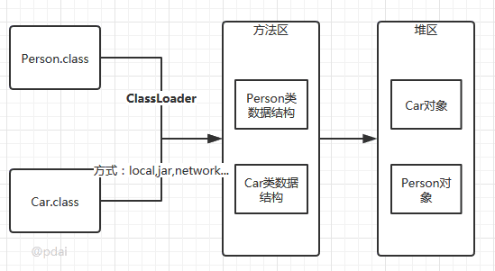

> 最后更新：2025-10-22 | [返回主目录](../README.md)

# 一、概述

## 1.1 学习要点
> 不同的虚拟机实现方式上也有差别，如果没有特别指出，这里的JVM指的是sun的HotSpot；不同的JDK版本略有差别，这里主要以1.8为主，具体差异请看各个章节中详解。下图主要表示的逻辑关系，用来将所有知识点放到一张图里，帮助你理解。

>Java进阶 - JVM相关 排错调优： 最后围绕着调试和排错，分析理解JVM调优参数，动态字节码技术及动态在线调试的原理；学会使用常用的调工具和在线动态调试工具等。

# 二、JVM 基础 - 类字节码详解
> 源代码通过编译器编译为字节码，再通过类加载子系统进行加载到JVM中运行。
## 2.1 多语言编译为字节码在JVM运行
计算机是不能直接运行java代码的，必须要先运行java虚拟机，再由java虚拟机运行编译后的java代码。这个编译后的java代码，就是本文要介绍的java字节码。

为什么jvm不能直接运行java代码呢，这是因为在cpu层面看来计算机中所有的操作都是一个个指令的运行汇集而成的，java是高级语言，只有人类才能理解其逻辑，计算机是无法识别的，所以java代码必须要先编译成字节码文件，jvm才能正确识别代码转换后的指令并将其运行。
- Java代码间接翻译成字节码，储存字节码的文件再交由运行于不同平台上的JVM虚拟机去读取执行，从而实现一次编写，到处运行的目的。
- JVM也不再只支持Java，由此衍生出了许多基于JVM的编程语言，如Groovy, Scala, Koltin等等。

## 2.2 Java字节码文件
class文件本质上是一个以8位字节为基础单位的二进制流，各个数据项目严格按照顺序紧凑的排列在class文件中。jvm根据其特定的规则解析该二进制数据，从而得到相关信息。

Class文件采用一种伪结构来存储数据，它有两种类型：无符号数和表。这里暂不详细的讲。

本文将通过简单的java例子编译后的文件来理解。
### 2.2.1 Class文件的结构属性
在理解之前先从整体看下java字节码文件包含了哪些类型的数据：

### 2.2.2 从一个例子开始
下面以一个简单的例子来逐步讲解字节码。
```java
//Main.java
public class Main {
    
    private int m;
    
    public int inc() {
        return m + 1;
    }
}
```
通过以下命令, 可以在当前所在路径下生成一个Main.class文件。
```sh
javac Main.java
```
以文本的形式打开生成的class文件，内容如下:
```sh
cafe babe 0000 0034 0013 0a00 0400 0f09
0003 0010 0700 1107 0012 0100 016d 0100
0149 0100 063c 696e 6974 3e01 0003 2829
5601 0004 436f 6465 0100 0f4c 696e 654e
756d 6265 7254 6162 6c65 0100 0369 6e63
0100 0328 2949 0100 0a53 6f75 7263 6546
696c 6501 0009 4d61 696e 2e6a 6176 610c
0007 0008 0c00 0500 0601 0010 636f 6d2f
7268 7974 686d 372f 4d61 696e 0100 106a
6176 612f 6c61 6e67 2f4f 626a 6563 7400
2100 0300 0400 0000 0100 0200 0500 0600
0000 0200 0100 0700 0800 0100 0900 0000
1d00 0100 0100 0000 052a b700 01b1 0000
0001 000a 0000 0006 0001 0000 0003 0001
000b 000c 0001 0009 0000 001f 0002 0001
0000 0007 2ab4 0002 0460 ac00 0000 0100
0a00 0000 0600 0100 0000 0800 0100 0d00
0000 0200 0e
```
- 文件开头的4个字节("cafe babe")称之为 魔数，唯有以"cafe babe"开头的class文件方可被虚拟机所接受，这4个字节就是字节码文件的身份识别。
- 0000是编译器jdk版本的次版本号0，0034转化为十进制是52,是主版本号，java的版本号从45开始，除1.0和1.1都是使用45.x外,以后每升一个大版本，版本号加一。也就是说，编译生成该class文件的jdk版本为1.8.0。

通过java -version命令稍加验证, 可得结果。
```sh
Java(TM) SE Runtime Environment (build 1.8.0_131-b11)
Java HotSpot(TM) 64-Bit Server VM (build 25.131-b11, mixed mode)
```
继续往下是常量池... 知道是这么分析的就可以了，然后我们通过工具反编译字节码文件继续去看。
### 2.2.3 反编译字节码文件
> 使用到java内置的一个反编译工具javap可以反编译字节码文件, 用法: javap <options> <classes>
其中<options>选项包括:
```sh
  -help  --help  -?        输出此用法消息
  -version                 版本信息
  -v  -verbose             输出附加信息
  -l                       输出行号和本地变量表
  -public                  仅显示公共类和成员
  -protected               显示受保护的/公共类和成员
  -package                 显示程序包/受保护的/公共类和成员(默认)
  -p  -private             显示所有类和成员
  -c                       对代码进行反汇编
  -s                       输出内部类型签名
  -sysinfo                 显示正在处理的类的系统信息 (路径, 大小, 日期, MD5 散列)
  -constants               显示最终常量
  -classpath <path>        指定查找用户类文件的位置
  -cp <path>               指定查找用户类文件的位置
  -bootclasspath <path>    覆盖引导类文件的位置
```
输入命令javap -verbose -p Main.class查看输出内容:
```java
Classfile /E:/JavaCode/TestProj/out/production/TestProj/com/rhythm7/Main.class
  Last modified 2018-4-7; size 362 bytes
  MD5 checksum 4aed8540b098992663b7ba08c65312de
  Compiled from "Main.java"
public class com.rhythm7.Main
  minor version: 0
  major version: 52
  flags: ACC_PUBLIC, ACC_SUPER
Constant pool:
   #1 = Methodref          #4.#18         // java/lang/Object."<init>":()V
   #2 = Fieldref           #3.#19         // com/rhythm7/Main.m:I
   #3 = Class              #20            // com/rhythm7/Main
   #4 = Class              #21            // java/lang/Object
   #5 = Utf8               m
   #6 = Utf8               I
   #7 = Utf8               <init>
   #8 = Utf8               ()V
   #9 = Utf8               Code
  #10 = Utf8               LineNumberTable
  #11 = Utf8               LocalVariableTable
  #12 = Utf8               this
  #13 = Utf8               Lcom/rhythm7/Main;
  #14 = Utf8               inc
  #15 = Utf8               ()I
  #16 = Utf8               SourceFile
  #17 = Utf8               Main.java
  #18 = NameAndType        #7:#8          // "<init>":()V
  #19 = NameAndType        #5:#6          // m:I
  #20 = Utf8               com/rhythm7/Main
  #21 = Utf8               java/lang/Object
{
  private int m;
    descriptor: I
    flags: ACC_PRIVATE

  public com.rhythm7.Main();
    descriptor: ()V
    flags: ACC_PUBLIC
    Code:
      stack=1, locals=1, args_size=1
         0: aload_0
         1: invokespecial #1                  // Method java/lang/Object."<init>":()V
         4: return
      LineNumberTable:
        line 3: 0
      LocalVariableTable:
        Start  Length  Slot  Name   Signature
            0       5     0  this   Lcom/rhythm7/Main;

  public int inc();
    descriptor: ()I
    flags: ACC_PUBLIC
    Code:
      stack=2, locals=1, args_size=1
         0: aload_0
         1: getfield      #2                  // Field m:I
         4: iconst_1
         5: iadd
         6: ireturn
      LineNumberTable:
        line 8: 0
      LocalVariableTable:
        Start  Length  Slot  Name   Signature
            0       7     0  this   Lcom/rhythm7/Main;
}
```
### 2.2.4 字节码文件信息

开头的7行信息包括:Class文件当前所在位置，最后修改时间，文件大小，MD5值，编译自哪个文件，类的全限定名，jdk次版本号，主版本号。

然后紧接着的是该类的访问标志：ACC_PUBLIC, ACC_SUPER，访问标志的含义如下:

| 标志名称        | 标志值 (十六进制) | 含义                                       |
|----------------|------------------|-------------------------------------------|
| ACC_PUBLIC     | 0x0001           | 声明为 public 类型                        |
| ACC_FINAL      | 0x0010           | 声明为 final（仅类可用）                  |
| **ACC_SUPER**  | **0x0020**       | **启用 invokespecial 指令的新语义**        |
| ACC_INTERFACE  | 0x0200           | 标识为接口                                |
| ACC_ABSTRACT   | 0x0400           | 抽象类型（接口/抽象类为 true）            |
| ACC_SYNTHETIC  | 0x1000           | 由编译器生成（非用户代码）                |
| ACC_ANNOTATION | 0x2000           | 标识为注解                                |
| ACC_ENUM       | 0x4000           | 标识为枚举                                |

`invokespecial` 是 JVM 字节码指令，用于调用：

- 实例初始化方法（<init> 构造器）
- 私有方法
- 父类方法（通过 super.method() 调用）
- 通过接口引用的默认方法


### 2.2.5 常量池
`Constant pool`意为常量池。

常量池可以理解成Class文件中的资源仓库。主要存放的是两大类常量：`字面量(Literal)`和`符号引用(Symbolic References)`。字面量类似于java中的常量概念，如文本字符串，final常量等，而符号引用则属于编译原理方面的概念，包括以下三种:
- 类和接口的全限定名(Fully Qualified Name)
- 字段的名称和描述符号(Descriptor)
- 方法的名称和描述符

不同于C/C++, JVM是在加载Class文件的时候才进行的动态链接，也就是说这些字段和方法符号引用只有在运行期转换后才能获得真正的内存入口地址。当虚拟机运行时，需要从常量池获得对应的符号引用，再在类创建或运行时解析并翻译到具体的内存地址中。 直接通过反编译文件来查看字节码内容：
```java
#1 = Methodref          #4.#18         // java/lang/Object."<init>":()V
#4 = Class              #21            // java/lang/Object
#7 = Utf8               <init>
#8 = Utf8               ()V
#18 = NameAndType        #7:#8          // "<init>":()V
#21 = Utf8               java/lang/Object
```
`第一个常量`是一个方法定义，指向了第4和第18个常量。以此类推查看第4和第18个常量。最后可以拼接成第一个常量右侧的注释内容:
```java
java/lang/Object."<init>":()V
```
这段可以理解为该类的实例构造器的声明，由于Main类没有重写构造方法，所以调用的是父类的构造方法（**所有构造器（无论是默认构造器还是自定义构造器）都会包含对父类构造器的调用**）。此处也说明了Main类的直接父类是Object。 该方法默认返回值是V, 也就是void，无返回值。

为什么是父类的构造器在常量池而不是自身的构造器
- 默认构造器真实存在：
    - 在反编译输出中明确显示为 public com.rhythm7.Main();
    - 这是编译器自动生成的
    - 构造器方法 (<init>) 不需要单独的常量池方法引用
- 常量池 #1 的作用：
  - 不是 Main 的构造器定义
  - 而是 Main 构造器需要调用的父类构造器 (Object.<init>)
  - 因为所有 Java 类最终都继承自 Object
`第二个常量`同理可得: 
```java
#2 = Fieldref           #3.#19         // com/rhythm7/Main.m:I
#3 = Class              #20            // com/rhythm7/Main
#5 = Utf8               m
#6 = Utf8               I
#19 = NameAndType        #5:#6          // m:I
#20 = Utf8               com/rhythm7/Main
```
此处声明了一个字段m，类型为I, I即是int类型。关于字节码的类型对应如下：

| 标识字符 | 对应类型      | 说明                                                                 | 示例                          |
|----------|--------------|----------------------------------------------------------------------|-------------------------------|
| **B**    | `byte`       | 8位有符号整数                                                        | `B` → `byte`                 |
| **C**    | `char`       | Unicode 字符（UTF-16）                                               | `C` → `char`                 |
| **D**    | `double`     | 双精度浮点数 (64位)                                                  | `D` → `double`               |
| **F**    | `float`      | 单精度浮点数 (32位)                                                  | `F` → `float`                |
| **I**    | `int`        | 32位整数                                                             | `I` → `int`                  |
| **J**    | `long`       | 64位整数                                                             | `J` → `long`                 |
| **S**    | `short`      | 16位整数                                                             | `S` → `short`                |
| **Z**    | `boolean`    | 布尔值 (`true`/`false`)                                              | `Z` → `boolean`              |
| **V**    | `void`       | 无返回值类型                                                         | `V` → `void`                 |
| **L**    | 对象引用类型 | 全限定类名，以 `;` 结尾                                              | `Ljava/lang/Object;` → `Object` |
| **[**    | 数组         | 前缀符号，可多层嵌套                                                 | `[I` → `int[]`               |

---

- 补充说明：

1. **数组类型**：使用 `[` 前缀表示
   - `[I` → 一维 `int` 数组
   - `[[D` → 二维 `double` 数组
   - `[Ljava/lang/String;` → `String[]`

2. **方法描述符**：结合类型标识符描述方法签名
   - `(I)V` → 参数 `int`，返回 `void`
   - `(Ljava/lang/String;[B)Z` → 参数 `String` 和 `byte[]`，返回 `boolean`

3. **特殊规则**：
   - `long` 和 `double` 在局部变量表中占用 2 个槽位（slot）
   - 对象类型必须使用全限定类名（如 `Ljava/lang/Object;`）

### 2.2.6 字段表
在常量池之后的是对类内部的方法描述，在字节码中以表的集合形式表现，暂且不管字节码文件的16进制文件内容如何，我们直接看反编译后的内容。
```java
private int m;
  descriptor: I
  flags: ACC_PRIVATE
```
此处声明了一个私有变量m，类型为int，返回值为int
### 2.2.7 方法表
```java
public com.rhythm7.Main();
   descriptor: ()V
   flags: ACC_PUBLIC
   Code:
     stack=1, locals=1, args_size=1
        0: aload_0
        1: invokespecial #1                  // Method java/lang/Object."<init>":()V
        4: return
```
这里是构造方法：Main()，返回值为void, 公开方法。

code内的主要属性为:

- `stack`: 最大操作数栈，JVM运行时会根据这个值来分配栈帧(Frame)中的操作栈深度,此处为1
- `locals`: 局部变量所需的存储空间，单位为Slot, Slot是虚拟机为局部变量分配内存时所使用的最小单位，为4个字节大小。方法参数(包括实例方法中的隐藏参数this)，显示异常处理器的参数(try catch中的catch块所定义的异常)，方法体中定义的局部变量都需要使用局部变量表来存放。值得一提的是，locals的大小并不一定等于所有局部变量所占的Slot之和，因为局部变量中的Slot是可以重用的。
- `args_size`: 方法参数的个数，这里是1，因为每个实例方法都会有一个隐藏参数this
- `attribute_info`: 方法体内容，0,1,4为字节码"行号"，该段代码的意思是将第一个引用类型本地变量推送至栈顶，然后执行该类型的实例方法，也就是常量池存放的第一个变量，也就是注释里的java/lang/Object."":()V, 然后执行返回语句，结束方法。
- `LineNumberTable`: 该属性的作用是描述源码行号与字节码行号(字节码偏移量)之间的对应关系。可以使用 -g:none 或-g:lines选项来取消或要求生成这项信息，如果选择不生成LineNumberTable，当程序运行异常时将无法获取到发生异常的源码行号，也无法按照源码的行数来调试程序。
- `LocalVariableTable`: 该属性的作用是描述帧栈中局部变量与源码中定义的变量之间的关系。可以使用 -g:none 或 -g:vars来取消或生成这项信息，如果没有生成这项信息，那么当别人引用这个方法时，将无法获取到参数名称，取而代之的是arg0, arg1这样的占位符。 start 表示该局部变量在哪一行开始可见，length表示可见行数，Slot代表所在帧栈位置，Name是变量名称，然后是类型签名。

同理可以分析Main类中的另一个方法"inc()":

方法体内的内容是：将this入栈，获取字段#2并置于栈顶, 将int类型的1入栈，将栈内顶部的两个数值相加，返回一个int类型的值。

### 2.2.8 属性表
```java
   LineNumberTable:
       line 3: 0
     LocalVariableTable:
       Start  Length  Slot  Name   Signature
           0       5     0  this   Lcom/rhythm7/Main;
```
### 2.2.9 字节码文件的整体介绍
**下面针对完整的反编译字节码进行总体介绍：**

#### 1. **类文件头信息**
```plaintext
Classfile /E:/.../Main.class
Last modified 2018-4-7; size 362 bytes
MD5 checksum 4aed8540b098992663b7ba08c65312de
Compiled from "Main.java"
```
- **文件路径**：类文件存储位置
- **修改时间**：2018-4-7
- **文件大小**：362字节
- **MD5校验**：确保文件完整性
- **源文件**：`Main.java`

---

#### 2. **类基本信息**
```plaintext
public class com.rhythm7.Main
minor version: 0
major version: 52
flags: ACC_PUBLIC, ACC_SUPER
```
- **类名**：`com.rhythm7.Main`（全限定名）
- **版本号**：
  - `major 52` → Java 8（版本映射：45=Java 1.1, 52=Java 8）
  - `minor 0` → 次要版本号（通常为0）
- **访问标志**：
  - `ACC_PUBLIC`：公有类
  - `ACC_SUPER`：历史遗留标志（保持向后兼容）

---

#### 3. **常量池（Constant Pool）**
常量池是类文件的"符号表"，存储所有字面量和符号引用：
```plaintext
#1 = Methodref    #4.#18  // java/lang/Object."<init>":()V
#2 = Fieldref     #3.#19  // com/rhythm7/Main.m:I
#3 = Class        #20     // com/rhythm7/Main
...
#5 = Utf8         m       // 字段名
#6 = Utf8         I       // int类型符
#7 = Utf8         <init>  // 构造器方法名
```
- **符号引用类型**：
  - `Methodref`：方法引用（类+方法）
  - `Fieldref`：字段引用（类+字段）
  - `Class`：类引用
  - `Utf8`：UTF-8编码字符串
  - `NameAndType`：名称+描述符组合

> 常量池索引**从1开始**，索引0保留不用

---

#### 4. **字段表（Field Table）**
```plaintext
private int m;
descriptor: I
flags: ACC_PRIVATE
```
- **字段元数据**：
  - 名称：`m`（对应常量池 `#5`）
  - 类型：`I`（基本类型int）
  - 访问标志：`ACC_PRIVATE`
- **作用**：定义类的成员变量，不包含具体值（值在对象实例化时分配）

---

#### 5. **方法表（Method Table）**
##### 5.1 构造器方法
```plaintext
public com.rhythm7.Main();
descriptor: ()V
flags: ACC_PUBLIC
Code:
  stack=1, locals=1, args_size=1
  0: aload_0
  1: invokespecial #1  // Object.<init>
  4: return
```
- **方法描述符**：`()V` → 无参数，返回void
- **操作数栈深度**：stack=1
- **局部变量槽**：locals=1
- **字节码指令**：
  - `aload_0`：加载this引用
  - `invokespecial #1`：调用父类构造器
  - `return`：方法返回

##### 5.2 inc()方法
```plaintext
public int inc();
descriptor: ()I
flags: ACC_PUBLIC
Code:
  stack=2, locals=1, args_size=1
  0: aload_0
  1: getfield #2  // Field m:I
  4: iconst_1
  5: iadd
  6: ireturn
```
- **方法描述符**：`()I` → 无参数，返回int
- **字节码指令**：
  - `getfield #2`：获取字段m的值
  - `iconst_1`：压入常量1
  - `iadd`：执行加法（m+1）
  - `ireturn`：返回int结果

---

#### 6. **属性表（Attribute Table）**
##### 6.1 LineNumberTable
```plaintext
LineNumberTable:
  line 3: 0   // Main.java第3行对应字节码偏移0
```
- **源码映射**：关联字节码偏移量与源代码行号

##### 6.2 LocalVariableTable
```plaintext
LocalVariableTable:
  Start Length Slot Name Signature
  0     5      0   this Lcom/rhythm7/Main;
```
- **局部变量信息**：
  - `this`：引用类型，Slot 0
  - 作用范围：字节码偏移0-5

---
### 2.2.10 类名
最后很显然是源码文件：
```java
SourceFile: "Main.java"
```
## 2.3 再看两个示例
### 2.3.1 分析try-catch-finally
通过以上一个最简单的例子，可以大致了解源码被编译成字节码后是什么样子的。 下面利用所学的知识点来分析一些Java问题:
```java
public class TestCode {
    public int foo() {
        int x;
        try {
            x = 1;
            return x;
        } catch (Exception e) {
            x = 2;
            return x;
        } finally {
            x = 3;
        }
    }
}
```
试问当不发生异常和发生异常的情况下，foo()的返回值分别是多少。
```sh
javac TestCode.java
javap -verbose TestCode.class
```
查看字节码的foo方法内容:
```java
public int foo();
    descriptor: ()I
    flags: ACC_PUBLIC
    Code:
      stack=1, locals=5, args_size=1
         0: iconst_1 //int型1入栈 ->栈顶=1
         1: istore_1 //将栈顶的int型数值存入第二个局部变量 ->局部2=1
         2: iload_1 //将第二个int型局部变量推送至栈顶 ->栈顶=1
         3: istore_2 //!!将栈顶int型数值存入第三个局部变量 ->局部3=1
         
         4: iconst_3 //int型3入栈 ->栈顶=3
         5: istore_1 //将栈顶的int型数值存入第二个局部变量 ->局部2=3
         6: iload_2 //!!将第三个int型局部变量推送至栈顶 ->栈顶=1
         7: ireturn //从当前方法返回栈顶int数值 ->1
         
         8: astore_2 // ->局部3=Exception
         9: iconst_2 // ->栈顶=2
        10: istore_1 // ->局部2=2
        11: iload_1 //->栈顶=2
        12: istore_3 //!! ->局部4=2
        
        13: iconst_3 // ->栈顶=3
        14: istore_1 // ->局部1=3
        15: iload_3 //!! ->栈顶=2
        16: ireturn // -> 2
        
        17: astore        4 //将栈顶引用型数值存入第五个局部变量=any
        19: iconst_3 //将int型数值3入栈 -> 栈顶3
        20: istore_1 //将栈顶第一个int数值存入第二个局部变量 -> 局部2=3
        21: aload         4 //将局部第五个局部变量(引用型)推送至栈顶
        23: athrow //将栈顶的异常抛出
      Exception table:
         from    to  target type
             0     4     8   Class java/lang/Exception //0到4行对应的异常，对应#8中储存的异常
             0     4    17   any //Exeption之外的其他异常
             8    13    17   any
            17    19    17   any
```
在字节码的4,5，以及13,14中执行的是同一个操作，就是将int型的3入操作数栈顶，并存入第二个局部变量。这正是我们源码在finally语句块中内容。也就是说，JVM在处理异常时，会在每个可能的分支都将finally语句重复执行一遍。

通过一步步分析字节码，可以得出最后的运行结果是：
- 不发生异常时: return 1
- 发生异常时: return 2
- 发生非Exception及其子类的异常，抛出异常，不返回值
### 2.3.2 扩展分析下面类三个方法的输出结果
```java
public class Main {

    private int m;

    public int foo() {
        int x;
        try {
            x = 1;
            return x;
        } catch (Exception e) {
            x = 2;
            return x;
        } finally {
            x = 3;
        }
    }

    public int foo2() {
        int x;
        try {
            x = 1;
            return x;
        } catch (Exception e) {
            x = 2;
            return x;
        } finally {
            x = 3;
            return x;
        }
    }

    public int foo3() {
        try {
            m = 1;
            return m;
        } catch (Exception e) {
            m = 2;
            return m;
        } finally {
            m = 3;
        }
    }

    public static void main(String[] args) {
        Main main = new Main();
        System.out.println("foo():"+main.foo());
        System.out.println("foo2():"+main.foo2());
        System.out.println("foo3():"+main.foo3());
        System.out.println("m:"+main.m);
    }
}
```
输出结果：
```java
foo():1
foo2():3
foo3():1
m:3
```

从字节码角度分析输出结果的原因如下，我们将逐个方法进行解析（基于标准 Javac 编译行为）：

---

### 1. `foo()` 方法分析
**输出结果：1**  
字节码关键逻辑：
```java
public int foo();
  Code:
   0: iconst_1       // 将常量1压入栈 (x=1)
   1: istore_1       // 存储到局部变量x (槽位1)
   2: iload_1        // 加载x的值 (1) 到栈顶 (准备返回)
   3: istore_2       // 将返回值暂存到槽位2 (固定返回值保存位置)
   4: iconst_3       // finally块开始 (x=3)
   5: istore_1       // 更新x=3 (但返回值已保存)
   6: iload_2        // 加载暂存的返回值 (1)
   7: ireturn        // 返回1

   8: astore_2       // catch块开始 (异常处理)
   ...               // catch逻辑（本例未触发）
   16: iconst_3      // finally块 (x=3)
   17: istore_1
   18: aload_2       // 重新抛出异常
   19: athrow
```

**关键机制**：
- **遇到 return x 时，需要暂存返回值（因 finally 必须执行）**: iconst_1; istore_1
- **返回值提前固化**：在进入 finally 前（字节码偏移3），返回值 1 已存入局部变量表槽位2
- **finally 修改无效**：虽然 finally 将 x 改为 3，但不影响已固化的返回值
- **返回路径**：`ireturn` 指令从槽位2加载值返回

---

### 2. `foo2()` 方法分析
**输出结果：3**  
字节码关键逻辑：
```java
public int foo2();
  Code:
   0: iconst_1       // x=1
   1: istore_1
   2: iload_1        // 加载x(1)准备返回
   3: istore_2       // 暂存返回值1 (槽位2)
   4: iconst_3       // finally块 (x=3)
   5: istore_1
   6: iload_1        // 加载x的新值(3) 
   7: ireturn        // 返回3

   8: astore_2      // catch块
   ...               // catch逻辑
   18: iconst_3      // finally块
   19: istore_1
   20: iload_1
   21: istore_3      // 再次覆盖返回值为3
   22: iload_3
   23: ireturn       // 返回3
```

**关键机制**：
- **finally 中的 return 优先**：字节码偏移7-9 覆盖了之前暂存的返回值
- **双保险设计**：
  - 正常路径：偏移3暂存1 → 偏移7用3覆盖
  - 异常路径：catch后同样用3覆盖返回值
- **本质**：finally 中的 return 会劫持所有退出路径

---

### 3. `foo3()` 方法分析
**输出结果：1（但成员变量 m 最终为3）**  
字节码关键逻辑：
```java
public int foo3();
  Code:
   0: aload_0        // 加载this
   1: iconst_1       
   2: putfield #2    // m=1 (Field m:I)
   5: aload_0
   6: getfield #2    // 获取m的值(1)
   9: istore_1       // 暂存返回值1 (槽位1)
   10: aload_0       // finally块开始
   11: iconst_3
   12: putfield #2   // m=3 (修改成员变量)
   13: iload_1       // 加载暂存值1
   14: ireturn       // 返回1

   15: astore_1      // catch块
   ...               // catch逻辑
   23: aload_0       // finally块
   24: iconst_3
   25: putfield #2   // m=3
   26: aload_1       // 重新抛出异常
   27: athrow
```

**关键机制**：
- **成员变量 vs 返回值**：
  - 返回值：在偏移9处固化 m 的当前值 1
  - 成员变量：finally 修改的是对象状态（偏移12）
- **两次内存操作**：
  ```mermaid
  sequenceDiagram
    字节码->>堆内存: putfield m=1 (偏移2)
    字节码->>局部变量表: istore_1=1 (偏移9)
    字节码->>堆内存: putfield m=3 (偏移12)
    返回指令->>调用者: 返回局部变量1的值(1)
  ```

---

### 内存状态变化时序图
```mermaid
sequenceDiagram
  main->>foo(): 调用
  foo()->>局部变量表: 固化返回值1
  foo()->>局部变量表: 修改x=3 (finally)
  foo()->>main: 返回1
  
  main->>foo2(): 调用
  foo2()->>局部变量表: 暂存1
  foo2()->>局部变量表: 覆盖返回值为3 (finally)
  foo2()->>main: 返回3
  
  main->>foo3(): 调用
  foo3()->>堆内存: m=1
  foo3()->>局部变量表: 固化返回值1
  foo3()->>堆内存: m=3 (finally)
  foo3()->>main: 返回1
  
  main->>堆内存: 读取m=3
```

### 最终输出解析
| 输出项         | 值  | 原因 |
|----------------|-----|------|
| `foo()`        | 1   | 返回值在finally执行前固化 |
| `foo2()`       | 3   | finally中的return覆盖原值 |
| `foo3()`       | 1   | 返回m的快照值（修改前） |
| `m`            | 3   | finally修改了对象状态 |

> **设计本质**：Java 使用局部变量槽固化返回值，finally 修改局部变量不影响已固化的返回值，但修改成员变量会影响对象状态。finally 中的 return 会彻底改变返回路径。

**这里最重要的是要明确这几个地方：**
- 1.遇到 return 时，需要暂存返回值（因 finally 必须执行）i_store
- 2.finally有return时的编译器优化，当检测到finally中有return语句时，废弃所有路径的暂存返回值
- 3.finally没有return的时候返回暂存值

| 场景                  | 返回值加载指令 | 是否需要临时槽位 | 典型字节码模式               |
|-----------------------|----------------|------------------|------------------------------|
| **无 finally 块**     | `iload_1`      | 否               | `iload_1 → ireturn`          |
| **有 finally(无return)** | `iload_2`      | 是               | `istore_2 → ... → iload_2`   |
| **有 finally(有return)** | `iload_1`      | 否（最终路径）   | `iload_1 → ireturn`          |
# 三、JVM 基础 - 字节码的增强技术
## 3.1 概述
在上文中，着重介绍了字节码的结构，这为我们了解字节码增强技术的实现打下了基础。字节码增强技术就是一类对现有字节码进行修改或者动态生成全新字节码文件的技术。接下来，我们将从最直接操纵字节码的实现方式开始深入进行剖析

## 3.2 ASM
对于需要手动操纵字节码的需求，可以使用ASM，它可以直接生产 .class字节码文件，也可以在类被加载入JVM之前动态修改类行为（如下图17所示）。ASM的应用场景有AOP（Cglib就是基于ASM）、热部署、修改其他jar包中的类等。当然，涉及到如此底层的步骤，实现起来也比较麻烦。接下来，本文将介绍ASM的两种API，并用ASM来实现一个比较粗糙的AOP。但在此之前，为了让大家更快地理解ASM的处理流程，强烈建议读者先对访问者模式进行了解。简单来说，访问者模式主要用于修改或操作一些数据结构比较稳定的数据，而通过第一章，我们知道字节码文件的结构是由JVM固定的，所以很适合利用访问者模式对字节码文件进行修改。

### 3.2.1 ASM API
#### 3.2.1.1 核心API(Core API)
ASM Core API可以类比解析XML文件中的SAX方式，不需要把这个类的整个结构读取进来，就可以用流式的方法来处理字节码文件。好处是非常节约内存，但是编程难度较大。然而出于性能考虑，一般情况下编程都使用Core API。在Core API中有以下几个关键类：
- ClassReader：用于读取已经编译好的.class文件。
- ClassWriter：用于重新构建编译后的类，如修改类名、属性以及方法，也可以生成新的类的字节码文件。
- 各种Visitor类：如上所述，CoreAPI根据字节码从上到下依次处理，对于字节码文件中不同的区域有不同的Visitor，比如用于访问方法的MethodVisitor、用于访问类变量的FieldVisitor、用于访问注解的AnnotationVisitor等。为了实现AOP，重点要使用的是MethodVisitor。
#### 3.2.1.2 树形API(Tree API)
ASM Tree API可以类比解析XML文件中的DOM方式，把整个类的结构读取到内存中，缺点是消耗内存多，但是编程比较简单。TreeApi不同于CoreAPI，TreeAPI通过各种Node类来映射字节码的各个区域，类比DOM节点，就可以很好地理解这种编程方式。
### 3.2.2 直接利用ASM实现AOP
利用ASM的CoreAPI来增强类。这里不纠结于AOP的专业名词如切片、通知，只实现在方法调用前、后增加逻辑，通俗易懂且方便理解。首先定义需要被增强的Base类：其中只包含一个process()方法，方法内输出一行“process”。增强后，我们期望的是，方法执行前输出“start”，之后输出”end”。
```java
public class Base {
    public void process(){
        System.out.println("process");
    }
}
```
为了利用ASM实现AOP，需要定义两个类：一个是MyClassVisitor类，用于对字节码的visit以及修改；另一个是Generator类，在这个类中定义ClassReader和ClassWriter，其中的逻辑是，classReader读取字节码，然后交给MyClassVisitor类处理，处理完成后由ClassWriter写字节码并将旧的字节码替换掉。Generator类较简单，我们先看一下它的实现，如下所示，然后重点解释MyClassVisitor类。
```java
import org.objectweb.asm.ClassReader;
import org.objectweb.asm.ClassVisitor;
import org.objectweb.asm.ClassWriter;

public class Generator {
    public static void main(String[] args) throws Exception {
		//读取
        ClassReader classReader = new ClassReader("meituan/bytecode/asm/Base");
        ClassWriter classWriter = new ClassWriter(ClassWriter.COMPUTE_MAXS);
        //处理
        ClassVisitor classVisitor = new MyClassVisitor(classWriter);
        classReader.accept(classVisitor, ClassReader.SKIP_DEBUG);
        byte[] data = classWriter.toByteArray();
        //输出
        File f = new File("operation-server/target/classes/meituan/bytecode/asm/Base.class");
        FileOutputStream fout = new FileOutputStream(f);
        fout.write(data);
        fout.close();
        System.out.println("now generator cc success!!!!!");
    }
}
```
MyClassVisitor继承自ClassVisitor，用于对字节码的观察。它还包含一个内部类MyMethodVisitor，继承自MethodVisitor用于对类内方法的观察，它的整体代码如下：
```java
import org.objectweb.asm.ClassVisitor;
import org.objectweb.asm.MethodVisitor;
import org.objectweb.asm.Opcodes;

public class MyClassVisitor extends ClassVisitor implements Opcodes {
    public MyClassVisitor(ClassVisitor cv) {
        super(ASM5, cv);
    }
    @Override
    public void visit(int version, int access, String name, String signature,
                      String superName, String[] interfaces) {
        cv.visit(version, access, name, signature, superName, interfaces);
    }
    @Override
    public MethodVisitor visitMethod(int access, String name, String desc, String signature, String[] exceptions) {
        MethodVisitor mv = cv.visitMethod(access, name, desc, signature,
                exceptions);
        //Base类中有两个方法：无参构造以及process方法，这里不增强构造方法
        if (!name.equals("<init>") && mv != null) {
            mv = new MyMethodVisitor(mv);
        }
        return mv;
    }
    class MyMethodVisitor extends MethodVisitor implements Opcodes {
        public MyMethodVisitor(MethodVisitor mv) {
            super(Opcodes.ASM5, mv);
        }

        @Override
        public void visitCode() {
            super.visitCode();
            mv.visitFieldInsn(GETSTATIC, "java/lang/System", "out", "Ljava/io/PrintStream;");
            mv.visitLdcInsn("start");
            mv.visitMethodInsn(INVOKEVIRTUAL, "java/io/PrintStream", "println", "(Ljava/lang/String;)V", false);
        }
        @Override
        public void visitInsn(int opcode) {
            if ((opcode >= Opcodes.IRETURN && opcode <= Opcodes.RETURN)
                    || opcode == Opcodes.ATHROW) {
                //方法在返回之前，打印"end"
                mv.visitFieldInsn(GETSTATIC, "java/lang/System", "out", "Ljava/io/PrintStream;");
                mv.visitLdcInsn("end");
                mv.visitMethodInsn(INVOKEVIRTUAL, "java/io/PrintStream", "println", "(Ljava/lang/String;)V", false);
            }
            mv.visitInsn(opcode);
        }
    }
}
```
利用这个类就可以实现对字节码的修改。详细解读其中的代码，对字节码做修改的步骤是：
- 首先通过MyClassVisitor类中的visitMethod方法，判断当前字节码读到哪一个方法了。跳过构造方法 <init> 后，将需要被增强的方法交给内部类MyMethodVisitor来进行处理。
- 接下来，进入内部类MyMethodVisitor中的visitCode方法，它会在ASM开始访问某一个方法的Code区时被调用，重写visitCode方法，将AOP中的前置逻辑就放在这里。 MyMethodVisitor继续读取字节码指令，每当ASM访问到无参数指令时，都会调用MyMethodVisitor中的visitInsn方法。我们判断了当前指令是否为无参数的“return”指令，如果是就在它的前面添加一些指令，也就是将AOP的后置逻辑放在该方法中。
- 综上，重写MyMethodVisitor中的两个方法，就可以实现AOP了，而重写方法时就需要用ASM的写法，手动写入或者修改字节码。通过调用methodVisitor的visitXXXXInsn()方法就可以实现字节码的插入，XXXX对应相应的操作码助记符类型，比如mv.visitLdcInsn(“end”)对应的操作码就是ldc “end”，即将字符串“end”压入栈。 完成这两个visitor类后，运行Generator中的main方法完成对Base类的字节码增强，增强后的结果可以在编译后的target文件夹中找到Base.class文件进行查看，可以看到反编译后的代码已经改变了。然后写一个测试类MyTest，在其中new Base()，并调用base.process()方法，可以看到下图右侧所示的AOP实现效果：

### 3.2.3 ASM工具
利用ASM手写字节码时，需要利用一系列visitXXXXInsn()方法来写对应的助记符，所以需要先将每一行源代码转化为一个个的助记符，然后通过ASM的语法转换为visitXXXXInsn()这种写法。第一步将源码转化为助记符就已经够麻烦了，不熟悉字节码操作集合的话，需要我们将代码编译后再反编译，才能得到源代码对应的助记符。第二步利用ASM写字节码时，如何传参也很令人头疼。ASM社区也知道这两个问题，所以提供了工具<a href= 'https://plugins.jetbrains.com/plugin/5918-asm-bytecode-outline'>ASM ByteCode Outline</a>
安装后，右键选择“Show Bytecode Outline”，在新标签页中选择“ASMified”这个tab，如图19所示，就可以看到这个类中的代码对应的ASM写法了。图中上下两个红框分别对应AOP中的前置逻辑于后置逻辑，将这两块直接复制到visitor中的visitMethod()以及visitInsn()方法中，就可以了。

## 3.3 Javassist
ASM是在指令层次上操作字节码的，阅读上文后，我们的直观感受是在指令层次上操作字节码的框架实现起来比较晦涩。故除此之外，我们再简单介绍另外一类框架：强调源代码层次操作字节码的框架Javassist。

利用Javassist实现字节码增强时，可以无须关注字节码刻板的结构，其优点就在于编程简单。直接使用java编码的形式，而不需要了解虚拟机指令，就能动态改变类的结构或者动态生成类。其中最重要的是ClassPool、CtClass、CtMethod、CtField这四个类：

- CtClass（compile-time class）：编译时类信息，它是一个class文件在代码中的抽象表现形式，可以通过一个类的全限定名来获取一个CtClass对象，用来表示这个类文件。
- ClassPool：从开发视角来看，ClassPool是一张保存CtClass信息的HashTable，key为类名，value为类名对应的CtClass对象。当我们需要对某个类进行修改时，就是通过pool.getCtClass(“className”)方法从pool中获取到相应的CtClass。
- CtMethod、CtField：这两个比较好理解，对应的是类中的方法和属性。

了解这四个类后，我们可以写一个小Demo来展示Javassist简单、快速的特点。我们依然是对Base中的process()方法做增强，在方法调用前后分别输出”start”和”end”，实现代码如下。我们需要做的就是从pool中获取到相应的CtClass对象和其中的方法，然后执行method.insertBefore和insertAfter方法，参数为要插入的Java代码，再以字符串的形式传入即可，实现起来也极为简单。
```java
import com.meituan.mtrace.agent.javassist.*;

public class JavassistTest {
    public static void main(String[] args) throws NotFoundException, CannotCompileException, IllegalAccessException, InstantiationException, IOException {
        // 1. 获取默认的类池（管理类的容器）
        ClassPool cp = ClassPool.getDefault();
        
        // 2. 从类池中获取目标类 "meituan.bytecode.javassist.Base" 的 CtClass 对象
        CtClass cc = cp.get("meituan.bytecode.javassist.Base");
        
        // 3. 获取目标类中声明的 "process" 方法
        CtMethod m = cc.getDeclaredMethod("process");
        
        // 4. 在 process 方法开头插入字节码：打印 "start"
        m.insertBefore("{ System.out.println(\"start\"); }");
        
        // 5. 在 process 方法结尾插入字节码：打印 "end"（包括正常返回和异常退出）
        m.insertAfter("{ System.out.println(\"end\"); }");
        
        // 6. 将修改后的 CtClass 转换为可运行的 Class 对象
        Class c = cc.toClass();
        
        // 7. 将修改后的字节码写入文件系统（保存到 /Users/zen/projects 目录）
        cc.writeFile("/Users/zen/projects");
        
        // 8. 通过反射创建修改后类的实例
        Base h = (Base)c.newInstance();
        
        // 9. 调用 process 方法验证修改效果
        h.process();
    }
}

```
## 3.4 运行时类的重载
### 3.4.1 问题引出
上一章重点介绍了两种不同类型的字节码操作框架，且都利用它们实现了较为粗糙的AOP。其实，为了方便大家理解字节码增强技术，在上文中我们避重就轻将ASM实现AOP的过程分为了两个main方法：第一个是利用MyClassVisitor对已编译好的class文件进行修改，第二个是new对象并调用。这期间并不涉及到JVM运行时对类的重加载，而是在第一个main方法中，通过ASM对已编译类的字节码进行替换，在第二个main方法中，直接使用已替换好的新类信息。另外在Javassist的实现中，我们也只加载了一次Base类，也不涉及到运行时重加载类。

如果我们在一个JVM中，先加载了一个类，然后又对其进行字节码增强并重新加载会发生什么呢？模拟这种情况，只需要我们在上文中Javassist的Demo中main()方法的第一行添加Base b=new Base()，即在增强前就先让JVM加载Base类，然后在执行到c.toClass()方法时会抛出错误，如下图20所示。跟进c.toClass()方法中，我们会发现它是在最后调用了ClassLoader的native方法defineClass()时报错。也就是说，JVM是不允许在运行时动态重载一个类的。

显然，如果只能在类加载前对类进行强化，那字节码增强技术的使用场景就变得很窄了。我们期望的效果是：在一个持续运行并已经加载了所有类的JVM中，还能利用字节码增强技术对其中的类行为做替换并重新加载。为了模拟这种情况，我们将Base类做改写，在其中编写main方法，每五秒调用一次process()方法，在process()方法中输出一行“process”。

我们的目的就是，在JVM运行中的时候，将process()方法做替换，在其前后分别打印“start”和“end”。也就是在运行中时，每五秒打印的内容由”process”变为打印”start process end”。那如何解决JVM不允许运行时重加载类信息的问题呢？为了达到这个目的，我们接下来一一来介绍需要借助的Java类库。
```java
import java.lang.management.ManagementFactory;

public class Base {
    public static void main(String[] args) {
        String name = ManagementFactory.getRuntimeMXBean().getName();
        String s = name.split("@")[0];
        //打印当前Pid
        System.out.println("pid:"+s);
        while (true) {
            try {
                Thread.sleep(5000L);
            } catch (Exception e) {
                break;
            }
            process();
        }
    }

    public static void process() {
        System.out.println("process");
    }
}
```
### 3.4.2 Instrument
instrument是JVM提供的一个可以修改已加载类的类库，专门为Java语言编写的插桩服务提供支持。它需要依赖JVMTI的Attach API机制实现，JVMTI这一部分，我们将在下一小节进行介绍。在JDK 1.6以前，instrument只能在JVM刚启动开始加载类时生效，而在JDK 1.6之后，instrument支持了在运行时对类定义的修改。要使用instrument的类修改功能，我们需要实现它提供的ClassFileTransformer接口，定义一个类文件转换器。接口中的transform()方法会在类文件被加载时调用，而在transform方法里，我们可以利用上文中的ASM或Javassist对传入的字节码进行改写或替换，生成新的字节码数组后返回。

我们定义一个实现了ClassFileTransformer接口的类TestTransformer，依然在其中利用Javassist对Base类中的process()方法进行增强，在前后分别打印“start”和“end”，代码如下
```java
import java.lang.instrument.ClassFileTransformer;

public class TestTransformer implements ClassFileTransformer {
    @Override
    public byte[] transform(ClassLoader loader, String className, Class<?> classBeingRedefined, ProtectionDomain protectionDomain, byte[] classfileBuffer) {
        System.out.println("Transforming " + className);
        try {
            ClassPool cp = ClassPool.getDefault();
            CtClass cc = cp.get("meituan.bytecode.jvmti.Base");
            CtMethod m = cc.getDeclaredMethod("process");
            m.insertBefore("{ System.out.println(\"start\"); }");
            m.insertAfter("{ System.out.println(\"end\"); }");
            return cc.toBytecode();
        } catch (Exception e) {
            e.printStackTrace();
        }
        return null;
    }
}
```
现在有了Transformer，那么它要如何注入到正在运行的JVM呢？还需要定义一个Agent，借助Agent的能力将Instrument注入到JVM中。我们将在下一小节介绍Agent，现在要介绍的是Agent中用到的另一个类Instrumentation。在JDK 1.6之后，Instrumentation可以做启动后的Instrument、本地代码（Native Code）的Instrument，以及动态改变Classpath等等。我们可以向Instrumentation中添加上文中定义的Transformer，并指定要被重加载的类，代码如下所示。这样，当Agent被Attach到一个JVM中时，就会执行类字节码替换并重载入JVM的操作。
```java
import java.lang.instrument.Instrumentation;

public class TestAgent {
    public static void agentmain(String args, Instrumentation inst) {
        //指定我们自己定义的Transformer，在其中利用Javassist做字节码替换
        inst.addTransformer(new TestTransformer(), true);
        try {
            //重定义类并载入新的字节码
            inst.retransformClasses(Base.class);
            System.out.println("Agent Load Done.");
        } catch (Exception e) {
            System.out.println("agent load failed!");
        }
    }
}
```
### 3.4.3 JVMTI & Agent & Attach API
上一小节中，我们给出了Agent类的代码，追根溯源需要先介绍JPDA（Java Platform Debugger Architecture）[Java 平台调试器架构]。如果JVM启动时开启了JPDA，那么类是允许被重新加载的。在这种情况下，已被加载的旧版本类信息可以被卸载，然后重新加载新版本的类。正如JDPA名称中的Debugger，JDPA其实是一套用于调试Java程序的标准，任何JDK都必须实现该标准。

JPDA定义了一整套完整的体系，它将调试体系分为三部分，并规定了三者之间的通信接口。三部分由低到高分别是Java 虚拟机工具接口（JVMTI），Java 调试协议（JDWP）以及 Java 调试接口（JDI），三者之间的关系如下图所示：


现在回到正题，我们可以借助JVMTI的一部分能力，帮助动态重载类信息。JVM TI（JVM TOOL INTERFACE，JVM工具接口）是JVM提供的一套对JVM进行操作的工具接口。通过JVMTI，可以实现对JVM的多种操作，它通过接口注册各种事件勾子，在JVM事件触发时，同时触发预定义的勾子，以实现对各个JVM事件的响应，事件包括类文件加载、异常产生与捕获、线程启动和结束、进入和退出临界区、成员变量修改、GC开始和结束、方法调用进入和退出、临界区竞争与等待、VM启动与退出等等。

而Agent就是JVMTI的一种实现，Agent有两种启动方式，一是随Java进程启动而启动，经常见到的java -agentlib就是这种方式；二是运行时载入，通过attach API，将模块（jar包）动态地Attach到指定进程id的Java进程内。

Attach API 的作用是提供JVM进程间通信的能力，比如说我们为了让另外一个JVM进程把线上服务的线程Dump出来，会运行jstack或jmap的进程，并传递pid的参数，告诉它要对哪个进程进行线程Dump，这就是Attach API做的事情。在下面，我们将通过Attach API的loadAgent()方法，将打包好的Agent jar包动态Attach到目标JVM上。具体实现起来的步骤如下：

- 定义Agent，并在其中实现AgentMain方法，如上一小节中定义的代码块7中的TestAgent类；
- 然后将TestAgent类打成一个包含MANIFEST.MF的jar包，其中MANIFEST.MF文件中将Agent-Class属性指定为TestAgent的全限定名，如下图所示；

- 最后利用Attach API，将我们打包好的jar包Attach到指定的JVM pid上，代码如下：
```java
import com.sun.tools.attach.VirtualMachine;

public class Attacher {
    public static void main(String[] args) throws AttachNotSupportedException, IOException, AgentLoadException, AgentInitializationException {
        // 传入目标 JVM pid
        VirtualMachine vm = VirtualMachine.attach("39333");
        vm.loadAgent("/Users/zen/operation_server_jar/operation-server.jar");
    }
}
```
- 由于在MANIFEST.MF中指定了Agent-Class，所以在Attach后，目标JVM在运行时会走到TestAgent类中定义的agentmain()方法，而在这个方法中，我们利用Instrumentation，将指定类的字节码通过定义的类转化器TestTransformer做了Base类的字节码替换（通过javassist），并完成了类的重新加载。由此，我们达成了“在JVM运行时，改变类的字节码并重新载入类信息”的目的。

以下为运行时重新载入类的效果：先运行Base中的main()方法，启动一个JVM，可以在控制台看到每隔五秒输出一次”process”。接着执行Attacher中的main()方法，并将上一个JVM的pid传入。此时回到上一个main()方法的控制台，可以看到现在每隔五秒输出”process”前后会分别输出”start”和”end”，也就是说完成了运行时的字节码增强，并重新载入了这个类。


总结：

Attacher **不是**在 Java 项目最开始运行时就在的，而是需要**通过另一个独立的 Java 进程**来将增强的字节码加载到已经运行的 Java 进程中。以下是详细说明：

- 📌 关键流程解析
1. **目标 JVM 进程启动**  
   - 首先运行包含 `Base.main()` 的 Java 程序（目标进程）
   - 该进程正常执行，无任何字节码增强逻辑
   - 示例输出：每隔5秒输出 `"process"`

2. **Attacher 作为独立进程启动**  
   - 在另一个独立的 Java 进程中运行 `Attacher.main()`
   - 此进程通过 `VirtualMachine.attach(pid)` 连接到目标 JVM 进程
   - 使用 `vm.loadAgent()` 加载包含字节码增强逻辑的 Agent JAR 包

3. **动态注入过程**  
   ```mermaid
   sequenceDiagram
       目标JVM->>Attacher: 正在运行(输出"process")
       Attacher->>目标JVM: attach(pid)
       Attacher->>目标JVM: loadAgent(agent.jar)
       目标JVM->>TestAgent: 执行agentmain()
       TestAgent->>Instrumentation: addTransformer()
       TestAgent->>Instrumentation: retransformClasses(Base)
       Instrumentation->>TestTransformer: transform() 修改字节码
       目标JVM->>Base: 重加载增强后的类
       目标JVM->>控制台: 开始输出"start"和"end"
   ```

   🔧 技术组件角色
| 组件 | 运行位置 | 作用 |
|------|----------|------|
| **目标 JVM** | 独立进程 | 运行被监控/增强的业务程序 |
| **Attacher** | 独立进程 | 将 Agent 注入目标 JVM 的"注入器" |
| **TestAgent** | 注入到目标 JVM | 注册字节码转换器 |
| **TestTransformer** | 在目标 JVM 内执行 | 动态修改类字节码 |

- ⚠️ 重要注意事项
1. **Attacher 必须独立运行**
   - 不能和目标 JVM 在同一个进程内
   - 需要获取目标 JVM 的进程 ID (pid)

2. **依赖 JDK 工具包**
   ```java
   import com.sun.tools.attach.VirtualMachine; // 属于 JDK 的 tools.jar
   ```
   - 运行 Attacher 时需要 JDK 而非 JRE
   - Maven 依赖示例：
     ```xml
     <dependency>
         <groupId>com.sun</groupId>
         <artifactId>tools</artifactId>
         <version>${java.version}</version>
         <scope>system</scope>
         <systemPath>${java.home}/../lib/tools.jar</systemPath>
     </dependency>
     ```

3. **权限要求**
   - Attacher 进程需要和目标 JVM 相同的用户权限
   - Linux/Unix 系统可能需要 `sudo` 权限

- 🌰 典型执行流程
1. 终端1 启动目标程序：
   ```bash
   java -cp app.jar com.example.Main # 输出"process" every 5s
   ```
   PID=39333

2. 终端2 编译并运行 Attacher：
   ```bash
   javac -cp $JAVA_HOME/lib/tools.jar Attacher.java
   java -cp .:$JAVA_HOME/lib/tools.jar Attacher 39333
   ```

3. 观察终端1输出变化：
   ```
   process     # 原始输出
   process     # 原始输出
   start       # Agent注入后
   process     # 增强逻辑
   end         # Agent注入后
   ```

- 💡 设计价值
这种"进程分离"架构实现了：
1. **无侵入式增强**：无需修改目标程序代码
2. **运行时热更新**：业务系统无需重启
3. **生产环境诊断**：动态添加监控/日志功能
4. **安全隔离**：注入失败不影响目标进程

> **总结**：Attacher 是一个独立的外部进程，专门用于将字节码增强逻辑动态注入到**已经运行的目标 JVM 进程**中，不是目标程序的一部分。这种机制是 Java 热更新和 APM（应用性能监控）系统的核心实现原理。
## 3.5 使用场景
至此，字节码增强技术的可使用范围就不再局限于JVM加载类前了。通过上述几个类库，我们可以在运行时对JVM中的类进行修改并重载了。通过这种手段，可以做的事情就变得很多了：
- 热部署：不部署服务而对线上服务做修改，可以做打点、增加日志等操作。
- Mock：测试时候对某些服务做Mock。
- 性能诊断工具：比如bTrace就是利用Instrument，实现无侵入地跟踪一个正在运行的JVM，监控到类和方法级别的状态信息。
## 3.6 总结
字节码增强技术相当于是一把打开运行时JVM的钥匙，利用它可以动态地对运行中的程序做修改，也可以跟踪JVM运行中程序的状态。此外，我们平时使用的动态代理、AOP也与字节码增强密切相关，它们实质上还是利用各种手段生成符合规范的字节码文件。综上所述，掌握字节码增强后可以高效地定位并快速修复一些棘手的问题（如线上性能问题、方法出现不可控的出入参需要紧急加日志等问题），也可以在开发中减少冗余代码，大大提高开发效率。
# 四、JVM 基础 - Java 类加载机制
## 4.1 类的生命周期
其中类加载的过程包括了`加载`、`连接`(验证、准备、解析)、`初始化`五个阶段。在这五个阶段中，加载、验证、准备和初始化这四个阶段发生的顺序是确定的，而解析阶段则不一定，它在某些情况下可以在初始化阶段之后开始，这是为了支持Java语言的运行时绑定(也成为动态绑定或晚期绑定)。另外注意这里的几个阶段是按顺序开始，而不是按顺序进行或完成，因为这些阶段通常都是互相交叉地混合进行的，通常在一个阶段执行的过程中调用或激活另一个阶段。

## 4.2 类的加载: 查找并加载类的二进制数据
加载是类加载过程的第一个阶段，在加载阶段，虚拟机需要完成以下三件事情:
- 通过一个类的全限定名来获取其定义的二进制字节流。
- 将这个字节流所代表的静态存储结构转化为方法区的运行时数据结构。
- 在Java堆中生成一个代表这个类的java.lang.Class对象，作为对方法区中这些数据的访问入口。

相对于类加载的其他阶段而言，加载阶段(准确地说，是加载阶段获取类的二进制字节流的动作)是可控性最强的阶段，因为开发人员既可以使用系统提供的类加载器来完成加载，也可以自定义自己的类加载器来完成加载。

加载阶段完成后，虚拟机外部的 二进制字节流就按照虚拟机所需的格式存储在方法区之中，而且在Java堆中也创建一个java.lang.Class类的对象，这样便可以通过该对象访问方法区中的这些数据。

类加载器并不需要等到某个类被“首次主动使用”时再加载它，JVM规范允许类加载器在预料某个类将要被使用时就预先加载它，如果在预先加载的过程中遇到了.class文件缺失或存在错误，类加载器必须在程序首次主动使用该类时才报告错误(LinkageError错误)如果这个类一直没有被程序主动使用，那么类加载器就不会报告错误。
> 加载.class文件的方式
- 从本地系统中直接加载
- 通过网络下载.class文件
- 从zip，jar等归档文件中加载.class文件
- 从专有数据库中提取.class文件
- 将Java源文件动态编译为.class文件
## 4.3 连接
### 4.3.1 验证: 确保被加载的类的正确性
验证是连接阶段的第一步，这一阶段的目的是为了确保Class文件的字节流中包含的信息符合当前虚拟机的要求，并且不会危害虚拟机自身的安全。验证阶段大致会完成4个阶段的检验动作:
- `文件格式验证`:验证字节流是否符合Class文件格式的规范；例如: 是否以0xCAFEBABE开头、主次版本号是否在当前虚拟机的处理范围之内、常量池中的常量是否有不被支持的类型。
- `元数据验证`: 对字节码描述的信息进行语义分析(注意: 对比javac编译阶段的语义分析)，以保证其描述的信息符合Java语言规范的要求；例如: 这个类是否有父类，除了java.lang.Object之外。
- `字节码验证`: 通过数据流和控制流分析，确定程序语义是合法的、符合逻辑的。
- `符号引用验证`: 确保解析动作能正确执行。
> 验证阶段是非常重要的，但不是必须的，它对程序运行期没有影响，如果所引用的类经过反复验证，那么可以考虑采用-Xverifynone参数来关闭大部分的类验证措施，以缩短虚拟机类加载的时间。
### 4.3.2 准备: 为类的静态变量分配内存，并将其初始化为默认值
准备阶段是正式为类变量分配内存并设置类变量初始值的阶段，这些内存都将在**方法区**中分配。对于该阶段有以下几点需要注意*:
- 这时候进行内存分配的仅包括类变量(static)，而不包括实例变量，**实例变量会在对象实例化时随着对象一块分配在Java堆中**。
- **这里所设置的初始值通常情况下是数据类型默认的零值(如0、0L、null、false等)，而不是被在Java代码中被显式地赋予的值。**

假设一个类变量的定义为: `public static int value = 3`；那么变量value在准备阶段过后的初始值为0，而不是3，因为这时候尚未开始执行任何Java方法，而把value赋值为3的`put static`指令是在程序编译后，存放于类构造器<clinit>()方法之中的，所以把value赋值为3的动作将在初始化阶段才会执行。
> 这里还需要注意如下几点
- 对基本数据类型来说，对于`类变量(static:一定是全局变量)和全局变量`，如果不显式地对其赋值而直接使用，则系统会为其赋予默认的零值，而对于`局部变量`来说，在使用前必须显式地为其赋值，否则编译时不通过。
- 对于同时被static和final修饰的常量，必须在声明的时候就为其显式地赋值，否则编译时不通过；而只被final修饰的常量则既可以在声明时显式地为其赋值，也可以在类初始化时显式地为其赋值，总之，`final在使用前必须为其显式地赋值，系统不会为其赋予默认零值`。
- 对于引用数据类型reference来说，如数组引用、对象引用等，如果没有对其进行显式地赋值而直接使用，系统都会为其赋予默认的零值，即null。
- 如果在数组初始化时没有对数组中的各元素赋值，那么其中的元素将根据对应的数据类型而被赋予默认的零值。
- 如果类字段的字段属性表中存在ConstantValue属性，即同时被final和static修饰，那么在准备阶段变量value就会被初始化为ConstValue属性所指定的值。假设上面的类变量value被定义为:  public static final int value = 3；编译时Javac将会为value生成ConstantValue属性，在准备阶段虚拟机就会根据ConstantValue的设置将value赋值为3。我们可以理解为static final常量在**编译期**就将其结果放入了调用它的类的常量池中(注意和public static int value = 3赋值在初始化阶段有区别)
 
#### static int i=3和static final int i=3的区别
- 📌 核心区别对比

| 特性 | `static int i = 3` | `static final int i = 3` |
|------|-------------------|-------------------------|
| **赋值时机** | 类加载的**初始化阶段** | 编译期间|
| **存储位置** | 方法区的类变量区域 | 运行时常量池 |
| **是否可修改** | ✅ 可重新赋值 | ❌ 不可修改（编译时常量） |
| **内存分配** | 类加载时分配内存 | 编译期确定，直接内联到代码 |

- 🔧 具体实现机制

1. `static int i = 3`（类加载初始化阶段）
```java
public class Test {
    static int i = 3;  // 在<clinit>()方法中赋值
    
    // 编译后生成的字节码逻辑：
    static <clinit>() {
        i = 3;  // 在类初始化时执行赋值
    }
}
```

**类加载过程：**
1. **加载** → 2. **验证** → 3. **准备** → 4. **解析** → 5. **初始化**
- 在**准备阶段**：`i` 被赋默认值 `0`
- 在**初始化阶段**：执行 `<clinit>()` 方法，`i` 被赋值为 `3`

2. `static final int i = 3`（编译期常量池）
```java
public class Test {
    static final int i = 3;  // 编译时常量
    
    public void print() {
        System.out.println(i);  // 编译后直接变为：System.out.println(3)
    }
}
```

**编译期处理：**
- 编译器直接将常量值 `3` 写入 `.class` 文件的**常量池**
- **所有使用 `i` 的地方都会被替换为字面量 `3`**
- 运行时**不会**有内存分配和赋值操作

- 🧪 验证示例

1. 反编译对比
```java
// 源代码
public class ConstantTest {
    static int normalStatic = 3;
    static final int CONSTANT_STATIC = 3;
    
    public void test() {
        int a = normalStatic;     // 需要访问静态变量
        int b = CONSTANT_STATIC;  // 直接替换为3
    }
}
```

**编译后的字节码伪代码：**
```java
public class ConstantTest {
    static int normalStatic = 0;  // 准备阶段默认值
    
    // 没有CONSTANT_STATIC字段，因为被内联了
    
    public void test() {
        int a = ConstantTest.normalStatic;  // getstatic指令
        int b = 3;                         // ldc指令，直接加载常量3
    }
    
    static <clinit>() {
        normalStatic = 3;  // 初始化阶段赋值
    }
}
```

- 💡 实际影响

1. 性能差异
```java
// 场景1：访问static变量（需要类加载和内存访问）
static int count = 100;
for (int i = 0; i < 1000000; i++) {
    sum += count;  // 每次都需要读取内存
}

// 场景2：访问static final常量（编译期优化）
static final int COUNT = 100;
for (int i = 0; i < 1000000; i++) {
    sum += COUNT;  // 编译为：sum += 100;
}
```

2. 跨类引用影响
```java
// A.java
public class A {
    public static int VAR = 10;
    public static final int CONST = 20;
}

// B.java  
public class B {
    public void method() {
        System.out.println(A.VAR);    // 需要加载A类
        System.out.println(A.CONST);  // 不需要加载A类，直接内联20
    }
}
```

3. 反射可修改性
```java
public class ReflectionTest {
    static int mutable = 1;
    static final int immutable = 2;
    
    public static void main(String[] args) throws Exception {
        Field f1 = ReflectionTest.class.getDeclaredField("mutable");
        f1.set(null, 100);  // ✅ 修改成功
        
        Field f2 = ReflectionTest.class.getDeclaredField("immutable");
        f2.setAccessible(true);
        f2.set(null, 200);  // ❌ 可能抛出IllegalAccessException
    }
}
```
#### final修饰不同场景的区别
| 场景 | 是否编译期常量 | 关键特征 |
|------|---------------|----------|
| `static final int = 3` | ✅ **是** | 值内联到字节码 |
| `static final Object = new Object()` | ❌ **不是** | 引用不可变，对象内容可能可变 |
| `static final String = "字面量"` | ✅ **是** | 字符串字面量是特例 |
| `static final String = new String()` | ❌ **不是** | 运行时创建的对象 |

### 4.3.3 解析: 把类中的符号引用转换为直接引用

解析阶段是虚拟机将常量池内的符号引用替换为直接引用的过程，解析动作主要针对`类`或`接口`、`字段`、`类方法`、`接口方法`、`方法类型`、`方法句柄`和`调用点`限定符7类符号引用进行。

`符号引用`就是一组符号来描述目标，可以是任何字面量。

`直接引用`就是直接指向目标的指针、相对偏移量或一个间接定位到目标的句柄。

<a href='#双亲委派机制的实现'>双亲委派机制源码(ClassLoader.loadClass())</a>中存在resolve参数，用来控制加载之后是否进行解析

#### 4.3.3.1. **符号引用解析为直接引用**
```java
public class Example {
    public void method() {
        // 在字节码中，这些是符号引用（Symbolic References）
        String str = "hello";
        System.out.println(str);  // System/out 和 println 都是符号引用
    }
}
```

**解析过程：**
- `java/lang/System` → 内存地址 0x7f123456
- `java/io/PrintStream` → 内存地址 0x7f123789  
- `println` 方法 → 方法表索引 #15

#### 4.3.3.2. **解析的具体内容**
```java
// 解析以下类型的符号引用：
resolveClass(c) {
    // 1. 类/接口解析
    resolveClassReferences();     // 将类名解析为Class对象
    
    // 2. 字段解析  
    resolveFieldReferences();     // 将字段名解析为内存偏移量
    
    // 3. 方法解析
    resolveMethodReferences();    // 将方法名解析为方法指针
    
    // 4. 接口方法解析
    resolveInterfaceMethodReferences();
}
```

## 4.4 初始化
初始化，为类的静态变量赋予正确的初始值，JVM负责对类进行初始化，主要对`类变量`进行初始化。在Java中对类变量进行初始值设定有两种方式:

- 声明类变量时指定初始值
- 使用静态代码块为类变量指定初始值
### 4.4.1 JVM初始化步骤
- 假如这个类还没有被加载和连接，则程序先加载并连接该类
- 假如该类的直接父类还没有被初始化，则先初始化其直接父类
- 假如类中有初始化语句，则系统依次执行这些初始化语句

### 4.4.2 类初始化时机: 
只有当对类的主动使用的时候才会导致类的初始化，类的主动使用包括以下六种:
- 创建类的实例，也就是new的方式
- 访问某个类或接口的静态变量，或者对该静态变量赋值
- 调用类的静态方法
- 反射(如Class.forName("com.pdai.jvm.Test"))
- 初始化某个类的子类，则其父类也会被初始化
- Java虚拟机启动时被标明为启动类的类(Java Test)，直接使用java.exe命令来运行某个主类
## 4.5 使用
类访问方法区内的数据结构的接口， 对象是Heap区的数据。
## 4.6 卸载
Java虚拟机将结束生命周期的几种情况
- 执行了System.exit()方法
- 程序正常执行结束
- 程序在执行过程中遇到了异常或错误而异常终止
- 由于操作系统出现错误而导致Java虚拟机进程终止

## 4.7 类加载器
### 4.7.1 类加载器的层次

> 注意: 这里父类加载器并不是通过继承关系来实现的，而是采用组合实现的。

- 站在Java虚拟机的角度来讲，只存在两种不同的类加载器: 
  - 启动类加载器: 它使用C++实现(这里仅限于Hotspot，也就是JDK1.5之后默认的虚拟机，有很多其他的虚拟机是用Java语言实现的)，是虚拟机自身的一部分；
  - 所有其他的类加载器: 这些类加载器都由Java语言实现，独立于虚拟机之外，并且全部继承自抽象类java.lang.ClassLoader，这些类加载器需要由启动类加载器加载到内存中之后才能去加载其他的类。
- 站在Java开发人员的角度来看，类加载器可以大致划分为以下三类 :
- `启动类加载器`: Bootstrap ClassLoader，负责加载存放在JDK\jre\lib(JDK代表JDK的安装目录，下同)下，或被-Xbootclasspath参数指定的路径中的，并且能被虚拟机识别的类库(如rt.jar，所有的java.*开头的类均被Bootstrap ClassLoader加载)。启动类加载器是无法被Java程序直接引用的。
- `扩展类加载器`: Extension ClassLoader，该加载器由sun.misc.Launcher$ExtClassLoader实现，它负责加载JDK\jre\lib\ext目录中，或者由java.ext.dirs系统变量指定的路径中的所有类库(如javax.*开头的类)，开发者可以直接使用扩展类加载器。
- `应用程序类加载器`: Application ClassLoader，该类加载器由sun.misc.Launcher$AppClassLoader来实现，它负责加载用户类路径(ClassPath)所指定的类，开发者可以直接使用该类加载器，如果应用程序中没有自定义过自己的类加载器，一般情况下这个就是程序中默认的类加载器。

应用程序都是由这三种类加载器互相配合进行加载的，如果有必要，我们还可以加入自定义的类加载器。因为JVM自带的ClassLoader只是懂得从本地文件系统加载标准的java class文件，因此如果编写了自己的ClassLoader，便可以做到如下几点:
- 在执行非置信代码之前，自动验证数字签名。
- 动态地创建符合用户特定需要的定制化构建类。
- 从特定的场所取得java class，例如数据库中和网络中。
### 4.7.2 寻找类加载器
寻找类加载器小例子如下:
```java
package com.pdai.jvm.classloader;
public class ClassLoaderTest {
     public static void main(String[] args) {
        ClassLoader loader = Thread.currentThread().getContextClassLoader();
        System.out.println(loader);
        System.out.println(loader.getParent());
        System.out.println(loader.getParent().getParent());
    }
}
```
结果如下:
```java
sun.misc.Launcher$AppClassLoader@64fef26a
sun.misc.Launcher$ExtClassLoader@1ddd40f3
null
```
从上面的结果可以看出，并没有获取到ExtClassLoader的父Loader，原因是BootstrapLoader(引导类加载器)是用C语言实现的，找不到一个确定的返回父Loader的方式，于是就返回null。
## 4.8 类的加载
类加载有三种方式:
- 1、命令行启动应用时候由JVM初始化加载
- 2、通过Class.forName()方法动态加载
- 3、通过ClassLoader.loadClass()方法动态加载
```java
package com.pdai.jvm.classloader;
public class loaderTest { 
        public static void main(String[] args) throws ClassNotFoundException { 
                ClassLoader loader = HelloWorld.class.getClassLoader(); 
                System.out.println(loader); 
                //使用ClassLoader.loadClass()来加载类，不会执行初始化块 
                loader.loadClass("Test2"); 
                //使用Class.forName()来加载类，默认会执行初始化块 
//                Class.forName("Test2"); 
                //使用Class.forName()来加载类，并指定ClassLoader，初始化时不执行静态块 
//                Class.forName("Test2", false, loader); 
        } 
}

public class Test2 { 
        static { 
                System.out.println("静态初始化块执行了！"); 
        } 
}
```
分别切换加载方式，会有不同的输出结果。
> Class.forName()和ClassLoader.loadClass()区别?
- Class.forName(): 将类的.class文件加载到jvm中之外，还会对类进行解释，执行类中的static块；
- ClassLoader.loadClass(): 只干一件事情，就是将.class文件加载到jvm中，不会执行static中的内容,只有在newInstance才会去执行static块。
- Class.forName(name, initialize, loader)带参函数也可控制是否加载static块。并且只有调用了newInstance()方法采用调用构造函数，创建类的对象 。
 
 **"需要知道"原则**
- **Class.forName()**：我需要这个类**立即工作**，包括它的所有静态初始化
- **ClassLoader.loadClass()**：我只需要知道这个类存在，但还不需要它工作
## 4.9 JVM类加载机制
- `全盘负责`，当一个类加载器负责加载某个Class时，该Class所依赖的和引用的其他Class也将由该类加载器负责载入，除非显示使用另外一个类加载器来载入
- `父类委托`，先让父类加载器试图加载该类，只有在父类加载器无法加载该类时才尝试从自己的类路径中加载该类
- `缓存机制`，缓存机制将会保证所有加载过的Class都会被缓存，当程序中需要使用某个Class时，类加载器先从缓存区寻找该Class，只有缓存区不存在，系统才会读取该类对应的二进制数据，并将其转换成Class对象，存入缓存区。**这就是为什么修改了Class后，必须重启JVM，程序的修改才会生效**
- `双亲委派机制`, 如果一个类加载器收到了类加载的请求，它首先不会自己去尝试加载这个类，而是把请求委托给父加载器去完成，依次向上，因此，所有的类加载请求最终都应该被传递到顶层的启动类加载器中，只有当父加载器在它的搜索范围中没有找到所需的类时，即无法完成该加载，子加载器才会尝试自己去加载该类。
### 4.9.1 双亲委派机制过程？
- 当AppClassLoader加载一个class时，它首先不会自己去尝试加载这个类，而是把类加载请求委派给父类加载器ExtClassLoader去完成。
- 当ExtClassLoader加载一个class时，它首先也不会自己去尝试加载这个类，而是把类加载请求委派给BootStrapClassLoader去完成。
- 如果BootStrapClassLoader加载失败(**例如在$JAVA_HOME/jre/lib里未查找到该class**)，会使用ExtClassLoader来尝试加载；
- 若ExtClassLoader也加载失败，则会使用AppClassLoader来加载，如果AppClassLoader也加载失败，则会报出异常ClassNotFoundException。
### 4.9.2 <a id='双亲委派机制的实现'>双亲委派代码实现</a>
```java
public Class<?> loadClass(String name)throws ClassNotFoundException {
            return loadClass(name, false);
    }
    protected synchronized Class<?> loadClass(String name, boolean resolve)throws ClassNotFoundException {
            // 首先判断该类型是否已经被加载
            Class c = findLoadedClass(name);
            if (c == null) {
                //如果没有被加载，就委托给父类加载或者委派给启动类加载器加载
                try {
                    if (parent != null) {
                         //如果存在父类加载器，就委派给父类加载器加载
                        c = parent.loadClass(name, false);
                    } else {
                    //如果不存在父类加载器，就检查是否是由启动类加载器加载的类，通过调用本地方法native Class findBootstrapClass(String name)
                        c = findBootstrapClass0(name);
                    }
                } catch (ClassNotFoundException e) {
                 // 如果父类加载器和启动类加载器都不能完成加载任务，才调用自身的加载功能
                    c = findClass(name);
                }
            }
            // resolve 控制是否在加载后立即进行类的"链接（Linking）"阶段的解析（Resolution）步骤
            if (resolve) {
                resolveClass(c);
            }
            return c;
        }
```
### 4.9.3 双亲委派优势
- 系统类防止内存中出现多份同样的字节码（同名的类会优先原则jdk中的加载而不是Application ClassLoader）
- 保证Java程序安全稳定运行
## 4.10 自定义类加载器
通常情况下，我们都是直接使用系统类加载器。但是，有的时候，我们也需要自定义类加载器。比如应用是通过网络来传输 Java 类的字节码，为保证安全性，这些字节码经过了加密处理，这时系统类加载器就无法对其进行加载，这样则需要自定义类加载器来实现。自定义类加载器一般都是继承自 ClassLoader 类(抽象类，基础)，从上面对 loadClass 方法来分析来看，我们只需要重写 findClass 方法(自定义扩展点)即可。下面我们通过一个示例来演示自定义类加载器的流程:
```java
package com.pdai.jvm.classloader;
import java.io.*;

public class MyClassLoader extends ClassLoader {

    private String root;

    protected Class<?> findClass(String name) throws ClassNotFoundException {
        byte[] classData = loadClassData(name);
        if (classData == null) {
            throw new ClassNotFoundException();
        } else {
            return defineClass(name, classData, 0, classData.length);
        }
    }

    private byte[] loadClassData(String className) {
        String fileName = root + File.separatorChar
                + className.replace('.', File.separatorChar) + ".class";
        try {
            InputStream ins = new FileInputStream(fileName);
            ByteArrayOutputStream baos = new ByteArrayOutputStream();
            int bufferSize = 1024;
            byte[] buffer = new byte[bufferSize];
            int length = 0;
            while ((length = ins.read(buffer)) != -1) {
                baos.write(buffer, 0, length);
            }
            return baos.toByteArray();
        } catch (IOException e) {
            e.printStackTrace();
        }
        return null;
    }

    public String getRoot() {
        return root;
    }

    public void setRoot(String root) {
        this.root = root;
    }

    public static void main(String[] args)  {

        MyClassLoader classLoader = new MyClassLoader();
        classLoader.setRoot("D:\\temp");

        Class<?> testClass = null;
        try {
            testClass = classLoader.loadClass("com.pdai.jvm.classloader.Test2");
            Object object = testClass.newInstance();
            System.out.println(object.getClass().getClassLoader());
        } catch (ClassNotFoundException e) {
            e.printStackTrace();
        } catch (InstantiationException e) {
            e.printStackTrace();
        } catch (IllegalAccessException e) {
            e.printStackTrace();
        }
    }
}
```
自定义类加载器的核心在于对字节码文件的获取，如果是加密的字节码则需要在该类中对文件进行解密。由于这里只是演示，我并未对class文件进行加密，因此没有解密的过程。

这里有几点需要注意 :
- 1、这里传递的文件名需要是类的全限定性名称，即com.pdai.jvm.classloader.Test2格式的，因为 defineClass 方法是按这种格式进行处理的。
- 最好不要重写loadClass方法，因为这样容易破坏双亲委托模式。
- Test 类本身可以被 AppClassLoader 类加载，因此我们不能把com/pdai/jvm/classloader/Test2.class 放在类路径下(`AppClassLoader默认加载类路径`)。否则，由于双亲委托机制的存在，会直接导致该类由 AppClassLoader 加载，而不会通过我们自定义类加载器来加载。
- ClassLoader抽象类的parent默认值AppClassLoader
```java
// 当你这样创建自定义ClassLoader时：
public class MyClassLoader extends ClassLoader {
    // 没有显式调用父类构造器
}

// 实际上Java会调用ClassLoader的无参构造函数：
public ClassLoader() {
    this(checkCreateClassLoader(), getSystemClassLoader()); // ← 关键！
}

// getSystemClassLoader() 返回系统类加载器（AppClassLoader）
```

## 4.11 JDK 11版本中`ClassLoader.loadClass()`主要改进

### 4.11.1 🔍 **关键区别分析**

| 特性 | 旧版本 | JDK 11版本 |
|------|-------|------------|
| **同步机制** | `synchronized`方法级锁 | `synchronized(getClassLoadingLock(name))`细粒度锁 |
| **异常处理** | 直接抛出异常 | 捕获异常后继续尝试当前加载器 |
| **性能监控** | 无 | 增加了`PerfCounter`性能统计 |
| **启动类加载** | `findBootstrapClass0()` | `findBootstrapClassOrNull()`更清晰的方法名 |

### 4.11.2 🔧 **`findClass()`的核心作用**

#### 4.11.2.1. **`findClass()`是类加载的"模板方法"**

```java
// ClassLoader中的默认实现 - 需要子类重写
protected Class<?> findClass(String name) throws ClassNotFoundException {
    throw new ClassNotFoundException(name);
}
```

**设计意图：** `findClass()`是留给子类实现的**扩展点**，用于定义自定义的类加载逻辑。

#### 4.11.2.2. **`loadClass()` vs `findClass()`的分工**

```java
public class CustomClassLoader extends ClassLoader {
    
    // loadClass() 负责双亲委派机制（框架逻辑）
    // 这个方法通常不需要重写
    
    // findClass() 负责具体的类加载实现（业务逻辑）
    @Override
    protected Class<?> findClass(String name) throws ClassNotFoundException {
        // 自定义加载逻辑：从文件、网络、数据库等加载类字节码
        byte[] classBytes = loadClassBytes(name);
        return defineClass(name, classBytes, 0, classBytes.length);
    }
    
    private byte[] loadClassBytes(String className) {
        // 实现具体的字节码加载逻辑
        // 例如：从特定目录读取.class文件
    }
}
```

### 4.11.3 🏗️ **实际自定义类加载器示例**

#### 4.11.3.1 示例1：文件系统类加载器
```java
public class FileSystemClassLoader extends ClassLoader {
    private String classPath;
    
    public FileSystemClassLoader(String classPath) {
        this.classPath = classPath;
    }
    
    @Override
    protected Class<?> findClass(String name) throws ClassNotFoundException {
        try {
            // 1. 读取.class文件
            String path = classPath + name.replace('.', '/') + ".class";
            byte[] classBytes = Files.readAllBytes(Paths.get(path));
            
            // 2. 调用defineClass完成类定义
            return defineClass(name, classBytes, 0, classBytes.length);
        } catch (IOException e) {
            throw new ClassNotFoundException("类文件未找到: " + name, e);
        }
    }
}
```

#### 4.11.3.2 示例2：网络类加载器
```java
public class NetworkClassLoader extends ClassLoader {
    private String serverUrl;
    
    @Override
    protected Class<?> findClass(String name) throws ClassNotFoundException {
        try {
            // 从网络服务器加载类字节码
            URL url = new URL(serverUrl + name.replace('.', '/') + ".class");
            try (InputStream is = url.openStream()) {
                byte[] classBytes = is.readAllBytes();
                return defineClass(name, classBytes, 0, classBytes.length);
            }
        } catch (IOException e) {
            throw new ClassNotFoundException("网络加载失败: " + name, e);
        }
    }
}
```

### 4.11.4 🔄 **完整的类加载流程**

#### 4.11.4.1 **JDK 11的`loadClass()`详细执行流程：**

```java
// 伪代码展示完整流程
public Class<?> loadClass(String name, boolean resolve) {
    // 1. 获取类加载锁（避免重复加载）
    synchronized (getClassLoadingLock(name)) {
        
        // 2. 检查是否已加载（缓存机制）
        Class<?> c = findLoadedClass(name);
        if (c != null) {
            if (resolve) resolveClass(c);
            return c;
        }
        
        long t0 = System.nanoTime();
        
        // 3. 双亲委派：先让父加载器尝试
        try {
            if (parent != null) {
                c = parent.loadClass(name, false);  // 注意：resolve=false
            } else {
                c = findBootstrapClassOrNull(name); // 启动类加载器
            }
        } catch (ClassNotFoundException e) {
            // 4. 父加载器找不到，不立即失败，继续尝试当前加载器
        }
        
        // 5. 当前加载器尝试（核心：调用findClass）
        if (c == null) {
            long t1 = System.nanoTime();
            c = findClass(name);  // ⭐ 这里是关键调用！
            
            // 6. 性能统计
            recordStatistics(t1 - t0, t1);
        }
        
        // 7. 解析阶段
        if (resolve) {
            resolveClass(c);
        }
        
        return c;
    }
}
```

### 4.11.5 💡 **`findClass()`的设计哲学**

#### 4.11.5.1  **模板方法模式的应用**
```java
// ClassLoader框架提供了算法骨架
public abstract class ClassLoader {
    
    // 模板方法 - 定义加载流程
    public final Class<?> loadClass(String name) {
        // 1. 检查缓存
        // 2. 双亲委派
        // 3. 调用findClass() ← 留给子类实现
        // 4. 解析类
    }
    
    // 抽象方法 - 子类必须实现
    protected abstract Class<?> findClass(String name);
}
```

#### 4.11.5.2 **为什么分离`loadClass()`和`findClass()`？**

| 方法 | 责任 | 可变性 |
|------|------|--------|
| **`loadClass()`** | 框架逻辑（双亲委派、缓存、同步） | **final** - 不允许修改 |
| **`findClass()`** | 业务逻辑（如何获取字节码） | **protected** - 需要子类实现 |

**好处：**
- **框架稳定性**：双亲委派等核心机制不可修改
- **扩展灵活性**：加载来源可以自由定制
- **职责分离**：框架管流程，子类管实现

### 4.11.6 🎯 **JDK 11改进的实际价值**

#### 4.11.6.1. **更细粒度的锁机制**
```java
// 旧版本：整个方法同步，性能瓶颈
public synchronized Class<?> loadClass(String name) {...}

// JDK 11：基于类名的细粒度锁
protected Class<?> loadClass(String name, boolean resolve) {
    synchronized (getClassLoadingLock(name)) {  // 每个类独立的锁
        // ...
    }
}

// 锁实现：通常使用ConcurrentHashMap
protected Object getClassLoadingLock(String className) {
    Object lock = this;
    if (parallelLockMap != null) {
        // 为每个类名创建独立的锁对象
        lock = parallelLockMap.computeIfAbsent(className, k -> new Object());
    }
    return lock;
}
```

#### 4.11.6.2. **更好的异常处理策略**
```java
// 旧版本：父加载器失败就立即抛出异常
try {
    c = parent.loadClass(name, false);
} catch (ClassNotFoundException e) {
    // 直接抛出，不给当前加载器机会
    throw e;
}

// JDK 11：父加载器失败后，当前加载器还有机会
try {
    c = parent.loadClass(name, false);
} catch (ClassNotFoundException e) {
    // 捕获异常，继续执行下面的当前加载器逻辑
    // 这样设计更合理：父加载器找不到，不代表当前加载器也找不到
}
```

#### 4.11.6.3. **性能监控支持**
```java
// 新增的性能计数器
PerfCounter.getParentDelegationTime().addTime(t1 - t0);  // 父委派时间
PerfCounter.getFindClassTime().addElapsedTimeFrom(t1);   // 查找类时间
PerfCounter.getFindClasses().increment();                // 加载类计数
```
# 五、JVM 基础 - JVM 内存结构

## 5.1 运行时数据区
内存是非常重要的系统资源，是硬盘和 CPU 的中间仓库及桥梁，承载着操作系统和应用程序的实时运行。JVM 内存布局规定了 Java 在运行过程中内存申请、分配、管理的策略，保证了 JVM 的高效稳定运行。不同的 JVM 对于内存的划分方式和管理机制存在着部分差异。

下图是 JVM 整体架构，中间部分就是 Java 虚拟机定义的各种运行时数据区域。


Java 虚拟机定义了若干种程序运行期间会使用到的运行时数据区，其中有一些会随着虚拟机启动而创建，随着虚拟机退出而销毁。另外一些则是与线程一一对应的，这些与线程一一对应的数据区域会随着线程开始和结束而创建和销毁。

- 线程私有：程序计数器、虚拟机栈、本地方法栈
- 线程共享：堆、方法区, 堆外内存（Java7的永久代或JDK8的元空间、代码缓存）

> 下面我们就来一一解读下这些内存区域，先从最简单的入手

## 5.2 一、程序计数器
程序计数寄存器（Program Counter Register），Register 的命名源于 CPU 的寄存器，寄存器存储指令相关的线程信息，CPU 只有把数据装载到寄存器才能够运行。

这里，并非是广义上所指的物理寄存器，叫程序计数器（或PC计数器或指令计数器）会更加贴切，并且也不容易引起一些不必要的误会。`JVM 中的 PC 寄存器是对物理 PC 寄存器的一种抽象模拟`。

程序计数器是一块较小的内存空间，可以看作是当前线程所执行的字节码的行号指示器。

### 5.2.1 作用
PC 寄存器用来存储指向下一条指令的地址，即将要执行的指令代码。由执行引擎读取下一条指令。

（分析：进入class文件所在目录，执行 javap -v xx.class 反解析（或者通过 IDEA 插件 Jclasslib 直接查看，上图），可以看到当前类对应的Code区（汇编指令）、本地变量表、异常表和代码行偏移量映射表、常量池等信息。）
### 5.2.2 概述
> 通过下面两个问题，理解下PC计数器
- 使用PC寄存器存储字节码指令地址有什么用呢？为什么使用PC寄存器记录当前线程的执行地址呢？

因为CPU需要不停的切换各个线程，这时候切换回来以后，就得知道接着从哪开始继续执行。JVM的字节码解释器就需要通过改变PC寄存器的值来明确下一条应该执行什么样的字节码指令。
- PC寄存器为什么会被设定为线程私有的？

多线程在一个特定的时间段内只会执行其中某一个线程方法，CPU会不停的做任务切换，这样必然会导致经常中断或恢复。为了能够准确的记录各个线程正在执行的当前字节码指令地址，所以为每个线程都分配了一个PC寄存器，每个线程都独立计算，不会互相影响。
> 相关总结如下：
- 它是一块很小的内存空间，几乎可以忽略不计。也是运行速度最快的存储区域
- 在 JVM 规范中，每个线程都有它自己的程序计数器，是线程私有的，生命周期与线程的生命周期一致
- 任何时间一个线程都只有一个方法在执行，也就是所谓的当前方法。如果当前线程正在执行的是 Java 方法，程序计数器记录的是 JVM 字节码指令地址，如果是执行 native 方法，则是未指定值（undefined）
- 它是程序控制流的指示器，分支、循环、跳转、异常处理、线程恢复等基础功能都需要依赖这个计数器来完成
- 字节码解释器工作时就是通过改变这个计数器的值来选取下一条需要执行的字节码指令
- **它是唯一一个在 JVM 规范中没有规定任何 `OutOfMemoryError` 情况的区域**
## 5.3 二、虚拟机栈
### 5.3.1 概述
> Java 虚拟机栈(Java Virtual Machine Stacks)，早期也叫 Java 栈。每个线程在创建的时候都会创建一个虚拟机栈，其内部保存一个个的栈帧(Stack Frame)，对应着一次次 Java 方法调用，是线程私有的，生命周期和线程一致。
- 作用：主管 Java 程序的运行，它保存方法的局部变量、部分结果，并参与方法的调用和返回。
- 特点：
  - 栈是一种快速有效的分配存储方式，访问速度仅次于程序计数器
  - JVM 直接对虚拟机栈的操作只有两个：每个方法执行，伴随着入栈（进栈/压栈），方法执行结束出栈
  - `栈不存在垃圾回收问题`
- 栈中可能出现的异常：
  - Java 虚拟机规范允许 `Java虚拟机栈的大小是动态的或者是固定不变的`
    - 果采用固定大小的 Java 虚拟机栈，那每个线程的 Java 虚拟机栈容量可以在线程创建的时候独立选定。如果线程请求分配的栈容量超过 Java 虚拟机栈允许的最大容量，Java 虚拟机将会抛出一个 `StackOverflowError` 异常
    - 如果 Java 虚拟机栈可以动态扩展，并且在尝试扩展的时候无法申请到足够的内存，或者在创建新的线程时没有足够的内存去创建对应的虚拟机栈，那 Java 虚拟机将会抛出一个`OutOfMemoryError`异常
    - HotSpot虚拟机不实现`栈动态扩展`这个功能，而是采用固定大小的栈
- 可以通过参数-Xss来设置线程的最大栈空间，栈的大小直接决定了函数调用的最大可达深度。
- 官方提供的参考工具，可查一些参数和操作：https://docs.oracle.com/javase/8/docs/technotes/tools/windows/java.html#BGBCIEFC
### 5.3.2 栈的存储单位
栈中存储什么？
- 每个线程都有自己的栈，栈中的数据都是以`栈帧（Stack Frame）的格式存在`
- 在这个线程上`正在执行的每个方法都各自有对应的一个栈帧`
- 栈帧是一个内存区块，是一个数据集，维系着方法执行过程中的各种数据信息
### 5.3.3 栈运行原理
- JVM 直接对 Java 栈的操作只有两个，对栈帧的`压栈`和`出栈`，遵循“先进后出/后进先出”原则
- 在一条活动线程中，一个时间点上，只会有一个活动的栈帧。即只有当前正在执行的方法的栈帧（`栈顶栈帧`）是有效的，这个栈帧被称为`当前栈帧（Current Frame）`，与当前栈帧对应的方法就是`当前方法（Current Method）`，定义这个方法的类就是`当前类（Current Class）`
- 执行引擎运行的所有字节码指令只针对当前栈帧
- 进行操作如果在该方法中调用了其他方法，对应的新的栈帧会被创建出来，放在栈的顶端，称为`新的当前栈帧`
- 不同线程中所包含的栈帧是不允许存在相互引用的，即不可能在一个栈帧中引用另外一个线程的栈帧
- 如果当前方法调用了其他方法，方法返回之际，当前栈帧会传回此方法的执行结果给前一个栈帧，接着，虚拟机会丢弃当前栈帧，使得前一个栈帧重新成为当前栈帧
- Java 方法有两种返回函数的方式，一种是正常的函数返回，使用 return 指令，另一种是抛出异常，不管用哪种方式，都会导致栈帧被弹出

IDEA 在 debug 时候，可以在 debug 窗口看到 Frames 中各种方法的压栈和出栈情况

### 5.3.4 栈帧的内部结构
每个`栈帧`（Stack Frame）中存储着：
- 局部变量表（Local Variables）
- 操作数栈（Operand Stack）(或称为表达式栈)
- 动态链接（Dynamic Linking）：指向运行时常量池的方法引用
- 方法返回地址（Return Address）：方法正常退出或异常退出的地址
- 一些附加信息

#### 5.3.4.1 局部变量表
- 局部变量表也被称为局部变量数组或者本地变量表
- 是一组变量值存储空间，`主要用于存储方法参数和定义在方法体内的局部变量`，包括编译器可知的各种 Java 虚拟机基本数据类型（boolean、byte、char、short、int、float、long、double）、对象引用（reference类型，它并不等同于对象本身，可能是一个指向对象起始地址的引用指针，也可能是指向一个代表对象的句柄或其他与此相关的位置）和 returnAddress 类型（指向了一条字节码指令的地址，已被异常表取代）
- 由于局部变量表是建立在线程的栈上，是线程的私有数据，因此不存在数据安全问题
- 局部变量表所需要的容量大小是编译期确定下来的，并保存在方法的 Code 属性的 maximum local variables 数据项中。在方法运行期间是不会改变局部变量表的大小的
- 方法嵌套调用的次数由栈的大小决定。一般来说，栈越大，方法嵌套调用次数越多。对一个函数而言，它的参数和局部变量越多，使得局部变量表膨胀，它的栈帧就越大，以满足方法调用所需传递的信息增大的需求。进而函数调用就会占用更多的栈空间，导致其嵌套调用次数就会减少。
- 局部变量表中的变量只在当前方法调用中有效。在方法执行时，虚拟机通过使用局部变量表完成参数值到参数变量列表的传递过程。当方法调用结束后，随着方法栈帧的销毁，局部变量表也会随之销毁。
- 参数值的存放总是在局部变量数组的 index0 开始，到数组长度 -1 的索引结束
##### 5.3.4.1.1 槽 Slot
- 局部变量表最基本的存储单元是 Slot（变量槽）
- 在局部变量表中，32 位以内的类型只占用一个 Slot(包括returnAddress类型)，64 位的类型（long和double）占用两个连续的 Slot
  - byte、short、char 在存储前被转换为int，boolean也被转换为int，0 表示 false，非 0 表示 true
  - long 和 double 则占据两个 Slot
- JVM 会为局部变量表中的每一个 Slot 都分配一个访问索引，通过这个索引即可成功访问到局部变量表中指定的局部变量值，索引值的范围从 0 开始到局部变量表最大的 Slot 数量
- 当一个实例方法被调用的时候，它的方法参数和方法体内部定义的局部变量将会`按照顺序被复制`到局部变量表中的每一个 Slot 上
- `如果需要访问局部变量表中一个 64bit 的局部变量值时，只需要使用前一个索引即可。`（比如：访问 long 或 double 类型变量，不允许采用任何方式单独访问其中的某一个 Slot）
- 如果当前帧是由构造方法或实例方法创建的，那么该对象引用 this 将会存放在 index 为 0 的 Slot 处，其余的参数按照参数表顺序继续排列（这里就引出一个问题：`静态方法中为什么不可以引用 this，就是因为this 变量不存在于当前方法的局部变量表中`）
  - 非静态方法（实例方法）：这些方法依赖于对象实例调用，因此在栈帧的局部变量表中，第一个槽位（索引0）会自动存放当前对象的引用，即this。这样，方法内部可以通过this访问实例变量或其他实例方法。
  - 静态方法（类方法）：这些方法不依赖于对象实例，而是属于类本身。因此，在静态方法的栈帧中，局部变量表的索引0不会存放this引用。 Instead，局部变量表直接从索引0开始存放方法的参数（如果有的话）
- `栈帧中的局部变量表中的槽位是可以重用的`，如果一个局部变量过了其作用域，那么在其作用域之后申明的新的局部变量就很有可能会复用过期局部变量的槽位，从而达到节省资源的目的。（下图中，this、a、b、c 理论上应该有 4 个变量，c 复用了 b 的槽）

- 在栈帧中，与性能调优关系最为密切的就是局部变量表。在方法执行时，虚拟机使用局部变量表完成方法的传递
- `局部变量表中的变量也是重要的垃圾回收根节点，只要被局部变量表中直接或间接引用的对象都不会被回收`
#### 5.3.4.2 操作数栈
- 每个独立的栈帧中除了包含局部变量表之外，还包含一个后进先出（Last-In-First-Out）的操作数栈，也可以称为表达式栈（Expression Stack）
- `操作数栈，在方法执行过程中，根据字节码指令，往操作数栈中写入数据或提取数据，即入栈（push）、出栈`（pop）
- 某些字节码指令将值压入操作数栈，其余的字节码指令将操作数取出栈。使用它们后再把结果压入栈。比如，执行复制、交换、求和等操作
##### 5.3.4.2.1 概述
- `操作数栈，主要用于保存计算过程的中间结果，同时作为计算过程中变量临时的存储空间`
- 操作数栈就是 JVM 执行引擎的一个工作区，当一个方法刚开始执行的时候，一个新的栈帧也会随之被创建出来，此时这个方法的操作数栈是空的
- 每一个操作数栈都会拥有一个明确的栈深度用于存储数值，其所需的最大深度在编译期就定义好了，保存在方法的 Code 属性的 max_stack 数据项中
- 栈中的任何一个元素都可以是任意的 Java 数据类型 
  - 32bit 的类型占用一个栈单位深度
  - 64bit 的类型占用两个栈单位深度
- 操作数栈并非采用访问索引的方式来进行数据访问的，而是只能通过标准的入栈和出栈操作来完成一次数据访问
- `如果被调用的方法带有返回值的话，其返回值将会被压入当前栈帧的操作数栈中，并更新 PC 寄存器中下一条需要执行的字节码指令 `
- 操作数栈中元素的数据类型必须与字节码指令的序列严格匹配，这由编译器在编译期间进行验证，同时在类加载过程中的类检验阶段的数据流分析阶段要再次验证
- 另外，我们说`Java虚拟机的解释引擎是基于栈的执行引擎`，其中的栈指的就是操作数栈
##### 5.3.4.2.2 栈顶缓存（Top-of-stack-Cashing）
HotSpot 的执行引擎采用的并非是基于寄存器的架构，但这并不代表 HotSpot VM 的实现并没有间接利用到寄存器资源。寄存器是物理 CPU 中的组成部分之一，它同时也是 CPU 中非常重要的高速存储资源。一般来说，寄存器的读/写速度非常迅速，甚至可以比内存的读/写速度快上几十倍不止，不过寄存器资源却非常有限，不同平台下的CPU 寄存器数量是不同和不规律的。寄存器主要用于缓存本地机器指令、数值和下一条需要被执行的指令地址等数据。

基于栈式架构的虚拟机所使用的零地址指令更加紧凑，但完成一项操作的时候必然需要使用更多的入栈和出栈指令，这同时也就意味着将需要更多的指令分派（instruction dispatch）次数和内存读/写次数。由于操作数是存储在内存中的，因此频繁的执行内存读/写操作必然会影响执行速度。为了解决这个问题，HotSpot JVM 设计者们提出了栈顶缓存技术，`将栈顶元素全部缓存在物理 CPU 的寄存器中，以此降低对内存的读/写次数，提升执行引擎的执行效率`
#### 5.3.4.3 动态链接（指向运行时常量池的方法引用）
-` 每一个栈帧内部都包含一个指向运行时常量池中该栈帧所属方法的引用`。包含这个引用的目的就是为了支持当前方法的代码能够实现动态链接(Dynamic Linking)。
- 在 Java 源文件被编译到字节码文件中时，所有的变量和方法引用都作为`符号引用（Symbolic Reference）`保存在 Class 文件的常量池中。比如：`描述一个方法调用了另外的其他方法时，就是通过常量池中指向方法的符号引用来表示的，那么动态链接的作用就是为了将这些符号引用转换为调用方法的直接引用`
##### 5.3.4.3.1 JVM 是如何执行方法调用的
方法调用不同于方法执行，方法调用阶段的唯一任务就是确定被调用方法的版本（即调用哪一个方法），暂时还不涉及方法内部的具体运行过程。Class 文件的编译过程中不包括传统编译器中的连接步骤，一切方法调用在 Class文件里面存储的都是符号引用，而不是方法在实际运行时内存布局中的入口地址（直接引用）。也就是需要在类加载阶段，甚至到运行期才能确定目标方法的直接引用。
> 【这一块内容，除了方法调用，还包括解析、分派（静态分派、动态分派、单分派与多分派），这里先不介绍，后续再挖】
在 JVM 中，将符号引用转换为调用方法的直接引用与方法的绑定机制有关
- `静态链接`：当一个字节码文件被装载进 JVM 内部时，如果被调用的目标方法在编译期可知，且运行期保持不变时。这种情况下将调用方法的符号引用转换为直接引用的过程称之为静态链接
- `动态链接`: 如果被调用的方法在编译期无法被确定下来，也就是说，只能在程序运行期将调用方法的符号引用转换为直接引用，由于这种引用转换过程具备动态性，因此也就被称之为动态链接

对应的方法的绑定机制为：早期绑定（Early Binding）和晚期绑定（Late Binding）。`绑定是一个字段、方法或者类在符号引用被替换为直接引用的过程，这仅仅发生一次。`

- 早期绑定：早期绑定就是指被调用的目标方法如果在编译期可知，且运行期保持不变时，即可将这个方法与所属的类型进行绑定，这样一来，由于明确了被调用的目标方法究竟是哪一个，因此也就可以使用静态链接的方式将符号引用转换为直接引用。
- 晚期绑定：如果被调用的方法在编译器无法被确定下来，只能够在程序运行期根据实际的类型绑定相关的方法，这种绑定方式就被称为晚期绑定。
##### 5.3.4.3.2 虚方法和非虚方法
- 如果方法在编译器就确定了具体的调用版本，这个版本在运行时是不可变的。这样的方法称为非虚方法，比如静态方法、私有方法、final 方法、实例构造器、父类方法都是非虚方法
- 其他方法称为虚方法
##### 5.3.4.3.3 虚方法表
- 在面向对象编程中，会频繁的使用到动态分派，如果每次动态分派都要重新在类的方法元数据中搜索合适的目标有可能会影响到执行效率。为了提高性能，JVM 采用在类的方法区建立一个虚方法表（virtual method table），使用索引表来代替查找。非虚方法不会出现在表中。
- 每个类中都有一个虚方法表，表中存放着各个方法的实际入口。
- 虚方法表会在类加载的连接阶段被创建并开始初始化，类的变量初始值准备完成之后，JVM 会把该类的方法表也初始化完毕。
##### 5.3.4.3.4 总结

1. 核心概念回顾

- **早期绑定（静态绑定）**：在**编译期**就能确定具体调用哪个方法。方法调用与方法的实现（即直接引用）在编译时就已经绑定好了。
- **晚期绑定（动态绑定）**：在**运行期**才能根据对象的实际类型来确定调用哪个方法。方法调用在编译时无法确定具体实现。

---

2. 什么情况下会出现早期绑定？

早期绑定发生在方法**不可能被重写或继承**，因此在编译时就能唯一确定的情况下。主要包括以下几类方法：

1.  **静态方法**
    - **原因**：静态方法属于类本身，与对象实例无关。调用时直接通过类名引用，不存在多态。
    - **示例**：`Math.max(1, 2)`，编译时就知道是调用 `java.lang.Math` 类的 `max` 方法。

2.  **私有方法**
    - **原因**：私有方法只在当前类中可见，不能被继承或重写，因此调用它的唯一可能就是在当前类内部。
    - **示例**：一个类内部的 `private void helper()` 方法。

3.  **final 方法**
    - **原因**：被 `final` 修饰的方法不能被子类重写，所以其实现是固定的。
    - **示例**：`public final void cannotOverride()`

4.  **实例构造器**
    - **原因**：构造器不能被重写（虽然可以重载），调用哪个构造器在编译时通过 `new` 关键字后的类名就能确定。
    - **示例**：`new MyObject()`

5.  **通过 super 关键字调用的父类方法**
    - **原因**：`super.method()` 明确指定了要调用父类的实现，绕过了子类的重写，因此也是编译期可知的。
    - **示例**：在子类方法中调用 `super.toString()`。

**对于早期绑定的方法，JVM 会使用静态链接，将符号引用直接转换为直接引用。**

---

### 什么情况下会出现晚期绑定？

晚期绑定发生在方法**可能被子类重写**，因此在编译时无法知道最终会调用哪个类的实现，必须等到运行时根据对象的实际类型来决定。主要包括：

1.  **普通（非final）的实例方法（虚方法）**
    - **原因**：这是面向对象多态性的核心体现。一个父类引用可以指向子类对象，而子类可能重写了父类的方法。编译时只能知道引用的类型（静态类型），但运行时需要根据对象的实际类型（动态类型）来调用正确的方法。
    - **示例**：
        ```java
        class Animal {
            public void speak() { // 这是一个虚方法
                System.out.println("Animal speaks");
            }
        }
        class Dog extends Animal {
            @Override
            public void speak() { // 重写了父类方法
                System.out.println("Woof!");
            }
        }

        public class Test {
            public static void main(String[] args) {
                Animal myAnimal = new Dog(); // 编译时类型是Animal，运行时类型是Dog
                myAnimal.speak(); // 晚期绑定：运行时才能确定调用的是Dog的speak方法
            }
        }
        ```

**对于晚期绑定的方法，JVM 会使用动态链接，在运行时将符号引用转换为直接引用。** 这个过程通常涉及虚方法表（vtable）的查找。

### 总结表格

| 绑定类型 | 发生时机 | 典型方法 | JVM 链接方式 |
| :--- | :--- | :--- | :--- |
| **早期绑定** | 编译期 | 静态方法、私有方法、final方法、构造器、super调用 | 静态链接 |
| **晚期绑定** | 运行期 | 可被重写的普通实例方法（虚方法） | 动态链接 |

简单来说，**判断标准就是“这个方法在运行时会不会因为对象的不同而表现出不同的行为（多态）”。** 如果不会（如静态方法、final方法），就是早期绑定；如果会（如普通实例方法），就是晚期绑定。


