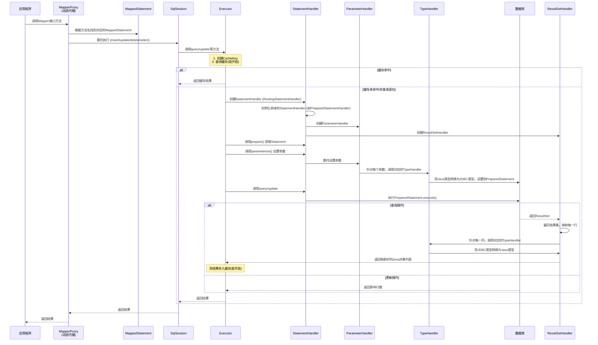

> 最后更新：2025-12-02 | [返回主目录](../README.md)
# 一、MyBatis详解 - 总体框架设计
## 1.1 MyBatis架构概览
MyBatis框架整体设计如下:

## 1.2 接口层-和数据库交互的方式
MyBatis和数据库的交互有两种方式：
- 使用传统的MyBatis提供的API；
- 使用Mapper接口；
### 1.2.1 使用传统的MyBatis提供的API
这是传统的传递Statement Id 和查询参数给 SqlSession 对象，使用 SqlSession对象完成和数据库的交互；MyBatis 提供了非常方便和简单的API，供用户实现对数据库的增删改查数据操作，以及对数据库连接信息和MyBatis 自身配置信息的维护操作。


上述使用MyBatis 的方法，是创建一个和数据库打交道的SqlSession对象，然后根据Statement Id 和参数来操作数据库，这种方式固然很简单和实用，但是它不符合面向对象语言的概念和面向接口编程的编程习惯。由于面向接口的编程是面向对象的大趋势，MyBatis 为了适应这一趋势，增加了第二种使用MyBatis 支持接口（Interface）调用方式。

假设你有一个 `UserMapper.xml` 文件：

```xml
<?xml version="1.0" encoding="UTF-8" ?>
<!DOCTYPE mapper PUBLIC "-//mybatis.org//DTD Mapper 3.0//EN" "http://mybatis.org/dtd/mybatis-3-mapper.dtd">

<!-- namespace（命名空间）是另一个重要的概念，这里可以先理解为Statement Id的前缀 -->
<mapper namespace="com.example.dao.UserMapper">

    <!-- 这条SQL语句的Statement Id就是 "selectUserById" -->
    <!-- 完整的ID是 "com.example.dao.UserMapper.selectUserById" -->
    <select id="selectUserById" parameterType="int" resultType="com.example.model.User">
        SELECT * FROM user WHERE id = #{id}
    </select>

    <!-- 这条SQL语句的Statement Id就是 "insertUser" -->
    <insert id="insertUser" parameterType="com.example.model.User">
        INSERT INTO user (name, age) VALUES (#{name}, #{age})
    </insert>

</mapper>
```

在这个文件中：
- `<select id="selectUserById" ...>` 里的 `id="selectUserById"`，这个 `"selectUserById"` 就是这条查询语句的 **Statement Id**。
- `<insert id="insertUser" ...>` 里的 `id="insertUser"`，就是这条插入语句的 **Statement Id**。

使用传统的 MyBatis API 时，你需要通过 `SqlSession` 的方法，并传入 **Statement Id** 来执行对应的 SQL。

```java
// 1. 获取 SqlSession
SqlSession sqlSession = sqlSessionFactory.openSession();
try {
    // 2. 准备参数
    int userId = 1;

    // 3. 执行查询
    // 参数1：Statement Id，这里需要包含命名空间，形成完整的路径
    // 参数2：SQL语句所需的参数
    User user = sqlSession.selectOne("com.example.dao.UserMapper.selectUserById", userId);

    System.out.println(user.getName());

} finally {
    // 4. 关闭 SqlSession
    sqlSession.close();
}
```

**关键点：**
- 当你调用 `sqlSession.selectOne(“statementId”, parameter)` 时，MyBatis 会根据你传入的字符串 `“com.example.dao.UserMapper.selectUserById”`，去找到对应 `Mapper.xml` 文件中 `id=”selectUserById”` 且 `namespace=”com.example.dao.UserMapper”` 的那条 SQL 语句。
- 这个**完整的字符串（命名空间 + “.” + 语句ID）**，就是 MyBatis 用来定位并执行 SQL 的“钥匙”或“地址”。
- **"com.example.dao.UserMapper.selectUserById" 只是一个字符串,MyBatis 根据这个字符串去查找对应的 Mapper.xml 文件,它并不需要 com.example.dao.UserMapper 这个 Java 接口实际存在,按照传统接口这里的mapper.xml的命名空间和Statement Id是可以随便定义的，这里只是为了和第二种方式对比才携程了类似接口的形式**

### 1.2.2 使用Mapper接口
MyBatis 将配置文件中的每一个`<mapper> `节点抽象为一个 Mapper 接口，而这个接口中声明的方法和跟`<mapper>` 节点中的`<select|update|delete|insert>` 节点项对应，即`<select|update|delete|insert>` 节点的id值为Mapper 接口中的方法名称，parameterType 值表示Mapper 对应方法的入参类型，而resultMap 值则对应了Mapper 接口表示的返回值类型或者返回结果集的元素类型。


根据MyBatis 的配置规范配置好后，通过SqlSession.getMapper(XXXMapper.class)方法，MyBatis 会根据相应的接口声明的方法信息，通过动态代理机制生成一个Mapper 实例，我们使用Mapper 接口的某一个方法时，MyBatis 会根据这个方法的方法名和参数类型，确定Statement Id，底层还是通过SqlSession.select("statementId",parameterObject);或者SqlSession.update("statementId",parameterObject); 等等来实现对数据库的操作， MyBatis 引用Mapper 接口这种调用方式，纯粹是为了满足面向接口编程的需要。（其实还有一个原因是在于，面向接口的编程，使得用户在接口上可以使用注解来配置SQL语句，这样就可以脱离XML配置文件，实现“0配置”）。


MyBatis 推荐的第二种方式，就是创建一个 Java 接口，接口中的方法名直接对应 Mapper.xml 文件中的 Statement Id。

1.  **创建接口**：
    ```java
    package com.example.dao; // 注意包名要和namespace对应

    public interface UserMapper {
        User selectUserById(int id);
        void insertUser(User user);
    }
    ```

2.  **MyBatis 会自动将接口方法名（如 `selectUserById`）映射为同名的 Statement Id。** 你不再需要手动传入字符串 ID。

3.  **使用方式**：
    ```java
    // 获取接口的代理实现对象
    UserMapper userMapper = sqlSession.getMapper(UserMapper.class);
    // 直接调用接口方法，就像调用普通Java方法一样
    User user = userMapper.selectUserById(1);
    ```

这种方式是完全类型安全的，并且完美契合面向接口编程的习惯。
**关键点：**
- **第二种方法就需要定义UserMapper接口**
- 这里我们是单独对Mybatis这个框架进行讨论所以没有给出结合Spring自动装配的UserMapper代理对象的注入方式，仍然通过sqlSession.getMapper()注入。


## 1.3 数据处理层
数据处理层可以说是MyBatis 的核心，从大的方面上讲，它要完成两个功能：

- 通过传入参数构建动态SQL语句；
- SQL语句的执行以及封装查询结果集成`List<E>`
### 1.3.1 参数映射和动态SQL语句生成
动态语句生成可以说是MyBatis框架非常优雅的一个设计，MyBatis 通过传入的参数值，使用 Ognl 来动态地构造SQL语句，使得MyBatis 有很强的灵活性和扩展性。
>**OGNL** 的全称是 **Object-Graph Navigation Language**，即**对象图导航语言**。
>它是一种功能强大的**表达式语言**，可以通过简单一致的语法来存取 Java 对象的属性、调用对象的方法、遍历整个对象的结构图，以及实现类型转换等。(MyBatis 在解析动态 SQL 标签（如 `<if>`, `<choose>`, `<where>` 等）时，使用 OGNL 表达式来计算条件的真假)
>
> OGNL 的基本语法和功能
> 1.  **访问属性**：`user.name`
> 2.  **调用方法**：`user.getName()`, `list.size()`
> 3.  **访问数组和集合**：
    *   数组：`array[0]`
    *   List：`list[0]` 或 `list.get(0)`
    *   Map：`map[‘key’]` 或 `map.key`
> 4.  **进行逻辑判断**：
    *   比较：`age > 18`, `name == null`
    *   逻辑运算：`age > 18 && name != null`
> 5.  **投影和选择**（类似数据库查询）：可以对集合进行复杂的过滤和转换（虽然 MyBatis 的动态 SQL 中较少使用这么复杂的特性）。

参数映射指的是对于java 数据类型和jdbc数据类型之间的转换：这里有包括两个过程：查询阶段，我们要将java类型的数据，转换成jdbc类型的数据，通过 preparedStatement.setXXX() 来设值；另一个就是对resultset查询结果集的jdbcType 数据转换成java 数据类型。

### 1.3.2 SQL语句的执行以及封装查询结果集成List
动态SQL语句生成之后，MyBatis 将执行SQL语句，并将可能返回的结果集转换成`List<E>`列表。MyBatis 在对结果集的处理中，支持结果集关系一对多和多对一的转换，并且有两种支持方式，一种为嵌套查询语句的查询，还有一种是嵌套结果集的查询。

## 1.4 框架支撑层
### 1.4.1 事务管理机制
事务管理机制对于ORM框架而言是不可缺少的一部分，事务管理机制的质量也是考量一个ORM框架是否优秀的一个标准。

### 1.4.2 连接池管理机制
由于创建一个数据库连接所占用的资源比较大， 对于数据吞吐量大和访问量非常大的应用而言，连接池的设计就显得非常重要。

### 1.4.3 缓存机制
为了提高数据利用率和减小服务器和数据库的压力，MyBatis 会对于一些查询提供会话级别的数据缓存，会将对某一次查询，放置到SqlSession 中，在允许的时间间隔内，对于完全相同的查询，MyBatis 会直接将缓存结果返回给用户，而不用再到数据库中查找。

### 1.4.4 SQL语句的配置方式
传统的MyBatis 配置SQL 语句方式就是使用XML文件进行配置的，但是这种方式不能很好地支持面向接口编程的理念，为了支持面向接口的编程，MyBatis 引入了Mapper接口的概念，面向接口的引入，对使用注解来配置SQL 语句成为可能，用户只需要在接口上添加必要的注解即可，不用再去配置XML文件了，但是，目前的MyBatis 只是对注解配置SQL 语句提供了有限的支持，某些高级功能还是要依赖XML配置文件配置SQL 语句。

## 1.5 引导层
引导层是配置和启动MyBatis配置信息的方式。MyBatis 提供两种方式来引导MyBatis ：基于XML配置文件的方式和基于Java API 的方式。

## 1.6 主要构件及其相互关系
从MyBatis代码实现的角度来看，主体构件和关系如下：


主要的核心部件解释如下：

- `SqlSession` 作为MyBatis工作的主要顶层API，表示和数据库交互的会话，完成必要数据库增删改查功能

- `Executor` MyBatis执行器，是MyBatis 调度的核心，负责SQL语句的生成和查询缓存的维护

- `StatementHandler` 封装了JDBC Statement操作，负责对JDBC statement 的操作，如设置参数、将Statement结果集转换成List集合。

- `ParameterHandler` 负责对用户传递的参数转换成JDBC Statement 所需要的参数，

- `ResultSetHandler` 负责将JDBC返回的ResultSet结果集对象转换成List类型的集合；

- `TypeHandler` 负责java数据类型和jdbc数据类型之间的映射和转换

- `MappedStatement` MappedStatement维护了一条`<select|update|delete|insert>`节点的封装，

- `SqlSource` 负责根据用户传递的parameterObject，动态地生成SQL语句，将信息封装到BoundSql对象中，并返回

- `BoundSql` 表示动态生成的SQL语句以及相应的参数信息

- `Configuration `MyBatis所有的配置信息都维持在Configuration对象之中。
# 二、MyBatis详解 - 初始化基本过程
> 从上文我们知道MyBatis和数据库的交互有两种方式有Java API和Mapper接口两种，所以MyBatis的初始化必然也有两种；那么MyBatis是如何初始化的呢？
## 2.1 MyBatis初始化的方式及引入
MyBatis的初始化可以有两种方式：

- `基于XML配置文件`：基于XML配置文件的方式是将MyBatis的所有配置信息放在XML文件中，MyBatis通过加载并XML配置文件，将配置文信息组装成内部的Configuration对象。

- `基于Java API`：这种方式不使用XML配置文件，需要MyBatis使用者在Java代码中，手动创建Configuration对象，然后将配置参数set 进入Configuration对象中。
## 2.2 初始化方式 - XML配置
> 接下来我们将通过 基于XML配置文件方式的MyBatis初始化，深入探讨MyBatis是如何通过配置文件构建Configuration对象，并使用它。

- 首先给出一个配置文件的示例
```xml
<?xml version="1.0" encoding="UTF-8" ?>
<!DOCTYPE configuration
        PUBLIC "-//mybatis.org//DTD Config 3.0//EN"
        "http://mybatis.org/dtd/mybatis-3-config.dtd">

<configuration>

    <!-- 1. 属性配置：可以从外部配置文件（如database.properties）中读取数据库连接信息 -->
    <properties resource="database.properties">
        <!-- 也可以在这里直接定义属性，作为默认值(外部文件会覆盖这里的配置) -->
        <property name="username" value="dev_user"/>
    </properties>

    <!-- 2. 全局设置：这是 MyBatis 行为方式的核心调整开关 -->
    <settings>
        <!-- 开启下划线命名到驼峰命名的自动映射（如数据库字段user_name映射到Java属性userName） -->
        <setting name="mapUnderscoreToCamelCase" value="true"/>
        <!-- 开启二级缓存（默认是关闭的） -->
        <setting name="cacheEnabled" value="true"/>
        <!-- 配置日志实现为STDOUT_LOGGING，将SQL打印到控制台，非常适合开发和调试 -->
        <setting name="logImpl" value="STDOUT_LOGGING"/>
        <!-- 延迟加载的全局开关 -->
        <setting name="lazyLoadingEnabled" value="true"/>
    </settings>

    <!-- 3. 类型别名：为Java类设置一个简短的别名，在Mapper XML中就不用写完整的类名了 -->
    <typeAliases>
        <!-- 方式一：逐个定义别名 -->
        <typeAlias type="com.example.model.User" alias="User"/>
        <typeAlias type="com.example.model.Blog" alias="Blog"/>

        <!-- 方式二（更常用）：扫描整个包，默认别名为类名（首字母小写或大写均可） -->
        <package name="com.example.model"/>
    </typeAliases>

    <!-- 4. 环境配置：可以配置多个环境（如开发、测试、生产），但默认只能使用一个 -->
    <environments default="development">
        <!-- 定义一个名为“development”的环境 -->
        <environment id="development">
            <!-- 事务管理器：使用JDBC事务管理（支持连接.commit/rollback） -->
            <transactionManager type="JDBC"/>
            <!-- 数据源：配置数据库连接池 -->
            <dataSource type="POOLED">
                <!-- 这里的值 ${...} 引用了 properties 中定义的属性 -->
                <property name="driver" value="${driver}"/>
                <property name="url" value="${url}"/>
                <property name="username" value="${username}"/>
                <property name="password" value="${password}"/>
            </dataSource>
        </environment>

        <!-- 可以定义另一个环境，比如生产环境 -->
        <!-- <environment id="production"> ... </environment> -->
    </environments>

    <!-- 5. 映射器：告诉 MyBatis 去哪里找我们写的 SQL 映射文件（Mapper.xml） -->
    <mappers>
        <!-- 方式一：使用相对于类路径的资源引用 -->
        <mapper resource="com/example/mapper/UserMapper.xml"/>
        <mapper resource="com/example/mapper/BlogMapper.xml"/>

        <!-- 方式二：使用完全限定资源定位符（文件系统路径或URL），不常用 -->
        <!-- <mapper url="file:///var/mappers/UserMapper.xml"/> -->

        <!-- 方式三：使用映射器接口实现类的完全限定类名 -->
        <!-- 要求：Mapper接口和对应的Mapper.xml文件必须在同一个包下，且同名 -->
        <!-- <mapper class="com.example.mapper.UserMapper"/> -->

        <!-- 方式四（最常用）：扫描包下的所有映射器接口 -->
        <!-- 要求同上，接口和XML文件必须在同一个包下且同名 -->
        <package name="com.example.mapper"/>
    </mappers>

</configuration>
```
- 配套的外部属性文件 (database.properties)

这个文件通常也放在 src/main/resources 目录下，用于将数据库配置与主配置文件解耦。
```
# database.properties
driver=com.mysql.cj.jdbc.Driver
url=jdbc:mysql://localhost:3306/mybatis_example?useSSL=false&serverTimezone=UTC
username=root
password=123456
```

现在就从使用MyBatis的简单例子入手，深入分析一下MyBatis是怎样完成初始化的，都初始化了什么。看以下代码：
```java
// mybatis初始化
String resource = "mybatis-config.xml";  
InputStream inputStream = Resources.getResourceAsStream(resource);  
SqlSessionFactory sqlSessionFactory = new SqlSessionFactoryBuilder().build(inputStream);

// 创建SqlSession
SqlSession sqlSession = sqlSessionFactory.openSession();  

// 执行SQL语句
List list = sqlSession.selectList("com.foo.bean.BlogMapper.queryAllBlogInfo");
```
有过MyBatis使用经验的读者会知道，上述语句的作用是执行`com.foo.bean.BlogMapper.queryAllBlogInfo`定义的SQL语句，返回一个List结果集。总的来说，上述代码经历了三个阶段(本系列也对应三篇文章分别讲解)：

- `mybatis初始化` 本文
- `创建SqlSession` - 详解后文
- `执行SQL语句` - 详解后文

上述代码的功能是根据配置文件mybatis-config.xml 配置文件，创建SqlSessionFactory对象，然后产生SqlSession，执行SQL语句。而mybatis的初始化就发生在第三句：SqlSessionFactory sqlSessionFactory = new SqlSessionFactoryBuilder().build(inputStream); 现在就让我们看看第三句到底发生了什么。

### 2.2.1 MyBatis初始化基本过程：
SqlSessionFactoryBuilder根据传入的数据流生成Configuration对象，然后根据Configuration对象创建默认的SqlSessionFactory实例。

初始化的基本过程如下序列图所示：

由上图所示，mybatis初始化要经过简单的以下几步：

- 调用SqlSessionFactoryBuilder对象的build(inputStream)方法；

- SqlSessionFactoryBuilder会根据输入流inputStream等信息创建XMLConfigBuilder对象;

- SqlSessionFactoryBuilder调用XMLConfigBuilder对象的parse()方法；

- XMLConfigBuilder对象返回Configuration对象；

- SqlSessionFactoryBuilder根据Configuration对象创建一个DefaultSessionFactory对象；

- SqlSessionFactoryBuilder返回 DefaultSessionFactory对象给Client，供Client使用。

SqlSessionFactoryBuilder相关的代码如下所示：
```java
public SqlSessionFactory build(InputStream inputStream)  {  
    return build(inputStream, null, null);  
}  

public SqlSessionFactory build(InputStream inputStream, String environment, Properties properties)  {  
    try  {  
        //2. 创建XMLConfigBuilder对象用来解析XML配置文件，生成Configuration对象  
        XMLConfigBuilder parser = new XMLConfigBuilder(inputStream, environment, properties);  
        //3. 将XML配置文件内的信息解析成Java对象Configuration对象  
        Configuration config = parser.parse();  
        //4. 根据Configuration对象创建出SqlSessionFactory对象  
        return build(config);  
    } catch (Exception e) {  
        throw ExceptionFactory.wrapException("Error building SqlSession.", e);  
    } finally {  
        ErrorContext.instance().reset();  
        try {  
            inputStream.close();  
        } catch (IOException e) {  
            // Intentionally ignore. Prefer previous error.  
        }  
    }
}

// 从此处可以看出，MyBatis内部通过Configuration对象来创建SqlSessionFactory,用户也可以自己通过API构造好Configuration对象，调用此方法创SqlSessionFactory  
public SqlSessionFactory build(Configuration config) {  
    return new DefaultSqlSessionFactory(config);  
}  
```
上述的初始化过程中，涉及到了以下几个对象：

- SqlSessionFactoryBuilder ： SqlSessionFactory的构造器，用于创建SqlSessionFactory，采用了Builder设计模式

= Configuration ：该对象是mybatis-config.xml文件中所有mybatis配置信息

- SqlSessionFactory：SqlSession工厂类，以工厂形式创建SqlSession对象，采用了Factory工厂设计模式

- XmlConfigParser ：负责将mybatis-config.xml配置文件解析成Configuration对象，共SqlSessonFactoryBuilder使用，创建SqlSessionFactory

### 2.2.2 创建Configuration对象的过程
> 接着上述的 MyBatis初始化基本过程讨论，当SqlSessionFactoryBuilder执行build()方法，调用了XMLConfigBuilder的parse()方法，然后返回了Configuration对象。那么parse()方法是如何处理XML文件，生成Configuration对象的呢？

- XMLConfigBuilder会将XML配置文件的信息转换为Document对象

而XML配置定义文件DTD转换成XMLMapperEntityResolver对象，然后将二者封装到XpathParser对象中，XpathParser的作用是提供根据Xpath表达式获取基本的DOM节点Node信息的操作。如下图所示：


- 之后XMLConfigBuilder调用parse()方法

会从XPathParser中取出`<configuration>`节点对应的Node对象，然后解析此Node节点的子Node：properties, settings, typeAliases,typeHandlers, objectFactory, objectWrapperFactory, plugins, environments,databaseIdProvider, mappers：
```java
public Configuration parse() {  
    if (parsed) {  
        throw new BuilderException("Each XMLConfigBuilder can only be used once.");  
    }  
    parsed = true;  
    //源码中没有这一句，只有 parseConfiguration(parser.evalNode("/configuration"));  
    //为了让读者看得更明晰，源码拆分为以下两句  
    XNode configurationNode = parser.evalNode("/configuration");  
    parseConfiguration(configurationNode);  
    return configuration;  
}  
/** 
 * 解析 "/configuration"节点下的子节点信息，然后将解析的结果设置到Configuration对象中 
 */  
private void parseConfiguration(XNode root) {  
    try {  
        //1.首先处理properties 节点     
        propertiesElement(root.evalNode("properties")); //issue #117 read properties first  
        //2.处理typeAliases  
        typeAliasesElement(root.evalNode("typeAliases"));  
        //3.处理插件  
        pluginElement(root.evalNode("plugins"));  
        //4.处理objectFactory  
        objectFactoryElement(root.evalNode("objectFactory"));  
        //5.objectWrapperFactory  
        objectWrapperFactoryElement(root.evalNode("objectWrapperFactory"));  
        //6.settings  
        settingsElement(root.evalNode("settings"));  
        //7.处理environments  
        environmentsElement(root.evalNode("environments")); // read it after objectFactory and objectWrapperFactory issue #631  
        //8.database  
        databaseIdProviderElement(root.evalNode("databaseIdProvider"));  
        //9.typeHandlers  
        typeHandlerElement(root.evalNode("typeHandlers"));  
        //10.mappers  
        mapperElement(root.evalNode("mappers"));  
    } catch (Exception e) {  
        throw new BuilderException("Error parsing SQL Mapper Configuration. Cause: " + e, e);  
    }  
} 
```
注意：在上述代码中，还有一个非常重要的地方，就是解析XML配置文件子节点`<mappers>`的方法`mapperElements(root.evalNode("mappers"))`, 它将解析我们配置的Mapper.xml配置文件，Mapper配置文件可以说是MyBatis的核心，MyBatis的特性和理念都体现在此Mapper的配置和设计上。

- 然后将这些值解析出来设置到Configuration对象中

解析子节点的过程这里就不一一介绍了，用户可以参照MyBatis源码仔细揣摩，我们就看上述的environmentsElement(root.evalNode("environments")); 方法是如何将environments的信息解析出来，设置到Configuration对象中的：
```java
/** 
 * 解析environments节点，并将结果设置到Configuration对象中 
 * 注意：创建envronment时，如果SqlSessionFactoryBuilder指定了特定的环境（即数据源）； 
 *      则返回指定环境（数据源）的Environment对象，否则返回默认的Environment对象； 
 *      这种方式实现了MyBatis可以连接多数据源 
 */  
private void environmentsElement(XNode context) throws Exception {  
    if (context != null)  
    {  
        if (environment == null)  
        {  
            environment = context.getStringAttribute("default");  
        }  
        for (XNode child : context.getChildren())  
        {  
            String id = child.getStringAttribute("id");  
            if (isSpecifiedEnvironment(id))  
            {  
                //1.创建事务工厂 TransactionFactory  
                TransactionFactory txFactory = transactionManagerElement(child.evalNode("transactionManager"));  
                DataSourceFactory dsFactory = dataSourceElement(child.evalNode("dataSource"));  
                //2.创建数据源DataSource  
                DataSource dataSource = dsFactory.getDataSource();  
                //3. 构造Environment对象  
                Environment.Builder environmentBuilder = new Environment.Builder(id)  
                .transactionFactory(txFactory)  
                .dataSource(dataSource);  
                //4. 将创建的Envronment对象设置到configuration 对象中  
                configuration.setEnvironment(environmentBuilder.build());  
            }  
        }  
    }  
}

private boolean isSpecifiedEnvironment(String id)  
{  
    if (environment == null)  
    {  
        throw new BuilderException("No environment specified.");  
    }  
    else if (id == null)  
    {  
        throw new BuilderException("Environment requires an id attribute.");  
    }  
    else if (environment.equals(id))  
    {  
        return true;  
    }  
    return false;  
} 
```
- 返回Configuration对象

将上述的MyBatis初始化基本过程的序列图细化：

## 2.3 初始化方式 - 基于Java API
当然我们可以使用XMLConfigBuilder手动解析XML配置文件来创建Configuration对象，代码如下：
```java
String resource = "mybatis-config.xml";  
InputStream inputStream = Resources.getResourceAsStream(resource);  
// 手动创建XMLConfigBuilder，并解析创建Configuration对象  
XMLConfigBuilder parser = new XMLConfigBuilder(inputStream, null,null); // 看这里 
Configuration configuration = parser.parse();  
// 使用Configuration对象创建SqlSessionFactory  
SqlSessionFactory sqlSessionFactory = new SqlSessionFactoryBuilder().build(configuration);  
// 使用MyBatis  
SqlSession sqlSession = sqlSessionFactory.openSession();  
List list = sqlSession.selectList("com.foo.bean.BlogMapper.queryAllBlogInfo");  
```
# 三、MyBatis详解 - 配置解析过程
> 【本文为中优先级】通过上文我们知道MyBatis初始化过程中会解析配置，那具体是如何解析的呢？
## 3.1 回顾上文配置解析方法
上文配置解析中，我们看到如下的主体方法：
```java
public Configuration parse() {  
    if (parsed) {  
        throw new BuilderException("Each XMLConfigBuilder can only be used once.");  
    }  
    parsed = true;  
    //源码中没有这一句，只有 parseConfiguration(parser.evalNode("/configuration"));  
    //为了让读者看得更明晰，源码拆分为以下两句  
    XNode configurationNode = parser.evalNode("/configuration");  
    parseConfiguration(configurationNode);  
    return configuration;  
}  
/** 
 * 解析 "/configuration"节点下的子节点信息，然后将解析的结果设置到Configuration对象中 
 */  
private void parseConfiguration(XNode root) {  
    try {  
        //1.首先处理properties 节点     
        propertiesElement(root.evalNode("properties")); //issue #117 read properties first  
        //2.处理typeAliases  
        typeAliasesElement(root.evalNode("typeAliases"));  
        //3.处理插件  
        pluginElement(root.evalNode("plugins"));  
        //4.处理objectFactory  
        objectFactoryElement(root.evalNode("objectFactory"));  
        //5.objectWrapperFactory  
        objectWrapperFactoryElement(root.evalNode("objectWrapperFactory"));  
        //6.settings  
        settingsElement(root.evalNode("settings"));  
        //7.处理environments  
        environmentsElement(root.evalNode("environments")); // read it after objectFactory and objectWrapperFactory issue #631  
        //8.database  
        databaseIdProviderElement(root.evalNode("databaseIdProvider"));  
        //9.typeHandlers  
        typeHandlerElement(root.evalNode("typeHandlers"));  
        //10.mappers  
        mapperElement(root.evalNode("mappers"));  
    } catch (Exception e) {  
        throw new BuilderException("Error parsing SQL Mapper Configuration. Cause: " + e, e);  
    }  
} 
```
通过以上源码，我们就能看出，在mybatis的配置文件中：

- configuration节点为根节点。
- 在configuration节点之下，我们可以配置10个子节点， 分别为：properties、typeAliases、plugins、objectFactory、objectWrapperFactory、settings、environments、databaseIdProvider、typeHandlers、mappers。
## 3.2 配置文件元素
### 3.2.1 元素1：properties
```xml
<configuration>
    <!-- 方法一： 从外部指定properties配置文件, 除了使用resource属性指定外，还可通过url属性指定url  
        <properties resource="dbConfig.properties"></properties> 
    -->
    <!-- 方法二： 直接配置为xml -->
    <properties>
        <property name="driver" value="com.mysql.jdbc.Driver"/>
        <property name="url" value="jdbc:mysql://localhost:3306/test1"/>
        <property name="username" value="root"/>
        <property name="password" value="root"/>
    </properties>
```
那么，我要是两种方法都同时配置了，那么最终会采用什么样的配置呢？

首先会加载文件中的xml配置，其次是加载外部指定的properties，最后加载Java Configuration的配置。因为配置存放在Properties，它继承自HashTable类，当依次将上述几种配置源put进去时，后加载的配置会覆盖先加载的配置。所以，最终应用配置时Configuration配置优先级最高，其次是外部的properties配置文件，最后是当前xml中的配置。具体可以参考接下来的源码分析。
```java
private void propertiesElement(XNode context) throws Exception {
    if (context != null) {
      // 第一步：首先读取 <properties> 标签体内的 <property> 子元素
      Properties defaults = context.getChildrenAsProperties();
      
      String resource = context.getStringAttribute("resource");
      String url = context.getStringAttribute("url");
      
      if (resource != null && url != null) {
        throw new BuilderException("The properties element cannot specify both a URL and a resource based property file reference.  Please specify one or the other.");
      }
      
      // 第二步：然后加载外部 properties 文件，并使用 putAll 合并到 defaults 中
      if (resource != null) {
        defaults.putAll(Resources.getResourceAsProperties(resource));
      } else if (url != null) {
        defaults.putAll(Resources.getUrlAsProperties(url));
      }
      
      // 第三步：最后合并通过 Java API 传入的变量
      Properties vars = configuration.getVariables();
      if (vars != null) {
        defaults.putAll(vars);
      }
      
      parser.setVariables(defaults);
      configuration.setVariables(defaults);
    }
}
```
### 3.2.2 元素2：envirements
```xml
<environments default="development">
    <environment id="development">
        <!-- 
        JDBC–这个配置直接简单使用了JDBC的提交和回滚设置。它依赖于从数据源得到的连接来管理事务范围。
        MANAGED–这个配置几乎没做什么。它从来不提交或回滚一个连接。而它会让容器来管理事务的整个生命周期（比如Spring或JEE应用服务器的上下文）。
        -->
        <transactionManager type="JDBC"/>
        <!--
        UNPOOLED–这个数据源的实现是每次被请求时简单打开和关闭连接
        POOLED–mybatis实现的简单的数据库连接池类型，它使得数据库连接可被复用，不必在每次请求时都去创建一个物理的连接。
        JNDI – 通过jndi从tomcat之类的容器里获取数据源。
        -->
        <dataSource type="POOLED">
            <!--
            如果上面没有指定数据库配置的properties文件，那么此处可以这样直接配置 
            <property name="driver" value="com.mysql.jdbc.Driver"/>
            <property name="url" value="jdbc:mysql://localhost:3306/test1"/>
            <property name="username" value="root"/>
            <property name="password" value="root"/>
            -->
         
            <!-- 上面指定了数据库配置文件， 配置文件里面也是对应的这四个属性 -->
            <property name="driver" value="${driver}"/>
            <property name="url" value="${url}"/>
            <property name="username" value="${username}"/>
            <property name="password" value="${password}"/>  
        </dataSource>
    </environment>
    
    <!-- 我再指定一个environment -->
    <environment id="test">
        <transactionManager type="JDBC"/>
        <dataSource type="POOLED">
            <property name="driver" value="com.mysql.jdbc.Driver"/>
            <!-- 与上面的url不一样 -->
            <property name="url" value="jdbc:mysql://localhost:3306/demo"/>
            <property name="username" value="root"/>
            <property name="password" value="root"/>
        </dataSource>
    </environment>
</environments>
```
environments元素节点可以配置多个environment子节点， 怎么理解呢？

假如我们系统的开发环境和正式环境所用的数据库不一样（这是肯定的）， 那么可以设置两个environment, 两个id分别对应开发环境（dev）和正式环境（final），那么通过配置environments的default属性就能选择对应的environment了， 例如，我将environments的deault属性的值配置为dev, 那么就会选择dev的environment。 至于这个是怎么实现的，下面源码就会讲。
### 3.2.3 解析方法：propertiesElement、environmentsElement
好啦，上面简单给大家介绍了一下properties 和 environments 的配置， 接下来就正式开始看源码了： 上次我们说过mybatis 是通过XMLConfigBuilder这个类在解析mybatis配置文件的，那么本次就接着看看XMLConfigBuilder对于properties和environments的解析：
```java
public class XMLConfigBuilder extends BaseBuilder {

    private boolean parsed;
    // xml解析器
    private XPathParser parser;
    private String environment;
  
    // 上次说到这个方法是在解析mybatis配置文件中能配置的元素节点
    // 今天首先要看的就是properties节点和environments节点
    private void parseConfiguration(XNode root) {
        try {
            // 解析properties元素
            propertiesElement(root.evalNode("properties")); //issue #117 read properties first
            typeAliasesElement(root.evalNode("typeAliases"));
            pluginElement(root.evalNode("plugins"));
            objectFactoryElement(root.evalNode("objectFactory"));
            objectWrapperFactoryElement(root.evalNode("objectWrapperFactory"));
            settingsElement(root.evalNode("settings"));
            // 解析environments元素
            environmentsElement(root.evalNode("environments")); // read it after objectFactory and objectWrapperFactory issue #631
            databaseIdProviderElement(root.evalNode("databaseIdProvider"));
            typeHandlerElement(root.evalNode("typeHandlers"));
            mapperElement(root.evalNode("mappers"));
        } catch (Exception e) {
            throw new BuilderException("Error parsing SQL Mapper Configuration. Cause: " + e, e);
        }
    }
  
    
    //下面就看看解析properties的具体方法
    private void propertiesElement(XNode context) throws Exception {
        if (context != null) {
            // 将子节点的 name 以及value属性set进properties对象
            Properties defaults = context.getChildrenAsProperties();
            // 获取properties节点上 resource属性的值
            String resource = context.getStringAttribute("resource");
            // 获取properties节点上 url属性的值, resource和url不能同时配置
            String url = context.getStringAttribute("url");
            if (resource != null && url != null) {
                throw new BuilderException("The properties element cannot specify both a URL and a resource based property file reference.  Please specify one or the other.");
            }
            // 把解析出的properties文件set进Properties对象
            if (resource != null) {
                defaults.putAll(Resources.getResourceAsProperties(resource));
            } else if (url != null) {
                defaults.putAll(Resources.getUrlAsProperties(url));
            }
            // 将configuration对象中已配置的Properties属性与刚刚解析的融合
            // configuration这个对象会装载所解析mybatis配置文件的所有节点元素，以后也会频频提到这个对象
            // 既然configuration对象用有一系列的get/set方法， 那是否就标志着我们可以使用java代码直接配置？ 
            // 答案是肯定的， 不过使用配置文件进行配置，优势不言而喻
            Properties vars = configuration.getVariables();
            if (vars != null) {
                defaults.putAll(vars);
            }
            // 把装有解析配置propertis对象set进解析器， 因为后面可能会用到
            parser.setVariables(defaults);
            // set进configuration对象
            configuration.setVariables(defaults);
        }
    }
    
    //下面再看看解析enviroments元素节点的方法
    private void environmentsElement(XNode context) throws Exception {
        if (context != null) {
            if (environment == null) {
                //解析environments节点的default属性的值
                //例如: <environments default="development">
                environment = context.getStringAttribute("default");
            }
            //递归解析environments子节点
            for (XNode child : context.getChildren()) {
                //<environment id="development">, 只有enviroment节点有id属性，那么这个属性有何作用？
                //environments 节点下可以拥有多个 environment子节点
                //类似于这样： <environments default="development"><environment id="development">...</environment><environment id="test">...</environments>
                //意思就是我们可以对应多个环境，比如开发环境，测试环境等， 由environments的default属性去选择对应的enviroment
                String id = child.getStringAttribute("id");
                //isSpecial就是根据由environments的default属性去选择对应的enviroment
                if (isSpecifiedEnvironment(id)) {
                    //事务， mybatis有两种：JDBC 和 MANAGED, 配置为JDBC则直接使用JDBC的事务，配置为MANAGED则是将事务托管给容器， 
                    TransactionFactory txFactory = transactionManagerElement(child.evalNode("transactionManager"));
                    //enviroment节点下面就是dataSource节点了，解析dataSource节点（下面会贴出解析dataSource的具体方法）
                    DataSourceFactory dsFactory = dataSourceElement(child.evalNode("dataSource"));
                    DataSource dataSource = dsFactory.getDataSource();
                    Environment.Builder environmentBuilder = new Environment.Builder(id)
                          .transactionFactory(txFactory)
                          .dataSource(dataSource);
                    //老规矩，会将dataSource设置进configuration对象
                    configuration.setEnvironment(environmentBuilder.build());
                }
            }
        }
    }
    
    //下面看看dataSource的解析方法
    private DataSourceFactory dataSourceElement(XNode context) throws Exception {
        if (context != null) {
            //dataSource的连接池
            String type = context.getStringAttribute("type");
            //子节点 name, value属性set进一个properties对象
            Properties props = context.getChildrenAsProperties();
            //创建dataSourceFactory
            DataSourceFactory factory = (DataSourceFactory) resolveClass(type).newInstance();
            factory.setProperties(props);
            return factory;
        }
        throw new BuilderException("Environment declaration requires a DataSourceFactory.");
    } 
}
```
通过以上对mybatis源码的解读，相信大家对mybatis的配置又有了一个深入的认识。还有一个问题， 上面我们看到，在配置dataSource的时候使用了 ${driver} 这种表达式， 这种形式是怎么解析的？其实，是通过PropertyParser这个类解析：
```java
/**
 * 这个类解析${}这种形式的表达式
 */
public class PropertyParser {

    public static String parse(String string, Properties variables) {
        VariableTokenHandler handler = new VariableTokenHandler(variables);
        GenericTokenParser parser = new GenericTokenParser("${", "}", handler);
        return parser.parse(string);
    }

    private static class VariableTokenHandler implements TokenHandler {
        private Properties variables;

        public VariableTokenHandler(Properties variables) {
            this.variables = variables;
        }

        public String handleToken(String content) {
            if (variables != null && variables.containsKey(content)) {
                return variables.getProperty(content);
            }
            return "${" + content + "}";
        }
    }
}
```
以上就是对于properties 和 environments元素节点的分析，比较重要的都在对于源码的注释中标出。
### 3.2.4 元素3：typeAliases
typeAliases节点主要用来设置别名，其实这是挺好用的一个功能， 通过配置别名，我们不用再指定完整的包名，并且还能取别名。

例如： 我们在使用 com.demo.entity. UserEntity 的时候，我们可以直接配置一个别名user, 这样以后在配置文件中要使用到com.demo.entity.UserEntity的时候，直接使用User即可。

就以上例为例，我们来实现一下，看看typeAliases的配置方法：
```xml
<configuration>
    <typeAliases>
        <!--
        通过package, 可以直接指定package的名字， mybatis会自动扫描你指定包下面的javabean,
        并且默认设置一个别名，默认的名字为： javabean 的首字母小写的非限定类名来作为它的别名。
        也可在javabean 加上注解@Alias 来自定义别名， 例如： @Alias(user) 
        <package name="com.dy.entity"/>
        -->
        <typeAlias alias="UserEntity" type="com.dy.entity.User"/>
    </typeAliases>
  
    ......
  
</configuration>
```
再写一段测试代码，看看有没生效：（我只写一段伪代码）
```java
Configuration con = sqlSessionFactory.getConfiguration();
Map<String, Class<?>> typeMap = con.getTypeAliasRegistry().getTypeAliases();
for(Entry<String, Class<?>> entry: typeMap.entrySet()) {
    System.out.println(entry.getKey() + " ================> " + entry.getValue().getSimpleName());
}
```
### 3.2.5 解析方法：typeAliasesElement
```java
/**
 * 解析typeAliases节点
 */
private void typeAliasesElement(XNode parent) {
    if (parent != null) {
        for (XNode child : parent.getChildren()) {
            //如果子节点是package, 那么就获取package节点的name属性， mybatis会扫描指定的package
            if ("package".equals(child.getName())) {
                String typeAliasPackage = child.getStringAttribute("name");
                //TypeAliasRegistry 负责管理别名， 这儿就是通过TypeAliasRegistry 进行别名注册， 下面就会看看TypeAliasRegistry源码
                configuration.getTypeAliasRegistry().registerAliases(typeAliasPackage);
            } else {
                //如果子节点是typeAlias节点，那么就获取alias属性和type的属性值
                String alias = child.getStringAttribute("alias");
                String type = child.getStringAttribute("type");
                try {
                    Class<?> clazz = Resources.classForName(type);
                    if (alias == null) {
                        typeAliasRegistry.registerAlias(clazz);
                    } else {
                        typeAliasRegistry.registerAlias(alias, clazz);
                    }
                } catch (ClassNotFoundException e) {
                    throw new BuilderException("Error registering typeAlias for '" + alias + "'. Cause: " + e, e);
                }
            }
        }
    }
}
```
重要的源码在这儿：TypeAliasRegistry.java
```java
public class TypeAliasRegistry {
  
  //这就是核心所在啊， 原来别名就仅仅通过一个HashMap来实现， key为别名， value就是别名对应的类型（class对象）
  private final Map<String, Class<?>> TYPE_ALIASES = new HashMap<String, Class<?>>();

  /**
   * 以下就是mybatis默认为我们注册的别名
   */
  public TypeAliasRegistry() {
    registerAlias("string", String.class);

    registerAlias("byte", Byte.class);
    registerAlias("long", Long.class);
    registerAlias("short", Short.class);
    registerAlias("int", Integer.class);
    registerAlias("integer", Integer.class);
    registerAlias("double", Double.class);
    registerAlias("float", Float.class);
    registerAlias("boolean", Boolean.class);

    registerAlias("byte[]", Byte[].class);
    registerAlias("long[]", Long[].class);
    registerAlias("short[]", Short[].class);
    registerAlias("int[]", Integer[].class);
    registerAlias("integer[]", Integer[].class);
    registerAlias("double[]", Double[].class);
    registerAlias("float[]", Float[].class);
    registerAlias("boolean[]", Boolean[].class);

    registerAlias("_byte", byte.class);
    registerAlias("_long", long.class);
    registerAlias("_short", short.class);
    registerAlias("_int", int.class);
    registerAlias("_integer", int.class);
    registerAlias("_double", double.class);
    registerAlias("_float", float.class);
    registerAlias("_boolean", boolean.class);

    registerAlias("_byte[]", byte[].class);
    registerAlias("_long[]", long[].class);
    registerAlias("_short[]", short[].class);
    registerAlias("_int[]", int[].class);
    registerAlias("_integer[]", int[].class);
    registerAlias("_double[]", double[].class);
    registerAlias("_float[]", float[].class);
    registerAlias("_boolean[]", boolean[].class);

    registerAlias("date", Date.class);
    registerAlias("decimal", BigDecimal.class);
    registerAlias("bigdecimal", BigDecimal.class);
    registerAlias("biginteger", BigInteger.class);
    registerAlias("object", Object.class);

    registerAlias("date[]", Date[].class);
    registerAlias("decimal[]", BigDecimal[].class);
    registerAlias("bigdecimal[]", BigDecimal[].class);
    registerAlias("biginteger[]", BigInteger[].class);
    registerAlias("object[]", Object[].class);

    registerAlias("map", Map.class);
    registerAlias("hashmap", HashMap.class);
    registerAlias("list", List.class);
    registerAlias("arraylist", ArrayList.class);
    registerAlias("collection", Collection.class);
    registerAlias("iterator", Iterator.class);

    registerAlias("ResultSet", ResultSet.class);
  }

  
  /**
   * 处理别名， 直接从保存有别名的hashMap中取出即可
   */
  @SuppressWarnings("unchecked")
  public <T> Class<T> resolveAlias(String string) {
    try {
      if (string == null) return null;
      String key = string.toLowerCase(Locale.ENGLISH); // issue #748
      Class<T> value;
      if (TYPE_ALIASES.containsKey(key)) {
        value = (Class<T>) TYPE_ALIASES.get(key);
      } else {
        value = (Class<T>) Resources.classForName(string);
      }
      return value;
    } catch (ClassNotFoundException e) {
      throw new TypeException("Could not resolve type alias '" + string + "'.  Cause: " + e, e);
    }
  }
  
  /**
   * 配置文件中配置为package的时候， 会调用此方法，根据配置的报名去扫描javabean ，然后自动注册别名
   * 默认会使用 Bean 的首字母小写的非限定类名来作为它的别名
   * 也可在javabean 加上注解@Alias 来自定义别名， 例如： @Alias(user)
   */
  public void registerAliases(String packageName){
    registerAliases(packageName, Object.class);
  }

  public void registerAliases(String packageName, Class<?> superType){
    ResolverUtil<Class<?>> resolverUtil = new ResolverUtil<Class<?>>();
    resolverUtil.find(new ResolverUtil.IsA(superType), packageName);
    Set<Class<? extends Class<?>>> typeSet = resolverUtil.getClasses();
    for(Class<?> type : typeSet){
      // Ignore inner classes and interfaces (including package-info.java)
      // Skip also inner classes. See issue #6
      if (!type.isAnonymousClass() && !type.isInterface() && !type.isMemberClass()) {
        registerAlias(type);
      }
    }
  }

  public void registerAlias(Class<?> type) {
    String alias = type.getSimpleName();
    Alias aliasAnnotation = type.getAnnotation(Alias.class);
    if (aliasAnnotation != null) {
      alias = aliasAnnotation.value();
    } 
    registerAlias(alias, type);
  }

  //这就是注册别名的本质方法， 其实就是向保存别名的hashMap新增值而已， 呵呵， 别名的实现太简单了，对吧
  public void registerAlias(String alias, Class<?> value) {
    if (alias == null) throw new TypeException("The parameter alias cannot be null");
    String key = alias.toLowerCase(Locale.ENGLISH); // issue #748
    if (TYPE_ALIASES.containsKey(key) && TYPE_ALIASES.get(key) != null && !TYPE_ALIASES.get(key).equals(value)) {
      throw new TypeException("The alias '" + alias + "' is already mapped to the value '" + TYPE_ALIASES.get(key).getName() + "'.");
    }
    TYPE_ALIASES.put(key, value);
  }

  public void registerAlias(String alias, String value) {
    try {
      registerAlias(alias, Resources.classForName(value));
    } catch (ClassNotFoundException e) {
      throw new TypeException("Error registering type alias "+alias+" for "+value+". Cause: " + e, e);
    }
  }
  
  /**
   * 获取保存别名的HashMap, Configuration对象持有对TypeAliasRegistry的引用，因此，如果需要，我们可以通过Configuration对象获取
   */
  public Map<String, Class<?>> getTypeAliases() {
    return Collections.unmodifiableMap(TYPE_ALIASES);
  }

}
```
由源码可见，设置别名的原理就这么简单，Mybatis默认给我们设置了不少别名，在上面代码中都可以见到。

### 3.2.6 元素4：TypeHandler
> Mybatis中的TypeHandler是什么？

无论是 MyBatis 在预处理语句（PreparedStatement）中设置一个参数时，还是从结果集中取出一个值时，都会用类型处理器将获取的值以合适的方式转换成 Java 类型。Mybatis默认为我们实现了许多TypeHandler, 当我们没有配置指定TypeHandler时，Mybatis会根据参数或者返回结果的不同，默认为我们选择合适的TypeHandler处理。

那么，Mybatis为我们实现了哪些TypeHandler呢? 我们怎么自定义实现一个TypeHandler ? 这些都会在接下来的mybatis的源码中看到。在看源码之前，还是像之前一样，先看看怎么配置吧？
```xml
<configuration>
    <typeHandlers>
      <!-- 
          当配置package的时候，mybatis会去配置的package扫描TypeHandler
          <package name="com.dy.demo"/>
       -->
      
      <!-- handler属性直接配置我们要指定的TypeHandler -->
      <typeHandler handler=""/>
      
      <!-- javaType 配置java类型，例如String, 如果配上javaType, 那么指定的typeHandler就只作用于指定的类型 -->
      <typeHandler javaType="" handler=""/>
      
      <!-- jdbcType 配置数据库基本数据类型，例如varchar, 如果配上jdbcType, 那么指定的typeHandler就只作用于指定的类型  -->
      <typeHandler jdbcType="" handler=""/>
      
      <!-- 也可两者都配置 -->
      <typeHandler javaType="" jdbcType="" handler=""/>
      
  </typeHandlers>
  
  ......
  
</configuration>
```
### 3.2.7 解析方法：typeHandlerElement
上面简单介绍了一下TypeHandler, 下面就看看mybatis中TypeHandler的源码了。老规矩，先从对xml的解析讲起：
```java
/**
 * 解析typeHandlers节点
 */
private void typeHandlerElement(XNode parent) throws Exception {
    if (parent != null) {
      for (XNode child : parent.getChildren()) {
        //子节点为package时，获取其name属性的值，然后自动扫描package下的自定义typeHandler
        if ("package".equals(child.getName())) {
          String typeHandlerPackage = child.getStringAttribute("name");
          typeHandlerRegistry.register(typeHandlerPackage);
        } else {
          //子节点为typeHandler时， 可以指定javaType属性， 也可以指定jdbcType, 也可两者都指定
          //javaType 是指定java类型
          //jdbcType 是指定jdbc类型（数据库类型： 如varchar）
          String javaTypeName = child.getStringAttribute("javaType");
          String jdbcTypeName = child.getStringAttribute("jdbcType");
          //handler就是我们配置的typeHandler
          String handlerTypeName = child.getStringAttribute("handler");
          //resolveClass方法就是我们上篇文章所讲的TypeAliasRegistry里面处理别名的方法
          Class<?> javaTypeClass = resolveClass(javaTypeName);
          //JdbcType是一个枚举类型，resolveJdbcType方法是在获取枚举类型的值
          JdbcType jdbcType = resolveJdbcType(jdbcTypeName);
          Class<?> typeHandlerClass = resolveClass(handlerTypeName);
          //注册typeHandler, typeHandler通过TypeHandlerRegistry这个类管理
          if (javaTypeClass != null) {
            if (jdbcType == null) {
              typeHandlerRegistry.register(javaTypeClass, typeHandlerClass);
            } else {
              typeHandlerRegistry.register(javaTypeClass, jdbcType, typeHandlerClass);
            }
          } else {
            typeHandlerRegistry.register(typeHandlerClass);
          }
        }
      }
    }
}
```
接下来看看TypeHandler的管理注册类：TypeHandlerRegistry.java
```java
/**
 * typeHandler注册管理类
 */
public final class TypeHandlerRegistry {

  //源码一上来，二话不说，几个大大的HashMap就出现，这不又跟上次讲的typeAliases的注册类似么

  //基本数据类型与其包装类
  private static final Map<Class<?>, Class<?>> reversePrimitiveMap = new HashMap<Class<?>, Class<?>>() {
    private static final long serialVersionUID = 1L;
    {
      put(Byte.class, byte.class);
      put(Short.class, short.class);
      put(Integer.class, int.class);
      put(Long.class, long.class);
      put(Float.class, float.class);
      put(Double.class, double.class);
      put(Boolean.class, boolean.class);
      put(Character.class, char.class);
    }
  };

  //这几个MAP不用说就知道存的是什么东西吧，命名的好处
  private final Map<JdbcType, TypeHandler<?>> JDBC_TYPE_HANDLER_MAP = new EnumMap<JdbcType, TypeHandler<?>>(JdbcType.class);
  private final Map<Type, Map<JdbcType, TypeHandler<?>>> TYPE_HANDLER_MAP = new HashMap<Type, Map<JdbcType, TypeHandler<?>>>();
  private final TypeHandler<Object> UNKNOWN_TYPE_HANDLER = new UnknownTypeHandler(this);
  private final Map<Class<?>, TypeHandler<?>> ALL_TYPE_HANDLERS_MAP = new HashMap<Class<?>, TypeHandler<?>>();

  //就像上篇文章讲的typeAliases一样，mybatis也默认给我们注册了不少的typeHandler
  //具体如下
  public TypeHandlerRegistry() {
    register(Boolean.class, new BooleanTypeHandler());
    register(boolean.class, new BooleanTypeHandler());
    register(JdbcType.BOOLEAN, new BooleanTypeHandler());
    register(JdbcType.BIT, new BooleanTypeHandler());

    register(Byte.class, new ByteTypeHandler());
    register(byte.class, new ByteTypeHandler());
    register(JdbcType.TINYINT, new ByteTypeHandler());

    register(Short.class, new ShortTypeHandler());
    register(short.class, new ShortTypeHandler());
    register(JdbcType.SMALLINT, new ShortTypeHandler());

    register(Integer.class, new IntegerTypeHandler());
    register(int.class, new IntegerTypeHandler());
    register(JdbcType.INTEGER, new IntegerTypeHandler());

    register(Long.class, new LongTypeHandler());
    register(long.class, new LongTypeHandler());

    register(Float.class, new FloatTypeHandler());
    register(float.class, new FloatTypeHandler());
    register(JdbcType.FLOAT, new FloatTypeHandler());

    register(Double.class, new DoubleTypeHandler());
    register(double.class, new DoubleTypeHandler());
    register(JdbcType.DOUBLE, new DoubleTypeHandler());

    register(String.class, new StringTypeHandler());
    register(String.class, JdbcType.CHAR, new StringTypeHandler());
    register(String.class, JdbcType.CLOB, new ClobTypeHandler());
    register(String.class, JdbcType.VARCHAR, new StringTypeHandler());
    register(String.class, JdbcType.LONGVARCHAR, new ClobTypeHandler());
    register(String.class, JdbcType.NVARCHAR, new NStringTypeHandler());
    register(String.class, JdbcType.NCHAR, new NStringTypeHandler());
    register(String.class, JdbcType.NCLOB, new NClobTypeHandler());
    register(JdbcType.CHAR, new StringTypeHandler());
    register(JdbcType.VARCHAR, new StringTypeHandler());
    register(JdbcType.CLOB, new ClobTypeHandler());
    register(JdbcType.LONGVARCHAR, new ClobTypeHandler());
    register(JdbcType.NVARCHAR, new NStringTypeHandler());
    register(JdbcType.NCHAR, new NStringTypeHandler());
    register(JdbcType.NCLOB, new NClobTypeHandler());

    register(Object.class, JdbcType.ARRAY, new ArrayTypeHandler());
    register(JdbcType.ARRAY, new ArrayTypeHandler());

    register(BigInteger.class, new BigIntegerTypeHandler());
    register(JdbcType.BIGINT, new LongTypeHandler());

    register(BigDecimal.class, new BigDecimalTypeHandler());
    register(JdbcType.REAL, new BigDecimalTypeHandler());
    register(JdbcType.DECIMAL, new BigDecimalTypeHandler());
    register(JdbcType.NUMERIC, new BigDecimalTypeHandler());

    register(Byte[].class, new ByteObjectArrayTypeHandler());
    register(Byte[].class, JdbcType.BLOB, new BlobByteObjectArrayTypeHandler());
    register(Byte[].class, JdbcType.LONGVARBINARY, new BlobByteObjectArrayTypeHandler());
    register(byte[].class, new ByteArrayTypeHandler());
    register(byte[].class, JdbcType.BLOB, new BlobTypeHandler());
    register(byte[].class, JdbcType.LONGVARBINARY, new BlobTypeHandler());
    register(JdbcType.LONGVARBINARY, new BlobTypeHandler());
    register(JdbcType.BLOB, new BlobTypeHandler());

    register(Object.class, UNKNOWN_TYPE_HANDLER);
    register(Object.class, JdbcType.OTHER, UNKNOWN_TYPE_HANDLER);
    register(JdbcType.OTHER, UNKNOWN_TYPE_HANDLER);

    register(Date.class, new DateTypeHandler());
    register(Date.class, JdbcType.DATE, new DateOnlyTypeHandler());
    register(Date.class, JdbcType.TIME, new TimeOnlyTypeHandler());
    register(JdbcType.TIMESTAMP, new DateTypeHandler());
    register(JdbcType.DATE, new DateOnlyTypeHandler());
    register(JdbcType.TIME, new TimeOnlyTypeHandler());

    register(java.sql.Date.class, new SqlDateTypeHandler());
    register(java.sql.Time.class, new SqlTimeTypeHandler());
    register(java.sql.Timestamp.class, new SqlTimestampTypeHandler());

    // issue #273
    register(Character.class, new CharacterTypeHandler());
    register(char.class, new CharacterTypeHandler());
  }

  public boolean hasTypeHandler(Class<?> javaType) {
    return hasTypeHandler(javaType, null);
  }

  public boolean hasTypeHandler(TypeReference<?> javaTypeReference) {
    return hasTypeHandler(javaTypeReference, null);
  }

  public boolean hasTypeHandler(Class<?> javaType, JdbcType jdbcType) {
    return javaType != null && getTypeHandler((Type) javaType, jdbcType) != null;
  }

  public boolean hasTypeHandler(TypeReference<?> javaTypeReference, JdbcType jdbcType) {
    return javaTypeReference != null && getTypeHandler(javaTypeReference, jdbcType) != null;
  }

  public TypeHandler<?> getMappingTypeHandler(Class<? extends TypeHandler<?>> handlerType) {
    return ALL_TYPE_HANDLERS_MAP.get(handlerType);
  }

  public <T> TypeHandler<T> getTypeHandler(Class<T> type) {
    return getTypeHandler((Type) type, null);
  }

  public <T> TypeHandler<T> getTypeHandler(TypeReference<T> javaTypeReference) {
    return getTypeHandler(javaTypeReference, null);
  }

  public TypeHandler<?> getTypeHandler(JdbcType jdbcType) {
    return JDBC_TYPE_HANDLER_MAP.get(jdbcType);
  }

  public <T> TypeHandler<T> getTypeHandler(Class<T> type, JdbcType jdbcType) {
    return getTypeHandler((Type) type, jdbcType);
  }

  public <T> TypeHandler<T> getTypeHandler(TypeReference<T> javaTypeReference, JdbcType jdbcType) {
    return getTypeHandler(javaTypeReference.getRawType(), jdbcType);
  }

  private <T> TypeHandler<T> getTypeHandler(Type type, JdbcType jdbcType) {
    Map<JdbcType, TypeHandler<?>> jdbcHandlerMap = TYPE_HANDLER_MAP.get(type);
    TypeHandler<?> handler = null;
    if (jdbcHandlerMap != null) {
      handler = jdbcHandlerMap.get(jdbcType);
      if (handler == null) {
        handler = jdbcHandlerMap.get(null);
      }
    }
    if (handler == null && type != null && type instanceof Class && Enum.class.isAssignableFrom((Class<?>) type)) {
      handler = new EnumTypeHandler((Class<?>) type);
    }
    @SuppressWarnings("unchecked")
    // type drives generics here
    TypeHandler<T> returned = (TypeHandler<T>) handler;
    return returned;
  }

  public TypeHandler<Object> getUnknownTypeHandler() {
    return UNKNOWN_TYPE_HANDLER;
  }

  public void register(JdbcType jdbcType, TypeHandler<?> handler) {
    JDBC_TYPE_HANDLER_MAP.put(jdbcType, handler);
  }

  //
  // REGISTER INSTANCE
  //

  /**
   * 只配置了typeHandler, 没有配置jdbcType 或者javaType
   */
  @SuppressWarnings("unchecked")
  public <T> void register(TypeHandler<T> typeHandler) {
    boolean mappedTypeFound = false;
    //在自定义typeHandler的时候，可以加上注解MappedTypes 去指定关联的javaType
    //因此，此处需要扫描MappedTypes注解
    MappedTypes mappedTypes = typeHandler.getClass().getAnnotation(MappedTypes.class);
    if (mappedTypes != null) {
      for (Class<?> handledType : mappedTypes.value()) {
        register(handledType, typeHandler);
        mappedTypeFound = true;
      }
    }
    // @since 3.1.0 - try to auto-discover the mapped type
    if (!mappedTypeFound && typeHandler instanceof TypeReference) {
      try {
        TypeReference<T> typeReference = (TypeReference<T>) typeHandler;
        register(typeReference.getRawType(), typeHandler);
        mappedTypeFound = true;
      } catch (Throwable t) {
        // maybe users define the TypeReference with a different type and are not assignable, so just ignore it
      }
    }
    if (!mappedTypeFound) {
      register((Class<T>) null, typeHandler);
    }
  }

  /**
   * 配置了typeHandlerhe和javaType
   */
  public <T> void register(Class<T> javaType, TypeHandler<? extends T> typeHandler) {
    register((Type) javaType, typeHandler);
  }

  private <T> void register(Type javaType, TypeHandler<? extends T> typeHandler) {
    //扫描注解MappedJdbcTypes
    MappedJdbcTypes mappedJdbcTypes = typeHandler.getClass().getAnnotation(MappedJdbcTypes.class);
    if (mappedJdbcTypes != null) {
      for (JdbcType handledJdbcType : mappedJdbcTypes.value()) {
        register(javaType, handledJdbcType, typeHandler);
      }
      if (mappedJdbcTypes.includeNullJdbcType()) {
        register(javaType, null, typeHandler);
      }
    } else {
      register(javaType, null, typeHandler);
    }
  }

  public <T> void register(TypeReference<T> javaTypeReference, TypeHandler<? extends T> handler) {
    register(javaTypeReference.getRawType(), handler);
  }

  /**
   * typeHandlerhe、javaType、jdbcType都配置了
   */
  public <T> void register(Class<T> type, JdbcType jdbcType, TypeHandler<? extends T> handler) {
    register((Type) type, jdbcType, handler);
  }

  /**
   * 注册typeHandler的核心方法
   * 就是向Map新增数据而已
   */
  private void register(Type javaType, JdbcType jdbcType, TypeHandler<?> handler) {
    if (javaType != null) {
      Map<JdbcType, TypeHandler<?>> map = TYPE_HANDLER_MAP.get(javaType);
      if (map == null) {
        map = new HashMap<JdbcType, TypeHandler<?>>();
        TYPE_HANDLER_MAP.put(javaType, map);
      }
      map.put(jdbcType, handler);
      if (reversePrimitiveMap.containsKey(javaType)) {
        register(reversePrimitiveMap.get(javaType), jdbcType, handler);
      }
    }
    ALL_TYPE_HANDLERS_MAP.put(handler.getClass(), handler);
  }

  //
  // REGISTER CLASS
  //

  // Only handler type

  public void register(Class<?> typeHandlerClass) {
    boolean mappedTypeFound = false;
    MappedTypes mappedTypes = typeHandlerClass.getAnnotation(MappedTypes.class);
    if (mappedTypes != null) {
      for (Class<?> javaTypeClass : mappedTypes.value()) {
        register(javaTypeClass, typeHandlerClass);
        mappedTypeFound = true;
      }
    }
    if (!mappedTypeFound) {
      register(getInstance(null, typeHandlerClass));
    }
  }

  // java type + handler type

  public void register(Class<?> javaTypeClass, Class<?> typeHandlerClass) {
    register(javaTypeClass, getInstance(javaTypeClass, typeHandlerClass));
  }

  // java type + jdbc type + handler type

  public void register(Class<?> javaTypeClass, JdbcType jdbcType, Class<?> typeHandlerClass) {
    register(javaTypeClass, jdbcType, getInstance(javaTypeClass, typeHandlerClass));
  }

  // Construct a handler (used also from Builders)

  @SuppressWarnings("unchecked")
  public <T> TypeHandler<T> getInstance(Class<?> javaTypeClass, Class<?> typeHandlerClass) {
    if (javaTypeClass != null) {
      try {
        Constructor<?> c = typeHandlerClass.getConstructor(Class.class);
        return (TypeHandler<T>) c.newInstance(javaTypeClass);
      } catch (NoSuchMethodException ignored) {
        // ignored
      } catch (Exception e) {
        throw new TypeException("Failed invoking constructor for handler " + typeHandlerClass, e);
      }
    }
    try {
      Constructor<?> c = typeHandlerClass.getConstructor();
      return (TypeHandler<T>) c.newInstance();
    } catch (Exception e) {
      throw new TypeException("Unable to find a usable constructor for " + typeHandlerClass, e);
    }
  }

 
  /**
   * 根据指定的pacakge去扫描自定义的typeHander，然后注册
   */
  public void register(String packageName) {
    ResolverUtil<Class<?>> resolverUtil = new ResolverUtil<Class<?>>();
    resolverUtil.find(new ResolverUtil.IsA(TypeHandler.class), packageName);
    Set<Class<? extends Class<?>>> handlerSet = resolverUtil.getClasses();
    for (Class<?> type : handlerSet) {
      //Ignore inner classes and interfaces (including package-info.java) and abstract classes
      if (!type.isAnonymousClass() && !type.isInterface() && !Modifier.isAbstract(type.getModifiers())) {
        register(type);
      }
    }
  }
  
  // get information
  
  /**
   * 通过configuration对象可以获取已注册的所有typeHandler
   */
  public Collection<TypeHandler<?>> getTypeHandlers() {
    return Collections.unmodifiableCollection(ALL_TYPE_HANDLERS_MAP.values());
  }
  
}
```
由源码可以看到， mybatis为我们实现了那么多TypeHandler, 随便打开一个TypeHandler，看其源码，都可以看到，它继承自一个抽象类：BaseTypeHandler， 那么我们是不是也能通过继承BaseTypeHandler，从而实现自定义的TypeHandler ? 答案是肯定的， 那么现在下面就为大家演示一下自定义TypeHandler。
```java
@MappedJdbcTypes(JdbcType.VARCHAR)  
//此处如果不用注解指定jdbcType, 那么，就可以在配置文件中通过"jdbcType"属性指定， 同理， javaType 也可通过 @MappedTypes指定
public class ExampleTypeHandler extends BaseTypeHandler<String> {

  @Override
  public void setNonNullParameter(PreparedStatement ps, int i, String parameter, JdbcType jdbcType) throws SQLException {
    ps.setString(i, parameter);
  }

  @Override
  public String getNullableResult(ResultSet rs, String columnName) throws SQLException {
    return rs.getString(columnName);
  }

  @Override
  public String getNullableResult(ResultSet rs, int columnIndex) throws SQLException {
    return rs.getString(columnIndex);
  }

  @Override
  public String getNullableResult(CallableStatement cs, int columnIndex) throws SQLException {
    return cs.getString(columnIndex);
  }
}
```
然后，就该配置我们的自定义TypeHandler了：
```xml
<configuration>
  <typeHandlers>
      <!-- 由于自定义的TypeHandler在定义时已经通过注解指定了jdbcType, 所以此处不用再配置jdbcType -->
      <typeHandler handler="ExampleTypeHandler"/>
  </typeHandlers>
  
  ......
  
</configuration>
```
也就是说，我们在自定义TypeHandler的时候，可以在TypeHandler通过@MappedJdbcTypes指定jdbcType, 通过 @MappedTypes 指定javaType, 如果没有使用注解指定，那么我们就需要在配置文件中配置。详细使用，请参见Mybatis类型转换介绍。

### 3.2.8 元素5：objectFactory
> objectFactory是干什么的？ 需要配置吗？

MyBatis 每次创建结果对象的新实例时，它都会使用一个对象工厂（ObjectFactory）实例来完成。默认的对象工厂需要做的仅仅是实例化目标类，要么通过默认构造方法，要么在参数映射存在的时候通过参数构造方法来实例化。默认情况下，我们不需要配置，mybatis会调用默认实现的objectFactory。 除非我们要自定义ObjectFactory的实现， 那么我们才需要去手动配置。

那么怎么自定义实现ObjectFactory？ 怎么配置呢？自定义ObjectFactory只需要去继承DefaultObjectFactory（是ObjectFactory接口的实现类），并重写其方法即可。具体的，本处不多说，后面再具体讲解。

写好了ObjectFactory, 仅需做如下配置：
```xml
<configuration>
    ......
    <objectFactory type="org.mybatis.example.ExampleObjectFactory">
        <property name="someProperty" value="100"/>
    </objectFactory>
    ......
</configuration>
```
### 3.2.9 元素6：plugins
> plugin有何作用？ 需要配置吗？

plugins 是一个可选配置。mybatis中的plugin其实就是个interceptor， 它可以拦截Executor 、ParameterHandler 、ResultSetHandler 、StatementHandler 的部分方法，处理我们自己的逻辑。Executor就是真正执行sql语句的东西， ParameterHandler 是处理我们传入参数的，还记得前面讲TypeHandler的时候提到过，mybatis默认帮我们实现了不少的typeHandler, 当我们不显示配置typeHandler的时候，mybatis会根据参数类型自动选择合适的typeHandler执行，其实就是ParameterHandler 在选择。ResultSetHandler 就是处理返回结果的。

怎么自定义plugin ? 怎么配置？要自定义一个plugin, 需要去实现Interceptor接口，这儿不细说，后面实战部分会详细讲解。定义好之后，配置如下：
```xml
<configuration>
    ......
    <plugins>
      <plugin interceptor="org.mybatis.example.ExamplePlugin">
        <property name="someProperty" value="100"/>
      </plugin>
    </plugins>
    ......
</configuration>
```
### 3.2.10 元素7：mappers
> mappers, 这下引出mybatis的核心之一了，mappers作用 ? 需要配置吗？

mappers 节点下，配置我们的mapper映射文件， 所谓的mapper映射文件，就是让mybatis 用来建立数据表和javabean映射的一个桥梁。在我们实际开发中，通常一个mapper文件对应一个dao接口， 这个mapper可以看做是dao的实现。所以,mappers必须配置。
```xml
<configuration>
    ......
    <mappers>
        <!-- 第一种方式：通过resource指定 -->
        <mapper resource="com/dy/dao/userDao.xml"/>
    
        <!-- 第二种方式， 通过class指定接口，进而将接口与对应的xml文件形成映射关系
             不过，使用这种方式必须保证 接口与mapper文件同名(不区分大小写)， 
             我这儿接口是UserDao,那么意味着mapper文件为UserDao.xml 
        <mapper class="com.dy.dao.UserDao"/>
        -->
      
        <!-- 第三种方式，直接指定包，自动扫描，与方法二同理 
        <package name="com.dy.dao"/>
        -->
        <!-- 第四种方式：通过url指定mapper文件位置
        <mapper url="file://........"/>
        -->
    </mappers>
    ......
</configuration>
```
本篇仅作简单介绍，更高级的使用以及其实现原理，会在后面的实战部分进行详细讲解。

### 3.2.11 解析方法：objectFactoryElement、pluginElement、mapperElement
以上几个节点的解析源码，与之前提到的那些节点的解析类似，故此处不再讲。 我将源码折叠， 需要的可以打开看看。
```java
/**
 * objectFactory 节点解析
 */
private void objectFactoryElement(XNode context) throws Exception {
    if (context != null) {
      //读取type属性的值， 接下来进行实例化ObjectFactory, 并set进 configuration
      //到此，简单讲一下configuration这个对象，其实它里面主要保存的都是mybatis的配置
      String type = context.getStringAttribute("type");
      //读取propertie的值， 根据需要可以配置， mybatis默认实现的objectFactory没有使用properties
      Properties properties = context.getChildrenAsProperties();
      
      ObjectFactory factory = (ObjectFactory) resolveClass(type).newInstance();
      factory.setProperties(properties);
      configuration.setObjectFactory(factory);
    }
 }
 
  
  /**
   * plugins 节点解析
   */
  private void pluginElement(XNode parent) throws Exception {
    if (parent != null) {
      for (XNode child : parent.getChildren()) {
        String interceptor = child.getStringAttribute("interceptor");
        Properties properties = child.getChildrenAsProperties();
        //由此可见，我们在定义一个interceptor的时候，需要去实现Interceptor, 这儿先不具体讲，以后会详细讲解
        Interceptor interceptorInstance = (Interceptor) resolveClass(interceptor).newInstance();
        interceptorInstance.setProperties(properties);
        configuration.addInterceptor(interceptorInstance);
      }
    }
  }
  
  /**
   * mappers 节点解析
   * 这是mybatis的核心之一，这儿先简单介绍，在接下来的文章会对它进行分析
   */
  private void mapperElement(XNode parent) throws Exception {
    if (parent != null) {
      for (XNode child : parent.getChildren()) {
        if ("package".equals(child.getName())) {
          //如果mappers节点的子节点是package, 那么就扫描package下的文件, 注入进configuration
          String mapperPackage = child.getStringAttribute("name");
          configuration.addMappers(mapperPackage);
        } else {
          String resource = child.getStringAttribute("resource");
          String url = child.getStringAttribute("url");
          String mapperClass = child.getStringAttribute("class");
          //resource, url, class 三选一
          
          if (resource != null && url == null && mapperClass == null) {
            ErrorContext.instance().resource(resource);
            InputStream inputStream = Resources.getResourceAsStream(resource);
            //mapper映射文件都是通过XMLMapperBuilder解析
            XMLMapperBuilder mapperParser = new XMLMapperBuilder(inputStream, configuration, resource, configuration.getSqlFragments());
            mapperParser.parse();
          } else if (resource == null && url != null && mapperClass == null) {
            ErrorContext.instance().resource(url);
            InputStream inputStream = Resources.getUrlAsStream(url);
            XMLMapperBuilder mapperParser = new XMLMapperBuilder(inputStream, configuration, url, configuration.getSqlFragments());
            mapperParser.parse();
          } else if (resource == null && url == null && mapperClass != null) {
            Class<?> mapperInterface = Resources.classForName(mapperClass);
            configuration.addMapper(mapperInterface);
          } else {
            throw new BuilderException("A mapper element may only specify a url, resource or class, but not more than one.");
          }
        }
      }
    }
  }
```
### 3.2.12 元素8：settings
```xml
<settings> 
    <setting name="cacheEnabled" value="true"/> 
    <setting name="lazyLoadingEnabled" value="true"/> 
    <setting name="multipleResultSetsEnabled" value="true"/> 
    <setting name="useColumnLabel" value="true"/> 
    <setting name="useGeneratedKeys" value="false"/> 
    <setting name="enhancementEnabled" value="false"/> 
    <setting name="defaultExecutorType" value="SIMPLE"/> 
    <setting name="defaultStatementTimeout" value="25000"/> 
</settings>
```
setting节点里配置的值会直接改写Configuration对应的变量值，这些变量描述的是Mybatis的全局运行方式，如果对这些属性的含义不熟悉的话建议不要配置，使用默认值即可。
- 解析方法：settingsElement
```java
private void settingsElement(XNode context) throws Exception {
    if (context != null) {
      Properties props = context.getChildrenAsProperties();
      // Check that all settings are known to the configuration class
      MetaClass metaConfig = MetaClass.forClass(Configuration.class);
      for (Object key : props.keySet()) {
        if (!metaConfig.hasSetter(String.valueOf(key))) {
          throw new BuilderException("The setting " + key + " is not known.  Make sure you spelled it correctly (case sensitive).");
        }
      }
      configuration.setAutoMappingBehavior(AutoMappingBehavior.valueOf(props.getProperty("autoMappingBehavior", "PARTIAL")));
      configuration.setCacheEnabled(booleanValueOf(props.getProperty("cacheEnabled"), true));
      configuration.setProxyFactory((ProxyFactory) createInstance(props.getProperty("proxyFactory")));
      configuration.setLazyLoadingEnabled(booleanValueOf(props.getProperty("lazyLoadingEnabled"), false));
      configuration.setAggressiveLazyLoading(booleanValueOf(props.getProperty("aggressiveLazyLoading"), true));
      configuration.setMultipleResultSetsEnabled(booleanValueOf(props.getProperty("multipleResultSetsEnabled"), true));
      configuration.setUseColumnLabel(booleanValueOf(props.getProperty("useColumnLabel"), true));
      configuration.setUseGeneratedKeys(booleanValueOf(props.getProperty("useGeneratedKeys"), false));
      configuration.setDefaultExecutorType(ExecutorType.valueOf(props.getProperty("defaultExecutorType", "SIMPLE")));
      configuration.setDefaultStatementTimeout(integerValueOf(props.getProperty("defaultStatementTimeout"), null));
      configuration.setMapUnderscoreToCamelCase(booleanValueOf(props.getProperty("mapUnderscoreToCamelCase"), false));
      configuration.setSafeRowBoundsEnabled(booleanValueOf(props.getProperty("safeRowBoundsEnabled"), false));
      configuration.setLocalCacheScope(LocalCacheScope.valueOf(props.getProperty("localCacheScope", "SESSION")));
      configuration.setJdbcTypeForNull(JdbcType.valueOf(props.getProperty("jdbcTypeForNull", "OTHER")));
      configuration.setLazyLoadTriggerMethods(stringSetValueOf(props.getProperty("lazyLoadTriggerMethods"), "equals,clone,hashCode,toString"));
      configuration.setSafeResultHandlerEnabled(booleanValueOf(props.getProperty("safeResultHandlerEnabled"), true));
      configuration.setDefaultScriptingLanguage(resolveClass(props.getProperty("defaultScriptingLanguage")));
      configuration.setCallSettersOnNulls(booleanValueOf(props.getProperty("callSettersOnNulls"), false));
      configuration.setLogPrefix(props.getProperty("logPrefix"));
      configuration.setLogImpl(resolveClass(props.getProperty("logImpl")));
      configuration.setConfigurationFactory(resolveClass(props.getProperty("configurationFactory")));
    }
}
```
# 四、MyBatis详解 - 官网配置清单
## 4.1 MyBatis配置项概览

MyBatis 的配置文件包含了会深深影响 MyBatis 行为的设置和属性信息。在 mybatis 的配置文件中：

- configuration 节点为根节点
- 在 configuration 节点之下，可以配置 10 个子节点

配置文档的顶层结构如下：

- configuration（配置）
  - properties（属性）
  - settings（设置）
  - typeAliases（类型别名）
  - typeHandlers（类型处理器）
  - objectFactory（对象工厂）
  - plugins（插件）
  - environments（环境配置）
    - environment（环境变量）
      - transactionManager（事务管理器）
      - dataSource（数据源）
  - databaseIdProvider（数据库厂商标识）
  - mappers（映射器）

## 4.2 属性（properties）

这些属性可以在外部进行配置，并可以进行动态替换。既可以在典型的 Java 属性文件中配置这些属性，也可以在 properties 元素的子元素中设置。

### 4.2.1 基本用法

```xml
<properties resource="org/mybatis/example/config.properties">
  <property name="username" value="dev_user"/>
  <property name="password" value="F2Fa3!33TYyg"/>
</properties>
```

### 4.2.2 属性替换

设置好的属性可以在整个配置文件中用来替换需要动态配置的属性值：

```xml
<dataSource type="POOLED">
  <property name="driver" value="${driver}"/>
  <property name="url" value="${url}"/>
  <property name="username" value="${username}"/>
  <property name="password" value="${password}"/>
</dataSource>
```
这个例子中的 username 和 password 将会由 properties 元素中设置的相应值来替换。 driver 和 url 属性将会由 config.properties 文件中对应的值来替换。这样就为配置提供了诸多灵活选择。

也可以在 SqlSessionFactoryBuilder.build() 方法中传入属性值。例如：
```java
SqlSessionFactory factory = new SqlSessionFactoryBuilder().build(reader, props);

// ... 或者 ...

SqlSessionFactory factory = new SqlSessionFactoryBuilder().build(reader, environment, props);
```
### 4.2.3 属性加载优先级

如果一个属性在不只一个地方进行了配置，MyBatis 将按照下面的顺序来加载：

1. 首先读取在 properties 元素体内指定的属性
2. 然后根据 properties 元素中的 resource 属性读取类路径下属性文件，或根据 url 属性指定的路径读取属性文件，并覆盖之前读取过的同名属性
3. 最后读取作为方法参数传递的属性，并覆盖之前读取过的同名属性

**优先级从高到低**：方法参数传递的属性 > resource/url 属性文件 > properties 元素体内属性

### 4.2.4 默认值特性

从 MyBatis 3.4.2 开始，可以为占位符指定一个默认值：

```xml
<dataSource type="POOLED">
  <property name="username" value="${username:ut_user}"/>
</dataSource>
```

这个特性默认是关闭的。要启用这个特性，需要添加一个特定的属性来开启这个特性。例如：

```xml
<properties resource="org/mybatis/example/config.properties">
  <property name="org.apache.ibatis.parsing.PropertyParser.enable-default-value" value="true"/>
</properties>
```
> 如果你在属性名中使用了 ":" 字符（如：db:username），或者在 SQL 映射中使用了 OGNL 表达式的三元运算符（如： ${tableName != null ? tableName : 'global_constants'}），就需要设置特定的属性来修改分隔属性名和默认值的字符。例如：
```xml
<properties resource="org/mybatis/example/config.properties">
  <!-- ... -->
  <property name="org.apache.ibatis.parsing.PropertyParser.default-value-separator" value="?:"/> <!-- 修改默认值的分隔符 -->
</properties>
<dataSource type="POOLED">
  <!-- ... -->
  <property name="username" value="${db:username?:ut_user}"/>
</dataSource>
```
## 4.3 设置（settings）

> 这是 MyBatis 中极为重要的调整设置，它们会改变 MyBatis 的运行时行为。

### 4.3.1 设置项列表

| 设置名 | 描述 | 有效值 | 默认值 |
|--------|------|--------|--------|
| cacheEnabled | 全局性地开启或关闭所有映射器配置文件中已配置的任何缓存 | true, false | true |
| lazyLoadingEnabled | 	延迟加载的全局开关。当开启时，所有关联对象都会延迟加载。 特定关联关系中可通过设置 fetchType 属性来覆盖该项的开关状态。 | true, false | false |
| aggressiveLazyLoading | 开启时，任一方法的调用都会加载该对象的所有延迟加载属性。 否则，每个延迟加载属性会按需加载(参考 lazyLoadTriggerMethods)。 | true, false | false |
| multipleResultSetsEnabled | 是否允许单个语句返回多结果集（需要数据库驱动支持）。 | true, false | true |
| useColumnLabel | 使用列标签代替列名。实际表现依赖于数据库驱动，具体可参考数据库驱动的相关文档，或通过对比测试来观察。 | true, false | true |
| useGeneratedKeys | 允许 JDBC 支持自动生成主键，需要数据库驱动支持。如果设置为 true，将强制使用自动生成主键。尽管一些数据库驱动不支持此特性，但仍可正常工作（如 Derby）。 | true, false | false |
| autoMappingBehavior | 指定 MyBatis 应如何自动映射列到字段或属性。 NONE 表示关闭自动映射；PARTIAL 只会自动映射没有定义嵌套结果映射的字段。 FULL 会自动映射任何复杂的结果集（无论是否嵌套）。 | NONE, PARTIAL, FULL | PARTIAL |
| autoMappingUnknownColumnBehavior | 指定发现自动映射目标未知列（或未知属性类型）的行为。NONE: 不做任何反应;WARNING: 输出警告日志（'org.apache.ibatis.session.AutoMappingUnknownColumnBehavior' 的日志等级必须设置为 WARN;FAILING: 映射失败 (抛出 SqlSessionException) | NONE, WARNING, FAILING | NONE |
| defaultExecutorType | 配置默认的执行器。SIMPLE 就是普通的执行器；REUSE 执行器会重用预处理语句（PreparedStatement）； BATCH 执行器不仅重用语句还会执行批量更新。 | SIMPLE, REUSE, BATCH | SIMPLE |
| defaultStatementTimeout | 设置超时时间，它决定数据库驱动等待数据库响应的秒数。 | 任意正整数 | 未设置 |
| defaultFetchSize | 为驱动的结果集获取数量（fetchSize）设置一个建议值。此参数只可以在查询设置中被覆盖。 | 任意正整数 | 未设置 |
| defaultResultSetType | 指定语句默认的滚动策略。（新增于 3.5.2） | FORWARD_ONLY,SCROLL_SENSITIVE,SCROLL_INSENSITIVE, DEFAULT（等同于未设置） | 未设置 (null) |
| safeRowBoundsEnabled | 	是否允许在嵌套语句中使用分页（RowBounds）。如果允许使用则设置为 false。 | true, false | false |
| safeResultHandlerEnabled | 	是否允许在嵌套语句中使用结果处理器（ResultHandler）。如果允许使用则设置为 false。 true, false | true, false | true |
| mapUnderscoreToCamelCase | 	是否开启驼峰命名自动映射，即从经典数据库列名 A_COLUMN 映射到经典 Java 属性名 aColumn。 | true, false | false |
| localCacheScope | MyBatis 利用本地缓存机制（Local Cache）防止循环引用和加速重复的嵌套查询。 默认值为 SESSION，会缓存一个会话中执行的所有查询。 若设置值为 STATEMENT，本地缓存将仅用于执行语句，对相同 SqlSession 的不同查询将不会进行缓存。 | SESSION, STATEMENT | SESSION |
| jdbcTypeForNull |	当没有为参数指定特定的 JDBC 类型时，空值的默认 JDBC 类型。 某些数据库驱动需要指定列的 JDBC 类型，多数情况直接用一般类型即可，比如 NULL、VARCHAR 或 OTHER。 | JdbcType 常量 | OTHER |
| lazyLoadTriggerMethods | 指定对象的哪些方法触发一次延迟加载 | 用逗号分隔的方法列表 | equals,clone,hashCode,toString |
| defaultScriptingLanguage |   指定动态 SQL 生成使用的默认脚本语言。 |  一个类型别名或全限定类名。 |   org.apache.ibatis.scripting.xmltags.XMLLanguageDriver  |
|  defaultEnumTypeHandler  | 指定 Enum 使用的默认 TypeHandler 。（新增于 3.4.5）  | 一个类型别名或全限定类名。 |  	org.apache.ibatis.type.EnumTypeHandler|
|  callSettersOnNulls  |   指定当结果集中值为 null 的时候是否调用映射对象的 setter（map 对象时为 put）方法，这在依赖于 Map.keySet() 或 null 值进行初始化时比较有用。注意基本类型（int、boolean 等）是不能设置成 null 的。 |  true, false   | false |
| returnInstanceForEmptyRow |  	当返回行的所有列都是空时，MyBatis默认返回 null。 当开启这个设置时，MyBatis会返回一个空实例。 请注意，它也适用于嵌套的结果集（如集合或关联）。（新增于 3.4.2）  |  	true, false  |   false   |
|logPrefix  | 指定 MyBatis 增加到日志名称的前缀。 |  任何字符串 |  	未设置  |
| logImpl | 指定 MyBatis 所用日志的具体实现 | SLF4J,LOG4J,LOG4J2 等 | 未设置 |
|  proxyFactory  |  指定 Mybatis 创建可延迟加载对象所用到的代理工具。 |  CGLIB ,JAVASSIST  | JAVASSIST （MyBatis 3.3 以上）  |
| vfsImpl |  指定 VFS 的实现 |  自定义 VFS 的实现的类全限定名，以逗号分隔。 |   未设置   |
|useActualParamName|允许使用方法签名中的名称作为语句参数名称。 为了使用该特性，你的项目必须采用 Java 8 编译，并且加上 -parameters 选项。（新增于 3.4.1）|true, false| true|
|configurationFactory|	指定一个提供 Configuration 实例的类。 这个被返回的 Configuration 实例用来加载被反序列化对象的延迟加载属性值。 这个类必须包含一个签名为static Configuration getConfiguration() 的方法。（新增于 3.2.3）|一个类型别名或完全限定类名。|  未设置   |
|shrinkWhitespacesInSql|Removes extra whitespace characters from the SQL. Note that this also affects literal strings in SQL. (Since 3.5.5)|true, false|false|

### 4.3.2 配置示例

```xml
<settings>
  <setting name="cacheEnabled" value="true"/>
  <setting name="lazyLoadingEnabled" value="true"/>
  <setting name="multipleResultSetsEnabled" value="true"/>
  <setting name="useColumnLabel" value="true"/>
  <setting name="useGeneratedKeys" value="false"/>
  <setting name="autoMappingBehavior" value="PARTIAL"/>
  <setting name="autoMappingUnknownColumnBehavior" value="WARNING"/>
  <setting name="defaultExecutorType" value="SIMPLE"/>
  <setting name="defaultStatementTimeout" value="25"/>
  <setting name="defaultFetchSize" value="100"/>
  <setting name="safeRowBoundsEnabled" value="false"/>
  <setting name="mapUnderscoreToCamelCase" value="false"/>
  <setting name="localCacheScope" value="SESSION"/>
  <setting name="jdbcTypeForNull" value="OTHER"/>
  <setting name="lazyLoadTriggerMethods" value="equals,clone,hashCode,toString"/>
</settings>
```

## 4.4 类型别名（typeAliases）

类型别名可为 Java 类型设置一个缩写名字，仅用于 XML 配置，意在降低冗余的全限定类名书写。

### 4.4.1 基本用法

```xml
<typeAliases>
  <typeAlias alias="Author" type="domain.blog.Author"/>
  <typeAlias alias="Blog" type="domain.blog.Blog"/>
</typeAliases>
```

### 4.4.2 包扫描方式
也可以指定一个包名，MyBatis 会在包名下面搜索需要的 Java Bean，比如：
```xml
<typeAliases>
  <package name="domain.blog"/>
</typeAliases>
```
每一个在包 domain.blog 中的 Java Bean，在没有注解的情况下，会使用 Bean 的首字母小写的非限定类名来作为它的别名。 比如 domain.blog.Author 的别名为 author；若有注解，则别名为其注解值。见下面的例子：
```java
@Alias("author")
public class Author {
    // ...
}
```

### 4.4.4 内建类型别名
下面是一些为常见的 Java 类型内建的类型别名。它们都是不区分大小写的，注意，为了应对原始类型的命名重复，采取了特殊的命名风格。

| 别名 | 映射的类型 | 别名 | 映射的类型 |
|------|------------|------|------------|
| _byte | byte | string | String |
| _long | long | byte | Byte |
| _short | short | long | Long |
| _int | int | short | Short |
| _integer | int | int | Integer |
| _double | double | integer | Integer |
| _float | float | double | Double |
| _boolean | boolean | float | Float |
| date | Date | boolean | Boolean |
| decimal | BigDecimal | map | Map |
| bigdecimal | BigDecimal | hashmap | HashMap |
| object | Object | list | List |
| collection | Collection | arraylist | ArrayList |

## 4.5 类型处理器（typeHandlers）

MyBatis 在设置预处理语句中的参数或从结果集中取出一个值时，都会用类型处理器将获取到的值以合适的方式转换成 Java 类型。

### 4.5.1 默认类型处理器
> 从 3.4.5 开始，MyBatis 默认支持 JSR-310（日期和时间 API） 。
MyBatis 提供了多种默认的类型处理器，包括基本类型、字符串、日期、枚举等类型的处理。


| 类型处理器 | Java 类型 | JDBC 类型 |
|-----------|-----------|-----------|
| BooleanTypeHandler | java.lang.Boolean, boolean | 数据库兼容的 BOOLEAN |
| ByteTypeHandler | java.lang.Byte, byte | 数据库兼容的 NUMERIC 或 BYTE |
| ShortTypeHandler | java.lang.Short, short | 数据库兼容的 NUMERIC 或 SMALLINT |
| IntegerTypeHandler | java.lang.Integer, int | 数据库兼容的 NUMERIC 或 INTEGER |
| LongTypeHandler | java.lang.Long, long | 数据库兼容的 NUMERIC 或 BIGINT |
| FloatTypeHandler | java.lang.Float, float | 数据库兼容的 NUMERIC 或 FLOAT |
| DoubleTypeHandler | java.lang.Double, double | 数据库兼容的 NUMERIC 或 DOUBLE |
| BigDecimalTypeHandler | java.math.BigDecimal | 数据库兼容的 NUMERIC 或 DECIMAL |
| StringTypeHandler | java.lang.String | CHAR, VARCHAR |
| ClobReaderTypeHandler | java.io.Reader | - |
| ClobTypeHandler | java.lang.String | CLOB, LONGVARCHAR |
| NStringTypeHandler | java.lang.String | NVARCHAR, NCHAR |
| NClobTypeHandler | java.lang.String | NCLOB |
| BlobInputStreamTypeHandler | java.io.InputStream | - |
| ByteArrayTypeHandler | byte[] | 数据库兼容的字节流类型 |
| BlobTypeHandler | byte[] | BLOB, LONGVARBINARY |
| DateTypeHandler | java.util.Date | TIMESTAMP |
| DateOnlyTypeHandler | java.util.Date | DATE |
| TimeOnlyTypeHandler | java.util.Date | TIME |
| SqlTimestampTypeHandler | java.sql.Timestamp | TIMESTAMP |
| SqlDateTypeHandler | java.sql.Date | DATE |
| SqlTimeTypeHandler | java.sql.Time | TIME |
| ObjectTypeHandler | Any | OTHER 或未指定类型 |
| EnumTypeHandler | Enumeration Type | VARCHAR 或任何兼容的字符串类型，用来存储枚举的名称（而不是索引序数值） |
| EnumOrdinalTypeHandler | Enumeration Type | 任何兼容的 NUMERIC 或 DOUBLE 类型，用来存储枚举的序数值（而不是名称） |
| SqlxmlTypeHandler | java.lang.String | SQLXML |
| InstantTypeHandler | java.time.Instant | TIMESTAMP |
| LocalDateTimeTypeHandler | java.time.LocalDateTime | TIMESTAMP |
| LocalDateTypeHandler | java.time.LocalDate | DATE |
| LocalTimeTypeHandler | java.time.LocalTime | TIME |
| OffsetDateTimeTypeHandler | java.time.OffsetDateTime | TIMESTAMP |
| OffsetTimeTypeHandler | java.time.OffsetTime | TIME |
| ZonedDateTimeTypeHandler | java.time.ZonedDateTime | TIMESTAMP |
| YearTypeHandler | java.time.Year | INTEGER |
| MonthTypeHandler | java.time.Month | INTEGER |
| YearMonthTypeHandler | java.time.YearMonth | VARCHAR 或 LONGVARCHAR |
| JapaneseDateTypeHandler | java.time.chrono.JapaneseDate | DATE |

### 4.5.2 自定义类型处理器
你可以重写已有的类型处理器或创建你自己的类型处理器来处理不支持的或非标准的类型。 具体做法为：实现 org.apache.ibatis.type.TypeHandler 接口， 或继承一个很便利的类 org.apache.ibatis.type.BaseTypeHandler， 并且可以（可选地）将它映射到一个 JDBC 类型。比如：
```java
@MappedJdbcTypes(JdbcType.VARCHAR)
public class ExampleTypeHandler extends BaseTypeHandler<String> {

  @Override
  public void setNonNullParameter(PreparedStatement ps, int i, String parameter, JdbcType jdbcType) throws SQLException {
    ps.setString(i, parameter);
  }

  @Override
  public String getNullableResult(ResultSet rs, String columnName) throws SQLException {
    return rs.getString(columnName);
  }
  // ... 其他方法
}
```

```xml
<typeHandlers>
  <typeHandler handler="org.mybatis.example.ExampleTypeHandler"/>
</typeHandlers>
```
使用上述的类型处理器将会覆盖已有的处理 Java String 类型的属性以及 VARCHAR 类型的参数和结果的类型处理器。 要注意 MyBatis 不会通过检测数据库元信息来决定使用哪种类型，所以你必须在参数和结果映射中指明字段是 VARCHAR 类型， 以使其能够绑定到正确的类型处理器上。这是因为 MyBatis 直到语句被执行时才清楚数据类型。

通过类型处理器的泛型，MyBatis 可以得知该类型处理器处理的 Java 类型，不过这种行为可以通过两种方法改变：

- 在类型处理器的配置元素（typeHandler 元素）上增加一个 javaType 属性（比如：javaType="String"）；
- 在类型处理器的类上增加一个 @MappedTypes 注解指定与其关联的 Java 类型列表。 如果在 javaType 属性中也同时指定，则注解上的配置将被忽略。

可以通过两种方式来指定关联的 JDBC 类型：

- 在类型处理器的配置元素上增加一个 jdbcType 属性（比如：jdbcType="VARCHAR"）；
- 在类型处理器的类上增加一个 @MappedJdbcTypes 注解指定与其关联的 JDBC 类型列表。 如果在 jdbcType 属性中也同时指定，则注解上的配置将被忽略。

当在 ResultMap 中决定使用哪种类型处理器时，此时 Java 类型是已知的（从结果类型中获得），但是 JDBC 类型是未知的。 因此 Mybatis 使用 javaType=[Java 类型], jdbcType=null 的组合来选择一个类型处理器。 这意味着使用 @MappedJdbcTypes 注解可以限制类型处理器的作用范围，并且可以确保，除非显式地设置，否则类型处理器在 ResultMap 中将不会生效。 如果希望能在 ResultMap 中隐式地使用类型处理器，那么设置 @MappedJdbcTypes 注解的 includeNullJdbcType=true 即可。 然而从 Mybatis 3.4.0 开始，如果某个 Java 类型只有一个注册的类型处理器，即使没有设置 includeNullJdbcType=true，那么这个类型处理器也会是 ResultMap 使用 Java 类型时的默认处理器。

最后，可以让 MyBatis 帮你查找类型处理器：
```xml
<typeHandlers>
  <package name="org.mybatis.example"/>
</typeHandlers>
```
注意在使用自动发现功能的时候，只能通过注解方式来指定 JDBC 的类型。

你可以创建能够处理多个类的泛型类型处理器。为了使用泛型类型处理器， 需要增加一个接受该类的 class 作为参数的构造器，这样 MyBatis 会在构造一个类型处理器实例的时候传入一个具体的类。
```java
//GenericTypeHandler.java
public class GenericTypeHandler<E extends MyObject> extends BaseTypeHandler<E> {

  private Class<E> type;

  public GenericTypeHandler(Class<E> type) {
    if (type == null) throw new IllegalArgumentException("Type argument cannot be null");
    this.type = type;
  }
  ...
```
## 4.6 处理枚举类型
若想映射枚举类型 Enum，则需要从 EnumTypeHandler 或者 EnumOrdinalTypeHandler 中选择一个来使用。

比如说我们想存储取近似值时用到的舍入模式。默认情况下，MyBatis 会利用 EnumTypeHandler 来把 Enum 值转换成对应的名字。
> 注意 EnumTypeHandler 在某种意义上来说是比较特别的，其它的处理器只针对某个特定的类，而它不同，它会处理任意继承了 Enum 的类。

不过，我们可能不想存储名字，相反我们的 DBA 会坚持使用整形值代码。那也一样简单：在配置文件中把 EnumOrdinalTypeHandler 加到 typeHandlers 中即可， 这样每个 RoundingMode 将通过他们的序数值来映射成对应的整形数值。
```xml
<!-- mybatis-config.xml -->
<typeHandlers>
  <typeHandler handler="org.apache.ibatis.type.EnumOrdinalTypeHandler" javaType="java.math.RoundingMode"/>
</typeHandlers>
```
但要是你想在一个地方将 Enum 映射成字符串，在另外一个地方映射成整形值呢？

自动映射器（auto-mapper）会自动地选用 EnumOrdinalTypeHandler 来处理枚举类型， 所以如果我们想用普通的 EnumTypeHandler，就必须要显式地为那些 SQL 语句设置要使用的类型处理器。
```xml
<!DOCTYPE mapper
    PUBLIC "-//mybatis.org//DTD Mapper 3.0//EN"
    "http://mybatis.org/dtd/mybatis-3-mapper.dtd">

<mapper namespace="org.apache.ibatis.submitted.rounding.Mapper">
	<resultMap type="org.apache.ibatis.submitted.rounding.User" id="usermap">
		<id column="id" property="id"/>
		<result column="name" property="name"/>
		<result column="funkyNumber" property="funkyNumber"/>
		<result column="roundingMode" property="roundingMode"/>
	</resultMap>

	<select id="getUser" resultMap="usermap">
		select * from users
	</select>
	<insert id="insert">
	    insert into users (id, name, funkyNumber, roundingMode) values (
	    	#{id}, #{name}, #{funkyNumber}, #{roundingMode}
	    )
	</insert>

	<resultMap type="org.apache.ibatis.submitted.rounding.User" id="usermap2">
		<id column="id" property="id"/>
		<result column="name" property="name"/>
		<result column="funkyNumber" property="funkyNumber"/>
		<result column="roundingMode" property="roundingMode" typeHandler="org.apache.ibatis.type.EnumTypeHandler"/>
	</resultMap>
	<select id="getUser2" resultMap="usermap2">
		select * from users2
	</select>
	<insert id="insert2">
	    insert into users2 (id, name, funkyNumber, roundingMode) values (
	    	#{id}, #{name}, #{funkyNumber}, #{roundingMode, typeHandler=org.apache.ibatis.type.EnumTypeHandler}
	    )
	</insert>

</mapper>
```
> 注意，这里的 select 语句必须指定 resultMap 而不是 resultType。
## 4.7 对象工厂（objectFactory）
每次 MyBatis 创建结果对象的新实例时，它都会使用一个对象工厂（ObjectFactory）实例来完成实例化工作。 默认的对象工厂需要做的仅仅是实例化目标类，要么通过默认无参构造方法，要么通过存在的参数映射来调用带有参数的构造方法。 如果想覆盖对象工厂的默认行为，可以通过创建自己的对象工厂来实现。比如：
```java
// ExampleObjectFactory.java
public class ExampleObjectFactory extends DefaultObjectFactory {
  public Object create(Class type) {
    return super.create(type);
  }
  public Object create(Class type, List<Class> constructorArgTypes, List<Object> constructorArgs) {
    return super.create(type, constructorArgTypes, constructorArgs);
  }
  public void setProperties(Properties properties) {
    super.setProperties(properties);
  }
  public <T> boolean isCollection(Class<T> type) {
    return Collection.class.isAssignableFrom(type);
  }
}
```
```xml
<!-- mybatis-config.xml -->
<objectFactory type="org.mybatis.example.ExampleObjectFactory">
  <property name="someProperty" value="100"/>
</objectFactory>
```
ObjectFactory 接口很简单，它包含两个创建实例用的方法，一个是处理默认无参构造方法的，另外一个是处理带参数的构造方法的。 另外，setProperties 方法可以被用来配置 ObjectFactory，在初始化你的 ObjectFactory 实例后， objectFactory 元素体中定义的属性会被传递给 setProperties 方法。

## 4.8 插件（plugins）
MyBatis 允许你在映射语句执行过程中的某一点进行拦截调用。默认情况下，MyBatis 允许使用插件来拦截的方法调用包括：
```java
Executor (update, query, flushStatements, commit, rollback, getTransaction, close, isClosed)
ParameterHandler (getParameterObject, setParameters)
ResultSetHandler (handleResultSets, handleOutputParameters)
StatementHandler (prepare, parameterize, batch, update, query)
```

这些类中方法的细节可以通过查看每个方法的签名来发现，或者直接查看 MyBatis 发行包中的源代码。 如果你想做的不仅仅是监控方法的调用，那么你最好相当了解要重写的方法的行为。 因为在试图修改或重写已有方法的行为时，很可能会破坏 MyBatis 的核心模块。 这些都是更底层的类和方法，所以使用插件的时候要特别当心。

通过 MyBatis 提供的强大机制，使用插件是非常简单的，只需实现 Interceptor 接口，并指定想要拦截的方法签名即可。
```java
// ExamplePlugin.java
@Intercepts({@Signature(
  type= Executor.class,
  method = "update",
  args = {MappedStatement.class,Object.class})})
public class ExamplePlugin implements Interceptor {
  private Properties properties = new Properties();
  public Object intercept(Invocation invocation) throws Throwable {
    // implement pre processing if need
    Object returnObject = invocation.proceed();
    // implement post processing if need
    return returnObject;
  }
  public void setProperties(Properties properties) {
    this.properties = properties;
  }
}
```
```xml
<!-- mybatis-config.xml -->
<plugins>
  <plugin interceptor="org.mybatis.example.ExamplePlugin">
    <property name="someProperty" value="100"/>
  </plugin>
</plugins>
```
> 上面的插件将会拦截在 Executor 实例中所有的 “update” 方法调用， 这里的 Executor 是负责执行底层映射语句的内部对象。

> 覆盖配置类: 除了用插件来修改 MyBatis 核心行为以外，还可以通过完全覆盖配置类来达到目的。只需继承配置类后覆盖其中的某个方法，再把它传递到 SqlSessionFactoryBuilder.build(myConfig) 方法即可。再次重申，这可能会极大影响 MyBatis 的行为，务请慎之又慎。

## 4.9 环境配置（environments）
> MyBatis 可以配置成适应多种环境，这种机制有助于将 SQL 映射应用于多种数据库之中， 现实情况下有多种理由需要这么做。例如，开发、测试和生产环境需要有不同的配置；或者想在具有相同 Schema 的多个生产数据库中使用相同的 SQL 映射。还有许多类似的使用场景。

> 不过要记住：尽管可以配置多个环境，但每个 SqlSessionFactory 实例只能选择一种环境。

所以，如果你想连接两个数据库，就需要创建两个 SqlSessionFactory 实例，每个数据库对应一个。而如果是三个数据库，就需要三个实例，依此类推，记起来很简单：
- 每个数据库对应一个 SqlSessionFactory 实例

为了指定创建哪种环境，只要将它作为可选的参数传递给 SqlSessionFactoryBuilder 即可。可以接受环境配置的两个方法签名是：
```java
SqlSessionFactory factory = new SqlSessionFactoryBuilder().build(reader, environment);
SqlSessionFactory factory = new SqlSessionFactoryBuilder().build(reader, environment, properties);
```
如果忽略了环境参数，那么将会加载默认环境，如下所示：
```java
SqlSessionFactory factory = new SqlSessionFactoryBuilder().build(reader);
SqlSessionFactory factory = new SqlSessionFactoryBuilder().build(reader, properties);
```
environments 元素定义了如何配置环境。
```xml
<environments default="development">
  <environment id="development">
    <transactionManager type="JDBC">
      <property name="..." value="..."/>
    </transactionManager>
    <dataSource type="POOLED">
      <property name="driver" value="${driver}"/>
      <property name="url" value="${url}"/>
      <property name="username" value="${username}"/>
      <property name="password" value="${password}"/>
    </dataSource>
  </environment>
</environments>
```
注意一些关键点:

- 默认使用的环境 ID（比如：default="development"）。
- 每个 environment 元素定义的环境 ID（比如：id="development"）。
- 事务管理器的配置（比如：type="JDBC"）。
- 数据源的配置（比如：type="POOLED"）。
- 默认环境和环境 ID 顾名思义。 环境可以随意命名，但务必保证默认的环境 ID 要匹配其中一个环境 ID。
## 4.10 事务管理器（transactionManager）
在 MyBatis 中有两种类型的事务管理器（也就是 `type="[JDBC|MANAGED]"`）：
- **JDBC** – 这个配置直接使用了 JDBC 的提交和回滚设施，它依赖从数据源获得的连接来管理事务作用域。
- **MANAGED** – 这个配置几乎没做什么。它从不提交或回滚一个连接，而是让容器来管理事务的整个生命周期（比如 JEE 应用服务器的上下文）。 默认情况下它会关闭连接。然而一些容器并不希望连接被关闭，因此需要将 closeConnection 属性设置为 false 来阻止默认的关闭行为。例如:
```xml
<transactionManager type="MANAGED">
  <property name="closeConnection" value="false"/>
</transactionManager>
```
如果你正在使用 Spring + MyBatis，则没有必要配置事务管理器，因为 Spring 模块会使用自带的管理器来覆盖前面的配置。

这两种事务管理器类型都不需要设置任何属性。它们其实是类型别名，换句话说，你可以用 TransactionFactory 接口实现类的全限定名或类型别名代替它们。
```java
public interface TransactionFactory {
  default void setProperties(Properties props) { // 从 3.5.2 开始，该方法为默认方法
    // 空实现
  }
  Transaction newTransaction(Connection conn);
  Transaction newTransaction(DataSource dataSource, TransactionIsolationLevel level, boolean autoCommit);
}
```
在事务管理器实例化后，所有在 XML 中配置的属性将会被传递给 setProperties() 方法。你的实现还需要创建一个 Transaction 接口的实现类，这个接口也很简单：
```java
public interface Transaction {
  Connection getConnection() throws SQLException;
  void commit() throws SQLException;
  void rollback() throws SQLException;
  void close() throws SQLException;
  Integer getTimeout() throws SQLException;
}
```
使用这两个接口，你可以完全自定义 MyBatis 对事务的处理。

## 4.11 数据源（dataSource）
dataSource 元素使用标准的 JDBC 数据源接口来配置 JDBC 连接对象的资源。

大多数 MyBatis 应用程序会按示例中的例子来配置数据源。虽然数据源配置是可选的，但如果要启用延迟加载特性，就必须配置数据源。 有三种内建的数据源类型（也就是 `type="[UNPOOLED|POOLED|JNDI]"`）：

### 4.11.1 UNPOOLED
这个数据源的实现会每次请求时打开和关闭连接。虽然有点慢，但对那些数据库连接可用性要求不高的简单应用程序来说，是一个很好的选择。 性能表现则依赖于使用的数据库，对某些数据库来说，使用连接池并不重要，这个配置就很适合这种情形。UNPOOLED 类型的数据源仅仅需要配置以下 5 种属性：

- driver – 这是 JDBC 驱动的 Java 类全限定名（并不是 JDBC 驱动中可能包含的数据源类）。
- url – 这是数据库的 JDBC URL 地址。
- username – 登录数据库的用户名。
- password – 登录数据库的密码。
- defaultTransactionIsolationLevel – 默认的连接事务隔离级别。
- defaultNetworkTimeout – 等待数据库操作完成的默认网络超时时间（单位：毫秒）。查看 java.sql.Connection#setNetworkTimeout() 的 API 文档以获取更多信息。

作为可选项，你也可以传递属性给数据库驱动。只需在属性名加上“driver.”前缀即可，例如：

- driver.encoding=UTF8

这将通过 DriverManager.getConnection(url, driverProperties) 方法传递值为 UTF8 的 encoding 属性给数据库驱动。

### 4.11.2 POOLED
这种数据源的实现利用“池”的概念将 JDBC 连接对象组织起来，避免了创建新的连接实例时所必需的初始化和认证时间。 这种处理方式很流行，能使并发 Web 应用快速响应请求。

除了上述提到 UNPOOLED 下的属性外，还有更多属性用来配置 POOLED 的数据源：

- poolMaximumActiveConnections – 在任意时间可存在的活动（正在使用）连接数量，默认值：10
- poolMaximumIdleConnections – 任意时间可能存在的空闲连接数。
- poolMaximumCheckoutTime – 在被强制返回之前，池中连接被检出（checked out）时间，默认值：20000 毫秒（即 20 秒）
- poolTimeToWait – 这是一个底层设置，如果获取连接花费了相当长的时间，连接池会打印状态日志并重新尝试获取一个连接（避免在误配置的情况下一直失败且不打印日志），默认值：20000 毫秒（即 20 秒）。
- poolMaximumLocalBadConnectionTolerance – 这是一个关于坏连接容忍度的底层设置， 作用于每一个尝试从缓存池获取连接的线程。 如果这个线程获取到的是一个坏的连接，那么这个数据源允许这个线程尝试重新获取一个新的连接，但是这个重新尝试的次数不应该超过 poolMaximumIdleConnections 与 poolMaximumLocalBadConnectionTolerance 之和。 默认值：3（新增于 3.4.5）
- poolPingQuery – 发送到数据库的侦测查询，用来检验连接是否正常工作并准备接受请求。默认是“NO PING QUERY SET”，这会导致多数数据库驱动出错时返回恰当的错误消息。
- poolPingEnabled – 是否启用侦测查询。若开启，需要设置 poolPingQuery 属性为一个可执行的 SQL 语句（最好是一个速度非常快的 SQL 语句），默认值：false。
- poolPingConnectionsNotUsedFor – 配置 poolPingQuery 的频率。可以被设置为和数据库连接超时时间一样，来避免不必要的侦测，默认值：0（即所有连接每一时刻都被侦测 — 当然仅当 poolPingEnabled 为 true 时适用）。
### 4.11.3 JNDI
这个数据源实现是为了能在如 EJB 或应用服务器这类容器中使用，容器可以集中或在外部配置数据源，然后放置一个 JNDI 上下文的数据源引用。这种数据源配置只需要两个属性：

- initial_context – 这个属性用来在 InitialContext 中寻找上下文（即，initialContext.lookup(initial_context)）。这是个可选属性，如果忽略，那么将会直接从 InitialContext 中寻找 data_source 属性。
- data_source – 这是引用数据源实例位置的上下文路径。提供了 initial_context 配置时会在其返回的上下文中进行查找，没有提供时则直接在 InitialContext 中查找。

和其他数据源配置类似，可以通过添加前缀“env.”直接把属性传递给 InitialContext。比如：

- env.encoding=UTF8

这就会在 InitialContext 实例化时往它的构造方法传递值为 UTF8 的 encoding 属性。

你可以通过实现接口 org.apache.ibatis.datasource.DataSourceFactory 来使用第三方数据源实现：
```java
public interface DataSourceFactory {
  void setProperties(Properties props);
  DataSource getDataSource();
}
```
org.apache.ibatis.datasource.unpooled.UnpooledDataSourceFactory 可被用作父类来构建新的数据源适配器，比如下面这段插入 C3P0 数据源所必需的代码：
```java
import org.apache.ibatis.datasource.unpooled.UnpooledDataSourceFactory;
import com.mchange.v2.c3p0.ComboPooledDataSource;

public class C3P0DataSourceFactory extends UnpooledDataSourceFactory {

  public C3P0DataSourceFactory() {
    this.dataSource = new ComboPooledDataSource();
  }
}
```
为了令其工作，记得在配置文件中为每个希望 MyBatis 调用的 setter 方法增加对应的属性。 下面是一个可以连接至 PostgreSQL 数据库的例子：
```xml
<dataSource type="org.myproject.C3P0DataSourceFactory">
  <property name="driver" value="org.postgresql.Driver"/>
  <property name="url" value="jdbc:postgresql:mydb"/>
  <property name="username" value="postgres"/>
  <property name="password" value="root"/>
</dataSource>
```
## 4.12 数据库厂商标识（databaseIdProvider）
MyBatis 可以根据不同的数据库厂商执行不同的语句，这种多厂商的支持是基于映射语句中的 databaseId 属性。 MyBatis 会加载带有匹配当前数据库 databaseId 属性和所有不带 databaseId 属性的语句。 如果同时找到带有 databaseId 和不带 databaseId 的相同语句，则后者会被舍弃。 为支持多厂商特性，只要像下面这样在 mybatis-config.xml 文件中加入 databaseIdProvider 即可：
```xml
<databaseIdProvider type="DB_VENDOR" />
```
databaseIdProvider 对应的 DB_VENDOR 实现会将 databaseId 设置为 DatabaseMetaData#getDatabaseProductName() 返回的字符串。 由于通常情况下这些字符串都非常长，而且相同产品的不同版本会返回不同的值，你可能想通过设置属性别名来使其变短：
```xml
<databaseIdProvider type="DB_VENDOR">
  <property name="SQL Server" value="sqlserver"/>
  <property name="DB2" value="db2"/>
  <property name="Oracle" value="oracle" />
</databaseIdProvider>
```
在提供了属性别名时，databaseIdProvider 的 DB_VENDOR 实现会将 databaseId 设置为数据库产品名与属性中的名称第一个相匹配的值，如果没有匹配的属性，将会设置为 “null”。 在这个例子中，如果 getDatabaseProductName() 返回“Oracle (DataDirect)”，databaseId 将被设置为“oracle”。

你可以通过实现接口 org.apache.ibatis.mapping.DatabaseIdProvider 并在 mybatis-config.xml 中注册来构建自己的 DatabaseIdProvider：
```java
public interface DatabaseIdProvider {
  default void setProperties(Properties p) { // 从 3.5.2 开始，该方法为默认方法
    // 空实现
  }
  String getDatabaseId(DataSource dataSource) throws SQLException;
}
```

`databaseIdProvider` 就是 **MyBatis 的"数据库方言识别器"**，它帮助 MyBatis 识别当前使用的是哪种数据库，然后自动选择执行对应的 SQL 语句。

1. 为什么需要这个功能？

不同的数据库（MySQL、Oracle、SQL Server等）在 SQL 语法上有些细微差别。比如：
- **分页查询**：MySQL 用 `LIMIT`，Oracle 用 `ROWNUM`
- **获取当前时间**：MySQL 用 `NOW()`，Oracle 用 `SYSDATE`

2. 实际应用场景

假设你的应用需要同时支持 MySQL 和 Oracle，你可以这样写映射文件：

```xml
<!-- 通用的 SQL（所有数据库都适用） -->
<select id="getUsers" resultType="User">
  SELECT * FROM users WHERE status = 1
</select>

<!-- MySQL 专用的分页查询 -->
<select id="getUsers" resultType="User" databaseId="mysql">
  SELECT * FROM users WHERE status = 1 LIMIT #{offset}, #{limit}
</select>

<!-- Oracle 专用的分页查询 -->
<select id="getUsers" resultType="User" databaseId="oracle">
  SELECT * FROM (
    SELECT t.*, ROWNUM rn FROM users t WHERE status = 1 AND ROWNUM <= #{end}
  ) WHERE rn >= #{start}
</select>
```

3. 工作流程

- **启动时**：MyBatis 通过 `databaseIdProvider` 检测当前连接的数据库类型
- **执行时**：根据检测到的数据库类型，自动选择带有匹配 `databaseId` 的 SQL
- **回退机制**：如果找不到匹配的，就执行不带 `databaseId` 的通用 SQL

4. 配置示例

```xml
<databaseIdProvider type="DB_VENDOR">
  <property name="MySQL" value="mysql"/>
  <property name="Oracle" value="oracle"/>
  <property name="SQL Server" value="sqlserver"/>
</databaseIdProvider>
```

5. 总结

**主要作用**：让同一套 MyBatis 映射文件能够适配多种数据库，实现"一次编写，多处运行"。

**适用场景**：
- 需要支持多数据库的产品
- 数据库迁移时保持代码兼容性
- 开发环境与生产环境使用不同数据库
## 4.13 映射器（mappers）
既然 MyBatis 的行为已经由上述元素配置完了，我们现在就要来定义 SQL 映射语句了。 但首先，我们需要告诉 MyBatis 到哪里去找到这些语句。 在自动查找资源方面，Java 并没有提供一个很好的解决方案，所以最好的办法是直接告诉 MyBatis 到哪里去找映射文件。 你可以使用相对于类路径的资源引用，或完全限定资源定位符（包括 file:/// 形式的 URL），或类名和包名等。例如：
```xml
!-- 使用相对于类路径的资源引用 -->
<mappers>
  <mapper resource="org/mybatis/builder/AuthorMapper.xml"/>
  <mapper resource="org/mybatis/builder/BlogMapper.xml"/>
  <mapper resource="org/mybatis/builder/PostMapper.xml"/>
</mappers>
<!-- 使用完全限定资源定位符（URL） -->
<mappers>
  <mapper url="file:///var/mappers/AuthorMapper.xml"/>
  <mapper url="file:///var/mappers/BlogMapper.xml"/>
  <mapper url="file:///var/mappers/PostMapper.xml"/>
</mappers>
<!-- 使用映射器接口实现类的完全限定类名 -->
<mappers>
  <mapper class="org.mybatis.builder.AuthorMapper"/>
  <mapper class="org.mybatis.builder.BlogMapper"/>
  <mapper class="org.mybatis.builder.PostMapper"/>
</mappers>
<!-- 将包内的映射器接口实现全部注册为映射器 -->
<mappers>
  <package name="org.mybatis.builder"/>
</mappers>
```
这些配置会告诉 MyBatis 去哪里找映射文件，剩下的细节就应该是每个 SQL 映射文件了，也就是接下来我们要讨论的。
# 五、MyBatis详解 - Mapper映射文件配置

在mapper文件中，以mapper作为根节点，其下面可以配置的元素节点有： select, insert, update, delete, cache, cache-ref, resultMap, sql; 本文将Mapper映射文件配置进行详解。

## 5.1 insert, update, delete 的配置及使用
相信，看到insert, update, delete， 我们就知道其作用了，顾名思义嘛，myabtis 作为持久层框架，必须要对CRUD啊。好啦，咱们就先来看看 insert, update, delete 怎么配置， 能配置哪些元素吧：

```xml
<?xml version="1.0" encoding="UTF-8" ?>   
<!DOCTYPE mapper   
PUBLIC "-//ibatis.apache.org//DTD Mapper 3.0//EN"  
"http://ibatis.apache.org/dtd/ibatis-3-mapper.dtd"> 

<!-- mapper 为根元素节点， 一个namespace对应一个dao -->
<!-- 
Mapper元素只有一个属性namespace，它有两个作用：`一是用于区分不同的mapper`（在不同的mapper文件里，子元素的id可以相同，mybatis通过namespace和子元素的id联合区分），`二是与接口关联`（应用程序通过接口访问mybatis时，mybatis通过接口的完整名称查找对应的mapper配置，因此namespace的命名务必小心一定要某接口同名）。
-->
<mapper namespace="com.dy.dao.UserDao">
    
    <!-- 
    cache- 配置本地命名空间的缓存。
        type- cache实现类，默认为PERPETUAL，可以使用自定义的cache实现类（别名或完整类名皆可）
        eviction- 回收算法，默认为LRU，可选的算法有：
            LRU– 最近最少使用的：移除最长时间不被使用的对象。
            FIFO– 先进先出：按对象进入缓存的顺序来移除它们。
            SOFT– 软引用：移除基于垃圾回收器状态和软引用规则的对象。
            WEAK– 弱引用：更积极地移除基于垃圾收集器状态和弱引用规则的对象。
        flushInterval- 刷新间隔，默认为1个小时，单位毫秒
        size- 缓存大小，默认大小1024，单位为引用数
        readOnly- 只读
    -->
    <cache type="PERPETUAL" eviction="LRU" flushInterval="60000"  
        size="512" readOnly="true" />
    
    <!-- 
    cache-ref–从其他命名空间引用缓存配置。
        如果你不想定义自己的cache，可以使用cache-ref引用别的cache。因为每个cache都以namespace为id，所以cache-ref只需要配置一个namespace属性就可以了。需要注意的是，如果cache-ref和cache都配置了，以cache为准。
    -->
    <cache-ref namespace="com.someone.application.data.SomeMapper"/>
    
    <insert
      <!-- 1. id （必须配置）
        id是命名空间中的唯一标识符，可被用来代表这条语句。 
        一个命名空间（namespace） 对应一个dao接口, 
        这个id也应该对应dao里面的某个方法（相当于方法的实现），因此id 应该与方法名一致 -->
      
      id="insertUser"
      
      <!-- 2. parameterType （可选配置, 默认为mybatis自动选择处理）
        将要传入语句的参数的完全限定类名或别名， 如果不配置，mybatis会通过ParameterHandler 根据参数类型默认选择合适的typeHandler进行处理
        parameterType 主要指定参数类型，可以是int, short, long, string等类型，也可以是复杂类型（如对象） -->
      
      parameterType="com.demo.User"
      
      <!-- 3. flushCache （可选配置，默认配置为true）
        将其设置为 true，任何时候只要语句被调用，都会导致本地缓存和二级缓存都会被清空，默认值：true（对应插入、更新和删除语句） -->
      
      flushCache="true"
      
      <!-- 4. statementType （可选配置，默认配置为PREPARED）
        STATEMENT，PREPARED 或 CALLABLE 的一个。这会让 MyBatis 分别使用 Statement，PreparedStatement 或 CallableStatement，默认值：PREPARED。 -->
      
      statementType="PREPARED"
      
      <!-- 5. keyProperty (可选配置， 默认为unset)
        （仅对 insert 和 update 有用）唯一标记一个属性，MyBatis 会通过 getGeneratedKeys 的返回值或者通过 insert 语句的 selectKey 子元素设置它的键值，默认：unset。如果希望得到多个生成的列，也可以是逗号分隔的属性名称列表。 -->
      
      keyProperty=""
      
      <!-- 6. keyColumn     (可选配置)
        （仅对 insert 和 update 有用）通过生成的键值设置表中的列名，这个设置仅在某些数据库（像 PostgreSQL）是必须的，当主键列不是表中的第一列的时候需要设置。如果希望得到多个生成的列，也可以是逗号分隔的属性名称列表。 -->
      
      keyColumn=""
      
      <!-- 7. useGeneratedKeys (可选配置， 默认为false)
        （仅对 insert 和 update 有用）这会令 MyBatis 使用 JDBC 的 getGeneratedKeys 方法来取出由数据库内部生成的主键（比如：像 MySQL 和 SQL Server 这样的关系数据库管理系统的自动递增字段），默认值：false。  -->
      
      useGeneratedKeys="false"
      
      <!-- 8. timeout  (可选配置， 默认为unset, 依赖驱动)
        这个设置是在抛出异常之前，驱动程序等待数据库返回请求结果的秒数。默认值为 unset（依赖驱动）。 -->
      timeout="20">

    <update
      id="updateUser"
      parameterType="com.demo.User"
      flushCache="true"
      statementType="PREPARED"
      timeout="20">

    <delete
      id="deleteUser"
      parameterType="com.demo.User"
      flushCache="true"
      statementType="PREPARED"
      timeout="20">
</mapper>
```

以上就是一个模板配置， 哪些是必要配置，哪些是根据自己实际需求，看一眼就知道了。看一个真实的UserDao-Mapper.xml配置：

```xml
<?xml version="1.0" encoding="UTF-8" ?>   
<!DOCTYPE mapper   
PUBLIC "-//ibatis.apache.org//DTD Mapper 3.0//EN"  
"http://ibatis.apache.org/dtd/ibatis-3-mapper.dtd"> 

<mapper namespace="com.dy.dao.UserDao">
   
   <!-- 对应userDao中的insertUser方法，  -->
   <insert id="insertUser" parameterType="com.dy.entity.User">
           insert into user(id, name, password, age, deleteFlag) 
               values(#{id}, #{name}, #{password}, #{age}, #{deleteFlag})
   </insert>
   
   <!-- 对应userDao中的updateUser方法 -->
   <update id="updateUser" parameterType="com.dy.entity.User">
           update user set name = #{name}, password = #{password}, age = #{age}, deleteFlag = #{deleteFlag}
               where id = #{id};
   </update>
    
   <!-- 对应userDao中的deleteUser 方法 --> 
   <delete id="deleteUser" parameterType="com.dy.entity.User">
           delete from user where id = #{id};
   </delete>
</mapper>
```

这样，一个简单的映射关系就建立了。仔细观察上面parameterType, "com.dy.entity.User"，包名要是再长点呢，每次都这样写，写得蛋疼了。别忘了之前讲的 typeAliases（别名）， 那么这个地方，用上别名，岂不是技能跟蛋疼的长长的包名说拜拜了。好啦，咱们配上别名，在哪儿配？ 当然是在mybatis 的全局配置文件（我这儿名字是mybatis-conf.xml）， 不要认为是在mapper的配置文件里面配置哈。

```xml
<typeAliases>
     <!--
        通过package, 可以直接指定package的名字， mybatis会自动扫描你指定包下面的javabean,
        并且默认设置一个别名，默认的名字为： javabean 的首字母小写的非限定类名来作为它的别名。
        也可在javabean 加上注解@Alias 来自定义别名， 例如： @Alias(user) 
        <package name="com.dy.entity"/>
     -->
     <typeAlias alias="user" type="com.dy.entity.User"/>
</typeAliases>
```

这样，一个别名就取好了，咱们可以把上面的 com.dy.entity.User 都直接改为user 了。 这多方便呀！

我这儿数据库用的是mysql, 我把user表的主键id 设置了自动增长， 以上代码运行正常， 那么问题来了（当然，我不是要问学挖掘机哪家强），我要是换成oracle数据库怎么办？ oracle 可是不支持id自增长啊？ 怎么办？请看下面：

```xml
   <!-- 对应userDao中的insertUser方法，  -->
   <insert id="insertUser" parameterType="com.dy.entity.User">
        <!-- oracle等不支持id自增长的，可根据其id生成策略，先获取id -->  
        <selectKey resultType="int" order="BEFORE" keyProperty="id">
              select seq_user_id.nextval as id from dual
        </selectKey>
        
        <!-- order="BEFORE" ,此时#{id}已经有值了 -->
        insert into user(id, name, password, age, deleteFlag) 
        values(#{id}, #{name}, #{password}, #{age}, #{deleteFlag})
   </insert>
```

同理，如果我们在使用mysql的时候，想在数据插入后返回插入的id, 我们也可以使用 selectKey 这个元素：

```xml
   <!-- 对应userDao中的insertUser方法，  -->
   <insert id="insertUser" parameterType="com.dy.entity.User">
        <!-- oracle等不支持id自增长的，可根据其id生成策略，先获取id 
        <selectKey resultType="int" order="BEFORE" keyProperty="id">
              select seq_user_id.nextval as id from dual
        </selectKey>
        --> 
        
        <!-- mysql插入数据后，获取id，该方法LAST_INSERT_ID()与数据库连接绑定，同属统一会话级别。-->
        <selectKey keyProperty="id" resultType="int" order="AFTER" >
               SELECT LAST_INSERT_ID() as id
        </selectKey>
         <!-- order="AFTER" ,此时就不能带有id的插入了 -->
        insert into user(name, password, age, deleteFlag) 
        values(#{name}, #{password}, #{age}, #{deleteFlag})
   </insert>
```

这儿，我们就简单提一下`<selectKey>`这个元素节点吧

selectKey给了你一个简单的行为在你的数据库中来处理自动生成的主键，而不需要使你的Java代码变得复杂。在上面的示例中，selectKey元素将会首先运行，userid会被设置，然后插入语句会被调用。另外，selectKey节点生成的KeyGenerator优先级高于statement节点的useGeneratedKeys属性生成的KeyGenerator对象，也就是说配置了SelectKey子节点就不需要再配置useGeneratedKeys属性了。

```xml
<selectKey
        <!-- selectKey 语句结果应该被设置的目标属性。如果希望得到多个生成的列，也可以是逗号分隔的属性名称列表。 -->
        keyProperty="id"
        <!-- 结果的类型。MyBatis 通常可以推算出来，但是为了更加确定写上也不会有什么问题。MyBatis 允许任何简单类型用作主键的类型，包括字符串。如果希望作用于多个生成的列，则可以使用一个包含期望属性的 Object 或一个 Map。 -->
        resultType="int"
        <!-- 这可以被设置为 BEFORE 或 AFTER。如果设置为 BEFORE，那么它会首先选择主键，设置 keyProperty 然后执行插入语句。如果设置为 AFTER，那么先执行插入语句，然后是 selectKey 元素 - 这和像 Oracle 的数据库相似，在插入语句内部可能有嵌入索引调用。 -->
        order="BEFORE"
        <!-- 与前面相同，MyBatis 支持 STATEMENT，PREPARED 和 CALLABLE 语句的映射类型，分别代表 PreparedStatement 和 CallableStatement 类型。 -->
        statementType="PREPARED">
```
## 5.2 select、resultMap的配置及使用

select无疑是我们最常用，也是最复杂的，mybatis通过resultMap能帮助我们很好地进行高级映射。下面就开始看看select 以及 resultMap的用法：

先看select的配置吧：

```xml
<select
     <!--  1. id （必须配置）
        id是命名空间中的唯一标识符，可被用来代表这条语句。 
        一个命名空间（namespace） 对应一个dao接口, 
        这个id也应该对应dao里面的某个方法（相当于方法的实现），因此id 应该与方法名一致
     -->
     
     id="selectPerson"
     
     <!-- 2. parameterType （可选配置, 默认为mybatis自动选择处理）
        将要传入语句的参数的完全限定类名或别名， 如果不配置，mybatis会通过ParameterHandler 根据参数类型默认选择合适的typeHandler进行处理
        parameterType 主要指定参数类型，可以是int, short, long, string等类型，也可以是复杂类型（如对象） -->
     parameterType="int"
     
     <!-- 3. resultType (resultType 与 resultMap 二选一配置)
         resultType用以指定返回类型，指定的类型可以是基本类型，可以是java容器，也可以是javabean -->
     resultType="hashmap"
     
     <!-- 4. resultMap (resultType 与 resultMap 二选一配置)
         resultMap用于引用我们通过 resultMap标签定义的映射类型，这也是mybatis组件高级复杂映射的关键 -->
     resultMap="personResultMap"
     
     <!-- 5. flushCache (可选配置)
         将其设置为 true，任何时候只要语句被调用，都会导致本地缓存和二级缓存都会被清空，默认值：false -->
     flushCache="false"
     
     <!-- 6. useCache (可选配置)
         将其设置为 true，将会导致本条语句的结果被二级缓存，默认值：对 select 元素为 true -->
     useCache="true"
     
     <!-- 7. timeout (可选配置) 
         这个设置是在抛出异常之前，驱动程序等待数据库返回请求结果的秒数。默认值为 unset（依赖驱动）-->
     timeout="10000"
     
     <!-- 8. fetchSize (可选配置) 
         这是尝试影响驱动程序每次批量返回的结果行数和这个设置值相等。默认值为 unset（依赖驱动)-->
     fetchSize="256"
     
     <!-- 9. statementType (可选配置) 

         1. STATEMENT:使用java.sql.Statement,不会预编译SQL，每次执行都会编译SQL，存在SQL注入风险（因为使用${}拼接参数）。
         2. PREPARED（默认值）:使用java.sql.PreparedStatement，会预编译SQL，性能更好，防止SQL注入（使用#{}占位符），支持批量操作。
         3. CALLABLE:使用java.sql.CallableStatement，用于调用存储过程，支持输入输出参数。

        的一个。这会让 MyBatis 分别使用 Statement，PreparedStatement 或 CallableStatement，默认值：PREPARED-->
     statementType="PREPARED"
     
     <!-- 10. resultSetType (可选配置) 
         1. FORWARD_ONLY：结果集只能向前滚动，性能最好，内存消耗最小，适用于一次性遍历结果的场景。
         2. SCROLL_SENSITIVE：结果集可以任意方向滚动，对数据库变化敏感（能看到其他事务的修改），性能较差，内存消耗较大。
         3. SCROLL_INSENSITIVE：结果集可以任意方向滚动，对数据库变化不敏感（创建结果集时的数据快照），性能介于两者之间。
         
         中的一个，默认值为 unset （依赖驱动）-->
     resultSetType="FORWARD_ONLY">
```

配置看起来总是这么多，不过实际常用的配置也就那么几个， 根据自己的需要吧，上面都已注明是否必须配置。看一个CourseDao-Mapper.xml配置：

```xml
<mapper namespace="com.dy.dao.CourseDao">
    
    <!-- 
         1.此处直接将resultType 设置为course, 一看就知道我设置了别名吧，如果没有设置别名，那么resultType = com.dy.entity.Course。
         2.可能细心的你会发现：Course.java中的属性名与数据库字段名不一致，下面，我就在sql语句中用了as, 使之匹配，当然方法不止一种，在学习了resultMap之后，你能看到一种更直观优雅的方式去将javabean中的属性与数据库字段名保持一致
         3.findCourseById 与CourseDao中findCourseById方法对应， 那么传入的参数名称以及类型也应该保持对应关系。
         4.可以看到，在sql语句中，通过#{}表达式可以获取参数。
         5.下面这条sql语句，实际上的形式是怎么样的？还记得之前说过，mybatis默认为preparedStatement吧，那么，用我们jdbc代码来看，它其实就是：
             select course_id as id, course_name as name, course_delete_flg as deleteFlag from t_course where course_id=?
     -->
    <select id="findCourseById"  resultType="course" >
        select course_id as id, course_name as name, course_delete_flg as deleteFlag from t_course where course_id=#{courseId}
    </select>
</mapper>
```

上面的示例，我们针对course, 简单演示了 select的用法， 不过有个问题值得思考： 一个student可以对应多个course, 那么，在mybatis中如何处理这种一对多， 甚至于多对多，一对一的关系呢？

这儿，就不得不提到 resultMap 这个东西， mybatis的resultMap功能可谓十分强大，能够处理复杂的关系映射， 那么resultMap 该怎么配置呢？ 别急，这就来了：

```xml
    <!-- 
        resultMap –结果映射，用来描述如何从数据库结果集映射到你想要的对象。

        1.type 对应类型，可以是javabean, 也可以是其它
        2.id 必须唯一， 用于标示这个resultMap的唯一性，在使用resultMap的时候，就是通过id指定
     -->
    <resultMap type="" id="">
    
        <!-- id, 唯一性，注意啦，这个id用于标示这个javabean对象的唯一性， 不一定会是数据库的主键（不要把它理解为数据库对应表的主键） 
            property属性对应javabean的属性名，column对应数据库表的列名
            （这样，当javabean的属性与数据库对应表的列名不一致的时候，就能通过指定这个保持正常映射了）
        -->
        <id property="" column=""/>
        
        <!-- result与id相比， 对应普通属性 -->    
        <result property="" column=""/>
        
        <!-- 
            constructor对应javabean中的构造方法
         -->
        <constructor>
            <!-- idArg 对应构造方法中的id参数；-->
            <idArg column=""/>
            <!-- arg 对应构造方法中的普通参数；-->
            <arg column=""/>
        </constructor>
        
        <!-- 
            聚集元素用来处理"一对多"的关系。需要指定映射的Java实体类的属性，属性的javaType（一般为ArrayList）；列表中对象的类型ofType（Java实体类）；对应的数据库表的列名称；

            collection，对应javabean中容器类型, 是实现一对多的关键 
            property 为javabean中容器对应字段名
            column 为体现在数据库中列名
            ofType 就是指定javabean中容器指定的类型

            不同情况需要告诉MyBatis 如何加载一个聚集。MyBatis 可以用两种方式加载：
                1. select: 执行一个其它映射的SQL 语句返回一个Java实体类型。较灵活；(本身的sql中不需要写对应的join，而是通过select关联的另外一个sql执行的结果然后映射到column指定的字段中)
                2. resultMap: 使用一个嵌套的结果映射来处理通过join查询结果集，映射成Java实体类型。(本身的sql就需要明确写出join语句)
        -->
        <collection property="" column="" ofType="" select="" resultMap=""></collection>
        
        <!-- 
            联合元素用来处理"一对一"的关系。需要指定映射的Java实体类的属性，属性的javaType（通常MyBatis 自己会识别）。对应的数据库表的列名称。如果想覆写的话返回结果的值，需要指定typeHandler。

            association 为关联关系，是实现N对一的关键。
            property 为javabean中容器对应字段名
            column 为体现在数据库中列名
            javaType 指定关联的类型

            不同情况需要告诉MyBatis 如何加载一个联合。MyBatis可以用两种方式加载：
                1. select: 执行一个其它映射的SQL 语句返回一个Java实体类型。较灵活；
                2. resultMap: 使用一个嵌套的结果映射来处理，通过join查询结果集，映射成Java实体类型。
         -->
        <association property="" column="" javaType=""></association>

        <!-- 
            有时一个单独的数据库查询也许返回很多不同（但是希望有些关联）数据类型的结果集。鉴别器元素就是被设计来处理这个情况的，还有包括类的继承层次结构。鉴别器非常容易理解，因为它的表现很像Java语言中的switch语句。

            定义鉴别器指定了column和javaType属性。列是MyBatis查找比较值的地方。JavaType是需要被用来保证等价测试的合适类型（尽管字符串在很多情形下都会有用）。

            下面这个例子为，当classId为20000001时，才映射classId属性。
        -->
        <discriminator column="CLASS_ID" javaType="String" jdbcType="VARCHAR">  
            <case value="20000001" resultType="liming.student.manager.data.model.StudentEntity" >  
                <result property="classId" column="CLASS_ID" javaType="String" jdbcType="VARCHAR"/>  
            </case> 
        </discriminator>
    </resultMap>
```

好啦，知道resutMap怎么配置后，咱们立即接着上面的demo来练习一下吧，一个student对应多个course， 典型的一对多，咱们就来看看mybatis怎么配置这种映射吧：StudentDao-Mapper.xml

```xml
<mapper namespace="com.dy.dao.StudentDao">

    <!-- 这儿定义一个resultMap -->
    <resultMap type="student" id="studentMap">
    
        <!-- 
            数据库中主键是id, 但是我这儿却是指定idCard为主键，为什么？ 
            刚刚讲了，id用来表示唯一性， 我们可以认为只要idCard一样，那么他就是同一个学生。
            如果此处用数据库中id， 那么mybatis将会认为数据库中每条记录都是一个student, 这显然不符合逻辑
        -->
        <id property="idCard" column="stu_id_card"/>
        <result property="id" column="stu_id"/>
        <result property="name" column="stu_name"/>
        <result property="deleteFlag" column="stu_delete_flg"/>
  
        <constructor>  
            <idArg javaType="String" column="STUDENT_ID"/>  
            <arg javaType="String" column="STUDENT_NAME"/>  
            <arg javaType="String" column="STUDENT_SEX"/>  
            <arg javaType="Date" column="STUDENT_BIRTHDAY"/>  
        </constructor>
        
        <!-- 
            这儿就是实现一对多的关键。 
            在Student中，courseList为List<Course>, 因此，ofType也应该与之对应（当然，我用了别名，不然要蛋疼的写全名了）。
            collection的子标签是在指定Course的映射关系（由于Course的javabean的属性名与数据库的列名不一致）
        -->
        <collection property="courseList" column="stu_course_id" ofType="Course">
            <id property="id" column="course_id"/>
            <result property="name" column="course_name"/>
            <result property="deleteFlag" column="course_delete_flg"/>
        </collection>
    </resultMap>
    
    <!-- 这儿将返回类型设置成了上面指定的studentMap -->
    <select id="findStudentById" resultMap="studentMap">
        SELECT s.*, c.* FROM t_student s LEFT JOIN t_course c ON s.stu_course_id=c.course_id WHERE s.stu_id_card=#{idCard}
    </select>

    <!-- 
        sql –可以重用的SQL块，可以被其他数据库操作语句引用。
    -->
    <sql id="userColumns"> userid,username,password</sql>
    
    <select id="queryUsers" parameterType="UserDto" resultType="UserDto" useCache="false">
	select <include refid="userColumns"/> from t_user t where t.username = #{username}
    </select>
    
</mapper>
```

当然，我们需要定义StudentEntity实体类的构造方法：

```java
public StudentEntity(String studentID, String studentName, String studentSex, Date studentBirthday){  
    this.studentID = studentID;  
    this.studentName = studentName;  
    this.studentSex = studentSex;  
    this.studentBirthday = studentBirthday;  
}
```

相信通过以上示例， 大家也能够使用mybatis的select 和 resultMap的用法了。上面只演示了一对多的映射，其实多对一、多对多也与它类似，所以我就没演示了，有兴趣的可以自己动手再做做。

**再举一个collection配合select的例子**
- resultMap
```xml
<resultMap id="UserResultMap" type="com.hikvision.hiorder.security.entity.User">
        <id column="id" property="id" jdbcType="INTEGER"/>
        <result column="name" property="name" jdbcType="VARCHAR"/>
        <result column="department" property="department" jdbcType="VARCHAR"/>
        <result column="email" property="email" jdbcType="VARCHAR"/>
        <result column="dob" property="dob" jdbcType="TIMESTAMP"/>
        <result column="account" property="account" jdbcType="VARCHAR"/>
        <result column="skills" property="skills" jdbcType="VARCHAR"/>
        <result column="position" property="position" jdbcType="VARCHAR"/>
        <result column="enabled" property="enabled" jdbcType="BOOLEAN"/>
        <result column="account_non_expired" property="accountNonExpired" jdbcType="BOOLEAN"/>
        <result column="account_non_locked" property="accountNonLocked" jdbcType="BOOLEAN"/>
        <result column="credentials_non_expired" property="credentialsNonExpired" jdbcType="BOOLEAN"/>
        <result column="employee_id" property="employeeId" jdbcType="VARCHAR"/>
        <result column="code_department" property="codeDepartment" jdbcType="VARCHAR"/>

        <!-- 关联查询：组织信息(一对一) -->
        <association property="organization" javaType="com.hikvision.hiorder.security.entity.Organization">
            <id column="org_id" property="id" jdbcType="INTEGER"/>
            <result column="org_name" property="name" jdbcType="VARCHAR"/>
            <result column="org_path" property="path" jdbcType="VARCHAR"/>
            <result column="org_dept_code" property="deptCode" jdbcType="VARCHAR"/>
            <result column="org_dept_codepath" property="deptCodepath" jdbcType="VARCHAR"/>
            <result column="org_dept_upcode" property="deptUpcode" jdbcType="VARCHAR"/>
            <result column="org_enabled" property="enabled" jdbcType="BOOLEAN"/>
            <result column="org_last_update_time" property="lastUpdateTime" jdbcType="TIMESTAMP"/>
        </association>

        <!-- 关联查询（一对多）：角色列表（通过额外SQL查询） -->
        <collection property="roles" ofType="com.hikvision.hiorder.security.entity.Role"
                    select="com.hikvision.hiorder.security.dao.UserManageMapper.selectRolesByUserId" column="id"/>
    </resultMap>
```
- queryAll(注意sql中并没有关于角色的查询语句)
```xml
    <select id="queryAll" resultMap="UserResultMap">
        SELECT
        u.*
        ,
        o.id AS org_id,
        o.name AS org_name,
        o.path AS org_path,
        o.dept_code AS org_dept_code,
        o.dept_codepath AS org_dept_codepath,
        o.dept_upcode AS org_dept_upcode,
        o.enabled AS org_enabled,
        o.last_update_time AS org_last_update_time
        FROM
        <include refid="user_table"/>
        u
        LEFT JOIN
        <include refid="organization_table"/>
        o ON u.organization_id = o.id
    </select>
```
- selectRolesByUserId
```java
    <select id="selectRolesByUserId" resultMap="RoleResultMap">
        SELECT r.* FROM
        <include refid="role_table"/>
        r
        JOIN
        <include refid="r_user_role_table"/>
        ur ON r.id = ur.role_id
        WHERE ur.user_id = #{id}
    </select>
```

## 5.3 字符串代入法

默认的情况下，使用#{}语法会促使MyBatis 生成PreparedStatement 属性并且使用PreparedStatement 的参数（=？）来安全的设置值。尽量这些是快捷安全，也是经常使用的。但有时候你可能想直接未更改的字符串代入到SQL 语句中。比如说，对于ORDER BY，你可能会这样使用：ORDER BY ${columnName}但MyBatis 不会修改和规避掉这个字符串。

注意：这样地接收和应用一个用户输入到未更改的语句中，是非常不安全的。这会让用户能植入破坏代码，所以，要么要求字段不要允许客户输入，要么你直接来检测他的合法性 。

## 5.4 子元素解析

### 5.4.1 子元素之cache解析

Mapper配置文件是由XMLMapperBuilder解析的，其中cacheElement方法负责解析cache元素，它通过调用CacheBuilder的相应方法完成cache的创建。每个cache内部都有一个唯一的ID，这个id的值就是namespace。创建好的cache对象存入configuration的cache缓存中（该缓存以cache的ID属性即namespace为key，这里再次体现了mybatis的namespace的强大用处）。

```java
  private void cacheElement(XNode context) throws Exception {
    if (context != null) {
      String type = context.getStringAttribute("type", "PERPETUAL");
      Class<? extends Cache> typeClass = typeAliasRegistry.resolveAlias(type);
      String eviction = context.getStringAttribute("eviction", "LRU");
      Class<? extends Cache> evictionClass = typeAliasRegistry.resolveAlias(eviction);
      Long flushInterval = context.getLongAttribute("flushInterval");
      Integer size = context.getIntAttribute("size");
      boolean readWrite = !context.getBooleanAttribute("readOnly", false);
      Properties props = context.getChildrenAsProperties();
      builderAssistant.useNewCache(typeClass, evictionClass, flushInterval, size, readWrite, props);
    }
  }
```

### 5.4.2 子元素之cache-ref解析

cacheRefElement方法负责解析cache-ref元素，它通过调用CacheRefResolver的相应方法完成cache的引用。创建好的cache-ref引用关系存入configuration的cacheRefMap缓存中。

```java
  private void cacheRefElement(XNode context) {
    if (context != null) {
      configuration.addCacheRef(builderAssistant.getCurrentNamespace(), context.getStringAttribute("namespace"));
      CacheRefResolver cacheRefResolver = new CacheRefResolver(builderAssistant, context.getStringAttribute("namespace"));
      try {
    	  cacheRefResolver.resolveCacheRef();
      } catch (IncompleteElementException e) {
    	  configuration.addIncompleteCacheRef(cacheRefResolver);
      }
    }
  }
```

### 5.4.3 子元素之resultMap解析

resultMapElement方法负责解析resultMap元素，它通过调用ResultMapResolver的相应方法完成resultMap的解析。创建好的resultMap存入configuration的resultMaps缓存中（该缓存以namespace+resultMap的id为key，这里再次体现了mybatis的namespace的强大用处）。

```java
  private ResultMap resultMapElement(XNode resultMapNode) throws Exception {
    return resultMapElement(resultMapNode, Collections.<ResultMapping> emptyList());
  }

  private ResultMap resultMapElement(XNode resultMapNode, List<ResultMapping> additionalResultMappings) throws Exception {
    ErrorContext.instance().activity("processing " + resultMapNode.getValueBasedIdentifier());
    String id = resultMapNode.getStringAttribute("id",
        resultMapNode.getValueBasedIdentifier());
    String type = resultMapNode.getStringAttribute("type",
        resultMapNode.getStringAttribute("ofType",
            resultMapNode.getStringAttribute("resultType",
                resultMapNode.getStringAttribute("javaType"))));
    String extend = resultMapNode.getStringAttribute("extends");
    Boolean autoMapping = resultMapNode.getBooleanAttribute("autoMapping");
    Class<?> typeClass = resolveClass(type);
    Discriminator discriminator = null;
    List<ResultMapping> resultMappings = new ArrayList<ResultMapping>();
    resultMappings.addAll(additionalResultMappings);
    List<XNode> resultChildren = resultMapNode.getChildren();
    for (XNode resultChild : resultChildren) {
      if ("constructor".equals(resultChild.getName())) {
        processConstructorElement(resultChild, typeClass, resultMappings);
      } else if ("discriminator".equals(resultChild.getName())) {
        discriminator = processDiscriminatorElement(resultChild, typeClass, resultMappings);
      } else {
        ArrayList<ResultFlag> flags = new ArrayList<ResultFlag>();
        if ("id".equals(resultChild.getName())) {
          flags.add(ResultFlag.ID);
        }
        resultMappings.add(buildResultMappingFromContext(resultChild, typeClass, flags));
      }
    }
    ResultMapResolver resultMapResolver = new ResultMapResolver(builderAssistant, id, typeClass, extend, discriminator, resultMappings, autoMapping);
    try {
      return resultMapResolver.resolve();
    } catch (IncompleteElementException  e) {
      configuration.addIncompleteResultMap(resultMapResolver);
      throw e;
    }
  }
```

### 5.4.4 子元素之sql解析

sqlElement方法负责解析sql元素。id属性用于区分不同的sql元素，在同一个mapper配置文件中可以配置多个sql元素。

```java
  private void sqlElement(List<XNode> list) throws Exception {
    if (configuration.getDatabaseId() != null) {
      sqlElement(list, configuration.getDatabaseId());
    }
    sqlElement(list, null);
  }

  private void sqlElement(List<XNode> list, String requiredDatabaseId) throws Exception {
    for (XNode context : list) {
      String databaseId = context.getStringAttribute("databaseId");
      String id = context.getStringAttribute("id");
      id = builderAssistant.applyCurrentNamespace(id, false);
      if (databaseIdMatchesCurrent(id, databaseId, requiredDatabaseId)) sqlFragments.put(id, context);
    }
  }
  
  private boolean databaseIdMatchesCurrent(String id, String databaseId, String requiredDatabaseId) {
    if (requiredDatabaseId != null) {
      if (!requiredDatabaseId.equals(databaseId)) {
        return false;
      }
    } else {
      if (databaseId != null) {
        return false;
      }
      // skip this fragment if there is a previous one with a not null databaseId
      if (this.sqlFragments.containsKey(id)) {
        XNode context = this.sqlFragments.get(id);
        if (context.getStringAttribute("databaseId") != null) {
          return false;
        }
      }
    }
    return true;
  }
```

### 5.4.5 子元素之statement解析

buildStatementFromContext方法负责解析statement元素。id属性用于区分不同的statement元素，在同一个配置文件中可以配置多个statement元素。通过调用XMLStatementBuilder的parseStatementNode方法完成解析。在这个方法内有几个重要的步骤，理解他们对正确的配置statement元素很有帮助。

#### 5.4.5.1 动态解析子元素

statement节点可以配置各种子元素，比如前面提到的include子元素和selectKey子元素等（在动态sql里还有更多的子元素，具体参考mybatis的官方文档）。动态解析子元素通过parseDynamicTags方法完成。该方法根据子元素的类型递归的解析成一个个的SqlNode，这些SqlNode对象提供了apply方法，供后续调用时生成sql语句所需。需要注意的是SelectKey没有对应的SqlNode对象，因为它的功能是用来生成KeyGenerator对象的（具体来说是SelectKeyGenerator对象）。另外，SelectKey节点生成的KeyGenerator优先级高于statement节点的useGeneratedKeys属性生成的KeyGenerator对象，也就是说配置了SelectKey子节点就不需要再配置useGeneratedKeys属性了。

#### 5.4.5.2 生成SqlSource

SqlSource用于后续调用时根据SqlNode和参数对象生成sql语句。它接收一个叫做rootsqlNode的对象作为构造参数。

#### 5.4.5.3 生成KeyGenerator

如果配置了selectKey子元素，KeyGenerator直接使用selectKey子元素里生成的KeyGenerator对象（具体来说是SelectKeyGenerator对象）。若没配置，则如果useGeneratedKeys属性的值为"true"且配置了 keyProperty属性，则生成默认的Jdbc3KeyGenerator对象，该对象调用JDBC驱动的getGeneratedKeys方法返回insert语句执行后生成的自增长主键。

#### 5.4.5.4 创建MappedStatement

MappedStatement对象封装了statement元素的所有属性以及子节点值，MappedStatement对象有一个id属性用于唯一标记它，这个id由namespace加statement元素的id属性值构成。创建好的MappedStatement对象存入Configuration对象的mappedStatements缓存中，key为MappedStatement对象的id值。

XMLMapperBuilder.java：

```java
  private void buildStatementFromContext(List<XNode> list) {
    if (configuration.getDatabaseId() != null) {
      buildStatementFromContext(list, configuration.getDatabaseId());
    }
    buildStatementFromContext(list, null);
  }

  private void buildStatementFromContext(List<XNode> list, String requiredDatabaseId) {
    for (XNode context : list) {
      final XMLStatementBuilder statementParser = new XMLStatementBuilder(configuration, builderAssistant, context, requiredDatabaseId);
      try {
        statementParser.parseStatementNode();
      } catch (IncompleteElementException e) {
        configuration.addIncompleteStatement(statementParser);
      }
    }
  }
```

XMLStatementBuilder.java：

```java
  public void parseStatementNode() {
    String id = context.getStringAttribute("id");
    String databaseId = context.getStringAttribute("databaseId");

    if (!databaseIdMatchesCurrent(id, databaseId, this.requiredDatabaseId)) return;

    Integer fetchSize = context.getIntAttribute("fetchSize");
    Integer timeout = context.getIntAttribute("timeout");
    String parameterMap = context.getStringAttribute("parameterMap");
    String parameterType = context.getStringAttribute("parameterType");
    Class<?> parameterTypeClass = resolveClass(parameterType);
    String resultMap = context.getStringAttribute("resultMap");
    String resultType = context.getStringAttribute("resultType");
    String lang = context.getStringAttribute("lang");
    LanguageDriver langDriver = getLanguageDriver(lang);

    Class<?> resultTypeClass = resolveClass(resultType);
    String resultSetType = context.getStringAttribute("resultSetType");
    StatementType statementType = StatementType.valueOf(context.getStringAttribute("statementType", StatementType.PREPARED.toString()));
    ResultSetType resultSetTypeEnum = resolveResultSetType(resultSetType);

    String nodeName = context.getNode().getNodeName();
    SqlCommandType sqlCommandType = SqlCommandType.valueOf(nodeName.toUpperCase(Locale.ENGLISH));
    boolean isSelect = sqlCommandType == SqlCommandType.SELECT;
    boolean flushCache = context.getBooleanAttribute("flushCache", !isSelect);
    boolean useCache = context.getBooleanAttribute("useCache", isSelect);
    boolean resultOrdered = context.getBooleanAttribute("resultOrdered", false);

    // Include Fragments before parsing
    XMLIncludeTransformer includeParser = new XMLIncludeTransformer(configuration, builderAssistant);
    includeParser.applyIncludes(context.getNode());

    // Parse selectKey after includes and remove them.
    processSelectKeyNodes(id, parameterTypeClass, langDriver);
    
    // Parse the SQL (pre: <selectKey> and <include> were parsed and removed)
    SqlSource sqlSource = langDriver.createSqlSource(configuration, context, parameterTypeClass);
    String resultSets = context.getStringAttribute("resultSets");
    String keyProperty = context.getStringAttribute("keyProperty");
    String keyColumn = context.getStringAttribute("keyColumn");
    KeyGenerator keyGenerator;
    String keyStatementId = id + SelectKeyGenerator.SELECT_KEY_SUFFIX;
    keyStatementId = builderAssistant.applyCurrentNamespace(keyStatementId, true);
    if (configuration.hasKeyGenerator(keyStatementId)) {
      keyGenerator = configuration.getKeyGenerator(keyStatementId);
    } else {
      keyGenerator = context.getBooleanAttribute("useGeneratedKeys",
          configuration.isUseGeneratedKeys() && SqlCommandType.INSERT.equals(sqlCommandType))
          ? new Jdbc3KeyGenerator() : new NoKeyGenerator();
    }

    builderAssistant.addMappedStatement(id, sqlSource, statementType, sqlCommandType,
        fetchSize, timeout, parameterMap, parameterTypeClass, resultMap, resultTypeClass,
        resultSetTypeEnum, flushCache, useCache, resultOrdered, 
        keyGenerator, keyProperty, keyColumn, databaseId, langDriver, resultSets);
  }
```

## 5.5 注册mapper类型

我们知道每个mapper配置文件的namespace属性对应于某个接口，应用程序通过接口访问mybatis时，mybatis会为这个接口生成一个代理对象，这个对象就叫mapper对象，在生成代理对象前mybatis会校验接口是否已注册，未注册的接口会产生一个异常。为了避免这种异常，就需要注册mapper类型。这个步骤是在XMLMapperBuilder的bindMapperForNamespace方法中完成的。它通过调用Configuration对象的addMapper方法完成，而Configuration对象的addMapper方法是通过MapperRegistry的addMapper方法完成的，它只是简单的将namespace属性对应的接口类型存入本地缓存中。

Configuration对象提供了一个重载的addMappers(StringpackageName)方法，该方法以包路径名为参数，它的功能是自动扫描包路径下的接口并注册到MapperRegistry的缓存中，同时扫描包路径下的mapper配置文件并解析之。解析配置文件是在MapperAnnotationBuilder类的parse方法里完成的，该方法先解析配置文件，然后再解析接口里的注解配置，且注解里的配置会覆盖配置文件里的配置，也就是说注解的优先级高于配置文件，这点需要注意。采用自动扫描会大大简化配置，只不过需要应用程序自己调用，mybatis默认是不会调用这个方法的（后续将会讲解的spring集成mybatis就用到了自动扫描）。

```java
  private void bindMapperForNamespace() {
    String namespace = builderAssistant.getCurrentNamespace();
    if (namespace != null) {
      Class<?> boundType = null;
      try {
        boundType = Resources.classForName(namespace);
      } catch (ClassNotFoundException e) {
        //ignore, bound type is not required
      }
      if (boundType != null) {
        if (!configuration.hasMapper(boundType)) {
          // Spring may not know the real resource name so we set a flag
          // to prevent loading again this resource from the mapper interface
          // look at MapperAnnotationBuilder#loadXmlResource
          configuration.addLoadedResource("namespace:" + namespace);
          configuration.addMapper(boundType);
        }
      }
    }
  }
```
# 六、MyBatis详解 - sqlSession执行流程
> 前面的章节主要讲mybatis如何解析配置文件，这些都是一次性的过程。从本章开始讲解动态的过程，它们跟应用程序对mybatis的调用密切相关。
## 6.1 sqlSessionFactory 与 SqlSession
> 通过前面的章节对于mybatis 的介绍及使用，大家都能体会到SqlSession的重要性了吧，没错，从表面上来看，咱们都是通过SqlSession去执行sql语句（注意：是从表面看，实际的待会儿就会讲）。

正如其名，Sqlsession对应着一次数据库会话。由于数据库会话不是永久的，因此Sqlsession的生命周期也不应该是永久的，相反，在你每次访问数据库时都需要创建它（当然并不是说在Sqlsession里只能执行一次sql，你可以执行多次，当一旦关闭了Sqlsession就需要重新创建它）。

那么咱们就先看看是怎么获取SqlSession的吧：


首先，SqlSessionFactoryBuilder去读取mybatis的配置文件，然后build一个DefaultSqlSessionFactory。源码如下：
```java
 /**
  * 一系列的构造方法最终都会调用本方法（配置文件为Reader时会调用本方法，还有一个InputStream方法与此对应）
  * @param reader
  * @param environment
  * @param properties
  * @return
  */
 public SqlSessionFactory build(Reader reader, String environment, Properties properties) {
   try {
     //通过XMLConfigBuilder解析配置文件，解析的配置相关信息都会封装为一个Configuration对象
     XMLConfigBuilder parser = new XMLConfigBuilder(reader, environment, properties);
     //这儿创建DefaultSessionFactory对象
     return build(parser.parse());
   } catch (Exception e) {
     throw ExceptionFactory.wrapException("Error building SqlSession.", e);
   } finally {
     ErrorContext.instance().reset();
     try {
       reader.close();
     } catch (IOException e) {
       // Intentionally ignore. Prefer previous error.
     }
   }
 }

 public SqlSessionFactory build(Configuration config) {
   return new DefaultSqlSessionFactory(config);
 }
```
我们获取到SqlSessionFactory之后，就可以通过SqlSessionFactory去获取SqlSession对象。源码如下：
```java
/**
  * 通常一系列openSession方法最终都会调用本方法
  * @param execType 
  * @param level
  * @param autoCommit
  * @return
  */
 private SqlSession openSessionFromDataSource(ExecutorType execType, TransactionIsolationLevel level, boolean autoCommit) {
   Transaction tx = null;
   try {
     //通过Confuguration对象去获取Mybatis相关配置信息, Environment对象包含了数据源和事务的配置
     final Environment environment = configuration.getEnvironment();
     final TransactionFactory transactionFactory = getTransactionFactoryFromEnvironment(environment);
     tx = transactionFactory.newTransaction(environment.getDataSource(), level, autoCommit);
     //之前说了，从表面上来看，咱们是用sqlSession在执行sql语句， 实际呢，其实是通过excutor执行， excutor是对于Statement的封装
     final Executor executor = configuration.newExecutor(tx, execType);
     //关键看这儿，创建了一个DefaultSqlSession对象
     return new DefaultSqlSession(configuration, executor, autoCommit);
   } catch (Exception e) {
     closeTransaction(tx); // may have fetched a connection so lets call close()
     throw ExceptionFactory.wrapException("Error opening session.  Cause: " + e, e);
   } finally {
     ErrorContext.instance().reset();
   }
 }
```
通过以上步骤，咱们已经得到SqlSession对象了。接下来就是该干嘛干嘛去了（话说还能干嘛，当然是执行sql语句咯）。看了上面，咱们也回想一下之前写的Demo：
```java
SqlSessionFactory sessionFactory = null;  
String resource = "mybatis-conf.xml";  
try {
    //SqlSessionFactoryBuilder读取配置文件
   sessionFactory = new SqlSessionFactoryBuilder().build(Resources.getResourceAsReader(resource));
} catch (IOException e) {  
   e.printStackTrace();  
}    
//通过SqlSessionFactory获取SqlSession
SqlSession sqlSession = sessionFactory.openSession();
```
创建Sqlsession的地方只有一个，那就是SqlsessionFactory的openSession方法：
```java
public SqlSessionopenSession() {  
    return openSessionFromDataSource(configuration.getDefaultExecutorType(),null, false);  
}
```
我们可以看到实际创建SqlSession的地方是openSessionFromDataSource，如下：
```java
private SqlSession openSessionFromDataSource(ExecutorType execType, TransactionIsolationLevel level, boolean autoCommit) {  
 
    Connection connection = null;  
 
    try {  
 
        final Environment environment = configuration.getEnvironment();  
 
        final DataSource dataSource = getDataSourceFromEnvironment(environment);  
        
        // MyBatis对事务的处理相对简单，TransactionIsolationLevel中定义了几种隔离级别，并不支持内嵌事务这样较复杂的场景，同时由于其是持久层的缘故，所以真正在应用开发中会委托Spring来处理事务实现真正的与开发者隔离。分析事务的实现是个入口，借此可以了解不少JDBC规范方面的事情。
        TransactionFactory transactionFactory = getTransactionFactoryFromEnvironment(environment);  
 
        connection = dataSource.getConnection();  
 
        if (level != null) {  
            connection.setTransactionIsolation(level.getLevel());
        }  
 
        connection = wrapConnection(connection);  
 
        Transaction tx = transactionFactory.newTransaction(connection,autoCommit);  
 
        Executorexecutor = configuration.newExecutor(tx, execType);  
 
        return newDefaultSqlSession(configuration, executor, autoCommit);  
 
    } catch (Exceptione) {  
        closeConnection(connection);  
        throwExceptionFactory.wrapException("Error opening session.  Cause: " + e, e);  
    } finally {
        ErrorContext.instance().reset();
    }
}  
```
可以看出，创建sqlsession经过了以下几个主要步骤：

- 从配置中获取Environment；

- 从Environment中取得DataSource；

- 从Environment中取得TransactionFactory；

- 从DataSource里获取数据库连接对象Connection；

- 在取得的数据库连接上创建事务对象Transaction；

- 创建Executor对象（该对象非常重要，事实上sqlsession的所有操作都是通过它完成的）；

- 创建sqlsession对象。

SqlSession咱们也拿到了，咱们可以调用SqlSession中一系列的select..., insert..., update..., delete...方法轻松自如的进行CRUD操作了。就这样？那咱配置的映射文件去哪儿了？别急，咱们接着往下看。
## 6.2 利器之MapperProxy


在mybatis中，通过MapperProxy动态代理咱们的dao， 也就是说， 当咱们执行自己写的dao里面的方法的时候，其实是对应的mapperProxy在代理。那么，咱们就看看怎么获取MapperProxy对象吧：

通过SqlSession从Configuration中获取。源码如下：
```java
 /**
  * 什么都不做，直接去configuration中找， 哥就是这么任性
  */
 @Override
 public <T> T getMapper(Class<T> type) {
   return configuration.<T>getMapper(type, this);
 }
 ```
SqlSession把包袱甩给了Configuration, 接下来就看看Configuration。源码如下：
```java
 /**
  * 烫手的山芋，俺不要，你找mapperRegistry去要
  * @param type
  * @param sqlSession
  * @return
  */
 public <T> T getMapper(Class<T> type, SqlSession sqlSession) {
   return mapperRegistry.getMapper(type, sqlSession);
 }
 ```
Configuration不要这烫手的山芋，接着甩给了MapperRegistry， 那咱看看MapperRegistry。 源码如下：
```java
 /**
  * 烂活净让我来做了，没法了，下面没人了，我不做谁来做
  * @param type
  * @param sqlSession
  * @return
  */
 @SuppressWarnings("unchecked")
 public <T> T getMapper(Class<T> type, SqlSession sqlSession) {
   //能偷懒的就偷懒，俺把粗活交给MapperProxyFactory去做
   final MapperProxyFactory<T> mapperProxyFactory = (MapperProxyFactory<T>) knownMappers.get(type);
   if (mapperProxyFactory == null) {
     throw new BindingException("Type " + type + " is not known to the MapperRegistry.");
   }
   try {
     //关键在这儿
     return mapperProxyFactory.newInstance(sqlSession);
   } catch (Exception e) {
     throw new BindingException("Error getting mapper instance. Cause: " + e, e);
   }
 }
```
MapperProxyFactory是个苦B的人，粗活最终交给它去做了。咱们看看源码：
```java
/**
  * 别人虐我千百遍，我待别人如初恋
  * @param mapperProxy
  * @return
  */
 @SuppressWarnings("unchecked")
 protected T newInstance(MapperProxy<T> mapperProxy) {
   //动态代理我们写的dao接口
   return (T) Proxy.newProxyInstance(mapperInterface.getClassLoader(), new Class[] { mapperInterface }, mapperProxy);
 }
 
 public T newInstance(SqlSession sqlSession) {
   final MapperProxy<T> mapperProxy = new MapperProxy<T>(sqlSession, mapperInterface, methodCache);
   return newInstance(mapperProxy);
 }
```
通过以上的动态代理，咱们就可以方便地使用dao接口啦， 就像之前咱们写的demo那样：
```java
UserDao userMapper = sqlSession.getMapper(UserDao.class);  
User insertUser = new User();
```
这下方便多了吧， 呵呵， 貌似mybatis的源码就这么一回事儿啊。具体详细介绍，请参见MyBatis Mapper 接口如何通过JDK动态代理来包装SqlSession 源码分析。别急，还没完， 咱们还没看具体是怎么执行sql语句的呢。

## 6.3 Excutor
Executor与Sqlsession的关系就像市长与书记，Sqlsession只是个门面，真正干事的是Executor，Sqlsession对数据库的操作都是通过Executor来完成的。与Sqlsession一样，Executor也是动态创建的：

- Executor创建的源代码：
```java
public Executor newExecutor(Transaction transaction, ExecutorType executorType) {  

    executorType = executorType == null ? defaultExecutorType : executorType;  

    executorType = executorType == null ?ExecutorType.SIMPLE : executorType;  

    Executor executor;  

    if(ExecutorType.BATCH == executorType) {
        executor = new BatchExecutor(this,transaction);
    } else if(ExecutorType.REUSE == executorType) {
        executor = new ReuseExecutor(this,transaction);  
    } else {  
        executor = newSimpleExecutor(this, transaction);
    }

    if (cacheEnabled) {
        executor = new CachingExecutor(executor);  
    }
    executor = (Executor) interceptorChain.pluginAll(executor);  
    return executor;  
}  
```
可以看出，如果不开启cache的话，创建的Executor只是3中基础类型之一，BatchExecutor专门用于执行批量sql操作，ReuseExecutor会重用statement执行sql操作，SimpleExecutor只是简单执行sql没有什么特别的。开启cache的话（默认是开启的并且没有任何理由去关闭它），就会创建CachingExecutor，它以前面创建的Executor作为唯一参数。CachingExecutor在查询数据库前先查找缓存，若没找到的话调用delegate（就是构造时传入的Executor对象）从数据库查询，并将查询结果存入缓存中。

Executor对象是可以被插件拦截的，如果定义了针对Executor类型的插件，最终生成的Executor对象是被各个插件插入后的代理对象。

接下来，咱们才要真正去看sql的执行过程了。上面，咱们拿到了MapperProxy, 每个MapperProxy对应一个dao接口， 那么咱们在使用的时候，MapperProxy是怎么做的呢？ 源码奉上：
- MapperProxy

我们知道对被代理对象的方法的访问都会落实到代理者的invoke上来，MapperProxy的invoke如下：
```java
  /**
   * MapperProxy在执行时会触发此方法
   */
  @Override
  public Object invoke(Object proxy, Method method, Object[] args) throws Throwable {
    if (Object.class.equals(method.getDeclaringClass())) {
      try {
        return method.invoke(this, args);
      } catch (Throwable t) {
        throw ExceptionUtil.unwrapThrowable(t);
      }
    }
    final MapperMethod mapperMethod = cachedMapperMethod(method);
    //二话不说，主要交给MapperMethod自己去管
    return mapperMethod.execute(sqlSession, args);
  }
```
- MapperMethod

就像是一个分发者，他根据参数和返回值类型选择不同的sqlsession方法来执行。这样mapper对象与sqlsession就真正的关联起来了。
```java
  /**
   * 看着代码不少，不过其实就是先判断CRUD类型，然后根据类型去选择到底执行sqlSession中的哪个方法，绕了一圈，又转回sqlSession了
   * @param sqlSession
   * @param args
   * @return
   */
  public Object execute(SqlSession sqlSession, Object[] args) {
    Object result;
    if (SqlCommandType.INSERT == command.getType()) {
      Object param = method.convertArgsToSqlCommandParam(args);
      result = rowCountResult(sqlSession.insert(command.getName(), param));
    } else if (SqlCommandType.UPDATE == command.getType()) {
      Object param = method.convertArgsToSqlCommandParam(args);
      result = rowCountResult(sqlSession.update(command.getName(), param));
    } else if (SqlCommandType.DELETE == command.getType()) {
      Object param = method.convertArgsToSqlCommandParam(args);
      result = rowCountResult(sqlSession.delete(command.getName(), param));
    } else if (SqlCommandType.SELECT == command.getType()) {
      if (method.returnsVoid() && method.hasResultHandler()) {
        executeWithResultHandler(sqlSession, args);
        result = null;
      } else if (method.returnsMany()) {
        result = executeForMany(sqlSession, args);
      } else if (method.returnsMap()) {
        result = executeForMap(sqlSession, args);
      } else {
        Object param = method.convertArgsToSqlCommandParam(args);
        result = sqlSession.selectOne(command.getName(), param);
      }
    } else {
      throw new BindingException("Unknown execution method for: " + command.getName());
    }
    if (result == null && method.getReturnType().isPrimitive() && !method.returnsVoid()) {
      throw new BindingException("Mapper method '" + command.getName() 
          + " attempted to return null from a method with a primitive return type (" + method.getReturnType() + ").");
    }
    return result;
  }
```

既然又回到SqlSession了，前面提到过，sqlsession只是一个门面，真正发挥作用的是executor，对sqlsession方法的访问最终都会落到executor的相应方法上去。Executor分成两大类，一类是CacheExecutor，另一类是普通Executor。Executor的创建前面已经介绍了，那么咱们就看看SqlSession的CRUD方法了，为了省事，还是就选择其中的一个方法来做分析吧。这儿，咱们选择了selectList方法：
```java
  public <E> List<E> selectList(String statement, Object parameter, RowBounds rowBounds) {
    try {
      MappedStatement ms = configuration.getMappedStatement(statement);
      //CRUD实际上是交给Excetor去处理， excutor其实也只是穿了个马甲而已，小样，别以为穿个马甲我就不认识你嘞！
      return executor.query(ms, wrapCollection(parameter), rowBounds, Executor.NO_RESULT_HANDLER);
    } catch (Exception e) {
      throw ExceptionFactory.wrapException("Error querying database.  Cause: " + e, e);
    } finally {
      ErrorContext.instance().reset();
    }
  }
```
- CacheExecutor

CacheExecutor有一个重要属性delegate，它保存的是某类普通的Executor，值在构照时传入。执行数据库update操作时，它直接调用delegate的update方法，执行query方法时先尝试从cache中取值，取不到再调用delegate的查询方法，并将查询结果存入cache中。代码如下：
```java
public List query(MappedStatement ms, Object parameterObject, RowBounds rowBounds,ResultHandler resultHandler) throws SQLException {  
    if (ms != null) {  
        Cache cache = ms.getCache();  
        if (cache != null) {  
            flushCacheIfRequired(ms);  
            cache.getReadWriteLock().readLock().lock();  
            try {  
                if (ms.isUseCache() && resultHandler ==null) {  
                    CacheKey key = createCacheKey(ms, parameterObject, rowBounds);  
                    final List cachedList = (List)cache.getObject(key);  
                    if (cachedList != null) {  
                        return cachedList;  
                    } else {  
                        List list = delegate.query(ms,parameterObject, rowBounds, resultHandler);  
                        tcm.putObject(cache,key, list);  
                        return list;  
                    }  
                } else {  
                    return delegate.query(ms,parameterObject, rowBounds, resultHandler);  
                }  
            } finally {  
                cache.getReadWriteLock().readLock().unlock();  
            }
        }  
    }  
    return delegate.query(ms,parameterObject, rowBounds, resultHandler);  
}
```
- 普通Executor

有3类，他们都继承于BaseExecutor，BatchExecutor专门用于执行批量sql操作，ReuseExecutor会重用statement执行sql操作，SimpleExecutor只是简单执行sql没有什么特别的。下面以SimpleExecutor为例：
```java
public List doQuery(MappedStatement ms, Object parameter, RowBounds rowBounds,ResultHandler resultHandler) throws SQLException {  
    Statement stmt = null;  
    try {  
        Configuration configuration = ms.getConfiguration();  
        StatementHandler handler = configuration.newStatementHandler(this, ms,parameter, rowBounds,resultHandler);  
        stmt =prepareStatement(handler);  
        returnhandler.query(stmt, resultHandler);  
    } finally {  
        closeStatement(stmt);  
    }  
} 
```
然后，通过一层一层的调用，最终会来到doQuery方法， 这儿咱们就随便找个Excutor看看doQuery方法的实现吧，我这儿选择了SimpleExecutor:
```java
public <E> List<E> doQuery(MappedStatement ms, Object parameter, RowBounds rowBounds, ResultHandler resultHandler, BoundSql boundSql) throws SQLException {
    Statement stmt = null;
    try {
      Configuration configuration = ms.getConfiguration();
      StatementHandler handler = configuration.newStatementHandler(wrapper, ms, parameter, rowBounds, resultHandler, boundSql);
      stmt = prepareStatement(handler, ms.getStatementLog());
      //StatementHandler封装了Statement, 让 StatementHandler 去处理
      return handler.<E>query(stmt, resultHandler);
    } finally {
      closeStatement(stmt);
    }
  }
```
Mybatis内置的ExecutorType有3种，默认的是simple，该模式下它为每个语句的执行创建一个新的预处理语句，单条提交sql；而batch模式重复使用已经预处理的语句， 并且批量执行所有更新语句，显然batch性能将更优；

但batch模式也有自己的问题，比如在Insert操作时，在事务没有提交之前，是没有办法获取到自增的id，这在某型情形下是不符合业务要求的；

通过走码和研读spring相关文件发现，在同一事务中batch模式和simple模式之间无法转换，由于本项目一开始选择了simple模式，所以碰到需要批量更新时，只能在单独的事务中进行；

在代码中使用batch模式可以使用以下方式：
```java
//从spring注入原有的sqlSessionTemplate
@Autowired
private SqlSessionTemplate sqlSessionTemplate;
 
public void testInsertBatchByTrue() {
    //新获取一个模式为BATCH，自动提交为false的session
    //如果自动提交设置为true,将无法控制提交的条数，改为最后统一提交，可能导致内存溢出
    SqlSession session = sqlSessionTemplate.getSqlSessionFactory().openSession(ExecutorType.BATCH, false);
    //通过新的session获取mapper
    fooMapper = session.getMapper(FooMapper.class);
    int size = 10000;
    try {
        for (int i = 0; i < size; i++) {
            Foo foo = new Foo();
            foo.setName(String.valueOf(System.currentTimeMillis()));
            fooMapper.insert(foo);
            if (i % 1000 == 0 || i == size - 1) {
                //手动每1000个一提交，提交后无法回滚
                session.commit();
                //清理缓存，防止溢出
                session.clearCache();
            }
        }
    } catch (Exception e) {
        //没有提交的数据可以回滚
        session.rollback();
    } finally {
        session.close();
    }
}
```
上述代码没有使用spring的事务，改手动控制，如果和原spring事务一起使用，将无法回滚，必须注意，最好单独使用；
### 补充：针对sqlSession不同模式(ExecutorType)的深度理解
- **SIMPLE 模式**：每个 SQL 语句都单独执行。即使你循环调用 Mapper 方法多次，每次都会创建一个新的 PreparedStatement，并立即执行。
- **BATCH 模式**：它会复用同一个 PreparedStatement，将多个 SQL 语句“批量”执行（通过 JDBC 的 `addBatch()` 和 `executeBatch()`），减少数据库往返次数。

**如果一条 SQL 语句本身就能完成批量操作（如 `INSERT ... VALUES (1), (2), (3)`），那么 BATCH 模式确实没有必要**，因为这是一个单独的 SQL 语句，在 SIMPLE 模式下也是一次性执行。BATCH 模式的真正优势体现在处理多个独立的 SQL 语句时。

什么时候 SIMPLE 和 BATCH 模式有区别？举例说明
假设你有一个数据列表要插入数据库，有两种常见的实现方式：
1. 使用单个 SQL 语句批量插入（如 `INSERT ... VALUES (1), (2), (3)`）
- 这种方式下，无论 SIMPLE 还是 BATCH 模式，都只执行一条 SQL，性能没有区别。
- **示例代码**（使用 MyBatis 的 `<foreach>` 标签生成复合 VALUES 子句）：
  ```xml
  <!-- Mapper XML -->
  <insert id="batchInsertWithSingleSQL">
      INSERT INTO user (name, age) VALUES
      <foreach collection="list" item="item" separator=",">
          (#{item.name}, #{item.age})
      </foreach>
  </insert>
  ```
  ```java
  // Java 代码调用
  userMapper.batchInsertWithSingleSQL(userList); // 只执行一条 SQL
  ```
  - 在 SIMPLE 模式：执行一条 SQL。
  - 在 BATCH 模式：也执行一条 SQL（但 BATCH 模式在这里浪费了，因为它设计用于多语句批量）。

2. 使用多个独立的 INSERT 语句（循环调用单条插入）
- 这种方式下，SIMPLE 和 BATCH 模式性能差异显著。
- **示例代码**（循环调用单条插入）：
  ```java
  // Mapper 接口
  public interface UserMapper {
      void insertSingle(User user); // 单条插入：INSERT INTO user (name, age) VALUES (?, ?)
  }
  
  // 服务类代码
  @Service
  public class UserService {
      @Autowired
      private UserMapper userMapper;
      
      // SIMPLE 模式下的批量插入（实际是多次单条执行）
      public void batchInsertSimple(List<User> userList) {
          for (User user : userList) {
              userMapper.insertSingle(user); // 每次循环都执行一条独立的 SQL
          }
      }
      
      // BATCH 模式下的批量插入（真正批量执行）
      // 需要配置 BATCH 模式的 SqlSessionTemplate
      public void batchInsertBatch(List<User> userList) {
          for (User user : userList) {
              userMapper.insertSingle(user); // 这里不会立即执行，而是添加到批处理
          }
          // BATCH 模式需要手动刷新语句
          // sqlSessionTemplate.flushStatements(); // 实际中通过 SqlSession 处理
      }
  }
  ```
  - **在 SIMPLE 模式下**：
    - 每次调用 `userMapper.insertSingle(user)` 都会立即执行一条 SQL，数据库往返次数 = 列表大小（例如 1000 次插入 = 1000 次数据库调用）。
    - 性能差，因为网络延迟和数据库开销大。
  - **在 BATCH 模式下**：
    - 循环调用 `userMapper.insertSingle(user)` 时，这些语句会被缓存起来（使用同一个 PreparedStatement），最后通过一次 `executeBatch()` 执行。
    - 数据库往返次数 ≈ 1 次（取决于 JDBC 驱动配置），性能大幅提升。
### 补充：为什么Spring项目中同一事务中无法转换 ExecutorType？
1. **事务与 SqlSession 的绑定**：
   - 当 Spring 管理事务时，每个事务会绑定一个 MyBatis 的 `SqlSession` 实例。这个 `SqlSession` 在事务开始时创建，并在事务提交或回滚后关闭。
   - `SqlSession` 的 ExecutorType 是在创建时确定的（例如，通过 `SqlSessionTemplate` 的配置）。一旦事务开始，这个 ExecutorType 就固定了，无法在事务中途动态切换。

2. **Executor 的不可变性**：
   - MyBatis 的 `Executor` 是 `SqlSession` 的核心组件，负责执行 SQL。ExecutorType 决定了 `Executor` 的行为（如是否批量）。
   - 在一个事务中，所有数据库操作都使用同一个 `Executor` 实例。如果事务开始时是 SIMPLE 模式，那么 `Executor` 就是 SIMPLE 类型的，它不会自动变成 BATCH 模式；反之亦然。

3. **Spring 的事务管理机制**：
   - Spring 通过事务拦截器（如 `@Transactional`）管理事务边界。在方法进入事务时，Spring 会从 `SqlSessionFactory` 获取一个 `SqlSession`，并绑定到当前线程（ThreadLocal）。
   - 由于事务的原子性要求，整个事务必须使用一致的数据库会话和执行策略。因此，Spring 和 MyBatis 设计上不允许在事务中切换 ExecutorType，否则会破坏事务的一致性和性能优化。
4. 这意味着什么？为什么批量更新需要在单独的事务中进行？
- 在您的项目中，如果全局配置使用了默认的 SIMPLE 模式，那么所有事务中的操作都会以 SIMPLE 模式执行。
- 当某个业务逻辑需要批量更新（如插入大量数据）时，您可能希望临时切换到 BATCH 模式以提升性能。但由于上述原因，在同一个事务中无法切换。
- 因此，唯一的解决方案是：**将批量操作放在一个独立的事务中**，这个新事务使用 BATCH 模式执行。这样：
  - 批量操作会在一个新的事务边界内进行，使用专门的 BATCH 模式 `SqlSession`。
  - 原事务（SIMPLE 模式）不受影响，但批量操作与原事务分离，可能涉及事务隔离性考虑（例如，批量操作提交后，原事务才能看到数据）。
5. 实际示例
假设您有一个服务方法，原本使用 SIMPLE 模式：
```java
@Transactional
public void processData() {
    // 一些单条操作（SIMPLE 模式）
    mapper.insertSingle(data1);
    
    // 这里想批量插入，但无法切换模式
    // 如果直接调用批量方法，仍会用 SIMPLE 模式，性能差
}
```
6. 总结
- **同一事务中无法转换 ExecutorType** 是因为 MyBatis 的 `SqlSession` 和 `Executor` 在事务开始时固定，Spring 的事务管理机制保证了这一点。
- **批量更新需在单独事务中** 是为了绕过这个限制：通过开启新事务，使用配置为 BATCH 模式的 `SqlSession`，从而享受批量性能优势，但代价是事务分离（可能影响数据一致性和隔离级别）。
### 补充：spring中嵌套事务能够切换 ExecutorType 吗？
不能

例如下面这个例子
```java
@Autowired
private DataService self; // 用于内部方法调用
    
// 配置一个 BATCH 模式的 SqlSessionTemplate（例如，通过自定义 Bean）
@Transactional(executionMode = BATCH) // 假设支持 BATCH 事务
public void batchInsert(List<Data> dataList) {
    mapper.batchInsert(dataList); // 这里使用 BATCH 模式
}

// 原方法
@Transactional
public void processData() {
    mapper.insertSingle(data1);
    // 通过调用新方法，在单独事务中执行批量
   self.batchInsert(dataList); // 这会开启新事务，使用 BATCH 模式
}
```
上面的方法看起来好像是可以修改ExecutorType，但实际上是不对的。

在同一个事务方法中调用另一个事务方法，**默认情况下并不会创建新的事务**，而是加入现有事务。这是因为Spring的默认事务传播行为是 `REQUIRED`。

```java
@Transactional
public void processData() {
    mapper.insertSingle(data1);  // SIMPLE模式
    
    // 这里调用batchInsert，由于默认传播行为是REQUIRED
    // 会加入当前事务，仍然使用SIMPLE模式！
    batchInsert(dataList); 
}
```

- 正确的解决方案

1. 使用不同的传播行为
```java
@Service
public class DataService {
    
    @Autowired
    private DataService self; // 用于内部方法调用
    
    // 批量插入方法，要求新事务
    @Transactional(propagation = Propagation.REQUIRES_NEW)
    public void batchInsertInNewTransaction(List<Data> dataList) {
        // 这里需要特殊的Mapper或配置来使用BATCH模式
        batchMapper.batchInsert(dataList);
    }
    
    @Transactional
    public void processData() {
        mapper.insertSingle(data1); // SIMPLE模式
        
        // 通过self调用，确保AOP代理生效
        self.batchInsertInNewTransaction(dataList); // 新事务，BATCH模式
    }
}
```
2. 配置多个SqlSessionTemplate
```java
@Configuration
public class MyBatisConfig {
    
    @Bean
    @Primary
    public SqlSessionTemplate sqlSessionTemplate() {
        return new SqlSessionTemplate(sqlSessionFactory());
    }
    
    @Bean
    public SqlSessionTemplate batchSqlSessionTemplate() {
        return new SqlSessionTemplate(sqlSessionFactory(), ExecutorType.BATCH);
    }
}

@Service
public class BatchService {
    
    @Autowired
    @Qualifier("batchSqlSessionTemplate")
    private SqlSessionTemplate batchSqlSessionTemplate;
    
    @Transactional(propagation = Propagation.REQUIRES_NEW)
    public void batchInsert(List<Data> dataList) {
        DataMapper batchMapper = batchSqlSessionTemplate.getMapper(DataMapper.class);
        for (Data data : dataList) {
            batchMapper.insert(data);
        }
        // BATCH模式下需要手动flush
        batchSqlSessionTemplate.flushStatements();
    }
}
```

3. 编程式事务管理
```java
@Service
public class DataService {
    
    @Autowired
    private TransactionTemplate transactionTemplate;
    
    @Autowired
    private SqlSessionTemplate batchSqlSessionTemplate;
    
    public void processData() {
        // SIMPLE模式操作
        mapper.insertSingle(data1);
        
        // 编程式事务管理批量操作
        transactionTemplate.execute(status -> {
            DataMapper batchMapper = batchSqlSessionTemplate.getMapper(DataMapper.class);
            for (Data data : dataList) {
                batchMapper.insert(data);
            }
            batchSqlSessionTemplate.flushStatements();
            return null;
        });
    }
}
```

- 事务传播行为说明

| 传播行为 | 说明 |
|---------|------|
| REQUIRED（默认） | 如果当前存在事务，则加入该事务；如果当前没有事务，则创建一个新的事务 |
| REQUIRES_NEW | 创建一个新的事务，如果当前存在事务，则把当前事务挂起 |
| NESTED | 如果当前存在事务，则在嵌套事务内执行；如果当前没有事务，则新建事务 |

- 关键注意事项

1. **自调用问题**：在同一个类中调用事务方法，需要通过AOP代理（如`self.xxx()`）来确保事务注解生效
2. **BATCH模式特殊处理**：BATCH模式下需要手动调用`flushStatements()`来执行批量操作
3. **事务隔离**：使用REQUIRES_NEW时，批量操作提交后立即对其他事务可见，需要考虑业务一致性

### 补充：Spring Boot + MyBatis 如何实现模式切换？

1. 默认模式

**Spring Boot + MyBatis 默认使用 SIMPLE 模式**

- 在 Spring Boot 的自动配置中，`SqlSessionTemplate` 默认使用 `ExecutorType.SIMPLE`
- 这是通过 `MybatisAutoConfiguration` 自动配置的

2. 实现不同模式的方式

- 方式1：全局配置（所有操作使用同一种模式）

```yaml
# application.yml
mybatis:
  executor-type: batch  # 可选：simple, reuse, batch
```

或通过配置类：

```java
@Configuration
public class MyBatisConfig {
    
    @Bean
    public SqlSessionTemplate sqlSessionTemplate(SqlSessionFactory sqlSessionFactory) {
        return new SqlSessionTemplate(sqlSessionFactory, ExecutorType.BATCH);
    }
}
```

- 方式2：多数据源/多模式配置（推荐）

```java
@Configuration
public class MyBatisMultiModeConfig {
    
    @Bean
    @Primary  // 默认的 SIMPLE 模式
    public SqlSessionTemplate sqlSessionTemplate(SqlSessionFactory sqlSessionFactory) {
        return new SqlSessionTemplate(sqlSessionFactory);
    }
    
    @Bean("batchSqlSessionTemplate")
    public SqlSessionTemplate batchSqlSessionTemplate(SqlSessionFactory sqlSessionFactory) {
        return new SqlSessionTemplate(sqlSessionFactory, ExecutorType.BATCH);
    }
    
    @Bean("reuseSqlSessionTemplate")
    public SqlSessionTemplate reuseSqlSessionTemplate(SqlSessionFactory sqlSessionFactory) {
        return new SqlSessionTemplate(sqlSessionFactory, ExecutorType.REUSE);
    }
}
```

- 方式3：在 Service 中动态使用不同模式

```java
@Service
public class UserService {
    
    @Autowired
    private SqlSessionTemplate sqlSessionTemplate;  // 默认 SIMPLE
    
    @Autowired
    @Qualifier("batchSqlSessionTemplate")
    private SqlSessionTemplate batchSqlSessionTemplate;
    
    // 使用默认 SIMPLE 模式
    @Transactional
    public void normalOperation() {
        UserMapper mapper = sqlSessionTemplate.getMapper(UserMapper.class);
        mapper.insert(user);  // SIMPLE 模式
    }
    
    // 使用 BATCH 模式进行批量操作
    @Transactional(propagation = Propagation.REQUIRES_NEW)
    public void batchOperation(List<User> users) {
        UserMapper batchMapper = batchSqlSessionTemplate.getMapper(UserMapper.class);
        
        for (User user : users) {
            batchMapper.insert(user);  // BATCH 模式，不会立即执行
        }
        
        // BATCH 模式需要手动刷新
        batchSqlSessionTemplate.flushStatements();
    }
}
```

- 方式4：编程式事务 + 动态模式切换

```java
@Service
public class DynamicExecutorService {
    
    @Autowired
    private SqlSessionFactory sqlSessionFactory;
    
    @Autowired
    private TransactionTemplate transactionTemplate;
    
    public void dynamicBatchInsert(List<User> users) {
        // 使用编程式事务管理
        transactionTemplate.execute(status -> {
            // 在事务中动态创建 BATCH 模式的 SqlSession
            try (SqlSession sqlSession = sqlSessionFactory.openSession(ExecutorType.BATCH)) {
                UserMapper mapper = sqlSession.getMapper(UserMapper.class);
                
                for (User user : users) {
                    mapper.insert(user);
                }
                
                // 手动提交批量操作
                sqlSession.flushStatements();
                // 注意：这里需要手动提交事务，因为使用了编程式事务
            }
            return null;
        });
    }
}
```

- 方式5：使用 MyBatis 的批处理 API

```java
@Service
public class BatchService {
    
    @Autowired
    private SqlSessionFactory sqlSessionFactory;
    
    public void nativeBatchInsert(List<User> users) {
        try (SqlSession sqlSession = sqlSessionFactory.openSession(ExecutorType.BATCH)) {
            UserMapper mapper = sqlSession.getMapper(UserMapper.class);
            
            for (User user : users) {
                mapper.insert(user);
            }
            
            // 执行批量操作
            sqlSession.flushStatements();
            sqlSession.commit();  // 手动提交
        }
    }
}
```

3. 实际项目中的最佳实践

- 1. 配置类示例（完整版）

```java
@Configuration
@MapperScan(basePackages = "com.example.mapper", sqlSessionTemplateRef = "sqlSessionTemplate")// 这里指定了默认的mybatis自动代理的时候采用simple模式的sqlSessionTemplate。
public class MyBatisConfig {
    
    @Bean
    @Primary
    public SqlSessionTemplate sqlSessionTemplate(SqlSessionFactory sqlSessionFactory) {
        return new SqlSessionTemplate(sqlSessionFactory);
    }
    
    @Bean("batchSqlSessionTemplate")
    public SqlSessionTemplate batchSqlSessionTemplate(SqlSessionFactory sqlSessionFactory) {
        return new SqlSessionTemplate(sqlSessionFactory, ExecutorType.BATCH);
    }
}

// 批量操作的专用 Mapper 扫描
@Configuration
@MapperScan(basePackages = "com.example.batch.mapper", 
           sqlSessionTemplateRef = "batchSqlSessionTemplate")
public class BatchMyBatisConfig {
    // 专门用于批量操作的 Mapper 接口
}
```

- 2. Service 层使用示例

```java
@Service
public class DataProcessService {
    
    @Autowired
    private DataProcessService self;  // 用于 AOP 代理
    
    @Autowired
    @Qualifier("batchSqlSessionTemplate")
    private SqlSessionTemplate batchSqlSessionTemplate;
    
    @Transactional
    public void complexDataProcess() {
        // 普通操作 - SIMPLE 模式
        normalMapper.processStep1();
        
        // 批量操作 - 新事务 + BATCH 模式
        self.batchProcessInNewTransaction(largeDataList);
        
        // 继续普通操作
        normalMapper.processStep2();
    }
    
    @Transactional(propagation = Propagation.REQUIRES_NEW)
    public void batchProcessInNewTransaction(List<Data> dataList) {
        BatchMapper batchMapper = batchSqlSessionTemplate.getMapper(BatchMapper.class);
        
        for (Data data : dataList) {
            batchMapper.insert(data);
        }
        
        batchSqlSessionTemplate.flushStatements();
    }
}
```

- 总结

  - **默认模式**：Spring Boot + MyBatis 默认使用 `ExecutorType.SIMPLE`
  - **推荐方案**：配置多个 `SqlSessionTemplate` Bean，通过 `@Qualifier` 注入使用
  - **关键注意**：
    - BATCH 模式需要手动调用 `flushStatements()`
    - 不同模式的事务需要正确配置传播行为
    - 批量操作最好放在独立的事务中
### 补充：我们有办法在通用的Springboot+Mybatis的基础模式代码下不增加任何配置只是从dao层接口或者mapper.xml中增加配置实现不同的接口采用不同的模式生成代理吗？

**很遗憾，不能单纯从 Mapper.xml 或接口注解层面实现不同接口使用不同的 ExecutorType。**

1. 原因分析

- MyBatis 的执行器模式是 SqlSession 级别的
  - ExecutorType 是在创建 `SqlSession` 或 `SqlSessionTemplate` 时确定的
  - 一旦创建，整个 SqlSession 生命周期内都使用同一种执行器模式
  - 无法针对单个 Mapper 接口或单个方法动态切换

- 最实用的方法：在 Service 层区分

```java
@Service
public class UserService {
    
    @Autowired
    private UserMapper userMapper; // 默认 SIMPLE 模式
    
    // 普通方法使用默认模式
    public void addUser(User user) {
        userMapper.insert(user); // SIMPLE 模式
    }
    
    // 批量方法使用编程式 BATCH 模式
    @Transactional
    public void batchAddUsers(List<User> users) {
        try (SqlSession sqlSession = sqlSessionFactory.openSession(ExecutorType.BATCH)) {
            UserMapper batchMapper = sqlSession.getMapper(UserMapper.class);
            for (User user : users) {
                batchMapper.insert(user);
            }
            sqlSession.flushStatements();
        }
    }
}
```

- 或者使用配置多个 Mapper 扫描的方式

```java
// 普通 Mapper 接口
@Mapper
public interface UserMapper {
    void insert(User user);
    // 普通操作...
}

// 批量操作专用 Mapper 接口  
@Mapper
public interface UserBatchMapper {
    void batchInsert(List<User> users);
    // 批量操作...
}

// 配置类
@Configuration
public class MyBatisConfig {
    
    @Bean
    @Primary
    public SqlSessionTemplate sqlSessionTemplate(SqlSessionFactory sqlSessionFactory) {
        return new SqlSessionTemplate(sqlSessionFactory); // SIMPLE
    }
    
    @Bean
    public SqlSessionTemplate batchSqlSessionTemplate(SqlSessionFactory sqlSessionFactory) {
        return new SqlSessionTemplate(sqlSessionFactory, ExecutorType.BATCH);
    }
}

// 分别扫描
@MapperScan(basePackages = "com.example.mapper.simple", sqlSessionTemplateRef = "sqlSessionTemplate")
@MapperScan(basePackages = "com.example.mapper.batch", sqlSessionTemplateRef = "batchSqlSessionTemplate")
```

2. 总结

**不能单纯通过 Mapper.xml 或接口注解实现不同执行器模式。**

**原因：**
-  **SqlSessionTemplate 是单例的，创建SqlSessionTemplate的时候就指定了ExecutorType，这是导致模式不能切换的主要原因**
-  **每个数据库操作都会创建新的 SqlSession，，但所有 SqlSession 都继承同一个模式。**

**推荐做法：**
- 1. **Service 层区分**：普通方法用默认注入的 Mapper，批量方法用编程式 BATCH 模式
- 2. **多 Mapper 接口**：为批量操作创建专用 Mapper 接口，使用不同的 SqlSessionTemplate
- 3. **配置多个扫描路径**：将普通操作和批量操作的 Mapper 分开扫描

## 6.4 StatementHandler
可以看出，Executor本质上也是个甩手掌柜，具体的事情原来是StatementHandler来完成的。当Executor将指挥棒交给StatementHandler后，接下来的工作就是StatementHandler的事了。我们先看看StatementHandler是如何创建的：
```java
public StatementHandler newStatementHandler(Executor executor, MappedStatementmappedStatement,  
        ObjectparameterObject, RowBounds rowBounds, ResultHandler resultHandler) {  
    StatementHandler statementHandler = new RoutingStatementHandler(executor, mappedStatement,parameterObject,rowBounds, resultHandler);  
    statementHandler = (StatementHandler) interceptorChain.pluginAll(statementHandler);  
    return statementHandler;
}  
```
可以看到每次创建的StatementHandler都是RoutingStatementHandler，它只是一个分发者，他一个属性delegate用于指定用哪种具体的StatementHandler。可选的StatementHandler有SimpleStatementHandler、PreparedStatementHandler和CallableStatementHandler三种。选用哪种在mapper配置文件的每个statement里指定，默认的是PreparedStatementHandler。同时还要注意到StatementHandler是可以被拦截器拦截的，和Executor一样，被拦截器拦截后的对像是一个代理对象。由于mybatis没有实现数据库的物理分页，众多物理分页的实现都是在这个地方使用拦截器实现的，本文作者也实现了一个分页拦截器，在后续的章节会分享给大家，敬请期待。

StatementHandler创建后需要执行一些初始操作，比如statement的开启和参数设置、对于PreparedStatement还需要执行参数的设置操作等。代码如下：
```java
private Statement prepareStatement(StatementHandler handler) throws SQLException {  
    Statement stmt;  
    Connection connection = transaction.getConnection();  
    stmt =handler.prepare(connection);  
    handler.parameterize(stmt);  
    return stmt;  
}
```
statement的开启和参数设置没什么特别的地方，handler.parameterize倒是可以看看是怎么回事。handler.parameterize通过调用ParameterHandler的setParameters完成参数的设置，ParameterHandler随着StatementHandler的创建而创建，默认的实现是DefaultParameterHandler：
```java
public ParameterHandler newParameterHandler(MappedStatement mappedStatement, Object parameterObject, BoundSql boundSql) {  
   ParameterHandler parameterHandler = new DefaultParameterHandler(mappedStatement,parameterObject,boundSql);  
   parameterHandler = (ParameterHandler) interceptorChain.pluginAll(parameterHandler);  
   return parameterHandler;  
}
```
同Executor和StatementHandler一样，ParameterHandler也是可以被拦截的。DefaultParameterHandler里设置参数的代码如下：`
```java
public void setParameters(PreparedStatement ps) throws SQLException {  
    ErrorContext.instance().activity("settingparameters").object(mappedStatement.getParameterMap().getId());  
    List<ParameterMapping> parameterMappings = boundSql.getParameterMappings();  
    if(parameterMappings != null) {  
        MetaObject metaObject = parameterObject == null ? null :configuration.newMetaObject(parameterObject);  
        for (int i = 0; i< parameterMappings.size(); i++) {  
            ParameterMapping parameterMapping = parameterMappings.get(i);  
            if(parameterMapping.getMode() != ParameterMode.OUT) {  
                Object value;  
                String propertyName = parameterMapping.getProperty();  
                PropertyTokenizer prop = newPropertyTokenizer(propertyName);  
                if (parameterObject == null) {  
                    value = null;  
                } else if (typeHandlerRegistry.hasTypeHandler(parameterObject.getClass())){  
                    value = parameterObject;  
                } else if (boundSql.hasAdditionalParameter(propertyName)){  
                    value = boundSql.getAdditionalParameter(propertyName);  
                } else if(propertyName.startsWith(ForEachSqlNode.ITEM_PREFIX)  
                        && boundSql.hasAdditionalParameter(prop.getName())){  
                    value = boundSql.getAdditionalParameter(prop.getName());  
                    if (value != null) {  
                        value = configuration.newMetaObject(value).getValue(propertyName.substring(prop.getName().length()));  
                    }  
                } else {  
                    value = metaObject == null ? null :metaObject.getValue(propertyName);  
                }  
                TypeHandler typeHandler = parameterMapping.getTypeHandler();  
                if (typeHandler == null) {  
                   throw new ExecutorException("Therewas no TypeHandler found for parameter " + propertyName  + " of statement " + mappedStatement.getId());  
                }  
                typeHandler.setParameter(ps, i + 1, value,parameterMapping.getJdbcType());  
            }  
  
        }  
  
    }  
} 
```
这里面最重要的一句其实就是最后一句代码，它的作用是用合适的TypeHandler完成参数的设置。那么什么是合适的TypeHandler呢，它又是如何决断出来的呢？BaseStatementHandler的构造方法里有这么一句：
```java
this.boundSql= mappedStatement.getBoundSql(parameterObject);
```
它触发了sql 的解析，在解析sql的过程中，TypeHandler也被决断出来了，决断的原则就是根据参数的类型和参数对应的JDBC类型决定使用哪个TypeHandler。比如：参数类型是String的话就用StringTypeHandler，参数类型是整数的话就用IntegerTypeHandler等。

参数设置完毕后，执行数据库操作（update或query）。如果是query最后还有个查询结果的处理过程。

接下来，咱们看看StatementHandler 的一个实现类 PreparedStatementHandler（这也是我们最常用的，封装的是PreparedStatement）, 看看它使怎么去处理的：
```java
public <E> List<E> query(Statement statement, ResultHandler resultHandler) throws SQLException {
    // 到此，原形毕露， PreparedStatement, 这个大家都已经滚瓜烂熟了吧
    PreparedStatement ps = (PreparedStatement) statement;
    ps.execute();
    // 结果交给了ResultSetHandler 去处理
    return resultSetHandler.<E> handleResultSets(ps);
  }
```
结果处理使用ResultSetHandler来完成，默认的ResultSetHandler是FastResultSetHandler，它在创建StatementHandler时一起创建，代码如下：
```java
public ResultSetHandler newResultSetHandler(Executor executor, MappedStatement mappedStatement,  
RowBounds rowBounds, ParameterHandler parameterHandler, ResultHandler resultHandler, BoundSql boundSql) {  
   ResultSetHandler resultSetHandler = mappedStatement.hasNestedResultMaps() ? newNestedResultSetHandler(executor, mappedStatement, parameterHandler, resultHandler, boundSql, rowBounds): new FastResultSetHandler(executor,mappedStatement, parameterHandler, resultHandler, boundSql, rowBounds);  
   resultSetHandler = (ResultSetHandler) interceptorChain.pluginAll(resultSetHandler);  
   return resultSetHandler;  
} 
```
可以看出ResultSetHandler也是可以被拦截的，可以编写自己的拦截器改变ResultSetHandler的默认行为。ResultSetHandler内部一条记录一条记录的处理，在处理每条记录的每一列时会调用TypeHandler转换结果，如下：
```java
protected boolean applyAutomaticMappings(ResultSet rs, List<String> unmappedColumnNames,MetaObject metaObject) throws SQLException {  
    boolean foundValues = false;  
    for (String columnName : unmappedColumnNames) {  
        final String property = metaObject.findProperty(columnName);  
        if (property!= null) {  
            final ClasspropertyType =metaObject.getSetterType(property);  
            if (typeHandlerRegistry.hasTypeHandler(propertyType)) {  
                final TypeHandler typeHandler = typeHandlerRegistry.getTypeHandler(propertyType);  
                final Object value = typeHandler.getResult(rs,columnName);  
                if (value != null) {  
                    metaObject.setValue(property, value);  
                    foundValues = true;  
                }  
            }  
        }  
    }  
    return foundValues;  
}
```
从代码里可以看到，决断TypeHandler使用的是结果参数的属性类型。因此我们在定义作为结果的对象的属性时一定要考虑与数据库字段类型的兼容性。到此， 一次sql的执行流程就完了。
### 补充：一次sql执行流程的流程总结



- 流程文字详解

该流程始于应用程序对Mapper接口的调用，止于数据库结果的返回，主要经历以下核心阶段：

**1. 代理拦截阶段**
*   **入口**：应用程序调用 `userMapper.insert(user)`。
*   **动态代理**：`userMapper` 实际上是 `MapperProxy` 的代理对象。调用其任何方法都会被 `invoke()` 方法拦截。
*   **方法路由**：`invoke()` 方法根据方法签名创建或获取一个 `MapperMethod` 对象，由其判断SQL类型（INSERT/UPDATE/DELETE/SELECT）并决定后续操作。（Excutor的功劳）

**2. 会话调度阶段**
*   **委托执行**：`MapperMethod` 将执行权交给 `SqlSession` 对应的CRUD方法（如 `sqlSession.insert("statementId", param)`）。
*   **门面模式**：`SqlSession` 本身不执行具体操作，它充当一个统一门面，立即将工作委托给核心执行器 `Executor`。

**3. 执行器处理阶段**
*   **核心执行者**：`Executor` 是执行流程的核心调度者。根据全局配置，它可能是 `SimpleExecutor`、`ReuseExecutor`、`BatchExecutor` 或它们的缓存装饰器 `CachingExecutor`。
*   **缓存处理**：如果是 `CachingExecutor` 且为查询操作，会先根据SQL、参数等创建 `CacheKey` 查询二级缓存。命中则直接返回，否则继续。
*   **语句处理**：`Executor` 调用 `configuration.newStatementHandler(...)` 创建 `StatementHandler`。

**4. 语句执行与参数映射阶段**
*   **语句处理器**：创建的是 `RoutingStatementHandler`，它根据MappedStatement中的设置，代理真正的 `PreparedStatementHandler`（默认）。
*   **创建子组件**：同时，会创建 `ParameterHandler`（参数处理器）和 `ResultSetHandler`（结果集处理器）。
*   **获取连接与Statement**：`Executor` 从事务中获取数据库 `Connection`，并调用 `StatementHandler.prepare()` 方法创建 `PreparedStatement`。
*   **参数设置**：`Executor` 调用 `StatementHandler.parameterize()`，该方法委托 `ParameterHandler` 处理。
*   **类型转换**：`ParameterHandler` 遍历SQL中的参数占位符（`#{}`），对于每个参数：
    *   使用 `MetaObject` 从传入的参数对象中取得属性值。
    *   根据该参数的Java类型和对应的JDBC类型，从 `TypeHandlerRegistry` 中获取匹配的 `TypeHandler`。
    *   调用 `TypeHandler.setParameter()`，由具体的处理器（如 `IntegerTypeHandler`, `StringTypeHandler`）负责将Java参数安全地设置到 `PreparedStatement` 中。

**5. 数据库交互与结果映射阶段**
*   **执行SQL**：参数设置完毕后，`Executor` 调用 `StatementHandler.update()` 或 `query()` 方法，最终执行 `PreparedStatement.execute()` 或 `executeQuery()`。
*   **结果集处理**：对于查询操作，数据库返回 `ResultSet`。`StatementHandler` 将其交给 `ResultSetHandler` 处理。
*   **结果集映射**：`ResultSetHandler`（默认为 `FastResultSetHandler`）遍历 `ResultSet` 的每一行：
    *   根据结果映射规则（`<resultMap>`），创建目标对象（如 `User` 对象）。
    *   对于每一列，根据属性类型和列类型，找到对应的 `TypeHandler`。
    *   调用 `TypeHandler.getResult()`，由具体的处理器将 `ResultSet` 中的JDBC类型数据转换为Java对象属性。
*   **返回与缓存**：映射得到的对象列表返回给 `Executor`。如果是 `CachingExecutor`，会将本次结果存入二级缓存。最终结果沿调用链（`Executor` -> `SqlSession` -> `MapperMethod` -> `MapperProxy`）返回给应用程序。

- 总结

这个流程清晰地展示了MyBatis如何将一次简单的Mapper接口方法调用，通过**动态代理**、**责任链式委托**（SqlSession -> Executor -> StatementHandler）、以及**类型处理**（TypeHandler）等机制，转化为一次安全的、类型安全的JDBC操作，并将数据库结果高效地映射回Java对象。理解这个流程对于深度使用、调试和扩展MyBatis至关重要。


### 补充：StatementHandler 的作用（在前面也有所介绍，这里完整的整理一下）

1. StatementHandler 的作用

`StatementHandler` 是 MyBatis 的核心组件之一，主要负责：

```java
// StatementHandler 的核心职责
public interface StatementHandler {
    // 1. 创建 Statement 对象
    Statement prepare(Connection connection, Integer transactionTimeout);
    
    // 2. 参数绑定（设置 PreparedStatement 的参数）
    void parameterize(Statement statement);
    
    // 3. 执行 SQL 语句
    <E> List<E> query(Statement statement, ResultHandler resultHandler);
    int update(Statement statement);
    
    // 4. 批量操作
    void batch(Statement statement);
}
```

**工作流程简图：**
```
Executor → RoutingStatementHandler → 具体的 StatementHandler → JDBC Statement
```

2. 三种 StatementHandler 的区别

- SimpleStatementHandler
```java
// 使用 JDBC 的 Statement（不预编译）
public class SimpleStatementHandler implements StatementHandler {
    // 直接拼接 SQL 字符串执行
    // SELECT * FROM user WHERE id = 1
}
```
**特点：**
- ❌ **不支持参数预编译**（SQL 注入风险）
- ❌ **性能较差**（每次都要解析 SQL）
- ✅ **支持动态 SQL 拼接**
- ⚠️ **适用场景**：动态表名、动态列名等特殊情况

- PreparedStatementHandler（默认）
```java
// 使用 JDBC 的 PreparedStatement（预编译）
public class PreparedStatementHandler implements StatementHandler {
    // 使用占位符，预编译后执行
    // SELECT * FROM user WHERE id = ?
}
```
**特点：**
- ✅ **防止 SQL 注入**（参数预编译）
- ✅ **性能优秀**（SQL 预编译，可复用）
- ✅ **主流选择**（MyBatis 默认）
- ⚠️ **适用场景**：95% 的日常 CRUD 操作

- CallableStatementHandler
```java
// 使用 JDBC 的 CallableStatement（存储过程）
public class CallableStatementHandler implements StatementHandler {
    // 调用数据库存储过程
    // {call procedure_name(?, ?)}
}
```
**特点：**
- ✅ **支持存储过程调用**
- ✅ **支持输出参数**
- ⚠️ **适用场景**：需要调用数据库存储过程的情况

3. 如何指定 StatementHandler

- 方式1：在 Mapper.xml 中配置（推荐）
```xml
<!-- 默认就是 PREPARED，可以不写 -->
<select id="getUser" parameterType="int" resultType="User" statementType="PREPARED">
    SELECT * FROM user WHERE id = #{id}
</select>

<!-- 使用 SIMPLE 模式 -->
<select id="dynamicQuery" statementType="STATEMENT">
    SELECT * FROM ${tableName} WHERE ${condition}
</select>

<!-- 调用存储过程 -->
<select id="callProcedure" statementType="CALLABLE">
    {call get_user_by_id(#{id, mode=IN})}
</select>
```

- 方式2：注解方式
```java
public interface UserMapper {
    // 默认 PREPARED
    @Select("SELECT * FROM user WHERE id = #{id}")
    User getUser(@Param("id") int id);
    
    // 指定 STATEMENT
    @Select("SELECT * FROM ${tableName} WHERE name = '${name}'")
    @Options(statementType = StatementType.STATEMENT)
    User dynamicQuery(@Param("tableName") String tableName, @Param("name") String name);
    
    // 调用存储过程
    @Select("{call get_user(#{id, mode=IN})}")
    @Options(statementType = StatementType.CALLABLE)
    User callProcedure(int id);
}
```

4. 三种类型的详细对比

| 特性 | STATEMENT | PREPARED（默认） | CALLABLE |
|------|-----------|------------------|----------|
| **SQL 注入防护** | ❌ 无 | ✅ 有 | ✅ 有 |
| **性能** | ❌ 差 | ✅ 优秀 | ✅ 良好 |
| **预编译** | ❌ 不支持 | ✅ 支持 | ✅ 支持 |
| **动态 SQL** | ✅ 灵活 | ⚠️ 有限制 | ⚠️ 有限制 |
| **存储过程** | ❌ 不支持 | ❌ 不支持 | ✅ 支持 |
| **使用场景** | 动态表名/列名 | 日常 CRUD | 存储过程调用 |

5. 实际使用示例

- 动态表名查询（必须用 STATEMENT）
```xml
<!-- 必须用 STATEMENT，因为 PREPARED 不支持表名占位符 -->
<select id="queryFromTable" statementType="STATEMENT" resultType="map">
    SELECT * FROM ${tableName} WHERE create_time > '${startTime}'
</select>
```

- 批量插入（PREPARED 性能最佳）
```xml
<insert id="batchInsert" parameterType="list">
    INSERT INTO user (name, age) VALUES
    <foreach collection="list" item="item" separator=",">
        (#{item.name}, #{item.age})
    </foreach>
</insert>
<!-- 默认就是 PREPARED，获得最佳性能 -->
```

- 存储过程调用
```xml
<select id="callUserProcedure" statementType="CALLABLE" parameterType="map">
    {call sp_get_user_details(
        #{userId, mode=IN, jdbcType=INTEGER},
        #{userName, mode=OUT, jdbcType=VARCHAR}
    )}
</select>
```

6. 与拦截器的关系

```java
@Intercepts({
    @Signature(type = StatementHandler.class, method = "prepare", args = {Connection.class, Integer.class})
})
public class PaginationInterceptor implements Interceptor {
    
    @Override
    public Object intercept(Invocation invocation) throws Throwable {
        StatementHandler handler = (StatementHandler) invocation.getTarget();
        
        // 获取原始的 StatementHandler（通过 MetaObject）
        MetaObject metaObject = SystemMetaObject.forObject(handler);
        StatementHandler delegate = (StatementHandler) metaObject.getValue("delegate");
        
        // 这里可以修改 SQL（实现分页等）
        String originalSql = (String) metaObject.getValue("delegate.boundSql.sql");
        String paginationSql = originalSql + " LIMIT 10 OFFSET 0";
        
        metaObject.setValue("delegate.boundSql.sql", paginationSql);
        
        return invocation.proceed();
    }
}
```

7. 总结

- 1. **StatementHandler 作用**：负责 SQL 语句的创建、参数绑定和执行
- 2. **三种类型区别**：
   - `STATEMENT`：动态 SQL，有 SQL 注入风险
   - `PREPARED`（默认）：预编译，安全高效
   - `CALLABLE`：存储过程调用
- 3. **指定方式**：在 Mapper.xml 中使用 `statementType` 属性或注解的 `@Options`

注意MyBatis 中的 StatementType 枚举定义(simple的特殊性)
```java
    public enum StatementType {
        STATEMENT,      // 对应 SimpleStatementHandler
        PREPARED,       // 对应 PreparedStatementHandler  
        CALLABLE        // 对应 CallableStatementHandler
    }
```
**最佳实践：95% 的情况下使用默认的 PREPARED，只有在需要动态表名/列名或存储过程时才切换类型。**
# 七、MyBatis详解 - 动态SQL使用与原理
> 动态 SQL 是 MyBatis 的强大特性之一。如果你使用过 JDBC 或其它类似的框架，你应该能理解根据不同条件拼接 SQL 语句有多痛苦，例如拼接时要确保不能忘记添加必要的空格，还要注意去掉列表最后一个列名的逗号。利用动态 SQL，可以彻底摆脱这种痛苦。
## 7.1 动态SQL官方使用参考
动态 SQL 是 MyBatis 的强大特性之一。如果你使用过 JDBC 或其它类似的框架，你应该能理解根据不同条件拼接 SQL 语句有多痛苦，例如拼接时要确保不能忘记添加必要的空格，还要注意去掉列表最后一个列名的逗号。利用动态 SQL，可以彻底摆脱这种痛苦。

使用动态 SQL 并非一件易事，但借助可用于任何 SQL 映射语句中的强大的动态 SQL 语言，MyBatis 显著地提升了这一特性的易用性。

如果你之前用过 JSTL 或任何基于类 XML 语言的文本处理器，你对动态 SQL 元素可能会感觉似曾相识。在 MyBatis 之前的版本中，需要花时间了解大量的元素。借助功能强大的基于 OGNL 的表达式，MyBatis 3 替换了之前的大部分元素，大大精简了元素种类，现在要学习的元素种类比原来的一半还要少。

- if
- choose (when, otherwise)
- trim (where, set)
- foreach
### 7.1.1 if
使用动态 SQL 最常见情景是根据条件包含 where 子句的一部分。比如：
```xml
<select id="findActiveBlogWithTitleLike"
     resultType="Blog">
  SELECT * FROM BLOG
  WHERE state = ‘ACTIVE’
  <if test="title != null">
    AND title like #{title}
  </if>
</select>
```
这条语句提供了可选的查找文本功能。如果不传入 “title”，那么所有处于 “ACTIVE” 状态的 BLOG 都会返回；如果传入了 “title” 参数，那么就会对 “title” 一列进行模糊查找并返回对应的 BLOG 结果（细心的读者可能会发现，“title” 的参数值需要包含查找掩码或通配符字符）。

如果希望通过 “title” 和 “author” 两个参数进行可选搜索该怎么办呢？首先，我想先将语句名称修改成更名副其实的名称；接下来，只需要加入另一个条件即可。
```xml
<select id="findActiveBlogLike"
     resultType="Blog">
  SELECT * FROM BLOG WHERE state = ‘ACTIVE’
  <if test="title != null">
    AND title like #{title}
  </if>
  <if test="author != null and author.name != null">
    AND author_name like #{author.name}
  </if>
</select>
```
### 7.1.2 choose、when、otherwise
有时候，我们不想使用所有的条件，而只是想从多个条件中选择一个使用。针对这种情况，MyBatis 提供了 choose 元素，它有点像 Java 中的 switch 语句。

还是上面的例子，但是策略变为：传入了 “title” 就按 “title” 查找，传入了 “author” 就按 “author” 查找的情形。若两者都没有传入，就返回标记为 featured 的 BLOG（这可能是管理员认为，与其返回大量的无意义随机 Blog，还不如返回一些由管理员挑选的 Blog）。
```xml
<select id="findActiveBlogLike"
     resultType="Blog">
  SELECT * FROM BLOG WHERE state = ‘ACTIVE’
  <choose>
    <when test="title != null">
      AND title like #{title}
    </when>
    <when test="author != null and author.name != null">
      AND author_name like #{author.name}
    </when>
    <otherwise>
      AND featured = 1
    </otherwise>
  </choose>
</select>
```
### 7.1.3 trim、where、set
前面几个例子已经合宜地解决了一个臭名昭著的动态 SQL 问题。现在回到之前的 “if” 示例，这次我们将 “state = ‘ACTIVE’” 设置成动态条件，看看会发生什么。
```xml
<select id="findActiveBlogLike"
     resultType="Blog">
  SELECT * FROM BLOG
  WHERE
  <if test="state != null">
    state = #{state}
  </if>
  <if test="title != null">
    AND title like #{title}
  </if>
  <if test="author != null and author.name != null">
    AND author_name like #{author.name}
  </if>
</select>
```
如果没有匹配的条件会怎么样？最终这条 SQL 会变成这样：
```sql
SELECT * FROM BLOG
WHERE
```
这会导致查询失败。如果匹配的只是第二个条件又会怎样？这条 SQL 会是这样:
```sql
SELECT * FROM BLOG
WHERE
AND title like ‘someTitle’
```
这个查询也会失败。这个问题不能简单地用条件元素来解决。这个问题是如此的难以解决，以至于解决过的人不会再想碰到这种问题。

MyBatis 有一个简单且适合大多数场景的解决办法。而在其他场景中，可以对其进行自定义以符合需求。而这，只需要一处简单的改动：
```xml
<select id="findActiveBlogLike"
     resultType="Blog">
  SELECT * FROM BLOG
  <where>
    <if test="state != null">
         state = #{state}
    </if>
    <if test="title != null">
        AND title like #{title}
    </if>
    <if test="author != null and author.name != null">
        AND author_name like #{author.name}
    </if>
  </where>
</select>
```
where 元素只会在子元素返回任何内容的情况下才插入 “WHERE” 子句。而且，若子句的开头为 “AND” 或 “OR”，where 元素也会将它们去除。

如果 where 元素与你期望的不太一样，你也可以通过自定义 trim 元素来定制 where 元素的功能。比如，和 where 元素等价的自定义 trim 元素为：
```xml
<trim prefix="WHERE" prefixOverrides="AND |OR ">
  ...
</trim>
```
prefixOverrides 属性会忽略通过管道符分隔的文本序列（注意此例中的空格是必要的）。上述例子会移除所有 prefixOverrides 属性中指定的内容，并且插入 prefix 属性中指定的内容。

用于动态更新语句的类似解决方案叫做 set。set 元素可以用于动态包含需要更新的列，忽略其它不更新的列。比如：
```xml
<update id="updateAuthorIfNecessary">
  update Author
    <set>
      <if test="username != null">username=#{username},</if>
      <if test="password != null">password=#{password},</if>
      <if test="email != null">email=#{email},</if>
      <if test="bio != null">bio=#{bio}</if>
    </set>
  where id=#{id}
</update>
```
这个例子中，set 元素会动态地在行首插入 SET 关键字，并会删掉额外的逗号（这些逗号是在使用条件语句给列赋值时引入的）。

来看看与 set 元素等价的自定义 trim 元素吧：
```xml
<trim prefix="SET" suffixOverrides=",">
  ...
</trim>
```
注意，我们覆盖了后缀值设置，并且自定义了前缀值。

### 7.1.4 foreach
动态 SQL 的另一个常见使用场景是对集合进行遍历（尤其是在构建 IN 条件语句的时候）。比如：
```xml
<select id="selectPostIn" resultType="domain.blog.Post">
  SELECT *
  FROM POST P
  WHERE ID in
  <foreach item="item" index="index" collection="list"
      open="(" separator="," close=")">
        #{item}
  </foreach>
</select>
```
foreach 元素的功能非常强大，它允许你指定一个集合，声明可以在元素体内使用的集合项（item）和索引（index）变量。它也允许你指定开头与结尾的字符串以及集合项迭代之间的分隔符。这个元素也不会错误地添加多余的分隔符，看它多智能！
> 提示 你可以将任何可迭代对象（如 List、Set 等）、Map 对象或者数组对象作为集合参数传递给 foreach。当使用可迭代对象或者数组时，index 是当前迭代的序号，item 的值是本次迭代获取到的元素。当使用 Map 对象（或者 Map.Entry 对象的集合）时，index 是键，item 是值。

至此，我们已经完成了与 XML 配置及映射文件相关的讨论。下一章将详细探讨 Java API，以便你能充分利用已经创建的映射配置。

### 7.1.5 script
要在带注解的映射器接口类中使用动态 SQL，可以使用 script 元素。比如:
```java
  @Update({"<script>",
      "update Author",
      "  <set>",
      "    <if test='username != null'>username=#{username},</if>",
      "    <if test='password != null'>password=#{password},</if>",
      "    <if test='email != null'>email=#{email},</if>",
      "    <if test='bio != null'>bio=#{bio}</if>",
      "  </set>",
      "where id=#{id}",
      "</script>"})
    void updateAuthorValues(Author author);
```
### 7.1.6 bind
bind 元素允许你在 OGNL 表达式以外创建一个变量，并将其绑定到当前的上下文。比如：
```xml
<select id="selectBlogsLike" resultType="Blog">
  <bind name="pattern" value="'%' + _parameter.getTitle() + '%'" />
  SELECT * FROM BLOG
  WHERE title LIKE #{pattern}
</select>
```
- `<bind>` 创建的变量只在当前 SQL 语句的上下文中有效（例如，在这个 `<select>` 标签内），不能跨语句使用。  
- `value` 表达式中的 `_parameter` 是 MyBatis 的内置变量，代表传入的参数。如果参数是简单类型（如 String），可以直接用 `_parameter` 引用；如果是对象，则可以用 `_parameter.属性名` 访问属性。  
### 7.1.7 多数据库支持
如果配置了 databaseIdProvider，你就可以在动态代码中使用名为 “_databaseId” 的变量来为不同的数据库构建特定的语句。比如下面的例子：
```xml
<insert id="insert">
  <selectKey keyProperty="id" resultType="int" order="BEFORE">
    <if test="_databaseId == 'oracle'">
      select seq_users.nextval from dual
    </if>
    <if test="_databaseId == 'db2'">
      select nextval for seq_users from sysibm.sysdummy1"
    </if>
  </selectKey>
  insert into users values (#{id}, #{name})
</insert>
```
1. 需要在 MyBatis 的全局配置文件（如 `mybatis-config.xml`）中添加 `databaseIdProvider` 配置：

```xml
<?xml version="1.0" encoding="UTF-8" ?>
<!DOCTYPE configuration
  PUBLIC "-//mybatis.org//DTD Config 3.0//EN"
  "http://mybatis.org/dtd/mybatis-3-config.dtd">
<configuration>
  <!-- 配置数据库厂商标识 -->
  <databaseIdProvider type="DB_VENDOR">
    <property name="MySQL" value="mysql"/>
    <property name="Oracle" value="oracle"/>
    <property name="PostgreSQL" value="postgresql"/>
    <property name="SQL Server" value="sqlserver"/>
    <property name="DB2" value="db2"/>
  </databaseIdProvider>
  
  <!-- 其他配置... -->
</configuration>
```
2. 使用 Spring Boot，配置更加简单：

```yaml
# application.yml
spring:
  datasource:
    url: jdbc:mysql://localhost:3306/test
    username: root
    password: 123456
    driver-class-name: com.mysql.cj.jdbc.Driver

mybatis:
  configuration:
    database-id: mysql  # 如果自动检测失败，可以手动指定
```

或者通过配置类：

```java
@Configuration
public class MyBatisConfig {
    
    @Bean
    public DatabaseIdProvider databaseIdProvider() {
        DatabaseIdProvider databaseIdProvider = new VendorDatabaseIdProvider();
        Properties properties = new Properties();
        properties.setProperty("MySQL", "mysql");
        properties.setProperty("Oracle", "oracle");
        properties.setProperty("PostgreSQL", "postgresql");
        databaseIdProvider.setProperties(properties);
        return databaseIdProvider;
    }
}
```
### 7.1.8 动态 SQL 中的插入脚本语言
MyBatis 从 3.2 版本开始支持插入脚本语言，这允许你插入一种语言驱动，并基于这种语言来编写动态 SQL 查询语句。

可以通过实现以下接口来插入一种语言：
```java
public interface LanguageDriver {
  ParameterHandler createParameterHandler(MappedStatement mappedStatement, Object parameterObject, BoundSql boundSql);
  SqlSource createSqlSource(Configuration configuration, XNode script, Class<?> parameterType);
  SqlSource createSqlSource(Configuration configuration, String script, Class<?> parameterType);
}
```

实现自定义语言驱动后，你就可以在 mybatis-config.xml 文件中将它设置为默认语言：
```xml
<typeAliases>
  <typeAlias type="org.sample.MyLanguageDriver" alias="myLanguage"/>
</typeAliases>
<settings>
  <setting name="defaultScriptingLanguage" value="myLanguage"/>
</settings>
```
或者，你也可以使用 lang 属性为特定的语句指定语言：
```xml
<select id="selectBlog" lang="myLanguage">
  SELECT * FROM BLOG
</select>
```
或者，在你的 mapper 接口上添加 @Lang 注解：
```java
public interface Mapper {
  @Lang(MyLanguageDriver.class)
  @Select("SELECT * FROM BLOG")
  List<Blog> selectBlog();
}
```
> 提示 可以使用 Apache Velocity 作为动态语言，更多细节请参考 MyBatis-Velocity 项目。

你前面看到的所有 xml 标签都由默认 MyBatis 语言提供，而它由语言驱动 org.apache.ibatis.scripting.xmltags.XmlLanguageDriver（别名为 xml）所提供。

同时，我们也可以定义自己的语言驱动来实现一些特殊场景：

1. **创造全新的 SQL 语法**
```java
// 实现一个支持简单条件语法的 LanguageDriver
public class SimpleConditionLanguageDriver implements LanguageDriver {
    public SqlSource createSqlSource(Configuration config, String script, Class<?> paramType) {
        // 将自定义语法转换为标准 SQL
        String standardSql = script.replace("[IF]", "<if test=\"")
                                 .replace("[THEN]", "\">")
                                 .replace("[ENDIF]", "</if>");
        return new XMLLanguageDriver().createSqlSource(config, standardSql, paramType);
    }
}
```

然后在 Mapper 中使用你的自定义语法：
```xml
<select id="findUsers" lang="simpleCondition">
  SELECT * FROM users 
  [IF]name != null[THEN]WHERE name = #{name}[ENDIF]
  [IF]age > 18[THEN]AND age > #{age}[ENDIF]
</select>
```

2. **集成现有的模板引擎**
```java
// 集成 FreeMarker 模板引擎
public class FreeMarkerLanguageDriver implements LanguageDriver {
    public SqlSource createSqlSource(Configuration config, String script, Class<?> paramType) {
        // 使用 FreeMarker 解析模板
        Template template = freeMarkerConfig.getTemplate(script);
        String sql = FreeMarkerTemplateUtils.processTemplateIntoString(template, parameters);
        return new RawSqlSource(config, sql, paramType);
    }
}
```

3. **实现领域特定语言（DSL）**
比如为你的业务领域创建专门的查询语言：
```xml
<select id="searchProducts" lang="productDSL">
  PRODUCT: electronics
  FILTER: price < 1000, rating > 4.5
  SORT: price DESC
  PAGE: 1, 20
</select>
```

你的 LanguageDriver 会将这些 DSL 语句转换成标准的 SQL：
```sql
SELECT * FROM products 
WHERE category = 'electronics' 
  AND price < 1000 AND rating > 4.5
ORDER BY price DESC 
LIMIT 20 OFFSET 0
```

4. 实际应用场景举例

- 场景1：简化复杂条件判断

**自定义语法：**
```xml
<select id="searchUsers" lang="smartCondition">
  SELECT * FROM users
  {name: like, age: gt, email: contains}
  ORDER BY create_time DESC
</select>
```

**转换后的 SQL：**
```sql
SELECT * FROM users 
WHERE name LIKE '%#{name}%' 
  AND age > #{age} 
  AND email LIKE '%#{email}%'
ORDER BY create_time DESC
```

- 场景2：支持宏定义

```xml
<select id="getReport" lang="macroLanguage">
  SELECT 
    #columns('user_id', 'user_name', 'create_time')
  FROM users
  #dateRange('create_time', #{startDate}, #{endDate})
</select>
```

5. 技术实现要点

要实现一个完整的自定义语言，你需要：

- 1. **词法分析**：将输入文本分解成 token
- 2. **语法分析**：根据语法规则构建抽象语法树（AST）
- 3. **语义分析**：验证语法的正确性
- 4. **代码生成**：将 AST 转换为目标 SQL

6. 总结
**简单来说：这是一个极其强大的扩展点，让你可以像编程语言设计者一样，为 MyBatis 设计专属的 SQL 语言！**
## 7.2 动态SQL解析原理
我们在使用mybatis的时候，会在xml中编写sql语句。比如这段动态sql代码：
```xml
<update id="update" parameterType="org.format.dynamicproxy.mybatis.bean.User">
    UPDATE users
    <trim prefix="SET" prefixOverrides=",">
        <if test="name != null and name != ''">
            name = #{name}
        </if>
        <if test="age != null and age != ''">
            , age = #{age}
        </if>
        <if test="birthday != null and birthday != ''">
            , birthday = #{birthday}
        </if>
    </trim>
    where id = ${id}
</update>
```
mybatis底层是如何构造这段sql的？下面带着这个疑问，我们一步一步分析。

### 7.2.1 关于动态SQL的接口和类
SqlNode接口，简单理解就是xml中的每个标签，比如上述sql的update,trim,if标签：
```java
public interface SqlNode {
    boolean apply(DynamicContext context);
}
```


SqlSource Sql源接口，代表从xml文件或注解映射的sql内容，主要就是用于创建BoundSql，有实现类DynamicSqlSource(动态Sql源)，StaticSqlSource(静态Sql源)等：
```java
public interface SqlSource {
    BoundSql getBoundSql(Object parameterObject);
}
```


BoundSql类，封装mybatis最终产生sql的类，包括sql语句，参数，参数源数据等参数：


XNode，一个Dom API中的Node接口的扩展类：


BaseBuilder接口及其实现类(属性，方法省略了，大家有兴趣的自己看),这些Builder的作用就是用于构造sql：


下面我们简单分析下其中4个Builder：

- XMLConfigBuilder：解析mybatis中configLocation属性中的全局xml文件，内部会使用XMLMapperBuilder解析各个xml文件。
- XMLMapperBuilder：遍历mybatis中mapperLocations属性中的xml文件中每个节点的Builder，比如user.xml，内部会使用XMLStatementBuilder处理xml中的每个节点。
- XMLStatementBuilder：解析xml文件中各个节点，比如select,insert,update,delete节点，内部会使用XMLScriptBuilder处理节点的sql部分，遍历产生的数据会丢到Configuration的mappedStatements中。
- XMLScriptBuilder：解析xml中各个节点sql部分的Builder。

LanguageDriver接口及其实现类(属性，方法省略了，大家有兴趣的自己看)，该接口主要的作用就是构造sql:


简单分析下XMLLanguageDriver(处理xml中的sql，RawLanguageDriver处理静态sql)：XMLLanguageDriver内部会使用XMLScriptBuilder解析xml中的sql部分。

### 7.2.2 源码分析
Spring与Mybatis整合的时候需要配置SqlSessionFactoryBean，该配置会加入数据源和mybatis xml配置文件路径等信息：
```xml
<bean id="sqlSessionFactory" class="org.mybatis.spring.SqlSessionFactoryBean">
    <property name="dataSource" ref="dataSource"/>
    <property name="configLocation" value="classpath:mybatisConfig.xml"/>
    <property name="mapperLocations" value="classpath*:org/format/dao/*.xml"/>
</bean>
```
我们就分析这一段配置背后的细节：

SqlSessionFactoryBean实现了Spring的InitializingBean接口，InitializingBean接口的afterPropertiesSet方法中会调用buildSqlSessionFactory方法 该方法内部会使用XMLConfigBuilder解析属性configLocation中配置的路径，还会使用XMLMapperBuilder属性解析mapperLocations属性中的各个xml文件。部分源码如下：


由于XMLConfigBuilder内部也是使用XMLMapperBuilder，我们就看看XMLMapperBuilder的解析细节：


我们关注一下，增删改查节点的解析：


XMLStatementBuilder的解析：


默认会使用XMLLanguageDriver创建SqlSource（Configuration构造函数中设置）。

XMLLanguageDriver创建SqlSource：


XMLScriptBuilder解析sql：


得到SqlSource之后，会放到Configuration中，有了SqlSource，就能拿BoundSql了，BoundSql可以得到最终的sql。

### 7.2.3 实例分析
以下面的xml解析大概说下parseDynamicTags的解析过程：
```xml
<update id="update" parameterType="org.format.dynamicproxy.mybatis.bean.User">
    UPDATE users
    <trim prefix="SET" prefixOverrides=",">
        <if test="name != null and name != ''">
            name = #{name}
        </if>
        <if test="age != null and age != ''">
            , age = #{age}
        </if>
        <if test="birthday != null and birthday != ''">
            , birthday = #{birthday}
        </if>
    </trim>
    where id = ${id}
</update>
```

parseDynamicTags方法的返回值是一个List，也就是一个Sql节点集合。SqlNode本文一开始已经介绍，分析完解析过程之后会说一下各个SqlNode类型的作用。

首先根据update节点(Node)得到所有的子节点，分别是3个子节点：

- 文本节点 \n UPDATE users
- trim子节点 ...
- 文本节点 \n where id = #

遍历各个子节点：
- 如果节点类型是文本或者CDATA，构造一个TextSqlNode或StaticTextSqlNode；
- 如果节点类型是元素，说明该update节点是个动态sql，然后会使用NodeHandler处理各个类型的子节点。这里的NodeHandler是XMLScriptBuilder的一个内部接口，其实现类包括TrimHandler、WhereHandler、SetHandler、IfHandler、ChooseHandler等。看类名也就明白了这个Handler的作用，比如我们分析的trim节点，对应的是TrimHandler；if节点，对应的是IfHandler...这里子节点trim被TrimHandler处理，TrimHandler内部也使用parseDynamicTags方法解析节点。

遇到子节点是元素的话，重复以上步骤：

trim子节点内部有7个子节点。文本节点跟之前一样处理，if节点使用IfHandler处理。遍历步骤如上所示，下面我们看下几个Handler的实现细节。

IfHandler处理方法也是使用parseDynamicTags方法，然后加上if标签必要的属性：
```java
private class IfHandler implements NodeHandler {
    public void handleNode(XNode nodeToHandle, List<SqlNode> targetContents) {
      List<SqlNode> contents = parseDynamicTags(nodeToHandle);
      MixedSqlNode mixedSqlNode = new MixedSqlNode(contents);
      String test = nodeToHandle.getStringAttribute("test");
      IfSqlNode ifSqlNode = new IfSqlNode(mixedSqlNode, test);
      targetContents.add(ifSqlNode);
    }
}
```
TrimHandler处理方法也是使用parseDynamicTags方法，然后加上trim标签必要的属性：
```java
private class TrimHandler implements NodeHandler {
    public void handleNode(XNode nodeToHandle, List<SqlNode> targetContents) {
      List<SqlNode> contents = parseDynamicTags(nodeToHandle);
      MixedSqlNode mixedSqlNode = new MixedSqlNode(contents);
      String prefix = nodeToHandle.getStringAttribute("prefix");
      String prefixOverrides = nodeToHandle.getStringAttribute("prefixOverrides");
      String suffix = nodeToHandle.getStringAttribute("suffix");
      String suffixOverrides = nodeToHandle.getStringAttribute("suffixOverrides");
      TrimSqlNode trim = new TrimSqlNode(configuration, mixedSqlNode, prefix, prefixOverrides, suffix, suffixOverrides);
      targetContents.add(trim);
    }
}
```
以上update方法最终通过parseDynamicTags方法得到的SqlNode集合如下：


trim节点：


由于这个update方法是个动态节点，因此构造出了DynamicSqlSource。DynamicSqlSource内部就可以构造sql了:


DynamicSqlSource内部的SqlNode属性是一个MixedSqlNode。然后我们看看各个SqlNode实现类的apply方法。下面分析一下各个SqlNode实现类的apply方法实现：

MixedSqlNode：MixedSqlNode会遍历调用内部各个sqlNode的apply方法。
```java
public boolean apply(DynamicContext context) {
   for (SqlNode sqlNode : contents) {
     sqlNode.apply(context);
   }
   return true;
}
```
StaticTextSqlNode：直接append sql文本。
```java
public boolean apply(DynamicContext context) {
   context.appendSql(text);
   return true;
}
```
IfSqlNode：这里的evaluator是一个ExpressionEvaluator类型的实例，内部使用了OGNL处理表达式逻辑。
```java
public boolean apply(DynamicContext context) {
   if (evaluator.evaluateBoolean(test, context.getBindings())) {
     contents.apply(context);
     return true;
   }
   return false;
}
```
TrimSqlNode：
```java
public boolean apply(DynamicContext context) {
    FilteredDynamicContext filteredDynamicContext = new FilteredDynamicContext(context);
    boolean result = contents.apply(filteredDynamicContext);
    filteredDynamicContext.applyAll();
    return result;
}

public void applyAll() {
    sqlBuffer = new StringBuilder(sqlBuffer.toString().trim());
    String trimmedUppercaseSql = sqlBuffer.toString().toUpperCase(Locale.ENGLISH);
    if (trimmedUppercaseSql.length() > 0) {
        applyPrefix(sqlBuffer, trimmedUppercaseSql);
        applySuffix(sqlBuffer, trimmedUppercaseSql);
    }
    delegate.appendSql(sqlBuffer.toString());
}

private void applyPrefix(StringBuilder sql, String trimmedUppercaseSql) {
    if (!prefixApplied) {
        prefixApplied = true;
        if (prefixesToOverride != null) {
            for (String toRemove : prefixesToOverride) {
                if (trimmedUppercaseSql.startsWith(toRemove)) {
                    sql.delete(0, toRemove.trim().length());
                    break;
                }
            }
        }
        if (prefix != null) {
            sql.insert(0, " ");
            sql.insert(0, prefix);
        }
   }
}
```
TrimSqlNode的apply方法也是调用属性contents(一般都是MixedSqlNode)的apply方法，按照实例也就是7个SqlNode，都是StaticTextSqlNode和IfSqlNode。 最后会使用FilteredDynamicContext过滤掉prefix和suffix。
## 7.3 补充： MyBatis提供的几个LanguageDriver

### 7.3.1. **XMLLanguageDriver（默认）**

#### 7.3.1.1 使用方式：
```xml
<!-- 默认不需要指定 lang 属性 -->
<select id="findUsers">
  SELECT * FROM users 
  <where>
    <if test="name != null">AND name = #{name}</if>
    <if test="age != null">AND age = #{age}</if>
  </where>
</select>
```

#### 7.3..1.2 配置示例（application.yml）：
```yaml
mybatis:
  configuration:
    default-scripting-language: xml  # 默认就是 xml，通常不需要显式配置
```

#### 7.3.1.3 特点：
- **OGNL 表达式**：使用 `test="name != null"` 进行条件判断
- **MyBatis 原生标签**：`<if>`, `<where>`, `<choose>`, `<trim>` 等
- **参数占位符**：`#{name}` 预处理语句，防止 SQL 注入
- **零依赖**：MyBatis 核心内置，无需额外配置

### 7.3.2. **FreeMarkerLanguageDriver**

#### 7.3.2.1 使用方式：
```xml
<!-- 在 Mapper XML 中使用 -->
<select id="findUsers" lang="freemarker">
  SELECT * FROM users 
  <#if name??>
    WHERE name LIKE '%${name}%'
  </#if>
  <#if age??>
    AND age > ${age}
  </#if>
</select>
```

#### 7.3.2.2 配置示例（application.yml）：
```yaml
mybatis:
  scripting-language-driver:
    freemarker:
      template-file: 
        encoding: UTF-8
        suffix: .ftl
```

#### 7.3.2.3 特点：
- **语法类似 Java**：使用 `<#if>`, `<#list>` 等标签
- **功能强大**：支持宏、函数等高级特性
- **性能较好**：编译型模板引擎

### 7.3.3. **VelocityLanguageDriver**

#### 7.3.3.1 使用方式：
```xml
<select id="findUsers" lang="velocity">
  SELECT * FROM users 
  #if($name)
    WHERE name LIKE '%${name}%'
  #end
  #if($age)
    AND age > ${age}
  #end
</select>
```

#### 7.3.3.2 配置示例：
```yaml
mybatis:
  scripting-language-driver:
    velocity:
      resource-loader-path: classpath:/templates/
      properties:
        input.encoding: UTF-8
```

#### 7.3.3.3 特点：
- **简洁语法**：使用 `#if`、`#foreach` 等指令
- **历史悠久**：Apache 项目，稳定可靠
- **变量以 `$` 开头**：`$name`, `$age`

### 7.3.4. **ThymeleafLanguageDriver**

#### 7.3.4.1 使用方式：
```xml
<select id="findUsers" lang="thymeleaf">
  SELECT * FROM users 
  <span th:if="${name != null}">
    WHERE name LIKE '%${name}%'
  </span>
  <span th:if="${age != null}">
    AND age > ${age}
  </span>
</select>
```

#### 7.3.4.2 配置示例：
```yaml
mybatis:
  scripting-language-driver:
    thymeleaf:
      dialect:
        prefix: "th"
      template-file:
        encoding: UTF-8
        suffix: .html
```

#### 7.3.4.3 特点：
- **自然模板**：模板本身就是有效的 HTML/XML
- **Spring 生态友好**：与 Spring MVC 的 Thymeleaf 集成良好
- **强类型**：支持表达式验证

### 7.3.5 实际项目中的完整示例

#### 7.3.5.1 Mapper 接口：
```java
public interface UserMapper {
    List<User> findUsers(@Param("name") String name, @Param("age") Integer age);
}
```

#### 7.3.5.2 使用默认 XMLLanguageDriver 的 Mapper XML：
```xml
<?xml version="1.0" encoding="UTF-8" ?>
<!DOCTYPE mapper PUBLIC "-//mybatis.org//DTD Mapper 3.0//EN" 
    "http://mybatis.org/dtd/mybatis-3-mapper.dtd">
<mapper namespace="com.example.mapper.UserMapper">
    
    <!-- 默认使用 XMLLanguageDriver -->
    <select id="findUsers">
        SELECT id, name, age, email 
        FROM users 
        <where>
            <if test="name != null">AND name LIKE CONCAT('%', #{name}, '%')</if>
            <if test="age != null">AND age = #{age}</if>
        </where>
        ORDER BY id
    </select>
    
</mapper>
```

#### 7.3.5.3 使用 FreeMarker 的 Mapper XML：
```xml
<?xml version="1.0" encoding="UTF-8" ?>
<!DOCTYPE mapper PUBLIC "-//mybatis.org//DTD Mapper 3.0//EN" 
    "http://mybatis.org/dtd/mybatis-3-mapper.dtd">
<mapper namespace="com.example.mapper.UserMapper">
    
    <select id="findUsers" lang="freemarker">
        SELECT id, name, age, email 
        FROM users 
        <#if name?? || age??>
            WHERE 1=1
            <#if name??>
                AND name LIKE '%${name}%'
            </#if>
            <#if age??>
                AND age = ${age}
            </#if>
        </#if>
        ORDER BY id
    </select>
    
</mapper>
```

### 7.3.6 依赖配置

**XMLLanguageDriver（默认）**：无需额外依赖，MyBatis 核心自带

**模板引擎需要额外依赖：**
```xml
<!-- FreeMarker -->
<dependency>
    <groupId>org.mybatis.scripting</groupId>
    <artifactId>mybatis-freemarker</artifactId>
    <version>1.2.2</version>
</dependency>

<!-- Velocity -->
<dependency>
    <groupId>org.mybatis.scripting</groupId>
    <artifactId>mybatis-velocity</artifactId>
    <version>2.1.0</version>
</dependency>

<!-- Thymeleaf -->
<dependency>
    <groupId>org.mybatis.scripting</groupId>
    <artifactId>mybatis-thymeleaf</artifactId>
    <version>1.0.1</version>
</dependency>
```

### 7.3.7 使用建议

#### 7.3.7.1 选择哪种？
- **XMLLanguageDriver（默认）**：大多数场景的首选，语法熟悉，安全性好
- **FreeMarker**：如果你熟悉 Java 风格语法，需要复杂逻辑处理
- **Velocity**：喜欢简洁语法，项目历史较久
- **Thymeleaf**：已经在使用 Thymeleaf 做页面模板，希望统一技术栈

#### 7.3.7.2 注意事项：
1. **默认使用 XMLLanguageDriver**，不需要指定 `lang` 属性
2. **模板引擎需要显式指定 `lang` 属性**
3. **参数引用方式不同**：
   - 默认：`#{name}`（预处理，安全）
   - 模板引擎：`${name}`（直接替换，注意 SQL 注入风险）
4. **表达式语法不同**：
   - 默认：OGNL 表达式 `test="name != null"`
   - FreeMarker：`<#if name??>`
   - Velocity：`#if($name)`
   - Thymeleaf：`th:if="${name != null}"`
### 7.3.8 配置中文件后缀的作用
#### 7.3.8.1 **.ftl 和 .html 后缀的真正含义**

##### 7.3.8.1.1 **错误的认知**
```yaml
# ❌ 这不是让 MyBatis 去读取 .ftl 或 .html 文件作为 mapper 文件
mybatis:
  scripting-language-driver:
    freemarker:
      template-file: 
        encoding: UTF-8
        suffix: .ftl  # 不是 mapper 文件后缀！
```

##### 7.3.8.1.2 **正确的理解**

这些配置是**模板引擎本身的配置**，用于：

1. **模板文件编码**：当模板引擎处理模板时的字符编码
2. **模板文件后缀**：当模板引擎需要引用外部模板文件时的默认后缀

#### 7.3.8.2 **实际工作流程**

##### 7.3.8.2.1 **情况1：内联模板（最常见）**
```xml
<!-- SQL 直接写在 mapper.xml 中 -->
<select id="findUsers" lang="freemarker">
  SELECT * FROM users 
  <#if name??>WHERE name = '${name}'</#if>
</select>
```

**此时配置不生效**，因为模板内容直接内嵌在 XML 中，不需要外部文件。

##### 7.3.8.2.2 **情况2：外部模板引用（较少使用）**
```xml
<!-- 引用外部 .ftl 文件 -->
<select id="findUsers" lang="freemarker">
  <#include "user-query.ftl">  <!-- 这里会用到 .ftl 配置 -->
</select>
```

```ftl
<!-- src/main/resources/templates/user-query.ftl -->
SELECT * FROM users 
<#if name??>WHERE name = '${name}'</#if>
```

**此时配置生效**：模板引擎会按照配置的编码和后缀寻找外部模板文件。
### 7.3.9 总结

这个自动配置类让 MyBatis 能够**支持多种动态 SQL 编写方式**：

- ✅ **XMLLanguageDriver（默认）**：使用 MyBatis 原生 OGNL 表达式，安全可靠
- ✅ **FreeMarkerLanguageDriver**：功能强大的模板引擎
- ✅ **VelocityLanguageDriver**：简洁高效的模板语法
- ✅ **ThymeleafLanguageDriver**：与 Spring 生态完美集成

**推荐使用默认的 XMLLanguageDriver**，除非你有特定的技术栈偏好或复杂模板需求。默认方案提供了最好的安全性和社区支持。
# 八、MyBatis详解 - 插件机制
> MyBatis提供了一种插件(plugin)的功能，虽然叫做插件，但其实这是拦截器功能。那么拦截器拦截MyBatis中的哪些内容呢？
## 8.1 概述
MyBatis 允许你在已映射语句执行过程中的某一点进行拦截调用。默认情况下，MyBatis允许使用插件来拦截的方法调用包括：

- Executor (update, query, flushStatements, commit, rollback, getTransaction, close, isClosed) 拦截执行器的方法
- ParameterHandler (getParameterObject, setParameters) 拦截参数的处理
- ResultSetHandler (handleResultSets, handleOutputParameters) 拦截结果集的处理
- StatementHandler (prepare, parameterize, batch, update, query) 拦截Sql语法构建的处理

Mybatis采用责任链模式，通过动态代理组织多个拦截器（插件），通过这些拦截器可以改变Mybatis的默认行为（诸如SQL重写之类的），由于插件会深入到Mybatis的核心，因此在编写自己的插件前最好了解下它的原理，以便写出安全高效的插件。

## 8.2 拦截器的使用
### 8.2.1 拦截器介绍及配置
首先我们看下MyBatis拦截器的接口定义：
```java
public interface Interceptor {

  Object intercept(Invocation invocation) throws Throwable;

  // 默认实现是Mybatis提供的一个生成代理对象的方法(详见Plugin类)
  default Object plugin(Object target) {
    return Plugin.wrap(target, this);
  }

  void setProperties(Properties properties);

}
```
比较简单，只有3个方法。 MyBatis默认没有一个拦截器接口的实现类，开发者们可以实现符合自己需求的拦截器。下面的MyBatis官网的一个拦截器实例：
```java
@Intercepts({@Signature(type= Executor.class, method = "update", args = {MappedStatement.class,Object.class})})
public class ExamplePlugin implements Interceptor {
  public Object intercept(Invocation invocation) throws Throwable {
    return invocation.proceed();
  }

  public Object plugin(Object target) {
    return Plugin.wrap(target, this);
  }
  public void setProperties(Properties properties) {
  }
}
```
全局xml配置：
```xml
<plugins>
    <plugin interceptor="org.format.mybatis.cache.interceptor.ExamplePlugin"></plugin>
</plugins>
```
这个拦截器拦截Executor接口的update方法（其实也就是SqlSession的新增，删除，修改操作），所有执行executor的update方法都会被该拦截器拦截到。

### 8.2.2 源码分析

首先从源头->配置文件开始分析：

XMLConfigBuilder解析MyBatis全局配置文件的pluginElement私有方法：
```java
private void pluginElement(XNode parent) throws Exception {
    if (parent != null) {
        for (XNode child : parent.getChildren()) {
            String interceptor = child.getStringAttribute("interceptor");
            Properties properties = child.getChildrenAsProperties();
            Interceptor interceptorInstance = (Interceptor) resolveClass(interceptor).newInstance();
            interceptorInstance.setProperties(properties);
            configuration.addInterceptor(interceptorInstance);
        }
    }
}
```
具体的解析代码其实比较简单，就不贴了，主要就是通过反射实例化plugin节点中的interceptor属性表示的类。然后调用全局配置类Configuration的addInterceptor方法。
```java
public void addInterceptor(Interceptor interceptor) {
    interceptorChain.addInterceptor(interceptor);
}
```
这个interceptorChain是Configuration的内部属性，类型为InterceptorChain，也就是一个拦截器链，我们来看下它的定义：
```java
public class InterceptorChain {

    private final List<Interceptor> interceptors = new ArrayList<Interceptor>();

    public Object pluginAll(Object target) {
        for (Interceptor interceptor : interceptors) {
            target = interceptor.plugin(target);
        }
        return target;
    }

    public void addInterceptor(Interceptor interceptor) {
        interceptors.add(interceptor);
    }

    public List<Interceptor> getInterceptors() {
        return Collections.unmodifiableList(interceptors);
    }

}
```
现在我们理解了拦截器配置的解析以及拦截器的归属，现在我们回过头看下为何拦截器会拦截这些方法（Executor，ParameterHandler，ResultSetHandler，StatementHandler的部分方法）：
```java
public ParameterHandler newParameterHandler(MappedStatement mappedStatement, Object parameterObject, BoundSql boundSql) {
    ParameterHandler parameterHandler = mappedStatement.getLang().createParameterHandler(mappedStatement, parameterObject, boundSql);
    parameterHandler = (ParameterHandler) interceptorChain.pluginAll(parameterHandler);
    return parameterHandler;
}

public ResultSetHandler newResultSetHandler(Executor executor, MappedStatement mappedStatement, RowBounds rowBounds, ParameterHandler parameterHandler, ResultHandler resultHandler, BoundSql boundSql) {
    ResultSetHandler resultSetHandler = new DefaultResultSetHandler(executor, mappedStatement, parameterHandler, resultHandler, boundSql, rowBounds);
    resultSetHandler = (ResultSetHandler) interceptorChain.pluginAll(resultSetHandler);
    return resultSetHandler;
}

public StatementHandler newStatementHandler(Executor executor, MappedStatement mappedStatement, Object parameterObject, RowBounds rowBounds, ResultHandler resultHandler, BoundSql boundSql) {
    StatementHandler statementHandler = new RoutingStatementHandler(executor, mappedStatement, parameterObject, rowBounds, resultHandler, boundSql);
    statementHandler = (StatementHandler) interceptorChain.pluginAll(statementHandler);
    return statementHandler;
}

public Executor newExecutor(Transaction transaction, ExecutorType executorType, boolean autoCommit) {
    executorType = executorType == null ? defaultExecutorType : executorType;
    executorType = executorType == null ? ExecutorType.SIMPLE : executorType;
    Executor executor;
    if (ExecutorType.BATCH == executorType) {
        executor = new BatchExecutor(this, transaction);
    } else if (ExecutorType.REUSE == executorType) {
        executor = new ReuseExecutor(this, transaction);
    } else {
        executor = new SimpleExecutor(this, transaction);
    }
    if (cacheEnabled) {
        executor = new CachingExecutor(executor, autoCommit);
    }
    executor = (Executor) interceptorChain.pluginAll(executor);
    return executor;
}
```
以上4个方法都是Configuration的方法。这些方法在MyBatis的一个操作(新增，删除，修改，查询)中都会被执行到，执行的先后顺序是Executor，ParameterHandler，ResultSetHandler，StatementHandler(其中ParameterHandler和ResultSetHandler的创建是在创建StatementHandler[3个可用的实现类CallableStatementHandler,PreparedStatementHandler,SimpleStatementHandler]的时候，其构造函数调用的[这3个实现类的构造函数其实都调用了父类BaseStatementHandler的构造函数])。

这4个方法实例化了对应的对象之后，都会调用interceptorChain的pluginAll方法，InterceptorChain的pluginAll刚才已经介绍过了，就是遍历所有的拦截器，然后调用各个拦截器的plugin方法。注意：拦截器的plugin方法的返回值会直接被赋值给原先的对象。

由于可以拦截StatementHandler，这个接口主要处理sql语法的构建，因此比如分页的功能，可以用拦截器实现，只需要在拦截器的plugin方法中处理StatementHandler接口实现类中的sql即可，可使用反射实现。

MyBatis还提供了@Intercepts和 @Signature关于拦截器的注解。官网的例子就是使用了这2个注解，还包括了Plugin类的使用：
```java
@Override
public Object plugin(Object target) {
    return Plugin.wrap(target, this);
}
```
## 8.3 代理链的生成
> Mybatis支持对Executor、StatementHandler、ParameterHandler和ResultSetHandler进行拦截，也就是说会对这4种对象进行代理。通过查看Configuration类的源代码我们可以看到，每次都对目标对象进行代理链的生成。

下面以Executor为例。Mybatis在创建Executor对象时会执行下面一行代码：
```java
executor =(Executor) interceptorChain.pluginAll(executor);
```
InterceptorChain里保存了所有的拦截器，它在mybatis初始化的时候创建。上面这句代码的含义是调用拦截器链里的每个拦截器依次对executor进行plugin（插入？）代码如下：
```java
 /** 
  * 每一个拦截器对目标类都进行一次代理 
  * @param target 
  * @return 层层代理后的对象 
  */  
 public Object pluginAll(Object target) {  
     for(Interceptor interceptor : interceptors) {  
         target= interceptor.plugin(target);  
     }  
     return target;  
 } 
```
下面以一个简单的例子来看看这个plugin方法里到底发生了什么：
```java
@Intercepts({@Signature(type = Executor.class, method ="update", args = {MappedStatement.class, Object.class})})  
public class ExamplePlugin implements Interceptor {  
    @Override  
    public Object intercept(Invocation invocation) throws Throwable {  
        return invocation.proceed();  
    }  
  
    @Override  
    public Object plugin(Object target) {  
        return Plugin.wrap(target, this);  
    }  
  
    @Override  
    public void setProperties(Properties properties) {  
    }
}  
```
**每一个拦截器都必须实现上面的三个方法**，其中：

- `Object intercept(Invocation invocation)`是实现拦截逻辑的地方，内部要通过invocation.proceed()显式地推进责任链前进，也就是调用下一个拦截器拦截目标方法。

- `Object plugin(Object target)`就是用当前这个拦截器生成对目标target的代理，实际是通过Plugin.wrap(target,this)来完成的，把目标target和拦截器this传给了包装函数。

- `setProperties(Properties properties)`用于设置额外的参数，参数配置在拦截器的Properties节点里。
> 注解里描述的是指定拦截方法的签名 [type,method,args] （即对哪种对象的哪种方法进行拦截），它在拦截前用于决断。

**定义自己的Interceptor最重要的是要实现plugin方法和intercept方法，在plugin方法中我们可以决定是否要进行拦截进而决定要返回一个什么样的目标对象。而intercept方法就是要进行拦截的时候要执行的方法。**

对于plugin方法而言，其实Mybatis已经为我们提供了一个实现。Mybatis中有一个叫做Plugin的类，里面有一个静态方法wrap(Object target,Interceptor interceptor)，通过该方法可以决定要返回的对象是目标对象还是对应的代理。这里我们先来看一下Plugin的源码：
```java
package org.apache.ibatis.plugin;

import java.lang.reflect.InvocationHandler;
import java.lang.reflect.Method;
import java.lang.reflect.Proxy;
import java.util.HashMap;
import java.util.HashSet;
import java.util.Map;
import java.util.Set;

import org.apache.ibatis.reflection.ExceptionUtil;

//这个类是Mybatis拦截器的核心,大家可以看到该类继承了InvocationHandler
//又是JDK动态代理机制
public class Plugin implements InvocationHandler {

  //目标对象
  private Object target;
  //拦截器
  private Interceptor interceptor;
  //记录需要被拦截的类与方法
  private Map<Class<?>, Set<Method>> signatureMap;

  private Plugin(Object target, Interceptor interceptor, Map<Class<?>, Set<Method>> signatureMap) {
    this.target = target;
    this.interceptor = interceptor;
    this.signatureMap = signatureMap;
  }

  //一个静态方法,对一个目标对象进行包装，生成代理类。
  public static Object wrap(Object target, Interceptor interceptor) {
    //首先根据interceptor上面定义的注解 获取需要拦截的信息
    Map<Class<?>, Set<Method>> signatureMap = getSignatureMap(interceptor);
    //目标对象的Class
    Class<?> type = target.getClass();
    //返回需要拦截的接口信息
    Class<?>[] interfaces = getAllInterfaces(type, signatureMap);
    //如果长度为>0 则返回代理类 否则不做处理（这里的接口就是目标代理对象所实现的接口，因为这里用的是JDK的动态代理，所以必须要有接口的情况下才能进行代理）
    if (interfaces.length > 0) {
      return Proxy.newProxyInstance(
          type.getClassLoader(),
          interfaces,
          new Plugin(target, interceptor, signatureMap));
    }
    return target;
  }

  //代理对象每次调用的方法
  @Override
  public Object invoke(Object proxy, Method method, Object[] args) throws Throwable {
    try {
      //通过method参数定义的类 去signatureMap当中查询需要拦截的方法集合
      Set<Method> methods = signatureMap.get(method.getDeclaringClass());
      //判断是否需要拦截
      if (methods != null && methods.contains(method)) {
        return interceptor.intercept(new Invocation(target, method, args));
      }
      //不拦截 直接通过目标对象调用方法
      return method.invoke(target, args);
    } catch (Exception e) {
      throw ExceptionUtil.unwrapThrowable(e);
    }
  }

  //根据拦截器接口（Interceptor）实现类上面的注解获取相关信息
  private static Map<Class<?>, Set<Method>> getSignatureMap(Interceptor interceptor) {
    //获取注解信息
    Intercepts interceptsAnnotation = interceptor.getClass().getAnnotation(Intercepts.class);
    //为空则抛出异常
    if (interceptsAnnotation == null) { // issue #251
      throw new PluginException("No @Intercepts annotation was found in interceptor " + interceptor.getClass().getName());      
    }
    //获得Signature注解信息
    Signature[] sigs = interceptsAnnotation.value();
    Map<Class<?>, Set<Method>> signatureMap = new HashMap<Class<?>, Set<Method>>();
    //循环注解信息
    for (Signature sig : sigs) {
      //根据Signature注解定义的type信息去signatureMap当中查询需要拦截方法的集合
      Set<Method> methods = signatureMap.get(sig.type());
      //第一次肯定为null 就创建一个并放入signatureMap
      if (methods == null) {
        methods = new HashSet<Method>();
        signatureMap.put(sig.type(), methods);
      }
      try {
        //找到sig.type当中定义的方法 并加入到集合
        Method method = sig.type().getMethod(sig.method(), sig.args());
        methods.add(method);
      } catch (NoSuchMethodException e) {
        throw new PluginException("Could not find method on " + sig.type() + " named " + sig.method() + ". Cause: " + e, e);
      }
    }
    return signatureMap;
  }

  //根据对象类型与signatureMap获取接口信息
  private static Class<?>[] getAllInterfaces(Class<?> type, Map<Class<?>, Set<Method>> signatureMap) {
    Set<Class<?>> interfaces = new HashSet<Class<?>>();
    //循环type类型的接口信息 如果该类型存在与signatureMap当中则加入到set当中去
    while (type != null) {
      for (Class<?> c : type.getInterfaces()) {
        if (signatureMap.containsKey(c)) {
          interfaces.add(c);
        }
      }
      type = type.getSuperclass();
    }
    //转换为数组返回
    return interfaces.toArray(new Class<?>[interfaces.size()]);
  }

}
```
下面是俩个注解类的定义源码：
```java
package org.apache.ibatis.plugin;

import java.lang.annotation.ElementType;
import java.lang.annotation.Retention;
import java.lang.annotation.RetentionPolicy;
import java.lang.annotation.Target;

@Retention(RetentionPolicy.RUNTIME)
@Target(ElementType.TYPE)
public @interface Intercepts {
  Signature[] value();
}
package org.apache.ibatis.plugin;

import java.lang.annotation.ElementType;
import java.lang.annotation.Retention;
import java.lang.annotation.RetentionPolicy;
import java.lang.annotation.Target;

@Retention(RetentionPolicy.RUNTIME)
@Target(ElementType.TYPE)
public @interface Signature {
  Class<?> type();

  String method();

  Class<?>[] args();
}
```
## 8.4 Plugin.wrap方法
从前面可以看出，每个拦截器的plugin方法是通过调用Plugin.wrap方法来实现的。代码如下：
```java
public static Object wrap(Object target, Interceptor interceptor) {  
   // 从拦截器的注解中获取拦截的类名和方法信息  
   Map<Class<?>, Set<Method>> signatureMap = getSignatureMap(interceptor);  
   Class<?> type = target.getClass();  
   // 解析被拦截对象的所有接口（注意是接口）  
   Class<?>[] interfaces = getAllInterfaces(type, signatureMap);  
   if(interfaces.length > 0) {  
        // 生成代理对象， Plugin对象为该代理对象的InvocationHandler  （InvocationHandler属于java代理的一个重要概念，不熟悉的请参考相关概念）  
        return Proxy.newProxyInstance(type.getClassLoader(), interfaces, new Plugin(target,interceptor,signatureMap));  
    }  
    return target;  
}
```
这个Plugin类有三个属性：
```java
private Object target;// 被代理的目标类

private Interceptor interceptor;// 对应的拦截器

private Map<Class<?>, Set<Method>> signatureMap;// 拦截器拦截的方法缓存
```
getSignatureMap方法：
```java
private static Map<Class<?>, Set<Method>> getSignatureMap(Interceptor interceptor) {
    Intercepts interceptsAnnotation = interceptor.getClass().getAnnotation(Intercepts.class);
    if (interceptsAnnotation == null) { // issue #251
      throw new PluginException("No @Intercepts annotation was found in interceptor " + interceptor.getClass().getName());      
    }
    Signature[] sigs = interceptsAnnotation.value();
    Map<Class<?>, Set<Method>> signatureMap = new HashMap<Class<?>, Set<Method>>();
    for (Signature sig : sigs) {
      Set<Method> methods = signatureMap.get(sig.type());
      if (methods == null) {
        methods = new HashSet<Method>();
        signatureMap.put(sig.type(), methods);
      }
      try {
        Method method = sig.type().getMethod(sig.method(), sig.args());
        methods.add(method);
      } catch (NoSuchMethodException e) {
        throw new PluginException("Could not find method on " + sig.type() + " named " + sig.method() + ". Cause: " + e, e);
      }
    }
    return signatureMap;
}
```
**getSignatureMap方法解释**：首先会拿到拦截器这个类的 @Interceptors注解，然后拿到这个注解的属性 @Signature注解集合，然后遍历这个集合，遍历的时候拿出 @Signature注解的type属性(Class类型)，然后根据这个type得到带有method属性和args属性的Method。由于 @Interceptors注解的 @Signature属性是一个属性，所以最终会返回一个以type为key，value为`Set<Method>`的Map。
```java
@Intercepts({@Signature(type= Executor.class, method = "update", args = {MappedStatement.class,Object.class})})
```
比如这个 @Interceptors注解会返回一个key为Executor，value为集合(这个集合只有一个元素，也就是Method实例，这个Method实例就是Executor接口的update方法，且这个方法带有MappedStatement和Object类型的参数)。这个Method实例是根据 @Signature的method和args属性得到的。如果args参数跟type类型的method方法对应不上，那么将会抛出异常。
- getAllInterfaces方法：
```java
private static Class<?>[] getAllInterfaces(Class<?> type, Map<Class<?>, Set<Method>> signatureMap) {
    Set<Class<?>> interfaces = new HashSet<Class<?>>();
    while (type != null) {
      for (Class<?> c : type.getInterfaces()) {
        if (signatureMap.containsKey(c)) {
          interfaces.add(c);
        }
      }
      type = type.getSuperclass();
    }
    return interfaces.toArray(new Class<?>[interfaces.size()]);
}
```
**getAllInterfaces方法解释**： 根据目标实例target(这个target就是之前所说的MyBatis拦截器可以拦截的类，Executor,ParameterHandler,ResultSetHandler,StatementHandler)和它的父类们，返回signatureMap中含有target实现的接口数组。

所以Plugin这个类的作用就是根据 @Interceptors注解，得到这个注解的属性 @Signature数组，然后根据每个 @Signature注解的type，method，args属性使用反射找到对应的Method。最终根据调用的target对象实现的接口决定是否返回一个代理对象替代原先的target对象。

我们再次结合(Executor)interceptorChain.pluginAll(executor)这个语句来看，这个语句内部对executor执行了多次plugin,第一次plugin后通过Plugin.wrap方法生成了第一个代理类，姑且就叫executorProxy1，这个代理类的target属性是该executor对象。第二次plugin后通过Plugin.wrap方法生成了第二个代理类，姑且叫executorProxy2，这个代理类的target属性是executorProxy1...这样通过每个代理类的target属性就构成了一个代理链（从最后一个executorProxyN往前查找，通过target属性可以找到最原始的executor类）。

## 8.5 代理链上的拦截
> 代理链生成后，对原始目标的方法调用都转移到代理者的invoke方法上来了。Plugin作为InvocationHandler的实现类，他的invoke方法是怎么样的呢？

比如MyBatis官网的例子，当Configuration调用newExecutor方法的时候，由于Executor接口的update(MappedStatement ms, Object parameter)方法被拦截器被截获。因此最终返回的是一个代理类Plugin，而不是Executor。这样调用方法的时候，如果是个代理类，那么会执行：
```java
public Object invoke(Object proxy, Method method, Object[] args) throws Throwable {  
    try {  
       Set<Method> methods = signatureMap.get(method.getDeclaringClass());  
        if(methods != null && methods.contains(method)) {  
           // 调用代理类所属拦截器的intercept方法，  
           return interceptor.intercept(new Invocation(target, method, args));  
        }  
        return method.invoke(target, args);  
    } catch(Exception e) {  
        throw ExceptionUtil.unwrapThrowable(e);  
    }  
}
```
没错，如果找到对应的方法被代理之后，那么会执行Interceptor接口的interceptor方法。

在invoke里，如果方法签名和拦截中的签名一致，就调用拦截器的拦截方法。我们看到传递给拦截器的是一个Invocation对象，这个对象是什么样子的，他的功能又是什么呢？
```java
ublic class Invocation {  
  
    private Object target;  
    private Method method;  
    private Object[] args;  
   
    public Invocation(Object target, Method method, Object[] args) {  
        this.target =target;  
        this.method =method;  
        this.args =args;  
    }  
    ...  
  
    public Object proceed() throws InvocationTargetException, IllegalAccessException {  
        return method.invoke(target, args);  
    }  
} 
```
可以看到，Invocation类保存了代理对象的目标类，执行的目标类方法以及传递给它的参数。

在每个拦截器的intercept方法内，最后一个语句一定是return invocation.proceed()（不这么做的话拦截器链就断了，你的mybatis基本上就不能正常工作了）。invocation.proceed()只是简单的调用了下target的对应方法，如果target还是个代理，就又回到了上面的Plugin.invoke方法了。这样就形成了拦截器的调用链推进。
```java
public Object intercept(Invocation invocation) throws Throwable {  
    //完成代理类本身的逻辑  
    ...
    //通过invocation.proceed()方法完成调用链的推进
    return invocation.proceed();
}
```
## 8.6 补充：InvocationHandler 
`InvocationHandler` 是 Java 动态代理机制中的**核心接口**，它允许你在运行时**拦截和处理方法调用**。让我详细解释它的用途和工作原理：

### 8.6.1 **1. 基本作用**

`InvocationHandler` 主要用于实现 **动态代理（Dynamic Proxy）**，让你能够：

- ✅ **拦截方法调用**：在方法执行前后插入自定义逻辑
- ✅ **实现 AOP（面向切面编程）**：统一处理日志、事务、权限等
- ✅ **实现装饰器模式**：动态增强对象功能
- ✅ **实现远程调用**：如 RPC 框架中的客户端代理

### 8.6.2 **2. 核心方法**

```java
public interface InvocationHandler {
    /**
     * @param proxy  代理对象本身
     * @param method 被调用的方法
     * @param args   方法参数
     * @return 方法执行结果
     */
    Object invoke(Object proxy, Method method, Object[] args) throws Throwable;
}
```

### 8.6.3 **3. 实际应用场景**

#### 8.6.3.1 **场景1：日志记录**
```java
public class LoggingInvocationHandler implements InvocationHandler {
    private final Object target;
    
    public LoggingInvocationHandler(Object target) {
        this.target = target;
    }
    
    @Override
    public Object invoke(Object proxy, Method method, Object[] args) throws Throwable {
        // 方法调用前
        System.out.println("调用方法: " + method.getName() + ", 参数: " + Arrays.toString(args));
        
        long start = System.currentTimeMillis();
        Object result = method.invoke(target, args);  // 调用原始方法
        
        // 方法调用后
        long time = System.currentTimeMillis() - start;
        System.out.println("方法执行完成, 耗时: " + time + "ms, 结果: " + result);
        
        return result;
    }
}
```

#### 8.6.3.2 **场景2：权限控制**
```java
public class SecurityInvocationHandler implements InvocationHandler {
    private final Object target;
    private final User user;
    
    @Override
    public Object invoke(Object proxy, Method method, Object[] args) throws Throwable {
        // 检查权限注解
        if (method.isAnnotationPresent(RequiresPermission.class)) {
            RequiresPermission permission = method.getAnnotation(RequiresPermission.class);
            if (!user.hasPermission(permission.value())) {
                throw new SecurityException("用户无权限执行此操作");
            }
        }
        
        return method.invoke(target, args);
    }
}
```

#### 8.6.3.3 **场景3：缓存处理**
```java
public class CacheInvocationHandler implements InvocationHandler {
    private final Object target;
    private final Map<String, Object> cache = new HashMap<>();
    
    @Override
    public Object invoke(Object proxy, Method method, Object[] args) throws Throwable {
        // 只有查询方法才缓存
        if (method.getName().startsWith("get") || method.getName().startsWith("find")) {
            String cacheKey = generateCacheKey(method, args);
            
            if (cache.containsKey(cacheKey)) {
                System.out.println("从缓存获取数据");
                return cache.get(cacheKey);
            }
            
            Object result = method.invoke(target, args);
            cache.put(cacheKey, result);
            return result;
        }
        
        // 更新操作清除缓存
        if (method.getName().startsWith("update") || method.getName().startsWith("delete")) {
            cache.clear();
        }
        
        return method.invoke(target, args);
    }
}
```

### 8.6.4 **4. 完整使用示例**

#### 8.6.4.1 **定义接口**
```java
public interface UserService {
    User findUserById(Long id);
    void updateUser(User user);
    void deleteUser(Long id);
}
```

#### 8.6.4.2 **实现类**
```java
public class UserServiceImpl implements UserService {
    @Override
    public User findUserById(Long id) {
        // 模拟数据库查询
        System.out.println("查询数据库...");
        return new User(id, "用户" + id);
    }
    
    @Override
    public void updateUser(User user) {
        System.out.println("更新用户: " + user);
    }
    
    @Override
    public void deleteUser(Long id) {
        System.out.println("删除用户: " + id);
    }
}
```

#### 8.6.4.3 **创建代理对象**
```java
public class ProxyFactory {
    public static <T> T createProxy(T target, InvocationHandler handler) {
        return (T) Proxy.newProxyInstance(
            target.getClass().getClassLoader(),
            target.getClass().getInterfaces(),
            handler
        );
    }
}

// 使用示例
public class Main {
    public static void main(String[] args) {
        UserService realService = new UserServiceImpl();
        
        // 创建带日志的代理
        UserService proxyService = ProxyFactory.createProxy(
            realService, 
            new LoggingInvocationHandler(realService)
        );
        
        // 调用代理方法（会自动触发 InvocationHandler）
        User user = proxyService.findUserById(1L);
        proxyService.updateUser(user);
    }
}
```

**输出结果：**
```
调用方法: findUserById, 参数: [1]
查询数据库...
方法执行完成, 耗时: 15ms, 结果: User{id=1, name='用户1'}
调用方法: updateUser, 参数: [User{id=1, name='用户1'}]
更新用户: User{id=1, name='用户1'}
方法执行完成, 耗时: 2ms, 结果: null
```

### 8.6.5 **5. 在 MyBatis 中的应用**

MyBatis 大量使用 `InvocationHandler` 来实现 Mapper 接口的代理：

```java
// MyBatis 的核心代理机制
public class MapperProxy<T> implements InvocationHandler {
    private final SqlSession sqlSession;
    private final Class<T> mapperInterface;
    
    @Override
    public Object invoke(Object proxy, Method method, Object[] args) throws Throwable {
        // 拦截接口方法调用，转换为 SQL 执行
        if (method.getDeclaringClass() == Object.class) {
            return method.invoke(this, args);
        }
        
        // 将方法调用映射为 SQL 语句执行
        String statement = mapperInterface.getName() + "." + method.getName();
        return sqlSession.selectOne(statement, args);
    }
}
```

### 8.6.6 **6. 优点总结**

1. **解耦**：业务逻辑与横切关注点分离
2. **灵活**：运行时动态增强功能
3. **可复用**：一个 Handler 可以用于多个对象
4. **无侵入**：不需要修改原始代码

### 8.6.7 **7. 注意事项**

- **只能代理接口**：JDK 动态代理只能基于接口
- **性能开销**：每次方法调用都有反射开销
- **复杂性**：调试相对困难

### 8.6.8 **总结**

`InvocationHandler` 是 Java 动态代理的**灵魂组件**，它让方法拦截和功能增强变得简单而强大。无论是框架开发（如 MyBatis、Spring AOP）还是业务代码中的横切关注点处理，都离不开它的支持。

**简单来说：InvocationHandler 就是一个"方法调用拦截器"，让你能够在方法执行前后插入自定义逻辑！**
## 8.7 总结
MyBatis拦截器接口提供的3个方法中，plugin方法用于某些处理器(Handler)的构建过程。interceptor方法用于处理代理类的执行。setProperties方法用于拦截器属性的设置。

其实MyBatis官网提供的使用 @Interceptors和 @Signature注解以及Plugin类这样处理拦截器的方法，我们不一定要直接这样使用。我们也可以抛弃这3个类，直接在plugin方法内部根据target实例的类型做相应的操作。

总体来说MyBatis拦截器还是很简单的，拦截器本身不需要太多的知识点，但是学习拦截器需要对MyBatis中的各个接口很熟悉，因为拦截器涉及到了各个接口的知识点。

我们假设在MyBatis配置了一个插件，在运行时会发生什么？

- 所有可能被拦截的处理类都会生成一个代理
- 处理类代理在执行对应方法时，判断要不要执行插件中的拦截方法
- 执行插接中的拦截方法后，推进目标的执行
- 如果有N个插件，就有N个代理，每个代理都要执行上面的逻辑。这里面的层层代理要多次生成动态代理，是比较影响性能的。虽然能指定插件拦截的位置，但这个是在执行方法时动态判断，初始化的时候就是简单的把插件包装到了所有可以拦截的地方。

因此，**在编写插件时需注意以下几个原则**：

- 不编写不必要的插件；
- 实现plugin方法时判断一下目标类型，是本插件要拦截的对象才执行Plugin.wrap方法，否者直接返回目标本省，这样可以减少目标被代理的次数。
## 8.8 补充：Proxy.newProxyInstance动态代理的完整调用链(InvocationHandler的invoke()方法何时被调用的？)

### 8.8.1 **1. 动态代理的完整调用链**

```java
// 你的调用代码
UserService proxy = createProxy(realService, handler);
proxy.findUserById(1L);  // 这里触发整个调用链
```

### 8.8.2 **2. Proxy.newProxyInstance 的执行过程**

#### 8.8.2.1 **步骤1：生成代理类字节码**
```java
public static Object newProxyInstance(ClassLoader loader,
                                      Class<?>[] interfaces,
                                      InvocationHandler h) {
    
    // 1. 检查 handler 不能为 null
    Objects.requireNonNull(h);
    
    // 2. 获取或生成代理类的 Class 对象
    Class<?> cl = getProxyClass0(loader, interfaces);
    
    // 3. 通过反射创建代理实例
    try {
        // 获取构造方法：参数为 InvocationHandler
        Constructor<?> cons = cl.getConstructor(constructorParams);
        
        // 创建代理实例，传入 handler
        return cons.newInstance(new Object[]{h});
    } catch (Exception e) {
        // 异常处理...
    }
}
```

### 8.8.3 **3. 关键：生成的代理类内部结构**

JVM 会在运行时动态生成类似这样的类：

```java
// JVM 动态生成的代理类（简化版）
public final class $Proxy0 extends Proxy implements UserService {
    private static Method m1;  // findUserById 方法
    private static Method m2;  // updateUser 方法
    // ... 其他方法
    
    static {
        try {
            // 通过反射获取接口方法
            m1 = Class.forName("com.example.UserService")
                     .getMethod("findUserById", Long.class);
            m2 = Class.forName("com.example.UserService")
                     .getMethod("updateUser", User.class);
        } catch (Exception e) {
            throw new Error(e);
        }
    }
    
    // 构造方法：调用父类 Proxy 的构造方法
    public $Proxy0(InvocationHandler h) {
        super(h);  // 将 handler 保存到 Proxy.h 字段
    }
    
    // ⭐⭐⭐ 关键：代理方法实现 ⭐⭐⭐
    @Override
    public User findUserById(Long id) {
        try {
            // 这里调用了 handler.invoke() !!!
            return (User) super.h.invoke(
                this,           // proxy 对象
                m1,             // Method 对象（findUserById）
                new Object[]{id} // 参数数组
            );
        } catch (RuntimeException | Error e) {
            throw e;
        } catch (Throwable e) {
            throw new UndeclaredThrowableException(e);
        }
    }
    
    @Override
    public void updateUser(User user) {
        try {
            // 同样调用 handler.invoke()
            super.h.invoke(this, m2, new Object[]{user});
        } catch (RuntimeException | Error e) {
            throw e;
        } catch (Throwable e) {
            throw new UndeclaredThrowableException(e);
        }
    }
}
```

### 8.8.4 **4. Proxy 父类的关键代码**

```java
// java.lang.reflect.Proxy 源码（关键部分）
public class Proxy implements java.io.Serializable {
    // ⭐ 保存 InvocationHandler 的引用 ⭐
    protected InvocationHandler h;
    
    // 构造方法：接收并保存 handler
    protected Proxy(InvocationHandler h) {
        Objects.requireNonNull(h);
        this.h = h;
    }
    
    // 其他方法...
}
```

### 8.8.5 **5. 完整的调用时序图**

```
用户代码调用 proxy.findUserById(1L)
    ↓
进入生成的 $Proxy0.findUserById() 方法
    ↓
调用 super.h.invoke(this, m1, new Object[]{1L})
    ↓
进入你的 LoggingInvocationHandler.invoke() 方法
    ↓
你的前置逻辑（日志记录等）
    ↓
method.invoke(target, args) 调用真实对象方法
    ↓
真实对象执行逻辑
    ↓
你的后置逻辑
    ↓
返回结果给代理方法
    ↓
代理方法返回结果给调用者
```

### 8.8.6 **6. 实际验证：查看生成的代理类**

你可以通过以下代码查看实际生成的代理类：

```java
public class DebugProxy {
    public static void main(String[] args) {
        // 保存生成的代理类到文件
        System.setProperty("jdk.proxy.ProxyGenerator.saveGeneratedFiles", "true");
        
        UserService realService = new UserServiceImpl();
        UserService proxy = (UserService) Proxy.newProxyInstance(
            realService.getClass().getClassLoader(),
            realService.getClass().getInterfaces(),
            new LoggingInvocationHandler(realService)
        );
        
        proxy.findUserById(1L);
    }
}
```

运行后会在项目根目录生成类似 `$Proxy0.class` 的文件，你可以用反编译工具查看。

### 8.8.7 **7. 关键调用点总结**

**`handler.invoke()` 的调用发生在：**

1. **动态生成的代理类的方法中**
2. **每个接口方法都被重写，内部调用 `super.h.invoke()`**
3. **`super.h` 就是你在 `newProxyInstance` 时传入的 handler**
4. **参数包括：代理实例、Method 对象、方法参数**

### 8.8.8 **8. 为什么这样设计？**

#### 8.8.8.1 **设计优势：**
- **统一入口**：所有方法调用都通过 `invoke()` 方法
- **灵活扩展**：可以在 `invoke()` 中实现各种横切逻辑
- **类型安全**：编译时检查接口方法，运行时动态调用

#### 8.8.8.2 **示例验证：**
```java
public class TestInvocation {
    public static void main(String[] args) {
        UserService realService = new UserServiceImpl();
        
        InvocationHandler handler = new InvocationHandler() {
            @Override
            public Object invoke(Object proxy, Method method, Object[] args) throws Throwable {
                System.out.println("=== 进入 invoke 方法 ===");
                System.out.println("方法名: " + method.getName());
                System.out.println("参数: " + Arrays.toString(args));
                
                // 调用真实方法
                Object result = method.invoke(realService, args);
                
                System.out.println("结果: " + result);
                System.out.println("=== 离开 invoke 方法 ===");
                return result;
            }
        };
        
        UserService proxy = (UserService) Proxy.newProxyInstance(
            UserService.class.getClassLoader(),
            new Class[]{UserService.class},
            handler
        );
        
        // 调用代理方法，会触发 handler.invoke()
        proxy.findUserById(123L);
    }
}
```

**输出：**
```
=== 进入 invoke 方法 ===
方法名: findUserById
参数: [123]
查询数据库...
结果: User{id=123, name='用户123'}
=== 离开 invoke 方法 ===
```

### 8.8.9 **总结**

**`handler.invoke()` 的调用发生在 JVM 动态生成的代理类的方法体内**：

1. `Proxy.newProxyInstance()` 动态生成代理类
2. 代理类继承 `Proxy`，保存 `handler` 引用  
3. 每个接口方法都被重写，内部调用 `handler.invoke()`
4. 你的 `InvocationHandler` 实现接收调用并处理
5. 实际上我们在使用Springboot的AOP功能时，如果是接口的AOP就是可以采用JDK的动态代理，也就是上面这个流程，但是因为我们经常使用框架给我们提供的更方便的封装方式导致我们对底层的实现逻辑理解的不清晰了
## 8.9 补充：SpringBoot的AOP底层使用JDK动态代理的解读

### 8.9.1 **1. Spring AOP 的代理创建入口**

#### 8.9.1.1 **核心类：`DefaultAopProxyFactory`**
```java
// org.springframework.aop.framework.DefaultAopProxyFactory
public class DefaultAopProxyFactory implements AopProxyFactory {
    
    @Override
    public AopProxy createAopProxy(AdvisedSupport config) throws AopConfigException {
        // 判断是否使用 JDK 动态代理还是 CGLIB
        if (config.isOptimize() || config.isProxyTargetClass() || hasNoUserSuppliedProxyInterfaces(config)) {
            Class<?> targetClass = config.getTargetClass();
            if (targetClass == null) {
                throw new AopConfigException("TargetSource cannot determine target class");
            }
            // 如果是接口或已经是代理类，使用 JDK 动态代理
            if (targetClass.isInterface() || Proxy.isProxyClass(targetClass)) {
                return new JdkDynamicAopProxy(config);  // ⭐ 关键：创建 JDK 代理
            }
            return new ObjenesisCglibAopProxy(config);  // 使用 CGLIB
        } else {
            return new JdkDynamicAopProxy(config);      // ⭐ 默认使用 JDK 代理
        }
    }
}
```

### 8.9.2 **2. JDK 动态代理的具体实现：`JdkDynamicAopProxy`**

#### 8.9.2.1 **核心源码分析**
```java
// org.springframework.aop.framework.JdkDynamicAopProxy
final class JdkDynamicAopProxy implements AopProxy, InvocationHandler {
    
    private final AdvisedSupport advised;  // 包含切面配置信息
    
    public JdkDynamicAopProxy(AdvisedSupport config) throws AopConfigException {
        this.advised = config;
    }
    
    // ⭐ 实现 AopProxy 接口的方法：创建代理对象
    @Override
    public Object getProxy() {
        return getProxy(ClassUtils.getDefaultClassLoader());
    }
    
    @Override
    public Object getProxy(ClassLoader classLoader) {
        // 获取目标接口
        Class<?>[] proxiedInterfaces = AopProxyUtils.completeProxiedInterfaces(this.advised, true);
        
        // ⭐⭐⭐ 关键调用：创建 JDK 动态代理 ⭐⭐⭐
        return Proxy.newProxyInstance(classLoader, proxiedInterfaces, this);
        // 注意：这里传入的 InvocationHandler 是 this，即 JdkDynamicAopProxy 实例本身
    }
    
    // ⭐⭐⭐ 核心：实现 InvocationHandler 接口的 invoke 方法 ⭐⭐⭐
    @Override
    @Nullable
    public Object invoke(Object proxy, Method method, Object[] args) throws Throwable {
        Object oldProxy = null;
        boolean setProxyContext = false;
        
        TargetSource targetSource = this.advised.targetSource;
        Object target = null;
        
        try {
            // 1. 处理 equals、hashCode 等方法
            if (!this.advised.opaque && method.getDeclaringClass() == Object.class) {
                return AopUtils.invokeJoinpointUsingReflection(target, method, args);
            }
            
            // 2. 获取目标对象
            target = targetSource.getTarget();
            Class<?> targetClass = (target != null ? target.getClass() : null);
            
            // 3. ⭐ 获取拦截器链（这是 AOP 的核心）⭐
            List<Object> chain = this.advised.getInterceptorsAndDynamicInterceptionAdvice(method, targetClass);
            
            // 4. 如果没有拦截器，直接调用目标方法
            if (chain.isEmpty()) {
                Object[] argsToUse = AopProxyUtils.adaptArgumentsIfNecessary(method, args);
                return AopUtils.invokeJoinpointUsingReflection(target, method, argsToUse);
            }
            
            // 5. ⭐⭐⭐ 关键：创建方法调用链并执行 ⭐⭐⭐
            else {
                MethodInvocation invocation = new ReflectiveMethodInvocation(
                    proxy, target, method, args, targetClass, chain);
                
                // 执行拦截器链（前置通知、目标方法、后置通知等）
                Object retVal = invocation.proceed();
                
                // 处理返回值
                Class<?> returnType = method.getReturnType();
                if (retVal != null && retVal == target &&
                    returnType != Object.class && returnType.isInstance(proxy)) {
                    retVal = proxy;
                }
                return retVal;
            }
        } finally {
            // 清理工作
            if (target != null && !targetSource.isStatic()) {
                targetSource.releaseTarget(target);
            }
        }
    }
}
```

### 8.9.3 **3. 完整的调用流程分析**

#### 8.9.3.1 **场景：一个简单的 AOP 切面**
```java
@Aspect
@Component
public class LogAspect {
    
    @Before("execution(* com.example.service.*.*(..))")
    public void logBefore(JoinPoint joinPoint) {
        System.out.println("方法执行前: " + joinPoint.getSignature().getName());
    }
    
    @After("execution(* com.example.service.*.*(..))")
    public void logAfter(JoinPoint joinPoint) {
        System.out.println("方法执行后: " + joinPoint.getSignature().getName());
    }
}

@Service
public class UserService implements IUserService {
    public void createUser(String name) {
        System.out.println("创建用户: " + name);
    }
}
```

#### 8.9.3.2 **Spring AOP 的完整执行流程**

```
1. Spring 容器启动时发现 @Aspect 注解
   ↓
2. 创建 AdvisedSupport 对象，包含：
   - 目标对象：UserService 实例
   - 拦截器链：[LogAspect 的前置通知, LogAspect 的后置通知]
   ↓
3. DefaultAopProxyFactory.createAopProxy() 判断使用 JDK 代理
   ↓
4. 创建 JdkDynamicAopProxy 实例
   ↓
5. 调用 jdkDynamicAopProxy.getProxy() 
   ↓
6. 内部执行：Proxy.newProxyInstance(classLoader, interfaces, jdkDynamicAopProxy)
   ↓
7. JVM 生成代理类 $ProxyX，其中每个方法都调用 super.h.invoke()
   ↓
8. 当调用 proxy.createUser("张三") 时：
```

#### 8.9.3.3 **invoke 方法的详细执行过程**
```java
// 实际在 JdkDynamicAopProxy.invoke() 中的执行逻辑
public Object invoke(Object proxy, Method method, Object[] args) {
    // 步骤1：获取拦截器链
    List<Object> chain = [MethodBeforeAdviceInterceptor, AfterReturningAdviceInterceptor];
    
    // 步骤2：创建方法调用链
    MethodInvocation invocation = new ReflectiveMethodInvocation(
        proxy, target, method, args, targetClass, chain);
    
    // 步骤3：执行调用链
    return invocation.proceed();
}
```

### 8.9.4 **4. 拦截器链的执行：`ReflectiveMethodInvocation.proceed()`**

```java
// org.springframework.aop.framework.ReflectiveMethodInvocation
public class ReflectiveMethodInvocation implements ProxyMethodInvocation {
    
    private int currentInterceptorIndex = -1;
    
    @Override
    @Nullable
    public Object proceed() throws Throwable {
        // 1. 如果所有拦截器都执行完了，调用目标方法
        if (this.currentInterceptorIndex == this.interceptorsAndDynamicMethodMatchers.size() - 1) {
            return invokeJoinpoint();  // 调用原始目标方法
        }
        
        // 2. 获取下一个拦截器
        Object interceptorOrInterceptionAdvice =
            this.interceptorsAndDynamicMethodMatchers.get(++this.currentInterceptorIndex);
        
        // 3. 执行拦截器
        if (interceptorOrInterceptionAdvice instanceof MethodInterceptor) {
            MethodInterceptor mi = (MethodInterceptor) interceptorOrInterceptionAdvice;
            return mi.invoke(this);  // ⭐ 递归调用，继续执行链中的下一个
        } else {
            // 动态匹配的情况...
            return interceptorOrInterceptionAdvice.invoke(this);
        }
    }
    
    // 调用原始目标方法
    @Nullable
    protected Object invokeJoinpoint() throws Throwable {
        return AopUtils.invokeJoinpointUsingReflection(this.target, this.method, this.arguments);
    }
}
```

### 8.9.5 **5. 拦截器的具体实现**

#### 8.9.5.1 **前置通知拦截器**
```java
// org.springframework.aop.framework.adapter.MethodBeforeAdviceInterceptor
public class MethodBeforeAdviceInterceptor implements MethodInterceptor {
    
    private MethodBeforeAdvice advice;
    
    @Override
    public Object invoke(MethodInvocation mi) throws Throwable {
        // 1. 先执行前置通知
        this.advice.before(mi.getMethod(), mi.getArguments(), mi.getThis());
        
        // 2. 继续执行调用链（最终会调用目标方法）
        return mi.proceed();
    }
}
```

#### 8.9.5.2 **后置通知拦截器**
```java
// org.springframework.aop.framework.adapter.AfterReturningAdviceInterceptor  
public class AfterReturningAdviceInterceptor implements MethodInterceptor {
    
    private AfterReturningAdvice advice;
    
    @Override
    public Object invoke(MethodInvocation mi) throws Throwable {
        // 1. 先执行目标方法
        Object retVal = mi.proceed();
        
        // 2. 再执行后置通知
        this.advice.afterReturning(retVal, mi.getMethod(), mi.getArguments(), mi.getThis());
        
        return retVal;
    }
}
```

### 8.9.6 **6. 完整的调用时序**

```
用户代码：userService.createUser("张三")
    ↓
进入 $ProxyX.createUser() 方法
    ↓
调用 super.h.invoke(this, method, args)  // h 就是 JdkDynamicAopProxy
    ↓
进入 JdkDynamicAopProxy.invoke()
    ↓
获取拦截器链：[前置拦截器, 后置拦截器]
    ↓
创建 ReflectiveMethodInvocation
    ↓
调用 invocation.proceed()
    ↓
执行前置拦截器：MethodBeforeAdviceInterceptor.invoke()
    ↓
   → 执行 @Before 通知逻辑
    ↓
   → 调用 mi.proceed() 继续链
    ↓
执行后置拦截器：AfterReturningAdviceInterceptor.invoke()  
    ↓
   → 调用 mi.proceed() 先执行目标方法
    ↓
      → 反射调用 target.createUser("张三")
    ↓
   → 执行 @After 通知逻辑
    ↓
返回结果给调用者
```

### 8.9.7 **7. 验证：查看实际生成的代理类**

你可以在 Spring Boot 中通过配置查看代理类：

```properties
# application.properties
spring.aop.proxy-target-class=false  # 强制使用 JDK 代理
```

```java
@SpringBootTest
public class ProxyTest {
    
    @Autowired
    private UserService userService;  // 实际上是 JDK 代理对象
    
    @Test
    public void testProxy() {
        System.out.println("代理类: " + userService.getClass());
        System.out.println("是否是 JDK 代理: " + Proxy.isProxyClass(userService.getClass()));
        
        // 查看代理类的接口
        Class<?>[] interfaces = userService.getClass().getInterfaces();
        System.out.println("实现的接口: " + Arrays.toString(interfaces));
    }
}
```

### 8.9.8 **总结**

**Spring AOP 在使用 JDK 动态代理时：**

1. **`DefaultAopProxyFactory` 决定使用 JDK 代理**
2. **`JdkDynamicAopProxy` 实现 `InvocationHandler` 接口**
3. **在 `getProxy()` 中调用 `Proxy.newProxyInstance()`**
4. **生成的代理类方法调用 `JdkDynamicAopProxy.invoke()`**
5. **`invoke()` 方法中执行 AOP 拦截器链**
# 九、MyBatis详解 - 插件之分页机制
> Mybatis的分页功能很弱，它是基于内存的分页（查出所有记录再按偏移量和limit取结果），在大数据量的情况下这样的分页基本上是没有用的。本文基于插件，通过拦截StatementHandler重写sql语句，实现数据库的物理分页。
## 9.1 准备
### 9.1.1 为什么在StatementHandler拦截
在前面章节介绍了一次sqlsession的完整执行过程，从中可以知道sql的解析是在StatementHandler里完成的，所以为了重写sql需要拦截StatementHandler。

### 9.1.2 MetaObject简介
在实现里大量使用了MetaObject这个对象，因此有必要先介绍下它。MetaObject是Mybatis提供的一个的工具类，通过它包装一个对象后可以获取或设置该对象的原本不可访问的属性（比如那些私有属性）。它有个三个重要方法经常用到：

- MetaObject forObject(Object object,ObjectFactory objectFactory, ObjectWrapperFactory objectWrapperFactory) 用于包装对象；

- Object getValue(String name) 用于获取属性的值（支持OGNL的方法）；

- void setValue(String name, Object value) 用于设置属性的值（支持OGNL的方法）；

MetaObject 是 MyBatis 提供的反射工具类，主要解决**访问私有属性**的问题。

**为什么需要 MetaObject？**
- 很多 MyBatis 核心类（如 StatementHandler）的属性是私有的
- 直接通过反射访问比较繁琐
- MetaObject 封装了反射操作，支持 OGNL 表达式语法

**示例说明：**
```java
// 假设有一个私有属性 delegate
public class RoutingStatementHandler {
    private StatementHandler delegate; // 私有属性，无法直接访问
}

// 使用 MetaObject 可以轻松访问
MetaObject metaObject = MetaObject.forObject(statementHandler, ...);
StatementHandler delegate = (StatementHandler) metaObject.getValue("delegate");
```

## 9.2 拦截器签名
```java
@Intercepts({@Signature(type =StatementHandler.class, method = "prepare", args ={Connection.class})})  
public class PageInterceptor implements Interceptor {  
    ...  
} 
```
从签名里可以看出，要拦截的目标类型是StatementHandler（注意：type只能配置成接口类型），拦截的方法是名称为prepare参数为Connection类型的方法。

## 9.3 intercept实现
```java
public Object intercept(Invocation invocation) throws Throwable {  
     StatementHandler statementHandler = (StatementHandler) invocation.getTarget();  
     MetaObject metaStatementHandler = MetaObject.forObject(statementHandler,  
     DEFAULT_OBJECT_FACTORY, DEFAULT_OBJECT_WRAPPER_FACTORY);  
     // 分离代理对象链(由于目标类可能被多个拦截器拦截，从而形成多次代理，通过下面的两次循环  
     // 可以分离出最原始的的目标类)  
     while (metaStatementHandler.hasGetter("h")) {  
         Object object = metaStatementHandler.getValue("h");  
         metaStatementHandler = MetaObject.forObject(object, DEFAULT_OBJECT_FACTORY,   
         DEFAULT_OBJECT_WRAPPER_FACTORY);  
     }  
     // 分离最后一个代理对象的目标类  
     while (metaStatementHandler.hasGetter("target")) {  
         Object object = metaStatementHandler.getValue("target");  
         metaStatementHandler = MetaObject.forObject(object, DEFAULT_OBJECT_FACTORY,   
         DEFAULT_OBJECT_WRAPPER_FACTORY);  
     }  
     Configuration configuration = (Configuration) metaStatementHandler.  
     getValue("delegate.configuration");  
     dialect = configuration.getVariables().getProperty("dialect");  
     if (null == dialect || "".equals(dialect)) {  
         logger.warn("Property dialect is not setted,use default 'mysql' ");  
         dialect = defaultDialect;  
     }  
     pageSqlId = configuration.getVariables().getProperty("pageSqlId");  
     if (null == pageSqlId || "".equals(pageSqlId)) {  
         logger.warn("Property pageSqlId is not setted,use default '.*Page$' ");  
         pageSqlId = defaultPageSqlId;  
     }  
     MappedStatement mappedStatement = (MappedStatement)   
     metaStatementHandler.getValue("delegate.mappedStatement");  
     // 只重写需要分页的sql语句。通过MappedStatement的ID匹配，默认重写以Page结尾的  
     //  MappedStatement的sql  
     if (mappedStatement.getId().matches(pageSqlId)) {  
         BoundSql boundSql = (BoundSql) metaStatementHandler.getValue("delegate.boundSql");  
         Object parameterObject = boundSql.getParameterObject();  
         if (parameterObject == null) {  
             throw new NullPointerException("parameterObject is null!");  
         } else {  
             // 分页参数作为参数对象parameterObject的一个属性  
             PageParameter page = (PageParameter) metaStatementHandler  
                     .getValue("delegate.boundSql.parameterObject.page");  
             String sql = boundSql.getSql();  
             // 重写sql  
             String pageSql = buildPageSql(sql, page);  
             metaStatementHandler.setValue("delegate.boundSql.sql", pageSql);  
             // 采用物理分页后，就不需要mybatis的内存分页了，所以重置下面的两个参数  
             metaStatementHandler.setValue("delegate.rowBounds.offset",   
             RowBounds.NO_ROW_OFFSET);  
             metaStatementHandler.setValue("delegate.rowBounds.limit", RowBounds.NO_ROW_LIMIT);  
             Connection connection = (Connection) invocation.getArgs()[0];  
             // 重设分页参数里的总页数等  
             setPageParameter(sql, connection, mappedStatement, boundSql, page);  
         }  
     }  
     // 将执行权交给下一个拦截器  
     return invocation.proceed();  
}
```
StatementHandler的默认实现类是RoutingStatementHandler，因此拦截的实际对象是它。RoutingStatementHandler的主要功能是分发，它根据配置Statement类型创建真正执行数据库操作的StatementHandler，并将其保存到delegate属性里。由于delegate是一个私有属性并且没有提供访问它的方法，因此需要借助MetaObject的帮忙。通过MetaObject的封装后我们可以轻易的获得想要的属性。

在上面的方法里有个两个循环，通过他们可以分离出原始的RoutingStatementHandler（而不是代理对象）。
- 第一次循环是找到最后一个代理类，因为Mybatis使用的是JDK的动态代理，生成的代理对象都是继承Proxy的，而Proxy中被执行的代理方法invoke()是从自己的`h`属性(字段)中取出来的
- 第二次循环是因为最后一个代理类的InvocationHandler是Plugin。他的属性中的`target`存放的是原始对象

前面提到，签名里配置的要拦截的目标类型是StatementHandler拦截的方法是名称为prepare参数为Connection类型的方法，而这个方法是每次数据库访问都要执行的。因为我是通过重写sql的方式实现分页，为了不影响其他sql（update或不需要分页的query），我采用了通过ID匹配的方式过滤。默认的过滤方式只对id以Page结尾的进行拦截（注意区分大小写），如下：
```xml
<select id="queryUserByPage" parameterType="UserDto" resultType="UserDto">  
    <![CDATA[ 
    select * from t_user t where t.username = #{username} 
    ]]>  
</select>
```
当然，也可以自定义拦截模式，在mybatis的配置文件里加入以下配置项：
```xml
<properties>  
    <property name="dialect" value="mysql" />  
    <property name="pageSqlId" value=".*Page$" />  
</properties>
```
其中，属性dialect指示数据库类型，目前只支持mysql和oracle两种数据库。其中，属性pageSqlId指示拦截的规则，以正则方式匹配。

## 9.4sql重写
sql重写其实在原始的sql语句上加入分页的参数，目前支持mysql和oracle两种数据库的分页。
```java
private String buildPageSql(String sql, PageParameter page) {  
    if (page != null) {  
        StringBuilder pageSql = new StringBuilder();  
        if ("mysql".equals(dialect)) {  
            pageSql = buildPageSqlForMysql(sql, page);  
        } else if ("oracle".equals(dialect)) {  
            pageSql = buildPageSqlForOracle(sql, page);  
        } else {  
            return sql;  
        }  
        return pageSql.toString();  
    } else {  
        return sql;  
    }  
}  
```
mysql的分页实现：
```java
public StringBuilder buildPageSqlForMysql(String sql, PageParameter page) {  
    StringBuilder pageSql = new StringBuilder(100);  
    String beginrow = String.valueOf((page.getCurrentPage() - 1) * page.getPageSize());  
    pageSql.append(sql);  
    pageSql.append(" limit " + beginrow + "," + page.getPageSize());  
    return pageSql;  
}  
```
oracle的分页实现：
```java
public StringBuilder buildPageSqlForOracle(String sql, PageParameter page) {  
    StringBuilder pageSql = new StringBuilder(100);  
    String beginrow = String.valueOf((page.getCurrentPage() - 1) * page.getPageSize());  
    String endrow = String.valueOf(page.getCurrentPage() * page.getPageSize());  
    pageSql.append("select * from ( select temp.*, rownum row_id from ( ");  
    pageSql.append(sql);  
    pageSql.append(" ) temp where rownum <= ").append(endrow);  
    pageSql.append(") where row_id > ").append(beginrow);  
    return pageSql;  
}  
```
## 9.5 分页参数重写
有时候会有这种需求，就是不但要查出指定页的结果，还需要知道总的记录数和页数。我通过重写分页参数的方式提供了一种解决方案：
```java
/** 
 * 从数据库里查询总的记录数并计算总页数，回写进分页参数<code>PageParameter</code>,这样调用  
 * 者就可用通过 分页参数<code>PageParameter</code>获得相关信息。 
 *  
 * @param sql 
 * @param connection 
 * @param mappedStatement 
 * @param boundSql 
 * @param page 
 */  
private void setPageParameter(String sql, Connection connection, MappedStatement mappedStatement,  
        BoundSql boundSql, PageParameter page) {  
    // 记录总记录数  
    String countSql = "select count(0) from (" + sql + ") as total";  
    PreparedStatement countStmt = null;  
    ResultSet rs = null;  
    try {  
        countStmt = connection.prepareStatement(countSql);  
        BoundSql countBS = new BoundSql(mappedStatement.getConfiguration(), countSql,  
                boundSql.getParameterMappings(), boundSql.getParameterObject());  
        setParameters(countStmt, mappedStatement, countBS, boundSql.getParameterObject());  
        rs = countStmt.executeQuery();  
        int totalCount = 0;  
        if (rs.next()) {  
            totalCount = rs.getInt(1);  
        }  
        page.setTotalCount(totalCount);  
        int totalPage = totalCount / page.getPageSize() + ((totalCount % page.getPageSize() == 0) ? 0 : 1);  
        page.setTotalPage(totalPage);  
    } catch (SQLException e) {  
        logger.error("Ignore this exception", e);  
    } finally {  
        try {  
            rs.close();  
        } catch (SQLException e) {  
            logger.error("Ignore this exception", e);  
        }  
        try {  
            countStmt.close();  
        } catch (SQLException e) {  
            logger.error("Ignore this exception", e);  
        }  
    }  
}  
  
/** 
 * 对SQL参数(?)设值 
 *  
 * @param ps 
 * @param mappedStatement 
 * @param boundSql 
 * @param parameterObject 
 * @throws SQLException 
 */  
private void setParameters(PreparedStatement ps, MappedStatement mappedStatement, BoundSql boundSql,  
        Object parameterObject) throws SQLException {  
    ParameterHandler parameterHandler = new DefaultParameterHandler(mappedStatement, parameterObject, boundSql);  
    parameterHandler.setParameters(ps);  
} 
```
## 9.6 plugin实现
```java
public Object plugin(Object target) {  
    // 当目标类是StatementHandler类型时，才包装目标类，否者直接返回目标本身,减少目标被代理的  
    // 次数  
    if (target instanceof StatementHandler) {  
        return Plugin.wrap(target, this);  
    } else {  
        return target;  
    }  
}
```
# 十、MyBatis详解 - 数据源与连接池
> 本文主要介绍MyBatis数据源和连接池相关的内容。
## 10.1 MyBatis数据源DataSource分类
MyBatis把数据源DataSource分为三种：

- UNPOOLED 不使用连接池的数据源
- POOLED 使用连接池的数据源
- JNDI 使用JNDI实现的数据源

相应地，MyBatis内部分别定义了实现了java.sql.DataSource接口的UnpooledDataSource，PooledDataSource类来表示UNPOOLED、POOLED类型的数据源。


对于JNDI类型的数据源DataSource，则是通过JNDI上下文中取值。

## 10.2 官网DataSource配置内容清单
dataSource 元素使用标准的 JDBC 数据源接口来配置 JDBC 连接对象的资源。

大多数 MyBatis 应用程序会按示例中的例子来配置数据源。虽然数据源配置是可选的，但如果要启用延迟加载特性，就必须配置数据源。 有三种内建的数据源类型（也就是 `type="[UNPOOLED|POOLED|JNDI]`"）：

### 10.2.1 UNPOOLED
这个数据源的实现会每次请求时打开和关闭连接。虽然有点慢，但对那些数据库连接可用性要求不高的简单应用程序来说，是一个很好的选择。 性能表现则依赖于使用的数据库，对某些数据库来说，使用连接池并不重要，这个配置就很适合这种情形。UNPOOLED 类型的数据源仅仅需要配置以下 5 种属性：

- driver – 这是 JDBC 驱动的 Java 类全限定名（并不是 JDBC 驱动中可能包含的数据源类）。
- url – 这是数据库的 JDBC URL 地址。
- username – 登录数据库的用户名。
- password – 登录数据库的密码。
- defaultTransactionIsolationLevel – 默认的连接事务隔离级别。
- defaultNetworkTimeout – 等待数据库操作完成的默认网络超时时间（单位：毫秒）。查看 java.sql.Connection#setNetworkTimeout() 的 API 文档以获取更多信息。

作为可选项，你也可以传递属性给数据库驱动。只需在属性名加上“driver.”前缀即可，例如：

- driver.encoding=UTF8

这将通过 DriverManager.getConnection(url, driverProperties) 方法传递值为 UTF8 的 encoding 属性给数据库驱动。

### 10.2.2 POOLED
这种数据源的实现利用“池”的概念将 JDBC 连接对象组织起来，避免了创建新的连接实例时所必需的初始化和认证时间。 这种处理方式很流行，能使并发 Web 应用快速响应请求。

除了上述提到 UNPOOLED 下的属性外，还有更多属性用来配置 POOLED 的数据源：

- poolMaximumActiveConnections – 在任意时间可存在的活动（正在使用）连接数量，默认值：10
- poolMaximumIdleConnections – 任意时间可能存在的空闲连接数。
- poolMaximumCheckoutTime – 在被强制返回之前，池中连接被检出（checked out）时间，默认值：20000 毫秒（即 20 秒）
- poolTimeToWait – 这是一个底层设置，如果获取连接花费了相当长的时间，连接池会打印状态日志并重新尝试获取一个连接（避免在误配置的情况下一直失败且不打印日志），默认值：20000 毫秒（即 20 秒）。
- poolMaximumLocalBadConnectionTolerance – 这是一个关于坏连接容忍度的底层设置， 作用于每一个尝试从缓存池获取连接的线程。 如果这个线程获取到的是一个坏的连接，那么这个数据源允许这个线程尝试重新获取一个新的连接，但是这个重新尝试的次数不应该超过 poolMaximumIdleConnections 与 poolMaximumLocalBadConnectionTolerance 之和。 默认值：3（新增于 3.4.5）
- poolPingQuery – 发送到数据库的侦测查询，用来检验连接是否正常工作并准备接受请求。默认是“NO PING QUERY SET”，这会导致多数数据库驱动出错时返回恰当的错误消息。
- poolPingEnabled – 是否启用侦测查询。若开启，需要设置 poolPingQuery 属性为一个可执行的 SQL 语句（最好是一个速度非常快的 SQL 语句），默认值：false。
- poolPingConnectionsNotUsedFor – 配置 poolPingQuery 的频率。可以被设置为和数据库连接超时时间一样，来避免不必要的侦测，默认值：0（即所有连接每一时刻都被侦测 — 当然仅当 poolPingEnabled 为 true 时适用）。
### 10.2.3 JNDI
这个数据源实现是为了能在如 EJB 或应用服务器这类容器中使用，容器可以集中或在外部配置数据源，然后放置一个 JNDI 上下文的数据源引用。这种数据源配置只需要两个属性：

- initial_context – 这个属性用来在 InitialContext 中寻找上下文（即，initialContext.lookup(initial_context)）。这是个可选属性，如果忽略，那么将会直接从 InitialContext 中寻找 data_source 属性。
- data_source – 这是引用数据源实例位置的上下文路径。提供了 initial_context 配置时会在其返回的上下文中进行查找，没有提供时则直接在 InitialContext 中查找。
和其他数据源配置类似，可以通过添加前缀“env.”直接把属性传递给 InitialContext。比如：

- env.encoding=UTF8
这就会在 InitialContext 实例化时往它的构造方法传递值为 UTF8 的 encoding 属性。

你可以通过实现接口 org.apache.ibatis.datasource.DataSourceFactory 来使用第三方数据源实现：
```java
public interface DataSourceFactory {
  void setProperties(Properties props);
  DataSource getDataSource();
}
```
org.apache.ibatis.datasource.unpooled.UnpooledDataSourceFactory 可被用作父类来构建新的数据源适配器，比如下面这段插入 C3P0 数据源所必需的代码：
```java
import org.apache.ibatis.datasource.unpooled.UnpooledDataSourceFactory;
import com.mchange.v2.c3p0.ComboPooledDataSource;

public class C3P0DataSourceFactory extends UnpooledDataSourceFactory {

  public C3P0DataSourceFactory() {
    this.dataSource = new ComboPooledDataSource();
  }
}
```
为了令其工作，记得在配置文件中为每个希望 MyBatis 调用的 setter 方法增加对应的属性。 下面是一个可以连接至 PostgreSQL 数据库的例子：
```xml
<dataSource type="org.myproject.C3P0DataSourceFactory">
  <property name="driver" value="org.postgresql.Driver"/>
  <property name="url" value="jdbc:postgresql:mydb"/>
  <property name="username" value="postgres"/>
  <property name="password" value="root"/>
</dataSource>
```
## 10.3 数据源DataSource的创建过程
MyBatis数据源DataSource对象的创建发生在MyBatis初始化的过程中。下面让我们一步步地了解MyBatis是如何创建数据源DataSource的。

在mybatis的XML配置文件中，使用`<dataSource>`元素来配置数据源：
```xml
<dataSource type="org.myproject.C3P0DataSourceFactory">
  <property name="driver" value="org.postgresql.Driver"/>
  <property name="url" value="jdbc:postgresql:mydb"/>
  <property name="username" value="postgres"/>
  <property name="password" value="root"/>
</dataSource>
```
MyBatis在初始化时，解析此文件，根据`<dataSource>`的type属性来创建相应类型的的数据源DataSource，即：

- type=”POOLED” ：MyBatis会创建PooledDataSource实例
- type=”UNPOOLED” ：MyBatis会创建UnpooledDataSource实例
- type=”JNDI” ：MyBatis会从JNDI服务上查找DataSource实例，然后返回使用

顺便说一下，MyBatis是通过工厂模式来创建数据源DataSource对象的，MyBatis定义了抽象的工厂接口:org.apache.ibatis.datasource.DataSourceFactory,通过其getDataSource()方法返回数据源DataSource：
```java
public interface DataSourceFactory { 
    void setProperties(Properties props);  
    // 生产DataSource  
    DataSource getDataSource();  
}
```
上述三种不同类型的type，则有对应的以下dataSource工厂：

- POOLED PooledDataSourceFactory
- UNPOOLED UnpooledDataSourceFactory
- JNDI JndiDataSourceFactory

其类图如下所示：


MyBatis创建了DataSource实例后，会将其放到Configuration对象内的Environment对象中，供以后使用。

## 10.4 DataSource什么时候创建Connection对象
当我们需要创建SqlSession对象并需要执行SQL语句时，这时候MyBatis才会去调用dataSource对象来创建java.sql.Connection对象。也就是说，java.sql.Connection对象的创建一直延迟到执行SQL语句的时候。

比如，我们有如下方法执行一个简单的SQL语句：
```java
String resource = "mybatis-config.xml";  
InputStream inputStream = Resources.getResourceAsStream(resource);  
SqlSessionFactory sqlSessionFactory = new SqlSessionFactoryBuilder().build(inputStream);  
SqlSession sqlSession = sqlSessionFactory.openSession();  
sqlSession.selectList("SELECT * FROM STUDENTS");
```
前4句都不会导致java.sql.Connection对象的创建，只有当第5句sqlSession.selectList("SELECT * FROM STUDENTS")，才会触发MyBatis在底层执行下面这个方法来创建java.sql.Connection对象：
```java
protected void openConnection() throws SQLException {  
    if (log.isDebugEnabled()) {  
        log.debug("Opening JDBC Connection");  
    }  
    connection = dataSource.getConnection();  
    if (level != null) {  
        connection.setTransactionIsolation(level.getLevel());  
    }  
    setDesiredAutoCommit(autoCommmit);  
}  
```
## 10.5 不使用连接池的UnpooledDataSource
当 `<dataSource>`的type属性被配置成了”UNPOOLED”，MyBatis首先会实例化一个UnpooledDataSourceFactory工厂实例，然后通过.getDataSource()方法返回一个UnpooledDataSource实例对象引用，我们假定为dataSource。

使用UnpooledDataSource的getConnection(),每调用一次就会产生一个新的Connection实例对象。

UnPooledDataSource的getConnection()方法实现如下：
```java
/* 
 * UnpooledDataSource的getConnection()实现 
 */  
public Connection getConnection() throws SQLException  
{  
    return doGetConnection(username, password);  
}  
  
private Connection doGetConnection(String username, String password) throws SQLException  
{  
    //封装username和password成properties  
    Properties props = new Properties();  
    if (driverProperties != null)  
    {  
        props.putAll(driverProperties);  
    }  
    if (username != null)  
    {  
        props.setProperty("user", username);  
    }  
    if (password != null)  
    {  
        props.setProperty("password", password);  
    }  
    return doGetConnection(props);  
}  
  
/* 
 *  获取数据连接 
 */  
private Connection doGetConnection(Properties properties) throws SQLException  
{  
    //1.初始化驱动  
    initializeDriver();  
    //2.从DriverManager中获取连接，获取新的Connection对象  
    Connection connection = DriverManager.getConnection(url, properties);  
    //3.配置connection属性  
    configureConnection(connection);  
    return connection;  
}
```
如上代码所示，UnpooledDataSource会做以下事情：

- 初始化驱动：判断driver驱动是否已经加载到内存中，如果还没有加载，则会动态地加载driver类，并实例化一个Driver对象，使用DriverManager.registerDriver()方法将其注册到内存中，以供后续使用。
- 创建Connection对象：使用DriverManager.getConnection()方法创建连接。
- 配置Connection对象：设置是否自动提交autoCommit和隔离级别isolationLevel。
- 返回Connection对象。

上述的序列图如下所示：


总结：从上述的代码中可以看到，我们每调用一次getConnection()方法，都会通过DriverManager.getConnection()返回新的java.sql.Connection实例。

## 10.6 为什么要使用连接池
- 创建一个java.sql.Connection实例对象的代价

首先让我们来看一下创建一个java.sql.Connection对象的资源消耗。我们通过连接Oracle数据库，创建创建Connection对象，来看创建一个Connection对象、执行SQL语句各消耗多长时间。代码如下：
```java
public static void main(String[] args) throws Exception  
{  
 
   String sql = "select * from hr.employees where employee_id < ? and employee_id >= ?";  
   PreparedStatement st = null;  
   ResultSet rs = null;  
 
   long beforeTimeOffset = -1L; //创建Connection对象前时间  
   long afterTimeOffset = -1L; //创建Connection对象后时间  
   long executeTimeOffset = -1L; //创建Connection对象后时间  
 
   Connection con = null;  
   Class.forName("oracle.jdbc.driver.OracleDriver");  
 
   beforeTimeOffset = new Date().getTime();  
   System.out.println("before:\t" + beforeTimeOffset);  
 
   con = DriverManager.getConnection("jdbc:oracle:thin:@127.0.0.1:1521:xe", "louluan", "123456");  
 
   afterTimeOffset = new Date().getTime();  
   System.out.println("after:\t\t" + afterTimeOffset);  
   System.out.println("Create Costs:\t\t" + (afterTimeOffset - beforeTimeOffset) + " ms");  
 
   st = con.prepareStatement(sql);  
   //设置参数  
   st.setInt(1, 101);  
   st.setInt(2, 0);  
   //查询，得出结果集  
   rs = st.executeQuery();  
   executeTimeOffset = new Date().getTime();  
   System.out.println("Exec Costs:\t\t" + (executeTimeOffset - afterTimeOffset) + " ms");  
 
}  
```
上述程序的执行结果为：


从此结果可以清楚地看出，创建一个Connection对象，用了250 毫秒；而执行SQL的时间用了170毫秒。

创建一个Connection对象用了250毫秒！这个时间对计算机来说可以说是一个非常奢侈的！

这仅仅是一个Connection对象就有这么大的代价，设想一下另外一种情况：如果我们在Web应用程序中，为用户的每一个请求就操作一次数据库，当有10000个在线用户并发操作的话，对计算机而言，仅仅创建Connection对象不包括做业务的时间就要损耗10000×250ms= 250 0000 ms = 2500 s = 41.6667 min,竟然要41分钟！！！如果对高用户群体使用这样的系统，简直就是开玩笑！

- 问题分析：

创建一个java.sql.Connection对象的代价是如此巨大，是因为创建一个Connection对象的过程，在底层就相当于和数据库建立的通信连接，在建立通信连接的过程，消耗了这么多的时间，而往往我们建立连接后（即创建Connection对象后），就执行一个简单的SQL语句，然后就要抛弃掉，这是一个非常大的资源浪费！

- 解决方案：

对于需要频繁地跟数据库交互的应用程序，可以在创建了Connection对象，并操作完数据库后，可以不释放掉资源，而是将它放到内存中，当下次需要操作数据库时，可以直接从内存中取出Connection对象，不需要再创建了，这样就极大地节省了创建Connection对象的资源消耗。由于内存也是有限和宝贵的，这又对我们对内存中的Connection对象怎么有效地维护提出了很高的要求。我们将在内存中存放Connection对象的容器称之为连接池（Connection Pool）。下面让我们来看一下MyBatis的线程池是怎样实现的。

## 10.7 使用了连接池的PooledDataSource
同样地，我们也是使用PooledDataSource的getConnection()方法来返回Connection对象。现在让我们看一下它的基本原理：

PooledDataSource将java.sql.Connection对象包裹成PooledConnection对象放到了PoolState类型的容器中维护。 MyBatis将连接池中的PooledConnection分为两种状态：空闲状态（idle）和活动状态(active)，这两种状态的PooledConnection对象分别被存储到PoolState容器内的idleConnections和activeConnections两个List集合中：

- `idleConnections`: 空闲(idle)状态PooledConnection对象被放置到此集合中，表示当前闲置的没有被使用的PooledConnection集合，调用PooledDataSource的getConnection()方法时，会优先从此集合中取PooledConnection对象。当用完一个java.sql.Connection对象时，MyBatis会将其包裹成PooledConnection对象放到此集合中。

- `activeConnections`: 活动(active)状态的PooledConnection对象被放置到名为activeConnections的ArrayList中，表示当前正在被使用的PooledConnection集合，调用PooledDataSource的getConnection()方法时，会优先从idleConnections集合中取PooledConnection对象,如果没有，则看此集合是否已满，如果未满，PooledDataSource会创建出一个PooledConnection，添加到此集合中，并返回。


1. `idleConnections`（空闲连接池）
- **作用**：存放当前未被使用的空闲数据库连接。
- **特点**：
  - 这些连接已经创建并初始化，但暂时没有被应用程序使用。
  - 当应用程序请求数据库连接时，池会优先从 `idleConnections` 中分配连接。
  - 连接使用完毕后会被归还到 `idleConnections` 中，而不是立即关闭，实现连接复用。
- **示例**：  
  如果连接池最大空闲连接数为 10，当前有 5 个空闲连接，则 `idleConnections` 会维护这 5 个可复用的连接。

2. `activeConnections`（活动连接池）
- **作用**：存放当前正在被应用程序使用的活跃数据库连接。
- **特点**：
  - 当从 `idleConnections` 中取出一个连接分配给应用程序后，该连接会被移动到 `activeConnections` 中。
  - 这些连接正处于工作状态，执行 SQL 操作。
  - 连接使用完毕后（调用 `close()` 方法），会从 `activeConnections` 移回 `idleConnections`。
- **示例**：  
  如果应用程序同时有 3 个线程在执行数据库操作，则 `activeConnections` 会持有这 3 个活跃连接。


PoolState连接池的大致结构如下所示：


- 获取java.sql.Connection对象的过程

下面让我们看一下PooledDataSource 的getConnection()方法获取Connection对象的实现：
```java
public Connection getConnection() throws SQLException {  
    return popConnection(dataSource.getUsername(), dataSource.getPassword()).getProxyConnection();  
}  
 
public Connection getConnection(String username, String password) throws SQLException {  
    return popConnection(username, password).getProxyConnection();  
}
```
上述的popConnection()方法，会从连接池中返回一个可用的PooledConnection对象，然后再调用getProxyConnection()方法最终返回Conection对象。（至于为什么会有getProxyConnection(),请关注下一节）。

现在让我们看一下popConnection()方法到底做了什么：

- 先看是否有空闲(idle)状态下的PooledConnection对象，如果有，就直接返回一个可用的PooledConnection对象；否则进行第2步。
- 查看活动状态的PooledConnection池activeConnections是否已满；如果没有满，则创建一个新的PooledConnection对象，然后放到activeConnections池中，然后返回此PooledConnection对象；否则进行第三步；
- 看最先进入activeConnections池中的PooledConnection对象是否已经过期：如果已经过期，从activeConnections池中移除此对象，然后创建一个新的PooledConnection对象，添加到activeConnections中，然后将此对象返回；否则进行第4步。
- 线程等待，循环2步
```java
/* 
 * 传递一个用户名和密码，从连接池中返回可用的PooledConnection 
 */  
private PooledConnection popConnection(String username, String password) throws SQLException  
{  
   boolean countedWait = false;  
   PooledConnection conn = null;  
   long t = System.currentTimeMillis();  
   int localBadConnectionCount = 0;  
 
   while (conn == null)  
   {  
       synchronized (state)  
       {  
           if (state.idleConnections.size() > 0)  
           {  
               // 连接池中有空闲连接，取出第一个  
               conn = state.idleConnections.remove(0);  
               if (log.isDebugEnabled())  
               {  
                   log.debug("Checked out connection " + conn.getRealHashCode() + " from pool.");  
               }  
           }  
           else  
           {  
               // 连接池中没有空闲连接，则取当前正在使用的连接数小于最大限定值，  
               if (state.activeConnections.size() < poolMaximumActiveConnections)  
               {  
                   // 创建一个新的connection对象  
                   conn = new PooledConnection(dataSource.getConnection(), this);  
                   @SuppressWarnings("unused")  
                   //used in logging, if enabled  
                   Connection realConn = conn.getRealConnection();  
                   if (log.isDebugEnabled())  
                   {  
                       log.debug("Created connection " + conn.getRealHashCode() + ".");  
                   }  
               }  
               else  
               {  
                   // Cannot create new connection 当活动连接池已满，不能创建时，取出活动连接池的第一个，即最先进入连接池的PooledConnection对象  
                   // 计算它的校验时间，如果校验时间大于连接池规定的最大校验时间，则认为它已经过期了，利用这个PoolConnection内部的realConnection重新生成一个PooledConnection  
                   //  
                   PooledConnection oldestActiveConnection = state.activeConnections.get(0);  
                   long longestCheckoutTime = oldestActiveConnection.getCheckoutTime();  
                   if (longestCheckoutTime > poolMaximumCheckoutTime)  
                   {  
                       // Can claim overdue connection  
                       state.claimedOverdueConnectionCount++;  
                       state.accumulatedCheckoutTimeOfOverdueConnections += longestCheckoutTime;  
                       state.accumulatedCheckoutTime += longestCheckoutTime;  
                       state.activeConnections.remove(oldestActiveConnection);  
                       if (!oldestActiveConnection.getRealConnection().getAutoCommit())  
                       {  
                           oldestActiveConnection.getRealConnection().rollback();  
                       }  
                       conn = new PooledConnection(oldestActiveConnection.getRealConnection(), this);  
                       oldestActiveConnection.invalidate();  
                       if (log.isDebugEnabled())  
                       {  
                           log.debug("Claimed overdue connection " + conn.getRealHashCode() + ".");  
                       }  
                   }  
                   else  
                   {  
 
                       //如果不能释放，则必须等待有  
                       // Must wait  
                       try  
                       {  
                           if (!countedWait)  
                           {  
                               state.hadToWaitCount++;  
                               countedWait = true;  
                           }  
                           if (log.isDebugEnabled())  
                           {  
                               log.debug("Waiting as long as " + poolTimeToWait + " milliseconds for connection.");  
                           }  
                           long wt = System.currentTimeMillis();  
                           state.wait(poolTimeToWait);  
                           state.accumulatedWaitTime += System.currentTimeMillis() - wt;  
                       }  
                       catch (InterruptedException e)  
                       {  
                           break;  
                       }  
                   }  
               }  
           }  
 
           //如果获取PooledConnection成功，则更新其信息  
 
           if (conn != null)  
           {  
               if (conn.isValid())  
               {  
                   if (!conn.getRealConnection().getAutoCommit())  
                   {  
                       conn.getRealConnection().rollback();  
                   }  
                   conn.setConnectionTypeCode(assembleConnectionTypeCode(dataSource.getUrl(), username, password));  
                   conn.setCheckoutTimestamp(System.currentTimeMillis());  
                   conn.setLastUsedTimestamp(System.currentTimeMillis());  
                   state.activeConnections.add(conn);  
                   state.requestCount++;  
                   state.accumulatedRequestTime += System.currentTimeMillis() - t;  
               }  
               else  
               {  
                   if (log.isDebugEnabled())  
                   {  
                       log.debug("A bad connection (" + conn.getRealHashCode() + ") was returned from the pool, getting another connection.");  
                   }  
                   state.badConnectionCount++;  
                   localBadConnectionCount++;  
                   conn = null;  
                   if (localBadConnectionCount > (poolMaximumIdleConnections + 3))  
                   {  
                       if (log.isDebugEnabled())  
                       {  
                           log.debug("PooledDataSource: Could not get a good connection to the database.");  
                       }  
                       throw new SQLException("PooledDataSource: Could not get a good connection to the database.");  
                   }  
               }  
           }  
       }  
 
   }  
 
   if (conn == null)  
   {  
       if (log.isDebugEnabled())  
       {  
           log.debug("PooledDataSource: Unknown severe error condition.  The connection pool returned a null connection.");  
       }  
       throw new SQLException("PooledDataSource: Unknown severe error condition.  The connection pool returned a null connection.");  
   }  
 
   return conn;  
} 
```
对应的处理流程图如下所示：


如上所示,对于PooledDataSource的getConnection()方法内，先是调用类PooledDataSource的popConnection()方法返回了一个PooledConnection对象，然后调用了PooledConnection的getProxyConnection()来返回Connection对象。
- java.sql.Connection对象的回收

当我们的程序中使用完Connection对象时，如果不使用数据库连接池，我们一般会调用 connection.close()方法，关闭connection连接，释放资源。如下所示：
```java
private void test() throws ClassNotFoundException, SQLException  
{  
   String sql = "select * from hr.employees where employee_id < ? and employee_id >= ?";  
   PreparedStatement st = null;  
   ResultSet rs = null;  
 
   Connection con = null;  
   Class.forName("oracle.jdbc.driver.OracleDriver");  
   try  
   {  
       con = DriverManager.getConnection("jdbc:oracle:thin:@127.0.0.1:1521:xe", "louluan", "123456");  
       st = con.prepareStatement(sql);  
       //设置参数  
       st.setInt(1, 101);  
       st.setInt(2, 0);  
       //查询，得出结果集  
       rs = st.executeQuery();  
       //取数据，省略  
       //关闭，释放资源  
       con.close();  
   }  
   catch (SQLException e)  
   {  
       con.close();  
       e.printStackTrace();  
   }  
}  
```
调用过close()方法的Connection对象所持有的资源会被全部释放掉，Connection对象也就不能再使用。

**那么，如果我们使用了连接池，我们在用完了Connection对象时，需要将它放在连接池中，该怎样做呢？**

为了和一般的使用Conneciton对象的方式保持一致，我们希望当Connection使用完后，调用.close()方法，而实际上Connection资源并没有被释放，而实际上被添加到了连接池中。这样可以做到吗？答案是可以。上述的要求从另外一个角度来描述就是：能否提供一种机制，让我们知道Connection对象调用了什么方法，从而根据不同的方法自定义相应的处理机制。恰好代理机制就可以完成上述要求.

**怎样实现Connection对象调用了close()方法，而实际是将其添加到连接池中：**

这是要使用代理模式，为真正的Connection对象创建一个代理对象，代理对象所有的方法都是调用相应的真正Connection对象的方法实现。当代理对象执行close()方法时，要特殊处理，不调用真正Connection对象的close()方法，而是将Connection对象添加到连接池中。

MyBatis的PooledDataSource的PoolState内部维护的对象是PooledConnection类型的对象，而PooledConnection则是对真正的数据库连接java.sql.Connection实例对象的包裹器。

PooledConnection对象内持有一个真正的数据库连接java.sql.Connection实例对象和一个java.sql.Connection的代理，其部分定义如下：
```java
class PooledConnection implements InvocationHandler {  
   
    //......  
    //所创建它的datasource引用  
    private PooledDataSource dataSource;  
    //真正的Connection对象  
    private Connection realConnection;  
    //代理自己的代理Connection  
    private Connection proxyConnection;  
   
    //......  
} 
```
PooledConenction实现了InvocationHandler接口，并且，proxyConnection对象也是根据这个它来生成的代理对象：
```java
public PooledConnection(Connection connection, PooledDataSource dataSource) {  
   this.hashCode = connection.hashCode();  
   this.realConnection = connection;  
   this.dataSource = dataSource;  
   this.createdTimestamp = System.currentTimeMillis();  
   this.lastUsedTimestamp = System.currentTimeMillis();  
   this.valid = true;  
   this.proxyConnection = (Connection) Proxy.newProxyInstance(Connection.class.getClassLoader(), IFACES, this);  
} 
```
实际上，我们调用PooledDataSource的getConnection()方法返回的就是这个proxyConnection对象。当我们调用此proxyConnection对象上的任何方法时，都会调用PooledConnection对象内invoke()方法。

让我们看一下PooledConnection类中的invoke()方法定义：
```java
public Object invoke(Object proxy, Method method, Object[] args) throws Throwable {  
    String methodName = method.getName();  
    //当调用关闭的时候，回收此Connection到PooledDataSource中  
    if (CLOSE.hashCode() == methodName.hashCode() && CLOSE.equals(methodName)) {  
        dataSource.pushConnection(this);  
        return null;  
    } else {  
        try {  
            if (!Object.class.equals(method.getDeclaringClass())) {  
                checkConnection();  
            }  
            return method.invoke(realConnection, args);  
        } catch (Throwable t) {  
            throw ExceptionUtil.unwrapThrowable(t);  
        }  
    }  
}  
```
从上述代码可以看到，当我们使用了pooledDataSource.getConnection()返回的Connection对象的close()方法时，不会调用真正Connection的close()方法，而是将此Connection对象放到连接池中。

## 10.8 JNDI类型的数据源DataSource
对于JNDI类型的数据源DataSource的获取就比较简单，MyBatis定义了一个JndiDataSourceFactory工厂来创建通过JNDI形式生成的DataSource。下面让我们看一下JndiDataSourceFactory的关键代码：
```java
if (properties.containsKey(INITIAL_CONTEXT) && properties.containsKey(DATA_SOURCE))  
{  
    //从JNDI上下文中找到DataSource并返回  
    Context ctx = (Context) initCtx.lookup(properties.getProperty(INITIAL_CONTEXT));  
    dataSource = (DataSource) ctx.lookup(properties.getProperty(DATA_SOURCE));  
}  
else if (properties.containsKey(DATA_SOURCE))  
{  
    //从JNDI上下文中找到DataSource并返回  
    dataSource = (DataSource) initCtx.lookup(properties.getProperty(DATA_SOURCE));  
} 
```
# 十一、MyBatis详解 - 事务管理机制
## 11.1 概述
对数据库的事务而言，应该具有以下几点：创建（create）、提交（commit）、回滚（rollback）、关闭（close）。对应地，MyBatis将事务抽象成了Transaction接口：


MyBatis的事务管理分为两种形式：

- 使用JDBC的事务管理机制：即利用java.sql.Connection对象完成对事务的提交（commit()）、回滚（rollback()）、关闭（close()）等。
- 使用MANAGED的事务管理机制：这种机制MyBatis自身不会去实现事务管理，而是让程序的容器如（JBOSS，Weblogic）来实现对事务的管理。

这两者的类图如下所示：


## 11.2 官网关于事务配置的内容
在 MyBatis 中有两种类型的事务管理器（也就是 `type="[JDBC|MANAGED]"`）：

- JDBC – 这个配置直接使用了 JDBC 的提交和回滚设施，它依赖从数据源获得的连接来管理事务作用域。
- MANAGED – 这个配置几乎没做什么。它从不提交或回滚一个连接，而是让容器来管理事务的整个生命周期（比如 JEE 应用服务器的上下文）。 默认情况下它会关闭连接。然而一些容器并不希望连接被关闭，因此需要将 closeConnection 属性设置为 false 来阻止默认的关闭行为。例如:
```xml
<transactionManager type="MANAGED">
  <property name="closeConnection" value="false"/>
</transactionManager>
```
> 如果你正在使用 Spring + MyBatis，则没有必要配置事务管理器，因为 Spring 模块会使用自带的管理器来覆盖前面的配置。

这两种事务管理器类型都不需要设置任何属性。它们其实是类型别名，换句话说，你可以用 TransactionFactory 接口实现类的全限定名或类型别名代替它们。
```java
public interface TransactionFactory {
  default void setProperties(Properties props) { // 从 3.5.2 开始，该方法为默认方法
    // 空实现
  }
  Transaction newTransaction(Connection conn);
  Transaction newTransaction(DataSource dataSource, TransactionIsolationLevel level, boolean autoCommit);
}
```
在事务管理器实例化后，所有在 XML 中配置的属性将会被传递给 setProperties() 方法。你的实现还需要创建一个 Transaction 接口的实现类，这个接口也很简单：
```java
public interface Transaction {
  Connection getConnection() throws SQLException;
  void commit() throws SQLException;
  void rollback() throws SQLException;
  void close() throws SQLException;
  Integer getTimeout() throws SQLException;
}
```
使用这两个接口，你可以完全自定义 MyBatis 对事务的处理。
## 11.3 事务的配置、创建和使用
### 11.3.1 事务的配置
我们在使用MyBatis时，一般会在MyBatisXML配置文件中定义类似如下的信息：


`<environment>`节点定义了连接某个数据库的信息，其子节点`<transactionManager>` 的type 会决定我们用什么类型的事务管理机制。

### 11.3.2 事务工厂的创建
MyBatis事务的创建是交给TransactionFactory 事务工厂来创建的，如果我们将`<transactionManager>`的type 配置为"JDBC",那么，在MyBatis初始化解析` <environment>`节点时，会根据type="JDBC"创建一个JdbcTransactionFactory工厂，其源码如下：
```java
/** 
 * 解析<transactionManager>节点，创建对应的TransactionFactory 
 * @param context 
 * @return 
 * @throws Exception 
 */  
private TransactionFactory transactionManagerElement(XNode context) throws Exception {  
    if (context != null) {  
        String type = context.getStringAttribute("type");  
        Properties props = context.getChildrenAsProperties();  
        /* 
         * 在Configuration初始化的时候，会通过以下语句，给JDBC和MANAGED对应的工厂类 
         * typeAliasRegistry.registerAlias("JDBC", JdbcTransactionFactory.class); 
         * typeAliasRegistry.registerAlias("MANAGED", ManagedTransactionFactory.class); 
         * 下述的resolveClass(type).newInstance()会创建对应的工厂实例 
         */  
        TransactionFactory factory = (TransactionFactory) resolveClass(type).newInstance();  
        factory.setProperties(props);  
        return factory;  
    }  
    throw new BuilderException("Environment declaration requires a TransactionFactory.");  
}  
```
如上述代码所示，如果type = "JDBC",则MyBatis会创建一个JdbcTransactionFactory.class 实例；如果type="MANAGED"，则MyBatis会创建一个MangedTransactionFactory.class实例。

MyBatis对`<transactionManager>`节点的解析会生成TransactionFactory实例；而对`<dataSource>`解析会生成datasouce实例，作为`<environment>`节点，会根据TransactionFactory和DataSource实例创建一个Environment对象，代码如下所示：
```java
private void environmentsElement(XNode context) throws Exception {  
    if (context != null) {  
        if (environment == null) {  
            environment = context.getStringAttribute("default");  
        }  
        for (XNode child : context.getChildren()) {  
            String id = child.getStringAttribute("id");  
            //是和默认的环境相同时，解析之  
            if (isSpecifiedEnvironment(id)) {  
                //1.解析<transactionManager>节点，决定创建什么类型的TransactionFactory  
                TransactionFactory txFactory = transactionManagerElement(child.evalNode("transactionManager"));  
                //2. 创建dataSource  
                DataSourceFactory dsFactory = dataSourceElement(child.evalNode("dataSource"));  
                DataSource dataSource = dsFactory.getDataSource();  
                //3. 使用了Environment内置的构造器Builder，传递id 事务工厂TransactionFactory和数据源DataSource  
                Environment.Builder environmentBuilder = new Environment.Builder(id)  
                .transactionFactory(txFactory)  
                .dataSource(dataSource);  
                configuration.setEnvironment(environmentBuilder.build());  
            }  
        }  
    }  
}  
```
Environment表示着一个数据库的连接，生成后的Environment对象会被设置到Configuration实例中，以供后续的使用。


上述一直在讲事务工厂TransactionFactory来创建的Transaction，现在让我们看一下MyBatis中的TransactionFactory的定义吧。

### 11.3.3 事务工厂TransactionFactory
事务工厂Transaction定义了创建Transaction的两个方法：一个是通过指定的Connection对象创建Transaction，另外是通过数据源DataSource来创建Transaction。与JDBC 和MANAGED两种Transaction相对应，TransactionFactory有两个对应的实现的子类：

### 11.3.4 事务Transaction的创建
通过事务工厂TransactionFactory很容易获取到Transaction对象实例。我们以JdbcTransaction为例，看一下JdbcTransactionFactory是怎样生成JdbcTransaction的，代码如下：
```java
public class JdbcTransactionFactory implements TransactionFactory {  
 
    public void setProperties(Properties props) {  
    }  
 
    /** 
     * 根据给定的数据库连接Connection创建Transaction 
     * @param conn Existing database connection 
     * @return 
     */  
    public Transaction newTransaction(Connection conn) {  
        return new JdbcTransaction(conn);  
    }  
 
    /** 
     * 根据DataSource、隔离级别和是否自动提交创建Transacion 
     * 
     * @param ds 
     * @param level Desired isolation level 
     * @param autoCommit Desired autocommit 
     * @return 
     */  
    public Transaction newTransaction(DataSource ds, TransactionIsolationLevel level, boolean autoCommit) {  
        return new JdbcTransaction(ds, level, autoCommit);  
    }  
}  
```
如上说是，JdbcTransactionFactory会创建JDBC类型的Transaction，即JdbcTransaction。类似地，ManagedTransactionFactory也会创建ManagedTransaction。下面我们会分别深入JdbcTranaction 和ManagedTransaction，看它们到底是怎样实现事务管理的。

### 11.3.5 JdbcTransaction
JdbcTransaction直接使用JDBC的提交和回滚事务管理机制。它依赖与从dataSource中取得的连接connection 来管理transaction 的作用域，connection对象的获取被延迟到调用getConnection()方法。如果autocommit设置为on，开启状态的话，它会忽略commit和rollback。

直观地讲，就是JdbcTransaction是使用的java.sql.Connection 上的commit和rollback功能，JdbcTransaction只是相当于对java.sql.Connection事务处理进行了一次包装（wrapper），Transaction的事务管理都是通过java.sql.Connection实现的。JdbcTransaction的代码实现如下：
```java
public class JdbcTransaction implements Transaction {  
 
    private static final Log log = LogFactory.getLog(JdbcTransaction.class);  
 
    //数据库连接  
    protected Connection connection;  
    //数据源  
    protected DataSource dataSource;  
    //隔离级别  
    protected TransactionIsolationLevel level;  
    //是否为自动提交  
    protected boolean autoCommmit;  
 
    public JdbcTransaction(DataSource ds, TransactionIsolationLevel desiredLevel, boolean desiredAutoCommit) {  
        dataSource = ds;  
        level = desiredLevel;  
        autoCommmit = desiredAutoCommit;  
    }  
 
    public JdbcTransaction(Connection connection) {  
        this.connection = connection;  
    }  
 
    public Connection getConnection() throws SQLException {  
        if (connection == null) {  
            openConnection();  
        }  
        return connection;  
    }  
 
    /** 
     * commit()功能 使用connection的commit() 
     * @throws SQLException 
     */  
    public void commit() throws SQLException {  
        if (connection != null && !connection.getAutoCommit()) {  
            if (log.isDebugEnabled()) {  
                log.debug("Committing JDBC Connection [" + connection + "]");  
            }  
            connection.commit();  
        }  
    }  
 
    /** 
     * rollback()功能 使用connection的rollback() 
     * @throws SQLException 
     */  
    public void rollback() throws SQLException {  
        if (connection != null && !connection.getAutoCommit()) {  
            if (log.isDebugEnabled()) {  
                log.debug("Rolling back JDBC Connection [" + connection + "]");  
            }  
            connection.rollback();  
        }  
    }  
 
    /** 
     * close()功能 使用connection的close() 
     * @throws SQLException 
     */  
    public void close() throws SQLException {  
        if (connection != null) {  
            resetAutoCommit();  
            if (log.isDebugEnabled()) {  
                log.debug("Closing JDBC Connection [" + connection + "]");  
            }  
            connection.close();  
        }  
    }  
 
    protected void setDesiredAutoCommit(boolean desiredAutoCommit) {  
        try {  
            if (connection.getAutoCommit() != desiredAutoCommit) {  
                if (log.isDebugEnabled()) {  
                    log.debug("Setting autocommit to " + desiredAutoCommit + " on JDBC Connection [" + connection + "]");  
                }  
                connection.setAutoCommit(desiredAutoCommit);  
            }  
        } catch (SQLException e) {  
            // Only a very poorly implemented driver would fail here,  
            // and there's not much we can do about that.  
            throw new TransactionException("Error configuring AutoCommit.  "  
             + "Your driver may not support getAutoCommit() or setAutoCommit(). "  
             + "Requested setting: " + desiredAutoCommit + ".  Cause: " + e, e);  
        }  
    }  
 
    protected void resetAutoCommit() {  
        try {  
            if (!connection.getAutoCommit()) {  
                // MyBatis does not call commit/rollback on a connection if just selects were performed.  
                // Some databases start transactions with select statements  
                // and they mandate a commit/rollback before closing the connection.  
                // A workaround is setting the autocommit to true before closing the connection.  
                // Sybase throws an exception here.  
                if (log.isDebugEnabled()) {  
                    log.debug("Resetting autocommit to true on JDBC Connection [" + connection + "]");  
                }  
                connection.setAutoCommit(true);  
            }  
        } catch (SQLException e) {  
            log.debug("Error resetting autocommit to true "  
             + "before closing the connection.  Cause: " + e);  
        }  
    }  
 
    protected void openConnection() throws SQLException {  
        if (log.isDebugEnabled()) {  
            log.debug("Opening JDBC Connection");  
        }  
        connection = dataSource.getConnection();  
        if (level != null) {  
            connection.setTransactionIsolation(level.getLevel());  
        }  
        setDesiredAutoCommit(autoCommmit);  
    }  
 
}  
```
### 11.3.6 ManagedTransaction
ManagedTransaction让容器来管理事务Transaction的整个生命周期，意思就是说，使用ManagedTransaction的commit和rollback功能不会对事务有任何的影响，它什么都不会做，它将事务管理的权利移交给了容器来实现。看如下Managed的实现代码大家就会一目了然：
```java
/** 
 *  
 * 让容器管理事务transaction的整个生命周期 
 * connection的获取延迟到getConnection()方法的调用 
 * 忽略所有的commit和rollback操作 
 * 默认情况下，可以关闭一个连接connection，也可以配置它不可以关闭一个连接 
 * 让容器来管理transaction的整个生命周期 
 * @see ManagedTransactionFactory 
 */   
public class ManagedTransaction implements Transaction {  
 
    private static final Log log = LogFactory.getLog(ManagedTransaction.class);  
 
    private DataSource dataSource;  
    private TransactionIsolationLevel level;  
    private Connection connection;  
    private boolean closeConnection;  
 
    public ManagedTransaction(Connection connection, boolean closeConnection) {  
        this.connection = connection;  
        this.closeConnection = closeConnection;  
    }  
 
    public ManagedTransaction(DataSource ds, TransactionIsolationLevel level, boolean closeConnection) {  
        this.dataSource = ds;  
        this.level = level;  
        this.closeConnection = closeConnection;  
    }  
 
    public Connection getConnection() throws SQLException {  
        if (this.connection == null) {  
            openConnection();  
        }  
        return this.connection;  
    }  
 
    public void commit() throws SQLException {  
        // Does nothing  
    }  
 
    public void rollback() throws SQLException {  
        // Does nothing  
    }  
 
    public void close() throws SQLException {  
        if (this.closeConnection && this.connection != null) {  
            if (log.isDebugEnabled()) {  
                log.debug("Closing JDBC Connection [" + this.connection + "]");  
            }  
            this.connection.close();  
        }  
    }  
 
    protected void openConnection() throws SQLException {  
        if (log.isDebugEnabled()) {  
            log.debug("Opening JDBC Connection");  
        }  
        this.connection = this.dataSource.getConnection();  
        if (this.level != null) {  
            this.connection.setTransactionIsolation(this.level.getLevel());  
        }  
    }
} 
```
注意：如果我们使用MyBatis构建本地程序，即不是WEB程序，若将type设置成"MANAGED"，那么，我们执行的任何update操作，即使我们最后执行了commit操作，数据也不会保留，不会对数据库造成任何影响。因为我们将MyBatis配置成了“MANAGED”，即MyBatis自己不管理事务，而我们又是运行的本地程序，没有事务管理功能，所以对数据库的update操作都是无效的。
## 11.4 容器管理事务是什么意思？

### 11.4.1. **容器环境**
- **应用服务器**：如 WebLogic、WebSphere、Tomcat（配合JTA）
- **Spring 容器**：通过 Spring 的声明式事务管理
- **Java EE 容器**：通过 EJB 容器的事务管理

### 11.4.2. **容器事务管理机制**

#### 方式一：JTA（Java Transaction API）
```java
// 在容器环境中，事务由 JTA 管理
@Resource
private UserTransaction userTransaction;

public void businessMethod() {
    // 容器自动开始事务
    // ... 业务逻辑 ...
    // 容器根据方法执行结果决定提交或回滚
}
```

#### 方式二：Spring 声明式事务
```java
@Service
@Transactional  // Spring 容器管理事务边界
public class UserService {
    
    public void updateUser(User user) {
        // Spring 在方法开始时自动开启事务
        userMapper.update(user);
        // 方法正常结束时自动提交，异常时自动回滚
    }
}
```

### 11.4.3. **ManagedTransaction 的具体实现**

查看 `ManagedTransaction` 源码可以看到：

```java
public class ManagedTransaction implements Transaction {
    
    private DataSource dataSource;
    private Connection connection;
    private boolean closeConnection;
    
    @Override
    public void commit() throws SQLException {
        // 空实现 - 交给容器管理
    }
    
    @Override
    public void rollback() throws SQLException {
        // 空实现 - 交给容器管理
    }
    
    @Override
    public void close() throws SQLException {
        // 如果配置为关闭连接，则关闭；否则交给容器管理
        if (closeConnection && connection != null) {
            connection.close();
        }
    }
}
```

### 11.4.4. **配置示例**

#### MyBatis 单独使用：
```xml
<!-- mybatis-config.xml -->
<transactionManager type="MANAGED">
    <property name="closeConnection" value="false"/>
</transactionManager>
```

#### 与 Spring 集成：
```xml
<!-- Spring 配置 -->
<bean id="transactionManager" 
      class="org.springframework.jdbc.datasource.DataSourceTransactionManager">
    <property name="dataSource" ref="dataSource"/>
</bean>

<tx:annotation-driven transaction-manager="transactionManager"/>
```

### 11.4.5. **工作流程**

```
应用程序调用业务方法
    ↓
容器拦截方法调用，开启事务
    ↓
MyBatis 执行 SQL（使用 ManagedTransaction）
    ↓
方法执行完成
    ↓
容器根据执行结果决定提交或回滚
    ↓
容器清理事务资源
```

### 11.4.6. **使用场景**

- **分布式事务**：需要跨多个数据库或资源的事务
- **EJB 环境**：Java EE 应用服务器中的事务管理
- **Spring 应用**：使用 Spring 的声明式事务管理
- **JTA 需求**：需要符合 JTA 标准的事务管理

### 11.4.7. **优点与注意事项**

**优点：**
- 事务边界由容器统一管理
- 支持分布式事务
- 与容器的事务策略保持一致

**注意事项：**
- 必须运行在支持事务管理的容器环境中
- 不能单独使用，需要容器支持
- 调试时事务控制不如编程式事务直观

总结：`ManagedTransaction` 是一个"傀儡"事务管理器，它将实际的事务控制权完全交给外部容器，MyBatis 只负责执行 SQL，而事务的提交、回滚等生命周期管理由容器全权负责。
## 11.5 Spring Boot + MyBatis 事务自动配置
在 Spring Boot 中使用 MyBatis 时，事务配置的自动配置主要涉及以下几个核心组件。

### 11.5.1. 核心自动配置类

### MybatisAutoConfiguration
```java
@org.springframework.context.annotation.Configuration
@ConditionalOnClass({ SqlSessionFactory.class, SqlSessionFactoryBean.class })
@ConditionalOnSingleCandidate(DataSource.class)
@EnableConfigurationProperties(MybatisProperties.class)
@AutoConfigureAfter({ DataSourceAutoConfiguration.class, MybatisLanguageDriverAutoConfiguration.class })
public class MybatisAutoConfiguration implements InitializingBean {
    
    // 核心配置属性
    private final MybatisProperties properties;
    private final Interceptor[] interceptors;
    private final TypeHandler[] typeHandlers;
    private final LanguageDriver[] languageDrivers;
    private final ResourceLoader resourceLoader;
    private final DatabaseIdProvider databaseIdProvider;
    private final List<ConfigurationCustomizer> configurationCustomizers;
    
    @Bean
    @ConditionalOnMissingBean
    public SqlSessionFactory sqlSessionFactory(DataSource dataSource) throws Exception {
        // 创建 SqlSessionFactoryBean
        SqlSessionFactoryBean factory = new SqlSessionFactoryBean();
        factory.setDataSource(dataSource);
        // 其他配置...
        return factory.getObject();
    }
}
```
SqlSessionFactoryBean 实现了InitializingBean，他的afterPropertiesSet()方法中对事务管理器进行了处理
```java
public class SqlSessionFactoryBean
    implements FactoryBean<SqlSessionFactory>, InitializingBean, ApplicationListener<ApplicationEvent> {
        ...
          @Override
  public void afterPropertiesSet() throws Exception {
    notNull(dataSource, "Property 'dataSource' is required");
    notNull(sqlSessionFactoryBuilder, "Property 'sqlSessionFactoryBuilder' is required");
    state((configuration == null && configLocation == null) || !(configuration != null && configLocation != null),
        "Property 'configuration' and 'configLocation' can not specified with together");

    this.sqlSessionFactory = buildSqlSessionFactory();
  }


  protected SqlSessionFactory buildSqlSessionFactory() throws Exception {

    ...
    targetConfiguration.setEnvironment(new Environment(this.environment,
        // 对transactionFactory进行装配
        this.transactionFactory == null ? new SpringManagedTransactionFactory() : this.transactionFactory,
        this.dataSource));

    if (this.mapperLocations != null) {
      if (this.mapperLocations.length == 0) {
        LOGGER.warn(() -> "Property 'mapperLocations' was specified but matching resources are not found.");
      } else {
        for (Resource mapperLocation : this.mapperLocations) {
          if (mapperLocation == null) {
            continue;
          }
          try {
            XMLMapperBuilder xmlMapperBuilder = new XMLMapperBuilder(mapperLocation.getInputStream(),
                targetConfiguration, mapperLocation.toString(), targetConfiguration.getSqlFragments());
            xmlMapperBuilder.parse();
          } catch (Exception e) {
            throw new NestedIOException("Failed to parse mapping resource: '" + mapperLocation + "'", e);
          } finally {
            ErrorContext.instance().reset();
          }
          LOGGER.debug(() -> "Parsed mapper file: '" + mapperLocation + "'");
        }
      }
    } else {
      LOGGER.debug(() -> "Property 'mapperLocations' was not specified.");
    }

    return this.sqlSessionFactoryBuilder.build(targetConfiguration);
  }
    }
```
### 11.5.2. 事务管理器配置

### DataSourceTransactionManagerAutoConfiguration
```java
@Configuration(proxyBeanMethods = false)
@ConditionalOnClass({ JdbcTemplate.class, PlatformTransactionManager.class })
@AutoConfigureOrder(Ordered.LOWEST_PRECEDENCE)
public class DataSourceTransactionManagerAutoConfiguration {

    @Configuration(proxyBeanMethods = false)
    @ConditionalOnSingleCandidate(DataSource.class)
    static class JdbcTransactionManagerConfiguration {
        
        @Bean
        @ConditionalOnMissingBean(PlatformTransactionManager.class)
        public DataSourceTransactionManager transactionManager(DataSource dataSource) {
            return new DataSourceTransactionManager(dataSource);
        }
    }
}
```

### 11.5.3. Spring 管理的事务工厂

#### SpringManagedTransactionFactory
```java
public class SpringManagedTransactionFactory implements TransactionFactory {
    
    @Override
    public Transaction newTransaction(DataSource dataSource, 
                                     TransactionIsolationLevel level, 
                                     boolean autoCommit) {
        // 创建 SpringManagedTransaction，将事务管理交给 Spring
        return new SpringManagedTransaction(dataSource);
    }
}
```

#### SpringManagedTransaction 源码解析
```java
public class SpringManagedTransaction implements Transaction {
    
    private final DataSource dataSource;
    private Connection connection;
    private boolean isConnectionTransactional;
    private boolean autoCommit;
    
    public SpringManagedTransaction(DataSource dataSource) {
        this.dataSource = dataSource;
    }

    @Override
    public Connection getConnection() throws SQLException {
        if (this.connection == null) {
            openConnection();
        }
        return this.connection;
    }
    
    private void openConnection() throws SQLException {
        // 关键：通过 Spring 的 DataSourceUtils 获取连接
        this.connection = DataSourceUtils.getConnection(this.dataSource);
        this.autoCommit = this.connection.getAutoCommit();
        this.isConnectionTransactional = DataSourceUtils.isConnectionTransactional(
            this.connection, this.dataSource);
    }

    @Override
    public void commit() throws SQLException {
        // 如果连接是事务性的，且不是自动提交，则提交事务
        if (this.connection != null 
            && !this.autoCommit 
            && this.isConnectionTransactional) {
            this.connection.commit();
        }
    }

    @Override
    public void rollback() throws SQLException {
        // 如果连接是事务性的，且不是自动提交，则回滚事务
        if (this.connection != null 
            && !this.autoCommit 
            && this.isConnectionTransactional) {
            this.connection.rollback();
        }
    }

    @Override
    public void close() throws SQLException {
        // 通过 Spring 的 DataSourceUtils 释放连接
        DataSourceUtils.releaseConnection(this.connection, this.dataSource);
    }
}
```

### 11.5.4. 事务自动配置的关键条件

#### 条件注解说明：
- `@ConditionalOnClass`：类路径下存在指定类时才生效
- `@ConditionalOnMissingBean`：容器中不存在指定 Bean 时才创建
- `@ConditionalOnSingleCandidate`：只有一个候选 DataSource 时生效
- `@AutoConfigureAfter`：在指定自动配置类之后执行

### 11.5.5. 配置属性解析

#### MybatisProperties
```java
@ConfigurationProperties(prefix = "mybatis")
public class MybatisProperties {
    
    private String configLocation;           // mybatis 配置文件位置
    private String[] mapperLocations;        // mapper 文件位置
    private String typeAliasesPackage;       // 类型别名包
    private String typeHandlersPackage;      // 类型处理器包
    private boolean checkConfigLocation = false;
    private ExecutorType executorType;       // 执行器类型
    private Class<? extends Configuration> configurationClass;
    
    // 事务相关配置通过 Spring 的 @Transactional 注解控制
}
```

### 11.5.6. 事务传播行为配置

#### 通过 @Transactional 注解控制
```java
@Service
@Transactional(
    propagation = Propagation.REQUIRED,      // 事务传播行为
    isolation = Isolation.DEFAULT,           // 事务隔离级别
    timeout = 30,                            // 超时时间
    readOnly = false,                        // 是否只读
    rollbackFor = Exception.class            // 回滚异常类型
)
public class UserService {
    
    @Autowired
    private UserMapper userMapper;
    
    public void updateUser(User user) {
        userMapper.update(user);
        // 事务由 Spring 管理，方法结束时自动提交或回滚
    }
}
```

### 11.5.7. 自定义事务配置

#### 手动配置示例
```java
@Configuration
public class MybatisConfig {
    
    @Bean
    @Primary
    public PlatformTransactionManager transactionManager(DataSource dataSource) {
        return new DataSourceTransactionManager(dataSource);
    }
    
    @Bean
    public SqlSessionFactory sqlSessionFactory(DataSource dataSource) throws Exception {
        SqlSessionFactoryBean sessionFactory = new SqlSessionFactoryBean();
        sessionFactory.setDataSource(dataSource);
        sessionFactory.setTransactionFactory(new SpringManagedTransactionFactory());
        
        // 自定义配置
        org.apache.ibatis.session.Configuration configuration = 
            new org.apache.ibatis.session.Configuration();
        configuration.setMapUnderscoreToCamelCase(true);
        sessionFactory.setConfiguration(configuration);
        
        return sessionFactory.getObject();
    }
}
```

### 11.5.8. 配置示例

#### application.yml
```yaml
spring:
  datasource:
    url: jdbc:mysql://localhost:3306/test
    username: root
    password: 123456
    driver-class-name: com.mysql.cj.jdbc.Driver

mybatis:
  mapper-locations: classpath:mapper/*.xml
  type-aliases-package: com.example.entity
  configuration:
    map-underscore-to-camel-case: true
    cache-enabled: true

# 事务相关配置（Spring 管理）
spring:
  transaction:
    default-timeout: 30        # 默认超时时间
    rollback-on-commit-failure: true
```

### 11.5.9 总结

Spring Boot 中 MyBatis 事务自动配置的核心逻辑：
1. **自动创建 `DataSourceTransactionManager`** 作为平台事务管理器
2. **使用 `SpringManagedTransactionFactory`** 将 MyBatis 事务管理委托给 Spring
3. **通过 `@Transactional` 注解** 声明式管理事务边界
4. **利用 Spring 的 `DataSourceUtils`** 进行连接获取和释放
5. **事务的提交/回滚** 由 Spring 的 AOP 代理在方法边界自动处理

这种设计使得 MyBatis 能够无缝集成到 Spring 的事务管理体系中，支持声明式事务和编程式事务两种方式。
# 十二、MyBatis详解 - 一级缓存实现机制
> 减少资源的浪费，MyBatis会在表示会话的SqlSession对象中建立一个简单的缓存，将每次查询到的结果缓存起来，当下次查询的时候，如果判断先前有个完全一样的查询，会直接从缓存中直接将结果取出，返回给用户，不需要再进行一次数据库查询了。
## 12.1 MyBatis一级缓存实现
### 12.1.1 什么是一级缓存？ 为什么使用一级缓存？
每当我们使用MyBatis开启一次和数据库的会话，MyBatis会创建出一个SqlSession对象表示一次数据库会话。

在对数据库的一次会话中，我们有可能会反复地执行完全相同的查询语句，如果不采取一些措施的话，每一次查询都会查询一次数据库,而我们在极短的时间内做了完全相同的查询，那么它们的结果极有可能完全相同，由于查询一次数据库的代价很大，这有可能造成很大的资源浪费。

为了解决这一问题，减少资源的浪费，MyBatis会在表示会话的SqlSession对象中建立一个简单的缓存，将每次查询到的结果结果缓存起来，当下次查询的时候，如果判断先前有个完全一样的查询，会直接从缓存中直接将结果取出，返回给用户，不需要再进行一次数据库查询了。

如下图所示，MyBatis一次会话: 一个SqlSession对象中创建一个本地缓存(local cache)，对于每一次查询，都会尝试根据查询的条件去本地缓存中查找是否在缓存中，如果在缓存中，就直接从缓存中取出，然后返回给用户；否则，从数据库读取数据，将查询结果存入缓存并返回给用户。


> 对于会话（Session）级别的数据缓存，我们称之为一级数据缓存，简称一级缓存。

### 12.1.2 MyBatis中的一级缓存是怎样组织的？
> 即SqlSession中的缓存是怎样组织的？由于MyBatis使用SqlSession对象表示一次数据库的会话，那么，对于会话级别的一级缓存也应该是在SqlSession中控制的。

实际上, MyBatis只是一个MyBatis对外的接口，SqlSession将它的工作交给了Executor执行器这个角色来完成，负责完成对数据库的各种操作。当创建了一个SqlSession对象时，MyBatis会为这个SqlSession对象创建一个新的Executor执行器，而缓存信息就被维护在这个Executor执行器中，MyBatis将缓存和对缓存相关的操作封装成了Cache接口中。SqlSession、Executor、Cache之间的关系如下列类图所示：


如上述的类图所示，Executor接口的实现类BaseExecutor中拥有一个Cache接口的实现类PerpetualCache，则对于BaseExecutor对象而言，它将使用PerpetualCache对象维护缓存。

综上，SqlSession对象、Executor对象、Cache对象之间的关系如下图所示：


由于Session级别的一级缓存实际上就是使用PerpetualCache维护的，那么PerpetualCache是怎样实现的呢？

PerpetualCache实现原理其实很简单，其内部就是通过一个简单的`HashMap<k,v>` 来实现的，没有其他的任何限制。如下是PerpetualCache的实现代码：
```java
package org.apache.ibatis.cache.impl;  
  
import java.util.HashMap;  
import java.util.Map;  
import java.util.concurrent.locks.ReadWriteLock;  
  
import org.apache.ibatis.cache.Cache;  
import org.apache.ibatis.cache.CacheException;  
  
/** 
 * 使用简单的HashMap来维护缓存 
 * @author Clinton Begin 
 */  
public class PerpetualCache implements Cache {  
  
  private String id;  
  
  private Map<Object, Object> cache = new HashMap<Object, Object>();  
  
  public PerpetualCache(String id) {  
    this.id = id;  
  }  
  
  public String getId() {  
    return id;  
  }  
  
  public int getSize() {  
    return cache.size();  
  }  
  
  public void putObject(Object key, Object value) {  
    cache.put(key, value);  
  }  
  
  public Object getObject(Object key) {  
    return cache.get(key);  
  }  
  
  public Object removeObject(Object key) {  
    return cache.remove(key);  
  }  
  
  public void clear() {  
    cache.clear();  
  }  
  
  public ReadWriteLock getReadWriteLock() {  
    return null;  
  }  
  
  public boolean equals(Object o) {  
    if (getId() == null) throw new CacheException("Cache instances require an ID.");  
    if (this == o) return true;  
    if (!(o instanceof Cache)) return false;  
  
    Cache otherCache = (Cache) o;  
    return getId().equals(otherCache.getId());  
  }  
  
  public int hashCode() {  
    if (getId() == null) throw new CacheException("Cache instances require an ID.");  
    return getId().hashCode();  
  }  
  
} 
```
### 12.1.3 一级缓存的生命周期有多长？
MyBatis在开启一个数据库会话时，会创建一个新的SqlSession对象，SqlSession对象中会有一个新的Executor对象，Executor对象中持有一个新的PerpetualCache对象；当会话结束时，SqlSession对象及其内部的Executor对象还有PerpetualCache对象也一并释放掉。

- 如果SqlSession调用了close()方法，会释放掉一级缓存PerpetualCache对象，一级缓存将不可用；

- 如果SqlSession调用了clearCache()，会清空PerpetualCache对象中的数据，但是该对象仍可使用；

- SqlSession中执行了任何一个update操作(update()、delete()、insert()) ，都会清空PerpetualCache对象的数据，但是该对象可以继续使用；

### 12.1.4 SqlSession 一级缓存的工作流程
- 对于某个查询，根据statementId(就是dao层接口的方法名-对应mapper.xml中的`<id标签属性>`),params,rowBounds来构建一个key值，根据这个key值去缓存Cache中取出对应的key值存储的缓存结果；
- 判断从Cache中根据特定的key值取的数据数据是否为空，即是否命中；
- 如果命中，则直接将缓存结果返回；
- 如果没命中：
  - 去数据库中查询数据，得到查询结果；
  - 将key和查询到的结果分别作为key,value对存储到Cache中；
- 将查询结果返回；
- 结束。

### 12.1.5 Cache接口的设计以及CacheKey的定义
如下图所示，MyBatis定义了一个org.apache.ibatis.cache.Cache接口作为其Cache提供者的SPI(Service Provider Interface) ，所有的MyBatis内部的Cache缓存，都应该实现这一接口。MyBatis定义了一个PerpetualCache实现类实现了Cache接口，实际上，在SqlSession对象里的Executor对象内维护的Cache类型实例对象，就是PerpetualCache子类创建的。

（MyBatis内部还有很多Cache接口的实现，一级缓存只会涉及到这一个PerpetualCache子类，Cache的其他实现将会放到二级缓存中介绍）。


我们知道，Cache最核心的实现其实就是一个Map，将本次查询使用的特征值作为key，将查询结果作为value存储到Map中。现在最核心的问题出现了：怎样来确定一次查询的特征值？换句话说就是：怎样判断某两次查询是完全相同的查询？也可以这样说：如何确定Cache中的key值？

MyBatis认为，对于两次查询，如果以下条件都完全一样，那么就认为它们是完全相同的两次查询：

- 传入的 statementId
- 查询时要求的结果集中的结果范围 （结果的范围通过rowBounds.offset和rowBounds.limit表示）
- 这次查询所产生的最终要传递给JDBC java.sql.Preparedstatement的Sql语句字符串（boundSql.getSql() ）
- 传递给java.sql.Statement要设置的参数值

**现在分别解释上述四个条件**：

- 传入的statementId，对于MyBatis而言，你要使用它，必须需要一个statementId，它代表着你将执行什么样的Sql；
- MyBatis自身提供的分页功能是通过RowBounds来实现的，它通过rowBounds.offset和rowBounds.limit来过滤查询出来的结果集，这种分页功能是基于查询结果的再过滤，而不是进行数据库的物理分页；
- 由于MyBatis底层还是依赖于JDBC实现的，那么，对于两次完全一模一样的查询，MyBatis要保证对于底层JDBC而言，也是完全一致的查询才行。而对于JDBC而言，两次查询，只要传入给JDBC的SQL语句完全一致，传入的参数也完全一致，就认为是两次查询是完全一致的。
- 上述的第3个条件正是要求保证传递给JDBC的SQL语句完全一致；第4条则是保证传递给JDBC的参数也完全一致；即3、4两条MyBatis最本质的要求就是：调用JDBC的时候，传入的SQL语句要完全相同，传递给JDBC的参数值也要完全相同。

综上所述,CacheKey由以下条件决定：**statementId + rowBounds + 传递给JDBC的SQL + 传递给JDBC的参数值**；

- CacheKey的创建

对于每次的查询请求，Executor都会根据传递的参数信息以及动态生成的SQL语句，将上面的条件根据一定的计算规则，创建一个对应的CacheKey对象。

我们知道创建CacheKey的目的，就两个：

- 根据CacheKey作为key,去Cache缓存中查找缓存结果；
- 如果查找缓存命中失败，则通过此CacheKey作为key，将从数据库查询到的结果作为value，组成key,value对存储到Cache缓存中；

CacheKey的构建被放置到了Executor接口的实现类BaseExecutor中，定义如下：
```java
/** 
 * 所属类:  org.apache.ibatis.executor.BaseExecutor 
 * 功能   :   根据传入信息构建CacheKey 
 */  
public CacheKey createCacheKey(MappedStatement ms, Object parameterObject, RowBounds rowBounds, BoundSql boundSql) {  
    if (closed) throw new ExecutorException("Executor was closed.");  
    CacheKey cacheKey = new CacheKey();  
    //1.statementId  
    cacheKey.update(ms.getId());  
    //2. rowBounds.offset  
    cacheKey.update(rowBounds.getOffset());  
    //3. rowBounds.limit  
    cacheKey.update(rowBounds.getLimit());  
    //4. SQL语句  
    cacheKey.update(boundSql.getSql());  
    //5. 将每一个要传递给JDBC的参数值也更新到CacheKey中  
    List<ParameterMapping> parameterMappings = boundSql.getParameterMappings();  
    TypeHandlerRegistry typeHandlerRegistry = ms.getConfiguration().getTypeHandlerRegistry();  
    for (int i = 0; i < parameterMappings.size(); i++) { // mimic DefaultParameterHandler logic  
        ParameterMapping parameterMapping = parameterMappings.get(i);  
        if (parameterMapping.getMode() != ParameterMode.OUT) {  
            Object value;  
            String propertyName = parameterMapping.getProperty();  
            if (boundSql.hasAdditionalParameter(propertyName)) {  
                value = boundSql.getAdditionalParameter(propertyName);  
            } else if (parameterObject == null) {  
                value = null;  
            } else if (typeHandlerRegistry.hasTypeHandler(parameterObject.getClass())) {  
                value = parameterObject;  
            } else {  
                MetaObject metaObject = configuration.newMetaObject(parameterObject);  
                value = metaObject.getValue(propertyName);  
            }  
            //将每一个要传递给JDBC的参数值也更新到CacheKey中  
            cacheKey.update(value);  
        }  
    }  
    return cacheKey;  
}
```
- CacheKey的hashcode生成算法

刚才已经提到，Cache接口的实现，本质上是使用的`HashMap<k,v>`,而构建CacheKey的目的就是为了作为`HashMap<k,v>`中的key值。而HashMap是通过key值的hashcode 来组织和存储的，那么，构建CacheKey的过程实际上就是构造其hashCode的过程。下面的代码就是CacheKey的核心hashcode生成算法，感兴趣的话可以看一下：
```java
public void update(Object object) {  
    if (object != null && object.getClass().isArray()) {  
        int length = Array.getLength(object);  
        for (int i = 0; i < length; i++) {  
            Object element = Array.get(object, i);  
            doUpdate(element);  
        }  
    } else {  
        doUpdate(object);  
    }  
}  
 
private void doUpdate(Object object) {  
 
    //1. 得到对象的hashcode;    
    int baseHashCode = object == null ? 1 : object.hashCode();  
    //对象计数递增  
    count++;  
    checksum += baseHashCode;  
    //2. 对象的hashcode 扩大count倍  
    baseHashCode *= count;  
    //3. hashCode * 拓展因子（默认37）+拓展扩大后的对象hashCode值  
    hashcode = multiplier * hashcode + baseHashCode;  
    updateList.add(object);  
} 
```
MyBatis认为的完全相同的查询，不是指使用sqlSession查询时传递给算起来Session的所有参数值完完全全相同，你只要保证statementId，rowBounds,最后生成的SQL语句，以及这个SQL语句所需要的参数完全一致就可以了。

### 12.1.6 一级缓存的性能分析

- **MyBatis对会话（Session）级别的一级缓存设计的比较简单，就简单地使用了HashMap来维护，并没有对HashMap的容量和大小进行限制**

读者有可能就觉得不妥了：如果我一直使用某一个SqlSession对象查询数据，这样会不会导致HashMap太大，而导致 java.lang.OutOfMemoryError错误啊？ 读者这么考虑也不无道理，不过MyBatis的确是这样设计的。

MyBatis这样设计也有它自己的理由：

- 一般而言SqlSession的生存时间很短。一般情况下使用一个SqlSession对象执行的操作不会太多，执行完就会消亡；

- 对于某一个SqlSession对象而言，只要执行update操作（update、insert、delete），都会将这个SqlSession对象中对应的一级缓存清空掉，所以一般情况下不会出现缓存过大，影响JVM内存空间的问题；

- 可以手动地释放掉SqlSession对象中的缓存。

- **一级缓存是一个粗粒度的缓存，没有更新缓存和缓存过期的概念**

MyBatis的一级缓存就是使用了简单的HashMap，MyBatis只负责将查询数据库的结果存储到缓存中去， 不会去判断缓存存放的时间是否过长、是否过期，因此也就没有对缓存的结果进行更新这一说了。

根据一级缓存的特性，在使用的过程中，我认为应该注意：

- 对于数据变化频率很大，并且需要高时效准确性的数据要求，我们使用SqlSession查询的时候，要控制好SqlSession的生存时间， SqlSession的生存时间越长，它其中缓存的数据有可能就越旧，从而造成和真实数据库的误差；同时对于这种情况，用户也可以手动地适时清空SqlSession中的缓存；
- 对于只执行、并且频繁执行大范围的select操作的SqlSession对象，SqlSession对象的生存时间不应过长。
# 十三、MyBatis详解 - 二级缓存实现机制
> MyBatis的二级缓存是Application级别的缓存，它可以提高对数据库查询的效率，以提高应用的性能。
## 13.1 MyBatis二级缓存实现
MyBatis的二级缓存是Application级别的缓存，它可以提高对数据库查询的效率，以提高应用的性能。

### 13.1.1 MyBatis的缓存机制整体设计以及二级缓存的工作模式


如图所示，当开一个会话时，一个SqlSession对象会使用一个Executor对象来完成会话操作，MyBatis的二级缓存机制的关键就是对这个Executor对象做文章。如果用户配置了"cacheEnabled=true"，那么MyBatis在为SqlSession对象创建Executor对象时，会对Executor对象加上一个装饰者：CachingExecutor，这时SqlSession使用CachingExecutor对象来完成操作请求。CachingExecutor对于查询请求，会先判断该查询请求在Application级别的二级缓存中是否有缓存结果，如果有查询结果，则直接返回缓存结果；如果缓存中没有，再交给真正的Executor对象来完成查询操作，之后CachingExecutor会将真正Executor返回的查询结果放置到缓存中，然后在返回给用户。


CachingExecutor是Executor的装饰者，以增强Executor的功能，使其具有缓存查询的功能，这里用到了设计模式中的装饰者模式，CachingExecutor和Executor的接口的关系如下类图所示：

### 13.1.2 MyBatis二级缓存的划分
MyBatis并不是简单地对整个Application就只有一个Cache缓存对象，它将缓存划分的更细，即是Mapper级别的，即每一个Mapper都可以拥有一个Cache对象，具体如下：

- 为每一个Mapper分配一个Cache缓存对象（使用`<cache>`节点配置）

MyBatis将Application级别的二级缓存细分到Mapper级别，即对于每一个Mapper.xml,如果在其中使用了`<cache>` 节点，则MyBatis会为这个Mapper创建一个Cache缓存对象，如下图所示：


注：上述的每一个Cache对象，都会有一个自己所属的namespace命名空间，并且会将Mapper的 namespace作为它们的ID；

- 多个Mapper共用一个Cache缓存对象（使用`<cache-ref>`节点配置）
如果你想让多个Mapper公用一个Cache的话，你可以使用`<cache-ref namespace="">`节点，来指定你的这个Mapper使用到了哪一个Mapper的Cache缓存。

### 13.1.3 用二级缓存，必须要具备的条件
MyBatis对二级缓存的支持粒度很细，它会指定某一条查询语句是否使用二级缓存。

虽然在Mapper中配置了`<cache>`,并且为此Mapper分配了Cache对象，这并不表示我们使用Mapper中定义的查询语句查到的结果都会放置到Cache对象之中，我们必须指定Mapper中的某条选择语句是否支持缓存，即如下所示，在`<select>` 节点中配置useCache="true"，Mapper才会对此Select的查询支持缓存特性，否则，不会对此Select查询，不会经过Cache缓存。如下所示，Select语句配置了useCache="true"，则表明这条Select语句的查询会使用二级缓存。
```xml
<select id="selectByMinSalary" resultMap="BaseResultMap" parameterType="java.util.Map" useCache="true">
```
总之，要想使某条Select查询支持二级缓存，你需要保证：

- MyBatis支持二级缓存的总开关：全局配置变量参数 cacheEnabled=true
- 该select语句所在的Mapper，配置了`<cache> `或`<cached-ref>`节点，并且有效
- 该select语句的参数 useCache=true
### 13.1.4 一级缓存和二级缓存的使用顺序
请注意，如果你的MyBatis使用了二级缓存，并且你的Mapper和select语句也配置使用了二级缓存，那么在执行select查询的时候，MyBatis会先从二级缓存中取输入，其次才是一级缓存，即**MyBatis查询数据的顺序是：二级缓存 ———> 一级缓存 ——> 数据库。**

### 13.1.5 二级缓存实现的选择
MyBatis对二级缓存的设计非常灵活，它自己内部实现了一系列的Cache缓存实现类，并提供了各种缓存刷新策略如LRU，FIFO等等；另外，MyBatis还允许用户自定义Cache接口实现，用户是需要实现org.apache.ibatis.cache.Cache接口，然后将Cache实现类配置在`<cache type="">`节点的type属性上即可；除此之外，MyBatis还支持跟第三方内存缓存库如Memecached的集成，总之，使用MyBatis的二级缓存有三个选择:

- MyBatis自身提供的缓存实现；
- 用户自定义的Cache接口实现；
- 跟第三方内存缓存库的集成；
### 13.1.6 MyBatis自身提供的二级缓存的实现
> MyBatis自身提供了丰富的，并且功能强大的二级缓存的实现，它拥有一系列的Cache接口装饰者，可以满足各种对缓存操作和更新的策略。

MyBatis定义了大量的Cache的装饰器来增强Cache缓存的功能，如下类图所示。


对于每个Cache而言，都有一个容量限制，MyBatis各供了各种策略来对Cache缓存的容量进行控制，以及对Cache中的数据进行刷新和置换。MyBatis主要提供了以下几个刷新和置换策略：

- LRU：（Least Recently Used）,最近最少使用算法，即如果缓存中容量已经满了，会将缓存中最近最少被使用的缓存记录清除掉，然后添加新的记录；
- FIFO：（First in first out）,先进先出算法，如果缓存中的容量已经满了，那么会将最先进入缓存中的数据清除掉；
- Scheduled：指定时间间隔清空算法，该算法会以指定的某一个时间间隔将Cache缓存中的数据清空；
## 13.2 如何细粒度地控制你的MyBatis二级缓存
### 13.2.1 一个关于MyBatis的二级缓存的实际问题
现有AMapper.xml中定义了对数据库表 ATable 的CRUD操作，BMapper定义了对数据库表BTable的CRUD操作；

假设 MyBatis 的二级缓存开启，并且 AMapper 中使用了二级缓存，AMapper对应的二级缓存为ACache；

除此之外，AMapper 中还定义了一个跟BTable有关的查询语句，类似如下所述：
```xml
<select id="selectATableWithJoin" resultMap="BaseResultMap" useCache="true">  
      select * from ATable left join BTable on ....  
</select>
```
执行以下操作：

- 执行AMapper中的"selectATableWithJoin" 操作，此时会将查询到的结果放置到AMapper对应的二级缓存ACache中；
- 执行BMapper中对BTable的更新操作(update、delete、insert)后，BTable的数据更新；
- 再执行1完全相同的查询，这时候会直接从AMapper二级缓存ACache中取值，将ACache中的值直接返回；

好，**问题就出现在第3步**上：

由于AMapper的“selectATableWithJoin” 对应的SQL语句需要和BTable进行join查找，而在第 2 步BTable的数据已经更新了，但是第 3 步查询的值是第 1 步的缓存值，已经极有可能跟真实数据库结果不一样，即ACache中缓存数据过期了！

总结来看，就是：

对于某些使用了 join连接的查询，如果其关联的表数据发生了更新，join连接的查询由于先前缓存的原因，导致查询结果和真实数据不同步；

从MyBatis的角度来看，这个问题可以这样表述：

**对于某些表执行了更新(update、delete、insert)操作后，如何去清空跟这些表有关联的查询语句所造成的缓存**

### 13.2.2 当前MyBatis二级缓存的工作机制
> MyBatis二级缓存的一个重要特点：即松散的Cache缓存管理和维护


一个Mapper中定义的增删改查操作只能影响到自己关联的Cache对象。如上图所示的Mapper namespace1中定义的若干CRUD语句，产生的缓存只会被放置到相应关联的Cache1中，即Mapper namespace2,namespace3,namespace4 中的CRUD的语句不会影响到Cache1。

可以看出，**Mapper之间的缓存关系比较松散，相互关联的程度比较弱。**

现在再回到上面描述的问题，如果我们将AMapper和BMapper共用一个Cache对象，那么，当BMapper执行更新操作时，可以清空对应Cache中的所有的缓存数据，这样的话，数据不是也可以保持最新吗？

确实这个也是一种解决方案，不过，它会使缓存的使用效率变的很低！AMapper和BMapper的任意的更新操作都会将共用的Cache清空，会频繁地清空Cache，导致Cache实际的命中率和使用率就变得很低了，所以这种策略实际情况下是不可取的。

最理想的解决方案就是：

**对于某些表执行了更新(update、delete、insert)操作后，去清空跟这些指定的表有关联的查询语句所造成的缓存**; 这样，就是以很细的粒度管理MyBatis内部的缓存，使得缓存的使用率和准确率都能大大地提升。
## 13.3 补充：

### 13.3.1. 二级缓存的生命周期

**二级缓存的生命周期与SqlSession无关，它是应用级别的：**

- **创建时机**：当首次访问配置了`<cache>`的Mapper时创建
- **作用范围**：整个应用范围内共享（多个SqlSession共享）
- **销毁时机**：
  - 应用重启或关闭时自动销毁
  - 手动调用`SqlSession.clearCache()`只会清空一级缓存，不影响二级缓存
  - 可以通过`Cache`接口的`clear()`方法手动清空特定二级缓存
  - 基于容量策略（LRU、FIFO）自动淘汰过期数据

**与一级缓存的对比：**
- 一级缓存：SqlSession级别，会话结束即销毁
- 二级缓存：Application级别，应用运行期间持续存在

### 13.3.2. 细粒度缓存清空的实现方案

MyBatis**没有现成的内置机制**来实现"更新操作后清空关联查询缓存"的功能，但可以通过以下方式实现：

#### 13.3.2.1 方案一：自定义Cache实现（推荐）
```java
public class RelationAwareCache implements Cache {
    private final Cache delegate;
    // 维护表与缓存key的关联关系
    private final Map<String, Set<Object>> tableToKeysMap = new ConcurrentHashMap<>();
    
    @Override
    public void putObject(Object key, Object value) {
        // 解析SQL，识别涉及的表
        Set<String> tables = parseTablesFromKey(key);
        for (String table : tables) {
            tableToKeysMap.computeIfAbsent(table, k -> ConcurrentHashMap.newKeySet())
                         .add(key);
        }
        delegate.putObject(key, value);
    }
    
    @Override
    public Object getObject(Object key) {
        return delegate.getObject(key);
    }
    
    // 当某张表发生更新时，清空相关缓存
    public void clearOnTableUpdate(String tableName) {
        Set<Object> keys = tableToKeysMap.get(tableName);
        if (keys != null) {
            for (Object key : keys) {
                delegate.removeObject(key);
            }
            keys.clear();
        }
    }
    
    private Set<String> parseTablesFromKey(Object key) {
        // 解析缓存key，提取涉及的表名
        // 实际实现需要根据MyBatis的缓存key结构来解析
        return new HashSet<>();
    }
}
```

#### 13.3.2.2 方案二：使用缓存注解和AOP
```java
@Target(ElementType.METHOD)
@Retention(RetentionPolicy.RUNTIME)
public @interface CacheEvictOnTables {
    String[] value(); // 需要清空缓存的表名
}

@Component
@Aspect
public class CacheEvictAspect {
    @Autowired
    private SqlSessionTemplate sqlSessionTemplate;
    
    @After("@annotation(cacheEvict)")
    public void evictCache(CacheEvictOnTables cacheEvict) {
        Configuration configuration = sqlSessionTemplate.getConfiguration();
        for (String table : cacheEvict.value()) {
            // 获取所有相关的Cache并清空
            clearCachesRelatedToTable(configuration, table);
        }
    }
}

// 在更新方法上使用注解
@CacheEvictOnTables({"ATable", "BTable"})
public void updateBTable(BTable entity) {
    bMapper.update(entity);
}
```

### 13.3.3. Spring Boot中二级缓存的配置

#### 13.3.3.1 默认状态
**Spring Boot默认关闭二级缓存**，需要显式开启。

#### 13.3.3.2 开启二级缓存的完整配置

##### 13.3.3.2.1 步骤1：application.yml配置
```yaml
mybatis:
  configuration:
    cache-enabled: true  # 开启二级缓存
    # 其他配置...
```

##### 13.3.3.2.2 步骤2：Mapper接口上添加注解
```java
@CacheNamespace // 开启该Mapper的二级缓存
public interface UserMapper {
    // 方法定义...
}
```

##### 13.3.3.2.3 步骤3：或者在XML中配置
```xml
<!-- UserMapper.xml -->
<mapper namespace="com.example.mapper.UserMapper">
    <cache 
        eviction="LRU"
        flushInterval="60000"
        size="512"
        readOnly="true"/>
    
    <select id="selectById" resultType="User" useCache="true">
        SELECT * FROM user WHERE id = #{id}
    </select>
</mapper>
```

##### 13.3.3.2.4 步骤4：实体类实现Serializable接口
```java
public class User implements Serializable {
    private static final long serialVersionUID = 1L;
    // 属性和方法...
}
```

#### 13.3.3.4 缓存相关配置参数
```yaml
mybatis:
  configuration:
    cache-enabled: true           # 二级缓存总开关
    local-cache-scope: session    # 一级缓存范围：session/statement
  mapper-locations: classpath:mapper/*.xml
```

### 13.3.4 总结建议

1. **二级缓存使用要谨慎**，特别是在多表关联查询的场景下
2. **对于读写频繁的场景**，建议关闭二级缓存或使用更短的生命周期
3. **考虑使用Redis等分布式缓存**替代MyBatis二级缓存，获得更好的控制和性能
4. **在涉及多表更新的业务中**，建议实现自定义的缓存清理逻辑

# 十四、▶扩展：ShardingSphere详解 - 整体架构设计
> Apache ShardingSphere 5.x 版本开始致力于可插拔架构，项目的功能组件能够灵活的以可插拔的方式进行扩展。 目前，数据分片、读写分离、数据库高可用、数据加密、影子库压测等功能，以及对 MySQL、PostgreSQL、SQLServer、Oracle 等 SQL 与协议的支持，均通过插件的方式织入项目; 在 Apache ShardingSphere 中，很多功能实现类的加载方式是通过 SPI（Service Provider Interface） 注入的方式完成的。 SPI 是一种为了被第三方实现或扩展的 API，它可以用于实现框架扩展或组件替换。

## 14.1 ShardingSphere产品定位
> Apache ShardingSphere 产品定位为 Database Plus，旨在构建多模数据库上层的标准和生态。 它关注如何充分合理地利用数据库的计算和存储能力，而并非实现一个全新的数据库。ShardingSphere 站在数据库的上层视角，关注他们之间的协作多于数据库自身。

- **连接、增量和可插拔是 Apache ShardingSphere 的核心概念。**

  - 连接：通过对数据库协议、SQL 方言以及数据库存储的灵活适配，快速的连接应用与多模式的异构数据库；

  - 增量：获取数据库的访问流量，并提供流量重定向（数据分片、读写分离、影子库）、流量变形（数据加密、数据脱敏）、流量鉴权（安全、审计、权限）、流量治理（熔断、限流）以及流量分析（服务质量分析、可观察性）等透明化增量功能；

  - 可插拔：项目采用微内核 + 三层可插拔模型，使内核、功能组件以及生态对接完全能够灵活的方式进行插拔式扩展，开发者能够像使用积木一样定制属于自己的独特系统。

- 线路规划

## 14.2 ShardingSphere组成简介
> Apache ShardingSphere 由 JDBC、Proxy 和 Sidecar（规划中）这 3 款既能够独立部署，又支持混合部署配合使用的产品组成。 它们均提供标准化的基于数据库作为存储节点的增量功能，可适用于如 Java 同构、异构语言、云原生等各种多样化的应用场景。

关系型数据库当今依然占有巨大市场份额，是企业核心系统的基石，未来也难于撼动，我们更加注重在原有基础上提供增量，而非颠覆。

| 特性 | ShardingSphere-JDBC | ShardingSphere-Proxy |
|------|---------------------|----------------------|
| 数据库支持 | 任意 | MySQL/PostgreSQL |
| 连接消耗数 | 高 | 低 |
| 异构语言支持 | 仅 Java | 任意 |
| 性能损耗 | 低 | 略高 |
| 无中心化 | 是 | 否 |
| 静态入口 | 无 | 有 |
### 14.2.1 ShardingSphere-JDBC
> 定位为轻量级 Java 框架，在 Java 的 JDBC 层提供的额外服务。 它使用客户端直连数据库，以 jar 包形式提供服务，无需额外部署和依赖，可理解为增强版的 JDBC 驱动，完全兼容 JDBC 和各种 ORM 框架。

- 适用于任何基于 JDBC 的 ORM 框架，如：JPA, Hibernate, Mybatis, Spring JDBC Template 或直接使用 JDBC；
- 支持任何第三方的数据库连接池，如：DBCP, C3P0, BoneCP, HikariCP 等；
- 支持任意实现 JDBC 规范的数据库，目前支持 MySQL，PostgreSQL，Oracle，SQLServer 以及任何可使用 JDBC 访问的数据库。


### 14.2.2 ShardingSphere-Proxy
> 定位为透明化的数据库代理端，提供封装了数据库二进制协议的服务端版本，用于完成对异构语言的支持。 目前提供 MySQL 和 PostgreSQL（兼容 openGauss 等基于 PostgreSQL 的数据库）版本，它可以使用任何兼容 MySQL/PostgreSQL 协议的访问客户端（如：MySQL Command Client, MySQL Workbench, Navicat 等）操作数据，对 DBA 更加友好。

- 向应用程序完全透明，可直接当做 MySQL/PostgreSQL 使用；
- 适用于任何兼容 MySQL/PostgreSQL 协议的的客户端。

### 14.2.3 ShardingSphere-Sidecar（TODO）
> 定位为 Kubernetes 的云原生数据库代理，以 Sidecar 的形式代理所有对数据库的访问。 通过无中心、零侵入的方案提供与数据库交互的啮合层，即 Database Mesh，又可称数据库网格。

Database Mesh 的关注重点在于如何将分布式的数据访问应用与数据库有机串联起来，它更加关注的是交互，是将杂乱无章的应用与数据库之间的交互进行有效地梳理。 使用 Database Mesh，访问数据库的应用和数据库终将形成一个巨大的网格体系，应用和数据库只需在网格体系中对号入座即可，它们都是被啮合层所治理的对象。


## 14.3 混合架构
> Apache ShardingSphere 是多接入端共同组成的生态圈。 通过混合使用 ShardingSphere-JDBC 和 ShardingSphere-Proxy，并采用同一注册中心统一配置分片策略，能够灵活的搭建适用于各种场景的应用系统，使得架构师更加自由地调整适合于当前业务的最佳系统架构。

- ShardingSphere-JDBC 采用无中心化架构，与应用程序共享资源，适用于 Java 开发的高性能的轻量级 OLTP 应用；
- ShardingSphere-Proxy 提供静态入口以及异构语言的支持，独立于应用程序部署，适用于 OLAP 应用以及对分片数据库进行管理和运维的场景。


## 14.4 ShardingSphere可插拔架构
> 让开发者能够像使用积木一样定制属于自己的独特系统，是 Apache ShardingSphere 可插拔架构的设计目标。

在 Apache ShardingSphere 中，很多功能实现类的加载方式是通过 SPI（Service Provider Interface） 注入的方式完成的。 SPI 是一种为了被第三方实现或扩展的 API，它可以用于实现框架扩展或组件替换。

SPI相关的文章请参考：Java常用机制 - SPI机制

## 14.5 挑战

可插拔架构对程序架构设计的要求非常高，需要将各个模块相互独立，互不感知，并且通过一个可插拔内核，以叠加的方式将各种功能组合使用。 设计一套将功能开发完全隔离的架构体系，既可以最大限度的将开源社区的活力激发出来，也能够保障项目的质量。

Apache ShardingSphere 5.x 版本开始致力于可插拔架构，项目的功能组件能够灵活的以可插拔的方式进行扩展。 目前，数据分片、读写分离、数据库高可用、数据加密、影子库压测等功能，以及对 MySQL、PostgreSQL、SQLServer、Oracle 等 SQL 与协议的支持，均通过插件的方式织入项目。 Apache ShardingSphere 目前已提供数十个 SPI 作为系统的扩展点，而且仍在不断增加中。


## 14.6 实现
> Apache ShardingSphere 的可插拔架构划分为 3 层，它们是：L1 内核层、L2 功能层、L3 生态层。

### 14.6.1 L1 内核层
是数据库基本能力的抽象，其所有组件均必须存在，但具体实现方式可通过可插拔的方式更换。 主要包括查询优化器、分布式事务引擎、分布式执行引擎、权限引擎和调度引擎等。

### 14.6.2 L2 功能层
用于提供增量能力，其所有组件均是可选的，可以包含零至多个组件。组件之间完全隔离，互无感知，多组件可通过叠加的方式相互配合使用。 主要包括数据分片、读写分离、数据库高可用、数据加密、影子库等。用户自定义功能可完全面向 Apache ShardingSphere 定义的顶层接口进行定制化扩展，而无需改动内核代码。

### 14.6.3 L3 生态层
用于对接和融入现有数据库生态，包括数据库协议、SQL 解析器和存储适配器，分别对应于 Apache ShardingSphere 以数据库协议提供服务的方式、SQL 方言操作数据的方式以及对接存储节点的数据库类型。
# 十五、扩展：ShardingSphere详解 - 数据分片的原理
> 本文主要介绍ShardingSphere最重要的数据分片功能的原理，ShardingSphere的3个产品的数据分片主要流程是完全一致的，Standard 内核流程由 SQL 解析 => SQL 路由 => SQL 改写 => SQL 执行 => 结果归并 组成，主要用于处理标准分片场景下的 SQL 执行。 Federation 执行引擎流程由 SQL 解析 => 逻辑优化 => 物理优化 => 优化执行 => Standard 内核流程 组成。 这篇文章主要转载自<a href='https://shardingsphere.apache.org/document/legacy/4.x/document/cn/features/sharding/'>ShardingSphere官方网站</a>（v4.x版本 + V5.1.0版本），对于进阶数据库中间件或者设计自带Sharding的数据库(真正的分布式SQL数据库)极具参考价值。

## 15.1 背景
> 透明化读写分离所带来的影响，让使用方尽量像使用一个数据库一样使用主从数据库集群，是ShardingSphere读写分离模块的主要设计目标。

### 15.1.1 需要解决的问题
传统的将数据集中存储至单一数据节点的解决方案，在性能、可用性和运维成本这三方面已经难于满足互联网的海量数据场景。

从性能方面来说，由于关系型数据库大多采用B+树类型的索引，在数据量超过阈值的情况下，索引深度的增加也将使得磁盘访问的IO次数增加，进而导致查询性能的下降；同时，高并发访问请求也使得集中式数据库成为系统的最大瓶颈。

从可用性方面来讲，服务化的无状态型，能够达到较小成本的随意扩容，这必然导致系统的最终压力都落在数据库之上。而单一的数据节点，或者简单的主从架构，已经越来越难以承担。数据库的可用性，已成为整个系统的关键。

从运维成本方面考虑，当一个数据库实例中的数据达到阈值以上，对于DBA的运维压力就会增大。数据备份和恢复的时间成本都将随着数据量的大小而愈发不可控。一般来讲，单一数据库实例的数据的阈值在1TB之内，是比较合理的范围。

在传统的关系型数据库无法满足互联网场景需要的情况下，将数据存储至原生支持分布式的NoSQL的尝试越来越多。 但NoSQL对SQL的不兼容性以及生态圈的不完善，使得它们在与关系型数据库的博弈中始终无法完成致命一击，而关系型数据库的地位却依然不可撼动。

### 15.1.2 分表分库
数据分片指按照某个维度将存放在单一数据库中的数据分散地存放至多个数据库或表中以达到提升性能瓶颈以及可用性的效果。 数据分片的有效手段是对关系型数据库进行分库和分表。分库和分表均可以有效的避免由数据量超过可承受阈值而产生的查询瓶颈。 除此之外，分库还能够用于有效的分散对数据库单点的访问量；分表虽然无法缓解数据库压力，但却能够提供尽量将分布式事务转化为本地事务的可能，一旦涉及到跨库的更新操作，分布式事务往往会使问题变得复杂。 使用多主多从的分片方式，可以有效的避免数据单点，从而提升数据架构的可用性。

通过分库和分表进行数据的拆分来使得各个表的数据量保持在阈值以下，以及对流量进行疏导应对高访问量，是应对高并发和海量数据系统的有效手段。

数据分片的拆分方式又分为垂直分片和水平分片。

#### 15.1.2.1 垂直分片
按照业务拆分的方式称为垂直分片，又称为纵向拆分，它的核心理念是专库专用。 在拆分之前，一个数据库由多个数据表构成，每个表对应着不同的业务。而拆分之后，则是按照业务将表进行归类，分布到不同的数据库中，从而将压力分散至不同的数据库。 下图展示了根据业务需要，将用户表和订单表垂直分片到不同的数据库的方案。


垂直分片往往需要对架构和设计进行调整。通常来讲，是来不及应对互联网业务需求快速变化的；而且，它也并无法真正的解决单点瓶颈。 垂直拆分可以缓解数据量和访问量带来的问题，但无法根治。如果垂直拆分之后，表中的数据量依然超过单节点所能承载的阈值，则需要水平分片来进一步处理。

#### 15.1.2.2 水平分片
水平分片又称为横向拆分。 相对于垂直分片，它不再将数据根据业务逻辑分类，而是通过某个字段（或某几个字段），根据某种规则将数据分散至多个库或表中，每个分片仅包含数据的一部分。 例如：根据主键分片，偶数主键的记录放入0库（或表），奇数主键的记录放入1库（或表），如下图所示。


水平分片从理论上突破了单机数据量处理的瓶颈，并且扩展相对自由，是分库分表的标准解决方案。

## 15.2 整体流程
> ShardingSphere 的 3 个产品的数据分片主要流程是完全一致的，按照是否进行查询优化，可以分为 Standard 内核流程和 Federation 执行引擎流程。 Standard 内核流程由 SQL 解析 => SQL 路由 => SQL 改写 => SQL 执行 => 结果归并 组成，主要用于处理标准分片场景下的 SQL 执行。 Federation 执行引擎流程由 SQL 解析 => 逻辑优化 => 物理优化 => 优化执行 => Standard 内核流程 组成，Federation 执行引擎内部进行逻辑优化和物理优化，在优化执行阶段依赖 Standard 内核流程，对优化后的逻辑 SQL 进行路由、改写、执行和归并。


- SQL解析

分为词法解析和语法解析。 先通过词法解析器将SQL拆分为一个个不可再分的单词。再使用语法解析器对SQL进行理解，并最终提炼出解析上下文。 解析上下文包括表、选择项、排序项、分组项、聚合函数、分页信息、查询条件以及可能需要修改的占位符的标记。

- SQL路由

根据解析上下文匹配用户配置的分片策略，并生成路由路径。目前支持分片路由和广播路由。

- SQL改写

将SQL改写为在真实数据库中可以正确执行的语句。SQL改写分为正确性改写和优化改写。

- SQL执行

通过多线程执行器异步执行。

- 结果归并

将多个执行结果集归并以便于通过统一的JDBC接口输出。结果归并包括流式归并、内存归并和使用装饰者模式的追加归并这几种方式。

- 查询优化

由 Federation 执行引擎（开发中）提供支持，对关联查询、子查询等复杂查询进行优化，同时支持跨多个数据库实例的分布式查询，内部使用关系代数优化查询计划，通过最优计划查询出结果。

## 15.3 解析引擎
> 相对于其他编程语言，SQL是比较简单的。 不过，它依然是一门完善的编程语言，因此对SQL的语法进行解析，与解析其他编程语言（如：Java语言、C语言、Go语言等）并无本质区别。

### 15.3.1 抽象语法树
解析过程分为词法解析和语法解析。 词法解析器用于将SQL拆解为不可再分的原子符号，称为Token。并根据不同数据库方言所提供的字典，将其归类为关键字，表达式，字面量和操作符。 再使用语法解析器将SQL转换为抽象语法树。

例如，以下SQL：
```sql
SELECT id, name FROM t_user WHERE status = 'ACTIVE' AND age > 18
```
解析之后的为抽象语法树见下图。


为了便于理解，抽象语法树中的关键字的Token用绿色表示，变量的Token用红色表示，灰色表示需要进一步拆分。

最后，通过对抽象语法树的遍历去提炼分片所需的上下文，并标记有可能需要改写的位置。 供分片使用的解析上下文包含查询选择项（Select Items）、表信息（Table）、分片条件（Sharding Condition）、自增主键信息（Auto increment Primary Key）、排序信息（Order By）、分组信息（Group By）以及分页信息（Limit、Rownum、Top）。 SQL的一次解析过程是不可逆的，一个个Token的按SQL原本的顺序依次进行解析，性能很高。 考虑到各种数据库SQL方言的异同，在解析模块提供了各类数据库的SQL方言字典。

### 15.3.2 SQL解析引擎
SQL解析作为分库分表类产品的核心，其性能和兼容性是最重要的衡量指标。 ShardingSphere的SQL解析器经历了3代产品的更新迭代。

第一代SQL解析器为了追求性能与快速实现，在1.4.x之前的版本使用Druid作为SQL解析器。经实际测试，它的性能远超其它解析器。

第二代SQL解析器从1.5.x版本开始，ShardingSphere采用完全自研的SQL解析引擎。 由于目的不同，ShardingSphere并不需要将SQL转为一颗完全的抽象语法树，也无需通过访问器模式进行二次遍历。它采用对SQL半理解的方式，仅提炼数据分片需要关注的上下文，因此SQL解析的性能和兼容性得到了进一步的提高。

第三代SQL解析器则从3.0.x版本开始，ShardingSphere尝试使用ANTLR作为SQL解析的引擎，并计划根据DDL -> TCL -> DAL –> DCL -> DML –>DQL这个顺序，依次替换原有的解析引擎，目前仍处于替换迭代中。 使用ANTLR的原因是希望ShardingSphere的解析引擎能够更好的对SQL进行兼容。对于复杂的表达式、递归、子查询等语句，虽然ShardingSphere的分片核心并不关注，但是会影响对于SQL理解的友好度。 经过实例测试，ANTLR解析SQL的性能比自研的SQL解析引擎慢3-10倍左右。为了弥补这一差距，ShardingSphere将使用PreparedStatement的SQL解析的语法树放入缓存。 因此建议采用PreparedStatement这种SQL预编译的方式提升性能。

第三代SQL解析引擎的整体结构划分如下图所示。


## 15.4 路由引擎
> 根据解析上下文匹配数据库和表的分片策略，并生成路由路径。 对于携带分片键的SQL，根据分片键的不同可以划分为单片路由(分片键的操作符是等号)、多片路由(分片键的操作符是IN)和范围路由(分片键的操作符是BETWEEN)。 不携带分片键的SQL则采用广播路由。

分片策略通常可以采用由数据库内置或由用户方配置。 数据库内置的方案较为简单，内置的分片策略大致可分为尾数取模、哈希、范围、标签、时间等。 由用户方配置的分片策略则更加灵活，可以根据使用方需求定制复合分片策略。 如果配合数据自动迁移来使用，可以做到无需用户关注分片策略，自动由数据库中间层分片和平衡数据即可，进而做到使分布式数据库具有的弹性伸缩的能力。 在ShardingSphere的线路规划中，弹性伸缩将于4.x开启。

路由引擎的整体结构划分如下图。


### 15.4.1 分片路由
用于根据分片键进行路由的场景，又细分为直接路由、标准路由和笛卡尔积路由这3种类型。

#### 15.4.1.1 直接路由
满足直接路由的条件相对苛刻，它需要通过Hint（使用HintAPI直接指定路由至库表）方式分片，并且是**只分库不分表**的前提下，则可以避免SQL解析和之后的结果归并。 因此它的兼容性最好，可以执行包括子查询、自定义函数等复杂情况的任意SQL。直接路由还可以用于分片键不在SQL中的场景。例如，设置用于数据库分片的键为3，
```java
hintManager.setDatabaseShardingValue(3);
```
假如路由算法为value % 2，当一个逻辑库t_order对应2个真实库t_order_0和t_order_1时，路由后SQL将在t_order_1上执行。下方是使用API的代码样例：
```java
String sql = "SELECT * FROM t_order";
try (
        HintManager hintManager = HintManager.getInstance();
        Connection conn = dataSource.getConnection();
        PreparedStatement pstmt = conn.prepareStatement(sql)) {
    hintManager.setDatabaseShardingValue(3);
    try (ResultSet rs = pstmt.executeQuery()) {
        while (rs.next()) {
            //...
        }
    }
}
```
- **原因**：直接路由不依赖于 SQL 解析，而是通过编程方式强制指定分片值（如分库键的值），从而绕过 ShardingSphere 的自动路由逻辑。这需要开发者在代码中主动调用 Hint API（如 `HintManager.setDatabaseShardingValue()`）来设置分片值。  
- **关键点**：  
  - 直接路由适用于分片键不在 SQL 中的场景（如上述示例的 SQL 没有 `WHERE` 条件），或需要执行复杂 SQL（如子查询、自定义函数）的情况。  
  - 如果不使用 Hint API，ShardingSphere 会尝试通过 SQL 解析来自动路由（可能走标准路由或笛卡尔路由），而无法实现直接路由。
#### 15.4.1.2 标准路由
标准路由是ShardingSphere最为推荐使用的分片方式，它的适用范围是不包含关联查询或仅包含绑定表之间关联查询的SQL。 当分片运算符是等于号时，路由结果将落入单库（表），当分片运算符是BETWEEN或IN时，则路由结果不一定落入唯一的库（表），因此一条逻辑SQL最终可能被拆分为多条用于执行的真实SQL。 举例说明，如果按照order_id的奇数和偶数进行数据分片，一个单表查询的SQL如下：
```sql
SELECT * FROM t_order WHERE order_id IN (1, 2);
```
那么路由的结果应为：
```sql
SELECT * FROM t_order_0 WHERE order_id IN (1, 2);
SELECT * FROM t_order_1 WHERE order_id IN (1, 2);
```
绑定表的关联查询与单表查询复杂度和性能相当。举例说明，如果一个包含绑定表的关联查询的SQL如下：
```sql
SELECT * FROM t_order o JOIN t_order_item i ON o.order_id=i.order_id  WHERE order_id IN (1, 2);
```
那么路由的结果应为：
```sql
SELECT * FROM t_order_0 o JOIN t_order_item_0 i ON o.order_id=i.order_id  WHERE order_id IN (1, 2);
SELECT * FROM t_order_1 o JOIN t_order_item_1 i ON o.order_id=i.order_id  WHERE order_id IN (1, 2);
```
可以看到，SQL拆分的数目与单表是一致的。
- **前提**：将 `t_order` 和 `t_order_item` 配置为绑定表（在 ShardingSphere 配置中声明它们的分片规则一致）。  
#### 15.4.1.3 笛卡尔路由
笛卡尔路由是最复杂的情况，它无法根据绑定表的关系定位分片规则，因此非绑定表之间的关联查询需要拆解为笛卡尔积组合执行。 如果上个示例中的SQL并未配置绑定表关系，那么路由的结果应为：
```sql
SELECT * FROM t_order_0 o JOIN t_order_item_0 i ON o.order_id=i.order_id  WHERE order_id IN (1, 2);
SELECT * FROM t_order_0 o JOIN t_order_item_1 i ON o.order_id=i.order_id  WHERE order_id IN (1, 2);
SELECT * FROM t_order_1 o JOIN t_order_item_0 i ON o.order_id=i.order_id  WHERE order_id IN (1, 2);
SELECT * FROM t_order_1 o JOIN t_order_item_1 i ON o.order_id=i.order_id  WHERE order_id IN (1, 2);
```
笛卡尔路由查询性能较低，需谨慎使用。
- **前提**：`t_order` 和 `t_order_item` 未配置为绑定表（例如，`t_order_item` 使用了不同的分片键，或分片算法不一致）。  

- 那么如何指定表质检的绑定规则呢？

在 ShardingSphere 中声明绑定表关系是通过配置文件来完成的。以下是详细的配置方法和示例：

1. YAML 配置文件方式

- 完整配置示例
```yaml
dataSources:
  ds_0:
    url: jdbc:mysql://127.0.0.1:3306/ds_0
    username: root
    password: 
  ds_1:
    url: jdbc:mysql://127.0.0.1:3306/ds_1
    username: root
    password: 

rules:
- !SHARDING
  tables:
    t_order:
      actualDataNodes: ds_${0..1}.t_order_${0..1}
      databaseStrategy:
        standard:
          shardingColumn: order_id
          shardingAlgorithmName: database_inline
      tableStrategy:
        standard:
          shardingColumn: order_id
          shardingAlgorithmName: table_inline
      keyGenerateStrategy:
        column: order_id
        keyGeneratorName: snowflake
    
    t_order_item:
      actualDataNodes: ds_${0..1}.t_order_item_${0..1}
      databaseStrategy:
        standard:
          shardingColumn: order_id
          shardingAlgorithmName: database_inline
      tableStrategy:
        standard:
          shardingColumn: order_id
          shardingAlgorithmName: table_inline
      keyGenerateStrategy:
        column: order_item_id
        keyGeneratorName: snowflake
  
  # 关键配置：声明绑定表关系
  bindingTables:
    - t_order, t_order_item  # 将这两个表声明为绑定表
  
  # 分片算法配置
  shardingAlgorithms:
    database_inline:
      type: INLINE
      props:
        algorithm-expression: ds_${order_id % 2}
    table_inline:
      type: INLINE
      props:
        algorithm-expression: t_order_${order_id % 2}
  
  keyGenerators:
    snowflake:
      type: SNOWFLAKE
```

2. Spring Boot 配置文件方式

- application.yml 配置
```yaml
spring:
  shardingsphere:
    datasource:
      names: ds_0, ds_1
      ds_0:
        type: com.zaxxer.hikari.HikariDataSource
        driver-class-name: com.mysql.cj.jdbc.Driver
        jdbc-url: jdbc:mysql://127.0.0.1:3306/ds_0
        username: root
        password: 
      ds_1:
        type: com.zaxxer.hikari.HikariDataSource
        driver-class-name: com.mysql.cj.jdbc.Driver
        jdbc-url: jdbc:mysql://127.0.0.1:3306/ds_1
        username: root
        password: 
    
    rules:
      sharding:
        # 绑定表配置
        binding-tables: t_order, t_order_item
        
        tables:
          t_order:
            actual-data-nodes: ds_${0..1}.t_order_${0..1}
            database-strategy:
              standard:
                sharding-column: order_id
                sharding-algorithm-name: database-inline
            table-strategy:
              standard:
                sharding-column: order_id
                sharding-algorithm-name: table-inline
            key-generate-strategy:
              column: order_id
              key-generator-name: snowflake
          
          t_order_item:
            actual-data-nodes: ds_${0..1}.t_order_item_${0..1}
            database-strategy:
              standard:
                sharding-column: order_id
                sharding-algorithm-name: database-inline
            table-strategy:
              standard:
                sharding-column: order_id
                sharding-algorithm-name: table-inline
            key-generate-strategy:
              column: order_item_id
              key-generator-name: snowflake
        
        sharding-algorithms:
          database-inline:
            type: INLINE
            props:
              algorithm-expression: ds_${order_id % 2}
          table-inline:
            type: INLINE
            props:
              algorithm-expression: t_order_${order_id % 2}
        
        key-generators:
          snowflake:
            type: SNOWFLAKE
```

3. Java 代码配置方式

```java
@Configuration
public class ShardingSphereConfig {
    
    @Bean
    public DataSource dataSource() throws SQLException {
        // 数据源配置
        Map<String, DataSource> dataSourceMap = new HashMap<>();
        
        HikariDataSource ds0 = new HikariDataSource();
        ds0.setJdbcUrl("jdbc:mysql://127.0.0.1:3306/ds_0");
        ds0.setUsername("root");
        ds0.setPassword("");
        dataSourceMap.put("ds_0", ds0);
        
        HikariDataSource ds1 = new HikariDataSource();
        ds1.setJdbcUrl("jdbc:mysql://127.0.0.1:3306/ds_1");
        ds1.setUsername("root");
        ds1.setPassword("");
        dataSourceMap.put("ds_1", ds1);
        
        // 分片规则配置
        ShardingRuleConfiguration shardingRuleConfig = new ShardingRuleConfiguration();
        
        // 配置 t_order 表规则
        ShardingTableRuleConfiguration orderTableRuleConfig = new ShardingTableRuleConfiguration(
                "t_order", "ds_${0..1}.t_order_${0..1}");
        orderTableRuleConfig.setTableShardingStrategy(
                new StandardShardingStrategyConfiguration("order_id", "table-inline"));
        orderTableRuleConfig.setDatabaseShardingStrategy(
                new StandardShardingStrategyConfiguration("order_id", "database-inline"));
        orderTableRuleConfig.setKeyGenerateStrategy(
                new KeyGenerateStrategyConfiguration("order_id", "snowflake"));
        
        // 配置 t_order_item 表规则
        ShardingTableRuleConfiguration orderItemTableRuleConfig = new ShardingTableRuleConfiguration(
                "t_order_item", "ds_${0..1}.t_order_item_${0..1}");
        orderItemTableRuleConfig.setTableShardingStrategy(
                new StandardShardingStrategyConfiguration("order_id", "table-inline"));
        orderItemTableRuleConfig.setDatabaseShardingStrategy(
                new StandardShardingStrategyConfiguration("order_id", "database-inline"));
        orderItemTableRuleConfig.setKeyGenerateStrategy(
                new KeyGenerateStrategyConfiguration("order_item_id", "snowflake"));
        
        shardingRuleConfig.getTables().add(orderTableRuleConfig);
        shardingRuleConfig.getTables().add(orderItemTableRuleConfig);
        
        // 关键配置：声明绑定表关系
        shardingRuleConfig.getBindingTableGroups().add("t_order, t_order_item");
        
        // 配置分片算法
        Properties databaseInlineProps = new Properties();
        databaseInlineProps.setProperty("algorithm-expression", "ds_${order_id % 2}");
        shardingRuleConfig.getShardingAlgorithms().put("database-inline", 
                new ShardingSphereAlgorithmConfiguration("INLINE", databaseInlineProps));
        
        Properties tableInlineProps = new Properties();
        tableInlineProps.setProperty("algorithm-expression", "t_order_${order_id % 2}");
        shardingRuleConfig.getShardingAlgorithms().put("table-inline", 
                new ShardingSphereAlgorithmConfiguration("INLINE", tableInlineProps));
        
        // 配置分布式序列算法
        shardingRuleConfig.getKeyGenerators().put("snowflake", 
                new ShardingSphereAlgorithmConfiguration("SNOWFLAKE", new Properties()));
        
        return ShardingSphereDataSourceFactory.createDataSource(dataSourceMap, 
                Collections.singleton(shardingRuleConfig), new Properties());
    }
}
```

- 绑定表配置的关键要点

1. **分片规则必须一致**：绑定表必须使用相同的分片键和分片算法
2. **配置位置**：在 `bindingTables` 或 `binding-tables` 配置项中声明
3. **语法格式**：用逗号分隔表名，如 `t_order, t_order_item`
4. **多组绑定表**：可以配置多个绑定表组
   ```yaml
   bindingTables:
     - t_order, t_order_item
     - t_user, t_user_detail, t_user_log
   ```

- 验证绑定表是否生效

配置完成后，执行关联查询时，ShardingSphere 会自动识别绑定表关系，使用标准路由而不是笛卡尔积路由，从而提升查询性能。

**没有绑定表配置**：4条SQL（笛卡尔积）
**有绑定表配置**：2条SQL（标准路由）

### 15.4.2 广播路由
对于不携带分片键的SQL，则采取广播路由的方式。根据SQL类型又可以划分为全库表路由、全库路由、全实例路由、单播路由和阻断路由这5种类型。

#### 15.4.2.1 全库表路由
全库表路由用于处理对数据库中与其逻辑表相关的所有真实表的操作，主要包括不带分片键的DQL和DML，以及DDL等。例如：
```sql
SELECT * FROM t_order WHERE good_prority IN (1, 10);
```
则会遍历所有数据库中的所有表，逐一匹配逻辑表和真实表名，能够匹配得上则执行。路由后成为
```sql
SELECT * FROM t_order_0 WHERE good_prority IN (1, 10);
SELECT * FROM t_order_1 WHERE good_prority IN (1, 10);
SELECT * FROM t_order_2 WHERE good_prority IN (1, 10);
SELECT * FROM t_order_3 WHERE good_prority IN (1, 10);
```
#### 15.4.2.2 全库路由
全库路由用于处理对数据库的操作，包括用于库设置的SET类型的数据库管理命令，以及TCL这样的事务控制语句。 在这种情况下，会根据逻辑库的名字遍历所有符合名字匹配的真实库，并在真实库中执行该命令，例如：
```sql
SET autocommit=0;
```
在t_order中执行，t_order有2个真实库。则实际会在t_order_0和t_order_1上都执行这个命令。

#### 15.4.2.3 全实例路由
全实例路由用于DCL操作，授权语句针对的是数据库的实例。无论一个实例中包含多少个Schema，每个数据库的实例只执行一次。例如：
```sql
CREATE USER customer@127.0.0.1 identified BY '123';
```
这个命令将在所有的真实数据库实例中执行，以确保customer用户可以访问每一个实例。

#### 15.4.2.4 单播路由
单播路由用于获取某一真实表信息的场景，它仅需要从任意库中的任意真实表中获取数据即可。例如：
```sql
DESCRIBE t_order;
```
t_order的两个真实表t_order_0，t_order_1的描述结构相同，所以这个命令在任意真实表上选择执行一次。

#### 15.4.2.5 阻断路由
阻断路由用于屏蔽SQL对数据库的操作，例如：
```sql
USE order_db;
```
这个命令不会在真实数据库中执行，因为ShardingSphere采用的是逻辑Schema的方式，无需将切换数据库Schema的命令发送至数据库中。

## 15.5 改写引擎
> 工程师面向逻辑库与逻辑表书写的SQL，并不能够直接在真实的数据库中执行，SQL改写用于将逻辑SQL改写为在真实数据库中可以正确执行的SQL。 它包括正确性改写和优化改写两部分。

改写引擎的整体结构划分如下图所示。


### 15.5.1 正确性改写
在包含分表的场景中，需要将分表配置中的逻辑表名称改写为路由之后所获取的真实表名称。仅分库则不需要表名称的改写。除此之外，还包括补列和分页信息修正等内容。

#### 15.5.1.1 标识符改写
**需要改写的标识符包括表名称、索引名称以及Schema名称。**

表名称改写是指将找到逻辑表在原始SQL中的位置，并将其改写为真实表的过程。表名称改写是一个典型的需要对SQL进行解析的场景。 从一个最简单的例子开始，若逻辑SQL为：
```sql
SELECT order_id FROM t_order WHERE order_id=1;
```
假设该SQL配置分片键order_id，并且order_id=1的情况，将路由至分片表1。那么改写之后的SQL应该为：
```sql
SELECT order_id FROM t_order_1 WHERE order_id=1;
```
在这种最简单的SQL场景中，是否将SQL解析为抽象语法树似乎无关紧要，只要通过字符串查找和替换就可以达到SQL改写的效果。 但是下面的场景，就无法仅仅通过字符串的查找替换来正确的改写SQL了：
```sql
SELECT order_id FROM t_order WHERE order_id=1 AND remarks=' t_order xxx';
```
正确改写的SQL应该是：
```sql
SELECT order_id FROM t_order_1 WHERE order_id=1 AND remarks=' t_order xxx';
```
而非：
```sql
SELECT order_id FROM t_order_1 WHERE order_id=1 AND remarks=' t_order_1 xxx';
```
由于表名之外可能含有表名称的类似字符，因此不能通过简单的字符串替换的方式去改写SQL。

下面再来看一个更加复杂的SQL改写场景：
```sql
SELECT t_order.order_id FROM t_order WHERE t_order.order_id=1 AND remarks=' t_order xxx';
```
上面的SQL将表名作为字段的标识符，因此在SQL改写时需要一并修改：
```sql
SELECT t_order_1.order_id FROM t_order_1 WHERE t_order_1.order_id=1 AND remarks=' t_order xxx';
```
而如果SQL中定义了表的别名，则无需连同别名一起修改，即使别名与表名相同亦是如此。例如：
```sql
SELECT t_order.order_id FROM t_order AS t_order WHERE t_order.order_id=1 AND remarks=' t_order xxx';
```
SQL改写则仅需要改写表名称就可以了：
```sql
SELECT t_order.order_id FROM t_order_1 AS t_order WHERE t_order.order_id=1 AND remarks=' t_order xxx';
```
索引名称是另一个有可能改写的标识符。 在某些数据库中（如MySQL、SQLServer），索引是以表为维度创建的，在不同的表中的索引是可以重名的； 而在另外的一些数据库中（如PostgreSQL、Oracle），索引是以数据库为维度创建的，即使是作用在不同表上的索引，它们也要求其名称的唯一性。

在ShardingSphere中，管理Schema的方式与管理表如出一辙，它采用逻辑Schema去管理一组数据源。 因此，ShardingSphere需要将用户在SQL中书写的逻辑Schema替换为真实的数据库Schema。

ShardingSphere目前还不支持在DQL和DML语句中使用Schema。 它目前仅支持在数据库管理语句中使用Schema，例如：
```sql
SHOW COLUMNS FROM t_order FROM order_ds;
```
Schema的改写指的是将逻辑Schema采用单播路由的方式，改写为随机查找到的一个正确的真实Schema。

#### 15.5.1.2 补列
需要在查询语句中补列通常由两种情况导致。 第一种情况是ShardingSphere需要在结果归并时获取相应数据，但该数据并未能通过查询的SQL返回。 这种情况主要是针对GROUP BY和ORDER BY。结果归并时，需要根据GROUP BY和ORDER BY的字段项进行分组和排序，但如果原始SQL的选择项中若并未包含分组项或排序项，则需要对原始SQL进行改写。 先看一下原始SQL中带有结果归并所需信息的场景：
```sql
SELECT order_id, user_id FROM t_order ORDER BY user_id;
```
由于使用user_id进行排序，在结果归并中需要能够获取到user_id的数据，而上面的SQL是能够获取到user_id数据的，因此无需补列。

如果选择项中不包含结果归并时所需的列，则需要进行补列，如以下SQL：
```sql
SELECT order_id FROM t_order ORDER BY user_id;
```
由于原始SQL中并不包含需要在结果归并中需要获取的user_id，因此需要对SQL进行补列改写。补列之后的SQL是：
```sql
SELECT order_id, user_id AS ORDER_BY_DERIVED_0 FROM t_order ORDER BY user_id;
```
值得一提的是，补列只会补充缺失的列，不会全部补充，而且，在SELECT语句中包含*的SQL，也会根据表的元数据信息选择性补列。下面是一个较为复杂的SQL补列场景：
```sql
SELECT o.* FROM t_order o, t_order_item i WHERE o.order_id=i.order_id ORDER BY user_id, order_item_id;
```
我们假设只有t_order_item表中包含order_item_id列，那么根据表的元数据信息可知，在结果归并时，排序项中的user_id是存在于t_order表中的，无需补列；order_item_id并不在t_order中，因此需要补列。 补列之后的SQL是：
```sql
SELECT o.*, order_item_id AS ORDER_BY_DERIVED_0 FROM t_order o, t_order_item i WHERE o.order_id=i.order_id ORDER BY user_id, order_item_id;
```
补列的另一种情况是使用AVG聚合函数。在分布式的场景中，使用avg1 + avg2 + avg3 / 3计算平均值并不正确，需要改写为 (sum1 + sum2 + sum3) / (count1 + count2 + count3)。 这就需要将包含AVG的SQL改写为SUM和COUNT，并在结果归并时重新计算平均值。例如以下SQL：
```sql
SELECT AVG(price) FROM t_order WHERE user_id=1;
```
需要改写为：
```sql
SELECT COUNT(price) AS AVG_DERIVED_COUNT_0, SUM(price) AS AVG_DERIVED_SUM_0 FROM t_order WHERE user_id=1;
```
然后才能够通过结果归并正确的计算平均值。

最后一种补列是在执行INSERT的SQL语句时，如果使用数据库自增主键，是无需写入主键字段的。 但数据库的自增主键是无法满足分布式场景下的主键唯一的，因此ShardingSphere提供了分布式自增主键的生成策略，并且可以通过补列，让使用方无需改动现有代码，即可将分布式自增主键透明的替换数据库现有的自增主键。 分布式自增主键的生成策略将在下文中详述，这里只阐述与SQL改写相关的内容。 举例说明，假设表t_order的主键是order_id，原始的SQL为：
```sql
INSERT INTO t_order (`field1`, `field2`) VALUES (10, 1);
```
可以看到，上述SQL中并未包含自增主键，是需要数据库自行填充的。ShardingSphere配置自增主键后，SQL将改写为：
```sql
INSERT INTO t_order (`field1`, `field2`, order_id) VALUES (10, 1, xxxxx);
```
改写后的SQL将在INSERT FIELD和INSERT VALUE的最后部分增加主键列名称以及自动生成的自增主键值。上述SQL中的xxxxx表示自动生成的自增主键值。

如果INSERT的SQL中并未包含表的列名称，ShardingSphere也可以根据判断参数个数以及表元信息中的列数量对比，并自动生成自增主键。例如，原始的SQL为：
```sql
INSERT INTO t_order VALUES (10, 1);
```
改写的SQL将只在主键所在的列顺序处增加自增主键即可：
```sql
INSERT INTO t_order VALUES (xxxxx, 10, 1);
```
自增主键补列时，如果使用占位符的方式书写SQL，则只需要改写参数列表即可，无需改写SQL本身。

#### 15.5.1.3 分页修正
从多个数据库获取分页数据与单数据库的场景是不同的。 假设每10条数据为一页，取第2页数据。在分片环境下获取LIMIT 10, 10，归并之后再根据排序条件取出前10条数据是不正确的。 举例说明，若SQL为：
```sql
SELECT score FROM t_score ORDER BY score DESC LIMIT 1, 2;
```
下图展示了不进行SQL的改写的分页执行结果。


通过图中所示，想要取得两个表中共同的按照分数排序的第2条和第3条数据，应该是95和90。 由于执行的SQL只能从每个表中获取第2条和第3条数据，即从t_score_0表中获取的是90和80；从t_score_0表中获取的是85和75。 因此进行结果归并时，只能从获取的90，80，85和75之中进行归并，**那么结果归并无论怎么实现，都不可能获得正确的结果。**

正确的做法是将分页条件改写为LIMIT 0, 3，取出所有前两页数据，再结合排序条件计算出正确的数据。 下图展示了进行SQL改写之后的分页执行结果。


越获取偏移量位置靠后数据，使用LIMIT分页方式的效率就越低。 有很多方法可以避免使用LIMIT进行分页。比如构建行记录数量与行偏移量的二级索引，或使用上次分页数据结尾ID作为下次查询条件的分页方式等。

分页信息修正时，如果使用占位符的方式书写SQL，则只需要改写参数列表即可，无需改写SQL本身。

#### 15.5.1.4 批量拆分
在使用批量插入的SQL时，如果插入的数据是跨分片的，那么需要对SQL进行改写来防止将多余的数据写入到数据库中。 插入操作与查询操作的不同之处在于，查询语句中即使用了不存在于当前分片的分片键，也不会对数据产生影响；而插入操作则必须将多余的分片键删除。 举例说明，如下SQL：
```sql
INSERT INTO t_order (order_id, xxx) VALUES (1, 'xxx'), (2, 'xxx'), (3, 'xxx');
```
假设数据库仍然是按照order_id的奇偶值分为两片的，仅将这条SQL中的表名进行修改，然后发送至数据库完成SQL的执行 ，则两个分片都会写入相同的记录。 虽然只有符合分片查询条件的数据才能够被查询语句取出，但存在冗余数据的实现方案并不合理。因此需要将SQL改写为：
```sql
INSERT INTO t_order_0 (order_id, xxx) VALUES (2, 'xxx');
INSERT INTO t_order_1 (order_id, xxx) VALUES (1, 'xxx'), (3, 'xxx');
```
使用IN的查询与批量插入的情况相似，不过IN操作并不会导致数据查询结果错误。通过对IN查询的改写，可以进一步的提升查询性能。如以下SQL：
```sql
SELECT * FROM t_order WHERE order_id IN (1, 2, 3);
```
改写为：
```sql
SELECT * FROM t_order_0 WHERE order_id IN (2);
SELECT * FROM t_order_1 WHERE order_id IN (1, 3);
```
可以进一步的提升查询性能。ShardingSphere暂时还未实现此改写策略，目前的改写结果是：
```sql
SELECT * FROM t_order_0 WHERE order_id IN (1, 2, 3);
SELECT * FROM t_order_1 WHERE order_id IN (1, 2, 3);
```
虽然SQL的执行结果是正确的，但并未达到最优的查询效率。

### 15.5.2 优化改写
优化改写的目的是在不影响查询正确性的情况下，对性能进行提升的有效手段。它分为单节点优化和流式归并优化。

#### 15.5.2.1 单节点优化
路由至单节点的SQL，则无需优化改写。 当获得一次查询的路由结果后，如果是路由至唯一的数据节点，则无需涉及到结果归并。因此补列和分页信息等改写都没有必要进行。 尤其是分页信息的改写，无需将数据从第1条开始取，大量的降低了对数据库的压力，并且节省了网络带宽的无谓消耗。

#### 15.5.2.2 流式归并优化
它仅为包含GROUP BY的SQL增加ORDER BY以及和分组项相同的排序项和排序顺序，用于将内存归并转化为流式归并。 在结果归并的部分中，将对流式归并和内存归并进行详细说明。

## 15.6 执行引擎
> ShardingSphere采用一套自动化的执行引擎，负责将路由和改写完成之后的真实SQL安全且高效发送到底层数据源执行。 它不是简单地将SQL通过JDBC直接发送至数据源执行；也并非直接将执行请求放入线程池去并发执行。它更关注平衡数据源连接创建以及内存占用所产生的消耗，以及最大限度地合理利用并发等问题。 执行引擎的目标是自动化的平衡资源控制与执行效率。

执行引擎的整体结构划分如下图所示。


### 15.6.1 连接模式
从资源控制的角度看，业务方访问数据库的连接数量应当有所限制。 它能够有效地防止某一业务操作过多的占用资源，从而将数据库连接的资源耗尽，以致于影响其他业务的正常访问。 特别是在一个数据库实例中存在较多分表的情况下，一条不包含分片键的逻辑SQL将产生落在同库不同表的大量真实SQL，如果每条真实SQL都占用一个独立的连接，那么一次查询无疑将会占用过多的资源。

从执行效率的角度看，为每个分片查询维持一个独立的数据库连接，可以更加有效的利用多线程来提升执行效率。 为每个数据库连接开启独立的线程，可以将I/O所产生的消耗并行处理。为每个分片维持一个独立的数据库连接，还能够避免过早的将查询结果数据加载至内存。 独立的数据库连接，能够持有查询结果集游标位置的引用，在需要获取相应数据时移动游标即可。

以结果集游标下移进行结果归并的方式，称之为流式归并，它无需将结果数据全数加载至内存，可以有效的节省内存资源，进而减少垃圾回收的频次。 当无法保证每个分片查询持有一个独立数据库连接时，则需要在复用该数据库连接获取下一张分表的查询结果集之前，将当前的查询结果集全数加载至内存。 因此，即使可以采用流式归并，在此场景下也将退化为内存归并。

一方面是对数据库连接资源的控制保护，一方面是采用更优的归并模式达到对中间件内存资源的节省，如何处理好两者之间的关系，是ShardingSphere执行引擎需要解决的问题。 具体来说，如果一条SQL在经过ShardingSphere的分片后，需要操作某数据库实例下的200张表。 那么，是选择创建200个连接并行执行，还是选择创建一个连接串行执行呢？效率与资源控制又应该如何抉择呢？

针对上述场景，ShardingSphere提供了一种解决思路。 它提出了连接模式（Connection Mode）的概念，将其划分为内存限制模式（MEMORY_STRICTLY）和连接限制模式（CONNECTION_STRICTLY）这两种类型。

#### 15.6.1.1 内存限制模式
用此模式的前提是，ShardingSphere对一次操作所耗费的数据库连接数量不做限制。 如果实际执行的SQL需要对某数据库实例中的200张表做操作，则对每张表创建一个新的数据库连接，并通过多线程的方式并发处理，以达成执行效率最大化。 并且在SQL满足条件情况下，优先选择流式归并，以防止出现内存溢出或避免频繁垃圾回收情况。

#### 15.6.1.2 连接限制模式
使用此模式的前提是，ShardingSphere严格控制对一次操作所耗费的数据库连接数量。 如果实际执行的SQL需要对某数据库实例中的200张表做操作，那么只会创建唯一的数据库连接，并对其200张表串行处理。 如果一次操作中的分片散落在不同的数据库，仍然采用多线程处理对不同库的操作，但每个库的每次操作仍然只创建一个唯一的数据库连接。 这样即可以防止对一次请求对数据库连接占用过多所带来的问题。该模式始终选择内存归并。

内存限制模式适用于OLAP操作，可以通过放宽对数据库连接的限制提升系统吞吐量； 连接限制模式适用于OLTP操作，OLTP通常带有分片键，会路由到单一的分片，因此严格控制数据库连接，以保证在线系统数据库资源能够被更多的应用所使用，是明智的选择。

### 15.6.2 自动化执行引擎
ShardingSphere最初将使用何种模式的决定权交由用户配置，让开发者依据自己业务的实际场景需求选择使用内存限制模式或连接限制模式。

这种解决方案将两难的选择的决定权交由用户，使得用户必须要了解这两种模式的利弊，并依据业务场景需求进行选择。 这无疑增加了用户对ShardingSphere的学习和使用的成本，并非最优方案。

这种一分为二的处理方案，将两种模式的切换交由静态的初始化配置，是缺乏灵活应对能力的。在实际的使用场景中，面对不同SQL以及占位符参数，每次的路由结果是不同的。 这就意味着某些操作可能需要使用内存归并，而某些操作则可能选择流式归并更优，具体采用哪种方式不应该由用户在ShardingSphere启动之前配置好，而是应该根据SQL和占位符参数的场景，来动态的决定连接模式。

为了降低用户的使用成本以及连接模式动态化这两个问题，ShardingSphere提炼出自动化执行引擎的思路，在其内部消化了连接模式概念。 用户无需了解所谓的内存限制模式和连接限制模式是什么，而是交由执行引擎根据当前场景自动选择最优的执行方案。

自动化执行引擎将连接模式的选择粒度细化至每一次SQL的操作。 针对每次SQL请求，自动化执行引擎都将根据其路由结果，进行实时的演算和权衡，并自主地采用恰当的连接模式执行，以达到资源控制和效率的最优平衡。 针对自动化的执行引擎，用户只需配置maxConnectionSizePerQuery即可，该参数表示一次查询时每个数据库所允许使用的最大连接数。

执行引擎分为准备和执行两个阶段。

#### 15.6.2.1 准备阶段
顾名思义，此阶段用于准备执行的数据。它分为结果集分组和执行单元创建两个步骤。

结果集分组是实现内化连接模式概念的关键。执行引擎根据maxConnectionSizePerQuery配置项，结合当前路由结果，选择恰当的连接模式。 具体步骤如下：

1. 将SQL的路由结果按照数据源的名称进行分组。

2. 通过下图的公式，可以获得每个数据库实例在maxConnectionSizePerQuery的允许范围内，每个连接需要执行的SQL路由结果组，并计算出本次请求的最优连接模式。


在maxConnectionSizePerQuery允许的范围内，当一个连接需要执行的请求数量大于1时，意味着当前的数据库连接无法持有相应的数据结果集，则必须采用内存归并； 反之，当一个连接需要执行的请求数量等于1时，意味着当前的数据库连接可以持有相应的数据结果集，则可以采用流式归并。

每一次的连接模式的选择，是针对每一个物理数据库的。也就是说，在同一次查询中，如果路由至一个以上的数据库，每个数据库的连接模式不一定一样，它们可能是混合存在的形态。

通过上一步骤获得的路由分组结果创建执行的单元。 当数据源使用数据库连接池等控制数据库连接数量的技术时，在获取数据库连接时，如果不妥善处理并发，则有一定几率发生死锁。 在多个请求相互等待对方释放数据库连接资源时，将会产生饥饿等待，造成交叉的死锁问题。

举例说明，假设一次查询需要在某一数据源上获取两个数据库连接，并路由至同一个数据库的两个分表查询。 则有可能出现查询A已获取到该数据源的1个数据库连接，并等待获取另一个数据库连接；而查询B也已经在该数据源上获取到的一个数据库连接，并同样等待另一个数据库连接的获取。 如果数据库连接池的允许最大连接数是2，那么这2个查询请求将永久的等待下去。下图描绘了死锁的情况。


ShardingSphere为了避免死锁的出现，在获取数据库连接时进行了同步处理。 它在创建执行单元时，以原子性的方式一次性获取本次SQL请求所需的全部数据库连接，杜绝了每次查询请求获取到部分资源的可能。 由于对数据库的操作非常频繁，每次获取数据库连接时时都进行锁定，会降低ShardingSphere的并发。因此，ShardingSphere在这里进行了2点优化：

避免锁定一次性只需要获取1个数据库连接的操作。因为每次仅需要获取1个连接，则不会发生两个请求相互等待的场景，无需锁定。 对于大部分OLTP的操作，都是使用分片键路由至唯一的数据节点，这会使得系统变为完全无锁的状态，进一步提升了并发效率。 除了路由至单分片的情况，读写分离也在此范畴之内。

仅针对内存限制模式时才进行资源锁定。在使用连接限制模式时，所有的查询结果集将在装载至内存之后释放掉数据库连接资源，因此不会产生死锁等待的问题。

#### 15.6.2.2 执行阶段
该阶段用于真正的执行SQL，它分为分组执行和归并结果集生成两个步骤。

分组执行将准备执行阶段生成的执行单元分组下发至底层并发执行引擎，并针对执行过程中的每个关键步骤发送事件。 如：执行开始事件、执行成功事件以及执行失败事件。执行引擎仅关注事件的发送，它并不关心事件的订阅者。 ShardingSphere的其他模块，如：分布式事务、调用链路追踪等，会订阅感兴趣的事件，并进行相应的处理。

ShardingSphere通过在执行准备阶段的获取的连接模式，生成内存归并结果集或流式归并结果集，并将其传递至结果归并引擎，以进行下一步的工作。

## 15.7 归并引擎
> 将从各个数据节点获取的多数据结果集，组合成为一个结果集并正确的返回至请求客户端，称为结果归并。ShardingSphere支持的结果归并从功能上分为遍历、排序、分组、分页和聚合5种类型，它们是组合而非互斥的关系。 从结构划分，可分为流式归并、内存归并和装饰者归并。流式归并和内存归并是互斥的，装饰者归并可以在流式归并和内存归并之上做进一步的处理。

由于从数据库中返回的结果集是逐条返回的，并不需要将所有的数据一次性加载至内存中，因此，在进行结果归并时，沿用数据库返回结果集的方式进行归并，能够极大减少内存的消耗，是归并方式的优先选择。

流式归并是指每一次从结果集中获取到的数据，都能够通过逐条获取的方式返回正确的单条数据，它与数据库原生的返回结果集的方式最为契合。遍历、排序以及流式分组都属于流式归并的一种。

内存归并则是需要将结果集的所有数据都遍历并存储在内存中，再通过统一的分组、排序以及聚合等计算之后，再将其封装成为逐条访问的数据结果集返回。

装饰者归并是对所有的结果集归并进行统一的功能增强，目前装饰者归并有分页归并和聚合归并这2种类型。

归并引擎的整体结构划分如下图。

### 15.7.1 遍历归并
它是最为简单的归并方式。 只需将多个数据结果集合并为一个单向链表即可。在遍历完成链表中当前数据结果集之后，将链表元素后移一位，继续遍历下一个数据结果集即可。

### 15.7.2 排序归并
由于在SQL中存在ORDER BY语句，因此每个数据结果集自身是有序的，因此只需要将数据结果集当前游标指向的数据值进行排序即可。 这相当于对多个有序的数组进行排序，归并排序是最适合此场景的排序算法。

ShardingSphere在对排序的查询进行归并时，将每个结果集的当前数据值进行比较（通过实现Java的Comparable接口完成），并将其放入优先级队列。 每次获取下一条数据时，只需将队列顶端结果集的游标下移，并根据新游标重新进入优先级排序队列找到自己的位置即可。

通过一个例子来说明ShardingSphere的排序归并，下图是一个通过分数进行排序的示例图。 图中展示了3张表返回的数据结果集，每个数据结果集已经根据分数排序完毕，但是3个数据结果集之间是无序的。 将3个数据结果集的当前游标指向的数据值进行排序，并放入优先级队列，t_score_0的第一个数据值最大，t_score_2的第一个数据值次之，t_score_1的第一个数据值最小，因此优先级队列根据t_score_0，t_score_2和t_score_1的方式排序队列。


下图则展现了进行next调用的时候，排序归并是如何进行的。 通过图中我们可以看到，当进行第一次next调用时，排在队列首位的t_score_0将会被弹出队列，并且将当前游标指向的数据值（也就是100）返回至查询客户端，并且将游标下移一位之后，重新放入优先级队列。 而优先级队列也会根据t_score_0的当前数据结果集指向游标的数据值（这里是90）进行排序，根据当前数值，t_score_0排列在队列的最后一位。 之前队列中排名第二的t_score_2的数据结果集则自动排在了队列首位。

在进行第二次next时，只需要将目前排列在队列首位的t_score_2弹出队列，并且将其数据结果集游标指向的值返回至客户端，并下移游标，继续加入队列排队，以此类推。 当一个结果集中已经没有数据了，则无需再次加入队列。


可以看到，对于每个数据结果集中的数据有序，而多数据结果集整体无序的情况下，ShardingSphere无需将所有的数据都加载至内存即可排序。 它使用的是流式归并的方式，每次next仅获取唯一正确的一条数据，极大的节省了内存的消耗。

从另一个角度来说，ShardingSphere的排序归并，是在维护数据结果集的纵轴和横轴这两个维度的有序性。 纵轴是指每个数据结果集本身，它是天然有序的，它通过包含ORDER BY的SQL所获取。 横轴是指每个数据结果集当前游标所指向的值，它需要通过优先级队列来维护其正确顺序。 每一次数据结果集当前游标的下移，都需要将该数据结果集重新放入优先级队列排序，而只有排列在队列首位的数据结果集才可能发生游标下移的操作。

### 15.7.3 分组归并
分组归并的情况最为复杂，它分为流式分组归并和内存分组归并。 流式分组归并要求SQL的排序项与分组项的字段以及排序类型（ASC或DESC）必须保持一致，否则只能通过内存归并才能保证其数据的正确性。

举例说明，假设根据科目分片，表结构中包含考生的姓名（为了简单起见，不考虑重名的情况）和分数。通过SQL获取每位考生的总分，可通过如下SQL：
```sql
SELECT name, SUM(score) FROM t_score GROUP BY name ORDER BY name;
```
在分组项与排序项完全一致的情况下，取得的数据是连续的，分组所需的数据全数存在于各个数据结果集的当前游标所指向的数据值，因此可以采用流式归并。如下图所示。


进行归并时，逻辑与排序归并类似。 下图展现了进行next调用的时候，流式分组归并是如何进行的。


通过图中我们可以看到，当进行第一次next调用时，排在队列首位的t_score_java将会被弹出队列，并且将分组值同为“Jetty”的其他结果集中的数据一同弹出队列。 在获取了所有的姓名为“Jetty”的同学的分数之后，进行累加操作，那么，在第一次next调用结束后，取出的结果集是“Jetty”的分数总和。 与此同时，所有的数据结果集中的游标都将下移至数据值“Jetty”的下一个不同的数据值，并且根据数据结果集当前游标指向的值进行重排序。 因此，包含名字顺着第二位的“John”的相关数据结果集则排在的队列的前列。

**流式分组归并与排序归并的区别仅仅在于两点：**

1. 它会一次性的将多个数据结果集中的分组项相同的数据全数取出。
2. 它需要根据聚合函数的类型进行聚合计算。

对于分组项与排序项不一致的情况，由于需要获取分组的相关的数据值并非连续的，因此无法使用流式归并，需要将所有的结果集数据加载至内存中进行分组和聚合。 例如，若通过以下SQL获取每位考生的总分并按照分数从高至低排序：
```sql
SELECT name, SUM(score) FROM t_score GROUP BY name ORDER BY score DESC;
```

那么各个数据结果集中取出的数据与排序归并那张图的上半部分的表结构的原始数据一致，是无法进行流式归并的。

当SQL中只包含分组语句时，根据不同数据库的实现，其排序的顺序不一定与分组顺序一致。 但由于排序语句的缺失，则表示此SQL并不在意排序顺序。 因此，ShardingSphere通过SQL优化的改写，自动增加与分组项一致的排序项，使其能够从消耗内存的内存分组归并方式转化为流式分组归并方案。

### 15.7.4 聚合归并
无论是流式分组归并还是内存分组归并，对聚合函数的处理都是一致的。 除了分组的SQL之外，不进行分组的SQL也可以使用聚合函数。 因此，聚合归并是在之前介绍的归并类的之上追加的归并能力，即装饰者模式。聚合函数可以归类为比较、累加和求平均值这3种类型。

比较类型的聚合函数是指MAX和MIN。它们需要对每一个同组的结果集数据进行比较，并且直接返回其最大或最小值即可。

累加类型的聚合函数是指SUM和COUNT。它们需要将每一个同组的结果集数据进行累加。

求平均值的聚合函数只有AVG。它必须通过SQL改写的SUM和COUNT进行计算，相关内容已在SQL改写的内容中涵盖，不再赘述。

### 15.7.5 分页归并
上文所述的所有归并类型都可能进行分页。 分页也是追加在其他归并类型之上的装饰器，ShardingSphere通过装饰者模式来增加对数据结果集进行分页的能力。 分页归并负责将无需获取的数据过滤掉。

ShardingSphere的分页功能比较容易让使用者误解，用户通常认为分页归并会占用大量内存。 在分布式的场景中，将LIMIT 10000000, 10改写为LIMIT 0, 10000010，才能保证其数据的正确性。 用户非常容易产生ShardingSphere会将大量无意义的数据加载至内存中，造成内存溢出风险的错觉。 其实，通过流式归并的原理可知，会将数据全部加载到内存中的只有内存分组归并这一种情况。 而通常来说，进行OLAP的分组SQL，不会产生大量的结果数据，它更多的用于大量的计算，以及少量结果产出的场景。 除了内存分组归并这种情况之外，其他情况都通过流式归并获取数据结果集，因此ShardingSphere会通过结果集的next方法将无需取出的数据全部跳过，并不会将其存入内存。

但同时需要注意的是，由于排序的需要，大量的数据仍然需要传输到ShardingSphere的内存空间。 因此，采用LIMIT这种方式分页，并非最佳实践。 由于LIMIT并不能通过索引查询数据，因此如果可以保证ID的连续性，通过ID进行分页是比较好的解决方案，例如：
```sql
SELECT * FROM t_order WHERE id > 100000 AND id <= 100010 ORDER BY id;
```
或通过记录上次查询结果的最后一条记录的ID进行下一页的查询，例如：
```sql
SELECT * FROM t_order WHERE id > 10000000 LIMIT 10;
```
# 十六、扩展：ShardingSpherex详解 - 数据脱敏(加密)详解
## 16.1 背景
> 根据业界对加密的需求及业务改造痛点，提供了一套完整、安全、透明化、低改造成本的数据加密整合解决方案，是 Apache ShardingSphere 数据加密模块的主要设计目标。

安全控制一直是治理的重要环节，数据加密属于安全控制的范畴。 无论对互联网公司还是传统行业来说，数据安全一直是极为重视和敏感的话题。 数据加密是指对某些敏感信息通过加密规则进行数据的变形，实现敏感隐私数据的可靠保护。 涉及客户安全数据或者一些商业性敏感数据，如身份证号、手机号、卡号、客户号等个人信息按照相关部门规定，都需要进行数据加密。

对于数据加密的需求，在现实的业务场景中一般分为两种情况：

- 新业务上线，安全部门规定需将涉及用户敏感信息，例如银行、手机号码等进行加密后存储到数据库，在使用的时候再进行解密处理。因为是全新系统，因而没有存量数据清洗问题，所以实现相对简单。

- 已上线业务，之前一直将明文存储在数据库中。相关部门突然需要对已上线业务进行加密整改。这种场景一般需要处理 3 个问题：

  - 历史数据需要如何进行加密处理，即洗数。
  - 如何能在不改动业务 SQL 和逻辑情况下，将新增数据进行加密处理，并存储到数据库；在使用时，再进行解密取出。
  - 如何较为安全、无缝、透明化地实现业务系统在明文与密文数据间的迁移。
- 挑战

在真实业务场景中，相关业务开发团队则往往需要针对公司安全部门需求，自行实行并维护一套加解密系统。 而当加密场景发生改变时，自行维护的加密系统往往又面临着重构或修改风险。 此外，对于已经上线的业务，在不修改业务逻辑和 SQL 的情况下，透明化、安全低风险地实现无缝进行加密改造也相对复杂。

## 16.2 处理流程详解
Apache ShardingSphere 通过对用户输入的 SQL 进行解析，并依据用户提供的加密规则对 SQL 进行改写，从而实现对原文数据进行加密，并将原文数据（可选）及密文数据同时存储到底层数据库。 在用户查询数据时，它仅从数据库中取出密文数据，并对其解密，最终将解密后的原始数据返回给用户。 Apache ShardingSphere 自动化 & 透明化了数据加密过程，让用户无需关注数据加密的实现细节，像使用普通数据那样使用加密数据。 此外，无论是已在线业务进行加密改造，还是新上线业务使用加密功能，Apache ShardingSphere 都可以提供一套相对完善的解决方案。

### 16.2.1 整体架构


加密模块将用户发起的 SQL 进行拦截，并通过 SQL 语法解析器进行解析、理解 SQL 行为，再依据用户传入的加密规则，找出需要加密的字段和所使用的加解密算法对目标字段进行加解密处理后，再与底层数据库进行交互。 Apache ShardingSphere 会将用户请求的明文进行加密后存储到底层数据库；并在用户查询时，将密文从数据库中取出进行解密后返回给终端用户。 通过屏蔽对数据的加密处理，使用户无需感知解析 SQL、数据加密、数据解密的处理过程，就像在使用普通数据一样使用加密数据。

### 16.2.2 加密规则
在详解整套流程之前，我们需要先了解下加密规则与配置，这是认识整套流程的基础。加密配置主要分为四部分：数据源配置，加密算法配置，加密表配置以及查询属性配置，其详情如下图所示：


- **数据源配置**：指数据源配置。

- **加密算法配置**：指使用什么加密算法进行加解密。目前ShardingSphere内置了三种加解密算法：AES，MD5 和 RC4。用户还可以通过实现ShardingSphere提供的接口，自行实现一套加解密算法。

- **加密表配置**：用于告诉ShardingSphere数据表里哪个列用于存储密文数据（cipherColumn）、哪个列用于存储明文数据（plainColumn）以及用户想使用哪个列进行SQL编写（logicColumn）。
- **查询属性的配置**：当底层数据库表里同时存储了明文数据、密文数据后，该属性开关用于决定是直接查询数据库表里的明文数据进行返回，还是查询密文数据通过 Apache ShardingSphere 解密后返回。

> 如何理解用户想使用哪个列进行SQL编写（logicColumn）？

> 我们可以从加密模块存在的意义来理解。加密模块最终目的是希望屏蔽底层对数据的加密处理，也就是说我们不希望用户知道数据是如何被加解密的、如何将明文数据存储到 plainColumn，将密文数据存储到 cipherColumn。 换句话说，我们不希望用户知道 plainColumn 和 cipherColumn 的存在和使用。 所以，我们需要给用户提供一个概念意义上的列，这个列可以脱离底层数据库的真实列，它可以是数据库表里的一个真实列，也可以不是，从而使得用户可以随意改变底层数据库的 plainColumn 和 cipherColumn 的列名。 或者删除 plainColumn，选择永远不再存储明文，只存储密文。 只要用户的 SQL 面向这个逻辑列进行编写，并在加密规则里给出 logicColumn 和 plainColumn、cipherColumn 之间正确的映射关系即可。

> 为什么要这么做呢？答案在文章后面，即为了让已上线的业务能无缝、透明、安全地进行数据加密迁移。
### 16.2.3 加密处理过程
举例说明，假如数据库里有一张表叫做 t_user，这张表里实际有两个字段 pwd_plain，用于存放明文数据、pwd_cipher，用于存放密文数据，同时定义 logicColumn 为 pwd。 那么，用户在编写 SQL 时应该面向 logicColumn 进行编写，即 INSERT INTO t_user SET pwd = '123'。 Apache ShardingSphere 接收到该 SQL，通过用户提供的加密配置，发现 pwd 是 logicColumn，于是便对逻辑列及其对应的明文数据进行加密处理。 **Apache ShardingSphere 将面向用户的逻辑列与面向底层数据库的明文列和密文列进行了列名以及数据的加密映射转换**。 如下图所示：


即依据用户提供的加密规则，将用户 SQL 与底层数据表结构割裂开来，使得用户的 SQL 编写不再依赖于真实的数据库表结构。 而用户与底层数据库之间的衔接、映射、转换交由 Apache ShardingSphere 进行处理。

下方图片展示了使用加密模块进行增删改查时，其中的处理流程和转换逻辑，如下图所示。

## 16.3 解决方案详解
> 在了解了 Apache ShardingSphere 加密处理流程后，即可将加密配置、加密处理流程与实际场景进行结合。 所有的设计开发都是为了解决业务场景遇到的痛点。那么面对之前提到的业务场景需求，又应该如何使用 Apache ShardingSphere 这把利器来满足业务需求呢？

### 16.3.1 新上线业务
**业务场景分析**：新上线业务由于一切从零开始，不存在历史数据清洗问题，所以相对简单。

**解决方案说明**：选择合适的加密算法，如 AES 后，只需配置逻辑列（面向用户编写 SQL ）和密文列（数据表存密文数据）即可，逻辑列和密文列可以相同也可以不同。建议配置如下（YAML 格式展示）：
```yml
-!ENCRYPT
  encryptors:
    aes_encryptor:
      type: AES
      props:
        aes-key-value: 123456abc
  tables:
    t_user:
      columns:
        pwd:
          cipherColumn: pwd
          encryptorName: aes_encryptor
```
使用这套配置， Apache ShardingSphere 只需将 logicColumn 和 cipherColumn 进行转换，底层数据表不存储明文，只存储了密文，这也是安全审计部分的要求所在。 如果用户希望将明文、密文一同存储到数据库，只需添加 plainColumn 配置即可。整体处理流程如下图所示：

### 16.3.2 已上线业务改造
**业务场景分析**：由于业务已经在线上运行，数据库里必然存有大量明文历史数据。现在的问题是如何让历史数据得以加密清洗、如何让增量数据得以加密处理、如何让业务在新旧两套数据系统之间进行无缝、透明化迁移。

**解决方案说明**：在提供解决方案之前，我们先来头脑风暴一下：首先，既然是旧业务需要进行加密改造，那一定存储了非常重要且敏感的信息。这些信息含金量高且业务相对基础重要。 不应该采用停止业务禁止新数据写入，再找个加密算法把历史数据全部加密清洗，再把之前重构的代码部署上线，使其能把存量和增量数据进行在线加密解密。

那么**另一种相对安全的做法**是：重新搭建一套和生产环境一模一样的预发环境，然后通过相关迁移洗数工具把生产环境的存量原文数据加密后存储到预发环境， 而新增数据则通过例如 MySQL 主从复制及业务方自行开发的工具加密后存储到预发环境的数据库里，再把重构后可以进行加解密的代码部署到预发环境。 这样生产环境是一套以明文为核心的查询修改的环境；预发环境是一套以密文为核心加解密查询修改的环境。 在对比一段时间无误后，可以夜间操作将生产流量切到预发环境中。 此方案相对安全可靠，只是时间、人力、资金、成本较高，主要包括：预发环境搭建、生产代码整改、相关辅助工具开发等。

**业务开发人员最希望的做法**是：减少资金费用的承担、最好不要修改业务代码、能够安全平滑迁移系统。于是，ShardingSphere的加密功能模块便应运而生。可分为 3 步进行：

#### 16.3.2.1 系统迁移前
假设系统需要对 t_user 的 pwd 字段进行加密处理，业务方使用 Apache ShardingSphere 来代替标准化的 JDBC 接口，此举基本不需要额外改造（我们还提供了 Spring Boot Starter，Spring 命名空间，YAML 等接入方式，满足不同业务方需求）。 另外，提供一套加密配置规则，如下所示：
```yml
-!ENCRYPT
  encryptors:
    aes_encryptor:
      type: AES
      props:
        aes-key-value: 123456abc
  tables:
    t_user:
      columns:
        pwd:
          plainColumn: pwd
          cipherColumn: pwd_cipher
          encryptorName: aes_encryptor
  queryWithCipherColumn: false
```
依据上述加密规则可知，首先需要在数据库表 t_user 里新增一个字段叫做 pwd_cipher，即 cipherColumn，用于存放密文数据，同时我们把 plainColumn 设置为 pwd，用于存放明文数据，而把 logicColumn 也设置为 pwd。 由于之前的代码 SQL 就是使用 pwd 进行编写，即面向逻辑列进行 SQL 编写，所以业务代码无需改动。 通过 Apache ShardingSphere，针对新增的数据，会把明文写到pwd列，并同时把明文进行加密存储到 pwd_cipher 列。 此时，由于 queryWithCipherColumn 设置为 false，对业务应用来说，依旧使用 pwd 这一明文列进行查询存储，却在底层数据库表 pwd_cipher 上额外存储了新增数据的密文数据，其处理流程如下图所示：


新增数据在插入时，就通过 Apache ShardingSphere 加密为密文数据，并被存储到了 cipherColumn。而现在就需要处理历史明文存量数据。 **由于Apache ShardingSphere 目前并未提供相关迁移洗数工具，此时需要业务方自行将 pwd 中的明文数据进行加密处理存储到 pwd_cipher。**

#### 16.3.2.2 系统迁移中
新增的数据已被 Apache ShardingSphere 将密文存储到密文列，明文存储到明文列；历史数据被业务方自行加密清洗后，将密文也存储到密文列。 也就是说现在的数据库里即存放着明文也存放着密文，只是由于配置项中的 queryWithCipherColumn = false，所以密文一直没有被使用过。 现在我们为了让系统能切到密文数据进行查询，需要将加密配置中的 queryWithCipherColumn 设置为 true。 在重启系统后，我们发现系统业务一切正常，但是 Apache ShardingSphere 已经开始从数据库里取出密文列的数据，解密后返回给用户； 而对于用户的增删改需求，则依旧会把原文数据存储到明文列，加密后密文数据存储到密文列。

虽然现在业务系统通过将密文列的数据取出，解密后返回；但是，在存储的时候仍旧会存一份原文数据到明文列，这是为什么呢？ 答案是：为了能够进行系统回滚。 因为只要密文和明文永远同时存在，我们就可以通过开关项配置自由将业务查询切换到 cipherColumn 或 plainColumn。 也就是说，如果将系统切到密文列进行查询时，发现系统报错，需要回滚。那么只需将 queryWithCipherColumn = false，Apache ShardingSphere 将会还原，即又重新开始使用 plainColumn 进行查询。 处理流程如下图所示：


#### 16.3.2.3 系统迁移后
由于安全审计部门要求，业务系统一般不可能让数据库的明文列和密文列永久同步保留，我们需要在系统稳定后将明文列数据删除。 即我们需要在系统迁移后将 plainColumn，即pwd进行删除。那问题来了，现在业务代码都是面向pwd进行编写 SQL 的，把底层数据表中的存放明文的 pwd 删除了， 换用 pwd_cipher 进行解密得到原文数据，那岂不是意味着业务方需要整改所有 SQL，从而不使用即将要被删除的 pwd 列？还记得我们 Apache ShardingSphere 的核心意义所在吗？

> 提示

> 这也正是 Apache ShardingSphere 核心意义所在，即依据用户提供的加密规则，将用户 SQL 与底层数据库表结构割裂开来，使得用户的SQL编写不再依赖于真实的数据库表结构。 而用户与底层数据库之间的衔接、映射、转换交由 Apache ShardingSphere 进行处理。

是的，因为有 logicColumn 存在，用户的编写 SQL 都面向这个虚拟列，Apache ShardingSphere 就可以把这个逻辑列和底层数据表中的密文列进行映射转换。于是迁移后的加密配置即为：
```yml
-!ENCRYPT
  encryptors:
    aes_encryptor:
      type: AES
      props:
        aes-key-value: 123456abc
  tables:
    t_user:
      columns:
        pwd: # pwd 与 pwd_cipher 的转换映射
          cipherColumn: pwd_cipher
          encryptorName: aes_encryptor
```
其处理流程如下：


至此，已在线业务加密整改解决方案全部叙述完毕。我们提供了 Java、YAML、Spring Boot Starter、Spring 命名空间多种方式供用户选择接入，力求满足业务不同的接入需求。 该解决方案目前已在京东数科不断落地上线，提供对内基础服务支撑。

## 16.4 中间件加密服务优势
- 自动化&透明化数据加密过程，用户无需关注加密中间实现细节。
- 提供多种内置、第三方(AKS)的加密算法，用户仅需简单配置即可使用。
- 提供加密算法 API 接口，用户可实现接口，从而使用自定义加密算法进行数据加密。
- 支持切换不同的加密算法。
- 针对已上线业务，可实现明文数据与密文数据同步存储，并通过配置决定使用明文列还是密文列进行查询。可实现在不改变业务查询 SQL 前提下，已上线系统对加密前后数据进行安全、透明化迁移。
## 16.5 加密算法解析
> Apache ShardingSphere 提供了两种加密算法用于数据加密，这两种策略分别对应 Apache ShardingSphere 的两种加解密的接口，即 EncryptAlgorithm 和 QueryAssistedEncryptAlgorithm。

一方面，Apache ShardingSphere 为用户提供了内置的加解密实现类，用户只需进行配置即可使用； 另一方面，为了满足用户不同场景的需求，我们还开放了相关加解密接口，用户可依据这两种类型的接口提供具体实现类。 再进行简单配置，即可让 Apache ShardingSphere 调用用户自定义的加解密方案进行数据加密。

### 16.5.1 EncryptAlgorithm
该解决方案通过提供encrypt(), decrypt()两种方法对需要加密的数据进行加解密。 在用户进行INSERT, DELETE, UPDATE时，ShardingSphere会按照用户配置，对SQL进行解析、改写、路由，并调用encrypt()将数据加密后存储到数据库, 而在SELECT时，则调用decrypt()方法将从数据库中取出的加密数据进行逆向解密，最终将原始数据返回给用户。

当前，Apache ShardingSphere 针对这种类型的加密解决方案提供了三种具体实现类，分别是 MD5(不可逆)，AES(可逆)，RC4(可逆)，用户只需配置即可使用这三种内置的方案。

### 16.5.2 QueryAssistedEncryptAlgorithm
相比较于第一种加密方案，该方案更为安全和复杂。它的理念是：即使是相同的数据，如两个用户的密码相同，它们在数据库里存储的加密数据也应当是不一样的。这种理念更有利于保护用户信息，防止撞库成功。

它提供三种函数进行实现，分别是encrypt(), decrypt(), queryAssistedEncrypt()。在encrypt()阶段，用户通过设置某个变动种子，例如时间戳。 针对原始数据+变动种子组合的内容进行加密，就能保证即使原始数据相同，也因为有变动种子的存在，致使加密后的加密数据是不一样的。在decrypt()可依据之前规定的加密算法，利用种子数据进行解密。

虽然这种方式确实可以增加数据的保密性，但是另一个问题却随之出现：相同的数据在数据库里存储的内容是不一样的，那么当用户按照这个加密列进行等值查询(SELECT FROM table WHERE encryptedColumnn = ?)时会发现无法将所有相同的原始数据查询出来。 为此，我们提出了辅助查询列的概念。 该辅助查询列通过queryAssistedEncrypt()生成，与decrypt()不同的是，该方法通过对原始数据进行另一种方式的加密，但是针对原始数据相同的数据，这种加密方式产生的加密数据是一致的。 将queryAssistedEncrypt()后的数据存储到数据中用于辅助查询真实数据。因此，数据库表中多出这一个辅助查询列。

**由于queryAssistedEncrypt()和encrypt()产生不同加密数据进行存储，而decrypt()可逆，queryAssistedEncrypt()不可逆【这点很重要，例如用MD5进行指纹校验】。 在查询原始数据的时候，我们会自动对SQL进行解析、改写、路由，利用辅助查询列进行WHERE条件的查询，却利用 decrypt()对encrypt()加密后的数据进行解密，并将原始数据返回给用户。** 这一切都是对用户透明化的。

当前，Apache ShardingSphere 针对这种类型的加密解决方案并没有提供具体实现类，却将该理念抽象成接口，提供给用户自行实现。ShardingSphere将调用用户提供的该方案的具体实现类进行数据加密。
### 16.5.3 MD5加密不可逆
#### 16.5.3.1. **MD5 的本质是不可逆哈希**
- MD5 是一种哈希算法（散列算法），而不是加密算法。它的设计初衷是**单向不可逆**的：
  - `encrypt()` 方法会对数据进行 MD5 哈希计算，生成固定长度的摘要（如 32 位十六进制字符串）。
  - 但哈希过程丢失了原始数据的部分信息，因此**没有数学上的反向计算可以还原原始数据**。
- 在 ShardingSphere 中，即使配置了 `decrypt()` 方法，对于 MD5 算法，它也无法真正解密。通常，ShardingSphere 的内置 MD5 实现可能会在 `decrypt()` 中直接返回密文（或原始输入），但**不会得到原始明文**。

#### 16.5.3.2. ShardingSphere 中 MD5 的实际行为
- 当您使用 MD5 作为加密算法时：
  - **INSERT/UPDATE**：ShardingSphere 调用 `encrypt()`，将数据转换为 MD5 哈希值后存储到数据库。例如，明文 `"123"` 会变成类似 `"202cb962ac59075b964b07152d234b70"` 的哈希值。
  - **SELECT**：ShardingSphere 调用 `decrypt()`，但由于 MD5 不可逆，`decrypt()` 通常只能返回存储的哈希值本身（而不是原始数据）。因此，查询结果会是哈希值，而非原始明文。
- **后果**：如果业务需要读取原始数据（如用户密码验证时需对比哈希），MD5 可以用于一致性校验（如比较哈希值），但**无法用于还原显示原始数据**。例如，您不能期望 SELECT 后得到 `"123"`，而是得到哈希字符串。

#### 16.5.3.3. 何时使用 MD5？
- **适用场景**：MD5 适合**无需解密**的场景，如：
  - 密码存储：存储哈希值，登录时对比输入值的哈希。
  - 数据指纹：校验数据完整性（如文件防篡改）。
- **不适用场景**：如果需要检索原始数据（如查询用户手机号、地址等），则必须使用可逆加密算法（如 AES 或 RC4）。

#### 16.5.3.4. 建议
- 如果您需要在 SELECT 后获得原始数据，请选择 ShardingSphere 提供的**可逆算法**（如 AES 或 RC4）。
- 配置示例（YAML 中选择 AES）：
  ```yaml
  rules:
  - !ENCRYPT
    tables:
      t_user:
        columns:
          password:
            cipherColumn: password_cipher  # 加密后存储的列
            encryptorName: aes_encryptor
    encryptors:
      aes_encryptor:
        type: AES
        props:
          aes-key-value: 123456abc  # 密钥
  ```
# 十七、ShardingSphere详解 - 事务实现原理之两阶段事务XA
> 本文主要介绍ShardingSphere分布式事务XA的实现原理; 这篇文章主要转载自<a href='https://shardingsphere.apache.org/document/5.1.0/cn/reference/transaction/base-transaction-seata/'>ShardingSphere官方网站</a>（V5.1.0版本）。
## 17.1 两阶段事务XA介绍
两阶段事务提交采用的是 X/OPEN 组织所定义的 DTP 模型所抽象的 AP（应用程序）, TM（事务管理器）和 RM（资源管理器） 概念来保证分布式事务的强一致性。 其中 TM 与 RM 间采用 XA 的协议进行双向通信。 与传统的本地事务相比，XA 事务增加了准备阶段，数据库除了被动接受提交指令外，还可以反向通知调用方事务是否可以被提交。 TM 可以收集所有分支事务的准备结果，并于最后进行原子提交，以保证事务的强一致性。


Java 通过定义 JTA 接口实现了 XA 模型，JTA 接口中的 ResourceManager 需要数据库厂商提供 XA 驱动实现， TransactionManager 则需要事务管理器的厂商实现，传统的事务管理器需要同应用服务器绑定，因此使用的成本很高。 而嵌入式的事务管器可以通过 jar 形式提供服务，同 Apache ShardingSphere 集成后，可保证分片后跨库事务强一致性。

通常，只有使用了事务管理器厂商所提供的 XA 事务连接池，才能支持 XA 的事务。 Apache ShardingSphere 在整合 XA 事务时，采用分离 XA 事务管理和连接池管理的方式，做到对应用程序的零侵入。

## 17.2 实现原理
> XAShardingSphereTransactionManager 为 Apache ShardingSphere 的分布式事务的 XA 实现类。 它主要负责对多数据源进行管理和适配，并且将相应事务的开启、提交和回滚操作委托给具体的 XA 事务管理器。


### 17.2.1 开启全局事务
收到接入端的 set autoCommit=0 时，XAShardingSphereTransactionManager 将调用具体的 XA 事务管理器开启 XA 全局事务，以 XID 的形式进行标记。

### 17.2.2 执行真实分片SQL
XAShardingSphereTransactionManager 将数据库连接所对应的 XAResource 注册到当前 XA 事务中之后，事务管理器会在此阶段发送 XAResource.start 命令至数据库。 数据库在收到 XAResource.end 命令之前的所有 SQL 操作，会被标记为 XA 事务。

例如:
```sh
XAResource1.start             ## Enlist阶段执行
statement.execute("sql1");    ## 模拟执行一个分片SQL1
statement.execute("sql2");    ## 模拟执行一个分片SQL2
XAResource1.end               ## 提交阶段执行
```
示例中的 sql1 和 sql2 将会被标记为 XA 事务。

### 17.2.3 提交或回滚事务
XAShardingSphereTransactionManager 在接收到接入端的提交命令后，会委托实际的 XA 事务管理进行提交动作， 事务管理器将收集到的当前线程中所有注册的 XAResource，并发送 XAResource.end 指令，用以标记此 XA 事务边界。 接着会依次发送 prepare 指令，收集所有参与 XAResource 投票。 若所有 XAResource 的反馈结果均为正确，则调用 commit 指令进行最终提交； 若有任意 XAResource 的反馈结果不正确，则调用 rollback 指令进行回滚。 在事务管理器发出提交指令后，任何 XAResource 产生的异常都会通过恢复日志进行重试，以保证提交阶段的操作原子性，和数据强一致性。

例如:
```sh
XAResource1.prepare           ## ack: yes
XAResource2.prepare           ## ack: yes
XAResource1.commit
XAResource2.commit

XAResource1.prepare           ## ack: yes
XAResource2.prepare           ## ack: no
XAResource1.rollback
XAResource2.rollback
```
## 17.3 为什么需要XA
### 17.3.1. 核心问题：为什么需要 XA 事务？

想象一个场景：你的应用需要同时更新两个不同的数据库（比如一个`订单库`和一个`库存库`），这两个操作必须作为一个整体，要么都成功，要么都失败。

-   **本地事务**：只能保证单个数据库内的 ACID。`订单库`提交了，但`库存库`更新失败，就会导致数据不一致（订单生成了但库存没扣）。
-   **XA 事务**：就是为了解决这种跨数据库的“原子性”问题。它引入了一个“协调者”（**事务管理器 TM**）来统一指挥所有“参与者”（**资源管理器 RM**，即各个数据库），确保大家步调一致。

### 17.3.2. XA 两阶段提交（2PC）详解

顾名思义，XA 事务的提交分为两个阶段：**准备阶段** 和 **提交/回滚阶段**。这个流程就像军队作战：

-   **TM（事务管理器）**： 总指挥部
-   **RM（资源管理器）**： 各个作战分队（数据库）
-   **AP（应用程序）**： 下达作战命令的统帅

#### **第一阶段：准备阶段**

这个阶段的目标是 **“询问各个分队是否准备就绪”**。

1.  **总指挥部（TM）** 向所有 **作战分队（RM）** 发送一条命令：“任务内容（要执行的SQL）你们都知道了，现在询问你们，是否一切就绪，可以执行最终提交？请回答是或否。”
2.  每个分队（RM）收到命令后，会检查自己的状态（如数据是否冲突、约束是否满足等）。
3.  关键点：此时，SQL 其实已经在每个数据库里执行了，数据修改已经被记录到事务日志中，但**并没有最终生效**（相当于子弹已上膛，但没扣扳机）。其他事务是看不到这个修改的。
4.  各分队（RM）将检查结果（“就绪”或“未就绪”）投票给总指挥部（TM）。

**对应到您提供的代码示例：**
```sh
XAResource1.prepare           ## TM问第一个数据库：准备好了吗？ 回答：是的（ack: yes）
XAResource2.prepare           ## TM问第二个数据库：准备好了吗？ 回答：是的（ack: yes）
```
如果任何一个 RM 返回 “no”（比如因为主键冲突、余额不足等），表示它无法完成最终提交。

#### **第二阶段：提交或回滚阶段**

这个阶段总指挥部（TM）根据第一阶段的投票结果，做出最终决策。

**情况一：所有分队都回答“就绪”（提交）**

1.  **总指挥部（TM）** 判定任务可以执行，于是向所有分队发送 **“正式提交（commit）”** 的命令。
2.  各分队（RM）收到命令后，才真正地将第一阶段已准备好的数据修改**持久化**，使其对其他事务可见（扣动扳机）。
3.  只要进入了这个阶段，提交就**必须成功**。即使有分队在提交时网络中断，TM 也会依靠“事务恢复日志”不断重试，直到所有分队都提交成功。

**对应到您提供的代码示例：**
```sh
XAResource1.commit  ## TM命令第一个数据库：正式提交！
XAResource2.commit  ## TM命令第二个数据库：正式提交！
```

**情况二：有任意一个分队回答“未就绪”（回滚）**

1.  **总指挥部（TM）** 判定任务无法执行，为了确保一致性，必须撤销所有操作。于是向所有分队发送 **“回滚（rollback）”** 的命令。
2.  各分队（RM）收到命令后，会丢弃掉在第一阶段准备好的数据修改（退膛，收起子弹）。

**对应到您提供的代码示例：**
```sh
XAResource1.prepare           ## TM问第一个数据库：准备好了吗？ 回答：是的
XAResource2.prepare           ## TM问第二个数据库：准备好了吗？ 回答：不行！（ack: no）
XAResource1.rollback          ## TM命令第一个数据库：任务取消，回滚！
XAResource2.rollback          ## TM命令第二个数据库：任务取消，回滚！
```

### 17.3.3. 结合 ShardingSphere 的流程再理解

现在，我们把上面的理论套回 ShardingSphere 的图中：

1.  **开启全局事务**：当你的应用执行 `set autocommit=0` 时，ShardingSphere 的 `XAShardingSphereTransactionManager` 会向 TM 申请一个全局唯一的 **XID**，标志着一个分布式事务开始。
2.  **执行分片 SQL**：
    -   当你的应用执行一条 SQL（可能被分片成 `sql1` 和 `sql2` 分别在两个数据库执行）时，ShardingSphere 会做一件重要的事：在真正执行 SQL 前，调用 `XAResource.start()`，告诉数据库：“接下来的操作属于 XID=xxx 的这个全局事务”。
    -   然后执行 `sql1` 和 `sql2`。
    -   在所有 SQL 都执行完后，在提交之前，调用 `XAResource.end()`，标记这个数据库上的操作集合结束了。
    - **注意**：此时 SQL 已经在这两个数据库里“预执行”了，但处于“准备”状态，未提交。
3.  **提交/回滚**：当你的应用执行 `commit` 时，ShardingSphere 就委托 TM 执行我们上面详解的 **两阶段提交** 流程。

### 17.3.4 总结与类比

**一个简单的比喻：婚礼仪式**

-   **准备阶段（Prepare）**：司仪（TM）问新郎（RM1）和新娘（RM2）：“你愿意娶/嫁给他/她吗？”
    -   如果两人都回答“我愿意”（ack: yes），仪式进入下一阶段。
    -   如果有一方回答“不愿意”（ack: no），仪式立刻终止。
-   **提交阶段（Commit）**：在得到两个“我愿意”后，司仪宣布：“现在你们正式结为夫妻！”（Commit）。这个宣布是最终的，具有法律效力。
-   **回滚阶段（Rollback）**：如果有一方说“不愿意”，司仪就说：“婚礼取消。”（Rollback），当作什么都没发生过。

**XA 事务的优点**：**强一致性**。只要提交成功，数据就一定是一致的。

**XA 事务的缺点**：
-   **性能差**：同步阻塞，需要等待所有节点的网络响应，延迟高。
-   **单点问题**：事务管理器（TM）宕机可能导致资源阻塞。
-   **数据不一致的极端情况**：在第二阶段，如果 TM 在发送完部分 `commit` 命令后宕机，会导致部分数据库提交，部分数据库未提交，虽然 TM 恢复后会尽力修复，但这是一个脆弱点。
### 17.3.5  分库 vs 分表的事务需求

#### 单纯分表（同一数据库内）
- **不需要分布式事务**
- 所有分表都在同一个数据库实例中
- 数据库的**本地事务**就能保证 ACID
- 推荐使用 **LOCAL 事务模式**

#### 分库（跨数据库实例）
- **需要分布式事务**来保证数据一致性
- 因为涉及多个数据库实例，本地事务无法跨实例保证原子性
- 需要选择 **XA** 或 **BASE** 等分布式事务方案
# 十八、ShardingSphere详解 - 事务实现原理之柔性事务SAGA
> Apache ShardingSphere 在v5.0版本前还支持柔性事务SAGA，目前看5.x+版本中已经移除了向观众章节，本文主要介绍其实现原理; 这篇文章主要转载自<a href='https://shardingsphere.apache.org/document/legacy/4.x/document/cn/features/transaction/concept/base-transaction-saga/'>ShardingSphere官方网站</a>（V4.x版本）。
## 18.1 Saga事务
Saga这个概念来源于三十多年前的一篇数据库论文Sagas ，一个Saga事务是一个有多个短时事务组成的长时的事务。 在分布式事务场景下，我们把一个Saga分布式事务看做是一个由多个本地事务组成的事务，每个本地事务都有一个与之对应的补偿事务。在Saga事务的执行过程中，如果某一步执行出现异常，Saga事务会被终止，同时会调用对应的补偿事务完成相关的恢复操作，这样保证Saga相关的本地事务要么都是执行成功，要么通过补偿恢复成为事务执行之前的状态。

- 自动反向补偿

Saga定义了一个事务中的每个子事务都有一个与之对应的反向补偿操作。由Saga事务管理器根据程序执行结果生成一张有向无环图，并在需要执行回滚操作时，根据该图依次按照相反的顺序调用反向补偿操作。Saga事务管理器只用于控制何时重试，何时补偿，并不负责补偿的内容，补偿的具体操作需要由开发者自行提供。

ShardingSphere采用反向SQL技术，将对数据库进行更新操作的SQL自动生成反向SQL，并交由saga-actuator执行，使用方则无需再关注如何实现补偿方法，将柔性事务管理器的应用范畴成功的定位回了事务的本源——数据库层面。

## 18.2 实现原理
> Saga柔性事务的实现类为SagaShardingTransactionMananger, ShardingSphere通过Hook的方式拦截逻辑SQL的解析和路由结果，这样，在分片物理SQL执行前，可以生成逆向SQL，在事务提交阶段再把SQL调用链交给Saga引擎处理。

### 18.2.1 Init（Saga引擎初始化）
包含Saga柔性事务的应用启动时，saga-actuator引擎会根据saga.properties的配置进行初始化的流程。

### 18.2.2 Begin（开启Saga全局事务）
每次开启Saga全局事务时，将会生成本次全局事务的上下文（SagaTransactionContext），事务上下文记录了所有子事务的正向SQL和逆向SQL，作为生成事务调用链的元数据使用。

### 18.2.3 执行物理SQL
在物理SQL执行前，ShardingSphere根据SQL的类型生成逆向SQL，这里是通过Hook的方式拦截Parser的解析结果进行实现。

### 18.2.4 Commit/rollback（提交Saga事务）
提交阶段会生成Saga执行引擎所需的调用链路图，commit操作产生ForwardRecovery（正向SQL补偿）任务，rollback操作产生BackwardRecovery任务（逆向SQL补偿）。
# 十九、ShardingSphere详解 - 事务实现原理之柔性事务SEATA
> Apache ShardingSphere 集成了 SEATA 作为柔性事务的使用方案，本文主要介绍其实现原理; 这篇文章主要转载自<a href='https://shardingsphere.apache.org/document/5.1.0/cn/reference/transaction/base-transaction-seata/'>ShardingSphere官方网站</a>（V5.1.0版本）。
## 19.1 Seata柔性事务
> Apache ShardingSphere 集成了 SEATA 作为柔性事务的使用方案。

- 柔性事务

柔性事务在 2008 年发表的一篇论文中被最早提到， 它提倡采用最终一致性放宽对强一致性的要求，以达到事务处理并发度的提升。

TCC 和 Saga 是两种常见实现方案。 他们主张开发者自行实现对数据库的反向操作，来达到数据在回滚时仍能够保证最终一致性。

SEATA 实现了 SQL 反向操作的自动生成，可以使柔性事务不再必须由开发者介入才能使用。

- Seata

Seata是阿里集团和蚂蚁金服联合打造的分布式事务框架，截止到0.5.x版本包含了AT事务和TCC事务。其中AT事务的目标是在微服务架构下，提供增量的事务ACID语意，让用户像使用本地事务一样，使用分布式事务，核心理念同ShardingSphere一脉相承。

- Seata AT事务模型

Seata AT事务模型包含TM(事务管理器)，RM(资源管理器)，TC(事务协调器)。其中TC是一个独立的服务需要单独部署，TM和RM以jar包的方式同业务应用部署在一起，它们同TC建立长连接，在整个事务生命周期内，保持RPC通信。 其中全局事务的发起方作为TM，全局事务的参与者作为RM ; TM负责全局事务的begin和commit/rollback，RM负责分支事务的执行结果上报，并且通过TC的协调进行commit/rollback。

## 19.2 实现原理
> 整合 Seata AT 事务时，需要将 TM，RM 和 TC 的模型融入 Apache ShardingSphere 的分布式事务生态中。 在数据库资源上，Seata 通过对接 DataSource 接口，让 JDBC 操作可以同 TC 进行远程通信。 同样，Apache ShardingSphere 也是面向 DataSource 接口，对用户配置的数据源进行聚合。 因此，将 DataSource 封装为 基于Seata 的 DataSource 后，就可以将 Seata AT 事务融入到 Apache ShardingSphere的分片生态中。

### 19.2.1 引擎初始化
包含 Seata 柔性事务的应用启动时，用户配置的数据源会根据 seata.conf 的配置，适配为 Seata 事务所需的 DataSourceProxy，并且注册至 RM 中。

### 19.2.2 开启全局事务
TM 控制全局事务的边界，TM 通过向 TC 发送 Begin 指令，获取全局事务 ID，所有分支事务通过此全局事务 ID，参与到全局事务中；全局事务 ID 的上下文存放在当前线程变量中。

### 19.2.3 执行真实分片SQL
处于 Seata 全局事务中的分片 SQL 通过 RM 生成 undo 快照，并且发送 participate 指令至 TC，加入到全局事务中。 由于 Apache ShardingSphere 的分片物理 SQL 采取多线程方式执行，因此整合 Seata AT 事务时，需要在主线程和子线程间进行全局事务 ID 的上下文传递。

### 19.2.4 提交或回滚事务
提交 Seata 事务时，TM 会向 TC 发送全局事务的提交或回滚指令，TC 根据全局事务 ID 协调所有分支事务进行提交或回滚。
# 二十、SpringBoot集成不同的事务管理器

## 20.1 代码层面对比总结

| 特性 | LOCAL 事务 | XA 事务 | BASE 事务（Seata） |
|------|------------|---------|-------------------|
| **代码侵入性** | 无侵入 | 无侵入 | 需要添加注解 |
| **事务注解** | `@Transactional` | `@Transactional` | `@GlobalTransactional`- Seata 框架提供 |
| **配置复杂度** | 简单 | 中等 | 较复杂 |
| **异常处理** | 标准 Spring 方式 | 标准 Spring 方式 | 需要注意全局回滚 |

## 20.1. LOCAL 事务（分表场景）

### 20.1.1 配置
```yaml
spring:
  shardingsphere:
    props:
      sql-show: true
      transaction-type: LOCAL  # 默认就是 LOCAL，可省略
```

### 20.1.2 代码示例
```java
@Service
@RequiredArgsConstructor
public class OrderService {
    
    private final OrderMapper orderMapper;
    
    // 标准的 Spring 事务注解 - 适用于单库分表
    @Transactional(rollbackFor = Exception.class)
    public void createOrder(Order order) {
        // 这些操作都在同一个数据库实例中
        orderMapper.insert(order);           // 可能插入 t_order_0 表
        orderMapper.insertOrderDetail(detail); // 可能插入 t_order_detail_1 表
        updateUserOrderCount(order.getUserId()); // 更新用户表计数
        
        // 如果这里抛出异常，所有操作都会回滚
        if (order.getAmount().compareTo(BigDecimal.ZERO) <= 0) {
            throw new RuntimeException("订单金额必须大于0");
        }
    }
}
```

**特点**：代码与普通 Spring 事务完全一样，零侵入。

## 20.2. XA 事务（分库强一致性场景）

### 20.2.1 配置
```yaml
spring:
  shardingsphere:
    props:
      sql-show: true
      transaction-type: XA
    # 配置 XA 事务管理器（ShardingSphere 内置了 Narayana）
```

### 20..2.2 代码示例
```java
@Service
@RequiredArgsConstructor
public class DistributedOrderService {
    
    private final OrderMapper orderMapper;
    private final InventoryMapper inventoryMapper;
    private final AccountMapper accountMapper;
    
    // 代码看起来和 LOCAL 事务一模一样！
    @Transactional(rollbackFor = Exception.class)
    public void createDistributedOrder(Order order) {
        // 这些操作可能分布在不同的数据库实例中
        orderMapper.insert(order);           // 插入 order_db_0 库
        inventoryMapper.deduct(order.getProductId(), order.getQuantity()); // 更新 inventory_db 库
        accountMapper.deductBalance(order.getUserId(), order.getAmount()); // 更新 account_db 库
        
        // 业务校验
        if (order.getAmount().compareTo(BigDecimal.ZERO) <= 0) {
            throw new RuntimeException("订单金额必须大于0");
        }
        
        // 发送消息到MQ（注意：MQ不属于XA事务范围）
        // messageSender.sendOrderCreatedEvent(order);
    }
}
```

**关键点**：
- **代码与 LOCAL 事务完全相同**
- 区别在于底层：ShardingSphere 会自动将 `@Transactional` 委托给 XA 事务管理器
- 保证**强一致性**，但性能较低

## 20.3. BASE 事务（Seata - 最终一致性场景）
### 除了ShardingSphere 还需要引入Seata 框架
```xml
<!-- 必须引入Seata依赖 -->
<dependency>
    <groupId>io.seata</groupId>
    <artifactId>seata-spring-boot-starter</artifactId>
    <version>1.5.0</version>
</dependency>
```
### 20.3.1 配置
```yaml
spring:
  shardingsphere:
    props:
      sql-show: true
      transaction-type: BASE  # 使用 Seata
  # Seata 配置
  cloud:
    alibaba:
      seata:
        tx-service-group: my_test_tx_group

# Seata 服务端配置
seata:
  enabled: true
  application-id: order-service
  tx-service-group: my_test_tx_group
  service:
    vgroup-mapping:
      my_test_tx_group: default
    enable-degrade: false
    disable-global-transaction: false
```

### 20.3.2 代码示例
```java
@Service
@RequiredArgsConstructor
public class SeataOrderService {
    
    private final OrderMapper orderMapper;
    private final InventoryMapper inventoryMapper;
    private final AccountMapper accountMapper;
    
    // 关键区别：使用 @GlobalTransactional 而不是 @Transactional
    @GlobalTransactional(name = "create-order", rollbackFor = Exception.class)
    public void createOrderWithSeata(Order order) {
        // 本地操作 - 订单服务
        orderMapper.insert(order);
        
        // 远程调用 - 库存服务（通过 Feign 或 RestTemplate）
        inventoryFeignClient.deduct(order.getProductId(), order.getQuantity());
        
        // 远程调用 - 账户服务  
        accountFeignClient.deductBalance(order.getUserId(), order.getAmount());
        
        // 业务校验
        if (order.getAmount().compareTo(BigDecimal.ZERO) <= 0) {
            throw new RuntimeException("订单金额必须大于0");
        }
    }
    
    // 分支事务方法需要 @Transactional 注解
    @Transactional
    public void deductInventory(Long productId, Integer quantity) {
        inventoryMapper.deduct(productId, quantity);
    }
}
```

### 20.3.3 Seata 特有的配置类
```java
@Configuration
public class SeataConfiguration {
    
    @Bean
    public GlobalTransactionScanner globalTransactionScanner() {
        return new GlobalTransactionScanner("order-service", "my_test_tx_group");
    }
}
```

## 20.4 关键区别总结

### 20.4.1. **注解不同**
- **LOCAL/XA**：使用 Spring 标准的 `@Transactional`
- **BASE（Seata）**：需要使用 `@GlobalTransactional`

### 20.4.2. **异常传播机制**
```java
// LOCAL/XA - 标准 Spring 异常传播
@Transactional(rollbackFor = Exception.class)
public void methodA() {
    methodB(); // 如果 methodB 抛出异常，整个事务回滚
}

// Seata - 需要注意全局事务上下文
@GlobalTransactional
public void methodA() {
    orderService.createOrder(); // 本地调用
    inventoryFeignClient.deduct(); // 远程调用 - 需要确保异常传播
}
```

### 20.4.3. **远程调用处理**
```java
// XA 事务中 - 所有操作都在事务内
@Transactional
public void xaExample() {
    // 这些都在同一个 XA 事务中
    updateDatabase1();
    updateDatabase2(); 
    // 但无法包含消息队列、Redis等非XA资源
}

// Seata 事务中 - 可以包含远程服务
@GlobalTransactional
public void seataExample() {
    updateLocalDatabase();
    // 通过 Feign 调用其他微服务，这些服务也需接入 Seata
    inventoryService.deduct(productId, quantity);
    // 可以包含消息队列（通过本地消息表）
    sendMessageToMQ();
}
```

## 20.5 实际项目中的选择建议

### 20.5.1 场景 1：单应用分表
```java
// 使用 LOCAL + @Transactional
@Transactional
public void singleAppSharding() {
    // 同一数据库内的多个分表操作
}
```

### 20.5.2 场景 2：单应用分库（强一致性要求）
```java
// 使用 XA + @Transactional  
@Transactional  
public void singleAppMultiDatabase() {
    // 跨多个数据库的强一致性操作
}
```

### 20.5.3 场景 3：微服务架构（最终一致性可接受）
```java
// 使用 Seata + @GlobalTransactional
@GlobalTransactional
public void microservicesTransaction() {
    // 跨多个微服务的分布式事务
    orderService.createOrder();
    inventoryService.deduct();
    accountService.deductBalance();
}
```
# 二十一、ShardingSphere详解 - 弹性伸缩原理
> 支持自定义分片算法，减少数据伸缩及迁移时的业务影响，提供一站式的通用弹性伸缩解决方案，是 Apache ShardingSphere 弹性伸缩的主要设计目标; 这篇文章主要转载自<a href='https://shardingsphere.apache.org/document/5.1.0/cn/features/scaling/'>ShardingSphere官方网站</a>（V5.1.0版本）。
## 21.1 背景
> 支持自定义分片算法，减少数据伸缩及迁移时的业务影响，提供一站式的通用弹性伸缩解决方案，是 Apache ShardingSphere 弹性伸缩的主要设计目标。

对于使用单数据库运行的系统来说，如何安全简单地将数据迁移至水平分片的数据库上，一直以来都是一个迫切的需求； 对于已经使用了 Apache ShardingSphere 的用户来说，随着业务规模的快速变化，也可能需要对现有的分片集群进行弹性扩容或缩容。

- 挑战

1. Apache ShardingSphere 在分片算法上提供给用户极大的自由度，但却给弹性伸缩造成了极大的挑战。 找寻既能支持自定义的分片算法，又能高效地将数据节点进行扩缩容的方式，是弹性伸缩面临的第一个挑战；

2. 同时，在伸缩过程中，不应该对正在运行的业务造成影响。 尽可能减少伸缩时数据不可用的时间窗口，甚至做到用户完全无感知，是弹性伸缩的另一个挑战；

3. 最后，弹性伸缩不应该对现有的数据造成影响，如何保证数据的正确性，是弹性伸缩的第三个挑战。

ShardingSphere-Scaling 是一个提供给用户的通用数据接入迁移及弹性伸缩的解决方案。


- 状态

ShardingSphere-Scaling 从 4.1.0 版本开始向用户提供。 当前处于 alpha 开发阶段。

## 21.2 原理说明
> 考虑到 Apache ShardingSphere 的弹性伸缩模块的几个挑战，目前的弹性伸缩解决方案为：**临时地使用两个数据库集群，伸缩完成后切换的方式实现。**


这种实现方式有以下优点：

1. 伸缩过程中，原始数据没有任何影响
2. 伸缩失败无风险
3. 不受分片策略限制

同时也存在一定的缺点：

1. 在一定时间内存在冗余服务器
2. 所有数据都需要移动

## 21.3 执行阶段说明
> 弹性伸缩模块会通过解析旧分片规则，提取配置中的数据源、数据节点等信息，之后创建伸缩作业工作流，将一次弹性伸缩拆解为4个主要阶段

1. 准备阶段
2. 存量数据迁移阶段
3. 增量数据同步阶段
4. 规则切换阶段
5. 伸缩工作流


### 21.3.1 准备阶段
在准备阶段，弹性伸缩模块会进行数据源连通性及权限的校验，同时进行存量数据的统计、日志位点的记录，最后根据数据量和用户设置的并行度，对任务进行分片。

### 21.3.2 存量数据迁移阶段
执行在准备阶段拆分好的存量数据迁移作业，存量迁移阶段采用 JDBC 查询的方式，直接从数据节点中读取数据，并使用新规则写入到新集群中。

### 21.3.3 增量数据同步阶段
由于存量数据迁移耗费的时间受到数据量和并行度等因素影响，此时需要对这段时间内业务新增的数据进行同步。 不同的数据库使用的技术细节不同，但总体上均为基于复制协议或 WAL 日志实现的变更数据捕获功能。

1. MySQL：订阅并解析 binlog
2. PostgreSQL：采用官方逻辑复制 test_decoding

这些捕获的增量数据，同样会由弹性伸缩模块根据新规则写入到新数据节点中。当增量数据基本同步完成时（由于业务系统未停止，增量数据是不断的），则进入规则切换阶段。

### 21.3.4 规则切换阶段
在此阶段，可能存在一定时间的业务只读窗口期，通过设置数据库只读或ShardingSphere的熔断机制，让旧数据节点中的数据短暂静态，确保增量同步已完全完成。

这个窗口期时间短则数秒，长则数分钟，取决于数据量和用户是否需要对数据进行强校验。 确认完成后，Apache ShardingSphere 可通过配置中心修改配置，将业务导向新规则的集群，弹性伸缩完成。
# 二十二、ShardingSphere详解 - 通过影子库进行压测
> Apache ShardingSphere 关注于全链路压测场景下，数据库层面的解决方案。 将压测数据自动路由至用户指定的数据库，是 Apache ShardingSphere 影子库模块的主要设计目标; 这篇文章主要转载自<a href='https://shardingsphere.apache.org/document/5.1.0/cn/reference/shadow/'>ShardingSphere官方网站</a>（V5.1.0版本）。
## 22.1 背景
Apache ShardingSphere 关注于全链路压测场景下，数据库层面的解决方案。 将压测数据自动路由至用户指定的数据库，是 Apache ShardingSphere 影子库模块的主要设计目标。

在基于微服务的分布式应用架构下，业务需要多个服务是通过一系列的服务、中间件的调用来完成，所以单个服务的压力测试已无法代表真实场景。 在测试环境中，如果重新搭建一整套与生产环境类似的压测环境，成本过高，并且往往无法模拟线上环境的复杂度以及流量。 因此，业内通常选择全链路压测的方式，即在生产环境进行压测，这样所获得的测试结果能够准确地反应系统真实容量和性能水平。

- 挑战

全链路压测是一项复杂而庞大的工作。 需要各个微服务、中间件之间配合与调整，以应对不同流量以及压测标识的透传。 通常会搭建一整套压测平台以适用不同测试计划。 在数据库层面需要做好数据隔离，为了保证生产数据的可靠性与完整性，需要将压测产生的数据路由到压测环境数据库，防止压测数据对生产数据库中真实数据造成污染。 这就要求业务应用在执行 SQL 前，能够根据透传的压测标识，做好数据分类，将相应的 SQL 路由到与之对应的数据源。

## 22.2 整体架构
Apache ShardingSphere 通过解析 SQL，对传入的 SQL 进行影子判定，根据配置文件中用户设置的影子规则，路由到生产库或者影子库。

## 22.3 影子规则
影子规则包含影子数据源映射关系，影子表以及影子算法。


- 影子库映射：生产数据源名称和影子数据源名称映射关系。

- 影子表：压测相关的影子表。影子表必须存在于指定的影子库中，并且需要指定影子算法。

- 影子算法：SQL 路由影子算法。

- 默认影子算法：默认影子算法。选配项，对于没有配置影子算法表的默认匹配算法。

## 22.4 路由过程
以 INSERT 语句为例，在写入数据时，Apache ShardingSphere 会对 SQL 进行解析，再根据配置文件中的规则，构造一条路由链。在当前版本的功能中， 影子功能处于路由链中的最后一个执行单元，即，如果有其他需要路由的规则存在，如分片，Apache ShardingSphere 会首先根据分片规则，路由到某一个数据库，再 执行影子路由判定流程，判定执行SQL满足影子规则的配置，数据路由到与之对应的影子库，生产数据则维持不变。

## 22.5 影子判定流程
> 影子库功能对执行的 SQL 语句进行影子判定。影子判定支持两种类型算法，用户可根据实际业务需求选择一种或者组合使用。

### 22.5.1 DML 语句
支持两种算法。影子判定会首先判断执行 SQL 相关表与配置的影子表是否有交集。如果有交集，依次判定交集部分影子表关联的影子算法，有任何一个判定成功。SQL 语句路由到影子库。 影子表没有交集或者影子算法判定不成功，SQL 语句路由到生产库。

### 22.5.2 DDL 语句
仅支持注解影子算法。在压测场景下，DDL 语句一般不需要测试。主要在初始化或者修改影子库中影子表时使用。

影子判定会首先判断执行 SQL 是否包含注解。如果包含注解，影子规则中配置的 HINT 影子算法依次判定。有任何一个判定成功。SQL 语句路由到影子库。 执行 SQL 不包含注解或者 HINT 影子算法判定不成功，SQL 语句路由到生产库。

## 22.6 影子算法
影子算法详情，请参见内置<a href='https://shardingsphere.apache.org/document/5.1.0/cn/user-manual/shardingsphere-jdbc/builtin-algorithm/shadow/'>影子算法列表</a>

## 22.7 使用案例
## 22.7.1 场景需求
假设一个电商网站要对下单业务进行压测。压测相关表 t_order 为影子表，生产数据执行到 ds 生产数据库，压测数据执行到数据库 ds_shadow 影子库。

### 22.7.2 影子库配置
建议配置如下（YAML 格式展示）：
```yml
data-sources:
  shadow-data-source:
    source-data-source-name: ds
    shadow-data-source-name: ds-shadow
tables:
  t_order:
    data-source-names: shadow-data-source
    shadow-algorithm-names:
      - simple-hint-algorithm
      - user-id-value-match-algorithm
shadow-algorithms:
  simple-hint-algorithm:
    type: SIMPLE_HINT
    props:
      foo: bar
  user-id-value-match-algorithm:
    type: VALUE_MATCH
    props:
      operation: insert
      column: user_id
      value: 0
      
sql-parser:
  sql-comment-parse-enabled: true
```
注意： 如果使用注解影子算法，需要开启解析 SQL 注释配置项 sql-comment-parse-enabled: true。默认关闭。 请参考 SQL 解析配置

### 22.7.3 影子库环境
- 创建影子库 ds_shadow。

- 创建影子表，表结构与生产环境必须一致。假设在影子库创建 t_order 表。创建表语句需要添加 SQL 注释 /*foo:bar,...*/。即：
```sql
CREATE TABLE t_order (order_id INT(11) primary key, user_id int(11) not null, ...) /*foo:bar,...*/
```
执行到影子库。

注意：如果使用 MySQL 客户端进行测试，链接需要使用参数：-c 例如：
```sql
mysql> mysql -u root -h127.0.0.1 -P3306 -proot -c
```
参数说明：保留注释，发送注释到服务端。

执行包含注解 SQL 例如：
```sql
SELECT * FROM table_name /*shadow:true,foo:bar*/;
```
不使用参数 -c 会被 MySQL 客户端截取注释语句变为:
```sql
SELECT * FROM table_name;
```
影响测试结果。

### 22.7.4 影子算法使用
#### 22.7.4.1 列影子算法使用
假设 t_order 表中包含下单用户ID的 user_id 列。 实现的效果，当用户ID为 0 的用户创建订单产生的数据。 即：
```sql
INSERT INTO t_order (order_id, user_id, ...) VALUES (xxx..., 0, ...)
```
会执行到影子库，其他数据执行到生产库。

无需修改任何 SQL 或者代码，只需要对压力测试的数据进行控制就可以实现在线的压力测试。

算法配置如下（YAML 格式展示）：
```yml
shadow-algorithms:
  user-id-value-match-algorithm:
    type: VALUE_MATCH
    props:
      operation: insert
      column: user_id
      value: 0
```
注意：影子表使用列影子算法时，相同类型操作（INSERT, UPDATE, DELETE, SELECT）目前仅支持单个字段。

#### 22.7.4.2 使用 Hint 影子算法
假设 t_order 表中不包含可以对值进行匹配的列。添加注解 /*foo:bar,...*/ 到执行 SQL 中，即：
```sql
SELECT * FROM t_order WHERE order_id = xxx /*foo:bar,...*/
```
会执行到影子库，其他数据执行到生产库。

算法配置如下（YAML 格式展示）：
```yml
shadow-algorithms:
  simple-hint-algorithm:
    type: SIMPLE_HINT
    props:
      foo: bar
```
#### 22.7.4.3 混合使用影子模式
假设对 t_order 表压测需要覆盖以上两种场景，即，
```sql
INSERT INTO t_order (order_id, user_id, ...) VALUES (xxx..., 0, ...);

SELECT * FROM t_order WHERE order_id = xxx /*foo:bar,...*/;
```
都会执行到影子库，其他数据执行到生产库。

算法配置如下（YAML 格式展示）：
```yml
shadow-algorithms:
  user-id-value-match-algorithm:
    type: VALUE_MATCH
    props:
      operation: insert
      column: user_id
      value: 0
  simple-hint-algorithm:
    type: SIMPLE_HINT
    props:
      foo: bar
```
#### 22.7.4.4 使用默认影子算法
假设对 t_order 表压测使用列影子算法，其他相关其他表都需要使用 Hint 影子算法。即,
```sql
INSERT INTO t_order (order_id, user_id, ...) VALUES (xxx..., 0, ...);

INSERT INTO t_xxx_1 (order_item_id, order_id, ...) VALUES (xxx..., xxx..., ...) /*foo:bar,...*/;

SELECT * FROM t_xxx_2 WHERE order_id = xxx /*foo:bar,...*/;

SELECT * FROM t_xxx_3 WHERE order_id = xxx /*foo:bar,...*/;
```
都会执行到影子库，其他数据执行到生产库。

配置如下（YAML 格式展示）：
```yml
data-sources:
  shadow-data-source:
    source-data-source-name: ds
    shadow-data-source-name: ds-shadow
tables:
  t_order:
    data-source-names: shadow-data-source
    shadow-algorithm-names:
      - simple-hint-algorithm
      - user-id-value-match-algorithm
default-shadow-algorithm-name: simple-note-algorithm
shadow-algorithms:
  simple-hint-algorithm:
    type: SIMPLE_HINT
    props:
      foo: bar
  user-id-value-match-algorithm:
    type: VALUE_MATCH
    props:
      operation: insert
      column: user_id
      value: 0
      
sql-parser:
  sql-comment-parse-enabled: true
```
注意 默认影子算法仅支持 Hint 影子算法。 使用时必须确保配置文件中 props 的配置项小于等于 SQL 注释中的配置项，且配置文件的具体配置要和 SQL 注释中写的配置一样，配置文件中配置项越少，匹配条件越宽松
```yml
simple-note-algorithm:
  type: SIMPLE_HINT
  props:
    foo: bar
    foo1: bar1
```
如当前 props 项中配置了 2 条配置，在 SQL 中可以匹配的写法有如下：
```sql
SELECT * FROM t_xxx_2 WHERE order_id = xxx /*foo:bar, foo1:bar1*/
SELECT * FROM t_xxx_2 WHERE order_id = xxx /*foo:bar, foo1:bar1, foo2:bar2, ...*/
```
```yml
simple-note-algorithm:
  type: SIMPLE_HINT
  props:
    foo: bar
  ```
如当前 props 项中配置了 1 条配置，在sql中可以匹配的写法有如下：
```sql
SELECT * FROM t_xxx_2 WHERE order_id = xxx /*foo:foo*/
SELECT * FROM t_xxx_2 WHERE order_id = xxx /*foo:foo, foo1:bar1, ...*/
```
## 22.7.5 进一步解释
我来帮你详细解释ShardingSphere影子库的原理和使用方式。

#### 22.7.5.1 核心原理

**影子库的核心目标**：在生产环境进行压测时，将压测产生的数据自动路由到专门的影子数据库，避免污染真实的生产数据。

#### 22.7.5.2 为什么需要SQL注释？

SQL注释在这里扮演着**压测标识传递**的角色，主要有两个原因：

##### 22.7.5.2.1. 标识压测流量
在生产环境压测时，需要有一种机制来区分：
- **正常业务流量** → 路由到生产库
- **压测流量** → 路由到影子库

SQL注释就是一种轻量级的标识方式，不会影响SQL执行，但能被ShardingSphere识别。

##### 22.7.5.2.2. 灵活的标识传递
相比修改业务代码或数据库表结构，使用SQL注释更加灵活：
- **无侵入性**：不需要修改业务逻辑
- **动态控制**：可以通过注释动态控制路由
- **易于管理**：压测结束后移除注释即可

#### 22.7.5.3 具体工作原理

##### 22.7.5.3.1 路由判断流程
```sql
-- 正常业务SQL（无注释）→ 生产库
INSERT INTO t_order (order_id, user_id) VALUES (1, 1001);

-- 压测SQL（带注释）→ 影子库  
INSERT INTO t_order (order_id, user_id) VALUES (1, 1001) /*foo:bar*/;
```

##### 22.7.5.3.2 两种影子算法详解

###### 22.7.5.3.2.1. 列值匹配算法（VALUE_MATCH）
```yaml
shadow-algorithms:
  user-id-value-match-algorithm:
    type: VALUE_MATCH
    props:
      operation: insert
      column: user_id
      value: 0
```
**工作原理**：检查SQL中的字段值
- 当`user_id = 0`时 → 影子库
- 其他值 → 生产库

**适用场景**：压测用户有特定标识（如user_id=0代表测试用户）

###### 22.7.5.3.2.2. Hint算法（基于注释）
```yaml
shadow-algorithms:
  simple-hint-algorithm:
    type: SIMPLE_HINT
    props:
      foo: bar
```
**工作原理**：检查SQL注释中的键值对
- 注释包含`/*foo:bar*/` → 影子库
- 无注释或注释不匹配 → 生产库

#### 22.7.5.4 实际应用场景

##### 22.7.5.4.1 场景1：电商压测
```sql
-- 生产流量（真实用户）
INSERT INTO t_order (order_id, user_id) VALUES (10001, 12345);

-- 压测流量（测试用户ID=0）
INSERT INTO t_order (order_id, user_id) VALUES (20001, 0);

-- 压测流量（带注释）
INSERT INTO t_order (order_id, user_id) VALUES (30001, 999) /*shadow:true,foo:bar*/;
```

##### 22.7.5.4.2 场景2：全链路压测
在微服务架构中，压测标识需要在服务间传递：
```
用户请求 → 网关 → 服务A → 服务B → 数据库
    ↓        ↓       ↓       ↓       ↓
压测标识 → 压测标识 → 压测标识 → 压测标识 → SQL注释
```

#### 22.7.5.5 配置要点

##### 22.7.5.5.1 必须开启注释解析
```yaml
sql-parser:
  sql-comment-parse-enabled: true  # 必须开启！
```

##### 22.7.5.5.2 MySQL客户端注意事项
```bash
# 必须使用-c参数，否则客户端会去掉注释
mysql -u root -h127.0.0.1 -P3306 -proot -c
```

#### 22.7.5.6 优势总结

1. **数据隔离**：压测数据完全隔离，不影响生产数据
2. **环境真实**：在生产环境压测，结果更准确
3. **成本低廉**：无需搭建完整的压测环境
4. **灵活可控**：通过注释或字段值灵活控制路由

#### 22.7.5.7 简单理解方式

你可以把影子库理解为**数据库层面的流量复制和路由**：
- **正常流量**走原来的生产数据库
- **标记为压测的流量**自动被引导到影子数据库
- **SQL注释**就是给流量贴的"压测标签"

这样既保证了压测的真实性，又确保了生产数据的安全性。


