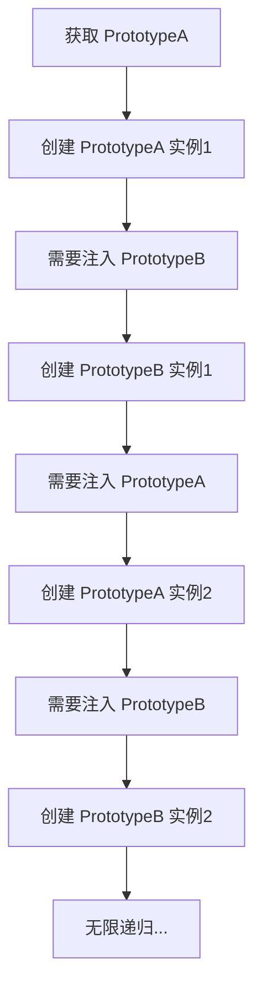
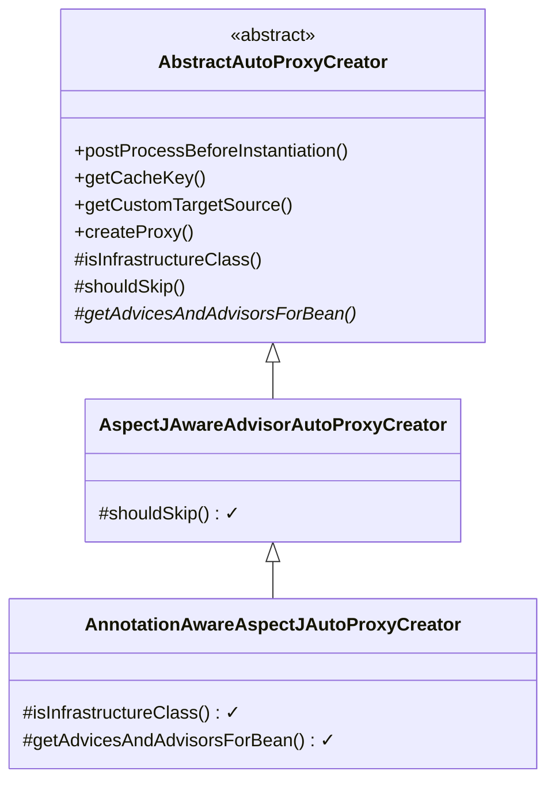
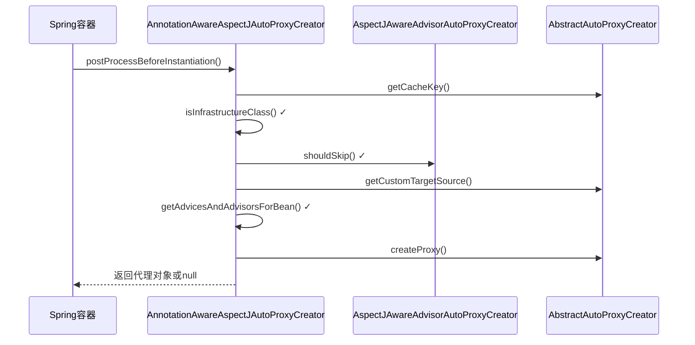
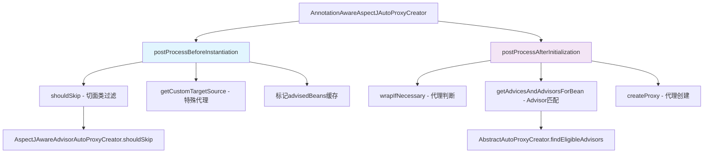
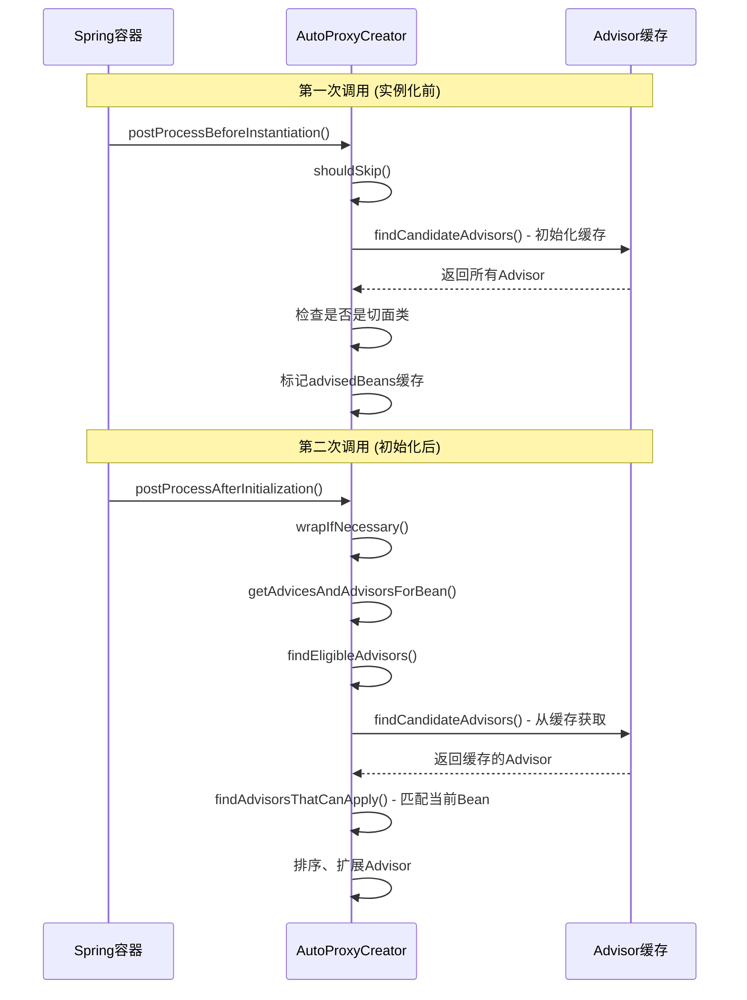

> 最后更新：2025-11-10 | [返回主目录](../README.md)

# 一、概述
> 首先， 从Spring框架的整体架构和组成对整体框架有个认知。
- Spring基础 - Spring和Spring框架组成
  - Spring是什么？它是怎么诞生的？有哪些主要的组件和核心功能呢? 通过这几个问题帮助你构筑Spring和Spring Framework的整体认知。


> 其次，通过案例引出Spring的核心（IoC和AOP），同时对IoC和AOP进行案例使用分析。
- Spring基础 - Spring简单例子引入Spring的核心
  - 上文中我们简单介绍了Spring和Spring Framework的组件，那么这些Spring Framework组件是如何配合工作的呢？本文主要承接上文，向你展示Spring Framework组件的典型应用场景和基于这个场景设计出的简单案例，并以此引出Spring的核心要点，比如IOC和AOP等；在此基础上还引入了不同的配置方式， 如XML，Java配置和注解方式的差异。


- Spring基础 - Spring核心之控制反转(IOC)
  - 在Spring基础 - Spring简单例子引入Spring的核心中向你展示了IoC的基础含义，同时以此发散了一些IoC相关知识点; 本节将在此基础上进一步解读IOC的含义以及IOC的使用方式


- Spring基础 - Spring核心之面向切面编程(AOP)
  - 在Spring基础 - Spring简单例子引入Spring的核心中向你展示了AOP的基础含义，同时以此发散了一些AOP相关知识点; 本节将在此基础上进一步解读AOP的含义以及AOP的使用方式。


> 基于Spring框架和IOC，AOP的基础，为构建上层web应用，需要进一步学习SpringMVC。
- Spring基础 - SpringMVC请求流程和案例
  - 前文我们介绍了Spring框架和Spring框架中最为重要的两个技术点（IOC和AOP），那我们如何更好的构建上层的应用呢（比如web 应用），这便是SpringMVC；Spring MVC是Spring在Spring Container Core和AOP等技术基础上，遵循上述Web MVC的规范推出的web开发框架，目的是为了简化Java栈的web开发。 本文主要介绍SpringMVC的请求流程和基础案例的编写和运行。


> Spring进阶 - IoC，AOP以及SpringMVC的源码分析
- Spring进阶 - Spring IOC实现原理详解之IOC体系结构设计
  - 在对IoC有了初步的认知后，我们开始对IOC的实现原理进行深入理解。本文将帮助你站在设计者的角度去看IOC最顶层的结构设计


- Spring进阶 - Spring IOC实现原理详解之IOC初始化流程
  - 上文，我们看了IOC设计要点和设计结构；紧接着这篇，我们可以看下源码的实现了：Spring如何实现将资源配置（以xml配置为例）通过加载，解析，生成BeanDefination并注册到IoC容器中的


- Spring进阶 - Spring IOC实现原理详解之Bean实例化(生命周期,循环依赖等)
  - 上文，我们看了IOC设计要点和设计结构；以及Spring如何实现将资源配置（以xml配置为例）通过加载，解析，生成BeanDefination并注册到IoC容器中的；容器中存放的是Bean的定义即BeanDefinition放到beanDefinitionMap中，本质上是一个`ConcurrentHashMap<String, Object>`；并且BeanDefinition接口中包含了这个类的Class信息以及是否是单例等。那么如何从BeanDefinition中实例化Bean对象呢，这是本文主要研究的内容？

- Spring进阶 - Spring AOP实现原理详解之切面实现
  - 前文，我们分析了Spring IOC的初始化过程和Bean的生命周期等，而Spring AOP也是基于IOC的Bean加载来实现的。本文主要介绍Spring AOP原理解析的切面实现过程(将切面类的所有切面方法根据使用的注解生成对应Advice，并将Advice连同切入点匹配器和切面类等信息一并封装到Advisor，为后续交给代理增强实现做准备的过程)。


- Spring进阶 - Spring AOP实现原理详解之AOP代理上文
  - 我们介绍了Spring AOP原理解析的切面实现过程(将切面类的所有切面方法根据使用的注解生成对应Advice，并将Advice连同切入点匹配器和切面类等信息一并封装到Advisor)。本文在此基础上继续介绍，代理（cglib代理和JDK代理）的实现过程。


- Spring进阶 - Spring AOP实现原理详解之Cglib代理实现
  - 我们在前文中已经介绍了SpringAOP的切面实现和创建动态代理的过程，那么动态代理是如何工作的呢？本文主要介绍Cglib动态代理的案例和SpringAOP实现的原理。


- Spring进阶 - Spring AOP实现原理详解之JDK代理实现
  - 上文我们学习了SpringAOP Cglib动态代理的实现，本文主要是SpringAOP JDK动态代理的案例和实现部分。


- Spring进阶 - SpringMVC实现原理之DispatcherServlet初始化的过程
  - 前文我们有了IOC的源码基础以及SpringMVC的基础，我们便可以进一步深入理解SpringMVC主要实现原理，包含DispatcherServlet的初始化过程和DispatcherServlet处理请求的过程的源码解析。本文是第一篇：DispatcherServlet的初始化过程的源码解析。


- Spring进阶 - SpringMVC实现原理之DispatcherServlet处理请求的过程
  - 前文我们有了IOC的源码基础以及SpringMVC的基础，我们便可以进一步深入理解SpringMVC主要实现原理，包含DispatcherServlet的初始化过程和DispatcherServlet处理请求的过程的源码解析。本文是第二篇：DispatcherServlet处理请求的过程的源码解析。


# 二、Spring基础 - Spring和Spring框架组成
## 2.1 什么是Spring?
> 首先，Spring是什么？它是怎么诞生的？它的诞生是为了解决什么问题？
### 2.1.1 Spring的起源
> 百度百科中关于Spring的起源介绍如下：

要谈Spring的历史，就要先谈J2EE。J2EE应用程序的广泛实现是在1999年和2000年开始的，它的出现带来了诸如事务管理之类的核心中间层概念的标准化，但是在实践中并没有获得绝对的成功，因为开发效率，开发难度和实际的性能都令人失望。

曾经使用过**EJB开发JAVA EE应用**的人，一定知道，在EJB开始的学习和应用非常的艰苦，很多东西都不能一下子就很容易的理解。EJB要严格地实现各种不同类型的接口，类似的或者重复的代码大量存在。而配置也是复杂和单调，同样使用JNDI进行对象查找的代码也是单调而枯燥。虽然有一些开发工作随着xdoclet的出现，而有所缓解，但是学习EJB的高昂代价，和极低的开发效率，极高的资源消耗，都造成了EJB的使用困难。而Spring出现的初衷就是为了解决类似的这些问题。

**Spring的一个最大的目的就是使JAVA EE开发更加容易**。同时，Spring之所以与Struts、Hibernate等单层框架不同，是因为Spring致力于提供一个以统一的、高效的方式构造整个应用，并且可以将单层框架以最佳的组合揉和在一起建立一个连贯的体系。可以说Spring是一个提供了更完善开发环境的一个框架，可以为POJO(Plain Ordinary Java Object)对象提供企业级的服务。

Spring的形成，最初来自Rod Jahnson所著的一本很有影响力的书籍<a href = 'https://item.jd.com/68619611892.html'>《Expert One-on-One J2EE Design and Development》</a>，就是在这本书中第一次出现了Spring的一些核心思想，该书出版于2002年。
### 2.1.2 Spring的特性和优势
> Spring Framework有哪些特性，用了这个框架对开发而言有什么好处呢？

从Spring 框架的**特性**来看：
- 非侵入式：基于Spring开发的应用中的对象可以不依赖于Spring的API
- 控制反转：IOC——Inversion of Control，指的是将对象的创建权交给 Spring 去创建。使用 Spring 之前，对象的创建都是由我们自己在代码中new创建。而使用 Spring 之后。对象的创建都是给了 Spring 框架。
- 依赖注入：DI——Dependency Injection，是指依赖的对象不需要手动调用 setXX 方法去设置，而是通过配置赋值。
- 面向切面编程：Aspect Oriented Programming——AOP
- 容器：Spring 是一个容器，因为它包含并且管理应用对象的生命周期
- 组件化：Spring 实现了使用简单的组件配置组合成一个复杂的应用。在 Spring 中可以使用XML和Java注解组合这些对象。
- 一站式：在 IOC 和 AOP 的基础上可以整合各种企业应用的开源框架和优秀的第三方类库（实际上 Spring 自身也提供了表现层的 SpringMVC 和持久层的 Spring JDBC）

从使用Spring 框架的**好处**看：
- Spring 可以使开发人员使用 POJOs 开发企业级的应用程序。只使用 POJOs 的好处是你不需要一个 EJB 容器产品，比如一个应用程序服务器，但是你可以选择使用一个健壮的 servlet 容器，比如 Tomcat 或者一些商业产品。
- Spring 在一个单元模式中是有组织的。即使包和类的数量非常大，你只要担心你需要的，而其它的就可以忽略了。
- Spring 不会让你白费力气做重复工作，它真正的利用了一些现有的技术，像 ORM 框架、日志框架、JEE、Quartz 和 JDK 计时器，其他视图技术。
- 测试一个用 Spring 编写的应用程序很容易，因为环境相关的代码被移动到这个框架中。此外，通过使用 JavaBean-style POJOs，它在使用依赖注入注入测试数据时变得更容易。
- Spring 的 web 框架是一个设计良好的 web MVC 框架，它为比如 Structs 或者其他工程上的或者不怎么受欢迎的 web 框架提供了一个很好的供替代的选择。MVC 模式导致应用程序的不同方面(输入逻辑，业务逻辑和UI逻辑)分离，同时提供这些元素之间的松散耦合。模型(Model)封装了应用程序数据，通常它们将由 POJO 类组成。视图(View)负责渲染模型数据，一般来说它生成客户端浏览器可以解释 HTML 输出。控制器(Controller)负责处理用户请求并构建适当的模型，并将其传递给视图进行渲染。
- Spring 对 JavaEE 开发中非常难用的一些 API（JDBC、JavaMail、远程调用等），都提供了封装，使这些API应用难度大大降低。
- 轻量级的 IOC 容器往往是轻量级的，例如，特别是当与 EJB 容器相比的时候。这有利于在内存和 CPU 资源有限的计算机上开发和部署应用程序。
- Spring 提供了一致的事务管理接口，可向下扩展到（使用一个单一的数据库，例如）本地事务并扩展到全局事务（例如，使用 JTA）
### 2.1.3 Spring有哪些组件?
下图来自，官方文档 Spring-framework 5.0；需要注意的是，虽然这个图来源于Spring Framwork5.0 M4 版本，但是它依然是V4版本的图，比如Spring 5版本中的web模块已经去掉了Portlet模块，新增了WebFlux模块等。


上图中包含了 Spring 框架的所有模块，这些模块可以满足一切企业级应用开发的需求，在开发过程中可以根据需求有选择性地使用所需要的模块。下面分别对这些模块的作用进行简单介绍（并且结合SpringFramework5.x源码模块帮助你对应好各模块关系）。
#### 2.1.3.1 Core Container（Spring的核心容器）

Spring 的核心容器是其他模块建立的基础，由 Beans 模块、Core 核心模块、Context 上下文模块和 SpEL 表达式语言模块组成，没有这些核心容器，也不可能有 AOP、Web 等上层的功能。具体介绍如下。

- `Beans 模块`：提供了框架的基础部分，包括控制反转和依赖注入。
- `Core 核心模块`：封装了 Spring 框架的底层部分，包括资源访问、类型转换及一些常用工具类。
- `Context 上下文模块`：建立在 Core 和 Beans 模块的基础之上，集成 Beans 模块功能并添加资源绑定、数据验证、国际化、Java EE 支持、容器生命周期、事件传播等。ApplicationContext 接口是上下文模块的焦点。
- `SpEL 模块`：提供了强大的表达式语言支持，支持访问和修改属性值，方法调用，支持访问及修改数组、容器和索引器，命名变量，支持算数和逻辑运算，支持从 Spring 容器获取 Bean，它也支持列表投影、选择和一般的列表聚合等。

对应的源码模块如下：

#### 2.1.3.2 Data Access/Integration（数据访问／集成）
数据访问／集成层包括 JDBC、ORM、OXM、JMS 和 Transactions 模块，具体介绍如下。

- `JDBC 模块`：提供了一个 JDBC 的样例模板，使用这些模板能消除传统冗长的 JDBC 编码还有必须的事务控制，而且能享受到 Spring 管理事务的好处。
- `ORM 模块`：提供与流行的“对象-关系”映射框架无缝集成的 API，包括 JPA、JDO、Hibernate 和 MyBatis 等。而且还可以使用 Spring 事务管理，无需额外控制事务。
- `OXM 模块`：提供了一个支持 Object /XML 映射的抽象层实现，如 JAXB、Castor、XMLBeans、JiBX 和 XStream。将 Java 对象映射成 XML 数据，或者将XML 数据映射成 Java 对象。
- `JMS 模块`：指 Java 消息服务，提供一套 “消息生产者、消息消费者”模板用于更加简单的使用 JMS，JMS 用于用于在两个应用程序之间，或分布式系统中发送消息，进行异步通信。
- `Transactions 事务模块`：支持编程和声明式事务管理。

对应的源码模块如下：

#### 2.1.3.3 Web模块
Spring 的 Web 层包括 Web、Servlet、WebSocket 和 Webflux 组件，具体介绍如下。
- `Web 模块`：提供了基本的 Web 开发集成特性，例如多文件上传功能、使用的 Servlet 监听器的 IOC 容器初始化以及 Web 应用上下文。
- `Servlet 模块`：提供了一个 Spring MVC Web 框架实现。Spring MVC 框架提供了基于注解的请求资源注入、更简单的数据绑定、数据验证等及一套非常易用的 JSP 标签，完全无缝与 Spring 其他技术协作。
- `WebSocket 模块`：提供了简单的接口，用户只要实现响应的接口就可以快速的搭建 WebSocket Server，从而实现双向通讯。
- `Webflux 模块`： Spring WebFlux 是 Spring Framework 5.x中引入的新的响应式web框架。与Spring MVC不同，它不需要Servlet API，是完全异步且非阻塞的，并且通过Reactor项目实现了Reactive Streams规范。Spring WebFlux 用于创建基于事件循环执行模型的完全异步且非阻塞的应用程序。

此外Spring4.x中还有Portlet 模块，在Spring 5.x中已经移除
- `Portlet 模块`：提供了在 Portlet 环境中使用 MVC 实现，类似 Web-Servlet 模块的功能。

对应的源码模块如下：

#### 2.1.3.4 AOP、Aspects、Instrumentation和Messaging
在 Core Container 之上是 AOP、Aspects 等模块，具体介绍如下：
- `AOP 模块`：提供了面向切面编程实现，提供比如日志记录、权限控制、性能统计等通用功能和业务逻辑分离的技术，并且能动态的把这些功能添加到需要的代码中，这样各司其职，降低业务逻辑和通用功能的耦合。
- `Aspects 模块`：提供与 AspectJ 的集成，是一个功能强大且成熟的面向切面编程（AOP）框架。
- `Instrumentation 模块`：提供了类工具的支持和类加载器的实现，可以在特定的应用服务器中使用。
- `messaging 模块`：Spring 4.0 以后新增了消息（Spring-messaging）模块，该模块提供了对消息传递体系结构和协议的支持。
- `jcl 模块`： Spring 5.x中新增了日志框架集成的模块。

对应的源码模块如下：

#### 2.1.3.5 Test模块
Test 模块：Spring 支持 Junit 和 TestNG 测试框架，而且还额外提供了一些基于 Spring 的测试功能，比如在测试 Web 框架时，模拟 Http 请求的功能。

包含Mock Objects, TestContext Framework, Spring MVC Test, WebTestClient。

对应的源码模块如下：

## 2.2 为什么用Spring?
> 那么为什么用Spring呢？来看看<a href='https://spring.io/why-spring'>官网</a>对这个问题的回答
## 2.3 学习Spring时参考哪些资料呢？
### 2.3.1 Spring 的官方项目和教程
官方的项目和教程，地址在<a href='https://spring.io/projects/spring-framework'>这里</a>，在学习Spring时，一定要把它当做生态体系，而是不是一个简单的开发框架。

### 2.3.2 Spring 的归档文档
官方提供了系统性的文档的FTP，你可以在<a href ='https://docs.spring.io/spring-framework/docs/'>这里</a>找到所有历史版本的PDF/HTML版本。


可以看到很多系统性的文档，包括上面引用的图，


### 2.3.3 Spring 的官方Github
Spring官方的GitHub在<a href = 'https://github.com/spring-projects/spring-framework'>这里</a>，它包含着Spring-framework的源码，如果你感兴趣，可以从这里clone代码进行阅读。

# 三 Spring基础 - Spring简单例子引入Spring要点
## 3.1 Spring框架如何应用
> 上文中，我们展示了Spring和Spring Framework的组件, 这里对于开发者来说有几个问题：
> 
> 首先，对于Spring进阶，直接去看IOC和AOP，存在一个断层，所以需要整体上构建对Spring框架认知上进一步深入，这样才能构建知识体系。
> 
> 其次，很多开发者入门都是从Spring Boot开始的，他对Spring整体框架底层，以及发展历史不是很了解； 特别是对于一些老旧项目维护和底层bug分析没有全局观。
> 
> 再者，Spring代表的是一种框架设计理念，需要全局上理解Spring Framework组件是如何配合工作的，需要理解它设计的初衷和未来趋势。

如下是官方在解释Spring框架的常用场景的图


我加上一些注释后，是比较好理解的；引入这个图，重要的原因是为后面设计一个案例帮助你构建认知。

## 3.2 设计一个Spring的Hello World
> 结合上面的使用场景，设计一个查询用户的案例的两个需求，来看Spring框架帮我们简化了什么开发工作:
> 
> 查询用户数据 - 来看DAO+POJO-> Service 的初始化和装载。
> 
> 给所有Service的查询方法记录日志
- 创建一个Maven的Java项目

- 引入Spring框架的POM依赖，以及查看这些依赖之间的关系
```xml
<?xml version="1.0" encoding="UTF-8"?>
<project xmlns="http://maven.apache.org/POM/4.0.0"
         xmlns:xsi="http://www.w3.org/2001/XMLSchema-instance"
         xsi:schemaLocation="http://maven.apache.org/POM/4.0.0 http://maven.apache.org/xsd/maven-4.0.0.xsd">
    <modelVersion>4.0.0</modelVersion>

    <groupId>tech.pdai</groupId>
    <artifactId>001-spring-framework-demo-helloworld-xml</artifactId>
    <version>1.0-SNAPSHOT</version>

    <properties>
        <maven.compiler.source>8</maven.compiler.source>
        <maven.compiler.target>8</maven.compiler.target>
        <spring.version>5.3.9</spring.version>
        <aspectjweaver.version>1.9.6</aspectjweaver.version>
    </properties>

    <dependencies>
        <dependency>
            <groupId>org.springframework</groupId>
            <artifactId>spring-context</artifactId>
            <version>${spring.version}</version>
        </dependency>
        <dependency>
            <groupId>org.springframework</groupId>
            <artifactId>spring-core</artifactId>
            <version>${spring.version}</version>
        </dependency>
        <dependency>
            <groupId>org.springframework</groupId>
            <artifactId>spring-beans</artifactId>
            <version>${spring.version}</version>
        </dependency>
        <dependency>
            <groupId>org.aspectj</groupId>
            <artifactId>aspectjweaver</artifactId>
            <version>${aspectjweaver.version}</version>
        </dependency>
    </dependencies>

</project>
```

- POJO - User
```java
package tech.pdai.springframework.entity;

/**
 * @author pdai
 */
public class User {

    /**
     * user's name.
     */
    private String name;

    /**
     * user's age.
     */
    private int age;

    /**
     * init.
     *
     * @param name name
     * @param age  age
     */
    public User(String name, int age) {
        this.name = name;
        this.age = age;
    }

    public String getName() {
        return name;
    }

    public void setName(String name) {
        this.name = name;
    }

    public int getAge() {
        return age;
    }

    public void setAge(int age) {
        this.age = age;
    }
}
```
- DAO 获取 POJO， UserDaoServiceImpl (mock 数据)
```java
package tech.pdai.springframework.dao;

import java.util.Collections;
import java.util.List;

import tech.pdai.springframework.entity.User;

/**
 * @author pdai
 */
public class UserDaoImpl {

    /**
     * init.
     */
    public UserDaoImpl() {
    }

    /**
     * mocked to find user list.
     *
     * @return user list
     */
    public List<User> findUserList() {
        return Collections.singletonList(new User("pdai", 18));
    }
}
```
并增加daos.xml
```xml
<?xml version="1.0" encoding="UTF-8"?>
<beans xmlns="http://www.springframework.org/schema/beans"
       xmlns:xsi="http://www.w3.org/2001/XMLSchema-instance"
       xsi:schemaLocation="http://www.springframework.org/schema/beans
 http://www.springframework.org/schema/beans/spring-beans.xsd">
    <bean id="userDao" class="tech.pdai.springframework.dao.UserDaoImpl">
        <!-- additional collaborators and configuration for this bean go here -->
    </bean>
    <!-- more bean definitions for data access objects go here -->
</beans>
```
- 业务层 UserServiceImpl（调用DAO层）
```java
package tech.pdai.springframework.service;

import java.util.List;

import tech.pdai.springframework.dao.UserDaoImpl;
import tech.pdai.springframework.entity.User;

/**
 * @author pdai
 */
public class UserServiceImpl {

    /**
     * user dao impl.
     */
    private UserDaoImpl userDao;

    /**
     * init.
     */
    public UserServiceImpl() {
    }

    /**
     * find user list.
     *
     * @return user list
     */
    public List<User> findUserList() {
        return this.userDao.findUserList();
    }

    /**
     * set dao.
     *
     * @param userDao user dao
     */
    public void setUserDao(UserDaoImpl userDao) {
        this.userDao = userDao;
    }
}
```
并增加services.xml
```xml
<?xml version="1.0" encoding="UTF-8"?>
<beans xmlns="http://www.springframework.org/schema/beans"
       xmlns:xsi="http://www.w3.org/2001/XMLSchema-instance"
       xsi:schemaLocation="http://www.springframework.org/schema/beans
 http://www.springframework.org/schema/beans/spring-beans.xsd">
    <!-- services -->
    <bean id="userService" class="tech.pdai.springframework.service.UserServiceImpl">
        <property name="userDao" ref="userDao"/>
        <!-- additional collaborators and configuration for this bean go here -->
    </bean>
    <!-- more bean definitions for services go here -->
</beans>
```
- 拦截所有service中的方法，并输出记录
```java
package tech.pdai.springframework.aspect;

import java.lang.reflect.Method;

import org.aspectj.lang.ProceedingJoinPoint;
import org.aspectj.lang.annotation.Around;
import org.aspectj.lang.annotation.Aspect;
import org.aspectj.lang.reflect.MethodSignature;
import org.springframework.context.annotation.EnableAspectJAutoProxy;

/**
 * @author pdai
 */
@Aspect
public class LogAspect {

    /**
     * aspect for every methods under service package.
     */
    @Around("execution(* tech.pdai.springframework.service.*.*(..))")
    public Object businessService(ProceedingJoinPoint pjp) throws Throwable {
        // get attribute through annotation
        Method method = ((MethodSignature) pjp.getSignature()).getMethod();
        System.out.println("execute method: " + method.getName());

        // continue to process
        return pjp.proceed();
    }

}
```
并增加aspects.xml
```xml
<?xml version="1.0" encoding="UTF-8"?>
<beans xmlns="http://www.springframework.org/schema/beans"
       xmlns:xsi="http://www.w3.org/2001/XMLSchema-instance"
       xmlns:aop="http://www.springframework.org/schema/aop"
       xmlns:context="http://www.springframework.org/schema/context"
       xsi:schemaLocation="http://www.springframework.org/schema/beans
 http://www.springframework.org/schema/beans/spring-beans.xsd
 http://www.springframework.org/schema/aop
 http://www.springframework.org/schema/aop/spring-aop.xsd
 http://www.springframework.org/schema/context
 http://www.springframework.org/schema/context/spring-context.xsd
">

    <context:component-scan base-package="tech.pdai.springframework" />

    <aop:aspectj-autoproxy/>

    <bean id="logAspect" class="tech.pdai.springframework.aspect.LogAspect">
        <!-- configure properties of aspect here as normal -->
    </bean>
    <!-- more bean definitions for data access objects go here -->
</beans>
```
- 组装App
```java
package tech.pdai.springframework;

import java.util.List;

import org.springframework.context.ApplicationContext;
import org.springframework.context.support.ClassPathXmlApplicationContext;
import tech.pdai.springframework.entity.User;
import tech.pdai.springframework.service.UserServiceImpl;

/**
 * @author pdai
 */
public class App {

    /**
     * main interfaces.
     *
     * @param args args
     */
    public static void main(String[] args) {
        // create and configure beans
        ApplicationContext context =
                new ClassPathXmlApplicationContext("aspects.xml", "daos.xml", "services.xml");

        // retrieve configured instance
        UserServiceImpl service = context.getBean("userService", UserServiceImpl.class);

        // use configured instance
        List<User> userList = service.findUserList();

        // print info from beans
        userList.forEach(a -> System.out.println(a.getName() + "," + a.getAge()));
    }
}
```
- 整体结构和运行app


## 3.3 这个例子体现了Spring的哪些核心要点
### 3.3.1 控制反转 - IOC
来看第一个需求：查询用户（service通过调用dao查询pojo），本质上如何创建User/Dao/Service等；
- 如果没有Spring框架，我们需要自己创建User/Dao/Service等，比如：
```java
UserDaoImpl userDao = new UserDaoImpl();
UserSericeImpl userService = new UserServiceImpl();
userService.setUserDao(userDao);
List<User> userList = userService.findUserList();
```
- 有了Spring框架，可以将原有Bean的创建工作转给框架, 需要用时从Bean的容器中获取即可，这样便简化了开发工作

Bean的创建和使用分离了。
```java
// create and configure beans
ApplicationContext context =
        new ClassPathXmlApplicationContext("aspects.xml", "daos.xml", "services.xml");

// retrieve configured instance
UserServiceImpl service = context.getBean("userService", UserServiceImpl.class);

// use configured instance
List<User> userList = service.findUserList();
```


更进一步，你便能理解为何会有如下的知识点了：
- Spring框架管理这些Bean的创建工作，即由用户管理Bean转变为框架管理Bean，这个就叫**控制反转Inversion of Control (IoC)**
- Spring 框架托管创建的Bean放在哪里呢？ 这便是**IoC Container**;
- Spring 框架为了更好让用户配置Bean，必然会引入不同方式来配置Bean？ 这便是xml配置，Java配置，注解配置等
- 支持Spring 框架既然接管了Bean的生成，必然需要管理整个Bean的生命周期等；
- 应用程序代码从Ioc Container中获取依赖的Bean，注入到应用程序中，这个过程叫**依赖注入(Dependency Injection，DI)**； 所以说控制反转是通过依赖注入实现的，其实它们是同一个概念的不同角度描述。通俗来说就是**IoC是设计思想，DI是实现方式**
- 在依赖注入时，有哪些方式呢？这就是构造器方式，@Autowired, @Resource, @Qualifier... 同时Bean之间存在依赖（可能存在先后顺序问题，以及**循环依赖问题**等）
### 3.3.2 面向切面 - AOP
> 来看第二个需求：给Service所有方法调用**添加日志（调用方法时）**，本质上是解耦问题；
- 如果没有Spring框架，我们需要在每个service的方法中都添加记录日志的方法，比如：
```java
/**
* find user list.
*
* @return user list
*/
public List<User> findUserList() {
    System.out.println("execute method findUserList");
    return this.userDao.findUserList();
}
```
- 有了Spring框架，通过@Aspect注解 定义了切面，这个切面中定义了拦截所有service中的方法，并记录日志； 可以明显看到，框架将日志记录和业务需求的代码解耦了，不再是侵入式的了
```java
/**
* aspect for every methods under service package.
*/
@Around("execution(* tech.pdai.springframework.service.*.*(..))")
public Object businessService(ProceedingJoinPoint pjp) throws Throwable {
    // get attribute through annotation
    Method method = ((MethodSignature) pjp.getSignature()).getMethod();
    System.out.println("execute method: " + method.getName());

    // continue to process
    return pjp.proceed();
}
```
更进一步，你便能理解为何会有如下的知识点了：
- Spring 框架通过定义切面, 通过拦截切点实现了不同业务模块的解耦，这个就叫**面向切面编程 - Aspect Oriented Programming (AOP)**
- 为什么@Aspect注解使用的是aspectj的jar包呢？这就引出了**Aspect4J和Spring AOP的历史渊源**，只有理解了Aspect4J和Spring的渊源才能理解有些注解上的兼容设计
- 如何支持更多拦截方式来实现解耦， 以满足更多场景需求呢？ 这就是@Around, @Pointcut... 等的设计
- 那么Spring框架又是如何实现AOP的呢？ 这就引入**代理技术，分静态代理和动态代理**，动态代理又包含**JDK代理和CGLIB代理**等
## 3.4 Spring框架设计如何逐步简化开发的
> 通过上述的框架介绍和例子，已经初步知道了Spring设计的两个大的要点：IOC和AOP；从框架的设计角度而言，更为重要的是简化开发，比如提供更为便捷的配置Bean的方式，直至0配置（即约定大于配置）。这里我将通过Spring历史版本的发展，和SpringBoot的推出等，来帮你理解Spring框架是如何逐步简化开发的
### 3.4.1 Java 配置方式改造
在前文的例子中， 通过xml配置方式实现的，这种方式实际上比较麻烦； 我通过Java配置进行改造：

- User，UserDaoImpl, UserServiceImpl，LogAspect不用改
- 将原通过.xml配置转换为Java配置
```java
package tech.pdai.springframework.config;

import org.springframework.context.annotation.Bean;
import org.springframework.context.annotation.Configuration;
import org.springframework.context.annotation.EnableAspectJAutoProxy;
import tech.pdai.springframework.aspect.LogAspect;
import tech.pdai.springframework.dao.UserDaoImpl;
import tech.pdai.springframework.service.UserServiceImpl;

/**
 * @author pdai
 */
@EnableAspectJAutoProxy
@Configuration
public class BeansConfig {

    /**
     * @return user dao
     */
    @Bean("userDao")
    public UserDaoImpl userDao() {
        return new UserDaoImpl();
    }

    /**
     * @return user service
     */
    @Bean("userService")
    public UserServiceImpl userService() {
        UserServiceImpl userService = new UserServiceImpl();
        userService.setUserDao(userDao());
        return userService;
    }

    /**
     * @return log aspect
     */
    @Bean("logAspect")
    public LogAspect logAspect() {
        return new LogAspect();
    }
}
```
- 在App中加载BeansConfig的配置
```java
package tech.pdai.springframework;

import java.util.List;

import org.springframework.context.annotation.AnnotationConfigApplicationContext;
import tech.pdai.springframework.config.BeansConfig;
import tech.pdai.springframework.entity.User;
import tech.pdai.springframework.service.UserServiceImpl;

/**
 * @author pdai
 */
public class App {

    /**
     * main interfaces.
     *
     * @param args args
     */
    public static void main(String[] args) {
        // create and configure beans
        AnnotationConfigApplicationContext context = new AnnotationConfigApplicationContext(BeansConfig.class);

        // retrieve configured instance
        UserServiceImpl service = context.getBean("userService", UserServiceImpl.class);

        // use configured instance
        List<User> userList = service.findUserList();

        // print info from beans
        userList.forEach(a -> System.out.println(a.getName() + "," + a.getAge()));
    }
}
```
- 整体结构和运行app

### 3.4.2 注解配置方式改造
更进一步，Java 5开始提供注解支持，Spring 2.5 开始完全支持基于注解的配置并且也支持JSR250 注解。在Spring后续的版本发展倾向于通过注解和Java配置结合使用.
- BeanConfig 不再需要Java配置
```java
package tech.pdai.springframework.config;

import org.springframework.context.annotation.ComponentScan;
import org.springframework.context.annotation.ComponentScans;
import org.springframework.context.annotation.Configuration;
import org.springframework.context.annotation.EnableAspectJAutoProxy;

/**
 * @author pdai
 */
@Configuration
@EnableAspectJAutoProxy
public class BeansConfig {

}
```
- UserDaoImpl 增加了 @Repository注解
```java
/**
 * @author pdai
 */
@Repository
public class UserDaoImpl {

    /**
     * mocked to find user list.
     *
     * @return user list
     */
    public List<User> findUserList() {
        return Collections.singletonList(new User("pdai", 18));
    }
}
```
- UserServiceImpl 增加了@Service 注解，并通过@Autowired注入userDao.
```java
/**
 * @author pdai
 */
@Service
public class UserServiceImpl {

    /**
     * user dao impl.
     */
    @Autowired
    private UserDaoImpl userDao;

    /**
     * find user list.
     *
     * @return user list
     */
    public List<User> findUserList() {
        return userDao.findUserList();
    }

}
```
- 在App中扫描tech.pdai.springframework包
```java
package tech.pdai.springframework;

import java.util.List;

import org.springframework.context.annotation.AnnotationConfigApplicationContext;
import tech.pdai.springframework.entity.User;
import tech.pdai.springframework.service.UserServiceImpl;

/**
 * @author pdai
 */
public class App {

    /**
     * main interfaces.
     *
     * @param args args
     */
    public static void main(String[] args) {
        // create and configure beans
        AnnotationConfigApplicationContext context = new AnnotationConfigApplicationContext(
                "tech.pdai.springframework");

        // retrieve configured instance
        UserServiceImpl service = context.getBean(UserServiceImpl.class);

        // use configured instance
        List<User> userList = service.findUserList();

        // print info from beans
        userList.forEach(a -> System.out.println(a.getName() + "," + a.getAge()));
    }
}
```
- 整体结构和运行app

### 3.4.3 SpringBoot托管配置
Springboot实际上通过约定大于配置的方式，使用xx-starter统一的对Bean进行默认初始化，用户只需要很少的配置就可以进行开发了。

这个因为很多开发者都是从SpringBoot开始着手开发的，所以这个比较好理解。我们需要的是将知识点都串联起来，构筑认知体系。
## 3.5 结合Spring历史版本和SpringBoot看发展
最后结合Spring历史版本总结下它的发展：（这样是不是能够帮助你在整体上构建了知识体系的认知了呢？）

# 四、Spring基础 - Spring核心之控制反转(IOC)
## 4.1 引入
> 我们在Spring基础 - Spring简单例子引入Spring的核心中向你展示了IoC的基础含义，同时以此发散了一些IoC相关知识点。
- Spring框架管理这些Bean的创建工作，即由用户管理Bean转变为框架管理Bean，这个就叫**控制反转Inversion of Control (IoC)**
- Spring 框架托管创建的Bean放在哪里呢？ 这便是**IoC Container**;
- Spring 框架为了更好让用户配置Bean，必然会引入不同方式来配置Bean？ 这便是xml配置，Java配置，注解配置等
- 支持Spring 框架既然接管了Bean的生成，必然需要管理整个Bean的生命周期等；
- 应用程序代码从Ioc Container中获取依赖的Bean，注入到应用程序中，这个过程叫**依赖注入(Dependency Injection，DI)**； 所以说控制反转是通过依赖注入实现的，其实它们是同一个概念的不同角度描述。通俗来说就是**IoC是设计思想，DI是实现方式**
- 在依赖注入时，有哪些方式呢？这就是构造器方式，@Autowired, @Resource, @Qualifier... 同时Bean之间存在依赖（可能存在先后顺序问题，以及**循环依赖问题**等）

本节将在此基础上进一步解读IOC的含义以及IOC的使用方式；后续的文章还将深入IOC的实现原理：
- Spring进阶- Spring IOC实现原理详解之IOC体系结构设计
- Spring进阶- Spring IOC实现原理详解之IOC初始化流程
- Spring进阶- Spring IOC实现原理详解之Bean的注入和生命周期
## 4.2 如何理解IoC
如果你有精力看英文，首推 Martin Fowler大师的 <a href = 'https://www.martinfowler.com/articles/injection.html'>Inversion of Control Containers and the Dependency Injection pattern</a>；其次IoC作为一种设计思想，不要过度解读，而是应该简化理解，所以我这里也整合了 张开涛早前的博客<a href = 'https://www.iteye.com/blog/jinnianshilongnian-1413846'>IoC基础</a>并加入了自己的理解。
### 4.2.1 Spring Bean是什么
> IoC Container管理的是Spring Bean， 那么Spring Bean是什么呢？

Spring里面的bean就类似是定义的一个组件，而这个组件的作用就是实现某个功能的，这里所定义的bean就相当于给了你一个更为简便的方法来调用这个组件去实现你要完成的功能。
### 4.2.2 IoC是什么
> Ioc—Inversion of Control，即“控制反转”，**不是什么技术，而是一种设计思想**。在Java开发中，Ioc意味着将你设计好的对象交给容器控制，而不是传统的在你的对象内部直接控制。

我们来深入分析一下：
- 谁控制谁，控制什么？

传统Java SE程序设计，我们直接在对象内部通过new进行创建对象，是程序主动去创建依赖对象；而IoC是有专门一个容器来创建这些对象，即由Ioc容器来控制对象的创建；谁控制谁？当然是IoC 容器控制了对象；控制什么？那就是主要控制了外部资源获取（不只是对象包括比如文件等）。
- 为何是反转，哪些方面反转了?

有反转就有正转，传统应用程序是由我们自己在对象中主动控制去直接获取依赖对象，也就是正转；而反转则是由容器来帮忙创建及注入依赖对象；为何是反转？因为由容器帮我们查找及注入依赖对象，对象只是被动的接受依赖对象，所以是反转；哪些方面反转了？依赖对象的获取被反转了。
- 用图例说明一下?

传统程序设计下，都是主动去创建相关对象然后再组合起来：


当有了IoC/DI的容器后，在客户端类中不再主动去创建这些对象了，如图


### 4.2.3 IoC能做什么
> **IoC 不是一种技术，只是一种思想**，一个重要的面向对象编程的法则，它能指导我们如何设计出松耦合、更优良的程序。

传统应用程序都是由我们在类内部主动创建依赖对象，从而导致类与类之间高耦合，难于测试；**有了IoC容器后，把创建和查找依赖对象的控制权交给了容器，由容器进行注入组合对象，所以对象与对象之间是 松散耦合，这样也方便测试，利于功能复用，更重要的是使得程序的整个体系结构变得非常灵活。**

其实IoC对编程带来的最大改变不是从代码上，而是从思想上，发生了“主从换位”的变化。应用程序原本是老大，要获取什么资源都是主动出击，但是在IoC/DI思想中，应用程序就变成被动的了，被动的等待IoC容器来创建并注入它所需要的资源了。

IoC很好的体现了面向对象设计法则之一——**好莱坞法则：“别找我们，我们找你”**；即由IoC容器帮对象找相应的依赖对象并注入，而不是由对象主动去找。

### 4.2.4 IoC和DI是什么关系
> 控制反转是通过依赖注入实现的，其实它们是同一个概念的不同角度描述。通俗来说就是**IoC是设计思想，DI是实现方式。**

DI—Dependency Injection，即依赖注入：组件之间依赖关系由容器在运行期决定，形象的说，即由容器动态的将某个依赖关系注入到组件之中。依赖注入的目的并非为软件系统带来更多功能，而是为了提升组件重用的频率，并为系统搭建一个灵活、可扩展的平台。通过依赖注入机制，我们只需要通过简单的配置，而无需任何代码就可指定目标需要的资源，完成自身的业务逻辑，而不需要关心具体的资源来自何处，由谁实现。

我们来深入分析一下：
- 谁依赖于谁？

当然是应用程序依赖于IoC容器；
- 为什么需要依赖？

应用程序需要IoC容器来提供对象需要的外部资源；
- 谁注入谁？

很明显是IoC容器注入应用程序某个对象，应用程序依赖的对象；
- 注入了什么？

就是注入某个对象所需要的外部资源（包括对象、资源、常量数据）。
- IoC和DI有什么关系呢？

其实它们是同一个概念的不同角度描述，由于控制反转概念比较含糊（可能只是理解为容器控制对象这一个层面，很难让人想到谁来维护对象关系），所以2004年大师级人物Martin Fowler又给出了一个新的名字：“依赖注入”，相对IoC 而言，“依赖注入”明确描述了“被注入对象依赖IoC容器配置依赖对象”。通俗来说就是IoC是设计思想，DI是实现方式。
## 4.3 Ioc 配置的三种方式
> 在Spring基础 - Spring简单例子引入Spring的核心已经给出了三种配置方式，这里再总结下；总体上目前的主流方式是 注解 + Java 配置。
### 4.3.1 xml 配置
顾名思义，就是将bean的信息配置.xml文件里，通过Spring加载文件为我们创建bean。这种方式出现很多早前的SSM项目中，将第三方类库或者一些配置工具类都以这种方式进行配置，主要原因是由于第三方类不支持Spring注解。
- 优点： 可以使用于任何场景，结构清晰，通俗易懂
- 缺点： 配置繁琐，不易维护，枯燥无味，扩展性差

**举例：**
1. 配置xx.xml文件
2. 声明命名空间和配置bean
```xml
<?xml version="1.0" encoding="UTF-8"?>
<beans xmlns="http://www.springframework.org/schema/beans"
       xmlns:xsi="http://www.w3.org/2001/XMLSchema-instance"
       xsi:schemaLocation="http://www.springframework.org/schema/beans
 http://www.springframework.org/schema/beans/spring-beans.xsd">
    <!-- services -->
    <bean id="userService" class="tech.pdai.springframework.service.UserServiceImpl">
        <property name="userDao" ref="userDao"/>
        <!-- additional collaborators and configuration for this bean go here -->
    </bean>
    <!-- more bean definitions for services go here -->
</beans>
```
### 4.3.2 Java 配置
将类的创建交给我们配置的JavcConfig类来完成，Spring只负责维护和管理，采用纯Java创建方式。其本质上就是把在XML上的配置声明转移到Java配置类中
- 优点：适用于任何场景，配置方便，因为是纯Java代码，扩展性高，十分灵活
- 缺点：由于是采用Java类的方式，声明不明显，如果大量配置，可读性比较差

**举例：**
1. 创建一个配置类， 添加@Configuration注解声明为配置类
2. 创建方法，方法上加上@bean，该方法用于创建实例并返回，该实例创建后会交给spring管理，方法名建议与实例名相同（首字母小写）。注：实例类不需要加任何注解
```java
/**
 * @author pdai
 */
@Configuration
public class BeansConfig {

    /**
     * @return user dao
     */
    @Bean("userDao")
    public UserDaoImpl userDao() {
        return new UserDaoImpl();
    }

    /**
     * @return user service
     */
    @Bean("userService")
    public UserServiceImpl userService() {
        UserServiceImpl userService = new UserServiceImpl();
        userService.setUserDao(userDao());
        return userService;
    }
}
```
### 4.3.3 注解配置
通过在类上加注解的方式，来声明一个类交给Spring管理，Spring会自动扫描带有@Component，@Controller，@Service，@Repository这四个注解的类，然后帮我们创建并管理，前提是需要先配置Spring的注解扫描器。
- 优点：开发便捷，通俗易懂，方便维护。
- 缺点：具有局限性，对于一些第三方资源，无法添加注解。只能采用XML或JavaConfig的方式配置

**举例：**
1. 对类添加@Component相关的注解，比如@Controller，@Service，@Repository
2. 设置ComponentScan的basePackage, 比如`<context:component-scan base-package='tech.pdai.springframework'>`, 或者`@ComponentScan("tech.pdai.springframework")`注解，或者`new AnnotationConfigApplicationContext("tech.pdai.springframework")`指定扫描的basePackage.
```java
/**
 * @author pdai
 */
@Service
public class UserServiceImpl {

    /**
     * user dao impl.
     */
    @Autowired
    private UserDaoImpl userDao;

    /**
     * find user list.
     *
     * @return user list
     */
    public List<User> findUserList() {
        return userDao.findUserList();
    }

}
```
## 4.4 依赖注入的三种方式
> 常用的注入方式主要有三种：构造方法注入（Construct注入），setter注入，字段(属性)注入
### 4.4.1 setter方式
- 在**XML配置方式**中，property都是setter方式注入，比如下面的xml:
```xml
<?xml version="1.0" encoding="UTF-8"?>
<beans xmlns="http://www.springframework.org/schema/beans"
       xmlns:xsi="http://www.w3.org/2001/XMLSchema-instance"
       xsi:schemaLocation="http://www.springframework.org/schema/beans
 http://www.springframework.org/schema/beans/spring-beans.xsd">
    <!-- services -->
    <bean id="userService" class="tech.pdai.springframework.service.UserServiceImpl">
        <property name="userDao" ref="userDao"/>
        <!-- additional collaborators and configuration for this bean go here -->
    </bean>
    <!-- more bean definitions for services go here -->
</beans>
```
本质上包含两步：

1. 第一步，需要new UserServiceImpl()创建对象, 所以需要默认构造函数
2. 第二步，调用setUserDao()函数注入userDao的值, 所以需要setUserDao()函数

所以对应的service类是这样的：
```java
/**
 * @author pdai
 */
public class UserServiceImpl {

    /**
     * user dao impl.
     */
    private UserDaoImpl userDao;

    /**
     * init.
     */
    public UserServiceImpl() {
    }

    /**
     * find user list.
     *
     * @return user list
     */
    public List<User> findUserList() {
        return this.userDao.findUserList();
    }

    /**
     * set dao.
     *
     * @param userDao user dao
     */
    public void setUserDao(UserDaoImpl userDao) {
        this.userDao = userDao;
    }
}
```
- 在注解和Java配置方式下
```java
/**
 * @author pdai
 */
public class UserServiceImpl {

    /**
     * user dao impl.
     */
    private UserDaoImpl userDao;

    /**
     * find user list.
     *
     * @return user list
     */
    public List<User> findUserList() {
        return this.userDao.findUserList();
    }

    /**
     * set dao.
     *
     * @param userDao user dao
     */
    @Autowired
    public void setUserDao(UserDaoImpl userDao) {
        this.userDao = userDao;
    }
}
```
在Spring3.x刚推出的时候，推荐使用注入的就是这种, 但是这种方式比较麻烦，所以在Spring4.x版本中推荐构造函数注入。

### 4.4.2 构造函数
- 在**XML配置方式**中，`<constructor-arg>`是通过构造函数参数注入，比如下面的xml:
```xml
<?xml version="1.0" encoding="UTF-8"?>
<beans xmlns="http://www.springframework.org/schema/beans"
       xmlns:xsi="http://www.w3.org/2001/XMLSchema-instance"
       xsi:schemaLocation="http://www.springframework.org/schema/beans
 http://www.springframework.org/schema/beans/spring-beans.xsd">
    <!-- services -->
    <bean id="userService" class="tech.pdai.springframework.service.UserServiceImpl">
        <constructor-arg name="userDao" ref="userDao"/>
        <!-- additional collaborators and configuration for this bean go here -->
    </bean>
    <!-- more bean definitions for services go here -->
</beans>
```
本质上是new UserServiceImpl(userDao)创建对象, 所以对应的service类是这样的：
```java
/**
 * @author pdai
 */
public class UserServiceImpl {

    /**
     * user dao impl.
     */
    private final UserDaoImpl userDao;

    /**
     * init.
     * @param userDaoImpl user dao impl
     */
    public UserServiceImpl(UserDaoImpl userDaoImpl) {
        this.userDao = userDaoImpl;
    }

    /**
     * find user list.
     *
     * @return user list
     */
    public List<User> findUserList() {
        return this.userDao.findUserList();
    }

}
```
- 在注解和Java配置方式下
```java
/**
 * @author pdai
 */
 @Service
public class UserServiceImpl {

    /**
     * user dao impl.
     */
    private final UserDaoImpl userDao;

    /**
     * init.
     * @param userDaoImpl user dao impl
     */
    @Autowired // 这里@Autowired也可以省略
    public UserServiceImpl(final UserDaoImpl userDaoImpl) {
        this.userDao = userDaoImpl;
    }

    /**
     * find user list.
     *
     * @return user list
     */
    public List<User> findUserList() {
        return this.userDao.findUserList();
    }

}
```
在Spring4.x版本中推荐的注入方式就是这种， 具体原因看后续章节。

### 4.4.3 字段(属性)注入
以@Autowired（自动注入）注解注入为例，字段注入（也称为属性注入）是将依赖直接注入到类的字段上，而不需要通过构造器或setter方法。Spring默认按类型（byType）进行匹配，但也可以通过注解调整匹配策略。

- **byType**：默认方式，Spring会根据字段的类型在容器中查找匹配的bean。如果容器中只有一个与字段类型一致的bean，则注入成功；如果找到多个同类型bean，Spring会抛出异常，此时需要结合@Qualifier注解按名称区分。
- **byName**：如果需要按名称注入，可以在@Autowired基础上添加@Qualifier注解，指定bean的名称（即bean的id）。字段注入本身不直接支持基于setter方法名的byName匹配，但@Qualifier可以实现类似效果。

字段注入的优点是代码简洁，但缺点是隐藏了依赖关系，不利于单元测试和代码的可维护性。因此，Spring官方推荐优先使用构造器注入。

示例代码：
```java
/**
 * @author pdai
 */
@Service
public class UserServiceImpl {

    /**
     * user dao impl. 通过@Autowired直接注入字段，默认按类型匹配。
     */
    @Autowired
    private UserDaoImpl userDao;

    /**
     * find user list.
     *
     * @return user list
     */
    public List<User> findUserList() {
        return userDao.findUserList();
    }

}
```

如果存在多个同类型bean，需要使用@Qualifier按名称注入：
```java
@Service
public class UserServiceImpl {

    @Autowired
    @Qualifier("userDaoImpl") // 指定bean名称，按名称注入
    private UserDao userDao;

    // ... 其他代码
}
```
## 4.5 IoC和DI使用问题小结
> 这里总结下实际开发中会遇到的一些问题：

### 4.5.1 为什么推荐构造器注入方式？
先来看看Spring在文档里怎么说：
> The Spring team generally advocates constructor injection as it enables one to implement application components as immutable objects and to ensure that required dependencies are not null. Furthermore constructor-injected components are always returned to client (calling) code in a fully initialized state.
> 
> Spring 团队通常提倡构造函数注入，因为它允许将应用程序组件实现为不可变对象，并确保所需的依赖项不为空。此外，构造函数注入的组件始终以完全初始化的状态返回给客户端（调用）代码。

简单的翻译一下：这个构造器注入的方式**能够保证注入的组件不可变，并且确保需要的依赖不为空**。此外，**构造器注入的依赖总是能够在返回客户端（组件）代码的时候保证完全初始化的状态**。

下面来简单的解释一下：
- **依赖不可变**：其实说的就是final关键字。
- **依赖不为空（省去了我们对其检查）**：当要实例化UserServiceImpl的时候，由于自己实现了有参数的构造函数，所以不会调用默认构造函数，那么就需要Spring容器传入所需要的参数，所以就两种情况：1、有该类型的参数->传入，OK 。2：无该类型的参数->报错。
- **完全初始化的状态**：这个可以跟上面的依赖不为空结合起来，向构造器传参之前，要确保注入的内容不为空，那么肯定要调用依赖组件的构造方法完成实例化。而在Java类加载实例化的过程中，构造方法是最后一步（之前如果有父类先初始化父类，然后自己的成员变量，最后才是构造方法），所以返回来的都是初始化之后的状态。

所以通常是这样的
```java
/**
 * @author pdai
 */
 @Service
public class UserServiceImpl {

    /**
     * user dao impl.
     */
    private final UserDaoImpl userDao;

    /**
     * init.
     * @param userDaoImpl user dao impl
     */
    public UserServiceImpl(final UserDaoImpl userDaoImpl) {
        this.userDao = userDaoImpl;
    }

}
```
如果使用setter注入，缺点显而易见，对于IOC容器以外的环境，除了使用反射来提供它需要的依赖之外，**无法复用该实现类**。而且将一直是个潜在的隐患，因为你不调用将一直无法发现NPE的存在。
```java
// 这里只是模拟一下，正常来说我们只会暴露接口给客户端，不会暴露实现。
UserServiceImpl userService = new UserServiceImpl();
userService.findUserList(); // -> NullPointerException, 潜在的隐患
```
**循环依赖的问题**：使用field注入可能会导致循环依赖，即A里面注入B，B里面又注入A：
```java
public class A {
    @Autowired
    private B b;
}

public class B {
    @Autowired
    private A a;
}
```
如果使用构造器注入，在spring项目启动的时候，就会抛出：BeanCurrentlyInCreationException：Requested bean is currently in creation: Is there an unresolvable circular reference？从而提醒你避免循环依赖，如果是field注入的话，启动的时候不会报错，在使用那个bean的时候才会报错。
### 4.5.2 我在使用构造器注入方式时注入了太多的类导致Bad Smell怎么办？
比如当你一个Controller中注入了太多的Service类，Sonar会给你提示相关告警


对于这个问题，说明你的类当中有太多的责任，那么你要好好想一想是不是自己违反了类的**单一性职责原则**，从而导致有这么多的依赖要注入。
### 4.5.3 @Autowired和@Resource以及@Inject等注解注入有何区别？
#### 4.5.3.1 @Autowired
- Autowired注解源码

在Spring 2.5 引入了 @Autowired 注解
```java
@Target({ElementType.CONSTRUCTOR, ElementType.METHOD, ElementType.PARAMETER, ElementType.FIELD, ElementType.ANNOTATION_TYPE})
@Retention(RetentionPolicy.RUNTIME)
@Documented
public @interface Autowired {
  boolean required() default true;
}
```
从Autowired注解源码上看，可以使用在下面这些地方：
```java
@Target(ElementType.CONSTRUCTOR) #构造函数
@Target(ElementType.METHOD) #方法
@Target(ElementType.PARAMETER) #方法参数
@Target(ElementType.FIELD) #字段、枚举的常量
@Target(ElementType.ANNOTATION_TYPE) #注解
```
还有一个value属性，默认是true。
- 简单总结：
1. @Autowired是Spring自带的注解，通过AutowiredAnnotationBeanPostProcessor 类实现的依赖注入
2. @Autowired可以作用在CONSTRUCTOR、METHOD、PARAMETER、FIELD、ANNOTATION_TYPE
3. @Autowired默认是根据类型（byType ）进行自动装配的
4. 如果有多个类型一样的Bean候选者，需要指定按照名称（byName ）进行装配，则需要配合@Qualifier。
5. 指定名称后，如果Spring IOC容器中没有对应的组件bean抛出NoSuchBeanDefinitionException。也可以将@Autowired中required配置为false，如果配置为false之后，当没有找到相应bean的时候，系统不会抛异常
- 简单使用代码：

在字段属性上。
```java
@Autowired
private HelloDao helloDao;
```
或者
```java
private HelloDao helloDao;
public HelloDao getHelloDao() {
 return helloDao;
}
@Autowired
public void setHelloDao(HelloDao helloDao) {
 this.helloDao = helloDao;
}
```
或者
```java
private HelloDao helloDao;
//@Autowired
public HelloServiceImpl(@Autowired HelloDao helloDao) {
 this.helloDao = helloDao;
}
// 构造器注入也可不写@Autowired，也可以注入成功。
```
将@Autowired写在被注入的成员变量上，setter或者构造器上，就不用再xml文件中配置了。

如果有多个类型一样的Bean候选者，则默认根据设定的属性名称进行获取。如 HelloDao 在Spring中有 helloWorldDao 和 helloDao 两个Bean候选者。
```java
@Autowired
private HelloDao helloDao;
```
首先根据类型获取，发现多个HelloDao，然后根据helloDao进行获取，如果要获取限定的其中一个候选者，结合@Qualifier进行注入。
```java
@Autowired
@Qualifier("helloWorldDao")
private HelloDao helloDao;
```
注入名称为helloWorldDao 的Bean组件。@Qualifier("XXX") 中的 XX是 Bean 的名称，所以 @Autowired 和 @Qualifier 结合使用时，自动注入的策略就从 byType 转变成 byName 了。

多个类型一样的Bean候选者，也可以@Primary进行使用，设置首选的组件，也就是默认优先使用哪一个。

注意：使用@Qualifier 时候，如何设置的指定名称的Bean不存在，则会抛出异常，如果防止抛出异常，可以使用：
```java
@Qualifier("xxxxyyyy")
@Autowired(required = false)
private HelloDao helloDao;
```
在SpringBoot中也可以使用@Bean+@Autowired进行组件注入，将@Autowired加到参数上，其实也可以省略。
```java
@Bean
public Person getPerson(@Autowired Car car){
 return new Person();
}
// @Autowired 其实也可以省略
```
#### 4.5.3.2 @Resource
- Resource注解源码
```java
@Target({TYPE, FIELD, METHOD})
@Retention(RUNTIME)
public @interface Resource {
    String name() default "";
    // 其他省略
}
```
从Resource注解源码上看，可以使用在下面这些地方：
```java
@Target(ElementType.TYPE) #接口、类、枚举、注解
@Target(ElementType.FIELD) #字段、枚举的常量
@Target(ElementType.METHOD) #方法
```
name 指定注入指定名称的组件。
- 简单总结：
1. @Resource是JSR250规范的实现，在javax.annotation包下
2. @Resource可以作用TYPE、FIELD、METHOD上
3. @Resource是默认根据属性名称进行自动装配的，如果有多个类型一样的Bean候选者，则可以通过name进行指定进行注入
4. 在Spring容器解析@Resource注解时，使用的后置处理器为CommonAnnotationBeanPostProcessor
5.  默认是按照组件名称进行装配的，根据@Resource注解name属性的名称去容器中查找，如果name没有指定，则根据标注了@Resource的属性名称去判断容器中是否存在该名称的bean，如果不存在，则会走和@Autowired一样的逻辑，这个时候就会支持@Primary注解（有的博客说不支持，那么错误的，源码不会骗人）。
- 简单使用代码：
```java
@Component
public class SuperMan {
    @Resource
    private Car car;
}
```
按照属性名称 car 注入容器中的组件。如果容器中BMW还有BYD两种类型组件。指定加入BMW。如下代码：
```java
@Component
public class SuperMan {
    @Resource(name = "BMW")
    private Car car;
}
```
name 的作用类似 @Qualifier

#### 4.5.3.3 @Inject
- Inject注解源码
```java
@Target({ METHOD, CONSTRUCTOR, FIELD })
@Retention(RUNTIME)
@Documented
public @interface Inject {}
```
从Inject注解源码上看，可以使用在下面这些地方：
```java
@Target(ElementType.CONSTRUCTOR) #构造函数
@Target(ElementType.METHOD) #方法
@Target(ElementType.FIELD) #字段、枚举的常量
```
- 简单总结：
1. @Inject是JSR330 (Dependency Injection for Java)中的规范，需要导入javax.inject.Inject jar包 ，才能实现注入
2. @Inject可以作用CONSTRUCTOR、METHOD、FIELD上
3. @Inject是根据类型进行自动装配的，如果需要按名称进行装配，则需要配合@Named；
4. .在Spring容器解析@Inject注解时，使用的后置处理器和@Autowired是一样的，都是AutowiredAnnotationBeanPostProcessor。
5. 由于@Inject注解没有属性，在加载所需bean失败时，会报错
- 简单使用代码：
```java
@Inject
private Car car;
```
指定加入BMW组件。
```java
@Inject
@Named("BMW")
private Car car;
```
@Named 的作用类似 @Qualifier！

#### 总结
1. @Autowired是Spring自带的，@Resource是JSR250规范实现的，@Inject是JSR330规范实现的
2. @Autowired、@Inject用法基本一样，不同的是@Inject没有required属性
3. @Autowired、@Inject是默认按照类型匹配的，@Resource是按照名称匹配的
4. @Autowired如果需要按照名称匹配需要和@Qualifier一起使用，@Inject和@Named一起使用，@Resource则通过name进行指定

如果你还期望源码层理解，我给你找了一篇文章Spring源码分析<a href = 'https://blog.csdn.net/qq_35634181/article/details/104802906'>@Autowired、@Resource注解的区别</a>
# 五、Spring基础 - Spring核心之面向切面编程(AOP)
## 5.1 引入
> 我们在Spring基础 - Spring简单例子引入Spring的核心中向你展示了AOP的基础含义，同时以此发散了一些AOP相关知识点。
- Spring 框架通过定义切面, 通过拦截切点实现了不同业务模块的解耦，这个就叫**面向切面编程 - Aspect Oriented Programming (AOP)**
- 为什么@Aspect注解使用的是aspectj的jar包呢？这就引出了**Aspect4J和Spring AOP的历史渊源**，只有理解了Aspect4J和Spring的渊源才能理解有些注解上的兼容设计
- 如何支持更多拦截方式来实现解耦， 以满足更多场景需求呢？ 这就是@Around, @Pointcut... 等的设计
- 那么Spring框架又是如何实现AOP的呢？ 这就引入**代理技术，分静态代理和动态代理**，动态代理又包含**JDK代理和CGLIB代理**等

本节将在此基础上进一步解读AOP的含义以及AOP的使用方式；后续的文章还将深入AOP的实现原理：
- Spring进阶 - Spring AOP实现原理详解之切面实现
- Spring进阶 - Spring AOP实现原理详解之AOP代理
## 5.2 如何理解AOP
> AOP的本质也是为了解耦，它是一种设计思想； 在理解时也应该简化理解。
### 5.2.1 AOP是什么
> AOP为Aspect Oriented Programming的缩写，意为：面向切面编程

AOP最早是AOP联盟的组织提出的,指定的一套规范,spring将AOP的思想引入框架之中,通过**预编译方式和运行期间动态代理**实现程序的统一维护的一种技术,
- 先来看一个例子， 如何给如下UserServiceImpl中所有方法添加进入方法的日志，
```java
/**
 * @author pdai
 */
public class UserServiceImpl implements IUserService {

    /**
     * find user list.
     *
     * @return user list
     */
    @Override
    public List<User> findUserList() {
        System.out.println("execute method： findUserList");
        return Collections.singletonList(new User("pdai", 18));
    }

    /**
     * add user
     */
    @Override
    public void addUser() {
        System.out.println("execute method： addUser");
        // do something
    }

}
```
我们将记录日志功能解耦为日志切面，它的目标是解耦。进而引出AOP的理念：就是将分散在各个业务逻辑代码中相同的代码通过**横向切割**的方式抽取到一个独立的模块中！


OOP面向对象编程，针对业务处理过程的实体及其属性和行为进行抽象封装，以获得更加清晰高效的逻辑单元划分。而AOP则是针对业务处理过程中的切面进行提取，它所面对的是处理过程的某个步骤或阶段，以获得逻辑过程的中各部分之间低耦合的隔离效果。这两种设计思想在目标上有着本质的差异。

### 5.2.2 AOP术语
> 首先让我们从一些重要的AOP概念和术语开始。**这些术语不是Spring特有的**。
- `连接点（Jointpoint）`：表示需要在程序中插入横切关注点的扩展点，连接点可能是**类初始化、方法执行、方法调用、字段调用或处理异常**等等，`Spring只支持方法执行连接点`，在AOP中表示为**在哪里干**；
- `切入点（Pointcut）`： 选择一组相关连接点的模式，即可以认为**连接点的集合**，`Spring支持perl5正则表达式和AspectJ切入点模式，Spring默认使用AspectJ语法`，在AOP中表示为**在哪里干的集合**；
- `通知（Advice）`：在连接点上执行的行为，通知提供了在AOP中需要在切入点所选择的连接点处进行扩展现有行为的手段；包括前置通知（before advice）、后置通知(after advice)、环绕通知（around advice），在`Spring中通过代理模式实现AOP`，并通过拦截器模式以环绕连接点的拦截器链织入通知；在AOP中表示为**干什么**；
- `方面/切面（Aspect）`：横切关注点的模块化，比如上边提到的日志组件。可以认为是**通知、引入和切入点的组合**；`在Spring中可以使用Schema和@AspectJ方式进行组织实现`；在AOP中表示为**在哪干和干什么集合**；
- `引入（inter-type declaration）`：也称为内部类型声明，为已有的类添加额外新的字段或方法，`Spring允许引入新的接口（必须对应一个实现）到所有被代理对象（目标对象）`, 在AOP中表示为**干什么（引入什么）**；
- `目标对象（Target Object）`：需要被织入横切关注点的对象，即该对象是切入点选择的对象，需要被通知的对象，从而也可称为被通知对象；由于Spring AOP 通过代理模式实现，从而这个对象永远是被代理对象，在AOP中表示为**对谁干**；
- `织入（Weaving）`：把切面连接到其它的应用程序类型或者对象上，并创建一个被通知的对象。这些可以在编译时（例如使用AspectJ编译器），类加载时和运行时完成。`Spring和其他纯Java AOP框架一样，在运行时完成织入`。在AOP中表示为**怎么实现的**；
- `AOP代理（AOP Proxy）`：AOP框架使用代理模式创建的对象，从而实现在连接点处插入通知（即应用切面），就是通过代理来对目标对象应用切面。`在Spring中，AOP代理可以用JDK动态代理或CGLIB代理实现`，而通过拦截器模型应用切面。在AOP中表示为**怎么实现的一种典型方式**；
> 通知类型：
- `前置通知（Before advice）`：在某连接点之前执行的通知，但这个通知不能阻止连接点之前的执行流程（除非它抛出一个异常）。
- `后置通知（After returning advice）`：在某连接点正常完成后执行的通知：例如，一个方法没有抛出任何异常，正常返回。
- `异常通知（After throwing advice）`：在方法抛出异常退出时执行的通知。
- `最终通知（After (finally) advice）`：当某连接点退出的时候执行的通知（不论是正常返回还是异常退出）。
- `环绕通知（Around Advice）`：包围一个连接点的通知，如方法调用。这是最强大的一种通知类型。环绕通知可以在方法调用前后完成自定义的行为。它也会选择是否继续执行连接点或直接返回它自己的返回值或抛出异常来结束执行。

环绕通知是最常用的通知类型。和AspectJ一样，Spring提供所有类型的通知，我们推荐你使用尽可能简单的通知类型来实现需要的功能。例如，如果你只是需要一个方法的返回值来更新缓存，最好使用后置通知而不是环绕通知，尽管环绕通知也能完成同样的事情。用最合适的通知类型可以使得编程模型变得简单，并且能够避免很多潜在的错误。比如，你不需要在JoinPoint上调用用于环绕通知的proceed()方法，就不会有调用的问题。
> 我们把这些术语串联到一起，方便理解

## 5.3 Spring AOP和AspectJ是什么关系
- 首先AspectJ是什么？

AspectJ是一个java实现的AOP框架，它能够对java代码进行AOP编译（一般在编译期进行），让java代码具有AspectJ的AOP功能（当然需要特殊的编译器）

可以这样说AspectJ是目前实现AOP框架中最成熟，功能最丰富的语言，更幸运的是，AspectJ与java程序完全兼容，几乎是无缝关联，因此对于有java编程基础的工程师，上手和使用都非常容易。
- 其次，为什么需要理清楚Spring AOP和AspectJ的关系？

我们看下@Aspect以及增强的几个注解，为什么不是Spring包，而是来源于aspectJ呢？

- Spring AOP和AspectJ是什么关系？
1. AspectJ是更强的AOP框架，是实际意义的AOP标准；
2. Spring为何不写类似AspectJ的框架？ Spring AOP使用纯Java实现, 它不需要专门的编译过程, 它一个重要的原则就是无侵入性（non-invasiveness）; Spring 小组完全有能力写类似的框架，只是Spring AOP从来没有打算通过提供一种全面的AOP解决方案来与AspectJ竞争。Spring的开发小组相信无论是基于代理（proxy-based）的框架如Spring AOP或者是成熟的框架如AspectJ都是很有价值的，他们之间应该是互补而不是竞争的关系。
3. Spring小组喜欢@AspectJ注解风格更胜于Spring XML配置； 所以在Spring 2.0使用了和AspectJ 5一样的注解，并使用AspectJ来做切入点解析和匹配。但是，AOP在运行时仍旧是纯的Spring AOP，并不依赖于AspectJ的编译器或者织入器（weaver）。
4. Spring 2.5对AspectJ的支持：在一些环境下，增加了对AspectJ的装载时编织支持，同时提供了一个新的bean切入点。
- 更多关于AspectJ？

了解AspectJ应用到java代码的过程（这个过程称为织入），对于织入这个概念，可以简单理解为aspect(切面)应用到目标函数(类)的过程。

对于这个过程，一般分为**动态织入**和**静态织入**：

1. 动态织入的方式是在运行时动态将要增强的代码织入到目标类中，这样往往是通过动态代理技术完成的，如Java JDK的动态代理(Proxy，底层通过反射实现)或者CGLIB的动态代理(底层通过继承实现)，`Spring AOP采用的就是基于运行时增强的代理技术`
2. ApectJ采用的就是静态织入的方式。ApectJ主要采用的是编译期织入，在这个期间使用AspectJ的acj编译器(类似javac)把aspect类编译成class字节码后，在java目标类编译时织入，即先编译aspect类再编译目标类。


| 特性         | Spring AOP       | AspectJ          |
|--------------|------------------|------------------|
| **织入时机** | 运行时（动态）   | 主要编译时/加载时（静态） |
| **支持范围** | 方法级别         | 全范围（方法、字段等） |
| **性能**     | 较低（代理开销） | 较高（无运行时开销） |
| **依赖性**   | 依赖 Spring 容器 | 可独立使用       |
| **配置复杂度** | **极简**。在 Spring Boot 中，只需添加 `@EnableAspectJAutoProxy`（通常已默认开启）即可开始使用。 | **复杂**。需要显式配置织入器，并可能改变项目的构建流程。 |
| **构建/编译依赖** | **无额外依赖**。利用 Spring IoC 容器和动态代理，与标准 Java 编译流程完全一致。 | **需要额外的织入步骤**。必须引入 AspectJ 的织入器来修改字节码。 |
| **打包部署** | **无影响**。与普通 Spring 应用打包方式完全相同。 | **有影响**。需要确保织入过程在编译时或加载时正确完成，可能会增加部署复杂度。 |

**一言以蔽之：Spring AOP 提供了“开箱即用”的便利，而 AspectJ 提供了“专业强大”的功能，但需要付出配置和学习的成本。**
## 5.4 AOP的配置方式
> Spring AOP 支持对XML模式和基于@AspectJ注解的两种配置方式。
### 5.4.1 XML Schema配置方式
Spring提供了使用"aop"命名空间来定义一个切面，我们来看个例子：
- 定义目标类
```java
package tech.pdai.springframework.service;

/**
 * @author pdai
 */
public class AopDemoServiceImpl {

    public void doMethod1() {
        System.out.println("AopDemoServiceImpl.doMethod1()");
    }

    public String doMethod2() {
        System.out.println("AopDemoServiceImpl.doMethod2()");
        return "hello world";
    }

    public String doMethod3() throws Exception {
        System.out.println("AopDemoServiceImpl.doMethod3()");
        throw new Exception("some exception");
    }
}
```
- 定义切面类
```java
package tech.pdai.springframework.aspect;

import org.aspectj.lang.ProceedingJoinPoint;

/**
 * @author pdai
 */
public class LogAspect {

    /**
     * 环绕通知.
     *
     * @param pjp pjp
     * @return obj
     * @throws Throwable exception
     */
    public Object doAround(ProceedingJoinPoint pjp) throws Throwable {
        System.out.println("-----------------------");
        System.out.println("环绕通知: 进入方法");
        Object o = pjp.proceed();
        System.out.println("环绕通知: 退出方法");
        return o;
    }

    /**
     * 前置通知.
     */
    public void doBefore() {
        System.out.println("前置通知");
    }

    /**
     * 后置通知.
     *
     * @param result return val
     */
    public void doAfterReturning(String result) {
        System.out.println("后置通知, 返回值: " + result);
    }

    /**
     * 异常通知.
     *
     * @param e exception
     */
    public void doAfterThrowing(Exception e) {
        System.out.println("异常通知, 异常: " + e.getMessage());
    }

    /**
     * 最终通知.
     */
    public void doAfter() {
        System.out.println("最终通知");
    }

}
```
- XML配置AOP
```xml
<?xml version="1.0" encoding="UTF-8"?>
<beans xmlns="http://www.springframework.org/schema/beans"
       xmlns:xsi="http://www.w3.org/2001/XMLSchema-instance"
       xmlns:aop="http://www.springframework.org/schema/aop"
       xmlns:context="http://www.springframework.org/schema/context"
       xsi:schemaLocation="http://www.springframework.org/schema/beans
 http://www.springframework.org/schema/beans/spring-beans.xsd
 http://www.springframework.org/schema/aop
 http://www.springframework.org/schema/aop/spring-aop.xsd
 http://www.springframework.org/schema/context
 http://www.springframework.org/schema/context/spring-context.xsd
">

    <context:component-scan base-package="tech.pdai.springframework" />

    <aop:aspectj-autoproxy/>

    <!-- 目标类 -->
    <bean id="demoService" class="tech.pdai.springframework.service.AopDemoServiceImpl">
        <!-- configure properties of bean here as normal -->
    </bean>

    <!-- 切面 -->
    <bean id="logAspect" class="tech.pdai.springframework.aspect.LogAspect">
        <!-- configure properties of aspect here as normal -->
    </bean>

    <aop:config>
        <!-- 配置切面 -->
        <aop:aspect ref="logAspect">
            <!-- 配置切入点 -->
            <aop:pointcut id="pointCutMethod" expression="execution(* tech.pdai.springframework.service.*.*(..))"/>
            <!-- 环绕通知 -->
            <aop:around method="doAround" pointcut-ref="pointCutMethod"/>
            <!-- 前置通知 -->
            <aop:before method="doBefore" pointcut-ref="pointCutMethod"/>
            <!-- 后置通知；returning属性：用于设置后置通知的第二个参数的名称，类型是Object -->
            <aop:after-returning method="doAfterReturning" pointcut-ref="pointCutMethod" returning="result"/>
            <!-- 异常通知：如果没有异常，将不会执行增强；throwing属性：用于设置通知第二个参数的的名称、类型-->
            <aop:after-throwing method="doAfterThrowing" pointcut-ref="pointCutMethod" throwing="e"/>
            <!-- 最终通知 -->
            <aop:after method="doAfter" pointcut-ref="pointCutMethod"/>
        </aop:aspect>
    </aop:config>

    <!-- more bean definitions for data access objects go here -->
</beans>
```
- 测试类
```java
/**
  * main interfaces.
  *
  * @param args args
  */
public static void main(String[] args) {
    // create and configure beans
    ApplicationContext context = new ClassPathXmlApplicationContext("aspects.xml");

    // retrieve configured instance
    AopDemoServiceImpl service = context.getBean("demoService", AopDemoServiceImpl.class);

    // use configured instance
    service.doMethod1();
    service.doMethod2();
    try {
        service.doMethod3();
    } catch (Exception e) {
        // e.printStackTrace();
    }
}
```
- 输出结果
```java
-----------------------
环绕通知: 进入方法
前置通知
AopDemoServiceImpl.doMethod1()
环绕通知: 退出方法
最终通知
-----------------------
环绕通知: 进入方法
前置通知
AopDemoServiceImpl.doMethod2()
环绕通知: 退出方法
最终通知
后置通知, 返回值: hello world
-----------------------
环绕通知: 进入方法
前置通知
AopDemoServiceImpl.doMethod3()
最终通知
异常通知, 异常: some exception
```
### 5.4.2 AspectJ注解方式
基于XML的声明式AspectJ存在一些不足，需要在Spring配置文件配置大量的代码信息，为了解决这个问题，Spring 使用了@AspectJ框架为AOP的实现提供了一套注解。


| 注解名称 | 用途说明 | 关键属性及说明 |
|---------|---------|--------------|
| **@Aspect** | 定义一个切面类 | 无特殊属性，标记类为切面 |
| **@Pointcut** | 定义切入点表达式 | `value`：切入点表达式<br>需搭配空方法体方法签名 |
| **@Before** | 定义前置通知（目标方法执行前） | `value`：指定切入点表达式 |
| **@AfterReturning** | 定义后置通知（目标方法正常返回后） | `value/pointcut`：切入点表达式<br>`returning`：接收返回值的形参名 |
| **@Around** | 定义环绕通知（包裹目标方法） | `value`：指定切入点表达式 |
| **@AfterThrowing** | 定义异常通知（目标方法抛出异常时） | `value/pointcut`：切入点表达式<br>`throwing`：接收异常的形参名 |
| **@After** | 定义最终通知（无论是否异常都会执行） | `value`：指定切入点表达式 |
| **@DeclareParents** | 定义引介通知（为类添加新接口） | `value`：目标类型模式<br>`defaultImpl`：默认实现类 |

补充说明：

- **@Pointcut** 需要配合方法签名使用，方法返回类型必须为 `void`，方法体为空
- 所有通知注解都支持直接定义切入点表达式或引用已有的 `@Pointcut` 定义
- **@Around** 是最强大的通知类型，可以控制是否执行目标方法以及返回值处理


> Spring AOP的实现方式是动态织入，动态织入的方式是在运行时动态将要增强的代码织入到目标类中，这样往往是通过动态代理技术完成的；如Java JDK的动态代理(Proxy，底层通过反射实现)或者CGLIB的动态代理(底层通过继承实现)，Spring AOP采用的就是基于运行时增强的代理技术。
#### 5.4.2.1 接口使用JDK代理
- 定义接口
```java
/**
 * Jdk Proxy Service.
 *
 * @author pdai
 */
public interface IJdkProxyService {

    void doMethod1();

    String doMethod2();

    String doMethod3() throws Exception;
}
```
- 实现类
```java
/**
 * @author pdai
 */
@Service
public class JdkProxyDemoServiceImpl implements IJdkProxyService {

    @Override
    public void doMethod1() {
        System.out.println("JdkProxyServiceImpl.doMethod1()");
    }

    @Override
    public String doMethod2() {
        System.out.println("JdkProxyServiceImpl.doMethod2()");
        return "hello world";
    }

    @Override
    public String doMethod3() throws Exception {
        System.out.println("JdkProxyServiceImpl.doMethod3()");
        throw new Exception("some exception");
    }
}
```
- 定义切面
```java
package tech.pdai.springframework.aspect;

import org.aspectj.lang.ProceedingJoinPoint;
import org.aspectj.lang.annotation.After;
import org.aspectj.lang.annotation.AfterReturning;
import org.aspectj.lang.annotation.AfterThrowing;
import org.aspectj.lang.annotation.Around;
import org.aspectj.lang.annotation.Aspect;
import org.aspectj.lang.annotation.Before;
import org.aspectj.lang.annotation.Pointcut;
import org.springframework.context.annotation.EnableAspectJAutoProxy;
import org.springframework.stereotype.Component;

/**
 * @author pdai
 */
@EnableAspectJAutoProxy
@Component
@Aspect
public class LogAspect {

    /**
     * define point cut.
     */
    @Pointcut("execution(* tech.pdai.springframework.service.*.*(..))")
    private void pointCutMethod() {
    }


    /**
     * 环绕通知.
     *
     * @param pjp pjp
     * @return obj
     * @throws Throwable exception
     */
    @Around("pointCutMethod()")
    public Object doAround(ProceedingJoinPoint pjp) throws Throwable {
        System.out.println("-----------------------");
        System.out.println("环绕通知: 进入方法");
        Object o = pjp.proceed();
        System.out.println("环绕通知: 退出方法");
        return o;
    }

    /**
     * 前置通知.
     */
    @Before("pointCutMethod()")
    public void doBefore() {
        System.out.println("前置通知");
    }


    /**
     * 后置通知.
     *
     * @param result return val
     */
    @AfterReturning(pointcut = "pointCutMethod()", returning = "result")
    public void doAfterReturning(String result) {
        System.out.println("后置通知, 返回值: " + result);
    }

    /**
     * 异常通知.
     *
     * @param e exception
     */
    @AfterThrowing(pointcut = "pointCutMethod()", throwing = "e")
    public void doAfterThrowing(Exception e) {
        System.out.println("异常通知, 异常: " + e.getMessage());
    }

    /**
     * 最终通知.
     */
    @After("pointCutMethod()")
    public void doAfter() {
        System.out.println("最终通知");
    }

}
```
- 输出
```java
-----------------------
环绕通知: 进入方法
前置通知
JdkProxyServiceImpl.doMethod1()
最终通知
环绕通知: 退出方法
-----------------------
环绕通知: 进入方法
前置通知
JdkProxyServiceImpl.doMethod2()
后置通知, 返回值: hello world
最终通知
环绕通知: 退出方法
-----------------------
环绕通知: 进入方法
前置通知
JdkProxyServiceImpl.doMethod3()
异常通知, 异常: some exception
最终通知
```
#### 5.4.2.2 非接口使用Cglib代理
- 类定义
```java
/**
 * Cglib proxy.
 *
 * @author pdai
 */
@Service
public class CglibProxyDemoServiceImpl {

    public void doMethod1() {
        System.out.println("CglibProxyDemoServiceImpl.doMethod1()");
    }

    public String doMethod2() {
        System.out.println("CglibProxyDemoServiceImpl.doMethod2()");
        return "hello world";
    }

    public String doMethod3() throws Exception {
        System.out.println("CglibProxyDemoServiceImpl.doMethod3()");
        throw new Exception("some exception");
    }
}
```
- 切面定义

和上面相同

- 输出
```java
-----------------------
环绕通知: 进入方法
前置通知
CglibProxyDemoServiceImpl.doMethod1()
最终通知
环绕通知: 退出方法
-----------------------
环绕通知: 进入方法
前置通知
CglibProxyDemoServiceImpl.doMethod2()
后置通知, 返回值: hello world
最终通知
环绕通知: 退出方法
-----------------------
环绕通知: 进入方法
前置通知
CglibProxyDemoServiceImpl.doMethod3()
异常通知, 异常: some exception
最终通知
```
## 5.5 AOP使用问题小结
### 5.5.1 切入点（pointcut）的申明规则?

Spring AOP 用户可能会经常使用 execution切入点指示符。执行表达式的格式如下：
```java
execution（modifiers-pattern? ret-type-pattern declaring-type-pattern? name-pattern（param-pattern） throws-pattern?）
```
- `ret-type-pattern` 返回类型模式, `name-pattern`名字模式和`param-pattern`参数模式是必选的， 其它部分都是可选的。返回类型模式决定了方法的返回类型必须依次匹配一个连接点。 你会使用的最频繁的返回类型模式是`*`，它代表了匹配任意的返回类型。
- `declaring-type-pattern`, 一个全限定的类型名将只会匹配返回给定类型的方法。
- `name-pattern` 名字模式匹配的是方法名。 你可以使用`*`通配符作为所有或者部分命名模式。
- `param-pattern` 参数模式稍微有点复杂：`()`匹配了一个不接受任何参数的方法， 而`(..)`匹配了一个接受任意数量参数的方法（零或者更多）。 模式`(*)`匹配了一个接受一个任何类型的参数的方法。 模式`(*,String)`匹配了一个接受两个参数的方法，第一个可以是任意类型， 第二个则必须是String类型。

对应到我们上面的例子：


下面给出一些通用切入点表达式的例子。
```java
// 任意公共方法的执行：
execution（public * *（..））

// 任何一个名字以“set”开始的方法的执行：
execution（* set*（..））

// AccountService接口定义的任意方法的执行：
execution（* com.xyz.service.AccountService.*（..））

// 在service包中定义的任意方法的执行：
execution（* com.xyz.service.*.*（..））

// 在service包或其子包中定义的任意方法的执行：
execution（* com.xyz.service..*.*（..））

// 在service包中的任意连接点（在Spring AOP中只是方法执行）：
within（com.xyz.service.*）

// 在service包或其子包中的任意连接点（在Spring AOP中只是方法执行）：
within（com.xyz.service..*）

// 实现了AccountService接口的代理对象的任意连接点 （在Spring AOP中只是方法执行）：
this（com.xyz.service.AccountService）// 'this'在绑定表单中更加常用

// 实现AccountService接口的目标对象的任意连接点 （在Spring AOP中只是方法执行）：
target（com.xyz.service.AccountService） // 'target'在绑定表单中更加常用

// 任何一个只接受一个参数，并且运行时所传入的参数是Serializable 接口的连接点（在Spring AOP中只是方法执行）
args（java.io.Serializable） // 'args'在绑定表单中更加常用; 请注意在例子中给出的切入点不同于 execution(* *(java.io.Serializable))： args版本只有在动态运行时候传入参数是Serializable时才匹配，而execution版本在方法签名中声明只有一个 Serializable类型的参数时候匹配。

// 目标对象中有一个 @Transactional 注解的任意连接点 （在Spring AOP中只是方法执行）
@target（org.springframework.transaction.annotation.Transactional）// '@target'在绑定表单中更加常用

// 任何一个目标对象声明的类型有一个 @Transactional 注解的连接点 （在Spring AOP中只是方法执行）：
@within（org.springframework.transaction.annotation.Transactional） // '@within'在绑定表单中更加常用

// 任何一个执行的方法有一个 @Transactional 注解的连接点 （在Spring AOP中只是方法执行）
@annotation（org.springframework.transaction.annotation.Transactional） // '@annotation'在绑定表单中更加常用

// 任何一个只接受一个参数，并且运行时所传入的参数类型具有@Classified 注解的连接点（在Spring AOP中只是方法执行）
@args（com.xyz.security.Classified） // '@args'在绑定表单中更加常用

// 任何一个在名为'tradeService'的Spring bean之上的连接点 （在Spring AOP中只是方法执行）
bean（tradeService）

// 任何一个在名字匹配通配符表达式'*Service'的Spring bean之上的连接点 （在Spring AOP中只是方法执行）
bean（*Service）
```
此外Spring 支持如下三个逻辑运算符来组合切入点表达式
```java
&&：要求连接点同时匹配两个切入点表达式
||：要求连接点匹配任意个切入点表达式
!:：要求连接点不匹配指定的切入点表达式
```
### 5.5.2 多种增强通知的顺序？
如果**同一个切面中有多个通知(前置通知、后置通知)想要在同一连接点**运行会发生什么？Spring AOP遵循跟AspectJ一样的优先规则来确定通知执行的顺序。 在“进入”连接点的情况下，最高优先级的通知会先执行（所以给定的两个前置通知中，优先级高的那个会先执行）。 在“退出”连接点的情况下，最高优先级的通知会最后执行。（所以给定的两个后置通知中， 优先级高的那个会第二个执行）。
```java
// 切面
@Aspect
public class LoggingAspect {
    @Before("execution(* UserService.doSomething(..))")
    public void logBefore() {
        System.out.println("日志记录 - 前置通知");
    }
    @AfterReturning("execution(* UserService.doSomething(..))")
    public void logAfter() {
        System.out.println("日志记录 - 后置通知");
    }
}
// 执行结果当调用 doSomething() 时：
// 日志记录 - 前置通知（优先级高先执行）
// ... 目标方法执行 ...
// 日志记录 - 后置通知（优先级高后执行）
```
所有的通知的执行顺序


当**定义在不同的切面里的两个通知都需要在一个相同的连接点**中运行， 那么除非你指定，否则执行的顺序是未知的。你可以通过指定优先级来控制执行顺序。 在标准的Spring方法中可以在切面类中实现org.springframework.core.Ordered 接口或者用Order注解做到这一点。在两个切面中， Ordered.getValue()方法返回值（或者注解值）较低的那个有更高的优先级。
```java
// 切面1：高优先级
@Aspect
@Order(1)
public class LoggingAspect {
    @Before("execution(* UserService.doSomething(..))")
    public void logBefore() {
        System.out.println("日志记录 - 前置通知");
    }
    @AfterReturning("execution(* UserService.doSomething(..))")
    public void logAfter() {
        System.out.println("日志记录 - 后置通知");
    }
}

// 切面2：低优先级
@Aspect
@Order(2)
public class SecurityAspect {
    @Before("execution(* UserService.doSomething(..))")
    public void checkSecurity() {
        System.out.println("安全检查 - 前置通知");
    }
    @AfterReturning("execution(* UserService.doSomething(..))")
    public void auditAfter() {
        System.out.println("安全审计 - 后置通知");
    }
}

// 执行结果当调用 doSomething() 时：
// 日志记录 - 前置通知（优先级高先执行）
// 安全检查 - 前置通知（优先级低后执行）
// ... 目标方法执行 ...
// 安全审计 - 后置通知（优先级低先执行）
// 日志记录 - 后置通知（优先级高后执行）
```
当**定义在相同的切面里的两个通知都需要在一个相同的连接点**中运行， 执行的顺序是未知的（因为这里没有方法通过反射javac编译的类来获取声明顺序）。 考虑在每个切面类中按连接点压缩这些通知方法到一个通知方法，或者重构通知的片段到各自的切面类中 - 它能在切面级别进行排序。
```java
@Aspect
public class MonitorAspect {
    // 两个通知在同一切面中，顺序不确定
    @Before("execution(* UserService.update(..))")
    public void monitorPerformance() {
        System.out.println("性能监控");
    }

    @Before("execution(* UserService.update(..))")
    public void monitorBusiness() {
        System.out.println("业务监控");
    }
}

// 执行时，可能先输出"性能监控"再输出"业务监控"，也可能相反！
```

**解决方案**：
- **方案1（合并通知）**：将两个通知合并为一个方法，在内部控制顺序。
  ```java
  @Before("execution(* UserService.update(..))")
  public void combinedMonitor() {
      monitorPerformance();
      monitorBusiness();
  }
  ```
- **方案2（拆分切面）**：将每个通知移到独立的切面类，然后用 `@Order` 控制顺序：
  ```java
  @Aspect
  @Order(1)
  public class PerformanceAspect { ... }
  
  @Aspect
  @Order(2)
  public class BusinessAspect { ... }
  ```
### 5.5.3 Spring AOP 和 AspectJ 之间的关键区别？
AspectJ可以做Spring AOP干不了的事情，**它(AspectJ)是AOP编程的完全解决方案，Spring AOP则致力于解决企业级开发中最普遍的AOP（方法织入）**。

下表总结了 Spring AOP 和 AspectJ 之间的关键区别:
| 比较方面 | Spring AOP | AspectJ |
|----------|------------|---------|
| **实现基础** | 在纯 Java 中实现 | 使用 Java 编程语言的扩展实现 |
| **编译过程** | 不需要单独的编译过程 | 除非设置 LTW（ Load-Time Weaving-加载时织入），否则需要 AspectJ 编译器 (ajc) |
| **织入方式** | 只能使用运行时织入 | 运行时织入不可用，支持编译时、编译后和加载时织入 |
| **编织粒度** | 功能不强，仅支持方法级编织 | 更强大，可以编织字段、方法、构造函数、静态初始值设定项、最终类/方法等...... |
| **适用对象** | 只能在由 Spring 容器管理的 bean 上实现 | 可以在所有域对象上实现 |
| **切入点支持** | 仅支持方法执行切入点 | 支持所有切入点 |
| **织入机制** | 代理是由目标对象创建的，并且切面应用在这些代理上 | 在执行应用程序之前（在运行时前），各方面直接在代码中进行织入 |
| **性能** | 比 AspectJ 慢多了 | 更好的性能 |
| **易用性** | 易于学习和应用 | 相对于 Spring AOP 来说更复杂 |

### 5.5.4 Spring AOP还是完全用AspectJ？
以下Spring官方的回答：（总结来说就是 **Spring AOP更易用，AspectJ更强大**）。
- Spring AOP比完全使用AspectJ更加简单， 因为它不需要引入AspectJ的编译器／织入器到你开发和构建过程中。 如果你**仅仅需要在Spring bean上通知执行操作，那么Spring AOP是合适的选择**。
- 如果你需要通知domain对象或其它没有在Spring容器中管理的任意对象，那么**你需要使用AspectJ**。
- 如果你想通知除了简单的方法执行之外的连接点（如：调用连接点、字段get或set的连接点等等）， 也**需要使用AspectJ**。

当使用AspectJ时，你可以选择使用AspectJ语言（也称为“代码风格”）或@AspectJ注解风格。 如果切面在你的设计中扮演一个很大的角色，并且你能在Eclipse等IDE中使用AspectJ Development Tools (AJDT)， 那么首选AspectJ语言 :- 因为该语言专门被设计用来编写切面，所以会更清晰、更简单。如果你没有使用 Eclipse等IDE，或者在你的应用中只有很少的切面并没有作为一个主要的角色，你或许应该考虑使用@AspectJ风格 并在你的IDE中附加一个普通的Java编辑器，并且在你的构建脚本中增加切面织入（链接）的段落。
# 六、Spring基础 - SpringMVC请求流程和案例
## 6.1 引入
前文我们介绍了Spring框架和Spring框架中最为重要的两个技术点（IOC和AOP），同时我们也通过几个Demo应用了Core Container中的包


Demo中core container中包使用如下


那么问题是，我们如何更好的构建上层的应用呢？比如web 应用？


针对上层的Web应用，SpringMVC诞生了，它也是Spring技术栈中最为重要的一个框架。

**所以为了更好的帮助你串联整个知识体系，我列出了几个问题，通过如下几个问题帮你深入浅出的构建对SpringMVC的认知。**

- Java技术栈的Web应用是如何发展的？
- 什么是MVC，什么是SpringMVC？
- SpringMVC主要的请求流程是什么样的？
- SpringMVC中还有哪些组件？
- 如何编写一个简单的SpringMVC程序呢？
## 6.2 什么是MVC
> MVC英文是Model View Controller，是模型(model)－视图(view)－控制器(controller)的缩写，一种软件设计规范。本质上也是一种解耦。

用一种业务逻辑、数据、界面显示分离的方法，将业务逻辑聚集到一个部件里面，在改进和个性化定制界面及用户交互的同时，不需要重新编写业务逻辑。MVC被独特的发展起来用于映射传统的输入、处理和输出功能在一个逻辑的图形化用户界面的结构中。


- `Model（模型）`是应用程序中用于处理应用程序数据逻辑的部分。通常模型对象负责在数据库中存取数据。
- `View（视图）`是应用程序中处理数据显示的部分。通常视图是依据模型数据创建的。
- `Controller（控制器）`是应用程序中处理用户交互的部分。通常控制器负责从视图读取数据，控制用户输入，并向模型发送数据。
## 6.3 什么是Spring MVC
> 简单而言，Spring MVC是Spring在Spring Container Core和AOP等技术基础上，遵循上述Web MVC的规范推出的web开发框架，目的是为了简化Java栈的web开发。

Spring Web MVC 是一种基于Java 的实现了Web MVC 设计模式的请求驱动类型的轻量级Web 框架，即使用了MVC 架构模式的思想，将 web 层进行职责解耦，基于请求驱动指的就是使用请求-响应模型，框架的目的就是帮助我们简化开发，Spring Web MVC 也是要简化我们日常Web开发的。

**相关特性如下：**
- 让我们能非常简单的设计出干净的Web 层和薄薄的Web 层；
- 进行更简洁的Web 层的开发；
- 天生与Spring 框架集成（如IoC 容器、AOP 等）；
- 提供强大的约定大于配置的契约式编程支持；
- 能简单的进行Web 层的单元测试；
- 支持灵活的URL 到页面控制器的映射；
- 非常容易与其他视图技术集成，如 Velocity、FreeMarker 等等，因为模型数据不放在特定的 API 里，而是放在一个 Model 里（Map 数据结构实现，因此很容易被其他框架使用）；
- 非常灵活的数据验证、格式化和数据绑定机制，能使用任何对象进行数据绑定，不必实现特定框架的API；
- 提供一套强大的JSP 标签库，简化JSP 开发；
- 支持灵活的本地化、主题等解析；
- 更加简单的异常处理；
- 对静态资源的支持；
- 支持Restful 风格。
## 6.4 Spring MVC的请求流程
> Spring Web MVC 框架也是一个基于请求驱动的Web 框架，并且也使用了前端控制器模式来进行设计，再根据请求映射 规则分发给相应的页面控制器（动作/处理器）进行处理。
### 6.4.1 核心架构的具体流程步骤
> 首先让我们整体看一下Spring Web MVC 处理请求的流程：


**核心架构的具体流程步骤**如下：
1. `首先用户发送请求——>DispatcherServlet`，前端控制器收到请求后自己不进行处理，而是委托给其他的解析器进行 处理，作为统一访问点，进行全局的流程控制；
2. `DispatcherServlet——>HandlerMapping`， HandlerMapping 将会把请求映射为 HandlerExecutionChain 对象（包含一 个Handler 处理器（页面控制器）对象、多个HandlerInterceptor 拦截器）对象，通过这种策略模式，很容易添加新 的映射策略；
3. `DispatcherServlet——>HandlerAdapter`，HandlerAdapter 将会把处理器包装为适配器，从而支持多种类型的处理器， 即适配器设计模式的应用，从而很容易支持很多类型的处理器；
4. `HandlerAdapter——>处理器功能处理方法的调用`，HandlerAdapter 将会根据适配的结果调用真正的处理器的功能处 理方法，完成功能处理；并返回一个ModelAndView 对象（包含模型数据、逻辑视图名）；
5. `ModelAndView 的逻辑视图名`——> ViewResolver，ViewResolver 将把逻辑视图名解析为具体的View，通过这种策 略模式，很容易更换其他视图技术；
6. `View——>渲染`，View 会根据传进来的Model 模型数据进行渲染，此处的Model 实际是一个Map 数据结构，因此 很容易支持其他视图技术；
7. `返回控制权给DispatcherServlet`，由DispatcherServlet 返回响应给用户，到此一个流程结束。
### 6.4.2 对上述流程的补充
> 上述流程只是核心流程，这里我们再补充一些其它组件：
#### 6.4.2.1 Filter(ServletFilter)
进入Servlet前可以有preFilter, Servlet处理之后还可有postFilter

#### 6.4.2.2 LocaleResolver
在视图解析/渲染时，还需要考虑国际化(Local)，显然这里需要有LocaleResolver.

#### 6.4.2.3 ThemeResolver
如何控制视图样式呢？SpringMVC中还设计了ThemeSource接口和ThemeResolver，包含一些静态资源的集合(样式及图片等)，用来控制应用的视觉风格。

#### 6.4.2.4 对于文件的上传请求？(MultipartResolver)
对于常规请求上述流程是合理的，但是如果是文件的上传请求，那么就不太一样了；所以这里便出现了MultipartResolver。

### 6.4.3 Spring MVC案例
> 这里主要向你展示一个基本的SpringMVC例子，后文中将通过以Debug的方式分析源码。

本例子中主要文件和结构如下：

#### 6.4.3.1 Maven包引入
主要引入spring-webmvc包（spring-webmvc包中已经包含了Spring Core Container相关的包），以及servlet和jstl（JSP中使用jstl）的包。
```xml
<?xml version="1.0" encoding="UTF-8"?>
<project xmlns="http://maven.apache.org/POM/4.0.0"
         xmlns:xsi="http://www.w3.org/2001/XMLSchema-instance"
         xsi:schemaLocation="http://maven.apache.org/POM/4.0.0 http://maven.apache.org/xsd/maven-4.0.0.xsd">
    <parent>
        <artifactId>tech-pdai-spring-demos</artifactId>
        <groupId>tech.pdai</groupId>
        <version>1.0-SNAPSHOT</version>
    </parent>
    <modelVersion>4.0.0</modelVersion>

    <artifactId>011-spring-framework-demo-springmvc</artifactId>
    <version>1.0-SNAPSHOT</version>
    <packaging>war</packaging>

    <properties>
        <maven.compiler.source>8</maven.compiler.source>
        <maven.compiler.target>8</maven.compiler.target>
        <spring.version>5.3.9</spring.version>
        <servlet.version>4.0.1</servlet.version>
    </properties>

    <dependencies>
        <dependency>
            <groupId>org.springframework</groupId>
            <artifactId>spring-webmvc</artifactId>
            <version>${spring.version}</version>
        </dependency>
        <dependency>
            <groupId>javax.servlet</groupId>
            <artifactId>javax.servlet-api</artifactId>
            <version>${servlet.version}</version>
        </dependency>

        <dependency>
            <groupId>javax.servlet</groupId>
            <artifactId>jstl</artifactId>
            <version>1.2</version>
        </dependency>
        <dependency>
            <groupId>taglibs</groupId>
            <artifactId>standard</artifactId>
            <version>1.1.2</version>
        </dependency>
    </dependencies>

</project>
```
#### 6.4.3.2 业务代码的编写
- User实体
```java
package tech.pdai.springframework.springmvc.entity;

/**
 * @author pdai
 */
public class User {

    /**
     * user's name.
     */
    private String name;

    /**
     * user's age.
     */
    private int age;

    /**
     * init.
     *
     * @param name name
     * @param age  age
     */
    public User(String name, int age) {
        this.name = name;
        this.age = age;
    }

    public String getName() {
        return name;
    }

    public void setName(String name) {
        this.name = name;
    }

    public int getAge() {
        return age;
    }

    public void setAge(int age) {
        this.age = age;
    }
}
```
- Dao
```java
package tech.pdai.springframework.springmvc.dao;

import org.springframework.stereotype.Repository;
import tech.pdai.springframework.springmvc.entity.User;

import java.util.Collections;
import java.util.List;

/**
 * @author pdai
 */
@Repository
public class UserDaoImpl {

    /**
     * mocked to find user list.
     *
     * @return user list
     */
    public List<User> findUserList() {
        return Collections.singletonList(new User("pdai", 18));
    }
}
```
- Service
```java
package tech.pdai.springframework.springmvc.service;

import org.springframework.beans.factory.annotation.Autowired;
import org.springframework.stereotype.Service;
import tech.pdai.springframework.springmvc.dao.UserDaoImpl;
import tech.pdai.springframework.springmvc.entity.User;

import java.util.List;

/**
 * @author pdai
 */
@Service
public class UserServiceImpl {

    /**
     * user dao impl.
     */
    @Autowired
    private UserDaoImpl userDao;

    /**
     * find user list.
     *
     * @return user list
     */
    public List<User> findUserList() {
        return userDao.findUserList();
    }

}
```
- Controller
```java
package tech.pdai.springframework.springmvc.controller;

import org.springframework.beans.factory.annotation.Autowired;
import org.springframework.stereotype.Controller;
import org.springframework.web.bind.annotation.RequestMapping;
import org.springframework.web.servlet.ModelAndView;
import tech.pdai.springframework.springmvc.service.UserServiceImpl;

import javax.servlet.http.HttpServletRequest;
import javax.servlet.http.HttpServletResponse;
import java.util.Date;

/**
 * User Controller.
 *
 * @author pdai
 */
@Controller
public class UserController {

    @Autowired
    private UserServiceImpl userService;

    /**
     * find user list.
     *
     * @param request  request
     * @param response response
     * @return model and view
     */
    @RequestMapping("/user")
    public ModelAndView list(HttpServletRequest request, HttpServletResponse response) {
        ModelAndView modelAndView = new ModelAndView();
        modelAndView.addObject("dateTime", new Date());
        modelAndView.addObject("userList", userService.findUserList());
        modelAndView.setViewName("userList"); // views目录下userList.jsp
        return modelAndView;
    }
}
```
#### 6.4.3.3 webapp下的web.xml
（创建上图的文件结构）

webapp下的web.xml如下：
```xml
<?xml version="1.0" encoding="UTF-8"?>
<web-app xmlns="http://xmlns.jcp.org/xml/ns/javaee"
         xmlns:xsi="http://www.w3.org/2001/XMLSchema-instance"
         xsi:schemaLocation="http://xmlns.jcp.org/xml/ns/javaee http://xmlns.jcp.org/xml/ns/javaee/web-app_3_1.xsd"
         version="3.1">

    <display-name>SpringFramework - SpringMVC Demo @pdai</display-name>

    <servlet>
        <servlet-name>springmvc-demo</servlet-name>
        <servlet-class>org.springframework.web.servlet.DispatcherServlet</servlet-class>
        <!-- 通过初始化参数指定SpringMVC配置文件的位置和名称 -->
        <init-param>
            <param-name>contextConfigLocation</param-name>
            <param-value>classpath:springmvc.xml</param-value>
        </init-param>
        <load-on-startup>1</load-on-startup>
    </servlet>

    <servlet-mapping>
        <servlet-name>springmvc-demo</servlet-name>
        <url-pattern>/</url-pattern>
    </servlet-mapping>

    <filter>
        <filter-name>encodingFilter</filter-name>
        <filter-class>org.springframework.web.filter.CharacterEncodingFilter</filter-class>
        <init-param>
            <param-name>encoding</param-name>
            <param-value>UTF-8</param-value>
        </init-param>
        <init-param>
            <param-name>forceEncoding</param-name>
            <param-value>true</param-value>
        </init-param>
    </filter>

    <filter-mapping>
        <filter-name>encodingFilter</filter-name>
        <url-pattern>/*</url-pattern>
    </filter-mapping>
</web-app>
```
#### 6.4.3.4 springmvc.xml
web.xml中我们配置初始化参数contextConfigLocation，路径是classpath:springmvc.xml
```xml
<init-param>
    <param-name>contextConfigLocation</param-name>
    <param-value>classpath:springmvc.xml</param-value>
</init-param>
```
在resources目录下创建
```xml
<?xml version="1.0" encoding="UTF-8"?>
<beans xmlns="http://www.springframework.org/schema/beans"
       xmlns:xsi="http://www.w3.org/2001/XMLSchema-instance"
       xmlns:context="http://www.springframework.org/schema/context"
       xmlns:mvc="http://www.springframework.org/schema/mvc"
       xmlns:jpa="http://www.springframework.org/schema/data/jpa"
       xmlns:tx="http://www.springframework.org/schema/tx"
       xsi:schemaLocation="http://www.springframework.org/schema/beans http://www.springframework.org/schema/beans/spring-beans.xsd
       http://www.springframework.org/schema/context http://www.springframework.org/schema/context/spring-context.xsd
       http://www.springframework.org/schema/mvc http://www.springframework.org/schema/mvc/spring-mvc.xsd
       http://www.springframework.org/schema/data/jpa http://www.springframework.org/schema/data/jpa/spring-jpa.xsd
       http://www.springframework.org/schema/tx http://www.springframework.org/schema/tx/spring-tx.xsd">

    <!-- 扫描注解 -->
    <context:component-scan base-package="tech.pdai.springframework.springmvc"/>

    <!-- 静态资源处理 -->
    <mvc:default-servlet-handler/>

    <!-- 开启注解 -->
    <mvc:annotation-driven/>

    <!-- 视图解析器 -->
    <bean id="jspViewResolver" class="org.springframework.web.servlet.view.InternalResourceViewResolver">
        <property name="viewClass" value="org.springframework.web.servlet.view.JstlView"/>
        <property name="prefix" value="/WEB-INF/views/"/>
        <property name="suffix" value=".jsp"/>
    </bean>

</beans>
```
#### 6.4.3.5 JSP视图
- 创建userList.jsp
```html
<%@ page contentType="text/html;charset=UTF-8" language="java" %>
<%@ taglib prefix="c" uri="http://java.sun.com/jsp/jstl/core" %>
<!DOCTYPE html>
<html lang="zh-CN">
<head>
    <meta charset="utf-8">
    <meta http-equiv="X-UA-Compatible" content="IE=edge">
    <meta name="viewport" content="width=device-width, initial-scale=1">

    <title>User List</title>

    <!-- Bootstrap -->
    <link rel="stylesheet" href="//cdn.bootcss.com/bootstrap/3.3.5/css/bootstrap.min.css">

</head>
<body>
    <div class="container">
        <c:if test="${!empty userList}">
            <table class="table table-bordered table-striped">
                <tr>
                    <th>Name</th>
                    <th>Age</th>
                </tr>
                <c:forEach items="${userList}" var="user">
                    <tr>
                        <td>${user.name}</td>
                        <td>${user.age}</td>
                    </tr>
                </c:forEach>
            </table>
        </c:if>
    </div>
</body>
</html>
```
#### 6.4.3.6 部署测试
> 我们通过IDEA的tomcat插件来进行测试

- 下载Tomcat：<a href = 'https://downloads.apache.org/tomcat/'>tomcat地址</a>

- 下载后给tomcat/bin执行文件赋权
```sh
pdai@MacBook-Pro pdai % cd apache-tomcat-9.0.62 
pdai@MacBook-Pro apache-tomcat-9.0.62 % cd bin 
pdai@MacBook-Pro bin % ls
bootstrap.jar			makebase.sh
catalina-tasks.xml		setclasspath.bat
catalina.bat			setclasspath.sh
catalina.sh			shutdown.bat
ciphers.bat			shutdown.sh
ciphers.sh			startup.bat
commons-daemon-native.tar.gz	startup.sh
commons-daemon.jar		tomcat-juli.jar
configtest.bat			tomcat-native.tar.gz
configtest.sh			tool-wrapper.bat
daemon.sh			tool-wrapper.sh
digest.bat			version.bat
digest.sh			version.sh
makebase.bat
pdai@MacBook-Pro bin % chmod 777 *.sh
pdai@MacBook-Pro bin % 
```
- 配置Run Congfiuration

- 添加Tomcat Server - Local

- 将我们下载的Tomcat和Tomcat Server - Local关联

- 在Deploy中添加我们的项目

- 运行和管理Tomcat Sever（注意context路径）

- 运行后访问我们的web程序页面（注意context路径）


全面学习springMVC参考<a href='https://www.pdai.tech/files/kaitao-springMVC.pdf'>跟开涛学 SpringMVC</a>
# 七、Spring进阶- Spring IOC实现原理详解之IOC体系结构设计
## 7.1 站在设计者的角度考虑设计IOC容器
> 如果让你来设计一个IoC容器，你会怎么设计？我们初步的通过这个问题，来帮助我们更好的理解IOC的设计。

在设计时，首先需要考虑的是IOC容器的功能（输入和输出）, 承接前面的文章，我们初步的画出IOC容器的整体功能。


在此基础上，我们初步的去思考，如果作为一个IOC容器的设计者，主体上应该包含哪几个部分：

- 加载Bean的配置（比如xml配置） 
  - 比如不同类型资源的加载，解析成生成统一Bean的定义
- 根据Bean的定义加载生成Bean的实例，并放置在Bean容器中 
  - 比如Bean的依赖注入，Bean的嵌套，Bean存放（缓存）等
- 除了基础Bean外，还有常规针对企业级业务的特别Bean 
  - 比如国际化Message，事件Event等生成特殊的类结构去支撑
- 对容器中的Bean提供统一的管理和调用 
  - 比如用工厂模式管理，提供方法根据名字/类的类型等从容器中获取Bean
- ...
## 7.2 Spring IoC的体系结构设计
> 那么我们来看下Spring设计者是如何设计IoC并解决这些问题的。
### 7.2.1 BeanFactory和BeanRegistry：IOC容器功能规范和Bean的注册
> Spring Bean的创建是典型的工厂模式，这一系列的Bean工厂，也即IOC容器为开发者管理对象间的依赖关系提供了很多便利和基础服务，在Spring中有许多的IOC容器的实现供用户选择和使用，这是IOC容器的基础；在顶层的结构设计主要围绕着BeanFactory和xxxRegistry进行：
> - BeanFactory： 工厂模式定义了IOC容器的基本功能规范
> - BeanRegistry： 向IOC容器手工注册 BeanDefinition 对象的方法

其相互关系如下：


我们再通过几个问题来辅助理解。

#### 7.2.1.1 BeanFactory定义了IOC 容器基本功能规范？

**BeanFactory作为最顶层的一个接口类，它定义了IOC容器的基本功能规范**，BeanFactory 有三个子类：ListableBeanFactory、HierarchicalBeanFactory 和AutowireCapableBeanFactory。我们看下BeanFactory接口：
```java
public interface BeanFactory {    
      
    //用于取消引用实例并将其与FactoryBean创建的bean区分开来。例如，如果命名的bean是FactoryBean，则获取将返回Factory，而不是Factory返回的实例。
    String FACTORY_BEAN_PREFIX = "&"; 
        
    //根据bean的名字和Class类型等来得到bean实例    
    Object getBean(String name) throws BeansException;    
    Object getBean(String name, Class requiredType) throws BeansException;    
    Object getBean(String name, Object... args) throws BeansException;
    <T> T getBean(Class<T> requiredType) throws BeansException;
    <T> T getBean(Class<T> requiredType, Object... args) throws BeansException;

    //返回指定bean的Provider
    <T> ObjectProvider<T> getBeanProvider(Class<T> requiredType);
    <T> ObjectProvider<T> getBeanProvider(ResolvableType requiredType);

    //检查工厂中是否包含给定name的bean，或者外部注册的bean
    boolean containsBean(String name);

    //检查所给定name的bean是否为单例/原型
    boolean isSingleton(String name) throws NoSuchBeanDefinitionException;
    boolean isPrototype(String name) throws NoSuchBeanDefinitionException;

    //判断所给name的类型与type是否匹配
    boolean isTypeMatch(String name, ResolvableType typeToMatch) throws NoSuchBeanDefinitionException;
    boolean isTypeMatch(String name, Class<?> typeToMatch) throws NoSuchBeanDefinitionException;

    //获取给定name的bean的类型
    @Nullable
    Class<?> getType(String name) throws NoSuchBeanDefinitionException;

    //返回给定name的bean的别名
    String[] getAliases(String name);
     
}
```
#### 7.2.1.2 BeanFactory为何要定义这么多层次的接口？定义了哪些接口？
主要是为了**区分在 Spring 内部在操作过程中对象的传递和转化过程中，对对象的数据访问所做的限制。**
- `ListableBeanFactory`：该接口定义了访问容器中 Bean 基本信息的若干方法，如查看Bean 的个数、获取某一类型 Bean 的配置名、查看容器中是否包括某一 Bean 等方法；
- `HierarchicalBeanFactory`：父子级联 IoC 容器的接口，子容器可以通过接口方法访问父容器； 通过 HierarchicalBeanFactory 接口， Spring 的 IoC 容器可以建立父子层级关联的容器体系，子容器可以访问父容器中的 Bean，但父容器不能访问子容器的 Bean。Spring 使用父子容器实现了很多功能，比如在 Spring MVC 中，展现层 Bean 位于一个子容器中，而业务层和持久层的 Bean 位于父容器中。这样，展现层 Bean 就可以引用业务层和持久层的 Bean，而业务层和持久层的 Bean 则看不到展现层的 Bean。
- `ConfigurableBeanFactory`：是一个重要的接口，增强了 IoC 容器的可定制性，它定义了设置类装载器、属性编辑器、容器初始化后置处理器等方法；
- `ConfigurableListableBeanFactory`: ListableBeanFactory 和 ConfigurableBeanFactory的融合；
- `AutowireCapableBeanFactory`：定义了将容器中的 Bean 按某种规则（如按名字匹配、按类型匹配等）进行自动装配的方法；
#### 7.2.1.3 如何将Bean注册到BeanFactory中？BeanRegistry
Spring 配置文件中每一个`<bean>`节点元素在 Spring 容器里都通过一个 `BeanDefinition` 对象表示，它描述了 Bean 的配置信息。而 `BeanDefinitionRegistry` 接口提供了向容器手工注册 `BeanDefinition`对象的方法。
### 7.2.2 BeanDefinition：各种Bean对象及其相互的关系
> Bean对象存在依赖嵌套等关系，所以设计者设计了BeanDefinition，它用来对Bean对象及关系定义；我们在理解时只需要抓住如下三个要点：
> - BeanDefinition 定义了各种Bean对象及其相互的关系
> - BeanDefinitionReader 这是BeanDefinition的解析器
> - BeanDefinitionHolder 这是BeanDefination的包装类，用来存储BeanDefinition，name以及aliases等。
#### 7.2.2.1 BeanDefinition

SpringIOC容器管理了我们定义的各种Bean对象及其相互的关系，Bean对象在Spring实现中是以BeanDefinition来描述的，其继承体系如下

#### 7.2.2.2 BeanDefinitionReader

Bean 的解析过程非常复杂，功能被分的很细，因为这里需要被扩展的地方很多，必须保证有足够的灵活性，以应对可能的变化。Bean 的解析主要就是对 Spring 配置文件的解析。这个解析过程主要通过下图中的类完成：

#### 7.2.2.3 BeanDefinitionHolder

BeanDefinitionHolder 这是BeanDefination的包装类，用来存储BeanDefinition，name以及aliases等

## 7.3 ApplicationContext：IOC接口设计和实现
> IoC容器的接口类是ApplicationContext，很显然它必然继承BeanFactory对Bean规范（最基本的ioc容器的实现）进行定义。而ApplicationContext表示的是应用的上下文，除了对Bean的管理外，还至少应该包含了
> - **访问资源**： 对不同方式的Bean配置（即资源）进行加载。(实现ResourcePatternResolver接口)
> - **国际化**: 支持信息源，可以实现国际化。（实现MessageSource接口）
> - **应用事件**: 支持应用事件。(实现ApplicationEventPublisher接口)
### 7.3.1 ApplicationContext接口的设计
我们来看下ApplicationContext整体结构

- `HierarchicalBeanFactory 和 ListableBeanFactory`： ApplicationContext 继承了 HierarchicalBeanFactory 和 ListableBeanFactory 接口，在此基础上，还通过多个其他的接口扩展了 BeanFactory 的功能：
- `ApplicationEventPublisher`：让容器拥有发布应用上下文事件的功能，包括容器启动事件、关闭事件等。实现了 ApplicationListener 事件监听接口的 Bean 可以接收到容器事件 ， 并对事件进行响应处理 。 在 ApplicationContext 抽象实现类AbstractApplicationContext 中，我们可以发现存在一个 ApplicationEventMulticaster，它负责保存所有监听器，以便在容器产生上下文事件时通知这些事件监听者。
- `MessageSource`：为应用提供 i18n 国际化消息访问的功能；
- `ResourcePatternResolver` ： 所 有 ApplicationContext 实现类都实现了类似于PathMatchingResourcePatternResolver 的功能，可以通过带前缀的 Ant 风格的资源文件路径装载 Spring 的配置文件。
- `LifeCycle`：该接口是 Spring 2.0 加入的，该接口提供了 start()和 stop()两个方法，主要用于控制异步处理过程。在具体使用时，该接口同时被 ApplicationContext 实现及具体 Bean 实现， ApplicationContext 会将 start/stop 的信息传递给容器中所有实现了该接口的 Bean，以达到管理和控制 JMX、任务调度等目的。
### 7.3.2 ApplicationContext接口的实现
在考虑ApplicationContext接口的实现时，关键的点在于，不同Bean的配置方式（比如xml,groovy,annotation等）有着不同的资源加载方式，这便衍生除了众多ApplicationContext的实现类。


- 第一，从类结构设计上看， 围绕着是否需要Refresh容器衍生出两个抽象类：
  - GenericApplicationContext： 是初始化的时候就创建容器，往后的每次refresh都不会更改
  - AbstractRefreshableApplicationContext： AbstractRefreshableApplicationContext及子类的每次refresh都是先清除已有(如果不存在就创建)的容器，然后再重新创建；AbstractRefreshableApplicationContext及子类无法做到GenericApplicationContext**混合搭配从不同源头获取bean的定义信息**
- 第二， 从加载的源来看（比如xml,groovy,annotation等）， 衍生出众多类型的ApplicationContext, 典型比如:
  - `FileSystemXmlApplicationContext`： 从文件系统下的一个或多个xml配置文件中加载上下文定义，也就是说系统盘符中加载xml配置文件。
  - `ClassPathXmlApplicationContext`： 从类路径下的一个或多个xml配置文件中加载上下文定义，适用于xml配置的方式。
  - `AnnotationConfigApplicationContext`： 从一个或多个基于java的配置类中加载上下文定义，适用于java注解的方式。
  - `ConfigurableApplicationContext`： 扩展于 ApplicationContext，它新增加了两个主要的方法： refresh()和 close()，让 ApplicationContext 具有启动、刷新和关闭应用上下文的能力。在应用上下文关闭的情况下调用 refresh()即可启动应用上下文，在已经启动的状态下，调用 refresh()则清除缓存并重新装载配置信息，而调用close()则可关闭应用上下文。这些接口方法为容器的控制管理带来了便利，但作为开发者，我们并不需要过多关心这些方法。
- 第三， 更进一步理解：
  - *计者在设计时`AnnotationConfigApplicationContext`为什么是继承GenericApplicationContext？* 因为基于注解的配置，是不太会被运行时修改的，这意味着不需要进行动态Bean配置和刷新容器，所以只需要GenericApplicationContext。
  - 而基于XML这种配置文件，这种文件是容易修改的，需要动态性刷新Bean的支持，所以XML相关的配置必然继承AbstractRefreshableApplicationContext； 且存在多种xml的加载方式（位置不同的设计），所以必然会设计出AbstractXmlApplicationContext, 其中包含对XML配置解析成BeanDefination的过程。
  - 那么细心的你从上图可以发现`AnnotationWebConfigApplicationContext`却是继承了AbstractRefreshableApplicationContext而不是GenericApplicationContext， *为什么AnnotationWebConfigApplicationContext继承自AbstractRefreshableApplicationContext呢 ？* 因为用户可以通过ApplicationContextInitializer来设置contextInitializerClasses（context-param / init-param）， 在这种情况下用户倾向于刷新Bean的，所以设计者选择让AnnotationWebConfigApplicationContext继承了AbstractRefreshableApplicationContext。（如下是源码中Spring设计者对它的解释）
```java
 * <p>As an alternative to setting the "contextConfigLocation" parameter, users may
 * implement an {@link org.springframework.context.ApplicationContextInitializer
 * ApplicationContextInitializer} and set the
 * {@linkplain ContextLoader#CONTEXT_INITIALIZER_CLASSES_PARAM "contextInitializerClasses"}
 * context-param / init-param. In such cases, users should favor the {@link #refresh()}
 * and {@link #scan(String...)} methods over the {@link #setConfigLocation(String)}
 * method, which is primarily for use by {@code ContextLoader}.
```


| 比较方面 | AnnotationConfigApplicationContext | AnnotationConfigWebApplicationContext |
|---------|-----------------------------------|--------------------------------------|
| **应用场景** | 独立的Java应用程序、桌面应用、单元测试等非Web环境 | Web应用程序（Servlet容器环境） |
| **继承关系** | 继承自 `GenericApplicationContext` | 继承自 `GenericWebApplicationContext`，间接继承自 `GenericApplicationContext` |
| **环境支持** | 标准Java环境 | Web环境，支持Servlet API、Web作用域等 |
| **配置方式** | 基于注解的配置类（@Configuration） | 基于注解的配置类（@Configuration），同时支持Web相关配置 |
| **作用域支持** | 支持单例（singleton）、原型（prototype）作用域 | 额外支持Web作用域：request、session、application |
| **初始化方式** | 直接通过构造函数注册配置类：<br>`new AnnotationConfigApplicationContext(AppConfig.class)` | 可通过web.xml配置或编程方式初始化，支持上下文参数 |
| **典型使用场景** | Spring Boot命令行应用、单元测试、桌面应用 | Spring MVC Web应用、Spring Boot Web应用 |
| **依赖** | 只需要Spring核心容器 | 需要Spring Web模块（spring-web） |
| **配置文件支持** | 主要支持Java配置类，也可结合Properties文件 | 支持Java配置类，同时可读取web.xml参数、初始化参数等 |

我们把之前的设计要点和设计结构结合起来看：


到此，基本可以帮助你**从顶层构建对IoC容器的设计理解，而不是过早沉溺于代码的细节;**
# 八、Spring进阶- <a id = 'Spring IOC实现原理详解之IOC初始化流程'>Spring IOC实现原理详解之IOC初始化流程</a>
## 8.1 引入
上文，我们看了IOC设计要点和设计结构；紧接着这篇，我们可以看下源码的实现了：Spring如何实现将资源配置（以xml配置为例）通过加载，解析，生成BeanDefination并注册到IoC容器中的（就是我们圈出来的部分）

## 8.2 如何将Bean从XML配置中解析后放到IoC容器中的？
> 本文的目标就是分析Spring如何实现将资源配置（以xml配置为例）通过加载，解析，生成BeanDefination并注册到IoC容器中的。
### 8.2.1 初始化的入口
对于xml配置的Spring应用，在main()方法中实例化ClasspathXmlApplicationContext即可创建一个IoC容器。我们可以从这个构造方法开始，探究一下IoC容器的初始化过程。
```java
 // create and configure beans
ApplicationContext context = new ClassPathXmlApplicationContext("aspects.xml", "daos.xml", "services.xml");
```
```java
public ClassPathXmlApplicationContext(String... configLocations) throws BeansException {
    this(configLocations, true, (ApplicationContext)null);
}

public ClassPathXmlApplicationContext(String[] configLocations, boolean refresh, @Nullable ApplicationContext parent) throws BeansException {
    // 设置Bean资源加载器
    super(parent);

    // 设置配置路径
    this.setConfigLocations(configLocations);

    // 初始化容器
    if (refresh) {
        this.refresh();
    }
}
```
### 8.2.2 设置资源解析器和环境
调用父类容器AbstractApplicationContext的构造方法`(super(parent)方法)`为容器设置好Bean资源加载器
```java
public AbstractApplicationContext(@Nullable ApplicationContext parent) {
    // 默认构造函数初始化容器id, name, 状态 以及 资源解析器
    this();

    // 将父容器的Environment合并到当前容器
    this.setParent(parent);
}
```
通过AbstractApplicationContext默认构造函数初始化容器id, name, 状态 以及 资源解析器
```java
public AbstractApplicationContext() {
    this.logger = LogFactory.getLog(this.getClass());
    this.id = ObjectUtils.identityToString(this);
    this.displayName = ObjectUtils.identityToString(this);
    this.beanFactoryPostProcessors = new ArrayList();
    this.active = new AtomicBoolean();
    this.closed = new AtomicBoolean();
    this.startupShutdownMonitor = new Object();
    this.applicationStartup = ApplicationStartup.DEFAULT;
    this.applicationListeners = new LinkedHashSet();
    this.resourcePatternResolver = this.getResourcePatternResolver();
}
// Spring资源加载器
protected ResourcePatternResolver getResourcePatternResolver() {
    return new PathMatchingResourcePatternResolver(this);
}
```
通过AbstractApplicationContext的setParent(parent)方法将父容器的Environment合并到当前容器
```java
public void setParent(@Nullable ApplicationContext parent) {
    this.parent = parent;
    if (parent != null) {
        Environment parentEnvironment = parent.getEnvironment();
        if (parentEnvironment instanceof ConfigurableEnvironment) {
            this.getEnvironment().merge((ConfigurableEnvironment)parentEnvironment);
        }
    }
}
```
### 8.2.3 设置配置路径
在设置容器的资源加载器之后，接下来ClassPathXmlApplicationContext执行setConfigLocations方法通过调用其父类AbstractRefreshableConfigApplicationContext的方法进行对Bean定义资源文件的定位
```java
public void setConfigLocations(@Nullable String... locations) {
    if (locations != null) {
        Assert.noNullElements(locations, "Config locations must not be null");
        this.configLocations = new String[locations.length];

        for(int i = 0; i < locations.length; ++i) {
            // 解析配置路径
            this.configLocations[i] = this.resolvePath(locations[i]).trim();
        }
    } else {
        this.configLocations = null;
    }
}
protected String resolvePath(String path) {
    // 从上一步Environment中解析
    return this.getEnvironment().resolveRequiredPlaceholders(path);
}
```
### 8.2.4 初始化的主体流程
Spring IoC容器对Bean定义资源的载入是从refresh()函数开始的，`refresh()是一个模板方法`，refresh()方法的作用是：在创建IoC容器前，如果已经有容器存在，则需要把已有的容器销毁和关闭，以保证在refresh之后使用的是新建立起来的IoC容器。refresh的作用类似于对IoC容器的重启，在新建立好的容器中对容器进行初始化，对Bean定义资源进行载入。

首先需要明白什么是`模板方法:(“骨架不变，细节可变”)`：

在软件设计中，**模板方法模式（Template Method Pattern）** 是一种行为设计模式，它定义了一个操作中的算法骨架，而将一些步骤延迟到子类中实现。这样，子类可以在不改变算法结构的情况下重新定义算法的某些特定步骤。

- 关键特点：
  - **算法骨架固定**：父类（或抽象类）中定义一个模板方法，该方法包含了一系列步骤（这些步骤可以是抽象的或具有默认实现）。
  - **步骤可定制**：子类通过覆盖某些步骤方法来改变具体行为，但整个算法的流程由父类控制。
  - **避免代码重复**：通过将通用流程放在父类中，子类只需关注差异部分。

- 以 Spring 中的 `refresh()` 方法为例：
在 Spring 框架中，`AbstractApplicationContext` 类的 `refresh()` 方法就是一个典型的模板方法。它定义了 Spring 容器启动或刷新的标准流程，包括以下步骤：
1. **准备刷新**（`prepareRefresh()`）
2. **获取 Bean 工厂**（`obtainFreshBeanFactory()`）
3. **准备 Bean 工厂**（`prepareBeanFactory()`）
4. **后处理 Bean 工厂**（`postProcessBeanFactory()`）
5. **调用 Bean 工厂后处理器**（`invokeBeanFactoryPostProcessors()`）
6. **注册 Bean 后处理器**（`registerBeanPostProcessors()`）
7. **初始化消息源**（`initMessageSource()`）
8. **初始化事件广播器**（`initApplicationEventMulticaster()`）
9. **初始化其他特殊 Bean**（`onRefresh()`）
10. **注册事件监听器**（`registerListeners()`）
11. **完成 Bean 工厂初始化**（`finishBeanFactoryInitialization()`）
12. **完成刷新**（`finishRefresh()`）

这些步骤中，有些是抽象方法（需要子类实现），有些有默认实现。子类（如 `AnnotationConfigApplicationContext`）可以覆盖特定步骤来定制行为，但整体刷新流程由父类固定。


```java
@Override
public void refresh() throws BeansException, IllegalStateException {
    synchronized (this.startupShutdownMonitor) {
        StartupStep contextRefresh = this.applicationStartup.start("spring.context.refresh");

        // Prepare this context for refreshing.
        prepareRefresh();

        // Tell the subclass to refresh the internal bean factory.
        ConfigurableListableBeanFactory beanFactory = obtainFreshBeanFactory();

        // Prepare the bean factory for use in this context.
        prepareBeanFactory(beanFactory);

        try {
            // Allows post-processing of the bean factory in context subclasses.
            postProcessBeanFactory(beanFactory);

            StartupStep beanPostProcess = this.applicationStartup.start("spring.context.beans.post-process");
            // Invoke factory processors registered as beans in the context.
            invokeBeanFactoryPostProcessors(beanFactory);

            // Register bean processors that intercept bean creation.
            registerBeanPostProcessors(beanFactory);
            beanPostProcess.end();

            // Initialize message source for this context.
            initMessageSource();

            // Initialize event multicaster for this context.
            initApplicationEventMulticaster();

            // Initialize other special beans in specific context subclasses.
            onRefresh();

            // Check for listener beans and register them.
            registerListeners();

            // Instantiate all remaining (non-lazy-init) singletons.
            finishBeanFactoryInitialization(beanFactory);

            // Last step: publish corresponding event.
            finishRefresh();
        }

        catch (BeansException ex) {
            if (logger.isWarnEnabled()) {
                logger.warn("Exception encountered during context initialization - " +
                        "cancelling refresh attempt: " + ex);
            }

            // Destroy already created singletons to avoid dangling resources.
            destroyBeans();

            // Reset 'active' flag.
            cancelRefresh(ex);

            // Propagate exception to caller.
            throw ex;
        }

        finally {
            // Reset common introspection caches in Spring's core, since we
            // might not ever need metadata for singleton beans anymore...
            resetCommonCaches();
            contextRefresh.end();
        }
    }
}
```
这里的设计上是一个非常典型的资源类加载处理型的思路，头脑中需要形成如下图的顶层思路（而不是只停留在流水式的方法上面）：
- 模板方法设计模式，模板方法中使用典型的**钩子方法**
- 将**具体的初始化加载方法**插入到钩子方法之间
- 将初始化的阶段封装，用来记录当前初始化到什么阶段；常见的设计是xxxPhase/xxxStage；
- 资源加载初始化有失败等处理，必然是try/catch/finally...

#### 8.2.4.1 初始化BeanFactory之obtainFreshBeanFactory
AbstractApplicationContext的obtainFreshBeanFactory()方法调用子类容器的refreshBeanFactory()方法，启动容器载入Bean定义资源文件的过程，代码如下：
```java
protected ConfigurableListableBeanFactory obtainFreshBeanFactory() {
    // 这里使用了委派设计模式，父类定义了抽象的refreshBeanFactory()方法，具体实现调用子类容器的refreshBeanFactory()方法
    refreshBeanFactory();
    return getBeanFactory();
}
```
AbstractApplicationContext类中只抽象定义了refreshBeanFactory()方法，容器真正调用的是其子类AbstractRefreshableApplicationContext实现的refreshBeanFactory()方法; 在创建IoC容器前，如果已经有容器存在，则需要把已有的容器销毁和关闭，以保证在refresh之后使用的是新建立起来的IoC容器。方法的源码如下：
```java
protected final void refreshBeanFactory() throws BeansException {
    // 如果已经有容器存在，则需要把已有的容器销毁和关闭，以保证在refresh之后使用的是新建立起来的IoC容器
    if (hasBeanFactory()) {
        destroyBeans();
        closeBeanFactory();
    }
    try {
        // 创建DefaultListableBeanFactory，并调用loadBeanDefinitions(beanFactory)装载bean定义
        DefaultListableBeanFactory beanFactory = createBeanFactory();
        beanFactory.setSerializationId(getId());
        customizeBeanFactory(beanFactory); // 对IoC容器进行定制化，如设置启动参数，开启注解的自动装配等 
        loadBeanDefinitions(beanFactory); // 调用载入Bean定义的方法，主要这里又使用了一个委派模式，在当前类中只定义了抽象的loadBeanDefinitions方法，具体的实现调用子类容器  
        this.beanFactory = beanFactory;
    }
    catch (IOException ex) {
        throw new ApplicationContextException("I/O error parsing bean definition source for " + getDisplayName(), ex);
    }
}
```
#### 8.2.4.2 初始化BeanFactory之loadBeanDefinitions
AbstractRefreshableApplicationContext中只定义了抽象的loadBeanDefinitions方法，容器真正调用的是其子类AbstractXmlApplicationContext对该方法的实现，AbstractXmlApplicationContext的主要源码如下：
```java
protected void loadBeanDefinitions(DefaultListableBeanFactory beanFactory) throws BeansException, IOException {
    // 创建XmlBeanDefinitionReader，即创建Bean读取器，并通过回调设置到容器中去，容器使用该读取器读取Bean定义资源  
    XmlBeanDefinitionReader beanDefinitionReader = new XmlBeanDefinitionReader(beanFactory);

    // 配置上下文的环境，资源加载器、解析器
    beanDefinitionReader.setEnvironment(this.getEnvironment());
    beanDefinitionReader.setResourceLoader(this);
    beanDefinitionReader.setEntityResolver(new ResourceEntityResolver(this)); // 为Bean读取器设置SAX xml解析器

    // 允许子类自行初始化（比如校验机制），并提供真正的加载方法
    initBeanDefinitionReader(beanDefinitionReader); // 当Bean读取器读取Bean定义的Xml资源文件时，启用Xml的校验机制  
    loadBeanDefinitions(beanDefinitionReader);
}

protected void loadBeanDefinitions(XmlBeanDefinitionReader reader) throws BeansException, IOException {
    // 加载XML配置方式里的Bean定义的资源
    Resource[] configResources = getConfigResources();
    if (configResources != null) {
        reader.loadBeanDefinitions(configResources);
    }
    // 加载构造函数里配置的Bean配置文件，即{"aspects.xml", "daos.xml", "services.xml"}
    String[] configLocations = getConfigLocations();
    if (configLocations != null) {
        reader.loadBeanDefinitions(configLocations);
    }
}
```
Xml Bean读取器(XmlBeanDefinitionReader)调用其父类AbstractBeanDefinitionReader的 reader.loadBeanDefinitions方法读取Bean定义资源。

由于我们使用ClassPathXmlApplicationContext作为例子分析，因此getConfigResources的返回值为null，因此程序执行reader.loadBeanDefinitions(configLocations)分支。
#### 8.2.4.3 AbstractBeanDefinitionReader读取Bean定义资源
AbstractBeanDefinitionReader的loadBeanDefinitions方法源码如下：
```java
@Override
public int loadBeanDefinitions(String location) throws BeanDefinitionStoreException {
    return loadBeanDefinitions(location, null);
}

public int loadBeanDefinitions(String location, @Nullable Set<Resource> actualResources) throws BeanDefinitionStoreException {
    ResourceLoader resourceLoader = getResourceLoader();
    if (resourceLoader == null) {
        throw new BeanDefinitionStoreException(
                "Cannot load bean definitions from location [" + location + "]: no ResourceLoader available");
    }

    // 模式匹配类型的解析器，这种方式是加载多个满足匹配条件的资源
    if (resourceLoader instanceof ResourcePatternResolver) {
        try {
            // 获取到要加载的资源
            Resource[] resources = ((ResourcePatternResolver) resourceLoader).getResources(location);
            int count = loadBeanDefinitions(resources); // 委派调用其子类XmlBeanDefinitionReader的方法，实现加载功能  
            if (actualResources != null) {
                Collections.addAll(actualResources, resources);
            }
            if (logger.isTraceEnabled()) {
                logger.trace("Loaded " + count + " bean definitions from location pattern [" + location + "]");
            }
            return count;
        }
        catch (IOException ex) {
            throw new BeanDefinitionStoreException(
                    "Could not resolve bean definition resource pattern [" + location + "]", ex);
        }
    }
    else {
        // 只能通过绝对路径URL加载单个资源.
        Resource resource = resourceLoader.getResource(location);
        int count = loadBeanDefinitions(resource);
        if (actualResources != null) {
            actualResources.add(resource);
        }
        if (logger.isTraceEnabled()) {
            logger.trace("Loaded " + count + " bean definitions from location [" + location + "]");
        }
        return count;
    }
}
```
从对AbstractBeanDefinitionReader的loadBeanDefinitions方法源码分析可以看出该方法做了以下两件事：
- 首先，调用资源加载器的获取资源方法resourceLoader.getResource(location)，获取到要加载的资源。
- 其次，真正执行加载功能是其子类XmlBeanDefinitionReader的loadBeanDefinitions方法。
#### 8.2.4.4 XmlBeanDefinitionReader加载Bean定义资源
继续看子类XmlBeanDefinitionReader的loadBeanDefinitions(Resource …)方法看到代表bean文件的资源定义以后的载入过程。
```java
/**
    * 本质上是加载XML配置的Bean。
    * @param inputSource the SAX InputSource to read from
    * @param resource the resource descriptor for the XML file
    */
protected int doLoadBeanDefinitions(InputSource inputSource, Resource resource)
        throws BeanDefinitionStoreException {

    try {
        Document doc = doLoadDocument(inputSource, resource); // 将Bean定义资源转换成Document对象
        int count = registerBeanDefinitions(doc, resource);
        if (logger.isDebugEnabled()) {
            logger.debug("Loaded " + count + " bean definitions from " + resource);
        }
        return count;
    }
    catch (BeanDefinitionStoreException ex) {
        throw ex;
    }
    catch (SAXParseException ex) {
        throw new XmlBeanDefinitionStoreException(resource.getDescription(),
                "Line " + ex.getLineNumber() + " in XML document from " + resource + " is invalid", ex);
    }
    catch (SAXException ex) {
        throw new XmlBeanDefinitionStoreException(resource.getDescription(),
                "XML document from " + resource + " is invalid", ex);
    }
    catch (ParserConfigurationException ex) {
        throw new BeanDefinitionStoreException(resource.getDescription(),
                "Parser configuration exception parsing XML from " + resource, ex);
    }
    catch (IOException ex) {
        throw new BeanDefinitionStoreException(resource.getDescription(),
                "IOException parsing XML document from " + resource, ex);
    }
    catch (Throwable ex) {
        throw new BeanDefinitionStoreException(resource.getDescription(),
                "Unexpected exception parsing XML document from " + resource, ex);
    }
}

// 使用配置的DocumentLoader加载XML定义文件为Document.
protected Document doLoadDocument(InputSource inputSource, Resource resource) throws Exception {
    return this.documentLoader.loadDocument(inputSource, getEntityResolver(), this.errorHandler,
            getValidationModeForResource(resource), isNamespaceAware());
}
```
通过源码分析，载入Bean定义资源文件的最后一步是将Bean定义资源转换为Document对象，该过程由documentLoader实现
#### 8.2.4.5 DocumentLoader将Bean定义资源转换为Document对象
DocumentLoader将Bean定义资源转换成Document对象的源码如下：
```java
// 使用标准的JAXP将载入的Bean定义资源转换成document对象
@Override
public Document loadDocument(InputSource inputSource, EntityResolver entityResolver,
        ErrorHandler errorHandler, int validationMode, boolean namespaceAware) throws Exception {

    // 创建文件解析器工厂
    DocumentBuilderFactory factory = createDocumentBuilderFactory(validationMode, namespaceAware);
    if (logger.isTraceEnabled()) {
        logger.trace("Using JAXP provider [" + factory.getClass().getName() + "]");
    }
    // 创建文档解析器
    DocumentBuilder builder = createDocumentBuilder(factory, entityResolver, errorHandler);
    return builder.parse(inputSource); // 解析
}

protected DocumentBuilderFactory createDocumentBuilderFactory(int validationMode, boolean namespaceAware)
        throws ParserConfigurationException {

    DocumentBuilderFactory factory = DocumentBuilderFactory.newInstance();
    factory.setNamespaceAware(namespaceAware);

    // 设置解析XML的校验
    if (validationMode != XmlValidationModeDetector.VALIDATION_NONE) {
        factory.setValidating(true);
        if (validationMode == XmlValidationModeDetector.VALIDATION_XSD) {
            // Enforce namespace aware for XSD...
            factory.setNamespaceAware(true);
            try {
                factory.setAttribute(SCHEMA_LANGUAGE_ATTRIBUTE, XSD_SCHEMA_LANGUAGE);
            }
            catch (IllegalArgumentException ex) {
                ParserConfigurationException pcex = new ParserConfigurationException(
                        "Unable to validate using XSD: Your JAXP provider [" + factory +
                        "] does not support XML Schema. Are you running on Java 1.4 with Apache Crimson? " +
                        "Upgrade to Apache Xerces (or Java 1.5) for full XSD support.");
                pcex.initCause(ex);
                throw pcex;
            }
        }
    }

    return factory;
}
```
该解析过程调用JavaEE标准的JAXP标准进行处理。

至此Spring IoC容器根据定位的Bean定义资源文件，将其加载读入并转换成为Document对象过程完成。

接下来我们要继续分析Spring IoC容器将载入的Bean定义资源文件转换为Document对象之后，是如何将其解析为Spring IoC管理的Bean对象并将其注册到容器中的。
#### 8.2.4.6 XmlBeanDefinitionReader解析载入的Bean定义资源文件
XmlBeanDefinitionReader类中的doLoadBeanDefinitions方法是从特定XML文件中实际载入Bean定义资源的方法，该方法在载入Bean定义资源之后将其转换为Document对象，接下来调用registerBeanDefinitions启动Spring IoC容器对Bean定义的解析过程，registerBeanDefinitions方法源码如下：
```java
// 按照Spring的Bean语义要求将Bean定义资源解析并转换为容器内部数据结构 
public int registerBeanDefinitions(Document doc, Resource resource) throws BeanDefinitionStoreException {
    BeanDefinitionDocumentReader documentReader = createBeanDefinitionDocumentReader();
    int countBefore = getRegistry().getBeanDefinitionCount();
    // 解析过程入口，这里使用了委派模式，具体的解析实现过程由实现类DefaultBeanDefinitionDocumentReader完成  
    documentReader.registerBeanDefinitions(doc, createReaderContext(resource));
    return getRegistry().getBeanDefinitionCount() - countBefore;  // 返回此次解析了多少个对象
}

// 创建BeanDefinitionDocumentReader对象，解析Document对象  
protected BeanDefinitionDocumentReader createBeanDefinitionDocumentReader() {
    return BeanUtils.instantiateClass(this.documentReaderClass);
}

/**
    * Create the {@link XmlReaderContext} to pass over to the document reader.
    */
public XmlReaderContext createReaderContext(Resource resource) {
    return new XmlReaderContext(resource, this.problemReporter, this.eventListener,
            this.sourceExtractor, this, getNamespaceHandlerResolver());
}
```
Bean定义资源的载入解析分为以下两个过程：
- 首先，通过调用XML解析器将Bean定义资源文件转换得到Document对象，但是这些Document对象并没有按照Spring的Bean规则进行解析。这一步是载入的过程
- 其次，在完成通用的XML解析之后，按照Spring的Bean规则对Document对象进行解析。

按照Spring的Bean规则对Document对象解析的过程是在接口BeanDefinitionDocumentReader的实现类DefaultBeanDefinitionDocumentReader中实现的。
#### 8.2.4.7 DefaultBeanDefinitionDocumentReader对Bean定义的Document对象解析
BeanDefinitionDocumentReader接口通过registerBeanDefinitions方法调用其实现类DefaultBeanDefinitionDocumentReader对Document对象进行解析，解析的代码如下：
```java
@Override
public void registerBeanDefinitions(Document doc, XmlReaderContext readerContext) {
    this.readerContext = readerContext;
    doRegisterBeanDefinitions(doc.getDocumentElement());
}

// 注册<beans/>配置的Beans
@SuppressWarnings("deprecation")  // for Environment.acceptsProfiles(String...)
protected void doRegisterBeanDefinitions(Element root) {
    // Any nested <beans> elements will cause recursion in this method. In
    // order to propagate and preserve <beans> default-* attributes correctly,
    // keep track of the current (parent) delegate, which may be null. Create
    // the new (child) delegate with a reference to the parent for fallback purposes,
    // then ultimately reset this.delegate back to its original (parent) reference.
    // this behavior emulates a stack of delegates without actually necessitating one.
    BeanDefinitionParserDelegate parent = this.delegate;
    this.delegate = createDelegate(getReaderContext(), root, parent);

    if (this.delegate.isDefaultNamespace(root)) {
        String profileSpec = root.getAttribute(PROFILE_ATTRIBUTE);
        if (StringUtils.hasText(profileSpec)) {
            String[] specifiedProfiles = StringUtils.tokenizeToStringArray(
                    profileSpec, BeanDefinitionParserDelegate.MULTI_VALUE_ATTRIBUTE_DELIMITERS);
            // We cannot use Profiles.of(...) since profile expressions are not supported
            // in XML config. See SPR-12458 for details.
            if (!getReaderContext().getEnvironment().acceptsProfiles(specifiedProfiles)) {
                if (logger.isDebugEnabled()) {
                    logger.debug("Skipped XML bean definition file due to specified profiles [" + profileSpec +
                            "] not matching: " + getReaderContext().getResource());
                }
                return;
            }
        }
    }

    preProcessXml(root);
    parseBeanDefinitions(root, this.delegate); // 从Document的根元素开始进行Bean定义的Document对象  
    postProcessXml(root);

    this.delegate = parent;
}
```
#### 8.2.4.8 BeanDefinitionParserDelegate解析Bean定义资源文件生成BeanDefinition
```java
/**
    * Parse the elements at the root level in the document:
    * "import", "alias", "bean".
    * @param root the DOM root element of the document
    */
protected void parseBeanDefinitions(Element root, BeanDefinitionParserDelegate delegate) {
    if (delegate.isDefaultNamespace(root)) {
        NodeList nl = root.getChildNodes();
        for (int i = 0; i < nl.getLength(); i++) {
            Node node = nl.item(i);
            if (node instanceof Element) {
                Element ele = (Element) node;
                if (delegate.isDefaultNamespace(ele)) {
                    parseDefaultElement(ele, delegate);
                }
                else {
                    delegate.parseCustomElement(ele);
                }
            }
        }
    }
    else {
        delegate.parseCustomElement(root);
    }
}

private void parseDefaultElement(Element ele, BeanDefinitionParserDelegate delegate) {
      
    // 如果元素节点是<Import>导入元素，进行导入解析
    if (delegate.nodeNameEquals(ele, IMPORT_ELEMENT)) {
        importBeanDefinitionResource(ele);
    }
    // 如果元素节点是<Alias>别名元素，进行别名解析 
    else if (delegate.nodeNameEquals(ele, ALIAS_ELEMENT)) {
        processAliasRegistration(ele);
    }
    // 如果元素节点<Bean>元素, 按照Spring的Bean规则解析元素  
    else if (delegate.nodeNameEquals(ele, BEAN_ELEMENT)) {
        processBeanDefinition(ele, delegate);
    }
    // 如果元素节点<Beans>元素，即它是嵌套类型的
    else if (delegate.nodeNameEquals(ele, NESTED_BEANS_ELEMENT)) {
        // 递归解析
        doRegisterBeanDefinitions(ele);
    }
}
```
解析Bean生成BeanDefinitionHolder的方法
```java
/**
    * Process the given bean element, parsing the bean definition
    * and registering it with the registry.
    */
protected void processBeanDefinition(Element ele, BeanDefinitionParserDelegate delegate) {
    BeanDefinitionHolder bdHolder = delegate.parseBeanDefinitionElement(ele);
    if (bdHolder != null) {
        bdHolder = delegate.decorateBeanDefinitionIfRequired(ele, bdHolder);
        try {
            // 注册最终的装饰实例
            BeanDefinitionReaderUtils.registerBeanDefinition(bdHolder, getReaderContext().getRegistry());
        }
        catch (BeanDefinitionStoreException ex) {
            getReaderContext().error("Failed to register bean definition with name '" +
                    bdHolder.getBeanName() + "'", ele, ex);
        }
        // Send registration event.
        getReaderContext().fireComponentRegistered(new BeanComponentDefinition(bdHolder));
    }
}
```
（这里就不展开了，无非就是解析XML各种元素，来生成BeanDefinition）
#### 8.2.4.9 解析过后的BeanDefinition在IoC容器中的注册
Document对象的解析后得到封装BeanDefinition的BeanDefinitionHolder对象，然后调用BeanDefinitionReaderUtils的registerBeanDefinition方法向IoC容器注册解析的Bean，BeanDefinitionReaderUtils的注册的源码如下：
```java
// 通过BeanDefinitionRegistry将BeanDefinitionHolder注册到BeanFactory
public static void registerBeanDefinition(
        BeanDefinitionHolder definitionHolder, BeanDefinitionRegistry registry)
        throws BeanDefinitionStoreException {

    // Register bean definition under primary name.
    String beanName = definitionHolder.getBeanName();
    registry.registerBeanDefinition(beanName, definitionHolder.getBeanDefinition());

    // Register aliases for bean name, if any.
    String[] aliases = definitionHolder.getAliases();
    if (aliases != null) {
        for (String alias : aliases) {
            registry.registerAlias(beanName, alias);
        }
    }
}
```
当调用BeanDefinitionReaderUtils向IoC容器注册解析的BeanDefinition时，真正完成注册功能的是DefaultListableBeanFactory。
#### 8.2.4.9 DefaultListableBeanFactory向IoC容器注册解析后的BeanDefinition
IOC容器本质上就是一个beanDefinitionMap， 注册即将BeanDefinition put到map中
```java
/** Map of bean definition objects, keyed by bean name. */
private final Map<String, BeanDefinition> beanDefinitionMap = new ConcurrentHashMap<>(256);

/** Map from bean name to merged BeanDefinitionHolder. */
private final Map<String, BeanDefinitionHolder> mergedBeanDefinitionHolders = new ConcurrentHashMap<>(256);


@Override
public void registerBeanDefinition(String beanName, BeanDefinition beanDefinition)
        throws BeanDefinitionStoreException {

    Assert.hasText(beanName, "Bean name must not be empty");
    Assert.notNull(beanDefinition, "BeanDefinition must not be null");

    if (beanDefinition instanceof AbstractBeanDefinition) {
        try {
            ((AbstractBeanDefinition) beanDefinition).validate();
        }
        catch (BeanDefinitionValidationException ex) {
            throw new BeanDefinitionStoreException(beanDefinition.getResourceDescription(), beanName,
                    "Validation of bean definition failed", ex);
        }
    }

    BeanDefinition existingDefinition = this.beanDefinitionMap.get(beanName);
    // 如果已经注册
    if (existingDefinition != null) {
        // 检查是否可以覆盖
        if (!isAllowBeanDefinitionOverriding()) {
            throw new BeanDefinitionOverrideException(beanName, beanDefinition, existingDefinition);
        }
        else if (existingDefinition.getRole() < beanDefinition.getRole()) {
            // e.g. was ROLE_APPLICATION, now overriding with ROLE_SUPPORT or ROLE_INFRASTRUCTURE
            if (logger.isInfoEnabled()) {
                logger.info("Overriding user-defined bean definition for bean '" + beanName +
                        "' with a framework-generated bean definition: replacing [" +
                        existingDefinition + "] with [" + beanDefinition + "]");
            }
        }
        else if (!beanDefinition.equals(existingDefinition)) {
            if (logger.isDebugEnabled()) {
                logger.debug("Overriding bean definition for bean '" + beanName +
                        "' with a different definition: replacing [" + existingDefinition +
                        "] with [" + beanDefinition + "]");
            }
        }
        else {
            if (logger.isTraceEnabled()) {
                logger.trace("Overriding bean definition for bean '" + beanName +
                        "' with an equivalent definition: replacing [" + existingDefinition +
                        "] with [" + beanDefinition + "]");
            }
        }
        // 覆盖
        this.beanDefinitionMap.put(beanName, beanDefinition);
    }
    else {
        if (hasBeanCreationStarted()) {
            // Cannot modify startup-time collection elements anymore (for stable iteration)
            synchronized (this.beanDefinitionMap) {
                this.beanDefinitionMap.put(beanName, beanDefinition);
                List<String> updatedDefinitions = new ArrayList<>(this.beanDefinitionNames.size() + 1);
                updatedDefinitions.addAll(this.beanDefinitionNames);
                updatedDefinitions.add(beanName);
                this.beanDefinitionNames = updatedDefinitions;
                removeManualSingletonName(beanName);
            }
        }
        else {
            // Still in startup registration phase
            this.beanDefinitionMap.put(beanName, beanDefinition);
            this.beanDefinitionNames.add(beanName);
            removeManualSingletonName(beanName);
        }
        //重置所有已经注册过的BeanDefinition的缓存  
        this.frozenBeanDefinitionNames = null;
    }

    if (existingDefinition != null || containsSingleton(beanName)) {
        resetBeanDefinition(beanName);
    }
    else if (isConfigurationFrozen()) {
        clearByTypeCache();
    }
}
```
至此，Bean定义资源文件中配置的Bean被解析过后，已经注册到IoC容器中，被容器管理起来，真正完成了IoC容器初始化所做的全部工作。现 在IoC容器中已经建立了整个Bean的配置信息，这些BeanDefinition信息已经可以使用，并且可以被检索，IoC容器的作用就是对这些注册的Bean定义信息进行处理和维护。这些的注册的Bean定义信息是IoC容器控制反转的基础，正是有了这些注册的数据，容器才可以进行依赖注入。
## 8.3 总结
现在通过上面的代码，总结一下IOC容器初始化的基本步骤：


- 初始化的入口在容器实现中的 refresh()调用来完成
- 对 bean 定义载入 IOC 容器使用的方法是 loadBeanDefinition,其中的大致过程如下：
  - 通过 ResourceLoader 来完成资源文件位置的定位，DefaultResourceLoader 是默认的实现，同时上下文本身就给出了 ResourceLoader 的实现，可以从类路径，文件系统, URL 等方式来定为资源位置。如果是 XmlBeanFactory作为 IOC 容器，那么需要为它指定 bean 定义的资源，也就是说 bean 定义文件时通过抽象成 Resource 来被 IOC 容器处理的
  - 通过 BeanDefinitionReader来完成定义信息的解析和 Bean 信息的注册, 往往使用的是XmlBeanDefinitionReader 来解析 bean 的 xml 定义文件 - 实际的处理过程是委托给 BeanDefinitionParserDelegate 来完成的，从而得到 bean 的定义信息，这些信息在 Spring 中使用 BeanDefinition 对象来表示 - 这个名字可以让我们想到loadBeanDefinition,RegisterBeanDefinition 这些相关的方法 - 他们都是为处理 BeanDefinitin 服务的
  - 容器解析得到 BeanDefinition 以后，需要把它在 IOC 容器中注册，这由 IOC 实现 BeanDefinitionRegistry 接口来实现。注册过程就是在 IOC 容器内部维护的一个HashMap 来保存得到的 BeanDefinition 的过程。这个 HashMap 是 IoC 容器持有 bean 信息的场所，以后对 bean 的操作都是围绕这个HashMap 来实现的.
- 然后我们就可以通过 BeanFactory 和 ApplicationContext 来享受到 Spring IOC 的服务了,在使用 IOC 容器的时候，我们注意到除了少量粘合代码，绝大多数以正确 IoC 风格编写的应用程序代码完全不用关心如何到达工厂，因为容器将把这些对象与容器管理的其他对象钩在一起。基本的策略是把工厂放到已知的地方，最好是放在对预期使用的上下文有意义的地方，以及代码将实际需要访问工厂的地方。 Spring 本身提供了对声明式载入 web 应用程序用法的应用程序上下文,并将其存储在ServletContext 中的框架实现。
# 九、Spring进阶- Spring IOC实现原理详解之Bean实例化(生命周期,循环依赖等)
## 9.1 引入
> 上文，我们看了IOC设计要点和设计结构；以及Spring如何实现将资源配置（以xml配置为例）通过加载，解析，生成`BeanDefination`并注册到IoC容器中的；容器中存放的是Bean的定义即`BeanDefinition`放到`beanDefinitionMap`中，本质上是一个`ConcurrentHashMap<String, Object>`；并且BeanDefinition接口中包含了这个类的Class信息以及是否是单例等。那么如何从BeanDefinition中实例化Bean对象呢？

本文主要研究如何从IOC容器已有的BeanDefinition信息，实例化出Bean对象；这里还会包括三块重点内容：
- BeanFactory中getBean的主体思路
- Spring如何解决循环依赖问题
- Spring中Bean的生命周期

## 9.2 BeanFactory中getBean的主体思路
> 上文中我们知道BeanFactory定义了Bean容器的规范，其中包含根据bean的名字, Class类型和参数等来得到bean实例。
```java
// 根据bean的名字和Class类型等来得到bean实例    
Object getBean(String name) throws BeansException;    
Object getBean(String name, Class requiredType) throws BeansException;    
Object getBean(String name, Object... args) throws BeansException;
<T> T getBean(Class<T> requiredType) throws BeansException;
<T> T getBean(Class<T> requiredType, Object... args) throws BeansException;
```
### 9.2.1 初步的思考
上文我们已经分析了IoC初始化的流程，最终的将Bean的定义即BeanDefinition放到beanDefinitionMap中，本质上是一个`ConcurrentHashMap<String, Object>`；并且BeanDefinition接口中包含了这个类的Class信息以及是否是单例等；


这样我们初步有了实现`Object getBean(String name)`这个方法的思路：
- 从beanDefinitionMap通过beanName获得BeanDefinition
- 从BeanDefinition中获得beanClassName
- 通过反射初始化beanClassName的实例instance 
  - 构造函数从BeanDefinition的getConstructorArgumentValues()方法获取
  - 属性值从BeanDefinition的getPropertyValues()方法获取
- 返回beanName的实例instance

由于BeanDefinition还有单例的信息，如果是无参构造函数的实例还可以放在一个缓存中，这样下次获取这个单例的实例时只需要从缓存中获取，如果获取不到再通过上述步骤获取。

（PS：如上只是我们初步的思路，而Spring还需要考虑各种设计上的问题，比如beanDefinition中其它定义，循环依赖等；所以我们来看下Spring是如何是如何实现的）
### 9.2.2 Spring中getBean的主体思路
BeanFactory实现getBean方法在AbstractBeanFactory中，这个方法重载都是调用doGetBean方法进行实现的：
```java
public Object getBean(String name) throws BeansException {
  return doGetBean(name, null, null, false);
}
public <T> T getBean(String name, Class<T> requiredType) throws BeansException {
  return doGetBean(name, requiredType, null, false);
}
public Object getBean(String name, Object... args) throws BeansException {
  return doGetBean(name, null, args, false);
}
public <T> T getBean(String name, @Nullable Class<T> requiredType, @Nullable Object... args)
    throws BeansException {
  return doGetBean(name, requiredType, args, false);
}
```
我们来看下doGetBean方法（这个方法很长，我们主要看它的整体思路和设计要点）：
```java
// 参数typeCheckOnly：bean实例是否包含一个类型检查
protected <T> T doGetBean(
			String name, @Nullable Class<T> requiredType, @Nullable Object[] args, boolean typeCheckOnly)
			throws BeansException {

  // 解析bean的真正name，如果bean是工厂类，name前缀会加&，需要去掉
  String beanName = transformedBeanName(name);
  Object beanInstance;

  // Eagerly check singleton cache for manually registered singletons.
  Object sharedInstance = getSingleton(beanName);
  if (sharedInstance != null && args == null) {
    // 无参单例从缓存中获取
    beanInstance = getObjectForBeanInstance(sharedInstance, name, beanName, null);
  }

  else {
    // 如果bean实例还在创建中，则直接抛出异常
    if (isPrototypeCurrentlyInCreation(beanName)) {
      throw new BeanCurrentlyInCreationException(beanName);
    }

    // 如果 bean definition 存在于父的bean工厂中，委派给父Bean工厂获取
    BeanFactory parentBeanFactory = getParentBeanFactory();
    if (parentBeanFactory != null && !containsBeanDefinition(beanName)) {
      // Not found -> check parent.
      String nameToLookup = originalBeanName(name);
      if (parentBeanFactory instanceof AbstractBeanFactory) {
        return ((AbstractBeanFactory) parentBeanFactory).doGetBean(
            nameToLookup, requiredType, args, typeCheckOnly);
      }
      else if (args != null) {
        // Delegation to parent with explicit args.
        return (T) parentBeanFactory.getBean(nameToLookup, args);
      }
      else if (requiredType != null) {
        // No args -> delegate to standard getBean method.
        return parentBeanFactory.getBean(nameToLookup, requiredType);
      }
      else {
        return (T) parentBeanFactory.getBean(nameToLookup);
      }
    }

    if (!typeCheckOnly) {
      // 将当前bean实例放入alreadyCreated集合里，标识这个bean准备创建了
      markBeanAsCreated(beanName);
    }

    StartupStep beanCreation = this.applicationStartup.start("spring.beans.instantiate")
        .tag("beanName", name);
    try {
      if (requiredType != null) {
        beanCreation.tag("beanType", requiredType::toString);
      }
      RootBeanDefinition mbd = getMergedLocalBeanDefinition(beanName);
      checkMergedBeanDefinition(mbd, beanName, args);

      // 确保它的依赖也被初始化了.
      String[] dependsOn = mbd.getDependsOn();
      if (dependsOn != null) {
        for (String dep : dependsOn) {
          if (isDependent(beanName, dep)) {
            throw new BeanCreationException(mbd.getResourceDescription(), beanName,
                "Circular depends-on relationship between '" + beanName + "' and '" + dep + "'");
          }
          registerDependentBean(dep, beanName);
          try {
            getBean(dep); // 初始化它依赖的Bean
          }
          catch (NoSuchBeanDefinitionException ex) {
            throw new BeanCreationException(mbd.getResourceDescription(), beanName,
                "'" + beanName + "' depends on missing bean '" + dep + "'", ex);
          }
        }
      }

      // 创建Bean实例：单例
      if (mbd.isSingleton()) {
        sharedInstance = getSingleton(beanName, () -> {
          try {
            // 真正创建bean的方法
            return createBean(beanName, mbd, args);
          }
          catch (BeansException ex) {
            // Explicitly remove instance from singleton cache: It might have been put there
            // eagerly by the creation process, to allow for circular reference resolution.
            // Also remove any beans that received a temporary reference to the bean.
            destroySingleton(beanName);
            throw ex;
          }
        });
        beanInstance = getObjectForBeanInstance(sharedInstance, name, beanName, mbd);
      }
      // 创建Bean实例：原型
      else if (mbd.isPrototype()) {
        // It's a prototype -> create a new instance.
        Object prototypeInstance = null;
        try {
          beforePrototypeCreation(beanName);
          prototypeInstance = createBean(beanName, mbd, args);
        }
        finally {
          afterPrototypeCreation(beanName);
        }
        beanInstance = getObjectForBeanInstance(prototypeInstance, name, beanName, mbd);
      }
      // 创建Bean实例：根据bean的scope创建
      else {
        String scopeName = mbd.getScope();
        if (!StringUtils.hasLength(scopeName)) {
          throw new IllegalStateException("No scope name defined for bean ´" + beanName + "'");
        }
        Scope scope = this.scopes.get(scopeName);
        if (scope == null) {
          throw new IllegalStateException("No Scope registered for scope name '" + scopeName + "'");
        }
        try {
          Object scopedInstance = scope.get(beanName, () -> {
            beforePrototypeCreation(beanName);
            try {
              return createBean(beanName, mbd, args);
            }
            finally {
              afterPrototypeCreation(beanName);
            }
          });
          beanInstance = getObjectForBeanInstance(scopedInstance, name, beanName, mbd);
        }
        catch (IllegalStateException ex) {
          throw new ScopeNotActiveException(beanName, scopeName, ex);
        }
      }
    }
    catch (BeansException ex) {
      beanCreation.tag("exception", ex.getClass().toString());
      beanCreation.tag("message", String.valueOf(ex.getMessage()));
      cleanupAfterBeanCreationFailure(beanName);
      throw ex;
    }
    finally {
      beanCreation.end();
    }
  }

  return adaptBeanInstance(name, beanInstance, requiredType);
}
```
这段代码很长，主要看我加中文注释的方法即可。

- 解析bean的真正name，如果bean是工厂类，name前缀会加&，需要去掉
- 无参单例先从缓存中尝试获取
- 如果bean实例还在创建中，则直接抛出异常
- 如果bean definition 存在于父的bean工厂中，委派给父Bean工厂获取
- 标记这个beanName的实例正在创建
- 确保它的依赖也被初始化
- 真正创建 
  - 单例时
  - 原型时
  - 根据bean的scope创建
## 9.3 重点：Spring如何解决循环依赖问题
> 首先我们需要说明，`Spring只是解决了单例模式下属性依赖的循环问题`；Spring为了解决单例的循环依赖问题，使用了三级缓存。
### 9.3.1 Spring单例模式下的属性依赖
先来看下这三级缓存
```java
/** Cache of singleton objects: bean name --> bean instance */
private final Map<String, Object> singletonObjects = new ConcurrentHashMap<String, Object>(256);
 
/** Cache of early singleton objects: bean name --> bean instance */
private final Map<String, Object> earlySingletonObjects = new HashMap<String, Object>(16);

/** Cache of singleton factories: bean name --> ObjectFactory */
private final Map<String, ObjectFactory<?>> singletonFactories = new HashMap<String, ObjectFactory<?>>(16);
```
- `第一层缓存（singletonObjects）`：单例对象缓存池，已经实例化并且属性赋值，这里的对象是成熟对象；
- `第二层缓存（earlySingletonObjects）`：单例对象缓存池，已经实例化但尚未属性赋值，这里的对象是半成品对象；
- `第三层缓存（singletonFactories）`: 单例工厂的缓存

如下是获取单例中
```java
protected Object getSingleton(String beanName, boolean allowEarlyReference) {
  // Spring首先从singletonObjects（一级缓存）中尝试获取
  Object singletonObject = this.singletonObjects.get(beanName);
  // 若是获取不到而且对象在建立中，则尝试从earlySingletonObjects(二级缓存)中获取
  if (singletonObject == null && isSingletonCurrentlyInCreation(beanName)) {
    synchronized (this.singletonObjects) {
        singletonObject = this.earlySingletonObjects.get(beanName);
        if (singletonObject == null && allowEarlyReference) {
          ObjectFactory<?> singletonFactory = this.singletonFactories.get(beanName);
          if (singletonFactory != null) {
            //若是仍是获取不到而且容许从singletonFactories经过getObject获取，则经过singletonFactory.getObject()(三级缓存)获取
              singletonObject = singletonFactory.getObject();
              //若是获取到了则将singletonObject放入到earlySingletonObjects,也就是将三级缓存提高到二级缓存中
              this.earlySingletonObjects.put(beanName, singletonObject);
              this.singletonFactories.remove(beanName);
          }
        }
    }
  }
  return (singletonObject != NULL_OBJECT ? singletonObject : null);
}
```
补充一些方法和参数
- `isSingletonCurrentlyInCreation()`：判断当前单例bean是否正在建立中，也就是没有初始化完成(好比A的构造器依赖了B对象因此得先去建立B对象， 或则在A的populateBean过程当中依赖了B对象，得先去建立B对象，这时的A就是处于建立中的状态。)
- `allowEarlyReference` ：是否容许从singletonFactories中经过getObject拿到对象

分析getSingleton()的整个过程，Spring首先从一级缓存singletonObjects中获取。若是获取不到，而且对象正在建立中，就再从二级缓存earlySingletonObjects中获取。若是仍是获取不到且容许singletonFactories经过getObject()获取，就从三级缓存singletonFactory.getObject()(三级缓存)获取，若是获取到了则从三级缓存移动到了二级缓存。

从上面三级缓存的分析，咱们能够知道，Spring解决循环依赖的诀窍就在于singletonFactories这个三级cache。这个cache的类型是ObjectFactory，定义以下：
```java
public interface ObjectFactory<T> {
    T getObject() throws BeansException;
}
```
在bean建立过程当中，有两处比较重要的匿名内部类实现了该接口。一处是Spring利用其建立bean的时候，另外一处就是:
```java
addSingletonFactory(beanName, new ObjectFactory<Object>() {
   @Override   public Object getObject() throws BeansException {
      return getEarlyBeanReference(beanName, mbd, bean);
   }});
```
此处就是解决循环依赖的关键，这段代码发生在createBeanInstance以后，也就是说单例对象此时已经被建立出来的。这个对象已经被生产出来了，虽然还不完美（尚未进行初始化的第二步和第三步），可是已经能被人认出来了（根据对象引用能定位到堆中的对象），因此Spring此时将这个对象提早曝光出来让你们认识，让你们使用。

好比“A对象setter依赖B对象，B对象setter依赖A对象”，A首先完成了初始化的第一步，而且将本身提早曝光到singletonFactories中，此时进行初始化的第二步，发现本身依赖对象B，此时就尝试去get(B)，发现B尚未被create，因此走create流程，B在初始化第一步的时候发现本身依赖了对象A，因而尝试get(A)，尝试一级缓存singletonObjects(确定没有，由于A还没初始化彻底)，尝试二级缓存earlySingletonObjects（也没有），尝试三级缓存singletonFactories，因为A经过ObjectFactory将本身提早曝光了，因此B可以经过ObjectFactory.getObject拿到A对象(半成品)，B拿到A对象后顺利完成了初始化阶段一、二、三，彻底初始化以后将本身放入到一级缓存singletonObjects中。此时返回A中，A此时能拿到B的对象顺利完成本身的初始化阶段二、三，最终A也完成了初始化，进去了一级缓存singletonObjects中，并且更加幸运的是，因为B拿到了A的对象引用，因此B如今hold住的A对象完成了初始化。
### 9.3.2 Spring为何不能解决非单例属性之外的循环依赖？
> 通过以下几个问题，辅助我们进一步理解。
#### 9.3.2.1 Spring为什么不能解决构造器的循环依赖？
构造器注入形成的循环依赖： 也就是beanB需要在beanA的构造函数中完成初始化，beanA也需要在beanB的构造函数中完成初始化，这种情况的结果就是两个bean都不能完成初始化，循环依赖难以解决

Spring解决循环依赖主要是依赖三级缓存，但是的在调用构造方法之前还未将其放入三级缓存之中，因此后续的依赖调用构造方法的时候并不能从三级缓存中获取到依赖的Bean，因此不能解决。

因为循环依赖发生在 实例化 这一步。Spring 在调用 new ClassA(classB) 之前，必须先实例化 ClassB。而实例化 ClassB 时，又需要先实例化 ClassA。这就陷入了“先有鸡还是先有蛋”的死循环，在三级缓存机制有机会介入之前就会抛出 BeanCurrentlyInCreationException。
```java
@Component
public class ClassA {
    private ClassB classB;
    // 构造器注入：在实例化阶段就需要完整的 classB，此时三级缓存无法帮忙
    public ClassA(ClassB classB) {
        this.classB = classB;
    }
}
```
#### 9.3.2.2 Spring为什么不能解决prototype作用域（多例）循环依赖？
这种循环依赖同样无法解决，因为spring不会缓存‘prototype’作用域的bean，而spring中循环依赖的解决正是通过缓存来实现的。

多实例Bean是每次调用一次getBean都会执行一次构造方法并且给属性赋值，根本没有三级缓存，因此不能解决循环依赖。

##### 9.3.2.2.1 核心原因：原型 Bean 的生命周期特性与三级缓存机制不兼容

###### 1. 原型 Bean 的生命周期特性
- **每次获取都创建新实例**：每次调用 `getBean()` 或注入时，Spring 都会创建一个全新的实例
- **容器不管理完整生命周期**：Spring 只负责创建，不负责销毁，生命周期由使用者管理
- **无缓存机制**：原型 Bean 不会被缓存，每次都是全新的创建过程

###### 2. 三级缓存的工作机制回顾
三级缓存是为**单例 Bean**设计的，它的核心思想是：
- **提前暴露**：在 Bean 还未完全初始化时，就暴露其引用给其他 Bean 使用
- **缓存复用**：同一个 Bean 在整个容器中只有一份实例，可以被安全地缓存和复用

##### 9.3.2.2.2 为什么原型 Bean 无法使用三级缓存？

###### 问题一：无限递归创建
让我们通过代码来理解：

```java
@Component
@Scope(ConfigurableBeanFactory.SCOPE_PROTOTYPE)
public class PrototypeA {
    @Autowired
    private PrototypeB prototypeB;
}

@Component
@Scope(ConfigurableBeanFactory.SCOPE_PROTOTYPE)  
public class PrototypeB {
    @Autowired
    private PrototypeA prototypeA;
}
```

**如果 Spring 尝试解决原型循环依赖，会发生什么？**

1. 第一次获取 `PrototypeA` → 需要注入 `PrototypeB`
2. 创建 `PrototypeB` → 需要注入 `PrototypeA`
3. 由于是原型作用域，Spring **必须创建新的 `PrototypeA` 实例**
4. 新的 `PrototypeA` 又需要新的 `PrototypeB` → 无限递归！



###### 问题二：缓存机制失效
三级缓存的核心是"提前暴露并复用"，但原型 Bean 的设计原则是"每次都是新的"：

| 机制 | 单例 Bean | 原型 Bean |
|------|-----------|-----------|
| **缓存策略** | 可以缓存半成品，后续复用 | 不能缓存，每次都要新建 |
| **暴露引用** | 暴露的引用最终会指向完整的 Bean | 暴露的引用指向的是即将被丢弃的半成品 |
| **结果** | 循环依赖可解 | 循环依赖无解 |

###### 问题三：内存泄漏风险
如果 Spring 尝试缓存原型 Bean 的半成品实例：
- 每次循环依赖都会创建新的半成品实例
- 这些半成品实例无法被垃圾回收（因为被其他 Bean 引用）
- 导致内存不断增长，最终内存泄漏

##### 9.3.2.2.3 Spring 的实际处理方式

Spring 在检测到原型 Bean 的循环依赖时，会直接抛出异常：

```java
// 模拟 Spring 的检测逻辑（简化版）
if (isPrototypeCurrentlyInCreation(beanName)) {
    throw new BeanCurrentlyInCreationException(beanName);
}
```

**实际错误信息示例：**
```
Error creating bean with name 'prototypeA': 
Requested bean is currently in creation: 
Is there an unresolvable circular reference?
```

###### 9.3.2.2.4 代码演示：原型循环依赖的错误

```java
import org.springframework.beans.factory.annotation.Autowired;
import org.springframework.context.annotation.AnnotationConfigApplicationContext;
import org.springframework.context.annotation.ComponentScan;
import org.springframework.context.annotation.Configuration;
import org.springframework.context.annotation.Scope;
import org.springframework.stereotype.Component;

import static org.springframework.beans.factory.config.ConfigurableBeanFactory.SCOPE_PROTOTYPE;

@Configuration
@ComponentScan
public class AppConfig {
}

@Component
@Scope(SCOPE_PROTOTYPE)
class PrototypeA {
    @Autowired
    private PrototypeB prototypeB;
    
    public PrototypeA() {
        System.out.println("创建 PrototypeA 实例: " + this.hashCode());
    }
}

@Component
@Scope(SCOPE_PROTOTYPE)
class PrototypeB {
    @Autowired
    private PrototypeA prototypeA;
    
    public PrototypeB() {
        System.out.println("创建 PrototypeB 实例: " + this.hashCode());
    }
}

public class PrototypeCircularDependencyDemo {
    public static void main(String[] args) {
        try {
            var context = new AnnotationConfigApplicationContext(AppConfig.class);
            
            // 即使容器启动成功，获取 Bean 时也会报错
            PrototypeA a = context.getBean(PrototypeA.class);
        } catch (Exception e) {
            System.out.println("错误信息: " + e.getMessage());
            e.printStackTrace();
        }
    }
}
```

运行这个代码，你会看到 Spring 直接抛出异常，拒绝创建这种循环依赖的原型 Bean。

##### 9.3.2.2.5 如何避免或解决原型循环依赖？

###### 1. 重新设计（推荐）
重新审视业务逻辑，通常原型 Bean 的循环依赖意味着设计有问题：

```java
// 不好的设计：循环依赖
@Component
@Scope(SCOPE_PROTOTYPE)
class Order {
    @Autowired
    private Customer customer; // 订单依赖客户
}

@Component  
@Scope(SCOPE_PROTOTYPE)
class Customer {
    @Autowired
    private Order lastOrder; // 客户依赖最新订单 → 循环依赖！
}

// 好的设计：打破循环
@Component
@Scope(SCOPE_PROTOTYPE)
class Order {
    private String customerId; // 只保存ID，不直接依赖Customer对象
    // 通过服务类获取Customer信息
    public Customer getCustomer(CustomerService service) {
        return service.findCustomer(customerId);
    }
}
```

###### 2. 使用 @Lazy 注解（临时方案）
```java
@Component
@Scope(SCOPE_PROTOTYPE)
class PrototypeA {
    @Lazy
    @Autowired
    private PrototypeB prototypeB; // 延迟加载，打破即时循环
}
```

###### 3. 使用方法注入（Method Injection）
```java
@Component
@Scope(SCOPE_PROTOTYPE)
public abstract class PrototypeA {
    // 通过抽象方法获取依赖
    public abstract PrototypeB getPrototypeB();
    
    public void doSomething() {
        PrototypeB b = getPrototypeB(); // 使用时才获取
        // 使用b...
    }
}
```

##### 9.3.2.2.6 总结

Spring 不能解决原型 Bean 循环依赖的根本原因是：

| 层面 | 原因 |
|------|------|
| **设计哲学** | 原型 Bean "每次都是新的" 与 循环依赖解决机制"缓存复用" 相矛盾 |
| **技术实现** | 会导致无限递归创建，无法确定何时停止 |
| **内存安全** | 会造成内存泄漏，半成品实例无法被回收 |
| **业务合理性** | 原型 Bean 通常不应该有复杂的相互依赖关系 |

**最佳实践：**
- 单例 Bean 用于有状态的服务和组件
- 原型 Bean 用于无状态、需要频繁创建销毁的对象
- 避免在原型 Bean 之间建立复杂的依赖关系
- 如果确实需要，考虑使用 `@Lazy` 或重新设计架构

理解这个限制能帮助你在设计 Spring 应用时做出更合理的架构决策。
### 9.3.3 那么其它循环依赖如何解决？
这类循环依赖问题解决方法很多，主要有：
- 使用@Lazy注解，延迟加载
- 使用@DependsOn注解，指定加载先后关系
- 修改文件名称，改变循环依赖类的加载顺序
#### 9.3.3.1 生成代理对象产生的循环依赖(@Lazy)
`@Lazy` 注解的作用是**延迟注入**，它通过创建一个代理对象来打破循环依赖的"死锁"状态。让我详细解释：

- 原来的问题场景（没有 `@Lazy`）

假设你有两个相互依赖的类：

```java
@Service
public class ServiceA {
    @Autowired
    private ServiceB serviceB; // 直接依赖
}

@Service  
public class ServiceB {
    @Autowired
    private ServiceA serviceA; // 直接依赖
}
```

**启动失败的原因：**
1. Spring 开始创建 `ServiceA`
2. 发现需要注入 `ServiceB` → 去创建 `ServiceB`
3. 创建 `ServiceB` 时发现需要注入 `ServiceA` → 但 `ServiceA` 还在创建中（半成品）
4. **形成死锁** → Spring 抛出 `BeanCurrentlyInCreationException`

- 加了 `@Lazy` 后的工作流程

```java
@Service
public class ServiceA {
    @Lazy // 关键在这里！
    @Autowired
    private ServiceB serviceB; // 现在是延迟依赖
}

@Service
public class ServiceB {
    @Autowired
    private ServiceA serviceA;
}
```

**现在启动成功的原因：**

1. **Spring 开始创建 `ServiceA`**
2. 发现需要注入 `ServiceB`，但因为有 `@Lazy` 注解：
   - Spring **不立即创建真实的 `ServiceB` 实例**
   - 而是创建一个 `ServiceB` 的**代理对象**（如 CGLIB 代理）
   - 将这个代理对象注入到 `ServiceA` 中
3. **`ServiceA` 的依赖注入完成**，可以继续后续初始化
4. `ServiceA` 完全创建好后放入一级缓存
5. **现在 Spring 开始创建 `ServiceB`**
6. `ServiceB` 需要注入 `ServiceA` → 此时 `ServiceA` 已完全创建好 → 成功注入
7. `ServiceB` 完成创建

**关键点：** `@Lazy` 通过**延迟真实对象的创建时机**，打破了循环依赖的"同时创建"的死锁。

---

- `@Lazy` 与三级缓存的区别

| 机制 | 工作原理 | 适用场景 |
|------|----------|----------|
| **三级缓存** | 提前暴露**半成品 Bean 的引用**，让依赖方先拿到不完整的对象 | 适用于**属性注入**方式的循环依赖 |
| **`@Lazy` 注解** | 创建**代理对象**延迟真实依赖的创建，打破循环创建顺序 | 适用于**构造器注入**或三级缓存无法解决的复杂场景 |

- 为什么有时候三级缓存不够用？

三级缓存能解决大部分**属性注入**的循环依赖，但在以下情况下会失效：

1. **构造器注入的循环依赖**
   ```java
   @Service
   public class ServiceA {
       // 构造器注入 - 三级缓存无法解决
       public ServiceA(ServiceB serviceB) { ... }
   }
   
   @Service
   public class ServiceB {
       public ServiceB(ServiceA serviceA) { ... }
   }
   ```
   这种情况下，加 `@Lazy` 是有效的解决方案。

2. **复杂的多层级循环依赖**
   当循环依赖链较长或结构复杂时，三级缓存可能也无法解决。

3. **某些代理场景下的限制**
   在某些 AOP 代理配置下，三级缓存机制可能无法正常工作。

---

- `@Lazy` 的几种用法

1. 在注入点使用（你最常用的方式）
```java
@Service
public class ServiceA {
    @Lazy
    @Autowired
    private ServiceB serviceB;
    
    // 或者用在构造器参数上
    public ServiceA(@Lazy ServiceB serviceB) {
        this.serviceB = serviceB;
    }
}
```

2. 在配置类中的 `@Bean` 方法上使用
```java
@Configuration
public class AppConfig {
    @Lazy
    @Bean
    public ServiceB serviceB() {
        return new ServiceB();
    }
}
```

3. 在类级别使用（延迟整个 Bean 的初始化）
```java
@Lazy
@Service
public class ServiceA {
    // 整个 Bean 都会延迟初始化
}
```

---

- 实际代码演示

```java
import org.springframework.beans.factory.annotation.Autowired;
import org.springframework.context.annotation.AnnotationConfigApplicationContext;
import org.springframework.context.annotation.ComponentScan;
import org.springframework.context.annotation.Configuration;
import org.springframework.stereotype.Service;
import javax.annotation.PostConstruct;

@Configuration
@ComponentScan
public class AppConfig {
}

@Service
class OrderService {
    @Lazy // 关键：加上这个注解
    @Autowired
    private UserService userService;
    
    @PostConstruct
    public void init() {
        System.out.println("OrderService 初始化完成");
    }
    
    public void createOrder() {
        System.out.println("创建订单，用户服务: " + userService);
        // 只有在第一次调用 userService 的方法时，才会真正初始化 UserService
        userService.getUserInfo();
    }
}

@Service
class UserService {
    @Autowired
    private OrderService orderService;
    
    @PostConstruct
    public void init() {
        System.out.println("UserService 初始化完成");
    }
    
    public void getUserInfo() {
        System.out.println("获取用户信息");
    }
}

public class LazySolutionDemo {
    public static void main(String[] args) {
        System.out.println("启动 Spring 容器（使用 @Lazy 解决循环依赖）...");
        var context = new AnnotationConfigApplicationContext(AppConfig.class);
        System.out.println("容器启动成功！");
        
        OrderService orderService = context.getBean(OrderService.class);
        System.out.println("OrderService: " + orderService);
        
        // 第一次调用才会真正初始化 UserService
        orderService.createOrder();
    }
}
```

运行结果：
```
启动 Spring 容器（使用 @Lazy 解决循环依赖）...
OrderService 初始化完成
UserService 初始化完成
容器启动成功！
OrderService: com.example.OrderService@...
创建订单，用户服务: com.example.UserService$$EnhancerBySpringCGLIB$$...  // 注意这里是代理对象
获取用户信息
```

---

- 总结

**加 `@Lazy` 能解决循环依赖的原因是：**

1. **打破创建顺序**：通过创建代理对象延迟真实依赖的初始化
2. **避免死锁**：让其中一个 Bean 先完成创建，再创建另一个
3. **代理机制**：Spring 创建的是目标对象的代理，只有在真正使用时才初始化真实对象

**使用建议：**
- 对于简单的属性注入循环依赖，优先让 Spring 的三级缓存自动解决
- 对于构造器注入或复杂循环依赖，使用 `@Lazy` 注解
- 注意 `@Lazy` 会引入代理对象，可能在某些场景下带来微小的性能开销

`@Lazy` 是 Spring 提供的另一种强大的循环依赖解决方案，理解它的工作原理能帮助你在实际开发中更好地处理依赖关系问题。
#### 9.3.3.2 使用@DependsOn产生的循环依赖
这类循环依赖问题要找到@DependsOn注解循环依赖的地方，迫使它不循环依赖就可以解决问题。
#### 9.3.3.3 多例循环依赖
这类循环依赖问题可以通过把bean改成单例的解决。
#### 9.3.3.4 构造器循环依赖
这类循环依赖问题可以通过使用@Lazy注解解决。
### 9.3.4 为什么要3级缓存而不是2级缓存
#### 9.3.4.1 先快速回顾三级缓存的作用

Spring 的三级缓存结构：

| 缓存级别 | 名称 | 存储内容 | 作用 |
|---------|------|----------|------|
| **一级缓存** | `singletonObjects` | 完全初始化好的单例 Bean | 提供最终可用的 Bean |
| **二级缓存** | `earlySingletonObjects` | 早期暴露的 Bean（半成品） | 解决循环依赖的临时存储 |
| **三级缓存** | `singletonFactories` | Bean 的工厂对象（`ObjectFactory`） | 处理 AOP 代理等特殊场景 |

#### 9.3.4.2 为什么不能只用两级缓存？

假设我们去掉三级缓存，只用一级和二级缓存，会发生什么问题？

#####  场景分析：有 AOP 代理的循环依赖

```java
@Service
public class ServiceA {
    @Autowired
    private ServiceB serviceB;
}

@Service  
public class ServiceB {
    @Autowired
    private ServiceA serviceA; // 这里需要的是代理对象！
}

// ServiceA 需要被 AOP 代理（比如有 @Transactional 注解）
```

**如果只有两级缓存的工作流程：**

1. **创建 ServiceA**
   - 实例化 ServiceA（原始对象）
   - 将 ServiceA 的**原始对象**放入二级缓存（earlySingletonObjects）
   - 开始属性注入，发现需要 ServiceB

2. **创建 ServiceB**
   - 实例化 ServiceB
   - 将 ServiceB 放入二级缓存
   - 属性注入时需要 ServiceA
   - 从二级缓存拿到 ServiceA 的**原始对象**（不是代理对象！）
   - ServiceB 初始化完成

3. **继续初始化 ServiceA**
   - 现在需要对 ServiceA 进行 AOP 代理
   - 但 ServiceB 中已经注入了 ServiceA 的**原始对象**
   - **问题：ServiceB 持有的是原始对象，不是代理对象！**

这就导致了**数据不一致**：有的地方用的是代理对象，有的地方用的是原始对象。

#### 9.3.4.3 三级缓存如何解决这个问题？

三级缓存存储的是 `ObjectFactory`，它可以在需要时**动态决定返回什么对象**。

**三级缓存的工作流程：**

1. **创建 ServiceA**
   - 实例化 ServiceA（原始对象）
   - 将 ServiceA 的 **ObjectFactory** 放入三级缓存
   - 这个 ObjectFactory 知道如何创建代理对象
   - 开始属性注入，需要 ServiceB

2. **创建 ServiceB**  
   - 实例化 ServiceB
   - 属性注入时需要 ServiceA
   - 从三级缓存拿到 ObjectFactory
   - ObjectFactory 判断 ServiceA 需要代理 → **返回代理对象**
   - ServiceB 注入的是 ServiceA 的**代理对象**
   - ServiceB 初始化完成

3. **继续初始化 ServiceA**
   - 完成属性注入
   - 进行 AOP 代理（如果之前已经创建过代理，这里会复用）
   - 将最终对象放入一级缓存

**关键优势：** 三级缓存通过 `ObjectFactory` 实现了**延迟决策**，只有在真正需要的时候才决定返回原始对象还是代理对象。

#### 9.3.4.4 代码层面看区别

##### 两级缓存方案（有问题）
```java
// 伪代码：只有两级缓存
public class DefaultSingletonBeanRegistry {
    private final Map<String, Object> singletonObjects = new ConcurrentHashMap<>(); // 一级缓存
    private final Map<String, Object> earlySingletonObjects = new ConcurrentHashMap<>(); // 二级缓存
    
    // 问题：无法处理代理场景
    protected Object getSingleton(String beanName) {
        Object singleton = singletonObjects.get(beanName);
        if (singleton == null) {
            singleton = earlySingletonObjects.get(beanName); // 直接返回半成品
        }
        return singleton;
    }
}
```

##### 三级缓存方案（正确方案）
```java
// Spring 实际实现（简化）
public class DefaultSingletonBeanRegistry {
    private final Map<String, Object> singletonObjects = new ConcurrentHashMap<>(); // 一级
    private final Map<String, Object> earlySingletonObjects = new ConcurrentHashMap<>(); // 二级  
    private final Map<String, ObjectFactory<?>> singletonFactories = new HashMap<>(); // 三级
    
    protected Object getSingleton(String beanName) {
        Object singleton = singletonObjects.get(beanName);
        if (singleton == null) {
            singleton = earlySingletonObjects.get(beanName);
            if (singleton == null) {
                ObjectFactory<?> singletonFactory = singletonFactories.get(beanName);
                if (singletonFactory != null) {
                    // 关键：通过工厂动态创建（可能是代理对象）
                    singleton = singletonFactory.getObject();
                    earlySingletonObjects.put(beanName, singleton);
                    singletonFactories.remove(beanName);
                }
            }
        }
        return singleton;
    }
}
```

#### 9.3.4.5 实际案例演示

假设我们有需要 AOP 代理的循环依赖：

```java
@Service
@Transactional // 这个注解会让 ServiceA 被代理
public class ServiceA {
    @Autowired
    private ServiceB serviceB;
    
    public void methodA() {
        System.out.println("ServiceA 方法执行");
    }
}

@Service
public class ServiceB {
    @Autowired
    private ServiceA serviceA; // 这里需要的是代理对象！
    
    public void methodB() {
        serviceA.methodA(); // 如果 serviceA 不是代理，@Transactional 会失效
    }
}
```

**只有两级缓存的结果：**
- ServiceB 中的 serviceA 是原始对象，不是代理
- 调用 `serviceA.methodA()` 时，@Transactional 注解失效，没有事务管理

**三级缓存的结果：**
- ServiceB 中的 serviceA 是代理对象
- 调用 `serviceA.methodA()` 时，事务正常生效

## 为什么不能合并二级和三级缓存？

有人可能会想：能不能把二级和三级缓存合并成一个"早期对象缓存"？

**不行，原因如下：**

1. **职责分离原则**
   - 二级缓存：存储已经确定的早期对象
   - 三级缓存：存储创建对象的工厂，支持动态决策

2. **性能考量**  
   - 如果合并，每次获取早期对象都需要通过工厂创建，影响性能
   - 三级缓存方案只在第一次需要时创建代理，后续直接从二级缓存获取

3. **逻辑清晰性**
   - 分离后代码更易理解和维护
   - 每个缓存有明确的职责边界

#### 9.3.4.6 总结

Spring 使用三级缓存而不是两级缓存的主要原因：

| 考量点 | 两级缓存的问题 | 三级缓存的优势 |
|--------|----------------|----------------|
| **AOP 代理支持** | 无法正确处理代理对象，导致不一致 | 动态返回代理对象，保证一致性 |
| **设计灵活性** | 硬编码对象创建逻辑，扩展性差 | 通过工厂模式，支持各种扩展 |
| **性能优化** | 可能需要重复创建对象 | 缓存机制更精细，避免不必要的创建 |
| **代码维护性** | 逻辑混杂，难以维护 | 职责分离，结构清晰 |

**简单来说：三级缓存是 Spring 在"解决循环依赖"和"支持 AOP"之间找到的最佳平衡点。** 它确保了即使在复杂的代理场景下，Bean 的依赖关系也能正确建立。

这也是 Spring 框架设计精妙之处——看似复杂的机制，实际上都是为了解决实际应用中的各种边界情况。


## 9.4  工厂类（FactoryBean）

### 9.4.1. 工厂类（FactoryBean）是什么意思？

这里的“工厂类”特指 Spring 框架中的一个接口：**`FactoryBean`**。

*   **普通 Bean**：在 Spring 容器中，当你定义一个普通的 Bean（比如通过 `@Component` 注解或 XML 配置），容器会直接创建这个类（如 `MyService`）的实例，并管理它的生命周期。
*   **`FactoryBean`**：它是一个**特殊的 Bean**，它本身也是一个工厂。它的职责不是提供自身的实例，而是负责**创建并返回另一个对象（目标对象）的实例**。你可以把它想象成一个“对象工厂”。

**`FactoryBean` 接口有三个核心方法：**
*   `T getObject()`：返回由这个工厂创建的目标对象实例。这是最重要的方法。
*   `Class<?> getObjectType()`：返回`getObject()`方法所返回对象的类型。
*   `boolean isSingleton()`：指示`getObject()`返回的对象是否是单例。

### 9.4.2. 为什么名字前面要加上 `&`？

**`&` 前缀的作用是：当你想获取 `FactoryBean` 工厂本身，而不是它生产的对象时，使用的标识符。**

这解决了潜在的歧义问题。我们通过一个例子来理解：

假设我们有一个 `FactoryBean`，它负责创建 `SqlSessionFactory` 对象（这是 MyBatis 框架中的核心接口）。

```java
// 这是一个 FactoryBean，它的产品是 SqlSessionFactory
@Component("sqlSessionFactory")
public class SqlSessionFactoryBean implements FactoryBean<SqlSessionFactory> {
    @Override
    public SqlSessionFactory getObject() throws Exception {
        // 复杂的创建逻辑...
        return new SqlSessionFactoryImpl();
    }

    @Override
    public Class<?> getObjectType() {
        return SqlSessionFactory.class;
    }
}
```

现在，我们在 Spring 容器中通过名称 `sqlSessionFactory` 来获取这个 Bean：

```java
ApplicationContext context = ...;

// 情况一：不加 ‘&’ 前缀
Object bean1 = context.getBean("sqlSessionFactory");
// bean1 是什么？是 SqlSessionFactoryBean 这个工厂类本身吗？
// 不是！这里获取到的是工厂生产的产品，也就是 getObject() 返回的 SqlSessionFactory 对象。

// 情况二：加 ‘&’ 前缀
Object bean2 = context.getBean("&sqlSessionFactory");
// bean2 是什么？这里获取到的才是 SqlSessionFactoryBean 这个工厂对象本身。
```

**总结一下命名规则：**

| Bean 名称 | 获取到的对象 |
| :--- | :--- |
| `sqlSessionFactory` | `SqlSessionFactory`（工厂生产的产品） |
| `&sqlSessionFactory` | `SqlSessionFactoryBean`（工厂本身） |

### 9.4.3. 回到代码：`String beanName = transformedBeanName(name);`

这行代码所在的逻辑（通常是在 `AbstractBeanFactory` 中）正是为了处理上述的歧义。

它的作用是：**如果传入的 `name` 带有 `&` 前缀，说明调用者明确想要获取的是 `FactoryBean` 本身。但在 Spring 内部进行依赖查找、初始化等核心流程时，它需要的是 Bean 的“真实名称”（即不带 `&` 的名称），以便找到正确的 Bean 定义（BeanDefinition）。**

所以，`transformedBeanName(name)` 方法会**去掉 `&` 前缀**，返回这个 Bean 在容器中注册的真实名称。

**内部处理流程简化如下：**

1.  你调用 `getBean("&myFactoryBean")` 想要获取工厂本身。
2.  Spring 收到请求 `name = "&myFactoryBean"`。
3.  在开始查找之前，先调用 `transformedBeanName("&myFactoryBean")`，得到 `beanName = "myFactoryBean"`。
4.  Spring 用这个真实的 `beanName`（`"myFactoryBean"`）去容器里找到对应的 `BeanDefinition`。
5.  根据 `BeanDefinition` 创建或获取实例。
6.  在最后返回实例前，Spring 检查到原始的 `name` 是带 `&` 的，于是它判断出：“哦，用户要的是工厂本身，而不是产品”。所以它直接返回第 5 步创建好的 `FactoryBean` 实例。
7.  如果原始的 `name` 不带 `&`，Spring 就会检查第 5 步得到的实例是不是 `FactoryBean`。如果是，则调用其 `getObject()` 方法返回产品；如果不是，直接返回该实例。

### 结论

*   **工厂类**：指的是 Spring 的 `FactoryBean` 接口实现类，它是一个能生产其他对象的特殊 Bean。
*   **加 `&` 前缀**：是一种语法约定，用于区分“获取工厂生产的产品”和“获取工厂本身”。这是解决命名歧义的一种巧妙设计。
*   `transformedBeanName()` **方法**：是 Spring 内部用来统一处理 Bean 名称的工具方法，它会去掉 `&` 前缀，找到 Bean 的真实名称，以便进行后续的核心流程。
## 9.5 为什么要用FactoryBean

### 9.5.1. 封装复杂的创建逻辑

有些对象的创建过程涉及多个步骤、需要读取外部配置、或者需要进行大量的初始化工作。如果把这些代码全部写在配置类或 XML 里，会非常臃肿且难以维护。

**示例：** 创建 MyBatis 的 `SqlSessionFactory`。
这个对象需要：
1.  加载数据源。
2.  解析 MyBatis 的全局配置文件（`mybatis-config.xml`）。
3.  扫描并解析所有的 Mapper XML 文件。
4.  创建映射器接口的代理对象。
...等等。

如果不用 `FactoryBean`，你可能需要在 `@Bean` 方法里写几十行初始化代码。而 MyBatis-Spring 整合包提供了一个 `SqlSessionFactoryBean`，它把这些复杂的逻辑全部封装在了内部。你只需要进行简单的属性配置（比如设置数据源和配置文件路径），Spring 就能通过这个工厂轻松地创建出 `SqlSessionFactory`。

```java
@Bean
public SqlSessionFactoryBean sqlSessionFactory(DataSource dataSource) {
    SqlSessionFactoryBean factoryBean = new SqlSessionFactoryBean();
    factoryBean.setDataSource(dataSource); // 简单配置
    factoryBean.setConfigLocation(new ClassPathResource("mybatis-config.xml"));
    // ... 其他简单配置
    return factoryBean; // Spring 会自动调用它的 getObject() 方法
}
```

### 9.5.2. 集成第三方库

许多第三方框架（如 MyBatis、Apache Shiro、Thymeleaf 等）需要将其核心对象交给 Spring 管理。但这些对象通常有自己独特的创建方式，不遵循 Spring 的标准生命周期。

`FactoryBean` 充当了一个**适配器**（Adapter）的角色。它由 Spring 管理（遵循 Spring 的生命周期），然后在内部以第三方库要求的方式创建目标对象，并将其“伪装”成一个普通的 Spring Bean。

### 9.5.3. 控制对象的创建方式

有时，我们不想通过构造函数来创建对象，而是想通过：
*   **静态工厂方法**（如 `Calendar.getInstance()`）
*   **实例工厂方法**
*   **从某个服务定位器（Service Locator）中获取**

`FactoryBean` 提供了比标准 XML/Java Config 更强大、更灵活的编程能力来实现这些模式。

### 9.5.4. 实现“延迟初始化”或“动态代理”的增强逻辑

你可以在 `FactoryBean` 的 `getObject()` 方法中加入自定义逻辑。例如：
*   **每次返回新实例（原型模式）**：即使工厂本身是单例，也可以在 `getObject()` 中返回新的对象。
*   **返回代理对象**：在返回真实对象前，先为其创建一个 AOP 代理，从而实现切面编程。
*   **根据条件返回不同的实现**：根据运行时环境或配置，决定返回哪个具体类的实例。

### 9.5.5. 隐藏实现细节

对于调用者来说，它只需要通过一个简单的 Bean 名称（如 `sqlSessionFactory`）就能获取到一个完全初始化好的、复杂的对象。它完全不需要关心这个对象是怎么被创建出来的。这符合“依赖倒置”和“最少知识”原则。

---

### 9.5.6 一个简单的自建 FactoryBean 示例

假设我们要创建一个 Bean，它的内容是当前时间戳。但我们希望每次获取它时，都得到一个新的时间戳（即原型作用域）。

```java
// 1. 定义产品（一个简单的值对象）
public class Timestamp {
    private final long value;
    public Timestamp(long value) { this.value = value; }
    public long getValue() { return value; }
}

// 2. 实现 FactoryBean
@Component("currentTimestamp") // 给工厂本身起个名字
public class TimestampFactoryBean implements FactoryBean<Timestamp> {

    @Override
    public Timestamp getObject() throws Exception {
        // 核心逻辑：每次调用都返回一个新的 Timestamp 对象
        return new Timestamp(System.currentTimeMillis());
    }

    @Override
    public Class<?> getObjectType() {
        return Timestamp.class;
    }

    @Override
    public boolean isSingleton() {
        // 返回 false，表示产品不是单例。工厂本身（TimestampFactoryBean）仍然是单例。
        return false;
    }
}
```

**使用方式：**

```java
@Autowired
private ApplicationContext context;

public void doSomething() {
    // 获取产品（每次都是新的）
    Timestamp ts1 = (Timestamp) context.getBean("currentTimestamp");
    System.out.println(ts1.getValue()); // 输出如：1720789321000

    Thread.sleep(1000);

    Timestamp ts2 = (Timestamp) context.getBean("currentTimestamp");
    System.out.println(ts2.getValue()); // 输出如：1720789322000 (值不同)

    // 获取工厂本身
    TimestampFactoryBean factory = (TimestampFactoryBean) context.getBean("&currentTimestamp");
    System.out.println(factory.getClass().getSimpleName()); // 输出：TimestampFactoryBean
}
```

### 9.5.7 总结：为什么要用 FactoryBean？

| 场景 | 优势 |
| :--- | :--- |
| **创建过程复杂** | **封装性**：将繁琐的初始化代码隐藏起来，提供简单的配置接口。 |
| **集成第三方库** | **适配性**：作为 Spring 和非 Spring 世界之间的桥梁。 |
| **需要特殊创建逻辑** | **灵活性**：完全通过 Java 代码控制对象的创建，比静态配置更强大。 |
| **需要增强对象** | **可扩展性**：可以在 `getObject()` 中轻松加入代理、缓存等逻辑。 |
| **为调用者简化** | **简洁性**：调用者无需关心底层实现，直接使用即可。 |

因此，`FactoryBean` 是 Spring 框架可扩展性设计中至关重要的一环，它让 Spring 容器具备了管理任何类型对象的能力。
## 9.6 FactoryBean和BeanFactory对比

### 9.6.1 `FactoryBean` vs `BeanFactory` 对比表

| 特性 | **BeanFactory** | **FactoryBean** |
| :--- | :--- | :--- |
| **角色/定位** | **Spring 容器的顶层核心接口，是 IOC 容器本身** | **Spring 容器中一种特殊的 Bean，是 IOC 容器的“居民”** |
| **本质** | 它是**基础设施**，是**工厂的工厂**，是整个 Spring 框架的基石。 | 它是**被管理的对象**，是一个**能生产其他对象的特殊工厂**。 |
| **设计模式** | 主要体现了 **工厂方法模式** (Factory Method Pattern)，用于创建和管理各种对象。 | 主要体现了 **工厂方法模式** 和 **抽象工厂模式**，专注于创建某一类复杂对象。 |
| **功能职责** | 负责读取配置信息、管理 Bean 的生命周期（创建、初始化、销毁）、依赖注入、获取 Bean 实例等。 | 负责封装复杂对象的创建逻辑，其 `getObject()` 方法返回一个特定的、通常很复杂的对象实例。 |
| **与容器的关系** | **它就是容器的心脏和大脑**。`ApplicationContext` 是其子接口，功能更丰富。 | **它是容器内部的一个“高级工人”**。它本身被 `BeanFactory` 所管理和调度。 |
| **获取对象的方式** | 通过 `getBean(String name)` 等方法从容器中获取 Bean。 | 当通过名字获取它时，默认返回的是它生产的**产品**；要获取它**本身**，需要在名字前加 `&`。 |
| **使用场景** | 任何使用 Spring 框架的场景，你都在间接或直接使用 `BeanFactory`/`ApplicationContext`。 | 需要创建过程复杂的对象（如 `SqlSessionFactory`）、集成第三方库、或需要特殊初始化逻辑的 Bean。 |
| **简单比喻** | **整个汽车制造厂**。它拥有生产线、资源和管理体系，能生产各种零部件和整车。 | **厂里的一个“发动机精密组装车间”**。这个车间本身是工厂的一部分（一个 Bean），但它专门负责生产复杂的发动机（产品）。 |

---

### 9.6.2 深入解析与比喻

为了让你理解得更透彻，我们再用一个更生动的比喻：

**把 Spring 容器想象成一家庞大的“对象工厂”（`BeanFactory`）。**

1.  **`BeanFactory`（对象工厂总部）**
    *   它是这家工厂的**总指挥部**。
    *   它制定了生产各种对象（Bean）的流水线和标准（生命周期）。
    *   它管理着所有员工（Bean）的档案（BeanDefinition），知道怎么找到他们，怎么给他们配齐工具（依赖注入）。
    *   你想要任何产品（Bean），比如一辆“购物车”（`ShoppingCart`）或者一个“用户服务”（`UserService`），都要向总部（`BeanFactory`）申请（调用 `getBean`）。

2.  **`FactoryBean`（特种零件车间）**
    *   它是这家工厂里的一个**特殊的、高度专业化的车间**。
    *   比如，有一个“加密芯片车间”（`EncryptionChipFactoryBean`）。
    *   这个车间本身也是工厂的员工（它是一个 Bean，被 `BeanFactory` 管理）。
    *   但是，这个车间的特殊之处在于：**它不生产自己，它只生产一种非常复杂、需要特殊工艺的“加密芯片”**。
    *   当你向总部（`BeanFactory`）说：“给我一个‘加密芯片’（`encryptionChip`）”，总部不会自己去造，而是会把任务派给这个“加密芯片车间”（`FactoryBean`），并让它交出产品（调用 `getObject()`）。
    *   如果你想知道这个车间本身长什么样，你需要明确告诉总部：“我要的是‘**&**加密芯片车间’（`&encryptionChip`）本身”，而不是它生产的产品。

### 9.6.3 代码示例回顾

```java
// BeanFactory (以 ApplicationContext 形式出现) 是容器
ApplicationContext factory = new AnnotationConfigApplicationContext(AppConfig.class);

// 从容器（BeanFactory）中获取一个 Bean
// 如果 ‘myBean’ 是一个普通 Bean，直接返回 MyBean 的实例
// 如果 ‘myBean’ 是一个 FactoryBean，则返回它的产品（getObject() 的结果）
Object product = factory.getBean("myBean");

// 如果想获取 FactoryBean 本身，而不是它的产品，需要加 ‘&’
Object factoryBeanItself = factory.getBean("&myBean");
```

### 9.6.4 总结

| 概念 | 一句话总结 |
| :--- | :--- |
| **`BeanFactory`** | **我是容器，我管着所有 Bean（包括 `FactoryBean`）的生老病死。** |
| **`FactoryBean`** | **我是容器里的一个特殊 Bean，我的职责是帮容器制造那些“不好造”的复杂对象。** |

简单来说，**`BeanFactory` 是 Spring 的 IOC 容器，而 `FactoryBean` 是存在于这个容器中的一个用于生产复杂对象的特殊工具 Bean。** 它们是管理者与被管理者、容器与内容物的关系。
## 9.7 重点：Spring中Bean的生命周期
> Spring 只帮我们管理单例模式 Bean 的完整生命周期，对于 prototype 的 bean ，Spring 在创建好交给使用者之后则不会再管理后续的生命周期。

Spring 容器可以管理 singleton 作用域 Bean 的生命周期，在此作用域下，Spring 能够精确地知道该 Bean 何时被创建，何时初始化完成，以及何时被销毁。

而对于 prototype 作用域的 Bean，Spring 只负责创建，当容器创建了 Bean 的实例后，Bean 的实例就交给客户端代码管理，Spring 容器将不再跟踪其生命周期。每次客户端请求 prototype 作用域的 Bean 时，Spring 容器都会创建一个新的实例，并且不会管那些被配置成 prototype 作用域的 Bean 的生命周期。

了解 Spring 生命周期的意义就在于，**可以利用 Bean 在其存活期间的指定时刻完成一些相关操作**。这种时刻可能有很多，但一般情况下，会在 Bean 被初始化后和被销毁前执行一些相关操作。
### 9.7.1 Spring Bean生命周期流程
> 在 Spring 中，Bean 的生命周期是一个很复杂的执行过程，我们可以利用 Spring 提供的方法定制 Bean 的创建过程。
- Spring 容器中 Bean 的生命周期流程

- 如果 BeanFactoryPostProcessor 和 Bean 关联, 则调用postProcessBeanFactory方法.(即首先尝试从Bean工厂中获取Bean)
- 如果 InstantiationAwareBeanPostProcessor 和 Bean 关联，则调用postProcessBeforeInstantiation方法
- 根据配置情况调用 Bean 构造方法**实例化 Bean**。
- 利用依赖注入完成 Bean 中所有属性值的**配置注入**。
- 如果 InstantiationAwareBeanPostProcessor 和 Bean 关联，则调用postProcessAfterInstantiation方法和postProcessProperties
- 调用xxxAware接口 (上图只是给了几个例子)
    - 第一类Aware接口
      - 如果 Bean 实现了 BeanNameAware 接口，则 Spring 调用 Bean 的 setBeanName() 方法传入当前 Bean 的 id 值。
      - 如果 Bean 实现了 BeanClassLoaderAware 接口，则 Spring 调用 setBeanClassLoader() 方法传入classLoader的引用。
      - 如果 Bean 实现了 BeanFactoryAware 接口，则 Spring 调用 setBeanFactory() 方法传入当前工厂实例的引用。
    - 第二类Aware接口
      - 如果 Bean 实现了 EnvironmentAware 接口，则 Spring 调用 setEnvironment() 方法传入当前 Environment 实例的引用。
      - 如果 Bean 实现了 EmbeddedValueResolverAware 接口，则 Spring 调用 setEmbeddedValueResolver() 方法传入当前 StringValueResolver 实例的引用。
      - 如果 Bean 实现了 ApplicationContextAware 接口，则 Spring 调用 setApplicationContext() 方法传入当前 ApplicationContext 实例的引用。
      - ...
- 如果 BeanPostProcessor 和 Bean 关联，则 Spring 将调用该接口的预初始化方法 postProcessBeforeInitialzation() 对 Bean 进行加工操作，此处非常重要，Spring 的 AOP 就是利用它实现的。
- 如果 Bean 实现了 InitializingBean 接口，则 Spring 将调用 afterPropertiesSet() 方法。(或者有执行@PostConstruct注解的方法)
- 如果在配置文件中通过 init-method 属性指定了初始化方法，则调用该初始化方法。
- 如果 BeanPostProcessor 和 Bean 关联，则 Spring 将调用该接口的初始化方法 postProcessAfterInitialization()。此时，Bean 已经可以被应用系统使用了。
- 如果在`<bean>`中指定了该 Bean 的作用范围为 scope="singleton"，则将该 Bean 放入 Spring IoC 的缓存池中，将触发 Spring 对该 Bean 的生命周期管理；如果在`<bean>` 中指定了该 Bean 的作用范围为 scope="prototype"，则将该 Bean 交给调用者，调用者管理该 Bean 的生命周期，Spring 不再管理该 Bean。
- 如果 Bean 实现了 DisposableBean 接口，则 Spring 会调用 destory() 方法将 Spring 中的 Bean 销毁；(或者有执行@PreDestroy注解的方法)
- 如果在配置文件中通过 destory-method 属性指定了 Bean 的销毁方法，则 Spring 将调用该方法对 Bean 进行销毁。

**Bean的完整生命周期经历了各种方法调用，这些方法可以划分为以下几类：(结合上图，需要有如下顶层思维)**
- `Bean自身的方法`： 这个包括了Bean本身调用的方法和通过配置文件中`<bean>`的init-method和destroy-method指定的方法
- `Bean级生命周期接口方法`： 这个包括了BeanNameAware、BeanFactoryAware、ApplicationContextAware；当然也包括InitializingBean和DiposableBean这些接口的方法（可以被@PostConstruct和@PreDestroy注解替代）
- `容器级生命周期接口方法`： 这个包括了InstantiationAwareBeanPostProcessor 和 BeanPostProcessor 这两个接口实现，一般称它们的实现类为“后处理器”。
- `工厂后处理器接口方法`： 这个包括了AspectJWeavingEnabler, ConfigurationClassPostProcessor, CustomAutowireConfigurer等等非常有用的工厂后处理器接口的方法。工厂后处理器也是容器级的。在应用上下文装配配置文件之后立即调用。
### 9.7.2 更详细的整理一下生命周期流程以及各流程的作用
#### 9.7.2.1 生命周期增强功能详解


我们可以将整个生命周期分为两大阶段：**Bean 的实例化与属性赋值阶段** 和 **Bean 的初始化与销毁阶段**。整个过程由 Spring IoC 容器（主要是 `BeanFactory`）精细地控制。

##### 阶段一：Bean 的实例化与属性赋值

这个阶段的目标是创建一个 Bean 的实例，并填充其属性。

1.  **实例化（Instantiate）**
    *   Spring 容器首先读取 Bean 的配置信息（如 XML、注解或 Java Config），找到对应的类。
    *   容器通过**反射**调用类的**构造方法**来创建一个新的对象实例。此时只是一个普通的 Java 对象，内部的依赖还没有被设置。

2.  **属性赋值（Populate Properties）**
    *   容器解析并注入 Bean 所依赖的其他 Bean（通过 `@Autowired`, `@Resource` 或 XML 中的 `<property>` 标签等）。
    *   注入普通属性值（如 String, int 等）。

**对于上述实例化和属性赋值阶段，Spring提供了一部分增强点：**

1. BeanFactoryPostProcessor（在 Bean 实例化之前）

- **作用阶段**：在 Spring 容器加载了所有 Bean 的定义（`BeanDefinition`）之后，但在任何 Bean 实例化**之前**执行。
- **功能**：它可以读取、修改甚至注册新的 Bean 定义。这是一个**容器级别**的扩展，允许你在 Bean 创建前调整其配置（例如，修改属性值）。
- **常见用途**：属性占位符配置（PropertyPlaceholderConfigurer）、自定义配置调整。

2. InstantiationAwareBeanPostProcessor（在实例化和属性注入阶段）

这是 `BeanPostProcessor` 的子接口，专门针对实例化和属性注入阶段提供了三个关键方法：

- **postProcessBeforeInstantiation(Class<?> beanClass, String beanName)**：
    - **作用阶段**：在 Bean **实例化之前**（即调用构造器之前）。
    - **功能**：如果此方法返回一个非 null 对象，则 Spring 会使用这个返回的对象作为 Bean 实例，并**短路**后续的标准实例化流程（包括属性注入和初始化）。这常用于创建 AOP 代理或其他高级场景。
- **postProcessAfterInstantiation(Object bean, String beanName)**：
    - **作用阶段**：在 Bean **实例化之后**（对象已通过构造器创建），但在**属性注入之前**。
    - **功能**：如果返回 `false`，Spring 将跳过后续对该 Bean 的属性注入阶段。这允许你完全手动控制依赖注入。
- **postProcessProperties(PropertyValues pvs, Object bean, String beanName)**：
    - **作用阶段**：在**属性注入之时**（如果 `postProcessAfterInstantiation` 返回 `true`）。
    - **功能**：允许你检查、修改或完全替换要注入的属性值（`PropertyValues`）。这是进行自定义依赖注入的强力钩子。
---

##### 阶段二：Bean 的初始化与销毁

这个阶段是 Bean 生命周期的核心，包含了大量的扩展点，让开发者可以介入 Bean 的创建过程。**请注意此阶段与流程图的对应关系**。

3.  **设置 Bean 的感知接口（Aware Interfaces）**
    *   如果 Bean 实现了各种 `Aware` 接口，容器会回调相应的方法，将一些基础设施注入到 Bean 中。
    - **作用阶段**：基础的 Aware 接口（BeanName、BeanFactory）最先执行(先于BeanPostProcessor )。ApplicationContextAware 是通过一个特殊的 BeanPostProcessor 来处理的顺序则不同。
    - **功能**：Spring 容器会检查 Bean 是否实现了特定的 `Aware` 接口，如果是，则回调相应方法，将容器的基础设施注入到 Bean 中。这使 Bean 能感知到它的运行环境。
    - **常见接口**：
        *   `BeanNameAware`: 将 Bean 在容器中的 ID（名称）传递给 Bean。
        *   `BeanFactoryAware`: 将创建它的 `BeanFactory` 容器实例传递给 Bean。
        *   `ApplicationContextAware`: 将创建它的 `ApplicationContext` 容器实例传递给 Bean（因为 `ApplicationContext` 是 `BeanFactory` 的子接口，所以这个更常用）。

4.  **BeanPostProcessor 前置处理**
    *   `BeanPostProcessor` 是 Spring 提供的一个极其强大的**容器级**扩展接口。如果容器中存在 `BeanPostProcessor` 的实现类，那么**每个 Bean** 在初始化前后都会执行它的方法。
    *   首先执行 `postProcessBeforeInitialization` 方法。你可以在这个方法中对 Bean 进行包装或修改。**Spring AOP 的动态代理就是在这个阶段生成的**。

5.  **初始化方法（Initialization）**
    *   这个阶段按顺序执行三种自定义的初始化逻辑：
        *   **使用 `@PostConstruct` 注解的方法**: 这是 JSR-250 规范提供的注解，是推荐的现代方式。
        *   **实现 `InitializingBean` 接口**: Bean 实现 `InitializingBean` 接口，然后实现 `afterPropertiesSet` 方法。这种方式将代码与 Spring 接口耦合，不推荐。
        *   **配置自定义 `init-method`**: 在 XML 配置中指定 `init-method` 属性，或通过 `@Bean(initMethod = "...")` 指定一个普通方法。这种方式无侵入性。

6.  **BeanPostProcessor 后置处理**
    *   接着，执行 `BeanPostProcessor` 的 `postProcessAfterInitialization` 方法。此时 Bean 已经完全初始化，可以进行最终的修饰或代理。

7.  **Bean 就绪（Ready）**
    *   经过以上所有步骤，Bean 已经创建并初始化完毕，将一直驻留在容器的**单例缓存池**（Singleton Cache）中。此时，Bean 可以被应用程序请求和使用，也就是我们通常所说的“依赖注入”。

---

##### 阶段三：Bean 的销毁

当 Spring 容器被关闭时（例如，调用 `ApplicationContext` 的 `close()` 方法），它会管理容器中所有单例 Bean 的销毁。

8.  **销毁方法（Destruction）**
    *   销毁阶段的执行顺序与初始化阶段相反：
        *   **使用 `@PreDestroy` 注解的方法**: JSR-250 规范，推荐方式。
        *   **实现 `DisposableBean` 接口**: 实现 `destroy` 方法。同样不推荐，因为会造成耦合。
        *   **配置自定义 `destroy-method`**: 在 XML 或 `@Bean` 注解中指定。无侵入性。

9.  **Bean 被垃圾回收**
    *   当 Bean 被销毁，并且没有其他引用指向它时，它最终会被 Java 垃圾回收器（GC）回收。

---

#### 9.7.2.2 完整生命周期示例概述
接下来，我将通过一个完整的代码示例来演示这些阶段。我们将创建一个简单的 `UserService` Bean，并实现所有提到的扩展点。

**示例组件列表：**
1.  `MyBeanFactoryPostProcessor`：演示修改 Bean 定义。
2.  `MyInstantiationAwareBeanPostProcessor`：演示干预实例化和属性注入。
3.  `UserService`：主 Bean，实现各种 `Aware` 接口和生命周期方法。
4.  `AppConfig`：Java 配置类，用于组装整个应用。
5.  `MainApp`：主类，启动容器并演示生命周期。

- 代码开始：

**1. AppConfig.java (配置类)**
```java
import org.springframework.beans.factory.config.BeanFactoryPostProcessor;
import org.springframework.beans.factory.config.InstantiationAwareBeanPostProcessor;
import org.springframework.context.annotation.Bean;
import org.springframework.context.annotation.Configuration;

@Configuration
public class AppConfig {

    // 定义主要的 Bean：UserService
    @Bean(initMethod = "customInit", destroyMethod = "customDestroy")
    public UserService userService() {
        UserService userService = new UserService();
        userService.setName("Default User"); // 设置一个初始属性
        return userService;
    }

    // 注册 BeanFactoryPostProcessor
    @Bean
    public static BeanFactoryPostProcessor myBeanFactoryPostProcessor() {
        return new MyBeanFactoryPostProcessor();
    }

    // 注册 InstantiationAwareBeanPostProcessor
    // 注意：这种处理器需要直接注册，不能通过 @Bean 的普通方式，因为它需要提前被识别。
    // 更常见的方式是让其本身成为一个 Bean，并实现 PriorityOrdered 或 Ordered 来控制顺序。
    @Bean
    public InstantiationAwareBeanPostProcessor myInstantiationAwareBeanPostProcessor() {
        return new MyInstantiationAwareBeanPostProcessor();
    }
}
```

**2. MyBeanFactoryPostProcessor.java**
```java
import org.springframework.beans.BeansException;
import org.springframework.beans.factory.config.BeanDefinition;
import org.springframework.beans.factory.config.BeanFactoryPostProcessor;
import org.springframework.beans.factory.config.ConfigurableListableBeanFactory;
import org.springframework.stereotype.Component;

public class MyBeanFactoryPostProcessor implements BeanFactoryPostProcessor {

    @Override
    public void postProcessBeanFactory(ConfigurableListableBeanFactory beanFactory) throws BeansException {
        System.out.println("【BeanFactoryPostProcessor】执行 >>>> 在所有 Bean 实例化之前，可以修改 Bean 定义");

        // 示例：获取 "userService" 的 Bean 定义并修改其属性
        BeanDefinition beanDefinition = beanFactory.getBeanDefinition("userService");
        if (beanDefinition.getPropertyValues().contains("name")) {
            System.out.println("  - 修改 userService 的 name 属性值从 'Default User' 到 'Modified by BeanFactoryPostProcessor'");
            beanDefinition.getPropertyValues().add("name", "Modified by BeanFactoryPostProcessor");
        }
    }
}
```

**3. MyInstantiationAwareBeanPostProcessor.java**
```java
import org.springframework.beans.BeansException;
import org.springframework.beans.PropertyValues;
import org.springframework.beans.factory.config.InstantiationAwareBeanPostProcessor;
import org.springframework.stereotype.Component;

public class MyInstantiationAwareBeanPostProcessor implements InstantiationAwareBeanPostProcessor {

    @Override
    public Object postProcessBeforeInstantiation(Class<?> beanClass, String beanName) throws BeansException {
        if ("userService".equals(beanName)) {
            System.out.println("【InstantiationAwareBeanPostProcessor】1. postProcessBeforeInstantiation 执行 >>>> 在实例化之前，可返回代理对象");
            // 如果这里返回一个非null对象，会短路后续的实例化过程。此处返回 null，走正常流程。
        }
        return null; // 返回 null 表示继续正常实例化
    }

    @Override
    public boolean postProcessAfterInstantiation(Object bean, String beanName) throws BeansException {
        if ("userService".equals(beanName)) {
            System.out.println("【InstantiationAwareBeanPostProcessor】2. postProcessAfterInstantiation 执行 >>>> 在实例化之后，属性注入之前。返回 true 允许属性注入");
        }
        return true; // 返回 true 表示继续属性注入
    }

    @Override
    public PropertyValues postProcessProperties(PropertyValues pvs, Object bean, String beanName) throws BeansException {
        if ("userService".equals(beanName)) {
            System.out.println("【InstantiationAwareBeanPostProcessor】3. postProcessProperties 执行 >>>> 在属性注入之时，可修改属性值");
            // 这里可以修改 pvs，例如更改注入的值
        }
        return pvs; // 返回原始的或修改后的 PropertyValues
    }

    // 以下是普通的 BeanPostProcessor 方法（也属于生命周期）
    @Override
    public Object postProcessBeforeInitialization(Object bean, String beanName) throws BeansException {
        if ("userService".equals(beanName)) {
            System.out.println("【BeanPostProcessor】前置处理 - postProcessBeforeInitialization 执行");
        }
        return bean;
    }

    @Override
    public Object postProcessAfterInitialization(Object bean, String beanName) throws BeansException {
        if ("userService".equals(beanName)) {
            System.out.println("【BeanPostProcessor】后置处理 - postProcessAfterInitialization 执行");
        }
        return bean;
    }
}
```

---

- UserService 和主类

**4. UserService.java (主 Bean，实现各种接口)**
```java
import org.springframework.beans.BeansException;
import org.springframework.beans.factory.*;
import org.springframework.context.ApplicationContext;
import org.springframework.context.ApplicationContextAware;
import org.springframework.context.EnvironmentAware;
import org.springframework.core.env.Environment;

import javax.annotation.PostConstruct;
import javax.annotation.PreDestroy;

public class UserService implements BeanNameAware, BeanFactoryAware, ApplicationContextAware, EnvironmentAware, InitializingBean, DisposableBean {

    private String name;
    private String beanName;
    private BeanFactory beanFactory;
    private ApplicationContext applicationContext;
    private Environment environment;

    public UserService() {
        System.out.println("【1. 实例化】>>>> UserService 构造器被调用");
    }

    public void setName(String name) {
        System.out.println("  - 【属性注入】>>>> 设置 name 属性: " + name);
        this.name = name;
    }

    // ========== Aware 接口方法 ==========
    @Override
    public void setBeanName(String name) {
        this.beanName = name;
        System.out.println("【Aware】>>>> BeanNameAware.setBeanName 被调用，beanName = " + name);
    }

    @Override
    public void setBeanFactory(BeanFactory beanFactory) throws BeansException {
        this.beanFactory = beanFactory;
        System.out.println("【Aware】>>>> BeanFactoryAware.setBeanFactory 被调用");
    }

    @Override
    public void setApplicationContext(ApplicationContext applicationContext) throws BeansException {
        this.applicationContext = applicationContext;
        System.out.println("【Aware】>>>> ApplicationContextAware.setApplicationContext 被调用");
    }

    @Override
    public void setEnvironment(Environment environment) {
        this.environment = environment;
        System.out.println("【Aware】>>>> EnvironmentAware.setEnvironment 被调用");
    }

    // ========== 初始化方法 ==========
    @PostConstruct
    public void postConstruct() {
        System.out.println("【初始化】>>>> @PostConstruct 注解方法被调用");
    }

    @Override
    public void afterPropertiesSet() throws Exception {
        System.out.println("【初始化】>>>> InitializingBean.afterPropertiesSet 被调用");
    }

    public void customInit() {
        System.out.println("【初始化】>>>> 自定义 init-method (customInit) 被调用");
    }

    // ========== 销毁方法 ==========
    @PreDestroy
    public void preDestroy() {
        System.out.println("【销毁】>>>> @PreDestroy 注解方法被调用");
    }

    @Override
    public void destroy() throws Exception {
        System.out.println("【销毁】>>>> DisposableBean.destroy 被调用");
    }

    public void customDestroy() {
        System.out.println("【销毁】>>>> 自定义 destroy-method (customDestroy) 被调用");
    }

    // ========== 业务方法 ==========
    public void sayHello() {
        System.out.println("【业务方法】>>>> UserService (" + beanName + ") says: Hello, " + name + "!");
    }

    // Getter 和 Setter
    public String getName() {
        return name;
    }
}
```

**5. MainApp.java (主类，启动容器)**
```java
import org.springframework.context.annotation.AnnotationConfigApplicationContext;

public class MainApp {
    public static void main(String[] args) {
        System.out.println("================== Spring 容器启动 ==================");
        // 创建应用上下文
        AnnotationConfigApplicationContext context = new AnnotationConfigApplicationContext(AppConfig.class);
        
        System.out.println("\n================== Bean 使用阶段 ==================");
        // 获取并使用 Bean
        UserService userService = context.getBean(UserService.class);
        userService.sayHello();
        
        System.out.println("\n================== Spring 容器关闭 ==================");
        // 关闭容器，触发销毁生命周期
        context.close();
        System.out.println("================== 程序结束 ==================");
    }
}
```

---

- 完整的执行流程和输出分析

现在让我们运行 `MainApp`，观察完整的输出，并分析每个步骤对应的生命周期阶段：

**预期输出：**
```
================== Spring 容器启动 ==================
【BeanFactoryPostProcessor】执行 >>>> 在所有 Bean 实例化之前，可以修改 Bean 定义
  - 修改 userService 的 name 属性值从 'Default User' 到 'Modified by BeanFactoryPostProcessor'
【InstantiationAwareBeanPostProcessor】1. postProcessBeforeInstantiation 执行 >>>> 在实例化之前，可返回代理对象
【1. 实例化】>>>> UserService 构造器被调用
【InstantiationAwareBeanPostProcessor】2. postProcessAfterInstantiation 执行 >>>> 在实例化之后，属性注入之前。返回 true 允许属性注入
  - 【属性注入】>>>> 设置 name 属性: Modified by BeanFactoryPostProcessor
【InstantiationAwareBeanPostProcessor】3. postProcessProperties 执行 >>>> 在属性注入之时，可修改属性值
【BeanPostProcessor】前置处理 - postProcessBeforeInitialization 执行
【Aware】>>>> BeanNameAware.setBeanName 被调用，beanName = userService
【Aware】>>>> BeanFactoryAware.setBeanFactory 被调用
【Aware】>>>> ApplicationContextAware.setApplicationContext 被调用
【Aware】>>>> EnvironmentAware.setEnvironment 被调用
【初始化】>>>> @PostConstruct 注解方法被调用
【初始化】>>>> InitializingBean.afterPropertiesSet 被调用
【初始化】>>>> 自定义 init-method (customInit) 被调用
【BeanPostProcessor】后置处理 - postProcessAfterInitialization 执行

================== Bean 使用阶段 ==================
【业务方法】>>>> UserService (userService) says: Hello, Modified by BeanFactoryPostProcessor!

================== Spring 容器关闭 ==================
【销毁】>>>> @PreDestroy 注解方法被调用
【销毁】>>>> DisposableBean.destroy 被调用
【销毁】>>>> 自定义 destroy-method (customDestroy) 被调用
================== 程序结束 ==================
```

**执行流程详细解析：**

1.  **容器启动**：
    *   `BeanFactoryPostProcessor.postProcessBeanFactory` 最先执行，它修改了 `userService` Bean 的定义，将 `name` 属性从 "Default User" 改为 "Modified by BeanFactoryPostProcessor"。

2.  **Bean 创建阶段**：
    *   **实例化前**：`InstantiationAwareBeanPostProcessor.postProcessBeforeInstantiation` 被调用，但我们返回了 `null`，所以继续标准流程。
    *   **实例化**：调用 `UserService` 的构造器，创建对象实例。
    *   **实例化后**：`InstantiationAwareBeanPostProcessor.postProcessAfterInstantiation` 被调用，我们返回 `true`，允许后续属性注入。
    *   **属性注入**：Spring 根据修改后的 Bean 定义，将 `name` 属性注入。注入前后，`postProcessProperties` 方法被调用。
    *   **BeanPostProcessor 前置处理**：`postProcessBeforeInitialization` 被调用。
    *   **Aware 接口回调**：按顺序调用 `BeanNameAware` -> `BeanFactoryAware` -> `ApplicationContextAware` -> `EnvironmentAware` 的 setter 方法。
    *   **初始化方法**：按顺序执行：
        *   `@PostConstruct` 注解的方法。
        *   `InitializingBean.afterPropertiesSet` 方法。
        *   自定义的 `init-method`（即 `customInit`）。
    *   **BeanPostProcessor 后置处理**：`postProcessAfterInitialization` 被调用。此时 Bean 完全就绪。

3.  **Bean 使用阶段**：
    *   我们从容器中获取 `UserService` Bean 并调用其业务方法 `sayHello`。输出显示它成功使用了被 `BeanFactoryPostProcessor` 修改后的 `name` 属性。

4.  **容器关闭与 Bean 销毁**：
    *   当调用 `context.close()` 时，容器开始销毁单例 Bean。
    *   **销毁方法**：按顺序执行（与初始化顺序相反）：
        *   `@PreDestroy` 注解的方法。
        *   `DisposableBean.destroy` 方法。
        *   自定义的 `destroy-method`（即 `customDestroy`）。

---

- 总结

这个完整的示例清晰地展示了 Spring Bean 生命周期的每一个关键步骤，特别是各种增强接口的作用时机：

*   **`BeanFactoryPostProcessor`**：在 **Bean 实例化之前** 操作 Bean 的元数据（`BeanDefinition`）。
*   **`InstantiationAwareBeanPostProcessor`**：在 **实例化前后** 和 **属性注入之时** 进行干预，提供了最细粒度的控制。
*   **各种 `Aware` 接口**：在 **初始化阶段早期**（`BeanPostProcessor.postProcessBeforeInitialization` 之后）被调用，用于注入基础设施对象。
*   **初始化与销毁方法**：提供了三种方式（注解、接口、配置），执行顺序有明确规定。

通过这个示例，你应该能够非常透彻地理解 Spring 是如何精细地控制 Bean 的创建、初始化和销毁过程的，以及如何在适当的时机插入自定义逻辑。这正是 Spring 框架强大扩展性的基础。
### 9.7.3 Spring Bean生命周期案例2
> 我们通过一个例子来验证上面的整个流程

定义Bean（这里是User）, 并让它实现BeanNameAware,BeanFactoryAware,ApplicationContextAware接口和InitializingBean,DisposableBean接口：
```java
package tech.pdai.springframework.entity;

import lombok.ToString;
import lombok.extern.slf4j.Slf4j;
import org.springframework.beans.BeansException;
import org.springframework.beans.factory.BeanFactory;
import org.springframework.beans.factory.BeanFactoryAware;
import org.springframework.beans.factory.BeanNameAware;
import org.springframework.beans.factory.DisposableBean;
import org.springframework.beans.factory.InitializingBean;
import org.springframework.context.ApplicationContext;
import org.springframework.context.ApplicationContextAware;

/**
 * @author pdai
 */
@Slf4j
@ToString
public class User implements BeanFactoryAware, BeanNameAware, ApplicationContextAware,
        InitializingBean, DisposableBean {
    /**
     * user's name.
     */
    private String name;

    /**
     * user's age.
     */
    private int age;

    /**
     * bean factory.
     */
    private BeanFactory beanFactory;

    /**
     * application context.
     */
    private ApplicationContext applicationContext;

    /**
     * bean name.
     */
    private String beanName;

    public User() {
        log.info("execute User#new User()");
    }

    public void setName(String name) {
        log.info("execute User#setName({})", name);
        this.name = name;
    }

    public void setAge(int age) {
        log.info("execute User#setAge({})", age);
        this.age = age;
    }

    @Override
    public void setBeanFactory(BeanFactory beanFactory) throws BeansException {
        log.info("execute BeanFactoryAware#setBeanFactory");
        this.beanFactory = beanFactory;
    }

    @Override
    public void setBeanName(String s) {
        log.info("execute BeanNameAware#setBeanName");
        this.beanName = s;
    }

    @Override
    public void setApplicationContext(ApplicationContext applicationContext) throws BeansException {
        log.info("execute ApplicationContextAware#setApplicationContext");
        this.applicationContext = applicationContext;
    }

    @Override
    public void destroy() throws Exception {
        log.info("execute DisposableBean#destroy");
    }

    @Override
    public void afterPropertiesSet() throws Exception {
        log.info("execute InitializingBean#afterPropertiesSet");
    }


    public void doInit() {
        log.info("execute User#doInit");
    }

    public void doDestroy() {
        log.info("execute User#doDestroy");
    }

}
```
- 定义BeanFactoryPostProcessor的实现类
```java
/**
 * @author pdai
 */
@Slf4j
@Component
public class MyBeanFactoryPostProcessor implements BeanFactoryPostProcessor {

    @Override
    public void postProcessBeanFactory(ConfigurableListableBeanFactory configurableListableBeanFactory) throws BeansException {
        log.info("execute BeanFactoryPostProcessor#postProcessBeanFactory");
    }
}
```
- 定义InstantiationAwareBeanPostProcessor的实现类
```java
/**
 * @author pdai
 */
@Slf4j
@Component
public class MyInstantiationAwareBeanPostProcessor implements InstantiationAwareBeanPostProcessor {
    @Override
    public Object postProcessBeforeInstantiation(Class<?> beanClass, String beanName) throws BeansException {
        log.info("execute InstantiationAwareBeanPostProcessor#postProcessBeforeInstantiation for {}", beanName);
        return InstantiationAwareBeanPostProcessor.super.postProcessBeforeInstantiation(beanClass, beanName);
    }

    @Override
    public boolean postProcessAfterInstantiation(Object bean, String beanName) throws BeansException {
        log.info("execute InstantiationAwareBeanPostProcessor#postProcessAfterInstantiation for {}", beanName);
        return InstantiationAwareBeanPostProcessor.super.postProcessAfterInstantiation(bean, beanName);
    }

    @Override
    public PropertyValues postProcessProperties(PropertyValues pvs, Object bean, String beanName) throws BeansException {
        log.info("execute InstantiationAwareBeanPostProcessor#postProcessProperties for {}", beanName);
        return InstantiationAwareBeanPostProcessor.super.postProcessProperties(pvs, bean, beanName);
    }
}
```
- 定义BeanPostProcessor的实现类
```java
/**
 * @author pdai
 */
@Slf4j
@Component
public class MyBeanPostProcessor implements BeanPostProcessor {

    @Override
    public Object postProcessBeforeInitialization(Object bean, String beanName) throws BeansException {
        log.info("execute BeanPostProcessor#postProcessBeforeInitialization for {}", beanName);
        return BeanPostProcessor.super.postProcessBeforeInitialization(bean, beanName);
    }

    @Override
    public Object postProcessAfterInitialization(Object bean, String beanName) throws BeansException {
        log.info("execute BeanPostProcessor#postProcessAfterInitialization for {}", beanName);
        return BeanPostProcessor.super.postProcessAfterInitialization(bean, beanName);
    }
}
```
- 通过Java配置方式初始化Bean
```java
/**
 * @author pdai
 */
@Configuration
public class BeansConfig {

    @Bean(name = "user", initMethod = "doInit", destroyMethod = "doDestroy")
    public User create() {
        User user = new User();
        user.setName("pdai");
        user.setAge(18);
        return user;
    }
}
```
- 测试的主方法
```java
/**
 * Cglib proxy demo.
 *
 * @author pdai
 */
@Slf4j
public class App {

    /**
     * main interface.
     *
     * @param args args
     */
    public static void main(String[] args) {
        log.info("Init application context");
        // create and configure beans
        AnnotationConfigApplicationContext context = new AnnotationConfigApplicationContext(
                "tech.pdai.springframework");

        // retrieve configured instance
        User user = (User) context.getBean("user");

        // print info from beans
        log.info(user.toString());

        log.info("Shutdown application context");
        context.registerShutdownHook();
    }
}
```
- 输出结果（剔除无关输出）：
```java
12:44:42.547 [main] INFO tech.pdai.springframework.App - Init application context
...
12:44:43.134 [main] INFO tech.pdai.springframework.processor.MyBeanFactoryPostProcessor - execute BeanFactoryPostProcessor#postProcessBeanFactory
...
12:44:43.216 [main] DEBUG org.springframework.beans.factory.support.DefaultListableBeanFactory - Creating shared instance of singleton bean 'user'
12:44:43.216 [main] INFO tech.pdai.springframework.processor.MyInstantiationAwareBeanPostProcessor - execute InstantiationAwareBeanPostProcessor#postProcessBeforeInstantiation for user
12:44:43.236 [main] INFO tech.pdai.springframework.entity.User - execute User#new User()
12:44:43.237 [main] INFO tech.pdai.springframework.entity.User - execute User#setName(pdai)
12:44:43.237 [main] INFO tech.pdai.springframework.entity.User - execute User#setAge(18)
12:44:43.237 [main] INFO tech.pdai.springframework.processor.MyInstantiationAwareBeanPostProcessor - execute InstantiationAwareBeanPostProcessor#postProcessAfterInstantiation for user
12:44:43.237 [main] INFO tech.pdai.springframework.processor.MyInstantiationAwareBeanPostProcessor - execute InstantiationAwareBeanPostProcessor#postProcessProperties for user
12:44:43.242 [main] INFO tech.pdai.springframework.entity.User - execute BeanNameAware#setBeanName
12:44:43.242 [main] INFO tech.pdai.springframework.entity.User - execute BeanFactoryAware#setBeanFactory
12:44:43.242 [main] INFO tech.pdai.springframework.entity.User - execute ApplicationContextAware#setApplicationContext
12:44:43.242 [main] INFO tech.pdai.springframework.processor.MyBeanPostProcessor - execute BeanPostProcessor#postProcessBeforeInitialization for user
12:44:43.242 [main] INFO tech.pdai.springframework.entity.User - execute InitializingBean#afterPropertiesSet
12:44:43.243 [main] INFO tech.pdai.springframework.entity.User - execute User#doInit
12:44:43.243 [main] INFO tech.pdai.springframework.processor.MyBeanPostProcessor - execute BeanPostProcessor#postProcessAfterInitialization for user
12:44:43.270 [main] INFO tech.pdai.springframework.App - User(name=pdai, age=18)
12:44:43.270 [main] INFO tech.pdai.springframework.App - Shutdown application context
12:44:43.276 [SpringContextShutdownHook] INFO tech.pdai.springframework.entity.User - execute DisposableBean#destroy
12:44:43.276 [SpringContextShutdownHook] INFO tech.pdai.springframework.entity.User - execute User#doDestroy
```
# 十、Spring进阶 - Spring AOP实现原理详解之AOP切面的实现
> 前文，我们分析了Spring IOC的初始化过程和Bean的生命周期等，而Spring AOP也是基于IOC的Bean加载来实现的。本文主要介绍Spring AOP原理解析的切面实现过程（将切面类的所有切面方法根据使用的注解生成对应Advice，并将Advice连同切入点匹配器和切面类等信息一并封装到Advisor，为后续交给代理增强实现做准备的过程）。
## 10.1 引入
> 我们应该从哪里开始着手看Spring AOP的源码呢？和我们上文分析的IOC源码实现有什么关系呢？
1. 前文中我们写了AOP的Demo，根据其XML配置我们不难发现AOP是基于IOC的Bean加载来实现的；这便使我们的主要入口


所以理解Spring AOP的初始化必须要先理解<a href ='#Spring IOC实现原理详解之IOC初始化流程'>Spring IOC的初始化</a>。
2. 然后我们就能找到如下**初始化的流程和aop对应的handler类**

即parseCustomElement方法找到`parse aop:aspectj-autoproxy`的handler(`org.springframework.aop.config.AopNamespaceHandler`)

（PS：其实你会发现，最重要的是知识点的关联关系，而不是知识点本身，就后续代码而言不就是打个断点慢慢看的事了么。）

## 10.2 aop配置标签的解析
> 上文中，我们找到了AopNamespaceHandler，其实就是注册BeanDefinition的解析器

BeanDefinitionParser，将aop:xxxxxx配置标签交给指定的parser来处理。
```java
public class AopNamespaceHandler extends NamespaceHandlerSupport {

	/**
	 * Register the {@link BeanDefinitionParser BeanDefinitionParsers} for the
	 * '{@code config}', '{@code spring-configured}', '{@code aspectj-autoproxy}'
	 * and '{@code scoped-proxy}' tags.
	 */
	@Override
	public void init() {
		// In 2.0 XSD as well as in 2.5+ XSDs
        // 注册解析<aop:config> 配置
		registerBeanDefinitionParser("config", new ConfigBeanDefinitionParser());
        // 注册解析<aop:aspectj-autoproxy> 配置
		registerBeanDefinitionParser("aspectj-autoproxy", new AspectJAutoProxyBeanDefinitionParser());
		registerBeanDefinitionDecorator("scoped-proxy", new ScopedProxyBeanDefinitionDecorator());

		// Only in 2.0 XSD: moved to context namespace in 2.5+
		registerBeanDefinitionParser("spring-configured", new SpringConfiguredBeanDefinitionParser());
	}

}
```
### 10.2.1 config配置标签的解析
`<aop:config/>`由ConfigBeanDefinitionParser这个类处理，作为parser类最重要的就是parse方法
```java
@Override
@Nullable
public BeanDefinition parse(Element element, ParserContext parserContext) {
    CompositeComponentDefinition compositeDef =
            new CompositeComponentDefinition(element.getTagName(), parserContext.extractSource(element));
    parserContext.pushContainingComponent(compositeDef);

    configureAutoProxyCreator(parserContext, element);

    List<Element> childElts = DomUtils.getChildElements(element);
    for (Element elt: childElts) {
        String localName = parserContext.getDelegate().getLocalName(elt);
        if (POINTCUT.equals(localName)) {
            parsePointcut(elt, parserContext);
        }
        else if (ADVISOR.equals(localName)) {
            parseAdvisor(elt, parserContext);
        }
        else if (ASPECT.equals(localName)) {
            parseAspect(elt, parserContext);
        }
    }

    parserContext.popAndRegisterContainingComponent();
    return null;
}
```
打个断点看下


parseAspect的方法如下, 处理方法不难，我这里就不展开了
```java
private void parseAspect(Element aspectElement, ParserContext parserContext) {
    String aspectId = aspectElement.getAttribute(ID);
    String aspectName = aspectElement.getAttribute(REF);

    try {
        this.parseState.push(new AspectEntry(aspectId, aspectName));
        List<BeanDefinition> beanDefinitions = new ArrayList<>();
        List<BeanReference> beanReferences = new ArrayList<>();

        List<Element> declareParents = DomUtils.getChildElementsByTagName(aspectElement, DECLARE_PARENTS);
        for (int i = METHOD_INDEX; i < declareParents.size(); i++) {
            Element declareParentsElement = declareParents.get(i);
            beanDefinitions.add(parseDeclareParents(declareParentsElement, parserContext));
        }

        // We have to parse "advice" and all the advice kinds in one loop, to get the
        // ordering semantics right.
        NodeList nodeList = aspectElement.getChildNodes();
        boolean adviceFoundAlready = false;
        for (int i = 0; i < nodeList.getLength(); i++) {
            Node node = nodeList.item(i);
            if (isAdviceNode(node, parserContext)) {
                if (!adviceFoundAlready) {
                    adviceFoundAlready = true;
                    if (!StringUtils.hasText(aspectName)) {
                        parserContext.getReaderContext().error(
                                "<aspect> tag needs aspect bean reference via 'ref' attribute when declaring advices.",
                                aspectElement, this.parseState.snapshot());
                        return;
                    }
                    beanReferences.add(new RuntimeBeanReference(aspectName));
                }
                AbstractBeanDefinition advisorDefinition = parseAdvice(
                        aspectName, i, aspectElement, (Element) node, parserContext, beanDefinitions, beanReferences);
                beanDefinitions.add(advisorDefinition);
            }
        }

        AspectComponentDefinition aspectComponentDefinition = createAspectComponentDefinition(
                aspectElement, aspectId, beanDefinitions, beanReferences, parserContext);
        parserContext.pushContainingComponent(aspectComponentDefinition);

        List<Element> pointcuts = DomUtils.getChildElementsByTagName(aspectElement, POINTCUT);
        for (Element pointcutElement : pointcuts) {
            parsePointcut(pointcutElement, parserContext);
        }

        parserContext.popAndRegisterContainingComponent();
    }
    finally {
        this.parseState.pop();
    }
}
```
### 10.2.2 aspectj-autoproxy配置标签的解析
`<aop:aspectj-autoproxy/>`则由AspectJAutoProxyBeanDefinitionParser这个类处理的，我们看下parse 方法
```java
@Override
@Nullable
public BeanDefinition parse(Element element, ParserContext parserContext) {
    // 注册AspectJAnnotationAutoProxyCreator
    AopNamespaceUtils.registerAspectJAnnotationAutoProxyCreatorIfNecessary(parserContext, element);
    // 拓展BeanDefinition
    extendBeanDefinition(element, parserContext);
    return null;
}
```
AopNamespaceUtils.registerAspectJAnnotationAutoProxyCreatorIfNecessary方法对应如下
```java
public static void registerAspectJAnnotationAutoProxyCreatorIfNecessary(
        ParserContext parserContext, Element sourceElement) {

    BeanDefinition beanDefinition = AopConfigUtils.registerAspectJAnnotationAutoProxyCreatorIfNecessary(
            parserContext.getRegistry(), parserContext.extractSource(sourceElement));
    useClassProxyingIfNecessary(parserContext.getRegistry(), sourceElement);
    registerComponentIfNecessary(beanDefinition, parserContext);
}
```
AopConfigUtils.registerAspectJAnnotationAutoProxyCreatorIfNecessary对应如下
```java
@Nullable
public static BeanDefinition registerAspectJAnnotationAutoProxyCreatorIfNecessary(
        BeanDefinitionRegistry registry, @Nullable Object source) {

    return registerOrEscalateApcAsRequired(AnnotationAwareAspectJAutoProxyCreator.class, registry, source);
}
```
这里，我们发现AOP的创建工作是交给AnnotationAwareAspectJAutoProxyCreator来完成的。
## 10.3 注解切面代理创建类(AnnotationAwareAspectJAutoProxyCreator)
> AnnotationAwareAspectJAutoProxyCreator是如何工作的呢？这时候我们就要看AnnotationAwareAspectJAutoProxyCreator类结构关系了。

如下是类结构关系


它实现了两类接口：

- BeanFactoryAware属于`Bean级生命周期接口方法`
- InstantiationAwareBeanPostProcessor 和 BeanPostProcessor 这两个接口实现，一般称它们的实现类为“后处理器”，是`容器级生命周期接口方法`；

结合前文Spring Bean生命周期的流程


我们就可以定位到核心的初始化方法肯定在postProcessBeforeInstantiation和postProcessAfterInitialization中。
### 10.3.1 postProcessBeforeInstantiation

如下是上述类结构中postProcessBeforeInstantiation的方法，读者在自己看代码的时候建议打个断点看，可以方便理解

```java
@Override
public Object postProcessBeforeInstantiation(Class<?> beanClass, String beanName) {
    Object cacheKey = getCacheKey(beanClass, beanName);

    if (!StringUtils.hasLength(beanName) || !this.targetSourcedBeans.contains(beanName)) {
        // 如果已经在缓存中，则忽略
        if (this.advisedBeans.containsKey(cacheKey)) {
            return null;
        }
        // 是否是aop基础类？是否跳过？
        if (isInfrastructureClass(beanClass) || shouldSkip(beanClass, beanName)) {
            this.advisedBeans.put(cacheKey, Boolean.FALSE);
            return null;
        }
    }

    // Create proxy here if we have a custom TargetSource.
    // Suppresses unnecessary default instantiation of the target bean:
    // The TargetSource will handle target instances in a custom fashion.
    TargetSource targetSource = getCustomTargetSource(beanClass, beanName);
    if (targetSource != null) {
        if (StringUtils.hasLength(beanName)) {
            this.targetSourcedBeans.add(beanName);
        }
        Object[] specificInterceptors = getAdvicesAndAdvisorsForBean(beanClass, beanName, targetSource);
        Object proxy = createProxy(beanClass, beanName, specificInterceptors, targetSource);
        this.proxyTypes.put(cacheKey, proxy.getClass());
        return proxy;
    }

    return null;
}
```
#### 10.3.1.1 判断是否是aop基础类
是否是aop基础类的判断方法 isInfrastructureClass 如下
```java
@Override
protected boolean isInfrastructureClass(Class<?> beanClass) {
    // Previously we setProxyTargetClass(true) in the constructor, but that has too
    // broad an impact. Instead we now override isInfrastructureClass to avoid proxying
    // aspects. I'm not entirely happy with that as there is no good reason not
    // to advise aspects, except that it causes advice invocation to go through a
    // proxy, and if the aspect implements e.g the Ordered interface it will be
    // proxied by that interface and fail at runtime as the advice method is not
    // defined on the interface. We could potentially relax the restriction about
    // not advising aspects in the future.
    // 父类判断它是aop基础类 or 使用@Aspect注解
    return (super.isInfrastructureClass(beanClass) ||
            (this.aspectJAdvisorFactory != null && this.aspectJAdvisorFactory.isAspect(beanClass)));
}
```
父类判断它是否是aop基础类的方法 super.isInfrastructureClass(beanClass), 本质上就是判断该类是否实现了Advice, Pointcut, Advisor或者AopInfrastructureBean接口。
```java
protected boolean isInfrastructureClass(Class<?> beanClass) {
    // 该类是否实现了Advice, Pointcut, Advisor或者AopInfrastructureBean接口
    boolean retVal = Advice.class.isAssignableFrom(beanClass) ||
            Pointcut.class.isAssignableFrom(beanClass) ||
            Advisor.class.isAssignableFrom(beanClass) ||
            AopInfrastructureBean.class.isAssignableFrom(beanClass);
    if (retVal && logger.isTraceEnabled()) {
        logger.trace("Did not attempt to auto-proxy infrastructure class [" + beanClass.getName() + "]");
    }
    return retVal;
}
```
#### 10.3.1.2 是否应该跳过shouldSkip
通过断点辅助，candidateAdvisors和xml配置的通知是对应的


```java
@Override
protected boolean shouldSkip(Class<?> beanClass, String beanName) {
    // TODO: Consider optimization by caching the list of the aspect names
    List<Advisor> candidateAdvisors = findCandidateAdvisors();
    for (Advisor advisor : candidateAdvisors) {
        if (advisor instanceof AspectJPointcutAdvisor &&
                ((AspectJPointcutAdvisor) advisor).getAspectName().equals(beanName)) {
            return true;
        }
    }
    return super.shouldSkip(beanClass, beanName);
}
```
- 切面方法转成Advisor(findCandidateAdvisors()方法)
findCandidateAdvisors方法如下：
```java
@Override
protected List<Advisor> findCandidateAdvisors() {
    // 在父类中找到所有的advisor：基于xml配置的<aop:before/>生成的
    List<Advisor> advisors = super.findCandidateAdvisors();
    // 为bean Factory中AspectJ切面构建advistor：通过AspectJ注解的方式生成Advisor类
    if (this.aspectJAdvisorsBuilder != null) {
        advisors.addAll(this.aspectJAdvisorsBuilder.buildAspectJAdvisors());
    }
    return advisors;
}
```
在当前的bean Factory中通过AspectJ注解的方式生成Advisor类，buildAspectJAdvisors方法如下
```java
/**
    * Look for AspectJ-annotated aspect beans in the current bean factory,
    * and return to a list of Spring AOP Advisors representing them.
    * <p>Creates a Spring Advisor for each AspectJ advice method.
    * @return the list of {@link org.springframework.aop.Advisor} beans
    * @see #isEligibleBean
    */
public List<Advisor> buildAspectJAdvisors() {
    List<String> aspectNames = this.aspectBeanNames;

    if (aspectNames == null) {
        synchronized (this) {
            aspectNames = this.aspectBeanNames;
            if (aspectNames == null) {
                List<Advisor> advisors = new ArrayList<>();
                aspectNames = new ArrayList<>();
                String[] beanNames = BeanFactoryUtils.beanNamesForTypeIncludingAncestors(
                        this.beanFactory, Object.class, true, false);
                for (String beanName : beanNames) {
                    if (!isEligibleBean(beanName)) {
                        continue;
                    }
                    // We must be careful not to instantiate beans eagerly as in this case they
                    // would be cached by the Spring container but would not have been weaved.
                    Class<?> beanType = this.beanFactory.getType(beanName, false);
                    if (beanType == null) {
                        continue;
                    }
                    if (this.advisorFactory.isAspect(beanType)) {
                        aspectNames.add(beanName);
                        AspectMetadata amd = new AspectMetadata(beanType, beanName);
                        if (amd.getAjType().getPerClause().getKind() == PerClauseKind.SINGLETON) {
                            MetadataAwareAspectInstanceFactory factory =
                                    new BeanFactoryAspectInstanceFactory(this.beanFactory, beanName);
                            List<Advisor> classAdvisors = this.advisorFactory.getAdvisors(factory);
                            // 单例加到advisorsCache, 非单例加到aspectFactoryCache
                            if (this.beanFactory.isSingleton(beanName)) {
                                this.advisorsCache.put(beanName, classAdvisors);
                            }
                            else {
                                this.aspectFactoryCache.put(beanName, factory);
                            }
                            advisors.addAll(classAdvisors);
                        }
                        else {
                            // Per target or per this.
                            if (this.beanFactory.isSingleton(beanName)) {
                                throw new IllegalArgumentException("Bean with name '" + beanName +
                                        "' is a singleton, but aspect instantiation model is not singleton");
                            }
                            MetadataAwareAspectInstanceFactory factory =
                                    new PrototypeAspectInstanceFactory(this.beanFactory, beanName);
                            this.aspectFactoryCache.put(beanName, factory);
                            // advisorFactory工厂获取advisors
                            advisors.addAll(this.advisorFactory.getAdvisors(factory));
                        }
                    }
                }
                this.aspectBeanNames = aspectNames;
                return advisors;
            }
        }
    }

    if (aspectNames.isEmpty()) {
        return Collections.emptyList();
    }
    List<Advisor> advisors = new ArrayList<>();
    for (String aspectName : aspectNames) {
        List<Advisor> cachedAdvisors = this.advisorsCache.get(aspectName);
        if (cachedAdvisors != null) {
            advisors.addAll(cachedAdvisors);
        }
        else {
            MetadataAwareAspectInstanceFactory factory = this.aspectFactoryCache.get(aspectName);
            advisors.addAll(this.advisorFactory.getAdvisors(factory));
        }
    }
    return advisors;
}
```
上述方法本质上的思路是：用DCL双重锁的单例实现方式，拿到切面类里的切面方法，将其转换成advisor（并放入缓存中）。

转换的成advisor的方法是：this.advisorFactory.getAdvisors
```java
@Override
public List<Advisor> getAdvisors(MetadataAwareAspectInstanceFactory aspectInstanceFactory) {
    Class<?> aspectClass = aspectInstanceFactory.getAspectMetadata().getAspectClass();
    String aspectName = aspectInstanceFactory.getAspectMetadata().getAspectName();
    validate(aspectClass);

    // We need to wrap the MetadataAwareAspectInstanceFactory with a decorator
    // so that it will only instantiate once.
    MetadataAwareAspectInstanceFactory lazySingletonAspectInstanceFactory =
            new LazySingletonAspectInstanceFactoryDecorator(aspectInstanceFactory);

    List<Advisor> advisors = new ArrayList<>();
    for (Method method : getAdvisorMethods(aspectClass)) {
        // Prior to Spring Framework 5.2.7, advisors.size() was supplied as the declarationOrderInAspect
        // to getAdvisor(...) to represent the "current position" in the declared methods list.
        // However, since Java 7 the "current position" is not valid since the JDK no longer
        // returns declared methods in the order in which they are declared in the source code.
        // Thus, we now hard code the declarationOrderInAspect to 0 for all advice methods
        // discovered via reflection in order to support reliable advice ordering across JVM launches.
        // Specifically, a value of 0 aligns with the default value used in
        // AspectJPrecedenceComparator.getAspectDeclarationOrder(Advisor).
        Advisor advisor = getAdvisor(method, lazySingletonAspectInstanceFactory, 0, aspectName);
        if (advisor != null) {
            advisors.add(advisor);
        }
    }

    // If it's a per target aspect, emit the dummy instantiating aspect.
    if (!advisors.isEmpty() && lazySingletonAspectInstanceFactory.getAspectMetadata().isLazilyInstantiated()) {
        Advisor instantiationAdvisor = new SyntheticInstantiationAdvisor(lazySingletonAspectInstanceFactory);
        advisors.add(0, instantiationAdvisor);
    }

    // Find introduction fields.
    for (Field field : aspectClass.getDeclaredFields()) {
        Advisor advisor = getDeclareParentsAdvisor(field);
        if (advisor != null) {
            advisors.add(advisor);
        }
    }

    return advisors;
}
```
getAdvisor方法如下
```java
@Override
@Nullable
public Advisor getAdvisor(Method candidateAdviceMethod, MetadataAwareAspectInstanceFactory aspectInstanceFactory,
        int declarationOrderInAspect, String aspectName) {

    validate(aspectInstanceFactory.getAspectMetadata().getAspectClass());

    AspectJExpressionPointcut expressionPointcut = getPointcut(
            candidateAdviceMethod, aspectInstanceFactory.getAspectMetadata().getAspectClass());
    if (expressionPointcut == null) {
        return null;
    }

    // 封装成advisor
    return new InstantiationModelAwarePointcutAdvisorImpl(expressionPointcut, candidateAdviceMethod,
            this, aspectInstanceFactory, declarationOrderInAspect, aspectName);
}
```
获取表达式的切点的方法getPointcut如下：
```java
@Nullable
private AspectJExpressionPointcut getPointcut(Method candidateAdviceMethod, Class<?> candidateAspectClass) {
    AspectJAnnotation<?> aspectJAnnotation =
            AbstractAspectJAdvisorFactory.findAspectJAnnotationOnMethod(candidateAdviceMethod);
    if (aspectJAnnotation == null) {
        return null;
    }

    AspectJExpressionPointcut ajexp =
            new AspectJExpressionPointcut(candidateAspectClass, new String[0], new Class<?>[0]);
    ajexp.setExpression(aspectJAnnotation.getPointcutExpression());
    if (this.beanFactory != null) {
        ajexp.setBeanFactory(this.beanFactory);
    }
    return ajexp;
}
```
AbstractAspectJAdvisorFactory.findAspectJAnnotationOnMethod的方法如下
```java
private static final Class<?>[] ASPECTJ_ANNOTATION_CLASSES = new Class<?>[] {
        Pointcut.class, Around.class, Before.class, After.class, AfterReturning.class, AfterThrowing.class};

/**
    * Find and return the first AspectJ annotation on the given method
    * (there <i>should</i> only be one anyway...).
    */
@SuppressWarnings("unchecked")
@Nullable
protected static AspectJAnnotation<?> findAspectJAnnotationOnMethod(Method method) {
    for (Class<?> clazz : ASPECTJ_ANNOTATION_CLASSES) {
        AspectJAnnotation<?> foundAnnotation = findAnnotation(method, (Class<Annotation>) clazz);
        if (foundAnnotation != null) {
            return foundAnnotation;
        }
    }
    return null;
}
```
findAnnotation方法如下
```java
@Nullable
private static <A extends Annotation> AspectJAnnotation<A> findAnnotation(Method method, Class<A> toLookFor) {
    A result = AnnotationUtils.findAnnotation(method, toLookFor);
    if (result != null) {
        return new AspectJAnnotation<>(result);
    }
    else {
        return null;
    }
}
```
AnnotationUtils.findAnnotation 获取注解方法如下
```java
/**
    * Find a single {@link Annotation} of {@code annotationType} on the supplied
    * {@link Method}, traversing its super methods (i.e. from superclasses and
    * interfaces) if the annotation is not <em>directly present</em> on the given
    * method itself.
    * <p>Correctly handles bridge {@link Method Methods} generated by the compiler.
    * <p>Meta-annotations will be searched if the annotation is not
    * <em>directly present</em> on the method.
    * <p>Annotations on methods are not inherited by default, so we need to handle
    * this explicitly.
    * @param method the method to look for annotations on
    * @param annotationType the annotation type to look for
    * @return the first matching annotation, or {@code null} if not found
    * @see #getAnnotation(Method, Class)
    */
@Nullable
public static <A extends Annotation> A findAnnotation(Method method, @Nullable Class<A> annotationType) {
    if (annotationType == null) {
        return null;
    }

    // Shortcut: directly present on the element, with no merging needed?
    if (AnnotationFilter.PLAIN.matches(annotationType) ||
            AnnotationsScanner.hasPlainJavaAnnotationsOnly(method)) {
        return method.getDeclaredAnnotation(annotationType);
    }

    // Exhaustive retrieval of merged annotations...
    return MergedAnnotations.from(method, SearchStrategy.TYPE_HIERARCHY, RepeatableContainers.none())
            .get(annotationType).withNonMergedAttributes()
            .synthesize(MergedAnnotation::isPresent).orElse(null);
}
```
封装成Advisor

注：Advisor 是 advice的包装器，包含了advice及其它信息

由InstantiationModelAwarePointcutAdvisorImpl构造完成
```java
public InstantiationModelAwarePointcutAdvisorImpl(AspectJExpressionPointcut declaredPointcut,
        Method aspectJAdviceMethod, AspectJAdvisorFactory aspectJAdvisorFactory,
        MetadataAwareAspectInstanceFactory aspectInstanceFactory, int declarationOrder, String aspectName) {

    this.declaredPointcut = declaredPointcut;
    this.declaringClass = aspectJAdviceMethod.getDeclaringClass();
    this.methodName = aspectJAdviceMethod.getName();
    this.parameterTypes = aspectJAdviceMethod.getParameterTypes();
    this.aspectJAdviceMethod = aspectJAdviceMethod;
    this.aspectJAdvisorFactory = aspectJAdvisorFactory;
    this.aspectInstanceFactory = aspectInstanceFactory;
    this.declarationOrder = declarationOrder;
    this.aspectName = aspectName;

    if (aspectInstanceFactory.getAspectMetadata().isLazilyInstantiated()) {
        // Static part of the pointcut is a lazy type.
        Pointcut preInstantiationPointcut = Pointcuts.union(
                aspectInstanceFactory.getAspectMetadata().getPerClausePointcut(), this.declaredPointcut);

        // Make it dynamic: must mutate from pre-instantiation to post-instantiation state.
        // If it's not a dynamic pointcut, it may be optimized out
        // by the Spring AOP infrastructure after the first evaluation.
        this.pointcut = new PerTargetInstantiationModelPointcut(
                this.declaredPointcut, preInstantiationPointcut, aspectInstanceFactory);
        this.lazy = true;
    }
    else {
        // A singleton aspect.
        this.pointcut = this.declaredPointcut;
        this.lazy = false;
        this.instantiatedAdvice = instantiateAdvice(this.declaredPointcut);
    }
}
```
通过pointcut获取advice
```java
private Advice instantiateAdvice(AspectJExpressionPointcut pointcut) {
    Advice advice = this.aspectJAdvisorFactory.getAdvice(this.aspectJAdviceMethod, pointcut,
            this.aspectInstanceFactory, this.declarationOrder, this.aspectName);
    return (advice != null ? advice : EMPTY_ADVICE);
}
```
交给aspectJAdvisorFactory获取
```java
@Override
@Nullable
public Advice getAdvice(Method candidateAdviceMethod, AspectJExpressionPointcut expressionPointcut,
        MetadataAwareAspectInstanceFactory aspectInstanceFactory, int declarationOrder, String aspectName) {

    // 获取切面类
    Class<?> candidateAspectClass = aspectInstanceFactory.getAspectMetadata().getAspectClass();
    validate(candidateAspectClass);

    // 获取切面注解
    AspectJAnnotation<?> aspectJAnnotation =
            AbstractAspectJAdvisorFactory.findAspectJAnnotationOnMethod(candidateAdviceMethod);
    if (aspectJAnnotation == null) {
        return null;
    }

    // If we get here, we know we have an AspectJ method.
    // Check that it's an AspectJ-annotated class
    if (!isAspect(candidateAspectClass)) {
        throw new AopConfigException("Advice must be declared inside an aspect type: " +
                "Offending method '" + candidateAdviceMethod + "' in class [" +
                candidateAspectClass.getName() + "]");
    }

    if (logger.isDebugEnabled()) {
        logger.debug("Found AspectJ method: " + candidateAdviceMethod);
    }

    // 切面注解转换成advice
    AbstractAspectJAdvice springAdvice;

    switch (aspectJAnnotation.getAnnotationType()) {
        case AtPointcut: // AtPointcut忽略
            if (logger.isDebugEnabled()) {
                logger.debug("Processing pointcut '" + candidateAdviceMethod.getName() + "'");
            }
            return null;
        case AtAround:
            springAdvice = new AspectJAroundAdvice(
                    candidateAdviceMethod, expressionPointcut, aspectInstanceFactory);
            break;
        case AtBefore:
            springAdvice = new AspectJMethodBeforeAdvice(
                    candidateAdviceMethod, expressionPointcut, aspectInstanceFactory);
            break;
        case AtAfter:
            springAdvice = new AspectJAfterAdvice(
                    candidateAdviceMethod, expressionPointcut, aspectInstanceFactory);
            break;
        case AtAfterReturning:
            springAdvice = new AspectJAfterReturningAdvice(
                    candidateAdviceMethod, expressionPointcut, aspectInstanceFactory);
            AfterReturning afterReturningAnnotation = (AfterReturning) aspectJAnnotation.getAnnotation();
            if (StringUtils.hasText(afterReturningAnnotation.returning())) {
                springAdvice.setReturningName(afterReturningAnnotation.returning());
            }
            break;
        case AtAfterThrowing:
            springAdvice = new AspectJAfterThrowingAdvice(
                    candidateAdviceMethod, expressionPointcut, aspectInstanceFactory);
            AfterThrowing afterThrowingAnnotation = (AfterThrowing) aspectJAnnotation.getAnnotation();
            if (StringUtils.hasText(afterThrowingAnnotation.throwing())) {
                springAdvice.setThrowingName(afterThrowingAnnotation.throwing());
            }
            break;
        default:
            throw new UnsupportedOperationException(
                    "Unsupported advice type on method: " + candidateAdviceMethod);
    }

    // 最后将其它切面信息配置到advice
    springAdvice.setAspectName(aspectName);
    springAdvice.setDeclarationOrder(declarationOrder);
    String[] argNames = this.parameterNameDiscoverer.getParameterNames(candidateAdviceMethod);
    if (argNames != null) {
        springAdvice.setArgumentNamesFromStringArray(argNames);
    }
    springAdvice.calculateArgumentBindings();

    return springAdvice;
}
```

#### 10.3.1.3 小结
回头看，主要是处理使用了@Aspect注解的切面类，然后将切面类的所有切面方法根据使用的注解生成对应Advice，并将Advice连同切入点匹配器和切面类等信息一并封装到Advisor的过程。

- 各部分逻辑作用总结

1. **缓存键生成与检查（缓存机制）**
```java
Object cacheKey = getCacheKey(beanClass, beanName);
if (!StringUtils.hasLength(beanName) || !this.targetSourcedBeans.contains(beanName)) {
    if (this.advisedBeans.containsKey(cacheKey)) {
        return null; // 已处理过，直接跳过
    }
}
```
- **作用**：防止重复处理同一个 Bean，通过缓存机制优化性能
- **逻辑**：为每个 Bean 生成唯一缓存键，检查是否已经处理过

2. **基础类过滤（isInfrastructureClass）**
```java
if (isInfrastructureClass(beanClass) || shouldSkip(beanClass, beanName)) {
    this.advisedBeans.put(cacheKey, Boolean.FALSE);
    return null;
}
```
- **作用**：排除 AOP 基础设施类，避免对 AOP 组件自身进行代理
- **过滤条件**：
  - 实现了 `Advice`、`Pointcut`、`Advisor`、`AopInfrastructureBean` 接口的类
  - 使用 `@Aspect` 注解的切面类本身

3. **跳过逻辑（shouldSkip）**
```java
protected boolean shouldSkip(Class<?> beanClass, String beanName) {
    List<Advisor> candidateAdvisors = findCandidateAdvisors();
    for (Advisor advisor : candidateAdvisors) {
        if (advisor instanceof AspectJPointcutAdvisor && 
            ((AspectJPointcutAdvisor) advisor).getAspectName().equals(beanName)) {
            return true; // 跳过切面类本身的代理
        }
    }
    return super.shouldSkip(beanClass, beanName);
}
```
- **作用**：确保切面类自身不会被代理
- **逻辑**：检查当前 Bean 是否是某个切面类，如果是则跳过代理

4. **切面方法扫描与 Advisor 构建（核心部分）**

4.1 **findCandidateAdvisors() - 双路径扫描**
```java
List<Advisor> advisors = super.findCandidateAdvisors(); // XML 配置的 Advisor
advisors.addAll(this.aspectJAdvisorsBuilder.buildAspectJAdvisors()); // 注解配置的 Advisor
```
- **作用**：收集所有可用的 Advisor
- **来源**：
  - XML 配置的 `<aop:before/>` 等标签生成的 Advisor
  - `@Aspect` 注解类中的切面方法生成的 Advisor

4.2 **buildAspectJAdvisors() - 注解切面处理**
- **作用**：扫描所有 Bean，识别 `@Aspect` 注解的切面类
- **特点**：
  - 使用 DCL（双重检查锁）确保线程安全
  - 支持单例和原型作用域的切面
  - 使用缓存优化性能（`advisorsCache` 和 `aspectFactoryCache`）

4.3 **切面方法 → Advisor 的转换流程**
```
切面方法扫描 → 注解解析 → Pointcut 表达式提取 → Advisor 封装 → Advice 创建
```

**详细转换步骤：**
- 1. **方法扫描**：`getAdvisorMethods(aspectClass)` - 获取切面类中所有方法
- 2. **注解识别**：`findAspectJAnnotationOnMethod()` - 识别 `@Before`、`@After` 等切面注解
- 3. **表达式提取**：从注解中提取切点表达式，创建 `AspectJExpressionPointcut`
- 4. **Advisor 封装**：`InstantiationModelAwarePointcutAdvisorImpl` 封装 Pointcut 和 Advice
- 5. **Advice 创建**：根据注解类型创建对应的 Advice 实现类

5. **Advice 的具体创建**
```java
switch (aspectJAnnotation.getAnnotationType()) {
    case AtAround:    → AspectJAroundAdvice
    case AtBefore:    → AspectJMethodBeforeAdvice  
    case AtAfter:     → AspectJAfterAdvice
    case AtAfterReturning: → AspectJAfterReturningAdvice
    case AtAfterThrowing:  → AspectJAfterThrowingAdvice
}
```
- **作用**：将注解映射到具体的 Advice 实现类
- **特点**：每种注解类型对应不同的 Advice 实现，处理不同的拦截逻辑

- 整体任务总结

- **核心任务**
**在 Bean 实例化之前，完成所有切面相关的预处理工作，为后续的代理创建做好准备。**

- **具体要完成的任务**

1. **切面发现与注册**
   - 扫描所有 Bean，识别带有 `@Aspect` 注解的切面类
   - 将切面类中的切面方法转换为 Spring AOP 的 Advisor 结构

2. **切面元数据构建**
   - 解析切面注解中的切点表达式
   - 构建完整的切面配置信息（切点、通知类型、参数绑定等）

3. **缓存优化**
   - 对处理结果进行缓存，避免重复扫描和解析
   - 支持单例和原型作用域的切面处理

4. **基础设施过滤**
   - 确保 AOP 基础设施类不会被代理
   - 防止切面类自身被代理导致的循环依赖

5. **为代理创建做准备**
   - 收集所有可用的 Advisor
   - 为后续的代理创建（`createProxy`）提供必要的切面信息

- **最终产出**
- 一个完整的 **Advisor 列表**，每个 Advisor 包含：
  - **Pointcut**：切点表达式，定义在哪里拦截
  - **Advice**：具体的拦截逻辑（前置、后置、环绕等）
  - **切面实例工厂**：用于创建切面实例

这个处理过程是 Spring AOP 自动代理的核心，它确保了在 Bean 实例化时，所有必要的切面信息都已经准备就绪，为后续的代理创建奠定了坚实的基础。

#### 补充：
##### 1. 到底是哪些部分帮助完成的Spring AOP的动态代理
- 从接口层面完成动态代理主要用到的是如下两个接口的方法：
  - `InstantiationAwareBeanPostProcessor.postProcessBeforeInstantiation` - 特殊情况（自定义 TargetSource 处理）的提前代理+Advisor 预处理和基础设施类过滤（核心功能）
  - `BeanPostProcessor.postProcessAfterInitialization` - 标准情况的主要代理创建点

- 具体实现类层次结构
```java
AbstractAutoProxyCreator (抽象基类)
    ↑
AspectJAwareAdvisorAutoProxyCreator
    ↑
AnnotationAwareAspectJAutoProxyCreator (最常用的实现)
```
- postProcessBeforeInstantiation完整的类图调用流程

-  postProcessBeforeInstantiation调用时序图



##### 2. 什么是自定义 TargetSource
参考postProcessBeforeInstantiation可以发现如下逻辑
```java
TargetSource targetSource = getCustomTargetSource(beanClass, beanName);
if (targetSource != null) {
    // 只有存在自定义 TargetSource 时才进入这里
    // 创建代理并返回
    return proxy;
}
return null; // 大多数情况返回 null
```
**TargetSource** 是 Spring AOP 中负责提供目标对象（被代理的对象）的接口。默认情况下，Spring 使用 `SingletonTargetSource`，它总是返回同一个目标对象实例。

```java
public interface TargetSource extends TargetClassAware {
    Class<?> getTargetClass();      // 目标对象的类型
    boolean isStatic();             // 是否总是返回同一个实例
    Object getTarget() throws Exception;  // 获取目标对象
    void releaseTarget(Object target) throws Exception;  // 释放目标对象
}
```

- 常见的 TargetSource 实现

1. **SingletonTargetSource（默认）**
```java
// 总是返回同一个目标对象实例
TargetSource targetSource = new SingletonTargetSource(targetObject);
```

2. **PrototypeTargetSource**
```java
// 每次调用 getTarget() 都返回一个新的原型实例
PrototypeTargetSource targetSource = new PrototypeTargetSource();
targetSource.setTargetBeanName("prototypeBean");
```

3. **CommonsPool2TargetSource（连接池）**
```java
// 类似数据库连接池，维护一个对象池
CommonsPool2TargetSource targetSource = new CommonsPool2TargetSource();
targetSource.setTargetBeanName("pooledBean");
targetSource.setMaxSize(10);
```

4. **ThreadLocalTargetSource**
```java
// 每个线程有自己的目标对象实例
ThreadLocalTargetSource targetSource = new ThreadLocalTargetSource();
targetSource.setTargetBeanName("threadScopedBean");
```

5. **HotSwappableTargetSource**
```java
// 支持热交换，运行时切换目标对象
HotSwappableTargetSource targetSource = new HotSwappableTargetSource(initialTarget);
// 运行时切换
targetSource.swap(newTarget);
```

- 自定义 TargetSource 的应用场景

场景 1：**对象池化**（类似数据库连接池）
```java
@Component
public class ExpensiveObjectPoolTargetSource extends AbstractBeanFactoryBasedTargetSource {
    private final List<Object> pool = Collections.synchronizedList(new ArrayList<>());
    
    @Override
    public Object getTarget() throws Exception {
        if (pool.isEmpty()) {
            return createNewInstance();
        }
        return pool.remove(0);
    }
    
    @Override
    public void releaseTarget(Object target) throws Exception {
        pool.add(target);
    }
}
```

场景 2：**负载均衡**
```java
@Component 
public class LoadBalancingTargetSource implements TargetSource {
    private final List<Object> targets = new ArrayList<>();
    private final AtomicInteger counter = new AtomicInteger();
    
    public void addTarget(Object target) {
        targets.add(target);
    }
    
    @Override
    public Object getTarget() throws Exception {
        if (targets.isEmpty()) {
            throw new IllegalStateException("No targets available");
        }
        int index = counter.getAndIncrement() % targets.size();
        return targets.get(index);
    }
}
```

场景 3：**热部署/热切换**
```java
@Configuration
public class HotSwapConfig {
    @Bean
    @Scope("prototype")
    public ServiceImpl serviceImpl() {
        return new ServiceImpl();
    }
    
    @Bean
    public HotSwappableTargetSource hotSwappableTargetSource() {
        return new HotSwappableTargetSource(serviceImpl());
    }
    
    @Bean
    public ProxyFactoryBean serviceProxy() {
        ProxyFactoryBean proxyFactoryBean = new ProxyFactoryBean();
        proxyFactoryBean.setTargetSource(hotSwappableTargetSource());
        proxyFactoryBean.addAdvice(new LoggingAdvice());
        return proxyFactoryBean;
    }
}
```

- 为什么需要提前创建代理？

回到你原来的问题，当存在自定义 TargetSource 时，为什么要在 `postProcessBeforeInstantiation` 中提前返回代理？

**原因：性能优化和特殊需求**

1. **避免不必要的实例化**
   - 对于池化 TargetSource，可能不需要立即创建目标对象
   - 提前返回代理可以延迟目标对象的创建

2. **特殊的目标对象管理**
   - 自定义 TargetSource 可能有自己的生命周期管理
   - 不需要 Spring 容器进行标准的实例化、依赖注入等过程

3. **动态目标切换**
   - 热交换等场景需要代理在目标对象变化时保持稳定

- 配置示例

XML 配置方式：
```xml
<bean id="pooledTargetSource" 
      class="org.springframework.aop.target.CommonsPool2TargetSource">
    <property name="targetBeanName" value="myBusinessObject"/>
    <property name="maxSize" value="25"/>
</bean>

<bean id="pooledObject" 
      class="org.springframework.aop.framework.ProxyFactoryBean">
    <property name="targetSource" ref="pooledTargetSource"/>
    <property name="interceptorNames" value="myInterceptor"/>
</bean>
```

注解配置方式：
```java
@Configuration
@EnableAspectJAutoProxy
public class AppConfig {
    
    @Bean
    @Scope("prototype")
    public MyService myService() {
        return new MyService();
    }
    
    @Bean
    public TargetSource poolingTargetSource() {
        CommonsPool2TargetSource pool = new CommonsPool2TargetSource();
        pool.setTargetBeanName("myService");
        pool.setMaxSize(10);
        return pool;
    }
}
```

- 总结

**自定义 TargetSource 的核心价值：**
- 🎯 **控制目标对象的获取方式**（单例、原型、池化等）
- ⚡ **性能优化**（对象池、延迟加载等）
- 🔄 **动态能力**（热交换、负载均衡等）
- 🎪 **特殊场景支持**（线程局部、事务管理等）

当 Spring 检测到自定义 TargetSource 时，它会提前创建代理，因为目标对象的管理已经交给了 TargetSource，不再需要标准的 Bean 生命周期管理。这就是为什么在 `postProcessBeforeInstantiation` 中会直接返回代理的原因。
## 10.4 postProcessAfterInitialization
有了Adisor, 注入到合适的位置并交给代理(cglib和jdk)实现了。
```java
/**
* Create a proxy with the configured interceptors if the bean is
* identified as one to proxy by the subclass.
* @see #getAdvicesAndAdvisorsForBean
*/
@Override
public Object postProcessAfterInitialization(@Nullable Object bean, String beanName) {
    if (bean != null) {
        Object cacheKey = getCacheKey(bean.getClass(), beanName);
        if (this.earlyProxyReferences.remove(cacheKey) != bean) {
            return wrapIfNecessary(bean, beanName, cacheKey);
        }
    }
    return bean;
}
```
后文中将分别介绍代理的创建和实现：
## 10.5 总结
通过上文的分析，我们做下小结：
- 由`IOC Bean加载`方法栈中找到parseCustomElement方法，找到parse `aop:aspectj-autoproxy`的handler(org.springframework.aop.config.AopNamespaceHandler)
- AopNamespaceHandler注册了`<aop:aspectj-autoproxy/>`的解析类是AspectJAutoProxyBeanDefinitionParser
- AspectJAutoProxyBeanDefinitionParser的parse 方法 通过AspectJAwareAdvisorAutoProxyCreator类去创建
- AspectJAwareAdvisorAutoProxyCreator实现了两类接口，BeanFactoryAware和BeanPostProcessor；根据Bean生命周期方法找到两个核心方法：postProcessBeforeInstantiation和postProcessAfterInitialization 
  - postProcessBeforeInstantiation：主要是处理使用了@Aspect注解的切面类，然后将切面类的所有切面方法根据使用的注解生成对应Advice，并将Advice连同切入点匹配器和切面类等信息一并封装到Advisor
  - postProcessAfterInitialization：主要负责将Advisor注入到合适的位置，创建代理(cglib或jdk)，为后面给代理进行增强实现做准备。
# 十一、Spring进阶 - Spring AOP实现原理详解之AOP代理的创建
> 上文我们介绍了Spring AOP原理解析的切面实现过程(将切面类的所有切面方法根据使用的注解生成对应Advice，并将Advice连同切入点匹配器和切面类等信息一并封装到Advisor)。本文在此基础上继续介绍，代理（cglib代理和JDK代理）的创建过程。
## 11.1 引入
> 前文主要Spring AOP原理解析的切面实现过程(加载配置，将切面类的所有切面方法根据使用的注解生成对应Advice，并将Advice连同切入点匹配器和切面类等信息一并封装到Advisor)。

同时我们也总结了Spring AOP初始化的过程，具体如下：
- 由`IOC Bean加载`方法栈中找到parseCustomElement方法，找到parse `aop:aspectj-autoproxy`的handler(org.springframework.aop.config.AopNamespaceHandler)
- AopNamespaceHandler注册了`<aop:aspectj-autoproxy/>`的解析类是AspectJAutoProxyBeanDefinitionParser
- AspectJAutoProxyBeanDefinitionParser的parse 方法 通过AspectJAwareAdvisorAutoProxyCreator类去创建
- AspectJAwareAdvisorAutoProxyCreator实现了两类接口，BeanFactoryAware和BeanPostProcessor；根据Bean生命周期方法找到两个核心方法：postProcessBeforeInstantiation和postProcessAfterInitialization 
  - postProcessBeforeInstantiation：主要是处理使用了@Aspect注解的切面类，然后将切面类的所有切面方法根据使用的注解生成对应Advice，并将Advice连同切入点匹配器和切面类等信息一并封装到Advisor
  - postProcessAfterInitialization：主要负责将Advisor注入到合适的位置，创建代理(cglib或jdk)，为后面给代理进行增强实现做准备。
> 本文接着介绍postProcessAfterInitialization的方法，即Spring AOP的代理（cglib或jdk）的创建过程。
## 11.2 代理的创建
创建代理的方法是postProcessAfterInitialization：如果bean被子类标识为代理，则使用配置的拦截器创建一个代理
```java
/**
  * Create a proxy with the configured interceptors if the bean is
  * identified as one to proxy by the subclass.
  * @see #getAdvicesAndAdvisorsForBean
  */
@Override
public Object postProcessAfterInitialization(@Nullable Object bean, String beanName) {
  if (bean != null) {
    Object cacheKey = getCacheKey(bean.getClass(), beanName);
    // 如果不是提前暴露的代理
    if (this.earlyProxyReferences.remove(cacheKey) != bean) {
      return wrapIfNecessary(bean, beanName, cacheKey);
    }
  }
  return bean;
}
```
wrapIfNecessary方法主要用于判断是否需要创建代理，如果Bean能够获取到advisor才需要创建代理
```java
/**
  * Wrap the given bean if necessary, i.e. if it is eligible for being proxied.
  * @param bean the raw bean instance
  * @param beanName the name of the bean
  * @param cacheKey the cache key for metadata access
  * @return a proxy wrapping the bean, or the raw bean instance as-is
  */
protected Object wrapIfNecessary(Object bean, String beanName, Object cacheKey) {
   // 如果bean是通过TargetSource接口获取
   if (beanName != null && this.targetSourcedBeans.contains(beanName)) {
      return bean;
   }
   // 如果bean是切面类
   if (Boolean.FALSE.equals(this.advisedBeans.get(cacheKey))) {
      return bean;
   }
   // 如果是aop基础类？是否跳过？
   if (isInfrastructureClass(bean.getClass()) || shouldSkip(bean.getClass(), beanName)) {
      this.advisedBeans.put(cacheKey, Boolean.FALSE);
      return bean;
   }

  // 重点：获取所有advisor，如果没有获取到，那说明不要进行增强，也就不需要代理了。
  Object[] specificInterceptors = getAdvicesAndAdvisorsForBean(bean.getClass(), beanName, null);
  if (specificInterceptors != DO_NOT_PROXY) {
    this.advisedBeans.put(cacheKey, Boolean.TRUE);
    // 重点：创建代理
    Object proxy = createProxy(
        bean.getClass(), beanName, specificInterceptors, new SingletonTargetSource(bean));
    this.proxyTypes.put(cacheKey, proxy.getClass());
    return proxy;
  }

  this.advisedBeans.put(cacheKey, Boolean.FALSE);
  return bean;
}
```
## 11.3 获取所有的Advisor
我们看下获取所有advisor的方法getAdvicesAndAdvisorsForBean
```java
@Override
@Nullable
protected Object[] getAdvicesAndAdvisorsForBean(
    Class<?> beanClass, String beanName, @Nullable TargetSource targetSource) {

  List<Advisor> advisors = findEligibleAdvisors(beanClass, beanName);
  if (advisors.isEmpty()) {
    return DO_NOT_PROXY;
  }
  return advisors.toArray();
}
```
通过findEligibleAdvisors方法获取advisor， 如果获取不到返回DO_NOT_PROXY（null，不需要创建代理），findEligibleAdvisors方法如下
```java
/**
  * Find all eligible Advisors for auto-proxying this class.
  * @param beanClass the clazz to find advisors for
  * @param beanName the name of the currently proxied bean
  * @return the empty List, not {@code null},
  * if there are no pointcuts or interceptors
  * @see #findCandidateAdvisors
  * @see #sortAdvisors
  * @see #extendAdvisors
  */
protected List<Advisor> findEligibleAdvisors(Class<?> beanClass, String beanName) {
  // 和上文一样，获取所有切面类的切面方法生成Advisor
  List<Advisor> candidateAdvisors = findCandidateAdvisors();
  // 找到这些Advisor中能够应用于beanClass的Advisor
  List<Advisor> eligibleAdvisors = findAdvisorsThatCanApply(candidateAdvisors, beanClass, beanName);
  // 如果需要，交给子类拓展
  extendAdvisors(eligibleAdvisors);
  // 对Advisor排序
  if (!eligibleAdvisors.isEmpty()) {
    eligibleAdvisors = sortAdvisors(eligibleAdvisors);
  }
  return eligibleAdvisors;
}
```
找到这些Advisor中能够应用于beanClass的Advisor
```java
/**
  * Determine the sublist of the {@code candidateAdvisors} list
  * that is applicable to the given class.
  * @param candidateAdvisors the Advisors to evaluate
  * @param clazz the target class
  * @return sublist of Advisors that can apply to an object of the given class
  * (may be the incoming List as-is)
  */
public static List<Advisor> findAdvisorsThatCanApply(List<Advisor> candidateAdvisors, Class<?> clazz) {
  if (candidateAdvisors.isEmpty()) {
    return candidateAdvisors;
  }
  List<Advisor> eligibleAdvisors = new ArrayList<>();
  for (Advisor candidate : candidateAdvisors) {
    // 通过Introduction实现的advice
    if (candidate instanceof IntroductionAdvisor && canApply(candidate, clazz)) {
      eligibleAdvisors.add(candidate);
    }
  }
  boolean hasIntroductions = !eligibleAdvisors.isEmpty();
  for (Advisor candidate : candidateAdvisors) {
    if (candidate instanceof IntroductionAdvisor) {
      // already processed
      continue;
    }
    // 是否能够应用于clazz的Advice
    if (canApply(candidate, clazz, hasIntroductions)) {
      eligibleAdvisors.add(candidate);
    }
  }
  return eligibleAdvisors;
}
```
## 11.4 创建代理的入口方法
获取所有advisor后，如果有advisor，则说明需要增强，即需要创建代理，创建代理的方法如下：
```java
/**
  * Create an AOP proxy for the given bean.
  * @param beanClass the class of the bean
  * @param beanName the name of the bean
  * @param specificInterceptors the set of interceptors that is
  * specific to this bean (may be empty, but not null)
  * @param targetSource the TargetSource for the proxy,
  * already pre-configured to access the bean
  * @return the AOP proxy for the bean
  * @see #buildAdvisors
  */
protected Object createProxy(Class<?> beanClass, @Nullable String beanName,
    @Nullable Object[] specificInterceptors, TargetSource targetSource) {

  if (this.beanFactory instanceof ConfigurableListableBeanFactory) {
    AutoProxyUtils.exposeTargetClass((ConfigurableListableBeanFactory) this.beanFactory, beanName, beanClass);
  }

  ProxyFactory proxyFactory = new ProxyFactory();
  proxyFactory.copyFrom(this);

  if (proxyFactory.isProxyTargetClass()) {
    // Explicit handling of JDK proxy targets (for introduction advice scenarios)
    if (Proxy.isProxyClass(beanClass)) {
      // Must allow for introductions; can't just set interfaces to the proxy's interfaces only.
      for (Class<?> ifc : beanClass.getInterfaces()) {
        proxyFactory.addInterface(ifc);
      }
    }
  }
  else {
    // No proxyTargetClass flag enforced, let's apply our default checks...
    if (shouldProxyTargetClass(beanClass, beanName)) {
      proxyFactory.setProxyTargetClass(true);
    }
    else {
      evaluateProxyInterfaces(beanClass, proxyFactory);
    }
  }

  Advisor[] advisors = buildAdvisors(beanName, specificInterceptors);
  proxyFactory.addAdvisors(advisors);
  proxyFactory.setTargetSource(targetSource);
  customizeProxyFactory(proxyFactory);

  proxyFactory.setFrozen(this.freezeProxy);
  if (advisorsPreFiltered()) {
    proxyFactory.setPreFiltered(true);
  }

  // Use original ClassLoader if bean class not locally loaded in overriding class loader
  ClassLoader classLoader = getProxyClassLoader();
  if (classLoader instanceof SmartClassLoader && classLoader != beanClass.getClassLoader()) {
    classLoader = ((SmartClassLoader) classLoader).getOriginalClassLoader();
  }
  return proxyFactory.getProxy(classLoader);
}
```
proxyFactory.getProxy(classLoader)

```java
/**
  * Create a new proxy according to the settings in this factory.
  * <p>Can be called repeatedly. Effect will vary if we've added
  * or removed interfaces. Can add and remove interceptors.
  * <p>Uses the given class loader (if necessary for proxy creation).
  * @param classLoader the class loader to create the proxy with
  * (or {@code null} for the low-level proxy facility's default)
  * @return the proxy object
  */
public Object getProxy(@Nullable ClassLoader classLoader) {
  return createAopProxy().getProxy(classLoader);
}

```
## 11.5 依据条件创建代理(jdk或cglib)
DefaultAopProxyFactory.createAopProxy
```java
@Override
public AopProxy createAopProxy(AdvisedSupport config) throws AopConfigException {
  if (!NativeDetector.inNativeImage() &&
      (config.isOptimize() || config.isProxyTargetClass() || hasNoUserSuppliedProxyInterfaces(config))) {
    Class<?> targetClass = config.getTargetClass();
    if (targetClass == null) {
      throw new AopConfigException("TargetSource cannot determine target class: " +
          "Either an interface or a target is required for proxy creation.");
    }
    if (targetClass.isInterface() || Proxy.isProxyClass(targetClass)) {
      return new JdkDynamicAopProxy(config);
    }
    return new ObjenesisCglibAopProxy(config);
  }
  else {
    return new JdkDynamicAopProxy(config);
  }
}
```
几个要点
- config.isOptimize() 是通过optimize设置，表示配置是自定义的，默认是false；
- config.isProxyTargetClass()是通过`<aop:config proxy-target-class="true" /> `来配置的，表示优先使用cglib代理，默认是false；
- hasNoUserSuppliedProxyInterfaces(config) 表示是否目标类实现了接口

由此我们可以知道：

Spring默认在目标类实现接口时是通过JDK代理实现的，只有非接口的是通过Cglib代理实现的。当设置proxy-target-class为true时在目标类不是接口或者代理类时优先使用cglib代理实现。
## 总结

### Spring AOP 代理创建过程详细总结

#### 一、代理创建的完整流程

##### 1.1 核心入口方法调用链
```
Spring容器Bean生命周期
    ↓
postProcessAfterInitialization()  ←─ 主要代理创建入口
    ↓
wrapIfNecessary()                ←─ 判断是否需要代理
    ↓
getAdvicesAndAdvisorsForBean()   ←─ 获取适用的Advisor
    ↓
createProxy()                    ←─ 创建代理工厂
    ↓
ProxyFactory.getProxy()          ←─ 实际代理创建
    ↓
DefaultAopProxyFactory.createAopProxy() ←─ 选择代理方式
    ↓
JdkDynamicAopProxy 或 ObjenesisCglibAopProxy
```

#### 二、关键方法详细分析

##### 2.1 `postProcessAfterInitialization` - 代理创建主入口
```java
@Override
public Object postProcessAfterInitialization(@Nullable Object bean, String beanName) {
    if (bean != null) {
        Object cacheKey = getCacheKey(bean.getClass(), beanName);
        // 防止重复代理（早期暴露的引用）
        if (!this.earlyProxyReferences.contains(cacheKey)) {
            return wrapIfNecessary(bean, beanName, cacheKey);
        }
    }
    return bean;
}
```

**作用**：Bean初始化后的标准代理创建点，处理大多数常规情况的代理创建。

##### 2.2 `wrapIfNecessary` - 代理必要性判断
```java
protected Object wrapIfNecessary(Object bean, String beanName, Object cacheKey) {
    // 三层过滤机制：
    
    // 1. TargetSource过滤
    if (beanName != null && this.targetSourcedBeans.contains(beanName)) {
        return bean;
    }
    
    // 2. 已处理Bean过滤
    if (Boolean.FALSE.equals(this.advisedBeans.get(cacheKey))) {
        return bean;
    }
    
    // 3. 基础设施类过滤（重要！）
    if (isInfrastructureClass(bean.getClass()) || shouldSkip(bean.getClass(), beanName)) {
        this.advisedBeans.put(cacheKey, Boolean.FALSE);
        return bean;
    }

    // 核心：获取适用的Advisor
    Object[] specificInterceptors = getAdvicesAndAdvisorsForBean(bean.getClass(), beanName, null);
    
    if (specificInterceptors != DO_NOT_PROXY) {
        this.advisedBeans.put(cacheKey, Boolean.TRUE);
        // 创建代理
        Object proxy = createProxy(bean.getClass(), beanName, specificInterceptors, 
                                 new SingletonTargetSource(bean));
        this.proxyTypes.put(cacheKey, proxy.getClass());
        return proxy;
    }

    this.advisedBeans.put(cacheKey, Boolean.FALSE);
    return bean;
}
```

#### 三、Advisor匹配机制详解

##### 3.1 Advisor查找流程
```java
protected Object[] getAdvicesAndAdvisorsForBean(Class<?> beanClass, String beanName, 
                                              TargetSource targetSource) {
    List<Advisor> advisors = findEligibleAdvisors(beanClass, beanName);
    return advisors.isEmpty() ? DO_NOT_PROXY : advisors.toArray();
}
```

##### 3.2 `findEligibleAdvisors` - 合格Advisor筛选
```java
protected List<Advisor> findEligibleAdvisors(Class<?> beanClass, String beanName) {
    // 1. 获取所有候选Advisor（包括@Aspect注解的切面）
    List<Advisor> candidateAdvisors = findCandidateAdvisors();
    
    // 2. 应用匹配规则筛选
    List<Advisor> eligibleAdvisors = findAdvisorsThatCanApply(candidateAdvisors, beanClass, beanName);
    
    // 3. 扩展点（子类可重写）
    extendAdvisors(eligibleAdvisors);
    
    // 4. 排序（确保执行顺序）
    if (!eligibleAdvisors.isEmpty()) {
        eligibleAdvisors = sortAdvisors(eligibleAdvisors);
    }
    
    return eligibleAdvisors;
}
```

##### 3.3 Advisor匹配的核心逻辑
```java
// 在AopUtils.findAdvisorsThatCanApply中
public static List<Advisor> findAdvisorsThatCanApply(List<Advisor> candidateAdvisors, Class<?> clazz) {
    if (candidateAdvisors.isEmpty()) return candidateAdvisors;
    
    List<Advisor> eligibleAdvisors = new ArrayList<>();
    
    // 1. 处理IntroductionAdvisor（引入接口）
    for (Advisor candidate : candidateAdvisors) {
        if (candidate instanceof IntroductionAdvisor && canApply(candidate, clazz)) {
            eligibleAdvisors.add(candidate);
        }
    }
    
    boolean hasIntroductions = !eligibleAdvisors.isEmpty();
    
    // 2. 处理普通Advisor
    for (Advisor candidate : candidateAdvisors) {
        if (candidate instanceof IntroductionAdvisor) continue;
        
        if (canApply(candidate, clazz, hasIntroductions)) {
            eligibleAdvisors.add(candidate);
        }
    }
    
    return eligibleAdvisors;
}
```

#### 四、代理创建的核心实现

##### 4.1 `createProxy` - 代理工厂配置
```java
protected Object createProxy(Class<?> beanClass, String beanName,
                           Object[] specificInterceptors, TargetSource targetSource) {
    
    ProxyFactory proxyFactory = new ProxyFactory();
    proxyFactory.copyFrom(this);  // 继承全局配置

    // 决定代理策略
    if (proxyFactory.isProxyTargetClass()) {
        // 强制使用CGLIB
        if (Proxy.isProxyClass(beanClass)) {
            // 处理JDK代理类的情况
            for (Class<?> ifc : beanClass.getInterfaces()) {
                proxyFactory.addInterface(ifc);
            }
        }
    } else {
        // 自动选择代理方式
        if (shouldProxyTargetClass(beanClass, beanName)) {
            proxyFactory.setProxyTargetClass(true);
        } else {
            evaluateProxyInterfaces(beanClass, proxyFactory);
        }
    }

    // 构建Advisor链
    Advisor[] advisors = buildAdvisors(beanName, specificInterceptors);
    proxyFactory.addAdvisors(advisors);
    proxyFactory.setTargetSource(targetSource);
    
    // 定制化扩展
    customizeProxyFactory(proxyFactory);

    // 设置冻结状态（优化性能）
    proxyFactory.setFrozen(this.freezeProxy);
    if (advisorsPreFiltered()) {
        proxyFactory.setPreFiltered(true);
    }

    return proxyFactory.getProxy(getProxyClassLoader());
}
```

##### 4.2 代理方式选择策略
```java
// DefaultAopProxyFactory.createAopProxy 的完整逻辑
@Override
public AopProxy createAopProxy(AdvisedSupport config) throws AopConfigException {
    if (!NativeDetector.inNativeImage() &&
        (config.isOptimize() || config.isProxyTargetClass() || hasNoUserSuppliedProxyInterfaces(config))) {
        
        Class<?> targetClass = config.getTargetClass();
        if (targetClass == null) {
            throw new AopConfigException("TargetSource cannot determine target class");
        }
        
        // CGLIB适用条件：
        // 1. 目标类是接口 -> 使用JDK代理
        // 2. 目标类是JDK代理类 -> 使用JDK代理  
        // 3. 其他情况 -> 使用CGLIB代理
        if (targetClass.isInterface() || Proxy.isProxyClass(targetClass)) {
            return new JdkDynamicAopProxy(config);
        }
        return new ObjenesisCglibAopProxy(config);
    } else {
        // 默认使用JDK代理
        return new JdkDynamicAopProxy(config);
    }
}
```

#### 五、代理选择条件的详细分析

##### 5.1 代理决策条件表

| 条件 | 说明 | 默认值 | 影响 |
|------|------|--------|------|
| `config.isOptimize()` | 是否优化代理 | false | 优先CGLIB |
| `config.isProxyTargetClass()` | 是否代理目标类 | false | 强制CGLIB |
| `hasNoUserSuppliedProxyInterfaces()` | 是否有用户接口 | 自动判断 | 无接口时CGLIB |

##### 5.2 具体决策流程
```java
// 代理选择的完整决策树：
if (强制CGLIB条件满足) {
    if (目标类是接口 || 已经是JDK代理) {
        使用JDK代理  // 特殊情况
    } else {
        使用CGLIB代理
    }
} else {
    使用JDK代理  // 默认情况
}

// 强制CGLIB条件 = optimize为true OR proxyTargetClass为true OR 没有用户接口
```

#### 六、与`postProcessBeforeInstantiation`的协同工作

##### 6.1 两个代理创建点的分工
```java
// Bean生命周期中的AOP代理创建点：
1. postProcessBeforeInstantiation()  ←─ 特殊情况处理
   ├── 自定义TargetSource的提前代理
   ├── Advisor预处理和缓存
   └── 切面类过滤标记

2. 正常Bean实例化流程...
   ├── 构造函数
   ├── 依赖注入
   └── 初始化方法

3. postProcessAfterInitialization()  ←─ 标准代理创建
   ├── Advisor匹配筛选
   ├── 代理方式决策
   └── 实际代理创建
```

##### 6.2 类方法协作关系


#### 七、性能优化机制

##### 7.1 缓存策略
```java
// 多层缓存避免重复计算：
1. advisedBeans缓存：标记Bean是否需要代理
2. proxyTypes缓存：存储代理类类型信息  
3. earlyProxyReferences：处理循环依赖的早期引用
4. cachedAdvisorBeanNames：Advisor Bean名称缓存
```

##### 7.2 延迟加载与预处理平衡
```java
// Advisor的加载策略：
- postProcessBeforeInstantiation: 预加载和缓存基础设施Advisor
- postProcessAfterInitialization: 按需加载和匹配业务Advisor
```

#### 八、总结

##### 8.1 代理创建的核心要点

1. **双重入口机制**：`postProcessBeforeInstantiation`处理特殊情况，`postProcessAfterInitialization`处理标准情况
2. **精细的过滤策略**：三层过滤确保只有合适的Bean被代理
3. **灵活的Advisor匹配**：支持引入接口和普通Advice的复杂匹配逻辑
4. **智能的代理选择**：基于配置和目标类特征自动选择最优代理方式
5. **完善的性能优化**：多级缓存和预处理机制保障性能

##### 8.2 与网上常见说法的区别

**正确理解**：
- 主要代理创建在`postProcessAfterInitialization`
- `postProcessBeforeInstantiation`承担预处理和特殊情况处理
- 代理选择基于多重条件而非简单接口判断

**错误说法纠正**：
- ❌ "代理在初始化前创建" → ✅ 主要在初始化后创建
- ❌ "有接口就用JDK代理" → ✅ 综合考虑多个配置因素
- ❌ "postProcessBeforeInstantiation只处理TargetSource" → ✅ 还承担重要的预处理工作

这种设计体现了Spring框架在复杂性管理、性能优化和扩展性方面的深度思考，确保了AOP代理创建既高效又灵活。
### 为什么需要两次调用 findCandidateAdvisors？


#### 1. **时机和目的不同**

```java
// 第一次：postProcessBeforeInstantiation 中（实例化前）
protected boolean shouldSkip(Class<?> beanClass, String beanName) {
    List<Advisor> candidateAdvisors = findCandidateAdvisors();  // 第一次调用
    // 主要目的：过滤切面类本身，避免对切面类进行代理
    for (Advisor advisor : candidateAdvisors) {
        if (advisor instanceof AspectJPointcutAdvisor && 
            ((AspectJPointcutAdvisor) advisor).getAspectName().equals(beanName)) {
            return true;  // 如果是切面类，跳过代理
        }
    }
    return super.shouldSkip(beanClass, beanName);
}

// 第二次：postProcessAfterInitialization 中（初始化后）
protected List<Advisor> findEligibleAdvisors(Class<?> beanClass, String beanName) {
    List<Advisor> candidateAdvisors = findCandidateAdvisors();  // 第二次调用
    // 主要目的：为当前Bean找到匹配的Advisor，用于创建代理
    List<Advisor> eligibleAdvisors = findAdvisorsThatCanApply(candidateAdvisors, beanClass, beanName);
    // 排序、扩展等后续处理
    return eligibleAdvisors;
}
```

#### 2. **缓存机制避免真正的重复工作**

实际上，`findCandidateAdvisors` 方法有**缓存机制**：

```java
// 在 AbstractAdvisorAutoProxyCreator 中
protected List<Advisor> findCandidateAdvisors() {
    // 使用缓存，避免重复扫描
    if (this.cachedAdvisorBeanNames == null) {
        // 第一次调用：扫描所有Advisor Bean
        this.cachedAdvisorBeanNames = BeanFactoryUtils.beanNamesForTypeIncludingAncestors(
            this.beanFactory, Advisor.class, true, false);
    }
    
    List<Advisor> advisors = new ArrayList<>();
    for (String name : this.cachedAdvisorBeanNames) {
        // 从缓存中获取，不会重复扫描
        advisors.add(this.beanFactory.getBean(name, Advisor.class));
    }
    return advisors;
}
```

**关键点**：第二次调用时，`cachedAdvisorBeanNames` 已经缓存了结果，直接从缓存获取。

#### 3. **不同的处理逻辑**
时序图展示两次调用的不同处理路径


#### 4. **性能优化考虑**

```java
// 如果只在 postProcessBeforeInstantiation 中处理所有逻辑，会有问题：
public Object postProcessBeforeInstantiation(Class<?> beanClass, String beanName) {
    // 问题1：此时Bean还未实例化，无法进行精确的Advisor匹配
    // 问题2：如果提前为所有Bean计算匹配的Advisor，会造成大量不必要的计算
    
    // 正确的分阶段处理：
    // 阶段1：预处理（过滤切面类、缓存基础设施Advisor）
    // 阶段2：精确匹配（Bean实例化后，基于实际对象进行匹配）
}
```

#### 5. **实际验证示例**

```java
@Component
@Aspect
public class LoggingAspect {
    @Before("execution(* com.example.service.*.*(..))")
    public void logBefore() { /* ... */ }
}

@Component  
public class UserService {
    public void getUser() { /* ... */ }
}

@Component
public class OrderService {
    public void createOrder() { /* ... */ }
}
```

**处理过程**：
```java
// 处理 LoggingAspect Bean 时：
1. postProcessBeforeInstantiation 第一次调用 findCandidateAdvisors()
   - 发现这是切面类，标记为不代理
   - 缓存所有Advisor名称

// 处理 UserService Bean 时：  
2. postProcessBeforeInstantiation 不再调用 findCandidateAdvisors()（使用缓存）

// 处理 OrderService Bean 时：
3. postProcessAfterInitialization 第二次调用 findCandidateAdvisors()
   - 从缓存获取，不重复扫描
   - 为OrderService找到匹配的Advisor
   - 创建代理
```

#### 6.总结

**这不是重复工作，而是分阶段处理的优化设计：**

| 阶段 | 调用时机 | 主要目的 | 性能优化 |
|------|----------|----------|----------|
| **第一次调用** | `postProcessBeforeInstantiation` | 过滤切面类、初始化缓存 | 缓存Advisor名称，避免重复扫描 |
| **第二次调用** | `postProcessAfterInitialization` | 为具体Bean匹配Advisor | 从缓存获取，进行精确匹配 |

**设计优势：**
1. ✅ **避免重复扫描**：通过缓存机制确保只扫描一次
2. ✅ **职责分离**：实例化前处理基础设施，实例化后处理业务逻辑
3. ✅ **精确匹配**：在Bean完全初始化后进行更准确的Advisor匹配
4. ✅ **性能优化**：按需计算，避免为所有Bean提前计算匹配关系

这种"看似重复实则优化"的设计体现了Spring框架在性能和功能平衡方面的深度思考。
# 十二、Spring进阶 - Spring AOP实现原理详解之Cglib代理实现
## 12.1 引入
> 我们在前文中已经介绍了SpringAOP的切面实现和创建动态代理的过程，那么动态代理是如何工作的呢？本文主要介绍Cglib动态代理的案例和SpringAOP实现的原理。

要了解动态代理是如何工作的，首先需要了解

- 什么是代理模式？
- 什么是动态代理？
- 什么是Cglib？
- SpringAOP和Cglib是什么关系？
## 12.2 动态代理要解决什么问题？
### 12.2.1什么是代理？
**代理模式(Proxy pattern)**: 为另一个对象提供一个替身或占位符以控制对这个对象的访问


举个简单的例子：

我(client)如果要买(doOperation)房，可以找中介(proxy)买房，中介直接和卖方(target)买房。中介和卖方都实现买卖(doOperation)的操作。中介就是代理(proxy)。
### 12.2.2 什么是动态代理？
> 动态代理就是，在程序运行期，创建目标对象的代理对象，并对目标对象中的方法进行功能性增强的一种技术。

在生成代理对象的过程中，目标对象不变，代理对象中的方法是目标对象方法的增强方法。可以理解为运行期间，对象中方法的动态拦截，在拦截方法的前后执行功能操作。

### 12.2.3 什么是Cglib? SpringAOP和Cglib是什么关系？
> Cglib是一个强大的、高性能的代码生成包，它广泛被许多AOP框架使用，为他们提供方法的拦截。

- 最底层是字节码，字节码相关的知识请参考 JVM基础 - 类字节码详解
- ASM是操作字节码的工具
- cglib基于ASM字节码工具操作字节码（即动态生成代理，对方法进行增强）
- SpringAOP基于cglib进行封装，实现cglib方式的动态代理
## 12.3 Cglib代理的案例
### 12.3.1 pom包依赖
引入cglib的依赖包
```xml
<?xml version="1.0" encoding="UTF-8"?>
<project xmlns="http://maven.apache.org/POM/4.0.0"
         xmlns:xsi="http://www.w3.org/2001/XMLSchema-instance"
         xsi:schemaLocation="http://maven.apache.org/POM/4.0.0 http://maven.apache.org/xsd/maven-4.0.0.xsd">
    <parent>
        <artifactId>tech-pdai-spring-demos</artifactId>
        <groupId>tech.pdai</groupId>
        <version>1.0-SNAPSHOT</version>
    </parent>
    <modelVersion>4.0.0</modelVersion>

    <artifactId>007-spring-framework-demo-aop-proxy-cglib</artifactId>

    <properties>
        <maven.compiler.source>8</maven.compiler.source>
        <maven.compiler.target>8</maven.compiler.target>
    </properties>

    <dependencies>
        <!-- https://mvnrepository.com/artifact/cglib/cglib -->
        <dependency>
            <groupId>cglib</groupId>
            <artifactId>cglib</artifactId>
            <version>3.3.0</version>
        </dependency>
    </dependencies>

</project>
```
### 12.3.2 定义实体
- User
```java
package tech.pdai.springframework.entity;

/**
 * @author pdai
 */
public class User {

    /**
     * user's name.
     */
    private String name;

    /**
     * user's age.
     */
    private int age;

    /**
     * init.
     *
     * @param name name
     * @param age  age
     */
    public User(String name, int age) {
        this.name = name;
        this.age = age;
    }

    public String getName() {
        return name;
    }

    public void setName(String name) {
        this.name = name;
    }

    public int getAge() {
        return age;
    }

    public void setAge(int age) {
        this.age = age;
    }

    @Override
    public String toString() {
        return "User{" +
                "name='" + name + '\'' +
                ", age=" + age +
                '}';
    }
}
```
### 12.3.3 被代理的类
即目标类, 对被代理的类中的方法进行增强
```java
package tech.pdai.springframework.service;

import java.util.Collections;
import java.util.List;

import tech.pdai.springframework.entity.User;

/**
 * @author pdai
 */
public class UserServiceImpl {

    /**
     * find user list.
     *
     * @return user list
     */
    public List<User> findUserList() {
        return Collections.singletonList(new User("pdai", 18));
    }

    /**
     * add user
     */
    public void addUser() {
        // do something
    }

}
```
### 12.3.4 cglib代理
cglib代理类，需要实现MethodInterceptor接口，并指定代理目标类target
```java
package tech.pdai.springframework.proxy;

import java.lang.reflect.Method;

import net.sf.cglib.proxy.Enhancer;
import net.sf.cglib.proxy.MethodInterceptor;
import net.sf.cglib.proxy.MethodProxy;

/**
 * This class is for proxy demo.
 *
 * @author pdai
 */
public class UserLogProxy implements MethodInterceptor {

    /**
     * 业务类对象，供代理方法中进行真正的业务方法调用
     */
    private Object target;

    public Object getUserLogProxy(Object target) {
        //给业务对象赋值
        this.target = target;
        //创建加强器，用来创建动态代理类
        Enhancer enhancer = new Enhancer();
        //为加强器指定要代理的业务类（即：为下面生成的代理类指定父类）
        enhancer.setSuperclass(this.target.getClass());
        //设置回调：对于代理类上所有方法的调用，都会调用CallBack，而Callback则需要实现intercept()方法进行拦
        enhancer.setCallback(this);
        // 创建动态代理类对象并返回
        return enhancer.create();
    }

    // 实现回调方法
    @Override
    public Object intercept(Object obj, Method method, Object[] args, MethodProxy proxy) throws Throwable {
        // log - before method
        System.out.println("[before] execute method: " + method.getName());

        // call method
        Object result = proxy.invokeSuper(obj, args);

        // log - after method
        System.out.println("[after] execute method: " + method.getName() + ", return value: " + result);
        return null;
    }
}
```
### 12.3.5 使用代理
启动类中指定代理目标并执行。
```java
package tech.pdai.springframework;

import tech.pdai.springframework.proxy.UserLogProxy;
import tech.pdai.springframework.service.UserServiceImpl;

/**
 * Cglib proxy demo.
 *
 * @author pdai
 */
public class ProxyDemo {

    /**
     * main interface.
     *
     * @param args args
     */
    public static void main(String[] args) {
        // proxy
        UserServiceImpl userService = (UserServiceImpl) new UserLogProxy().getUserLogProxy(new UserServiceImpl());

        // call methods
        userService.findUserList();
        userService.addUser();
    }
}
```
### 12.3.6 简单测试
我们启动上述类main 函数，执行的结果如下：
```java
[before] execute method: findUserList
[after] execute method: findUserList, return value: [User{name='pdai', age=18}]
[before] execute method: addUser
[after] execute method: addUser, return value: null
```
## 12.4 Cglib代理的流程
我们把上述Demo的主要流程画出来，你便能很快理解


更多细节：
- 在上图中，我们可以通过在Enhancer中配置更多的参数来控制代理的行为，比如如果只希望增强这个类中的一个方法（而不是所有方法），那就增加callbackFilter来对目标类中方法进行过滤；Enhancer可以有更多的参数类配置其行为，不过我们在学习上述主要的流程就够了。
- final方法为什么不能被代理？很显然final方法没法被子类覆盖，当然不能代理了。
- Mockito为什么不能mock静态方法？因为mockito也是基于cglib动态代理来实现的，static方法也不能被子类覆盖，所以显然不能mock。但PowerMock可以mock静态方法，因为它直接在bytecode上工作。
## 12.5 SpringAOP中Cglib代理的实现
> SpringAOP封装了cglib，通过其进行动态代理的创建。

我们看下CglibAopProxy的getProxy方法
```java
@Override
public Object getProxy() {
  return getProxy(null);
}

@Override
public Object getProxy(@Nullable ClassLoader classLoader) {
  if (logger.isTraceEnabled()) {
    logger.trace("Creating CGLIB proxy: " + this.advised.getTargetSource());
  }

  try {
    Class<?> rootClass = this.advised.getTargetClass();
    Assert.state(rootClass != null, "Target class must be available for creating a CGLIB proxy");

    // 上面流程图中的目标类
    Class<?> proxySuperClass = rootClass;
    if (rootClass.getName().contains(ClassUtils.CGLIB_CLASS_SEPARATOR)) {
      proxySuperClass = rootClass.getSuperclass();
      Class<?>[] additionalInterfaces = rootClass.getInterfaces();
      for (Class<?> additionalInterface : additionalInterfaces) {
        this.advised.addInterface(additionalInterface);
      }
    }

    // Validate the class, writing log messages as necessary.
    validateClassIfNecessary(proxySuperClass, classLoader);

    // 重点看这里，就是上图的enhancer，设置各种参数来构建
    Enhancer enhancer = createEnhancer();
    if (classLoader != null) {
      enhancer.setClassLoader(classLoader);
      if (classLoader instanceof SmartClassLoader &&
          ((SmartClassLoader) classLoader).isClassReloadable(proxySuperClass)) {
        enhancer.setUseCache(false);
      }
    }
    enhancer.setSuperclass(proxySuperClass);
    enhancer.setInterfaces(AopProxyUtils.completeProxiedInterfaces(this.advised));
    enhancer.setNamingPolicy(SpringNamingPolicy.INSTANCE);
    enhancer.setStrategy(new ClassLoaderAwareGeneratorStrategy(classLoader));

    // 设置callback回调接口，即方法的增强点
    Callback[] callbacks = getCallbacks(rootClass);
    Class<?>[] types = new Class<?>[callbacks.length];
    for (int x = 0; x < types.length; x++) {
      types[x] = callbacks[x].getClass();
    }
    // 上节说到的filter
    enhancer.setCallbackFilter(new ProxyCallbackFilter(
        this.advised.getConfigurationOnlyCopy(), this.fixedInterceptorMap, this.fixedInterceptorOffset));
    enhancer.setCallbackTypes(types);

    // 重点：创建proxy和其实例
    return createProxyClassAndInstance(enhancer, callbacks);
  }
  catch (CodeGenerationException | IllegalArgumentException ex) {
    throw new AopConfigException("Could not generate CGLIB subclass of " + this.advised.getTargetClass() +
        ": Common causes of this problem include using a final class or a non-visible class",
        ex);
  }
  catch (Throwable ex) {
    // TargetSource.getTarget() failed
    throw new AopConfigException("Unexpected AOP exception", ex);
  }
}
```
获取callback的方法如下，提几个理解的要点吧，具体读者在学习的时候建议把我的例子跑一下，然后打一个断点进行理解。
- rootClass: 即目标代理类
- advised: 包含上文中我们获取到的advisor增强器的集合
- exposeProxy: 在xml配置文件中配置的，背景就是如果在事务A中使用了代理，事务A调用了目标类的的方法a，在方法a中又调用目标类的方法b，方法a，b同时都是要被增强的方法，如果不配置exposeProxy属性，方法b的增强将会失效，如果配置exposeProxy，方法b在方法a的执行中也会被增强了
- DynamicAdvisedInterceptor: 拦截器将advised(包含上文中我们获取到的advisor增强器)构建配置的AOP的callback(第一个callback)
- targetInterceptor: xml配置的optimize属性使用的(第二个callback)
- 最后连同其它5个默认的Interceptor 返回作为cglib的拦截器链，之后通过CallbackFilter的accpet方法返回的索引从这个集合中返回对应的拦截增强器执行增强操作。
```java
private Callback[] getCallbacks(Class<?> rootClass) throws Exception {
  // Parameters used for optimization choices...
  boolean exposeProxy = this.advised.isExposeProxy();
  boolean isFrozen = this.advised.isFrozen();
  boolean isStatic = this.advised.getTargetSource().isStatic();

  // Choose an "aop" interceptor (used for AOP calls).
  Callback aopInterceptor = new DynamicAdvisedInterceptor(this.advised);

  // Choose a "straight to target" interceptor. (used for calls that are
  // unadvised but can return this). May be required to expose the proxy.
  Callback targetInterceptor;
  if (exposeProxy) {
    targetInterceptor = (isStatic ?
        new StaticUnadvisedExposedInterceptor(this.advised.getTargetSource().getTarget()) :
        new DynamicUnadvisedExposedInterceptor(this.advised.getTargetSource()));
  }
  else {
    targetInterceptor = (isStatic ?
        new StaticUnadvisedInterceptor(this.advised.getTargetSource().getTarget()) :
        new DynamicUnadvisedInterceptor(this.advised.getTargetSource()));
  }

  // Choose a "direct to target" dispatcher (used for
  // unadvised calls to static targets that cannot return this).
  Callback targetDispatcher = (isStatic ?
      new StaticDispatcher(this.advised.getTargetSource().getTarget()) : new SerializableNoOp());

  Callback[] mainCallbacks = new Callback[] {
      aopInterceptor,  // 
      targetInterceptor,  // invoke target without considering advice, if optimized
      new SerializableNoOp(),  // no override for methods mapped to this
      targetDispatcher, this.advisedDispatcher,
      new EqualsInterceptor(this.advised),
      new HashCodeInterceptor(this.advised)
  };

  Callback[] callbacks;

  // If the target is a static one and the advice chain is frozen,
  // then we can make some optimizations by sending the AOP calls
  // direct to the target using the fixed chain for that method.
  if (isStatic && isFrozen) {
    Method[] methods = rootClass.getMethods();
    Callback[] fixedCallbacks = new Callback[methods.length];
    this.fixedInterceptorMap = CollectionUtils.newHashMap(methods.length);

    // TODO: small memory optimization here (can skip creation for methods with no advice)
    for (int x = 0; x < methods.length; x++) {
      Method method = methods[x];
      List<Object> chain = this.advised.getInterceptorsAndDynamicInterceptionAdvice(method, rootClass);
      fixedCallbacks[x] = new FixedChainStaticTargetInterceptor(
          chain, this.advised.getTargetSource().getTarget(), this.advised.getTargetClass());
      this.fixedInterceptorMap.put(method, x);
    }

    // Now copy both the callbacks from mainCallbacks
    // and fixedCallbacks into the callbacks array.
    callbacks = new Callback[mainCallbacks.length + fixedCallbacks.length];
    System.arraycopy(mainCallbacks, 0, callbacks, 0, mainCallbacks.length);
    System.arraycopy(fixedCallbacks, 0, callbacks, mainCallbacks.length, fixedCallbacks.length);
    this.fixedInterceptorOffset = mainCallbacks.length;
  }
  else {
    callbacks = mainCallbacks;
  }
  return callbacks;
}
```
可以结合调试，方便理解

# 十三、Spring进阶 - Spring AOP实现原理详解之JDK代理实现
## 13.1 引入
> 上文我们学习了SpringAOP Cglib动态代理的实现，本文主要是SpringAOP JDK动态代理的案例和实现部分。

## 13.2 什么是JDK代理?
JDK动态代理是有JDK提供的工具类Proxy实现的，动态代理类是在运行时生成指定接口的代理类，每个代理实例（实现需要代理的接口）都有一个关联的调用处理程序对象，此对象实现了InvocationHandler，最终的业务逻辑是在InvocationHandler实现类的invoke方法上。
## 13.3 JDK代理的案例
### 13.3.1 不需要maven依赖
jdk代理不需要任何依赖。
```xml
<?xml version="1.0" encoding="UTF-8"?>
<project xmlns="http://maven.apache.org/POM/4.0.0"
         xmlns:xsi="http://www.w3.org/2001/XMLSchema-instance"
         xsi:schemaLocation="http://maven.apache.org/POM/4.0.0 http://maven.apache.org/xsd/maven-4.0.0.xsd">
    <parent>
        <artifactId>tech-pdai-spring-demos</artifactId>
        <groupId>tech.pdai</groupId>
        <version>1.0-SNAPSHOT</version>
    </parent>
    <modelVersion>4.0.0</modelVersion>

    <artifactId>006-spring-framework-demo-aop-proxy-jdk</artifactId>

    <properties>
        <maven.compiler.source>8</maven.compiler.source>
        <maven.compiler.target>8</maven.compiler.target>
    </properties>

    <!--based on jdk proxy -->
    <dependencies>

    </dependencies>

</project>
```
### 13.3.2 定义实体
- User
```java
package tech.pdai.springframework.entity;

/**
 * @author pdai
 */
public class User {

    /**
     * user's name.
     */
    private String name;

    /**
     * user's age.
     */
    private int age;

    /**
     * init.
     *
     * @param name name
     * @param age  age
     */
    public User(String name, int age) {
        this.name = name;
        this.age = age;
    }

    public String getName() {
        return name;
    }

    public void setName(String name) {
        this.name = name;
    }

    public int getAge() {
        return age;
    }

    public void setAge(int age) {
        this.age = age;
    }

    @Override
    public String toString() {
        return "User{" +
                "name='" + name + '\'' +
                ", age=" + age +
                '}';
    }
}
```
### 13.3.3 被代理的类和接口
接口
```java
package tech.pdai.springframework.service;

import tech.pdai.springframework.entity.User;

import java.util.List;

/**
 * @author pdai
 */
public interface IUserService {

    /**
     * find user list.
     *
     * @return user list
     */
    List<User> findUserList();

    /**
     * add user
     */
    void addUser();
}
```
实现类如下：
```java
package tech.pdai.springframework.service;

import tech.pdai.springframework.entity.User;

import java.util.Collections;
import java.util.List;

/**
 * @author pdai
 */
public class UserServiceImpl implements IUserService {

    /**
     * find user list.
     *
     * @return user list
     */
    @Override
    public List<User> findUserList() {
        return Collections.singletonList(new User("pdai", 18));
    }

    /**
     * add user
     */
    @Override
    public void addUser() {
        // do something
    }

}
```
### 13.3.4 JDK代理类
代理类如下：
```java
package tech.pdai.springframework.proxy;

import tech.pdai.springframework.service.IUserService;
import tech.pdai.springframework.service.UserServiceImpl;

import java.lang.reflect.InvocationHandler;
import java.lang.reflect.Method;
import java.lang.reflect.Proxy;
import java.util.Arrays;

/**
 * This class is for proxy demo.
 *
 * @author pdai
 */
public class UserLogProxy {

    /**
     * proxy target
     */
    private IUserService target;

    /**
     * init.
     *
     * @param target target
     */
    public UserLogProxy(UserServiceImpl target) {
        super();
        this.target = target;
    }

    /**
     * get proxy.
     *
     * @return proxy target
     */
    public IUserService getLoggingProxy() {
        IUserService proxy;
        ClassLoader loader = target.getClass().getClassLoader();
        Class[] interfaces = new Class[]{IUserService.class};
        InvocationHandler h = new InvocationHandler() {
            /**
             * proxy: 代理对象。 一般不使用该对象 method: 正在被调用的方法 args: 调用方法传入的参数
             */
            @Override
            public Object invoke(Object proxy, Method method, Object[] args) throws Throwable {
                String methodName = method.getName();
                // log - before method
                System.out.println("[before] execute method: " + methodName);

                // call method
                Object result = null;
                try {
                    // 前置通知
                    result = method.invoke(target, args);
                    // 返回通知, 可以访问到方法的返回值
                } catch (NullPointerException e) {
                    e.printStackTrace();
                    // 异常通知, 可以访问到方法出现的异常
                }
                // 后置通知. 因为方法可以能会出异常, 所以访问不到方法的返回值

                // log - after method
                System.out.println("[after] execute method: " + methodName + ", return value: " + result);
                return result;
            }
        };
        /**
         * loader: 代理对象使用的类加载器.
         * interfaces: 指定代理对象的类型. 即代理代理对象中可以有哪些方法.
         * h: 当具体调用代理对象的方法时, 应该如何进行响应, 实际上就是调用 InvocationHandler 的 invoke 方法
         */
        proxy = (IUserService) Proxy.newProxyInstance(loader, interfaces, h);
        return proxy;
    }

}
```
### 13.3.4 使用代理
启动类中指定代理目标并执行。
```java
package tech.pdai.springframework;

import tech.pdai.springframework.proxy.UserLogProxy;
import tech.pdai.springframework.service.IUserService;
import tech.pdai.springframework.service.UserServiceImpl;

/**
 * Jdk proxy demo.
 *
 * @author pdai
 */
public class ProxyDemo {

    /**
     * main interface.
     *
     * @param args args
     */
    public static void main(String[] args) {
        // proxy
        IUserService userService = new UserLogProxy(new UserServiceImpl()).getLoggingProxy();

        // call methods
        userService.findUserList();
        userService.addUser();
    }
}
```
### 13.3.5 简单测试
我们启动上述类main 函数，执行的结果如下：
```java
[before] execute method: findUserList
[after] execute method: findUserList, return value: [User{name='pdai', age=18}]
[before] execute method: addUser
[after] execute method: addUser, return value: null
```
## 13.4 JDK代理的流程
> JDK代理自动生成的class是由sun.misc.ProxyGenerator来生成的。
### 13.4.1 ProxyGenerator生成代码
我们看下sun.misc.ProxyGenerator生成代码的逻辑：
```java
/**
    * Generate a proxy class given a name and a list of proxy interfaces.
    *
    * @param name        the class name of the proxy class
    * @param interfaces  proxy interfaces
    * @param accessFlags access flags of the proxy class
*/
public static byte[] generateProxyClass(final String name,
                                        Class<?>[] interfaces,
                                        int accessFlags)
{
    ProxyGenerator gen = new ProxyGenerator(name, interfaces, accessFlags);
    final byte[] classFile = gen.generateClassFile();
    ...
}
```
generateClassFile方法如下：
```java
/**
    * Generate a class file for the proxy class.  This method drives the
    * class file generation process.
    */
private byte[] generateClassFile() {

    /* 第一步：将所有方法包装成ProxyMethod对象 */
    
    // 将Object类中hashCode、equals、toString方法包装成ProxyMethod对象
    addProxyMethod(hashCodeMethod, Object.class);
    addProxyMethod(equalsMethod, Object.class);
    addProxyMethod(toStringMethod, Object.class);

    // 将代理类接口方法包装成ProxyMethod对象
    for (Class<?> intf : interfaces) {
        for (Method m : intf.getMethods()) {
            addProxyMethod(m, intf);
        }
    }

    // 校验返回类型
    for (List<ProxyMethod> sigmethods : proxyMethods.values()) {
        checkReturnTypes(sigmethods);
    }

    /* 第二步：为代理类组装字段，构造函数，方法，static初始化块等 */
    try {
        // 添加构造函数，参数是InvocationHandler
        methods.add(generateConstructor());

        // 代理方法
        for (List<ProxyMethod> sigmethods : proxyMethods.values()) {
            for (ProxyMethod pm : sigmethods) {

                // 字段
                fields.add(new FieldInfo(pm.methodFieldName,
                    "Ljava/lang/reflect/Method;",
                        ACC_PRIVATE | ACC_STATIC));

                // 上述ProxyMethod中的方法
                methods.add(pm.generateMethod());
            }
        }

        // static初始化块
        methods.add(generateStaticInitializer());

    } catch (IOException e) {
        throw new InternalError("unexpected I/O Exception", e);
    }

    if (methods.size() > 65535) {
        throw new IllegalArgumentException("method limit exceeded");
    }
    if (fields.size() > 65535) {
        throw new IllegalArgumentException("field limit exceeded");
    }

    /* 第三步：写入class文件 */

    /*
        * Make sure that constant pool indexes are reserved for the
        * following items before starting to write the final class file.
        */
    cp.getClass(dotToSlash(className));
    cp.getClass(superclassName);
    for (Class<?> intf: interfaces) {
        cp.getClass(dotToSlash(intf.getName()));
    }

    /*
        * Disallow new constant pool additions beyond this point, since
        * we are about to write the final constant pool table.
        */
    cp.setReadOnly();

    ByteArrayOutputStream bout = new ByteArrayOutputStream();
    DataOutputStream dout = new DataOutputStream(bout);

    try {
        /*
            * Write all the items of the "ClassFile" structure.
            * See JVMS section 4.1.
            */
                                    // u4 magic;
        dout.writeInt(0xCAFEBABE);
                                    // u2 minor_version;
        dout.writeShort(CLASSFILE_MINOR_VERSION);
                                    // u2 major_version;
        dout.writeShort(CLASSFILE_MAJOR_VERSION);

        cp.write(dout);             // (write constant pool)

                                    // u2 access_flags;
        dout.writeShort(accessFlags);
                                    // u2 this_class;
        dout.writeShort(cp.getClass(dotToSlash(className)));
                                    // u2 super_class;
        dout.writeShort(cp.getClass(superclassName));

                                    // u2 interfaces_count;
        dout.writeShort(interfaces.length);
                                    // u2 interfaces[interfaces_count];
        for (Class<?> intf : interfaces) {
            dout.writeShort(cp.getClass(
                dotToSlash(intf.getName())));
        }

                                    // u2 fields_count;
        dout.writeShort(fields.size());
                                    // field_info fields[fields_count];
        for (FieldInfo f : fields) {
            f.write(dout);
        }

                                    // u2 methods_count;
        dout.writeShort(methods.size());
                                    // method_info methods[methods_count];
        for (MethodInfo m : methods) {
            m.write(dout);
        }

                                        // u2 attributes_count;
        dout.writeShort(0); // (no ClassFile attributes for proxy classes)

    } catch (IOException e) {
        throw new InternalError("unexpected I/O Exception", e);
    }

    return bout.toByteArray();
}
```
一共三个步骤（把大象装进冰箱分几步？）：
- 第一步：（把冰箱门打开）准备工作，将所有方法包装成ProxyMethod对象，包括Object类中hashCode、equals、toString方法，以及被代理的接口中的方法
- 第二步：（把大象装进去）为代理类组装字段，构造函数，方法，static初始化块等
- 第三步：（把冰箱门带上）写入class文件
### 13.4.2 从生成的Proxy代码看执行流程
从上述sun.misc.ProxyGenerator类中可以看到，这个类里面有一个配置参数`sun.misc.ProxyGenerator.saveGeneratedFiles`，可以通过这个参数将生成的Proxy类保存在本地，比如设置为true 执行后，生成的文件如下：


我们看下生成后的代码：
```java
//
// Source code recreated from a .class file by IntelliJ IDEA
// (powered by FernFlower decompiler)
//

package com.sun.proxy;

import java.lang.reflect.InvocationHandler;
import java.lang.reflect.Method;
import java.lang.reflect.Proxy;
import java.lang.reflect.UndeclaredThrowableException;
import java.util.List;
import tech.pdai.springframework.service.IUserService;

// 所有类和方法都是final类型的
public final class $Proxy0 extends Proxy implements IUserService {
    private static Method m1;
    private static Method m3;
    private static Method m2;
    private static Method m0;
    private static Method m4;

    // 构造函数注入 InvocationHandler
    public $Proxy0(InvocationHandler var1) throws  {
        super(var1);
    }

    public final boolean equals(Object var1) throws  {
        try {
            return (Boolean)super.h.invoke(this, m1, new Object[]{var1});
        } catch (RuntimeException | Error var3) {
            throw var3;
        } catch (Throwable var4) {
            throw new UndeclaredThrowableException(var4);
        }
    }

    public final List findUserList() throws  {
        try {
            return (List)super.h.invoke(this, m3, (Object[])null);
        } catch (RuntimeException | Error var2) {
            throw var2;
        } catch (Throwable var3) {
            throw new UndeclaredThrowableException(var3);
        }
    }

    public final String toString() throws  {
        try {
            return (String)super.h.invoke(this, m2, (Object[])null);
        } catch (RuntimeException | Error var2) {
            throw var2;
        } catch (Throwable var3) {
            throw new UndeclaredThrowableException(var3);
        }
    }

    public final int hashCode() throws  {
        try {
            return (Integer)super.h.invoke(this, m0, (Object[])null);
        } catch (RuntimeException | Error var2) {
            throw var2;
        } catch (Throwable var3) {
            throw new UndeclaredThrowableException(var3);
        }
    }

    public final void addUser() throws  {
        try {
            super.h.invoke(this, m4, (Object[])null);
        } catch (RuntimeException | Error var2) {
            throw var2;
        } catch (Throwable var3) {
            throw new UndeclaredThrowableException(var3);
        }
    }

    static {
        try {
            // 初始化 methods, 2个IUserService接口中的方法，3个Object中的接口
            m1 = Class.forName("java.lang.Object").getMethod("equals", Class.forName("java.lang.Object"));
            m3 = Class.forName("tech.pdai.springframework.service.IUserService").getMethod("findUserList");
            m2 = Class.forName("java.lang.Object").getMethod("toString");
            m0 = Class.forName("java.lang.Object").getMethod("hashCode");
            m4 = Class.forName("tech.pdai.springframework.service.IUserService").getMethod("addUser");
        } catch (NoSuchMethodException var2) {
            throw new NoSuchMethodError(var2.getMessage());
        } catch (ClassNotFoundException var3) {
            throw new NoClassDefFoundError(var3.getMessage());
        }
    }
}
```
上述代码是比较容易理解的，我就不画图了。

主要流程是：
- ProxyGenerator创建Proxy的具体类$Proxy0
- 由static初始化块初始化接口方法：2个IUserService接口中的方法，3个Object中的接口方法
- 由构造函数注入InvocationHandler
- 执行的时候，通过ProxyGenerator创建的Proxy，调用InvocationHandler的invoke方法，执行我们自定义的invoke方法

## 13.5 SpringAOP中JDK代理的实现
SpringAOP扮演的是JDK代理的创建和调用两个角色，我们通过这两个方向来看下SpringAOP的代码（JdkDynamicAopProxy类）

### 13.5.1 SpringAOP Jdk代理的创建
代理的创建比较简单，调用getProxy方法，然后直接调用JDK中Proxy.newProxyInstance()方法将classloader和被代理的接口方法传入即可。
```java
@Override
public Object getProxy() {
    return getProxy(ClassUtils.getDefaultClassLoader());
}

@Override
public Object getProxy(@Nullable ClassLoader classLoader) {
    if (logger.isTraceEnabled()) {
        logger.trace("Creating JDK dynamic proxy: " + this.advised.getTargetSource());
    }
    return Proxy.newProxyInstance(classLoader, this.proxiedInterfaces, this);
}
```
### 13.5.2 SpringAOP Jdk代理的执行
执行的方法如下：
```java
/**
    * Implementation of {@code InvocationHandler.invoke}.
    * <p>Callers will see exactly the exception thrown by the target,
    * unless a hook method throws an exception.
    */
@Override
@Nullable
public Object invoke(Object proxy, Method method, Object[] args) throws Throwable {
    Object oldProxy = null;
    boolean setProxyContext = false;

    TargetSource targetSource = this.advised.targetSource;
    Object target = null;

    try {
        // 执行的是equal方法
        if (!this.equalsDefined && AopUtils.isEqualsMethod(method)) {
            // The target does not implement the equals(Object) method itself.
            return equals(args[0]);
        }
        // 执行的是hashcode方法
        else if (!this.hashCodeDefined && AopUtils.isHashCodeMethod(method)) {
            // The target does not implement the hashCode() method itself.
            return hashCode();
        }
        // 如果是包装类，则dispatch to proxy config
        else if (method.getDeclaringClass() == DecoratingProxy.class) {
            // There is only getDecoratedClass() declared -> dispatch to proxy config.
            return AopProxyUtils.ultimateTargetClass(this.advised);
        }
        // 用反射方式来执行切点
        else if (!this.advised.opaque && method.getDeclaringClass().isInterface() &&
                method.getDeclaringClass().isAssignableFrom(Advised.class)) {
            // Service invocations on ProxyConfig with the proxy config...
            return AopUtils.invokeJoinpointUsingReflection(this.advised, method, args);
        }

        Object retVal;

        if (this.advised.exposeProxy) {
            // Make invocation available if necessary.
            oldProxy = AopContext.setCurrentProxy(proxy);
            setProxyContext = true;
        }

        // Get as late as possible to minimize the time we "own" the target,
        // in case it comes from a pool.
        target = targetSource.getTarget();
        Class<?> targetClass = (target != null ? target.getClass() : null);

        // 获取拦截链
        List<Object> chain = this.advised.getInterceptorsAndDynamicInterceptionAdvice(method, targetClass);

        // Check whether we have any advice. If we don't, we can fallback on direct
        // reflective invocation of the target, and avoid creating a MethodInvocation.
        if (chain.isEmpty()) {
            // We can skip creating a MethodInvocation: just invoke the target directly
            // Note that the final invoker must be an InvokerInterceptor so we know it does
            // nothing but a reflective operation on the target, and no hot swapping or fancy proxying.
            Object[] argsToUse = AopProxyUtils.adaptArgumentsIfNecessary(method, args);
            retVal = AopUtils.invokeJoinpointUsingReflection(target, method, argsToUse);
        }
        else {
            // We need to create a method invocation...
            MethodInvocation invocation =
                    new ReflectiveMethodInvocation(proxy, target, method, args, targetClass, chain);
            // Proceed to the joinpoint through the interceptor chain.
            retVal = invocation.proceed();
        }

        // Massage return value if necessary.
        Class<?> returnType = method.getReturnType();
        if (retVal != null && retVal == target &&
                returnType != Object.class && returnType.isInstance(proxy) &&
                !RawTargetAccess.class.isAssignableFrom(method.getDeclaringClass())) {
            // Special case: it returned "this" and the return type of the method
            // is type-compatible. Note that we can't help if the target sets
            // a reference to itself in another returned object.
            retVal = proxy;
        }
        else if (retVal == null && returnType != Void.TYPE && returnType.isPrimitive()) {
            throw new AopInvocationException(
                    "Null return value from advice does not match primitive return type for: " + method);
        }
        return retVal;
    }
    finally {
        if (target != null && !targetSource.isStatic()) {
            // Must have come from TargetSource.
            targetSource.releaseTarget(target);
        }
        if (setProxyContext) {
            // Restore old proxy.
            AopContext.setCurrentProxy(oldProxy);
        }
    }
}
```
# 十四、Spring进阶 - SpringMVC实现原理之DispatcherServlet的初始化过程
## 14.1 DispatcherServlet和ApplicationContext有何关系？
> DispatcherServlet 作为一个 Servlet，需要根据 Servlet 规范使用 Java 配置或 web.xml 声明和映射。反过来，DispatcherServlet 使用 Spring 配置来发现请求映射、视图解析、异常处理等等所需的委托组件。那它和ApplicationContext有和关系呢？如下内容可以参考<a href='https://docs.spring.io/spring-framework/reference/web/webmvc/mvc-servlet.html'>官网-SpringMVC文档</a>

DispatcherServlet 需要 WebApplicationContext（继承自 ApplicationContext） 来配置。WebApplicationContext 可以链接到ServletContext 和 Servlet。因为绑定了 ServletContext，这样应用程序就可以在需要的时候使用 RequestContextUtils 的静态方法访问 WebApplicationContext。

大多数应用程序只有一个WebApplicationContext，除此之外也可以一个Root WebApplicationContext 被多个 Servlet实例，然后各自拥有自己的Servlet WebApplicationContext 配置。

Root WebApplicationContext 包含需要共享给多个 Servlet 实例的数据源和业务服务基础 Bean。这些 Bean 可以在 Servlet 特定的范围被继承或覆盖。

（PS：官网上的这张图可以可以帮助你构建DispatcherServlet和ApplicationContext在设计上的认知，这一点对于理解DispatcherServlet的设计和初始化过程非常重要）

## 14.2 DispatcherServlet是如何初始化的？
> DispatcherServlet首先是Sevlet，Servlet有自己的生命周期的方法（init,destory等），那么我们在看DispatcherServlet初始化时首先需要看源码中DispatcherServlet的类结构设计。

首先我们看DispatcherServlet的类结构关系，在这个类依赖结构中找到init的方法


很容易找到init()的方法位于HttpServletBean中，然后跑Spring基础 - SpringMVC请求流程和案例中的代码，在init方法中打断点

### 14.2.1 init
init()方法如下, 主要读取web.xml中servlet参数配置，并将交给子类方法initServletBean()继续初始化
```java
/**
  * Map config parameters onto bean properties of this servlet, and
  * invoke subclass initialization.
  * @throws ServletException if bean properties are invalid (or required
  * properties are missing), or if subclass initialization fails.
  */
@Override
public final void init() throws ServletException {

  // 读取web.xml中的servlet配置
  PropertyValues pvs = new ServletConfigPropertyValues(getServletConfig(), this.requiredProperties);
  if (!pvs.isEmpty()) {
    try {
      // 转换成BeanWrapper，为了方便使用Spring的属性注入功能
      BeanWrapper bw = PropertyAccessorFactory.forBeanPropertyAccess(this);
      // 注入Resource类型需要依赖于ResourceEditor解析，所以注册Resource类关联到ResourceEditor解析器
      ResourceLoader resourceLoader = new ServletContextResourceLoader(getServletContext());
      bw.registerCustomEditor(Resource.class, new ResourceEditor(resourceLoader, getEnvironment()));
      // 更多的初始化可以让子类去拓展
      initBeanWrapper(bw);
      // 让spring注入namespace,contextConfigLocation等属性
      bw.setPropertyValues(pvs, true);
    }
    catch (BeansException ex) {
      if (logger.isErrorEnabled()) {
        logger.error("Failed to set bean properties on servlet '" + getServletName() + "'", ex);
      }
      throw ex;
    }
  }

  // 让子类去拓展
  initServletBean();
}
```
读取配置可以从下图看出，正是初始化了我们web.xml中配置


再看下initServletBean()方法，位于FrameworkServlet类中
```java
/**
  * Overridden method of {@link HttpServletBean}, invoked after any bean properties
  * have been set. Creates this servlet's WebApplicationContext.
  */
@Override
protected final void initServletBean() throws ServletException {
  getServletContext().log("Initializing Spring " + getClass().getSimpleName() + " '" + getServletName() + "'");
  if (logger.isInfoEnabled()) {
    logger.info("Initializing Servlet '" + getServletName() + "'");
  }
  long startTime = System.currentTimeMillis();

  try {
    // 最重要的是这个方法
    this.webApplicationContext = initWebApplicationContext();

    // 可以让子类进一步拓展
    initFrameworkServlet();
  }
  catch (ServletException | RuntimeException ex) {
    logger.error("Context initialization failed", ex);
    throw ex;
  }

  if (logger.isDebugEnabled()) {
    String value = this.enableLoggingRequestDetails ?
        "shown which may lead to unsafe logging of potentially sensitive data" :
        "masked to prevent unsafe logging of potentially sensitive data";
    logger.debug("enableLoggingRequestDetails='" + this.enableLoggingRequestDetails +
        "': request parameters and headers will be " + value);
  }

  if (logger.isInfoEnabled()) {
    logger.info("Completed initialization in " + (System.currentTimeMillis() - startTime) + " ms");
  }
}
```
### 14.2.2 initWebApplicationContext
initWebApplicationContext用来初始化和刷新WebApplicationContext。

initWebApplicationContext() 方法如下
```java
/**
  * Initialize and publish the WebApplicationContext for this servlet.
  * <p>Delegates to {@link #createWebApplicationContext} for actual creation
  * of the context. Can be overridden in subclasses.
  * @return the WebApplicationContext instance
  * @see #FrameworkServlet(WebApplicationContext)
  * @see #setContextClass
  * @see #setContextConfigLocation
  */
protected WebApplicationContext initWebApplicationContext() {
  WebApplicationContext rootContext =
      WebApplicationContextUtils.getWebApplicationContext(getServletContext());
  WebApplicationContext wac = null;

  // 如果在构造函数已经被初始化
  if (this.webApplicationContext != null) {
    // A context instance was injected at construction time -> use it
    wac = this.webApplicationContext;
    if (wac instanceof ConfigurableWebApplicationContext) {
      ConfigurableWebApplicationContext cwac = (ConfigurableWebApplicationContext) wac;
      if (!cwac.isActive()) {
        // The context has not yet been refreshed -> provide services such as
        // setting the parent context, setting the application context id, etc
        if (cwac.getParent() == null) {
          // The context instance was injected without an explicit parent -> set
          // the root application context (if any; may be null) as the parent
          cwac.setParent(rootContext);
        }
        configureAndRefreshWebApplicationContext(cwac);
      }
    }
  }
  // 没有在构造函数中初始化，则尝试通过contextAttribute初始化
  if (wac == null) {
    // No context instance was injected at construction time -> see if one
    // has been registered in the servlet context. If one exists, it is assumed
    // that the parent context (if any) has already been set and that the
    // user has performed any initialization such as setting the context id
    wac = findWebApplicationContext();
  }

  // 还没有的话，只能重新创建了
  if (wac == null) {
    // No context instance is defined for this servlet -> create a local one
    wac = createWebApplicationContext(rootContext);
  }

  if (!this.refreshEventReceived) {
    // Either the context is not a ConfigurableApplicationContext with refresh
    // support or the context injected at construction time had already been
    // refreshed -> trigger initial onRefresh manually here.
    synchronized (this.onRefreshMonitor) {
      onRefresh(wac);
    }
  }

  if (this.publishContext) {
    // Publish the context as a servlet context attribute.
    String attrName = getServletContextAttributeName();
    getServletContext().setAttribute(attrName, wac);
  }

  return wac;
}
```
webApplicationContext只会初始化一次，依次尝试构造函数初始化，没有则通过contextAttribute初始化，仍没有则创建新的

创建的createWebApplicationContext方法如下
```java
/**
  * Instantiate the WebApplicationContext for this servlet, either a default
  * {@link org.springframework.web.context.support.XmlWebApplicationContext}
  * or a {@link #setContextClass custom context class}, if set.
  * <p>This implementation expects custom contexts to implement the
  * {@link org.springframework.web.context.ConfigurableWebApplicationContext}
  * interface. Can be overridden in subclasses.
  * <p>Do not forget to register this servlet instance as application listener on the
  * created context (for triggering its {@link #onRefresh callback}, and to call
  * {@link org.springframework.context.ConfigurableApplicationContext#refresh()}
  * before returning the context instance.
  * @param parent the parent ApplicationContext to use, or {@code null} if none
  * @return the WebApplicationContext for this servlet
  * @see org.springframework.web.context.support.XmlWebApplicationContext
  */
protected WebApplicationContext createWebApplicationContext(@Nullable ApplicationContext parent) {
  Class<?> contextClass = getContextClass();
  if (!ConfigurableWebApplicationContext.class.isAssignableFrom(contextClass)) {
    throw new ApplicationContextException(
        "Fatal initialization error in servlet with name '" + getServletName() +
        "': custom WebApplicationContext class [" + contextClass.getName() +
        "] is not of type ConfigurableWebApplicationContext");
  }

  // 通过反射方式初始化
  ConfigurableWebApplicationContext wac =
      (ConfigurableWebApplicationContext) BeanUtils.instantiateClass(contextClass);

  wac.setEnvironment(getEnvironment());
  wac.setParent(parent);
  String configLocation = getContextConfigLocation(); // 就是前面Demo中的springmvc.xml
  if (configLocation != null) {
    wac.setConfigLocation(configLocation);
  }

  // 初始化Spring环境
  configureAndRefreshWebApplicationContext(wac);

  return wac;
}
```
configureAndRefreshWebApplicationContext方法初始化设置Spring环境
```java
protected void configureAndRefreshWebApplicationContext(ConfigurableWebApplicationContext wac) {
  // 设置context ID
  if (ObjectUtils.identityToString(wac).equals(wac.getId())) {
    // The application context id is still set to its original default value
    // -> assign a more useful id based on available information
    if (this.contextId != null) {
      wac.setId(this.contextId);
    }
    else {
      // Generate default id...
      wac.setId(ConfigurableWebApplicationContext.APPLICATION_CONTEXT_ID_PREFIX +
          ObjectUtils.getDisplayString(getServletContext().getContextPath()) + '/' + getServletName());
    }
  }

  // 设置servletContext, servletConfig, namespace, listener...
  wac.setServletContext(getServletContext());
  wac.setServletConfig(getServletConfig());
  wac.setNamespace(getNamespace());
  wac.addApplicationListener(new SourceFilteringListener(wac, new ContextRefreshListener()));

  // The wac environment's #initPropertySources will be called in any case when the context
  // is refreshed; do it eagerly here to ensure servlet property sources are in place for
  // use in any post-processing or initialization that occurs below prior to #refresh
  ConfigurableEnvironment env = wac.getEnvironment();
  if (env instanceof ConfigurableWebEnvironment) {
    ((ConfigurableWebEnvironment) env).initPropertySources(getServletContext(), getServletConfig());
  }

  // 让子类去拓展
  postProcessWebApplicationContext(wac);
  applyInitializers(wac);

  // Spring环境初始化完了，就可以初始化DispatcherServlet处理流程中需要的组件了。
  wac.refresh();
}
```
### 14.2.3 refresh
有了webApplicationContext后，就开始刷新了（onRefresh()方法），这个方法是FrameworkServlet提供的模板方法，由子类DispatcherServlet来实现的。
```java
/**
  * This implementation calls {@link #initStrategies}.
  */
@Override
protected void onRefresh(ApplicationContext context) {
  initStrategies(context);
}
```
刷新主要是调用initStrategies(context)方法对DispatcherServlet中的组件进行初始化，这些组件就是在SpringMVC请求流程中包的主要组件。
```java
/**
  * Initialize the strategy objects that this servlet uses.
  * <p>May be overridden in subclasses in order to initialize further strategy objects.
  */
protected void initStrategies(ApplicationContext context) {
  initMultipartResolver(context);
  initLocaleResolver(context);
  initThemeResolver(context);

  // 主要看如下三个方法
  initHandlerMappings(context);
  initHandlerAdapters(context);
  initHandlerExceptionResolvers(context);

  initRequestToViewNameTranslator(context);
  initViewResolvers(context);
  initFlashMapManager(context);
}
```
### 14.2.4 initHanlderxxx
我们主要看initHandlerXXX相关的方法，它们之间的关系可以看SpringMVC的请求流程：

- HandlerMapping是映射处理器
- HandlerAdpter是`处理适配器`，它用来找到你的Controller中的处理方法
- HandlerExceptionResolver是当遇到处理异常时的异常解析器

initHandlerMapping方法如下，无非就是获取按照优先级排序后的HanlderMappings, 将来匹配时按照优先级最高的HanderMapping进行处理。


initHandlerAdapters方法和initHandlerExceptionResolvers方法也是类似的，如果没有找到，那就构建默认的。
```java
/**
  * Initialize the HandlerAdapters used by this class.
  * <p>If no HandlerAdapter beans are defined in the BeanFactory for this namespace,
  * we default to SimpleControllerHandlerAdapter.
  */
private void initHandlerAdapters(ApplicationContext context) {
  this.handlerAdapters = null;

  if (this.detectAllHandlerAdapters) {
    // Find all HandlerAdapters in the ApplicationContext, including ancestor contexts.
    Map<String, HandlerAdapter> matchingBeans =
        BeanFactoryUtils.beansOfTypeIncludingAncestors(context, HandlerAdapter.class, true, false);
    if (!matchingBeans.isEmpty()) {
      this.handlerAdapters = new ArrayList<>(matchingBeans.values());
      // We keep HandlerAdapters in sorted order.
      AnnotationAwareOrderComparator.sort(this.handlerAdapters);
    }
  }
  else {
    try {
      HandlerAdapter ha = context.getBean(HANDLER_ADAPTER_BEAN_NAME, HandlerAdapter.class);
      this.handlerAdapters = Collections.singletonList(ha);
    }
    catch (NoSuchBeanDefinitionException ex) {
      // Ignore, we'll add a default HandlerAdapter later.
    }
  }

  // Ensure we have at least some HandlerAdapters, by registering
  // default HandlerAdapters if no other adapters are found.
  if (this.handlerAdapters == null) {
    this.handlerAdapters = getDefaultStrategies(context, HandlerAdapter.class);
    if (logger.isTraceEnabled()) {
      logger.trace("No HandlerAdapters declared for servlet '" + getServletName() +
          "': using default strategies from DispatcherServlet.properties");
    }
  }
}

/**
  * Initialize the HandlerExceptionResolver used by this class.
  * <p>If no bean is defined with the given name in the BeanFactory for this namespace,
  * we default to no exception resolver.
  */
private void initHandlerExceptionResolvers(ApplicationContext context) {
  this.handlerExceptionResolvers = null;

  if (this.detectAllHandlerExceptionResolvers) {
    // Find all HandlerExceptionResolvers in the ApplicationContext, including ancestor contexts.
    Map<String, HandlerExceptionResolver> matchingBeans = BeanFactoryUtils
        .beansOfTypeIncludingAncestors(context, HandlerExceptionResolver.class, true, false);
    if (!matchingBeans.isEmpty()) {
      this.handlerExceptionResolvers = new ArrayList<>(matchingBeans.values());
      // We keep HandlerExceptionResolvers in sorted order.
      AnnotationAwareOrderComparator.sort(this.handlerExceptionResolvers);
    }
  }
  else {
    try {
      HandlerExceptionResolver her =
          context.getBean(HANDLER_EXCEPTION_RESOLVER_BEAN_NAME, HandlerExceptionResolver.class);
      this.handlerExceptionResolvers = Collections.singletonList(her);
    }
    catch (NoSuchBeanDefinitionException ex) {
      // Ignore, no HandlerExceptionResolver is fine too.
    }
  }

  // Ensure we have at least some HandlerExceptionResolvers, by registering
  // default HandlerExceptionResolvers if no other resolvers are found.
  if (this.handlerExceptionResolvers == null) {
    this.handlerExceptionResolvers = getDefaultStrategies(context, HandlerExceptionResolver.class);
    if (logger.isTraceEnabled()) {
      logger.trace("No HandlerExceptionResolvers declared in servlet '" + getServletName() +
          "': using default strategies from DispatcherServlet.properties");
    }
  }
}
```
最后我们看下初始化的日志：
```sh
21:30:33.163 [RMI TCP Connection(2)-127.0.0.1] INFO org.springframework.web.servlet.DispatcherServlet - Initializing Servlet 'springmvc-demo'
21:30:38.242 [RMI TCP Connection(2)-127.0.0.1] DEBUG org.springframework.web.context.support.XmlWebApplicationContext - Refreshing WebApplicationContext for namespace 'springmvc-demo-servlet'
21:30:39.256 [RMI TCP Connection(2)-127.0.0.1] DEBUG org.springframework.context.annotation.ClassPathBeanDefinitionScanner - Identified candidate component class: file [/Users/pdai/pdai/www/tech-pdai-spring-demos/011-spring-framework-demo-springmvc/target/011-spring-framework-demo-springmvc-1.0-SNAPSHOT/WEB-INF/classes/tech/pdai/springframework/springmvc/controller/UserController.class]
21:30:39.261 [RMI TCP Connection(2)-127.0.0.1] DEBUG org.springframework.context.annotation.ClassPathBeanDefinitionScanner - Identified candidate component class: file [/Users/pdai/pdai/www/tech-pdai-spring-demos/011-spring-framework-demo-springmvc/target/011-spring-framework-demo-springmvc-1.0-SNAPSHOT/WEB-INF/classes/tech/pdai/springframework/springmvc/dao/UserDaoImpl.class]
21:30:39.274 [RMI TCP Connection(2)-127.0.0.1] DEBUG org.springframework.context.annotation.ClassPathBeanDefinitionScanner - Identified candidate component class: file [/Users/pdai/pdai/www/tech-pdai-spring-demos/011-spring-framework-demo-springmvc/target/011-spring-framework-demo-springmvc-1.0-SNAPSHOT/WEB-INF/classes/tech/pdai/springframework/springmvc/service/UserServiceImpl.class]
21:30:39.546 [RMI TCP Connection(2)-127.0.0.1] DEBUG org.springframework.beans.factory.xml.XmlBeanDefinitionReader - Loaded 29 bean definitions from class path resource [springmvc.xml]
21:30:39.711 [RMI TCP Connection(2)-127.0.0.1] DEBUG org.springframework.beans.factory.support.DefaultListableBeanFactory - Creating shared instance of singleton bean 'org.springframework.context.annotation.internalConfigurationAnnotationProcessor'
21:30:39.973 [RMI TCP Connection(2)-127.0.0.1] DEBUG org.springframework.beans.factory.support.DefaultListableBeanFactory - Creating shared instance of singleton bean 'org.springframework.context.event.internalEventListenerProcessor'
21:30:39.984 [RMI TCP Connection(2)-127.0.0.1] DEBUG org.springframework.beans.factory.support.DefaultListableBeanFactory - Creating shared instance of singleton bean 'org.springframework.context.event.internalEventListenerFactory'
21:30:39.995 [RMI TCP Connection(2)-127.0.0.1] DEBUG org.springframework.beans.factory.support.DefaultListableBeanFactory - Creating shared instance of singleton bean 'org.springframework.context.annotation.internalAutowiredAnnotationProcessor'
21:30:40.003 [RMI TCP Connection(2)-127.0.0.1] DEBUG org.springframework.beans.factory.support.DefaultListableBeanFactory - Creating shared instance of singleton bean 'org.springframework.context.annotation.internalCommonAnnotationProcessor'
21:30:40.042 [RMI TCP Connection(2)-127.0.0.1] DEBUG org.springframework.ui.context.support.UiApplicationContextUtils - Unable to locate ThemeSource with name 'themeSource': using default [org.springframework.ui.context.support.ResourceBundleThemeSource@791af912]
21:30:40.052 [RMI TCP Connection(2)-127.0.0.1] DEBUG org.springframework.beans.factory.support.DefaultListableBeanFactory - Creating shared instance of singleton bean 'userController'
21:30:40.136 [RMI TCP Connection(2)-127.0.0.1] DEBUG org.springframework.beans.factory.support.DefaultListableBeanFactory - Creating shared instance of singleton bean 'userServiceImpl'
21:30:40.140 [RMI TCP Connection(2)-127.0.0.1] DEBUG org.springframework.beans.factory.support.DefaultListableBeanFactory - Creating shared instance of singleton bean 'userDaoImpl'
21:30:40.147 [RMI TCP Connection(2)-127.0.0.1] DEBUG org.springframework.beans.factory.support.DefaultListableBeanFactory - Creating shared instance of singleton bean 'org.springframework.web.servlet.resource.DefaultServletHttpRequestHandler#0'
21:30:40.153 [RMI TCP Connection(2)-127.0.0.1] DEBUG org.springframework.beans.factory.support.DefaultListableBeanFactory - Creating shared instance of singleton bean 'org.springframework.web.servlet.handler.SimpleUrlHandlerMapping#0'
21:30:40.350 [RMI TCP Connection(2)-127.0.0.1] DEBUG org.springframework.beans.factory.support.DefaultListableBeanFactory - Creating shared instance of singleton bean 'org.springframework.web.servlet.handler.MappedInterceptor#0'
21:30:40.356 [RMI TCP Connection(2)-127.0.0.1] DEBUG org.springframework.beans.factory.support.DefaultListableBeanFactory - Creating shared instance of singleton bean 'org.springframework.format.support.FormattingConversionServiceFactoryBean#0'
21:30:40.741 [RMI TCP Connection(2)-127.0.0.1] DEBUG _org.springframework.web.servlet.HandlerMapping.Mappings - 'org.springframework.web.servlet.handler.SimpleUrlHandlerMapping#0' {/**=org.springframework.web.servlet.resource.DefaultServletHttpRequestHandler@216c0f1f}
21:30:40.742 [RMI TCP Connection(2)-127.0.0.1] DEBUG org.springframework.beans.factory.support.DefaultListableBeanFactory - Creating shared instance of singleton bean 'mvcCorsConfigurations'
21:30:40.742 [RMI TCP Connection(2)-127.0.0.1] DEBUG org.springframework.beans.factory.support.DefaultListableBeanFactory - Creating shared instance of singleton bean 'org.springframework.web.servlet.handler.BeanNameUrlHandlerMapping'
21:30:40.792 [RMI TCP Connection(2)-127.0.0.1] DEBUG _org.springframework.web.servlet.HandlerMapping.Mappings - 'org.springframework.web.servlet.handler.BeanNameUrlHandlerMapping' {}
21:30:40.792 [RMI TCP Connection(2)-127.0.0.1] DEBUG org.springframework.beans.factory.support.DefaultListableBeanFactory - Creating shared instance of singleton bean 'org.springframework.web.servlet.mvc.HttpRequestHandlerAdapter'
21:30:40.793 [RMI TCP Connection(2)-127.0.0.1] DEBUG org.springframework.beans.factory.support.DefaultListableBeanFactory - Creating shared instance of singleton bean 'org.springframework.web.servlet.mvc.SimpleControllerHandlerAdapter'
21:30:40.794 [RMI TCP Connection(2)-127.0.0.1] DEBUG org.springframework.beans.factory.support.DefaultListableBeanFactory - Creating shared instance of singleton bean 'localeResolver'
21:30:40.796 [RMI TCP Connection(2)-127.0.0.1] DEBUG org.springframework.beans.factory.support.DefaultListableBeanFactory - Creating shared instance of singleton bean 'themeResolver'
21:30:40.798 [RMI TCP Connection(2)-127.0.0.1] DEBUG org.springframework.beans.factory.support.DefaultListableBeanFactory - Creating shared instance of singleton bean 'viewNameTranslator'
21:30:40.799 [RMI TCP Connection(2)-127.0.0.1] DEBUG org.springframework.beans.factory.support.DefaultListableBeanFactory - Creating shared instance of singleton bean 'flashMapManager'
21:30:40.805 [RMI TCP Connection(2)-127.0.0.1] DEBUG org.springframework.beans.factory.support.DefaultListableBeanFactory - Creating shared instance of singleton bean 'mvcContentNegotiationManager'
21:30:40.887 [RMI TCP Connection(2)-127.0.0.1] DEBUG org.springframework.beans.factory.support.DefaultListableBeanFactory - Creating shared instance of singleton bean 'org.springframework.web.servlet.mvc.method.annotation.RequestMappingHandlerMapping'
21:30:41.150 [RMI TCP Connection(2)-127.0.0.1] DEBUG _org.springframework.web.servlet.HandlerMapping.Mappings - 
	t.p.s.s.c.UserController:
	{ [/user]}: list(HttpServletRequest,HttpServletResponse)
21:30:41.202 [RMI TCP Connection(2)-127.0.0.1] DEBUG org.springframework.web.servlet.mvc.method.annotation.RequestMappingHandlerMapping - 1 mappings in 'org.springframework.web.servlet.mvc.method.annotation.RequestMappingHandlerMapping'
21:30:41.202 [RMI TCP Connection(2)-127.0.0.1] DEBUG org.springframework.beans.factory.support.DefaultListableBeanFactory - Creating shared instance of singleton bean 'org.springframework.web.servlet.mvc.method.annotation.RequestMappingHandlerAdapter'
21:30:41.626 [RMI TCP Connection(2)-127.0.0.1] DEBUG org.springframework.web.servlet.mvc.method.annotation.RequestMappingHandlerAdapter - ControllerAdvice beans: none
21:30:41.738 [RMI TCP Connection(2)-127.0.0.1] DEBUG org.springframework.beans.factory.support.DefaultListableBeanFactory - Creating shared instance of singleton bean 'mvcUriComponentsContributor'
21:30:41.786 [RMI TCP Connection(2)-127.0.0.1] DEBUG org.springframework.web.servlet.mvc.method.annotation.RequestMappingHandlerAdapter - ControllerAdvice beans: none
21:30:41.806 [RMI TCP Connection(2)-127.0.0.1] DEBUG org.springframework.beans.factory.support.DefaultListableBeanFactory - Creating shared instance of singleton bean 'org.springframework.web.servlet.mvc.method.annotation.ExceptionHandlerExceptionResolver#0'
21:30:41.919 [RMI TCP Connection(2)-127.0.0.1] DEBUG org.springframework.web.servlet.mvc.method.annotation.ExceptionHandlerExceptionResolver - ControllerAdvice beans: none
21:30:41.920 [RMI TCP Connection(2)-127.0.0.1] DEBUG org.springframework.beans.factory.support.DefaultListableBeanFactory - Creating shared instance of singleton bean 'org.springframework.web.servlet.mvc.annotation.ResponseStatusExceptionResolver#0'
21:30:41.949 [RMI TCP Connection(2)-127.0.0.1] DEBUG org.springframework.beans.factory.support.DefaultListableBeanFactory - Creating shared instance of singleton bean 'org.springframework.web.servlet.mvc.support.DefaultHandlerExceptionResolver#0'
21:30:41.967 [RMI TCP Connection(2)-127.0.0.1] DEBUG org.springframework.beans.factory.support.DefaultListableBeanFactory - Creating shared instance of singleton bean 'jspViewResolver'
21:30:44.214 [RMI TCP Connection(2)-127.0.0.1] DEBUG org.springframework.web.servlet.DispatcherServlet - Detected AcceptHeaderLocaleResolver
21:30:44.214 [RMI TCP Connection(2)-127.0.0.1] DEBUG org.springframework.web.servlet.DispatcherServlet - Detected FixedThemeResolver
21:31:02.141 [RMI TCP Connection(2)-127.0.0.1] DEBUG org.springframework.web.servlet.DispatcherServlet - Detected org.springframework.web.servlet.view.DefaultRequestToViewNameTranslator@d57bc91
21:31:03.483 [RMI TCP Connection(2)-127.0.0.1] DEBUG org.springframework.web.servlet.DispatcherServlet - Detected org.springframework.web.servlet.support.SessionFlashMapManager@2b4e795e
21:44:08.180 [RMI TCP Connection(2)-127.0.0.1] DEBUG org.springframework.jndi.JndiTemplate - Looking up JNDI object with name [java:comp/env/spring.liveBeansView.mbeanDomain]
21:44:08.185 [RMI TCP Connection(2)-127.0.0.1] DEBUG org.springframework.jndi.JndiLocatorDelegate - Converted JNDI name [java:comp/env/spring.liveBeansView.mbeanDomain] not found - trying original name [spring.liveBeansView.mbeanDomain]. javax.naming.NameNotFoundException: 名称[spring.liveBeansView.mbeanDomain]未在此上下文中绑定。找不到[spring.liveBeansView.mbeanDomain]。
21:44:08.185 [RMI TCP Connection(2)-127.0.0.1] DEBUG org.springframework.jndi.JndiTemplate - Looking up JNDI object with name [spring.liveBeansView.mbeanDomain]
21:44:08.185 [RMI TCP Connection(2)-127.0.0.1] DEBUG org.springframework.jndi.JndiPropertySource - JNDI lookup for name [spring.liveBeansView.mbeanDomain] threw NamingException with message: 名称[spring.liveBeansView.mbeanDomain]未在此上下文中绑定。找不到[spring.liveBeansView.mbeanDomain]。. Returning null.
21:44:08.195 [RMI TCP Connection(2)-127.0.0.1] DEBUG org.springframework.web.servlet.DispatcherServlet - enableLoggingRequestDetails='false': request parameters and headers will be masked to prevent unsafe logging of potentially sensitive data
21:44:08.195 [RMI TCP Connection(2)-127.0.0.1] INFO org.springframework.web.servlet.DispatcherServlet - Completed initialization in 815032 ms
```
### 14.2.5 三大Handler的作用详解 

#### 核心概念：DispatcherServlet 的工作流程

你可以把 `DispatcherServlet` 想象成一个公司的**总调度中心（前端控制器）**。当一个HTTP请求到来时，它负责协调各个部门完成工作，但它自己并不处理具体业务。

1.  **收到请求**：DispatcherServlet 接收用户请求。
2.  **问路**：它问 **HandlerMapping**：“这个请求的URL（比如 `/user/1`）应该由哪个部门的哪位同事（哪个Controller的哪个方法）来处理？”
3.  **派活**：HandlerMapping 返回处理者的信息（例如，`UserController` 的 `getUserById` 方法）。DispatcherServlet 拿到这个信息后，需要找一个能驱动这位同事干活的人。
4.  **找适配器**：它问 **HandlerAdapter**：“你们谁擅长驱动 `UserController` 这种风格的同事干活？” Spring 提供了多种 Adapter，比如驱动 `@Controller` 注解的、驱动实现 `Controller` 接口的等。
5.  **执行任务**：合适的 HandlerAdapter 开始工作：它调用目标方法，解析参数，执行方法逻辑，最后封装返回结果（可能是 `ModelAndView`，也可能是 `@ResponseBody` 标注的对象）。
6.  **处理意外**：如果在第5步中出现了异常（比如数据库连接失败、参数校验失败），DispatcherServlet 就会启动 **HandlerExceptionResolver** 来处理这个“烂摊子”，最终返回一个友好的错误页面或JSON错误信息，而不是让用户看到一堆异常堆栈。
---

#### 一、HandlerMapping（映射处理器）

**作用**：建立请求URL与处理程序（Controller）之间的映射关系。

##### 1. 传统Spring项目（XML配置体现）

在Spring Boot出现之前，配置映射关系主要依赖于XML文件。你需要**显式地**在 `WEB-INF/web.xml` 和 `applicationContext.xml`（或类似的Spring配置文件）中定义。

**方式一：BeanNameUrlHandlerMapping（默认且常用）**
这种方式要求Bean的ID以 `/` 开头，URL会直接映射到同名的Bean上。

*   **web.xml**：配置 DispatcherServlet
    ```xml
    <!-- web.xml -->
    <web-app>
        <servlet>
            <servlet-name>dispatcher</servlet-name>
            <servlet-class>org.springframework.web.servlet.DispatcherServlet</servlet-class>
            <!-- 指定Spring MVC配置文件的位置 -->
            <init-param>
                <param-name>contextConfigLocation</param-name>
                <param-value>/WEB-INF/spring-mvc-config.xml</param-value>
            </init-param>
            <load-on-startup>1</load-on-startup>
        </servlet>
        <servlet-mapping>
            <servlet-name>dispatcher</servlet-name>
            <url-pattern>/</url-pattern>
        </servlet-mapping>
    </web-app>
    ```

*   **spring-mvc-config.xml**：配置Controller Bean和映射
    ```xml
    <beans xmlns="http://www.springframework.org/schema/beans"
           xmlns:xsi="http://www.w3.org/2001/XMLSchema-instance"
           xsi:schemaLocation="http://www.springframework.org/schema/beans
            http://www.springframework.org/schema/beans/spring-beans.xsd">

        <!-- 定义一个Controller，实现Controller接口 -->
        <bean id="/hello.do" class="com.example.HelloController"/>

        <!-- 实际上，BeanNameUrlHandlerMapping是默认的，通常无需显式配置 -->
        <!-- <bean class="org.springframework.web.servlet.handler.BeanNameUrlHandlerMapping"/> -->
    </beans>
    ```

*   **业务代码**：实现 `Controller` 接口
    ```java
    package com.example;
    import org.springframework.web.servlet.ModelAndView;
    import org.springframework.web.servlet.mvc.Controller;
    import javax.servlet.http.HttpServletRequest;
    import javax.servlet.http.HttpServletResponse;

    public class HelloController implements Controller {
        @Override
        public ModelAndView handleRequest(HttpServletRequest request, HttpServletResponse response) throws Exception {
            ModelAndView mav = new ModelAndView();
            mav.addObject("message", "Hello from XML Config!");
            mav.setViewName("hello"); // 对应 /WEB-INF/views/hello.jsp
            return mav;
        }
    }
    ```
    **体现**：当访问 `/hello.do` 时，`BeanNameUrlHandlerMapping` 会将请求映射到ID为 `/hello.do` 的 `HelloController` Bean。

**方式二：SimpleUrlHandlerMapping**
可以更集中地配置URL映射，将多个URL映射到不同的Controller。

```xml
<!-- spring-mvc-config.xml -->
<bean class="org.springframework.web.servlet.handler.SimpleUrlHandlerMapping">
    <property name="mappings">
        <props>
            <!-- key是URL，value是Bean的id -->
            <prop key="/user/list.do">userController</prop>
            <prop key="/order/detail.do">orderController</prop>
        </props>
    </property>
</bean>

<bean id="userController" class="com.example.UserController"/>
<bean id="orderController" class="com.example.OrderController"/>
```

##### 2. Spring Boot项目（代码体现）

Spring Boot通过自动配置完成了所有XML的配置工作。你**无需任何XML**，只需使用注解。

*   **业务代码**：使用 `@Controller` 和 `@RequestMapping` 注解
    ```java
    @Controller
    public class HelloController {

        @RequestMapping("/hello")
        public String hello(Model model) {
            model.addAttribute("message", "Hello from Spring Boot!");
            return "hello"; // 模板名称，由模板引擎解析
        }
    }
    ```
    **体现**：Spring Boot自动配置了 `RequestMappingHandlerMapping`，它会扫描所有 `@Controller` 类，并根据 `@RequestMapping` 注解自动建立映射关系。开发者完全感知不到配置过程。

---

#### 二、HandlerAdapter（处理适配器）

**作用**：作为适配层，让 `DispatcherServlet` 能够调用各种不同类型的处理器。

##### 1. 传统Spring项目（XML配置体现）

不同类型的Controller需要不同的Adapter来驱动。

*   **对于实现了 `Controller` 接口的类（如上例的 `HelloController`）**：
    需要 `SimpleControllerHandlerAdapter`。
    ```xml
    <!-- spring-mvc-config.xml -->
    <!-- 因为SimpleControllerHandlerAdapter是默认适配器之一，通常也无需显式配置 -->
    <!-- <bean class="org.springframework.web.servlet.mvc.SimpleControllerHandlerAdapter"/> -->
    ```
    **体现**：当 `HandlerMapping` 返回一个 `HelloController`（实现了 `Controller` 接口）时，`DispatcherServlet` 会找到 `SimpleControllerHandlerAdapter`，由它来调用 `handleRequest` 方法。

*   **对于基于注解的Controller（即使在传统Spring中也可用）**：
    需要显式开启注解驱动，这会自动注册 `RequestMappingHandlerAdapter`。
    ```xml
    <!-- spring-mvc-config.xml -->
    <!-- 这行配置是关键！它注册了RequestMappingHandlerMapping和RequestMappingHandlerAdapter -->
    <mvc:annotation-driven/>
    ```
    配置后，你就可以编写现代风格的注解Controller了，其代码与Spring Boot中的写法一致。

##### 2. Spring Boot项目（代码体现）

Spring Boot的自动配置在检测到Classpath下的Spring MVC相关类后，会自动启用 `<mvc:annotation-driven/>` 的等效配置，即自动配置好 `RequestMappingHandlerAdapter`。

*   **业务代码**：你可以直接使用强大的参数绑定功能。
    ```java
    @RestController
    public class UserApiController {
        @GetMapping("/user/{id}")
        public User getUser(@PathVariable Long id) { // HandlerAdapter负责解析id参数
            // ... 业务逻辑
            return user;
        }
    }
    ```
    **体现**：你无需关心适配器，只需按约定写方法签名（使用 `@PathVariable`, `@RequestParam` 等），`RequestMappingHandlerAdapter` 会自动处理。

---

#### 三、HandlerExceptionResolver（异常解析器）

**作用**：统一处理Controller中抛出的异常。

##### 1. 传统Spring项目（XML配置体现）

**方式一：配置SimpleMappingExceptionResolver（XML方式）**
可以在XML中集中定义某种异常对应跳转到哪个错误页面。

```xml
<!-- spring-mvc-config.xml -->
<bean class="org.springframework.web.servlet.handler.SimpleMappingExceptionResolver">
    <property name="exceptionMappings">
        <props>
            <!-- 当发生SQLException时，跳转到error-db页面 -->
            <prop key="java.sql.SQLException">error-db</prop>
            <!-- 当发生Exception时，跳转到error页面 -->
            <prop key="java.lang.Exception">error</prop>
        </props>
    </property>
    <!-- 默认错误页面 -->
    <property name="defaultErrorView" value="error"/>
</bean>
```

**方式二：使用@ExceptionHandler（注解方式，需结合注解驱动）**
在传统Spring中，也可以使用注解，但需要配合 `<mvc:annotation-driven/>` 和 `@ControllerAdvice`。

```xml
<!-- 1. 开启注解驱动 -->
<mvc:annotation-driven/>
<!-- 2. 开启组件扫描 -->
<context:component-scan base-package="com.example"/>
```

```java
// 2. 业务代码：编写异常处理器
@ControllerAdvice
public class GlobalExceptionHandler {
    @ExceptionHandler(UserNotFoundException.class)
    public ModelAndView handleUserNotFound(UserNotFoundException e) {
        ModelAndView mav = new ModelAndView("error");
        mav.addObject("message", e.getMessage());
        return mav;
    }
}
```

##### 2. Spring Boot项目（代码体现）

Spring Boot强烈推荐并简化了注解方式。你只需要编写异常处理类即可，无需任何XML配置。

*   **业务代码**：
    ```java
    @RestControllerAdvice // @ControllerAdvice + @ResponseBody
    public class GlobalApiExceptionHandler {

        @ExceptionHandler(UserNotFoundException.class)
        public ResponseEntity<ErrorResponse> handleUserNotFound(UserNotFoundException e) {
            ErrorResponse error = new ErrorResponse(404, "User Not Found: " + e.getMessage());
            return ResponseEntity.status(404).body(error);
        }

        @ExceptionHandler(Exception.class)
        public ResponseEntity<ErrorResponse> handleGlobalException(Exception e) {
            ErrorResponse error = new ErrorResponse(500, "Internal Server Error");
            return ResponseEntity.status(500).body(error);
        }
    }
    ```
    **体现**：Spring Boot自动检测到 `@RestControllerAdvice` 注解的Bean，并将其注册到异常解析链中。

---

#### 总结对比表

| 组件 | 核心作用 | 传统Spring项目（XML配置体现） | Spring Boot项目（代码/自动配置体现） |
| :--- | :--- | :--- | :--- |
| **HandlerMapping** | **路由寻址** | **显式配置**：在XML中定义`<bean>`，通过ID或`SimpleUrlHandlerMapping`建立URL与Bean的映射。**核心差异**：映射关系在配置文件中定义。 | **隐式自动配置**：使用`@RequestMapping`等注解，`RequestMappingHandlerMapping`自动扫描并注册映射。**核心差异**：零配置，约定大于配置。 |
| **HandlerAdapter** | **适配执行** | **显式或隐式配置**：为不同类型的Controller（如`Controller`接口实现类）配置对应的Adapter（如`SimpleControllerHandlerAdapter`）。使用`<mvc:annotation-driven/>`来启用注解适配器。 | **完全自动配置**：自动配置好`RequestMappingHandlerAdapter`，开发者直接使用注解编写Controller即可。 |
| **HandlerExceptionResolver** | **统一异常处理** | **XML配置**：使用`SimpleMappingExceptionResolver`在XML中定义异常与视图的映射。**注解配置**：需先配置`<mvc:annotation-driven/>`，再使用`@ControllerAdvice`。 | **纯注解配置**：直接使用`@RestControllerAdvice`/`@ControllerAdvice`+`@ExceptionHandler`，无任何XML。 |

**根本区别**：
*   **传统Spring项目**：**组装式**。开发者是“装配工”，需要自己在XML配置文件中声明（或通过注解驱动开启）各个组件及其依赖关系，控制权大，但配置繁琐。
*   **Spring Boot项目**：**自动式**。开发者是“使用者”。Spring Boot是“智能装配工”，根据约定和类路径自动完成所有配置，简化了开发，开箱即用。
# 十五、Spring进阶 - SpringMVC实现原理之DispatcherServlet处理请求的过程
## 15.1 DispatcherServlet处理请求的过程？
> 一个请求发出，经过DispatcherServlet进行了什么样的处理，最后将内容返回的呢？
### 15.1.1 回顾整理处理流程
首先让我们整体看一下Spring Web MVC 处理请求的流程：


**核心架构的具体流程**步骤如下：
- **首先用户发送请求——>DispatcherServlet**，前端控制器收到请求后自己不进行处理，而是委托给其他的解析器进行 处理，作为统一访问点，进行全局的流程控制；
- **DispatcherServlet——>HandlerMapping**， HandlerMapping 将会把请求映射为 HandlerExecutionChain 对象（包含一 个Handler 处理器（页面控制器）对象、多个HandlerInterceptor 拦截器）对象，通过这种策略模式，很容易添加新 的映射策略；
- **DispatcherServlet——>HandlerAdapter**，HandlerAdapter 将会把处理器包装为适配器，从而支持多种类型的处理器， 即适配器设计模式的应用，从而很容易支持很多类型的处理器；
- **HandlerAdapter——>处理器功能处理方法的调用**，HandlerAdapter 将会根据适配的结果调用真正的处理器的功能处 理方法，完成功能处理；并返回一个ModelAndView 对象（包含模型数据、逻辑视图名）；
- **ModelAndView 的逻辑视图名——> ViewResolver**，ViewResolver 将把逻辑视图名解析为具体的View，通过这种策 略模式，很容易更换其他视图技术；
- **View——>渲染**，View 会根据传进来的Model 模型数据进行渲染，此处的Model 实际是一个Map 数据结构，因此 很容易支持其他视图技术；
- **返回控制权给DispatcherServlet**，由DispatcherServlet 返回响应给用户，到此一个流程结束。
### 15.1.2  doGet入口
> 我们以上个demo中这个GET请求为例，请求URL是http://localhost:8080/011_spring_framework_demo_springmvc_war_exploded/user

我们知道servlet处理get请求是doGet方法，所以我们去找DispatcherServlet类结构中的doGet方法。
```java
@Override
protected final void doGet(HttpServletRequest request, HttpServletResponse response)
    throws ServletException, IOException {

  processRequest(request, response);
}
```
processRequest处理请求的方法如下：
```java
/**
  * Process this request, publishing an event regardless of the outcome.
  * <p>The actual event handling is performed by the abstract
  * {@link #doService} template method.
  */
protected final void processRequest(HttpServletRequest request, HttpServletResponse response)
    throws ServletException, IOException {

  // 计算处理请求的时间
  long startTime = System.currentTimeMillis();
  Throwable failureCause = null;

  LocaleContext previousLocaleContext = LocaleContextHolder.getLocaleContext();
  LocaleContext localeContext = buildLocaleContext(request);

  RequestAttributes previousAttributes = RequestContextHolder.getRequestAttributes();
  ServletRequestAttributes requestAttributes = buildRequestAttributes(request, response, previousAttributes);

  WebAsyncManager asyncManager = WebAsyncUtils.getAsyncManager(request);
  asyncManager.registerCallableInterceptor(FrameworkServlet.class.getName(), new RequestBindingInterceptor());

  // 初始化context
  initContextHolders(request, localeContext, requestAttributes);

  try {
    // 看这里
    doService(request, response);
  }
  catch (ServletException | IOException ex) {
    failureCause = ex;
    throw ex;
  }
  catch (Throwable ex) {
    failureCause = ex;
    throw new NestedServletException("Request processing failed", ex);
  }

  finally {
    // 重置context
    resetContextHolders(request, previousLocaleContext, previousAttributes);
    if (requestAttributes != null) {
      requestAttributes.requestCompleted();
    }
    logResult(request, response, failureCause, asyncManager);
    publishRequestHandledEvent(request, response, startTime, failureCause);
  }
}
```
本质上就是调用doService方法，由DispatchServlet类实现
```java
/**
  * Exposes the DispatcherServlet-specific request attributes and delegates to {@link #doDispatch}
  * for the actual dispatching.
  */
@Override
protected void doService(HttpServletRequest request, HttpServletResponse response) throws Exception {
  logRequest(request);

  // 保存下请求之前的参数.
  Map<String, Object> attributesSnapshot = null;
  if (WebUtils.isIncludeRequest(request)) {
    attributesSnapshot = new HashMap<>();
    Enumeration<?> attrNames = request.getAttributeNames();
    while (attrNames.hasMoreElements()) {
      String attrName = (String) attrNames.nextElement();
      if (this.cleanupAfterInclude || attrName.startsWith(DEFAULT_STRATEGIES_PREFIX)) {
        attributesSnapshot.put(attrName, request.getAttribute(attrName));
      }
    }
  }

  // 方便后续 handlers 和 view 要使用它们.
  request.setAttribute(WEB_APPLICATION_CONTEXT_ATTRIBUTE, getWebApplicationContext());
  request.setAttribute(LOCALE_RESOLVER_ATTRIBUTE, this.localeResolver);
  request.setAttribute(THEME_RESOLVER_ATTRIBUTE, this.themeResolver);
  request.setAttribute(THEME_SOURCE_ATTRIBUTE, getThemeSource());

  if (this.flashMapManager != null) {
    FlashMap inputFlashMap = this.flashMapManager.retrieveAndUpdate(request, response);
    if (inputFlashMap != null) {
      request.setAttribute(INPUT_FLASH_MAP_ATTRIBUTE, Collections.unmodifiableMap(inputFlashMap));
    }
    request.setAttribute(OUTPUT_FLASH_MAP_ATTRIBUTE, new FlashMap());
    request.setAttribute(FLASH_MAP_MANAGER_ATTRIBUTE, this.flashMapManager);
  }

  RequestPath previousRequestPath = null;
  if (this.parseRequestPath) {
    previousRequestPath = (RequestPath) request.getAttribute(ServletRequestPathUtils.PATH_ATTRIBUTE);
    ServletRequestPathUtils.parseAndCache(request);
  }

  try {
    // 看这里，终于将这个请求分发出去了
    doDispatch(request, response);
  }
  finally {
    if (!WebAsyncUtils.getAsyncManager(request).isConcurrentHandlingStarted()) {
      // Restore the original attribute snapshot, in case of an include.
      if (attributesSnapshot != null) {
        restoreAttributesAfterInclude(request, attributesSnapshot);
      }
    }
    if (this.parseRequestPath) {
      ServletRequestPathUtils.setParsedRequestPath(previousRequestPath, request);
    }
  }
}
```
### 15.1.3 请求分发(doDispatch)
doDispatch方法是真正处理请求的核心方法
```java
protected void doDispatch(HttpServletRequest request, HttpServletResponse response) throws Exception {
  HttpServletRequest processedRequest = request;
  HandlerExecutionChain mappedHandler = null;
  boolean multipartRequestParsed = false;

  WebAsyncManager asyncManager = WebAsyncUtils.getAsyncManager(request);

  try {
    ModelAndView mv = null;
    Exception dispatchException = null;

    try {
      // 判断是不是文件上传类型的request
      processedRequest = checkMultipart(request);
      multipartRequestParsed = (processedRequest != request);

      // 根据request获取匹配的handler.
      mappedHandler = getHandler(processedRequest);
      if (mappedHandler == null) {
        noHandlerFound(processedRequest, response);
        return;
      }

      // 根据handler获取匹配的handlerAdapter
      HandlerAdapter ha = getHandlerAdapter(mappedHandler.getHandler());

      // 如果handler支持last-modified头处理
      String method = request.getMethod();
      boolean isGet = HttpMethod.GET.matches(method);
      if (isGet || HttpMethod.HEAD.matches(method)) {
        long lastModified = ha.getLastModified(request, mappedHandler.getHandler());
        if (new ServletWebRequest(request, response).checkNotModified(lastModified) && isGet) {
          return;
        }
      }

      if (!mappedHandler.applyPreHandle(processedRequest, response)) {
        return;
      }

      // 真正handle处理，并返回modelAndView
      mv = ha.handle(processedRequest, response, mappedHandler.getHandler());

      if (asyncManager.isConcurrentHandlingStarted()) {
        return;
      }

      // 通过视图的prefix和postfix获取完整的视图名
      applyDefaultViewName(processedRequest, mv);

      // 应用后置的拦截器
      mappedHandler.applyPostHandle(processedRequest, response, mv);
    }
    catch (Exception ex) {
      dispatchException = ex;
    }
    catch (Throwable err) {
      // As of 4.3, we're processing Errors thrown from handler methods as well,
      // making them available for @ExceptionHandler methods and other scenarios.
      dispatchException = new NestedServletException("Handler dispatch failed", err);
    }

    // 处理handler处理的结果，显然就是对ModelAndView 或者 出现的Excpetion处理
    processDispatchResult(processedRequest, response, mappedHandler, mv, dispatchException);
  }
  catch (Exception ex) {
    triggerAfterCompletion(processedRequest, response, mappedHandler, ex);
  }
  catch (Throwable err) {
    triggerAfterCompletion(processedRequest, response, mappedHandler,
        new NestedServletException("Handler processing failed", err));
  }
  finally {
    if (asyncManager.isConcurrentHandlingStarted()) {
      // Instead of postHandle and afterCompletion
      if (mappedHandler != null) {
        mappedHandler.applyAfterConcurrentHandlingStarted(processedRequest, response);
      }
    }
    else {
      // Clean up any resources used by a multipart request.
      if (multipartRequestParsed) {
        cleanupMultipart(processedRequest);
      }
    }
  }
}
```
### 15.1.4 映射和适配器处理
对于真正的handle方法，我们看下其处理流程
```java
/**
  * This implementation expects the handler to be an {@link HandlerMethod}.
  */
@Override
@Nullable
public final ModelAndView handle(HttpServletRequest request, HttpServletResponse response, Object handler)
    throws Exception {

  return handleInternal(request, response, (HandlerMethod) handler);
}

```
交给handleInternal方法处理，以RequestMappingHandlerAdapter这个HandlerAdapter中的处理方法为例
```java
@Override
protected ModelAndView handleInternal(HttpServletRequest request,
    HttpServletResponse response, HandlerMethod handlerMethod) throws Exception {

  ModelAndView mav;
  checkRequest(request);

  // Execute invokeHandlerMethod in synchronized block if required.
  if (this.synchronizeOnSession) {
    HttpSession session = request.getSession(false);
    if (session != null) {
      Object mutex = WebUtils.getSessionMutex(session);
      synchronized (mutex) {
        mav = invokeHandlerMethod(request, response, handlerMethod);
      }
    }
    else {
      // No HttpSession available -> no mutex necessary
      mav = invokeHandlerMethod(request, response, handlerMethod);
    }
  }
  else {
    // No synchronization on session demanded at all...
    mav = invokeHandlerMethod(request, response, handlerMethod);
  }

  if (!response.containsHeader(HEADER_CACHE_CONTROL)) {
    if (getSessionAttributesHandler(handlerMethod).hasSessionAttributes()) {
      applyCacheSeconds(response, this.cacheSecondsForSessionAttributeHandlers);
    }
    else {
      prepareResponse(response);
    }
  }

  return mav;
}
```


然后执行invokeHandlerMethod这个方法，用来对RequestMapping（usercontroller中的list方法）进行处理
```java
/**
  * Invoke the {@link RequestMapping} handler method preparing a {@link ModelAndView}
  * if view resolution is required.
  * @since 4.2
  * @see #createInvocableHandlerMethod(HandlerMethod)
  */
@Nullable
protected ModelAndView invokeHandlerMethod(HttpServletRequest request,
    HttpServletResponse response, HandlerMethod handlerMethod) throws Exception {

  ServletWebRequest webRequest = new ServletWebRequest(request, response);
  try {
    
    WebDataBinderFactory binderFactory = getDataBinderFactory(handlerMethod);
    ModelFactory modelFactory = getModelFactory(handlerMethod, binderFactory);

    // 重要：设置handler(controller#list)方法上的参数，返回值处理，绑定databinder等
    ServletInvocableHandlerMethod invocableMethod = createInvocableHandlerMethod(handlerMethod);
    if (this.argumentResolvers != null) {
      invocableMethod.setHandlerMethodArgumentResolvers(this.argumentResolvers);
    }
    if (this.returnValueHandlers != null) {
      invocableMethod.setHandlerMethodReturnValueHandlers(this.returnValueHandlers);
    }
    invocableMethod.setDataBinderFactory(binderFactory);
    invocableMethod.setParameterNameDiscoverer(this.parameterNameDiscoverer);

    ModelAndViewContainer mavContainer = new ModelAndViewContainer();
    mavContainer.addAllAttributes(RequestContextUtils.getInputFlashMap(request));
    modelFactory.initModel(webRequest, mavContainer, invocableMethod);
    mavContainer.setIgnoreDefaultModelOnRedirect(this.ignoreDefaultModelOnRedirect);

    
    AsyncWebRequest asyncWebRequest = WebAsyncUtils.createAsyncWebRequest(request, response);
    asyncWebRequest.setTimeout(this.asyncRequestTimeout);

    WebAsyncManager asyncManager = WebAsyncUtils.getAsyncManager(request);
    asyncManager.setTaskExecutor(this.taskExecutor);
    asyncManager.setAsyncWebRequest(asyncWebRequest);
    asyncManager.registerCallableInterceptors(this.callableInterceptors);
    asyncManager.registerDeferredResultInterceptors(this.deferredResultInterceptors);

    if (asyncManager.hasConcurrentResult()) {
      Object result = asyncManager.getConcurrentResult();
      mavContainer = (ModelAndViewContainer) asyncManager.getConcurrentResultContext()[0];
      asyncManager.clearConcurrentResult();
      LogFormatUtils.traceDebug(logger, traceOn -> {
        String formatted = LogFormatUtils.formatValue(result, !traceOn);
        return "Resume with async result [" + formatted + "]";
      });
      invocableMethod = invocableMethod.wrapConcurrentResult(result);
    }

    // 执行controller中方法
    invocableMethod.invokeAndHandle(webRequest, mavContainer);
    if (asyncManager.isConcurrentHandlingStarted()) {
      return null;
    }

    return getModelAndView(mavContainer, modelFactory, webRequest);
  }
  finally {
    webRequest.requestCompleted();
  }
}
```
invokeAndHandle交给UserController中具体执行list方法执行


后续invoke执行的方法，直接看整个请求流程的调用链即可


执行后获得视图和Model

### 15.1.5 视图渲染
接下来继续执行processDispatchResult方法，对视图和model（如果有异常则对异常处理）进行处理（显然就是渲染页面了）
```java
/**
  * Handle the result of handler selection and handler invocation, which is
  * either a ModelAndView or an Exception to be resolved to a ModelAndView.
  */
private void processDispatchResult(HttpServletRequest request, HttpServletResponse response,
    @Nullable HandlerExecutionChain mappedHandler, @Nullable ModelAndView mv,
    @Nullable Exception exception) throws Exception {

  boolean errorView = false;

  // 如果处理过程有异常，则异常处理
  if (exception != null) {
    if (exception instanceof ModelAndViewDefiningException) {
      logger.debug("ModelAndViewDefiningException encountered", exception);
      mv = ((ModelAndViewDefiningException) exception).getModelAndView();
    }
    else {
      Object handler = (mappedHandler != null ? mappedHandler.getHandler() : null);
      mv = processHandlerException(request, response, handler, exception);
      errorView = (mv != null);
    }
  }

  // 是否需要渲染视图
  if (mv != null && !mv.wasCleared()) {
    render(mv, request, response); // 渲染视图
    if (errorView) {
      WebUtils.clearErrorRequestAttributes(request);
    }
  }
  else {
    if (logger.isTraceEnabled()) {
      logger.trace("No view rendering, null ModelAndView returned.");
    }
  }

  if (WebAsyncUtils.getAsyncManager(request).isConcurrentHandlingStarted()) {
    // Concurrent handling started during a forward
    return;
  }

  if (mappedHandler != null) {
    // Exception (if any) is already handled..
    mappedHandler.triggerAfterCompletion(request, response, null);
  }
}
```
接下来显然就是渲染视图了, spring在initStrategies方法中初始化的组件（LocaleResovler等）就派上用场了。
```java
/**
  * Render the given ModelAndView.
  * <p>This is the last stage in handling a request. It may involve resolving the view by name.
  * @param mv the ModelAndView to render
  * @param request current HTTP servlet request
  * @param response current HTTP servlet response
  * @throws ServletException if view is missing or cannot be resolved
  * @throws Exception if there's a problem rendering the view
  */
protected void render(ModelAndView mv, HttpServletRequest request, HttpServletResponse response) throws Exception {
  // Determine locale for request and apply it to the response.
  Locale locale =
      (this.localeResolver != null ? this.localeResolver.resolveLocale(request) : request.getLocale());
  response.setLocale(locale);

  View view;
  String viewName = mv.getViewName();
  if (viewName != null) {
    // We need to resolve the view name.
    view = resolveViewName(viewName, mv.getModelInternal(), locale, request);
    if (view == null) {
      throw new ServletException("Could not resolve view with name '" + mv.getViewName() +
          "' in servlet with name '" + getServletName() + "'");
    }
  }
  else {
    // No need to lookup: the ModelAndView object contains the actual View object.
    view = mv.getView();
    if (view == null) {
      throw new ServletException("ModelAndView [" + mv + "] neither contains a view name nor a " +
          "View object in servlet with name '" + getServletName() + "'");
    }
  }

  // Delegate to the View object for rendering.
  if (logger.isTraceEnabled()) {
    logger.trace("Rendering view [" + view + "] ");
  }
  try {
    if (mv.getStatus() != null) {
      response.setStatus(mv.getStatus().value());
    }
    view.render(mv.getModelInternal(), request, response);
  }
  catch (Exception ex) {
    if (logger.isDebugEnabled()) {
      logger.debug("Error rendering view [" + view + "]", ex);
    }
    throw ex;
  }
}
```
后续就是通过viewResolver进行解析了，这里就不再继续看代码了，上述流程基本上够帮助你构建相关的认知了。

最后无非是返回控制权给DispatcherServlet，由DispatcherServlet 返回响应给用户。

最后的最后我们看下请求的日志：
```sh
21:45:53.390 [http-nio-8080-exec-6] DEBUG org.springframework.web.servlet.DispatcherServlet - GET "/011_spring_framework_demo_springmvc_war_exploded/user", parameters={}
21:45:53.400 [http-nio-8080-exec-6] DEBUG org.springframework.web.servlet.mvc.method.annotation.RequestMappingHandlerMapping - Mapped to tech.pdai.springframework.springmvc.controller.UserController#list(HttpServletRequest, HttpServletResponse)
22:51:14.504 [http-nio-8080-exec-6] DEBUG org.springframework.web.servlet.view.JstlView - View name 'userList', model {dateTime=Fri Apr 22 21:45:53 CST 2022, userList=[tech.pdai.springframework.springmvc.entity.User@7b8c8dc]}
22:51:14.550 [http-nio-8080-exec-6] DEBUG org.springframework.web.servlet.view.JstlView - Forwarding to [/WEB-INF/views/userList.jsp]
22:51:44.395 [http-nio-8080-exec-6] DEBUG org.springframework.web.servlet.DispatcherServlet - Completed 200 OK
```
# 十六 ♥SpringBoot 知识体系详解♥

提示：Spring，Spring Boot系列的章节在整理中... 包含实际业务开发中的方方面面...

# ♥SpringBoot 知识体系详解♥

## 相关文章

站在知识体系的视角，基于SpringBoot开发。

- SpringBoot入门(helloworld,banner,logback,分层设计)
- SpringBoot接口设计和实现(封装,校验,异常,加密,幂等)
- SpringBoot集成MySQL(JPA,MyBatis,MyBatis-Plus)
- SpringBoot集成ShardingJDBC(分表分库,读写分离,多租户)
- SpringBoot集成连接池(HikariCP,Druid)
- SpringBoot集成数据迁移(Liquibase,Flyway)
- SpringBoot集成PostgreSQL(JPA,MyBatis-Plus,Json)
- SpringBoot集成Redis(Jedis,Luttue,Redission)
- SpringBoot集成其它NoSQL数据库(MongoDB,ElasticSearch,Noe4J)
- SpringBoot集成Websocket(socket,netty)
- SpringBoot集成定时任务(springtask,quartz,elastic-job,xxl-job)
- SpringBoot集成视图解析(Thymeleaf,FreeMarker,Velocity,JSP,VueJS)
- SpringBoot集成缓存(Caffeine,EhCache,CouchBase)
- SpringBoot集成认证授权(SpringSecurity,Shiro,Oauth2,SA-Token,Keycloak)
- SpringBoot集成文档操作(上传,PDF,Excel,Word)
- SpringBoot集成消息队列(ActiveMQ,RabbitMQ,ZeroMQ,Kafka)
- SpringBoot集成通知(Email,短信,钉钉,微信)
- SpringBoot集成文件系统(minIO,aliyun,tencentCloud,FastDFS)
- SpringBoot集成工作流引擎(activi,jBPM,flowable)
- SpringBoot集成其它功能(支付,OPC-UA,JavaFX2)
- SpringBoot应用部署(jar,war,linux,docker,docker-compose)
- SpringBoot集成监控(actuator,springboot-admin,ELK,Grafana,APM)
- SpringBoot进阶(starter,自动装配原理,各类机制等)

## SpringBoot入门(helloworld,banner,logback,分层设计)

首先，在开始SpringBoot开发时，我们了解一些技术栈背景并通过Hello World级别应用程序开始延伸出SpringBoot入门应用的开发。

- [SpringBoot入门 - SpringBoot 简介]
  - 为什么有了SpringFramework还会诞生SpringBoot？简单而言，因为虽然Spring的组件代码是轻量级的，但它的配置却是重量级的；所以SpringBoot的设计策略是通过开箱即用和约定大于配置来解决配置重的问题的。
- [SpringBoot入门 - 创建第一个Hello world工程]
  - (我们了解了SpringBoot和SpringFramework的关系之后，我们可以开始创建一个Hello World级别的项目了。)
- [SpringBoot入门 - 对Hello world进行MVC分层]
  - (上文中我们创建一个简单的Hello Wold级别的web应用程序，但是存在一个问题，我们将所有代码都放在一个类中的, 这显然是不合理的，那么一个经典的CRUD项目如何分包呢？本文结合常见的MVC分层思路带你学习常见的包结构划分。)
- [SpringBoot入门 - 添加内存数据库H2]
  - (上文我们展示了通过学习经典的MVC分包结构展示了一个用户的增删查改项目，但是我们没有接入数据库；本文将在上文的基础上，增加一个H2内存数据库，并且通过Spring提供的数据访问包JPA进行数据查询。)
- [SpringBoot入门 - 定制自己的Banner](我们在启动Spring Boot程序时，有SpringBoot的Banner信息，那么如何自定义成自己项目的信息呢？)
- [SpringBoot入门 - 添加Logback日志]
  - (SpringBoot开发中如何选用日志框架呢？出于性能等原因，Logback目前是springboot应用日志的标配；当然有时候在生产环境中也会考虑和三方中间件采用统一处理方式。)
- [SpringBoot入门 - 配置热部署devtools工具]
  - (在SpringBoot开发调试中，如果我每行代码的修改都需要重启启动再调试，可能比较费时间；SpringBoot团队针对此问题提供了spring-boot-devtools（简称devtools）插件，它试图提升开发调试的效率。)
- [SpringBoot入门 - 开发中还有哪些常用注解]
  - (SpringBoot中常用的注解)

## SpringBoot接口设计和实现(封装,校验,异常,加密,幂等)

接着，站在接口设计和实现的角度，从实战开发中梳理出，关于接口开发的技术要点。

- [SpringBoot接口 - 如何统一接口封装]
  - (在以SpringBoot开发Restful接口时，统一返回方便前端进行开发和封装，以及出现时给出响应编码和信息。)
- [SpringBoot接口 - 如何对参数进行校验]
  - (在以SpringBoot开发Restful接口时,对于接口的查询参数后台也是要进行校验的，同时还需要给出校验的返回信息放到上文我们统一封装的结构中。那么如何优雅的进行参数的统一校验呢？)
- [SpringBoot接口 - 如何参数校验国际化]
  - (上文我们学习了如何对SpringBoot接口进行参数校验，但是如果需要有国际化的信息，应该如何优雅处理呢？)
- [SpringBoot接口 - 如何统一异常处理]
  - (SpringBoot接口如何对异常进行统一封装，并统一返回呢？以上文的参数校验为例，如何优雅的将参数校验的错误信息统一处理并封装返回呢？)
- [SpringBoot接口 - 如何提供多个版本接口]
  - (在以SpringBoot开发Restful接口时，由于模块，系统等业务的变化，需要对同一接口提供不同版本的参数实现（老的接口还有模块或者系统在用，不能直接改，所以需要不同版本）。如何更加优雅的实现多版本接口呢？)
- [SpringBoot接口 - 如何生成接口文档之Swagger技术栈]
  - (SpringBoot开发Restful接口，有什么API规范吗？如何快速生成API文档呢？Swagger是一个用于生成、描述和调用RESTful接口的Web服务。通俗的来讲，Swagger就是将项目中所有（想要暴露的）接口展现在页面上，并且可以进行接口调用和测试的服务。本文主要介绍OpenAPI规范，以及Swagger技术栈基于OpenAPI规范的集成方案。)
- [SpringBoot接口 - 如何生成接口文档之集成Smart-Doc]
  - (上文我们看到可以通过Swagger系列可以快速生成API文档，但是这种API文档生成是需要在接口上添加注解等，这表明这是一种侵入式方式；那么有没有非侵入式方式呢,比如通过注释生成文档？本文主要介绍非侵入式的方式及集成Smart-doc案例。我们构建知识体系时使用Smart-doc这类工具并不是目标，而是要了解非侵入方式能做到什么程度和技术思路,最后平衡下来多数情况下多数人还是会选择Swagger+openapi技术栈的。)
- [SpringBoot接口 - 如何访问外部接口]
  - (在SpringBoot接口开发中，存在着本模块的代码需要访问外面模块接口或外部url链接的需求,比如调用外部的地图API或者天气API。那么有哪些方式可以调用外部接口呢？)
- [SpringBoot接口 - 如何对接口进行加密]
  - (在以SpringBoot开发后台API接口时，会存在哪些接口不安全的因素呢？通常如何去解决的呢？本文主要介绍API接口有不安全的因素以及常见的保证接口安全的方式，重点实践如何对接口进行签名。)
- [SpringBoot接口 - 如何保证接口幂等]
  - (在以SpringBoot开发Restful接口时，如何防止接口的重复提交呢？本文主要介绍接口幂等相关的知识点，并实践常见基于Token实现接口幂等。)
- [SpringBoot接口 - 如何实现接口限流之单实例]
  - (在以SpringBoot开发Restful接口时，当流量超过服务极限能力时，系统可能会出现卡死、崩溃的情况，所以就有了降级和限流。在接口层如何做限流呢？本文主要回顾限流的知识点，并实践单实例限流的一种思路。)
- [SpringBoot接口 - 如何实现接口限流之分布式]
  - (上文中介绍了单实例下如何在业务接口层做限流，本文主要介绍分布式场景下限流的方案，以及什么样的分布式场景下需要在业务层加限流而不是接入层;并且结合kailing开源的ratelimiter-spring-boot-starter为例，学习思路+代码封装+starter封装。)

## SpringBoot集成MySQL(JPA,MyBatis,MyBatis-Plus)

接下来，我们学习SpringBoot如何集成数据库，比如MySQL数据库，常用的方式有JPA和MyBatis。

- [SpringBoot集成MySQL - 基于JPA的封装]
  - (在实际开发中，最为常见的是基于数据库的CRUD封装等，比如SpringBoot集成MySQL数据库，常用的方式有JPA和MyBatis；本文主要介绍基于JPA方式的基础封装思路。)
- [SpringBoot集成MySQL - MyBatis XML方式]
  - (上文介绍了用JPA方式的集成MySQL数据库，JPA方式在中国以外地区开发而言基本是标配，在国内MyBatis及其延伸框架较为主流。本文主要介绍MyBatis技栈的演化以及SpringBoot集成基础的MyBatisXML实现方式的实例。)
- [SpringBoot集成MySQL - MyBatis 注解方式]
  - (上文主要介绍了Spring集成MyBatis访问MySQL，采用的是XML配置方式；我们知道除了XML配置方式，MyBatis还支持注解方式。本文主要介绍SpringBoot+MyBatis注解方式。)
- [SpringBoot集成MySQL - MyBatis PageHelper分页]
  - (前文中，我们展示了SpringBoot与MyBatis的集成，但是没有展示分页实现。本文专门介绍分页相关知识体系和基于MyBatis的物理分页PageHelper。)
- [SpringBoot集成MySQL - MyBatis 多个数据源]
  - (前文介绍的SpringBoot集成单个MySQL数据库的情形，那么什么场景会使用多个数据源以及什么场景会需要多个数据源的动态切换呢？本文主要介绍上述场景及SpringBoot+MyBatis实现多个数据源的方案和示例。)
- [SpringBoot集成MySQL - MyBatis-Plus方式]
  - (MyBatis-Plus（简称MP）是一个MyBatis的增强工具，在MyBatis的基础上只做增强不做改变，为简化开发、提高效率而生。MyBatis-Plus在国内也有很多的用户，本文主要介绍MyBatis-Plus和SpringBoot的集成。)
- [SpringBoot集成MySQL - MyBatis-Plus代码自动生成]
  - (本文主要介绍MyBatis-Plus代码自动生成，以及产生此类代码生成工具的背景和此类工具的基本实现原理。)
- [SpringBoot集成MySQL - MyBatis-Plus基于字段隔离的多租户]
  - (本文主要介绍MyBatis-Plus的基于字段隔离的多租户实现，以及MyBatis-Plus的基于字段的隔离方式实践和原理。)

## SpringBoot集成ShardingJDBC(分表分库,读写分离,多租户)

随着数据量和业务的增长，我们还需要进行分库分表，这里主要围绕ShardingSphere中间件来实现分库分表，读写分离和多租户等。

- [SpringBoot集成ShardingJDBC - Sharding-JDBC简介和基于MyBatis的单库分表]
  - (本文主要介绍分表分库，以及SpringBoot集成基于ShardingJDBC的单库分表实践。)
- [SpringBoot集成ShardingJDBC - 基于JPA的单库分表]
  - (上文介绍SpringBoot集成基于ShardingJDBC的读写分离实践，本文在此基础上介绍SpringBoot集成基于ShardingJDBC+JPA的单库分表实践。)
- [SpringBoot集成ShardingJDBC - 基于JPA的读写分离]
  - (本文主要介绍分表分库，以及SpringBoot集成基于ShardingJDBC的读写分离实践。)
- [SpringBoot集成ShardingJDBC - 基于JPA的DB隔离多租户方案]
  - (本文主要介绍ShardingJDBC的分片算法和分片策略，并在此基础上通过SpringBoot集成ShardingJDBC的几种策略（标准分片策略，行表达式分片策略和hint分片策略）向你展示DB隔离的多租户方案。)

## SpringBoot集成连接池(HikariCP,Druid)

为了提高对数据库操作的性能，引出了数据库连接池，它负责分配、管理和释放数据库连接。历史舞台上出现了C3P0，DBCP，BoneCP等均已经被淘汰，目前最为常用（也是SpringBoot2标配的）是HikariCP，与此同时国内阿里Druid（定位为基于数据库连接池的监控）也有一些市场份额。

- [SpringBoot集成连接池 - 数据库连接池和默认连接池HikariCP]
  - (本文主要介绍数据库连接池，以及SpringBoot集成默认的HikariCP的实践。)
- [SpringBoot集成连接池 - 集成数据库Druid连接池]
  - (上文介绍默认数据库连接池HikariCP，本文主要介绍SpringBoot集成阿里的Druid连接池的实践;客观的来说，阿里Druid只能说是中文开源中功能全且广泛的连接池为基础的监控组件，但是（仅从连接池的角度）在生态，维护性，开源规范性，综合性能等方面和HikariCP比还是有很大差距。)

## SpringBoot集成数据迁移(Liquibase,Flyway)

在实际上线的应用中，随着版本的迭代，经常会遇到需要变更数据库表和字段，必然会遇到需要对这些变更进行记录和管理，以及回滚等等；同时只有脚本化且版本可管理，才能在让数据库实现真正的DevOps（自动化执行+回滚等）。在这样的场景下出现了Liquibase, Flyway等数据库迁移管理工具。

- [SpringBoot数据库管理 - 用Liquibase对数据库管理和迁移]
  - (Liquibase是一个用于用于跟踪、管理和应用数据库变化的开源工具，通过日志文件(changelog)的形式记录数据库的变更(changeset)，然后执行日志文件中的修改，将数据库更新或回滚(rollback)到一致的状态。它的目标是提供一种数据库类型无关的解决方案，通过执行schema类型的文件来达到迁移。本文主要介绍SpringBoot与Liquibase的集成。)
- [SpringBoot数据库管理 - 用flyway对数据库管理和迁移]
  - (上文介绍了Liquibase，以及和SpringBoot的集成。除了Liquibase之外，还有一个组件Flyway也是经常被使用到的类似的数据库版本管理中间件。本文主要介绍Flyway,以及SpringBoot集成Flyway。)

## SpringBoot集成PostgreSQL(JPA,MyBatis-Plus,Json)

在企业级应用场景下开源数据库PostgreSQL对标的是Oracle，它的市场份额稳步攀升，并且它在自定义函数，NoSQL等方面也支持，所以PostgreSQL也是需要重点掌握的。

- [SpringBoot集成PostgreSQL - 基于JPA封装基础数据操作]
  - (PostgreSQL在关系型数据库的稳定性和性能方面强于MySQL，所以它在实际项目中使用和占比越来越高。对开发而言最为常见的是基于数据库的CRUD封装等，本文主要介绍SpringBoot集成PostgreSQL数据库，以及基于JPA方式的基础封装思路。)
- [SpringBoot集成PostgreSQL - 基于MyBatis-Plus方式]
  - (前文介绍SpringBoot+MyBatis-Plus+MySQL的集成，本文主要介绍SpringBoot+MyBatis-Plus+PostgreSQL的集成。)
- [SpringBoot集成PostgreSQL - NoSQL特性JSONB及自定义函数的封装]

## SpringBoot集成Redis(Jedis,Luttue,Redission)

学习完SpringBoot和SQL数据库集成后，我们开始学习NoSQL数据库的开发和集成；最重要的是分布式的缓存库Redis，它是最为常用的key-value库。主要包括早前的Jedis集成，目前常见的Luttue和Redission的封装集成；还包括基于此的Redis分布式锁的实现等。

- [SpringBoot集成Redis - 基于RedisTemplate+Jedis的数据操作]
  - (Redis是最常用的KV数据库，Spring通过模板方式（RedisTemplate）提供了对Redis的数据查询和操作功能。本文主要介绍基于RedisTemplate+Jedis方式对Redis进行查询和操作的案例。)
- [SpringBoot集成Redis - 基于RedisTemplate+Lettuce数据操作]
  - (在SpringBoot2.x版本中Redis默认客户端是Lettuce，本文主要介绍SpringBoot和默认的Lettuce的整合案例。)
- [SpringBoot集成Redis - 基于RedisTemplate+Lettuce数据类封装]
  - (前两篇文章介绍了SpringBoot基于RedisTemplate的数据操作，那么如何对这些操作进行封装呢？本文主要介绍基于RedisTemplate的封装。)
- [SpringBoot集成Redis - Redis分布式锁的实现]
  - (Redis实际使用场景最为常用的还有通过Redis实现分布式锁。本文主要介绍Redis实现分布式锁。)

## SpringBoot集成其它NoSQL数据库(MongoDB,ElasticSearch,Noe4J)

- [SpringBoot集成MongoDB - 基于MongoTemplate的数据操作]
- [SpringBoot集成ElasticSearch - 基于ElasticSearchTemplate的数据操作]
- [SpringBoot集成Noe4J - 集成图数据Noe4J]

## SpringBoot集成Websocket(socket,netty)

进一步，我们看下SpringBoot集成Socket。

- [SpringBoot集成Socket - 基础的Websocket实现]
- [SpringBoot集成Socket - 用Netty实现socket]

## SpringBoot集成定时任务(springtask,quartz,elastic-job,xxl-job)

开发中常用的还有定时任务，我们看下SpringBoot集成定时任务,包括Timer，ScheduleExecutorService，HashedWheelTimer，Springtasks，quartz，elastic-job，xxl-job等。

- [SpringBoot集成定时任务 - Timer实现方式]
  - (定时任务在实际开发中有着广泛的用途，本文主要帮助你构建定时任务的知识体系，同时展示Timer的schedule和scheduleAtFixedRate例子；后续的文章中我们将逐一介绍其它常见的与SpringBoot的集成。)
- [SpringBoot集成定时任务 - ScheduleExecutorService实现方式]
  - (上文介绍的Timer在实际开发中很少被使用，因为Timer底层是使用一个单线程来实现多个Timer任务处理的，所有任务都是由同一个线程来调度，所有任务都是串行执行。而ScheduledExecutorService是基于线程池的，可以开启多个线程进行执行多个任务，每个任务开启一个线程；这样任务的延迟和未处理异常就不会影响其它任务的执行了。)
- [SpringBoot集成定时任务 - Netty HashedWheelTimer方式]
  - (Timer和ScheduledExecutorService是JDK内置的定时任务方案，而业内还有一个经典的定时任务的设计叫时间轮(TimingWheel),Netty内部基于时间轮实现了一个HashedWheelTimer来优化百万量级I/O超时的检测，它是一个高性能，低消耗的数据结构，它适合用非准实时，延迟的短平快任务，例如心跳检测。本文主要介绍时间轮(TimingWheel)及其使用。)
- [SpringBoot集成定时任务 - Spring tasks实现方式]
  - (前文我们介绍了Timer和ScheduledExecutorService是JDK内置的定时任务方案以及Netty内部基于时间轮实现的HashedWheelTimer；而主流的SpringBoot集成方案有两种，一种是SpringSechedule,另一种是Spring集成Quartz；本文主要介绍SpringSchedule实现方式。)
- [SpringBoot集成定时任务 - 基础quartz实现方式]
  - (除了SpringTask，最为常用的Quartz，并且Spring也集成了Quartz的框架。本文主要介绍Quartz和基础的Quartz的集成案例。)
- [SpringBoot集成定时任务 - 分布式quartz cluster方式]
  - (通常我们使用quartz只是实现job单实例运行，本例将展示quartz实现基于数据库的分布式任务管理，和控制job生命周期。)
- [SpringBoot集成定时任务 - 分布式elastic-job方式]
  - (前文展示quartz实现基于数据库的分布式任务管理和job生命周期的控制，那在分布式场景下如何解决弹性调度、资源管控、以及作业治理等呢？针对这些功能前当当团队开发了ElasticJob，2020年5月28日ElasticJob成为ApacheShardingSphere的子项目；本文介绍ElasticJob以及SpringBoot的集成。)
- [SpringBoot集成定时任务 - 分布式xxl-job方式]
  - (除了前文介绍的ElasticJob，xxl-job在很多中小公司有着应用（虽然其代码和设计等质量并不太高，License不够开放，有着个人主义色彩，但是其具体开箱使用的便捷性和功能相对完善性，这是中小团队采用的主要原因）；XXL-JOB是一个分布式任务调度平台，其核心设计目标是开发迅速、学习简单、轻量级、易扩展。本文介绍XXL-JOB以及SpringBoot的集成。)@pdai

## SpringBoot集成视图解析(Thymeleaf,FreeMarker,Velocity,JSP,VueJS)

SpringBoot集成视图解析，包括SpringBoot推荐的Thymeleaf，其它常用的FreeMarker,Velocity,Mustache，甚至JSP；还包括在后端视图的基础上采用主流的前端视图（比如VueJs)的兼容方案等。

- [SpringBoot集成视图 - 集成Thymeleaf视图解析]
- [SpringBoot集成视图 - 集成FreeMarker视图解析]
- [SpringBoot集成视图 - 集成Velocity视图解析]
- [SpringBoot集成视图 - 集成Mustache视图解析]
- [SpringBoot集成视图 - 集成JSP视图解析]
- [SpringBoot集成视图 - 集成后端视图+VueJS解析]

## SpringBoot集成缓存(Caffeine,EhCache,CouchBase)

- [SpringBoot + Spring Cache + ConcurrentMap]
- [SpringBoot + Spring Cache + EHCache]
- [SpringBoot + Spring Cache + Redis]
- [SpringBoot + Spring Cache + Caffeine]
- [SpringBoot + Spring Cache + CouchBase]

## SpringBoot集成认证授权(SpringSecurity,Shiro,Oauth2,SA-Token,Keycloak)

- [SpringBoot + Shiro]
- [SpringBoot + Spring Security 常规实现Oauth2]
- [SpringBoot + SA-Token]
- [SpringBoot + Keycloak]
- [SpringBoot + 登录验证码 AJ_Captcha]

## SpringBoot集成文档操作(上传,PDF,Excel,Word)

开发中常见的文档操作，包括文件的上传和下载，上传又包含大文件的处理；针对不同的文档类型又有些常见的工具，比如POI及衍生框架用来导出Excel,iText框架用来导出PDF等。

- [SpringBoot集成文件 - 基础的文件上传和下载]
  - (项目中常见的功能是需要将数据文件（比如Excel,csv)上传到服务器端进行处理，亦或是将服务器端的数据以某种文件形式（比如excel,pdf,csv,word)下载到客户端。本文主要介绍基于SpringBoot的对常规文件的上传和下载，以及常见的问题等。)
- [SpringBoot集成文件 - 大文件的上传(异步，分片，断点续传和秒传)]
  - (上文中介绍的是常规文件的上传和下载，而超大文件的上传技术手段和普通文件上传是有差异的，主要通过基于分片的断点续传和秒传和异步上传等技术手段解决。本文主要介绍SpringBoot集成大文件上传的案例。)
- [SpringBoot集成文件 - 集成POI之Excel导入导出]
  - (ApachePOI是用Java编写的免费开源的跨平台的JavaAPI，ApachePOI提供API给Java程序对MicrosoftOffice格式档案读和写的功能。本文主要介绍通过SpringBoot集成POI工具实现Excel的导入和导出功能。)
- [SpringBoot集成文件 - 集成EasyExcel之Excel导入导出]
  - (EasyExcel是一个基于Java的、快速、简洁、解决大文件内存溢出的Excel处理工具。它能让你在不用考虑性能、内存的等因素的情况下，快速完成Excel的读、写等功能。它是基于POI来封装实现的，主要解决其易用性，封装性和性能问题。本文主要介绍通过SpringBoot集成EasyExcel实现Excel的导入，导出和填充模板等功能。)
- [SpringBoot集成文件 - 集成EasyPOI之Excel导入导出]
  - (除了POI和EasyExcel，国内还有一个EasyPOI框架较为常见，适用于没有使用过POI并希望快速操作Excel的入门项目，在中大型项目中并不推荐使用(为了保证知识体系的完整性，把EasyPOI也加了进来)。本文主要介绍SpringBoot集成EasyPOI实现Excel的导入，导出和填充模板等功能。)
- [SpringBoot集成文件 - 集成POI之Word导出]
  - (前文我们介绍了通过ApachePOI导出excel，而ApachePOI包含是操作OfficeOpenXML（OOXML）标准和微软的OLE2复合文档格式（OLE2）的JavaAPI。所以也是可以通过POI来导出word的。本文主要介绍通过SpringBoot集成POI工具实现Word的导出功能。)
- [SpringBoot集成文件 - 集成POI-tl之基于模板的Word导出]
  - (前文我们介绍了通过ApachePOI通过来导出word的例子；那如果是word模板方式，有没有开源库通过模板方式导出word呢？poi-tl是一个基于ApachePOI的Word模板引擎，也是一个免费开源的Java类库，你可以非常方便的加入到你的项目中，并且拥有着让人喜悦的特性。本文主要介绍通过SpringBoot集成poi-tl实现模板方式的Word导出功能。)
- [SpringBoot集成文件 - 集成itextpdf之导出PDF]
  - (除了处理word,excel等文件外，最为常见的就是PDF的导出了。在java技术栈中，PDF创建和操作最为常用的itext了，但是使用itext一定要了解其版本历史和License问题，在早前版本使用的是MPL和LGPL双许可协议，在5.x以上版本中使用的是AGPLv3(这个协议意味着，只有个人用途和开源的项目才能使用itext这个库，否则是需要收费的)。本文主要介绍通过SpringBoot集成itextpdf实现PDF导出功能。)
- [SpringBoot + 集成PDFBox之PDF操作]()
- [SpringBoot + 集成OpenOffice之文档在线预览]
  - (https://blog.csdn.net/shipfei_csdn/article/details/105141487)
- [SpringBoot + 集成LibreOffice之文档在线预览]
- [SpringBoot + 集成kkfileview之文档在线预览]
  - (https://kkfileview.keking.cn)

## SpringBoot集成消息队列(ActiveMQ,RabbitMQ,ZeroMQ,Kafka)

- [SpringBoot + ActiveMQ]
- [SpringBoot + RabbitMQ]
- [SpringBoot + ZeroMQ]
- [SpringBoot + Kafka]

## SpringBoot集成通知(Email,短信,钉钉,微信)

- [SpringBoot + 邮件]
- [SpringBoot + 钉钉]
- [SpringBoot + 微信]
- [SpringBoot + 短信]

## SpringBoot集成文件系统(minIO,aliyun,tencentCloud,FastDFS)

- [SpringBoot + MinIO]
- [SpringBoot + aliyun]
- [SpringBoot + TecentCloud]
- [SpringBoot + FastDFS]

## SpringBoot集成工作流引擎(activi,jBPM,flowable)

- [SpringBoot + activi]
- [SpringBoot + jBPM]
- [SpringBoot + flowable]

## SpringBoot集成其它功能(支付,OPC-UA,JavaFX2)

除了上述的常见的业务上的集成功能外，还有哪些功能或者应用呢？

- [SpringBoot集成JavaFX2 - JavaFX 2.0应用]
  - (很多人对Java开发native程序第一反应还停留在暗灰色单一风格的JavaGUI界面，开发方式还停留在AWT或者Swing。本文主要基于SpringBoot和JavaFX开发一个Demo给你展示JavaNative应用可以做到什么样的程度。当然JavaFX2.0没有流行起来也是有原因的，而且目前native的选择很多，前端是个框架都会搞个native...)
- [SpringBoot + 支付]
- [SpringBoot + OPC-UA]

## SpringBoot应用部署(jar,war,linux,docker,docker-compose)

那么如何将SpringBoot应用打包并部署呢？打包主要有jar，war两种方式；部署包含在linux或者windows上制作成服务，以及制作成docker进行部署；此外也可以结合CI/CD环境进行部署。

- [SpringBoot应用部署 - 打包成jar部署]
  - (我们知道spring-boot-starter-web默认已经集成了web容器（tomcat)，在部署前只需要将项目打包成jar即可。那么怎么将springbootweb项目打包成jar呢？本文主要介绍常见的几种方式。)
- [SpringBoot应用部署 - 使用第三方JAR包]
  - (在项目中我们经常需要使用第三方的Jar，比如某些SDK，这些SDK没有直接发布到公开的maven仓库中，这种情况下如何使用这些三方JAR呢？本文提供最常用的两种方式。)
- [SpringBoot应用部署 - 打包成war部署]
  - (前文我们知道SpringBootweb项目默认打包成jar部署是非常方便的，那什么样的场景下还会打包成war呢？本文主要介绍SpringBoot应用打包成war包的示例。)
- [SpringBoot应用部署 - 替换tomcat为Jetty容器]
  - (前文我们知道spring-boot-starter-web默认集成tomcatservlet容器(被使用广泛）；而Jetty也是servlet容器，它具有易用性，轻量级，可拓展性等，有些场景（Jetty更满足公有云的分布式环境的需求，而Tomcat更符合企业级环境）下会使用jetty容器。本文主要介绍SpringBoot使用Jetty容器。)
- [SpringBoot应用部署 - 替换tomcat为Undertow容器]
  - (前文我们了解到Jetty更满足公有云的分布式环境的需求，而Tomcat更符合企业级环境；那么从性能的角度来看，更为优秀的servlet容器是Undertow。本文将介绍Undertow，以及SpringBoot集成Undertow的示例。)
- [SpringBoot应用部署 - 在linux环境将jar制作成service]
  - (前文我们将SpringBoot应用打包成jar，那么如何将jar封装成service呢？本文主要介绍将SpringBoot应用部署成linux的service。)
- [SpringBoot应用部署 - 在windows环境将jar制作成service]
  - (前文我们将SpringBoot应用打包成jar并在Linux上封装成service，那么在Windows环境下如何封装呢？本文主要介绍将SpringBoot应用部署成Windows的service。)
- [SpringBoot应用部署 - docker镜像打包,运行和管理]
  - (随着软虚拟化docker的流行，基于docker的devops技术栈也开始流行。本文主要介绍通过docker-maven-plugin将springboot应用打包成docker镜像，通过Docker桌面化管理工具或者IdeaDocker插件进行管理。)
- [SpringBoot应用部署 - 使用DockerCompose对容器编排管理]
  - (如果docker容器是相互依赖的（比如SpringBoot容器依赖另外一个MySQL的数据库容器），那就需要对容器进行编排。本文主要介绍基于DockerCompose的简单容器化编排SpringBoot应用。)

## SpringBoot集成监控(actuator,springboot-admin,ELK,Grafana,APM)

SpringBoot集成监控，包括SpringBoot自带的actuator，基于actuator的可视化工具springbootadmin。监控的日志体系技术栈ELK，监控状态和指标收集prometheus+Grafana，基于Agent的APM性能监控等。

- SpringBoot集成监控 - 集成actuator监控工具
  - 当SpringBoot的应用部署到生产环境中后，如何监控和管理呢？比如审计日志，监控状态，指标收集等。为了解决这个问题，SpringBoot提供了Actuator。本文主要介绍SpringBootActuator及实现案例。
- SpringBoot集成监控 - 集成springbootadmin监控工具
  - 上文中展示了SpringBoot提供了Actuator对应用进行监控和管理，而SpringBootAdmin能够将Actuator中的信息进行界面化的展示，也可以监控所有SpringBoot应用的健康状况，提供实时警报功能。本文主要介绍springbootadmin以及SpringBoot和springbootadmin的集成。
- SpringBoot集成监控 - 日志收集(ELK)
- SpringBoot集成监控 - 状态监控(Prometheus+Grafana)
- SpringBoot集成监控 - 性能监控(APMAgent)

## SpringBoot进阶(starter,自动装配原理,各类机制等)
- SpringBoot进阶 - 实现自动装配原理
- SpringBoot进阶 - 自定义starter
  - (如何将自己的模块封装成starter，并给其它springBoot项目使用呢？本文主要介绍在Springboot封装一个自定义的Starter的一个Demo，从创建一个模块->封装starter->使用)
- SpringBoot进阶 - 嵌入web容器Tomcat原理
- SpringBoot进阶 - 健康检查Actuator原理
# 十七、▶SpringBoot入门 - SpringBoot简介
> 为什么有了SpringFramework还会诞生SpringBoot？简单而言，因为虽然Spring的组件代码是轻量级的，但它的配置却是重量级的；所以SpringBoot的设计策略是通过**开箱即用和约定大于配置**来解决配置重的问题的。
## 17.1 SpringFramework解决了什么问题，没有解决什么问题？
> 需要概括性的理解 SpringFramework解决了什么问题，没有解决什么问题？
### 17.1.1 SpringFramework解决了什么问题？
Spring是Java企业版（Java Enterprise Edition，JEE，也称J2EE）的轻量级代替品。无需开发重量级的EnterpriseJavaBean（EJB），Spring为企业级Java开发提供了一种相对简单的方法，通过依赖注入和面向切面编程，用简单的Java对象（Plain Old Java Object，POJO）实现了EJB的功能。
- 1.使用Spring的IOC容器,将对象之间的依赖关系交给Spring,降低组件之间的耦合性,让我们更专注于应用逻辑 
- 2.可以提供众多服务,事务管理,WS等。 
- 3.AOP的很好支持,方便面向切面编程。 
- 4.对主流的框架提供了很好的集成支持,如Hibernate,Struts2,JPA等 
- 5.Spring DI机制降低了业务对象替换的复杂性。 
- 6.Spring属于低侵入,代码污染极低。 7
- .Spring的高度可开放性,并不强制依赖于Spring,开发者可以自由选择Spring部分或全部
### 17.1.2 SpringFramework没有解决了什么问题？
虽然Spring的组件代码是轻量级的，但它的配置却是重量级的。一开始，Spring用XML配置，而且是很多XML配置。Spring 2.5引入了基于注解的组件扫描，这消除了大量针对应用程序自身组件的显式XML配置。Spring 3.0引入了基于Java的配置，这是一种类型安全的可重构配置方式，可以代替XML。

所有这些配置都代表了开发时的损耗。因为在思考Spring特性配置和解决业务问题之间需要进行思维切换，所以编写配置挤占了编写应用程序逻辑的时间。和所有框架一样，Spring实用，但与此同时它要求的回报也不少。

除此之外，项目的依赖管理也是一件耗时耗力的事情。在环境搭建时，需要分析要导入哪些库的坐标，而且还需要分析导入与之有依赖关系的其他库的坐标，一旦选错了依赖的版本，随之而来的不兼容问题就会严重阻碍项目的开发进度。
- 1.jsp中要写很多代码、控制器过于灵活,缺少一个公用控制器 
- 2.Spring不支持分布式,这也是EJB仍然在用的原因之一。
## 17.2 SringBoot的概述
### 17.2.1 SpringBoot解决上述Spring的缺点
SpringBoot对上述Spring的缺点进行的改善和优化，基于约定优于配置的思想，可以让开发人员不必在配置与逻辑业务之间进行思维的切换，全身心的投入到逻辑业务的代码编写中，从而大大提高了开发的效率，一定程度上缩短了项目周期。
### 17.2.2 SpringBoot的特点
- 为基于Spring的开发提供更快的入门体验
- 开箱即用，没有代码生成，也无需XML配置。同时也可以修改默认值来满足特定的需求
- 提供了一些大型项目中常见的非功能性特性，如嵌入式服务器、安全、指标，健康检测、外部配置等

**SpringBoot不是对Spring功能上的增强，而是提供了一种快速使用Spring的方式**

### 17.2.3SpringBoot的核心功能
- `起步依赖` 起步依赖本质上是一个Maven项目对象模型（Project Object Model，POM），定义了对其他库的传递依赖，这些东西加在一起即支持某项功能。简单的说，起步依赖就是将具备某种功能的坐标打包到一起，并提供一些默认的功能。
- `自动配置` Spring Boot的自动配置是一个运行时（更准确地说，是应用程序启动时）的过程，考虑了众多因素，才决定Spring配置应该用哪个，不该用哪个。该过程是Spring自动完成的。
# 十八、SpringBoot入门 - SpringBoot HelloWorld
## 18.1 创建 SpringBoot Web 应用
> 为快速进行开发，推荐你使用IDEA这类开发工具，它将大大提升你学习和开发的效率。
- 选择 Spring Initialize

Spring提供的初始化项目的工具


当然你可以在 https://start.spring.io/ 中初始化你项目工程

- 填写 GAV三元组
    - Group: 是公司或者组织的名称，是一种命名空间的概念，比如网站，那么group可以是tech.pdai
    - Artifat: 当前项目的唯一标识
    - Version: 项目的版本号，一般xx-SNAPSHOT表示非稳定版

- 选择初始化模块

Spring Initialize可以帮助你选择常见的功能模块的starter包


- 项目名

最后我们输入我们项目的名称，既可以初始化项目

## 18.2 初始化后内容
- README.md

README中可以添加这个项目的介绍，它将显示在github/gitlab/gitee等仓库托管中项目介绍的首页。

- .gitignore

gitignore是git仓库，你可以将不需要提交到代码仓库的文件添加到这个文件（比如程序编译后生成的运行目录target等)，默认如下
```json
HELP.md
target/
!.mvn/wrapper/maven-wrapper.jar
!**/src/main/**
!**/src/test/**

## STS ###
.apt_generated
.classpath
.factorypath
.project
.settings
.springBeans
.sts4-cache

## IntelliJ IDEA ###
.idea
*.iws
*.iml
*.ipr

## NetBeans ###
/nbproject/private/
/nbbuild/
/dist/
/nbdist/
/.nb-gradle/
build/

## VS Code ###
.vscode/
```
- pom.xml

在Maven包管理pom.xml中添加依赖包
```xml
<?xml version="1.0" encoding="UTF-8"?>
<project xmlns="http://maven.apache.org/POM/4.0.0"
         xmlns:xsi="http://www.w3.org/2001/XMLSchema-instance"
         xsi:schemaLocation="http://maven.apache.org/POM/4.0.0 http://maven.apache.org/xsd/maven-4.0.0.xsd">
    <parent>
        <groupId>org.springframework.boot</groupId>
        <artifactId>spring-boot-starter-parent</artifactId>
        <version>2.5.3</version>
        <relativePath/> <!-- lookup parent from repository -->
    </parent>

    <modelVersion>4.0.0</modelVersion>
    <groupId>tech.pdai</groupId>
    <artifactId>101-springboot-demo-helloworld</artifactId>
    <version>1.0-SNAPSHOT</version>

    <properties>
        <maven.compiler.source>8</maven.compiler.source>
        <maven.compiler.target>8</maven.compiler.target>
    </properties>

    <dependencies>
        <dependency>
            <groupId>org.springframework.boot</groupId>
            <artifactId>spring-boot-starter-web</artifactId>
        </dependency>
    </dependencies>

    <build>
        <plugins>
            <plugin>
                <groupId>org.springframework.boot</groupId>
                <artifactId>spring-boot-maven-plugin</artifactId>
            </plugin>
        </plugins>
    </build>

</project>
```
## 18.3 给你的第一个应用添加包和代码
我们添加如下的代码，启动即可启动一个WEB服务，通过浏览器访问/hello, 并返回Hello world.
- 添加代码
```java
package tech.pdai.springboot.helloworld;

import org.springframework.boot.SpringApplication;
import org.springframework.boot.autoconfigure.SpringBootApplication;
import org.springframework.http.HttpStatus;
import org.springframework.http.ResponseEntity;
import org.springframework.web.bind.annotation.GetMapping;
import org.springframework.web.bind.annotation.RestController;

/**
 * @author pdai
 */
@SpringBootApplication
@RestController
public class SpringBootHelloWorldApplication {

    /**
     * main interface.
     *
     * @param args args
     */
    public static void main(String[] args) {
        SpringApplication.run(SpringBootHelloWorldApplication.class, args);
    }

    /**
     * hello world.
     *
     * @return hello
     */
    @GetMapping("/hello")
    public ResponseEntity<String> hello() {
        return new ResponseEntity<>("hello world", HttpStatus.OK);
    }

}
```
## 18.4 运行你的第一个程序
点击SpringBootHelloWorldApplication入口的绿色按钮，运行程序


运行后，你将看到如下的信息：表明我们启动程序成功（启动了一个内嵌的Tomcat容器，服务端口在8080）


这时候我们便可以通过浏览器访问服务

## 18.5 一些思考
> 到此，你会发现一个简单的web程序居然完成了。这里你需要一些思考：
### 18.5.1 为什么我们添加一个starter-web模块便可以了呢？

我们安装Maven Helper的插件，用来查看spring-boot-starter-web模块的依赖


我们看下这个模块的依赖，你便能初步窥探出模块支撑

### 18.5.2 我们如何更改更多Server的配置呢？比如Tomcat Server
为什么Tomcat默认端口是8080？ 如前文所述，SpringBoot最强大的地方在于约定大于配置，只要你引入某个模块的xx-start包，它将自动注入配置，提供了这个模块的功能；比如这里我们在POM中添加了如下的包
```xml
<dependency>
    <groupId>org.springframework.boot</groupId>
    <artifactId>spring-boot-starter-web</artifactId>
</dependency>
```
它内嵌了Tomcat并且提供了默认的配置，比如默认端口是8080.

我们可以在application.properties或者application.yml中配置


特别的，如果你添加了如下包
```xml
<dependency>
    <groupId>org.springframework.boot</groupId>
    <artifactId>spring-boot-configuration-processor</artifactId>
    <optional>true</optional>
</dependency>
```
主要功能：
1. **自动生成配置元数据文件**  
   - 当你在项目中定义自定义配置属性（例如使用 `@ConfigurationProperties` 注解）时，该处理器会在编译阶段自动生成一个 `META-INF/spring-configuration-metadata.json` 文件。
   - 这个文件包含了配置属性的详细信息，如属性名、类型、描述、默认值等。

2. **增强 IDE 支持**  
   - 生成的元数据文件使得 IDE（如 IntelliJ IDEA 或 Eclipse）能够提供智能提示、自动补全和验证功能。例如，在 `application.properties` 或 `application.yml` 中输入配置时，IDE 会显示可用的属性列表和文档，减少拼写错误和配置失误。

3. **支持自定义配置**  
   - 如果你在项目中创建了自定义的配置类（例如通过 `@ConfigurationProperties` 定义应用参数），但没有此依赖，IDE 可能无法识别这些属性。添加后，即可享受与 Spring Boot 内置配置相同的智能提示。

### 18.5.3 SpringBoot还提供了哪些starter模块呢？
Spring Boot 推荐的基础 POM 文件

| 名称 | 说明 |
|------|------|
| spring-boot-starter | 核心 POM，包含自动配置支持、日志库和对 YAML 配置文件的支持。 |
| spring-boot-starter-amqp | 通过 spring-rabbit 支持 AMQP。 |
| spring-boot-starter-aop | 包含 spring-aop 和 AspectJ 来支持面向切面编程（AOP）。 |
| spring-boot-starter-batch | 支持 Spring Batch，包含 HSQLDB。 |
| spring-boot-starter-data-jpa | 包含 spring-data-jpa、spring-orm 和 Hibernate 来支持 JPA。 |
| spring-boot-starter-data-mongodb | 包含 spring-data-mongodb 来支持 MongoDB。 |
| spring-boot-starter-data-rest | 通过 spring-data-rest-webmvc 支持以 REST 方式暴露 Spring Data 仓库。 |
| spring-boot-starter-jdbc | 支持使用 JDBC 访问数据库。 |
| spring-boot-starter-security | 包含 spring-security。 |
| spring-boot-starter-test | 包含常用的测试所需的依赖，如 JUnit、Hamcrest、Mockito 和 spring-test 等。 |
| spring-boot-starter-velocity | 支持使用 Velocity 作为模板引擎。 |
| spring-boot-starter-web | 支持 Web 应用开发，包含 Tomcat 和 spring-mvc。 |
| spring-boot-starter-websocket | 支持使用 Tomcat 开发 WebSocket 应用。 |
| spring-boot-starter-ws | 支持 Spring Web Services。 |
| spring-boot-starter-actuator | 添加适用于生产环境的功能，如性能指标和监测等功能。 |
| spring-boot-starter-remote-shell | 添加远程 SSH 支持。 |
| spring-boot-starter-jetty | 使用 Jetty 而不是默认的 Tomcat 作为应用服务器。 |
| spring-boot-starter-log4j | 添加 Log4j 的支持。 |
| spring-boot-starter-logging | 使用 Spring Boot 默认的日志框架 Logback。 |
| spring-boot-starter-tomcat | 使用 Spring Boot 默认的 Tomcat 作为应用服务器。 |

所有这些 POM 依赖的好处在于为开发 Spring 应用提供了一个良好的基础。Spring Boot 所选择的第三方库是经过考虑的，是比较适合产品开发的选择。但是 Spring Boot 也提供了不同的选项，比如日志框架可以用 Logback 或 Log4j，应用服务器可以用 Tomcat 或 Jetty。
# 十九、SpringBoot入门 - 对Hello world进行MVC分层

## 19.1 经典的MVC三层架构

三层架构（3-tier application）通常意义上的三层架构就是将整个业务应用划分为：表现层（UI）、业务逻辑层（BLL）、数据访问层（DAL）。区分层次的目的即为了“高内聚，低耦合”的思想。

1. **表现层（UI）**：通俗讲就是展现给用户的界面，即用户在使用一个系统的时候他的所见所得。
2. **业务逻辑层（BLL）**：针对具体问题的操作，也可以说是对数据层的操作，对数据业务逻辑处理。
3. **数据访问层（DAL）**：该层所做事务直接操作数据库，针对数据的增添、删除、修改、更新、查找等。

## 19.2 用Package解耦三层结构

我们这里设计一个常见的用户增删查改项目，通常来说对应的包结构如下：

### 19.2.1 controller表示层

```java
package tech.pdai.springboot.helloworld.controller;

import java.util.List;

import org.springframework.beans.factory.annotation.Autowired;
import org.springframework.web.bind.annotation.GetMapping;
import org.springframework.web.bind.annotation.RequestMapping;
import org.springframework.web.bind.annotation.RestController;
import tech.pdai.springboot.helloworld.entity.User;
import tech.pdai.springboot.helloworld.service.UserService;

/**
 * @author pdai
 */
@RestController
@RequestMapping("/user")
public class UserController {

    @Autowired
    private UserService userService;

    /**
     * http://localhost:8080/user/add .
     *
     * @param user user param
     * @return user
     */
    @RequestMapping("add")
    public User add(User user) {
        userService.addUser(user);
        return user;
    }

    /**
     * http://localhost:8080/user/list .
     *
     * @return user list
     */
    @GetMapping("list")
    public List<User> list() {
        return userService.list();
    }
}
```

### 19.2.2 service业务逻辑层

```java
package tech.pdai.springboot.helloworld.service.impl;

import java.util.List;

import org.springframework.beans.factory.annotation.Autowired;
import org.springframework.stereotype.Service;
import tech.pdai.springboot.helloworld.dao.UserRepository;
import tech.pdai.springboot.helloworld.entity.User;
import tech.pdai.springboot.helloworld.service.UserService;

/**
 * user service impl.
 *
 * @author pdai
 */
@Service
public class UserServiceImpl implements UserService {

    /**
     * user dao.
     */
    @Autowired
    private UserRepository userDao;

    /**
     * @param user user
     */
    @Override
    public void addUser(User user) {
        userDao.save(user);
    }

    /**
     * @return user list
     */
    @Override
    public List<User> list() {
        return userDao.findAll();
    }

}
```

### 19.2.3 dao数据访问层（数据放在内存中）

```java
package tech.pdai.springboot.helloworld.dao;

import java.util.ArrayList;
import java.util.Collections;
import java.util.List;

import org.springframework.stereotype.Repository;
import tech.pdai.springboot.helloworld.entity.User;

/**
 * @author pdai
 */
@Repository
public class UserRepository {

    private List<User> userDemoList = new ArrayList<>();

    public void save(User user) {
        userDemoList.add(user);
    }

    public List<User> findAll() {
        return userDemoList;
    }
}
```

### 19.2.4 entity模型实体层

```java
package tech.pdai.springboot.helloworld.entity;

/**
 * User entity.
 *
 * @author pdai
 */
public class User {

    /**
     * user id
     */
    private int userId;

    /**
     * username.
     */
    private String userName;

    public int getUserId() {
        return userId;
    }

    public void setUserId(int userId) {
        this.userId = userId;
    }

    public String getUserName() {
        return userName;
    }

    public void setUserName(String userName) {
        this.userName = userName;
    }
}
```

## 19.3 运行测试

- **添加用户**：访问 `http://localhost:8080/user/add`，传入用户参数。

- **查询用户列表**：访问 `http://localhost:8080/user/list`，返回用户列表。

# 二十、pringBoot入门 - 添加内存数据库H2
## 20.1 什么是H2内存数据库
> H2是一个用Java开发的嵌入式数据库，它本身只是一个类库，可以直接嵌入到应用项目中。
<a href ='https://www.h2database.com/html/main.html'>官网</a>

- 有哪些用途？
  - H2最大的用途在于可以同应用程序打包在一起发布，这样可以非常方便地存储少量结构化数据。
  - 它的另一个用途是用于单元测试。启动速度快，而且可以关闭持久化功能，每一个用例执行完随即还原到初始状态。
  - H2的第三个用处是作为缓存，作为NoSQL的一个补充。当某些场景下数据模型必须为关系型，可以拿它当Memcached使，作为后端MySQL/Oracle的一个缓冲层，缓存一些不经常变化但需要频繁访问的数据，比如字典表、权限表。不过这样系统架构就会比较复杂了。
- H2的产品优势?
  - 纯Java编写，不受平台的限制；
  - 只有一个jar文件，适合作为嵌入式数据库使用；
  - h2提供了一个十分方便的web控制台用于操作和管理数据库内容；
  - 功能完整，支持标准SQL和JDBC。麻雀虽小五脏俱全；
  - 支持内嵌模式、服务器模式和集群。
## 20.2 什么是JPA，和JDBC是什么关系
> 什么是JDBC, ORM, JPA? 之间的关系是什么？
- 什么是JDBC

JDBC（JavaDataBase Connectivity）就是Java数据库连接，说白了就是用Java语言来操作数据库。原来我们操作数据库是在控制台使用SQL语句来操作数据库，JDBC是用Java语言向数据库发送SQL语句。

- 什么是ORM

对象关系映射（Object Relational Mapping，简称ORM）， 简单的说，**ORM是通过使用描述对象和数据库之间映射的元数据，将java程序中的对象自动持久化到关系数据库中。**本质上就是将数据从一种形式转换到另外一种形式，具体如下：


具体映射：
1. 数据库的表（table） --> 类（class）
2. 记录（record，行数据）--> 对象（object）
3. 字段（field）--> 对象的属性（attribute）
- 什么是JPA

JPA是Spring提供的一种ORM，首先让我们回顾下Spring runtime体系：


Spring Data是基于Spring runtime体系的，JPA 属于Spring Data, 和JDBC的关系如下：

## 20.3 案例
> 这里承接上文， 使用H2存放用户表，并通过JPA操作用户数据。
### 20.3.1 添加H2和JPA的依赖
```xml
<dependency>
    <groupId>com.h2database</groupId>
    <artifactId>h2</artifactId>
    <scope>runtime</scope>
</dependency>
<dependency>
    <groupId>org.springframework.boot</groupId>
    <artifactId>spring-boot-starter-data-jpa</artifactId>
</dependency>

```
### 20.3.2 配置H2和JPA注入参数
```yml
spring:
  datasource:
    data: classpath:db/data.sql
    driverClassName: org.h2.Driver
    password: sa
    platform: h2
    schema: classpath:db/schema.sql
    url: jdbc:h2:mem:dbtest
    username: sa
  h2:
    console:
      enabled: true
      path: /h2
      settings:
        web-allow-others: true
  jpa:
    hibernate:
      ddl-auto: update
    show-sql: true
```
其中资源下还需要配置数据库的表结构schema.sql
```sql
create table if not exists tb_user (
USER_ID int not null primary key auto_increment,
USER_NAME varchar(100)
);
```
以及数据文件 data.sql, 默认插入一条‘赵一’的数据
```sql
INSERT INTO tb_user (USER_ID,USER_NAME) VALUES(1,'赵一');
```
### 20.3.3 实体关联表
给User添加@Entity注解，和@Table注解
```java
package tech.pdai.springboot.h2.entity;

import javax.persistence.Entity;
import javax.persistence.Id;
import javax.persistence.Table;

@Entity
@Table(name = "tb_user")
public class User {

    @Id
    private int userId;
    private String userName;

    public int getUserId() {
        return userId;
    }

    public void setUserId(int userId) {
        this.userId = userId;
    }

    public String getUserName() {
        return userName;
    }

    public void setUserName(String userName) {
        this.userName = userName;
    }
}
```
### 20.3.4 Dao继承JpaRepository
```java
package tech.pdai.springboot.h2.dao;

import org.springframework.data.jpa.repository.JpaRepository;
import org.springframework.stereotype.Repository;
import tech.pdai.springboot.h2.entity.User;

@Repository
public interface UserRepository extends JpaRepository<User, Integer> {

}
```
(其它service,App启动类等代码和前文一致)

### 20.3.5 运行程序

### 20.3.6 H2数据库通常如何使用？
- 嵌入式模式 （上文例子）

在嵌入式模式下，应用程序使用JDBC从同一JVM中打开数据库。这是最快也是最容易的连接方式。缺点是数据库可能只在任何时候在一个虚拟机（和类加载器）中打开。与所有模式一样，支持持久性和内存数据库。对并发打开数据库的数量或打开连接的数量没有限制。

- 服务器模式

当使用服务器模式（有时称为远程模式或客户机/服务器模式）时，应用程序使用 JDBC 或 ODBC API 远程打开数据库。服务器需要在同一台或另一台虚拟机上启动，或者在另一台计算机上启动。许多应用程序可以通过连接到这个服务器同时连接到同一个数据库。在内部，服务器进程在嵌入式模式下打开数据库。

服务器模式比嵌入式模式慢，因为所有数据都通过TCP/IP传输。与所有模式一样，支持持久性和内存数据库。对每个服务器并发打开的数据库数量或打开连接的数量没有限制。

- 混合模式

混合模式是嵌入式和服务器模式的结合。连接到数据库的第一个应用程序在嵌入式模式下运行，但也启动服务器，以便其他应用程序（在不同进程或虚拟机中运行）可以同时访问相同的数据。本地连接的速度与数据库在嵌入式模式中的使用速度一样快，而远程连接速度稍慢。

服务器可以从应用程序内（使用服务器API）启动或停止，或自动（自动混合模式）。当使用自动混合模式时，所有想要连接到数据库的客户端（无论是本地连接还是远程连接）都可以使用完全相同的数据库URL来实现

以上不同的连接方式对应不同的 JDBC URL，可以参考如下附录表格中的连接格式。
# 二十一、SpringBoot入门 - 定制自己的Banner
## 21.1 什么是Banner
我们在启动Spring Boot程序时，有如下Banner信息：


那么如何自定义成自己项目的名称呢？

## 21.2 如何更改Banner
> 更改Banner有如下几种方式：
- banner.txt配置（最常用）

在application.yml中添加配置
```yml
spring:
  banner:
    charset: UTF-8
    location: classpath:banner.txt
```
在resource下创建banner.txt，内容自定义：
```txt
----welcome----

---------------
```
- SpringApplication启动时设置参数
```java
SpringApplication application = new SpringApplication(App.class);
/**
* Banner.Mode.OFF:关闭;
* Banner.Mode.CONSOLE:控制台输出，默认方式;
* Banner.Mode.LOG:日志输出方式;
*/
application.setBannerMode(Banner.Mode.OFF); // here
application.run(args);
```
SpringApplication还可以设置自定义的Banner的接口类


## 21.3 文字Banner的设计
> 如何设计上面的文字呢？
### 21.3.1 一些设计Banner的网站
可以通过这个网站进行设计：<a href='https://patorjk.com/software/taag/#p=display&f=Graffiti&t=Type+Something+&x=none&v=4&h=4&w=80&we=false'>patorjk Banner</a>
### 21.3.2 IDEA中Banner的插件
IDEA中也有插件，不过没有预览功能

### 21.3.3 其它工具
- http://www.network-science.de/ascii/
- http://www.degraeve.com/img2txt.php
- http://www.bootschool.net/ascii
## 21.4 Banner中其它配置信息
> 除了文件信息，还有哪些信息可以配置呢？比如Spring默认还带有SpringBoot当前的版本号信息。

在banner.txt中，还可以进行一些设置：
```txt
# springboot的版本号 
${spring-boot.version}             
 
# springboot的版本号前面加v后上括号 
${spring-boot.formatted-version}

# MANIFEST.MF文件中的版本号 
${application.version}              
 
# MANIFEST.MF文件的版本号前面加v后上括号 
${application.formatted-version}

# MANIFEST.MF文件中的程序名称
${application.title}

# ANSI样色/样式等
${Ansi.NAME} (or ${AnsiColor.NAME}, ${AnsiBackground.NAME}, ${AnsiStyle.NAME})
```
简单的测试如下（`注意必须打包出Jar, 才会生成resources/META-INF/MANIFEST.MF`）：

## 21.5 动画Banner的设计
SpringBoot2是支持图片形式的Banner，
```yml
spring:
  main:
    banner-mode: console
    show-banner: true
  banner:
    charset: UTF-8
    image:
      margin: 0
      height: 10
      invert: false
      location: classpath:pdai.png
```
效果如下（需要选择合适的照片，不然效果不好, 所以这种方式很少使用），


注意： 格式不能太大，不然会报错
```sh
org.springframework.boot.ImageBanner     : Image banner not printable: class path resource [banner.gif] (class java.lang.ArrayIndexOutOfBoundsException: '4096')
```
## 21.6 图片Banner是如何起作用的？
> 发现 Springboot 可以把图片转换成 ASCII 图案，那么它是怎么做的呢？以此为例，我们看下Spring 的Banner是如何生成的呢？
- 获取Banner 
  - 优先级是环境变量中的Image优先,格式在IMAGE_EXTENSION中
  - 然后才是banner.txt
  - 没有的话就用SpringBootBanner
- 如果是图片 
  - 获取图片Banner（属性配置等）
  - 转换成ascii

**获取banner**
```java
class SpringApplicationBannerPrinter {
    static final String BANNER_LOCATION_PROPERTY = "spring.banner.location";
    static final String BANNER_IMAGE_LOCATION_PROPERTY = "spring.banner.image.location";
    static final String DEFAULT_BANNER_LOCATION = "banner.txt";
    static final String[] IMAGE_EXTENSION = new String[]{"gif", "jpg", "png"};
    private static final Banner DEFAULT_BANNER = new SpringBootBanner(); // 默认的Spring Banner
    private final ResourceLoader resourceLoader;
    private final Banner fallbackBanner;

    // 获取Banner，优先级是环境变量中的Image优先,格式在IMAGE_EXTENSION中，然后才是banner.txt
    private Banner getBanner(Environment environment) {
        SpringApplicationBannerPrinter.Banners banners = new SpringApplicationBannerPrinter.Banners();
        banners.addIfNotNull(this.getImageBanner(environment));
        banners.addIfNotNull(this.getTextBanner(environment));
        if (banners.hasAtLeastOneBanner()) {
            return banners;
        } else {
            return this.fallbackBanner != null ? this.fallbackBanner : DEFAULT_BANNER;
        }
    }
```
**获取图片Banner**
```java
private Banner getImageBanner(Environment environment) {
    String location = environment.getProperty("spring.banner.image.location");
    if (StringUtils.hasLength(location)) {
        Resource resource = this.resourceLoader.getResource(location);
        return resource.exists() ? new ImageBanner(resource) : null;
    } else {
        String[] var3 = IMAGE_EXTENSION;
        int var4 = var3.length;

        for(int var5 = 0; var5 < var4; ++var5) {
            String ext = var3[var5];
            Resource resource = this.resourceLoader.getResource("banner." + ext);
            if (resource.exists()) {
                return new ImageBanner(resource);
            }
        }

        return null;
    }
}
```
**获取图片的配置等**
```java
private void printBanner(Environment environment, PrintStream out) throws IOException {
    int width = (Integer)this.getProperty(environment, "width", Integer.class, 76);
    int height = (Integer)this.getProperty(environment, "height", Integer.class, 0);
    int margin = (Integer)this.getProperty(environment, "margin", Integer.class, 2);
    boolean invert = (Boolean)this.getProperty(environment, "invert", Boolean.class, false); // 图片的属性
    BitDepth bitDepth = this.getBitDepthProperty(environment);
    ImageBanner.PixelMode pixelMode = this.getPixelModeProperty(environment);
    ImageBanner.Frame[] frames = this.readFrames(width, height); // 读取图片的帧

    for(int i = 0; i < frames.length; ++i) {
        if (i > 0) {
            this.resetCursor(frames[i - 1].getImage(), out);
        }

        this.printBanner(frames[i].getImage(), margin, invert, bitDepth, pixelMode, out);
        this.sleep(frames[i].getDelayTime());
    }

}
```
**转换成ascii**
```java
private void printBanner(BufferedImage image, int margin, boolean invert, BitDepth bitDepth, ImageBanner.PixelMode pixelMode, PrintStream out) {
    AnsiElement background = invert ? AnsiBackground.BLACK : AnsiBackground.DEFAULT;
    out.print(AnsiOutput.encode(AnsiColor.DEFAULT));
    out.print(AnsiOutput.encode(background));
    out.println();
    out.println();
    AnsiElement lastColor = AnsiColor.DEFAULT;
    AnsiColors colors = new AnsiColors(bitDepth);

    for(int y = 0; y < image.getHeight(); ++y) {
        int x;
        for(x = 0; x < margin; ++x) {
            out.print(" ");
        }

        for(x = 0; x < image.getWidth(); ++x) {
            Color color = new Color(image.getRGB(x, y), false);
            AnsiElement ansiColor = colors.findClosest(color);
            if (ansiColor != lastColor) {
                out.print(AnsiOutput.encode(ansiColor));
                lastColor = ansiColor;
            }

            out.print(this.getAsciiPixel(color, invert, pixelMode)); // // 像素点转换成字符输出
        }

        out.println();
    }

    out.print(AnsiOutput.encode(AnsiColor.DEFAULT));
    out.print(AnsiOutput.encode(AnsiBackground.DEFAULT));
    out.println();
}
```
# 二十二、SpringBoot入门 - 添加Logback日志
> SpringBoot开发中如何选用日志框架呢？ 出于性能等原因，Logback 目前是springboot应用日志的标配； 当然有时候在生产环境中也会考虑和三方中间件采用统一处理方式。
## 22.1 日志框架的基础
在学习这块时需要一些日志框架的发展和基础，同时了解日志配置时考虑的因素。

### 22.1.1 关于日志框架（日志门面）
> Java日志库是最能体现Java库在进化中的渊源关系的，在理解时重点理解**日志框架本身和日志门面**，以及比较好的实践等。要关注其历史渊源和设计（比如桥接），而具体在使用时查询接口即可， 否则会陷入JUL(Java Util Log), JCL(Commons Logging), Log4j, SLF4J, Logback，Log4j2傻傻分不清楚的境地。
**下面详细介绍一下日志框架（日志门面）**
### 22.1.2 日志库简介
- 最重要的一点是 区分**日志系统**和**日志门面**;
- 其次是日志库的使用, 包含配置与API使用；配置侧重于日志系统的配置，API使用侧重于日志门面；
- 最后是选型，改造和最佳实践等
#### 22.1.2.1 日志库之日志系统
##### java.util.logging (JUL)
JDK1.4 开始，通过 java.util.logging 提供日志功能。虽然是官方自带的log lib，JUL的使用确不广泛。主要原因:
- JUL从JDK1.4 才开始加入(2002年)，当时各种第三方log lib已经被广泛使用了
- JUL早期存在性能问题，到JDK1.5上才有了不错的进步，但现在和Logback/Log4j2相比还是有所不如
- JUL的功能不如Logback/Log4j2等完善，比如Output Handler就没有Logback/Log4j2的丰富，有时候需要自己来继承定制，又比如默认没有从ClassPath里加载配置文件的功能
##### Log4j
Log4j 是 apache 的一个开源项目，创始人 Ceki Gulcu。Log4j 应该说是 Java 领域资格最老，应用最广的日志工具。Log4j 是高度可配置的，并可通过在运行时的外部文件配置。它根据记录的优先级别，并提供机制，以指示记录信息到许多的目的地，诸如：数据库，文件，控制台，UNIX 系统日志等。

Log4j 中有三个主要组成部分：
- loggers - 负责捕获记录信息。
- appenders - 负责发布日志信息，以不同的首选目的地。
- layouts - 负责格式化不同风格的日志信息。

官网地址：http://logging.apache.org/log4j/2.x/

Log4j 的短板在于性能，在Logback 和 Log4j2 出来之后，Log4j的使用也减少了。

##### Logback
Logback 是由 log4j 创始人 Ceki Gulcu 设计的又一个开源日志组件，是作为 Log4j 的继承者来开发的，提供了性能更好的实现，异步 logger，Filter等更多的特性。

logback 当前分成三个模块：logback-core、logback-classic 和 logback-access。

- logback-core - 是其它两个模块的基础模块。
- logback-classic - 是 log4j 的一个 改良版本。此外 logback-classic 完整实现 SLF4J API 使你可以很方便地更换成其它日志系统如 log4j 或 JDK14 Logging。（注：SLF4J是一个日志门面（抽象层），而Logback是一个具体的日志实现。）
- logback-access - 访问模块与 Servlet 容器集成提供通过 Http 来访问日志的功能。

官网地址: http://logback.qos.ch/

##### Log4j2
维护 Log4j 的人为了性能又搞出了 Log4j2。

Log4j2 和 Log4j1.x 并不兼容，设计上很大程度上模仿了 SLF4J/Logback，性能上也获得了很大的提升。

Log4j2 也做了 Facade/Implementation 分离的设计，分成了 log4j-api 和 log4j-core。

官网地址: http://logging.apache.org/log4j/2.x/
#### 22.1.2.2 Log4j vs Logback vs Log4j2
> 从性能上Log4J2要强，但从生态上Logback+SLF4J优先。
##### 初步对比
> logback和log4j2都宣称自己是log4j的后代，一个是出于同一个作者，另一个则是在名字上根正苗红。

撇开血统不谈，比较一下log4j2和logback：

- log4j2比logback更新：log4j2的GA版在2014年底才推出，比logback晚了好几年，这期间log4j2确实吸收了slf4j和logback的一些优点（比如日志模板），同时应用了不少的新技术
- 由于采用了更先进的锁机制和LMAX Disruptor库，log4j2的性能优于logback，特别是在多线程环境下和使用异步日志的环境下
- 二者都支持Filter（应该说是log4j2借鉴了logback的Filter），能够实现灵活的日志记录规则（例如仅对一部分用户记录debug级别的日志）
- 二者都支持对配置文件的动态更新
- 二者都能够适配slf4j，logback与slf4j的适配应该会更好一些，毕竟省掉了一层适配库
- logback能够自动压缩/删除旧日志
- logback提供了对日志的HTTP访问功能
- log4j2实现了“无垃圾”和“低垃圾”模式。简单地说，log4j2在记录日志时，能够重用对象（如String等），尽可能避免实例化新的临时对象，减少因日志记录产生的垃圾对象，减少垃圾回收带来的性能下降
- log4j2和logback各有长处，总体来说，如果对性能要求比较高的话，log4j2相对还是较优的选择。
##### 性能对比
> 附上log4j2与logback性能对比的benchmark，这份benchmark是Apache Logging出的，有多大水分不知道，仅供参考

同步写文件日志的benchmark：


异步写日志的benchmark：


当然，这些benchmark都是在日志Pattern中不包含Location信息（如日志代码行号 ，调用者信息，Class名/源码文件名等）时测定的，如果输出Location信息的话，性能谁也拯救不了：

#### 22.1.2.3 日志库之日志门面
##### common-logging
> common-logging 是 apache 的一个开源项目。也称Jakarta Commons Logging，缩写 JCL。

common-logging 的功能是提供日志功能的 API 接口，本身并不提供日志的具体实现（当然，common-logging 内部有一个 Simple logger 的简单实现，但是功能很弱，直接忽略），而是在运行时动态的绑定日志实现组件来工作（如 log4j、java.util.loggin）。

官网地址: http://commons.apache.org/proper/commons-logging/

##### slf4j
> 全称为 Simple Logging Facade for Java，即 java 简单日志门面。

什么，作者又是 Ceki Gulcu！这位大神写了 Log4j、Logback 和 slf4j，专注日志组件开发五百年，一直只能超越自己。

类似于 Common-Logging，slf4j 是对不同日志框架提供的一个 API 封装，可以在部署的时候不修改任何配置即可接入一种日志实现方案。但是，slf4j 在编译时静态绑定真正的 Log 库。使用 SLF4J 时，如果你需要使用某一种日志实现，那么你必须选择正确的 SLF4J 的 jar 包的集合（各种桥接包）。

##### common-logging vs slf4j
> slf4j 库类似于 Apache Common-Logging。但是，他在编译时静态绑定真正的日志库。这点似乎很麻烦，其实也不过是导入桥接 jar 包而已。
- Common-Logging：运行时动态发现日志实现
- SLF4J：编译时静态绑定日志实现（通过引入相应的桥接jar包）

slf4j 一大亮点是提供了更方便的日志记录方式：

不需要使用logger.isDebugEnabled()来解决日志因为字符拼接产生的性能问题。slf4j 的方式是使用{}作为字符串替换符，形式如下：
```java
logger.debug("id: {}, name: {} ", id, name);
```
Common-Logging写法是：
```java
logger.debug("id: " + id + ", name: " + name);
```
**在这种写法中：**
- 无论DEBUG级别是否启用，**字符串拼接都会先执行**
- 然后才在`debug()`方法内部检查级别并决定是否记录
- 即使最终不记录日志，字符串拼接的开销也已经产生了

为了避免上面的情况，Common-Logging需要修改写法才能优化拼接-较为麻烦
```java
// 这是优化后的写法 - 性能良好
if (logger.isDebugEnabled()) {
    logger.debug("id: " + id + ", name: " + name);
}
```
slf4j解决方案：

```java
// 使用参数化日志（推荐）
logger.debug("id: {}, name: {}", id, name);
```

slf4j支持参数化日志，只有在需要记录时才会进行字符串拼接，既简洁又高效。
#### 22.1.2.4 日志库使用方案
使用日志解决方案基本可分为三步：
- 引入 jar 包
- 配置
- 使用 API

常见的各种日志解决方案的第 2 步和第 3 步基本一样，实施上的差别主要在第 1 步，也就是使用不同的库。

#### 22.1.2.5 日志库jar包
这里首选推荐使用 slf4j + logback 的组合。

如果你习惯了 common-logging，可以选择 common-logging+log4j。

强烈建议不要直接使用日志实现组件(logback、log4j、java.util.logging)，理由前面也说过，就是无法灵活替换日志库。

还有一种情况：你的老项目使用了 common-logging，或是直接使用日志实现组件。如果修改老的代码，工作量太大，需要兼容处理。在下文，都将看到各种应对方法。

注：据我所知，当前仍没有方法可以将 slf4j 桥接到 common-logging。如果我孤陋寡闻了，请不吝赐教。
##### slf4j 直接绑定日志组件
- slf4j + logback

添加依赖到 pom.xml 中即可。

logback-classic-1.0.13.jar 会自动将 slf4j-api-1.7.21.jar 和 logback-core-1.0.13.jar 也添加到你的项目中。
```xml
<dependency>
  <groupId>ch.qos.logback</groupId>
  <artifactId>logback-classic</artifactId>
  <version>1.0.13</version>
</dependency>
```
- slf4j + log4j

添加依赖到 pom.xml 中即可。

slf4j-log4j12-1.7.21.jar 会自动将 slf4j-api-1.7.21.jar 和 log4j-1.2.17.jar 也添加到你的项目中。
```xml
<dependency>
  <groupId>org.slf4j</groupId>
  <artifactId>slf4j-log4j12</artifactId>
  <version>1.7.21</version>
</dependency>
```
- slf4j + java.util.logging

添加依赖到 pom.xml 中即可。

slf4j-jdk14-1.7.21.jar 会自动将 slf4j-api-1.7.21.jar 也添加到你的项目中。
```xml
<dependency>
  <groupId>org.slf4j</groupId>
  <artifactId>slf4j-jdk14</artifactId>
  <version>1.7.21</version>
</dependency>
```
##### slf4j 兼容非 slf4j 日志组件
在介绍解决方案前，先提一个概念——桥接
- 什么是桥接呢

假如你正在开发应用程序所调用的组件当中已经使用了 common-logging，这时你需要 jcl-over-slf4j.jar 把日志信息输出重定向到 slf4j-api，slf4j-api 再去调用 slf4j 实际依赖的日志组件。这个过程称为桥接。下图是官方的 slf4j 桥接策略图：


从图中应该可以看出，无论你的老项目中使用的是 common-logging 或是直接使用 log4j、java.util.logging，都可以使用对应的桥接 jar 包来解决兼容问题。
- slf4j 兼容 common-logging
```xml
<dependency>
  <groupId>org.slf4j</groupId>
  <artifactId>jcl-over-slf4j</artifactId>
  <version>1.7.12</version>
</dependency>
```
- slf4j 兼容 log4j
```xml
<dependency>
    <groupId>org.slf4j</groupId>
    <artifactId>log4j-over-slf4j</artifactId>
    <version>1.7.12</version>
</dependency>
```
- slf4j 兼容 java.util.logging
```xml
<dependency>
    <groupId>org.slf4j</groupId>
    <artifactId>jul-to-slf4j</artifactId>
    <version>1.7.12</version>
</dependency>
```
- spring 集成 slf4j

做 java web 开发，基本离不开 spring 框架。很遗憾，spring 使用的日志解决方案是 common-logging + log4j。

所以，你需要一个桥接 jar 包：logback-ext-spring。
```xml
<dependency>
  <groupId>ch.qos.logback</groupId>
  <artifactId>logback-classic</artifactId>
  <version>1.1.3</version>
</dependency>
<dependency>
  <groupId>org.logback-extensions</groupId>
  <artifactId>logback-ext-spring</artifactId>
  <version>0.1.2</version>
</dependency>
<dependency>
  <groupId>org.slf4j</groupId>
  <artifactId>jcl-over-slf4j</artifactId>
  <version>1.7.12</version>
</dependency>
```
这里有一点需要注意，对于日志门面的话jcl 和slf4j之间互相转化桥接就好了，为什么还会对特定的日志系统例如log4j专门做一个桥接包呢？这是因为有些项目可能并没有用jcl门面接口而是直接用了log4j的原生接口。
- 1. 首先，澄清 Log4j 和 JCL 的关系
	- **JCL（Commons Logging）** 是一个日志门面（抽象层），它本身不实现日志功能，而是动态绑定到底层日志实现（如 Log4j、JDK Logging 等）。
	- **Log4j 1.x** 是一个具体的日志实现（日志库），它提供了自己的 API（如 `org.apache.log4j.Logger`）。项目可以直接使用 Log4j 的 API，而不通过 JCL。
	  - 示例：直接调用 Log4j 的代码：
		```java
		import org.apache.log4j.Logger; // 直接使用 Log4j API
		public class MyClass {
			private static final Logger logger = Logger.getLogger(MyClass.class);
			public void method() {
				logger.debug("This is a log message"); // 直接调用 Log4j
			}
		}
		```
	- 虽然 JCL 可以配置为使用 Log4j 作为底层实现，但很多老项目可能直接依赖 Log4j API，而不是通过 JCL 门面。这意味着：
	  - 如果代码直接使用 Log4j API，那么 JCL 门面根本不会被涉及，因此 `jcl-over-slf4j` 桥接包对这类代码无效。

- 2. 为什么需要专门的桥接包（如 `log4j-over-slf4j`）？
	- **目的**：为了将直接使用 Log4j API 的代码重定向到 SLF4J。
	  - `log4j-over-slf4j` 提供了一个“伪装”的 Log4j API（例如，它包含一个 `org.apache.log4j.Logger` 类），但这个类内部会调用 SLF4J API。这样，当老代码直接使用 Log4j API 时，实际日志操作会被 SLF4J 处理。
	  - 类似地，`jul-to-slf4j` 用于重定向直接使用 `java.util.logging` 的代码，而 `jcl-over-slf4j` 用于重定向使用 JCL 门面的代码。
	- **如果没有 `log4j-over-slf4j`**：直接使用 Log4j API 的代码会继续调用原始的 Log4j 库，导致：
	  - 日志无法统一通过 SLF4J 管理（例如，无法使用 SLF4J 的绑定机制切换到 Logback 或其他实现）。
	  - 可能产生依赖冲突或重复配置。

3. 举例说明桥接包的使用场景
	假设有一个老项目，混合使用了多种日志方式：
	- 部分代码直接使用 Log4j API（如 `import org.apache.log4j.Logger`）。
	- 部分代码使用 JCL 门面（如 `import org.apache.commons.logging.Log`）。
	- 您现在想统一迁移到 SLF4J + Logback（现代组合）。

	这时，您需要：
	1. **添加 SLF4J 门面和实现**（如 Logback）：
	   ```xml
	   <dependency>
		   <groupId>org.slf4j</groupId>
		   <artifactId>slf4j-api</artifactId>
		   <version>1.7.32</version>
	   </dependency>
	   <dependency>
		   <groupId>ch.qos.logback</groupId>
		   <artifactId>logback-classic</artifactId>
		   <version>1.2.6</version>
	   </dependency>
	   ```
	2. **添加桥接包来重定向旧日志调用**：
	   - 对于直接使用 Log4j 的代码：添加 `log4j-over-slf4j`。
	   - 对于使用 JCL 的代码：添加 `jcl-over-slf4j`。
	   - 对于使用 JUL 的代码：添加 `jul-to-slf4j`（并需配合 JVM 参数配置）。
	3. **移除原始的日志库依赖**（如 Log4j 1.x 的 JAR），避免冲突。

-4. 总结：为什么不能只靠 `jcl-over-slf4j`？
	- **`jcl-over-slf4j` 仅处理通过 JCL 门面的调用**：如果代码直接使用 Log4j API（不经过 JCL），这个桥接包不起作用。
	- **Log4j 有自己的独立生态**：许多项目（尤其是早期项目）直接使用 Log4j API，而不是通过 JCL。因此，需要专门的 `log4j-over-slf4j` 来覆盖这种情况。
	- **桥接包是“分层次”的**：每个桥接包针对特定的日志 API 层（JCL 门面、Log4j 实现层、JUL 实现层），确保所有旧代码都能统一到 SLF4J。

-实践建议
	- 在迁移时，检查项目代码中导入的日志类：
	  - 如果看到 `import org.apache.log4j.*`，就需要 `log4j-over-slf4j`。
	  - 如果看到 `import org.apache.commons.logging.*`，就需要 `jcl-over-slf4j`。
	- SLF4J 官方文档将这种模式称为“桥接”（bridging）或“重定向”（redirection），旨在解决遗留日志系统的兼容问题。
##### common-logging 绑定日志组件
- common-logging + log4j

添加依赖到 pom.xml 中即可。
```xml
<dependency>
  <groupId>commons-logging</groupId>
  <artifactId>commons-logging</artifactId>
  <version>1.2</version>
</dependency>
<dependency>
  <groupId>log4j</groupId>
  <artifactId>log4j</artifactId>
  <version>1.2.17</version>
</dependency>
```
#### 22.1.2.6 日志库配置 - 针对于日志框架
##### log4j2 配置
log4j2 基本配置形式如下：
```xml
<?xml version="1.0" encoding="UTF-8"?>;
<Configuration>
  <Properties>
    <Property name="name1">value</property>
    <Property name="name2" value="value2"/>
  </Properties>
  <Filter type="type" ... />
  <Appenders>
    <Appender type="type" name="name">
      <Filter type="type" ... />
    </Appender>
    ...
  </Appenders>
  <Loggers>
    <Logger name="name1">
      <Filter type="type" ... />
    </Logger>
    ...
    <Root level="level">
      <AppenderRef ref="name"/>
    </Root>
  </Loggers>
</Configuration>
```
配置示例：
```xml
<?xml version="1.0" encoding="UTF-8"?>
<Configuration status="debug" strict="true" name="XMLConfigTest"
               packages="org.apache.logging.log4j.test">
  <Properties>
    <Property name="filename">target/test.log</Property>
  </Properties>
  <Filter type="ThresholdFilter" level="trace"/>
 
  <Appenders>
    <Appender type="Console" name="STDOUT">
      <Layout type="PatternLayout" pattern="%m MDC%X%n"/>
      <Filters>
        <Filter type="MarkerFilter" marker="FLOW" onMatch="DENY" onMismatch="NEUTRAL"/>
        <Filter type="MarkerFilter" marker="EXCEPTION" onMatch="DENY" onMismatch="ACCEPT"/>
      </Filters>
    </Appender>
    <Appender type="Console" name="FLOW">
      <Layout type="PatternLayout" pattern="%C{1}.%M %m %ex%n"/><!-- class and line number -->
      <Filters>
        <Filter type="MarkerFilter" marker="FLOW" onMatch="ACCEPT" onMismatch="NEUTRAL"/>
        <Filter type="MarkerFilter" marker="EXCEPTION" onMatch="ACCEPT" onMismatch="DENY"/>
      </Filters>
    </Appender>
    <Appender type="File" name="File" fileName="${filename}">
      <Layout type="PatternLayout">
        <Pattern>%d %p %C{1.} [%t] %m%n</Pattern>
      </Layout>
    </Appender>
  </Appenders>
 
  <Loggers>
    <Logger name="org.apache.logging.log4j.test1" level="debug" additivity="false">
      <Filter type="ThreadContextMapFilter">
        <KeyValuePair key="test" value="123"/>
      </Filter>
      <AppenderRef ref="STDOUT"/>
    </Logger>
 
    <Logger name="org.apache.logging.log4j.test2" level="debug" additivity="false">
      <AppenderRef ref="File"/>
    </Logger>
 
    <Root level="trace">
      <AppenderRef ref="STDOUT"/>
    </Root>
  </Loggers>
 
</Configuration>
```
##### logback 配置
```xml
<?xml version="1.0" encoding="UTF-8" ?>
 
<!-- logback中一共有5种有效级别，分别是TRACE、DEBUG、INFO、WARN、ERROR，优先级依次从低到高 -->
<configuration scan="true" scanPeriod="60 seconds" debug="false">
 
  <property name="DIR_NAME" value="spring-helloworld"/>
 
  <!-- 将记录日志打印到控制台 -->
  <appender name="STDOUT" class="ch.qos.logback.core.ConsoleAppender">
    <encoder>
      <pattern>%d{HH:mm:ss.SSS} [%thread] [%-5p] %c{36}.%M - %m%n</pattern>
    </encoder>
  </appender>
 
  <!-- RollingFileAppender begin -->
  <appender name="ALL" class="ch.qos.logback.core.rolling.RollingFileAppender">
    <!-- 根据时间来制定滚动策略 -->
    <rollingPolicy class="ch.qos.logback.core.rolling.TimeBasedRollingPolicy">
      <fileNamePattern>${user.dir}/logs/${DIR_NAME}/all.%d{yyyy-MM-dd}.log</fileNamePattern>
      <maxHistory>30</maxHistory>
    </rollingPolicy>
 
    <!-- 根据文件大小来制定滚动策略 -->
    <triggeringPolicy class="ch.qos.logback.core.rolling.SizeBasedTriggeringPolicy">
      <maxFileSize>30MB</maxFileSize>
    </triggeringPolicy>
 
    <encoder>
      <pattern>%d{HH:mm:ss.SSS} [%thread] [%-5p] %c{36}.%M - %m%n</pattern>
    </encoder>
  </appender>
 
  <appender name="ERROR" class="ch.qos.logback.core.rolling.RollingFileAppender">
    <!-- 根据时间来制定滚动策略 -->
    <rollingPolicy class="ch.qos.logback.core.rolling.TimeBasedRollingPolicy">
      <fileNamePattern>${user.dir}/logs/${DIR_NAME}/error.%d{yyyy-MM-dd}.log</fileNamePattern>
      <maxHistory>30</maxHistory>
    </rollingPolicy>
 
    <!-- 根据文件大小来制定滚动策略 -->
    <triggeringPolicy class="ch.qos.logback.core.rolling.SizeBasedTriggeringPolicy">
      <maxFileSize>10MB</maxFileSize>
    </triggeringPolicy>
 
    <filter class="ch.qos.logback.classic.filter.LevelFilter">
      <level>ERROR</level>
      <onMatch>ACCEPT</onMatch>
      <onMismatch>DENY</onMismatch>
    </filter>
 
    <encoder>
      <pattern>%d{HH:mm:ss.SSS} [%thread] [%-5p] %c{36}.%M - %m%n</pattern>
    </encoder>
  </appender>
 
  <appender name="WARN" class="ch.qos.logback.core.rolling.RollingFileAppender">
    <!-- 根据时间来制定滚动策略 -->
    <rollingPolicy class="ch.qos.logback.core.rolling.TimeBasedRollingPolicy">
      <fileNamePattern>${user.dir}/logs/${DIR_NAME}/warn.%d{yyyy-MM-dd}.log</fileNamePattern>
      <maxHistory>30</maxHistory>
    </rollingPolicy>
 
    <!-- 根据文件大小来制定滚动策略 -->
    <triggeringPolicy class="ch.qos.logback.core.rolling.SizeBasedTriggeringPolicy">
      <maxFileSize>10MB</maxFileSize>
    </triggeringPolicy>
 
    <filter class="ch.qos.logback.classic.filter.LevelFilter">
      <level>WARN</level>
      <onMatch>ACCEPT</onMatch>
      <onMismatch>DENY</onMismatch>
    </filter>
 
    <encoder>
      <pattern>%d{HH:mm:ss.SSS} [%thread] [%-5p] %c{36}.%M - %m%n</pattern>
    </encoder>
  </appender>
 
  <appender name="INFO" class="ch.qos.logback.core.rolling.RollingFileAppender">
    <!-- 根据时间来制定滚动策略 -->
    <rollingPolicy class="ch.qos.logback.core.rolling.TimeBasedRollingPolicy">
      <fileNamePattern>${user.dir}/logs/${DIR_NAME}/info.%d{yyyy-MM-dd}.log</fileNamePattern>
      <maxHistory>30</maxHistory>
    </rollingPolicy>
 
    <!-- 根据文件大小来制定滚动策略 -->
    <triggeringPolicy class="ch.qos.logback.core.rolling.SizeBasedTriggeringPolicy">
      <maxFileSize>10MB</maxFileSize>
    </triggeringPolicy>
 
    <filter class="ch.qos.logback.classic.filter.LevelFilter">
      <level>INFO</level>
      <onMatch>ACCEPT</onMatch>
      <onMismatch>DENY</onMismatch>
    </filter>
 
    <encoder>
      <pattern>%d{HH:mm:ss.SSS} [%thread] [%-5p] %c{36}.%M - %m%n</pattern>
    </encoder>
  </appender>
 
  <appender name="DEBUG" class="ch.qos.logback.core.rolling.RollingFileAppender">
    <!-- 根据时间来制定滚动策略 -->
    <rollingPolicy class="ch.qos.logback.core.rolling.TimeBasedRollingPolicy">
      <fileNamePattern>${user.dir}/logs/${DIR_NAME}/debug.%d{yyyy-MM-dd}.log</fileNamePattern>
      <maxHistory>30</maxHistory>
    </rollingPolicy>
 
    <!-- 根据文件大小来制定滚动策略 -->
    <triggeringPolicy class="ch.qos.logback.core.rolling.SizeBasedTriggeringPolicy">
      <maxFileSize>10MB</maxFileSize>
    </triggeringPolicy>
 
    <filter class="ch.qos.logback.classic.filter.LevelFilter">
      <level>DEBUG</level>
      <onMatch>ACCEPT</onMatch>
      <onMismatch>DENY</onMismatch>
    </filter>
 
    <encoder>
      <pattern>%d{HH:mm:ss.SSS} [%thread] [%-5p] %c{36}.%M - %m%n</pattern>
    </encoder>
  </appender>
 
  <appender name="TRACE" class="ch.qos.logback.core.rolling.RollingFileAppender">
    <!-- 根据时间来制定滚动策略 -->
    <rollingPolicy class="ch.qos.logback.core.rolling.TimeBasedRollingPolicy">
      <fileNamePattern>${user.dir}/logs/${DIR_NAME}/trace.%d{yyyy-MM-dd}.log</fileNamePattern>
      <maxHistory>30</maxHistory>
    </rollingPolicy>
 
    <!-- 根据文件大小来制定滚动策略 -->
    <triggeringPolicy class="ch.qos.logback.core.rolling.SizeBasedTriggeringPolicy">
      <maxFileSize>10MB</maxFileSize>
    </triggeringPolicy>
 
    <filter class="ch.qos.logback.classic.filter.LevelFilter">
      <level>TRACE</level>
      <onMatch>ACCEPT</onMatch>
      <onMismatch>DENY</onMismatch>
    </filter>
 
    <encoder>
      <pattern>%d{HH:mm:ss.SSS} [%thread] [%-5p] %c{36}.%M - %m%n</pattern>
    </encoder>
  </appender>
 
  <appender name="SPRING" class="ch.qos.logback.core.rolling.RollingFileAppender">
    <!-- 根据时间来制定滚动策略 -->
    <rollingPolicy class="ch.qos.logback.core.rolling.TimeBasedRollingPolicy">
      <fileNamePattern>${user.dir}/logs/${DIR_NAME}/springframework.%d{yyyy-MM-dd}.log
      </fileNamePattern>
      <maxHistory>30</maxHistory>
    </rollingPolicy>
 
    <!-- 根据文件大小来制定滚动策略 -->
    <triggeringPolicy class="ch.qos.logback.core.rolling.SizeBasedTriggeringPolicy">
      <maxFileSize>10MB</maxFileSize>
    </triggeringPolicy>
 
    <encoder>
      <pattern>%d{HH:mm:ss.SSS} [%thread] [%-5p] %c{36}.%M - %m%n</pattern>
    </encoder>
  </appender>
  <!-- RollingFileAppender end -->
 
  <!-- logger begin -->
  <!-- 本项目的日志记录，分级打印 -->
  <logger name="org.zp.notes.spring" level="TRACE" additivity="false">
    <appender-ref ref="STDOUT"/>
    <appender-ref ref="ERROR"/>
    <appender-ref ref="WARN"/>
    <appender-ref ref="INFO"/>
    <appender-ref ref="DEBUG"/>
    <appender-ref ref="TRACE"/>
  </logger>
 
  <!-- SPRING框架日志 -->
  <logger name="org.springframework" level="WARN" additivity="false">
    <appender-ref ref="SPRING"/>
  </logger>
 
  <root level="TRACE">
    <appender-ref ref="ALL"/>
  </root>
  <!-- logger end -->
 
</configuration>
```
##### log4j 配置
完整的 log4j.xml 参考示例
```xml
<?xml version="1.0" encoding="UTF-8"?>
<!DOCTYPE log4j:configuration SYSTEM "log4j.dtd">
 
<log4j:configuration xmlns:log4j='http://jakarta.apache.org/log4j/'>
 
  <appender name="STDOUT" class="org.apache.log4j.ConsoleAppender">
    <layout class="org.apache.log4j.PatternLayout">
      <param name="ConversionPattern"
             value="%d{yyyy-MM-dd HH:mm:ss,SSS\} [%-5p] [%t] %c{36\}.%M - %m%n"/>
    </layout>
 
    <!--过滤器设置输出的级别-->
    <filter class="org.apache.log4j.varia.LevelRangeFilter">
      <param name="levelMin" value="debug"/>
      <param name="levelMax" value="fatal"/>
      <param name="AcceptOnMatch" value="true"/>
    </filter>
  </appender>
 
 
  <appender name="ALL" class="org.apache.log4j.DailyRollingFileAppender">
    <param name="File" value="${user.dir}/logs/spring-common/jcl/all"/>
    <param name="Append" value="true"/>
    <!-- 每天重新生成日志文件 -->
    <param name="DatePattern" value="'-'yyyy-MM-dd'.log'"/>
    <!-- 每小时重新生成日志文件 -->
    <!--<param name="DatePattern" value="'-'yyyy-MM-dd-HH'.log'"/>-->
    <layout class="org.apache.log4j.PatternLayout">
      <param name="ConversionPattern"
             value="%d{yyyy-MM-dd HH:mm:ss,SSS\} [%-5p] [%t] %c{36\}.%M - %m%n"/>
    </layout>
  </appender>
 
  <!-- 指定logger的设置，additivity指示是否遵循缺省的继承机制-->
  <logger name="org.zp.notes.spring" additivity="false">
    <level value="error"/>
    <appender-ref ref="STDOUT"/>
    <appender-ref ref="ALL"/>
  </logger>
 
  <!-- 根logger的设置-->
  <root>
    <level value="warn"/>
    <appender-ref ref="STDOUT"/>
  </root>
</log4j:configuration>
```
#### 22.1.2.7 日志库API - 针对于日志门面
##### slf4j 用法
使用 slf4j 的 API 很简单。使用LoggerFactory初始化一个Logger实例，然后调用 Logger 对应的打印等级函数就行了。
```java
import org.slf4j.Logger;
import org.slf4j.LoggerFactory;
 
public class App {
    private static final Logger log = LoggerFactory.getLogger(App.class);
    public static void main(String[] args) {
        String msg = "print log, current level: {}";
        log.trace(msg, "trace");
        log.debug(msg, "debug");
        log.info(msg, "info");
        log.warn(msg, "warn");
        log.error(msg, "error");
    }
}
```
##### common-logging 用法
common-logging 用法和 slf4j 几乎一样，但是支持的打印等级多了一个更高级别的：fatal。

此外，common-logging 不支持{}替换参数，你只能选择拼接字符串这种方式了。
```java
import org.apache.commons.logging.Log;
import org.apache.commons.logging.LogFactory;
 
public class JclTest {
    private static final Log log = LogFactory.getLog(JclTest.class);
 
    public static void main(String[] args) {
        String msg = "print log, current level: ";
        log.trace(msg + "trace");
        log.debug(msg + "debug");
        log.info(msg + "info");
        log.warn(msg + "warn");
        log.error(msg + "error");
        log.fatal(msg + "fatal");
    }
}
```
#### 22.1.2.8 日志库选型与改造
##### 对Java日志组件选型的建议
slf4j已经成为了Java日志组件的明星选手，可以完美替代JCL，使用JCL桥接库也能完美兼容一切使用JCL作为日志门面的类库，现在的新系统已经没有不使用slf4j作为日志API的理由了。

日志记录服务方面，log4j在功能上输于logback和log4j2，在性能方面log4j2则全面超越log4j和logback。所以新系统应该在logback和log4j2中做出选择，对于性能有很高要求的系统，应优先考虑log4j2
##### 对日志架构使用比较好的实践
- 总是使用Log Facade（日志门面），而不是具体Log Implementation具体日志实现）

正如之前所说的，使用 Log Facade 可以方便的切换具体的日志实现。而且，如果依赖多个项目，使用了不同的Log Facade，还可以方便的通过 Adapter 转接到同一个实现上。如果依赖项目使用了多个不同的日志实现，就麻烦的多了。

具体来说，现在推荐使用 Log4j-API 或者 SLF4j，不推荐继续使用 JCL。
- 只添加一个 Log Implementation依赖

毫无疑问，项目中应该只使用一个具体的 Log Implementation，建议使用 Logback 或者Log4j2。如果有依赖的项目中，使用的 Log Facade不支持直接使用当前的 Log Implementation，就添加合适的桥接器依赖。具体的桥接关系可以看上一篇文章的图。

- <a id='具体的日志实现依赖应该设置为optional和使用runtime scope'>具体的日志实现依赖应该设置为optional和使用runtime scope</a>

在项目中，Log Implementation的依赖强烈建议设置为runtime scope，并且设置为optional。例如项目中使用了 SLF4J 作为 Log Facade，然后想使用 Log4j2 作为 Implementation，那么使用 maven 添加依赖的时候这样设置:
```xml
<dependency>
    <groupId>org.apache.logging.log4j</groupId>
    <artifactId>log4j-core</artifactId>
    <version>${log4j.version}</version>
    <scope>runtime</scope>
    <optional>true</optional>
</dependency>
<dependency>
    <groupId>org.apache.logging.log4j</groupId>
    <artifactId>log4j-slf4j-impl</artifactId>
    <version>${log4j.version}</version>
    <scope>runtime</scope>
    <optional>true</optional>
</dependency>
```
设为optional，依赖不会传递，这样如果你是个lib项目，然后别的项目使用了你这个lib，不会被引入不想要的Log Implementation 依赖；

Scope设置为runtime，是为了防止开发人员在项目中直接使用Log Implementation中的类，而不使用Log Facade中的类。
- 如果有必要, 排除依赖的第三方库中的Log Impementation依赖

这是很常见的一个问题，第三方库的开发者未必会把具体的日志实现或者桥接器的依赖设置为optional，然后你的项目继承了这些依赖——具体的日志实现未必是你想使用的，比如他依赖了Log4j，你想使用Logback，这时就很尴尬。另外，如果不同的第三方依赖使用了不同的桥接器和Log实现，也极容易形成环。

这种情况下，推荐的处理方法，是使用exclude来排除所有的这些Log实现和桥接器的依赖，只保留第三方库里面对Log Facade的依赖。

比如阿里的JStorm就没有很好的处理这个问题，依赖jstorm会引入对Logback和log4j-over-slf4j的依赖，如果你想在自己的项目中使用Log4j或其他Log实现的话，就需要加上excludes:
```xml
<dependency>
    <groupId>com.alibaba.jstorm</groupId>
    <artifactId>jstorm-core</artifactId>
    <version>2.1.1</version>
    <exclusions>
        <exclusion>
            <groupId>org.slf4j</groupId>
            <artifactId>log4j-over-slf4j</artifactId>
        </exclusion>
        <exclusion>
            <groupId>ch.qos.logback</groupId>
            <artifactId>logback-classic</artifactId>
        </exclusion>
    </exclusions>
</dependency>
```
- 避免为不会输出的log付出代价

Log库都可以灵活的设置输出界别，所以每一条程序中的log，都是有可能不会被输出的。这时候要注意不要额外的付出代价。

先看两个有问题的写法：
```java
logger.debug("start process request, url: " + url);
logger.debug("receive request: {}", toJson(request));
```
第一条是直接做了字符串拼接，所以即使日志级别高于debug也会做一个字符串连接操作；

第二条虽然用了SLF4J/Log4j2 中的懒求值方式来避免不必要的字符串拼接开销，但是toJson()这个函数却是都会被调用并且开销更大。

推荐的写法如下:
```java
logger.debug("start process request, url:{}", url); // SLF4J/LOG4J2
logger.debug("receive request: {}", () -> toJson(request)); // LOG4J2
logger.debug(() -> "receive request: " + toJson(request)); // LOG4J2
if (logger.isDebugEnabled()) { // SLF4J/LOG4J2
    logger.debug("receive request: " + toJson(request)); 
}
```
- 日志格式中最好不要使用行号，函数名等字段

原因是，为了获取语句所在的函数名，或者行号，log库的实现都是获取当前的stacktrace，然后分析取出这些信息，而获取stacktrace的代价是很昂贵的。如果有很多的日志输出，就会占用大量的CPU。在没有特殊需要的情况下，建议不要在日志中输出这些这些字段。

最后， log中不要输出稀奇古怪的字符！

部分开发人员为了方便看到自己的log，会在log语句中加上醒目的前缀，比如:
```java
logger.debug("========================start process request=============");
```
虽然对于自己来说是方便了，但是如果所有人都这样来做的话，那log输出就没法看了！正确的做法是使用grep 来看只自己关心的日志。
#### 22.1.2.9 对现有系统日志架构的改造建议

如果现有系统使用JCL作为日志门面，又确实面临着JCL的ClassLoader机制带来的问题，完全可以引入slf4j并通过桥接库将JCL api输出的日志桥接至slf4j，再通过适配库适配至现有的日志输出服务（如log4j），如下图：


这样做不需要任何代码级的改造，就可以解决JCL的ClassLoader带来的问题，但没有办法享受日志模板等slf4j的api带来的优点。不过之后在现系统上开发的新功能就可以使用slf4j的api了，老代码也可以分批进行改造。

如果现有系统使用JCL作为日志门面，又头疼JCL不支持logback和log4j2等新的日志服务，也可以通过桥接库以slf4j替代JCL，但同样无法直接享受slf4j api的优点。

如果想要使用slf4j的api，那么就不得不进行代码改造了，当然改造也可以参考1中提到的方式逐步进行。

如果现系统面临着log4j的性能问题，可以使用Apache Logging提供的log4j到log4j2的桥接库log4j-1.2-api，把通过log4j api输出的日志桥接至log4j2。这样可以最快地使用上log4j2的先进性能，但组件中缺失了slf4j，对后续进行日志架构改造的灵活性有影响。另一种办法是先把log4j桥接至slf4j，再使用slf4j到log4j2的适配库。这样做稍微麻烦了一点，但可以逐步将系统中的日志输出标准化为使用slf4j的api，为后面的工作打好基础。
#### 22.1.10 对于<a href='#具体的日志实现依赖应该设置为optional和使用runtime scope'>具体的日志实现依赖应该设置为optional和使用runtime scope</a>这一点的补充说明

##### 1. Maven Scope（作用域）详解

###### 主要的Scope类型：

| Scope | 编译期可用 | 测试期可用 | 运行期可用 | 是否传递 | 典型用途 |
|-------|-----------|-----------|-----------|----------|----------|
| **compile** | ✅ | ✅ | ✅ | ✅ | 默认值，项目核心依赖 |
| **provided** | ✅ | ✅ | ❌ | ❌ | 容器/环境提供的依赖（如Servlet API） |
| **runtime** | ❌ | ✅ | ✅ | ✅ | 运行期需要但编译期不需要（如JDBC驱动） |
| **test** | ❌ | ✅ | ❌ | ❌ | 仅测试使用 |

###### 为什么日志实现建议用`runtime` scope？

```xml
<dependency>
    <groupId>org.apache.logging.log4j</groupId>
    <artifactId>log4j-core</artifactId>
    <version>${log4j.version}</version>
    <scope>runtime</scope>
    <optional>true</optional>
</dependency>
```

**背后的逻辑：**
1. **防止直接使用具体实现类**：如果设置为`compile`，开发人员可能会错误地导入`org.apache.log4j.Logger`而不是`org.slf4j.Logger`
2. **符合"面向接口编程"原则**：编译期只依赖门面API（SLF4J），运行期才绑定具体实现
3. **强制使用门面**：编译时无法访问具体实现类，只能使用门面API

##### 2. Optional（可选依赖）详解

###### Optional的作用：
- **阻止依赖传递**：当你的项目被其他项目依赖时，标记为`optional=true`的依赖**不会传递**给依赖你的项目
- **避免污染依赖树**：防止强制下游项目使用你选择的日志实现

###### 为什么日志实现要用`optional`？

**场景示例：**
- 项目A（库项目）依赖SLF4J + Log4j2
- 项目B（应用项目）依赖项目A，但想使用Logback

如果项目A中Log4j2没有设为optional：
```
项目B → 项目A → Log4j2（强制传递）
```
项目B被迫使用Log4j2，即使它想用Logback

如果项目A中Log4j2设为optional：
```
项目B → 项目A（不传递Log4j2）
项目B可以自由选择Logback
```

##### 3. 分析Spring Boot Starter Logging的配置

您观察到的Spring Boot配置确实使用了`compile` scope，这与"最佳实践"似乎矛盾。让我解释原因：

###### Spring Boot的特殊情况：

```xml
<dependency>
  <groupId>ch.qos.logback</groupId>
  <artifactId>logback-classic</artifactId>
  <version>1.2.11</version>
  <scope>compile</scope>  <!-- 注意：这里是compile -->
</dependency>
```

**为什么Spring Boot使用compile scope？**

1. **Spring Boot是应用框架，不是库**：
   - 您的项目是**最终应用**，不是要被其他项目依赖的库
   - 应用项目可以自由选择具体的日志实现，不需要考虑依赖传递问题

2. **Spring Boot的"约定优于配置"理念**：
   - Spring Boot为应用提供了默认的、完整的日志解决方案
   - 它假设大多数应用会使用这个默认配置（Logback）

3. **桥接包的特殊性**：
   - `log4j-to-slf4j`、`jul-to-slf4j`这些桥接包需要在编译期就介入
   - 它们需要重定向其他日志系统的调用，所以编译期就必须可用

###### 什么时候应该用runtime/optional？

| 项目类型 | Scope建议 | Optional建议 | 原因 |
|---------|-----------|-------------|------|
| **库项目（Library）** | runtime | true | 避免强制下游使用特定实现 |
| **应用项目（Application）** | compile | false | 最终应用需要完整的运行时依赖 |
| **框架（如Spring Boot）** | compile | false | 提供完整的默认解决方案 |

##### 4. 实践建议总结

###### 对于库项目（会被其他项目依赖）：
```xml
<!-- 门面API - 必须传递 -->
<dependency>
    <groupId>org.slf4j</groupId>
    <artifactId>slf4j-api</artifactId>
    <version>1.7.32</version>
    <!-- 默认compile scope，需要传递 -->
</dependency>

<!-- 具体实现 - 不传递 -->
<dependency>
    <groupId>ch.qos.logback</groupId>
    <artifactId>logback-classic</artifactId>
    <version>1.2.6</version>
    <scope>runtime</scope>
    <optional>true</optional>  <!-- 关键：不传递 -->
</dependency>
```

###### 对于应用项目（最终部署）：
```xml
<!-- 可以使用compile scope，因为不会被其他项目依赖 -->
<dependency>
    <groupId>ch.qos.logback</groupId>
    <artifactId>logback-classic</artifactId>
    <version>1.2.6</version>
    <scope>compile</scope>  <!-- 或省略（默认compile） -->
</dependency>
```

##### 5. 验证依赖传递的方法

您可以使用Maven命令查看依赖树：
```bash
mvn dependency:tree
```

观察：
- 标记为`optional=true`的依赖是否出现在依赖树中
- 不同scope的依赖在什么阶段可用

**总结：** Spring Boot使用`compile` scope是因为它面向的是最终应用开发者，提供"开箱即用"的体验。而"最佳实践"中建议的`runtime` + `optional`更多适用于会被其他项目依赖的库项目。两者并不矛盾，只是适用场景不同。
## 22.2 配置时考虑点
> 在配置日志时需要考虑哪些因素？

- 支持日志路径，日志level等配置
- 日志控制配置通过application.yml下发
- 按天生成日志，当天的日志>50MB回滚
- 最多保存10天日志
- 生成的日志中Pattern自定义
- Pattern中添加用户自定义的MDC字段，比如用户信息(当前日志是由哪个用户的请求产生)，request信息。此种方式可以通过AOP切面控制，在MDC中添加requestID，在spring-logback.xml中配置Pattern。
- 根据不同的运行环境设置Profile - dev，test，product
- 对控制台，Err和全量日志分别配置
- 对第三方包路径日志控制
## 22.3 实现范例
> 如下两个例子基本包含了上述的考虑点:

### 22.3.1 综合范例
- application.yml
```yml
logging:
  level:
    root: debug
  path: C:/data/logs/springboot-logback-demo
server:
  port: 8080
spring:
  application:
    name: springboot-logback-demo
debug: false
```
- Spring-logback.xml
```xml
<?xml version="1.0" encoding="UTF-8"?>
<configuration>

    <!-- 日志根目录-->
    <springProperty scope="context" name="LOG_HOME" source="logging.path" defaultValue="/data/logs/springboot-logback-demo"/>

    <!-- 日志级别 -->
    <springProperty scope="context" name="LOG_ROOT_LEVEL" source="logging.level.root" defaultValue="DEBUG"/>

    <!--  标识这个"STDOUT" 将会添加到这个logger -->
    <springProperty scope="context" name="STDOUT" source="log.stdout" defaultValue="STDOUT"/>

    <!-- 日志文件名称-->
    <property name="LOG_PREFIX" value="spring-boot-logback" />

    <!-- 日志文件编码-->
    <property name="LOG_CHARSET" value="UTF-8" />

    <!-- 日志文件路径+日期-->
    <property name="LOG_DIR" value="${LOG_HOME}/%d{yyyyMMdd}" />

    <!--对日志进行格式化-->
    <property name="LOG_MSG" value="- | [%X{requestUUID}] | [%d{yyyyMMdd HH:mm:ss.SSS}] | [%level] | [${HOSTNAME}] | [%thread] | [%logger{36}] | --> %msg|%n "/>

    <!--文件大小，默认10MB-->
    <property name="MAX_FILE_SIZE" value="50MB" />

    <!-- 配置日志的滚动时间 ，表示只保留最近 10 天的日志-->
    <property name="MAX_HISTORY" value="10"/>

    <!--输出到控制台-->
    <appender name="STDOUT" class="ch.qos.logback.core.ConsoleAppender">
        <!-- 输出的日志内容格式化-->
        <layout class="ch.qos.logback.classic.PatternLayout">
            <pattern>${LOG_MSG}</pattern>
        </layout>
    </appender>

    <!--输出到文件-->
    <appender name="0" class="ch.qos.logback.core.rolling.RollingFileAppender">
    </appender>

    <!-- 定义 ALL 日志的输出方式:-->
    <appender name="FILE_ALL" class="ch.qos.logback.core.rolling.RollingFileAppender">
        <!--日志文件路径，日志文件名称-->
        <File>${LOG_HOME}/all_${LOG_PREFIX}.log</File>

        <!-- 设置滚动策略，当天的日志大小超过 ${MAX_FILE_SIZE} 文件大小时候，新的内容写入新的文件， 默认10MB -->
        <rollingPolicy class="ch.qos.logback.core.rolling.TimeBasedRollingPolicy">

            <!--日志文件路径，新的 ALL 日志文件名称，“ i ” 是个变量 -->
            <FileNamePattern>${LOG_DIR}/all_${LOG_PREFIX}%i.log</FileNamePattern>

            <!-- 配置日志的滚动时间 ，表示只保留最近 10 天的日志-->
            <MaxHistory>${MAX_HISTORY}</MaxHistory>

            <!--当天的日志大小超过 ${MAX_FILE_SIZE} 文件大小时候，新的内容写入新的文件， 默认10MB-->
            <timeBasedFileNamingAndTriggeringPolicy class="ch.qos.logback.core.rolling.SizeAndTimeBasedFNATP">
                <maxFileSize>${MAX_FILE_SIZE}</maxFileSize>
            </timeBasedFileNamingAndTriggeringPolicy>

        </rollingPolicy>

        <!-- 输出的日志内容格式化-->
        <layout class="ch.qos.logback.classic.PatternLayout">
            <pattern>${LOG_MSG}</pattern>
        </layout>
    </appender>

    <!-- 定义 ERROR 日志的输出方式:-->
    <appender name="FILE_ERROR" class="ch.qos.logback.core.rolling.RollingFileAppender">
        <!-- 下面为配置只输出error级别的日志 -->
        <filter class="ch.qos.logback.classic.filter.LevelFilter">
            <level>ERROR</level>
            <OnMismatch>DENY</OnMismatch>
            <OnMatch>ACCEPT</OnMatch>
        </filter>
        <!--日志文件路径，日志文件名称-->
        <File>${LOG_HOME}/err_${LOG_PREFIX}.log</File>

        <!-- 设置滚动策略，当天的日志大小超过 ${MAX_FILE_SIZE} 文件大小时候，新的内容写入新的文件， 默认10MB -->
        <rollingPolicy class="ch.qos.logback.core.rolling.TimeBasedRollingPolicy">

            <!--日志文件路径，新的 ERR 日志文件名称，“ i ” 是个变量 -->
            <FileNamePattern>${LOG_DIR}/err_${LOG_PREFIX}%i.log</FileNamePattern>

            <!-- 配置日志的滚动时间 ，表示只保留最近 10 天的日志-->
            <MaxHistory>${MAX_HISTORY}</MaxHistory>

            <!--当天的日志大小超过 ${MAX_FILE_SIZE} 文件大小时候，新的内容写入新的文件， 默认10MB-->
            <timeBasedFileNamingAndTriggeringPolicy class="ch.qos.logback.core.rolling.SizeAndTimeBasedFNATP">
                <maxFileSize>${MAX_FILE_SIZE}</maxFileSize>
            </timeBasedFileNamingAndTriggeringPolicy>
        </rollingPolicy>

        <!-- 输出的日志内容格式化-->
        <layout class="ch.qos.logback.classic.PatternLayout">
            <Pattern>${LOG_MSG}</Pattern>
        </layout>
    </appender>

    <!-- additivity 设为false,则logger内容不附加至root ，配置以配置包下的所有类的日志的打印，级别是 ERROR-->
    <logger name="org.springframework"     level="ERROR" />
    <logger name="org.apache.commons"      level="ERROR" />
    <logger name="org.apache.zookeeper"    level="ERROR"  />
    <logger name="com.alibaba.dubbo.monitor" level="ERROR"/>
    <logger name="com.alibaba.dubbo.remoting" level="ERROR" />

    <!-- ${LOG_ROOT_LEVEL} 日志级别 -->
    <root level="${LOG_ROOT_LEVEL}">

        <!-- 标识这个"${STDOUT}"将会添加到这个logger -->
        <appender-ref ref="${STDOUT}"/>

        <!-- FILE_ALL 日志输出添加到 logger -->
        <appender-ref ref="FILE_ALL"/>

        <!-- FILE_ERROR 日志输出添加到 logger -->
        <appender-ref ref="FILE_ERROR"/>
    </root>

</configuration>
```
- Profile 相关的配置可以参考:
```xml
<?xml version="1.0" encoding="UTF-8"?>
<configuration>
    <include resource="org/springframework/boot/logging/logback/base.xml" />
    
     <!-- roll by day -->
     <appender name="FILE" class="ch.qos.logback.core.rolling.RollingFileAppender">   
    	<rollingPolicy class="ch.qos.logback.core.rolling.TimeBasedRollingPolicy">   
      		<fileNamePattern>logs/springboot-logback-demo.%d{yyyy-MM-dd}.log</fileNamePattern>   
      		<maxHistory>30</maxHistory>  
    	</rollingPolicy>   
    	<encoder>   
      		<pattern>%d{yyyy-MM-dd HH:mm:ss.SSS} [%thread] %-5level %logger{35} - %msg%n</pattern>   
    	</encoder>  
  	</appender> 
   
    <!-- dev -->
	<logger name="org.springframework.web" level="INFO"/>
		<root level="INFO">
		<appender-ref ref="FILE" />
	</root>

    <!-- test or production -->
    <springProfile name="test,prod">
        <logger name="org.springframework.web" level="INFO"/>
        <logger name="com.pdai.springboot" level="INFO"/>
        <root level="INFO">
        	<appender-ref ref="FILE" />
        </root>
    </springProfile>
  	 
</configuration>
```
### 22.3.2 在配置前可以参考如下文章
https://www.cnblogs.com/warking/p/5710303.html

### 22.3.3 我们有两个配置：一个是Spring-logback.xml，另一个是Profile相关的配置。它们都是Logback的配置文件，但是它们之间的关系需要明确。

这两个配置示例展示了**两种不同的Logback配置方式**，它们之间是**替代关系**而不是同时使用的关系。让我详细解释：

#### 1. 两种配置方式的区别

##### 第一种：`Spring-logback.xml`（完整的自定义配置）
- **特点**：完全自定义所有配置，从零开始定义所有appender、logger等
- **适用场景**：需要高度定制化日志行为，不依赖Spring Boot默认配置
- **配置方式**：独立完整的配置文件

##### 第二种：Profile相关配置（基于Spring Boot默认配置的扩展）
- **特点**：基于Spring Boot默认配置，只做局部修改和扩展
- **关键代码**：
  ```xml
  <include resource="org/springframework/boot/logging/logback/base.xml" />
  ```
- **适用场景**：大部分使用Spring Boot默认配置，只需要针对不同环境做调整

#### 2. 为什么是替代关系？

在实际项目中，**你只会选择其中一种方式**，原因如下：

##### 第一种方式的优缺点：
**优点**：
- 完全控制日志行为
- 可以定义复杂的滚动策略、过滤规则等
- 适合有特殊日志需求的项目

**缺点**：
- 配置复杂，需要自己处理所有细节
- 失去了Spring Boot的"约定优于配置"优势

##### 第二种方式的优缺点：
**优点**：
- 简单，基于Spring Boot的成熟默认配置
- 支持Profile，不同环境不同配置
- 维护成本低

**缺点**：
- 定制能力相对有限

#### 3. 具体配置对比分析

##### 第一种方式的核心配置：
```xml
<!-- 完全自定义，没有使用Spring Boot默认配置 -->
<appender name="STDOUT" class="ch.qos.logback.core.ConsoleAppender">
<appender name="FILE_ALL" class="ch.qos.logback.core.rolling.RollingFileAppender">
<appender name="FILE_ERROR" class="ch.qos.logback.core.rolling.RollingFileAppender">
```

##### 第二种方式的核心配置：
```xml
<!-- 继承Spring Boot默认配置 -->
<include resource="org/springframework/boot/logging/logback/base.xml" />

<!-- 只添加或覆盖需要的部分 -->
<appender name="FILE" class="ch.qos.logback.core.rolling.RollingFileAppender">
    <!-- 基于默认配置进行扩展 -->
</appender>
```

#### 4. Spring Boot的日志配置加载机制

Spring Boot按以下顺序查找日志配置：
1. `logback-spring.xml`（推荐，支持Spring Profile）
2. `logback.xml`
3. 如果都没找到，使用Spring Boot默认配置

##### 推荐的文件命名：
```bash
# 支持Spring Profile的配置（推荐）
src/main/resources/logback-spring.xml

# 或不支持Profile的配置
src/main/resources/logback.xml
```

#### 5. 如何选择？

##### 选择第一种方式（完全自定义）的情况：
- 项目有特殊的日志需求（如按模块分文件、复杂的过滤规则）
- 团队有成熟的日志配置规范
- 需要与现有系统日志格式保持一致

##### 选择第二种方式（基于默认配置扩展）的情况：
- 新项目，希望快速上手
- 不同环境（dev/test/prod）需要不同的日志级别
- 大部分默认配置已满足需求，只需要小调整

#### 6. 实际应用示例

##### 如果你选择第二种方式（推荐大多数Spring Boot项目）：
```xml
<?xml version="1.0" encoding="UTF-8"?>
<configuration>
    <!-- 引入Spring Boot默认配置 -->
    <include resource="org/springframework/boot/logging/logback/base.xml"/>
    
    <!-- 开发环境：详细日志 -->
    <springProfile name="dev">
        <logger name="com.yourpackage" level="DEBUG"/>
        <root level="DEBUG">
            <appender-ref ref="CONSOLE"/>
        </root>
    </springProfile>
    
    <!-- 生产环境：关键日志 -->
    <springProfile name="prod">
        <logger name="com.yourpackage" level="INFO"/>
        <root level="INFO">
            <appender-ref ref="FILE"/>
        </root>
    </springProfile>
</configuration>
```

#### 总结

这两个配置示例展示了**两种不同的设计哲学**：
- **第一个**：完全控制，适合有特殊需求的场景
- **第二个**：约定优于配置，适合大多数标准Spring Boot项目

在实际项目中，你应该根据具体需求选择其中一种，而不是同时使用。对于大多数Spring Boot项目，**第二种方式（基于默认配置+Profile）是更推荐的做法**，因为它更简单、更符合Spring Boot的设计理念。
## 22.4 Pattern中配置MDC（Mapped Diagnostic Context）

### 1. 什么是MDC？

MDC是**线程本地存储**，可以在同一个请求的整个调用链中传递上下文信息，他是Slf4J提供的一个类。比如：
- 请求ID（Request ID）
- 用户ID
- 会话信息
- 业务关键参数

### 2. Pattern中配置MDC字段

在您的`spring-logback.xml`中，已经可以看到MDC的使用：

```xml
<property name="LOG_MSG" 
          value="- | [%X{requestUUID}] | [%d{yyyyMMdd HH:mm:ss.SSS}] | [%level] | [${HOSTNAME}] | [%thread] | [%logger{36}] | --> %msg|%n "/>
```

**关键点：`%X{requestUUID}`** 就是读取MDC中`requestUUID`这个key的值。

#### 可用的MDC Pattern表达式：
- `%X{key}` - 获取指定key的MDC值
- `%X` - 获取所有MDC键值对
- `%mdc{key}` - 同上，另一种写法

### 3. 可以添加哪些自定义MDC字段？

**几乎任何与请求相关的上下文信息都可以**：

| 字段类型 | 示例key | 用途 |
|---------|---------|------|
| **请求追踪** | `requestId`, `traceId`, `spanId` | 分布式追踪 |
| **用户信息** | `userId`, `username`, `tenantId` | 用户身份识别 |
| **请求上下文** | `clientIp`, `userAgent`, `requestURI` | 请求来源分析 |
| **业务参数** | `orderId`, `productId`, `actionType` | 业务操作追踪 |
| **环境信息** | `appName`, `env`, `version` | 环境标识 |

### 4. 如何在代码中设置MDC字段？

#### 方式一：使用拦截器/过滤器（推荐）

```java
@Component
public class LoggingInterceptor implements HandlerInterceptor {
    
    @Override
    public boolean preHandle(HttpServletRequest request, 
                           HttpServletResponse response, Object handler) {
        // 生成请求ID
        String requestId = UUID.randomUUID().toString();
        String userId = getUserIdFromRequest(request); // 从token等获取用户ID
        
        // 设置MDC
        MDC.put("requestUUID", requestId);
        MDC.put("userId", userId);
        MDC.put("clientIp", request.getRemoteAddr());
        MDC.put("requestURI", request.getRequestURI());
        MDC.put("userAgent", request.getHeader("User-Agent"));
        
        return true;
    }
    
    @Override
    public void afterCompletion(HttpServletRequest request,
                              HttpServletResponse response, Object handler, Exception ex) {
        // 请求完成后清理MDC，防止内存泄漏
        MDC.clear();
    }
    
    private String getUserIdFromRequest(HttpServletRequest request) {
        // 实际项目中从JWT token或session中获取
        return "user123";
    }
}
```

#### 方式二：使用AOP切面

```java
@Aspect
@Component
public class LoggingAspect {
    
    @Around("execution(* com.yourpackage.controller..*(..))")
    public Object logMethod(ProceedingJoinPoint joinPoint) throws Throwable {
        // 方法执行前设置业务相关的MDC
        MDC.put("method", joinPoint.getSignature().getName());
        MDC.put("className", joinPoint.getTarget().getClass().getSimpleName());
        
        try {
            return joinPoint.proceed();
        } finally {
            // 清理业务相关的MDC字段，但保留请求级别的字段
            MDC.remove("method");
            MDC.remove("className");
        }
    }
}
```

#### 方式三：在业务代码中动态设置

```java
@Service
public class OrderService {
    
    public void createOrder(OrderDTO order) {
        // 设置业务相关的MDC
        MDC.put("orderId", order.getId());
        MDC.put("customerId", order.getCustomerId());
        
        try {
            // 业务逻辑
            logger.info("创建订单");
        } finally {
            // 清理业务MDC
            MDC.remove("orderId");
            MDC.remove("customerId");
        }
    }
}
```

### 5. 完整的Pattern配置示例

```xml
<property name="LOG_MSG" 
          value="[%d{yyyy-MM-dd HH:mm:ss.SSS}] [%X{requestUUID}] [%X{userId}] [%X{clientIp}] [%thread] %-5level %logger{36} - %msg%n"/>

<!-- 或者更详细的版本 -->
<property name="DETAILED_LOG_MSG" 
          value="%d{yyyy-MM-dd HH:mm:ss.SSS} | %X{requestUUID} | %X{userId} | %X{tenantId} | %X{clientIp} | %-5level | %thread | %logger{50} | %msg%n"/>
```

### 6. 注册拦截器配置

```java
@Configuration
public class WebConfig implements WebMvcConfigurer {
    
    @Autowired
    private LoggingInterceptor loggingInterceptor;
    
    @Override
    public void addInterceptors(InterceptorRegistry registry) {
        registry.addInterceptor(loggingInterceptor)
                .addPathPatterns("/**");
    }
}
```

### 7. 生成的日志效果

配置后，你的日志会显示类似这样的格式：
```
2024-01-15 14:30:25.123 | abc-request-123 | user456 | tenant01 | 192.168.1.100 | INFO | http-nio-8080-exec-1 | com.example.OrderController | 用户下单成功
```

### 8. 重要注意事项

#### 必须清理MDC！
```java
// 在finally块中清理，或使用try-with-resources模式
try {
    MDC.put("key", "value");
    // 业务逻辑
} finally {
    MDC.remove("key"); // 或者 MDC.clear()
}
```

#### 异步场景处理：
如果使用线程池，MDC不会自动传递，需要手动处理：

```java
// 包装Runnable传递MDC
public class MDCRunnable implements Runnable {
    private final Map<String, String> context = MDC.getCopyOfContextMap();
    private final Runnable delegate;
    
    public MDCRunnable(Runnable delegate) {
        this.delegate = delegate;
    }
    
    @Override
    public void run() {
        if (context != null) {
            MDC.setContextMap(context);
        }
        try {
            delegate.run();
        } finally {
            MDC.clear();
        }
    }
}

// 使用
executor.execute(new MDCRunnable(() -> {
    // 异步任务，可以访问MDC
}));
```

### 总结

通过MDC，你可以：
1. **在Pattern中配置**：使用`%X{key}`格式
2. **设置丰富的信息**：请求ID、用户信息、业务参数等
3. **实现请求链路追踪**：同一个请求的所有日志都有相同的requestId
4. **便于日志分析**：可以按用户、请求等维度筛选日志

这种配置让日志从"发生了什么"升级到"谁在什么情况下发生了什么"，极大提升了日志的实用价值。
# 二十三、SpringBoot入门 - 配置热部署devtools工具
## 23.1 准备知识点
### 23.1.1 什么是热部署和热加载？
> 热部署和热加载是在应用正在运行的时候，自动更新（重新加载或者替换class等）应用的一种能力。（PS：spring-boot-devtools提供的方案也是要重启的，只是无需手动重启能实现自动加载而已。）

严格意义上，我们需要区分下热部署和热加载, 对于Java项目而言：
- 热部署
  - 在服务器运行时重新部署项目
  - 它是直接重新加载整个应用，这种方式会释放内存，比热加载更加干净彻底，但同时也更费时间。
- 热加载
    - 在运行时重新加载class，从而升级应用。
    - 热加载的实现原理主要依赖java的类加载机制，在实现方式可以概括为在容器启动的时候起一条后台线程，定时的检测类文件的时间戳变化，如果类的时间戳变掉了，则将类重新载入。
    - 对比反射机制，反射是在运行时获取类信息，通过动态的调用来改变程序行为； 热加载则是在运行时通过重新加载改变类信息，直接改变程序行为。
### 23.1.2 什么是LiveLoad？
LiveLoad是提供浏览器客户端自动加载更新的工具，分为LiveLoad服务器和Liveload浏览器插件两部分； devtools中已经集成了LiveLoad服务器，所以如果我们开发的是web应用，并且期望浏览器自动刷新， 这时候可以考虑LiveLoad.


同一时间只能运行一个LiveReload服务器。 开始应用程序之前，请确保没有其他LiveReload服务器正在运行。如果从IDE启动多个应用程序，则只有第一个应用程序将支持LiveReload。
## 23.2 配置devtools实现热部署
> 我们通过如下配置来实现自动重启方式的热部署。
### 23.2.1 POM配置
添加spring-boot-devtools的依赖
```xml
<dependencies>
    <dependency>
        <groupId>org.springframework.boot</groupId>
        <artifactId>spring-boot-devtools</artifactId>
        <optional>true</optional> <!-- 可以防止将devtools依赖传递到其他模块中 -->
    </dependency>
</dependencies>
```
### 23.2.2 IDEA配置
> 如果你使用IDEA开发工具，通常有如下两种方式：
- 方式一： **无任何配置时，手动触发重启更新（Ctrl+F9）**


（也可以用mvn compile编译触发重启更新）
- 方式二： **IDEA需开启运行时编译，自动重启更新**

设置1：

File->Setting->Build,Execution,Deployment->Compile

勾选：Make project automatically


设置2：快捷键：ctrl+alt+shift+/

选择：Registry

勾选：compiler.automake.allow.when.app.running

新版本的IDEA可以在File->setting->Advanced Setttings里面的第一个设置：

### 23.2.3 application.yml配置
```yml
spring:
  devtools:
    restart:
      enabled: true  #设置开启热部署
      additional-paths: src/main/java #重启目录
      exclude: WEB-INF/**
  thymeleaf:
    cache: false #使用Thymeleaf模板引擎，关闭缓存
```
### 23.2.4 使用LiveLoad
spring-boot-devtools模块包含嵌入式LiveReload服务器，可以在资源更改时用于触发浏览器刷新。 LiveReload浏览器扩展程序支持Chrome，Firefox和Safari，你可以从livereload.com免费下载。


或者从浏览器插件中心下载，比如firefox:


安装完之后，可以通过如下图标管理


如果你不想在应用程序运行时启动LiveReload服务器，则可以将spring.devtools.livereload.enabled属性设置为false 。

同一时间只能运行一个LiveReload服务器。 开始应用程序之前，请确保没有其他LiveReload服务器正在运行。如果从IDE启动多个应用程序，则只有第一个应用程序将支持LiveReload。
## 23.3 进一步理解
### 23.3.1 devtool的原理？为何会自动重启？
> 为什么同样是重启应用，为什么不手动重启，而是建议使用spring-boot-devtools进行热部署重启？

spring-boot-devtools使用了两个类加载器ClassLoader，一个ClassLoader加载不会发生更改的类（第三方jar包），另一个ClassLoader（restart ClassLoader）加载会更改的类（自定义的类）。

后台启动一个**文件监听线程（File Watcher），监测的目录中的文件发生变动时， 原来的restart ClassLoader被丢弃，将会重新加载新的restart ClassLoader。**

因为文件变动后，第三方jar包不再重新加载，只加载自定义的类，加载的类比较少，所以重启比较快。

这也是为什么，同样是重启应用，为什么不手动重启，建议使用spring-boot-devtools进行热部署重启。

在自动重启中有几点需要注意:
- 自动重启会记录日志的

（记录在什么情况下重启的日志）

可以通过如下关闭
```yml
spring:
  devtools:
    restart:
      log-condition-evaluation-delta: false
```
- 排除一些不需要自动重启的资源

某些资源在更改时不一定需要触发重新启动。默认情况下，改变资源/META-INF/maven，/META-INF/resources，/resources，/static，/public，或/templates不触发重新启动，但确会触发现场重装。如果要自定义这些排除项，可以使用该spring.devtools.restart.exclude属性。例如，要仅排除/static，/public你将设置以下属性：
```yml
spring:
  devtools:
    restart:
      exclude: "static/**,public/**"
```
如果要保留这些默认值并添加其他排除项，请改用该spring.devtools.restart.additional-exclude属性。
- 自定义重启类加载器

重启功能是通过使用两个类加载器来实现的。对于大多数应用程序，这种方法效果很好。但是，它有时会导致类加载问题。

默认情况下，IDE 中的任何打开项目都使用“重启”类加载器加载，任何常规.jar文件都使用“基本”类加载器加载。如果你处理一个多模块项目，并且不是每个模块都导入到你的 IDE 中，你可能需要自定义一些东西。为此，你可以创建一个META-INF/spring-devtools.properties文件。

该spring-devtools.properties文件可以包含以restart.exclude和为前缀的属性restart.include。该include元素是应该被push到“重启”的类加载器的项目，以及exclude要素是应该向下poll到“Base”类加载器的项目。该属性的值是应用于类路径的正则表达式模式，如以下示例所示：
```yml
restart:
  exclude:
    companycommonlibs: "/mycorp-common-[\\w\\d-\\.]+\\.jar"
  include:
    projectcommon: "/mycorp-myproj-[\\w\\d-\\.]+\\.jar"
```
更多相关的信息可以在<a href='https://docs.spring.io/spring-boot/reference/using/devtools.html#using.devtools'>这里</a>查看。
### 23.3.2 devtool是否会被打包进Jar？
> devtool原则上来说应该是只在开发调试的时候使用，而在生产环境运行jar包时是不需要的，所以Spring打包会不会把它打进JAR吗？
- 默认情况下，不会被打包进JAR

运行打包的应用程序时，开发人员工具会**自动禁用**。如果你通过 java -jar或者其他特殊的类加载器进行启动时，都会被认为是“生产环境的应用”。
- 如果我们期望远程调试应用
（生产环境勿用，只有在受信任的网络上运行或使用 SSL 进行保护时，才应启用它）

在这种情况下，devtool也具备远程调试的能力：远程客户端应用程序旨在从你的 IDE 中运行。你需要org.springframework.boot.devtools.RemoteSpringApplication使用与你连接的远程项目相同的类路径运行。应用程序的唯一必需参数是它连接到的远程 URL。

例如，如果使用 Eclipse 或 Spring Tools，并且你有一个my-app已部署到 Cloud Foundry 的名为的项目，执行以下操作：
1. 选择Run Configurations…​从Run菜单。
2. 创建一个新的Java Application“启动配置”。
3. 浏览my-app项目。
4. 使用org.springframework.boot.devtools.RemoteSpringApplication作为主类。
5. 添加https://myapp.cfapps.io到Program arguments（或任何你的远程 URL）。

正在运行的远程客户端可能类似于以下列表：
```java
  .   ____          _                                              __ _ _
 /\\ / ___'_ __ _ _(_)_ __  __ _          ___               _      \ \ \ \
( ( )\___ | '_ | '_| | '_ \/ _` |        | _ \___ _ __  ___| |_ ___ \ \ \ \
 \\/  ___)| |_)| | | | | || (_| []::::::[]   / -_) '  \/ _ \  _/ -_) ) ) ) )
  '  |____| .__|_| |_|_| |_\__, |        |_|_\___|_|_|_\___/\__\___|/ / / /
 =========|_|==============|___/===================================/_/_/_/
 :: Spring Boot Remote :: 2.5.4

2015-06-10 18:25:06.632  INFO 14938 --- [           main] o.s.b.devtools.RemoteSpringApplication   : Starting RemoteSpringApplication on pwmbp with PID 14938 (/Users/pwebb/projects/spring-boot/code/spring-boot-project/spring-boot-devtools/target/classes started by pwebb in /Users/pwebb/projects/spring-boot/code)
2015-06-10 18:25:06.671  INFO 14938 --- [           main] s.c.a.AnnotationConfigApplicationContext : Refreshing org.springframework.context.annotation.AnnotationConfigApplicationContext@2a17b7b6: startup date [Wed Jun 10 18:25:06 PDT 2015]; root of context hierarchy
2015-06-10 18:25:07.043  WARN 14938 --- [           main] o.s.b.d.r.c.RemoteClientConfiguration    : The connection to http://localhost:8080 is insecure. You should use a URL starting with 'https://'.
2015-06-10 18:25:07.074  INFO 14938 --- [           main] o.s.b.d.a.OptionalLiveReloadServer       : LiveReload server is running on port 35729
2015-06-10 18:25:07.130  INFO 14938 --- [           main] o.s.b.devtools.RemoteSpringApplication   : Started RemoteSpringApplication in 0.74 seconds (JVM running for 1.105)
```
### 23.3.3 devtool为何会默认禁用缓存选项？
> Spring Boot 支持的**一些库使用缓存来提高性能**。例如，模板引擎缓存已编译的模板以避免重复解析模板文件。此外，Spring MVC 可以在提供静态资源时向响应添加 HTTP 缓存标头。

虽然缓存在**生产中非常有益，但在开发过程中可能会适得其反**，使你无法看到刚刚在应用程序中所做的更改。出于这个原因， spring-boot-devtools 默认禁用缓存选项。

比如Thymeleaf 提供了spring.thymeleaf.cache来设置模板引擎的缓存，使用spring-boot-devtools模块时是不需要手动设置这些属性的，因为spring-boot-devtools会自动进行设置。

那么会自动设置哪些配置呢？你可以在DevToolsPropertyDefaultsPostProcessor类找到对应的默认配置。
```java
public class DevToolsPropertyDefaultsPostProcessor implements EnvironmentPostProcessor {

	static {
		Map<String, Object> properties = new HashMap<>();
		properties.put("spring.thymeleaf.cache", "false");
		properties.put("spring.freemarker.cache", "false");
		properties.put("spring.groovy.template.cache", "false");
		properties.put("spring.mustache.cache", "false");
		properties.put("server.servlet.session.persistent", "true");
		properties.put("spring.h2.console.enabled", "true");
		properties.put("spring.web.resources.cache.period", "0");
		properties.put("spring.web.resources.chain.cache", "false");
		properties.put("spring.template.provider.cache", "false");
		properties.put("spring.mvc.log-resolved-exception", "true");
		properties.put("server.error.include-binding-errors", "ALWAYS");
		properties.put("server.error.include-message", "ALWAYS");
		properties.put("server.error.include-stacktrace", "ALWAYS");
		properties.put("server.servlet.jsp.init-parameters.development", "true");
		properties.put("spring.reactor.debug", "true");
		PROPERTIES = Collections.unmodifiableMap(properties);
	}
```
当然如果你不想被应用属性被spring-boot-devtools默认设置， 可以通过spring.devtools.add-properties到false你application.yml中。
### 23.3.4 devtool是否可以给所有Springboot应用做全局的配置？
> 可以通过将spring-boot-devtools.yml文件添加到$HOME/.config/spring-boot目录来**配置全局 devtools 设置。**

添加到这些文件的任何属性都适用于你机器上使用 devtools 的所有Spring Boot 应用程序。例如，要将重新启动配置为始终使用触发器文件，你需要将以下属性添加到你的spring-boot-devtools文件中：

```yml
spring:
  devtools:
    restart:
      trigger-file: ".reloadtrigger"
```
### 23.3.5 如果我不用devtool，还有什么选择？
> 如果我不用devtool，还有什么选择？

在实际的开发过程中，我也不会去使用devtool工具, 因为：
- devtool本身基于重启方式，这种仍然不是真正的热替换方案，JRebel才是（它是收费的）
- 开发调试最重要的还是一种权衡
  - 自动重启的开销如果和手动重启没有什么太大差别，那么还不如手动重启（按需重启）
  - 多数情况下，如果是**方法内部的修改或者静态资源的修改**，在IDEA中是可以通过ReCompile（Ctrl + Shift + F9）进行热更的

- 此外还有一个工具spring loaded， 可实现修改类文件的热部署，具体可看其<a href='https://github.com/spring-projects/spring-loaded'>github地址</a>上的说明。
# 二十四、SpringBoot入门 - 开发中还有哪些常用注解
### @SpringBootApplication

```java
@Target(ElementType.TYPE)
@Retention(RetentionPolicy.RUNTIME)
@Documented
@Inherited
@Configuration
@EnableAutoConfiguration
@ComponentScan
public @interface SpringBootApplication {
    /**
     * Exclude specific auto-configuration classes such that they will never be applied.
     * @return the classes to exclude
     */
    Class<?>[] exclude() default {};
}
```

- 定义在main方法入口类处，用于启动Spring Boot应用项目

### @EnableAutoConfiguration

- 让Spring Boot根据类路径中的jar包依赖当前项目进行自动配置
- 在`src/main/resources`的`META-INF/spring.factories`中配置：

```
org.springframework.boot.autoconfigure.EnableAutoConfiguration=\
org.springframework.boot.autoconfigure.admin.SpringApplicationAdminJmxAutoConfiguration,\
org.springframework.boot.autoconfigure.aop.AopAutoConfiguration
```

- 若有多个自动配置，用","隔开

#### 这里值得注意的是这个自动加载的顺序问题：

Spring Boot会按从高到低的优先级加载配置文件，**高优先级的配置会覆盖低优先期的配置**
```java
# 1. 命令行参数（最高优先级）
java -jar app.jar --server.port=8081 --spring.profiles.active=prod

# 2. Java系统属性（System.getProperties()）
-Dserver.port=8082

# 3. 操作系统环境变量
export SERVER_PORT=8083

# 4. 打包在jar包外部的特定profile的配置文件
file:./config/application-{profile}.properties

# 5. 打包在jar包内部的特定profile的配置文件
classpath:/config/application-{profile}.properties

# 6. 打包在jar包外部的application.properties
file:./config/application.properties

# 7. 打包在jar包内部的application.properties
classpath:/config/application.properties

# 8. 打包在jar包外部的application.yml
file:./application.yml

# 9. 打包在jar包内部的application.yml
classpath:/application.yml

# 10. @PropertySource注解指定的文件（最低优先级）
```
**配置加载的三大层级**：
1. **启动参数层级**：命令行参数、系统属性、环境变量（最高优先级，应用启动前决定）
2. **配置文件层级**：bootstrap.properties、application.properties等（应用上下文初始化时加载）
3. **自动配置层级**：@EnableAutoConfiguration、@Configuration等（Bean创建阶段，受代码注解控制）

#### 自动配置类的顺序控制

自动配置类可以通过以下注解控制顺序：

```java
@AutoConfigureOrder(Ordered.HIGHEST_PRECEDENCE)  // 最高优先级
@AutoConfigureBefore(DataSourceAutoConfiguration.class)  // 在某个配置之前
@AutoConfigureAfter(JacksonAutoConfiguration.class)      // 在某个配置之后
public class MyAutoConfiguration {
    // 配置内容
}
```
#### springCloud也有类似的配置方式(@BootstrapConfiguration注解)
- 同样在`src/main/resources`的`META-INF/spring.factories`中配置：
```
# Bootstrap components
org.springframework.cloud.bootstrap.BootstrapConfiguration=\
com.test.modules.middleware.rmq.config.RabbitMQConfiguration
```
这里配置的执行优先级要高于ApplicaitionContext的创建的
```java
// 1. 启动SpringApplication
SpringApplication.run(MyApplication.class, args);

// 2. 初始化Bootstrap Context（如果使用了Spring Cloud）
//    - 加载bootstrap.properties
//    - 执行@BootstrapConfiguration标注的配置类

// 3. 创建Main Application Context
//    - 加载application.properties（按优先级顺序）
//    - 执行@Configuration标注的配置类

// 4. 执行自动配置 (@EnableAutoConfiguration)
//    - 从spring.factories加载自动配置类
//    - 按@AutoConfigureOrder、@AutoConfigureBefore/After排序
//    - 应用条件注解(@ConditionalOnXxx)过滤

// 5. 启动完成，应用Ready
```
#### @BootstrapConfiguration 和 @EnableAutoConfiguration 的关系

1. 上下文层级关系

```java
// Spring Cloud应用的上下文结构：
Bootstrap Context (父上下文)
    ↓ 包含 @BootstrapConfiguration 配置类
    ↓ 加载 bootstrap.properties
Application Context (子上下文, 继承父上下文)  
    ↓ 包含 @EnableAutoConfiguration 配置类
    ↓ 加载 application.properties
```

2. 配置文件的共存方式

虽然它们使用相似的配置文件名称，但**加载时机和用途不同**：

```properties
# bootstrap.properties - 用于Bootstrap Context
spring.application.name=my-service
spring.cloud.config.uri=http://config-server:8888
# 这些配置在应用启动最早阶段加载

# application.properties - 用于Application Context  
server.port=8080
spring.datasource.url=jdbc:mysql://localhost/db
# 这些配置在Bootstrap Context之后加载
```
#### 配置覆盖
相同类型比较 properties 优先级高

当同一个配置属性在 bootstrap.properties 和 bootstrap.yml 文件中都存在时，那么 properties 中的配置会被加载，而忽略 yml 文件中的配置（即优先级高的配置覆盖优先级低的配置），不同配置相互互补。此处 application(.properties/yml) 同理。

不同类型比较 applicatioin 覆盖 bootstrap
 但当同一配置在 bootstrap 和 application 中都存在时，那么虽然优先加载 bootstrap 但是会被 applicatioin 中的配置覆盖，此时则变成了低优先级覆盖高优先的配置

原文参考：https://blog.csdn.net/m0_53428367/article/details/135004826

### @ImportResource

- 加载xml配置，一般是放在启动main类上

```java
@ImportResource("classpath*:/spring/*.xml")   // 单个文件

@ImportResource({"classpath*:/spring/1.xml","classpath*:/spring/2.xml"})   // 多个文件
```

### @Value

- `application.properties`定义属性，直接使用@Value注入即可

```java
public class A{
    @Value("${push.start:0}")    // 如果缺失，默认值为0
    private Long id;
}
```

### @ConfigurationProperties(prefix="person")

- @ConfigurationProperties` 是 Spring Boot 中非常重要的一个注解，它的主要作用是**将配置文件中的属性值批量绑定到 Java Bean 上**。

```java
@ConfigurationProperties(prefix="person")
public class PersonProperties {
    private String name;
    private int age;
}
```
```yml
person:
  name: "test"
  age: 18
```

| 特性 | @ConfigurationProperties | @Value |
|------|--------------------------|---------|
| 批量绑定 | ✅ 支持 | ❌ 单个属性 |
| 类型安全 | ✅ 强类型 | ⚠️ 需要类型转换 |
| 嵌套属性 | ✅ 支持 | ❌ 不支持 |
| 松绑定 | ✅ 支持 | ❌ 严格匹配 |
| 数据校验 | ✅ 支持JSR-303 | ❌ 不支持 |
| 默认值 | ✅ 类字段默认值 | ✅ SpEL表达式 |

### @EnableConfigurationProperties

- 用`@EnableConfigurationProperties`注解使`@ConfigurationProperties`生效，并从IOC容器中获取bean
- 参考：[详细说明](https://blog.csdn.net/u010502101/article/details/78758330)
```java
package com.example.demo;
import org.springframework.boot.SpringApplication;
import 
import org.springframework.boot.context.properties.ConfigurationProperties;
import org.springframework.boot.context.properties.EnableConfigurationProperties;
import org.springframework.context.ConfigurableApplicationContext;
import org.springframework.context.annotation.ComponentScan;

//@SpringBootApplication
@ComponentScan
/*@EnableConfigurationProperties注解是用来开启对@ConfigurationProperties注解配置Bean的支持。
也就是@EnableConfigurationProperties注解告诉Spring Boot 使能支持@ConfigurationProperties*/
@EnableConfigurationProperties
public class Springboot3Application {

    public static void main(String[] args) throws Exception {

        ConfigurableApplicationContext context = SpringApplication.run(Springboot3Application.class, args);
        /*@ConfigurationProperties注解和@EnableConfigurationProperties配合使用*/
        System.out.println(context.getBean(ComponentProperties.class));
        context.close();
    }
}
```
### @RestController

- 组合`@Controller`和`@ResponseBody`，当你开发一个和页面交互数据的控制时，比如bbs-web的api接口需要此注解

### @RequestMapping("/api2/copper")

- 用来映射web请求（访问路径和参数）、处理类和方法，可以注解在类或方法上
- 注解在方法上的路径会继承注解在类上的路径
- `produces`属性：定制返回的response的媒体类型和字符集，或需返回值是json对象

```java
@RequestMapping(value="/api2/copper", produces="application/json;charset=UTF-8", method = RequestMethod.POST)
```

### @RequestParam

- 获取request请求的参数值

```java
public List<CopperVO> getOpList(HttpServletRequest request,
                                @RequestParam(value = "pageIndex", required = false) Integer pageIndex,
                                @RequestParam(value = "pageSize", required = false) Integer pageSize) {
}
```

### @ResponseBody

- 支持将返回值放在response体内，而不是返回一个页面
- 比如Ajax接口，可以用此注解返回数据而不是页面
- 此注解可以放置在返回值前或方法前

**另一个玩法**：可以不用`@ResponseBody`，继承`FastJsonHttpMessageConverter`类并对`writeInternal`方法扩展，在spring响应结果时，再次拦截、加工结果

```java
// stringResult: json返回结果
// HttpOutputMessage outputMessage

byte[] payload = stringResult.getBytes();
outputMessage.getHeaders().setContentType(META_TYPE);
outputMessage.getHeaders().setContentLength(payload.length);
outputMessage.getBody().write(payload);
outputMessage.getBody().flush();
```

### @Bean

- `@Bean(name="bean的名字", initMethod="初始化时调用方法名字", destroyMethod="close")`
- 定义在方法上，在容器内初始化一个bean实例类

```java
@Bean(destroyMethod="close")
@ConditionalOnMissingBean
public PersonService registryService() {
    return new PersonService();
}
```

### @Service

- 用于标注业务层组件

### @Controller

- 用于标注控制层组件（如struts中的action）

### @Repository

- 用于标注数据访问组件，即DAO组件

### @Component

- 泛指组件，当组件不好归类的时候，我们可以使用这个注解进行标注

### @PostConstruct

- spring容器初始化时，要执行该方法

```java
@PostConstruct  
public void init() {   
}
```

### @PathVariable

- 用来获得请求url中的动态参数

```java
@Controller  
public class TestController {  
    @RequestMapping(value="/user/{userId}/roles/{roleId}", method = RequestMethod.GET)  
    public String getLogin(@PathVariable("userId") String userId,  
                         @PathVariable("roleId") String roleId) {
        System.out.println("User Id : " + userId);  
        System.out.println("Role Id : " + roleId);  
        return "hello";  
    }  
}
```

### @ComponentScan

- 注解会告知Spring扫描指定的包来初始化Spring

```java
@ComponentScan(basePackages = "com.bbs.xx")
```

### @EnableZuulProxy

- 路由网关的主要目的是为了让所有的微服务对外只有一个接口，我们只需访问一个网关地址，即可由网关将所有的请求代理到不同的服务中
- Spring Cloud是通过Zuul来实现的，支持自动路由映射到在Eureka Server上注册的服务
- Spring Cloud提供了注解`@EnableZuulProxy`来启用路由代理

### @Autowired

- 在默认情况下使用`@Autowired`注释进行自动注入时，Spring容器中匹配的候选Bean数目必须有且仅有一个
- 当找不到一个匹配的Bean时，Spring容器将抛出`BeanCreationException`异常，并指出必须至少拥有一个匹配的Bean
- 当不能确定Spring容器中一定拥有某个类的Bean时，可以在需要自动注入该类Bean的地方可以使用`@Autowired(required = false)`，这等于告诉Spring：在找不到匹配Bean时也不报错
- `@Autowired`注解注入map、list与`@Qualifier`：

对于不唯一的Bean，使用@Autowired时可以用List和Map等进行接收
1. 用数组接收
```java
public class MovieRecommender {

    @Autowired
    private MovieCatalog[] movieCatalogs;

    // ...
}
```
2. 用Set接收
```java
public class MovieRecommender {

    private Set<MovieCatalog> movieCatalogs;

    @Autowired
    public void setMovieCatalogs(Set<MovieCatalog> movieCatalogs) {
        this.movieCatalogs = movieCatalogs;
    }

    // ...
}
```
3. 用Map接收（即使是类型化的 Map 实例也可以被自动注入，只要预期的key类型是 String。map的值包含所有预期类型的Bean，而key则包含相应的Bean名称，正如下面的例子所示。）
```java
public class MovieRecommender {

    private Map<String, MovieCatalog> movieCatalogs;

    @Autowired
    public void setMovieCatalogs(Map<String, MovieCatalog> movieCatalogs) {
        this.movieCatalogs = movieCatalogs;
    }

    // ...
}
```
下面结合我项目代码做一个例子：(caffeine进行缓存配置，存在多个配置)
```java
@Configuration
@EnableCaching
public class CacheConfig {

    //写入后5分钟过期
    @Bean("fiveMinutesTermCache")
    @Primary
    public CacheManager fiveMinutesTermCache() {
        CaffeineCacheManager manager = new CaffeineCacheManager();
        manager.setCaffeine(Caffeine.newBuilder()
                .recordStats() // 开启统计
                .expireAfterWrite(5, TimeUnit.MINUTES));
        return manager;
    }

    // 定义2小时缓存
    @Bean("twoHoursTermCache")
    public CacheManager twoHoursTermCache() {
        CaffeineCacheManager manager = new CaffeineCacheManager();
        manager.setCaffeine(Caffeine.newBuilder()
                .recordStats() // 开启统计
                .expireAfterWrite(2, TimeUnit.HOURS));
        return manager;
    }

    // 定义5天的缓存
    @Bean("fiveDaysTermCache")
    public CacheManager fiveDaysTermCache() {
        CaffeineCacheManager manager = new CaffeineCacheManager();
        manager.setCaffeine(Caffeine.newBuilder()
                .recordStats() // 开启统计
                .expireAfterWrite(5, TimeUnit.DAYS));
        return manager;
    }

}
```
接口进行缓存监控：
```java
@RestController
@RequestMapping("/cache")
@Api(tags = "caffeine缓存管理", value = "caffeine缓存管理相关接口", protocols = "http", hidden = true)
@ApiIgnore
public class CacheMonitorController {

    @Resource //用map接收
    private Map<String, CacheManager> cacheManagerMap;

    @GetMapping("/stats")
    public Map<String, Object> getCacheStats() {
        Map<String, Object> result = new LinkedHashMap<>();
        if (MapUtils.isNotEmpty(cacheManagerMap)) {
            for (Map.Entry<String, CacheManager> cacheManager : cacheManagerMap.entrySet()) {
                result.put(cacheManager.getKey(), buildCacheInfo(cacheManager.getValue()));
            }
        }
        return result;
    }

    private Map<String, Object> buildCacheInfo(CacheManager manager) {
        Map<String, Object> cacheInfo = new LinkedHashMap<>();
        manager.getCacheNames().forEach(name -> {
            Cache cache = manager.getCache(name);
            com.github.benmanes.caffeine.cache.Cache<Object, Object> caffeineCache =
                    (com.github.benmanes.caffeine.cache.Cache<Object, Object>) cache.getNativeCache();

            Map<String, Object> stats = new LinkedHashMap<>();
            stats.put("size", caffeineCache.estimatedSize());

            List<Map<String, Object>> entries = new ArrayList<>();
            caffeineCache.asMap().forEach((key, value) -> {
                Map<String, Object> entry = new LinkedHashMap<>();
                entry.put("key", key);
                entry.put("value", value);
                // 剩余时间获取
                caffeineCache.policy().expireAfterWrite().ifPresent(policy -> {
                    Optional<Duration> durationOpt = policy.ageOf(key);
                    if (durationOpt.isPresent()) {
                        //1.查询当前设置的过期时间
                        Duration expiresDuration = policy.getExpiresAfter();
                        //2.获取当前key已经存活的时间
                        Duration survivalDuration = durationOpt.get();
                        //3.获取剩余时间
                        Duration remainDuration = expiresDuration.minus(survivalDuration);
                        //4.剩余时间计算
                        entry.put("ttlMillis", remainDuration.toMillis());
                        //5.剩余时间格式化
                        entry.put("ttlHuman", formatDuration(remainDuration));
                    }
                });

                entries.add(entry);
            });
            stats.put("entries", entries);

            cacheInfo.put(name, stats);
        });
        return cacheInfo;
    }

    // 辅助方法：格式化时间显示
    private String formatDuration(Duration duration) {
        return String.format("%d天 %02d:%02d:%02d",
                duration.toDays(),
                duration.toHours() % 24,
                duration.toMinutes() % 60,
                duration.getSeconds() % 60);
    }
}
```

[详细说明](https://blog.csdn.net/ethunsex/article/details/66475792)

### @Configuration

```java
@Configuration("name") // 表示这是一个配置信息类,可以给这个配置类也起一个名称
@ComponentScan("spring4") // 类似于xml中的<context:component-scan base-package="spring4"/>
public class Config {
    @Autowired // 自动注入，如果容器中有多个符合的bean时，需要进一步明确
    @Qualifier("compent") // 进一步指明注入bean名称为compent的bean
    private Compent compent;

    @Bean // 类似于xml中的<bean id="newbean" class="spring4.Compent"/>
    public Compent newbean(){
        return new Compent();
    }   
}
```

### @Import(Config1.class)

- 导入Config1配置类里实例化的bean

```java
@Configuration
public class CDConfig {
    @Bean   // 将SgtPeppers注册为 SpringContext中的bean
    public CompactDisc compactDisc() {
        return new CompactDisc();  // CompactDisc类型的
    }
}

@Configuration
@Import(CDConfig.class)  // 导入CDConfig的配置
public class CDPlayerConfig {
    @Bean(name = "cDPlayer")
    public CDPlayer cdPlayer(CompactDisc compactDisc) {  
        // 这里会注入CompactDisc类型的bean
        // 这里注入的这个bean是CDConfig.class中的CompactDisc类型的那个bean
        return new CDPlayer(compactDisc);
    }
}
```

### @Order

- `@Order(1)`，值越小优先级超高，越先运行

### @ConditionalOnExpression

```java
@Configuration
@ConditionalOnExpression("${enabled:false}")
public class BigpipeConfiguration {
    @Bean
    public OrderMessageMonitor orderMessageMonitor(ConfigContext configContext) {
        return new OrderMessageMonitor(configContext);
    }
}
```

- 开关为true的时候才实例化bean

### @ConditionalOnProperty

- 这个注解能够控制某个`@Configuration`是否生效
- 具体操作是通过其两个属性`name`以及`havingValue`来实现的，其中`name`用来从`application.properties`中读取某个属性值，如果该值为空，则返回false；如果值不为空，则将该值与`havingValue`指定的值进行比较，如果一样则返回true；否则返回false
- 如果返回值为false，则该configuration不生效；为true则生效
- 参考：[详细说明](https://blog.csdn.net/dalangzhonghangxing/article/details/78420057)

### @ConditionalOnClass

- 该注解的参数对应的类必须存在，否则不解析该注解修饰的配置类

```java
@Configuration
@ConditionalOnClass({Gson.class})
public class GsonAutoConfiguration {
    public GsonAutoConfiguration() {
    }

    @Bean
    @ConditionalOnMissingBean
    public Gson gson() {
        return new Gson();
    }
}
```

### @ConditionalOnMissingClass({ApplicationManager.class})

- 如果存在它修饰的类的bean，则不需要再创建这个bean

### @ConditionalOnMissingBean(name = "example")

- 表示如果name为"example"的bean存在，该注解修饰的代码块不执行
# 二十五、▶SpringBoot接口 - 如何统一接口封装
## 25.1 RESTful API接口?
- 什么是 REST？

Representational State Transfer，翻译是“表现层状态转化”。可以总结为一句话：**REST 是所有 Web 应用都应该遵守的架构设计指导原则。**

面向资源是 REST 最明显的特征，对于同一个资源的一组不同的操作。资源是服务器上一个可命名的抽象概念，资源是以名词为核心来组织的，首先关注的是名词。REST 要求，必须通过统一的接口来对资源执行各种操作。对于每个资源只能执行一组有限的操作。
- 什么是 RESTful API？

**符合 REST 设计标准的 API**，即 RESTful API。REST 架构设计，遵循的各项标准和准则，就是 HTTP 协议的表现，换句话说，HTTP 协议就是属于 REST 架构的设计模式。比如，无状态，请求-响应。

Restful相关文档可以参考 https://restfulapi.net/
## 25.2 为什么要统一封装接口
> 现在大多数项目采用前后分离的模式进行开发，统一返回方便前端进行开发和封装，以及出现时给出响应编码和信息

以查询某个用户接口而言，如果没有封装, 返回结果如下
```json
{
  "userId": 1,
  "userName": "赵一"
}
```
如果封装了，返回正常的结果如下：
```json
{
  "timestamp": 11111111111,
  "status": 200,
  "message": "success",
  "data": {
    "userId": 1,
    "userName": "赵一"
  }
}
```
异常返回结果如下：
```json
{
  "timestamp": 11111111111,
  "status": 10001,
  "message": "User not exist",
  "data": null
}
```
## 25.3 实现案例
> 如何实现上面的封装呢？
### 25.3.1 状态码封装

这里以常见的状态码为例，包含responseCode 和 description两个属性。

如果还有其它业务状态码，也可以放到这个类中。
```java

@Getter
@AllArgsConstructor
public enum ResponseStatus {

    SUCCESS("200", "success"),
    FAIL("500", "failed"),

    HTTP_STATUS_200("200", "ok"),
    HTTP_STATUS_400("400", "request error"),
    HTTP_STATUS_401("401", "no authentication"),
    HTTP_STATUS_403("403", "no authorities"),
    HTTP_STATUS_500("500", "server error");

    public static final List<ResponseStatus> HTTP_STATUS_ALL = Collections.unmodifiableList(
            Arrays.asList(HTTP_STATUS_200, HTTP_STATUS_400, HTTP_STATUS_401, HTTP_STATUS_403, HTTP_STATUS_500
            ));

    /**
     * response code
     */
    private final String responseCode;

    /**
     * description.
     */
    private final String description;

}
```
### 25.3.2 返回内容封装
包含公共的接口返回时间，状态status, 消息message， 以及数据data。

考虑到数据的序列化（比如在网络上传输），这里data有时候还会extends Serializable。
```java
@Data
@Builder
public class ResponseResult<T> {

    /**
     * response timestamp.
     */
    private long timestamp;

    /**
     * response code, 200 -> OK.
     */
    private String status;

    /**
     * response message.
     */
    private String message;

    /**
     * response data.
     */
    private T data;

    /**
     * response success result wrapper.
     *
     * @param <T> type of data class
     * @return response result
     */
    public static <T> ResponseResult<T> success() {
        return success(null);
    }

    /**
     * response success result wrapper.
     *
     * @param data response data
     * @param <T>  type of data class
     * @return response result
     */
    public static <T> ResponseResult<T> success(T data) {
        return ResponseResult.<T>builder().data(data)
                .message(ResponseStatus.SUCCESS.getDescription())
                .status(ResponseStatus.SUCCESS.getResponseCode())
                .timestamp(System.currentTimeMillis())
                .build();
    }

    /**
     * response error result wrapper.
     *
     * @param message error message
     * @param <T>     type of data class
     * @return response result
     */
    public static <T extends Serializable> ResponseResult<T> fail(String message) {
        return fail(null, message);
    }

    /**
     * response error result wrapper.
     *
     * @param data    response data
     * @param message error message
     * @param <T>     type of data class
     * @return response result
     */
    public static <T> ResponseResult<T> fail(T data, String message) {
        return ResponseResult.<T>builder().data(data)
                .message(message)
                .status(ResponseStatus.FAIL.getResponseCode())
                .timestamp(System.currentTimeMillis())
                .build();
    }

}
```
### 25.3.3 接口返回时调用
在接口返回时调用, 以用户接口为例
```java
/**
 * @author pdai
 */
@RestController
@RequestMapping("/user")
public class UserController {

    @Autowired
    private IUserService userService;

    /**
     * @param user user param
     * @return user
     */
    @ApiOperation("Add/Edit User")
    @PostMapping("add")
    public ResponseResult<User> add(User user) {
        if (user.getId()==null || !userService.exists(user.getId())) {
            user.setCreateTime(LocalDateTime.now());
            user.setUpdateTime(LocalDateTime.now());
            userService.save(user);
        } else {
            user.setUpdateTime(LocalDateTime.now());
            userService.update(user);
        }
        return ResponseResult.success(userService.find(user.getId()));
    }


    /**
     * @return user list
     */
    @ApiOperation("Query User One")
    @GetMapping("edit/{userId}")
    public ResponseResult<User> edit(@PathVariable("userId") Long userId) {
        return ResponseResult.success(userService.find(userId));
    }
}
```
### 25.3.4：优化(使用@RestControllerAdvice统一处理返回值进行封装)
```java
@RestControllerAdvice
public class ResponseWrapperHandler implements ResponseBodyAdvice<Object> {
    @Override
    public boolean supports(MethodParameter returnType, Class<? extends HttpMessageConverter<?>> converterType) {
        //对于swagger资源为静态资源，不进行统一封装处理
        //1.获取当前Controller类的包名
        String packageName = returnType.getContainingClass().getPackage().getName();
        //2.排除Swagger/actuator相关Controller（springfox.documentation为swagger2，org.springdoc.web为swagger3）
        boolean isExclusion =
                packageName.startsWith("springfox.documentation") ||  // SpringFox
                        packageName.startsWith("org.springdoc.web") ||          // SpringDoc
                        packageName.startsWith("org.springframework.boot.actuate")//actuator
                ;
        return !isExclusion && !returnType.getParameterType().isAssignableFrom(BaseResponse.class)
                && !returnType.hasMethodAnnotation(IgnoreResponseWrapper.class);
    }

    @Override
    public Object beforeBodyWrite(Object body, MethodParameter returnType, MediaType selectedContentType,
                                  Class<? extends HttpMessageConverter<?>> selectedConverterType,
                                  ServerHttpRequest request, ServerHttpResponse response) {
        //响应体需要返回字符串类型时转化为json
        if (body instanceof String) {
            response.getHeaders().setContentType(MediaType.APPLICATION_JSON);
            return JacksonTool.object2Json(new BaseResponse<>(body));
        }

        // 已经包装的响应-避免重复包装
        if (body instanceof BaseResponse) {
            return body;
        }

        return new BaseResponse<>(body);
    }
}
```
### 25.3.5 优化：统一异常拦截
```java
@RestControllerAdvice
public class GlobalExceptionHandler {
    private static final Logger logger = LoggerFactory.getLogger(GlobalExceptionHandler.class);

    /**
     * 捕获和处理参数验证中的方法参数无效异常MethodArgumentNotValidException case: JSON格式的包装类异常，如@ResponsBody @Valid User user
     *
     * @param e 异常对象
     * @return 基础返回类型，增加了解析后的错误信息
     */
    @ResponseStatus(HttpStatus.BAD_REQUEST)
    @ExceptionHandler({MethodArgumentNotValidException.class})
    public BaseResponse<Map<String, String>> methodArgumentNotValidExceptionHandler(
            MethodArgumentNotValidException e) {
        BindingResult result = e.getBindingResult();
        Map<String, String> errorMap = new HashMap<>();
        setErrorMap(result, errorMap);
        logger.error(BaseErrorCode.ERR_PARAMS_IS_ILLEGAL.getCode() + ":" + I18nUtil.getI18nValueByErrorCode(BaseErrorCode.ERR_PARAMS_IS_ILLEGAL.getCode()), e);
        return new BaseResponse<>(BaseErrorCode.ERR_PARAMS_IS_ILLEGAL.getCode(),
                I18nUtil.getI18nValueByErrorCode(BaseErrorCode.ERR_PARAMS_IS_ILLEGAL.getCode()) + e.getMessage());
    }

    /**
     * 捕获和处理参数验证中的异常BindException case：表单格式的包装类异常，如@Valid User user
     *
     * @param e 异常对象
     * @return 基础返回类型，增加了解析后的错误信息
     */
    @ResponseStatus(HttpStatus.BAD_REQUEST)
    @ExceptionHandler({BindException.class})
    public BaseResponse<Map<String, String>> bindExceptionHandler(BindException e) {
        BindingResult result = e.getBindingResult();
        Map<String, String> errorMap = new HashMap<>();
        setErrorMap(result, errorMap);
        logger.error(BaseErrorCode.ERR_PARAMS_IS_ILLEGAL.getCode() + ":" + I18nUtil.getI18nValueByErrorCode(BaseErrorCode.ERR_PARAMS_IS_ILLEGAL.getCode()), e);
        return new BaseResponse<>(BaseErrorCode.ERR_PARAMS_IS_ILLEGAL.getCode(),
                I18nUtil.getI18nValueByErrorCode(BaseErrorCode.ERR_PARAMS_IS_ILLEGAL.getCode()));
    }


    /**
     * 捕获运行时的异常BusinessException
     *
     * @param e 异常对象
     * @return 基础返回类型，增加了解析后的错误信息
     */
    @ResponseStatus(HttpStatus.BAD_REQUEST)
    @ExceptionHandler({BaseException.class})
    public BaseResponse<?> bindExceptionHandler(BaseException e) {
        logger.error(e.getCode() + ":" + e.getMsg(), e);
        return new BaseResponse<>(e.getCode(), e.getMsg());
    }

    /**
     * 捕获和处理参数验证中的违反实体定义的约束异常ConstraintViolationException case：@RequestParam的原生注解异常
     *
     * @param e 异常对象
     * @return 基础返回类型，增加了解析后的错误信息
     */
    @ResponseStatus(HttpStatus.BAD_REQUEST)
    @ExceptionHandler(value = {ConstraintViolationException.class})
    public BaseResponse<Map<String, String>> constraintViolationExceptionHandler(
            ConstraintViolationException e) {
        logger.error(BaseErrorCode.ERR_PARAMS_IS_ILLEGAL.getCode() + ":" + I18nUtil.getI18nValueByErrorCode(BaseErrorCode.ERR_PARAMS_IS_ILLEGAL.getCode()), e);
        return new BaseResponse<>(BaseErrorCode.ERR_PARAMS_IS_ILLEGAL.getCode(),
                I18nUtil.getI18nValueByErrorCode(BaseErrorCode.ERR_PARAMS_IS_ILLEGAL.getCode()));
    }

    /**
     * 处理请求方法不支持异常
     *
     * @param ex 异常对象
     * @return 标准化错误响应
     */
    @ResponseStatus(HttpStatus.METHOD_NOT_ALLOWED)
    @ExceptionHandler(HttpRequestMethodNotSupportedException.class)
    public BaseResponse<?> handleHttpRequestMethodNotSupported(
            HttpRequestMethodNotSupportedException ex,
            HttpServletRequest request) {

        // 构建错误信息明细
        Map<String, Object> details = new LinkedHashMap<>();
        details.put("path", request.getRequestURI());
        details.put("attemptedMethod", ex.getMethod());
        details.put("supportedMethods", ex.getSupportedHttpMethods());
        logger.error(BaseErrorCode.ERR_METHOD_NOT_ALLOWED.getCode() + ":" + I18nUtil.getI18nValueByErrorCode(BaseErrorCode.ERR_METHOD_NOT_ALLOWED.getCode()) + JacksonTool.object2Json(details), ex);
        return new BaseResponse<>(
                BaseErrorCode.ERR_METHOD_NOT_ALLOWED.getCode(),
                I18nUtil.getI18nValueByErrorCode(BaseErrorCode.ERR_METHOD_NOT_ALLOWED.getCode(), JacksonTool.object2Json(details))
        );
    }

    /**
     * 捕获未处理的系统级异常
     */
    @ResponseStatus(HttpStatus.INTERNAL_SERVER_ERROR)
    @ExceptionHandler(value = Exception.class)
    public BaseResponse<?> systemExceptionHandler(Exception e) {
        logger.error(BaseErrorCode.ERR_SYSTEM_ERROR.getCode() + ":" + I18nUtil.getI18nValueByErrorCode(BaseErrorCode.ERR_SYSTEM_ERROR.getCode()), e);
        return new BaseResponse<>(
                BaseErrorCode.ERR_SYSTEM_ERROR.getCode(),
                I18nUtil.getI18nValueByErrorCode(BaseErrorCode.ERR_SYSTEM_ERROR.getCode()) + CommonConstant.COLON + e.getMessage()
        );
    }


    private void setErrorMap(BindingResult result, Map<String, String> errorMap) {
        for (ObjectError error : result.getAllErrors()) {
            String msg = error.getDefaultMessage();
            String objectName = StringUtils.trim(error.getObjectName());
            if (StringUtils.isNotBlank(objectName)) {
                objectName += ".";
            }
            if (error instanceof FieldError) {
                // fieldError
                String field = StringUtils.trim(((FieldError) error).getField());
                if (StringUtils.isNotBlank(field)) {
                    field += ".";
                }
                errorMap.put(objectName + field, msg);
            } else {
                // 普通Error
                String code = error.getCode();
                errorMap.put(objectName + code, msg);
            }
        }
    }


}
```
# 二十六、SpringBoot接口 - 如何对参数进行校验
## 26.1 什么是不优雅的参数校验
后端对前端传过来的参数也是需要进行校验的，如果在controller中直接校验需要用大量的if else做判断

以添加用户的接口为例，需要对前端传过来的参数进行校验， 如下的校验就是不优雅的：
```java
@RestController
@RequestMapping("/user")
public class UserController {

    @PostMapping("add")
    public ResponseEntity<String> add(User user) {
        if(user.getName()==null) {
            return ResponseResult.fail("user name should not be empty");
        } else if(user.getName().length()<5 || user.getName().length()>50){
            return ResponseResult.fail("user name length should between 5-50");
        }
        if(user.getAge()< 1 || user.getAge()> 150) {
            return ResponseResult.fail("invalid age");
        }
        // ...
        return ResponseEntity.ok("success");
    }
}
```
针对这个普遍的问题，Java开发者在Java API规范 (JSR303) 定义了Bean校验的标准validation-api，但没有提供实现。

hibernate validation是对这个规范的实现，并增加了校验注解如@Email、@Length等。

Spring Validation是对hibernate validation的二次封装，用于支持spring mvc参数自动校验。

接下来，我们以springboot项目为例，介绍Spring Validation的使用。

## 26.2 实现案例
> 本例子采用 spring validation 对参数绑定进行校验，主要给你提供参数校验的思路。针对接口统一的错误信息（比如绑定参数检查的错误）封装请看SpringBoot接口 - 如何统一异常处理。
### 26.2.1 POM
添加pom依赖
```xml
<!-- https://mvnrepository.com/artifact/org.springframework.boot/spring-boot-starter-validation -->
<dependency>
    <groupId>org.springframework.boot</groupId>
    <artifactId>spring-boot-starter-validation</artifactId>
</dependency>
```
### 26.2.2 请求参数封装
单一职责，所以将查询用户的参数封装到UserParam中， 而不是User（数据库实体）本身。

对每个参数字段添加validation注解约束和message。
```java
@Data
@Builder
@ApiModel(value = "User", subTypes = {AddressParam.class})
public class UserParam implements Serializable {

    private static final long serialVersionUID = 1L;

    @NotEmpty(message = "could not be empty")
    private String userId;

    @NotEmpty(message = "could not be empty")
    @Email(message = "invalid email")
    private String email;

    @NotEmpty(message = "could not be empty")
    @Pattern(regexp = "^(\\d{6})(\\d{4})(\\d{2})(\\d{2})(\\d{3})([0-9]|X)$", message = "invalid ID")
    private String cardNo;

    @NotEmpty(message = "could not be empty")
    @Length(min = 1, max = 10, message = "nick name should be 1-10")
    private String nickName;

    @NotEmpty(message = "could not be empty")
    @Range(min = 0, max = 1, message = "sex should be 0-1")
    private int sex;

    @Max(value = 100, message = "Please input valid age")
    private int age;

    @Valid
    private AddressParam address;

}
```
### 26.2.3 Controller中获取参数绑定结果
使用@Valid或者@Validated注解，参数校验的值放在BindingResult中
```java
@Slf4j
@Api(value = "User Interfaces", tags = "User Interfaces")
@RestController
@RequestMapping("/user")
public class UserController {

    /**
     * http://localhost:8080/user/add .
     *
     * @param userParam user param
     * @return user
     */
    @ApiOperation("Add User")
    @ApiImplicitParam(name = "userParam", type = "body", dataTypeClass = UserParam.class, required = true)
    @PostMapping("add")
    public ResponseEntity<String> add(@Valid @RequestBody UserParam userParam, BindingResult bindingResult) {
        if (bindingResult.hasErrors()) {
            List<ObjectError> errors = bindingResult.getAllErrors();
            errors.forEach(p -> {
                FieldError fieldError = (FieldError) p;
                log.error("Invalid Parameter : object - {},field - {},errorMessage - {}", fieldError.getObjectName(), fieldError.getField(), fieldError.getDefaultMessage());
            });
            return ResponseEntity.badRequest().body("invalid parameter");
        }
        return ResponseEntity.ok("success");
    }
}
```
### 26.2.4 校验结果
POST访问添加User的请求 后台输出参数绑定错误信息：（包含哪个对象，哪个字段，什么样的错误描述）
```java
2021-09-16 10:37:05.173 ERROR 21216 --- [nio-8080-exec-8] t.p.s.v.controller.UserController        : Invalid Parameter : object - userParam,field - nickName,errorMessage - could not be empty
2021-09-16 10:37:05.176 ERROR 21216 --- [nio-8080-exec-8] t.p.s.v.controller.UserController        : Invalid Parameter : object - userParam,field - email,errorMessage - could not be empty
2021-09-16 10:37:05.176 ERROR 21216 --- [nio-8080-exec-8] t.p.s.v.controller.UserController        : Invalid Parameter : object - userParam,field - cardNo,errorMessage - could not be empty
```
## 26.3 进一步理解
### 26.3.1 Validation分组校验？
> 上面的例子中，其实存在一个问题，UserParam既可以作为addUser的参数（id为空），又可以作为updateUser的参数（id不能为空），这时候怎么办呢？分组校验登场。
```java
@Data
@Builder
@ApiModel(value = "User", subTypes = {AddressParam.class})
public class UserParam implements Serializable {

    private static final long serialVersionUID = 1L;

    @NotEmpty(message = "could not be empty") // 这里定为空，对于addUser时是不合适的
    private String userId;

}
```
这时候可以使用Validation分组
- 先定义分组（无需实现接口）
```java
public interface AddValidationGroup {
}
public interface EditValidationGroup {
}
```
- 在UserParam的userId字段添加分组
```java
@Data
@Builder
@ApiModel(value = "User", subTypes = {AddressParam.class})
public class UserParam implements Serializable {

    private static final long serialVersionUID = 1L;

    @NotEmpty(message = "{user.msg.userId.notEmpty}", groups = {EditValidationGroup.class}) // 这里
    private String userId;

}
```
- controller中的接口使用校验时使用分组

PS:**需要使用@Validated注解**
```java
@Slf4j
@Api(value = "User Interfaces", tags = "User Interfaces")
@RestController
@RequestMapping("/user")
public class UserController {

    /**
     * http://localhost:8080/user/add .
     *
     * @param userParam user param
     * @return user
     */
    @ApiOperation("Add User")
    @ApiImplicitParam(name = "userParam", type = "body", dataTypeClass = UserParam.class, required = true)
    @PostMapping("add")
    public ResponseEntity<UserParam> add(@Validated(AddValidationGroup.class) @RequestBody UserParam userParam) {
        return ResponseEntity.ok(userParam);
    }

    /**
     * http://localhost:8080/user/add .
     *
     * @param userParam user param
     * @return user
     */
    @ApiOperation("Edit User")
    @ApiImplicitParam(name = "userParam", type = "body", dataTypeClass = UserParam.class, required = true)
    @PostMapping("edit")
    public ResponseEntity<UserParam> edit(@Validated(EditValidationGroup.class) @RequestBody UserParam userParam) {
        return ResponseEntity.ok(userParam);
    }
}
```
### 26.3.2 @Validated和@Valid什么区别？
> 细心的你会发现，上个例子中用的是@Validated, 而不是@Valid，那它们之间的区别是什么呢？

在检验Controller的入参是否符合规范时，使用@Validated或者@Valid在基本验证功能上没有太多区别。但是在分组、注解地方、嵌套验证等功能上两个有所不同：

- 分组
  - @Validated：提供了一个分组功能，可以在入参验证时，根据不同的分组采用不同的验证机制，这个网上也有资料，不详述。
  - @Valid：作为标准JSR-303规范，还没有吸收分组的功能。
- 注解地方
  - @Validated：可以用在类型、方法和方法参数上。但是不能用在成员属性（字段）上
  - @Valid：可以用在方法、构造函数、方法参数和成员属性（字段）上
- 嵌套类型
  - 比如本文例子中的address是user的一个嵌套属性, 只能用@Valid
```java
@Data
@Builder
@ApiModel(value = "User", subTypes = {AddressParam.class})
public class UserParam implements Serializable {

    private static final long serialVersionUID = 1L;

    @Valid // 这里只能用@Valid
    private AddressParam address;

}
```
### 26.3.3 有哪些常用的校验？
> 从以下三类理解。
- JSR303/JSR-349: JSR303是一项标准,只提供规范不提供实现，规定一些校验规范即校验注解，如@Null，@NotNull，@Pattern，位于javax.validation.constraints包下。JSR-349是其的升级版本，添加了一些新特性。
```java
@AssertFalse            被注释的元素只能为false
@AssertTrue             被注释的元素只能为true
@DecimalMax             被注释的元素必须小于或等于{value}
@DecimalMin             被注释的元素必须大于或等于{value}
@Digits                 被注释的元素数字的值超出了允许范围(只允许在{integer}位整数和{fraction}位小数范围内)
@Email                  被注释的元素不是一个合法的电子邮件地址
@Future                 被注释的元素需要是一个将来的时间
@FutureOrPresent        被注释的元素需要是一个将来或现在的时间
@Max                    被注释的元素最大不能超过{value}
@Min                    被注释的元素最小不能小于{value}
@Negative               被注释的元素必须是负数
@NegativeOrZero         被注释的元素必须是负数或零
@NotBlank               被注释的元素不能为空
@NotEmpty               被注释的元素不能为空
@NotNull                被注释的元素不能为null
@Null                   被注释的元素必须为null
@Past                   被注释的元素需要是一个过去的时间
@PastOrPresent          被注释的元素需要是一个过去或现在的时间
@Pattern                被注释的元素需要匹配正则表达式"{regexp}"
@Positive               被注释的元素必须是正数
@PositiveOrZero         被注释的元素必须是正数或零
@Size                   被注释的元素个数必须在{min}和{max}之间
```
- hibernate validation：hibernate validation是对这个规范的实现，并增加了一些其他校验注解，如@Email，@Length，@Range等等
```java
@CreditCardNumber       被注释的元素不合法的信用卡号码
@Currency               被注释的元素不合法的货币 (必须是{value}其中之一)
@EAN                    被注释的元素不合法的{type}条形码
@Email                  被注释的元素不是一个合法的电子邮件地址  (已过期)
@Length                 被注释的元素长度需要在{min}和{max}之间
@CodePointLength        被注释的元素长度需要在{min}和{max}之间
@LuhnCheck              被注释的元素${validatedValue}的校验码不合法, Luhn模10校验和不匹配
@Mod10Check             被注释的元素${validatedValue}的校验码不合法, 模10校验和不匹配
@Mod11Check             被注释的元素${validatedValue}的校验码不合法, 模11校验和不匹配
@ModCheck               被注释的元素${validatedValue}的校验码不合法, ${modType}校验和不匹配  (已过期)
@NotBlank               被注释的元素不能为空  (已过期)
@NotEmpty               被注释的元素不能为空  (已过期)
@ParametersScriptAssert 被注释的元素执行脚本表达式"{script}"没有返回期望结果
@Range                  被注释的元素需要在{min}和{max}之间
@SafeHtml               被注释的元素可能有不安全的HTML内容
@ScriptAssert           被注释的元素执行脚本表达式"{script}"没有返回期望结果
@URL                    被注释的元素需要是一个合法的URL
@DurationMax            被注释的元素必须小于${inclusive == true ? '或等于' : ''}${days == 0 ? '' : days += '天'}${hours == 0 ? '' : hours += '小时'}${minutes == 0 ? '' : minutes += '分钟'}${seconds == 0 ? '' : seconds += '秒'}${millis == 0 ? '' : millis += '毫秒'}${nanos == 0 ? '' : nanos += '纳秒'}
@DurationMin            被注释的元素必须大于${inclusive == true ? '或等于' : ''}${days == 0 ? '' : days += '天'}${hours == 0 ? '' : hours += '小时'}${minutes == 0 ? '' : minutes += '分钟'}${seconds == 0 ? '' : seconds += '秒'}${millis == 0 ? '' : millis += '毫秒'}${nanos == 0 ? '' : nanos += '纳秒'}
```
- spring validation：spring validation对hibernate validation进行了二次封装，在springmvc模块中添加了自动校验，并将校验信息封装进了特定的类中
### 26.3.4 自定义validation？
> 如果上面的注解不能满足我们检验参数的要求，我们能不能自定义校验规则呢？ 可以。
- 定义注解
```java
package tech.pdai.springboot.validation.group.validation.custom;

import javax.validation.Constraint;
import javax.validation.Payload;
import java.lang.annotation.Documented;
import java.lang.annotation.Retention;
import java.lang.annotation.Target;

import static java.lang.annotation.ElementType.*;
import static java.lang.annotation.RetentionPolicy.RUNTIME;

@Target({ METHOD, FIELD, ANNOTATION_TYPE, CONSTRUCTOR, PARAMETER, TYPE_USE })
@Retention(RUNTIME)
@Documented
@Constraint(validatedBy = {TelephoneNumberValidator.class}) // 指定校验器
public @interface TelephoneNumber {
    String message() default "Invalid telephone number";
    Class<?>[] groups() default { };
    Class<? extends Payload>[] payload() default { };
}
```
| 参数 | 作用 | 使用频率 |
|------|------|----------|
| `message` | 定义校验失败的错误消息 | ⭐⭐⭐⭐⭐（必用） |
| `groups` | 实现不同场景的校验规则 | ⭐⭐⭐⭐（常用） |
| `payload` | 携带校验的元数据信息 | ⭐（较少使用） |

**核心理解**：
1. `message`：告诉用户"哪里错了"
2. `groups`：告诉框架"什么时候校验"  
3. `payload`：告诉程序"如何处理这个错误"

- 定义校验器
```java
public class TelephoneNumberValidator implements ConstraintValidator<TelephoneNumber, String> {
    private static final String REGEX_TEL = "0\\d{2,3}[-]?\\d{7,8}|0\\d{2,3}\\s?\\d{7,8}|13[0-9]\\d{8}|15[1089]\\d{8}";

    @Override
    public boolean isValid(String s, ConstraintValidatorContext constraintValidatorContext) {
        try {
            return Pattern.matches(REGEX_TEL, s);
        } catch (Exception e) {
            return false;
        }
    }

}
```
- 使用
```java
@Data
@Builder
@ApiModel(value = "User", subTypes = {AddressParam.class})
public class UserParam implements Serializable {

    private static final long serialVersionUID = 1L;

    @NotEmpty(message = "{user.msg.userId.notEmpty}", groups = {EditValidationGroup.class})
    private String userId;

    @TelephoneNumber(message = "invalid telephone number") // 这里
    private String telephone;

}
```


