> 最后更新：2025-12-10 | [返回主目录](../README.md)
# 一、▶数据库基础和原理 - SQL DB - 关系型数据库是如何工作的
> 很多人在学习数据库时都是孤立的学习知识点，这样是很难将所有知识点串起来深入理解；强烈推荐你学习两篇文章：<a href='https://dsf.berkeley.edu/papers/fntdb07-architecture.pdf'>Architecture of a Database System</a>以及<a href ='http://coding-geek.com/how-databases-work'>How does a relational database work</a>；本文主要在第二篇基础上翻译并梳理，如果你英文不好的话，可以通过本文帮助你构筑数据库体系的基础。再啰嗦下，这篇文章关注的不是知识点，而是知识点之间的关联。
## 1.1 本文知识点

## 1.2 从数据结构说起
### 1.2.1 时间复杂度
> 对于数据库而言，重要的不是数据量，而是当数据量增加时运算如何增加。

时间复杂度用来检验某个算法处理一定量的数据要花多长时间，时间复杂度不会给出确切的运算次数，但是给出的是一种理念。


- 绿：O(1)或者叫常数阶复杂度，保持为常数（要不人家就不会叫常数阶复杂度了）。
- 红：O(log(n))对数阶复杂度，即使在十亿级数据量时也很低。
- 粉：最糟糕的复杂度是 O(n^2)，平方阶复杂度，运算数快速膨胀。
- 黑和蓝：另外两种复杂度（的运算数也是）快速增长。

如果要处理2000条元素：

- O(1) 算法会消耗 1 次运算
- O(log(n)) 算法会消耗 7 次运算
- O(n) 算法会消耗 2000 次运算
- O(n*log(n)) 算法会消耗 14,000 次运算
- O(n^2) 算法会消耗 4,000,000 次运算
### 1.2.2 归并排序
对于数据库，你需要理解这个 sort() 函数的工作原理。

- 排序章节，建议你看这里：排序 - Overview
- 归并排序(Merge Sort)建议你看这里：排序 - 归并排序(Merge Sort)

归并排序是把问题拆分为小问题，通过解决小问题来解决最初的问题（注：这种算法叫分治法，即『分而治之、各个击破』），具体建议你看：算法思想 - 分治算法 和 算法思想 - 二分法。

为什么是归并排序？

- 你可以更改算法，以便于节省内存空间，方法是不创建新的序列而是直接修改输入序列。注：这种算法叫『原地算法』(in-place algorithm)
- 你可以更改算法，以便于同时使用磁盘空间和少量内存而避免巨量磁盘 I/O。方法是只向内存中加载当前处理的部分。在仅仅100MB的内存缓冲区内排序一个几个GB的表时，这是个很重要的技巧。注：这种算法叫『外部排序』(external sorting)。
- 你可以更改算法，以便于在 多处理器/多线程/多服务器 上运行。比如，分布式合并排序是Hadoop（那个著名的大数据框架）的关键组件之一。
### 1.2.3 二叉搜索树
> 数据库中查询的时间复杂度，是我们无法使用矩阵，转而使用二叉搜索树(BST)，具体请参考： 树 - 二叉搜索树(BST)
- 二叉搜索树只需 log(N) 次运算，而如果你直接使用阵列则需要 N 次运算
### 1.2.4 B+树索引
> 查找一个特定值这个树挺好用，但是当你需要查找两个值之间的多个元素时，就会有大麻烦了。你的成本将是 O(N)，因为你必须查找树的每一个节点，以判断它是否处于那 2 个值之间（例如，对树使用中序遍历）。而且这个操作不是磁盘I/O有利的，因为你必须读取整个树。我们需要找到高效的范围查询方法。

- 这就是为什么引入B+树索引, 具体请参考这篇：MySQL - 索引(B+树)

**如果你在数据库中增加或删除一行（从而在相关的 B+树索引里）：**

- 你必须在B+树中的节点之间保持顺序，否则节点会变得一团糟，你无法从中找到想要的节点。
- 你必须尽可能降低B+树的层数，否则 O(log(N)) 复杂度会变成 O(N)。

换句话说，B+树需要自我整理和自我平衡。谢天谢地，我们有智能删除和插入。但是这样也带来了成本：在B+树中，插入和删除操作是 O(log(N)) 复杂度。所以有些人听到过使用太多索引不是个好主意这类说法。没错，你减慢了快速插入/更新/删除表中的一个行的操作，因为数据库需要以代价高昂的每索引 O(log(N)) 运算来更新表的索引。再者，增加索引意味着给事务管理器带来更多的工作负荷（在本文结尾我们会探讨这个管理器）。

### 1.2.5 哈希表
> 当你想快速查找值时，哈希表是非常有用的。而且，理解哈希表会帮助我们接下来理解一个数据库常见的联接操作，叫做『哈希联接』。这个**数据结构也被数据库用来保存一些内部的东西（比如锁表或者缓冲池**，我们在下文会研究这两个概念）

- 建议你看这篇文章：线性表(散列) - 哈希表

**为什么不用阵列呢？**

- 如果有了好的哈希函数，在哈希表里搜索的时间复杂度是 O(1)。
- **一个哈希表可以只装载一半到内存，剩下的哈希桶可以留在硬盘上。**
- 用阵列的话，你需要一个连续内存空间。如果你加载一个大表，很难分配足够的连续内存空间。
全局概览
## 1.3 全局概览
> 我们已经了解了数据库内部的部分重要算法，现在我们需要回来看看数据库的全貌了。

数据库一般可以用如下图形来理解：


### 1.3.1 核心组件
- 进程管理器（process manager）：很多数据库具备一个需要妥善管理的进程/线程池。再者，为了实现纳秒级操作，一些现代数据库使用自己的线程而不是操作系统线程。

- 网络管理器（network manager）：网路I/O是个大问题，尤其是对于分布式数据库。所以一些数据库具备自己的网络管理器。

- 文件系统管理器（File system manager）：磁盘I/O是数据库的首要瓶颈。具备一个文件系统管理器来完美地处理OS文件系统甚至取代OS文件系统，是非常重要的。

- 内存管理器（memory manager）：为了避免磁盘I/O带来的性能损失，需要大量的内存。但是如果你要处理大容量内存你需要高效的内存管理器，尤其是你有很多查询同时使用内存的时候。

- 安全管理器（Security Manager）：用于对用户的验证和授权。

- 客户端管理器（Client manager）：用于管理客户端连接。

- ……

### 1.3.2 工具
- 备份管理器（Backup manager）：用于保存和恢复数据。

- 恢复管理器（Recovery manager）：用于崩溃后重启数据库到一个一致状态。

- 监控管理器（Monitor manager）：用于记录数据库活动信息和提供监控数据库的工具。

- 管理员管理器（Administration manager）：用于保存元数据（比如表的名称和结构），提供管理数据库、模式、表空间的工具。

- ……

### 1.3.3 查询管理器
- 查询解析器（Query parser）：用于检查查询是否合法

- 查询重写器（Query rewriter）：用于预优化查询

- 查询优化器（Query optimizer）：用于优化查询

- 查询执行器（Query executor）：用于编译和执行查询

### 1.3.4 数据管理器：
- 事务管理器（Transaction manager）：用于处理事务

- 缓存管理器（Cache manager）：数据被使用之前置于内存，或者数据写入磁盘之前置于内存

- 数据访问管理器（Data access manager）：访问磁盘中的数据

## 1.4 数据查询的流程
本章集中探讨数据库如何通过如下进程管理SQL查询的：

- 客户端管理器
- 查询管理器
- 数据管理器（含恢复管理器）
- 客户端管理器
### 1.4.1 客户端管理器
> 客户端管理器是处理客户端通信的。客户端可以是一个（网站）服务器或者一个最终用户或最终应用。客户端管理器通过一系列知名的API（JDBC, ODBC, OLE-DB …）提供不同的方式来访问数据库。客户端管理器也提供专有的数据库访问API。


当你连接到数据库时：

- 管理器首先检查你的验证信息（用户名和密码），然后检查你是否有访问数据库的授权。这些权限由DBA分配。
- 然后，管理器检查是否有空闲进程（或线程）来处理你对查询。
- 管理器还会检查数据库是否负载很重。
- 管理器可能会等待一会儿来获取需要的资源。如果等待时间达到超时时间，它会关闭连接并给出一个可读的错误信息。
- 然后管理器会把你的查询送给查询管理器来处理。
- 因为查询处理进程不是『不全则无』的，一旦它从查询管理器得到数据，它会把部分结果保存到一个缓冲区并且开始给你发送。
- 如果遇到问题，管理器关闭连接，向你发送可读的解释信息，然后释放资源。

补充：DBA是什么？


**DBA** 是 **数据库管理员** 的英文缩写。

您可以将其理解为一个公司或组织里专门负责管理和维护数据库系统的“超级专家”或“总工程师”。他们的核心目标是确保数据库的**稳定、安全、高效**运行。

**DBA 的主要职责包括：**

*   **安装和配置**：安装数据库软件，并根据业务需求进行初始配置和优化。
*   **设计与规划**：参与数据库结构的设计（如表、索引的设计），规划存储方案和容量。
*   **权限与安全**：管理用户账号和权限，确保数据不被非法访问，防止数据泄露。
*   **备份与恢复**：制定并执行可靠的备份策略，以便在发生故障（如服务器宕机、人为误删数据）时能快速恢复数据，这是DBA最重要的工作之一。
*   **性能监控与优化**：监控数据库的运行状态（如CPU、内存、磁盘I/O使用情况），分析和优化执行缓慢的SQL查询。这正是我们讨论的“统计信息”发挥作用的地方，DBA需要确保统计信息准确，以便优化器能做出最佳决策。
*   **故障排除**：当数据库出现任何问题时，DBA需要像侦探一样快速定位问题根源并解决。
*   **升级与补丁**：负责数据库软件的版本升级和安全补丁安装。

**简单来说，如果没有DBA，数据库可能会陷入混乱、缓慢、不安全甚至数据丢失的境地。**

### 1.4.2 查询管理器
> 这部分是数据库的威力所在，在这部分里，一个写得糟糕的查询可以转换成一个快速执行的代码，代码执行的结果被送到客户端管理器。


这个多步骤操作过程如下：

- 查询首先被**解析**并判断是否合法

- 然后被**重写**，去除了无用的操作并且加入**预优化**部分

- 接着被**优化**以便提升性能，并被**转换为可执行代码**和**数据访问计划**。

- 然后计划被**编译**

- 最后，被**执行**

这里我不会过多探讨最后两步，因为它们不太重要。

#### 1.4.2.1 查询解析器
> 每一条SQL语句都要送到解析器来检查语法，如果你的查询有错，解析器将拒绝该查询。比如，如果你写成”SLECT …” 而不是 “SELECT …”，那就没有下文了。

但这还不算完，解析器还会检查关键字是否使用正确的顺序，比如 WHERE 写在 SELECT 之前会被拒绝。

然后，解析器要分析查询中的表和字段，使用数据库元数据来检查：

- 表是否存在
- 表的字段是否存在
- 对某类型字段的 运算 是否 可能（比如，你不能将整数和字符串进行比较，你不能对一个整数使用 substring() 函数）

接着，解析器检查在查询中你是否有权限来读取（或写入）表。再强调一次：这些权限由DBA分配。

在解析过程中，SQL 查询被转换为内部表示（通常是一个树 - 抽象语法树）。

如果一切正常，内部表示被送到查询重写器。
#### 1.4.2.2 查询重写器
在这一步，我们已经有了查询的内部表示，重写器的目标是：

- 预优化查询
- 避免不必要的运算
- 帮助优化器找到合理的最佳解决方案

重写器按照一系列已知的规则对查询执行检测。如果查询匹配一种模式的规则，查询就会按照这条规则来重写。下面是（可选）规则的非详尽的列表：

- **视图合并**：如果你在查询中使用视图，视图就会转换为它的 SQL 代码。
- **子查询扁平化**：子查询是很难优化的，因此重写器会尝试移除子查询
    - 例如：
    ```sql
    SELECT PERSON.*
    FROM PERSON
    WHERE PERSON.person_key IN
    (SELECT MAILS.person_key
    FROM MAILS
    WHERE MAILS.mail LIKE 'christophe%');
    ```
    会转换为：
    ```sql
    SELECT PERSON.*
    FROM PERSON, MAILS
    WHERE PERSON.person_key = MAILS.person_key
    and MAILS.mail LIKE 'christophe%';
    ```
- 去除不必要的运算符：比如，如果你用了 DISTINCT，而其实你有 UNIQUE 约束（这本身就防止了数据出现重复），那么 DISTINCT 关键字就被去掉了。
- 排除冗余的联接：如果相同的 JOIN 条件出现两次，比如隐藏在视图中的 JOIN 条件，或者由于传递性产生的无用 JOIN，都会被消除。
- 常数计算赋值：如果你的查询需要计算，那么在重写过程中计算会执行一次。比如 WHERE AGE > 10+2 会转换为 WHERE AGE > 12 ， TODATE(“日期字符串”) 会转换为 datetime 格式的日期值。
- （高级）分区裁剪（Partition Pruning）：如果你用了分区表，重写器能够找到需要使用的分区。
- （高级）物化视图重写（Materialized view rewrite）：如果你有个物化视图匹配查询谓词的一个子集，重写器将检查视图是否最新并修改查询，令查询使用物化视图而不是原始表。
- （高级）自定义规则：如果你有自定义规则来修改查询（就像 Oracle policy），重写器就会执行这些规则。
- （高级）OLAP转换：分析/加窗 函数，星形联接，ROLLUP 函数……都会发生转换（但我不确定这是由重写器还是优化器来完成，因为两个进程联系很紧，必须看是什么数据库）。
重写后的查询接着送到优化器，这时候好玩的就开始了。

#### 1.4.2.3 统计
> 研究数据库如何优化查询之前我们需要谈谈统计，因为**没有统计的数据库是愚蠢的**。除非你明确指示，数据库是不会分析自己的数据的。没有分析会导致数据库做出（非常）糟糕的假设。

但是，数据库需要什么类型的信息呢？

我必须（简要地）谈谈数据库和操作系统如何保存数据。两者使用的最小单位叫做页或块（默认 4 或 8 KB）。这就是说如果你仅需要 1KB，也会占用一个页。要是页的大小为 8KB，你就浪费了 7KB。

回来继续讲统计！ 当你要求数据库收集统计信息，数据库会计算下列值：

- 表中行和页的数量
- 表中每个列中的：
  - 唯一值
  - 数据长度（最小，最大，平均）
  - 数据范围（最小，最大，平均）
- 表的索引信息

**这些统计信息会帮助优化器估计查询所需的磁盘 I/O、CPU、和内存使用**

对每个列的统计非常重要。比如，如果一个表 PERSON 需要联接 2 个列： LAST_NAME, FIRST_NAME。根据统计信息，数据库知道FIRST_NAME只有 1,000 个不同的值，LAST_NAME 有 1,000,000 个不同的值。因此，数据库就会按照 LAST_NAME, FIRST_NAME 联接。因为 LAST_NAME 不大可能重复，多数情况下比较 LAST_NAME 的头 2 、 3 个字符就够了，这将大大减少比较的次数。

不过，这些只是基本的统计。你可以让数据库做一种高级统计，叫直方图。直方图是列值分布情况的统计信息。例如：

- 出现最频繁的值
- 分位数(quantiles)
- …

这些额外的统计会帮助数据库找到更佳的查询计划，尤其是对于等式谓词（例如： WHERE AGE = 18 ）或范围谓词（例如： WHERE AGE > 10 and AGE < 40），因为数据库可以更好的了解这些谓词相关的数字类型数据行（注：这个概念的技术名称叫选择率）。

统计信息保存在数据库元数据内，例如（非分区）表的统计信息位置：

- Oracle： USER / ALL / DBA_TABLES 和 USER / ALL / DBA_TAB_COLUMNS
- DB2： SYSCAT.TABLES 和 SYSCAT.COLUMNS

**统计信息必须及时更新**。如果一个表有 1,000,000 行而数据库认为它只有 500 行，没有比这更糟糕的了。统计唯一的不利之处是需要时间来计算，这就是为什么数据库大多默认情况下不会自动计算统计信息。数据达到百万级时统计会变得困难，这时候，你可以选择仅做基本统计或者在一个数据库样本上执行统计。

举个例子，我参与的一个项目需要处理每表上亿条数据的库，我选择只统计10%，结果造成了巨大的时间消耗。本例证明这是个糟糕的决定，因为有时候 Oracle 10G 从特定表的特定列中选出的 10% 跟全部 100% 有很大不同（对于拥有一亿行数据的表，这种情况极少发生）。这次错误的统计导致了一个本应 30 秒完成的查询最后执行了 8 个小时，查找这个现象根源的过程简直是个噩梦。这个例子显示了统计的重要性。

> 注：当然了，每个数据库还有其特定的更高级的统计。如果你想了解更多信息，读读数据库的文档。话虽然这么说，我已经尽力理解统计是如何使用的了，而且我找到的最好的官方文档来自PostgreSQL。
##### 总结

1. 什么是数据库的统计信息？它是一种默认行为还是需要触发的？

**统计信息**是数据库关于其自身数据的一组元数据，它描述了数据的特征和分布情况，例如：
- **表级统计**：表的行数、占用的页/块数。
- **列级统计**：不同值的数量（基数）、空值数量、数据的最大值、最小值、平均值等。
- **索引统计**：索引的深度、叶块数量、聚簇因子等。

**高级统计**（如直方图）则能更精细地描述数据的分布，例如哪些值出现频率最高，数据在不同区间的分布等。

**关于“默认行为还是触发”：**
这取决于具体的数据库系统和其配置。总的来说，**现代数据库通常倾向于自动维护统计信息**，但这并非总是默认开启，或者其默认策略可能不够积极。

- **不是完全默认**：如果数据库完全不做任何统计，优化器就如同“盲人摸象”，无法生成高效的执行计划。因此，所有主流数据库都提供了统计功能。
- **但自动统计不是默认（或不够强）的历史原因**：如您引用的文本所述，收集统计信息需要消耗CPU和I/O资源，在数据量巨大时可能影响数据库性能。因此，早期数据库或保守配置下，可能不会自动进行统计，需要DBA手动触发或设置自动任务。
- **现代趋势是自动化**：如今，为了降低管理负担，像Oracle、MySQL（InnoDB）、SQL Server、PostgreSQL等主流数据库都提供了**自动统计信息收集**功能，并常常作为推荐配置。但DBA仍需根据工作负载监控其有效性。

---

2. 触发统计信息收集的方法是什么？

触发方法分为**手动触发**和**自动触发**两种。

- 方法一：手动触发

    DBA通过执行特定的命令或存储过程来立即收集统计信息。这在以下情况非常有用：
    - 数据发生大规模加载、删除或更新之后。
    - 发现查询性能突然下降，怀疑是统计信息过时。

    **不同数据库的手动命令示例：**

    - **Oracle**:
        ```sql
        -- 分析一张表
        EXEC DBMS_STATS.GATHER_TABLE_STATS('SCHEMA_NAME', 'TABLE_NAME');
        -- 分析整个模式（用户）
        EXEC DBMS_STATS.GATHER_SCHEMA_STATS('SCHEMA_NAME');
        ```

    - **MySQL (InnoDB)**:
        ```sql
        -- 分析一张表
        ANALYZE TABLE table_name;
        ```

    - **PostgreSQL**:
        ```sql
        -- 分析一张表（VACUUM 和 ANALYZE 常一起使用）
        ANALYZE table_name;
        -- 分析整个数据库
        ANALYZE;
        ```

    - **SQL Server**:
        ```sql
        -- 更新一张表的统计信息
        UPDATE STATISTICS table_name;
        -- 使用全扫描更新
        UPDATE STATISTICS table_name WITH FULLSCAN;
        ```

- 方法二：自动触发

数据库在后台自动运行任务来收集统计信息。

    - **Oracle**： 由预定义的维护任务窗口（通常在天黑后的维护时段）自动执行 `GATHER_STATS_JOB` 作业。DBA可以启用或禁用此功能。
    - **MySQL (InnoDB)**： `innodb_stats_auto_recalc` 参数默认开启。当表中有超过10%的行被修改时，会自动触发统计信息更新。
    - **PostgreSQL**： 有一个名为 `autovacuum` 的后台进程，它不仅清理死元组，也会自动执行 `ANALYZE` 来更新统计信息。这是默认开启且强烈推荐的。
    - **SQL Server**： 当 `AUTO_UPDATE_STATISTICS` 数据库选项为ON（默认值）时，查询优化器会在统计信息可能过时时自动更新它们。

以Postgresql为例:

`autovacuum` 是 **PostgreSQL** 数据库特有的一个后台进程。它的主要作用是自动执行 `VACUUM`（清理“死”元组，即已被删除或更新的旧数据，以释放空间）和 `ANALYZE`（收集统计信息，正如上一节所讨论的）操作。

在 Linux 系统上，有几种方法可以查询 `autovacuum` 进程是否在运行：

- 方法一：使用 `ps` 命令查看进程列表

这是最直接的方法。在 Linux 终端中执行以下命令：

```bash
ps aux | grep autovacuum
```

**命令解释：**
*   `ps aux`：列出所有用户的详细进程信息。
*   `grep autovacuum`：从上一条命令的结果中，筛选出包含 “autovacuum” 字样的行。

**输出示例：**
```
postgres 12345  0.0  0.1 255664 10240 ?        Ss   10:00   0:00 postgres: autovacuum launcher
postgres 12346  0.1  0.2 256780 20480 ?        Ss   10:00   0:05 postgres: autovacuum worker process
```
*   你会看到至少两个进程：
    *   **autovacuum launcher**： 这是“调度器”，它负责监控数据库，并在需要时启动清理工作进程。
    *   **autovacuum worker process**： 这是实际执行清理和统计工作的“工人”。根据数据库的负载，可能会有多个 worker 进程同时存在。

如果这个命令没有返回任何结果，可能意味着 `autovacuum` 被禁用了，或者 PostgreSQL 服务没有正常运行。

- 方法二：在 PostgreSQL 内部使用 SQL 查询

你可以连接到 PostgreSQL 数据库，然后执行 SQL 语句来查看当前正在工作的 `autovacuum` 进程。

```sql
SELECT datname, usename, pid, state, query
FROM pg_stat_activity
WHERE query LIKE '%autovacuum%' AND query NOT LIKE '%pg_stat_activity%';
```

这条查询会显示当前正在执行自动清理任务的数据库连接信息。

```sql
-- 查看最近哪些表被自动清理过
SELECT schemaname, relname, last_autovacuum, last_autoanalyze
FROM pg_stat_user_tables
WHERE last_autovacuum IS NOT NULL OR last_autoanalyze IS NOT NULL
ORDER BY greatest(last_autovacuum, last_autoanalyze) DESC
LIMIT 10;
```
这条命令会显示用户表最近一次被自动清理和分析的时间。如果你能看到近期的时间戳，就证明 `autovacuum` 在不久前成功地工作过。

- 方法三：检查 PostgreSQL 日志文件

`autovacuum` 的活动通常会被记录在 PostgreSQL 的日志文件中。日志的位置取决于你的配置（通常在 `postgresql.conf` 文件中 `log_directory` 和 `log_filename` 参数指定）。你可以查看日志来确认 `autovacuum` 是否在正常运行。


1. 总结与建议

- **统计信息是查询优化的基石**，没有它，数据库无法做出明智的决策。
- **现代数据库普遍支持自动统计**，但您需要确认该功能在您的环境中是否已启用并正常工作。
- **对于关键业务系统或数据变化剧烈的表**，DBA应制定监控策略，必要时进行手动干预（例如在批量数据加载后立即手动收集统计信息），以避免发生您提到的“8小时查询”悲剧。
### 1.4.3 查询优化器
> 所有的现代数据库都在用**基于成本的优化（即CBO）**来优化查询。道理是针对每个运算设置一个成本，通过应用成本最低廉的一系列运算，来找到最佳的降低查询成本的方法。

为了理解成本优化器的原理，我觉得最好用个例子来『感受』一下这个任务背后的复杂性。这里我将给出联接 2 个表的 3 个方法，我们很快就能看到即便一个简单的联接查询对于优化器来说都是个噩梦。之后，我们会了解真正的优化器是怎么做的。

**对于这些联接操作，我会专注于它们的时间复杂度，但是，数据库优化器计算的是它们的 CPU 成本、磁盘 I/O 成本、和内存需求。**时间复杂度和 CPU 成本的区别是，时间成本是个近似值（给我这样的懒家伙准备的）。而 CPU 成本，我这里包括了所有的运算，比如：加法、条件判断、乘法、迭代……还有呢：

每一个高级代码运算都要特定数量的低级 CPU 运算。

对于 Intel Core i7、Intel Pentium 4、AMD Opteron…等，（就 CPU 周期而言）CPU 的运算成本是不同的，也就是说它取决于 CPU 的架构。

使用时间复杂度就容易多了（至少对我来说），用它我也能了解到 CBO 的概念。由于磁盘 I/O 是个重要的概念，我偶尔也会提到它。请牢记，**大多数时候瓶颈在于磁盘 I/O 而不是 CPU 使用。**

#### 1.4.3.1 索引
> 在研究 B+树的时候我们谈到了索引，要记住一点，索引都是已经排了序的。

仅供参考：还有其他类型的索引，比如位图索引，在 CPU、磁盘I/O、和内存方面与B+树索引的成本并不相同。

另外，很多现代数据库为了改善执行计划的成本，可以仅为当前查询动态地生成临时索引。

#### 1.4.3.2 存取路径
在应用联接运算符（join operators）之前，你首先需要获得数据。以下就是获得数据的方法。

注：由于所有存取路径的真正问题是磁盘 I/O，我不会过多探讨时间复杂度。

- 全扫描

如果你读过执行计划，一定看到过『全扫描』（或只是『扫描』）一词。简单的说全扫描就是数据库完整的读一个表或索引。就磁盘 I/O 而言，很明显全表扫描的成本比索引全扫描要高昂。

- 范围扫描

其他类型的扫描有索引范围扫描，比如当你使用谓词 ” WHERE AGE > 20 AND AGE < 40 ” 的时候它就会发生。

当然，你需要在 AGE 字段上有索引才能用到索引范围扫描。

在第一部分我们已经知道，范围查询的时间成本大约是 log(N)+M，这里 N 是索引的数据量，M 是范围内估测的行数。多亏有了统计我们才能知道 N 和 M 的值（注： M 是谓词 “ AGE > 20 AND AGE < 40 ” 的选择率）。另外范围扫描时，你不需要读取整个索引，因此在磁盘 I/O 方面没有全扫描那么昂贵。

- 唯一扫描

如果你只需要从索引中取一个值你可以用唯一扫描。

- 根据 ROW ID 存取

多数情况下，如果数据库使用索引，它就必须查找与索引相关的行，这样就会用到根据 ROW ID 存取的方式。

例如，假如你运行：
```sql
SELECT LASTNAME, FIRSTNAME from PERSON WHERE AGE = 28
```
如果 person 表的 age 列有索引，优化器会使用索引找到所有年龄为 28 的人，然后它会去表中读取相关的行，这是因为索引中只有 age 的信息而你要的是姓和名。

但是，假如你换个做法：
```sql
SELECT TYPE_PERSON.CATEGORY from PERSON ,TYPE_PERSON
WHERE PERSON.AGE = TYPE_PERSON.AGE
```
PERSON 表的索引会用来联接 TYPE_PERSON 表，但是 PERSON 表不会根据行ID 存取，因为你并没有要求这个表内的信息。

虽然这个方法在少量存取时表现很好，这个运算的真正问题其实是磁盘 I/O。假如需要大量的根据行ID存取，数据库也许会选择全扫描。

**总结：**
  1. 关键点：磁盘 I/O 的类型和性能影响
  数据库的性能瓶颈往往在于磁盘 I/O（输入/输出操作）。I/O 有两种主要类型：
     - **随机 I/O**：读写磁盘上不连续的位置。每次寻道（移动磁头）都需要时间，因此速度较慢。
     - **顺序 I/O**：连续读写磁盘上的大块数据。由于减少了寻道时间，速度更快。

  “根据 ROW ID 存取”（也称为索引查找后回表）本质上是一种**随机 I/O** 操作，而全表扫描是一种**顺序 I/O** 操作。

  2. 详细解释“根据 ROW ID 存取”的过程
  以第一个查询为例：
  ```sql
  SELECT LASTNAME, FIRSTNAME FROM PERSON WHERE AGE = 28
  ```
     - 如果 `AGE` 列有索引，优化器会先使用索引快速找到所有 `AGE = 28` 的行的 ROW ID（即行在磁盘上的物理地址）。
     - 然后，数据库必须根据这些 ROW ID 逐个去主表（堆表）中读取完整的行，以获取 `LASTNAME` 和 `FIRSTNAME` 的值。
     - 这个过程在匹配行数较少时非常高效，因为索引查找很快，且只需要几次随机 I/O。

  3. 为什么大量存取时问题出现？
     - **当匹配的行数非常多时（例如，数万行）**，数据库需要执行大量的“根据 ROW ID 存取”操作。每个 ROW ID 对应一次随机 I/O 来读取表数据。
     - 随机 I/O 的效率很低：因为行可能分散在磁盘的不同位置，磁头需要频繁移动，导致高延迟。
     - 相比之下，**全表扫描**会一次性顺序读取整个表（或大部分数据）。虽然它读取的数据量可能更大，但顺序 I/O 的速度远快于大量随机 I/O（尤其是机械硬盘上，顺序 I/O 的吞吐量可能是随机 I/O 的几十倍）。

  4. 优化器的成本决策
  数据库优化器会基于统计信息（如表大小、索引选择性、数据分布）来估算每种访问方式的成本：
     - 如果索引的选择性高（即匹配行数少），优化器倾向于使用索引 + ROW ID 存取。
     - 如果索引的选择性低（即匹配行数多，例如超过表的 5-10%），优化器可能认为全表扫描更划算，因为顺序 I/O 的整体成本低于大量随机 I/O。

  第二个查询中：
  ```sql
  SELECT TYPE_PERSON.CATEGORY FROM PERSON, TYPE_PERSON WHERE PERSON.AGE = TYPE_PERSON.AGE
  ```
    - 这里，如果 `PERSON.AGE` 索引覆盖了联接所需的信息（即索引本身包含 AGE 值，且查询不需要 PERSON 表的其他列），优化器可能直接使用索引进行联接（如索引嵌套循环联接），而无需回表读取 PERSON 表的行。因此，避免了“根据 ROW ID 存取”，减少了 I/O。
    - 但如果查询需要 PERSON 表的其他列，或者索引不能完全覆盖，则仍可能触发回表操作。

  5. 简单类比
     - **少量存取**：就像在图书馆里用索引卡找几本书——快速准确。
     - **大量存取**：如果要找上百本书，每本都在不同书架，跑来跑去效率很低；不如直接顺序扫描整个书架（全扫描）更省时。

- 其它路径

我没有列举所有的存取路径，如果你感兴趣可以读一读 Oracle文档。其它数据库里也许叫法不同但背后的概念是一样的。

#### 1.4.3.3 联接运算符
> 我们知道如何获取数据了，那现在就把它们联接起来！

我要展现的是3个个常用联接运算符：合并联接（Merge join），哈希联接（Hash Join）和嵌套循环联接（Nested Loop Join）。但是在此之前，我需要引入新词汇了：内关系和外关系（ inner relation and outer relation）这里的关系可以是：

- 一个表
- 一个索引
- 上一个运算的中间结果（比如上一个联接运算的结果）

当你联接两个关系时，联接算法对两个关系的处理是不同的。在本文剩余部分，我将假定：

- 外关系是左侧数据集
- 内关系是右侧数据集

比如， A JOIN B 是 A 和 B 的联接，这里 A 是外关系，B 是内关系。

多数情况下， **A JOIN B 的成本跟 B JOIN A 的成本是不同的**。

在这一部分，我还将假定外关系有 N 个元素，内关系有 M 个元素。要记住，真实的优化器通过统计知道 N 和 M 的值。

注：N 和 M 是关系的基数。

##### 1.4.3.3.1 嵌套循环联接
> 嵌套循环联接是最简单的。


原因如下：

- 针对外关系的每一行，查看内关系里的所有行来寻找匹配的行

下面是伪代码：
```c
nested_loop_join(array outer, array inner)
  for each row a in outer
    for each row b in inner
      if (match_join_condition(a,b))
        write_result_in_output(a,b)
      end if
    end for
   end for
```
由于这是个双迭代，**时间复杂度是 O(N*M)**。

在磁盘 I/O 方面， 针对 N 行外关系的每一行，内部循环需要从内关系读取 M 行。这个算法需要从磁盘读取 N+ N*M 行。但是，如果内关系足够小，你可以把它读入内存，那么就只剩下 M + N 次读取。这样修改之后，内关系必须是最小的，因为它有更大机会装入内存。

在CPU成本方面没有什么区别，但是在磁盘 I/O 方面，最好最好的，是每个关系只读取一次。

当然，内关系可以由索引代替，对磁盘 I/O 更有利。

由于这个算法非常简单，下面这个版本在内关系太大无法装入内存时，对磁盘 I/O 更加有利。原因如下：

- 为了避免逐行读取两个关系，
- 你可以成簇读取，把（两个关系里读到的）两簇数据行保存在内存里，
- 比较两簇数据，保留匹配的，
- 然后从磁盘加载新的数据簇来继续比较
- 直到加载了所有数据。

可能的算法如下：
```c
// improved version to reduce the disk I/O.
nested_loop_join_v2(file outer, file inner)
  for each bunch ba in outer
  // ba is now in memory
    for each bunch bb in inner
        // bb is now in memory
        for each row a in ba
          for each row b in bb
            if (match_join_condition(a,b))
              write_result_in_output(a,b)
            end if
          end for
       end for
    end for
   end for
```
**使用这个版本，时间复杂度没有变化，但是磁盘访问降低了：**

- 用前一个版本，算法需要 N + N*M 次访问（每次访问读取一行）。
- 用新版本，磁盘访问变为 外关系的数据簇数量 + 外关系的数据簇数量 * 内关系的数据簇数-量。
- 增加数据簇的尺寸，可以降低磁盘访问。
##### 1.4.3.3.2 哈希联接
哈希联接更复杂，不过在很多场合比嵌套循环联接成本低。


哈希联接的原理是：

- 读取内关系的所有元素
- 在内存里建一个哈希表
- 逐条读取外关系的所有元素 +（用哈希表的哈希函数）计算每个元素的哈希值，来查找内关系里相关的哈希桶内
- 是否与外关系的元素匹配。

在时间复杂度方面我需要做些假设来简化问题：

- 内关系被划分成 X 个哈希桶
- 哈希函数几乎均匀地分布每个关系内数据的哈希值，就是说哈希桶大小一致。
- 外关系的元素与哈希桶内的所有元素的匹配，成本是哈希桶内元素的数量。

时间复杂度是 (M/X) * N + 创建哈希表的成本(M) + 哈希函数的成本 * N 。如果哈希函数创建了足够小规模的哈希桶，那么复杂度就是 O(M+N)。

还有个哈希联接的版本，对内存有利但是对磁盘 I/O 不够有利。 这回是这样的：

- 计算内关系和外关系双方的哈希表
- 保存哈希表到磁盘
- 然后逐个哈希桶比较（其中一个读入内存，另一个逐行读取）。

##### 1.4.3.3.3 合并联接
> 合并联接是唯一产生排序的联接算法。

注：这个简化的合并联接不区分内表或外表；两个表扮演同样的角色。但是真实的实现方式是不同的，比如当处理重复值时。

- 1.（可选）排序联接运算：两个输入源都按照联接关键字排序。

- 2.合并联接运算：排序后的输入源合并到一起。

- **排序**

我们已经谈到过合并排序，在这里合并排序是个很好的算法（但是并非最好的，如果内存足够用的话，还是哈希联接更好）。

然而有时数据集已经排序了，比如：

- 如果表内部就是有序的，比如联接条件里一个索引组织表(index-organized table)

- 如果关系是联接条件里的一个索引

- 如果联接应用在一个查询中已经排序的中间结果

- **合并联接**


这部分与我们研究过的合并排序中的合并运算非常相似。不过这一次呢，我们不是从两个关系里挑选所有元素，而是只挑选相同的元素。道理如下：

- 在两个关系中，比较当前元素（当前=头一次出现的第一个）
- 如果相同，就把两个元素都放入结果，再比较两个关系里的下一个元素
- 如果不同，就去带有最小元素的关系里找下一个元素（因为下一个元素可能会匹配）
- 重复 1、2、3步骤直到其中一个关系的最后一个元素。

因为两个关系都是已排序的，你不需要『回头去找』，所以这个方法是有效的。

该算法是个简化版，因为它没有处理两个序列中相同数据出现多次的情况（即多重匹配）。真实版本『仅仅』针对本例就更加复杂，所以我才选择简化版。

如果两个关系都已经排序，时间复杂度是 O(N+M)

如果两个关系需要排序，时间复杂度是对两个关系排序的成本：O(NLog(N) + MLog(M))

##### 1.4.3.3.4 哪个算法最好
如果有最好的，就没必要弄那么多种类型了。这个问题很难，因为很多因素都要考虑，比如：

- **空闲内存**：没有足够的内存的话就跟强大的哈希联接拜拜吧（至少是完全内存中哈希联接）。
- **两个数据集的大小**。比如，如果一个大表联接一个很小的表，那么嵌套循环联接就比哈希联接快，因为后者有创建哈希的高昂成本；如果两个表都非常大，那么嵌套循环联接CPU成本就很高昂。
- **是否有索引**：有两个 B+树索引的话，聪明的选择似乎是合并联接。
- **结果是否需要排序**：即使你用到的是未排序的数据集，你也可能想用成本较高的合并联接（带排序的），因为最终得到排序的结果后，你可以把它和另一个合并联接串起来（或者也许因为查询用 ORDER BY/GROUP BY/DISTINCT 等操作符隐式或显式地要求一个排序结果）。
- **关系是否已经排序**：这时候合并联接是最好的候选项。
- **联接的类型**：是等值联接（比如 tableA.col1 = tableB.col2 ）？ 还是内联接？外联接？笛卡尔乘积？或者自联接？有些联接在特定环境下是无法工作的。
- **数据的分布**：如果联接条件的数据是倾斜的（比如根据姓氏来联接人，但是很多人同姓），用哈希联接将是个灾难，原因是哈希函数将产生分布极不均匀的哈希桶。
如果你希望联接操作使用**多线程或多进程**。

想要更详细的信息，可以阅读DB2, ORACLE 或 SQL Server的文档。
##### 1.4.3.3.5 简化的例子
我们已经研究了 3 种类型的联接操作。现在，比如说我们要联接 5 个表，来获得一个人的全部信息。一个人可以有：

- 多个手机号（MOBILES）
- 多个邮箱（MAILS）
- 多个地址（ADRESSES）
- 多个银行账号（BANK_ACCOUNTS）

换句话说，我们需要用下面的查询快速得到答案：
```sql
SELECT * from PERSON, MOBILES, MAILS,ADRESSES, BANK_ACCOUNTS
WHERE
PERSON.PERSON_ID = MOBILES.PERSON_ID
AND PERSON.PERSON_ID = MAILS.PERSON_ID
AND PERSON.PERSON_ID = ADRESSES.PERSON_ID
AND PERSON.PERSON_ID = BANK_ACCOUNTS.PERSON_ID
```
作为一个查询优化器，我必须找到处理数据最好的方法。但有 2 个问题：

- 每个联接使用那种类型？

  - 我有 3 种可选（哈希、合并、嵌套），同时可能用到 0, 1 或 2 个索引（不必说还有多种类型的索引）。
- 按什么顺序执行联接？

比如，下图显示了针对 4 个表仅仅 3 次联接，可能采用的执行计划：


现实世界的查询还会有其他关系运算符，像 OUTER JOIN, CROSS JOIN, GROUP BY, ORDER BY, PROJECTION, UNION, INTERSECT, DISTINCT … 这意味着更多的可能性。

那么，数据库是如何处理的呢？

`动态规划`，`贪心算法`和`启发式算法`

##### 1.4.3.3.6 动态规划，贪心算法和启发式算法
关系型数据库会尝试我刚刚提到的多种方法，**优化器真正的工作是在有限时间里找到一个好的解决方案。**

多数时候，优化器找到的不是最佳的方案，而是一个『不错』的
- 动态规划
> 对于小规模的查询，采取粗暴的方式是有可能的。但是为了让中等规模的查询也能采取粗暴的方式，我们有办法避免不必要的计算，这就是动态规划。

这几个字背后的理念是，很多执行计划是非常相似的。看看下图这几种计划：


它们都有相同的子树（A JOIN B），所以，不必在每个计划中计算这个子树的成本，计算一次，保存结果，当再遇到这个子树时重用。用更正规的说法，我们面对的是个重叠问题。为了避免对部分结果的重复计算，我们使用记忆法。

应用这一技术，我们不再有 (2*N)!/(N+1)! 的复杂度，而是“只有” 3^N。在之前 4 个JOIN 的例子里，这意味着将 336 次排序降为 81 次。如果是大一些的查询，比如 8 个 JOIN （其实也不是很大啦），就是将 57,657,600 次降为 6551 次。

针对大规模查询，你也可以用动态规划方法，但是要附加额外的规则（或者称为启发式算法）来减少可能性。
- 如果我们仅分析一个特定类型的计划(例如左深树 left-deep tree，参考)，我们得到 n*2^n 而不是 3^n。


- 如果我们加上逻辑规则来避免一些模式的计划（像『如果一个表有针对指定谓词的索引，就不要对表尝试合并联接，要对索引』），就会在不给最佳方案造成过多伤害的前提下，减少可能性的数量。【译者注：原文应该是有两处笔误： as=has, to=too】

- 如果我们在流程里增加规则（像『联接运算先于其他所有的关系运算』），也能减少大量的可能性。

- ……

- **贪心算法**

> 但是，优化器面对一个非常大的查询，或者为了尽快找到答案（然而查询速度就快不起来了），会应用另一种算法，叫贪婪算法。

原理是按照一个规则（或启发）以渐进的方式制定查询计划。在这个规则下，贪婪算法逐步寻找最佳算法，先处理一条JOIN，接着每一步按照同样规则加一条新的JOIN。

我们来看个简单的例子。比如一个针对5张表（A,B,C,D,E）4次JOIN 的查询，为了简化我们把嵌套JOIN作为可能的联接方式，按照『使用最低成本的联接』规则。

- 直接从 5 个表里选一个开始（比如 A）
- 计算每一个与 A 的联接（A 作为内关系或外关系）
- 发现 “A JOIN B” 成本最低
- 计算每一个与 “A JOIN B” 的结果联接的成本（“A JOIN B” 作为内关系或外关系）
- 发现 “(A JOIN B) JOIN C” 成本最低
- 计算每一个与 “(A JOIN B) JOIN C” 的结果联接的成本
- ……

最后确定执行计划 “( ( ( (A JOIN B) JOIN C) JOIN D ) JOIN E )”
因为我们是武断地从表 A 开始，我们可以把同样的算法用在 B，然后 C，然后 D, 然后 E。最后保留成本最低的执行计划。

顺便说一句，这个算法有个名字，叫『最近邻居算法』。

抛开细节不谈，只需一个良好的模型和一个 Nlog(N) 复杂度的排序，问题就轻松解决了。这个算法的复杂度是 O(Nlog(N)) ，对比一下完全动态规划的 O(3^N)。如果你有个20个联接的大型查询，这意味着 26 vs 3,486,784,401 ，天壤之别！

这个算法的问题是，我们做的假设是：找到 2 个表的最佳联接方法，保留这个联接结果，再联接下一个表，就能得到最低的成本。但是：

- 即使在 A, B, C 之间，A JOIN B 可得最低成本
- (A JOIN C) JOIN B 也许比 (A JOIN B) JOIN C 更好。

为了改善这一状况，你可以多次使用基于不同规则的贪心算法，并保留最佳的执行计划。

查询计划缓存
由于创建查询计划是耗时的，大多数据库把计划保存在查询计划缓存，来避免重复计算。这个话题比较大，因为数据库需要知道什么时候更新过时的计划。办法是设置一个上限，如果一个表的统计变化超过了上限，关于该表的查询计划就从缓存中清除。
##### 1.4.3.3.7 查询计划缓存
由于创建查询计划是耗时的，大多数据库把计划保存在查询计划缓存，来避免重复计算。这个话题比较大，因为数据库需要知道什么时候更新过时的计划。办法是设置一个上限，如果一个表的统计变化超过了上限，关于该表的查询计划就从缓存中清除。
### 1.4.4 查询执行器
在这个阶段，我们有了一个优化的执行计划，再编译为可执行代码。然后，如果有足够资源（内存，CPU），查询执行器就会执行它。计划中的操作符 (JOIN, SORT BY …) 可以顺序或并行执行，这取决于执行器。为了获得和写入数据，查询执行器与数据管理器交互，本文下一部分来讨论数据管理器。

### 1.4.5 数据管理器


在这一步，查询管理器执行了查询，需要从表和索引获取数据，于是向数据管理器提出请求。但是有 2 个问题：

- 关系型数据库使用事务模型，所以，当其他人在同一时刻使用或修改数据时，你无法得到这部分数据。
- 数据提取是数据库中速度最慢的操作，所以数据管理器需要足够聪明地获得数据并保存在内存缓冲区内。

在这一部分，我们看看关系型数据库是如何处理这两个问题的。

#### 1.4.5.1 缓存管理器
> 前文已经说过，数据库的主要瓶颈是磁盘 I/O。为了提高性能，现代数据库使用缓存管理器。


查询执行器不会直接从文件系统拿数据，而是向缓存管理器要。缓存管理器有一个内存缓存区，叫做缓冲池，从内存读取数据显著地提升数据库性能。对此很难给出一个数量级，因为这取决于你需要的是哪种操作：

- 顺序访问（比如：全扫描） vs 随机访问（比如：按照row id访问）
- 读还是写

以及数据库使用的磁盘类型：

- 7.2k/10k/15k rpm的硬盘
- SSD
- RAID 1/5/…

要我说，内存比磁盘要快100到10万倍。然而，这导致了另一个问题（数据库总是这样…)，缓存管理器需要在查询执行器使用数据之前得到数据，否则查询管理器不得不等待数据从缓慢的磁盘中读出来。

##### 1.4.5.1.1 预读
这个问题叫预读。查询执行器知道它将需要什么数据，因为它了解整个查询流，而且通过统计也了解磁盘上的数据。过程是这样的：

- 当查询执行器处理它的第一批数据时，会告诉缓存管理器预先装载第二批数据
- 当开始处理第二批数据时，告诉缓存管理器预先装载第三批数据，并且告诉缓存管理器第一批可以从缓存里清掉了。
- ……

缓存管理器在缓冲池里保存所有的这些数据。为了确定一条数据是否有用，缓存管理器给缓存的数据添加了额外的信息（叫闩锁）。

有时查询执行器不知道它需要什么数据，有的数据库也不提供这个功能。相反，它们使用一种推测预读法（比如：如果查询执行器想要数据1、3、5，它不久后很可能会要 7、9、11），或者顺序预读法（这时候缓存管理器只是读取一批数据后简单地从磁盘加载下一批连续数据）。

为了监控预读的工作状况，现代数据库引入了一个度量叫缓冲/缓存命中率，用来显示请求的数据在缓存中找到而不是从磁盘读取的频率。

注：糟糕的缓存命中率不总是意味着缓存工作状态不佳。

缓冲只是容量有限的内存空间，因此，为了加载新的数据，它需要移除一些数据。加载和清除缓存需要一些磁盘和网络I/O的成本。如果你有个经常执行的查询，那么每次都把查询结果加载然后清除，效率就太低了。现代数据库用缓冲区置换策略来解决这个问题。

##### 1.4.5.1.2 缓冲区置换策略
> 多数现代数据库(至少 SQL Server, MySQL, Oracle 和 DB2)使用 LRU 算法。

- LRU

LRU代表最近最少使用（Least Recently Used）算法，背后的原理是：在缓存里保留的数据是最近使用的，所以更有可能再次使用。

图解：


为了更好的理解，我假设缓冲区里的数据没有被闩锁锁住（就是说是可以被移除的）。在这个简单的例子里，缓冲区可以保存 3 个元素：

- 1：缓存管理器（简称CM）使用数据1，把它放入空的缓冲区
- 2：CM使用数据4，把它放入半载的缓冲区
- 3：CM使用数据3，把它放入半载的缓冲区
- 4：CM使用数据9，缓冲区满了，所以数据1被清除，因为它是最后一个最近使用的，数据9加入到缓冲区
- 5：CM使用数据4，数据4已经在缓冲区了，所以它再次成为第一个最近使用的。
- 6：CM使用数据1，缓冲区满了，所以数据3被清除，因为它是最后一个最近使用的，数据1加入到缓冲区
- ……

这个算法效果很好，但是有些限制。**如果对一个大表执行全表扫描怎么办**？换句话说，当表/索引的大小超出缓冲区会发生什么？使用这个算法会清除之前缓存内所有的数据，而且全扫描的数据很可能只使用一次。

##### 1.4.5.1.3 改进

为了防止这个现象，有些数据库增加了特殊的规则，比如Oracle文档中的描述：

> 『对非常大的表来说，数据库通常使用直接路径来读取，即直接加载区块[……]，来避免填满缓冲区。对于中等大小的表，数据库可以使用直接读取或缓存读取。如果选择缓存读取，数据库把区块置于LRU的尾部，防止清空当前缓冲区。』

还有一些可能，比如使用高级版本的LRU，叫做 LRU-K。例如，SQL Server 使用 LRU-2。

这个算法的原理是把更多的历史记录考虑进来。简单LRU（也就是 LRU-1），只考虑最后一次使用的数据。LRU-K呢：

- 考虑数据最后第K次使用的情况
- 数据使用的次数加进了权重
- 一批新数据加载进入缓存，旧的但是经常使用的数据不会被清除（因为权重更高）
- 但是这个算法不会保留缓存中不再使用的数据
- 所以数据如果不再使用，权重值随着时间推移而降低

计算权重是需要成本的，所以SQL Server只是使用 K=2，这个值性能不错而且额外开销可以接受。

##### 1.4.5.1.4 其他算法
当然还有其他管理缓存的算法，比如：

- 2Q（类LRU-K算法）
- CLOCK（类LRU-K算法）
- MRU（最新使用的算法，用LRU同样的逻辑但不同的规则）
- LRFU（Least Recently and Frequently Used，最近最少使用最近最不常用）
- ……
##### 1.4.5.1.5 写缓冲区
我只探讨了读缓存 —— 在使用之前预先加载数据。用来保存数据、成批刷入磁盘，而不是逐条写入数据从而造成很多单次磁盘访问。

要记住，**缓冲区保存的是页（最小的数据单位）而不是行（逻辑上/人类习惯的观察数据的方式）**。缓冲池内的页如果被修改了但还没有写入磁盘，就是脏页。有很多算法来决定写入脏页的最佳时机，但这个问题与事务的概念高度关联，下面我们就谈谈事务。
#### 1.4.5.2 事务管理器
> 最后但同样重要的，是事务管理器，我们将看到这个进程是如何保证每个查询在自己的事务内执行的。但开始之前，我们需要理解ACID事务的概念。

“I’m on acid”

一个ACID事务是一个工作单元，它要保证4个属性：

- 原子性（Atomicity）: 事务『要么全部完成，要么全部取消』，即使它持续运行10个小时。如果事务崩溃，状态回到事务之前（事务回滚）。
- 一致性（Consistency）: 只有合法的数据（依照关系约束和函数约束）能写入数据库，一致性与原子性和隔离性有关。
- 隔离性（Isolation）: 如果2个事务 A 和 B 同时运行，事务 A 和 B 最终的结果是相同的，不管 A 是结束于 B 之前/之后/运行期间。
- 持久性（Durability）: 一旦事务提交（也就是成功执行）,不管发生什么（崩溃或者出错），数据要保存在数据库中。

在同一个事务内，你可以运行多个SQL查询来读取、创建、更新和删除数据。当两个事务使用相同的数据，麻烦就来了。经典的例子是从账户A到账户B的汇款。假设有2个事务：

- 事务1（T1）从账户A取出100美元给账户B
- 事务2（T2）从账户A取出50美元给账户B

我们回来看看ACID属性：

- 原子性确保不管 T1 期间发生什么（服务器崩溃、网络中断…），你不能出现账户A 取走了100美元但没有给账户B 的现象（这就是数据不一致状态）。
- 隔离性确保如果 T1 和 T2 同时发生，最终A将减少150美元，B将得到150美元，而不是其他结果，比如因为 T2 部分抹除了 T1 的行为，A减少150美元而B只得到50美元（这也是不一致状态）。
- 持久性确保如果 T1 刚刚提交，数据库就发生崩溃，T1 不会消失得无影无踪。
- 一致性确保钱不会在系统内生成或灭失。
##### 1.4.5.2.1 并发控制
确保隔离性、一致性和原子性的真正问题是对**相同数据的写操作（增、更、删）**：

- 如果所有事务只是读取数据，它们可以同时工作，不会更改另一个事务的行为。
- 如果（至少）有一个事务在修改其他事务读取的数据，数据库需要找个办法对其它事务隐藏这种修改。而且，它还需要确保这个修改操作不会被另一个看不到这些数据修改的事务擦除。

这个问题叫**并发控制**。

最简单的解决办法是依次执行每个事务（即顺序执行），但这样就完全没有伸缩性了，在一个多处理器/多核服务器上只有一个核心在工作，效率很低。

- 理想的办法是，每次一个事务创建或取消时：
- 监控所有事务的所有操作
- 检查是否2个（或更多）事务的部分操作因为读取/修改相同的数据而存在冲突
- 重新编排冲突事务中的操作来减少冲突的部分
- 按照一定的顺序执行冲突的部分（同时非冲突事务仍然在并发运行）
- 考虑事务有可能被取消

用更正规的说法，这是对冲突的调度问题。更具体点儿说，这是个非常困难而且CPU开销很大的优化问题。企业级数据库无法承担等待几个小时，来寻找每个新事务活动最好的调度，因此就使用不那么理想的方式以避免更多的时间浪费在解决冲突上。
##### 1.4.5.2.2 锁管理器
为了解决这个问题，多数数据库使用锁和/或数据版本控制。这是个很大的话题，我会集中探讨锁，和一点点数据版本控制。
###### 1.4.5.2.2.1 悲观锁
原理是：

- 如果一个事务需要一条数据,它就把数据锁住
- 如果另一个事务也需要这条数据, 它就必须要等第一个事务释放这条数据

这个锁叫**排他锁**。

但是对一个仅仅读取数据的事务使用排他锁非常昂贵，因为这会迫使其它只需要读取相同数据的事务等待。因此就有了另一种锁，**共享锁**。

**共享锁是这样的：**

- 如果一个事务只需要读取数据A, 它会给数据A加上『共享锁』并读取
- 如果第二个事务也需要仅仅读取数据A, 它会给数据A加上『共享锁』并读取
- 如果第三个事务需要修改数据A, 它会给数据A加上『排他锁』，但是必须等待另外两个事务释放它们的共享锁。
- 同样的，如果一块数据被加上排他锁，一个只需要读取该数据的事务必须等待排他锁释放才能给该数据加上共享锁。


锁管理器是添加和释放锁的进程，在内部用一个哈希表保存锁信息（关键字是被锁的数据），并且了解每一块数据是：

- 被哪个事务加的锁
- 哪个事务在等待数据解锁
###### 1.4.5.2.2.2 死锁

但是使用锁会导致一种情况，2个事务永远在等待一块数据：


在本图中：

- 事务A 给 数据1 加上排他锁并且等待获取数据2
- 事务B 给 数据2 加上排他锁并且等待获取数据1

这叫**死锁**。

在死锁发生时，锁管理器要选择取消（回滚）一个事务，以便消除死锁。这可是个艰难的决定：

- 杀死数据修改量最少的事务（这样能减少回滚的成本）？
- 杀死持续时间最短的事务，因为其它事务的用户等的时间更长？
- 杀死能用更少时间结束的事务（避免可能的资源饥荒）？
- 一旦发生回滚，有多少事务会受到回滚的影响？

在作出选择之前，锁管理器需要检查是否有死锁存在。

哈希表可以看作是个图表（见上文图），图中出现循环就说明有死锁。由于检查循环是昂贵的（所有锁组成的图表是很庞大的），经常会通过简单的途径解决：**使用超时设定**。如果一个锁在超时时间内没有加上，那事务就进入死锁状态。

锁管理器也可以在加锁之前检查该锁会不会变成死锁，但是想要完美的做到这一点还是很昂贵的。因此这些预检经常设置一些基本规则。

###### 1.4.5.2.2.3 两段锁
> 实现纯粹的隔离最简单的方法是：事务开始时获取锁，结束时释放锁。就是说，事务开始前必须等待确保自己能加上所有的锁，当事务结束时释放自己持有的锁。这是行得通的，但是为了等待所有的锁，大量的时间被浪费了。

更快的方法是**两段锁协议**（Two-Phase Locking Protocol，由 DB2 和 SQL Server使用），在这里，事务分为两个阶段：

- **成长阶段**：事务可以获得锁，但不能释放锁。
- **收缩阶段**：事务可以释放锁（对于已经处理完而且不会再次处理的数据），但不能获得新锁。


这两条简单规则背后的过程是：

- 释放不再使用的锁，来降低其它事务的等待时间
- 防止发生这类情况：事务最初获得的数据，在事务开始后被修改，当事务重新读取该数据时发生不一致。

这个规则可以很好地工作，但有个例外：如果修改了一条数据、释放了关联的锁后，事务被取消（回滚），而另一个事务读到了修改后的值，但最后这个值却被回滚。为了避免这个问题，**所有独占锁必须在事务结束时释放。**

###### 1.4.5.2.2.4 更多
> 当然了，真实的数据库使用更复杂的系统，涉及到更多类型的锁（比如意向锁，intention locks）和更多的粒度（行级锁、页级锁、分区锁、表锁、表空间锁），但是思路是相同的。

我只探讨纯粹基于锁的方法，数**据版本控制是解决这个问题的另一个方法**。

版本控制(MVCC)是这样的：

- 每个事务可以在相同时刻修改相同的数据
- 每个事务有自己的数据拷贝（或者叫版本）
- 如果2个事务修改相同的数据，只接受一个修改，另一个将被拒绝，相关的事务回滚（或重新运行）

这将提高性能，因为：

- 读事务不会阻塞写事务
- 写事务不会阻塞读
- 没有『臃肿缓慢』的锁管理器带来的额外开销

除了两个事务写相同数据的时候，数据版本控制各个方面都比锁表现得更好。只不过，你很快就会发现磁盘空间消耗巨大。

**数据版本控制和锁机制是两种不同的见解**：乐观锁和悲观锁。两者各有利弊，完全取决于使用场景（读多还是写多）。

> 一些数据库，比如DB2（直到版本 9.7）和 SQL Server（不含快照隔离）仅使用锁机制。其他的像PostgreSQL, MySQL 和 Oracle 使用锁和多版本并发控制（Multi-Version Concurrency Control，简称 MVCC）混合机制。


1. 什么是多版本并发控制（MVCC）？
MVCC 是一种通过维护数据的多个版本来实现高并发性的技术。它的核心思想是：当数据被修改时，数据库不会直接覆盖原始数据，而是创建一个新版本的数据副本。这样，读操作可以继续访问旧版本的数据，而不会与写操作冲突，从而避免了读操作被写操作阻塞。

2. MVCC 的工作原理（以 PostgreSQL 为例）：
- 每个事务在开始时会被分配一个唯一的事务ID（XID）。
- 当数据行被更新或删除时，数据库会保留该行的旧版本，并标记其有效性（例如，通过事务ID范围来标识哪些版本对哪些事务可见）。
- 读操作（如 SELECT）只会读取在事务开始时已经提交的数据版本，从而确保读一致性，而不会被并发的写操作阻塞。
- 写操作（如 UPDATE、DELETE）可能会创建新版本，但旧版本会被保留直到不再需要（例如，通过 vacuum 进程清理）。

3. 与纯锁机制的对比：
- **纯锁机制**（如旧版 DB2 和 SQL Server）：依赖于锁来管理并发。例如，读操作可能需要共享锁，写操作需要排他锁。这容易导致阻塞——如果写操作持有锁，读操作就必须等待，从而降低并发性能。
- **MVCC 机制**：通过多版本避免了读-写冲突。读操作不需要加锁（或加很轻的锁），因此不会阻塞写操作，反之亦然。这大大提高了并发性，特别是在读多写少的场景中。

4. 为什么是“锁和 MVCC 混合机制”？
虽然 MVCC 减少了锁的使用，但它并非完全无锁。数据库通常会在一些关键操作上使用锁，例如：
- **写操作**：当多个事务同时修改同一行时，仍然需要锁来保证原子性（例如，行级锁）。
- **系统目录更新**：元数据操作可能需要锁。
- **特定隔离级别**：在某些隔离级别（如可串行化）下，MVCC 可能结合锁来防止幻读等问题。

因此，像 PostgreSQL、MySQL（InnoDB 引擎）和 Oracle 这样的数据库，实际使用的是 MVCC 为主、锁为辅的混合机制。这既利用了 MVCC 的高并发优势，又通过锁确保了数据一致性。

5. 优势：
- **高并发**：读操作不阻塞写操作，写操作也不阻塞读操作。
- **一致性读**：事务可以看到一个一致的数据快照，避免了脏读。
- **减少死锁**：由于锁的使用减少，死锁概率降低。

6. 缺点：
- **存储开销**：需要维护多个数据版本，可能增加磁盘空间使用。
- **清理成本**：旧版本数据需要定期清理（如 PostgreSQL 的 VACUUM 操作），否则可能导致性能下降。
### 1.4.6 日志管理器
我们已经知道，为了提升性能，数据库把数据保存在内存缓冲区内。但如果当事务提交时服务器崩溃，崩溃时还在内存里的数据会丢失，这破坏了事务的持久性。你可以把所有数据都写在磁盘上，但是如果服务器崩溃，最终数据可能只有部分写入磁盘，这破坏了事务的原子性。

**事务作出的任何修改必须是或者撤销，或者完成。**

有 2 个办法解决这个问题：

- **影子副本/页（Shadow copies/pages）**：每个事务创建自己的数据库副本（或部分数据库的副本），并基于这个副本来工作。一旦出错，这个副本就被移除；一旦成功，数据库立即使用文件系统的一个把戏，把副本替换到数据中，然后删掉『旧』数据。

- **事务日志（Transaction log）**：事务日志是一个存储空间，在每次写盘之前，数据库在事务日志中写入一些信息，这样当事务崩溃或回滚，数据库知道如何移除或完成尚未完成的事务。

#### 1.4.6.1 WAL（预写式日志）
> 影子副本/页在运行较多事务的大型数据库时制造了大量磁盘开销，所以现代数据库使用**事务日志**。事务日志必须保存在**稳定的存储**上，我不会深挖存储技术，但至少RAID磁盘是必须的，以防磁盘故障。

多数数据库(至少是Oracle,SQL Server,DB2,PostgreSQL, MySQL 和SQLite) 使用预写日志协议（Write-Ahead Logging protocol ，WAL）来处理事务日志。WAL协议有 3 个规则：

- 每个对数据库的修改都产生一条日志记录，在数据写入磁盘之前日志记录必须写入事务日志。
- 日志记录必须按顺序写入；记录 A 发生在记录 B 之前，则 A 必须写在 B 之前。
- 当一个事务提交时，在事务成功之前，提交顺序必须写入到事务日志。


这个工作由日志管理器完成。简单的理解就是，日志管理器处于缓存管理器（cache manager）和数据访问管理器（data access manager，负责把数据写入磁盘）之间，每个 update / delete / create / commit / rollback 操作在写入磁盘之前先写入事务日志。这个过程并简单，原因在于**如何找到写日志的同时保持良好的性能的方法**，如果事务日志写得太慢，整体都会慢下来。

#### 1.4.6.2 ARIES
> 1992年，IBM 研究人员『发明』了WAL的增强版，叫 ARIES。ARIES 或多或少地在现代数据库中使用，逻辑未必相同，但AIRES背后的概念无处不在。ARIES 代表『数据库恢复原型算法』（Algorithms forRecovery andIsolationExploitingSemantics）。

这个技术要达到一个双重目标：

- 写日志的同时保持良好性能
- 快速和可靠的数据恢复

有多个原因让数据库不得不回滚事务：

- 因为用户取消
- 因为服务器或网络故障
- 因为事务破坏了数据库完整性（比如一个列有唯一性约束而事务添加了重复值）
- 因为死锁
#### 1.4.6.3 日志
> 有时候（比如网络出现故障），数据库可以恢复事务。这怎么可能呢？为了回答这个问题，我们需要了解日志里保存的信息。

事务的**每一个操作（增/删/改）产生一条日志**，由如下内容组成：

- LSN：一个唯一的日志序列号（Log Sequence Number）。LSN是按时间顺序分配的，这意味着如果操作 A 先于操作 B，log A 的 LSN 要比 log B 的 LSN 小。
- TransID：产生操作的事务ID。
- PageID：被修改的数据在磁盘上的位置。磁盘数据的最小单位是页，所以数据的位置就是它所处页的位置。
- PrevLSN：同一个事务产生的上一条日志记录的链接。
- UNDO：取消本次操作的方法。比如，如果操作是一次更新，UNDO将或者保存元素更新前的值/状态（物理UNDO），或者回到原来状态的反向操作(逻辑UNDO, 只使用逻辑UNDO，因为处理物理UNDO太过混乱了)。
- REDO：重复本次操作的方法。 同样的，有 2 种方法：或者保存操作后的元素值/状态，或者保存操作本身以便重复。
- …：（供您参考，一个 ARIES 日志还有 2 个字段：UndoNxtLSN 和 Type）。

磁盘上每个页（保存数据的，不是保存日志的）都记录着最后一个修改该数据操作的LSN。

> 注：据我所知，只有 PostgreSQL 没有使用UNDO，而是用一个垃圾回收服务来删除旧版本的数据。这个跟 PostgreSQL 对数据版本控制的实现有关。

为了更好的说明这一点，这有一个简单的日志记录演示图，是由查询`“UPDATE FROM PERSON SET AGE = 18;”`产生的:


每条日志都有一个唯一的LSN，链接在一起的日志属于同一个事务。日志按照时间顺序链接（链接列表的最后一条日志是最后一个操作产生的）。

#### 1.4.6.4 日志缓冲区
> 为了防止写日志成为主要的瓶颈，数据库使用了日志缓冲区。


当查询执行器要求做一次修改：

- 缓存管理器将修改存入自己的缓冲区；
- 日志管理器将相关的日志存入自己的缓冲区；
- 到了这一步，查询执行器认为操作完成了（因此可以请求做另一次修改）；
- 接着（不久以后）日志管理器把日志写入事务日志，什么时候写日志由某算法来决定。
- 接着（不久以后）缓存管理器把修改写入磁盘，什么时候写盘由某算法来决定。

**当事务提交，意味着事务每一个操作的5个步骤都完成了**。写事务日志是很快的，因为它只是『在事务日志某处增加一条日志』；而数据写盘就更复杂了，因为要用『能够快速读取的方式写入数据』。

#### 1.4.6.5 STEAL 和 FORCE 策略
> 出于性能方面的原因，第 5 步有可能在提交之后完成，因为一旦发生崩溃，还有可能用REDO日志恢复事务。这叫做 NO-FORCE策略。

数据库可以选择FORCE策略（比如第 5 步在提交之前必须完成）来降低恢复时的负载。

另一个问题是，**要选择数据是一步步的写入（STEAL策略），还是缓冲管理器需要等待提交命令来一次性全部写入（NO-STEAL策略）**。选择STEAL还是NO-STEAL取决于你想要什么：快速写入但是从 UNDO 日志恢复缓慢，还是快速恢复。

下面是这些策略对恢复的影响：

- **STEAL/NO-FORCE 需要 UNDO 和 REDO**: 性能高，但是日志和恢复过程更复杂 (比如 ARIES)。多数数据库选择这个策略。 注：这是我从多个学术论文和教程里看到的，但并没有看到官方文档里显式说明这一点。
- STEAL/ FORCE 只需要 UNDO.
- NO-STEAL/NO-FORCE 只需要 REDO.
- NO-STEAL/FORCE 什么也不需要: 性能最差，而且需要巨大的内存。
#### 1.4.6.6 关于恢复
> Ok，有了不错的日志，我们来用用它们！

假设新来的实习生让数据库崩溃了，你重启了数据库，恢复过程开始了。

ARIES从崩溃中恢复有三个阶段：

- 1) **分析阶段**：恢复进程读取全部事务日志，来重建崩溃过程中所发生事情的时间线，决定哪个事务要回滚（所有未提交的事务都要回滚）、崩溃时哪些数据需要写盘。

- 2) **Redo阶段**：这一关从分析中选中的一条日志记录开始，使用 REDO 来将数据库恢复到崩溃之前的状态。

  - 在REDO阶段，REDO日志按照时间顺序处理（使用LSN）。
  - 对每一条日志，恢复进程需要读取包含数据的磁盘页LSN。
  - 如果LSN（磁盘页）>= LSN（日志记录），说明数据已经在崩溃前写到磁盘（但是值已经被日志之后、崩溃之前的某个操作覆盖），所以不需要做什么。
  - 如果LSN（磁盘页）< LSN（日志记录），那么磁盘上的页将被更新。
  - 即使将被回滚的事务，REDO也是要做的，因为这样简化了恢复过程（但是我相信现代数据库不会这么做的）。
- 3) **Undo阶段**：这一阶段回滚所有崩溃时未完成的事务。回滚从每个事务的最后一条日志开始，并且按照时间倒序处理UNDO日志（使用日志记录的PrevLSN）。

恢复过程中，事务日志必须留意恢复过程的操作，以便写入磁盘的数据与事务日志相一致。一个解决办法是移除被取消的事务产生的日志记录，但是这个太困难了。相反，ARIES在事务日志中记录补偿日志，来逻辑上删除被取消的事务的日志记录。

当事务被『手工』取消，或者被锁管理器取消（为了消除死锁），或仅仅因为网络故障而取消，那么分析阶段就不需要了。对于哪些需要 REDO 哪些需要 UNDO 的信息在 2 个内存表中：

- 事务表（保存当前所有事务的状态）
- 脏页表（保存哪些数据需要写入磁盘）

当新的事务产生时，这两个表由缓存管理器和事务管理器更新。因为是在内存中，当数据库崩溃时它们也被破坏掉了。

分析阶段的任务就是在崩溃之后，用事务日志中的信息重建上述的两个表。为了加快分析阶段，ARIES提出了一个概念：**检查点（check point）**，就是不时地把事务表和脏页表的内容，还有此时最后一条LSN写入磁盘。那么在分析阶段当中，只需要分析这个LSN之后的日志即可。
# 1.5 最后
如果你想很好地了解数据库，我推荐这篇研究论文：<a href='https://dsf.berkeley.edu/papers/fntdb07-architecture.pdf'>Architecture of a Database System</a>,中文版<a href='https://dblab.xmu.edu.cn/wp-content/uploads/old/files/linziyu-Architecture%20of%20a%20Database%20System(Chinese%20Version)-ALL.pdf'>下载</a>，对数据库有很好的介绍，而且非计算机专业人士也能读懂。

所以，当你不得不在问题多多的 NoSQL数据库和坚如磐石的关系型数据库之间抉择的时候，要三思而行。不要误会，某些 NoSQL数据库是很棒的，但是它们毕竟还年轻，只是解决了少量应用关注的一些特定问题。
# 二、数据库基础和原理 - SQL DB - 关系型数据库设计理论
> 在上文了解数据库如何工作后，本节介绍如何将一个**关系模型**（基于表的数据模型）合理的转化为**数据表和关系表**，以及确定主外键的。这便是数据库设计理论基础，包括术语，函数依赖，范式等理论基础。
## 2.1 重要的术语
关系模型是一种基于表的数据模型，以下为关系学生信息，该表有很多不足之处，本文研究内容就是如何改进它：


下面是一些重要术语：

- **属性（attribute）**：列的名字，上图有学号、姓名、班级、兴趣爱好、班主任、课程、授课主任、分数。

- **依赖（relation）**：列属性间存在的某种联系。

- **元组（tuple）**：每一个行，如第二行 （1301，小明，13班，篮球，王老师，英语，赵英，70） 就是一个元组

- **表（table）**：由多个属性，以及众多元组所表示的各个实例组成。

- **模式（schema）**：这里我们指逻辑结构，如 学生信息（学号，姓名，班级，兴趣爱好，班主任，课程，授课主任，分数） 的笼统表述。

- **域（domain）**：数据类型，如string、integer等，上图中每一个属性都有它的数据类型（即域）。

- **键（key）**：由关系的一个或多个属性组成，任意两个键相同的元组，所有属性都相同。需要保证表示键的属性最少。一个关系可以存在好几种键，工程中一般从这些候选键中选出一个作为**主键**（primary key）。

- **候选键（candidate key）**：由关系的一个或多个属性组成，候选键都具备键的特征，都有资格成为主键。

- **超键（super key）**：包含键的属性集合，无需保证属性集的最小化。每个键也是超键。可以认为是**键的超集**。

- **外键（foreign key）**：如果某一个关系A中的一个（组）属性是另一个关系B的键，则该（组）属性在A中称为外键。

- **主属性（prime attribute）**：所有候选键所包含的属性都是主属性。

- **投影（projection）**：选取特定的列，如将关系学生信息投影为学号、姓名即得到上表中仅包含学号、姓名的列

- **选择（selection）**：按照一定条件选取特定元组，如选择上表中分数>80的元组。

- **笛卡儿积（交叉连接Cross join）**：第一个关系每一行分别与第二个关系的每一行组合。
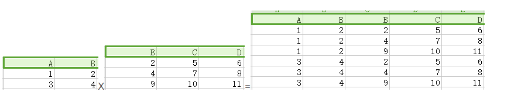
- **自然连接（natural join）**：第一个关系中每一行与第二个关系的每一行进行匹配，如果得到有交叉部分则合并，若无交叉部分则舍弃。
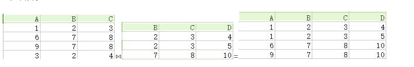
- **连接（theta join）**：即加上约束条件的笛卡儿积，先得到笛卡儿积，然后根据约束条件删除不满足的元组。

- **外连接（outer join）**：执行自然连接后，将舍弃的部分也加入，并且匹配失败处的属性用NULL代替。
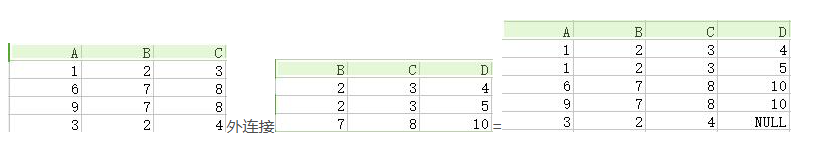
- **除法运算（division）**：关系R除以关系S的结果为T，则T包含所有在R但不在S中的**属性**，且T的**元组**与S的**元组**的所有组合在R中。
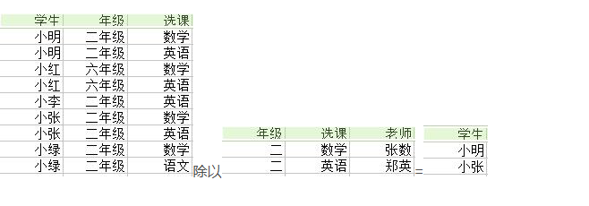
## 2.2 函数依赖
> 通过函数依赖关系，来帮助你确定表中的合理主外键等；这里只是简介，有这么个概念就可以了，因为大多数情况你不用那些所谓的推倒关系，你也是可以凭借直觉设计出来的。

记 A->B 表示 A 函数决定 B，也可以说 B 函数依赖于 A。

如果 {A1，A2，... ，An} 是关系的一个或多个属性的集合，该集合函数决定了关系的其它所有属性并且是最小的，那么该集合就称为键码。

对于 A->B，如果能找到 A 的真子集 A'，使得 A'-> B，那么 A->B 就是部分函数依赖，否则就是完全函数依赖。

对于 A->B，B->C，则 A->C 是一个传递函数依赖。

## 2.3 异常
> 介绍 不符合范式的关系，会产生很多异常，为了引出**范式**的内容。

以下的学生课程关系的函数依赖为 Sno, Cname -> Sname, Sdept, Mname, Grade，键码为 {Sno, Cname}。也就是说，确定学生和课程之后，就能确定其它信息。
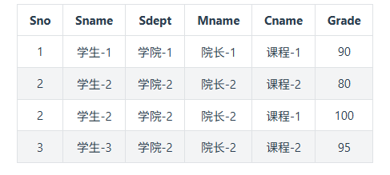

不符合范式的关系，会产生很多异常，主要有以下四种异常:

- 冗余数据: 例如 `学生-2` 出现了两次。
- 修改异常: 修改了一个记录中的信息，但是另一个记录中相同的信息却没有被修改。
- 删除异常: 删除一个信息，那么也会丢失其它信息。例如删除了 `课程-1` 需要删除第一行和第三行，那么 `学生-1` 的信息就会丢失。
- 插入异常: 例如想要插入一个学生的信息，如果这个学生还没选课，那么就无法插入。
## 2.4 范式
> 范式理论是为了解决以上提到四种异常。

高级别范式的依赖于低级别的范式，1NF 是最低级别的范式。

### 2.4.1 第一范式 (1NF)
属性不可分。

### 2.4.2 第二范式 (2NF)
每个非主属性完全函数依赖于键码。

可以通过分解来满足。

**分解前**

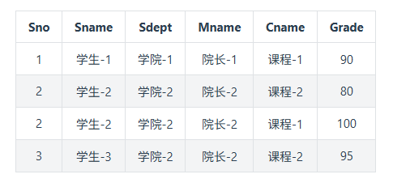

以上学生课程关系中，{Sno, Cname} 为键码，有如下函数依赖:

- Sno -> Sname, Sdept
- Sdept -> Mname
- Sno, Cname-> Grade

Grade 完全函数依赖于键码，它没有任何冗余数据，每个学生的每门课都有特定的成绩。

Sname, Sdept 和 Mname 都部分依赖于键码，当一个学生选修了多门课时，这些数据就会出现多次，造成大量冗余数据。

**分解后**

- 关系-1

    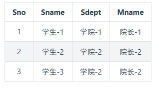

    有以下函数依赖:

    - Sno -> Sname, Sdept
    - Sdept -> Mname
- 关系-2

    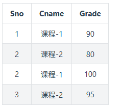

    有以下函数依赖:

    - Sno, Cname -> Grade
### 2.4.3 第三范式 (3NF)
非主属性不传递函数依赖于键码。

上面的 关系-1 中存在以下传递函数依赖:

- Sno -> Sdept -> Mname

可以进行以下分解:

- 关系-11

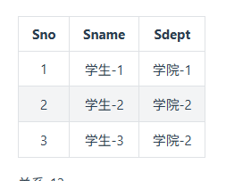
- 关系-12

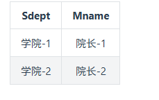

在实际的数据库开发过程中，我们通常要求数据库设计至少满足**第三范式（3NF）**
# 2.5 参考文章
这里还有一篇<a href='https://blog.csdn.net/calcular/article/details/79332453'>文章</a>讲的挺详细的可以看下。
# 三、数据库基础和原理 - SQL DB - 关系型数据库设计流程
> 在上文知道如何设计表和健后，让我们再看看整个的**数据库设计的标准流程**吧，主要包括`需求分析`, `概念结构设计`, `逻辑结构设计`, `物理设计`, `实施阶段`和`运行和维护阶段`这6个阶段，其中最重要的是`逻辑结构设计`
## 3.1 规范设计的6个阶段
> 按照规范设计的方法，考虑数据库及其应用系统开发全过程，将数据库设计分为以下6个阶段

- **需求分析**：分析用户的需求，包括数据、功能和性能需求；
- **概念结构设计**：主要采用E-R模型进行设计，包括画E-R图；
- **逻辑结构设计**：通过将E-R图转换成表，实现从E-R模型到关系模型的转换；
- **数据库物理设计**：主要是为所设计的数据库选择合适的存储结构和存取路径；
- **数据库的实施**：包括编程、测试和试运行；
- **数据库运行与维护**：系统的运行与数据库的日常维护


其中最为重要的是**概念结构设计**和**逻辑结构设计**，所以后面独立两个章节分别具体讲：`E-R图`和`结构设计流程`。

## 3.2 需求分析阶段（常用自顶向下）

进行数据库设计首先必须准确了解和分析用户需求（包括数据与处理）。需求分析是整个设计过程的基础，也是最困难，最耗时的一步。需求分析是否做得充分和准确，决定了在其上构建数据库大厦的速度与质量。需求分析做的不好，会导致整个数据库设计返工重做。

需求分析的任务，是通过详细调查现实世界要处理的对象，充分了解原系统工作概况，明确用户的各种需求，然后在此基础上确定新的系统功能，新系统还得充分考虑今后可能的扩充与改变，不仅仅能够按当前应用需求来设计。

调查的重点是，数据与处理。达到信息要求，处理要求，安全性和完整性要求。

分析方法常用**SA(Structured  Analysis) 结构化分析方法，SA方法从最上层的系统组织结构入手，采用自顶向下，逐层分解的方式分析系统**。

数据流图表达了数据和处理过程的关系，在SA方法中，处理过程的处理逻辑常常借助判定表或判定树来描述。在处理功能逐步分解的同事，系统中的数据也逐级分解，形成若干层次的数据流图。系统中的数据则借助数据字典（data dictionary，DD）来描述。数据字典是系统中各类数据描述的集合，数据字典通常包括数据项，数据结构，数据流，数据存储，和处理过程5个阶段。
## 3.3 概念结构设计阶段（常用自底向上）
> 概念结构设计是整个数据库设计的关键，它通过对用户需求进行综合，归纳与抽象，形成了一个独立于具体DBMS的概念模型。

设计概念结构通常有四类方法：

- 自顶向下。即首先定义全局概念结构的框架，再逐步细化。
- 自底向上。即首先定义各局部应用的概念结构，然后再将他们集成起来，得到全局概念结构。
- 逐步扩张。首先定义最重要的核心概念结构，然后向外扩张，以滚雪球的方式逐步生成其他的概念结构，直至总体概念结构。
- 混合策略。即自顶向下和自底向上相结合。
## 3.4 逻辑结构设计阶段（E-R图）
> 逻辑结构设计是将概念结构转换为某个DBMS所支持的数据模型，并将进行优化。

在这阶段，E-R图显得异常重要。大家要学会各个实体定义的属性来画出总体的E-R图。

各分E-R图之间的冲突主要有三类：属性冲突，命名冲突，和结构冲突。

E-R图向关系模型的转换，要解决的问题是如何将实体性和实体间的联系转换为关系模式，如何确定这些关系模式的属性和码。

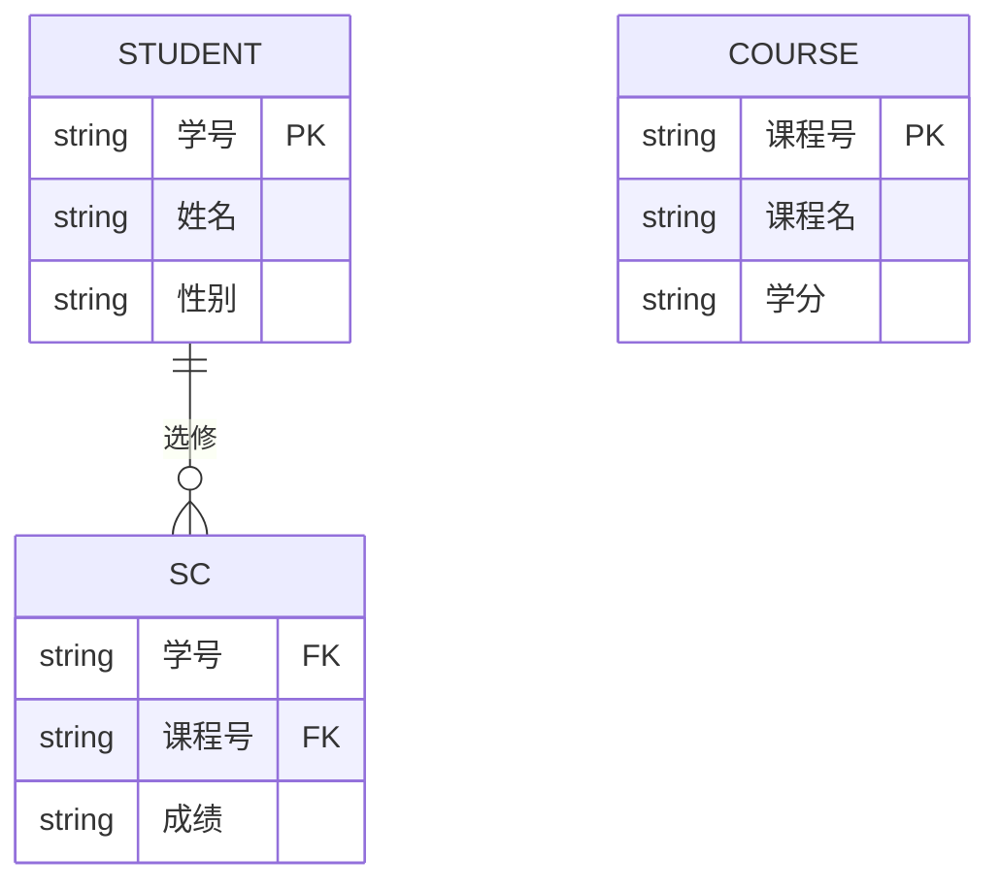

## 3.5 物理设计阶段
> 物理设计是为逻辑数据结构模型选取一个最适合应用环境的物理结构（包括存储结构和存取方法）。

首先要对运行的事务详细分析，获得选择物理数据库设计所需要的参数，其次，要充分了解所用的RDBMS的内部特征，特别是系统提供的存取方法和存储结构。

常用的存取方法有三类：

- 1.索引方法，目前主要是B+树索引方法。
- 2.聚簇方法（Clustering）方法。
- 3.是HASH方法。
## 3.6 数据库实施阶段
数据库实施阶段，设计人员运营DBMS提供的数据库语言（如sql）及其宿主语言，根据逻辑设计和物理设计的结果建立数据库，编制和调试应用程序，组织数据入库，并进行试运行。

## 3.7 数据库运行和维护阶段
数据库应用系统经过试运行后，即可投入正式运行，在数据库系统运行过程中必须不断地对其进行评价，调整，修改。

## 3.8 E-R图
Entity-Relationship，有三个组成部分: 实体、属性、联系。

用来进行关系型数据库系统的概念设计。

### 3.8.1 实体的三种联系
包含一对一，一对多，多对多三种。

- 如果 A 到 B 是一对多关系，那么画个带箭头的线段指向 B；
- 如果是一对一，画两个带箭头的线段；
- 如果是多对多，画两个不带箭头的线段。

下图的 Course 和 Student 是一对多的关系。


### 3.8.2 表示出现多次的关系
一个实体在联系出现几次，就要用几条线连接。

下图表示一个课程的先修关系，先修关系出现两个 Course 实体，第一个是先修课程，后一个是后修课程，因此需要用两条线来表示这种关系。


### 3.8.3 联系的多向性
虽然老师可以开设多门课，并且可以教授多名学生，但是对于特定的学生和课程，只有一个老师教授，这就构成了一个三元联系。


一般只使用二元联系，可以把多元联系转换为二元联系。

### 3.8.4 表示子类
用一个三角形和两条线来连接类和子类，与子类有关的属性和联系都连到子类上，而与父类和子类都有关的连到父类上。

## 3.9 基于E-R图的数据库结构设计
> 上面6个阶段比较抽象的，来看看实际重要的基于E-R图的数据库结构设计示例吧

### 3.9.1 确定entities及relationships
- 明确宏观行为。数据库是用来做什么的？比如，管理雇员的信息。
- 确定entities。对于一系列的行为，确定所管理信息所涉及到的主题范围。这将变成table。比如，雇用员工，指定具体部门，确定技能等级。
- 确定relationships。分析行为，确定tables之间有何种关系。比如，部门与雇员之间存在一种关系。给这种关系命名。
- 细化行为。从宏观行为开始，现在仔细检查这些行为，看有哪些行为能转为微观行为。比如，管理雇员的信息可细化为：
  - 增加新员工
  - 修改存在员工信息
  - 删除调走的员工
- 确定业务规则。分析业务规则，确定你要采取哪种。比如，可能有这样一种规则，一个部门有且只能有一个部门领导。这些规则将被设计到数据库的结构中。

下面举个例子，需求如下： ACME是一个小公司，在5个地方都设有办事处。当前，有75名员工。公司准备快速扩大规模，划分了9个部门，每个部门都有其领导。 为有助于寻求新的员工，人事部门规划了68种技能，为将来人事管理作好准备。员工被招进时，每一种技能的专业等级都被确定。

#### 3.9.1.1 定义宏观行为
一些ACME公司的宏观行为包括：

- 招聘员工
- 解雇员工
- 管理员工个人信息
- 管理公司所需的技能信息
- 管理哪位员工有哪些技能
- 管理部门信息
- 管理办事处信息
#### 3.9.1.2 确定entities及relationships
我们可以确定要存放信息的主题领域(表)及其关系，并创建一个基于宏观行为及描述的图表。 我们用方框来代表table，用菱形代表relationship。我们可以确定哪些relationship是一对多，一对一，及多对多。 这是一个E-R草图，以后会细化。


#### 3.9.1.3 细化宏观行为
以下微观行为基于上面宏观行为而形成：

- 增加或删除一个员工
- 增加或删除一个办事处
- 列出一个部门中的所有员工
- 增加一项技能
- 增加一个员工的一项技能
- 确定一个员工的技能
- 确定一个员工每项技能的等级
- 确定所有拥有相同等级的某项技能的员工
- 修改员工的技能等级

这些微观行为可用来确定需要哪些table或relationship。

#### 3.9.1.4 确定业务规则
业务规则常用于确定一对多，一对一，及多对多关系。

相关的业务规则可能有：

- 现在有5个办事处；最多允许扩展到10个。
- 员工可以改变部门或办事处
- 每个部门有一个部门领导
- 每个办事处至多有3个电话号码
- 每个电话号码有一个或多个扩展
- 员工被招进时，每一种技能的专业等级都被确定。
- 每位员工拥有3到20个技能
- 某位员工可能被安排在一个办事处，也可能不安排办事处。
### 3.9.2 确定所需数据
要确定所需数据：

- 确定支持数据
- 列出所要跟踪的所有数据。描述table(主题)的数据回答这些问题：谁，什么，哪里，何时，以及为什么
- 为每个table建立数据
- 列出每个table目前看起来合适的可用数据
- 为每个relationship设置数据
- 如果有，为每个relationship列出适用的数据
#### 3.9.2.1 确定支持数据
你所确定的支持数据将会成为table中的字段名。比如，下列数据将适用于表Employee，表Skill，表Expert In。
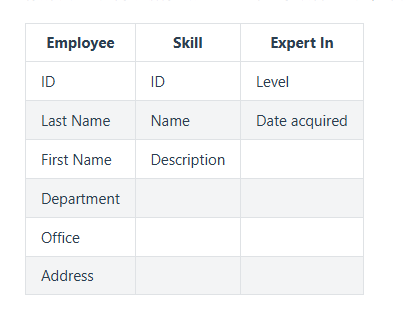

如果将这些数据画成图表，就像：


需要注意：

- 在确定支持数据时，请一定要参考你之前所确定的宏观行为，以清楚如何利用这些数据。
- 比如，如果你知道你需要所有员工的按姓氏排序的列表，确保你将支持数据分解为名字与姓氏，这比简单地提供一个名字会更好。
- 你所选择的名称最好保持一致性。这将更易于维护数据库，也更易于阅读所输出的报表。
- 比如，如果你在某些地方用了一个缩写名称Emp_status，你就不应该在另外一个地方使用全名(Empolyee_ID)。相反，这些名称应当是Emp_status及Emp_id。
- 数据是否与正确的table相对应无关紧要，你可以根据自己的喜好来定。在下节中，你会通过测试对此作出判断。
### 3.9.3 标准化数据
标准化是你用以消除数据冗余及确保数据与正确的table或relationship相关联的一系列测试。共有5个测试。本节中，我们将讨论经常使用的3个。

#### 3.9.3.1 标准化格式
标准化格式是标准化数据的常用测试方式。你的数据通过第一遍测试后，就被认为是达到第一标准化格式；通过第二遍测试，达到第二标准化格式；通过第三遍测试，达到第三标准化格式。

如何标准格式：

- 1． 列出数据
- 2． 为每个表确定至少一个键。每个表必须有一个主键。
- 3． 确定relationships的键。relationships的键是连接两个表的键。
- 4． 检查支持数据列表中的计算数据。计算数据通常不保存在数据库中。
- 5． 将数据放在第一遍的标准化格式中：
- 6． 从tables及relationships除去重复的数据。
- 7． 以你所除去数据创建一个或更多的tables及relationships。
- 8． 将数据放在第二遍的标准化格式中：
- 9． 用多于一个以上的键确定tables及relationships。
- 10． 除去只依赖于键一部分的数据。
- 11． 以你所除去数据创建一个或更多的tables及relationships。
- 12． 将数据放在第三遍的标准化格式中：
- 13． 除去那些依赖于tables或relationships中其他数据，并且不是键的数据。
- 14． 以你所除去数据创建一个或更多的tables及relationships。
#### 3.9.3.2 数据与键
在你开始标准化（测试数据）前，简单地列出数据，并为每张表确定一个唯一的主键。这个键可以由一个字段或几个字段（连锁键）组成。

主键是一张表中唯一区分各行的一组字段。Employee表的主键是Employee ID字段。Works In relationship中的主键包括Office Code及Employee ID字段。给数据库中每一relationship给出一个键，从其所连接的每一个table中抽取其键产生。


| 类型   | 名称        | 属性                                                                                             |
|--------|-------------|--------------------------------------------------------------------------------------------------|
| 实体   | Office      | *Office code, Office address, Phone number                                                       |
| 联系   | Works in    | *Office code, *Employee ID                                                                       |
| 实体   | Department  | *Department ID, Department name                                                                  |
| 联系   | Heads       | *Department ID, *Employee ID                                                                     |
| 联系   | Assoc with  | *Department ID, *Employee ID                                                                     |
| 实体   | Skill       | *Skill ID, Skill name, Skill description                                                         |
| 联系   | Expert In   | *Skill ID, *Employee ID, Skill level, Date acquired                                              |
| 实体   | Employee    | *Employee ID, Last Name, First Name, Social security number, Employee street, Employee city, Employee state, Employee phone, Date of birth |


**将数据放在第一遍的标准化格式中**

- 除去重复的组
- 要测试第一遍标准化格式，除去重复的组，并将它们放进他们各自的一张表中。
- 在下面的例子中，Phone Number可以重复。（一个工作人员可以有多于一个的电话号码。）将重复的组除去，创建一个名为Telephone的新表。在Telephone与Office创建一个名为Associated With的relationship。

**将数据放在第二遍的标准化格式中**

- 除去那些不依赖于整个键的数据。
- 只看那些有一个以上键的tables及relationships。要测试第二遍标准化格式，除去那些不依赖于整个键的任何数据（组成键的所有字段）。
- 在此例中，原Employee表有一个由两个字段组成的键。一些数据不依赖于整个键；例如，department name只依赖于其中一个键（Department ID）。因此，Department ID，其他Employee数据并不依赖于它，应移至一个名为Department的新表中，并为Employee及Department建立一个名为Assigned To的relationship。


**将数据放在第三遍的标准化格式中**

- 除去那些不直接依赖于键的数据。
- 要测试第三遍标准化格式，除去那些不是直接依赖于键，而是依赖于其他数据的数据。
- 在此例中，原Employee表有依赖于其键（Employee ID）的数据。然而，office location及office phone依赖于其他字段，即Office Code。它们不直接依赖于Employee ID键。将这组数据，包括Office Code，移至一个名为Office的新表中，并为Employee及Office建立一个名为Works In的relationship。


### 3.9.4 考量关系
当你完成标准化进程后，你的设计已经差不多完成了。你所需要做的，就是考量关系。

#### 3.9.4.1 考量带有数据的关系
你的一些relationship可能集含有数据。这经常发生在多对多的关系中。


遇到这种情况，将relationship转化为一个table。relationship的键依旧成为table中的键。

#### 3.9.4.2 考量没有数据的关系
要实现没有数据的关系，你需要定义外部键。外部键是含有另外一个表中主键的一个或多个字段。外部键使你能同时连接多表数据。

有一些基本原则能帮助你决定将这些键放在哪里：

**一对多** 在一对多关系中，“一”中的主键放在“多”中。此例中，外部键放在Employee表中。


**一对一** 在一对一关系中，外部键可以放进任一表中。如果必须要放在某一边，而不能放在另一边，应该放在必须的一边。此例中，外部键（Head ID）在Department表中，因为这是必需的。


**多对多** 在多对多关系中，用两个外部键来创建一个新表。已存的旧表通过这个新表来发生联系。

### 3.9.5 检验设计
在你完成设计之前，你需要确保它满足你的需要。检查你在一开始时所定义的行为，确认你可以获取行为所需要的所有数据：

- 你能找到一个路径来等到你所需要的所有信息吗？
- 设计是否满足了你的需要？
- 所有需要的数据都可用吗？ 如果你对以上的问题都回答是，你已经差不多完成设计了。

### 3.9.6 最终设计
最终设计看起来就像这样：


#### 3.9.6.1 设计数据库的表属性
数据库设计需要确定有什么表，每张表有什么字段。此节讨论如何指定各字段的属性。

对于每一字段，你必须决定字段名，数据类型及大小，是否允许NULL值，以及你是否希望数据库限制字段中所允许的值。

#### 3.9.6.2 选择字段名
字段名可以是字母、数字或符号的任意组合。然而，如果字段名包括了字母、数字或下划线、或并不以字母打头，或者它是个关键字（详见关键字表），那么当使用字段名称时，必须用双引号括起来。

为字段选择数据类型

- SQL Anywhere支持的数据类型包括：
- 整数（int, integer, smallint）
- 小数（decimal, numeric）
- 浮点数（float, double）
- 字符型（char, varchar, long varchar）
- 二进制数据类型（binary, long binary）
- 日期/时间类型（date, time, timestamp）
- 用户自定义类型
#### 3.9.6.3 NULL与NOT NULL
如果一个字段值是必填的，你就将此字段定义为NOT NULL。否则，字段值可以为NULL值，即可以有空值。SQL中的默认值是允许空值；你应该显示地将字段定义为NOT NULL，除非你有好理由将其设为允许空值。

#### 3.9.6.4 选择约束
尽管字段的数据类型限制了能存在字段中的数据（例如，只能存数字或日期），你或许希望更进一步来约束其允许值。

你可以通过指定一个“CHECK”约束来限制任意字段的值。你可以使用能在WHERE子句中出现的任何有效条件来约束被允许的值，尽管大多数CHECK约束使用BETWEEN或IN条件。

#### 3.9.6.5 选择主键及外部键
主键是唯一识别表中每一项记录的字段。如何你的表已经正确标准化，主键应当成为数据库设计的一部分。 外部键是包含另一表中主键值的一个或一组字段。外部键关系在数据库中建立了一对一及一对多关系。如果你的设计已经正确标准化，外部键应当成为数据库设计的一部分。
# 四、数据库基础和原理 - SQL DB - 数据库系统核心知识点
> 基于上篇数据库如何工作的基础之上，我们再来梳理下数据库系统中有哪些重要的知识点，包括：事务，并发一致性，封锁，隔离级别，多版本并发控制等。
## 4.1 事务
### 4.1.1 概念
事务指的是满足 ACID 特性的一组操作，可以通过 Commit 提交一个事务，也可以使用 Rollback 进行回滚。

### 4.1.2 ACID
#### 4.1.2.1. 原子性(Atomicity)
事务被视为不可分割的最小单元，事务的所有操作要么全部提交成功，要么全部失败回滚。

回滚可以用日志来实现，日志记录着事务所执行的修改操作，在回滚时反向执行这些修改操作即可。

#### 4.1.2.2. 一致性(Consistency)
数据库在事务执行前后都保持一致性状态。在一致性状态下，所有事务对一个数据的读取结果都是相同的。

#### 4.1.2.3. 隔离性(Isolation)
一个事务所做的修改在最终提交以前，对其它事务是不可见的。

#### 4.1.2.4. 持久性(Durability)
一旦事务提交，则其所做的修改将会永远保存到数据库中。即使系统发生崩溃，事务执行的结果也不能丢失。

可以通过数据库备份和恢复来实现，在系统发生崩溃时，使用备份的数据库进行数据恢复。

事务的 ACID 特性概念简单，但不是很好理解，主要是因为这几个特性不是一种平级关系:

- 只有满足一致性，事务的执行结果才是正确的。
- 在无并发的情况下，事务串行执行，隔离性一定能够满足。此时只要能满足原子性，就一定能满足一致性。
- 在并发的情况下，多个事务并行执行，事务不仅要满足原子性，还需要满足隔离性，才能满足一致性。
- 事务满足持久化是为了能应对数据库崩溃的情况。

#### 4.1.2.5 AUTOCOMMIT
MySQL 默认采用自动提交模式。也就是说，如果不显式使用`START TRANSACTION`语句来开始一个事务，那么每个查询都会被当做一个事务自动提交。
#### 4.1.2.6 **补充解释：**

1. 首先，回顾ACID特性：
- **原子性（Atomicity）**：事务是一个不可分割的整体，要么全部成功，要么全部失败。例如，转账操作包括扣款和存款两个步骤，必须同时成功或同时失败。
- **一致性（Consistency）**：事务执行后，数据库必须从一个一致状态变为另一个一致状态。例如，转账前后，账户总额保持不变。
- **隔离性（Isolation）**：并发事务之间互不干扰，一个事务的中间状态对其他事务不可见。
- **持久性（Durability）**：事务提交后，修改永久保存，即使系统崩溃也不会丢失。

2. 针对你提到的四点关系，我用例子说明：

- 1. **只有满足一致性，事务的执行结果才是正确的。**
   - **解释**：一致性是事务的最终目标。如果事务执行后数据库不一致，结果就是错误的。
   - **例子**：假设银行数据库有账户A（余额100元）和账户B（余额100元）。事务T是“从A转账100元到B”。正确的一致性状态是：事务后，A余额0元，B余额200元，总额200元不变。如果事务执行后，A扣了100元但B没收到（比如由于故障），那么总额变成100元，就不一致了，结果错误。因此，事务必须保证一致性，否则业务逻辑就乱了。

- 2. **在无并发的情况下，事务串行执行，隔离性一定能够满足。此时只要能满足原子性，就一定能满足一致性。**
   - **解释**：如果没有其他事务同时运行（即串行执行），隔离性自然满足（因为没有干扰）。这时，只要原子性确保事务全部完成或全部回滚，就能自动保证一致性。
   - **例子**：假设只有一个用户操作数据库，执行转账事务T：先扣A100元，然后加B100元。由于没有并发事务，T不会被中断。如果原子性生效：
     - 如果T成功：A和B的余额正确更新，总额一致。
     - 如果T失败（比如在扣款后系统故障）：原子性通过回滚日志撤销扣款，A和B余额恢复原状，总额一致。
     - 因此，在串行情况下，原子性直接保证了一致性，隔离性不是问题。

- 3. **在并发的情况下，多个事务并行执行，事务不仅要满足原子性，还需要满足隔离性，才能满足一致性。**
   - **解释**：并发时，事务可能交错执行。如果没有隔离性，一个事务可能读取另一个事务的未提交数据（脏读）或发生更新丢失，导致即使原子性满足，一致性也被破坏。隔离性通过**锁**或**MVCC**等手段确保事务间互不干扰。
   - **正确例子（更新丢失问题）**：假设两个事务并发执行：
     - 事务T1：从A转账100元到B（操作：读A和B，写A和B）。
     - 事务T2：从B转账50元到C（操作：读B和C，写B和C）。
     - 初始状态：A=100元, B=100元, C=0元，总额200元。
     - 如果没有隔离性（例如，隔离级别低，允许脏读或可重复读但未序列化）：
       - T1读取B余额=100元。
       - T2读取B余额=100元（此时T1还未写B）。
       - T1写B=100+100=200元（但未提交）。
       - T2写B=100-50=50元（基于自己读取的100元，覆盖了T1的更新）。
       - T1提交，T2提交。
       - 最终状态：A=0元（T1扣款）, B=50元（T2写覆盖）, C=50元（T2加款），总额=0+50+50=100元 ≠ 200元，不一致！这是因为缺乏隔离性导致T2丢失了T1的更新。
     - 如果有隔离性（例如，通过锁机制使事务序列化）：
       - T1和T2顺序执行：先T1后T2，最终A=0元, B=150元, C=50元，总额200元一致；或先T2后T1，最终A=0元, B=150元, C=50元，同样一致。
       - 因此，并发下需要原子性（保证单个事务完整）和隔离性（防止事务间干扰）共同作用。

- 4. **事务满足持久化是为了能应对数据库崩溃的情况。**
   - **解释**：持久性确保事务提交后，修改永久保存，即使系统崩溃，数据也不会丢失。这通常通过预写日志（WAL）或备份实现。
   - **例子**：假设转账事务T提交成功：A扣100元，B加100元。但提交后瞬间，数据库服务器断电崩溃。如果没有持久性，数据可能只存在内存中，丢失了修改。恢复后，A和B余额可能回滚到转账前，不一致。但有了持久性，数据库在提交时已将修改写入日志或磁盘。恢复时，从日志重做事务，确保T的修改保留，A和B余额正确。这样，崩溃不影响一致性。

3. 总结：
- ACID特性中，**一致性是核心目标**，原子性、隔离性和持久性都是实现一致性的手段。
- 在简单场景（无并发）下，原子性就足够保证一致性。
- 在复杂场景（有并发）下，需要原子性和隔离性共同保证一致性。
- 持久性则是为了应对硬件故障，确保长期一致性。
## 4.2 并发一致性问题
在并发环境下，事务的隔离性很难保证，因此会出现很多并发一致性问题。
### 4.2.1 丢失修改
T1 和 T2 两个事务都对一个数据进行修改，T1 先修改，T2 随后修改，T2 的修改覆盖了 T1 的修改。

### 4.2.2 读脏数据
T1 修改一个数据，T2 随后读取这个数据。如果 T1 撤销了这次修改，那么 T2 读取的数据是脏数据。

### 4.2.3 不可重复读
T2 读取一个数据，T1 对该数据做了修改。如果 T2 再次读取这个数据，此时读取的结果和第一次读取的结果不同。

### 4.2.4 幻影读
T1 读取某个范围的数据，T2 在这个范围内插入新的数据，T1 再次读取这个范围的数据，此时读取的结果和和第一次读取的结果不同。


产生并发不一致性问题主要原因是破坏了事务的隔离性，解决方法是通过并发控制来保证隔离性。并发控制可以通过封锁来实现，但是封锁操作需要用户自己控制，相当复杂。数据库管理系统提供了事务的隔离级别，让用户以一种更轻松的方式处理并发一致性问题。

## 4.3 封锁
### 4.3.1 封锁粒度
MySQL 中提供了两种封锁粒度: 行级锁以及表级锁。

应该尽量只锁定需要修改的那部分数据，而不是所有的资源。锁定的数据量越少，发生锁争用的可能就越小，系统的并发程度就越高。

但是加锁需要消耗资源，锁的各种操作(包括获取锁、释放锁、以及检查锁状态)都会增加系统开销。因此封锁粒度越小，系统开销就越大。

在选择封锁粒度时，需要在锁开销和并发程度之间做一个权衡。


### 4.3.2 封锁类型
#### 4.3.2.1. 读写锁
- 排它锁(Exclusive)，简写为 X 锁，又称写锁。
- 共享锁(Shared)，简写为 S 锁，又称读锁。

有以下两个规定:

- 一个事务对数据对象 A 加了 X 锁，就可以对 A 进行读取和更新。加锁期间其它事务不能对 A 加任何锁。
- 一个事务对数据对象 A 加了 S 锁，可以对 A 进行读取操作，但是不能进行更新操作。加锁期间其它事务能对 A 加 S 锁，但是不能加 X 锁。

锁的兼容关系如下:


#### 4.3.2.2. 意向锁
使用意向锁(Intention Locks)可以更容易地支持多粒度封锁。

在存在行级锁和表级锁的情况下，事务 T 想要对表 A 加 X 锁，就需要先检测是否有其它事务对表 A 或者表 A 中的任意一行加了锁，那么就需要对表 A 的每一行都检测一次，这是非常耗时的。

意向锁在原来的 X/S 锁之上引入了 IX/IS，IX/IS 都是表锁，用来表示一个事务想要在表中的某个数据行上加 X 锁或 S 锁。有以下两个规定:

- 一个事务在获得某个数据行对象的 S 锁之前，必须先获得表的 IS 锁或者更强的锁；
- 一个事务在获得某个数据行对象的 X 锁之前，必须先获得表的 IX 锁。

通过引入意向锁，事务 T 想要对表 A 加 X 锁，只需要先检测是否有其它事务对表 A 加了 X/IX/S/IS 锁，如果加了就表示有其它事务正在使用这个表或者表中某一行的锁，因此事务 T 加 X 锁失败。

各种锁的兼容关系如下:

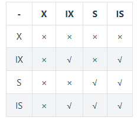

解释如下:

- 任意 IS/IX 锁之间都是兼容的，因为它们只是表示想要对表加锁，而不是真正加锁；
- S 锁只与 S 锁和 IS 锁兼容，也就是说事务 T 想要对数据行加 S 锁，其它事务可以已经获得对表或者表中的行的 S 锁。

**补充：**

1. 表级锁 vs 行级锁

**S锁和X锁可以作用于不同粒度：**

- **表级S/X锁**：锁住整个表
- **行级S/X锁**：锁住表中的特定行

2. 意向锁的作用

意向锁(IS/IX)是**表级锁**，它们的作用是：

- **IS锁**：表示"事务打算在表中的**某些行**上加S锁"
- **IX锁**：表示"事务打算在表中的**某些行**上加X锁"

3. 行级锁的兼容性

如下场景中：
- 事务A想对**行1**加X锁。
- 事务B想对**行2**加X锁。
- 两行是不同的数据对象。

这时，锁的兼容性规则如下：
- **首先，事务需要获得表级意向锁**： 
  - 事务A要先获得表的IX锁（表示它打算在行级加X锁）。
  - 事务B也要先获得表的IX锁。
- **表级IX锁是兼容的**：根据兼容性矩阵，IX锁与IX锁是兼容的（矩阵中IX和IX是“√”）。因此，事务A和事务B可以同时持有表的IX锁。
- **然后，申请行级锁**：
  - 事务A对行1加X锁。
  - 事务B对行2加X锁。
- **行级锁的兼容性只针对同一行**：行级X锁与行级X锁不兼容，但这是指对**同一行**。由于行1和行2是不同的行，事务A和事务B的行级X锁不会冲突。每个事务只能锁住自己目标的行。
### 4.3.3 封锁协议
#### 4.3.3.1 三级封锁协议
##### 4.3.3.1.1 一级封锁协议

事务 T 要修改数据 A 时必须加 X 锁，直到 T 结束才释放锁。

可以解决**丢失修改**问题，因为不能同时有两个事务对同一个数据进行修改，那么事务的修改就不会被覆盖。


##### 4.3.3.1.2 二级封锁协议

在一级的基础上，要求读取数据 A 时必须加 S 锁，读取完马上释放 S 锁。

可以解决**读脏数据**问题，因为如果一个事务在对数据 A 进行修改，根据 1 级封锁协议，会加 X 锁，那么就不能再加 S 锁了，也就是不会读入数据。

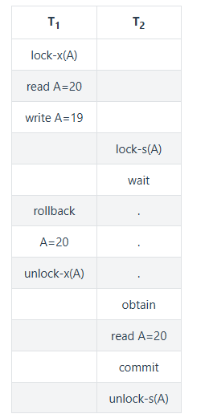
##### 4.3.3.1.3 三级封锁协议

在二级的基础上，要求读取数据 A 时必须加 S 锁，直到事务结束了才能释放 S 锁。

可以解决**不可重复读**的问题，因为读 A 时，其它事务不能对 A 加 X 锁，从而避免了在读的期间数据发生改变。

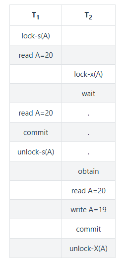
#### 4.3.3.2 . 两段锁协议
加锁和解锁分为两个阶段进行。

可串行化调度是指，通过并发控制，使得并发执行的事务结果与某个串行执行的事务结果相同。

事务遵循两段锁协议是保证可串行化调度的充分条件。例如以下操作满足两段锁协议，它是可串行化调度。
```sh
lock-x(A)...lock-s(B)...lock-s(C)...unlock(A)...unlock(C)...unlock(B)
```

但不是必要条件，例如以下操作不满足两段锁协议，但是它还是可串行化调度。
```sh
lock-x(A)...unlock(A)...lock-s(B)...unlock(B)...lock-s(C)...unlock(C)
```
### 4.3.4 MySQL 隐式与显示锁定
MySQL 的 InnoDB 存储引擎采用两段锁协议，会根据隔离级别在需要的时候自动加锁，并且所有的锁都是在同一时刻被释放，这被称为隐式锁定。

InnoDB 也可以使用特定的语句进行显示锁定:
```sql
SELECT ... LOCK In SHARE MODE;
SELECT ... FOR UPDATE;
```
## 4.4 隔离级别
### 4.4.1 未提交读(READ UNCOMMITTED)
事务中的修改，即使没有提交，对其它事务也是可见的。

### 4.4.2 提交读(READ COMMITTED) - postgresql
一个事务只能读取已经提交的事务所做的修改。换句话说，一个事务所做的修改在提交之前对其它事务是不可见的。

### 4.4.3 可重复读(REPEATABLE READ) - mysql
保证在同一个事务中多次读取同样数据的结果是一样的。

### 4.4.4 可串行化(SERIALIZABLE)
强制事务串行执行。

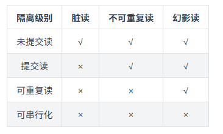
## 4.5 多版本并发控制
多版本并发控制(Multi-Version Concurrency Control, MVCC)是 MySQL 的 InnoDB 存储引擎实现隔离级别的一种具体方式，用于实现**提交读和可重复读**这两种隔离级别。而未提交读隔离级别总是读取最新的数据行，无需使用 MVCC。可串行化隔离级别需要对所有读取的行都加锁，单纯使用 MVCC 无法实现。

### 4.5.1 版本号
- **系统版本号**: 是一个递增的数字，每开始一个新的事务，系统版本号就会自动递增。
- **事务版本号**: 事务开始时的系统版本号。

### 4.5.2 隐藏的列
MVCC 在每行记录后面都保存着两个隐藏的列，用来存储两个版本号:

- **创建版本号**: 指示创建一个数据行的快照时的系统版本号；
- **删除版本号**: 如果该快照的删除版本号大于当前事务版本号表示该快照有效，否则表示该快照已经被删除了。

### 4.5.3 Undo 日志
MVCC 使用到的快照存储在 Undo 日志中，该日志通过回滚指针把一个数据行(Record)的所有快照连接起来。


### 4.5.4 实现过程
以下实现过程针对可重复读隔离级别。

当开始新一个事务时，该事务的版本号肯定会大于当前所有数据行快照的创建版本号，理解这一点很关键。

1. SELECT

多个事务必须读取到同一个数据行的快照，并且这个快照是距离现在最近的一个有效快照。但是也有例外，如果有一个事务正在修改该数据行，那么它可以读取事务本身所做的修改，而不用和其它事务的读取结果一致。

把没有对一个数据行做修改的事务称为 T，T 所要读取的数据行快照的创建版本号必须小于 T 的版本号，因为如果大于或者等于 T 的版本号，那么表示该数据行快照是其它事务的最新修改，因此不能去读取它。除此之外，T 所要读取的数据行快照的删除版本号必须大于 T 的版本号，因为如果小于等于 T 的版本号，那么表示该数据行快照是已经被删除的，不应该去读取它。

2. INSERT

将当前系统版本号作为数据行快照的创建版本号。

3. DELETE

将当前系统版本号作为数据行快照的删除版本号。

4. UPDATE

将当前系统版本号作为更新前的数据行快照的删除版本号，并将当前系统版本号作为更新后的数据行快照的创建版本号。可以理解为先执行 DELETE 后执行 INSERT。

**总结：**


- 1. MVCC 的核心思想：为数据创建“快照”

您可以想象一下，MVCC 就像是一个“时光机”。它不为数据行加锁，而是为每个事务在开始时创建一个**数据快照**。这个快照是基于某个时间点的数据版本。不同的事务可以看到不同版本的数据，这样就避免了读操作和写操作相互阻塞。

- 2. MVCC 的三个关键要素

您提到的版本号、隐藏列和 Undo 日志是实现这个“时光机”的三大支柱。

  - a. 版本号（系统时钟）
    - **系统版本号**：这是一个全局递增的计数器，可以理解为数据库的“逻辑时钟”。每当一个新事务开始时，这个数字就会+1。
    - **事务版本号**：一个事务开始时的那个系统版本号，就是这个事务的ID。它标志了这个事务在时间轴上的位置。

    **关键点**：版本号决定了事务能看到哪些“历史数据”。

  - b. 隐藏列（数据的出生和死亡证明）
  MVCC 在每个数据行后面隐藏地存储了两个版本号：
    - **创建版本号 (create_version)**：记录这行数据是在哪个系统版本号下被**创建或更新**的。
    - **删除版本号 (delete_version)**：记录这行数据是在哪个系统版本号下被**删除**的。如果该值未设置（如为NULL），则表示这行数据还“活着”。

  - c. Undo 日志（数据的历史档案馆）
  Undo 日志存储了数据行的所有旧版本（快照）。当您更新一行数据时，旧版本的数据不会被立刻覆盖，而是被存入 Undo 日志中，并通过一个“回滚指针”连接起来，形成一个数据行的版本链。

  *（示意图：每个数据行版本通过回滚指针指向上一个版本，形成一条历史链）*

  当需要一个旧快照时，数据库就通过这个指针在 Undo 日志里回溯，找到对应版本的数据。

- 3. MVCC 如何工作？（以可重复读级别为例）

这是最需要理解的部分。规则可以总结为一句话：**一个事务只能看到在它开始之前就已经提交的数据版本，并且看不到在它开始之后被删除的数据版本。**

  - SELECT 操作（数据可见性规则）

    当一个事务（假设其事务版本号为 `trx_id`）执行 SELECT 时，对于每一行数据，它会检查其隐藏的版本号，只有满足以下**两个条件**的数据行版本才对它可见：

    1.  **创建版本号 `create_version` <= `trx_id`**
        - 这意味着这行数据是在本事务开始之前（或同一时间）就已经被创建或更新并提交了的。如果 `create_version` 大于 `trx_id`，说明这行数据是在本事务开始之后才被修改的，对本事务不可见。

    2.  **删除版本号 `delete_version` 要么为NULL，要么 > `trx_id`**
        - 如果 `delete_version` 为NULL，说明这行数据还没被删除。
        - 如果 `delete_version` > `trx_id`，说明这行数据是在本事务开始之后才被删除的，那么在本事务看来，它仍然是存在的。
        - **如果 `delete_version` <= `trx_id`**，说明这行数据在本事务开始之前就已经被删除了，自然不可见。

    如果当前最新的数据行版本对当前事务不可见，数据库就会沿着 Undo 日志中的版本链向前回溯，直到找到一个满足上述条件的快照版本。

  - INSERT 操作
    当插入一行新数据时，InnoDB 会：
    - 将这行数据的**创建版本号**设置为当前事务的版本号。
    - **删除版本号**留空（NULL）。

  - DELETE 操作
    当删除一行数据时，InnoDB 并不会立即物理删除它，而是：
    - 将这行数据的**删除版本号**设置为当前事务的版本号。这相当于给这行数据贴上了“死亡时间戳”。

  - UPDATE 操作
    更新操作实际上是**删除+插入**的组合：
    1.  将**当前数据行**的**删除版本号**设置为当前事务的版本号（相当于逻辑删除旧版本）。
    2.  插入一条**新的数据行**，并将新行的**创建版本号**设置为当前事务的版本号。
    3.  旧版本的数据会被放入 Undo 日志中，以便其他需要历史快照的事务读取。

### 4.5.5 活跃事务列表
MVCC单独只靠版本号+隐藏列的变更无法保证事务之间的隔离性。我们以下面这个流程为例

| 时间点 | 系统版本号 | 事务A | 事务B | 数据行 `id=1` 的状态（隐藏列） |
| :--- | :--- | :--- | :--- | :--- |
| T1 | **递增到1** | 开始事务（事务版本号=1） | | 假设初始状态：`create_ver=1, delete_ver=NULL`（例如由之前某个事务插入） |
| T2 | **仍为1** | `UPDATE table SET value=100 WHERE id=1;` | | **旧版本**：`create_ver=1, delete_ver=1` <br> **新版本**：`create_ver=1, delete_ver=NULL` |
| T3 | **递增到2** | | 开始事务（事务版本号=2） | |
| T4 | **仍为2** | `COMMIT;` | | 提交后，版本链生效。现在最新版本是`create_ver=1`的那个。 |
| T5 | **仍为2** | | `SELECT value FROM table WHERE id=1;` | **事务B如何查找？** <br> 1. 找到最新数据行：`create_ver=1`。 <br> 2. 判断：`1`（创建版本） <= `2`（事务B版本）？ **成立**。 <br> 3. `delete_ver` 是 NULL？ **成立**。 <br> 4. **因此，事务B看到 value=100**。 |
| T6 | **递增到3** | 开始新事务A（事务版本号=3） | | |
| T7 | **仍为3** | `DELETE FROM table WHERE id=1;` | | 将最新行的 `delete_ver` 设置为 3。 |
| T8 | **仍为3** | `COMMIT;` | | |
| T9 | **仍为3** | | `SELECT ... WHERE id=1;` (再次查询) | **事务B如何查找？** <br> 1. 找到最新数据行：`create_ver=1, delete_ver=3`。 <br> 2. 判断：`1`（创建版本） <= `2`（事务B版本）？ **成立**。 <br> 3. `3`（删除版本） > `2`（事务B版本）？ **成立**。 <br> 4. **因此，事务B仍然能看到这行数据（value=100）！** 这就是“可重复读”的体现。 |

我们可以看到上面是完整的按照MVCC的快照逻辑实现的，但是在T5步骤我们事务B是能够读到事务A的内容的，但是事务B是在事务A提交之前创建的(事务A T4 提交，事务B T3 创建)。按照可重复读的隔离级别来说是不允许脏读的，但是上面这个流程出现了**脏读**。

**这个时候就需要有活跃事务列表。**

- 正确的理解：RR如何同时避免脏读并保证可重复读

RR隔离级别必须同时保证以下两点：
1.  **避免脏读（Dirty Read）**：读不到其他**未提交**事务的修改。
2.  **保证可重复读（Repeatable Read）**：在同一个事务内，多次读取同一数据会得到相同的结果。

MVCC通过结合**快照版本号**和**活跃事务列表**来实现这两个目标。

- MVCC的完整可见性算法

判断一个数据行版本是否对当前事务可见，需要同时满足以下条件：

1.  **数据行版本的`trx_id`（创建它的事务ID） < 当前事务的`trx_id`（快照版本号）**。
    -   并且，该`trx_id`**不在**当前事务快照的**活跃事务列表**中。
    -   *解释：这意味着创建该版本的事务在当前事务开始前就已经提交了。*
2.  或者，**数据行版本的`trx_id` = 当前事务的`trx_id`**。
    -   *解释：这是当前事务自己修改的数据，当然可见。*
3.  数据行版本的`roll_ptr`指向的旧版本，按同样的规则递归判断。

同时，对于删除标记：
-   如果数据行有`delete_ver`（删除版本号），则要求`delete_ver` > 当前事务的`trx_id`，或者`delete_ver`在活跃事务列表中（即删除操作尚未提交）。

**这个“活跃事务列表”就是避免脏读的关键！** 它记录了在当前事务创建快照时，哪些其他事务正处于活跃（未提交）状态。

---

- 让我们用修正后的逻辑重新分析之前的例子

假设`id=1`这行数据的初始值是50，由一个早已提交的事务（事务ID=0）创建。

| 时间点 | 系统事务ID | 事务A (id=1) | 事务B (id=2) | 数据行 `id=1` 的版本链（关键修正） |
| :--- | :--- | :--- | :--- | :--- |
| T1 | 递增到1 | **开始事务** | | 初始版本：`create_ver=0, value=50, delete_ver=NULL` |
| T2 | 仍为1 | `UPDATE ... SET value=100;` | | **旧版本**：`create_ver=0, delete_ver=1` <br> **新版本**：`create_ver=1, value=100, delete_ver=NULL` <br> *（事务A未提交，新版本对其他事务不可见）* |
| T3 | 递增到2 | | **开始事务** | **关键：事务B的快照记录此时活跃的事务列表为 [1]（即事务A）** |
| T4 | 仍为2 | `COMMIT;` | | 事务A提交，其修改对之后的事务变为可见。 |
| T5 | 仍为2 | | `SELECT ...` | **事务B的查找过程：** <br> 1. 找到最新版本：`create_ver=1, value=100`。<br> 2. 判断：`1`（创建版本）<= `2`（事务B版本）？成立。<br> 3. **但是，事务ID=1 是否在事务B的快照的活跃事务列表中？是的！因为在T3时刻事务A还活跃。** <br> 4. **因此，这个由未提交事务（相对事务B的快照而言）创建的版本对事务B不可见！** <br> 5. 沿着`roll_ptr`找到上一个版本：`create_ver=0, value=50, delete_ver=1`。<br> 6. 判断：`0`（创建版本）<= `2`？成立。且`0`不在活跃列表（早就提交了）。但`delete_ver=1`呢？<br> 7. 判断删除：`1`（删除版本）<= `2`？成立。**且`1`在活跃事务列表中吗？是的！** 这意味着这个删除操作在事务B看来是**未提交**的。<br> 8. **因此，这个被“未提交事务”删除的旧版本，对事务B是可见的！** <br> **最终，事务B读到的是value=50的旧版本。这成功避免了脏读！** |
| T6 | 递增到3 | 开始新事务A (id=3) | | |
| T7 | 仍为3 | `DELETE ...` | | 将最新行的 `delete_ver` 设置为 3。 |
| T8 | 仍为3 | `COMMIT;` | | |
| T9 | 仍为3 | | `SELECT ...` (再次查询) | **事务B的查找过程（使用同一个快照，活跃事务列表仍为[1]）：** <br> 1. 找到最新版本：`create_ver=1, delete_ver=3`。<br> 2. 创建事务ID=1仍在活跃列表中 → 不可见，继续回溯。<br> 3. 找到旧版本：`create_ver=0, delete_ver=1`。<br> 4. 创建事务ID=0已提交，可见。删除事务ID=1在活跃列表中 → 视为未删除。<br> **最终，事务B读到的仍然是value=50。** <br> **这就完美实现了“可重复读”：T5和T9两次读取的结果一致，且都读不到事务A后续的提交。** |

### 4.5.6 不同隔离级别的差异

| 隔离级别 | 快照生成时机 | 效果 |
|---------|-------------|------|
| **可重复读** | 事务第一次读操作时 | 整个事务看到一致的数据快照 |
| **读已提交** | 每条SELECT语句执行时 | 每次查询都能看到最新已提交的数据 |


## 4.6 快照读与当前读
1. 快照读
使用 MVCC 读取的是快照中的数据，这样可以减少加锁所带来的开销。
```sql
select * from table ...;
```
2. 当前读
读取的是最新的数据，需要加锁。以下第一个语句需要加 S 锁，其它都需要加 X 锁。
```sql
select * from table where ? lock in share mode;
select * from table where ? for update;
insert;
update;
delete;
```

针对可重复读（Repeatable Read）和读已提交（Read Committed）隔离级别的差异，举一个具体的例子来说明它们的流程。这个例子将基于MVCC机制，展示在不同隔离级别下，事务的读取行为如何不同。

### 4.6.1 例子场景设定
- **表结构**：假设有一个`accounts`表，其中一行`id=1`，初始余额`balance=1000`。
- **初始状态**：数据行由某个已提交事务（事务ID=0）创建，因此`create_ver=0`, `balance=1000`, `delete_ver=NULL`。系统版本号初始为0。
- **事务操作**：
  - 事务A：执行UPDATE，将余额增加100（即`balance=1100`），然后提交。
  - 事务B：执行两次SELECT查询，观察余额变化。
- **时间点**：
  - T1: 事务A开始。
  - T2: 事务A执行UPDATE（未提交）。
  - T3: 事务B开始。
  - T4: 事务B执行第一次SELECT。
  - T5: 事务A提交。
  - T6: 事务B执行第二次SELECT。

在可重复读（RR）和读已提交（RC）隔离级别下，事务B在T4和T6的查询结果会不同。关键差异在于快照生成时机：
- **RR**：快照在事务第一次读操作时（T4）生成，整个事务使用同一个快照。
- **RC**：快照在每条SELECT语句执行时（T4和T6分别生成）生成，每次查询使用最新快照。

下面我用表格和详细描述来展示流程。请注意，MVCC的可见性判断依赖于事务版本号和活跃事务列表（避免脏读）。

---

###  4.6.2 可重复读（Repeatable Read）隔离级别流程

在RR级别下，事务B在第一次读操作（T4）时生成快照。这个快照包括：
- **快照版本号**：事务B的事务ID（即开始时的系统版本号）。
- **活跃事务列表**：生成快照时，所有未提交的事务ID列表。

整个事务B期间都使用这个快照，因此两次读取结果一致。

| 时间点 | 系统版本号 | 事务A (ID=1) | 事务B (ID=2) | 数据行 `id=1` 的版本链 | 事务B的可见性判断与结果 |
|--------|------------|--------------|--------------|--------------------------|--------------------------|
| T0     | 0          |              |              | 初始版本：`create_ver=0, balance=1000, delete_ver=NULL` | — |
| T1     | **递增到1** | 开始事务 |              | 版本链不变 | — |
| T2     | 仍为1      | `UPDATE accounts SET balance=1100 WHERE id=1;` | | **旧版本**：`create_ver=0, delete_ver=1`<br>**新版本**：`create_ver=1, balance=1100, delete_ver=NULL`<br>（事务A未提交） | — |
| T3     | **递增到2** |              | 开始事务 | 版本链不变 | — |
| T4     | 仍为2      |              | **第一次SELECT** | 版本链同上 | **生成快照**：快照版本号=2，活跃事务列表=[1]（事务A未提交）。<br>1. 查找最新版本：`create_ver=1`。<br> - 判断：事务ID=1是否在活跃列表中？**是**（事务A未提交）→ 不可见。<br>2. 回溯旧版本：`create_ver=0, delete_ver=1`。<br> - 创建事务ID=0已提交（不在活跃列表）→ 可见条件满足。<br> - 删除事务ID=1在活跃列表中 → 删除操作视为未提交，因此旧版本可见。<br>**结果：事务B看到 balance=1000**。 |
| T5     | 仍为2      | `COMMIT;` |              | 事务A提交，新版本生效。但事务B的快照已固定。 | — |
| T6     | 仍为2      |              | **第二次SELECT** | 版本链不变（最新版本已提交） | **使用同一快照**（版本号=2，活跃列表=[1]）。<br>1. 查找最新版本：`create_ver=1` → 事务ID=1在活跃列表中 → 不可见。<br>2. 回溯旧版本：`create_ver=0, delete_ver=1` → 删除事务ID=1在活跃列表中 → 视为未删除，可见。<br>**结果：事务B仍然看到 balance=1000**。<br>**体现了可重复读：两次读取结果一致，且读不到事务A的提交。** |

**关键点**：
- 事务B的快照在T4生成，活跃事务列表包含事务A（ID=1），因此事务A的修改（即使提交）对事务B不可见。
- 整个事务B期间，快照不变，保证了可重复读。

---

### 4.6.3 读已提交（Read Committed）隔离级别流程

在RC级别下，每条SELECT语句执行时生成新快照。快照包括：
- **快照版本号**：SELECT执行时的最新系统版本号。
- **活跃事务列表**：SELECT执行时所有未提交的事务ID列表。

因此，每次查询可能看到不同的数据状态。

| 时间点 | 系统版本号 | 事务A (ID=1) | 事务B (ID=2) | 数据行 `id=1` 的版本链 | 事务B的可见性判断与结果 |
|--------|------------|--------------|--------------|--------------------------|--------------------------|
| T0     | 0          |              |              | 初始版本：`create_ver=0, balance=1000, delete_ver=NULL` | — |
| T1     | **递增到1** | 开始事务 |              | 版本链不变 | — |
| T2     | 仍为1      | `UPDATE accounts SET balance=1100 WHERE id=1;` | | **旧版本**：`create_ver=0, delete_ver=1`<br>**新版本**：`create_ver=1, balance=1100, delete_ver=NULL`<br>（事务A未提交） | — |
| T3     | **递增到2** |              | 开始事务 | 版本链不变 | — |
| T4     | 仍为2      |              | **第一次SELECT** | 版本链同上 | **生成快照**：快照版本号=2（当前系统版本号），活跃事务列表=[1]（事务A未提交）。<br>1. 查找最新版本：`create_ver=1` → 事务ID=1在活跃列表中 → 不可见。<br>2. 回溯旧版本：`create_ver=0, delete_ver=1` → 删除事务ID=1在活跃列表中 → 视为未删除，可见。<br>**结果：事务B看到 balance=1000**。 |
| T5     | 仍为2      | `COMMIT;` |              | 事务A提交，新版本生效。系统版本号不变（因为没有新事务开始）。 | — |
| T6     | 仍为2      |              | **第二次SELECT** | 版本链不变 | **生成新快照**：快照版本号=2（系统版本号未变），但活跃事务列表=[]（事务A已提交）。<br>1. 查找最新版本：`create_ver=1` → 事务ID=1不在活跃列表中（已提交）→ 可见。<br> - 检查删除版本：`delete_ver=NULL` → 可见。<br>**结果：事务B看到 balance=1100**。<br>**体现了读已提交：第二次查询看到了事务A的提交。** |

**关键点**：
- 在T4，事务B的第一次SELECT生成快照时，事务A未提交，所以看不到修改。
- 在T6，第二次SELECT生成新快照，此时事务A已提交（活跃事务列表为空），因此能看到最新已提交的数据。
- 系统版本号在T3后没有变化（因为没有新事务开始），但活跃事务列表的变化影响了可见性。

---

### 4.6.4 总结差异

| 方面 | 可重复读（RR） | 读已提交（RC） |
|------|----------------|----------------|
| **快照生成时机** | 事务第一次读操作时 | 每条SELECT语句执行时 |
| **快照内容** | 固定：事务开始时的系统版本号和当时的活跃事务列表 | 动态：每次SELECT时的最新系统版本号和当前活跃事务列表 |
| **效果** | 整个事务看到一致的数据快照，读不到其他事务的提交（避免不可重复读） | 每次查询看到最新已提交的数据，可能读到其他事务的提交（允许不可重复读） |
| **本例中的行为** | 事务B两次SELECT都看到balance=1000 | 事务B第一次SELECT看到1000，第二次看到1100 |

在这个例子中：
- 
- **RR** 保证了事务B内部的读取一致性，即使事务A提交了修改，事务B也看不到。
- **RC** 允许事务B在第二次查询时看到事务A的提交，这可能导致不可重复读（即同一事务内多次读取结果不同）。
### 4.6.5 进一步说明

#### 4.6.5.1 快照的本质：不止是数据版本，更是“事务世界观”

当我们说“生成快照”时，它并不仅仅是拷贝一份数据。在MVCC中，**快照本质上是一个“一致性读视图”**，它主要由以下关键部分组成：

- 数据行的版本：快照记录了事务开始时刻所有数据行的可见版本，包括行记录的隐藏字段（如事务ID和回滚指针）以及通过Undo Log维护的历史数据版本。
- 隐藏字段：每行数据包含三个隐式字段：
  - `DB_TRX_ID`：标识最后一次修改该记录的事务ID。
  - `DB_ROLL_PTR`：指向Undo Log中前一个版本的指针，用于形成版本链。
  - `DB_ROW_ID`：隐式主键（当表无主键时由InnoDB自动添加）。
- Undo Log：存储数据的历史版本，快照通过回滚指针链接这些版本，实现版本链的遍历。
- Read View：事务生成的一致性视图，包含当前活跃事务ID列表、最大事务ID+1（未来事务ID）等信息，用于判断哪些版本对当前事务可见。


这个“活跃事务列表”就是决定事务能看到哪个“世界”的关键。

---

#### 4.6.5.2 不同隔离级别的快照生成策略

##### 4.6.5.2.1. 可重复读（RR）- “一生只看一眼”

- **快照生成时机**：在事务中**第一次执行读操作**时（如SELECT）。
- **核心行为**：**整个事务期间只生成一次快照，并固守这个“世界观”**。
    - 它会记住生成快照时，哪些事务是“未提交的坏人”。
    - 此后，只要是这些“坏人事务”（即使它们后来提交了）创建或修改的数据，对本事务都**不可见**。
    - 它只能看到在这个快照之前就已经提交的“好人数据”，以及自己修改的数据。

**效果**：就像在事务开始时给数据库拍了一张照片，之后无论外面世界如何变化，这个事务都只认这张照片里的内容。这就保证了**可重复读**。

##### 4.6.5.2.2. 读已提交（RC）- “每次都要最新消息”

- **快照生成时机**：**每一条SELECT语句执行时**都会重新生成一个新的快照。
- **核心行为**：**每次查询都重新判断当前最新的“世界状态”**。
    - 它会获取最新的活跃事务列表。
    - 只要某个事务**在本次SELECT执行时已经提交**了，那么它做的修改就是可见的。

**效果**：就像每次查询都重新问一遍：“现在谁已经办完事了？” 只要办完了（提交了），它的结果就能看到。这就导致了**不可重复读**（因为两次查询之间，可能有新事务提交）。

---

#### 4.6.5.3 一个更直观的比喻

想象一个大型项目在协同编辑一份文档：

- **可重复读（RR）**：
    - 您（事务B）在周一早上9点（第一次读）打开文档，此时同事A（事务A）正在修改第三章但还没保存（提交）。
    - 系统给您看的是**9点那一刻的文档快照**。之后，即使同事A在9：05保存了修改，您在整个周一上午的工作中，看到的始终是9点那个版本的文档。您的工作环境是稳定、一致的。

- **读已提交（RC）**：
    - 您每次想看文档时，都去获取最新的版本。
    - 9点看的时候，同事A还没保存，您看到的是旧版。
    - 9：05再看的时候，同事A已经保存了，您就看到包含他修改的新版。
    - 您看到的内容可能每次都不一样。

- **RR** 通过**固化活跃事务列表**来实现“可重复读”和避免“幻读”（在InnoDB中通过Next-Key Locking进一步增强）。
- **RC** 通过**每次更新活跃事务列表**来实现“读已提交”，但允许“不可重复读”和“幻读”的发生。

## 4.7 六、Next-Key Locks
Next-Key Locks 是 MySQL 的 InnoDB 存储引擎的一种锁实现。

MVCC 不能解决幻读的问题，Next-Key Locks 就是为了解决这个问题而存在的。在可重复读(REPEATABLE READ)隔离级别下，使用 MVCC + Next-Key Locks 可以解决幻读问题。

### 4.7.1 Record Locks
锁定一个记录上的索引，而不是记录本身。

如果表没有设置索引，InnoDB 会自动在主键上创建隐藏的聚簇索引，因此 Record Locks 依然可以使用。

### 4.7.2 Gap Locks
锁定索引之间的间隙，但是不包含索引本身。例如当一个事务执行以下语句，其它事务就不能在 t.c 中插入 15。
```sql
SELECT c FROM t WHERE c BETWEEN 10 and 20 FOR UPDATE;
```
### 4.7.3 Next-Key Locks
它是 Record Locks 和 Gap Locks 的结合，不仅锁定一个记录上的索引，也锁定索引之间的间隙。例如一个索引包含以下值: 10, 11, 13, and 20，那么就需要锁定以下区间:
```sql
(negative infinity, 10]
(10, 11]
(11, 13]
(13, 20]
(20, positive infinity)
```

### 进一步解释

这三种锁都是为了在**可重复读（REPEATABLE READ）** 隔离级别下解决“幻读”问题而存在的，它们锁定的是索引。

让我们用一个简单的例子来贯穿说明。假设有一个表 `user`，其中有一个索引字段 `age`，当前有以下几个值：10, 11, 13, 20。

| id | name | age |
| :--- | :--- | :--- |
| 1 | 张三 | 10 |
| 2 | 李四 | 11 |
| 3 | 王五 | 13 |
| 4 | 赵六 | 20 |

#### 1. 记录锁（Record Locks）

- **是什么**：它就是一个**行锁**，锁定的是索引记录本身。比如，它直接锁住 `age=11` 这一行对应的索引项。
- **干什么用**：防止其他事务**修改或删除**这条被锁定的记录。这是最基础的锁。
- **例子**：
    ```sql
    SELECT * FROM user WHERE age = 11 FOR UPDATE;
    ```
    这条语句会锁定 `age=11` 这条记录（即李四这条记录）。其他事务无法更新或删除李四的记录，但可以插入 `age=12` 的新记录。

**问题**：只有记录锁，无法防止“幻读”。其他事务可以插入一条 `age=12` 的新记录，如果你再次执行 `SELECT ... WHERE age BETWEEN 10 and 20 FOR UPDATE;`，就会多出一条记录（幻影行）。

#### 2. 间隙锁（Gap Locks）

- **是什么**：它锁定的是索引记录之间的**间隙**，是一个**左开右开**的区间 `(a, b)`。它锁定的是一个“范围”，但这个范围内不存在任何记录。
- **干什么用**：防止其他事务在这个间隙中**插入**新的记录。这是解决幻读的关键。
- **例子**：
    在我们的数据中，存在的间隙有：`(-∞, 10)`, `(10, 11)`, `(11, 13)`, `(13, 20)`, `(20, +∞)`。
    ```sql
    SELECT * FROM user WHERE age BETWEEN 10 and 20 FOR UPDATE;
    ```
    为了防止幻读，光锁住 `age=10,11,13,20` 这几条记录是不够的。InnoDB 还会在它们之间的间隙上加锁，比如锁住 `(10, 11)`, `(11, 13)`, `(13, 20)` 这几个间隙。这样，其他事务就无法插入 `age=12`, `age=15`, `age=19` 等新记录了。

**特点**：间隙锁不冲突。即使事务A锁定了 `(11, 13)` 这个间隙，事务B也可以同时锁定同一个间隙。它们冲突的唯一场景是**当有事务试图在这个间隙中插入数据时**。

#### 3. 临键锁（Next-Key Locks）

- **是什么**：它是 **记录锁（Record Lock）和 间隙锁（Gap Lock）的结合**。它锁定的是一个**左开右闭**的区间 `(a, b]`。你可以理解为它锁住了“这条记录”以及“这条记录之前的间隙”。
- **干什么用**：它是 InnoDB 在可重复读隔离级别下**默认的行锁算法**。它同时解决了“当前读”的脏读/不可重复读（通过记录锁）和幻读（通过间隙锁）问题。
- **例子**：
    根据我们的数据，会形成以下 Next-Key Lock 区间：
    - `(-∞, 10]` （锁住10及10以前的所有间隙）
    - `(10, 11]`
    - `(11, 13]`
    - `(13, 20]`
    - `(20, +∞)`（这是一个特殊的间隙锁，也叫“ supremum ” pseudo-record）

    当你执行 `SELECT ... WHERE age = 13 FOR UPDATE;` 时，InnoDB 默认会使用 Next-Key Lock，锁住的不仅是 `age=13` 这条记录本身，还包括它前面的间隙 `(11, 13]`。这样，其他事务既不能修改王五的记录，也不能在 `11` 和 `13` 之间（比如插入 `age=12`）插入新记录。

---

#### 为什么要用到这几个锁？（总结）

它们是一个层层递进、组合解决问题的关系：

1.  **目标**：在可重复读（RR）隔离级别下，不仅要保证“读”的一致性（MVCC 负责），还要保证“当前读”（如 `SELECT ... FOR UPDATE`）的一致性，特别是要**解决幻读问题**。

2.  **单独使用记录锁的不足**：只能锁住已有的行，无法阻止新行的插入，因此无法防幻读。

3.  **引入间隙锁**：通过锁定“可能插入幻影行”的间隙，从根本上杜绝了幻读的发生。这是 RR 级别相比 RC 级别更严格的关键所在。

4.  **临键锁作为最终方案**：临键锁是记录锁和间隙锁的“打包方案”。它作为默认算法，简单而有效：
    - **对于已经存在的记录**：用记录锁锁住，防止被修改或删除（解决不可重复读）。
    - **对于记录周围的间隙**：用间隙锁锁住，防止新记录插入（解决幻读）。

**所以，完整的答案是：**
在 MySQL InnoDB 的可重复读隔离级别下，通过 **MVCC（多版本并发控制）** 保证了**快照读**（普通 SELECT）的非阻塞和一致性。而对于**当前读**（SELECT ... FOR UPDATE/LOCK IN SHARE MODE, UPDATE, DELETE），则通过 **Next-Key Lock（临键锁）** 这把由 Record Lock（记录锁）和 Gap Lock（间隙锁）组成的“大锁”，同时锁住记录和间隙，从而彻底解决了幻读问题。

简单来说：
- **MVCC**：让读不阻塞写，写不阻塞读。（解决快照读的幻读）
- **Next-Key Lock**：让写操作（当前读）之间相互阻塞，确保不会插入幻影行。（解决当前读的幻读）


#### Mysql什么时候会使用临键锁(Next-Key Locaks)
**在 MySQL InnoDB 存储引擎的【可重复读（REPEATABLE READ）】隔离级别下，对于需要加锁的“当前读”操作，Next-Key Lock（临键锁）确实是默认的行锁算法，其主要目的就是为了防止幻读。**

让我们来详细分解一下这个前提条件，这非常重要：

---

##### 1. 隔离级别：必须是【可重复读（REPEATABLE READ）】

- **可重复读（RR）**：这是 Next-Key Lock 发挥作用的主战场。在这个级别下，InnoDB 会使用 Next-Key Lock 进行范围查询和等值查询，以阻塞其他事务在锁定范围内插入新数据，从而杜绝幻读。
- **读已提交（RC）**：**在这个级别下，InnoDB 会禁用 Gap Lock 和 Next-Key Lock**，仅使用 Record Lock（记录锁）。因为 RC 隔离级别本身允许幻读，所以不需要通过锁定间隙来防止插入。这也使得 RC 级别的并发性能通常比 RR 级别更高。

**结论：如果你使用的是默认的 RR 级别，那么 Next-Key Lock 默认开启。如果你将隔离级别设置为 RC，那么它默认关闭。**

---

##### 2. 操作类型：必须是【当前读】，而非【快照读】

这是最容易混淆的一点。MySQL 通过两种机制来保证 RR 级别下的数据一致性，它们针对不同的读操作：

- **快照读（Snapshot Read）**：
    - **操作**：普通的 `SELECT` 语句。
    - **机制**：由 **MVCC** 实现。它读取的是事务开始时那个一致性快照版本的数据，无需加锁，是非阻塞的。
    - **幻读问题**：MVCC 本身**不能完全解决幻读**。如果一个事务 T1 在两次普通 SELECT 之间，另一个事务 T2 插入并提交了新数据，由于 T1 的快照是固定的，它**不会**看到 T2 插入的新数据。所以，在**单纯的快照读场景下，RR 级别不会出现幻读**。但这只是一种“读”层面的隔离。

- **当前读（Current Read）**：
    - **操作**：`SELECT ... FOR UPDATE`、`SELECT ... LOCK IN SHARE MODE`、`UPDATE`、`DELETE` 语句。这些语句要处理的是最新的、已提交的数据。
    - **机制**：**Next-Key Lock 就是为了这些“当前读”操作服务的**。当执行 `SELECT ... FOR UPDATE` 时，InnoDB 会使用 Next-Key Lock 锁住记录和间隙，防止其他事务插入新的“幻影行”，从而保证在**当前读**的视角下也不会出现幻读。

**一个经典的幻读场景：**
1.  事务A：`SELECT * FROM table WHERE id > 100;` （快照读，返回 2 条记录）
2.  事务B：`INSERT INTO table VALUES (150, ...);` 并提交。
3.  事务A：`SELECT * FROM table WHERE id > 100;` （快照读，依然返回 2 条记录，因为MVCC，没问题）
4.  事务A：`UPDATE table SET name='test' WHERE id > 100;` （当前读,**当前读会忽略MVCC快照，直接读取数据库中最新的已提交数据**！这时会看到事务B插入的 id=150 的记录，并进行更新）
5.  事务A：`SELECT * FROM table WHERE id > 100;` （快照读，此时会惊讶地发现自己看到了3条记录，因为UPDATE操作已经“看见”并更新了id=150的记录，原理上来说是因为**在InnoDB中，一个事务总是能看到自己所做的更改（即使这些更改是在快照之后发生的），其实很好理解，按照版本的原理，我们当前事务做的更新，创建版本号就是当前事务的了，按照小于等于原则那一定能看到这个插入的数据** 这个最新版本对事务A的后续操作可见了）

**如何避免上述场景？** 在事务A的第一步就使用当前读：`SELECT * FROM table WHERE id > 100 FOR UPDATE;`。这时 InnoDB 会直接用 Next-Key Lock 锁住 (100, +∞) 这个范围，事务B根本无法插入 id=150 的记录，从而彻底杜绝幻读。

---

##### 总结

| 特性 | 说明 |
| :--- | :--- |
| **默认开启？** | **是**，在 **InnoDB** 引擎的 **可重复读（REPEATABLE READ）** 隔离级别下。 |
| **作用对象** | 针对**当前读**操作（`SELECT ... FOR UPDATE`, `UPDATE`, `DELETE`）。 |
| **主要目的** | 解决**幻读（Phantom Read）** 问题。 |
| **实现方式** | **记录锁（Record Lock） + 间隙锁（Gap Lock）** 的结合。 |
| **注意事项** | 在读已提交（RC）级别下不生效。对于普通 SELECT（快照读），由 MVCC 负责一致性，无需 Next-Key Lock。 |

所以，MySQL 通过 MVCC + Next-Key Lock 这套组合拳，在默认的 RR 隔离级别下，为开发者提供了既高效（快照读不阻塞）又安全（当前读防幻读）的并发控制机制。
# 五、▶SQL语言 - SQL语法基础
## 5.1 基础
模式定义了数据如何存储、存储什么样的数据以及数据如何分解等信息，数据库和表都有模式。

主键的值不允许修改，也不允许复用(不能使用已经删除的主键值赋给新数据行的主键)。

SQL(Structured Query Language)，标准 SQL 由 ANSI 标准委员会管理，从而称为 ANSI SQL。各个 DBMS 都有自己的实现，如 PL/SQL、Transact-SQL 等。

SQL 语句不区分大小写，但是数据库表名、列名和值是否区分依赖于具体的 DBMS 以及配置。

SQL 支持以下三种注释:
```sql
# 注释
SELECT *
FROM mytable; -- 注释
/* 注释1
   注释2 */
```
数据库创建与使用:
```sql
CREATE DATABASE test;
USE test;
```
## 5.2 表操作
### 5.2.1 创建表
```sql
CREATE TABLE mytable (
  id INT NOT NULL AUTO_INCREMENT,
  col1 INT NOT NULL DEFAULT 1,
  col2 VARCHAR(45) NULL,
  col3 DATE NULL,
  PRIMARY KEY (`id`));
```
### 5.2.2 修改表
- 添加列
```sql
ALTER TABLE mytable
ADD col CHAR(20);
```
- 修改列和属性（读者@CodeHourra补充）
```sql
---ALTER TABLE 表名 CHANGE 原字段名 新字段名 字段类型 约束条件
ALTER TABLE mytable 
CHANGE col col1 CHAR(32) NOT NULL DEFAULT '123';
```
- 删除列
```sql
ALTER TABLE mytable
DROP COLUMN col;
```
### 5.2.3 删除表
```sql
DROP TABLE mytable;
```
## 5.3 行操作
### 5.3.1 插入
- 普通插入
```sql
INSERT INTO mytable(col1, col2)
VALUES(val1, val2);
```
- 插入检索出来的数据
```sql
INSERT INTO mytable1(col1, col2)
SELECT col1, col2
FROM mytable2;
```
- 将一个表的内容插入到一个新表
```sql
CREATE TABLE newtable AS
SELECT * FROM mytable;
```
### 5.3.2 更新
```sql
UPDATE mytable
SET col = val
WHERE id = 1;
```
### 5.3.3 删除
```sql
DELETE FROM mytable
WHERE id = 1;
```
- TRUNCATE TABLE 可以清空表，也就是删除所有行。
```sql
TRUNCATE TABLE mytable;
```
使用更新和删除操作时一定要用 WHERE 子句，不然会把整张表的数据都破坏。可以先用 SELECT 语句进行测试，防止错误删除。
## 5.4 查询
### 5.4.1 DISTINCT
相同值只会出现一次。它作用于所有列，也就是说所有列的值都相同才算相同。
```sql
SELECT DISTINCT col1, col2
FROM mytable;
```
### 5.4.2 LIMIT
限制返回的行数。可以有两个参数，第一个参数为起始行，从 0 开始；第二个参数为返回的总行数。

- 返回前 5 行:
```sql
SELECT *
FROM mytable
LIMIT 5;
```
```sql
SELECT *
FROM mytable
LIMIT 0, 5;
```
- 返回第 3 ~ 5 行:
```sql
SELECT *
FROM mytable
LIMIT 2, 3;
```
**注：Postgresql采用limit offset语法**
### 5.4.3 排序
- ASC : 升序(默认)
- DESC : 降序

可以按多个列进行排序，并且为每个列指定不同的排序方式:
```sql
SELECT *
FROM mytable
ORDER BY col1 DESC, col2 ASC;
```
### 5.4.4 过滤
不进行过滤的数据非常大，导致通过网络传输了多余的数据，从而浪费了网络带宽。因此尽量使用 SQL 语句来过滤不必要的数据，而不是传输所有的数据到客户端中然后由客户端进行过滤。
```sql
SELECT *
FROM mytable
WHERE col IS NULL;
```
下表显示了 WHERE 子句可用的操作符

| 操作符     | 说明         |
|------------|--------------|
| =          | 等于         |
| <          | 小于         |
| >          | 大于         |
| <> !=      | 不等于       |
| <= !>      | 小于等于     |
| >= !<      | 大于等于     |
| BETWEEN    | 在两个值之间 |
| IS NULL    | 为 NULL 值   |

应该注意到，**NULL 与 0、空字符串都不同**。

**AND** 和 **OR** 用于连接多个过滤条件。优先处理 AND，当一个过滤表达式涉及到多个 **AND** 和 **OR** 时，可以使用 () 来决定优先级，使得优先级关系更清晰。

**IN** 操作符用于匹配一组值，其后也可以接一个 **SELECT** 子句，从而匹配子查询得到的一组值。

**NOT** 操作符用于否定一个条件。

### 5.4.5 通配符
通配符也是用在过滤语句中，但它只能用于文本字段。

- `%` 匹配 >=0 个任意字符(**注：包含0个字符，也就是说`%xxx%`包含`xxx%`和`%xxx`**)；

- `_` 匹配 ==1 个任意字符；

- `[ ]` 可以匹配集合内的字符，例如 `[ab]` 将匹配字符 a 或者 b。用脱字符`^`可以对其进行否定，也就是不匹配集合内的字符。

- 使用 Like 来进行通配符匹配。
```sql
SELECT *
FROM mytable
WHERE col LIKE '[^AB]%'; -- 不以 A 和 B 开头的任意文本
```
不要滥用通配符，通配符位于开头处匹配会非常慢。


**PostgreSQL** 的 `LIKE`（以及 `ILIKE`）操作符仅支持以下两种基本通配符：
- `%`：匹配任意数量的字符（包括零个字符）
- `_`：匹配单个任意字符

**要实现您提到的字符集匹配功能，PostgreSQL 提供了更强大且标准的解决方案：正则表达式。**

您可以使用 `~`（区分大小写）或 `~*`（不区分大小写）操作符：

```sql
-- 匹配以 A 或 B 开头的文本（等价于 [AB]%）
SELECT * FROM mytable 
WHERE col ~ '^[AB]';

-- 匹配不以 A 或 B 开头的文本（等价于 [^AB]%）
SELECT * FROM mytable 
WHERE col ~ '^[^AB]';
```

PostgreSQL 还提供了 `SIMILAR TO` 操作符，它尝试在 SQL 标准的 `LIKE` 和正则表达式之间取得一个平衡，但通常直接使用正则表达式更强大和清晰。

**MySQL 的 `LIKE` 操作符默认情况下也不支持 `[ ]` 字符集匹配。**

但是，MySQL 有一个特殊的历史行为：**如果运行在特定的 SQL 模式下（如 `ANSI` 模式），它的 `LIKE` 操作符会支持 SQL 标准的字符集匹配，包括 `[ ]`。**

更常见且推荐的做法是，在 MySQL 中使用 `REGEXP` 或 `RLIKE`（两者是同义词）操作符进行正则表达式匹配：

```sql
-- 匹配以 A 或 B 开头的文本
SELECT * FROM mytable 
WHERE col REGEXP '^[AB]';

-- 匹配不以 A 或 B 开头的文本
SELECT * FROM mytable 
WHERE col REGEXP '^[^AB]';
```

**总结对比**

| 功能 | PostgreSQL | MySQL |
| :--- | :--- | :--- |
| **`LIKE` 支持 `[ ]`** | **不支持** | **默认不支持**（除非在特定 SQL 模式下） |
| **推荐的正则匹配操作符** | `~` 或 `~*` | `REGEXP` 或 `RLIKE` |
| **示例：匹配不以 A/B 开头** | `col ~ '^[^AB]'` | `col REGEXP '^[^AB]'` |

### 5.4.6 计算字段
在数据库服务器上完成数据的转换和格式化的工作往往比客户端上快得多，并且转换和格式化后的数据量更少的话可以减少网络通信量。

计算字段通常需要使用 AS 来取别名，否则输出的时候字段名为计算表达式。
```sql
SELECT col1 * col2 AS alias
FROM mytable;
```
CONCAT() 用于连接两个字段。许多数据库会使用空格把一个值填充为列宽，因此连接的结果会出现一些不必要的空格，使用 TRIM() 可以去除首尾空格。
```sql
SELECT CONCAT(TRIM(col1), '(', TRIM(col2), ')') AS concat_col
FROM mytable;
```
这里所说的 **许多数据库会使用空格把一个值填充为列宽** 是指 **在某些数据库系统中，如果字段的类型是固定长度的（比如 `CHAR(10)`），那么即使用户只存了一个很短的词（比如 `"abc"`），数据库也会用空格把它补足到指定的长度（变成 `"abc       "`）。当用 `CONCAT()` 连接两个这样的字段时，中间就会充满多余的空格，而 `TRIM()` 函数就是用来去掉这些空格的。**

- 核心概念：固定长度 vs 可变长度

数据库的字符串类型主要分两种：
*   **固定长度字符串 (Fixed-length)：** 例如 `CHAR(10)`。无论你存入什么数据，数据库都会分配恰好10个字符的空间。
    *   存入 `"abc"` => 数据库会存储为 `"abc       "`（后面补7个空格）。
    *   **这就是“使用空格把一个值填充为列宽”的原因。**
*   **可变长度字符串 (Variable-length)：** 例如 `VARCHAR(10)`。数据库只分配实际需要的内存。
    *   存入 `"abc"` => 数据库就只存储 `"abc"`，后面没有空格。- 
## 5.5  函数
各个 DBMS 的函数都是不相同的，因此不可移植，以下主要是 MySQL 的函数。

### 5.5.1 汇总

| 函数     | 说明             |
|----------|------------------|
| AVG()    | 返回某列的平均值 |
| COUNT()  | 返回某列的行数   |
| MAX()    | 返回某列的最大值 |
| MIN()    | 返回某列的最小值 |
| SUM()    | 返回某列值之和   |

AVG() 会忽略 NULL 行。

使用 DISTINCT 可以让汇总函数值汇总不同的值。
```sql
SELECT AVG(DISTINCT col1) AS avg_col
FROM mytable;
```
### 5.5.2 文本处理

| 函数      | 说明             |
|-----------|------------------|
| LEFT()    | 返回字符串左边的字符 |
| RIGHT()   | 返回字符串右边的字符 |
| LOWER()   | 转换为小写字符     |
| UPPER()   | 转换为大写字符     |
| LTRIM()   | 去除字符串左边的空格 |
| RTRIM()   | 去除字符串右边的空格 |
| LENGTH()  | 返回字符串长度     |
| SOUNDEX() | 返回字符串的语音值 |

其中， `SOUNDEX()` 函数用于将字符串转换为表示其发音的代码，主要用于按发音相似性进行模糊匹配。

- 基本语法
```sql
SOUNDEX(string)
```

- 使用示例

1. 基本用法
```sql
SELECT SOUNDEX('Hello');        -- 返回 H400
SELECT SOUNDEX('Smith');        -- 返回 S530
SELECT SOUNDEX('Smythe');       -- 返回 S530
```

2. 实际应用场景：查找发音相似的名称

假设有一个客户表 `customers`：
```sql
-- 创建示例表
CREATE TABLE customers (
    id INT,
    name VARCHAR(50)
);

INSERT INTO customers VALUES 
(1, 'Smith'), (2, 'Smythe'), (3, 'Smooth'), 
(4, 'Johnson'), (5, 'Jonson');
```

**查找与 "Smith" 发音相似的客户：**
```sql
SELECT * FROM customers 
WHERE SOUNDEX(name) = SOUNDEX('Smith');
```
结果会返回：Smith, Smythe, Smooth（因为它们都转换为 S530）

**查找与 "Johnson" 发音相似的客户：**
```sql
SELECT * FROM customers 
WHERE SOUNDEX(name) = SOUNDEX('Johnson');
```
结果会返回：Johnson, Jonson（因为它们都转换为 J525）

3. 更灵活的模糊匹配

使用 `DIFFERENCE()` 函数（某些数据库支持）来评估相似度：
```sql
SELECT name, DIFFERENCE(name, 'Smith') as similarity
FROM customers 
ORDER BY similarity DESC;
```

- 注意事项
  - SOUNDEX 主要针对英文名称设计
  - 对于中文等其他语言效果不佳
  - 不同数据库系统的实现可能略有差异
  - 通常用于处理拼写变体或录入错误的情况

这个函数在处理姓名搜索、数据清洗等场景中很有用！
### 5.5.3 日期和时间处理
- 日期格式: YYYY-MM-DD
- 时间格式: HH:MM:SS


| 函数         | 说明                         |
|--------------|------------------------------|
| AddDate()    | 增加一个日期(天、周等)       |
| AddTime()    | 增加一个时间(时、分等)       |
| CurDate()    | 返回当前日期                 |
| CurTime()    | 返回当前时间                 |
| Date()       | 返回日期时间的日期部分       |
| DateDiff()   | 计算两个日期之差             |
| Date_Add()   | 高度灵活的日期运算函数       |
| Date_Format()| 返回一个格式化的日期或时间串 |
| Day()        | 返回一个日期的天数部分       |
| DayOfWeek()  | 对于一个日期，返回对应的星期几 |
| Hour()       | 返回一个时间的小时部分       |
| Minute()     | 返回一个时间的分钟部分       |
| Month()      | 返回一个日期的月份部分       |
| Now()        | 返回当前日期和时间           |
| Second()     | 返回一个时间的秒部分         |
| Time()       | 返回一个日期时间的时间部分   |
| Year()       | 返回一个日期的年份部分       |

```sql
mysql> SELECT NOW();
```
```sh
2018-4-14 20:25:11
```

**补充：postgresql的函数对别**

| MySQL | PostgreSQL 等效函数或语法        | 说明                         |
|---------------------|----------------------------------|------------------------------|
| AddDate()           | `date + INTERVAL`                | 增加一个日期（天、周等）     |
| AddTime()           | `time + INTERVAL`                | 增加一个时间（时、分等）     |
| CurDate()           | `CURRENT_DATE`                   | 返回当前日期                 |
| CurTime()           | `CURRENT_TIME`                   | 返回当前时间                 |
| Date()              | `DATE(timestamp)`                | 返回日期时间的日期部分       |
| DateDiff()          | `DATE_PART` 或减法运算符 `-`     | 计算两个日期之差             |
| Date_Add()          | `+ INTERVAL`                     | 高度灵活的日期运算函数       |
| Date_Format()       | `TO_CHAR(timestamp, format)`     | 返回一个格式化的日期或时间串 |
| Day()               | `EXTRACT(DAY FROM date)`         | 返回一个日期的天数部分       |
| DayOfWeek()         | `EXTRACT(DOW FROM date)`         | 对于一个日期，返回对应的星期几 |
| Hour()              | `EXTRACT(HOUR FROM timestamp)`   | 返回一个时间的小时部分       |
| Minute()            | `EXTRACT(MINUTE FROM timestamp)` | 返回一个时间的分钟部分       |
| Month()             | `EXTRACT(MONTH FROM date)`       | 返回一个日期的月份部分       |
| Now()               | `NOW()` 或 `CURRENT_TIMESTAMP`   | 返回当前日期和时间           |
| Second()            | `EXTRACT(SECOND FROM timestamp)` | 返回一个时间的秒部分         |
| Time()              | `TIME(timestamp)`                | 返回一个日期时间的时间部分   |
| Year()              | `EXTRACT(YEAR FROM date)`        | 返回一个日期的年份部分       |
```sql
-- 增加 1 天到指定日期
SELECT DATE '2023-01-01' + INTERVAL '1 day';  -- 返回 2023-01-02

-- 增加 1 周
SELECT CURRENT_DATE + INTERVAL '1 week';      -- 返回当前日期加 7 天
```
```sql
select CURRENT_DATE as date, CURRENT_TIME as tme ,"key" from temp_newtable2; 
```
### 5.5.4 数值处理

| 函数     | 说明     |
|----------|----------|
| SIN()    | 正弦     |
| COS()    | 余弦     |
| TAN()    | 正切     |
| ABS()    | 绝对值   |
| SQRT()   | 平方根   |
| MOD()    | 余数     |
| EXP()    | 指数     |
| PI()     | 圆周率   |
| RAND()   | 随机数   |

## 5.6 分组

分组就是把具有相同的数据值的行放在同一组中。

可以对同一分组数据使用汇总函数进行处理，例如求分组数据的平均值等。

指定的分组字段除了能按该字段进行分组，也会自动按该字段进行排序。
```sql
SELECT col, COUNT(*) AS num
FROM mytable
GROUP BY col;
```
GROUP BY 自动按分组字段进行排序，ORDER BY 也可以按汇总字段来进行排序。
```sql
SELECT col, COUNT(*) AS num
FROM mytable
GROUP BY col
ORDER BY num;
```
WHERE 过滤行，HAVING 过滤分组，行过滤应当先于分组过滤。
```sql
SELECT col, COUNT(*) AS num
FROM mytable
WHERE col > 2
GROUP BY col
HAVING num >= 2;
```
分组规定:

- GROUP BY 子句出现在 WHERE 子句之后，ORDER BY 子句之前；
- 除了汇总字段外，SELECT 语句中的每一字段都必须在 GROUP BY 子句中给出；
- NULL 的行会单独分为一组；
- 大多数 SQL 实现不支持 GROUP BY 列具有可变长度的数据类型。
## 5.7 子查询
**子查询中只能返回一个字段的数据。**

可以将子查询的结果作为 WHRER 语句的过滤条件:
```sql
SELECT *
FROM mytable1
WHERE col1 IN (SELECT col2
               FROM mytable2);
```
下面的语句可以检索出客户的订单数量，子查询语句会对第一个查询检索出的每个客户执行一次:
```sql
SELECT cust_name, (SELECT COUNT(*)
                   FROM Orders
                   WHERE Orders.cust_id = Customers.cust_id)
                   AS orders_num
FROM Customers
ORDER BY cust_name;
```
## 5.8 连接
连接用于连接多个表，使用 JOIN 关键字，并且条件语句使用 ON 而不是 WHERE。

连接可以替换子查询，并且比子查询的效率一般会更快。

可以用 AS 给列名、计算字段和表名取别名，给表名取别名是为了简化 SQL 语句以及连接相同表。

### 5.8.1 内连接
内连接又称等值连接，使用 INNER JOIN 关键字。
```sql
SELECT A.value, B.value
FROM tablea AS A INNER JOIN tableb AS B
ON A.key = B.key;
```
可以不明确使用 INNER JOIN，而使用普通查询并在 WHERE 中将两个表中要连接的列用等值方法连接起来。
```sql
SELECT A.value, B.value
FROM tablea AS A, tableb AS B
WHERE A.key = B.key;
```
在没有条件语句的情况下返回笛卡尔积。

### 5.8.2 自连接
自连接可以看成内连接的一种，只是连接的表是自身而已。

一张员工表，包含员工姓名和员工所属部门，要找出与 Jim 处在同一部门的所有员工姓名。

子查询版本
```sql
SELECT name
FROM employee
WHERE department = (
      SELECT department
      FROM employee
      WHERE name = "Jim");
```
自连接版本
```sql
SELECT e1.name
FROM employee AS e1 INNER JOIN employee AS e2
ON e1.department = e2.department
      AND e2.name = "Jim";
```
### 5.8.3 自然连接
自然连接是把同名列通过等值测试连接起来的，同名列可以有多个。

内连接和自然连接的区别: 内连接提供连接的列，而自然连接自动连接所有同名列。
```sql
SELECT A.value, B.value
FROM tablea AS A NATURAL JOIN tableb AS B;
```
### 5.8.4 外连接
外连接保留了没有关联的那些行。分为左外连接，右外连接以及全外连接，左外连接就是保留左表没有关联的行。

| 连接类型 | SQL 标识 | 说明 |
|----------|----------|------|
| **左外连接** | `LEFT JOIN` 或 `LEFT OUTER JOIN` | 返回左表所有记录 + 右表匹配记录 |
| **右外连接** | `RIGHT JOIN` 或 `RIGHT OUTER JOIN` | 返回右表所有记录 + 左表匹配记录 |
| **全外连接** | `FULL JOIN` 或 `FULL OUTER JOIN` | 返回左右表所有记录 |

检索所有顾客的订单信息，包括还没有订单信息的顾客。
```sql
SELECT Customers.cust_id, Orders.order_num
FROM Customers LEFT OUTER JOIN Orders
ON Customers.cust_id = Orders.cust_id;
```
customers 表:

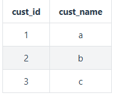

orders 表:

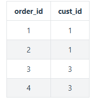

结果:

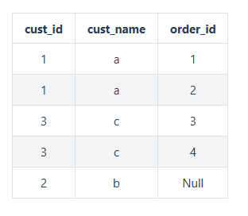

## 5.9 组合查询
使用 UNION 来组合两个查询，如果第一个查询返回 M 行，第二个查询返回 N 行，那么组合查询的结果一般为 M+N 行。

每个查询必须包含相同的列、表达式和聚集函数。

**默认会去除相同行，如果需要保留相同行，使用 UNION ALL。**

只能包含一个 ORDER BY 子句，并且必须位于语句的最后。
```sql
SELECT col
FROM mytable
WHERE col = 1
UNION
SELECT col
FROM mytable
WHERE col =2;
```
## 5.10 视图
视图是虚拟的表，本身不包含数据，也就不能对其进行索引操作。

对视图的操作和对普通表的操作一样。

视图具有如下好处:

简化复杂的 SQL 操作，比如复杂的连接；
只使用实际表的一部分数据；
通过只给用户访问视图的权限，保证数据的安全性；
更改数据格式和表示。
```sql
CREATE VIEW myview AS
SELECT Concat(col1, col2) AS concat_col, col3*col4 AS compute_col
FROM mytable
WHERE col5 = val;
```
## 5.11 存储过程
存储过程可以看成是对一系列 SQL 操作的批处理。

使用存储过程的好处:

- 代码封装，保证了一定的安全性；
- 代码复用；
- 由于是预先编译，因此具有很高的性能。

命令行中创建存储过程需要自定义分隔符，因为命令行是以 ; 为结束符，而存储过程中也包含了分号，因此会错误把这部分分号当成是结束符，造成语法错误。

包含 in、out 和 inout 三种参数。

给变量赋值都需要用 select into 语句。

每次只能给一个变量赋值，不支持集合的操作。
```sql
delimiter //

create procedure myprocedure( out ret int )
    begin
        declare y int;
        select sum(col1)
        from mytable
        into y;
        select y*y into ret;
    end //

delimiter ;
```
```sql
call myprocedure(@ret);
select @ret;
```

### 5.11.1 存储过程补充理解

#### 5.11.1.1. 存储过程的核心特点
- **预编译执行**：存储过程在创建时进行编译，后续调用直接执行编译后的代码，性能更高
- **减少网络传输**：客户端只需传递存储过程名和参数，避免发送大量SQL语句
- **增强安全性**：可以通过存储过程限制对底层表的直接访问
- **业务逻辑封装**：将复杂业务逻辑封装在数据库层面

#### 5.11.1.2. 参数类型详解

| 参数类型 | 说明 | 示例 |
|----------|------|------|
| **IN** | 输入参数（默认） | `CREATE PROCEDURE p(IN id INT)` |
| **OUT** | 输出参数 | `CREATE PROCEDURE p(OUT result INT)` |
| **INOUT** | 输入输出参数 | `CREATE PROCEDURE p(INOUT x INT)` |

#### 5.11.1.3. 变量声明和赋值
```sql
-- 变量声明
DECLARE variable_name datatype [DEFAULT value];

-- 赋值方式
SET variable_name = value;                    -- 直接赋值
SELECT column_name INTO variable_name FROM table; -- 查询赋值
```

#### 5.11.1.4. 完整的存储过程示例
```sql
DELIMITER //

CREATE PROCEDURE CalculateEmployeeStats(
    IN dept_id INT,
    OUT total_count INT,
    OUT avg_salary DECIMAL(10,2)
)
BEGIN
    -- 计算部门员工总数
    SELECT COUNT(*) INTO total_count 
    FROM employees 
    WHERE department_id = dept_id;
    
    -- 计算平均工资
    SELECT AVG(salary) INTO avg_salary 
    FROM employees 
    WHERE department_id = dept_id;
END //

DELIMITER ;
```

#### 5.11.1.5. 调用和结果获取
```sql
-- 调用存储过程
CALL CalculateEmployeeStats(101, @count, @avg_salary);

-- 查看输出参数
SELECT @count AS employee_count, @avg_salary AS average_salary;
```

#### 5.11.1.6. 存储过程控制结构

##### 5.11.1.6.1 条件判断
```sql
CREATE PROCEDURE CheckSalaryLevel(IN emp_id INT, OUT level VARCHAR(20))
BEGIN
    DECLARE emp_salary DECIMAL(10,2);
    
    SELECT salary INTO emp_salary FROM employees WHERE id = emp_id;
    
    IF emp_salary > 10000 THEN
        SET level = '高级';
    ELSEIF emp_salary > 5000 THEN
        SET level = '中级';
    ELSE
        SET level = '初级';
    END IF;
END //
```

##### 5.11.1.6.2 循环处理
```sql
CREATE PROCEDURE ProcessEmployees()
BEGIN
    DECLARE done INT DEFAULT FALSE;
    DECLARE emp_id INT;
    DECLARE emp_name VARCHAR(50);
    DECLARE cur CURSOR FOR SELECT id, name FROM employees;
    DECLARE CONTINUE HANDLER FOR NOT FOUND SET done = TRUE;
    
    OPEN cur;
    
    read_loop: LOOP
        FETCH cur INTO emp_id, emp_name;
        IF done THEN
            LEAVE read_loop;
        END IF;
        -- 处理每个员工
        -- ...
    END LOOP;
    
    CLOSE cur;
END //
```

#### 5.11.1.7. 存储过程 vs 函数

| 特性 | 存储过程 | 函数 |
|------|----------|------|
| 返回值 | 通过OUT参数 | 直接返回单个值 |
| 调用方式 | CALL procedure() | SELECT function() |
| 事务控制 | 支持 | 通常不支持 |
| 主要用途 | 执行操作 | 计算返回值 |

#### 5.11.1.8. 实际应用场景

##### 5.11.1.8.1 数据迁移
```sql
CREATE PROCEDURE MigrateOldData()
BEGIN
    -- 备份旧数据
    INSERT INTO backup_table SELECT * FROM old_table;
    -- 转换数据格式
    UPDATE new_table SET status = 'migrated';
    -- 记录迁移日志
    INSERT INTO migration_log VALUES (NOW(), '迁移完成');
END //
```

##### 5.11.1.8.2 批量处理
```sql
CREATE PROCEDURE BatchUpdateSalaries(IN percentage DECIMAL(5,2))
BEGIN
    UPDATE employees 
    SET salary = salary * (1 + percentage/100)
    WHERE active = 1;
END //
```

#### 5.11.9. 最佳实践建议

1. **错误处理**：使用DECLARE HANDLER处理异常
2. **性能优化**：避免在循环中执行查询
3. **可读性**：添加充分的注释
4. **参数验证**：在过程开始处验证输入参数
5. **事务管理**：合理使用BEGIN TRANSACTION/COMMIT/ROLLBACK

#### 5.11.10. 存储过程的局限性
- **数据库依赖**：不同数据库语法差异较大
- **调试困难**：比应用程序代码更难调试
- **版本控制**：需要额外的数据库版本管理
- **移植性差**：迁移到其他数据库时需要重写

存储过程在需要高性能数据处理和复杂业务逻辑封装的场景下非常有用，但也要根据具体需求权衡使用。
## 5.12 游标
在存储过程中使用游标可以对一个结果集进行移动遍历。

游标主要用于交互式应用，其中用户需要对数据集中的任意行进行浏览和修改。

使用游标的四个步骤:

- 声明游标，这个过程没有实际检索出数据；
- 打开游标；
- 取出数据；
- 关闭游标；
```sql
delimiter //
create procedure myprocedure(out ret int)
    begin
        declare done boolean default 0;

        declare mycursor cursor for
        select col1 from mytable;
        # 定义了一个 continue handler，当 sqlstate '02000' 这个条件出现时，会执行 set done = 1
        declare continue handler for sqlstate '02000' set done = 1;

        open mycursor;

        repeat
            fetch mycursor into ret;
            select ret;
        until done end repeat;

        close mycursor;
    end //
 delimiter ;
```

### 5.12.1. 游标的本质和作用

**游标（Cursor）** 相当于数据库中的"指针"，允许你：
- 逐行处理查询结果集
- 在结果集中前后移动
- 对当前行进行读取、修改或删除操作

### 5.12.2. 游标的完整使用步骤详解

#### 步骤1：声明游标
```sql
DECLARE cursor_name CURSOR FOR 
SELECT column1, column2 FROM table_name WHERE condition;
```
- 只是定义查询，不执行
- 可以包含复杂的JOIN、WHERE条件

#### 步骤2：打开游标
```sql
OPEN cursor_name;
```
- 执行查询，生成结果集
- 游标指向结果集的第一行之前

#### 步骤3：获取数据
```sql
FETCH cursor_name INTO variable1, variable2;
```
- 将当前行的数据存入变量
- 每次FETCH后游标自动移动到下一行

#### 步骤4：关闭游标
```sql
CLOSE cursor_name;
```
- 释放游标占用的资源
- 结果集不再可用

### 5.12.3. 更完整的游标示例

```sql
DELIMITER //

CREATE PROCEDURE ProcessEmployeeSalaries()
BEGIN
    DECLARE done BOOLEAN DEFAULT FALSE;
    DECLARE emp_id INT;
    DECLARE emp_name VARCHAR(50);
    DECLARE emp_salary DECIMAL(10,2);
    DECLARE total_salary DECIMAL(10,2) DEFAULT 0;
    DECLARE count_emp INT DEFAULT 0;
    
    -- 声明游标
    DECLARE emp_cursor CURSOR FOR 
        SELECT id, name, salary FROM employees WHERE active = 1;
    
    -- 定义NOT FOUND处理器
    DECLARE CONTINUE HANDLER FOR NOT FOUND SET done = TRUE;
    
    OPEN emp_cursor;
    
    -- 使用循环处理每一行
    read_loop: LOOP
        FETCH emp_cursor INTO emp_id, emp_name, emp_salary;
        
        IF done THEN
            LEAVE read_loop;
        END IF;
        
        -- 业务逻辑处理
        SET total_salary = total_salary + emp_salary;
        SET count_emp = count_emp + 1;
        
        -- 可以在这里添加复杂的业务逻辑
        IF emp_salary < 5000 THEN
            UPDATE employees SET salary = salary * 1.1 WHERE id = emp_id;
        END IF;
        
    END LOOP;
    
    CLOSE emp_cursor;
    
    -- 输出统计结果
    SELECT total_salary AS '总工资', count_emp AS '员工数', 
           total_salary/count_emp AS '平均工资';
END //

DELIMITER ;
```

### 5.12.4. 游标的类型

#### 5.12.4.1 只读游标 vs 可更新游标
```sql
-- 只读游标（默认）
DECLARE cursor_name CURSOR FOR SELECT ...;

-- 可更新游标（MySQL不支持，但其他数据库支持）
-- 在SQL Server中：
DECLARE cursor_name CURSOR FOR 
SELECT ... FOR UPDATE;  -- 可以更新当前行
```

#### 5.12.4.2 滚动游标 vs 只进游标
```sql
-- MySQL主要支持只进游标（只能向前移动）
-- 其他数据库可能支持：
DECLARE scroll_cursor SCROLL CURSOR FOR SELECT ...;
-- 然后可以使用：
FETCH PRIOR FROM scroll_cursor;    -- 前一行
FETCH ABSOLUTE 5 FROM scroll_cursor; -- 第5行
FETCH RELATIVE -2 FROM scroll_cursor; -- 向前2行
```

### 5.12.5. 错误处理机制

```sql
-- 更健壮的错误处理
DECLARE EXIT HANDLER FOR SQLEXCEPTION
BEGIN
    -- 发生异常时执行
    ROLLBACK;
    CLOSE cursor_name;  -- 确保游标关闭
    RESIGNAL;           -- 重新抛出异常
END;

DECLARE CONTINUE HANDLER FOR NOT FOUND 
BEGIN
    SET done = 1;
    -- 可以记录日志等操作
END;
```

### 5.12.6. 游标的实际应用场景

#### 场景1：数据迁移和转换
```sql
CREATE PROCEDURE MigrateCustomerData()
BEGIN
    DECLARE done INT DEFAULT 0;
    DECLARE old_id INT, old_name VARCHAR(100), old_email VARCHAR(100);
    DECLARE new_id INT;
    
    DECLARE cur CURSOR FOR 
        SELECT customer_id, customer_name, email FROM old_customers;
    DECLARE CONTINUE HANDLER FOR NOT FOUND SET done = 1;
    
    OPEN cur;
    
    migration_loop: LOOP
        FETCH cur INTO old_id, old_name, old_email;
        IF done THEN LEAVE migration_loop; END IF;
        
        -- 数据清洗和转换逻辑
        IF old_email IS NOT NULL AND old_email != '' THEN
            INSERT INTO new_customers (name, email, status) 
            VALUES (old_name, LOWER(TRIM(old_email)), 'active');
            
            SET new_id = LAST_INSERT_ID();
            -- 记录映射关系
            INSERT INTO id_mapping (old_id, new_id) VALUES (old_id, new_id);
        END IF;
    END LOOP;
    
    CLOSE cur;
END;
```

#### 场景2：批量复杂计算
```sql
CREATE PROCEDURE CalculateMonthlyReport()
BEGIN
    DECLARE done INT DEFAULT 0;
    DECLARE product_id INT, sales_qty INT, unit_price DECIMAL(10,2);
    DECLARE total_revenue DECIMAL(15,2) DEFAULT 0;
    
    DECLARE sales_cursor CURSOR FOR 
        SELECT p.id, SUM(od.quantity), p.unit_price
        FROM products p
        JOIN order_details od ON p.id = od.product_id
        JOIN orders o ON od.order_id = o.id
        WHERE o.order_date BETWEEN '2023-01-01' AND '2023-01-31'
        GROUP BY p.id, p.unit_price;
    
    DECLARE CONTINUE HANDLER FOR NOT FOUND SET done = 1;
    
    OPEN sales_cursor;
    
    calc_loop: LOOP
        FETCH sales_cursor INTO product_id, sales_qty, unit_price;
        IF done THEN LEAVE calc_loop; END IF;
        
        -- 复杂计算逻辑
        SET total_revenue = total_revenue + (sales_qty * unit_price);
        
        -- 更新产品统计
        UPDATE product_stats 
        SET monthly_sales = sales_qty,
            monthly_revenue = sales_qty * unit_price
        WHERE product_id = product_id AND month = '2023-01';
        
    END LOOP;
    
    CLOSE sales_cursor;
    
    -- 插入总营收记录
    INSERT INTO monthly_reports (month, total_revenue) 
    VALUES ('2023-01', total_revenue);
END;
```

### 5.12.7. 游标的性能考虑和最佳实践

#### 性能问题：
- **资源消耗大**：游标占用内存和数据库连接资源
- **速度慢**：逐行处理比集合操作慢很多
- **锁定问题**：长时间持有游标可能阻塞其他操作

#### 最佳实践：
1. **尽量使用集合操作**：能用UPDATE/INSERT SELECT解决的不用游标
2. **尽快关闭游标**：处理完立即关闭释放资源
3. **批量处理**：一次FETCH多行数据
4. **设置合适的事务隔离级别**
5. **添加适当的索引**提高查询性能

### 5.12.8. 替代方案

在很多情况下，可以使用更高效的方法替代游标：

```sql
-- 使用CASE语句替代简单的逐行判断
UPDATE employees 
SET salary = CASE 
    WHEN salary < 5000 THEN salary * 1.1 
    ELSE salary 
END;

-- 使用窗口函数进行复杂计算
SELECT id, name, salary,
       AVG(salary) OVER() as avg_salary,
       salary - AVG(salary) OVER() as diff_from_avg
FROM employees;
```

### 5.12.9. 各数据库的游标差异

| 特性 | MySQL | PostgreSQL | SQL Server | Oracle |
|------|-------|------------|------------|--------|
| **声明语法** | 基本一致 | 基本一致 | 基本一致 | 基本一致 |
| **滚动支持** | 有限 | 完全支持 | 完全支持 | 完全支持 |
| **更新游标** | 不支持 | 支持 | 支持 | 支持 |
| **性能** | 一般 | 较好 | 较好 | 优秀 |

游标是强大的工具，但应该谨慎使用。只有在确实需要逐行处理的复杂业务逻辑中才考虑使用游标，大多数情况下集合操作是更好的选择。

## 5.13 触发器
触发器会在某个表执行以下语句时而自动执行: DELETE、INSERT、UPDATE。

触发器必须指定在语句执行之前还是之后自动执行，之前执行使用 BEFORE 关键字，之后执行使用 AFTER 关键字。BEFORE 用于数据验证和净化，AFTER 用于审计跟踪，将修改记录到另外一张表中。

- INSERT 触发器包含一个名为 NEW 的虚拟表。
```sql
CREATE TRIGGER mytrigger AFTER INSERT ON mytable
FOR EACH ROW SELECT NEW.col into @result;

SELECT @result; -- 获取结果
```
- DELETE 触发器包含一个名为 OLD 的虚拟表，并且是只读的。

- UPDATE 触发器包含一个名为 NEW 和一个名为 OLD 的虚拟表，其中 NEW 是可以被修改的，而 OLD 是只读的。

- MySQL 不允许在触发器中使用 CALL 语句，也就是不能调用存储过程。

## 5.14 事务管理
基本术语:

- 事务(transaction)指一组 SQL 语句；
- 回退(rollback)指撤销指定 SQL 语句的过程；
- 提交(commit)指将未存储的 SQL 语句结果写入数据库表；
- 保留点(savepoint)指事务处理中设置的临时占位符(placeholder)，你可以对它发布回退(与
- 回退整个事务处理不同)。
不能回退 SELECT 语句，回退 SELECT 语句也没意义；也不能回退 CREATE 和 DROP 语句。

MySQL 的事务提交默认是隐式提交，每执行一条语句就把这条语句当成一个事务然后进行提交。当出现 START TRANSACTION 语句时，会关闭隐式提交；当 COMMIT 或 ROLLBACK 语句执行后，事务会自动关闭，重新恢复隐式提交。

通过设置 autocommit 为 0 可以取消自动提交；**autocommit 标记是针对每个连接而不是针对服务器的。**

如果没有设置保留点，ROLLBACK 会回退到 START TRANSACTION 语句处；如果设置了保留点，并且在 ROLLBACK 中指定该保留点，则会回退到该保留点。
```sql
START TRANSACTION
// ...
SAVEPOINT delete1
// ...
ROLLBACK TO delete1
// ...
COMMIT
```
## 5.15 字符集
基本术语:

- 字符集为字母和符号的集合；
- 编码为某个字符集成员的内部表示；
- 校对字符指定如何比较，主要用于排序和分组。

除了给表指定字符集和校对外，也可以给列指定:
```sql
CREATE TABLE mytable
(col VARCHAR(10) CHARACTER SET latin COLLATE latin1_general_ci )
DEFAULT CHARACTER SET hebrew COLLATE hebrew_general_ci;
```
可以在排序、分组时指定校对:
```sql
SELECT *
FROM mytable
ORDER BY col COLLATE latin1_general_ci;
```
## 5.16 权限管理
MySQL 的账户信息保存在 mysql 这个数据库中。
```sql
USE mysql;
SELECT user FROM user;
```
### 5.16.1 创建账户

新创建的账户没有任何权限。
```sql
CREATE USER myuser IDENTIFIED BY 'mypassword';
```
### 5.16.2 修改账户名
```sql
RENAME myuser TO newuser;
```
### 5.16.3 删除账户
```sql
DROP USER myuser;
```
### 5.16.4 查看权限
```sql
SHOW GRANTS FOR myuser;
```
### 5.16.5 授予权限

账户用 username@host 的形式定义，username@% 使用的是默认主机名。
```sql
GRANT SELECT, INSERT ON mydatabase.* TO myuser;
```
### 5.16.6 删除权限

GRANT 和 REVOKE 可在几个层次上控制访问权限:

- 整个服务器，使用 GRANT ALL 和 REVOKE ALL；
- 整个数据库，使用 ON database.*；
- 特定的表，使用 ON database.table；
- 特定的列；
- 特定的存储过程。
```sql
REVOKE SELECT, INSERT ON mydatabase.* FROM myuser;
```
### 5.16.7 更改密码

必须使用 Password() 函数
```sql
SET PASSWROD FOR myuser = Password('new_password');
```
# 六、SQL语言 - SQL语句练习
## 6.1 构建如下表结构
> 还有一个Grade表，在如下的练习中体现


## 6.2 插入数据
> 下面表SQL和相关测试数据是我Dump出来的
```sql
-- MySQL dump 10.13  Distrib 5.7.17, for macos10.12 (x86_64)
--
-- Host: localhost    Database: learn_sql_pdai_tech
-- ------------------------------------------------------
-- Server version	5.7.28

/*!40101 SET @OLD_CHARACTER_SET_CLIENT=@@CHARACTER_SET_CLIENT */;
/*!40101 SET @OLD_CHARACTER_SET_RESULTS=@@CHARACTER_SET_RESULTS */;
/*!40101 SET @OLD_COLLATION_CONNECTION=@@COLLATION_CONNECTION */;
/*!40101 SET NAMES utf8 */;
/*!40103 SET @OLD_TIME_ZONE=@@TIME_ZONE */;
/*!40103 SET TIME_ZONE='+00:00' */;
/*!40014 SET @OLD_UNIQUE_CHECKS=@@UNIQUE_CHECKS, UNIQUE_CHECKS=0 */;
/*!40014 SET @OLD_FOREIGN_KEY_CHECKS=@@FOREIGN_KEY_CHECKS, FOREIGN_KEY_CHECKS=0 */;
/*!40101 SET @OLD_SQL_MODE=@@SQL_MODE, SQL_MODE='NO_AUTO_VALUE_ON_ZERO' */;
/*!40111 SET @OLD_SQL_NOTES=@@SQL_NOTES, SQL_NOTES=0 */;

--
-- Table structure for table `COURSE`
--

DROP TABLE IF EXISTS `COURSE`;
/*!40101 SET @saved_cs_client     = @@character_set_client */;
/*!40101 SET character_set_client = utf8 */;
CREATE TABLE `COURSE` (
  `CNO` varchar(5) NOT NULL,
  `CNAME` varchar(10) NOT NULL,
  `TNO` varchar(10) NOT NULL
) ENGINE=InnoDB DEFAULT CHARSET=utf8;
/*!40101 SET character_set_client = @saved_cs_client */;

--
-- Dumping data for table `COURSE`
--

LOCK TABLES `COURSE` WRITE;
/*!40000 ALTER TABLE `COURSE` DISABLE KEYS */;
INSERT INTO `COURSE` VALUES ('3-105','计算机导论','825'),('3-245','操作系统','804'),('6-166','数据电路','856'),('9-888','高等数学','100');
/*!40000 ALTER TABLE `COURSE` ENABLE KEYS */;
UNLOCK TABLES;

--
-- Table structure for table `SCORE`
--

DROP TABLE IF EXISTS `SCORE`;
/*!40101 SET @saved_cs_client     = @@character_set_client */;
/*!40101 SET character_set_client = utf8 */;
CREATE TABLE `SCORE` (
  `SNO` varchar(3) NOT NULL,
  `CNO` varchar(5) NOT NULL,
  `DEGREE` decimal(10,1) NOT NULL
) ENGINE=InnoDB DEFAULT CHARSET=utf8;
/*!40101 SET character_set_client = @saved_cs_client */;

--
-- Dumping data for table `SCORE`
--

LOCK TABLES `SCORE` WRITE;
/*!40000 ALTER TABLE `SCORE` DISABLE KEYS */;
INSERT INTO `SCORE` VALUES ('103','3-245',86.0),('105','3-245',75.0),('109','3-245',68.0),('103','3-105',92.0),('105','3-105',88.0),('109','3-105',76.0),('101','3-105',64.0),('107','3-105',91.0),('101','6-166',85.0),('107','6-106',79.0),('108','3-105',78.0),('108','6-166',81.0);
/*!40000 ALTER TABLE `SCORE` ENABLE KEYS */;
UNLOCK TABLES;

--
-- Table structure for table `STUDENT`
--

DROP TABLE IF EXISTS `STUDENT`;
/*!40101 SET @saved_cs_client     = @@character_set_client */;
/*!40101 SET character_set_client = utf8 */;
CREATE TABLE `STUDENT` (
  `SNO` varchar(3) NOT NULL,
  `SNAME` varchar(4) NOT NULL,
  `SSEX` varchar(2) NOT NULL,
  `SBIRTHDAY` datetime DEFAULT NULL,
  `CLASS` varchar(5) DEFAULT NULL
) ENGINE=InnoDB DEFAULT CHARSET=utf8;
/*!40101 SET character_set_client = @saved_cs_client */;

--
-- Dumping data for table `STUDENT`
--

LOCK TABLES `STUDENT` WRITE;
/*!40000 ALTER TABLE `STUDENT` DISABLE KEYS */;
INSERT INTO `STUDENT` VALUES ('108','曾华','男','1977-09-01 00:00:00','95033'),('105','匡明','男','1975-10-02 00:00:00','95031'),('107','王丽','女','1976-01-23 00:00:00','95033'),('101','李军','男','1976-02-20 00:00:00','95033'),('109','王芳','女','1975-02-10 00:00:00','95031'),('103','陆君','男','1974-06-03 00:00:00','95031');
/*!40000 ALTER TABLE `STUDENT` ENABLE KEYS */;
UNLOCK TABLES;

--
-- Table structure for table `TEACHER`
--

DROP TABLE IF EXISTS `TEACHER`;
/*!40101 SET @saved_cs_client     = @@character_set_client */;
/*!40101 SET character_set_client = utf8 */;
CREATE TABLE `TEACHER` (
  `TNO` varchar(3) NOT NULL,
  `TNAME` varchar(4) NOT NULL,
  `TSEX` varchar(2) NOT NULL,
  `TBIRTHDAY` datetime NOT NULL,
  `PROF` varchar(6) DEFAULT NULL,
  `DEPART` varchar(10) NOT NULL
) ENGINE=InnoDB DEFAULT CHARSET=utf8;
/*!40101 SET character_set_client = @saved_cs_client */;

--
-- Dumping data for table `TEACHER`
--

LOCK TABLES `TEACHER` WRITE;
/*!40000 ALTER TABLE `TEACHER` DISABLE KEYS */;
INSERT INTO `TEACHER` VALUES ('804','李诚','男','1958-12-02 00:00:00','副教授','计算机系'),('856','张旭','男','1969-03-12 00:00:00','讲师','电子工程系'),('825','王萍','女','1972-05-05 00:00:00','助教','计算机系'),('831','刘冰','女','1977-08-14 00:00:00','助教','电子工程系');
/*!40000 ALTER TABLE `TEACHER` ENABLE KEYS */;
UNLOCK TABLES;
/*!40103 SET TIME_ZONE=@OLD_TIME_ZONE */;

/*!40101 SET SQL_MODE=@OLD_SQL_MODE */;
/*!40014 SET FOREIGN_KEY_CHECKS=@OLD_FOREIGN_KEY_CHECKS */;
/*!40014 SET UNIQUE_CHECKS=@OLD_UNIQUE_CHECKS */;
/*!40101 SET CHARACTER_SET_CLIENT=@OLD_CHARACTER_SET_CLIENT */;
/*!40101 SET CHARACTER_SET_RESULTS=@OLD_CHARACTER_SET_RESULTS */;
/*!40101 SET COLLATION_CONNECTION=@OLD_COLLATION_CONNECTION */;
/*!40111 SET SQL_NOTES=@OLD_SQL_NOTES */;

-- Dump completed on 2020-02-06 18:18:25

```
## 6.3 相关练习
- 1、 查询Student表中的所有记录的Sname、Ssex和Class列。
```sql
select SNAME, SSEX, CLASS from STUDENT;
```
- 2、 查询教师所有的单位即不重复的Depart列。
```sql
select distinct DEPART from TEACHER;
```
- 3、 查询Student表的所有记录。
```sql
select * from STUDENT;
```
- 4、 查询Score表中成绩在60到80之间的所有记录。
```sql
select *
from SCORE
where DEGREE > 60 and DEGREE < 80;
```
- 5、 查询Score表中成绩为85，86或88的记录。
```sql
select *
from SCORE
where DEGREE = 85 or DEGREE = 86 or DEGREE = 88;
```
- 6、 查询Student表中“95031”班或性别为“女”的同学记录。
```sql
select *
from STUDENT
where CLASS = '95031' or SSEX = '女';
```
- 7、 以Class降序查询Student表的所有记录。
```sql
select *
from STUDENT
order by CLASS desc;
```
- 8、 以Cno升序、Degree降序查询Score表的所有记录。
```sql
select *
from SCORE
order by CNO asc, DEGREE desc;
```
- 9、 查询“95031”班的学生人数。
```sql
select count(*)
from STUDENT
where CLASS = '95031';
```
- 10、查询Score表中的最高分的学生学号和课程号。
```sql
select
  sno,
  CNO
from SCORE
where DEGREE = (
  select max(DEGREE)
  from SCORE
);
```
- 11、查询‘3-105’号课程的平均分。
```sql
select avg(DEGREE)
from SCORE
where CNO = '3-105';
```
- 12、查询Score表中至少有5名学生选修的并以3开头的课程的平均分数。
```sql
select
  avg(DEGREE),
  CNO
from SCORE
where cno like '3%'
group by CNO
having count(*) > 5;
```
- 13、查询最低分大于70，最高分小于90的Sno列。
```sql
select SNO
from SCORE
group by SNO
having min(DEGREE) > 70 and max(DEGREE) < 90;
```
- 14、查询所有学生的Sname、Cno和Degree列。
```sql
select
  SNAME,
  CNO,
  DEGREE
from STUDENT, SCORE
where STUDENT.SNO = SCORE.SNO;
```
- 15、查询所有学生的Sno、Cno和Degree列。
```sql
select
  SCORE.SNO,
  CNO,
  DEGREE
from STUDENT, SCORE
where STUDENT.SNO = SCORE.SNO;
```
- 16、查询所有学生的Sname、Cname和Degree列。
```sql
SELECT
  A.SNAME,
  B.CNAME,
  C.DEGREE
FROM STUDENT A
  JOIN (COURSE B, SCORE C)
    ON A.SNO = C.SNO AND B.CNO = C.CNO;
```
- 17、查询“95033”班所选课程的平均分。
```sql
select avg(DEGREE)
from SCORE
where sno in (select SNO
              from STUDENT
              where CLASS = '95033');
```
- 18、假设使用如下命令建立了一个grade表:
```sql
create table grade (
  low  numeric(3, 0),
  upp  numeric(3),
  rank char(1)
);
insert into grade values (90, 100, 'A');
insert into grade values (80, 89, 'B');
insert into grade values (70, 79, 'C');
insert into grade values (60, 69, 'D');
insert into grade values (0, 59, 'E');
```
现查询所有同学的Sno、Cno和rank列。
```sql
SELECT
  A.SNO,
  A.CNO,
  B.RANK
FROM SCORE A, grade B
WHERE A.DEGREE BETWEEN B.LOW AND B.UPP
ORDER BY RANK;
```
- 19、查询选修“3-105”课程的成绩高于“109”号同学成绩的所有同学的记录。
```sql
select *
from SCORE
where CNO = '3-105' and DEGREE > ALL (
  select DEGREE
  from SCORE
  where SNO = '109'
);
```
- 20、查询score中选学一门以上课程的同学中分数为非最高分成绩的学生记录
```sql
select * from STUDENT where SNO
  in (select SNO
  from SCORE
  where DEGREE < (select MAX(DEGREE) from SCORE)
  group by SNO
  having count(*) > 1);
```
- 21、查询成绩高于学号为“109”、课程号为“3-105”的成绩的所有记录。
```sql
select *
from SCORE
where CNO = '3-105' and DEGREE > ALL (
  select DEGREE
  from SCORE
  where SNO = '109'
);
```
- 22、查询和学号为108的同学同年出生的所有学生的Sno、Sname和Sbirthday列。
```sql
select
  SNO,
  SNAME,
  SBIRTHDAY
from STUDENT
where year(SBIRTHDAY) = (
  select year(SBIRTHDAY)
  from STUDENT
  where SNO = '108'
);
```
- 23、查询“张旭“教师任课的学生成绩。
```sql
select *
from SCORE
where cno = (
  select CNO
  from COURSE
    inner join TEACHER on COURSE.TNO = TEACHER.TNO and TNAME = '张旭'
);
```
- 24、查询选修某课程的同学人数多于5人的教师姓名。
```sql
select TNAME
from TEACHER
where TNO = (
  select TNO
  from COURSE
  where CNO = (select CNO
               from SCORE
               group by CNO
               having count(SNO) > 5)
);
```
- 25、查询95033班和95031班全体学生的记录。
```sql
select *
from STUDENT
where CLASS in ('95033', '95031');
```
- 26、查询存在有85分以上成绩的课程Cno.
```sql
select cno
from SCORE
group by CNO
having MAX(DEGREE) > 85;
```
- 27、查询出“计算机系“教师所教课程的成绩表。
```sql
select *
from SCORE
where CNO in (select CNO
              from TEACHER, COURSE
              where DEPART = '计算机系' and COURSE.TNO = TEACHER.TNO);
```
- 28、查询“计算机系”与“电子工程系“不同职称的教师的Tname和Prof
```sql
select
  tname,
  prof
from TEACHER
where depart = '计算机系' and prof not in (
  select prof
  from TEACHER
  where depart = '电子工程系'
);
```
- 29、查询选修编号为“3-105“课程且成绩至少高于选修编号为“3-245”的同学的Cno、Sno和Degree,并按Degree从高到低次序排序。
```sql
select
  CNO,
  SNO,
  DEGREE
from SCORE
where CNO = '3-105' and DEGREE > any (
  select DEGREE
  from SCORE
  where CNO = '3-245'
)
order by DEGREE desc;
```
- 30、查询选修编号为“3-105”且成绩高于选修编号为“3-245”课程的同学的Cno、Sno和Degree.
```sql
SELECT *
FROM SCORE
WHERE CNO = '3-105' AND DEGREE > ALL (
  SELECT DEGREE
  FROM SCORE
  WHERE CNO = '3-245'
)
ORDER by DEGREE desc;
```
- 31、查询所有教师和同学的name、sex和birthday.
```sql
select
  TNAME     name,
  TSEX      sex,
  TBIRTHDAY birthday
from TEACHER
union
select
  sname     name,
  SSEX      sex,
  SBIRTHDAY birthday
from STUDENT;
```
- 32、查询所有“女”教师和“女”同学的name、sex和birthday.
```sql
select
  TNAME     name,
  TSEX      sex,
  TBIRTHDAY birthday
from TEACHER
where TSEX = '女'
union
select
  sname     name,
  SSEX      sex,
  SBIRTHDAY birthday
from STUDENT
where SSEX = '女';
```
- 33、查询成绩比该课程平均成绩低的同学的成绩表。
```sql
SELECT A.*
FROM SCORE A
WHERE DEGREE < (SELECT AVG(DEGREE)
                FROM SCORE B
                WHERE A.CNO = B.CNO);
```
- 34、查询所有任课教师的Tname和Depart.
```sql
select
  TNAME,
  DEPART
from TEACHER a
where exists(select *
             from COURSE b
             where a.TNO = b.TNO);
```
- 35、查询所有未讲课的教师的Tname和Depart.
```sql
select
  TNAME,
  DEPART
from TEACHER a
where tno not in (select tno
                  from COURSE);
```
- 36、查询至少有2名男生的班号。
```sql
select CLASS
from STUDENT
where SSEX = '男'
group by CLASS
having count(SSEX) > 1;
```
- 37、查询Student表中不姓“王”的同学记录。
```sql
select *
from STUDENT
where SNAME not like "王%";
- 38、查询Student表中每个学生的姓名和年龄。
select
  SNAME,
  year(now()) - year(SBIRTHDAY)
from STUDENT;
```
- 39、查询Student表中最大和最小的Sbirthday日期值。
```sql
select min(SBIRTHDAY) birthday
from STUDENT
union
select max(SBIRTHDAY) birthday
from STUDENT;
```
- 40、以班号和年龄从大到小的顺序查询Student表中的全部记录。
```sql
select *
from STUDENT
order by CLASS desc, year(now()) - year(SBIRTHDAY) desc;
```
- 41、查询“男”教师及其所上的课程。
```sql
select *
from TEACHER, COURSE
where TSEX = '男' and COURSE.TNO = TEACHER.TNO;
```
- 42、查询最高分同学的Sno、Cno和Degree列。
```sql
select
  sno,
  CNO,
  DEGREE
from SCORE
where DEGREE = (select max(DEGREE)
                from SCORE);
```
- 43、查询和“李军”同性别的所有同学的Sname.
```sql
select sname
from STUDENT
where SSEX = (select SSEX
              from STUDENT
              where SNAME = '李军');
```
- 44、查询和“李军”同性别并同班的同学Sname.
```sql
select sname
from STUDENT
where (SSEX, CLASS) = (select
                         SSEX,
                         CLASS
                       from STUDENT
                       where SNAME = '李军');
```
- 45、查询所有选修“计算机导论”课程的“男”同学的成绩表
```sql
select *
from SCORE, STUDENT
where SCORE.SNO = STUDENT.SNO and SSEX = '男' and CNO = (
  select CNO
  from COURSE
  where CNAME = '计算机导论');
```
- 46、使用游标方式来同时查询每位同学的名字，他所选课程及成绩。
```sql
declare
 cursor student_cursor is
  select S.SNO,S.SNAME,C.CNAME,SC.DEGREE as DEGREE
  from STUDENT S, COURSE C, SCORE SC
  where S.SNO=SC.SNO
  and SC.CNO=C.CNO;

  student_row student_cursor%ROWTYPE;

begin
  open student_cursor;
   loop
    fetch student_cursor INTO student_row;
    exit when student_cursor%NOTFOUND;
     dbms_output.put_line( student_row.SNO || '' || 

student_row.SNAME|| '' || student_row.CNAME || '' ||

student_row.DEGREE);
   end loop;
  close student_cursor;
END;
/ 
```
- 47、 声明触发器指令，每当有同学转换班级时执行触发器显示当前和之前所在班级。
```sql
CREATE OR REPLACE TRIGGER display_class_changes 
AFTER DELETE OR INSERT OR UPDATE ON student 
FOR EACH ROW 
WHEN (NEW.sno > 0) 

BEGIN 
   
   dbms_output.put_line('Old class: ' || :OLD.class); 
   dbms_output.put_line('New class: ' || :NEW.class); 
END; 
/ 


Update student
set class=95031
where sno=109;
```
- 48、 删除已设置的触发器指令
```sql
DROP TRIGGER display_class_changes;
```

- 更多可以通过Leetcode上的SQL题目进行进阶

https://leetcode.cn/problemset/database/?utm_source=LCUS&utm_medium=new_banner_click&utm_campaign=transfer2china&utm_content=title_main

# 七、SQL语言 - SQL语句优化
## 7.1 负向查询不能使用索引
```sql
select name from user where id not in (1,3,4);
```
应该修改为:
```sql
select name from user where id in (2,5,6);
```
## 7.2 前导模糊查询不能使用索引
如:
```sql
select name from user where name like '%zhangsan'
```
非前导则可以:
```sql
select name from user where name like 'zhangsan%'
```
建议可以考虑使用`Lucene`等全文索引工具来代替频繁的模糊查询。


### 7.2.1 为什么B-tree索引会有前导模糊查询问题？

#### 7.2.1.1. B-tree索引的物理结构

B-tree索引的本质是一个**排序的数据结构**，它按照索引列的值进行排序存储：

```
索引结构示例：
aaron
abraham
adam
...
zhangsan
zhangwei
zhaoliu
```

#### 7.2.1.2. 索引查找的工作原理

##### 7.2.1.2.1 情况1：`LIKE 'zhangsan%'`（可以使用索引）
```
查找过程：
1. 索引中快速定位到"zhangsan"（因为索引是排序的）
2. 然后顺序向后扫描，直到不满足条件为止
3. 找到：zhangsan, zhangwei, zhangming...
```

##### 7.2.1.2.2 情况2：`LIKE '%zhangsan'`（无法使用索引）
```
问题所在：
1. 索引是正向排序的：aaron, abraham, ..., zhangsan
2. 但我们要找的是以"zhangsan"结尾的记录
3. 可能的匹配：lizhangsan, wangzhangsan, zhangsan
4. 由于索引不存储反向信息，必须扫描所有记录
```

#### 7.2.1.3 根本原因：索引的排序方向

**B-tree索引只存储了正向排序的信息**，没有存储反向的排序信息。就像在电话簿中：
- 你可以快速找到"张"姓的人（正向查找）
- 但无法快速找到名字以"三"结尾的人（需要检查每个人）

### 7.2.2 是否只有B-tree索引有这个问题？

#### 7.2.2.1 实际上，大多数索引类型都有类似限制：

| 索引类型 | 前导模糊查询 | 原因 |
|---------|-------------|------|
| **B-tree索引** | 无法使用索引 | 按正向排序存储 |
| **B+tree索引** | 无法使用索引 | B-tree的变种，同样正向排序 |
| **哈希索引** | 完全不能用于LIKE查询 | 只支持等值查询 |
| **位图索引** | 通常不能用于LIKE | 适合低基数列 |

#### 7.2.2.2 例外情况：特殊设计的索引

##### 7.2.2.2.1. 反向索引（Reverse Index）
```sql
-- 创建反向索引来优化后缀查询
CREATE INDEX idx_name_reverse ON users(REVERSE(name));

-- 查询时
SELECT * FROM users WHERE REVERSE(name) LIKE REVERSE('%zhangsan');
-- 等价于：REVERSE(name) LIKE 'nahsgnahz%'，可以使用索引
```

##### 7.2.2.2.2. 全文索引（Full-Text Index）
```sql
-- MySQL全文索引
CREATE FULLTEXT INDEX ft_name ON users(name);

-- 可以高效处理各种模糊匹配
SELECT * FROM users 
WHERE MATCH(name) AGAINST('zhangsan' IN BOOLEAN MODE);
```

##### 7.2.2.2.3. 特殊数据库的索引类型

**PostgreSQL的GIN/GIST索引**：
```sql
-- 使用trigram扩展支持模糊查询
CREATE EXTENSION pg_trgm;
CREATE INDEX trgm_idx ON users USING gin(name gin_trgm_ops);

-- 现在前后模糊都可以使用索引
SELECT * FROM users WHERE name LIKE '%zhangsan%';
```

### 7.2.3更深层次的技术原理

#### 7.2.3.1 B-tree索引的查找算法

```python
# 伪代码：B-tree索引查找过程
def btree_search(index, pattern):
    if pattern.startswith('固定前缀'):
        # 可以二分查找快速定位
        start = binary_search(index, pattern)
        return scan_forward_until_mismatch(start, pattern)
    else:
        # 无法快速定位，必须线性扫描
        return full_scan(index, pattern)
```

#### 7.2.3.2 为什么数据库不自动创建反向索引？

1. **存储开销**：反向索引需要额外存储空间
2. **维护成本**：数据更新时需要维护多个索引
3. **使用频率**：后缀查询相对较少，不值得默认创建

### 7.2.4 实际解决方案对比

#### 7.2.4.1 方案1：应用层处理（不推荐）
```sql
-- 全表扫描，性能差
SELECT * FROM users WHERE name LIKE '%zhangsan';
```

#### 7.2.4.2 方案2：反向索引技巧（中等推荐）
```sql
-- 添加反向列和索引
ALTER TABLE users ADD COLUMN name_reverse VARCHAR(255);
UPDATE users SET name_reverse = REVERSE(name);
CREATE INDEX idx_reverse ON users(name_reverse);

-- 使用反向索引查询
SELECT * FROM users WHERE name_reverse LIKE REVERSE('zhangsan') + '%';
```

#### 7.2.4.3 方案3：全文搜索引擎（强烈推荐）
```python
# 使用Elasticsearch
from elasticsearch import Elasticsearch

es = Elasticsearch()
result = es.search(
    index="users",
    body={
        "query": {
            "wildcard": {
                "name": "*zhangsan"
            }
        }
    }
)
```

### 7.2.5 总结

1. **B-tree索引确实有前导模糊查询的问题**
2. **根本原因**：B-tree按正向排序存储，无法快速定位后缀匹配
3. **不是B-tree独有的问题**：大多数基于排序的索引都有类似限制
4. **解决方案**：
   - 简单场景：使用反向索引技巧
   - 复杂场景：使用全文搜索引擎（Elasticsearch/Solr）
   - PostgreSQL用户：可以使用pg_trgm扩展
## 7.3 数据区分不明显的不建议创建索引
如 user 表中的性别字段，可以明显区分的才建议创建索引，如身份证等字段。
## 7.4 字段的默认值不要为 null
这样会带来和预期不一致的查询结果。

## 7.5 在字段上进行计算不能命中索引
```sql
select name from user where FROM_UNIXTIME(create_time) < CURDATE();
```
应该修改为:
```sql
select name from user where create_time < FROM_UNIXTIME(CURDATE());
```
## 7.6 最左前缀问题
如果给 user 表中的 username pwd 字段创建了复合索引那么使用以下SQL 都是可以命中索引:
```sql
select username from user where username='zhangsan' and pwd ='axsedf1sd'
```
```sql
select username from user where pwd ='axsedf1sd' and username='zhangsan'
```
```sql
select username from user where username='zhangsan'
```
但是使用
```sql
select username from user where pwd ='axsedf1sd'
```
是不能命中索引的。
## 7.7 如果明确知道只有一条记录返回
```sql
select name from user where username='zhangsan' limit 1
```
可以提高效率，可以让数据库停止游标移动。

## 7.8 不要让数据库帮我们做强制类型转换
```sql
select name from user where telno=18722222222
```
这样虽然可以查出数据，但是会导致全表扫描。

需要修改为
```sql
select name from user where telno='18722222222'
```


### 7.8.1 为什么 `telno=18722222222` 会导致全表扫描？

#### 7.8.1.1 根本原因：隐式类型转换（Type Coercion）

当数据库遇到类型不匹配的比较时，它会尝试进行隐式类型转换。具体到您的例子：

- **`telno` 列是字符串类型**（如 `VARCHAR`、`CHAR` 等）
- **`18722222222` 是数字字面量**

数据库需要将两者统一为同一类型才能比较。大多数数据库的选择是：**将字符串列转换为数字类型**，而不是将数字转换为字符串。

#### 7.8.1.2 转换后的实际查询

您的查询：
```sql
SELECT name FROM user WHERE telno = 18722222222
```

在数据库内部，实际上被处理为：
```sql
SELECT name FROM user WHERE CAST(telno AS SIGNED) = 18722222222
-- 或者类似 CAST(telno AS NUMERIC) = 18722222222
```

#### 7.8.1.3 为什么这就导致索引失效？

1. **索引是基于原始列值构建的**
   - 索引存储的是 `telno` 的原始字符串值，如 `'18722222222'`、`'13800138000'` 等
   - 索引是按照字符串顺序排序的，不是数字顺序

2. **对索引列使用函数会破坏索引使用**
   - 当查询条件变成 `CAST(telno AS SIGNED)` 时，数据库必须对每一行的 `telno` 值执行类型转换函数
   - 这相当于在索引列上使用了函数，优化器无法直接使用索引进行快速查找
   - 数据库只能执行全表扫描，逐行转换并比较

#### 7.8.1.4 可视化理解

**索引结构（字符串排序）：**
```
'110101199001011234'  -- 身份证号
'13800138000'         -- 手机号
'18722222222'         -- 目标值
'28888888888'
'99999999999'
```

**转换后的比较过程：**
```sql
-- 数据库必须这样做：
CAST('110101199001011234' AS SIGNED) = 18722222222?  → 假
CAST('13800138000' AS SIGNED) = 18722222222?         → 假  
CAST('18722222222' AS SIGNED) = 18722222222?         → 真
CAST('28888888888' AS SIGNED) = 18722222222?         → 假
CAST('99999999999' AS SIGNED) = 18722222222?         → 假
```

### 7.8.2 为什么 `telno='18722222222'` 可以使用索引？

#### 7.8.2.1 类型匹配，直接比较

您的修正查询：
```sql
SELECT name FROM user WHERE telno = '18722222222'
```

这里：
- `telno` 是字符串类型
- `'18722222222'` 也是字符串字面量

**数据库可以直接使用索引：**
1. 在索引中快速定位到 `'18722222222'`
2. 不需要任何类型转换
3. 索引查找时间复杂度：O(log n)

#### 7.8.2.2 索引查找过程：
```
索引顺序：
'110101199001011234'
'13800138000'
'18722222222'  ← 直接定位到这里
'28888888888'
'99999999999'
```

### 7.8.3 各数据库的具体表现

#### 7.8.3.1 MySQL 的示例：
```sql
-- 创建测试表
CREATE TABLE user (
    id INT PRIMARY KEY,
    name VARCHAR(50),
    telno VARCHAR(20),
    INDEX idx_telno (telno)
);

-- 插入测试数据
INSERT INTO user VALUES 
(1, '张三', '18722222222'),
(2, '李四', '13800138000');

-- 使用 EXPLAIN 查看执行计划
EXPLAIN SELECT name FROM user WHERE telno = 18722222222;
-- 结果：type=ALL（全表扫描），key=NULL（未使用索引）

EXPLAIN SELECT name FROM user WHERE telno = '18722222222';  
-- 结果：type=ref，key=idx_telno（使用索引）
```

#### 7.8.3.2 PostgreSQL 的类似情况：
```sql
EXPLAIN ANALYZE SELECT name FROM user WHERE telno = 18722222222;
-- 会显示 Seq Scan（顺序扫描）

EXPLAIN ANALYZE SELECT name FROM user WHERE telno = '18722222222';
-- 会显示 Index Scan（索引扫描）
```

### 7.8.4 更严重的潜在问题

#### 7.8.4.1. 精度丢失问题
如果 `telno` 包含非数字字符：
```sql
-- 假设有数据：telno = '187-2222-2222'
SELECT name FROM user WHERE telno = 18722222222;
-- 转换会失败或产生意外结果，可能返回空集或错误
```

#### 7.8.4.2. 性能灾难
在大数据量表上，这种全表扫描的代价极高：
- 10万行数据：全表扫描 vs 索引查找（性能差1000倍以上）
- 1000万行数据：可能从毫秒级响应变成分钟级响应

### 7.8.5 最佳实践建议

#### 7.8.5.1. 始终使用匹配的类型
```sql
-- ✅ 正确
SELECT name FROM user WHERE telno = '18722222222'

-- ❌ 错误
SELECT name FROM user WHERE telno = 18722222222
```

#### 7.8.5.2. 对于数字ID也使用字符串比较（如果列是字符串类型）
```sql
-- 即使id看起来像数字，如果列是VARCHAR，也要用字符串
SELECT * FROM order WHERE order_id = '10086'  -- order_id 是 VARCHAR
```

#### 7.8.5.3. 使用参数化查询（防止SQL注入的同时避免类型问题）
```java
// Java示例
PreparedStatement stmt = conn.prepareStatement(
    "SELECT name FROM user WHERE telno = ?");
stmt.setString(1, "18722222222");  // 明确指定类型
```

#### 7.8.5.4. 数据库设计时考虑类型一致性
```sql
-- 如果telno只存数字，可以考虑用数字类型
ALTER TABLE user MODIFY telno BIGINT;
-- 但要注意：手机号可能有前导0，数字类型会去掉，所以通常还是用VARCHAR
```

### 7.8.6 总结

- **隐式类型转换会导致索引失效**，因为数据库需要对索引列应用转换函数
- **`telno=18722222222`** 实际上执行的是 `CAST(telno AS NUMBER) = 18722222222`，导致全表扫描
- **`telno='18722222222'`** 直接进行字符串比较，可以使用索引
- **最佳实践**：始终确保查询条件与列的数据类型完全匹配

您的观察非常准确！这是数据库性能优化中一个常见但容易被忽视的陷阱。

## 7.9 如果需要进行 join 的字段两表的字段类型要相同
不然也不会命中索引。
# 八、▶ MySQL - 数据类型
## 8.1 字段类型
### 8.1.1 整型
TINYINT, SMALLINT, MEDIUMINT, INT, BIGINT 分别使用 8, 16, 24, 32, 64 位存储空间，一般情况下越小的列越好。

INT(11) 中的数字只是规定了交互工具显示字符的个数，对于存储和计算来说是没有意义的。

### 8.1.2 浮点数
FLOAT 和 DOUBLE 为浮点类型，DECIMAL 为高精度小数类型。CPU 原生支持浮点运算，但是不支持 DECIMAl 类型的计算，因此 DECIMAL 的计算比浮点类型需要更高的代价。

FLOAT、DOUBLE 和 DECIMAL 都可以指定列宽，例如 DECIMAL(18, 9) 表示总共 18 位，取 9 位存储小数部分，剩下 9 位存储整数部分。

### 8.1.3 字符串
主要有 CHAR 和 VARCHAR 两种类型，一种是定长的，一种是变长的。

VARCHAR 这种变长类型能够节省空间，因为只需要存储必要的内容。但是在执行 UPDATE 时可能会使行变得比原来长，当超出一个页所能容纳的大小时，就要执行额外的操作。MyISAM 会将行拆成不同的片段存储，而 InnoDB 则需要分裂页来使行放进页内。

VARCHAR 会保留字符串末尾的空格，而 CHAR 会删除。

### 8.1.4 时间和日期
MySQL 提供了两种相似的日期时间类型: DATETIME 和 TIMESTAMP。

1. DATETIME
能够保存从 1001 年到 9999 年的日期和时间，精度为秒，使用 8 字节的存储空间。

它与时区无关。

默认情况下，MySQL 以一种可排序的、无歧义的格式显示 DATETIME 值，例如“2008-01-16 22:37:08”，这是 ANSI 标准定义的日期和时间表示方法。

2. TIMESTAMP
和 UNIX 时间戳相同，保存从 1970 年 1 月 1 日午夜(格林威治时间)以来的秒数，使用 4 个字节，只能表示从 1970 年 到 2038 年。

它和时区有关，也就是说一个时间戳在不同的时区所代表的具体时间是不同的。

MySQL 提供了 FROM_UNIXTIME() 函数把 UNIX 时间戳转换为日期，并提供了 UNIX_TIMESTAMP() 函数把日期转换为 UNIX 时间戳。

默认情况下，如果插入时没有指定 TIMESTAMP 列的值，会将这个值设置为当前时间。

应该尽量使用 TIMESTAMP，因为它比 DATETIME 空间效率更高。

### 8.1.5 选择优化的数据类型
- 更小的通常更好；更小的数据类型通常更快，因为它们占用更少的磁盘、内存和CPU缓存，并且处理时需要的CPU周期也更少；
- 简单就好；例如，整形比字符串操作代价更低；实用内建类型而不是字符串来存储日期和时间；用整形存储IP地址等；
- 尽量避免NULL；如果查询中包含可为NULL的列，对MySQL来说更难优化，因为可为NULL 的列使得索引、索引统计和值比较都更复杂。尽管把可为NULL的列改为NOT NULL带来的性能提升比较小，但如果计划在列上创建索引，就应该尽量避免设计成可为NULL的列；
### 8.1.6 字符串类型
1. VARCHAR 和 CHAR

VARCHAR是最常见的字符串类型。VARCHAR节省了存储空间，所以对性能也有帮助。但是，由于行是可变的，在UPDATE时可能使行变得比原来更长，这就导致需要做额外的工作。如果一个行占用的空间增长，并且在页内没有更多的空间可以存储，MyISAM会将行拆成不同的片段存储；InnoDB则需要分裂页来使行可以放进页内。

下面这些情况使用VARCHAR是合适的：字符串的最大长度比平均长度大很多；列的更新很少，所以碎片不是问题；使用了像UTF-8这样复杂的字符集，每个字符都使用不同的字节数进行存储。

当存储CHAR值时，MySQL会删除所有的末尾空格。CHAR值会根据需要采用空格进行填充以方便比较。

CHAR适合存储很短的字符串，或者所有值都接近同一个长度，如密码的MD5值。对于经常变更的数据，CHAR也比VARCHAR更好，因为CHAR不容易产生碎片（行间碎片？）。

2. VARCHAR(5)和VARCHAR(200)

> 使用VARCHAR(5)和VARCHAR(200)存储"hello"的空间开销是一样的。那么使用更短的列有什么优势吗？

事实证明有很大的优势。更长的列会消耗更多的内存，因为MySQL通常会分配固定大小的内存块来保存内部值。尤其是使用内存临时表进行排序或其他操作时会特别糟糕。在利用磁盘临时表进行排序时也同样糟糕。

所以最好的策略是只分配真正需要的空间。

3. BLOB 和 TEXT

BLOB和TEXT都是为存储很大的数据而设计的数据类型，分别采用二进制和字符方式存储。

与其他类型不同，MySQL把每个BLOB和TEXT值当做一个独立的对象去处理。当BLOB和TEXT值太大时，InnoDB会使用专门的“外部”存储区域来进行存储，此时每个值在行内需要1~4个字节存储一个指针，然后在外部存储区域存储实际的值。

MySQL对BLOB和TEXT列进行排序与其他类型是不同的：它只对每个列的最前max_sort_length个字节而不是整个字符串做排序。同样的，MySQL也不能将BLOB或TEXT列全部长度的字符串进行索引。

### 8.1.7 选择表示符（identifier）
整数类型通常是标识列的最佳选择，因为它们很快并且可以使用AUTO_INCREMENT。 如果可能，应该避免使用字符串类型作为标识列，因为它们很耗空间，并且比数字类型慢。 对于完全随机的字符串也需要多加注意，例如MD5(),SHA1()或者UUID()产生的字符串。这些函数生成的新值会任意分布在很大的空间内，这会导致INSERT以及一些SELECT语句变得很慢：

- 因为插入值会随机的写入到索引的不同位置，所以使得INSERT语句更慢。这会导致页分裂、磁盘随机访问。
- SELECT语句会变的更慢，因为逻辑上相邻的行会分布在磁盘和内存的不同地方。
- 随机值导致缓存对所有类型的查询语句效果都很差，因为会使得缓存赖以工作的局部性原理失效。
# 九、MySQL - 存储引擎
## 9.1 InnoDB
是 MySQL 默认的事务型存储引擎，**只有在需要它不支持的特性时，才考虑使用其它存储引擎。**

实现了四个标准的隔离级别，默认级别是可重复读(REPEATABLE READ)。**在可重复读隔离级别下，通过多版本并发控制(MVCC)+ 间隙锁(Next-Key Locking)防止幻影读。**

**主索引是聚簇索引，在索引中保存了数据，从而避免直接读取磁盘，因此对查询性能有很大的提升。**

内部做了很多优化，包括从磁盘读取数据时采用的可预测性读、能够加快读操作并且自动创建的自适应哈希索引、能够加速插入操作的插入缓冲区等。

支持真正的在线热备份。其它存储引擎不支持在线热备份，要获取一致性视图需要停止对所有表的写入，而在读写混合场景中，停止写入可能也意味着停止读取。

## 9.2 MyISAM
设计简单，数据以紧密格式存储。对于只读数据，或者表比较小、可以容忍修复操作，则依然可以使用它。

提供了大量的特性，包括压缩表、空间数据索引等。

**不支持事务。**

不支持行级锁，只能对整张表加锁，读取时会对需要读到的所有表加共享锁，写入时则对表加排它锁。但在表有读取操作的同时，也可以往表中插入新的记录，这被称为并发插入(CONCURRENT INSERT)。

可以手工或者自动执行检查和修复操作，但是和事务恢复以及崩溃恢复不同，可能导致一些数据丢失，而且修复操作是非常慢的。

如果指定了 DELAY_KEY_WRITE 选项，在每次修改执行完成时，不会立即将修改的索引数据写入磁盘，而是会写到内存中的键缓冲区，只有在清理键缓冲区或者关闭表的时候才会将对应的索引块写入磁盘。这种方式可以极大的提升写入性能，但是在数据库或者主机崩溃时会造成索引损坏，需要执行修复操作。

## 9.3 比较
- 事务: InnoDB 是事务型的，可以使用 Commit 和 Rollback 语句。

- 并发: MyISAM 只支持表级锁，而 InnoDB 还支持行级锁。

- 外键: InnoDB 支持外键。

- 备份: InnoDB 支持在线热备份。

- 崩溃恢复: MyISAM 崩溃后发生损坏的概率比 InnoDB 高很多，而且恢复的速度也更慢。

- 其它特性: MyISAM 支持压缩表和空间数据索引。
# 十、MySQL - 索引(B+树)
## 10.1 B+ Tree 原理
### 10.1.1. 数据结构
B Tree 指的是 Balance Tree，也就是平衡树。平衡树是一颗查找树，并且所有叶子节点位于同一层。

B+ Tree 是基于 B Tree 和叶子节点顺序访问指针进行实现，它具有 B Tree 的平衡性，并且通过顺序访问指针来提高区间查询的性能。

在 B+ Tree 中，一个节点中的 key 从左到右非递减排列，如果某个指针的左右相邻 key 分别是 keyi 和 keyi+1，且不为 null，则该指针指向节点的所有 key 大于等于 keyi 且小于等于 keyi+1。


### 10.1.2. 操作
进行查找操作时，首先在根节点进行二分查找，找到一个 key 所在的指针，然后递归地在指针所指向的节点进行查找。直到查找到叶子节点，然后在叶子节点上进行二分查找，找出 key 所对应的 data。

插入删除操作记录会破坏平衡树的平衡性，因此在插入删除操作之后，需要对树进行一个分裂、合并、旋转等操作来维护平衡性。

### 10.1.3. 与红黑树的比较
红黑树等平衡树也可以用来实现索引，但是文件系统及数据库系统普遍采用 B+ Tree 作为索引结构，主要有以下两个原因:

(一)更少的查找次数

平衡树查找操作的时间复杂度等于树高 h，而树高大致为 O(h)=O(logdN)，其中 d 为每个节点的出度。

红黑树的出度为 2，而 B+ Tree 的出度一般都非常大，所以红黑树的树高 h 很明显比 B+ Tree 大非常多，检索的次数也就更多。

(二)利用计算机预读特性

为了减少磁盘 I/O，磁盘往往不是严格按需读取，而是每次都会预读。预读过程中，磁盘进行顺序读取，顺序读取不需要进行磁盘寻道，并且只需要很短的旋转时间，因此速度会非常快。

操作系统一般将内存和磁盘分割成固态大小的块，每一块称为一页，内存与磁盘以页为单位交换数据。数据库系统将索引的一个节点的大小设置为页的大小，使得一次 I/O 就能完全载入一个节点，并且可以利用预读特性，相邻的节点也能够被预先载入。
## 10.2 MySQL 索引
索引是在存储引擎层实现的，而不是在服务器层实现的，所以不同存储引擎具有不同的索引类型和实现。

### 10.2.1. B+Tree 索引
是大多数 MySQL 存储引擎的默认索引类型。

因为不再需要进行全表扫描，只需要对树进行搜索即可，因此查找速度快很多。除了用于查找，还可以用于排序和分组。

可以指定多个列作为索引列，多个索引列共同组成键。

适用于全键值、键值范围和键前缀查找，其中键前缀查找只适用于最左前缀查找。如果不是按照索引列的顺序进行查找，则无法使用索引。

InnoDB 的 B+Tree 索引分为主索引和辅助索引。

主索引的叶子节点 data 域记录着完整的数据记录，这种索引方式被称为聚簇索引。因为无法把数据行存放在两个不同的地方，所以一个表只能有一个聚簇索引。


辅助索引的叶子节点的 data 域记录着主键的值，因此在使用辅助索引进行查找时，需要先查找到主键值，然后再到主索引中进行查找。


### 10.2.2. 哈希索引
哈希索引能以 O(1) 时间进行查找，但是失去了有序性，它具有以下限制:

- 无法用于排序与分组；
- 只支持精确查找，无法用于部分查找和范围查找。

InnoDB 存储引擎有一个特殊的功能叫“自适应哈希索引”，当某个索引值被使用的非常频繁时，会在 B+Tree 索引之上再创建一个哈希索引，这样就让 B+Tree 索引具有哈希索引的一些优点，比如快速的哈希查找。

### 10.2.3. 全文索引
MyISAM 存储引擎支持全文索引，用于查找文本中的关键词，而不是直接比较是否相等。查找条件使用 MATCH AGAINST，而不是普通的 WHERE。

全文索引一般使用倒排索引实现，它记录着关键词到其所在文档的映射。

InnoDB 存储引擎在 MySQL 5.6.4 版本中也开始支持全文索引。

### 10.2.4. 空间数据索引
MyISAM 存储引擎支持空间数据索引(R-Tree)，可以用于地理数据存储。空间数据索引会从所有维度来索引数据，可以有效地使用任意维度来进行组合查询。

必须使用 GIS 相关的函数来维护数据。
## 10.3 索引优化
### 10.3.1. 独立的列
在进行查询时，索引列不能是表达式的一部分，也不能是函数的参数，否则无法使用索引。

例如下面的查询不能使用 actor_id 列的索引:
```sql
SELECT actor_id FROM sakila.actor WHERE actor_id + 1 = 5;
```
### 10.3.2. 多列索引
在需要使用多个列作为条件进行查询时，使用多列索引比使用多个单列索引性能更好。例如下面的语句中，最好把 actor_id 和 film_id 设置为多列索引。
```sql
SELECT film_id, actor_ id FROM sakila.film_actor
WHERE actor_id = 1 AND film_id = 1;
```
### 10.3.3. 索引列的顺序
让选择性最强的索引列放在前面，索引的选择性是指: 不重复的索引值和记录总数的比值。最大值为 1，此时每个记录都有唯一的索引与其对应。选择性越高，查询效率也越高。

例如下面显示的结果中 customer_id 的选择性比 staff_id 更高，因此最好把 customer_id 列放在多列索引的前面。
```sql
-- 计算不重复值占总值的比例
SELECT COUNT(DISTINCT staff_id)/COUNT(*) AS staff_id_selectivity,
COUNT(DISTINCT customer_id)/COUNT(*) AS customer_id_selectivity,
COUNT(*)
FROM payment;
```
```sql
-- 计算结果
   staff_id_selectivity: 0.0001
customer_id_selectivity: 0.0373
               COUNT(*): 16049
```
### 10.3.4. 前缀索引
对于 BLOB、TEXT 和 VARCHAR 类型的列，必须使用前缀索引，只索引开始的部分字符。

对于前缀长度的选取需要根据索引选择性来确定。


#### 10.3.4.1 前缀索引的本质

##### 10.3.4.1.1 前缀索引是一种**特殊的B+树索引**
```sql
-- 普通索引（整个列）
CREATE INDEX idx_name ON users(name);

-- 前缀索引（只索引前n个字符）
CREATE INDEX idx_name_prefix ON users(name(10));
```

**前缀索引不是一种新的索引类型**，而是在B+树索引基础上的一种**使用方式限制**。

#### 10.3.4.2 为什么需要前缀索引？

##### 10.3.4.2.1. 节省存储空间
```sql
-- 假设name列平均长度100字符
CREATE INDEX idx_full_name ON users(name);      -- 索引存储100字符
CREATE INDEX idx_prefix_name ON users(name(10)); -- 索引只存储10字符

-- 存储空间节省约90%
```

##### 10.3.4.2.2. 提高索引性能
- 更小的索引 → 更多的索引页可以放入内存
- 更快的索引扫描和查找速度
- 减少磁盘IO操作

##### 10.3.4.2.3. 处理长文本字段的必备手段
对于 `TEXT`、`BLOB`、长 `VARCHAR` 列，MySQL限制：
```sql
-- TEXT/BLOB列不能创建普通索引
CREATE INDEX idx_content ON articles(content); -- 错误！

-- 必须使用前缀索引
CREATE INDEX idx_content ON articles(content(255)); -- 正确
```

#### 10.3.4.3 如何选择合适的前缀长度？

##### 10.3.4.3.1 方法1：基于索引选择性（Index Selectivity）

**索引选择性公式：**
```
选择性 = DISTINCT(前缀) / 总行数
```

**实际操作步骤：**
```sql
-- 1. 计算不同前缀长度的选择性
SELECT 
    COUNT(DISTINCT LEFT(name, 5)) / COUNT(*) as selectivity_5,
    COUNT(DISTINCT LEFT(name, 10)) / COUNT(*) as selectivity_10,
    COUNT(DISTINCT LEFT(name, 15)) / COUNT(*) as selectivity_15,
    COUNT(DISTINCT LEFT(name, 20)) / COUNT(*) as selectivity_20,
    COUNT(DISTINCT name) / COUNT(*) as full_selectivity  -- 完整列的选择性
FROM users;
```

**结果示例：**
```
selectivity_5  | selectivity_10 | selectivity_15 | selectivity_20 | full_selectivity
0.65          | 0.89           | 0.95           | 0.98           | 0.99
```

**选择原则：**
- 选择能达到 **90-95%** 完整选择性的最小长度
- 上例中：选择10个字符（89%的选择性）比较合适

##### 10.3.4.3.2 方法2：基于数据分布分析
```sql
-- 查看最常见的前缀值分布
SELECT 
    LEFT(name, 10) as prefix,
    COUNT(*) as count,
    COUNT(*) * 100.0 / (SELECT COUNT(*) FROM users) as percentage
FROM users 
GROUP BY LEFT(name, 10)
ORDER BY count DESC
LIMIT 10;
```

#### 10.3.4.4 前缀索引的实际应用

##### 10.3.4.4.1 场景1：姓名索引
```sql
-- 中文姓名通常2-4个字符，选择5个字符足够
CREATE INDEX idx_name_prefix ON customers(name(5));

-- 查询时自动使用前缀索引
SELECT * FROM customers WHERE name = '张三';
SELECT * FROM customers WHERE name LIKE '张%';
```

##### 10.3.4.4.2 场景2：URL或路径索引
```sql
-- URL通常有共同前缀，需要较长前缀
CREATE INDEX idx_url_prefix ON logs(url(50));

-- 查询示例
SELECT * FROM logs WHERE url LIKE 'https://api.example.com/v1/%';
```

##### 10.3.4.4.3 场景3：邮箱地址索引
```sql
-- 邮箱@符号前的部分区分度较高
CREATE INDEX idx_email_prefix ON users(email(20));

-- 查询用户名部分
SELECT * FROM users WHERE email LIKE 'zhangsan%@example.com';
```

#### 10.3.4.5 前缀索引的局限性

##### 10.3.4.5.1. 排序和分组限制
```sql
-- 前缀索引不能用于完整的ORDER BY
SELECT * FROM users ORDER BY name;  -- 如果name是前缀索引，排序可能不准确

-- 解决方案：使用文件排序
SELECT * FROM users ORDER BY name LIMIT 100;  -- 小数据量可以
```

##### 10.3.4.5.2. 覆盖索引限制

**覆盖索引**是指：查询的所有字段都包含在索引中，数据库**不需要回表**就能返回结果,由于前缀索引并没有存储全部的信息，因此需要回表。
```sql
-- 前缀索引不能用于覆盖索引查询
CREATE INDEX idx_name_prefix ON users(name(10));

-- ❌ 无法使用覆盖索引（需要回表）
SELECT name FROM users WHERE name LIKE '张%';

-- ✅ 普通索引可以覆盖索引
CREATE INDEX idx_name_full ON users(name);
SELECT name FROM users WHERE name LIKE '张%';  -- 使用覆盖索引
```

##### 10.3.4.5.3. 精确匹配问题
```sql
-- 如果不同值的前缀相同，前缀索引可能返回错误结果
INSERT INTO users (name) VALUES 
('张三丰'),
('张三');

-- 使用前缀索引(3)查询'张三'
SELECT * FROM users WHERE name = '张三';  -- 可能返回两条记录！

-- 需要额外过滤
SELECT * FROM users 
WHERE name = '张三' 
  AND LEFT(name, 3) = '张三';  -- 确保精确匹配
```

#### 10.3.4.6 最佳实践建议

##### 10.3.4.6.1. 前缀长度的选择策略
```sql
-- 好的实践：选择性 > 0.9，长度适中
CREATE INDEX idx_good_prefix ON table_name(column_name(15));  -- 选择性0.92

-- 差的实践：选择性太低或长度太长
CREATE INDEX idx_bad_prefix1 ON table_name(column_name(5));   -- 选择性0.65
CREATE INDEX idx_bad_prefix2 ON table_name(column_name(50));  -- 太长，浪费空间
```

##### 10.3.4.6.2. 监控前缀索引效果
```sql
-- 检查索引使用情况
SELECT 
    TABLE_NAME,
    INDEX_NAME,
    SEQ_IN_INDEX,
    COLUMN_NAME,
    CARDINALITY
FROM information_schema.STATISTICS 
WHERE TABLE_SCHEMA = 'your_database'
  AND TABLE_NAME = 'your_table';

-- 使用EXPLAIN分析查询
EXPLAIN SELECT * FROM users WHERE name LIKE '张%';
```

##### 10.3.4.6.3. 特殊情况处理
```sql
-- 对于高度重复的前缀，考虑其他方案
-- 方案1：使用复合索引
CREATE INDEX idx_name_city ON users(name(5), city);

-- 方案2：使用哈希列+索引
ALTER TABLE users ADD COLUMN name_hash BINARY(16);
UPDATE users SET name_hash = UNHEX(MD5(name));
CREATE INDEX idx_name_hash ON users(name_hash);
```

#### 10.3.4.7 与其他索引类型的对比

| 索引类型 | 适用场景 | 前缀索引关系 |
|---------|---------|-------------|
| **普通B+树索引** | 短字段、高选择性 | 基础类型 |
| **前缀索引** | 长文本、节省空间 | B+树的特殊用法 |
| **全文索引** | 文本搜索、分词查询 | 互补技术 |
| **哈希索引** | 精确匹配、内存表 | 完全不同类型 |

#### 10.3.4.8 总结

1. **前缀索引是B+树索引的一种特殊用法**，不是独立的索引类型
2. **核心价值**：在保持较高选择性的前提下，大幅减少索引存储空间
3. **关键技巧**：通过计算选择性来选择合适的前缀长度
4. **适用场景**：`TEXT`/`BLOB`字段、长`VARCHAR`字段、具有公共前缀的数据
5. **注意事项**：排序、分组、覆盖索引等方面的限制

### 10.3.5. 覆盖索引
**索引包含所有需要查询的字段的值。**

具有以下优点:

- 索引通常远小于数据行的大小，只读取索引能大大减少数据访问量。
- 一些存储引擎(例如 MyISAM)在内存中只缓存索引，而数据依赖于操作系统来缓存。因此，只访问索引可以不使用系统调用(通常比较费时)。
- 对于 InnoDB 引擎，若辅助索引能够覆盖查询，则无需访问主索引。
## 10.4 索引的优点
- 大大减少了服务器需要扫描的数据行数。

- 帮助服务器避免进行排序和分组，也就不需要创建临时表(B+Tree 索引是有序的，可以用于 ORDER BY 和 GROUP BY 操作。临时表主要是在排序和分组过程中创建，因为不需要排序和分组，也就不需要创建临时表)。

- 将随机 I/O 变为顺序 I/O(B+Tree 索引是有序的，也就将相邻的数据都存储在一起)。

## 10.5 索引的使用场景
- 对于非常小的表、大部分情况下简单的全表扫描比建立索引更高效。
- 对于中到大型的表，索引就非常有效。
- 但是对于特大型的表，建立和维护索引的代价将会随之增长。这种情况下，需要用到一种技术可以直接区分出需要查询的一组数据，而不是一条记录一条记录地匹配，例如可以使用分区技术。
# 十一、MySQL - 性能优化
## 11.1 使用 Explain 进行分析
Explain 用来分析 SELECT 查询语句，开发人员可以通过分析 Explain 结果来优化查询语句。

比较重要的字段有:

- select_type : 查询类型，有简单查询、联合查询、子查询等
- key : 使用的索引
- rows : 扫描的行数
## 11.2 优化数据访问
### 11.2.1. 减少请求的数据量
- 只返回必要的列: 最好不要使用 SELECT * 语句。
- 只返回必要的行: 使用 LIMIT 语句来限制返回的数据。
- 缓存重复查询的数据: 使用缓存可以避免在数据库中进行查询，特别在要查询的数据经常被重复查询时，缓存带来的查询性能提升将会是非常明显的。
### 11.2.2. 减少服务器端扫描的行数
最有效的方式是使用索引来覆盖查询
## 11.3 重构查询方式
### 11.3.1. 切分大查询
一个大查询如果一次性执行的话，可能一次锁住很多数据、占满整个事务日志、耗尽系统资源、阻塞很多小的但重要的查询。
```sql
DELETE FROM messages WHERE create < DATE_SUB(NOW(), INTERVAL 3 MONTH);
```
```sql
rows_affected = 0
do {
    rows_affected = do_query(
    "DELETE FROM messages WHERE create  < DATE_SUB(NOW(), INTERVAL 3 MONTH) LIMIT 10000")
} while rows_affected > 0
```
### 11.3.2. 分解大连接查询
将一个大连接查询分解成对每一个表进行一次单表查询，然后将结果在应用程序中进行关联，这样做的好处有:

- 让缓存更高效。对于连接查询，如果其中一个表发生变化，那么整个查询缓存就无法使用。而分解后的多个查询，即使其中一个表发生变化，对其它表的查询缓存依然可以使用。
- 分解成多个单表查询，这些单表查询的缓存结果更可能被其它查询使用到，从而减少冗余记录的查询。
- 减少锁竞争；
- 在应用层进行连接，可以更容易对数据库进行拆分，从而更容易做到高性能和可伸缩。
- 查询本身效率也可能会有所提升。例如下面的例子中，使用 IN() 代替连接查询，可以让 MySQL 按照 ID 顺序进行查询，这可能比随机的连接要更高效。
```sql
SELECT * FROM tab
JOIN tag_post ON tag_post.tag_id=tag.id
JOIN post ON tag_post.post_id=post.id
WHERE tag.tag='mysql';
```
```sql
SELECT * FROM tag WHERE tag='mysql';
SELECT * FROM tag_post WHERE tag_id=1234;
SELECT * FROM post WHERE post.id IN (123,456,567,9098,8904);
```

# 十二、MySQL - 分表分库
## 12.1 水平切分
水平切分又称为 Sharding，它是将同一个表中的记录拆分到多个结构相同的表中。

当一个表的数据不断增多时，Sharding 是必然的选择，它可以将数据分布到集群的不同节点上，从而缓存单个数据库的压力。


## 12.2 垂直切分


垂直切分是将一张表按列切分成多个表，通常是按照列的关系密集程度进行切分，也可以利用垂直切分将经常被使用的列和不经常被使用的列切分到不同的表中。

在数据库的层面使用垂直切分将按数据库中表的密集程度部署到不同的库中，例如将原来的电商数据库垂直切分成商品数据库、用户数据库等。

## 12.3 Sharding 策略
- 哈希取模: hash(key) % NUM_DB
- 范围: 可以是 ID 范围也可以是时间范围
- 映射表: 使用单独的一个数据库来存储映射关系
## 12.4 Sharding 存在的问题及解决方案
1. 事务问题

使用分布式事务来解决，比如 XA 接口。

2. 链接

可以将原来的 JOIN 分解成多个单表查询，然后在用户程序中进行 JOIN。

3. ID 唯一性
- 使用全局唯一 ID: GUID
- 为每个分片指定一个 ID 范围
- 分布式 ID 生成器 (如 Twitter 的 Snowflake 算法)
## 12.5 更多内容请参考:

<a href ='https://medium.com/@jeeyoungk/how-sharding-works-b4dec46b3f6'>How Sharding Works</a>
<a href='https://tech.meituan.com/2016/11/18/dianping-order-db-sharding.html'>大众点评订单系统分库分表实践</a>

# 十三、MySQL - 主从复制与读写分离
## 13.1 主从复制
主要涉及三个线程: binlog 线程、I/O 线程和 SQL 线程。

- **binlog 线程** : 负责将主服务器上的数据更改写入二进制日志中。
- **I/O 线程** : 负责从主服务器上读取二进制日志，并写入从服务器的中继日志中。
- **SQL 线程** : 负责读取中继日志并重放其中的 SQL 语句。


## 13.2 读写分离
主服务器处理写操作以及实时性要求比较高的读操作，而从服务器处理读操作。

读写分离能提高性能的原因在于:

- 主从服务器负责各自的读和写，极大程度缓解了锁的争用；
- 从服务器可以使用 MyISAM，提升查询性能以及节约系统开销；
- 增加冗余，提高可用性。

读写分离常用代理方式来实现，代理服务器接收应用层传来的读写请求，然后决定转发到哪个服务器。


# 十四、MySQL - MySQL InnoDB的MVCC实现机制
> MySQL 中InnoDB中实现了事务（多版本并发控制MVCC+锁）， 其中通过MVCC解决隔离性问题。具体而言，**MVCC就是为了实现读-写冲突不加锁**，而这个读指的就是**快照读**, 而非当前读，**当前读实际上是一种加锁的操作，是悲观锁的实现**; 这里转一篇文章带你理解InnoDB中MVCC的实现机制。
## 14.1 前提概要
### 14.1.1 什么是MVCC?
> MVCC，全称Multi-Version Concurrency Control，即多版本并发控制。MVCC是一种并发控制的方法，一般在数据库管理系统中，实现对数据库的并发访问，在编程语言中实现事务内存。 mvcc - @百度百科

MVCC在MySQL InnoDB中的实现主要是为了提高数据库并发性能，用更好的方式去处理读-写冲突，做到即使有读写冲突时，也能做到不加锁，非阻塞并发读

### 14.1.2 什么是当前读和快照读？
> 在学习MVCC多版本并发控制之前，我们必须先了解一下，什么是MySQL InnoDB下的当前读和快照读?

- 当前读

像select lock in share mode(共享锁), select for update ; update, insert ,delete(排他锁)这些操作都是一种当前读，为什么叫当前读？就是它读取的是记录的最新版本，读取时还要保证其他并发事务不能修改当前记录，会对读取的记录进行加锁

- 快照读

像不加锁的select操作就是快照读，即不加锁的非阻塞读；快照读的前提是隔离级别不是串行级别，串行级别下的快照读会退化成当前读；之所以出现快照读的情况，是基于提高并发性能的考虑，快照读的实现是基于多版本并发控制，即MVCC,可以认为MVCC是行锁的一个变种，但它在很多情况下，避免了加锁操作，降低了开销；既然是基于多版本，即快照读可能读到的并不一定是数据的最新版本，而有可能是之前的历史版本

> 说白了MVCC就是**为了实现读-写冲突不加锁**，而这个读指的就是**快照读**, 而非当前读，**当前读实际上是一种加锁的操作，是悲观锁的实现**

### 14.1.3 当前读，快照读和MVCC的关系
> 当前读，快照读和MVCC之间是什么关系呢？

- 准确的说，MVCC多版本并发控制指的是 “维持一个数据的多个版本，使得读写操作没有冲突” 这么一个概念。仅仅是一个理想概念

- 而在MySQL中，实现这么一个MVCC理想概念，我们就需要MySQL提供具体的功能去实现它，而快照读就是MySQL为我们实现MVCC理想模型的其中一个具体非阻塞读功能。而相对而言，当前读就是悲观锁的具体功能实现

- 要说的再细致一些，快照读本身也是一个抽象概念，再深入研究。MVCC模型在MySQL中的具体实现则是由 **4个隐式字段，undo日志 ，Read View** 等去完成的，具体可以看下面的MVCC实现原理

### 14.1.4 MVCC能解决什么问题，好处是？
#### 14.1.4.1 数据库并发场景?
有三种, 分别为：

- 读-读：不存在任何问题，也不需要并发控制
- 读-写：有线程安全问题，可能会造成事务隔离性问题，可能遇到脏读，幻读，不可重复读
- 写-写：有线程安全问题，可能会存在更新丢失问题，比如第一类更新丢失，第二类更新丢失
#### 14.1.4.2 MVCC带来的好处是？
多版本并发控制（MVCC）是一种用来解决读-写冲突的无锁并发控制，也就是为事务分配单向增长的时间戳，为每个修改保存一个版本，版本与事务时间戳关联，读操作只读该事务开始前的数据库的快照。 所以MVCC可以为数据库解决以下问题

在并发读写数据库时，可以做到在读操作时不用阻塞写操作，写操作也不用阻塞读操作，提高了数据库并发读写的性能 同时还可以解决脏读，幻读，不可重复读等事务隔离问题，但不能解决更新丢失问题

### 14.1.5 小结一下
总之，MVCC就是因为大牛们，不满意只让数据库采用悲观锁这样性能不佳的形式去解决读-写冲突问题，而提出的解决方案，所以在数据库中，因为有了MVCC，所以我们可以形成两个组合：

- **MVCC + 悲观锁** MVCC解决读写冲突，悲观锁解决写写冲突
- **MVCC + 乐观锁** MVCC解决读写冲突，乐观锁解决写写冲突

这种组合的方式就可以最大程度的提高数据库并发性能，并解决读写冲突，和写写冲突导致的问题
## 14.2 MVCC的实现原理
> MVCC的目的就是多版本并发控制，在数据库中的实现，就是为了解决读写冲突，它的实现原理主要是依赖记录中的**4个隐式字段，undo日志 ，Read View**来实现的。

### 14.2.1 隐式字段
每行记录除了我们自定义的字段外，还有数据库隐式定义的DB_TRX_ID,DB_ROLL_PTR,DB_ROW_ID等字段

- **DB_ROW_ID** 6byte, 隐含的自增ID（隐藏主键），如果数据表没有主键，InnoDB会自动以DB_ROW_ID产生一个聚簇索引
- **DB_TRX_ID** 6byte, 最近修改(修改/插入)事务ID：记录创建这条记录/最后一次修改该记录的事务ID
- **DB_ROLL_PTR** 7byte, 回滚指针，指向这条记录的上一个版本（存储于rollback segment里）
- **DELETED_BIT** 1byte, 记录被更新或删除并不代表真的删除，而是删除flag变了


如上图，DB_ROW_ID是数据库默认为该行记录生成的唯一隐式主键；DB_TRX_ID是当前操作该记录的事务ID； 而DB_ROLL_PTR是一个回滚指针，用于配合undo日志，指向上一个旧版本；delete flag没有展示出来。

### 14.2.2 undo日志
InnoDB把这些为了回滚而记录的这些东西称之为undo log。这里需要注意的一点是，由于查询操作（SELECT）并不会修改任何用户记录，所以在查询操作执行时，并不需要记录相应的undo log。undo log主要分为3种：

- Insert undo log ：插入一条记录时，至少要把这条记录的主键值记下来，之后回滚的时候只需要把这个主键值对应的记录删掉就好了。
- Update undo log：修改一条记录时，至少要把修改这条记录前的旧值都记录下来，这样之后回滚时再把这条记录更新为旧值就好了。
- Delete undo log：删除一条记录时，至少要把这条记录中的内容都记下来，这样之后回滚时再把由这些内容组成的记录插入到表中就好了。
  - 删除操作都只是设置一下老记录的DELETED_BIT，并不真正将过时的记录删除。
  - 为了节省磁盘空间，InnoDB有专门的purge线程来清理DELETED_BIT为true的记录。为了不影响MVCC的正常工作，purge线程自己也维护了一个read view（这个read view相当于系统中最老活跃事务的read view）;如果某个记录的DELETED_BIT为true，并且DB_TRX_ID相对于purge线程的read view可见，那么这条记录一定是可以被安全清除的。

对MVCC有帮助的实质是**update undo log** ，undo log实际上就是存在**rollback segment**中旧记录链，它的执行流程如下：

1. **比如一个有个事务插入persion表插入了一条新记录，记录如下，name为Jerry, age为24岁，隐式主键是1，事务ID和回滚指针，我们假设为NULL**


2. **现在来了一个事务1对该记录的name做出了修改，改为Tom**
- 在事务1修改该行(记录)数据时，数据库会先对该行加排他锁
- 然后把该行数据拷贝到undo log中，作为旧记录，即在undo log中有当前行的拷贝副本
- 拷贝完毕后，修改该行name为Tom，并且修改隐藏字段的事务ID为当前事务1的ID, 我们默认从1开始，之后递增，回滚指针指向拷贝到undo log的副本记录，即表示我的上一个版本就是它
- 事务提交后，释放锁


3. **又来了个事务2修改person表的同一个记录，将age修改为30岁**
- 在事务2修改该行数据时，数据库也先为该行加锁
- 然后把该行数据拷贝到undo log中，作为旧记录，发现该行记录已经有undo log了，那么最新的旧数据作为链表的表头，插在该行记录的undo log最前面
- 修改该行age为30岁，并且修改隐藏字段的事务ID为当前事务2的ID, 那就是2，回滚指针指向刚刚拷贝到undo log的副本记录
- 事务提交，释放锁


从上面，我们就可以看出，不同事务或者相同事务的对同一记录的修改，会导致该记录的undo log成为一条记录版本线性表，即链表，undo log的链首就是最新的旧记录，链尾就是最早的旧记录（当然就像之前说的该undo log的节点可能是会purge线程清除掉，向图中的第一条insert undo log，其实在事务提交之后可能就被删除丢失了，不过这里为了演示，所以还放在这里）

### 14.2.3 Read View(读视图)
> 什么是Read View，说白了Read View就是事务进行快照读操作的时候生产的读视图(Read View)，在该事务执行的快照读的那一刻，会生成数据库系统当前的一个**快照**，记录并**维护系统当前活跃事务的ID**(当每个事务开启时，都会被分配一个ID, 这个ID是递增的，所以最新的事务，ID值越大)

所以我们知道 Read View主要是用来做可见性判断的, 即当我们某个事务执行快照读的时候，对该记录创建一个Read View读视图，把它比作条件用来判断当前事务能够看到哪个版本的数据，即可能是当前最新的数据，也有可能是该行记录的undo log里面的某个版本的数据。

Read View遵循一个可见性算法，主要是将要被修改的数据的最新记录中的DB_TRX_ID（即当前事务ID）取出来，与系统当前其他活跃事务的ID去对比（由Read View维护），如果DB_TRX_ID跟Read View的属性做了某些比较，不符合可见性，那就通过DB_ROLL_PTR回滚指针去取出Undo Log中的DB_TRX_ID再比较，即遍历链表的DB_TRX_ID（从链首到链尾，即从最近的一次修改查起），直到找到满足特定条件的DB_TRX_ID, 那么这个DB_TRX_ID所在的旧记录就是当前事务能看见的最新老版本
> 那么这个判断条件是什么呢？


如上，它是一段MySQL判断可见性的一段源码，即changes_visible方法（不完全哈，但能看出大致逻辑），该方法展示了我们拿DB_TRX_ID去跟Read View某些属性进行怎么样的比较

在展示之前，我先简化一下Read View，我们可以把Read View简单的理解成有三个全局属性

> - trx_list 未提交事务ID列表，用来维护Read View生成时刻系统正活跃的事务ID
> - up_limit_id 记录trx_list列表中事务ID最小的ID
> - low_limit_id ReadView生成时刻系统尚未分配的下一个事务ID，也就是目前已出现过的事务ID的最大值+1

- 首先比较DB_TRX_ID < up_limit_id, 如果小于，则当前事务能看到DB_TRX_ID 所在的记录，如果大于等于进入下一个判断
- 接下来判断 DB_TRX_ID 大于等于 low_limit_id , 如果大于等于则代表DB_TRX_ID 所在的记录在Read View生成后才出现的，那对当前事务肯定不可见，如果小于则进入下一个判断
- 判断DB_TRX_ID 是否在活跃事务之中，trx_list.contains(DB_TRX_ID)，如果在，则代表我Read View生成时刻，你这个事务还在活跃，还没有Commit，你修改的数据，我当前事务也是看不见的；如果不在，则说明，你这个事务在Read View生成之前就已经Commit了，你修改的结果，我当前事务是能看见的

### 14.2.4 整体流程
我们在了解了隐式字段，undo log， 以及Read View的概念之后，就可以来看看MVCC实现的整体流程是怎么样了

整体的流程是怎么样的呢？我们可以模拟一下

当事务2对某行数据执行了快照读，数据库为该行数据生成一个Read View读视图，假设当前事务ID为2，此时还有事务1和事务3在活跃中，事务4在事务2快照读前一刻提交更新了，所以Read View记录了系统当前活跃事务1，3的ID，维护在一个列表上，假设我们称为trx_list

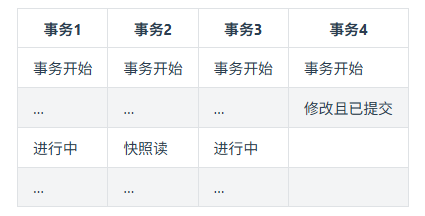

Read View不仅仅会通过一个列表trx_list来维护事务2执行快照读那刻系统正活跃的事务ID，还会有两个属性up_limit_id（记录trx_list列表中事务ID最小的ID），low_limit_id(记录trx_list列表中下一个事务ID，也就是目前已出现过的事务ID的最大值+1)；所以在这里例子中up_limit_id就是1，low_limit_id就是4 + 1 = 5，trx_list集合的值是1,3，Read View如下图


我们的例子中，只有事务4修改过该行记录，并在事务2执行快照读前，就提交了事务，所以当前该行当前数据的undo log如下图所示；我们的事务2在快照读该行记录的时候，就会拿该行记录的DB_TRX_ID去跟up_limit_id,low_limit_id和活跃事务ID列表(trx_list)进行比较，判断当前事务2能看到该记录的版本是哪个。


所以先拿该记录DB_TRX_ID字段记录的事务ID 4去跟Read View的的up_limit_id比较，看4是否小于up_limit_id(1)，所以不符合条件，继续判断 4 是否大于等于 low_limit_id(5)，也不符合条件，最后判断4是否处于trx_list中的活跃事务, 最后发现事务ID为4的事务不在当前活跃事务列表中, 符合可见性条件，所以事务4修改后提交的最新结果对事务2快照读时是可见的，所以事务2能读到的最新数据记录是事务4所提交的版本，而事务4提交的版本也是全局角度上最新的版本


也正是Read View生成时机的不同，从而造成RC,RR级别下快照读的结果的不同

## 14.3 MVCC相关问题
### 14.3.1 RR(可重复读)是如何在RC(读已提交)级的基础上解决不可重复读的？
当前读和快照读在RR级别下的区别：

表1:


表2:


而在表2这里的顺序中，事务B在事务A提交后的快照读和当前读都是实时的新数据400，这是为什么呢？

这里与上表的唯一区别仅仅是表1的事务B在事务A修改金额前快照读过一次金额数据，而表2的事务B在事务A修改金额前没有进行过快照读。

**所以我们知道事务中快照读的结果是非常依赖该事务首次出现快照读的地方，即某个事务中首次出现快照读的地方非常关键，它有决定该事务后续快照读结果的能力**

**我们这里测试的是更新，同时删除和更新也是一样的，如果事务B的快照读是在事务A操作之后进行的，事务B的快照读也是能读取到最新的数据的**

### 14.3.2 RC,RR级别下的InnoDB快照读有什么不同？
正是Read View生成时机的不同，从而造成RC,RR级别下快照读的结果的不同

- 在RR级别下的某个事务的对某条记录的第一次快照读会创建一个快照及Read View, 将当前系统活跃的其他事务记录起来，此后在调用快照读的时候，还是使用的是同一个Read View，所以只要当前事务在其他事务提交更新之前使用过快照读，那么之后的快照读使用的都是同一个Read View，所以对之后的修改不可见；
- 即RR级别下，快照读生成Read View时，Read View会记录此时所有其他活动事务的快照，这些事务的修改对于当前事务都是不可见的。而早于Read View创建的事务所做的修改均是可见
- 而在RC级别下的，事务中，每次快照读都会新生成一个快照和Read View, 这就是我们在RC级别下的事务中可以看到别的事务提交的更新的原因

**总之在RC隔离级别下，是每个快照读都会生成并获取最新的Read View；而在RR隔离级别下，则是同一个事务中的第一个快照读才会创建Read View, 之后的快照读获取的都是同一个Read View。**
# 十五、MySQL - 一条 SQL 的执行过程详解
> 天天和数据库打交道，一天能写上几十条 SQL 语句，但你知道我们的系统是如何和数据库交互的吗？MySQL 如何帮我们存储数据、又是如何帮我们管理事务？....是不是感觉真的除了写几个 「select * from dual」外基本脑子一片空白？这篇文章就将带你走进 MySQL 的世界，让你彻底了解系统到底是如何和 MySQL 交互的，MySQL 在接受到我们发送的 SQL 语句时又分别做了哪些事情。
## 15.1 MySQL 驱动
我们的系统在和 MySQL 数据库进行通信的时候，总不可能是平白无故的就能接收和发送请求，就算是你没有做什么操作，那总该是有其他的“人”帮我们做了一些事情，基本上使用过 MySQL 数据库的程序员多多少少都会知道 MySQL 驱动这个概念的。就是这个 MySQL 驱动在底层帮我们做了对数据库的连接，只有建立了连接了，才能够有后面的交互。看下图表示


这样的话，在系统和 MySQL 进行交互之前，MySQL 驱动会帮我们建立好连接，然后我们只需要发送 SQL 语句就可以执行 CRUD 了。一次 SQL 请求就会建立一个连接，多个请求就会建立多个连接，那么问题来了，我们系统肯定不是一个人在使用的，换句话说肯定是存在多个请求同时去争抢连接的情况。我们的 web 系统一般都是部署在 tomcat 容器中的，而 tomcat 是可以并发处理多个请求的，这就会导致多个请求会去建立多个连接，然后使用完再都去关闭，这样会有什么问题呢？如下图


java 系统在通过 MySQL 驱动和 MySQL 数据库连接的时候是基于 TCP/IP 协议的，所以如果每个请求都是新建连接和销毁连接，那这样势必会造成不必要的浪费和性能的下降，也就说上面的多线程请求的时候频繁的创建和销毁连接显然是不合理的。必然会大大降低我们系统的性能，但是如果给你提供一些固定的用来连接的线程，这样是不是不需要反复的创建和销毁连接了呢？相信懂行的朋友会会心一笑，没错，说的就是数据库连接池。

**数据库连接池**：维护一定的连接数，方便系统获取连接，使用就去池子中获取，用完放回去就可以了，我们不需要关心连接的创建与销毁，也不需要关心线程池是怎么去维护这些连接的。

常见的数据库连接池有 Druid、C3P0、DBCP，连接池实现原理在这里就不深入讨论了，采用连接池大大节省了不断创建与销毁线程的开销，这就是有名的「池化」思想，不管是线程池还是 HTTP 连接池，都能看到它的身影。

## 15.2 数据库连接池

到这里，我们已经知道的是我们的系统在访问 MySQL 数据库的时候，建立的连接并不是每次请求都会去创建的，而是从数据库连接池中去获取，这样就解决了因为反复的创建和销毁连接而带来的性能损耗问题了。不过这里有个小问题，业务系统是并发的，而 MySQL 接受请求的线程呢，只有一个？

其实 MySQL 的架构体系中也已经提供了这样的一个池子，也是数据库连池。双方都是通过数据库连接池来管理各个连接的，这样一方面线程之前不需要是争抢连接，更重要的是不需要反复的创建的销毁连接。


至此系统和 MySQL 数据库之间的连接问题已经说明清楚了。那么 MySQL 数据库中的这些连接是怎么来处理的，又是谁来处理呢？

## 15.3 网络连接必须由线程来处理
对计算基础稍微有一点了解的的同学都是知道的，网络中的连接都是由线程来处理的，所谓网络连接说白了就是一次请求，每次请求都会有相应的线程去处理的。也就是说对于 SQL 语句的请求在 MySQL 中是由一个个的线程去处理的。

对计算基础稍微有一点了解的的同学都是知道的，网络中的连接都是由线程来处理的，所谓网络连接说白了就是一次请求，每次请求都会有相应的线程去处理的。也就是说对于 SQL 语句的请求在 MySQL 中是由一个个的线程去处理的。


那这些线程会怎么去处理这些请求？会做哪些事情？

## 15.4 SQL 接口
MySQL 中处理请求的线程在获取到请求以后获取 SQL 语句去交给 SQL 接口去处理。

## 15.5 查询解析器
假如现在有这样的一个 SQL
```sql
SELECT stuName,age,sex FROM students WHERE id=1
```
但是这个 SQL 是写给我们人看的，机器哪里知道你在说什么？这个时候解析器就上场了。他会将 SQL 接口传递过来的 SQL 语句进行解析，翻译成 MySQL 自己能认识的语言，具体可以看MySQL - MySQL中SQL是如何解析的。


在 SQL 已经被解析成 MySQL 认识的样子的，那下一步是不是就是执行吗？理论上是这样子的，但是 MySQL 的强大远不止于此，他还会帮我们选择最优的查询路径。

什么叫最优查询路径？就是 MySQL 会按照自己认为的效率最高的方式去执行查询.

具体是怎么做到的呢？这就要说到 MySQL 的查询优化器了

## 15.6 MySQL 查询优化器

查询优化器内部具体怎么实现的我们不需要是关心，我需要知道的是 MySQL 会帮我去使用他自己认为的最好的方式去优化这条 SQL 语句，并生成一条条的执行计划，比如你创建了多个索引，MySQL 会依据成本最小原则来选择使用对应的索引，这里的成本主要包括两个方面, IO 成本和 CPU 成本

**IO 成本**: 即从磁盘把数据加载到内存的成本，默认情况下，读取数据页的 IO 成本是 1，MySQL 是以页的形式读取数据的，即当用到某个数据时，并不会只读取这个数据，而会把这个数据相邻的数据也一起读到内存中，这就是有名的程序局部性原理，所以 MySQL 每次会读取一整页，一页的成本就是 1。所以 IO 的成本主要和页的大小有关

**CPU 成本**：将数据读入内存后，还要检测数据是否满足条件和排序等 CPU 操作的成本，显然它与行数有关，默认情况下，检测记录的成本是 0.2。

MySQL 优化器 会计算 「IO 成本 + CPU」 成本最小的那个索引来执行


优化器执行选出最优索引等步骤后，会去调用存储引擎接口，开始去执行被 MySQL 解析过和优化过的 SQL 语句

## 15.7 存储引擎
查询优化器会调用存储引擎的接口，去执行 SQL，也就是说真正执行 SQL 的动作是在存储引擎中完成的。数据是被存放在内存或者是磁盘中的（存储引擎是一个非常重要的组件，后面会详细介绍）

## 15.8 执行器
执行器是一个非常重要的组件，因为前面那些组件的操作最终必须通过执行器去调用存储引擎接口才能被执行。执行器最终最根据一系列的执行计划去调用存储引擎的接口去完成 SQL 的执行


## 15.9 初识存储引擎
我们以一个更新的SQL语句来说明，SQL 如下
```sql
UPDATE students SET stuName = '小强' WHERE id = 1
```
当我们系统发出这样的查询去交给 MySQL 的时候，MySQL 会按照我们上面介绍的一系列的流程最终通过执行器调用存储引擎去执行，流程图就是上面那个。在执行这个 SQL 的时候 SQL 语句对应的数据要么是在内存中，要么是在磁盘中，如果直接在磁盘中操作，那这样的随机IO读写的速度肯定让人无法接受的，所以每次在执行 SQL 的时候都会将其数据加载到内存中，这块内存就是 InnoDB 中一个非常重要的组件：**缓冲池 Buffer Pool**

### 15.9.1 Buffer Pool

Buffer Pool （缓冲池）是 InnoDB 存储引擎中非常重要的内存结构，顾名思义，缓冲池其实就是类似 Redis 一样的作用，起到一个缓存的作用，因为我们都知道 MySQL 的数据最终是存储在磁盘中的，如果没有这个 Buffer Pool 那么我们每次的数据库请求都会磁盘中查找，这样必然会存在 IO 操作，这肯定是无法接受的。但是有了 Buffer Pool 就是我们第一次在查询的时候会将查询的结果存到 Buffer Pool 中，这样后面再有请求的时候就会先从缓冲池中去查询，如果没有再去磁盘中查找，然后在放到 Buffer Pool 中，如下图


按照上面的那幅图，这条 SQL 语句的执行步骤大致是这样子的

- innodb 存储引擎会在缓冲池中查找 id=1 的这条数据是否存在
- 发现不存在，那么就会去磁盘中加载，并将其存放在缓冲池中
- 该条记录会被加上一个独占锁（总不能你在修改的时候别人也在修改吧，这个机制本篇文章不重点介绍，以后会专门写文章来详细讲解）
### 15.9.2 undo 日志文件：记录数据被修改前的样子

undo 顾名思义，就是没有做，没发生的意思。undo log 就是没有发生事情（原本事情是什么）的一些日志

我们刚刚已经说了，在准备更新一条语句的时候，该条语句已经被加载到 Buffer pool 中了，实际上这里还有这样的操作，就是在将该条语句加载到 Buffer Pool 中的时候同时会往 undo 日志文件中插入一条日志，也就是将 id=1 的这条记录的原来的值记录下来。

**这样做的目的是什么？**

Innodb 存储引擎的最大特点就是支持事务，如果本次更新失败，也就是事务提交失败，那么该事务中的所有的操作都必须回滚到执行前的样子，也就是说当事务失败的时候，也不会对原始数据有影响，看图说话


这里说句额外话，其实 MySQL 也是一个系统，就好比我们平时开发的 java 的功能系统一样，MySQL 使用的是自己相应的语言开发出来的一套系统而已，它根据自己需要的功能去设计对应的功能，它即然能做到哪些事情，那么必然是设计者们当初这么定义或者是根据实际的场景变更演化而来的。所以大家放平心态，把 MySQL 当作一个系统去了解熟悉他。

到这一步，我们的执行的 SQL 语句已经被加载到 Buffer Pool 中了，然后开始更新这条语句，更新的操作实际是在Buffer Pool中执行的，那问题来了，按照我们平时开发的一套理论缓冲池中的数据和数据库中的数据不一致时候，我们就认为缓存中的数据是脏数据，那此时 Buffer Pool 中的数据岂不是成了脏数据？没错，目前这条数据就是脏数据，Buffer Pool 中的记录是小强 数据库中的记录是旺财 ，这种情况 MySQL是怎么处理的呢，继续往下看

### 15.9.3 redo 日志文件：记录数据被修改后的样子
除了从磁盘中加载文件和将操作前的记录保存到 undo 日志文件中，其他的操作是在内存中完成的，内存中的数据的特点就是：断电丢失。如果此时 MySQL 所在的服务器宕机了，那么 Buffer Pool 中的数据会全部丢失的。这个时候 redo 日志文件就需要来大显神通了

**画外音：redo 日志文件是 InnoDB 特有的，他是存储引擎级别的，不是 MySQL 级别的**

redo 记录的是数据修改之后的值，不管事务是否提交都会记录下来，例如，此时将要做的是update students set stuName='小强' where id=1; 那么这条操作就会被记录到 redo log buffer 中，啥？怎么又出来一个 redo log buffer ,很简单，MySQL 为了提高效率，所以将这些操作都先放在内存中去完成，然后会在某个时机将其持久化到磁盘中。


截至目前，我们应该都熟悉了 MySQL 的执行器调用存储引擎是怎么将一条 SQL 加载到缓冲池和记录哪些日志的，流程如下：

- 准备更新一条 SQL 语句
- MySQL（innodb）会先去缓冲池（BufferPool）中去查找这条数据，没找到就会去磁盘中查找，如果查找到就会将这条数据加载到缓冲池（BufferPool）中
- 在加载到 Buffer Pool 的同时，会将这条数据的原始记录保存到 undo 日志文件中
- innodb 会在 Buffer Pool 中执行更新操作
- 更新后的数据会记录在 redo log buffer 中

上面说的步骤都是在正常情况下的操作，但是程序的设计和优化并不仅是为了这些正常情况而去做的，也是为了**那些临界区和极端情况下出现的问题去优化**设计的

这个时候如果服务器宕机了，那么缓存中的数据还是丢失了。真烦，竟然数据总是丢失，那能不能不要放在内存中，直接保存到磁盘呢？很显然不行，因为在上面也已经介绍了，在内存中的操作目的是为了提高效率。

此时，如果 MySQL 真的宕机了，那么没关系的，因为 MySQL 会认为本次事务是失败的，所以数据依旧是更新前的样子，并不会有任何的影响。

好了，语句也更新好了那么需要将更新的值提交啊，也就是需要提交本次的事务了，因为只要事务成功提交了，才会将最后的变更保存到数据库，在提交事务前仍然会具有相关的其他操作

将 redo Log Buffer 中的数据持久化到磁盘中，就是将 redo log buffer 中的数据写入到 redo log 磁盘文件中，一般情况下，redo log Buffer 数据写入磁盘的策略是立即刷入磁盘（具体策略情况在下面小总结出会详细介绍）,上图


如果 redo log Buffer 刷入磁盘后，数据库服务器宕机了，那我们更新的数据怎么办？此时数据是在内存中，数据岂不是丢失了？不，这次数据就不会丢失了，因为 redo log buffer 中的数据已经被写入到磁盘了，已经被持久化了，就算数据库宕机了，在下次重启的时候 MySQL 也会将 redo 日志文件内容恢复到 Buffer Pool 中（这边我的理解是和 Redis 的持久化机制是差不多的，在 Redis 启动的时候会检查 rdb 或者是 aof 或者是两者都检查，根据持久化的文件来将数据恢复到内存中）

到此为止，**从执行器开始调用存储引擎接口做了哪些事情呢？**
- 准备更新一条 SQL 语句
- MySQL（innodb）会先去缓冲池（BufferPool）中去查找这条数据，没找到就会去磁盘中查找，如果查找到就会将这条数据加载到缓冲池（BufferPool）中
- 在加载到 Buffer Pool 的同时，会将这条数据的原始记录保存到 undo 日志文件中
- innodb 会在 Buffer Pool 中执行更新操作
- 更新后的数据会记录在 redo log buffer 中
- MySQL 提交事务的时候，会将 redo log buffer 中的数据写入到 redo 日志文件中 刷磁盘可以通过 innodb_flush_log_at_trx_commit 参数来设置
  - 值为 0 表示不刷入磁盘
  - 值为 1 表示立即刷入磁盘
  - 值为 2 表示先刷到 os cache
- mysql 重启的时候会将 redo 日志恢复到缓冲池中

截止到目前位置，MySQL 的执行器调用存储引擎的接口去执行【执行计划】提供的 SQL 的时候 InnoDB 做了哪些事情也就基本差不多了，但是这还没完。下面还需要介绍下 MySQL 级别的日志文件 bin log

### 15.9.4 bin log 日志文件：记录整个操作过程

上面介绍到的redo log是 InnoDB 存储引擎特有的日志文件，而bin log属于是 MySQL 级别的日志。redo log记录的东西是偏向于物理性质的，如：“对什么数据，做了什么修改”。bin log是偏向于逻辑性质的，类似于：“对 students 表中的 id 为 1 的记录做了更新操作” 两者的主要特点总结如下:

| 性质       | redo log                                                                 | bin log                                                                 |
|------------|--------------------------------------------------------------------------|-------------------------------------------------------------------------|
| 文件大小   | 大小固定，配置中可设置，一般默认足够                                     | 可通过 `max_binlog_size` 参数设置每个文件大小，但一般不建议修改         |
| 实现方式   | InnoDB 引擎层实现（仅 InnoDB 存储引擎独有）                              | MySQL 服务器层实现，所有引擎都可以使用                                  |
| 记录方式   | 采用循环写的方式记录，当写到结尾时，会回到开头循环写日志                 | 通过追加的方式记录，当文件大小大于给定值后，后续的日志会记录到新的文件上 |
| 使用场景   | 适用于崩溃恢复（crash-safe），类似于 Redis 的持久化特征                 | 适用于主从复制和数据恢复                                               |


**bin log文件是如何刷入磁盘的?**

bin log 的刷盘是有相关的策略的，策略可以通过sync_bin log来修改，默认为 0，表示先写入 os cache，也就是说在提交事务的时候，数据不会直接到磁盘中，这样如果宕机bin log数据仍然会丢失。所以建议将sync_bin log设置为 1 表示直接将数据写入到磁盘文件中。

刷入 bin log 有以下几种模式

- **STATMENT**

基于 SQL 语句的复制(statement-based replication, SBR)，每一条会修改数据的 SQL 语句会记录到 bin log 中

【优点】：不需要记录每一行的变化，减少了 bin log 日志量，节约了 IO , 从而提高了性能

【缺点】：在某些情况下会导致主从数据不一致，比如执行sysdate()、sleep()等

- **ROW**

基于行的复制(row-based replication, RBR)，不记录每条SQL语句的上下文信息，仅需记录哪条数据被修改了

【优点】：不会出现某些特定情况下的存储过程、或 function、或 trigger 的调用和触发无法被正确复制的问题

【缺点】：会产生大量的日志，尤其是 alter table 的时候会让日志暴涨

- **MIXED**

基于 STATMENT 和 ROW 两种模式的混合复制( mixed-based replication, MBR )，一般的复制使用 STATEMENT 模式保存 bin log ，对于 STATEMENT 模式无法复制的操作使用 ROW 模式保存 bin log

那既然bin log也是日志文件，那它是在什么时候记录数据的呢？


如果在数据被写入到bin log文件的时候，刚写完，数据库宕机了，数据会丢失吗？

首先可以确定的是，只要redo log最后没有 commit 标记，说明本次的事务一定是失败的。但是数据是没有丢失了，因为已经被记录到redo log的磁盘文件中了。在 MySQL 重启的时候，就会将 redo log 中的数据恢复（加载）到Buffer Pool中。但后面会检查事务状态，对于没有 commit 标记的事务，使用 undo log 回滚这些修改，从而撤销未提交的事务。

好了，到目前为止，一个更新操作我们基本介绍得差不多，但是你有没有感觉少了哪件事情还没有做？是不是你也发现这个时候被更新记录仅仅是在内存中执行的，哪怕是宕机又恢复了也仅仅是将更新后的记录加载到Buffer Pool中，这个时候 MySQL 数据库中的这条记录依旧是旧值，也就是说内存中的数据在我们看来依旧是脏数据，那这个时候怎么办呢？

其实 MySQL 会有一个后台线程，它会在某个时机将我们Buffer Pool中的脏数据刷到 MySQL 数据库中，这样就将内存和数据库的数据保持统一了。


### 15.9.5 本文总结
到此，关于Buffer Pool、Redo Log Buffer 和undo log、redo log、bin log 概念以及关系就基本差不多了。

我们再回顾下

- Buffer Pool 是 MySQL 的一个非常重要的组件，因为针对数据库的增删改操作都是在 Buffer Pool 中完成的
- Undo log 记录的是数据操作前的样子
- redo log 记录的是数据被操作后的样子（redo log 是 Innodb 存储引擎特有）
- bin log 记录的是整个操作记录（这个对于主从复制具有非常重要的意义）

从准备更新一条数据到事务的提交的流程描述

- 首先执行器根据 MySQL 的执行计划来查询数据，先是从缓存池中查询数据，如果没有就会去数据库中查询，如果查询到了就将其放到缓存池中
- 在数据被缓存到缓存池的同时，会写入 undo log 日志文件
- 更新的动作是在 BufferPool 中完成的，同时会将更新后的数据添加到 redo log buffer 中
- 完成以后就可以提交事务，在提交的同时会做以下三件事
  - 将redo log buffer中的数据刷入到 redo log 文件中
  - 将本次操作记录写入到 bin log文件中
  - 将 bin log 文件名字和更新内容在 bin log 中的位置记录到redo log中，同时在 redo log 最后添加 commit 标记

至此表示整个更新事务已经完成

## 15.10 补充

### 15.10.1. 为什么要有 binlog 和 redo log 两种？
- **分工不同**：  
  - **redo log** 是 InnoDB 引擎层实现的，主要目的是**崩溃恢复（crash-safe）**。它记录数据的物理修改（如“在某个数据页上做了修改”），采用循环写方式，性能高，确保事务的持久性（Durability）。  
  - **bin log** 是 MySQL 服务器层实现的，所有引擎都可使用，主要目的是**主从复制和数据恢复**。它记录逻辑操作（如“对某表某行执行了更新”），采用追加写方式，支持多种格式（STATEMENT/ROW/MIXED）。  
- **互补性**：  
  - redo log 保证了即使数据库宕机，已提交的事务数据不会丢失（通过重放 redo log 恢复）。  
  - bin log 提供了数据归档和同步能力，用于搭建主从复制、或执行点时间恢复（如误删数据后回滚）。  
- **历史原因**： InnoDB 是后来集成到 MySQL 的引擎，redo log 是 InnoDB 自带的机制；而 bin log 是 MySQL 原生的日志系统。两者结合既保证了性能，又实现了数据可移植性。

### 15.10.2. MySQL 默认是开启 bin log 的吗？
- **默认状态**： 在 MySQL 5.7 及以后版本中，**bin log 默认是关闭的**。需要手动在配置文件（如 `my.cnf` 或 `my.ini`）中设置 `log_bin = ON` 来开启。  
- **原因**： 关闭默认值是为了简化安装，但生产环境强烈建议开启，以便支持备份、复制和数据恢复。  
- 检查命令： 可以执行 `SHOW VARIABLES LIKE 'log_bin';`，如果返回 `ON` 则表示已开启。

### 15.10.3. binlog 以什么文件格式存储？一般存储在哪里？
- **文件格式**： bin log 以**二进制格式**存储，不能直接阅读，但可通过 `mysqlbinlog` 工具解析成可读的 SQL 语句。  
- **存储位置**：  
  - 默认存储在 MySQL 的**数据目录**下（由 `datadir` 参数指定），例如 Linux 系统通常是 `/var/lib/mysql`。  
  - 文件命名类似 `binlog.000001`、`binlog.000002`（递增编号），并有一个索引文件 `binlog.index` 记录所有 bin log 文件列表。  
  - 可以通过参数 `log_bin_basename` 自定义路径和文件名。

### 15.10.4. binlog 默认采用哪种模式？
- **默认模式**： 在 MySQL 5.7 及以后版本中，**默认的 bin log 格式是 ROW**。  
- **原因**： ROW 模式记录行级别的变更（如修改前/后的数据映像），比 STATEMENT 模式更安全，能避免主从数据不一致（如函数 `NOW()` 的执行时间差异）。但会产生更多日志量。  
- 更改方式： 可以通过设置 `binlog_format` 参数（值为 `STATEMENT`、`ROW` 或 `MIXED`）来调整。  
- 检查命令： `SHOW VARIABLES LIKE 'binlog_format';`

---

### 15.10.5. 疑问澄清
> “只要 redo log 最后没有 commit 标记，说明本次的事务一定是失败的。但是数据是没有丢失了，因为已经被记录到 redo log 的磁盘文件中了。在 MySQL 重启的时候，就会将 redo log 中的数据恢复（加载）到 Buffer Pool 中。”

**疑问**：如果事务失败了，redo log 还恢复到缓存中，这样不就不对了吗？  
**解释**： 这里存在一个关键误解——MySQL 的崩溃恢复机制会确保**只有已提交的事务**被应用，未提交的事务会被回滚。具体过程如下：

1. **redo log 的记录内容**：  
   - redo log 确实会记录所有数据修改（包括未提交的事务），因为它采用“先写日志”策略（WAL，Write-Ahead Logging），以提高性能。  
   - 但每条 redo log 会关联事务状态：有 `commit` 标记表示事务已提交；无标记表示事务未提交。

2. **崩溃恢复时的行为**：  
   - MySQL 重启后，会进入崩溃恢复阶段：  
     - **重做（Redo）阶段**：扫描 redo log，重放所有记录修改（包括未提交的）到数据页，确保数据页恢复到崩溃前的状态。  
     - **回滚（Undo）阶段**：检查事务状态，对于没有 `commit` 标记的事务，使用 **undo log** 回滚这些修改，从而撤销未提交的事务。  
   - 因此，最终效果是：**只有已提交的事务修改被保留，未提交的事务修改被完全撤销**。

3. **为什么需要先重做再回滚？**  
   - 这是为了简化恢复逻辑：先保证数据页物理一致性（通过 redo），再通过逻辑回滚（undo）保证事务原子性。  
   - 例如：如果事务 A 修改了数据但未提交，redo log 会记录修改。崩溃恢复时，先重做这个修改到数据页，然后因为事务 A 无 commit 标记，再通过 undo log 回滚该修改。数据最终保持一致。

**结论**：  
- 实际机制是安全的：未提交的事务数据不会永久化，恢复过程会确保数据库状态与事务逻辑一致。  
- **简单比喻**：就像写草稿时先全部写下，最后再检查并划掉错误部分；redo log 是“写草稿”，undo log 是“划掉错误”。

### 15.10.6 总结表格
| 性质       | redo log                                  | bin log                                      |
|------------|-------------------------------------------|----------------------------------------------|
| **设计目的** | 崩溃恢复（crash-safe）                   | 主从复制、数据恢复                           |
| **记录内容** | 物理修改（数据页变更）                   | 逻辑操作（SQL 语句或行变更）                 |
| **恢复机制** | 重做 + 回滚（通过 undo log）             | 通过重放 bin log 语句/行变更进行点时间恢复 |

## 15.11 补充：PostgreSQL 的事务核心与底层逻辑简介

简单来说，**PostgreSQL 没有独立的、像 InnoDB 那样的 redo log 和 undo log 文件**。它采用了一种更一体化的设计。

下面我们详细拆解 PostgreSQL 的事务实现机制，并与 MySQL 进行对比。

---

### PostgreSQL 的事务核心：WAL（预写式日志）

PostgreSQL 最核心的机制是 **WAL（Write-Ahead Logging，预写式日志）**。你可以把它看作是 **MySQL 中 redo log 的增强版和核心版**。

**核心原则：** 任何对数据文件的修改（脏页），**必须**先被记录到 WAL 中，之后才能被写入到数据文件本身。

这个原则确保了：
1.  **持久性（Durability）**：即使服务器崩溃，只要 WAL 记录被安全写入，就能通过“重放”WAL 来恢复尚未刷入数据文件的修改。
2.  **数据一致性**：它是实现崩溃恢复的基础。

#### WAL 的作用（对应 MySQL 的 redo log）
-   **崩溃恢复**： 和 MySQL 的 redo log 完全一样。数据库启动时，会检查数据文件和 WAL 文件。如果发现最后一次检查点之后的数据修改可能没完全刷盘，就会从上一个检查点开始重放 WAL 记录，将数据库恢复到崩溃前的一致状态。
-   **逻辑复制和流复制**： WAL 记录不仅包含物理页面变化，还包含足够的逻辑信息，可以用于构建主从复制（类似于 MySQL 的 binlog，但更底层、效率更高）。

---

### PostgreSQL 如何实现“回滚”？—— MVCC 与事务状态

这是 PostgreSQL 和 MySQL InnoDB **最根本的区别**。**PostgreSQL 没有独立的 undo log**。

**InnoDB 的方式（有 undo log）：**
-   当你要更新一行数据时，InnoDB 会先将这行数据的旧版本拷贝到 undo log 中。
-   然后在当前数据页上直接修改数据。
-   如果事务回滚，就从 undo log 中把旧版本数据拷贝回来。
-   如果事务提交，undo log 中的记录会在未来某个时刻被清理。

**PostgreSQL 的方式（无 undo log，纯 MVCC）：**
-   **多版本并发控制（MVCC）**：PostgreSQL 的 MVCC 实现是 **追加写（Append-Only）**。
-   当你要**更新或删除**一行数据时，PostgreSQL **不会在原地修改或删除这行数据**。
-   它会**插入一条新的数据行版本**，并将旧的行版本标记为过期。
-   **插入操作**就是直接插入一个新行。
-   **删除操作**实际上是标记旧行为已删除。

**那么，如何知道哪一行是有效的呢？**
这就是关键所在。PostgreSQL 的每一行数据（称为一个 tuple）都带有几个隐藏的系统字段：

-   `xmin`： 记录插入这条数据的事务 ID（XID）。只有事务 ID 大于等于 `xmin` 的事务才能看到这条数据。
-   `xmax`： 记录删除或更新这条数据的事务 ID。初始为 0（无效）。如果一条数据被更新，可以理解为旧数据的 `xmax` 被设置为其事务 ID，同时插入一条新的数据（新数据的 `xmin` 是该事务 ID）。
-   `ctid`： 表示该行数据在表中的物理位置。更新操作会改变这个值。

**事务回滚如何实现？**
因为 PostgreSQL 采用的是“追加写”，回滚一个事务变得异常简单：
-   如果一个事务需要回滚，PostgreSQL **什么都不用做**。
-   它只需要确保这个事务的 ID（XID）被标记为**已中止**。
-   之后，任何活动的事务在读取数据时，如果看到某行数据的 `xmin` 对应的是一个“已中止”的事务，就会忽略这行数据（因为它是由一个失败的事务创建的）。同样，如果看到 `xmax` 对应一个“已中止”的事务，就会认为删除/更新没有发生。
-   那些被“回滚”事务创建的、已经无效的数据行（称为“死元组”），会在后续由 **VACUUM** 进程清理掉。

---

### 整体流程对比：一个 UPDATE 语句

我们以 `UPDATE students SET stuName = '小强' WHERE id = 1;` 为例，对比两者的流程。

#### MySQL InnoDB 流程（简化）：
1.  执行器通过执行计划找到 `id=1` 的数据行。
2.  将旧数据行拷贝到 **undo log**。
3.  在 **Buffer Pool** 中**原地修改**该数据行，使其变为脏页。
4.  将本次修改记录到 **redo log buffer**。
5.  提交事务时：
    -   将 redo log buffer 刷入 **redo log file**。
    -   将本次操作记录到 **binlog**。
    -   在 redo log 中打上 `commit` 标记。
6.  后台线程稍后将脏页刷回**数据文件**。

#### PostgreSQL 流程（简化）：
1.  执行器通过执行计划找到 `id=1` 的当前数据行（Tuple）。
2.  **插入一条新的数据行**，其 `stuName` 为 `‘小强’`，`xmin` 设置为当前事务 ID。
3.  将旧数据行的 `xmax` 设置为当前事务 ID，标记其为过期。
4.  将 **“插入新行”** 和 **“标记旧行过期”** 这两个操作记录到 **WAL Buffer**。
5.  提交事务时：
    -   将 WAL Buffer 刷入 **WAL 文件**。
    -   更新事务提交日志（CLOG），标记当前事务为“已提交”。
6.  后台进程（如 Checkpointer）稍后将脏页（包括新插入的数据行）刷回**数据文件**。**VACUUM** 进程会清理那些已被标记为过期且对所有活动事务都不可见的旧数据行。

---

### 核心组件与 MySQL 对比总结

| 组件/概念 | PostgreSQL | MySQL InnoDB | 说明 |
| :--- | :--- | :--- | :--- |
| **重做日志** | **WAL（预写式日志）** | **redo log** | 两者核心作用相同：崩溃恢复。PostgreSQL 的 WAL 还直接用于物理复制。 |
| **回滚日志** | **无独立的 undo log** | **undo log** | PostgreSQL 通过 **MVCC + 追加写** 实现回滚，无需记录旧值到独立日志。旧数据就留在数据文件中。 |
| **二进制日志** | **无 binlog** | **binlog** | PostgreSQL 的逻辑复制基于 WAL 的逻辑解码或发布/订阅模式，不需要独立的 binlog。 |
| **数据修改方式** | **追加写（Append-Only）** | **原地更新（In-Place Update）** | 这是根本差异。PostgreSQL 插入新版本，InnoDB 直接修改并靠 undo log 保存旧版。 |
| **垃圾回收** | **VACUUM** 进程 | **Purge 线程** | 都是用来清理过期/回滚的数据。PostgreSQL 的 VACUUM 任务更重，因为它要清理数据文件中的“死元组”。 |
| **事务可见性判断** | 通过 `xmin`/`xmax` 和 **事务快照（Snapshot）** | 通过 **Read View** 和 **undo log 链** | 目的相同，实现不同。PostgreSQL 依赖数据行自带的事务 ID 和全局的事务状态记录（CLOG）。 |

### 流程图：PostgreSQL 的 UPDATE 和事务提交

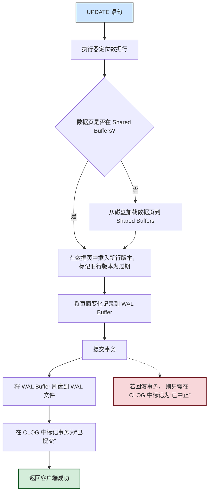

### 结论与优劣分析

-   **PostgreSQL 设计的优势**：
    -   **简化回滚**： 事务回滚非常快，几乎是零成本，因为它不需要去应用 undo log。
    -   **数据更安全**： 追加写减少了因部分页面写入（例如电源故障）导致的数据损坏风险。
    -   **高效的快照**： 可以很轻松地创建整个数据库的一致性快照（用于备份或分析）。

-   **PostgreSQL 设计的挑战（或需要优化的点）**：
    -   **表膨胀**： 由于更新/删除会留下死元组，如果 VACUUM 跟不上，会导致数据文件不断增大（表膨胀），需要精心配置自动 VACUUM。
    -   **写放大**： 一次更新可能带来更多的 I/O（写新行、写 WAL）。
    -   **需要定期维护**： 相比 InnoDB，PostgreSQL 更需要关注 VACUUM 和 ANALYZE 等维护操作。

总而言之，PostgreSQL 使用 **WAL 实现持久性和崩溃恢复**，使用 **基于追加写的 MVCC 来实现隔离性和原子性（回滚）**，这是一种与 MySQL InnoDB 截然不同但非常优雅和强大的设计哲学。

## 15.12 补充： postgresql可重复读隔离级别下实现防止幻读的方法

**简单直接的回答是：PostgreSQL 在可重复读隔离级别下，默认情况下不依赖于间隙锁来防止幻读。**

---

### MySQL 的方式：间隙锁

**首先要明确，MySQL在可重复读条件下防止幻读是需要我们在sql上进行处理的(使用当前读的查询操作)**

如您所说，MySQL InnoDB 在可重复读隔离级别下，通过 **间隙锁** 来防止幻读。
-   **工作原理**：当您执行一个范围查询（如 `SELECT ... WHERE id BETWEEN 10 AND 20 FOR UPDATE`）时，InnoDB 不仅会锁定表中存在的、满足条件的行（行锁），还会锁定这些行之间的“间隙”。这个“间隙”是一个左开右开的区间，例如 `(10, 15)`，`(15, 20)`，以及负无穷到10和20到正无穷的间隙。
-   **效果**：间隙锁会阻止其他事务在这个被锁定的间隙中**插入**任何新的数据。这样就从根本上防止了幻读——因为新行无法被插入到您查询过的范围内。
-   **代价**：间隙锁的代价是**降低了并发写入性能**，因为它是一种**悲观锁**，会阻塞其他事务的插入操作。

---

### PostgreSQL 的方式：序列化快照隔离

PostgreSQL 采用了完全不同的哲学。它的可重复读隔离级别是基于 **快照隔离** 实现的。

1.  **快照隔离如何工作**：
    -   当一个事务开始时，它会获取一个数据库的**一致性快照**。在这个事务的整个生命周期内，它看到的都是这个快照的数据状态，无论其他事务如何修改和提交。
    -   因此，**在只读场景下，幻读天然就被避免了**。因为事务 B 在事务 A 开始后插入的新行，对于事务 A 的快照来说是不可见的。事务 A 两次执行相同的查询，结果集必然是一致的。

2.  **写操作如何防止幻读？—— 通过冲突检测（乐观锁）**
    问题在于写操作。如果事务 A 要基于它的查询结果进行更新，而事务 B 插入了一行会影响 A 的查询条件的新数据，这时就需要一种机制来保证可序列化。

    PostgreSQL 使用一种名为 **序列化快照隔离** 的技术。它不是通过预先加锁（悲观）来阻止冲突，而是**允许冲突发生，但在提交时进行检测**。

    **具体流程：**
    -   **允许并发**：事务 A 和事务 B 可以同时进行，互不阻塞。事务 B 可以自由地插入新数据。
    -   **跟踪读写依赖**：PostgreSQL 会秘密地跟踪事务之间的“读写依赖关系”。例如，它记录了“事务 A 读取了满足某个条件的数据集，而事务 B 的写入（插入）影响了这个数据集”。
    -   **提交时检查**：当事务 A 或事务 B 要提交时，PostgreSQL 会检查这些依赖关系。如果发现这些并发事务的执行顺序会导致一个**不可序列化**的异常（例如幻读），那么**后提交的事务会被中止**，并抛出一个序列化失败错误（`SQLSTATE 40001`）。
    -   **应用程序处理**：应用程序捕获到这个错误后，需要**重试整个事务**。

---

### 对比总结

| 特性 | MySQL InnoDB (可重复读) | PostgreSQL (可重复读) |
| :--- | :--- | :--- |
| **防止幻读机制** | **间隙锁** | **序列化快照隔离** |
| **哲学** | **悲观并发控制** | **乐观并发控制** |
| **工作原理** | 预先锁定可能产生幻读的**数据范围**，阻止其他事务插入。 | 允许所有操作并发执行，但在提交时检测读写冲突。 |
| **对性能影响** | **写性能可能下降**：插入操作可能被间隙锁阻塞，导致等待。 | **读性能和并发度更高**：读写操作通常不会相互阻塞。 |
| **对应用影响** | 应用逻辑简单，数据库保证不会出现幻读，开发者无需处理异常。 | 应用逻辑需要更健壮，必须捕获并处理**序列化失败错误**，并实现事务重试逻辑。 |
| **锁的粒度** | 行锁 + 间隙锁 | 主要是行锁，用于写写冲突。没有专门的“间隙锁”概念。 |

### 一个简单的例子

假设有两个并发事务：

**事务 A (PostgreSQL)**
```sql
BEGIN ISOLATION LEVEL REPEATABLE READ; -- 开始可重复读事务
SELECT COUNT(*) FROM users WHERE age > 25; -- 假设返回 5
-- ... 执行一些其他逻辑 ...
UPDATE users SET status = 'verified' WHERE age > 25; -- 试图更新这5个人
COMMIT; -- 提交时，PostgreSQL 会检查是否有冲突
```

**事务 B (并发执行)**
```sql
INSERT INTO users (name, age) VALUES ('新用户', 30); -- 插入一个 age>25 的新用户
COMMIT;
```

-   **在 MySQL 中**：如果事务 A 的 `SELECT ... FOR UPDATE` 使用了间隙锁，事务 B 的 `INSERT` 会被阻塞，直到事务 A 提交。这保证了事务 A 的更新不会漏掉新插入的用户，但事务 B 需要等待。
-   **在 PostgreSQL 中**：
    -   如果事务 B 在事务 A **提交之前** 先提交了，那么当事务 A 提交时，PostgreSQL 会检测到冲突。它会中止事务 A 并抛出错误：“ERROR: could not serialize access due to read/write dependencies among transactions”。
    -   应用程序收到这个错误，会回滚事务 A 并自动重试。在重试时，事务 A 会基于新的快照重新开始，这时它会看到事务 B 插入的新用户，因此 `SELECT COUNT(*)` 会返回 6，随后的 `UPDATE` 也会更新 6 行。这样就保证了数据的一致性。

### 结论

所以，回到您的问题：**PostgreSQL 有间隙锁吗？**

**答案是没有。** 它不需要间隙锁。它通过一套更优雅、并发性更高的**乐观锁机制（序列化快照隔离）** 来在可重复读隔离级别下防止幻读。

这种设计的优点是**读性能和并发写入性能非常高**，因为操作很少相互阻塞。缺点是**将处理冲突的复杂性转移到了应用程序层**，开发者必须编写代码来处理事务回滚和重试。

# 十六、MySQL - MySQL中SQL是如何解析的
## 16.1 背景
数据库作为核心的基础组件，是需要重点保护的对象。任何一个线上的不慎操作，都有可能给数据库带来严重的故障，从而给业务造成巨大的损失。为了避免这种损失，一般会在管理上下功夫。比如为研发人员制定数据库开发规范；新上线的SQL，需要DBA进行审核；维护操作需要经过领导审批等等。而且如果希望能够有效地管理这些措施，需要有效的数据库培训，还需要DBA细心的进行SQL审核。很多中小型创业公司，可以通过设定规范、进行培训、完善审核流程来管理数据库。

随着美团的业务不断发展和壮大，上述措施的实施成本越来越高。如何更多的依赖技术手段，来提高效率，越来越受到重视。业界已有不少基于MySQL源码开发的SQL审核、优化建议等工具，极大的减轻了DBA的SQL审核负担。那么我们能否继续扩展MySQL的源码，来辅助DBA和研发人员来进一步提高效率呢？比如，更全面的SQL优化功能；多维度的慢查询分析；辅助故障分析等。要实现上述功能，其中最核心的技术之一就是SQL解析。

## 16.2 现状与场景
SQL解析是一项复杂的技术，一般都是由数据库厂商来掌握，当然也有公司专门提供<a href='https://www.sqlparser.com/'>SQL解析的API</a>。由于这几年MySQL数据库中间件的兴起，需要支持读写分离、分库分表等功能，就必须从SQL中抽出表名、库名以及相关字段的值。因此像Java语言编写的Druid，C语言编写的MaxScale，Go语言编写的Kingshard等，都会对SQL进行部分解析。而真正把SQL解析技术用于数据库维护的产品较少，主要有如下几个:

- 美团开源的<a href='https://github.com/Meituan-Dianping/SQLAdvisor'>SQLAdvisor</a>。它基于MySQL原生态词法解析，结合分析SQL中的where条件、聚合条件、多表Join关系给出索引优化建议。
- 去哪儿开源的Inception（原仓库已经删除，闭源了）。侧重于根据内置的规则，对SQL进行审核。
- 阿里的<a href ='https://developer.aliyun.com/article/218442'>Cloud DBA</a>。根据官方文档介绍，其也是提供SQL优化建议和改写。

上述产品都有非常合适的应用场景，在业界也被广泛使用。但是SQL解析的应用场景远远没有被充分发掘，比如：

- 基于表粒度的慢查询报表。比如，一个Schema中包含了属于不同业务线的数据表，那么从业务线的角度来说，其希望提供表粒度的慢查询报表。
- 生成SQL特征。将SQL语句中的值替换成问号，方便SQL归类。虽然可以使用正则表达式实现相同的功能，但是其Bug较多，可以参考pt-query-digest。比如pt-query-digest中，会把遇到的数字都替换成“?”，导致无法区别不同数字后缀的表。
- 高危操作确认与规避。比如，DBA不小心Drop数据表，而此类操作，目前还无有效的工具进行回滚，尤其是大表，其后果将是灾难性的。
- SQL合法性判断。为了安全、审计、控制等方面的原因，美团不会让研发人员直接操作数据库，而是提供RDS服务。尤其是对于数据变更，需要研发人员的上级主管进行业务上的审批。如果研发人员，写了一条语法错误的SQL，而RDS无法判断该SQL是否合法，就会造成不必要的沟通成本。

因此为了让所有有需要的业务都能方便的使用SQL解析功能，我们认为应该具有如下特性。

- 直接暴露SQL解析接口，使用尽量简单。比如，输入SQL，则输出表名、特征和优化建议。
- 接口的使用不依赖于特定的语言，否则维护和使用的代价太高。比如，以HTTP等方式提供服务。
千里之行，始于足下。下面我先介绍下SQL的解析原理。

## 16.3 SQL解析的原理
SQL解析与优化是属于编译器范畴，和C等其他语言的解析没有本质的区别。其中分为，词法分析、语法和语义分析、优化、执行代码生成。对应到MySQL的部分，如下图


### 16.3.1 词法分析
SQL解析由**词法分析**和**语法/语义分析**两个部分组成。词法分析主要是把输入转化成一个个Token。其中Token中包含Keyword（也称symbol）和非Keyword。例如，SQL语句 select username from userinfo，在分析之后，会得到4个Token，其中有2个Keyword，分别为select和from：


通常情况下，词法分析可以使用Flex来生成，但是MySQL并未使用该工具，而是手写了词法分析部分（据说是为了效率和灵活性，参考此文）。具体代码在sql/lex.h和sql/sql_lex.cc文件中。

MySQL中的Keyword定义在sql/lex.h中，如下为部分Keyword：
```sql
{ "&&",               SYM(AND_AND_SYM)},
{ "<",                SYM(LT)},
{ "<=",               SYM(LE)},
{ "<>",               SYM(NE)},
{ "!=",               SYM(NE)},
{ "=",                SYM(EQ)},
{ ">",                SYM(GT_SYM)},
{ ">=",               SYM(GE)},
{ "<<",               SYM(SHIFT_LEFT)},
{ ">>",               SYM(SHIFT_RIGHT)},
{ "<=>",              SYM(EQUAL_SYM)},
{ "ACCESSIBLE",       SYM(ACCESSIBLE_SYM)},
{ "ACTION",           SYM(ACTION)},
{ "ADD",              SYM(ADD)},
{ "AFTER",            SYM(AFTER_SYM)},
{ "AGAINST",          SYM(AGAINST)},
{ "AGGREGATE",        SYM(AGGREGATE_SYM)},
{ "ALL",              SYM(ALL)},
```
词法分析的核心代码在sql/sql_lex.c文件中的，MySQLLex→lex_one_Token，有兴趣的同学可以下载源码研究。

### 16.3.2 语法分析
语法分析就是生成语法树的过程。这是整个解析过程中最精华，最复杂的部分，不过这部分MySQL使用了Bison来完成。即使如此，如何设计合适的数据结构以及相关算法，去存储和遍历所有的信息，也是值得在这里研究的。

#### 16.3.2.1 语法分析树
SQL语句：
```sql
select username, ismale from userinfo where age > 20 and level > 5 and 1 = 1
```
会生成如下语法树。


对于未接触过编译器实现的同学，肯定会好奇如何才能生成这样的语法树。其背后的原理都是编译器的范畴，可以参考维基百科的一篇文章，以及该链接中的参考书籍。本人也是在学习MySQL源码过程中，阅读了部分内容。由于编译器涉及的内容过多，本人精力和时间有限，不做过多探究。从工程的角度来说，学会如何使用Bison去构建语法树，来解决实际问题，对我们的工作也许有更大帮助。下面我就以Bison为基础，探讨该过程。

#### 16.3.2.2 MySQL语法分析树生成过程

全部的源码在sql/sql_yacc.yy中，在MySQL5.6中有17K行左右代码。这里列出涉及到SQL：
```sql
select username, ismale from userinfo where age > 20 and level > 5 and 1 = 1 
```
解析过程的部分代码摘录出来。其实有了Bison之后，SQL解析的难度也没有想象的那么大。特别是这里给出了解析的脉络之后。
```sql
select /*select语句入口*/:
 
          select_init
 
          {
 
            LEX *lex= Lex;
 
            lex->sql_command= SQLCOM_SELECT;
 
          }
 
        ;
 
select_init:
          SELECT_SYM /*select 关键字*/ select_init2
 
        | '(' select_paren ')' union_opt
 
        ;
 
select_init2:
          select_part2
          {
            LEX *lex= Lex;
            SELECT_LEX * sel= lex->current_select;
            if (lex->current_select->set_braces(0))
            {
              my_parse_error(ER(ER_SYNTAX_ERROR));
              MYSQL_YYABORT;
            }
            if (sel->linkage == UNION_TYPE &&
                sel->master_unit()->first_select()->braces)
            {
              my_parse_error(ER(ER_SYNTAX_ERROR));
              MYSQL_YYABORT;
            }
          }
          union_clause
        ;
select_part2:
          {
            LEX *lex= Lex;
            SELECT_LEX *sel= lex->current_select;
            if (sel->linkage != UNION_TYPE)
              mysql_init_select(lex);
            lex->current_select->parsing_place= SELECT_LIST;
          }
  
          select_options select_item_list /*解析列名*/
          {
            Select->parsing_place= NO_MATTER;
          }
          select_into select_lock_type
        ;
 
select_into:
          opt_order_clause opt_limit_clause {}
        | into
        | select_from /*from 字句*/
        | into select_from
        | select_from into
        ;
select_from:
          FROM join_table_list /*解析表名*/ where_clause /*where字句*/ group_clause having_clause
          opt_order_clause opt_limit_clause procedure_analyse_clause
          {
            Select->context.table_list=
              Select->context.first_name_resolution_table=
                Select->table_list.first;
          }
        | FROM DUAL_SYM where_clause opt_limit_clause
          /* oracle compatibility: oracle always requires FROM clause,
             and DUAL is system table without fields.
             Is "SELECT 1 FROM DUAL" any better than "SELECT 1" ?
          Hmmm :) */
        ;
 
where_clause:
          /* empty */  { Select->where= 0; }
        | WHERE
          {
            Select->parsing_place= IN_WHERE;
          }
          expr /*各种表达式*/
          {
            SELECT_LEX *select= Select;
            select->where= $3;
            select->parsing_place= NO_MATTER;
            if ($3)
              $3->top_level_item();
          }
        ;
  
/* all possible expressions */
expr:
           | expr and expr %prec AND_SYM
          {
            /* See comments in rule expr: expr or expr */
            Item_cond_and *item1;
            Item_cond_and *item3;
            if (is_cond_and($1))
            {
              item1= (Item_cond_and*) $1;
              if (is_cond_and($3))
              {
                item3= (Item_cond_and*) $3;
                /*
                  (X1 AND X2) AND (Y1 AND Y2) ==> AND (X1, X2, Y1, Y2)
                */
                item3->add_at_head(item1->argument_list());
                $$ = $3;
              }
              else
              {
                /*
                  (X1 AND X2) AND Y ==> AND (X1, X2, Y)
                */
                item1->add($3);
                $$ = $1;
              }
            }
            else if (is_cond_and($3))
            {
              item3= (Item_cond_and*) $3;
              /*
                X AND (Y1 AND Y2) ==> AND (X, Y1, Y2)
              */
              item3->add_at_head($1);
              $$ = $3;
            }
            else
            {
              /* X AND Y */
              $$ = new (YYTHD->mem_root) Item_cond_and($1, $3);
              if ($$ == NULL)
                MYSQL_YYABORT;
            }
          }
```
在大家浏览上述代码的过程，会发现Bison中嵌入了C++的代码。通过C++代码，把解析到的信息存储到相关对象中。例如表信息会存储到TABLE_LIST中，order_list存储order by子句里的信息，where字句存储在Item中。有了这些信息，再辅助以相应的算法就可以对SQL进行更进一步的处理了。
#### 16.3.2.3 核心数据结构及其关系
在SQL解析中，最核心的结构是SELECT_LEX，其定义在sql/sql_lex.h中。下面仅列出与上述例子相关的部分。


上面图示中，列名username、ismale存储在item_list中，表名存储在table_list中，条件存储在where中。其中以where条件中的Item层次结构最深，表达也较为复杂，如下图所示。


## 16.4 SQL解析的应用
为了更深入的了解SQL解析器，这里给出2个应用SQL解析的例子。

### 16.4.1 无用条件去除
无用条件去除属于优化器的逻辑优化范畴，可以仅仅根据SQL本身以及表结构即可完成，其优化的情况也是较多的，代码在sql/sql_optimizer.cc文件中的remove_eq_conds函数。为了避免过于繁琐的描述，以及大段代码的粘贴，这里通过图来分析以下四种情况。

- a）1=1 and (m > 3 and n > 4)


- b）1=2 and (m > 3 and n > 4)


- c）1=1 or (m > 3 and n > 4)


- d）1=2 or (m > 3 and n > 4)


如果对其代码实现有兴趣的同学，需要对MySQL中的一个重要数据结构Item类有所了解。因为其比较复杂，所以<a href='https://dev.mysql.com/doc/dev/mysql-server/latest/'>MySQL官方文档</a>，专门介绍了Item类。阿里的MySQL小组，也有类似的<a href='https://www.orczhou.com/index.php/2012/11/mysql-innodb-source-code-optimization-1/'>文章</a>。如需更详细的了解，就需要去查看源码中sql/item_*等文件。
### 16.4.2 SQL特征生成
为了确保数据库，这一系统基础组件稳定、高效运行，业界有很多辅助系统。比如慢查询系统、中间件系统。这些系统采集、收到SQL之后，需要对SQL进行归类，以便统计信息或者应用相关策略。归类时，通常需要获取SQL特征。比如SQL:
```sql
select username, ismale from userinfo where age > 20 and level > 5；
```
SQL特征为：
```sql
select username, ismale from userinfo where age > ? and level > ? 
```
业界著名的慢查询分析工具pt-query-digest，通过正则表达式实现这个功能但是这类处理办法Bug较多。接下来就介绍如何使用SQL解析，完成SQL特征的生成。

SQL特征生成分两部分组成。

- a) 生成Token数组
- b) 根据Token数组，生成SQL特征

首先回顾在词法解析章节，我们介绍了SQL中的关键字，并且每个关键字都有一个16位的整数对应，而非关键字统一用ident表示，其也对应了一个16位整数。如下表：


| 标识（Token） | 对应整数 |
|--------------|---------|
| `select`     | 728     |
| `from`       | 448     |
| `where`      | 878     |
| `>`          | 463     |
| `?`          | 893     |
| `and`        | 272     |
| `ident`（非关键字） | 476     |

SQL特征生成过程

将原始SQL语句转换为特征的过程分为两步：
1. **生成Token数组**：通过词法解析，将SQL中的每个元素（如关键字、标识符、运算符）转换为对应的整数值。
2. **生成SQL特征**：基于Token数组，将非关键字部分统一格式化为 `ident:length:value` 的形式（其中 `length` 为值长度，`value` 为实际内容），关键字和运算符保持不变。

示例

- **原始SQL**：  
  `select username from userinfo where age > 20`
- **SQL特征**：  
  `select ident:length:value from ident:length:value where ident:length:value > ?`

已知Bug对比：pt-query-digest vs. SQL解析器

pt-query-digest 工具基于正则表达式生成SQL特征，存在解析错误；而基于SQL解析器的方法更准确。以下是典型Bug案例对比：

| 原始SQL | pt-query-digest 生成的特征 | SQL解析器生成的特征 | 问题描述 |
|--------|---------------------------|-------------------|---------|
| `select * from email_template2 where id = 1` | `select * from mail_template？ where id = ？` | `select * from email_template2 where id = ？` | pt-query-digest 错误截断表名（`email_template2` → `mail_template?`） |
| `REPLACE INTO a VALUES('INSERT INTO foo VALUES (1),(2)')` | `replace into a values(\'insert into foo values(?+)` | `replace into a values (?)` | pt-query-digest 处理嵌套SQL时格式混乱，而解析器正确归一化值部分 |

- **SQL解析器的优势**：  
  通过严格的词法/语法分析，能准确识别SQL结构，避免正则表达式带来的误判（如表名截断、嵌套语句解析错误）。
- **应用场景**：  
  SQL特征生成广泛用于SQL归类、性能分析工具（如pt-query-digest的替代方案），确保SQL归一化的可靠性。


## 16.5 学习建议
最近，在对SQL解析器和优化器探索的过程中，从一开始的茫然无措到有章可循，也总结了一些心得体会，在这里跟大家分享一下。

- 首先，阅读相关图书书籍。图书能给我们系统认识解析器和优化器的角度。但是针对MySQL的此类图书市面上很少，目前中文作品可以看一看《数据库查询优化器的艺术：原理解析与SQL性能优化》。
- 其次，要阅读源码，但是最好以某个版本为基础，比如MySQL5.6.23，因为SQL解析、优化部分的代码在不断变化。尤其是在跨越大的版本时，改动力度大。
- 再次，多使用GDB调试，验证自己的猜测，检验阅读质量。
- 最后，需要写相关代码验证，只有写出来了才能算真正的掌握。

# 十七、▶ 大厂实践 - 美团: MySQL索引原理及慢查询优化
> 目前常用的 SQL 优化方式包括但不限于：业务层优化、SQL逻辑优化、索引优化等。其中索引优化通常通过调整索引或新增索引从而达到 SQL 优化的目的，索引优化往往可以在短时间内产生非常巨大的效果。本文旨在以开发工程师的角度来解释数据库索引的原理和如何优化慢查询。
## 17.1 背景
MySQL凭借着出色的性能、低廉的成本、丰富的资源，已经成为绝大多数互联网公司的首选关系型数据库。虽然性能出色，但所谓“好马配好鞍”，如何能够更好的使用它，已经成为开发工程师的必修课，我们经常会从职位描述上看到诸如“精通MySQL”、“SQL语句优化”、“了解数据库原理”等要求。我们知道一般的应用系统，读写比例在10:1左右，而且插入操作和一般的更新操作很少出现性能问题，遇到最多的，也是最容易出问题的，还是一些复杂的查询操作，所以查询语句的优化显然是重中之重。

本人从2013年7月份起，一直在美团核心业务系统部做慢查询的优化工作，共计十余个系统，累计解决和积累了上百个慢查询案例。随着业务的复杂性提升，遇到的问题千奇百怪，五花八门，匪夷所思。本文旨在以开发工程师的角度来解释数据库索引的原理和如何优化慢查询。

## 17.2 一个慢查询引发的思考
```sql
select
   count(*) 
from
   task 
where
   status=2 
   and operator_id=20839 
   and operate_time>1371169729 
   and operate_time<1371174603 
   and type=2;
```
系统使用者反应有一个功能越来越慢，于是工程师找到了上面的SQL。

并且兴致冲冲的找到了我，“这个SQL需要优化，给我把每个字段都加上索引”。

我很惊讶，问道：“为什么需要每个字段都加上索引？”

“把查询的字段都加上索引会更快”，工程师信心满满。

“这种情况完全可以建一个联合索引，因为是最左前缀匹配，所以operate_time需要放到最后，而且还需要把其他相关的查询都拿来，需要做一个综合评估。”

“联合索引？最左前缀匹配？综合评估？”工程师不禁陷入了沉思。

多数情况下，我们知道索引能够提高查询效率，但应该如何建立索引？索引的顺序如何？许多人却只知道大概。其实理解这些概念并不难，而且索引的原理远没有想象的那么复杂。

## 17.3 MySQL索引原理
### 17.3.1 索引目的
索引的目的在于提高查询效率，可以类比字典，如果要查“mysql”这个单词，我们肯定需要定位到m字母，然后从下往下找到y字母，再找到剩下的sql。如果没有索引，那么你可能需要把所有单词看一遍才能找到你想要的，如果我想找到m开头的单词呢？或者ze开头的单词呢？是不是觉得如果没有索引，这个事情根本无法完成？

### 17.3.2 索引原理
除了词典，生活中随处可见索引的例子，如火车站的车次表、图书的目录等。它们的原理都是一样的，通过不断的缩小想要获得数据的范围来筛选出最终想要的结果，同时把随机的事件变成顺序的事件，也就是我们总是通过同一种查找方式来锁定数据。

数据库也是一样，但显然要复杂许多，因为不仅面临着等值查询，还有范围查询(>、<、between、in)、模糊查询(like)、并集查询(or)等等。数据库应该选择怎么样的方式来应对所有的问题呢？我们回想字典的例子，能不能把数据分成段，然后分段查询呢？最简单的如果1000条数据，1到100分成第一段，101到200分成第二段，201到300分成第三段……这样查第250条数据，只要找第三段就可以了，一下子去除了90%的无效数据。但如果是1千万的记录呢，分成几段比较好？稍有算法基础的同学会想到搜索树，其平均复杂度是lgN，具有不错的查询性能。但这里我们忽略了一个关键的问题，复杂度模型是基于每次相同的操作成本来考虑的，数据库实现比较复杂，数据保存在磁盘上，而为了提高性能，每次又可以把部分数据读入内存来计算，因为我们知道访问磁盘的成本大概是访问内存的十万倍左右，所以简单的搜索树难以满足复杂的应用场景。

### 17.3.3 磁盘IO与预读
前面提到了访问磁盘，那么这里先简单介绍一下磁盘IO和预读，磁盘读取数据靠的是机械运动，每次读取数据花费的时间可以分为寻道时间、旋转延迟、传输时间三个部分，寻道时间指的是磁臂移动到指定磁道所需要的时间，主流磁盘一般在5ms以下；旋转延迟就是我们经常听说的磁盘转速，比如一个磁盘7200转，表示每分钟能转7200次，也就是说1秒钟能转120次，旋转延迟就是1/120/2 = 4.17ms；传输时间指的是从磁盘读出或将数据写入磁盘的时间，一般在零点几毫秒，相对于前两个时间可以忽略不计。那么访问一次磁盘的时间，即一次磁盘IO的时间约等于5+4.17 = 9ms左右，听起来还挺不错的，但要知道一台500 -MIPS的机器每秒可以执行5亿条指令，因为指令依靠的是电的性质，换句话说执行一次IO的时间可以执行40万条指令，数据库动辄十万百万乃至千万级数据，每次9毫秒的时间，显然是个灾难。下图是计算机硬件延迟的对比图，供大家参考：


考虑到磁盘IO是非常高昂的操作，计算机操作系统做了一些优化，当一次IO时，不光把当前磁盘地址的数据，而是把相邻的数据也都读取到内存缓冲区内，因为局部预读性原理告诉我们，当计算机访问一个地址的数据的时候，与其相邻的数据也会很快被访问到。每一次IO读取的数据我们称之为一页(page)。具体一页有多大数据跟操作系统有关，一般为4k或8k，也就是我们读取一页内的数据时候，实际上才发生了一次IO，这个理论对于索引的数据结构设计非常有帮助。

### 17.3.4 索引的数据结构
前面讲了生活中索引的例子，索引的基本原理，数据库的复杂性，又讲了操作系统的相关知识，目的就是让大家了解，任何一种数据结构都不是凭空产生的，一定会有它的背景和使用场景，我们现在总结一下，我们需要这种数据结构能够做些什么，其实很简单，那就是：每次查找数据时把磁盘IO次数控制在一个很小的数量级，最好是常数数量级。那么我们就想到如果一个高度可控的多路搜索树是否能满足需求呢？就这样，b+树应运而生。

#### 17.3.4.1 详解b+树


如上图，是一颗b+树，关于b+树的定义可以参见B+树，这里只说一些重点，浅蓝色的块我们称之为一个磁盘块，可以看到每个磁盘块包含几个数据项（深蓝色所示）和指针（黄色所示），如磁盘块1包含数据项17和35，包含指针P1、P2、P3，P1表示小于17的磁盘块，P2表示在17和35之间的磁盘块，P3表示大于35的磁盘块。真实的数据存在于叶子节点即3、5、9、10、13、15、28、29、36、60、75、79、90、99。非叶子节点只不存储真实的数据，只存储指引搜索方向的数据项，如17、35并不真实存在于数据表中。

#### 17.3.4.2 b+树的查找过程
如图所示，如果要查找数据项29，那么首先会把磁盘块1由磁盘加载到内存，此时发生一次IO，在内存中用二分查找确定29在17和35之间，锁定磁盘块1的P2指针，内存时间因为非常短（相比磁盘的IO）可以忽略不计，通过磁盘块1的P2指针的磁盘地址把磁盘块3由磁盘加载到内存，发生第二次IO，29在26和30之间，锁定磁盘块3的P2指针，通过指针加载磁盘块8到内存，发生第三次IO，同时内存中做二分查找找到29，结束查询，总计三次IO。真实的情况是，3层的b+树可以表示上百万的数据，如果上百万的数据查找只需要三次IO，性能提高将是巨大的，如果没有索引，每个数据项都要发生一次IO，那么总共需要百万次的IO，显然成本非常非常高。

#### 17.3.4.3 b+树性质
1. 通过上面的分析，我们知道IO次数取决于b+数的高度h，假设当前数据表的数据为N，每个磁盘块的数据项的数量是m，则有h=㏒(m+1)N，当数据量N一定的情况下，m越大，h越小；而m = 磁盘块的大小 / 数据项的大小，磁盘块的大小也就是一个数据页的大小，是固定的，如果数据项占的空间越小，数据项的数量越多，树的高度越低。这就是为什么每个数据项，即索引字段要尽量的小，比如int占4字节，要比bigint8字节少一半。这也是为什么b+树要求把真实的数据放到叶子节点而不是内层节点，一旦放到内层节点，磁盘块的数据项会大幅度下降，导致树增高。当数据项等于1时将会退化成线性表。

关键点拆解：
- 1. **B+树的高度h和IO次数的关系**：
   - B+树是一种多路平衡树，每个节点（对应一个磁盘块）可以包含多个数据项（即索引键）。
   - 树的高度h表示从根节点到叶子节点需要经过的层数。查找数据时，需要从根节点开始，一层层向下访问节点，每访问一个节点就对应一次磁盘IO。
   - 所以，h越小，IO次数越少，查询越快。

- 2. **树高h的计算公式**：h ≈ ㏒(m+1)N
   - 这里，N是数据表中的总数据量。
   - m是每个磁盘块能容纳的数据项数量（例如，一个磁盘块可以放m个索引键）。
   - 这个公式的意思是：如果每个节点有m个孩子，那么树的高度大致是以m+1为底N的对数。m越大，对数值越小，即h越小。

- 3. **m如何决定？**
   - m = 磁盘块大小 / 数据项大小。
   - 磁盘块大小（通常为4KB或8KB）是固定的，由操作系统或数据库设置。
   - 数据项大小指的是每个索引键占用的空间（例如，一个整数索引占4字节，一个长整数占8字节）。
   - 因此，数据项越小，m就越大（因为一个磁盘块能放更多数据项）。

- 4. **为什么索引字段要小？**
   - 如果索引字段小（比如用int而不是bigint），数据项大小减小，m增大。
   - m增大，则h减小，树变矮，IO次数减少，查询更快。
   - 例如：假设磁盘块大小为4KB，如果数据项是int（4字节），m≈4000/4=1000；如果数据项是bigint（8字节），m≈4000/8=500。显然，m=1000时树更矮。

- 5. **为什么真实数据放在叶子节点？**
   - 在B+树中，内层节点（非叶子节点）只存储索引键和指向子节点的指针，而不存储完整的数据记录（如行数据）。
   - 叶子节点则存储索引键和真实数据（或指向数据的指针）。
   - 如果内层节点也存储真实数据，每个数据项会变大（因为包含了数据本身），那么m就会减小（一个磁盘块能放的键变少）。
   - m减小会导致h增大，树变高，IO次数增加。极端情况下，如果m=1（每个节点只能放一个数据项），B+树就退化成线性链表，查询效率骤降。

简单类比：

想象一本书的目录：
- B+树就像目录结构：章（根节点）→ 节（内层节点）→ 页码（叶子节点）。
- 如果目录项只包含标题和页码（数据项小），一页目录能列出很多章节，翻目录很快。
- 如果目录项还包含每节的内容摘要（数据项变大），一页目录只能列少量章节，你就得翻更多页才能找到目标，效率降低。


2. 当b+树的数据项是复合的数据结构，比如(name,age,sex)的时候，b+数是按照从左到右的顺序来建立搜索树的，比如当(张三,20,F)这样的数据来检索的时候，b+树会优先比较name来确定下一步的所搜方向，如果name相同再依次比较age和sex，最后得到检索的数据；但当(20,F)这样的没有name的数据来的时候，b+树就不知道下一步该查哪个节点，因为建立搜索树的时候name就是第一个比较因子，必须要先根据name来搜索才能知道下一步去哪里查询。比如当(张三,F)这样的数据来检索时，b+树可以用name来指定搜索方向，但下一个字段age的缺失，所以只能把名字等于张三的数据都找到，然后再匹配性别是F的数据了， 这个是非常重要的性质，即**索引的最左匹配特性**。


## 17.4 慢查询优化
关于MySQL索引原理是比较枯燥的东西，大家只需要有一个感性的认识，并不需要理解得非常透彻和深入。我们回头来看看一开始我们说的慢查询，了解完索引原理之后，大家是不是有什么想法呢？先总结一下索引的几大基本原则：

### 17.4.1 建索引的几大原则
1. 最左前缀匹配原则，非常重要的原则，mysql会一直向右匹配直到遇到范围查询`(>、<、between、like)`就停止匹配，比如`a = 1 and b = 2 and c > 3 and d = 4` 如果建立`(a,b,c,d)`顺序的索引，d是用不到索引的，如果建立`(a,b,d,c)`的索引则都可以用到，a,b,d的顺序可以任意调整。

2. =和in可以乱序，比如`a = 1 and b = 2 and c = 3 `建立`(a,b,c)`索引可以任意顺序，mysql的查询优化器会帮你优化成索引可以识别的形式。

3. 尽量选择区分度高的列作为索引，区分度的公式是`count(distinct col)/count(*)`，表示字段不重复的比例，比例越大我们扫描的记录数越少，唯一键的区分度是1，而一些状态、性别字段可能在大数据面前区分度就是0，那可能有人会问，这个比例有什么经验值吗？使用场景不同，这个值也很难确定，一般需要join的字段我们都要求是0.1以上，即平均1条扫描10条记录。

4. 索引列不能参与计算，保持列“干净”，比如`from_unixtime(create_time) = ’2014-05-29’`就不能使用到索引，原因很简单，b+树中存的都是数据表中的字段值，但进行检索时，需要把所有元素都应用函数才能比较，显然成本太大。所以语句应该写成`create_time = unix_timestamp(’2014-05-29’)`。

5. 尽量的扩展索引，不要新建索引。比如表中已经有a的索引，现在要加`(a,b)`的索引，那么只需要修改原来的索引即可。

**进一步解释：**
1. 联合索引不一定要求所有的索引参数都包含在查询条件中才能命中，而是依赖于最左匹配。

例如：一个(a,b,c)索引，那么`select * from s_user where a=1`;可以命中或者索引吗？答案是可以的
- **最左前缀原则**：联合索引 `(a,b,c)` 是按照列的顺序（a 第一，b 第二，c 第三）构建的 B+ 树索引。查询条件 `where a=1` 使用了索引的最左列 `a`，因此数据库可以利用索引进行快速查找（例如，等值查询或范围扫描）。
- 在 B+ 树中，索引会先按 `a` 排序，再按 `b` 和 `c` 排序。所以，当条件只包含 `a` 时，数据库可以快速定位到所有 `a=1` 的索引条目，从而减少磁盘 I/O，提升查询效率。

如果是`select * from s_user where b=1`则无法命中索引。
- **最左前缀原则**：联合索引 `(a,b,c)` 是按照列的顺序（a → b → c）构建的 B+ 树。索引数据首先按 `a` 排序，然后在 `a` 相同的情况下按 `b` 排序，最后按 `c` 排序。
- 查询条件 `where b=1` 没有使用最左列 `a`，因此数据库无法利用索引的排序特性来快速定位数据。它无法直接跳过 `a` 去查找 `b=1` 的行，因为索引的存储结构是基于 `a` 优先的。
- 在这种情况下，数据库优化器可能会选择：
  - **全表扫描**：直接扫描整个表的数据页，这比使用索引更高效（因为使用索引可能需要扫描整个索引树，然后再回表，反而更慢）。
  - **索引扫描（但无效）**：如果数据库支持索引跳跃扫描（如 Oracle），可能部分使用索引，但主流数据库如 MySQL 的 InnoDB 引擎通常不支持这种优化，所以会直接忽略索引。

**注意事项：**
- **回表操作**：您的查询是 `select *`，这意味着需要返回所有列的数据。如果 `s_user` 表还有其他列（除了 a、b、c 之外），那么索引 `(a,b,c)` 可能无法覆盖所有列（即不是覆盖索引）。在这种情况下，数据库在通过索引找到匹配的行后，还需要根据指针回表（访问主键索引或数据页）来获取其他列的值。这会增加额外的 I/O 开销，但索引仍然起到了加速查找的作用。
- **索引选择性**：如果列 `a` 的值分布均匀（即不同值较多），索引的效果会更好；如果 `a` 的值重复度高（如性别列），索引的优势可能不明显，但依然比全表扫描快。

2. 对`最左前缀匹配原则，非常重要的原则，mysql会一直向右匹配直到遇到范围查询(>、<、between、like)就停止匹配，比如a = 1 and b = 2 and c > 3 and d = 4 如果建立(a,b,c,d)顺序的索引，d是用不到索引的，如果建立(a,b,d,c)的索引则都可以用到，a,b,d的顺序可以任意调整。`进一步解释

是的，在 MySQL 中，索引确实按照列的顺序从左到右匹配，直到遇到范围查询（如 `>`、`<`、`BETWEEN`、`LIKE`）时，匹配会停止，这意味着范围查询右边的列无法使用索引进行进一步过滤。但范围查询本身仍然可以使用索引来加速查询。

- 1. 使用 `>`、`<`、`BETWEEN`、`LIKE` 这些查询就没办法用索引了吗？
  **不是的，这些范围查询本身可以使用索引**，但关键点在于：
  - **范围查询会限制索引的匹配深度**：当查询条件中包含范围查询时，索引只能用于加速到该范围查询列为止，其右边的列无法再利用索引进行高效过滤或排序。
  - **索引仍然有效**：例如，如果查询条件为 `a=1 AND b>2`，且索引是 `(a,b,c)`，那么索引可以用于快速定位 `a=1` 的行，并对 `b>2` 进行范围扫描，但列 `c` 无法使用索引（即使条件中有 `c=3`，也需要在扫描结果中进一步过滤）。
  - **例外情况**：对于 `LIKE` 查询，只有当模式不以通配符开头（如 `LIKE 'abc%'`）时，才能使用索引进行范围扫描；如果以通配符开头（如 `LIKE '%abc'`），则无法使用索引。

  **简单总结**：范围查询可以使用索引，但会“阻断”后续列的索引使用。索引的匹配停止在第一个范围查询列处。

- 2. 如果可以用，该怎么用？
  为了最大化索引的效率，您可以通过调整索引列的顺序或查询条件来让范围查询更好地利用索引。核心原则是：**将等值查询列放在索引的前面，范围查询列放在索引的后面**。

  结合例子：
  - **查询条件**：`a=1 AND b=2 AND c>3 AND d=4`
  - **原始索引 (a,b,c,d)**：索引匹配过程为：
    - 先匹配等值列 `a=1` 和 `b=2`（使用索引）。
    - 然后匹配范围列 `c>3`（使用索引进行范围扫描）。
    - 但列 `d=4` 无法使用索引，因为匹配已在 `c` 处停止。数据库需要在扫描 `c>3` 的结果中，再过滤 `d=4`（这可能导致回表或全索引扫描，效率较低）。
  - **优化后的索引 (a,b,d,c)**：索引匹配过程为：
    - 先匹配等值列 `a=1`、`b=2` 和 `d=4`（所有等值列都可用索引，因为它们在范围列 `c` 之前）。
    - 然后匹配范围列 `c>3`（使用索引进行范围扫描）。
    - 这样，所有列都能用到索引，查询效率更高。

  **如何应用这个原则**：
  - **设计索引时**：根据常见查询模式，将等值查询的列放在索引左边，范围查询的列放在右边。例如，如果查询经常包含 `a`、`b` 的等值条件和 `c` 的范围条件，那么索引 `(a,b,d,c)` 比 `(a,b,c,d)` 更优。
  - **调整查询条件**：如果可能，重写查询条件将等值条件放在前面。但通常索引设计更灵活。
  - **使用覆盖索引**：如果索引包含了查询所需的所有列，即使有范围查询，数据库也可能只扫描索引而避免回表，但范围查询右边的列依然无法用于过滤。

  **注意事项**：
  - 索引列的顺序可以调整，但需要权衡多个查询的需求。例如，索引 `(a,b,d,c)` 可能对其他查询（如只使用 `a` 和 `c` 的查询）不那么高效。
  - 在实际中，使用 `EXPLAIN` 命令分析执行计划，确认索引使用情况。
  - 对于 `LIKE`，确保使用前缀匹配（如 `LIKE 'abc%'`）才能利用索引。

- 3. 总结
  - 范围查询可以使用索引，但会阻止后续列的索引使用。
  - 通过将等值列前置、范围列后置来优化索引顺序，可以让更多列用到索引。
### 17.4.2 回到开始的慢查询
根据最左匹配原则，最开始的sql语句的索引应该是status、operator_id、type、operate_time的联合索引；其中status、operator_id、type的顺序可以颠倒，所以我才会说，把这个表的所有相关查询都找到，会综合分析；比如还有如下查询：
```sql
select * from task where status = 0 and type = 12 limit 10;
select count(*) from task where status = 0 ;
```
那么索引建立成`(status,type,operator_id,operate_time)`就是非常正确的，因为可以覆盖到所有情况。这个就是利用了索引的最左匹配的原则

### 17.4.3 查询优化神器 - explain命令
> 关于explain命令相信大家并不陌生，具体用法和字段含义可以参考官网explain-output，这里需要强调rows是核心指标，绝大部分rows小的语句执行一定很快（有例外，下面会讲到）。所以优化语句基本上都是在优化rows。

#### 17.4.3.1 慢查询优化基本步骤
0. 先运行看看是否真的很慢，注意设置SQL_NO_CACHE

1. where条件单表查，锁定最小返回记录表。这句话的意思是把查询语句的where都应用到表中返回的记录数最小的表开始查起，单表每个字段分别查询，看哪个字段的区分度最高

2. explain查看执行计划，是否与1预期一致（从锁定记录较少的表开始查询）

3. order by limit 形式的sql语句让排序的表优先查

4. 了解业务方使用场景

5. 加索引时参照建索引的几大原则

6. 观察结果，不符合预期继续从0分析
### 17.4.4 几个慢查询案例
下面几个例子详细解释了如何分析和优化慢查询。

#### 17.4.4.1 复杂语句写法
很多情况下，我们写SQL只是为了实现功能，这只是第一步，不同的语句书写方式对于效率往往有本质的差别，这要求我们对mysql的执行计划和索引原则有非常清楚的认识，请看下面的语句：
```sql
select
   distinct cert.emp_id 
from
   cm_log cl 
inner join
   (
      select
         emp.id as emp_id,
         emp_cert.id as cert_id 
      from
         employee emp 
      left join
         emp_certificate emp_cert 
            on emp.id = emp_cert.emp_id 
      where
         emp.is_deleted=0
   ) cert 
      on (
         cl.ref_table='Employee' 
         and cl.ref_oid= cert.emp_id
      ) 
      or (
         cl.ref_table='EmpCertificate' 
         and cl.ref_oid= cert.cert_id
      ) 
where
   cl.last_upd_date >='2013-11-07 15:03:00' 
   and cl.last_upd_date<='2013-11-08 16:00:00';
```
0. 先运行一下，53条记录 1.87秒，又没有用聚合语句，比较慢
```sql
53 rows in set (1.87 sec)
```
1. explain
```sql
+----+-------------+------------+-------+---------------------------------+-----------------------+---------+-------------------+-------+--------------------------------+
| id | select_type | table      | type  | possible_keys                   | key                   | key_len | ref               | rows  | Extra                          |
+----+-------------+------------+-------+---------------------------------+-----------------------+---------+-------------------+-------+--------------------------------+
|  1 | PRIMARY     | cl         | range | cm_log_cls_id,idx_last_upd_date | idx_last_upd_date     | 8       | NULL              |   379 | Using where; Using temporary   |
|  1 | PRIMARY     | <derived2> | ALL   | NULL                            | NULL                  | NULL    | NULL              | 63727 | Using where; Using join buffer |
|  2 | DERIVED     | emp        | ALL   | NULL                            | NULL                  | NULL    | NULL              | 13317 | Using where                    |
|  2 | DERIVED     | emp_cert   | ref   | emp_certificate_empid           | emp_certificate_empid | 4       | meituanorg.emp.id |     1 | Using index                    |
+----+-------------+------------+-------+---------------------------------+-----------------------+---------+-------------------+-------+--------------------------------+
```
2. **简述一下执行计划**，首先mysql根据idx_last_upd_date索引扫描cm_log表获得379条记录；然后查表扫描了63727条记录，分为两部分，derived表示构造表，也就是不存在的表，可以简单理解成是一个语句形成的结果集，后面的数字表示语句的ID。derived2表示的是ID = 2的查询构造了虚拟表，并且返回了63727条记录。我们再来看看ID = 2的语句究竟做了写什么返回了这么大量的数据，首先全表扫描employee表13317条记录，然后根据索引emp_certificate_empid关联emp_certificate表，rows = 1表示，每个关联都只锁定了一条记录，效率比较高。获得后，再和cm_log的379条记录根据规则关联。从执行过程上可以看出返回了太多的数据，返回的数据绝大部分cm_log都用不到，因为cm_log只锁定了379条记录。

3. **如何优化呢**？可以看到我们在运行完后还是要和cm_log做join,那么我们能不能之前和cm_log做join呢？仔细分析语句不难发现，其基本思想是如果cm_log的ref_table是EmpCertificate就关联emp_certificate表，如果ref_table是Employee就关联employee表，我们完全可以拆成两部分，并用`union`连接起来，注意这里用`union`，而不用`union all`是因为原语句有“distinct”来得到唯一的记录，而union恰好具备了这种功能。如果原语句中没有distinct不需要去重，我们就可以直接使用union all了，因为使用union需要去重的动作，会影响SQL性能。

优化过的语句如下：
```sql
select
   emp.id 
from
   cm_log cl 
inner join
   employee emp 
      on cl.ref_table = 'Employee' 
      and cl.ref_oid = emp.id  
where
   cl.last_upd_date >='2013-11-07 15:03:00' 
   and cl.last_upd_date<='2013-11-08 16:00:00' 
   and emp.is_deleted = 0  
union
select
   emp.id 
from
   cm_log cl 
inner join
   emp_certificate ec 
      on cl.ref_table = 'EmpCertificate' 
      and cl.ref_oid = ec.id  
inner join
   employee emp 
      on emp.id = ec.emp_id  
where
   cl.last_upd_date >='2013-11-07 15:03:00' 
   and cl.last_upd_date<='2013-11-08 16:00:00' 
   and emp.is_deleted = 0
```
不需要了解业务场景，只需要改造的语句和改造之前的语句保持结果一致

现有索引可以满足，不需要建索引

用改造后的语句实验一下，只需要10ms 降低了近200倍！
```sql
+----+--------------+------------+--------+---------------------------------+-------------------+---------+-----------------------+------+-------------+
| id | select_type  | table      | type   | possible_keys                   | key               | key_len | ref                   | rows | Extra       |
+----+--------------+------------+--------+---------------------------------+-------------------+---------+-----------------------+------+-------------+
|  1 | PRIMARY      | cl         | range  | cm_log_cls_id,idx_last_upd_date | idx_last_upd_date | 8       | NULL                  |  379 | Using where |
|  1 | PRIMARY      | emp        | eq_ref | PRIMARY                         | PRIMARY           | 4       | meituanorg.cl.ref_oid |    1 | Using where |
|  2 | UNION        | cl         | range  | cm_log_cls_id,idx_last_upd_date | idx_last_upd_date | 8       | NULL                  |  379 | Using where |
|  2 | UNION        | ec         | eq_ref | PRIMARY,emp_certificate_empid   | PRIMARY           | 4       | meituanorg.cl.ref_oid |    1 |             |
|  2 | UNION        | emp        | eq_ref | PRIMARY                         | PRIMARY           | 4       | meituanorg.ec.emp_id  |    1 | Using where |
| NULL | UNION RESULT | <union1,2> | ALL    | NULL                            | NULL              | NULL    | NULL                  | NULL |             |
+----+--------------+------------+--------+---------------------------------+-------------------+---------+-----------------------+------+-------------+
53 rows in set (0.01 sec)
```
#### 17.4.4.2 明确应用场景
举这个例子的目的在于颠覆我们对列的区分度的认知，一般上我们认为区分度越高的列，越容易锁定更少的记录，但在一些特殊的情况下，这种理论是有局限性的。
```sql
select
   * 
from
   stage_poi sp 
where
   sp.accurate_result=1 
   and (
      sp.sync_status=0 
      or sp.sync_status=2 
      or sp.sync_status=4
   );
```
0. 先看看运行多长时间,951条数据6.22秒，真的很慢。
```sql
951 rows in set (6.22 sec)
```
1. 先explain，rows达到了361万，type = ALL表明是全表扫描。
```sql
+----+-------------+-------+------+---------------+------+---------+------+---------+-------------+
| id | select_type | table | type | possible_keys | key  | key_len | ref  | rows    | Extra       |
+----+-------------+-------+------+---------------+------+---------+------+---------+-------------+
|  1 | SIMPLE      | sp    | ALL  | NULL          | NULL | NULL    | NULL | 3613155 | Using where |
+----+-------------+-------+------+---------------+------+---------+------+---------+-------------+
```
2. 所有字段都应用查询返回记录数，因为是单表查询 0已经做过了951条。

3. 让explain的rows 尽量逼近951。

看一下accurate_result = 1的记录数：
```sql
select count(*),accurate_result from stage_poi  group by accurate_result;
+----------+-----------------+
| count(*) | accurate_result |
+----------+-----------------+
|     1023 |              -1 |
|  2114655 |               0 |
|   972815 |               1 |
+----------+-----------------+
```
我们看到accurate_result这个字段的区分度非常低，整个表只有-1,0,1三个值，加上索引也无法锁定特别少量的数据。

再看一下sync_status字段的情况：
```sql
select count(*),sync_status from stage_poi  group by sync_status;
+----------+-------------+
| count(*) | sync_status |
+----------+-------------+
|     3080 |           0 |
|  3085413 |           3 |
+----------+-------------+
```
同样的区分度也很低，根据理论，也不适合建立索引。

问题分析到这，好像得出了这个表无法优化的结论，两个列的区分度都很低，即便加上索引也只能适应这种情况，很难做普遍性的优化，比如当sync_status 0、3分布的很平均，那么锁定记录也是百万级别的。

4. **找业务方去沟通，看看使用场景**。业务方是这么来使用这个SQL语句的，每隔五分钟会扫描符合条件的数据，处理完成后把sync_status这个字段变成1,五分钟符合条件的记录数并不会太多，1000个左右。了解了业务方的使用场景后，优化这个SQL就变得简单了，因为业务方保证了数据的不平衡，如果加上索引可以过滤掉绝大部分不需要的数据。

5. 根据建立索引规则，使用如下语句建立索引
```sql
alter table stage_poi add index idx_acc_status(accurate_result,sync_status);
```
6. 察预期结果,发现只需要200ms，快了30多倍。
```sql
952 rows in set (0.20 sec)
```
我们再来回顾一下分析问题的过程，单表查询相对来说比较好优化，大部分时候只需要把where条件里面的字段依照规则加上索引就好，如果只是这种“无脑”优化的话，显然一些区分度非常低的列，不应该加索引的列也会被加上索引，这样会对插入、更新性能造成严重的影响，同时也有可能影响其它的查询语句。所以我们第4步调查SQL的使用场景非常关键，我们只有知道这个业务场景，才能更好地辅助我们更好的分析和优化查询语句。

#### 17.4.4.3 无法优化的语句
```sql
select
   c.id,
   c.name,
   c.position,
   c.sex,
   c.phone,
   c.office_phone,
   c.feature_info,
   c.birthday,
   c.creator_id,
   c.is_keyperson,
   c.giveup_reason,
   c.status,
   c.data_source,
   from_unixtime(c.created_time) as created_time,
   from_unixtime(c.last_modified) as last_modified,
   c.last_modified_user_id  
from
   contact c  
inner join
   contact_branch cb 
      on  c.id = cb.contact_id  
inner join
   branch_user bu 
      on  cb.branch_id = bu.branch_id 
      and bu.status in (
         1,
      1)  
   inner join
      org_emp_info oei 
         on  oei.data_id = bu.user_id 
         and oei.node_left >= 2875 
         and oei.node_right <= 10802 
         and oei.org_category = - 1  
   order by
      c.created_time desc  limit 0 ,
      10;
```
还是几个步骤。

0. 先看语句运行多长时间，10条记录用了13秒，已经不可忍受。
```sql
10 rows in set (13.06 sec)
```
1. explain
```sql
+----+-------------+-------+--------+-------------------------------------+-------------------------+---------+--------------------------+------+----------------------------------------------+
| id | select_type | table | type   | possible_keys                       | key                     | key_len | ref                      | rows | Extra                                        |
+----+-------------+-------+--------+-------------------------------------+-------------------------+---------+--------------------------+------+----------------------------------------------+
|  1 | SIMPLE      | oei   | ref    | idx_category_left_right,idx_data_id | idx_category_left_right | 5       | const                    | 8849 | Using where; Using temporary; Using filesort |
|  1 | SIMPLE      | bu    | ref    | PRIMARY,idx_userid_status           | idx_userid_status       | 4       | meituancrm.oei.data_id   |   76 | Using where; Using index                     |
|  1 | SIMPLE      | cb    | ref    | idx_branch_id,idx_contact_branch_id | idx_branch_id           | 4       | meituancrm.bu.branch_id  |    1 |                                              |
|  1 | SIMPLE      | c     | eq_ref | PRIMARY                             | PRIMARY                 | 108     | meituancrm.cb.contact_id |    1 |                                              |
+----+-------------+-------+--------+-------------------------------------+-------------------------+---------+--------------------------+------+----------------------------------------------+
```
从执行计划上看，mysql先查org_emp_info表扫描8849记录，再用索引idx_userid_status关联branch_user表，再用索引idx_branch_id关联contact_branch表，最后主键关联contact表。

rows返回的都非常少，看不到有什么异常情况。我们在看一下语句，发现后面有order by + limit组合，会不会是排序量太大搞的？于是我们简化SQL，去掉后面的order by 和 limit，看看到底用了多少记录来排序。
```sql
select
  count(*)
from
   contact c  
inner join
   contact_branch cb 
      on  c.id = cb.contact_id  
inner join
   branch_user bu 
      on  cb.branch_id = bu.branch_id 
      and bu.status in (
         1,
      1)  
   inner join
      org_emp_info oei 
         on  oei.data_id = bu.user_id 
         and oei.node_left >= 2875 
         and oei.node_right <= 10802 
         and oei.org_category = - 1  
+----------+
| count(*) |
+----------+
|   778878 |
+----------+
1 row in set (5.19 sec)
```
发现排序之前居然锁定了778878条记录，如果针对70万的结果集排序，将是灾难性的，怪不得这么慢，那我们能不能换个思路，先根据contact的created_time排序，再来join会不会比较快呢？

于是改造成下面的语句，也可以用straight_join来优化：
```sql
select
   c.id,
   c.name,
   c.position,
   c.sex,
   c.phone,
   c.office_phone,
   c.feature_info,
   c.birthday,
   c.creator_id,
   c.is_keyperson,
   c.giveup_reason,
   c.status,
   c.data_source,
   from_unixtime(c.created_time) as created_time,
   from_unixtime(c.last_modified) as last_modified,
   c.last_modified_user_id   
from
   contact c  
where
   exists (
      select
         1 
      from
         contact_branch cb  
      inner join
         branch_user bu        
            on  cb.branch_id = bu.branch_id        
            and bu.status in (
               1,
            2)      
         inner join
            org_emp_info oei           
               on  oei.data_id = bu.user_id           
               and oei.node_left >= 2875           
               and oei.node_right <= 10802           
               and oei.org_category = - 1      
         where
            c.id = cb.contact_id    
      )    
   order by
      c.created_time desc  limit 0 ,
      10;
```
验证一下效果 预计在1ms内，提升了13000多倍！
```sql
10 rows in set (0.00 sec)
```
本以为至此大工告成，但我们在前面的分析中漏了一个细节，先排序再join和先join再排序理论上开销是一样的，为何提升这么多是因为有一个limit！大致执行过程是：mysql先按索引排序得到前10条记录，然后再去join过滤，当发现不够10条的时候，再次去10条，再次join，这显然在内层join过滤的数据非常多的时候，将是灾难的，极端情况，内层一条数据都找不到，mysql还傻乎乎的每次取10条，几乎遍历了这个数据表！

用不同参数的SQL试验下：
```sql
select
   sql_no_cache   c.id,
   c.name,
   c.position,
   c.sex,
   c.phone,
   c.office_phone,
   c.feature_info,
   c.birthday,
   c.creator_id,
   c.is_keyperson,
   c.giveup_reason,
   c.status,
   c.data_source,
   from_unixtime(c.created_time) as created_time,
   from_unixtime(c.last_modified) as last_modified,
   c.last_modified_user_id    
from
   contact c   
where
   exists (
      select
         1        
      from
         contact_branch cb         
      inner join
         branch_user bu                     
            on  cb.branch_id = bu.branch_id                     
            and bu.status in (
               1,
            2)                
         inner join
            org_emp_info oei                           
               on  oei.data_id = bu.user_id                           
               and oei.node_left >= 2875                           
               and oei.node_right <= 2875                           
               and oei.org_category = - 1                
         where
            c.id = cb.contact_id           
      )        
   order by
      c.created_time desc  limit 0 ,
      10;
Empty set (2 min 18.99 sec)
```
2 min 18.99 sec！比之前的情况还糟糕很多。由于mysql的nested loop机制，遇到这种情况，基本是无法优化的。这条语句最终也只能交给应用系统去优化自己的逻辑了。

**通过这个例子我们可以看到，并不是所有语句都能优化，而往往我们优化时，由于SQL用例回归时落掉一些极端情况，会造成比原来还严重的后果。所以，第一：不要指望所有语句都能通过SQL优化，第二：不要过于自信，只针对具体case来优化，而忽略了更复杂的情况。**

慢查询的案例就分析到这儿，以上只是一些比较典型的案例。我们在优化过程中遇到过超过1000行，涉及到16个表join的“垃圾SQL”，也遇到过线上线下数据库差异导致应用直接被慢查询拖死，也遇到过varchar等值比较没有写单引号，还遇到过笛卡尔积查询直接把从库搞死。再多的案例其实也只是一些经验的积累，如果我们熟悉查询优化器、索引的内部原理，那么分析这些案例就变得特别简单了。
## 17.5 写在后面的话
本文以一个慢查询案例引入了MySQL索引原理、优化慢查询的一些方法论;并针对遇到的典型案例做了详细的分析。其实做了这么长时间的语句优化后才发现，任何数据库层面的优化都抵不上应用系统的优化，同样是MySQL，可以用来支撑Google/FaceBook/Taobao应用，但可能连你的个人网站都撑不住。套用最近比较流行的话：“查询容易，优化不易，且写且珍惜！”

# 十八、大厂实践 - 美团: SQL优化工具SQLAdvisor开源
> 正如你在前文中看到的可以通过调整索引或新增索引的索引优化方式，从而达到 SQL 优化的目的。如果能够将索引优化转化成工具化、标准化的流程，减少人工介入的工作量，无疑会大大提高DBA的工作效率。本文主要介绍SQL优化的开源工具SQLAdvisor。
## 18.1 背景
在数据库运维过程中，优化 SQL 是 DBA 团队的日常任务。例行 SQL 优化，不仅可以提升程序性能，还能够降低线上故障的概率。

目前常用的 SQL 优化方式包括但不限于：业务层优化、SQL逻辑优化、索引优化等。其中索引优化通常通过调整索引或新增索引从而达到 SQL 优化的目的。索引优化往往可以在短时间内产生非常巨大的效果。如果能够将索引优化转化成工具化、标准化的流程，减少人工介入的工作量，无疑会大大提高DBA的工作效率。

SQLAdvisor 是由美团点评公司北京DBA团队开发维护的 SQL 优化工具：输入SQL，输出索引优化建议。 它基于 MySQL 原生词法解析，再结合 SQL 中的 where 条件以及字段选择度、聚合条件、多表 Join 关系等最终输出最优的索引优化建议。目前 SQLAdvisor 在公司内部大量使用，较为成熟、稳定。

现在，我们非常高兴地将 SQLAdvisor 开源，项目 GitHub 地址：https://github.com/Meituan-Dianping/SQLAdvisor 。我们已经把相关开发工作全面转到 GitHub 上，开源版本和内部使用版本保持完全一致。希望与业内有类似需求的团队，一起打造一款优秀的 SQL 优化产品。
## 18.2 SQLAdvisor架构流程图


```sql
sql: SELECT id FROM crm_loan WHERE id_card = '1234567'
cmd: ./sqladvisor -h xx -P xx -u xx -pxx -d xx -q "SELECT id FROM crm_loan WHERE id_card = '1234567'"
SQLAdvisor输出: alter table crm_loan add index idx_id_card(id_card)   
```
- 基于 MySQL 原生词法解析，充分保证词法解析的性能、准确定以及稳定性；
- 支持常见的 SQL(Insert/Delete/Update/Select)；
- 支持多表 Join 并自动逻辑选定驱动表；
- 支持聚合条件 Order by 和 Group by；
- 过滤表中已存在的索引。
### 18.3.1 Join 处理
- Join语法分为两种：Join on 和 Join using，并且 Join on 有时会存在 where 条件中。
- 分析 Join 条件首先会得到一个 nested_join 的 table list，通过判断它的 join_using_fields 字段是否为空来区分 Join on 与 Join using。
- 生成的 table list 以二叉树的形式进行存储，以后序遍历的方式对二叉树进行遍历。
- 生成内部解析树时，right Join 会转换成 left Join。
- Join 条件会存在当层的叶子节点上，如果左右节点都是叶子节点，会存在右叶子节点。
- 每一个非叶子节点代表一次 Join 的结果。

上述实现时，涉及的函数为：`mysql_sql_parse_join(TABLE_LIST *join_table) mysql_sql_parse_join(Item *join_condition)` ，主要流程图如下：join流程


### 18.3.2 where 处理
- 主要是提取 SQL 语句的 where 条件。where 条件中一般由 AND 和 OR 连接符进行连接，因为 OR 比较难以处理，所以忽略，只处理 AND 连接符。
- 由于 where 条件中可以存在 Join 条件，因此需要进行区分。
- 依次获取 where 条件，当条件中的操作符是 like，如果不是前缀匹配则丢弃这个条件。
- 根据条件计算字段的区分度按照高低进行倒序排，如果小于30则丢弃。同时使用最左原则将 where 条件进行有序排列。
### 18.3.3 计算区分度
- 通过 “show table status like” 获得表的总行数 table_count。
- 通过计算选择表中已存在的区分度最高的索引 best_index，同时Primary key > Unique key > 一般索引。
- 通过计算获取数据采样的起始值offset与采样范围rand_rows： > * offset = (table_count / 2) > 10W ? 10W : (table_count / 2) > * rand_rows =(table_count / 2) > 1W ? 1W : (table_count / 2) > * 使用select count(1) from (select field from table force index(best_index) order by cl.. desc limit rand_rows) where field_print 得到满足条件的rows。 > * cardinality = rows == 0 ? rand_rows : rand_rows / rows; > * 计算完成选择度后，会根据选择度大小，将该条件添加到该表中的备选索引中。

主要涉及的函数为：mysql_sql_parse_field_cardinality_new() 计算选择度。


### 18.3.4 添加备选索引
mysql_sql_parse_index()将条件按照选择度添加到备选索引链表中。

上述两函数的流程图如下所示：

### 18.3.5 Group 与 Order 处理
- Group 字段与 Order 字段能否用上索引，需要满足如下条件： > * 涉及到的字段必须来自于同一张表，并且这张表必须是确定下来的驱动表。 > * Group by 优于 Order by， 两者只能同时存在一个。 > * Order by 字段的排序方向必须完全一致，否则丢弃整个 Order by 字段列。 > * 当 Order by 条件中包含主键时，如果主键字段为 Order by。 字段列末尾，忽略该主键，否则丢弃整个 Order by 字段列。
- 整个索引列排序优先级：等值>(group by | order by )> 非等值。
- 该过程中设计的函数主要有： > * mysql_sql_parse_group() 判断 Group 后的字段是否均来自于同一张表。 > * mysql_sql_parse_order() 判断 Order 后的条件是否可以使用。 > * mysql_sql_parse_group_order_add() 将字段依次按照规则添加到备选索引链表中。

添加group


处理group


### 18.3.6 驱动表选择
- 经过前期的 where 解析、Join 解析，已经将 SQL 中表关联关系存储起来，并且按照一定逻辑将候选驱动表确定下来。
- 在侯选驱动表中，按照每一张表的侯选索引字段中第一个字段进行计算表中结果集大小。
- 使用 explain select * from table where field 来计算表中结果集。
- 结果集小最小的被确为驱动表。
- 步骤中涉及的函数为：final_table_drived()，在该函数中，调用了函数 get_join_table_result_set() 来获取每张驱动候选表的行数。
### 18.3.7 添加被驱动表备选索引
- 通过上述过程，已经选择了驱动表，也通过解析保存了语句中的条件。
- 由于选定了驱动表，因此需要对被驱动表的索引，根据 Join 条件进行添加。
- 该过程涉及的函数主要是：mysql_index_add_condition_field()，流程如下：


### 18.3.8 输出建议
通过上述步骤，已经将每张表的备选索引键全部保存。此时，只要判断每张表中的候选索引键是否在实际表中已存在。没有索引，则给出建议增加对应的索引。 该步骤涉及的函数是：print_index() ，主要的流程图为：


- Functionality Added or Changed
  - 调整架构将 SQLParser 与 SQLAdvisor 模块隔离，方便调试。
  - 重新架构多表 Join 关系的 find_join_elements() 函数，思路更加清晰。
  - 修改选定驱动表的策略，确保驱动表为小结果集。
  - 添加 where 条件中的 like 处理。
  - 优化 Order by 逻辑，忽略 Order by primary key 场景。
  - 输出索引建议前，增加判断索引是否已存在。
- Bugs Fixed
  - 修复 SQL 无法处理中文问题。
  - 修复字段多次出现在 where 条件中从而导致多次出现在索引列中问题。
  - 修复在 find_best_index() 函数中，对 MySQL API 中的 result 对象提前 free，导致指针失效问题。
# 十九、大厂实践 - 美团: 基于代价的慢查询优化建议
> 前文我们介绍了优化慢查询最直接有效的方法就是选用一个查询效率高的索引。关于高效率的索引推荐，主要在日常工作中，基于经验规则的推荐随处可见，对于简单的SQL，如`select * from sync_test1 where name like 'Bobby%'`，直接添加索引IX(name) 就可以取得不错的效果；但对于稍微复杂点的SQL，如`select * from sync_test1 where name like 'Bobby%' and dt > '2021-07-06'`，到底选择IX(name)、IX(dt)、IX(dt,name) 还是IX(name,dt)，该方法也无法给出准确的回答。更别说像多表Join、子查询这样复杂的场景了。所以采用基于代价的推荐来解决该问题会更加普适，因为基于代价的方法使用了和数据库优化器相同的方式，去量化评估所有的可能性，选出的是执行SQL耗费代价最小的索引。
## 19.1 背景
慢查询是指数据库中查询时间超过指定阈值（美团设置为100ms）的SQL，它是数据库的性能杀手，也是业务优化数据库访问的重要抓手。随着美团业务的高速增长，日均慢查询量已经过亿条，此前因慢查询导致的故障约占数据库故障总数的10%以上，而且高级别的故障呈日益增长趋势。因此，对慢查询的优化已经变得刻不容缓。

那么如何优化慢查询呢？最直接有效的方法就是选用一个查询效率高的索引。关于高效率的索引推荐，主要在日常工作中，基于经验规则的推荐随处可见，对于简单的SQL，如select * from sync_test1 where name like 'Bobby%'，直接添加索引IX(name) 就可以取得不错的效果；但对于稍微复杂点的SQL，如select * from sync_test1 where name like 'Bobby%' and dt > '2021-07-06'，到底选择IX(name)、IX(dt)、IX(dt,name) 还是IX(name,dt)，该方法也无法给出准确的回答。更别说像多表Join、子查询这样复杂的场景了。所以采用基于代价的推荐来解决该问题会更加普适，因为基于代价的方法使用了和数据库优化器相同的方式，去量化评估所有的可能性，选出的是执行SQL耗费代价最小的索引。

## 19.2 基于代价的优化器介绍
### 19.2.1 SQL执行与优化器
一条SQL在MySQL服务器中执行流程主要包含：SQL解析、基于语法树的准备工作、优化器的逻辑变化、优化器的代价准备工作、基于代价模型的优化、进行额外的优化和运行执行计划等部分。具体如下图所示：


### 19.2.2 代价模型介绍
而对于优化器来说，执行一条SQL有各种各样的方案可供选择，如表是否用索引、选择哪个索引、是否使用范围扫描、多表Join的连接顺序和子查询的执行方式等。如何从这些可选方案中选出耗时最短的方案呢？这就需要定义一个量化数值指标，这个指标就是代价(Cost)，我们分别计算出可选方案的操作耗时，从中选出最小值。

代价模型将操作分为Server层和Engine（存储引擎）层两类，Server层主要是CPU代价，Engine层主要是IO代价，比如MySQL从磁盘读取一个数据页的代价io_block_read_cost为1，计算符合条件的行代价为row_evaluate_cost为0.2。除此之外还有：

- memory_temptable_create_cost (default 2.0) 内存临时表的创建代价。
- memory_temptable_row_cost (default 0.2) 内存临时表的行代价。
- key_compare_cost (default 0.1) 键比较的代价，例如排序。
- disk_temptable_create_cost (default 40.0) 内部myisam或innodb临时表的创建代价。
- disk_temptable_row_cost (default 1.0) 内部myisam或innodb临时表的行代价。

在MySQL 5.7中，这些操作代价的默认值都可以进行配置。为了计算出方案的总代价，还需要参考一些统计数据，如表数据量大小、元数据和索引信息等。MySQL的代价优化器模型整体如下图所示：


### 19.2.3 基于代价的索引选择
还是继续拿上述的SQL `select * from sync_test1 where name like 'Bobby%' and dt > '2021-07-06'`为例，我们看看MySQL优化器是如何根据代价模型选择索引的。首先，我们直接在建表时加入四个候选索引。
```sql
Create Table: CREATE TABLE `sync_test1` (
    `id` int(11) NOT NULL AUTO_INCREMENT,
    `cid` int(11) NOT NULL,
    `phone` int(11) NOT NULL,
    `name` varchar(10) NOT NULL,
    `address` varchar(255) DEFAULT NULL,
    `dt` datetime DEFAULT NULL,
    PRIMARY KEY (`id`),
    KEY `IX_name` (`name`),
    KEY `IX_dt` (`dt`),
    KEY `IX_dt_name` (`dt`,`name`),
    KEY `IX_name_dt` (`name`,`dt`)
    ) ENGINE=InnoDB
```
通过执行explain看出MySQL最终选择了IX_name索引。
```sql
mysql> explain  select * from sync_test1 where name like 'Bobby%' and dt > '2021-07-06';
+----+-------------+------------+------------+-------+-------------------------------------+---------+---------+------+------+----------+------------------------------------+
| id | select_type | table      | partitions | type  | possible_keys                       | key     | key_len | ref  | rows | filtered | Extra                              |
+----+-------------+------------+------------+-------+-------------------------------------+---------+---------+------+------+----------+------------------------------------+
|  1 | SIMPLE      | sync_test1 | NULL       | range | IX_name,IX_dt,IX_dt_name,IX_name_dt | IX_name | 12      | NULL |  572 |    36.83 | Using index condition; Using where |
+----+-------------+------------+------------+-------+-------------------------------------+---------+---------+------+------+----------+------------------------------------+
```
然后再打开MySQL追踪优化器Trace功能。可以看出，没有选择其他三个索引的原因均是因为在其他三个索引上使用range scan的代价均>= IX_name。
```sql
mysql> select * from INFORMATION_SCHEMA.OPTIMIZER_TRACE\G;
*************************** 1. row ***************************

TRACE: {
...
"rows_estimation": [
{
"table": "`sync_test1`",
"range_analysis": {
"table_scan": {
  "rows": 105084,
  "cost": 21628
},
...
"analyzing_range_alternatives": {
  "range_scan_alternatives": [
    {
      "index": "IX_name",
      "ranges": [
        "Bobby\u0000\u0000\u0000\u0000\u0000 <= name <= Bobbyÿÿÿÿÿ"
      ],
      "index_dives_for_eq_ranges": true,
      "rowid_ordered": false,
      "using_mrr": false,
      "index_only": false,
      "rows": 572,
      "cost": 687.41,
      "chosen": true
    },
    {
      "index": "IX_dt",
      "ranges": [
        "0x99aa0c0000 < dt"
      ],
      "index_dives_for_eq_ranges": true,
      "rowid_ordered": false,
      "using_mrr": false,
      "index_only": false,
      "rows": 38698,
      "cost": 46439,
      "chosen": false,
      "cause": "cost"
    },
    {
      "index": "IX_dt_name",
      "ranges": [
        "0x99aa0c0000 < dt"
      ],
      "index_dives_for_eq_ranges": true,
      "rowid_ordered": false,
      "using_mrr": false,
      "index_only": false,
      "rows": 38292,
      "cost": 45951,
      "chosen": false,
      "cause": "cost"
    },
    {
      "index": "IX_name_dt",
      "ranges": [
        "Bobby\u0000\u0000\u0000\u0000\u0000 <= name <= Bobbyÿÿÿÿÿ"
      ],
      "index_dives_for_eq_ranges": true,
      "rowid_ordered": false,
      "using_mrr": false,
      "index_only": false,
      "rows": 572,
      "cost": 687.41,
      "chosen": false,
      "cause": "cost"
    }
  ],
  "analyzing_roworder_intersect": {
    "usable": false,
    "cause": "too_few_roworder_scans"
  }
},
"chosen_range_access_summary": {
  "range_access_plan": {
    "type": "range_scan",
    "index": "IX_name",
    "rows": 572,
    "ranges": [
      "Bobby\u0000\u0000\u0000\u0000\u0000 <= name <= Bobbyÿÿÿÿÿ"
    ]
  },
  "rows_for_plan": 572,
  "cost_for_plan": 687.41,
  "chosen": true
}
...
}
```
下面我们根据代价模型来推演一下代价的计算过程：

- 走全表扫描的代价：io_cost + cpu_cost = （数据页个数 * io_block_read_cost）+ (数据行数 * row_evaluate_cost + 1.1) = （data_length / block_size + 1）+ (rows * 0.2 + 1.1) = (9977856 / 16384 + 1) + (105084 * 0.2 + 1.1) = 21627.9。
- 走二级索引IX_name的代价：io_cost + cpu_cost = (预估范围行数 * io_block_read_cost + 1) + (数据行数 * row_evaluate_cost + 0.01) = (572 * 1 + 1) + (572*0.2 + 0.01) = 687.41。
- 走二级索引IX_dt的代价：io_cost + cpu_cost = (预估范围行数 * io_block_read_cost + 1) + (数据行数 * row_evaluate_cost + 0.01) = (38698 * 1 + 1) + (38698*0.2 + 0.01) = 46438.61。
- 走二级索引IX_dt_name的代价: io_cost + cpu_cost = (预估范围行数 * io_block_read_cost + 1) + (数据行数 * row_evaluate_cost + 0.01) = (38292 * 1 + 1) + (38292 * 0.2 + 0.01) = 45951.41。
- 走二级索引IX_name_dt的代价：io_cost + cpu_cost = (预估范围行数 * io_block_read_cost + 1) + (数据行数 * row_evaluate_cost + 0.01) = (572 * 1 + 1) + (572*0.2 + 0.01) = 687.41。

**补充说明**

- 计算结果在小数上有偏差，因为MySQL使用%g打印浮点数，小数会以最短的方式输出。
- 除“+1.1 +1”这种调节值外，Cost计算还会出现+0.01, 它是为了避免index scan和range scan出现Cost的竞争。
- Cost计算是基于MySQL的默认参数配置，如果Cost Model参数改变，optimizer_switch的选项不同，数据分布不同都会导致最终Cost的计算结果不同。
- data_length可查询information_schema.tables，block_size默认16K。

### 19.2.4 基于代价的索引推荐思路
如果想借助MySQL优化器给慢查询计算出最佳索引，那么需要真实地在业务表上添加所有候选索引。对于线上业务来说，直接添加索引的时间空间成本太高，是不可接受的。MySQL优化器选最佳索引用到的数据是索引元数据和统计数据，所以我们想是否可以通过给它提供候选索引的这些数据，而非真实添加索引的这种方式来实现。

通过深入调研MySQL的代码结构和优化器流程，我们发现是可行的：一部分存在于Server层的frm文件中，比如索引定义；另一部分存在于Engine层中，或者通过调用Engine层的接口函数来获取，比如索引中某个列的不同值个数、索引占据的页面大小等。索引相关的信息，如下图所示：


因为MySQL本身就支持自定义存储引擎，所以索引推荐思路是构建一个支持虚假索引的存储引擎，在它上面建立包含候选索引的空表，再采集样本数据，计算出统计数据提供给优化器，让优化器选出最优索引，整个调用关系如下图所示：


## 19.3 索引推荐实现
因为存储引擎本身并不具备对外提供服务的能力，直接在MySQL Server层修改也难以维护，所以我们将整个索引推荐系统拆分成支持虚假索引的Fakeindex存储引擎和对外提供服务的Go-Server两部分，整体架构图如下：


首先简要介绍一下Fakeindex存储引擎，这是一个轻量级的存储引擎，负责将索引的相关接口透传到Go-Server部分。因为它必须采用C++实现，与Go-Server间存在跨语言调用的问题，我们使用了Go原生的轻量级RPC技术+cgo来避免引入重量级的RPC框架，也不必引入第三方依赖包。函数调用链路如下所示，MySQL优化器调用Fakeindex的C++函数，参数转换成C语言，然后通过cgo调用到Go语言的方法，再通过Go自带的RPC客户端向服务端发起调用。


下面将重点阐述核心逻辑Go-Server部分，主要流程步骤如下。

### 19.3.1 前置校验
首先根据经验规则，排除一些不支持通过添加索引来提高查询效率的场景，如查系统库的SQL，非select、update、delete SQL等。

### 19.3.2 提取关键列名
这一步提取SQL可用来添加索引的候选列名，除了选择给出现在where中的列添加索引，MySQL对排序、聚合、表连接、聚合函数（如max）也支持使用索引来提高查询效率。我们对SQL进行语法树解析，在树节点的where、join、order by、group by、聚合函数中提取列名，作为索引的候选列。值得注意的是，对于某些SQL，还需结合表结构才能准确地提取，比如：

1. `select * from tb1, tb2 where a = 1`，列a归属tb1还是tb2取决于谁唯一包含列a。
2. `select * from tb1 natural join tb2 where tb1.a = 1`，在自然连接中，tb1和tb2默认使用了相同列名进行连接，但SQL中并没有暴露出这些可用于添加索引的列。
### 19.3.3 生成候选索引
将提取出的关键列名进行全排列即包含所有的索引组合，如列A、B、C的所有索引组合是[‘A’, ‘B’, ‘C’, ‘AB’, ‘AC’, ‘BA’, ‘BC’, ‘CA’, ‘CB’, ‘ABC’, ‘ACB’, ‘BAC’, ‘BCA’, ‘CAB’, ‘CBA’]，但还需排除一些索引才能得到所有的候选索引，比如：

已经存在的索引，如存在AB，需排除AB、A，因为MySQL支持使用前缀索引。 超过最大索引长度3072字节限制的索引。 一些暂时不支持的索引，如带地理数据类型列的空间索引。

### 19.3.4 数据采集
直接从业务数据库采集，数据分成元数据、统计数据、样本数据三部分：

1. **元数据**：即表的定义数据，包括列定义、索引定义，可通过show create table获取。
2. **统计数据**：如表的行数、表数据大小、索引大小，可以通过查询infromation_schema.tables获取；已存在索引的cardinality（关键值：即索引列的不同值个数，值越大，索引优化效果越明显），可以通过查询mysql.innodb_index_stats表获取。
3. **样本数据**：候选索引为假索引，采集的统计数据并不包含假索引的数据，这里我们通过采集原表的样本数据来计算出假索引的统计数据。


下面介绍样本数据的采样算法，好的采样算法应该尽最大可能采集到符合原表数据分布的样本。比如基于均匀随机采样的方式select * from table where rand() < rate，然而它会给线上数据库造成大量I/O的问题，严重时可引发数据库故障。所以我们采用了基于块的采样方式：它参考了MySQL 8.0的直方图采样算法，如对于一张100万的表，采集10万行数，根据主键的最小值最大值将表数据均分成100个区间，每个区间取一块1000行数据，采集数据的SQL，最后将采集到的数据塞入采样表中。代码如下：
```sql
select A,B,C,id from table where id >= 1000 and id <= 10000 limit 1000;
select A,B,C,id from table where id >= 10000 and id <= 20000 limit 1000;
...
```
### 19.3.5 统计数据计算
下面举例说明两个核心统计数据的计算方式。首先是records_in_range，优化器在处理范围查询时，如果可以用索引，就会调用该函数估算走该索引可过滤出的行数，以此决定最终选用的索引。

比如，对于SQL`select * from table1 where A > 100 and B < 1000`，候选索引A、B来说，优化器会调用此函数在索引页A上估算A > 100有多少行数，在索引页B上估计B<1000的行数，例如满足条件的A有200行，B有50行，那么优化器会优先选择使用索引B。对于假索引来说，我们按照该公式：样本满足条件的范围行数 * (原表行数 / 样本表行数)，直接样本数据中查找，然后按照采样比例放大即可估算出原表中满足条件的范围行数。

其次是用于计算索引区分度的cardinality。如果直接套用上述公式：样本列上不同值个数 * (原表行数 / 样本表行数)， 如上述的候选索引A，根据样本统计出共有100个不同值，那么在原表中，该列有多少不同值？一般以为是10,000 =100 *（1,000,000/100,000）。但这样计算不适用某些场景，比如状态码字段，可能最多100个不同值。针对该问题，我们引入斜率和两趟计算来规避，流程如下：

- **第一趟计算**：取样本数据一半来统计A的不同值个数R1，区间[min_id, min_id+(max_id - min_id) / 2]。
- **第二趟计算**：取所有样本据统计A的不同值个数R2，区间[min_id, max_id] 计算斜率：R2/R1。
- **判断斜率**：如果斜率小于1.1，为固定值100，否则根据采样比例放大，为10,000。


### 19.3.6 候选索引代价评估
这一步让优化器帮助我们从候选索引中选出最佳索引，主要步骤如下：

1. 建包含候选索引的表：将候选索引塞入原表定义，并把存储引擎改为Fakeindex，在推荐引擎的mysqld上创建表。
2. 通过在推荐引擎mysqld上explain format=json SQL，获取优化器选择的索引。

值得注意的是，MySQL表最多建64个索引（二级索引），计算所有候选索引的可能时，使用的是增幅比指数还恐怖的全排列算法。如下图所示，随着列数的增加，候选索引数量急剧上升，在5个候选列时的索引组合数量就超过了MySQL最大值，显然不能满足一些复杂SQL的需求。统计美团线上索引列数分布后，我们发现，95%以上的索引列数都<=3个。同时基于经验考虑，3列索引也可满足绝大部分场景，剩余场景会通过其他方式，如库表拆分来提高查询性能，而不是增加索引列个数。


但即便最多推荐3列索引，在5个候选列时其排列数量`85=$A{5}^{1}+A{5}^{2}+A_{5}^{3}$`也远超64。这里我们采用归并思路。如下图所示，将所有候选索引拆分到多个表中，采用两次计算，先让MySQL优化器选出批次一的最佳索引，可采用并行计算保证时效性，再MySQL选出批次一所有最佳索引的最佳索引，该方案可以最多支持4096个候选索引，结合最大索引3列限制，可以支持计算出17个候选列的最佳索引。


## 19.4 推荐质量保证
为了得到索引推荐质量大致的整体数据，我们使用美团数据库最近一周的线下慢查询数据，共246G、约3万个SQL模板用例做了一个初步测试。


从结果可以看出，系统基本能覆盖到大部分的慢查询。但还是会出现无效的推荐，大致原因如下：

1. 索引推荐计算出的Cost严重依赖样本数据的质量，在当表数据分布不均或数据倾斜时会导致统计数据出现误差，导致推荐出错误索引。
2. 索引推荐系统本身存在缺陷，从而导致推荐出错误索引。
3. MySQL优化器自身存在的缺陷，导致推荐出错误索引。

因此，我们在业务添加索引前后增加了索引的有效性验证和效果追踪两个步骤，整个流程如下所示：


### 19.4.1 有效性验证
因为目前还不具备大规模数据库备份快速还原的能力，所以无法使用完整的备份数据做验证。我们近似地认为，如果推荐索引在业务库上取得较好的效果，那么在样本库也会取得不错效果。通过真正地在样本库上真实执行SQL，并添加索引来验证其有效性，验证结果展示如下：


### 19.4.2 效果追踪
考虑到使用采样数据验证的局限性，所以当在生产环境索引添加完毕之后，会立即对添加的索引进行效果追踪。一方面通过explain验证索引是否被真正用到，以及Cost是否减小；另一方面用Flink实时跟踪该数据库的全量SQL访问数据，通过对比索引添加前后，该SQL的真实执行时间来判断索引是否有效。如果发现有性能方面的回退，则立即发出告警，周知到DBA和研发人员。生成的报告如下：


### 19.4.3 仿真环境
当推荐链路出现问题时，直接在线上排查验证问题的话，很容易给业务带来安全隐患，同时也降低了系统的稳定性。对此我们搭建了离线仿真环境，利用数据库备份构建了和生产环境一样的数据源，并完整复刻了线上推荐链路的各个步骤，在仿真环境回放异常案例，复现问题、排查根因，反复验证改进方案后再上线到生产系统，进而不断优化现有系统，提升推荐质量。


### 19.4.4 测试案例库
在上线过程中，往往会出现改进方案修复了一个Bug，带来了更多Bug的情况。能否做好索引推荐能力的回归测试，直接决定了推荐质量的稳定性。于是，我们参考了阿里云的技术方案，计划构建一个尽可能完备的测试案例库用于衡量索引推荐服务能力强弱。但考虑影响MySQL索引选择的因素众多，各因素间的组合，SQL的复杂性，如果人为去设计测试用例是是不切实际的，我们通过下列方法自动化收集测试用例：

- 利用美团线上的丰富数据，以影响MySQL索引选择的因素特征为抓手，直接从全量SQL和慢SQL中抽取最真实的案例，不断更新现有测试案例库。
- 在生产的推荐系统链路上埋点，自动收集异常案例，回流到现有的测试案例库。
- 对于现有数据没有覆盖到的极端场景，采用人为构造的方案，补充测试用例。


## 19.5 慢查询治理运营
我们主要从时间维度的三个方向将慢查询接入索引推荐，推广治理：


### 19.5.1 过去-历史慢查询
这类慢查询属于过去产生的，并且一直存在，数量较多，治理推动力不足，可通过收集历史慢查询日志发现，分成两类接入：

- **核心数据库**：该类慢查询通常会被周期性地关注，如慢查询周报、月报，可直接将优化建议提前生成出来，接入它们，一并运营治理。
- **普通数据库**：可将优化建议直接接入数据库平台的慢查询模块，让研发自助地选择治理哪些慢查询。
### 19.5.2 现在-新增慢查询
这类慢查询属于当前产生的，数量较少，属于治理的重点，也可通过实时收集慢查询日志发现，分成两类接入：

- **影响程度一般的慢查询**：可通过实时分析慢查询日志，对比历史慢查询，识别出新增慢查询，并生成优化建议，为用户创建数据库风险项，跟进治理。
- **影响程度较大的慢查询**：该类通常会引发数据库告警，如慢查询导致数据库Load过高，可通过故障诊断根因系统，识别出具体的慢查询SQL，并生成优化建议，及时推送到故障处理群，降低故障处理时长。
### 19.5.3 未来-潜在慢查询
这类查询属于当前还没被定义成慢查询，随着时间推进可能变成演变成慢查询，对于一些核心业务来说，往往会引发故障，属于他们治理的重点，分成两类接入：

- **未上线的准慢查询**：项目准备上线而引入的新的准慢查询，可接入发布前的集成测试流水线，Java项目可通过 agentmain的代理方式拦截被测试用例覆盖到的SQL，再通过经验+explain识别出慢查询，并生成优化建议，给用户在需求管理系统上创建缺陷任务，解决后才能发布上线。
- **已上线的准慢查询**：该类属于当前执行时间较快的SQL，随着表数据量的增加，会演变成慢查询，最常见的就是全表扫描，这类可通过增加慢查询配置参数log_queries_not_using_indexes记录到慢日志，并生成优化建议，为用户创建数据库风险项，跟进治理。
## 19.6 项目运行情况
当前，主要以新增慢查询为突破点，重点为全表扫描推荐优化建议。目前我们已经灰度接入了一小部分业务，共分析了六千多条慢查询，推荐了一千多条高效索引建议。另外，美团内部的研发同学也可通过数据库平台自助发起SQL优化建议工单，如下图所示：


另外在美团内部，我们已经和数据库告警打通，实现了故障发现、根因分析、解决方案的自动化处理，极大地提高了故障处理效率。下面是一个展示案例，当数据库集群发生告警，我们会拉一个故障群，先通过根因定位系统，如果识别出慢查询造成的，会马上调用SQL优化建议系统，推荐出索引，整个处理流程是分钟级别，都会在群里面推送最新消息。如下图所示：


## 19.7 未来规划
考虑到美团日均产生近亿级别的慢查询数据，为了实现对它们的诊断分析，我们还需要提高系统大规模的数据并发处理的能力。另外，当前该系统还是针对单SQL的优化，没有考虑维护新索引带来的代价，如占用额外的磁盘空间，使写操作变慢，也没有考虑到MySQL选错索引引发其他SQL的性能回退。对于业务或者DBA来说，我们更多关心的是整个数据库或者集群层面的优化。

业界如阿里云的DAS则是站在全局的角度考量，综合考虑各个因素，输出需要创建的新索引、需要改写的索引、需要删除的索引，实现数据库性能最大化提升，同时最大化降低磁盘空间消耗。未来我们也将不断优化和改进，实现类似基于Workload的全局优化。

# 二十、大厂实践 - 美团: MySQL数据库巡检系统的设计与应用
> 巡检工作是保障系统平稳有效运行必不可少的一个环节，目的是能及时发现系统中存在的隐患。我们生活中也随处可见各种巡检，比如电力巡检、消防检查等，正是这些巡检工作，我们才能在稳定的环境下进行工作、生活。巡检对于数据库或者其他IT系统来说也同样至关重要，特别是在降低风险、提高服务稳定性方面起到了非常关键作用。本文介绍了美团MySQL数据库巡检系统的框架和巡检内容，希望能够帮助大家了解什么是数据库巡检，美团的巡检系统架构是如何设计的，以及巡检系统是如何保障MySQL服务稳定运行的。
## 20.1 一、背景
为了保障数据库的稳定运行，以下核心功能组件必不可少：


其中，数据库巡检作为运维保障体系最重要的环节之一，能够帮助我们发现数据库存在的隐患，提前治理，做到防患于未然。对于大规模集群而言，灵活健壮的自动化巡检能力，至关重要。

任何系统都会经历一个原始的阶段，最早的巡检是由中控机+定时巡检脚本+前端展示构成的。但是，随着时间的推移，老巡检方案逐渐暴露出了一些问题：

- 巡检定时任务执行依赖中控机，存在单点问题；
- 巡检结果分散在不同的库表，无法进行统计；
- 巡检脚本没有统一开发标准，不能保证执行的成功率；
- 每个巡检项都需要单独写接口取数据，并修改前端用于巡检结果展示，比较繁琐；
- 巡检发现的隐患需要DBA主动打开前端查看，再进行处理，影响整体隐患的治理速度； ……

所以我们需要一个灵活、稳定的巡检系统来帮助我们解决这些痛点，保障数据库的稳定。

## 20.2 二、设计原则
巡检系统的设计原则，我们从以下三个方面进行考虑：

- **稳定**：巡检作为保证数据库稳定的工具，它自身的稳定性也必须有所保证；
- **高效**：以用户为中心，尽量化繁为简，降低用户的使用成本，让新同学也能迅速上手治理和管理隐患；提高新巡检部署效率，随着架构、版本、基础模块等运维环境不断变化，新的巡检需求层出不穷，更快的部署等于更早的保障；
- **可运营**：用数据做基础，对巡检隐患进行运营，包括推进隐患治理，查看治理效率、趋势、薄弱点等。
## 20.3 三、系统架构
美团MySQL数据库巡检系统架构图设计如下。接下来，我们按照架构图从下到上的顺序来对巡检系统主要模块进行简单的介绍：


### 20.3.1. 执行层
**巡检执行环境**：由多台巡检执行机组成，巡检任务脚本会同时部署在所有执行机上。执行机会定时从巡检Git仓库拉取最新的脚本，脚本使用Python Virtualenv + Git进行管理，方便扩充新的执行机。

**任务调度**：巡检任务使用了美团基础架构部研发的分布式定时任务系统Crane进行调度，解决传统定时任务单点问题。Crane会随机指派某一台执行机执行任务，假如这台执行机出现故障，会指派其他执行机重新执行任务。一般一个巡检任务对应着一个巡检项，巡检任务会针对特定的巡检目标根据一定的规则来判断是否存在隐患。

**巡检目标**：除了对生产数据库进行巡检以外，还会对高可用组件、中间件等数据库周边产品进行巡检，尽可能覆盖所有会引发数据库故障的风险点。

### 20.3.2. 存储层
**巡检数据库**：主要用来保存巡检相关数据。为了规范和简化流程，我们将巡检发现的隐患保存到数据库中，提供了通用的入库函数，能够实现以下功能：

1. 自动补齐隐患负责人、隐患发现时间等信息；
2. 入库操作幂等；
3. 支持半结构化的巡检结果入库，不同巡检的隐患结果包括不同的属性，比如巡检A的隐患有“中间件类型”，巡检B有“主库CPU核数”，以上不同结构的数据均可解析入库；
4. 针对表粒度的隐患项，如果分库分表的表出现隐患，会自动合并成一个逻辑表隐患入库。

**巡检脚本Git仓库**：用来管理巡检脚本。为了方便DBA添加巡检，在系统建设过程中，我们增加了多个公共函数，用来降低开发新巡检的成本，也方便将老的巡检脚本迁移到新的体系中。

### 20.3.3. 应用层
**集成到数据库运维平台**：作为隐患明细展示、配置巡检展示、管理白名单等功能的入口。为了提高隐患治理效率。我们做了以下设计。

1. 隐患明细展示页面会标注每个隐患出现的天数，便于追踪隐患出现原因。
2. 配置新的巡检展示时必须要同时制定隐患解决方案，确保隐患治理有章可循，避免错误的治理方式导致“错上加错”。

**隐患运营后台**：这个模块主要目的是推进隐患的治理。

1. 运营报表，帮助管理者从全局角度掌握隐患治理进展，报表包括隐患趋势、存量分布、增量分布、平均治理周期等核心内容，进而由上到下推动隐患治理；报表数据同样是通过crane定时任务计算获得。
2. 隐患治理催办功能，用来督促DBA处理隐患。催办内容中会带有隐患具体内容、出现时长、处理方案等。催办形式包括大象消息、告警，具体选用哪种形式可根据巡检关键程度做相应配置。

**外部数据服务**：主要是将巡检隐患数据提供给美团内部其他平台或项目使用，让巡检数据发挥更大的价值。

1. 对接先知平台（美团SRE团队开发的主要面向RD用户的风险发现和运营平台），平台接收各服务方上报的隐患数据，以RD视角从组织架构维度展示各服务的风险点，并跟进RD处理进度。巡检系统会把需要RD参与治理的隐患，比如大表、无唯一键表等，借助先知平台统一推送给RD进行治理。
2. 运维周报，主要面向业务线RD负责人和业务线DBA，以静态报告形式展示业务线数据库运行情况以及存在的问题，巡检隐患是报告内容之一。
## 20.4 四、巡检项目
巡检项目根据负责方分为DBA和RD，DBA主要负责处理数据库基础功能组件以及影响服务稳定性的隐患。RD主要负责库表设计缺陷、数据库使用不规范等引起的业务故障或性能问题的隐患。也存在需要他们同时参与治理的巡检项，比如“磁盘可用空间预测”等。目前巡检项目共64个，类目分布情况如下图所示：


- 集群：主要检查集群拓扑、核心参数等集群层面的隐患；
- 机器：主要检查服务器硬件层面的隐患；
- Schema/SQL：检查表结构设计、数据库使用、SQL质量等方面的隐患；
- 高可用/备份/中间件/报警：主要检查相关核心功能组件是否存在隐患。

下面，我们通过列举几个巡检任务来对巡检项做简单的说明：


## 20.5 五、成果
美团MySQL巡检系统已稳定运行近一年时间，基于新巡检体系上线的巡检项49个。通过巡检体系持续运行，在团队的共同努力下，我们共治理了8000+核心隐患，近3个月隐患治理周期平均不超过4天，将隐患总数持续保持在极小的量级，有效地保障了数据库的稳定。


下面的隐患趋势图，展示了近一年中隐患的个数，数量突然增长是由于新的巡检项上线。从整体趋势上看，隐患存量有非常明显的下降。


除了推动内部隐患治理之外，我们还通过对接先知平台，积极推动RD治理隐患数量超过5000个。


为了提升用户体验，我们在提升准确率方面也做了重点的投入，让每一个巡检在上线前都会经过严格的测试和校验。

对比其他先知接入方，DBA上报隐患在总量、转化率、反馈率几个指标上都处于较高水平，可见我们上报的隐患风险也得到了RD的认可。


**指标说明：**

- 反馈率 = 截止到当前时刻反馈过的风险事件数量/截止到当前时刻产生的风险事件总量 * 100%；
- 反馈准确率 = 截止到当前时刻反馈准确的风险事件数量/截止到当前时刻反馈过的风险事件总量 * 100%；
- 转化率 = 截止到当前时刻用户反馈准确且需要处理的风险事件数量 / 截止到当前时刻产生的风险事件总量 * 100%。
## 20.6 六、未来规划
除了继续完善补充巡检项以外，未来巡检系统还会在以下几个方向继续探索迭代：

- 提高自动化能力，完善CI和审计；
- 加强运营能力，进一步细化每个隐患的重要程度，辅助决策治理优先级；
- 隐患自动修复。

## 作者简介
王琦，基础架构部DBA组成员，2018年加入美团，负责MySQL数据库运维/数据库巡检系统/监控/自动化运维周报/运维数据集市建设等工作。