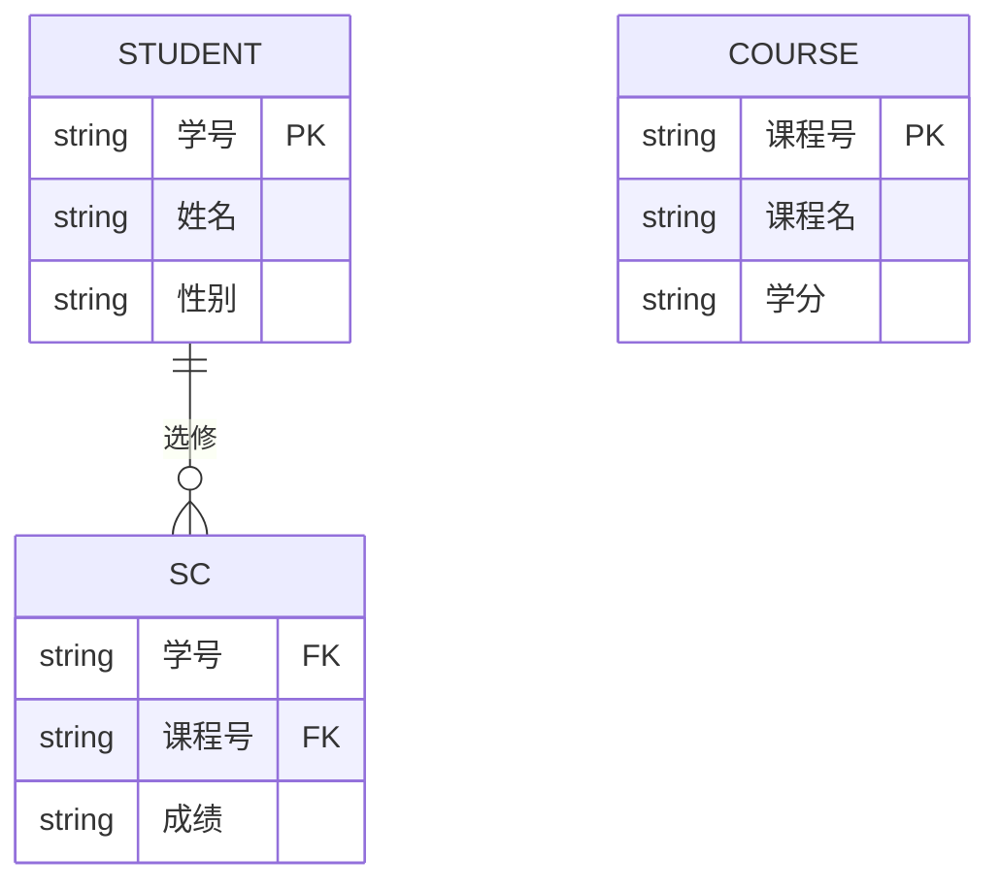

> 最后更新：2025-12-10 | [返回主目录](../README.md)
# 一、数据库基础和原理 - SQL DB - 关系型数据库是如何工作的
> 很多人在学习数据库时都是孤立的学习知识点，这样是很难将所有知识点串起来深入理解；强烈推荐你学习两篇文章：<a href='https://dsf.berkeley.edu/papers/fntdb07-architecture.pdf'>Architecture of a Database System</a>以及<a href ='http://coding-geek.com/how-databases-work'>How does a relational database work</a>；本文主要在第二篇基础上翻译并梳理，如果你英文不好的话，可以通过本文帮助你构筑数据库体系的基础。再啰嗦下，这篇文章关注的不是知识点，而是知识点之间的关联。
## 1.1 本文知识点

## 1.2 从数据结构说起
### 1.2.1 时间复杂度
> 对于数据库而言，重要的不是数据量，而是当数据量增加时运算如何增加。

时间复杂度用来检验某个算法处理一定量的数据要花多长时间，时间复杂度不会给出确切的运算次数，但是给出的是一种理念。


- 绿：O(1)或者叫常数阶复杂度，保持为常数（要不人家就不会叫常数阶复杂度了）。
- 红：O(log(n))对数阶复杂度，即使在十亿级数据量时也很低。
- 粉：最糟糕的复杂度是 O(n^2)，平方阶复杂度，运算数快速膨胀。
- 黑和蓝：另外两种复杂度（的运算数也是）快速增长。

如果要处理2000条元素：

- O(1) 算法会消耗 1 次运算
- O(log(n)) 算法会消耗 7 次运算
- O(n) 算法会消耗 2000 次运算
- O(n*log(n)) 算法会消耗 14,000 次运算
- O(n^2) 算法会消耗 4,000,000 次运算
### 1.2.2 归并排序
对于数据库，你需要理解这个 sort() 函数的工作原理。

- 排序章节，建议你看这里：排序 - Overview
- 归并排序(Merge Sort)建议你看这里：排序 - 归并排序(Merge Sort)

归并排序是把问题拆分为小问题，通过解决小问题来解决最初的问题（注：这种算法叫分治法，即『分而治之、各个击破』），具体建议你看：算法思想 - 分治算法 和 算法思想 - 二分法。

为什么是归并排序？

- 你可以更改算法，以便于节省内存空间，方法是不创建新的序列而是直接修改输入序列。注：这种算法叫『原地算法』(in-place algorithm)
- 你可以更改算法，以便于同时使用磁盘空间和少量内存而避免巨量磁盘 I/O。方法是只向内存中加载当前处理的部分。在仅仅100MB的内存缓冲区内排序一个几个GB的表时，这是个很重要的技巧。注：这种算法叫『外部排序』(external sorting)。
- 你可以更改算法，以便于在 多处理器/多线程/多服务器 上运行。比如，分布式合并排序是Hadoop（那个著名的大数据框架）的关键组件之一。
### 1.2.3 二叉搜索树
> 数据库中查询的时间复杂度，是我们无法使用矩阵，转而使用二叉搜索树(BST)，具体请参考： 树 - 二叉搜索树(BST)
- 二叉搜索树只需 log(N) 次运算，而如果你直接使用阵列则需要 N 次运算
### 1.2.4 B+树索引
> 查找一个特定值这个树挺好用，但是当你需要查找两个值之间的多个元素时，就会有大麻烦了。你的成本将是 O(N)，因为你必须查找树的每一个节点，以判断它是否处于那 2 个值之间（例如，对树使用中序遍历）。而且这个操作不是磁盘I/O有利的，因为你必须读取整个树。我们需要找到高效的范围查询方法。

- 这就是为什么引入B+树索引, 具体请参考这篇：MySQL - 索引(B+树)

**如果你在数据库中增加或删除一行（从而在相关的 B+树索引里）：**

- 你必须在B+树中的节点之间保持顺序，否则节点会变得一团糟，你无法从中找到想要的节点。
- 你必须尽可能降低B+树的层数，否则 O(log(N)) 复杂度会变成 O(N)。

换句话说，B+树需要自我整理和自我平衡。谢天谢地，我们有智能删除和插入。但是这样也带来了成本：在B+树中，插入和删除操作是 O(log(N)) 复杂度。所以有些人听到过使用太多索引不是个好主意这类说法。没错，你减慢了快速插入/更新/删除表中的一个行的操作，因为数据库需要以代价高昂的每索引 O(log(N)) 运算来更新表的索引。再者，增加索引意味着给事务管理器带来更多的工作负荷（在本文结尾我们会探讨这个管理器）。

### 1.2.5 哈希表
> 当你想快速查找值时，哈希表是非常有用的。而且，理解哈希表会帮助我们接下来理解一个数据库常见的联接操作，叫做『哈希联接』。这个**数据结构也被数据库用来保存一些内部的东西（比如锁表或者缓冲池**，我们在下文会研究这两个概念）

- 建议你看这篇文章：线性表(散列) - 哈希表

**为什么不用阵列呢？**

- 如果有了好的哈希函数，在哈希表里搜索的时间复杂度是 O(1)。
- **一个哈希表可以只装载一半到内存，剩下的哈希桶可以留在硬盘上。**
- 用阵列的话，你需要一个连续内存空间。如果你加载一个大表，很难分配足够的连续内存空间。
全局概览
## 1.3 全局概览
> 我们已经了解了数据库内部的部分重要算法，现在我们需要回来看看数据库的全貌了。

数据库一般可以用如下图形来理解：


### 1.3.1 核心组件
- 进程管理器（process manager）：很多数据库具备一个需要妥善管理的进程/线程池。再者，为了实现纳秒级操作，一些现代数据库使用自己的线程而不是操作系统线程。

- 网络管理器（network manager）：网路I/O是个大问题，尤其是对于分布式数据库。所以一些数据库具备自己的网络管理器。

- 文件系统管理器（File system manager）：磁盘I/O是数据库的首要瓶颈。具备一个文件系统管理器来完美地处理OS文件系统甚至取代OS文件系统，是非常重要的。

- 内存管理器（memory manager）：为了避免磁盘I/O带来的性能损失，需要大量的内存。但是如果你要处理大容量内存你需要高效的内存管理器，尤其是你有很多查询同时使用内存的时候。

- 安全管理器（Security Manager）：用于对用户的验证和授权。

- 客户端管理器（Client manager）：用于管理客户端连接。

- ……

### 1.3.2 工具
- 备份管理器（Backup manager）：用于保存和恢复数据。

- 恢复管理器（Recovery manager）：用于崩溃后重启数据库到一个一致状态。

- 监控管理器（Monitor manager）：用于记录数据库活动信息和提供监控数据库的工具。

- 管理员管理器（Administration manager）：用于保存元数据（比如表的名称和结构），提供管理数据库、模式、表空间的工具。

- ……

### 1.3.3 查询管理器
- 查询解析器（Query parser）：用于检查查询是否合法

- 查询重写器（Query rewriter）：用于预优化查询

- 查询优化器（Query optimizer）：用于优化查询

- 查询执行器（Query executor）：用于编译和执行查询

### 1.3.4 数据管理器：
- 事务管理器（Transaction manager）：用于处理事务

- 缓存管理器（Cache manager）：数据被使用之前置于内存，或者数据写入磁盘之前置于内存

- 数据访问管理器（Data access manager）：访问磁盘中的数据

## 1.4 数据查询的流程
本章集中探讨数据库如何通过如下进程管理SQL查询的：

- 客户端管理器
- 查询管理器
- 数据管理器（含恢复管理器）
- 客户端管理器
### 1.4.1 客户端管理器
> 客户端管理器是处理客户端通信的。客户端可以是一个（网站）服务器或者一个最终用户或最终应用。客户端管理器通过一系列知名的API（JDBC, ODBC, OLE-DB …）提供不同的方式来访问数据库。客户端管理器也提供专有的数据库访问API。


当你连接到数据库时：

- 管理器首先检查你的验证信息（用户名和密码），然后检查你是否有访问数据库的授权。这些权限由DBA分配。
- 然后，管理器检查是否有空闲进程（或线程）来处理你对查询。
- 管理器还会检查数据库是否负载很重。
- 管理器可能会等待一会儿来获取需要的资源。如果等待时间达到超时时间，它会关闭连接并给出一个可读的错误信息。
- 然后管理器会把你的查询送给查询管理器来处理。
- 因为查询处理进程不是『不全则无』的，一旦它从查询管理器得到数据，它会把部分结果保存到一个缓冲区并且开始给你发送。
- 如果遇到问题，管理器关闭连接，向你发送可读的解释信息，然后释放资源。

补充：DBA是什么？


**DBA** 是 **数据库管理员** 的英文缩写。

您可以将其理解为一个公司或组织里专门负责管理和维护数据库系统的“超级专家”或“总工程师”。他们的核心目标是确保数据库的**稳定、安全、高效**运行。

**DBA 的主要职责包括：**

*   **安装和配置**：安装数据库软件，并根据业务需求进行初始配置和优化。
*   **设计与规划**：参与数据库结构的设计（如表、索引的设计），规划存储方案和容量。
*   **权限与安全**：管理用户账号和权限，确保数据不被非法访问，防止数据泄露。
*   **备份与恢复**：制定并执行可靠的备份策略，以便在发生故障（如服务器宕机、人为误删数据）时能快速恢复数据，这是DBA最重要的工作之一。
*   **性能监控与优化**：监控数据库的运行状态（如CPU、内存、磁盘I/O使用情况），分析和优化执行缓慢的SQL查询。这正是我们讨论的“统计信息”发挥作用的地方，DBA需要确保统计信息准确，以便优化器能做出最佳决策。
*   **故障排除**：当数据库出现任何问题时，DBA需要像侦探一样快速定位问题根源并解决。
*   **升级与补丁**：负责数据库软件的版本升级和安全补丁安装。

**简单来说，如果没有DBA，数据库可能会陷入混乱、缓慢、不安全甚至数据丢失的境地。**

### 1.4.2 查询管理器
> 这部分是数据库的威力所在，在这部分里，一个写得糟糕的查询可以转换成一个快速执行的代码，代码执行的结果被送到客户端管理器。


这个多步骤操作过程如下：

- 查询首先被**解析**并判断是否合法

- 然后被**重写**，去除了无用的操作并且加入**预优化**部分

- 接着被**优化**以便提升性能，并被**转换为可执行代码**和**数据访问计划**。

- 然后计划被**编译**

- 最后，被**执行**

这里我不会过多探讨最后两步，因为它们不太重要。

#### 1.4.2.1 查询解析器
> 每一条SQL语句都要送到解析器来检查语法，如果你的查询有错，解析器将拒绝该查询。比如，如果你写成”SLECT …” 而不是 “SELECT …”，那就没有下文了。

但这还不算完，解析器还会检查关键字是否使用正确的顺序，比如 WHERE 写在 SELECT 之前会被拒绝。

然后，解析器要分析查询中的表和字段，使用数据库元数据来检查：

- 表是否存在
- 表的字段是否存在
- 对某类型字段的 运算 是否 可能（比如，你不能将整数和字符串进行比较，你不能对一个整数使用 substring() 函数）

接着，解析器检查在查询中你是否有权限来读取（或写入）表。再强调一次：这些权限由DBA分配。

在解析过程中，SQL 查询被转换为内部表示（通常是一个树 - 抽象语法树）。

如果一切正常，内部表示被送到查询重写器。
#### 1.4.2.2 查询重写器
在这一步，我们已经有了查询的内部表示，重写器的目标是：

- 预优化查询
- 避免不必要的运算
- 帮助优化器找到合理的最佳解决方案

重写器按照一系列已知的规则对查询执行检测。如果查询匹配一种模式的规则，查询就会按照这条规则来重写。下面是（可选）规则的非详尽的列表：

- **视图合并**：如果你在查询中使用视图，视图就会转换为它的 SQL 代码。
- **子查询扁平化**：子查询是很难优化的，因此重写器会尝试移除子查询
    - 例如：
    ```sql
    SELECT PERSON.*
    FROM PERSON
    WHERE PERSON.person_key IN
    (SELECT MAILS.person_key
    FROM MAILS
    WHERE MAILS.mail LIKE 'christophe%');
    ```
    会转换为：
    ```sql
    SELECT PERSON.*
    FROM PERSON, MAILS
    WHERE PERSON.person_key = MAILS.person_key
    and MAILS.mail LIKE 'christophe%';
    ```
- 去除不必要的运算符：比如，如果你用了 DISTINCT，而其实你有 UNIQUE 约束（这本身就防止了数据出现重复），那么 DISTINCT 关键字就被去掉了。
- 排除冗余的联接：如果相同的 JOIN 条件出现两次，比如隐藏在视图中的 JOIN 条件，或者由于传递性产生的无用 JOIN，都会被消除。
- 常数计算赋值：如果你的查询需要计算，那么在重写过程中计算会执行一次。比如 WHERE AGE > 10+2 会转换为 WHERE AGE > 12 ， TODATE(“日期字符串”) 会转换为 datetime 格式的日期值。
- （高级）分区裁剪（Partition Pruning）：如果你用了分区表，重写器能够找到需要使用的分区。
- （高级）物化视图重写（Materialized view rewrite）：如果你有个物化视图匹配查询谓词的一个子集，重写器将检查视图是否最新并修改查询，令查询使用物化视图而不是原始表。
- （高级）自定义规则：如果你有自定义规则来修改查询（就像 Oracle policy），重写器就会执行这些规则。
- （高级）OLAP转换：分析/加窗 函数，星形联接，ROLLUP 函数……都会发生转换（但我不确定这是由重写器还是优化器来完成，因为两个进程联系很紧，必须看是什么数据库）。
重写后的查询接着送到优化器，这时候好玩的就开始了。

#### 1.4.2.3 统计
> 研究数据库如何优化查询之前我们需要谈谈统计，因为**没有统计的数据库是愚蠢的**。除非你明确指示，数据库是不会分析自己的数据的。没有分析会导致数据库做出（非常）糟糕的假设。

但是，数据库需要什么类型的信息呢？

我必须（简要地）谈谈数据库和操作系统如何保存数据。两者使用的最小单位叫做页或块（默认 4 或 8 KB）。这就是说如果你仅需要 1KB，也会占用一个页。要是页的大小为 8KB，你就浪费了 7KB。

回来继续讲统计！ 当你要求数据库收集统计信息，数据库会计算下列值：

- 表中行和页的数量
- 表中每个列中的：
  - 唯一值
  - 数据长度（最小，最大，平均）
  - 数据范围（最小，最大，平均）
- 表的索引信息

**这些统计信息会帮助优化器估计查询所需的磁盘 I/O、CPU、和内存使用**

对每个列的统计非常重要。比如，如果一个表 PERSON 需要联接 2 个列： LAST_NAME, FIRST_NAME。根据统计信息，数据库知道FIRST_NAME只有 1,000 个不同的值，LAST_NAME 有 1,000,000 个不同的值。因此，数据库就会按照 LAST_NAME, FIRST_NAME 联接。因为 LAST_NAME 不大可能重复，多数情况下比较 LAST_NAME 的头 2 、 3 个字符就够了，这将大大减少比较的次数。

不过，这些只是基本的统计。你可以让数据库做一种高级统计，叫直方图。直方图是列值分布情况的统计信息。例如：

- 出现最频繁的值
- 分位数(quantiles)
- …

这些额外的统计会帮助数据库找到更佳的查询计划，尤其是对于等式谓词（例如： WHERE AGE = 18 ）或范围谓词（例如： WHERE AGE > 10 and AGE < 40），因为数据库可以更好的了解这些谓词相关的数字类型数据行（注：这个概念的技术名称叫选择率）。

统计信息保存在数据库元数据内，例如（非分区）表的统计信息位置：

- Oracle： USER / ALL / DBA_TABLES 和 USER / ALL / DBA_TAB_COLUMNS
- DB2： SYSCAT.TABLES 和 SYSCAT.COLUMNS

**统计信息必须及时更新**。如果一个表有 1,000,000 行而数据库认为它只有 500 行，没有比这更糟糕的了。统计唯一的不利之处是需要时间来计算，这就是为什么数据库大多默认情况下不会自动计算统计信息。数据达到百万级时统计会变得困难，这时候，你可以选择仅做基本统计或者在一个数据库样本上执行统计。

举个例子，我参与的一个项目需要处理每表上亿条数据的库，我选择只统计10%，结果造成了巨大的时间消耗。本例证明这是个糟糕的决定，因为有时候 Oracle 10G 从特定表的特定列中选出的 10% 跟全部 100% 有很大不同（对于拥有一亿行数据的表，这种情况极少发生）。这次错误的统计导致了一个本应 30 秒完成的查询最后执行了 8 个小时，查找这个现象根源的过程简直是个噩梦。这个例子显示了统计的重要性。

> 注：当然了，每个数据库还有其特定的更高级的统计。如果你想了解更多信息，读读数据库的文档。话虽然这么说，我已经尽力理解统计是如何使用的了，而且我找到的最好的官方文档来自PostgreSQL。
##### 总结

1. 什么是数据库的统计信息？它是一种默认行为还是需要触发的？

**统计信息**是数据库关于其自身数据的一组元数据，它描述了数据的特征和分布情况，例如：
- **表级统计**：表的行数、占用的页/块数。
- **列级统计**：不同值的数量（基数）、空值数量、数据的最大值、最小值、平均值等。
- **索引统计**：索引的深度、叶块数量、聚簇因子等。

**高级统计**（如直方图）则能更精细地描述数据的分布，例如哪些值出现频率最高，数据在不同区间的分布等。

**关于“默认行为还是触发”：**
这取决于具体的数据库系统和其配置。总的来说，**现代数据库通常倾向于自动维护统计信息**，但这并非总是默认开启，或者其默认策略可能不够积极。

- **不是完全默认**：如果数据库完全不做任何统计，优化器就如同“盲人摸象”，无法生成高效的执行计划。因此，所有主流数据库都提供了统计功能。
- **但自动统计不是默认（或不够强）的历史原因**：如您引用的文本所述，收集统计信息需要消耗CPU和I/O资源，在数据量巨大时可能影响数据库性能。因此，早期数据库或保守配置下，可能不会自动进行统计，需要DBA手动触发或设置自动任务。
- **现代趋势是自动化**：如今，为了降低管理负担，像Oracle、MySQL（InnoDB）、SQL Server、PostgreSQL等主流数据库都提供了**自动统计信息收集**功能，并常常作为推荐配置。但DBA仍需根据工作负载监控其有效性。

---

2. 触发统计信息收集的方法是什么？

触发方法分为**手动触发**和**自动触发**两种。

- 方法一：手动触发

    DBA通过执行特定的命令或存储过程来立即收集统计信息。这在以下情况非常有用：
    - 数据发生大规模加载、删除或更新之后。
    - 发现查询性能突然下降，怀疑是统计信息过时。

    **不同数据库的手动命令示例：**

    - **Oracle**:
        ```sql
        -- 分析一张表
        EXEC DBMS_STATS.GATHER_TABLE_STATS('SCHEMA_NAME', 'TABLE_NAME');
        -- 分析整个模式（用户）
        EXEC DBMS_STATS.GATHER_SCHEMA_STATS('SCHEMA_NAME');
        ```

    - **MySQL (InnoDB)**:
        ```sql
        -- 分析一张表
        ANALYZE TABLE table_name;
        ```

    - **PostgreSQL**:
        ```sql
        -- 分析一张表（VACUUM 和 ANALYZE 常一起使用）
        ANALYZE table_name;
        -- 分析整个数据库
        ANALYZE;
        ```

    - **SQL Server**:
        ```sql
        -- 更新一张表的统计信息
        UPDATE STATISTICS table_name;
        -- 使用全扫描更新
        UPDATE STATISTICS table_name WITH FULLSCAN;
        ```

- 方法二：自动触发

数据库在后台自动运行任务来收集统计信息。

    - **Oracle**： 由预定义的维护任务窗口（通常在天黑后的维护时段）自动执行 `GATHER_STATS_JOB` 作业。DBA可以启用或禁用此功能。
    - **MySQL (InnoDB)**： `innodb_stats_auto_recalc` 参数默认开启。当表中有超过10%的行被修改时，会自动触发统计信息更新。
    - **PostgreSQL**： 有一个名为 `autovacuum` 的后台进程，它不仅清理死元组，也会自动执行 `ANALYZE` 来更新统计信息。这是默认开启且强烈推荐的。
    - **SQL Server**： 当 `AUTO_UPDATE_STATISTICS` 数据库选项为ON（默认值）时，查询优化器会在统计信息可能过时时自动更新它们。

以Postgresql为例:

`autovacuum` 是 **PostgreSQL** 数据库特有的一个后台进程。它的主要作用是自动执行 `VACUUM`（清理“死”元组，即已被删除或更新的旧数据，以释放空间）和 `ANALYZE`（收集统计信息，正如上一节所讨论的）操作。

在 Linux 系统上，有几种方法可以查询 `autovacuum` 进程是否在运行：

- 方法一：使用 `ps` 命令查看进程列表

这是最直接的方法。在 Linux 终端中执行以下命令：

```bash
ps aux | grep autovacuum
```

**命令解释：**
*   `ps aux`：列出所有用户的详细进程信息。
*   `grep autovacuum`：从上一条命令的结果中，筛选出包含 “autovacuum” 字样的行。

**输出示例：**
```
postgres 12345  0.0  0.1 255664 10240 ?        Ss   10:00   0:00 postgres: autovacuum launcher
postgres 12346  0.1  0.2 256780 20480 ?        Ss   10:00   0:05 postgres: autovacuum worker process
```
*   你会看到至少两个进程：
    *   **autovacuum launcher**： 这是“调度器”，它负责监控数据库，并在需要时启动清理工作进程。
    *   **autovacuum worker process**： 这是实际执行清理和统计工作的“工人”。根据数据库的负载，可能会有多个 worker 进程同时存在。

如果这个命令没有返回任何结果，可能意味着 `autovacuum` 被禁用了，或者 PostgreSQL 服务没有正常运行。

- 方法二：在 PostgreSQL 内部使用 SQL 查询

你可以连接到 PostgreSQL 数据库，然后执行 SQL 语句来查看当前正在工作的 `autovacuum` 进程。

```sql
SELECT datname, usename, pid, state, query
FROM pg_stat_activity
WHERE query LIKE '%autovacuum%' AND query NOT LIKE '%pg_stat_activity%';
```

这条查询会显示当前正在执行自动清理任务的数据库连接信息。

```sql
-- 查看最近哪些表被自动清理过
SELECT schemaname, relname, last_autovacuum, last_autoanalyze
FROM pg_stat_user_tables
WHERE last_autovacuum IS NOT NULL OR last_autoanalyze IS NOT NULL
ORDER BY greatest(last_autovacuum, last_autoanalyze) DESC
LIMIT 10;
```
这条命令会显示用户表最近一次被自动清理和分析的时间。如果你能看到近期的时间戳，就证明 `autovacuum` 在不久前成功地工作过。

- 方法三：检查 PostgreSQL 日志文件

`autovacuum` 的活动通常会被记录在 PostgreSQL 的日志文件中。日志的位置取决于你的配置（通常在 `postgresql.conf` 文件中 `log_directory` 和 `log_filename` 参数指定）。你可以查看日志来确认 `autovacuum` 是否在正常运行。


1. 总结与建议

- **统计信息是查询优化的基石**，没有它，数据库无法做出明智的决策。
- **现代数据库普遍支持自动统计**，但您需要确认该功能在您的环境中是否已启用并正常工作。
- **对于关键业务系统或数据变化剧烈的表**，DBA应制定监控策略，必要时进行手动干预（例如在批量数据加载后立即手动收集统计信息），以避免发生您提到的“8小时查询”悲剧。
### 1.4.3 查询优化器
> 所有的现代数据库都在用**基于成本的优化（即CBO）**来优化查询。道理是针对每个运算设置一个成本，通过应用成本最低廉的一系列运算，来找到最佳的降低查询成本的方法。

为了理解成本优化器的原理，我觉得最好用个例子来『感受』一下这个任务背后的复杂性。这里我将给出联接 2 个表的 3 个方法，我们很快就能看到即便一个简单的联接查询对于优化器来说都是个噩梦。之后，我们会了解真正的优化器是怎么做的。

**对于这些联接操作，我会专注于它们的时间复杂度，但是，数据库优化器计算的是它们的 CPU 成本、磁盘 I/O 成本、和内存需求。**时间复杂度和 CPU 成本的区别是，时间成本是个近似值（给我这样的懒家伙准备的）。而 CPU 成本，我这里包括了所有的运算，比如：加法、条件判断、乘法、迭代……还有呢：

每一个高级代码运算都要特定数量的低级 CPU 运算。

对于 Intel Core i7、Intel Pentium 4、AMD Opteron…等，（就 CPU 周期而言）CPU 的运算成本是不同的，也就是说它取决于 CPU 的架构。

使用时间复杂度就容易多了（至少对我来说），用它我也能了解到 CBO 的概念。由于磁盘 I/O 是个重要的概念，我偶尔也会提到它。请牢记，**大多数时候瓶颈在于磁盘 I/O 而不是 CPU 使用。**

#### 1.4.3.1 索引
> 在研究 B+树的时候我们谈到了索引，要记住一点，索引都是已经排了序的。

仅供参考：还有其他类型的索引，比如位图索引，在 CPU、磁盘I/O、和内存方面与B+树索引的成本并不相同。

另外，很多现代数据库为了改善执行计划的成本，可以仅为当前查询动态地生成临时索引。

#### 1.4.3.2 存取路径
在应用联接运算符（join operators）之前，你首先需要获得数据。以下就是获得数据的方法。

注：由于所有存取路径的真正问题是磁盘 I/O，我不会过多探讨时间复杂度。

- 全扫描

如果你读过执行计划，一定看到过『全扫描』（或只是『扫描』）一词。简单的说全扫描就是数据库完整的读一个表或索引。就磁盘 I/O 而言，很明显全表扫描的成本比索引全扫描要高昂。

- 范围扫描

其他类型的扫描有索引范围扫描，比如当你使用谓词 ” WHERE AGE > 20 AND AGE < 40 ” 的时候它就会发生。

当然，你需要在 AGE 字段上有索引才能用到索引范围扫描。

在第一部分我们已经知道，范围查询的时间成本大约是 log(N)+M，这里 N 是索引的数据量，M 是范围内估测的行数。多亏有了统计我们才能知道 N 和 M 的值（注： M 是谓词 “ AGE > 20 AND AGE < 40 ” 的选择率）。另外范围扫描时，你不需要读取整个索引，因此在磁盘 I/O 方面没有全扫描那么昂贵。

- 唯一扫描

如果你只需要从索引中取一个值你可以用唯一扫描。

- 根据 ROW ID 存取

多数情况下，如果数据库使用索引，它就必须查找与索引相关的行，这样就会用到根据 ROW ID 存取的方式。

例如，假如你运行：
```sql
SELECT LASTNAME, FIRSTNAME from PERSON WHERE AGE = 28
```
如果 person 表的 age 列有索引，优化器会使用索引找到所有年龄为 28 的人，然后它会去表中读取相关的行，这是因为索引中只有 age 的信息而你要的是姓和名。

但是，假如你换个做法：
```sql
SELECT TYPE_PERSON.CATEGORY from PERSON ,TYPE_PERSON
WHERE PERSON.AGE = TYPE_PERSON.AGE
```
PERSON 表的索引会用来联接 TYPE_PERSON 表，但是 PERSON 表不会根据行ID 存取，因为你并没有要求这个表内的信息。

虽然这个方法在少量存取时表现很好，这个运算的真正问题其实是磁盘 I/O。假如需要大量的根据行ID存取，数据库也许会选择全扫描。

**总结：**
  1. 关键点：磁盘 I/O 的类型和性能影响
  数据库的性能瓶颈往往在于磁盘 I/O（输入/输出操作）。I/O 有两种主要类型：
     - **随机 I/O**：读写磁盘上不连续的位置。每次寻道（移动磁头）都需要时间，因此速度较慢。
     - **顺序 I/O**：连续读写磁盘上的大块数据。由于减少了寻道时间，速度更快。

  “根据 ROW ID 存取”（也称为索引查找后回表）本质上是一种**随机 I/O** 操作，而全表扫描是一种**顺序 I/O** 操作。

  2. 详细解释“根据 ROW ID 存取”的过程
  以第一个查询为例：
  ```sql
  SELECT LASTNAME, FIRSTNAME FROM PERSON WHERE AGE = 28
  ```
     - 如果 `AGE` 列有索引，优化器会先使用索引快速找到所有 `AGE = 28` 的行的 ROW ID（即行在磁盘上的物理地址）。
     - 然后，数据库必须根据这些 ROW ID 逐个去主表（堆表）中读取完整的行，以获取 `LASTNAME` 和 `FIRSTNAME` 的值。
     - 这个过程在匹配行数较少时非常高效，因为索引查找很快，且只需要几次随机 I/O。

  3. 为什么大量存取时问题出现？
     - **当匹配的行数非常多时（例如，数万行）**，数据库需要执行大量的“根据 ROW ID 存取”操作。每个 ROW ID 对应一次随机 I/O 来读取表数据。
     - 随机 I/O 的效率很低：因为行可能分散在磁盘的不同位置，磁头需要频繁移动，导致高延迟。
     - 相比之下，**全表扫描**会一次性顺序读取整个表（或大部分数据）。虽然它读取的数据量可能更大，但顺序 I/O 的速度远快于大量随机 I/O（尤其是机械硬盘上，顺序 I/O 的吞吐量可能是随机 I/O 的几十倍）。

  4. 优化器的成本决策
  数据库优化器会基于统计信息（如表大小、索引选择性、数据分布）来估算每种访问方式的成本：
     - 如果索引的选择性高（即匹配行数少），优化器倾向于使用索引 + ROW ID 存取。
     - 如果索引的选择性低（即匹配行数多，例如超过表的 5-10%），优化器可能认为全表扫描更划算，因为顺序 I/O 的整体成本低于大量随机 I/O。

  第二个查询中：
  ```sql
  SELECT TYPE_PERSON.CATEGORY FROM PERSON, TYPE_PERSON WHERE PERSON.AGE = TYPE_PERSON.AGE
  ```
    - 这里，如果 `PERSON.AGE` 索引覆盖了联接所需的信息（即索引本身包含 AGE 值，且查询不需要 PERSON 表的其他列），优化器可能直接使用索引进行联接（如索引嵌套循环联接），而无需回表读取 PERSON 表的行。因此，避免了“根据 ROW ID 存取”，减少了 I/O。
    - 但如果查询需要 PERSON 表的其他列，或者索引不能完全覆盖，则仍可能触发回表操作。

  5. 简单类比
     - **少量存取**：就像在图书馆里用索引卡找几本书——快速准确。
     - **大量存取**：如果要找上百本书，每本都在不同书架，跑来跑去效率很低；不如直接顺序扫描整个书架（全扫描）更省时。

- 其它路径

我没有列举所有的存取路径，如果你感兴趣可以读一读 Oracle文档。其它数据库里也许叫法不同但背后的概念是一样的。

#### 1.4.3.3 联接运算符
> 我们知道如何获取数据了，那现在就把它们联接起来！

我要展现的是3个个常用联接运算符：合并联接（Merge join），哈希联接（Hash Join）和嵌套循环联接（Nested Loop Join）。但是在此之前，我需要引入新词汇了：内关系和外关系（ inner relation and outer relation）这里的关系可以是：

- 一个表
- 一个索引
- 上一个运算的中间结果（比如上一个联接运算的结果）

当你联接两个关系时，联接算法对两个关系的处理是不同的。在本文剩余部分，我将假定：

- 外关系是左侧数据集
- 内关系是右侧数据集

比如， A JOIN B 是 A 和 B 的联接，这里 A 是外关系，B 是内关系。

多数情况下， **A JOIN B 的成本跟 B JOIN A 的成本是不同的**。

在这一部分，我还将假定外关系有 N 个元素，内关系有 M 个元素。要记住，真实的优化器通过统计知道 N 和 M 的值。

注：N 和 M 是关系的基数。

##### 1.4.3.3.1 嵌套循环联接
> 嵌套循环联接是最简单的。


原因如下：

- 针对外关系的每一行，查看内关系里的所有行来寻找匹配的行

下面是伪代码：
```c
nested_loop_join(array outer, array inner)
  for each row a in outer
    for each row b in inner
      if (match_join_condition(a,b))
        write_result_in_output(a,b)
      end if
    end for
   end for
```
由于这是个双迭代，**时间复杂度是 O(N*M)**。

在磁盘 I/O 方面， 针对 N 行外关系的每一行，内部循环需要从内关系读取 M 行。这个算法需要从磁盘读取 N+ N*M 行。但是，如果内关系足够小，你可以把它读入内存，那么就只剩下 M + N 次读取。这样修改之后，内关系必须是最小的，因为它有更大机会装入内存。

在CPU成本方面没有什么区别，但是在磁盘 I/O 方面，最好最好的，是每个关系只读取一次。

当然，内关系可以由索引代替，对磁盘 I/O 更有利。

由于这个算法非常简单，下面这个版本在内关系太大无法装入内存时，对磁盘 I/O 更加有利。原因如下：

- 为了避免逐行读取两个关系，
- 你可以成簇读取，把（两个关系里读到的）两簇数据行保存在内存里，
- 比较两簇数据，保留匹配的，
- 然后从磁盘加载新的数据簇来继续比较
- 直到加载了所有数据。

可能的算法如下：
```c
// improved version to reduce the disk I/O.
nested_loop_join_v2(file outer, file inner)
  for each bunch ba in outer
  // ba is now in memory
    for each bunch bb in inner
        // bb is now in memory
        for each row a in ba
          for each row b in bb
            if (match_join_condition(a,b))
              write_result_in_output(a,b)
            end if
          end for
       end for
    end for
   end for
```
**使用这个版本，时间复杂度没有变化，但是磁盘访问降低了：**

- 用前一个版本，算法需要 N + N*M 次访问（每次访问读取一行）。
- 用新版本，磁盘访问变为 外关系的数据簇数量 + 外关系的数据簇数量 * 内关系的数据簇数-量。
- 增加数据簇的尺寸，可以降低磁盘访问。
##### 1.4.3.3.2 哈希联接
哈希联接更复杂，不过在很多场合比嵌套循环联接成本低。


哈希联接的原理是：

- 读取内关系的所有元素
- 在内存里建一个哈希表
- 逐条读取外关系的所有元素 +（用哈希表的哈希函数）计算每个元素的哈希值，来查找内关系里相关的哈希桶内
- 是否与外关系的元素匹配。

在时间复杂度方面我需要做些假设来简化问题：

- 内关系被划分成 X 个哈希桶
- 哈希函数几乎均匀地分布每个关系内数据的哈希值，就是说哈希桶大小一致。
- 外关系的元素与哈希桶内的所有元素的匹配，成本是哈希桶内元素的数量。

时间复杂度是 (M/X) * N + 创建哈希表的成本(M) + 哈希函数的成本 * N 。如果哈希函数创建了足够小规模的哈希桶，那么复杂度就是 O(M+N)。

还有个哈希联接的版本，对内存有利但是对磁盘 I/O 不够有利。 这回是这样的：

- 计算内关系和外关系双方的哈希表
- 保存哈希表到磁盘
- 然后逐个哈希桶比较（其中一个读入内存，另一个逐行读取）。

##### 1.4.3.3.3 合并联接
> 合并联接是唯一产生排序的联接算法。

注：这个简化的合并联接不区分内表或外表；两个表扮演同样的角色。但是真实的实现方式是不同的，比如当处理重复值时。

- 1.（可选）排序联接运算：两个输入源都按照联接关键字排序。

- 2.合并联接运算：排序后的输入源合并到一起。

- **排序**

我们已经谈到过合并排序，在这里合并排序是个很好的算法（但是并非最好的，如果内存足够用的话，还是哈希联接更好）。

然而有时数据集已经排序了，比如：

- 如果表内部就是有序的，比如联接条件里一个索引组织表(index-organized table)

- 如果关系是联接条件里的一个索引

- 如果联接应用在一个查询中已经排序的中间结果

- **合并联接**


这部分与我们研究过的合并排序中的合并运算非常相似。不过这一次呢，我们不是从两个关系里挑选所有元素，而是只挑选相同的元素。道理如下：

- 在两个关系中，比较当前元素（当前=头一次出现的第一个）
- 如果相同，就把两个元素都放入结果，再比较两个关系里的下一个元素
- 如果不同，就去带有最小元素的关系里找下一个元素（因为下一个元素可能会匹配）
- 重复 1、2、3步骤直到其中一个关系的最后一个元素。

因为两个关系都是已排序的，你不需要『回头去找』，所以这个方法是有效的。

该算法是个简化版，因为它没有处理两个序列中相同数据出现多次的情况（即多重匹配）。真实版本『仅仅』针对本例就更加复杂，所以我才选择简化版。

如果两个关系都已经排序，时间复杂度是 O(N+M)

如果两个关系需要排序，时间复杂度是对两个关系排序的成本：O(NLog(N) + MLog(M))

##### 1.4.3.3.4 哪个算法最好
如果有最好的，就没必要弄那么多种类型了。这个问题很难，因为很多因素都要考虑，比如：

- **空闲内存**：没有足够的内存的话就跟强大的哈希联接拜拜吧（至少是完全内存中哈希联接）。
- **两个数据集的大小**。比如，如果一个大表联接一个很小的表，那么嵌套循环联接就比哈希联接快，因为后者有创建哈希的高昂成本；如果两个表都非常大，那么嵌套循环联接CPU成本就很高昂。
- **是否有索引**：有两个 B+树索引的话，聪明的选择似乎是合并联接。
- **结果是否需要排序**：即使你用到的是未排序的数据集，你也可能想用成本较高的合并联接（带排序的），因为最终得到排序的结果后，你可以把它和另一个合并联接串起来（或者也许因为查询用 ORDER BY/GROUP BY/DISTINCT 等操作符隐式或显式地要求一个排序结果）。
- **关系是否已经排序**：这时候合并联接是最好的候选项。
- **联接的类型**：是等值联接（比如 tableA.col1 = tableB.col2 ）？ 还是内联接？外联接？笛卡尔乘积？或者自联接？有些联接在特定环境下是无法工作的。
- **数据的分布**：如果联接条件的数据是倾斜的（比如根据姓氏来联接人，但是很多人同姓），用哈希联接将是个灾难，原因是哈希函数将产生分布极不均匀的哈希桶。
如果你希望联接操作使用**多线程或多进程**。

想要更详细的信息，可以阅读DB2, ORACLE 或 SQL Server的文档。
##### 1.4.3.3.5 简化的例子
我们已经研究了 3 种类型的联接操作。现在，比如说我们要联接 5 个表，来获得一个人的全部信息。一个人可以有：

- 多个手机号（MOBILES）
- 多个邮箱（MAILS）
- 多个地址（ADRESSES）
- 多个银行账号（BANK_ACCOUNTS）

换句话说，我们需要用下面的查询快速得到答案：
```sql
SELECT * from PERSON, MOBILES, MAILS,ADRESSES, BANK_ACCOUNTS
WHERE
PERSON.PERSON_ID = MOBILES.PERSON_ID
AND PERSON.PERSON_ID = MAILS.PERSON_ID
AND PERSON.PERSON_ID = ADRESSES.PERSON_ID
AND PERSON.PERSON_ID = BANK_ACCOUNTS.PERSON_ID
```
作为一个查询优化器，我必须找到处理数据最好的方法。但有 2 个问题：

- 每个联接使用那种类型？

  - 我有 3 种可选（哈希、合并、嵌套），同时可能用到 0, 1 或 2 个索引（不必说还有多种类型的索引）。
- 按什么顺序执行联接？

比如，下图显示了针对 4 个表仅仅 3 次联接，可能采用的执行计划：


现实世界的查询还会有其他关系运算符，像 OUTER JOIN, CROSS JOIN, GROUP BY, ORDER BY, PROJECTION, UNION, INTERSECT, DISTINCT … 这意味着更多的可能性。

那么，数据库是如何处理的呢？

`动态规划`，`贪心算法`和`启发式算法`

##### 1.4.3.3.6 动态规划，贪心算法和启发式算法
关系型数据库会尝试我刚刚提到的多种方法，**优化器真正的工作是在有限时间里找到一个好的解决方案。**

多数时候，优化器找到的不是最佳的方案，而是一个『不错』的
- 动态规划
> 对于小规模的查询，采取粗暴的方式是有可能的。但是为了让中等规模的查询也能采取粗暴的方式，我们有办法避免不必要的计算，这就是动态规划。

这几个字背后的理念是，很多执行计划是非常相似的。看看下图这几种计划：


它们都有相同的子树（A JOIN B），所以，不必在每个计划中计算这个子树的成本，计算一次，保存结果，当再遇到这个子树时重用。用更正规的说法，我们面对的是个重叠问题。为了避免对部分结果的重复计算，我们使用记忆法。

应用这一技术，我们不再有 (2*N)!/(N+1)! 的复杂度，而是“只有” 3^N。在之前 4 个JOIN 的例子里，这意味着将 336 次排序降为 81 次。如果是大一些的查询，比如 8 个 JOIN （其实也不是很大啦），就是将 57,657,600 次降为 6551 次。

针对大规模查询，你也可以用动态规划方法，但是要附加额外的规则（或者称为启发式算法）来减少可能性。
- 如果我们仅分析一个特定类型的计划(例如左深树 left-deep tree，参考)，我们得到 n*2^n 而不是 3^n。


- 如果我们加上逻辑规则来避免一些模式的计划（像『如果一个表有针对指定谓词的索引，就不要对表尝试合并联接，要对索引』），就会在不给最佳方案造成过多伤害的前提下，减少可能性的数量。【译者注：原文应该是有两处笔误： as=has, to=too】

- 如果我们在流程里增加规则（像『联接运算先于其他所有的关系运算』），也能减少大量的可能性。

- ……

- **贪心算法**

> 但是，优化器面对一个非常大的查询，或者为了尽快找到答案（然而查询速度就快不起来了），会应用另一种算法，叫贪婪算法。

原理是按照一个规则（或启发）以渐进的方式制定查询计划。在这个规则下，贪婪算法逐步寻找最佳算法，先处理一条JOIN，接着每一步按照同样规则加一条新的JOIN。

我们来看个简单的例子。比如一个针对5张表（A,B,C,D,E）4次JOIN 的查询，为了简化我们把嵌套JOIN作为可能的联接方式，按照『使用最低成本的联接』规则。

- 直接从 5 个表里选一个开始（比如 A）
- 计算每一个与 A 的联接（A 作为内关系或外关系）
- 发现 “A JOIN B” 成本最低
- 计算每一个与 “A JOIN B” 的结果联接的成本（“A JOIN B” 作为内关系或外关系）
- 发现 “(A JOIN B) JOIN C” 成本最低
- 计算每一个与 “(A JOIN B) JOIN C” 的结果联接的成本
- ……

最后确定执行计划 “( ( ( (A JOIN B) JOIN C) JOIN D ) JOIN E )”
因为我们是武断地从表 A 开始，我们可以把同样的算法用在 B，然后 C，然后 D, 然后 E。最后保留成本最低的执行计划。

顺便说一句，这个算法有个名字，叫『最近邻居算法』。

抛开细节不谈，只需一个良好的模型和一个 Nlog(N) 复杂度的排序，问题就轻松解决了。这个算法的复杂度是 O(Nlog(N)) ，对比一下完全动态规划的 O(3^N)。如果你有个20个联接的大型查询，这意味着 26 vs 3,486,784,401 ，天壤之别！

这个算法的问题是，我们做的假设是：找到 2 个表的最佳联接方法，保留这个联接结果，再联接下一个表，就能得到最低的成本。但是：

- 即使在 A, B, C 之间，A JOIN B 可得最低成本
- (A JOIN C) JOIN B 也许比 (A JOIN B) JOIN C 更好。

为了改善这一状况，你可以多次使用基于不同规则的贪心算法，并保留最佳的执行计划。

查询计划缓存
由于创建查询计划是耗时的，大多数据库把计划保存在查询计划缓存，来避免重复计算。这个话题比较大，因为数据库需要知道什么时候更新过时的计划。办法是设置一个上限，如果一个表的统计变化超过了上限，关于该表的查询计划就从缓存中清除。
##### 1.4.3.3.7 查询计划缓存
由于创建查询计划是耗时的，大多数据库把计划保存在查询计划缓存，来避免重复计算。这个话题比较大，因为数据库需要知道什么时候更新过时的计划。办法是设置一个上限，如果一个表的统计变化超过了上限，关于该表的查询计划就从缓存中清除。
### 1.4.4 查询执行器
在这个阶段，我们有了一个优化的执行计划，再编译为可执行代码。然后，如果有足够资源（内存，CPU），查询执行器就会执行它。计划中的操作符 (JOIN, SORT BY …) 可以顺序或并行执行，这取决于执行器。为了获得和写入数据，查询执行器与数据管理器交互，本文下一部分来讨论数据管理器。

### 1.4.5 数据管理器


在这一步，查询管理器执行了查询，需要从表和索引获取数据，于是向数据管理器提出请求。但是有 2 个问题：

- 关系型数据库使用事务模型，所以，当其他人在同一时刻使用或修改数据时，你无法得到这部分数据。
- 数据提取是数据库中速度最慢的操作，所以数据管理器需要足够聪明地获得数据并保存在内存缓冲区内。

在这一部分，我们看看关系型数据库是如何处理这两个问题的。

#### 1.4.5.1 缓存管理器
> 前文已经说过，数据库的主要瓶颈是磁盘 I/O。为了提高性能，现代数据库使用缓存管理器。


查询执行器不会直接从文件系统拿数据，而是向缓存管理器要。缓存管理器有一个内存缓存区，叫做缓冲池，从内存读取数据显著地提升数据库性能。对此很难给出一个数量级，因为这取决于你需要的是哪种操作：

- 顺序访问（比如：全扫描） vs 随机访问（比如：按照row id访问）
- 读还是写

以及数据库使用的磁盘类型：

- 7.2k/10k/15k rpm的硬盘
- SSD
- RAID 1/5/…

要我说，内存比磁盘要快100到10万倍。然而，这导致了另一个问题（数据库总是这样…)，缓存管理器需要在查询执行器使用数据之前得到数据，否则查询管理器不得不等待数据从缓慢的磁盘中读出来。

##### 1.4.5.1.1 预读
这个问题叫预读。查询执行器知道它将需要什么数据，因为它了解整个查询流，而且通过统计也了解磁盘上的数据。过程是这样的：

- 当查询执行器处理它的第一批数据时，会告诉缓存管理器预先装载第二批数据
- 当开始处理第二批数据时，告诉缓存管理器预先装载第三批数据，并且告诉缓存管理器第一批可以从缓存里清掉了。
- ……

缓存管理器在缓冲池里保存所有的这些数据。为了确定一条数据是否有用，缓存管理器给缓存的数据添加了额外的信息（叫闩锁）。

有时查询执行器不知道它需要什么数据，有的数据库也不提供这个功能。相反，它们使用一种推测预读法（比如：如果查询执行器想要数据1、3、5，它不久后很可能会要 7、9、11），或者顺序预读法（这时候缓存管理器只是读取一批数据后简单地从磁盘加载下一批连续数据）。

为了监控预读的工作状况，现代数据库引入了一个度量叫缓冲/缓存命中率，用来显示请求的数据在缓存中找到而不是从磁盘读取的频率。

注：糟糕的缓存命中率不总是意味着缓存工作状态不佳。

缓冲只是容量有限的内存空间，因此，为了加载新的数据，它需要移除一些数据。加载和清除缓存需要一些磁盘和网络I/O的成本。如果你有个经常执行的查询，那么每次都把查询结果加载然后清除，效率就太低了。现代数据库用缓冲区置换策略来解决这个问题。

##### 1.4.5.1.2 缓冲区置换策略
> 多数现代数据库(至少 SQL Server, MySQL, Oracle 和 DB2)使用 LRU 算法。

- LRU

LRU代表最近最少使用（Least Recently Used）算法，背后的原理是：在缓存里保留的数据是最近使用的，所以更有可能再次使用。

图解：


为了更好的理解，我假设缓冲区里的数据没有被闩锁锁住（就是说是可以被移除的）。在这个简单的例子里，缓冲区可以保存 3 个元素：

- 1：缓存管理器（简称CM）使用数据1，把它放入空的缓冲区
- 2：CM使用数据4，把它放入半载的缓冲区
- 3：CM使用数据3，把它放入半载的缓冲区
- 4：CM使用数据9，缓冲区满了，所以数据1被清除，因为它是最后一个最近使用的，数据9加入到缓冲区
- 5：CM使用数据4，数据4已经在缓冲区了，所以它再次成为第一个最近使用的。
- 6：CM使用数据1，缓冲区满了，所以数据3被清除，因为它是最后一个最近使用的，数据1加入到缓冲区
- ……

这个算法效果很好，但是有些限制。**如果对一个大表执行全表扫描怎么办**？换句话说，当表/索引的大小超出缓冲区会发生什么？使用这个算法会清除之前缓存内所有的数据，而且全扫描的数据很可能只使用一次。

##### 1.4.5.1.3 改进

为了防止这个现象，有些数据库增加了特殊的规则，比如Oracle文档中的描述：

> 『对非常大的表来说，数据库通常使用直接路径来读取，即直接加载区块[……]，来避免填满缓冲区。对于中等大小的表，数据库可以使用直接读取或缓存读取。如果选择缓存读取，数据库把区块置于LRU的尾部，防止清空当前缓冲区。』

还有一些可能，比如使用高级版本的LRU，叫做 LRU-K。例如，SQL Server 使用 LRU-2。

这个算法的原理是把更多的历史记录考虑进来。简单LRU（也就是 LRU-1），只考虑最后一次使用的数据。LRU-K呢：

- 考虑数据最后第K次使用的情况
- 数据使用的次数加进了权重
- 一批新数据加载进入缓存，旧的但是经常使用的数据不会被清除（因为权重更高）
- 但是这个算法不会保留缓存中不再使用的数据
- 所以数据如果不再使用，权重值随着时间推移而降低

计算权重是需要成本的，所以SQL Server只是使用 K=2，这个值性能不错而且额外开销可以接受。

##### 1.4.5.1.4 其他算法
当然还有其他管理缓存的算法，比如：

- 2Q（类LRU-K算法）
- CLOCK（类LRU-K算法）
- MRU（最新使用的算法，用LRU同样的逻辑但不同的规则）
- LRFU（Least Recently and Frequently Used，最近最少使用最近最不常用）
- ……
##### 1.4.5.1.5 写缓冲区
我只探讨了读缓存 —— 在使用之前预先加载数据。用来保存数据、成批刷入磁盘，而不是逐条写入数据从而造成很多单次磁盘访问。

要记住，**缓冲区保存的是页（最小的数据单位）而不是行（逻辑上/人类习惯的观察数据的方式）**。缓冲池内的页如果被修改了但还没有写入磁盘，就是脏页。有很多算法来决定写入脏页的最佳时机，但这个问题与事务的概念高度关联，下面我们就谈谈事务。
#### 1.4.5.2 事务管理器
> 最后但同样重要的，是事务管理器，我们将看到这个进程是如何保证每个查询在自己的事务内执行的。但开始之前，我们需要理解ACID事务的概念。

“I’m on acid”

一个ACID事务是一个工作单元，它要保证4个属性：

- 原子性（Atomicity）: 事务『要么全部完成，要么全部取消』，即使它持续运行10个小时。如果事务崩溃，状态回到事务之前（事务回滚）。
- 一致性（Consistency）: 只有合法的数据（依照关系约束和函数约束）能写入数据库，一致性与原子性和隔离性有关。
- 隔离性（Isolation）: 如果2个事务 A 和 B 同时运行，事务 A 和 B 最终的结果是相同的，不管 A 是结束于 B 之前/之后/运行期间。
- 持久性（Durability）: 一旦事务提交（也就是成功执行）,不管发生什么（崩溃或者出错），数据要保存在数据库中。

在同一个事务内，你可以运行多个SQL查询来读取、创建、更新和删除数据。当两个事务使用相同的数据，麻烦就来了。经典的例子是从账户A到账户B的汇款。假设有2个事务：

- 事务1（T1）从账户A取出100美元给账户B
- 事务2（T2）从账户A取出50美元给账户B

我们回来看看ACID属性：

- 原子性确保不管 T1 期间发生什么（服务器崩溃、网络中断…），你不能出现账户A 取走了100美元但没有给账户B 的现象（这就是数据不一致状态）。
- 隔离性确保如果 T1 和 T2 同时发生，最终A将减少150美元，B将得到150美元，而不是其他结果，比如因为 T2 部分抹除了 T1 的行为，A减少150美元而B只得到50美元（这也是不一致状态）。
- 持久性确保如果 T1 刚刚提交，数据库就发生崩溃，T1 不会消失得无影无踪。
- 一致性确保钱不会在系统内生成或灭失。
##### 1.4.5.2.1 并发控制
确保隔离性、一致性和原子性的真正问题是对**相同数据的写操作（增、更、删）**：

- 如果所有事务只是读取数据，它们可以同时工作，不会更改另一个事务的行为。
- 如果（至少）有一个事务在修改其他事务读取的数据，数据库需要找个办法对其它事务隐藏这种修改。而且，它还需要确保这个修改操作不会被另一个看不到这些数据修改的事务擦除。

这个问题叫**并发控制**。

最简单的解决办法是依次执行每个事务（即顺序执行），但这样就完全没有伸缩性了，在一个多处理器/多核服务器上只有一个核心在工作，效率很低。

- 理想的办法是，每次一个事务创建或取消时：
- 监控所有事务的所有操作
- 检查是否2个（或更多）事务的部分操作因为读取/修改相同的数据而存在冲突
- 重新编排冲突事务中的操作来减少冲突的部分
- 按照一定的顺序执行冲突的部分（同时非冲突事务仍然在并发运行）
- 考虑事务有可能被取消

用更正规的说法，这是对冲突的调度问题。更具体点儿说，这是个非常困难而且CPU开销很大的优化问题。企业级数据库无法承担等待几个小时，来寻找每个新事务活动最好的调度，因此就使用不那么理想的方式以避免更多的时间浪费在解决冲突上。
##### 1.4.5.2.2 锁管理器
为了解决这个问题，多数数据库使用锁和/或数据版本控制。这是个很大的话题，我会集中探讨锁，和一点点数据版本控制。
###### 1.4.5.2.2.1 悲观锁
原理是：

- 如果一个事务需要一条数据,它就把数据锁住
- 如果另一个事务也需要这条数据, 它就必须要等第一个事务释放这条数据

这个锁叫**排他锁**。

但是对一个仅仅读取数据的事务使用排他锁非常昂贵，因为这会迫使其它只需要读取相同数据的事务等待。因此就有了另一种锁，**共享锁**。

**共享锁是这样的：**

- 如果一个事务只需要读取数据A, 它会给数据A加上『共享锁』并读取
- 如果第二个事务也需要仅仅读取数据A, 它会给数据A加上『共享锁』并读取
- 如果第三个事务需要修改数据A, 它会给数据A加上『排他锁』，但是必须等待另外两个事务释放它们的共享锁。
- 同样的，如果一块数据被加上排他锁，一个只需要读取该数据的事务必须等待排他锁释放才能给该数据加上共享锁。


锁管理器是添加和释放锁的进程，在内部用一个哈希表保存锁信息（关键字是被锁的数据），并且了解每一块数据是：

- 被哪个事务加的锁
- 哪个事务在等待数据解锁
###### 1.4.5.2.2.2 死锁

但是使用锁会导致一种情况，2个事务永远在等待一块数据：


在本图中：

- 事务A 给 数据1 加上排他锁并且等待获取数据2
- 事务B 给 数据2 加上排他锁并且等待获取数据1

这叫**死锁**。

在死锁发生时，锁管理器要选择取消（回滚）一个事务，以便消除死锁。这可是个艰难的决定：

- 杀死数据修改量最少的事务（这样能减少回滚的成本）？
- 杀死持续时间最短的事务，因为其它事务的用户等的时间更长？
- 杀死能用更少时间结束的事务（避免可能的资源饥荒）？
- 一旦发生回滚，有多少事务会受到回滚的影响？

在作出选择之前，锁管理器需要检查是否有死锁存在。

哈希表可以看作是个图表（见上文图），图中出现循环就说明有死锁。由于检查循环是昂贵的（所有锁组成的图表是很庞大的），经常会通过简单的途径解决：**使用超时设定**。如果一个锁在超时时间内没有加上，那事务就进入死锁状态。

锁管理器也可以在加锁之前检查该锁会不会变成死锁，但是想要完美的做到这一点还是很昂贵的。因此这些预检经常设置一些基本规则。

###### 1.4.5.2.2.3 两段锁
> 实现纯粹的隔离最简单的方法是：事务开始时获取锁，结束时释放锁。就是说，事务开始前必须等待确保自己能加上所有的锁，当事务结束时释放自己持有的锁。这是行得通的，但是为了等待所有的锁，大量的时间被浪费了。

更快的方法是**两段锁协议**（Two-Phase Locking Protocol，由 DB2 和 SQL Server使用），在这里，事务分为两个阶段：

- **成长阶段**：事务可以获得锁，但不能释放锁。
- **收缩阶段**：事务可以释放锁（对于已经处理完而且不会再次处理的数据），但不能获得新锁。


这两条简单规则背后的过程是：

- 释放不再使用的锁，来降低其它事务的等待时间
- 防止发生这类情况：事务最初获得的数据，在事务开始后被修改，当事务重新读取该数据时发生不一致。

这个规则可以很好地工作，但有个例外：如果修改了一条数据、释放了关联的锁后，事务被取消（回滚），而另一个事务读到了修改后的值，但最后这个值却被回滚。为了避免这个问题，**所有独占锁必须在事务结束时释放。**

###### 1.4.5.2.2.4 更多
> 当然了，真实的数据库使用更复杂的系统，涉及到更多类型的锁（比如意向锁，intention locks）和更多的粒度（行级锁、页级锁、分区锁、表锁、表空间锁），但是思路是相同的。

我只探讨纯粹基于锁的方法，数**据版本控制是解决这个问题的另一个方法**。

版本控制(MVCC)是这样的：

- 每个事务可以在相同时刻修改相同的数据
- 每个事务有自己的数据拷贝（或者叫版本）
- 如果2个事务修改相同的数据，只接受一个修改，另一个将被拒绝，相关的事务回滚（或重新运行）

这将提高性能，因为：

- 读事务不会阻塞写事务
- 写事务不会阻塞读
- 没有『臃肿缓慢』的锁管理器带来的额外开销

除了两个事务写相同数据的时候，数据版本控制各个方面都比锁表现得更好。只不过，你很快就会发现磁盘空间消耗巨大。

**数据版本控制和锁机制是两种不同的见解**：乐观锁和悲观锁。两者各有利弊，完全取决于使用场景（读多还是写多）。

> 一些数据库，比如DB2（直到版本 9.7）和 SQL Server（不含快照隔离）仅使用锁机制。其他的像PostgreSQL, MySQL 和 Oracle 使用锁和多版本并发控制（Multi-Version Concurrency Control，简称 MVCC）混合机制。


1. 什么是多版本并发控制（MVCC）？
MVCC 是一种通过维护数据的多个版本来实现高并发性的技术。它的核心思想是：当数据被修改时，数据库不会直接覆盖原始数据，而是创建一个新版本的数据副本。这样，读操作可以继续访问旧版本的数据，而不会与写操作冲突，从而避免了读操作被写操作阻塞。

2. MVCC 的工作原理（以 PostgreSQL 为例）：
- 每个事务在开始时会被分配一个唯一的事务ID（XID）。
- 当数据行被更新或删除时，数据库会保留该行的旧版本，并标记其有效性（例如，通过事务ID范围来标识哪些版本对哪些事务可见）。
- 读操作（如 SELECT）只会读取在事务开始时已经提交的数据版本，从而确保读一致性，而不会被并发的写操作阻塞。
- 写操作（如 UPDATE、DELETE）可能会创建新版本，但旧版本会被保留直到不再需要（例如，通过 vacuum 进程清理）。

3. 与纯锁机制的对比：
- **纯锁机制**（如旧版 DB2 和 SQL Server）：依赖于锁来管理并发。例如，读操作可能需要共享锁，写操作需要排他锁。这容易导致阻塞——如果写操作持有锁，读操作就必须等待，从而降低并发性能。
- **MVCC 机制**：通过多版本避免了读-写冲突。读操作不需要加锁（或加很轻的锁），因此不会阻塞写操作，反之亦然。这大大提高了并发性，特别是在读多写少的场景中。

4. 为什么是“锁和 MVCC 混合机制”？
虽然 MVCC 减少了锁的使用，但它并非完全无锁。数据库通常会在一些关键操作上使用锁，例如：
- **写操作**：当多个事务同时修改同一行时，仍然需要锁来保证原子性（例如，行级锁）。
- **系统目录更新**：元数据操作可能需要锁。
- **特定隔离级别**：在某些隔离级别（如可串行化）下，MVCC 可能结合锁来防止幻读等问题。

因此，像 PostgreSQL、MySQL（InnoDB 引擎）和 Oracle 这样的数据库，实际使用的是 MVCC 为主、锁为辅的混合机制。这既利用了 MVCC 的高并发优势，又通过锁确保了数据一致性。

5. 优势：
- **高并发**：读操作不阻塞写操作，写操作也不阻塞读操作。
- **一致性读**：事务可以看到一个一致的数据快照，避免了脏读。
- **减少死锁**：由于锁的使用减少，死锁概率降低。

6. 缺点：
- **存储开销**：需要维护多个数据版本，可能增加磁盘空间使用。
- **清理成本**：旧版本数据需要定期清理（如 PostgreSQL 的 VACUUM 操作），否则可能导致性能下降。
### 1.4.6 日志管理器
我们已经知道，为了提升性能，数据库把数据保存在内存缓冲区内。但如果当事务提交时服务器崩溃，崩溃时还在内存里的数据会丢失，这破坏了事务的持久性。你可以把所有数据都写在磁盘上，但是如果服务器崩溃，最终数据可能只有部分写入磁盘，这破坏了事务的原子性。

**事务作出的任何修改必须是或者撤销，或者完成。**

有 2 个办法解决这个问题：

- **影子副本/页（Shadow copies/pages）**：每个事务创建自己的数据库副本（或部分数据库的副本），并基于这个副本来工作。一旦出错，这个副本就被移除；一旦成功，数据库立即使用文件系统的一个把戏，把副本替换到数据中，然后删掉『旧』数据。

- **事务日志（Transaction log）**：事务日志是一个存储空间，在每次写盘之前，数据库在事务日志中写入一些信息，这样当事务崩溃或回滚，数据库知道如何移除或完成尚未完成的事务。

#### 1.4.6.1 WAL（预写式日志）
> 影子副本/页在运行较多事务的大型数据库时制造了大量磁盘开销，所以现代数据库使用**事务日志**。事务日志必须保存在**稳定的存储**上，我不会深挖存储技术，但至少RAID磁盘是必须的，以防磁盘故障。

多数数据库(至少是Oracle,SQL Server,DB2,PostgreSQL, MySQL 和SQLite) 使用预写日志协议（Write-Ahead Logging protocol ，WAL）来处理事务日志。WAL协议有 3 个规则：

- 每个对数据库的修改都产生一条日志记录，在数据写入磁盘之前日志记录必须写入事务日志。
- 日志记录必须按顺序写入；记录 A 发生在记录 B 之前，则 A 必须写在 B 之前。
- 当一个事务提交时，在事务成功之前，提交顺序必须写入到事务日志。


这个工作由日志管理器完成。简单的理解就是，日志管理器处于缓存管理器（cache manager）和数据访问管理器（data access manager，负责把数据写入磁盘）之间，每个 update / delete / create / commit / rollback 操作在写入磁盘之前先写入事务日志。这个过程并简单，原因在于**如何找到写日志的同时保持良好的性能的方法**，如果事务日志写得太慢，整体都会慢下来。

#### 1.4.6.2 ARIES
> 1992年，IBM 研究人员『发明』了WAL的增强版，叫 ARIES。ARIES 或多或少地在现代数据库中使用，逻辑未必相同，但AIRES背后的概念无处不在。ARIES 代表『数据库恢复原型算法』（Algorithms forRecovery andIsolationExploitingSemantics）。

这个技术要达到一个双重目标：

- 写日志的同时保持良好性能
- 快速和可靠的数据恢复

有多个原因让数据库不得不回滚事务：

- 因为用户取消
- 因为服务器或网络故障
- 因为事务破坏了数据库完整性（比如一个列有唯一性约束而事务添加了重复值）
- 因为死锁
#### 1.4.6.3 日志
> 有时候（比如网络出现故障），数据库可以恢复事务。这怎么可能呢？为了回答这个问题，我们需要了解日志里保存的信息。

事务的**每一个操作（增/删/改）产生一条日志**，由如下内容组成：

- LSN：一个唯一的日志序列号（Log Sequence Number）。LSN是按时间顺序分配的，这意味着如果操作 A 先于操作 B，log A 的 LSN 要比 log B 的 LSN 小。
- TransID：产生操作的事务ID。
- PageID：被修改的数据在磁盘上的位置。磁盘数据的最小单位是页，所以数据的位置就是它所处页的位置。
- PrevLSN：同一个事务产生的上一条日志记录的链接。
- UNDO：取消本次操作的方法。比如，如果操作是一次更新，UNDO将或者保存元素更新前的值/状态（物理UNDO），或者回到原来状态的反向操作(逻辑UNDO, 只使用逻辑UNDO，因为处理物理UNDO太过混乱了)。
- REDO：重复本次操作的方法。 同样的，有 2 种方法：或者保存操作后的元素值/状态，或者保存操作本身以便重复。
- …：（供您参考，一个 ARIES 日志还有 2 个字段：UndoNxtLSN 和 Type）。

磁盘上每个页（保存数据的，不是保存日志的）都记录着最后一个修改该数据操作的LSN。

> 注：据我所知，只有 PostgreSQL 没有使用UNDO，而是用一个垃圾回收服务来删除旧版本的数据。这个跟 PostgreSQL 对数据版本控制的实现有关。

为了更好的说明这一点，这有一个简单的日志记录演示图，是由查询`“UPDATE FROM PERSON SET AGE = 18;”`产生的:


每条日志都有一个唯一的LSN，链接在一起的日志属于同一个事务。日志按照时间顺序链接（链接列表的最后一条日志是最后一个操作产生的）。

#### 1.4.6.4 日志缓冲区
> 为了防止写日志成为主要的瓶颈，数据库使用了日志缓冲区。


当查询执行器要求做一次修改：

- 缓存管理器将修改存入自己的缓冲区；
- 日志管理器将相关的日志存入自己的缓冲区；
- 到了这一步，查询执行器认为操作完成了（因此可以请求做另一次修改）；
- 接着（不久以后）日志管理器把日志写入事务日志，什么时候写日志由某算法来决定。
- 接着（不久以后）缓存管理器把修改写入磁盘，什么时候写盘由某算法来决定。

**当事务提交，意味着事务每一个操作的5个步骤都完成了**。写事务日志是很快的，因为它只是『在事务日志某处增加一条日志』；而数据写盘就更复杂了，因为要用『能够快速读取的方式写入数据』。

#### 1.4.6.5 STEAL 和 FORCE 策略
> 出于性能方面的原因，第 5 步有可能在提交之后完成，因为一旦发生崩溃，还有可能用REDO日志恢复事务。这叫做 NO-FORCE策略。

数据库可以选择FORCE策略（比如第 5 步在提交之前必须完成）来降低恢复时的负载。

另一个问题是，**要选择数据是一步步的写入（STEAL策略），还是缓冲管理器需要等待提交命令来一次性全部写入（NO-STEAL策略）**。选择STEAL还是NO-STEAL取决于你想要什么：快速写入但是从 UNDO 日志恢复缓慢，还是快速恢复。

下面是这些策略对恢复的影响：

- **STEAL/NO-FORCE 需要 UNDO 和 REDO**: 性能高，但是日志和恢复过程更复杂 (比如 ARIES)。多数数据库选择这个策略。 注：这是我从多个学术论文和教程里看到的，但并没有看到官方文档里显式说明这一点。
- STEAL/ FORCE 只需要 UNDO.
- NO-STEAL/NO-FORCE 只需要 REDO.
- NO-STEAL/FORCE 什么也不需要: 性能最差，而且需要巨大的内存。
#### 1.4.6.6 关于恢复
> Ok，有了不错的日志，我们来用用它们！

假设新来的实习生让数据库崩溃了，你重启了数据库，恢复过程开始了。

ARIES从崩溃中恢复有三个阶段：

- 1) **分析阶段**：恢复进程读取全部事务日志，来重建崩溃过程中所发生事情的时间线，决定哪个事务要回滚（所有未提交的事务都要回滚）、崩溃时哪些数据需要写盘。

- 2) **Redo阶段**：这一关从分析中选中的一条日志记录开始，使用 REDO 来将数据库恢复到崩溃之前的状态。

  - 在REDO阶段，REDO日志按照时间顺序处理（使用LSN）。
  - 对每一条日志，恢复进程需要读取包含数据的磁盘页LSN。
  - 如果LSN（磁盘页）>= LSN（日志记录），说明数据已经在崩溃前写到磁盘（但是值已经被日志之后、崩溃之前的某个操作覆盖），所以不需要做什么。
  - 如果LSN（磁盘页）< LSN（日志记录），那么磁盘上的页将被更新。
  - 即使将被回滚的事务，REDO也是要做的，因为这样简化了恢复过程（但是我相信现代数据库不会这么做的）。
- 3) **Undo阶段**：这一阶段回滚所有崩溃时未完成的事务。回滚从每个事务的最后一条日志开始，并且按照时间倒序处理UNDO日志（使用日志记录的PrevLSN）。

恢复过程中，事务日志必须留意恢复过程的操作，以便写入磁盘的数据与事务日志相一致。一个解决办法是移除被取消的事务产生的日志记录，但是这个太困难了。相反，ARIES在事务日志中记录补偿日志，来逻辑上删除被取消的事务的日志记录。

当事务被『手工』取消，或者被锁管理器取消（为了消除死锁），或仅仅因为网络故障而取消，那么分析阶段就不需要了。对于哪些需要 REDO 哪些需要 UNDO 的信息在 2 个内存表中：

- 事务表（保存当前所有事务的状态）
- 脏页表（保存哪些数据需要写入磁盘）

当新的事务产生时，这两个表由缓存管理器和事务管理器更新。因为是在内存中，当数据库崩溃时它们也被破坏掉了。

分析阶段的任务就是在崩溃之后，用事务日志中的信息重建上述的两个表。为了加快分析阶段，ARIES提出了一个概念：**检查点（check point）**，就是不时地把事务表和脏页表的内容，还有此时最后一条LSN写入磁盘。那么在分析阶段当中，只需要分析这个LSN之后的日志即可。
# 1.5 最后
如果你想很好地了解数据库，我推荐这篇研究论文：<a href='https://dsf.berkeley.edu/papers/fntdb07-architecture.pdf'>Architecture of a Database System</a>,中文版<a href='https://dblab.xmu.edu.cn/wp-content/uploads/old/files/linziyu-Architecture%20of%20a%20Database%20System(Chinese%20Version)-ALL.pdf'>下载</a>，对数据库有很好的介绍，而且非计算机专业人士也能读懂。

所以，当你不得不在问题多多的 NoSQL数据库和坚如磐石的关系型数据库之间抉择的时候，要三思而行。不要误会，某些 NoSQL数据库是很棒的，但是它们毕竟还年轻，只是解决了少量应用关注的一些特定问题。
# 二、数据库基础和原理 - SQL DB - 关系型数据库设计理论
> 在上文了解数据库如何工作后，本节介绍如何将一个**关系模型**（基于表的数据模型）合理的转化为**数据表和关系表**，以及确定主外键的。这便是数据库设计理论基础，包括术语，函数依赖，范式等理论基础。
## 2.1 重要的术语
关系模型是一种基于表的数据模型，以下为关系学生信息，该表有很多不足之处，本文研究内容就是如何改进它：


下面是一些重要术语：

- **属性（attribute）**：列的名字，上图有学号、姓名、班级、兴趣爱好、班主任、课程、授课主任、分数。

- **依赖（relation）**：列属性间存在的某种联系。

- **元组（tuple）**：每一个行，如第二行 （1301，小明，13班，篮球，王老师，英语，赵英，70） 就是一个元组

- **表（table）**：由多个属性，以及众多元组所表示的各个实例组成。

- **模式（schema）**：这里我们指逻辑结构，如 学生信息（学号，姓名，班级，兴趣爱好，班主任，课程，授课主任，分数） 的笼统表述。

- **域（domain）**：数据类型，如string、integer等，上图中每一个属性都有它的数据类型（即域）。

- **键（key）**：由关系的一个或多个属性组成，任意两个键相同的元组，所有属性都相同。需要保证表示键的属性最少。一个关系可以存在好几种键，工程中一般从这些候选键中选出一个作为**主键**（primary key）。

- **候选键（candidate key）**：由关系的一个或多个属性组成，候选键都具备键的特征，都有资格成为主键。

- **超键（super key）**：包含键的属性集合，无需保证属性集的最小化。每个键也是超键。可以认为是**键的超集**。

- **外键（foreign key）**：如果某一个关系A中的一个（组）属性是另一个关系B的键，则该（组）属性在A中称为外键。

- **主属性（prime attribute）**：所有候选键所包含的属性都是主属性。

- **投影（projection）**：选取特定的列，如将关系学生信息投影为学号、姓名即得到上表中仅包含学号、姓名的列

- **选择（selection）**：按照一定条件选取特定元组，如选择上表中分数>80的元组。

- **笛卡儿积（交叉连接Cross join）**：第一个关系每一行分别与第二个关系的每一行组合。

- **自然连接（natural join）**：第一个关系中每一行与第二个关系的每一行进行匹配，如果得到有交叉部分则合并，若无交叉部分则舍弃。

- **连接（theta join）**：即加上约束条件的笛卡儿积，先得到笛卡儿积，然后根据约束条件删除不满足的元组。

- **外连接（outer join）**：执行自然连接后，将舍弃的部分也加入，并且匹配失败处的属性用NULL代替。

- **除法运算（division）**：关系R除以关系S的结果为T，则T包含所有在R但不在S中的**属性**，且T的**元组**与S的**元组**的所有组合在R中。

## 2.2 函数依赖
> 通过函数依赖关系，来帮助你确定表中的合理主外键等；这里只是简介，有这么个概念就可以了，因为大多数情况你不用那些所谓的推倒关系，你也是可以凭借直觉设计出来的。

记 A->B 表示 A 函数决定 B，也可以说 B 函数依赖于 A。

如果 {A1，A2，... ，An} 是关系的一个或多个属性的集合，该集合函数决定了关系的其它所有属性并且是最小的，那么该集合就称为键码。

对于 A->B，如果能找到 A 的真子集 A'，使得 A'-> B，那么 A->B 就是部分函数依赖，否则就是完全函数依赖。

对于 A->B，B->C，则 A->C 是一个传递函数依赖。

## 2.3 异常
> 介绍 不符合范式的关系，会产生很多异常，为了引出**范式**的内容。

以下的学生课程关系的函数依赖为 Sno, Cname -> Sname, Sdept, Mname, Grade，键码为 {Sno, Cname}。也就是说，确定学生和课程之后，就能确定其它信息。


不符合范式的关系，会产生很多异常，主要有以下四种异常:

- 冗余数据: 例如 `学生-2` 出现了两次。
- 修改异常: 修改了一个记录中的信息，但是另一个记录中相同的信息却没有被修改。
- 删除异常: 删除一个信息，那么也会丢失其它信息。例如删除了 `课程-1` 需要删除第一行和第三行，那么 `学生-1` 的信息就会丢失。
- 插入异常: 例如想要插入一个学生的信息，如果这个学生还没选课，那么就无法插入。
## 2.4 范式
> 范式理论是为了解决以上提到四种异常。

高级别范式的依赖于低级别的范式，1NF 是最低级别的范式。

### 2.4.1 第一范式 (1NF)
属性不可分。

### 2.4.2 第二范式 (2NF)
每个非主属性完全函数依赖于键码。

可以通过分解来满足。

**分解前**


以上学生课程关系中，{Sno, Cname} 为键码，有如下函数依赖:

- Sno -> Sname, Sdept
- Sdept -> Mname
- Sno, Cname-> Grade

Grade 完全函数依赖于键码，它没有任何冗余数据，每个学生的每门课都有特定的成绩。

Sname, Sdept 和 Mname 都部分依赖于键码，当一个学生选修了多门课时，这些数据就会出现多次，造成大量冗余数据。

**分解后**

- 关系-1

    

    有以下函数依赖:

    - Sno -> Sname, Sdept
    - Sdept -> Mname
- 关系-2

    

    有以下函数依赖:

    - Sno, Cname -> Grade
### 2.4.3 第三范式 (3NF)
非主属性不传递函数依赖于键码。

上面的 关系-1 中存在以下传递函数依赖:

- Sno -> Sdept -> Mname

可以进行以下分解:

- 关系-11


- 关系-12


在实际的数据库开发过程中，我们通常要求数据库设计至少满足**第三范式（3NF）**
# 2.5 参考文章
这里还有一篇<a href='https://blog.csdn.net/calcular/article/details/79332453'>文章</a>讲的挺详细的可以看下。
# 三、数据库基础和原理 - SQL DB - 关系型数据库设计流程
> 在上文知道如何设计表和健后，让我们再看看整个的**数据库设计的标准流程**吧，主要包括`需求分析`, `概念结构设计`, `逻辑结构设计`, `物理设计`, `实施阶段`和`运行和维护阶段`这6个阶段，其中最重要的是`逻辑结构设计`
## 3.1 规范设计的6个阶段
> 按照规范设计的方法，考虑数据库及其应用系统开发全过程，将数据库设计分为以下6个阶段

- **需求分析**：分析用户的需求，包括数据、功能和性能需求；
- **概念结构设计**：主要采用E-R模型进行设计，包括画E-R图；
- **逻辑结构设计**：通过将E-R图转换成表，实现从E-R模型到关系模型的转换；
- **数据库物理设计**：主要是为所设计的数据库选择合适的存储结构和存取路径；
- **数据库的实施**：包括编程、测试和试运行；
- **数据库运行与维护**：系统的运行与数据库的日常维护


其中最为重要的是**概念结构设计**和**逻辑结构设计**，所以后面独立两个章节分别具体讲：`E-R图`和`结构设计流程`。

## 3.2 需求分析阶段（常用自顶向下）

进行数据库设计首先必须准确了解和分析用户需求（包括数据与处理）。需求分析是整个设计过程的基础，也是最困难，最耗时的一步。需求分析是否做得充分和准确，决定了在其上构建数据库大厦的速度与质量。需求分析做的不好，会导致整个数据库设计返工重做。

需求分析的任务，是通过详细调查现实世界要处理的对象，充分了解原系统工作概况，明确用户的各种需求，然后在此基础上确定新的系统功能，新系统还得充分考虑今后可能的扩充与改变，不仅仅能够按当前应用需求来设计。

调查的重点是，数据与处理。达到信息要求，处理要求，安全性和完整性要求。

分析方法常用**SA(Structured  Analysis) 结构化分析方法，SA方法从最上层的系统组织结构入手，采用自顶向下，逐层分解的方式分析系统**。

数据流图表达了数据和处理过程的关系，在SA方法中，处理过程的处理逻辑常常借助判定表或判定树来描述。在处理功能逐步分解的同事，系统中的数据也逐级分解，形成若干层次的数据流图。系统中的数据则借助数据字典（data dictionary，DD）来描述。数据字典是系统中各类数据描述的集合，数据字典通常包括数据项，数据结构，数据流，数据存储，和处理过程5个阶段。
## 3.3 概念结构设计阶段（常用自底向上）
> 概念结构设计是整个数据库设计的关键，它通过对用户需求进行综合，归纳与抽象，形成了一个独立于具体DBMS的概念模型。

设计概念结构通常有四类方法：

- 自顶向下。即首先定义全局概念结构的框架，再逐步细化。
- 自底向上。即首先定义各局部应用的概念结构，然后再将他们集成起来，得到全局概念结构。
- 逐步扩张。首先定义最重要的核心概念结构，然后向外扩张，以滚雪球的方式逐步生成其他的概念结构，直至总体概念结构。
- 混合策略。即自顶向下和自底向上相结合。
## 3.4 逻辑结构设计阶段（E-R图）
> 逻辑结构设计是将概念结构转换为某个DBMS所支持的数据模型，并将进行优化。

在这阶段，E-R图显得异常重要。大家要学会各个实体定义的属性来画出总体的E-R图。

各分E-R图之间的冲突主要有三类：属性冲突，命名冲突，和结构冲突。

E-R图向关系模型的转换，要解决的问题是如何将实体性和实体间的联系转换为关系模式，如何确定这些关系模式的属性和码。



## 3.5 物理设计阶段
> 物理设计是为逻辑数据结构模型选取一个最适合应用环境的物理结构（包括存储结构和存取方法）。

首先要对运行的事务详细分析，获得选择物理数据库设计所需要的参数，其次，要充分了解所用的RDBMS的内部特征，特别是系统提供的存取方法和存储结构。

常用的存取方法有三类：

- 1.索引方法，目前主要是B+树索引方法。
- 2.聚簇方法（Clustering）方法。
- 3.是HASH方法。
## 3.6 数据库实施阶段
数据库实施阶段，设计人员运营DBMS提供的数据库语言（如sql）及其宿主语言，根据逻辑设计和物理设计的结果建立数据库，编制和调试应用程序，组织数据入库，并进行试运行。

## 3.7 数据库运行和维护阶段
数据库应用系统经过试运行后，即可投入正式运行，在数据库系统运行过程中必须不断地对其进行评价，调整，修改。

## 3.8 E-R图
Entity-Relationship，有三个组成部分: 实体、属性、联系。

用来进行关系型数据库系统的概念设计。

### 3.8.1 实体的三种联系
包含一对一，一对多，多对多三种。

- 如果 A 到 B 是一对多关系，那么画个带箭头的线段指向 B；
- 如果是一对一，画两个带箭头的线段；
- 如果是多对多，画两个不带箭头的线段。

下图的 Course 和 Student 是一对多的关系。


### 3.8.2 表示出现多次的关系
一个实体在联系出现几次，就要用几条线连接。

下图表示一个课程的先修关系，先修关系出现两个 Course 实体，第一个是先修课程，后一个是后修课程，因此需要用两条线来表示这种关系。


### 3.8.3 联系的多向性
虽然老师可以开设多门课，并且可以教授多名学生，但是对于特定的学生和课程，只有一个老师教授，这就构成了一个三元联系。


一般只使用二元联系，可以把多元联系转换为二元联系。

### 3.8.4 表示子类
用一个三角形和两条线来连接类和子类，与子类有关的属性和联系都连到子类上，而与父类和子类都有关的连到父类上。

## 3.9 基于E-R图的数据库结构设计
> 上面6个阶段比较抽象的，来看看实际重要的基于E-R图的数据库结构设计示例吧

### 3.9.1 确定entities及relationships
- 明确宏观行为。数据库是用来做什么的？比如，管理雇员的信息。
- 确定entities。对于一系列的行为，确定所管理信息所涉及到的主题范围。这将变成table。比如，雇用员工，指定具体部门，确定技能等级。
- 确定relationships。分析行为，确定tables之间有何种关系。比如，部门与雇员之间存在一种关系。给这种关系命名。
- 细化行为。从宏观行为开始，现在仔细检查这些行为，看有哪些行为能转为微观行为。比如，管理雇员的信息可细化为：
  - 增加新员工
  - 修改存在员工信息
  - 删除调走的员工
- 确定业务规则。分析业务规则，确定你要采取哪种。比如，可能有这样一种规则，一个部门有且只能有一个部门领导。这些规则将被设计到数据库的结构中。

下面举个例子，需求如下： ACME是一个小公司，在5个地方都设有办事处。当前，有75名员工。公司准备快速扩大规模，划分了9个部门，每个部门都有其领导。 为有助于寻求新的员工，人事部门规划了68种技能，为将来人事管理作好准备。员工被招进时，每一种技能的专业等级都被确定。

#### 3.9.1.1 定义宏观行为
一些ACME公司的宏观行为包括：

- 招聘员工
- 解雇员工
- 管理员工个人信息
- 管理公司所需的技能信息
- 管理哪位员工有哪些技能
- 管理部门信息
- 管理办事处信息
#### 3.9.1.2 确定entities及relationships
我们可以确定要存放信息的主题领域(表)及其关系，并创建一个基于宏观行为及描述的图表。 我们用方框来代表table，用菱形代表relationship。我们可以确定哪些relationship是一对多，一对一，及多对多。 这是一个E-R草图，以后会细化。


#### 3.9.1.3 细化宏观行为
以下微观行为基于上面宏观行为而形成：

- 增加或删除一个员工
- 增加或删除一个办事处
- 列出一个部门中的所有员工
- 增加一项技能
- 增加一个员工的一项技能
- 确定一个员工的技能
- 确定一个员工每项技能的等级
- 确定所有拥有相同等级的某项技能的员工
- 修改员工的技能等级

这些微观行为可用来确定需要哪些table或relationship。

#### 3.9.1.4 确定业务规则
业务规则常用于确定一对多，一对一，及多对多关系。

相关的业务规则可能有：

- 现在有5个办事处；最多允许扩展到10个。
- 员工可以改变部门或办事处
- 每个部门有一个部门领导
- 每个办事处至多有3个电话号码
- 每个电话号码有一个或多个扩展
- 员工被招进时，每一种技能的专业等级都被确定。
- 每位员工拥有3到20个技能
- 某位员工可能被安排在一个办事处，也可能不安排办事处。
### 3.9.2 确定所需数据
要确定所需数据：

- 确定支持数据
- 列出所要跟踪的所有数据。描述table(主题)的数据回答这些问题：谁，什么，哪里，何时，以及为什么
- 为每个table建立数据
- 列出每个table目前看起来合适的可用数据
- 为每个relationship设置数据
- 如果有，为每个relationship列出适用的数据
#### 3.9.2.1 确定支持数据
你所确定的支持数据将会成为table中的字段名。比如，下列数据将适用于表Employee，表Skill，表Expert In。


如果将这些数据画成图表，就像：


需要注意：

- 在确定支持数据时，请一定要参考你之前所确定的宏观行为，以清楚如何利用这些数据。
- 比如，如果你知道你需要所有员工的按姓氏排序的列表，确保你将支持数据分解为名字与姓氏，这比简单地提供一个名字会更好。
- 你所选择的名称最好保持一致性。这将更易于维护数据库，也更易于阅读所输出的报表。
- 比如，如果你在某些地方用了一个缩写名称Emp_status，你就不应该在另外一个地方使用全名(Empolyee_ID)。相反，这些名称应当是Emp_status及Emp_id。
- 数据是否与正确的table相对应无关紧要，你可以根据自己的喜好来定。在下节中，你会通过测试对此作出判断。
### 3.9.3 标准化数据
标准化是你用以消除数据冗余及确保数据与正确的table或relationship相关联的一系列测试。共有5个测试。本节中，我们将讨论经常使用的3个。

#### 3.9.3.1 标准化格式
标准化格式是标准化数据的常用测试方式。你的数据通过第一遍测试后，就被认为是达到第一标准化格式；通过第二遍测试，达到第二标准化格式；通过第三遍测试，达到第三标准化格式。

如何标准格式：

- 1． 列出数据
- 2． 为每个表确定至少一个键。每个表必须有一个主键。
- 3． 确定relationships的键。relationships的键是连接两个表的键。
- 4． 检查支持数据列表中的计算数据。计算数据通常不保存在数据库中。
- 5． 将数据放在第一遍的标准化格式中：
- 6． 从tables及relationships除去重复的数据。
- 7． 以你所除去数据创建一个或更多的tables及relationships。
- 8． 将数据放在第二遍的标准化格式中：
- 9． 用多于一个以上的键确定tables及relationships。
- 10． 除去只依赖于键一部分的数据。
- 11． 以你所除去数据创建一个或更多的tables及relationships。
- 12． 将数据放在第三遍的标准化格式中：
- 13． 除去那些依赖于tables或relationships中其他数据，并且不是键的数据。
- 14． 以你所除去数据创建一个或更多的tables及relationships。
#### 3.9.3.2 数据与键
在你开始标准化（测试数据）前，简单地列出数据，并为每张表确定一个唯一的主键。这个键可以由一个字段或几个字段（连锁键）组成。

主键是一张表中唯一区分各行的一组字段。Employee表的主键是Employee ID字段。Works In relationship中的主键包括Office Code及Employee ID字段。给数据库中每一relationship给出一个键，从其所连接的每一个table中抽取其键产生。


| 类型   | 名称        | 属性                                                                                             |
|--------|-------------|--------------------------------------------------------------------------------------------------|
| 实体   | Office      | *Office code, Office address, Phone number                                                       |
| 联系   | Works in    | *Office code, *Employee ID                                                                       |
| 实体   | Department  | *Department ID, Department name                                                                  |
| 联系   | Heads       | *Department ID, *Employee ID                                                                     |
| 联系   | Assoc with  | *Department ID, *Employee ID                                                                     |
| 实体   | Skill       | *Skill ID, Skill name, Skill description                                                         |
| 联系   | Expert In   | *Skill ID, *Employee ID, Skill level, Date acquired                                              |
| 实体   | Employee    | *Employee ID, Last Name, First Name, Social security number, Employee street, Employee city, Employee state, Employee phone, Date of birth |


**将数据放在第一遍的标准化格式中**

- 除去重复的组
- 要测试第一遍标准化格式，除去重复的组，并将它们放进他们各自的一张表中。
- 在下面的例子中，Phone Number可以重复。（一个工作人员可以有多于一个的电话号码。）将重复的组除去，创建一个名为Telephone的新表。在Telephone与Office创建一个名为Associated With的relationship。

**将数据放在第二遍的标准化格式中**

- 除去那些不依赖于整个键的数据。
- 只看那些有一个以上键的tables及relationships。要测试第二遍标准化格式，除去那些不依赖于整个键的任何数据（组成键的所有字段）。
- 在此例中，原Employee表有一个由两个字段组成的键。一些数据不依赖于整个键；例如，department name只依赖于其中一个键（Department ID）。因此，Department ID，其他Employee数据并不依赖于它，应移至一个名为Department的新表中，并为Employee及Department建立一个名为Assigned To的relationship。


**将数据放在第三遍的标准化格式中**

- 除去那些不直接依赖于键的数据。
- 要测试第三遍标准化格式，除去那些不是直接依赖于键，而是依赖于其他数据的数据。
- 在此例中，原Employee表有依赖于其键（Employee ID）的数据。然而，office location及office phone依赖于其他字段，即Office Code。它们不直接依赖于Employee ID键。将这组数据，包括Office Code，移至一个名为Office的新表中，并为Employee及Office建立一个名为Works In的relationship。


### 3.9.4 考量关系
当你完成标准化进程后，你的设计已经差不多完成了。你所需要做的，就是考量关系。

#### 3.9.4.1 考量带有数据的关系
你的一些relationship可能集含有数据。这经常发生在多对多的关系中。


遇到这种情况，将relationship转化为一个table。relationship的键依旧成为table中的键。

#### 3.9.4.2 考量没有数据的关系
要实现没有数据的关系，你需要定义外部键。外部键是含有另外一个表中主键的一个或多个字段。外部键使你能同时连接多表数据。

有一些基本原则能帮助你决定将这些键放在哪里：

**一对多** 在一对多关系中，“一”中的主键放在“多”中。此例中，外部键放在Employee表中。


**一对一** 在一对一关系中，外部键可以放进任一表中。如果必须要放在某一边，而不能放在另一边，应该放在必须的一边。此例中，外部键（Head ID）在Department表中，因为这是必需的。


**多对多** 在多对多关系中，用两个外部键来创建一个新表。已存的旧表通过这个新表来发生联系。

### 3.9.5 检验设计
在你完成设计之前，你需要确保它满足你的需要。检查你在一开始时所定义的行为，确认你可以获取行为所需要的所有数据：

- 你能找到一个路径来等到你所需要的所有信息吗？
- 设计是否满足了你的需要？
- 所有需要的数据都可用吗？ 如果你对以上的问题都回答是，你已经差不多完成设计了。

### 3.9.6 最终设计
最终设计看起来就像这样：


#### 3.9.6.1 设计数据库的表属性
数据库设计需要确定有什么表，每张表有什么字段。此节讨论如何指定各字段的属性。

对于每一字段，你必须决定字段名，数据类型及大小，是否允许NULL值，以及你是否希望数据库限制字段中所允许的值。

#### 3.9.6.2 选择字段名
字段名可以是字母、数字或符号的任意组合。然而，如果字段名包括了字母、数字或下划线、或并不以字母打头，或者它是个关键字（详见关键字表），那么当使用字段名称时，必须用双引号括起来。

为字段选择数据类型

- SQL Anywhere支持的数据类型包括：
- 整数（int, integer, smallint）
- 小数（decimal, numeric）
- 浮点数（float, double）
- 字符型（char, varchar, long varchar）
- 二进制数据类型（binary, long binary）
- 日期/时间类型（date, time, timestamp）
- 用户自定义类型
#### 3.9.6.3 NULL与NOT NULL
如果一个字段值是必填的，你就将此字段定义为NOT NULL。否则，字段值可以为NULL值，即可以有空值。SQL中的默认值是允许空值；你应该显示地将字段定义为NOT NULL，除非你有好理由将其设为允许空值。

#### 3.9.6.4 选择约束
尽管字段的数据类型限制了能存在字段中的数据（例如，只能存数字或日期），你或许希望更进一步来约束其允许值。

你可以通过指定一个“CHECK”约束来限制任意字段的值。你可以使用能在WHERE子句中出现的任何有效条件来约束被允许的值，尽管大多数CHECK约束使用BETWEEN或IN条件。

#### 3.9.6.5 选择主键及外部键
主键是唯一识别表中每一项记录的字段。如何你的表已经正确标准化，主键应当成为数据库设计的一部分。 外部键是包含另一表中主键值的一个或一组字段。外部键关系在数据库中建立了一对一及一对多关系。如果你的设计已经正确标准化，外部键应当成为数据库设计的一部分。
# 四、数据库基础和原理 - SQL DB - 数据库系统核心知识点
> 基于上篇数据库如何工作的基础之上，我们再来梳理下数据库系统中有哪些重要的知识点，包括：事务，并发一致性，封锁，隔离级别，多版本并发控制等。
## 4.1 事务
### 4.1.1 概念
事务指的是满足 ACID 特性的一组操作，可以通过 Commit 提交一个事务，也可以使用 Rollback 进行回滚。

### 4.1.2 ACID
#### 4.1.2.1. 原子性(Atomicity)
事务被视为不可分割的最小单元，事务的所有操作要么全部提交成功，要么全部失败回滚。

回滚可以用日志来实现，日志记录着事务所执行的修改操作，在回滚时反向执行这些修改操作即可。

#### 4.1.2.2. 一致性(Consistency)
数据库在事务执行前后都保持一致性状态。在一致性状态下，所有事务对一个数据的读取结果都是相同的。

#### 4.1.2.3. 隔离性(Isolation)
一个事务所做的修改在最终提交以前，对其它事务是不可见的。

#### 4.1.2.4. 持久性(Durability)
一旦事务提交，则其所做的修改将会永远保存到数据库中。即使系统发生崩溃，事务执行的结果也不能丢失。

可以通过数据库备份和恢复来实现，在系统发生崩溃时，使用备份的数据库进行数据恢复。

事务的 ACID 特性概念简单，但不是很好理解，主要是因为这几个特性不是一种平级关系:

- 只有满足一致性，事务的执行结果才是正确的。
- 在无并发的情况下，事务串行执行，隔离性一定能够满足。此时只要能满足原子性，就一定能满足一致性。
- 在并发的情况下，多个事务并行执行，事务不仅要满足原子性，还需要满足隔离性，才能满足一致性。
- 事务满足持久化是为了能应对数据库崩溃的情况。

#### 4.1.2.5 AUTOCOMMIT
MySQL 默认采用自动提交模式。也就是说，如果不显式使用`START TRANSACTION`语句来开始一个事务，那么每个查询都会被当做一个事务自动提交。
#### 4.1.2.6 **补充解释：**

1. 首先，回顾ACID特性：
- **原子性（Atomicity）**：事务是一个不可分割的整体，要么全部成功，要么全部失败。例如，转账操作包括扣款和存款两个步骤，必须同时成功或同时失败。
- **一致性（Consistency）**：事务执行后，数据库必须从一个一致状态变为另一个一致状态。例如，转账前后，账户总额保持不变。
- **隔离性（Isolation）**：并发事务之间互不干扰，一个事务的中间状态对其他事务不可见。
- **持久性（Durability）**：事务提交后，修改永久保存，即使系统崩溃也不会丢失。

2. 针对你提到的四点关系，我用例子说明：

- 1. **只有满足一致性，事务的执行结果才是正确的。**
   - **解释**：一致性是事务的最终目标。如果事务执行后数据库不一致，结果就是错误的。
   - **例子**：假设银行数据库有账户A（余额100元）和账户B（余额100元）。事务T是“从A转账100元到B”。正确的一致性状态是：事务后，A余额0元，B余额200元，总额200元不变。如果事务执行后，A扣了100元但B没收到（比如由于故障），那么总额变成100元，就不一致了，结果错误。因此，事务必须保证一致性，否则业务逻辑就乱了。

- 2. **在无并发的情况下，事务串行执行，隔离性一定能够满足。此时只要能满足原子性，就一定能满足一致性。**
   - **解释**：如果没有其他事务同时运行（即串行执行），隔离性自然满足（因为没有干扰）。这时，只要原子性确保事务全部完成或全部回滚，就能自动保证一致性。
   - **例子**：假设只有一个用户操作数据库，执行转账事务T：先扣A100元，然后加B100元。由于没有并发事务，T不会被中断。如果原子性生效：
     - 如果T成功：A和B的余额正确更新，总额一致。
     - 如果T失败（比如在扣款后系统故障）：原子性通过回滚日志撤销扣款，A和B余额恢复原状，总额一致。
     - 因此，在串行情况下，原子性直接保证了一致性，隔离性不是问题。

- 3. **在并发的情况下，多个事务并行执行，事务不仅要满足原子性，还需要满足隔离性，才能满足一致性。**
   - **解释**：并发时，事务可能交错执行。如果没有隔离性，一个事务可能读取另一个事务的未提交数据（脏读）或发生更新丢失，导致即使原子性满足，一致性也被破坏。隔离性通过**锁**或**MVCC**等手段确保事务间互不干扰。
   - **正确例子（更新丢失问题）**：假设两个事务并发执行：
     - 事务T1：从A转账100元到B（操作：读A和B，写A和B）。
     - 事务T2：从B转账50元到C（操作：读B和C，写B和C）。
     - 初始状态：A=100元, B=100元, C=0元，总额200元。
     - 如果没有隔离性（例如，隔离级别低，允许脏读或可重复读但未序列化）：
       - T1读取B余额=100元。
       - T2读取B余额=100元（此时T1还未写B）。
       - T1写B=100+100=200元（但未提交）。
       - T2写B=100-50=50元（基于自己读取的100元，覆盖了T1的更新）。
       - T1提交，T2提交。
       - 最终状态：A=0元（T1扣款）, B=50元（T2写覆盖）, C=50元（T2加款），总额=0+50+50=100元 ≠ 200元，不一致！这是因为缺乏隔离性导致T2丢失了T1的更新。
     - 如果有隔离性（例如，通过锁机制使事务序列化）：
       - T1和T2顺序执行：先T1后T2，最终A=0元, B=150元, C=50元，总额200元一致；或先T2后T1，最终A=0元, B=150元, C=50元，同样一致。
       - 因此，并发下需要原子性（保证单个事务完整）和隔离性（防止事务间干扰）共同作用。

- 4. **事务满足持久化是为了能应对数据库崩溃的情况。**
   - **解释**：持久性确保事务提交后，修改永久保存，即使系统崩溃，数据也不会丢失。这通常通过预写日志（WAL）或备份实现。
   - **例子**：假设转账事务T提交成功：A扣100元，B加100元。但提交后瞬间，数据库服务器断电崩溃。如果没有持久性，数据可能只存在内存中，丢失了修改。恢复后，A和B余额可能回滚到转账前，不一致。但有了持久性，数据库在提交时已将修改写入日志或磁盘。恢复时，从日志重做事务，确保T的修改保留，A和B余额正确。这样，崩溃不影响一致性。

3. 总结：
- ACID特性中，**一致性是核心目标**，原子性、隔离性和持久性都是实现一致性的手段。
- 在简单场景（无并发）下，原子性就足够保证一致性。
- 在复杂场景（有并发）下，需要原子性和隔离性共同保证一致性。
- 持久性则是为了应对硬件故障，确保长期一致性。
## 4.2 并发一致性问题
在并发环境下，事务的隔离性很难保证，因此会出现很多并发一致性问题。
### 4.2.1 丢失修改
T1 和 T2 两个事务都对一个数据进行修改，T1 先修改，T2 随后修改，T2 的修改覆盖了 T1 的修改。

### 4.2.2 读脏数据
T1 修改一个数据，T2 随后读取这个数据。如果 T1 撤销了这次修改，那么 T2 读取的数据是脏数据。

### 4.2.3 不可重复读
T2 读取一个数据，T1 对该数据做了修改。如果 T2 再次读取这个数据，此时读取的结果和第一次读取的结果不同。

### 4.2.4 幻影读
T1 读取某个范围的数据，T2 在这个范围内插入新的数据，T1 再次读取这个范围的数据，此时读取的结果和和第一次读取的结果不同。


产生并发不一致性问题主要原因是破坏了事务的隔离性，解决方法是通过并发控制来保证隔离性。并发控制可以通过封锁来实现，但是封锁操作需要用户自己控制，相当复杂。数据库管理系统提供了事务的隔离级别，让用户以一种更轻松的方式处理并发一致性问题。

## 4.3 封锁
### 4.3.1 封锁粒度
MySQL 中提供了两种封锁粒度: 行级锁以及表级锁。

应该尽量只锁定需要修改的那部分数据，而不是所有的资源。锁定的数据量越少，发生锁争用的可能就越小，系统的并发程度就越高。

但是加锁需要消耗资源，锁的各种操作(包括获取锁、释放锁、以及检查锁状态)都会增加系统开销。因此封锁粒度越小，系统开销就越大。

在选择封锁粒度时，需要在锁开销和并发程度之间做一个权衡。


### 4.3.2 封锁类型
#### 4.3.2.1. 读写锁
- 排它锁(Exclusive)，简写为 X 锁，又称写锁。
- 共享锁(Shared)，简写为 S 锁，又称读锁。

有以下两个规定:

- 一个事务对数据对象 A 加了 X 锁，就可以对 A 进行读取和更新。加锁期间其它事务不能对 A 加任何锁。
- 一个事务对数据对象 A 加了 S 锁，可以对 A 进行读取操作，但是不能进行更新操作。加锁期间其它事务能对 A 加 S 锁，但是不能加 X 锁。

锁的兼容关系如下:


#### 4.3.2.2. 意向锁
使用意向锁(Intention Locks)可以更容易地支持多粒度封锁。

在存在行级锁和表级锁的情况下，事务 T 想要对表 A 加 X 锁，就需要先检测是否有其它事务对表 A 或者表 A 中的任意一行加了锁，那么就需要对表 A 的每一行都检测一次，这是非常耗时的。

意向锁在原来的 X/S 锁之上引入了 IX/IS，IX/IS 都是表锁，用来表示一个事务想要在表中的某个数据行上加 X 锁或 S 锁。有以下两个规定:

- 一个事务在获得某个数据行对象的 S 锁之前，必须先获得表的 IS 锁或者更强的锁；
- 一个事务在获得某个数据行对象的 X 锁之前，必须先获得表的 IX 锁。

通过引入意向锁，事务 T 想要对表 A 加 X 锁，只需要先检测是否有其它事务对表 A 加了 X/IX/S/IS 锁，如果加了就表示有其它事务正在使用这个表或者表中某一行的锁，因此事务 T 加 X 锁失败。

各种锁的兼容关系如下:


解释如下:

- 任意 IS/IX 锁之间都是兼容的，因为它们只是表示想要对表加锁，而不是真正加锁；
- S 锁只与 S 锁和 IS 锁兼容，也就是说事务 T 想要对数据行加 S 锁，其它事务可以已经获得对表或者表中的行的 S 锁。

**补充：**

1. 表级锁 vs 行级锁

**S锁和X锁可以作用于不同粒度：**

- **表级S/X锁**：锁住整个表
- **行级S/X锁**：锁住表中的特定行

2. 意向锁的作用

意向锁(IS/IX)是**表级锁**，它们的作用是：

- **IS锁**：表示"事务打算在表中的**某些行**上加S锁"
- **IX锁**：表示"事务打算在表中的**某些行**上加X锁"

3. 行级锁的兼容性

如下场景中：
- 事务A想对**行1**加X锁。
- 事务B想对**行2**加X锁。
- 两行是不同的数据对象。

这时，锁的兼容性规则如下：
- **首先，事务需要获得表级意向锁**： 
  - 事务A要先获得表的IX锁（表示它打算在行级加X锁）。
  - 事务B也要先获得表的IX锁。
- **表级IX锁是兼容的**：根据兼容性矩阵，IX锁与IX锁是兼容的（矩阵中IX和IX是“√”）。因此，事务A和事务B可以同时持有表的IX锁。
- **然后，申请行级锁**：
  - 事务A对行1加X锁。
  - 事务B对行2加X锁。
- **行级锁的兼容性只针对同一行**：行级X锁与行级X锁不兼容，但这是指对**同一行**。由于行1和行2是不同的行，事务A和事务B的行级X锁不会冲突。每个事务只能锁住自己目标的行。
### 4.3.3 封锁协议
#### 4.3.3.1 三级封锁协议
##### 4.3.3.1.1 一级封锁协议

事务 T 要修改数据 A 时必须加 X 锁，直到 T 结束才释放锁。

可以解决**丢失修改**问题，因为不能同时有两个事务对同一个数据进行修改，那么事务的修改就不会被覆盖。


##### 4.3.3.1.2 二级封锁协议

在一级的基础上，要求读取数据 A 时必须加 S 锁，读取完马上释放 S 锁。

可以解决**读脏数据**问题，因为如果一个事务在对数据 A 进行修改，根据 1 级封锁协议，会加 X 锁，那么就不能再加 S 锁了，也就是不会读入数据。


##### 4.3.3.1.3 三级封锁协议

在二级的基础上，要求读取数据 A 时必须加 S 锁，直到事务结束了才能释放 S 锁。

可以解决**不可重复读**的问题，因为读 A 时，其它事务不能对 A 加 X 锁，从而避免了在读的期间数据发生改变。


#### 4.3.3.2 . 两段锁协议
加锁和解锁分为两个阶段进行。

可串行化调度是指，通过并发控制，使得并发执行的事务结果与某个串行执行的事务结果相同。

事务遵循两段锁协议是保证可串行化调度的充分条件。例如以下操作满足两段锁协议，它是可串行化调度。
```sh
lock-x(A)...lock-s(B)...lock-s(C)...unlock(A)...unlock(C)...unlock(B)
```

但不是必要条件，例如以下操作不满足两段锁协议，但是它还是可串行化调度。
```sh
lock-x(A)...unlock(A)...lock-s(B)...unlock(B)...lock-s(C)...unlock(C)
```
### 4.3.4 MySQL 隐式与显示锁定
MySQL 的 InnoDB 存储引擎采用两段锁协议，会根据隔离级别在需要的时候自动加锁，并且所有的锁都是在同一时刻被释放，这被称为隐式锁定。

InnoDB 也可以使用特定的语句进行显示锁定:
```sql
SELECT ... LOCK In SHARE MODE;
SELECT ... FOR UPDATE;
```
## 4.4 隔离级别
### 4.4.1 未提交读(READ UNCOMMITTED)
事务中的修改，即使没有提交，对其它事务也是可见的。

### 4.4.2 提交读(READ COMMITTED) - postgresql
一个事务只能读取已经提交的事务所做的修改。换句话说，一个事务所做的修改在提交之前对其它事务是不可见的。

### 4.4.3 可重复读(REPEATABLE READ) - mysql
保证在同一个事务中多次读取同样数据的结果是一样的。

### 4.4.4 可串行化(SERIALIZABLE)
强制事务串行执行。


## 4.5 多版本并发控制
多版本并发控制(Multi-Version Concurrency Control, MVCC)是 MySQL 的 InnoDB 存储引擎实现隔离级别的一种具体方式，用于实现**提交读和可重复读**这两种隔离级别。而未提交读隔离级别总是读取最新的数据行，无需使用 MVCC。可串行化隔离级别需要对所有读取的行都加锁，单纯使用 MVCC 无法实现。

### 4.5.1 版本号
- **系统版本号**: 是一个递增的数字，每开始一个新的事务，系统版本号就会自动递增。
- **事务版本号**: 事务开始时的系统版本号。

### 4.5.2 隐藏的列
MVCC 在每行记录后面都保存着两个隐藏的列，用来存储两个版本号:

- **创建版本号**: 指示创建一个数据行的快照时的系统版本号；
- **删除版本号**: 如果该快照的删除版本号大于当前事务版本号表示该快照有效，否则表示该快照已经被删除了。

### 4.5.3 Undo 日志
MVCC 使用到的快照存储在 Undo 日志中，该日志通过回滚指针把一个数据行(Record)的所有快照连接起来。


### 4.5.4 实现过程
以下实现过程针对可重复读隔离级别。

当开始新一个事务时，该事务的版本号肯定会大于当前所有数据行快照的创建版本号，理解这一点很关键。

1. SELECT

多个事务必须读取到同一个数据行的快照，并且这个快照是距离现在最近的一个有效快照。但是也有例外，如果有一个事务正在修改该数据行，那么它可以读取事务本身所做的修改，而不用和其它事务的读取结果一致。

把没有对一个数据行做修改的事务称为 T，T 所要读取的数据行快照的创建版本号必须小于 T 的版本号，因为如果大于或者等于 T 的版本号，那么表示该数据行快照是其它事务的最新修改，因此不能去读取它。除此之外，T 所要读取的数据行快照的删除版本号必须大于 T 的版本号，因为如果小于等于 T 的版本号，那么表示该数据行快照是已经被删除的，不应该去读取它。

2. INSERT

将当前系统版本号作为数据行快照的创建版本号。

3. DELETE

将当前系统版本号作为数据行快照的删除版本号。

4. UPDATE

将当前系统版本号作为更新前的数据行快照的删除版本号，并将当前系统版本号作为更新后的数据行快照的创建版本号。可以理解为先执行 DELETE 后执行 INSERT。

**总结：**


- 1. MVCC 的核心思想：为数据创建“快照”

您可以想象一下，MVCC 就像是一个“时光机”。它不为数据行加锁，而是为每个事务在开始时创建一个**数据快照**。这个快照是基于某个时间点的数据版本。不同的事务可以看到不同版本的数据，这样就避免了读操作和写操作相互阻塞。

- 2. MVCC 的三个关键要素

您提到的版本号、隐藏列和 Undo 日志是实现这个“时光机”的三大支柱。

  - a. 版本号（系统时钟）
    - **系统版本号**：这是一个全局递增的计数器，可以理解为数据库的“逻辑时钟”。每当一个新事务开始时，这个数字就会+1。
    - **事务版本号**：一个事务开始时的那个系统版本号，就是这个事务的ID。它标志了这个事务在时间轴上的位置。

    **关键点**：版本号决定了事务能看到哪些“历史数据”。

  - b. 隐藏列（数据的出生和死亡证明）
  MVCC 在每个数据行后面隐藏地存储了两个版本号：
    - **创建版本号 (create_version)**：记录这行数据是在哪个系统版本号下被**创建或更新**的。
    - **删除版本号 (delete_version)**：记录这行数据是在哪个系统版本号下被**删除**的。如果该值未设置（如为NULL），则表示这行数据还“活着”。

  - c. Undo 日志（数据的历史档案馆）
  Undo 日志存储了数据行的所有旧版本（快照）。当您更新一行数据时，旧版本的数据不会被立刻覆盖，而是被存入 Undo 日志中，并通过一个“回滚指针”连接起来，形成一个数据行的版本链。

  *（示意图：每个数据行版本通过回滚指针指向上一个版本，形成一条历史链）*

  当需要一个旧快照时，数据库就通过这个指针在 Undo 日志里回溯，找到对应版本的数据。

- 3. MVCC 如何工作？（以可重复读级别为例）

这是最需要理解的部分。规则可以总结为一句话：**一个事务只能看到在它开始之前就已经提交的数据版本，并且看不到在它开始之后被删除的数据版本。**

  - SELECT 操作（数据可见性规则）

    当一个事务（假设其事务版本号为 `trx_id`）执行 SELECT 时，对于每一行数据，它会检查其隐藏的版本号，只有满足以下**两个条件**的数据行版本才对它可见：

    1.  **创建版本号 `create_version` <= `trx_id`**
        - 这意味着这行数据是在本事务开始之前（或同一时间）就已经被创建或更新并提交了的。如果 `create_version` 大于 `trx_id`，说明这行数据是在本事务开始之后才被修改的，对本事务不可见。

    2.  **删除版本号 `delete_version` 要么为NULL，要么 > `trx_id`**
        - 如果 `delete_version` 为NULL，说明这行数据还没被删除。
        - 如果 `delete_version` > `trx_id`，说明这行数据是在本事务开始之后才被删除的，那么在本事务看来，它仍然是存在的。
        - **如果 `delete_version` <= `trx_id`**，说明这行数据在本事务开始之前就已经被删除了，自然不可见。

    如果当前最新的数据行版本对当前事务不可见，数据库就会沿着 Undo 日志中的版本链向前回溯，直到找到一个满足上述条件的快照版本。

  - INSERT 操作
    当插入一行新数据时，InnoDB 会：
    - 将这行数据的**创建版本号**设置为当前事务的版本号。
    - **删除版本号**留空（NULL）。

  - DELETE 操作
    当删除一行数据时，InnoDB 并不会立即物理删除它，而是：
    - 将这行数据的**删除版本号**设置为当前事务的版本号。这相当于给这行数据贴上了“死亡时间戳”。

  - UPDATE 操作
    更新操作实际上是**删除+插入**的组合：
    1.  将**当前数据行**的**删除版本号**设置为当前事务的版本号（相当于逻辑删除旧版本）。
    2.  插入一条**新的数据行**，并将新行的**创建版本号**设置为当前事务的版本号。
    3.  旧版本的数据会被放入 Undo 日志中，以便其他需要历史快照的事务读取。

### 4.5.5 活跃事务列表
MVCC单独只靠版本号+隐藏列的变更无法保证事务之间的隔离性。我们以下面这个流程为例

| 时间点 | 系统版本号 | 事务A | 事务B | 数据行 `id=1` 的状态（隐藏列） |
| :--- | :--- | :--- | :--- | :--- |
| T1 | **递增到1** | 开始事务（事务版本号=1） | | 假设初始状态：`create_ver=1, delete_ver=NULL`（例如由之前某个事务插入） |
| T2 | **仍为1** | `UPDATE table SET value=100 WHERE id=1;` | | **旧版本**：`create_ver=1, delete_ver=1` <br> **新版本**：`create_ver=1, delete_ver=NULL` |
| T3 | **递增到2** | | 开始事务（事务版本号=2） | |
| T4 | **仍为2** | `COMMIT;` | | 提交后，版本链生效。现在最新版本是`create_ver=1`的那个。 |
| T5 | **仍为2** | | `SELECT value FROM table WHERE id=1;` | **事务B如何查找？** <br> 1. 找到最新数据行：`create_ver=1`。 <br> 2. 判断：`1`（创建版本） <= `2`（事务B版本）？ **成立**。 <br> 3. `delete_ver` 是 NULL？ **成立**。 <br> 4. **因此，事务B看到 value=100**。 |
| T6 | **递增到3** | 开始新事务A（事务版本号=3） | | |
| T7 | **仍为3** | `DELETE FROM table WHERE id=1;` | | 将最新行的 `delete_ver` 设置为 3。 |
| T8 | **仍为3** | `COMMIT;` | | |
| T9 | **仍为3** | | `SELECT ... WHERE id=1;` (再次查询) | **事务B如何查找？** <br> 1. 找到最新数据行：`create_ver=1, delete_ver=3`。 <br> 2. 判断：`1`（创建版本） <= `2`（事务B版本）？ **成立**。 <br> 3. `3`（删除版本） > `2`（事务B版本）？ **成立**。 <br> 4. **因此，事务B仍然能看到这行数据（value=100）！** 这就是“可重复读”的体现。 |

我们可以看到上面是完整的按照MVCC的快照逻辑实现的，但是在T5步骤我们事务B是能够读到事务A的内容的，但是事务B是在事务A提交之前创建的(事务A T4 提交，事务B T3 创建)。按照可重复读的隔离级别来说是不允许脏读的，但是上面这个流程出现了**脏读**。

**这个时候就需要有活跃事务列表。**

- 正确的理解：RR如何同时避免脏读并保证可重复读

RR隔离级别必须同时保证以下两点：
1.  **避免脏读（Dirty Read）**：读不到其他**未提交**事务的修改。
2.  **保证可重复读（Repeatable Read）**：在同一个事务内，多次读取同一数据会得到相同的结果。

MVCC通过结合**快照版本号**和**活跃事务列表**来实现这两个目标。

- MVCC的完整可见性算法

判断一个数据行版本是否对当前事务可见，需要同时满足以下条件：

1.  **数据行版本的`trx_id`（创建它的事务ID） < 当前事务的`trx_id`（快照版本号）**。
    -   并且，该`trx_id`**不在**当前事务快照的**活跃事务列表**中。
    -   *解释：这意味着创建该版本的事务在当前事务开始前就已经提交了。*
2.  或者，**数据行版本的`trx_id` = 当前事务的`trx_id`**。
    -   *解释：这是当前事务自己修改的数据，当然可见。*
3.  数据行版本的`roll_ptr`指向的旧版本，按同样的规则递归判断。

同时，对于删除标记：
-   如果数据行有`delete_ver`（删除版本号），则要求`delete_ver` > 当前事务的`trx_id`，或者`delete_ver`在活跃事务列表中（即删除操作尚未提交）。

**这个“活跃事务列表”就是避免脏读的关键！** 它记录了在当前事务创建快照时，哪些其他事务正处于活跃（未提交）状态。

---

- 让我们用修正后的逻辑重新分析之前的例子

假设`id=1`这行数据的初始值是50，由一个早已提交的事务（事务ID=0）创建。

| 时间点 | 系统事务ID | 事务A (id=1) | 事务B (id=2) | 数据行 `id=1` 的版本链（关键修正） |
| :--- | :--- | :--- | :--- | :--- |
| T1 | 递增到1 | **开始事务** | | 初始版本：`create_ver=0, value=50, delete_ver=NULL` |
| T2 | 仍为1 | `UPDATE ... SET value=100;` | | **旧版本**：`create_ver=0, delete_ver=1` <br> **新版本**：`create_ver=1, value=100, delete_ver=NULL` <br> *（事务A未提交，新版本对其他事务不可见）* |
| T3 | 递增到2 | | **开始事务** | **关键：事务B的快照记录此时活跃的事务列表为 [1]（即事务A）** |
| T4 | 仍为2 | `COMMIT;` | | 事务A提交，其修改对之后的事务变为可见。 |
| T5 | 仍为2 | | `SELECT ...` | **事务B的查找过程：** <br> 1. 找到最新版本：`create_ver=1, value=100`。<br> 2. 判断：`1`（创建版本）<= `2`（事务B版本）？成立。<br> 3. **但是，事务ID=1 是否在事务B的快照的活跃事务列表中？是的！因为在T3时刻事务A还活跃。** <br> 4. **因此，这个由未提交事务（相对事务B的快照而言）创建的版本对事务B不可见！** <br> 5. 沿着`roll_ptr`找到上一个版本：`create_ver=0, value=50, delete_ver=1`。<br> 6. 判断：`0`（创建版本）<= `2`？成立。且`0`不在活跃列表（早就提交了）。但`delete_ver=1`呢？<br> 7. 判断删除：`1`（删除版本）<= `2`？成立。**且`1`在活跃事务列表中吗？是的！** 这意味着这个删除操作在事务B看来是**未提交**的。<br> 8. **因此，这个被“未提交事务”删除的旧版本，对事务B是可见的！** <br> **最终，事务B读到的是value=50的旧版本。这成功避免了脏读！** |
| T6 | 递增到3 | 开始新事务A (id=3) | | |
| T7 | 仍为3 | `DELETE ...` | | 将最新行的 `delete_ver` 设置为 3。 |
| T8 | 仍为3 | `COMMIT;` | | |
| T9 | 仍为3 | | `SELECT ...` (再次查询) | **事务B的查找过程（使用同一个快照，活跃事务列表仍为[1]）：** <br> 1. 找到最新版本：`create_ver=1, delete_ver=3`。<br> 2. 创建事务ID=1仍在活跃列表中 → 不可见，继续回溯。<br> 3. 找到旧版本：`create_ver=0, delete_ver=1`。<br> 4. 创建事务ID=0已提交，可见。删除事务ID=1在活跃列表中 → 视为未删除。<br> **最终，事务B读到的仍然是value=50。** <br> **这就完美实现了“可重复读”：T5和T9两次读取的结果一致，且都读不到事务A后续的提交。** |

### 4.5.6 不同隔离级别的差异

| 隔离级别 | 快照生成时机 | 效果 |
|---------|-------------|------|
| **可重复读** | 事务第一次读操作时 | 整个事务看到一致的数据快照 |
| **读已提交** | 每条SELECT语句执行时 | 每次查询都能看到最新已提交的数据 |


## 4.6 快照读与当前读
1. 快照读
使用 MVCC 读取的是快照中的数据，这样可以减少加锁所带来的开销。
```sql
select * from table ...;
```
2. 当前读
读取的是最新的数据，需要加锁。以下第一个语句需要加 S 锁，其它都需要加 X 锁。
```sql
select * from table where ? lock in share mode;
select * from table where ? for update;
insert;
update;
delete;
```

针对可重复读（Repeatable Read）和读已提交（Read Committed）隔离级别的差异，举一个具体的例子来说明它们的流程。这个例子将基于MVCC机制，展示在不同隔离级别下，事务的读取行为如何不同。

### 4.6.1 例子场景设定
- **表结构**：假设有一个`accounts`表，其中一行`id=1`，初始余额`balance=1000`。
- **初始状态**：数据行由某个已提交事务（事务ID=0）创建，因此`create_ver=0`, `balance=1000`, `delete_ver=NULL`。系统版本号初始为0。
- **事务操作**：
  - 事务A：执行UPDATE，将余额增加100（即`balance=1100`），然后提交。
  - 事务B：执行两次SELECT查询，观察余额变化。
- **时间点**：
  - T1: 事务A开始。
  - T2: 事务A执行UPDATE（未提交）。
  - T3: 事务B开始。
  - T4: 事务B执行第一次SELECT。
  - T5: 事务A提交。
  - T6: 事务B执行第二次SELECT。

在可重复读（RR）和读已提交（RC）隔离级别下，事务B在T4和T6的查询结果会不同。关键差异在于快照生成时机：
- **RR**：快照在事务第一次读操作时（T4）生成，整个事务使用同一个快照。
- **RC**：快照在每条SELECT语句执行时（T4和T6分别生成）生成，每次查询使用最新快照。

下面我用表格和详细描述来展示流程。请注意，MVCC的可见性判断依赖于事务版本号和活跃事务列表（避免脏读）。

---

###  4.6.2 可重复读（Repeatable Read）隔离级别流程

在RR级别下，事务B在第一次读操作（T4）时生成快照。这个快照包括：
- **快照版本号**：事务B的事务ID（即开始时的系统版本号）。
- **活跃事务列表**：生成快照时，所有未提交的事务ID列表。

整个事务B期间都使用这个快照，因此两次读取结果一致。

| 时间点 | 系统版本号 | 事务A (ID=1) | 事务B (ID=2) | 数据行 `id=1` 的版本链 | 事务B的可见性判断与结果 |
|--------|------------|--------------|--------------|--------------------------|--------------------------|
| T0     | 0          |              |              | 初始版本：`create_ver=0, balance=1000, delete_ver=NULL` | — |
| T1     | **递增到1** | 开始事务 |              | 版本链不变 | — |
| T2     | 仍为1      | `UPDATE accounts SET balance=1100 WHERE id=1;` | | **旧版本**：`create_ver=0, delete_ver=1`<br>**新版本**：`create_ver=1, balance=1100, delete_ver=NULL`<br>（事务A未提交） | — |
| T3     | **递增到2** |              | 开始事务 | 版本链不变 | — |
| T4     | 仍为2      |              | **第一次SELECT** | 版本链同上 | **生成快照**：快照版本号=2，活跃事务列表=[1]（事务A未提交）。<br>1. 查找最新版本：`create_ver=1`。<br> - 判断：事务ID=1是否在活跃列表中？**是**（事务A未提交）→ 不可见。<br>2. 回溯旧版本：`create_ver=0, delete_ver=1`。<br> - 创建事务ID=0已提交（不在活跃列表）→ 可见条件满足。<br> - 删除事务ID=1在活跃列表中 → 删除操作视为未提交，因此旧版本可见。<br>**结果：事务B看到 balance=1000**。 |
| T5     | 仍为2      | `COMMIT;` |              | 事务A提交，新版本生效。但事务B的快照已固定。 | — |
| T6     | 仍为2      |              | **第二次SELECT** | 版本链不变（最新版本已提交） | **使用同一快照**（版本号=2，活跃列表=[1]）。<br>1. 查找最新版本：`create_ver=1` → 事务ID=1在活跃列表中 → 不可见。<br>2. 回溯旧版本：`create_ver=0, delete_ver=1` → 删除事务ID=1在活跃列表中 → 视为未删除，可见。<br>**结果：事务B仍然看到 balance=1000**。<br>**体现了可重复读：两次读取结果一致，且读不到事务A的提交。** |

**关键点**：
- 事务B的快照在T4生成，活跃事务列表包含事务A（ID=1），因此事务A的修改（即使提交）对事务B不可见。
- 整个事务B期间，快照不变，保证了可重复读。

---

### 4.6.3 读已提交（Read Committed）隔离级别流程

在RC级别下，每条SELECT语句执行时生成新快照。快照包括：
- **快照版本号**：SELECT执行时的最新系统版本号。
- **活跃事务列表**：SELECT执行时所有未提交的事务ID列表。

因此，每次查询可能看到不同的数据状态。

| 时间点 | 系统版本号 | 事务A (ID=1) | 事务B (ID=2) | 数据行 `id=1` 的版本链 | 事务B的可见性判断与结果 |
|--------|------------|--------------|--------------|--------------------------|--------------------------|
| T0     | 0          |              |              | 初始版本：`create_ver=0, balance=1000, delete_ver=NULL` | — |
| T1     | **递增到1** | 开始事务 |              | 版本链不变 | — |
| T2     | 仍为1      | `UPDATE accounts SET balance=1100 WHERE id=1;` | | **旧版本**：`create_ver=0, delete_ver=1`<br>**新版本**：`create_ver=1, balance=1100, delete_ver=NULL`<br>（事务A未提交） | — |
| T3     | **递增到2** |              | 开始事务 | 版本链不变 | — |
| T4     | 仍为2      |              | **第一次SELECT** | 版本链同上 | **生成快照**：快照版本号=2（当前系统版本号），活跃事务列表=[1]（事务A未提交）。<br>1. 查找最新版本：`create_ver=1` → 事务ID=1在活跃列表中 → 不可见。<br>2. 回溯旧版本：`create_ver=0, delete_ver=1` → 删除事务ID=1在活跃列表中 → 视为未删除，可见。<br>**结果：事务B看到 balance=1000**。 |
| T5     | 仍为2      | `COMMIT;` |              | 事务A提交，新版本生效。系统版本号不变（因为没有新事务开始）。 | — |
| T6     | 仍为2      |              | **第二次SELECT** | 版本链不变 | **生成新快照**：快照版本号=2（系统版本号未变），但活跃事务列表=[]（事务A已提交）。<br>1. 查找最新版本：`create_ver=1` → 事务ID=1不在活跃列表中（已提交）→ 可见。<br> - 检查删除版本：`delete_ver=NULL` → 可见。<br>**结果：事务B看到 balance=1100**。<br>**体现了读已提交：第二次查询看到了事务A的提交。** |

**关键点**：
- 在T4，事务B的第一次SELECT生成快照时，事务A未提交，所以看不到修改。
- 在T6，第二次SELECT生成新快照，此时事务A已提交（活跃事务列表为空），因此能看到最新已提交的数据。
- 系统版本号在T3后没有变化（因为没有新事务开始），但活跃事务列表的变化影响了可见性。

---

### 4.6.4 总结差异

| 方面 | 可重复读（RR） | 读已提交（RC） |
|------|----------------|----------------|
| **快照生成时机** | 事务第一次读操作时 | 每条SELECT语句执行时 |
| **快照内容** | 固定：事务开始时的系统版本号和当时的活跃事务列表 | 动态：每次SELECT时的最新系统版本号和当前活跃事务列表 |
| **效果** | 整个事务看到一致的数据快照，读不到其他事务的提交（避免不可重复读） | 每次查询看到最新已提交的数据，可能读到其他事务的提交（允许不可重复读） |
| **本例中的行为** | 事务B两次SELECT都看到balance=1000 | 事务B第一次SELECT看到1000，第二次看到1100 |

在这个例子中：
- 
- **RR** 保证了事务B内部的读取一致性，即使事务A提交了修改，事务B也看不到。
- **RC** 允许事务B在第二次查询时看到事务A的提交，这可能导致不可重复读（即同一事务内多次读取结果不同）。
### 4.6.5 进一步说明

#### 4.6.5.1 快照的本质：不止是数据版本，更是“事务世界观”

当我们说“生成快照”时，它并不仅仅是拷贝一份数据。在MVCC中，**快照本质上是一个“一致性读视图”**，它主要由以下关键部分组成：

- 数据行的版本：快照记录了事务开始时刻所有数据行的可见版本，包括行记录的隐藏字段（如事务ID和回滚指针）以及通过Undo Log维护的历史数据版本。
- 隐藏字段：每行数据包含三个隐式字段：
  - `DB_TRX_ID`：标识最后一次修改该记录的事务ID。
  - `DB_ROLL_PTR`：指向Undo Log中前一个版本的指针，用于形成版本链。
  - `DB_ROW_ID`：隐式主键（当表无主键时由InnoDB自动添加）。
- Undo Log：存储数据的历史版本，快照通过回滚指针链接这些版本，实现版本链的遍历。
- Read View：事务生成的一致性视图，包含当前活跃事务ID列表、最大事务ID+1（未来事务ID）等信息，用于判断哪些版本对当前事务可见。


这个“活跃事务列表”就是决定事务能看到哪个“世界”的关键。

---

#### 4.6.5.2 不同隔离级别的快照生成策略

##### 4.6.5.2.1. 可重复读（RR）- “一生只看一眼”

- **快照生成时机**：在事务中**第一次执行读操作**时（如SELECT）。
- **核心行为**：**整个事务期间只生成一次快照，并固守这个“世界观”**。
    - 它会记住生成快照时，哪些事务是“未提交的坏人”。
    - 此后，只要是这些“坏人事务”（即使它们后来提交了）创建或修改的数据，对本事务都**不可见**。
    - 它只能看到在这个快照之前就已经提交的“好人数据”，以及自己修改的数据。

**效果**：就像在事务开始时给数据库拍了一张照片，之后无论外面世界如何变化，这个事务都只认这张照片里的内容。这就保证了**可重复读**。

##### 4.6.5.2.2. 读已提交（RC）- “每次都要最新消息”

- **快照生成时机**：**每一条SELECT语句执行时**都会重新生成一个新的快照。
- **核心行为**：**每次查询都重新判断当前最新的“世界状态”**。
    - 它会获取最新的活跃事务列表。
    - 只要某个事务**在本次SELECT执行时已经提交**了，那么它做的修改就是可见的。

**效果**：就像每次查询都重新问一遍：“现在谁已经办完事了？” 只要办完了（提交了），它的结果就能看到。这就导致了**不可重复读**（因为两次查询之间，可能有新事务提交）。

---

#### 4.6.5.3 一个更直观的比喻

想象一个大型项目在协同编辑一份文档：

- **可重复读（RR）**：
    - 您（事务B）在周一早上9点（第一次读）打开文档，此时同事A（事务A）正在修改第三章但还没保存（提交）。
    - 系统给您看的是**9点那一刻的文档快照**。之后，即使同事A在9：05保存了修改，您在整个周一上午的工作中，看到的始终是9点那个版本的文档。您的工作环境是稳定、一致的。

- **读已提交（RC）**：
    - 您每次想看文档时，都去获取最新的版本。
    - 9点看的时候，同事A还没保存，您看到的是旧版。
    - 9：05再看的时候，同事A已经保存了，您就看到包含他修改的新版。
    - 您看到的内容可能每次都不一样。

- **RR** 通过**固化活跃事务列表**来实现“可重复读”和避免“幻读”（在InnoDB中通过Next-Key Locking进一步增强）。
- **RC** 通过**每次更新活跃事务列表**来实现“读已提交”，但允许“不可重复读”和“幻读”的发生。

## 4.7 六、Next-Key Locks
Next-Key Locks 是 MySQL 的 InnoDB 存储引擎的一种锁实现。

MVCC 不能解决幻读的问题，Next-Key Locks 就是为了解决这个问题而存在的。在可重复读(REPEATABLE READ)隔离级别下，使用 MVCC + Next-Key Locks 可以解决幻读问题。

### 4.7.1 Record Locks
锁定一个记录上的索引，而不是记录本身。

如果表没有设置索引，InnoDB 会自动在主键上创建隐藏的聚簇索引，因此 Record Locks 依然可以使用。

### 4.7.2 Gap Locks
锁定索引之间的间隙，但是不包含索引本身。例如当一个事务执行以下语句，其它事务就不能在 t.c 中插入 15。
```sql
SELECT c FROM t WHERE c BETWEEN 10 and 20 FOR UPDATE;
```
### 4.7.3 Next-Key Locks
它是 Record Locks 和 Gap Locks 的结合，不仅锁定一个记录上的索引，也锁定索引之间的间隙。例如一个索引包含以下值: 10, 11, 13, and 20，那么就需要锁定以下区间:
```sql
(negative infinity, 10]
(10, 11]
(11, 13]
(13, 20]
(20, positive infinity)
```

### 进一步解释

这三种锁都是为了在**可重复读（REPEATABLE READ）** 隔离级别下解决“幻读”问题而存在的，它们锁定的是索引。

让我们用一个简单的例子来贯穿说明。假设有一个表 `user`，其中有一个索引字段 `age`，当前有以下几个值：10, 11, 13, 20。

| id | name | age |
| :--- | :--- | :--- |
| 1 | 张三 | 10 |
| 2 | 李四 | 11 |
| 3 | 王五 | 13 |
| 4 | 赵六 | 20 |

#### 1. 记录锁（Record Locks）

- **是什么**：它就是一个**行锁**，锁定的是索引记录本身。比如，它直接锁住 `age=11` 这一行对应的索引项。
- **干什么用**：防止其他事务**修改或删除**这条被锁定的记录。这是最基础的锁。
- **例子**：
    ```sql
    SELECT * FROM user WHERE age = 11 FOR UPDATE;
    ```
    这条语句会锁定 `age=11` 这条记录（即李四这条记录）。其他事务无法更新或删除李四的记录，但可以插入 `age=12` 的新记录。

**问题**：只有记录锁，无法防止“幻读”。其他事务可以插入一条 `age=12` 的新记录，如果你再次执行 `SELECT ... WHERE age BETWEEN 10 and 20 FOR UPDATE;`，就会多出一条记录（幻影行）。

#### 2. 间隙锁（Gap Locks）

- **是什么**：它锁定的是索引记录之间的**间隙**，是一个**左开右开**的区间 `(a, b)`。它锁定的是一个“范围”，但这个范围内不存在任何记录。
- **干什么用**：防止其他事务在这个间隙中**插入**新的记录。这是解决幻读的关键。
- **例子**：
    在我们的数据中，存在的间隙有：`(-∞, 10)`, `(10, 11)`, `(11, 13)`, `(13, 20)`, `(20, +∞)`。
    ```sql
    SELECT * FROM user WHERE age BETWEEN 10 and 20 FOR UPDATE;
    ```
    为了防止幻读，光锁住 `age=10,11,13,20` 这几条记录是不够的。InnoDB 还会在它们之间的间隙上加锁，比如锁住 `(10, 11)`, `(11, 13)`, `(13, 20)` 这几个间隙。这样，其他事务就无法插入 `age=12`, `age=15`, `age=19` 等新记录了。

**特点**：间隙锁不冲突。即使事务A锁定了 `(11, 13)` 这个间隙，事务B也可以同时锁定同一个间隙。它们冲突的唯一场景是**当有事务试图在这个间隙中插入数据时**。

#### 3. 临键锁（Next-Key Locks）

- **是什么**：它是 **记录锁（Record Lock）和 间隙锁（Gap Lock）的结合**。它锁定的是一个**左开右闭**的区间 `(a, b]`。你可以理解为它锁住了“这条记录”以及“这条记录之前的间隙”。
- **干什么用**：它是 InnoDB 在可重复读隔离级别下**默认的行锁算法**。它同时解决了“当前读”的脏读/不可重复读（通过记录锁）和幻读（通过间隙锁）问题。
- **例子**：
    根据我们的数据，会形成以下 Next-Key Lock 区间：
    - `(-∞, 10]` （锁住10及10以前的所有间隙）
    - `(10, 11]`
    - `(11, 13]`
    - `(13, 20]`
    - `(20, +∞)`（这是一个特殊的间隙锁，也叫“ supremum ” pseudo-record）

    当你执行 `SELECT ... WHERE age = 13 FOR UPDATE;` 时，InnoDB 默认会使用 Next-Key Lock，锁住的不仅是 `age=13` 这条记录本身，还包括它前面的间隙 `(11, 13]`。这样，其他事务既不能修改王五的记录，也不能在 `11` 和 `13` 之间（比如插入 `age=12`）插入新记录。

---

#### 为什么要用到这几个锁？（总结）

它们是一个层层递进、组合解决问题的关系：

1.  **目标**：在可重复读（RR）隔离级别下，不仅要保证“读”的一致性（MVCC 负责），还要保证“当前读”（如 `SELECT ... FOR UPDATE`）的一致性，特别是要**解决幻读问题**。

2.  **单独使用记录锁的不足**：只能锁住已有的行，无法阻止新行的插入，因此无法防幻读。

3.  **引入间隙锁**：通过锁定“可能插入幻影行”的间隙，从根本上杜绝了幻读的发生。这是 RR 级别相比 RC 级别更严格的关键所在。

4.  **临键锁作为最终方案**：临键锁是记录锁和间隙锁的“打包方案”。它作为默认算法，简单而有效：
    - **对于已经存在的记录**：用记录锁锁住，防止被修改或删除（解决不可重复读）。
    - **对于记录周围的间隙**：用间隙锁锁住，防止新记录插入（解决幻读）。

**所以，完整的答案是：**
在 MySQL InnoDB 的可重复读隔离级别下，通过 **MVCC（多版本并发控制）** 保证了**快照读**（普通 SELECT）的非阻塞和一致性。而对于**当前读**（SELECT ... FOR UPDATE/LOCK IN SHARE MODE, UPDATE, DELETE），则通过 **Next-Key Lock（临键锁）** 这把由 Record Lock（记录锁）和 Gap Lock（间隙锁）组成的“大锁”，同时锁住记录和间隙，从而彻底解决了幻读问题。

简单来说：
- **MVCC**：让读不阻塞写，写不阻塞读。（解决快照读的幻读）
- **Next-Key Lock**：让写操作（当前读）之间相互阻塞，确保不会插入幻影行。（解决当前读的幻读）


#### Mysql什么时候会使用临键锁(Next-Key Locaks)
**在 MySQL InnoDB 存储引擎的【可重复读（REPEATABLE READ）】隔离级别下，对于需要加锁的“当前读”操作，Next-Key Lock（临键锁）确实是默认的行锁算法，其主要目的就是为了防止幻读。**

让我们来详细分解一下这个前提条件，这非常重要：

---

##### 1. 隔离级别：必须是【可重复读（REPEATABLE READ）】

- **可重复读（RR）**：这是 Next-Key Lock 发挥作用的主战场。在这个级别下，InnoDB 会使用 Next-Key Lock 进行范围查询和等值查询，以阻塞其他事务在锁定范围内插入新数据，从而杜绝幻读。
- **读已提交（RC）**：**在这个级别下，InnoDB 会禁用 Gap Lock 和 Next-Key Lock**，仅使用 Record Lock（记录锁）。因为 RC 隔离级别本身允许幻读，所以不需要通过锁定间隙来防止插入。这也使得 RC 级别的并发性能通常比 RR 级别更高。

**结论：如果你使用的是默认的 RR 级别，那么 Next-Key Lock 默认开启。如果你将隔离级别设置为 RC，那么它默认关闭。**

---

##### 2. 操作类型：必须是【当前读】，而非【快照读】

这是最容易混淆的一点。MySQL 通过两种机制来保证 RR 级别下的数据一致性，它们针对不同的读操作：

- **快照读（Snapshot Read）**：
    - **操作**：普通的 `SELECT` 语句。
    - **机制**：由 **MVCC** 实现。它读取的是事务开始时那个一致性快照版本的数据，无需加锁，是非阻塞的。
    - **幻读问题**：MVCC 本身**不能完全解决幻读**。如果一个事务 T1 在两次普通 SELECT 之间，另一个事务 T2 插入并提交了新数据，由于 T1 的快照是固定的，它**不会**看到 T2 插入的新数据。所以，在**单纯的快照读场景下，RR 级别不会出现幻读**。但这只是一种“读”层面的隔离。

- **当前读（Current Read）**：
    - **操作**：`SELECT ... FOR UPDATE`、`SELECT ... LOCK IN SHARE MODE`、`UPDATE`、`DELETE` 语句。这些语句要处理的是最新的、已提交的数据。
    - **机制**：**Next-Key Lock 就是为了这些“当前读”操作服务的**。当执行 `SELECT ... FOR UPDATE` 时，InnoDB 会使用 Next-Key Lock 锁住记录和间隙，防止其他事务插入新的“幻影行”，从而保证在**当前读**的视角下也不会出现幻读。

**一个经典的幻读场景：**
1.  事务A：`SELECT * FROM table WHERE id > 100;` （快照读，返回 2 条记录）
2.  事务B：`INSERT INTO table VALUES (150, ...);` 并提交。
3.  事务A：`SELECT * FROM table WHERE id > 100;` （快照读，依然返回 2 条记录，因为MVCC，没问题）
4.  事务A：`UPDATE table SET name='test' WHERE id > 100;` （当前读,**当前读会忽略MVCC快照，直接读取数据库中最新的已提交数据**！这时会看到事务B插入的 id=150 的记录，并进行更新）
5.  事务A：`SELECT * FROM table WHERE id > 100;` （快照读，此时会惊讶地发现自己看到了3条记录，因为UPDATE操作已经“看见”并更新了id=150的记录，原理上来说是因为**在InnoDB中，一个事务总是能看到自己所做的更改（即使这些更改是在快照之后发生的），其实很好理解，按照版本的原理，我们当前事务做的更新，创建版本号就是当前事务的了，按照小于等于原则那一定能看到这个插入的数据** 这个最新版本对事务A的后续操作可见了）

**如何避免上述场景？** 在事务A的第一步就使用当前读：`SELECT * FROM table WHERE id > 100 FOR UPDATE;`。这时 InnoDB 会直接用 Next-Key Lock 锁住 (100, +∞) 这个范围，事务B根本无法插入 id=150 的记录，从而彻底杜绝幻读。

---

##### 总结

| 特性 | 说明 |
| :--- | :--- |
| **默认开启？** | **是**，在 **InnoDB** 引擎的 **可重复读（REPEATABLE READ）** 隔离级别下。 |
| **作用对象** | 针对**当前读**操作（`SELECT ... FOR UPDATE`, `UPDATE`, `DELETE`）。 |
| **主要目的** | 解决**幻读（Phantom Read）** 问题。 |
| **实现方式** | **记录锁（Record Lock） + 间隙锁（Gap Lock）** 的结合。 |
| **注意事项** | 在读已提交（RC）级别下不生效。对于普通 SELECT（快照读），由 MVCC 负责一致性，无需 Next-Key Lock。 |

所以，MySQL 通过 MVCC + Next-Key Lock 这套组合拳，在默认的 RR 隔离级别下，为开发者提供了既高效（快照读不阻塞）又安全（当前读防幻读）的并发控制机制。


