> 最后更新：2026-01-04 | [返回主目录](../README.md)
# 一、ES详解 - 认知：ElasticSearch基础概念
> 在学习ElasticSearch之前，先简单了解下ES流行度，使用背景，以及相关概念等。
## 1.1 为什么需要学习ElasticSearch
根据<a href='https://db-engines.com/en/ranking'>DB Engine</a>的排名显示，ElasticSearch是最受欢迎的企业级搜索引擎。
下图红色勾选的是我们前面的系列详解的，除此之外你可以看到搜索库ElasticSearch在前十名内：


所以为什么要学习ElasticSearch呢？

1、在当前软件行业中，搜索是一个软件系统或平台的基本功能， 学习ElasticSearch就可以为相应的软件打造出良好的搜索体验。

2、其次，ElasticSearch具备非常强的大数据分析能力。虽然Hadoop也可以做大数据分析，但是ElasticSearch的分析能力非常高，具备Hadoop不具备的能力。比如有时候用Hadoop分析一个结果，可能等待的时间比较长。

3、ElasticSearch可以很方便的进行使用，可以将其安装在个人的笔记本电脑，也可以在生产环境中，将其进行水平扩展。

4、国内比较大的互联网公司都在使用，比如小米、滴滴、携程等公司。另外，在腾讯云、阿里云的云平台上，也都有相应的ElasticSearch云产品可以使用。

5、在当今大数据时代，掌握近实时的搜索和分析能力，才能掌握核心竞争力，洞见未来。

## 1.2 什么是ElasticSearch
> ElasticSearch是一款非常强大的、基于Lucene的开源搜索及分析引擎；它是一个实时的分布式搜索分析引擎，它能让你以前所未有的速度和规模，去探索你的数据。
它被用作`全文检索`、`结构化搜索`、`分析`以及这三个功能的组合：

- Wikipedia 使用 Elasticsearch 提供带有高亮片段的全文搜索，还有 search-as-you-type 和 did-you-mean 的建议。
- 卫报 使用 Elasticsearch 将网络社交数据结合到访客日志中，为它的编辑们提供公众对于新文章的实时反馈。
- Stack Overflow 将地理位置查询融入全文检索中去，并且使用 more-like-this 接口去查找相关的问题和回答。
- GitHub 使用 Elasticsearch 对1300亿行代码进行查询。
- ...

除了搜索，结合Kibana、Logstash、Beats开源产品，Elastic Stack（简称ELK）还被广泛运用在大数据近实时分析领域，包括：**日志分析、指标监控、信息安全等**。它可以帮助你**探索海量结构化、非结构化数据，按需创建可视化报表，对监控数据设置报警阈值，通过使用机器学习，自动识别异常状况。**

ElasticSearch是基于Restful WebApi，使用Java语言开发的搜索引擎库类，并作为Apache许可条款下的开放源码发布，是当前流行的企业级搜索引擎。其客户端在Java、C#、PHP、Python等许多语言中都是可用的。

## 1.3 ElasticSearch的由来
> ElasticSearch背后的小故事
许多年前，一个刚结婚的名叫 Shay Banon 的失业开发者，跟着他的妻子去了伦敦，他的妻子在那里学习厨师。 在寻找一个赚钱的工作的时候，为了给他的妻子做一个食谱搜索引擎，他开始使用 Lucene 的一个早期版本。

直接使用 Lucene 是很难的，因此 Shay 开始做一个抽象层，Java 开发者使用它可以很简单的给他们的程序添加搜索功能。 他发布了他的第一个开源项目 Compass。

后来 Shay 获得了一份工作，主要是高性能，分布式环境下的内存数据网格。这个对于高性能，实时，分布式搜索引擎的需求尤为突出， 他决定重写 Compass，把它变为一个独立的服务并取名 Elasticsearch。

第一个公开版本在2010年2月发布，从此以后，Elasticsearch 已经成为了 Github 上最活跃的项目之一，他拥有超过300名 contributors(目前736名 contributors )。 一家公司已经开始围绕 Elasticsearch 提供商业服务，并开发新的特性，但是，Elasticsearch 将永远开源并对所有人可用。

据说，Shay 的妻子还在等着她的食谱搜索引擎…​

## 1.4 为什么不是直接使用Lucene
> ElasticSearch是基于Lucene的，那么为什么不是直接使用Lucene呢？

Lucene 可以说是当下最先进、高性能、全功能的搜索引擎库。

但是 Lucene 仅仅只是一个库。为了充分发挥其功能，你需要使用 Java 并将 Lucene 直接集成到应用程序中。 更糟糕的是，您可能需要获得信息检索学位才能了解其工作原理。Lucene 非常 复杂。

Elasticsearch 也是使用 Java 编写的，它的内部使用 Lucene 做索引与搜索，但是它的目的是使全文检索变得简单，**通过隐藏 Lucene 的复杂性，取而代之的提供一套简单一致的 RESTful API。**

然而，Elasticsearch 不仅仅是 Lucene，并且也不仅仅只是一个全文搜索引擎。 它可以被下面这样准确的形容：

- 一个分布式的实时文档存储，每个字段 可以被索引与搜索
- 一个分布式实时分析搜索引擎
- 能胜任上百个服务节点的扩展，并支持 PB 级别的结构化或者非结构化数据

# 1.5 ElasticSearch的主要功能及应用场景
> 我们在哪些场景下可以使用ES呢？
- 主要功能：

1）海量数据的分布式存储以及集群管理，达到了服务与数据的高可用以及水平扩展；

2）近实时搜索，性能卓越。对结构化、全文、地理位置等类型数据的处理；

3）海量数据的近实时分析（聚合功能）

- 应用场景：

1）网站搜索、垂直搜索、代码搜索；

2）日志管理与分析、安全指标监控、应用性能监控、Web抓取舆情分析；

# 1.6 ElasticSearch的基础概念
> 我们还需对比结构化数据库，看看ES的基础概念，为我们后面学习作铺垫。

- **Near Realtime（NRT） 近实时**。数据提交索引后，立马就可以搜索到。
- **Cluster 集群**，一个集群由一个唯一的名字标识，默认为“elasticsearch”。集群名称非常重要，**具有相同集群名的节点才会组成一个集群**。集群名称可以在配置文件中指定。
- **Node 节点**：存储集群的数据，参与集群的索引和搜索功能。像集群有名字，节点也有自己的名称，默认在启动时会以一个随机的UUID的前七个字符作为节点的名字，你可以为其指定任意的名字。通过集群名在网络中发现同伴组成集群。一个节点也可是集群。
- **Index 索引**: 一个索引是一个文档的集合（等同于solr中的集合）。每个索引有唯一的名字，通过这个名字来操作它。一个集群中可以有任意多个索引。
- **Type 类型**：指在一个索引中，可以索引不同类型的文档，如用户数据、博客数据。从6.0.0 版本起已废弃，一个索引中只存放一类数据。
- **Document 文档**：被索引的一条数据，索引的基本信息单元，以JSON格式来表示。
- **Shard 分片**：在创建一个索引时可以指定分成多少个分片来存储。每个分片本身也是一个功能完善且独立的“索引”，可以被放置在集群的任意节点上。
- **Replication 备份**: 一个分片可以有多个备份（副本）
为了方便理解，作一个ES和数据库的对比


# 二、ES详解 - 认知：Elastic Stack生态和场景方案
> 在了解ElaticSearch之后，我们还要了解Elastic背后的生态即我们常说的ELK；与此同时，还会给你展示ElasticSearch的案例场景，让你在学习ES前对它有个全局的印象。
## 2.1 Elastic Stack生态
> Beats + Logstash + ElasticSearch + Kibana

如下是我从官方博客中找到图，这张图展示了ELK生态以及基于ELK的场景（最上方）


由于Elastic X-Pack是面向收费的，所以我们不妨也把X-Pack放进去，看看哪些是由X-Pack带来的，在阅读官网文档时将方便你甄别重点：


### 2.1.1 Beats
Beats是一个面向**轻量型采集器**的平台，这些采集器可以从边缘机器向Logstash、ElasticSearch发送数据，它是由Go语言进行开发的，运行效率方面比较快。从下图中可以看出，不同Beats的套件是针对不同的数据源。


### 2.1.2 Logstash
Logstash是**动态数据收集管道**，拥有可扩展的插件生态系统，支持从不同来源采集数据，转换数据，并将数据发送到不同的存储库中。其能够与ElasticSearch产生强大的协同作用，后被Elastic公司在2013年收购。

它具有如下特性：

1）实时解析和转换数据；

2）可扩展，具有200多个插件；

3）可靠性、安全性。Logstash会通过持久化队列来保证至少将运行中的事件送达一次，同时将数据进行传输加密；

4）监控；

### 2.1.3 ElasticSearch
ElasticSearch对数据进行**搜索、分析和存储**，其是基于JSON的分布式搜索和分析引擎，专门为实现水平可扩展性、高可靠性和管理便捷性而设计的。

它的实现原理主要分为以下几个步骤：

1）首先用户将数据提交到ElasticSearch数据库中；

2）再通过分词控制器将对应的语句分词；

3）将分词结果及其权重一并存入，以备用户在搜索数据时，根据权重将结果排名和打分，将返回结果呈现给用户；

### 2.1.4 Kibana
Kibana实现**数据可视化**，其作用就是在ElasticSearch中进行民航。Kibana能够以图表的形式呈现数据，并且具有可扩展的用户界面，可以全方位的配置和管理ElasticSearch。

Kibana最早的时候是基于Logstash创建的工具，后被Elastic公司在2013年收购。

1）Kibana可以提供各种可视化的图表；

2）可以通过机器学习的技术，对异常情况进行检测，用于提前发现可疑问题；

## 2.2 从日志收集系统看ES Stack的发展
> 我们看下ELK技术栈的演化，通常体现在日志收集系统中。
一个典型的日志系统包括：

（1）收集：能够采集多种来源的日志数据

（2）传输：能够稳定的把日志数据解析过滤并传输到存储系统

（3）存储：存储日志数据

（4）分析：支持 UI 分析

（5）警告：能够提供错误报告，监控机制

### 2.2.1 beats+elasticsearch+kibana
Beats采集数据后，存储在ES中，有Kibana可视化的展示。


### 2.2.2 beats+logstath+elasticsearch+kibana


该框架是在上面的框架的基础上引入了logstash，引入logstash带来的好处如下：

（1）Logstash具有基于磁盘的自适应缓冲系统，该系统将吸收传入的吞吐量，从而减轻背压。

（2）从其他数据源（例如数据库，S3或消息传递队列）中提取。

（3）将数据发送到多个目的地，例如S3，HDFS或写入文件。

（4）使用条件数据流逻辑组成更复杂的处理管道。

**beats结合logstash带来的优势：**

（1）水平可扩展性，高可用性和可变负载处理：beats和logstash可以实现节点之间的负载均衡，多个logstash可以实现logstash的高可用

（2）消息持久性与至少一次交付保证：使用beats或Winlogbeat进行日志收集时，可以保证至少一次交付。从Filebeat或Winlogbeat到Logstash以及从Logstash到Elasticsearch的两种通信协议都是同步的，并且支持确认。Logstash持久队列提供跨节点故障的保护。对于Logstash中的磁盘级弹性，确保磁盘冗余非常重要。

（3）具有身份验证和有线加密的端到端安全传输：从Beats到Logstash以及从 Logstash到Elasticsearch的传输都可以使用加密方式传递 。与Elasticsearch进行通讯时，有很多安全选项，包括基本身份验证，TLS，PKI，LDAP，AD和其他自定义领域

**增加更多的数据源** 比如：TCP，UDP和HTTP协议是将数据输入Logstash的常用方法


### 2.2.3 beats+MQ+logstash+elasticsearch+kibana


在如上的基础上我们可以在beats和logstash中间添加一些组件redis、kafka、RabbitMQ等，添加中间件将会有如下好处：

（1）降低对日志所在机器的影响，这些机器上一般都部署着反向代理或应用服务，本身负载就很重了，所以尽可能的在这些机器上少做事；

（2）如果有很多台机器需要做日志收集，那么让每台机器都向Elasticsearch持续写入数据，必然会对Elasticsearch造成压力，因此需要对数据进行缓冲，同时，这样的缓冲也可以一定程度的保护数据不丢失；

（3）将日志数据的格式化与处理放到Indexer中统一做，可以在一处修改代码、部署，避免需要到多台机器上去修改配置；

## 2.3 Elastic Stack最佳实践
> 我们再看下官方开发成员分享的最佳实践。
### 2.3.1 日志收集系统
（PS：就是我们上面阐述的）

基本的日志系统


增加数据源，和使用MQ


### 2.3.2 Metric收集和APM性能监控


### 2.3.3 多数据中心方案
通过冗余实现数据高可用


两个数据采集中心（比如采集两个工厂的数据），采集数据后的汇聚


数据分散，跨集群的搜索


# 三、ES详解 - 安装：ElasticSearch和Kibana安装

> 了解完ElasticSearch基础和Elastic Stack生态后，我们便可以开始学习使用ElastiSearch了。所以本文主要介绍ElasticSearch和Kibana的安装。

## 3.1 官网相关教程
> 安装ElasticSearch还是先要看下官方网站。
<a href='https://www.elastic.co/cn/'>官方网站</a>

<a href='https://www.elastic.co/guide/cn/elasticsearch/guide/current/running-elasticsearch.html'>官方2.x中文教程中安装教程</a>

<a href='https://www.elastic.co/cn/downloads/elasticsearch'>官方ElasticSearch下载地址</a>

<a href='https://www.elastic.co/cn/downloads/kibana'>官方Kibana下载地址</a>

本系列教程基于ElasticSearch 7.x版本。

## 3.2 安装ElasticSearch
> ElasticSearch 是基于Java平台的，所以先要安装Java
- 平台确认

这里我准备了一台Centos7虚拟机, 为方便选择后续安装的版本，所以需要看下系统版本信息。
```sh
[root@pdai-centos ~]# uname -a
Linux pdai-centos 3.10.0-862.el7.x86_64 #1 SMP Fri Apr 20 16:44:24 UTC 2018 x86_64 x86_64 x86_64 GNU/Linux
```
- 安装Java

安装 Elasticsearch 之前，你需要先安装一个较新的版本的 Java，最好的选择是，你可以从 <a href='https://www.java.com/zh-CN/'>www.java.com</a>获得官方提供的最新版本的 Java。安装以后，确认是否安装成功：
```sh
[root@pdai-centos ~]# java --version
openjdk 14.0.2 2020-07-14
OpenJDK Runtime Environment 20.3 (slowdebug build 14.0.2+12)
OpenJDK 64-Bit Server VM 20.3 (slowdebug build 14.0.2+12, mixed mode, sharing)
```
- 下载ElasticSearch

从<a href='https://www.elastic.co/cn/downloads/elasticsearch'>这里</a>下载ElasticSearch

比如可以通过curl下载
```sh
[root@pdai-centos opt]# curl -O https://artifacts.elastic.co/downloads/elasticsearch/elasticsearch-7.12.0-linux-x86_64.tar.gz
  % Total    % Received % Xferd  Average Speed   Time    Time     Time  Current
                                 Dload  Upload   Total   Spent    Left  Speed
```
- 解压
```sh
[root@pdai-centos opt]# tar zxvf /opt/elasticsearch-7.12.0-linux-x86_64.tar.gz 
...
[root@pdai-centos opt]# ll | grep elasticsearch
drwxr-xr-x  9 root root      4096 Mar 18 14:21 elasticsearch-7.12.0
-rw-r--r--  1 root root 327497331 Apr  5 21:05 elasticsearch-7.12.0-linux-x86_64.tar.gz
```
- 增加elasticSearch用户

必须创建一个非root用户来运行ElasticSearch(ElasticSearch5及以上版本，基于安全考虑，强制规定不能以root身份运行。)

如果你使用root用户来启动ElasticSearch，则会有如下错误信息：
```sh
[root@pdai-centos opt]# cd elasticsearch-7.12.0/
[root@pdai-centos elasticsearch-7.12.0]# ./bin/elasticsearch
[2021-04-05T21:36:46,510][ERROR][o.e.b.ElasticsearchUncaughtExceptionHandler] [pdai-centos] uncaught exception in thread [main]
org.elasticsearch.bootstrap.StartupException: java.lang.RuntimeException: can not run elasticsearch as root
        at org.elasticsearch.bootstrap.Elasticsearch.init(Elasticsearch.java:163) ~[elasticsearch-7.12.0.jar:7.12.0]
        at org.elasticsearch.bootstrap.Elasticsearch.execute(Elasticsearch.java:150) ~[elasticsearch-7.12.0.jar:7.12.0]
        at org.elasticsearch.cli.EnvironmentAwareCommand.execute(EnvironmentAwareCommand.java:75) ~[elasticsearch-7.12.0.jar:7.12.0]
        at org.elasticsearch.cli.Command.mainWithoutErrorHandling(Command.java:116) ~[elasticsearch-cli-7.12.0.jar:7.12.0]
        at org.elasticsearch.cli.Command.main(Command.java:79) ~[elasticsearch-cli-7.12.0.jar:7.12.0]
        at org.elasticsearch.bootstrap.Elasticsearch.main(Elasticsearch.java:115) ~[elasticsearch-7.12.0.jar:7.12.0]
        at org.elasticsearch.bootstrap.Elasticsearch.main(Elasticsearch.java:81) ~[elasticsearch-7.12.0.jar:7.12.0]
Caused by: java.lang.RuntimeException: can not run elasticsearch as root
        at org.elasticsearch.bootstrap.Bootstrap.initializeNatives(Bootstrap.java:101) ~[elasticsearch-7.12.0.jar:7.12.0]
        at org.elasticsearch.bootstrap.Bootstrap.setup(Bootstrap.java:168) ~[elasticsearch-7.12.0.jar:7.12.0]
        at org.elasticsearch.bootstrap.Bootstrap.init(Bootstrap.java:397) ~[elasticsearch-7.12.0.jar:7.12.0]
        at org.elasticsearch.bootstrap.Elasticsearch.init(Elasticsearch.java:159) ~[elasticsearch-7.12.0.jar:7.12.0]
        ... 6 more
uncaught exception in thread [main]
java.lang.RuntimeException: can not run elasticsearch as root
        at org.elasticsearch.bootstrap.Bootstrap.initializeNatives(Bootstrap.java:101)
        at org.elasticsearch.bootstrap.Bootstrap.setup(Bootstrap.java:168)
        at org.elasticsearch.bootstrap.Bootstrap.init(Bootstrap.java:397)
        at org.elasticsearch.bootstrap.Elasticsearch.init(Elasticsearch.java:159)
        at org.elasticsearch.bootstrap.Elasticsearch.execute(Elasticsearch.java:150)
        at org.elasticsearch.cli.EnvironmentAwareCommand.execute(EnvironmentAwareCommand.java:75)
        at org.elasticsearch.cli.Command.mainWithoutErrorHandling(Command.java:116)
        at org.elasticsearch.cli.Command.main(Command.java:79)
        at org.elasticsearch.bootstrap.Elasticsearch.main(Elasticsearch.java:115)
        at org.elasticsearch.bootstrap.Elasticsearch.main(Elasticsearch.java:81)
For complete error details, refer to the log at /opt/elasticsearch-7.12.0/logs/elasticsearch.log
2021-04-05 13:36:46,979269 UTC [8846] INFO  Main.cc@106 Parent process died - ML controller exiting
```
以我们增加一个独立的elasticsearch用户来运行
```sh
# 增加elasticsearch用户
[root@pdai-centos elasticsearch-7.12.0]# useradd elasticsearch
[root@pdai-centos elasticsearch-7.12.0]# passwd elasticsearch
Changing password for user elasticsearch.
New password: 
BAD PASSWORD: The password contains the user name in some form
Retype new password: 
passwd: all authentication tokens updated successfully.

# 修改目录权限至新增的elasticsearch用户
[root@pdai-centos elasticsearch-7.12.0]# chown -R elasticsearch /opt/elasticsearch-7.12.0
# 增加data和log存放区，并赋予elasticsearch用户权限
[root@pdai-centos elasticsearch-7.12.0]# mkdir -p /data/es
[root@pdai-centos elasticsearch-7.12.0]# chown -R elasticsearch /data/es
[root@pdai-centos elasticsearch-7.12.0]# mkdir -p /var/log/es
[root@pdai-centos elasticsearch-7.12.0]# chown -R elasticsearch /var/log/es
```
然后修改上述的data和log路径，`vi /opt/elasticsearch-7.12.0/config/elasticsearch.yml`

```sh
# ----------------------------------- Paths ------------------------------------
#
# Path to directory where to store the data (separate multiple locations by comma):
#
path.data: /data/es
#
# Path to log files:
#
path.logs: /var/log/es
```
- **修改Linux系统的限制配置**

1. 修改系统中允许应用最多创建多少文件等的限制权限。Linux默认来说，一般限制应用最多创建的文件是65535个。但是ES至少需要65536的文件创建权限。
2. 修改系统中允许用户启动的进程开启多少个线程。默认的Linux限制root用户开启的进程可以开启任意数量的线程，其他用户开启的进程可以开启1024个线程。必须修改限制数为4096+。因为ES至少需要4096的线程池预备。ES在5.x版本之后，强制要求在linux中不能使用root用户启动ES进程。所以必须使用其他用户启动ES进程才可以。
3. Linux低版本内核为线程分配的内存是128K。4.x版本的内核分配的内存更大。如果虚拟机的内存是1G，最多只能开启3000+个线程数。至少为虚拟机分配1.5G以上的内存。

修改如下配置
```sh
[root@pdai-centos elasticsearch-7.12.0]# vi /etc/security/limits.conf

elasticsearch soft nofile 65536
elasticsearch hard nofile 65536
elasticsearch soft nproc 4096
elasticsearch hard nproc 4096
```
/etc/security/limits.conf` 这个文件配置的不是整个Linux系统的**全局总上限**，而是**针对每个用户或用户组**可以使用的资源上限。

所以，配置 `elasticsearch soft nofile 65536` 的意思是：
*   **用户**：`elasticsearch`
*   **限制类型**：`soft`（软限制，超过会警告，普通用户可自己临时提高，但不能超过硬限制）和 `hard`（硬限制，绝对上限）
*   **资源**：`nofile`（Number of Open Files，包括进程打开的文件、套接字等）
*   **值**：`65536`
*   **整体含义**：允许系统中名为 `elasticsearch` 的这个用户运行的进程（比如ES进程），最多能同时打开65536个文件描述符。


- **启动ElasticSearch**
```sh
[root@pdai-centos elasticsearch-7.12.0]# su elasticsearch
[elasticsearch@pdai-centos elasticsearch-7.12.0]$ ./bin/elasticsearch -d
[2021-04-05T22:03:38,332][INFO ][o.e.n.Node               ] [pdai-centos] version[7.12.0], pid[13197], build[default/tar/78722783c38caa25a70982b5b042074cde5d3b3a/2021-03-18T06:17:15.410153305Z], OS[Linux/3.10.0-862.el7.x86_64/amd64], JVM[AdoptOpenJDK/OpenJDK 64-Bit Server VM/15.0.1/15.0.1+9]
[2021-04-05T22:03:38,348][INFO ][o.e.n.Node               ] [pdai-centos] JVM home [/opt/elasticsearch-7.12.0/jdk], using bundled JDK [true]
[2021-04-05T22:03:38,348][INFO ][o.e.n.Node               ] [pdai-centos] JVM arguments [-Xshare:auto, -Des.networkaddress.cache.ttl=60, -Des.networkaddress.cache.negative.ttl=10, -XX:+AlwaysPreTouch, -Xss1m, -Djava.awt.headless=true, -Dfile.encoding=UTF-8, -Djna.nosys=true, -XX:-OmitStackTraceInFastThrow, -XX:+ShowCodeDetailsInExceptionMessages, -Dio.netty.noUnsafe=true, -Dio.netty.noKeySetOptimization=true, -Dio.netty.recycler.maxCapacityPerThread=0, -Dio.netty.allocator.numDirectArenas=0, -Dlog4j.shutdownHookEnabled=false, -Dlog4j2.disable.jmx=true, -Djava.locale.providers=SPI,COMPAT, --add-opens=java.base/java.io=ALL-UNNAMED, -XX:+UseG1GC, -Djava.io.tmpdir=/tmp/elasticsearch-17264135248464897093, -XX:+HeapDumpOnOutOfMemoryError, -XX:HeapDumpPath=data, -XX:ErrorFile=logs/hs_err_pid%p.log, -Xlog:gc*,gc+age=trace,safepoint:file=logs/gc.log:utctime,pid,tags:filecount=32,filesize=64m, -Xms1894m, -Xmx1894m, -XX:MaxDirectMemorySize=993001472, -XX:G1HeapRegionSize=4m, -XX:InitiatingHeapOccupancyPercent=30, -XX:G1ReservePercent=15, -Des.path.home=/opt/elasticsearch-7.12.0, -Des.path.conf=/opt/elasticsearch-7.12.0/config, -Des.distribution.flavor=default, -Des.distribution.type=tar, -Des.bundled_jdk=true]
```
- **查看安装是否成功**
```sh
[root@pdai-centos ~]# netstat -ntlp | grep 9200
tcp6       0      0 127.0.0.1:9200          :::*                    LISTEN      13549/java          
tcp6       0      0 ::1:9200                :::*                    LISTEN      13549/java          
[root@pdai-centos ~]# curl 127.0.0.1:9200
{
  "name" : "pdai-centos",
  "cluster_name" : "elasticsearch",
  "cluster_uuid" : "ihttW8b2TfWSkwf_YgPH2Q",
  "version" : {
    "number" : "7.12.0",
    "build_flavor" : "default",
    "build_type" : "tar",
    "build_hash" : "78722783c38caa25a70982b5b042074cde5d3b3a",
    "build_date" : "2021-03-18T06:17:15.410153305Z",
    "build_snapshot" : false,
    "lucene_version" : "8.8.0",
    "minimum_wire_compatibility_version" : "6.8.0",
    "minimum_index_compatibility_version" : "6.0.0-beta1"
  },
  "tagline" : "You Know, for Search"
}
```
## 3.3 安装Kibana
> Kibana是界面化的查询数据的工具，下载时尽量下载与ElasicSearch一致的版本。
- **下载Kibana**

从<a href='https://www.elastic.co/cn/downloads/kibana'>这里</a>下载Kibana

- **解压**
```sh
[root@pdai-centos opt]# tar -vxzf kibana-7.12.0-linux-x86_64.tar.gz
```
- **使用elasticsearch用户权限**
```sh
[root@pdai-centos opt]# chown -R elasticsearch /opt/kibana-7.12.0-linux-x86_64
#配置Kibana的远程访问
[root@pdai-centos opt]# vi /opt/kibana-7.12.0-linux-x86_64/config/kibana.yml
server.host: 0.0.0.0
```
- **启动**

需要切换至elasticsearch用户
```sh
[root@pdai-centos opt]# su elasticsearch
[elasticsearch@pdai-centos opt]$ cd /opt/kibana-7.12.0-linux-x86_64/
[elasticsearch@pdai-centos kibana-7.12.0-linux-x86_64]$ ./bin/kibana
  log   [22:30:22.185] [info][plugins-service] Plugin "osquery" is disabled.
  log   [22:30:22.283] [warning][config][deprecation] Config key [monitoring.cluster_alerts.email_notifications.email_address] will be required for email notifications to work in 8.0."
  log   [22:30:22.482] [info][plugins-system] Setting up [100] plugins: [taskManager,licensing,globalSearch,globalSearchProviders,banners,code,usageCollection,xpackLegacy,telemetryCollectionManager,telemetry,telemetryCollectionXpack,kibanaUsageCollection,securityOss,share,newsfeed,mapsLegacy,kibanaLegacy,translations,legacyExport,embeddable,uiActionsEnhanced,expressions,charts,esUiShared,bfetch,data,home,observability,console,consoleExtensions,apmOss,searchprofiler,painlessLab,grokdebugger,management,indexPatternManagement,advancedSettings,fileUpload,savedObjects,visualizations,visTypeVislib,visTypeVega,visTypeTimelion,features,licenseManagement,watcher,canvas,visTypeTagcloud,visTypeTable,visTypeMetric,visTypeMarkdown,tileMap,regionMap,visTypeXy,graph,timelion,dashboard,dashboardEnhanced,visualize,visTypeTimeseries,inputControlVis,discover,discoverEnhanced,savedObjectsManagement,spaces,security,savedObjectsTagging,maps,lens,reporting,lists,encryptedSavedObjects,dashboardMode,dataEnhanced,cloud,upgradeAssistant,snapshotRestore,fleet,indexManagement,rollup,remoteClusters,crossClusterReplication,indexLifecycleManagement,enterpriseSearch,beatsManagement,transform,ingestPipelines,eventLog,actions,alerts,triggersActionsUi,stackAlerts,ml,securitySolution,case,infra,monitoring,logstash,apm,uptime]
  log   [22:30:22.483] [info][plugins][taskManager] TaskManager is identified by the Kibana UUID: xxxxxx
  ...
```
如果是后台启动：
```sh
[elasticsearch@pdai-centos kibana-7.12.0-linux-x86_64]$ nohup ./bin/kibana &
```
- **界面访问**


可以导入simple data


- **查看数据**


## 3.4 配置密码访问
> 使用基本许可证时，默认情况下禁用Elasticsearch安全功能。由于我测试环境是放在公网上的，所以需要设置下密码访问。相关文档可以参考<a href='https://www.elastic.co/guide/en/elasticsearch/reference/7.12/security-minimal-setup.html'>这里</a>
1. 停止kibana和elasticsearch服务
2. 将`xpack.security.enabled`设置添加到`ES_PATH_CONF/elasticsearch.yml`文件并将值设置为true
3. 启动elasticsearch (`./bin/elasticsearch -d`)
4. 执行如下密码设置器，`./bin/elasticsearch-setup-passwords interactive`
5. 来设置各个组件的密码
将elasticsearch.username设置添加到`KIB_PATH_CONF/kibana.yml` 文件并将值设置给elastic用户： `elasticsearch.username: "elastic"`
6. 创建kibana keystore, `./bin/kibana-keystore create`
7. 在kibana keystore 中添加密码 `./bin/kibana-keystore add elasticsearch.password`
8. 重启kibana 服务即可 `nohup ./bin/kibana &`

然后就可以使用密码登录了：


## 3.5 针对密码设置的一些补充

#### 3.5.1. 这是给ES设置密码吗？
**是的，但不仅限于ES**。`elasticsearch-setup-passwords`命令会为整个Elastic Stack的多个内置用户设置密码，包括：
- **elastic**：超级管理员，拥有所有权限
- **kibana_system**：Kibana用于连接ES的系统用户（注意：不是`kibana`，而是`kibana_system`）
- **logstash_system**：Logstash系统用户
- **beats_system**：Beats系统用户
- **apm_system**：APM系统用户
- **remote_monitoring_user**：远程监控用户

#### 3.5.2. Kibana的密码和ES的密码一样吗？

这是最重要的概念：
- **ES密码**：指的是Elasticsearch集群中各个用户的密码
- **Kibana密码**：Kibana本身**没有自己的密码**，它只是使用某个ES用户的凭据来连接ES

### 3.5.3 密码流程详解

#### 3.5.3.1 流程示意
```
用户浏览器 → Kibana界面 → (输入elastic用户名+ES密码) → 去ES验证 → 验证通过 → 登录Kibana
```

#### 3.5.3.2 具体配置对应关系
在您的步骤中：
1. **步骤4**：为ES的`elastic`用户设置了密码（比如设为`es123456`）
2. **步骤5**：告诉Kibana使用`elastic`用户连接ES
3. **步骤7**：告诉Kibana`elastic`用户的密码是什么（就是步骤4设置的`es123456`）

### 3.5.4 为什么这样做？

#### 3.5.4.1 安全性架构
```
┌─────────────────┐    ┌─────────────────┐
│    Kibana       │    │   Elasticsearch │
│                 │    │                 │
│ 本身无密码验证    │────▶│ 有完整的用户系统  │
│ 只是一个客户端    │    │                 │
│ 使用ES用户认证    │    │ elastic:密码A   │
└─────────────────┘    │ kibana_system:密码B│
                       └─────────────────┘
```

#### 3.5.4.2 两个关键用户的作用
1. **elastic用户**：用于**人在Kibana界面上登录**
2. **kibana_system用户**：用于**Kibana服务后台连接ES**（在更复杂的生产配置中会用到）

### 3.5.5 正确配置示例

#### 3.5.5.1. 设置ES密码（步骤4）
```bash
$ ./bin/elasticsearch-setup-passwords interactive

# 设置过程中会提示为各个用户设置密码：
Enter password for [elastic]: ********  <-- 设置elastic用户的密码（如：MyEsPwd123!）
Reenter password for [elastic]: ********
Enter password for [kibana_system]: ********  <-- Kibana系统用户的密码
Reenter password for [kibana_system]: ********
# ... 其他用户
```

#### 3.5.5.2. 配置Kibana连接ES（您的步骤5-7）
```yaml
# kibana.yml中配置
elasticsearch.username: "elastic"
# 注意：密码不直接写在yml中，而是存在keystore里
```

```bash
# 将elastic用户的密码存入Kibana keystore
$ ./bin/kibana-keystore add elasticsearch.password
# 提示输入时，输入：MyEsPwd123!(密码必须和es设置的相同，否则验证失败)
```

### 3.5.6 重要提醒

#### 3.5.6.1 常见误区
1. **错误理解**：Kibana有一个单独的"kibana密码"
2. **正确理解**：Kibana使用ES的某个用户（如`elastic`）的密码来连接ES

#### 3.5.6.2 生产环境建议
1. **不要使用elastic用户连接Kibana服务**：应该用`kibana_system`用户
2. **人在Kibana界面上登录时再用elastic用户**
3. **为不同团队成员创建不同用户**，而不是共用elastic用户

### 3.5.7 总结
- **ES密码**：Elasticsearch集群中各用户的密码
- **Kibana密码**：Kibana**本身没有密码**，它使用ES用户的密码来连接ES
- **您在Kibana界面登录时**：输入的是**ES的elastic用户**的密码
- **配置关系**：Kibana服务后台连接ES时，也需要知道某个ES用户的密码（通过keystore存储）

# 四、ES详解 - 入门：查询和聚合的基础使用

> 安装完ElasticSearch 和 Kibana后，为了快速上手，我们通过官网GitHub提供的一个数据进行入门学习，主要包括**查询数据**和**聚合数据**。

## 4.1 入门：从索引文档开始
- **索引一个文档**
```sh
PUT /customer/_doc/1
{
  "name": "John Doe"
}
```
为了方便测试，我们使用kibana的dev tool来进行学习测试：


- **查询刚才插入的文档**
```sh
GET /customer/_doc/1
```


## 4.2 学习准备：批量索引文档
> ES 还提供了批量操作，比如这里我们可以使用批量操作来插入一些数据，供我们在后面学习使用。

使用批量来批处理文档操作比单独提交请求要快得多，因为它减少了网络往返。

- **下载测试数据**

数据是index为bank，accounts.json <a href='https://github.com/elastic/elasticsearch/blob/v6.8.18/docs/src/test/resources/accounts.json'>下载地址</a>（如果你无法下载，也可以clone ES的官方仓库，选择本文中使用的版本分支，然后进入/docs/src/test/resources/accounts.json目录获取）

数据的格式如下
```json
{
  "account_number": 0,
  "balance": 16623,
  "firstname": "Bradshaw",
  "lastname": "Mckenzie",
  "age": 29,
  "gender": "F",
  "address": "244 Columbus Place",
  "employer": "Euron",
  "email": "bradshawmckenzie@euron.com",
  "city": "Hobucken",
  "state": "CO"
}
```
- **批量插入数据**

将accounts.json拷贝至指定目录，我这里放在/opt/下面,

然后执行
```
curl -H "Content-Type: application/json" -XPOST "localhost:9200/bank/_bulk?pretty&refresh" --data-binary "@/opt/accounts.json"
```
- **查看状态**
```sh
[elasticsearch@pdai-centos root]$ curl "localhost:9200/_cat/indices?v=true" | grep bank
  % Total    % Received % Xferd  Average Speed   Time    Time     Time  Current
                                 Dload  Upload   Total   Spent    Left  Speed
100  1524  100  1524    0     0   119k      0 --:--:-- --:--:-- --:--:--  124k
yellow open   bank                            yq3eSlAWRMO2Td0Sl769rQ   1   1       1000            0    379.2kb        379.2kb
[elasticsearch@pdai-centos root]$
```
## 4.3 <a id ='match 查询'>查询数据</a>
> 我们通过kibana来进行查询测试。
### 4.3.1 查询所有

match_all表示查询所有的数据，sort即按照什么字段排序
```sh
GET /bank/_search
{
  "query": { "match_all": {} },
  "sort": [
    { "account_number": "asc" }
  ]
}
```
- **结果**


- **相关字段解释**

  - `took` – Elasticsearch运行查询所花费的时间（以毫秒为单位）
  - `timed_out` –搜索请求是否超时
  - `_shards`- 搜索了多少个碎片，以及成功，失败或跳过了多少个碎片的细目分类。
  - `max_score` – 找到的最相关文档的分数
  - `hits.total.value` - 找到了多少个匹配的文档
  - `hits.sort` - 文档的排序位置（不按相关性得分排序时）
  - `hits._score` - 文档的相关性得分（使用match_all时不适用）
### 4.3.2 分页查询(from+size)
本质上就是from和size两个字段
```sh
GET /bank/_search
{
  "query": { "match_all": {} },
  "sort": [
    { "account_number": "asc" }
  ],
  "from": 10,
  "size": 10
}
```
- **结果**


### 4.3.3 指定字段查询：match
如果要在字段中搜索特定字词，可以使用match; 如下语句将查询address 字段中包含 mill 或者 lane的数据
```sh
GET /bank/_search
{
  "query": { "match": { "address": "mill lane" } }
}
```
- **结果**


**(由于ES底层是按照分词索引的，所以上述查询结果是address 字段中包含 mill 或者 lane的数据)**

### 4.3.4 查询段落匹配：match_phrase
如果我们希望查询的条件是 address字段中包含 "mill lane"，则可以使用match_phrase
```sh
GET /bank/_search
{
  "query": { "match_phrase": { "address": "mill lane" } }
}
```
- **结果**


### 4.3.5 <a id='多条件查询: bool'>多条件查询: bool</a>
如果要构造更复杂的查询，可以使用bool查询来组合多个查询条件。

例如，以下请求在bank索引中搜索40岁客户的帐户，但不包括居住在爱达荷州（ID）的任何人
```sh
GET /bank/_search
{
  "query": {
    "bool": {
      "must": [
        { "match": { "age": "40" } }
      ],
      "must_not": [
        { "match": { "state": "ID" } }
      ]
    }
  }
}
```
- **结果**


`must`,`should`, `must_not` 和 `filter` 都是bool查询的子句。那么`filter`和上述`query`子句有啥区别呢？

### 4.3.6 查询条件：query or filter
先看下如下查询, 在`bool`查询的子句中同时具备query/must 和 filter
```sh
GET /bank/_search
{
  "query": {
    "bool": {
      "must": [
        {
          "match": {
            "state": "ND"
          }
        }
      ],
      "filter": [
        {
          "term": {
            "age": "40"
          }
        },
        {
          "range": {
            "balance": {
              "gte": 20000,
              "lte": 30000
            }
          }
        }
      ]
    }
  }
}
```
- **结果**


**两者都可以写查询条件，而且语法也类似。区别在于，query 上下文的条件是用来给文档打分的，匹配越好 _score 越高；filter 的条件只产生两种结果：符合与不符合，后者被过滤掉。**

所以，我们进一步看只包含filter的查询
```sh
GET /bank/_search
{
  "query": {
    "bool": {
      "filter": [
        {
          "term": {
            "age": "40"
          }
        },
        {
          "range": {
            "balance": {
              "gte": 20000,
              "lte": 30000
            }
          }
        }
      ]
    }
  }
}
```

结果，显然无_score


**想象一下在招聘网站搜索候选人：**

1. Query（查询上下文）
**作用**：类似于"关键词匹配"和"相关性排序"
- 搜索"Java开发工程师"
- 系统会为每个候选人计算匹配度分数（_score）：
  - 简历中"Java"出现10次 → 高分
  - "Java"出现5次 → 中等分  
  - 只有"JSP"没"Java" → 低分
  - 完全没有相关词汇 → 0分
- **结果按分数排序**，最相关的排前面

2. Filter（过滤上下文）
**作用**：类似于"硬性条件筛选"
- 要求：学历="本科"，经验="3年以上"
- **只有两种结果**：
  - 符合条件 → 通过
  - 不符合条件 → 直接被淘汰
- **不计算分数，不影响排序**，只做"是/否"判断

3. 技术区别详解

3.1 Query上下文（您的示例中的`must`部分）
```json
{
  "bool": {
    "must": [  // query上下文
      {
        "match": {
          "state": "ND"
        }
      }
    ]
  }
}
```
**特点**：
- 1. **计算相关性分数（_score）**
- 2. **参与排序**：分数高的排前面
- 3. **不缓存**（默认情况）
- 4. **适合**：全文搜索、相关性排序的场景

3.2 Filter上下文（您的示例中的`filter`部分）
```json
{
  "bool": {
    "filter": [  // filter上下文
      {
        "term": { "age": "40" }
      },
      {
        "range": { "balance": { "gte": 20000, "lte": 30000 } }
      }
    ]
  }
}
```
**特点**：
1. **不计算分数（_score = 0）**
2. **不影响排序**（除非指定了其他排序规则）
3. **自动缓存**：相同过滤条件会缓存，提升性能
4. **适合**：精确匹配、范围过滤、状态筛选

4. 示例的具体工作流程

```json
GET /bank/_search
{
  "query": {
    "bool": {
      "must": [   // 步骤1：计算分数
        { "match": { "state": "ND" } }
      ],
      "filter": [  // 步骤2：过滤，不分先后
        { "term": { "age": "40" } },
        { "range": { "balance": { "gte": 20000, "lte": 30000 } } }
      ]
    }
  }
}
```

5. 执行顺序：
- 1. **先执行filter**：找到所有`age=40`且`balance在20000-30000之间`的文档
   - 不计算分数，纯筛选
   - 结果集被缓存（如果下次同样条件，直接命中）
   
- 2. **再执行query**：在filter结果集中，计算`state匹配"ND"`的相关性分数
   - 计算_score
   - 按分数排序

- 3. **返回结果**：同时满足filter条件和query条件的文档，按query的_score排序

6. 性能对比实验

6.1 场景1：纯Query
```json
GET /bank/_search
{
  "query": {
    "match": { "state": "ND" }
  }
}
```
- 需要为**每个文档**计算匹配度分数
- 不能利用缓存
- 结果按相关性排序

6.2 场景2：纯Filter
```json
GET /bank/_search
{
  "query": {
    "bool": {
      "filter": [
        { "term": { "age": "40" } }
      ]
    }
  }
}
```
- 不需要计算分数（所有文档_score = 0）
- 结果集被缓存
- 多次执行相同filter会很快
- 结果无序（或按其他字段排序）

6.3 场景3：Query+Filter（您示例的最佳实践）
- **性能最佳**：filter快速筛选，query只对少量文档算分
- **结果相关**：既有精确筛选，又有相关性排序

7. 如何选择？

| 场景 | 用Query | 用Filter |
|------|---------|----------|
| 全文搜索（如搜索标题） | ✅ 需要相关性排序 | ❌ |
| 精确匹配（如状态=已发布） | ❌ 浪费计算资源 | ✅ 自动缓存 |
| 范围筛选（如价格>100） | ❌ | ✅ |
| 多条件组合搜索 | ✅ 用于相关性部分 | ✅ 用于精确筛选部分 |
| 需要按匹配度排序 | ✅ | ❌ |
| 需要最高性能 | ❌ | ✅ |

8. 实战建议

8.1. 80/20原则
- **80%** 的条件用filter（精确匹配、范围、状态）
- **20%** 的条件用query（关键词、相关性排序）

8.2. 正确示例
```json
GET /products/_search
{
  "query": {
    "bool": {
      "must": [  // query：用户关心的搜索词
        { "match": { "title": "无线耳机" } },
        { "match": { "description": "降噪" } }
      ],
      "filter": [  // filter：硬性条件
        { "term": { "category": "电子产品" } },
        { "range": { "price": { "lte": 1000 } } },
        { "term": { "in_stock": true } }
      ],
      "should": [  // query：提升相关性的额外条件
        { "match": { "brand": "索尼" } }  // 索尼品牌加分
      ]
    }
  }
}
```

8.3. 常见误区纠正
**错误**：把精确匹配放在query中
```json
// ❌ 错误：term放在query里浪费计算资源
{
  "query": {
    "term": { "status": "published" }
  }
}

// ✅ 正确：term放在filter中
{
  "query": {
    "bool": {
      "filter": [
        { "term": { "status": "published" } }
      ]
    }
  }
}
```

- **Query上下文**：像"搜索引擎" → "找到相关内容并排序"
- **Filter上下文**：像"数据库WHERE" → "筛选符合条件的记录"

**关键记忆点**：
1. **Filter**：要/不要（二进制决策），速度快，可缓存
2. **Query**：好/更好（程度比较），计算分数，用于排序

- `filter`部分确保只返回`age=40`且`balance在20000-30000`的文档
- `must`部分在这些文档中，为`state匹配"ND"`的文档计算分数并排序
- 最终得到：**同时满足filter条件且state相关度最高的文档**

## 4.4 聚合查询：Aggregation
> 我们知道SQL中有group by，在ES中它叫Aggregation，即聚合运算。
### 4.4.1 简单聚合
比如我们希望计算出account每个州的统计数量， 使用`aggs`关键字对`state`字段聚合，被聚合的字段无需对分词统计，所以使用`state.keyword`对整个字段统计

```sh
GET /bank/_search
{
  "size": 0,
  "aggs": {
    "group_by_state": {
      "terms": {
        "field": "state.keyword"
      }
    }
  }
}
```
- **结果**


因为无需返回条件的具体数据, 所以设置size=0，返回hits为空。

`doc_count`表示bucket中每个州的数据条数。

### 4.4.2 嵌套聚合
ES还可以处理个聚合条件的嵌套。

比如承接上个例子， 计算每个州的平均结余。涉及到的就是在对state分组的基础上，嵌套计算avg(balance):
```sh
GET /bank/_search
{
  "size": 0,
  "aggs": {
    "group_by_state": {
      "terms": {
        "field": "state.keyword"
      },
      "aggs": {
        "average_balance": {
          "avg": {
            "field": "balance"
          }
        }
      }
    }
  }
}
```
- **结果**


### 4.4.3 对聚合结果排序
可以通过在aggs中对嵌套聚合的结果进行排序

比如承接上个例子， 对嵌套计算出的avg(balance)，这里是average_balance，进行排序
```sh
GET /bank/_search
{
  "size": 0,
  "aggs": {
    "group_by_state": {
      "terms": {
        "field": "state.keyword",
        "order": {
          "average_balance": "desc"
        }
      },
      "aggs": {
        "average_balance": {
          "avg": {
            "field": "balance"
          }
        }
      }
    }
  }
}
```
- **结果**


## 4.5 补充：聚合查询的详解
### 4.5.1. 查询结构分解

```json
GET /bank/_search
{
  "size": 0,                     // 第一部分：控制结果数量
  "aggs": {                     // 第二部分：聚合开始
    "group_by_state": {         // 第三部分：聚合名称
      "terms": {                // 第四部分：聚合类型
        "field": "state.keyword" // 第五部分：聚合字段
      }
    }
  }
}
```

### 4.5.2. 逐部分详解

#### 第一部分：`"size": 0`
```json
"size": 0
```
- **作用**：不返回任何具体的文档（hits）
- **为什么**：在聚合查询中，我们只关心统计结果，不关心具体的文档
- **对比**：
  - `"size": 10` → 返回前10个文档 + 聚合结果
  - `"size": 0` → 只返回聚合结果，性能更好

#### 第二部分：`"aggs"`
```json
"aggs": {
  // 聚合定义
}
```
- **aggs** = aggregations（聚合）
- **作用**：定义一个或多个聚合操作
- **类似SQL**：`GROUP BY`, `COUNT()`, `SUM()`, `AVG()`等

#### 第三部分：`"group_by_state"`
```json
"group_by_state": {
  // 聚合细节
}
```
- **作用**：给这个聚合起个名字，方便识别结果
- **可以自定义**：比如叫`state_stats`、`state_grouping`等
- **结果中会显示这个名称**：
  ```json
  {
    "aggregations": {
      "group_by_state": {  // 这里就是你的聚合名称
        // 聚合结果
      }
    }
  }
  ```

#### 第四部分：`"terms"`
```json
"terms": {
  "field": "state.keyword"
}
```
- **terms聚合**：按字段的唯一值进行分组
- **类似SQL**：`GROUP BY state`
- **特点**：对字段的每个不同值创建一个"桶"(bucket)，并统计每个桶中的文档数

#### 第五部分：`"field": "state.keyword"`
```json
"field": "state.keyword"
```
这是最关键的部分！需要理解为什么是`.keyword`：

**为什么需要`.keyword`？**

### 4.5.3 问题根源：文本字段的双重特性

在Elasticsearch中，一个`text`类型的字段（如`state`）会被：
1. **分词（analyzed）**：用于全文搜索
   - `"New York"` → 分成`["new", "york"]`两个词条
2. **不分词（keyword）**：用于精确匹配和聚合
   - `"New York"` → 保持完整字符串`"New York"`

### 4.5.4 举例说明

假设数据：
```json
{"state": "New York"}
{"state": "New Mexico"}
{"state": "New York"}
{"state": "Texas"}
```

#### 情况1：如果用`state`（text字段）聚合
```json
"terms": {
  "field": "state"  // 错误！这是text字段
}
```
- `"New York"`会被分词为`["new", "york"]`
- 聚合结果会是：
  ```
  "new" → 3个文档（包含New York和New Mexico）
  "york" → 2个文档
  "mexico" → 1个文档
  "texas" → 1个文档
  ```
- 这明显不是我们想要的！

#### 情况2：如果用`state.keyword`聚合 ✓
```json
"terms": {
  "field": "state.keyword"  // 正确！使用keyword子字段
}
```
- 保持完整的字符串值
- 聚合结果：
  ```
  "New York" → 2个文档
  "New Mexico" → 1个文档
  "Texas" → 1个文档
  ```
- 这才是正确的州统计！

### 4.5.5 等价SQL对比

这个Elasticsearch查询：
```json
GET /bank/_search
{
  "size": 0,
  "aggs": {
    "group_by_state": {
      "terms": {
        "field": "state.keyword"
      }
    }
  }
}
```

等价于SQL：
```sql
SELECT state, COUNT(*) as count
FROM bank
GROUP BY state
ORDER BY count DESC
LIMIT 10  -- 注意：terms聚合默认返回前10个分组
```

### 4.5.6 完整结果示例

```json
{
  "took": 5,
  "timed_out": false,
  "_shards": {
    "total": 1,
    "successful": 1,
    "skipped": 0,
    "failed": 0
  },
  "hits": {
    "total": {
      "value": 1000,
      "relation": "eq"
    },
    "max_score": null,
    "hits": []  // 因为size=0，所以这里为空
  },
  "aggregations": {
    "group_by_state": {  // 你的聚合名称
      "doc_count_error_upper_bound": 0,
      "sum_other_doc_count": 743,  // 未显示的文档总数
      "buckets": [  // 分组桶，默认按文档数降序
        {
          "key": "TX",      // 州名
          "doc_count": 30   // 该州的文档数
        },
        {
          "key": "CA",
          "doc_count": 28
        },
        {
          "key": "NY",
          "doc_count": 25
        },
        // ... 默认只显示前10个州
      ]
    }
  }
}
```

### 4.5.7 重要参数

你可以控制聚合行为：

```json
{
  "size": 0,
  "aggs": {
    "group_by_state": {
      "terms": {
        "field": "state.keyword",
        "size": 50,         // 返回50个分组（默认10）
        "order": {
          "_count": "asc"   // 按数量升序排列（默认降序）
        },
        "min_doc_count": 5  // 只显示文档数≥5的分组
      }
    }
  }
}
```

### 4.5.8 实际应用场景

#### 1. 网站分析
```json
// 统计访问量最高的10个页面
{
  "aggs": {
    "top_pages": {
      "terms": {
        "field": "page_url.keyword",
        "size": 10
      }
    }
  }
}
```

#### 2. 电商分析
```json
// 统计销量最高的5个商品分类
{
  "aggs": {
    "top_categories": {
      "terms": {
        "field": "category.keyword",
        "size": 5
      }
    }
  }
}
```

#### 3. 日志分析
```json
// 统计错误日志最多的10个服务
{
  "aggs": {
    "error_by_service": {
      "terms": {
        "field": "service_name.keyword",
        "size": 10
      }
    }
  }
}
```

### 4.5.9 记忆要点

1. **`size: 0`** → 只要聚合结果，不要具体文档
2. **`aggs`** → 聚合操作的开始
3. **自定义名称** → 给聚合起有意义的名字
4. **`terms`** → 按唯一值分组（类似SQL的GROUP BY）
5. **`.keyword`** → 对文本字段聚合时必须使用，避免分词问题

简单说，这个查询的意思是：
**"请统计bank索引中每个州（state）分别有多少个账户，并按账户数从多到少排序，只返回统计结果，不返回具体账户信息。"**

# 五、ES详解 - 索引：索引管理详解
> 了解基本使用后，我们从索引操作的角度看看如何对索引进行管理。
## 5.1 索引管理的引入
我们在前文中增加文档时，如下的语句会动态创建一个customer的index：
```sh
PUT /customer/_doc/1
{
  "name": "John Doe"
}
```
而这个index实际上已经自动创建了它里面的字段（name）的类型。我们不妨看下它自动创建的mapping(对应的是数据库的表结构schema)：
```json
{
  "mappings": {
    "_doc": {
      "properties": {
        "name": {
          "type": "text",
          "fields": {
            "keyword": {
              "type": "keyword",
              "ignore_above": 256
            }
          }
        }
      }
    }
  }
}
```
那么如果我们需要对这个建立索引的过程做更多的控制：比如想要确保这个索引有数量适中的主分片，并且在我们索引任何数据之前，分析器和映射已经被建立好。那么就会引入两点：第一个**禁止自动创建索引**，第二个是**手动创建索引**。

- 禁止自动创建索引

可以通过在 config/elasticsearch.yml 的每个节点下添加下面的配置：
```sh
action.auto_create_index: false
```
手动创建索引就是接下来文章的内容。

## 5.2 索引的格式
在请求体里面传入设置或类型映射，如下所示：
```sh
PUT /my_index
{
    "settings": { ... any settings ... },
    "mappings": {
        "properties": { ... any properties ... }
    }
}
```
- `settings`: 用来设置分片,副本等配置信息
- `mappings`: 字段映射，类型等
  - `properties`: 由于type在后续版本中会被Deprecated, 所以无需被type嵌套
## 5.3 索引管理操作
> 我们通过kibana的devtool来学习索引的管理操作。

### 5.3.1 创建索引
我们创建一个user 索引`test-index-users`，其中包含三个属性：name，age, remarks; 存储在一个分片一个副本上。
```sh
PUT /test-index-users
{
  "settings": {
		"number_of_shards": 1,
		"number_of_replicas": 1
	},
  "mappings": {
    "properties": {
      "name": {
        "type": "text",
        "fields": {
          "keyword": {
            "type": "keyword",
            "ignore_above": 256
          }
        }
      },
      "age": {
        "type": "long"
      },
      "remarks": {
        "type": "text"
      }
    }
  }
}
```
执行结果


- **插入测试数据**
```sh
POST /test-index-users/_doc
{
  "name":"sunjian",
  "age":28,
  "remarks":"hello world"
}
```


- **查看数据**


- **我们再测试下不匹配的数据类型**(age)：
```sh
POST /test-index-users/_doc
{
  "name": "test user",
  "age": "error_age",
  "remarks": "hello eeee"
}
```
你可以看到无法类型不匹配的错误：


### 5.3.2 修改索引
查看刚才的索引,`curl -u elastic:密码 "http://localhost:9200/_cat/indices?v" | grep users`
```sh
yellow open test-index-users                          LSaIB57XSC6uVtGQHoPYxQ 1 1     1    0   4.4kb   4.4kb
```
我们注意到刚创建的索引的状态是yellow的，因为我测试的环境是单点环境，无法创建副本，但是在上述number_of_replicas配置中设置了副本数是1； 所以在这个时候我们需要修改索引的配置。

修改副本数量为0
```sh
PUT /test-index-users/_settings
{
  "settings": {
    "number_of_replicas": 0
  }
}
```


再次查看状态：
```sh
green open test-index-users                          LSaIB57XSC6uVtGQHoPYxQ 1 1     1    0   4.4kb   4.4kb
```
### 5.3.3 打开/关闭索引
- **关闭索引**
```sh
POST /test-index-users/_close
```
一旦索引被关闭，那么这个索引只能显示元数据信息，**不能够进行读写操作**。


当关闭以后，再插入数据时：


- **打开索引**
```sh
POST /test-index-users/_open
```


打开后又可以重新写数据了


### 5.3.4 删除索引
最后我们将创建的test-index-users删除。
```sh
DELETE /test-index-users
```


### 5.3.5 查看索引
由于test-index-users被删除，所以我们看下之前bank的索引的信息
- **mapping**
```sh
GET /bank/_mapping
```


- **settings**

```sh
GET /bank/_settings
```


## 5.4 Kibana管理索引
在Kibana如下路径，我们可以查看和管理索引


# 六、ES详解 - 索引：索引模板(Index Template)详解
> 前文介绍了索引的一些操作，特别是手动创建索引，但是批量和脚本化必然需要提供一种模板方式快速构建和管理索引，这就是本文要介绍的索引模板(Index Template)，它是一种告诉Elasticsearch在创建索引时如何配置索引的方法。为了更好的复用性，在7.8中还引入了组件模板。
## 6.1 索引模板
> 索引模板是一种告诉Elasticsearch在创建索引时如何配置索引的方法。

- **使用方式**

在创建索引之前可以先配置模板，这样在创建索引（手动创建索引或通过对文档建立索引）时，模板设置将用作创建索引的基础。

### 6.1.1 模板类型
模板有两种类型：**索引模板**和**组件模板**。

1. **组件模板是**可重用的构建块，用于配置映射，设置和别名；它们不会直接应用于一组索引。
2. **索引模板**可以包含组件模板的集合，也可以直接指定设置，映射和别名。
### 6.1.2 索引模板中的优先级
1. 可组合模板优先于旧模板。如果没有可组合模板匹配给定索引，则旧版模板可能仍匹配并被应用。
2. 如果使用显式设置创建索引并且该索引也与索引模板匹配，则创建索引请求中的设置将优先于索引模板及其组件模板中指定的设置。
3. 如果新数据流或索引与多个索引模板匹配，则使用优先级最高的索引模板。
### 6.1.3 内置索引模板
Elasticsearch具有内置索引模板，每个索引模板的优先级为100，适用于以下索引模式：

1. logs-*-*
2. metrics-*-*
3. synthetics-*-*

所以在涉及内建索引模板时，要避免索引模式冲突。更多可以参考<a href='https://www.elastic.co/docs/manage-data/data-store/templates'>这里</a>

### 6.1.4 案例
- 首先**创建两个索引组件模板**：
```sh
PUT _component_template/component_template1
{
  "template": {
    "mappings": {
      "properties": {
        "@timestamp": {
          "type": "date"
        }
      }
    }
  }
}
```
```sh
PUT _component_template/runtime_component_template
{
  "template": {
    "mappings": {
      "runtime": { 
        "day_of_week": {
          "type": "keyword",
          "script": {
            "source": "emit(doc['@timestamp'].value.dayOfWeekEnum.getDisplayName(TextStyle.FULL, Locale.ROOT))"
          }
        }
      }
    }
  }
}
```
执行结果如下


- **创建使用组件模板的索引模板**
```sh
PUT _index_template/template_1
{
  "index_patterns": ["bar*"],
  "template": {
    "settings": {
      "number_of_shards": 1
    },
    "mappings": {
      "_source": {
        "enabled": true
      },
      "properties": {
        "host_name": {
          "type": "keyword"
        },
        "created_at": {
          "type": "date",
          "format": "EEE MMM dd HH:mm:ss Z yyyy"
        }
      }
    },
    "aliases": {
      "mydata": { }
    }
  },
  "priority": 500,
  "composed_of": ["component_template1", "runtime_component_template"], 
  "version": 3,
  "_meta": {
    "description": "my custom"
  }
}
```
执行结果如下


- **创建一个匹配bar*的索引bar-test**
```sh
PUT /bar-test
```
- **然后获取mapping**
```sh
GET /bar-test/_mapping
```
执行结果如下


### 6.1.5 进一步讲解

#### 什么是索引模板？

**索引模板就像是"索引的蓝图"** - 它告诉Elasticsearch："以后创建符合某个命名模式的索引时，请按照我这个蓝图来配置"。

#### 类比理解

##### 🏗️ **建筑行业类比**
- **索引模板** = 建筑图纸（蓝图）
- **索引** = 实际建造的房子
- **组件模板** = 标准化的建筑模块（如门窗、楼梯等）

有了图纸，每次建新房子时就不用重新设计，直接按图纸施工即可。

##### 📝 **办公文档类比**
- **索引模板** = Word文档模板（.dotx文件）
- **索引** = 基于模板创建的具体文档（.docx文件）
- **组件模板** = 模板中的页眉、页脚、样式等可复用部分

#### 为什么要用索引模板？

##### 场景1：日志管理
```bash
# 没有模板：每天手动创建日志索引，重复配置
PUT /logs-2024-01-01
{
  "settings": { "number_of_shards": 3 },
  "mappings": { ... }  # 每次都要写一遍
}

PUT /logs-2024-01-02
{
  "settings": { "number_of_shards": 3 },  # 重复配置！
  "mappings": { ... }  # 重复配置！
}
```

```bash
# 使用模板：一次配置，自动应用
PUT _index_template/logs_template
{
  "index_patterns": ["logs-*"],  # 匹配所有 logs- 开头的索引
  "template": {
    "settings": { "number_of_shards": 3 },
    "mappings": { ... }
  }
}

# 以后创建索引时自动应用模板配置
PUT /logs-2024-01-01  # 自动应用模板！
PUT /logs-2024-01-02  # 自动应用模板！
```

##### 场景2：电商商品索引
```bash
# 定义商品索引模板
PUT _index_template/product_template
{
  "index_patterns": ["product-*"],
  "template": {
    "settings": {
      "number_of_shards": 2,
      "number_of_replicas": 1
    },
    "mappings": {
      "properties": {
        "name": { "type": "text" },
        "price": { "type": "float" },
        "category": { "type": "keyword" },
        "created_at": { "type": "date" }
      }
    }
  }
}

# 创建不同分类的商品索引（都自动应用模板）
PUT /product-electronics    # 电子产品索引
PUT /product-clothing       # 服装索引
PUT /product-books          # 图书索引
# 所有这些索引都会自动拥有相同的结构和配置
```

#### 实际案例演示

让我用您的环境演示一个简单的例子：

##### 步骤1：创建一个简单的索引模板
```bash
# 创建测试模板
curl -u elastic:hcm13579 -X PUT "http://localhost:9200/_index_template/my_test_template" \
-H "Content-Type: application/json" \
-d '{
  "index_patterns": ["test-*"],
  "priority": 1,
  "template": {
    "settings": {
      "number_of_shards": 1,
      "number_of_replicas": 0
    },
    "mappings": {
      "properties": {
        "title": { "type": "text" },
        "description": { "type": "text" },
        "price": { "type": "float" },
        "created_at": { "type": "date" }
      }
    }
  }
}'
```

##### 步骤2：查看模板是否创建成功
```bash
# 查看所有模板
curl -u elastic:hcm13579 "http://localhost:9200/_index_template?pretty"

# 查看特定模板
curl -u elastic:hcm13579 "http://localhost:9200/_index_template/my_test_template?pretty"
```

##### 步骤3：测试模板效果
```bash
# 创建匹配模板模式的索引（会自动应用模板配置）
curl -u elastic:hcm13579 -X PUT "http://localhost:9200/test-products"

# 查看索引的映射（应该看到模板中定义的字段）
curl -u elastic:hcm13579 "http://localhost:9200/test-products/_mapping?pretty"
```

##### 步骤4：向索引中添加数据
```bash
# 添加文档（会自动使用模板定义的字段类型）
curl -u elastic:hcm13579 -X POST "http://localhost:9200/test-products/_doc" \
-H "Content-Type: application/json" \
-d '{
  "title": "笔记本电脑",
  "description": "高性能游戏笔记本", 
  "price": 5999.99,
  "created_at": "2024-01-05T10:00:00"
}'
```

##### 步骤5：验证模板的自动应用
```bash
# 再创建一个匹配模板的索引
curl -u elastic:hcm13579 -X PUT "http://localhost:9200/test-books"

# 查看这个新索引的映射（应该和test-products一样）
curl -u elastic:hcm13579 "http://localhost:9200/test-books/_mapping?pretty"
```

#### 索引模板的核心价值

1. **一致性**：确保相同类型的索引有统一的结构
2. **效率**：避免重复配置，减少人为错误
3. **自动化**：新索引自动应用预定义配置
4. **维护性**：修改模板即可影响所有相关索引

#### 组件模板的作用

组件模板让模板更加模块化：
- 可以创建通用的"基础配置"组件
- 创建专门的"日期字段"组件  
- 创建"业务特定字段"组件
- 然后在索引模板中组合这些组件

就像搭积木一样，更加灵活和可复用。

#### 总结

**索引模板就是"索引的标准化工厂"**：
- 你定义好产品规格（模板）
- 工厂（Elasticsearch）按规格自动生产产品（索引）
- 确保每个产品都符合质量标准（一致的配置）


#### 1. 第一个组件模板：`component_template1`

```sh
PUT _component_template/component_template1
{
  "template": {
    "mappings": {
      "properties": {
        "@timestamp": {
          "type": "date"
        }
      }
    }
  }
}
```

##### 语法详解：

- **`PUT _component_template/component_template1`**
  - `PUT`: HTTP方法，表示创建或更新资源
  - `_component_template/`: Elasticsearch的组件模板API端点
  - `component_template1`: 给这个模板起的名字

- **`"template": { ... }`**: 模板配置的主体部分

- **`"mappings": { ... }`**: 定义索引的字段映射（数据结构）

- **`"properties": { ... }`**: 具体的字段定义

- **`"@timestamp": { "type": "date" }`**:
  - `@timestamp`: 字段名称（常用作时间戳字段）
  - `"type": "date"`: 字段类型为日期类型

##### 实际作用：
这个模板定义了一个**标准的日期字段**，任何使用这个组件模板的索引都会自动拥有一个`@timestamp`日期字段。

---

#### 2. 第二个组件模板：`runtime_component_template`

```sh
PUT _component_template/runtime_component_template
{
  "template": {
    "mappings": {
      "runtime": { 
        "day_of_week": {
          "type": "keyword",
          "script": {
            "source": "emit(doc['@timestamp'].value.dayOfWeekEnum.getDisplayName(TextStyle.FULL, Locale.ROOT))"
          }
        }
      }
    }
  }
}
```

##### 语法详解：

- **`"runtime": { ... }`**: 定义**运行时字段**（Runtime Fields）
  - 运行时字段是**查询时计算**的字段，不存储在索引中
  - 节省存储空间，动态计算字段值

- **`"day_of_week": { ... }`**: 运行时字段名称

- **`"script": { ... }`**: 定义如何计算字段值的脚本
  - `"source"`: Painless脚本语言代码
  - `doc['@timestamp'].value`: 获取`@timestamp`字段的值
  - `.dayOfWeekEnum.getDisplayName(TextStyle.FULL, Locale.ROOT)`: 
    - 将日期转换为星期几的全名（如"Monday"、"Tuesday"）
    - `TextStyle.FULL`: 完整格式
    - `Locale.ROOT`: 英语区域设置

- **`"type": "keyword"`**: 计算结果作为关键字类型

##### 实际作用：
这个模板创建了一个**智能的星期几字段**，它会根据`@timestamp`自动计算出对应的星期几，比如"2024-01-05"会自动变成"Friday"。

---

#### 3. 索引模板：`template_1`

```sh
PUT _index_template/template_1
{
  "index_patterns": ["bar*"],
  "template": {
    "settings": {
      "number_of_shards": 1
    },
    "mappings": {
      "_source": {
        "enabled": true
      },
      "properties": {
        "host_name": {
          "type": "keyword"
        },
        "created_at": {
          "type": "date",
          "format": "EEE MMM dd HH:mm:ss Z yyyy"
        }
      }
    },
    "aliases": {
      "mydata": { }
    }
  },
  "priority": 500,
  "composed_of": ["component_template1", "runtime_component_template"], 
  "version": 3,
  "_meta": {
    "description": "my custom"
  }
}
```

##### 语法详解：

- **`PUT _index_template/template_1`**: 创建索引模板

- **`"index_patterns": ["bar*"]`**: 
  - 匹配规则：所有以"bar"开头的索引名
  - 例如：`bar-test`, `bar-log`, `bar-data`都会自动应用这个模板

- **`"template": { ... }`**: 直接定义的配置
  - `"settings"`: 索引设置
    - `"number_of_shards": 1`: 主分片数量为1
  - `"mappings"`: 字段映射
    - `"_source": {"enabled": true}`: 存储原始文档内容
    - `"properties"`: 自定义字段
      - `"host_name": {"type": "keyword"}`: 主机名字段，关键字类型
      - `"created_at": {"type": "date", "format": "EEE MMM dd HH:mm:ss Z yyyy"}`: 
        - 日期字段，指定日期格式（如"Fri Jan 05 15:30:00 +0800 2024"）
  - `"aliases": {"mydata": { }}`: 为索引创建别名`mydata`

- **`"priority": 500`**: 模板优先级（数字越大优先级越高）

- **`"composed_of": ["component_template1", "runtime_component_template"]`**: 
  - 组合使用前面两个组件模板
  - 相当于"继承"了它们的配置

- **`"version": 3`**: 模板版本号

- **`"_meta": {"description": "my custom"}`**: 元数据描述

---

#### 整体效果演示

让我用您的环境实际测试一下：

##### 步骤1：创建组件模板
```bash
# 创建第一个组件模板
curl -u elastic:hcm13579 -X PUT "http://localhost:9200/_component_template/component_template1" \
-H "Content-Type: application/json" \
-d '{
  "template": {
    "mappings": {
      "properties": {
        "@timestamp": {
          "type": "date"
        }
      }
    }
  }
}'

# 创建第二个组件模板（运行时字段）
curl -u elastic:hcm13579 -X PUT "http://localhost:9200/_component_template/runtime_component_template" \
-H "Content-Type: application/json" \
-d '{
  "template": {
    "mappings": {
      "runtime": { 
        "day_of_week": {
          "type": "keyword",
          "script": {
            "source": "emit(doc['@timestamp'].value.dayOfWeekEnum.getDisplayName(TextStyle.FULL, Locale.ROOT))"
          }
        }
      }
    }
  }
}'
```

##### 步骤2：创建索引模板
```bash
# 创建索引模板（组合两个组件模板）
curl -u elastic:hcm13579 -X PUT "http://localhost:9200/_index_template/template_1" \
-H "Content-Type: application/json" \
-d '{
  "index_patterns": ["bar*"],
  "template": {
    "settings": {
      "number_of_shards": 1
    },
    "mappings": {
      "_source": {
        "enabled": true
      },
      "properties": {
        "host_name": {
          "type": "keyword"
        },
        "created_at": {
          "type": "date",
          "format": "EEE MMM dd HH:mm:ss Z yyyy"
        }
      }
    },
    "aliases": {
      "mydata": { }
    }
  },
  "priority": 500,
  "composed_of": ["component_template1", "runtime_component_template"], 
  "version": 3,
  "_meta": {
    "description": "my custom"
  }
}'
```

##### 步骤3：测试模板效果
```bash
# 创建匹配模板的索引
curl -u elastic:hcm13579 -X PUT "http://localhost:9200/bar-test"

# 查看索引的完整映射（应该包含所有字段）
curl -u elastic:hcm13579 "http://localhost:9200/bar-test/_mapping?pretty"
```

##### 步骤4：添加数据测试运行时字段
```bash
# 添加文档
curl -u elastic:hcm13579 -X POST "http://localhost:9200/bar-test/_doc" \
-H "Content-Type: application/json" \
-d '{
  "host_name": "server-01",
  "created_at": "Fri Jan 05 15:30:00 +0800 2024",
  "@timestamp": "2024-01-05T07:30:00Z"
}'

# 查询时使用运行时字段（自动计算星期几）
curl -u elastic:hcm13579 -X GET "http://localhost:9200/bar-test/_search" \
-H "Content-Type: application/json" \
-d '{
  "query": {
    "term": {
      "day_of_week": "Friday"
    }
  },
  "fields": ["day_of_week"]
}'
```

#### 关键概念总结

1. **组件模板**：可重用的配置模块（如"日期字段模块"、"运行时字段模块"）
2. **索引模板**：组合多个组件模板，定义完整的索引配置
3. **运行时字段**：查询时动态计算的字段，不占用存储空间
4. **索引模式匹配**：自动应用于符合命名规则的索引

## 6.2 模拟多组件模板
> 由于模板不仅可以由多个组件模板组成，还可以由索引模板自身组成；那么最终的索引设置将是什么呢？ElasticSearch设计者考虑到这个，提供了API进行模拟组合后的模板的配置。

### 6.2.1 模拟某个索引结果
比如上面的template_1, 我们不用创建bar*的索引(这里模拟bar-pdai-test)，也可以模拟计算出索引的配置：
```sh
POST /_index_template/_simulate_index/bar-pdai-test
```
执行结果如下


### 6.2.2 模拟组件模板结果
当然，由于template_1模板是由两个组件模板组合的，我们也可以模拟出template_1被组合后的索引配置：
```sh
POST /_index_template/_simulate/template_1
```
执行结果如下：
```sh
{
  "template" : {
    "settings" : {
      "index" : {
        "number_of_shards" : "1"
      }
    },
    "mappings" : {
      "runtime" : {
        "day_of_week" : {
          "type" : "keyword",
          "script" : {
            "source" : "emit(doc['@timestamp'].value.dayOfWeekEnum.getDisplayName(TextStyle.FULL, Locale.ROOT))",
            "lang" : "painless"
          }
        }
      },
      "properties" : {
        "@timestamp" : {
          "type" : "date"
        },
        "created_at" : {
          "type" : "date",
          "format" : "EEE MMM dd HH:mm:ss Z yyyy"
        },
        "host_name" : {
          "type" : "keyword"
        }
      }
    },
    "aliases" : {
      "mydata" : { }
    }
  },
  "overlapping" : [ ]
}
```
### 6.2.3 模拟组件模板和自身模板结合后的结果
- **新建两个模板**
```sh
PUT /_component_template/ct1
{
  "template": {
    "settings": {
      "index.number_of_shards": 2
    }
  }
}
```
```sh
PUT /_component_template/ct2
{
  "template": {
    "settings": {
      "index.number_of_replicas": 0
    },
    "mappings": {
      "properties": {
        "@timestamp": {
          "type": "date"
        }
      }
    }
  }
}
```
模拟在两个组件模板的基础上，添加自身模板的配置

```sh
POST /_index_template/_simulate
{
  "index_patterns": ["my*"],
  "template": {
    "settings" : {
        "index.number_of_shards" : 3
    }
  },
  "composed_of": ["ct1", "ct2"]
}
```
执行的结果如下
```sh
{
  "template" : {
    "settings" : {
      "index" : {
        "number_of_shards" : "3",
        "number_of_replicas" : "0"
      }
    },
    "mappings" : {
      "properties" : {
        "@timestamp" : {
          "type" : "date"
        }
      }
    },
    "aliases" : { }
  },
  "overlapping" : [ ]
}
```


# 七、ES详解 - 查询：DSL查询之复合查询详解
> 在查询中会有多种条件组合的查询，在ElasticSearch中叫复合查询。它提供了5种复合查询方式：**bool query(布尔查询)**、**boosting query(提高查询)**、**constant_score（固定分数查询）**、**dis_max(最佳匹配查询)**、**function_score(函数查询)**。

## 7.1 复合查询引入
在<a href='#多条件查询: bool'>前文</a>中，我们使用`bool`查询来组合多个查询条件。

比如之前介绍的语句
```sh
GET /bank/_search
{
  "query": {
    "bool": {
      "must": [
        { "match": { "age": "40" } }
      ],
      "must_not": [
        { "match": { "state": "ID" } }
      ]
    }
  }
}
```
这种查询就是本文要介绍的**复合查询**，并且bool查询只是复合查询一种。

## 7.2 bool query(布尔查询)
> 通过布尔逻辑将较小的查询组合成较大的查询。

### 7.2.1 概念
Bool查询语法有以下特点

- 子查询可以任意顺序出现
- 可以嵌套多个查询，包括bool查询
- 如果bool查询中没有must条件，should中必须至少满足一条才会返回结果。

bool查询包含四种操作符，分别是must,should,must_not,filter。他们均是一种数组，数组里面是对应的判断条件。

- `must`： 必须匹配。贡献算分
- `must_not`：过滤子句，必须不能匹配，但不贡献算分
- `should`： 选择性匹配，至少满足一条。贡献算分
- `filter`： 过滤子句，必须匹配，但不贡献算分
### 7.2.2 一些例子
看下官方举例

- **例子1**
```sh
POST _search
{
  "query": {
    "bool" : {
      "must" : {
        "term" : { "user.id" : "kimchy" }
      },
      "filter": {
        "term" : { "tags" : "production" }
      },
      "must_not" : {
        "range" : {
          "age" : { "gte" : 10, "lte" : 20 }
        }
      },
      "should" : [
        { "term" : { "tags" : "env1" } },
        { "term" : { "tags" : "deployed" } }
      ],
      "minimum_should_match" : 1,
      "boost" : 1.0
    }
  }
}
```
在filter元素下指定的查询对评分没有影响 , 评分返回为0。分数仅受已指定查询的影响。

- **例子2**
```sh
GET _search
{
  "query": {
    "bool": {
      "filter": {
        "term": {
          "status": "active"
        }
      }
    }
  }
}
```
这个例子查询查询为所有文档分配0分，因为没有指定评分查询。

- **例子3**
```sh
GET _search
{
  "query": {
    "bool": {
      "must": {
        "match_all": {}
      },
      "filter": {
        "term": {
          "status": "active"
        }
      }
    }
  }
}
```
此bool查询具有match_all查询，该查询为所有文档指定1.0分。

- **例子4**
```sh
GET /_search
{
  "query": {
    "bool": {
      "should": [
        { "match": { "name.first": { "query": "shay", "_name": "first" } } },
        { "match": { "name.last": { "query": "banon", "_name": "last" } } }
      ],
      "filter": {
        "terms": {
          "name.last": [ "banon", "kimchy" ],
          "_name": "test"
        }
      }
    }
  }
}
```
每个query条件都可以有一个`_name`属性，用来追踪搜索出的数据到底match了哪个条件。

## 7.3 boosting query(提高查询)
> 不同于bool查询，bool查询中只要一个子查询条件不匹配那么搜索的数据就不会出现。而boosting query则是降低显示的权重/优先级（即score)。

### 7.3.1 概念
比如搜索逻辑是 name = 'apple' and type ='fruit'，对于只满足部分条件的数据，不是不显示，而是降低显示的优先级（即score)

### 7.3.2 例子
首先创建数据
```sh
POST /test-dsl-boosting/_bulk
{ "index": { "_id": 1 }}
{ "content":"Apple Mac" }
{ "index": { "_id": 2 }}
{ "content":"Apple Fruit" }
{ "index": { "_id": 3 }}
{ "content":"Apple employee like Apple Pie and Apple Juice" }
```
对匹配`pie`的做降级显示处理
```sh
GET /test-dsl-boosting/_search
{
  "query": {
    "boosting": {
      "positive": {
        "term": {
          "content": "apple"
        }
      },
      "negative": {
        "term": {
          "content": "pie"
        }
      },
      "negative_boost": 0.5
    }
  }
}
```
执行结果如下


## 7.4 constant_score（固定分数查询）
> 查询某个条件时，固定的返回指定的score；显然当不需要计算score时，只需要filter条件即可，因为filter context忽略score。

### 7.4.1 例子
首先创建数据
```sh
POST /test-dsl-constant/_bulk
{ "index": { "_id": 1 }}
{ "content":"Apple Mac" }
{ "index": { "_id": 2 }}
{ "content":"Apple Fruit" }
```
查询apple
```sh
GET /test-dsl-constant/_search
{
  "query": {
    "constant_score": {
      "filter": {
        "term": { "content": "apple" }
      },
      "boost": 1.2
    }
  }
}
```
执行结果如下


## 7.5 dis_max(最佳匹配查询)
> 分离最大化查询（Disjunction Max Query）指的是： 将任何与任一查询匹配的文档作为结果返回，但只将最佳匹配的评分作为查询的评分结果返回 。

### 7.5.1 例子
假设有个网站允许用户搜索博客的内容，以下面两篇博客内容文档为例：
```sh
POST /test-dsl-dis-max/_bulk
{ "index": { "_id": 1 }}
{"title": "Quick brown rabbits","body":  "Brown rabbits are commonly seen."}
{ "index": { "_id": 2 }}
{"title": "Keeping pets healthy","body":  "My quick brown fox eats rabbits on a regular basis."}
```
用户输入词组 “Brown fox” 然后点击搜索按钮。事先，我们并不知道用户的搜索项是会在 title 还是在 body 字段中被找到，但是，用户很有可能是想搜索相关的词组。用肉眼判断，文档 2 的匹配度更高，因为它同时包括要查找的两个词：

现在运行以下 bool 查询：
```sh
GET /test-dsl-dis-max/_search
{
    "query": {
        "bool": {
            "should": [
                { "match": { "title": "Brown fox" }},
                { "match": { "body":  "Brown fox" }}
            ]
        }
    }
}
```


**结果是第一条评分高于第二条**，为了理解导致这样的原因，需要看下如何计算评分的

- **should 条件的计算分数**
```sh
GET /test-dsl-dis-max/_search
{
    "query": {
        "bool": {
            "should": [
                { "match": { "title": "Brown fox" }},
                { "match": { "body":  "Brown fox" }}
            ]
        }
    }
}
```
**要计算上述分数，首先要计算match的分数**

1. 第一个match 中 brown的分数

doc 1 分数 = 0.6931471


2. title中没有fox，所以第一个match 中 brown fox 的分数 = brown分数 + 0 = 0.6931471

doc 1 分数 = 0.6931471 + 0 = 0.6931471


3. 第二个 match 中 brown分数

doc 1 分数 = 0.21110919

doc 2 分数 = 0.160443


4. 第二个 match 中 fox分数

doc 1 分数 = 0

doc 2 分数 = 0.60996956


5. 所以第二个 match 中 brown fox分数 = brown分数 + fox分数

doc 1 分数 = 0.21110919 + 0 = 0.21110919

doc 2 分数 = 0.160443 + 0.60996956 = 0.77041256


7. 所以整个语句分数， should分数 = 第一个match + 第二个match分数

doc 1 分数 = 0.6931471 + 0.21110919 = 0.90425634

doc 2 分数 = 0 + 0.77041256 = 0.77041256


- **引入了dis_max**

不使用 bool 查询，可以使用 dis_max 即分离 最大化查询（Disjunction Max Query） 。分离（Disjunction）的意思是 或（or） ，这与可以把结合（conjunction）理解成 与（and） 相对应。分离最大化查询（Disjunction Max Query）指的是： 将任何与任一查询匹配的文档作为结果返回，但只将最佳匹配的评分作为查询的评分结果返回 ：
```sh
GET /test-dsl-dis-max/_search
{
    "query": {
        "dis_max": {
            "queries": [
                { "match": { "title": "Brown fox" }},
                { "match": { "body":  "Brown fox" }}
            ],
            "tie_breaker": 0
        }
    }
}
```


0.77041256怎么来的呢？ 下文给你解释它如何计算出来的。

- **dis_max 条件的计算分数**
```sh
## 重点关注
分数 = max_score + tie_breaker × (其他所有匹配查询的分数之和)

其中：
- `max_score` = 所有匹配查询中的最高分数
- `tie_breaker` = 您设置的参数（通常为0到1之间）
- "其他所有匹配查询的分数之和" = 除了最高分查询外，其他匹配查询的分数总和
```

```sh
GET /test-dsl-dis-max/_search
{
    "query": {
        "dis_max": {
            "queries": [
                { "match": { "title": "Brown fox" }},
                { "match": { "body":  "Brown fox" }}
            ],
            "tie_breaker": 0
        }
    }
}
```
doc 1 分数 = 0.6931471 + 0.21110919 * 0 = 0.6931471

doc 2 分数 = 0.77041256 + 0 * 0= 0.77041256


这样你就能理解通过dis_max将doc 2 置前了， 当然这里如果缺省`tie_breaker`字段的话默认就是0，你还可以设置它的比例（在0到1之间）来控制排名。（显然值为1时和should查询是一致的）

### 7.5.2 进一步解释

**`dis_max` 的分数计算不依赖于查询条件的顺序，而是基于评分高低**：

```
分数 = max_score + tie_breaker × (其他所有匹配查询的分数之和)
```

其中：
- `max_score` = 所有匹配查询中的最高分数
- `tie_breaker` = 您设置的参数（通常为0到1之间）
- "其他所有匹配查询的分数之和" = 除了最高分查询外，其他匹配查询的分数总和

#### 7.5.2.1 三个查询条件的具体计算

假设有三个查询条件，分数分别为 `score_A`、`score_B`、`score_C`，且都匹配：

1. **找出最高分数**：`max_score = max(score_A, score_B, score_C)`
2. **计算其他分数之和**：`sum_others = 其他两个分数的和`
3. **最终分数**：`final_score = max_score + tie_breaker × sum_others`

#### 7.5.2.2 具体示例：
```json
GET /test-index/_search
{
    "query": {
        "dis_max": {
            "queries": [
                { "match": { "field1": "keyword" }},  // 分数 0.8
                { "match": { "field2": "keyword" }},  // 分数 1.2
                { "match": { "field3": "keyword" }}   // 分数 0.9
            ],
            "tie_breaker": 0.3
        }
    }
}
```

**计算过程**：
- `max_score = max(0.8, 1.2, 0.9) = 1.2`（第二个查询分数最高）
- `sum_others = 0.8 + 0.9 = 1.7`（第一个和第三个查询的分数和）
- `final_score = 1.2 + 0.3 × 1.7 = 1.2 + 0.51 = 1.71`

#### 7.5.2.3 不同匹配情况的处理

##### 7.5.2.3.1 情况1：三个查询都匹配（如上例）
- 分数 = 最高分 + tie_breaker × (其他两个分数之和)

##### 7.5.2.3.2 情况2：只有两个查询匹配
例如：查询A（0.8）和查询B（1.2）匹配，查询C不匹配
- 分数 = max(0.8, 1.2) + tie_breaker × min(0.8, 1.2) = 1.2 + tie_breaker × 0.8

##### 7.5.2.3.3 情况3：只有一个查询匹配
例如：只有查询B（1.2）匹配
- 分数 = 1.2 + tie_breaker × 0 = 1.2（等同于普通匹配查询）

## 7.6 function_score(函数查询)
》 简而言之就是用自定义function的方式来计算_score。

可以ES有哪些自定义function呢？

- `script_score` 使用自定义的脚本来完全控制分值计算逻辑。如果你需要以上预定义函数之外的功能，可以根据需要通过脚本进行实现。
- `weight` 对每份文档适用一个简单的提升，且该提升不会被归约：当weight为2时，结果为2 * _score。
- `random_score` 使用一致性随机分值计算来对每个用户采用不同的结果排序方式，对相同用户仍然使用相同的排序方式。
- `field_value_factor` 使用文档中某个字段的值来改变_score，比如将受欢迎程度或者投票数量考虑在内。
- `衰减函数(Decay Function)` - `linear`，`exp`，`gauss`
### 7.6.1 例子
以最简单的random_score 为例
```sh
GET /_search
{
  "query": {
    "function_score": {
      "query": { "match_all": {} },
      "boost": "5",
      "random_score": {}, 
      "boost_mode": "multiply"
    }
  }
}
```
进一步的，它还可以使用上述function的组合(functions)
```sh
GET /_search
{
  "query": {
    "function_score": {
      "query": { "match_all": {} },
      "boost": "5", 
      "functions": [
        {
          "filter": { "match": { "test": "bar" } },
          "random_score": {}, 
          "weight": 23
        },
        {
          "filter": { "match": { "test": "cat" } },
          "weight": 42
        }
      ],
      "max_boost": 42,
      "score_mode": "max",
      "boost_mode": "multiply",
      "min_score": 42
    }
  }
}
```
script_score 可以使用如下方式
```sh
GET /_search
{
  "query": {
    "function_score": {
      "query": {
        "match": { "message": "elasticsearch" }
      },
      "script_score": {
        "script": {
          "source": "Math.log(2 + doc['my-int'].value)"
        }
      }
    }
  }
}
```
更多相关内容，可以参考<a href='https://www.elastic.co/guide/en/elasticsearch/reference/7.12/query-dsl-function-score-query.html'>官方文档</a>

PS: 形成体系化认知以后，具体用的时候查询下即可。

# 八、ES详解 - 查询：DSL查询之全文搜索详解
> DSL查询极为常用的是对文本进行搜索，我们叫全文搜索，本文主要对全文搜索进行详解。
## 8.1 写在前面:谈谈如何从官网学习
> 提示
> 
> 很多读者在看官方文档学习时存在一个误区，以DSL中full text查询为例，其实内容是非常多的， 没有取舍/没重点去阅读， 要么需要花很多时间，要么头脑一片浆糊。所以这里重点谈谈我的理解。

一些理解：

- 第一点：**全局观**，即我们现在学习内容在整个体系的哪个位置？

如下图，可以很方便的帮助你构筑这种体系


- 第二点： **分类别**，从上层理解，而不是本身

比如Full text Query中，我们只需要把如下的那么多点分为3大类，你的体系能力会大大提升


- 第三点： **知识点还是API**？ API类型的是可以查询的，只需要知道大致有哪些功能就可以了。


## 8.2 Match类型
> 第一类：match 类型

### 8.2.1 match 查询的步骤
在<a href='#match 查询'>前文</a>中我们已经介绍了match查询。

- 准备一些数据

这里我们准备一些数据，通过实例看match 查询的步骤
```sh
PUT /test-dsl-match
{ "settings": { "number_of_shards": 1 }} 

POST /test-dsl-match/_bulk
{ "index": { "_id": 1 }}
{ "title": "The quick brown fox" }
{ "index": { "_id": 2 }}
{ "title": "The quick brown fox jumps over the lazy dog" }
{ "index": { "_id": 3 }}
{ "title": "The quick brown fox jumps over the quick dog" }
{ "index": { "_id": 4 }}
{ "title": "Brown fox brown dog" }
```
- 查询数据
```sh
GET /test-dsl-match/_search
{
    "query": {
        "match": {
            "title": "QUICK!"
        }
    }
}
```
Elasticsearch 执行上面这个 match 查询的步骤是：

1. **检查字段类型** 。

标题 title 字段是一个 string 类型（ analyzed ）已分析的全文字段，这意味着查询字符串本身也应该被分析。

2. **分析查询字符串** 。

将查询的字符串 QUICK! 传入标准分析器中，输出的结果是单个项 quick 。因为只有一个单词项，所以 match 查询执行的是单个底层 term 查询。

3. **查找匹配文档** 。

用 term 查询在倒排索引中查找 quick 然后获取一组包含该项的文档，本例的结果是文档：1、2 和 3 。

4. **为每个文档评分** 。

用 term 查询计算每个文档相关度评分 _score ，这是种将词频（term frequency，即词 quick 在相关文档的 title 字段中出现的频率）和反向文档频率（inverse document frequency，即词 quick 在所有文档的 title 字段中出现的频率），以及字段的长度（即字段越短相关度越高）相结合的计算方式。

- 验证结果


#### 补充：为什么`QUICK!`的查询结果可以查询出来`quick`字样的？`QUICKa`却不行？

##### Elasticsearch的文本分析过程

当您执行这个查询时，Elasticsearch会进行以下处理：

###### 1. **查询字符串的分析过程**
```json
GET /test-dsl-match/_search
{
    "query": {
        "match": {
            "title": "QUICK!"
        }
    }
}
```

**分析步骤**：
- 输入：`"QUICK!"`
- 标准分析器（默认）处理：
  1. **转小写**：`QUICK!` → `quick!`
  2. **去除标点**：`quick!` → `quick`
  3. **分词**：得到词项 `quick`

###### 2. **索引时的分析过程**
假设文档中的原始文本是：`"The quick brown fox"`

**索引分析**：
- 输入：`"The quick brown fox"`
- 标准分析器处理：
  1. **转小写**：`The quick brown fox` → `the quick brown fox`
  2. **去除停用词**：`the`（可能被移除）
  3. **分词**：得到词项 `quick`, `brown`, `fox`

###### 3. **最终匹配**
- 查询词项：`quick`
- 索引词项：`quick`
- **结果：完全匹配！**

##### 验证分析过程

您可以使用Elasticsearch的分析API来验证这个过程：

```bash
# 分析查询字符串 "QUICK!"
curl -u elastic:hcm13579 -X GET "http://localhost:9200/test-dsl-match/_analyze" \
-H "Content-Type: application/json" \
-d '{
  "text": "QUICK!"
}'

# 分析索引中的文本
curl -u elastic:hcm13579 -X GET "http://localhost:9200/test-dsl-match/_analyze" \
-H "Content-Type: application/json" \
-d '{
  "text": "The quick brown fox"
}'
```

##### 为什么`!`不算作字符？

###### **标准分析器的行为**
标准分析器（Standard Analyzer）包含：
1. **标准分词器**（Standard Tokenizer）
2. **小写过滤器**（Lowercase Filter）
3. **停用词过滤器**（可选）

**关键点**：标准分词器会根据Unicode文本分割算法进行分词，**标点符号通常被视为分词边界并被去除**。

###### **实际测试**
让我们在您的环境中测试：

```bash
# 测试标点符号的处理
curl -u elastic:hcm13579 -X GET "http://localhost:9200/_analyze" \
-H "Content-Type: application/json" \
-d '{
  "analyzer": "standard",
  "text": "Hello! World? Test..."
}'
```

**输出结果可能类似**：
```json
{
  "tokens": [
    {
      "token": "hello",
      "start_offset": 0,
      "end_offset": 5,
      "type": "<ALPHANUM>",
      "position": 0
    },
    {
      "token": "world", 
      "start_offset": 7,
      "end_offset": 12,
      "type": "<ALPHANUM>",
      "position": 1
    },
    {
      "token": "test",
      "start_offset": 14,
      "end_offset": 18,
      "type": "<ALPHANUM>",
      "position": 2
    }
  ]
}
```

可以看到所有的标点符号（`!`, `?`, `...`）都被去除了。

##### 特殊情况：如果需要保留标点

如果您确实需要区分`quick`和`quick!`，可以：

###### 1. **使用`keyword`类型**
```json
# 创建映射，让title字段保持原样
PUT /test-keyword
{
  "mappings": {
    "properties": {
      "title": {
        "type": "keyword"  # 不进行分析，保持原样
      }
    }
  }
}
```

###### 2. **使用`term`查询（不分析）**
```json
GET /test-keyword/_search
{
    "query": {
        "term": {
            "title": "QUICK!"  # 此时必须完全匹配，包括大小写和标点
        }
    }
}
```

##### 总结

**为什么`QUICK!`能匹配`quick`？**

1. **文本分析**：Elasticsearch默认对查询文本和索引文本都进行分析
2. **标准化处理**：大小写转换、标点去除、分词等
3. **最终匹配**：`QUICK!` → `quick`，与索引中的`quick`匹配

**`!`不算作搜索字符的原因**：
- 在全文搜索中，标点符号通常不包含语义信息
- 去除标点可以提高搜索的召回率（Recall）
- 符合自然语言处理的常见做法

这种设计让搜索更加"智能"和用户友好，用户不需要担心大小写、标点等细节问题。

### 8.2.2 match多个词深入
我们在上文中复合查询中已经使用了match多个词，比如“Quick pets”； 这里我们通过例子带你更深入理解match多个词

- **match多个词的本质**

查询多个词"BROWN DOG!"
```sh
GET /test-dsl-match/_search
{
    "query": {
        "match": {
            "title": "BROWN DOG"
        }
    }
}
```


所以上述查询的结果，和如下语句查询结果是等同的
```sh
GET /test-dsl-match/_search
{
  "query": {
    "bool": {
      "should": [
        {
          "term": {
            "title": "brown"
          }
        },
        {
          "term": {
            "title": "dog"
          }
        }
      ]
    }
  }
}
```


- **match多个词的逻辑**

上面等同于should（任意一个满足），是因为 match还有一个operator参数，默认是or, 所以对应的是should。

所以上述查询也等同于
```sh
GET /test-dsl-match/_search
{
  "query": {
    "match": {
      "title": {
        "query": "BROWN DOG",
        "operator": "or"
      }
    }
  }
}
```
那么我们如果是需要and操作呢，即同时满足呢？
```sh
GET /test-dsl-match/_search
{
  "query": {
    "match": {
      "title": {
        "query": "BROWN DOG",
        "operator": "and"
      }
    }
  }
}
```
等同于
```sh
GET /test-dsl-match/_search
{
  "query": {
    "bool": {
      "must": [
        {
          "term": {
            "title": "brown"
          }
        },
        {
          "term": {
            "title": "dog"
          }
        }
      ]
    }
  }
}
```
**但是值得注意的是上述两种语法还不完全等效，**
```sh
GET /test-dsl-match/_search
{
  "query": {
    "match": {
      "title": {
        "query": "BROWN DOG",
        "operator": "and"
      }
    }
  }
}
```
这个是通过分词之后获得到brown 和 dog之后(注意是从大写变成小写)，然后才完全等效于
```sh
GET /test-dsl-match/_search
{
  "query": {
    "bool": {
      "must": [
        {
          "term": {
            "title": "brown"
          }
        },
        {
          "term": {
            "title": "dog"
          }
        }
      ]
    }
  }
}
```


### 8.2.3 控制match的匹配精度
如果用户给定 3 个查询词，想查找至少包含其中 2 个的文档，该如何处理？将 operator 操作符参数设置成 and 或者 or 都是不合适的。

match 查询支持 minimum_should_match 最小匹配参数，这让我们可以指定必须匹配的词项数用来表示一个文档是否相关。我们可以将其设置为某个具体数字，更常用的做法是将其设置为一个百分数，因为我们无法控制用户搜索时输入的单词数量：
```sh
GET /test-dsl-match/_search
{
  "query": {
    "match": {
      "title": {
        "query":"quick brown dog",
        "minimum_should_match": "75%"
      }
    }
  }
}
```
当给定百分比的时候， minimum_should_match 会做合适的事情：在之前三词项的示例中， 75% 会自动被截断成 66.6% ，即三个里面两个词。无论这个值设置成什么，至少包含一个词项的文档才会被认为是匹配的。


当然也等同于
```sh
GET /test-dsl-match/_search
{
  "query": {
    "bool": {
      "should": [
        { "match": { "title": "quick" }},
        { "match": { "title": "brown"   }},
        { "match": { "title": "dog"   }}
      ],
      "minimum_should_match": 2 
    }
  }
}
```


### 8.2.4 其它match类型
- **match_pharse**

match_phrase在前文中我们已经有了解，我们再看下另外一个例子。
```sh
GET /test-dsl-match/_search
{
  "query": {
    "match_phrase": {
      "title": {
        "query": "quick brown"
      }
    }
  }
}
```


很多人对它仍然有误解的，比如如下例子：

```sh
GET /test-dsl-match/_search
{
  "query": {
    "match_phrase": {
      "title": {
        "query": "quick brown f"
      }
    }
  }
}
```
这样的查询是查不出任何数据的，因为前文中我们知道了match本质上是对term组合，match_phrase本质是连续的term的查询，所以f并不是一个分词，不满足term查询，所以最终查不出任何内容了。


- match_pharse_prefix

那有没有可以查询出`quick brown f`的方式呢？ELasticSearch在match_phrase基础上提供了一种可以查最后一个词项是前缀的方法，这样就可以查询`quick brown f`了
```sh
GET /test-dsl-match/_search
{
  "query": {
    "match_phrase_prefix": {
      "title": {
        "query": "quick brown f"
      }
    }
  }
}
```


**(ps: prefix的意思不是整个text的开始匹配，而是最后一个词项满足term的prefix查询而已)**

- match_bool_prefix

除了match_phrase_prefix，ElasticSearch还提供了match_bool_prefix查询
```sh
GET /test-dsl-match/_search
{
  "query": {
    "match_bool_prefix": {
      "title": {
        "query": "quick brown f"
      }
    }
  }
}
```
它们两种方式有啥区别呢？match_bool_prefix本质上可以转换为：
```sh
GET /test-dsl-match/_search
{
  "query": {
    "bool" : {
      "should": [
        { "term": { "title": "quick" }},
        { "term": { "title": "brown" }},
        { "prefix": { "title": "f"}}
      ]
    }
  }
}
```
所以这样你就能理解，match_bool_prefix查询中的quick,brown,f是无序的。**值得注意的是match_bool_prefix查询中的quick,brown,f只要出现其中一个就算作匹配。**

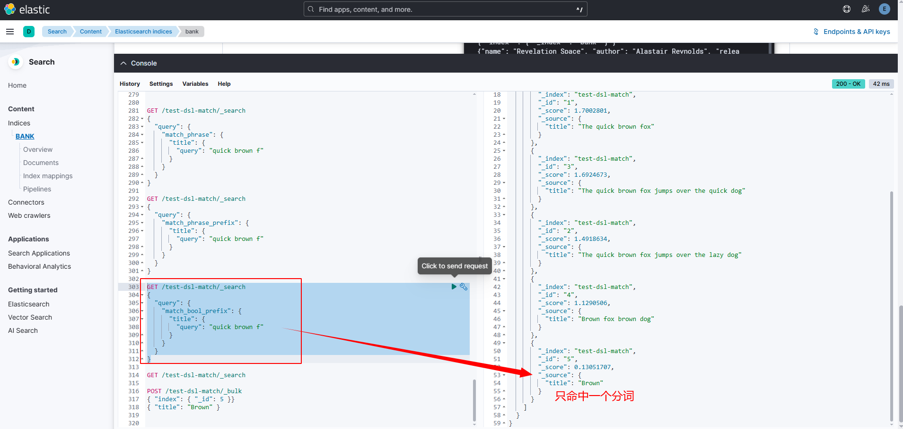

- multi_match

如果我们期望一次对多个字段查询，怎么办呢？ElasticSearch提供了multi_match查询的方式
```sh
{
  "query": {
    "multi_match" : {
      "query":    "Will Smith",
      "fields": [ "title", "*_name" ] 
    }
  }
}
```
`*`表示前缀匹配字段。

**注意上面这个查询的多个字段之间只要有一个字段满足条件就可以。**

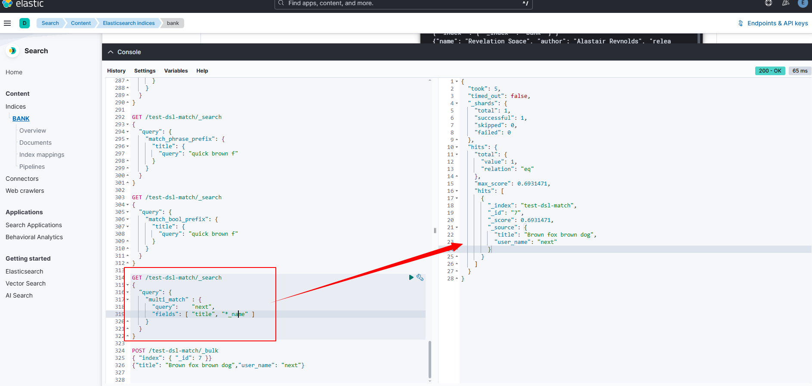

## 8.3 query string类型
> 第二类：query string 类型

### 8.3.1 query_string
此查询使用语法根据运算符（例如AND或NOT）来解析和拆分提供的查询字符串。然后查询在返回匹配的文档之前独立分析每个拆分的文本。

可以使用该query_string查询创建一个复杂的搜索，其中包括通配符，跨多个字段的搜索等等。尽管用途广泛，但查询是严格的，如果查询字符串包含任何无效语法，则返回错误。

例如：
```sh
GET /test-dsl-match/_search
{
  "query": {
    "query_string": {
      "query": "(lazy dog) OR (brown dog)",
      "default_field": "title"
    }
  }
}
```
这里查询结果，你需要理解**本质上查询这四个分词（term）or的结果**而已，所以doc 3和4也在其中


对构筑知识体系已经够了，但是它其实还有很多参数和用法，更多请<a href='https://www.elastic.co/docs/reference/query-languages/query-dsl/query-dsl-query-string-query'>参考官网</a>

### 8.3.2 query_string_simple
该查询使用一种简单的语法来解析提供的查询字符串并将其拆分为基于特殊运算符的术语。然后查询在返回匹配的文档之前独立分析每个术语。

尽管其语法比query_string查询更受限制 ，但**simple_query_string 查询不会针对无效语法返回错误。而是，它将忽略查询字符串的任何无效部分。**

举例：
```sh
GET /test-dsl-match/_search
{
  "query": {
    "simple_query_string" : {
        "query": "\"over the\" + (lazy | quick) + dog",
        "fields": ["title"],
        "default_operator": "and"
    }
  }
}
```


更多请参考<a href='https://www.elastic.co/docs/reference/query-languages/query-dsl/query-dsl-simple-query-string-query'>官网</a>

## 8.4 Interval类型
> 第三类：interval类型

Intervals是时间间隔的意思，本质上将多个规则按照顺序匹配。

比如：
```sh
GET /test-dsl-match/_search
{
  "query": {
    "intervals" : {
      "title" : {
        "all_of" : {
          "ordered" : true,
          "intervals" : [
            {
              "match" : {
                "query" : "quick",
                "max_gaps" : 0,
                "ordered" : true
              }
            },
            {
              "any_of" : {
                "intervals" : [
                  { "match" : { "query" : "jump over" } },
                  { "match" : { "query" : "quick dog" } }
                ]
              }
            }
          ]
        }
      }
    }
  }
}
```


因为interval之间是可以组合的，所以它可以表现的很复杂。更多请参考<a href='https://www.elastic.co/docs/reference/query-languages/query-dsl/query-dsl-intervals-query'>官网</a>

## 8.5 Intervals 查询的核心概念

**Intervals 查询**：允许您定义**多个匹配规则**，并指定这些规则之间的**顺序关系和位置关系**。

### 针对8.4节的查询案例进行拆解

```json
{
  "query": {
    "intervals": {
      "title": {
        "all_of": {                    // 第一层：必须满足所有条件
          "ordered": true,            // 规则必须按顺序出现
          "intervals": [              // 包含两个规则
            {
              "match": {              // 规则1：匹配 "quick"
                "query": "quick",
                "max_gaps": 0,        // 不允许有间隔
                "ordered": true       // 词项必须按顺序
              }
            },
            {
              "any_of": {             // 规则2：满足任意一个子条件
                "intervals": [
                  { "match": { "query": "jump over" } },  // 子条件A
                  { "match": { "query": "quick dog" } }   // 子条件B
                ]
              }
            }
          ]
        }
      }
    }
  }
}
```

### 规则解释（像闯关游戏）

#### 第一关：`all_of`（必须全部通过）
- **`ordered: true`**：两个规则必须**按顺序**出现在文档中
- 规则1必须先出现，规则2必须在规则1之后出现

#### 规则1：匹配 "quick"
- **`query: "quick"`**：必须包含单词 "quick"
- **`max_gaps: 0`**："quick" 的各个字母之间不能有间隔（但这里"quick"是单个词，这个参数主要对短语有用）
- **`ordered: true`**：如果是短语，词项必须按顺序

#### 规则2：`any_of`（二选一）
- 满足 **A** 或 **B** 任意一个即可：

**A. `"jump over"`**
- 必须包含连续的短语 "jump over"

**B. `"quick dog"`**  
- 必须包含连续的短语 "quick dog"

### 匹配逻辑流程图

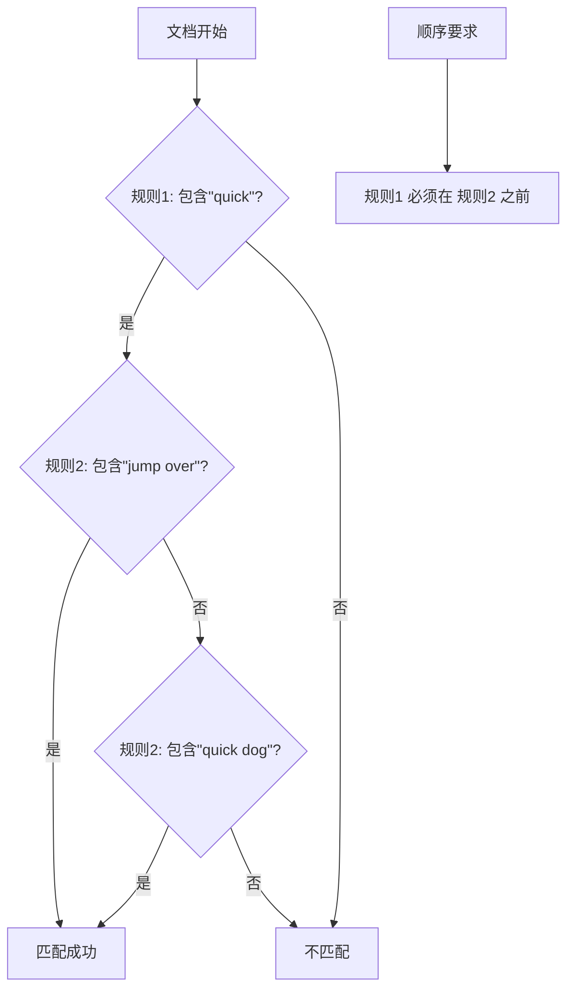

### 实际匹配示例

#### ✅ 匹配的文档：
```json
// 文档1：匹配规则1 + 规则2A
{ "title": "quick jump over the fence" }

// 文档2：匹配规则1 + 规则2B  
{ "title": "quick quick dog runs" }

// 文档3：匹配（规则1出现在前，规则2出现在后）
{ "title": "The quick brown fox and then jump over" }
```

#### ❌ 不匹配的文档：
```json
// 文档4：顺序不对（规则2在规则1之前）
{ "title": "jump over quick" }

// 文档5：缺少规则1
{ "title": "jump over the fence" }

// 文档6：规则2的两个条件都不满足
{ "title": "quick brown fox" }
```

### 关键参数详解

#### `max_gaps`：最大间隔
- `0`：词项必须连续出现（像短语查询）
- `1`：允许最多1个词在中间
- `-1`：不限制间隔

**示例**：
```json
{ "match": { "query": "quick brown", "max_gaps": 1 } }
```
匹配：`"quick brown"`, `"quick lazy brown"`  
不匹配：`"quick very lazy brown"`（间隔太大）

#### `ordered`：顺序要求
- `true`：词项必须按查询顺序出现
- `false`：词项可以任意顺序出现

### 与其他查询的对比

| 查询类型 | 特点 | 适用场景 |
|---------|------|----------|
| `match` | 简单关键词匹配 | 普通搜索 |
| `match_phrase` | 精确短语匹配 | 固定短语 |
| `intervals` | **可编程的**短语匹配 | 复杂规则匹配 |

### 实际应用场景

#### 场景1：法律文档搜索
```json
{
  "intervals": {
    "content": {
      "all_of": {
        "ordered": true,
        "intervals": [
          { "match": { "query": "甲方" } },
          { "match": { "query": "违约责任" } },
          { 
            "any_of": {
              "intervals": [
                { "match": { "query": "赔偿金" } },
                { "match": { "query": "违约金" } }
              ]
            }
          }
        ]
      }
    }
  }
}
```

#### 场景2：产品搜索
```json
{
  "intervals": {
    "description": {
      "all_of": {
        "ordered": false,  // 顺序不重要
        "intervals": [
          { "match": { "query": "智能手机" } },
          { 
            "any_of": {
              "intervals": [
                { "match": { "query": "5G" } },
                { "match": { "query": "旗舰" } }
              ]
            }
          }
        ]
      }
    }
  }
}
```

### 总结

**Intervals 查询的核心价值**：
1. **组合性**：可以嵌套多种规则（all_of, any_of, match等）
2. **精确控制**：可以指定词序、间隔、位置关系
3. **灵活性**：比固定短语查询更适应复杂需求

**适合使用 Intervals 的场景**：
- 需要复杂匹配规则的搜索
- 法律、专利等专业文档检索
- 需要精确控制词项位置关系的应用

这种查询虽然语法复杂，但提供了前所未有的匹配精度控制能力！

# 九、ES详解 - 查询：DSL查询之Term详解
> DSL查询另一种极为常用的是对词项进行搜索，官方文档中叫”term level“查询，本文主要对term level搜索进行详解。
## 9.1 Term查询引入
如前文所述，查询分基于文本查询和基于词项的查询:


本文主要讲基于词项的查询。


## 9.2 Term查询
很多比较常用，也不难，就是需要结合实例理解。这里综合官方文档的内容，我设计一个测试场景的数据，以覆盖所有例子。@pdai

准备数据
```sh
PUT /test-dsl-term-level
{
  "mappings": {
    "properties": {
      "name": {
        "type": "keyword"
      },
      "programming_languages": {
        "type": "keyword"
      },
      "required_matches": {
        "type": "long"
      }
    }
  }
}

POST /test-dsl-term-level/_bulk
{ "index": { "_id": 1 }}
{"name": "Jane Smith", "programming_languages": [ "c++", "java" ], "required_matches": 2}
{ "index": { "_id": 2 }}
{"name": "Jason Response", "programming_languages": [ "java", "php" ], "required_matches": 2}
{ "index": { "_id": 3 }}
{"name": "Dave Pdai", "programming_languages": [ "java", "c++", "php" ], "required_matches": 3, "remarks": "hello world"}
```
### 9.2.1 字段是否存在:exist
由于多种原因，文档字段的索引值可能不存在：

- 源JSON中的字段是null或[]
- 该字段已"index" : false在映射中设置
- 字段值的长度超出ignore_above了映射中的设置
- 字段值格式错误，并且ignore_malformed已在映射中定义

所以exist表示查找是否存在字段。
```sh
GET /test-dsl-term-level/_search
{
  "query":{
    "exists":{
      "field":"remarks"
    }
  }
}
```


`exists` 查询用于查找**包含某个字段**的文档（即字段存在且被索引）。如果字段不存在或未被索引，`exists` 查询就不会匹配。以下四个条件描述了字段未被索引的常见原因。

---

#### 补充：exist 四个条件详细解释

##### 1. 源 JSON 中的字段是 `null` 或 `[]`
- **含义**：如果源文档中该字段的值是 `null`（空值）或空数组 `[]`，Elasticsearch 不会索引该字段。
- **示例**：
  - 文档：`{ "name": null }` 或 `{ "tags": [] }`
  - 结果：`name` 或 `tags` 字段不会被索引，因此 `exists` 查询不会匹配。
- **原因**：Elasticsearch 默认忽略 `null` 值和空数组，因为它们被视为"无实际内容"。

##### 2. 该字段已设置 `"index": false` 在映射中
- **含义**：在索引映射（mapping）中，字段被显式设置为 `"index": false`，这意味着字段不会被索引。
- **示例**：
  - 映射：`{ "properties": { "secret_field": { "type": "text", "index": false } } }`
  - 结果：即使文档有 `secret_field` 值，它也不会被索引，`exists` 查询无法检测到。
- **用途**：通常用于存储但不搜索的字段（如原始数据备份）。

##### 3. 字段值的长度超出 `ignore_above` 了映射中的设置
- **含义**：对于 `keyword` 类型字段，映射中可以设置 `ignore_above` 参数。如果字段值的字符长度超过这个阈值，该值不会被索引。
- **示例**：
  - 映射：`{ "properties": { "id": { "type": "keyword", "ignore_above": 10 } } }`
  - 文档：`{ "id": "very_long_identifier" }`（长度超过 10）
  - 结果：`id` 字段不会被索引，`exists` 查询不会匹配（但字段本身存在，只是值未被索引）。
- **注意**：`exists` 查询只检查字段是否存在索引，如果值因超长被忽略，字段可能被视为"不存在"。

##### 4. 字段值格式错误，并且 `ignore_malformed` 已在映射中定义
- **含义**：如果字段值不符合预期格式（如数字字段传入字符串），且映射中设置了 `"ignore_malformed": true`，Elasticsearch 会忽略格式错误的值，不索引该字段。
- **示例**：
  - 映射：`{ "properties": { "age": { "type": "integer", "ignore_malformed": true } } }`
  - 文档：`{ "age": "not_a_number" }`（字符串无法转为整数）
  - 结果：`age` 字段不会被索引，`exists` 查询不会匹配。
- **用途**：防止错误数据破坏索引，但字段在搜索中无效。

---

##### 5. 总结
- `exists` 查询依赖于字段**是否被成功索引**。上述四个条件都会导致字段未被索引，因此 `exists` 查询无法找到这些文档。
- 实际使用中，需要注意映射设置和数据质量，以确保 `exists` 查询按预期工作。

### 9.2.2 id查询:ids
ids 即对id查找
```sh
GET /test-dsl-term-level/_search
{
  "query": {
    "ids": {
      "values": [3, 1]
    }
  }
}
```


### 9.2.3 前缀:prefix
通过前缀查找某个字段
```sh
GET /test-dsl-term-level/_search
{
  "query": {
    "prefix": {
      "name": {
        "value": "jan"
      }
    }
  }
}
```

**但是值得注意的是，我发现使用prefix的时候必须使用小写才能够搜索出来前缀匹配，用大写就不行了。**

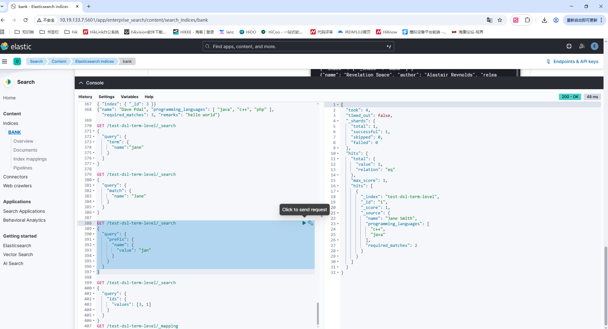

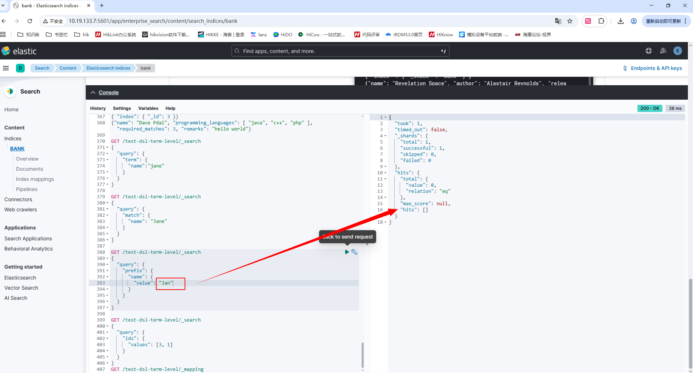

**如果我使用name.keyword进行前缀查询的话是可以搜索出大写的情况，但是搜索不出小写的情况**

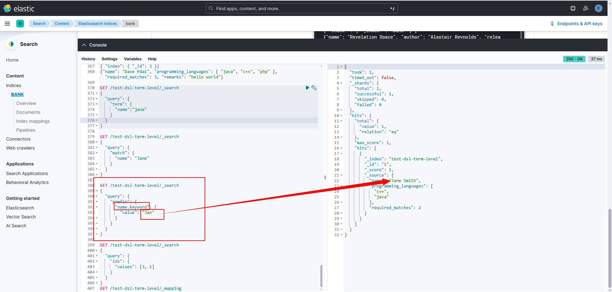

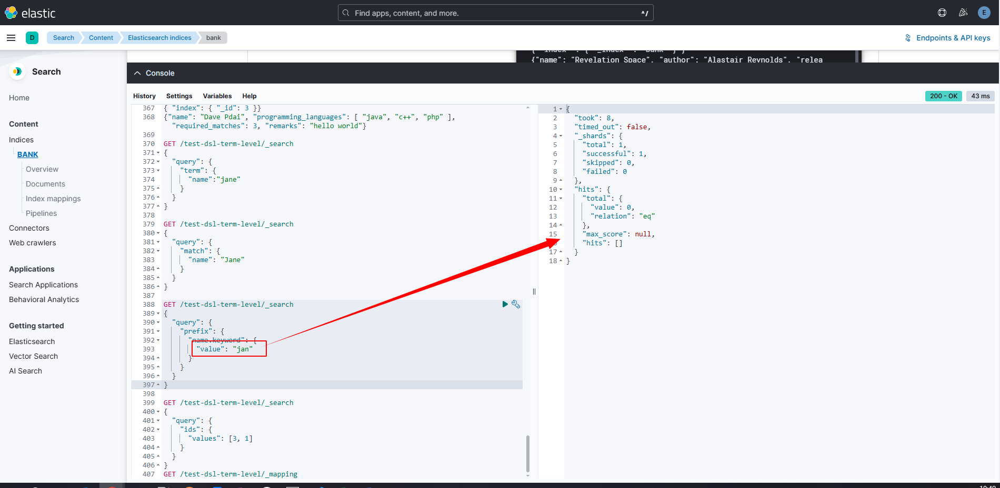

由此也可以理解，这里的前缀匹配是区分大小写的，name是text，因此对比的是分词之后的，但是name.keyword是不分词的，就是大写的，下面进行一个总结。

#### 补充1：针对prefix的解读

##### 1. 文本分析流程
当文档被索引时，`text` 类型的字段会经过分析器处理：
```
原始文本："Jane Smith"
    ↓ 分析器处理（分词 + 小写化）
分词结果：["jane", "smith"]
```

##### 2. 前缀查询的工作方式
- **`prefix` 查询**是在**分词后的词项**上进行匹配
- 它不会重新分析查询词，而是直接与索引中的词项比较

##### 3. 具体分析两个查询

###### 查询1：`"value": "jan"` ✅ 成功
```json
查询词："jan"
索引中的词项：["jane", "smith"]
匹配结果："jan" 是 "jane" 的前缀 → 匹配成功
```

###### 查询2：`"value": "Jan"` ❌ 失败  
```json
查询词："Jan"（注意首字母大写）
索引中的词项：["jane", "smith"]（全部小写）
匹配结果："Jan" 不是 "jane" 的前缀 → 匹配失败
```

##### 4. 验证索引映射

让我们检查一下您的索引映射，确认字段类型：

```bash
GET /test-dsl-term-level/_mapping
```

**可能的映射情况**：
```json
{
  "test-dsl-term-level": {
    "mappings": {
      "properties": {
        "name": {
          "type": "text",        // 文本类型，会被分析
          "fields": {
            "keyword": {
              "type": "keyword",  // 关键字类型，保持原样
              "ignore_above": 256
            }
          }
        }
      }
    }
  }
}
```

##### 5. 解决方案

###### 方案1：使用 `.keyword` 子字段（推荐）
```json
GET /test-dsl-term-level/_search
{
  "query": {
    "prefix": {
      "name.keyword": {    // 使用keyword子字段
        "value": "Jan"     // 现在可以匹配"Jane Smith"
      }
    }
  }
}
```

###### 方案2：使用通配符查询（wildcard）
```json
GET /test-dsl-term-level/_search
{
  "query": {
    "wildcard": {
      "name": {
        "value": "Jan*"    // 通配符查询，会重新分析
      }
    }
  }
}
```

###### 方案3：使用匹配查询（match）配合前缀
```json
GET /test-dsl-term-level/_search
{
  "query": {
    "match_phrase_prefix": {
      "name": "Jan"    // 短语前缀查询
    }
  }
}
```

##### 6. 理解不同字段类型的区别

| 字段类型 | 分析行为 | 前缀查询效果 |
|---------|---------|-------------|
| `text` | 分词 + 小写化 | 查询词必须小写 |
| `keyword` | 保持原样 | 区分大小写 |
| `text` + `keyword` 多字段 | 两种方式都存储 | 根据需要选择 |

##### 7. 总结

**关键点**：
- `text` 字段在索引时会被**小写化**
- `prefix` 查询直接匹配索引中的词项，**不重新分析查询词**
- 因此查询词必须与索引中的词项**大小写一致**

**最佳实践**：
- 如果需要进行精确的前缀匹配（包括大小写），使用 `name.keyword`
- 如果需要进行模糊前缀匹配，使用 `match_phrase_prefix`
- 了解字段的映射类型对于正确使用查询至关重要

#### 补充2：针对text类型的mapping解读
我们查看一下mapping信息
```sh
GET /test-dsl-term-level/_mapping
```

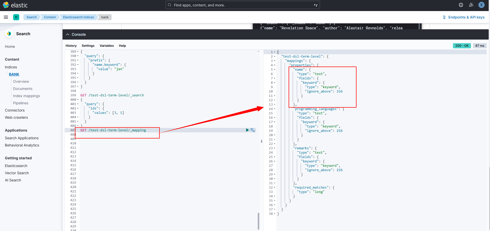


##### 核心概念：多字段（Multi-fields）
您看到的这个结构是 **多字段映射**，允许同一个字段以**不同方式**被索引和存储。

```json
{
  "name": {
    "type": "text",                    // 主字段：用于全文搜索
    "fields": {                        // 子字段定义
      "keyword": {                     // 子字段名称：keyword
        "type": "keyword",             // 子字段类型：keyword
        "ignore_above": 256            // 参数：超过256字符不索引
      }
    }
  }
}
```

##### `text` vs `keyword` 的区别

| 特性 | `text` 类型 | `keyword` 类型 |
|------|-------------|----------------|
| **分词处理** | ✅ 会分词（拆分成单词） | ❌ 不分词（整体存储） |
| **大小写** | 通常小写化 | 保持原样（区分大小写） |
| **用途** | 全文搜索、模糊匹配 | 精确匹配、排序、聚合 |
| **存储示例** | "Jane Smith" → ["jane", "smith"] | "Jane Smith" → "Jane Smith" |

##### 实际数据存储示例

对于文档：`{ "name": "Jane Smith" }`

###### 在倒排索引中的存储：
```
text字段（name）:
- 词项: "jane" → 文档1
- 词项: "smith" → 文档1

keyword字段（name.keyword）:  
- 词项: "Jane Smith" → 文档1
```

##### 不同查询的匹配效果

###### 1. 查询 `text` 字段（name）
```json
GET /test-dsl-term-level/_search
{
  "query": {
    "match": {
      "name": "jane"    // ✅ 匹配（小写）
    }
  }
}
```

###### 2. 查询 `keyword` 字段（name.keyword）
```json
GET /test-dsl-term-level/_search
{
  "query": {
    "term": {
      "name.keyword": "Jane Smith"    // ✅ 精确匹配（区分大小写）
    }
  }
}
```

##### 为什么需要多字段配置？

###### 场景1：既要搜索又要排序
```json
// 搜索包含"Smith"的所有文档
{
  "query": { "match": { "name": "smith" } },
  "sort": [
    { "name.keyword": "asc" }  // 按完整姓名排序
  ]
}
```

###### 场景2：精确值聚合
```json
{
  "aggs": {
    "unique_names": {
      "terms": {
        "field": "name.keyword",  // 获取每个完整姓名的计数
        "size": 10
      }
    }
  }
}
```

##### `ignore_above` 参数的作用

```json
"keyword": {
  "type": "keyword",
  "ignore_above": 256    // 超过256字符的值不会被索引
}
```

**示例**：
- ✅ 匹配："Jane Smith"（长度10）
- ❌ 不匹配："这是一个非常长的姓名，长度超过256字符..."（长度257）

##### 实际应用场景

###### 1. 产品名称搜索
```json
{
  "product_name": {
    "type": "text",        // 用于搜索"苹果 手机"
    "fields": {
      "keyword": {         // 用于精确匹配"Apple iPhone 14 Pro Max"
        "type": "keyword"
      }
    }
  }
}
```

###### 2. 邮箱地址处理
```json
{
  "email": {
    "type": "text",        // 搜索"gmail.com"
    "fields": {
      "keyword": {         // 精确匹配"user@gmail.com"  
        "type": "keyword"
      }
    }
  }
}
```

##### 验证映射效果

###### 查看分析结果：
```json
POST /test-dsl-term-level/_analyze
{
  "field": "name",        // 分析text字段
  "text": "Jane Smith"
}
// 结果：["jane", "smith"]

POST /test-dsl-term-level/_analyze  
{
  "field": "name.keyword", // 分析keyword字段
  "text": "Jane Smith"
}
// 结果：["Jane Smith"]（整体）
```

##### 总结

**`keyword` 子字段的核心价值**：
1. **精确匹配**：保持原始值，区分大小写
2. **排序聚合**：支持基于完整值的操作
3. **数据完整性**：不改变原始数据格式

**使用建议**：
- 搜索内容时用 `name`（text字段）
- 精确匹配、排序、聚合时用 `name.keyword`

#### 补充3：为什么 `prefix` 查询和 `match_phrase_prefix` 查询在处理大小写方面表现不同


##### 核心区别：查询类型的不同

###### 1. `prefix` 查询（术语级查询）
- **类型**：术语级查询（Term-level Query）
- **工作方式**：直接在倒排索引中的**词项**上进行匹配
- **不进行查询分析**：查询词 `"jan"` 或 `"Jan"` 不会重新分析
- **匹配逻辑**：`"jan"` vs 索引中的 `["jane", "smith"]`

```json
// prefix查询 - 不分析查询词
{
  "query": {
    "prefix": {
      "name": {
        "value": "Jan"  // 直接与索引词项比较："Jan" vs "jane"
      }
    }
  }
}
```

###### 2. `match_phrase_prefix` 查询（全文查询）
- **类型**：全文查询（Full-text Query）
- **工作方式**：**先分析查询词**，再与索引词项匹配
- **进行查询分析**：查询词 `"Jan"` 会经过相同的分析器处理
- **匹配逻辑**：`"Jan"` → 分析 → `"jan"` vs 索引中的 `["jane", "smith"]`

```json
// match_phrase_prefix查询 - 先分析查询词
{
  "query": {
    "match_phrase_prefix": {
      "name": "Jan"  // 先分析为"jan"，再与索引词项比较
    }
  }
}
```

##### 详细对比

| 特性 | `prefix` 查询 | `match_phrase_prefix` 查询 |
|------|---------------|---------------------------|
| **查询类型** | 术语级查询 | 全文查询 |
| **查询分析** | ❌ 不分析查询词 | ✅ 分析查询词 |
| **大小写敏感** | ✅ 敏感（直接匹配） | ❌ 不敏感（先小写化） |
| **性能** | 更高（直接查找） | 稍低（需要分析） |
| **适用场景** | 精确前缀匹配 | 模糊前缀搜索 |

### 9.2.4 分词匹配:term
前文最常见的根据分词查询
```sh
GET /test-dsl-term-level/_search
{
  "query": {
    "term": {
      "programming_languages": "php"
    }
  }
}
```


### 9.2.5 多个分词匹配:terms
按照读个分词term匹配，**它们是or的关系**
```sh
GET /test-dsl-term-level/_search
{
  "query": {
    "terms": {
      "programming_languages": ["php","c++"]
    }
  }
}
```


### 9.2.6 按某个数字字段分词匹配:term set
**设计这种方式查询的初衷是用文档中的数字字段动态匹配查询满足term的个数**

有两种写法：
- 写法一
```sh
GET /test-dsl-term-level/_search
{
  "query": {
    "terms_set": {
      "programming_languages": {
        "terms": [ "java", "php" ],
        "minimum_should_match_field": "required_matches"
      }
    }
  }
}
```
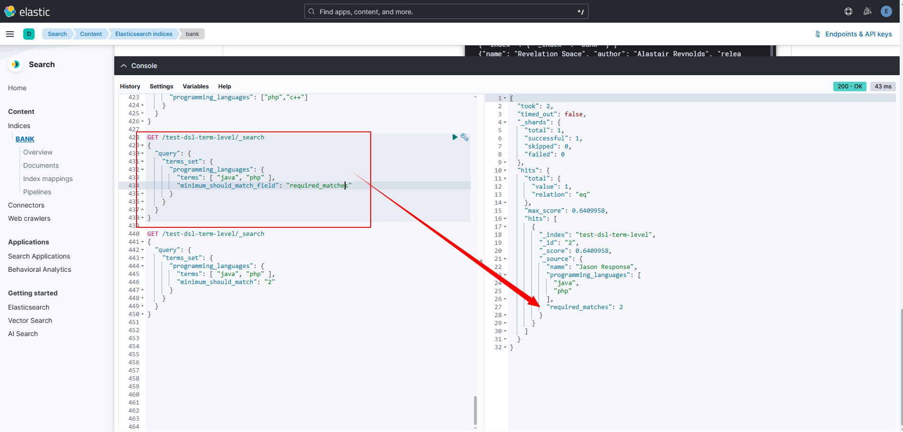

- 写法二
```sh
GET /test-dsl-term-level/_search
{
  "query": {
    "terms_set": {
      "programming_languages": {
        "terms": [ "java", "php" ],
        "minimum_should_match": "2"
      }
    }
  }
}
```
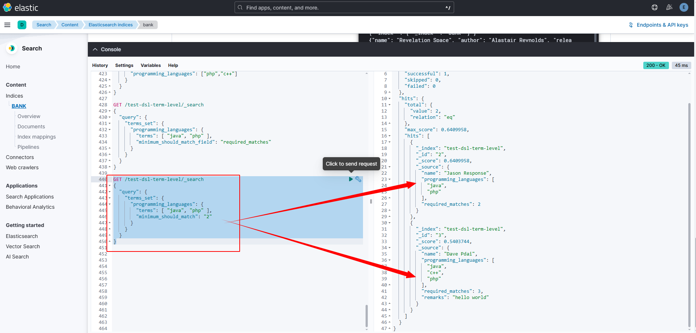

我们可以看到这两种查询结果不一样，是因为第一种会根据数据中的required_matches字段动态分配匹配的数量。第二种是写死的。`Dave Pdai`再动态数据时是按照至少3个分词匹配，所以动态匹配匹配不上，静态匹配是写死的2个所以可以匹配上。

**详细对比分析**

| 特性 | `minimum_should_match_field` | `minimum_should_match` |
|------|-----------------------------|------------------------|
| **配置方式** | 动态（基于文档字段值） | 静态（固定值） |
| **灵活性** | 高（每个文档可不同） | 低（所有文档相同） |
| **数据要求** | 需要额外的字段存储匹配数 | 不需要额外字段 |
| **适用场景** | 个性化匹配规则 | 统一匹配规则 |

### 9.2.7 通配符:wildcard
通配符匹配，比如`*`.**`wildcard` 查询在 Elasticsearch 中是区分大小写的**。
```sh
GET /test-dsl-term-level/_search
{
  "query": {
    "wildcard": {
      "name": {
        "value": "D*ai",
        "boost": 1.0,
        "rewrite": "constant_score"
      }
    }
  }
}
```

**基本语法**
```sh
GET /test-dsl-term-level/_search
{
  "query": {
    "wildcard": {
      "字段名": {
        "value": "通配符模式",
        "boost": 权重系数,
        "rewrite": "重写策略"
      }
    }
  }
}
```
**通配符符号说明**

| 符号 | 功能 | 示例 | 匹配结果 |
|------|------|------|----------|
| `*` | 匹配0个或多个字符 | `D*ai` | `Dai`, `David`, `Danielai` |
| `?` | 匹配1个字符 | `J?ne` | `Jane`, `Jone` (不匹配 `Jeanne`) |
| `\*` | 转义星号 | `test\*` | 字面值 `test*` |
| `\?` | 转义问号 | `test\?` | 字面值 `test?` |

**参数详细说明**

1. `value`（必需）- 通配符模式
```json
{
  "wildcard": {
    "name": {
      "value": "D*ai"  // 模式：以D开头，以ai结尾
    }
  }
}
```

2. `boost`（可选）- 权重系数
```json
{
  "wildcard": {
    "name": {
      "value": "D*ai",
      "boost": 2.0  // 匹配结果的权重加倍
    }
  }
}
```

3. `rewrite`（可选）- 重写策略
```json
{
  "wildcard": {
    "name": {
      "value": "D*ai",
      "rewrite": "constant_score"  // 控制查询执行方式
    }
  }
}
```

**常用重写策略（rewrite）**

| 策略 | 说明 | 适用场景 |
|------|------|----------|
| `constant_score` | 转为常量分数查询 | **默认推荐**，性能较好 |
| `constant_score_boolean` | 布尔查询+常量分数 | 精确控制，但性能较低 |
| `scoring_boolean` | 布尔查询+评分 | 需要评分时使用 |
| `top_terms_N` | 只保留前N个词项 | 限制结果数量时 |

**实际使用示例**

示例1：基本通配符匹配
```sh
# 匹配所有以 "Ja" 开头的名字
GET /test-dsl-term-level/_search
{
  "query": {
    "wildcard": {
      "name": "Ja*"
    }
  }
}
// 匹配：Jane, James, Jason, etc.
```

示例2：单字符匹配
```sh
# 匹配类似 "Jane", "Jone" 但不匹配 "Jeanne"
GET /test-dsl-term-level/_search
{
  "query": {
    "wildcard": {
      "name": "J?ne"
    }
  }
}
```

示例3：复杂模式匹配
```sh
# 匹配以D开头，中间任意字符，以ai结尾的名字
GET /test-dsl-term-level/_search
{
  "query": {
    "wildcard": {
      "name": {
        "value": "D*ai",
        "boost": 1.5,
        "rewrite": "constant_score"
      }
    }
  }
}
// 匹配：Dai, David, Danielai, etc.
```

示例4：邮箱域名匹配
```sh
# 匹配所有 gmail 邮箱
GET /test-dsl-term-level/_search
{
  "query": {
    "wildcard": {
      "email": "*@gmail.com"
    }
  }
}
```

示例5：产品编码匹配
```sh
# 匹配产品编码：PROD-2024-XXX
GET /test-dsl-term-level/_search
{
  "query": {
    "wildcard": {
      "product_code": "PROD-2024-*"
    }
  }
}
```

**重要注意事项**

1. 字段类型要求

**wildcard 查询只适用于 `keyword` 类型字段**：
```json
// 正确的映射
{
  "mappings": {
    "properties": {
      "name": {
        "type": "keyword"  // 或者使用多字段
        // "type": "text",
        // "fields": {
        //   "keyword": {
        //     "type": "keyword"
        //   }
        // }
      }
    }
  }
}
```

2. 性能警告 ⚠️

**避免在通配符开头使用 `*`**：
```json
// ❌ 性能差（需要扫描所有词项）
{
  "wildcard": {
    "name": "*smith"
  }
}

// ✅ 性能好（使用前缀索引）
{
  "wildcard": {
    "name": "smith*"
  }
}
```

3. 与 prefix 查询的区别

| 特性 | `wildcard` 查询 | `prefix` 查询 |
|------|----------------|---------------|
| **功能** | 支持 `*` 和 `?` | 只支持前缀匹配 |
| **灵活性** | 高 | 低 |
| **性能** | 较低 | 较高 |
| **使用场景** | 复杂模式匹配 | 简单前缀匹配 |

**性能优化建议**

1. 避免开头通配符
```json
// 避免这样使用
{"wildcard": {"name": "*son"}}

// 改为这样（如果可能）
{"wildcard": {"name": "Jack*son"}}
```

2. 使用合适的重写策略
```json
{
  "wildcard": {
    "name": {
      "value": "D*ai",
      "rewrite": "constant_score"  // 大多数场景推荐
    }
  }
}
```

3. 考虑使用专门的字段
```json
// 为经常需要通配符搜索的字段创建专门索引
{
  "mappings": {
    "properties": {
      "product_code": {
        "type": "wildcard"  // Elasticsearch 7.9+ 专用类型
      }
    }
  }
}
```

**实际业务场景**

场景1：用户搜索（姓名模糊匹配）
```sh
# 用户输入 "Dav" 时显示相关结果
GET /users/_search
{
  "query": {
    "wildcard": {
      "username": "Dav*"
    }
  }
}
```

场景2：日志分析（错误代码匹配）
```sh
# 查找所有 4xx 错误
GET /logs/_search
{
  "query": {
    "wildcard": {
      "error_code": "4*"
    }
  }
}
```

场景3：产品搜索（型号匹配）
```sh
# 查找 iPhone 14 系列
GET /products/_search
{
  "query": {
    "wildcard": {
      "model": "iPhone 14*"
    }
  }
}
```

**与正则表达式查询的对比**

| 特性 | `wildcard` 查询 | `regexp` 查询 |
|------|----------------|---------------|
| **语法复杂度** | 简单 (`*`, `?`) | 复杂（完整正则） |
| **性能** | 相对较好 | 相对较差 |
| **使用难度** | 低 | 高 |
| **适用场景** | 简单模式匹配 | 复杂模式匹配 |

### 9.2.8 范围:range常常被用在数字或者日期范围的查询
```sh
GET /test-dsl-term-level/_search
{
  "query": {
    "range": {
      "required_matches": {
        "gte": 3,
        "lte": 4
      }
    }
  }
}
```


### 9.2.9 正则:regexp
通过正则表达式查询

以"Jan"开头的name字段
```sh
GET /test-dsl-term-level/_search
{
  "query": {
    "regexp": {
      "name": {
        "value": "Ja.*",
        "case_insensitive": true
      }
    }
  }
}
```


#### 补充：正则(regexp) 和 通配符(wildcard) 主要的区别是什么
##### 1. **语法和模式匹配能力**
- **`regexp` 查询**：使用完整的正则表达式语法
  ```json
  "value": "Ja.*"        // .* 表示任意字符0次或多次
  "value": "Ja.+"        // .+ 表示任意字符1次或多次  
  "value": "Ja[a-z]*"    // 字符类
  "value": "Ja{2,4}"     // 重复次数
  ```

- **`wildcard` 查询**：使用简化的通配符语法
  ```json
  "value": "Ja*"         // * 表示任意字符0次或多次
  "value": "Ja?"         // ? 表示单个任意字符
  "value": "Ja*v"        // 简单的模式匹配
  ```

##### 2. **性能差异**
- **`wildcard` 查询通常更快**：因为它使用更简单的匹配算法
- **`regexp` 查询相对较慢**：正则表达式引擎更复杂，消耗更多资源

##### 3. **功能特性对比**

| 特性 | `wildcard` | `regexp` |
|------|------------|----------|
| 前缀匹配 | ✅ `Ja*` | ✅ `Ja.*` |
| 后缀匹配 | ✅ `*id` | ✅ `.*id` |
| 中间匹配 | ✅ `J*v` | ✅ `J.*v` |
| 字符类 | ❌ | ✅ `[Jj]a.*` |
| 重复次数 | ❌ | ✅ `Ja{2,3}` |
| 分组 | ❌ | ✅ `(John|Jane).*` |
| 锚定 | ❌ | ✅ `^Ja.*` |

##### 4. **实际使用建议**

**使用 `wildcard` 的情况：**
```json
// 简单的前缀搜索（推荐）
{
  "wildcard": {
    "name": {
      "value": "Ja*",
      "case_insensitive": true
    }
  }
}

// 简单的模式匹配
{
  "wildcard": {
    "name": "J*v*d"  // 匹配 J开头，v在中间，d结尾的名字
  }
}
```

**使用 `regexp` 的情况：**
```json
// 复杂的模式匹配
{
  "regexp": {
    "name": {
      "value": "[Jj]a(n|ne).*",  // 匹配 Ja或ja开头，后面是n或ne
      "case_insensitive": true
    }
  }
}

// 精确的长度控制
{
  "regexp": {
    "name": "Ja.{2,5}"  // Ja后面跟2-5个字符
  }
}
```
### 9.2.10 模糊匹配:fuzzy
官方文档对模糊匹配：编辑距离是将一个术语转换为另一个术语所需的一个字符更改的次数。这些更改可以包括：

- 更改字符（box→ fox）
- 删除字符（black→ lack）
- 插入字符（sic→ sick）
- 转置两个相邻字符（act→ cat）
```sh
GET /test-dsl-term-level/_search
{
  "query": {
    "fuzzy": {
      "remarks": {
        "value": "heli"
      }
    }
  }
}
```


#### 补充：fuzzy的模糊匹配底层原理

##### 查询含义解析

```json
GET /test-dsl-term-level/_search
{
  "query": {
    "fuzzy": {
      "remarks": {
        "value": "hell"
      }
    }
  }
}
```

这个查询的意思是：**搜索 `remarks` 字段中包含与 "hell" 相似的词**。

##### 编辑距离（Edit Distance）解释

编辑距离衡量两个词之间的相似度，通过计算需要多少次单字符操作来转换：

| 操作类型 | 示例 | 编辑距离 |
|---------|------|----------|
| **更改字符** | `box` → `fox` | 1 |
| **删除字符** | `black` → `lack` | 1 |
| **插入字符** | `sic` → `sick` | 1 |
| **转置字符** | `act` → `cat` | 1 |

##### 您的查询实际效果

搜索 `"hell"` 会匹配以下相似的词：

```python
# 编辑距离为1的匹配
"hello"     # 插入 'o' (hell → hello)
"hel"       # 删除 'l' (hell → hel) 
"hall"      # 更改 'e'→'a' (hell → hall)
"hll"       # 删除 'e' (hell → hll)
"helle"     # 插入 'e' (hell → helle)

# 编辑距离为2的匹配（默认最大距离）
"halo"      # 更改 'e'→'a', 更改 'l'→'o'
"help"      # 更改 'l'→'p', 删除 'l'
```

##### 截图内容分析

根据截图文件名 `93.es-dsl-term-11.png`，应该显示：

1. **匹配到的文档**：包含与 "hell" 相似的词
2. **相似度评分**：基于编辑距离计算的相关性分数
3. **实际匹配的词**：如 "hello"、"hel" 等

##### 模糊查询的常用参数

```json
GET /test-dsl-term-level/_search
{
  "query": {
    "fuzzy": {
      "remarks": {
        "value": "hell",
        "fuzziness": "AUTO",    // 自动根据词长确定编辑距离
        "prefix_length": 2,     // 前2个字符必须精确匹配
        "max_expansions": 50,   // 最大扩展数
        "transpositions": true  // 是否允许字符转置
      }
    }
  }
}
```

1. **fuzziness** - 编辑距离控制
```json
"fuzziness": "AUTO"
// 自动规则：
// - 1-2字符：必须精确匹配 (距离=0)
// - 3-5字符：允许1次编辑 (距离=1)  
// - >5字符：允许2次编辑 (距离=2)

"fuzziness": 1  // 固定允许1次编辑
"fuzziness": 2  // 固定允许2次编辑
```

2. **prefix_length** - 前缀精确匹配
```json
"prefix_length": 2
// 搜索 "hello" 时：
// ✅ 匹配：hello, hell, helo, hallo
// ❌ 不匹配：bello, cello (前2字符不同)
```

3. **max_expansions** - 性能控制
```json
"max_expansions": 50
// 限制生成的候选词数量，防止性能问题
```

4. **transpositions** - 字符交换
```json
"transpositions": true
// 允许：ab → ba, 如 "act" ↔ "cat"
```

##### 实际应用场景

###### 1. 拼写纠错
```json
// 用户输入 "helo" 搜索 "hello"
{
  "fuzzy": {
    "title": {
      "value": "helo",
      "fuzziness": 1
    }
  }
}
```

###### 2. 姓名模糊匹配
```json
// 搜索 "Jon" 匹配 "John"
{
  "fuzzy": {
    "author": {
      "value": "Jon",
      "fuzziness": 1
    }
  }
}
```

###### 3. 产品名称容错
```json
// 搜索 "iphne" 匹配 "iphone"
{
  "fuzzy": {
    "product_name": {
      "value": "iphne", 
      "fuzziness": 2
    }
  }
}
```

##### 性能注意事项

- **避免在长文本字段使用**：模糊查询适合短词匹配
- **设置合理的 `fuzziness`**：通常1-2就够了
- **结合 `prefix_length`**：提高性能，减少匹配范围

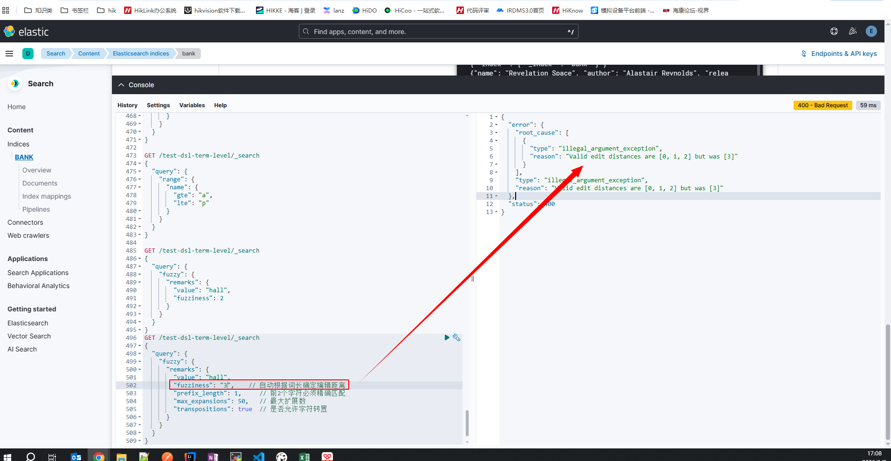

##### max_expansions 参数详解
###### 什么是"变体"？

当您搜索 `"hell"` 时，Elasticsearch 会生成一系列相似的词（变体）来进行匹配：

```python
# 基于 "hell" 生成的变体示例
原始词: "hell"

# 编辑距离为1的变体：
"hel"    (删除l)
"helo"   (插入o)  
"hall"   (e→a)
"helll"  (插入l)
"hll"    (删除e)
"jell"   (h→j)

# 编辑距离为2的变体：
"halo"   (e→a, l→o)
"help"   (l→p, 删除l)
"heal"   (l→a, 删除l)
"hallo"  (插入a, e→a)
```

###### `max_expansions` 的作用机制


###### 实际工作流程示例

情况1：`max_expansions = 10`
```json
{
  "fuzzy": {
    "remarks": {
      "value": "hell",
      "fuzziness": 2,
      "max_expansions": 10
    }
  }
}
```
**结果：** 只使用前10个生成的变体进行匹配

情况2：`max_expansions = 50`  
```json
{
  "fuzzy": {
    "remarks": {
      "value": "hell", 
      "fuzziness": 2,
      "max_expansions": 50
    }
  }
}
```
**结果：** 使用前50个生成的变体进行匹配

###### 变体的生成顺序

Elasticsearch 按以下优先级生成变体：

1. **编辑距离小的优先**（距离1 > 距离2）
2. **相同距离按字母顺序**
3. **相同字母按生成算法顺序**

###### 实际影响示例

假设您的索引包含：
```python
文档1: "hello world"
文档2: "halo world"  
文档3: "heal the world"
文档4: "jelly world"
```

**搜索 `"hell"` 时的匹配情况：**

| max_expansions | 匹配到的文档 | 原因分析 |
|----------------|-------------|----------|
| **5** | 文档1("hello") | 只包含最高优先级的几个变体 |
| **10** | 文档1, 文档2("halo") | 包含更多距离1的变体 |
| **20** | 文档1, 文档2, 文档3("heal") | 包含距离2的更多变体 |
| **50** | 文档1, 文档2, 文档3, 文档4("jelly") | 包含几乎所有可能变体 |

###### 性能考虑

```json
// 推荐配置：平衡召回率和性能
{
  "fuzzy": {
    "title": {
      "value": "search_term",
      "fuzziness": "AUTO",
      "max_expansions": 50,    // 适中数量
      "prefix_length": 2       // 配合使用，减少变体数量
    }
  }
}
```

###### 最佳实践建议

1. **短词搜索**：`max_expansions = 20-30`
2. **长词搜索**：`max_expansions = 50-100`  
3. **性能敏感场景**：`max_expansions = 10-20` + `prefix_length = 1-2`
4. **高召回率需求**：`max_expansions = 100-200`
5. **如果 max_expansions 设置得太小，即使有满足编辑距离条件的文档，也可能不会出现在查询结果中。**

# 十、ES详解 - 聚合：聚合查询之Bucket聚合详解
> 除了查询之外，最常用的**聚合**了，ElasticSearch提供了三种聚合方式： **桶聚合(Bucket Aggregation)**，**指标聚合(Metric Aggregation)**和 **管道聚合(Pipline Aggregation)**。本文主要讲讲**桶聚合(Bucket Aggregation)**。

## 10.1 聚合的引入
我们在SQL结果中常有：
```sql
SELECT COUNT(color) 
FROM table
GROUP BY color 
```
ElasticSearch中**桶**在概念上类似于 SQL 的分组（`GROUP BY`），而**指标**则类似于 `COUNT()` 、 `SUM()` 、 `MAX()` 等统计方法。

进而引入了两个概念：

- **桶（Buckets）** 满足特定条件的文档的集合
- **指标（Metrics）** 对桶内的文档进行统计计算

所以ElasticSearch包含3种聚合(Aggregation)方式

- **桶聚合(Bucket Aggregation)** - 本文中详解
- **指标聚合(Metric Aggregation)** - 下文中讲解
- **管道聚合(Pipline Aggregation)** - 再下一篇讲解
  - **聚合管道化**，简单而言就是上一个聚合的结果成为下个聚合的输入；

(PS:指标聚合和桶聚合很多情况下是组合在一起使用的，其实你也可以看到，桶聚合本质上是一种特殊的指标聚合，它的聚合指标就是数据的条数count)

## 10.2 如何理解Bucket聚合
> 如果你直接去看文档，大概有几十种：


要么你需要花大量时间学习，要么你已经迷失或者即将迷失在知识点中...

所以你需要稍微站在**设计者的角度思考**下，不难发现设计上大概分为三类（当然有些是第二和第三类的融合）


（图中并没有全部列出内容，因为图要表达的意图我觉得还是比较清楚的，这就够了；有了这种思虑和认知，会大大提升你的认知效率。）

## 10.3 按知识点学习聚合
> 我们先按照官方权威指南中的一个例子，学习Aggregation中的知识点。
### 10.3.1 准备数据
让我们先看一个例子。我们将会创建一些对汽车经销商有用的聚合，数据是关于汽车交易的信息：车型、制造商、售价、何时被出售等。

首先我们批量索引一些数据：
```sh
POST /test-agg-cars/_bulk
{ "index": {}}
{ "price" : 10000, "color" : "red", "make" : "honda", "sold" : "2014-10-28" }
{ "index": {}}
{ "price" : 20000, "color" : "red", "make" : "honda", "sold" : "2014-11-05" }
{ "index": {}}
{ "price" : 30000, "color" : "green", "make" : "ford", "sold" : "2014-05-18" }
{ "index": {}}
{ "price" : 15000, "color" : "blue", "make" : "toyota", "sold" : "2014-07-02" }
{ "index": {}}
{ "price" : 12000, "color" : "green", "make" : "toyota", "sold" : "2014-08-19" }
{ "index": {}}
{ "price" : 20000, "color" : "red", "make" : "honda", "sold" : "2014-11-05" }
{ "index": {}}
{ "price" : 80000, "color" : "red", "make" : "bmw", "sold" : "2014-01-01" }
{ "index": {}}
{ "price" : 25000, "color" : "blue", "make" : "ford", "sold" : "2014-02-12" }
```
### 10.3.2 标准的聚合
有了数据，开始构建我们的第一个聚合。汽车经销商可能会想知道哪个颜色的汽车销量最好，用聚合可以轻易得到结果，用 terms 桶操作：
```sh
GET /test-agg-cars/_search
{
    "size" : 0,
    "aggs" : { 
        "popular_colors" : { 
            "terms" : { 
              "field" : "color.keyword"
            }
        }
    }
}
```
1. 聚合操作被置于顶层参数 aggs 之下（如果你愿意，完整形式 aggregations 同样有效）。
2. 然后，可以为聚合指定一个我们想要名称，本例中是： popular_colors 。
3. 最后，定义单个桶的类型 terms 。

结果如下：


1. **因为我们设置了 size 参数，所以不会有 hits 搜索结果返回。size是返回命中结果的数量，设置为0就不显示命中结果所以不会有 hits 搜索结果返回**
2. popular_colors 聚合是作为 aggregations 字段的一部分被返回的。
3. 每个桶的 key 都与 color 字段里找到的唯一词对应。它总会包含 doc_count 字段，告诉我们包含该词项的文档数量。
4. 每个桶的数量代表该颜色的文档数量。

### 10.3.3 多个聚合
同时计算两种桶的结果：对color和对make。
```sh
GET /test-agg-cars/_search
{
    "size" : 0,
    "aggs" : { 
        "popular_colors" : { 
            "terms" : { 
              "field" : "color.keyword"
            }
        },
        "make_by" : { 
            "terms" : { 
              "field" : "make.keyword"
            }
        }
    }
}
```
结果如下：


### 10.3.4 聚合的嵌套
这个新的聚合层让我们可以将 avg 度量嵌套置于 terms 桶内。实际上，这就为每个颜色生成了平均价格。
```sh
GET /test-agg-cars/_search
{
   "size" : 0,
   "aggs": {
      "colors": {
         "terms": {
            "field": "color.keyword"
         },
         "aggs": { 
            "avg_price": { 
               "avg": {
                  "field": "price" 
               }
            }
         }
      }
   }
}
```
结果如下：


正如 颜色 的例子，我们需要给度量起一个名字（ avg_price ）这样可以稍后根据名字获取它的值。最后，我们指定度量本身（ avg ）以及我们想要计算平均值的字段（ price ）

### 10.3.5 动态脚本的聚合
这个例子告诉你，ElasticSearch还支持一些基于脚本（生成运行时的字段）的复杂的动态聚合。
```sh
GET /test-agg-cars/_search
{
  "runtime_mappings": {
    "make.length": {
      "type": "long",
      "script": "emit(doc['make.keyword'].value.length())"
    }
  },
  "size" : 0,
  "aggs": {
    "make_length": {
      "histogram": {
        "interval": 1,
        "field": "make.length"
      }
    }
  }
}
```
结果如下：


histogram可以参考后文内容。

## 10.4 按分类学习Bucket聚合
> 我们在具体学习时，也无需学习每一个点，基于上面图的认知，我们只需用20%的时间学习最为常用的80%功能即可，其它查查文档而已。

### 10.4.1 前置条件的过滤：filter
在当前文档集上下文中定义与指定过滤器(Filter)匹配的所有文档的单个存储桶。通常，这将用于将当前聚合上下文缩小到一组特定的文档。
```sh
GET /test-agg-cars/_search
{
  "size": 0,
  "aggs": {
    "make_by": {
      "filter": { "term": { "make": "honda" } },
      "aggs": {
        "avg_price": { "avg": { "field": "price" } }
      }
    }
  }
}
```
结果如下：


### 10.4.2 对filter进行分组聚合：filters
设计一个新的例子, 日志系统中，每条日志都是在文本中，包含warning/info等信息。
```sh
PUT /test-agg-logs/_bulk?refresh
{ "index" : { "_id" : 1 } }
{ "body" : "warning: page could not be rendered" }
{ "index" : { "_id" : 2 } }
{ "body" : "authentication error" }
{ "index" : { "_id" : 3 } }
{ "body" : "warning: connection timed out" }
{ "index" : { "_id" : 4 } }
{ "body" : "info: hello pdai" }
```
我们需要对包含不同日志类型的日志进行分组，这就需要filters:
```sh
GET /test-agg-logs/_search
{
  "size": 0,
  "aggs" : {
    "messages" : {
      "filters" : {
        "other_bucket_key": "other_messages",
        "filters" : {
          "infos" :   { "match" : { "body" : "info"   }},
          "warnings" : { "match" : { "body" : "warning" }}
        }
      }
    }
  }
}
```
结果如下：


### 10.4.3 对number类型聚合：Range
基于多桶值源的聚合，使用户能够定义一组范围-每个范围代表一个桶。在聚合过程中，将从每个存储区范围中检查从每个文档中提取的值，并“存储”相关/匹配的文档。请注意，**此聚合包括from值，但不包括to每个范围的值。**
```sh
GET /test-agg-cars/_search
{
  "size": 0,
  "aggs": {
    "price_ranges": {
      "range": {
        "field": "price",
        "ranges": [
          { "to": 20000 },
          { "from": 20000, "to": 40000 },
          { "from": 40000 }
        ]
      }
    }
  }
}
```
结果如下：


### 10.4.4 对IP类型聚合：IP Range
- 专用于IP值的范围聚合。
```sh
GET /ip_addresses/_search
{
  "size": 10,
  "aggs": {
    "ip_ranges": {
      "ip_range": {
        "field": "ip",
        "ranges": [
          { "to": "10.0.0.5" },
          { "from": "10.0.0.5" }
        ]
      }
    }
  }
}
```
返回
```sh
{
  ...

  "aggregations": {
    "ip_ranges": {
      "buckets": [
        {
          "key": "*-10.0.0.5",
          "to": "10.0.0.5",
          "doc_count": 10
        },
        {
          "key": "10.0.0.5-*",
          "from": "10.0.0.5",
          "doc_count": 260
        }
      ]
    }
  }
}
```
- CIDR Mask分组

此外还可以用CIDR Mask分组
```sh
GET /ip_addresses/_search
{
  "size": 0,
  "aggs": {
    "ip_ranges": {
      "ip_range": {
        "field": "ip",
        "ranges": [
          { "mask": "10.0.0.0/25" },
          { "mask": "10.0.0.127/25" }
        ]
      }
    }
  }
}
```
返回
```sh
{
  ...

  "aggregations": {
    "ip_ranges": {
      "buckets": [
        {
          "key": "10.0.0.0/25",
          "from": "10.0.0.0",
          "to": "10.0.0.128",
          "doc_count": 128
        },
        {
          "key": "10.0.0.127/25",
          "from": "10.0.0.0",
          "to": "10.0.0.128",
          "doc_count": 128
        }
      ]
    }
  }
}
```
- 增加key显示
```sh
GET /ip_addresses/_search
{
  "size": 0,
  "aggs": {
    "ip_ranges": {
      "ip_range": {
        "field": "ip",
        "ranges": [
          { "to": "10.0.0.5" },
          { "from": "10.0.0.5" }
        ],
        "keyed": true // here
      }
    }
  }
}
```
返回
```sh
{
  ...

  "aggregations": {
    "ip_ranges": {
      "buckets": {
        "*-10.0.0.5": { // 这里就是key
          "to": "10.0.0.5",
          "doc_count": 10
        },
        "10.0.0.5-*": {
          "from": "10.0.0.5",
          "doc_count": 260
        }
      }
    }
  }
}
```
- 自定义key显示
```sh
GET /ip_addresses/_search
{
  "size": 0,
  "aggs": {
    "ip_ranges": {
      "ip_range": {
        "field": "ip",
        "ranges": [
          { "key": "infinity", "to": "10.0.0.5" },
          { "key": "and-beyond", "from": "10.0.0.5" }
        ],
        "keyed": true
      }
    }
  }
}
```
返回
```sh
{
  ...

  "aggregations": {
    "ip_ranges": {
      "buckets": {
        "infinity": {
          "to": "10.0.0.5",
          "doc_count": 10
        },
        "and-beyond": {
          "from": "10.0.0.5",
          "doc_count": 260
        }
      }
    }
  }
}
```
### 10.4.5 对日期类型聚合：Date Range

专用于日期值的范围聚合。
```sh
GET /test-agg-cars/_search
{
  "size": 0,
  "aggs": {
    "range": {
      "date_range": {
        "field": "sold",
        "format": "yyyy-MM-DD",
        "ranges": [
          { "from": "2014-01-01" },  
          { "to": "2014-12-31" } 
        ]
      }
    }
  }
}
```
结果如下：

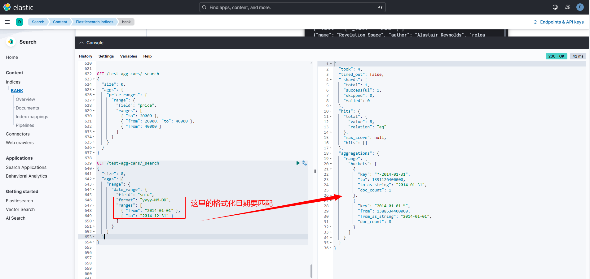

此聚合与Range聚合之间的主要区别在于 from和to值可以在<a href='https://www.elastic.co/guide/en/elasticsearch/reference/7.12/search-aggregations-bucket-daterange-aggregation.html#date-format-pattern'>Date Math表达式</a>中表示，并且还可以指定日期格式，通过该日期格式将返回from and to响应字段。请注意，**此聚合包括from值，但不包括to每个范围的值。**

### 10.4.6 对柱状图功能：Histrogram
直方图 histogram 本质上是就是为柱状图功能设计的。

创建直方图需要指定一个区间，如果我们要为售价创建一个直方图，可以将间隔设为 20,000。这样做将会在每个 $20,000 档创建一个新桶，然后文档会被分到对应的桶中。

对于仪表盘来说，我们希望知道每个售价区间内汽车的销量。我们还会想知道每个售价区间内汽车所带来的收入，可以通过对每个区间内已售汽车的售价求和得到。

可以用 histogram 和一个嵌套的 sum 度量得到我们想要的答案：
```sh
GET /test-agg-cars/_search
{
   "size" : 0,
   "aggs":{
      "price":{
         "histogram":{ 
            "field": "price.keyword",
            "interval": 20000
         },
         "aggs":{
            "revenue": {
               "sum": { 
                 "field" : "price"
               }
             }
         }
      }
   }
}
```
1. histogram 桶要求两个参数：一个数值字段以及一个定义桶大小间隔。
2. sum 度量嵌套在每个售价区间内，用来显示每个区间内的总收入。

如我们所见，查询是围绕 price 聚合构建的，它包含一个 histogram 桶。它要求字段的类型必须是数值型的同时需要设定分组的间隔范围。 间隔设置为 20,000 意味着我们将会得到如 [0-19999, 20000-39999, ...] 这样的区间。

接着，我们在直方图内定义嵌套的度量，这个 sum 度量，它会对落入某一具体售价区间的文档中 price 字段的值进行求和。 这可以为我们提供每个售价区间的收入，从而可以发现到底是普通家用车赚钱还是奢侈车赚钱。

响应结果如下：


结果很容易理解，不过应该注意到直方图的键值是区间的下限。键 0 代表区间 0-19，999 ，键 20000 代表区间 20，000-39，999 ，等等。


当然，我们可以为任何聚合输出的分类和统计结果创建条形图，而不只是 直方图 桶。让我们以最受欢迎 10 种汽车以及它们的平均售价、标准差这些信息创建一个条形图。 我们会用到 terms 桶和 extended_stats 度量：
```sh
GET /test-agg-cars/_search
{
  "size" : 0,
  "aggs": {
    "makes": {
      "terms": {
        "field": "make.keyword",
        "size": 10
      },
      "aggs": {
        "stats": { // 子聚合的名称
          "extended_stats": {  //  聚合类型：扩展统计
            "field": "price"   // 对 price 字段进行统计
          }
        }
      }
    }
  }
}
```
上述代码会按受欢迎度返回制造商列表以及它们各自的统计信息。我们对其中的 stats.avg 、 stats.count 和 stats.std_deviation 信息特别感兴趣，并用 它们计算出标准差：
```sh
std_err = std_deviation / count
```


**extended_stats 扩展统计**

这会为**每个品牌**计算价格的完整统计信息，包括：

**基础统计：**
- `count` - 该品牌的汽车数量
- `min` - 最低价格
- `max` - 最高价格  
- `avg` - 平均价格
- `sum` - 总销售额

**高级统计：**
- `variance` - 方差（价格波动程度）
- `std_deviation` - 标准差
- `std_deviation_bounds.upper` - 标准差上限
- `std_deviation_bounds.lower` - 标准差下限
- `sum_of_squares` - 平方和

对应报表：


# 十一、ES详解 - 聚合：聚合查询之Metric聚合详解
> 前文主要讲了 ElasticSearch提供的三种聚合方式之**桶聚合**(Bucket Aggregation)，本文主要讲讲**指标聚合**(Metric Aggregation)。

## 11.1 如何理解metric聚合
如果你直接去看官方文档，大概也有十几种：


> 那么metric聚合又如何理解呢？我认为从两个角度：

- **从分类看**：Metric聚合分析分为**单值分析**和**多值分析**两类
- **从功能看**：根据具体的应用场景设计了一些分析api, 比如地理位置，百分数等等

> 融合上述两个方面，我们可以梳理出大致的一个mind图：

```
Elasticsearch聚合分析
│
├── 单值分析（只输出一个分析结果）
│   ├── 标准stat型
│   │   ├── avg（平均值）
│   │   ├── max（最大值）
│   │   ├── min（最小值）
│   │   ├── sum（和）
│   │   └── value_count（数量）
│   └── 其它类型
│       ├── cardinality（基数，distinct去重）
│       ├── weighted_avg（带权重的avg）
│       └── median_absolute_deviation（中位值）
│
└── 多值分析（单值之外的复杂输出）
    ├── stats型
    │   ├── stats（基础统计：avg/max/min/sum/count）
    │   ├── matrix_stats（针对矩阵模型）
    │   ├── extended_stats（扩展统计，含方差/标准差等）
    │   └── string_stats（针对字符串）
    ├── 百分数型
    │   ├── percentiles（百分数范围）
    │   └── percentile_ranks（百分数排行）
    ├── 地理位置型
    │   ├── geo_bounds（地理边界）
    │   ├── geo_centroid（地理中心点）
    │   └── geo_line（地理线）
    └── Top型
        ├── top_hits（分桶后的top hits）
        └── top_metrics（顶部指标）

```
## 11.2 单值分析: 标准stat类型
### 11.2.1 `avg` 平均值
计算班级的平均分
```sh
POST /exams/_search?size=0
{
  "aggs": {
    "avg_grade": { "avg": { "field": "grade" } }
  }
}
```
返回
```sh
{
  ...
  "aggregations": {
    "avg_grade": {
      "value": 75.0
    }
  }
}
```
### 11.2.2 `max` 最大值
计算销售最高价
```sh
POST /sales/_search?size=0
{
  "aggs": {
    "max_price": { "max": { "field": "price" } }
  }
}
```
返回
```sh
{
  ...
  "aggregations": {
      "max_price": {
          "value": 200.0
      }
  }
}
```
### 11.2.3 `min` 最小值
计算销售最低价
```sh
POST /sales/_search?size=0
{
  "aggs": {
    "min_price": { "min": { "field": "price" } }
  }
}
```
返回
```sh
{
  ...

  "aggregations": {
    "min_price": {
      "value": 10.0
    }
  }
}
```
### 11.2.4 `sum` 和
计算销售总价
```sh
POST /sales/_search?size=0
{
  "query": {
    "constant_score": {
      "filter": {
        "match": { "type": "hat" }
      }
    }
  },
  "aggs": {
    "hat_prices": { "sum": { "field": "price" } }
  }
}
```
返回
```sh
{
  ...
  "aggregations": {
    "hat_prices": {
      "value": 450.0
    }
  }
}
```
### 11.2.5 `value_count` 数量
销售数量统计
```sh
POST /sales/_search?size=0
{
  "aggs" : {
    "types_count" : { "value_count" : { "field" : "type" } }
  }
}
```
返回
```sh
{
  ...
  "aggregations": {
    "types_count": {
      "value": 7
    }
  }
}
```
## 11.3 单值分析: 其它类型
### 11.3.1 `weighted_avg` 带权重的avg
```sh
POST /exams/_search
{
  "size": 0,
  "aggs": {
    "weighted_grade": {
      "weighted_avg": {
        "value": {
          "field": "grade"
        },
        "weight": {
          "field": "weight"
        }
      }
    }
  }
}
```
返回
```sh
{
  ...
  "aggregations": {
    "weighted_grade": {
      "value": 70.0
    }
  }
}
```
### 11.3.2 `cardinality` 基数（distinct去重）
```sh
POST /sales/_search?size=0
{
  "aggs": {
    "type_count": {
      "cardinality": {
        "field": "type"
      }
    }
  }
}
```
返回
```sh
{
  ...
  "aggregations": {
    "type_count": {
      "value": 3
    }
  }
}
```
### 11.3.3 `median_absolute_deviation` 中位值
```sh
GET reviews/_search
{
  "size": 0,
  "aggs": {
    "review_average": {
      "avg": {
        "field": "rating"
      }
    },
    "review_variability": {
      "median_absolute_deviation": {
        "field": "rating" 
      }
    }
  }
}
```
返回
```sh
{
  ...
  "aggregations": {
    "review_average": {
      "value": 3.0
    },
    "review_variability": {
      "value": 2.0
    }
  }
}
```
## 11.4 非单值分析：stats型
### 11.4.1 `stats` 包含`avg`,`max`,`min`,`sum`和`count`
```sh
POST /exams/_search?size=0
{
  "aggs": {
    "grades_stats": { "stats": { "field": "grade" } }
  }
}
```
返回
```sh
{
  ...

  "aggregations": {
    "grades_stats": {
      "count": 2,
      "min": 50.0,
      "max": 100.0,
      "avg": 75.0,
      "sum": 150.0
    }
  }
}
```
### 11.4.2 `matrix_stats` 针对矩阵模型
以下示例说明了使用矩阵统计量来描述收入与贫困之间的关系。
```sh
GET /_search
{
  "aggs": {
    "statistics": {
      "matrix_stats": {
        "fields": [ "poverty", "income" ]
      }
    }
  }
}
```
返回
```sh
{
  ...
  "aggregations": {
    "statistics": {
      "doc_count": 50,
      "fields": [ {
          "name": "income",
          "count": 50,
          "mean": 51985.1,
          "variance": 7.383377037755103E7,
          "skewness": 0.5595114003506483,
          "kurtosis": 2.5692365287787124,
          "covariance": {
            "income": 7.383377037755103E7,
            "poverty": -21093.65836734694
          },
          "correlation": {
            "income": 1.0,
            "poverty": -0.8352655256272504
          }
        }, {
          "name": "poverty",
          "count": 50,
          "mean": 12.732000000000001,
          "variance": 8.637730612244896,
          "skewness": 0.4516049811903419,
          "kurtosis": 2.8615929677997767,
          "covariance": {
            "income": -21093.65836734694,
            "poverty": 8.637730612244896
          },
          "correlation": {
            "income": -0.8352655256272504,
            "poverty": 1.0
          }
        } ]
    }
  }
}
```
`matrix_stats` 的作用

`matrix_stats` 是一种**多变量统计分析**聚合，专门用于分析**多个数值字段之间的相互关系**。它不仅仅是计算单个字段的统计量，更重要的是计算字段之间的**相关性**和**协方差**。

查询分析 `poverty`（贫困率）和 `income`（收入）两个字段的关系：

```json
"fields": [ "poverty", "income" ]
```

返回结果显示了两个字段的深入关系分析：

1. **单个字段统计**（与 `extended_stats` 类似）
```json
{
  "name": "income",
  "count": 50,           // 样本数
  "mean": 51985.1,       // 平均收入
  "variance": 7.383E7,   // 收入方差
  "skewness": 0.559,     // 偏度（分布不对称性）
  "kurtosis": 2.569      // 峰度（分布尖锐程度）
}
```

1. **关键：字段间关系分析**

**协方差 (Covariance)**
```json
"covariance": {
  "income": 7.383E7,        // 收入自身的方差
  "poverty": -21093.65      // 收入与贫困率的协方差
}
```

**协方差解释：**
- **值 -21093.65** 表示两个变量变化的方向关系
- **负值** → 收入增加时，贫困率倾向于减少（负相关）
- **绝对值大小** 表示关系强度（但受量纲影响）

**相关系数 (Correlation)**
```json
"correlation": {
  "income": 1.0,           // 收入与自身的完全正相关
  "poverty": -0.835        // 收入与贫困率的相关系数
}
```

**相关系数解释：**
- **范围：-1 到 +1**
- **-0.835** → 强烈的负相关关系
- 意味着：**收入越高，贫困率越低**（反之亦然）


### 11.4.3 `extended_stats`
根据从汇总文档中提取的数值计算统计信息。
```sh
GET /exams/_search
{
  "size": 0,
  "aggs": {
    "grades_stats": { "extended_stats": { "field": "grade" } }
  }
}
```
上面的汇总计算了所有文档的成绩统计信息。聚合类型为extended_stats，并且字段设置定义将在其上计算统计信息的文档的数字字段。
```sh
{
  ...

  "aggregations": {
    "grades_stats": {
      "count": 2,
      "min": 50.0,
      "max": 100.0,
      "avg": 75.0,
      "sum": 150.0,
      "sum_of_squares": 12500.0,
      "variance": 625.0,
      "variance_population": 625.0,
      "variance_sampling": 1250.0,
      "std_deviation": 25.0,
      "std_deviation_population": 25.0,
      "std_deviation_sampling": 35.35533905932738,
      "std_deviation_bounds": {
        "upper": 125.0,
        "lower": 25.0,
        "upper_population": 125.0,
        "lower_population": 25.0,
        "upper_sampling": 145.71067811865476,
        "lower_sampling": 4.289321881345245
      }
    }
  }
}
```
### 11.4.4 string_stats 针对字符串
用于计算从聚合文档中提取的字符串值的统计信息。这些值可以从特定的关键字字段中检索。
```sh
POST /my-index-000001/_search?size=0
{
  "aggs": {
    "message_stats": { "string_stats": { "field": "message.keyword" } }
  }
}
```
返回
```sh
{
  ...

  "aggregations": {
    "message_stats": {
      "count": 5,
      "min_length": 24,
      "max_length": 30,
      "avg_length": 28.8,
      "entropy": 3.94617750050791
    }
  }
}
```
## 11.5 非单值分析：百分数型
### 11.5.1 `percentiles` 百分数范围
针对从聚合文档中提取的数值计算一个或多个百分位数。
```sh
GET latency/_search
{
  "size": 0,
  "aggs": {
    "load_time_outlier": {
      "percentiles": {
        "field": "load_time" 
      }
    }
  }
}
```
默认情况下，百分位度量标准将生成一定范围的百分位：[1，5，25，50，75，95，99]。
```sh
{
  ...

 "aggregations": {
    "load_time_outlier": {
      "values": {
        "1.0": 5.0,
        "5.0": 25.0,
        "25.0": 165.0,
        "50.0": 445.0,
        "75.0": 725.0,
        "95.0": 945.0,
        "99.0": 985.0
      }
    }
  }
}
```
### 11.5.2 `percentile_ranks` 百分数排行
根据从汇总文档中提取的数值计算一个或多个百分位等级。
```sh
GET latency/_search
{
  "size": 0,
  "aggs": {
    "load_time_ranks": {
      "percentile_ranks": {
        "field": "load_time",   
        "values": [ 500, 600 ]
      }
    }
  }
}
```
返回
```sh
{
  ...

 "aggregations": {
    "load_time_ranks": {
      "values": {
        "500.0": 90.01,
        "600.0": 100.0
      }
    }
  }
}
```
上述结果表示90.01％的页面加载在500ms内完成，而100％的页面加载在600ms内完成。

## 11.6 非单值分析：地理位置型
### 11.6.1 `geo_bounds` Geo bounds -- 圈出一个矩形范围（边界框）
```sh
PUT /museums
{
  "mappings": {
    "properties": {
      "location": {
        "type": "geo_point"
      }
    }
  }
}
```
```sh
POST /museums/_bulk?refresh
{"index":{"_id":1}}
{"location": "52.374081,4.912350", "name": "NEMO Science Museum"}
{"index":{"_id":2}}
{"location": "52.369219,4.901618", "name": "Museum Het Rembrandthuis"}
{"index":{"_id":3}}
{"location": "52.371667,4.914722", "name": "Nederlands Scheepvaartmuseum"}
{"index":{"_id":4}}
{"location": "51.222900,4.405200", "name": "Letterenhuis"}
{"index":{"_id":5}}
{"location": "48.861111,2.336389", "name": "Musée du Louvre"}
{"index":{"_id":6}}
{"location": "48.860000,2.327000", "name": "Musée d'Orsay"}
```
```sh
POST /museums/_search?size=0
{
  "query": {
    "match": { "name": "musée" }
  },
  "aggs": {
    "viewport": {
      "geo_bounds": {
        "field": "location",    
        "wrap_longitude": true  
      }
    }
  }
}
```
上面的汇总展示了如何针对具有商店业务类型的所有文档计算位置字段的边界框
```sh
{
  ...
  "aggregations": {
    "viewport": {
      "bounds": {
        "top_left": {
          "lat": 48.86111099738628,
          "lon": 2.3269999679178
        },
        "bottom_right": {
          "lat": 48.85999997612089,
          "lon": 2.3363889567553997
        }
      }
    }
  }
}
```
### 11.6.2 `geo_centroid` Geo-centroid -- 找到所有点的中心点（质心）
```sh
PUT /museums
{
  "mappings": {
    "properties": {
      "location": {
        "type": "geo_point"
      }
    }
  }
}
```
```sh
POST /museums/_bulk?refresh
{"index":{"_id":1}}
{"location": "52.374081,4.912350", "city": "Amsterdam", "name": "NEMO Science Museum"}
{"index":{"_id":2}}
{"location": "52.369219,4.901618", "city": "Amsterdam", "name": "Museum Het Rembrandthuis"}
{"index":{"_id":3}}
{"location": "52.371667,4.914722", "city": "Amsterdam", "name": "Nederlands Scheepvaartmuseum"}
{"index":{"_id":4}}
{"location": "51.222900,4.405200", "city": "Antwerp", "name": "Letterenhuis"}
{"index":{"_id":5}}
{"location": "48.861111,2.336389", "city": "Paris", "name": "Musée du Louvre"}
{"index":{"_id":6}}
{"location": "48.860000,2.327000", "city": "Paris", "name": "Musée d'Orsay"}
```
```sh
POST /museums/_search?size=0
{
  "aggs": {
    "centroid": {
      "geo_centroid": {
        "field": "location" 
      }
    }
  }
}
```
上面的汇总显示了如何针对所有具有犯罪类型的盗窃文件计算位置字段的质心。
```sh
{
  ...
  "aggregations": {
    "centroid": {
      "location": {
        "lat": 51.00982965203002,
        "lon": 3.9662131341174245
      },
      "count": 6
    }
  }
}
```
### 11.6.3 `geo_line` Geo-Line -- 绘制一条轨迹（连线）
```sh
PUT test
{
    "mappings": {
        "dynamic": "strict",
        "_source": {
            "enabled": false
        },
        "properties": {
            "my_location": {
                "type": "geo_point"
            },
            "group": {
                "type": "keyword"
            },
            "@timestamp": {
                "type": "date"
            }
        }
    }
}
```
```sh
POST /test/_bulk?refresh
{"index": {}}
{"my_location": {"lat":37.3450570, "lon": -122.0499820}, "@timestamp": "2013-09-06T16:00:36"}
{"index": {}}
{"my_location": {"lat": 37.3451320, "lon": -122.0499820}, "@timestamp": "2013-09-06T16:00:37Z"}
{"index": {}}
{"my_location": {"lat": 37.349283, "lon": -122.0505010}, "@timestamp": "2013-09-06T16:00:37Z"}
```
```sh
POST /test/_search?filter_path=aggregations
{
  "aggs": {
    "line": {
      "geo_line": {
        "point": {"field": "my_location"},
        "sort": {"field": "@timestamp"}
      }
    }
  }
}
```
将存储桶中的所有geo_point值聚合到由所选排序字段排序的LineString中。
```sh
{
  "aggregations": {
    "line": {
      "type" : "Feature",
      "geometry" : {
        "type" : "LineString",
        "coordinates" : [
          [
            -122.049982,
            37.345057
          ],
          [
            -122.050501,
            37.349283
          ],
          [
            -122.049982,
            37.345132
          ]
        ]
      },
      "properties" : {
        "complete" : true
      }
    }
  }
}
```

| 聚合类型 | 核心功能 | 输出结果 | 典型应用 |
|---------|---------|----------|----------|
| **`geo_bounds`** | 计算边界框 | 矩形的左上角和右下角坐标 | 地图缩放、区域划定 |
| **`geo_centroid`** | 计算质心 | 所有点的平均坐标（中心点） | 中心选址、热点分析 |
| **`geo_line`** | 生成轨迹线 | 按排序连接点的LineString | 移动路径可视化、轨迹分析 |

## 11.7 非单值分析：Top型
### 11.7.1 `top_hits` 分桶后的top hits
```sh
POST /sales/_search?size=0
{
  "aggs": {
    "top_tags": {
      "terms": {
        "field": "type",  // 1. 按商品类型分桶
        "size": 3
      },
      "aggs": {
        "top_sales_hits": {
          "top_hits": {
            "sort": [
              {
                "date": {
                  "order": "desc"  // 2. 每个桶内按日期倒序
                }
              }
            ],
            "_source": {
              "includes": [ "date", "price" ]   // 3. 只返回特定字段
            },
            "size": 1  // 4. 每个桶只返回1个文档
          }
        }
      }
    }
  }
}
```
返回
```sh
{
  ...
  "aggregations": {
    "top_tags": {
       "doc_count_error_upper_bound": 0,
       "sum_other_doc_count": 0,
       "buckets": [
          {
             "key": "hat",
             "doc_count": 3,
             "top_sales_hits": {
                "hits": {
                   "total" : {
                       "value": 3,
                       "relation": "eq"
                   },
                   "max_score": null,
                   "hits": [
                      {
                         "_index": "sales",
                         "_type": "_doc",
                         "_id": "AVnNBmauCQpcRyxw6ChK",
                         "_source": {
                            "date": "2015/03/01 00:00:00",
                            "price": 200
                         },
                         "sort": [
                            1425168000000
                         ],
                         "_score": null
                      }
                   ]
                }
             }
          },
          {
             "key": "t-shirt",
             "doc_count": 3,
             "top_sales_hits": {
                "hits": {
                   "total" : {
                       "value": 3,
                       "relation": "eq"
                   },
                   "max_score": null,
                   "hits": [
                      {
                         "_index": "sales",
                         "_type": "_doc",
                         "_id": "AVnNBmauCQpcRyxw6ChL",
                         "_source": {
                            "date": "2015/03/01 00:00:00",
                            "price": 175
                         },
                         "sort": [
                            1425168000000
                         ],
                         "_score": null
                      }
                   ]
                }
             }
          },
          {
             "key": "bag",
             "doc_count": 1,
             "top_sales_hits": {
                "hits": {
                   "total" : {
                       "value": 1,
                       "relation": "eq"
                   },
                   "max_score": null,
                   "hits": [
                      {
                         "_index": "sales",
                         "_type": "_doc",
                         "_id": "AVnNBmatCQpcRyxw6ChH",
                         "_source": {
                            "date": "2015/01/01 00:00:00",
                            "price": 150
                         },
                         "sort": [
                            1420070400000
                         ],
                         "_score": null
                      }
                   ]
                }
             }
          }
       ]
    }
  }
}
```
### 11.7.2 top_metrics
```sh
POST /test/_bulk?refresh
{"index": {}}
{"s": 1, "m": 3.1415}
{"index": {}}
{"s": 2, "m": 1.0}
{"index": {}}
{"s": 3, "m": 2.71828}
```
```sh
POST /test/_search?filter_path=aggregations
{
  "aggs": {
    "tm": {
      "top_metrics": {
        "metrics": {"field": "m"}, // 要提取的指标字段
        "sort": {"s": "desc"}      // 按字段s降序排序
      }
    }
  }
}
```
返回
```sh
{
  "aggregations": {
    "tm": {
      "top": [ {"sort": [3], "metrics": {"m": 2.718280076980591 } } ]
    }
  }
}
```
| 特性 | `top_hits` | `top_metrics` |
|------|------------|---------------|
| **返回内容** | 完整文档（或指定字段） | 仅指标数值 |
| **性能** | 较重（返回文档详情） | **轻量高效** |
| **使用场景** | 需要查看具体文档详情 | 只需要数值结果 |
| **内存占用** | 较高 | 较低 |

# 十二、ES详解 - 聚合：聚合查询之Pipline聚合详解
> 前文主要讲了 ElasticSearch提供的三种聚合方式之**指标聚合**(Metric Aggregation)，本文主要讲讲**管道聚合**(Pipeline Aggregation)。简单而言就是让上一步的聚合结果成为下一个聚合的输入，这就是管道。
## 12.1 如何理解pipeline聚合
> 如何理解管道聚合呢？最重要的是要站在设计者角度看这个功能的要实现的目的：让上一步的聚合结果成为下一个聚合的输入，这就是管道。

### 12.1.1 管道机制的常见场景
> 首先回顾下，我们之前在**Tomcat管道机制中**介绍的常见的管道机制设计中的应用场景。

#### 12.1.1.1 责任链模式
管道机制在设计模式上属于责任链模式

责任链模式(Chain of responsibility pattern): 通过责任链模式, 你可以为某个请求创建一个对象链. 每个对象依序检查此请求并对其进行处理或者将它传给链中的下一个对象。

#### 12.1.1.2 FilterChain
在软件开发的常接触的责任链模式是FilterChain，它体现在很多软件设计中：

- **比如Spring Security框架中**


- **比如HttpServletRequest处理的过滤器中**

当一个request过来的时候，需要对这个request做一系列的加工，使用责任链模式可以使每个加工组件化，减少耦合。也可以使用在当一个request过来的时候，需要找到合适的加工方式。当一个加工方式不适合这个request的时候，传递到下一个加工方法，该加工方式再尝试对request加工。

网上找了图，这里我们后文将通过Tomcat请求处理向你阐述。


### 12.1.2 ElasticSearch设计管道机制
简单而言：让上一步的聚合结果成为下一个聚合的输入，这就是管道。

接下来，无非就是对不同类型的聚合有接口的支撑，比如：


> 第一个维度：管道聚合有很多不同**类型**，每种类型都与其他聚合计算不同的信息，但是可以将这些类型分为两类：

- **父级** 父级聚合的输出提供了一组管道聚合，它可以计算新的存储桶或新的聚合以添加到现有存储桶中。
- **兄弟** 同级聚合的输出提供的管道聚合，并且能够计算与该同级聚合处于同一级别的新聚合。
> 第二个维度：根据**功能设计**的意图

比如前置聚合可能是Bucket聚合，后置的可能是基于Metric聚合，那么它就可以成为一类管道

进而引出了：`xxx bucket`(是不是很容易理解了)

- **Bucket聚合 -> Metric聚合**： bucket聚合的结果，成为下一步metric聚合的输入
  - Average bucket
  - Min bucket
  - Max bucket
  - Sum bucket
  - Stats bucket
  - Extended stats bucket

对构建体系而言，理解上面的已经够了，其它的类型不过是锦上添花而言。

## 12.2 一些例子
> 这里我们通过几个简单的例子看看即可，具体如果需要使用看看文档即可。
### 12.2.1 Average bucket 聚合
```sh
POST _search
{
  "size": 0,
  "aggs": {
    "sales_per_month": {
      "date_histogram": {
        "field": "date",
        "calendar_interval": "month"
      },
      "aggs": {
        "sales": {
          "sum": {
            "field": "price"
          }
        }
      }
    },
    "avg_monthly_sales": {
// tag::avg-bucket-agg-syntax[]               
      "avg_bucket": {
        "buckets_path": "sales_per_month>sales",
        "gap_policy": "skip",
        "format": "#,##0.00;(#,##0.00)"
      }
// end::avg-bucket-agg-syntax[]               
    }
  }
}
```
- 嵌套的bucket聚合：聚合出按月价格的直方图
- Metic聚合：对上面的聚合再求平均值。

**字段类型：**

- **buckets_path**：指定聚合的名称，支持多级嵌套聚合。
- **gap_policy**:当管道聚合遇到不存在的值，有点类似于term等聚合的(missing)时所采取的策略，可选择值为：skip、insert_zeros。
  - **skip**：此选项将丢失的数据视为bucket不存在。它将跳过桶并使用下一个可用值继续计算。
- **format**: 用于格式化聚合桶的输出(key)。

输出结果如下
```sh
{
  "took": 11,
  "timed_out": false,
  "_shards": ...,
  "hits": ...,
  "aggregations": {
    "sales_per_month": {
      "buckets": [
        {
          "key_as_string": "2015/01/01 00:00:00",
          "key": 1420070400000,
          "doc_count": 3,
          "sales": {
            "value": 550.0
          }
        },
        {
          "key_as_string": "2015/02/01 00:00:00",
          "key": 1422748800000,
          "doc_count": 2,
          "sales": {
            "value": 60.0
          }
        },
        {
          "key_as_string": "2015/03/01 00:00:00",
          "key": 1425168000000,
          "doc_count": 2,
          "sales": {
            "value": 375.0
          }
        }
      ]
    },
    "avg_monthly_sales": {
      "value": 328.33333333333333,
      "value_as_string": "328.33"
    }
  }
}
```
## 12.2.2 Stats bucket 聚合
进一步的stat bucket也很容易理解了
```sh
POST /sales/_search
{
  "size": 0,
  "aggs": {
    "sales_per_month": {
      "date_histogram": {
        "field": "date",
        "calendar_interval": "month"
      },
      "aggs": {
        "sales": {
          "sum": {
            "field": "price"
          }
        }
      }
    },
    "stats_monthly_sales": {
      "stats_bucket": {
        "buckets_path": "sales_per_month>sales" 
      }
    }
  }
}
```
返回
```sh
{
   "took": 11,
   "timed_out": false,
   "_shards": ...,
   "hits": ...,
   "aggregations": {
      "sales_per_month": {
         "buckets": [
            {
               "key_as_string": "2015/01/01 00:00:00",
               "key": 1420070400000,
               "doc_count": 3,
               "sales": {
                  "value": 550.0
               }
            },
            {
               "key_as_string": "2015/02/01 00:00:00",
               "key": 1422748800000,
               "doc_count": 2,
               "sales": {
                  "value": 60.0
               }
            },
            {
               "key_as_string": "2015/03/01 00:00:00",
               "key": 1425168000000,
               "doc_count": 2,
               "sales": {
                  "value": 375.0
               }
            }
         ]
      },
      "stats_monthly_sales": {
         "count": 3,
         "min": 60.0,
         "max": 550.0,
         "avg": 328.3333333333333,
         "sum": 985.0
      }
   }
}
```
# 十三、ES详解 - 原理：从图解构筑对ES原理的初步认知
> 在学习ElasticSearch原理时，我推荐你先通过官方博客中的一篇图解文章(虽然是基于2.x版本）来构筑对ES的初步认知（这种认识是体系上的快速认知）
## 13.1 前言
本文先自上而下，后自底向上的介绍ElasticSearch的底层工作原理，试图回答以下问题：

- 为什么我的搜索 `*foo-bar*` 无法匹配 `foo-bar` ？

- 为什么增加更多的文件会压缩索引（Index）？

- 为什么ElasticSearch占用很多内存？

**版本**

elasticsearch版本: elasticsearch-2.2.0

## 13.2 图解ElasticSearch
- **云上的集群**


- **集群里的盒子**

云里面的每个白色正方形的盒子代表一个节点——Node。


- **节点之间**

在一个或者多个节点间，多个绿色小方块组合在一起形成一个ElasticSearch的索引。


- **索引里的小方块**

在一个索引下，分布在多个节点里的绿色小方块称为分片——Shard。


- **Shard＝Lucene Index**

一个ElasticSearch的Shard本质上是一个Lucene Index。


Lucene是一个Full Text 搜索库（也有很多其他形式的搜索库），ElasticSearch是建立在Lucene之上的。接下来的故事要说的大部分内容实际上是ElasticSearch如何基于Lucene工作的。

## 13.3 图解Lucene
### 13.3.1 Segment
- **Mini索引——segment**

在Lucene里面有很多小的segment，我们可以把它们看成Lucene内部的mini-index。


- **Segment内部（有着许多数据结构）**
  - Inverted Index(倒排索引)
  - Stored Fields(存储字段)
  - Document Values
  - Cache


#### 13.3.1.1 Inverted Index(倒排索引)
最最重要的Inverted Index


Inverted Index主要包括两部分：

- 一个有序的数据字典Dictionary（包括单词Term和它出现的频率）。
- 与单词Term对应的Postings（即存在这个单词的文件）。

当我们搜索的时候，首先将搜索的内容分解，然后在字典里找到对应Term，从而查找到与搜索相关的文件内容。


- **查询“the fury”**


- **自动补全（AutoCompletion-Prefix）**

如果想要查找以字母“c”开头的字母，可以简单的通过二分查找（Binary Search）在Inverted Index表中找到例如“choice”、“coming”这样的词（Term）。


- **昂贵的查找**

如果想要查找所有包含“our”字母的单词，那么系统会扫描整个Inverted Index，这是非常昂贵的。


在此种情况下，如果想要做优化，那么我们面对的问题是如何生成合适的Term。

- **问题的转化**


对于以上诸如此类的问题，我们可能会有几种可行的解决方案：

1. `* suffix -> xiffus *`

如果我们想以后缀作为搜索条件，可以为Term做反向处理。

2. `(60.6384, 6.5017) -> u4u8gyykk`

对于GEO位置信息，可以将它转换为GEO Hash。

3. `123 -> {1-hundreds, 12-tens, 123}`

对于简单的数字，可以为它生成多重形式的Term。

- **解决拼写错误**

一个Python库 为单词生成了一个包含错误拼写信息的树形状态机，解决拼写错误的问题。


#### 13.3.1.2 **Stored Field字段查找**

当我们想要查找包含某个特定标题内容的文件时，Inverted Index就不能很好的解决这个问题，所以Lucene提供了另外一种数据结构Stored Fields来解决这个问题。本质上，Stored Fields是一个简单的键值对key-value。默认情况下，ElasticSearch会存储整个文件的JSON source。


- **核心概念：索引（Indexing） vs. 存储（Storing）**

1.  **倒排索引（Inverted Index） - 像一本书的“索引”页**
    *   **目的**：为了**快速查找**。它回答的问题是：“**哪些文档**包含了这个词？”
    *   **工作方式**：它将文档内容分解成一个个词条（Terms），然后建立从【词条】到【包含该词条的文档ID列表】的映射。
    *   **局限性**：它只记录了词条和文档ID的关系，并**不存储**文档的原始内容。就像一本书的索引页，它告诉你“Elasticsearch”这个关键词出现在第10、25、80页，但它不会把第10页的具体内容印在索引页上。

2.  **存储字段（Stored Fields） - 像图书馆的“书库”**
    *   **目的**：为了**取回完整内容**。它回答的问题是：“这个**文档的原始内容**是什么？”
    *   **工作方式**：它按文档ID（`_id`）顺序存储了每个文档的原始字段值。它是一个简单的键值对数据库，键是文档ID，值就是你在索引时提供的原始数据（如JSON对象）。

- **关于“ElasticSearch会存储整个文件的JSON source”**

这句话是理解ES便利性的重点。

*   在底层Lucene中，你需要显式地指定哪些字段需要被存储（`"store": true`）。
*   **Elasticsearch为了简化操作，默认开启了一个强大的功能：它自动将你写入的整个JSON文档体（即 `_source` 字段）作为一个特殊的Stored Field保存起来。**
*   这个 `_source` 字段就是图的右侧存储的完整JSON。这样做的好处是：
    *   **简化开发**：你不需要手动设置每个字段为 `stored`。
    *   **支持部分更新**：ES要更新一个文档时，需要先取回旧文档，合并新数据，再重新索引。有了 `_source`，这一步很容易。
    *   **重新索引**：可以直接从 `_source` 重建索引。

#### 13.3.1.3 Document Values(文档值)为了排序，聚合
即使这样，我们发现以上结构仍然无法解决诸如：排序、聚合、facet，因为我们可能会要读取大量不需要的信息。

所以，另一种数据结构解决了此种问题：Document Values。这种结构本质上就是一个列式的存储，它高度优化了具有相同类型的数据的存储结构。


为了提高效率，ElasticSearch可以将索引下某一个Document Value全部读取到内存中进行操作，这大大提升访问速度，但是也同时会消耗掉大量的内存空间。

总之，这些数据结构Inverted Index、Stored Fields、Document Values及其缓存，都在segment内部。

 - **1. Document Values（文档值）是什么？做什么的？**

简单来说，**Document Values 是专门为排序、聚合、脚本计算等操作设计的列式存储数据结构。**

让我们通过一个场景来理解为什么需要它：

**场景：** 你有一个包含100万条商品数据的索引。你想“按价格从低到高排序”或“计算每个品牌下的商品数量”。

*   **如果用 Stored Fields（`_source`） 来做：**
    1.  搜索引擎先通过查询（比如匹配“手机”）从倒排索引中找到10万个符合条件的文档ID。
    2.  然后，它必须去 Stored Fields 里，根据这10万个ID，一个一个地把整个商品的JSON文档（包含标题、描述、价格、品牌等所有信息）取出来。
    3.  最后，从每个取出的JSON文档里，单独提取出 `price` 字段，再进行排序。这个过程涉及大量不必要的数据传输（你只关心价格，却把描述等字段也读出来了）和随机I/O，效率极低。

*   **用 Document Values 来做：**
    1.  同样先通过倒排索引找到10万个文档ID。
    2.  接着，它直接去访问 `price` 字段的 Document Values。这是一个**列式存储**的结构，它把**所有文档的 `price` 值**紧密地排列在一起（如下图示）。
    3.  搜索引擎可以高效地只读取这10万个文档ID所对应的价格数据，由于这些数据是连续存储且类型一致，读取速度和计算效率（比如排序、求平均值）都得到极大提升。

- **2. 列式存储 vs 行式存储（Stored Fields）的比喻：**

*   **Stored Fields（行式存储）**：像一个Excel表格，每一行是一个完整的商品记录。`[商品1的全部信息]， [商品2的全部信息]， [商品3的全部信息]...`
*   **Document Values（列式存储）**：像把Excel表的每一列单独抽出来存。`[所有商品的价格]， [所有商品的品牌]， [所有商品的销量]...`

当你只关心某一列的计算时（比如算总销售额），列式存储无需遍历整行数据，直接扫描“销售额”这一列即可，效率天差地别。
#### 13.3.1.4 为什么必须要有这三种数据结构才算一个完整的Segment？
这三种数据结构（Inverted Index， Stored Fields， Document Values）分别解决了搜索引擎在不同场景下的核心需求，它们各司其职，缺一不可。你可以把它们看作是搜索引擎的“三大支柱”。

| 数据结构 | 解决的核心问题 | 类比 | 应用的典型场景 |
| :--- | :--- | :--- | :--- |
| **Inverted Index（倒排索引）** | **“哪些文档包含我要找的词？”** <br/>（快速查找） | **一本书的“索引”目录** | 全文搜索：`"查找包含‘分布式’的文档"` |
| **Stored Fields（存储字段）** | **“这个文档的完整内容是什么？”** <br/>（完整取回） | **图书馆的“书库”本身** | 返回搜索结果：显示搜索结果的标题、摘要和完整内容。 |
| **Document Values（文档值）** | **“如何对这些搜索结果进行高效计算？”** <br/>（分析计算） | **一份“统计报表”** | 排序：`按价格排序` <br/> 聚合：`统计每个品牌的销量` <br/> 分组：`按日期分组统计` |

**一个完整的搜索请求是如何协同工作的（以你的问题为例）：**

假设你执行一个复杂的搜索：`“查找品牌为‘苹果’的手机，并按价格降序排列，最后返回前10个商品的详细信息。”`

1.  **查询阶段（Query Phase - 使用 Inverted Index）**：
    *   系统使用倒排索引，快速找到所有 `brand` 字段包含 “苹果” 且 `title` 字段包含 “手机” 的文档ID列表。假设找到了1000个文档。

2.  **聚合/排序阶段（Aggregation/Sort Phase - 使用 Document Values）**：
    *   系统拿到这1000个文档ID后，并不急于去取完整数据。它转而访问 `price` 字段的 Document Values。
    *   通过 Document Values，系统能高效地获取这1000个文档对应的价格，并完成排序（降序）。
    *   最终，它确定价格最高的10个文档的ID。

3.  **取回阶段（Fetch Phase - 使用 Stored Fields）**：
    *   系统现在拿着这10个最终确定的文档ID，去 Stored Fields（默认是 `_source` 字段）中，精准地取回这10个商品的完整JSON信息。
    *   将这些信息组装成最终结果，返回给用户。

**结论：**

一个完整的 Lucene Segment **必须同时包含这三种数据结构**，因为它需要成为一个能独立完成 **“搜索 -> 分析 -> 返回”** 全流程的自包含单元。

*   只有 Inverted Index，你只能做简单的关键词匹配，无法高效排序聚合，也无法返回文档内容。
*   只有 Stored Fields，你就变成了一个普通的键值数据库，失去了强大的全文搜索能力。
*   只有 Document Values，你无法进行快速的关键词搜索。

### 13.3.2 搜索发生时
搜索时，Lucene会搜索所有的segment然后将每个segment的搜索结果返回，最后合并呈现给客户。

Lucene的一些特性使得这个过程非常重要：

- **Segments是不可变的（immutable）**
  - Delete? 当删除发生时，Lucene做的只是将其标志位置为删除，但是文件还是会在它原来的地方，不会发生改变
  - Update? 所以对于更新来说，本质上它做的工作是：先删除，然后重新索引（Re-index）
- **随处可见的压缩**
  - Lucene非常擅长压缩数据，基本上所有教科书上的压缩方式，都能在Lucene中找到。
- **缓存所有的所有**
  - Lucene也会将所有的信息做缓存，这大大提高了它的查询效率。

### 13.3.3 缓存的故事
当ElasticSearch索引一个文件的时候，会为文件建立相应的缓存，并且会定期（每秒）刷新这些数据，然后这些文件就可以被搜索到。


随着时间的增加，我们会有很多segments，


所以ElasticSearch会将这些segment合并，在这个过程中，segment会最终被删除掉


这就是为什么增加文件可能会使索引所占空间变小，它会引起merge，从而可能会有更多的压缩。

- **举个栗子**

有两个segment将会merge


这两个segment最终会被删除，然后合并成一个新的segment


这时这个新的segment在缓存中处于`cold`状态，但是大多数segment仍然保持不变，处于`warm`状态。

以上场景经常在Lucene Index内部发生的。


- 1. “Cold” 和 “Warm” 状态是什么？

这两个术语描述的是Segment在操作系统**页面缓存（Page Cache）** 中的“热度”或“活跃度”。这是一种基于LRU（最近最少使用）或类似算法的自然结果。

*   **Warm State（热状态/暖状态）**：
    *   **含义**：指一个Segment的数据（包括其倒排索引、文档值等）的**大部分或全部**已经被操作系统从磁盘读取到了**内存中的页面缓存**里。
    *   **原因**：因为这些Segment是“大多数”且“保持不变”的，它们已经被之前的搜索和聚合请求频繁访问过。操作系统发现这些数据被反复读取，为了提升性能，就会将它们保留在内存中。
    *   **访问速度**：**极快**。后续的搜索请求如果需要访问这些Segment，可以直接从内存读取，避免了缓慢的磁盘I/O操作。

*   **Cold State（冷状态）**：
    *   **含义**：指一个Segment的数据**主要还停留在磁盘上**，没有被加载到内存的页面缓存中，或者只有很小一部分被加载进来。
    *   **原因**：新合并产生的Segment是“新”的。系统之前没有访问过它，所以它的数据在缓存中是空的或很少。
    *   **访问速度**：**相对较慢**。第一次访问这个新Segment的请求，需要触发磁盘读取操作，将数据从硬盘加载到内存缓存中。这个过程会比访问 Warm Segment 慢。

**简单比喻：**
想象一下你的书桌（内存）和书架（磁盘）。
*   **Warm Segment** 就像你**正在阅读或经常翻阅的几本书**，就摊开在你的书桌上。你要查点什么，伸手就能拿到，速度飞快。
*   **Cold Segment** 就像**书架上的一本新书**。你知道它在那里，但要看里面的内容，你必须先站起来，走到书架前，把书拿下来，再翻到需要的页面。这个过程就慢多了。

- 2. 为什么要这样设计？（为什么新合并的Segment是Cold的？）

这种“冷热分离”的现象不是Elasticsearch主动“标记”的，而是操作系统为了**最大化利用有限的内存资源**而采取的**一种高效的缓存策略的自然结果**。其背后的逻辑和好处如下：

**1. 资源利用最大化：**
内存是宝贵且有限的资源，而磁盘索引文件通常很大。操作系统不可能把所有索引数据都永远放在内存里。因此，它采用了一种策略：**“谁用得多，谁就待在内存里”**。
*   那些被频繁访问的旧Segment（Warm），证明了它们是有价值的，所以让它们留在内存里。
*   新合并的Segment（Cold）还没有经过“考验”，系统不知道它是否会被频繁访问。如果立刻把它全部加载进内存，可能会挤掉更有价值的Warm Segment数据，反而降低整体性能。

**2. 渐进式预热，避免性能陡降：**
如果每次合并后，系统都强制将新Segment的所有数据立刻加载到内存，会发生什么？
*   在合并期间，系统本身已经在进行密集的I/O和CPU操作。
*   如果此时再突然加载一个可能很大的新Segment到内存，会引发大量的磁盘读取，严重占用I/O带宽，**瞬间导致正在进行的搜索请求性能急剧下降**。

而现在这种设计，让新Segment自然地、按需地（通过后续的用户查询）被“预热”到缓存中，是一个**平滑的、渐进的过程**，避免了对系统造成突然的冲击。

**3. 合并过程的优化：**
Lucene的段合并策略（通常是Tiered Merge Policy）本身就倾向于合并较小的、较新的Segment。这意味着：
*   被合并的Segment往往是那些较小的、可能本身就不太“热”的Segment。
*   新生成的大Segment包含了之前这些Segment的数据。这些数据可能已经有一部分在缓存里了（来自旧的Segment），但合并后，数据的物理位置发生了变化，原有的缓存失效，需要重新建立。所以，它整体上表现为一个需要重新预热的Cold Segment。

- 3. 总结

*   **是什么**：`Cold` 和 `Warm` 状态描述的是Segment数据在**操作系统页面缓存中的存在情况**。Warm表示数据已在内存，Cold表示数据主要在磁盘。
*   **为什么**：这是一种**基于访问频率的缓存淘汰机制（如LRU）的自然结果**。它不是Elasticsearch的主动配置，而是操作系统为了**最大化有限内存的利用效率**而产生的行为。
*   **好处**：这种机制确保了最常被访问的数据（Warm Segment）留在快速的内存中，而新数据（Cold Segment）则按需加载，从而在**整体上保证了系统的最佳性能和稳定性**，避免了因合并操作导致的性能剧烈波动。


*   **一个 Segment** 是 Lucene 索引的**基本组成单元**，它内部包含了我们之前讨论的倒排索引、存储字段 (`_source`)、文档值等完整的数据结构。一个 Segment 会包含**多个文档**。
*   **一个 Elasticsearch 索引 (Index)** 由一个或多个 **Lucene 索引（即分片, Shard）** 组成。
*   而**一个分片 (Shard)** 在物理上就是一个完整的 Lucene 索引，它由**一个或多个 Segment 文件**构成。

所以，层级关系是这样的：
**Elasticsearch 索引 (Index) -> 分片 (Shard) -> 段 (Segment) -> 文档 (Document)**

### 13.3.4 在Shard中搜索
ElasticSearch从Shard中搜索的过程与Lucene Segment中搜索的过程类似。


与在Lucene Segment中搜索不同的是，Shard可能是分布在不同Node上的，所以在搜索与返回结果时，所有的信息都会通过网络传输。

需要注意的是：

1次搜索查找2个shard ＝ 2次分别搜索shard


- **对于日志文件的处理**

当我们想搜索特定日期产生的日志时，通过根据时间戳对日志文件进行分块与索引，会极大提高搜索效率。

当我们想要删除旧的数据时也非常方便，只需删除老的索引即可。


在上种情况下，每个index有两个shards

- **如何Scale**


shard不会进行更进一步的拆分，但是shard可能会被转移到不同节点上

所以，如果当集群节点压力增长到一定的程度，我们可能会考虑增加新的节点，这就会要求我们对所有数据进行重新索引，这是我们不太希望看到的，所以我们需要在规划的时候就考虑清楚，如何去平衡足够多的节点与不足节点之间的关系。

- **节点分配与Shard优化**
  - 为更重要的数据索引节点，分配性能更好的机器
  - 确保每个shard都有副本信息replica


- **路由Routing**

每个节点，每个都存留一份路由表，所以当请求到任何一个节点时，ElasticSearch都有能力将请求转发到期望节点的shard进一步处理。


### 13.3.5 一个真实的请求
- **Query**

  


  - **Filter** : Query有一个类型filtered，以及一个multi_match的查询
  - **Aggregation** : 根据作者进行聚合，得到top10的hits的top10作者的信息

- **请求分发**

这个请求可能被分发到集群里的任意一个节点


- **上帝节点**


这时这个节点就成为当前请求的协调者（Coordinator），它决定： a) 根据索引信息，判断请求会被路由到哪个核心节点 b) 以及哪个副本是可用的 c) 等等

- **路由**


- **在真实搜索之前**

ElasticSearch 会将Query转换成Lucene Query


然后在所有的segment中执行计算


对于Filter条件本身也会有缓存


但queries不会被缓存，所以如果相同的Query重复执行，应用程序自己需要做缓存


所以，

a) filters可以在任何时候使用 b) query只有在需要score的时候才使用

- **返回**

搜索结束之后，结果会沿着下行的路径向上逐层返回。


# 十四、ES详解 - 原理：ES原理知识点补充和整体结构
> 通过上文图解了解了ES整体的原理后，我们便可以基于此知识体系下梳理下ES的整体结构以及相关的知识点，这将帮助你更好的理解ElasticSearch索引文档和搜索文档的原理。
## 14.1 ElasticSearch整体结构
> 通过上文，在通过图解了解了ES整体的原理后，我们梳理下ES的整体结构


- 一个 ES Index 在集群模式下，有多个 Node （节点）组成。每个节点就是 ES 的Instance (实例)。
- 每个节点上会有多个 shard （分片）， P1 P2 是主分片, R1 R2 是副本分片
- 每个分片上对应着就是一个 Lucene Index（底层索引文件）
- Lucene Index 是一个统称
  - 由多个 Segment （段文件，就是倒排索引）组成。每个段文件存储着就是 Doc 文档。
  - commit point记录了所有 segments 的信息

## 14.2 补充:Lucene索引结构
> 上图中Lucene的索引结构中有哪些文件呢？


更多文件类型可参考<a href='http://lucene.apache.org/core/7_2_1/core/org/apache/lucene/codecs/lucene70/package-summary.html#package.description'>这里</a>）


文件的关系如下：


## 14.3 补充:Lucene处理流程
> 上文图解过程，还需要理解Lucene处理流程, 这将帮助你更好的索引文档和搜索文档。


**创建索引的过程：**

- 准备待索引的原文档，数据来源可能是文件、数据库或网络
- 对文档的内容进行分词组件处理，形成一系列的Term
- 索引组件对文档和Term处理，形成字典和倒排表

**搜索索引的过程：**

- 对查询语句进行分词处理，形成一系列Term
- 根据倒排索引表查找出包含Term的文档，并进行合并形成符合结果的文档集
- 比对查询语句与各个文档相关性得分，并按照得分高低返回

## 14.4 补充:ElasticSearch分析器
> 上图中很重要的一项是**语法分析/语言处理**, 所以我们还需要补充ElasticSearch分析器知识点。

分析 包含下面的过程：

- 首先，将一块文本分成适合于倒排索引的独立的 词条 ，
- 之后，将这些词条统一化为标准格式以提高它们的“可搜索性”，或者 recall

分析器执行上面的工作。 分析器 实际上是将三个功能封装到了一个包里：

- **字符过滤器** 首先，字符串按顺序通过每个 `字符过滤器` 。他们的任务是在分词前整理字符串。一个字符过滤器可以用来去掉HTML，或者将 & 转化成 and。

- **分词器** 其次，字符串被 `分词器` 分为单个的词条。一个简单的分词器遇到空格和标点的时候，可能会将文本拆分成词条。

- **Token 过滤器** 最后，词条按顺序通过每个 `token 过滤器` 。这个过程可能会改变词条（例如，小写化 Quick ），删除词条（例如， 像 a， and， the 等无用词），或者增加词条（例如，像 jump 和 leap 这种同义词）。

Elasticsearch提供了开箱即用的`字符过滤器`、`分词器`和`token 过滤器`。 这些可以组合起来形成自定义的分析器以用于不同的目的。

### 14.4.1 内置分析器
Elasticsearch还附带了可以直接使用的预包装的分析器。接下来我们会列出最重要的分析器。为了证明它们的差异，我们看看每个分析器会从下面的字符串得到哪些词条：
```sh
"Set the shape to semi-transparent by calling set_trans(5)"
```
- **标准分析器**

标准分析器是Elasticsearch默认使用的分析器。它是分析各种语言文本最常用的选择。它根据 Unicode 联盟 定义的 **单词边界** 划分文本。删除绝大部分标点。最后，将词条小写。它会产生
```sh
set, the, shape, to, semi, transparent, by, calling, set_trans, 5
```
- **简单分析器**

简单分析器在任何不是字母的地方分隔文本，将词条小写。它会产生
```sh
set, the, shape, to, semi, transparent, by, calling, set, trans
```

- **空格分析器**

空格分析器在空格的地方划分文本。它会产生
```sh
Set, the, shape, to, semi-transparent, by, calling, set_trans(5)
```
- **语言分析器**

特定语言分析器可用于 **很多语言**。它们可以考虑指定语言的特点。例如， 英语 分析器附带了一组英语无用词（常用单词，例如 and 或者 the ，它们对相关性没有多少影响），它们会被删除。 由于理解英语语法的规则，这个分词器可以提取英语单词的 词干 。

英语 分词器会产生下面的词条：
```sh
set, shape, semi, transpar, call, set_tran, 5
```
注意看 transparent、 calling 和 set_trans 已经变为词根格式。

### 14.4.2 什么时候使用分析器
当我们 索引 一个文档，它的全文域被分析成词条以用来创建倒排索引。 但是，当我们在全文域 搜索 的时候，我们需要将查询字符串通过 相同的分析过程 ，以保证我们搜索的词条格式与索引中的词条格式一致。

全文查询，理解每个域是如何定义的，因此它们可以做正确的事：

- 当你查询一个 **全文** 域时， 会对查询字符串应用相同的分析器，以产生正确的搜索词条列表。
- 当你查询一个 **精确值** 域时，不会分析查询字符串，而是搜索你指定的精确值。

> **举个例子**

ES中每天一条数据， 按照如下方式查询：
```sh
GET /_search?q=2014              # 12 results
GET /_search?q=2014-09-15        # 12 results !
GET /_search?q=date:2014-09-15   # 1  result
GET /_search?q=date:2014         # 0  results !
```
为什么返回那样的结果？

- date 域包含一个精确值：单独的词条 2014-09-15。
- _all 域是一个全文域，所以分词进程将日期转化为三个词条： 2014， 09， 和 15。

当我们在 _all 域查询 2014，它匹配所有的12条推文，因为它们都含有 2014 ：
```sh
GET /_search?q=2014              # 12 results
```
当我们在 _all 域查询 2014-09-15，它首先分析查询字符串，产生匹配 2014， 09， 或 15 中 任意 词条的查询。这也会匹配所有12条推文，因为它们都含有 2014 ：
```sh
GET /_search?q=2014-09-15        # 12 results !
```
当我们在 date 域查询 2014-09-15，它寻找 精确 日期，只找到一个推文：
```sh
GET /_search?q=date:2014-09-15   # 1  result
```
当我们在 date 域查询 2014，它找不到任何文档，因为没有文档含有这个精确日志：
```sh
GET /_search?q=date:2014         # 0  results !
```


| 类型 | 核心概念 | 类比传统数据库 | 索引与搜索行为 | 适用场景 |
| :--- | :--- | :--- | :--- | :--- |
| **全文文本** | 一段可被**分词**和**搜索**的文本。目的是找到相关文档，而不是精确匹配。 | 没有直接对应，类似于模糊查询 `LIKE '%keyword%'`，但效率天差地别。 | **索引时**：会通过分析器（如标准分析器）被拆分成词条（Token），并可能被转小写、去停用词、提取词干等。<br>**搜索时**：查询字符串也会经过**相同的分析器**处理，然后在倒排索引中查找匹配的词条。 | 文章内容、商品描述、日志正文等需要**关键词搜索**的字段。 |
| **精确值** | 一个不可分割的完整值。目的是进行精确匹配、过滤或排序。 | `varchar` 类型的字段，但要求完全匹配。或者 `enum` 类型。 | **索引时**：**不经过分析器**。整个值被当作一个独立的词条存入倒排索引。<br>**搜索时**：查询字符串也**不被分析**，直接去索引中查找完全一致的值。 | 用户ID、订单号、状态标签（如“已支付”）、邮箱、性别、日期（如果你希望它被当作一个整体）等。 |

**核心区别总结：**

- **全文**：追求 **Recall（召回率）**，即“把所有相关的文档都找出来”。例如，搜索“手机”，也希望返回包含“智能手机”、“移动电话”的文档。这需要通过分词和标准化来实现。
- **精确值**：追求 **Precision（精确率）**，即“找出来的文档必须完全匹配”。例如，搜索订单号 “12345”，绝不应该返回订单号是 “123456” 的文档。

**如何在Mapping中定义？**
这在你创建索引时就必须决定。例如：
```json
PUT /my_index
{
  "mappings": {
    "properties": {
      "content": {    // 这是一个【全文】字段
        "type": "text" // 类型为 `text`，会被分词
      },
      "tags": {       // 这是一个【精确值】字段
        "type": "keyword" // 类型为 `keyword`，不会被分词
      }
    }
  }
}
```

## 14.5 中文分词器

### 14.5.1. IK Analyzer 简介

**IK Analyzer** 是一个开源的中文分词器插件，专门为 Elasticsearch 设计。它具有以下特点：
- 支持细粒度和智能分词两种模式
- 支持自定义词典扩展
- 社区活跃，更新及时
- 分词准确度高

GitHub 地址：https://github.com/medcl/elasticsearch-analysis-ik

### 14.5.2. 安装 IK Analyzer

#### 14.5.2.1 方法一：使用 Elasticsearch 插件命令安装（推荐）

这种方式最简单，Elasticsearch 会自动下载并安装对应版本的 IK 分词器。

```bash
# 进入 Elasticsearch 的安装目录的 bin 文件夹
cd /path/to/elasticsearch/bin/

# 安装 IK 分词器（版本需要与 Elasticsearch 版本对应）
# 格式：./elasticsearch-plugin install https://github.com/medcl/elasticsearch-analysis-ik/releases/download/v{版本}/elasticsearch-analysis-ik-{版本}.zip

# 例如，对于 Elasticsearch 7.17.0：
./elasticsearch-plugin install https://github.com/medcl/elasticsearch-analysis-ik/releases/download/v7.17.0/elasticsearch-analysis-ik-7.17.0.zip

# 对于 Elasticsearch 8.5.0：
./elasticsearch-plugin install https://github.com/medcl/elasticsearch-analysis-ik/releases/download/v8.5.0/elasticsearch-analysis-ik-8.5.0.zip
```

#### 14.5.2.2 方法二：手动下载安装

如果网络环境无法直接下载，可以手动操作：

1. **下载对应版本的 ZIP 包**
   - 访问 GitHub Releases 页面：https://github.com/medcl/elasticsearch-analysis-ik/releases
   - 下载与你的 Elasticsearch 版本对应的 ZIP 文件

2. **手动安装**
```bash
# 创建插件目录
mkdir -p /path/to/elasticsearch/plugins/ik

# 解压到插件目录
unzip elasticsearch-analysis-ik-{版本}.zip -d /path/to/elasticsearch/plugins/ik/
```

#### 14.5.2.3 安装完成后重启 Elasticsearch

```bash
# 停止 Elasticsearch（如果正在运行）
# 然后启动
./bin/elasticsearch
```

#### 14.5.2.4 验证安装

安装成功后，可以通过以下方式验证：

```bash
# 查看已安装的插件
./bin/elasticsearch-plugin list
# 应该能看到：analysis-ik
```

或者在 Kibana Dev Tools 中测试：
```json
GET /_analyze
{
  "analyzer": "ik_smart",
  "text": "中华人民共和国国歌"
}
```

### 14.5.3. IK 分词器的两种模式

#### 14.5.3.1 ik_smart（智能切分）
- **特点**：做最粗粒度的拆分，尽可能组合成完整的词语
- **适用场景**：搜索时使用，提高查询准确率

**示例：**
```json
GET /_analyze
{
  "analyzer": "ik_smart",
  "text": "我爱北京天安门"
}
```
**分词结果：** `["我", "爱", "北京", "天安门"]`

#### 14.5.3.2 ik_max_word（最细粒度切分）
- **特点**：将文本做最细粒度的拆分，尽可能多的分出词语
- **适用场景**：索引时使用，提高召回率

**示例：**
```json
GET /_analyze
{
  "analyzer": "ik_max_word", 
  "text": "我爱北京天安门"
}
```
**分词结果：** `["我", "爱", "北京", "天安", "天安门", "安门"]`

### 14.5.4. 实际使用示例

#### 14.5.4.1 创建索引时指定 IK 分词器

```json
PUT /my_chinese_index
{
  "settings": {
    "analysis": {
      "analyzer": {
        "my_ik_analyzer": {
          "type": "custom",
          "tokenizer": "ik_max_word"
        }
      }
    }
  },
  "mappings": {
    "properties": {
      "title": {
        "type": "text",
        "analyzer": "ik_max_word",        // 索引时使用细粒度分词
        "search_analyzer": "ik_smart"     // 搜索时使用粗粒度分词
      },
      "content": {
        "type": "text",
        "analyzer": "ik_max_word",
        "search_analyzer": "ik_smart"
      },
      "author": {
        "type": "keyword"                 // 精确值字段，不分词
      },
      "publish_date": {
        "type": "date"
      }
    }
  }
}
```

#### 14.5.4.2 插入测试数据

```json
POST /my_chinese_index/_doc/1
{
  "title": " Elasticsearch中文分词器详解",
  "content": "IK分词器是目前最流行的中文分词解决方案，支持智能模式和最大分词模式。",
  "author": "技术博主",
  "publish_date": "2024-01-15"
}

POST /my_chinese_index/_doc/2
{
  "title": "大数据技术实战",
  "content": "本文详细介绍Elasticsearch在大数据场景下的应用，包括中文搜索优化。",
  "author": "数据工程师", 
  "publish_date": "2024-01-16"
}
```

#### 14.5.4.3 搜索测试

**示例1：搜索"中文分词"**
```json
GET /my_chinese_index/_search
{
  "query": {
    "match": {
      "content": "中文分词"
    }
  }
}
```
这会匹配文档1，因为"中文"和"分词"都能被找到。

**示例2：搜索"大数据"**
```json
GET /my_chinese_index/_search  
{
  "query": {
    "match": {
      "title": "大数据"
    }
  }
}
```
这会匹配文档2，因为"大数据"是一个完整的词条。

### 14.5.5. 自定义词典配置

IK 分词器支持自定义词典，这对于处理新词、专业术语特别有用。

#### 14.5.5.1 配置自定义词典

1. **找到 IK 配置文件**
   - 路径：`elasticsearch/plugins/ik/config/IKAnalyzer.cfg.xml`

2. **编辑配置文件**
```xml
<?xml version="1.0" encoding="UTF-8"?>
<!DOCTYPE properties SYSTEM "http://java.sun.com/dtd/properties.dtd">
<properties>
    <comment>IK Analyzer 扩展配置</comment>
    <!-- 用户可以在这里配置自己的扩展字典 -->
    <entry key="ext_dict">custom/mydict.dic;custom/single_word_low_freq.dic</entry>
    <!-- 用户可以在这里配置自己的扩展停止词字典 -->
    <entry key="ext_stopwords">custom/ext_stopword.dic</entry>
</properties>
```

3. **创建自定义词典文件**
   - 在 `plugins/ik/config/custom/` 目录下创建词典文件
   - 每行一个词，如 `mydict.dic`：
```
区块链
人工智能
机器学习
深度学习
```

4. **重启 Elasticsearch 使配置生效**

#### 14.5.5.2 测试自定义词典

```json
GET /_analyze
{
  "analyzer": "ik_smart", 
  "text": "人工智能和区块链技术"
}
```
**分词结果：** `["人工智能", "和", "区块链", "技术"]` （而不是 `["人工", "智能", "和", "区块", "链", "技术"]`）

### 14.5.6. 其他实用技巧

#### 14.5.6.1 同义词配置
```json
PUT /my_index
{
  "settings": {
    "analysis": {
      "filter": {
        "my_synonym": {
          "type": "synonym",
          "synonyms": [
            "苹果, apple",
            "手机, 智能手机, mobile"
          ]
        }
      },
      "analyzer": {
        "my_analyzer": {
          "tokenizer": "ik_max_word",
          "filter": ["my_synonym"]
        }
      }
    }
  }
}
```

#### 14.5.6.2 查看分词结果
```json
GET /my_chinese_index/_analyze
{
  "field": "title",
  "text": "我要测试一下分词效果"
}
```

### 14.5.7. 常见问题排查

#### 14.5.7.1 版本不匹配
- 错误：安装时提示版本不兼容
- 解决：确保 IK 分词器版本与 Elasticsearch 版本完全一致

#### 14.5.7.2 词典不生效
- 检查词典文件编码是否为 UTF-8
- 检查配置文件路径是否正确
- 重启 Elasticsearch 服务

#### 14.5.7.3 分词效果不理想
- 使用自定义词典添加新词
- 调整使用 `ik_smart` 或 `ik_max_word`
- 结合业务场景选择合适的分析器

### 14.5.8 IK总结

IK Analyzer 是 Elasticsearch 中文搜索的必备工具，通过合理配置可以显著提升搜索效果。关键点包括：
- 正确安装对应版本的 IK 插件
- 索引时使用 `ik_max_word` 提高召回率
- 搜索时使用 `ik_smart` 提高准确率  
- 利用自定义词典处理专业术语和新词
- 定期根据搜索日志优化分词策略

### 14.5.9 其他中文分词器


1. jieba Analyzer

**GitHub 地址：**

https://github.com/sing1ee/elasticsearch-jieba-plugin

**安装方式：**

```bash
# 进入 Elasticsearch 的 bin 目录
cd /path/to/elasticsearch/bin/

# 安装 jieba 分词器（需要对应版本）
./elasticsearch-plugin install https://github.com/sing1ee/elasticsearch-jieba-plugin/releases/download/v{版本}/elasticsearch-jieba-plugin-{版本}.zip

# 例如，对于 Elasticsearch 7.17.0：
./elasticsearch-plugin install https://github.com/sing1ee/elasticsearch-jieba-plugin/releases/download/v7.17.0/elasticsearch-jieba-plugin-7.17.0.zip
```

**特点：**

- 支持多种分词模式：search_mode, index_mode, 和默认模式
- 可以加载用户自定义词典
- 基于著名的 Python jieba 分词库

---

2. Smart Chinese Analysis（官方插件）

**官方文档：**

https://www.elastic.co/guide/en/elasticsearch/plugins/current/analysis-smartcn.html

**安装方式：**

```bash
# 最简单的安装方式，Elasticsearch 会自动下载
./elasticsearch-plugin install analysis-smartcn

# 或者手动指定版本（如果需要特定版本）
./elasticsearch-plugin install https://artifacts.elastic.co/downloads/elasticsearch-plugins/analysis-smartcn/analysis-smartcn-{版本}.zip
```

**特点：**

- **官方维护**，兼容性最好
- 基于隐马尔可夫模型，不需要词典文件
- 安装最简单，一条命令即可

---

3. 拼音分词器（Pinyin Analyzer）

**GitHub 地址：**

https://github.com/medcl/elasticsearch-analysis-pinyin

**安装方式：**

```bash
# 安装拼音分词器
./elasticsearch-plugin install https://github.com/medcl/elasticsearch-analysis-pinyin/releases/download/v{版本}/elasticsearch-analysis-pinyin-{版本}.zip

# 例如，对于 Elasticsearch 7.17.0：
./elasticsearch-plugin install https://github.com/medcl/elasticsearch-analysis-pinyin/releases/download/v7.17.0/elasticsearch-analysis-pinyin-7.17.0.zip
```

**使用示例：**

```json
PUT /pinyin_test
{
  "settings": {
    "analysis": {
      "analyzer": {
        "pinyin_analyzer": {
          "tokenizer": "my_pinyin"
        }
      },
      "tokenizer": {
        "my_pinyin": {
          "type": "pinyin",
          "keep_separate_first_letter": false,
          "keep_full_pinyin": true,
          "keep_original": true,
          "limit_first_letter_length": 16,
          "lowercase": true
        }
      }
    }
  }
}

# 测试拼音分词
GET /pinyin_test/_analyze
{
  "analyzer": "pinyin_analyzer",
  "text": "刘德华"
}
```
**结果类似：** `["liu","de","hua","ldh","liudehua"]`

---

**版本对应关系**

**重要提示**：安装时必须确保插件版本与 Elasticsearch 版本完全一致！

| Elasticsearch 版本 | IK 分词器版本 | 拼音分词器版本 | jieba 分词器版本 |
|------------------|--------------|---------------|----------------|
| 8.x.x           | 8.x.x        | 8.x.x         | 8.x.x          |
| 7.17.x          | 7.17.x       | 7.17.x        | 7.17.x         |
| 7.16.x          | 7.16.x       | 7.16.x        | 7.16.x         |
| 7.15.x          | 7.15.x       | 7.15.x        | 7.15.x         |

**安装注意事项**

1. **版本匹配**：必须确保插件版本与 Elasticsearch 版本完全一致
2. **安装顺序**：建议先安装 IK 分词器，再安装拼音分词器（如果需要）
3. **重启服务**：安装任何插件后都需要重启 Elasticsearch
4. **网络问题**：如果网络连接 GitHub 较慢，可以考虑手动下载后安装

**验证安装**

安装完成后，可以通过以下命令验证：
```bash
# 查看已安装的插件
./elasticsearch-plugin list

# 或者在 Kibana 中测试
GET /_analyze
{
  "analyzer": "ik_smart",  # 或 smartcn 或 pinyin_analyzer
  "text": "测试文本"
}
```

**总结**

- **IK Analyzer**：https://github.com/medcl/elasticsearch-analysis-ik
- **jieba Analyzer**：https://github.com/sing1ee/elasticsearch-jieba-plugin  
- **Pinyin Analyzer**：https://github.com/medcl/elasticsearch-analysis-pinyin
- **Smart Chinese**：直接使用 `./elasticsearch-plugin install analysis-smartcn`

**推荐组合**：**IK Analyzer + Pinyin Analyzer**，这样可以同时支持中文分词和拼音搜索，满足绝大多数中文搜索场景的需求。

# 十五、ES详解 - 原理：ES原理之读取文档流程详解
> ElasticSearch中最重要原理是文档的索引和文档的读取，前文介绍了索引文档流程，本文带你理解ES文档的读取过程。

## 15.1 文档查询步骤顺序
> 先看下整体的查询流程

### 15.1.1 单个文档
以下是从主分片或者副本分片检索文档的步骤顺序：


1. 客户端向 Node 1 发送获取请求。
2. 节点使用文档的 _id 来确定文档属于分片 0 。分片 0 的副本分片存在于所有的三个节点上。 在这种情况下，它将请求转发到 Node 2 。
3. Node 2 将文档返回给 Node 1 ，然后将文档返回给客户端。

在处理读取请求时，协调结点在每次请求的时候都会通过轮询所有的副本分片来达到负载均衡。

在文档被检索时，已经被索引的文档可能已经存在于主分片上但是还没有复制到副本分片。 在这种情况下，副本分片可能会报告文档不存在，但是主分片可能成功返回文档。 **一旦索引请求成功返回给用户，文档在主分片和副本分片都是可用的。**

**这里需要对上面这段话就行一些解释**

**具体场景分解：**

1. **写入过程的两个阶段**：
   - **阶段一**：文档首先被写入**主分片**（Primary Shard）
   - **阶段二**：主分片将文档**异步复制**到所有**副本分片**（Replica Shards）

2. **可能发生的问题时间窗口**：
   - 当客户端发起一个写入请求后，Elasticsearch 会立即将文档写入主分片。
   - 但将文档复制到所有副本分片需要一点点时间（通常是毫秒级）。
   - 就在这个**极短的复制延迟窗口内**，如果恰好有一个读取请求到来，就可能出现不一致。

**举例说明：**

假设我们有一个索引，配置了 1 个主分片和 2 个副本分片。

- **时间点 T0**：您发送一个索引请求，文档 `{“id”: 1, “name”: “张三”}` 被成功写入**主分片**。Elasticsearch 立即向客户端返回“写入成功”的响应。
- **时间点 T0 + 1ms**：复制过程正在进行中，文档正在从主分片同步到两个副本分片，但尚未完成。
- **时间点 T0 + 1ms**：几乎同时，另一个客户端发起一个读取文档 `id:1` 的请求。

这时，协调节点处理这个读取请求，并轮询到了一个**副本分片**。由于复制延迟，这个被问到的副本分片**还没有收到**新文档，所以它诚实地报告：“我这儿没有这个文档”（文档不存在）。

然而，如果这个读取请求**恰好被发往主分片**，主分片已经拥有了该文档，就会成功返回。

所以，在 **T0 到复制完成** 这个极短的时间内，**查询主分片和查询副本分片可能会得到不同的结果**。

**为什么说“一旦索引请求成功返回给用户，文档就是可用的”？**

这里的“可用”指的是 **最终一致性**。Elasticsearch 的索引请求在返回“成功”给用户时，是有一个**一致性保证**的。默认的 `wait_for_active_shards` 设置是 `quorum`（多数派），即要求写入操作被主分片和足够多的副本分片确认后，才向客户端返回成功。

所以，当您收到“写入成功”的响应时，实际上意味着：
- 文档**肯定**已经在主分片上。
- 文档也**已经成功复制**到了足够多的副本分片上（例如，对于1主2副本的配置，至少需要总共2个分片确认写入）。

**因此，在“写入成功”响应之后，再发起的读取请求，无论命中主分片还是任何一个副本分片，都应该能读到该文档**，因为数据已经同步完毕。之前提到的那个不一致的时间窗口已经关闭了。

**总结与建议**

- **这是正常现象**：这种短暂的不一致性在分布式系统中是常见的，属于“最终一致性”模型的一部分。
- **时间窗口极短**：对于绝大多数应用来说，这个复制延迟窗口非常短（毫秒级），通常不会感知到。
- **如何避免**？如果您的应用对读取一致性要求极高（例如，金融交易场景），可以在读取请求中指定偏好参数，强制从主分片读取：
    ```json
    GET /your_index/_doc/1?preference=_primary
    ```
    这样就能确保总是读到最新的数据。但**代价是会增加主分片的负载，一般不建议默认使用。**

### 15.1.2 多个文档
使用 mget 取回多个文档的步骤顺序：


以下是使用单个 mget 请求取回多个文档所需的步骤顺序：

1. 客户端向 Node 1 发送 mget 请求。
2. Node 1 为每个分片构建多文档获取请求，然后并行转发这些请求到托管在每个所需的主分片或者副本分片的节点上。一旦收到所有答复， Node 1 构建响应并将其返回给客户端。
## 15.2 文档读取过程详解
> 所有的搜索系统一般都是两阶段查询，第一阶段查询到匹配的DocID，第二阶段再查询DocID对应的完整文档，这种在Elasticsearch中称为query_then_fetch。（这里主要介绍最常用的2阶段查询，其它方式可以参考<a href='https://zhuanlan.zhihu.com/p/34674517'>这里</a>）。


1. 在初始查询阶段时，查询会广播到索引中每一个分片拷贝（主分片或者副本分片）。 每个分片在本地执行搜索并构建一个匹配文档的大小为 from + size 的优先队列。PS：在2. 搜索的时候是会查询Filesystem Cache的，但是有部分数据还在Memory Buffer，所以搜索是近实时的。
2. 每个分片返回各自优先队列中 所有文档的 ID 和排序值 给协调节点，它合并这些值到自己的优先队列中来产生一个全局排序后的结果列表。
3. 接下来就是 取回阶段，协调节点辨别出哪些文档需要被取回并向相关的分片提交多个 GET 请求。每个分片加载并丰富文档，如果有需要的话，接着返回文档给协调节点。一旦所有的文档都被取回了，协调节点返回结果给客户端。

## 15.3 深入ElasticSearch读取文档的实现机制
> 提示
> 
> 作为选读内容。

### 15.3.1 读操作
一致性指的是写入成功后，下次读操作一定要能读取到最新的数据。对于搜索，这个要求会低一些，可以有一些延迟。但是对于NoSQL数据库，则一般要求最好是强一致性的。

结果匹配上，NoSQL作为数据库，查询过程中只有符合不符合两种情况，而搜索里面还有是否相关，类似于NoSQL的结果只能是0或1，而搜索里面可能会有0.1，0.5，0.9等部分匹配或者更相关的情况。

结果召回上，搜索一般只需要召回最满足条件的Top N结果即可，而NoSQL一般都需要返回满足条件的所有结果。

搜索系统一般都是两阶段查询，第一个阶段查询到对应的Doc ID，也就是PK；第二阶段再通过Doc ID去查询完整文档，而NoSQL数据库一般是一阶段就返回结果。在Elasticsearch中两种都支持。

目前NoSQL的查询，聚合、分析和统计等功能上都是要比搜索弱的。

### 15.3.2 Lucene的读
Elasticsearch使用了Lucene作为搜索引擎库，通过Lucene完成特定字段的搜索等功能，在Lucene中这个功能是通过IndexSearcher的下列接口实现的：
```sh
public TopDocs search(Query query, int n);
public Document doc(int docID);
public int count(Query query);
......(其他)
```
第一个search接口实现搜索功能，返回最满足Query的N个结果；第二个doc接口通过doc id查询Doc内容；第三个count接口通过Query获取到命中数。

这三个功能是搜索中的最基本的三个功能点，对于大部分Elasticsearch中的查询都是比较复杂的，直接用这个接口是无法满足需求的，比如分布式问题。这些问题都留给了Elasticsearch解决，我们接下来看Elasticsearch中相关读功能的剖析。

### 15.3.3 Elasticsearch的读
Elasticsearch中每个Shard都会有多个Replica，主要是为了保证数据可靠性，除此之外，还可以增加读能力，因为写的时候虽然要写大部分Replica Shard，但是查询的时候只需要查询Primary和Replica中的任何一个就可以了。


在上图中，该Shard有1个Primary和2个Replica Node，当查询的时候，从三个节点中根据Request中的preference参数选择一个节点查询。preference可以设置_local，_primary，_replica以及其他选项。如果选择了primary，则每次查询都是直接查询Primary，可以保证每次查询都是最新的。如果设置了其他参数，那么可能会查询到R1或者R2，这时候就有可能查询不到最新的数据。

PS: 上述代码逻辑在OperationRouting.Java的searchShards方法中。

接下来看一下，Elasticsearch中的查询是如何支持分布式的。


Elasticsearch中通过分区实现分布式，数据写入的时候根据_routing规则将数据写入某一个Shard中，这样就能将海量数据分布在多个Shard以及多台机器上，已达到分布式的目标。这样就导致了查询的时候，潜在数据会在当前index的所有的Shard中，所以Elasticsearch查询的时候需要查询所有Shard，同一个Shard的Primary和Replica选择一个即可，查询请求会分发给所有Shard，每个Shard中都是一个独立的查询引擎，比如需要返回Top 10的结果，那么每个Shard都会查询并且返回Top 10的结果，然后在Client Node里面会接收所有Shard的结果，然后通过优先级队列二次排序，选择出Top 10的结果返回给用户。

这里有一个问题就是请求膨胀，用户的一个搜索请求在Elasticsearch内部会变成Shard个请求，这里有个优化点，虽然是Shard个请求，但是这个Shard个数不一定要是当前Index中的Shard个数，只要是当前查询相关的Shard即可，这个需要基于业务和请求内容优化，通过这种方式可以优化请求膨胀数。

Elasticsearch中的查询主要分为两类，**Get请求**：通过ID查询特定Doc；**Search请求**：通过Query查询匹配Doc。


PS:上图中内存中的Segment是指刚Refresh Segment，但是还没持久化到磁盘的新Segment，而非从磁盘加载到内存中的Segment。

对于Search类请求，查询的时候是一起查询内存和磁盘上的Segment，最后将结果合并后返回。这种查询是近实时（Near Real Time）的，主要是由于内存中的Index数据需要一段时间后才会刷新为Segment。

对于Get类请求，查询的时候是先查询内存中的TransLog，如果找到就立即返回，如果没找到再查询磁盘上的TransLog，如果还没有则再去查询磁盘上的Segment。这种查询是实时（Real Time）的。这种查询顺序可以保证查询到的Doc是最新版本的Doc，这个功能也是为了保证NoSQL场景下的实时性要求。


所有的搜索系统一般都是两阶段查询，第一阶段查询到匹配的DocID，第二阶段再查询DocID对应的完整文档，这种在Elasticsearch中称为query_then_fetch，还有一种是一阶段查询的时候就返回完整Doc，在Elasticsearch中称作query_and_fetch，一般第二种适用于只需要查询一个Shard的请求。

除了一阶段，两阶段外，还有一种三阶段查询的情况。搜索里面有一种算分逻辑是根据TF（Term Frequency）和DF（Document Frequency）计算基础分，但是Elasticsearch中查询的时候，是在每个Shard中独立查询的，每个Shard中的TF和DF也是独立的，虽然在写入的时候通过_routing保证Doc分布均匀，但是没法保证TF和DF均匀，那么就有会导致局部的TF和DF不准的情况出现，这个时候基于TF、DF的算分就不准。为了解决这个问题，Elasticsearch中引入了DFS查询，比如DFS_query_then_fetch，会先收集所有Shard中的TF和DF值，然后将这些值带入请求中，再次执行query_then_fetch，这样算分的时候TF和DF就是准确的，类似的有DFS_query_and_fetch。这种查询的优势是算分更加精准，但是效率会变差。另一种选择是用BM25代替TF/DF模型。

在新版本Elasticsearch中，用户没法指定DFS_query_and_fetch和query_and_fetch，这两种只能被Elasticsearch系统改写。

### 15.3.4 Elasticsearch查询流程
Elasticsearch中的大部分查询，以及核心功能都是Search类型查询，上面我们了解到查询分为一阶段，二阶段和三阶段，这里我们就以最常见的的二阶段查询为例来介绍查询流程。


#### 15.3.4.1 Client Node
> Client Node 也包括了前面说过的Parse Request，这里就不再赘述了，接下来看一下其他的部分。

1. Get Remove Cluster Shard

判断是否需要跨集群访问，如果需要，则获取到要访问的Shard列表。

2. Get Search Shard Iterator

获取当前Cluster中要访问的Shard，和上一步中的Remove Cluster Shard合并，构建出最终要访问的完整Shard列表。

这一步中，会根据Request请求中的参数从Primary Node和多个Replica Node中选择出一个要访问的Shard。

3. For Every Shard:Perform

遍历每个Shard，对每个Shard执行后面逻辑。

4. Send Request To Query Shard

将查询阶段请求发送给相应的Shard。

5. Merge Docs

上一步将请求发送给多个Shard后，这一步就是异步等待返回结果，然后对结果合并。这里的合并策略是维护一个Top N大小的优先级队列，每当收到一个shard的返回，就把结果放入优先级队列做一次排序，直到所有的Shard都返回。

翻页逻辑也是在这里，如果需要取Top 30~ Top 40的结果，这个的意思是所有Shard查询结果中的第30到40的结果，那么在每个Shard中无法确定最终的结果，每个Shard需要返回Top 40的结果给Client Node，然后Client Node中在merge docs的时候，计算出Top 40的结果，最后再去除掉Top 30，剩余的10个结果就是需要的Top 30~ Top 40的结果。

上述翻页逻辑有一个明显的缺点就是每次Shard返回的数据中包括了已经翻过的历史结果，如果翻页很深，则在这里需要排序的Docs会很多，比如Shard有1000，取第9990到10000的结果，那么这次查询，Shard总共需要返回1000 * 10000，也就是一千万Doc，这种情况很容易导致OOM。

另一种翻页方式是使用search_after，这种方式会更轻量级，如果每次只需要返回10条结构，则每个Shard只需要返回search_after之后的10个结果即可，返回的总数据量只是和Shard个数以及本次需要的个数有关，和历史已读取的个数无关。这种方式更安全一些，推荐使用这种。

如果有aggregate，也会在这里做聚合，但是不同的aggregate类型的merge策略不一样，具体的可以在后面的aggregate文章中再介绍。

6. Send Request To Fetch Shard

选出Top N个Doc ID后发送给这些Doc ID所在的Shard执行Fetch Phase，最后会返回Top N的Doc的内容。

#### 15.3.4.2 Query Phase
> 接下来我们看第一阶段查询的步骤：

1. Create Search Context

创建Search Context，之后Search过程中的所有中间状态都会存在Context中，这些状态总共有50多个，具体可以查看DefaultSearchContext或者其他SearchContext的子类。

2. Parse Query

解析Query的Source，将结果存入Search Context。这里会根据请求中Query类型的不同创建不同的Query对象，比如TermQuery、FuzzyQuery等，最终真正执行TermQuery、FuzzyQuery等语义的地方是在Lucene中。

这里包括了dfsPhase、queryPhase和fetchPhase三个阶段的preProcess部分，只有queryPhase的preProcess中有执行逻辑，其他两个都是空逻辑，执行完preProcess后，所有需要的参数都会设置完成。

由于Elasticsearch中有些请求之间是相互关联的，并非独立的，比如scroll请求，所以这里同时会设置Context的生命周期。

同时会设置lowLevelCancellation是否打开，这个参数是集群级别配置，同时也能动态开关，打开后会在后面执行时做更多的检测，检测是否需要停止后续逻辑直接返回。

3. Get From Cache

判断请求是否允许被Cache，如果允许，则检查Cache中是否已经有结果，如果有则直接读取Cache，如果没有则继续执行后续步骤，执行完后，再将结果加入Cache。

4. Add Collectors

Collector主要目标是收集查询结果，实现排序，对自定义结果集过滤和收集等。这一步会增加多个Collectors，多个Collector组成一个List。

- FilteredCollector：先判断请求中是否有Post Filter，Post Filter用于Search，Agg等结束后再次对结果做Filter，希望Filter不影响Agg结果。如果有Post Filter则创建一个FilteredCollector，加入Collector List中。
- PluginInMultiCollector：判断请求中是否制定了自定义的一些Collector，如果有，则创建后加入Collector List。
- MinimumScoreCollector：判断请求中是否制定了最小分数阈值，如果指定了，则创建MinimumScoreCollector加入Collector List中，在后续收集结果时，会过滤掉得分小于最小分数的Doc。
- EarlyTerminatingCollector：判断请求中是否提前结束Doc的Seek，如果是则创建EarlyTerminatingCollector，加入Collector List中。在后续Seek和收集Doc的过程中，当Seek的Doc数达到Early Terminating后会停止Seek后续倒排链。
- CancellableCollector：判断当前操作是否可以被中断结束，比如是否已经超时等，如果是会抛出一个TaskCancelledException异常。该功能一般用来提前结束较长的查询请求，可以用来保护系统。
- EarlyTerminatingSortingCollector：如果Index是排序的，那么可以提前结束对倒排链的Seek，相当于在一个排序递减链表上返回最大的N个值，只需要直接返回前N个值就可以了。这个Collector会加到Collector List的头部。EarlyTerminatingSorting和EarlyTerminating的区别是，EarlyTerminatingSorting是一种对结果无损伤的优化，而EarlyTerminating是有损的，人为掐断执行的优化。
- TopDocsCollector：这个是最核心的Top N结果选择器，会加入到Collector List的头部。TopScoreDocCollector和TopFieldCollector都是TopDocsCollector的子类，TopScoreDocCollector会按照固定的方式算分，排序会按照分数+doc id的方式排列，如果多个doc的分数一样，先选择doc id小的文档。而TopFieldCollector则是根据用户指定的Field的值排序。

5. lucene::search

这一步会调用Lucene中IndexSearch的search接口，执行真正的搜索逻辑。每个Shard中会有多个Segment，每个Segment对应一个LeafReaderContext，这里会遍历每个Segment，到每个Segment中去Search结果，然后计算分数。

搜索里面一般有两阶段算分，第一阶段是在这里算的，会对每个Seek到的Doc都计算分数，为了减少CPU消耗，一般是算一个基本分数。这一阶段完成后，会有个排序。然后在第二阶段，再对Top 的结果做一次二阶段算分，在二阶段算分的时候会考虑更多的因子。二阶段算分在后续操作中。

具体请求，比如TermQuery、WildcardQuery的查询逻辑都在Lucene中，后面会有专门文章介绍。

6. rescore

根据Request中是否包含rescore配置决定是否进行二阶段排序，如果有则执行二阶段算分逻辑，会考虑更多的算分因子。二阶段算分也是一种计算机中常见的多层设计，是一种资源消耗和效率的折中。

Elasticsearch中支持配置多个Rescore，这些rescore逻辑会顺序遍历执行。每个rescore内部会先按照请求参数window选择出Top window的doc，然后对这些doc排序，排完后再合并回原有的Top 结果顺序中。

7. suggest::execute()

如果有推荐请求，则在这里执行推荐请求。如果请求中只包含了推荐的部分，则很多地方可以优化。推荐不是今天的重点，这里就不介绍了，后面有机会再介绍。

8. aggregation::execute()

如果含有聚合统计请求，则在这里执行。Elasticsearch中的aggregate的处理逻辑也类似于Search，通过多个Collector来实现。在Client Node中也需要对aggregation做合并。aggregate逻辑更复杂一些，就不在这里赘述了，后面有需要就再单独开文章介绍。

上述逻辑都执行完成后，如果当前查询请求只需要查询一个Shard，那么会直接在当前Node执行Fetch Phase。

#### 15.3.4.3 Fetch Phase
Elasticsearch作为搜索系统时，或者任何搜索系统中，除了Query阶段外，还会有一个Fetch阶段，这个Fetch阶段在数据库类系统中是没有的，是搜索系统中额外增加的阶段。搜索系统中额外增加Fetch阶段的原因是搜索系统中数据分布导致的，在搜索中，数据通过routing分Shard的时候，只能根据一个主字段值来决定，但是查询的时候可能会根据其他非主字段查询，那么这个时候所有Shard中都可能会存在相同非主字段值的Doc，所以需要查询所有Shard才能不会出现结果遗漏。同时如果查询主字段，那么这个时候就能直接定位到Shard，就只需要查询特定Shard即可，这个时候就类似于数据库系统了。另外，数据库中的二级索引又是另外一种情况，但类似于查主字段的情况，这里就不多说了。

基于上述原因，第一阶段查询的时候并不知道最终结果会在哪个Shard上，所以每个Shard中管都需要查询完整结果，比如需要Top 10，那么每个Shard都需要查询当前Shard的所有数据，找出当前Shard的Top 10，然后返回给Client Node。如果有100个Shard，那么就需要返回100 * 10 = 1000个结果，而Fetch Doc内容的操作比较耗费IO和CPU，如果在第一阶段就Fetch Doc，那么这个资源开销就会非常大。所以，一般是当Client Node选择出最终Top N的结果后，再对最终的Top N读取Doc内容。通过增加一点网络开销而避免大量IO和CPU操作，这个折中是非常划算的。

Fetch阶段的目的是通过DocID获取到用户需要的完整Doc内容。这些内容包括了DocValues，Store，Source，Script和Highlight等，具体的功能点是在SearchModule中注册的，系统默认注册的有：

- ExplainFetchSubPhase
- DocValueFieldsFetchSubPhase
- ScriptFieldsFetchSubPhase
- FetchSourceSubPhase
- VersionFetchSubPhase
- MatchedQueriesFetchSubPhase
- HighlightPhase
- ParentFieldSubFetchPhase

除了系统默认的8种外，还有通过插件的形式注册自定义的功能，这些SubPhase中最重要的是Source和Highlight，Source是加载原文，Highlight是计算高亮显示的内容片断。

上述多个SubPhase会针对每个Doc顺序执行，可能会产生多次的随机IO，这里会有一些优化方案，但是都是针对特定场景的，不具有通用性。

Fetch Phase执行完后，整个查询流程就结束了。

### 15.3.5 核心问题：分布式环境下的 TF/DF 统计不准确

#### 15.3.5.1. 什么是 TF 和 DF？

- **TF (Term Frequency)**：词项频率，指**某个词在单个文档中出现的次数**
  - 例如：文档A中"苹果"出现3次，TF=3
- **DF (Document Frequency)**：文档频率，指**包含某个词的文档数量**
  - 例如：整个索引中有1000个文档包含"苹果"，DF=1000

#### 15.3.5.2. 传统 TF-IDF 算分公式

```python
# 简化的 TF-IDF 公式
score = tf(t in d) * log(N / (df(t) + 1))
```
- `tf(t in d)`：词t在文档d中的频率
- `N`：索引中的总文档数  
- `df(t)`：包含词t的文档数

#### 15.3.5.3. 分布式环境的问题

在分布式系统中，数据被分到多个 Shard 上：

```
索引文档总数：1,000,000
Shard 0：文档 1-333,333
Shard 1：文档 333,334-666,666  
Shard 2：文档 666,667-1,000,000
```

**问题来了**：每个 Shard 只能看到自己的局部数据！

##### 15.3.5.3.1 举例说明：

假设搜索词"区块链"：
- **全局真实情况**：总文档数 N=1,000,000，包含"区块链"的文档数 DF=1,000
- **各 Shard 的局部视角**：
  - Shard 0：看到文档数 333,333，包含"区块链"的文档 300个 → 局部 DF=300
  - Shard 1：看到文档数 333,333，包含"区块链"的文档 400个 → 局部 DF=400  
  - Shard 2：看到文档数 333,333，包含"区块链"的文档 300个 → 局部 DF=300

**结果**：每个 Shard 使用错误的 DF 值进行算分！

#### 15.3.5.4. 两种查询模式的对比

##### 15.3.5.4.1 普通查询模式（query_then_fetch）

```json
GET /my_index/_search
{
  "query": {
    "match": {
      "content": "区块链技术"
    }
  }
}
```

**执行流程**：
1. **阶段1**：协调节点向所有 Shard 发送查询请求
2. **阶段2**：每个 Shard **独立计算**本地 TF/DF，返回 Top N 结果
3. **阶段3**：协调节点合并结果，重新排序

**问题**：由于每个 Shard 使用局部 DF 值，算分不准确！

##### 15.3.5.4.2 DFS 查询模式（DFS_query_then_fetch）

```json
GET /my_index/_search?search_type=dfs_query_then_fetch
{
  "query": {
    "match": {
      "content": "区块链技术"
    }
  }
}
```

**执行流程**：
1. **预查询阶段**：协调节点向所有 Shard 请求收集**全局统计信息**
   - 获取每个搜索词的全局 DF 值
   - 获取索引的总文档数 N

2. **正式查询阶段**：将全局统计信息带入查询，发送给所有 Shard
   - 每个 Shard 使用**正确的全局 DF** 进行算分

3. **结果合并阶段**：协调节点合并已经使用正确统计信息算分的结果

#### 15.3.5.5. 具体示例演示

假设搜索"人工智能"：

##### 15.3.5.5.1 普通查询的问题：
```python
# Shard 0 的局部算分（错误）
score_doc1 = tf(10) * log(333,333 / 500)   # 局部DF=500

# Shard 1 的局部算分（错误）  
score_doc2 = tf(10) * log(333,333 / 300)   # 局部DF=300

# 实际上两个文档的TF相同，但算分不同！
```

##### 15.3.5.5.2 DFS 查询的正确算分：
```python
# 所有 Shard 使用全局统计信息
global_N = 1,000,000
global_DF = 800  # 真实的全局DF

# 所有 Shard 统一算分
score_doc1 = tf(10) * log(1,000,000 / 800)  # 正确！
score_doc2 = tf(10) * log(1,000,000 / 800)  # 正确！
```

#### 15.3.5.6. 现实影响和解决方案

##### 15.3.5.6.1 影响程度
- **高频词影响小**：像"的"、"是"这种词，DF值很大，局部误差相对较小
- **低频词影响大**：专业术语、新词等，DF值小，局部误差会导致严重算分偏差

##### 15.3.5.6.2 解决方案比较

**方案1：使用 DFS 查询（精确但慢）**
```json
GET /my_index/_search?search_type=dfs_query_then_fetch
```
- **优点**：算分绝对准确
- **缺点**：需要额外一轮预查询，性能下降约30-50%

**方案2：使用 BM25 算法（推荐）**
```json
PUT /my_index
{
  "settings": {
    "index": {
      "similarity": {
        "default": {
          "type": "BM25"
        }
      }
    }
  }
}
```
- **优点**：BM25 对 DF 统计误差的敏感性低于 TF-IDF
- **缺点**：仍然不是100%准确，但通常足够好

**方案3：业务层面规避**

- 对排序精度要求不高的场景，直接使用普通查询
- 结合其他排序因子（时间、热度等）来弱化算分误差的影响

#### 15.3.5.7. 现代 Elasticsearch 的改进

在新版本中（7.x+），Elasticsearch 做了很多优化：

1. **自动 DF 近似**：系统会定期同步各 Shard 的 DF 统计信息
2. **默认使用 BM25**：从 5.0 开始默认相似度算法改为 BM25
3. **查询优化**：系统会自动选择最优的查询策略

#### 15.3.5.8. 总结

**核心理解**：分布式系统中的局部统计信息（特别是 DF）会导致算分不准确，DFS 查询通过额外的预查询阶段收集全局统计信息来解决这个问题。

**实践建议**：
- 对于大多数应用，默认的 BM25 + 普通查询已经足够
- 只有在需要极高排序准确性的场景（如学术搜索、法律文档搜索）才考虑 DFS 查询
- 理解这个原理有助于在出现排序问题时进行排查

这个机制体现了分布式搜索系统在**性能**和**准确性**之间的经典权衡！

### 15.3.6 实时性（Real Time） vs 近实时性（Near Real Time）

#### 15.3.6.1 Search 请求（近实时 - Near Real Time）

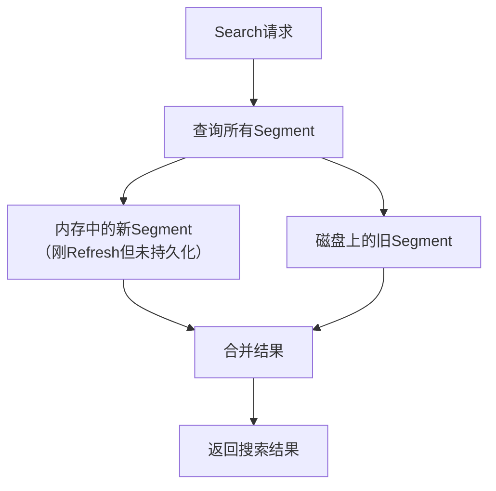

**为什么是"近实时"？**
- 新写入的文档需要等待 **Refresh 操作**（默认1秒）才能被搜索到
- 在 Refresh 之前，文档存在于内存缓冲区，但 Search 请求无法访问
- **延迟时间 = Refresh 间隔**（默认1秒，可配置）

**示例**：
```bash
# 写入文档
PUT /test/_doc/1
{"content": "新文档"}

# 立即搜索（可能搜不到，因为还没Refresh）
GET /test/_search
{"query": {"match": {"content": "新文档"}}}

# 等待1秒后搜索（肯定能搜到）
```

#### 15.3.6.2 Get 请求（实时 - Real Time）

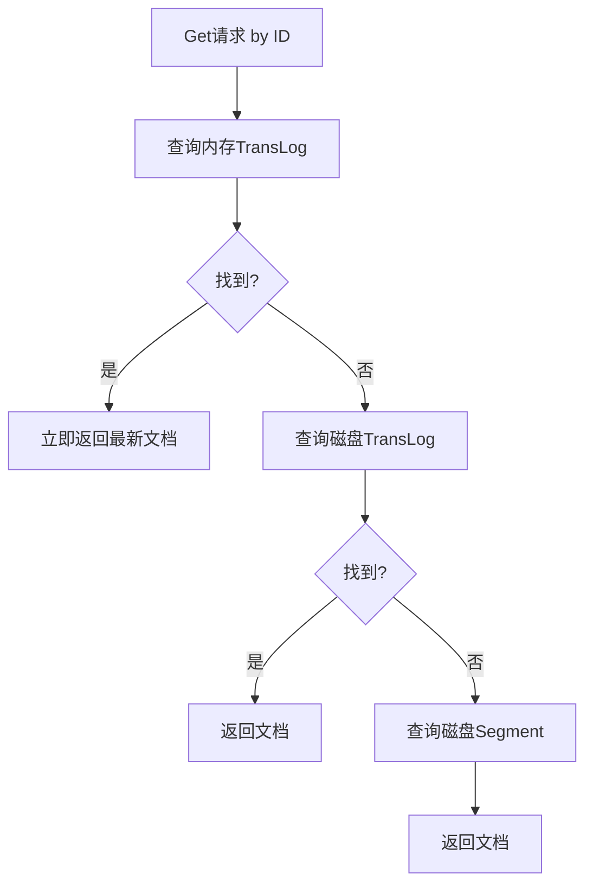

**Get 请求（简单直接）**
```bash
# 只能通过ID查询特定文档
GET /index_name/_doc/document_id

# 示例
GET /users/_doc/12345
GET /products/_doc/abc-789
```
**特点**：
- ✅ **只能按ID查询**
- ✅ **实时性**（总是返回最新版本）
- ❌ 不支持复杂查询条件
- ❌ 不支持排序、分页、聚合等

**Search 请求（功能强大）**
```bash
# 支持各种复杂查询
GET /index_name/_search
{
  "query": {
    "bool": {
      "must": [
        {"match": {"title": "手机"}},
        {"range": {"price": {"gte": 1000}}}
      ]
    }
  },
  "sort": [{"create_time": "desc"}],
  "from": 0,
  "size": 10,
  "aggs": {
    "price_stats": {"stats": {"field": "price"}}
  }
}
```
**特点**：
- ✅ **支持复杂查询条件**（匹配、范围、布尔等）
- ✅ **支持排序、分页、高亮**
- ✅ **支持聚合分析**
- ❌ **近实时**（默认有1秒延迟）


#### 15.3.6.3 深入理解查询顺序的设计原理

##### 15.3.6.3.1. 为什么 Get 请求要先查 TransLog？

**TransLog（事务日志）的特点**：
- 记录所有写操作的详细信息
- 按时间顺序追加写入
- 包含文档的最新版本信息

**查询顺序的逻辑**：
```python
def get_document(doc_id):
    # 1. 先查内存TransLog（最快）
    result = search_memory_translog(doc_id)
    if result:
        return result  # 立即返回最新版本
    
    # 2. 再查磁盘TransLog
    result = search_disk_translog(doc_id) 
    if result:
        return result
    
    # 3. 最后查Segment（最慢但最全）
    return search_segments(doc_id)
```

##### 15.3.6.3.2. 实时性保证的关键

**场景模拟**：
```bash
# 时间点 T0：写入文档
PUT /test/_doc/1 {"content": "版本1"}

# 时间点 T0+0.5秒：立即Get查询
GET /test/_doc/1  # 能查到"版本1"

# 时间点 T0+0.8秒：更新文档  
PUT /test/_doc/1 {"content": "版本2"}

# 时间点 T0+0.9秒：再次Get查询
GET /test/_doc/1  # 能查到"版本2"（实时！）

# 时间点 T0+1.0秒：Search查询
GET /test/_search  # 可能还只能搜到"版本1"（近实时）
```

**关键点**：即使文档还没有被 Refresh 到 Segment 中（Search 还搜不到），Get 请求通过查询 TransLog 也能立即获取到最新版本。

#### 15.3.6.4. TransLog 的多级存储机制

##### 15.3.6.4.1 内存 TransLog vs 磁盘 TransLog

```yaml
内存TransLog:
  - 位置: RAM
  - 特点: 查询极快，但容量有限
  - 内容: 最近的操作记录

磁盘TransLog:  
  - 位置: 硬盘
  - 特点: 查询较慢，但持久化存储
  - 内容: 所有操作的完整历史
```

##### 15.3.6.4.2 查询路径优化原理

```java
// 伪代码：Elasticsearch的实时Get实现
public Document getRealtime(String index, String id) {
    // 第一级：内存TransLog（纳秒级）
    Document doc = translogManager.searchInMemoryTranslog(id);
    if (doc != null) return doc;
    
    // 第二级：磁盘TransLog（微秒级）  
    doc = translogManager.searchOnDiskTranslog(id);
    if (doc != null) return doc;
    
    // 第三级：Segment文件（毫秒级）
    return segmentManager.searchInSegments(id);
}
```

#### 15.3.6.5. 实际应用场景对比

##### 15.3.6.5.1 Search 请求适用场景
```json
{
  "场景": "全文搜索、复杂查询",
  "示例": "搜索包含'人工智能'的文章",
  "查询": {
    "query": {
      "match": {
        "content": "人工智能"
      }
    },
    "sort": [
      {"publish_date": "desc"}
    ],
    "size": 10
  },
  "实时性要求": "中等（接受1秒延迟）"
}
```

##### 15.3.6.5.2 Get 请求适用场景  
```json
{
  "场景": "文档详情页、实时数据获取",
  "示例": "根据ID获取用户信息",
  "查询": "GET /users/_doc/12345",
  "实时性要求": "高（必须立即返回最新数据）"
}
```

#### 15.3.6.6. 配置和优化建议

##### 15.3.6.6.1 调整 Refresh 间隔
```json
PUT /my_index/_settings
{
  "index": {
    "refresh_interval": "30s"  // 延长Refresh间隔，提高写入性能
  }
}
```

##### 15.3.6.6.2 强制 Refresh（确保Search实时）
```bash
# 写入后立即Refresh，确保Search能立即查到
PUT /test/_doc/1?refresh=true
{"content": "重要文档"}

# 或者手动Refresh
POST /test/_refresh
```

#### 15.3.6.7 总结

**核心理解要点**：

1. **设计哲学**：Elasticsearch 在**写入性能**和**查询实时性**之间做了精妙平衡
2. **Search vs Get**：
   - **Search**：为**查询性能**优化，接受近实时性
   - **Get**：为**实时性**优化，通过多级查询保证数据最新
3. **TransLog 的关键作用**：不仅是崩溃恢复的保障，也是实现实时查询的基础
4. **适用场景**：
   - 需要复杂查询 → 用 Search
   - 需要实时获取特定文档 → 用 Get

这种设计让 Elasticsearch 既能处理海量数据的复杂搜索，又能满足 NoSQL 场景下的实时数据访问需求，体现了其作为"搜索和分析引擎" + "NoSQL数据库"的双重身份。

# 十六、<a id='ES原理之索引文档流程详解'>ES详解 - 原理：ES原理之索引文档流程详解</a>
> ElasticSearch中最重要原理是文档的索引和文档的读取，本文带你理解ES文档的索引过程

## 16.1 文档索引步骤顺序
### 16.1.1 单个文档
新建单个文档所需要的步骤顺序：


1. 客户端向 Node 1 发送新建、索引或者删除请求。
2. 节点使用文档的 _id 确定文档属于分片 0 。请求会被转发到 Node 3，因为分片 0 的主分片目前被分配在 Node 3 上。
3. Node 3 在主分片上面执行请求。如果成功了，它将请求并行转发到 Node 1 和 Node 2 的副本分片上。一旦所有的副本分片都报告成功, Node 3 将向协调节点报告成功，协调节点向客户端报告成功。

### 16.1.2 多个文档
使用 bulk 修改多个文档步骤顺序：


1. 客户端向 Node 1 发送 bulk 请求。
2. Node 1 为每个节点创建一个批量请求，并将这些请求并行转发到每个包含主分片的节点主机。
3. 主分片一个接一个按顺序执行每个操作。当每个操作成功时，主分片并行转发新文档（或删除）到副本分片，然后执行下一个操作。 一旦所有的副本分片报告所有操作成功，该节点将向协调节点报告成功，协调节点将这些响应收集整理并返回给客户端。
## 16.2 文档索引过程详解
### 16.2.1 整体的索引流程
> 先看下整体的索引流程


- 协调节点默认使用文档ID参与计算（也支持通过routing），以便为路由提供合适的分片。
```sh
shard = hash(document_id) % (num_of_primary_shards)
```
- 当分片所在的节点接收到来自协调节点的请求后，会将请求写入到Memory Buffer，然后定时（默认是每隔1秒）写入到Filesystem Cache，这个从Momery Buffer到Filesystem Cache的过程就叫做refresh；
- 当然在某些情况下，存在Momery Buffer和Filesystem Cache的数据可能会丢失，ES是通过translog的机制来保证数据的可靠性的。其实现机制是接收到请求后，同时也会写入到translog中，当Filesystem cache中的数据写入到磁盘中时，才会清除掉，这个过程叫做flush。
- 在flush过程中，内存中的缓冲将被清除，内容被写入一个新段，段的fsync将创建一个新的提交点，并将内容刷新到磁盘，旧的translog将被删除并开始一个新的translog。 flush触发的时机是定时触发（默认30分钟）或者translog变得太大（默认为512M）时

### 16.2.2 分步骤看数据持久化过程
> **通过分步骤看数据持久化过程**：write -> refresh -> flush -> merge

- **write 过程** 


一个新文档过来，会存储在 in-memory buffer 内存缓存区中，顺便会记录 Translog（Elasticsearch 增加了一个 translog ，或者叫事务日志，在每一次对 Elasticsearch 进行操作时均进行了日志记录）。

这时候数据还没到 segment ，是搜不到这个新文档的。数据只有被 refresh 后，才可以被搜索到。

- **refresh 过程**


refresh 默认 1 秒钟，执行一次上图流程。ES 是支持修改这个值的，通过 index.refresh_interval 设置 refresh （冲刷）间隔时间。refresh 流程大致如下：

1. in-memory buffer 中的文档写入到新的 segment 中，但 segment 是存储在文件系统的缓存中。此时文档可以被搜索到
2. 最后清空 in-memory buffer。注意: Translog 没有被清空，为了将 segment 数据写到磁盘
3. 文档经过 refresh 后， segment 暂时写到文件系统缓存，这样避免了性能 IO 操作，又可以使文档搜索到。refresh 默认 1 秒执行一次，性能损耗太大。一般建议稍微延长这个 refresh 时间间隔，比如 5 s。因此，ES 其实就是准实时，达不到真正的实时。

- **flush 过程**

每隔一段时间—​例如 translog 变得越来越大—​索引被刷新（flush）；一个新的 translog 被创建，并且一个全量提交被执行


上个过程中 segment 在文件系统缓存中，会有意外故障文档丢失。那么，为了保证文档不会丢失，需要将文档写入磁盘。那么文档从文件缓存写入磁盘的过程就是 flush。写入磁盘后，清空 translog。具体过程如下：

1. 所有在内存缓冲区的文档都被写入一个新的段。
2. 缓冲区被清空。
3. 一个Commit Point被写入硬盘。
4. 文件系统缓存通过 fsync 被刷新（flush）。
5. 老的 translog 被删除。

- **merge 过程**

由于自动刷新流程每秒会创建一个新的段 ，这样会导致短时间内的段数量暴增。而段数目太多会带来较大的麻烦。 每一个段都会消耗文件句柄、内存和cpu运行周期。更重要的是，每个搜索请求都必须轮流检查每个段；所以段越多，搜索也就越慢。

Elasticsearch通过在后台进行Merge Segment来解决这个问题。小的段被合并到大的段，然后这些大的段再被合并到更大的段。

当索引的时候，刷新（refresh）操作会创建新的段并将段打开以供搜索使用。合并进程选择一小部分大小相似的段，并且在后台将它们合并到更大的段中。这并不会中断索引和搜索。


一旦合并结束，老的段被删除：

1. 新的段被刷新（flush）到了磁盘。 ** 写入一个包含新段且排除旧的和较小的段的新提交点。
2. 新的段被打开用来搜索。
3. 老的段被删除。


合并大的段需要消耗大量的I/O和CPU资源，如果任其发展会影响搜索性能。Elasticsearch在默认情况下会对合并流程进行资源限制，所以搜索仍然 有足够的资源很好地执行。

## 16.3 深入ElasticSearch索引文档的实现机制
> 提示
> 
> 作为选读内容。

### 16.3.1 写操作的关键点
在考虑或分析一个分布式系统的写操作时，一般需要从下面几个方面考虑：

- 可靠性：或者是持久性，数据写入系统成功后，数据不会被回滚或丢失。
- 一致性：数据写入成功后，再次查询时必须能保证读取到最新版本的数据，不能读取到旧数据。
- 原子性：一个写入或者更新操作，要么完全成功，要么完全失败，不允许出现中间状态。
- 隔离性：多个写入操作相互不影响。
- 实时性：写入后是否可以立即被查询到。
- 性能：写入性能，吞吐量到底怎么样。

Elasticsearch作为分布式系统，也需要在写入的时候满足上述的四个特点，我们在后面的写流程介绍中会涉及到上述四个方面。

接下来,我们一层一层剖析Elasticsearch内部的写机制。

### 16.3.2 Lucene的写
众所周知，Elasticsearch内部使用了Lucene完成索引创建和搜索功能，Lucene中写操作主要是通过IndexWriter类实现，IndexWriter提供三个接口：
```sh
 public long addDocument();
 public long updateDocuments();
 public long deleteDocuments();
```
通过这三个接口可以完成单个文档的写入，更新和删除功能，包括了分词，倒排创建，正排创建等等所有搜索相关的流程。只要Doc通过IndesWriter写入后，后面就可以通过IndexSearcher搜索了，看起来功能已经完善了，但是仍然有一些问题没有解：

- 上述操作是单机的，而不是我们需要的分布式。
- 文档写入Lucene后并不是立即可查询的，需要生成完整的Segment后才可被搜索，如何保证实时性？
- Lucene生成的Segment是在内存中，如果机器宕机或掉电后，内存中的Segment会丢失，如何保证数据可靠性 ？
- Lucene不支持部分文档更新，但是这又是一个强需求，如何支持部分更新？

上述问题，在Lucene中是没有解决的，那么就需要Elasticsearch中解决上述问题。

我们再来看Elasticsearch中的写机制。

### 16.3.3 Elasticsearch的写
Elasticsearch采用多Shard方式，通过配置routing规则将数据分成多个数据子集，每个数据子集提供独立的索引和搜索功能。当写入文档的时候，根据routing规则，将文档发送给特定Shard中建立索引。这样就能实现分布式了。

此外，Elasticsearch整体架构上采用了一主多副的方式：


每个Index由多个Shard组成，每个Shard有一个主节点和多个副本节点，副本个数可配。但每次写入的时候，写入请求会先根据_routing规则选择发给哪个Shard，Index Request中可以设置使用哪个Filed的值作为路由参数，如果没有设置，则使用Mapping中的配置，如果mapping中也没有配置，则使用_id作为路由参数，然后通过_routing的Hash值选择出Shard（在OperationRouting类中），最后从集群的Meta中找出出该Shard的Primary节点。

请求接着会发送给Primary Shard，在Primary Shard上执行成功后，再从Primary Shard上将请求同时发送给多个Replica Shard，请求在多个Replica Shard上执行成功并返回给Primary Shard后，写入请求执行成功，返回结果给客户端。

这种模式下，写入操作的延时就等于latency = Latency(Primary Write) + Max(Replicas Write)。只要有副本在，写入延时最小也是两次单Shard的写入时延总和，写入效率会较低，但是这样的好处也很明显，避免写入后，单机或磁盘故障导致数据丢失，在数据重要性和性能方面，一般都是优先选择数据，除非一些允许丢数据的特殊场景。

采用多个副本后，避免了单机或磁盘故障发生时，对已经持久化后的数据造成损害，但是Elasticsearch里为了减少磁盘IO保证读写性能，一般是每隔一段时间（比如5分钟）才会把Lucene的Segment写入磁盘持久化，对于写入内存，但还未Flush到磁盘的Lucene数据，如果发生机器宕机或者掉电，那么内存中的数据也会丢失，这时候如何保证？

对于这种问题，Elasticsearch学习了数据库中的处理方式：增加CommitLog模块，Elasticsearch中叫TransLog。


在每一个Shard中，写入流程分为两部分，先写入Lucene，再写入TransLog。

写入请求到达Shard后，先写Lucene文件，创建好索引，此时索引还在内存里面，接着去写TransLog，写完TransLog后，刷新TransLog数据到磁盘上，写磁盘成功后，请求返回给用户。这里有几个关键点:

- 一是和数据库不同，数据库是先写CommitLog，然后再写内存，而Elasticsearch是先写内存，最后才写TransLog，一种可能的原因是Lucene的内存写入会有很复杂的逻辑，很容易失败，比如分词，字段长度超过限制等，比较重，为了避免TransLog中有大量无效记录，减少recover的复杂度和提高速度，所以就把写Lucene放在了最前面。
- 二是写Lucene内存后，并不是可被搜索的，需要通过Refresh把内存的对象转成完整的Segment后，然后再次reopen后才能被搜索，一般这个时间设置为1秒钟，导致写入Elasticsearch的文档，最快要1秒钟才可被从搜索到，所以Elasticsearch在搜索方面是NRT（Near Real Time）近实时的系统。
- 三是当Elasticsearch作为NoSQL数据库时，查询方式是GetById，这种查询可以直接从TransLog中查询，这时候就成了RT（Real Time）实时系统。四是每隔一段比较长的时间，比如30分钟后，Lucene会把内存中生成的新Segment刷新到磁盘上，刷新后索引文件已经持久化了，历史的TransLog就没用了，会清空掉旧的TransLog。

上面介绍了Elasticsearch在写入时的两个关键模块，Replica和TransLog，接下来，我们看一下Update流程：


Lucene中不支持部分字段的Update，所以需要在Elasticsearch中实现该功能，具体流程如下：

- 收到Update请求后，从Segment或者TransLog中读取同id的完整Doc，记录版本号为V1。
- 将版本V1的全量Doc和请求中的部分字段Doc合并为一个完整的Doc，同时更新内存中的VersionMap。获取到完整Doc后，Update请求就变成了Index请求。 加锁。
- 再次从versionMap中读取该id的最大版本号V2，如果versionMap中没有，则从Segment或者TransLog中读取，这里基本都会从versionMap中获取到。
- 检查版本是否冲突(V1==V2)，如果冲突，则回退到开始的“Update doc”阶段，重新执行。如果不冲突，则执行最新的Add请求。
- 在Index Doc阶段，首先将Version + 1得到V3，再将Doc加入到Lucene中去，Lucene中会先删同id下的已存在doc id，然后再增加新Doc。写入Lucene成功后，将当前V3更新到versionMap中。
- 释放锁，部分更新的流程就结束了。

介绍完部分更新的流程后，大家应该从整体架构上对Elasticsearch的写入有了一个初步的映象，接下来我们详细剖析下写入的详细步骤。

### 16.3.4 Elasticsearch写入请求类型
> Elasticsearch中的写入请求类型，主要包括下列几个：Index(Create)，Update，Delete和Bulk，其中前3个是单文档操作，后一个Bulk是多文档操作，其中Bulk中可以包括Index(Create)，Update和Delete。

在6.0.0及其之后的版本中，前3个单文档操作的实现基本都和Bulk操作一致，甚至有些就是通过调用Bulk的接口实现的。估计接下来几个版本后，Index(Create)，Update，Delete都会被当做Bulk的一种特例化操作被处理。这样，代码和逻辑都会更清晰一些。

下面，我们就以Bulk请求为例来介绍写入流程。


- 红色：Client Node。
- 绿色：Primary Node。
- 蓝色：Replica Node。
#### 16.3.4.1 Client Node
> Client Node 也包括了前面说过的Parse Request，这里就不再赘述了，接下来看一下其他的部分。

1. Ingest Pipeline

在这一步可以对原始文档做一些处理，比如HTML解析，自定义的处理，具体处理逻辑可以通过插件来实现。在Elasticsearch中，由于Ingest Pipeline会比较耗费CPU等资源，可以设置专门的Ingest Node，专门用来处理Ingest Pipeline逻辑。

如果当前Node不能执行Ingest Pipeline，则会将请求发给另一台可以执行Ingest Pipeline的Node。

2. Auto Create Index

判断当前Index是否存在，如果不存在，则需要自动创建Index，这里需要和Master交互。也可以通过配置关闭自动创建Index的功能。

3. Set Routing

设置路由条件，如果Request中指定了路由条件，则直接使用Request中的Routing，否则使用Mapping中配置的，如果Mapping中无配置，则使用默认的_id字段值。

在这一步中，如果没有指定id字段，则会自动生成一个唯一的_id字段，目前使用的是UUID。

4. Construct BulkShardRequest

由于Bulk Request中会包括多个(Index/Update/Delete)请求，这些请求根据routing可能会落在多个Shard上执行，这一步会按Shard挑拣Single Write Request，同一个Shard中的请求聚集在一起，构建BulkShardRequest，每个BulkShardRequest对应一个Shard。

5. Send Request To Primary

这一步会将每一个BulkShardRequest请求发送给相应Shard的Primary Node。

#### 16.3.4.2 Primary Node

> Primary 请求的入口是在PrimaryOperationTransportHandler的messageReceived，我们来看一下相关的逻辑流程。

1. Index or Update or Delete

循环执行每个Single Write Request，对于每个Request，根据操作类型(CREATE/INDEX/UPDATE/DELETE)选择不同的处理逻辑。

其中，Create/Index是直接新增Doc，Delete是直接根据_id删除Doc，Update会稍微复杂些，我们下面就以Update为例来介绍。

2. Translate Update To Index or Delete
这一步是Update操作的特有步骤，在这里，会将Update请求转换为Index或者Delete请求。首先，会通过GetRequest查询到已经存在的同_id Doc（如果有）的完整字段和值（依赖_source字段），然后和请求中的Doc合并。同时，这里会获取到读到的Doc版本号，记做V1。

3. Parse Doc

这里会解析Doc中各个字段。生成ParsedDocument对象，同时会生成uid Term。在Elasticsearch中，_uid = type # _id，对用户，_Id可见，而Elasticsearch中存储的是_uid。这一部分生成的ParsedDocument中也有Elasticsearch的系统字段，大部分会根据当前内容填充，部分未知的会在后面继续填充ParsedDocument。

4. Update Mapping

Elasticsearch中有个自动更新Mapping的功能，就在这一步生效。会先挑选出Mapping中未包含的新Field，然后判断是否运行自动更新Mapping，如果允许，则更新Mapping。

5. Get Sequence Id and Version

由于当前是Primary Shard，则会从SequenceNumber Service获取一个sequenceID和Version。SequenceID在Shard级别每次递增1，SequenceID在写入Doc成功后，会用来初始化LocalCheckpoint。Version则是根据当前Doc的最大Version递增1。

6. Add Doc To Lucene

这一步开始的时候会给特定_uid加锁，然后判断该_uid对应的Version是否等于之前Translate Update To Index步骤里获取到的Version，如果不相等，则说明刚才读取Doc后，该Doc发生了变化，出现了版本冲突，这时候会抛出一个VersionConflict的异常，该异常会在Primary Node最开始处捕获，重新从“Translate Update To Index or Delete”开始执行。

如果Version相等，则继续执行，如果已经存在同id的Doc，则会调用Lucene的UpdateDocument(uid, doc)接口，先根据uid删除Doc，然后再Index新Doc。如果是首次写入，则直接调用Lucene的AddDocument接口完成Doc的Index，AddDocument也是通过UpdateDocument实现。

**这一步中有个问题是，如何保证Delete-Then-Add的原子性**，怎么避免中间状态时被Refresh？答案是在开始Delete之前，会加一个Refresh Lock，禁止被Refresh，只有等Add完后释放了Refresh Lock后才能被Refresh，这样就保证了Delete-Then-Add的原子性。

Lucene的UpdateDocument接口中就只是处理多个Field，会遍历每个Field逐个处理，处理顺序是invert index，store field，doc values，point dimension，后续会有文章专门介绍Lucene中的写入。

7. Write Translog

写完Lucene的Segment后，会以keyvalue的形式写TransLog，Key是_id，Value是Doc内容。当查询的时候，如果请求是GetDocByID，则可以直接根据_id从TransLog中读取到，满足NoSQL场景下的实时性要去。

需要注意的是，这里只是写入到内存的TransLog，是否Sync到磁盘的逻辑还在后面。

这一步的最后，会标记当前SequenceID已经成功执行，接着会更新当前Shard的LocalCheckPoint。

8. Renew Bulk Request

这里会重新构造Bulk Request，原因是前面已经将UpdateRequest翻译成了Index或Delete请求，则后续所有Replica中只需要执行Index或Delete请求就可以了，不需要再执行Update逻辑，一是保证Replica中逻辑更简单，性能更好，二是保证同一个请求在Primary和Replica中的执行结果一样。

9. Flush Translog

这里会根据TransLog的策略，选择不同的执行方式，要么是立即Flush到磁盘，要么是等到以后再Flush。Flush的频率越高，可靠性越高，对写入性能影响越大。

10. Send Requests To Replicas

这里会将刚才构造的新的Bulk Request并行发送给多个Replica，然后等待Replica的返回，这里需要等待所有Replica返回后（可能有成功，也有可能失败），Primary Node才会返回用户。如果某个Replica失败了，则Primary会给Master发送一个Remove Shard请求，要求Master将该Replica Shard从可用节点中移除。

这里，同时会将SequenceID，PrimaryTerm，GlobalCheckPoint等传递给Replica。

发送给Replica的请求中，Action Name等于原始ActionName + [R]，这里的R表示Replica。通过这个[R]的不同，可以找到处理Replica请求的Handler。

11. Receive Response From Replicas

Replica中请求都处理完后，会更新Primary Node的LocalCheckPoint。

#### 16.3.4.3 Replica Node
> Replica 请求的入口是在ReplicaOperationTransportHandler的messageReceived，我们来看一下相关的逻辑流程。

1. Index or Delete

根据请求类型是Index还是Delete，选择不同的执行逻辑。这里没有Update，是因为在Primary Node中已经将Update转换成了Index或Delete请求了。

2. Parse Doc

3. Update Mapping

以上都和Primary Node中逻辑一致。

4. Get Sequence Id and Version

Primary Node中会生成Sequence ID和Version，然后放入ReplicaRequest中，这里只需要从Request中获取到就行。

5. Add Doc To Lucene

由于已经在Primary Node中将部分Update请求转换成了Index或Delete请求，这里只需要处理Index和Delete两种请求，不再需要处理Update请求了。比Primary Node会更简单一些。

6. Write Translog

7. Flush Translog

以上都和Primary Node中逻辑一致。

### 16.3.5 最后
上面详细介绍了Elasticsearch的写入流程及其各个流程的工作机制，我们在这里再次总结下之前提出的分布式系统中的六大特性：

- 可靠性：由于Lucene的设计中不考虑可靠性，在Elasticsearch中通过Replica和TransLog两套机制保证数据的可靠性。
- 一致性：Lucene中的Flush锁只保证Update接口里面Delete和Add中间不会Flush，但是Add完成后仍然有可能立即发生Flush，导致Segment可读。这样就没法保证Primary和所有其他Replica可以同一时间Flush，就会出现查询不稳定的情况，这里**只能实现最终一致性。**
- 原子性：Add和Delete都是直接调用Lucene的接口，是原子的。当部分更新时，使用Version和锁保证更新是原子的。
- 隔离性：仍然采用Version和局部锁来保证更新的是特定版本的数据。
- 实时性：使用定期Refresh Segment到内存，并且Reopen Segment方式保证搜索可以在较短时间（比如1秒）内被搜索到。通过将未刷新到磁盘数据记入TransLog，保证对未提交数据可以通过ID实时访问到。
- 性能：性能是一个系统性工程，所有环节都要考虑对性能的影响，在Elasticsearch中，在很多地方的设计都考虑到了性能，一是不需要所有Replica都返回后才能返回给用户，只需要返回特定数目的就行；二是生成的Segment现在内存中提供服务，等一段时间后才刷新到磁盘，Segment在内存这段时间的可靠性由TransLog保证；三是TransLog可以配置为周期性的Flush，但这个会给可靠性带来伤害；四是每个线程持有一个Segment，多线程时相互不影响，相互独立，性能更好；五是系统的写入流程对版本依赖较重，读取频率较高，因此采用了versionMap，减少热点数据的多次磁盘IO开销。Lucene中针对性能做了大量的优化。


# 十七、ES详解 - 优化：ElasticSearch性能优化详解
> Elasticsearch 作为一个开箱即用的产品，在生产环境上线之后，我们其实不一定能确保其的性能和稳定性。如何根据实际情况提高服务的性能，其实有很多技巧。这章我们分享从实战经验中总结出来的 elasticsearch 性能优化，主要从硬件配置优化、索引优化设置、查询方面优化、数据结构优化、集群架构优化等方面讲解。

## 17.1 硬件配置优化
> 升级硬件设备配置一直都是提高服务能力最快速有效的手段，在系统层面能够影响应用性能的一般包括三个因素：CPU、内存和 IO，可以从这三方面进行 ES 的性能优化工作。

### 17.1.1 CPU 配置
一般说来，CPU 繁忙的原因有以下几个：

- 线程中有无限空循环、无阻塞、正则匹配或者单纯的计算；
- 发生了频繁的 GC；
- 多线程的上下文切换；

大多数 Elasticsearch 部署往往对 CPU 要求不高。因此，相对其它资源，具体配置多少个（CPU）不是那么关键。你应该选择具有多个内核的现代处理器，常见的集群使用 2 到 8 个核的机器。如果你要在更快的 CPUs 和更多的核数之间选择，选择更多的核数更好。多个内核提供的额外并发远胜过稍微快一点点的时钟频率。

### 17.1.2 内存配置
如果有一种资源是最先被耗尽的，它可能是内存。排序和聚合都很耗内存，所以有足够的堆空间来应付它们是很重要的。即使堆空间是比较小的时候，也能为操作系统文件缓存提供额外的内存。因为 Lucene 使用的许多数据结构是基于磁盘的格式，Elasticsearch 利用操作系统缓存能产生很大效果。

64 GB 内存的机器是非常理想的，但是 32 GB 和 16 GB 机器也是很常见的。少于8 GB 会适得其反（你最终需要很多很多的小机器），大于 64 GB 的机器也会有问题。

由于 ES 构建基于 lucene，而 lucene 设计强大之处在于 lucene 能够很好的利用操作系统内存来缓存索引数据，以提供快速的查询性能。lucene 的索引文件 segements 是存储在单文件中的，并且不可变，对于 OS 来说，能够很友好地将索引文件保持在 cache 中，以便快速访问；因此，我们很有必要将一半的物理内存留给 lucene；**另一半的物理内存留给 ES（JVM heap）。**

#### 17.1.2.1 内存分配
当机器内存小于 64G 时，遵循通用的原则，50% 给 ES，50% 留给 lucene。

当机器内存大于 64G 时，遵循以下原则：

- 如果主要的使用场景是全文检索，那么建议给 ES Heap 分配 4~32G 的内存即可；其它内存留给操作系统，供 lucene 使用（segments cache），以提供更快的查询性能。
- 如果主要的使用场景是聚合或排序，并且大多数是 numerics，dates，geo_points 以及 not_analyzed 的字符类型，建议分配给 ES Heap 分配 4~32G 的内存即可，其它内存留给操作系统，供 lucene 使用，提供快速的基于文档的聚类、排序性能。
- 如果使用场景是聚合或排序，并且都是基于 analyzed 字符数据，这时需要更多的 heap size，建议机器上运行多 ES 实例，每个实例保持不超过 50% 的 ES heap 设置（但不超过 32 G，堆内存设置 32 G 以下时，JVM 使用对象指标压缩技巧节省空间），50% 以上留给 lucene。
#### 17.1.2.2 禁止 swap
禁止 swap，一旦允许内存与磁盘的交换，会引起致命的性能问题。可以通过在 elasticsearch.yml 中 bootstrap.memory_lock: true，以保持 JVM 锁定内存，保证 ES 的性能。

#### 17.1.2.3 GC 设置
<a href='https://www.elastic.co/guide/cn/elasticsearch/guide/current/dont-touch-these-settings.html'>老的版本中</a>官方文档中推荐默认设置为：Concurrent-Mark and Sweep（CMS），给的理由是当时G1 还有很多 BUG。

原因是：已知JDK 8附带的HotSpot JVM的早期版本存在一些问题，当启用G1GC收集器时，这些问题可能导致索引损坏。受影响的版本早于JDK 8u40随附的HotSpot版本。来源于官方说明

实际上如果你使用的JDK8较高版本，或者JDK9+，我推荐你使用G1 GC； 因为我们目前的项目使用的就是G1 GC，运行效果良好，对Heap大对象优化尤为明显。修改jvm.options文件，将下面几行:
```sh
-XX:+UseConcMarkSweepGC
-XX:CMSInitiatingOccupancyFraction=75
-XX:+UseCMSInitiatingOccupancyOnly
```
更改为
```sh
-XX:+UseG1GC
-XX:MaxGCPauseMillis=50
```
其中 -XX:MaxGCPauseMillis是控制预期的最高GC时长，默认值为200ms，如果线上业务特性对于GC停顿非常敏感，可以适当设置低一些。但是 这个值如果设置过小，可能会带来比较高的cpu消耗。

G1对于集群正常运作的情况下减轻G1停顿对服务时延的影响还是很有效的，但是如果是你描述的GC导致集群卡死，那么很有可能换G1也无法根本上解决问题。 通常都是集群的数据模型或者Query需要优化。

## 17.1.3 磁盘
硬盘对所有的集群都很重要，对大量写入的集群更是加倍重要（例如那些存储日志数据的）。硬盘是服务器上最慢的子系统，这意味着那些写入量很大的集群很容易让硬盘饱和，使得它成为集群的瓶颈。

**在经济压力能承受的范围下，尽量使用固态硬盘（SSD）**。固态硬盘相比于任何旋转介质（机械硬盘，磁带等），无论随机写还是顺序写，都会对 IO 有较大的提升。

> 1. 如果你正在使用 SSDs，确保你的系统 I/O 调度程序是配置正确的。当你向硬盘写数据，I/O 调度程序决定何时把数据实际发送到硬盘。大多数默认 *nix 发行版下的调度程序都叫做 cfq（完全公平队列）。
> 2. 调度程序分配时间片到每个进程。并且优化这些到硬盘的众多队列的传递。但它是为旋转介质优化的：机械硬盘的固有特性意味着它写入数据到基于物理布局的硬盘会更高效。
> 3. 这对 SSD 来说是低效的，尽管这里没有涉及到机械硬盘。但是，deadline 或者 noop 应该被使用。deadline 调度程序基于写入等待时间进行优化，noop 只是一个简单的 FIFO 队列。

**这个简单的更改可以带来显著的影响。仅仅是使用正确的调度程序，我们看到了 500 倍的写入能力提升。**

如果你使用旋转介质（如机械硬盘），尝试获取尽可能快的硬盘（高性能服务器硬盘，15k RPM 驱动器）。

**使用 RAID0 是提高硬盘速度的有效途径，对机械硬盘和 SSD 来说都是如此。**没有必要使用镜像或其它 RAID 变体，因为 Elasticsearch 在自身层面通过副本，已经提供了备份的功能，所以不需要利用磁盘的备份功能，同时如果使用磁盘备份功能的话，对写入速度有较大的影响。

最后，**避免使用网络附加存储（NAS）**。人们常声称他们的 NAS 解决方案比本地驱动器更快更可靠。除却这些声称，我们从没看到 NAS 能配得上它的大肆宣传。NAS 常常很慢，显露出更大的延时和更宽的平均延时方差，而且它是单点故障的。

## 17.2 索引优化设置
> 索引优化主要是在 Elasticsearch 的插入层面优化，Elasticsearch 本身索引速度其实还是蛮快的，具体数据，我们可以参考官方的 benchmark 数据。我们可以根据不同的需求，针对索引优化。

### 17.2.1 批量提交
当有大量数据提交的时候，建议采用批量提交（Bulk 操作）；此外使用 bulk 请求时，每个请求不超过几十M，因为太大会导致内存使用过大。

比如在做 ELK 过程中，Logstash indexer 提交数据到 Elasticsearch 中，batch size 就可以作为一个优化功能点。但是优化 size 大小需要根据文档大小和服务器性能而定。

像 Logstash 中提交文档大小超过 20MB，Logstash 会将一个批量请求切分为多个批量请求。

如果在提交过程中，遇到 EsRejectedExecutionException 异常的话，则说明集群的索引性能已经达到极限了。这种情况，要么提高服务器集群的资源，要么根据业务规则，减少数据收集速度，比如只收集 Warn、Error 级别以上的日志。

### 17.2.2 增加 Refresh 时间间隔
为了提高索引性能，Elasticsearch 在写入数据的时候，采用延迟写入的策略，即数据先写到内存中，当超过默认1秒（index.refresh_interval）会进行一次写入操作，就是将内存中 segment 数据刷新到磁盘中，此时我们才能将数据搜索出来，所以这就是为什么 Elasticsearch 提供的是近实时搜索功能，而不是实时搜索功能。

如果我们的系统对数据延迟要求不高的话，我们可以通过**延长 refresh 时间间隔，可以有效地减少 segment 合并压力，提高索引速度**。比如在做全链路跟踪的过程中，我们就将 index.refresh_interval 设置为30s，减少 refresh 次数。再如，在进行全量索引时，可以将 refresh 次数临时关闭，即 index.refresh_interval 设置为-1，数据导入成功后再打开到正常模式，比如30s。

> 在加载大量数据时候可以暂时不用 refresh 和 repliccas，index.refresh_interval 设置为-1，index.number_of_replicas 设置为0。

相关原理，请参考<a href='#ES原理之索引文档流程详解'>ES详解 - 原理：ES原理之索引文档流程详解</a>

### 17.2.3 修改 index_buffer_size 的设置
索引缓冲的设置可以控制多少内存分配给索引进程。这是一个全局配置，会应用于一个节点上所有不同的分片上。
```sh
indices.memory.index_buffer_size: 10%
indices.memory.min_index_buffer_size: 48mb
```
indices.memory.index_buffer_size 接受一个百分比或者一个表示字节大小的值。默认是10%，意味着分配给节点的总内存的10%用来做索引缓冲的大小。这个数值被分到不同的分片（shards）上。如果设置的是百分比，还可以设置 min_index_buffer_size （默认 48mb）和 max_index_buffer_size（默认没有上限）。

### 17.2.4 修改 translog 相关的设置
一是控制数据从内存到硬盘的操作频率，以减少硬盘 IO。可将 sync_interval 的时间设置大一些。默认为5s。
```sh
index.translog.sync_interval: 5s
```
也可以控制 tranlog 数据块的大小，达到 threshold 大小时，才会 flush 到 lucene 索引文件。默认为512m。
```sh
index.translog.flush_threshold_size: 512mb
```
translog我们在<a href='#ES原理之索引文档流程详解'>ES详解 - 原理：ES原理之索引文档流程详解</a>也有介绍。

### 17.2.5 注意 _id 字段的使用
_id 字段的使用，应尽可能避免自定义 _id，以避免针对 ID 的版本管理；建议使用 ES 的默认 ID 生成策略或使用数字类型 ID 做为主键。

### 17.2.6 注意 _all 字段及 _source 字段的使用
_all 字段及 _source 字段的使用，应该注意场景和需要，_all 字段包含了所有的索引字段，方便做全文检索，如果无此需求，可以禁用；_source 存储了原始的 document 内容，如果没有获取原始文档数据的需求，可通过设置 includes、excludes 属性来定义放入 _source 的字段。

### 17.2.7 合理的配置使用 index 属性
合理的配置使用 index 属性，analyzed 和 not_analyzed，根据业务需求来控制字段是否分词或不分词。只有 groupby 需求的字段，配置时就设置成 not_analyzed，以提高查询或聚类的效率。

### 17.2.8 减少副本数量
Elasticsearch 默认副本数量为3个，虽然这样会提高集群的可用性，增加搜索的并发数，但是同时也会影响写入索引的效率。

在索引过程中，需要把更新的文档发到副本节点上，等副本节点生效后在进行返回结束。使用 Elasticsearch 做业务搜索的时候，建议副本数目还是设置为3个，但是像内部 ELK 日志系统、分布式跟踪系统中，完全可以将副本数目设置为1个。

## 17.3 查询方面优化
> Elasticsearch 作为业务搜索的近实时查询时，查询效率的优化显得尤为重要。

### 17.3.1 路由优化
当我们查询文档的时候，Elasticsearch 如何知道一个文档应该存放到哪个分片中呢？它其实是通过下面这个公式来计算出来的。
```sh
shard = hash(routing) % number_of_primary_shards
```
routing 默认值是文档的 id，也可以采用自定义值，比如用户 ID。

- **不带 routing 查询**

  在查询的时候因为不知道要查询的数据具体在哪个分片上，所以整个过程分为2个步骤：

  - 分发：请求到达协调节点后，协调节点将查询请求分发到每个分片上。
  - 聚合：协调节点搜集到每个分片上查询结果，再将查询的结果进行排序，之后给用户返回结果。
- **带 routing 查询**

查询的时候，可以直接根据 routing 信息定位到某个分配查询，不需要查询所有的分配，经过协调节点排序。

向上面自定义的用户查询，如果 routing 设置为 userid 的话，就可以直接查询出数据来，效率提升很多。

### 17.3.2 Filter VS Query
尽可能使用过滤器上下文（Filter）替代查询上下文（Query）

- Query：此文档与此查询子句的匹配程度如何？
- Filter：此文档和查询子句匹配吗？

Elasticsearch 针对 Filter 查询只需要回答「是」或者「否」，不需要像 Query 查询一样计算相关性分数，同时Filter结果可以缓存。

### 17.3.3 深度翻页
在使用 Elasticsearch 过程中，应尽量避免大翻页的出现。

正常翻页查询都是从 from 开始 size 条数据，这样就需要在每个分片中查询打分排名在前面的 from+size 条数据。协同节点收集每个分配的前 from+size 条数据。协同节点一共会受到 N*(from+size) 条数据，然后进行排序，再将其中 from 到 from+size 条数据返回出去。如果 from 或者 size 很大的话，导致参加排序的数量会同步扩大很多，最终会导致 CPU 资源消耗增大。

可以通过使用 Elasticsearch scroll 和 scroll-scan 高效滚动的方式来解决这样的问题。

也可以结合实际业务特点，文档 id 大小如果和文档创建时间是一致有序的，可以以文档 id 作为分页的偏移量，并将其作为分页查询的一个条件。

### 17.3.4 脚本（script）合理使用
我们知道脚本使用主要有 3 种形式，内联动态编译方式、_script 索引库中存储和文件脚本存储的形式；一般脚本的使用场景是粗排，尽量用第二种方式先将脚本存储在 _script 索引库中，起到提前编译，然后通过引用脚本 id，并结合 params 参数使用，即可以达到模型（逻辑）和数据进行了分离，同时又便于脚本模块的扩展与维护。

### 17.3.5 Cache的设置及使用
- `QueryCache`: ES查询的时候，使用filter查询会使用query cache, 如果业务场景中的过滤查询比较多，建议将querycache设置大一些，以提高查询速度。
indices.queries.cache.size： 10%（默认），可设置成百分比，也可设置成具体值，如256mb。

当然也可以禁用查询缓存（默认是开启）， 通过index.queries.cache.enabled：false设置。

- `FieldDataCache`: 在聚类或排序时，field data cache会使用频繁，因此，设置字段数据缓存的大小，在聚类或排序场景较多的情形下很有必要，可通过indices.fielddata.cache.size：30% 或具体值10GB来设置。但是如果场景或数据变更比较频繁，设置cache并不是好的做法，因为缓存加载的开销也是特别大的。

- `ShardRequestCache`: 查询请求发起后，每个分片会将结果返回给协调节点(Coordinating Node), 由协调节点将结果整合。          如果有需求，可以设置开启;  通过设置index.requests.cache.enable: true来开启。          不过，shard request cache只缓存hits.total, aggregations, suggestions类型的数据，并不会缓存hits的内容。也可以通过设置indices.requests.cache.size: 1%（默认）来控制缓存空间大小。

### 17.3.6 更多查询优化经验
- `query_string` 或 `multi_match` 的查询字段越多， 查询越慢。可以在mapping阶段，利用copy_to属性将多字段的值索引到一个新字段，multi_match时，用新的字段查询。

- 日期字段的查询， 尤其是用now 的查询实际上是不存在缓存的，因此， 可以从业务的角度来考虑是否一定要用now, 毕竟利用query cache 是能够大大提高查询效率的。

- 查询结果集的大小不能随意设置成大得离谱的值， 如query.setSize不能设置成 Integer.MAX_VALUE， 因为ES内部需要建立一个数据结构来放指定大小的结果集数据。

- 避免层级过深的聚合查询， 层级过深的aggregation , 会导致内存、CPU消耗，建议在服务层通过程序来组装业务，也可以通过pipeline的方式来优化。

- 复用预索引数据方式来提高AGG性能：

如通过 terms aggregations 替代 range aggregations， 如要根据年龄来分组，分组目标是: 少年（14岁以下） 青年（14-28） 中年（29-50） 老年（51以上）， 可以在索引的时候设置一个age_group字段，预先将数据进行分类。从而不用按age来做range aggregations, 通过age_group字段就可以了。

### 17.3.7 通过开启慢查询配置定位慢查询
不论是数据库还是搜索引擎，对于问题的排查，开启慢查询日志是十分必要的，ES 开启慢查询的方式有多种，但是最常用的是调用模板 API 进行全局设置：
```sh
PUT  /_template/{TEMPLATE_NAME}
{
 
  "template":"{INDEX_PATTERN}",
  "settings" : {
    "index.indexing.slowlog.level": "INFO",
    "index.indexing.slowlog.threshold.index.warn": "10s",
    "index.indexing.slowlog.threshold.index.info": "5s",
    "index.indexing.slowlog.threshold.index.debug": "2s",
    "index.indexing.slowlog.threshold.index.trace": "500ms",
    "index.indexing.slowlog.source": "1000",
    "index.search.slowlog.level": "INFO",
    "index.search.slowlog.threshold.query.warn": "10s",
    "index.search.slowlog.threshold.query.info": "5s",
    "index.search.slowlog.threshold.query.debug": "2s",
    "index.search.slowlog.threshold.query.trace": "500ms",
    "index.search.slowlog.threshold.fetch.warn": "1s",
    "index.search.slowlog.threshold.fetch.info": "800ms",
    "index.search.slowlog.threshold.fetch.debug": "500ms",
    "index.search.slowlog.threshold.fetch.trace": "200ms"
  },
  "version"  : 1
}
 
PUT {INDEX_PAATERN}/_settings
{
    "index.indexing.slowlog.level": "INFO",
    "index.indexing.slowlog.threshold.index.warn": "10s",
    "index.indexing.slowlog.threshold.index.info": "5s",
    "index.indexing.slowlog.threshold.index.debug": "2s",
    "index.indexing.slowlog.threshold.index.trace": "500ms",
    "index.indexing.slowlog.source": "1000",
    "index.search.slowlog.level": "INFO",
    "index.search.slowlog.threshold.query.warn": "10s",
    "index.search.slowlog.threshold.query.info": "5s",
    "index.search.slowlog.threshold.query.debug": "2s",
    "index.search.slowlog.threshold.query.trace": "500ms",
    "index.search.slowlog.threshold.fetch.warn": "1s",
    "index.search.slowlog.threshold.fetch.info": "800ms",
    "index.search.slowlog.threshold.fetch.debug": "500ms",
    "index.search.slowlog.threshold.fetch.trace": "200ms"
}
```
这样，在日志目录下的慢查询日志就会有输出记录必要的信息了。
```sh
{CLUSTER_NAME}_index_indexing_slowlog.log
{CLUSTER_NAME}_index_search_slowlog.log
```
## 17.4 数据结构优化
> 基于 Elasticsearch 的使用场景，文档数据结构尽量和使用场景进行结合，去掉没用及不合理的数据。

### 17.4.1 尽量减少不需要的字段
如果 Elasticsearch 用于业务搜索服务，一些不需要用于搜索的字段最好不存到 ES 中，这样即节省空间，同时在相同的数据量下，也能提高搜索性能。

避免使用动态值作字段，动态递增的 mapping，会导致集群崩溃；同样，也需要控制字段的数量，业务中不使用的字段，就不要索引。控制索引的字段数量、mapping 深度、索引字段的类型，对于 ES 的性能优化是重中之重。

以下是 ES 关于字段数、mapping 深度的一些默认设置：
```sh
index.mapping.nested_objects.limit: 10000
index.mapping.total_fields.limit: 1000
index.mapping.depth.limit: 20
```
### 17.4.2 Nested Object vs Parent/Child
尽量避免使用 nested 或 parent/child 的字段，能不用就不用；nested query 慢，parent/child query 更慢，比 nested query 慢上百倍；因此能在 mapping 设计阶段搞定的（大宽表设计或采用比较 smart 的数据结构），就不要用父子关系的 mapping。

如果一定要使用 nested fields，保证 nested fields 字段不能过多，目前 ES 默认限制是 50。因为针对 1 个 document，每一个 nested field，都会生成一个独立的 document，这将使 doc 数量剧增，影响查询效率，尤其是 JOIN 的效率。
```sh
index.mapping.nested_fields.limit: 50
```


#### 一个生动的例子

假设我们要存储 **博客文章和评论**。
- 一篇文章（博客）对应多条评论。
- 这就是一个典型的 **一对多** 关系。

##### 方法一：Nested Object（嵌套对象）

**做法**：将评论作为文章文档的一个**嵌套字段**存储在一起。

```json
// 文档结构
{
  "post_id": 1,
  "title": "我的第一篇博客",
  "comments": [ // 这就是一个 nested 类型的字段
    {
      "user": "张三",
      "comment": "好文章！",
      "date": "2023-01-01"
    },
    {
      "user": "李四", 
      "comment": "期待下一篇！",
      "date": "2023-01-02"
    }
  ]
}
```

**工作原理**：
- 在内部，ES 会将每个 `comments` 子对象和父文档（博客文章）**一起存储在一个 Lucene 块中**。
- 查询时，ES 知道这些子对象属于同一个父文档，可以精确地一起检索。

**优点（像“合租公寓”）**：
- **读取性能高**：因为所有数据（文章和它的所有评论）都存储在一起，一次查询就能全部拿出来，非常快。

**缺点（像“整租限制”）**：
- **更新成本高**：如果要给这篇文章**增加一条评论**，或者修改**某一条评论**，你必须**重新索引（更新）整个文章文档**（包括标题、内容和其他所有评论）。这在评论频繁更新时非常低效。

---

##### 方法二：Parent/Child（父子关系）

**做法**：将文章和评论存储为**两个完全独立的文档**，但通过一个“关系”字段连接起来。

```json
// 1. 父文档（博客文章）
{
  "post_id": 1,
  "title": "我的第一篇博客",
  "type": "post" // 标识它是父文档
}

// 2. 子文档（评论A）
{
  "user": "张三",
  "comment": "好文章！",
  "date": "2023-01-01",
  "type": "comment", // 标识它是子文档
  "post_id": 1 // 这个字段指向父文档的ID，建立关联
}

// 3. 子文档（评论B）
{
  "user": "李四",
  "comment": "期待下一篇！", 
  "date": "2023-01-02",
  "type": "comment",
  "post_id": 1
}
```

**工作原理**：
- 父子文档是**独立存储和索引**的。
- ES 在内存中维护一个“关系表”（`join`字段），用来记录哪个子文档属于哪个父文档。

**优点（像“独立公寓楼”）**：
- **更新灵活**：你可以**单独增加、删除或修改一条评论**，而完全不需要动父文档（博客文章）或其他评论。这对于子文档频繁更新的场景是巨大的优势。

**缺点（像“找人麻烦”）**：
- **查询性能差**：因为数据是分开的，要查询“某篇文章的所有评论”，ES 需要执行一个类似 **JOIN 的操作**：先找到父文档，再根据关系去所有子文档里筛选。这个过程比 `nested` 查询慢很多（可能慢上百倍）。

---

#### 核心对比总结

| 特性 | Nested Object（嵌套对象） | Parent/Child（父子关系） |
| :--- | :--- | :--- |
| **数据存储** | **存储在一起**（同一个Lucene文档块） | **完全独立存储**（不同的Lucene文档） |
| **查询速度** | **快**（一次检索，数据都在一块） | **慢**（需要执行类JOIN操作，慢上百倍） |
| **更新灵活性** | **差**（更新任何子项都需要重写整个父文档） | **极好**（父子文档可独立更新，互不影响） |
| **内存开销** | 低 | 高（需要在内存中维护关系映射） |

### 如何选择？记住这个黄金法则

1.  **选择 Nested Object：**
    - **子数据基本不变，或随父数据一起变**。
    - **查询非常频繁，且要求高性能**。
    - **例如**：一篇已发布的文章和它的评论（评论增加不频繁），订单和订单内固定的商品快照。

2.  **选择 Parent/Child：**
    - **子数据需要频繁、独立地更新**。
    - **可以接受相对较慢的查询速度**。
    - **例如**：一个用户（父）和他不断变化的地址簿（子）。你可能会经常单独增删改某个地址，这时用 Parent/Child 就比每次更新整个用户文档高效得多。

#### 为什么文档建议“尽量避免使用”？

正如您引用的文档所说，**两者都有性能代价**：
- `Nested Query` 比普通查询慢。
- `Parent/Child Query` 比 `Nested Query` 慢得多。

因此，在设计阶段，优先考虑能否用“大宽表”（Flattened Data）或更巧妙的结构来避免关系。比如，如果子对象数量固定且很少，有时用简单的对象数组（但有关联查询不准的问题）或关键字数组也能满足需求。

**结论**：只有在确实需要维护一对多关系，且无法通过扁平化设计解决时，才根据**“子文档更新频率”** 这个最关键的因素来选择使用 `Nested` 还是 `Parent/Child`。

### 17.4.3 选择静态映射，非必需时，禁止动态映射
尽量避免使用动态映射，这样有可能会导致集群崩溃，此外，动态映射有可能会带来不可控制的数据类型，进而有可能导致在查询端出现相关异常，影响业务。

此外，Elasticsearch 作为搜索引擎时，主要承载 query 的匹配和排序的功能，那数据的存储类型基于这两种功能的用途分为两类，一是需要匹配的字段，用来建立倒排索引对 query 匹配用，另一类字段是用做粗排用到的特征字段，如 ctr、点击数、评论数等等。


#### 什么是动态映射（Dynamic Mapping）？

**动态映射**就像是一个"智能助手"——当你向 Elasticsearch 插入新数据时，如果这个数据的字段在索引中还没有定义过，Elasticsearch 会自动根据字段值的内容来"猜测"这个字段应该是什么类型，并自动创建映射。

##### 举个例子就明白了：

假设你有一个索引，最开始是空的。你插入第一条数据：
```json
{
  "name": "张三",
  "age": 25,
  "salary": 5000.50
}
```

Elasticsearch 会自动创建映射：
- `name` → **text** 类型（因为是字符串）
- `age` → **integer** 类型（因为是整数）  
- `salary` → **float** 类型（因为是小数）

#### 动态映射的风险（为什么文档说"尽量避免"）

动态映射虽然方便，但有很大的隐患：

##### 1. **数据类型不一致导致查询异常**
```json
// 第一天插入的数据
{"price": "100"}  // ES 猜测：price 是 text 类型

// 第二天插入的数据  
{"price": 200}    // ES 猜测：price 是 integer 类型

// 第三天插入的数据
{"price": 299.99} // ES 猜测：price 是 float 类型
```
**问题**：同一个 `price` 字段，在三个文档中变成了三种不同的类型！当你用数值范围查询时，部分文档可能无法正确匹配。

##### 2. **映射爆炸（Mapping Explosion）**
如果数据源有问题，可能会创建大量无用的字段：
```json
// 错误的数据，每个商品的属性名都不同
{"product_123_color": "red"}
{"product_124_color": "blue"} 
{"product_125_color": "green"}
// ...
```
ES 会为每个 `product_xxx_color` 都创建一个字段映射，可能导致成千上万个字段，消耗大量内存。

##### 3. **不符合业务需求的映射**
ES 的"智能猜测"可能不符合你的实际需求：
```json
{"id": "10001"}  // ES 可能将其映射为 text 类型
```
但实际上，你可能希望 `id` 是 `keyword` 类型，用于精确匹配和聚合。

#### 什么是静态映射（推荐的做法）？

**静态映射**就是你提前明确定义每个字段的类型和属性。

```json
// 创建索引时明确指定映射
PUT /users
{
  "mappings": {
    "properties": {
      "name": {"type": "text"},
      "age": {"type": "integer"},
      "salary": {"type": "float"},
      "email": {"type": "keyword"}  // 明确指定为keyword，用于精确匹配
    }
  }
}
```

**好处**：
- ✅ **数据类型一致**：避免查询异常
- ✅ **内存可控**：不会出现映射爆炸
- ✅ **符合业务需求**：你可以根据用途优化每个字段

#### 后半段话的解释：字段的两种用途

文档提到的"数据的存储类型基于这两种功能的用途分为两类"，指的是：

##### 1. **需要匹配的字段（建立倒排索引）**
- **用途**：全文搜索、关键词匹配
- **对应类型**：`text` 类型
- **例子**：文章标题、商品描述、日志内容
- **特点**：会被分词，"智能手机" → ["智能", "手机"]

##### 2. **用于排序的特征字段**
- **用途**：排序、过滤、聚合
- **对应类型**：`keyword`、`integer`、`float`、`date` 等
- **例子**：点击率(CTR)、价格、销量、创建时间
- **特点**：保持完整值，用于数值比较和精确匹配

##### 实际应用示例：
```json
// 商品索引的合理映射设计
{
  "mappings": {
    "properties": {
      // 用于搜索匹配的字段
      "title": {"type": "text"},           // 商品标题-可分词搜索
      "description": {"type": "text"},     // 商品描述-可分词搜索
      
      // 用于排序和过滤的字段  
      "category": {"type": "keyword"},     // 分类-精确匹配和聚合
      "price": {"type": "float"},          // 价格-数值范围过滤和排序
      "sales_count": {"type": "integer"},  // 销量-排序
      "ctr": {"type": "float"}             // 点击率-排序
    }
  }
}
```

#### 总结

1. **动态映射** = 让 ES 自动猜字段类型 → **方便但有风险**
2. **静态映射** = 提前明确定义字段类型 → **稳定可靠，推荐使用**
3. **字段设计**要根据用途：搜索用 `text`，排序用 `keyword`/数值类型

### 17.4.4 document 模型设计
对于 MySQL，我们经常有一些复杂的关联查询。在 es 里该怎么玩儿，es 里面的复杂的关联查询尽量别用，一旦用了性能一般都不太好。

最好是先在 Java 系统里就完成关联，将关联好的数据直接写入 es 中。搜索的时候，就不需要利用 es 的搜索语法来完成 join 之类的关联搜索了。

document 模型设计是非常重要的，很多操作，不要在搜索的时候才想去执行各种复杂的乱七八糟的操作。es 能支持的操作就那么多，不要考虑用 es 做一些它不好操作的事情。如果真的有那种操作，尽量在 document 模型设计的时候，写入的时候就完成。另外对于一些太复杂的操作，比如 join/nested/parent-child 搜索都要尽量避免，性能都很差的。

## 17.5 集群架构设计
> 合理的部署 Elasticsearch 有助于提高服务的整体可用性。

### 17.5.1 主节点、数据节点和协调节点分离
Elasticsearch 集群在架构拓朴时，采用主节点、数据节点和负载均衡节点分离的架构，在 5.x 版本以后，又可将数据节点再细分为“Hot-Warm”的架构模式。

Elasticsearch 的配置文件中有 2 个参数，node.master 和 node.data。这两个参数搭配使用时，能够帮助提供服务器性能。

#### 17.5.1.1 主（master）节点
配置 node.master:true 和 node.data:false，该 node 服务器只作为一个主节点，但不存储任何索引数据。我们推荐每个集群运行3 个专用的 master 节点来提供最好的弹性。使用时，你还需要将 discovery.zen.minimum_master_nodes setting 参数设置为 2，以免出现脑裂（split-brain）的情况。用 3 个专用的 master 节点，专门负责处理集群的管理以及加强状态的整体稳定性。因为这 3 个 master 节点不包含数据也不会实际参与搜索以及索引操作，在 JVM 上它们不用做相同的事，例如繁重的索引或者耗时，资源耗费很大的搜索。因此不太可能会因为垃圾回收而导致停顿。因此，master 节点的 CPU，内存以及磁盘配置可以比 data 节点少很多的。

#### 17.5.1.2 数据（data）节点
配置 node.master:false 和 node.data:true，该 node 服务器只作为一个数据节点，只用于存储索引数据，使该 node 服务器功能单一，只用于数据存储和数据查询，降低其资源消耗率。

在 Elasticsearch 5.x 版本之后，data 节点又可再细分为“Hot-Warm”架构，即分为热节点（hot node）和暖节点（warm node）。

**hot 节点：**

**hot 节点主要是索引节点（写节点）**，同时会保存近期的一些频繁被查询的索引。由于进行索引非常耗费 CPU 和 IO，即属于 IO 和 CPU 密集型操作，建议使用 SSD 的磁盘类型，保持良好的写性能；我们推荐部署最小化的 3 个 hot 节点来保证高可用性。根据近期需要收集以及查询的数据量，可以增加服务器数量来获得想要的性能。

将节点设置为 hot 类型需要 elasticsearch.yml 如下配置：
```sh
node.attr.box_type: hot
```
如果是针对指定的 index 操作，可以通过 settings 设置 index.routing.allocation.require.box_type: hot 将索引写入 hot 节点。

**warm 节点：**

**这种类型的节点是为了处理大量的，而且不经常访问的只读索引而设计的**。由于这些索引是只读的，warm 节点倾向于挂载大量磁盘（普通磁盘）来替代 SSD。内存、CPU 的配置跟 hot 节点保持一致即可；节点数量一般也是大于等于 3 个。

将节点设置为 warm 类型需要 elasticsearch.yml 如下配置：
```sh
node.attr.box_type: warm
```
同时，也可以在 elasticsearch.yml 中设置 index.codec:best_compression 保证 warm 节点的压缩配置。

当索引不再被频繁查询时，可通过 index.routing.allocation.require.box_type:warm，将索引标记为 warm，从而保证索引不写入 hot 节点，以便将 SSD 磁盘资源用在刀刃上。一旦设置这个属性，ES 会自动将索引合并到 warm 节点。

**协调（coordinating）节点**

**协调节点用于做分布式里的协调，将各分片或节点返回的数据整合后返回。**该节点不会被选作主节点，也不会存储任何索引数据。该服务器主要用于查询负载均衡。在查询的时候，通常会涉及到从多个 node 服务器上查询数据，并将请求分发到多个指定的 node 服务器，并对各个 node 服务器返回的结果进行一个汇总处理，最终返回给客户端。在 ES 集群中，所有的节点都有可能是协调节点，但是，可以通过设置 node.master、node.data、node.ingest 都为 false 来设置专门的协调节点。需要较好的 CPU 和较高的内存。

- node.master:false和node.data:true，该node服务器只作为一个数据节点，只用于存储索引数据，使该node服务器功能单一，只用于数据存储和数据查询，降低其资源消耗率。
- node.master:true和node.data:false，该node服务器只作为一个主节点，但不存储任何索引数据，该node服务器将使用自身空闲的资源，来协调各种创建索引请求或者查询请求，并将这些请求合理分发到相关的node服务器上。
- node.master:false和node.data:false，该node服务器即不会被选作主节点，也不会存储任何索引数据。该服务器主要用于查询负载均衡。在查询的时候，通常会涉及到从多个node服务器上查询数据，并将请求分发到多个指定的node服务器，并对各个node服务器返回的结果进行一个汇总处理，最终返回给客户端。

#### 17.5.1.3 关闭 data 节点服务器中的 http 功能
针对 Elasticsearch 集群中的所有数据节点，不用开启 http 服务。将其中的配置参数这样设置，http.enabled:false，同时也不要安装 head, bigdesk, marvel 等监控插件，这样保证 data 节点服务器只需处理创建/更新/删除/查询索引数据等操作。

http 功能可以在非数据节点服务器上开启，上述相关的监控插件也安装到这些服务器上，用于监控 Elasticsearch 集群状态等数据信息。这样做一来出于数据安全考虑，二来出于服务性能考虑。

#### 17.5.1.4 一台服务器上最好只部署一个 node
一台物理服务器上可以启动多个 node 服务器节点（通过设置不同的启动 port），但一台服务器上的 CPU、内存、硬盘等资源毕竟有限，从服务器性能考虑，不建议一台服务器上启动多个 node 节点。

#### 17.5.1.5 集群分片设置
ES 一旦创建好索引后，就无法调整分片的设置，而在 ES 中，一个分片实际上对应一个 lucene 索引，而 lucene 索引的读写会占用很多的系统资源，因此，分片数不能设置过大；所以，在创建索引时，合理配置分片数是非常重要的。一般来说，我们遵循一些原则：

控制每个分片占用的硬盘容量不超过 ES 的最大 JVM 的堆空间设置（一般设置不超过 32 G，参考上面的 JVM 内存设置原则），因此，如果索引的总容量在 500 G 左右，那分片大小在 16 个左右即可；当然，最好同时考虑原则 2。 考虑一下 node 数量，一般一个节点有时候就是一台物理机，如果分片数过多，大大超过了节点数，很可能会导致一个节点上存在多个分片，一旦该节点故障，即使保持了 1 个以上的副本，同样有可能会导致数据丢失，集群无法恢复。**所以，一般都设置分片数不超过节点数的 3 倍。**

# 十八、大厂实践 - 哈啰：记录一次ElasticSearch的查询性能优化
> 再分享一篇哈啰单车技术团队对ElasticSearch的查询性能优化的分析文章。
## 18.1 问题: 慢查询
搜索平台的公共集群，由于业务众多，对业务的es查询语法缺少约束，导致问题频发。业务可能写了一个巨大的查询直接把集群打挂掉，但是我们平台人力投入有限，也不可能一条条去审核业务的es查询语法，只能通过后置的手段去保证整个集群的稳定性，通过slowlog分析等，下图中cpu已经100%了。


昨天刚好手头有一点点时间，就想着能不能针对这些情况，把影响最坏的业务抓出来，进行一些改善，于是昨天花了2小时分析了一下，找到了一些共性的问题，可以通过平台来很好的改善这些情况。


首先通过slowlog抓到一些耗时比较长的查询，例如下面这个索引的查询耗时基本都在300ms以上：
```json
{
  "from": 0,
  "size": 200,
  "timeout": "60s",
  "query": {
    "bool": {
      "must": \[
        {
          "match": {
            "source": {
              "query": "5",
              "operator": "OR",
              "prefix\_length": 0,
              "fuzzy\_transpositions": true,
              "lenient": false,
              "zero\_terms\_query": "NONE",
              "auto\_generate\_synonyms\_phrase\_query": "false",
              "boost": 1
            }
          }
        },
        {
          "terms": {
            "type": \[
              "21"
            \],
            "boost": 1
          }
        },
        {
          "match": {
            "creator": {
              "query": "0d754a8af3104e978c95eb955f6331be",
              "operator": "OR",
              "prefix\_length": 0,
              "fuzzy\_transpositions": "true",
              "lenient": false,
              "zero\_terms\_query": "NONE",
              "auto\_generate\_synonyms\_phrase\_query": "false",
              "boost": 1
            }
          }
        },
        {
          "terms": {
            "status": \[
              "0",
              "3"
            \],
            "boost": 1
          }
        },
        {
          "match": {
            "isDeleted": {
              "query": "0",
              "operator": "OR",
              "prefix\_length": 0,
              "fuzzy\_transpositions": "true",
              "lenient": false,
              "zero\_terms\_query": "NONE",
              "auto\_generate\_synonyms\_phrase\_query": "false",
              "boost": 1
            }
          }
        }
      \],
      "adjust\_pure\_negative": true,
      "boost": 1
    }
  },
  "\_source": {
    "includes": \[
    \],
    "excludes": \[\]
  }
}
```
这个查询比较简单，翻译一下就是：
```sql
SELECT guid FROM xxx WHERE source=5 AND type=21 AND creator='0d754a8af3104e978c95eb955f6331be' AND status in (0,3) AND isDeleted=0;
```

## 18.2 慢查询分析
这个查询问题还挺多的，不过不是今天的重点。比如这里面不好的一点是还用了模糊查询fuzzy_transpositions,也就是查询ab的时候，ba也会被命中，其中的语法不是今天的重点，可以自行查询，我估计这个是业务用了SDK自动生成的，里面很多都是默认值。

第一反应是当然是用filter来代替match查询，一来filter可以缓存，另外避免这种无意义的模糊匹配查询，但是这个优化是有限的，并不是今天讲解的关键点，先忽略。

### 18.2.1 错用的数据类型
我们通过kibana的profile来进行分析，耗时到底在什么地方？es有一点就是开源社区很活跃，文档齐全，配套的工具也非常的方便和齐全。


可以看到大部分的时间都花在了PointRangQuery里面去了，这个是什么查询呢？为什么这么耗时呢？这里就涉及到一个es的知识点，那就是对于integer这种数字类型的处理。在es2.x的时代，所有的数字都是按keyword处理的，每个数字都会建一个倒排索引，这样查询虽然快了，但是一旦做范围查询的时候。比如 type>1 and type<5就需要转成 type in (1,2,3,4,5)来进行，大大的增加了范围查询的难度和耗时。

之后es做了一个优化，在integer的时候设计了一种类似于b-tree的数据结构，加速范围的查询，详细可以参考(https://elasticsearch.cn/article/446)

所以在这之后，所有的integer查询都会被转成范围查询，这就导致了上面看到的isDeleted的查询的解释。那么为什么范围查询在我们这个场景下，就这么慢呢？能不能优化。

明明我们这个场景是不需要走范围查询的，因为如果走倒排索引查询就是O(1)的时间复杂度，将大大提升查询效率。由于业务在创建索引的时候，isDeleted这种字段建成了Integer类型，导致最后走了范围查询，那么只需要我们将isDeleted类型改成keyword走term查询，就能用上倒排索引了。

实际上这里还涉及到了es的一个查询优化。类似于isDeleted这种字段，毫无区分度的倒排索引的时候，在查询的时候，es是怎么优化的呢？

### 18.2.2 多个Term查询的顺序问题
实际上，如果有多个term查询并列的时候，他的执行顺序，既不是你查询的时候，写进去的顺序。


例如上面这个查询，他既不是先执行source=5再执行type=21按照你代码的顺序执行过滤，也不是同时并发执行所有的过滤条件，然后再取交集。es很聪明，他会评估每个filter的条件的区分度，把高区分度的filter先执行，以此可以加速后面的filter循环速度。比如creator=0d754a8af3104e978c95eb955f6331be查出来之后10条记录，他就会优先执行这一条。

怎么做到的呢？其实也很简单，term建的时候，每一个term在写入的时候都会记录一个词频，也就是这个term在全部文档里出现的次数，这样我们就能判断当前的这个term他的区分度高低了。

### 18.2.3 为什么PointRangeQuery在这个场景下非常慢
上面提到了这种查询的数据结构类似于b-tree,他在做范围查询的时候，非常有优势，Lucene将这颗B-tree的非叶子结点部分放在内存里，而叶子结点紧紧相邻存放在磁盘上。当作range查询的时候，内存里的B-tree可以帮助快速定位到满足查询条件的叶子结点块在磁盘上的位置，之后对叶子结点块的读取几乎都是顺序的。


总结就是这种结构适合范围查询，且磁盘的读取是顺序读取的。但是在我们这种场景之下，term查询可就麻烦了，数值型字段的TermQuery被转换为了PointRangeQuery。这个Query利用Block k-d tree进行范围查找速度非常快，但是满足查询条件的docid集合在磁盘上并非向Postlings list那样按照docid顺序存放，也就无法实现postings list上借助跳表做蛙跳的操作。

要实现对docid集合的快速advance操作，只能将docid集合拿出来，做一些再处理。这个处理过程在org.apache.lucene.search.PointRangeQuery#createWeight这个方法里可以读取到。这里就不贴冗长的代码了，主要逻辑就是在创建scorer对象的时候，顺带先将满足查询条件的docid都选出来，然后构造成一个代表docid集合的bitset，这个过程和构造Query cache的过程非常类似。之后advance操作，就是在这个bitset上完成的。所有的耗时都在构建bitset上，因此可以看到耗时主要在build_scorer上了。
## 18.3 验证
找到原因之后，就可以开始验证了。将原来的integer类型全部改成keyword类型，如果业务真的有用到范围查询，应该会报错。通过搜索平台的平台直接修改配置，修改完成之后，重建索引就生效了。


索引切换之后的效果也非常的明显，通过kibana的profile分析可以看到，之前需要接近100ms的PointRangQuery现在走倒排索引，只需要0.5ms的时间。


之前这个索引的平均latency在100ms+，这个是es分片处理的耗时,从搜索行为开始，到搜索行为结束的打点，不包含网络传输时间和连接建立时间，单纯的分片内的函数的处理时间的平均值，正常情况在10ms左右。


经过调整之后的耗时降到了10ms内。


通过监控查看慢查询的数量，立即减少到了0。


## 18.4 未来
后续将通过搜索平台侧的能力来保证业务的查询，所有的integer我们会默认你记录的是状态值，不需要进行范围查询，默认将会修改为keyword类型，如果业务确实需要范围查询，则可以通过后台再修改回integer类型，这样可以保证在业务不了解es机制的情况下，也能拥有较好的性能，节省机器计算资源。

目前还遇到了很多问题需要优化。例如重建索引的时候，机器负载太高。公共集群的机器负载分布不均衡的问题，业务的查询和流量不可控等各种各样的问题，要节省机器资源就一定会面对这种各种各样的问题，除非土豪式做法，每个业务都拥有自己的机器资源，这里面有很多很多颇具技术挑战的事情。

实际上，在这一块还是非常利于积累经验，对于es的了解和成长也非常快，在查问题的过程中，对于搜索引擎的使用和了解会成长的非常快。不仅如此，很多时候，我们用心的看到生产的问题，持续的跟踪，一定会有所收获。大家遇到生产问题的时候，务必不要放过任何细节，这个就是你收获的时候，比你写100行的CRUD更有好处。

## 18.5 文章来源
> 转载说明:
> 
> - 作者：任天兵
> - 版权声明：本文为哈啰技术团队的原创文章，遵循 CC 4.0 BY-SA 版权协议，转载请附上原文出处链接及本声明。
> - 原文链接：https://mp.weixin.qq.com/s?__biz=MzI3OTE3ODk4MQ==&mid=2247486047&idx=1&sn=b3ab21da891df124c03e628eb3851b4c&chksm=eb4af1d5dc3d78c3be8995c0e16674f47598f907185dac03919f0c4d0a26ea4a71a0543390bf&scene=132#wechat_redirect

## 18.6 自己的一些解读

### 18.6.1. 查询的含义和实现的查询逻辑

上述 JSON 查询是一个 ElasticSearch 的 DSL 查询，它实现了以下逻辑：

**查询含义：**
- 从索引中查找满足所有条件的文档。
- 返回前200条记录（`"size": 200`），从第0条开始（`"from": 0`）。
- 查询超时设置为60秒（`"timeout": "60s"`）。
- 不返回任何源字段（`"_source"` 的 includes/excludes 都为空），可能只返回文档的元数据（如 `_id`）。

**具体条件（相当于 SQL 的 WHERE 子句）：**
```sql
SELECT * FROM index_name 
WHERE source = '5' 
  AND type = '21' 
  AND creator = '0d754a8af3104e978c95eb955f6331be' 
  AND status IN ('0', '3') 
  AND isDeleted = '0';
```

**查询类型分析：**
- `match` 查询：用于 `source`、`creator`、`isDeleted` 字段。虽然 `match` 通常用于全文搜索，但这里参数（如 `"operator": "OR"`）表明它被用于精确匹配（类似 `term` 查询），可能是因为字段映射或查询写法问题。
- `terms` 查询：用于 `type` 和 `status` 字段，是多值精确匹配（类似 SQL 的 IN）。
- 所有条件用 `bool must` 组合，表示逻辑 AND（必须全部满足）。

**问题点：**
- 查询中所有值都是字符串（如 `"5"`、`"0"`），但字段的实际类型取决于索引映射（mapping）。
- 文章提到，`isDeleted`、`status` 等字段被错误地映射为 `integer` 类型，导致性能问题。

### 18.6.2. 为什么 `integer` 类型差，而 `keyword` 类型好？

这取决于字段的**查询用途**，而不是值的形式。判断依据：

- **如果字段用于等值查询（精确匹配）**：如 `status=0`、`isDeleted=0`，应该用 `keyword` 类型。
- **如果字段用于范围查询或数值计算**：如 `age > 18`、`price BETWEEN 100 AND 200`，应该用 `integer` 类型。

**为什么 `integer` 类型在等值查询中性能差？**
- ES 为 `integer` 类型优化了范围查询，使用 **Point Range Query** 机制（基于 B-tree 类似结构）。
- 当执行等值查询（如 `isDeleted=0`）时，ES 内部会将其转换为范围查询：`isDeleted >= 0 AND isDeleted <= 0`。
- 这个过程需要构建一个 `bitset`（位集合）来存储所有匹配的文档 ID，**构建 `bitset` 非常耗时**（尤其是数据量大时），导致 `build_scorer` 阶段缓慢。

**为什么 `keyword` 类型在等值查询中性能好？**
- `keyword` 类型使用 **倒排索引**（inverted index），每个值（如 `"0"`）作为一个完整的 term（词条）存储。
- 等值查询时，ES 直接查找倒排索引中 term 对应的文档列表，时间复杂度接近 O(1)，无需额外处理。

**简单比喻：**
- `keyword` 类型等值查询：像在字典里按**精确单词**查找页码，直接翻到那个词就行。
- `integer` 类型等值查询：像按**数字大小**在无序列表中逐个比对，效率低下。

### 18.6.3. `keyword` 类型也有倒排索引吗？

**是的，`keyword` 类型确实有倒排索引！** 这是 ES 的核心机制。

- **倒排索引是什么**：它类似于书末的索引页，记录每个词条（term）出现在哪些文档中。例如：
  - term `"0"` → 文档 1, 3, 5（指向包含 `"0"` 的文档列表）
  - term `"1"` → 文档 2, 4
- **`keyword` 类型的特点**：
  - 字段值不会被分词（例如 `"hello world"` 会作为一个整体 `"hello world"` 存储）。
  - 每个值作为一个完整的 term 存入倒排索引，适合精确匹配、过滤、聚合。
- **与 `text` 类型的区别**：
  - `text` 类型会分词（如 `"hello world"` 分成 `"hello"` 和 `"world"`），适合全文搜索。
  - `keyword` 类型保留原值，适合关键词查询。

在本文案例中，将 `isDeleted` 从 `integer` 改为 `keyword` 后，查询从缓慢的 Point Range Query 切换为高效的 Term Query（利用倒排索引），性能提升显著。

### 18.6.4 总结
- **查询本质**：多条件精确过滤，但因字段类型不当导致性能问题。
- **优化关键**：根据查询模式选择数据类型——等值查询用 `keyword`，范围查询用 `integer`。
- **性能对比**：`keyword` 的倒排索引直接定位文档，而 `integer` 的等值查询需绕道范围查询机制，效率低下。

# 十九、大厂实践 - 腾讯：腾讯万亿级 Elasticsearch 技术实践
> 腾讯在ES优化上非常具备参考价值，本文来源于腾讯相关团队的技术分享。Elasticsearch 在腾讯内部广泛应用于日志实时分析、结构化数据分析、全文检索等场景，目前单集群规模达到千级节点、万亿级吞吐，同时腾讯联合 Elastic 公司在腾讯云上提供了内核增强版 ES 云服务。海量规模、丰富的应用场景推动着腾讯对原生 ES 进行持续的高可用、高性能、低成本等全方位优化。本次分享主要剖析腾讯对 Elasticsearch 海量规模下的内核优化与实践，希望能和广大 ES 爱好者共同探讨推动 ES 技术的发展。

## 19.1 ES 在腾讯的海量规模背景


先来看看 ES 在腾讯的主要应用场景。ES 是一个实时的分布式搜索分析引擎，目前很多用户对 ES 的印象还是准实时，实际上在 6.8 版本之后官方文档已经将 near real-time 改为了 real-time： "Elasticsearch provides real-time search and analytics for all types of data." ES 在写入完毕刷新之前，是可以通过 getById 的方式实时获取文档的，只是在刷新之前 FST 还没有构建，还不能提供搜索的能力。 目前 ES 在腾讯主要应用在三个方面：

- 搜索服务： 例如像腾讯文档基于 ES 做全文检索，我们的电商客户拼多多、蘑菇街等大量的商品搜索都是基于 ES。
- 日志分析： 这个是 ES 应用最广泛的领域，支持全栈的日志分析，包括各种应用日志、数据库日志、用户行为日志、网络数据、安全数据等等。ES 拥有一套完整的日志解决方案，可以秒级实现从采集到展示。
- 时序分析： 典型的场景是监控数据分析，比如云监控，整个腾讯云的监控都是基于 ES 的。此外还包括物联网场景，也有大量的时序数据。时序数据的特点是写入吞吐量特别高，ES 支持的同时也提供了丰富的多维统计分析算子。
当然除了上面的场景之外，ES 本身在站内搜索、安全、APM 等领域也有广泛的应用。

目前 ES 在腾讯公有云、专有云以及内部云上面均有提供服务，可以广泛的满足公司内外客户的业务需求。公有云上的使用场景非常丰富，专有云主要实现标准化交付和自动化运维，腾讯内部云上的 ES 都是 PB 级的超大规模集群。

## 19.2 痛点与挑战
在这些丰富的应用场景，以及海量的规模背景下，我们也遇到了很多的痛点与挑战。主要覆盖在可用性、性能、成本以及扩展性方面。


- 可用性： 最常见的问题是节点因高负载 OOM，或者整个集群因高负载而雪崩。这些痛点使我们很难保障 SLA，尤其是在搜索场景， 可用性要求 4 个 9 以上。
- 性能： 搜索场景一般要求平响延时低于 20 毫秒，查询毛刺低于 100 毫秒。在分析场景，海量数据下，虽然实时性要求没那么高，但请求响应时间决定了用户体验，资源消耗决定了性能边界。
- 成本： 很多用户都比较关注 ES 的存储成本，因为 ES 确实数据类型较多，压缩比比较低，存储成本比较高，但是优化的空间还是很大的。另外还包括内存成本，ES 有大量的索引数据需要加载到内存提供高性能的搜索能力。那么对于日志、监控等海量场景，成本的挑战就更大。
- 扩展性： 日志、时序等场景，往往索引会按周期滚动，长周期会产生大量的索引和分片，超大规模集群甚至有几十上百万的分片、千级节点的需求。而目前原生版本 ES 只能支持到万级分片、百级节点。随着大数据领域的飞速发展，ES 最终是要突破 TB 的量级，跨越到 PB 的量级，扩展性就成为了主要的瓶颈与挑战。

## 19.3 腾讯 ES 内核优化剖析
>ES 使用姿势、参数调优等在社区有很多的案例和经验可以借鉴，但很多的痛点和挑战是无法通过简单的调优来解决的，这个时候就需要从内核层面做深度的优化，来不断完善这个优秀的开源产品。接下来就是本次分享的核心部分，我们来看看腾讯是如何在内核层面对 ES 做优化的。


### 19.3.1 可用性优化
首先介绍可用性优化部分。总体来说，原生版本在可用性层面有三个层面的问题：

- **系统健壮性不足**： 高压力下集群雪崩，主要原因是内存资源不足。负载不均会导致部分节点压力过载，节点 OOM。我们在这个层面的方案主要是优化服务限流和节点均衡策略。

- **容灾方案欠缺**： ES 本身提供副本机制提升数据安全性，对于多可用区容灾还是需要云平台额外实现。即使有副本机制，甚至有跨集群复制（CCR），但还是不能阻挡用户误操作导致的数据删除，所以还需要额外提供低成本的备份回挡能力。

- **内核 Bug**： 我们修复了 Master 任务堵塞、分布式死锁、滚动重启速度慢等一系列内核可用性相关的问题，并及时提供新版本给用户升级。


接下来针对用户在可用性层面常遇到的两类问题展开分析。一类是高并发请求压垮集群，另一类是单个大查询打挂节点。

#### 19.3.1.1 **高并发请求压垮集群**
**先来看第一类场景，高并发请求压垮集群**。例如早期我们内部一个日志集群，写入量一天突增 5 倍，集群多个节点 Old GC 卡住脱离集群，集群 RED，写入停止，这个痛点确实有点痛。我们对挂掉的节点做了内存分析，发现大部分内存是被反序列化前后的写入请求占用。我们来看看这些写入请求是堆积在什么位置。


ES high level 的写入流程，用户的写入请求先到达其中一个数据节点，我们称之为数据节点。然后由该协调节点将请求转发给主分片所在节点进行写入，主分片写入完毕再由主分片转发给从分片写入，最后返回给客户端写入结果。右边是更细节的写入流程，而我们从堆栈中看到的写入请求堆积的位置就是在红色框中的接入层，节点挂掉的根因是协调节点的接入层内存被打爆。

找到了问题的原因，接下来介绍我们的**优化方案**。


针对这种高并发场景，我们的优化方案是服务限流。除了要能控制并发请求数量，还要能精准的控制内存资源，因为内存资源不足是主要的矛盾。另外通用性要强，能作用于各个层级实现全链限流。

限流方案，很多数据库使用场景会采用从业务端或者独立的 proxy 层配置相关的业务规则，做资源预估等方式进行限流。这种方式适应能力弱，运维成本高，而且业务端很难准确的预估资源消耗。

原生版本本身有限流策略，是基于请求数的漏桶策略，通过队列加线程池的方式实现。线程池大小决定的了处理并发度，处理不完放到队列，队列放不下则拒绝请求。但是单纯的基于请求数的限流不能控制资源使用量，而且只作用于分片级子请求的传输层，对于我们前面分析的接入层无法起到有效的保护作用。原生版本也有内存熔断策略，但是在协调节点接入层并没有做限制。

我们的优化方案是基于内存资源的漏桶策略。我们将节点 JVM 内存作为漏桶的资源，当内存资源足够的时候，请求可以正常处理，当内存使用量到达一定阈值的时候分区间阶梯式平滑限流。例如图中浅黄色的区间限制写入，深黄色的区间限制查询，底部红色部分作为预留 buffer，预留给处理中的请求、merge 等操作，以保证节点内存的安全性。


限流方案里面有一个挑战是，我们如何才能实现平滑限流？因为采用单一的阈值限流很容易出现请求抖动，例如请求一上来把内存打上去马上触发限流，而放开一点点请求又会涌进来把内存打上去。我们的方案是设置了高低限流阈值区间，在这个区间中，基于余弦变换实现请求数和内存资源之间的平滑限流。当内存资源足够的时候，请求通过率 100%，当内存到达限流区间逐步上升的时候，请求通过率随之逐步下降。而当内存使用量下降的时候，请求通过率也会逐步上升，不会一把放开。通过实际测试，平滑的区间限流能在高压力下保持稳定的写入性能。

我们基于内存资源的区间平滑限流策略是对原生版本基于请求数漏桶策略的有效补充，并且作用范围更广，覆盖协调节点、数据节点的接入层和传输层，并不会替代原生的限流方案。


#### 19.3.1.2 单个大查询打挂节点
接下来介绍单个大查询打挂节点的场景。例如我们在分析场景，做多层嵌套聚合，有时候请求返回的结果集比较大，那么这个时候极有可能这一个请求就会将节点打挂。我们对聚合查询流程进行分析，请求到达协调节点之后，会拆分为分片级子查询请求给目标分片所在数据节点进行子聚合，最后协调节点收集到完整的分片结果后进行归并、聚合、排序等操作。这里的主要问题点是，协调节点大量汇聚结果反序列化后内存膨胀，以及二次聚合产生新的结果集打爆内存。


针对上面单个大查询的问题，下面介绍我们的优化方案。优化方案的要点是内存膨胀预估加流式检查。 我们先来看下原生方案，原生版本是直接限制最大返回结果桶数，默认一万，超过则请求返回异常。这种方式面临的挑战是，在分析场景结果数十万、百万是常态，默认一万往往不够，调整不灵活，调大了内存可能还是会崩掉，小了又不能满足业务需求。

我们的优化方案主要分为两个阶段：

- 第一阶段：在协调节点接收数据节点返回的响应结果反序列化之前做内存膨胀预估，基于接收到的网络 byte 流大小做膨胀预估，如果当前 JVM 内存使用量加上响应结果预估的使用量超过阈值则直接熔断请求。
- 第二阶段：在协调节点 reduce 过程中，流式检查桶数，每增加固定数量的桶（默认 1024 个）检查一次内存，如果超限则直接熔断。流式检查的逻辑在数据节点子聚合的过程同样生效。

这样用户不再需要关心最大桶数，只要内存足够就能最大化地满足业务需求。不足之处是大请求还是被拒掉了，牺牲了用户的查询体验，但是我们可以通过官方已有的 batch reduce 的方式缓解，就是当有 100 个分片子结果的时候，每收到部分就先做一次聚合，这样能降低单次聚合的内存开销。上面流式聚合的整体方案已经提交给官方并合并了，将在最近的 7.7.0 版本中发布。

前面介绍了两种比较典型的用户常遇到的可用性问题。接下来对整个可用性优化做一个总结。


首先我们结合自研的优化方案和原生的方案实现了系统性的全链路限流。左图中黄色部分为自研优化，其它为原生方案。覆盖执行引擎层、传输层和接入层。另外我们对内存也做了相关的优化，内存利用率优化主要是针对写入场景，例如单条文档字段数过多上千个，每个字段值在写入过程中都会申请固定大小的 buffer，字段数过多的时候内存浪费严重，优化方案主要是实现弹性的内存 buffer。内存回收策略，这里不是指 GC 策略，主要是对于有些例如读写异常的请求及时进行内存回收。JVM GC 债务管理主要是评估 JVM Old GC 时长和正常工作时长的比例来衡量 JVM 的健康情况，特殊情况会重启 JVM 以防止长时间 hang死。

可用性优化效果，我们将公有云的 ES 集群整体可用性提升至 4 个 9，内存利用率提升 30%，高压力场景稳定性有大幅提升，基本能保证节点不会 OOM，集群不会雪崩。

下面部分是我们可用性优化相关的 PR。除了前面介绍的协调节点流式检查和内存膨胀预估以外，还包括单个查询内存限制，这个也很有用，因为有些场景如果单个查询太大会影响其它所有的请求。以及滚动重启速度优化，大集群单个节点的重启时间从 10 分钟降至 1 分钟以内，这个优化在 7.5 版本已经被合并了。如果大家遇到大集群滚动重启效率问题可以关注。


### 19.3.2 性能优化
接下来介绍性能优化。

性能优化的场景主要分为写入和查询。写入的代表场景包括日志、监控等海量时序数据场景，一般能达到千万级吞吐。**带 id 的写入性能衰减一倍**，因为先要查询记录是否存在。查询包含搜索场景和分析场景，搜索服务主要是高并发，低延时。聚合分析主要以大查询为主，内存、CPU 开销高。

我们看下性能的影响面，左半部分硬件资源和系统调优一般是用户可以直接掌控的，比如资源不够扩容，参数深度调优等。右半部分存储模型和执行计划涉及到内核优化，用户一般不容易直接调整。接下来我们重点介绍一下这两部分的优化。


#### 19.3.2.1 存储模型优化


首先是存储模型优化。我们知道 ES 底层 Lucene 是基于 LSM Tree 的数据文件。原生默认的合并策略是按文件大小相似性合并，默认一次固定合并 10 个文件，近似分层合并。这种合并方式的最大优点是合并高效，可以快速降低文件数；主要问题是数据不连续，这样会导致我们在查询的时候文件裁剪的能力很弱，比如查询最近一小时的数据，很有可能一小时的文件被分别合并到了几天前的文件中去了，导致需要遍历的文件增加了。

业内典型的解决数据连续性的合并策略，比如以 Cassandra、HBase 为代表的基于时间窗口的合并策略，优点是数据按时间序合并，查询高效，且可以支持表内 TTL；不足是限制只能是时序场景，而且文件大小可能不一致，从而影响合并效率。还有一类是以 LevelDB、RocksDB 为代表的分层合并，一层一组有序，每次抽取部分数据向下层合并，优点是查询高效，但是写放大比较严重，相同的数据可能会被多次合并，影响写入吞吐。

最后是我们的优化合并策略。我们的目标是为了提升数据连续性、收敛文件数量，提升文件的裁剪能力来提高查询性能。我们实现的策略主要是按时间序分层合并，每层文件之间按创建时间排序，除了第一层外，都按照时间序和目标大小进行合并，不固定每次合并文件数量，这样保证了合并的高效性。对于少量的未合并的文件以及冷分片文件，我们采用持续合并的策略，将超过默认五分钟不再写入的分片进行持续合并，并控制合并并发和范围，以降低合并开销。

通过对合并策略的优化，我们将搜索场景的查询性能提升了 40%。

#### 19.3.2.2 执行引擎的优化
前面介绍了底层文件的存储模型优化，我们再来向上层看看执行引擎的优化。


我们拿一个典型的场景来进行分析。ES 里面有一种聚合叫 Composite 聚合大家可能都比较了解，这个功能是在 6.5 版本正式 GA 发布的。它的目的是为了支持多字段的嵌套聚合，类似 MySQL 的 group by 多个字段；另外可以支持流式聚合，即以翻页的形式分批聚合结果。用法就像左边贴的查询时聚合操作下面指定 composite 关键字，并指定一次翻页的长度，和 group by 的字段列表。那么每次拿到的聚合结果会伴随着一个 after key 返回，下一次查询拿着这个 after key 就可以查询下一页的结果。

那么它的实现原理是怎样的呢？我们先来看看原生的方案。比如这里有两个字段的文档，field1 和 field2，第一列是文档 id 。我们按照这两个字段进行 composite 聚合，并设定一次翻页的 size 是 3。具体实现是利用一个固定 size 的大顶堆，size 就是翻页的长度，全量遍历一把所有文档迭代构建这个基于大顶堆的聚合结果，如右图中的 1 号序列所示，最后返回这个大顶堆并将堆顶作为 after key。第二次聚合的时候，同样的全量遍历一把文档，但会加上过滤条件排除不符合 after key 的文档，如右图中 2 号序列所示。

很显然这里面存在性能问题，因为每次拉取结果都需要全量遍历一遍所有文档，并未实现真正的翻页。接下来我们提出优化方案。


我们的优化方案主要是利用 index sorting 实现 after key 跳转以及提前结束（early termination）。 数据有序才能实现真正的流式聚合，index sorting 也是在 6.5 版本里面引入的，可以支持文档按指定字段排序。但遗憾的是聚合查询并没有利用数据有序性。我们可以进行优化，此时大顶堆我们仍然保留，我们只需要按照文档的顺序提取指定 size 的文档数即可马上返回，因为数据有序。下一次聚合的时候，我们可以直接根据请求携带的 after key 做跳转，直接跳转到指定位置继续向后遍历指定 size 的文档数即可返回。这样避免了每次翻页全量遍历，大幅提升查询性能。这里有一个挑战点，假设数据的顺序和用户查询的顺序不一致优化还能生效吗？实际可以的，逆序场景不能实现 after key 跳转因为 lucene 底层不能支持文档反向遍历，但提前结束的优化仍然生效，仍然可以大幅提升效率。这个优化方案我们是和官方研发协作开发的，因为我们在优化的同时，官方也在优化，但我们考虑的更全面覆盖了数据顺序和请求顺序不一致的优化场景，最终我们和官方一起将方案进行了整合。该优化方案已经在 7.6 合并，大家可以试用体验。

前面从底层的存储模型到上层的执行引擎分别举例剖析了优化，实际上我们在性能层面还做了很多的优化。从底层的存储模型到执行引擎，到优化器，到上层的缓存策略基本都有覆盖。下图中左边是优化项，中间是优化效果，右边是有代表性的优化的 PR 列表。


这里简单再介绍一下其它的 PR 优化，中间这个 translog 刷新过程中锁的粗化优化能将整体写入性能提升 20%；这个 lucene 层面的文件裁剪优化，它能将带 id 写入场景性能提升一倍，当然查询也是，因为带 id 的写入需要先根据 id 查询文档是否存在，它的优化主要是在根据 id 准备遍历查询一个 segment 文件的时候，能快速根据这个 segment 所统计的最大最小值进行裁剪，如果不在范围则快速裁剪跳过，避免遍历文档；最下面的一个 PR 是缓存策略的优化，能避免一些开销比较大的缓存，大幅的降低查询毛刺。

上面这些性能优化项在我们腾讯云的 ES 版本中均有合入，大家可以试用体验。

### 19.3.3 成本优化
接下来我们再看成本优化。在日志、时序等大规模数据场景下，集群的 CPU、内存、磁盘的成本占比是 1 比 4 比 8。例如一般 16 核 64GB，2-5 TB 磁盘节点的成本占比大概是这个比例。因此成本的主要瓶颈在于磁盘和内存。


成本优化的主要目标是存储成本和内存成本。

#### 19.3.3.1 存储成本
我们先来看下存储成本。


我们先来看一个场景，整个腾讯云监控是基于 ES 的，单个集群平均写入千万每秒，业务需要保留至少半年的数据供查询。我们按照这个吞吐来计算成本，1000 万 QPS 乘以时间乘以单条文档平均大小再乘以主从两个副本总共大约 14 PB 存储，大约需要 1500 台热机型物理机。这显然远远超出了业务成本预算，那我们如何才能既满足业务需求又能实现低成本呢？

来看下我们的优化方案，首先我们对业务数据访问频率进行调研，发现最近的数据访问频率较高，例如最近 5 分钟的，一小时的，一天的，几天的就比较少了，超过一个月的就更少了，历史数据偏向于统计分析。

首先我们可以通过冷热分离，把冷数据放到 HDD 来降低成本，同时利用官方提供的索引生命周期管理来搬迁数据，冷数据盘一般比较大我们还要利用多盘策略来提高吞吐和数据容灾能力。最后将超冷的数据冷备到腾讯云的对象存储 COS 上，冷备成本非常低，1GB 一个月才一毛多。

上面这些我们都可以从架构层面进行优化。是否还有其它优化点呢？基于前面分析的数据访问特征，历史数据偏向统计分析，我们提出了 Rollup 方案。Rollup 的目的是对历史数据降低精度，来大幅降低存储成本。我们通过预计算来释放原始细粒度的数据，例如秒级的数据聚合成小时级，小时级聚合成天级。这样对于用户查询时间较长的跨度报表方便展示，查询几天的秒级数据太细没法看。另外可以大幅降低存储成本，同时可以提升查询性能。

我们在 17 年的时候就实现了 Rollup 的方案并投入给了腾讯云监控使用，当然目前官方也出了 Rollup 方案，目前功能还在体验中。

下面介绍一下我们最新的 Rollup 方案的要点。


总体来说 Rollup 优化方案主要是基于流式聚合加查询剪枝结合分片级并发来实现其高效性。流式聚合和查询剪枝的优化我们前面在性能优化部分已经介绍了，我们新的 Rollup 也利用了这些优化，这里不再展开。下面介绍一下分片级并发，及并发自动控制策略。

正常的聚合查询，需要将请求发送给每个分片进行子聚合，在到协调节点做汇聚，两次聚合多路归并。我们通过给数据添加 routing 的方式让相同的对象落到相同的分片内，这样就只需要一层聚合，因为分片数据独立，多个数据对象可以实现分片级并发。 另外我们通过对 Rollup 任务资源预估，并感知集群的负载压力来自动控制并发度，这样对集群整体的影响能控制在一定的范围。右边的图是我们的优化效果，某个统计指标 30 天的存储量，天级的只需要 13 GB，小时级的只需要 250 GB，细粒度的会多一些，总体存储量下降了将近 10 倍。单个集群 150 台左右物理机即可搞定，成本缩减 10 倍。整体写入开销 rollup 资源消耗在 10% 以下。

#### 19.3.3.2 内存成本优化
前面是存储成本优化，下面介绍内存成本优化。


我们通过对线上集群进行分析，发现很多场景堆内内存使用率很高，而磁盘的使用率比较低。堆内存使用率为什么这么高呢？其中的 FST 即倒排索引占据了绝大部分堆内内存，而且这部分是常驻内存的。每 10 TB 的磁盘 FST 的内存消耗大概在 10 GB 到 15 GB 左右。

我们能不能对 FST 这种堆内占用比较大的内存做优化？我们的想法是把它移至堆外（off-heap），按需加载，提升堆内内存利用率，降低 GC 开销，提升单个节点管理磁盘的能力。


我们来看下 off-heap 相关的方案。首先原生版本目前也实现了 off-heap，方案是将 FST 对象放到 MMAP 中管理，这种方式实现简单，我们早期也采用了这种方式实现，但是由于 MMAP 属于 page cache 可能被系统回收掉，导致读盘操作，从而带来性能的 N 倍损耗，容易产生查询毛刺。

HBase 2.0 版本中也实现了 off-heap，在堆外建立了 cache，脱离系统缓存，但只是把数据放到堆外，索引仍然在堆内，而且淘汰策略完全依赖 LRU 策略，冷数据不能及时的清理。

我们的优化方案也是在堆外建立 cache，保证 FST 的空间不受系统影响，另外我们会实现更精准的淘汰策略，提高内存使用率，再加上多级 cache 的管理模式来提升性能。这种方式实现起来比较复杂但收益还是很明显的，下面我们来看一下详细的实现。


我们的方案是通过 LRU cache + 零拷贝 + 两级 cache 的方式实现的。首先 LRU cache 是建立在堆外，堆内有访问 FST 需求的时候从磁盘加载到 cache 中。由于 Lucene 默认的访问 FST 的方式是一个堆内的 buffer，前期我们采用了直接从堆外拷贝到堆内的 buffer 方式实现，压测发现查询性能损耗 20%，主要是堆外向堆内 copy 占了大头。

因此我们有了第二阶段优化，将 Lucene 访问 FST 的方式进行了改造，buffer 里面不直接存放 FST，而存放堆外对象的一个指针，这样实现了堆内和堆外之间的零拷贝，这里的零拷贝和我们说的 linux 中的用户态和内核态的零拷贝是两个概念。这样实现后我们压测发现查询性能还是有 7%的损耗，相较于堆内的 FST 场景。我们有没办法做到极致呢？

我们通过分析发现，这 7% 的损耗主要是根据 key 去查找堆外对象的过程，包括计算 hash，数据校验等。我们第三阶段的优化就是利用 Java 的弱引用建立第二层轻量级缓存。弱引用指向堆外的地址，只要有请求使用，这个 key 就不会被回收可以重复利用而无需重新获取。一旦不在使用，这个 key 就会被 GC 回收掉，并回收掉堆外对象指针。问题来了，堆外对象指针回收之后我们怎么清理堆外这部分内存呢？让其 LRU 淘汰？这样显然会浪费一部分内存空间。最好的办法是在堆内对象地址回收的时候直接回收堆外对象，但是 Java 没有析构的概念。这里我们利用了弱引用的 Reference Queue，当对象要被 GC 回收的时候会将对象指向的堆外内存清理掉，这样完美解决了堆外内存析构的问题，保证了堆外内存的精准淘汰，提升内存利用率。最后通过压测我们发现性能基本和原生方案 FST 在堆内的场景持平。

下面是内存优化相关的效果和收益：


通过我们的内存优化后，内存开销、数据管理能力、GC 优势明显，性能持平略有优势。单个 FST 堆内占用只需要 100 个 byte 左右即 cache key 的大小。单节点磁盘管理能力，32GB heap 能到 50 TB 左右，相较原生版本 5-10 TB（需要深度调优）有 10 倍的提升。利用官方提供的 esrally 进行性能压测，发现堆内存使用量有大幅的下降，GC 时长也有缩减，性能基本持平。

### 19.3.4 扩展性优化
接下来是最后一块内核优化内容，扩展性优化。


我们先来看一下场景。ES 的元数据管理模型是，master 管理元数据，其它所有节点同步元数据。我们以建索引流程为例，来看看元数据的同步流程。首先是 master 分配分片，然后产生 diff 的元数据，发送给其它节点，等待大多数 master 节点返回，master 发送元数据应用请求，其它节点开始应用元数据，并根据新旧元数据推导出各自节点的分片创建任务。

这里面的瓶颈点主要有以下几点：

- Mater 节点在分配分片的时候，需要做一遍元数据的正反向转换。我们知道路由信息是由分片到节点的映射，而我们在做分片分配的时候需要节点到分片的映射，需要知道每个节点上的分片分布。分片分配完毕又需要将节点到分片的映射转换回来，因为我们元数据只发布分片到节点的映射。这个转换过程涉及多次的全量遍历，大规模分片性能存在瓶颈。
- 在每次索引创建的过程中，会涉及多次的元数据同步，在大规模的节点数场景，会出现同步瓶颈，上千节点，部分节点假设有一点网络抖动或 Old GC 可能导致同步失败。

基于上面的瓶颈，目前原生版本只能支持大约 3-5 万分片，性能已经到达极限，创建索引基本到达 30 秒+ 甚至分钟级。节点数只能到 500 左右基本是极限了。

为此，我们提出了扩展性优化方案。


主要的优化内容包括：

- **分片创建任务式定向下发：** 对于创建分片导致的元数据同步瓶颈，我们采用任务下发的方式，定向下发分片创建任务，避免多次全节点元数据同步。
- **元数据增量维护：** 分配分片的过程中多次正反向遍历，我们采用增量化的数据结构维护的方式，避免全量的遍历。
- **统计缓存策略：** 统计接口的性能，我们采用缓存策略避免多次重复的统计计算，大幅降低资源开销。 最终我们将集群的分片数扩展到百万级，节点数扩展到千级，新建索引基本稳定在 5 秒以下，统计接口秒级响应。

前面就是所有的内核优化的内容。ES 是一款很优秀的开源大数据产品，我们将持续的建设。我们对公司内外提供了完整的托管平台，对 ES 内核各个层面做了系统性的增强优化，助力 Elastic Stack 在大数据生态中覆盖更多的场景，发展的更好。


## 19.4 开源贡献及未来规划


在腾讯内部，我们实现了 ES 产品开源协同，共同优化完善 ES，避免不同的团队重复踩坑。同时我们也将优秀的方案积极的贡献给社区，和官方及社区的 ES 爱好者们共同推动 ES 的发展。以腾讯 ES 内核研发为代表的团队，截至目前我们共提交了二十多个 PR，其中有 70% 被合并，共有 6 位 ES/Lucene 的 contributor。

未来，我们将持续的优化 ES，包括可用性，性能和成本等方面。可用性方面我们会加强 ES 的故障自愈能力，朝着自动驾驶的目标发展；性能方面，搜索场景 ES 是绝对的王者，多维分析领域还有很多可优化的地方，我们希望能进一步扩展 ES 在分析领域的应用场景。成本方面，存储与计算分离正在研发中，基于腾讯自研的共享文件系统 CFS，到时会进一步缩减成本，提升性能。

## 19.5 资源链接
线上 PPT 的链接：https://elasticsearch.cn/slides/259

分享过程中相关问题的答疑：https://elasticsearch.cn/articl

腾讯Elasticsearch海量规模背后的内核优化剖析 https://zhuanlan.zhihu.com/p/139725905

腾讯万亿级 Elasticsearch 内存效率提升技术解密 https://zhuanlan.zhihu.com/p/146083622

腾讯万亿级 Elasticsearch 技术解密 https://zhuanlan.zhihu.com/p/99184436

# 二十、大厂实践 - 美团：美团外卖搜索基于Elasticsearch的优化实践
> 美团外卖搜索工程团队在Elasticsearch的优化实践中，基于Location-Based Service（LBS）业务场景对Elasticsearch的查询性能进行优化。该优化基于Run-Length Encoding（RLE）设计了一款高效的倒排索引结构，使检索耗时（TP99）降低了84%。本文从问题分析、技术选型、优化方案等方面进行阐述，并给出最终灰度验证的结论。

## 20.1. 前言
最近十年，Elasticsearch 已经成为了最受欢迎的开源检索引擎，其作为离线数仓、近线检索、B端检索的经典基建，已沉淀了大量的实践案例及优化总结。然而在高并发、高可用、大数据量的 C 端场景，目前可参考的资料并不多。因此，我们希望通过分享在外卖搜索场景下的优化实践，能为大家提供 Elasticsearch 优化思路上的一些借鉴。

美团在外卖搜索业务场景中大规模地使用了 Elasticsearch 作为底层检索引擎。其在过去几年很好地支持了外卖每天十亿以上的检索流量。然而随着供给与数据量的急剧增长，业务检索耗时与 CPU 负载也随之上涨。通过分析我们发现，当前检索的性能热点主要集中在倒排链的检索与合并流程中。针对这个问题，我们基于 Run-length Encoding（RLE）[1] 技术设计实现了一套高效的倒排索引，使倒排链合并时间（TP99）降低了 96%。我们将这一索引能力开发成了一款通用插件集成到 Elasticsearch 中，使得 Elasticsearch 的检索链路时延（TP99）降低了 84%。

## 20.2. 背景
当前，外卖搜索业务检索引擎主要为 Elasticsearch，其业务特点是具有较强的 Location Based Service（LBS） 依赖，即用户所能点餐的商家，是由商家配送范围决定的。对于每一个商家的配送范围，大多采用多组电子围栏进行配送距离的圈定，一个商家存在多组电子围栏，并且随着业务的变化会动态选择不同的配送范围，电子围栏示意图如下：


考虑到商家配送区域动态变更带来的问题，我们没有使用 Geo Polygon[2] 的方式进行检索，而是通过上游一组 R-tree 服务判定可配送的商家列表来进行外卖搜索。因此，LBS 场景下的一次商品检索，可以转化为如下的一次 Elasticsearch 搜索请求：
```sh
POST food/_search
{
   "query": {
      "bool": {
         "must":{
            "term": { "spu_name": { "value": "烤鸭"} }
           //...
         },
         "filter":{
           "terms": {
              "wm_poi_id": [1,3,18,27,28,29,...,37465542] // 上万
            }
         }
      }
   }
  //...
}
```
对于一个通用的检索引擎而言，Term 检索非常高效，一次 Term 检索耗时不到 0.001 ms。因此在早期时，这一套架构和检索 DSL 可以很好地支持美团的搜索业务——耗时和资源开销尚在接受范围内。然而随着数据和供给的增长，一些供给丰富区域的附近可配送门店可以达到 20000~30000 家，这导致性能与资源问题逐渐凸显。这种万级别的 Terms 检索的性能与耗时已然无法忽略，仅仅这一句检索就需要 5~10 ms。

## 20.3. 挑战及问题
> 由于 Elasticsearch 在设计上针对海量的索引数据进行优化，在过去的 10 年间，逐步去除了内存支持索引的功能（例如 RAMDirectory 的删除）。为了能够实现超大规模候选集的检索，Elasticsearch/Lucene 对 Term 倒排链的查询流程设计了一套内存与磁盘共同处理的方案。

一次 Terms 检索的流程分为两步：分别检索**单个 Term 的倒排链**，**多个 Term 的倒排链进行合并**。

### 20.3.1 倒排链查询流程
1. 从内存中的 Term Index 中获取该 Term 所在的 Block 在磁盘上的位置。
2. 从磁盘中将该 Block 的 TermDictionary 读取进内存。
3. 对倒排链存储格式的进行 Decode，生成可用于合并的倒排链。

可以看到，这一查询流程非常复杂且耗时，且各个阶段的复杂度都不容忽视。所有的 Term 在索引中有序存储，通过二分查找找到目标 Term。这个有序的 Term 列表就是 TermDictionary ，二分查找 Term 的时间复杂度为 O(logN) ，其中 N 是 Term 的总数量 。Lucene 采用 Finite State Transducer[3]（FST）对 TermDictionary 进行编码构建 Term Index。FST 可对 Term 的公共前缀、公共后缀进行拆分保存，大大压缩了 TermDictionary 的体积，提高了内存效率，FST 的检索速度是 O(len(term))，其对于 M 个 Term 的检索复杂度为 O(M * len(term))。

### 20.3.2 倒排链合并流程
在经过上述的查询，检索出所有目标 Term 的 Posting List 后，需要对这些 Posting List 求并集（OR 操作）。在 Lucene 的开源实现中，其采用 Bitset 作为倒排链合并的容器，然后遍历所有倒排链中的每一个文档，将其加入 DocIdSet 中。

伪代码如下：
```java
Input:  termsEnum: 倒排表；termIterator：候选的term
Output: docIdSet : final docs set
for term in termIterator:
  if termsEnum.seekExact(term) != null:
     docs = read_disk()  // 磁盘读取
     docs = decode(docs) // 倒排链的decode流程
     for doc in docs:
        docIdSet.or(doc) //代码实现为DocIdSetBuilder.add。
end for
docIdSet.build()//合并，排序，最终生成DocIdSetBuilder，对应火焰图最后一段。
```
假设我们有 M 个 Term，每个 Term 对应倒排链的平均长度为 K，那么合并这 M 个倒排链的时间复杂度为：O(K * M + log(K * M))。可以看出倒排链合并的时间复杂度与 Terms 的数量 M 呈线性相关。在我们的场景下，假设一个商家平均有一千个商品，一次搜索请求需要对一万个商家进行检索，那么最终需要合并一千万个商品，即循环执行一千万次，导致这一问题被放大至无法被忽略的程度。

我们也针对当前的系统做了大量的调研及分析，通过美团内部的 JVM Profile 系统得到 CPU 的火焰图，可以看到这一流程在 CPU 热点图中的反映也是如此：无论是查询倒排链、还是读取、合并倒排链都相当消耗资源，并且可以预见的是，在供给越来越多的情况下，这三个阶段的耗时还会持续增长。


可以明确，我们需要针对倒排链查询、倒排链合并这两个问题予以优化。

## 20.4. 技术探索与实践
### 20.4.1 倒排链查询优化
通常情况下，使用 FST 作为 Term 检索的数据结构，可以在内存开销和计算开销上取得一个很好的平衡，同时支持前缀检索、正则检索等多种多样的检索 Query，然而在我们的场景之下，FST 带来的计算开销无法被忽视。

考虑到在外卖搜索场景有以下几个特性：

- Term 的数据类型为 long 类型。
- 无范围检索，均为完全匹配。
- 无前缀匹配、模糊查找的需求，不需要使用前缀树相关的特性。
- 候选数量可控，每个商家的商品数量较多，即 Term 规模可预期，内存可以承载这个数量级的数据。

因此在我们的应用场景中使用空间换取时间是值得的。

对于 Term 查询的热点：可替换 FST 的实现以减少 CPU 开销，常见的查找数据结构中，哈希表有 O(1) 的查询复杂度，将 Term 查找转变为对哈希表的一次查询。

对于哈希表的选取，我们主要选择了常见的 HashMap 和 LongObjectHashMap。

我们主要对比了 FST、HashMap 和 LongObjectHashMap（哈希表的一种高性能实现）的空间和时间效率。

- **在内存占用上：**FST 的内存效率极佳。而 HashMap/LongObjectHashMap 都有明显的劣势；
- **在查询时间上：**FST 的查询复杂度在 O (len(term))，而 Hash/LongObjectHashMap 有着 O(1) 的查询性能；

> 注：检索类型虽然为 Long，但是我们将底层存储格式进行了调整，没有使用开源的 BKD Tree 实现，使用 FST 结构，仅与 FST 进行对比。BKD Tree 在大批量整数 terms 的场景下劣势更为明显。

我们使用十万个`<Long, Long>`的键值对来构造数据，对其空间及性能进行了对比，结果如下：


可以看到， 在内存占用上 FST 要远优于 LongObjectHashMap 和 HashMap。而在查询速度上 LongObjectHashMap 最优。

我们最终选择了 LongObjectHashMap 作为倒排链查询的数据结构。

### 20.4.2 倒排链合并
基于上述问题，我们需要解决两个明显的 CPU 热点问题：倒排链读取 & 倒排链合并。我们需要选择合适的数据结构缓存倒排链，不再执行磁盘 /page cache 的 IO。数据结构需要必须满足以下条件：

- 支持批量 Merge，减少倒排链 Merge 耗时。
- 内存占用少，需要处理千万数量级的倒排链。

在给出具体的解决方案之前，先介绍一下 Lucene 对于倒排合并的原生实现、RoaringBitMap、Index Sorting。

#### 20.4.2.1 原生实现
Lucene在不同场景上使用了不同的倒排格式，提高整体的效率（空间/时间），通过火焰图可以发现，在我们的场景上，TermInSetQuery 的倒排合并逻辑开销最大。

TermInSetQuery 的倒排链合并操作分为两个步骤：倒排链读取和合并。

1. **倒排链读取：**

Lucene 倒排链压缩存储在索引文件中，倒排链读取需要实时解析，其对外暴露的 API 为迭代器结构。

2. **倒排链合并：**

倒排链合并主要由 DocIdSetBuilder 合并生成倒排链，先使用稀疏结构存储 Doc ID，当 Doc ID 个数超过一定阈值时，升级到稠密结构（FixedBitSet）存储，实现方式如下（对应代码 IntArrayDocIdSet/BitDocIdSet）：

- **稀疏数据：**存储采用 `List<int[]> array` 方式存储 Doc ID，最终经过 Merge 和排序形成一个有序数组 int[]，耗时主要集中在数组申请和排序。
- **稠密数据：**基于 long[] 实现的 bitmap 结构（FixedBitSet），耗时主要集中在 FixedBitSet 的插入过程，由于倒排链需要实时 Decode 以及 FixedBitSet 的底层实现，无法实现批量 Merge，只能循环单个 Doc ID 插入，数据量大的情况下，耗时明显。

我们采用线上流量和数据压测发现该部分平均耗时约 7 ms。

#### 20.4.2.2 RoaringBitmap
当前 Elasticsearch 选择 RoaringBitMap 做为 Query Cache 的底层数据结构缓存倒排链，加快查询速率。

RoaringBitmap 是一种压缩的位图，相较于常规的压缩位图能提供更好的压缩，在稀疏数据的场景下空间更有优势。以存放 Integer 为例，Roaring Bitmap 会对存入的数据进行分桶，每个桶都有自己对应的 Container。在存入一个32位的整数时，它会把整数划分为高 16 位和低 16 位，其中高 16 位决定该数据需要被分至哪个桶，我们只需要存储这个数据剩余的低 16 位，将低 16 位存储到 Container 中，若当前桶不存在数据，直接存储 null 节省空间。RoaringBitmap有不同的实现方式，下面以 Lucene 实现（RoaringDocIdSet）进行详细讲解：

如原理图中所示，RoaringBitmap 中存在两种不同的 Container：Bitmap Container 和 Array Container。


这两种 Container 分别对应不同的数据场景——若一个 Container 中的数据量小于 4096 个时，使用 Array Container 来存储。当 Array Container 中存放的数据量大于 4096 时，Roaring Bitmap 会将 Array Container 转为 Bitmap Container。即 Array Container 用于存放稀疏数据，而 Bitmap Container 用于存放稠密数据，这样做是为了充分利用空间。下图给出了随着容量增长 Array Container 和 Bitmap Container 的空间占用对比图，当元素个数达到 4096 后（每个元素占用 16 bit ），Array Container 的空间要大于 Bitmap Container。 备注：Roaring Bitmap 可参考官方博客[4]。

#### 20.4.2.3 Index Sorting
Elasticsearch 从 6.0 版本开始支持 Index Sorting[5] 功能，在索引阶段可以配置多个字段进行排序，调整索引数据组织方式，可以调整文档所对应的 Doc ID。以 city_id，poi_id 为例：


如上示例所示：Index Sorting 会将给定的排序字段（如上图的 city_id 字段）的文档排序在一起，相同排序值的文档的 Doc ID 严格自增，对该字段建立倒排，那么其倒排链为自增数列。

### 20.4.3 基于 RLE 的倒排格式设计
基于以上的背景知识以及当前 Elasticsearch/Lucene 的解决方案，可以明确目前有 2 个改造点需要考虑。

- 合适的倒排结构，用于存储每个 Term 的倒排链。
- 合适的中间结构，用于存储多个 Term 合并后的倒排链。

对于索引倒排格式 PostingsEnum，支持接口为：
```java
public abstract class DocIdSetIterator {
  public abstract int docID();
  public abstract int nextDoc();
  public abstract int advance(int target);
}
```
倒排仅支持单文档循环调用，不支持批量读取，因此需要为倒排增加批量顺序读取的功能。

对于多倒排链的合并，由于原结构 DocIdSetBuilder 的实现也不支持批量对数据进行合并，我们探索了评估了 Elasticsearch 用于缓存 Query Cache 的数据结构 RoaringBitMap，然而其实现 RoaringDocIdSet 也无法满足我们对缓存数据结构特性需求，主要问题：

- 原生 RoaringDocIdSet 在构建时，只能支持递增的添加 Doc ID。而在实际生产中每一个商家的商品的 Doc ID 都是离散的。这就限制了其使用范围。
- 原生 RoaringDocIdSet 的底层存储结构 Bitmap Container 和 Array Container 均不支持批量合并，这就无法满足我们对倒排链合并进行优化的需求。

在明确这个问题的场景下，我们可以考虑最简单的改造，支持索引倒排格式 PostingsEnum 的批量读取。并考虑了如下几种场景：

- 在支持批量读取倒排的情况下，直接使用原结构 DocIdSetBuilder 进行批量的合并。
- 在支持批量读取倒排的情况下，使用 RoaringBitMap 进行批量合并。

然而我们发现即使对 bitset 进行分段合并，直接对数据成段进行 OR 操作，整体开销下降并不明显。其原因主要在于：对于读取的批量结果，均为稀疏分布的 Doc ID，仅减少倒排的循环调用无法解决性能开销问题。

那么问题需要转化为如何解决 Doc ID 分布稀疏的问题。在上文提及的 Index Sorting 即一个绝佳的解决方案。并且由于业务 LBS 的特点，一次检索的全部结果集均集中在某个地理位置附近，以及我们检索仅针对门店列表 ID 的特殊场景，我们最终选择对城市 ID、 Geohash、门店 ID 进行排序，从而让稀疏分布的 Doc ID 形成连续分布。在这样的排序规则应用之后，我们得到了一组绝佳的特性：每一个商家所对应的商品，其 Doc ID 完全连续。

#### 20.4.3.1 Run-Length Encoding
Run-Length Encoding[3]（RLE）技术诞生于50年前，最早应用于连续的文本压缩及图像压缩。在 2014 年，第一个开源在 GitHub 的 RoaringBitmap 诞生[6]，2016年，在 RoaringBitMap 的基础上增加了对于自增序列的 RLE 实现[7]，并应用在 bitmap 这一场景上。

在 bitmap 这一场景之下，主要通过压缩连续区间的稠密数据，节省内存开销。以数组 [1, 2, 3, ..., 59, 60, 89, 90, 91, ..., 99, 100] 为例（如下图上半部分）：使用 RLE 编码之后就变为 [1, 60, 89, 12]——形如 [start1, length1, start2, length2, ...] 的形式，其中第一位为连续数字的起始值，第二位为其长度。

在数组完全连续场景下中，对 32768 个 id (short) 进行存储，数组存储需要 64 kB，Bitmap 存储需要使用 4 kB，而 RLE 编码后直接存储仅需要 4 byte。在这一特性下，如果商家倒排链完全有序，那么商家的倒排链，可被压缩到最低仅需要两个整数即可表示。

当然 RLE 并不适用所有情况，在目标序列完全不连续的场景下，如 [1, 3, 5, 7, ... , M]，RLE 编码存储需要使用 2 * M byte的空间，比数组直接存储的空间效率差一倍。

为了和 Elasticsearch 的实现保持一致，我们决定使用 RoaringBitMap 作为倒排存储的结构，以及中间结果合并的数据结构。针对 RoaringDocIdSet 我们进行了如下改造。


#### 20.4.3.2 RLE Container 的实现
在对商家 ID 字段开启 Index Sorting 之后，同商家的商品 ID 已经连续分布。那么对于商家字段的倒排链就是严格自增且无空洞的整数序列。我们采用RLE编码对倒排链进行编码存储。由于将倒排链编码为 [start1, length1, start2, length2, ...]，更特殊的，在我们场景下，一个倒排链的表示为 [start, length]，RLE编码做到了对倒排链的极致压缩，假设倒排链为 [1, 2, ...., 1000]， 用 ArrayContainer 存储，内存空间占用为 16 bit * 100 = 200 Byte, RLE 编码存储只需要 16 bit * 2 = 4 Byte。考虑到具体的场景分布，以及其他场景可能存在多段有序倒排的情况，我们最终选择了 [start1, length1, start2, length2, ...] 这样的存储格式，且 [start, start + length] 之间两两互不重叠。

对于多个商家的倒排合并流程，对于该格式的合并，我们并不需要对 M 个倒排链长度为 K 进行循环处理，这个问题转变为：如何对多组分段 [start, length] 进行排序，并将排序后的结果合并为一个数组。那么我们将原时间复杂度为 的合并流程，改造为复杂度为 O(M * logM) 的合并流程，大大降低了合并的计算耗时，减少了 CPU 的消耗。

#### 20.4.3.3 SparseRoaringDocIdSet 实现
我们在 RoaringDocIdSet 的基础上增加了 RLE Container 后，性能已经得到了明显的提升，加速了 50%，然而依然不符合我们的预期。我们通过对倒排链的数据分析发现：倒排链的平均长度不大，基本在十万内。但是其取值范围广 [ 0, Integer.MAX-1 ]。这些特征说明，如果以 RoaringDocIdSet 按高 16 位进行分桶的话，大部分数据将集中在其中连续的几个桶中。

在 Elasticsearch 场景上，由于无法预估数据分布，RoaringDocIdSet 在申请 bucket 容器的数组时，会根据当前 Segment 中的最大 Doc ID 来申请，计算公式为：(maxDoc + (1 << 16) - 1) >>> 16。这种方式可以避免每次均按照 Integer.MAX-1 来创建容器带来的无谓开销。然而，当倒排链数量偏少且分布集中时，这种方式依然无法避免大量 bucket 被空置的空间浪费；另一方面，在对倒排链进行合并时，这些空置的 bucket 也会参与到遍历中，即使它被置为了空。这就又造成了性能上的浪费。我们通过压测评估证实了这一推理，即空置的 bucket 在合并时也会占用大量的 CPU 资源。

针对这一问题，我们设计了一套用于稀疏数据的方案，实现了 SparseRoaringDocIdSet，同时保持接口与 RoaringDocIdSet 一致，可在各场景下进行复用，其结构如下：
```java
class SparseRoaringDocIdSet {
   int[] index;       // 记录有 container 的 bucket Index
   Container[] denseSets;  // 记录紧密排列的倒排链
}
```
保存倒排链的过程与 RoaringDocIDSet 保持一致，在确认具体的 Container 的分桶时，我们额外使用一组索引记录所有有值的 bucket 的 location。

下图是一组分别使用 RLE based RoaringDocIdSet 和 SparseRoaringDocIdSet 对 [846710, 100, 936858, 110] 倒排链（RLE 编码）进行存储的示意图：


可以看到：在 SparseRoaringDocIdSet 实现下，所有不为空的 bucket 被紧密的排列在了一起，并在 index [] 中记录了其原始 bucket 的索引，这就避免了大量 bucket 被空置的情况。另外，在进行倒排链的合并时，就可以直接对紧密排列的 denseSet 进行遍历，并从 index [] 获得其对应的原始 bucket location，这就避免了大量的空置 bucket 在合并时带来的性能浪费。

我们分别对以下4个场景进行了压测：原生的 TermInSetQuery 对倒排链的合并逻辑、基于 FixedBitSet 的批量合并、RLE based RoaringBitmap、RLE based Dense RoaringBitmap。对 10000 个平均长度为 100 的倒排链进行合并压测，压测结果如下：


我们实现的 RLE based Dense RoaringBitmap，相比官方的基准实现耗时降低了 96%（TP99 13 ms 下降至 0.5 ms）。

### 20.4.4 功能集成
至此，核心的倒排索引问题已经解决，后续主要为工程问题：如何在 Elasticsearch 系统中集成基于 RLE 的倒排格式。对于高吞吐高并发的C端在线场景，我们希望尽可能保障线上的稳定，对开源数据格式的兼容，保障前向的兼容，做到随时可降级。

工程部分主要分为两部分：倒排索引的集成和在线检索链路。以下主要介绍全量索引部分的链路设计。

#### 20.4.4.1 倒排索引集成
倒排索引格式的改造，一般情况下，需要实现一套 PostingsFormat，并实现对应的 Reader、Writer。为了保证对原有检索语句的兼容，支持多种场景的检索，以及为了未来能够无缝的配合 Elasticsearch 的版本升级，我们并没有选择直接实现一组新的 PostingsFormat，避免出现不兼容的情况导致无法升级版本。我们选择了基于现有的倒排格式，在服务加载前后初始化 RLE 倒排，并考虑到业务场景，我们决定将 RLE 倒排全量放入内存中，以达到极致的性能。具体的解决方案为：

索引加载过程中增加一组 Hook，用于获取现有的 InternalEngine（ Elasticsearch中负责索引增删改查的主要对象 ）。
对所有的 semgents 遍历读取数据，解析倒排数据。
对所有配置了 RLE 倒排优化的字段，生成 RLE 倒排表。
将 RLE 倒排表与 segment 做关联，保证后续的检索链路中能获取到倒排表。
为了避免内存泄漏，我们也将索引删除，segment 变更的场景进行了相应的处理。

#### 20.4.4.2 在线检索链路
在线检索链路也采用了无侵入兼容的实现，我们实现了一套新的检索语句，并且在索引无 RLE 倒排的情况下，可以降级回原生的检索类型，更加安全。

我们基于 Elasticsearch 的插件机制，生成一组新的 Query，实现了其 AbstractQueryBuilder，实现对 Query 的解析与改写，并将 Query 与 RLE 倒排进行关联，我们通过改写具体的检索实现，将整个链路集成到 Elasticsearch 中。

## 20.5. 性能收益
对于 Elasticsearch 而言，一次检索分为这么几个阶段，可参考下图[8]。


1. 由协调节点进行请求的分发，发送到各个检索节点上。
2. 每个数据节点的各自进行检索，并返回检索结果给协调节点，这一段各个数据节点的耗时即“数据节点查询耗时”。
3. 协调节点等待所有数据节点的返回，协调节点选取 Top K 后进行 fetch 操作。1～3 步的完整耗时为“完整链路查询耗时”。

我们将上述改动（Index Sorting + Dense Roaring Bitmap + RLE）上线到生产环境的商品索引后，性能如下：


至此，我们成功将全链路的检索时延（TP99）降低了 84%（100 ms 下降至 16 ms），解决了外卖搜索的检索耗时问题，并且线上服务的 CPU 也大大降低。

## 20.6. 总结与展望
> 本文主要针对搜索业务场景中遇到的问题，进行问题分析、技术选型、压测、选择合适的解决方案、集成、灰度验证。我们最终实现了一套基于 RLE 倒排格式，作为一种新型的倒排格式，彻底解决了这个场景上的性能瓶颈，从分析至上线的流程长达数月。本文希望能提供一个思路，让其他同学在遇到 Elasticsearch 相关的性能问题时，也能遵循相同的路径，解决业务上的问题。

**一般的，我们分析问题可以遵循这样的路径：**

- 明确性能问题后，首先通过流量录制，获得一个用于后续基准压测的测试集合。
- 通过相关的性能分析工具，先明确是否存在 CPU 的热点或 IO 问题，对于 Java 技术栈，有很多常见的可用于分析性能的工具，美团内部有 Scaple 分析工具，外部可以使用 JProfiler、Java Flight Recorder、Async Profiler、Arthas、perf 这些工具。
- 对分析火焰图进行分析，配合源代码，进行数据分析和验证。
- 此外在 Elasticsearch 中还可以通过 Kibana 的 Search Profiler 用于协助定位问题。在录制大量的流量，抽样分析后，以我们的场景为例，进行 Profiler 后可以明确 TermInSetQuery 占用了一半以上的耗时。
- 明确问题后从索引、检索链路两侧进行分析，评估问题，进行多种解决方案的设计与尝试，通过 Java Microbenchmark Harness（JMH）代码基准测试工具，验证解决方案的有效性。
- 集成验证最终效果。


**我们最终实现的关键点：**

- 使用哈希表来实现索引 Term 的精确查找，以此减少倒排链的查询与读取的时间。
- 选取 RoaringBitmap 作为存储倒排链的数据结构，并与 RLE Container 相结合，实现对倒排链的压缩存储。当然，最重要的是，RLE 编码将倒排链的合并问题转换成了排序问题，实现了批量合并，从而大幅度减少了合并的性能消耗。

当然，我们的方案也还具有一些可以继续探索优化的地方。我们进行具体方案开发的时候，主要考虑解决我们特定场景的问题，做了一些定制化，以取得最大的性能收益。在一些更通用的场景上，也可以通过 RLE 倒排获得收益，例如根据数据的分布，自动选择 bitmap/array/RLE 容器，支持倒排链重叠的情况下的数据合并。

我们在发现也有论文与我们的想法不谋而合，有兴趣了解可以参考具体论文[9]。另外，在增量索引场景下，如果增量索引的变更量非常大，那么势必会遇到频繁更新内存 RLE 倒排的情况，这对内存和性能的消耗都不小，基于性能的考量，也可以直接将 RLE 倒排索引的结构固化到文件中，即在写索引时就完成对倒排链的编码，这样就能避免这一问题。

## 20.7. 作者简介
泽钰、张聪、晓鹏等，均来自美团到家事业群/搜索推荐技术部-搜索工程团队。

## 20.8. 参考文献
[1] https://en.wikipedia.org/wiki/Run-length_encoding

[2] https://www.elastic.co/guide/en/elasticsearch/reference/7.10/query-dsl-geo-polygon-query.html

[3] https://en.wikipedia.org/wiki/Finite-state_transducer [4] Frame of Reference and Roaring Bitmaps

[5] https://www.elastic.co/cn/blog/index-sorting-elasticsearch-6-0

[6] Chambi S, Lemire D, Kaser O, et al. Better bitmap performance with roaring bitmaps[J]. Software: practice and experience, 2016, 46(5): 709-719.

[7] Lemire D, Ssi‐Yan‐Kai G, Kaser O. Consistently faster and smaller compressed bitmaps with roaring[J]. Software: Practice and Experience, 2016, 46(11): 1547-1569.

[8] 检索两阶段流程：https://www.elastic.co/guide/cn/elasticsearch/guide/current/_fetch_phase.html#_fetch_phase

[9] Arroyuelo D, González S, Oyarzún M, et al. Document identifier reassignment and run-length-compressed inverted indexes for improved search performance[C]//Proceedings of the 36th international ACM SIGIR conference on Research and development in information retrieval. 2013: 173-182.

# 二十一、ES详解 - 资料：Awesome Elasticsearch
> 本文来自 <a href='https://github.com/dzharii/awesome-elasticsearch'>GitHub Awesome Elasticsearch</a> 项目, 搜集ElasticSearch相关的优秀资料。

#### ← [Awesome TypeScript](https://github.com/dzharii/awesome-typescript) -= Awesome Elasticsearch =- 
[](https://github.com/dzharii/awesome-elasticsearch)


## Archival Note

I launched awesome-elasticsearch in 2016, at a time when Elasticsearch 2.x was just emerging and the AWS managed offering still lagged behind. Back then, version 1.5 was the highest available on AWS and its limitations meant I had to scour articles, blogs and documentation to piece together reliable cluster-management strategies without relying on hosted services.

Over nearly ten years this repository has grown into a comprehensive collection of resources that were invaluable at the time. Many of those materials have since become outdated, community contributions have slowed, and forks and alternative solutions have appeared.

Rather than continue to maintain content that no longer reflects current best practices, I am closing this list and preserving it as a historical reference. Elasticsearch itself remains a vibrant, industry-leading solution for search, analytics, logging and beyond.

My deepest thanks go out to everyone who contributed—whether by submitting pull requests, sharing insights or offering feedback. Your support made this project possible and helped countless others navigate the early days of Elasticsearch.


## General
### Elastic Stack
* [Elasticsearch](https://www.elastic.co/) official website 
* [Logstash](https://www.elastic.co/products/logstash) is a data pipeline that helps you process logs and other event data from a variety of systems
* [Kibana](https://www.elastic.co/products/kibana) is a data analysis tool that helps to visualize your data; [Kibana Manual docs](https://www.elastic.co/guide/en/kibana/current/discover.html)
* [beats](https://www.elastic.co/products/beats) is the platform for building lightweight, open source data shippers for many types of data you want to enrich with Logstash, search and analyze in Elasticsearch, and visualize in Kibana. 

### Books
* [Deep Learning for Search](https://www.manning.com/books/deep-learning-for-search) - teaches you how to leverage neural networks, NLP, and deep learning techniques to improve search performance. (2019)
* [Relevant Search: with applications for Solr and Elasticsearch](https://www.manning.com/books/relevant-search) - demystifies relevance work. Using Elasticsearch, it teaches you how to return engaging search results to your users, helping you understand and leverage the internals of Lucene-based search engines. (2016) 
* [Elasticsearch in Action](https://www.manning.com/books/elasticsearch-in-action) - teaches you how to build scalable search applications using Elasticsearch (2015)
* [Elasticsearch in Action, Second edition](https://www.manning.com/books/elasticsearch-in-action-second-edition) - hands-on guide to developing fully functional search engines with Elasticsearch and Kibana. (2021)

### Certifications
#### Elastic Certified Engineer
* [Elastic Certified Engineer notes](https://www.pistocop.dev/posts/es_engineer_exam_notes/) - notes and exercises to prepare the certification exam

### Related (awesome) lists
* [frutik/awesome-search](https://github.com/frutik/awesome-search) I am building e-commerce search now. Below are listed some of my build blocks

### Open-source and free products, based on Elasticsearch 
* [Fess](https://fess.codelibs.org/index.html) is an open source full featured Enterprise Search, with a web-crawler 
* [Yelp/elastalert](https://github.com/yelp/elastalert) is a modular flexible rules based alerting system written in Python
* [etsy/411](https://github.com/etsy/411) - an Alert Management Web Application https://demo.fouroneone.io (credentials: user/user)
* [appbaseio/mirage](https://github.com/appbaseio/mirage) is a 🔎 GUI for composing Elasticsearch queries
* [exceptionless/Exceptionless](https://github.com/exceptionless/Exceptionless) is an error (exceptions) collecting and reporting server with client bindings for a various programming languages
* [searchkit/searchkit](https://github.com/searchkit/searchkit) is a UI framework based on React to build awesome search experiences with Elasticsearch
* [appbaseio/reactivemaps](https://opensource.appbase.io/reactivemaps) is a React based UI components library for building Airbnb / Foursquare like Maps
* [appbaseio/reactivesearch](https://opensource.appbase.io/reactivesearch) is a library of beautiful React UI components for Elasticsearch
* [appbaseio/dejavu](https://github.com/appbaseio/dejavu/) The missing UI for Elasticsearch; [landing page](https://opensource.appbase.io/dejavu/)
* [Simple File Server](https://github.com/pitchpoint-solutions/sfs) is an Openstack Swift compatible distributed object store that can serve and securely store billions of large and small files using minimal resources.
* [logagent](https://www.npmjs.com/package/@sematext/logagent) a log shipper to parse and ship logs to Elasticsearch including bulk indexing, disk buffers and log format detection. 
* [ItemsAPI](https://github.com/itemsapi/itemsapi) simplified search API for web and mobile (based on Elasticsearch and Express.js)
* [Kuzzle](https://github.com/kuzzleio/kuzzle) - An open-source backend with advanced real-time features for Web, Mobile and IoT that uses ElasticSearch as a database. ([Website](https://kuzzle.io/))
* [SIAC](https://github.com/citybasebrooks/SIAC) - SIAC is an enterprise SIEM built on the ELK stack and other open-source components.
* [Sentinl](https://github.com/sirensolutions/sentinl) - Sentinl is a Kibana alerting and reporting app.
* [Praeco](https://github.com/ServerCentral/praeco/) - Elasticsearch alerting made simple
* [DataStation](https://github.com/multiprocessio/datastation) - Easily query, script, and visualize data from every database, file, and API.
* [DocKit](https://github.com/geek-fun/dockit) - GUI client for elasticsearch to query, manage and visualize your data.


### Elasticsearch developer tools and utilities

#### Clients

* [Python Elasticsearch Client](https://elasticsearch-py.readthedocs.io/en/latest/) - Official low-level elasticsearch client for python
* [Elasticsearch DSL](https://elasticsearch-dsl.readthedocs.io/en/latest/) - High-level python client for Elasticsearch
* [ESORM](https://github.com/wallneradam/esorm) - Python Asyncio ORM based on the famous [Pydantic](https://docs.pydantic.dev/latest/)
* [Ruby Elasticsearch Client](https://github.com/elastic/elasticsearch-ruby) - Official low-level elasticsearch client for Ruby

#### Development and debugging
* [Sense (from Elastic)](https://github.com/elastic/sense/#sense) A JSON aware developer console to Elasticsearch; official and very powerful
* [ES-mode](https://github.com/dakrone/es-mode) An Emacs major mode for interacting with Elasticsearch (similar to Sense)
* [Elasticsearch Cheatsheet](http://elasticsearch-cheatsheet.jolicode.com/) Examples for the most used queries, API and settings for all major version of Elasticsearch
* [Elasticstat](https://github.com/objectrocket/elasticstat) CLI tool displaying monitoring informations like htop
* [Elastic for Visual Studio Code](https://github.com/hsen-dev/vscode-elastic) An extension for developing Elasticsearch queries like Kibana and Sense extention in Visual Studio Code
* [Elastic Builder](https://github.com/sudo-suhas/elastic-builder) A Node.js implementation of the Elasticsearch DSL
* [Bodybuilder](https://github.com/danpaz/bodybuilder) A Node.js elasticsearch query body builder
* [enju](https://github.com/kelp404/enju) A Node.js elasticsearch ORM
* [Peek](https://github.com/ywangd/peek) An interactive CLI in Python that works like Kibana Console with additional features
* [Logstash pipeline parser](https://github.com/TomasKoutek/logstash-pipeline-parser) Python Parsing expression grammar (PEG) and Abstract syntax tree (AST) for Logstash pipeline syntax.

#### Import and Export
* [Knapsack plugin](https://github.com/jprante/elasticsearch-knapsack)  is an "swiss knife" export/import plugin for Elasticsearch
* [Elasticsearch-Exporter](https://github.com/mallocator/Elasticsearch-Exporter) is a command line script to import/export data from Elasticsearch to various other storage systems
* [esbulk](https://github.com/miku/esbulk) Parallel elasticsearch bulk indexing utility for the command line.
* [elasticdump](https://github.com/taskrabbit/elasticsearch-dump) - tools for moving and saving indices
* [elasticsearch-loader](https://github.com/moshe/elasticsearch_loader) - Tool for loading common file types to elasticsearch including csv, json, and parquet

#### Management
* [Esctl](https://github.com/jeromepin/esctl) - High-level command line interface to manage Elasticsearch clusters.
* [Vulcanizer](https://github.com/github/vulcanizer) - Github's open sourced cluster management library based on Elasticsearch's REST API. Comes with a high level CLI tool

### Elasticsearch plugins
#### Cluster
* [sscarduzio/elasticsearch-readonlyrest-plugin](https://github.com/sscarduzio/elasticsearch-readonlyrest-plugin) Safely expose Elasticsearch REST API directly to the public
* [mobz/elasticsearch-head](https://github.com/mobz/elasticsearch-head) is a powerful and essential plugin for managing your cluster, indices and mapping
* [Bigdesk](http://bigdesk.org/) - Live charts and statistics for elasticsearch cluster
* [Elastic HQ](http://www.elastichq.org/) - Elasticsearch cluster management console with live monitoring and beautiful UI
* [Cerebro](https://github.com/lmenezes/cerebro) is an open source(MIT License) elasticsearch web admin tool. Supports ES 5.x
* [Kopf](https://github.com/lmenezes/elasticsearch-kopf) - Another management plugin that have REST console and *manual* shard allocation
* [Search Guard](https://github.com/floragunncom/search-guard) - Elasticsearch and elastic stack security and alerting for free
* [ee-outliers](https://github.com/NVISO-BE/ee-outliers) - ee-outliers is a framework to detect outliers in events stored in an Elasticsearch cluster.
* [Elasticsearch Comrade](https://github.com/moshe/elasticsearch-comrade) - Elasticsearch admin panel built for ops and monitoring
* [elasticsearch-admin](https://github.com/stephanediondev/elasticsearch-admin) - Web administration for Elasticsearch

#### Other
* [SIREn Join Plugin for Elasticsearch](https://github.com/sirensolutions/siren-join) This plugin extends Elasticsearch with new search actions and a filter query parser that enables to perform a "Filter Join" between two set of documents (in the same index or in different indexes).

#### Integrations and SQL support
* [NLPchina/elasticsearch-sql](https://github.com/NLPchina/elasticsearch-sql/) - Query elasticsearch using familiar SQL syntax. You can also use ES functions in SQL.
* [elastic/elasticsearch-hadoop](https://github.com/elastic/elasticsearch-hadoop) - Elasticsearch real-time search and analytics natively integrated with Hadoop (and Hive)
* [jprante/elasticsearch-jdbc](https://github.com/jprante/elasticsearch-jdbc) - JDBC importer for Elasticsearch
* [pandasticsearch](https://github.com/onesuper/pandasticsearch) - An Elasticsearch client exposing DataFrame API
* [monstache](https://github.com/rwynn/monstache) - Go daemon that syncs MongoDB to Elasticsearch in near realtime

#### You know, for search 
* [jprante/elasticsearch-plugin-bundle](https://github.com/jprante/elasticsearch-plugin-bundle) A plugin that consists of a compilation of useful Elasticsearch plugins related to indexing and searching documents

### Kibana plugins and applications
* [elastic/timelion](https://github.com/elastic/timelion) time-series analyses application. Overview and installation guide: Timelion: [The time series composer for Kibana](https://www.elastic.co/blog/timelion-timeline)
* [Kibana Alert App for Elasticsearch](https://github.com/elasticfence/kaae) - Kibana plugin with monitoring, alerting and reporting capabilities
* [VulnWhisperer](https://github.com/austin-taylor/VulnWhisperer) - VulnWhisperer is a vulnerability data and report aggregator.
* [Wazuh Kibana App](https://github.com/wazuh/wazuh-kibana-app) - A Kibana app for working with data generated by [Wazuh](https://wazuh.com/).
* [Datasweet Formula](https://github.com/datasweet-fr/kibana-datasweet-formula) - A real time calculated metric plugin [Datasweet Formula](http://www.datasweet.fr/datasweet-formula/).

#### Kibana Visualization plugins
* [nbs-system/mapster](https://github.com/nbs-system/mapster) - a visualization which allows to create live event 3d maps in Kibana
* [Kibana Tag Cloud Plugin](https://github.com/stormpython/tagcloud) - tag cloud visualization plugin based on d3-cloud plugin
* [LogTrail](https://github.com/sivasamyk/logtrail) - a plugin for Kibana to view, analyze, search and tail log events from multiple hosts in realtime with devops friendly interface inspired by Papertrail
* [Analyze API](https://github.com/johtani/analyze-api-ui-plugin) - Kibana 6 application to manipulate the `_analyze` API graphically
* [kbn_network](https://github.com/dlumbrer/kbn_network) - This is a plugin developed for Kibana that displays a network node that link two fields that have been previously selected.

### Discussions and social media
* [/r/elasticsearch](https://www.reddit.com/r/elasticsearch)
* [Elasticsearch forum](https://discuss.elastic.co/)
* [Stackoverflow](http://stackoverflow.com/tags/elasticsearch/hot)
* [Books on Amazon](http://www.amazon.com/s/ref=nb_sb_noss_1?url=search-alias%3Daps&field-keywords=elasticsearch) does not fit well into this category, but worth checking out!
* TODO: Put some good twitter accounts

### Tutorials
* [Centralized Logging with Logstash and Kibana On Ubuntu 14.04](https://www.digitalocean.com/community/tutorial_series/centralized-logging-with-logstash-and-kibana-on-ubuntu-14-04) everything you need to now when you are creating your first Elasticsearch+Logstash+Kibana instance
* [dwyl/learn-elasticsearch](https://github.com/dwyl/learn-elasticsearch) a getting started tutorial with a pack of valuable references
* [Make Sense of your Logs: From Zero to Hero in less than an Hour! by Britta Weber](https://www.youtube.com/watch?v=8vgTBIoF8zs) demonstrates how you can build Elasticsearch + Logstash + Kibana stack to collect and discover your data
* [$$ Elasticsearch 7 and Elastic Stack](https://www.manning.com/livevideo/elasticsearch-7-and-elastic-stack) - liveVideo course that teaches you to search, analyze, and visualize big data on a cluster with Elasticsearch, Logstash, Beats, Kibana, and more.

### Articles
### System configuration
* [A Library of Common Elasticsearch Errors](https://pulse.support/kb/common-elasticsearch-errors)
* [Elasticsearch Query Language (DSL) Reference - Syntax, Examples, and Tips](https://pulse.support/kb/elasticsearch-query-language)
* [A Useful Elasticsearch Cheat Sheet in Times of Trouble](http://logz.io/blog/elasticsearch-cheat-sheet/)
* [The definitive guide for Elasticsearch on Windows Azure](http://code972.com/blog/2014/07/74-the-definitive-guide-for-elasticsearch-on-windows-azure)
* [Elasticsearch pre-flight checklist](https://asquera.de/blog/2012-11-25/elasticsearch-pre-flight-checklist/)
* [9 Tips on Elasticsearch Configuration for High Performance](https://www.loggly.com/blog/nine-tips-configuring-elasticsearch-for-high-performance/)
* [Best Practices in AWS](https://www.elastic.co/guide/en/elasticsearch/plugins/master/cloud-aws-best-practices.html)
* [How to Secure Elasticsearch and Kibana](https://www.mapr.com/blog/how-secure-elasticsearch-and-kibana) with NGINX, LDAP and SSL :lock:
* [Elasticsearch server on Webfaction using NGINX with basic authorization and HTTPS protocol](http://joanswork.com/webfaction-elasticsearch-server-tutorial/)
* [Elasticsearch Guides](https://opster.com/elasticsearch-guides/) Useful Elasticsearch guides with best practices, troubleshooting instructions for errors, tips, examples of code snippets and more.

#### Docker and Elasticsearch
* [Running an Elasticsearch cluster with Docker](https://stefanprodan.com/2016/elasticsearch-cluster-with-docker/)

### Java tuning
* [Elasticsearch Java Virtual Machine settings explained](http://jprante.github.io/2012/11/28/Elasticsearch-Java-Virtual-Machine-settings-explained.html)
* [Tuning Garbage Collection for Mission-Critical Java Applications](https://live.mgm-tp.com/en/tuning-garbage-collection-for-mission-critical-java-applications-tuning-guidelines-for-java-garbage-collection-part-1/)
* [G1: One Garbage Collector To Rule Them All](http://www.infoq.com/articles/G1-One-Garbage-Collector-To-Rule-Them-All)
* [Use Lucene’s MMapDirectory on 64bit platforms, please!](http://blog.thetaphi.de/)
* [Black Magic cookbook](http://product.hubspot.com/blog/g1gc-tuning-your-hbase-cluster)
* [G1GC Fundamentals: Lessons from Taming Garbage Collection](http://product.hubspot.com/blog/g1gc-fundamentals-lessons-from-taming-garbage-collection)
* [JVM Garbage Collector settings
investigation](https://tigase.tech/attachments/download/4808/GC-result.pdf) PDF Comparison of JVM GC    
* [Garbage Collection Settings for Elasticsearch Master Nodes](https://dzone.com/articles/garbage-collection-settings-for-elasticsearch-mast) Fine tunine your garbage collector    
* [Understanding G1 GC Log Format](https://dzone.com/articles/understanding-g1-gc-log-format) To tune and troubleshoot G1 GC enabled JVMs, one must have a proper understanding of G1 GC log format. This article walks through key things that one should know about the G1 GC log format.

How to start using G1
```
#ES_JAVA_OPTS=""
ES_JAVA_OPTS="-XX:-UseParNewGC -XX:-UseConcMarkSweepGC -XX:+UseG1GC"

```

### Scalable Infrastructure and performance
* [The Authoritative Guide to Elasticsearch Performance Tuning (Part 1)](https://qbox.io/blog/authoritative-guide-elasticsearch-performance-tuning-part-1) [Part 2](https://qbox.io/blog/elasticsearch-performance-tuning-part-2-zen) [Part 3](https://qbox.io/index.php?p=blog/authoritative-guide-elasticsearch-performance-tuning-part-3) 
* [Tuning data ingestion performance for Elasticsearch on Azure](https://azure.microsoft.com/en-us/documentation/articles/guidance-elasticsearch-tuning-data-ingestion-performance/) - and not only for Azure. That's a great article about Elasticsearch Performance testing by example
* [Elasticsearch Indexing Performance Cheatsheet](https://blog.codecentric.de/en/2014/05/elasticsearch-indexing-performance-cheatsheet/) - when you plan to index large amounts of data in Elasticsearch (by Patrick Peschlow)
* [Elasticsearch for Logging](http://edgeofsanity.net/article/2012/12/26/elasticsearch-for-logging.html) Elasticsearch configuration tips and tricks from Sanity
* [Scaling Elasticsearch to Hundreds of Developers](http://engineeringblog.yelp.com/2014/11/scaling-elasticsearch-to-hundreds-of-developers.html) by Joseph Lynch @yelp 
* [10 Elasticsearch metrics to watch](http://radar.oreilly.com/2015/04/10-elasticsearch-metrics-to-watch.html)
* [Understanding Elasticsearch Performance](https://joshrendek.com/2015/11/understanding-elasticsearch-performance/)
* [Our Experience of Creating Large Scale Log Search System Using Elasticsearch](http://www.cubrid.org/blog/dev-platform/our-experience-creating-large-scale-log-search-system-using-elasticsearch/) - topology, separate master, data and search balancers nodes
* :open_file_folder: [Elasticsearch on Azure Guidance](https://github.com/Azure/azure-content/blob/master/articles/guidance/guidance-elasticsearch.md) it is 10% on Azure and 90% of a very valuable general information, tips and tricks about Elasticsearch
* [How to avoid the split-brain problem in Elasticsearch](http://blog.trifork.com/2013/10/24/how-to-avoid-the-split-brain-problem-in-elasticsearch/)
* Datadog's series about monitoring Elasticsearch performance:
  * [How to monitor Elasticsearch performance](https://www.datadoghq.com/blog/monitor-elasticsearch-performance-metrics/)
  * [How to collect Elasticsearch metrics](https://www.datadoghq.com/blog/collect-elasticsearch-metrics/)
  * [How to monitor Elasticsearch with Datadog](https://www.datadoghq.com/blog/monitor-elasticsearch-datadog/)
  * [How to solve 5 Elasticsearch performance and scaling problems](https://www.datadoghq.com/blog/elasticsearch-performance-scaling-problems/)
* [Performance Monitoring Essentials - Elasticsearch Edition](https://sematext.com/publications/performance-monitoring-essentials-elasticsearch-edition.pdf)
* [Operator for running Elasticsearch in Kubernetes](https://github.com/zalando-incubator/es-operator)
 
#### Integrations
* [Apache Hive integration](https://www.elastic.co/guide/en/elasticsearch/hadoop/current/hive.html)
* [Connecting Tableau to Elasticsearch (READ: How to query Elasticsearch with Hive SQL and Hadoop)](http://ryrobes.com/systems/connecting-tableau-to-elasticsearch-read-how-to-query-elasticsearch-with-hive-sql-and-hadoop/)
* [mradamlacey/elasticsearch-tableau-connector](https://github.com/mradamlacey/elasticsearch-tableau-connector)

#### Logging
* [5 Logstash Alternatives](https://sematext.com/blog/2016/09/13/logstash-alternatives/) and typical use cases

#### Alerts
* [ElastAlert: Alerting At Scale With Elasticsearch, Part 1](http://engineeringblog.yelp.com/2015/10/elastalert-alerting-at-scale-with-elasticsearch.html) by engineeringblog.yelp.com
* [ElastAlert: Alerting At Scale With Elasticsearch, Part 2](http://engineeringblog.yelp.com/2016/03/elastalert-part-two.html) by engineeringblog.yelp.com
* [Elastalert: implementing rich monitoring with Elasticsearch](https://alexandreesl.com/2016/04/15/elastalert-implementing-rich-monitoring-with-elasticsearch/)

#### Time series
* [Elasticsearch as a Time Series Data Store](https://www.elastic.co/blog/elasticsearch-as-a-time-series-data-store) by Felix Barnsteiner
* [Running derivatives on Voyager velocity data](https://www.elastic.co/blog/out-of-this-world-aggregations) By Colin Goodheart-Smithe
* Shewhart Control Charts via Moving Averages: [Part 1](https://www.elastic.co/blog/staying-in-control-with-moving-averages-part-1) - [Part 2](https://www.elastic.co/blog/staying-in-control-with-moving-averages-part-2) by Zachary Tong
* Implementing a Statistical Anomaly Detector: [Part 1](https://www.elastic.co/blog/implementing-a-statistical-anomaly-detector-part-1) - [Part 2](https://www.elastic.co/blog/implementing-a-statistical-anomaly-detector-part-2) - [Part 3](https://www.elastic.co/blog/implementing-a-statistical-anomaly-detector-part-3) by Zachary Tong
 
#### Machine Learning
* [Classifying images into Elasticsearch with DeepDetect](http://www.deepdetect.com/tutorials/es-image-classifier/) ([forum thread with discussion](https://discuss.elastic.co/t/categorizing-images-with-deep-learning-into-elasticsearch/33217)) by Emmanuel Benazera
* [Elasticsearch with Machine Learning](https://medium.com/hello-elasticsearch/elasticsearch-amazon-machine-learning-7d7b979c328d#.s50a6d5mn) ([English translation](https://translate.googleusercontent.com/translate_c?depth=1&hl=en&prev=search&rurl=translate.google.com&sl=ja&u=https://medium.com/hello-elasticsearch/elasticsearch-amazon-machine-learning-7d7b979c328d&usg=ALkJrhioEPGsVRglGPFTa6w2ZfM-ydSoeg)) by Kunihiko Kido
* [Recommender System with Mahout and Elasticsearch](https://www.mapr.com/products/mapr-sandbox-hadoop/tutorials/recommender-tutorial)


#### Use cases for Elasticsearch
* [Data Infrastructure at IFTTT](https://medium.com/engineering-at-ifttt/data-infrastructure-at-ifttt-35414841f9b5) Elasticsearch, Kafka, Apache Spark, Redhsift, other AWS services 
* [OFAC compliance with Elasticsearch](https://israelwebdev.wordpress.com/2015/01/19/ofac-compliance-with-elasticsearch/) using AWS
* [Building a Streaming Search Platform](https://blog.insightdatascience.com/building-a-streaming-search-platform-61a0d5a323a8#.f4b0rvae5) - 
Streaming Search on Tweets: Storm, Elasticsearch, and Redis

### Other
* [LogZoom, a fast and lightweight substitute for Logstash](https://packetzoom.com/blog/logzoom-a-fast-and-lightweight-substitute-for-logstash.html)
* [Graylog2/graylog2-server](https://github.com/Graylog2/graylog2-server) - Free and open source log management (based on ES)
* [Fluentd vs. Logstash for OpenStack Log Management](http://www.slideshare.net/td-nttcom/fluentd-vs-logstash-for-openstack-log-management)
* [Building a Directory Map With ELK](http://david.pilato.fr/blog/2015/12/10/building-a-directory-map-with-elk/)
* [Structured logging with ELK - part 1](http://engineering.laterooms.com/structured-logging-with-elk-part-1/)
* [Search for :yum: Emoji with Elasticsearch :mag_right:](http://jolicode.com/blog/search-for-emoji-with-elasticsearch)
* [Complete Guide to the ELK Stack](http://logz.io/learn/complete-guide-elk-stack/)
* [Elasticsearch Engineer Interview Questions](https://logit.io/blog/post/the-top-50-elk-stack-and-elasticsearch-interview-questions)
* [logiq](https://github.com/sloniki/logiq) - Simple WebUI Monitoring Tool for Logstash ver. 5.0 and up
* [ElasticSearch Report Engine](https://malike.github.io/elasticsearch-report-engine/) - An ElasticSearch plugin to return    query results as either PDF,HTML or CSV. 
* [Elasticsearch Glossary](https://opster.com/elasticsearch-glossary/) - explanations of Elasticsearch terminology, including examples, common best practices and troubleshooting guides for various issues.

### Videos
#### Overviews
* [Elasticsearch for logs and metrics: A deep dive – Velocity 2016](https://www.youtube.com/watch?v=44QQEI9CJQQ) by Sematext Developers
* [Elasticsearch in action Thijs Feryn](https://www.youtube.com/watch?v=oPObRc8tHgQ) a beginner overview
* [Getting Down and Dirty with ElasticSearch by Clinton Gormley ](https://www.youtube.com/watch?v=7FLXjgB0PQI)
* [How we scaled Raygun](https://raygun.io/blog/2014/05/talk-how-we-scaled-raygun-using-technologies-like-elastic-search-featuring-iron-man/)
* [Getting started with Elasticsearch](https://www.youtube.com/watch?v=60UsHHsKyN4&list=PLw5h0DiJ-9PDStvJYc1LOZiEm1ehlEKLP)
* [Speed is a Key: Elasticsearch under the Hood](https://www.youtube.com/watch?v=vruklYSW4jg) introduction + basic performance optimization
* [$$ Pluralsight: Getting Started With Elasticsearch for .NET Developers](http://www.pluralsight.com/courses/elasticsearch-for-dotnet-developers) this course will introduce users to Elasticsearch, how it works, and how to use it with .NET projects. 
* [$$ Complete Guide to Elasticsearch](https://www.udemy.com/elasticsearch-complete-guide/) Comprehensive guide to Elasticsearch, the popular search engine built on Apache Lucene
* [How Elasticsearch powers the Guardian's newsroom](http://www.infoq.com/presentations/elasticsearch-guardian)
* [Elasticsearch Query Editor in Grafana](https://www.youtube.com/watch?v=hEztaMtobXw)
* [Scale Your Metrics with Elasticsearch](https://www.youtube.com/watch?v=pZJLlOCuPpg) 2019 by Philipp Krenn (Elastic) optimization tips and tricks

#### Advanced
* [#bbuzz 2015: Adrien Grand – Algorithms and data-structures that power Lucene and Elasticsearch](https://www.youtube.com/watch?v=eQ-rXP-D80U)
* [Rafał Kuć - Running High Performance Fault-tolerant Elasticsearch Clusters on Docker](https://www.youtube.com/watch?list=PLq-odUc2x7i_-qsarQo7MNsrYz3rlXGMu&v=D2zR-6Tke8o) and [slides](https://sematext.com/blog/2016/06/08/elasticsearch-in-docker/)
* [Working with Elasticsearch - Search, Aggregate, Analyze, and Scale Large Volume Datastores](http://shop.oreilly.com/product/0636920043898.do) -  O'Reilly Media
* [End-to-end Recommender System with Spark and Elasticsearch](https://www.youtube.com/watch?v=sa_Y488vj0M) by Nick Pentreath & Jean-François Puget. [Slide deck](http://www.slideshare.net/sparktc/spark-ml-meedup-pentreath-puget)

#### Code, configuration file samples and other gists
* [Elasticsearch config for a write-heavy cluster](https://gist.github.com/reyjrar/4364063) - reyjrar/elasticsearch.yml
* [chenryn/ESPL - Elastic Search Processing Language](https://github.com/chenryn/ESPL) PEG parser sample for SPL to Elasticsearch DSL
* [thomaspatzke/EQUEL](https://github.com/thomaspatzke/EQUEL) an Elasticsearch QUEry Language, based on G4 grammar parser

### Who is using elasticsearch?
[Yelp](http://engineeringblog.yelp.com/2015/10/how-we-use-deep-learning-to-classify-business-photos-at-yelp.html),
[IFTTT](https://medium.com/engineering-at-ifttt/data-infrastructure-at-ifttt-35414841f9b5),
[StackExchange](http://stackexchange.com/performance),
[Raygun](https://raygun.io/blog/2014/02/search-improvements-at-raygun/),
[Mozilla](https://www.youtube.com/watch?v=lWKEphKIG8U),
[Spotify](https://labs.spotify.com/2015/11/17/monitoring-at-spotify-introducing-heroic/),
[CERN](https://medium.com/@ghoranyi/needle-in-a-haystack-873c97a99983),
[NASA](https://www.elastic.co/elasticon/2015/sf/unlocking-interplanetary-datasets-with-real-time-search)
[Zalando](https://www.elastic.co/fr/videos/creating-the-fashion-experience-of-the-future-with-elasticsearch-at-zalando)

### I want more! (Elasticsearch related resources)
* [Technology Explained Blog](https://alexandreesl.com/)
* [EagerElk](http://blog.eagerelk.com/)
* [Tim Roes Blog](https://www.timroes.de/)

## Contributing
* Make sure you are about to post a valuable resource that belongs to this list
* Do NOT group ++Add and --Remove changes in same PR. Make them separate pull requests
* Use spellchecker
* All spelling and grammar corrections are welcome (except for the rule above)
* Fork this repo, do your edits, send the pull request
* Feel free to create any new sections
* Do not even try to add this repo to any awesome-awesome-* lists 
 
##### ← [Awesome TypeScript](https://github.com/dzharii/awesome-typescript) -= Awesome Elasticsearch =- 

# 二十二、ElasticSearch - WrapperQuery
> 在工作中遇到ElasticSearch版本升级时出现Java High Level接口变更导致的兼容性问题: 之前使用的是2.4.x，考虑性能和功能的增强，需要更换为6.4.x; 2.4.x中我们使用DSL语句直接查询(数据的不确定性和方便动态建立查询规则等因素)，而新的ES Java 高阶API中去掉了相关接口的支持。 此文主要记录通过 ES Wrapper Query实现对6.x版本中 Java high-level transport client对json DSL查询对支持。

## 22.1 实现方式理论基础
- **Wrapper Query 官网说明**

https://www.elastic.co/guide/en/elasticsearch/reference/6.4/query-dsl-wrapper-query.html

> This query is more useful in the context of the Java high-level REST client or transport client to also accept queries as json formatted string. In these cases queries can be specified as a json or yaml formatted string or as a query builder (which is a available in the Java high-level REST client).
```sh
GET /_search
{
    "query" : {
        "wrapper": {
            "query" : "eyJ0ZXJtIiA6IHsgInVzZXIiIDogIktpbWNoeSIgfX0=" // Base64 encoded string: {"term" : { "user" : "Kimchy" }}
        }
    }
}
```
- **将DSL JSON语句 转成 map**

https://blog.csdn.net/qq_41370896/article/details/83658948
```sh
String dsl = "";
Map maps = (Map)JSON.parse(dsl);  
maps.get("query");// dsl query string
```
- **Java 代码**

https://blog.csdn.net/tcyzhyx/article/details/84566734

https://www.jianshu.com/p/216ca70d9e62
```java
StringBuffer dsl = new StringBuffer();
dsl.append("{\"bool\": {");
dsl.append("      \"must\": [");
dsl.append("        {");
dsl.append("          \"term\": {");
dsl.append("            \"mdid.keyword\": {");
dsl.append("              \"value\": \"2fa9d41e1af460e0d47ce36ca8a98737\"");
dsl.append("            }");
dsl.append("          }");
dsl.append("        }");
dsl.append("      ]");
dsl.append("    }");
dsl.append("}");
WrapperQueryBuilder wqb = QueryBuilders.wrapperQuery(dsl.toString());
SearchResponse searchResponse = client.prepareSearch(basicsysCodeManager.getYjzxYjxxIndex())
.setTypes(basicsysCodeManager.getYjzxYjxxType()).setQuery(wqb).setSize(10).get();
SearchHit[] hits = searchResponse.getHits().getHits();
for(SearchHit hit : hits){
	String content = hit.getSourceAsString();
	System.out.println(content);
}
```
- **query + agg 应该怎么写**

http://www.itkeyword.com/doc/1009692843717298639/wrapperquerybuilder-aggs-query-throwing-query-malformed-exception
```sh
"{\"query\":{\"match_all\": {}},\"aggs\":{\"avg1\":{\"avg\":{\"field\":\"age\"}}}}"
```
```java
SearchSourceBuilder ssb = new SearchSourceBuilder();

// add the query part
String query ="{\"match_all\": {}}";
WrapperQueryBuilder wrapQB = new WrapperQueryBuilder(query);
ssb.query(wrapQB);

// add the aggregation part
AvgBuilder avgAgg = AggregationBuilders.avg("avg1").field("age");
ssb.aggregation(avgAgg);
```
## 22.2 实现示例
### 22.2.1. JSON DSL 语句是什么？
JSON DSL（领域特定语言）是 ElasticSearch 专门用于定义查询的一种语法，使用 JSON 格式编写。它就像一种“查询配方”，可以灵活地描述复杂的搜索条件。例如：
```json
{
  "query": {
    "match": {
      "title": " ElasticSearch"
    }
  }
}
```
这种方式在 ES 2.4.x 中可以直接通过 Java 客户端执行，适合动态生成查询规则。

### 22.2.2. ES 6.4.x 后如何查询？
ES 6.4.x 的 Java 高阶 API 移除了直接执行 JSON 字符串的接口，改为更类型安全的 Java 对象构建方式（如 `QueryBuilder`）。但如果您仍需使用原始 DSL，可以通过 **Wrapper Query** 实现：
- **Wrapper Query** 是一种特殊的查询类型，允许您将 JSON DSL 字符串包装成 Java 对象。
- 示例代码片段：
  ```java
  // 将 JSON DSL 字符串包装成 WrapperQueryBuilder
  String jsonDsl = "{\"match\": {\"title\": \"test\"}}";
  WrapperQueryBuilder wrapperQuery = QueryBuilders.wrapperQuery(jsonDsl);
  
  // 在 SearchRequest 中使用
  SearchRequest searchRequest = new SearchRequest("index");
  SearchSourceBuilder sourceBuilder = new SearchSourceBuilder();
  sourceBuilder.query(wrapperQuery);
  searchRequest.source(sourceBuilder);
  ```
# 二十三、ElasticSearch - 备份和迁移
## 23.1 方案
### 23.1.1 离线方案
- Snapshot
- Reindex
- Logstash
- ElasticSearch-dump
- ElasticSearch-Exporter
### 23.1.2 增量备份方案
- logstash
## 23.2 使用快照进行备份
### 23.2.1 配置信息
注册前要注意配置文件加上: elasticsearch.yml
```sh
path.repo: ["/opt/elasticsearch/backup"]
```
### 23.2.2 创建仓库
> 注册一个仓库，存放快照，记住，这里不是生成快照，只是注册一个仓库
```sh
curl -XPUT 'http://10.11.60.5:9200/_snapshot/repo_backup_1' -H 'Content-Type: application/json' -d '{
	"type": "fs",
	"settings": {
		"location": "/opt/elasticsearch/backup",
		"max_snapshot_bytes_per_sec": "20mb",
		"max_restore_bytes_per_sec": "20mb",
		"compress": true
	}
}'
```
- **查看仓库信息:**
```sh
curl -XGET 'http://10.11.60.5:9200/_snapshot/repo_backup_1?pretty'
```

- **返回内容**
```sh
[root@STOR-ES elasticsearch]# curl -XGET 'http://10.11.60.5:9200/_snapshot/repo_backup_1?pretty'
{
  "repo_backup_1" : {
    "type" : "fs",
    "settings" : {
      "location" : "/opt/elasticsearch/backup",
      "max_restore_bytes_per_sec" : "20mb",
      "compress" : "true",
      "max_snapshot_bytes_per_sec" : "20mb"
    }
  }
}
```
### 23.2.3 **创建快照**
```sh
curl -XPUT 'http://10.11.60.5:9200/_snapshot/repo_backup_1/snapshot_1?wait_for_completion=true&pretty' -H 'Content-Type: application/json' -d '{
	"indices": "bro-2019-09-14,bro-2019-09-15,wmi-2019-09-14,wmi-2019-09-15,syslog-2019-09-14,sylog-2019-09-15",
	"rename_pattern": "bro_(.+)",
	"rename_replacement": "dev_bro_$1",
	"ignore_unavailable": true,
	"include_global_state": true
}'
```
- **执行**
```sh
{
  "snapshot" : {
    "snapshot" : "snapshot_1",
    "version_id" : 2040399,
    "version" : "2.4.3",
    "indices" : [ "bro-2019-09-14", "bro-2019-09-15", "wmi-2019-09-15", "syslog-2019-09-14", "wmi-2019-09-14" ],
    "state" : "SUCCESS",
    "start_time" : "2019-09-18T05:58:08.860Z",
    "start_time_in_millis" : 1568786288860,
    "end_time" : "2019-09-18T06:02:18.037Z",
    "end_time_in_millis" : 1568786538037,
    "duration_in_millis" : 249177,
    "failures" : [ ],
    "shards" : {
      "total" : 25,
      "failed" : 0,
      "successful" : 25
    }
  }
}
```
### 23.2.4 恢复数据
## 23.3 方案使用场景
## 23.4 迁移考虑的问题
- 版本问题，从低版本到高版本数据的迁移

- 多租户的适配问题

> 多个工厂的数据进入不同index, 原有的数据bro-2019-09-15的数据需要进入factorycode-bro-2019-09-15

- 多次或者分批迁移数据

- 数据在迁移时候富化

- FieldMapping 和 数据信息 分离?

# 二十四、 Spring Boot 集成 Elasticsearch 的主流方案

### 方案一：使用 Spring Data Elasticsearch（官方推荐）

这是 Spring 生态的原生集成方案，与 Spring Boot 契合度最高。

#### 1. 引入依赖
```xml
<!-- Spring Boot 2.7.x 对应版本 -->
<dependency>
    <groupId>org.springframework.boot</groupId>
    <artifactId>spring-boot-starter-data-elasticsearch</artifactId>
</dependency>

<!-- 如需指定 ES 版本（避免与服务器版本冲突） -->
<properties>
    <elasticsearch.version>7.17.5</elasticsearch.version>
</properties>
```

#### 2. 核心配置
```yaml
# application.yml
spring:
  elasticsearch:
    uris: http://localhost:9200  # 集群节点
    username: elastic            # 若开启安全认证
    password: your_password
```

#### 3. 代码示例
```java
// 1. 实体类映射
@Document(indexName = "user_index")
public class User {
    @Id
    private String id;
    @Field(type = FieldType.Text)
    private String name;
    // getter/setter...
}

// 2. Repository 接口（继承 ElasticsearchRepository）
public interface UserRepository extends ElasticsearchRepository<User, String> {
    // 方法名自动生成查询
    List<User> findByName(String name);
    
    // 使用 @Query 注解支持 DSL
    @Query("{\"match\": {\"name\": \"?0\"}}")
    List<User> findByNameUsingCustomQuery(String name);
}

// 3. 使用 ElasticsearchRestTemplate 进行复杂操作
@Service
public class UserService {
    @Autowired
    private ElasticsearchRestTemplate restTemplate;
    
    public List<User> complexSearch() {
        NativeSearchQuery query = new NativeSearchQueryBuilder()
            .withQuery(QueryBuilders.matchQuery("name", "张三"))
            .build();
        return restTemplate.search(query, User.class).getContent();
    }
}
```

#### 4. 优势与不足
**优势：**
- **开发效率高**：Repository 模式极大简化 CRUD
- **无缝集成**：与 Spring 事务、注解等完美契合
- **类型安全**：基于对象的操作减少错误
- **自动映射**：智能处理对象与 ES 文档的转换

**不足：**
- **灵活性受限**：复杂聚合查询编写较繁琐
- **版本耦合**：Spring Data ES 版本需与 ES 服务器版本匹配
- **性能损耗**：对象映射带来额外开销

---

### 方案二：直接使用 Elasticsearch 官方 Java 客户端

ES 7.0 以后推荐的官方方式，提供最全面的功能支持。

#### 1. 引入依赖
```xml
<dependency>
    <groupId>org.elasticsearch.client</groupId>
    <artifactId>elasticsearch-rest-high-level-client</artifactId>
    <version>7.17.5</version>  <!-- 需与 ES 服务器版本一致 -->
</dependency>

<!-- 或使用新式客户端（ES 8.0+） -->
<dependency>
    <groupId>co.elastic.clients</groupId>
    <artifactId>elasticsearch-java</artifactId>
    <version>8.5.0</version>
</dependency>
```

#### 2. 配置类
```java
@Configuration
public class EsConfig {
    
    @Bean
    public RestHighLevelClient elasticsearchClient() {
        return new RestHighLevelClient(
            RestClient.builder(new HttpHost("localhost", 9200, "http"))
        );
    }
}
```

#### 3. 代码示例
```java
@Service  
public class UserSearchService {
    @Autowired
    private RestHighLevelClient client;
    
    // 1. 创建索引
    public void createIndex() throws IOException {
        CreateIndexRequest request = new CreateIndexRequest("user_index");
        client.indices().create(request, RequestOptions.DEFAULT);
    }
    
    // 2. DSL 查询（支持原始 JSON）
    public SearchResponse searchByRawJson() throws IOException {
        SearchRequest request = new SearchRequest("user_index");
        
        // 构建 DSL 查询（字符串形式）
        String dsl = """
        {
          "query": {
            "match": {
              "name": "张三"
            }
          }
        }""";
        
        request.source(new SearchSourceBuilder()
            .query(QueryBuilders.wrapperQuery(dsl)));
            
        return client.search(request, RequestOptions.DEFAULT);
    }
    
    // 3. 使用 Builder 构建查询
    public SearchResponse searchByBuilder() throws IOException {
        SearchRequest request = new SearchRequest("user_index");
        SearchSourceBuilder sourceBuilder = new SearchSourceBuilder();
        
        sourceBuilder.query(QueryBuilders.boolQuery()
            .must(QueryBuilders.matchQuery("name", "张三"))
            .filter(QueryBuilders.rangeQuery("age").gte(18)));
            
        request.source(sourceBuilder);
        return client.search(request, RequestOptions.DEFAULT);
    }
}
```

#### 4. 优势与不足
**优势：**
- **功能全面**：支持所有 ES 特性（聚合、脚本等）
- **性能最佳**：直接操作，无中间层损耗
- **版本同步**：与 ES 新特性同步更新
- **灵活性强**：支持原生 DSL 和 Builder 两种方式

**不足：**
- **代码量大**：需要手动处理请求/响应解析
- **学习成本**：需熟悉 ES 官方 API 设计
- **重复工作**：需要自行封装常用操作

---

### 方案三：混合方案（推荐用于复杂项目）

结合前两种方案的优点，既保留 Spring Data 的便利性，又使用官方客户端处理复杂场景。

#### 1. 依赖配置
同时引入两个依赖：
```xml
<dependency>
    <groupId>org.springframework.boot</groupId>
    <artifactId>spring-boot-starter-data-elasticsearch</artifactId>
</dependency>
<dependency>
    <groupId>org.elasticsearch.client</groupId>
    <artifactId>elasticsearch-rest-high-level-client</artifactId>
    <version>7.17.5</version>
</dependency>
```

#### 2. 配置示例
```java
@Configuration
public class HybridEsConfig {
    
    @Bean
    @Primary  // 优先使用官方客户端
    public RestHighLevelClient elasticsearchClient() {
        return new RestHighLevelClient(
            RestClient.builder(new HttpHost("localhost", 9200, "http"))
        );
    }
    
    // Spring Data 会自动使用相同的连接
}
```

#### 3. 代码示例
```java
@Service
public class HybridUserService {
    // 简单 CRUD 使用 Spring Data
    @Autowired
    private UserRepository userRepository;
    
    // 复杂查询使用官方客户端
    @Autowired
    private RestHighLevelClient client;
    
    public void hybridOperation() {
        // 简单查询用 Repository
        List<User> users = userRepository.findByName("张三");
        
        // 复杂聚合用原生客户端
        SearchRequest request = new SearchRequest("user_index");
        // ... 构建复杂聚合查询
    }
}
```

#### 4. 优势与不足
**优势：**
- **兼顾效率与灵活**：简单操作快速开发，复杂查询直接控制
- **架构清晰**：不同复杂度查询使用不同工具
- **平滑迁移**：可从 Spring Data 逐步过渡到原生 API

**不足：**
- **依赖较多**：需要管理两个客户端
- **一致性挑战**：需要确保两个客户端配置一致

---

### 总结对比

| 方案 | 适用场景 | 开发效率 | 灵活性 | 性能 |
|------|----------|----------|--------|------|
| Spring Data ES | 常规 CRUD、简单查询 | ⭐⭐⭐⭐⭐ | ⭐⭐ | ⭐⭐⭐ |
| 官方客户端 | 复杂查询、聚合分析 | ⭐⭐ | ⭐⭐⭐⭐⭐ | ⭐⭐⭐⭐⭐ |
| 混合方案 | 大中型复杂项目 | ⭐⭐⭐⭐ | ⭐⭐⭐⭐ | ⭐⭐⭐⭐ |

**选择建议：**
- 新手或简单业务：优先选择 **方案一**（Spring Data ES）
- 需要深度使用 ES 特性：选择 **方案二**（官方客户端）  
- 企业级复杂应用：推荐 **方案三**（混合方案）


