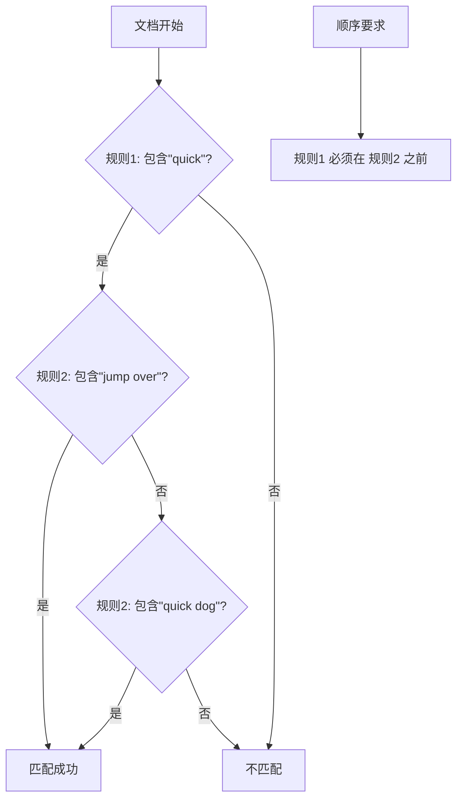
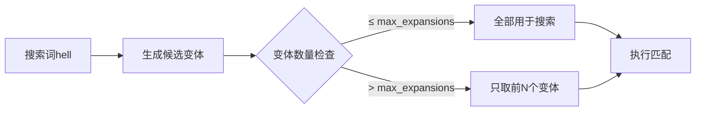

> 最后更新：2026-01-04 | [返回主目录](../README.md)
# 一、ES详解 - 认知：ElasticSearch基础概念
> 在学习ElasticSearch之前，先简单了解下ES流行度，使用背景，以及相关概念等。
## 1.1 为什么需要学习ElasticSearch
根据<a href='https://db-engines.com/en/ranking'>DB Engine</a>的排名显示，ElasticSearch是最受欢迎的企业级搜索引擎。
下图红色勾选的是我们前面的系列详解的，除此之外你可以看到搜索库ElasticSearch在前十名内：


所以为什么要学习ElasticSearch呢？

1、在当前软件行业中，搜索是一个软件系统或平台的基本功能， 学习ElasticSearch就可以为相应的软件打造出良好的搜索体验。

2、其次，ElasticSearch具备非常强的大数据分析能力。虽然Hadoop也可以做大数据分析，但是ElasticSearch的分析能力非常高，具备Hadoop不具备的能力。比如有时候用Hadoop分析一个结果，可能等待的时间比较长。

3、ElasticSearch可以很方便的进行使用，可以将其安装在个人的笔记本电脑，也可以在生产环境中，将其进行水平扩展。

4、国内比较大的互联网公司都在使用，比如小米、滴滴、携程等公司。另外，在腾讯云、阿里云的云平台上，也都有相应的ElasticSearch云产品可以使用。

5、在当今大数据时代，掌握近实时的搜索和分析能力，才能掌握核心竞争力，洞见未来。

## 1.2 什么是ElasticSearch
> ElasticSearch是一款非常强大的、基于Lucene的开源搜索及分析引擎；它是一个实时的分布式搜索分析引擎，它能让你以前所未有的速度和规模，去探索你的数据。
它被用作`全文检索`、`结构化搜索`、`分析`以及这三个功能的组合：

- Wikipedia 使用 Elasticsearch 提供带有高亮片段的全文搜索，还有 search-as-you-type 和 did-you-mean 的建议。
- 卫报 使用 Elasticsearch 将网络社交数据结合到访客日志中，为它的编辑们提供公众对于新文章的实时反馈。
- Stack Overflow 将地理位置查询融入全文检索中去，并且使用 more-like-this 接口去查找相关的问题和回答。
- GitHub 使用 Elasticsearch 对1300亿行代码进行查询。
- ...

除了搜索，结合Kibana、Logstash、Beats开源产品，Elastic Stack（简称ELK）还被广泛运用在大数据近实时分析领域，包括：**日志分析、指标监控、信息安全等**。它可以帮助你**探索海量结构化、非结构化数据，按需创建可视化报表，对监控数据设置报警阈值，通过使用机器学习，自动识别异常状况。**

ElasticSearch是基于Restful WebApi，使用Java语言开发的搜索引擎库类，并作为Apache许可条款下的开放源码发布，是当前流行的企业级搜索引擎。其客户端在Java、C#、PHP、Python等许多语言中都是可用的。

## 1.3 ElasticSearch的由来
> ElasticSearch背后的小故事
许多年前，一个刚结婚的名叫 Shay Banon 的失业开发者，跟着他的妻子去了伦敦，他的妻子在那里学习厨师。 在寻找一个赚钱的工作的时候，为了给他的妻子做一个食谱搜索引擎，他开始使用 Lucene 的一个早期版本。

直接使用 Lucene 是很难的，因此 Shay 开始做一个抽象层，Java 开发者使用它可以很简单的给他们的程序添加搜索功能。 他发布了他的第一个开源项目 Compass。

后来 Shay 获得了一份工作，主要是高性能，分布式环境下的内存数据网格。这个对于高性能，实时，分布式搜索引擎的需求尤为突出， 他决定重写 Compass，把它变为一个独立的服务并取名 Elasticsearch。

第一个公开版本在2010年2月发布，从此以后，Elasticsearch 已经成为了 Github 上最活跃的项目之一，他拥有超过300名 contributors(目前736名 contributors )。 一家公司已经开始围绕 Elasticsearch 提供商业服务，并开发新的特性，但是，Elasticsearch 将永远开源并对所有人可用。

据说，Shay 的妻子还在等着她的食谱搜索引擎…​

## 1.4 为什么不是直接使用Lucene
> ElasticSearch是基于Lucene的，那么为什么不是直接使用Lucene呢？

Lucene 可以说是当下最先进、高性能、全功能的搜索引擎库。

但是 Lucene 仅仅只是一个库。为了充分发挥其功能，你需要使用 Java 并将 Lucene 直接集成到应用程序中。 更糟糕的是，您可能需要获得信息检索学位才能了解其工作原理。Lucene 非常 复杂。

Elasticsearch 也是使用 Java 编写的，它的内部使用 Lucene 做索引与搜索，但是它的目的是使全文检索变得简单，**通过隐藏 Lucene 的复杂性，取而代之的提供一套简单一致的 RESTful API。**

然而，Elasticsearch 不仅仅是 Lucene，并且也不仅仅只是一个全文搜索引擎。 它可以被下面这样准确的形容：

- 一个分布式的实时文档存储，每个字段 可以被索引与搜索
- 一个分布式实时分析搜索引擎
- 能胜任上百个服务节点的扩展，并支持 PB 级别的结构化或者非结构化数据

# 1.5 ElasticSearch的主要功能及应用场景
> 我们在哪些场景下可以使用ES呢？
- 主要功能：

1）海量数据的分布式存储以及集群管理，达到了服务与数据的高可用以及水平扩展；

2）近实时搜索，性能卓越。对结构化、全文、地理位置等类型数据的处理；

3）海量数据的近实时分析（聚合功能）

- 应用场景：

1）网站搜索、垂直搜索、代码搜索；

2）日志管理与分析、安全指标监控、应用性能监控、Web抓取舆情分析；

# 1.6 ElasticSearch的基础概念
> 我们还需对比结构化数据库，看看ES的基础概念，为我们后面学习作铺垫。

- **Near Realtime（NRT） 近实时**。数据提交索引后，立马就可以搜索到。
- **Cluster 集群**，一个集群由一个唯一的名字标识，默认为“elasticsearch”。集群名称非常重要，**具有相同集群名的节点才会组成一个集群**。集群名称可以在配置文件中指定。
- **Node 节点**：存储集群的数据，参与集群的索引和搜索功能。像集群有名字，节点也有自己的名称，默认在启动时会以一个随机的UUID的前七个字符作为节点的名字，你可以为其指定任意的名字。通过集群名在网络中发现同伴组成集群。一个节点也可是集群。
- **Index 索引**: 一个索引是一个文档的集合（等同于solr中的集合）。每个索引有唯一的名字，通过这个名字来操作它。一个集群中可以有任意多个索引。
- **Type 类型**：指在一个索引中，可以索引不同类型的文档，如用户数据、博客数据。从6.0.0 版本起已废弃，一个索引中只存放一类数据。
- **Document 文档**：被索引的一条数据，索引的基本信息单元，以JSON格式来表示。
- **Shard 分片**：在创建一个索引时可以指定分成多少个分片来存储。每个分片本身也是一个功能完善且独立的“索引”，可以被放置在集群的任意节点上。
- **Replication 备份**: 一个分片可以有多个备份（副本）
为了方便理解，作一个ES和数据库的对比


# 二、ES详解 - 认知：Elastic Stack生态和场景方案
> 在了解ElaticSearch之后，我们还要了解Elastic背后的生态即我们常说的ELK；与此同时，还会给你展示ElasticSearch的案例场景，让你在学习ES前对它有个全局的印象。
## 2.1 Elastic Stack生态
> Beats + Logstash + ElasticSearch + Kibana

如下是我从官方博客中找到图，这张图展示了ELK生态以及基于ELK的场景（最上方）


由于Elastic X-Pack是面向收费的，所以我们不妨也把X-Pack放进去，看看哪些是由X-Pack带来的，在阅读官网文档时将方便你甄别重点：


### 2.1.1 Beats
Beats是一个面向**轻量型采集器**的平台，这些采集器可以从边缘机器向Logstash、ElasticSearch发送数据，它是由Go语言进行开发的，运行效率方面比较快。从下图中可以看出，不同Beats的套件是针对不同的数据源。


### 2.1.2 Logstash
Logstash是**动态数据收集管道**，拥有可扩展的插件生态系统，支持从不同来源采集数据，转换数据，并将数据发送到不同的存储库中。其能够与ElasticSearch产生强大的协同作用，后被Elastic公司在2013年收购。

它具有如下特性：

1）实时解析和转换数据；

2）可扩展，具有200多个插件；

3）可靠性、安全性。Logstash会通过持久化队列来保证至少将运行中的事件送达一次，同时将数据进行传输加密；

4）监控；

### 2.1.3 ElasticSearch
ElasticSearch对数据进行**搜索、分析和存储**，其是基于JSON的分布式搜索和分析引擎，专门为实现水平可扩展性、高可靠性和管理便捷性而设计的。

它的实现原理主要分为以下几个步骤：

1）首先用户将数据提交到ElasticSearch数据库中；

2）再通过分词控制器将对应的语句分词；

3）将分词结果及其权重一并存入，以备用户在搜索数据时，根据权重将结果排名和打分，将返回结果呈现给用户；

### 2.1.4 Kibana
Kibana实现**数据可视化**，其作用就是在ElasticSearch中进行民航。Kibana能够以图表的形式呈现数据，并且具有可扩展的用户界面，可以全方位的配置和管理ElasticSearch。

Kibana最早的时候是基于Logstash创建的工具，后被Elastic公司在2013年收购。

1）Kibana可以提供各种可视化的图表；

2）可以通过机器学习的技术，对异常情况进行检测，用于提前发现可疑问题；

## 2.2 从日志收集系统看ES Stack的发展
> 我们看下ELK技术栈的演化，通常体现在日志收集系统中。
一个典型的日志系统包括：

（1）收集：能够采集多种来源的日志数据

（2）传输：能够稳定的把日志数据解析过滤并传输到存储系统

（3）存储：存储日志数据

（4）分析：支持 UI 分析

（5）警告：能够提供错误报告，监控机制

### 2.2.1 beats+elasticsearch+kibana
Beats采集数据后，存储在ES中，有Kibana可视化的展示。


### 2.2.2 beats+logstath+elasticsearch+kibana


该框架是在上面的框架的基础上引入了logstash，引入logstash带来的好处如下：

（1）Logstash具有基于磁盘的自适应缓冲系统，该系统将吸收传入的吞吐量，从而减轻背压。

（2）从其他数据源（例如数据库，S3或消息传递队列）中提取。

（3）将数据发送到多个目的地，例如S3，HDFS或写入文件。

（4）使用条件数据流逻辑组成更复杂的处理管道。

**beats结合logstash带来的优势：**

（1）水平可扩展性，高可用性和可变负载处理：beats和logstash可以实现节点之间的负载均衡，多个logstash可以实现logstash的高可用

（2）消息持久性与至少一次交付保证：使用beats或Winlogbeat进行日志收集时，可以保证至少一次交付。从Filebeat或Winlogbeat到Logstash以及从Logstash到Elasticsearch的两种通信协议都是同步的，并且支持确认。Logstash持久队列提供跨节点故障的保护。对于Logstash中的磁盘级弹性，确保磁盘冗余非常重要。

（3）具有身份验证和有线加密的端到端安全传输：从Beats到Logstash以及从 Logstash到Elasticsearch的传输都可以使用加密方式传递 。与Elasticsearch进行通讯时，有很多安全选项，包括基本身份验证，TLS，PKI，LDAP，AD和其他自定义领域

**增加更多的数据源** 比如：TCP，UDP和HTTP协议是将数据输入Logstash的常用方法


### 2.2.3 beats+MQ+logstash+elasticsearch+kibana


在如上的基础上我们可以在beats和logstash中间添加一些组件redis、kafka、RabbitMQ等，添加中间件将会有如下好处：

（1）降低对日志所在机器的影响，这些机器上一般都部署着反向代理或应用服务，本身负载就很重了，所以尽可能的在这些机器上少做事；

（2）如果有很多台机器需要做日志收集，那么让每台机器都向Elasticsearch持续写入数据，必然会对Elasticsearch造成压力，因此需要对数据进行缓冲，同时，这样的缓冲也可以一定程度的保护数据不丢失；

（3）将日志数据的格式化与处理放到Indexer中统一做，可以在一处修改代码、部署，避免需要到多台机器上去修改配置；

## 2.3 Elastic Stack最佳实践
> 我们再看下官方开发成员分享的最佳实践。
### 2.3.1 日志收集系统
（PS：就是我们上面阐述的）

基本的日志系统


增加数据源，和使用MQ


### 2.3.2 Metric收集和APM性能监控


### 2.3.3 多数据中心方案
通过冗余实现数据高可用


两个数据采集中心（比如采集两个工厂的数据），采集数据后的汇聚


数据分散，跨集群的搜索


# 三、ES详解 - 安装：ElasticSearch和Kibana安装

> 了解完ElasticSearch基础和Elastic Stack生态后，我们便可以开始学习使用ElastiSearch了。所以本文主要介绍ElasticSearch和Kibana的安装。

## 3.1 官网相关教程
> 安装ElasticSearch还是先要看下官方网站。
<a href='https://www.elastic.co/cn/'>官方网站</a>

<a href='https://www.elastic.co/guide/cn/elasticsearch/guide/current/running-elasticsearch.html'>官方2.x中文教程中安装教程</a>

<a href='https://www.elastic.co/cn/downloads/elasticsearch'>官方ElasticSearch下载地址</a>

<a href='https://www.elastic.co/cn/downloads/kibana'>官方Kibana下载地址</a>

本系列教程基于ElasticSearch 7.x版本。

## 3.2 安装ElasticSearch
> ElasticSearch 是基于Java平台的，所以先要安装Java
- 平台确认

这里我准备了一台Centos7虚拟机, 为方便选择后续安装的版本，所以需要看下系统版本信息。
```sh
[root@pdai-centos ~]# uname -a
Linux pdai-centos 3.10.0-862.el7.x86_64 #1 SMP Fri Apr 20 16:44:24 UTC 2018 x86_64 x86_64 x86_64 GNU/Linux
```
- 安装Java

安装 Elasticsearch 之前，你需要先安装一个较新的版本的 Java，最好的选择是，你可以从 <a href='https://www.java.com/zh-CN/'>www.java.com</a>获得官方提供的最新版本的 Java。安装以后，确认是否安装成功：
```sh
[root@pdai-centos ~]# java --version
openjdk 14.0.2 2020-07-14
OpenJDK Runtime Environment 20.3 (slowdebug build 14.0.2+12)
OpenJDK 64-Bit Server VM 20.3 (slowdebug build 14.0.2+12, mixed mode, sharing)
```
- 下载ElasticSearch

从<a href='https://www.elastic.co/cn/downloads/elasticsearch'>这里</a>下载ElasticSearch

比如可以通过curl下载
```sh
[root@pdai-centos opt]# curl -O https://artifacts.elastic.co/downloads/elasticsearch/elasticsearch-7.12.0-linux-x86_64.tar.gz
  % Total    % Received % Xferd  Average Speed   Time    Time     Time  Current
                                 Dload  Upload   Total   Spent    Left  Speed
```
- 解压
```sh
[root@pdai-centos opt]# tar zxvf /opt/elasticsearch-7.12.0-linux-x86_64.tar.gz 
...
[root@pdai-centos opt]# ll | grep elasticsearch
drwxr-xr-x  9 root root      4096 Mar 18 14:21 elasticsearch-7.12.0
-rw-r--r--  1 root root 327497331 Apr  5 21:05 elasticsearch-7.12.0-linux-x86_64.tar.gz
```
- 增加elasticSearch用户

必须创建一个非root用户来运行ElasticSearch(ElasticSearch5及以上版本，基于安全考虑，强制规定不能以root身份运行。)

如果你使用root用户来启动ElasticSearch，则会有如下错误信息：
```sh
[root@pdai-centos opt]# cd elasticsearch-7.12.0/
[root@pdai-centos elasticsearch-7.12.0]# ./bin/elasticsearch
[2021-04-05T21:36:46,510][ERROR][o.e.b.ElasticsearchUncaughtExceptionHandler] [pdai-centos] uncaught exception in thread [main]
org.elasticsearch.bootstrap.StartupException: java.lang.RuntimeException: can not run elasticsearch as root
        at org.elasticsearch.bootstrap.Elasticsearch.init(Elasticsearch.java:163) ~[elasticsearch-7.12.0.jar:7.12.0]
        at org.elasticsearch.bootstrap.Elasticsearch.execute(Elasticsearch.java:150) ~[elasticsearch-7.12.0.jar:7.12.0]
        at org.elasticsearch.cli.EnvironmentAwareCommand.execute(EnvironmentAwareCommand.java:75) ~[elasticsearch-7.12.0.jar:7.12.0]
        at org.elasticsearch.cli.Command.mainWithoutErrorHandling(Command.java:116) ~[elasticsearch-cli-7.12.0.jar:7.12.0]
        at org.elasticsearch.cli.Command.main(Command.java:79) ~[elasticsearch-cli-7.12.0.jar:7.12.0]
        at org.elasticsearch.bootstrap.Elasticsearch.main(Elasticsearch.java:115) ~[elasticsearch-7.12.0.jar:7.12.0]
        at org.elasticsearch.bootstrap.Elasticsearch.main(Elasticsearch.java:81) ~[elasticsearch-7.12.0.jar:7.12.0]
Caused by: java.lang.RuntimeException: can not run elasticsearch as root
        at org.elasticsearch.bootstrap.Bootstrap.initializeNatives(Bootstrap.java:101) ~[elasticsearch-7.12.0.jar:7.12.0]
        at org.elasticsearch.bootstrap.Bootstrap.setup(Bootstrap.java:168) ~[elasticsearch-7.12.0.jar:7.12.0]
        at org.elasticsearch.bootstrap.Bootstrap.init(Bootstrap.java:397) ~[elasticsearch-7.12.0.jar:7.12.0]
        at org.elasticsearch.bootstrap.Elasticsearch.init(Elasticsearch.java:159) ~[elasticsearch-7.12.0.jar:7.12.0]
        ... 6 more
uncaught exception in thread [main]
java.lang.RuntimeException: can not run elasticsearch as root
        at org.elasticsearch.bootstrap.Bootstrap.initializeNatives(Bootstrap.java:101)
        at org.elasticsearch.bootstrap.Bootstrap.setup(Bootstrap.java:168)
        at org.elasticsearch.bootstrap.Bootstrap.init(Bootstrap.java:397)
        at org.elasticsearch.bootstrap.Elasticsearch.init(Elasticsearch.java:159)
        at org.elasticsearch.bootstrap.Elasticsearch.execute(Elasticsearch.java:150)
        at org.elasticsearch.cli.EnvironmentAwareCommand.execute(EnvironmentAwareCommand.java:75)
        at org.elasticsearch.cli.Command.mainWithoutErrorHandling(Command.java:116)
        at org.elasticsearch.cli.Command.main(Command.java:79)
        at org.elasticsearch.bootstrap.Elasticsearch.main(Elasticsearch.java:115)
        at org.elasticsearch.bootstrap.Elasticsearch.main(Elasticsearch.java:81)
For complete error details, refer to the log at /opt/elasticsearch-7.12.0/logs/elasticsearch.log
2021-04-05 13:36:46,979269 UTC [8846] INFO  Main.cc@106 Parent process died - ML controller exiting
```
以我们增加一个独立的elasticsearch用户来运行
```sh
# 增加elasticsearch用户
[root@pdai-centos elasticsearch-7.12.0]# useradd elasticsearch
[root@pdai-centos elasticsearch-7.12.0]# passwd elasticsearch
Changing password for user elasticsearch.
New password: 
BAD PASSWORD: The password contains the user name in some form
Retype new password: 
passwd: all authentication tokens updated successfully.

# 修改目录权限至新增的elasticsearch用户
[root@pdai-centos elasticsearch-7.12.0]# chown -R elasticsearch /opt/elasticsearch-7.12.0
# 增加data和log存放区，并赋予elasticsearch用户权限
[root@pdai-centos elasticsearch-7.12.0]# mkdir -p /data/es
[root@pdai-centos elasticsearch-7.12.0]# chown -R elasticsearch /data/es
[root@pdai-centos elasticsearch-7.12.0]# mkdir -p /var/log/es
[root@pdai-centos elasticsearch-7.12.0]# chown -R elasticsearch /var/log/es
```
然后修改上述的data和log路径，`vi /opt/elasticsearch-7.12.0/config/elasticsearch.yml`

```sh
# ----------------------------------- Paths ------------------------------------
#
# Path to directory where to store the data (separate multiple locations by comma):
#
path.data: /data/es
#
# Path to log files:
#
path.logs: /var/log/es
```
- **修改Linux系统的限制配置**

1. 修改系统中允许应用最多创建多少文件等的限制权限。Linux默认来说，一般限制应用最多创建的文件是65535个。但是ES至少需要65536的文件创建权限。
2. 修改系统中允许用户启动的进程开启多少个线程。默认的Linux限制root用户开启的进程可以开启任意数量的线程，其他用户开启的进程可以开启1024个线程。必须修改限制数为4096+。因为ES至少需要4096的线程池预备。ES在5.x版本之后，强制要求在linux中不能使用root用户启动ES进程。所以必须使用其他用户启动ES进程才可以。
3. Linux低版本内核为线程分配的内存是128K。4.x版本的内核分配的内存更大。如果虚拟机的内存是1G，最多只能开启3000+个线程数。至少为虚拟机分配1.5G以上的内存。

修改如下配置
```sh
[root@pdai-centos elasticsearch-7.12.0]# vi /etc/security/limits.conf

elasticsearch soft nofile 65536
elasticsearch hard nofile 65536
elasticsearch soft nproc 4096
elasticsearch hard nproc 4096
```
/etc/security/limits.conf` 这个文件配置的不是整个Linux系统的**全局总上限**，而是**针对每个用户或用户组**可以使用的资源上限。

所以，配置 `elasticsearch soft nofile 65536` 的意思是：
*   **用户**：`elasticsearch`
*   **限制类型**：`soft`（软限制，超过会警告，普通用户可自己临时提高，但不能超过硬限制）和 `hard`（硬限制，绝对上限）
*   **资源**：`nofile`（Number of Open Files，包括进程打开的文件、套接字等）
*   **值**：`65536`
*   **整体含义**：允许系统中名为 `elasticsearch` 的这个用户运行的进程（比如ES进程），最多能同时打开65536个文件描述符。


- **启动ElasticSearch**
```sh
[root@pdai-centos elasticsearch-7.12.0]# su elasticsearch
[elasticsearch@pdai-centos elasticsearch-7.12.0]$ ./bin/elasticsearch -d
[2021-04-05T22:03:38,332][INFO ][o.e.n.Node               ] [pdai-centos] version[7.12.0], pid[13197], build[default/tar/78722783c38caa25a70982b5b042074cde5d3b3a/2021-03-18T06:17:15.410153305Z], OS[Linux/3.10.0-862.el7.x86_64/amd64], JVM[AdoptOpenJDK/OpenJDK 64-Bit Server VM/15.0.1/15.0.1+9]
[2021-04-05T22:03:38,348][INFO ][o.e.n.Node               ] [pdai-centos] JVM home [/opt/elasticsearch-7.12.0/jdk], using bundled JDK [true]
[2021-04-05T22:03:38,348][INFO ][o.e.n.Node               ] [pdai-centos] JVM arguments [-Xshare:auto, -Des.networkaddress.cache.ttl=60, -Des.networkaddress.cache.negative.ttl=10, -XX:+AlwaysPreTouch, -Xss1m, -Djava.awt.headless=true, -Dfile.encoding=UTF-8, -Djna.nosys=true, -XX:-OmitStackTraceInFastThrow, -XX:+ShowCodeDetailsInExceptionMessages, -Dio.netty.noUnsafe=true, -Dio.netty.noKeySetOptimization=true, -Dio.netty.recycler.maxCapacityPerThread=0, -Dio.netty.allocator.numDirectArenas=0, -Dlog4j.shutdownHookEnabled=false, -Dlog4j2.disable.jmx=true, -Djava.locale.providers=SPI,COMPAT, --add-opens=java.base/java.io=ALL-UNNAMED, -XX:+UseG1GC, -Djava.io.tmpdir=/tmp/elasticsearch-17264135248464897093, -XX:+HeapDumpOnOutOfMemoryError, -XX:HeapDumpPath=data, -XX:ErrorFile=logs/hs_err_pid%p.log, -Xlog:gc*,gc+age=trace,safepoint:file=logs/gc.log:utctime,pid,tags:filecount=32,filesize=64m, -Xms1894m, -Xmx1894m, -XX:MaxDirectMemorySize=993001472, -XX:G1HeapRegionSize=4m, -XX:InitiatingHeapOccupancyPercent=30, -XX:G1ReservePercent=15, -Des.path.home=/opt/elasticsearch-7.12.0, -Des.path.conf=/opt/elasticsearch-7.12.0/config, -Des.distribution.flavor=default, -Des.distribution.type=tar, -Des.bundled_jdk=true]
```
- **查看安装是否成功**
```sh
[root@pdai-centos ~]# netstat -ntlp | grep 9200
tcp6       0      0 127.0.0.1:9200          :::*                    LISTEN      13549/java          
tcp6       0      0 ::1:9200                :::*                    LISTEN      13549/java          
[root@pdai-centos ~]# curl 127.0.0.1:9200
{
  "name" : "pdai-centos",
  "cluster_name" : "elasticsearch",
  "cluster_uuid" : "ihttW8b2TfWSkwf_YgPH2Q",
  "version" : {
    "number" : "7.12.0",
    "build_flavor" : "default",
    "build_type" : "tar",
    "build_hash" : "78722783c38caa25a70982b5b042074cde5d3b3a",
    "build_date" : "2021-03-18T06:17:15.410153305Z",
    "build_snapshot" : false,
    "lucene_version" : "8.8.0",
    "minimum_wire_compatibility_version" : "6.8.0",
    "minimum_index_compatibility_version" : "6.0.0-beta1"
  },
  "tagline" : "You Know, for Search"
}
```
## 3.3 安装Kibana
> Kibana是界面化的查询数据的工具，下载时尽量下载与ElasicSearch一致的版本。
- **下载Kibana**

从<a href='https://www.elastic.co/cn/downloads/kibana'>这里</a>下载Kibana

- **解压**
```sh
[root@pdai-centos opt]# tar -vxzf kibana-7.12.0-linux-x86_64.tar.gz
```
- **使用elasticsearch用户权限**
```sh
[root@pdai-centos opt]# chown -R elasticsearch /opt/kibana-7.12.0-linux-x86_64
#配置Kibana的远程访问
[root@pdai-centos opt]# vi /opt/kibana-7.12.0-linux-x86_64/config/kibana.yml
server.host: 0.0.0.0
```
- **启动**

需要切换至elasticsearch用户
```sh
[root@pdai-centos opt]# su elasticsearch
[elasticsearch@pdai-centos opt]$ cd /opt/kibana-7.12.0-linux-x86_64/
[elasticsearch@pdai-centos kibana-7.12.0-linux-x86_64]$ ./bin/kibana
  log   [22:30:22.185] [info][plugins-service] Plugin "osquery" is disabled.
  log   [22:30:22.283] [warning][config][deprecation] Config key [monitoring.cluster_alerts.email_notifications.email_address] will be required for email notifications to work in 8.0."
  log   [22:30:22.482] [info][plugins-system] Setting up [100] plugins: [taskManager,licensing,globalSearch,globalSearchProviders,banners,code,usageCollection,xpackLegacy,telemetryCollectionManager,telemetry,telemetryCollectionXpack,kibanaUsageCollection,securityOss,share,newsfeed,mapsLegacy,kibanaLegacy,translations,legacyExport,embeddable,uiActionsEnhanced,expressions,charts,esUiShared,bfetch,data,home,observability,console,consoleExtensions,apmOss,searchprofiler,painlessLab,grokdebugger,management,indexPatternManagement,advancedSettings,fileUpload,savedObjects,visualizations,visTypeVislib,visTypeVega,visTypeTimelion,features,licenseManagement,watcher,canvas,visTypeTagcloud,visTypeTable,visTypeMetric,visTypeMarkdown,tileMap,regionMap,visTypeXy,graph,timelion,dashboard,dashboardEnhanced,visualize,visTypeTimeseries,inputControlVis,discover,discoverEnhanced,savedObjectsManagement,spaces,security,savedObjectsTagging,maps,lens,reporting,lists,encryptedSavedObjects,dashboardMode,dataEnhanced,cloud,upgradeAssistant,snapshotRestore,fleet,indexManagement,rollup,remoteClusters,crossClusterReplication,indexLifecycleManagement,enterpriseSearch,beatsManagement,transform,ingestPipelines,eventLog,actions,alerts,triggersActionsUi,stackAlerts,ml,securitySolution,case,infra,monitoring,logstash,apm,uptime]
  log   [22:30:22.483] [info][plugins][taskManager] TaskManager is identified by the Kibana UUID: xxxxxx
  ...
```
如果是后台启动：
```sh
[elasticsearch@pdai-centos kibana-7.12.0-linux-x86_64]$ nohup ./bin/kibana &
```
- **界面访问**


可以导入simple data


- **查看数据**


## 3.4 配置密码访问
> 使用基本许可证时，默认情况下禁用Elasticsearch安全功能。由于我测试环境是放在公网上的，所以需要设置下密码访问。相关文档可以参考<a href='https://www.elastic.co/guide/en/elasticsearch/reference/7.12/security-minimal-setup.html'>这里</a>
1. 停止kibana和elasticsearch服务
2. 将`xpack.security.enabled`设置添加到`ES_PATH_CONF/elasticsearch.yml`文件并将值设置为true
3. 启动elasticsearch (`./bin/elasticsearch -d`)
4. 执行如下密码设置器，`./bin/elasticsearch-setup-passwords interactive`
5. 来设置各个组件的密码
将elasticsearch.username设置添加到`KIB_PATH_CONF/kibana.yml` 文件并将值设置给elastic用户： `elasticsearch.username: "elastic"`
6. 创建kibana keystore, `./bin/kibana-keystore create`
7. 在kibana keystore 中添加密码 `./bin/kibana-keystore add elasticsearch.password`
8. 重启kibana 服务即可 `nohup ./bin/kibana &`

然后就可以使用密码登录了：


## 3.5 针对密码设置的一些补充

#### 3.5.1. 这是给ES设置密码吗？
**是的，但不仅限于ES**。`elasticsearch-setup-passwords`命令会为整个Elastic Stack的多个内置用户设置密码，包括：
- **elastic**：超级管理员，拥有所有权限
- **kibana_system**：Kibana用于连接ES的系统用户（注意：不是`kibana`，而是`kibana_system`）
- **logstash_system**：Logstash系统用户
- **beats_system**：Beats系统用户
- **apm_system**：APM系统用户
- **remote_monitoring_user**：远程监控用户

#### 3.5.2. Kibana的密码和ES的密码一样吗？

这是最重要的概念：
- **ES密码**：指的是Elasticsearch集群中各个用户的密码
- **Kibana密码**：Kibana本身**没有自己的密码**，它只是使用某个ES用户的凭据来连接ES

### 3.5.3 密码流程详解

#### 3.5.3.1 流程示意
```
用户浏览器 → Kibana界面 → (输入elastic用户名+ES密码) → 去ES验证 → 验证通过 → 登录Kibana
```

#### 3.5.3.2 具体配置对应关系
在您的步骤中：
1. **步骤4**：为ES的`elastic`用户设置了密码（比如设为`es123456`）
2. **步骤5**：告诉Kibana使用`elastic`用户连接ES
3. **步骤7**：告诉Kibana`elastic`用户的密码是什么（就是步骤4设置的`es123456`）

### 3.5.4 为什么这样做？

#### 3.5.4.1 安全性架构
```
┌─────────────────┐    ┌─────────────────┐
│    Kibana       │    │   Elasticsearch │
│                 │    │                 │
│ 本身无密码验证    │────▶│ 有完整的用户系统  │
│ 只是一个客户端    │    │                 │
│ 使用ES用户认证    │    │ elastic:密码A   │
└─────────────────┘    │ kibana_system:密码B│
                       └─────────────────┘
```

#### 3.5.4.2 两个关键用户的作用
1. **elastic用户**：用于**人在Kibana界面上登录**
2. **kibana_system用户**：用于**Kibana服务后台连接ES**（在更复杂的生产配置中会用到）

### 3.5.5 正确配置示例

#### 3.5.5.1. 设置ES密码（步骤4）
```bash
$ ./bin/elasticsearch-setup-passwords interactive

# 设置过程中会提示为各个用户设置密码：
Enter password for [elastic]: ********  <-- 设置elastic用户的密码（如：MyEsPwd123!）
Reenter password for [elastic]: ********
Enter password for [kibana_system]: ********  <-- Kibana系统用户的密码
Reenter password for [kibana_system]: ********
# ... 其他用户
```

#### 3.5.5.2. 配置Kibana连接ES（您的步骤5-7）
```yaml
# kibana.yml中配置
elasticsearch.username: "elastic"
# 注意：密码不直接写在yml中，而是存在keystore里
```

```bash
# 将elastic用户的密码存入Kibana keystore
$ ./bin/kibana-keystore add elasticsearch.password
# 提示输入时，输入：MyEsPwd123!(密码必须和es设置的相同，否则验证失败)
```

### 3.5.6 重要提醒

#### 3.5.6.1 常见误区
1. **错误理解**：Kibana有一个单独的"kibana密码"
2. **正确理解**：Kibana使用ES的某个用户（如`elastic`）的密码来连接ES

#### 3.5.6.2 生产环境建议
1. **不要使用elastic用户连接Kibana服务**：应该用`kibana_system`用户
2. **人在Kibana界面上登录时再用elastic用户**
3. **为不同团队成员创建不同用户**，而不是共用elastic用户

### 3.5.7 总结
- **ES密码**：Elasticsearch集群中各用户的密码
- **Kibana密码**：Kibana**本身没有密码**，它使用ES用户的密码来连接ES
- **您在Kibana界面登录时**：输入的是**ES的elastic用户**的密码
- **配置关系**：Kibana服务后台连接ES时，也需要知道某个ES用户的密码（通过keystore存储）

# 四、ES详解 - 入门：查询和聚合的基础使用

> 安装完ElasticSearch 和 Kibana后，为了快速上手，我们通过官网GitHub提供的一个数据进行入门学习，主要包括**查询数据**和**聚合数据**。

## 4.1 入门：从索引文档开始
- **索引一个文档**
```sh
PUT /customer/_doc/1
{
  "name": "John Doe"
}
```
为了方便测试，我们使用kibana的dev tool来进行学习测试：


- **查询刚才插入的文档**
```sh
GET /customer/_doc/1
```


## 4.2 学习准备：批量索引文档
> ES 还提供了批量操作，比如这里我们可以使用批量操作来插入一些数据，供我们在后面学习使用。

使用批量来批处理文档操作比单独提交请求要快得多，因为它减少了网络往返。

- **下载测试数据**

数据是index为bank，accounts.json <a href='https://github.com/elastic/elasticsearch/blob/v6.8.18/docs/src/test/resources/accounts.json'>下载地址</a>（如果你无法下载，也可以clone ES的官方仓库，选择本文中使用的版本分支，然后进入/docs/src/test/resources/accounts.json目录获取）

数据的格式如下
```json
{
  "account_number": 0,
  "balance": 16623,
  "firstname": "Bradshaw",
  "lastname": "Mckenzie",
  "age": 29,
  "gender": "F",
  "address": "244 Columbus Place",
  "employer": "Euron",
  "email": "bradshawmckenzie@euron.com",
  "city": "Hobucken",
  "state": "CO"
}
```
- **批量插入数据**

将accounts.json拷贝至指定目录，我这里放在/opt/下面,

然后执行
```
curl -H "Content-Type: application/json" -XPOST "localhost:9200/bank/_bulk?pretty&refresh" --data-binary "@/opt/accounts.json"
```
- **查看状态**
```sh
[elasticsearch@pdai-centos root]$ curl "localhost:9200/_cat/indices?v=true" | grep bank
  % Total    % Received % Xferd  Average Speed   Time    Time     Time  Current
                                 Dload  Upload   Total   Spent    Left  Speed
100  1524  100  1524    0     0   119k      0 --:--:-- --:--:-- --:--:--  124k
yellow open   bank                            yq3eSlAWRMO2Td0Sl769rQ   1   1       1000            0    379.2kb        379.2kb
[elasticsearch@pdai-centos root]$
```
## 4.3 <a id ='match 查询'>查询数据</a>
> 我们通过kibana来进行查询测试。
### 4.3.1 查询所有

match_all表示查询所有的数据，sort即按照什么字段排序
```sh
GET /bank/_search
{
  "query": { "match_all": {} },
  "sort": [
    { "account_number": "asc" }
  ]
}
```
- **结果**


- **相关字段解释**

  - `took` – Elasticsearch运行查询所花费的时间（以毫秒为单位）
  - `timed_out` –搜索请求是否超时
  - `_shards`- 搜索了多少个碎片，以及成功，失败或跳过了多少个碎片的细目分类。
  - `max_score` – 找到的最相关文档的分数
  - `hits.total.value` - 找到了多少个匹配的文档
  - `hits.sort` - 文档的排序位置（不按相关性得分排序时）
  - `hits._score` - 文档的相关性得分（使用match_all时不适用）
### 4.3.2 分页查询(from+size)
本质上就是from和size两个字段
```sh
GET /bank/_search
{
  "query": { "match_all": {} },
  "sort": [
    { "account_number": "asc" }
  ],
  "from": 10,
  "size": 10
}
```
- **结果**


### 4.3.3 指定字段查询：match
如果要在字段中搜索特定字词，可以使用match; 如下语句将查询address 字段中包含 mill 或者 lane的数据
```sh
GET /bank/_search
{
  "query": { "match": { "address": "mill lane" } }
}
```
- **结果**


**(由于ES底层是按照分词索引的，所以上述查询结果是address 字段中包含 mill 或者 lane的数据)**

### 4.3.4 查询段落匹配：match_phrase
如果我们希望查询的条件是 address字段中包含 "mill lane"，则可以使用match_phrase
```sh
GET /bank/_search
{
  "query": { "match_phrase": { "address": "mill lane" } }
}
```
- **结果**


### 4.3.5 <a id='多条件查询: bool'>多条件查询: bool</a>
如果要构造更复杂的查询，可以使用bool查询来组合多个查询条件。

例如，以下请求在bank索引中搜索40岁客户的帐户，但不包括居住在爱达荷州（ID）的任何人
```sh
GET /bank/_search
{
  "query": {
    "bool": {
      "must": [
        { "match": { "age": "40" } }
      ],
      "must_not": [
        { "match": { "state": "ID" } }
      ]
    }
  }
}
```
- **结果**


`must`,`should`, `must_not` 和 `filter` 都是bool查询的子句。那么`filter`和上述`query`子句有啥区别呢？

### 4.3.6 查询条件：query or filter
先看下如下查询, 在`bool`查询的子句中同时具备query/must 和 filter
```sh
GET /bank/_search
{
  "query": {
    "bool": {
      "must": [
        {
          "match": {
            "state": "ND"
          }
        }
      ],
      "filter": [
        {
          "term": {
            "age": "40"
          }
        },
        {
          "range": {
            "balance": {
              "gte": 20000,
              "lte": 30000
            }
          }
        }
      ]
    }
  }
}
```
- **结果**


**两者都可以写查询条件，而且语法也类似。区别在于，query 上下文的条件是用来给文档打分的，匹配越好 _score 越高；filter 的条件只产生两种结果：符合与不符合，后者被过滤掉。**

所以，我们进一步看只包含filter的查询
```sh
GET /bank/_search
{
  "query": {
    "bool": {
      "filter": [
        {
          "term": {
            "age": "40"
          }
        },
        {
          "range": {
            "balance": {
              "gte": 20000,
              "lte": 30000
            }
          }
        }
      ]
    }
  }
}
```

结果，显然无_score


**想象一下在招聘网站搜索候选人：**

1. Query（查询上下文）
**作用**：类似于"关键词匹配"和"相关性排序"
- 搜索"Java开发工程师"
- 系统会为每个候选人计算匹配度分数（_score）：
  - 简历中"Java"出现10次 → 高分
  - "Java"出现5次 → 中等分  
  - 只有"JSP"没"Java" → 低分
  - 完全没有相关词汇 → 0分
- **结果按分数排序**，最相关的排前面

2. Filter（过滤上下文）
**作用**：类似于"硬性条件筛选"
- 要求：学历="本科"，经验="3年以上"
- **只有两种结果**：
  - 符合条件 → 通过
  - 不符合条件 → 直接被淘汰
- **不计算分数，不影响排序**，只做"是/否"判断

3. 技术区别详解

3.1 Query上下文（您的示例中的`must`部分）
```json
{
  "bool": {
    "must": [  // query上下文
      {
        "match": {
          "state": "ND"
        }
      }
    ]
  }
}
```
**特点**：
- 1. **计算相关性分数（_score）**
- 2. **参与排序**：分数高的排前面
- 3. **不缓存**（默认情况）
- 4. **适合**：全文搜索、相关性排序的场景

3.2 Filter上下文（您的示例中的`filter`部分）
```json
{
  "bool": {
    "filter": [  // filter上下文
      {
        "term": { "age": "40" }
      },
      {
        "range": { "balance": { "gte": 20000, "lte": 30000 } }
      }
    ]
  }
}
```
**特点**：
1. **不计算分数（_score = 0）**
2. **不影响排序**（除非指定了其他排序规则）
3. **自动缓存**：相同过滤条件会缓存，提升性能
4. **适合**：精确匹配、范围过滤、状态筛选

4. 示例的具体工作流程

```json
GET /bank/_search
{
  "query": {
    "bool": {
      "must": [   // 步骤1：计算分数
        { "match": { "state": "ND" } }
      ],
      "filter": [  // 步骤2：过滤，不分先后
        { "term": { "age": "40" } },
        { "range": { "balance": { "gte": 20000, "lte": 30000 } } }
      ]
    }
  }
}
```

5. 执行顺序：
- 1. **先执行filter**：找到所有`age=40`且`balance在20000-30000之间`的文档
   - 不计算分数，纯筛选
   - 结果集被缓存（如果下次同样条件，直接命中）
   
- 2. **再执行query**：在filter结果集中，计算`state匹配"ND"`的相关性分数
   - 计算_score
   - 按分数排序

- 3. **返回结果**：同时满足filter条件和query条件的文档，按query的_score排序

6. 性能对比实验

6.1 场景1：纯Query
```json
GET /bank/_search
{
  "query": {
    "match": { "state": "ND" }
  }
}
```
- 需要为**每个文档**计算匹配度分数
- 不能利用缓存
- 结果按相关性排序

6.2 场景2：纯Filter
```json
GET /bank/_search
{
  "query": {
    "bool": {
      "filter": [
        { "term": { "age": "40" } }
      ]
    }
  }
}
```
- 不需要计算分数（所有文档_score = 0）
- 结果集被缓存
- 多次执行相同filter会很快
- 结果无序（或按其他字段排序）

6.3 场景3：Query+Filter（您示例的最佳实践）
- **性能最佳**：filter快速筛选，query只对少量文档算分
- **结果相关**：既有精确筛选，又有相关性排序

7. 如何选择？

| 场景 | 用Query | 用Filter |
|------|---------|----------|
| 全文搜索（如搜索标题） | ✅ 需要相关性排序 | ❌ |
| 精确匹配（如状态=已发布） | ❌ 浪费计算资源 | ✅ 自动缓存 |
| 范围筛选（如价格>100） | ❌ | ✅ |
| 多条件组合搜索 | ✅ 用于相关性部分 | ✅ 用于精确筛选部分 |
| 需要按匹配度排序 | ✅ | ❌ |
| 需要最高性能 | ❌ | ✅ |

8. 实战建议

8.1. 80/20原则
- **80%** 的条件用filter（精确匹配、范围、状态）
- **20%** 的条件用query（关键词、相关性排序）

8.2. 正确示例
```json
GET /products/_search
{
  "query": {
    "bool": {
      "must": [  // query：用户关心的搜索词
        { "match": { "title": "无线耳机" } },
        { "match": { "description": "降噪" } }
      ],
      "filter": [  // filter：硬性条件
        { "term": { "category": "电子产品" } },
        { "range": { "price": { "lte": 1000 } } },
        { "term": { "in_stock": true } }
      ],
      "should": [  // query：提升相关性的额外条件
        { "match": { "brand": "索尼" } }  // 索尼品牌加分
      ]
    }
  }
}
```

8.3. 常见误区纠正
**错误**：把精确匹配放在query中
```json
// ❌ 错误：term放在query里浪费计算资源
{
  "query": {
    "term": { "status": "published" }
  }
}

// ✅ 正确：term放在filter中
{
  "query": {
    "bool": {
      "filter": [
        { "term": { "status": "published" } }
      ]
    }
  }
}
```

- **Query上下文**：像"搜索引擎" → "找到相关内容并排序"
- **Filter上下文**：像"数据库WHERE" → "筛选符合条件的记录"

**关键记忆点**：
1. **Filter**：要/不要（二进制决策），速度快，可缓存
2. **Query**：好/更好（程度比较），计算分数，用于排序

- `filter`部分确保只返回`age=40`且`balance在20000-30000`的文档
- `must`部分在这些文档中，为`state匹配"ND"`的文档计算分数并排序
- 最终得到：**同时满足filter条件且state相关度最高的文档**

## 4.4 聚合查询：Aggregation
> 我们知道SQL中有group by，在ES中它叫Aggregation，即聚合运算。
### 4.4.1 简单聚合
比如我们希望计算出account每个州的统计数量， 使用`aggs`关键字对`state`字段聚合，被聚合的字段无需对分词统计，所以使用`state.keyword`对整个字段统计

```sh
GET /bank/_search
{
  "size": 0,
  "aggs": {
    "group_by_state": {
      "terms": {
        "field": "state.keyword"
      }
    }
  }
}
```
- **结果**


因为无需返回条件的具体数据, 所以设置size=0，返回hits为空。

`doc_count`表示bucket中每个州的数据条数。

### 4.4.2 嵌套聚合
ES还可以处理个聚合条件的嵌套。

比如承接上个例子， 计算每个州的平均结余。涉及到的就是在对state分组的基础上，嵌套计算avg(balance):
```sh
GET /bank/_search
{
  "size": 0,
  "aggs": {
    "group_by_state": {
      "terms": {
        "field": "state.keyword"
      },
      "aggs": {
        "average_balance": {
          "avg": {
            "field": "balance"
          }
        }
      }
    }
  }
}
```
- **结果**


### 4.4.3 对聚合结果排序
可以通过在aggs中对嵌套聚合的结果进行排序

比如承接上个例子， 对嵌套计算出的avg(balance)，这里是average_balance，进行排序
```sh
GET /bank/_search
{
  "size": 0,
  "aggs": {
    "group_by_state": {
      "terms": {
        "field": "state.keyword",
        "order": {
          "average_balance": "desc"
        }
      },
      "aggs": {
        "average_balance": {
          "avg": {
            "field": "balance"
          }
        }
      }
    }
  }
}
```
- **结果**


## 4.5 补充：聚合查询的详解
### 4.5.1. 查询结构分解

```json
GET /bank/_search
{
  "size": 0,                     // 第一部分：控制结果数量
  "aggs": {                     // 第二部分：聚合开始
    "group_by_state": {         // 第三部分：聚合名称
      "terms": {                // 第四部分：聚合类型
        "field": "state.keyword" // 第五部分：聚合字段
      }
    }
  }
}
```

### 4.5.2. 逐部分详解

#### 第一部分：`"size": 0`
```json
"size": 0
```
- **作用**：不返回任何具体的文档（hits）
- **为什么**：在聚合查询中，我们只关心统计结果，不关心具体的文档
- **对比**：
  - `"size": 10` → 返回前10个文档 + 聚合结果
  - `"size": 0` → 只返回聚合结果，性能更好

#### 第二部分：`"aggs"`
```json
"aggs": {
  // 聚合定义
}
```
- **aggs** = aggregations（聚合）
- **作用**：定义一个或多个聚合操作
- **类似SQL**：`GROUP BY`, `COUNT()`, `SUM()`, `AVG()`等

#### 第三部分：`"group_by_state"`
```json
"group_by_state": {
  // 聚合细节
}
```
- **作用**：给这个聚合起个名字，方便识别结果
- **可以自定义**：比如叫`state_stats`、`state_grouping`等
- **结果中会显示这个名称**：
  ```json
  {
    "aggregations": {
      "group_by_state": {  // 这里就是你的聚合名称
        // 聚合结果
      }
    }
  }
  ```

#### 第四部分：`"terms"`
```json
"terms": {
  "field": "state.keyword"
}
```
- **terms聚合**：按字段的唯一值进行分组
- **类似SQL**：`GROUP BY state`
- **特点**：对字段的每个不同值创建一个"桶"(bucket)，并统计每个桶中的文档数

#### 第五部分：`"field": "state.keyword"`
```json
"field": "state.keyword"
```
这是最关键的部分！需要理解为什么是`.keyword`：

**为什么需要`.keyword`？**

### 4.5.3 问题根源：文本字段的双重特性

在Elasticsearch中，一个`text`类型的字段（如`state`）会被：
1. **分词（analyzed）**：用于全文搜索
   - `"New York"` → 分成`["new", "york"]`两个词条
2. **不分词（keyword）**：用于精确匹配和聚合
   - `"New York"` → 保持完整字符串`"New York"`

### 4.5.4 举例说明

假设数据：
```json
{"state": "New York"}
{"state": "New Mexico"}
{"state": "New York"}
{"state": "Texas"}
```

#### 情况1：如果用`state`（text字段）聚合
```json
"terms": {
  "field": "state"  // 错误！这是text字段
}
```
- `"New York"`会被分词为`["new", "york"]`
- 聚合结果会是：
  ```
  "new" → 3个文档（包含New York和New Mexico）
  "york" → 2个文档
  "mexico" → 1个文档
  "texas" → 1个文档
  ```
- 这明显不是我们想要的！

#### 情况2：如果用`state.keyword`聚合 ✓
```json
"terms": {
  "field": "state.keyword"  // 正确！使用keyword子字段
}
```
- 保持完整的字符串值
- 聚合结果：
  ```
  "New York" → 2个文档
  "New Mexico" → 1个文档
  "Texas" → 1个文档
  ```
- 这才是正确的州统计！

### 4.5.5 等价SQL对比

这个Elasticsearch查询：
```json
GET /bank/_search
{
  "size": 0,
  "aggs": {
    "group_by_state": {
      "terms": {
        "field": "state.keyword"
      }
    }
  }
}
```

等价于SQL：
```sql
SELECT state, COUNT(*) as count
FROM bank
GROUP BY state
ORDER BY count DESC
LIMIT 10  -- 注意：terms聚合默认返回前10个分组
```

### 4.5.6 完整结果示例

```json
{
  "took": 5,
  "timed_out": false,
  "_shards": {
    "total": 1,
    "successful": 1,
    "skipped": 0,
    "failed": 0
  },
  "hits": {
    "total": {
      "value": 1000,
      "relation": "eq"
    },
    "max_score": null,
    "hits": []  // 因为size=0，所以这里为空
  },
  "aggregations": {
    "group_by_state": {  // 你的聚合名称
      "doc_count_error_upper_bound": 0,
      "sum_other_doc_count": 743,  // 未显示的文档总数
      "buckets": [  // 分组桶，默认按文档数降序
        {
          "key": "TX",      // 州名
          "doc_count": 30   // 该州的文档数
        },
        {
          "key": "CA",
          "doc_count": 28
        },
        {
          "key": "NY",
          "doc_count": 25
        },
        // ... 默认只显示前10个州
      ]
    }
  }
}
```

### 4.5.7 重要参数

你可以控制聚合行为：

```json
{
  "size": 0,
  "aggs": {
    "group_by_state": {
      "terms": {
        "field": "state.keyword",
        "size": 50,         // 返回50个分组（默认10）
        "order": {
          "_count": "asc"   // 按数量升序排列（默认降序）
        },
        "min_doc_count": 5  // 只显示文档数≥5的分组
      }
    }
  }
}
```

### 4.5.8 实际应用场景

#### 1. 网站分析
```json
// 统计访问量最高的10个页面
{
  "aggs": {
    "top_pages": {
      "terms": {
        "field": "page_url.keyword",
        "size": 10
      }
    }
  }
}
```

#### 2. 电商分析
```json
// 统计销量最高的5个商品分类
{
  "aggs": {
    "top_categories": {
      "terms": {
        "field": "category.keyword",
        "size": 5
      }
    }
  }
}
```

#### 3. 日志分析
```json
// 统计错误日志最多的10个服务
{
  "aggs": {
    "error_by_service": {
      "terms": {
        "field": "service_name.keyword",
        "size": 10
      }
    }
  }
}
```

### 4.5.9 记忆要点

1. **`size: 0`** → 只要聚合结果，不要具体文档
2. **`aggs`** → 聚合操作的开始
3. **自定义名称** → 给聚合起有意义的名字
4. **`terms`** → 按唯一值分组（类似SQL的GROUP BY）
5. **`.keyword`** → 对文本字段聚合时必须使用，避免分词问题

简单说，这个查询的意思是：
**"请统计bank索引中每个州（state）分别有多少个账户，并按账户数从多到少排序，只返回统计结果，不返回具体账户信息。"**

# 五、ES详解 - 索引：索引管理详解
> 了解基本使用后，我们从索引操作的角度看看如何对索引进行管理。
## 5.1 索引管理的引入
我们在前文中增加文档时，如下的语句会动态创建一个customer的index：
```sh
PUT /customer/_doc/1
{
  "name": "John Doe"
}
```
而这个index实际上已经自动创建了它里面的字段（name）的类型。我们不妨看下它自动创建的mapping(对应的是数据库的表结构schema)：
```json
{
  "mappings": {
    "_doc": {
      "properties": {
        "name": {
          "type": "text",
          "fields": {
            "keyword": {
              "type": "keyword",
              "ignore_above": 256
            }
          }
        }
      }
    }
  }
}
```
那么如果我们需要对这个建立索引的过程做更多的控制：比如想要确保这个索引有数量适中的主分片，并且在我们索引任何数据之前，分析器和映射已经被建立好。那么就会引入两点：第一个**禁止自动创建索引**，第二个是**手动创建索引**。

- 禁止自动创建索引

可以通过在 config/elasticsearch.yml 的每个节点下添加下面的配置：
```sh
action.auto_create_index: false
```
手动创建索引就是接下来文章的内容。

## 5.2 索引的格式
在请求体里面传入设置或类型映射，如下所示：
```sh
PUT /my_index
{
    "settings": { ... any settings ... },
    "mappings": {
        "properties": { ... any properties ... }
    }
}
```
- `settings`: 用来设置分片,副本等配置信息
- `mappings`: 字段映射，类型等
  - `properties`: 由于type在后续版本中会被Deprecated, 所以无需被type嵌套
## 5.3 索引管理操作
> 我们通过kibana的devtool来学习索引的管理操作。

### 5.3.1 创建索引
我们创建一个user 索引`test-index-users`，其中包含三个属性：name，age, remarks; 存储在一个分片一个副本上。
```sh
PUT /test-index-users
{
  "settings": {
		"number_of_shards": 1,
		"number_of_replicas": 1
	},
  "mappings": {
    "properties": {
      "name": {
        "type": "text",
        "fields": {
          "keyword": {
            "type": "keyword",
            "ignore_above": 256
          }
        }
      },
      "age": {
        "type": "long"
      },
      "remarks": {
        "type": "text"
      }
    }
  }
}
```
执行结果


- **插入测试数据**
```sh
POST /test-index-users/_doc
{
  "name":"sunjian",
  "age":28,
  "remarks":"hello world"
}
```


- **查看数据**


- **我们再测试下不匹配的数据类型**(age)：
```sh
POST /test-index-users/_doc
{
  "name": "test user",
  "age": "error_age",
  "remarks": "hello eeee"
}
```
你可以看到无法类型不匹配的错误：


### 5.3.2 修改索引
查看刚才的索引,`curl -u elastic:密码 "http://localhost:9200/_cat/indices?v" | grep users`
```sh
yellow open test-index-users                          LSaIB57XSC6uVtGQHoPYxQ 1 1     1    0   4.4kb   4.4kb
```
我们注意到刚创建的索引的状态是yellow的，因为我测试的环境是单点环境，无法创建副本，但是在上述number_of_replicas配置中设置了副本数是1； 所以在这个时候我们需要修改索引的配置。

修改副本数量为0
```sh
PUT /test-index-users/_settings
{
  "settings": {
    "number_of_replicas": 0
  }
}
```


再次查看状态：
```sh
green open test-index-users                          LSaIB57XSC6uVtGQHoPYxQ 1 1     1    0   4.4kb   4.4kb
```
### 5.3.3 打开/关闭索引
- **关闭索引**
```sh
POST /test-index-users/_close
```
一旦索引被关闭，那么这个索引只能显示元数据信息，**不能够进行读写操作**。


当关闭以后，再插入数据时：


- **打开索引**
```sh
POST /test-index-users/_open
```


打开后又可以重新写数据了


### 5.3.4 删除索引
最后我们将创建的test-index-users删除。
```sh
DELETE /test-index-users
```


### 5.3.5 查看索引
由于test-index-users被删除，所以我们看下之前bank的索引的信息
- **mapping**
```sh
GET /bank/_mapping
```


- **settings**

```sh
GET /bank/_settings
```


## 5.4 Kibana管理索引
在Kibana如下路径，我们可以查看和管理索引


# 六、ES详解 - 索引：索引模板(Index Template)详解
> 前文介绍了索引的一些操作，特别是手动创建索引，但是批量和脚本化必然需要提供一种模板方式快速构建和管理索引，这就是本文要介绍的索引模板(Index Template)，它是一种告诉Elasticsearch在创建索引时如何配置索引的方法。为了更好的复用性，在7.8中还引入了组件模板。
## 6.1 索引模板
> 索引模板是一种告诉Elasticsearch在创建索引时如何配置索引的方法。

- **使用方式**

在创建索引之前可以先配置模板，这样在创建索引（手动创建索引或通过对文档建立索引）时，模板设置将用作创建索引的基础。

### 6.1.1 模板类型
模板有两种类型：**索引模板**和**组件模板**。

1. **组件模板是**可重用的构建块，用于配置映射，设置和别名；它们不会直接应用于一组索引。
2. **索引模板**可以包含组件模板的集合，也可以直接指定设置，映射和别名。
### 6.1.2 索引模板中的优先级
1. 可组合模板优先于旧模板。如果没有可组合模板匹配给定索引，则旧版模板可能仍匹配并被应用。
2. 如果使用显式设置创建索引并且该索引也与索引模板匹配，则创建索引请求中的设置将优先于索引模板及其组件模板中指定的设置。
3. 如果新数据流或索引与多个索引模板匹配，则使用优先级最高的索引模板。
### 6.1.3 内置索引模板
Elasticsearch具有内置索引模板，每个索引模板的优先级为100，适用于以下索引模式：

1. logs-*-*
2. metrics-*-*
3. synthetics-*-*

所以在涉及内建索引模板时，要避免索引模式冲突。更多可以参考<a href='https://www.elastic.co/docs/manage-data/data-store/templates'>这里</a>

### 6.1.4 案例
- 首先**创建两个索引组件模板**：
```sh
PUT _component_template/component_template1
{
  "template": {
    "mappings": {
      "properties": {
        "@timestamp": {
          "type": "date"
        }
      }
    }
  }
}
```
```sh
PUT _component_template/runtime_component_template
{
  "template": {
    "mappings": {
      "runtime": { 
        "day_of_week": {
          "type": "keyword",
          "script": {
            "source": "emit(doc['@timestamp'].value.dayOfWeekEnum.getDisplayName(TextStyle.FULL, Locale.ROOT))"
          }
        }
      }
    }
  }
}
```
执行结果如下


- **创建使用组件模板的索引模板**
```sh
PUT _index_template/template_1
{
  "index_patterns": ["bar*"],
  "template": {
    "settings": {
      "number_of_shards": 1
    },
    "mappings": {
      "_source": {
        "enabled": true
      },
      "properties": {
        "host_name": {
          "type": "keyword"
        },
        "created_at": {
          "type": "date",
          "format": "EEE MMM dd HH:mm:ss Z yyyy"
        }
      }
    },
    "aliases": {
      "mydata": { }
    }
  },
  "priority": 500,
  "composed_of": ["component_template1", "runtime_component_template"], 
  "version": 3,
  "_meta": {
    "description": "my custom"
  }
}
```
执行结果如下


- **创建一个匹配bar*的索引bar-test**
```sh
PUT /bar-test
```
- **然后获取mapping**
```sh
GET /bar-test/_mapping
```
执行结果如下


### 6.1.5 进一步讲解

#### 什么是索引模板？

**索引模板就像是"索引的蓝图"** - 它告诉Elasticsearch："以后创建符合某个命名模式的索引时，请按照我这个蓝图来配置"。

#### 类比理解

##### 🏗️ **建筑行业类比**
- **索引模板** = 建筑图纸（蓝图）
- **索引** = 实际建造的房子
- **组件模板** = 标准化的建筑模块（如门窗、楼梯等）

有了图纸，每次建新房子时就不用重新设计，直接按图纸施工即可。

##### 📝 **办公文档类比**
- **索引模板** = Word文档模板（.dotx文件）
- **索引** = 基于模板创建的具体文档（.docx文件）
- **组件模板** = 模板中的页眉、页脚、样式等可复用部分

#### 为什么要用索引模板？

##### 场景1：日志管理
```bash
# 没有模板：每天手动创建日志索引，重复配置
PUT /logs-2024-01-01
{
  "settings": { "number_of_shards": 3 },
  "mappings": { ... }  # 每次都要写一遍
}

PUT /logs-2024-01-02
{
  "settings": { "number_of_shards": 3 },  # 重复配置！
  "mappings": { ... }  # 重复配置！
}
```

```bash
# 使用模板：一次配置，自动应用
PUT _index_template/logs_template
{
  "index_patterns": ["logs-*"],  # 匹配所有 logs- 开头的索引
  "template": {
    "settings": { "number_of_shards": 3 },
    "mappings": { ... }
  }
}

# 以后创建索引时自动应用模板配置
PUT /logs-2024-01-01  # 自动应用模板！
PUT /logs-2024-01-02  # 自动应用模板！
```

##### 场景2：电商商品索引
```bash
# 定义商品索引模板
PUT _index_template/product_template
{
  "index_patterns": ["product-*"],
  "template": {
    "settings": {
      "number_of_shards": 2,
      "number_of_replicas": 1
    },
    "mappings": {
      "properties": {
        "name": { "type": "text" },
        "price": { "type": "float" },
        "category": { "type": "keyword" },
        "created_at": { "type": "date" }
      }
    }
  }
}

# 创建不同分类的商品索引（都自动应用模板）
PUT /product-electronics    # 电子产品索引
PUT /product-clothing       # 服装索引
PUT /product-books          # 图书索引
# 所有这些索引都会自动拥有相同的结构和配置
```

#### 实际案例演示

让我用您的环境演示一个简单的例子：

##### 步骤1：创建一个简单的索引模板
```bash
# 创建测试模板
curl -u elastic:hcm13579 -X PUT "http://localhost:9200/_index_template/my_test_template" \
-H "Content-Type: application/json" \
-d '{
  "index_patterns": ["test-*"],
  "priority": 1,
  "template": {
    "settings": {
      "number_of_shards": 1,
      "number_of_replicas": 0
    },
    "mappings": {
      "properties": {
        "title": { "type": "text" },
        "description": { "type": "text" },
        "price": { "type": "float" },
        "created_at": { "type": "date" }
      }
    }
  }
}'
```

##### 步骤2：查看模板是否创建成功
```bash
# 查看所有模板
curl -u elastic:hcm13579 "http://localhost:9200/_index_template?pretty"

# 查看特定模板
curl -u elastic:hcm13579 "http://localhost:9200/_index_template/my_test_template?pretty"
```

##### 步骤3：测试模板效果
```bash
# 创建匹配模板模式的索引（会自动应用模板配置）
curl -u elastic:hcm13579 -X PUT "http://localhost:9200/test-products"

# 查看索引的映射（应该看到模板中定义的字段）
curl -u elastic:hcm13579 "http://localhost:9200/test-products/_mapping?pretty"
```

##### 步骤4：向索引中添加数据
```bash
# 添加文档（会自动使用模板定义的字段类型）
curl -u elastic:hcm13579 -X POST "http://localhost:9200/test-products/_doc" \
-H "Content-Type: application/json" \
-d '{
  "title": "笔记本电脑",
  "description": "高性能游戏笔记本", 
  "price": 5999.99,
  "created_at": "2024-01-05T10:00:00"
}'
```

##### 步骤5：验证模板的自动应用
```bash
# 再创建一个匹配模板的索引
curl -u elastic:hcm13579 -X PUT "http://localhost:9200/test-books"

# 查看这个新索引的映射（应该和test-products一样）
curl -u elastic:hcm13579 "http://localhost:9200/test-books/_mapping?pretty"
```

#### 索引模板的核心价值

1. **一致性**：确保相同类型的索引有统一的结构
2. **效率**：避免重复配置，减少人为错误
3. **自动化**：新索引自动应用预定义配置
4. **维护性**：修改模板即可影响所有相关索引

#### 组件模板的作用

组件模板让模板更加模块化：
- 可以创建通用的"基础配置"组件
- 创建专门的"日期字段"组件  
- 创建"业务特定字段"组件
- 然后在索引模板中组合这些组件

就像搭积木一样，更加灵活和可复用。

#### 总结

**索引模板就是"索引的标准化工厂"**：
- 你定义好产品规格（模板）
- 工厂（Elasticsearch）按规格自动生产产品（索引）
- 确保每个产品都符合质量标准（一致的配置）


#### 1. 第一个组件模板：`component_template1`

```sh
PUT _component_template/component_template1
{
  "template": {
    "mappings": {
      "properties": {
        "@timestamp": {
          "type": "date"
        }
      }
    }
  }
}
```

##### 语法详解：

- **`PUT _component_template/component_template1`**
  - `PUT`: HTTP方法，表示创建或更新资源
  - `_component_template/`: Elasticsearch的组件模板API端点
  - `component_template1`: 给这个模板起的名字

- **`"template": { ... }`**: 模板配置的主体部分

- **`"mappings": { ... }`**: 定义索引的字段映射（数据结构）

- **`"properties": { ... }`**: 具体的字段定义

- **`"@timestamp": { "type": "date" }`**:
  - `@timestamp`: 字段名称（常用作时间戳字段）
  - `"type": "date"`: 字段类型为日期类型

##### 实际作用：
这个模板定义了一个**标准的日期字段**，任何使用这个组件模板的索引都会自动拥有一个`@timestamp`日期字段。

---

#### 2. 第二个组件模板：`runtime_component_template`

```sh
PUT _component_template/runtime_component_template
{
  "template": {
    "mappings": {
      "runtime": { 
        "day_of_week": {
          "type": "keyword",
          "script": {
            "source": "emit(doc['@timestamp'].value.dayOfWeekEnum.getDisplayName(TextStyle.FULL, Locale.ROOT))"
          }
        }
      }
    }
  }
}
```

##### 语法详解：

- **`"runtime": { ... }`**: 定义**运行时字段**（Runtime Fields）
  - 运行时字段是**查询时计算**的字段，不存储在索引中
  - 节省存储空间，动态计算字段值

- **`"day_of_week": { ... }`**: 运行时字段名称

- **`"script": { ... }`**: 定义如何计算字段值的脚本
  - `"source"`: Painless脚本语言代码
  - `doc['@timestamp'].value`: 获取`@timestamp`字段的值
  - `.dayOfWeekEnum.getDisplayName(TextStyle.FULL, Locale.ROOT)`: 
    - 将日期转换为星期几的全名（如"Monday"、"Tuesday"）
    - `TextStyle.FULL`: 完整格式
    - `Locale.ROOT`: 英语区域设置

- **`"type": "keyword"`**: 计算结果作为关键字类型

##### 实际作用：
这个模板创建了一个**智能的星期几字段**，它会根据`@timestamp`自动计算出对应的星期几，比如"2024-01-05"会自动变成"Friday"。

---

#### 3. 索引模板：`template_1`

```sh
PUT _index_template/template_1
{
  "index_patterns": ["bar*"],
  "template": {
    "settings": {
      "number_of_shards": 1
    },
    "mappings": {
      "_source": {
        "enabled": true
      },
      "properties": {
        "host_name": {
          "type": "keyword"
        },
        "created_at": {
          "type": "date",
          "format": "EEE MMM dd HH:mm:ss Z yyyy"
        }
      }
    },
    "aliases": {
      "mydata": { }
    }
  },
  "priority": 500,
  "composed_of": ["component_template1", "runtime_component_template"], 
  "version": 3,
  "_meta": {
    "description": "my custom"
  }
}
```

##### 语法详解：

- **`PUT _index_template/template_1`**: 创建索引模板

- **`"index_patterns": ["bar*"]`**: 
  - 匹配规则：所有以"bar"开头的索引名
  - 例如：`bar-test`, `bar-log`, `bar-data`都会自动应用这个模板

- **`"template": { ... }`**: 直接定义的配置
  - `"settings"`: 索引设置
    - `"number_of_shards": 1`: 主分片数量为1
  - `"mappings"`: 字段映射
    - `"_source": {"enabled": true}`: 存储原始文档内容
    - `"properties"`: 自定义字段
      - `"host_name": {"type": "keyword"}`: 主机名字段，关键字类型
      - `"created_at": {"type": "date", "format": "EEE MMM dd HH:mm:ss Z yyyy"}`: 
        - 日期字段，指定日期格式（如"Fri Jan 05 15:30:00 +0800 2024"）
  - `"aliases": {"mydata": { }}`: 为索引创建别名`mydata`

- **`"priority": 500`**: 模板优先级（数字越大优先级越高）

- **`"composed_of": ["component_template1", "runtime_component_template"]`**: 
  - 组合使用前面两个组件模板
  - 相当于"继承"了它们的配置

- **`"version": 3`**: 模板版本号

- **`"_meta": {"description": "my custom"}`**: 元数据描述

---

#### 整体效果演示

让我用您的环境实际测试一下：

##### 步骤1：创建组件模板
```bash
# 创建第一个组件模板
curl -u elastic:hcm13579 -X PUT "http://localhost:9200/_component_template/component_template1" \
-H "Content-Type: application/json" \
-d '{
  "template": {
    "mappings": {
      "properties": {
        "@timestamp": {
          "type": "date"
        }
      }
    }
  }
}'

# 创建第二个组件模板（运行时字段）
curl -u elastic:hcm13579 -X PUT "http://localhost:9200/_component_template/runtime_component_template" \
-H "Content-Type: application/json" \
-d '{
  "template": {
    "mappings": {
      "runtime": { 
        "day_of_week": {
          "type": "keyword",
          "script": {
            "source": "emit(doc['@timestamp'].value.dayOfWeekEnum.getDisplayName(TextStyle.FULL, Locale.ROOT))"
          }
        }
      }
    }
  }
}'
```

##### 步骤2：创建索引模板
```bash
# 创建索引模板（组合两个组件模板）
curl -u elastic:hcm13579 -X PUT "http://localhost:9200/_index_template/template_1" \
-H "Content-Type: application/json" \
-d '{
  "index_patterns": ["bar*"],
  "template": {
    "settings": {
      "number_of_shards": 1
    },
    "mappings": {
      "_source": {
        "enabled": true
      },
      "properties": {
        "host_name": {
          "type": "keyword"
        },
        "created_at": {
          "type": "date",
          "format": "EEE MMM dd HH:mm:ss Z yyyy"
        }
      }
    },
    "aliases": {
      "mydata": { }
    }
  },
  "priority": 500,
  "composed_of": ["component_template1", "runtime_component_template"], 
  "version": 3,
  "_meta": {
    "description": "my custom"
  }
}'
```

##### 步骤3：测试模板效果
```bash
# 创建匹配模板的索引
curl -u elastic:hcm13579 -X PUT "http://localhost:9200/bar-test"

# 查看索引的完整映射（应该包含所有字段）
curl -u elastic:hcm13579 "http://localhost:9200/bar-test/_mapping?pretty"
```

##### 步骤4：添加数据测试运行时字段
```bash
# 添加文档
curl -u elastic:hcm13579 -X POST "http://localhost:9200/bar-test/_doc" \
-H "Content-Type: application/json" \
-d '{
  "host_name": "server-01",
  "created_at": "Fri Jan 05 15:30:00 +0800 2024",
  "@timestamp": "2024-01-05T07:30:00Z"
}'

# 查询时使用运行时字段（自动计算星期几）
curl -u elastic:hcm13579 -X GET "http://localhost:9200/bar-test/_search" \
-H "Content-Type: application/json" \
-d '{
  "query": {
    "term": {
      "day_of_week": "Friday"
    }
  },
  "fields": ["day_of_week"]
}'
```

#### 关键概念总结

1. **组件模板**：可重用的配置模块（如"日期字段模块"、"运行时字段模块"）
2. **索引模板**：组合多个组件模板，定义完整的索引配置
3. **运行时字段**：查询时动态计算的字段，不占用存储空间
4. **索引模式匹配**：自动应用于符合命名规则的索引

## 6.2 模拟多组件模板
> 由于模板不仅可以由多个组件模板组成，还可以由索引模板自身组成；那么最终的索引设置将是什么呢？ElasticSearch设计者考虑到这个，提供了API进行模拟组合后的模板的配置。

### 6.2.1 模拟某个索引结果
比如上面的template_1, 我们不用创建bar*的索引(这里模拟bar-pdai-test)，也可以模拟计算出索引的配置：
```sh
POST /_index_template/_simulate_index/bar-pdai-test
```
执行结果如下


### 6.2.2 模拟组件模板结果
当然，由于template_1模板是由两个组件模板组合的，我们也可以模拟出template_1被组合后的索引配置：
```sh
POST /_index_template/_simulate/template_1
```
执行结果如下：
```sh
{
  "template" : {
    "settings" : {
      "index" : {
        "number_of_shards" : "1"
      }
    },
    "mappings" : {
      "runtime" : {
        "day_of_week" : {
          "type" : "keyword",
          "script" : {
            "source" : "emit(doc['@timestamp'].value.dayOfWeekEnum.getDisplayName(TextStyle.FULL, Locale.ROOT))",
            "lang" : "painless"
          }
        }
      },
      "properties" : {
        "@timestamp" : {
          "type" : "date"
        },
        "created_at" : {
          "type" : "date",
          "format" : "EEE MMM dd HH:mm:ss Z yyyy"
        },
        "host_name" : {
          "type" : "keyword"
        }
      }
    },
    "aliases" : {
      "mydata" : { }
    }
  },
  "overlapping" : [ ]
}
```
### 6.2.3 模拟组件模板和自身模板结合后的结果
- **新建两个模板**
```sh
PUT /_component_template/ct1
{
  "template": {
    "settings": {
      "index.number_of_shards": 2
    }
  }
}
```
```sh
PUT /_component_template/ct2
{
  "template": {
    "settings": {
      "index.number_of_replicas": 0
    },
    "mappings": {
      "properties": {
        "@timestamp": {
          "type": "date"
        }
      }
    }
  }
}
```
模拟在两个组件模板的基础上，添加自身模板的配置

```sh
POST /_index_template/_simulate
{
  "index_patterns": ["my*"],
  "template": {
    "settings" : {
        "index.number_of_shards" : 3
    }
  },
  "composed_of": ["ct1", "ct2"]
}
```
执行的结果如下
```sh
{
  "template" : {
    "settings" : {
      "index" : {
        "number_of_shards" : "3",
        "number_of_replicas" : "0"
      }
    },
    "mappings" : {
      "properties" : {
        "@timestamp" : {
          "type" : "date"
        }
      }
    },
    "aliases" : { }
  },
  "overlapping" : [ ]
}
```


# 七、ES详解 - 查询：DSL查询之复合查询详解
> 在查询中会有多种条件组合的查询，在ElasticSearch中叫复合查询。它提供了5种复合查询方式：**bool query(布尔查询)**、**boosting query(提高查询)**、**constant_score（固定分数查询）**、**dis_max(最佳匹配查询)**、**function_score(函数查询)**。

## 7.1 复合查询引入
在<a href='#多条件查询: bool'>前文</a>中，我们使用`bool`查询来组合多个查询条件。

比如之前介绍的语句
```sh
GET /bank/_search
{
  "query": {
    "bool": {
      "must": [
        { "match": { "age": "40" } }
      ],
      "must_not": [
        { "match": { "state": "ID" } }
      ]
    }
  }
}
```
这种查询就是本文要介绍的**复合查询**，并且bool查询只是复合查询一种。

## 7.2 bool query(布尔查询)
> 通过布尔逻辑将较小的查询组合成较大的查询。

### 7.2.1 概念
Bool查询语法有以下特点

- 子查询可以任意顺序出现
- 可以嵌套多个查询，包括bool查询
- 如果bool查询中没有must条件，should中必须至少满足一条才会返回结果。

bool查询包含四种操作符，分别是must,should,must_not,filter。他们均是一种数组，数组里面是对应的判断条件。

- `must`： 必须匹配。贡献算分
- `must_not`：过滤子句，必须不能匹配，但不贡献算分
- `should`： 选择性匹配，至少满足一条。贡献算分
- `filter`： 过滤子句，必须匹配，但不贡献算分
### 7.2.2 一些例子
看下官方举例

- **例子1**
```sh
POST _search
{
  "query": {
    "bool" : {
      "must" : {
        "term" : { "user.id" : "kimchy" }
      },
      "filter": {
        "term" : { "tags" : "production" }
      },
      "must_not" : {
        "range" : {
          "age" : { "gte" : 10, "lte" : 20 }
        }
      },
      "should" : [
        { "term" : { "tags" : "env1" } },
        { "term" : { "tags" : "deployed" } }
      ],
      "minimum_should_match" : 1,
      "boost" : 1.0
    }
  }
}
```
在filter元素下指定的查询对评分没有影响 , 评分返回为0。分数仅受已指定查询的影响。

- **例子2**
```sh
GET _search
{
  "query": {
    "bool": {
      "filter": {
        "term": {
          "status": "active"
        }
      }
    }
  }
}
```
这个例子查询查询为所有文档分配0分，因为没有指定评分查询。

- **例子3**
```sh
GET _search
{
  "query": {
    "bool": {
      "must": {
        "match_all": {}
      },
      "filter": {
        "term": {
          "status": "active"
        }
      }
    }
  }
}
```
此bool查询具有match_all查询，该查询为所有文档指定1.0分。

- **例子4**
```sh
GET /_search
{
  "query": {
    "bool": {
      "should": [
        { "match": { "name.first": { "query": "shay", "_name": "first" } } },
        { "match": { "name.last": { "query": "banon", "_name": "last" } } }
      ],
      "filter": {
        "terms": {
          "name.last": [ "banon", "kimchy" ],
          "_name": "test"
        }
      }
    }
  }
}
```
每个query条件都可以有一个`_name`属性，用来追踪搜索出的数据到底match了哪个条件。

## 7.3 boosting query(提高查询)
> 不同于bool查询，bool查询中只要一个子查询条件不匹配那么搜索的数据就不会出现。而boosting query则是降低显示的权重/优先级（即score)。

### 7.3.1 概念
比如搜索逻辑是 name = 'apple' and type ='fruit'，对于只满足部分条件的数据，不是不显示，而是降低显示的优先级（即score)

### 7.3.2 例子
首先创建数据
```sh
POST /test-dsl-boosting/_bulk
{ "index": { "_id": 1 }}
{ "content":"Apple Mac" }
{ "index": { "_id": 2 }}
{ "content":"Apple Fruit" }
{ "index": { "_id": 3 }}
{ "content":"Apple employee like Apple Pie and Apple Juice" }
```
对匹配`pie`的做降级显示处理
```sh
GET /test-dsl-boosting/_search
{
  "query": {
    "boosting": {
      "positive": {
        "term": {
          "content": "apple"
        }
      },
      "negative": {
        "term": {
          "content": "pie"
        }
      },
      "negative_boost": 0.5
    }
  }
}
```
执行结果如下


## 7.4 constant_score（固定分数查询）
> 查询某个条件时，固定的返回指定的score；显然当不需要计算score时，只需要filter条件即可，因为filter context忽略score。

### 7.4.1 例子
首先创建数据
```sh
POST /test-dsl-constant/_bulk
{ "index": { "_id": 1 }}
{ "content":"Apple Mac" }
{ "index": { "_id": 2 }}
{ "content":"Apple Fruit" }
```
查询apple
```sh
GET /test-dsl-constant/_search
{
  "query": {
    "constant_score": {
      "filter": {
        "term": { "content": "apple" }
      },
      "boost": 1.2
    }
  }
}
```
执行结果如下


## 7.5 dis_max(最佳匹配查询)
> 分离最大化查询（Disjunction Max Query）指的是： 将任何与任一查询匹配的文档作为结果返回，但只将最佳匹配的评分作为查询的评分结果返回 。

### 7.5.1 例子
假设有个网站允许用户搜索博客的内容，以下面两篇博客内容文档为例：
```sh
POST /test-dsl-dis-max/_bulk
{ "index": { "_id": 1 }}
{"title": "Quick brown rabbits","body":  "Brown rabbits are commonly seen."}
{ "index": { "_id": 2 }}
{"title": "Keeping pets healthy","body":  "My quick brown fox eats rabbits on a regular basis."}
```
用户输入词组 “Brown fox” 然后点击搜索按钮。事先，我们并不知道用户的搜索项是会在 title 还是在 body 字段中被找到，但是，用户很有可能是想搜索相关的词组。用肉眼判断，文档 2 的匹配度更高，因为它同时包括要查找的两个词：

现在运行以下 bool 查询：
```sh
GET /test-dsl-dis-max/_search
{
    "query": {
        "bool": {
            "should": [
                { "match": { "title": "Brown fox" }},
                { "match": { "body":  "Brown fox" }}
            ]
        }
    }
}
```


**结果是第一条评分高于第二条**，为了理解导致这样的原因，需要看下如何计算评分的

- **should 条件的计算分数**
```sh
GET /test-dsl-dis-max/_search
{
    "query": {
        "bool": {
            "should": [
                { "match": { "title": "Brown fox" }},
                { "match": { "body":  "Brown fox" }}
            ]
        }
    }
}
```
**要计算上述分数，首先要计算match的分数**

1. 第一个match 中 brown的分数

doc 1 分数 = 0.6931471


2. title中没有fox，所以第一个match 中 brown fox 的分数 = brown分数 + 0 = 0.6931471

doc 1 分数 = 0.6931471 + 0 = 0.6931471


3. 第二个 match 中 brown分数

doc 1 分数 = 0.21110919

doc 2 分数 = 0.160443


4. 第二个 match 中 fox分数

doc 1 分数 = 0

doc 2 分数 = 0.60996956


5. 所以第二个 match 中 brown fox分数 = brown分数 + fox分数

doc 1 分数 = 0.21110919 + 0 = 0.21110919

doc 2 分数 = 0.160443 + 0.60996956 = 0.77041256


7. 所以整个语句分数， should分数 = 第一个match + 第二个match分数

doc 1 分数 = 0.6931471 + 0.21110919 = 0.90425634

doc 2 分数 = 0 + 0.77041256 = 0.77041256


- **引入了dis_max**

不使用 bool 查询，可以使用 dis_max 即分离 最大化查询（Disjunction Max Query） 。分离（Disjunction）的意思是 或（or） ，这与可以把结合（conjunction）理解成 与（and） 相对应。分离最大化查询（Disjunction Max Query）指的是： 将任何与任一查询匹配的文档作为结果返回，但只将最佳匹配的评分作为查询的评分结果返回 ：
```sh
GET /test-dsl-dis-max/_search
{
    "query": {
        "dis_max": {
            "queries": [
                { "match": { "title": "Brown fox" }},
                { "match": { "body":  "Brown fox" }}
            ],
            "tie_breaker": 0
        }
    }
}
```


0.77041256怎么来的呢？ 下文给你解释它如何计算出来的。

- **dis_max 条件的计算分数**
```sh
## 重点关注
分数 = max_score + tie_breaker × (其他所有匹配查询的分数之和)

其中：
- `max_score` = 所有匹配查询中的最高分数
- `tie_breaker` = 您设置的参数（通常为0到1之间）
- "其他所有匹配查询的分数之和" = 除了最高分查询外，其他匹配查询的分数总和
```

```sh
GET /test-dsl-dis-max/_search
{
    "query": {
        "dis_max": {
            "queries": [
                { "match": { "title": "Brown fox" }},
                { "match": { "body":  "Brown fox" }}
            ],
            "tie_breaker": 0
        }
    }
}
```
doc 1 分数 = 0.6931471 + 0.21110919 * 0 = 0.6931471

doc 2 分数 = 0.77041256 + 0 * 0= 0.77041256


这样你就能理解通过dis_max将doc 2 置前了， 当然这里如果缺省`tie_breaker`字段的话默认就是0，你还可以设置它的比例（在0到1之间）来控制排名。（显然值为1时和should查询是一致的）

### 7.5.2 进一步解释

**`dis_max` 的分数计算不依赖于查询条件的顺序，而是基于评分高低**：

```
分数 = max_score + tie_breaker × (其他所有匹配查询的分数之和)
```

其中：
- `max_score` = 所有匹配查询中的最高分数
- `tie_breaker` = 您设置的参数（通常为0到1之间）
- "其他所有匹配查询的分数之和" = 除了最高分查询外，其他匹配查询的分数总和

#### 7.5.2.1 三个查询条件的具体计算

假设有三个查询条件，分数分别为 `score_A`、`score_B`、`score_C`，且都匹配：

1. **找出最高分数**：`max_score = max(score_A, score_B, score_C)`
2. **计算其他分数之和**：`sum_others = 其他两个分数的和`
3. **最终分数**：`final_score = max_score + tie_breaker × sum_others`

#### 7.5.2.2 具体示例：
```json
GET /test-index/_search
{
    "query": {
        "dis_max": {
            "queries": [
                { "match": { "field1": "keyword" }},  // 分数 0.8
                { "match": { "field2": "keyword" }},  // 分数 1.2
                { "match": { "field3": "keyword" }}   // 分数 0.9
            ],
            "tie_breaker": 0.3
        }
    }
}
```

**计算过程**：
- `max_score = max(0.8, 1.2, 0.9) = 1.2`（第二个查询分数最高）
- `sum_others = 0.8 + 0.9 = 1.7`（第一个和第三个查询的分数和）
- `final_score = 1.2 + 0.3 × 1.7 = 1.2 + 0.51 = 1.71`

#### 7.5.2.3 不同匹配情况的处理

##### 7.5.2.3.1 情况1：三个查询都匹配（如上例）
- 分数 = 最高分 + tie_breaker × (其他两个分数之和)

##### 7.5.2.3.2 情况2：只有两个查询匹配
例如：查询A（0.8）和查询B（1.2）匹配，查询C不匹配
- 分数 = max(0.8, 1.2) + tie_breaker × min(0.8, 1.2) = 1.2 + tie_breaker × 0.8

##### 7.5.2.3.3 情况3：只有一个查询匹配
例如：只有查询B（1.2）匹配
- 分数 = 1.2 + tie_breaker × 0 = 1.2（等同于普通匹配查询）

## 7.6 function_score(函数查询)
》 简而言之就是用自定义function的方式来计算_score。

可以ES有哪些自定义function呢？

- `script_score` 使用自定义的脚本来完全控制分值计算逻辑。如果你需要以上预定义函数之外的功能，可以根据需要通过脚本进行实现。
- `weight` 对每份文档适用一个简单的提升，且该提升不会被归约：当weight为2时，结果为2 * _score。
- `random_score` 使用一致性随机分值计算来对每个用户采用不同的结果排序方式，对相同用户仍然使用相同的排序方式。
- `field_value_factor` 使用文档中某个字段的值来改变_score，比如将受欢迎程度或者投票数量考虑在内。
- `衰减函数(Decay Function)` - `linear`，`exp`，`gauss`
### 7.6.1 例子
以最简单的random_score 为例
```sh
GET /_search
{
  "query": {
    "function_score": {
      "query": { "match_all": {} },
      "boost": "5",
      "random_score": {}, 
      "boost_mode": "multiply"
    }
  }
}
```
进一步的，它还可以使用上述function的组合(functions)
```sh
GET /_search
{
  "query": {
    "function_score": {
      "query": { "match_all": {} },
      "boost": "5", 
      "functions": [
        {
          "filter": { "match": { "test": "bar" } },
          "random_score": {}, 
          "weight": 23
        },
        {
          "filter": { "match": { "test": "cat" } },
          "weight": 42
        }
      ],
      "max_boost": 42,
      "score_mode": "max",
      "boost_mode": "multiply",
      "min_score": 42
    }
  }
}
```
script_score 可以使用如下方式
```sh
GET /_search
{
  "query": {
    "function_score": {
      "query": {
        "match": { "message": "elasticsearch" }
      },
      "script_score": {
        "script": {
          "source": "Math.log(2 + doc['my-int'].value)"
        }
      }
    }
  }
}
```
更多相关内容，可以参考<a href='https://www.elastic.co/guide/en/elasticsearch/reference/7.12/query-dsl-function-score-query.html'>官方文档</a>

PS: 形成体系化认知以后，具体用的时候查询下即可。

# 八、ES详解 - 查询：DSL查询之全文搜索详解
> DSL查询极为常用的是对文本进行搜索，我们叫全文搜索，本文主要对全文搜索进行详解。
## 8.1 写在前面:谈谈如何从官网学习
> 提示
> 
> 很多读者在看官方文档学习时存在一个误区，以DSL中full text查询为例，其实内容是非常多的， 没有取舍/没重点去阅读， 要么需要花很多时间，要么头脑一片浆糊。所以这里重点谈谈我的理解。

一些理解：

- 第一点：**全局观**，即我们现在学习内容在整个体系的哪个位置？

如下图，可以很方便的帮助你构筑这种体系


- 第二点： **分类别**，从上层理解，而不是本身

比如Full text Query中，我们只需要把如下的那么多点分为3大类，你的体系能力会大大提升


- 第三点： **知识点还是API**？ API类型的是可以查询的，只需要知道大致有哪些功能就可以了。


## 8.2 Match类型
> 第一类：match 类型

### 8.2.1 match 查询的步骤
在<a href='#match 查询'>前文</a>中我们已经介绍了match查询。

- 准备一些数据

这里我们准备一些数据，通过实例看match 查询的步骤
```sh
PUT /test-dsl-match
{ "settings": { "number_of_shards": 1 }} 

POST /test-dsl-match/_bulk
{ "index": { "_id": 1 }}
{ "title": "The quick brown fox" }
{ "index": { "_id": 2 }}
{ "title": "The quick brown fox jumps over the lazy dog" }
{ "index": { "_id": 3 }}
{ "title": "The quick brown fox jumps over the quick dog" }
{ "index": { "_id": 4 }}
{ "title": "Brown fox brown dog" }
```
- 查询数据
```sh
GET /test-dsl-match/_search
{
    "query": {
        "match": {
            "title": "QUICK!"
        }
    }
}
```
Elasticsearch 执行上面这个 match 查询的步骤是：

1. **检查字段类型** 。

标题 title 字段是一个 string 类型（ analyzed ）已分析的全文字段，这意味着查询字符串本身也应该被分析。

2. **分析查询字符串** 。

将查询的字符串 QUICK! 传入标准分析器中，输出的结果是单个项 quick 。因为只有一个单词项，所以 match 查询执行的是单个底层 term 查询。

3. **查找匹配文档** 。

用 term 查询在倒排索引中查找 quick 然后获取一组包含该项的文档，本例的结果是文档：1、2 和 3 。

4. **为每个文档评分** 。

用 term 查询计算每个文档相关度评分 _score ，这是种将词频（term frequency，即词 quick 在相关文档的 title 字段中出现的频率）和反向文档频率（inverse document frequency，即词 quick 在所有文档的 title 字段中出现的频率），以及字段的长度（即字段越短相关度越高）相结合的计算方式。

- 验证结果


#### 补充：为什么`QUICK!`的查询结果可以查询出来`quick`字样的？`QUICKa`却不行？

##### Elasticsearch的文本分析过程

当您执行这个查询时，Elasticsearch会进行以下处理：

###### 1. **查询字符串的分析过程**
```json
GET /test-dsl-match/_search
{
    "query": {
        "match": {
            "title": "QUICK!"
        }
    }
}
```

**分析步骤**：
- 输入：`"QUICK!"`
- 标准分析器（默认）处理：
  1. **转小写**：`QUICK!` → `quick!`
  2. **去除标点**：`quick!` → `quick`
  3. **分词**：得到词项 `quick`

###### 2. **索引时的分析过程**
假设文档中的原始文本是：`"The quick brown fox"`

**索引分析**：
- 输入：`"The quick brown fox"`
- 标准分析器处理：
  1. **转小写**：`The quick brown fox` → `the quick brown fox`
  2. **去除停用词**：`the`（可能被移除）
  3. **分词**：得到词项 `quick`, `brown`, `fox`

###### 3. **最终匹配**
- 查询词项：`quick`
- 索引词项：`quick`
- **结果：完全匹配！**

##### 验证分析过程

您可以使用Elasticsearch的分析API来验证这个过程：

```bash
# 分析查询字符串 "QUICK!"
curl -u elastic:hcm13579 -X GET "http://localhost:9200/test-dsl-match/_analyze" \
-H "Content-Type: application/json" \
-d '{
  "text": "QUICK!"
}'

# 分析索引中的文本
curl -u elastic:hcm13579 -X GET "http://localhost:9200/test-dsl-match/_analyze" \
-H "Content-Type: application/json" \
-d '{
  "text": "The quick brown fox"
}'
```

##### 为什么`!`不算作字符？

###### **标准分析器的行为**
标准分析器（Standard Analyzer）包含：
1. **标准分词器**（Standard Tokenizer）
2. **小写过滤器**（Lowercase Filter）
3. **停用词过滤器**（可选）

**关键点**：标准分词器会根据Unicode文本分割算法进行分词，**标点符号通常被视为分词边界并被去除**。

###### **实际测试**
让我们在您的环境中测试：

```bash
# 测试标点符号的处理
curl -u elastic:hcm13579 -X GET "http://localhost:9200/_analyze" \
-H "Content-Type: application/json" \
-d '{
  "analyzer": "standard",
  "text": "Hello! World? Test..."
}'
```

**输出结果可能类似**：
```json
{
  "tokens": [
    {
      "token": "hello",
      "start_offset": 0,
      "end_offset": 5,
      "type": "<ALPHANUM>",
      "position": 0
    },
    {
      "token": "world", 
      "start_offset": 7,
      "end_offset": 12,
      "type": "<ALPHANUM>",
      "position": 1
    },
    {
      "token": "test",
      "start_offset": 14,
      "end_offset": 18,
      "type": "<ALPHANUM>",
      "position": 2
    }
  ]
}
```

可以看到所有的标点符号（`!`, `?`, `...`）都被去除了。

##### 特殊情况：如果需要保留标点

如果您确实需要区分`quick`和`quick!`，可以：

###### 1. **使用`keyword`类型**
```json
# 创建映射，让title字段保持原样
PUT /test-keyword
{
  "mappings": {
    "properties": {
      "title": {
        "type": "keyword"  # 不进行分析，保持原样
      }
    }
  }
}
```

###### 2. **使用`term`查询（不分析）**
```json
GET /test-keyword/_search
{
    "query": {
        "term": {
            "title": "QUICK!"  # 此时必须完全匹配，包括大小写和标点
        }
    }
}
```

##### 总结

**为什么`QUICK!`能匹配`quick`？**

1. **文本分析**：Elasticsearch默认对查询文本和索引文本都进行分析
2. **标准化处理**：大小写转换、标点去除、分词等
3. **最终匹配**：`QUICK!` → `quick`，与索引中的`quick`匹配

**`!`不算作搜索字符的原因**：
- 在全文搜索中，标点符号通常不包含语义信息
- 去除标点可以提高搜索的召回率（Recall）
- 符合自然语言处理的常见做法

这种设计让搜索更加"智能"和用户友好，用户不需要担心大小写、标点等细节问题。

### 8.2.2 match多个词深入
我们在上文中复合查询中已经使用了match多个词，比如“Quick pets”； 这里我们通过例子带你更深入理解match多个词

- **match多个词的本质**

查询多个词"BROWN DOG!"
```sh
GET /test-dsl-match/_search
{
    "query": {
        "match": {
            "title": "BROWN DOG"
        }
    }
}
```


所以上述查询的结果，和如下语句查询结果是等同的
```sh
GET /test-dsl-match/_search
{
  "query": {
    "bool": {
      "should": [
        {
          "term": {
            "title": "brown"
          }
        },
        {
          "term": {
            "title": "dog"
          }
        }
      ]
    }
  }
}
```


- **match多个词的逻辑**

上面等同于should（任意一个满足），是因为 match还有一个operator参数，默认是or, 所以对应的是should。

所以上述查询也等同于
```sh
GET /test-dsl-match/_search
{
  "query": {
    "match": {
      "title": {
        "query": "BROWN DOG",
        "operator": "or"
      }
    }
  }
}
```
那么我们如果是需要and操作呢，即同时满足呢？
```sh
GET /test-dsl-match/_search
{
  "query": {
    "match": {
      "title": {
        "query": "BROWN DOG",
        "operator": "and"
      }
    }
  }
}
```
等同于
```sh
GET /test-dsl-match/_search
{
  "query": {
    "bool": {
      "must": [
        {
          "term": {
            "title": "brown"
          }
        },
        {
          "term": {
            "title": "dog"
          }
        }
      ]
    }
  }
}
```
**但是值得注意的是上述两种语法还不完全等效，**
```sh
GET /test-dsl-match/_search
{
  "query": {
    "match": {
      "title": {
        "query": "BROWN DOG",
        "operator": "and"
      }
    }
  }
}
```
这个是通过分词之后获得到brown 和 dog之后(注意是从大写变成小写)，然后才完全等效于
```sh
GET /test-dsl-match/_search
{
  "query": {
    "bool": {
      "must": [
        {
          "term": {
            "title": "brown"
          }
        },
        {
          "term": {
            "title": "dog"
          }
        }
      ]
    }
  }
}
```


### 8.2.3 控制match的匹配精度
如果用户给定 3 个查询词，想查找至少包含其中 2 个的文档，该如何处理？将 operator 操作符参数设置成 and 或者 or 都是不合适的。

match 查询支持 minimum_should_match 最小匹配参数，这让我们可以指定必须匹配的词项数用来表示一个文档是否相关。我们可以将其设置为某个具体数字，更常用的做法是将其设置为一个百分数，因为我们无法控制用户搜索时输入的单词数量：
```sh
GET /test-dsl-match/_search
{
  "query": {
    "match": {
      "title": {
        "query":"quick brown dog",
        "minimum_should_match": "75%"
      }
    }
  }
}
```
当给定百分比的时候， minimum_should_match 会做合适的事情：在之前三词项的示例中， 75% 会自动被截断成 66.6% ，即三个里面两个词。无论这个值设置成什么，至少包含一个词项的文档才会被认为是匹配的。


当然也等同于
```sh
GET /test-dsl-match/_search
{
  "query": {
    "bool": {
      "should": [
        { "match": { "title": "quick" }},
        { "match": { "title": "brown"   }},
        { "match": { "title": "dog"   }}
      ],
      "minimum_should_match": 2 
    }
  }
}
```


### 8.2.4 其它match类型
- **match_pharse**

match_phrase在前文中我们已经有了解，我们再看下另外一个例子。
```sh
GET /test-dsl-match/_search
{
  "query": {
    "match_phrase": {
      "title": {
        "query": "quick brown"
      }
    }
  }
}
```


很多人对它仍然有误解的，比如如下例子：

```sh
GET /test-dsl-match/_search
{
  "query": {
    "match_phrase": {
      "title": {
        "query": "quick brown f"
      }
    }
  }
}
```
这样的查询是查不出任何数据的，因为前文中我们知道了match本质上是对term组合，match_phrase本质是连续的term的查询，所以f并不是一个分词，不满足term查询，所以最终查不出任何内容了。


- match_pharse_prefix

那有没有可以查询出`quick brown f`的方式呢？ELasticSearch在match_phrase基础上提供了一种可以查最后一个词项是前缀的方法，这样就可以查询`quick brown f`了
```sh
GET /test-dsl-match/_search
{
  "query": {
    "match_phrase_prefix": {
      "title": {
        "query": "quick brown f"
      }
    }
  }
}
```


**(ps: prefix的意思不是整个text的开始匹配，而是最后一个词项满足term的prefix查询而已)**

- match_bool_prefix

除了match_phrase_prefix，ElasticSearch还提供了match_bool_prefix查询
```sh
GET /test-dsl-match/_search
{
  "query": {
    "match_bool_prefix": {
      "title": {
        "query": "quick brown f"
      }
    }
  }
}
```
它们两种方式有啥区别呢？match_bool_prefix本质上可以转换为：
```sh
GET /test-dsl-match/_search
{
  "query": {
    "bool" : {
      "should": [
        { "term": { "title": "quick" }},
        { "term": { "title": "brown" }},
        { "prefix": { "title": "f"}}
      ]
    }
  }
}
```
所以这样你就能理解，match_bool_prefix查询中的quick,brown,f是无序的。**值得注意的是match_bool_prefix查询中的quick,brown,f只要出现其中一个就算作匹配。**


- multi_match

如果我们期望一次对多个字段查询，怎么办呢？ElasticSearch提供了multi_match查询的方式
```sh
{
  "query": {
    "multi_match" : {
      "query":    "Will Smith",
      "fields": [ "title", "*_name" ] 
    }
  }
}
```
`*`表示前缀匹配字段。

**注意上面这个查询的多个字段之间只要有一个字段满足条件就可以。**


## 8.3 query string类型
> 第二类：query string 类型

### 8.3.1 query_string
此查询使用语法根据运算符（例如AND或NOT）来解析和拆分提供的查询字符串。然后查询在返回匹配的文档之前独立分析每个拆分的文本。

可以使用该query_string查询创建一个复杂的搜索，其中包括通配符，跨多个字段的搜索等等。尽管用途广泛，但查询是严格的，如果查询字符串包含任何无效语法，则返回错误。

例如：
```sh
GET /test-dsl-match/_search
{
  "query": {
    "query_string": {
      "query": "(lazy dog) OR (brown dog)",
      "default_field": "title"
    }
  }
}
```
这里查询结果，你需要理解**本质上查询这四个分词（term）or的结果**而已，所以doc 3和4也在其中


对构筑知识体系已经够了，但是它其实还有很多参数和用法，更多请<a href='https://www.elastic.co/docs/reference/query-languages/query-dsl/query-dsl-query-string-query'>参考官网</a>

### 8.3.2 query_string_simple
该查询使用一种简单的语法来解析提供的查询字符串并将其拆分为基于特殊运算符的术语。然后查询在返回匹配的文档之前独立分析每个术语。

尽管其语法比query_string查询更受限制 ，但**simple_query_string 查询不会针对无效语法返回错误。而是，它将忽略查询字符串的任何无效部分。**

举例：
```sh
GET /test-dsl-match/_search
{
  "query": {
    "simple_query_string" : {
        "query": "\"over the\" + (lazy | quick) + dog",
        "fields": ["title"],
        "default_operator": "and"
    }
  }
}
```


更多请参考<a href='https://www.elastic.co/docs/reference/query-languages/query-dsl/query-dsl-simple-query-string-query'>官网</a>

## 8.4 Interval类型
> 第三类：interval类型

Intervals是时间间隔的意思，本质上将多个规则按照顺序匹配。

比如：
```sh
GET /test-dsl-match/_search
{
  "query": {
    "intervals" : {
      "title" : {
        "all_of" : {
          "ordered" : true,
          "intervals" : [
            {
              "match" : {
                "query" : "quick",
                "max_gaps" : 0,
                "ordered" : true
              }
            },
            {
              "any_of" : {
                "intervals" : [
                  { "match" : { "query" : "jump over" } },
                  { "match" : { "query" : "quick dog" } }
                ]
              }
            }
          ]
        }
      }
    }
  }
}
```


因为interval之间是可以组合的，所以它可以表现的很复杂。更多请参考<a href='https://www.elastic.co/docs/reference/query-languages/query-dsl/query-dsl-intervals-query'>官网</a>

## 8.5 Intervals 查询的核心概念

**Intervals 查询**：允许您定义**多个匹配规则**，并指定这些规则之间的**顺序关系和位置关系**。

### 针对8.4节的查询案例进行拆解

```json
{
  "query": {
    "intervals": {
      "title": {
        "all_of": {                    // 第一层：必须满足所有条件
          "ordered": true,            // 规则必须按顺序出现
          "intervals": [              // 包含两个规则
            {
              "match": {              // 规则1：匹配 "quick"
                "query": "quick",
                "max_gaps": 0,        // 不允许有间隔
                "ordered": true       // 词项必须按顺序
              }
            },
            {
              "any_of": {             // 规则2：满足任意一个子条件
                "intervals": [
                  { "match": { "query": "jump over" } },  // 子条件A
                  { "match": { "query": "quick dog" } }   // 子条件B
                ]
              }
            }
          ]
        }
      }
    }
  }
}
```

### 规则解释（像闯关游戏）

#### 第一关：`all_of`（必须全部通过）
- **`ordered: true`**：两个规则必须**按顺序**出现在文档中
- 规则1必须先出现，规则2必须在规则1之后出现

#### 规则1：匹配 "quick"
- **`query: "quick"`**：必须包含单词 "quick"
- **`max_gaps: 0`**："quick" 的各个字母之间不能有间隔（但这里"quick"是单个词，这个参数主要对短语有用）
- **`ordered: true`**：如果是短语，词项必须按顺序

#### 规则2：`any_of`（二选一）
- 满足 **A** 或 **B** 任意一个即可：

**A. `"jump over"`**
- 必须包含连续的短语 "jump over"

**B. `"quick dog"`**  
- 必须包含连续的短语 "quick dog"

### 匹配逻辑流程图



### 实际匹配示例

#### ✅ 匹配的文档：
```json
// 文档1：匹配规则1 + 规则2A
{ "title": "quick jump over the fence" }

// 文档2：匹配规则1 + 规则2B  
{ "title": "quick quick dog runs" }

// 文档3：匹配（规则1出现在前，规则2出现在后）
{ "title": "The quick brown fox and then jump over" }
```

#### ❌ 不匹配的文档：
```json
// 文档4：顺序不对（规则2在规则1之前）
{ "title": "jump over quick" }

// 文档5：缺少规则1
{ "title": "jump over the fence" }

// 文档6：规则2的两个条件都不满足
{ "title": "quick brown fox" }
```

### 关键参数详解

#### `max_gaps`：最大间隔
- `0`：词项必须连续出现（像短语查询）
- `1`：允许最多1个词在中间
- `-1`：不限制间隔

**示例**：
```json
{ "match": { "query": "quick brown", "max_gaps": 1 } }
```
匹配：`"quick brown"`, `"quick lazy brown"`  
不匹配：`"quick very lazy brown"`（间隔太大）

#### `ordered`：顺序要求
- `true`：词项必须按查询顺序出现
- `false`：词项可以任意顺序出现

### 与其他查询的对比

| 查询类型 | 特点 | 适用场景 |
|---------|------|----------|
| `match` | 简单关键词匹配 | 普通搜索 |
| `match_phrase` | 精确短语匹配 | 固定短语 |
| `intervals` | **可编程的**短语匹配 | 复杂规则匹配 |

### 实际应用场景

#### 场景1：法律文档搜索
```json
{
  "intervals": {
    "content": {
      "all_of": {
        "ordered": true,
        "intervals": [
          { "match": { "query": "甲方" } },
          { "match": { "query": "违约责任" } },
          { 
            "any_of": {
              "intervals": [
                { "match": { "query": "赔偿金" } },
                { "match": { "query": "违约金" } }
              ]
            }
          }
        ]
      }
    }
  }
}
```

#### 场景2：产品搜索
```json
{
  "intervals": {
    "description": {
      "all_of": {
        "ordered": false,  // 顺序不重要
        "intervals": [
          { "match": { "query": "智能手机" } },
          { 
            "any_of": {
              "intervals": [
                { "match": { "query": "5G" } },
                { "match": { "query": "旗舰" } }
              ]
            }
          }
        ]
      }
    }
  }
}
```

### 总结

**Intervals 查询的核心价值**：
1. **组合性**：可以嵌套多种规则（all_of, any_of, match等）
2. **精确控制**：可以指定词序、间隔、位置关系
3. **灵活性**：比固定短语查询更适应复杂需求

**适合使用 Intervals 的场景**：
- 需要复杂匹配规则的搜索
- 法律、专利等专业文档检索
- 需要精确控制词项位置关系的应用

这种查询虽然语法复杂，但提供了前所未有的匹配精度控制能力！

# 九、ES详解 - 查询：DSL查询之Term详解
> DSL查询另一种极为常用的是对词项进行搜索，官方文档中叫”term level“查询，本文主要对term level搜索进行详解。
## 9.1 Term查询引入
如前文所述，查询分基于文本查询和基于词项的查询:


本文主要讲基于词项的查询。


## 9.2 Term查询
很多比较常用，也不难，就是需要结合实例理解。这里综合官方文档的内容，我设计一个测试场景的数据，以覆盖所有例子。@pdai

准备数据
```sh
PUT /test-dsl-term-level
{
  "mappings": {
    "properties": {
      "name": {
        "type": "keyword"
      },
      "programming_languages": {
        "type": "keyword"
      },
      "required_matches": {
        "type": "long"
      }
    }
  }
}

POST /test-dsl-term-level/_bulk
{ "index": { "_id": 1 }}
{"name": "Jane Smith", "programming_languages": [ "c++", "java" ], "required_matches": 2}
{ "index": { "_id": 2 }}
{"name": "Jason Response", "programming_languages": [ "java", "php" ], "required_matches": 2}
{ "index": { "_id": 3 }}
{"name": "Dave Pdai", "programming_languages": [ "java", "c++", "php" ], "required_matches": 3, "remarks": "hello world"}
```
### 9.2.1 字段是否存在:exist
由于多种原因，文档字段的索引值可能不存在：

- 源JSON中的字段是null或[]
- 该字段已"index" : false在映射中设置
- 字段值的长度超出ignore_above了映射中的设置
- 字段值格式错误，并且ignore_malformed已在映射中定义

所以exist表示查找是否存在字段。
```sh
GET /test-dsl-term-level/_search
{
  "query":{
    "exists":{
      "field":"remarks"
    }
  }
}
```


`exists` 查询用于查找**包含某个字段**的文档（即字段存在且被索引）。如果字段不存在或未被索引，`exists` 查询就不会匹配。以下四个条件描述了字段未被索引的常见原因。

---

#### 补充：exist 四个条件详细解释

##### 1. 源 JSON 中的字段是 `null` 或 `[]`
- **含义**：如果源文档中该字段的值是 `null`（空值）或空数组 `[]`，Elasticsearch 不会索引该字段。
- **示例**：
  - 文档：`{ "name": null }` 或 `{ "tags": [] }`
  - 结果：`name` 或 `tags` 字段不会被索引，因此 `exists` 查询不会匹配。
- **原因**：Elasticsearch 默认忽略 `null` 值和空数组，因为它们被视为"无实际内容"。

##### 2. 该字段已设置 `"index": false` 在映射中
- **含义**：在索引映射（mapping）中，字段被显式设置为 `"index": false`，这意味着字段不会被索引。
- **示例**：
  - 映射：`{ "properties": { "secret_field": { "type": "text", "index": false } } }`
  - 结果：即使文档有 `secret_field` 值，它也不会被索引，`exists` 查询无法检测到。
- **用途**：通常用于存储但不搜索的字段（如原始数据备份）。

##### 3. 字段值的长度超出 `ignore_above` 了映射中的设置
- **含义**：对于 `keyword` 类型字段，映射中可以设置 `ignore_above` 参数。如果字段值的字符长度超过这个阈值，该值不会被索引。
- **示例**：
  - 映射：`{ "properties": { "id": { "type": "keyword", "ignore_above": 10 } } }`
  - 文档：`{ "id": "very_long_identifier" }`（长度超过 10）
  - 结果：`id` 字段不会被索引，`exists` 查询不会匹配（但字段本身存在，只是值未被索引）。
- **注意**：`exists` 查询只检查字段是否存在索引，如果值因超长被忽略，字段可能被视为"不存在"。

##### 4. 字段值格式错误，并且 `ignore_malformed` 已在映射中定义
- **含义**：如果字段值不符合预期格式（如数字字段传入字符串），且映射中设置了 `"ignore_malformed": true`，Elasticsearch 会忽略格式错误的值，不索引该字段。
- **示例**：
  - 映射：`{ "properties": { "age": { "type": "integer", "ignore_malformed": true } } }`
  - 文档：`{ "age": "not_a_number" }`（字符串无法转为整数）
  - 结果：`age` 字段不会被索引，`exists` 查询不会匹配。
- **用途**：防止错误数据破坏索引，但字段在搜索中无效。

---

##### 5. 总结
- `exists` 查询依赖于字段**是否被成功索引**。上述四个条件都会导致字段未被索引，因此 `exists` 查询无法找到这些文档。
- 实际使用中，需要注意映射设置和数据质量，以确保 `exists` 查询按预期工作。

### 9.2.2 id查询:ids
ids 即对id查找
```sh
GET /test-dsl-term-level/_search
{
  "query": {
    "ids": {
      "values": [3, 1]
    }
  }
}
```


### 9.2.3 前缀:prefix
通过前缀查找某个字段
```sh
GET /test-dsl-term-level/_search
{
  "query": {
    "prefix": {
      "name": {
        "value": "jan"
      }
    }
  }
}
```

**但是值得注意的是，我发现使用prefix的时候必须使用小写才能够搜索出来前缀匹配，用大写就不行了。**


**如果我使用name.keyword进行前缀查询的话是可以搜索出大写的情况，但是搜索不出小写的情况**


由此也可以理解，这里的前缀匹配是区分大小写的，name是text，因此对比的是分词之后的，但是name.keyword是不分词的，就是大写的，下面进行一个总结。

#### 补充1：针对prefix的解读

##### 1. 文本分析流程
当文档被索引时，`text` 类型的字段会经过分析器处理：
```
原始文本："Jane Smith"
    ↓ 分析器处理（分词 + 小写化）
分词结果：["jane", "smith"]
```

##### 2. 前缀查询的工作方式
- **`prefix` 查询**是在**分词后的词项**上进行匹配
- 它不会重新分析查询词，而是直接与索引中的词项比较

##### 3. 具体分析两个查询

###### 查询1：`"value": "jan"` ✅ 成功
```json
查询词："jan"
索引中的词项：["jane", "smith"]
匹配结果："jan" 是 "jane" 的前缀 → 匹配成功
```

###### 查询2：`"value": "Jan"` ❌ 失败  
```json
查询词："Jan"（注意首字母大写）
索引中的词项：["jane", "smith"]（全部小写）
匹配结果："Jan" 不是 "jane" 的前缀 → 匹配失败
```

##### 4. 验证索引映射

让我们检查一下您的索引映射，确认字段类型：

```bash
GET /test-dsl-term-level/_mapping
```

**可能的映射情况**：
```json
{
  "test-dsl-term-level": {
    "mappings": {
      "properties": {
        "name": {
          "type": "text",        // 文本类型，会被分析
          "fields": {
            "keyword": {
              "type": "keyword",  // 关键字类型，保持原样
              "ignore_above": 256
            }
          }
        }
      }
    }
  }
}
```

##### 5. 解决方案

###### 方案1：使用 `.keyword` 子字段（推荐）
```json
GET /test-dsl-term-level/_search
{
  "query": {
    "prefix": {
      "name.keyword": {    // 使用keyword子字段
        "value": "Jan"     // 现在可以匹配"Jane Smith"
      }
    }
  }
}
```

###### 方案2：使用通配符查询（wildcard）
```json
GET /test-dsl-term-level/_search
{
  "query": {
    "wildcard": {
      "name": {
        "value": "Jan*"    // 通配符查询，会重新分析
      }
    }
  }
}
```

###### 方案3：使用匹配查询（match）配合前缀
```json
GET /test-dsl-term-level/_search
{
  "query": {
    "match_phrase_prefix": {
      "name": "Jan"    // 短语前缀查询
    }
  }
}
```

##### 6. 理解不同字段类型的区别

| 字段类型 | 分析行为 | 前缀查询效果 |
|---------|---------|-------------|
| `text` | 分词 + 小写化 | 查询词必须小写 |
| `keyword` | 保持原样 | 区分大小写 |
| `text` + `keyword` 多字段 | 两种方式都存储 | 根据需要选择 |

##### 7. 总结

**关键点**：
- `text` 字段在索引时会被**小写化**
- `prefix` 查询直接匹配索引中的词项，**不重新分析查询词**
- 因此查询词必须与索引中的词项**大小写一致**

**最佳实践**：
- 如果需要进行精确的前缀匹配（包括大小写），使用 `name.keyword`
- 如果需要进行模糊前缀匹配，使用 `match_phrase_prefix`
- 了解字段的映射类型对于正确使用查询至关重要

#### 补充2：针对text类型的mapping解读
我们查看一下mapping信息
```sh
GET /test-dsl-term-level/_mapping
```


##### 核心概念：多字段（Multi-fields）
您看到的这个结构是 **多字段映射**，允许同一个字段以**不同方式**被索引和存储。

```json
{
  "name": {
    "type": "text",                    // 主字段：用于全文搜索
    "fields": {                        // 子字段定义
      "keyword": {                     // 子字段名称：keyword
        "type": "keyword",             // 子字段类型：keyword
        "ignore_above": 256            // 参数：超过256字符不索引
      }
    }
  }
}
```

##### `text` vs `keyword` 的区别

| 特性 | `text` 类型 | `keyword` 类型 |
|------|-------------|----------------|
| **分词处理** | ✅ 会分词（拆分成单词） | ❌ 不分词（整体存储） |
| **大小写** | 通常小写化 | 保持原样（区分大小写） |
| **用途** | 全文搜索、模糊匹配 | 精确匹配、排序、聚合 |
| **存储示例** | "Jane Smith" → ["jane", "smith"] | "Jane Smith" → "Jane Smith" |

##### 实际数据存储示例

对于文档：`{ "name": "Jane Smith" }`

###### 在倒排索引中的存储：
```
text字段（name）:
- 词项: "jane" → 文档1
- 词项: "smith" → 文档1

keyword字段（name.keyword）:  
- 词项: "Jane Smith" → 文档1
```

##### 不同查询的匹配效果

###### 1. 查询 `text` 字段（name）
```json
GET /test-dsl-term-level/_search
{
  "query": {
    "match": {
      "name": "jane"    // ✅ 匹配（小写）
    }
  }
}
```

###### 2. 查询 `keyword` 字段（name.keyword）
```json
GET /test-dsl-term-level/_search
{
  "query": {
    "term": {
      "name.keyword": "Jane Smith"    // ✅ 精确匹配（区分大小写）
    }
  }
}
```

##### 为什么需要多字段配置？

###### 场景1：既要搜索又要排序
```json
// 搜索包含"Smith"的所有文档
{
  "query": { "match": { "name": "smith" } },
  "sort": [
    { "name.keyword": "asc" }  // 按完整姓名排序
  ]
}
```

###### 场景2：精确值聚合
```json
{
  "aggs": {
    "unique_names": {
      "terms": {
        "field": "name.keyword",  // 获取每个完整姓名的计数
        "size": 10
      }
    }
  }
}
```

##### `ignore_above` 参数的作用

```json
"keyword": {
  "type": "keyword",
  "ignore_above": 256    // 超过256字符的值不会被索引
}
```

**示例**：
- ✅ 匹配："Jane Smith"（长度10）
- ❌ 不匹配："这是一个非常长的姓名，长度超过256字符..."（长度257）

##### 实际应用场景

###### 1. 产品名称搜索
```json
{
  "product_name": {
    "type": "text",        // 用于搜索"苹果 手机"
    "fields": {
      "keyword": {         // 用于精确匹配"Apple iPhone 14 Pro Max"
        "type": "keyword"
      }
    }
  }
}
```

###### 2. 邮箱地址处理
```json
{
  "email": {
    "type": "text",        // 搜索"gmail.com"
    "fields": {
      "keyword": {         // 精确匹配"user@gmail.com"  
        "type": "keyword"
      }
    }
  }
}
```

##### 验证映射效果

###### 查看分析结果：
```json
POST /test-dsl-term-level/_analyze
{
  "field": "name",        // 分析text字段
  "text": "Jane Smith"
}
// 结果：["jane", "smith"]

POST /test-dsl-term-level/_analyze  
{
  "field": "name.keyword", // 分析keyword字段
  "text": "Jane Smith"
}
// 结果：["Jane Smith"]（整体）
```

##### 总结

**`keyword` 子字段的核心价值**：
1. **精确匹配**：保持原始值，区分大小写
2. **排序聚合**：支持基于完整值的操作
3. **数据完整性**：不改变原始数据格式

**使用建议**：
- 搜索内容时用 `name`（text字段）
- 精确匹配、排序、聚合时用 `name.keyword`

#### 补充3：为什么 `prefix` 查询和 `match_phrase_prefix` 查询在处理大小写方面表现不同


##### 核心区别：查询类型的不同

###### 1. `prefix` 查询（术语级查询）
- **类型**：术语级查询（Term-level Query）
- **工作方式**：直接在倒排索引中的**词项**上进行匹配
- **不进行查询分析**：查询词 `"jan"` 或 `"Jan"` 不会重新分析
- **匹配逻辑**：`"jan"` vs 索引中的 `["jane", "smith"]`

```json
// prefix查询 - 不分析查询词
{
  "query": {
    "prefix": {
      "name": {
        "value": "Jan"  // 直接与索引词项比较："Jan" vs "jane"
      }
    }
  }
}
```

###### 2. `match_phrase_prefix` 查询（全文查询）
- **类型**：全文查询（Full-text Query）
- **工作方式**：**先分析查询词**，再与索引词项匹配
- **进行查询分析**：查询词 `"Jan"` 会经过相同的分析器处理
- **匹配逻辑**：`"Jan"` → 分析 → `"jan"` vs 索引中的 `["jane", "smith"]`

```json
// match_phrase_prefix查询 - 先分析查询词
{
  "query": {
    "match_phrase_prefix": {
      "name": "Jan"  // 先分析为"jan"，再与索引词项比较
    }
  }
}
```

##### 详细对比

| 特性 | `prefix` 查询 | `match_phrase_prefix` 查询 |
|------|---------------|---------------------------|
| **查询类型** | 术语级查询 | 全文查询 |
| **查询分析** | ❌ 不分析查询词 | ✅ 分析查询词 |
| **大小写敏感** | ✅ 敏感（直接匹配） | ❌ 不敏感（先小写化） |
| **性能** | 更高（直接查找） | 稍低（需要分析） |
| **适用场景** | 精确前缀匹配 | 模糊前缀搜索 |

### 9.2.4 分词匹配:term
前文最常见的根据分词查询
```sh
GET /test-dsl-term-level/_search
{
  "query": {
    "term": {
      "programming_languages": "php"
    }
  }
}
```


### 9.2.5 多个分词匹配:terms
按照读个分词term匹配，**它们是or的关系**
```sh
GET /test-dsl-term-level/_search
{
  "query": {
    "terms": {
      "programming_languages": ["php","c++"]
    }
  }
}
```


### 9.2.6 按某个数字字段分词匹配:term set
**设计这种方式查询的初衷是用文档中的数字字段动态匹配查询满足term的个数**

有两种写法：
- 写法一
```sh
GET /test-dsl-term-level/_search
{
  "query": {
    "terms_set": {
      "programming_languages": {
        "terms": [ "java", "php" ],
        "minimum_should_match_field": "required_matches"
      }
    }
  }
}
```


- 写法二
```sh
GET /test-dsl-term-level/_search
{
  "query": {
    "terms_set": {
      "programming_languages": {
        "terms": [ "java", "php" ],
        "minimum_should_match": "2"
      }
    }
  }
}
```


我们可以看到这两种查询结果不一样，是因为第一种会根据数据中的required_matches字段动态分配匹配的数量。第二种是写死的。`Dave Pdai`再动态数据时是按照至少3个分词匹配，所以动态匹配匹配不上，静态匹配是写死的2个所以可以匹配上。

**详细对比分析**

| 特性 | `minimum_should_match_field` | `minimum_should_match` |
|------|-----------------------------|------------------------|
| **配置方式** | 动态（基于文档字段值） | 静态（固定值） |
| **灵活性** | 高（每个文档可不同） | 低（所有文档相同） |
| **数据要求** | 需要额外的字段存储匹配数 | 不需要额外字段 |
| **适用场景** | 个性化匹配规则 | 统一匹配规则 |

### 9.2.7 通配符:wildcard
通配符匹配，比如`*`.**`wildcard` 查询在 Elasticsearch 中是区分大小写的**。
```sh
GET /test-dsl-term-level/_search
{
  "query": {
    "wildcard": {
      "name": {
        "value": "D*ai",
        "boost": 1.0,
        "rewrite": "constant_score"
      }
    }
  }
}
```

**基本语法**
```sh
GET /test-dsl-term-level/_search
{
  "query": {
    "wildcard": {
      "字段名": {
        "value": "通配符模式",
        "boost": 权重系数,
        "rewrite": "重写策略"
      }
    }
  }
}
```
**通配符符号说明**

| 符号 | 功能 | 示例 | 匹配结果 |
|------|------|------|----------|
| `*` | 匹配0个或多个字符 | `D*ai` | `Dai`, `David`, `Danielai` |
| `?` | 匹配1个字符 | `J?ne` | `Jane`, `Jone` (不匹配 `Jeanne`) |
| `\*` | 转义星号 | `test\*` | 字面值 `test*` |
| `\?` | 转义问号 | `test\?` | 字面值 `test?` |

**参数详细说明**

1. `value`（必需）- 通配符模式
```json
{
  "wildcard": {
    "name": {
      "value": "D*ai"  // 模式：以D开头，以ai结尾
    }
  }
}
```

2. `boost`（可选）- 权重系数
```json
{
  "wildcard": {
    "name": {
      "value": "D*ai",
      "boost": 2.0  // 匹配结果的权重加倍
    }
  }
}
```

3. `rewrite`（可选）- 重写策略
```json
{
  "wildcard": {
    "name": {
      "value": "D*ai",
      "rewrite": "constant_score"  // 控制查询执行方式
    }
  }
}
```

**常用重写策略（rewrite）**

| 策略 | 说明 | 适用场景 |
|------|------|----------|
| `constant_score` | 转为常量分数查询 | **默认推荐**，性能较好 |
| `constant_score_boolean` | 布尔查询+常量分数 | 精确控制，但性能较低 |
| `scoring_boolean` | 布尔查询+评分 | 需要评分时使用 |
| `top_terms_N` | 只保留前N个词项 | 限制结果数量时 |

**实际使用示例**

示例1：基本通配符匹配
```sh
# 匹配所有以 "Ja" 开头的名字
GET /test-dsl-term-level/_search
{
  "query": {
    "wildcard": {
      "name": "Ja*"
    }
  }
}
// 匹配：Jane, James, Jason, etc.
```

示例2：单字符匹配
```sh
# 匹配类似 "Jane", "Jone" 但不匹配 "Jeanne"
GET /test-dsl-term-level/_search
{
  "query": {
    "wildcard": {
      "name": "J?ne"
    }
  }
}
```

示例3：复杂模式匹配
```sh
# 匹配以D开头，中间任意字符，以ai结尾的名字
GET /test-dsl-term-level/_search
{
  "query": {
    "wildcard": {
      "name": {
        "value": "D*ai",
        "boost": 1.5,
        "rewrite": "constant_score"
      }
    }
  }
}
// 匹配：Dai, David, Danielai, etc.
```

示例4：邮箱域名匹配
```sh
# 匹配所有 gmail 邮箱
GET /test-dsl-term-level/_search
{
  "query": {
    "wildcard": {
      "email": "*@gmail.com"
    }
  }
}
```

示例5：产品编码匹配
```sh
# 匹配产品编码：PROD-2024-XXX
GET /test-dsl-term-level/_search
{
  "query": {
    "wildcard": {
      "product_code": "PROD-2024-*"
    }
  }
}
```

**重要注意事项**

1. 字段类型要求

**wildcard 查询只适用于 `keyword` 类型字段**：
```json
// 正确的映射
{
  "mappings": {
    "properties": {
      "name": {
        "type": "keyword"  // 或者使用多字段
        // "type": "text",
        // "fields": {
        //   "keyword": {
        //     "type": "keyword"
        //   }
        // }
      }
    }
  }
}
```

2. 性能警告 ⚠️

**避免在通配符开头使用 `*`**：
```json
// ❌ 性能差（需要扫描所有词项）
{
  "wildcard": {
    "name": "*smith"
  }
}

// ✅ 性能好（使用前缀索引）
{
  "wildcard": {
    "name": "smith*"
  }
}
```

3. 与 prefix 查询的区别

| 特性 | `wildcard` 查询 | `prefix` 查询 |
|------|----------------|---------------|
| **功能** | 支持 `*` 和 `?` | 只支持前缀匹配 |
| **灵活性** | 高 | 低 |
| **性能** | 较低 | 较高 |
| **使用场景** | 复杂模式匹配 | 简单前缀匹配 |

**性能优化建议**

1. 避免开头通配符
```json
// 避免这样使用
{"wildcard": {"name": "*son"}}

// 改为这样（如果可能）
{"wildcard": {"name": "Jack*son"}}
```

2. 使用合适的重写策略
```json
{
  "wildcard": {
    "name": {
      "value": "D*ai",
      "rewrite": "constant_score"  // 大多数场景推荐
    }
  }
}
```

3. 考虑使用专门的字段
```json
// 为经常需要通配符搜索的字段创建专门索引
{
  "mappings": {
    "properties": {
      "product_code": {
        "type": "wildcard"  // Elasticsearch 7.9+ 专用类型
      }
    }
  }
}
```

**实际业务场景**

场景1：用户搜索（姓名模糊匹配）
```sh
# 用户输入 "Dav" 时显示相关结果
GET /users/_search
{
  "query": {
    "wildcard": {
      "username": "Dav*"
    }
  }
}
```

场景2：日志分析（错误代码匹配）
```sh
# 查找所有 4xx 错误
GET /logs/_search
{
  "query": {
    "wildcard": {
      "error_code": "4*"
    }
  }
}
```

场景3：产品搜索（型号匹配）
```sh
# 查找 iPhone 14 系列
GET /products/_search
{
  "query": {
    "wildcard": {
      "model": "iPhone 14*"
    }
  }
}
```

**与正则表达式查询的对比**

| 特性 | `wildcard` 查询 | `regexp` 查询 |
|------|----------------|---------------|
| **语法复杂度** | 简单 (`*`, `?`) | 复杂（完整正则） |
| **性能** | 相对较好 | 相对较差 |
| **使用难度** | 低 | 高 |
| **适用场景** | 简单模式匹配 | 复杂模式匹配 |

### 9.2.8 范围:range常常被用在数字或者日期范围的查询
```sh
GET /test-dsl-term-level/_search
{
  "query": {
    "range": {
      "required_matches": {
        "gte": 3,
        "lte": 4
      }
    }
  }
}
```


### 9.2.9 正则:regexp
通过正则表达式查询

以"Jan"开头的name字段
```sh
GET /test-dsl-term-level/_search
{
  "query": {
    "regexp": {
      "name": {
        "value": "Ja.*",
        "case_insensitive": true
      }
    }
  }
}
```


#### 补充：正则(regexp) 和 通配符(wildcard) 主要的区别是什么
##### 1. **语法和模式匹配能力**
- **`regexp` 查询**：使用完整的正则表达式语法
  ```json
  "value": "Ja.*"        // .* 表示任意字符0次或多次
  "value": "Ja.+"        // .+ 表示任意字符1次或多次  
  "value": "Ja[a-z]*"    // 字符类
  "value": "Ja{2,4}"     // 重复次数
  ```

- **`wildcard` 查询**：使用简化的通配符语法
  ```json
  "value": "Ja*"         // * 表示任意字符0次或多次
  "value": "Ja?"         // ? 表示单个任意字符
  "value": "Ja*v"        // 简单的模式匹配
  ```

##### 2. **性能差异**
- **`wildcard` 查询通常更快**：因为它使用更简单的匹配算法
- **`regexp` 查询相对较慢**：正则表达式引擎更复杂，消耗更多资源

##### 3. **功能特性对比**

| 特性 | `wildcard` | `regexp` |
|------|------------|----------|
| 前缀匹配 | ✅ `Ja*` | ✅ `Ja.*` |
| 后缀匹配 | ✅ `*id` | ✅ `.*id` |
| 中间匹配 | ✅ `J*v` | ✅ `J.*v` |
| 字符类 | ❌ | ✅ `[Jj]a.*` |
| 重复次数 | ❌ | ✅ `Ja{2,3}` |
| 分组 | ❌ | ✅ `(John|Jane).*` |
| 锚定 | ❌ | ✅ `^Ja.*` |

##### 4. **实际使用建议**

**使用 `wildcard` 的情况：**
```json
// 简单的前缀搜索（推荐）
{
  "wildcard": {
    "name": {
      "value": "Ja*",
      "case_insensitive": true
    }
  }
}

// 简单的模式匹配
{
  "wildcard": {
    "name": "J*v*d"  // 匹配 J开头，v在中间，d结尾的名字
  }
}
```

**使用 `regexp` 的情况：**
```json
// 复杂的模式匹配
{
  "regexp": {
    "name": {
      "value": "[Jj]a(n|ne).*",  // 匹配 Ja或ja开头，后面是n或ne
      "case_insensitive": true
    }
  }
}

// 精确的长度控制
{
  "regexp": {
    "name": "Ja.{2,5}"  // Ja后面跟2-5个字符
  }
}
```
### 9.2.10 模糊匹配:fuzzy
官方文档对模糊匹配：编辑距离是将一个术语转换为另一个术语所需的一个字符更改的次数。这些更改可以包括：

- 更改字符（box→ fox）
- 删除字符（black→ lack）
- 插入字符（sic→ sick）
- 转置两个相邻字符（act→ cat）
```sh
GET /test-dsl-term-level/_search
{
  "query": {
    "fuzzy": {
      "remarks": {
        "value": "heli"
      }
    }
  }
}
```


#### 补充：fuzzy的模糊匹配底层原理

##### 查询含义解析

```json
GET /test-dsl-term-level/_search
{
  "query": {
    "fuzzy": {
      "remarks": {
        "value": "hell"
      }
    }
  }
}
```

这个查询的意思是：**搜索 `remarks` 字段中包含与 "hell" 相似的词**。

##### 编辑距离（Edit Distance）解释

编辑距离衡量两个词之间的相似度，通过计算需要多少次单字符操作来转换：

| 操作类型 | 示例 | 编辑距离 |
|---------|------|----------|
| **更改字符** | `box` → `fox` | 1 |
| **删除字符** | `black` → `lack` | 1 |
| **插入字符** | `sic` → `sick` | 1 |
| **转置字符** | `act` → `cat` | 1 |

##### 您的查询实际效果

搜索 `"hell"` 会匹配以下相似的词：

```python
# 编辑距离为1的匹配
"hello"     # 插入 'o' (hell → hello)
"hel"       # 删除 'l' (hell → hel) 
"hall"      # 更改 'e'→'a' (hell → hall)
"hll"       # 删除 'e' (hell → hll)
"helle"     # 插入 'e' (hell → helle)

# 编辑距离为2的匹配（默认最大距离）
"halo"      # 更改 'e'→'a', 更改 'l'→'o'
"help"      # 更改 'l'→'p', 删除 'l'
```

##### 截图内容分析

根据截图文件名 `93.es-dsl-term-11.png`，应该显示：

1. **匹配到的文档**：包含与 "hell" 相似的词
2. **相似度评分**：基于编辑距离计算的相关性分数
3. **实际匹配的词**：如 "hello"、"hel" 等

##### 模糊查询的常用参数

```json
GET /test-dsl-term-level/_search
{
  "query": {
    "fuzzy": {
      "remarks": {
        "value": "hell",
        "fuzziness": "AUTO",    // 自动根据词长确定编辑距离
        "prefix_length": 2,     // 前2个字符必须精确匹配
        "max_expansions": 50,   // 最大扩展数
        "transpositions": true  // 是否允许字符转置
      }
    }
  }
}
```

1. **fuzziness** - 编辑距离控制
```json
"fuzziness": "AUTO"
// 自动规则：
// - 1-2字符：必须精确匹配 (距离=0)
// - 3-5字符：允许1次编辑 (距离=1)  
// - >5字符：允许2次编辑 (距离=2)

"fuzziness": 1  // 固定允许1次编辑
"fuzziness": 2  // 固定允许2次编辑
```

2. **prefix_length** - 前缀精确匹配
```json
"prefix_length": 2
// 搜索 "hello" 时：
// ✅ 匹配：hello, hell, helo, hallo
// ❌ 不匹配：bello, cello (前2字符不同)
```

3. **max_expansions** - 性能控制
```json
"max_expansions": 50
// 限制生成的候选词数量，防止性能问题
```

4. **transpositions** - 字符交换
```json
"transpositions": true
// 允许：ab → ba, 如 "act" ↔ "cat"
```

##### 实际应用场景

###### 1. 拼写纠错
```json
// 用户输入 "helo" 搜索 "hello"
{
  "fuzzy": {
    "title": {
      "value": "helo",
      "fuzziness": 1
    }
  }
}
```

###### 2. 姓名模糊匹配
```json
// 搜索 "Jon" 匹配 "John"
{
  "fuzzy": {
    "author": {
      "value": "Jon",
      "fuzziness": 1
    }
  }
}
```

###### 3. 产品名称容错
```json
// 搜索 "iphne" 匹配 "iphone"
{
  "fuzzy": {
    "product_name": {
      "value": "iphne", 
      "fuzziness": 2
    }
  }
}
```

##### 性能注意事项

- **避免在长文本字段使用**：模糊查询适合短词匹配
- **设置合理的 `fuzziness`**：通常1-2就够了
- **结合 `prefix_length`**：提高性能，减少匹配范围


##### max_expansions 参数详解
###### 什么是"变体"？

当您搜索 `"hell"` 时，Elasticsearch 会生成一系列相似的词（变体）来进行匹配：

```python
# 基于 "hell" 生成的变体示例
原始词: "hell"

# 编辑距离为1的变体：
"hel"    (删除l)
"helo"   (插入o)  
"hall"   (e→a)
"helll"  (插入l)
"hll"    (删除e)
"jell"   (h→j)

# 编辑距离为2的变体：
"halo"   (e→a, l→o)
"help"   (l→p, 删除l)
"heal"   (l→a, 删除l)
"hallo"  (插入a, e→a)
```

###### `max_expansions` 的作用机制



###### 实际工作流程示例

情况1：`max_expansions = 10`
```json
{
  "fuzzy": {
    "remarks": {
      "value": "hell",
      "fuzziness": 2,
      "max_expansions": 10
    }
  }
}
```
**结果：** 只使用前10个生成的变体进行匹配

情况2：`max_expansions = 50`  
```json
{
  "fuzzy": {
    "remarks": {
      "value": "hell", 
      "fuzziness": 2,
      "max_expansions": 50
    }
  }
}
```
**结果：** 使用前50个生成的变体进行匹配

###### 变体的生成顺序

Elasticsearch 按以下优先级生成变体：

1. **编辑距离小的优先**（距离1 > 距离2）
2. **相同距离按字母顺序**
3. **相同字母按生成算法顺序**

###### 实际影响示例

假设您的索引包含：
```python
文档1: "hello world"
文档2: "halo world"  
文档3: "heal the world"
文档4: "jelly world"
```

**搜索 `"hell"` 时的匹配情况：**

| max_expansions | 匹配到的文档 | 原因分析 |
|----------------|-------------|----------|
| **5** | 文档1("hello") | 只包含最高优先级的几个变体 |
| **10** | 文档1, 文档2("halo") | 包含更多距离1的变体 |
| **20** | 文档1, 文档2, 文档3("heal") | 包含距离2的更多变体 |
| **50** | 文档1, 文档2, 文档3, 文档4("jelly") | 包含几乎所有可能变体 |

###### 性能考虑

```json
// 推荐配置：平衡召回率和性能
{
  "fuzzy": {
    "title": {
      "value": "search_term",
      "fuzziness": "AUTO",
      "max_expansions": 50,    // 适中数量
      "prefix_length": 2       // 配合使用，减少变体数量
    }
  }
}
```

###### 最佳实践建议

1. **短词搜索**：`max_expansions = 20-30`
2. **长词搜索**：`max_expansions = 50-100`  
3. **性能敏感场景**：`max_expansions = 10-20` + `prefix_length = 1-2`
4. **高召回率需求**：`max_expansions = 100-200`
5. **如果 max_expansions 设置得太小，即使有满足编辑距离条件的文档，也可能不会出现在查询结果中。**

# 十、ES详解 - 聚合：聚合查询之Bucket聚合详解
> 除了查询之外，最常用的**聚合**了，ElasticSearch提供了三种聚合方式： **桶聚合(Bucket Aggregation)**，**指标聚合(Metric Aggregation)**和 **管道聚合(Pipline Aggregation)**。本文主要讲讲**桶聚合(Bucket Aggregation)**。

## 10.1 聚合的引入
我们在SQL结果中常有：
```sql
SELECT COUNT(color) 
FROM table
GROUP BY color 
```
ElasticSearch中**桶**在概念上类似于 SQL 的分组（`GROUP BY`），而**指标**则类似于 `COUNT()` 、 `SUM()` 、 `MAX()` 等统计方法。

进而引入了两个概念：

- **桶（Buckets）** 满足特定条件的文档的集合
- **指标（Metrics）** 对桶内的文档进行统计计算

所以ElasticSearch包含3种聚合(Aggregation)方式

- **桶聚合(Bucket Aggregation)** - 本文中详解
- **指标聚合(Metric Aggregation)** - 下文中讲解
- **管道聚合(Pipline Aggregation)** - 再下一篇讲解
  - **聚合管道化**，简单而言就是上一个聚合的结果成为下个聚合的输入；

(PS:指标聚合和桶聚合很多情况下是组合在一起使用的，其实你也可以看到，桶聚合本质上是一种特殊的指标聚合，它的聚合指标就是数据的条数count)

## 10.2 如何理解Bucket聚合
> 如果你直接去看文档，大概有几十种：


要么你需要花大量时间学习，要么你已经迷失或者即将迷失在知识点中...

所以你需要稍微站在**设计者的角度思考**下，不难发现设计上大概分为三类（当然有些是第二和第三类的融合）


（图中并没有全部列出内容，因为图要表达的意图我觉得还是比较清楚的，这就够了；有了这种思虑和认知，会大大提升你的认知效率。）

## 10.3 按知识点学习聚合
> 我们先按照官方权威指南中的一个例子，学习Aggregation中的知识点。
### 10.3.1 准备数据
让我们先看一个例子。我们将会创建一些对汽车经销商有用的聚合，数据是关于汽车交易的信息：车型、制造商、售价、何时被出售等。

首先我们批量索引一些数据：
```sh
POST /test-agg-cars/_bulk
{ "index": {}}
{ "price" : 10000, "color" : "red", "make" : "honda", "sold" : "2014-10-28" }
{ "index": {}}
{ "price" : 20000, "color" : "red", "make" : "honda", "sold" : "2014-11-05" }
{ "index": {}}
{ "price" : 30000, "color" : "green", "make" : "ford", "sold" : "2014-05-18" }
{ "index": {}}
{ "price" : 15000, "color" : "blue", "make" : "toyota", "sold" : "2014-07-02" }
{ "index": {}}
{ "price" : 12000, "color" : "green", "make" : "toyota", "sold" : "2014-08-19" }
{ "index": {}}
{ "price" : 20000, "color" : "red", "make" : "honda", "sold" : "2014-11-05" }
{ "index": {}}
{ "price" : 80000, "color" : "red", "make" : "bmw", "sold" : "2014-01-01" }
{ "index": {}}
{ "price" : 25000, "color" : "blue", "make" : "ford", "sold" : "2014-02-12" }
```
### 10.3.2 标准的聚合
有了数据，开始构建我们的第一个聚合。汽车经销商可能会想知道哪个颜色的汽车销量最好，用聚合可以轻易得到结果，用 terms 桶操作：
```sh
GET /test-agg-cars/_search
{
    "size" : 0,
    "aggs" : { 
        "popular_colors" : { 
            "terms" : { 
              "field" : "color.keyword"
            }
        }
    }
}
```
1. 聚合操作被置于顶层参数 aggs 之下（如果你愿意，完整形式 aggregations 同样有效）。
2. 然后，可以为聚合指定一个我们想要名称，本例中是： popular_colors 。
3. 最后，定义单个桶的类型 terms 。

结果如下：


1. **因为我们设置了 size 参数，所以不会有 hits 搜索结果返回。size是返回命中结果的数量，设置为0就不显示命中结果所以不会有 hits 搜索结果返回**
2. popular_colors 聚合是作为 aggregations 字段的一部分被返回的。
3. 每个桶的 key 都与 color 字段里找到的唯一词对应。它总会包含 doc_count 字段，告诉我们包含该词项的文档数量。
4. 每个桶的数量代表该颜色的文档数量。

### 10.3.3 多个聚合
同时计算两种桶的结果：对color和对make。
```sh
GET /test-agg-cars/_search
{
    "size" : 0,
    "aggs" : { 
        "popular_colors" : { 
            "terms" : { 
              "field" : "color.keyword"
            }
        },
        "make_by" : { 
            "terms" : { 
              "field" : "make.keyword"
            }
        }
    }
}
```
结果如下：


### 10.3.4 聚合的嵌套
这个新的聚合层让我们可以将 avg 度量嵌套置于 terms 桶内。实际上，这就为每个颜色生成了平均价格。
```sh
GET /test-agg-cars/_search
{
   "size" : 0,
   "aggs": {
      "colors": {
         "terms": {
            "field": "color.keyword"
         },
         "aggs": { 
            "avg_price": { 
               "avg": {
                  "field": "price" 
               }
            }
         }
      }
   }
}
```
结果如下：


正如 颜色 的例子，我们需要给度量起一个名字（ avg_price ）这样可以稍后根据名字获取它的值。最后，我们指定度量本身（ avg ）以及我们想要计算平均值的字段（ price ）

### 10.3.5 动态脚本的聚合
这个例子告诉你，ElasticSearch还支持一些基于脚本（生成运行时的字段）的复杂的动态聚合。
```sh
GET /test-agg-cars/_search
{
  "runtime_mappings": {
    "make.length": {
      "type": "long",
      "script": "emit(doc['make.keyword'].value.length())"
    }
  },
  "size" : 0,
  "aggs": {
    "make_length": {
      "histogram": {
        "interval": 1,
        "field": "make.length"
      }
    }
  }
}
```
结果如下：


histogram可以参考后文内容。

## 10.4 按分类学习Bucket聚合
> 我们在具体学习时，也无需学习每一个点，基于上面图的认知，我们只需用20%的时间学习最为常用的80%功能即可，其它查查文档而已。

### 10.4.1 前置条件的过滤：filter
在当前文档集上下文中定义与指定过滤器(Filter)匹配的所有文档的单个存储桶。通常，这将用于将当前聚合上下文缩小到一组特定的文档。
```sh
GET /test-agg-cars/_search
{
  "size": 0,
  "aggs": {
    "make_by": {
      "filter": { "term": { "make": "honda" } },
      "aggs": {
        "avg_price": { "avg": { "field": "price" } }
      }
    }
  }
}
```
结果如下：


### 10.4.2 对filter进行分组聚合：filters
设计一个新的例子, 日志系统中，每条日志都是在文本中，包含warning/info等信息。
```sh
PUT /test-agg-logs/_bulk?refresh
{ "index" : { "_id" : 1 } }
{ "body" : "warning: page could not be rendered" }
{ "index" : { "_id" : 2 } }
{ "body" : "authentication error" }
{ "index" : { "_id" : 3 } }
{ "body" : "warning: connection timed out" }
{ "index" : { "_id" : 4 } }
{ "body" : "info: hello pdai" }
```
我们需要对包含不同日志类型的日志进行分组，这就需要filters:
```sh
GET /test-agg-logs/_search
{
  "size": 0,
  "aggs" : {
    "messages" : {
      "filters" : {
        "other_bucket_key": "other_messages",
        "filters" : {
          "infos" :   { "match" : { "body" : "info"   }},
          "warnings" : { "match" : { "body" : "warning" }}
        }
      }
    }
  }
}
```
结果如下：


### 10.4.3 对number类型聚合：Range
基于多桶值源的聚合，使用户能够定义一组范围-每个范围代表一个桶。在聚合过程中，将从每个存储区范围中检查从每个文档中提取的值，并“存储”相关/匹配的文档。请注意，**此聚合包括from值，但不包括to每个范围的值。**
```sh
GET /test-agg-cars/_search
{
  "size": 0,
  "aggs": {
    "price_ranges": {
      "range": {
        "field": "price",
        "ranges": [
          { "to": 20000 },
          { "from": 20000, "to": 40000 },
          { "from": 40000 }
        ]
      }
    }
  }
}
```
结果如下：


### 10.4.4 对IP类型聚合：IP Range
- 专用于IP值的范围聚合。
```sh
GET /ip_addresses/_search
{
  "size": 10,
  "aggs": {
    "ip_ranges": {
      "ip_range": {
        "field": "ip",
        "ranges": [
          { "to": "10.0.0.5" },
          { "from": "10.0.0.5" }
        ]
      }
    }
  }
}
```
返回
```sh
{
  ...

  "aggregations": {
    "ip_ranges": {
      "buckets": [
        {
          "key": "*-10.0.0.5",
          "to": "10.0.0.5",
          "doc_count": 10
        },
        {
          "key": "10.0.0.5-*",
          "from": "10.0.0.5",
          "doc_count": 260
        }
      ]
    }
  }
}
```
- CIDR Mask分组

此外还可以用CIDR Mask分组
```sh
GET /ip_addresses/_search
{
  "size": 0,
  "aggs": {
    "ip_ranges": {
      "ip_range": {
        "field": "ip",
        "ranges": [
          { "mask": "10.0.0.0/25" },
          { "mask": "10.0.0.127/25" }
        ]
      }
    }
  }
}
```
返回
```sh
{
  ...

  "aggregations": {
    "ip_ranges": {
      "buckets": [
        {
          "key": "10.0.0.0/25",
          "from": "10.0.0.0",
          "to": "10.0.0.128",
          "doc_count": 128
        },
        {
          "key": "10.0.0.127/25",
          "from": "10.0.0.0",
          "to": "10.0.0.128",
          "doc_count": 128
        }
      ]
    }
  }
}
```
- 增加key显示
```sh
GET /ip_addresses/_search
{
  "size": 0,
  "aggs": {
    "ip_ranges": {
      "ip_range": {
        "field": "ip",
        "ranges": [
          { "to": "10.0.0.5" },
          { "from": "10.0.0.5" }
        ],
        "keyed": true // here
      }
    }
  }
}
```
返回
```sh
{
  ...

  "aggregations": {
    "ip_ranges": {
      "buckets": {
        "*-10.0.0.5": { // 这里就是key
          "to": "10.0.0.5",
          "doc_count": 10
        },
        "10.0.0.5-*": {
          "from": "10.0.0.5",
          "doc_count": 260
        }
      }
    }
  }
}
```
- 自定义key显示
```sh
GET /ip_addresses/_search
{
  "size": 0,
  "aggs": {
    "ip_ranges": {
      "ip_range": {
        "field": "ip",
        "ranges": [
          { "key": "infinity", "to": "10.0.0.5" },
          { "key": "and-beyond", "from": "10.0.0.5" }
        ],
        "keyed": true
      }
    }
  }
}
```
返回
```sh
{
  ...

  "aggregations": {
    "ip_ranges": {
      "buckets": {
        "infinity": {
          "to": "10.0.0.5",
          "doc_count": 10
        },
        "and-beyond": {
          "from": "10.0.0.5",
          "doc_count": 260
        }
      }
    }
  }
}
```
### 10.4.5 对日期类型聚合：Date Range

专用于日期值的范围聚合。
```sh
GET /test-agg-cars/_search
{
  "size": 0,
  "aggs": {
    "range": {
      "date_range": {
        "field": "sold",
        "format": "yyyy-MM-DD",
        "ranges": [
          { "from": "2014-01-01" },  
          { "to": "2014-12-31" } 
        ]
      }
    }
  }
}
```
结果如下：


此聚合与Range聚合之间的主要区别在于 from和to值可以在<a href='https://www.elastic.co/guide/en/elasticsearch/reference/7.12/search-aggregations-bucket-daterange-aggregation.html#date-format-pattern'>Date Math表达式</a>中表示，并且还可以指定日期格式，通过该日期格式将返回from and to响应字段。请注意，**此聚合包括from值，但不包括to每个范围的值。**

### 10.4.6 对柱状图功能：Histrogram
直方图 histogram 本质上是就是为柱状图功能设计的。

创建直方图需要指定一个区间，如果我们要为售价创建一个直方图，可以将间隔设为 20,000。这样做将会在每个 $20,000 档创建一个新桶，然后文档会被分到对应的桶中。

对于仪表盘来说，我们希望知道每个售价区间内汽车的销量。我们还会想知道每个售价区间内汽车所带来的收入，可以通过对每个区间内已售汽车的售价求和得到。

可以用 histogram 和一个嵌套的 sum 度量得到我们想要的答案：
```sh
GET /test-agg-cars/_search
{
   "size" : 0,
   "aggs":{
      "price":{
         "histogram":{ 
            "field": "price.keyword",
            "interval": 20000
         },
         "aggs":{
            "revenue": {
               "sum": { 
                 "field" : "price"
               }
             }
         }
      }
   }
}
```
1. histogram 桶要求两个参数：一个数值字段以及一个定义桶大小间隔。
2. sum 度量嵌套在每个售价区间内，用来显示每个区间内的总收入。

如我们所见，查询是围绕 price 聚合构建的，它包含一个 histogram 桶。它要求字段的类型必须是数值型的同时需要设定分组的间隔范围。 间隔设置为 20,000 意味着我们将会得到如 [0-19999, 20000-39999, ...] 这样的区间。

接着，我们在直方图内定义嵌套的度量，这个 sum 度量，它会对落入某一具体售价区间的文档中 price 字段的值进行求和。 这可以为我们提供每个售价区间的收入，从而可以发现到底是普通家用车赚钱还是奢侈车赚钱。

响应结果如下：


结果很容易理解，不过应该注意到直方图的键值是区间的下限。键 0 代表区间 0-19，999 ，键 20000 代表区间 20，000-39，999 ，等等。


当然，我们可以为任何聚合输出的分类和统计结果创建条形图，而不只是 直方图 桶。让我们以最受欢迎 10 种汽车以及它们的平均售价、标准差这些信息创建一个条形图。 我们会用到 terms 桶和 extended_stats 度量：
```sh
GET /test-agg-cars/_search
{
  "size" : 0,
  "aggs": {
    "makes": {
      "terms": {
        "field": "make.keyword",
        "size": 10
      },
      "aggs": {
        "stats": { // 子聚合的名称
          "extended_stats": {  //  聚合类型：扩展统计
            "field": "price"   // 对 price 字段进行统计
          }
        }
      }
    }
  }
}
```
上述代码会按受欢迎度返回制造商列表以及它们各自的统计信息。我们对其中的 stats.avg 、 stats.count 和 stats.std_deviation 信息特别感兴趣，并用 它们计算出标准差：
```sh
std_err = std_deviation / count
```


**extended_stats 扩展统计**

这会为**每个品牌**计算价格的完整统计信息，包括：

**基础统计：**
- `count` - 该品牌的汽车数量
- `min` - 最低价格
- `max` - 最高价格  
- `avg` - 平均价格
- `sum` - 总销售额

**高级统计：**
- `variance` - 方差（价格波动程度）
- `std_deviation` - 标准差
- `std_deviation_bounds.upper` - 标准差上限
- `std_deviation_bounds.lower` - 标准差下限
- `sum_of_squares` - 平方和

对应报表：


# 十一、ES详解 - 聚合：聚合查询之Metric聚合详解
> 前文主要讲了 ElasticSearch提供的三种聚合方式之**桶聚合**(Bucket Aggregation)，本文主要讲讲**指标聚合**(Metric Aggregation)。

## 11.1 如何理解metric聚合
如果你直接去看官方文档，大概也有十几种：


> 那么metric聚合又如何理解呢？我认为从两个角度：

- **从分类看**：Metric聚合分析分为**单值分析**和**多值分析**两类
- **从功能看**：根据具体的应用场景设计了一些分析api, 比如地理位置，百分数等等

> 融合上述两个方面，我们可以梳理出大致的一个mind图：

```
Elasticsearch聚合分析
│
├── 单值分析（只输出一个分析结果）
│   ├── 标准stat型
│   │   ├── avg（平均值）
│   │   ├── max（最大值）
│   │   ├── min（最小值）
│   │   ├── sum（和）
│   │   └── value_count（数量）
│   └── 其它类型
│       ├── cardinality（基数，distinct去重）
│       ├── weighted_avg（带权重的avg）
│       └── median_absolute_deviation（中位值）
│
└── 多值分析（单值之外的复杂输出）
    ├── stats型
    │   ├── stats（基础统计：avg/max/min/sum/count）
    │   ├── matrix_stats（针对矩阵模型）
    │   ├── extended_stats（扩展统计，含方差/标准差等）
    │   └── string_stats（针对字符串）
    ├── 百分数型
    │   ├── percentiles（百分数范围）
    │   └── percentile_ranks（百分数排行）
    ├── 地理位置型
    │   ├── geo_bounds（地理边界）
    │   ├── geo_centroid（地理中心点）
    │   └── geo_line（地理线）
    └── Top型
        ├── top_hits（分桶后的top hits）
        └── top_metrics（顶部指标）

```
## 11.2 单值分析: 标准stat类型
### 11.2.1 `avg` 平均值
计算班级的平均分
```sh
POST /exams/_search?size=0
{
  "aggs": {
    "avg_grade": { "avg": { "field": "grade" } }
  }
}
```
返回
```sh
{
  ...
  "aggregations": {
    "avg_grade": {
      "value": 75.0
    }
  }
}
```
### 11.2.2 `max` 最大值
计算销售最高价
```sh
POST /sales/_search?size=0
{
  "aggs": {
    "max_price": { "max": { "field": "price" } }
  }
}
```
返回
```sh
{
  ...
  "aggregations": {
      "max_price": {
          "value": 200.0
      }
  }
}
```
### 11.2.3 `min` 最小值
计算销售最低价
```sh
POST /sales/_search?size=0
{
  "aggs": {
    "min_price": { "min": { "field": "price" } }
  }
}
```
返回
```sh
{
  ...

  "aggregations": {
    "min_price": {
      "value": 10.0
    }
  }
}
```
### 11.2.4 `sum` 和
计算销售总价
```sh
POST /sales/_search?size=0
{
  "query": {
    "constant_score": {
      "filter": {
        "match": { "type": "hat" }
      }
    }
  },
  "aggs": {
    "hat_prices": { "sum": { "field": "price" } }
  }
}
```
返回
```sh
{
  ...
  "aggregations": {
    "hat_prices": {
      "value": 450.0
    }
  }
}
```
### 11.2.5 `value_count` 数量
销售数量统计
```sh
POST /sales/_search?size=0
{
  "aggs" : {
    "types_count" : { "value_count" : { "field" : "type" } }
  }
}
```
返回
```sh
{
  ...
  "aggregations": {
    "types_count": {
      "value": 7
    }
  }
}
```
## 11.3 单值分析: 其它类型
### 11.3.1 `weighted_avg` 带权重的avg
```sh
POST /exams/_search
{
  "size": 0,
  "aggs": {
    "weighted_grade": {
      "weighted_avg": {
        "value": {
          "field": "grade"
        },
        "weight": {
          "field": "weight"
        }
      }
    }
  }
}
```
返回
```sh
{
  ...
  "aggregations": {
    "weighted_grade": {
      "value": 70.0
    }
  }
}
```
### 11.3.2 `cardinality` 基数（distinct去重）
```sh
POST /sales/_search?size=0
{
  "aggs": {
    "type_count": {
      "cardinality": {
        "field": "type"
      }
    }
  }
}
```
返回
```sh
{
  ...
  "aggregations": {
    "type_count": {
      "value": 3
    }
  }
}
```
### 11.3.3 `median_absolute_deviation` 中位值
```sh
GET reviews/_search
{
  "size": 0,
  "aggs": {
    "review_average": {
      "avg": {
        "field": "rating"
      }
    },
    "review_variability": {
      "median_absolute_deviation": {
        "field": "rating" 
      }
    }
  }
}
```
返回
```sh
{
  ...
  "aggregations": {
    "review_average": {
      "value": 3.0
    },
    "review_variability": {
      "value": 2.0
    }
  }
}
```
## 11.4 非单值分析：stats型
### 11.4.1 `stats` 包含`avg`,`max`,`min`,`sum`和`count`
```sh
POST /exams/_search?size=0
{
  "aggs": {
    "grades_stats": { "stats": { "field": "grade" } }
  }
}
```
返回
```sh
{
  ...

  "aggregations": {
    "grades_stats": {
      "count": 2,
      "min": 50.0,
      "max": 100.0,
      "avg": 75.0,
      "sum": 150.0
    }
  }
}
```
### 11.4.2 `matrix_stats` 针对矩阵模型
以下示例说明了使用矩阵统计量来描述收入与贫困之间的关系。
```sh
GET /_search
{
  "aggs": {
    "statistics": {
      "matrix_stats": {
        "fields": [ "poverty", "income" ]
      }
    }
  }
}
```
返回
```sh
{
  ...
  "aggregations": {
    "statistics": {
      "doc_count": 50,
      "fields": [ {
          "name": "income",
          "count": 50,
          "mean": 51985.1,
          "variance": 7.383377037755103E7,
          "skewness": 0.5595114003506483,
          "kurtosis": 2.5692365287787124,
          "covariance": {
            "income": 7.383377037755103E7,
            "poverty": -21093.65836734694
          },
          "correlation": {
            "income": 1.0,
            "poverty": -0.8352655256272504
          }
        }, {
          "name": "poverty",
          "count": 50,
          "mean": 12.732000000000001,
          "variance": 8.637730612244896,
          "skewness": 0.4516049811903419,
          "kurtosis": 2.8615929677997767,
          "covariance": {
            "income": -21093.65836734694,
            "poverty": 8.637730612244896
          },
          "correlation": {
            "income": -0.8352655256272504,
            "poverty": 1.0
          }
        } ]
    }
  }
}
```
`matrix_stats` 的作用

`matrix_stats` 是一种**多变量统计分析**聚合，专门用于分析**多个数值字段之间的相互关系**。它不仅仅是计算单个字段的统计量，更重要的是计算字段之间的**相关性**和**协方差**。

查询分析 `poverty`（贫困率）和 `income`（收入）两个字段的关系：

```json
"fields": [ "poverty", "income" ]
```

返回结果显示了两个字段的深入关系分析：

1. **单个字段统计**（与 `extended_stats` 类似）
```json
{
  "name": "income",
  "count": 50,           // 样本数
  "mean": 51985.1,       // 平均收入
  "variance": 7.383E7,   // 收入方差
  "skewness": 0.559,     // 偏度（分布不对称性）
  "kurtosis": 2.569      // 峰度（分布尖锐程度）
}
```

1. **关键：字段间关系分析**

**协方差 (Covariance)**
```json
"covariance": {
  "income": 7.383E7,        // 收入自身的方差
  "poverty": -21093.65      // 收入与贫困率的协方差
}
```

**协方差解释：**
- **值 -21093.65** 表示两个变量变化的方向关系
- **负值** → 收入增加时，贫困率倾向于减少（负相关）
- **绝对值大小** 表示关系强度（但受量纲影响）

**相关系数 (Correlation)**
```json
"correlation": {
  "income": 1.0,           // 收入与自身的完全正相关
  "poverty": -0.835        // 收入与贫困率的相关系数
}
```

**相关系数解释：**
- **范围：-1 到 +1**
- **-0.835** → 强烈的负相关关系
- 意味着：**收入越高，贫困率越低**（反之亦然）


### 11.4.3 `extended_stats`
根据从汇总文档中提取的数值计算统计信息。
```sh
GET /exams/_search
{
  "size": 0,
  "aggs": {
    "grades_stats": { "extended_stats": { "field": "grade" } }
  }
}
```
上面的汇总计算了所有文档的成绩统计信息。聚合类型为extended_stats，并且字段设置定义将在其上计算统计信息的文档的数字字段。
```sh
{
  ...

  "aggregations": {
    "grades_stats": {
      "count": 2,
      "min": 50.0,
      "max": 100.0,
      "avg": 75.0,
      "sum": 150.0,
      "sum_of_squares": 12500.0,
      "variance": 625.0,
      "variance_population": 625.0,
      "variance_sampling": 1250.0,
      "std_deviation": 25.0,
      "std_deviation_population": 25.0,
      "std_deviation_sampling": 35.35533905932738,
      "std_deviation_bounds": {
        "upper": 125.0,
        "lower": 25.0,
        "upper_population": 125.0,
        "lower_population": 25.0,
        "upper_sampling": 145.71067811865476,
        "lower_sampling": 4.289321881345245
      }
    }
  }
}
```
### 11.4.4 string_stats 针对字符串
用于计算从聚合文档中提取的字符串值的统计信息。这些值可以从特定的关键字字段中检索。
```sh
POST /my-index-000001/_search?size=0
{
  "aggs": {
    "message_stats": { "string_stats": { "field": "message.keyword" } }
  }
}
```
返回
```sh
{
  ...

  "aggregations": {
    "message_stats": {
      "count": 5,
      "min_length": 24,
      "max_length": 30,
      "avg_length": 28.8,
      "entropy": 3.94617750050791
    }
  }
}
```
## 11.5 非单值分析：百分数型
### 11.5.1 `percentiles` 百分数范围
针对从聚合文档中提取的数值计算一个或多个百分位数。
```sh
GET latency/_search
{
  "size": 0,
  "aggs": {
    "load_time_outlier": {
      "percentiles": {
        "field": "load_time" 
      }
    }
  }
}
```
默认情况下，百分位度量标准将生成一定范围的百分位：[1，5，25，50，75，95，99]。
```sh
{
  ...

 "aggregations": {
    "load_time_outlier": {
      "values": {
        "1.0": 5.0,
        "5.0": 25.0,
        "25.0": 165.0,
        "50.0": 445.0,
        "75.0": 725.0,
        "95.0": 945.0,
        "99.0": 985.0
      }
    }
  }
}
```
### 11.5.2 `percentile_ranks` 百分数排行
根据从汇总文档中提取的数值计算一个或多个百分位等级。
```sh
GET latency/_search
{
  "size": 0,
  "aggs": {
    "load_time_ranks": {
      "percentile_ranks": {
        "field": "load_time",   
        "values": [ 500, 600 ]
      }
    }
  }
}
```
返回
```sh
{
  ...

 "aggregations": {
    "load_time_ranks": {
      "values": {
        "500.0": 90.01,
        "600.0": 100.0
      }
    }
  }
}
```
上述结果表示90.01％的页面加载在500ms内完成，而100％的页面加载在600ms内完成。

## 11.6 非单值分析：地理位置型
### 11.6.1 `geo_bounds` Geo bounds -- 圈出一个矩形范围（边界框）
```sh
PUT /museums
{
  "mappings": {
    "properties": {
      "location": {
        "type": "geo_point"
      }
    }
  }
}
```
```sh
POST /museums/_bulk?refresh
{"index":{"_id":1}}
{"location": "52.374081,4.912350", "name": "NEMO Science Museum"}
{"index":{"_id":2}}
{"location": "52.369219,4.901618", "name": "Museum Het Rembrandthuis"}
{"index":{"_id":3}}
{"location": "52.371667,4.914722", "name": "Nederlands Scheepvaartmuseum"}
{"index":{"_id":4}}
{"location": "51.222900,4.405200", "name": "Letterenhuis"}
{"index":{"_id":5}}
{"location": "48.861111,2.336389", "name": "Musée du Louvre"}
{"index":{"_id":6}}
{"location": "48.860000,2.327000", "name": "Musée d'Orsay"}
```
```sh
POST /museums/_search?size=0
{
  "query": {
    "match": { "name": "musée" }
  },
  "aggs": {
    "viewport": {
      "geo_bounds": {
        "field": "location",    
        "wrap_longitude": true  
      }
    }
  }
}
```
上面的汇总展示了如何针对具有商店业务类型的所有文档计算位置字段的边界框
```sh
{
  ...
  "aggregations": {
    "viewport": {
      "bounds": {
        "top_left": {
          "lat": 48.86111099738628,
          "lon": 2.3269999679178
        },
        "bottom_right": {
          "lat": 48.85999997612089,
          "lon": 2.3363889567553997
        }
      }
    }
  }
}
```
### 11.6.2 `geo_centroid` Geo-centroid -- 找到所有点的中心点（质心）
```sh
PUT /museums
{
  "mappings": {
    "properties": {
      "location": {
        "type": "geo_point"
      }
    }
  }
}
```
```sh
POST /museums/_bulk?refresh
{"index":{"_id":1}}
{"location": "52.374081,4.912350", "city": "Amsterdam", "name": "NEMO Science Museum"}
{"index":{"_id":2}}
{"location": "52.369219,4.901618", "city": "Amsterdam", "name": "Museum Het Rembrandthuis"}
{"index":{"_id":3}}
{"location": "52.371667,4.914722", "city": "Amsterdam", "name": "Nederlands Scheepvaartmuseum"}
{"index":{"_id":4}}
{"location": "51.222900,4.405200", "city": "Antwerp", "name": "Letterenhuis"}
{"index":{"_id":5}}
{"location": "48.861111,2.336389", "city": "Paris", "name": "Musée du Louvre"}
{"index":{"_id":6}}
{"location": "48.860000,2.327000", "city": "Paris", "name": "Musée d'Orsay"}
```
```sh
POST /museums/_search?size=0
{
  "aggs": {
    "centroid": {
      "geo_centroid": {
        "field": "location" 
      }
    }
  }
}
```
上面的汇总显示了如何针对所有具有犯罪类型的盗窃文件计算位置字段的质心。
```sh
{
  ...
  "aggregations": {
    "centroid": {
      "location": {
        "lat": 51.00982965203002,
        "lon": 3.9662131341174245
      },
      "count": 6
    }
  }
}
```
### 11.6.3 `geo_line` Geo-Line -- 绘制一条轨迹（连线）
```sh
PUT test
{
    "mappings": {
        "dynamic": "strict",
        "_source": {
            "enabled": false
        },
        "properties": {
            "my_location": {
                "type": "geo_point"
            },
            "group": {
                "type": "keyword"
            },
            "@timestamp": {
                "type": "date"
            }
        }
    }
}
```
```sh
POST /test/_bulk?refresh
{"index": {}}
{"my_location": {"lat":37.3450570, "lon": -122.0499820}, "@timestamp": "2013-09-06T16:00:36"}
{"index": {}}
{"my_location": {"lat": 37.3451320, "lon": -122.0499820}, "@timestamp": "2013-09-06T16:00:37Z"}
{"index": {}}
{"my_location": {"lat": 37.349283, "lon": -122.0505010}, "@timestamp": "2013-09-06T16:00:37Z"}
```
```sh
POST /test/_search?filter_path=aggregations
{
  "aggs": {
    "line": {
      "geo_line": {
        "point": {"field": "my_location"},
        "sort": {"field": "@timestamp"}
      }
    }
  }
}
```
将存储桶中的所有geo_point值聚合到由所选排序字段排序的LineString中。
```sh
{
  "aggregations": {
    "line": {
      "type" : "Feature",
      "geometry" : {
        "type" : "LineString",
        "coordinates" : [
          [
            -122.049982,
            37.345057
          ],
          [
            -122.050501,
            37.349283
          ],
          [
            -122.049982,
            37.345132
          ]
        ]
      },
      "properties" : {
        "complete" : true
      }
    }
  }
}
```

| 聚合类型 | 核心功能 | 输出结果 | 典型应用 |
|---------|---------|----------|----------|
| **`geo_bounds`** | 计算边界框 | 矩形的左上角和右下角坐标 | 地图缩放、区域划定 |
| **`geo_centroid`** | 计算质心 | 所有点的平均坐标（中心点） | 中心选址、热点分析 |
| **`geo_line`** | 生成轨迹线 | 按排序连接点的LineString | 移动路径可视化、轨迹分析 |

## 11.7 非单值分析：Top型
### 11.7.1 `top_hits` 分桶后的top hits
```sh
POST /sales/_search?size=0
{
  "aggs": {
    "top_tags": {
      "terms": {
        "field": "type",  // 1. 按商品类型分桶
        "size": 3
      },
      "aggs": {
        "top_sales_hits": {
          "top_hits": {
            "sort": [
              {
                "date": {
                  "order": "desc"  // 2. 每个桶内按日期倒序
                }
              }
            ],
            "_source": {
              "includes": [ "date", "price" ]   // 3. 只返回特定字段
            },
            "size": 1  // 4. 每个桶只返回1个文档
          }
        }
      }
    }
  }
}
```
返回
```sh
{
  ...
  "aggregations": {
    "top_tags": {
       "doc_count_error_upper_bound": 0,
       "sum_other_doc_count": 0,
       "buckets": [
          {
             "key": "hat",
             "doc_count": 3,
             "top_sales_hits": {
                "hits": {
                   "total" : {
                       "value": 3,
                       "relation": "eq"
                   },
                   "max_score": null,
                   "hits": [
                      {
                         "_index": "sales",
                         "_type": "_doc",
                         "_id": "AVnNBmauCQpcRyxw6ChK",
                         "_source": {
                            "date": "2015/03/01 00:00:00",
                            "price": 200
                         },
                         "sort": [
                            1425168000000
                         ],
                         "_score": null
                      }
                   ]
                }
             }
          },
          {
             "key": "t-shirt",
             "doc_count": 3,
             "top_sales_hits": {
                "hits": {
                   "total" : {
                       "value": 3,
                       "relation": "eq"
                   },
                   "max_score": null,
                   "hits": [
                      {
                         "_index": "sales",
                         "_type": "_doc",
                         "_id": "AVnNBmauCQpcRyxw6ChL",
                         "_source": {
                            "date": "2015/03/01 00:00:00",
                            "price": 175
                         },
                         "sort": [
                            1425168000000
                         ],
                         "_score": null
                      }
                   ]
                }
             }
          },
          {
             "key": "bag",
             "doc_count": 1,
             "top_sales_hits": {
                "hits": {
                   "total" : {
                       "value": 1,
                       "relation": "eq"
                   },
                   "max_score": null,
                   "hits": [
                      {
                         "_index": "sales",
                         "_type": "_doc",
                         "_id": "AVnNBmatCQpcRyxw6ChH",
                         "_source": {
                            "date": "2015/01/01 00:00:00",
                            "price": 150
                         },
                         "sort": [
                            1420070400000
                         ],
                         "_score": null
                      }
                   ]
                }
             }
          }
       ]
    }
  }
}
```
### 11.7.2 top_metrics
```sh
POST /test/_bulk?refresh
{"index": {}}
{"s": 1, "m": 3.1415}
{"index": {}}
{"s": 2, "m": 1.0}
{"index": {}}
{"s": 3, "m": 2.71828}
```
```sh
POST /test/_search?filter_path=aggregations
{
  "aggs": {
    "tm": {
      "top_metrics": {
        "metrics": {"field": "m"}, // 要提取的指标字段
        "sort": {"s": "desc"}      // 按字段s降序排序
      }
    }
  }
}
```
返回
```sh
{
  "aggregations": {
    "tm": {
      "top": [ {"sort": [3], "metrics": {"m": 2.718280076980591 } } ]
    }
  }
}
```
| 特性 | `top_hits` | `top_metrics` |
|------|------------|---------------|
| **返回内容** | 完整文档（或指定字段） | 仅指标数值 |
| **性能** | 较重（返回文档详情） | **轻量高效** |
| **使用场景** | 需要查看具体文档详情 | 只需要数值结果 |
| **内存占用** | 较高 | 较低 |

# 十二、ES详解 - 聚合：聚合查询之Pipline聚合详解
> 前文主要讲了 ElasticSearch提供的三种聚合方式之**指标聚合**(Metric Aggregation)，本文主要讲讲**管道聚合**(Pipeline Aggregation)。简单而言就是让上一步的聚合结果成为下一个聚合的输入，这就是管道。
## 12.1 如何理解pipeline聚合
> 如何理解管道聚合呢？最重要的是要站在设计者角度看这个功能的要实现的目的：让上一步的聚合结果成为下一个聚合的输入，这就是管道。

### 12.1.1 管道机制的常见场景
> 首先回顾下，我们之前在**Tomcat管道机制中**介绍的常见的管道机制设计中的应用场景。

#### 12.1.1.1 责任链模式
管道机制在设计模式上属于责任链模式

责任链模式(Chain of responsibility pattern): 通过责任链模式, 你可以为某个请求创建一个对象链. 每个对象依序检查此请求并对其进行处理或者将它传给链中的下一个对象。

#### 12.1.1.2 FilterChain
在软件开发的常接触的责任链模式是FilterChain，它体现在很多软件设计中：

- **比如Spring Security框架中**


- **比如HttpServletRequest处理的过滤器中**

当一个request过来的时候，需要对这个request做一系列的加工，使用责任链模式可以使每个加工组件化，减少耦合。也可以使用在当一个request过来的时候，需要找到合适的加工方式。当一个加工方式不适合这个request的时候，传递到下一个加工方法，该加工方式再尝试对request加工。

网上找了图，这里我们后文将通过Tomcat请求处理向你阐述。


### 12.1.2 ElasticSearch设计管道机制
简单而言：让上一步的聚合结果成为下一个聚合的输入，这就是管道。

接下来，无非就是对不同类型的聚合有接口的支撑，比如：


> 第一个维度：管道聚合有很多不同**类型**，每种类型都与其他聚合计算不同的信息，但是可以将这些类型分为两类：

- **父级** 父级聚合的输出提供了一组管道聚合，它可以计算新的存储桶或新的聚合以添加到现有存储桶中。
- **兄弟** 同级聚合的输出提供的管道聚合，并且能够计算与该同级聚合处于同一级别的新聚合。
> 第二个维度：根据**功能设计**的意图

比如前置聚合可能是Bucket聚合，后置的可能是基于Metric聚合，那么它就可以成为一类管道

进而引出了：`xxx bucket`(是不是很容易理解了)

- **Bucket聚合 -> Metric聚合**： bucket聚合的结果，成为下一步metric聚合的输入
  - Average bucket
  - Min bucket
  - Max bucket
  - Sum bucket
  - Stats bucket
  - Extended stats bucket

对构建体系而言，理解上面的已经够了，其它的类型不过是锦上添花而言。

## 12.2 一些例子
> 这里我们通过几个简单的例子看看即可，具体如果需要使用看看文档即可。
### 12.2.1 Average bucket 聚合
```sh
POST _search
{
  "size": 0,
  "aggs": {
    "sales_per_month": {
      "date_histogram": {
        "field": "date",
        "calendar_interval": "month"
      },
      "aggs": {
        "sales": {
          "sum": {
            "field": "price"
          }
        }
      }
    },
    "avg_monthly_sales": {
// tag::avg-bucket-agg-syntax[]               
      "avg_bucket": {
        "buckets_path": "sales_per_month>sales",
        "gap_policy": "skip",
        "format": "#,##0.00;(#,##0.00)"
      }
// end::avg-bucket-agg-syntax[]               
    }
  }
}
```
- 嵌套的bucket聚合：聚合出按月价格的直方图
- Metic聚合：对上面的聚合再求平均值。

**字段类型：**

- **buckets_path**：指定聚合的名称，支持多级嵌套聚合。
- **gap_policy**:当管道聚合遇到不存在的值，有点类似于term等聚合的(missing)时所采取的策略，可选择值为：skip、insert_zeros。
  - **skip**：此选项将丢失的数据视为bucket不存在。它将跳过桶并使用下一个可用值继续计算。
- **format**: 用于格式化聚合桶的输出(key)。

输出结果如下
```sh
{
  "took": 11,
  "timed_out": false,
  "_shards": ...,
  "hits": ...,
  "aggregations": {
    "sales_per_month": {
      "buckets": [
        {
          "key_as_string": "2015/01/01 00:00:00",
          "key": 1420070400000,
          "doc_count": 3,
          "sales": {
            "value": 550.0
          }
        },
        {
          "key_as_string": "2015/02/01 00:00:00",
          "key": 1422748800000,
          "doc_count": 2,
          "sales": {
            "value": 60.0
          }
        },
        {
          "key_as_string": "2015/03/01 00:00:00",
          "key": 1425168000000,
          "doc_count": 2,
          "sales": {
            "value": 375.0
          }
        }
      ]
    },
    "avg_monthly_sales": {
      "value": 328.33333333333333,
      "value_as_string": "328.33"
    }
  }
}
```
## 12.2.2 Stats bucket 聚合
进一步的stat bucket也很容易理解了
```sh
POST /sales/_search
{
  "size": 0,
  "aggs": {
    "sales_per_month": {
      "date_histogram": {
        "field": "date",
        "calendar_interval": "month"
      },
      "aggs": {
        "sales": {
          "sum": {
            "field": "price"
          }
        }
      }
    },
    "stats_monthly_sales": {
      "stats_bucket": {
        "buckets_path": "sales_per_month>sales" 
      }
    }
  }
}
```
返回
```sh
{
   "took": 11,
   "timed_out": false,
   "_shards": ...,
   "hits": ...,
   "aggregations": {
      "sales_per_month": {
         "buckets": [
            {
               "key_as_string": "2015/01/01 00:00:00",
               "key": 1420070400000,
               "doc_count": 3,
               "sales": {
                  "value": 550.0
               }
            },
            {
               "key_as_string": "2015/02/01 00:00:00",
               "key": 1422748800000,
               "doc_count": 2,
               "sales": {
                  "value": 60.0
               }
            },
            {
               "key_as_string": "2015/03/01 00:00:00",
               "key": 1425168000000,
               "doc_count": 2,
               "sales": {
                  "value": 375.0
               }
            }
         ]
      },
      "stats_monthly_sales": {
         "count": 3,
         "min": 60.0,
         "max": 550.0,
         "avg": 328.3333333333333,
         "sum": 985.0
      }
   }
}
```


