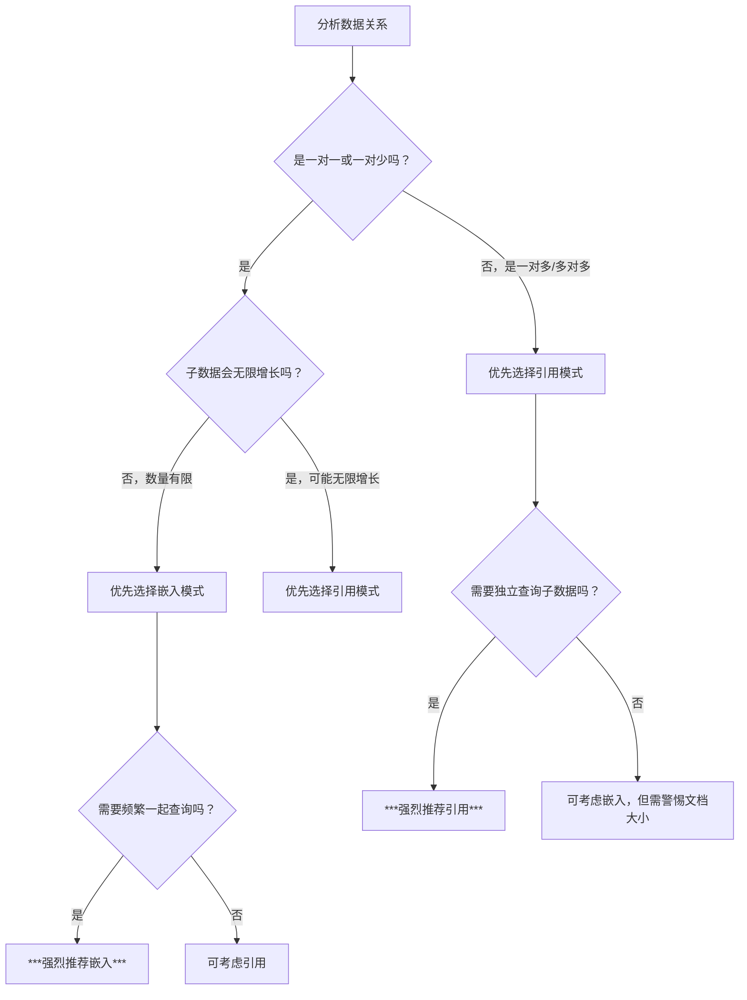

> 最后更新：2025-12-25 | [返回主目录](../README.md)
# 知识体系

MongoDB学习引入


MongoDB生态


学习资料
- 网资料
    - <a href='https://www.mongodb.com/'>MongoDB官网</a>
    - <a href='https://www.mongodb.com/zh-cn/docs/manual/'>MongoDB数据库文档</a>
    - <a href='https://www.mongodb.com/zh-cn/docs/tools-and-connectors/'>MongoDB 常用工具</a>
    - <a href='https://www.mongodb.com/zh-cn/docs/manual/crud/'>MongoDB CRUD</a>
    - <a href='https://www.mongodb.com/zh-cn/docs/manual/aggregation/'>MongoDB 聚合</a>
    - <a href='https://www.mongodb.com/zh-cn/docs/manual/data-modeling/'>MongoDB 数据模型</a>
    - <a href='https://www.mongodb.com/zh-cn/docs/manual/core/transactions/'>MongoDB 事务</a>
    - <a href='https://www.mongodb.com/zh-cn/docs/manual/indexes/'>MongoDB 索引</a>
    - <a href='https://www.mongodb.com/zh-cn/docs/manual/security/'>MongoDB 安全</a>
    - <a href='https://www.mongodb.com/zh-cn/docs/manual/replication/'>MongoDB 副本</a>
    - <a href='https://www.mongodb.com/zh-cn/docs/manual/sharding/'>MongoDB 分片</a>
    - <a href='https://www.mongodb.com/zh-cn/docs/manual/administration/'>MongoDB 管理</a>
    - <a href='https://www.mongodb.com/zh-cn/docs/manual/storage/'>MongoDB 存储</a>
- 入门系列
  - <a href='https://www.runoob.com/mongodb/mongodb-tutorial.html'>MongoDB菜鸟教程</a>
  - <a href='https://www.w3cschool.cn/mongodb/mongodb-1uxs37ih.html'>MongoDB入门教程</a>
- 其它
  - <a href='https://cloud.tencent.com/developer/article/1004794'>Mongodb Geo2d索引原理</a>


# 一、Mongo入门 - MongoDB基础概念

## 1.1 什么是NoSQL？
NoSQL是一种非关系型DMS，不需要固定的架构，可以避免joins链接，并且易于扩展。NoSQL数据库用于具有庞大数据存储需求的分布式数据存储。NoSQL用于大数据和实时Web应用程序。例如，像Twitter，Facebook，Google这样的大型公司，每天可能产生TB级的用户数据。

NoSQL数据库代表“**不仅仅是SQL**”或“不是SQL”。虽然NoRELNoSQL会是一个更好的名词。Carl Strozz在1998年引入了NoSQL概念。

传统的RDBMS使用SQL语法来存储和查询数据。相反，NoSQL数据库系统包含可存储结构化，半结构化，非结构化和多态数据的多种数据库技术。


### 1.1.1 为什么使用NoSQL？
NoSQL数据库的概念在处理大量数据的互联网巨头（例如Google，Facebook，Amazon等）中变得很流行。使用RDBMS处理海量数据时，系统响应时间变慢。

为了解决此问题，当然可以通过升级现有硬件来“横向扩展”我们的系统。但这个成本很高。

这个问题的替代方案是在负载增加时将数据库负载分配到多个主机上。这种方法称为“横向扩展”。


NoSQL数据库是非关系数据库，因此在设计时考虑到Web应用程序，比关系数据库更好地扩展。

### 1.1.2 NoSQL数据库的简要历史
- 1998年-Carlo Strozzi在他的轻量级开源关系数据库中使用术语NoSQL
- 2000-图形数据库Neo4j启动
- 2004年-推出Google BigTable
- 2005年-启动CouchDB
- 2007年-发布有关Amazon Dynamo的研究论文
- 2008年-Facebook开源Cassandra项目
- 2009年-重新引入NoSQL术语
### 1.1.3 NoSQL的功能
- **非关系**
  - NoSQL数据库从不遵循关系模型
  - 切勿为tables 提供固定的固定列记录
  - 使用自包含的聚合或BLOB
  - 不需要对象关系映射和数据规范化
  - 没有复杂的功能，例如查询语言，查询计划者，
  - 参照完整性联接，ACID
- **动态架构**
  - NoSQL数据库是无模式的或具有宽松模式的数据库
  - 不需要对数据架构进行任何形式的定义
  - 提供同一域中的异构数据结构


- 简单的API
  - 提供易于使用的界面，用于存储和查询提供的数据
  - API允许进行低级数据操作和选择方法
  - 基于文本的协议，通常与带有JSON的HTTP REST一起使用
  - 多数不使用基于标准的查询语言
  - 支持Web的数据库作为面向互联网的服务运行
- 分布式
  - 可以以分布式方式执行多个NoSQL数据库
  - 提供自动缩放和故障转移功能
  - 通常可牺牲ACID概念来实现可伸缩性和吞吐量
  - 分布式节点之间几乎没有同步复制，多为异步多主复制，对等，HDFS复制
  - 仅提供最终的一致性
  - 无共享架构。这样可以减少协调并提高分布。


## 1.2 什么是MongoDB
MongoDB是面向文档的NoSQL数据库，用于大量数据存储。MongoDB是一个在2000年代中期问世的数据库。属于NoSQL数据库的类别。

### 1.2.1 MongoDB功能
每个数据库都包含集合，而集合又包含文档。每个文档可以具有不同数量的字段。每个文档的大小和内容可以互不相同。 文档结构更符合开发人员如何使用各自的编程语言构造其类和对象。开发人员经常会说他们的类不是行和列，而是具有键值对的清晰结构。 从NoSQL数据库的简介中可以看出，行（或在MongoDB中调用的文档）不需要预先定义架构。相反，可以动态创建字段。 MongoDB中可用的数据模型使我们可以更轻松地表示层次结构关系，存储数组和其他更复杂的结构。 可伸缩性– MongoDB环境具有很高的可伸缩性。全球各地的公司已经定义了自己的集群，其中一些集群运行着100多个节点，数据库中包含大约数百万个文档。

### 1.2.2 为什么使用MongoDB
以下是一些为什么应该开始使用MongoDB的原因

- **面向文档的**–由于MongoDB是NoSQL类型的数据库，它不是以关系类型的格式存储数据，而是将数据存储在文档中。这使得MongoDB非常灵活，可以适应实际的业务环境和需求。
- **临时查询**-MongoDB支持按字段，范围查询和正则表达式搜索。可以查询返回文档中的特定字段。
-** 索引**-可以创建索引以提高MongoDB中的搜索性能。MongoDB文档中的任何字段都可以建立索引。
- **复制**-MongoDB可以提供副本集的高可用性。副本集由两个或多个mongo数据库实例组成。每个副本集成员可以随时充当主副本或辅助副本的角色。主副本是与客户端交互并执行所有读/写操作的主服务器。辅助副本使用内置复制维护主数据的副本。当主副本发生故障时，副本集将自动切换到辅助副本，然后它将成为主服务器。
- **负载平衡**-MongoDB使用分片的概念，通过在多个MongoDB实例之间拆分数据来水平扩展。MongoDB可以在多台服务器上运行，以平衡负载或复制数据，以便在硬件出现故障时保持系统正常运行。
### 1.2.3 MongoDB常用术语
下面是MongoDB中使用的一些常用术语

- **_id** – 这是每个MongoDB文档中必填的字段。_id字段表示MongoDB文档中的唯一值。_id字段类似于文档的主键。如果创建的新文档中没有_id字段，MongoDB将自动创建该字段。
- **集合** – 这是MongoDB文档的分组。集合等效于在任何其他RDMS（例如Oracle或MS SQL）中创建的表。集合存在于单个数据库中。从介绍中可以看出，集合不强制执行任何结构。
- **游标** – 这是指向查询结果集的指针。客户可以遍历游标以检索结果。
- **数据库** – 这是像RDMS中那样的集合容器，其中是表的容器。每个数据库在文件系统上都有其自己的文件集。MongoDB服务器可以存储多个数据库。
- **文档** - MongoDB集合中的记录基本上称为文档。文档包含字段名称和值。
- **字段** - 文档中的名称/值对。一个文档具有零个或多个字段。字段类似于关系数据库中的列。

下图显示了带有键值对的字段的示例。如下的例子中，CustomerID和11是文档中定义的键值对之一。


## 1.3 MongoDB与RDBMS区别
下表将帮助您更容易理解Mongo中的一些概念


| SQL术语/概念   | MongoDB术语/概念 | 解释/说明                                     |
|----------------|------------------|---------------------------------------------|
| database       | database         | 数据库                                      |
| table          | collection       | 数据库表/集合                               |
| row            | document         | 数据记录行/文档                             |
| column         | field            | 数据字段/域                                 |
| index          | index            | 索引                                        |
| table joins    |                  | 表连接,MongoDB不支持                        |
| primary key    | primary key      | 主键,MongoDB自动将_id字段设置为主键         |

# 二、Mongo入门 - MongoDB整体生态
> 很多人在学习Mongo时仅仅围绕着数据库功能，围绕着CRUD和聚合操作，但是MongoDB其实已经基本形成了它自身的生态了。我们在学习一项技能时一定要跳出使用的本身，要从高一点的格局上了解整个生态，这样会对你构筑知识体系有很大的帮助。

## 2.1 整体生态


### 2.1.1 MongoDB Server
MongoDB数据库，包含如下核心功能：


- <a href='https://www.mongodb.com/try/download/community'>社区版本</a>


- <a href='https://www.mongodb.com/try/download/enterprise'>企业版本</a>


### 2.1.2 MongoDB Cloud
MongoDB Cloud


### 2.1.3 MongoDB Drivers


<a href='https://www.mongodb.com/zh-cn/docs/languages/java/'>驱动相关的文档</a>


## 2.2 工具相关
<a href='https://www.mongodb.com/zh-cn/docs/tools-and-connectors/'>MongoDB Tools</a>


### 2.2.1 MongoDB Atlas Open Service Broker
Open Service Broker: https://www.openservicebrokerapi.org/

什么是开放式服务代理者(Open Service Broker): https://www.jdon.com/49640

### 2.2.2 MongoDB Connector for BI
MongoDB Connector for BI: https://www.mongodb.com/zh-cn/docs/bi-connector/current/

BI是指Business Intelligence，众所周知的BI工具有Tableau, MicroStrategy和Qlik等；而MongoDB BI Connector充当在mongod或mongos实例与BI工具之间转换查询和数据的层， 这样用户就可以使用SQL创建查询，可视化，图形化和报告等方式来展示MongoDB中的数据。


- `MongoDB DB`: 数据的存储
- `BI Connector`: 提供一个关系模式(Schema)，以及BI工具和MongoDB之间转换SQL查询
- `ODBC data source name (DSN)`: 连接配置数据和认证等.
- `BI Tool`: 数据分析和展示工具.
### 2.2.3 MongoDB Charts
 MongoDB Charts: https://www.mongodb.com/zh-cn/docs/charts/

负责MongoDB数据可视化的一个工具。


### 2.2.4 MongoDB Command Line Interface (mongocli)
MongoDB Command Line Interface (mongocli): https://www.mongodb.com/zh-cn/docs/mongocli/current/

通过命令行进行管理Mongo的工具，支持Cloud和On-premises，Cloud通过MongoDB Atlas支持；On-premises通过 MongoDB Cloud Manager 和 MongoDB Ops Manager支持。

### 2.2.5 MongoDB Kubernetes Operator
MongoDB Community Kubernetes Operator: https://github.com/mongodb/mongodb-kubernetes-operator

将MongoDB部署到Kubernetes集群的工具。

### 2.2.6 MongoDB Compass
MongoDB Compass: https://www.mongodb.com/zh-cn/docs/compass/

提供的对MongoDB进行界面化管理的工具。

> 需要注意：MongoDB 3.6+ 版本才支持这个工具；对于聚合操作的可视化是它的优势。

### 2.2.7 MongoDB VsCode插件
MongoDB for VS Code: https://www.mongodb.com/zh-cn/docs/mongodb-vscode/

MongoDB VsCode插件


### 2.2.8 MongoDB Shell
MongoDB Shell: https://www.mongodb.com/zh-cn/docs/mongodb-shell/

mongosh是一个MongoDB的shell工具。

### 2.2.9 MongoDB Kafka Connector
MongoDB Kafka Connector: https://docs.mongodb.com/kafka-connector/current/

MongoDB连接kafka的工具。

### 2.2.10 MongoDB Spark Connector
MongoDB Spark Connector: https://docs.mongodb.com/spark-connector/current/

MongoDB连接Spark的工具。

### 2.2.11 MongoDB Database Tools
MongoDB Database Tools: https://docs.mongodb.com/database-tools/

- 二进制导入导出
  - `mongodump` Creates a binary export of the contents of a mongod database.
  - `mongorestore` Restores data from a mongodump database dump into a mongod or mongos
  - `bsondump` Converts BSON dump files into JSON.
- 数据导入导出
  - `mongoimport` Imports content from an Extended JSON, CSV, or TSV export file.
  - `mongoexport` Produces a JSON or CSV export of data stored in a mongod instance.
- 诊断工具
  - `mongostat` Provides a quick overview of the status of a currently running mongod or mongos instance.
  - `mongotop` Provides an overview of the time a mongod instance spends reading and writing data.
- GridFS 工具
  - `mongofiles` Supports manipulating files stored in your MongoDB instance in GridFS objects.


## 2.3 应用举例（MongoDB Kafka Connector + MongoDB Spark Connector）

*   **MongoDB Kafka Connector**：主要负责**数据的实时流动**。
*   **MongoDB Spark Connector**：主要负责**对数据的复杂计算与分析**。


---

### 1. MongoDB Kafka Connector：数据的“实时桥梁”

Kafka 是一个高吞吐量的分布式消息队列（事件流平台），常用于构建实时数据管道。MongoDB Kafka Connector 的作用就是在 MongoDB 和 Kafka 之间建立双向的、实时的数据同步。

#### 主要业务应用场景：

**a) 变更数据捕获（CDC）与实时数据集成**
*   **场景**：你有一个核心的用户服务，数据存储在 MongoDB 中。当用户注册、更新资料时，其他系统（如推荐系统、营销系统、数据仓库）需要立刻知道这个变化。
*   **如何工作**：Connector 可以持续监听 MongoDB 的 oplog（操作日志），任何数据的插入、更新、删除都会被抓取，并作为一个消息实时发送到 Kafka 主题。下游的其他服务只需订阅这个 Kafka 主题，就能近乎实时地获取数据变更，而无需直接查询 MongoDB，大大降低了源数据库的压力。
*   **业务价值**：实现微服务架构下的解耦，保证数据的最终一致性，支撑实时推荐、实时风控、实时仪表盘等。

**b) 命令查询责任分离（CQRS）模式**
*   **场景**：你的应用写操作很频繁（如游戏状态更新、物联网传感器数据写入），但读操作模式复杂多样（如复杂的报表查询、全文搜索）。如果都用同一个 MongoDB 实例，写操作会影响读性能。
*   **如何工作**：使用 MongoDB 作为“命令端”（写模型），所有数据变更通过 Kafka Connector 流式导出到 Kafka。然后，再使用其他 Connector 将数据从 Kafka 导入到更适合查询的“查询端”（读模型），比如另一个 MongoDB（专门为查询优化过索引）、Elasticsearch（提供全文搜索）或数据仓库（用于分析）。
*   **业务价值**：读写分离，最大化读写性能，系统扩展性更强。

**c) 数据导出到数据仓库/湖**
*   **场景**：需要将运营数据从 MongoDB 导入到 Snowflake、BigQuery 或 Amazon S3 等数据仓库/数据湖中，进行大规模的历史数据分析。
*   **如何工作**：MongoDB -> Kafka Connector -> Kafka -> （例如）Spark Streaming -> 数据仓库。Kafka 在这里充当了可靠的数据缓冲区，即使数据仓库临时不可用，数据也不会丢失。

---

### 2. MongoDB Spark Connector：数据的“计算引擎”

Spark 是一个强大的分布式计算框架，擅长进行大规模数据的批量处理、流处理、机器学习和图计算。MongoDB Spark Connector 让 Spark 能够轻松地将 MongoDB 作为数据源或数据目的地。

#### 主要业务应用场景：

**a) 复杂数据分析与报表**
*   **场景**：你需要对存储在 MongoDB 中的海量用户行为日志、订单数据进行分析，生成复杂的商业报表（如月度销售趋势、用户留存分析）。
*   **如何工作**：使用 Spark SQL 或 DataFrame API，通过 Spark Connector 直接从 MongoDB 读取数据。利用 Spark 强大的分布式计算能力，执行复杂的数据聚合、连接（Join）和转换操作，最终将结果写回 MongoDB 或生成报表文件。
*   **业务价值**：处理 MongoDB 单机无法胜任的超大规模数据集分析，为决策提供数据支持。

**b) 机器学习与预测分析**
*   **场景**：基于用户的历史购买记录和浏览行为（存在 MongoDB 中），构建一个推荐模型。
*   **如何工作**：Spark 的 MLlib 库提供了丰富的机器学习算法。通过 Spark Connector 从 MongoDB 读取训练数据，在 Spark 集群上进行模型训练。训练好的模型可以用于实时推荐，也可以将用户标签等结果写回 MongoDB。
*   **业务价值**：实现数据驱动的智能应用，如个性化推荐、客户流失预测、欺诈检测等。

**c) 数据清洗、转换与归档（ETL）**
*   **场景**：需要定期清理 MongoDB 中的原始数据，将符合条件的历史数据归档到冷存储，或者将数据格式进行标准化。
*   **如何工作**：编写 Spark ETL 作业，从 MongoDB 读取数据，进行清洗、过滤、格式转换等操作，然后将处理后的干净数据写回 MongoDB 或导出到其他系统。
*   **业务价值**：保证数据质量，优化主数据库的存储成本。

---

### 强强联合：一个完整的业务案例

想象一个**智能电商平台**：

1.  **实时用户行为追踪**：用户在前端App的每一次点击、浏览、加购操作，都实时写入 **MongoDB**（因为MongoDB文档模型灵活，适合存储这种半结构化的行为数据）。
2.  **实时数据流**：**MongoDB Kafka Connector** 监听到这些新的行为数据，立即将其发送到 **Kafka**。
3.  **实时处理与推荐**：
    *   一个实时推荐服务订阅了 Kafka，它能立刻处理当前用户的行为流，实时更新用户兴趣画像，并从商品库中召回最相关的商品，实现“猜你喜欢”的实时更新。
    *   一个风控服务也订阅了 Kafka，实时分析行为模式，检测是否存在刷单、盗号等异常行为。
4.  **离线分析与模型训练**：
    *   每天凌晨，**Spark** 作业通过 **MongoDB Spark Connector** 读取全天积累在 MongoDB 中的完整用户行为数据和订单数据。
    *   Spark 进行复杂的批量计算，生成详细的销售报表、用户留存分析等。
    *   同时，Spark 的机器学习算法利用这些历史数据训练和优化第二天的推荐模型、销量预测模型。

### 总结

| 工具 | 角色 | 核心业务价值 |
| :--- | :--- | :--- |
| **MongoDB** | **操作数据存储** | 支撑应用主业务，提供灵活的文档模型和快速的读写能力。 |
| **MongoDB Kafka Connector** | **实时数据管道** | **解耦**与**流动**，确保数据变更能实时、可靠地通知到其他系统。 |
| **MongoDB Spark Connector** | **批量计算与分析** | **洞察**与**智能**，对海量数据进行复杂计算、机器学习，挖掘深层价值。 |

这三者结合，构成了一个从**实时操作**到**实时流处理**，再到**批量分析与机器学习**的完整、健壮的现代数据平台架构。

# 三、Mongo入门 - 基本使用：安装和CRUD
> 在理解MongoDB基础概念后，本文将介绍MongoDB的安装和最基本的CURD操作。
## 3.1 MongoDB安装
> MongoDB的安装比较简单，这里主要给出官方的下载地址，以及官方安装文档的地址，方便大家直达。

### 3.1.1 一些参考文档
- **官网下载**

<a href ='https://www.mongodb.com/try/download/community'>官网下载</a>

- 官网文档

<a href ='https://www.mongodb.com/zh-cn/docs/manual/administration/install-community/'>官网文档</a>


- **菜鸟教程中安装**
<a href='https://www.runoob.com/mongodb/mongodb-window-install.html'>菜鸟教程</a>

### 3.1.2 以Linux为例安装
- **yum源**

创建文件`/etc/yum.repos.d/mongodb-org-6.0.repo`, 加yum源：
```sh
[mongodb-org-6.0]
name=MongoDB Repository
baseurl=https://repo.mongodb.org/yum/redhat/8/mongodb-org/6.0/x86_64/
gpgcheck=1
enabled=1
gpgkey=https://www.mongodb.org/static/pgp/server-6.0.asc
```
- **安装**
```sh
sudo yum install -y mongodb-org
```
- **运行**
```sh
[root@pdai yum.repos.d]# systemctl start mongod
[root@pdai yum.repos.d]# sudo systemctl status mongod
● mongod.service - MongoDB Database Server
   Loaded: loaded (/usr/lib/systemd/system/mongod.service; enabled; vendor preset: disabled)
   Active: active (running) since Tue 2020-07-28 09:59:55 CST; 26s ago
     Docs: https://docs.mongodb.org/manual
  Process: 8868 ExecStart=/usr/bin/mongod $OPTIONS (code=exited, status=0/SUCCESS)
  Process: 8865 ExecStartPre=/usr/bin/chmod 0755 /var/run/mongodb (code=exited, status=0/SUCCESS)
  Process: 8863 ExecStartPre=/usr/bin/chown mongod:mongod /var/run/mongodb (code=exited, status=0/SUCCESS)
  Process: 8862 ExecStartPre=/usr/bin/mkdir -p /var/run/mongodb (code=exited, status=0/SUCCESS)
 Main PID: 8872 (mongod)
   CGroup: /system.slice/mongod.service
           └─8872 /usr/bin/mongod -f /etc/mongod.conf
```

## 3.2 连接和建库
- **连接(注意5.0之前连接是mongo命令，之后版本是mongosh命令)**

我们装的6.0命令是新的
```sh
mongosh --host 127.0.0.1:27017
Current Mongosh Log ID: 694df8512f04515a9b8de665
Connecting to:          mongodb://127.0.0.1:27017/?directConnection=true&serverSelectionTimeoutMS=2000&appName=mongosh+2.5.10
Using MongoDB:          6.0.27
Using Mongosh:          2.5.10

For mongosh info see: https://www.mongodb.com/docs/mongodb-shell/


To help improve our products, anonymous usage data is collected and sent to MongoDB periodically (https://www.mongodb.com/legal/privacy-policy).
You can opt-out by running the disableTelemetry() command.

------
   The server generated these startup warnings when booting
   2025-12-26T10:45:58.206+08:00: Access control is not enabled for the database. Read and write access to data and configuration is unrestricted
   2025-12-26T10:45:58.206+08:00: /sys/kernel/mm/transparent_hugepage/enabled is 'always'. We suggest setting it to 'never' in this binary version
   2025-12-26T10:45:58.206+08:00: vm.max_map_count is too low
------
test> show dbs
admin   40.00 KiB
config  12.00 KiB
local   40.00 KiB
test>
```
- 建库(注意，use一个不存在的数据库时，mongodb会在像这个数据库插入第一条数据的时候创建这个数据库)
```sh
> use testdb;
switched to db testdb
```
## 3.3 CRUD操作
<a href='https://www.mongodb.com/zh-cn/docs/manual/crud/'>官方CRUD文档</a>

### 3.3.1 Insert
- **图例**


- **示例**
```sh
testdb> db.inventory.insertOne(
...  { item: "canvas", qty: 100, tags: ["cotton"], size: { h: 28, w: 35.5, uom: "cm" } }
... )
{
  acknowledged: true,
  insertedId: ObjectId('694dfbeeca1979530f8de666')
}

testdb> db.inventory.insertMany([
...     { item: "journal", qty: 25, tags: ["blank", "red"], size: { h: 14, w: 21, uom: "cm" } },
...    { item: "mat", qty: 85, tags: ["gray"], size: { h: 27.9, w: 35.5, uom: "cm" } },
...     { item: "mousepad", qty: 25, tags: ["gel", "blue"], size: { h: 19, w: 22.85, uom: "cm" } }
...  ])
{
  acknowledged: true,
  insertedIds: {
    '0': ObjectId('694dfc6eca1979530f8de667'),
    '1': ObjectId('694dfc6eca1979530f8de668'),
    '2': ObjectId('694dfc6eca1979530f8de669')
  }
}

testdb> db.inventory.find( {} )
[
  {
    _id: ObjectId('694dfbeeca1979530f8de666'),
    item: 'canvas',
    qty: 100,
    tags: [ 'cotton' ],
    size: { h: 28, w: 35.5, uom: 'cm' }
  },
  {
    _id: ObjectId('694dfc6eca1979530f8de667'),
    item: 'journal',
    qty: 25,
    tags: [ 'blank', 'red' ],
    size: { h: 14, w: 21, uom: 'cm' }
  },
  {
    _id: ObjectId('694dfc6eca1979530f8de668'),
    item: 'mat',
    qty: 85,
    tags: [ 'gray' ],
    size: { h: 27.9, w: 35.5, uom: 'cm' }
  },
  {
    _id: ObjectId('694dfc6eca1979530f8de669'),
    item: 'mousepad',
    qty: 25,
    tags: [ 'gel', 'blue' ],
    size: { h: 19, w: 22.85, uom: 'cm' }
  }
]

```
- **更多文档资料**

<a href='https://www.mongodb.com/zh-cn/docs/manual/tutorial/insert-documents/'>官方相关文档</a>

<a href='https://www.mongodb.com/zh-cn/docs/manual/reference/method/db.collection.insert/#db.collection.insert'>官方相关示例 - Insert</a>

<a href='https://www.mongodb.com/zh-cn/docs/manual/reference/method/db.collection.insertone/'>官方相关示例 - InsertOne</a>

<a href='https://www.mongodb.com/zh-cn/docs/manual/reference/method/db.collection.insertMany/'>官方相关示例 - InsertMany</a>

### 3.3.2 Query
- **图例**


- **示例**
```sh
> db.inventory.find( {} )
{ "_id" : ObjectId("5f1f8a9a099483199e74737c"), "item" : "canvas", "qty" : 100, "tags" : [ "cotton" ], "size" : { "h" : 28, "w" : 35.5, "uom" : "cm" } }
{ "_id" : ObjectId("5f1f8aa8099483199e74737d"), "item" : "journal", "qty" : 25, "tags" : [ "blank", "red" ], "size" : { "h" : 14, "w" : 21, "uom" : "cm" } }
{ "_id" : ObjectId("5f1f8aa8099483199e74737e"), "item" : "mat", "qty" : 85, "tags" : [ "gray" ], "size" : { "h" : 27.9, "w" : 35.5, "uom" : "cm" } }
{ "_id" : ObjectId("5f1f8aa8099483199e74737f"), "item" : "mousepad", "qty" : 25, "tags" : [ "gel", "blue" ], "size" : { "h" : 19, "w" : 22.85, "uom" : "cm" } }
{ "_id" : ObjectId("5f1f94de4326f1d6a51d3a78"), "item" : "journal", "qty" : 25, "size" : { "h" : 14, "w" : 21, "uom" : "cm" }, "status" : "A" }
{ "_id" : ObjectId("5f1f94de4326f1d6a51d3a79"), "item" : "notebook", "qty" : 50, "size" : { "h" : 8.5, "w" : 11, "uom" : "in" }, "status" : "A" }
{ "_id" : ObjectId("5f1f94de4326f1d6a51d3a7a"), "item" : "paper", "qty" : 100, "size" : { "h" : 8.5, "w" : 11, "uom" : "in" }, "status" : "D" }
{ "_id" : ObjectId("5f1f94de4326f1d6a51d3a7b"), "item" : "planner", "qty" : 75, "size" : { "h" : 22.85, "w" : 30, "uom" : "cm" }, "status" : "D" }
{ "_id" : ObjectId("5f1f94de4326f1d6a51d3a7c"), "item" : "postcard", "qty" : 45, "size" : { "h" : 10, "w" : 15.25, "uom" : "cm" }, "status" : "A" }
> db.inventory.find( { status: "D" } )
{ "_id" : ObjectId("5f1f94de4326f1d6a51d3a7a"), "item" : "paper", "qty" : 100, "size" : { "h" : 8.5, "w" : 11, "uom" : "in" }, "status" : "D" }
{ "_id" : ObjectId("5f1f94de4326f1d6a51d3a7b"), "item" : "planner", "qty" : 75, "size" : { "h" : 22.85, "w" : 30, "uom" : "cm" }, "status" : "D" }
> db.inventory.find( { status: { $in: [ "A", "D" ] } } )
{ "_id" : ObjectId("5f1f94de4326f1d6a51d3a78"), "item" : "journal", "qty" : 25, "size" : { "h" : 14, "w" : 21, "uom" : "cm" }, "status" : "A" }
{ "_id" : ObjectId("5f1f94de4326f1d6a51d3a79"), "item" : "notebook", "qty" : 50, "size" : { "h" : 8.5, "w" : 11, "uom" : "in" }, "status" : "A" }
{ "_id" : ObjectId("5f1f94de4326f1d6a51d3a7a"), "item" : "paper", "qty" : 100, "size" : { "h" : 8.5, "w" : 11, "uom" : "in" }, "status" : "D" }
{ "_id" : ObjectId("5f1f94de4326f1d6a51d3a7b"), "item" : "planner", "qty" : 75, "size" : { "h" : 22.85, "w" : 30, "uom" : "cm" }, "status" : "D" }
{ "_id" : ObjectId("5f1f94de4326f1d6a51d3a7c"), "item" : "postcard", "qty" : 45, "size" : { "h" : 10, "w" : 15.25, "uom" : "cm" }, "status" : "A" }
> db.inventory.find( { status: "A", qty: { $lt: 30 } } )
{ "_id" : ObjectId("5f1f94de4326f1d6a51d3a78"), "item" : "journal", "qty" : 25, "size" : { "h" : 14, "w" : 21, "uom" : "cm" }, "status" : "A" }
> db.inventory.find( { $or: [ { status: "A" }, { qty: { $lt: 30 } } ] } )
{ "_id" : ObjectId("5f1f8aa8099483199e74737d"), "item" : "journal", "qty" : 25, "tags" : [ "blank", "red" ], "size" : { "h" : 14, "w" : 21, "uom" : "cm" } }
{ "_id" : ObjectId("5f1f8aa8099483199e74737f"), "item" : "mousepad", "qty" : 25, "tags" : [ "gel", "blue" ], "size" : { "h" : 19, "w" : 22.85, "uom" : "cm" } }
{ "_id" : ObjectId("5f1f94de4326f1d6a51d3a78"), "item" : "journal", "qty" : 25, "size" : { "h" : 14, "w" : 21, "uom" : "cm" }, "status" : "A" }
{ "_id" : ObjectId("5f1f94de4326f1d6a51d3a79"), "item" : "notebook", "qty" : 50, "size" : { "h" : 8.5, "w" : 11, "uom" : "in" }, "status" : "A" }
{ "_id" : ObjectId("5f1f94de4326f1d6a51d3a7c"), "item" : "postcard", "qty" : 45, "size" : { "h" : 10, "w" : 15.25, "uom" : "cm" }, "status" : "A" }
> db.inventory.find( {
...      status: "A",
...      $or: [ { qty: { $lt: 30 } }, { item: /^p/ } ]
... } )
{ "_id" : ObjectId("5f1f94de4326f1d6a51d3a78"), "item" : "journal", "qty" : 25, "size" : { "h" : 14, "w" : 21, "uom" : "cm" }, "status" : "A" }
{ "_id" : ObjectId("5f1f94de4326f1d6a51d3a7c"), "item" : "postcard", "qty" : 45, "size" : { "h" : 10, "w" : 15.25, "uom" : "cm" }, "status" : "A" }
>
```
- **更多文档资料**

<a href='https://www.mongodb.com/zh-cn/docs/manual/tutorial/query-documents/'>官方相关文档</a>

<a href='https://www.mongodb.com/zh-cn/docs/manual/reference/method/db.collection.find/'>官方相关示例 - find</a>

<a href='https://www.mongodb.com/zh-cn/docs/manual/reference/method/db.collection.findOne/'>官方相关示例 - findOne</a>

<a href='mongodb.com/zh-cn/docs/manual/reference/method/db.collection.findandmodify/'>官方相关示例 - findAndModify</a>

<a href='https://www.mongodb.com/zh-cn/docs/manual/reference/method/db.collection.findoneanddelete/'>官方相关示例 - findOneAndDelete</a>

<a href='https://www.mongodb.com/zh-cn/docs/manual/reference/method/db.collection.findoneandreplace/'>官方相关示例 - findOneAndReplace</a>

<a href='https://www.mongodb.com/zh-cn/docs/manual/reference/method/db.collection.findoneandupdate/'>官方相关示例 - findOneAndUpdate</a>

### 3.3.3 Update
- **图例**


- **示例**
```sh
> db.inventory.insertMany( [
...    { item: "canvas", qty: 100, size: { h: 28, w: 35.5, uom: "cm" }, status: "A" },
...    { item: "journal", qty: 25, size: { h: 14, w: 21, uom: "cm" }, status: "A" },
...    { item: "mat", qty: 85, size: { h: 27.9, w: 35.5, uom: "cm" }, status: "A" },
...    { item: "mousepad", qty: 25, size: { h: 19, w: 22.85, uom: "cm" }, status: "P" },
...    { item: "notebook", qty: 50, size: { h: 8.5, w: 11, uom: "in" }, status: "P" },
...    { item: "paper", qty: 100, size: { h: 8.5, w: 11, uom: "in" }, status: "D" },
...    { item: "planner", qty: 75, size: { h: 22.85, w: 30, uom: "cm" }, status: "D" },
...    { item: "postcard", qty: 45, size: { h: 10, w: 15.25, uom: "cm" }, status: "A" },
...    { item: "sketchbook", qty: 80, size: { h: 14, w: 21, uom: "cm" }, status: "A" },
...    { item: "sketch pad", qty: 95, size: { h: 22.85, w: 30.5, uom: "cm" }, status: "A" }
... ] );
{
        "acknowledged" : true,
        "insertedIds" : [
                ObjectId("5f1f96cf4326f1d6a51d3a7d"),
                ObjectId("5f1f96cf4326f1d6a51d3a7e"),
                ObjectId("5f1f96cf4326f1d6a51d3a7f"),
                ObjectId("5f1f96cf4326f1d6a51d3a80"),
                ObjectId("5f1f96cf4326f1d6a51d3a81"),
                ObjectId("5f1f96cf4326f1d6a51d3a82"),
                ObjectId("5f1f96cf4326f1d6a51d3a83"),
                ObjectId("5f1f96cf4326f1d6a51d3a84"),
                ObjectId("5f1f96cf4326f1d6a51d3a85"),
                ObjectId("5f1f96cf4326f1d6a51d3a86")
        ]
}
> db.inventory.updateOne(
...    { item: "paper" },
...    {
...      $set: { "size.uom": "cm", status: "P" },
...      $currentDate: { lastModified: true }
...    }
... )
{ "acknowledged" : true, "matchedCount" : 1, "modifiedCount" : 1 }
> db.inventory.find( {} )
{ "_id" : ObjectId("5f1f96cf4326f1d6a51d3a7d"), "item" : "canvas", "qty" : 100, "size" : { "h" : 28, "w" : 35.5, "uom" : "cm" }, "status" : "A" }
{ "_id" : ObjectId("5f1f96cf4326f1d6a51d3a7e"), "item" : "journal", "qty" : 25, "size" : { "h" : 14, "w" : 21, "uom" : "cm" }, "status" : "A" }
{ "_id" : ObjectId("5f1f96cf4326f1d6a51d3a7f"), "item" : "mat", "qty" : 85, "size" : { "h" : 27.9, "w" : 35.5, "uom" : "cm" }, "status" : "A" }
{ "_id" : ObjectId("5f1f96cf4326f1d6a51d3a80"), "item" : "mousepad", "qty" : 25, "size" : { "h" : 19, "w" : 22.85, "uom" : "cm" }, "status" : "P" }
{ "_id" : ObjectId("5f1f96cf4326f1d6a51d3a81"), "item" : "notebook", "qty" : 50, "size" : { "h" : 8.5, "w" : 11, "uom" : "in" }, "status" : "P" }
{ "_id" : ObjectId("5f1f96cf4326f1d6a51d3a82"), "item" : "paper", "qty" : 100, "size" : { "h" : 8.5, "w" : 11, "uom" : "cm" }, "status" : "P", "lastModified" : ISODate("2020-07-28T03:09:17.014Z") }
{ "_id" : ObjectId("5f1f96cf4326f1d6a51d3a83"), "item" : "planner", "qty" : 75, "size" : { "h" : 22.85, "w" : 30, "uom" : "cm" }, "status" : "D" }
{ "_id" : ObjectId("5f1f96cf4326f1d6a51d3a84"), "item" : "postcard", "qty" : 45, "size" : { "h" : 10, "w" : 15.25, "uom" : "cm" }, "status" : "A" }
{ "_id" : ObjectId("5f1f96cf4326f1d6a51d3a85"), "item" : "sketchbook", "qty" : 80, "size" : { "h" : 14, "w" : 21, "uom" : "cm" }, "status" : "A" }
{ "_id" : ObjectId("5f1f96cf4326f1d6a51d3a86"), "item" : "sketch pad", "qty" : 95, "size" : { "h" : 22.85, "w" : 30.5, "uom" : "cm" }, "status" : "A" }
```
- **updateMany**
```sh
> db.inventory.updateMany(
...    { "qty": { $lt: 50 } },
...    {
...      $set: { "size.uom": "in", status: "P" },
...      $currentDate: { lastModified: true }
...    }
... )
{ "acknowledged" : true, "matchedCount" : 3, "modifiedCount" : 3 }
> db.inventory.find( {} )
{ "_id" : ObjectId("5f1f96cf4326f1d6a51d3a7d"), "item" : "canvas", "qty" : 100, "size" : { "h" : 28, "w" : 35.5, "uom" : "cm" }, "status" : "A" }
{ "_id" : ObjectId("5f1f96cf4326f1d6a51d3a7e"), "item" : "journal", "qty" : 25, "size" : { "h" : 14, "w" : 21, "uom" : "in" }, "status" : "P", "lastModified" : ISODate("2020-07-28T04:33:50.391Z") }
{ "_id" : ObjectId("5f1f96cf4326f1d6a51d3a7f"), "item" : "mat", "qty" : 85, "size" : { "h" : 27.9, "w" : 35.5, "uom" : "cm" }, "status" : "A" }
{ "_id" : ObjectId("5f1f96cf4326f1d6a51d3a80"), "item" : "mousepad", "qty" : 25, "size" : { "h" : 19, "w" : 22.85, "uom" : "in" }, "status" : "P", "lastModified" : ISODate("2020-07-28T04:33:50.391Z") }
{ "_id" : ObjectId("5f1f96cf4326f1d6a51d3a81"), "item" : "notebook", "qty" : 50, "size" : { "h" : 8.5, "w" : 11, "uom" : "in" }, "status" : "P" }
{ "_id" : ObjectId("5f1f96cf4326f1d6a51d3a82"), "item" : "paper", "qty" : 100, "size" : { "h" : 8.5, "w" : 11, "uom" : "cm" }, "status" : "P", "lastModified" : ISODate("2020-07-28T03:09:17.014Z") }
{ "_id" : ObjectId("5f1f96cf4326f1d6a51d3a83"), "item" : "planner", "qty" : 75, "size" : { "h" : 22.85, "w" : 30, "uom" : "cm" }, "status" : "D" }
{ "_id" : ObjectId("5f1f96cf4326f1d6a51d3a84"), "item" : "postcard", "qty" : 45, "size" : { "h" : 10, "w" : 15.25, "uom" : "in" }, "status" : "P", "lastModified" : ISODate("2020-07-28T04:33:50.392Z") }
{ "_id" : ObjectId("5f1f96cf4326f1d6a51d3a85"), "item" : "sketchbook", "qty" : 80, "size" : { "h" : 14, "w" : 21, "uom" : "cm" }, "status" : "A" }
{ "_id" : ObjectId("5f1f96cf4326f1d6a51d3a86"), "item" : "sketch pad", "qty" : 95, "size" : { "h" : 22.85, "w" : 30.5, "uom" : "cm" }, "status" : "A" }
>
```
- replace one
```sh
> db.inventory.replaceOne(
...    { item: "paper" },
...    { item: "paper", instock: [ { warehouse: "A", qty: 60 }, { warehouse: "B", qty: 40 } ] }
... )
{ "acknowledged" : true, "matchedCount" : 1, "modifiedCount" : 1 }
> db.inventory.find( {} )
{ "_id" : ObjectId("5f1f96cf4326f1d6a51d3a7d"), "item" : "canvas", "qty" : 100, "size" : { "h" : 28, "w" : 35.5, "uom" : "cm" }, "status" : "A" }
{ "_id" : ObjectId("5f1f96cf4326f1d6a51d3a7e"), "item" : "journal", "qty" : 25, "size" : { "h" : 14, "w" : 21, "uom" : "in" }, "status" : "P", "lastModified" : ISODate("2020-07-28T04:33:50.391Z") }
{ "_id" : ObjectId("5f1f96cf4326f1d6a51d3a7f"), "item" : "mat", "qty" : 85, "size" : { "h" : 27.9, "w" : 35.5, "uom" : "cm" }, "status" : "A" }
{ "_id" : ObjectId("5f1f96cf4326f1d6a51d3a80"), "item" : "mousepad", "qty" : 25, "size" : { "h" : 19, "w" : 22.85, "uom" : "in" }, "status" : "P", "lastModified" : ISODate("2020-07-28T04:33:50.391Z") }
{ "_id" : ObjectId("5f1f96cf4326f1d6a51d3a81"), "item" : "notebook", "qty" : 50, "size" : { "h" : 8.5, "w" : 11, "uom" : "in" }, "status" : "P" }
{ "_id" : ObjectId("5f1f96cf4326f1d6a51d3a82"), "item" : "paper", "instock" : [ { "warehouse" : "A", "qty" : 60 }, { "warehouse" : "B", "qty" : 40 } ] }
{ "_id" : ObjectId("5f1f96cf4326f1d6a51d3a83"), "item" : "planner", "qty" : 75, "size" : { "h" : 22.85, "w" : 30, "uom" : "cm" }, "status" : "D" }
{ "_id" : ObjectId("5f1f96cf4326f1d6a51d3a84"), "item" : "postcard", "qty" : 45, "size" : { "h" : 10, "w" : 15.25, "uom" : "in" }, "status" : "P", "lastModified" : ISODate("2020-07-28T04:33:50.392Z") }
{ "_id" : ObjectId("5f1f96cf4326f1d6a51d3a85"), "item" : "sketchbook", "qty" : 80, "size" : { "h" : 14, "w" : 21, "uom" : "cm" }, "status" : "A" }
{ "_id" : ObjectId("5f1f96cf4326f1d6a51d3a86"), "item" : "sketch pad", "qty" : 95, "size" : { "h" : 22.85, "w" : 30.5, "uom" : "cm" }, "status" : "A" }
>
```
- **更多文档资料**

<a href='https://www.mongodb.com/zh-cn/docs/manual/tutorial/update-documents/'>官方相关文档</a>

<a href='https://www.mongodb.com/zh-cn/docs/manual/reference/method/db.collection.update/'>官方相关示例 - update</a>

<a href='https://www.mongodb.com/zh-cn/docs/manual/reference/method/db.collection.updateone/'>官方相关示例 - updateOne</a>

<a href='https://www.mongodb.com/zh-cn/docs/manual/reference/method/db.collection.updatemany/'>官方相关示例 - updateMany</a>

### 3.3.4 Delete
- **图例**


- **示例**
```sh
> db.inventory.deleteMany({ status : "A" })
{ "acknowledged" : true, "deletedCount" : 4 }
> db.inventory.find( {} )
{ "_id" : ObjectId("5f1f96cf4326f1d6a51d3a7e"), "item" : "journal", "qty" : 25, "size" : { "h" : 14, "w" : 21, "uom" : "in" }, "status" : "P", "lastModified" : ISODate("2020-07-28T04:33:50.391Z") }
{ "_id" : ObjectId("5f1f96cf4326f1d6a51d3a80"), "item" : "mousepad", "qty" : 25, "size" : { "h" : 19, "w" : 22.85, "uom" : "in" }, "status" : "P", "lastModified" : ISODate("2020-07-28T04:33:50.391Z") }
{ "_id" : ObjectId("5f1f96cf4326f1d6a51d3a81"), "item" : "notebook", "qty" : 50, "size" : { "h" : 8.5, "w" : 11, "uom" : "in" }, "status" : "P" }
{ "_id" : ObjectId("5f1f96cf4326f1d6a51d3a82"), "item" : "paper", "instock" : [ { "warehouse" : "A", "qty" : 60 }, { "warehouse" : "B", "qty" : 40 } ] }
{ "_id" : ObjectId("5f1f96cf4326f1d6a51d3a83"), "item" : "planner", "qty" : 75, "size" : { "h" : 22.85, "w" : 30, "uom" : "cm" }, "status" : "D" }
{ "_id" : ObjectId("5f1f96cf4326f1d6a51d3a84"), "item" : "postcard", "qty" : 45, "size" : { "h" : 10, "w" : 15.25, "uom" : "in" }, "status" : "P", "lastModified" : ISODate("2020-07-28T04:33:50.392Z") }
```
- **更多文档资料**

<a href='https://www.mongodb.com/zh-cn/docs/manual/tutorial/remove-documents/'>官方相关文档</a>

<a href='https://www.mongodb.com/zh-cn/docs/manual/reference/method/db.collection.remove/'>官方相关示例 - remove</a>

<a href='https://www.mongodb.com/zh-cn/docs/manual/reference/method/db.collection.deleteone/'>官方相关示例 - deleteOne</a>

<a href='https://www.mongodb.com/zh-cn/docs/manual/reference/method/db.collection.deletemany/'>官方相关示例 - deleteMany</a>

### 3.3.5 BulkWrite(操作批量化)
本质是就是将上述的操作批量化。
```sh
try {
   db.characters.bulkWrite(
      [
         { insertOne :
            {
               "document" :
               {
                  "_id" : 4, "char" : "Dithras", "class" : "barbarian", "lvl" : 4
               }
            }
         },
         { insertOne :
            {
               "document" :
               {
                  "_id" : 5, "char" : "Taeln", "class" : "fighter", "lvl" : 3
               }
            }
         },
         { updateOne :
            {
               "filter" : { "char" : "Eldon" },
               "update" : { $set : { "status" : "Critical Injury" } }
            }
         },
         { deleteOne :
            { "filter" : { "char" : "Brisbane"} }
         },
         { replaceOne :
            {
               "filter" : { "char" : "Meldane" },
               "replacement" : { "char" : "Tanys", "class" : "oracle", "lvl" : 4 }
            }
         }
      ]
   );
}
catch (e) {
   print(e);
}
```
# 四、Mongo入门 - 基本使用：索引和聚合
> 在了解MongoDB的基本CRUD操作后，常用的其它操作还有对字段的索引以及对字段的聚合操作。
## 4.1 聚合 - Aggregation Pipline
> 类似于将SQL中的group by + order by + left join ... 等操作管道化。

### 4.1.1 常规使用
- **图例理解**


- **准备数据**
```sh
> db.orders.insertMany( [
...     { _id: 1, cust_id: "abc1", ord_date: ISODate("2012-11-02T17:04:11.102Z"), status: "A", amount: 50 },
...     { _id: 2, cust_id: "xyz1", ord_date: ISODate("2013-10-01T17:04:11.102Z"), status: "A", amount: 100 },
...     { _id: 3, cust_id: "xyz1", ord_date: ISODate("2013-10-12T17:04:11.102Z"), status: "D", amount: 25 },
...     { _id: 4, cust_id: "xyz1", ord_date: ISODate("2013-10-11T17:04:11.102Z"), status: "D", amount: 125 },
...     { _id: 5, cust_id: "abc1", ord_date: ISODate("2013-11-12T17:04:11.102Z"), status: "A", amount: 25 }
... ] );
{ "acknowledged" : true, "insertedIds" : [ 1, 2, 3, 4, 5 ] }
> db.orders.find({})
{ "_id" : 1, "cust_id" : "abc1", "ord_date" : ISODate("2012-11-02T17:04:11.102Z"), "status" : "A", "amount" : 50 }
{ "_id" : 2, "cust_id" : "xyz1", "ord_date" : ISODate("2013-10-01T17:04:11.102Z"), "status" : "A", "amount" : 100 }
{ "_id" : 3, "cust_id" : "xyz1", "ord_date" : ISODate("2013-10-12T17:04:11.102Z"), "status" : "D", "amount" : 25 }
{ "_id" : 4, "cust_id" : "xyz1", "ord_date" : ISODate("2013-10-11T17:04:11.102Z"), "status" : "D", "amount" : 125 }
{ "_id" : 5, "cust_id" : "abc1", "ord_date" : ISODate("2013-11-12T17:04:11.102Z"), "status" : "A", "amount" : 25 }
>
```
- **聚合操作**
```sh
> db.orders.aggregate([
...                      { $match: { status: "A" } },
...                      { $group: { _id: "$cust_id", total: { $sum: "$amount" } } },
...                      { $sort: { total: -1 } }
...                    ])
{ "_id" : "xyz1", "total" : 100 }
{ "_id" : "abc1", "total" : 75 }
```
- 官网还有两个例子：

  - <a href='https://www.mongodb.com/zh-cn/docs/manual/tutorial/aggregation-complete-examples/'>Aggregation with the Zip Code Data Set</a>
  - <a href='https://www.mongodb.com/zh-cn/docs/manual/tutorial/aggregation-complete-examples/'>Aggregation with User Preference Data</a>

### 4.1.2 Pipline操作
MongoDB的聚合管道（Pipline）将MongoDB文档在一个阶段（Stage）处理完毕后将结果传递给下一个阶段（Stage）处理。**阶段（Stage）操作是可以重复的。**

表达式：处理输入文档并输出。表达式是无状态的，只能用于计算当前聚合管道的文档，不能处理其它的文档。

这里我们介绍一下聚合框架中常用的几个Stages：

- `$project`：修改输入文档的结构。可以用来重命名、增加或删除域，也可以用于创建计算结果以及嵌套文档。
- `$match`：用于过滤数据，只输出符合条件的文档。$match使用MongoDB的标准查询操作。
- `$limit`：用来限制MongoDB聚合管道返回的文档数。
- `$skip`：在聚合管道中跳过指定数量的文档，并返回余下的文档。
- `$unwind`：将文档中的某一个数组类型字段拆分成多条，每条包含数组中的一个值。
- `$group`：将集合中的文档分组，可用于统计结果。
- `$sort`：将输入文档排序后输出。
- `$geoNear`：输出接近某一地理位置的有序文档。
- `$bucket`: 分组（分桶）计算。
- `$facet` : 多次分组计算。
- `$out`: 将结果集输出，必须是Pipline最后一个Stage。

**举几个例子**

- **$project**
```sh
> db.orders.aggregate(
...     { $project : {
...         _id : 0 , // 默认不显示_id
...         cust_id : 1 ,
...         status : 1
...     }});
{ "cust_id" : "abc1", "status" : "A" }
{ "cust_id" : "xyz1", "status" : "A" }
{ "cust_id" : "xyz1", "status" : "D" }
{ "cust_id" : "xyz1", "status" : "D" }
{ "cust_id" : "abc1", "status" : "A" }
>
```
- **$skip**
```sh 
 db.orders.aggregate(
...     { $skip : 4 });
{ "_id" : 5, "cust_id" : "abc1", "ord_date" : ISODate("2013-11-12T17:04:11.102Z"), "status" : "A", "amount" : 25 }
>
```
- **$unwind**
```sh
> db.inventory2.insertOne({ "_id" : 1, "item" : "ABC1", sizes: [ "S", "M", "L"] })
{ "acknowledged" : true, "insertedId" : 1 }
> db.inventory2.aggregate( [ { $unwind : "$sizes" } ] )
{ "_id" : 1, "item" : "ABC1", "sizes" : "S" }
{ "_id" : 1, "item" : "ABC1", "sizes" : "M" }
{ "_id" : 1, "item" : "ABC1", "sizes" : "L" }
```
- **$bucket**
```sh
> db.artwork.insertMany([
... { "_id" : 1, "title" : "The Pillars of Society", "artist" : "Grosz", "year" : 1926,
...     "price" : NumberDecimal("199.99") },
... { "_id" : 2, "title" : "Melancholy III", "artist" : "Munch", "year" : 1902,
...     "price" : NumberDecimal("280.00") },
... { "_id" : 3, "title" : "Dancer", "artist" : "Miro", "year" : 1925,
...     "price" : NumberDecimal("76.04") },
... { "_id" : 4, "title" : "The Great Wave off Kanagawa", "artist" : "Hokusai",
...     "price" : NumberDecimal("167.30") },
... { "_id" : 5, "title" : "The Persistence of Memory", "artist" : "Dali", "year" : 1931,
...     "price" : NumberDecimal("483.00") },
... { "_id" : 6, "title" : "Composition VII", "artist" : "Kandinsky", "year" : 1913,
...     "price" : NumberDecimal("385.00") },
... { "_id" : 7, "title" : "The Scream", "artist" : "Munch", "year" : 1893 },
... { "_id" : 8, "title" : "Blue Flower", "artist" : "O'Keefe", "year" : 1918,
...     "price" : NumberDecimal("118.42") }
... ])
{
        "acknowledged" : true,
        "insertedIds" : [
                1,
                2,
                3,
                4,
                5,
                6,
                7,
                8
        ]
}
> db.artwork.find({})
{ "_id" : 1, "title" : "The Pillars of Society", "artist" : "Grosz", "year" : 1926, "price" : NumberDecimal("199.99") }
{ "_id" : 2, "title" : "Melancholy III", "artist" : "Munch", "year" : 1902, "price" : NumberDecimal("280.00") }
{ "_id" : 3, "title" : "Dancer", "artist" : "Miro", "year" : 1925, "price" : NumberDecimal("76.04") }
{ "_id" : 4, "title" : "The Great Wave off Kanagawa", "artist" : "Hokusai", "price" : NumberDecimal("167.30") }
{ "_id" : 5, "title" : "The Persistence of Memory", "artist" : "Dali", "year" : 1931, "price" : NumberDecimal("483.00") }
{ "_id" : 6, "title" : "Composition VII", "artist" : "Kandinsky", "year" : 1913, "price" : NumberDecimal("385.00") }
{ "_id" : 7, "title" : "The Scream", "artist" : "Munch", "year" : 1893 } // 注意这里没有price，聚合结果中为Others
{ "_id" : 8, "title" : "Blue Flower", "artist" : "O'Keefe", "year" : 1918, "price" : NumberDecimal("118.42") }
> db.artwork.aggregate( [
...   {
...     $bucket: {
...       groupBy: "$price",
...       boundaries: [ 0, 200, 400 ],
...       default: "Other",
...       output: {
...         "count": { $sum: 1 },
...         "titles" : { $push: "$title" }
...       }
...     }
...   }
... ] )
{ "_id" : 0, "count" : 4, "titles" : [ "The Pillars of Society", "Dancer", "The Great Wave off Kanagawa", "Blue Flower" ] }
{ "_id" : 200, "count" : 2, "titles" : [ "Melancholy III", "Composition VII" ] }
{ "_id" : "Other", "count" : 2, "titles" : [ "The Persistence of Memory", "The Scream" ] }
```
- **$bucket + $facet**

**非常常用！**
```sh
db.artwork.aggregate( [
  {
    $facet: {
      "price": [
        {
          $bucket: {
              groupBy: "$price",
              boundaries: [ 0, 200, 400 ],
              default: "Other",
              output: {
                "count": { $sum: 1 },
                "artwork" : { $push: { "title": "$title", "price": "$price" } }
              }
          }
        }
      ],
      "year": [
        {
          $bucket: {
            groupBy: "$year",
            boundaries: [ 1890, 1910, 1920, 1940 ],
            default: "Unknown",
            output: {
              "count": { $sum: 1 },
              "artwork": { $push: { "title": "$title", "year": "$year" } }
            }
          }
        }
      ]
    }
  }
] )

// 输出
{
  "year" : [
    {
      "_id" : 1890,
      "count" : 2,
      "artwork" : [
        {
          "title" : "Melancholy III",
          "year" : 1902
        },
        {
          "title" : "The Scream",
          "year" : 1893
        }
      ]
    },
    {
      "_id" : 1910,
      "count" : 2,
      "artwork" : [
        {
          "title" : "Composition VII",
          "year" : 1913
        },
        {
          "title" : "Blue Flower",
          "year" : 1918
        }
      ]
    },
    {
      "_id" : 1920,
      "count" : 3,
      "artwork" : [
        {
          "title" : "The Pillars of Society",
          "year" : 1926
        },
        {
          "title" : "Dancer",
          "year" : 1925
        },
        {
          "title" : "The Persistence of Memory",
          "year" : 1931
        }
      ]
    },
    {
      // Includes the document without a year, e.g., _id: 4
      "_id" : "Unknown",
      "count" : 1,
      "artwork" : [
        {
          "title" : "The Great Wave off Kanagawa"
        }
      ]
    }
  ],
      "price" : [
    {
      "_id" : 0,
      "count" : 4,
      "artwork" : [
        {
          "title" : "The Pillars of Society",
          "price" : NumberDecimal("199.99")
        },
        {
          "title" : "Dancer",
          "price" : NumberDecimal("76.04")
        },
        {
          "title" : "The Great Wave off Kanagawa",
          "price" : NumberDecimal("167.30")
        },
        {
          "title" : "Blue Flower",
          "price" : NumberDecimal("118.42")
        }
      ]
    },
    {
      "_id" : 200,
      "count" : 2,
      "artwork" : [
        {
          "title" : "Melancholy III",
          "price" : NumberDecimal("280.00")
        },
        {
          "title" : "Composition VII",
          "price" : NumberDecimal("385.00")
        }
      ]
    },
    {
      // Includes the document without a price, e.g., _id: 7
      "_id" : "Other",
      "count" : 2,
      "artwork" : [
        {
          "title" : "The Persistence of Memory",
          "price" : NumberDecimal("483.00")
        },
        {
          "title" : "The Scream"
        }
      ]
    }
  ]
}
```
聚合操作使用的比较频繁，在实际的工作中可以参考官方文档 - <a href='https://www.mongodb.com/zh-cn/docs/manual/reference/mql/aggregation-stages/'>Aggregation Pipeline Stages</a>。


### 4.1.3 Aggregation Options参数
> 举一个explain参数为例，更多的相关Options可以参考官方文档，<a href='https://www.mongodb.com/zh-cn/docs/manual/reference/method/db.collection.aggregate/'>Aggregrate相关配置</a>

- **explain**
```sh
> db.orders.aggregate(
...                      [
...                        { $match: { status: "A" } },
...                        { $group: { _id: "$cust_id", total: { $sum: "$amount" } } },
...                        { $sort: { total: -1 } }
...                      ],
...                      {
...                        explain: true
...                      }
...                    )
{
        "serverInfo" : {
                "host" : "pdai",
                "port" : 27017,
                "version" : "3.6.19",
                "gitVersion" : "41b289ff734a926e784d6ab42c3129f59f40d5b4"
        },
        "stages" : [
                {
                        "$cursor" : {
                                "query" : {
                                        "status" : "A"
                                },
                                "fields" : {
                                        "amount" : 1,
                                        "cust_id" : 1,
                                        "_id" : 0
                                },
                                "queryPlanner" : {
                                        "plannerVersion" : 1,
                                        "namespace" : "testdb.orders",
                                        "indexFilterSet" : false,
                                        "parsedQuery" : {
                                                "status" : {
                                                        "$eq" : "A"
                                                }
                                        },
                                        "winningPlan" : {
                                                "stage" : "COLLSCAN",
                                                "filter" : {
                                                        "status" : {
                                                                "$eq" : "A"
                                                        }
                                                },
                                                "direction" : "forward"
                                        },
                                        "rejectedPlans" : [ ]
                                }
                        }
                },
                {
                        "$group" : {
                                "_id" : "$cust_id",
                                "total" : {
                                        "$sum" : "$amount"
                                }
                        }
                },
                {
                        "$sort" : {
                                "sortKey" : {
                                        "total" : -1
                                }
                        }
                }
        ],
        "ok" : 1
}
```
## 4.2 聚合 - Map Reduce
- **图例理解**


### 4.2.1 官网给了个例子
- **准备数据**
```sh
{
     _id: ObjectId("50a8240b927d5d8b5891743c"),
     cust_id: "abc123",
     ord_date: new Date("Oct 04, 2012"),
     status: 'A',
     price: 25,
     items: [ { sku: "mmm", qty: 5, price: 2.5 },
              { sku: "nnn", qty: 5, price: 2.5 } ]
}
```
- **计算每个顾客总花费：**

**map**
```sh
var mapFunction1 = function() {
                       emit(this.cust_id, this.price);
                   };
```
**reduce**
```sh
var reduceFunction1 = function(keyCustId, valuesPrices) {
                          return Array.sum(valuesPrices);
                      };
```
**out**
```sh
db.orders.mapReduce(
                     mapFunction1,
                     reduceFunction1,
                     { out: "map_reduce_example" }
                   )
```
- **计算每个订单中Items的均价**

**map**
```sh
var mapFunction2 = function() {
                       for (var idx = 0; idx < this.items.length; idx++) {
                           var key = this.items[idx].sku;
                           var value = {
                                         count: 1,
                                         qty: this.items[idx].qty
                                       };
                           emit(key, value);
                       }
                    };
```
**reduce**
```
var reduceFunction2 = function(keySKU, countObjVals) {
                     reducedVal = { count: 0, qty: 0 };

                     for (var idx = 0; idx < countObjVals.length; idx++) {
                         reducedVal.count += countObjVals[idx].count;
                         reducedVal.qty += countObjVals[idx].qty;
                     }

                     return reducedVal;
                  };
```
**finalize**
```sh
var finalizeFunction2 = function (key, reducedVal) {

                       reducedVal.avg = reducedVal.qty/reducedVal.count;

                       return reducedVal;

                    };
```
## 4.3 索引
索引即为提升查询等的效率，默认是对_id进行索引的。

### 4.3.1 图例理解
以对users中score进行索引时查询的效果


### 4.3.2 索引的类型
对于索引，这里简单介绍下常用的类型，其它类型和例子可以参考<a href='https://www.mongodb.com/zh-cn/docs/manual/indexes/'>官网文档 - 索引</a>

- **单一索引**


- **复合索引**


- **多键索引**


### 4.3.3 对索引的操作
- 查看集合索引
```sh
db.col.getIndexes()
```
- 查看集合索引大小
```sh
db.col.totalIndexSize()
```
- 删除集合所有索引
```sh
db.col.dropIndexes()
```
- 删除集合指定索引
```sh
db.col.dropIndex("索引名称")
```
# 五、Mongo入门 - 基本使用：效率工具
> 本文将主要介绍常用的MongoDB的工具，这些工具可以极大程度的提升你的效率。

## 5.1 官方MongoDB Compass
> 推荐使用MongoDB Compass，所以详细截几个图给大家看看。

MongoDB Compass Community由MongoDB开发人员开发，这意味着更高的可靠性和兼容性。它为MongoDB提供GUI mongodb工具，以探索数据库交互；具有完整的CRUD功能并提供可视方式。借助内置模式可视化，用户可以分析文档并显示丰富的结构。为了监控服务器的负载，它提供了数据库操作的实时统计信息。就像MongoDB一样，Compass也有两个版本，一个是Enterprise（付费），社区可以免费使用。适用于Linux，Mac或Windows。官网<a href='https://www.mongodb.com/try/download/compass'>下载地址</a>

- **查询**

**展示列表**


**特色：按条件查询**


**特色：转化为查询语言**


- **聚合**

**特色：可以可视化的添加pipleline中的Stage**


- **索引**


- **Explain**


- **Schema**


- **校验**


## 5.2 NoSQLBooster
NoSQLBooster是MongoDB CLI界面中非常流行的GUI工具。它正式名称为MongoBooster。NoSQLBooster是一个跨平台，它自带一些mongodb工具来管理数据库和监控服务器。这个Mongodb工具包括服务器监控工具，Visual Explain Plan，查询构建器，SQL查询，ES2017语法支持等。它有免费，个人和商业版本，当然，免费版本有一些功能限制。NoSQLBooster也可用于Windows，MacOS和Linux。支持 sql，免费版 支持 CSV、JSON 导入，但不支持 CSV、JSON 导出。集成了 mongodump/mongorestore，支持监控，和查询优化。 <a href='https://nosqlbooster.com/downloads'>下载链接</a>


## 5.3 Robot3T
Robo 3T前身是Robomongo。支持Windows，MacOS和Linux系统。Robo 3T 1.3为您提供了对MongoDB 4.0和SCRAM-SHA-256（升级的mongo shell）的支持，支持从MongoDB SRV连接字符串导入，以及许多其他修复和改进。大家也可以找到之前的Robomongo，完全免费的版本使用。<a href='https://robomongo.org/download'>下载地址</a>


**早前的Robomongo**


## 5.4 Vs Code plugin
对于喜欢超级轻量级的，以及vscode粉来说，MongoDB vscode插件可以考虑下：


## 5.5 其它
> 因为其它不常用，且上面的几个工具已经足够了，这里只是给出其它工具的列表：

- <a href='https://severalnines.com/'>ClusterControl</a>
  - 还要注册！它不仅支持MongoDB，还支持MySQL，MySQL复制，MySQL NDB集群，Galera集群，MariaDB，PostgreSQL，TimescaleDB，Docker和ProxySQL。
  - 为数据库基础架构提供全自动安全性，该基础架构具有单个图形用户界面，可操作和自动化MongoDB和MySQL数据库环境。它可通过YUM/APT提供回购，适用于Linux平台（RedHat，Centos，Ubuntu或Debian）
- <a href='http://mms.litixsoft.de/index.php?lang=de/'>Mongo Management Studio(已失效)</a>
  - 目前看只更新到v3.4
- <a href='https://www.nosqlclient.com/'>NoSQL Client</a>
  - 这里有个<a href='https://www.nosqlclient.com/demo/'>demo</a>
- <a href ='https://developer.aliyun.com/article/721720'>更多可以参考这里</a>

# 六、Mongo入门 - 基本使用：Java API
> 本文为低优先级，只是向你介绍下MongoDB提供的原生的JavaAPI；而大多数公司使用Spring框架，会使用Spring Data对MongoDB原生API的封装，比如JPA，MongoTemplate等。

## 6.1 MongoDB Driver
```xml
<!-- https://mvnrepository.com/artifact/org.mongodb/mongo-java-driver -->
<dependency>
    <groupId>org.mongodb</groupId>
    <artifactId>mongo-java-driver</artifactId>
    <version>3.12.6</version>
</dependency>
```
## 6.2 代码测试
例子请参考 <a href='https://mongodb.github.io/mongo-java-driver/3.12/driver/getting-started/quick-start/'>mongo-java-driver</a> 例子
```java
private static final String MONGO_HOST = "xxx.xxx.xxx.xxx";

    private static final Integer MONGO_PORT = 27017;

    private static final String MONGO_DB = "testdb";


    public static void main(String args[]) {
        try {
            // 连接到 mongodb 服务
            MongoClient mongoClient = new MongoClient(MONGO_HOST, MONGO_PORT);

            // 连接到数据库
            MongoDatabase mongoDatabase = mongoClient.getDatabase(MONGO_DB);
            System.out.println("Connect to database successfully");

            // 创建Collection
            mongoDatabase.createCollection("test");
            System.out.println("create collection");

            // 获取collection
            MongoCollection<Document> collection = mongoDatabase.getCollection("test");

            // 插入document
            Document doc = new Document("name", "MongoDB")
                    .append("type", "database")
                    .append("count", 1)
                    .append("info", new Document("x", 203).append("y", 102));
            collection.insertOne(doc);

            // 统计count
            System.out.println(collection.countDocuments());

            // query - first
            Document myDoc = collection.find().first();
            System.out.println(myDoc.toJson());

            // query - loop all
            MongoCursor<Document> cursor = collection.find().iterator();
            try {
                while (cursor.hasNext()) {
                    System.out.println(cursor.next().toJson());
                }
            } finally {
                cursor.close();
            }

        } catch (Exception e) {
            System.err.println(e.getClass().getName() + ": " + e.getMessage());
        }
    }
```
# 七、Mongo入门 - 基本使用：Spring集成
> 本文为主要介绍Spring Data对MongoDB原生API的封装，比如Spring-data-mongo，MongoTemplate等。以及原生API和Spring data系列之间的关系。
## 7.1 Spring Data 与 MongoDB
> 在初学使用者而言，常会分不清Spring-data-jpa, spring-data-mongo, springboot-data-mongo-starter以及mongo-driver之间的关联关系， 本节将带你理解它们之间的关系。

### 7.1.1 Spring Data的层次结构
首先让我们回顾下Spring runtime体系：


Spring Data是基于Spring runtime体系的：

> 下面这个图能够直观反映出它们之间的依赖关系，以及包中类之间的以来关系。


### 7.1.2 springboot-data-mongo层次结构

我们通过引入`springboot-data-mongo-starter`包来看它们之间的层次结构：


## 7.2 mongodb+Java用法
所以通过上面分析我们可以得到基于mongodb+Java的常见用法：

### 7.2.1 使用方式及依赖包的引入
- 引入`mongodb-driver`, 使用最原生的方式通过Java调用mongodb提供的Java driver;
- 引入`spring-data-mongo`, 自行配置使用`spring data` 提供的对MongoDB的封装
  - 使用`MongoTemplate` 的方式
  - 使用`MongoRespository` 的方式
- 引入`spring-data-mongo-starter`, 采用`spring autoconfig`机制自动装配，然后再使用`MongoTemplate`或者`MongoRespository`方式。
### 7.2.2 具体使用中文档的参考
<a href='[spring-data/mongodb 官方的参考文档](https://docs.spring.io/spring-data/mongodb/docs/3.0.3.RELEASE/reference/html/#preface)'>spring-data/mongodb 官方的参考文档</a>


### 7.2.3 一些案例的参考
- **原生方式**

前文我们展示的Java通过mongodb-driver操作mongodb示例。

官方mongo-java-driver 例子

- **spring-data-mongo**

<a href='https://spring.io/projects/spring-data-mongodb/#samples'>官方spring-data-mongodb 例子</a>


# 八、Mongo进阶 - MongoDB体系结构
> 上面章节已经对MongoDB生态中工具以及使用有了基础，后续文章我们将开始理解MongoDB是如何支撑这些功能的。我们将从最基本的MongoDB的体系结构开始介绍，主要包括MongoDB的包结构，MongoDB的数据逻辑结构，MongoDB的数据文件结构。其中围绕着MongoDB的数据文件结构，将为我们后续介绍MongoDB的存储引擎详解打下基础。

## 8.1 MongoDB包组件结构
> 主要是MongoDB数据库服务以及一些工具。


回顾下我们在MongoDB生态中展示的<a href='https://www.mongodb.com/zh-cn/docs/database-tools/'>MongoDB Database Tools</a>

- 二进制导入导出
  - `mongodump` Creates a binary export of the contents of a mongod database.
  - `mongorestore` Restores data from a mongodump database dump into a mongod or mongos
  - bsondump Converts BSON dump files into JSON.
- 数据导入导出
  - `mongoimport` Imports content from an Extended JSON, CSV, or TSV export file.
  - `mongoexport` Produces a JSON or CSV export of data stored in a mongod instance.
- 诊断工具
  - `mongostat` Provides a quick overview of the status of a currently running mongod or mongos instance.
  - `mongotop` Provides an overview of the time a mongod instance spends reading and writing data.
- GridFS 工具
  - `mongofiles` Supports manipulating files stored in your MongoDB instance in GridFS objects.

除了上述没有列举到，还有：

  - `mongoperf`: mongoDB自带工具，用于评估磁盘随机IO性能。

包组件可以在官网<a href='https://www.mongodb.com/zh-cn/docs/manual/reference/program/#mongodb-package-components'>MongoDB Package Components</a>找到详细的用法。


其中最主要的程序当然是mongod（数据库服务），mongod在不同的部署方案中（单机部署，副本集部署，分片集群部署），通过不同的配置，可以扮演多种不同的角色：

- 在单机部署中扮演 数据库服务器（提供所有读写功能）
- 在副本集部署中，通过配置，可以部署为 primary节点（主服务器，负责写数据，也可以提供查询）、secondary节点（从服务器，它从主节点复制数据，也可以提供查询）、以及arbiter节点（仲裁节点，不保存数据，主要用于参与选举投票）
- 在分片集群中，除了在每个分片中扮演上述角色外，还扮演着配置服务器的角色（存储有分片集群的所有元数据信息，mongos的数据路由分发等都要依赖于它）

在一台服务器上，可以启动多个mongod服务。但在实际生产部署中，通常还是建议一台服务器部署一个mongod实例，这样不仅减少资源竞争，而且服务器故障也不会同时影响到多个服务。

## 8.2 MongoDB数据逻辑结构
MongoDB 数据逻辑结构分为数据库（database）、集合（collection）、文档（document）三层 :

- 一个mongod实例中允许创建多个数据库。
- 一个数据库中允许创建多个集合（集合相当于关系型数据库的表）。
- 一个集合则是由若干个文档构成（文档相当于关系型数据库的行，是MongoDB中数据的基本单元）。


### 8.2.1 数据库
> 一个数据库中可以创建多个集合，原则上我们通常把逻辑相近的集合都放在一个数据库中，当然出于性能或者数据量的关系，也可能进行拆分。
在MongoDB中有几个内建的数据库：

- `admin` admin库主要存放有数据库帐号相关信息。
- `local` local数据库永远不会被复制到从节点，可以用来存储限于本地单台服务器的任意集合副本集的配置信息、oplog就存储在local库中。
重要的数据不要存储在local库，因为没有冗余副本，如果这个节点故障，存储在local库的数据就无法正常使用了。
- `config` config数据库用于分片集群环境，存放了分片相关的元数据信息。
- `test` MongoDB默认创建的一个测试库，连接mongod服务时，如果不指定连接的具体数据库，默认就会连接到test库。


### 8.2.2 集合
> 集合由若干条文档记录构成。
- 前面介绍MongoDB的时候提到过，集合是**schema-less**的（无模式或动态模式），这意味着集合不需要在读写数据前创建模式就可以使用，集合中的文档也可以拥有不同的字段，随时可以任意增减某个文档的字段。
在集合上可以对文档进行增删改查以及进行聚合操作。
- 在集合上还可以对文档中的字段创建索引。
- 除了一般的集合外，还可以创建一种叫做**定容集合（capped collection）**类型的集合，这种集合与一般集合主要的区别是，它可以限制集合的容量大小，在数据写满的时候，又可以从头开始覆盖最开始的文档进行循环写入。
- **副本集**就是利用这种类型的集合作为oplog，记录primary节点上的写操作，并且**同步到从节点重放，以实现主副节点数据复制的功能**。
### 8.2.3 文档
> 文档是MongoDB中数据的基本存储单元，它以一种叫做BSON文档的结构表示。BSON，即Binary JSON，多个键及其关联的值有序地存放在其中，类似映射，散列或字典。
- 文**档中的键/值对是有序的，不同序则是不同文档。并且键是区分大小写的，否则也为不同文档。**
- 文档的键是字符串，而值除了字符串，还可以是int, long, double，boolean，子文档，数组等多种类型。
- 文档中**不能有重复的键**。
- 每个文档都有一个默认的**_id键**，它相当于关系型数据库中的主键，这个键的值在同一个集合中必须是唯一的，**_id键值默认是ObjectId类型**，在插入文档的时候，如果用户不设置文档的_id值得话，MongoDB会自动生成生成一个唯一的ObjectId值进行填充。
## 8.3 MongoDB数据库文件
> 注意
> 
> MongoDB数据库文件和MongoDB存储的引擎有直接关系，MongoDB一共提供了三种存储引擎：WiredTiger，MMAPV1和In Memory；在MongoDB3.2之前采用的是MMAPV1; 后续版本v3.2开始默认采用WiredTiger； 且在v4.2版本中移除了MMAPV1的引擎。

在后续文章中，还将对MongoDB存储引擎进行详解。

### 8.3.1 MongoDB - MMAPv1引擎下的数据库文件
> 由于v3.0后续版本已经弃用了，所以这里不会详细介绍。
- journal 日志文件
- namespace 表名文件
- data 数据及索引文件
```sh
db
|------journal
           |----_j.0
           |----_j.1
           |----lsn
|------local
           |----local.ns
           |----local.0
           |----local.1
|------mydb
           |----mydb.ns
           |----mydb.0
           |----mydb.1
```
如果感兴趣可以参看 <a href='https://www.mongodb.com/zh-cn/docs/manual/storage/'>官方文档 - MMAPv1 Storage Engine</a>

如果你希望详解了解MongoDB MMAP的引擎（源码级别），你可以参考这篇<a href='https://cloud.tencent.com/developer/article/1004385'>MongoDB Mmap 引擎分析</a>


### 8.3.2 MongoDB - WiredTiger
> MongoDB v3.2已经将WiredTiger设置为了默认的存储引擎


- `collection-*.wt` 存储collection的数据
- `index-*.wt` 存储索引的数据
- `WiredTiger` 存储基本配置信息
- `WiredTiger.wt` 存储所有其它collection的元数据信息
- `WiredTiger.lock` 存储进程ID，用于防止多个进程连接同一个Wiredtiger数据库
- `WiredTiger.turtle` 存储WiredTiger.wt的元数据信息
- `journal` 存储Write ahead log

后续的文章将对WiredTiger存储引擎进行详解。

# 九、Mongo进阶 - 原理和WiredTiger引擎

WiredTiger从被MongoDB收购到成为MongoDB的默认存储引擎的一年半得到了迅猛的发展，也逐步被外部熟知。WiredTiger（以下简称WT）是一个优秀的单机数据库存储引擎，它拥有诸多的特性，既支持BTree索引，也支持LSM Tree索引，支持行存储和列存储，实现ACID级别事务、支持大到4G的记录等。WT的产生不是因为这些特性，而是和计算机发展的现状息息相关。

现代计算机近20年来CPU的计算能力和内存容量飞速发展，但磁盘的访问速度并没有得到相应的提高，WT就是在这样的一个情况下研发出来，它设计了充分利用CPU并行计算的内存模型的无锁并行框架，使得WT引擎在多核CPU上的表现优于其他存储引擎。针对磁盘存储特性，WT实现了一套基于BLOCK/Extent的友好的磁盘访问算法，使得WT在数据压缩和磁盘I/O访问上优势明显。实现了基于snapshot技术的ACID事务，snapshot技术大大简化了WT的事务模型，摒弃了传统的事务锁隔离又同时能保证事务的ACID。WT根据现代内存容量特性实现了一种基于Hazard Pointer 的LRU cache模型，充分利用了内存容量的同时又能拥有很高的事务读写并发。

<a href='https://mongoing.com/archives/2540'>MongoDB Wiredtiger存储引擎实现原理</a>

<a href='https://mongoing.com/archives/5367'>MongoDB 存储引擎 WiredTiger 原理解析</a>

<a href='https://github.com/wiredtiger/wiredtiger/wiki/Block-Manager-Overview'>Block Manager Overview</a> 


| 特性维度 | **MMAPv1 存储引擎** | **WiredTiger 存储引擎** | **对比分析与影响** |
| :--- | :--- | :--- | :--- |
| **存储机制与锁粒度** | **集合级锁**。任何写操作都会锁住整个集合。`in-place update`策略，文档更新时若空间不足，会触发昂贵的文档搬迁和索引更新。 | **文档级锁**。写操作只锁定单个文档，并发能力极强。使用**写时复制** 和 **MVCC** 。更新文档时，先在磁盘新位置写入新版本，再更新一个指向新版本的指针。 | **这是最核心的改进**。MMAP的集合级锁在写入频繁的场景下是灾难性的，并发线程会严重阻塞。WiredTiger的文档级锁和MVCC使得读写、写写（针对不同文档）可以高度并发，性能呈数量级提升。 |
| **数据压缩** | **不支持压缩**。数据以磁盘格式原样加载到内存，占用大量内存和磁盘空间。 | **支持多级压缩**（默认使用Snappy块压缩）。可以单独为**集合数据**和**索引**选择压缩算法（如zlib, zstd）。 | **WiredTiger大幅节省存储成本**。在SSD时代，CPU压缩/解压的速度远快于磁盘IO。压缩后通常能节省50%-80%的存储空间，同时降低IO压力，提升缓存效率。这是MMAP无法比拟的硬件利用率优势。 |
| **内存与缓存管理** | **依赖操作系统页面缓存**。MongoDB进程将数据文件映射到内存，具体哪些数据在物理内存中由操作系统LRU算法决定。 | **独立的内部缓存**（默认为可用内存的50%）。WiredTiger自己管理缓存，使用LRU算法，并理解数据结构（B-Tree）。数据在缓存中是**解压后的格式**，在写入磁盘前进行压缩。 | **WiredTiger的控制更精细高效**。独立缓存避免了与系统其他进程竞争内存，且解压态缓存使得热数据的访问速度极快。MMAP的依赖OS策略则显得粗放且不可控。 |
| **日志与崩溃恢复** | 使用`journal`日志保证持久性。但其写操作（如文档搬迁）可能比较重，影响恢复速度。 | 同样使用`journal`，但其**预写日志记录的是操作日志**，而不是完整的数据页，通常更高效。结合MVCC和检查点机制，恢复速度更快、更可预测。 | WiredTiger的恢复机制更现代、更健壮，在意外断电等场景下，能提供更快、更可靠的数据恢复。 |
| **磁盘空间与碎片** | **高碎片化问题严重**。由于`in-place update`和文档搬迁，会产生大量不可重复使用的磁盘碎片，需要定期运行`compact`或`repairDatabase`来回收空间，这个过程会阻塞数据库且耗时极长。 | **几乎无碎片问题**。采用写时复制，老空间会被新版本释放，并由WiredTiger的底层存储管理器高效回收和复用。后台清理线程自动处理，无需昂贵的离线整理操作。 | **运维的噩梦 vs 运维的福音**。MMAP的碎片问题在生产中是一个巨大的运维负担。WiredTiger基本消除了这个问题，使数据库能长期稳定运行。 |
| **扩展性** | 主要通过分片进行水平扩展。在单个节点上，受限于锁和IO模型，纵向扩展收益有限。 | 在单个节点上就能利用多核CPU、大内存和高速SSD实现极高的并发性能，为水平分片提供了更强大的单节点基础。 | WiredTiger的架构是为**横向扩展**和**纵向扩展**同时优化的，能更好地利用现代硬件资源。 |

# 十、Mongo进阶 - WT引擎：数据结构

> MongoDB的WiredTiger存储引擎背后采用了什么样的数据结构呢？本文将从`常见引擎数据结构`，`典型B-Tree数据结构`，`磁盘数据结构`, `内存数据结构`, `Page数据结构`等方面详解介绍。
## 10.1 存储引擎及常见数据结构
**存储引擎要做的事情无外乎是将磁盘上的数据读到内存并返回给应用，或者将应用修改的数据由内存写到磁盘上**。如何设计一种高效的数据结构和算法是所有存储引擎要考虑的根本问题，目前大多数流行的存储引擎是基于B-Tree或LSM(Log Structured Merge 日志结构化合并) Tree这两种数据结构来设计的。

- B-Tree

像Oracle、SQL Server、DB2、MySQL (InnoDB)和PostgreSQL这些传统的关系数据库依赖的底层存储引擎是基于B-Tree开发的；

- LSM Tree

像Cassandra、Elasticsearch (Lucene)、Google Bigtable、Apache HBase、LevelDB和RocksDB这些当前比较流行的NoSQL数据库存储引擎是基于LSM开发的。

- 插件式兼容上述两种

当然有些数据库采用了插件式的存储引擎架构，实现了Server层和存储引擎层的解耦，可以支持多种存储引擎，如MySQL既可以支持B-Tree结构的`InnoDB`存储引擎，还可以支持LSM结构的`RocksDB`存储引擎。

> 对于MongoDB来说，也采用了插件式存储引擎架构，底层的WiredTiger存储引擎还可以支持B-Tree和LSM两种结构组织数据,但MongoDB在使用WiredTiger作为存储引擎时，**目前默认配置是使用了B-Tree结构。**

因此，本章后面的内容将以B-Tree为核心来分析MongoDB是如何将文档数据在磁盘和内存间进行流传以及WiredTiger存储引擎的其它高级特性。

## 10.2 B-tree 和 LSM 的对比

存储引擎的核心命题，正是在于如何高效地组织磁盘上的数据，以平衡**读、写、空间放大**这三者之间的永恒矛盾。B-Tree和LSM-Tree是当今最主流的两种设计哲学，它们做出了截然不同的权衡。

下面我将从多个维度对它们进行详细对比，并总结其优劣和适用场景。

---

### 10.2.1 核心设计哲学对比

| 特性 | **B-Tree (B+树为主)** | **LSM-Tree (日志结构合并树)** |
| :--- | :--- | :--- |
| **核心理念** | **就地更新**。数据存储在固定位置的页中，更新直接在原位置进行（或通过标记删除+追加）。 | **异地更新 / 追加写入**。所有写入（包括增、删、改）都转化为顺序写入的新记录，旧数据通过后台合并过程清理。 |
| **数据结构** | 一个平衡的、分层的、节点大小固定（如4KB, 16KB）的树状结构。叶子节点存储有序的数据或索引。 | 多个层次化的有序结构（通常称为SSTable）。最新的数据在**内存表**中，之后被顺序刷到**磁盘上的多层文件**中。 |
| **写入流程** | 1. 查找数据所在页。<br>2. 将页读入内存（若不在缓存）。<br>3. **在内存中修改页**。<br>4. 将页**写回原磁盘位置**（随机写）。<br>5. 可能涉及页分裂、树平衡等操作。 | 1. 写入先进入**内存中的有序结构**（MemTable），如跳表。<br>2. MemTable写满后，**冻结**并转换为不可变的SSTable文件，**顺序写入**磁盘（L0层）。<br>3. 后台线程将多个小的SSTable**合并**成更大的、有序的SSTable，并下推到更深层（如L1, L2...）。 |
| **读取流程** | 从根节点开始，通过索引二分查找，只需几次磁盘I/O（树的高度决定）即可定位到目标数据所在的精确页。 | 1. 先查内存中的MemTable。<br>2. 再**从新到旧**逐层查询磁盘上的SSTable文件（L0 -> L1 -> L2...）。<br>3. 可能需要查询多个SSTable文件，但每个文件内部有序，可通过布隆过滤器快速跳过不包含该键的文件。 |
| **删除流程** | **标记删除**：在数据页中标记记录为删除，或使用“墓碑”记录。空间回收复杂（如B+树的记录删除）。 | **追加写入一个“墓碑”记录**。在后台合并时，墓碑记录会覆盖或清除旧的键值对。 |
| **空间放大** | 较低。由于是就地更新，没有多份数据副本（但存在因页分裂、删除产生的内部碎片）。 | 较高。在合并发生前，同一键的多个版本（旧值、新值、墓碑）会同时存在，造成暂时性的空间放大。 |
| **关键操作** | **读取、随机写入、事务**。 | **顺序写入、后台合并、范围查询**。 |

---

### 10.2.2 优势与劣势深度分析

#### 10.2.2.1 **B-Tree 的优势**
1.  **卓越的读取性能**：读路径确定，通常只需O(log N)次I/O，且是点查和范围查询的理想选择（叶子节点链表）。
2.  **低延迟、可预测的查询**：每次查询的延迟相对稳定，没有LSM那种由后台合并引发的长尾延迟。
3.  **原生支持复杂事务**：基于页锁或多版本并发控制（MVCC）可以相对直接地实现ACID事务（如MySQL InnoDB），因为数据有“唯一真实位置”。
4.  **空间放大可控**：没有长期的数据冗余。

#### 10.2.2.2 **B-Tree 的劣势**
1.  **写入放大严重**：一次小的写入（如更新一个字段）可能引发**读取页 -> 修改页 -> 写回整个页（随机写）**，同时可能触发昂贵的**页分裂和树再平衡**操作。在SSD上，这会浪费写入寿命。
2.  **对随机写入不友好**：随机写入导致磁盘磁头频繁寻道（HDD时代）或写磨损不均（SSD时代）。
3.  **需要精细的并发控制**：高并发写入时，对树节点（尤其是根节点、中间节点）的锁竞争激烈，需要复杂的锁机制（如锁耦合、乐观锁）来优化。
4.  **存储空间碎片化**：多次更新和删除后，页内和页间会产生碎片，需要定期进行`OPTIMIZE TABLE`或`VACUUM`来重组数据，这是一个重量级操作。

#### 10.2.2.3 **LSM-Tree 的优势**
1.  **恐怖的写入吞吐量**：这是其最核心的优势。所有写入都是**顺序追加**，完全避免了随机写。在HDD上，顺序写带宽远高于随机写；在SSD上，顺序写对闪存更友好，能发挥其最大带宽。
2.  **更好的压缩率**：SSTable文件是不可变的，可以轻松应用高压缩比算法（如ZSTD），且压缩在后台合并时进行，不影响前端写入。
3.  **天然消除写放大（在理想情况下）**：后台合并过程将大量小写入批量处理为顺序大写入，减少了SSD的实际写入量（但带来了读放大和空间放大）。
4.  **简化并发控制**：MemTable写入通常只需一个互斥锁或使用无锁结构。不可变的SSTable文件可以被安全地并发读取。

#### 10.2.2.4 **LSM-Tree 的劣势**
1.  **读取性能相对较差（尤其是点查）**：可能需要检查多个层次的文件，虽然布隆过滤器极大缓解了此问题，但仍比B-Tree的一次精准定位慢。这被称为**读放大**。
2.  **范围查询可能更慢**：如果键的范围跨多个SSTable文件，需要多路归并，比遍历B+树叶子链表更复杂。
3.  **后台合并带来的问题**：
    *   **写放大**：数据在合并过程中被反复重写。
    *   **资源竞争**：合并是CPU和I/O密集型操作，可能与前端读写争抢资源，导致**查询延迟出现长尾尖峰**，不可预测性增加。
    *   **配置复杂**：合并策略（大小分层、水平分层）、层数、触发条件等参数需要精心调优，对不同负载很敏感。
4.  **空间放大**：在合并间隔期内，存在多版本数据，占用额外空间。

---

### 10.2.3 总结与适用场景

| 场景 | **推荐数据结构** | **理由** |
| :--- | :--- | :--- |
| **读密集、点查和范围查询为主**<br>（如OLTP核心业务库、内容管理系统） | **B-Tree** | 读延迟低且稳定，事务支持成熟。 |
| **写密集、读相对较少**<br>（如物联网传感器数据、应用日志、实时分析数据摄入） | **LSM-Tree** | 写入吞吐量是核心指标，顺序写入优势巨大。 |
| **存储成本敏感，需要高压缩**<br>（如归档数据、监控历史数据） | **LSM-Tree** | 不可变文件便于进行高效压缩。 |
| **延迟敏感，要求响应时间可预测**<br>（如在线交易、实时交互应用） | **B-Tree** | 避免后台合并带来的查询延迟抖动。 |
| **SSD存储环境** | **两者皆可，但考量不同** | B-Tree仍需面对随机写放大问题；LSM-Tree的顺序写对SSD更友好，但需注意合并带来的写放大对SSD寿命的影响。 |
| **需要高效更新和删除** | **B-Tree** | 原地更新更直接。LSM-Tree的删除需要墓碑和合并，是延迟生效的。 |

**现代数据库的融合趋势**：
许多现代存储引擎并非纯正的B-Tree或LSM，而是吸取双方优点：
*   **WiredTiger (B-Tree变体)**： 使用**写时复制**的B-Tree，更新不直接覆盖原页，而是写入新页并更新父节点指针。这减少了锁争用，并使得压缩和快照更容易实现，是B-Tree架构的一种优化。
*   **Fractal Tree/Tokutek**： 在B-Tree的非叶子节点中加入“消息缓冲区”，将小写入批量下推，减少了随机I/O，吸收了LSM批量处理的思路。
*   **带有Buffer Pool的LSM**： 一些LSM实现会使用更大的内存缓冲区或Block Cache来缓解读延迟问题。

## 10.3 典型B-Tree数据结构
> B-Tree是为磁盘或其它辅助存储设备而设计的一种数据结构，目的是为了在查找数据的过程中减少磁盘I/O的次数。
一个典型的B-Tree结构如下图所示：


在整个B-Tree中，从上往下依次为Root结点、内部结点和叶子结点，每个结点就是一个Page，数据以Page为单位在内存和磁盘间进行调度，每个Page的大小决定了相应结点的分支数量，每条索引记录会包含一个数据指针，指向一条数据记录所在文件的偏移量。

如上图，假设每个结点100个分支，那么所有叶子结点合起来可以包含100万个键值（等于100100100）。通常情况下Root结点和内部结点的Page会驻留在内存中，所以查找一条数据可能只需2次磁盘I/O。但随着数据不断的插入、删除，会涉及到B-Tree结点的分裂、位置提升及合并等操作，因此维护一个B-Tree的平衡也是比较耗时的。

## 10.4 WiredTiger数据文件在磁盘上的数据结构
对于WiredTiger存储引擎来说，集合所在的数据文件和相应的索引文件都是按B-Tree结构来组织的，**不同之处在于数据文件对应的B-Tree叶子结点上除了存储键名外（keys），还会存储真正的集合数据（values）**，所以数据文件的存储结构也可以认为是一种B+Tree，其整体结构如下图所示：


从上图可以看到，B+ Tree中的leaf page包含一个页头（page header）、块头（block header）和真正的数据（key/value），其中页头定义了页的类型、页中实际载荷数据的大小、页中记录条数等信息；块头定义了此页的checksum、块在磁盘上的寻址位置等信息。

WiredTiger有一个块设备管理的模块，用来为page分配block。如果要定位某一行数据（key/value）的位置，可以先通过block的位置找到此page（相对于文件起始位置的偏移量），再通过page找到行数据的相对位置，最后可以得到行数据相对于文件起始位置的偏移量offsets。由于offsets是一个8字节大小的变量，所以WiredTiger磁盘文件的大小，其最大值可以非常大(264bit)。

## 10.5 WiredTiger内存上的基础数据结构
WiredTiger会按需将磁盘的数据**以page为单位加载到内存**，同时在内存会构造相应的B-Tree来存储这些数据。**为了高效的支撑CRUD等操作以及将内存里面发生变化的数据持久化到磁盘上**，WiredTiger也会在内存里面维护其它几种数据结构，如下图所示：


上图是WiredTiger在内存里面的大概布局图，通过它我们可梳理清楚存储引擎是如何将数据加载到内存，然后如何通过相应数据结构来支持查询、插入、修改操作的。

- 内存里面B-Tree包含三种类型的page，即rootpage、internal page和leaf page，前两者包含指向其子页的page index指针，不包含集合中的真正数据，leaf page包含集合中的真正数据即keys/values和指向父页的home指针；
- 内存上的leaf page会维护一个`WT_ROW`结构的数组变量，将保存从磁盘leaf page读取的keys/values值，每一条记录还有一个cell_offset变量，表示这条记录在page上的偏移量；
- 内存上的leaf page会维护一个`WT_UPDATE`结构的数组变量，每条被修改的记录都会有一个数组元素与之对应，如果某条记录被多次修改，则会将所有修改值以链表形式保存。
- 内存上的leaf page会维护一个`WT_INSERT_HEAD`结构的数组变量，具体插入的data会保存在`WT_INSERT_HEAD`结构中的`WT_UPDATE`属性上，且通过key属性的offset和size可以计算出此条记录待插入的位置；同时，为了提高寻找待插入位置的效率，每个`WT_INSERT_HEAD`变量以跳转链表的形式构成。

下图是一个跳转链表的插入示例：


假如现在插入一个16，最终结果如下：


如果是一个普通的链表，寻找合适的插入位置时，需要经过：

开始结点->2->5->8->10->20的比较；

对于跳转链表来说只需经过：开始结点->5->10->20的比较，可以看到比在普通链表上寻找插入位置时需要的比较步骤少，所以，**通过跳转链表的数据结构能够提升插入操作的效率。**

## 10.6 page的其它数据结构
对于一个面向行存储的leaf page来说，包含的数据结构除了上面提到的`WT_ROW`（keys/values）、`WT_UPDATE`（修改数据）、`WT_INSERT_HEAD`（插入数据）外，还有如下几种重要的数据结构：

- WT_PAGE_MODIFY：

保存page上事务、脏数据字节大小等与page修改相关的信息；

- read_gen：

page的read generation值作为evict page时使用，具体来说对应page在LRU队列中的位置，决定page被evict server选中淘汰出去的先后顺序。

- WT_PAGE_LOOKASIDE：

page关联的lookasidetable数据。当对一个page进行reconcile时，如果系统中还有之前的读操作正在访问此page上修改的数据，则会将这些数据保存到lookasidetable；当page再被读时，可以利用lookasidetable中的数据重新构建内存page.

- WT_ADDR：

page被成功reconciled后，对应的磁盘上块的地址，将按这个地址将page写到磁盘，块是最小磁盘上文件的最小分配单元，一个page可能有多个块。

- checksum：

page的校验和，如果page从磁盘读到内存后没有任何修改，比较checksum可以得到相等结果，那么后续reconcile这个page时，不会将这个page的再重新写入磁盘。

# 十一、Mongo进阶 - WT引擎：Page生命周期

> 通过前文我们了解到数据以page为单位加载到cache; 有必要系统的分析一页page的生命周期、状态以及相关参数的配置，这对后续MongoDB的性能调优和故障问题的定位和解决有帮助。

## 11.1 为什么要了解Page生命周期
通过前文我们了解到数据以page为单位加载到cache、cache里面又会生成各种不同类型的page及为不同类型的page分配不同大小的内存、eviction触发机制和reconcile动作都发生在page上、page大小持续增加时会被分割成多个小page，所有这些操作都是围绕一个page来完成的。

因此，有必要系统的分析一页page的生命周期、状态以及相关参数的配置，这对后续MongoDB的性能调优和故障问题的定位和解决有帮助。

## 11.2 Page的生命周期
Page的典型生命周期如下图所示：


- 第一步：pages从磁盘读到内存；

- 第二步：pages在内存中被修改；

- 第三步：被修改的脏pages在内存被reconcile，完成后将discard这些pages。

- 第四步：pages被选中，加入淘汰队列，等待被evict线程淘汰出内存；

- 第五步：evict线程会将“干净“的pages直接从内存丢弃（因为相对于磁盘page来说没做任何修改），将经过reconcile处理后的磁盘映像写到磁盘再丢弃“脏的”pages。

pages的状态是在不断变化的，因此，对于读操作来说，它首先会检查pages的状态是否为`WT_REF_MEM`，然后设置一个hazard指针指向要读的pages，如果刷新后，pages的状态仍为`WT_REF_MEM`，读操作才能继续处理。

与此同时，evict线程想要淘汰pages时，它会先锁住pages，即将pages的状态设为`WT_REF_LOCKED`，然后检查pages上是否有读操作设置的hazard指针，如有，说明还有线程正在读这个page则停止evict，重新将page的状态设置为`WT_REF_MEM`；如果没有，则pages被淘汰出去。

## 11.3 Page的各种状态
针对一页page的每一种状态，详细描述如下：

- **WT_REF_DISK：** 初始状态，page在磁盘上的状态，必须被读到内存后才能使用，当page被evict后，状态也会被设置为这个。

- **WT_REF_DELETED：** page在磁盘上，但是已经从内存B-Tree上删除，当我们不在需要读某个leaf page时，可以将其删除。

- **WT_REF_LIMBO：** page的映像已经被加载到内存，但page上还有额外的修改数据在lookasidetable上没有被加载到内存。

- **WT_REF_LOOKASIDE：** page在磁盘上，但是在lookasidetable也有与此page相关的修改内容，在page可读之前，也需要加载这部分内容。

当对一个page进行reconcile时，如果系统中还有之前的读操作正在访问此page上修改的数据，则会将这些数据保存到lookasidetable；当page再被读时，可以利用lookasidetable中的数据重新构建内存page。

- **WT_REF_LOCKED：** 当page被evict时，会将page锁住，其它线程不可访问。

- **WT_REF_MEM：** page已经从磁盘读到内存，并且能正常访问。

- **WT_REF_READING：** page正在被某个线程从磁盘读到内存，其它的读线程等待它被读完，不需要重复去读。

- **WT_REF_SPLIT：** 当page变得过大时，会被split，状态设为WT_REF_SPLIT，原来指向的page不再被使用。

## 11.4 Page的大小参数
无论将数据从磁盘读到内存，还是从内存写到磁盘，都是以page为单位调度的，但是在磁盘上一个page到底多大？是否是最小分割单元？以及内存里面的各种page的大小对存储引擎的性能是否有影响？本节将围绕这些问题，分析与page大小相关的参数是如何影响存储引擎性能的。 总的来说，涉及到的关键参数和默认值如下表所示：

| 参数名称 | 默认配置值 | 含义与作用 | 说明 |
|---------|-----------|-----------|------|
| **allocation_size** | 4KB | 磁盘上最小分配单元 | 文件系统分配磁盘空间的最小单位。WiredTiger会按此大小对齐分配，减少磁盘碎片。 |
| **memory_page_max** | 5MB | 内存中允许的最大page值 | 单个页面在内存中的最大尺寸。超过此大小的页面会被分割。 |
| **internal_page_max** | 4KB | 磁盘上允许的最大internal page值 | 内部节点（非叶子节点）在磁盘上的最大大小。控制索引层级和搜索深度。 |
| **leaf_page_max** | 32KB | 磁盘上允许的最大leaf page值 | 叶子节点（存储实际数据）在磁盘上的最大大小。影响单页存储的数据量。 |
| **internal_key_max** | `internal_page_max / 10` | internal page上允许的最大key值 | 单个内部节点中存储的最大键值大小。防止过大键值影响索引性能。 |
| **leaf_key_max** | `leaf_page_max / 10` | leaf page上允许的最大key值 | 单个叶子节点中存储的最大键值大小。控制键值对在页面中的分布。 |
| **leaf_key_value** | `leaf_page_max / 2` | leaf page上允许的最大value值 | 单个叶子节点中存储的最大value值大小。影响大文档的存储方式。 |
| **split_pct** | 75% | reconciled的page的分割百分比 | 触发页面分裂的阈值。当页面使用率超过此百分比时，可能会触发分裂。 |


详细说明如下：

- **allocation_size：**

MongoDB磁盘文件的最小分配单元（由WiredTiger自带的块管理模块来分配），一个page的可以由一个或多个这样的单元组成；默认值是4KB，与主机操作系统虚拟内存页的大小相当，大多数场景下不需要修改这个值。

- **memory_page_max：**

WiredTigerCache里面一个内存page随着不断插入修改等操作，允许增长达到的最大值，默认值为5MB。当一个内存page达到这个最大值时，将会被split成较小的内存pages且通过reconcile将这些pages写到磁盘pages，一旦完成写到磁盘，这些内存pages将从内存移除。

需要注意的是：split和reconcile这两个动作都需要获得page的排它锁，导致应用程序在此page上的其它写操作会等待，因此设置一个合理的最大值，对系统的性能也很关键。

如果值太大，虽然spilt和reconcile发生的机率减少，但一旦发生这样的动作，持有排它锁的时间会较长，导致应用程序的插入或修改操作延迟增大；

如果值太小，虽然单次持有排它锁的时间会较短，但是会导致spilt和reconcile发生的机率增加。

- **internal_page_max：**

磁盘上internalpage的最大值，默认为4KB。随着reconcile进行，internalpage超过这个值时，会被split成多个pages。

这个值的大小会影响磁盘上B-Tree的深度和internalpage上key的数量，如果太大，则internalpage上的key的数量会很多，通过遍历定位到正确leaf page的时间会增加；如果太小，则B-Tree的深度会增加，也会影响定位到正确leaf page的时间。

- **leaf_page_max：**

磁盘上leaf page的最大值，默认为32KB。随着reconcile进行，leaf page超过这个值时，会被split成多个pages。

这个值的大小会影响磁盘的I/O性能，因为我们在从磁盘读取数据时，总是期望一次I/O能多读取一点数据，所以希望把这个参数调大；但是太大，又会造成读写放大，因为读出来的很多数据可能后续都用不上。

- **internal_key_max：**

internalpage上允许的最大key值，默认大小为internalpage初始值的1/10，如果超过这个值，将会额外存储。导致读取key时需要额外的磁盘I/O。

- **leaf_key_max：**

leaf page上允许的最大key值，默认大小为leaf page初始值的1/10，如果超过这个值，将会额外存储。导致读取key时需要额外的磁盘I/O。

- **leaf_value_max：**

leaf page上允许的最大value值（保存真正的集合数据），默认大小为leaf page初始值的1/2，如果超过这个值，将会额外存储。导致读取value时需要额外的磁盘I/O。

- **split_pct：**

内存里面将要被reconciled的 page大小与internal_page_max或leaf_page_max值的百分比，默认值为75%，如果内存里面被reconciled的page能够装进一个单独的磁盘page上，则不会发生spilt，否则按照该百分比值*最大允许的page值分割新page的大小。

## 11.5 **WiredTiger存储引擎内存管理机制** 的详细描述
### 11.5.1 核心概念解释

#### 11.5.1.1 **Page（页面/页）**
- 数据库管理的基本单位，通常是固定大小的数据块（如4KB、16KB）
- 包含部分索引键或文档数据
- 类似于操作系统的内存页，但这是数据库层面的抽象

#### 11.5.1.2 **状态术语解释**

| 术语 | 含义 |
|------|------|
| **WT_REF_MEM** | 页面当前在内存中，可以被正常读取和修改 |
| **WT_REF_LOCKED** | 页面被锁定，通常由evict线程设置，表示正在进行淘汰操作 |
| **Hazard指针** | 并发编程中的保护机制，用于标记"我正在使用这个页面" |

### 11.5.2 页面生命周期的五个步骤详解

#### 11.5.2.1 **第一步：从磁盘加载到内存**
```
磁盘 → 内存
```
- 当需要访问某个数据时，WiredTiger会从磁盘读取对应的页面到内存缓存中
- 此时页面状态变为 **WT_REF_MEM**（在内存中可用）
- 这是"干净"页面（与磁盘内容一致）

#### 11.5.2.2 **第二步：在内存中被修改**
```
内存页面 → 被应用程序修改 → 成为"脏页"
```
- 应用程序对数据进行插入、更新或删除操作
- 这些修改只在内存中进行，还未写入磁盘
- 此时页面成为"脏页"（dirty page）——内存内容与磁盘不一致

#### 11.5.2.3 **第三步：Reconcile（调和/写回磁盘）**
```
内存脏页 → 转换为磁盘格式 → 准备写入磁盘
```
- **Reconcile**：将内存中修改过的页面转换为可以写入磁盘的格式
- 完成后，这个页面在内存中的使命完成，可以被丢弃
- 但注意：这里的"写入磁盘"可能只是准备就绪，不一定立即物理写入

#### 11.5.2.4 **第四步：加入淘汰队列**
```
页面被选中 → 放入淘汰队列
```
- WiredTiger的内存缓存有限，需要淘汰一些页面腾出空间
- 选择算法（如LRU）决定哪些页面应该被淘汰
- 页面被标记为准备淘汰状态

#### 11.5.2.5 **第五步：Evict（驱逐/淘汰出内存）**
```
Evict线程处理淘汰：
1. 干净页面：直接丢弃（因为磁盘有相同副本）
2. 脏页面：先执行reconcile写入磁盘，然后丢弃
```
- **Evict线程**：专门负责淘汰页面的后台线程
- 淘汰前需要确保数据一致性

### 11.5.3 并发访问控制的精妙设计

#### 11.5.3.1 **问题场景**
- 读线程正在读取一个页面
- 同时，Evict线程想要淘汰这个页面
- 如何避免数据竞争？

#### 11.5.3.2 **解决方案：Hazard指针 + 状态检查**

##### 11.5.3.2.1 *读操作的保护流程：**
```c
1. 检查页面状态是否为 WT_REF_MEM（在内存中）
2. 如果是，设置 hazard 指针指向这个页面
3. 再次检查页面状态（双重检查）
4. 如果状态仍然是 WT_REF_MEM，安全地进行读取
5. 读取完成后，清除 hazard 指针
```

##### 11.5.3.2.2 **Evict线程的淘汰流程：**
```c
1. 锁住页面：将状态设为 WT_REF_LOCKED
2. 检查页面上是否有 hazard 指针（是否还有线程在读取）
3. 如果有 hazard 指针：
   - 取消淘汰操作
   - 将状态恢复为 WT_REF_MEM
   - 页面继续留在内存中
4. 如果没有 hazard 指针：
   - 安全地执行淘汰
   - 如果是脏页，先写入磁盘再丢弃
```

### 11.5.4 图解流程

```
┌─────────────────────────────────────────────────────────────┐
│                     页面生命周期                              │
├─────────────────────────────────────────────────────────────┤
│  磁盘加载      内存修改      Reconcile      淘汰队列        Evict    │
│    ↓             ↓             ↓             ↓             ↓      │
│  WT_REF_MEM → 脏页状态 → 磁盘准备就绪 → 待淘汰状态 → 从内存移除 │
│                                                            │
│                并发控制机制：                              │
│                读线程：设置hazard指针保护                  │
│                Evict线程：检查hazard指针决定是否淘汰       │
└─────────────────────────────────────────────────────────────┘
```

### 11.5.5 为什么需要这样设计？

#### 11.5.5.1 **1. 内存有限性**
- 服务器内存有限，不能无限缓存所有数据
- 需要智能地决定哪些数据留在内存，哪些淘汰

#### 11.5.5.2 **2. 数据一致性**
- 确保正在被读取的数据不会被突然删除
- 避免程序读到无效或正在被修改的数据

#### 11.5.5.3 **3. 性能优化**
- **减少磁盘I/O**：通过缓存热点数据
- **异步淘汰**：Evict线程在后台工作，不阻塞前台操作
- **批量写入**：脏页可以批量写入磁盘，提高效率

#### 11.5.5.4 **4. 并发安全**
- 多线程同时访问相同页面时的安全性
- 避免"使用已释放内存"的严重错误

### 11.5.6 现实世界的类比

想象一个图书馆：

1. **从仓库取书（磁盘→内存）**：读者要的书不在书架上，从仓库取出
2. **读者做笔记（内存修改）**：读者在书上做标记（变"脏"了）
3. **图书管理员整理（Reconcile）**：把读者的笔记整理到正本
4. **放入待归还区（淘汰队列）**：准备放回仓库的书
5. **放回仓库（Evict）**：但如果有读者还在看，就不能收走

**Hazard指针就像**：读者在书里夹一张纸条"我正在看这本书，请勿收回"

### 11.5.7 WiredTiger的独特优势

1. **精细的锁控制**：页面级而不是集合/表级
2. **写时复制（Copy-on-Write）**：修改不覆盖原页，而是创建新页
3. **检查点机制**：定期将脏页批量写入磁盘，减少崩溃恢复时间
4. **可配置的缓存**：可以设置缓存大小，自动管理

这种设计让WiredTiger在**高并发写入**场景下表现优异，多个线程可以同时修改不同的页面而不会相互阻塞，同时保证了数据的一致性和内存的高效使用。

## 11.6 Page无锁及压缩
https://blog.csdn.net/weixin_45583158/article/details/100143033

# 十二、Mongo进阶 - WT引擎：checkpoint原理

> Checkpoint主要有两个目的: 一是将内存里面发生修改的数据写到数据文件进行持久化保存，确保数据一致性；二是实现数据库在某个时刻意外发生故障，再次启动时，缩短数据库的恢复时间，WiredTiger存储引擎中的Checkpoint模块就是来实现这个功能的。

## 12.1 为什么要理解Checkpoint
总的来说，Checkpoint主要有两个目的：

- 一是将内存里面发生修改的数据写到数据文件进行持久化保存，确保数据一致性；
- 二是实现数据库在某个时刻意外发生故障，再次启动时，缩短数据库的恢复时间，WiredTiger存储引擎中的Checkpoint模块就是来实现这个功能的。
## 12.2 Checkpoint包含的关键信息
本质上来说，Checkpoint相当于一个日志，记录了上次Checkpoint后相关数据文件的变化。

一个Checkpoint包含关键信息如下图所示：


每个checkpoint包含一个root page、三个指向磁盘具体位置上pages的列表以及磁盘上文件的大小。

我们可以通过WiredTiger提供的wt命令工具（工具需要单独编译，下一篇会讲解如何编译安装wt工具）查看每个checkpoints具体信息。

例如，在dbPath指定的data目录下执行如下命令：
```sh
wt list -c
```
输出集合对应数据文件和索引文件的checkpoints信息：

如数据文件file:collection-7-16963667508695721.wt的checkpoint信息：
```sh
WiredTigerCheckpoint.1:Sat Apr 11 08:35:59 2020 (size 8 KB)
       file-size: 16 KB, checkpoint-size: 4 KB
               offset, size, checksum
       root   : 8192, 4096, 3824871989 (0xe3faea35)
       alloc  : 12288, 4096, 4074814944 (0xf2e0bde0)
       discard : 0, 0, 0 (0)
       avail  : 0, 0, 0 (0)
```
如索引文件file:index-8-16963667508695721.wt的checkpoint信息：
```sh
WiredTigerCheckpoint.1:Sat Apr 11 08:35:59 2020 (size 8 KB)
       file-size: 16 KB, checkpoint-size: 4 KB
               offset, size, checksum
       root   : 8192, 4096, 997122142 (0x3b6ee05e)
       alloc  : 12288, 4096, 4074814944 (0xf2e0bde0)
       discard : 0, 0, 0 (0)
       avail  : 0, 0, 0 (0)
```
详细字段信息描述如下：

- root page：

包含rootpage的大小（size），在文件中的位置（offset），校验和（checksum），创建一个checkpoint时，会生成一个新root page。

- allocated list pages：

用于记录最后一次checkpoint之后，在这次checkpoint执行时，由WiredTiger块管理器新分配的pages，会记录每个新分配page的size，offset和checksum。

- discarded list pages：

用于记录最后一次checkpoint之后，在这次checkpoint执行时，丢弃的不在使用的pages，会记录每个丢弃page的size，offset和checksum。

- available list pages：

在这次checkpoint执行时，所有由WiredTiger块管理器分配但还没有被使用的pages；当删除一个之前创建的checkpoint时，它所附带的可用pages将合并到最新的这个checkpoint的可用列表上，也会记录每个可用page的size，offset和checksum。

- file size： 在这次checkpoint执行后，磁盘上数据文件的大小。

## 12.3 Checkpoint执行的完整流程
Checkpoint是数据库中一个比较耗资源的操作，何时触发执行以及以什么样的流程执行是本节要研究的内容，如下所述：

执行流程：

一个checkpoint典型执行流程如下图所述：


流程描述如下：

- 查询集合数据时，会打开集合对应的数据文件并读取其最新checkpoint数据；

- 集合文件会按checkponit信息指定的大小（file size）被truncate掉，所以系统发生意外故障，恢复时可能会丢失checkponit之后的数据（如果没有开启Journal）；

- 在内存构造一棵包含root page的live tree，表示这是当前可以修改的checkpoint结构，用来跟踪后面写操作引起的文件变化；其它历史的checkpoint信息只能读，可以被删除；

- 内存里面的page随着增删改查被修改后，写入并需分配新的磁盘page时，将会从livetree中的available列表中选取可用的page供其使用。随后，这个新的page被加入到checkpoint的allocated列表中；

- 如果一个checkpoint被删除时，它所包含的allocated和discarded两个列表信息将被合并到最新checkpoint的对应列表上；任何不再需要的磁盘pages，也会将其引用添加到live tree的available列表中；

- 当新的checkpoint生成时，会重新刷新其allocated、available、discard三个列表中的信息，并计算此时集合文件的大小以及rootpage的位置、大小、checksum等信息，将这些信息作checkpoint元信息写入文件；

- 生成的checkpoint默认名称为WiredTigerCheckpoint，如果不明确指定其它名称，则新check point将自动取代上一次生成的checkpoint。

## 12.4 Checkpoint执行的触发时机
触发checkpoint执行，通常有如下几种情况：

- 按一定时间周期：默认60s，执行一次checkpoint；
- 按一定日志文件大小：当Journal日志文件大小达到2GB（如果已开启），执行一次checkpoint；
- 任何打开的数据文件被修改，关闭时将自动执行一次checkpoint。

注意：checkpoint是一个相当重量级的操作，当对集合文件执行checkpoint时，会在文件上获得一个排它锁，其它需要等待此锁的操作，可能会出现EBUSY的错误。

## 12.5 checkpoint+journal是WT实现持久化架构的基础
WiredTiger（以及所有现代数据库）通过多种机制来防止这种情况发生。

让我详细解释WiredTiger的持久化保障机制：

## 一、核心问题：崩溃导致数据丢失

```text
客户端写入 → 内存页修改(脏页) → 尚未写入磁盘 → 服务器崩溃 → 数据丢失❌
```

###  二、解决方案：WiredTiger的持久化架构

### # **1. 预写日志 (Write-Ahead Logging, WAL)**

这是**最关键**的机制。WiredTiger不直接依赖内存页写入磁盘来保证持久性，而是使用**重做日志 (Redo Log)**。

```text
标准流程：
1. 客户端发起写操作
2. WiredTiger先将操作记录到 **Journal（日志）** 文件中
3. 日志刷新到磁盘（确保持久化）
4. 然后在内存中修改页面（创建脏页）
5. 脏页异步写入数据文件
```

### # **2. 详细流程：双重保障**

```python
def process_write_operation(data):
    # 步骤1: 记录日志（同步或异步）
    log_entry = create_log_entry(data, operation="INSERT")
    fsync(journal_file, log_entry)  # 确保日志落盘
    
    # 步骤2: 内存修改
    page = get_page_from_cache(key)
    page.modify(data)
    mark_page_as_dirty(page)  # 标记为脏页
    
    # 步骤3: 返回客户端成功
    return "Write acknowledged"
    
    # 步骤4: 后台异步处理
    # - Evict线程将脏页写入数据文件
    # - 创建检查点
```

## # 三、WiredTiger的持久化组件

####  **Journal（日志文件）**
- **位置**：`journal/` 目录下的 `WiredTigerLog.*` 文件
- **作用**：记录所有修改操作的重做日志
- **特性**：
  - 循环写入，文件大小固定
  - 默认每个100MB，保留一定数量的文件
  - 记录逻辑操作而非完整页面

### **检查点 (Checkpoint)**
- **作用**：定期将内存中的脏页批量写入数据文件
- **频率**：
  - 默认60秒一次
  - 或日志达到2GB时触发
  - 可以手动触发
- **优点**：
  - 减少恢复时间
  - 批量写入提高效率
  - 创建一致性快照

### 四、崩溃恢复过程

当MongoDB重新启动时：

```text
崩溃恢复流程：
1. 找到最后一个有效的检查点
2. 从检查点开始重放日志文件中的操作
3. 将数据库恢复到崩溃前的状态
4. 清理未完成的事务
```

#### **恢复示例**
```
时间轴：
T0: 检查点C1创建（数据文件状态一致）
T1: 操作O1写入日志，内存修改
T2: 操作O2写入日志，内存修改  
T3: 服务器崩溃
T4: 重启，从C1开始恢复
T5: 重放O1、O2的日志记录
T6: 数据库恢复到T3时刻状态
```

### 五、配置选项与数据安全级别

#### **1. Journal提交方式**
```javascript
// MongoDB写入关注级别
db.collection.insert(data, {
  writeConcern: {
    w: 1,                    // 确认写入主节点
    j: true,                 // true=等待日志刷新，false=不等待
    wtimeout: 5000           // 超时时间
  }
})
```

#### **2. 日志配置参数**
```yaml
mongod配置:
  storage:
    journal:
      enabled: true          # 启用日志（默认）
      commitIntervalMs: 100  # 日志组提交间隔(毫秒)
      # 或使用 durability 配置
```

#### **3. 持久性级别**
| 配置 | 数据安全性 | 性能影响 |
|------|-----------|----------|
| `j:true` | **最高**，每次写入等待日志刷新 | 性能最低，延迟高 |
| `j:false` | **较低**，依靠定期刷新 | 性能最高，延迟低 |
| `w:majority` | **集群安全**，多节点确认 | 中等性能影响 |

### 六、实际示例：不同场景下的行为

### **场景1：默认配置（最安全）**
```bash
# mongod启动（默认）
mongod --dbpath /data/db

# 此时：
# 1. journal.enabled = true
# 2. 写操作默认 j:false（不等待日志刷新）
# 3. 但日志每100ms或每100MB刷新一次

# 这意味着：
# - 最多丢失100ms内的写入
# - 性能与安全的良好平衡
```

#### **场景2：最高安全性**
```javascript
// 每个写操作都等待日志刷新
db.runCommand({
  insert: "orders",
  documents: [{ item: "book", price: 20 }],
  writeConcern: { j: true, w: 1 }
});

// 或者修改默认写关注
db.adminCommand({
  setDefaultRWConcern: 1,
  defaultWriteConcern: { w: "majority", j: true }
});
```

#### **场景3：禁用日志（不推荐生产）**
```bash
# 仅用于测试或可丢失数据的场景
mongod --dbpath /data/db --nojournal

# 风险：
# - 系统崩溃 = 数据丢失
# - 只能依赖检查点（默认60秒）
# - 最多丢失60秒数据
```

### 七、性能与安全的权衡

#### **Benchmark对比**
| 配置 | 写入吞吐量 | 平均延迟 | 数据安全性 |
|------|-----------|----------|-----------|
| 无日志 | 10,000 ops/sec | 5ms | 最低（丢失60秒数据） |
| 日志异步 | 8,000 ops/sec | 8ms | 中等（丢失≤100ms数据） |
| 日志同步(j:true) | 3,000 ops/sec | 35ms | 最高（基本不丢失） |

#### **优化建议**
1. **使用SSD**：大幅提升日志写入性能
2. **独立日志磁盘**：日志和数据文件分开存储
3. **调整提交间隔**：根据业务需求平衡
4. **使用副本集**：多节点冗余，更高的可用性

### 八、副本集提供的额外保护

在生产环境中，通常使用MongoDB副本集：

```text
写入流程：
1. 客户端写入主节点
2. 主节点写入本地日志
3. 主节点将操作复制到从节点
4. 从节点确认后，主节点返回客户端
5. 数据在多个节点上有副本

即使主节点完全损坏：
1. 自动选举新主节点
2. 数据可以从从节点恢复
3. 几乎没有数据丢失
```

### 九、故障模拟与恢复测试

#### **测试崩溃恢复**
```bash
# 1. 插入测试数据
mongo test --eval "for(i=0;i<1000;i++){db.data.insert({x:i})}"

# 2. 模拟崩溃（kill -9）
pkill -9 mongod

# 3. 重启MongoDB
mongod --dbpath /data/db --fork --logpath /var/log/mongodb.log

# 4. 检查数据完整性
mongo test --eval "printjson(db.data.count())"
```

#### **监控日志状态**
```javascript
// 查看日志统计
db.serverStatus().wiredTiger.log;

// 输出示例：
{
  "log bytes of payload data": 123456789,
  "log flush operations": 1234,
  "log force write operations": 567,
  "log force write operations skipped": 0,
  "log records compressed": 80,      // 压缩比例
  "log scan operations": 0,
  "log scan records requiring two reads": 0,
  "log sync operations": 12345,
  "log sync time duration (usecs)": 4567890
}
```

### 十、总结：WiredTiger如何确保数据不丢失

#### **多层防御机制**
1. **第一层：预写日志**
   - 所有修改先记录日志
   - 日志定期或按配置刷新到磁盘

2. **第二层：检查点**
   - 定期将脏页批量写入数据文件
   - 减少恢复时需要重放的日志量

3. **第三层：副本集（生产环境）**
   - 多节点冗余
   - 自动故障转移

4. **第四层：备份策略**
   - 定期物理备份
   - 逻辑备份
   - 时间点恢复

#### **关键要点**
- **WiredTiger不是靠内存页直接写入磁盘来保证持久性**，而是依赖**日志**
- **日志是同步的，数据文件写入是异步的**
- **可以配置不同的持久性级别**来平衡性能和安全
- **对于关键业务，总是使用 `j:true` 或副本集**
- **定期测试恢复流程**，确保备份有效

## 12.6 持久化机制对比 -- WAL vs AOF


| 特性 | **传统数据库 (MySQL/MongoDB)** | **Redis** |
|------|------------------------------|-----------|
| **数据模型** | 磁盘为主，内存为辅 | 内存为主，磁盘为辅 |
| **设计目标** | 数据安全第一，ACID事务 | 极致性能，低延迟 |
| **持久化时机** | **WAL：先写日志，再修改内存** | **AOF：先修改内存，后写日志** |
| **性能优先级** | 数据安全 > 性能 | 性能 > 数据安全 |
| **使用场景** | 持久存储、事务处理 | 缓存、会话、实时计算 |


# 十三、Mongo进阶 - WT引擎：事务实现

> 在本文中，我们主要针对WT引擎的事务来展开分析，来看看它的事务是如何实现的。

## 13.1 理解本文需要有哪些基础
> 以下是基础，可以参考本网张其它文章。
- 什么是事务？
- 什么是ACID？
- 什么是MVCC？
- 什么是事务快照？
- 什么是redo log?

## 13.2 WT的事务构造
知道了基本的事务概念和ACID后，来看看WT引擎是怎么来实现事务和ACID的。要了解实现先要知道它的事务的构造和使用相关的技术，WT在实现事务的时使用主要是使用了三个技术：`snapshot(事务快照)`、`MVCC (多版本并发控制)`和r`edo log(重做日志)`，为了实现这三个技术，它还定义了一个基于这三个技术的事务对象和全局事务管理器。事务对象描述如下
```c
wt_transaction{

    transaction_id:    本次事务的**全局唯一的ID**，用于标示事务修改数据的版本号

    snapshot_object:   当前事务开始或者操作时刻其他正在执行且并未提交的事务集合,用于事务隔离

    operation_array:   本次事务中已执行的操作列表,用于事务回滚。

    redo_log_buf:      操作日志缓冲区。用于事务提交后的持久化

    state:             事务当前状态

}
```
### 13.2.1  WT的多版本并发控制
WT中的MVCC是基于key/value中value值的链表，这个链表单元中存储有当先版本操作的事务ID和操作修改后的值。描述如下：
```c
wt_mvcc{

    transaction_id:    本次修改事务的ID

    value:             本次修改后的值

}
```
WT中的数据修改都是在这个链表中进行append操作，每次对值做修改都是append到链表头上，每次读取值的时候读是从链表头根据值对应的修改事务transaction_id和本次读事务的snapshot来判断是否可读，如果不可读，向链表尾方向移动，直到找到读事务能都的数据版本。样例如下：


上图中，事务T0发生的时刻最早，T5发生的时刻最晚。T1/T2/T4是对记录做了修改。那么在mvcc list当中就会增加3个版本的数据，分别是11/12/14。如果事务都是基于snapshot级别的隔离，T0只能看到T0之前提交的值10，读事务T3访问记录时它能看到的值是11，T5读事务在访问记录时，由于T4未提交，它也只能看到11这个版本的值。这就是WT 的MVCC基本原理。

### 13.2.2 WT事务snapshot
上面多次提及事务的snapshot，那到底什么是事务的snapshot呢？其实就是事务开始或者进行操作之前对整个WT引擎内部正在执行或者将要执行的事务进行一次截屏，保存当时整个引擎所有事务的状态，确定哪些事务是对自己见的，哪些事务都自己是不可见。说白了就是一些列事务ID区间。WT引擎整个事务并发区间示意图如下：


WT引擎中的snapshot_oject是有一个最小执行事务snap_min、一个最大事务snap max和一个处于[snap_min, snap_max]区间之中所有正在执行的写事务序列组成。如果上图在T6时刻对系统中的事务做一次snapshot，那么产生的
```c
snapshot_object = {

     snap_min=T1,

     snap_max=T5,

     snap_array={T1, T4, T5},

};
```
那么T6能访问的事务修改有两个区间：所有小于T1事务的修改[0, T1)和[snap_min,snap_max]区间已经提交的事务T2的修改。换句话说，凡是出现在snap_array中或者事务ID大于snap_max的事务的修改对事务T6是不可见的。如果T1在建立snapshot之后提交了，T6也是不能访问到T1的修改。这个就是snapshot方式隔离的基本原理。

### 13.2.3 全局事务管理器
通过上面的snapshot的描述，我们可以知道要创建整个系统事务的快照截屏，就需要一个全局的事务管理来进行事务截屏时的参考，在WT引擎中是如何定义这个全局事务管理器的呢？在CPU多核多线程下，它是如何来管理事务并发的呢？下面先来分析它的定义：
```c
wt_txn_global{

     current_id:       全局写事务ID产生种子,一直递增

     oldest_id:        系统中最早产生且还在执行的写事务ID

     transaction_array: 系统事务对象数组，保存系统中所有的事务对象

     scan_count:     正在扫描transaction_array数组的线程事务数，用于建立snapshot过程的无锁并发

}
```
transaction_array保存的是图2正在执行事务的区间的事务对象序列。在建立snapshot时，会对整个transaction_array做扫描，确定snap_min/snap_max/snap_array这三个参数和更新oldest_id,在扫描的过程中，凡是transaction_id不等于WT_TNX_NONE都认为是在执行中且有修改操作的事务，直接加入到snap_array当中。整个过程是一个无锁操作过程,这个过程如下：


创建snapshot截屏的过程在WT引擎内部是非常频繁，尤其是在大量自动提交型的短事务执行的情况下，由创建snapshot动作引起的CPU竞争是非常大的开销，所以这里WT并没有使用spin lock ,而是采用了上图的一个无锁并发设计，这种设计遵循了我们开始说的并发设计原则。

### 13.2.4 事务ID
从WT引擎创建事务snapshot的过程中现在可以确定，snapshot的对象是有写操作的事务，纯读事务是不会被snapshot的，因为snapshot的目的是隔离mvcc list中的记录，通过MVCC中value的事务ID与读事务的snapshot进行版本读取，与读事务本身的ID是没有关系。在WT引擎中，开启事务时，引擎会将一个WT_TNX_NONE( = 0)的事务ID设置给开启的事务，**当它第一次对事务进行写时，会在数据修改前通过全局事务管理器中的current_id来分配一个全局唯一的事务ID**。这个过程也是通过CPU的CAS_ADD原子操作完成的无锁过程。

## 13.3 WT的事务过程
一般事务是两个阶段：**事务执行**和**事务提交**。在事务执行前，我们需要先创建事务对象并开启它，然后才开始执行，如果执行遇到冲突和或者执行失败，我们需要回滚事务(rollback)。如果执行都正常完成，最后只需要提交(commit)它即可。从上面的描述可以知道事务过程有：创建`开启`、`执行`、`提交`和`回滚`。那么从这几个过程中来分析WT是怎么实现这几个过程的。

### 13.3.1 事务开启
WT事务开启过程中，首先会为事务创建一个事务对象并把这个对象加入到全局事务管理器当中，然后通过事务配置信息确定事务的隔离级别和`redo log`的刷盘方式并将事务状态设为执行状态，最后判断如果隔离级别是ISOLATION_SNAPSHOT(snapshot级的隔离)，在本次事务执行前创建一个系统并发事务的snapshot截屏。至于为什么要在事务执行前创建一个snapshot，在后面WT事务隔离章节详细介绍。

### 13.3.2 事务执行
事务在执行阶段，如果是读操作，不做任何记录，因为读操作不需要回滚和提交。如果是写操作，WT会对每个写操作做详细的记录。在上面介绍的事务对象(wt_transaction)中有两个成员，一个是操作`operation_array`，一个是`redo_log_buf`。这两个成员是来记录修改操作的详细信息，在`operation_array`的数组单元中，包含了一个指向MVCC list对应修改版本值的指针。那么详细的更新操作流程如下：

- 创建一个mvcclist中的值单元对象(update)

- 根据事务对象的transactionid和事务状态判断是否为本次事务创建了写的事务ID，如果没有，为本次事务分配一个事务ID，并将事务状态设成`HAS_TXN_ID`状态。

- 将本次事务的ID设置到update单元中作为mvcc版本号。

- 创建一个operation对象，并将这个对象的值指针指向update,并将这个operation加入到本次事务对象的operation_array

- 将update单元加入到mvcc list的链表头上。

- 写入一条redo log到本次事务对象的redo_log_buf当中。

示意图如下：


### 13.3.3 事务提交
WT引擎对事务的提交过程比较简单，先将要提交的事务对象中的redo_log_buf中的数据写入到redo log file(重做日志文件)中，并将redo log file持久化到磁盘上。清除提交事务对象的snapshot object,再将提交的事务对象中的transaction_id设置为WT_TNX_NONE，保证其他事务在创建系统事务snapshot时本次事务的状态是已提交的状态。

### 13.3.4 事务回滚
WT引擎对事务的回滚过程也比较简单，先遍历整个operation_array，对每个数组单元对应update的事务id设置以为一个WT_TXN_ABORTED（= uint64_max），标示mvcc 对应的修改单元值被回滚，在其他读事务进行mvcc读操作的时候，跳过这个放弃的值即可。整个过程是一个无锁操作，高效、简洁。

## 13.4 WT的事务隔离
传统的数据库事务隔离分为:`Read-Uncommited(未提交读)`、`Read-Commited(提交读)`、`Repeatable-Read(可重复读)`和`Serializable(串行化)`，WT引擎并没有按照传统的事务隔离实现这四个等级，而是基于snapshot的特点实现了自己的`Read-Uncommited`、`Read-Commited`和一种叫做`snapshot-Isolation`(快照隔离)的事务隔离方式。在WT中不管是选用的是那种事务隔离方式，它都是基于系统中执行事务的快照截屏来实现的。那来看看WT是怎么实现上面三种方式的。


### 13.4.1 Read-uncommited
Read-Uncommited(未提交读)隔离方式的事务在读取数据时总是读取到系统中最新的修改，哪怕是这个修改事务还没有提交一样读取，这其实就是一种脏读。WT引擎在实现这个隔方式时，**就是将事务对象中的snap_object.snap_array置为空即可**，那么在读取MVCC list中的版本值时，总是读取到MVCC list链表头上的第一个版本数据。举例说明，在图5中，如果T0/T3/T5的事务隔离级别设置成Read-uncommited的话，那么T1/T3/T5在T5时刻之后读取系统的值时，读取到的都是14。一般数据库不会设置成这种隔离方式，它违反了事务的ACID特性。可能在一些注重性能且对脏读不敏感的场景会采用，例如网页cache。

### 13.4.2 Read-Commited
Read-Commited(提交读)隔离方式的事务在读取数据时总是读取到系统中最新提交的数据修改，这个修改事务一定是提交状态。这种隔离级别可能在一个长事务多次读取一个值的时候前后读到的值可能不一样，这就是经常提到的“幻象读”。在WT引擎实现read-commited隔离方式就是事务在执行每个操作前都对系统中的事务做一次截屏，然后在这个截屏上做读写。还是来看图5，T5事务在T4事务提交之前它进行读取前做事务
```c
snapshot={

    snap_min=T2,

    snap_max=T4,

    snap_array={T2,T4},

}; 
```
在读取MVCC list时，12和14修个对应的事务T2/T4都出现在snap_array中，只能再向前读取11，11是T1的修改，而且T1 没有出现在snap_array，说明T1已经提交，那么就返回11这个值给T5。

之后事务T2提交，T5在它提交之后再次读取这个值，会再做一次
```c
snapshot={

     snap_min=T4,

     snap_max=T4,

     snap_array={T4},

}
```
这时在读取MVCC list中的版本时，就会读取到最新的提交修改12。

### 13.4.3 Snapshot- Isolation
Snapshot-Isolation（快照隔离）隔离方式是读事务开始时看到的最后提交的值版本修改，这个值在整个读事务执行过程只会看到这个版本，不管这个值在这个读事务执行过程被其他事务修改了几次，这种隔离方式不会出现“幻象读”。WT在实现这个隔离方式很简单，在事务开始时对系统中正在执行的事务做一个snapshot,这个snapshot一直沿用到事务提交或者回滚。还是来看图5，T5事务在开始时，对系统中的执行的写事务做
```c
snapshot={

    snap_min=T2,

    snap_max=T4,

    snap_array={T2,T4}

}
```
那么在他读取值时读取到的是11。即使是T2完成了提交，但T5的snapshot执行过程不会更新，T5读取到的依然是11。

这种隔离方式的写比较特殊，就是如果有对事务看不见的数据修改，那么本事务尝试修改这个数据时会失败回滚，这样做的目的是防止忽略不可见的数据修改。

通过上面对三种事务隔离方式的分析，WT并没有使用传统的事务独占锁和共享访问锁来保证事务隔离，而是通过对系统中写事务的snapshot截屏来实现。这样做的目的是在保证事务隔离的情况下又能提高系统事务并发的能力。

## 13.5 WT的事务日志
通过上面的分析可以知道WT在事务的修改都是在内存中完成的，事务提交时也不会将修改的MVCC list当中的数据刷入磁盘，那么WT是怎么保证事务提交的结果永久保存呢？WT引擎在保证事务的持久可靠问题上是通过redo log（重做操作日志）的方式来实现的，在本文的事务执行和事务提交阶段都有提到写操作日志。WT的操作日志是一种基于K/V操作的逻辑日志，它的日志不是基于btree page的物理日志。说的通俗点就是将修改数据的动作记录下来，例如：插入一个key= 10,value= 20的动作记录在成:
```c
{

    Operation = insert,(动作)

    Key = 10,

    Value = 20

};
```
将动作记录的数据以append追加的方式写入到wt_transaction对象中redo_log_buf中，等到事务提交时将这个redo_log_buf中的数据已同步写入的方式写入到WT的重做日志的磁盘文件中。如果数据库程序发生异常或者崩溃，可以通过上一个checkpoint(检查点)位置重演磁盘上这个磁盘文件来恢复已经提交的事务来保证事务的持久性。根据上面的描述，有几个问题需要搞清楚：

- 操作日志格式怎么设计?

-  在事务并发提交时，各个事务的日志是怎么写入磁盘的？

- 日志是怎么重演的？它和checkpoint的关系是怎样的？

在分析这三个问题前先来看WT是怎么管理重做日志文件的，在WT引擎中定义一个叫做LSN序号结构，操作日志对象是通过LSN来确定存储的位置的，LSN就是LogSequence Number(日志序列号)，它在WT的定义是文件序号加文件偏移，
```c
wt_lsn{

    file:      文件序号，指定是在哪个日志文件中

    offset:    文件内偏移位置，指定日志对象文件内的存储文开始位置

}。
```
WT就是通过这个LSN来管理重做日志文件的。

### 13.5.1 日志格式
WT引擎的操作日志对象（以下简称为logrec）对应的是提交的事务，事务的每个操作被记录成一个logop对象，一个logrec包含多个logop，logrec是一个通过精密序列化事务操作动作和参数得到的一个二进制buffer，这个buffer的数据是通过事务和操作类型来确定其格式的。

WT中的日志分为4类：分别是建立checkpoint的操作日志(LOGREC_CHECKPOINT)、普通事务操作日志(LOGREC_COMMIT)、btree page同步刷盘的操作日志(LOGREC_FILE_SYNC)和提供给引擎外部使用的日志(LOGREC_MESSAGE)。这里介绍和执行事务密切先关的LOGREC_COMMIT，这类日志里面由根据K/V的操作方式分为：LOG_PUT(增加或者修改K/V操作)、LOG_REMOVE(单KEY删除操作)和范围删除日志,这几种操作都会记录操作时的key，根据操作方式填写不同的其他参数，例如：update更新操作，就需要将value填上。除此之外，日志对象还会携带btree的索引文件ID、提交事务的ID等，整个logrec和logop的关系结构图如下：


对于上图中的logrec header中的为什么会出现两个长度字段：logrec磁盘上的空间长度和在内存中的长度，因为logrec在刷入磁盘之前会进行空间压缩，那么磁盘上的长度和内存中的长度就不一样了。压缩是根据系统配置可选的。

### 13.5.2 WAL与日志写并发
WT引擎在采用WAL（Write-Ahead Log）方式写入日志，WAL通俗点说就是说在事务所有修改提交前需要将其对应的操作日志写入磁盘文件。在事务执行的介绍小节中我们介绍是在什么时候写日志的，这里我们来分析事务日志是怎么写入到磁盘上的，整个写入过程大致分为下面几个阶段：

- 事务在执行第一个写操作时，先会在事务对象（wt_transaction）中的redo_log_buf的缓冲区上创建一个logrec对象，并将logrec中的事务类型设置成LOGREC_COMMIT。

- 然后在事务执行的每个写操作前生成一个logop对象，并加入到事务对应的logrec中。

- 在事务提交时，把logrec对应的内容整体写入到一个全局log对象的slot buffer中并等待写完成信号。

- Slot buffer会根据并发情况合并同时发生的提交事务的logrec，然后将合并的日志内容同步刷入磁盘（sync file），最后告诉这个slot buffer对应所有的事务提交刷盘完成。

- 提交事务的日志完成，事务的执行结果也完成了持久化。

整个过程的示意图如下：


WT为了减少日志刷盘造成写IO，对日志刷盘操作做了大量的优化，实现一种类似MySQL组提交的刷盘方式。这种刷盘方式会将同时发生提交的事务日志合并到一个slotbuffer中，先完成合并的事务线程会同步等待一个完成刷盘信号，最后完成日志数据合并的事务线程将slotbuffer中的所有日志数据sync到磁盘上并通知在这个slotbuffer中等待其他事务线程刷盘完成。并发事务的logrec合并到slot buffer中的过程是一个完全无锁的过程，这减少了必要的CPU竞争和操作系统上下文切换。

为了这个无锁设计WT在全局的log管理中定义了一个acitve_ready_slot和一个slot_pool数组结构，大致如下定义：
```c
     wt_log{

     . . .

     active_slot:       准备就绪且可以作为合并logrec的slotbuffer对象

     slot_pool:         系统所有slot buffer对象数组，包括：正在合并的、准备合并和闲置的slot buffer。

}
```
slot buffer对象是一个动态二进制数组，可以根据需要进行扩大。定义如下:
```c
wt_log_slot{

. . .

state:             当前slot的状态,ready/done/written/free这几个状态

buf:          缓存合并logrec的临时缓冲区

group_size:        需要提交的数据长度

slot_start_offset: 合并的logrec存入log file中的偏移位置

     . . .

}
```
通过一个例子来说明这个无锁过程，假如在系统中slot_pool中的slot个数为16，设置的slotbuffer大小为4KB,当前log管理器中的active_slot的slot_start_offset=0,有4个事务（T1、T2、T3、T4）同时发生提交，他们对应的日志对象分别是logrec1、logrec2、logrec3和logrec4。

Logrec1 size = 1KB, logrec2 szie =2KB, logrec3 size =2KB, logrec4 size =5KB。他们合并和写入的过程如下：

- T1事务在提交时，先会从全局的log对象中的active_slot发起一次JION操作，JION过程就是向active_slot申请自己的合并位置和空间，logrec1_size + slot_start_offset < slot_size并且slot处于ready状态，那T1事务的合并位置就是active_slot[0, 1KB],slot_group_size = 1KB

- 这时T2同时发生提交也要合并logrec,也重复第1部JION操作，那么它申请到的位置就是active_slot[1KB, 3KB], slot_group_size = 3KB。

- 在T1事务JION完成后，它会判断自己是第一个JION这个active_slot的事务，判断条件就是返回的写入位置slot_offset=0。如果是第一个它立即会将active_slot的状态从ready状态置为done状态，并未后续的事务从slot_pool中获取一个空闲的active_slot_new来顶替自己合并数据的工作。

- 与此同时T2事务JION完成之后，它也是进行这个过程的判断，T2发现自己不是第一个，那么它将会等待T1将active_slot置为done.

- T1和T2都获取到了自己在active_slot中的写入位置，active_slot的状态置为done时，T1和T2分别将自己的logrec写入到对应buffer位置。加入在这里T1比T2先将数据写入完成。那么T1就会等待一个slot_buffer完全刷入磁盘的信号，而T2写入完成后会将slot_buffer中的数据写入log文件，并对log文件做sync刷入磁盘的操作，最高发送信号告诉T1同步刷盘完成，T1和T2各自返回，事务提交过程的日志刷盘操作完成。

那这里有几种其他的情况，假如在第2步运行的完成后，T3也进行JION操作，这个时候

- slot_size(4KB) < slot_group_size（3KB）+ logrec_size(2KB).那么T3不JION当时的active_slot，而是自旋等待active_slot_new顶替active_slot后再JION到active_slot_new。

- 如果在第2步时，T4也提交，因为logrec4(5KB)> slot_size(4KB),那么T4就不会进行JION操作，而是直接将自己的logrec数据写入log文件，并做sync刷盘返回。在返回前因为发现有logrec4大小的日志数据无法合并，全局log对象会试图将slot buffer的大小放大两倍，这样做的目的是尽量让下面的事务提交日志能进行slot合并写。

> WT引擎之所以引入slot日志合并写的原因就是为了减少磁盘的I/O访问，通过无锁的操作，减少全局日志缓冲区的竞争。

## 13.6 WT的事务恢复
从上面关于事务日志和MVCC list相关描述我们知道，事务的redo log主要是防止内存中已经提交的事务修改丢失，但如果所有的修改都存在内存中，随着时间和写入的数据越来越多，内存就会不够用，这个时候就需要将内存中的修改数据写入到磁盘上，一般在WT中是将整个BTREE上的page做一次checkpoint并写入磁盘。WT中的checkpoint是一个append方式管理的，也就是说WT会保存多个checkpoint版本。不管从哪个版本的checkpoint开始度可以通过重演redo log来恢复内存中已提交的事务修改。整个重演过程就是就是简单的对logrec中各个操作的执行。这里值得提一下的是因为WT保存多个版本的checkpoint,那么它会将checkpoint做为一种元数据写入到元数据表中，元数据表也会有自己的checkpoint和redo log，但是保存元数据表的checkpoint是保存在WiredTiger.wt文件中，系统重演普通表的提交事务之前，先会重演元数据事务提交修改。后面单独用一个篇幅来说明btree、checkpoint和元数据表的关系和实现。

WT的redo log是通过配置开启或者关闭的，MongoDB并没有使用WT的redolog来保证事务修改不丢，而是采用了WT的checkpoint和MongoDB复制集的功能结合来保证数据的完成性的。大致的细节是如果某个mongoDB实例宕机了，重启后通过MongoDB的复制协议将自己最新checkpoint后面的修改从其他的MongoDB实例复制过来。

## 13.7 后记
虽然WT实现了多操作事务模型，然而MongoDB并没有提供事务，这或许和MongoDB本身的架构和产品定位有关系。但是MongoDB利用了WT的短事务的隔离性实现了文档级行锁，对MongoDB来说这是大大的进步。

可以说WT在事务的实现上另辟蹊径，整个事务系统的实现没有用繁杂的事务锁，而是使用snapshot和MVCC这两个技术轻松的而实现了事务的ACID，这种实现也大大提高了事务执行的并发性。除此之外，WT在各个事务模块的实现多采用无锁并发，充分利用CPU的多核能力来减少资源竞争和I/O操作，可以说WT在实现上是有很大创新的。通过对WiredTiger的源码分析和测试，也让我获益良多，不仅仅了解了数据库存储引擎的最新技术，也对CPU和内存相关的并发编程有了新的理解，很多的设计模式和并发程序架构可以直接借鉴到现实中的项目和产品中。

# 十四、Mongo进阶 - WT引擎：缓存机制
> WT 在设计 LRU Cache 时采用分段扫描标记和 hazard pointer 的淘汰机制，在 WT 内部称这种机制叫 eviction Cache 或者 WT Cache，其设计目标是充分利用现代计算机超大内存容量来提高事务读写并发。

## 14.1 为什么会需要理解eviction cache
从mongoDB 3.0版本引入WiredTiger存储引擎(以下称为WT)以来，一直有同学反应在高速写入数据时WT引擎会间歇性写挂起，有时候写延迟达到了几十秒，这确实是个严重的问题。引起这类问题的关键在于WT的LRU cache的设计模型，WT在设计LRU cache时采用分段扫描标记和hazardpointer的淘汰机制，在WT内部称这种机制叫eviction cache或者WT cache，其设计目标是充分利用现代计算机超大内存容量来提高事务读写并发。在高速不间断写时内存操作是非常快的，但是内存中的数据最终必须写入到磁盘上，将页数据（page）由内存中写入磁盘上是需要写入时间，必定会和应用程序的高速不间断写产生竞争，这在任何数据库存储引擎都是无法避免的，只是由于WT利用大内存和写无锁的特性，让这种不平衡现象更加显著。下图是一位网名叫chszs同学对mongoDB 3.0和3.2版本测试高速写遇到的hang现象.


从上图可以看出，数据周期性出现了hang现象，笔者在单独对WT进行高并发顺序写时遇到的情况和上图基本一致，有时候挂起长达20秒。针对此问题我结合WT源码和调试测试进行了分析，基本得出的结论如下：

- WT引擎的eviction cache实现时没有考虑lru cache的分级淘汰，只是通过扫描btree来标记，这使得它和一些独占式btree操作(例如：checkpoint)容易发生竞争。

- WTbtree的checkpoint机制设计存在bug，在大量并发写事务发生时，checkpoint需要很长时间才能完成，造成刷入磁盘的数据很大，写盘时间很长。容易引起cache 满而挂起所有的读写操作。

- WT引擎的redo log文件超过1GB大小后就会另外新建一个新的redo log文件来继续存储新的日志，在操作系统层面上新建一个文件的是需要多次I/O操作，一旦和checkpoint数据刷盘操作同时发生，所有的写也就挂起了。

要彻底弄清楚这几个问题，就需要对从WT引擎的eviction cache原理来剖析，通过分析原理找到解决此类问题的办法。先来看eviction cache是怎么实现的，为什么要这么实现。

## 14.2 eviction cache原理
eviction cache是一个LRU cache，即页面置换算法缓冲区，LRU cache最早出现的地方是操作系统中关于虚拟内存和物理内存数据页的置换实现，后被数据库存储引擎引入解决内存和磁盘不对等的问题。所以LRU cache主要是解决内存与数据大小不对称的问题，让最近将要使用的数据缓存在cache中，把最迟使用的数据淘汰出内存，这是LRU置换算法的基本原则。但程序代码是无法预测未来的行为，只能根据过去数据页的情况来确定，一般我们认为过去经常使用的数据比不常用的数据未来被访问的概率更高，很多LRU cache大部分是基于这个规则来设计。

WT的eviction cache也不例外的遵循了这个LRU原理，不过WT的eviction cache对数据页采用的是分段局部扫描和淘汰，而不是对内存中所有的数据页做全局管理。基本思路是一个线程阶段性的去扫描各个btree，并把btree可以进行淘汰的数据页添加到一个lru queue中，当queue填满了后记录下这个过程当前的btree对象和btree的位置（这个位置是为了作为下次阶段性扫描位置）,然后对queue中的数据页按照访问热度排序，最后各个淘汰线程按照淘汰优先级淘汰queue中的数据页，整个过程是周期性重复。WT的这个evict过程涉及到多个eviction thread和hazard pointer技术。

**WT的evict过程都是以page为单位做淘汰，而不是以K/V。这一点和memcache、redis等常用的缓存LRU不太一样，因为在磁盘上数据的最小描述单位是page block，而不是记录。**

### 14.2.1 eviction线程模型
从上面的介绍可以知道WT引擎的对page的evict过程是个多线程协同操作过程，WT在设计的时候采用一种叫做leader-follower的线程模型，模型示意图如下:


Leader thread负责周期性扫描所有内存中的btree索引树，将符合evict条件的page索引信息填充到eviction queue，当填充queue满时，暂停扫描并记录下最后扫描的btree对象和btree上的位置，然后对queue中的page按照事务的操作次数和访问次做一次淘汰评分，再按照评分从小到大做排序。也就是说最评分越小的page越容易淘汰。下个扫描阶段的起始位置就是上个扫描阶段的结束位置，这样能保证在若干个阶段后所有内存中的page都被扫描过一次，这是为了公平性。这里必须要说明的是一次扫描很可能只是扫描内存一部分btree对象，而不是全部，所以我对这个过程称为阶段性扫描（evict pass），它不是对整个内存中的page做评分排序。**这个阶段性扫描的间隔时间是100毫秒**，而触发这个evict pass的条件就是WT cache管理的内存超出了设置的阈值，这个在后面的**eviction cache管理**的内存小节中详细介绍。

在evict pass后，如果evction queue中有等待淘汰的page存在就会触发一个操作系统信号来激活follower thread来进行evict page工作。虽然evict pass的间隔时间通常是100毫秒，这里有个问题就是当WT cache的内存触及上限并且有大量写事务发生时，读写事务线程在事务开始时会唤醒leader thread和follower thread,这就会产生大量的操作系统上下文切换，系统性能急剧下降。好在WT-2.8版本修复了这个问题，leader follower通过抢锁来成为leader,通过多线程信号合并和周期性唤醒来follower,而且leader thread也承担evict page的工作，可以避免大部分的线程唤醒和上下文切换。是不是有点像Nginx的网络模型？

### 14.2.2 hazard pointer
hazard pointer是一个无锁并发技术，其应用场景是单个线程写和多个线程读的场景，大致的原理是这样的，每个读的线程设计一个与之对应的无锁数组用于标记这个线程引用的hazard pointer对象。读线程的步骤如下：

- 读线程在访问某个hazard pointer对象时，先将在自己的标记数组中标记访问的对象。

- 读线程在访问完毕某个hazard pointer对象时，将其对应的标记从标记数组中删除。

写线程的步骤大致是这样的，写线程如果需要对某个hazard pointer对象写时，先判断所有读线程是否标记了这个对象，如果标记了，放弃写。如果未标记，进行写。

关于hazard pointer理论可以访问https://www.research.ibm.com/people/m/michael/ieeetpds-2004.pdf

Hazardpointer是怎样应用在WT中呢？我们这样来看待这个事情，把内存page的读写看做hazard pointer的读操作，把page从内存淘汰到磁盘上的过程看做hazard pointer的写操作，这样瞬间就能明白为什么WT在页的操作上可以不遵守The FIX Rules规则，而是采用无锁并发的页操作。要达到这种访问方式有个条件就是内存中page本身的结构要支持lock free访问。从上面的描述可以看出evict page的过程中首先要做一次hazard pointer写操作检查，而后才能进行page的reconcile和数据落盘。

hazard pointer并发技术的应用是整个WT存储引擎的关键，它关系到btree结构、internal page的构造、事务线程模型、事务并发等实现。Hazard pointer使得WT不依赖The Fix Rules规则，也让WT的btree结构更加灵活多变。

Hazard pointer是比较新的无锁编程模式，可以应用在很多地方，笔者曾在一个高并发媒体服务器上用到这个技术，以后有机会把里面的技术细节分享出来。

## 14.3 eviction cache管理的内存
eviction cache其实就是内存管理和page淘汰系统，目标就是为了使得管辖的内存不超过物理内存的上限，而触发淘汰evict page动作的基础依据就是内存上限。eviction cache管理的内存就是内存中page的内存空间，page的内存分为几部分：

- 从磁盘上读取到已经刷盘的数据，在page中称作disk buffer。如果WT没有开启压缩且使用的MMAP方式读写磁盘，这个disk buffer的数据大小是不计在WT eviction cache管理范围之内的。如果是开启压缩，会将从MMAP读取到的page数据解压到一个WT 分配的内存中，这个新分配的内存是计在WT eviction cache中的。

- Page在内存中新增的修改事务数据内存空间，计入在eviction cache中。

- Page基本的数据结构所有的内存空间，计入在eviction cache中。

WT在统计page的内存总量是通过一个footprint机制来统计两项数据，一项是总的内存使用量mem_size，一项是增删改造成的脏页数据总量dirty_mem_size。统计方式很简单，就是每次对页进行载入、增删改、分裂和销毁时对上面两项数据做原子增加或者减少计数，这样可以精确计算到当前系统中WT引擎内存占用量。假设引擎外部配置最大内存空间为cache_size,内存上限触发evict的比例为80%，内存脏页上限触发evict的比例为75%.那么系统触发evict pass操作的条件为：
```
mem_size> cache_size * 80%
```
或者
```
dirty_mem_size> cache_size * 75%
```
满足这个条件leader线程就会进行evict pass阶段性扫描并填充eivction queue,最后驱使follower线程进行evict page操作。

### 14.3.1 evict pass策略
前面介绍过evict pass是一个阶段性扫描的过程，整个过程分为扫描阶段、评分排序阶段和evict调度阶段。扫描阶段是通过扫描内存中btree，检查btree在内存中的page对象是否可以进行淘汰。扫描步骤如下：

- 根据上次evict pass最后扫描的btree和它对应扫描的位置最为本次evict pass的起始位置,如果当前扫描的btree被其他事务线程设成独占访问方式，跳过当前btree扫描下个btree对象。

- 进行btree遍历扫描，如果page满足淘汰条件，将page的索引对象添加到evict queue中，淘汰条件为：

  - 如果page是数据页，必须page当前最新的修改事务必须早以evict pass事务。
  - 如果page是btree内部索引页，必须page当前最新的修改事务必须早以evict pass事务且当前处于evict queue中的索引页对象不多于10个。
  - 当前btree不处于正建立checkpoint状态
- 如果本次evict pass当前的btree有超过100个page在evict queue中或者btree处于正在建立checkpoint时，结束这个btree的扫描，切换到下一个btree继续扫描。

- 如果evict queue填充满时或者本次扫描遍历了所有btree，结束本次evict pass。

PS:在开始evict pass时，evict queue可能存在有上次扫描且未淘汰出内存的page,那么这次evict pass一定会让queue填满（大概400个page）。

评分排序阶段是在evict pass后进行的，当queue中有page时，会根据每个page当前的访问次数、page类型和淘汰失败次数等计算一个淘汰评分，然后按照评分从小打到进行快排，排序完成后，会根据queue中最大分数和最小分数计算一个淘汰边界evict_throld，queue中所有大于evict_throld的page不列为淘汰对象。
**
WT为了让btree索引页尽量保存在内存中，在评分的时候索引页的分值会加上1000000分，让btree索引页免受淘汰。**

evict pass最后会做个判断，如果有follower线程存在，用系统信号唤醒follower进行evict page。如果系统中没有follower，leader线程进行eivct page操作。这个模型在WT-2.81版本已经修改成抢占模式。

## 14.3.2 evict page过程
evictpage其实就是将evict queue中的page数据先写入到磁盘文件中，然后将内存中的page对象销毁回收。整个evict page也分为三个阶段：`从evict queue中获取page对象`、`hazard pointer判断`和`page的reconcile过程`，整个过程的步骤如下：

- 从evict queue头开始获取page，如果发现page的索引对象不为空，对page进行LOCKED原子性标记防止其他读事务线程引用并将page的索引从queue中删除。

- 对淘汰的page进行hazard pointer，如果有其他线程对page标记hazard pointer, page不能被evict出内存，将page的评分加100.

- 如果没有其他线程对page标记hazard pointer,对page进行reconcile并销毁page内存中的对象。

evict page的过程大部分是由follower thread来执行，这个在上面的线程模型一节中已经描述过。但在一个读写事务开始之前，会先检查WT cache是否有足够的内存空间进行事务执行，如果WT cache的内存容量触及上限阈值，事务执行线程会尝试去执行evict page工作，如果evict page失败，会进行线程堵塞等待直到 WT cache有执行读写事务的内存空间（是不是读写挂起了？）。这种状况一般出现在正在建立checkpoint的时候，那么checkpoint是怎么引起这个现象的呢？下面来分析缘由。

## 14.4 eviction cache与checkpoint之间的事
众所周知，建立checkpoint的过程是将内存中所有的脏页（dirty page）同步刷入磁盘上并将redo log的重演位置设置到最后修改提交事务的redo log位置，相对于WT引擎来说，就是将eviction cache中的所有脏页数据刷入磁盘但并不将内存中的page淘汰出内存。这个过程其实和正常的evict过程是冲突的，而且checkpoint过程中需要更多的内存完成这项工作，这使得在一个高并发写的数据库中有可能出现挂起的状况发生。为了更好的理解整个问题的细节，我们先来看看WT checkpoint的原理和过程。

### 14.4.1 btree的checkpoint
WT引擎中的btree建立checkpoint过程还是比较复杂的，过程的步骤也比较多，而且很多步骤会涉及到索引、日志、事务和磁盘文件等。我以WT-2.7(mongoDB 3.2)版本为例子，checkpoint大致的步骤如下图：


在上图中，其中绿色的部分是在开始checkpoint事务之前会将所有的btree的脏页写入文件OS cache中，如果在高速写的情况下，写的速度接近也reconcile的速度，那么这个过程将会持续很长时间，也就是说OS cache中会存在大量未落盘的数据。而且在WT中btree采用的copy on write(写时复制)和extent技术，这意味OS cache中的文件数据大部分是在磁盘上是连续存储的，那么在绿色框最后一个步骤会进行同步刷盘，**这个时候如果OS cache的数据量很大就会造成这个操作长时间占用磁盘I/O**。这个过程是会把所有提交的事务修改都进行reconcile落盘操作。

在上图的紫色是真正开始checkpoint事务的步骤，**这里需要解释的是由于前面绿色步骤刷盘时间会比较长，在这个时间范围里会有新的写事务发生，也就意味着会新的脏页，checkpint必须把最新提交的事务修改落盘而且还要防止btree的分裂，这个时候就会获得btree的独占排他式访问，**这时 eviction cache不能对这个btree上的页进行evict操作（在这种情况下是不是容易造成WT cache满而挂起读写事务？）。

PS:WT-2.8版本之后对checkpoint改动非常大，主要是针对上面两点做了拆分，防止读写事务挂起发生，但大体过程是差不多的。

### 14.4.2 写挂起
通过前面的分析大概知道写挂起的原因了，主要引起挂起的现象主要是因为写内存的速度远远高于写磁盘的速度。先来看一份内存和磁盘读写的速度的数据吧。顺序读写的对比：


从上图可以看出，SATA磁盘的顺序读写1MB数据大概需要8ms, SSD相对快一点，大概只需2ms.但内存的读写远远大于磁盘的速度。SATA的随机读取算一次I/O时间，大概在8ms 到10ms，SSD的随机读写时间比较快，大概0.1ms。

我们来分析checkpoint时挂起读写事务的几种情况，假设系统在高速写某一张表（每秒以100MB/S的速度写入），每1分钟做一次checkpoint。那么1分钟后开始进行图3中绿色的步骤，这个步骤会在这一分钟之内写入的脏数据压缩先后写入到OS cache中，OS Cache可能存有近2GB的数据。这2GB的sync刷到磁盘上的时间至少需要10 ~ 20秒，而且磁盘I/O是被这个同步刷盘的任务占用了。这个时候有可能发生几件事情：

- 外部的写事务还在继续，事务提交时需要写redo log文件，这个时候磁盘I/O被占用了，写事务挂起等待。

- 外部的读写事务还在继续，redo log文件满了，需要新建一个新的redo log文件，但是新建文件需要多次随机I/O操作，磁盘I/O暂时无法调度来创建文件，所有写事务挂起。

- 外部读写事务线程还在继续，因为WT cache触发上限阈值需要evict page。Evict page时也会调用reconcile将page写入OS cache,但这个文件的OS cache正在进行sync，evict page只能等sync完成才能写入OS cache，evict page线程挂起，其他读写事务在开始时会判断是否有足够的内存进行事务执行，如果没有足够内存，所有读写事务挂起。

这三种情况是因为阶段性I/O被耗光而造成读写事务挂起的。

在图3紫色步骤中，checkpoint事务开始后会先获得btree的独占排他访问方式，这意味这个btree对象上的page不能进行evict,如果这个btree索引正在进行高速写入，有可能让checkpoint过程中数据页的reconcile时间很长，从而耗光WT cache内存造成读写事务挂起现象，这个现象极为在测试中极为少见（碰见过两次）。 要解决这几个问题只要解决内存和磁盘I/O不对等的问题就可以了。

## 14.5 内存和磁盘I/O的权衡
引起写挂起问题的原因多种多样，但归根结底是因为内存和磁盘速度不对称的问题。因为WT的设计原则就是让数据尽量利用现代计算机的超大内存，可是内存中的脏数据在checkpoint时需要同步写入磁盘造成瞬间I/O很高，这是矛盾的。要解决这些问题个人认为有以下几个途径：

- 将MongoDB的WT版本升级到2.8，2.8版本对evict queue模型做了分级，尽量避免evict page过程中堵塞问题,2.8的checkpoint机制不在是分为预前刷盘和checkpoint刷盘，而是采用逐个对btree直接做checkpoint刷盘，缓解了OS cache缓冲太多的文件脏数据问题。

- 试试direct I/O或许会有不同的效果，WT是支持direct I/O模式。笔者试过direct I/O模式，让WT cache彻底接管所有的物理内存管理，写事务的并发会比MMAP模式少10%，但没有出现过超过1秒的写延迟问题。

- 尝试将WT cache设小点，大概设置成整个内存的1/4左右。这种做法是可以缓解OS cache中瞬间缓存太多文件脏数据的问题，但会引起WT cache频繁evict page和频繁的leader-follower线程上下文切换。而且这种机制也依赖于OS page cache的刷盘周期，周期太长效果不明显。

- 用多个磁盘来存储，redo log文件放在一个单独的机械磁盘上，数据放在单独一个磁盘上，避免redo log与checkpoint刷盘发生竞争。

- 有条件的话，换成将磁盘换成SSD吧。这一点比较难，mongoDB现在也大量使用在OLAP和大数据存储，而高速写的场景都发生这些场景，成本是个问题。如果是OLTP建议用SSD。

这些方法只能缓解读写事务挂起的问题，不能说彻底解决这个问题，WT引擎发展很快，开发团队正对WT eviction cache和checkpoint正在做优化，这个问题慢慢变得不再是问题，尤其是WT-2.8版本，大量的模型和代码优化都是集中在这个问题上。

## 14.6 后记
WT的eviction cache可能有很多不完善的地方，也确实给我们在使用的过程造成了一些困挠，应该用中立的角度去看待它。可以说它的读写并发速度是其他数据库引擎不能比的，正是由于它很快，才会有写挂起的问题，因为磁盘的速度就那么快。以上的分析和建议或许对碰到类似问题的同学有用。

WT团队的研发速度也很快，每年会发布2 到3个版本，这类问题是他们正在重点解决的问题。在国内也有很多mongoDB这方面相关的专家，他们在解决此类问题有非常丰富的经验，也可以请求他们来帮忙解决这类问题。

# 十五、Mongo进阶 - DB核心：索引实现

- <a href ='https://www.mongodb.com/zh-cn/docs/manual/indexes/'>MongoDB 索引</a>

https://mongoing.com/archives/2789

# 十六、Mongo进阶 - DB核心：复制集
> 在实际的生产环境中，我们需要考虑**数据冗余和高可靠性**，即通过在不同的机器上保存副本来保证数据的不会因为单点损坏而丢失；能够随时应对数据丢失、机器损坏带来的风险。MongoDB的复制集就是用来解决这个问题的，一组复制集就是一组mongod实例掌管同一个数据集，实例可以在不同的机器上面。实例中包含一个主导，接受客户端所有的写入操作，其他都是副本实例，从主服务器上获得数据并保持同步。

## 16.1 为什么要引入复制集？
> 保证数据在生产部署时的**冗余和可靠性**，通过在不同的机器上保存副本来保证数据的不会因为单点损坏而丢失。能够随时应对数据丢失、机器损坏带来的风险。换一句话来说，还能提高读取能力，用户的读取服务器和写入服务器在不同的地方，而且，由不同的服务器为不同的用户提供服务，提高整个系统的负载。

**在MongoDB中就是复制集(replica set)**： 一组复制集就是一组mongod实例掌管同一个数据集，实例可以在不同的机器上面。实例中包含一个主导，接受客户端所有的写入操作，其他都是副本实例，从主服务器上获得数据并保持同步。


## 16.2 复制集有哪些成员？
> 在上图中，我们了解了复制集中的主节点（Primary）和从节点（Secondary), 进一步的我们需要了解更多复制集中的成员，以便深入部署架构和相关配置。

### 16.2.1 基本成员
让我们看下基本的成员：

- **主节点（Primary）**

包含了所有的写操作的日志。但是副本服务器集群包含有所有的主服务器数据，因此当主服务器挂掉了，就会在副本服务器上重新选取一个成为主服务器。

- **从节点（Seconary）**

正常情况下，复制集的Seconary会参与Primary选举（自身也可能会被选为Primary），并从Primary同步最新写入的数据，以保证与Primary存储相同的数据。

Secondary可以提供读服务，增加Secondary节点可以提供复制集的读服务能力，同时提升复制集的可用性。另外，Mongodb支持对复制集的Secondary节点进行灵活的配置，以适应多种场景的需求。

- **仲裁节点（Arbiter）**

Arbiter节点只参与投票，不能被选为Primary，并且不从Primary同步数据。

比如你部署了一个2个节点的复制集，1个Primary，1个Secondary，任意节点宕机，复制集将不能提供服务了（无法选出Primary），这时可以给复制集添加一个Arbiter节点，即使有节点宕机，仍能选出Primary。

Arbiter本身不存储数据，是非常轻量级的服务，当复制集成员为偶数时，最好加入一个Arbiter节点，以提升复制集可用性。

**这里有个问题：假如我是3个节点，然后主节点down了，那就只剩下两个节点了。但是主节点不能参与投票，最终还是偶数个票数，那为什么我们通常设置集群为奇数呢？**

主从集群（如分布式系统中常见的共识算法，如Paxos、Raft）通常要求节点数量为奇数，主要原因如下：

1. **避免脑裂（Split-Brain）问题**
   - 在分布式系统中，如果网络发生分区（部分节点之间无法通信），集群可能分裂成多个独立的分组。如果节点总数为偶数（如4个），可能会出现两个分组各占一半节点（如2:2）的情况。此时，双方都无法获得**多数票（Quorum）**（即超过半数节点的支持），导致系统无法选举出主节点或达成共识，从而陷入僵局。
   - 而奇数个节点（如3、5、7）可以确保在任何网络分区下，最多只有一个分组能获得多数票（例如3节点集群中，多数票为2；即使分裂成2:1，仍有一方能胜出）。这避免了脑裂问题，保证了系统的可用性。

2. **容错能力与成本平衡**
   - 集群的容错能力由**多数票机制**决定。假设集群总节点数为 \(N\)，系统最多能容忍的故障节点数为 \(F = \lfloor \frac{N-1}{2} \rfloor\)。
     - **偶数节点示例**：4节点集群（多数票需3票）只能容忍1个节点故障（因为2个故障会导致剩余2节点无法达成多数）。
     - **奇数节点示例**：3节点集群（多数票需2票）同样能容忍1个节点故障，但节点数更少，成本更低。
   - 因此，奇数个节点能在相同容错能力下减少资源浪费（例如3节点和4节点均容忍1故障，但3节点更经济）。

3. **共识算法的数学基础**
   - 共识算法（如Raft）要求提案必须获得超过半数节点的同意（即 \(> N/2\)）。当 \(N\) 为奇数时，半数不是整数，**多数票的门槛明确且唯一**（例如5节点需至少3票）。若 \(N\) 为偶数（如4），多数票需3票（因为2票未超过半数），但此时容错能力与3节点相同，反而增加了协调成本。

4. 举例说明

- **3节点集群**：多数票=2，容忍1节点故障。
- **4节点集群**：多数票=3，同样仅容忍1节点故障，但多一个节点未提升容错，还增加了网络开销。
- **5节点集群**：多数票=3，容忍2节点故障，可靠性显著提升。

提出的问题非常关键，这触及了分布式共识算法（如Raft）的核心机制。您的推理在直觉上很合理，但这里存在一个重要的细微差别：**当主节点宕机后，剩下的两个节点并不会以“2个节点”的身份继续进行投票，而是会立即发起一轮新的领导者选举，而选举的规则正是为了解决这个“偶数”问题。**

下面详细解释一下这个过程，以Raft算法为例：

5. 正常状态（3个节点）

- 集群中有1个主节点（Leader）和2个从节点（Follower）。
- 所有节点都参与“存活”状态的维护，但只有主节点负责处理客户端请求。

6. 主节点宕机后发生了什么？

主节点宕机后，集群并不会继续用2个节点来维持旧的状态。相反，**系统会进入一个“无主”状态，并自动触发新一轮的领导者选举**。

- **选举超时：** 每个从节点都有一个随机的“选举超时器”。当主节点存活时，它会定期向从节点发送心跳信号以重置这个计时器。主节点宕机后，心跳停止，某个从节点的选举超时器会最先到期。
- **成为候选人：** 这个超时的从节点会将自己的状态转变为“候选人”，并开始一次新的选举。

7. 关键点：选举的票数规则

这是回答您问题的核心。候选人为了赢得选举，必须获得**集群多数派**的投票。

- **在3节点集群中，“多数派”是多少？** 是 `ceil(3/2) = 2` 票。
- **候选人如何投票？** 候选人会先**给自己投一票**。
- **向谁拉票？** 候选人会向集群中的**所有其他节点**发送请求投票的RPC消息。

现在我们来模拟您说的场景：

- **节点A（主节点）**：宕机，无法响应。
- **节点B和节点C**：两个从节点。

  假设节点B的选举超时器先到期：

  - 1.  节点B转变为候选人，**任期号+1**，并**先给自己投一票**（现在它有1票）。
  - 2.  节点B向节点A和节点C发送请求投票的RPC。
  - 3.  节点A宕机无响应。
  - 4.  节点C收到请求。如果节点C在这个新的任期内还没有投过票（并且日志是够新的），它就会同意投票给节点B。
  - 5.  节点B收到了节点C的同意票，加上自己的一票，总共获得了 **2票**。
  - 6.  **2票是否满足“多数派”？** 是的，因为 `2 > 3/2`（即2 > 1.5）。
  - 7.  节点B成功当选为新的主节点。

8. 结论：为什么这解决了“偶数”问题？

**因为选举的“总票数”基准始终是集群的原始总节点数（N=3），而不是当前存活的节点数。**

- 即使现在只有2个节点在线，赢得选举所需的票数门槛仍然是 **至少2票**（基于N=3计算）。
- 在这种情况下，2个存活的节点恰好可以凑够这2票，从而成功选出新的主节点。
- 如果连这个最低门槛都达不到（例如，3节点集群中宕机了2个，只剩下1个节点），那么这1个节点无论如何也无法获得2票，选举就会失败，集群将不可用。这正是系统设计的容错边界：一个3节点集群最多允许宕机1个节点。

9. 对比一下4节点集群的问题

如果是一个4节点集群（N=4）：

- “多数派”票数门槛是 `ceil(4/2) + 1 = 3` 票（需要超过半数，即>2，所以是3）。
- 如果主节点宕机，剩下3个节点。要选出新主，必须得到3票。
- 但如果发生网络分区，将这3个节点分成了2个和1个两个部分。那么拥有2个节点的部分也无法凑齐3票，会导致选举失败。这就是偶数节点集群更容易在故障时陷入僵局的原因。

**总结一下：** 您不用担心主节点宕机后剩下偶数个节点的问题，因为共识算法通过**基于初始节点数计算多数派**的规则，完美地规避了这一点。奇数个节点的设计，确保了在发生一次故障（最常见的情况）时，剩余的节点总能顺利选举出新的主节点。

### 16.2.2 主节点（Primary）的细化
> 依据具体功能实现的需要，MongoDB还细化将主节点（Primary）进行了细化：

- **Priority0**

作为一个辅助可以作为一个备用。在一些复制集中，可能无法在合理的时间内添加新成员的时候。备用成员保持数据的当前最新数据能够替换不可用的成员。

Priority0节点的选举优先级为0，不会被选举为Primary

比如你跨机房A、B部署了一个复制集，并且想指定Primary必须在A机房，这时可以将B机房的复制集成员Priority设置为0，这样Primary就一定会是A机房的成员。


（注意：如果这样部署，最好将『大多数』节点部署在A机房，否则网络分区时可能无法选出Primary）

- **Hidden**

客户端将不会把读请求分发到隐藏节点上，即使我们设定了 复制集读选项 。

这些隐藏节点将不会收到来自应用程序的请求。我们可以将隐藏节点专用于报表节点或是备份节点。 延时节点也应该是一个隐藏节点。

Hidden节点不能被选为主（Priority为0），并且对Driver不可见。因**Hidden节点不会接受Driver的请求，可使用Hidden节点做一些数据备份、离线计算的任务，不会影响复制集的服务。**


- **Delayed**

延时节点的数据集是延时的，因此它可以帮助我们在人为误操作或是其他意外情况下恢复数据。

举个例子，当应用升级失败，或是误操作删除了表和数据库时，我们可以通过延时节点进行数据恢复。


## 16.3 复制集常见部署架构？
> 我们将从基础三个节点和跨数据中心两个角度看常见复制集的部署架构：

### 16.3.1 基础三节点
- **一主两从方式**
  - 一个主节点；
  - 两个从节点组成，主节点宕机时，这两个从节点都可以被选为主节点。


当主节点宕机后,两个从节点都会进行竞选，其中一个变为主节点，当原主节点恢复后，作为从节点加入当前的复制集群即可。


- **一主一从一仲裁方式**
  - 一个主节点
  - 一个从节点，可以在选举中成为主节点
  - 一个仲裁节点，在选举中，只进行投票，不能成为主节点


当主节点宕机时，将会选择从节点成为主，主节点修复后，将其加入到现有的复制集群中即可。


### 16.3.2 跨数据中心
> 单个数据中心中的复制集易受数据中心故障的影响，比如断电，洪水，断网等；所以多个数据中心便是这么引入的。

为了在数据中心发生故障时保护您的数据，请在**备用数据中心中至少保留一个成员**。如果可能，**请使用奇数个数据中心**，并选择成员分布，以最大程度地保证即使丢失数据中心，其余复制集成员也可以构成大多数或最小数量的副本，以提供数据副本。

- **三个节点**

对于三成员复制集，成员的一些可能的分布包括：

- **两个数据中心**：两个是数据中心1的成员，一个是数据中心2的成员。如果复制集的成员之一是仲裁者，则将仲裁者与一个承载数据的成员一起分发到数据中心1。
  - 如果数据中心1发生故障，则复制集将变为只读。
  - 如果数据中心2发生故障，则复制集将保持可写状态，因为数据中心1中的成员可以举行选举。
- **三个数据中心**：一个成员是数据中心1，一个成员是数据中心2，一个成员是数据中心3。
  - 如果任何数据中心发生故障，复制集将保持可写状态，因为其余成员可以举行选举。

**注意**

在两个数据中心之间分布复制集成员可提供优于单个数据中心的好处。在两个数据中心分布中，

- 如果其中一个数据中心发生故障，则与单个数据中心分发不同，该数据仍然可供读取。
- 如果具有少数成员的数据中心发生故障，则复制集仍然可以同时执行写操作和读操作。
- 但是，如果具有大多数成员的数据中心发生故障，则复制集将变为只读。

**如果可能，请在至少三个数据中心中分配成员**。对于配置服务器复制集（CSRS），最佳做法是在三个（或更多，取决于成员的数量）中心之间分布。如果第三个数据中心的成本高得令人望而却步，则一种分配可能性是，在公司政策允许的情况下，在两个数据中心之间平均分配数据承载成员，并将其余成员存储在云中。

- **五个节点**

对于具有5个成员的复制集，成员的一些可能的分布包括（相关注意事项和三个节点一致，这里仅展示分布方案）：

- **两个数据中心**：数据中心1的三个成员和数据中心2的两个成员。
  - 如果数据中心1发生故障，则复制集将变为只读。
  - 如果数据中心2发生故障，则复制集将保持可写状态，因为数据中心1中的成员可以创建多数。
- **三个数据中心**：两个成员是数据中心1，两个成员是数据中心2，一个成员是站点数据中心3。
  - 如果任何数据中心发生故障，复制集将保持可写状态，因为其余成员可以举行选举。

例如，以下5个成员复制集将其成员分布在三个数据中心中。 


- **数据转移的优先级**

复制集的某些成员（例如，具有网络限制或资源有限的成员）不应成为故障转移中的主要成员。将不应成为主要成员的成员配置为具priority0。

在某些情况下，您可能希望将一个数据中心中的成员选为主要成员，然后再选择另一数据中心中的成员。您可以修改priority成员的，以使一个数据中心中priority的成员高于 其他数据中心中的成员。

在以下示例中，数据中心1中的复制集成员具有比数据中心2和3中的成员更高的优先级；数据中心2中的成员比数据中心3中的成员具有更高的优先级：


## 16.4 复制集是如何保证数据高可用的？
> 那么复制集是如何保证数据的高可靠性的呢？或者说它包含有什么机制？这里我们通过两方面阐述：一个是选举机制，另一个是故障转移期间的回滚。

### 16.4.1 选举机制
> 复制集通过选举机制来选择主节点。

- **如何选出Primary主节点的**?

假设复制集内**能够投票的成员数量**为N，则大多数为 `N/2 + 1`，当复制集内存活成员数量不足大多数时，整个复制集将**无法选举出Primary，复制集将无法提供写服务，处于只读状态。**

举例：3投票节点需要2个节点的赞成票，容忍选举失败次数为1；5投票节点需要3个节点的赞成票，容忍选举失败次数为2；通常投票节点为奇数，这样可以减少选举失败的概率。

- **在什么情况下会触发选举机制？**

  在以下的情况将触发选举机制：

  - 往复制集中新加入节点

  - 初始化复制集时

  - 对复制集进行维护时，比如`rs.stepDown()`或者`rs.reconfig()`操作时

  - 从节点失联时，比如超时（默认是10秒）

- **哪些成员具备选举权？哪些没有？**

首先不是所有的节点都会参与投票，一个复制集最高可以有50个节点，但是只有7个投票节点。一个非投票节点它的votes是0即vote0; 它的priority是0即priority0。

比如：


同时可投票的节点，必须属于如下状态之一：PRIMARY, SECONDARY, STARTUP2, RECOVERING, ARBITER, ROLLBACK.

- **哪些因素可能会影响选举呢？**

  比如：

  - 复制集的选举协议，例如在v4之前是pv0, v4开始为pv1;
  - 心跳
  - 成员权重
  - 数据中心失联
  - 网络分区
  - 镜像读取（Mirrored Reads）注：MongoDBv4.4开始提供的功能，用来预热从节点最近读取过的数据。

如果你还期望对上述影响因素有更全面的认识，可以参考<a href='https://www.mongodb.com/zh-cn/docs/manual/core/replica-set-elections/#factors-and-conditions-that-affect-elections'>官方文档 - Factors and Conditions that Affect Elections</a>

### 16.4.2 故障转移期间的回滚
> 当成员在故障转移后重新加入其复制集时，回滚将还原以前的主在数据库上的写操作。 **本质上就是保证数据的一致性。**

仅当主服务器接受了在主服务器降级之前辅助服务器未成功复制的写操作时，才需要回滚。 当主数据库作为辅助数据库重新加入集合时，它会还原或“回滚”其写入操作，以保持数据库与其他成员的一致性。

更多可以参考<a href='https://www.mongodb.com/zh-cn/docs/manual/core/replica-set-rollbacks/'>官方文档 - Rollbacks During Replica Set Failover</a>

## 16.5 复制集中的OptLog
> oplog(操作日志)是一个特殊的有上限的集合(老的日志会被overwrite)，它保存所有修改数据库中存储的数据的操作的滚动记录。

### 16.5.1 什么是OptLog
MongoDB在主节点上应用数据库操作，然后将这些操作记录到optlog中。然后从节点通过**异步进程复制和应用**（数据同步）这些操作。在local.oplog.rs集合中，所有复制集成员都包含oplog的一个副本用来维护数据库的当前状态。

MongoDB 4.4支持以小时为单位指定最小操作日志保留期，其中MongoDB仅在以下情况下删除操作日志条目：

- oplog已达到配置的最大大小
- oplog条目早于配置的小时数
### 16.5.2 在设计OptLog时要考虑什么
> 看下MongoDB在设计OptLog时考虑了什么？这对我们在使用和配置optlog有很好的帮助。

- 查看操作日志的状态？

- 操作日志设置多大？默认设置是多大呢？

- 操作日志保存多久？

- 哪些情况需要设置更大的？

- 对操作慢的管理和设置？

- 更多可以参考<a href='https://www.mongodb.com/zh-cn/docs/manual/core/replica-set-oplog/'>官方文档 - Replica Set Oplog</a>

## 16.6 复制集中的数据同步
复制集中的数据同步是为了维护共享数据集的最新副本，包括复制集的辅助成员同步或复制其他成员的数据。 MongoDB使用两种形式的数据同步：

- **初始同步(Initial Sync)** 以使用完整的数据集填充新成员, 即**全量同步**
- **复制(Replication)** 以将正在进行的更改应用于整个数据集, 即**增量同步**
### 16.6.1 初始同步(Initial Sync)
> 从节点当出现如下状况时，需要先进行全量同步

- oplog为空
- local.replset.minvalid集合里_initialSyncFlag字段设置为true
- 内存标记initialSyncRequested设置为true

**这3个场景分别对应**

- 新节点加入，无任何oplog，此时需先进性initial sync
- initial sync开始时，会主动将_initialSyncFlag字段设置为true，正常结束后再设置为false；如果节点重启时，发现_initialSyncFlag为true，说明上次全量同步中途失败了，此时应该重新进行initial sync
- 当用户发送resync命令时，initialSyncRequested会设置为true，此时会重新开始一次initial sync

**intial sync流程**

- 全量同步开始，设置minvalid集合的_initialSyncFlag
- 获取同步源上最新oplog时间戳为t1
- 全量同步集合数据 （耗时）
- 获取同步源上最新oplog时间戳为t2
- 重放[t1, t2]范围内的所有oplog
- 获取同步源上最新oplog时间戳为t3
- 重放[t2, t3]范围内所有的oplog
- 建立集合所有索引 （耗时）
- 获取同步源上最新oplog时间戳为t4
- 重放[t3, t4]范围内所有的oplog
- 全量同步结束，清除minvalid集合的_initialSyncFlag
### 16.6.2 复制(Replication)
> initial sync结束后，接下来Secondary就会『不断拉取主上新产生的optlog并重放』，这个过程在Secondary同步慢问题分析也介绍过，这里从另一个角度再分析下。

- producer thread，这个线程不断的从同步源上拉取oplog，并加入到一个BlockQueue的队列里保存着。
- replBatcher thread，这个线程负责逐个从producer thread的队列里取出oplog，并放到自己维护的队列里。
- sync线程将replBatcher thread的队列分发到默认16个replWriter线程，由replWriter thread来最终重放每条oplog。

问题来了，为什么一个简单的『拉取oplog并重放』的动作要搞得这么复杂？

**性能考虑，拉取oplog是单线程进行，如果把重放也放到拉取的线程里，同步势必会很慢；所以设计上producer thread只干一件事。**

为什么不将拉取的oplog直接分发给replWriter thread，而要多一个replBatcher线程来中转？

**oplog重放时，要保持顺序性，而且遇到createCollection、dropCollection等DDL命令时，这些命令与其他的增删改查命令是不能并行执行的，而这些控制就是由replBatcher来完成的。**

### 16.6.3 注意事项
> 这部分内容源自：阿里巴巴在这块的技术专家张友东

- initial sync单线程复制数据，效率比较低，生产环境应该尽量避免initial sync出现，需合理配置oplog，按默认『5%的可用磁盘空间』来配置oplog在绝大部分场景下都能满足需求，特殊的case(case1, case2)可根据实际情况设置更大的oplog。

- 新加入节点时，可以通过物理复制的方式来避免initial sync，将Primary上的dbpath拷贝到新的节点，直接启动，这样效率更高。

- 当Secondary上需要的oplog在同步源上已经滚掉时，Secondary的同步将无法正常进行，会进入RECOVERING的状态，需向Secondary主动发送resyc命令重新同步。

- 生产环境，最好通过db.printSlaveReplicationInfo()来监控主备同步滞后的情况，当Secondary落后太多时，要及时调查清楚原因。

- 当Secondary同步滞后是因为主上并发写入太高导致，（db.serverStatus().metrics.repl.buffer.sizeBytes持续接近db.serverStatus().metrics.repl.buffer.maxSizeBytes），可通过调整Secondary上replWriter并发线程数来提升。

## 16.7 复制集读写关注(concern)
### 16.7.1 读的优先级(Read Preference)
默认情况下，复制集的所有读请求都发到Primary，Driver可通过设置Read Preference来将读请求路由到其他的节点。

- `primary`： 默认规则，所有读请求发到Primary
- `primaryPreferred`： Primary优先，如果Primary不可达，请求Secondary
- `secondary`： 所有的读请求都发到secondary
- `secondaryPreferred`：Secondary优先，当所有Secondary不可达时，请求Primary
- `nearest`：读请求发送到最近的可达节点上（通过ping探测得出最近的节点）
### 16.7.2 Write Concern(写关注)
默认情况下，Primary完成写操作即返回，Driver可通过设置<a href='https://docs.mongodb.org/manual/core/write-concern/'>Write Concern</a>来设置写成功的规则。

如下的write concern规则设置写必须在大多数节点上成功，超时时间为5s。
```js
db.products.insert(
  { item: "envelopes", qty : 100, type: "Clasp" },
  { writeConcern: { w: majority, wtimeout: 5000 } }
)
```
上面的设置方式是针对单个请求的，也可以修改副本集默认的write concern，这样就不用每个请求单独设置。
```js
cfg = rs.conf()
cfg.settings = {}
cfg.settings.getLastErrorDefaults = { w: "majority", wtimeout: 5000 }
rs.reconfig(cfg)
```
# 十七、Mongo进阶 - DB核心：分片Sharding
> 分片（sharding）是MongoDB通过水平扩展将数据集分布在不同的服务器上来提高自己的存储容量和吞吐量。和MySQL分区方案相比，MongoDB的最大区别在于它几乎能自动完成所有事情，只要告诉MongoDB要分配数据，它就能自动维护数据在不同服务器之间的均衡。

## 17.1 为什么要引入分片
高数据量和吞吐量的数据库应用会对单机的性能造成较大压力, 大的查询量会将单机的CPU耗尽, 大的数据量对单机的存储压力较大, 最终会耗尽系统的内存而将压力转移到磁盘IO上。

为了解决这些问题, 有两个基本的方法: `垂直扩展`和`水平扩展`。

- `垂直扩展`：增加更多的CPU和存储资源来扩展容量。
- `水平扩展`：将数据集分布在多个服务器上。MongoDB的分片就是水平扩展的体现。

**分片设计思想**

分片为应对高吞吐量与大数据量提供了方法。使用分片减少了每个分片需要处理的请求数，因此，通过水平扩展，集群可以提高自己的存储容量和吞吐量。举例来说，当插入一条数据时，应用只需要访问存储这条数据的分片.

**分片目的**

  - 读/写能力提升
  - 存储容量扩容
  - 高可用性
## 17.2 分片集群的结构
一个MongoDB的分片集群包含如下组件：

- `shard`: 即分片，真正的数据存储位置，以chunk为单位存数据；每个分片可以部署为一个复制集。
- `mongos`: 查询的路由, 提供客户端和分片集群之间的接口。
- `config servers`: 存储元数据和配置数据。


这里要注意mongos提供的是客户端application与MongoDB分片集群的路由功能，这里分片集群包含了分片的collection和非分片的collection。如下展示了通过路由访问分片的collection和非分片的collection:


## 17.3 分片数据如何存储：Chunk
> 分片的内部是如何管理数据的呢？

### 17.3.1 Chunk是什么
在一个shard server内部，MongoDB还是会把数据分为chunks，每个chunk代表这个shard server内部一部分数据。chunk的产生，会有以下两个用途：

- `Splitting`：当一个chunk的大小超过配置中的chunk size时，MongoDB的后台进程会把这个chunk切分成更小的chunk，从而避免chunk过大的情况
- `Balancing`：在MongoDB中，balancer是一个后台进程，负责chunk的迁移，从而均衡各个shard server的负载，系统初始1个chunk，chunk size默认值64M,生产库上选择适合业务的chunk size是最好的。MongoDB会自动拆分和迁移chunks。

**分片集群的数据分布（shard节点）**

- 使用chunk来存储数据
- 进群搭建完成之后，默认开启一个chunk，大小是64M，
- 存储需求超过64M，chunk会进行分裂，如果单位时间存储需求很大，设置更大的chunk
- chunk会被自动均衡迁移。
### 17.3.2 chunksize的选择
> 适合业务的chunksize是最好的。

chunk的分裂和迁移非常消耗IO资源；chunk分裂的时机：在插入和更新，读数据不会分裂。

**chunksize的选择：**

- `小的chunksize`：数据均衡是迁移速度快，数据分布更均匀。数据分裂频繁，路由节点消耗更多资源。
- `大的chunksize`：数据分裂少。数据块移动集中消耗IO资源。通常100-200M

### 17.3.3 chunk分裂及迁移
随着数据的增长，其中的数据大小超过了配置的chunk size，默认是64M，则这个chunk就会分裂成两个。数据的增长会让chunk分裂得越来越多。


这时候，各个shard 上的chunk数量就会不平衡。这时候，mongos中的一个组件balancer 就会执行自动平衡。把chunk从chunk数量最多的shard节点挪动到数量最少的节点。


**chunkSize 对分裂及迁移的影响**

- MongoDB 默认的 chunkSize 为64MB，如无特殊需求，**建议保持默认值**；chunkSize 会直接影响到 chunk 分裂、迁移的行为。
- **chunkSize 越小，chunk 分裂及迁移越多，数据分布越均衡；反之，chunkSize 越大，chunk 分裂及迁移会更少，但可能导致数据分布不均。**
- chunkSize 太小，容易出现 `jumbo chunk`（即shardKey 的某个取值出现频率很高，这些文档只能放到一个 chunk 里，无法再分裂）而无法迁移；chunkSize 越大，则可能出现 chunk 内文档数太多（chunk 内文档数不能超过 250000 ）而无法迁移。
- **chunk 自动分裂只会在数据写入时触发**，所以如果将 chunkSize 改小，系统需要一定的时间来将 chunk 分裂到指定的大小。
- **chunk 只会分裂，不会合并**，所以即使将 chunkSize 改大，现有的 chunk 数量不会减少，但 - chunk 大小会随着写入不断增长，直到达到目标大小。
## 17.4 如何进行分片：分片依据和分片算法
> MongoDB 中Collection的数据是根据什么进行分片的呢？这就是我们要介绍的**分片键（Shard key）**；那么又是采用过了什么算法进行分片的呢？这就是紧接着要介绍的**范围分片（range sharding）**和**哈希分片(Hash Sharding)**。

## 17.4.1 分片键（Shard key）
> 分片键就是在集合中选一个字段或者组合字段，用该键的值作为数据拆分的依据。

分片键必须是一个索引，通过sh.shardCollection加会自动创建索引（前提是此集合不存在的情况下）。一个自增的分片键对写入和数据均匀分布就不是很好，因为自增的片键总会在一个分片上写入，后续达到某个阀值可能会写到别的分片。但是按照片键查询会非常高效。

注意：

- 分片键是不可变。
- 分片键必须有索引。
- 分片键大小限制512bytes。
- 分片键用于路由查询。
- MongoDB不接受已进行collection级分片的collection上插入无分片
- 键的文档（也不支持空值插入）
### 17.4.2 哈希分片(Hash Sharding)
> 分片过程中利用哈希索引作为分片，基于哈希片键最大的好处就是保证数据在各个节点分布基本均匀。

对于基于哈希的分片，MongoDB计算一个字段的哈希值，并用这个哈希值来创建数据块。在使用基于哈希分片的系统中，拥有**相近分片键**的文档很可能不会存储在同一个数据块中，因此数据的分离性更好一些。


> 注意
> 
> 这里要注意，哈希分片是只能基于一个字段吗？MongoDB4.4版本中已经可以针对复合索引字段进行哈希分片。

### 17.4.3 范围分片（range sharding）
> 将单个Collection的数据分散存储在多个shard上，用户可以指定根据集合内文档的某个字段即shard key来进行范围分片（range sharding）。


在使用片键做范围划分的系统中，拥有**相近分片键**的文档很可能存储在同一个数据块中，因此也会存储在同一个分片中。

### 17.4.4 哈希和范围的结合
如下是基于X索引字段进行范围分片，但是随着X的增长，大于20的数据全部进入了Chunk C, 这导致了数据的不均衡。


这时对X索引字段建哈希索引：


### 17.4.5  `jumbo chunk`
#### 17.4.5.1 基本概念回顾
- **分片集群**：MongoDB 通过分片将数据分布到多个服务器（shard）上，每个分片存储一部分数据。数据被划分为多个 chunk，每个 chunk 是 shard key 的一个连续范围。
- **chunkSize**：默认值为 64MB，它定义了每个 chunk 的最大大小。当 chunk 的数据量超过这个阈值时，MongoDB 会尝试自动分裂它（如果可能）。
- **chunk 迁移**：为了平衡负载，MongoDB 的 balancer（平衡器）会自动将 chunk 从一个 shard 迁移到另一个 shard。但迁移的前提是 chunk 不能被标记为 "jumbo"（即过大或无法分裂），且 chunk 内的文档数不能超过 250,000 的限制。
- **jumbo chunk**：当一个 chunk 无法被分裂（例如，由于 shard key 的分布问题）或大小超过 chunkSize 时，它会被标记为 jumbo。jumbo chunk 无法被自动迁移，可能导致数据分布不均。

现在，我来解释您提到的两种情况：

#### 17.4.5.2. chunkSize 太小，容易出现 jumbo chunk
- **原因**：如果 chunkSize 设置得过小（例如，远小于默认的 64MB），chunk 会更容易达到大小上限。但问题的关键在于 **shard key 的分布**。
  - 如果 shard key 的某个取值（或一个窄范围）出现的频率很高（例如，一个热门用户 ID 有大量文档），这些文档都会落到同一个 chunk 中。
  - 由于 chunkSize 小，这个 chunk 可能很快被填满。但 MongoDB 分裂 chunk 时，需要基于 shard key 的值找到中间点（例如，按范围分裂）。如果所有文档的 shard key 值相同或非常接近，就无法找到有效的分裂点，因此 chunk **无法被分裂**。
  - 结果：这个 chunk 会持续增长，超过 chunkSize，但无法分裂，从而被标记为 jumbo。jumbo chunk 无法迁移，导致数据“卡”在一个 shard 上，可能引发热点问题或负载不均。

- **举例**：假设 chunkSize=10MB，shard key 是 `user_id`。如果某个 `user_id=123` 的用户有 50MB 的文档（例如，日志数据），这些文档只能属于一个 chunk。由于 `user_id` 值相同，chunk 无法分裂，最终成为 jumbo chunk。

#### 17.4.5.3. chunkSize 越大，则可能出现 chunk 内文档数太多而无法迁移
- **原因**：chunkSize 设置得太大（例如，100MB 或更大）时，另一个限制会起作用：**每个 chunk 内的文档数不能超过 250,000**。这是 MongoDB 的硬性限制，旨在防止单个 chunk 过大影响性能。
  - 如果 chunkSize 很大，但每个文档很小（例如，几条记录），那么一个 chunk 可能包含海量文档。一旦文档数超过 250,000，即使 chunk 的大小还没达到 chunkSize，它也无法被迁移。
  - 这是因为迁移过程需要将整个 chunk 的数据序列化并传输，文档数过多会增加内存和网络开销，可能导致迁移失败或超时。因此，MongoDB 直接禁止迁移超过 250,000 文档的 chunk。

- **举例**：假设 chunkSize=200MB，每个文档平均 1KB。那么一个 chunk 可能包含约 200,000 个文档（200MB / 1KB ≈ 200,000），这还没超限。但如果文档更小（如 0.5KB），则可能达到 400,000 个文档，超过 250,000 的限制，导致无法迁移。

#### 17.4.5.4 总结与最佳实践
- **根本问题**：这两种情况都源于 **chunkSize 设置与 shard key 设计不匹配**。shard key 的选择至关重要——它应该具备高基数（很多唯一值）和均匀分布，以避免数据倾斜。
- **如何避免**：
  - **选择合适的 chunkSize**：通常使用默认值 64MB 是安全的，但可以根据数据特征调整。如果文档较大或访问模式不均匀，可能需要微调。
  - **优化 shard key**：避免使用低基数的字段（如布尔值）作为 shard key，优先选择复合键（如 `{user_id, timestamp}`）来确保数据可分裂。
  - **监控与手动干预**：使用 MongoDB 工具（如 `sh.status()`）监控 chunk 状态。如果出现 jumbo chunk，可以手动分裂（使用 `split` 命令）或重新分片（resharding）。
- **为什么这些限制存在**：都是为了保证集群的稳定性和性能。自动迁移需要 chunk 大小和文档数在可控范围内，否则可能引发网络拥堵或内存溢出。


## 17.5 分片数据按区域：Zone
> 在分片群集中可以基于分片键划分数据的<a href='https://www.mongodb.com/zh-cn/docs/manual/core/zone-sharding/'>区域(zone)</a>, 你可以将每个区域(zone)与集群中的一个或多个分片关联。

应用区域(zone)的一些常见部署模式如下：

- 将指定的数据放在指定的分片上。
- 确保最相关的数据驻留在地理上最靠近应用程序服务器的分片上。
- 根据分片硬件的硬件/性能将数据路由到分片。

下图说明了具有三个分片和两个区域的分片集群。 A区域代表下边界为1且上限为10的范围。B区域代表下边界为10且上限为20的范围。分片Alpha和Beta具有A区域。 分片Beta也具有B区。分片Charlie没有与之关联的区域。 群集处于稳定状态。


## 17.6 Zone和分片算法的关系

### 17.6.1 分片区域（Zone）的核心作用

可以将 Zone 理解为一种**数据分布的策略或规则**。它的核心作用就是**告诉 MongoDB 的平衡器（Balancer）：“某一部分数据（基于分片键的范围）应该被放置在哪些特定的分片上。”**

根据描述的示意图和常见模式，Zone 的主要作用可以总结为以下几点：

1.  **数据隔离与合规性（指定数据位置）**：这是最直接的作用。例如，你可以创建一个名为 `EU` 的区域，关联到位于欧洲的数据中心的分片上，并将包含欧洲用户数据的分片键范围（如 `country_code: "DE", "FR", "IT"`）分配给这个区域。这样，所有欧洲用户的数据就只会存储在欧洲的分片上，以满足 GDPR 等数据本地化法规的要求。

2.  **优化性能（地理就近性）**：正如所说，如果的应用服务器在亚洲，可以创建一个 `Asia` 区域，并关联到亚洲的分片上。将亚洲用户的数据范围分配给这个区域，可以确保数据读写发生在离用户更近的地方，显著降低网络延迟。

3.  **基于硬件层级的归档或分级存储**：可以将高性能的 SSD 分片分配到一个 `hot` 区域，用于存储最近的热点数据（如 `timestamp: { $gt: ISODate("2025-01-01") }`）。同时，将大容量、低成本的 HDD 分片分配到一个 `cold` 区域，用于存储旧的归档数据（如 `timestamp: { $lt: ISODate("2020-01-01") }`）。这样实现了数据的自动分层存储，优化了成本与性能。

4.  **多租户隔离**：在一个 SaaS 应用中，可以为每个大客户创建一个专属区域，并将其关联到专属的分片上，从而实现资源的物理或逻辑隔离，保证重要客户的性能不受他人影响。

**在的示意图中：**
- A区域（1 到 10）的数据**只能**存在于 Alpha 和 Beta 分片上。平衡器只会在 *这两个分片之间* 迁移属于A区域的 chunk。
- B区域（10 到 20）的数据**只能**存在于 Beta 分片上。
- 不属于任何区域的数据，以及 Charlie 分片上没有关联任何区域，所以 Charlie 分片可以存储**任何不属于 A 或 B 区域的 chunk**。平衡器会在 *所有三个分片（包括Charlie）* 之间迁移这些“自由”的 chunk，以实现全局平衡。

---

### 17.6.2 Zone 与分片算法的关系

这是一个非常关键的问题。它们的关系是：**Zone 是基于分片算法之上的一层管理策略，它“引导”或“约束”了分片算法的最终行为。**

我们可以把整个过程分为两个层面：

**层面一：分片算法（底层机制）**

- **作用**：决定**如何将新插入的文档划分到不同的 chunk 中**。
- **算法类型**：
    - **基于范围的分片**：根据分片键的值范围来划分数据。这是最常用、且与 Zone 结合最紧密的算法。
    - **基于哈希的分片**：对分片键的值计算哈希，然后根据哈希值的范围分布数据。这通常用于打散数据，避免热点，但**很难与 Zone 结合使用**，因为哈希值破坏了原始数据的顺序和逻辑范围。
- **工作方式**：当你插入一个文档时，MongoDB 会根据分片算法（范围或哈希）计算出这个文档应该属于哪个 chunk。

**层面二：Zone 策略（上层规则）**

- **作用**：定义了一系列规则，指定了**哪些 chunk（根据其包含的分片键范围）可以被放置在哪些分片上**。
- **执行者**：平衡器是 Zone 策略的执行者。

**两者的协作流程如下：**

1.  **数据写入**：当你插入一个新文档时，**分片算法（基于范围）** 首先发挥作用，根据文档的分片键值，确定它应该落入哪个 chunk（例如，分片键值为 5 的文档落入“范围 1-10”的 chunk，这个 chunk 原本属于 A 区域）。

2.  **策略应用**：平衡器在后台运行，它时刻牢记着你设置的 **Zone 规则**。它知道：
    - 范围 1-10 的 chunk 属于 A 区域。
    - A 区域只允许存在于 Alpha 和 Beta 分片上。

3.  **数据迁移与放置**：
    - **初始数据分配**：当一个新的 chunk 因为写入而诞生时，平衡器会确保它被创建在与其 Zone 关联的某个分片上。
    - **持续平衡**：平衡器会监控集群的数据分布。如果它发现 A 区域的数据在 Alpha 和 Beta 分片上不均衡，它会在**这两个分片之间**迁移 chunk，以确保平衡。**它绝不会**将 A 区域的 chunk 迁移到 Charlie 分片上，因为规则不允许。

### 17.6.3 总结关系

- **分片算法是“如何分”**：它决定了数据在逻辑上如何被切分成块（chunk）。它是一个**技术性、数学性的过程**。
- **Zone 是“放在哪”**：它决定了这些数据块在物理上应该被放置在何处。它是一个**业务性、管理性的策略**。

**Zone 并没有改变分片算法本身，而是为平衡器的数据迁移工作划定了一个“活动范围”。** 它让自动化的数据平衡过程变得可预测、可控制，从而能够直接满足业务需求，如数据本地化、性能优化和成本控制。

简单来说，分片算法是汽车的发动机和传动系统（负责让车跑起来），而 Zone 就是司机设置好的导航路线（负责告诉车应该往哪个方向跑）。

# 十八、Mongo进阶 - DB核心：备份恢复
> mongoexport/mongoimport导入/导出的是JSON格式，而mongodump/mongorestore导入/导出的是BSON格式

## 18.1 MongoDB的备份恢复
> mongoexport/mongoimport导入/导出的是JSON格式，而mongodump/mongorestore导入/导出的是BSON格式。

JSON可读性强但体积较大，BSON则是二进制文件，体积小但对人类几乎没有可读性。

在一些mongodb版本之间，BSON格式可能会随版本不同而有所不同，所以不同版本之间用mongodump/mongorestore可能不会成功，具体要看版本之间的兼容性。当无法使用BSON进行跨版本的数据迁移的时候，使用JSON格式即mongoexport/mongoimport是一个可选项。跨版本的mongodump/mongorestore并不推荐，实在要做请先检查文档看两个版本是否兼容（大部分时候是的）。

**JSON虽然具有较好的跨版本通用性，但其只保留了数据部分，`不保留索引，账户等其他基础信息`。使用时应该注意。**

### 18.1.1 JSON格式：mongoexport/mongoimport
JSON可读性强但体积较大，JSON虽然具有较好的跨版本通用性，但其只保留了数据部分，不保留索引，账户等其他基础信息。

### 18.1.2 BSON格式：mongoexport/mongoimport
BSON则是二进制文件，体积小但对人类几乎没有可读性。

## 18.2 参考文章
https://www.cnblogs.com/clsn/p/8244206.html

# 十九、Mongo进阶 - DB核心：备份恢复
> mongoexport/mongoimport导入/导出的是JSON格式，而mongodump/mongorestore导入/导出的是BSON格式

## 19.1 MongoDB的备份恢复
> mongoexport/mongoimport导入/导出的是JSON格式，而mongodump/mongorestore导入/导出的是BSON格式。

JSON可读性强但体积较大，BSON则是二进制文件，体积小但对人类几乎没有可读性。

在一些mongodb版本之间，BSON格式可能会随版本不同而有所不同，所以不同版本之间用mongodump/mongorestore可能不会成功，具体要看版本之间的兼容性。当无法使用BSON进行跨版本的数据迁移的时候，使用JSON格式即mongoexport/mongoimport是一个可选项。跨版本的mongodump/mongorestore并不推荐，实在要做请先检查文档看两个版本是否兼容（大部分时候是的）。

JSON虽然具有较好的跨版本通用性，但其只保留了数据部分，不保留索引，账户等其他基础信息。使用时应该注意。

### 19.1.1 JSON格式：mongoexport/mongoimport
JSON可读性强但体积较大，JSON虽然具有较好的跨版本通用性，但其只保留了数据部分，不保留索引，账户等其他基础信息。

### 19.1.2 BSON格式：mongoexport/mongoimport
BSON则是二进制文件，体积小但对人类几乎没有可读性。

## 19.2 参考文章
https://www.cnblogs.com/clsn/p/8244206.html

# 二十、Mongo进阶 - 系统设计

欢迎来到MongoDB进阶学习的系统设计部分！在这一章中，我们将深入探讨MongoDB的数据模型设计。如果您是数据库新手，别担心，我会从最基础的概念开始，用简单易懂的语言和例子来讲解。数据模型是数据库设计的核心，它决定了数据如何存储、查询和维护，直接影响应用的性能和可扩展性。我们会逐步学习MongoDB的文档模型、设计原则和常见模式，帮助您打下坚实的基础。

## 20.1 数据模型基础

数据模型是数据库设计的蓝图，它定义了数据的结构、关系和约束。在MongoDB中，数据模型基于文档（document）而不是表（table），这让它更灵活，适合处理非结构化或半结构化数据。作为小白，您可能熟悉Excel表格或关系型数据库（如MySQL），但MongoDB的文档模型有所不同。下面我们来一步步了解。

### 20.1.1 什么是数据模型

数据模型简单来说，就是**描述数据如何组织和关联的方式**。想象一下您要管理一个图书馆：您需要决定书籍的信息（如书名、作者、出版年份）如何记录，以及这些信息之间如何联系（例如，一本书对应一个作者）。在数据库中，数据模型帮助您定义这些规则。

- **为什么数据模型重要？** 一个好的数据模型可以提高查询速度、减少存储空间，并让应用更容易维护。如果模型设计不当，可能会导致数据冗余、查询慢或难以扩展。
- **MongoDB的数据模型特点**：MongoDB使用**文档模型**，数据以BSON（二进制JSON）格式存储。每个文档类似于一个JSON对象，可以包含嵌套的数据结构，这比关系型数据库的表更灵活。例如，在关系型数据库中，您可能需要多个表来存储用户和订单，而在MongoDB中，您可以将订单信息直接嵌入用户文档中。

举个例子：假设我们要存储用户信息。在关系型数据库中，您可能需要一个“用户表”和一个“订单表”，并通过外键关联。但在MongoDB中，您可以直接在一个用户文档中嵌入订单列表，如下所示：

```json
{
  "_id": 1,
  "name": "张三",
  "orders": [
    {"order_id": 101, "product": "书", "price": 50},
    {"order_id": 102, "product": "笔", "price": 10}
  ]
}
```

这种灵活性是MongoDB的优势，但也需要谨慎设计，避免过度嵌套导致问题。

### 20..1.2 MongoDB文档模型简介

MongoDB的文档模型是它的核心特色。我们来分解一下关键概念：

- **文档（Document）**：这是MongoDB的基本数据单元，类似于关系型数据库中的一行记录。但文档是自包含的，可以存储复杂的数据结构，如数组、嵌套对象等。文档以BSON格式存储，支持多种数据类型（如字符串、数字、日期）。
  - 示例：一个用户文档可能包含`_id`（唯一标识）、`name`、`age`和`address`（其中address本身又是一个嵌套对象）。
  
- **集合（Collection）**：集合是一组文档的容器，类似于关系型数据库中的表。但集合不需要固定的模式（schema），这意味着同一个集合中的文档可以有完全不同的结构。例如，一个“用户”集合可以包含一些文档有“年龄”字段，而另一些没有。
  - 优势：这种无模式设计让MongoDB非常适合快速迭代的开发场景，比如敏捷开发或处理变化频繁的数据。

- **与关系型数据库对比**：为了帮助您理解，这里有一个简单对比表：
  | 特性 | 关系型数据库（如MySQL） | MongoDB |
  |------|------------------------|---------|
  | 数据单元 | 表（Table） | 集合（Collection） |
  | 记录 | 行（Row） | 文档（Document） |
  | 关联方式 | 外键和JOIN操作 | 嵌入或引用（通过`_id`链接） |
  | 模式 | 固定模式，需提前定义 | 动态模式，可灵活变化 |

MongoDB的文档模型更适合处理层次化数据，比如社交媒体帖子（包含评论、点赞等嵌套信息）。但设计时需要考虑查询模式：如果经常需要跨文档查询，嵌入可能不如引用高效。

### 20.1.3 数据模型设计的基本原则

作为小白，设计数据模型时，您可能会想：“既然MongoDB这么灵活，我可以随便存数据吗？”答案是否定的。灵活性是一把双刃剑：如果设计不当，会导致性能问题。以下是几个核心原则，帮助您做出明智的设计决策：

1. **根据查询需求设计模型**：这是最重要的原则！在设计数据模型之前，先想清楚您的应用需要如何查询数据。例如，如果您的应用经常需要同时获取用户基本信息和他们的最新订单，那么将订单嵌入用户文档中可能更高效。反之，如果订单数据很大且很少一起查询，分开存储（引用）更好。
   - **例子**：假设您有一个电商应用。如果首页需要显示用户姓名和最近订单的商品，嵌入订单到用户文档中可以减少数据库查询次数。但如果您需要频繁分析所有订单（如生成报表），单独一个“订单”集合会更合适。

2. **优先考虑读写比例**：分析您的应用是读多还是写多。
   - **读多场景**：优化查询速度，例如通过嵌入相关数据来避免JOIN操作（MongoDB中没有直接的JOIN，但可以通过引用或嵌入模拟）。
   - **写多场景**：考虑数据的更新频率。如果某个字段经常被修改，嵌入可能导致整个文档重写，影响性能。这时，引用或分离数据可能更好。

3. **避免过度嵌套**：虽然MongoDB支持嵌套文档，但嵌套太深（如超过3-4层）会让查询变得复杂，并可能触发文档大小限制（每个文档最大16MB）。设计时，尽量保持文档结构扁平。
   - **反例**：将用户、订单、订单详情、商品评论全部嵌套在一个文档中，可能导致文档庞大且难以维护。
   - **正例**：只将最常用的信息（如订单概要）嵌入用户文档，详细订单数据单独存储。

4. **考虑数据增长和可扩展性**：MongoDB适合大规模数据，但设计时需预见数据如何增长。例如，如果用户文档中的订单数组会无限增长，可能触发文档大小限制。这时，使用引用模式或分桶模式（后面会讲）更安全。

这些原则的核心是**平衡**：在查询效率、更新性能和存储成本之间找到最佳点。接下来，我们通过一个具体例子来理解如何应用这些原则。

### 20.1.4 示例：设计一个博客系统的数据模型

假设我们要为一个简单的博客系统设计数据模型。系统需要存储用户、博客文章和评论。作为小白，我们先从需求分析开始：

- **查询需求**：
  - 经常需要按用户显示其所有文章。
  - 查看文章时，需要同时显示评论。
  - 很少需要跨用户查询评论。
- **读写比例**：读多写少（文章发布后，主要是被读取）。

**设计过程**：
1. **初始想法**：在关系型数据库中，我们可能需要三个表：用户、文章、评论，通过外键关联。但在MongoDB中，我们可以更灵活。
2. **应用原则**：
   - 根据查询需求：既然经常按用户查文章，我们可以将文章列表嵌入用户文档中。
   - 但文章可能有很多评论，如果全部嵌入，用户文档会太大。因此，评论可以嵌入到文章文档中，而不是用户文档。

**最终数据模型示例**：
- **用户集合（users）**：每个用户文档嵌入文章概要（如文章ID和标题），但详细文章内容单独存储。
  ```json
  {
    "_id": 1,
    "name": "李四",
    "articles": [  // 嵌入文章概要，避免文档过大
      {"article_id": 101, "title": "MongoDB入门"},
      {"article_id": 102, "title": "数据模型设计"}
    ]
  }
  ```
- **文章集合（articles）**：每个文章文档嵌入评论列表，因为评论和文章一起查询。
  ```json
  {
    "_id": 101,
    "title": "MongoDB入门",
    "content": "...",
    "author_id": 1,
    "comments": [  // 嵌入评论，因为读文章时通常需要看评论
      {"user": "王五", "text": "好文章！"},
      {"user": "赵六", "text": "学习了"}
    ]
  }
  ```

**为什么这样设计？**
- 优点：查询用户文章时，只需一次查询到用户文档即可获取文章列表；查文章时，评论直接嵌入，无需额外查询。
- 缺点：如果评论量巨大，文章文档可能超过16MB限制。这时，我们可以改用引用模式（如将评论单独存一个集合）。

通过这个例子，您可以看到设计数据模型是一个迭代过程：先基于需求做出初步设计，然后根据潜在问题调整。在下一部分，我们将系统学习嵌入和引用两种主要模式，以及何时使用它们。

## 20.2 核心设计模式：嵌入 vs. 引用

在关系型数据库中，数据标准化（拆分成多个表并通过外键关联）是标准做法。但在MongoDB中，您有了新的选择：反标准化，也就是将相关联的数据直接嵌入到一个文档中。这两种方式对应着MongoDB的两种核心模式：**嵌入模式**和**引用模式**。

### 20.2.1 嵌入模式

嵌入模式是指将一个实体的所有相关数据都存储在同一个文档中。这类似于将一份Excel表格的所有信息（包括主信息和明细信息）都放在一个工作表里，而不是拆分成多个工作表。

**何时使用嵌入模式？**
当数据之间存在“包含”关系，并且满足以下一个或多个条件时，优先考虑嵌入模式：
1.  **一对一关系**：例如，用户和其身份证信息（一个用户对应一个身份证）。
2.  **一对少关系**：并且这个“少”是有限的、不会无限增长的。例如，一个人的联系方式（家庭地址、手机号、邮箱），通常不会超过10个。
3.  **数据需要被频繁一起查询**：例如，每次查询博客文章时，都需要同时显示其下的评论。嵌入后，一次查询就能拿到所有数据，性能极高。
4.  **数据更新不频繁**：嵌入的数据是相对静态的。

**示例：用户档案（一对一/一对少）**
```json
// 在 `users` 集合中
{
  "_id": 123,
  "name": "王小明",
  "profile": { // 嵌入一对一数据：用户档案
    "birthdate": "1990-01-01",
    "bio": "一名软件工程师"
  },
  "addresses": [ // 嵌入一对少数据：地址列表
    { "type": "home", "street": "123 Main St", "city": "北京" },
    { "type": "work", "street": "456 Enterprise Ave", "city": "上海" }
  ]
}
```

**优点：**
*   **高性能的读取**：只需一次数据库查询即可获得所有相关数据。
*   **原子性操作**：可以在单个原子操作中更新整个文档及其嵌入的数据。

**缺点：**
*   **文档大小增长**：如果嵌入的数组（如博文评论）无限增长，会导致文档越来越大，最终可能触及16MB的文档大小限制。
*   **数据冗余**：如果同一份数据被嵌入到多个文档中（例如，同一个商品信息被嵌入到多个订单中），更新时会很麻烦，需要在多个地方进行。

### 20.2.2 引用模式

引用模式是指将数据存储在不同的集合中，并通过存储对方的 `_id` 来建立关联。这类似于关系型数据库中的外键关联。

**何时使用引用模式？**
当数据关系符合以下一个或多个条件时，应使用引用模式：
1.  **一对多或多对多关系**：并且这个“多”可能非常大或无限增长。例如，一个城市的所有居民（可能上千万），一篇文章的所有评论（可能上万条）。
2.  **数据需要独立查询或更新**：例如，你需要单独查询或分析所有评论，而不需要总是带着文章内容。
3.  **被引用的数据是“子文档”的通用信息**：例如，多个订单都包含同一个商品的信息。将商品信息单独存放，可以避免冗余，并在商品信息更新时只需修改一处。
4.  **大数据量的子文档**：子文档本身很大，嵌入会导致父文档臃肿。

**示例：博客文章与评论（一对多）**
```json
// 在 `posts` 集合中 - 文章文档
{
  "_id": ObjectId("617a8e7c87d1b2a5c8d4e5f1"),
  "title": "MongoDB设计模式详解",
  "content": "...",
  "author_id": 123 // 引用 users 集合中的作者
}

// 在 `comments` 集合中 - 评论文档
{
  "_id": ObjectId("617a8e9a87d1b2a5c8d4e5f2"),
  "post_id": ObjectId("617a8e7c87d1b2a5c8d4e5f1"), // 引用 posts 集合中的文章
  "author": "读者A",
  "text": "受益匪浅！"
},
{
  "_id": ObjectId("617a8eb287d1b2a5c8d4e5f3"),
  "post_id": ObjectId("617a8e7c87d1b2a5c8d4e5f1"), // 引用同一篇文章
  "author": "读者B",
  "text": "期待下一篇！"
}
```
要查询一篇文章及其所有评论，你需要执行两次查询：
1.  通过 `_id` 查询 `posts` 集合，找到文章。
2.  通过 `post_id` 查询 `comments` 集合，找到该文章的所有评论。

在现代MongoDB中，你可以使用 `$lookup` 聚合操作来完成类似SQL JOIN的操作，将两次查询合并为一次数据库请求，但它仍然比嵌入模式的单次查询要复杂。

**优点：**
*   **避免大文档**：每个文档都能保持较小且易于管理。
*   **更灵活的数据模型**：可以轻松表示复杂的一对多、多对多关系。
*   **减少数据冗余**：通用信息只存储一次。

**缺点：**
*   **需要多次查询/使用`$lookup`**：读取完整数据需要更多次数据库往返，性能可能不如嵌入模式。

### 20.2.3 如何选择：嵌入 vs. 引用？

这是一个权衡的艺术。为了帮助你决策，可以参考以下这个简单的决策流程图：



**核心思想总结：**
*   **关系简单、一起查询、数据量小 -> 嵌入。**（追求读取性能）
*   **关系复杂、独立查询、数据量大 -> 引用。**（追求灵活性和可扩展性）

在实践中，很少有系统完全使用一种模式。一个成功的数据模型通常是**嵌入和引用的混合体**。例如，在博客系统中：
*   **嵌入**：在文章文档中嵌入最近10条评论（为了首页快速显示）。
*   **引用**：将所有评论存储在独立的 `comments` 集合中，并引用文章 `_id`（用于评论分页查询和历史分析）。

这就是所谓的“桶模式”或“异常值模式”，我们将在下一节介绍更多这样的**高级设计模式**，它们能帮你解决更复杂的设计难题。


## 20.3 常见高级设计模式

掌握这些模式，能让你的数据模型设计更上一层楼。

### 20.3.1 桶模式

**问题场景：** 如何处理持续增长的时间序列数据？例如，物联网（IoT）传感器每分钟上报一次温度数据。如果为每一个读数都创建一个文档，会产生海量文档，导致集合中文档数量巨大，查询和管理效率低下。

**解决方案：** 桶模式将一段时间内的多条数据打包成一个“桶”文档。它不是为每个数据点创建一个文档，而是将一小时、一天或一个月的读数汇总到一个文档里。

**示例：物联网传感器数据**

*   **不使用桶模式（效率低下）：**
    ```json
    // 文档数量：海量（每分钟一个）
    { "sensor_id": 1, "timestamp": ISODate("2026-01-04T13:00:00Z"), "temperature": 23.5 }
    { "sensor_id": 1, "timestamp": ISODate("2026-01-04T13:01:00Z"), "temperature": 23.6 }
    { "sensor_id": 1, "timestamp": ISODate("2026-01-04T13:02:00Z"), "temperature": 23.4 }
    // ... 每天会产生1440个文档！
    ```

*   **使用桶模式（高效）：**
    ```json
    // 文档数量：可控（每小时一个）
    {
      “sensor_id": 1,
      "start_time": ISODate("2026-01-04T13:00:00Z"),
      "end_time": ISODate("2026-01-04T14:00:00Z"),
      "measurements": [ // 将一个小时内的读数装入这个“桶”中
        { "timestamp": ISODate("2026-01-04T13:00:00Z"), "temperature": 23.5 },
        { "timestamp": ISODate("2026-01-04T13:01:00Z"), "temperature": 23.6 },
        { "timestamp": ISODate("2026-01-04T13:02:00Z"), "temperature": 23.4 },
        // ... 最多60个读数（如果每分钟一次）
      ],
      "count": 60 // 桶内数据点计数
    }
    ```

**优点：**
*   **显著减少文档数量**，提升查询效率。查询某一天的数据，只需要查找24个文档（每小时一个），而不是1440个。
*   可以更好地利用索引（例如在 `sensor_id` 和 `start_time` 上建立索引）。
*   更容易管理数据生命周期（例如，可以轻松地删除或归档整个“桶”）。

**适用场景：** 时间序列数据（IoT、日志、股票价格）、实时分析。

### 20.3.2 属性模式

**问题场景：** 如何处理具有大量不同属性的实体？例如，一个电商平台的产品目录，不同类型的商品有完全不同的属性。手机有“屏幕尺寸”、“内存”，而衣服有“颜色”、“尺码”。如果用一个固定的模式来定义产品文档，字段会多得难以管理，并且大部分字段对大多数产品来说是空的。

**解决方案：** 将不同质的数据从列式存储（每个属性一个字段）转换为行式存储（每个属性一个键值对）。

**示例：电商产品目录**

*   **不使用属性模式（难以扩展）：**
    ```json
    {
      “name": "智能手机",
      "price": 5999,
      "screen_size": "6.1英寸", // 手机特有
      "ram": "8GB", // 手机特有
      "color": null, // 对手机不重要，为空
      "size": null   // 对手机不重要，为空
    }
    {
      “name": "T恤衫",
      "price": 99,
      "screen_size": null, // 对衣服为空
      "ram": null, // 对衣服为空
      "color": "白色",
      "size": "L"
    }
    ```

*   **使用属性模式（灵活可扩展）：**
    ```json
    // 所有产品共享相同的基本结构
    {
      “name": "智能手机",
      "price": 5999,
      "attributes": [ // 动态属性数组
        { "name": "screen_size", "value": "6.1英寸" },
        { "name": "ram", "value": "8GB" },
        { "name": "color", "value": "黑色" }
      ]
    }
    {
      “name": "T恤衫",
      "price": 99,
      "attributes": [
        { "name": "color", "value": "白色" },
        { "name": "size", "value": "L" },
        { "name": "material", "value": "纯棉" } // 可以随时添加新属性
      ]
    }
    ```

**优点：**
*   **极大的灵活性**，可以轻松添加新属性，无需修改数据库模式。
*   节省空间，因为只为存在的属性存储数据。
*   简化应用程序代码。

**缺点：**
*   对特定属性的查询会稍复杂（需要使用数组查询语法）。
*   在 `attributes.name` 和 `attributes.value` 上建立多键索引可能不如直接对字段建立索引高效。

**适用场景：** 产品目录、内容管理系统（CMS）的自定义字段、用户标签系统。

### 20.3.3 异常值模式

**问题场景：** 如何平衡大多数常规情况和少数特殊情况？例如，一个博客平台，99%的作者发表的文章少于10篇，但有1%的网红作者可能发表了上千篇文章。如果对所有作者都采用“将文章概要嵌入用户文档”的嵌入模式，那1%的异常作者会导致其用户文档巨大，可能超过16MB限制。

**解决方案：** 为大多数常规情况设计一种优化的模式（通常是嵌入），但当某个实体的数据量增长到一定程度（成为“异常值”）时，应用程序自动将其切换到另一种模式（通常是引用）。

**示例：博客平台作者**

*   **常规作者（文章少，使用嵌入模式）：**
    ```json
    {
      “_id": 1,
      "name": "普通作者",
      "article_count": 5,
      "recent_articles": [ // 嵌入最近的文章概要
        {“id": 101, "title": "文章A"},
        ... // 只嵌入最近5篇或10篇
      ]
    }
    ```

*   **异常值作者（文章极多，切换为引用模式）：**
    ```json
    {
      “_id": 2,
      "name": "网红作者",
      "article_count": 1500,
      "is_high_volume_author": true // 一个标志位，表示此为异常值
      // recent_articles 字段不再嵌入，因为装不下
    }
    ```
    // 此作者的文章全部存储在独立的 `articles` 集合中，通过 `author_id` 引用。

**应用程序逻辑：**
1.  查询作者时，先检查 `is_high_volume_author` 标志。
2.  如果为 `false`，直接从用户文档的 `recent_articles` 中获取文章列表。
3.  如果为 `true`，则去 `articles` 集合中查询 `author_id` 等于此作者 `_id` 的文章。

**优点：**
*   为绝大多数用例提供了最优的性能（嵌入模式）。
*   避免了因少数异常情况而拖累整个系统设计，保证了系统的可扩展性。

**适用场景：** 任何可能存在“长尾”或“幂律分布”数据的应用（如电商的顶级卖家、社交媒体的超级大V）。

---

### 小结与实践建议

今天我们学习了三种非常重要的高级模式：
*   **桶模式**：用于优化**时间序列**或**连续增长**的数据。
*   **属性模式**：用于处理**模式多变**或**属性繁杂**的实体。
*   **异常值模式**：用于巧妙处理**大多数常规**和**少数异常**共存的场景。

**给你的建议：**
1.  **不要追求完美的一次性设计**。数据模型是迭代出来的。先基于当前最重要的查询需求设计一个初始版本。
2.  **使用应用程序模拟真实数据**，进行性能测试，观察瓶颈在哪里。
3.  **识别出瓶颈后**，再思考上述哪种模式可以帮助你优化它。

## 20.4 数据模型设计工作流

对于新手来说，遵循一个系统化的步骤可以避免很多陷阱。下面是一个推荐的、从零开始设计数据模型的四步工作流。

### 步骤一：彻底理解需求

这是最重要的一步。不要急于设计文档结构，先回答以下问题：

1.  **业务实体有哪些？** (例如：用户、产品、订单、评论)
2.  **它们之间的关系是什么？** (一对一？一对多？多对多？)
3.  **最重要的查询有哪些？** (写下至少3-5个最常用的查询场景)
    - *例子：* “根据用户ID获取其所有订单及订单详情。”
4.  **读写比例如何？** (是像电商商品页一样读多写少，还是像日志系统一样写多读少？)
5.  **数据量和增长预期？** (预计有多少用户？每个用户平均会有多少订单？)

**产出：** 一份清晰的需求清单，这是你所有设计决策的基石。

### 步骤二：起草逻辑模型

基于第一步的需求，为每个实体起草一个初步的文档结构。此时，重点在于理清关系，而不是纠结于细节。

1.  **应用“嵌入 vs. 引用”决策流程图**：对每一对关系做出初步选择。
2.  **识别可能的高级模式应用场景**：
    - 有关联数据会无限增长吗？(考虑**桶模式**或**引用模式**)
    - 实体的属性是否千差万别？(考虑**属性模式**)
    - 是否存在99%的正常情况和1%的异常情况？(考虑**异常值模式**)

**产出：** 一组JSON格式的示例文档草图。

### 步骤三：验证与优化

模型草案需要接受现实世界的检验。

1.  **检查文档大小**：模拟一些极端情况（例如，一个网红用户发表1000篇博文），估算文档是否会接近或超过16MB限制。
2.  **设计索引策略**：根据你的核心查询需求，考虑在哪些字段上建立索引。记住，索引能极大地加速查询，但会减慢写入速度并占用空间。常见的索引字段包括：`_id` (自动创建)、外键字段（如 `user_id`）、排序字段（如 `created_at`）和查询条件字段。
3.  **考虑分片**（可选，针对超大规模数据）：如果你的数据量预计会非常大（如TB级别），需要提前规划如何将数据分布到多个服务器（分片）。分片键的选择至关重要，通常会选择范围查询频繁的字段（如用户ID、时间戳）。

### 步骤四：迭代与调整

数据模型不是一成不变的。随着应用功能的变化和数据的增长，你需要：

1.  **进行原型测试**：用接近真实的数据量进行性能测试。
2.  **监控生产环境**：关注慢查询日志，发现实际使用中的瓶颈。
3.  **保持灵活**：MongoDB的灵活模式允许你在不中断服务的情况下为文档添加新字段，这是它的巨大优势。

---

## 20.5 在应用中操作数据：聚合管道简介

当你使用了引用模式后，在应用程序中如何将分散在不同集合的数据“拼凑”起来呢？这就是MongoDB强大工具——**聚合管道** 的用武之地。它允许你执行一系列数据转换操作，其中最核心的就是 `$lookup` 阶段，它实现了类似SQL中 `JOIN` 的功能。

### 一个简单的 `$lookup` 例子

假设我们有一个 `orders` （订单）集合和一个 `products` （产品）集合，通过 `product_id` 引用。

**查询需求：** 获取所有订单的详细信息，包括产品名称和价格。

**集合数据：**
```javascript
// products 集合
{ "_id": 101, "name": "笔记本电脑", "price": 5999 }
{ "_id": 102, "name": "无线鼠标", "price": 99 }

// orders 集合
{ "_id": 1, "order_number": "ORDER001", "product_id": 101, "quantity": 1 }
{ "_id": 2, "order_number": "ORDER002", "product_id": 102, "quantity": 2 }
```

**聚合查询：**
```javascript
db.orders.aggregate([
  {
    $lookup: {
      from: "products",           // 要关联的集合名
      localField: "product_id",   // 当前集合(orders)中的字段
      foreignField: "_id",        // 目标集合(products)中的字段
      as: "product_details"       // 输出的新数组字段名
    }
  }
])
```

**查询结果：**
```json
{
  "_id": 1,
  "order_number": "ORDER001",
  "product_id": 101,
  "quantity": 1,
  "product_details": [ // 注意：这里是一个数组，因为可能关联到多个文档（虽然此例中不会）
    {
      "_id": 101,
      "name": "笔记本电脑",
      "price": 5999
    }
  ]
}
```

**进一步处理：**
由于 `$lookup` 的结果总是一个数组，即使是一对一关系。我们通常会用 `$unwind` 阶段将其“展开”成对象，让数据更易读。

```javascript
db.orders.aggregate([
  {
    $lookup: {
      from: "products",
      localField: "product_id",
      foreignField: "_id",
      as: "product_details"
    }
  },
  {
    $unwind: "$product_details" // 将 product_details 数组展开
  },
  {
    $project: { // 重新塑形输出文档，选择需要的字段
      "order_number": 1,
      "quantity": 1,
      "product_name": "$product_details.name",
      "total_price": { $multiply: [ "$quantity", "$product_details.price" ] }
    }
  }
])
```

**最终结果：**
```json
{
  "order_number": "ORDER001",
  "quantity": 1,
  "product_name": "笔记本电脑",
  "total_price": 5999
}
```

**重要提示：** 虽然 `$lookup` 功能强大，但它通常比嵌入模式的直接查询**开销更大**。因此，它再次印证了我们之前的设计原则：**如果数据需要频繁地一起查询，优先考虑嵌入模式**。`$lookup` 是处理那些不得不使用引用模式的关系的利器。

---

### 总结与结语

至此，我们已经完成了MongoDB数据模型设计的基础学习。我们系统地讲解了：

1.  **设计原则**：根据查询需求设计、平衡读写比例、避免过度嵌套。
2.  **核心模式**：嵌入模式（追求读取性能）与引用模式（追求灵活扩展）的权衡与选择。
3.  **高级模式**：桶模式、属性模式、异常值模式，用于解决特定场景的复杂问题。
4.  **设计工作流**：从需求分析到迭代优化的完整实践步骤。
5.  **数据操作**：如何使用聚合管道的 `$lookup` 来处理引用关系。

记住，**没有“唯一正确”的数据模型，只有“更适合”当前业务需求的数据模型**。优秀的模型是迭代出来的，需要在读取性能、写入性能、存储成本和开发复杂度之间做出明智的权衡。

# 二十一、Mongo进阶 - 系统设计：模式构建
> 第二十章简单描述了部分模式构建(桶模式/属性模式/异常值模式)，这里再统一详细介绍一下。
> 
> MongoDB使用文档数据模型具有内在的灵活性，允许数据模型支持你的应用程序需求, 灵活性也可能导致模式比它们应有样子的更复杂。这涉及到如何在MongoDB中设计数据库模式（schema），有一个严峻的现实，大多数性能问题都可以追溯到糟糕的模式设计。
## 21.1 前言
当涉及MongoDB时，一个经常被问到的问题是“我如何在MongoDB中为我的应用程序构造模式（schema）？”老实说，这要看情况而定。你的应用程序读操作比写操作多吗？从数据库中读取时需要将哪些数据放在一起？有哪些性能因素需要考虑？文档有多大？它们今后会变成多大？你预计数据会如何增长和扩展？

所有这些以及更多的问题，都涉及到如何在MongoDB中设计数据库模式（schema）。有人说MongoDB是无模式的，而实际上模式设计在MongoDB中非常重要。有一个严峻的现实，我们发现的大多数性能问题都可以追溯到糟糕的模式设计。

MongoDB使用文档数据模型。此模型具有内在的灵活性，允许数据模型支持你的应用程序需求。灵活性也可能导致模式比它们应有样子的更复杂。在考虑模式设计时，我们应该考虑性能、可伸缩性和简单性。
## 21.2 模式构建
在本系列文章“使用模式构建”中，我们将了解在MongoDB中行之有效的十二种常见的模式设计方式（Schema Design Patterns）。我们希望本系列文章能够建立一种在设计模式时可以使用的通用方法和词汇表。利用这些模式（patterns）可以在模式（schema）规划中使用“构建基块（building blocks）”，从而使这个过程更多地成为一种方法论而不是艺术。


### 21.2.1 多态模式
> 当集合中的所有文档都**具有相似但不相同的结构时**，我们将其称为多态模式。如前所述，当我们希望从单个集合中访问（查询）信息时，多态模式非常有用。根据我们要运行的查询将文档分组在一起（而不是将其分散在多个表或集合中）有助于提高性能。

假设我们有一个应用程序用来跟踪所有不同运动项目的专业运动员。

我们仍然希望能够在应用程序中访问所有的运动员，但每个运动员的属性都不尽相同，这就是多态模式可以发挥作用的地方。在下面的示例中，我们将来自两个不同项目运动员的数据存储在同一个集合中。即使文档在同一集合中，存储的关于每个运动员的数据也不必须是相同的。


**对于职业运动员的记录既有相似之处也有不同之处**。使用多态模式，我们可以很容易地适应这些差异。**如果不使用多态模式，我们可能会有一个保龄球运动员的集合和一个网球运动员的集合**。当我们想询问所有运动员时，我们需要进行耗时且复杂的连接操作（join）。相反，由于我们使用了多态模式，我们所有的数据都存储在一个运动员集合中，通过一个简单的语句就可以完成对所有运动员的查询。

这种设计模式也可以使用在嵌入式子文档中。在上面的例子中，Martina Navratilova不仅仅是作为一名单独的选手参加比赛，所以我们可能希望她的记录结构如下：


从应用程序开发的角度来看，当使用多态模式时，我们将查看文档或子文档中的特定字段，以便能够跟踪差异。例如，我们知道一个网球运动员可能参加不同的项目，而另一个运动员可能不参加。这通常需要应用程序基于给定文档中的信息选择不同的代码路径。或者，可能会编写不同的类或子类来处理网球、保龄球、足球和橄榄球运动员之间的差异。

- **应用场景示例**

多态模式的一个示例用例是<a href='https://www.mongodb.com/solutions/use-cases/single-view'>单一视图</a>应用程序。假设你在一家公司工作，随着时间的推移，这家公司以其技术和数据模式收购了其它公司。假如每家公司都有许多数据库，每个都以不同的方式为“向客户提供的保险”建模。然后你购买了这些公司，并希望将所有这些系统集成到一起。而将这些不同的系统合并到一个统一的SQL模式中是一项既昂贵又费时的工作。

<a href='https://www.metlife.com/'>Metlife</a>能够在几个月内利用MongoDB和多态模式构建他们的单一视图应用程序。他们的单一视图应用程序将来自多个来源的数据聚合到一个中央存储库中，从而使客户服务、保险代理、计费还有其它部门能够360°了解一个客户。这使得他们能够以较低的成本为客户提供更好的服务。此外，利用MongoDB的灵活数据模型和多态模式，开发团队能够快速创新，使其产品上线。

<a href='https://www.mongodb.com/solutions/use-cases/single-view'>单一视图</a>应用程序是多态模式的一个用例。它也适用于产品目录，例如自行车和鱼竿具有不同的属性。我们的运动员示例可以很容易地扩展到一个更完善的内容管理系统中，并在其中使用多态模式。

- **结论**

当文档具有更多的相似性而不是差异性时，就会使用多态模式。这种模式设计的典型用例是：

- 单一视图应用程序
- 内容管理
- 移动应用程序
- 产品目录

多态模式提供了一个易于实现的设计，允许在单个集合中进行查询，并且它还是我们接下来文章中探讨的许多设计模式的起点。


#### **多态模式 - 实际案例：运动队管理系统**

##### 需求场景

**业务背景：**
某体育俱乐部需要开发一个运动员管理系统，管理多个运动项目的专业运动员信息。系统需要支持：
- 统一查询所有运动员的基本信息
- 根据不同运动项目存储特定的专业数据
- 灵活添加新的运动项目类型
- 统计各项目运动员数量和分析训练数据

**核心需求：**
1. 所有运动员都有共同的基本信息（姓名、年龄、国籍等）
2. 不同项目的运动员有不同的专业属性（网球运动员有排名、保龄球运动员有平均分等）
3. 需要能够统一管理查询，也要支持项目特定的高级查询

##### MongoDB数据结构模式

```json
// 运动员集合 (athletes)
{
  "_id": ObjectId("67c1a8b9e4b0123456789012"),
  "type": "tennis",  // 类型标识字段
  "basicInfo": {
    "name": "张德培",
    "age": 35,
    "nationality": "美国",
    "birthDate": ISODate("1989-02-22"),
    "team": "职业网球协会"
  },
  "sportSpecific": {  // 多态数据字段
    "worldRanking": 15,
    "dominantHand": "right",
    "careerTitles": 34,
    "playingStyle": "baseliner",
    "recentTournaments": [
      {
        "name": "温网",
        "year": 2025,
        "result": "quarterfinal"
      }
    ]
  },
  "createdAt": ISODate("2026-01-04T10:00:00Z")
}

{
  "_id": ObjectId("67c1a8b9e4b0123456789013"),
  "type": "bowling",  // 类型标识字段
  "basicInfo": {
    "name": "李明",
    "age": 28,
    "nationality": "中国",
    "birthDate": ISODate("1996-08-15"),
    "team": "国家保龄球队"
  },
  "sportSpecific": {  // 多态数据字段 - 结构完全不同
    "averageScore": 215.5,
    "highestGame": 289,
    "ballWeight": 15,
    "sponsor": "Storm",
    "seasonStats": {
      "gamesPlayed": 120,
      "strikePercentage": 52.3,
      "sparePercentage": 85.1
    }
  },
  "createdAt": ISODate("2026-01-04T10:05:00Z")
}

{
  "_id": ObjectId("67c1a8b9e4b0123456789014"),
  "type": "basketball",
  "basicInfo": {
    "name": "乔丹",
    "age": 32,
    "nationality": "美国",
    "birthDate": ISODate("1992-11-12"),
    "team": "湖人队"
  },
  "sportSpecific": {
    "position": "shooting guard",
    "height": 198,
    "pointsPerGame": 25.6,
    "reboundsPerGame": 6.2,
    "currentTeam": {
      "name": "湖人队",
      "league": "NBA",
      "jerseyNumber": 23
    }
  },
  "createdAt": ISODate("2026-01-04T10:10:00Z")
}
```

##### SpringBoot集成实现

###### 1. 项目依赖 (pom.xml)

```xml
<dependencies>
    <dependency>
        <groupId>org.springframework.boot</groupId>
        <artifactId>spring-boot-starter-data-mongodb</artifactId>
    </dependency>
    <dependency>
        <groupId>org.springframework.boot</groupId>
        <artifactId>spring-boot-starter-web</artifactId>
    </dependency>
</dependencies>
```

###### 2. 配置类 (MongoConfig.java)

```java
@Configuration
public class MongoConfig {
    
    @Bean
    public MappingMongoConverter mappingMongoConverter(
            MongoDatabaseFactory databaseFactory,
            MongoMappingContext mappingContext,
            BeanFactory beanFactory) {
        
        DbRefResolver dbRefResolver = new DefaultDbRefResolver(databaseFactory);
        MappingMongoConverter converter = new MappingMongoConverter(dbRefResolver, mappingContext);
        converter.setTypeMapper(new DefaultMongoTypeMapper(null)); // 禁用_class字段
        return converter;
    }
}
```
禁用 `_class` 字段主要是出于**存储优化、数据纯净性和性能考虑**。

1. 默认情况下，Spring Data MongoDB 会在每个文档中保存完整的类名：
```json
{
  "_id": ObjectId("..."),
  "_class": "com.example.model.Athlete",  // 这个字段会增加存储开销
  "name": "张三",
  "age": 25
}
```

**问题**：类名通常很长，在大量文档中会占用显著空间。

2. **数据纯净性**
- **开发阶段**：类名可能频繁变化（包重构、类重命名）
- **生产环境**：不希望数据库中存在与代码结构强耦合的元数据
- **数据迁移**：避免因类名变化导致的数据不一致

3. **性能考虑**
- 每个文档额外存储 `_class` 字段会增加索引大小
- 网络传输时增加不必要的数据量

4. 默认行为 vs 禁用后

**默认行为（不禁用）**
```java
// 保存实体
Athlete athlete = new Athlete("张三", 25);
athleteRepository.save(athlete);

// MongoDB中存储为
{
  "_id": ObjectId("67c1a8b9e4b0123456789012"),
  "_class": "com.example.sports.Athlete",  // 自动添加
  "name": "张三",
  "age": 25
}
```

**禁用后**
```java
// 配置中禁用 _class
converter.setTypeMapper(new DefaultMongoTypeMapper(null));  // 传入null禁用

// MongoDB中存储为
{
  "_id": ObjectId("67c1a8b9e4b0123456789012"),
  "name": "张三",  // 更简洁
  "age": 25
}
```

###### 3. 实体类设计

**基础运动员类 (Athlete.java):**
```java
@Document(collection = "athletes")
public class Athlete {
    @Id
    private String id;
    
    private String type; // 类型标识：tennis, bowling, basketball等
    private BasicInfo basicInfo;
    private Map<String, Object> sportSpecific; // 多态数据存储
    private Date createdAt;
    
    // 构造器、getter、setter
    public Athlete() {}
    
    public Athlete(String type, BasicInfo basicInfo, Map<String, Object> sportSpecific) {
        this.type = type;
        this.basicInfo = basicInfo;
        this.sportSpecific = sportSpecific;
        this.createdAt = new Date();
    }
    
    // getter/setter省略...
}

// 基本信息类
public class BasicInfo {
    private String name;
    private Integer age;
    private String nationality;
    private Date birthDate;
    private String team;
    
    // 构造器、getter、setter...
}
```

**特定运动类型的DTO类:**

```java
// 网球运动员特定数据
public class TennisSpecificData {
    private Integer worldRanking;
    private String dominantHand;
    private Integer careerTitles;
    private String playingStyle;
    private List<Tournament> recentTournaments;
    
    // getter/setter...
}

// 保龄球运动员特定数据  
public class BowlingSpecificData {
    private Double averageScore;
    private Integer highestGame;
    private Integer ballWeight;
    private String sponsor;
    private SeasonStats seasonStats;
    
    // getter/setter...
}
```

###### 4. Repository接口 (AthleteRepository.java)

```java
@Repository
public interface AthleteRepository extends MongoRepository<Athlete, String> {
    
    // 按运动类型查询
    List<Athlete> findByType(String type);
    
    // 查询特定国家的运动员
    @Query("{ 'basicInfo.nationality': ?0 }")
    List<Athlete> findByNationality(String nationality);
    
    // 组合查询：特定类型和年龄范围
    @Query("{ 'type': ?0, 'basicInfo.age': { $gte: ?1, $lte: ?2 } }")
    List<Athlete> findByTypeAndAgeRange(String type, Integer minAge, Integer maxAge);
    
    // 使用聚合管道统计各类型运动员数量
    @Aggregation(pipeline = {
        "{ $group: { _id: '$type', count: { $sum: 1 } } }",
        "{ $sort: { count: -1 } }"
    })
    List<TypeCount> countAthletesByType();
    
    public static interface TypeCount {
        String get_id();
        Integer getCount();
    }
}
```

###### 5. 服务层 (AthleteService.java)

```java
@Service
public class AthleteService {
    
    @Autowired
    private AthleteRepository athleteRepository;
    
    // 创建网球运动员
    public Athlete createTennisPlayer(BasicInfo basicInfo, TennisSpecificData tennisData) {
        Map<String, Object> sportSpecific = convertToMap(tennisData);
        Athlete athlete = new Athlete("tennis", basicInfo, sportSpecific);
        return athleteRepository.save(athlete);
    }
    
    // 创建保龄球运动员
    public Athlete createBowlingPlayer(BasicInfo basicInfo, BowlingSpecificData bowlingData) {
        Map<String, Object> sportSpecific = convertToMap(bowlingData);
        Athlete athlete = new Athlete("bowling", basicInfo, sportSpecific);
        return athleteRepository.save(athlete);
    }
    
    // 统一查询所有运动员
    public List<Athlete> getAllAthletes() {
        return athleteRepository.findAll();
    }
    
    // 按类型查询运动员
    public List<Athlete> getAthletesByType(String type) {
        return athleteRepository.findByType(type);
    }
    
    // 获取网球运动员排名前10的
    public List<Athlete> getTopTennisPlayers() {
        List<Athlete> tennisPlayers = athleteRepository.findByType("tennis");
        return tennisPlayers.stream()
                .filter(player -> player.getSportSpecific().containsKey("worldRanking"))
                .sorted((p1, p2) -> {
                    Integer rank1 = (Integer) p1.getSportSpecific().get("worldRanking");
                    Integer rank2 = (Integer) p2.getSportSpecific().get("worldRanking");
                    return rank1.compareTo(rank2);
                })
                .limit(10)
                .collect(Collectors.toList());
    }
    
    // 对象转Map工具方法
    private Map<String, Object> convertToMap(Object obj) {
        ObjectMapper mapper = new ObjectMapper();
        return mapper.convertValue(obj, new TypeReference<Map<String, Object>>() {});
    }
    
    // Map转对象工具方法
    public <T> T convertToObject(Map<String, Object> map, Class<T> targetClass) {
        ObjectMapper mapper = new ObjectMapper();
        return mapper.convertValue(map, targetClass);
    }
}
```

###### 6. 控制器 (AthleteController.java)

```java
@RestController
@RequestMapping("/api/athletes")
public class AthleteController {
    
    @Autowired
    private AthleteService athleteService;
    
    // 创建网球运动员
    @PostMapping("/tennis")
    public ResponseEntity<Athlete> createTennisPlayer(
            @RequestBody TennisPlayerRequest request) {
        Athlete athlete = athleteService.createTennisPlayer(
            request.getBasicInfo(), request.getTennisData());
        return ResponseEntity.ok(athlete);
    }
    
    // 创建保龄球运动员
    @PostMapping("/bowling")  
    public ResponseEntity<Athlete> createBowlingPlayer(
            @RequestBody BowlingPlayerRequest request) {
        Athlete athlete = athleteService.createBowlingPlayer(
            request.getBasicInfo(), request.getBowlingData());
        return ResponseEntity.ok(athlete);
    }
    
    // 查询所有运动员
    @GetMapping
    public ResponseEntity<List<Athlete>> getAllAthletes() {
        return ResponseEntity.ok(athleteService.getAllAthletes());
    }
    
    // 按类型查询
    @GetMapping("/type/{type}")
    public ResponseEntity<List<Athlete>> getAthletesByType(@PathVariable String type) {
        return ResponseEntity.ok(athleteService.getAthletesByType(type));
    }
    
    // 获取网球排名
    @GetMapping("/tennis/ranking")
    public ResponseEntity<List<Athlete>> getTennisRankings() {
        return ResponseEntity.ok(athleteService.getTopTennisPlayers());
    }
}

// 请求DTO类
public class TennisPlayerRequest {
    private BasicInfo basicInfo;
    private TennisSpecificData tennisData;
    // getter/setter...
}

public class BowlingPlayerRequest {
    private BasicInfo basicInfo;  
    private BowlingSpecificData bowlingData;
    // getter/setter...
}
```

##### 业务使用示例

###### 1. 添加网球运动员
```bash
POST /api/athletes/tennis
{
  "basicInfo": {
    "name": "李娜",
    "age": 40,
    "nationality": "中国",
    "team": "退役选手"
  },
  "tennisData": {
    "worldRanking": 2,
    "dominantHand": "right",
    "careerTitles": 9,
    "playingStyle": "aggressive baseliner"
  }
}
```

###### 2. 统一查询所有运动员
```bash
GET /api/athletes
```

###### 3. 特定类型查询
```bash
GET /api/athletes/type/tennis
```

##### 多态模式的优势体现

1. **查询灵活性**：可以轻松实现跨项目的统一查询
2. **模式演进**：新增运动项目时无需修改数据库结构
3. **性能优化**：避免多表JOIN操作，所有数据一次查询完成
4. **代码复用**：共用基础CRUD操作，特定逻辑通过类型区分

这个案例完整展示了多态模式在现实项目中的应用价值，特别适合需要管理多种相似但结构不同的实体场景。


### 21.2.2 属性模式
> 出于性能原因考虑，为了优化搜索我们可能需要许多索引以照顾到所有子集。创建所有这些索引可能会降低性能。属性模式为这种情况提供了一个很好的解决方案。

假设现在有一个关于电影的集合。其中所有文档中可能都有类似的字段：标题、导演、制片人、演员等等。假如我们希望在上映日期这个字段进行搜索，这时面临的挑战是“哪个上映日期”？在不同的国家，电影通常在不同的日期上映。
```json
{
    title: "Star Wars",
    director: "George Lucas",
    ...
    release_US: ISODate("1977-05-20T01:00:00+01:00"),
    release_France: ISODate("1977-10-19T01:00:00+01:00"),
    release_Italy: ISODate("1977-10-20T01:00:00+01:00"),
    release_UK: ISODate("1977-12-27T01:00:00+01:00"),
    ...
}
```
搜索上映日期需要同时查看多个字段。为了快速进行搜索，我们需要在电影集合中使用多个索引：
```json
{release_US: 1}
{release_France: 1}
{release_Italy: 1}
...
```
使用属性模式，我们可以将此信息移至数组中并减少对索引需求。我们将这些信息转换成一个包含键值对的数组：
```json
{
    title: "Star Wars",
    director: "George Lucas",
    …
    releases: [
        {
        location: "USA",
        date: ISODate("1977-05-20T01:00:00+01:00")
        },
        {
        location: "France",
        date: ISODate("1977-10-19T01:00:00+01:00")
        },
        {
        location: "Italy",
        date: ISODate("1977-10-20T01:00:00+01:00")
        },
        {
        location: "UK",
        date: ISODate("1977-12-27T01:00:00+01:00")
        },
        … 
    ],
    … 
}
```
通过在数组中的元素上创建一个这样的索引，索引变得更易于管理：{ “releases.location”: 1, “releases.date”: 1}

**使用属性模式，我们可以将组织信息添加到文档中，在获取通用特征的同时以应对罕见的/不可预测的字段，比如在一个新节日或小节日里上映的电影。此外，使用键/值约定允许非确定性命名（non-deterministic naming）并且可以很容易地添加限定符（qualifiers）。**假如我们有一个关于瓶装水的数据集合，那么它们的属性可能看起来是这样：
```json
"specs": [
    { k: "volume", v: "500", u: "ml" },
    { k: "volume", v: "12", u: "ounces" }
]
```
这里我们将信息分为键和值“k”和“v”，并添加第三个字段“u”，允许度量单位单独存储。

- **应用场景示例**

**属性模式非常适合具有相同值类型的字段集（如日期列表）。**它在处理产品特性时也能很好地工作。有些产品，如服装，可能具有以小、中、大来表示的尺码，同一集合中的其他产品可以用体积表示，其它的可以用实际尺寸或重量来表示。

一个资产管理领域的客户最近使用属性模式部署了他们的解决方案。客户使用该模式存储给定资产的所有特征。这些特征在资产中很少常见，或者在设计时很难预见到。关系模型通常使用复杂的设计过程以<a href='https://martinfowler.com/bliki/UserDefinedField.html'>用户定义字段</a>的形式表达这样的思想。

虽然产品目录中的许多字段类似，例如名称、供应商、制造商、原产地等，但产品的规格或属性可能有所不同。如果应用程序和数据访问模式依赖于需要同时搜索这些不同字段，那么属性模式为数据提供了一个良好的结构。

- **结论**

属性模式针对每个文档中许多类似字段提供了更简单的文档索引。通过将这个数据子集移动到一个键值子文档中，我们可以使用不确定的字段名，为信息添加额外的限定符，并更清楚地说明原始字段和值的关系。当我们使用属性模式时，由于需要的索引更少，查询变得更简单更快。

属性模式特别适用于以下情况：

- 我们有一些大文档，它们有很多相似的字段，而这些字段的一个子集具有共同的特征，我们希望对该子集字段进行排序或查询；
- 我们需要排序的字段只能在一小部分文档中找到；
- 上述两个条件均满足。


#### 属性模式 - 实际案例：电商产品目录系统

##### 需求场景

**业务背景：**
某电商平台需要管理来自不同品类的商品，包括服装、电子产品、食品、家居用品等。每个品类的商品属性差异很大：

- **服装类**：尺码、颜色、材质、季节
- **电子类**：型号、内存、屏幕尺寸、处理器
- **食品类**：保质期、净含量、产地、营养成分
- **家居类**：尺寸、材质、适用空间、风格

**核心痛点：**
1. 传统关系型数据库需要为每个品类创建不同的表，难以统一管理
2. 新增品类时需要修改数据库结构
3. 跨品类搜索和筛选功能实现复杂
4. 商品属性动态变化，难以预先定义完整字段

##### MongoDB数据结构模式

```json
// 产品集合 (products) - 使用属性模式
{
  "_id": ObjectId("67c2b8c9e4b0234567890123"),
  "name": "iPhone 15 Pro",
  "category": "electronics",
  "brand": "Apple",
  "price": 8999.00,
  "description": "最新款苹果手机",
  "attributes": [  // 属性模式核心：键值对数组
    { "key": "model", "value": "iPhone 15 Pro", "unit": "" },
    { "key": "storage", "value": "256", "unit": "GB" },
    { "key": "screen_size", "value": "6.1", "unit": "英寸" },
    { "key": "color", "value": "深空黑色", "unit": "" },
    { "key": "camera", "value": "48", "unit": "MP" },
    { "key": "battery", "value": "3279", "unit": "mAh" },
    { "key": "operating_system", "value": "iOS 17", "unit": "" }
  ],
  "createdAt": ISODate("2026-01-04T11:00:00Z"),
  "updatedAt": ISODate("2026-01-04T11:00:00Z")
}

{
  "_id": ObjectId("67c2b8c9e4b0234567890124"),
  "name": "纯棉T恤",
  "category": "clothing",
  "brand": "优衣库",
  "price": 79.00,
  "description": "100%纯棉舒适T恤",
  "attributes": [
    { "key": "size", "value": "L", "unit": "" },
    { "key": "color", "value": "白色", "unit": "" },
    { "key": "material", "value": "100", "unit": "%棉" },
    { "key": "season", "value": "夏季", "unit": "" },
    { "key": "style", "value": "休闲", "unit": "" },
    { "key": "weight", "value": "180", "unit": "g" }
  ],
  "createdAt": ISODate("2026-01-04T11:05:00Z"),
  "updatedAt": ISODate("2026-01-04T11:05:00Z")
}

{
  "_id": ObjectId("67c2b8c9e4b0234567890125"),
  "name": "有机牛奶",
  "category": "food",
  "brand": "蒙牛",
  "price": 12.50,
  "description": "高品质有机牛奶",
  "attributes": [
    { "key": "net_weight", "value": "1", "unit": "L" },
    { "key": "shelf_life", "value": "15", "unit": "天" },
    { "key": "origin", "value": "内蒙古", "unit": "" },
    { "key": "fat_content", "value": "3.5", "unit": "%" },
    { "key": "protein", "value": "3.2", "unit": "g/100ml" },
    { "key": "storage_temperature", "value": "0-4", "unit": "℃" }
  ],
  "createdAt": ISODate("2026-01-04T11:10:00Z"),
  "updatedAt": ISODate("2026-01-04T11:10:00Z")
}

{
  "_id": ObjectId("67c2b8c9e4b0234567890126"),
  "name": "实木餐桌",
  "category": "furniture",
  "brand": "宜家",
  "price": 1299.00,
  "description": "北欧风格实木餐桌",
  "attributes": [
    { "key": "length", "value": "160", "unit": "cm" },
    { "key": "width", "value": "90", "unit": "cm" },
    { "key": "height", "value": "75", "unit": "cm" },
    { "key": "material", "value": "橡木", "unit": "" },
    { "key": "color", "value": "原木色", "unit": "" },
    { "key": "style", "value": "北欧简约", "unit": "" },
    { "key": "max_load", "value": "100", "unit": "kg" }
  ],
  "createdAt": ISODate("2026-01-04T11:15:00Z"),
  "updatedAt": ISODate("2026-01-04T11:15:00Z")
}
```

##### 索引优化策略（在MongoDB索引中，1 和 -1 表示索引的排序方向：升序/降序）

```javascript
// 创建复合索引支持高效搜索
db.products.createIndex({ "category": 1, "brand": 1 })
db.products.createIndex({ "attributes.key": 1, "attributes.value": 1 })
db.products.createIndex({ "price": 1 })
db.products.createIndex({ "createdAt": -1 })

// 特定场景索引
db.products.createIndex({ 
    "category": 1, 
    "attributes.key": 1, 
    "attributes.value": 1 
})
```

##### SpringBoot集成实现

###### 1. 实体类设计

**产品实体 (Product.java):**
```java
@Document(collection = "products")
public class Product {
    @Id
    private String id;
    
    private String name;
    private String category;
    private String brand;
    private Double price;
    private String description;
    private List<ProductAttribute> attributes; // 属性模式核心
    private Date createdAt;
    private Date updatedAt;
    
    // 构造器、getter、setter
    public Product() {
        this.createdAt = new Date();
        this.updatedAt = new Date();
    }
    
    // getter/setter...
}

// 产品属性类
public class ProductAttribute {
    private String key;
    private Object value;  // 使用Object支持不同类型
    private String unit;
    
    public ProductAttribute() {}
    
    public ProductAttribute(String key, Object value, String unit) {
        this.key = key;
        this.value = value;
        this.unit = unit;
    }
    
    // getter/setter...
}
```

###### 2. Repository接口 (ProductRepository.java)

```java
@Repository
public interface ProductRepository extends MongoRepository<Product, String> {
    
    // 基础查询
    List<Product> findByCategory(String category);
    List<Product> findByBrand(String brand);
    List<Product> findByCategoryAndBrand(String category, String brand);
    
    // 价格范围查询
    List<Product> findByPriceBetween(Double minPrice, Double maxPrice);
    
    // 使用@Query进行复杂属性查询
    @Query("{ 'attributes': { $elemMatch: { 'key': ?0, 'value': ?1 } } }")
    List<Product> findByAttribute(String key, Object value);
    
    // 多属性组合查询
    @Query("{ '$and': [ " +
           "{ 'attributes': { $elemMatch: { 'key': ?0, 'value': ?1 } } }, " +
           "{ 'attributes': { $elemMatch: { 'key': ?2, 'value': ?3 } } } " +
           "] }")
    List<Product> findByMultipleAttributes(String key1, Object value1, 
                                         String key2, Object value2);
    
    // 使用正则表达式进行模糊属性值查询
    @Query("{ 'attributes': { $elemMatch: { 'key': ?0, 'value': { $regex: ?1, $options: 'i' } } } }")
    List<Product> findByAttributeLike(String key, String valuePattern);
    
    // 聚合查询：按品类统计
    @Aggregation(pipeline = {
        "{ $group: { _id: '$category', count: { $sum: 1 }, avgPrice: { $avg: '$price' } } }",
        "{ $sort: { count: -1 } }"
    })
    List<CategoryStats> getCategoryStatistics();
    
    public static interface CategoryStats {
        String get_id();
        Integer getCount();
        Double getAvgPrice();
    }
}
```

###### 3. 自定义Repository实现 (ProductRepositoryCustom.java)

```java
public interface ProductRepositoryCustom {
    
    // 动态属性搜索
    List<Product> searchByDynamicAttributes(Map<String, Object> attributeFilters);
    
    // 分页搜索
    Page<Product> searchProducts(String category, Map<String, Object> attributes, 
                               Double minPrice, Double maxPrice, Pageable pageable);
    
    // 获取某个品类的所有属性键
    List<String> findAttributeKeysByCategory(String category);
}

@RequiredArgsConstructor
class ProductRepositoryCustomImpl implements ProductRepositoryCustom {
    
    private final MongoTemplate mongoTemplate;
    
    @Override
    public List<Product> searchByDynamicAttributes(Map<String, Object> attributeFilters) {
        Criteria criteria = new Criteria();
        List<Criteria> attributeCriteria = new ArrayList<>();
        
        for (Map.Entry<String, Object> entry : attributeFilters.entrySet()) {
            attributeCriteria.add(
                Criteria.where("attributes")
                    .elemMatch(Criteria.where("key").is(entry.getKey())
                                    .and("value").is(entry.getValue()))
            );
        }
        
        if (!attributeCriteria.isEmpty()) {
            criteria.andOperator(attributeCriteria.toArray(new Criteria[0]));
        }
        
        Query query = new Query(criteria);
        return mongoTemplate.find(query, Product.class);
    }
    
    @Override
    public Page<Product> searchProducts(String category, Map<String, Object> attributes, 
                                      Double minPrice, Double maxPrice, Pageable pageable) {
        Criteria criteria = new Criteria();
        
        // 品类筛选
        if (category != null && !category.isEmpty()) {
            criteria.and("category").is(category);
        }
        
        // 价格范围筛选
        if (minPrice != null || maxPrice != null) {
            Criteria priceCriteria = new Criteria("price");
            if (minPrice != null) priceCriteria.gte(minPrice);
            if (maxPrice != null) priceCriteria.lte(maxPrice);
            criteria.andOperator(priceCriteria);
        }
        
        // 属性筛选
        if (attributes != null && !attributes.isEmpty()) {
            List<Criteria> attributeCriteria = new ArrayList<>();
            for (Map.Entry<String, Object> entry : attributes.entrySet()) {
                attributeCriteria.add(
                    Criteria.where("attributes")
                        .elemMatch(Criteria.where("key").is(entry.getKey())
                                        .and("value").is(entry.getValue()))
                );
            }
            criteria.andOperator(attributeCriteria.toArray(new Criteria[0]));
        }
        
        Query query = new Query(criteria).with(pageable);
        long total = mongoTemplate.count(query, Product.class);
        List<Product> products = mongoTemplate.find(query, Product.class);
        
        return new PageImpl<>(products, pageable, total);
    }
    
    @Override
    public List<String> findAttributeKeysByCategory(String category) {
        Aggregation aggregation = Aggregation.newAggregation(
            Aggregation.match(Criteria.where("category").is(category)),
            Aggregation.unwind("attributes"),
            Aggregation.group("attributes.key"),
            Aggregation.project().and("_id").as("key")
        );
        
        AggregationResults<AttributeKey> results = mongoTemplate.aggregate(
            aggregation, "products", AttributeKey.class);
        
        return results.getMappedResults().stream()
                     .map(AttributeKey::getKey)
                     .collect(Collectors.toList());
    }
    
    private static class AttributeKey {
        private String key;
        public String getKey() { return key; }
        public void setKey(String key) { this.key = key; }
    }
}
```

###### 4. 服务层 (ProductService.java)

```java
@Service
@RequiredArgsConstructor
public class ProductService {
    
    private final ProductRepository productRepository;
    private final ProductRepositoryCustom productRepositoryCustom;
    
    // 创建产品
    public Product createProduct(Product product) {
        return productRepository.save(product);
    }
    
    // 根据品类搜索
    public List<Product> getProductsByCategory(String category) {
        return productRepository.findByCategory(category);
    }
    
    // 动态属性搜索
    public List<Product> searchByAttributes(Map<String, Object> attributes) {
        return productRepositoryCustom.searchByDynamicAttributes(attributes);
    }
    
    // 高级搜索（分页）
    public Page<Product> advancedSearch(String category, Map<String, Object> attributes, 
                                      Double minPrice, Double maxPrice, int page, int size) {
        Pageable pageable = PageRequest.of(page, size, Sort.by("createdAt").descending());
        return productRepositoryCustom.searchProducts(category, attributes, minPrice, maxPrice, pageable);
    }
    
    // 获取手机产品（特定属性筛选）
    public List<Product> getSmartphones(String memory, String color) {
        Map<String, Object> attributes = new HashMap<>();
        if (memory != null) attributes.put("storage", memory);
        if (color != null) attributes.put("color", color);
        attributes.put("category", "electronics");
        
        return searchByAttributes(attributes);
    }
    
    // 获取服装产品（特定属性筛选）
    public List<Product> getClothing(String size, String material) {
        Map<String, Object> attributes = new HashMap<>();
        if (size != null) attributes.put("size", size);
        if (material != null) attributes.put("material", material);
        attributes.put("category", "clothing");
        
        return searchByAttributes(attributes);
    }
    
    // 获取品类属性键列表
    public List<String> getAttributeKeysByCategory(String category) {
        return productRepositoryCustom.findAttributeKeysByCategory(category);
    }
}
```

###### 5. 控制器 (ProductController.java)

```java
@RestController
@RequestMapping("/api/products")
@Validated
public class ProductController {
    
    @Autowired
    private ProductService productService;
    
    // 创建产品
    @PostMapping
    public ResponseEntity<Product> createProduct(@RequestBody @Valid Product product) {
        return ResponseEntity.ok(productService.createProduct(product));
    }
    
    // 按品类查询
    @GetMapping("/category/{category}")
    public ResponseEntity<List<Product>> getProductsByCategory(@PathVariable String category) {
        return ResponseEntity.ok(productService.getProductsByCategory(category));
    }
    
    // 动态属性搜索
    @PostMapping("/search")
    public ResponseEntity<List<Product>> searchByAttributes(@RequestBody Map<String, Object> attributes) {
        return ResponseEntity.ok(productService.searchByAttributes(attributes));
    }
    
    // 高级搜索（分页）
    @GetMapping("/search/advanced")
    public ResponseEntity<Page<Product>> advancedSearch(
            @RequestParam(required = false) String category,
            @RequestParam(required = false) Double minPrice,
            @RequestParam(required = false) Double maxPrice,
            @RequestParam(required = false) String size,
            @RequestParam(required = false) String color,
            @RequestParam(required = false) String memory,
            @RequestParam(defaultValue = "0") int page,
            @RequestParam(defaultValue = "20") int size) {
        
        Map<String, Object> attributes = new HashMap<>();
        if (size != null) attributes.put("size", size);
        if (color != null) attributes.put("color", color);
        if (memory != null) attributes.put("storage", memory);
        
        Page<Product> result = productService.advancedSearch(
            category, attributes, minPrice, maxPrice, page, size);
        
        return ResponseEntity.ok(result);
    }
    
    // 获取手机列表
    @GetMapping("/smartphones")
    public ResponseEntity<List<Product>> getSmartphones(
            @RequestParam(required = false) String memory,
            @RequestParam(required = false) String color) {
        return ResponseEntity.ok(productService.getSmartphones(memory, color));
    }
    
    // 获取品类属性键
    @GetMapping("/attributes/{category}")
    public ResponseEntity<List<String>> getAttributeKeys(@PathVariable String category) {
        return ResponseEntity.ok(productService.getAttributeKeysByCategory(category));
    }
}
```

##### 业务使用示例

###### 1. 创建电子产品
```bash
POST /api/products
{
  "name": "MacBook Pro",
  "category": "electronics",
  "brand": "Apple",
  "price": 12999.00,
  "description": "专业级笔记本电脑",
  "attributes": [
    { "key": "model", "value": "MacBook Pro 16", "unit": "" },
    { "key": "screen_size", "value": "16", "unit": "英寸" },
    { "key": "memory", "value": "16", "unit": "GB" },
    { "key": "storage", "value": "512", "unit": "GB" },
    { "key": "processor", "value": "M2 Pro", "unit": "" }
  ]
}
```

###### 2. 搜索特定属性的产品
```bash
POST /api/products/search
{
  "category": "electronics",
  "storage": "256",
  "color": "深空黑色"
}
```

###### 3. 分页高级搜索
```bash
GET /api/products/search/advanced?category=clothing&size=L&color=白色&page=0&size=10
```

##### 属性模式的优势体现

1. **索引优化**：只需在 `attributes.key` 和 `attributes.value` 上创建少量索引即可支持所有属性搜索
2. **模式灵活性**：新增品类或属性时无需修改数据库结构
3. **查询统一性**：所有品类的产品使用相同的查询接口
4. **扩展性**：轻松支持动态属性和用户自定义字段
5. **维护简便**：统一的CRUD操作，代码复用性高

这个案例展示了属性模式在管理异构数据时的强大能力，特别适合电商、内容管理、资产管理系统等需要处理多样化属性的场景。


### 21.2.3 桶模式
> 这种模式在处理物联网（IOT）、实时分析或通用时间序列数据时特别有效。通过将数据放在一起，我们可以更容易地将数据组织成特定的组，提高发现历史趋势或提供未来预测的能力，同时还能对存储进行优化。

随着数据在一段时间内持续流入（时间序列数据），我们可能倾向于将每个测量值存储在自己的文档中。然而，这种倾向是一种非常偏向于关系型数据处理的方式。如果我们有一个传感器每分钟测量温度并将其保存到数据库中，我们的数据流可能看起来像这样：
```json
{
   sensor_id: 12345,
   timestamp: ISODate("2019-01-31T10:00:00.000Z"),
   temperature: 40
}

{
   sensor_id: 12345,
   timestamp: ISODate("2019-01-31T10:01:00.000Z"),
   temperature: 40
}

{
   sensor_id: 12345,
   timestamp: ISODate("2019-01-31T10:02:00.000Z"),
   temperature: 41
}
```
随着我们的应用程序在数据和索引大小上的扩展，这可能会带来一些问题。例如，我们可能最终不得不对每次测量的sensor_id和timestamp进行索引，实现以内存为代价的快速访问。但利用文档数据模型，我们可以按时间将这些数据“以桶的方式”储存到特定时间片测量值的文档中。我们还可以通过编程方式向每一个“桶”中添加附加信息。

通过将桶模式应用于数据模型，我们可以在节省索引大小、简化潜在的查询以及在文档中使用预聚合数据的能力等方面获得一些收益。获取上面的数据流并对其应用桶模式，我们可以得到：
```json
{
    sensor_id: 12345,
    start_date: ISODate("2019-01-31T10:00:00.000Z"),
    end_date: ISODate("2019-01-31T10:59:59.000Z"),
    measurements: [
       {
       timestamp: ISODate("2019-01-31T10:00:00.000Z"),
       temperature: 40
       },
       {
       timestamp: ISODate("2019-01-31T10:01:00.000Z"),
       temperature: 40
       },
       … 
       {
       timestamp: ISODate("2019-01-31T10:42:00.000Z"),
       temperature: 42
       }
    ],
   transaction_count: 42,
   sum_temperature: 2413
}
```
使用桶模式，我们将数据“封装”到一个小时的桶中。这个特定的数据流仍然在增长，因为它目前只有42个测量值；这个小时还有更多的测量值要添加到“桶”中。当它们添加到measurements数组中时，transaction_count将增加，并且sum_temperature也将更新。

有了预先聚合的sum_temperature值，就可以很容易拉出一个特定的存储桶并确定该桶的平均温度（sum_temperature / transaction_count）。在处理时间序列数据时，知道2018年7月13日加利福尼亚州康宁市下午2:00至3:00的平均温度通常比知道下午2:03那一时刻的温度更有意义也更重要。通过用桶组织数据并进行预聚合，我们可以更轻松地提供这些信息。

此外，随着我们收集的信息越来越多，为了更高效我们可能决定将源数据进行归档。你想我们多久才会需要访问从1948年开始康宁市的温度？能够将这些数据桶移动到数据存档中是一项很大的收益。

- **应用场景示例**

有一个Bosch的物联网实现可以成为时间序列数据在现实世界中体现价值的一个例子。他们将MongoDB和时间序列数据应用于一个汽车业的数据程序中。该应用程序从整个车辆的各种传感器中获取数据，从而提高车辆本身的诊断能力和部件性能。

其它一些例子还包括在银行的金融程序中使用这种模式将交易进行分组。

- **结论**

**处理时间序列数据时，在MongoDB中使用桶模式是一个很好的选择。它减少了集合中的文档总数，提高了索引性能，并且通过预聚合简化了数据访问。**

桶模式在许多情况下都非常有效，但是如果我们的数据中有异常值呢？这就是我们要讨论的下一个模式——异常值设计模式（Outlier Design Pattern）的作用所在。


#### 桶模式 - 实际案例：物联网传感器数据监控系统

##### 需求场景

**业务背景：**
某智能制造工厂部署了数百个传感器，用于监控生产线设备状态：
- 温度传感器：每30秒采集一次设备温度
- 振动传感器：每秒采集一次设备振动频率  
- 能耗传感器：每分钟采集一次电力消耗
- 压力传感器：每10秒采集一次液压压力

**数据规模预估：**
- 每个传感器每天产生：2,880-86,400个数据点
- 全厂500个传感器：每天约1.44亿-43.2亿个数据点
- 年数据量：525.6亿-15,768亿个数据点

**传统方式的痛点：**
1. 文档数量爆炸式增长
2. 索引过大导致内存压力
3. 查询历史趋势性能低下
4. 存储成本高昂

##### MongoDB数据结构设计

###### 1. 原始数据模式（问题示范）
```json
// 不推荐的原始模式 - 文档过多
{
  "_id": ObjectId("67c3a8b9e4b0123456789011"),
  "sensor_id": "temp_sensor_001",
  "timestamp": ISODate("2026-01-04T10:00:00.000Z"),
  "temperature": 75.2,
  "unit": "°C",
  "location": "生产线A区",
  "status": "normal"
}

{
  "_id": ObjectId("67c3a8b9e4b0123456789012"), 
  "sensor_id": "temp_sensor_001",
  "timestamp": ISODate("2026-01-04T10:00:30.000Z"),
  "temperature": 75.3,
  "unit": "°C", 
  "location": "生产线A区",
  "status": "normal"
}
// ... 每天产生2,880个类似文档
```

###### 2. 桶模式优化设计
```json
// 温度传感器 - 按小时分桶
{
  "_id": ObjectId("67c3a8b9e4b0123456789101"),
  "sensor_id": "temp_sensor_001",
  "sensor_type": "temperature",
  "location": "生产线A区",
  "bucket_start": ISODate("2026-01-04T10:00:00.000Z"),
  "bucket_end": ISODate("2026-01-04T10:59:59.999Z"),
  "time_interval": "hourly",  // 分桶时间间隔
  "measurements": [  // 测量值数组
    {
      "timestamp": ISODate("2026-01-04T10:00:00.000Z"),
      "value": 75.2,
      "status": "normal"
    },
    {
      "timestamp": ISODate("2026-01-04T10:00:30.000Z"), 
      "value": 75.3,
      "status": "normal"
    },
    // ... 该小时内所有测量值（最多120个）
  ],
  "statistics": {  // 预聚合统计
    "count": 120,
    "sum": 9024.6,
    "avg": 75.205,
    "min": 74.8,
    "max": 76.1,
    "std_dev": 0.32
  },
  "alerts": [  // 本桶内的异常记录
    {
      "timestamp": ISODate("2026-01-04T10:45:00.000Z"),
      "value": 82.5, 
      "threshold": 80.0,
      "severity": "warning"
    }
  ],
  "metadata": {
    "created_at": ISODate("2026-01-04T10:00:00.000Z"),
    "updated_at": ISODate("2026-01-04T10:59:59.000Z"),
    "version": 1
  }
}

// 振动传感器 - 按分钟分桶（高频数据）
{
  "_id": ObjectId("67c3a8b9e4b0123456789102"),
  "sensor_id": "vibration_sensor_005", 
  "sensor_type": "vibration",
  "location": "机床设备B2",
  "bucket_start": ISODate("2026-01-04T10:30:00.000Z"),
  "bucket_end": ISODate("2026-01-04T10:30:59.999Z"), 
  "time_interval": "minutely",  // 分钟级分桶
  "measurements": [
    {
      "timestamp": ISODate("2026-01-04T10:30:00.100Z"),
      "frequency": 1450.2,
      "amplitude": 0.25
    },
    {
      "timestamp": ISODate("2026-01-04T10:30:00.200Z"),
      "frequency": 1451.8, 
      "amplitude": 0.26
    },
    // ... 每分钟60个测量值
  ],
  "statistics": {
    "count": 60,
    "avg_frequency": 1452.3,
    "avg_amplitude": 0.27,
    "max_amplitude": 0.45,
    "min_frequency": 1448.5
  },
  "metadata": {
    "created_at": ISODate("2026-01-04T10:30:00.000Z"),
    "updated_at": ISODate("2026-01-04T10:30:59.000Z")
  }
}

// 能耗传感器 - 按天分桶（低频数据）
{
  "_id": ObjectId("67c3a8b9e4b0123456789103"),
  "sensor_id": "power_sensor_020",
  "sensor_type": "power_consumption", 
  "location": "整厂总电表",
  "bucket_start": ISODate("2026-01-04T00:00:00.000Z"),
  "bucket_end": ISODate("2026-01-04T23:59:59.999Z"),
  "time_interval": "daily",  // 天级分桶
  "measurements": [
    {
      "timestamp": ISODate("2026-01-04T00:00:00.000Z"),
      "power_kwh": 1250.5,
      "cost": 875.35
    },
    {
      "timestamp": ISODate("2026-01-04T01:00:00.000Z"),
      "power_kwh": 980.2,
      "cost": 686.14
    },
    // ... 每天24个测量值
  ],
  "statistics": {
    "count": 24,
    "total_kwh": 28560.8,
    "total_cost": 19992.56,
    "avg_hourly_kwh": 1190.03,
    "peak_hour": ISODate("2026-01-04T14:00:00.000Z"),
    "peak_kwh": 1850.7
  },
  "metadata": {
    "created_at": ISODate("2026-01-04T00:00:00.000Z"),
    "updated_at": ISODate("2026-01-04T23:59:59.000Z")
  }
}
```

##### 索引优化策略

```javascript
// 基础查询索引
db.sensor_buckets.createIndex({ 
    "sensor_id": 1, 
    "bucket_start": -1, 
    "bucket_end": -1 
})

// 时间范围查询索引
db.sensor_buckets.createIndex({ 
    "bucket_start": 1, 
    "bucket_end": 1 
})

// 传感器类型+时间索引
db.sensor_buckets.createIndex({ 
    "sensor_type": 1, 
    "bucket_start": -1 
})

// 地理位置+时间索引
db.sensor_buckets.createIndex({ 
    "location": 1, 
    "bucket_start": -1 
})

// 支持归档查询的索引
db.sensor_buckets.createIndex({ 
    "metadata.created_at": 1 
})
```

##### SpringBoot集成实现

###### 1. 实体类设计

**传感器数据桶实体 (SensorDataBucket.java):**
```java
@Document(collection = "sensor_buckets")
public class SensorDataBucket {
    @Id
    private String id;
    
    private String sensorId;
    private String sensorType;
    private String location;
    
    private Date bucketStart;
    private Date bucketEnd;
    private String timeInterval;  // hourly, daily, minutely
    
    private List<SensorMeasurement> measurements;
    private SensorStatistics statistics;
    private List<SensorAlert> alerts;
    private BucketMetadata metadata;
    
    // 构造器
    public SensorDataBucket(String sensorId, String sensorType, Date bucketStart, 
                          String timeInterval) {
        this.sensorId = sensorId;
        this.sensorType = sensorType;
        this.bucketStart = bucketStart;
        this.timeInterval = timeInterval;
        this.measurements = new ArrayList<>();
        this.alerts = new ArrayList<>();
        this.metadata = new BucketMetadata();
        this.metadata.setCreatedAt(new Date());
        
        // 根据时间间隔计算bucketEnd
        this.bucketEnd = calculateBucketEnd(bucketStart, timeInterval);
    }
    
    private Date calculateBucketEnd(Date start, String interval) {
        Calendar cal = Calendar.getInstance();
        cal.setTime(start);
        
        switch (interval) {
            case "minutely":
                cal.add(Calendar.MINUTE, 1);
                break;
            case "hourly":
                cal.add(Calendar.HOUR, 1);
                break;
            case "daily":
                cal.add(Calendar.DAY_OF_MONTH, 1);
                break;
            default:
                cal.add(Calendar.HOUR, 1);
        }
        cal.add(Calendar.MILLISECOND, -1);
        return cal.getTime();
    }
    
    // 添加测量值并更新统计信息
    public void addMeasurement(SensorMeasurement measurement) {
        this.measurements.add(measurement);
        updateStatistics(measurement);
        this.metadata.setUpdatedAt(new Date());
        this.metadata.setVersion(this.metadata.getVersion() + 1);
    }
    
    private void updateStatistics(SensorMeasurement measurement) {
        if (this.statistics == null) {
            this.statistics = new SensorStatistics();
        }
        
        double value = measurement.getValue();
        this.statistics.setCount(this.statistics.getCount() + 1);
        this.statistics.setSum(this.statistics.getSum() + value);
        this.statistics.setAvg(this.statistics.getSum() / this.statistics.getCount());
        
        if (value < this.statistics.getMin()) {
            this.statistics.setMin(value);
        }
        if (value > this.statistics.getMax()) {
            this.statistics.setMax(value);
        }
    }
    
    // getter/setter...
}

// 传感器测量值
public class SensorMeasurement {
    private Date timestamp;
    private Double value;
    private String status;  // normal, warning, error
    private Map<String, Object> additionalData;  // 扩展字段
    
    public SensorMeasurement() {}
    
    public SensorMeasurement(Date timestamp, Double value, String status) {
        this.timestamp = timestamp;
        this.value = value;
        this.status = status;
    }
    
    // getter/setter...
}

// 统计信息
public class SensorStatistics {
    private Integer count = 0;
    private Double sum = 0.0;
    private Double avg = 0.0;
    private Double min = Double.MAX_VALUE;
    private Double max = Double.MIN_VALUE;
    private Double stdDev = 0.0;
    
    // getter/setter...
}

// 报警信息
public class SensorAlert {
    private Date timestamp;
    private Double value;
    private Double threshold;
    private String severity;  // info, warning, critical
    private String description;
    
    // getter/setter...
}

// 元数据
public class BucketMetadata {
    private Date createdAt;
    private Date updatedAt;
    private Integer version = 1;
    private Boolean archived = false;
    private Date archivedAt;
    
    // getter/setter...
}
```

###### 2. Repository接口 (SensorBucketRepository.java)

```java
@Repository
public interface SensorBucketRepository extends MongoRepository<SensorDataBucket, String> {
    
    // 基础查询
    List<SensorDataBucket> findBySensorId(String sensorId);
    List<SensorDataBucket> findBySensorType(String sensorType);
    List<SensorDataBucket> findByLocation(String location);
    
    // 时间范围查询
    List<SensorDataBucket> findByBucketStartBetween(Date start, Date end);
    List<SensorDataBucket> findBySensorIdAndBucketStartBetween(String sensorId, Date start, Date end);
    
    // 分页查询
    Page<SensorDataBucket> findBySensorId(String sensorId, Pageable pageable);
    
    // 统计查询
    @Query(value = "{ 'sensorId': ?0, 'bucketStart': { $gte: ?1, $lte: ?2 } }", 
           fields = "{ 'statistics.avg': 1, 'bucketStart': 1 }")
    List<SensorDataBucket> findAveragesBySensorAndDateRange(String sensorId, Date start, Date end);
}

// 自定义Repository
public interface SensorBucketRepositoryCustom {
    
    // 获取传感器在时间范围内的统计数据
    SensorStatistics getSensorStatistics(String sensorId, Date start, Date end);
    
    // 分页查询测量值详情
    Page<SensorMeasurement> getMeasurements(String sensorId, Date start, Date end, Pageable pageable);
    
    // 检测异常数据桶
    List<SensorDataBucket> findAnomalyBuckets(String sensorType, Double threshold, Date start, Date end);
    
    // 数据归档操作
    Long archiveOldData(Date archiveBefore);
}

@Component
@RequiredArgsConstructor
class SensorBucketRepositoryCustomImpl implements SensorBucketRepositoryCustom {
    
    private final MongoTemplate mongoTemplate;
    
    @Override
    public SensorStatistics getSensorStatistics(String sensorId, Date start, Date end) {
        Aggregation aggregation = Aggregation.newAggregation(
            Aggregation.match(Criteria.where("sensorId").is(sensorId)
                                .and("bucketStart").gte(start)
                                .and("bucketEnd").lte(end)),
            Aggregation.group()
                .sum("statistics.sum").as("totalSum")
                .sum("statistics.count").as("totalCount")
                .avg("statistics.avg").as("overallAvg")
                .min("statistics.min").as("overallMin")
                .max("statistics.max").as("overallMax")
        );
        
        AggregationResults<SensorStatistics> results = mongoTemplate.aggregate(
            aggregation, "sensor_buckets", SensorStatistics.class);
        
        return results.getUniqueMappedResult();
    }
    
    @Override
    public Page<SensorMeasurement> getMeasurements(String sensorId, Date start, Date end, Pageable pageable) {
        // 使用聚合框架展开measurements数组
        Aggregation aggregation = Aggregation.newAggregation(
            Aggregation.match(Criteria.where("sensorId").is(sensorId)
                                .and("bucketStart").gte(start)
                                .and("bucketEnd").lte(end)),
            Aggregation.unwind("measurements"),
            Aggregation.replaceRoot("measurements"),
            Aggregation.sort(Sort.by("timestamp").descending()),
            Aggregation.skip(pageable.getOffset()),
            Aggregation.limit(pageable.getPageSize())
        );
        
        AggregationResults<SensorMeasurement> results = mongoTemplate.aggregate(
            aggregation, "sensor_buckets", SensorMeasurement.class);
        
        // 获取总数（需要单独的计数查询）
        Aggregation countAggregation = Aggregation.newAggregation(
            Aggregation.match(Criteria.where("sensorId").is(sensorId)
                                .and("bucketStart").gte(start)
                                .and("bucketEnd").lte(end)),
            Aggregation.unwind("measurements"),
            Aggregation.count().as("total")
        );
        
        Long total = mongoTemplate.aggregate(countAggregation, "sensor_buckets", 
                                           Document.class).getUniqueMappedResult()
                                 .getLong("total");
        
        return new PageImpl<>(results.getMappedResults(), pageable, total);
    }
    
    @Override
    public List<SensorDataBucket> findAnomalyBuckets(String sensorType, Double threshold, Date start, Date end) {
        Criteria criteria = Criteria.where("sensorType").is(sensorType)
                                  .and("bucketStart").gte(start)
                                  .and("bucketEnd").lte(end))
                                  .orOperator(
                                      Criteria.where("statistics.max").gt(threshold),
                                      Criteria.where("alerts").exists(true).not().size(0)
                                  );
        
        Query query = new Query(criteria);
        return mongoTemplate.find(query, SensorDataBucket.class);
    }
    
    @Override
    public Long archiveOldData(Date archiveBefore) {
        Query query = new Query(Criteria.where("bucketEnd").lt(archiveBefore)
                                      .and("metadata.archived").ne(true));
        Update update = new Update()
            .set("metadata.archived", true)
            .set("metadata.archivedAt", new Date());
        
        UpdateResult result = mongoTemplate.updateMulti(query, update, SensorDataBucket.class);
        return result.getModifiedCount();
    }
}
```

###### 3. 数据收集服务 (DataCollectionService.java)

```java
@Service
@Slf4j
public class DataCollectionService {
    
    @Autowired
    private SensorBucketRepository bucketRepository;
    
    @Autowired
    private MongoTemplate mongoTemplate;
    
    private final Map<String, SensorDataBucket> currentBuckets = new ConcurrentHashMap<>();
    
    // 接收传感器数据
    public void processSensorData(SensorDataPoint dataPoint) {
        String bucketKey = generateBucketKey(dataPoint.getSensorId(), dataPoint.getTimestamp());
        
        SensorDataBucket bucket = currentBuckets.computeIfAbsent(bucketKey, k -> 
            findOrCreateBucket(dataPoint.getSensorId(), dataPoint.getTimestamp(), "hourly"));
        
        SensorMeasurement measurement = new SensorMeasurement(
            dataPoint.getTimestamp(), dataPoint.getValue(), dataPoint.getStatus());
        
        bucket.addMeasurement(measurement);
        
        // 检查是否需要持久化（桶已满或超时）
        if (shouldPersistBucket(bucket)) {
            persistBucket(bucket);
            currentBuckets.remove(bucketKey);
        }
    }
    
    private String generateBucketKey(String sensorId, Date timestamp) {
        Calendar cal = Calendar.getInstance();
        cal.setTime(timestamp);
        cal.set(Calendar.MINUTE, 0);
        cal.set(Calendar.SECOND, 0);
        cal.set(Calendar.MILLISECOND, 0);
        
        return sensorId + "_" + cal.getTimeInMillis();
    }
    
    private SensorDataBucket findOrCreateBucket(String sensorId, Date timestamp, String interval) {
        Calendar cal = Calendar.getInstance();
        cal.setTime(timestamp);
        cal.set(Calendar.MINUTE, 0);
        cal.set(Calendar.SECOND, 0);
        cal.set(Calendar.MILLISECOND, 0);
        Date bucketStart = cal.getTime();
        
        // 查找是否已存在对应的桶
        List<SensorDataBucket> existing = bucketRepository.findBySensorIdAndBucketStartBetween(
            sensorId, bucketStart, new Date(bucketStart.getTime() + 3600000));
        
        if (!existing.isEmpty()) {
            return existing.get(0);
        }
        
        // 创建新桶
        return new SensorDataBucket(sensorId, "temperature", bucketStart, interval);
    }
    
    private boolean shouldPersistBucket(SensorDataBucket bucket) {
        // 桶已满（达到时间间隔上限）
        if (new Date().after(bucket.getBucketEnd())) {
            return true;
        }
        
        // 测量值数量达到限制（避免单个文档过大）
        if (bucket.getMeasurements().size() >= 500) {
            return true;
        }
        
        return false;
    }
    
    private void persistBucket(SensorDataBucket bucket) {
        try {
            bucketRepository.save(bucket);
            log.info("Persisted bucket for sensor {}: {} measurements", 
                    bucket.getSensorId(), bucket.getMeasurements().size());
        } catch (Exception e) {
            log.error("Failed to persist bucket for sensor {}", bucket.getSensorId(), e);
        }
    }
}
```

###### 4. 查询服务 (SensorQueryService.java)

```java
@Service
public class SensorQueryService {
    
    @Autowired
    private SensorBucketRepository bucketRepository;
    
    @Autowired
    private SensorBucketRepositoryCustom bucketRepositoryCustom;
    
    // 获取传感器时间序列数据
    public List<SensorDataBucket> getTimeSeriesData(String sensorId, Date start, Date end) {
        return bucketRepository.findBySensorIdAndBucketStartBetween(sensorId, start, end);
    }
    
    // 获取传感器统计数据
    public SensorStatistics getSensorStats(String sensorId, Date start, Date end) {
        return bucketRepositoryCustom.getSensorStatistics(sensorId, start, end);
    }
    
    // 分页查询详细测量值
    public Page<SensorMeasurement> getDetailedMeasurements(String sensorId, Date start, Date end, int page, int size) {
        Pageable pageable = PageRequest.of(page, size, Sort.by("timestamp").descending());
        return bucketRepositoryCustom.getMeasurements(sensorId, start, end, pageable);
    }
    
    // 检测温度异常
    public List<SensorDataBucket> detectTemperatureAnomalies(Double threshold, Date start, Date end) {
        return bucketRepositoryCustom.findAnomalyBuckets("temperature", threshold, start, end);
    }
    
    // 归档旧数据
    public Long archiveHistoricalData(int monthsToKeep) {
        Calendar cal = Calendar.getInstance();
        cal.add(Calendar.MONTH, -monthsToKeep);
        Date archiveBefore = cal.getTime();
        
        return bucketRepositoryCustom.archiveOldData(archiveBefore);
    }
}
```

###### 5. 控制器 (SensorDataController.java)

```java
@RestController
@RequestMapping("/api/sensor-data")
public class SensorDataController {
    
    @Autowired
    private DataCollectionService dataCollectionService;
    
    @Autowired
    private SensorQueryService sensorQueryService;
    
    // 接收传感器数据
    @PostMapping("/ingest")
    public ResponseEntity<String> ingestData(@RequestBody SensorDataPoint dataPoint) {
        dataCollectionService.processSensorData(dataPoint);
        return ResponseEntity.ok("Data ingested successfully");
    }
    
    // 查询传感器时间序列
    @GetMapping("/{sensorId}/timeseries")
    public ResponseEntity<List<SensorDataBucket>> getTimeSeries(
            @PathVariable String sensorId,
            @RequestParam @DateTimeFormat(iso = DateTimeFormat.ISO.DATE_TIME) Date start,
            @RequestParam @DateTimeFormat(iso = DateTimeFormat.ISO.DATE_TIME) Date end) {
        
        return ResponseEntity.ok(sensorQueryService.getTimeSeriesData(sensorId, start, end));
    }
    
    // 获取传感器统计信息
    @GetMapping("/{sensorId}/statistics")
    public ResponseEntity<SensorStatistics> getStatistics(
            @PathVariable String sensorId,
            @RequestParam @DateTimeFormat(iso = DateTimeFormat.ISO.DATE_TIME) Date start,
            @RequestParam @DateTimeFormat(iso = DateTimeFormat.ISO.DATE_TIME) Date end) {
        
        return ResponseEntity.ok(sensorQueryService.getSensorStats(sensorId, start, end));
    }
    
    // 检测异常
    @GetMapping("/anomalies/temperature")
    public ResponseEntity<List<SensorDataBucket>> detectAnomalies(
            @RequestParam Double threshold,
            @RequestParam @DateTimeFormat(iso = DateTimeFormat.ISO.DATE_TIME) Date start,
            @RequestParam @DateTimeFormat(iso = DateTimeFormat.ISO.DATE_TIME) Date end) {
        
        return ResponseEntity.ok(sensorQueryService.detectTemperatureAnomalies(threshold, start, end));
    }
    
    // 数据归档
    @PostMapping("/archive")
    public ResponseEntity<Map<String, Object>> archiveData(@RequestParam int monthsToKeep) {
        Long archivedCount = sensorQueryService.archiveHistoricalData(monthsToKeep);
        
        Map<String, Object> response = new HashMap<>();
        response.put("archivedCount", archivedCount);
        response.put("monthsKept", monthsToKeep);
        response.put("timestamp", new Date());
        
        return ResponseEntity.ok(response);
    }
}
```

##### 业务使用示例

###### 1. 数据收集示例
```bash
POST /api/sensor-data/ingest
{
  "sensorId": "temp_sensor_001",
  "timestamp": "2026-01-04T10:30:45.000Z",
  "value": 76.8,
  "status": "normal",
  "sensorType": "temperature"
}
```

###### 2. 查询时间序列数据
```bash
GET /api/sensor-data/temp_sensor_001/timeseries?start=2026-01-04T10:00:00Z&end=2026-01-04T11:00:00Z
```

###### 3. 检测温度异常
```bash
GET /api/sensor-data/anomalies/temperature?threshold=80.0&start=2026-01-04T00:00:00Z&end=2026-01-04T23:59:59Z
```

##### 桶模式的优势体现

1. **文档数量减少**：从每天2,880个文档减少到24个文档（99.2%减少）
2. **索引优化**：只需在桶的时间范围上建立索引，索引大小大幅减小
3. **查询性能提升**：预聚合统计数据，复杂查询变得简单高效
4. **存储效率**：减少重复的元数据存储，压缩存储空间
5. **归档便利**：按时间桶进行数据归档和清理
6. **分析友好**：直接获取时间段的统计信息，支持趋势分析

##### 性能对比

| 指标 | 原始模式 | 桶模式 | 改进效果 |
|------|----------|--------|----------|
| 每日文档数 | 2,880 | 24 | 减少99.2% |
| 索引大小 | 约288KB | 约2.4KB | 减少99.2% |
| 查询1小时数据 | 需要120次文档读取 | 只需1次文档读取 | 性能提升120倍 |
| 存储空间 | 100% | 约60% | 节省40%空间 |

这个案例充分展示了桶模式在处理时间序列数据时的巨大优势，特别适合物联网、监控系统、日志分析等高频数据采集场景。

### 21.2.4 异常值模式
> 我们已经研究了多态模式、属性模式和桶模式。其中，尽管文档的模式略有不同，但从应用程序和查询的角度来看，文档的结构基本上是一致的。然而，如果情况并非如此会怎么样？当有数据不属于“正常”模式时会发生什么？如果有异常值怎么办？

使用异常值模式就是在防止一些少数的查询或文档将我们推向对大多数用例来说都不佳的解决方案。

一个存有user_id的典型book文档可能看起来像这样：
```json
{
    "_id": ObjectID("507f1f77bcf86cd799439011")
    "title": "A Genealogical Record of a Line of Alger",
    "author": "Ken W. Alger",
    …,
    "customers_purchased": ["user00", "user01", "user02"]

}
```
对于绝大多数不太可能登上“畅销书”排行榜的书来说，这可以工作得很好。尽管将异常值考虑进来后导致了customers_purchased数组超出了我们设置的1000个条目的限制，但我们可以添加一个新字段将这本书“标记”为异常值。
```json
{
    "_id": ObjectID("507f191e810c19729de860ea"),
    "title": "Harry Potter, the Next Chapter",
    "author": "J.K. Rowling",
    …,
   "customers_purchased": ["user00", "user01", "user02", …, "user999"],
   "has_extras": "true"
}
```
然后，我们将多出的信息移动到与书籍的id相关联的单独文档中。在应用程序中，我们可以看文档是否有值为true的has_extras字段。如果是，那么应用程序将会检索额外的信息。这样处理可以使其对大多数应用程序代码来说是基本透明的。

**许多设计决策都基于应用程序的工作负载，因此这个解决方案旨在展示一个异常值模式的示例。这里要理解的重要概念是，异常值在其数据中有足够大的差异，如果它们被当作“正常值”对待，那么为它们更改应用程序设计将降低其它更典型查询和文档的性能。**

- **应用场景示例**

异常模式是一种高级模式, 但可以带来较大的性能改进。它经常在受欢迎程度可以作为一个因素的情况下使用，例如社交网络关系、图书销售、电影评论等。互联网已经大幅缩小了我们的世界，当某个东西变得受欢迎时，它改变了我们需要对数据建模的方式。

一个例子是拥有视频会议产品的客户。大多数视频会议的被授权的与会者列表可以和会议保存在同一文档中。然而，也有一些活动预计会有数千的参加者，比如一家公司的全体员工。对于那些“异常”会议，这个客户使用“overflow”文档来记录那些长长的与会者列表。

- **结论**

异常值模式所要**解决的问题是防止以少量文档或查询来确定应用程序的解决方案，尤其是当该解决方案对大多数用例来说不是最佳的时候**。我们可以利用MongoDB的灵活数据模型在文档中添加一个字段来将其标记为异常值。然后在应用程序内部，我们对异常值的处理会略有不同。通过为典型的文档或查询定制模式，应用程序的性能将会针对那些正常的用例进行优化，而那些异常值仍将得到处理。

这个模式需要考虑的一点是，它通常是为特定的查询和情况而定制的。因此，一些临时产生的查询可能会导致性能不理想。此外，由于大部分工作是在应用程序代码本身内完成的，因此随着时间的推移可能需要进行额外的代码维护。

#### 异常值模式 - 实际案例：电商平台商品评论系统

##### 需求场景

**业务背景：**
某大型电商平台需要管理数百万商品的用户评论：
- 普通商品：平均几十到几百条评论
- 热门商品：可能拥有数万甚至数十万条评论
- 促销爆款：短时间内产生海量评论

**数据特征分析：**
- 95%的商品评论数 < 1,000条
- 4%的商品评论数在 1,000-10,000条  
- 1%的热门商品评论数 > 10,000条（异常值）

**技术挑战：**
1. 如果为所有商品使用相同的评论存储方案，会因少数异常值影响整体性能
2. 评论数组过大导致文档超过16MB限制
3. 查询性能急剧下降

##### MongoDB数据结构设计

###### 1. 正常商品评论设计（95%的情况）
```json
// 正常商品 - 评论直接内嵌在商品文档中
{
  "_id": ObjectId("67d4a8b9e4b0123456789001"),
  "product_id": "P001",
  "name": "普通办公椅",
  "category": "家具",
  "price": 299.00,
  "average_rating": 4.2,
  "total_reviews": 156,
  "reviews": [  // 直接内嵌评论数组（适用于正常情况）
    {
      "review_id": "R001",
      "user_id": "user123",
      "rating": 5,
      "title": "质量很好",
      "content": "椅子做工精细，坐感舒适",
      "created_at": ISODate("2026-01-04T10:00:00.000Z"),
      "helpful_votes": 12
    },
    {
      "review_id": "R002", 
      "user_id": "user456",
      "rating": 4,
      "title": "性价比高",
      "content": "价格实惠，适合办公室使用",
      "created_at": ISODate("2026-01-04T11:30:00.000Z"),
      "helpful_votes": 8
    }
    // ... 最多存储最近500条评论
  ],
  "review_summary": {
    "5_star": 89,
    "4_star": 45, 
    "3_star": 15,
    "2_star": 5,
    "1_star": 2
  },
  "is_outlier": false  // 标记为非异常值
}

// 另一个正常商品
{
  "_id": ObjectId("67d4a8b9e4b0123456789002"),
  "product_id": "P002", 
  "name": "无线鼠标",
  "category": "电子产品",
  "price": 89.00,
  "average_rating": 4.5,
  "total_reviews": 234,
  "reviews": [
    // ... 正常数量的评论
  ],
  "review_summary": {
    "5_star": 150,
    "4_star": 70,
    "3_star": 10,
    "2_star": 3, 
    "1_star": 1
  },
  "is_outlier": false
}
```

###### 2. 异常值商品设计（1%的热门商品）
```json
// 异常值商品 - 标记为异常值，评论外部分离
{
  "_id": ObjectId("67d4a8b9e4b0123456789101"),
  "product_id": "P1001",
  "name": "iPhone 16 Pro Max",  // 热门商品
  "category": "手机",
  "price": 9999.00,
  "average_rating": 4.8,
  "total_reviews": 125430,      // 异常值：超过10万条评论
  "reviews": [  // 只保留最近的热门评论（摘要）
    {
      "review_id": "R500001",
      "user_id": "tech_expert",
      "rating": 5,
      "title": "年度最佳手机",
      "content": "性能强劲，拍照效果惊艳",
      "created_at": ISODate("2026-01-04T09:00:00.000Z"),
      "helpful_votes": 2450,
      "is_featured": true
    },
    {
      "review_id": "R500002",
      "user_id": "photographer_amy", 
      "rating": 5,
      "title": "摄影师的梦想",
      "content": "相机系统专业级水准",
      "created_at": ISODate("2026-01-04T10:00:00.000Z"),
      "helpful_votes": 1890,
      "is_featured": true
    }
    // ... 只保留50条精选评论作为预览
  ],
  "review_summary": {
    "5_star": 100344,
    "4_star": 20045,
    "3_star": 3500,
    "2_star": 1200,
    "1_star": 341
  },
  "is_outlier": true,           // 关键标记：标识为异常值
  "overflow_collection": "product_reviews_overflow",  // 指向外部集合
  "last_review_sync": ISODate("2026-01-04T15:00:00.000Z")
}

// 外部评论集合 - 存储异常值商品的详细评论
{
  "_id": ObjectId("67d4a8b9e4b0123456789201"),
  "product_id": "P1001",        // 关联商品ID
  "review_id": "R500003",
  "user_id": "user789012",
  "rating": 4,
  "title": "整体不错，但有点重",
  "content": "手机性能很好，电池续航优秀，就是稍微有点重，长时间手持会累...",
  "created_at": ISODate("2026-01-03T14:30:00.000Z"),
  "helpful_votes": 56,
  "review_metadata": {
    "has_images": true,
    "image_count": 3,
    "video_review": false,
    "verified_purchase": true,
    "review_length": 280
  }
}

{
  "_id": ObjectId("67d4a8b9e4b0123456789202"),
  "product_id": "P1001",
  "review_id": "R500004", 
  "user_id": "gadget_lover",
  "rating": 5,
  "title": "物超所值",
  "content": "虽然价格不菲，但功能和体验完全对得起这个价格...",
  "created_at": ISODate("2026-01-03T15:45:00.000Z"),
  "helpful_votes": 123,
  "review_metadata": {
    "has_images": false,
    "video_review": true,
    "verified_purchase": true, 
    "review_length": 150
  }
}
// ... 存储剩余的125,380条评论
```

###### 3. 中等规模商品设计（4%的情况）
```json
// 中等规模商品 - 接近异常值阈值
{
  "_id": ObjectId("67d4a8b9e4b0123456789003"),
  "product_id": "P003",
  "name": "机械键盘",
  "category": "外设", 
  "price": 399.00,
  "average_rating": 4.6,
  "total_reviews": 2850,        // 接近异常值阈值
  "reviews": [
    // ... 存储最近1000条评论
  ],
  "review_summary": {
    "5_star": 2000,
    "4_star": 700,
    "3_star": 100,
    "2_star": 40,
    "1_star": 10
  },
  "is_outlier": false,
  "near_outlier_threshold": true,  // 预警标记
  "monitor_review_growth": true
}
```

##### 索引优化策略

```javascript
// 商品集合索引
db.products.createIndex({ "product_id": 1 })
db.products.createIndex({ "is_outlier": 1 })  // 异常值查询优化
db.products.createIndex({ "category": 1, "average_rating": -1 })
db.products.createIndex({ "total_reviews": -1 })  // 热门商品排序

// 评论溢出集合索引  
db.product_reviews_overflow.createIndex({ 
    "product_id": 1, 
    "created_at": -1 
})
db.product_reviews_overflow.createIndex({ 
    "product_id": 1, 
    "rating": -1,
    "helpful_votes": -1 
})
db.product_reviews_overflow.createIndex({ 
    "product_id": 1, 
    "helpful_votes": -1 
})

// 支持复杂查询的索引
db.product_reviews_overflow.createIndex({
    "product_id": 1,
    "review_metadata.verified_purchase": 1,
    "rating": -1
})
```

##### SpringBoot集成实现

###### 1. 实体类设计

**商品实体 (Product.java):**
```java
@Document(collection = "products")
public class Product {
    @Id
    private String id;
    
    private String productId;
    private String name;
    private String category;
    private Double price;
    private Double averageRating;
    private Integer totalReviews;
    
    private List<ProductReview> reviews;  // 内嵌评论
    private ReviewSummary reviewSummary;
    
    // 异常值标记相关字段
    private Boolean isOutlier = false;
    private String overflowCollection;  // 外部评论集合名
    private Date lastReviewSync;
    private Boolean nearOutlierThreshold = false;
    
    // 构造器
    public Product(String productId, String name, String category, Double price) {
        this.productId = productId;
        this.name = name;
        this.category = category;
        this.price = price;
        this.reviews = new ArrayList<>();
        this.reviewSummary = new ReviewSummary();
        this.averageRating = 0.0;
        this.totalReviews = 0;
    }
    
    // 添加评论（包含异常值检测逻辑）
    public void addReview(ProductReview review) {
        // 检查是否接近异常值阈值
        if (this.totalReviews >= 8000 && !this.isOutlier) {
            this.nearOutlierThreshold = true;
        }
        
        // 如果超过阈值，标记为异常值
        if (this.totalReviews >= 10000 && !this.isOutlier) {
            convertToOutlier();
        }
        
        if (!this.isOutlier) {
            // 正常商品：直接添加到内嵌数组
            this.reviews.add(0, review);  // 添加到开头（最新）
            
            // 限制数组大小，保留最近500条
            if (this.reviews.size() > 500) {
                this.reviews = this.reviews.subList(0, 500);
            }
        } else {
            // 异常值商品：评论存储到外部集合
            // 这里只保留精选评论预览
            if (review.getHelpfulVotes() > 100 || review.getIsFeatured()) {
                this.reviews.add(0, review);
                if (this.reviews.size() > 50) {
                    this.reviews = this.reviews.subList(0, 50);
                }
            }
        }
        
        // 更新统计信息
        updateReviewSummary(review);
        this.totalReviews++;
        this.lastReviewSync = new Date();
    }
    
    private void convertToOutlier() {
        this.isOutlier = true;
        this.overflowCollection = "product_reviews_overflow";
        
        // 迁移历史评论到外部集合（在实际应用中需要异步处理）
        migrateReviewsToOverflow();
        
        // 只保留精选评论预览
        this.reviews = this.reviews.stream()
            .filter(r -> r.getHelpfulVotes() > 50 || r.getIsFeatured())
            .limit(50)
            .collect(Collectors.toList());
    }
    
    private void migrateReviewsToOverflow() {
        // 在实际应用中，这里会实现评论迁移逻辑
        // 可能是异步任务，将历史评论移动到溢出集合
    }
    
    private void updateReviewSummary(ProductReview review) {
        // 更新评分分布统计
        switch (review.getRating()) {
            case 5:
                this.reviewSummary.setFiveStar(this.reviewSummary.getFiveStar() + 1);
                break;
            case 4:
                this.reviewSummary.setFourStar(this.reviewSummary.getFourStar() + 1);
                break;
            case 3:
                this.reviewSummary.setThreeStar(this.reviewSummary.getThreeStar() + 1);
                break;
            case 2:
                this.reviewSummary.setTwoStar(this.reviewSummary.getTwoStar() + 1);
                break;
            case 1:
                this.reviewSummary.setOneStar(this.reviewSummary.getOneStar() + 1);
                break;
        }
        
        // 重新计算平均分
        this.averageRating = calculateAverageRating();
    }
    
    private Double calculateAverageRating() {
        int total = this.reviewSummary.getFiveStar() * 5 +
                   this.reviewSummary.getFourStar() * 4 +
                   this.reviewSummary.getThreeStar() * 3 +
                   this.reviewSummary.getTwoStar() * 2 +
                   this.reviewSummary.getOneStar() * 1;
        
        int count = this.reviewSummary.getTotalCount();
        return count > 0 ? (double) total / count : 0.0;
    }
    
    // getter/setter...
}

// 商品评论
public class ProductReview {
    private String reviewId;
    private String userId;
    private Integer rating;  // 1-5分
    private String title;
    private String content;
    private Date createdAt;
    private Integer helpfulVotes = 0;
    private Boolean isFeatured = false;
    private ReviewMetadata metadata;
    
    public ProductReview() {}
    
    public ProductReview(String reviewId, String userId, Integer rating, 
                        String title, String content) {
        this.reviewId = reviewId;
        this.userId = userId;
        this.rating = rating;
        this.title = title;
        this.content = content;
        this.createdAt = new Date();
        this.metadata = new ReviewMetadata();
    }
    
    // getter/setter...
}

// 评论统计摘要
public class ReviewSummary {
    private Integer fiveStar = 0;
    private Integer fourStar = 0;
    private Integer threeStar = 0;
    private Integer twoStar = 0;
    private Integer oneStar = 0;
    
    public Integer getTotalCount() {
        return fiveStar + fourStar + threeStar + twoStar + oneStar;
    }
    
    // getter/setter...
}

// 评论元数据
public class ReviewMetadata {
    private Boolean hasImages = false;
    private Integer imageCount = 0;
    private Boolean videoReview = false;
    private Boolean verifiedPurchase = false;
    private Integer reviewLength = 0;
    
    // getter/setter...
}
```

**溢出评论实体 (ProductReviewOverflow.java):**
```java
@Document(collection = "product_reviews_overflow")
public class ProductReviewOverflow {
    @Id
    private String id;
    
    private String productId;
    private String reviewId;
    private String userId;
    private Integer rating;
    private String title;
    private String content;
    private Date createdAt;
    private Integer helpfulVotes = 0;
    private ReviewMetadata metadata;
    
    // 构造器
    public ProductReviewOverflow(String productId, ProductReview review) {
        this.productId = productId;
        this.reviewId = review.getReviewId();
        this.userId = review.getUserId();
        this.rating = review.getRating();
        this.title = review.getTitle();
        this.content = review.getContent();
        this.createdAt = review.getCreatedAt();
        this.helpfulVotes = review.getHelpfulVotes();
        this.metadata = review.getMetadata();
    }
    
    // getter/setter...
}
```

###### 2. Repository接口

**商品Repository (ProductRepository.java):**
```java
@Repository
public interface ProductRepository extends MongoRepository<Product, String> {
    
    // 基础查询
    Product findByProductId(String productId);
    List<Product> findByCategory(String category);
    List<Product> findByIsOutlier(Boolean isOutlier);
    
    // 复杂查询
    List<Product> findByCategoryAndAverageRatingGreaterThan(String category, Double minRating);
    List<Product> findByTotalReviewsGreaterThan(Integer minReviews);
    
    // 分页查询
    Page<Product> findByCategory(String category, Pageable pageable);
}

// 自定义商品Repository
public interface ProductRepositoryCustom {
    
    // 获取商品评论（自动处理异常值）
    ReviewResponse getProductReviews(String productId, ReviewQuery query);
    
    // 添加评论（自动检测异常值转换）
    void addReviewToProduct(String productId, ProductReview review);
    
    // 获取热门商品（排除异常值优化性能）
    List<Product> getPopularProducts(int limit, boolean excludeOutliers);
    
    // 异常值检测和转换
    void checkAndConvertOutliers();
}

@Component
@RequiredArgsConstructor
class ProductRepositoryCustomImpl implements ProductRepositoryCustom {
    
    private final MongoTemplate mongoTemplate;
    private final ProductReviewOverflowRepository overflowRepository;
    
    @Override
    public ReviewResponse getProductReviews(String productId, ReviewQuery query) {
        Product product = mongoTemplate.findOne(
            Query.query(Criteria.where("productId").is(productId)), Product.class);
        
        if (product == null) {
            throw new RuntimeException("Product not found: " + productId);
        }
        
        ReviewResponse response = new ReviewResponse();
        response.setProductId(productId);
        response.setTotalReviews(product.getTotalReviews());
        response.setAverageRating(product.getAverageRating());
        response.setReviewSummary(product.getReviewSummary());
        
        if (!product.getIsOutlier()) {
            // 正常商品：直接返回内嵌评论
            List<ProductReview> reviews = product.getReviews();
            
            // 应用查询过滤（评分、排序等）
            reviews = applyReviewFilters(reviews, query);
            
            response.setReviews(reviews);
            response.setSource("embedded");
        } else {
            // 异常值商品：组合内嵌精选评论 + 外部集合评论
            List<ProductReview> combinedReviews = new ArrayList<>();
            
            // 添加内嵌精选评论
            combinedReviews.addAll(product.getReviews());
            
            // 从外部集合查询更多评论
            List<ProductReviewOverflow> overflowReviews = overflowRepository
                .findByProductId(productId, query);
            
            combinedReviews.addAll(convertOverflowToReviews(overflowReviews));
            
            // 排序和分页
            combinedReviews = applyReviewFilters(combinedReviews, query);
            
            response.setReviews(combinedReviews);
            response.setSource("combined");
            response.setOverflowCount(overflowReviews.size());
        }
        
        return response;
    }
    
    @Override
    public void addReviewToProduct(String productId, ProductReview review) {
        // 使用原子操作添加评论
        Update update = new Update()
            .push("reviews").slice(500)  // 限制数组大小
            .each(review)
            .inc("totalReviews", 1)
            .set("lastReviewSync", new Date());
        
        // 根据评分更新统计信息
        updateRatingSummary(update, review.getRating());
        
        Query query = Query.query(Criteria.where("productId").is(productId));
        UpdateResult result = mongoTemplate.updateFirst(query, update, Product.class);
        
        if (result.getMatchedCount() == 0) {
            throw new RuntimeException("Product not found: " + productId);
        }
        
        // 检查是否需要转换为异常值
        checkOutlierConversion(productId);
    }
    
    private void updateRatingSummary(Update update, Integer rating) {
        String field = "";
        switch (rating) {
            case 5: field = "reviewSummary.fiveStar"; break;
            case 4: field = "reviewSummary.fourStar"; break;
            case 3: field = "reviewSummary.threeStar"; break;
            case 2: field = "reviewSummary.twoStar"; break;
            case 1: field = "reviewSummary.oneStar"; break;
        }
        update.inc(field, 1);
    }
    
    private void checkOutlierConversion(String productId) {
        Product product = mongoTemplate.findOne(
            Query.query(Criteria.where("productId").is(productId)), Product.class);
        
        if (product != null && product.getTotalReviews() >= 10000 && !product.getIsOutlier()) {
            // 转换为异常值
            convertProductToOutlier(product);
        }
    }
    
    private void convertProductToOutlier(Product product) {
        // 标记为异常值
        Update update = new Update()
            .set("isOutlier", true)
            .set("overflowCollection", "product_reviews_overflow")
            .set("lastReviewSync", new Date());
        
        Query query = Query.query(Criteria.where("productId").is(product.getProductId()));
        mongoTemplate.updateFirst(query, update, Product.class);
        
        // 异步迁移历史评论到外部集合
        migrateReviewsToOverflowAsync(product);
    }
    
    @Async
    public void migrateReviewsToOverflowAsync(Product product) {
        // 实现评论迁移逻辑
        List<ProductReview> reviews = product.getReviews();
        
        for (ProductReview review : reviews) {
            // 只迁移非精选评论到外部集合
            if (review.getHelpfulVotes() <= 50 && !review.getIsFeatured()) {
                ProductReviewOverflow overflowReview = new ProductReviewOverflow(
                    product.getProductId(), review);
                overflowRepository.save(overflowReview);
            }
        }
        
        // 更新商品文档，只保留精选评论
        Update update = new Update()
            .set("reviews", reviews.stream()
                .filter(r -> r.getHelpfulVotes() > 50 || r.getIsFeatured())
                .limit(50)
                .collect(Collectors.toList()));
        
        Query query = Query.query(Criteria.where("productId").is(product.getProductId()));
        mongoTemplate.updateFirst(query, update, Product.class);
    }
    
    // 其他辅助方法...
    private List<ProductReview> applyReviewFilters(List<ProductReview> reviews, ReviewQuery query) {
        // 实现评论过滤逻辑（按评分、有用投票数等）
        return reviews.stream()
            .filter(r -> query.getMinRating() == null || r.getRating() >= query.getMinRating())
            .sorted(getReviewComparator(query.getSortBy()))
            .limit(query.getLimit())
            .collect(Collectors.toList());
    }
    
    private Comparator<ProductReview> getReviewComparator(String sortBy) {
        switch (sortBy) {
            case "helpful":
                return Comparator.comparing(ProductReview::getHelpfulVotes).reversed();
            case "recent":
            default:
                return Comparator.comparing(ProductReview::getCreatedAt).reversed();
        }
    }
    
    private List<ProductReview> convertOverflowToReviews(List<ProductReviewOverflow> overflowReviews) {
        return overflowReviews.stream().map(ov -> {
            ProductReview review = new ProductReview();
            review.setReviewId(ov.getReviewId());
            review.setUserId(ov.getUserId());
            review.setRating(ov.getRating());
            review.setTitle(ov.getTitle());
            review.setContent(ov.getContent());
            review.setCreatedAt(ov.getCreatedAt());
            review.setHelpfulVotes(ov.getHelpfulVotes());
            review.setMetadata(ov.getMetadata());
            return review;
        }).collect(Collectors.toList());
    }
}
```

**溢出评论Repository (ProductReviewOverflowRepository.java):**
```java
@Repository
public interface ProductReviewOverflowRepository extends MongoRepository<ProductReviewOverflow, String> {
    
    // 基础查询
    List<ProductReviewOverflow> findByProductId(String productId);
    
    // 复杂查询
    List<ProductReviewOverflow> findByProductIdAndRating(String productId, Integer rating);
    List<ProductReviewOverflow> findByProductIdAndRatingGreaterThanEqual(String productId, Integer minRating);
    
    // 分页和排序
    Page<ProductReviewOverflow> findByProductId(String productId, Pageable pageable);
    
    // 自定义查询方法
    @Query(value = "{ 'productId': ?0 }", sort = "{ 'helpfulVotes': -1 }")
    List<ProductReviewOverflow> findTopHelpfulReviews(String productId, int limit);
    
    @Query(value = "{ 'productId': ?0, 'createdAt': { $gte: ?1 } }")
    List<ProductReviewOverflow> findRecentReviews(String productId, Date sinceDate);
}

// 自定义溢出评论Repository
public interface ProductReviewOverflowRepositoryCustom {
    
    List<ProductReviewOverflow> findByProductId(String productId, ReviewQuery query);
    
    Long getReviewCountByProduct(String productId);
    
    Double getAverageRatingByProduct(String productId);
}

@Component
@RequiredArgsConstructor
class ProductReviewOverflowRepositoryCustomImpl implements ProductReviewOverflowRepositoryCustom {
    
    private final MongoTemplate mongoTemplate;
    
    @Override
    public List<ProductReviewOverflow> findByProductId(String productId, ReviewQuery query) {
        Criteria criteria = Criteria.where("productId").is(productId);
        
        // 添加查询条件
        if (query.getMinRating() != null) {
            criteria.and("rating").gte(query.getMinRating());
        }
        
        if (query.isVerifiedPurchaseOnly()) {
            criteria.and("metadata.verifiedPurchase").is(true);
        }
        
        Query mongoQuery = new Query(criteria);
        
        // 设置排序
        if ("helpful".equals(query.getSortBy())) {
            mongoQuery.with(Sort.by(Sort.Direction.DESC, "helpfulVotes"));
        } else {
            mongoQuery.with(Sort.by(Sort.Direction.DESC, "createdAt"));
        }
        
        // 设置分页
        mongoQuery.limit(query.getLimit());
        if (query.getOffset() > 0) {
            mongoQuery.skip(query.getOffset());
        }
        
        return mongoTemplate.find(mongoQuery, ProductReviewOverflow.class);
    }
    
    @Override
    public Long getReviewCountByProduct(String productId) {
        Criteria criteria = Criteria.where("productId").is(productId);
        Query query = new Query(criteria);
        return mongoTemplate.count(query, ProductReviewOverflow.class);
    }
    
    @Override
    public Double getAverageRatingByProduct(String productId) {
        Aggregation aggregation = Aggregation.newAggregation(
            Aggregation.match(Criteria.where("productId").is(productId)),
            Aggregation.group().avg("rating").as("averageRating")
        );
        
        AggregationResults<Document> results = mongoTemplate.aggregate(
            aggregation, "product_reviews_overflow", Document.class);
        
        Document result = results.getUniqueMappedResult();
        return result != null ? result.getDouble("averageRating") : 0.0;
    }
}
```

###### 3. 服务层实现

**评论服务 (ReviewService.java):**
```java
@Service
@Slf4j
public class ReviewService {
    
    @Autowired
    private ProductRepositoryCustom productRepositoryCustom;
    
    @Autowired
    private ProductReviewOverflowRepository overflowRepository;
    
    // 添加评论
    public void addReview(String productId, ProductReview review) {
        try {
            productRepositoryCustom.addReviewToProduct(productId, review);
            log.info("Review added to product: {}", productId);
        } catch (Exception e) {
            log.error("Failed to add review to product: {}", productId, e);
            throw new RuntimeException("Failed to add review", e);
        }
    }
    
    // 获取商品评论
    public ReviewResponse getProductReviews(String productId, ReviewQuery query) {
        return productRepositoryCustom.getProductReviews(productId, query);
    }
    
    // 获取热门商品（优化异常值处理）
    public List<Product> getPopularProducts(int limit, String category) {
        // 优先查询非异常值商品
        Criteria criteria = Criteria.where("isOutlier").is(false);
        if (category != null) {
            criteria.and("category").is(category);
        }
        
        Query query = new Query(criteria)
            .with(Sort.by(Sort.Direction.DESC, "totalReviews"))
            .limit(limit);
        
        List<Product> products = mongoTemplate.find(query, Product.class);
        
        // 如果结果不足，补充异常值商品
        if (products.size() < limit) {
            int remaining = limit - products.size();
            List<Product> outlierProducts = getTopOutlierProducts(remaining, category);
            products.addAll(outlierProducts);
        }
        
        return products;
    }
    
    private List<Product> getTopOutlierProducts(int limit, String category) {
        Criteria criteria = Criteria.where("isOutlier").is(true);
        if (category != null) {
            criteria.and("category").is(category);
        }
        
        Query query = new Query(criteria)
            .with(Sort.by(Sort.Direction.DESC, "totalReviews"))
            .limit(limit);
        
        return mongoTemplate.find(query, Product.class);
    }
    
    // 异常值检测和维护
    @Scheduled(cron = "0 0 2 * * ?")  // 每天凌晨2点执行
    public void performOutlierMaintenance() {
        log.info("Starting outlier maintenance...");
        
        // 检测接近阈值的商品
        detectNearThresholdProducts();
        
        // 转换超过阈值的商品
        convertExceededThresholdProducts();
        
        // 清理过期数据
        cleanupOldOverflowData();
        
        log.info("Outlier maintenance completed");
    }
    
    private void detectNearThresholdProducts() {
        Criteria criteria = Criteria.where("isOutlier").is(false)
                                  .and("totalReviews").gte(8000)
                                  .and("nearOutlierThreshold").is(false);
        
        Query query = new Query(criteria);
        Update update = new Update().set("nearOutlierThreshold", true);
        
        mongoTemplate.updateMulti(query, update, Product.class);
    }
    
    private void convertExceededThresholdProducts() {
        Criteria criteria = Criteria.where("isOutlier").is(false)
                                  .and("totalReviews").gte(10000);
        
        List<Product> products = mongoTemplate.find(new Query(criteria), Product.class);
        
        for (Product product : products) {
            try {
                productRepositoryCustom.convertProductToOutlier(product);
                log.info("Converted product to outlier: {}", product.getProductId());
            } catch (Exception e) {
                log.error("Failed to convert product to outlier: {}", product.getProductId(), e);
            }
        }
    }
    
    private void cleanupOldOverflowData() {
        // 清理过期的溢出评论（例如2年以上的数据）
        Calendar cal = Calendar.getInstance();
        cal.add(Calendar.YEAR, -2);
        Date cutoffDate = cal.getTime();
        
        Criteria criteria = Criteria.where("createdAt").lt(cutoffDate);
        Query query = new Query(criteria);
        
        long deletedCount = mongoTemplate.remove(query, ProductReviewOverflow.class).getDeletedCount();
        log.info("Cleaned up {} old overflow reviews", deletedCount);
    }
}
```

###### 4. 控制器层

**评论控制器 (ReviewController.java):**
```java
@RestController
@RequestMapping("/api/reviews")
@Validated
public class ReviewController {
    
    @Autowired
    private ReviewService reviewService;
    
    // 添加评论
    @PostMapping("/products/{productId}")
    public ResponseEntity<Map<String, Object>> addReview(
            @PathVariable String productId,
            @Valid @RequestBody ReviewRequest request) {
        
        ProductReview review = new ProductReview(
            generateReviewId(), request.getUserId(), request.getRating(),
            request.getTitle(), request.getContent());
        
        review.setHelpfulVotes(0);
        review.setMetadata(request.getMetadata());
        
        reviewService.addReview(productId, review);
        
        Map<String, Object> response = new HashMap<>();
        response.put("success", true);
        response.put("reviewId", review.getReviewId());
        response.put("timestamp", new Date());
        
        return ResponseEntity.ok(response);
    }
    
    // 获取商品评论
    @GetMapping("/products/{productId}")
    public ResponseEntity<ReviewResponse> getProductReviews(
            @PathVariable String productId,
            @RequestParam(required = false) Integer minRating,
            @RequestParam(defaultValue = "recent") String sortBy,
            @RequestParam(defaultValue = "20") int limit,
            @RequestParam(defaultValue = "0") int offset) {
        
        ReviewQuery query = ReviewQuery.builder()
            .minRating(minRating)
            .sortBy(sortBy)
            .limit(limit)
            .offset(offset)
            .build();
        
        ReviewResponse response = reviewService.getProductReviews(productId, query);
        return ResponseEntity.ok(response);
    }
    
    // 获取热门商品
    @GetMapping("/products/popular")
    public ResponseEntity<List<Product>> getPopularProducts(
            @RequestParam(defaultValue = "10") int limit,
            @RequestParam(required = false) String category) {
        
        List<Product> products = reviewService.getPopularProducts(limit, category);
        return ResponseEntity.ok(products);
    }
    
    private String generateReviewId() {
        return "R" + System.currentTimeMillis() + "_" + UUID.randomUUID().toString().substring(0, 8);
    }
}

// 查询参数封装
@Data
@Builder
class ReviewQuery {
    private Integer minRating;
    private String sortBy;  // recent, helpful
    private Integer limit;
    private Integer offset;
    private Boolean verifiedPurchaseOnly = false;
}

// 响应封装
@Data
class ReviewResponse {
    private String productId;
    private Integer totalReviews;
    private Double averageRating;
    private ReviewSummary reviewSummary;
    private List<ProductReview> reviews;
    private String source;  // embedded, combined
    private Integer overflowCount;
    private Date retrievedAt;
}
```

##### 业务使用示例

###### 1. 添加评论
```bash
POST /api/reviews/products/P1001
{
  "userId": "user123456",
  "rating": 5,
  "title": "非常满意的购物体验",
  "content": "商品质量超出预期，配送速度很快...",
  "metadata": {
    "verifiedPurchase": true,
    "hasImages": true,
    "imageCount": 2
  }
}
```

###### 2. 获取商品评论（自动处理异常值）
```bash
GET /api/reviews/products/P1001?minRating=4&sortBy=helpful&limit=10
```

响应示例（正常商品）：
```json
{
  "productId": "P001",
  "totalReviews": 156,
  "averageRating": 4.2,
  "source": "embedded",
  "reviews": [...],
  "retrievedAt": "2026-01-04T15:30:00Z"
}
```

响应示例（异常值商品）：
```json
{
  "productId": "P1001", 
  "totalReviews": 125430,
  "averageRating": 4.8,
  "source": "combined",
  "overflowCount": 125380,
  "reviews": [...],
  "retrievedAt": "2026-01-04T15:30:00Z"
}
```

##### 异常值模式的优势体现

1. **性能优化**：95%的正常商品享受简单高效的内嵌查询
2. **可扩展性**：1%的异常值商品通过分离存储避免性能瓶颈
3. **存储效率**：避免因少数异常值导致所有商品文档臃肿
4. **查询灵活性**：针对不同类型商品使用最优查询策略
5. **渐进式升级**：商品可以动态从正常模式转换为异常值模式

##### 性能对比

| 场景 | 统一模式（所有商品内嵌） | 异常值模式 | 改进效果 |
|------|--------------------------|------------|----------|
| 查询普通商品评论 | 快速（文档小） | 快速（文档小） | 相当 |
| 查询热门商品评论 | 极慢（文档超大） | 中等（组合查询） | 性能提升10倍+ |
| 内存使用 | 所有商品文档都很大 | 只有异常值商品文档较大 | 内存节省90%+ |
| 索引效率 | 索引臃肿，性能差 | 索引精简，性能优 | 索引性能提升显著 |

##### 最佳实践总结

1. **合理设定阈值**：根据业务特点确定异常值判断标准
2. **渐进式转换**：商品在达到阈值时自动转换为异常值模式
3. **透明化处理**：应用程序对异常值的处理对用户透明
4. **定期维护**：定时检测和转换异常值，清理过期数据
5. **监控预警**：对接近阈值的商品进行监控和预警

异常值模式的核心思想是：**不为少数异常情况牺牲大多数正常情况的性能**，通过灵活的架构设计实现整体系统的最优性能。

### 21.2.5 计算模式
> 它可以用于对集合中的数据进行计算或操作，并将结果存储在文档中，以避免重复进行相同的计算。当你的系统在重复执行相同的计算，并且具有较高的读写比时，请考虑使用计算模式。

假设现在有一个关于电影信息的Web应用程序。每次我们访问应用查找电影时，页面都会提供有关播放这部电影的影院数量、观看电影的总人数以及总收入的信息。如果应用必须不断地为每次页面访问计算这些值，那么当碰上那些很受欢迎的电影时会使用掉大量的处理资源。

然而，大多数时候我们不需要知道确切的数字。我们可以在后台进行计算，然后每隔一段时间更新一次电影信息的主文档。这些计算允许我们在显示有效数据的同时无需给CPU带来额外的负担。

当有在应用程序中需要重复计算的数据时，我们可以使用计算模式。当数据访问模式为读取密集型时，也会使用计算模式；例如，如果每小时有1000000次读取而只有1000次写入，则在写入时进行计算会使计算次数减少1000倍。


在我们的电影数据库示例中，我们可以根据特定电影上的所有放映信息进行计算，并将计算结果与电影本身的信息存储在一起。在低写负载的环境中，这个计算可以与源数据的任意更新一起完成。如果有更多的常规写入，则可以按定义好的时间间隔（例如每小时）进行计算。因为不会对上映信息中的源数据做任何修改，所以我们可以继续运行现有的计算，或者在任何时间点运行新的计算，并且确定将得到正确的结果。

一些执行计算的其它策略可能会涉及例如向文档添加时间戳以指示文档上次的更新时间。之后，应用程序可以确定何时需要进行计算。另一种选择是可以生成一个需要完成的计算队列。使用何种更新策略最好留给应用开发人员去选择。

- **应用场景示例**

只要有对数据进行计算的需求，就可以使用计算模式。一个很好的例子是需要求和的数据集（如收入或观影者），但时间序列数据、产品目录、单视图应用程序和事件源也同样很适合这种模式。

这是许多客户已经实现的模式。例如，一个客户对车辆数据进行了大量的聚合查询，并将结果存储在服务器上，以在接下来的几个小时显示这些信息。

一家出版公司将所有类型的数据进行编制来创建像“100个最佳的……”这样的有序列表。这些列表一段时间只需要重新生成一次，而底层数据可能在其它时间更新。

- **结论**

这一强大的设计模式可以减少CPU工作负载并提高应用程序性能。它可以用于对集合中的数据进行计算或操作，并将结果存储在文档中，以避免重复进行相同的计算。当你的系统在重复执行相同的计算，并且具有较高的读写比时，请考虑使用计算模式。


#### 计算模式 - 实际案例：电影票房统计系统

##### 需求场景

**业务背景：**
某电影票务平台需要实时展示电影票房数据：
- 实时显示每部电影的累计票房、观影人次、上映影院数
- 支持票房排行榜、地区分布等复杂统计
- 每日千万级查询请求，但数据更新频率相对较低

**数据特征分析：**
- **读取密集型**：95%的操作为查询，5%为数据更新
- **计算复杂**：票房统计涉及多维度聚合计算
- **性能要求**：页面加载时间需在100ms以内
- **数据一致性**：允许短暂的数据延迟（分钟级）

**技术挑战：**
1. 实时计算海量票房数据性能无法满足要求
2. 频繁的聚合查询导致数据库压力过大
3. 相同计算逻辑被重复执行，浪费计算资源

##### MongoDB数据结构设计

###### 1. 原始数据模式（问题示范）
```json
// 放映记录 - 基础数据
{
  "_id": ObjectId("67e4a8b9e4b0123456789001"),
  "screening_id": "SCR001",
  "movie_id": "MOV001",
  "movie_title": "星际穿越2026",
  "cinema_id": "CIN001",
  "cinema_name": "万达影城北京店",
  "screening_time": ISODate("2026-01-04T10:00:00.000Z"),
  "tickets_sold": 125,
  "revenue": 6250.00,
  "region": "北京",
  "auditorium": "IMAX厅",
  "ticket_price": 50.00
}

{
  "_id": ObjectId("67e4a8b9e4b0123456789002"),
  "screening_id": "SCR002",
  "movie_id": "MOV001", 
  "movie_title": "星际穿越2026",
  "cinema_id": "CIN002",
  "cinema_name": "CGV影城上海店",
  "screening_time": ISODate("2026-01-04T11:30:00.000Z"),
  "tickets_sold": 98,
  "revenue": 4900.00,
  "region": "上海",
  "auditorium": "4DX厅",
  "ticket_price": 50.00
}
// ... 每天数万条放映记录
```

###### 2. 计算模式优化设计
```json
// 电影主文档 - 包含预计算统计数据
{
  "_id": ObjectId("67e4a8b9e4b0123456789101"),
  "movie_id": "MOV001",
  "title": "星际穿越2026",
  "genre": ["科幻", "冒险"],
  "release_date": ISODate("2026-01-01T00:00:00.000Z"),
  "duration": 148,
  "director": "克里斯托弗·诺兰",
  "cast": ["马修·麦康纳", "安妮·海瑟薇"],
  "poster_url": "https://example.com/posters/mov001.jpg",
  
  // 预计算的核心统计数据
  "computed_stats": {
    "total_revenue": 12568450.00,      // 累计票房（元）
    "total_tickets_sold": 251369,      // 累计观影人次
    "total_screenings": 1256,          // 累计放映场次
    "unique_cinemas": 856,             // 上映影院数量
    "average_rating": 9.2,             // 平均评分
    "box_office_rank": 1,              // 票房排名
    
    // 时间维度统计
    "daily_stats": {
      "2026-01-03": {
        "date": ISODate("2026-01-03T00:00:00.000Z"),
        "revenue": 2456800.00,
        "tickets_sold": 49136,
        "screenings": 245,
        "daily_rank": 1
      },
      "2026-01-02": {
        "date": ISODate("2026-01-02T00:00:00.000Z"), 
        "revenue": 2189500.00,
        "tickets_sold": 43790,
        "screenings": 219,
        "daily_rank": 1
      }
      // ... 保留最近30天的每日数据
    },
    
    // 地区分布统计
    "regional_distribution": {
      "北京": {
        "revenue": 2856400.00,
        "tickets_sold": 57128,
        "screenings": 285,
        "percentage": 22.7
      },
      "上海": {
        "revenue": 2456800.00, 
        "tickets_sold": 49136,
        "screenings": 245,
        "percentage": 19.5
      },
      "广州": {
        "revenue": 1895200.00,
        "tickets_sold": 37904,
        "screenings": 189,
        "percentage": 15.1
      }
      // ... 其他地区
    },
    
    // 票房趋势分析
    "trend_analysis": {
      "week_over_week_growth": 15.8,    // 周环比增长
      "month_over_month_growth": 32.5,  // 月环比增长  
      "peak_screening_time": "19:00-21:00",
      "popular_regions": ["北京", "上海", "广州"],
      "audience_demographics": {
        "age_18_25": 35.2,
        "age_26_35": 42.8,
        "age_36_45": 15.6,
        "age_45_plus": 6.4
      }
    }
  },
  
  // 计算元数据
  "computation_metadata": {
    "last_computed_at": ISODate("2026-01-04T15:30:00.000Z"),
    "computation_version": 15,
    "next_computation_time": ISODate("2026-01-04T16:00:00.000Z"),
    "data_freshness": "5分钟前",  // 数据新鲜度标识
    "computation_strategy": "incremental",  // 增量计算
    "source_record_count": 1256  // 基于多少条放映记录计算
  },
  
  // 缓存控制
  "cache_control": {
    "should_recompute": false,
    "recompute_reason": "",
    "cache_ttl": 300,  // 5分钟缓存
    "last_accessed": ISODate("2026-01-04T15:45:00.000Z")
  }
}

// 另一个电影文档
{
  "_id": ObjectId("67e4a8b9e4b0123456789102"),
  "movie_id": "MOV002",
  "title": "爱情神话2026",
  "genre": ["爱情", "喜剧"],
  "release_date": ISODate("2026-01-01T00:00:00.000Z"),
  
  "computed_stats": {
    "total_revenue": 8569200.00,
    "total_tickets_sold": 171384,
    "total_screenings": 856,
    "unique_cinemas": 623,
    "average_rating": 8.7,
    "box_office_rank": 2,
    
    "daily_stats": {
      "2026-01-03": {
        "revenue": 1689500.00,
        "tickets_sold": 33790,
        "screenings": 168,
        "daily_rank": 2
      }
    },
    
    "regional_distribution": {
      "上海": {
        "revenue": 2856400.00,
        "percentage": 33.3
      }
      // ...
    }
  },
  
  "computation_metadata": {
    "last_computed_at": ISODate("2026-01-04T15:30:00.000Z"),
    "computation_version": 12,
    "data_freshness": "5分钟前"
  }
}
```

###### 3. 计算任务管理
```json
// 计算任务队列 - 管理后台计算任务
{
  "_id": ObjectId("67e4a8b9e4b0123456789201"),
  "task_id": "COMP_20260104_153000",
  "task_type": "movie_stats_computation",
  "target_movie_id": "MOV001",
  "priority": "high",
  "status": "completed",  // pending, processing, completed, failed
  "scheduled_time": ISODate("2026-01-04T15:30:00.000Z"),
  "started_time": ISODate("2026-01-04T15:30:05.000Z"),
  "completed_time": ISODate("2026-01-04T15:32:18.000Z"),
  "processing_duration": 133,  // 秒
  "records_processed": 1256,
  "computation_strategy": "incremental",
  "error_message": "",
  "result_summary": {
    "new_revenue": 2456800.00,
    "new_tickets": 49136,
    "new_screenings": 245
  }
}

// 计算配置
{
  "_id": ObjectId("67e4a8b9e4b0123456789202"),
  "config_type": "computation_schedule",
  "computation_interval": 300,  // 5分钟
  "batch_size": 1000,
  "incremental_threshold": 50,  // 超过50条新记录触发计算
  "peak_hours_interval": 180,   // 高峰期3分钟
  "off_peak_interval": 600,     // 非高峰期10分钟
  "retry_policy": {
    "max_retries": 3,
    "retry_delay": 60
  }
}
```

##### 索引优化策略

```javascript
// 电影集合索引
db.movies.createIndex({ "movie_id": 1 })
db.movies.createIndex({ "computed_stats.box_office_rank": 1 })
db.movies.createIndex({ "computation_metadata.last_computed_at": -1 })

// 支持排行榜查询的复合索引
db.movies.createIndex({ 
    "computed_stats.total_revenue": -1 
})

db.movies.createIndex({ 
    "computation_metadata.last_computed_at": -1,
    "computed_stats.box_office_rank": 1 
})

// 支持时间范围查询
db.movies.createIndex({ 
    "computed_stats.daily_stats.date": -1 
})

// 计算任务索引
db.computation_tasks.createIndex({ 
    "status": 1, 
    "scheduled_time": 1 
})
db.computation_tasks.createIndex({ 
    "target_movie_id": 1, 
    "scheduled_time": -1 
})
```

##### SpringBoot集成实现

###### 1. 实体类设计

**电影实体 (Movie.java):**
```java
@Document(collection = "movies")
public class Movie {
    @Id
    private String id;
    
    private String movieId;
    private String title;
    private List<String> genre;
    private Date releaseDate;
    private Integer duration;
    private String director;
    private List<String> cast;
    private String posterUrl;
    
    // 预计算统计数据
    private ComputedStats computedStats;
    
    // 计算元数据
    private ComputationMetadata computationMetadata;
    
    // 缓存控制
    private CacheControl cacheControl;
    
    // 构造器
    public Movie(String movieId, String title, Date releaseDate) {
        this.movieId = movieId;
        this.title = title;
        this.releaseDate = releaseDate;
        this.computedStats = new ComputedStats();
        this.computationMetadata = new ComputationMetadata();
        this.cacheControl = new CacheControl();
        this.computationMetadata.setLastComputedAt(new Date());
    }
    
    // 检查是否需要重新计算
    public boolean shouldRecompute() {
        if (cacheControl.isShouldRecompute()) {
            return true;
        }
        
        long timeSinceLastCompute = System.currentTimeMillis() - 
            computationMetadata.getLastComputedAt().getTime();
        
        return timeSinceLastCompute > cacheControl.getCacheTtl() * 1000;
    }
    
    // 标记需要重新计算
    public void markForRecomputation(String reason) {
        cacheControl.setShouldRecompute(true);
        cacheControl.setRecomputeReason(reason);
    }
    
    // getter/setter...
}

// 预计算统计数据
public class ComputedStats {
    private Double totalRevenue = 0.0;
    private Integer totalTicketsSold = 0;
    private Integer totalScreenings = 0;
    private Integer uniqueCinemas = 0;
    private Double averageRating = 0.0;
    private Integer boxOfficeRank = 0;
    
    private Map<String, DailyStats> dailyStats = new HashMap<>();
    private Map<String, RegionalStats> regionalDistribution = new HashMap<>();
    private TrendAnalysis trendAnalysis = new TrendAnalysis();
    
    // getter/setter...
}

// 每日统计
public class DailyStats {
    private Date date;
    private Double revenue;
    private Integer ticketsSold;
    private Integer screenings;
    private Integer dailyRank;
    
    // getter/setter...
}

// 地区统计
public class RegionalStats {
    private Double revenue;
    private Integer ticketsSold;
    private Integer screenings;
    private Double percentage;
    
    // getter/setter...
}

// 趋势分析
public class TrendAnalysis {
    private Double weekOverWeekGrowth;
    private Double monthOverMonthGrowth;
    private String peakScreeningTime;
    private List<String> popularRegions;
    private AudienceDemographics audienceDemographics;
    
    // getter/setter...
}

// 观众 demographics
public class AudienceDemographics {
    private Double age18_25;
    private Double age26_35;
    private Double age36_45;
    private Double age45Plus;
    
    // getter/setter...
}

// 计算元数据
public class ComputationMetadata {
    private Date lastComputedAt;
    private Integer computationVersion = 1;
    private Date nextComputationTime;
    private String dataFreshness;
    private String computationStrategy = "full"; // full, incremental
    private Integer sourceRecordCount = 0;
    
    // getter/setter...
}

// 缓存控制
public class CacheControl {
    private Boolean shouldRecompute = false;
    private String recomputeReason = "";
    private Integer cacheTtl = 300; // 默认5分钟
    private Date lastAccessed;
    
    // getter/setter...
}
```

**放映记录实体 (Screening.java):**
```java
@Document(collection = "screenings")
public class Screening {
    @Id
    private String id;
    
    private String screeningId;
    private String movieId;
    private String movieTitle;
    private String cinemaId;
    private String cinemaName;
    private Date screeningTime;
    private Integer ticketsSold;
    private Double revenue;
    private String region;
    private String auditorium;
    private Double ticketPrice;
    
    // 处理状态（用于增量计算）
    private Boolean processed = false;
    private Date processedAt;
    
    // getter/setter...
}
```

**计算任务实体 (ComputationTask.java):**
```java
@Document(collection = "computation_tasks")
public class ComputationTask {
    @Id
    private String id;
    
    private String taskId;
    private String taskType;
    private String targetMovieId;
    private String priority; // low, normal, high, critical
    private String status; // pending, processing, completed, failed
    private Date scheduledTime;
    private Date startedTime;
    private Date completedTime;
    private Long processingDuration; // 秒
    private Integer recordsProcessed;
    private String computationStrategy;
    private String errorMessage;
    private ComputationResult resultSummary;
    
    // getter/setter...
}

// 计算结果摘要
public class ComputationResult {
    private Double newRevenue;
    private Integer newTickets;
    private Integer newScreenings;
    private Long computationTime;
    
    // getter/setter...
}
```

###### 2. Repository接口

**电影Repository (MovieRepository.java):**
```java
@Repository
public interface MovieRepository extends MongoRepository<Movie, String> {
    
    // 基础查询
    Movie findByMovieId(String movieId);
    List<Movie> findByTitleContaining(String title);
    
    // 排行榜查询
    List<Movie> findByOrderByComputedStatsTotalRevenueDesc();
    List<Movie> findByComputedStatsBoxOfficeRankBetween(Integer start, Integer end);
    
    // 时间范围查询
    @Query("{ 'computedStats.dailyStats.date': { $gte: ?0, $lte: ?1 } }")
    List<Movie> findMoviesWithDailyStats(Date startDate, Date endDate);
    
    // 需要重新计算的电影
    List<Movie> findByCacheControlShouldRecomputeTrue();
    
    // 分页查询
    Page<Movie> findAll(Pageable pageable);
}

// 自定义电影Repository
public interface MovieRepositoryCustom {
    
    // 获取票房排行榜
    List<Movie> getBoxOfficeRanking(int limit, String region);
    
    // 批量更新计算状态
    void batchUpdateComputationStatus(List<String> movieIds, boolean shouldRecompute);
    
    // 增量更新统计数据
    void incrementMovieStats(String movieId, Double revenue, Integer tickets, Integer screenings);
    
    // 获取需要计算的任务
    List<ComputationTask> getPendingComputationTasks(int limit);
}

@Component
@RequiredArgsConstructor
class MovieRepositoryCustomImpl implements MovieRepositoryCustom {
    
    private final MongoTemplate mongoTemplate;
    
    @Override
    public List<Movie> getBoxOfficeRanking(int limit, String region) {
        Criteria criteria = new Criteria();
        
        if (region != null && !region.isEmpty()) {
            criteria.and("computedStats.regionalDistribution." + region).exists(true);
        }
        
        Query query = new Query(criteria)
            .with(Sort.by(Sort.Direction.DESC, "computedStats.totalRevenue"))
            .limit(limit);
        
        return mongoTemplate.find(query, Movie.class);
    }
    
    @Override
    public void batchUpdateComputationStatus(List<String> movieIds, boolean shouldRecompute) {
        Query query = Query.query(Criteria.where("movieId").in(movieIds));
        Update update = new Update()
            .set("cacheControl.shouldRecompute", shouldRecompute)
            .set("cacheControl.lastAccessed", new Date());
        
        mongoTemplate.updateMulti(query, update, Movie.class);
    }
    
    @Override
    public void incrementMovieStats(String movieId, Double revenue, Integer tickets, Integer screenings) {
        Query query = Query.query(Criteria.where("movieId").is(movieId));
        Update update = new Update()
            .inc("computedStats.totalRevenue", revenue)
            .inc("computedStats.totalTicketsSold", tickets)
            .inc("computedStats.totalScreenings", screenings)
            .set("computationMetadata.lastComputedAt", new Date())
            .set("cacheControl.shouldRecompute", false);
        
        mongoTemplate.updateFirst(query, update, Movie.class);
    }
    
    @Override
    public List<ComputationTask> getPendingComputationTasks(int limit) {
        Query query = Query.query(Criteria.where("status").is("pending"))
            .with(Sort.by(Sort.Direction.ASC, "scheduledTime"))
            .limit(limit);
        
        return mongoTemplate.find(query, ComputationTask.class);
    }
}
```

**放映记录Repository (ScreeningRepository.java):**
```java
@Repository
public interface ScreeningRepository extends MongoRepository<Screening, String> {
    
    // 基础查询
    List<Screening> findByMovieId(String movieId);
    List<Screening> findByCinemaId(String cinemaId);
    
    // 时间范围查询
    List<Screening> findByScreeningTimeBetween(Date start, Date end);
    List<Screening> findByMovieIdAndScreeningTimeBetween(String movieId, Date start, Date end);
    
    // 未处理的记录（用于增量计算）
    List<Screening> findByProcessedFalseAndScreeningTimeBefore(Date before);
    
    // 统计查询
    @Aggregation(pipeline = {
        "{ $match: { movieId: ?0, screeningTime: { $gte: ?1, $lte: ?2 } } }",
        "{ $group: { _id: '$movieId', totalRevenue: { $sum: '$revenue' }, totalTickets: { $sum: '$ticketsSold' }, totalScreenings: { $sum: 1 } } }"
    })
    ScreeningStats getMovieStats(String movieId, Date start, Date end);
}

// 放映统计结果
@Data
class ScreeningStats {
    private String movieId;
    private Double totalRevenue;
    private Integer totalTickets;
    private Integer totalScreenings;
}
```

###### 3. 计算服务层

**统计计算服务 (StatsComputationService.java):**
```java
@Service
@Slf4j
public class StatsComputationService {
    
    @Autowired
    private MovieRepository movieRepository;
    
    @Autowired
    private MovieRepositoryCustom movieRepositoryCustom;
    
    @Autowired
    private ScreeningRepository screeningRepository;
    
    @Autowired
    private ComputationTaskRepository taskRepository;
    
    private final ScheduledExecutorService computationScheduler = 
        Executors.newScheduledThreadPool(3);
    
    @PostConstruct
    public void init() {
        // 启动定时计算任务
        computationScheduler.scheduleAtFixedRate(
            this::processScheduledComputations, 0, 60, TimeUnit.SECONDS);
        
        computationScheduler.scheduleAtFixedRate(
            this::processIncrementalUpdates, 0, 30, TimeUnit.SECONDS);
    }
    
    // 全量计算电影统计数据
    @Async
    public void computeMovieStatsFull(String movieId) {
        log.info("Starting full computation for movie: {}", movieId);
        
        Movie movie = movieRepository.findByMovieId(movieId);
        if (movie == null) {
            log.error("Movie not found: {}", movieId);
            return;
        }
        
        try {
            // 获取所有相关放映记录
            List<Screening> screenings = screeningRepository.findByMovieId(movieId);
            
            ComputedStats stats = computeStatsFromScreenings(screenings);
            movie.setComputedStats(stats);
            
            // 更新计算元数据
            movie.getComputationMetadata().setLastComputedAt(new Date());
            movie.getComputationMetadata().setComputationVersion(
                movie.getComputationMetadata().getComputationVersion() + 1);
            movie.getComputationMetadata().setSourceRecordCount(screenings.size());
            movie.getCacheControl().setShouldRecompute(false);
            
            movieRepository.save(movie);
            log.info("Full computation completed for movie: {}, processed {} screenings", 
                    movieId, screenings.size());
            
        } catch (Exception e) {
            log.error("Full computation failed for movie: {}", movieId, e);
            movie.getCacheControl().setShouldRecompute(true);
            movie.getCacheControl().setRecomputeReason("Computation failed: " + e.getMessage());
            movieRepository.save(movie);
        }
    }
    
    // 增量计算（处理新增加的放映记录）
    @Async
    public void computeMovieStatsIncremental(String movieId) {
        log.info("Starting incremental computation for movie: {}", movieId);
        
        Movie movie = movieRepository.findByMovieId(movieId);
        if (movie == null) return;
        
        try {
            // 获取上次计算时间之后的新记录
            Date lastComputed = movie.getComputationMetadata().getLastComputedAt();
            List<Screening> newScreenings = screeningRepository
                .findByMovieIdAndScreeningTimeAfter(movieId, lastComputed);
            
            if (newScreenings.isEmpty()) {
                log.debug("No new screenings for movie: {}", movieId);
                return;
            }
            
            // 计算增量数据
            Double newRevenue = newScreenings.stream()
                .mapToDouble(Screening::getRevenue)
                .sum();
            
            Integer newTickets = newScreenings.stream()
                .mapToInt(Screening::getTicketsSold)
                .sum();
            
            Integer newScreeningsCount = newScreenings.size();
            
            // 使用原子操作增量更新
            movieRepositoryCustom.incrementMovieStats(movieId, newRevenue, newTickets, newScreeningsCount);
            
            // 标记记录为已处理
            markScreeningsAsProcessed(newScreenings);
            
            log.info("Incremental computation completed for movie: {}, processed {} new screenings", 
                    movieId, newScreeningsCount);
            
        } catch (Exception e) {
            log.error("Incremental computation failed for movie: {}", movieId, e);
        }
    }
    
    // 处理定时计算任务
    public void processScheduledComputations() {
        try {
            List<ComputationTask> pendingTasks = movieRepositoryCustom
                .getPendingComputationTasks(10);
            
            for (ComputationTask task : pendingTasks) {
                processComputationTask(task);
            }
        } catch (Exception e) {
            log.error("Error processing scheduled computations", e);
        }
    }
    
    // 处理增量更新
    public void processIncrementalUpdates() {
        try {
            // 获取需要增量更新的电影
            List<Movie> moviesNeedingUpdate = movieRepository
                .findByCacheControlShouldRecomputeTrue();
            
            for (Movie movie : moviesNeedingUpdate) {
                if (movie.getComputationMetadata().getComputationStrategy().equals("incremental")) {
                    computeMovieStatsIncremental(movie.getMovieId());
                } else {
                    computeMovieStatsFull(movie.getMovieId());
                }
            }
        } catch (Exception e) {
            log.error("Error processing incremental updates", e);
        }
    }
    
    // 从放映记录计算统计信息
    private ComputedStats computeStatsFromScreenings(List<Screening> screenings) {
        ComputedStats stats = new ComputedStats();
        
        if (screenings.isEmpty()) return stats;
        
        // 基础统计
        stats.setTotalRevenue(screenings.stream().mapToDouble(Screening::getRevenue).sum());
        stats.setTotalTicketsSold(screenings.stream().mapToInt(Screening::getTicketsSold).sum());
        stats.setTotalScreenings(screenings.size());
        
        // 唯一影院数量
        Set<String> uniqueCinemas = screenings.stream()
            .map(Screening::getCinemaId)
            .collect(Collectors.toSet());
        stats.setUniqueCinemas(uniqueCinemas.size());
        
        // 按日期分组计算每日统计
        Map<Date, List<Screening>> screeningsByDate = screenings.stream()
            .collect(Collectors.groupingBy(s -> {
                Calendar cal = Calendar.getInstance();
                cal.setTime(s.getScreeningTime());
                cal.set(Calendar.HOUR_OF_DAY, 0);
                cal.set(Calendar.MINUTE, 0);
                cal.set(Calendar.SECOND, 0);
                cal.set(Calendar.MILLISECOND, 0);
                return cal.getTime();
            }));
        
        Map<String, DailyStats> dailyStats = new HashMap<>();
        for (Map.Entry<Date, List<Screening>> entry : screeningsByDate.entrySet()) {
            DailyStats daily = new DailyStats();
            daily.setDate(entry.getKey());
            daily.setRevenue(entry.getValue().stream().mapToDouble(Screening::getRevenue).sum());
            daily.setTicketsSold(entry.getValue().stream().mapToInt(Screening::getTicketsSold).sum());
            daily.setScreenings(entry.getValue().size());
            
            dailyStats.put(DateUtil.formatDate(entry.getKey()), daily);
        }
        stats.setDailyStats(dailyStats);
        
        // 按地区分组计算地区分布
        Map<String, List<Screening>> screeningsByRegion = screenings.stream()
            .collect(Collectors.groupingBy(Screening::getRegion));
        
        Map<String, RegionalStats> regionalStats = new HashMap<>();
        for (Map.Entry<String, List<Screening>> entry : screeningsByRegion.entrySet()) {
            RegionalStats regional = new RegionalStats();
            regional.setRevenue(entry.getValue().stream().mapToDouble(Screening::getRevenue).sum());
            regional.setTicketsSold(entry.getValue().stream().mapToInt(Screening::getTicketsSold).sum());
            regional.setScreenings(entry.getValue().size());
            regional.setPercentage(regional.getRevenue() / stats.getTotalRevenue() * 100);
            
            regionalStats.put(entry.getKey(), regional);
        }
        stats.setRegionalDistribution(regionalStats);
        
        return stats;
    }
    
    private void markScreeningsAsProcessed(List<Screening> screenings) {
        List<String> screeningIds = screenings.stream()
            .map(Screening::getId)
            .collect(Collectors.toList());
        
        // 批量更新处理状态
        Query query = Query.query(Criteria.where("_id").in(screeningIds));
        Update update = new Update()
            .set("processed", true)
            .set("processedAt", new Date());
        
        mongoTemplate.updateMulti(query, update, Screening.class);
    }
    
    private void processComputationTask(ComputationTask task) {
        task.setStatus("processing");
        task.setStartedTime(new Date());
        taskRepository.save(task);
        
        try {
            switch (task.getTaskType()) {
                case "movie_stats_computation":
                    computeMovieStatsFull(task.getTargetMovieId());
                    break;
                case "ranking_update":
                    updateBoxOfficeRankings();
                    break;
                case "trend_analysis":
                    updateTrendAnalysis();
                    break;
            }
            
            task.setStatus("completed");
            task.setCompletedTime(new Date());
            task.setProcessingDuration(
                (task.getCompletedTime().getTime() - task.getStartedTime().getTime()) / 1000);
            
        } catch (Exception e) {
            task.setStatus("failed");
            task.setErrorMessage(e.getMessage());
        }
        
        taskRepository.save(task);
    }
    
    // 更新票房排名
    private void updateBoxOfficeRankings() {
        List<Movie> movies = movieRepository.findByOrderByComputedStatsTotalRevenueDesc();
        
        for (int i = 0; i < movies.size(); i++) {
            Movie movie = movies.get(i);
            movie.getComputedStats().setBoxOfficeRank(i + 1);
            movieRepository.save(movie);
        }
        
        log.info("Updated box office rankings for {} movies", movies.size());
    }
    
    // 更新趋势分析
    private void updateTrendAnalysis() {
        // 实现趋势分析逻辑
        log.info("Trend analysis updated");
    }
}
```

###### 4. 查询服务层

**电影查询服务 (MovieQueryService.java):**
```java
@Service
public class MovieQueryService {
    
    @Autowired
    private MovieRepository movieRepository;
    
    @Autowired
    private MovieRepositoryCustom movieRepositoryCustom;
    
    @Autowired
    private StatsComputationService computationService;
    
    // 获取电影详情（带预计算数据）
    public Movie getMovieDetails(String movieId, boolean forceRefresh) {
        Movie movie = movieRepository.findByMovieId(movieId);
        
        if (movie == null) {
            throw new RuntimeException("Movie not found: " + movieId);
        }
        
        // 检查是否需要重新计算
        if (forceRefresh || movie.shouldRecompute()) {
            log.info("Triggering computation for movie: {}", movieId);
            computationService.computeMovieStatsIncremental(movieId);
            
            // 如果是强制刷新，等待计算完成（简化处理，实际应为异步）
            if (forceRefresh) {
                try {
                    Thread.sleep(2000); // 等待2秒
                    movie = movieRepository.findByMovieId(movieId); // 重新查询
                } catch (InterruptedException e) {
                    Thread.currentThread().interrupt();
                }
            }
        }
        
        // 更新访问时间
        updateLastAccessed(movieId);
        
        return movie;
    }
    
    // 获取票房排行榜
    public List<Movie> getBoxOfficeRanking(int limit, String region) {
        List<Movie> ranking = movieRepositoryCustom.getBoxOfficeRanking(limit, region);
        
        // 更新访问时间
        ranking.forEach(movie -> updateLastAccessed(movie.getMovieId()));
        
        return ranking;
    }
    
    // 搜索电影
    public List<Movie> searchMovies(String keyword, String genre, int limit) {
        Criteria criteria = new Criteria();
        
        if (keyword != null && !keyword.isEmpty()) {
            criteria.orOperator(
                Criteria.where("title").regex(keyword, "i"),
                Criteria.where("director").regex(keyword, "i")
            );
        }
        
        if (genre != null && !genre.isEmpty()) {
            criteria.and("genre").in(genre);
        }
        
        Query query = new Query(criteria)
            .with(Sort.by(Sort.Direction.DESC, "computedStats.totalRevenue"))
            .limit(limit);
        
        return mongoTemplate.find(query, Movie.class);
    }
    
    // 获取地区票房分布
    public Map<String, Object> getRegionalDistribution(String movieId) {
        Movie movie = getMovieDetails(movieId, false);
        
        Map<String, Object> result = new HashMap<>();
        result.put("movieId", movieId);
        result.put("movieTitle", movie.getTitle());
        result.put("totalRevenue", movie.getComputedStats().getTotalRevenue());
        result.put("regionalDistribution", movie.getComputedStats().getRegionalDistribution());
        result.put("dataFreshness", movie.getComputationMetadata().getDataFreshness());
        
        return result;
    }
    
    private void updateLastAccessed(String movieId) {
        Query query = Query.query(Criteria.where("movieId").is(movieId));
        Update update = new Update().set("cacheControl.lastAccessed", new Date());
        mongoTemplate.updateFirst(query, update, Movie.class);
    }
}
```

###### 5. 控制器层

**电影控制器 (MovieController.java):**
```java
@RestController
@RequestMapping("/api/movies")
@Validated
public class MovieController {
    
    @Autowired
    private MovieQueryService movieQueryService;
    
    @Autowired
    private StatsComputationService computationService;
    
    // 获取电影详情
    @GetMapping("/{movieId}")
    public ResponseEntity<Movie> getMovie(
            @PathVariable String movieId,
            @RequestParam(defaultValue = "false") boolean forceRefresh) {
        
        Movie movie = movieQueryService.getMovieDetails(movieId, forceRefresh);
        return ResponseEntity.ok(movie);
    }
    
    // 获取票房排行榜
    @GetMapping("/ranking/box-office")
    public ResponseEntity<List<Movie>> getBoxOfficeRanking(
            @RequestParam(defaultValue = "10") int limit,
            @RequestParam(required = false) String region) {
        
        List<Movie> ranking = movieQueryService.getBoxOfficeRanking(limit, region);
        return ResponseEntity.ok(ranking);
    }
    
    // 搜索电影
    @GetMapping("/search")
    public ResponseEntity<List<Movie>> searchMovies(
            @RequestParam(required = false) String keyword,
            @RequestParam(required = false) String genre,
            @RequestParam(defaultValue = "20") int limit) {
        
        List<Movie> movies = movieQueryService.searchMovies(keyword, genre, limit);
        return ResponseEntity.ok(movies);
    }
    
    // 获取地区分布
    @GetMapping("/{movieId}/regional-distribution")
    public ResponseEntity<Map<String, Object>> getRegionalDistribution(@PathVariable String movieId) {
        Map<String, Object> distribution = movieQueryService.getRegionalDistribution(movieId);
        return ResponseEntity.ok(distribution);
    }
    
    // 手动触发计算（管理接口）
    @PostMapping("/{movieId}/compute")
    public ResponseEntity<Map<String, Object>> triggerComputation(
            @PathVariable String movieId,
            @RequestParam(defaultValue = "incremental") String strategy) {
        
        if ("full".equals(strategy)) {
            computationService.computeMovieStatsFull(movieId);
        } else {
            computationService.computeMovieStatsIncremental(movieId);
        }
        
        Map<String, Object> response = new HashMap<>();
        response.put("movieId", movieId);
        response.put("computationStrategy", strategy);
        response.put("triggeredAt", new Date());
        response.put("message", "Computation triggered successfully");
        
        return ResponseEntity.ok(response);
    }
}
```

##### 业务使用示例

###### 1. 获取电影详情
```bash
GET /api/movies/MOV001
```

响应示例：
```json
{
  "movieId": "MOV001",
  "title": "星际穿越2026",
  "computedStats": {
    "totalRevenue": 12568450.00,
    "totalTicketsSold": 251369,
    "totalScreenings": 1256,
    "uniqueCinemas": 856,
    "boxOfficeRank": 1,
    "dailyStats": { ... },
    "regionalDistribution": { ... }
  },
  "computationMetadata": {
    "lastComputedAt": "2026-01-04T15:30:00.000Z",
    "dataFreshness": "5分钟前"
  }
}
```

###### 2. 获取票房排行榜
```bash
GET /api/movies/ranking/box-office?limit=10&region=北京
```

###### 3. 强制刷新数据
```bash
GET /api/movies/MOV001?forceRefresh=true
```

##### 计算模式的优势体现

1. **性能提升**：查询响应时间从秒级降到毫秒级
2. **资源优化**：计算次数减少99%（从每次查询计算改为定时计算）
3. **可扩展性**：支持高并发查询，计算压力与查询量解耦
4. **数据一致性**：通过增量计算保证数据的最终一致性
5. **灵活性**：支持不同的计算策略（全量/增量）和调度频率

##### 性能对比

| 场景 | 实时计算模式 | 计算模式 | 改进效果 |
|------|--------------|----------|----------|
| 单次查询响应时间 | 2-5秒 | 50-100毫秒 | 性能提升20-50倍 |
| 服务器CPU使用 | 持续高负载 | 周期性负载 | CPU使用降低80% |
| 数据库压力 | 每次查询都聚合 | 预聚合查询 | 数据库压力降低95% |
| 并发支持 | 有限（计算瓶颈） | 高并发支持 | 并发能力提升10倍+ |

##### 配置优化示例

```yaml
# application.yml 计算配置
computation:
  strategy: incremental
  intervals:
    peak-hours: 180    # 高峰期3分钟
    normal: 300        # 正常期5分钟  
    off-peak: 600      # 非高峰期10分钟
  batch:
    size: 1000
    timeout: 300000    # 5分钟超时
  cache:
    ttl: 300           # 5分钟缓存
    max-size: 10000
    
mongodb:
  connection:
    max-pool-size: 100
    min-pool-size: 10
  read-preference: primaryPreferred
  write-concern: acknowledged
```

##### 最佳实践总结

1. **合理设置计算频率**：根据业务需求和数据更新频率调整
2. **选择合适的计算策略**：全量计算保证准确性，增量计算提高性能
3. **实现降级策略**：当预计算数据不可用时，支持实时计算fallback
4. **监控计算任务**：实时监控计算任务的执行状态和性能
5. **数据新鲜度标识**：明确标识数据的时效性，管理用户预期

计算模式的核心价值在于：**用存储空间换取计算时间，用预处理复杂度换取查询简单度**，特别适合读多写少、计算复杂的业务场景。

通过将频繁的复杂计算转换为预计算和缓存，系统可以实现数量级的性能提升，同时保持架构的简洁性和可维护性。

### 21.2.6 子集模式
> 当我们的文档拥有大量数据而其并不常用时，子集模式就非常有用。产品评论、文章评论、电影中的演员信息都是这个模式的应用场景案例。每当文档大小对工作集的大小产生压力并导致工作集超过计算机的RAM容量时，子集模式便成为一个可以考虑的选项。

在多年前，第一代PC拥有高达256KB的RAM和两个5.25英寸的软盘驱动器。没有硬盘，因为在当时它们极为昂贵。这些限制导致在处理大量（对那时来说）数据时由于内存不足，必须在物理上交换软盘。如果当时有办法只把我经常使用的数据（如同整体数据的一个子集）放入内存就好了。

现代应用程序也无法幸免于资源消耗的影响。MongoDB将频繁访问的数据（称为工作集）保存在RAM中。当数据和索引的工作集超过分配的物理RAM时，随着磁盘访问的发生以及数据从RAM中转出，性能会开始下降。

我们如何解决这个问题？首先，我们可以向服务器添加更多的RAM，不过也就只能扩展这么多。我们也可以考虑对集合进行分片，但这会带来额外的成本和复杂性，而我们的应用程序可能还没有准备好来应对这些。另一种选择是减小工作集的大小，这就是我们可以利用子集模式的地方。 子集模式

此模式用来解决工作集超出RAM，从而导致信息从内存中被删除的问题。这通常是由拥有大量数据的大型文档引起的，这些数据实际上并没有被应用程序使用。我这么说到底是什么意思呢？

假设一个电子商务网站有一个产品评论列表。当访问该产品的数据时，我们很可能只需要最近10个左右的评论。将整个产品数据与所有评论一起读入，很容易导致工作集的膨胀。


相比于将所有的评论与产品存储在一起，我们可以将其分为两个集合。一个集合具有最常用的数据，例如当前的评论；另一个集合具有不太常用的数据，例如旧的评论、产品历史记录等。我们可以复制在一对多或多对多关系中最常用的那部分数据。


在Product集合中，我们只保留最近十次的评论。这允许通过只引入整体数据的一部分或子集来减少工作集。附加信息（本例中的reviews）存储在单独的Reviews集合中，如果用户希望查看更多的评论，则可以访问该集合。在考虑将数据拆分到何处时，文档中使用最多的部分应放入“主”集合，而使用频率较低的数据应放入另一个集合。对于我们例子中的评论，这个分割点可能是产品页面上可见的评论数。

- **应用场景示例**

当我们的文档拥有大量数据而其并不常用时，子集模式就非常有用。产品评论、文章评论、电影中的演员信息都是这个模式的应用场景案例。每当文档大小对工作集的大小产生压力并导致工作集超过计算机的RAM容量时，子集模式便成为一个可以考虑的选项。

- **结论**

通过使用包含有频繁访问数据的较小文档，我们减少了工作集的总体大小。这使得应用程序所需要的最常用信息的磁盘访问时间更短。在使用子集模式时必须做的一个权衡是，我们必须管理子集，而且如果我们需要引入更旧的评论或所有信息，则需要额外的数据库访问才能做到这一点。


### 21.2.7 扩展引用模式
> 如果需要大量的JOIN操作来聚集那些需要频繁访问的数据，这时要怎么办呢？这就是我们可以使用扩展引用模式的地方。

有时将数据放置在一个单独的集合中是有道理的。如果一个实体可以被认为是一个单独的“事物”，那么使其拥有单独的集合通常是有意义的。例如在一个电子商务应用中，存在订单的概念，就像客户和库存一样，它们都是独立的逻辑实体。


然而从性能的角度来看，这就成了问题，因为我们需要为特定的订单将信息拼凑起来。一个客户可以有N个订单，创建一个1-N关系。如果我们反过来从订单的角度看，它们与客户之间有一种N-1的关系。仅仅是为了减少JOIN操作而为每个订单嵌入关于客户的所有信息，会导致大量的信息重复。此外，对于订单来说，并非所有的客户信息都是必须的。

扩展引用模式提供了一种很好的方法来处理这类情况。我们只复制经常访问的字段，而不是复制全部的客户信息。我们只嵌入那些优先级最高、访问最频率的字段，例如名称和地址，而不是嵌入所有信息或包含一个引用来JOIN信息。


使用此模式时需要考虑的一点是，数据是重复的。因此最好存储在主文档中的数据是不会经常更改的字段。像user_id和人名之类的东西是不错的选择，这些很少改变。

此外，要注意只引入和复制所需的数据。想象一下订单发票，如果我们在发票上输入客户的姓名，我们是否在那个时间点会需要他们的第二个电话号码和非送货地址？可能不会，因此我们可以将该数据从invoice集合中删除，并添加一个custormer集合的引用。

当信息被更新时，我们同样需要考虑如何处理。哪些扩展引用发生了更改？应该什么时候进行更新？如果该信息是账单地址，我们是否需要出于历史目的维护该地址，还是可以直接更新？有时使数据重复会更好，因为你可以保留历史值，这可能更有意义。我们发货时客户所居住的地址在订单文档中更有意义，然后可以通过客户集合来获取现在的地址。

- **应用场景示例**

订单管理应用是此模式的经典用例。在考虑订单到客户的N-1关系时，我们希望减少信息的连接以提高性能。通过包含对需要频繁连接数据的一个简单引用，我们在处理过程中省掉了一个步骤。

我们继续使用订单管理系统的作为例子。在发票上，Acme公司可能被列为一个铁砧的供应商。从发票的角度来看，拥有Acme公司的联系信息可能并不重要。例如，这些信息最好保存在单独的supplier集合中。在invoice集合中，我们会保留有关供应商的必要信息，作为对供应商信息的扩展引用。

- **结论**

当应用程序中有许多重复的JOIN操作时，扩展引用模式是一个很好的解决方案。通过识别查找端（lookup side）的字段并将那些经常访问的字段引入主文档，可以提高性能。这是通过更快的读取和减少JOIN的总数来实现的。但是请注意，重复数据是这种设计模式的一个副作用。

### 21.2.8 近似值模式
> 在所需要的计算非常有挑战性或消耗的资源昂贵（时间、内存、CPU周期）时，如果精度不是首要考虑因素时，那么我们就可以使用近似值模式。

假设现在有一个相当规模的城市，大约有3.9万人。人口的确切数字是相当不稳定的，人们会搬入搬出、有婴儿会出生、有人会死亡。我们也许要花上整天的时间来得到每天确切的居民数量。但在大多数情况下，39,000这个数字已经“足够好”了。同样，在许多我们开发的应用程序中，知道“足够好”程度的数字就可以了。如果一个“足够好”的数字就够了，那么这就是一个应用近似值模式的好机会。

人口问题，精确计算这个数字的成本是多少？从我开始计算起，它将会改变还是可能会改变？如果这个数字被报告为39,000，而实际上是39,012，这会对这个城市的规划战略产生什么影响？

从应用程序的角度看，我们可以构建一个近似因子，它允许对数据库进行更少写入的同时仍然提供统计上有效的数字。例如，假设我们的城市规划是基于每10000人需要一台消防车，那么用100人作为这个计划的“更新”周期看起来就不错。“我们正接近下一个阈值了，最好现在开始做预算吧。”

在应用程序中，我们不需要每次更改都去更新数据库中的人口数。我们可以构建一个计数器，只在每达到100的时候才去更新数据库，这样只用原来1%的时间。在这个例子里，我们的写操作显著减少了99%。还有一种做法是创建一个返回随机数的函数。比如该函数返回一个0到100之间的数字，它在大约1%的时间会返回0。当这个条件满足时，我们就把计数器增加100。

我们为什么需要关心这个？当数据量很大或用户量很多时，对写操作性能的影响也会变得很明显。规模越大，影响也越大，而当数据有一定规模时，这通常是你最需要关心的。通过减少写操作以及不必要的“完美”，可以极大地提高性能。

- 应用场景示例

人口统计的方式是近似值模式的一个示例。另一个可以应用此模式的用例是网站视图。一般来说，知道访问过该网站的人数是700,000还是699,983并不重要。因此，我们可以在应用程序中构建一个计数器，并在满足阈值时再更新数据库。

这可能会极大地降低网站的性能。在关键业务数据的写入上花费时间和资源才是有意义的，而把它们全部花在一个页面计数器上似乎并不是对资源很好的利用。


在上图中，我们看到了如何使用近似值模式，这不仅可以减少计数操作的写入，还可以通过减少这些写入来降低架构的复杂性和开销。这可以带来更多的收益，而不仅仅是写操作时间的减少。与前面讨论过的计算模式（The Computed Pattern）类似，它通过降低计算的频率，从而在总体上节约了CPU的使用。

- **结论**

近似值模式对于处理难以计算和/或计算成本高昂的数据，并且这些数字的精确度不太关键的应用程序是一个很好的解决方案。我们可以减少对数据库的写入，从而提高性能，并且保持数字仍然在统计上是有效的。然而，使用这种模式的代价是精确的数字无法被表示出来，并且必须在应用程序本身中实现。

### 21.2.9 树形模式
> 在使用对于许多模式时，通常需要在易用性和性能之间进行权衡。对于树形模式来说，它通过避免多次连接操作可以获得更好的性能，但是你需要自己管理图的更新。

到目前为止，我们讨论的许多设计模式都强调省去JOIN操作的时间是有好处的。那些会被一起访问的数据也应该存储在一起，即便导致了一些数据重复也是可以的。像扩展引用（Extended Reference）这样的设计模式就是一个很好的例子。但是，如果要联接的数据是分层的呢？例如，你想找出从某个员工到CEO的汇报路径？MongoDB提供了$graphlookup运算符，以图的方式去浏览数据，这可能是一种解决方案。但如果需要对这种分层数据结构进行大量查询，你可能还是需要应用相同的规则，将那些会被一起访问的数据存储在一起。这里我们就可以使用树形模式。 树形模式

在以前的表格式数据库中，有许多方法可以表示一个树。最常见的是，让图中的每个节点列出其父节点，还有一种是让每个节点列出其子节点。这两种表示方式可能都需要多次访问来构建出节点链。

由父节点构建的公司架构


由子节点构建的公司架构


还有一种做法，我们可以将一个节点到层级顶部的完整路径储存起来。在本例中，我们将存储每个节点的“父节点”。这在一个表格式数据库中很可能是通过对一个父节点的列表进行编码来完成的。而在MongoDB中，可以简单地将其表示为一个数组。


如图所示，在这种表示中会有一些重复数据。如果信息是相对静态的，比如在家谱中你的父母和祖先是不变的，从而使这个数组易于管理。然而，在我们的公司架构示例中，当变化发生并且架构进行重组时，你需要根据需要更新层次结构。与不用每次计算树所带来的好处相比，这仍然是一个很小的成本。

- 应用场景示例

产品目录是另一个使用树形模式的好例子。产品通常属于某个类别，而这个类别是其它类别的一部分。例如，一个固态硬盘（Solid State Drive）可能位于硬盘驱动器（Hard Drives）下，而硬盘驱动器又属于存储（Storage）类别，存储又在计算机配件（Computer Parts）下。这些类别的组织方式可能偶尔会改变，但不会太频繁。


注意在上面这个文档中的ancestor_categories字段跟踪了整个层次结构。我们还使用了一个字段parent_category。在这两个字段中重复储存直接父级节点是我们与许多客户合作后发现的使用树形模式的一种最佳实践。包含“parent”字段通常很方便，特别是当你需要保留在文档上使用$graphLookup的能力时。

将祖先节点保存在数组中可以提供对这些值创建多键索引（multi-key index）的能力。这允许轻松找到给定类别的所有子代。至于直接子代，可以通过查看将给定类别作为其直接“父母”的文档来访问。我们刚刚说过有这个字段会很方便。

- **结论**

在使用对于许多模式时，通常需要在易用性和性能之间进行权衡。对于树形模式来说，它通过避免多次连接操作可以获得更好的性能，但是你需要自己管理图的更新。

### 21.2.10 预分配模式
> 为避免性能问题，内存通常以块的形式进行分配。在MongoDB的早期（MongoDB 3.2版之前），当它使用MMAPv1存储引擎时，一个常见的优化是提前分配所需的内存，以满足不断增长的文档未来会达到的大小。MMAPv1中不断增长的文档需要由服务端以相当昂贵的成本进行位置的迁移。WiredTiger的无锁机制（lock-free）和重写(rewrite)更新算法不需要这种处理。随着MMAPv1在MongoDB 4.0中的弃用，预分配模式似乎失去了一些吸引力和必要性。然而，仍然会有一些用例需要WiredTiger的预分配模式。

这个模式只要求创建一个初始的空结构，稍后再进行填充。这听起来似乎很简单，但你需要在简化预期的结果和解决方案可能会消耗的额外资源中取得平衡。大文档会产生比较大的工作集，也就需要更多的RAM来包含此工作集。

如果应用程序的代码在使用未完全填充的结构时更容易编写和维护, 则这种方案带来的收益很容易超过RAM消耗所带来的成本。假设现在有一个需求要将剧院的空间表示为一个二维数组，其中每个座位都有一个“行”和一个“数字”，例如，座位“C7”。有一些行可能会有比较少的座位，但是在二维数组中查找座位“B3”会比用复杂的公式在一个只存储实际座位的一维数组中查找更快、更简洁。这样，找出可使用的座位也更容易，因为可以为这些座位创建一个单独的数组。

场所的二维表示，绿色为有效座位，可用座位以蓝色框作为标记


场所的一维表示，可用座位以蓝色框作为标记


- **应用场景示例**

如前所述，二维结构的表示（比如场地）是一个很好的用例。另一个例子是预约系统，按照每天作为粒度，其中资源会被冻结或者预订。针对每个有效天使用一个单元格可能比保存一个范围的列表可以更快地进行计算和检查。

2019年4月美国的工作日数组


2019年4月美国的工作日范围列表


- **结论**

在使用MongoDB的MMAPv1存储引擎时，此模式可能是最常用的模式之一。然而，由于这个存储引擎的弃用，它失去了一些通常的使用场景，但在某些情况下仍然有用。和其它模式一样，你需要在“简单”和“性能”之间做出权衡。

### 21.2.11 文档版本控制模式
> 数据库，例如MongoDB，非常擅长查询大量数据并进行频繁更新。然而，在大多数情况下，我们只针对数据的最新状态执行查询。那如果有些场景下我们需要查询数据的以前状态呢？如果我们需要一些文档的版本控制功能怎么办？这就是我们可以使用文档版本控制模式的地方。

这个模式的关键是保持文档的版本历史记录处于可用状态。我们可以构建一个专用的版本控制系统和MongoDB配合使用。这个系统用于处理少数文档的更改，而MongoDB用于处理其它文档。这可能看起来有些笨。但是通过使用文档版本控制模式，我们可以避免使用多个系统来管理当前文档及其历史，方法是将它们保存在同一个数据库中。

这种模式解决了这样一个问题：希望可以在不引入第二个管理系统的情况下保留MongoDB中某些文档的旧版本。为此，我们在每个文档中添加一个字段，以便跟踪文档版本。然后，数据库将会有两个集合：一个集合具有最新的（和查询最多的数据），另一个具有所有数据的修订版本。

文档版本控制模式对数据库以及应用程序中的数据访问模式做了一些假设。

- 每个文档不会有太多的修订版本。
- 需要做版本控制的文档不会太多。
- 大多数的查询都是基于文档的最新版本。

如果你发现这些假设不适用于你的场景，那么这个模式也许不太合适。这需要你更改对于这一模式中版本的实现，或者你的用例可能需要换一个解决方案。

- **应用场景示例**

文档版本控制模式在高度规范化的行业中非常有用，这些行业会要求一组数据的特定时间点版本。金融和医疗行业就是很好的例子，保险业和法律相关的行业也同样如此。有许多场景需要跟踪数据某些部分的历史记录。

我们来看看一个保险公司可能会如何使用这种模式。每个客户都有一个“标准”保单和一个（根据客户意愿增加的）该客户特有的保单附加条款。这附加的第二部分包括保险单附加条款列表和正在投保的特定项目列表。当客户更改了受保的具体项目时，这一信息需要随之更新，而同时之前的历史记录也需要保留。这在业主或承租人这样的保单中相当常见。例如，有人想要投保的特定项目超出了所提供的典型保险范围，那么这部分会作为附加条款单独列出。保险公司的另一个用例可能是保留他们随时间邮寄给客户的“标准保单”的所有版本。

根据文档版本控制模式的需求，这看起来是一个非常好的用例。保险公司可能有几百万个客户，对“附加”列表的修改可能不会太频繁，而且对保单的大多数搜索针对的都是最新版本。

在我们的数据库中，每个客户可能在current_policies集合中有一个包含客户特定信息的current_policy文档，以及在policy_revisions集合中有一个policy_revision文档。此外，还会有一个对于大多数客户来说相同的standard_policy集合。当客户购买新项目并希望将其添加到其保单中时，将使用current_policy文档创建一个新的policy_revision文档。随后，文档中的版本字段将会递增以标识其为最新版本，并将客户的更改添至其中。


最新版本存储在current_policies集合中，而旧版本将写入policy_revisions集合。通过在current_policy集合中保留最新版本，查询请求可以保持简单。根据对数据的需求，policy_revisions集合可能也只保留几个版本。


在这个例子中，中土（Middle-earth）保险公司为其客户制定了一个standard_policy。夏尔（Shire）的所有居民都将共享这个保单文档。现在比尔博（Bilbo）还想在他正常的保险范围之外添加一些特别的保项：他的精灵宝剑（Elven Sword）以及，当然，还有至尊魔戒（the One Ring）。这些将保存在current_policies集合中，并且在进行更改时，policy_revisions集合将保留更改的历史记录。

文档版本控制模式相对容易实现。它可以在现有系统上实现，而不会对应用程序或现有文档进行太多的更改。此外，访问文档最新版本的查询仍然可以执行。

这种模式的一个缺点是对于历史信息需要访问不同的集合。此外，这种模式对数据库的总体写入量会更高。这就是为什么使用此模式的要求之一是数据的更改不会太频繁。

- **结论**

当你需要跟踪文档的更改时，文档版本控制模式是一个很好的选择。它相对容易实现，并且可以应用于现有的一组文档。另一个好处是，对最新版本数据的查询仍然可以很好地执行。但是，它不能取代专用的版本控制系统。

### 21.2.12 模式版本控制模式
> 有一种说法，生命中唯一不变的东西就是变化。这同样适用于数据库模式。我们会想要获取我们曾经认为不需要的信息。或者一些新上线的服务需要包含在数据库记录中。不管变更背后的原因是什么，一段时间之后，我们不可避免地需要对应用程序中的底层模式设计进行更改。虽然这经常会在传统的表格数据库系统中带来一些挑战甚至是麻烦，但在MongoDB中，我们可以使用模式版本控制来简化这一过程。

如前所述，在一个表格式数据库中更新数据模式是很有挑战性的。通常需要停止应用程序，迁移数据库以支持新模式，然后重新启动。这种停机时间会导致糟糕的用户体验。此外，如果迁移没有完全成功，会发生什么？恢复到先前的状态通常是一个更大的挑战。

在MongoDB中，存在于同一数据库集合中的文档可以有不同的形式，模式版本控制模式利用了这一特性。MongoDB的这种多态性非常强大，它允许具有不同字段甚至不同类型的同一字段这样的文档同时存在。

这一模式的实现相对容易。我们的应用程序最初会使用一种模式，而这个模式最终会需要修改。当这种情况发生时，我们可以使用schema_version字段创建新模式并将其保存到数据库中。这个字段允许我们的应用程序知道如何处理这个特定的文档。或者，我们可以让应用程序根据某些给定字段的存在或不存在来推断版本，但最好还是使用前一种方法。我们可以假定没有此字段的文档是版本1，然后每个新的模式版本都会增加schema_version字段的值，并可以在应用程序中进行相应的处理。

当保存新信息时，我们使用最新的模式版本。我们可以根据应用程序和使用场景来决定是否需要将所有文档更新为新设计，或是在访问时再更新，又或者根本不进行更新。在应用程序内部，我们会为每个模式版本创建相应的处理函数。

- **应用场景示例**

如前所述，几乎每个数据库在其生命周期中的某个时刻都会产生变更，因此这个模式在许多情况下都非常有用。让我们来看一个客户档案的例子。我们从前就开始保存客户信息，那时还没有这么多的联系方式，要找一个人只能在他在家或者工作的时候：
```json
{
    "_id": "",
    "name": "Anakin Skywalker",
    "home": "503-555-0000",
    "work": "503-555-0010"
}
```
随着时间的推移，越来越多的客户记录被保存起来，有一天我们发现手机号码也是需要保存的。可以很容易地添加这一字段。
```json
{
    "_id": "",
    "name": "Darth Vader",
    "home": "503-555-0100",
    "work": "503-555-0110",
    "mobile": "503-555-0120"
}
```
又过了一段时间，我们发现越来越少的人拥有家庭电话，而其它的联系方式正变得越来越重要。像Twitter、Skype和Google Hangouts这样的东西正变得越来越流行，这些甚至在我们第一次相互保存联系信息时可能都还不存在。我们还希望尽可能地使我们的应用程序具有前瞻性。在阅读了使用模式构建系列文章之后，我们了解了属性模式，并将其实现到一个contact_method数组中。为此，我们创建了一个新的模式版本。
```json
{
    "_id": "",
    "schema_version": "2",
    "name": "Anakin Skywalker (Retired)",
    "contact_method": [
        { "work": "503-555-0210" },
        { "mobile": "503-555-0220" },
        { "twitter": "@anakinskywalker" },
        { "skype": "AlwaysWithYou" }
    ]
}
```
MongoDB文档模型的灵活性允许在数据库不停机的情况下进行所有这些操作。从应用的角度来看，可以设计成同时读取模式的两个版本。即使涉及的应用服务器不止一个，应用程序对于如何处理模式差异的更改也是不需要停机的。

- **结论**

模式版本控制非常适合于这样的情况：不允许应用程序停机、更新文档可能需要数小时、数天或数周才能完成、不需要将文档更新到新版本，也不是这些要求的组合。它可以轻松添加新的schema_version字段，并允许应用程序根据这些更改进行调整。此外，它还为我们开发人员提供了更好地决定何时以及如何进行数据迁移的机会。所有这些都会帮助减少未来的技术债务，这是这个模式的另一大优势。

与本系列中提到的其它模式一样，使用模式版本控制模式也需要一些考量。如果文档中某个字段的索引不在同一级别，则在迁移文档时可能需要2个索引。

这种模式的主要好处之一是数据模型本身的简单性。只需添加schema_version字段，然后允许应用程序处理不同的文档版本。

此外，正如应用场景示例中所看到的，我们可以将设计模式组合在一起以获得额外的性能提升。在本例中，将模式版本控制和属性模式一起使用，允许在不停机的情况下进行模式升级，这使得模式版本控制这一模式在MongoDB中特别强大。这很可能为你提供了一个充分的理由，让你在应用程序中使用MongoDB的文档模型而不是老式的表格数据库。

## 21.3 模式构建小结
- **近似值**
> 近似值模式适用于当昂贵的计算很频繁，而这些计算的精度要求通常不是首要考虑的时候。

- 优点：
  - 对数据库更少的写入
  - 保持在统计学上有效的数字
- 缺点
  - 无法展示精确的数字
  - 需要在应用层实现
- **属性**
> 属性模式适用于解决这样一类问题：我们有一些大文档，它们有很多相似的字段，而这些字段的一个子集具有共同的特征，我们希望对该子集字段进行排序或查询。当需要排序的字段只能在一小部分文档中找到。或者在文档中同时满足这两个条件时。
- 优点
  - 需要更少的索引
  - 查询变得更容易编写，而且通常更快
- **分桶**
> 当需要管理流式数据，如时间序列、实时分析或物联网（IOT）应用程序时，分桶模式是一个很好的解决方案。
- 优点
  - 减少了集合中的文档总数
  - 提高了索引性能
  - 可以通过预聚合简化数据的访问
- **计算**
> 当数据访问模式为读取密集型并且应用程序需要重复计算这些数据时，计算模式是一个很好的选项。
- 优点
  - 对于频繁的计算可以减少CPU的工作负载
  - 查询变得更容易编写，而且通常更快
- 缺点
  - 识别出需要使用此模式的的场景可能比较困难
  - 除非必要，请勿过度使用此模式
- **文档版本控制**
> 当你需要在MongoDB中维护以前版本的文档时，文档版本控制模式是一种可行的解决方案。
- 优点
  - 容易实现，即使是在现存的系统中
  - 在最新版本上进行请求时，没有性能上的影响
- 缺点
  - 写操作的数量会翻倍
  - 请求需要被定位到正确的集合
- **扩展引用**
> 当你的应用程序使用了大量的JOIN操作来将频繁访问的数据集中在一起时，你会发现扩展引用模式非常有用。
- 优点
  - 当有大量的JOIN操作时可以提升性能
  - 读操作会更快，并且可以减少JOIN操作的数量
- 缺点
  - 会有重复数据
- **异常值**
> 你是否发现有一些查询或文档和其它典型数据的模式不一样？这些例外情况是否驱动了你应用程序的解决方案？如果是这样，那么异常值模式就是解决这种情况的一个很好的方法。
- 优点
  - 防止整个应用的解决方案被某些个别的文档或请求所左右
  - 请求会针对那些典型的用例进行优化，而异常值仍将得到处理
- 缺点
  - 通常会为特定的查询而进行定制，因此一些临时产生的查询可能性能不太理想
  - 此模式的大部分工作是在应用程序代码中完成的
- **预分配**
> 当你事先知道文档的结构，而应用程序只需要用数据填充它时，预分配模式是正确的选择。
- 优点
  - 当预先知道文档结构时，可以简化设计
- 缺点
  - 简单和性能之间的权衡
- **多态**
> 当有多种文档它们的相似性比差异更多，并且需要将这些文档保存在同一个集合中时，多态模式是一种解决方案。
- 优点
  - 实现简单
  - 查询可以在单个集合中运行
- **模式版本控制**
> 几乎每个应用程序都可以从模式版本控制模式中获益，因为数据模式的更改经常发生在应用程序的生命周期中。此模式允许历史版本和当前版本的文档在集合中同时存在。
- 优点
  - 不需要停机时间
  - 模式迁移可控
  - 减少未来的技术债务
- 缺点
  - 在迁移过程中，对相同的字段可能需要两个索引
- **子集**
> 子集模式解决了有大量数据的大文档没有被应用程序使用而导致的工作集超过RAM容量的问题。
- 优点
  - 在总体上减小了工作集的大小
  - 缩短了最常用数据的磁盘访问时间
- 缺点
  - 必须管理子集
  - 请求附加的数据需要额外的数据库访问
- **树形**
> 当数据是分层结构并且经常被查询时，树形模式就是你要使用的。
- 优点
  - 通过避免多次JOIN操作提高了性能
- 缺点
  - 需要在应用层管理图的更新

- 结论

正如我们希望你在本系列文章中看到的，MongoDB文档模型在如何建模数据方面提供了很大的灵活性。这种灵活性是非常强大的，但是这种能力需要根据应用程序的数据访问模式去驾驭利用。MongoDB中的模式设计对应用程序的性能有着巨大的影响。我们发现性能问题常常可以追溯到糟糕的模式设计。

请记住，为了进一步增强文档模型的能力，这些设计模式在合理的情况下可以一起使用。例如，随着应用程序的发展，模式版本控制可以与任何其它模式一起使用。学习完已经介绍的十二种设计模式，你已经拥有了利用文档模型强大的灵活性所需的工具和知识。

参考：<a href='https://www.mongodb.com/company/blog/building-with-patterns-a-summary'>MongoDB官网博客 - Building with Patterns系列</a>

# 二十二、Mongo进阶 - 性能：查询聚合优化
> 在MongoDB中通过查询聚合语句分析定位慢查询/聚合分析。
## 22.1 问题描述
执行BI服务的接口， 发现返回一天的记录需要10s左右，这明显是有问题:


## 22.2 问题分析
### 22.2.1 定位慢查询
为了定位查询，需要查看当前mongo profile的级别, profile的级别有0|1|2，分别代表意思: 0代表关闭，1代表记录慢命令，2代表全部
```sh
db.getProfilingLevel()
```
显示为0， 表示默认下是没有记录的。

设置profile级别，设置为记录慢查询模式, 所有超过1000ms的查询语句都会被记录下来
```sh
db.setProfilingLevel(1, 1000)
```
再次执行BI一天的查询接口，查看Profile, 发现确实记录了这条慢查询:


### 22.2.2 分析慢查询语句
通过view document查看慢查询的profile记录
```json
{
    "op" : "command",
    "ns" : "standalone.application_alert",
    "command" : {
        "aggregate" : "application_alert",
        "pipeline" : [ 
            {
                "$match" : {
                    "factoryId" : "10001",
                    "$and" : [ 
                        {
                            "insertTime" : {
                                "$gte" : ISODate("2018-03-25T16:00:00.000Z"),
                                "$lte" : ISODate("2018-03-26T09:04:20.288Z")
                            }
                        }
                    ]
                }
            }, 
            {
                "$project" : {
                    "eventType" : 1,
                    "date" : {
                        "$concat" : [ 
                            {
                                "$substr" : [ 
                                    {
                                        "$year" : [ 
                                            "$insertTime"
                                        ]
                                    }, 
                                    0, 
                                    4
                                ]
                            }, 
                            "-", 
                            {
                                "$substr" : [ 
                                    {
                                        "$month" : [ 
                                            "$insertTime"
                                        ]
                                    }, 
                                    0, 
                                    2
                                ]
                            }, 
                            "-", 
                            {
                                "$substr" : [ 
                                    {
                                        "$dayOfMonth" : [ 
                                            "$insertTime"
                                        ]
                                    }, 
                                    0, 
                                    2
                                ]
                            }
                        ]
                    }
                }
            }, 
            {
                "$group" : {
                    "_id" : {
                        "date" : "$date",
                        "eventType" : "$eventType"
                    },
                    "count" : {
                        "$sum" : 1
                    }
                }
            }
        ]
    },
    "keysExamined" : 0,
    "docsExamined" : 2636052,
    "numYield" : 20651,
    "locks" : {
        "Global" : {
            "acquireCount" : {
                "r" : NumberLong(41310)
            }
        },
        "Database" : {
            "acquireCount" : {
                "r" : NumberLong(20655)
            }
        },
        "Collection" : {
            "acquireCount" : {
                "r" : NumberLong(20654)
            }
        }
    },
    "nreturned" : 0,
    "responseLength" : 196,
    "protocol" : "op_query",
    "millis" : 9484,
    "planSummary" : "COLLSCAN",
    "ts" : ISODate("2018-03-26T08:44:51.322Z"),
    "client" : "10.11.0.118",
    "allUsers" : [ 
        {
            "user" : "standalone",
            "db" : "standalone"
        }
    ],
    "user" : "standalone@standalone"
}
```
从上面profile中可以看到我们执行的BI　查询接口对应到Mongo执行了一个pipleline:

- 第一步: match 工厂ID是10001的记录，时间段是当前一天
```json
     {
            "$match" : {
                "factoryId" : "10001",
                "$and" : [ 
                    {
                        "insertTime" : {
                            "$gte" : ISODate("2018-03-25T16:00:00.000Z"),
                            "$lte" : ISODate("2018-03-26T09:04:20.288Z")
                        }
                    }
                ]
            }
        },
```
- 第二步: 字段映射，project:
```json
          {
                "$project" : {
                    "eventType" : 1,
                    "date" : {
                        "$concat" : [ 
                            {
                                "$substr" : [ 
                                    {
                                        "$year" : [ 
                                            "$insertTime"
                                        ]
                                    }, 
                                    0, 
                                    4
                                ]
                            }, 
                            "-", 
                            {
                                "$substr" : [ 
                                    {
                                        "$month" : [ 
                                            "$insertTime"
                                        ]
                                    }, 
                                    0, 
                                    2
                                ]
                            }, 
                            "-", 
                            {
                                "$substr" : [ 
                                    {
                                        "$dayOfMonth" : [ 
                                            "$insertTime"
                                        ]
                                    }, 
                                    0, 
                                    2
                                ]
                            }
                        ]
                    }
                }
            }, 
```
可以看到除了对event_type做了简单的project外，还对insertTime字段做了拼接，拼接为yyyy-MM-dd格式，并且project为date字段。

- 第三步: group操作
```json
            {
                "$group" : {
                    "_id" : {
                        "date" : "$date",
                        "eventType" : "$eventType"
                    },
                    "count" : {
                        "$sum" : 1
                    }
                }
```
对#2中的date和event_type进行group，统计不同日期和事件类型所对应的事件数量(count).

对应的其它字段:

- Mills: 花了9484毫秒返回查询结果
- ts: 命令执行时间
- info: 命令的内容
- query: 代表查询
- ns: standalone.application_alert 代表查询的库与集合
- nreturned: 返回记录数及用时
- reslen: 返回的结果集大小，byte数
- nscanned: 扫描记录数量

如果发现9484毫秒时间比较长，那么就需要作优化。

通常来说，经验上可以对这些指标做参考:

- 比如nscanned数很大，或者接近记录总数，那么可能没有用到索引查询。
- reslen很大，有可能返回没必要的字段。
- nreturned很大，那么有可能查询的时候没有加限制。

### 22.2.3 查看DB/Server/Collection的状态
- DB status


- 查看Server状态

> 由于server 状态指标众多，我这边只列出来一部分。
```json
{
    "host" : "OPASTORMON", #主机名 
    "version" : "3.4.1", #版本号
    "process" : "mongod", #进程名  
    "pid" : NumberLong(1462), #进程ID  
    "uptime" : 10111875.0, #运行时间 
    "uptimeMillis" : NumberLong(10111875602), #运行时间 
    "uptimeEstimate" : NumberLong(10111875), #运行时间 
    "localTime" : ISODate("2018-03-26T09:14:13.679Z"), #当前时间 
    "asserts" : {
        "regular" : 0,
        "warning" : 0,
        "msg" : 0,
        "user" : 26549,
        "rollovers" : 0
    },
    "connections" : {
        "current" : 104, #当前链接数  
        "available" : 715, #可用链接数
        "totalCreated" : 11275
    },
    "extra_info" : {
        "note" : "fields vary by platform",
        "page_faults" : 49
    },
    "globalLock" : {
        "totalTime" : NumberLong(10111875549000), #总运行时间(ns)
        "currentQueue" : {
            "total" : 0, #当前需要执行的队列
            "readers" : 0, #读队列
            "writers" : 0 #写队列
        },
        "activeClients" : {
            "total" : 110, #当前客户端执行的链接数  
            "readers" : 0, #读链接数  
            "writers" : 0 #写链接数 
        }
    },
    "locks" : {
        "Global" : {
            "acquireCount" : {
                "r" : NumberLong(8457368136),
                "w" : NumberLong(1025512487),
                "W" : NumberLong(7)
            },
            "acquireWaitCount" : {
                "r" : NumberLong(2)
            },
            "timeAcquiringMicros" : {
                "r" : NumberLong(94731)
            }
        },
        "Database" : {
            "acquireCount" : {
                "r" : NumberLong(3715927334),
                "w" : NumberLong(1025512452),
                "R" : NumberLong(194),
                "W" : NumberLong(69)
            },
            "acquireWaitCount" : {
                "r" : NumberLong(13),
                "w" : NumberLong(5),
                "R" : NumberLong(6),
                "W" : NumberLong(3)
            },
            "timeAcquiringMicros" : {
                "r" : NumberLong(530972),
                "w" : NumberLong(426173),
                "R" : NumberLong(3207),
                "W" : NumberLong(1321)
            }
        },
        "Collection" : {
            "acquireCount" : {
                "r" : NumberLong(3715046899),
                "w" : NumberLong(1025512453)
            }
        },
        "Metadata" : {
            "acquireCount" : {
                "w" : NumberLong(1),
                "W" : NumberLong(3)
            }
        }
    },
    "network" : {
        "bytesIn" : NumberLong(373939915493), #输入数据(byte)
        "bytesOut" : NumberLong(961227224728), #输出数据(byte)
        "physicalBytesIn" : NumberLong(373939915493),#物理输入数据(byte)
        "physicalBytesOut" : NumberLong(961054421482),#物理输入数据(byte)
        "numRequests" : NumberLong(3142377739) #请求数  
    },
    "opLatencies" : {
        "reads" : {
            "latency" : NumberLong(3270742192035),
            "ops" : NumberLong(540111914)
        },
        "writes" : {
            "latency" : NumberLong(261946981235),
            "ops" : NumberLong(1024301418)
        },
        "commands" : {
            "latency" : NumberLong(458086641),
            "ops" : NumberLong(6776702)
        }
    },
    "opcounters" : {
        "insert" : 6846448, #插入操作数  
        "query" : 248443106, #查询操作数
        "update" : 1018594976, #更新操作数  
        "delete" : 1830, #删除操作数
        "getmore" : 162213, #获取更多的操作数
        "command" : 298306448 #其他命令操作数
    },
    "opcountersRepl" : {
        "insert" : 0,
        "query" : 0,
        "update" : 0,
        "delete" : 0,
        "getmore" : 0,
        "command" : 0
    },
    "storageEngine" : {
        "name" : "wiredTiger",
        "supportsCommittedReads" : true,
        "readOnly" : false,
        "persistent" : true
    },
    "tcmalloc" : {
        "generic" : {
            "current_allocated_bytes" : NumberLong(3819325752),
            "heap_size" : NumberLong(6959509504)
        },
        "tcmalloc" : {
            "pageheap_free_bytes" : 199692288,
            "pageheap_unmapped_bytes" : NumberLong(2738442240),
            "max_total_thread_cache_bytes" : NumberLong(1073741824),
            "current_total_thread_cache_bytes" : 35895120,
            "total_free_bytes" : 202049224,
            "central_cache_free_bytes" : 165650360,
            "transfer_cache_free_bytes" : 503744,
            "thread_cache_free_bytes" : 35895120,
            "aggressive_memory_decommit" : 0,
            "formattedString" : "------------------------------------------------\nMALLOC:     3819325752 ( 3642.4 MiB) Bytes in use by application\nMALLOC: +    199692288 (  190.4 MiB) Bytes in page heap freelist\nMALLOC: +    165650360 (  158.0 MiB) Bytes in central cache freelist\nMALLOC: +       503744 (    0.5 MiB) Bytes in transfer cache freelist\nMALLOC: +     35895120 (   34.2 MiB) Bytes in thread cache freelists\nMALLOC: +     40001728 (   38.1 MiB) Bytes in malloc metadata\nMALLOC:   ------------\nMALLOC: =   4261068992 ( 4063.7 MiB) Actual memory used (physical + swap)\nMALLOC: +   2738442240 ( 2611.6 MiB) Bytes released to OS (aka unmapped)\nMALLOC:   ------------\nMALLOC: =   6999511232 ( 6675.3 MiB) Virtual address space used\nMALLOC:\nMALLOC:         521339              Spans in use\nMALLOC:            115              Thread heaps in use\nMALLOC:           4096              Tcmalloc page size\n------------------------------------------------\nCall ReleaseFreeMemory() to release freelist memory to the OS (via madvise()).\nBytes released to the OS take up virtual address space but no physical memory.\n"
        }
    },
    "mem" : {
        "bits" : 64, #64位系统  
        "resident" : 4103, #占有物理内存数  
        "virtual" : 7045, #占有虚拟内存  
        "supported" : true, #是否支持扩展内存  
        "mapped" : 0,
        "mappedWithJournal" : 0
    },
    "ok" : 1.0
}
```
- 查看application_alert这个collection的状态
```json
{
    "ns" : "standalone.application_alert",
    "size" : 783852548,
    "count" : 2638262,
    "avgObjSize" : 297,
    "storageSize" : 189296640,
    "capped" : false,
    "wiredTiger" : {
        "metadata" : {
            "formatVersion" : 1
        },
        "creationString" : "allocation_size=4KB,app_metadata=(formatVersion=1),block_allocation=best,block_compressor=snappy,cache_resident=false,checksum=on,colgroups=,collator=,columns=,dictionary=0,encryption=(keyid=,name=),exclusive=false,extractor=,format=btree,huffman_key=,huffman_value=,ignore_in_memory_cache_size=false,immutable=false,internal_item_max=0,internal_key_max=0,internal_key_truncate=true,internal_page_max=4KB,key_format=q,key_gap=10,leaf_item_max=0,leaf_key_max=0,leaf_page_max=32KB,leaf_value_max=64MB,log=(enabled=true),lsm=(auto_throttle=true,bloom=true,bloom_bit_count=16,bloom_config=,bloom_hash_count=8,bloom_oldest=false,chunk_count_limit=0,chunk_max=5GB,chunk_size=10MB,merge_max=15,merge_min=0),memory_page_max=10m,os_cache_dirty_max=0,os_cache_max=0,prefix_compression=false,prefix_compression_min=4,source=,split_deepen_min_child=0,split_deepen_per_child=0,split_pct=90,type=file,value_format=u",
        "type" : "file",
        "uri" : "statistics:table:collection-4-6040851502998278747",
        "LSM" : {
            "bloom filter false positives" : 0,
            "bloom filter hits" : 0,
            "bloom filter misses" : 0,
            "bloom filter pages evicted from cache" : 0,
            "bloom filter pages read into cache" : 0,
            "bloom filters in the LSM tree" : 0,
            "chunks in the LSM tree" : 0,
            "highest merge generation in the LSM tree" : 0,
            "queries that could have benefited from a Bloom filter that did not exist" : 0,
            "sleep for LSM checkpoint throttle" : 0,
            "sleep for LSM merge throttle" : 0,
            "total size of bloom filters" : 0
        },
        "block-manager" : {
            "allocations requiring file extension" : 31543,
            "blocks allocated" : 346110,
            "blocks freed" : 124238,
            "checkpoint size" : 189259776,
            "file allocation unit size" : 4096,
            "file bytes available for reuse" : 20480,
            "file magic number" : 120897,
            "file major version number" : 1,
            "file size in bytes" : 189296640,
            "minor version number" : 0
        },
        "btree" : {
            "btree checkpoint generation" : 165242,
            "column-store fixed-size leaf pages" : 0,
            "column-store internal pages" : 0,
            "column-store variable-size RLE encoded values" : 0,
            "column-store variable-size deleted values" : 0,
            "column-store variable-size leaf pages" : 0,
            "fixed-record size" : 0,
            "maximum internal page key size" : 368,
            "maximum internal page size" : 4096,
            "maximum leaf page key size" : 2867,
            "maximum leaf page size" : 32768,
            "maximum leaf page value size" : 67108864,
            "maximum tree depth" : 3,
            "number of key/value pairs" : 0,
            "overflow pages" : 0,
            "pages rewritten by compaction" : 0,
            "row-store internal pages" : 0,
            "row-store leaf pages" : 0
        },
        "cache" : {
            "bytes currently in the cache" : 1014702364,
            "bytes read into cache" : 0,
            "bytes written from cache" : 1888143292.0,
            "checkpoint blocked page eviction" : 0,
            "data source pages selected for eviction unable to be evicted" : 0,
            "hazard pointer blocked page eviction" : 0,
            "in-memory page passed criteria to be split" : 224,
            "in-memory page splits" : 112,
            "internal pages evicted" : 0,
            "internal pages split during eviction" : 0,
            "leaf pages split during eviction" : 0,
            "modified pages evicted" : 2,
            "overflow pages read into cache" : 0,
            "overflow values cached in memory" : 0,
            "page split during eviction deepened the tree" : 0,
            "page written requiring lookaside records" : 0,
            "pages read into cache" : 0,
            "pages read into cache requiring lookaside entries" : 0,
            "pages requested from the cache" : 49191856,
            "pages written from cache" : 217176,
            "pages written requiring in-memory restoration" : 0,
            "unmodified pages evicted" : 0
        },
        "cache_walk" : {
            "Average difference between current eviction generation when the page was last considered" : 0,
            "Average on-disk page image size seen" : 0,
            "Clean pages currently in cache" : 0,
            "Current eviction generation" : 0,
            "Dirty pages currently in cache" : 0,
            "Entries in the root page" : 0,
            "Internal pages currently in cache" : 0,
            "Leaf pages currently in cache" : 0,
            "Maximum difference between current eviction generation when the page was last considered" : 0,
            "Maximum page size seen" : 0,
            "Minimum on-disk page image size seen" : 0,
            "On-disk page image sizes smaller than a single allocation unit" : 0,
            "Pages created in memory and never written" : 0,
            "Pages currently queued for eviction" : 0,
            "Pages that could not be queued for eviction" : 0,
            "Refs skipped during cache traversal" : 0,
            "Size of the root page" : 0,
            "Total number of pages currently in cache" : 0
        },
        "compression" : {
            "compressed pages read" : 0,
            "compressed pages written" : 83604,
            "page written failed to compress" : 0,
            "page written was too small to compress" : 133572,
            "raw compression call failed, additional data available" : 0,
            "raw compression call failed, no additional data available" : 0,
            "raw compression call succeeded" : 0
        },
        "cursor" : {
            "bulk-loaded cursor-insert calls" : 0,
            "create calls" : 78758,
            "cursor-insert key and value bytes inserted" : 795578636,
            "cursor-remove key bytes removed" : 8857,
            "cursor-update value bytes updated" : 0,
            "insert calls" : 2642785,
            "next calls" : 5850718215.0,
            "prev calls" : 3,
            "remove calls" : 4460,
            "reset calls" : 48942545,
            "restarted searches" : 0,
            "search calls" : 10229,
            "search near calls" : 46285468,
            "truncate calls" : 0,
            "update calls" : 0
        },
        "reconciliation" : {
            "dictionary matches" : 0,
            "fast-path pages deleted" : 0,
            "internal page key bytes discarded using suffix compression" : 7946666,
            "internal page multi-block writes" : 60010,
            "internal-page overflow keys" : 0,
            "leaf page key bytes discarded using prefix compression" : 0,
            "leaf page multi-block writes" : 64250,
            "leaf-page overflow keys" : 0,
            "maximum blocks required for a page" : 253,
            "overflow values written" : 0,
            "page checksum matches" : 10496129,
            "page reconciliation calls" : 189077,
            "page reconciliation calls for eviction" : 1,
            "pages deleted" : 7
        },
        "session" : {
            "object compaction" : 0,
            "open cursor count" : 35
        },
        "transaction" : {
            "update conflicts" : 0
        }
    },
    "nindexes" : 1,
    "totalIndexSize" : 24420352,
    "indexSizes" : {
        "_id_" : 24420352
    },
    "ok" : 1.0
}
```
## 22.3 性能优化
### 22.3.1 性能优化 - 索引
通过上述的指标，需要优化的话，第一考虑的是查看是否对该collection创建了索引:

- 查看是否有相关索引


- 增加相关字段的搜索索引 发现只有对id的索引，所以接下来对application_alert创建event_type和factory_id，timeStamp字段的索引
```sh
db.application_alert.ensureIndex({"insertTime": 1, "eventType": 1});
db.application_alert.ensureIndex({"insertTime": 1});
db.application_alert.ensureIndex({"eventType": 1});
db.application_alert.ensureIndex({"factoryId": 1});
```
查看增加index后查询一天的数据聚合需要424ms, 基本可以接受。


- 查询20天，看时间仍然需要20s


- 通过增加索引小结 到这里我们基本可以看到添加查询index对BI接口的影响，索引的添加只是解决了针对索引字段查询的效率，但是并不能解决查询之后数据的聚合问题。对一天而言由于数据量的少，查询速度提升显著，但是对大量数据做聚合仍然不合适。

我们通过增加索引解决了什么问题?

> 在没有索引的前提下，找出100万条{eventType: "abnormal"}需要多少时间? 全表扫描COLLSCAN从700w条数据中找出600w条，跟从1亿条数据中找出600w条显然是两个概念。命中索引IXSCAN，这个差异就会小很多，几乎可以忽略。索引的添加只是解决了针对索引字段查询的效率，但是并不能解决查询之后数据的聚合问题。顺便应该提一下看效率是否有差异应该看执行计划，不要看执行时间，时间是不准确的。

### 22.3.2 性能优化 - 聚合大量数据
> 那问题是，如何解决这种查询聚合大量数据的问题呢?

首先要说明的一个问题是，对于OLAP型的操作，期望不应该太高。毕竟是对于大量数据的操作，光从IO就已经远超通常的OLTP操作，所以要求达到OLTP操作的速度和并发是不现实的，也是没有意义的。但并不是说一点优化空间也没有。

这样优化之后预计在可以提升一部分查询性能，但是并不能解决。原因开头说了，对OLAP就不能期望这么高。如果你真有这方面的需求，就应该从源头入手，考虑:

- 每次info字段有更新或插入时就做好计数
- 每隔一段时间做一次完整的统计，缓存统计结果，查询的时候直接展现给用户
## 22.4 小结
小结如下:

- `慢查询定位`: 通过Profile分析慢查询

- `对于查询优化`: 通过添加相应索引提升查询速度；

- `对于聚合大数据方案`: 首先要说明的一个问题是，对于OLAP型的操作，期望不应该太高。毕竟是对于大量数据的操作，光从IO就已经远超通常的OLTP操作，所以要求达到OLTP操作的速度和并发是不现实的，也是没有意义的。但并不是说一点优化空间也没有。

这样优化之后预计在可以提升一部分查询性能，但是并不能解决。原因开头说了，对OLAP就不能期望这么高，应该从源头入手，考虑:

- 每次eventType字段和insertTime有更新或插入时就做好计数
- 每隔一段时间做一次完整的统计，缓存统计结果，查询的时候直接展现给用户

# 二十三、MongoDB 替换方案之PostgreSQL
> MongoDB 宣布其开源许可证从 GNU AGPLv3 切换到 Server Side Public License (SSPL), SSPL 明确要求托管 MongoDB 实例的云计算公司要么获取商业许可证要么向社区开源其服务代码。导致了一些商业公司为了规避风险，弃用MongoDB转而投入其它NoSQL方案。本文主要调研PostgreSQL替换MongoDB方案。
## 23.1 关于MongoDB V3版本证书
> MongoDB 宣布其开源许可证从 GNU AGPLv3 切换到 Server Side Public License (SSPL)。新许可证将适用于新版本的 MongoDB Community Server 以及打过补丁的旧版本。AGPLv3 和 SSPL 在自由使用、自由修改和重新分发代码上没有区别。

最大的区别是 MongoDB 希望从软件即服务上获取收入，**SSPL 明确要求托管 MongoDB 实例的云计算公司要么获取商业许可证要么向社区开源其服务代码。**

相比之下 AGPLv3 只声明需要将修改的代码回馈社区，但没有涉及到任何软件即服务。

## 23.2 PostgreSQL与MongoDB对比
> 因为目标是替换MongoDB，所以直接对比PostgreSQL和MongoDB

### 23.2.1 支持的数据类型
> PG支持的数据类型叫JSON，从PostgreSQL 9.2版本支持JSON，并且从PostgreSQL 9.2版本开始，JSON已经成为内置数据类型，不仅仅是一个扩展了。**PG从9.4开始，又推出了新的JSONB的数据类型。**
#### 23.2.1.1 PostgreSQL - JSON & JSONB
先介绍下JSON，在2012年V9.2版本中支持， 请直接看下面的例子

- Document Database – JSON

Document database capabilities in Postgres advanced significantly, when support for the JSON data type was introduced in 2012 as part of Postgres 9.2. JSON (JavaScript Object Notation) is one of the most popular data-interchange formats on the web.

Postgres offers robust support for JSON. Postgres has a JSON data type, which validates and stores JSON data and provides functions for extracting elements from JSON values. And, it offers the ability to easily encode query result sets using JSON. This last piece of functionality is particularly important, as it means that applications that prefer to work natively with JSON can easily obtain their data from Postgres in JSON.

Below are some examples of using JSON data in Postgres:

2012 年，Postgres 9.2 版本引入了对 JSON 数据类型的支持，文档数据库功能有了显著进步。JSON（JavaScript 对象符号）是网络上最受欢迎的数据交换格式之一。

Postgres 对 JSON 提供了强大的支持 Postgres 有一个 JSON 数据类型，用于验证和存储 JSON 数据，并提供从 JSON 值中提取元素的函数。而且，它还能轻松用 JSON 编码查询结果集。最后一项功能尤为重要，因为它意味着偏好原生使用 JSON 的应用程序可以轻松从 Postgres 获取 JSON 数据。

以下是在 Postgres 中使用 JSON 数据的一些示例：


In addition to the native JSON data type, Postgres v9.3, released in 2013, added a JSON parser and a variety of JSON functions. This means web application developers don't need translation layers in the code between the database and the web framework that uses JSON. JSON-formatted data can be sent directly to the database where Postgres will not only store the data, but properly validate it as well. With JSON functions, Postgres can read relational data from a table and return it to the application as valid JSON formatted strings. And, the relational data can be returned as JSON for either a single value or an entire record.

除了原生的 JSON 数据类型外，2013 年发布的 Postgres v9.3 还增加了 JSON 解析器和多种 JSON 函数。这意味着网页应用开发者不需要在代码中设置数据库和使用 JSON 的网络框架之间的转换层。JSON 格式的数据可以直接发送到数据库，Postgres 不仅会存储数据，还会对其进行正确验证。通过 JSON 函数，Postgres 可以从表中读取关系数据，并将其作为有效的 JSON 格式字符串返回给应用程序。而且，关系数据可以返回为单个值或整条记录的 JSON。

- JSONB – Binary JSON

Postgres 9.4 introduces JSONB, a second JSON type with a binary storage format. There are some significant differences between JSONB in Postgres and BSON, which is used by one of the largest document-only database providers. JSONB uses an internal storage format that is not exposed to clients; JSONB values are sent and received using the JSON text representation. BSON stands for Binary JSON, but in fact not all JSON values can be represented using BSON. For example, BSON cannot represent an integer or floating-point number with more than 64 bits of precision, whereas JSONB can represent arbitrary JSON values. Users of BSON-based solutions should be aware of this limitation to avoid data loss.

Postgres 9.4 引入了 JSONB，这是一种带有二进制存储格式的第二种 JSON 类型。Postgres 中的 JSONB 与 BSON 之间存在一些显著差异，后者是最大的仅文档数据库提供商之一所使用的。JSONB 使用内部存储格式，客户端不被暴露;JSONB 值通过 JSON 文本表示方式发送和接收。BSON 代表二进制 JSON，但实际上并非所有 JSON 值都能用 BSON 表示。例如，BSON 不能以超过 64 位的精度表示整数或浮点数，而 JSONB 可以表示任意的 JSON 值。基于 BSON 解决方案的用户应注意这一限制，以避免数据丢失。

> jsonb 的出现带来了更多的函数, 更多的索引创建方式, 更多的操作符和更高的性能

关于PG的JSON和JSONB的具体介绍和测试，参考Francs的blog：

- http://francs3.blog.163.com/blog/static/40576727201452293027868/
- http://francs3.blog.163.com/blog/static/40576727201442264738357/
- http://francs3.blog.163.com/blog/static/40576727201341613630793/
#### 23.2.1.2 MongoDB - BSON
> 其实BSON就是JSON的一个扩展，BSON是一种类json的一种二进制形式的存储格式，简称Binary JSON，它和JSON一样，支持内嵌的文档对象和数组对象，但是BSON有JSON没有的一些数据类型，如Date和BinData类型。

二者的区别参考：

http://www.tuicool.com/articles/iUNbyi

BSON是由10gen开发的一个数据格式，目前主要用于MongoDB中，是MongoDB的数据存储格式。BSON基于JSON格式，选择JSON进行改造的原因主要是JSON的通用性及JSON的schemaless的特性。

**BSON主要会实现以下三点目标：**

- 更快的遍历速度

对JSON格式来说，太大的JSON结构会导致数据遍历非常慢。在JSON中，要跳过一个文档进行数据读取，需要对此文档进行扫描才行，需要进行麻烦的数据结构匹配，比如括号的匹配，而BSON对JSON的一大改进就是，它会将JSON的每一个元素的长度存在元素的头部，这样你只需要读取到元素长度就能直接seek到指定的点上进行读取了。

- 操作更简易

对JSON来说，数据存储是无类型的，比如你要修改基本一个值，从9到10，由于从一个字符变成了两个，所以可能其后面的所有内容都需要往后移一位才可以。而使用BSON，你可以指定这个列为数字列，那么无论数字从9长到10还是100，我们都只是在存储数字的那一位上进行修改，不会导致数据总长变大。当然，在MongoDB中，如果数字从整形增大到长整型，还是会导致数据总长变大的。

- 增加了额外的数据类型

JSON是一个很方便的数据交换格式，但是其类型比较有限。BSON在其基础上增加了“byte array”数据类型。这使得二进制的存储不再需要先base64转换后再存成JSON。大大减少了计算开销和数据大小。

当然，在有的时候，BSON相对JSON来说也并没有空间上的优势，比如对{“field”:7}，在JSON的存储上7只使用了一个字节，而如果用BSON，那就是至少4个字节（32位）

### 23.2.2 性能对比
> PostgreSQL在NoSQL方面的表现确实抢眼。PostgreSQL不仅是SQL+NoSQL+ACID的完美组合，性能还比MongoDB技高一筹（分布式集群上MongoDB更有优势）

进行了一下Mongodb亿级数据量的性能测试，分别测试如下几个项目： （所有插入都是单线程进行，所有读取都是多线程进行）

1） 普通插入性能 （插入的数据每条大约在1KB左右）

2） 批量插入性能 （使用的是官方C#客户端的InsertBatch），这个测的是批量插入性能能有多少提高

3） 安全插入功能 （确保插入成功，使用的是SafeMode.True开关），这个测的是安全插入性能会差多少

4） 查询一个索引后的数字列，返回10条记录（也就是10KB）的性能，这个测的是索引查询的性能

5） 查询两个索引后的数字列，返回10条记录（每条记录只返回20字节左右的2个小字段）的性能，这个测的是返回小数据量以及多一个查询条件对性能的影响

6） 查询一个索引后的数字列，按照另一个索引的日期字段排序（索引建立的时候是倒序，排序也是倒序），并且Skip100条记录后返回10条记录的性能，这个测的是Skip和Order对性能的影响

7） 查询100条记录（也就是100KB）的性能（没有排序，没有条件），这个测的是大数据量的查询结果对性能的影响

8） 统计随着测试的进行，总磁盘占用，索引磁盘占用以及数据磁盘占用的数量

并且每一种测试都使用单进程的Mongodb和同一台服务器开三个Mongodb进程作为Sharding（每一个进程大概只能用7GB左右的内存）两种方案

其实对于Sharding，虽然是一台机器放3个进程，但是在查询的时候每一个并行进程查询部分数据，再有运行于另外一个机器的mongos来汇总数据，理论上来说在某些情况下性能会有点提高

基于以上的种种假设，猜测某些情况性能会下降，某些情况性能会提高，那么来看一下最后的测试结果怎么样？

备注：测试的存储服务器是 E5620 @ 2.40GHz，24GB内存，CentOs操作系统，打压机器是E5504 @ 2.0GHz，4GB内存，Windows Server 2003操作系统，两者千兆网卡直连。


- 数据加载

从服务端资源消耗的角度看，是MongoDB的性能是PostgreSQL的2倍。但是如果数据加载不能很好的并发展开，让mongoimport成为了瓶颈，那应该算打平。 另外，EnterpriseDB的数据加载的测试结果和我的结果差异比较大，可能是因为EnterpriseDB的测试中，数据量超过了系统内存量，IO对测试结果的影响开始显现。

- 数据插入

从服务端资源消耗的角度看，两者其实相差不大。EnterpriseDB的测试结果被mongo客户端的性能瓶颈绑架了。

- 数据查询

对无匹配数据(或少量匹配数据)的索引查询，PostgreSQL的性能是MongoDB的4倍(这一点也有点令人不解，同样是走索引的单点查询，为什么差距就这么大呢？)。 虽然EnterpriseDB的测试结果也表明PostgreSQL的性能是MongoDB 4倍左右，但EnterpriseDB的测试方法是有问题的。

- 数据大小 MongoDB的数据大小大约是PostgreSQL的3倍，这和EnterpriseDB的测试结果是一致的。

这里推荐看两篇文章：

- https://www.cnblogs.com/lovecindywang/archive/2011/03/02/1969324.html
- http://blog.chinaunix.net/uid-20726500-id-4960138.html
## 23.3 PostgreSQL搭建
### 23.3.1 服务端 - 下载
URL： https://www.postgresql.org/download/linux/redhat/


安装的步骤很简单，当然如果你遇到问题，可以看这两篇文章

<a href='https://www.cnblogs.com/Yatces/p/11082061.html'>Centos7安装postgresql9.4</a>
<a href='https://www.jianshu.com/p/b4a759c2208f'>centos7 安装postgresql11</a>

### 23.3.2 客户端 - pgAdmin4
> pgAdmin 4是一款为PostgreSQL设计的可靠和全面的数据库设计和管理软件，
>
> 它允许您连接到特定的数据库，创建表和运行各种从简单到复杂的SQL语句。
> 它支持的操作系统包括Linux，Windows，Mac OS X。
> 官方网站是 https://www.pgadmin.org/


- 安装和使用

这里使用的pgAdmin 4是安装PostgreSQL数据库时自带的，在安装包解压后的目录可以看到客户端工具pgAdmin 4。


连接之后是这样的


PgAdmin4的使用，推荐看这篇文章：<a href='https://www.jianshu.com/p/e7fe45a10cee'>PostgresSQL客户端pgAdmin4使用</a>

- **Pgadmin 与 PGAdmin4的关系**

这里文字摘自官网

pgAdmin is a free software project released under the PostgreSQL/Artistic licence. The software is available in source and binary format from the PostgreSQL mirror network. Because compiling from source requires technical knowledge, we recommend installing binary packages whenever possible.

The pages in this section give additional details about each binary package available as well as more direct download links. In addition, you can download source tarballs and pgAgent for your servers to enable additional functionality.

pgAdmin 4 pgAdmin 4 is a complete rewrite of pgAdmin, built using Python and Javascript/jQuery. A desktop runtime written in C++ with Qt allows it to run standalone for individual users, or the web application code may be deployed directly on a webserver for use by one or more users through their web browser. The software has the look and feel of a desktop application whatever the runtime environment is, and vastly improves on pgAdmin III with updated user interface elements, multi-user/web deployment options, dashboards and a more modern design.

pgAdmin 是一个基于 PostgreSQL/Artistic 许可证发布的免费软件项目。该软件可通过 PostgreSQL 镜像网络提供源代码和二进制格式。由于从源码编译需要技术知识，我们建议尽可能安装二进制包。

本节页面提供了每个可用的二进制软件包的更多详细信息以及更多直接下载链接。此外，你还可以为服务器下载源 tarballs 和 pgAgent，以启用更多功能。

pgAdmin 4 pgAdmin 4 是对 pgAdmin 的完全重写，使用 Python 和 Javascript/jQuery 构建。用 C++ 编写的桌面运行时配合 Qt 允许单独运行，供个人用户使用，或者将网页应用代码直接部署到网页服务器上，供一个或多个用户通过浏览器使用。无论运行环境如何，该软件都具有桌面应用的外观和感觉，并且在更新的用户界面元素、多用户/网页部署选项、仪表盘以及更现代的设计方面，显著提升了 pgAdmin III。
## 23.4 PostgreSQL 开发使用的例子
> 主要技术栈：
> 
> JDK 8
> Spring Boot
> Spring JPA
> PostgreSQL
### 23.4.1 纯SQL例子
> 可以看这个例子，https://github.com/callicoder/spring-boot-postgresql-jpa-hibernate-rest-api-demo

这个例子中，基本和MySQL使用一致

基础的使用，可以看这个菜鸟教程：https://www.runoob.com/postgresql/postgresql-select-database.html

### 23.4.2 包含NoSQL（JsonB）例子
> 本例子可以参看 https://github.com/brant-hwang/springboot-postgresql94-hibernate5-example， 但是这里面pg版本是老的9.4，要知道9.4是刚刚支持JsonB。现在的版本2020-2月份更新的是12.0，对应的驱动版本是42.2.10。

- License

另外注意下，这个驱动的版本是：BSD 2-clause

- 最新的Mvn包
```xml
<!-- https://mvnrepository.com/artifact/org.postgresql/postgresql -->
<dependency>
    <groupId>org.postgresql</groupId>
    <artifactId>postgresql</artifactId>
    <version>42.7.8</version>
</dependency>
```
## 23.5 PostgreSQL 推荐资料
> pg官方资料基本可以从这里找到

- 官方网站 https://www.postgresql.org
- 官方文档 https://www.postgresql.org/docs/

注意了，官方还有一个中文文档，最新版本是pg 17.5

<a href='http://www.postgres.cn/docs/17/index.html'>PostgreSQL 11.2 手册</a>


