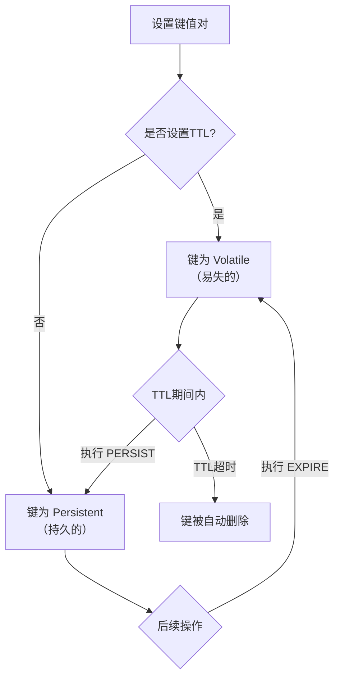
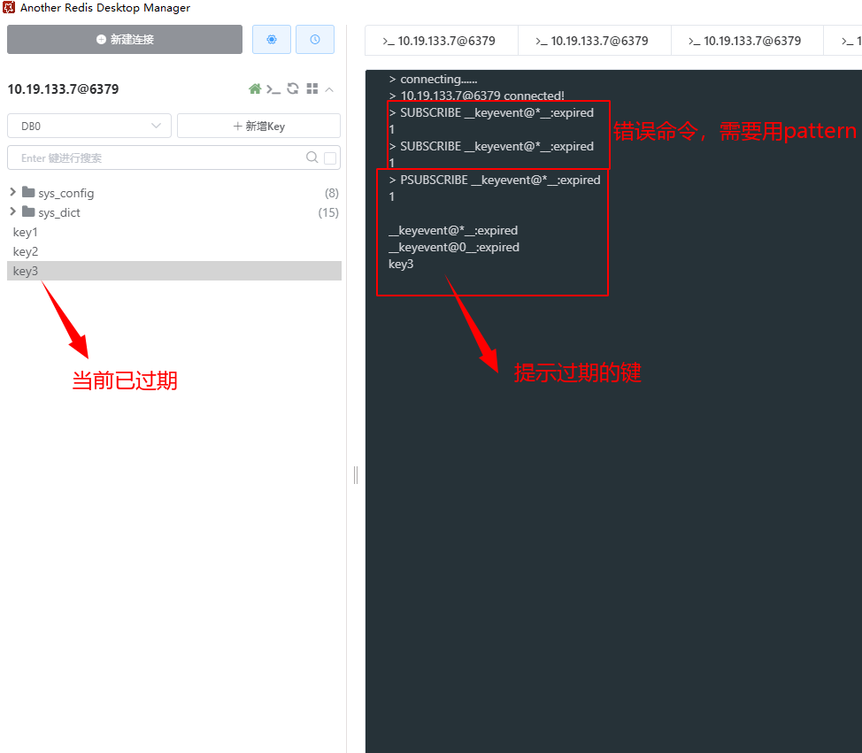
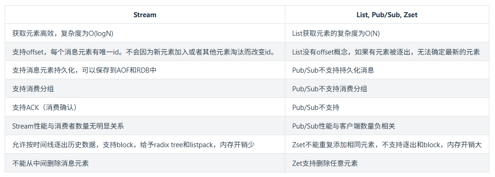

> 最后更新：2025-12-18 | [返回主目录](../README.md)
# 知识体系


# 一、Redis入门 - Redis概念和基础
> Redis是一种支持key-value等多种数据结构的存储系统。可用于缓存，事件发布或订阅，高速队列等场景。支持网络，提供字符串，哈希，列表，队列，集合结构直接存取，基于内存，可持久化。

## 1.1 什么是Redis

Redis是一款内存高速缓存数据库。Redis全称为：Remote Dictionary Server（远程数据服务），使用C语言编写，Redis是一个key-value存储系统（键值存储系统），支持丰富的数据类型，如：String、list、set、zset、hash。

Redis是一种支持key-value等多种数据结构的存储系统。可用于缓存，事件发布或订阅，高速队列等场景。支持网络，提供字符串，哈希，列表，队列，集合结构直接存取，基于内存，可持久化。

**官方资料**

Redis官网:http://redis.io/

Redis官方文档:http://redis.io/documentation

Redis教程:http://www.w3cschool.cn/redis/redis-intro.html

Redis下载:http://redis.io/download

## 1.2 为什么要使用Redis
> 一个产品的使用场景肯定是需要根据产品的特性，先列举一下Redis的特点：

- **读写性能优异**
  - Redis能读的速度是110000次/s,写的速度是81000次/s （测试条件见下一节）。
- **数据类型丰富**
  - Redis支持二进制案例的 Strings, Lists, Hashes, Sets 及 Ordered Sets 数据类型操作。
- **原子性**
  - Redis的所有操作都是原子性的，同时Redis还支持对几个操作全并后的原子性执行。
- **丰富的特性**
  - Redis支持 publish/subscribe, 通知, key 过期等特性。
- **持久化**
  - Redis支持RDB, AOF等持久化方式
- **发布订阅**
  - Redis支持发布/订阅模式
- **分布式**
  - Redis Cluster

（PS: 具体再结合下面的使用场景理解下）

> 下面是官方的bench-mark根据如下条件获得的性能测试**（读的速度是110000次/s,写的速度是81000次/s）**

- 测试完成了50个并发执行100000个请求。
- 设置和获取的值是一个256字节字符串。
- Linux box是运行Linux 2.6,这是X3320 Xeon 2.5 ghz。
- 文本执行使用loopback接口(127.0.0.1)。
## 1.3 Redis的使用场景
> redis应用场景总结

redis平时我们用到的地方蛮多的，下面就了解的应用场景做个总结：

### 1.3.1 热点数据的缓存
缓存是Redis最常见的应用场景，之所有这么使用，主要是因为Redis读写性能优异。而且逐渐有取代memcached，成为首选服务端缓存的组件。而且，Redis内部是支持事务的，在使用时候能有效保证数据的一致性。

作为缓存使用时，一般有两种方式保存数据：

- 读取前，先去读Redis，如果没有数据，读取数据库，将数据拉入Redis。
- 插入数据时，同时写入Redis。

方案一：实施起来简单，但是有两个需要注意的地方：

- 避免缓存击穿。（数据库没有就需要命中的数据，导致Redis一直没有数据，而一直命中数据库。）
- 数据的实时性相对会差一点。

方案二：数据实时性强，但是开发时不便于统一处理。

当然，两种方式根据实际情况来适用。如：方案一适用于对于数据实时性要求不是特别高的场景。方案二适用于字典表、数据量不大的数据存储。

### 1.3.2 限时业务的运用
redis中可以使用expire命令设置一个键的生存时间，到时间后redis会删除它。利用这一特性可以运用在限时的优惠活动信息、手机验证码等业务场景。

### 1.3.3 计数器相关问题
redis由于incrby命令可以实现原子性的递增，所以可以运用于高并发的秒杀活动、分布式序列号的生成、具体业务还体现在比如限制一个手机号发多少条短信、一个接口一分钟限制多少请求、一个接口一天限制调用多少次等等。

### 1.3.4 分布式锁
这个主要利用redis的setnx命令进行，setnx："set if not exists"就是如果不存在则成功设置缓存同时返回1，否则返回0 ，这个特性在很多后台中都有所运用，因为我们服务器是集群的，定时任务可能在两台机器上都会运行，所以在定时任务中首先 通过setnx设置一个lock， 如果成功设置则执行，如果没有成功设置，则表明该定时任务已执行。 当然结合具体业务，我们可以给这个lock加一个过期时间，比如说30分钟执行一次的定时任务，那么这个过期时间设置为小于30分钟的一个时间就可以，这个与定时任务的周期以及定时任务执行消耗时间相关。

在分布式锁的场景中，主要用在比如秒杀系统等。

### 1.3.5 延时操作
比如在订单生产后我们占用了库存，10分钟后去检验用户是否真正购买，如果没有购买将该单据设置无效，同时还原库存。 由于redis自2.8.0之后版本提供Keyspace Notifications功能，允许客户订阅Pub/Sub频道，以便以某种方式接收影响Redis数据集的事件。 所以我们对于上面的需求就可以用以下解决方案，我们在订单生产时，设置一个key，同时设置10分钟后过期， 我们在后台实现一个监听器，监听key的实效，监听到key失效时将后续逻辑加上。

当然我们也可以利用rabbitmq、activemq等消息中间件的延迟队列服务实现该需求。


**Keyspace Notifications 允许客户端通过 Redis 的发布/订阅（Pub/Sub）机制，来接收 Redis 数据库中键（key）的某些事件（event）的发生**。

你可以把它理解为 Redis 数据库的“**事件监听系统**”或“**触发器**”。当指定的操作（如键的增、删、改、过期等）发生时，Redis 会主动向一个特定的频道（Channel）发布一条消息。你的应用程序只需要订阅这些频道，就能实时感知到这些变化。

在没有这个功能之前，如果你想监控一个键何时被删除或过期，只能通过**轮询（polling）** 的方式，即不断地查询这个键是否存在。这种方式效率低下，会带来不必要的网络开销和 Redis 服务器压力。

**Keyspace Notifications 提供了事件驱动的解决方案**，避免了轮询，只有在事件真正发生时才会通知客户端。这在很多场景下非常有用：

1.  **缓存失效同步**：当某个缓存键因过期或被删除而失效时，立即通知应用层，以便从数据库重新加载数据。
2.  **分布式锁的自动释放监控**：监控用于分布式锁的键是否因过期而释放，以便处理异常情况。
3.  **数据一致性**：当主数据库的数据发生变化时，通过删除 Redis 中的对应缓存键来保证缓存一致性。Keyspace Notifications 可以通知其他服务缓存已失效。
4.  **审计与日志**：记录所有对重要键的操作，用于安全审计。
5.  **触发业务逻辑**：例如，用户认证令牌（token）过期时，自动执行清理或通知用户重新登录。

Redis 将通知分为两大类，通过两种不同的频道发布：

*   **键空间通知（Keyspace notification）**：
    *   **频道格式**：`__keyspace@<db>__:<key>`
    *   **关注点**：**某个键上发生了什么事件**。
    *   **消息内容**：事件的名字（如 `del`, `expire`, `set`）。
    *   **示例**：监听键 `mykey` 在数据库 0 上的事件。如果对 `mykey` 执行了 `DEL` 命令，订阅者会：
        *   **收到频道**：`__keyspace@0__:mykey`
        *   **收到消息**：`del`

*   **键事件通知（Key-event notification）**：
    *   **频道格式**：`__keyevent@<db>__:<event>`
    *   **关注点**：**发生某个事件的是哪个键**。
    *   **消息内容**：触发事件的键的名字。
    *   **示例**：监听数据库 0 中所有的删除事件。如果键 `mykey` 被删除，订阅者会：
        *   **收到频道**：`__keyevent@0__:del`
        *   **收到消息**：`mykey`


事件由一个字符表示，常见的包括：

*   **`g`**：通用事件，如 `DEL`, `EXPIRE`, `RENAME` 等。
*   **`$`**：字符串（String）相关命令的事件，如 `SET`, `APPEND` 等。
*   **`l`**：列表（List）相关命令的事件。
*   **`s`**：集合（Set）相关命令的事件。
*   **`h`**：哈希（Hash）相关命令的事件。
*   **`z`**：有序集合（Sorted Set）相关命令的事件。
*   **`x`**：过期事件（`EXPIRE` 命令产生的）。
*   **`e`**：驱逐事件（因内存不足，被 `maxmemory-policy` 淘汰）。
*   **`A`**：`g$lshzxe` 的别名，代表所有事件。

**特别注意过期事件**：
*   当键被 `EXPIRE` 设置过期时间时，会产生一个 `expire` 事件。
*   当键**真正因过期而被删除**时，会产生一个 `expired` 事件。我们通常更关心 `expired` 事件。

**如何配置和使用**

- 1. 开启功能（重要！）

**该功能默认是关闭的**，因为它会消耗额外的 CPU 资源。你需要通过修改 Redis 配置文件 `redis.conf` 或使用 `CONFIG SET` 命令来开启。

**配置参数：`notify-keyspace-events`**

*   **在 `redis.conf` 中配置**：
    ```bash
    notify-keyspace-events "Ex" # 例如，只开启过期事件
    ```
*   **在线动态配置（重启后失效）**：
    ```bash
    127.0.0.1:6379> CONFIG SET notify-keyspace-events "AKE"
    ```
    *   `"AKE"` 表示开启所有类型的 Keyspace 和 Key-event 通知（最全的配置）。
    *   `"Ex"` 表示只开启键事件（Key-event）通知中的过期（expired）事件。这是最常见的配置之一。

- 2. 客户端订阅示例

假设我们开启了过期事件（`notify-keyspace-events "Ex"`），我们可以用 `redis-cli` 来订阅所有数据库的键过期事件：

1.  **打开一个终端，订阅频道**（监听所有数据库的 `expired` 事件）：
    ```bash
    # 终端 1: 订阅者
    127.0.0.1:6379> PSUBSCRIBE __keyevent@*__:expired
    Reading messages... (press Ctrl-C to quit)
    1) "psubscribe"
    2) "__keyevent@*__:expired"
    3) (integer) 1
    ```

2.  **打开另一个终端，设置一个会过期的键**：
    ```bash
    # 终端 2: 操作者
    127.0.0.1:6379> SET my_session_token "some_data" EX 5 # 设置键，5秒后过期
    OK
    ```

3.  **观察第一个终端**，5 秒后你会看到如下消息：
    ```bash
    # 终端 1: 接收到的消息
    1) "pmessage"                # 消息类型（模式订阅）
    2) "__keyevent@*__:expired"  # 订阅的模式
    3) "__keyevent@0__:expired"  # 实际触发的完整频道名（数据库0的expired事件）
    4) "my_session_token"        # 消息内容：过期的键名
    ```
    这样，你的应用就知道 `my_session_token` 这个键已经过期了。


### 1.3.6 排行榜相关问题
关系型数据库在排行榜方面查询速度普遍偏慢，所以可以借助redis的SortedSet进行热点数据的排序。

比如点赞排行榜，做一个SortedSet, 然后以用户的openid作为上面的username, 以用户的点赞数作为上面的score, 然后针对每个用户做一个hash, 通过zrangebyscore就可以按照点赞数获取排行榜，然后再根据username获取用户的hash信息，这个当时在实际运用中性能体验也蛮不错的。

### 1.3.7 点赞、好友等相互关系的存储
Redis 利用集合的一些命令，比如求交集、并集、差集等。

在微博应用中，每个用户关注的人存在一个集合中，就很容易实现求两个人的共同好友功能。

### 1.3.8 简单队列
由于Redis有list push和list pop这样的命令，所以能够很方便的执行队列操作。

## <a id ='Redis Keyspace Notifications'>补充：Spring Boot 集成 Redis Keyspace Notifications 功能</a>

Spring Boot 集成 Redis Keyspace Notifications 功能非常方便，主要通过 `Spring Data Redis` 来实现。核心是利用 **`RedisMessageListenerContainer`** 来订阅特定频道并处理事件。

---

### 一、项目依赖 (pom.xml)

首先，确保 `pom.xml` 包含了 Spring Data Redis 的 starter 依赖。

```xml
<dependency>
    <groupId>org.springframework.boot</groupId>
    <artifactId>spring-boot-starter-data-redis</artifactId>
</dependency>
```

如果使用的是 Lettuce 连接池（推荐），可以额外添加：

```xml
<dependency>
    <groupId>org.apache.commons</groupId>
    <artifactId>commons-pool2</artifactId>
</dependency>
```

---

### 二、Redis 配置 (application.yml)

配置 Redis 连接信息和连接池（可选）。

```yaml
spring:
  redis:
    host: localhost
    port: 6379
    password: # 如果有密码则填写
    database: 0
    lettuce:
      pool:
        max-active: 8
        max-wait: -1
        max-idle: 8
        min-idle: 0
```

---

### 三、核心集成代码

#### 第1步：开启 Redis 的 Keyspace Notifications 功能

这是最关键的一步！**该功能默认关闭**。有两种方式开启：

**方式A：通过 Redis CLI 动态配置（重启 Redis 后失效）**
```bash
# 连接到 Redis
redis-cli

# 开启所有键空间和键事件通知（最全，但开销大，用于测试）
127.0.0.1:6379> CONFIG SET notify-keyspace-events "AKE"

# 或者，更常用的：只开启键事件通知中的过期事件（最实用）
127.0.0.1:6379> CONFIG SET notify-keyspace-events "Ex"
```

**方式B：通过修改 Redis 配置文件（永久生效）**
找到 `redis.conf` 文件，添加或修改以下行：
```conf
# 开启过期事件通知
notify-keyspace-events "Ex"
```
然后重启 Redis 服务。

#### 第2步：创建 Redis 配置类

这个配置类负责创建消息监听容器，并订阅我们感兴趣的事件频道。

```java
import org.springframework.context.annotation.Bean;
import org.springframework.context.annotation.Configuration;
import org.springframework.data.redis.connection.RedisConnectionFactory;
import org.springframework.data.redis.listener.PatternTopic;
import org.springframework.data.redis.listener.RedisMessageListenerContainer;
import org.springframework.data.redis.listener.Topic;

@Configuration
public class RedisListenerConfig {

    /**
     * 创建消息监听容器
     *
     * @param connectionFactory Redis 连接工厂
     * @return RedisMessageListenerContainer
     */
    @Bean
    public RedisMessageListenerContainer redisMessageListenerContainer(RedisConnectionFactory connectionFactory) {
        RedisMessageListenerContainer container = new RedisMessageListenerContainer();
        container.setConnectionFactory(connectionFactory);

        // 定义监听的主题（Topic）
        // 这里我们订阅所有数据库（@*）的键过期事件（__keyevent@*__:expired）
        Topic topic = new PatternTopic("__keyevent@*__:expired");

        // 添加消息监听器，并指定接收消息的方法名 "handleMessage"
        container.addMessageListener(new RedisKeyExpirationListener(), topic);
        return container;
    }
}
```

#### 第3步：创建具体的消息监听器

这个类负责处理当订阅的频道有消息发布时，具体的业务逻辑。

```java
import lombok.extern.slf4j.Slf4j;
import org.springframework.data.redis.connection.Message;
import org.springframework.data.redis.connection.MessageListener;
import org.springframework.stereotype.Component;

/**
 * Redis 键过期事件监听器
 * 实现 MessageListener 接口
 */
@Slf4j
@Component
public class RedisKeyExpirationListener implements MessageListener {

    /**
     * 处理接收到的过期事件消息
     *
     * @param message 消息内容，其中 message.getBody() 就是过期的那个 key
     * @param pattern 模式（频道模式）
     */
    @Override
    public void onMessage(Message message, byte[] pattern) {
        // 获取过期的 key
        String expiredKey = new String(message.getBody());
        // 获取事件发生的频道
        String channel = new String(message.getChannel());

        log.info("监听到 Redis 键过期事件：");
        log.info("频道 [{}]", channel);
        log.info("过期的键 [{}]", expiredKey);

        // === 在这里编写你的核心业务逻辑 ===
        handleExpiredKey(expiredKey);
    }

    /**
     * 根据过期的 key 执行相应的业务逻辑
     *
     * @param expiredKey 过期的键
     */
    private void handleExpiredKey(String expiredKey) {
        try {
            // 示例1：处理用户会话过期
            if (expiredKey.startsWith("USER_SESSION:")) {
                String userId = expiredKey.replace("USER_SESSION:", "");
                log.info("用户 {} 的会话已过期，执行清理逻辑...", userId);
                // 例如：通知用户、清理相关资源等
                // userService.cleanupAfterSessionExpired(userId);
            }

            // 示例2：处理订单超时未支付
            if (expiredKey.startsWith("ORDER_TIMEOUT:")) {
                String orderId = expiredKey.replace("ORDER_TIMEOUT:", "");
                log.info("订单 {} 支付超时，自动取消订单...", orderId);
                // 例如：将订单状态更新为“已取消”
                // orderService.cancelOrderDueToTimeout(orderId);
            }

            // 示例3：处理分布式锁自动释放
            if (expiredKey.startsWith("LOCK:")) {
                log.info("分布式锁 {} 因过期而释放", expiredKey);
                // 可以记录日志或执行一些补偿逻辑
            }

        } catch (Exception e) {
            // 一定要捕获异常，避免监听器因异常而退出
            log.error("处理过期键 [{}] 的业务逻辑时发生错误：", expiredKey, e);
        }
    }
}
```

---

### 四、测试代码

可以写一个简单的 Controller 或单元测试来验证功能。

```java
import org.springframework.beans.factory.annotation.Autowired;
import org.springframework.data.redis.core.StringRedisTemplate;
import org.springframework.web.bind.annotation.GetMapping;
import org.springframework.web.bind.annotation.PathVariable;
import org.springframework.web.bind.annotation.RestController;

@RestController
public class TestController {

    @Autowired
    private StringRedisTemplate stringRedisTemplate;

    /**
     * 设置一个会过期的键，用于测试监听器
     * 访问： http://localhost:8080/set/key/5
     */
    @GetMapping("/set/{key}/{ttl}")
    public String setKeyWithTtl(@PathVariable String key, @PathVariable Long ttl) {
        // 设置一个键，并指定过期时间（单位：秒）
        stringRedisTemplate.opsForValue().set("ORDER_TIMEOUT:" + key, "some_value", ttl, java.util.concurrent.TimeUnit.SECONDS);
        return String.format("键 'ORDER_TIMEOUT:%s' 已设置，%d 秒后过期。请查看控制台日志。", key, ttl);
    }
}
```

**测试步骤：**
1.  启动 Spring Boot 应用。
2.  确保 Redis 的 `notify-keyspace-events` 已正确配置（通过 `CONFIG GET notify-keyspace-events` 命令检查）。
3.  在浏览器中访问 `http://localhost:8080/set/order123/10`。
4.  观察应用控制台，10 秒后将看到类似的日志输出：
    ```
    监听到 Redis 键过期事件：
    频道 [__keyevent@0__:expired]
    过期的键 [ORDER_TIMEOUT:order123]
    订单 order123 支付超时，自动取消订单...
    ```

---

### 五、重要注意事项（生产环境必读）

1.  **事件丢失问题**：Redis 的 Pub/Sub 是**不可靠**的。如果服务在事件发生期间重启或网络中断，会丢失事件。**不要用它来做核心金融业务或强一致性要求的场景**。
2.  **性能开销**：监听器是单线程顺序处理的。如果过期事件非常频繁，可能导致处理堆积。确保你的 `handleExpiredKey` 方法执行速度足够快，或者使用异步处理。
3.  **消息重复**：在某些网络分区或重连情况下，**有可能收到重复的消息**。的业务逻辑最好能做到幂等（即处理多次和处理一次的效果相同）。
4.  **异步处理改进**：为了不阻塞监听线程，可以将接收到的消息放入一个内部队列（如 `Disruptor` 或 `BlockingQueue`），然后由工作线程池异步处理。

**改进示例（异步处理）：**
```java
@Component
public class RedisKeyExpirationListener implements MessageListener {

    // 创建一个专用的线程池来处理过期事件
    private final ExecutorService executorService = Executors.newFixedThreadPool(5);

    @Override
    public void onMessage(Message message, byte[] pattern) {
        String expiredKey = new String(message.getBody());
        // 提交到线程池异步执行，不阻塞 Redis 的订阅线程
        executorService.submit(() -> {
            handleExpiredKey(expiredKey);
        });
    }
    // ... handleExpiredKey 方法不变
}
```
## 补充：设置过期时间及其逆操作
### 核心概念：键的生存时间（TTL）

在 Redis 中，可以为任何键设置一个生存时间。一旦超过这个时间，键就会**自动被服务器删除**。这是一个非常实用的功能，常用于实现缓存、验证码过期、会话管理等场景。

- **TTL 的单位**：通常为秒或毫秒。
- **键的状态**：
    - **有生存时间（Volatile）**：键被设置了 TTL。
    - **无生存时间（Persistent）**：键没有被设置 TTL，将永久存在。

---

### 1. EXPIRE 命令

`EXPIRE` 命令用于为一个已存在的键设置生存时间。如果键不存在，命令返回 `0`。

**语法：**
```
EXPIRE key seconds
```

**参数：**
- `key`：需要设置生存时间的键名。
- `seconds`：生存时间，以秒为单位。

**返回值：**
- `1`：如果生存时间设置成功。
- `0`：如果键不存在，设置失败。

**示例：**
```bash
# 先设置一个键
127.0.0.1:6379> SET mykey "Hello"
"OK"

# 为 mykey 设置 10 秒后过期
127.0.0.1:6379> EXPIRE mykey 10
(integer) 1

# 立即查看，键还存在
127.0.0.1:6379> GET mykey
"Hello"

# 10 秒后再次查看，键已被自动删除
127.0.0.1:6379> GET mykey
(nil)
```

**相关命令：**
- `PEXPIRE key milliseconds`：功能同 `EXPIRE`，但时间单位是毫秒。
- `EXPIREAT key timestamp`：设置键在某个特定的 UNIX 时间戳（秒级）过期。
- `PEXPIREAT key timestamp`：设置键在某个特定的 UNIX 时间戳（毫秒级）过期。
- `SET key value EX seconds`：在设置键值的同时直接设置过期时间（更常用的做法）。

---

### 2. PERSIST 命令

`PERSIST` 命令是 `EXPIRE` 的逆操作。它用于**移除一个键的生存时间**，使其从“易失的”变为“持久的”，即永久有效。

**语法：**
```
PERSIST key
```

**参数：**
- `key`：需要移除生存时间的键名。

**返回值：**
- `1`：如果生存时间被成功移除。
- `0`：如果键不存在**或**键本来就没有设置生存时间。

**示例：**
```bash
# 设置一个键，并让其 60 秒后过期
127.0.0.1:6379> SET session:user123 "some_data" EX 60
"OK"

# 查看剩余生存时间
127.0.0.1:6379> TTL session:user123
(integer) 55  # 还剩55秒

# 使用 PERSIST 移除过期时间
127.0.0.1:6379> PERSIST session:user123
(integer) 1   # 移除成功

# 再次检查 TTL，返回 -1 表示键没有设置生存时间（永久有效）
127.0.0.1:6379> TTL session:user123
(integer) -1

# 此时，这个键将永远不会自动过期
127.0.0.1:6379> GET session:user123
"some_data"
```

---

### 关键命令：TTL 和 PTTL

要查看一个键的生存时间状态，需要使用 `TTL` 或 `PTTL` 命令。

- `TTL key`：返回键剩余的生存时间，**单位是秒**。
- `PTTL key`：返回键剩余的生存时间，**单位是毫秒**。

**返回值的含义：**
- **正整数**：键剩余的生存时间（秒或毫秒）。
- `-1`：键存在，但**没有设置生存时间**（是持久的）。
- `-2`：键**不存在**。（也可能是因为已过期被删除后你去查询）。

**示例：**
```bash
127.0.0.1:6379> SET mykey "hello" EX 100
"OK"
127.0.0.1:6379> TTL mykey
(integer) 96   # 大约还剩96秒
127.0.0.1:6379> PERSIST mykey
(integer) 1
127.0.0.1:6379> TTL mykey
(integer) -1   # 变为永久键
```

---

### 总结与工作流程

`EXPIRE` 和 `PERSIST` 命令的工作流程可以总结为下图：



你可以这样理解它们的关系：

- **`EXPIRE`** 就像给一个键上了个**定时炸弹**，倒计时结束键就“消失”。
- **`PERSIST`** 就像**拆弹专家**，在倒计时结束前成功拆弹，让键恢复“安全”（永久存在）。

# 二、Redis入门 - 数据类型：5种基础数据类型详解


> Redis所有的key（键）都是字符串。我们在谈基础数据结构时，讨论的是存储值的数据类型，主要包括常见的5种数据类型，分别是：String、List、Set、Zset、Hash

## 2.1 Redis数据结构简介
Redis基础文章非常多，关于基础数据结构类型，我推荐你先看下<a href ='https://redis.io/docs/latest/develop/data-types/'>官方网站</a>内容，然后再看下面的小结

首先对redis来说，所有的key（键）都是字符串。我们在谈基础数据结构时，讨论的是存储值的数据类型，主要包括常见的5种数据类型，分别是：String、List、Set、Zset、Hash。


| 结构类型       | 结构存储的值                                     | 结构的读写能力                                                                                                 |
|----------------|--------------------------------------------------|--------------------------------------------------------------------------------------------------------------|
| **String字符串**   | 可以是字符串、整数或浮点数                         | 对整个字符串或字符串的一部分进行操作；对整数或浮点数进行自增或自减操作                                         |
| **List列表**       | 一个链表，链表上的每个节点都包含一个字符串         | 对链表的两端进行push和pop操作，读取单个或多个元素；根据值查找或删除元素                                       |
| **Set集合**        | 包含字符串的无序集合                             | 字符串的集合，包含基础的方法有看是否存在添加、获取、删除；还包含计算交集、并集、差集等                         |
| **Hash散列**       | 包含键值对的无序散列表                           | 包含方法有添加、获取、删除单个元素                                                                           |
| **Zset有序集合**   | 和散列一样，用于存储键值对；字符串成员与浮点数分数之间的有序映射；元素的排列顺序由分数的大小决定 | 包含方法有添加、获取、删除单个元素以及根据分值范围或成员来获取元素                                             |


## 2.2 基础数据结构详解
> 内容其实比较简单，我觉得理解的重点在于这个结构怎么用，能够用来做什么？所以我在梳理时，围绕**图例，命令，执行和场景**来阐述。
### 2.2.1 String字符串
> String是redis中最基本的数据类型，一个key对应一个value。

String类型是二进制安全的，意思是 redis 的 string 可以包含任何数据。如数字，字符串，jpg图片或者序列化的对象。

- 图例

下图是一个String类型的实例，其中键为hello，值为world


- 命令使用

| 命令   | 简述                     | 使用               |
|--------|--------------------------|--------------------|
| GET    | 获取存储在给定键中的值     | GET name           |
| SET    | 设置存储在给定键中的值     | SET name value     |
| DEL    | 删除存储在给定键中的值     | DEL name           |
| INCR   | 将键存储的值加1           | INCR key           |
| DECR   | 将键存储的值减1           | DECR key           |
| INCRBY | 将键存储的值加上整数       | INCRBY key amount  |
| DECRBY | 将键存储的值减去整数       | DECRBY key amount  |

- 命令执行
```sh
127.0.0.1:6379> set hello world
OK
127.0.0.1:6379> get hello
"world"
127.0.0.1:6379> del hello
(integer) 1
127.0.0.1:6379> get hello
(nil)
127.0.0.1:6379> set counter 2
OK
127.0.0.1:6379> get counter
"2"
127.0.0.1:6379> incr counter
(integer) 3
127.0.0.1:6379> get counter
"3"
127.0.0.1:6379> incrby counter 100
(integer) 103
127.0.0.1:6379> get counter
"103"
127.0.0.1:6379> decr counter
(integer) 102
127.0.0.1:6379> get counter
"102"
```
- 实战场景
  - **缓存：** 经典使用场景，把常用信息，字符串，图片或者视频等信息放到redis中，redis作为缓存层，mysql做持久化层，降低mysql的读写压力。
  - **计数器：**redis是单线程模型，一个命令执行完才会执行下一个，同时数据可以一步落地到其他的数据源。
  - **session：**常见方案spring session + redis实现session共享，
### 2.2.2 List列表
> Redis中的List其实就是链表（Redis用双端链表实现List）。

使用List结构，我们可以轻松地实现最新消息排队功能（比如新浪微博的TimeLine）。List的另一个应用就是消息队列，可以利用List的 PUSH 操作，将任务存放在List中，然后工作线程再用 POP 操作将任务取出进行执行。

- 图例


- 命令使用

| 命令   | 简述                                                                       | 使用               |
|--------|----------------------------------------------------------------------------|--------------------|
| RPUSH  | 将给定值推入到列表右端                                                   | RPUSH key value    |
| LPUSH  | 将给定值推入到列表左端                                                   | LPUSH key value    |
| RPOP   | 从列表的右端弹出一个值，并返回被弹出的值                                   | RPOP key           |
| LPOP   | 从列表的左端弹出一个值，并返回被弹出的值                                   | LPOP key           |
| LRANGE | 获取列表在给定范围上的所有值                                             | LRANGE key 0 -1    |
| LINDEX | 通过索引获取列表中的元素。你也可以使用负数下标，以 -1 表示列表的最后一个元素， -2 表示列表的倒数第二个元素，以此类推。 | LINDEX key index   |
| LTRIM | 修剪列表，只保留指定范围内的元素 | LTRIM key start stop |

- 使用列表的技巧
  - lpush+lpop=Stack(栈)
  - lpush+rpop=Queue（队列）
  - lpush+ltrim=Capped Collection（有限集合）
  - lpush+rpop=Message Queue（消息队列）

- 命令执行
```sh
127.0.0.1:6379> lpush mylist 1 2 ll ls mem
(integer) 5
127.0.0.1:6379> lrange mylist 0 -1
1) "mem"
2) "ls"
3) "ll"
4) "2"
5) "1"
127.0.0.1:6379> lindex mylist -1
"1"
127.0.0.1:6379> lindex mylist 10        # index不在 mylist 的区间范围内
(nil)
```
- 实战场景
  - **微博TimeLine:** 有人发布微博，用lpush加入时间轴，展示新的列表信息。
  - **消息队列**

### 2.2.3 Set集合
> Redis 的 Set 是 String 类型的无序集合。集合成员是唯一的，这就意味着集合中不能出现重复的数据。

Redis 中集合是通过哈希表实现的，所以添加，删除，查找的复杂度都是 O(1)。

- 图例


- 命令使用

| 命令     | 简述                             | 使用                 |
|----------|----------------------------------|----------------------|
| SADD     | 向集合添加一个或多个成员         | SADD key value       |
| SCARD    | 获取集合的成员数                 | SCARD key            |
| SMEMBERS | 返回集合中的所有成员             | SMEMBERS key member  |
| SISMEMBER| 判断 member 元素是否是集合 key 的成员 | SISMEMBER key member |

其它一些集合操作，请参考这里 https://www.runoob.com/redis/redis-sets.html

- 命令执行
```sh
127.0.0.1:6379> sadd myset hao hao1 xiaohao hao
(integer) 3
127.0.0.1:6379> smembers myset
1) "xiaohao"
2) "hao1"
3) "hao"
127.0.0.1:6379> sismember myset hao
(integer) 1
```
- 实战场景
  - **标签（tag）**,给用户添加标签，或者用户给消息添加标签，这样有同一标签或者类似标签的可以给推荐关注的事或者关注的人。
  - **点赞，或点踩，收藏等**，可以放到set中实现
### 2.2.4 Hash散列
Redis hash 是一个 string 类型的 field（字段） 和 value（值） 的映射表，hash 特别适合用于存储对象。

- 图例


- 命令使用

| 命令   | 简述                                     | 使用                     |
|--------|------------------------------------------|--------------------------|
| HSET   | 添加键值对                               | HSET hash-key sub-key1 value1 |
| HGET   | 获取指定散列键的值                       | HGET hash-key key1        |
| HGETALL| 获取散列中包含的所有键值对               | HGETALL hash-key          |
| HDEL   | 如果给定键存在于散列中，那么就移除这个键 | HDEL hash-key sub-key1    |

- 命令执行
```sh
127.0.0.1:6379> hset user name1 hao
(integer) 1
127.0.0.1:6379> hset user email1 hao@163.com
(integer) 1
127.0.0.1:6379> hgetall user
1) "name1"
2) "hao"
3) "email1"
4) "hao@163.com"
127.0.0.1:6379> hget user user
(nil)
127.0.0.1:6379> hget user name1
"hao"
127.0.0.1:6379> hset user name2 xiaohao
(integer) 1
127.0.0.1:6379> hset user email2 xiaohao@163.com
(integer) 1
127.0.0.1:6379> hgetall user
1) "name1"
2) "hao"
3) "email1"
4) "hao@163.com"
5) "name2"
6) "xiaohao"
7) "email2"
8) "xiaohao@163.com"
```
- 实战场景
  - 缓存： 能直观，相比string更节省空间，的维护缓存信息，如用户信息，视频信息等。
### 2.2.5 Zset有序集合
> Redis 有序集合和集合一样也是 string 类型元素的集合,且不允许重复的成员。不同的是每个元素都会关联一个 double 类型的分数。redis 正是通过分数来为集合中的成员进行从小到大的排序。

有序集合的成员是唯一的, 但分数(score)却可以重复。有序集合是通过两种数据结构实现：

压缩列表(ziplist): ziplist是为了提高存储效率而设计的一种特殊编码的双向链表。它可以存储字符串或者整数，存储整数时是采用整数的二进制而不是字符串形式存储。它能在O(1)的时间复杂度下完成list两端的push和pop操作。但是因为每次操作都需要重新分配ziplist的内存，所以实际复杂度和ziplist的内存使用量相关
跳跃表(zSkiplist): 跳跃表的性能可以保证在查找，删除，添加等操作的时候在对数期望时间内完成，这个性能是可以和平衡树来相比较的，而且在实现方面比平衡树要优雅，这是采用跳跃表的主要原因。跳跃表的复杂度是O(log(n))。
- 图例


- 命令使用

| 命令   | 简述                                     | 使用                     |
|--------|------------------------------------------|--------------------------|
| ZADD   | 将一个带有给定分值的成员添加到有序集合里面 | ZADD zset-key 178 member1 |
| ZRANGE | 根据元素在有序集合中所处的位置，从有序集合中获取多个元素 | ZRANGE zset-key 0-1 withscores |
| ZREM   | 如果给定元素成员存在于有序集合中，那么就移除这个元素 | ZREM zset-key member1 |

更多命令请参考这里 https://www.runoob.com/redis/redis-sorted-sets.html

- 命令执行
```sh
127.0.0.1:6379> zadd myscoreset 100 hao 90 xiaohao
(integer) 2
127.0.0.1:6379> ZRANGE myscoreset 0 -1
1) "xiaohao"
2) "hao"
127.0.0.1:6379> ZSCORE myscoreset hao
"100"
```
- 实战场景
  - **排行榜:** 有序集合经典使用场景。例如小说视频等网站需要对用户上传的小说视频做排行榜，榜单可以按照用户关注数，更新时间，字数等打分，做排行。
# 三、Redis入门 - 数据类型：3种特殊类型详解
> Redis除了上文中5种基础数据类型，还有三种特殊的数据类型，分别是 HyperLogLogs（基数统计）， Bitmaps (位图) 和 geospatial （地理位置）。

## 3.1 HyperLogLogs（基数统计）
> Redis 2.8.9 版本更新了 Hyperloglog 数据结构！

- 什么是基数？

举个例子，A = {1, 2, 3, 4, 5}， B = {3, 5, 6, 7, 9}；那么基数（不重复的元素）= 1, 2, 3, 4, 5, 6, 7, 9； （允许容错，即可以接受一定误差）

- HyperLogLogs 基数统计用来解决什么问题？

这个结构可以非常省内存的去统计各种计数，比如注册 IP 数、每日访问 IP 数、页面实时UV、在线用户数，共同好友数等。

- 它的优势体现在哪？

一个大型的网站，每天 IP 比如有 100 万，粗算一个 IP 消耗 15 字节，那么 100 万个 IP 就是 15M。而 HyperLogLog 在 Redis 中每个键占用的内容都是 12K，理论存储近似接近 2^64 个值，不管存储的内容是什么，它一个基于基数估算的算法，只能比较准确的估算出基数，可以使用少量固定的内存去存储并识别集合中的唯一元素。而且这个估算的基数并不一定准确，是一个带有 0.81% 标准错误的近似值（对于可以接受一定容错的业务场景，比如IP数统计，UV等，是可以忽略不计的）。

- 相关命令使用
```sh
127.0.0.1:6379> pfadd key1 a b c d e f g h i	# 创建第一组元素
(integer) 1
127.0.0.1:6379> pfcount key1					# 统计元素的基数数量
(integer) 9
127.0.0.1:6379> pfadd key2 c j k l m e g a		# 创建第二组元素
(integer) 1
127.0.0.1:6379> pfcount key2
(integer) 8
127.0.0.1:6379> pfmerge key3 key1 key2			# 合并两组：key1 key2 -> key3 并集
OK
127.0.0.1:6379> pfcount key3
(integer) 13
```

- 说明
  - HyperLogLogs的每个key对应的值都不会重复的，重复写入只会保留一个
  - 两个HyperLogLogs的key合并也是去重，重复的只保留一个
  - HyperLogLogs存储无法查看具体的内容只能统计个数
## 3.2 Bitmap （位存储）
> Bitmap 即位图数据结构，都是操作二进制位来进行记录，只有0 和 1 两个状态。

- 用来解决什么问题？

比如：统计用户信息，活跃，不活跃！ 登录，未登录！ 打卡，不打卡！ **两个状态的，都可以使用 Bitmaps！**

如果存储一年的打卡状态需要多少内存呢？ 365 天 = 365 bit 1字节 = 8bit 46 个字节左右！

- 相关命令使用

使用bitmap 来记录 周一到周日的打卡！ 周一：1 周二：0 周三：0 周四：1 ......
```sh
127.0.0.1:6379> setbit sign 0 1
(integer) 0
127.0.0.1:6379> setbit sign 1 1
(integer) 0
127.0.0.1:6379> setbit sign 2 0
(integer) 0
127.0.0.1:6379> setbit sign 3 1
(integer) 0
127.0.0.1:6379> setbit sign 4 0
(integer) 0
127.0.0.1:6379> setbit sign 5 0
(integer) 0
127.0.0.1:6379> setbit sign 6 1
(integer) 0
```
查看某一天是否有打卡！
```sh
127.0.0.1:6379> getbit sign 3
(integer) 1
127.0.0.1:6379> getbit sign 5
(integer) 0
```
统计操作，统计 打卡的天数！
```sh
127.0.0.1:6379> bitcount sign # 统计这周的打卡记录，就可以看到是否有全勤！
(integer) 3
```
## 3.3 geospatial (地理位置)
> Redis 的 Geo 在 Redis 3.2 版本就推出了! 这个功能可以推算地理位置的信息: 两地之间的距离, 方圆几里的人

### 3.3.1 geoadd
> 添加地理位置
```sh
127.0.0.1:6379> geoadd china:city 118.76 32.04 nanjing 112.55 37.86 taiyuan 123.43 41.80 shenyang
(integer) 3
127.0.0.1:6379> geoadd china:city 144.05 22.52 shengzhen 120.16 30.24 hangzhou 108.96 34.26 xian
(integer) 3
```
**规则**

两级无法直接添加，我们一般会下载城市数据(这个网址可以查询 GEO： http://www.jsons.cn/lngcode)！

- 有效的经度从-180度到180度。
- 有效的纬度从-85.05112878度到85.05112878度。
```sh
# 当坐标位置超出上述指定范围时，该命令将会返回一个错误。
127.0.0.1:6379> geoadd china:city 39.90 116.40 beijin
(error) ERR invalid longitude,latitude pair 39.900000,116.400000
```
### 3.3.2 geopos
> 获取指定的成员的经度和纬度
```sh
127.0.0.1:6379> geopos china:city taiyuan manjing
1) 1) "112.54999905824661255"
   1) "37.86000073876942196"
2) 1) "118.75999957323074341"
   1) "32.03999960287850968"
```
获得当前定位, 一定是一个坐标值!

### 3.3.3 geodist
> 如果不存在, 返回空

单位如下

- m
- km
- mi 英里
- ft 英尺
```sh
127.0.0.1:6379> geodist china:city taiyuan shenyang m
"1026439.1070"
127.0.0.1:6379> geodist china:city taiyuan shenyang km
"1026.4391"
```
### 3.3.4 georadius
> 附近的人 ==> 获得所有附近的人的地址, 定位, 通过半径来查询

获得指定数量的人
```sh
127.0.0.1:6379> georadius china:city 110 30 1000 km			以 100,30 这个坐标为中心, 寻找半径为1000km的城市
1) "xian"
2) "hangzhou"
3) "manjing"
4) "taiyuan"
127.0.0.1:6379> georadius china:city 110 30 500 km
1) "xian"
127.0.0.1:6379> georadius china:city 110 30 500 km withdist
1) 1) "xian"
   1) "483.8340"
127.0.0.1:6379> georadius china:city 110 30 1000 km withcoord withdist count 2
1) 1) "xian"
   1) "483.8340"
   2) 1) "108.96000176668167114"
      1) "34.25999964418929977"
2) 1) "manjing"
   1) "864.9816"
   2) 1) "118.75999957323074341"
      1) "32.03999960287850968"
```
参数 key 经度 纬度 半径 单位 [显示结果的经度和纬度] [显示结果的距离] [显示的结果的数量]

### 3.3.5 georadiusbymember
> 显示与指定成员一定半径范围内的其他成员
```sh
127.0.0.1:6379> georadiusbymember china:city taiyuan 1000 km
1) "manjing"
2) "taiyuan"
3) "xian"
127.0.0.1:6379> georadiusbymember china:city taiyuan 1000 km withcoord withdist count 2
1) 1) "taiyuan"
   2) "0.0000"
   3) 1) "112.54999905824661255"
      2) "37.86000073876942196"
2) 1) "xian"
   2) "514.2264"
   3) 1) "108.96000176668167114"
      2) "34.25999964418929977"
```
参数与 georadius 一样

### 3.3.6 geohash(较少使用)
> 该命令返回11个字符的hash字符串
```sh
127.0.0.1:6379> geohash china:city taiyuan shenyang
1) "ww8p3hhqmp0"
2) "wxrvb9qyxk0"
```
将二维的经纬度转换为一维的字符串, 如果两个字符串越接近, 则距离越近

### 3.3.7 底层
> geo底层的实现原理实际上就是Zset, 我们可以通过Zset命令来操作geo
```sh
127.0.0.1:6379> type china:city
zset
```
查看全部元素 删除指定的元素
```sh
127.0.0.1:6379> zrange china:city 0 -1 withscores
 1) "xian"
 2) "4040115445396757"
 3) "hangzhou"
 4) "4054133997236782"
 5) "manjing"
 6) "4066006694128997"
 7) "taiyuan"
 8) "4068216047500484"
 9) "shenyang"
1)  "4072519231994779"
2)  "shengzhen"
3)  "4154606886655324"
127.0.0.1:6379> zrem china:city manjing
(integer) 1
127.0.0.1:6379> zrange china:city 0 -1
1) "xian"
2) "hangzhou"
3) "taiyuan"
4) "shenyang"
5) "shengzhen"
```
# 四、Redis入门 - 数据类型：Stream详解
> Redis5.0 中还增加了一个数据类型Stream，它借鉴了Kafka的设计，是一个新的强大的支持多播的可持久化的消息队列。

用过Redis做消息队列的都了解，基于Reids的消息队列实现有很多种，例如：

- **PUB/SUB，订阅/发布模式**
  - 但是发布订阅模式是无法持久化的，如果出现网络断开、Redis 宕机等，消息就会被丢弃；
- 基于**List LPUSH+BRPOP** 或者 基于**Sorted-Set**的实现
  - 支持了持久化，但是不支持多播，分组消费等

为什么上面的结构无法满足广泛的MQ场景？ 这里便引出一个核心的问题：如果我们期望设计一种数据结构来实现消息队列，最重要的就是要理解**设计一个消息队列需要考虑什么**？初步的我们很容易想到

- 消息的生产
- 消息的消费
  - 单播和多播（多对多）
  - 阻塞和非阻塞读取
- 消息有序性
- 消息的持久化

其它还要考虑啥嗯？借助美团技术团队的一篇文章，<a href='https://tech.meituan.com/2016/07/01/mq-design.html'>消息队列设计精要</a>中的图


我们不妨看看Redis考虑了哪些设计？

- 消息ID的序列化生成
- 消息遍历
- 消息的阻塞和非阻塞读取
- 消息的分组消费
- 未完成消息的处理
- 消息队列监控
- ...
> 这也是我们需要理解Stream的点，但是结合上面的图，我们也应该理解Redis Stream也是一种超轻量MQ并没有完全实现消息队列所有设计要点，这决定着它适用的场景。

## 4.1 Stream详解
> 经过梳理总结，我认为从以下几个大的方面去理解Stream是比较合适的，总结如下：

- Stream的结构设计
- 生产和消费
  - 基本的增删查改
  - 单一消费者的消费
  - 消费组的消费
- 监控状态
### 4.1.1 Stream的结构
每个 Stream 都有唯一的名称，它就是 Redis 的 key，在我们首次使用 xadd 指令追加消息时自动创建。


上图解析：

- `Consumer Group` ：消费组，使用 XGROUP CREATE 命令创建，一个消费组有多个消费者(Consumer), 这些消费者之间是竞争关系。
- `last_delivered_id` ：游标，每个消费组会有个游标 `last_delivered_id`，任意一个消费者读取了消息都会使游标 `last_delivered_id` 往前移动。
- `pending_ids` ：消费者(Consumer)的状态变量，作用是维护消费者的未确认的 id。 `pending_ids` 记录了当前已经被客户端读取的消息，但是还没有 ack (Acknowledge character：确认字符)。如果客户端没有ack，这个变量里面的消息ID会越来越多，一旦某个消息被ack，它就开始减少。这个pending_ids变量在Redis官方被称之为PEL，也就是Pending Entries List，这是一个很核心的数据结构，它用来确保客户端至少消费了消息一次，而不会在网络传输的中途丢失了没处理。

此外我们还需要理解两点：

- `消息ID`: 消息ID的形式是timestampInMillis-sequence，例如1527846880572-5，它表示当前的消息在毫米时间戳1527846880572时产生，并且是该毫秒内产生的第5条消息。消息ID可以由服务器自动生成，也可以由客户端自己指定，但是形式必须是整数-整数，而且必须是后面加入的消息的ID要大于前面的消息ID。
- `消息内容`: 消息内容就是键值对，形如hash结构的键值对，这没什么特别之处。

### 4.1.2 增删改查
消息队列相关命令：

- XADD - 添加消息到末尾
- XTRIM - 对流进行修剪，限制长度
- XDEL - 删除消息
- XLEN - 获取流包含的元素数量，即消息长度
- XRANGE - 获取消息列表，会自动过滤已经删除的消息
- XREVRANGE - 反向获取消息列表，ID 从大到小
- XREAD - 以阻塞或非阻塞方式获取消息列表
```sh
# *号表示服务器自动生成ID，后面顺序跟着一堆key/value
127.0.0.1:6379> xadd codehole * name laoqian age 30  #  名字叫laoqian，年龄30岁
1527849609889-0  # 生成的消息ID
127.0.0.1:6379> xadd codehole * name xiaoyu age 29
1527849629172-0
127.0.0.1:6379> xadd codehole * name xiaoqian age 1
1527849637634-0
127.0.0.1:6379> xlen codehole
(integer) 3
127.0.0.1:6379> xrange codehole - +  # -表示最小值, +表示最大值
127.0.0.1:6379> xrange codehole - +
1) 1) 1527849609889-0
   1) 1) "name"
      1) "laoqian"
      2) "age"
      3) "30"
2) 1) 1527849629172-0
   1) 1) "name"
      1) "xiaoyu"
      2) "age"
      3) "29"
3) 1) 1527849637634-0
   1) 1) "name"
      1) "xiaoqian"
      2) "age"
      3) "1"
127.0.0.1:6379> xrange codehole 1527849629172-0 +  # 指定最小消息ID的列表
1) 1) 1527849629172-0
   2) 1) "name"
      2) "xiaoyu"
      3) "age"
      4) "29"
2) 1) 1527849637634-0
   2) 1) "name"
      2) "xiaoqian"
      3) "age"
      4) "1"
127.0.0.1:6379> xrange codehole - 1527849629172-0  # 指定最大消息ID的列表
1) 1) 1527849609889-0
   2) 1) "name"
      2) "laoqian"
      3) "age"
      4) "30"
2) 1) 1527849629172-0
   2) 1) "name"
      2) "xiaoyu"
      3) "age"
      4) "29"
127.0.0.1:6379> xdel codehole 1527849609889-0
(integer) 1
127.0.0.1:6379> xlen codehole  # 长度不受影响
(integer) 3
127.0.0.1:6379> xrange codehole - +  # 被删除的消息没了
1) 1) 1527849629172-0
   2) 1) "name"
      2) "xiaoyu"
      3) "age"
      4) "29"
2) 1) 1527849637634-0
   2) 1) "name"
      2) "xiaoqian"
      3) "age"
      4) "1"
127.0.0.1:6379> del codehole  # 删除整个Stream
(integer) 1
```
### 4.1.3 独立消费
我们可以在不定义消费组的情况下进行Stream消息的独立消费，当Stream没有新消息时，甚至可以阻塞等待。Redis设计了一个单独的消费指令xread，可以将Stream当成普通的消息队列(list)来使用。使用xread时，我们可以完全忽略消费组(Consumer Group)的存在，就好比Stream就是一个普通的列表(list)。
```sh
# 从Stream头部读取两条消息
127.0.0.1:6379> xread count 2 streams codehole 0-0
1) 1) "codehole"
   2) 1) 1) 1527851486781-0
         2) 1) "name"
            2) "laoqian"
            3) "age"
            4) "30"
      2) 1) 1527851493405-0
         2) 1) "name"
            2) "yurui"
            3) "age"
            4) "29"
# 从Stream尾部读取一条消息，毫无疑问，这里不会返回任何消息
127.0.0.1:6379> xread count 1 streams codehole $
(nil)
# 从尾部阻塞等待新消息到来，下面的指令会堵住，直到新消息到来
127.0.0.1:6379> xread block 0 count 1 streams codehole $
# 我们从新打开一个窗口，在这个窗口往Stream里塞消息
127.0.0.1:6379> xadd codehole * name youming age 60
1527852774092-0
# 再切换到前面的窗口，我们可以看到阻塞解除了，返回了新的消息内容
# 而且还显示了一个等待时间，这里我们等待了93s
127.0.0.1:6379> xread block 0 count 1 streams codehole $
1) 1) "codehole"
   2) 1) 1) 1527852774092-0
         2) 1) "name"
            2) "youming"
            3) "age"
            4) "60"
(93.11s)
```
客户端如果想要使用xread进行顺序消费，一定要记住当前消费到哪里了，也就是返回的消息ID。下次继续调用xread时，将上次返回的最后一个消息ID作为参数传递进去，就可以继续消费后续的消息。

block 0表示永远阻塞，直到消息到来，block 1000表示阻塞1s，如果1s内没有任何消息到来，就返回nil
```sh
127.0.0.1:6379> xread block 1000 count 1 streams codehole $
(nil)
(1.07s)
```
### 4.1.4 消费组消费
- 消费组消费图


- 相关命令：

  - XGROUP CREATE - 创建消费者组
  - XREADGROUP GROUP - 读取消费者组中的消息
  - XACK - 将消息标记为"已处理"
  - XGROUP SETID - 为消费者组设置新的最后递送消息ID
  - XGROUP DELCONSUMER - 删除消费者
  - XGROUP DESTROY - 删除消费者组
  - XPENDING - 显示待处理消息的相关信息
  - XCLAIM - 转移消息的归属权
  - XINFO - 查看流和消费者组的相关信息；
  - XINFO GROUPS - 打印消费者组的信息；
  - XINFO STREAM - 打印流信息
- 创建消费组

Stream通过xgroup create指令创建消费组(Consumer Group)，需要传递起始消息ID参数用来初始化last_delivered_id变量。
```sh
127.0.0.1:6379> xgroup create codehole cg1 0-0  #  表示从头开始消费
OK
# $表示从尾部开始消费，只接受新消息，当前Stream消息会全部忽略
127.0.0.1:6379> xgroup create codehole cg2 $
OK
127.0.0.1:6379> xinfo stream codehole  # 获取Stream信息
 1) length
 2) (integer) 3  # 共3个消息
 3) radix-tree-keys
 4) (integer) 1
 5) radix-tree-nodes
 6) (integer) 2
 7) groups
 8) (integer) 2  # 两个消费组
 9) first-entry  # 第一个消息
10) 1) 1527851486781-0
    2) 1) "name"
       2) "laoqian"
       3) "age"
       4) "30"
11) last-entry  # 最后一个消息
12) 1) 1527851498956-0
    2) 1) "name"
       2) "xiaoqian"
       3) "age"
       4) "1"
127.0.0.1:6379> xinfo groups codehole  # 获取Stream的消费组信息
1) 1) name
   2) "cg1"
   3) consumers
   4) (integer) 0  # 该消费组还没有消费者
   5) pending
   6) (integer) 0  # 该消费组没有正在处理的消息
2) 1) name
   2) "cg2"
   3) consumers  # 该消费组还没有消费者
   4) (integer) 0
   5) pending
   6) (integer) 0  # 该消费组没有正在处理的消息
```
- 消费组消费
Stream提供了xreadgroup指令可以进行消费组的组内消费，需要提供消费组名称、消费者名称和起始消息ID。它同xread一样，也可以阻塞等待新消息。读到新消息后，对应的消息ID就会进入消费者的PEL(正在处理的消息)结构里，客户端处理完毕后使用xack指令通知服务器，本条消息已经处理完毕，该消息ID就会从PEL中移除。
```sh
# >号表示从当前消费组的last_delivered_id后面开始读
# 每当消费者读取一条消息，last_delivered_id变量就会前进
127.0.0.1:6379> xreadgroup GROUP cg1 c1 count 1 streams codehole >
1) 1) "codehole"
   2) 1) 1) 1527851486781-0
         2) 1) "name"
            2) "laoqian"
            3) "age"
            4) "30"
127.0.0.1:6379> xreadgroup GROUP cg1 c1 count 1 streams codehole >
1) 1) "codehole"
   2) 1) 1) 1527851493405-0
         2) 1) "name"
            2) "yurui"
            3) "age"
            4) "29"
127.0.0.1:6379> xreadgroup GROUP cg1 c1 count 2 streams codehole >
1) 1) "codehole"
   2) 1) 1) 1527851498956-0
         2) 1) "name"
            2) "xiaoqian"
            3) "age"
            4) "1"
      2) 1) 1527852774092-0
         2) 1) "name"
            2) "youming"
            3) "age"
            4) "60"
# 再继续读取，就没有新消息了
127.0.0.1:6379> xreadgroup GROUP cg1 c1 count 1 streams codehole >
(nil)
# 那就阻塞等待吧
127.0.0.1:6379> xreadgroup GROUP cg1 c1 block 0 count 1 streams codehole >
# 开启另一个窗口，往里塞消息
127.0.0.1:6379> xadd codehole * name lanying age 61
1527854062442-0
# 回到前一个窗口，发现阻塞解除，收到新消息了
127.0.0.1:6379> xreadgroup GROUP cg1 c1 block 0 count 1 streams codehole >
1) 1) "codehole"
   2) 1) 1) 1527854062442-0
         2) 1) "name"
            2) "lanying"
            3) "age"
            4) "61"
(36.54s)
127.0.0.1:6379> xinfo groups codehole  # 观察消费组信息
1) 1) name
   2) "cg1"
   3) consumers
   4) (integer) 1  # 一个消费者
   5) pending
   6) (integer) 5  # 共5条正在处理的信息还有没有ack
2) 1) name
   2) "cg2"
   3) consumers
   4) (integer) 0  # 消费组cg2没有任何变化，因为前面我们一直在操纵cg1
   5) pending
   6) (integer) 0
# 如果同一个消费组有多个消费者，我们可以通过xinfo consumers指令观察每个消费者的状态
127.0.0.1:6379> xinfo consumers codehole cg1  # 目前还有1个消费者
1) 1) name
   2) "c1"
   3) pending
   4) (integer) 5  # 共5条待处理消息
   5) idle
   6) (integer) 418715  # 空闲了多长时间ms没有读取消息了
# 接下来我们ack一条消息
127.0.0.1:6379> xack codehole cg1 1527851486781-0
(integer) 1
127.0.0.1:6379> xinfo consumers codehole cg1
1) 1) name
   2) "c1"
   3) pending
   4) (integer) 4  # 变成了5条
   5) idle
   6) (integer) 668504
# 下面ack所有消息
127.0.0.1:6379> xack codehole cg1 1527851493405-0 1527851498956-0 1527852774092-0 1527854062442-0
(integer) 4
127.0.0.1:6379> xinfo consumers codehole cg1
1) 1) name
   2) "c1"
   3) pending
   4) (integer) 0  # pel空了
   5) idle
   6) (integer) 745505
```
### 4.1.5 信息监控
Stream提供了XINFO来实现对服务器信息的监控，可以查询：

- 查看队列信息
```sh
127.0.0.1:6379> Xinfo stream mq
 1) "length"
 2) (integer) 7
 3) "radix-tree-keys"
 4) (integer) 1
 5) "radix-tree-nodes"
 6) (integer) 2
 7) "groups"
 8) (integer) 1
 9) "last-generated-id"
10) "1553585533795-9"
11) "first-entry"
12) 1) "1553585533795-3"
    2) 1) "msg"
       2) "4"
13) "last-entry"
14) 1) "1553585533795-9"
    2) 1) "msg"
       2) "10"
```
- 消费组信息
```sh
127.0.0.1:6379> Xinfo groups mq
1) 1) "name"
   1) "mqGroup"
   2) "consumers"
   3) (integer) 3
   4) "pending"
   5) (integer) 3
   6) "last-delivered-id"
   7) "1553585533795-4"
```
- 消费者组成员信息
```sh
127.0.0.1:6379> XINFO CONSUMERS mq mqGroup
1) 1) "name"
   1) "consumerA"
   2) "pending"
   3) (integer) 1
   4) "idle"
   5) (integer) 18949894
2) 1) "name"
   1) "consumerB"
   2) "pending"
   3) (integer) 1
   4) "idle"
   5) (integer) 3092719
3) 1) "name"
   1) "consumerC"
   2) "pending"
   3) (integer) 1
   4) "idle"
   5) (integer) 23683256
```
至此，消息队列的操作说明大体结束！

## 4.2 更深入理解
> 我们结合MQ中常见问题，看Redis是如何解决的，来进一步理解Redis。

### 4.2.1 Stream用在什么样场景
可用作时通信等，大数据分析，异地数据备份等


客户端可以平滑扩展，提高处理能力


### 4.2.2 消息ID的设计是否考虑了时间回拨的问题？
> 在 分布式算法 - ID算法设计中, 一个常见的问题就是时间回拨问题，那么Redis的消息ID设计中是否考虑到这个问题呢？

XADD生成的1553439850328-0，就是Redis生成的消息ID，由两部分组成:**时间戳-序号**。时间戳是毫秒级单位，是生成消息的Redis服务器时间，它是个64位整型（int64）。序号是在这个毫秒时间点内的消息序号，它也是个64位整型。

可以通过multi批处理，来验证序号的递增：
```sh
127.0.0.1:6379> MULTI
OK
127.0.0.1:6379> XADD memberMessage * msg one
QUEUED
127.0.0.1:6379> XADD memberMessage * msg two
QUEUED
127.0.0.1:6379> XADD memberMessage * msg three
QUEUED
127.0.0.1:6379> XADD memberMessage * msg four
QUEUED
127.0.0.1:6379> XADD memberMessage * msg five
QUEUED
127.0.0.1:6379> EXEC
1) "1553441006884-0"
2) "1553441006884-1"
3) "1553441006884-2"
4) "1553441006884-3"
5) "1553441006884-4"
```
由于一个redis命令的执行很快，所以可以看到在同一时间戳内，是通过序号递增来表示消息的。

为了保证消息是有序的，因此Redis生成的ID是单调递增有序的。由于ID中包含时间戳部分，为了避免服务器时间错误而带来的问题（例如服务器时间延后了），Redis的每个Stream类型数据都维护一个latest_generated_id属性，用于记录最后一个消息的ID。若发现当前时间戳退后（小于latest_generated_id所记录的），则采用时间戳不变而序号递增的方案来作为新消息ID（这也是序号为什么使用int64的原因，保证有足够多的的序号），从而保证ID的单调递增性质。

强烈建议使用Redis的方案生成消息ID，因为这种时间戳+序号的单调递增的ID方案，几乎可以满足你全部的需求。但同时，记住ID是支持自定义的，别忘了！

### 4.2.3 消费者崩溃带来的会不会消息丢失问题?
为了解决组内消息读取但处理期间消费者崩溃带来的消息丢失问题，STREAM 设计了 Pending 列表，用于记录读取但并未处理完毕的消息。命令XPENDIING 用来获消费组或消费内消费者的未处理完毕的消息。演示如下：

```sh
127.0.0.1:6379> XPENDING mq mqGroup # mpGroup的Pending情况
1) (integer) 5 # 5个已读取但未处理的消息
2) "1553585533795-0" # 起始ID
3) "1553585533795-4" # 结束ID
4) 1) 1) "consumerA" # 消费者A有3个
      2) "3"
   2) 1) "consumerB" # 消费者B有1个
      2) "1"
   3) 1) "consumerC" # 消费者C有1个
      2) "1"

127.0.0.1:6379> XPENDING mq mqGroup - + 10 # 使用 start end count 选项可以获取详细信息
1) 1) "1553585533795-0" # 消息ID
   2) "consumerA" # 消费者
   3) (integer) 1654355 # 从读取到现在经历了1654355ms，IDLE
   4) (integer) 5 # 消息被读取了5次，delivery counter
2) 1) "1553585533795-1"
   2) "consumerA"
   3) (integer) 1654355
   4) (integer) 4
# 共5个，余下3个省略 ...

127.0.0.1:6379> XPENDING mq mqGroup - + 10 consumerA # 在加上消费者参数，获取具体某个消费者的Pending列表
1) 1) "1553585533795-0"
   2) "consumerA"
   3) (integer) 1641083
   4) (integer) 5
# 共3个，余下2个省略 ...
```
每个Pending的消息有4个属性：

- 消息ID
- 所属消费者
- IDLE，已读取时长
- delivery counter，消息被读取次数

上面的结果我们可以看到，我们之前读取的消息，都被记录在Pending列表中，说明全部读到的消息都没有处理，仅仅是读取了。那如何表示消费者处理完毕了消息呢？使用命令 XACK 完成告知消息处理完成，演示如下：
```sh
127.0.0.1:6379> XACK mq mqGroup 1553585533795-0 # 通知消息处理结束，用消息ID标识
(integer) 1

127.0.0.1:6379> XPENDING mq mqGroup # 再次查看Pending列表
1) (integer) 4 # 已读取但未处理的消息已经变为4个
2) "1553585533795-1"
3) "1553585533795-4"
4) 1) 1) "consumerA" # 消费者A，还有2个消息处理
      2) "2"
   2) 1) "consumerB"
      2) "1"
   3) 1) "consumerC"
      2) "1"
127.0.0.1:6379>
```
有了这样一个Pending机制，就意味着在某个消费者读取消息但未处理后，消息是不会丢失的。等待消费者再次上线后，可以读取该Pending列表，就可以继续处理该消息了，保证消息的有序和不丢失。

### 4.2.4 消费者彻底宕机后如何转移给其它消费者处理？
> 还有一个问题，就是若某个消费者宕机之后，没有办法再上线了，那么就需要将该消费者Pending的消息，转给其他的消费者处理，就是消息转移。

消息转移的操作时将某个消息转移到自己的Pending列表中。使用语法XCLAIM来实现，需要设置组、转移的目标消费者和消息ID，同时需要提供IDLE（已被读取时长），只有超过这个时长，才能被转移。演示如下：
```sh
# 当前属于消费者A的消息1553585533795-1，已经15907,787ms未处理了
127.0.0.1:6379> XPENDING mq mqGroup - + 10
1) 1) "1553585533795-1"
   2) "consumerA"
   3) (integer) 15907787
   4) (integer) 4

# 转移超过3600s的消息1553585533795-1到消费者B的Pending列表
127.0.0.1:6379> XCLAIM mq mqGroup consumerB 3600000 1553585533795-1
1) 1) "1553585533795-1"
   2) 1) "msg"
      2) "2"

# 消息1553585533795-1已经转移到消费者B的Pending中。
127.0.0.1:6379> XPENDING mq mqGroup - + 10
1) 1) "1553585533795-1"
   2) "consumerB"
   3) (integer) 84404 # 注意IDLE，被重置了
   4) (integer) 5 # 注意，读取次数也累加了1次
```
以上代码，完成了一次消息转移。转移除了要指定ID外，还需要指定IDLE，保证是长时间未处理的才被转移。被转移的消息的IDLE会被重置，用以保证不会被重复转移，以为可能会出现将过期的消息同时转移给多个消费者的并发操作，设置了IDLE，则可以避免后面的转移不会成功，因为IDLE不满足条件。例如下面的连续两条转移，第二条不会成功。
```sh
127.0.0.1:6379> XCLAIM mq mqGroup consumerB 3600000 1553585533795-1
127.0.0.1:6379> XCLAIM mq mqGroup consumerC 3600000 1553585533795-1
```
这就是消息转移。至此我们使用了一个Pending消息的ID，所属消费者和IDLE的属性，还有一个属性就是消息被读取次数，delivery counter，该属性的作用由于统计消息被读取的次数，包括被转移也算。这个属性主要用在判定是否为错误数据上。
### 4.2.5 坏消息问题，Dead Letter，死信问题
正如上面所说，如果某个消息，不能被消费者处理，也就是不能被XACK，这是要长时间处于Pending列表中，即使被反复的转移给各个消费者也是如此。此时该消息的delivery counter就会累加（上一节的例子可以看到），当累加到某个我们预设的临界值时，我们就认为是坏消息（也叫死信，DeadLetter，无法投递的消息），由于有了判定条件，我们将坏消息处理掉即可，删除即可。删除一个消息，使用XDEL语法，演示如下：
```sh
# 删除队列中的消息
127.0.0.1:6379> XDEL mq 1553585533795-1
(integer) 1
# 查看队列中再无此消息
127.0.0.1:6379> XRANGE mq - +
1) 1) "1553585533795-0"
   2) 1) "msg"
      2) "1"
2) 1) "1553585533795-2"
   2) 1) "msg"
      2) "3"
```
注意本例中，并没有删除Pending中的消息因此你查看Pending，消息还会在。可以执行XACK标识其处理完毕！
# 五、Redis进阶 - 数据结构：对象机制详解
> 我们在前文已经阐述了Redis 5种基础数据类型详解，分别是字符串(string)、列表(list)、哈希(hash)、集合(set)、有序集合(zset)，以及5.0版本中Redis Stream结构详解；那么这些基础类型的底层是如何实现的呢？Redis的每种对象其实都由**对象结构(redisObject)** 与 **对应编码的数据结构**组合而成, 本文主要介绍对象结构(redisObject) 部分。

## 5.1 引入:从哪里开始学习底层？


带着这个问题我们来着手理解底层设计，首先看下图：


它反映了Redis的每种对象其实都由**对象结构(redisObject) 与 对应编码的数据结构**组合而成，而每种对象类型对应若干编码方式，不同的编码方式所对应的底层数据结构是不同的。

所以，我们需要从几个个角度来着手底层研究：

- **对象设计机制**: 对象结构(redisObject)
- **编码类型和底层数据结构**: 对应编码的数据结构

## 5.2 为什么Redis会设计redisObject对象
> 为什么Redis会设计redisObject对象？

在redis的命令中，用于对键进行处理的命令占了很大一部分，而对于键所保存的值的类型（键的类型），键能执行的命令又各不相同。如： `LPUSH` 和 `LLEN` 只能用于列表键, 而 `SADD` 和 `SRANDMEMBER` 只能用于集合键, 等等; 另外一些命令, 比如 `DEL`、 `TTL` 和 `TYPE`, 可以用于任何类型的键；但是要正确实现这些命令, 必须为不同类型的键设置不同的处理方式: 比如说, 删除一个列表键和删除一个字符串键的操作过程就不太一样。

以上的描述说明, **Redis 必须让每个键都带有类型信息, 使得程序可以检查键的类型, 并为它选择合适的处理方式.**

比如说， 集合类型就可以由字典和整数集合两种不同的数据结构实现， 但是， 当用户执行 ZADD 命令时， 他/她应该不必关心集合使用的是什么编码， 只要 Redis 能按照 ZADD 命令的指示， 将新元素添加到集合就可以了。

这说明, **操作数据类型的命令除了要对键的类型进行检查之外, 还需要根据数据类型的不同编码进行多态处理.**

为了解决以上问题,**Redis 构建了自己的类型系统**, 这个系统的主要功能包括:

- redisObject 对象.
- 基于 redisObject 对象的类型检查.
- 基于 redisObject 对象的显式多态函数.
- 对 redisObject 进行分配、共享和销毁的机制.
## 5.3 redisObject数据结构
redisObject 是 Redis 类型系统的核心, 数据库中的每个键、值, 以及 Redis 本身处理的参数, 都表示为这种数据类型.
```c
/*
 * Redis 对象
 */
typedef struct redisObject {

    // 类型
    unsigned type:4;

    // 编码方式
    unsigned encoding:4;

    // LRU - 24位, 记录最末一次访问时间（相对于lru_clock）; 或者 LFU（最少使用的数据：8位频率，16位访问时间）
    unsigned lru:LRU_BITS; // LRU_BITS: 24

    // 引用计数
    int refcount;

    // 指向底层数据结构实例
    void *ptr;

} robj;
```
下图对应上面的结构


**其中type、encoding和ptr是最重要的三个属性。**

- **type记录了对象所保存的值的类型**，它的值可能是以下常量中的一个：
```c
/*
* 对象类型
*/
#define OBJ_STRING 0 // 字符串
#define OBJ_LIST 1 // 列表
#define OBJ_SET 2 // 集合
#define OBJ_ZSET 3 // 有序集
#define OBJ_HASH 4 // 哈希表
```
- **encoding记录了对象所保存的值的编码**，它的值可能是以下常量中的一个：
```c
/*
* 对象编码
*/
#define OBJ_ENCODING_RAW 0     /* Raw representation */
#define OBJ_ENCODING_INT 1     /* Encoded as integer */
#define OBJ_ENCODING_HT 2      /* Encoded as hash table */
#define OBJ_ENCODING_ZIPMAP 3  /* 注意：版本2.6后不再使用. */
#define OBJ_ENCODING_LINKEDLIST 4 /* 注意：不再使用了，旧版本2.x中String的底层之一. */
#define OBJ_ENCODING_ZIPLIST 5 /* Encoded as ziplist */
#define OBJ_ENCODING_INTSET 6  /* Encoded as intset */
#define OBJ_ENCODING_SKIPLIST 7  /* Encoded as skiplist */
#define OBJ_ENCODING_EMBSTR 8  /* Embedded sds string encoding */
#define OBJ_ENCODING_QUICKLIST 9 /* Encoded as linked list of ziplists */
#define OBJ_ENCODING_STREAM 10 /* Encoded as a radix tree of listpacks */
```
- **ptr是一个指针，指向实际保存值的数据结构**，这个数据结构由type和encoding属性决定。举个例子， 如果一个redisObject 的type 属性为`OBJ_LIST`， encoding 属性为`OBJ_ENCODING_QUICKLIST`，那么这个对象就是一个Redis 列表(List)，它的值保存在一个QuickList的数据结构内，而ptr 指针就指向quicklist的对象；

下图展示了redisObject 、Redis 所有数据类型、Redis 所有编码方式以及底层数据结构之间的关系（pdai：从6.0版本中梳理而来）：


> 注意：`OBJ_ENCODING_ZIPMAP`没有出现在图中，因为在redis2.6开始，它不再是任何数据类型的底层结构(虽然还有zipmap.c的代码); `OBJ_ENCODING_LINKEDLIST`也不支持了，相关代码也删除了。

- **lru属性: 记录了对象最后一次被命令程序访问的时间**

**空转时长**：当前时间减去键的值对象的lru时间，就是该键的空转时长。Object idletime命令可以打印出给定键的空转时长

如果服务器打开了maxmemory选项，并且服务器用于回收内存的算法为volatile-lru或者allkeys-lru，那么当服务器占用的内存数超过了maxmemory选项所设置的上限值时，空转时长较高的那部分键会优先被服务器释放，从而回收内存。

## 5.4 命令的类型检查和多态
> 那么Redis是如何处理一条命令的呢？

**当执行一个处理数据类型命令的时候，redis执行以下步骤**

- 根据给定的key，在数据库字典中查找和他相对应的redisObject，如果没找到，就返回NULL；
- 检查redisObject的type属性和执行命令所需的类型是否相符，如果不相符，返回类型错误；
- 根据redisObject的encoding属性所指定的编码，选择合适的操作函数来处理底层的数据结构；
- 返回数据结构的操作结果作为命令的返回值。

比如现在执行LPOP命令：


## 5.5 对象共享
> redis一般会把一些常见的值放到一个共享对象中，这样可使程序避免了重复分配的麻烦，也节约了一些CPU时间。

**redis预分配的值对象如下：**

- 各种命令的返回值，比如成功时返回的OK，错误时返回的ERROR，命令入队事务时返回的QUEUE，等等
- 包括0 在内，小于REDIS_SHARED_INTEGERS的所有整数（REDIS_SHARED_INTEGERS的默认值是10000）


> 注意：共享对象只能被字典和双向链表这类能带有指针的数据结构使用。像整数集合和压缩列表这些只能保存字符串、整数等自包含的内存数据结构,就无法使用共享对象。

**为什么redis不共享列表对象、哈希对象、集合对象、有序集合对象，只共享字符串对象？**

- 列表对象、哈希对象、集合对象、有序集合对象，本身可以包含字符串对象，复杂度较高。
- 如果共享对象是保存字符串对象，那么验证操作的复杂度为O(1)
- 如果共享对象是保存字符串值的字符串对象，那么验证操作的复杂度为O(N)
- 如果共享对象是包含多个值的对象，其中值本身又是字符串对象，即其它对象中嵌套了字符串对象，比如列表对象、哈希对象，那么验证操作的复杂度将会是O(N的平方)

如果对复杂度较高的对象创建共享对象，需要消耗很大的CPU，用这种消耗去换取内存空间，是不合适的

## 5.6 引用计数以及对象的消毁
> redisObject中有refcount属性，是对象的引用计数，显然计数0那么就是可以回收。

- 每个redisObject结构都带有一个refcount属性，指示这个对象被引用了多少次；
- 当新创建一个对象时，它的refcount属性被设置为1；
- 当对一个对象进行共享时，redis将这个对象的refcount加一；
- 当使用完一个对象后，或者消除对一个对象的引用之后，程序将对象的refcount减一；
- 当对象的refcount降至0 时，这个RedisObject结构，以及它引用的数据结构的内存都会被释放。

## 5.7 小结
- redis使用自己实现的对象机制(redisObject)来实现类型判断、命令多态和基于引用次数的垃圾回收；
- redis会预分配一些常用的数据对象，并通过共享这些对象来减少内存占用，和避免频繁的为小对象分配内存。
# 六、Redis进阶 - 数据结构：底层数据结构详解
> 我们在前文已经阐述了Redis 5种基础数据类型详解，分别是字符串(string)、列表(list)、哈希(hash)、集合(set)、有序集合(zset)；那么这些基础类型的底层是如何实现的呢？Redis的每种对象其实都由**对象结构(redisObject) 与 对应编码的数据结构**组合而成, 前文是第一部分**对象机制详解**, 本文主要介绍**底层数据结构** 部分。（在这特别提下，大多数人构建知识体系去读源码是不太现实的，这时候我认为更为重要的是，理解为何会出现这样的设计，知道它解决了什么问题，然后对应了解相关知识点，最终在一些应用场景时可以以此来通过调整存储的类型进一步提升优化性能）。
## 6.1 底层数据结构引入
在对对象机制（redisObject）有了初步认识之后，我们便可以继续理解如下的底层数据结构部分：


- 简单动态字符串 - sds
- 压缩列表 - ZipList
- 快表 - QuickList
- 字典/哈希表 - Dict
- 整数集 - IntSet
- 跳表 - ZSkipList
## 6.2 简单动态字符串 - sds
> Redis 是用 C 语言写的，但是对于Redis的字符串，却不是 C 语言中的字符串（即以空字符’\0’结尾的字符数组），它是自己构建了一种名为 **简单动态字符串（simple dynamic string,SDS）**的抽象类型，并将 SDS 作为 Redis的默认字符串表示。

### 6.2.1 SDS 定义
> 这是一种用于存储二进制数据的一种结构, 具有动态扩容的特点. 其实现位于src/sds.h与src/sds.c中。

- **SDS的总体概览**如下图:


其中`sdshd`r是头部, `buf`是真实存储用户数据的地方. 另外注意, 从命名上能看出来, 这个数据结构除了能存储二进制数据, 显然是用于设计作为字符串使用的, 所以在buf中, 用户数据后总跟着一个\0. 即图中 `"数据" + "\0" 是为所谓的buf`。

如下是6.0源码中sds相关的结构：

- **如下是6.0源码中sds相关的结构：**


通过上图我们可以看到，SDS有五种不同的头部. 其中sdshdr5实际并未使用到. 所以实际上有四种不同的头部, 分别如下:


其中：

- `len` 保存了SDS保存字符串的长度
- `buf[]` 数组用来保存字符串的每个元素
- `alloc` 分别以uint8, uint16, uint32, uint64表示整个SDS, 除过头部与末尾的\0, 剩余的字节数.
- `flags` 始终为一字节, 以低三位标示着头部的类型, 高5位未使用.
### 6.2.2 为什么使用SDS
> 为什么不使用C语言字符串实现，而是使用 SDS呢？这样实现有什么好处？

- **常数复杂度获取字符串长度**

由于 len 属性的存在，我们获取 SDS 字符串的长度只需要读取 len 属性，时间复杂度为 O(1)。而对于 C 语言，获取字符串的长度通常是经过遍历计数来实现的，时间复杂度为 O(n)。通过 `strlen key` 命令可以获取 key 的字符串长度。

- **杜绝缓冲区溢出**

我们知道在 C 语言中使用 `strcat` 函数来进行两个字符串的拼接，一旦没有分配足够长度的内存空间，就会造成缓冲区溢出。而对于 SDS 数据类型，在进行字符修改的时候，会首先根据记录的 len 属性检查内存空间是否满足需求，如果不满足，会进行相应的空间扩展，然后在进行修改操作，所以不会出现缓冲区溢出。

- **减少修改字符串的内存重新分配次数**

C语言由于不记录字符串的长度，所以如果要修改字符串，必须要重新分配内存（先释放再申请），因为如果没有重新分配，字符串长度增大时会造成内存缓冲区溢出，字符串长度减小时会造成内存泄露。

而对于SDS，由于`len`属性和`alloc`属性的存在，对于修改字符串SDS实现了**空间预分配**和**惰性空间释放**两种策略：

1、**空间预分配**：对字符串进行空间扩展的时候，扩展的内存比实际需要的多，这样可以减少连续执行字符串增长操作所需的内存重分配次数。

2、**惰性空间释放**：对字符串进行缩短操作时，程序不立即使用内存重新分配来回收缩短后多余的字节，而是使用 alloc 属性将这些字节的数量记录下来，等待后续使用。（当然SDS也提供了相应的API，当我们有需要时，也可以手动释放这些未使用的空间。）

- **二进制安全**

因为C字符串以空字符作为字符串(`\0`)结束的标识，而对于一些二进制文件（如图片等），内容可能包括空字符串(`\0`)，因此C字符串无法正确存取；而所有 SDS 的API 都是以处理二进制的方式来处理 buf 里面的元素，并且 SDS 不是以空字符串来判断是否结束，而是以 len 属性表示的长度来判断字符串是否结束。

- **兼容部分 C 字符串函数**

虽然 SDS 是二进制安全的，但是一样遵从每个字符串都是以空字符串(`\0`)结尾的惯例，这样可以重用 C 语言库`<string.h>`中的一部分函数。

### 6.2.3 空间预分配补进一步理解
当执行追加操作时，比如现在给`key=‘Hello World’`的字符串后追加`‘ again!’`则这时的len=18，free由0变成了18，此时的`buf='Hello World again!\0....................'`(.表示空格)，也就是buf的内存空间是`18+18+1=37个`字节，其中`‘\0’`占1个字节redis给字符串多分配了18个字节的预分配空间，所以下次还有append追加的时候，如果预分配空间足够，就无须在进行空间分配了。在当前版本中，当新字符串的长度小于1M时，redis会分配他们所需大小一倍的空间，当大于1M的时候，就为他们额外多分配1M的空间。

**思考：这种分配策略会浪费内存资源吗？**

答：执行过APPEND 命令的字符串会带有额外的预分配空间，这些预分配空间不会被释放，除非该字符串所对应的键被删除，或者等到关闭Redis 之后，再次启动时重新载入的字符串对象将不会有预分配空间。因为执行APPEND 命令的字符串键数量通常并不多，占用内存的体积通常也不大，所以这一般并不算什么问题。另一方面，如果执行APPEND 操作的键很多，而字符串的体积又很大的话，那可能就需要修改Redis 服务器，让它定时释放一些字符串键的预分配空间，从而更有效地使用内存。

### 6.2.4 小结
redis的字符串表示为sds，而不是C字符串（以\0结尾的char*）， 它是Redis 底层所使用的字符串表示，它被用在几乎所有的Redis 模块中。可以看如下对比：


一般来说，SDS 除了保存数据库中的字符串值以外，SDS 还可以作为缓冲区（buffer）：包括 AOF 模块中的AOF缓冲区以及客户端状态中的输入缓冲区。

## 6.3 压缩列表 - ZipList
> ziplist是为了提高存储效率而设计的一种特殊编码的双向链表。它可以存储字符串或者整数，存储整数时是采用整数的二进制而不是字符串形式存储。它能在O(1)的时间复杂度下完成list两端的push和pop操作。但是因为每次操作都需要重新分配ziplist的内存，所以实际复杂度和ziplist的内存使用量相关。

### 6.3.1 ziplist结构
先看下6.0中对应的源码和介绍


整个ziplist在内存中的存储格式如下：


- `zlbytes`字段的类型是uint32_t, 这个字段中存储的是整个ziplist所占用的内存的字节数
- `zltail`字段的类型是uint32_t, 它指的是ziplist中最后一个entry的偏移量. 用于快速定位最后一个entry, 以快速完成pop等操作
- `zllen`字段的类型是uint16_t, 它指的是整个ziplit中entry的数量. 这个值只占2bytes（16位）: 如果ziplist中entry的数目小于65535(2的16次方), 那么该字段中存储的就是实际entry的值. 若等于或超过65535, 那么该字段的值固定为65535, 但实际数量需要一个个entry的去遍历所有entry才能得到.
- `zlend`是一个终止字节, 其值为全F, 即0xff. ziplist保证任何情况下, 一个entry的首字节都不会是255
### 6.3.2 Entry结构
那么entry是什么结构呢？

- **先看下源码中相关介绍**


**第一种情况**：一般结构 `<prevlen> <encoding> <entry-data>`

`prevlen`：前一个entry的大小，编码方式见下文；

`encoding`：不同的情况下值不同，用于表示当前entry的类型和长度；

`entry-data`：真是用于存储entry表示的数据；

**第二种情况**：在entry中存储的是int类型时，encoding和entry-data会合并在encoding中表示，此时没有entry-data字段；

redis中，在存储数据时，会先尝试将string转换成int存储，节省空间；

此时entry结构：`<prevlen> <encoding>`

- **prevlen编码**

当前一个元素长度小于254（255用于zlend,这就是前面所说的每个entry都保证不以255开头）的时候，prevlen长度为1个字节，值即为前一个entry的长度，如果长度大于等于254的时候，prevlen用5个字节表示，第一字节设置为254，后面4个字节存储一个小端的无符号整型，表示前一个entry的长度；
```sh
<prevlen from 0 to 253> <encoding> <entry>      //长度小于254结构
0xFE <4 bytes unsigned little endian prevlen> <encoding> <entry>   //长度大于等于254
```
- **encoding编码**
encoding的长度和值根据保存的是int还是string，还有数据的长度而定；

前两位用来表示类型，当为“11”时，表示entry存储的是int类型，其它表示存储的是string；

**存储string时：**

`|00pppppp|` ：此时encoding长度为1个字节，该字节的后六位表示entry中存储的string长度，因为是6位，所以entry中存储的string长度不能超过63；

`|01pppppp|qqqqqqqq|` 此时encoding长度为两个字节；此时encoding的后14位用来存储string长度，长度不能超过16383；

`|10000000|qqqqqqqq|rrrrrrrr|ssssssss|ttttttt|` 此时encoding长度为5个字节，后面的4个字节用来表示encoding中存储的字符串长度，长度不能超过2^32 - 1;

**存储int时：**

`|11000000|` encoding为3个字节，后2个字节表示一个int16；

`|11010000|` encoding为5个字节，后4个字节表示一个int32;

`|11100000|` encoding 为9个字节，后8字节表示一个int64;

`|11110000|` encoding为4个字节，后3个字节表示一个有符号整型；

`|11111110|` encoding为2字节，后1个字节表示一个有符号整型；

`|1111xxxx|` encoding长度就只有1个字节，xxxx表示一个0 - 12的整数值；

`|11111111|` 还记得zlend么？

- **源码中数据结构支撑**

你可以看到为了操作上的简易实际还增加了几个属性
```c
/* We use this function to receive information about a ziplist entry.
 * Note that this is not how the data is actually encoded, is just what we
 * get filled by a function in order to operate more easily. */
typedef struct zlentry {
    unsigned int prevrawlensize; /* Bytes used to encode the previous entry len*/
    unsigned int prevrawlen;     /* Previous entry len. */
    unsigned int lensize;        /* Bytes used to encode this entry type/len.
                                    For example strings have a 1, 2 or 5 bytes
                                    header. Integers always use a single byte.*/
    unsigned int len;            /* Bytes used to represent the actual entry.
                                    For strings this is just the string length
                                    while for integers it is 1, 2, 3, 4, 8 or
                                    0 (for 4 bit immediate) depending on the
                                    number range. */
    unsigned int headersize;     /* prevrawlensize + lensize. */
    unsigned char encoding;      /* Set to ZIP_STR_* or ZIP_INT_* depending on
                                    the entry encoding. However for 4 bits
                                    immediate integers this can assume a range
                                    of values and must be range-checked. */
    unsigned char *p;            /* Pointer to the very start of the entry, that
                                    is, this points to prev-entry-len field. */
} zlentry;
```
- `prevrawlensize` 表示 previous_entry_length字段的长度
- `prevrawlen` 表示 previous_entry_length字段存储的内容
- `lensize` 表示 encoding字段的长度
- `len` 表示数据内容长度
- `headersize` 表示当前元素的首部长度，即previous_entry_length字段长度与encoding字段长度之和
- `encoding` 表示数据类型
- `p` 表示当前元素首地址

### 6.3.3 为什么ZipList特别省内存
> 所以只有理解上面的Entry结构，我们才会真正理解ZipList为什么是特别节省内存的数据结构。

- ziplist节省内存是相对于普通的list来说的，如果是普通的数组，那么它每个元素占用的内存是一样的且取决于最大的那个元素（很明显它是需要预留空间的）；
- 所以ziplist在设计时就很容易想到要尽量让每个元素按照实际的内容大小存储，所以增加encoding字段，针对不同的encoding来细化存储大小；
- 这时候还需要解决的一个问题是遍历元素时如何定位下一个元素呢？在普通数组中每个元素定长，所以不需要考虑这个问题；但是ziplist中每个data占据的内存不一样，所以为了解决遍历，需要增加记录上一个元素的length，所以增加了prelen字段。

**为什么我们去研究ziplist特别节省内存的数据结构？**在实际应用中，大量存储字符串的优化是需要你对底层的数据结构有一定的理解的，而ziplist在场景优化的时候也被考虑采用的首选。

### 6.3.4 ziplist的缺点
最后我们再看看它的一些缺点：

- ziplist也不预留内存空间, 并且在移除结点后, 也是立即缩容, 这代表每次写操作都会进行内存分配操作.
- 结点如果扩容, 导致结点占用的内存增长, 并且超过254字节的话, 可能会导致链式反应: 其后一个结点的entry.prevlen需要从一字节扩容至五字节. **最坏情况下, 第一个结点的扩容, 会导致整个ziplist表中的后续所有结点的entry.prevlen字段扩容.** 虽然这个内存重分配的操作依然只会发生一次, 但代码中的时间复杂度是o(N)级别, 因为链式扩容只能一步一步的计算. 但这种情况的概率十分的小, 一般情况下链式扩容能连锁反映五六次就很不幸了. 之所以说这是一个蛋疼问题, 是因为, 这样的坏场景下, 其实时间复杂度并不高: 依次计算每个entry新的空间占用, 也就是o(N), 总体占用计算出来后, 只执行一次内存重分配, 与对应的memmove操作, 就可以了.

## 6.4 快表 - QuickList
> quicklist这个结构是Redis在3.2版本后新加的, 之前的版本是list(即linkedlist)， 用于String数据类型中。

它是一种以ziplist为结点的双端链表结构. 宏观上, quicklist是一个链表, 微观上, 链表中的每个结点都是一个ziplist。

### 6.4.1 quicklist结构
如下是6.0源码中quicklist相关的结构：
```c
/* Node, quicklist, and Iterator are the only data structures used currently. */

/* quicklistNode is a 32 byte struct describing a ziplist for a quicklist.
 * We use bit fields keep the quicklistNode at 32 bytes.
 * count: 16 bits, max 65536 (max zl bytes is 65k, so max count actually < 32k).
 * encoding: 2 bits, RAW=1, LZF=2.
 * container: 2 bits, NONE=1, ZIPLIST=2.
 * recompress: 1 bit, bool, true if node is temporarry decompressed for usage.
 * attempted_compress: 1 bit, boolean, used for verifying during testing.
 * extra: 10 bits, free for future use; pads out the remainder of 32 bits */
typedef struct quicklistNode {
    struct quicklistNode *prev;
    struct quicklistNode *next;
    unsigned char *zl;
    unsigned int sz;             /* ziplist size in bytes */
    unsigned int count : 16;     /* count of items in ziplist */
    unsigned int encoding : 2;   /* RAW==1 or LZF==2 */
    unsigned int container : 2;  /* NONE==1 or ZIPLIST==2 */
    unsigned int recompress : 1; /* was this node previous compressed? */
    unsigned int attempted_compress : 1; /* node can't compress; too small */
    unsigned int extra : 10; /* more bits to steal for future usage */
} quicklistNode;

/* quicklistLZF is a 4+N byte struct holding 'sz' followed by 'compressed'.
 * 'sz' is byte length of 'compressed' field.
 * 'compressed' is LZF data with total (compressed) length 'sz'
 * NOTE: uncompressed length is stored in quicklistNode->sz.
 * When quicklistNode->zl is compressed, node->zl points to a quicklistLZF */
typedef struct quicklistLZF {
    unsigned int sz; /* LZF size in bytes*/
    char compressed[];
} quicklistLZF;

/* Bookmarks are padded with realloc at the end of of the quicklist struct.
 * They should only be used for very big lists if thousands of nodes were the
 * excess memory usage is negligible, and there's a real need to iterate on them
 * in portions.
 * When not used, they don't add any memory overhead, but when used and then
 * deleted, some overhead remains (to avoid resonance).
 * The number of bookmarks used should be kept to minimum since it also adds
 * overhead on node deletion (searching for a bookmark to update). */
typedef struct quicklistBookmark {
    quicklistNode *node;
    char *name;
} quicklistBookmark;


/* quicklist is a 40 byte struct (on 64-bit systems) describing a quicklist.
 * 'count' is the number of total entries.
 * 'len' is the number of quicklist nodes.
 * 'compress' is: -1 if compression disabled, otherwise it's the number
 *                of quicklistNodes to leave uncompressed at ends of quicklist.
 * 'fill' is the user-requested (or default) fill factor.
 * 'bookmakrs are an optional feature that is used by realloc this struct,
 *      so that they don't consume memory when not used. */
typedef struct quicklist {
    quicklistNode *head;
    quicklistNode *tail;
    unsigned long count;        /* total count of all entries in all ziplists */
    unsigned long len;          /* number of quicklistNodes */
    int fill : QL_FILL_BITS;              /* fill factor for individual nodes */
    unsigned int compress : QL_COMP_BITS; /* depth of end nodes not to compress;0=off */
    unsigned int bookmark_count: QL_BM_BITS;
    quicklistBookmark bookmarks[];
} quicklist;

typedef struct quicklistIter {
    const quicklist *quicklist;
    quicklistNode *current;
    unsigned char *zi;
    long offset; /* offset in current ziplist */
    int direction;
} quicklistIter;

typedef struct quicklistEntry {
    const quicklist *quicklist;
    quicklistNode *node;
    unsigned char *zi;
    unsigned char *value;
    long long longval;
    unsigned int sz;
    int offset;
} quicklistEntry;
```
这里定义了6个结构体:

- `quicklistNode,` 宏观上, quicklist是一个链表, 这个结构描述的就是链表中的结点. 它通过zl字段持有底层的ziplist. 简单来讲, 它描述了一个ziplist实例
- `quicklistLZF,` ziplist是一段连续的内存, 用LZ4算法压缩后, 就可以包装成一个quicklistLZF结构. 是否压缩quicklist中的每个ziplist实例是一个可配置项. 若这个配置项是开启的, 那么quicklistNode.zl字段指向的就不是一个ziplist实例, 而是一个压缩后的quicklistLZF实例
- `quicklistBookmark,` 在quicklist尾部增加的一个书签，它只有在大量节点的多余内存使用量可以忽略不计的情况且确实需要分批迭代它们，才会被使用。当不使用它们时，它们不会增加任何内存开销。
- `quicklist.` 这就是一个双链表的定义. head, tail分别指向头尾指针. len代表链表中的结点. count指的是整个quicklist中的所有ziplist中的entry的数目. fill字段影响着每个链表结点中ziplist的最大占用空间, compress影响着是否要对每个ziplist以LZ4算法进行进一步压缩以更节省内存空间.
- `quicklistIter`是一个迭代器
- `quicklistEntry`是对ziplist中的entry概念的封装. quicklist作为一个封装良好的数据结构, 不希望使用者感知到其内部的实现, 所以需要把ziplist.entry的概念重新包装一下.
### 6.4.2 quicklist内存布局图
quicklist的内存布局图如下所示:


### 6.4.3 quicklist更多额外信息
下面是有关quicklist的更多额外信息:

- `quicklist.fill`的值影响着每个链表结点中, ziplist的长度.
1. 当数值为负数时, 代表以字节数限制单个ziplist的最大长度. 具体为:
2. -1 不超过4kb
3. -2 不超过 8kb
4. -3 不超过 16kb
5. -4 不超过 32kb
6. -5 不超过 64kb
7. 当数值为正数时, 代表以entry数目限制单个ziplist的长度. 值即为数目. 由于该字段仅占16位, 所以以entry数目限制ziplist的容量时, 最大值为2^15个
- `quicklist.compress`的值影响着quicklistNode.zl字段指向的是原生的ziplist, 还是经过压缩包装后的quicklistLZF
1. 0 表示不压缩, zl字段直接指向ziplist
2. 1 表示quicklist的链表头尾结点不压缩, 其余结点的zl字段指向的是经过压缩后的quicklistLZF
3. 2 表示quicklist的链表头两个, 与末两个结点不压缩, 其余结点的zl字段指向的是经过压缩后的quicklistLZF
4. 以此类推, 最大值为2^16
- `quicklistNode.encoding`字段, 以指示本链表结点所持有的ziplist是否经过了压缩. 1代表未压缩, 持有的是原生的ziplist, 2代表压缩过
- `quicklistNode.container`字段指示的是每个链表结点所持有的数据类型是什么. 默认的实现是ziplist, 对应的该字段的值是2, 目前Redis没有提供其它实现. 所以实际上, 该字段的值恒为2
- `quicklistNode.recompress`字段指示的是当前结点所持有的ziplist是否经过了解压. 如果该字段为1即代表之前被解压过, 且需要在下一次操作时重新压缩.

quicklist的具体实现代码篇幅很长, 这里就不贴代码片断了, 从内存布局上也能看出来, 由于每个结点持有的ziplist是有上限长度的, 所以在与操作时要考虑的分支情况比较多。

quicklist有自己的优点, 也有缺点, 对于使用者来说, 其使用体验类似于线性数据结构, list作为最传统的双链表, 结点通过指针持有数据, 指针字段会耗费大量内存. ziplist解决了耗费内存这个问题. 但引入了新的问题: 每次写操作整个ziplist的内存都需要重分配. quicklist在两者之间做了一个平衡. 并且使用者可以通过自定义quicklist.fill, 根据实际业务情况, 经验主义调参.

## 6.5 字典/哈希表 - Dict
> 本质上就是哈希表, 这个在很多语言中都有，对于开发人员人员来说比较熟悉，这里就简单介绍下。

### 6.5.1 数据结构
哈希表结构定义：
```c
typedef struct dictht{
    //哈希表数组
    dictEntry **table;
    //哈希表大小
    unsigned long size;
    //哈希表大小掩码，用于计算索引值
    //总是等于 size-1
    unsigned long sizemask;
    //该哈希表已有节点的数量
    unsigned long used;
 
}dictht
```
哈希表是由数组 table 组成，table 中每个元素都是指向 dict.h/dictEntry 结构，dictEntry 结构定义如下：
```c
typedef struct dictEntry{
     //键
     void *key;
     //值
     union{
          void *val;
          uint64_tu64;
          int64_ts64;
     }v;
 
     //指向下一个哈希表节点，形成链表
     struct dictEntry *next;
}dictEntry
```
key 用来保存键，val 属性用来保存值，值可以是一个指针，也可以是uint64_t整数，也可以是int64_t整数。

注意这里还有一个指向下一个哈希表节点的指针，我们知道哈希表最大的问题是存在哈希冲突，如何解决哈希冲突，有**开放地址法和链地址法**。这里采用的便是链地址法，通过next这个指针可以将多个哈希值相同的键值对连接在一起，用来**解决哈希冲突。**


1. **链地址法（Chaining）**
- **定义**：链地址法是一种解决哈希冲突的方法，其中每个哈希桶（bucket）不直接存储单个键值对，而是存储一个链表（或其他集合结构）。当多个键的哈希值相同时，它们会被放入同一个桶中，并通过指针连接起来（如您提到的 `next` 指针）。
- **工作原理**：
  - 插入时：计算键的哈希值，找到对应桶。如果桶为空，直接插入；如果桶已占用，则将新键值对添加到链表的头部或尾部。
  - 查找时：计算哈希值，遍历对应桶中的链表，直到找到匹配的键。
  - 删除时：类似查找，找到后从链表中移除节点。
- **优点**：
  - 简单易实现，冲突处理灵活。
  - 平均性能较好，尤其在负载因子（元素数量/桶数量）较高时，仍能保持较好效率。
  - 适合动态数据，链表可以轻松扩展。
- **缺点**：
  - 需要额外内存存储指针（链表节点开销）。
  - 如果链表过长，查找性能可能退化为 O(n)，但可通过优化（如使用平衡树代替链表）缓解。
- **例子**：Redis 的哈希表使用链地址法，每个桶是一个双向链表（早期版本）或结合跳表（新版本优化）。

---

2. **开放地址法（Open Addressing）**
- **定义**：开放地址法是一种解决哈希冲突的方法，其中所有键值对都直接存储在哈希表的数组（桶数组）中，没有额外的链表。当发生冲突时，系统会按照某种探测序列（如线性探测、二次探测）在数组中寻找下一个空闲桶。
- **工作原理**：
  - 插入时：计算键的哈希值，找到对应桶。如果桶被占用，则根据探测规则（如线性探测：检查下一个桶）继续寻找空闲桶，直到找到空位插入。
  - 查找时：类似插入，从哈希值对应的桶开始，沿探测序列检查每个桶，直到找到键或遇到空桶（表示键不存在）。
  - 删除时：不能直接删除，否则会破坏探测序列。通常使用“标记删除”（如设置特殊标志），避免后续查找中断。
- **常见的探测方法**：
  - **线性探测（Linear Probing）**：冲突时，顺序检查下一个桶（如 index+1, index+2...）。
  - **二次探测（Quadratic Probing）**：冲突时，检查桶的偏移量为二次方（如 index+1², index+2²...）。
  - **双重哈希（Double Hashing）**：使用第二个哈希函数计算步长。
- **优点**：
  - 内存开销小，不需要指针，所有数据存储在连续数组中，缓存友好。
  - 适合内存受限的场景。
- **缺点**：
  - 容易产生“聚集”现象（尤其是线性探测），导致性能下降。
  - 负载因子必须较低（通常 <0.7），否则查找效率骤降。
  - 删除操作复杂，需要特殊处理。
- **例子**：Java 的 `HashMap` 在早期版本中使用开放地址法，但现代实现多改用链地址法；一些嵌入式系统或数据库索引可能仍用开放地址法。****

### 6.5.2 一些要点
- **哈希算法**Redis计算哈希值和索引值方法如下：
```sh
#1、使用字典设置的哈希函数，计算键 key 的哈希值
hash = dict->type->hashFunction(key);

#2、使用哈希表的sizemask属性和第一步得到的哈希值，计算索引值
index = hash & dict->ht[x].sizemask;
```
- **解决哈希冲突：**这个问题上面我们介绍了，方法是链地址法。通过字典里面的 *next 指针指向下一个具有相同索引值的哈希表节点。

- **扩容和收缩：**当哈希表保存的键值对太多或者太少时，就要通过 rerehash(重新散列)来对哈希表进行相应的扩展或者收缩。具体步骤：

1、如果执行扩展操作，会基于原哈希表创建一个大小等于 ht[0].used*2n 的哈希表（也就是每次扩展都是根据原哈希表已使用的空间扩大一倍创建另一个哈希表）。相反如果执行的是收缩操作，每次收缩是根据已使用空间缩小一倍创建一个新的哈希表。

2、重新利用上面的哈希算法，计算索引值，然后将键值对放到新的哈希表位置上。

3、所有键值对都迁徙完毕后，释放原哈希表的内存空间。

- **触发扩容的条件：**

1、服务器目前没有执行 BGSAVE 命令或者 BGREWRITEAOF 命令，并且负载因子大于等于1。

2、服务器目前正在执行 BGSAVE 命令或者 BGREWRITEAOF 命令，并且负载因子大于等于5。

ps：负载因子 = 哈希表已保存节点数量 / 哈希表大小。

- **渐近式 rehash**

什么叫渐进式 rehash？也就是说扩容和收缩操作不是一次性、集中式完成的，而是分多次、渐进式完成的。如果保存在Redis中的键值对只有几个几十个，那么 rehash 操作可以瞬间完成，但是如果键值对有几百万，几千万甚至几亿，那么要一次性的进行 rehash，势必会造成Redis一段时间内不能进行别的操作。所以Redis采用渐进式 rehash,这样在进行渐进式rehash期间，字典的删除查找更新等操作可能会在两个哈希表上进行，第一个哈希表没有找到，就会去第二个哈希表上进行查找。但是进行 增加操作，一定是在新的哈希表上进行的。

## 6.6 整数集 - IntSet
> 整数集合（intset）是集合类型的底层实现之一，当一个集合只包含整数值元素，并且这个集合的元素数量不多时，Redis 就会使用整数集合作为集合键的底层实现。

### 6.6.1 intset结构
首先看源码结构
```c
typedef struct intset {
    uint32_t encoding;
    uint32_t length;
    int8_t contents[];
} intset;
```
- `encoding` 表示编码方式，的取值有三个：INTSET_ENC_INT16, INTSET_ENC_INT32, INTSET_ENC_INT64

- `length` 代表其中存储的整数的个数

- `contents` 指向实际存储数值的连续内存区域, 就是一个数组；整数集合的每个元素都是 contents 数组的一个数组项（item），**各个项在数组中按值得大小从小到大有序排序**，且数组中不包含任何重复项。（虽然 intset 结构将 contents 属性声明为 int8_t 类型的数组，但实际上 contents 数组并不保存任何 int8_t 类型的值，contents 数组的真正类型取决于 encoding 属性的值）

### 6.6.2 内存布局图
其内存布局如下图所示


我们可以看到，content数组里面每个元素的数据类型是由encoding来决定的，那么如果原来的数据类型是int16, 当我们再插入一个int32类型的数据时怎么办呢？这就是下面要说的intset的升级。

### 6.6.3 整数集合的升级
当在一个int16类型的整数集合中插入一个int32类型的值，整个集合的所有元素都会转换成32类型。 整个过程有三步：

- 根据新元素的类型（比如int32），扩展整数集合底层数组的空间大小，并为新元素分配空间。

- 将底层数组现有的所有元素都转换成与新元素相同的类型， 并将类型转换后的元素放置到正确的位上， 而且在放置元素的过程中， 需要继续维持底层数组的有序性质不变。

- 最后改变encoding的值，length+1。

**那么如果我们删除掉刚加入的int32类型时，会不会做一个降级操作呢？**

不会。主要还是减少开销的权衡。

## 6.7 跳表 - ZSkipList
> 跳跃表结构在 Redis 中的运用场景只有一个，那就是作为有序列表 (Zset) 的使用。跳跃表的性能可以保证在查找，删除，添加等操作的时候在对数期望时间内完成，这个性能是可以和平衡树来相比较的，而且在实现方面比平衡树要优雅，这就是跳跃表的长处。跳跃表的缺点就是需要的存储空间比较大，属于利用空间来换取时间的数据结构。

### 6.7.1 什么是跳跃表
> 跳跃表要解决什么问题呢？如果你一上来就去看它的实现，你很难理解设计的本质，所以先要看它的设计要解决什么问题。

对于于一个单链表来讲，即便链表中存储的数据是有序的，如果我们要想在其中查找某个数据，也只能从头到尾遍历链表。这样查找效率就会很低，时间复杂度会很高，是 O(n)。比如查找12，需要7次查找


如果我们增加如下两级索引，那么它搜索次数就变成了3次


### 6.7.2 Redis跳跃表的设计
redis跳跃表并没有在单独的类(比如skplist.c)中定义，而是其定义在server.h中, 如下:
```c
/* ZSETs use a specialized version of Skiplists */
typedef struct zskiplistNode {
    sds ele;
    double score;
    struct zskiplistNode *backward;
    struct zskiplistLevel {
        struct zskiplistNode *forward;
        unsigned int span;
    } level[];
} zskiplistNode;

typedef struct zskiplist {
    struct zskiplistNode *header, *tail;
    unsigned long length;
    int level;
} zskiplist;
```
其内存布局如下图:


**zskiplist的核心设计要点**

- **头节点**不持有任何数据, 且其level[]的长度为32
- **每个结点**
  - `ele`字段，持有数据，是sds类型
  - `score`字段, 其标示着结点的得分, 结点之间凭借得分来判断先后顺序, 跳跃表中的结点按结点的得分升序排列.
  - `backward`指针, 这是原版跳跃表中所没有的. 该指针指向结点的前一个紧邻结点.
  - `level`字段, 用以记录所有结点(除过头节点外)；每个结点中最多持有32个zskiplistLevel结构. 实际数量在结点创建时, 按幂次定律随机生成(不超过32). 每个zskiplistLevel中有两个字段
    - `forward`字段指向比自己得分高的某个结点(不一定是紧邻的), 并且, 若当前zskiplistLevel实例在level[]中的索引为X, 则其forward字段指向的结点, 其level[]字段的容量至少是X+1. 这也是上图中, 为什么forward指针总是画的水平的原因.
    - `span`字段代表forward字段指向的结点, 距离当前结点的距离. 紧邻的两个结点之间的距离定义为1.
### 6.7.3 为什么不用平衡树或者哈希表
- **为什么不是平衡树，先看下作者的回答**

https://news.ycombinator.com/item?id=1171423
```sh
There are a few reasons:

They are not very memory intensive. It's up to you basically. Changing parameters about the probability of a node to have a given number of levels will make then less memory intensive than btrees.
A sorted set is often target of many ZRANGE or ZREVRANGE operations, that is, traversing the skip list as a linked list. With this operation the cache locality of skip lists is at least as good as with other kind of balanced trees.

They are simpler to implement, debug, and so forth. For instance thanks to the skip list simplicity I received a patch (already in Redis master) with augmented skip lists implementing ZRANK in O(log(N)). It required little changes to the code.

About the Append Only durability & speed, I don't think it is a good idea to optimize Redis at cost of more code and more complexity for a use case that IMHO should be rare for the Redis target (fsync() at every command). Almost no one is using this feature even with ACID SQL databases, as the performance hint is big anyway.
About threads: our experience shows that Redis is mostly I/O bound. I'm using threads to serve things from Virtual Memory. The long term solution to exploit all the cores, assuming your link is so fast that you can saturate a single core, is running multiple instances of Redis (no locks, almost fully scalable linearly with number of cores), and using the "Redis Cluster" solution that I plan to develop in the future.
```
简而言之就是实现简单且达到了类似效果。

- **skiplist与平衡树、哈希表的比较**

来源于：https://www.jianshu.com/p/8ac45fd01548

skiplist和各种平衡树（如AVL、红黑树等）的元素是有序排列的，而哈希表不是有序的。因此，在哈希表上只能做单个key的查找，不适宜做范围查找。所谓范围查找，指的是查找那些大小在指定的两个值之间的所有节点。

在做范围查找的时候，平衡树比skiplist操作要复杂。在平衡树上，我们找到指定范围的小值之后，还需要以中序遍历的顺序继续寻找其它不超过大值的节点。如果不对平衡树进行一定的改造，这里的中序遍历并不容易实现。而在skiplist上进行范围查找就非常简单，只需要在找到小值之后，对第1层链表进行若干步的遍历就可以实现。

平衡树的插入和删除操作可能引发子树的调整，逻辑复杂，而skiplist的插入和删除只需要修改相邻节点的指针，操作简单又快速。

从内存占用上来说，skiplist比平衡树更灵活一些。一般来说，平衡树每个节点包含2个指针（分别指向左右子树），而skiplist每个节点包含的指针数目平均为1/(1-p)，具体取决于参数p的大小。如果像Redis里的实现一样，取p=1/4，那么平均每个节点包含1.33个指针，比平衡树更有优势。

查找单个key，skiplist和平衡树的时间复杂度都为O(log n)，大体相当；而哈希表在保持较低的哈希值冲突概率的前提下，查找时间复杂度接近O(1)，性能更高一些。所以我们平常使用的各种Map或dictionary结构，大都是基于哈希表实现的。

从算法实现难度上来比较，skiplist比平衡树要简单得多。
# 七、Redis进阶 - 数据结构：redis对象与编码(底层结构)对应关系详解
## 7.1 redis对象与编码(底层结构)对应关系引入
在对**对象机制详解** 和 **底层数据结构** 有了初步认识之后，我们便可以继续理解它们是怎么对应的：


## 7.2 字符串对象
> 字符串是Redis最基本的数据类型，不仅所有key都是字符串类型，其它几种数据类型构成的元素也是字符串。注意字符串的长度不能超过512M。

- **编码**

字符串对象的编码可以是int，raw或者embstr。

- `int 编码`：保存的是可以用 long 类型表示的整数值(**注意只能是整数值，小数不是int**)。
- `embstr 编码`：保存长度小于44字节的字符串（redis3.2版本之前是39字节，之后是44字节）。
- `raw 编码`：保存长度大于44字节的字符串（redis3.2版本之前是39字节，之后是44字节）。


由上可以看出，int 编码是用来保存整数值，而embstr是用来保存短字符串，raw编码是用来保存长字符串。

- **内存布局**

字符串对象支持三种编码方式: RAW, INT, EMBSTR, 三种方式的内存布局分别如下:


- **raw 和 embstr 的区别**

其实 embstr 编码是专门用来保存短字符串的一种优化编码，raw 和 embstr 的区别：

embstr与raw都使用redisObject和sds保存数据，区别在于，embstr的使用只分配一次内存空间（**因此redisObject和sds是连续的**），而raw需要分配两次内存空间（分别为redisObject和sds分配空间）。因此与raw相比，embstr的好处在于创建时少分配一次空间，删除时少释放一次空间，以及对象的所有数据连在一起，寻找方便。而embstr的坏处也很明显，如果字符串的长度增加需要重新分配内存时，整个redisObject和sds都需要重新分配空间，因此redis中的embstr实现为只读。

ps：**Redis中对于浮点数类型也是作为字符串保存的，在需要的时候再将其转换成浮点数类型。**

- **编码的转换**

当 int 编码保存的值不再是整数，或大小超过了long的范围时，自动转化为raw。

对于 embstr 编码，由于 Redis 没有对其编写任何的修改程序（embstr 是只读的），在对embstr对象进行修改时，都会先转化为raw再进行修改，因此，**只要是修改embstr对象，修改后的对象一定是raw的，无论是否达到了44个字节。**

例如：
```sh
> set key1 a
OK
> OBJECT ENCODING key1
embstr
> APPEND key1 a
2
> OBJECT ENCODING key1
raw
> get key1
aa
```
- 但是值得注意的是，这里的“修改”指的是那些需要**原地修改字符串内容**的操作，例如：
   - `APPEND`命令：向字符串追加内容。
   - `SETRANGE`命令：修改字符串的指定部分。
   - `INCRBY`等数值操作（如果值是字符串表示的数字）。
 - 在这些操作中，如果原值是`embstr`编码，由于`embstr`不可变，Redis会先将它转换为`raw`编码，然后再进行修改。

```sh
> set key1 a
OK
> OBJECT ENCODING key1
embstr
> set key1 ab
OK
> OBJECT ENCODING key1
embstr
```
上面这个操作是执行了两次set，这个操作是覆盖写，并不是修改，所以他不会改变类型为raw。

## 7.3 列表对象
> list 列表，它是简单的字符串列表，按照插入顺序排序，你可以添加一个元素到列表的头部（左边）或者尾部（右边），它的底层实际上是个链表结构。

- **编码**

列表对象的编码是quicklist。 (之前版本中有linked和ziplist这两种编码。进一步的, 目前Redis定义的10个对象编码方式宏名中, 有两个被完全闲置了, 分别是: `OBJ_ENCODING_ZIPMAP`与`OBJ_ENCODING_LINKEDLIST`。 从Redis的演进历史上来看, 前者是后续可能会得到支持的编码值（代码还在）, 后者则应该是被彻底淘汰了)

- **内存布局**

列表对象的内存布局如下图所示:


## 7.4 哈希对象
> 哈希对象的键是一个字符串类型，值是一个键值对集合。

- **编码**

哈希对象的编码可以是 ziplist 或者 hashtable；对应的底层实现有两种, 一种是ziplist, 一种是dict。

两种编码**内存布局**分别如下:


上图中不严谨的地方有:

1. ziplist中每个entry, 除了键与值本身的二进制数据, 还包括其它字段, 图中没有画出来
2. dict底层可能持有两个dictht实例
3. 没有画出dict的哈希冲突

需要注意的是: 当采用HT编码, 即使用dict作为哈希对象的底层数据结构时, 键与值均是以sds的形式存储的.

- **举例说明**

当使用ziplist，也就是压缩列表作为底层实现时，新增的键值对是保存到压缩列表的表尾。比如执行以下命令：
```sh
hset profile name "Tom"
hset profile age 25
hset profile career "Programmer"
```
如果使用ziplist，profile 存储如下：


当使用 hashtable 编码时，上面命令存储如下：


hashtable 编码的哈希表对象底层使用字典数据结构，哈希对象中的每个键值对都使用一个字典键值对。

在前面介绍压缩列表时，我们介绍过压缩列表是Redis为了节省内存而开发的，是由一系列特殊编码的连续内存块组成的顺序型数据结构，相对于字典数据结构，压缩列表用于元素个数少、元素长度小的场景。其优势在于集中存储，节省空间。

- **编码转换**

和上面列表对象使用 ziplist 编码一样，当同时满足下面两个条件时，使用ziplist（压缩列表）编码：

1、列表保存元素个数小于512个

2、每个元素长度小于64字节

不能满足这两个条件的时候使用 hashtable 编码。以上两个条件也可以通过Redis配置文件zset-max-ziplist-entries 选项和 zset-max-ziplist-value 进行修改。


在Redis中，哈希对象（hash）可以使用两种内部编码：ziplist（压缩列表）或hashtable（哈希表）。当哈希对象满足以下条件时，会使用ziplist编码：
- 哈希对象的所有键（field）和值（value）的字符串长度都小于等于`hash-max-ziplist-value`（默认64字节）。
- 哈希对象的键值对数量小于等于`hash-max-ziplist-entries`（默认512个）。

当哈希对象使用ziplist编码时，ziplist是一个紧凑的、顺序存储的结构，其中field和value是交替存储的（例如：field1, value1, field2, value2, ...）。为了保证field的唯一性（即去重），Redis在插入或修改操作时（如`HSET`命令）会执行以下步骤：

1. **线性扫描查找**：当添加一个新的field-value对时，Redis会从头到尾遍历ziplist中的所有field，检查是否有与当前field相同的条目。由于ziplist是顺序存储，查找操作的时间复杂度是O(n)，其中n是键值对数量。
2. **更新或追加**：
   - 如果找到了相同的field，则直接更新其对应的value（通过修改ziplist中相应位置的元素）。
   - 如果没有找到相同的field，则在ziplist的末尾追加新的field和value。
3. **自动转换机制**：如果哈希对象的规模变大（如键值对数量超过`hash-max-ziplist-entries`或值长度超过`hash-max-ziplist-value`），Redis会自动将ziplist编码转换为hashtable编码。hashtable通过哈希函数直接保证去重，效率更高（O(1)查找）。

因此，ziplist编码的去重依赖于插入时的线性查找。虽然这在数据量小时效率可接受，但随着数据增长，性能会下降，所以Redis设计了自动转换机制来优化。

- 示例说明：

假设执行以下命令：
```bash
> HSET myhash field1 value1  # 初始添加，ziplist中无重复，直接追加
> HSET myhash field1 value2  # 再次添加field1，遍历ziplist发现重复，更新value1为value2
```
在ziplist中，第二次操作会扫描到`field1`并更新其值，从而保证唯一性。

## 7.5 集合对象
> 集合对象 set 是 string 类型（整数也会转换成string类型进行存储）的无序集合。注意集合和列表的区别：集合中的元素是无序的，因此不能通过索引来操作元素；集合中的元素不能有重复。

- **编码**

集合对象的编码可以是 intset 或者 hashtable; 底层实现有两种, 分别是intset和dict。 显然当使用intset作为底层实现的数据结构时, 集合中存储的只能是数值数据, 且必须是整数(**intset 数据库结构会对数据进行排序**); 而当使用dict作为集合对象的底层实现时, 是将数据全部存储于dict的键中, 值字段闲置不用.

集合对象的内存布局如下图所示:


- **举例说明**
```sh
SADD numbers 1 3 5
```


```sh
SADD Dfruits "apple" "banana" "cherry"
```


- **编码转换**

当集合同时满足以下两个条件时，使用 intset 编码：

1、集合对象中所有元素都是整数

2、集合对象所有元素数量不超过512

不能满足这两个条件的就使用 hashtable 编码。第二个条件可以通过配置文件的 set-max-intset-entries 进行配置。

- **示例**
```sh
> sadd key2 1 2 3
3
> OBJECT ENCODING key2
intset
> sadd key2 a
1
> OBJECT ENCODING key2
listpack
> sadd key3 a b c
3
> OBJECT ENCODING key3
listpack
```

## 7.6 有序集合对象
> 和上面的集合对象相比，有序集合对象是有序的。与列表使用索引下标作为排序依据不同，有序集合为每个元素设置一个分数（score）作为排序依据。

- **编码**

有序集合的底层实现依然有两种, 一种是使用ziplist作为底层实现, 另外一种比较特殊, 底层使用了两种数据结构: dict与skiplist. 前者对应的编码值宏为ZIPLIST, 后者对应的编码值宏为SKIPLIST

使用ziplist来实现在序集合很容易理解, 只需要在ziplist这个数据结构的基础上做好排序与去重就可以了. 使用zskiplist来实现有序集合也很容易理解, Redis中实现的这个跳跃表似乎天然就是为了实现有序集合对象而实现的, 那么为什么还要辅助一个dict实例呢? 我们先看来有序集合对象在这两种编码方式下的内存布局, 然后再做解释:

首先是编码为ZIPLIST时, 有序集合的内存布局如下:


然后是编码为SKIPLIST时, 有序集合的内存布局如下:


说明：其实有序集合单独使用字典或跳跃表其中一种数据结构都可以实现，但是这里使用两种数据结构组合起来，原因是假如我们单独使用 字典，虽然能以 O(1) 的时间复杂度查找成员的分值，但是因为字典是以无序的方式来保存集合元素，所以每次进行范围操作的时候都要进行排序；假如我们单独使用跳跃表来实现，虽然能执行范围操作，但是查找操作有 O(1)的复杂度变为了O(logN)。因此Redis使用了两种数据结构来共同实现有序集合。

### 核心问题：为什么zset要同时使用字典和跳跃表？
简单来说，这种组合是为了**兼顾两种操作的效率**：一是快速查找单个成员的分值（如`ZSCORE`命令），二是高效执行范围查询（如`ZRANGE`命令）。如果只用一种数据结构，就会在某种操作上牺牲性能。

### 详细拆解：
#### 1. 如果单独使用字典（hash table）：
- **优点**：字典能以O(1)时间复杂度根据成员（member）直接查找其分值（score），非常快。
- **缺点**：字典中的元素是无序存储的。当需要执行范围操作（如“获取分值介于0到100之间的所有成员”）时，Redis必须先收集所有元素，然后排序，时间复杂度为O(N logN)（其中N是元素数量）。这在数据量大时非常慢。

#### 2. 如果单独使用跳跃表（skiplist）：
- **优点**：跳跃表本身是按分值排序的，因此范围操作非常高效，时间复杂度为O(logN) + O(M)（其中M是返回的元素数量），几乎不需要额外排序。
- **缺点**：查找特定成员的分值时，需要遍历跳跃表，时间复杂度为O(logN)，比字典的O(1)慢。

#### 3. 组合使用的优势：
Redis同时维护一个字典和一个跳跃表：
- **字典**：存储成员到分值的映射（member -> score），用于快速查找（O(1)时间）。
- **跳跃表**：按分值排序存储成员，用于高效范围查询（O(logN)时间启动，然后顺序遍历）。

这样，无论执行哪种操作，都能利用最优的数据结构：
- **查找操作**（如`ZSCORE`）：直接通过字典获取分值，O(1)时间。
- **范围操作**（如`ZRANGE`）：通过跳跃表顺序遍历，O(logN) + O(M)时间。
- **更新操作**（如`ZADD`）：当添加或修改成员时，Redis会同步更新字典和跳跃表，保证数据一致性。虽然这会占用更多内存（空间换时间），但避免了操作上的瓶颈。

### 实际例子：
假设有一个zset存储玩家得分：
- 使用`ZSCORE player1`：字典直接返回分值，瞬间完成。
- 使用`ZRANGEBYSCORE players 0 100`：跳跃表快速定位到分值范围，无需全量排序。

如果只用跳跃表，每次`ZSCORE`都需要遍历跳跃表，在数据量大时（如百万成员）会明显变慢；如果只用字典，每次范围查询都要排序，同样效率低下。

### 总结：
组合优势在于**平衡了点查询和范围查询的性能**，使zset在真实场景中（如排行榜、范围统计）都能高效工作。虽然增加了内存开销，但Redis优先考虑了操作速度，这对于高性能数据库是关键设计。

- **举例说明**
```sh
ZADD price 8.5 apple 5.0 banana 6.0 cherry
```


- **编码转换**

当有序集合对象同时满足以下两个条件时，对象使用 ziplist 编码：

1、保存的元素数量小于128；

2、保存的所有元素长度都小于64字节。

不能满足上面两个条件的使用 skiplist 编码。以上两个条件也可以通过Redis配置文件`zset-max-ziplist-entries` 选项和 `zset-max-ziplist-value` 进行修改。
# 八、Redis进阶 - 持久化：RDB和AOF机制详解
> 为了防止数据丢失以及服务重启时能够恢复数据，Redis支持数据的持久化，主要分为两种方式，分别是RDB和AOF; 当然实际场景下还会使用这两种的混合模式。

## 8.1 Redis持久化简介
> 从两个点，我们来了解下Redis持久化

### 8.1.1 为什么需要持久化？
Redis是个基于内存的数据库。那服务一旦宕机，内存中的数据将全部丢失。通常的解决方案是从后端数据库恢复这些数据，但后端数据库有性能瓶颈，如果是大数据量的恢复，1、会对数据库带来巨大的压力，2、数据库的性能不如Redis。导致程序响应慢。所以对Redis来说，实现数据的持久化，避免从后端数据库中恢复数据，是至关重要的。

### 8.1.2 Redis持久化有哪些方式呢？为什么我们需要重点学RDB和AOF？
从严格意义上说，Redis服务提供四种持久化存储方案：`RDB、AOF、虚拟内存（VM）和　DISKSTORE`。虚拟内存（VM）方式，从Redis Version 2.4开始就被官方明确表示不再建议使用，Version 3.2版本中更找不到关于虚拟内存（VM）的任何配置范例，Redis的主要作者Salvatore Sanfilippo还专门写了一篇论文，来反思Redis对虚拟内存（VM）存储技术的支持问题。

至于DISKSTORE方式，是从Redis Version 2.8版本开始提出的一个存储设想，到目前为止Redis官方也没有在任何stable版本中明确建议使用这用方式。在Version 3.2版本中同样找不到对于这种存储方式的明确支持。从网络上能够收集到的各种资料来看，DISKSTORE方式和RDB方式还有着一些千丝万缕的联系，不过各位读者也知道，除了官方文档以外网络资料很多就是大抄。

最关键的是目前官方文档上能够看到的Redis对持久化存储的支持明确的就只有两种方案（https://redis.io/topics/persistence）：RDB和AOF。所以本文也只会具体介绍这两种持久化存储方案的工作特定和配置要点。


#### 补充：1. 虚拟内存（VM）被放弃的原因
虚拟内存（VM）的设计初衷是让Redis能够将不常用的数据交换到磁盘上，从而在内存有限的情况下支持更大的数据集。然而，从Redis 2.4版本开始，官方不再建议使用VM，并在后续版本中移除了相关支持。主要原因包括：

- **性能问题**：Redis的核心优势是内存操作的高速性。VM机制涉及频繁的磁盘I/O操作（将数据换入换出内存），这会显著降低性能，尤其是在高并发场景下。磁盘I/O的速度远慢于内存访问，导致响应时间增加，违背了Redis作为高性能数据库的定位。
- **复杂性和可靠性**：VM的实现增加了Redis代码的复杂性，容易引入bug和一致性问题。例如，数据交换过程中可能发生崩溃，导致数据损坏或丢失。Redis作者Salvatore Sanfilippo在反思中也提到，VM的维护成本高，且实际收益有限。
- **硬件发展替代**：随着硬件进步，内存成本持续下降，大内存服务器变得普遍。因此，通过VM来“扩展”内存的需求减少，更多用户倾向于使用Redis集群或增加内存来解决问题。
- **更好的替代方案**：Redis引入了复制和集群功能，这些方式更可靠地处理大数据集，而无需依赖VM的磁盘交换。

总之，VM被放弃是因为它牺牲了性能、增加了复杂性，且不再符合Redis的设计哲学。

#### 补充：2. DISKSTORE被放弃的原因
DISKSTORE是从Redis 2.8版本开始提出的一个实验性存储方案，旨在提供另一种持久化方式。但它从未进入稳定版，官方也没有正式推荐。原因包括：

- **实验性质**：DISKSTORE始终处于开发阶段，未经过充分测试和生产验证。官方文档中缺乏明确支持，表明它可能存在稳定性或性能问题。
- **与现有方案重叠**：Redis已经拥有成熟的RDB（快照）和AOF（追加日志）持久化机制。RDB提供定期快照，AOF记录所有写操作，两者结合已能满足大多数场景。DISKSTORE的设计可能与RDB类似（如基于磁盘存储），但没有带来显著优势。
- **架构不匹配**：Redis是内存优先的数据库，所有数据操作都假设在内存中进行。DISKSTORE试图将数据直接存储到磁盘，这可能引入与VM类似的性能瓶颈，且与Redis的内存模型冲突。
- **官方资源聚焦**：Redis团队将开发重点放在了改进RDB/AOF、增强复制和集群功能上，而不是维护一个实验性的方案。因此，DISKSTORE逐渐被搁置。

#### 补充：3. 当前推荐的持久化方案
目前，Redis官方唯一正式支持的持久化方案是：
- **RDB（快照）**：定期将内存数据保存到磁盘上的二进制文件。优点是有利于备份和恢复，且加载速度快。
- **AOF（追加日志）**：记录每个写操作到日志文件，重启时重放日志来恢复数据。优点是数据安全性更高，但文件可能较大。

通常，建议结合使用RDB和AOF（通过配置`aof-use-rdb-preamble`等选项），以平衡性能和可靠性。

## 8.2 RDB 持久化
> RDB 就是 Redis DataBase 的缩写，中文名为快照/内存快照，RDB持久化是把当前进程数据生成快照保存到磁盘上的过程，由于是某一时刻的快照，那么快照中的值要早于或者等于内存中的值。

### 8.2.1 触发方式
> 触发rdb持久化的方式有2种，分别是**手动触发**和**自动触发**。

#### 8.2.1.1 手动触发
> 手动触发分别对应save和bgsave命令

- **save命令**：阻塞当前Redis服务器，直到RDB过程完成为止，对于内存 比较大的实例会造成长时间阻塞，线上环境不建议使用

- **bgsave命令**：Redis进程执行fork操作创建子进程，RDB持久化过程由子 进程负责，完成后自动结束。阻塞只发生在fork阶段，一般时间很短

bgsave流程图如下所示


具体流程如下：

- redis客户端执行bgsave命令或者自动触发bgsave命令；
- 主进程判断当前是否已经存在正在执行的子进程，如果存在，那么主进程直接返回；
- 如果不存在正在执行的子进程，那么就fork一个新的子进程进行持久化数据，fork过程是阻塞的，fork操作完成后主进程即可执行其他操作；
- 子进程先将数据写入到临时的rdb文件中，待快照数据写入完成后再原子替换旧的rdb文件；
- 同时发送信号给主进程，通知主进程rdb持久化完成，主进程更新相关的统计信息（info Persitence下的rdb_*相关选项）。
#### 8.2.1.2 自动触发
> 在以下4种情况时会自动触发

- redis.conf中配置`save m n`，即在m秒内有n次修改时，自动触发bgsave生成rdb文件；

- 主从复制时，从节点要从主节点进行全量复制时也会触发bgsave操作，生成当时的快照发送到从节点；

- 执行debug reload命令重新加载redis时也会触发bgsave操作；

- 默认情况下执行shutdown命令时，如果没有开启aof持久化，那么也会触发bgsave操作；

### 8.2.2 redis.conf中配置RDB
**快照周期**：内存快照虽然可以通过技术人员手动执行SAVE或BGSAVE命令来进行，但生产环境下多数情况都会设置其周期性执行条件。

- **Redis中默认的周期新设置**
```sh
# 周期性执行条件的设置格式为
save <seconds> <changes>

# 默认的设置为：
save 900 1
save 300 10
save 60 10000

# 以下设置方式为关闭RDB快照功能
save ""
```
以上三项默认信息设置代表的意义是：

- 如果900秒内有1条Key信息发生变化，则进行快照；

- 如果300秒内有10条Key信息发生变化，则进行快照；

- 如果60秒内有10000条Key信息发生变化，则进行快照。读者可以按照这个规则，根据自己的实际请求压力进行设置调整。

- 其它相关配置
```sh
# 文件名称
dbfilename dump.rdb

# 文件保存路径
dir /home/work/app/redis/data/

# 如果持久化出错，主进程是否停止写入
stop-writes-on-bgsave-error yes

# 是否压缩
rdbcompression yes

# 导入时是否检查
rdbchecksum yes
```
`dbfilename`：RDB文件在磁盘上的名称。

`dir`：RDB文件的存储路径。默认设置为“./”，也就是Redis服务的主目录。

`stop-writes-on-bgsave-error`：上文提到的在快照进行过程中，主进程照样可以接受客户端的任何写操作的特性，是指在快照操作正常的情况下。如果快照操作出现异常（例如操作系统用户权限不够、磁盘空间写满等等）时，Redis就会禁止写操作。这个特性的主要目的是使运维人员在第一时间就发现Redis的运行错误，并进行解决。一些特定的场景下，您可能需要对这个特性进行配置，这时就可以调整这个参数项。该参数项默认情况下值为yes，如果要关闭这个特性，指定即使出现快照错误Redis一样允许写操作，则可以将该值更改为no。

`rdbcompression`：该属性将在字符串类型的数据被快照到磁盘文件时，启用LZF压缩算法。Redis官方的建议是请保持该选项设置为yes，因为“it’s almost always a win”。

`rdbchecksum`：从RDB快照功能的version 5 版本开始，一个64位的CRC冗余校验编码会被放置在RDB文件的末尾，以便对整个RDB文件的完整性进行验证。这个功能大概会多损失10%左右的性能，但获得了更高的数据可靠性。所以如果您的Redis服务需要追求极致的性能，就可以将这个选项设置为no。

### 8.2.3 RDB 更深入理解
> 我们通过几个实战问题来深入理解RDB

#### 8.2.3.1 **由于生产环境中我们为Redis开辟的内存区域都比较大（例如6GB），那么将内存中的数据同步到硬盘的过程可能就会持续比较长的时间，而实际情况是这段时间Redis服务一般都会收到数据写操作请求。那么如何保证数据一致性呢？**

RDB中的核心思路是Copy-on-Write，来保证在进行快照操作的这段时间，需要压缩写入磁盘上的数据在内存中不会发生变化。在正常的快照操作中，一方面Redis主进程会fork一个新的快照进程专门来做这个事情，这样保证了Redis服务不会停止对客户端包括写请求在内的任何响应。另一方面这段时间发生的数据变化会以副本的方式存放在另一个新的内存区域，待快照操作结束后才会同步到原来的内存区域。

举个例子：如果主线程对这些数据也都是读操作（例如图中的键值对 A），那么，主线程和 bgsave 子进程相互不影响。但是，如果主线程要修改一块数据（例如图中的键值对 C），那么，这块数据就会被复制一份，生成该数据的副本。然后，bgsave 子进程会把这个副本数据写入 RDB 文件，而在这个过程中，主线程仍然可以直接修改原来的数据。


**上面这个操作不是redis完成的而是操作系统的Copy-on-Write的原理，但是值得注意的是子线程读取原始块，主线程修改副本，上面的示意图有些误导。**

- **CoW的触发条件**：当进程尝试**写入**一个**共享(fork线程和主线程共享所有内存页，即fork线程后的写入都会触发CoW)**的内存页时，操作系统才会触发CoW机制。写入操作会导致CPU检测到页错误（page fault），然后操作系统复制该页到新物理页（创建副本），让写入进程在副本上修改。
- **读取操作的性质**：读取操作只是访问内存页的内容，不会修改页数据。因此，即使内存页是共享的，读取操作不会触发页错误或CoW。多个进程同时读取共享页是安全的，不会引起任何复制。


##### 通用机制回顾
- **fork时刻**：子进程B被创建，与主进程A共享相同物理内存页（包括数据块C）。
- **读取操作**：A或B读取数据时，直接访问共享页，不触发CoW。
- **写入操作**：当A尝试写入共享页时，操作系统触发CoW：复制该页到新物理页，A的页表更新指向新页，A在新页上修改；B的页表不变，继续指向原始页。
- **关键点**：所有操作由操作系统内存管理机制保证原子性和一致性，不会阻塞（除非极短暂的页错误处理）。

---

##### 情况1: B进行RDB文件写入操作需要读取C，此时A对C也是读取操作
- **操作描述**：A和B同时读取C。读取操作不触发CoW，因为内存页是只读共享。A和B都直接读取原始物理页，没有冲突。
- **内存操作**：
  - A读取C：直接访问原始页。
  - B读取C：直接访问原始页。
  - 无CoW触发，无页面复制。
- **一致性保证**：B读取到的是fork时刻的一致快照，A读取到当前数据（可能已被修改，但这里是读取，所以无影响）。

###### 流程图（时间线表示）：
```
时间线: T1 → T2 → T3
操作:
- A: 读取C (始终在原始页上)
- B: 读取C (始终在原始页上)

内存状态:
[原始物理页] ← A和B都读取这里
```
**图示**：
```
A的视角: [读取C] ----> [原始页]
B的视角: [读取C] ----> [原始页]
         ↑
     同一物理页
```
- **解释**：A和B的读取操作并行发生，共享同一物理页，不会相互干扰。

---

##### 情况2: A在T1~T3时刻对C写入，B在T2读取C（T1 < T2 < T3）
- **操作描述**：A在T1开始写入C，在T3结束；B在T2读取C。在T1时刻，A的写入触发CoW：操作系统复制原始页为副本，A在副本上修改；B在T2读取时，仍访问原始页，因此读取到写入前的数据（fork时刻状态）。
- **内存操作**：
  - T1: A开始写入C → 触发CoW → 创建副本页 → A在副本上修改。
  - T2: B读取C → 访问原始页（读取旧数据）。
  - T3: A完成写入。
- **一致性保证**：B读取到的总是fork时刻的快照，不受A写入影响。

###### 流程图（时间线表示）：
```
时间线: T1(写入开始) → T2(B读取) → T3(写入结束)
操作:
- A: 在T1触发CoW, 创建副本, 在副本上写入C (T1~T3)
- B: 在T2读取C → 读取原始页

内存状态变化:
T0: [原始页] ← A和B共享
T1: A写入 → CoW触发 → [原始页] (B读取) 和 [副本页] (A修改)
T2: B读取原始页
T3: A在副本上完成修改
```
**图示**：
```
T0: [原始页] ← A指向, B指向
     |
T1: A写入 → 页错误 → 复制页 → [原始页] ← B指向
                         [副本页] ← A指向并修改
     |
T2: B读取 → [原始页] (得到旧数据)
     |
T3: A在[副本页]上完成修改
```
- **解释**：A的写入优先触发CoW，B的读取发生在CoW之后，但B始终读原始页。

---

##### 情况3: B在T1~T3时间内读取C，A在T2时刻对C进行写入（T1 < T2 < T3）
- **操作描述**：B从T1到T3持续读取C（可能多次读取），A在T2写入C。当A在T2写入时，触发CoW：创建副本，A在副本上修改；B在T2之前和之后都读取原始页，因此B读取的数据始终是fork时刻的状态。
- **内存操作**：
  - T1: B开始读取C → 访问原始页。
  - T2: A写入C → 触发CoW → 创建副本 → A在副本上修改。
  - T2之后: B继续读取C → 仍访问原始页（数据不变）。
  - T3: B结束读取。
- **一致性保证**：B的整个读取过程看到的是一致快照，因为CoW隔离了修改。

###### 流程图（时间线表示）：
```
时间线: T1(B开始读) → T2(A写入) → T3(B结束读)
操作:
- B: 读取C (T1~T3) → 始终读取原始页
- A: 在T2写入C → 触发CoW → 在副本上修改

内存状态变化:
T1: [原始页] ← B读取
T2: A写入 → CoW触发 → [原始页] (B读取) 和 [副本页] (A修改)
T2后: B继续读取原始页
```
**图示**：
```
T1: [原始页] ← B读取
     |
T2: A写入 → 页错误 → 复制页 → [原始页] ← B继续读取
                         [副本页] ← A修改
     |
T3: B结束读取
```
- **解释**：A的写入被CoW隔离，B的读取不受影响。

---

##### 总结表
| 情况 | 主线程A操作 | 子进程B操作 | CoW是否触发 | B读取的数据 | 关键点 |
|------|-------------|-------------|-------------|-------------|--------|
| 1 | 读取C | 读取C | 否 | 原始页（fork时刻） | 读取共享，无冲突 |
| 2 | T1~T3写入C | T2读取C | 是（T1触发） | 原始页（写入前） | A的写入触发CoW，B读旧数据 |
| 3 | T2写入C | T1~T3读取C | 是（T2触发） | 原始页（始终一致） | CoW隔离修改，B读快照 |

#### 8.2.3.2 **在进行快照操作的这段时间，如果发生服务崩溃怎么办？**

很简单，在没有将数据全部写入到磁盘前，这次快照操作都不算成功。如果出现了服务崩溃的情况，将以上一次完整的RDB快照文件作为恢复内存数据的参考。也就是说，在快照操作过程中不能影响上一次的备份数据。Redis服务会在磁盘上创建一个临时文件进行数据操作，待操作成功后才会用这个临时文件替换掉上一次的备份。

#### 8.2.3.3 **可以每秒做一次快照吗？**

对于快照来说，所谓“连拍”就是指连续地做快照。这样一来，快照的间隔时间变得很短，即使某一时刻发生宕机了，因为上一时刻快照刚执行，丢失的数据也不会太多。但是，这其中的快照间隔时间就很关键了。

如下图所示，我们先在 T0 时刻做了一次快照，然后又在 T0+t 时刻做了一次快照，在这期间，数据块 5 和 9 被修改了。如果在 t 这段时间内，机器宕机了，那么，只能按照 T0 时刻的快照进行恢复。此时，数据块 5 和 9 的修改值因为没有快照记录，就无法恢复了。 　　 


所以，要想尽可能恢复数据，t 值就要尽可能小，t 越小，就越像“连拍”。那么，t 值可以小到什么程度呢，比如说是不是可以每秒做一次快照？毕竟，每次快照都是由 bgsave 子进程在后台执行，也不会阻塞主线程。

这种想法其实是错误的。虽然 bgsave 执行时不阻塞主线程，但是，**如果频繁地执行全量快照，也会带来两方面的开销：**

- 一方面，频繁将全量数据写入磁盘，会给磁盘带来很大压力，多个快照竞争有限的磁盘带宽，前一个快照还没有做完，后一个又开始做了，容易造成恶性循环。
- 另一方面，bgsave 子进程需要通过 fork 操作从主线程创建出来。虽然，子进程在创建后不会再阻塞主线程，但是，fork 这个创建过程本身会阻塞主线程，而且主线程的内存越大，阻塞时间越长。如果频繁 fork 出 bgsave 子进程，这就会频繁**阻塞主线程**了。

那么，有什么其他好方法吗？此时，我们可以做增量快照，就是指做了一次全量快照后，后续的快照只对修改的数据进行快照记录，这样可以避免每次全量快照的开销。这个比较好理解。

但是它需要我们使用额外的元数据信息去记录哪些数据被修改了，这会带来额外的空间开销问题。那么，还有什么方法既能利用 RDB 的快速恢复，又能以较小的开销做到尽量少丢数据呢？且看后文中4.0版本中引入的RDB和AOF的混合方式。

### 8.2.4 RDB优缺点
- **优点**
  - RDB文件是某个时间节点的快照，默认使用LZF算法进行压缩，压缩后的文件体积远远小于内存大小，适用于备份、全量复制等场景；
  - Redis加载RDB文件恢复数据要远远快于AOF方式；
- **缺点**
  - RDB方式实时性不够，无法做到秒级的持久化；
  - 每次调用bgsave都需要fork子进程，fork子进程属于重量级操作，频繁执行成本较高；
  - RDB文件是二进制的，没有可读性，AOF文件在了解其结构的情况下可以手动修改或者补全；
  - 版本兼容RDB文件问题；

针对RDB不适合实时持久化的问题，Redis提供了AOF持久化方式来解决

## 8.3 AOF 持久化
> Redis是“写后”日志，Redis先执行命令，把数据写入内存，然后才记录日志。日志里记录的是Redis收到的每一条命令，这些命令是以文本形式保存。PS: 大多数的数据库采用的是写前日志（WAL），例如MySQL，通过写前日志和两阶段提交，实现数据和逻辑的一致性。

而AOF日志采用写后日志，即**先写内存，后写日志。**


**为什么采用写后日志？**

Redis要求高性能，采用写日志有两方面好处：

- **避免额外的检查开销**：Redis 在向 AOF 里面记录日志的时候，并不会先去对这些命令进行语法检查。所以，如果先记日志再执行命令的话，日志中就有可能记录了错误的命令，Redis 在使用日志恢复数据时，就可能会出错。
- 不会阻塞当前的写操作

**但这种方式存在潜在风险：**

- 如果命令执行完成，写日志之前宕机了，会丢失数据。
- 主线程写磁盘压力大，导致写盘慢，阻塞后续操作。
### 8.3.1 如何实现AOF
AOF日志记录Redis的每个写命令，步骤分为：命令追加（append）、文件写入（write）和文件同步（sync）。

- **命令追加** 当AOF持久化功能打开了，服务器在执行完一个写命令之后，会以协议格式将被执行的写命令追加到服务器的 `aof_buf` 缓冲区。

- **文件写入和同步** 关于何时将 aof_buf 缓冲区的内容写入AOF文件中，Redis提供了三种写回策略：

    

  - `Always`，同步写回：每个写命令执行完，立马同步地将日志写回磁盘；

  - `Everysec`，每秒写回：每个写命令执行完，只是先把日志写到AOF文件的内存缓冲区，每隔一秒把缓冲区中的内容写入磁盘；

  - `No`，操作系统控制的写回：每个写命令执行完，只是先把日志写到AOF文件的内存缓冲区，由操作系统决定何时将缓冲区内容写回磁盘。

- 三种写回策略的优缺点

上面的三种写回策略体现了一个重要原则：**trade-off**，取舍，指在性能和可靠性保证之间做取舍。

关于AOF的同步策略是涉及到操作系统的 write 函数和 fsync 函数的，在《Redis设计与实现》中是这样说明的：
```text
为了提高文件写入效率，在现代操作系统中，当用户调用write函数，将一些数据写入文件时，操作系统通常会将数据暂存到一个内存缓冲区里，当缓冲区的空间被填满或超过了指定时限后，才真正将缓冲区的数据写入到磁盘里。

这样的操作虽然提高了效率，但也为数据写入带来了安全问题：如果计算机停机，内存缓冲区中的数据会丢失。为此，系统提供了fsync、fdatasync同步函数，可以强制操作系统立刻将缓冲区中的数据写入到硬盘里，从而确保写入数据的安全性。
```
### 8.3.2 redis.conf中配置AOF
默认情况下，Redis是没有开启AOF的，可以通过配置redis.conf文件来开启AOF持久化，关于AOF的配置如下：
```sh
# appendonly参数开启AOF持久化
appendonly no

# AOF持久化的文件名，默认是appendonly.aof
appendfilename "appendonly.aof"

# AOF文件的保存位置和RDB文件的位置相同，都是通过dir参数设置的
dir ./

# 同步策略
# appendfsync always
appendfsync everysec
# appendfsync no

# aof重写期间是否同步
no-appendfsync-on-rewrite no

# 重写触发配置
auto-aof-rewrite-percentage 100
auto-aof-rewrite-min-size 64mb

# 加载aof出错如何处理
aof-load-truncated yes

# 文件重写策略
aof-rewrite-incremental-fsync yes
```
以下是Redis中关于AOF的主要配置信息：

`appendonly`：默认情况下AOF功能是关闭的，将该选项改为yes以便打开Redis的AOF功能。

`appendfilename`：这个参数项很好理解了，就是AOF文件的名字。

`appendfsync`：这个参数项是AOF功能最重要的设置项之一，主要用于设置“真正执行”操作命令向AOF文件中同步的策略。

什么叫“真正执行”呢？还记得Linux操作系统对磁盘设备的操作方式吗？ 为了保证操作系统中I/O队列的操作效率，应用程序提交的I/O操作请求一般是被放置在linux Page Cache中的，然后再由Linux操作系统中的策略自行决定正在写到磁盘上的时机。而Redis中有一个fsync()函数，可以将Page Cache中待写的数据真正写入到物理设备上，而缺点是频繁调用这个fsync()函数干预操作系统的既定策略，可能导致I/O卡顿的现象频繁 。

与上节对应，appendfsync参数项可以设置三个值，分别是：always、everysec、no，默认的值为everysec。

`no-appendfsync-on-rewrite`：always和everysec的设置会使真正的I/O操作高频度的出现，甚至会出现长时间的卡顿情况，这个问题出现在操作系统层面上，所有靠工作在操作系统之上的Redis是没法解决的。为了尽量缓解这个情况，Redis提供了这个设置项，保证在完成fsync函数调用时，不会将这段时间内发生的命令操作放入操作系统的Page Cache（这段时间Redis还在接受客户端的各种写操作命令）。

`auto-aof-rewrite-percentage`：上文说到在生产环境下，技术人员不可能随时随地使用“BGREWRITEAOF”命令去重写AOF文件。所以更多时候我们需要依靠Redis中对AOF文件的自动重写策略。Redis中对触发自动重写AOF文件的操作提供了两个设置：auto-aof-rewrite-percentage表示如果当前AOF文件的大小超过了上次重写后AOF文件的百分之多少后，就再次开始重写AOF文件。例如该参数值的默认设置值为100，意思就是如果AOF文件的大小超过上次AOF文件重写后的1倍，就启动重写操作。

`auto-aof-rewrite-min-size`：参考auto-aof-rewrite-percentage选项的介绍，auto-aof-rewrite-min-size设置项表示启动AOF文件重写操作的AOF文件最小大小。如果AOF文件大小低于这个值，则不会触发重写操作。注意，auto-aof-rewrite-percentage和auto-aof-rewrite-min-size只是用来控制Redis中自动对AOF文件进行重写的情况，如果是技术人员手动调用“BGREWRITEAOF”命令，则不受这两个限制条件左右。


**“重写”你可以理解为：给AOF日志文件“瘦身”和“整理”。**

---

1. 为什么需要“重写”？（AOF文件的问题）

想象一下，Redis就像一个非常繁忙的仓库，AOF文件就是这个仓库的**流水账本**。每一次对仓库的改动（比如存入/取出货物）都会详细地记录在这个账本上。

*   **初始状态**： 仓库有10箱苹果。
*   **操作记录**：
    *   上午9:00： `SET apples 10`
    *   上午10:00： `INCRBY apples 5`  （苹果变成15箱）
    *   上午11:00： `INCRBY apples -3` （苹果变成12箱）
    *   下午2:00： `SET apples 20`    （苹果变成20箱）

现在，你的账本上记录了4条命令。但是，如果你想恢复仓库的**最终状态**（有20箱苹果），你其实不需要前面3条命令，只需要最后一条 `SET apples 20` 就够了。

AOF文件长期运行后就会这样，里面充满了大量的**中间过程命令**，导致文件变得非常臃肿。这不仅占磁盘空间，更重要的是，当Redis重启需要加载AOF文件恢复数据时，要一条一条地重新执行所有这些命令，速度会非常慢。

2. “重写”具体做了什么？

**AOF重写**就是为了解决这个问题。它不会去分析旧的AOF文件，而是会做一件非常聪明的事情：

**遍历当前数据库中的所有数据，为每个键值对生成一条最新的、最简洁的“快照”命令，并写入一个新的临时AOF文件中。**

还是上面的例子，重写过程会：

- 1.  查看当前仓库里所有货物。
- 2.  发现 `apples` 这个键的当前值是 `20`。
- 3.  于是，它在**新的AOF文件**里直接写一条命令：`SET apples 20`。

对于更复杂的数据类型，比如一个List（列表），如果里面有100个元素，重写后会直接生成一条 `RPUSH mylist ...` 命令，而不是100条依次 `RPUSH` 的命令。

**所以，重写后的新AOF文件，包含了恢复当前数据集所需的**最精简的命令集合**，文件大小会显著减小。**

3. 重写的过程安全吗？

非常安全。Redis使用 `BGREWRITEAOF` 命令进行重写，其中的 `BG` 代表 **BackGround（后台）**。

- 1.  Redis会 **fork 出一个子进程** 来专门执行重写任务。这保证了主进程可以继续正常处理客户端请求，不会阻塞。
- 2.  子进程基于当前数据库的内存快照生成新的AOF文件。
- 3.  在重写期间，主进程接收到的新写命令不仅会追加到**原有的AOF缓冲区**，还会追加到一个**特殊的AOF重写缓冲区**。这是为了确保在重写过程中发生的数据变更不会丢失。
- 4.  当子进程完成新AOF文件的写入后，会向主进程发送信号。
- 5.  主进程会将 **AOF重写缓冲区** 中的所有命令追加到新的AOF文件中，这样新的AOF文件就包含了重写期间的所有数据变化。
- 6.  最后，主进程会**原子性地**用新的、更小的AOF文件**替换**掉旧的AOF文件。此后，所有的命令追加都会写到这个新文件上。

4. 总结

| 特性 | 重写前（旧AOF文件） | 重写后（新AOF文件） |
| :--- | :--- | :--- |
| **内容** | 所有历史命令的堆砌，包含大量冗余 | 当前数据集的精简“快照”命令 |
| **大小** | 可能非常臃肿 | 显著减小 |
| **恢复速度** | 慢（要执行很多命令） | 快（命令少而精） |
| **目的** | 记录每一步操作 | **整理、瘦身、优化性能** |

所以，`auto-aof-rewrite-percentage` 和 `auto-aof-rewrite-min-size` 这两个参数，就是告诉Redis：“当我的流水账本（AOF文件）变得比上次整理后**胖了一倍**（100%），并且**体积已经超过64MB**（默认值）时，你就自动在后台帮我整理瘦身一次。”

### 8.3.3 深入理解AOF重写
> AOF会记录每个写命令到AOF文件，随着时间越来越长，AOF文件会变得越来越大。如果不加以控制，会对Redis服务器，甚至对操作系统造成影响，而且AOF文件越大，数据恢复也越慢。为了解决AOF文件体积膨胀的问题，Redis提供AOF文件重写机制来对AOF文件进行“瘦身”。

- **图例解释AOF重写**

Redis通过创建一个新的AOF文件来替换现有的AOF，新旧两个AOF文件保存的数据相同，但新AOF文件没有了冗余命令。


- **AOF重写会阻塞吗？**

AOF重写过程是由后台进程bgrewriteaof来完成的。主线程fork出后台的bgrewriteaof子进程，fork会把主线程的内存拷贝一份给bgrewriteaof子进程，这里面就包含了数据库的最新数据。然后，bgrewriteaof子进程就可以在不影响主线程的情况下，逐一把拷贝的数据写成操作，记入重写日志。

所以aof在重写时，在fork进程时是会阻塞住主线程的。

- **AOF日志何时会重写？**

有两个配置项控制AOF重写的触发：

`auto-aof-rewrite-min-size`:表示运行AOF重写时文件的最小大小，默认为64MB。

`auto-aof-rewrite-percentage`:这个值的计算方式是，当前aof文件大小和上一次重写后aof文件大小的差值，再除以上一次重写后aof文件大小。也就是当前aof文件比上一次重写后aof文件的增量大小，和上一次重写后aof文件大小的比值。

- **重写日志时，有新数据写入咋整？**

重写过程总结为：“一个拷贝，两处日志”。在fork出子进程时的拷贝，以及在重写时，如果有新数据写入，主线程就会将命令记录到两个aof日志内存缓冲区中。如果AOF写回策略配置的是always，则直接将命令写回旧的日志文件，并且保存一份命令至AOF重写缓冲区，这些操作对新的日志文件是不存在影响的。（旧的日志文件：主线程使用的日志文件，新的日志文件：bgrewriteaof进程使用的日志文件）

而在bgrewriteaof子进程完成会日志文件的重写操作后，会提示主线程已经完成重写操作，主线程会将AOF重写缓冲中的命令追加到新的日志文件后面。这时候在高并发的情况下，AOF重写缓冲区积累可能会很大，这样就会造成阻塞，Redis后来通过Linux管道技术让aof重写期间就能同时进行回放，这样aof重写结束后只需回放少量剩余的数据即可。

最后通过修改文件名的方式，保证文件切换的原子性。

在AOF重写日志期间发生宕机的话，因为日志文件还没切换，所以恢复数据时，用的还是旧的日志文件。

- **总结操作：**

  - 主线程fork出子进程重写aof日志
  - 子进程重写日志完成后，主线程追加aof日志缓冲
  - 替换日志文件
    > **温馨提示**
    > 
    > 这里的进程和线程的概念有点混乱。因为后台的bgreweiteaof进程就只有一个线程在操作，而主线程是Redis的操作进程，也是单独一个线程。这里想表达的是Redis主进程在fork出一个后台进程之后，后台进程的操作和主进程是没有任何关联的，也不会阻塞主线程。

    


  - AOF日志缓冲区会根据写回策略（如always/everysec）定期刷盘到旧AOF文件。
  - AOF重写缓冲区会一直积累，直到重写完成，才一次性追加到新AOF文件。

- **主线程fork出子进程的是如何复制内存数据的？**

fork采用操作系统提供的写时复制（copy on write）机制，就是为了避免一次性拷贝大量内存数据给子进程造成阻塞。fork子进程时，子进程时会拷贝父进程的页表，即虚实映射关系（虚拟内存和物理内存的映射索引表），而不会拷贝物理内存。这个拷贝会消耗大量cpu资源，并且拷贝完成前会阻塞主线程，阻塞时间取决于内存中的数据量，数据量越大，则内存页表越大。拷贝完成后，父子进程使用相同的内存地址空间。

但主进程是可以有数据写入的，这时候就会拷贝物理内存中的数据。如下图（进程1看做是主进程，进程2看做是子进程）：


在主进程有数据写入时，而这个数据刚好在页c中，操作系统会创建这个页面的副本（页c的副本），即拷贝当前页的物理数据，将其映射到主进程中，而子进程还是使用原来的的页c。

- **在重写日志整个过程时，主线程有哪些地方会被阻塞？**

  - fork子进程时，需要拷贝虚拟页表，会对主线程阻塞。
  - 主进程有bigkey写入时，操作系统会创建页面的副本，并拷贝原有的数据，会对主线程阻塞。
  - 子进程重写日志完成后，主进程追加aof重写缓冲区时可能会对主线程阻塞。
- **为什么AOF重写不复用原AOF日志？**
    
    两方面原因：

    - 父子进程写同一个文件会产生竞争问题，影响父进程的性能。
    - 如果AOF重写过程中失败了，相当于污染了原本的AOF文件，无法做恢复数据使用。
## 8.4 RDB和AOF混合方式(4.0版本)
> Redis 4.0 中提出了一个**混合使用 AOF 日志和内存快照**的方法。简单来说，内存快照以一定的频率执行，在两次快照之间，使用 AOF 日志记录这期间的所有命令操作。

这样一来，快照不用很频繁地执行，这就避免了频繁 fork 对主线程的影响。而且，AOF 日志也只用记录两次快照间的操作，也就是说，不需要记录所有操作了，因此，就不会出现文件过大的情况了，也可以避免重写开销。

如下图所示，T1 和 T2 时刻的修改，用 AOF 日志记录，等到第二次做全量快照时，就可以清空 AOF 日志，因为此时的修改都已经记录到快照中了，恢复时就不再用日志了。


这个方法既能享受到 RDB 文件快速恢复的好处，又能享受到 AOF 只记录操作命令的简单优势, 实际环境中用的很多。

## 8.5 从持久化中恢复数据
> 数据的备份、持久化做完了，我们如何从这些持久化文件中恢复数据呢？如果一台服务器上有既有RDB文件，又有AOF文件，该加载谁呢？

其实想要从这些文件中恢复数据，只需要重新启动Redis即可。我们还是通过图来了解这个流程：

 


- redis重启时判断是否开启aof，如果开启了aof，那么就优先加载aof文件；
- 如果aof存在，那么就去加载aof文件，加载成功的话redis重启成功，如果aof文件加载失败，那么会打印日志表示启动失败，此时可以去修复aof文件后重新启动；
- 若aof文件不存在，那么redis就会转而去加载rdb文件，如果rdb文件不存在，redis直接启动成功；
- 如果rdb文件存在就会去加载rdb文件恢复数据，如加载失败则打印日志提示启动失败，如加载成功，那么redis重启成功，且使用rdb文件恢复数据；

那么为什么会优先加载AOF呢？因为AOF保存的数据更完整，通过上面的分析我们知道AOF基本上最多损失1s的数据。

**但是还有一个问题：按照8.4节混合模式来说，RDB中包含的内容是更多的且是主要的，然后再追加AOF文件中的操作才对啊，这与Redis默认的恢复方式不是冲突了吗？**


### 混合持久化下的AOF文件不是“纯”AOF日志，而是“混合格式”文件

在Redis 4.0的混合持久化模式下，**AOF文件本身的结构发生了变化**。它不再是传统的、只包含操作命令的纯文本AOF文件，而是一个**混合格式文件**，其内容如下：
- **文件开头**：是一个**完整的RDB快照数据**（二进制格式）。
- **文件末尾**：追加了**两次RDB快照之间发生的所有写命令**（AOF协议文本格式）。

您可以把它想象成一个“三明治”：RDB数据作为基础，AOF日志作为增量补丁。

### 因此，数据恢复流程（8.5节）和混合持久化（8.4节）并不矛盾

当您启用混合持久化（通过配置 `aof-use-rdb-preamble yes`）后，Redis在数据恢复时的行为依然是**优先加载AOF文件**，但此时的AOF文件已经今非昔比：

1.  **恢复过程**：Redis重启时，如果发现存在AOF文件，会加载它。
    -   首先，它会识别到文件开头的RDB格式数据，并**快速加载这个基础快照**。这利用了RDB恢复速度快的优点。
    -   然后，它会**重放文件后面附加的AOF格式命令**，将数据库状态更新到最新时刻。这利用了AOF数据完整性高的优点。

2.  **为什么还能优先加载AOF？**
    -   因为这个混合格式的AOF文件**已经包含了最后一次RDB快照的全部数据以及之后的所有增量操作**。它本身就是一份**完整的数据备份**，甚至比单一的RDB文件更完整、更新鲜。
    -   所以，优先加载这个AOF文件，是恢复数据的最优选择，可以直接得到最新的数据库状态。

### 解答核心困惑：“按照8.4节的方式的话那redis在恢复备份的时候就不能先读取aof了啊？”

-   **答案是：完全可以，而且应该优先读取AOF。**
-   8.4节中提到的“AOF日志也只用记录两次快照间的操作”，这个描述需要结合上下文理解。它指的是在**混合持久化模式下，AOF需要记录的内容变少了**（不需要从头记录所有操作），但这些增量操作被追加到了一个包含RDB快照的AOF文件中。
-   因此，这个AOF文件是“自包含”的，它既有基础数据（RDB），又有增量数据（AOF）。加载它一步到位，无需先找RDB文件再找AOF文件。

### 总结

| 持久化方式 | AOF文件内容 | 恢复流程 | 为何优先AOF |
| :--- | :--- | :--- | :--- |
| **传统AOF** | 仅包含所有写命令的序列 | 逐条重放命令，速度慢但数据完整 | 因为数据最完整 |
| **混合持久化 (4.0+)** | **RDB快照 + 增量AOF命令** | 先快速加载RDB快照，再重放增量AOF命令 | **因为该文件包含了最新且最完整的的数据**，是单一数据源 |

所以，8.4节和8.5节的内容是相辅相成的。混合持久化通过改变AOF文件的内部结构，完美结合了RDB的快速恢复和AOF的数据完整性，使得“优先加载AOF”这个恢复策略在混合模式下变得更加高效和合理。您的思考帮助澄清了这个重要的机制！

## 8.6 能与实践
通过上面的分析，我们都知道RDB的快照、AOF的重写都需要fork，这是一个重量级操作，会对Redis造成阻塞。因此为了不影响Redis主进程响应，我们需要尽可能降低阻塞。

- 降低fork的频率，比如可以手动来触发RDB生成快照、与AOF重写；
- 控制Redis最大使用内存，防止fork耗时过长；
- 使用更牛逼的硬件；
- 合理配置Linux的内存分配策略，避免因为物理内存不足导致fork失败。

在线上我们到底该怎么做？我提供一些自己的实践经验。

- 如果Redis中的数据并不是特别敏感或者可以通过其它方式重写生成数据，可以关闭持久化，如果丢失数据可以通过其它途径补回；
- 自己制定策略定期检查Redis的情况，然后可以手动触发备份、重写数据；
- 单机如果部署多个实例，要防止多个机器同时运行持久化、重写操作，防止出现内存、CPU、IO资源竞争，让持久化变为串行；
- 可以加入主从机器，利用一台从机器进行备份处理，其它机器正常响应客户端的命令；
- RDB持久化与AOF持久化可以同时存在，配合使用。

# 九、Redis进阶 - 消息传递：发布订阅模式详解
> Redis 发布订阅(pub/sub)是一种消息通信模式：发送者(pub)发送消息，订阅者(sub)接收消息。

Redis 的 SUBSCRIBE 命令可以让客户端订阅任意数量的频道， 每当有新信息发送到被订阅的频道时， 信息就会被发送给所有订阅指定频道的客户端。

作为例子， 下图展示了频道 channel1 ， 以及订阅这个频道的三个客户端 —— client2 、 client5 和 client1 之间的关系：


当有新消息通过 PUBLISH 命令发送给频道 channel1 时， 这个消息就会被发送给订阅它的三个客户端：


## 9.1 发布/订阅使用
> Redis有两种发布/订阅模式：
> 
> 基于频道(Channel)的发布/订阅
> 基于模式(pattern)的发布/订阅
### 9.1.1 基于频道(Channel)的发布/订阅
"发布/订阅"模式包含两种角色，分别是发布者和订阅者。发布者可以向指定的频道(channel)发送消息; 订阅者可以订阅一个或者多个频道(channel),所有订阅此频道的订阅者都会收到此消息。


- **发布者发布消息**

发布者发布消息的命令是 publish,用法是 publish channel message，如向 channel1.1说一声hi
```sh
127.0.0.1:6379> publish channel:1 hi
(integer) 1
```
这样消息就发出去了。返回值表示接收这条消息的订阅者数量。发出去的消息不会被持久化，也就是有客户端订阅channel:1后只能接收到后续发布到该频道的消息，之前的就接收不到了。

- **订阅者订阅频道**

订阅频道的命令是 subscribe，可以同时订阅多个频道，用法是 subscribe channel1 [channel2 ...],例如新开一个客户端订阅上面频道:(不会收到消息，因为不会收到订阅之前就发布到该频道的消息)
```sh
127.0.0.1:6379> subscribe channel:1
Reading messages... (press Ctrl-C to quit)
1) "subscribe" // 消息类型
2) "channel:1" // 频道
3) "hi" // 消息内容
```
执行上面命令客户端会进入订阅状态，处于此状态下客户端不能使用除`subscribe`、`unsubscribe`、`psubscribe`和`punsubscribe`这四个属于"发布/订阅"之外的命令，否则会报错。

进入订阅状态后客户端可能收到3种类型的回复。每种类型的回复都包含3个值，第一个值是消息的类型，根据消类型的不同，第二个和第三个参数的含义可能不同。

消息类型的取值可能是以下3个:

- `subscribe`。表示订阅成功的反馈信息。第二个值是订阅成功的频道名称，第三个是当前客户端订阅的频道数量。
- `message`。表示接收到的消息，第二个值表示产生消息的频道名称，第三个值是消息的内容。
- `unsubscribe`。表示成功取消订阅某个频道。第二个值是对应的频道名称，第三个值是当前客户端订阅的频道数量，当此值为0时客户端会退出订阅状态，之后就可以执行其他非"发布/订阅"模式的命令了。
### 9.1.2 基于模式(pattern)的发布/订阅
如果有某个/某些模式和这个频道匹配的话，那么所有订阅这个/这些频道的客户端也同样会收到信息。

- **用图例解释什么是基于模式的发布订阅**

下图展示了一个带有频道和模式的例子， 其中 tweet.shop.* 模式匹配了 tweet.shop.kindle 频道和 tweet.shop.ipad 频道， 并且有不同的客户端分别订阅它们三个：


当有信息发送到 tweet.shop.kindle 频道时， 信息除了发送给 clientX 和 clientY 之外， 还会发送给订阅 tweet.shop.* 模式的 client123 和 client256 ：


另一方面， 如果接收到信息的是频道 tweet.shop.ipad ， 那么 client123 和 client256 同样会收到信息：


- **基于模式的例子**

通配符中?表示1个占位符，*表示任意个占位符(包括0)，?*表示1个以上占位符。

publish发布
```sh
127.0.0.1:6379> publish c m1
(integer) 0
127.0.0.1:6379> publish c1 m1
(integer) 1
127.0.0.1:6379> publish c11 m1
(integer) 0
127.0.0.1:6379> publish b m1
(integer) 1
127.0.0.1:6379> publish b1 m1
(integer) 1
127.0.0.1:6379> publish b11 m1
(integer) 1
127.0.0.1:6379> publish d m1
(integer) 0
127.0.0.1:6379> publish d1 m1
(integer) 1
127.0.0.1:6379> publish d11 m1
(integer) 1
```
psubscribe订阅
```sh
127.0.0.1:6379> psubscribe c? b* d?*
Reading messages... (press Ctrl-C to quit)
1) "psubscribe"
2) "c?"
3) (integer) 1
1) "psubscribe"
2) "b*"
3) (integer) 2
1) "psubscribe"
2) "d?*"
3) (integer) 3
1) "pmessage"
2) "c?"
3) "c1"
4) "m1"
1) "pmessage"
2) "b*"
3) "b"
4) "m1"
1) "pmessage"
2) "b*"
3) "b1"
4) "m1"
1) "pmessage"
2) "b*"
3) "b11"
4) "m1"
1) "pmessage"
2) "d?*"
3) "d1"
4) "m1"
1) "pmessage"
2) "d?*"
3) "d11"
4) "m1"
```
- 注意点

(1)使用psubscribe命令可以重复订阅同一个频道，如客户端执行了`psubscribe c? c?*`。这时向c1发布消息客户端会接受到两条消息，而同时publish命令的返回值是2而不是1。同样的，如果有另一个客户端执行了`subscribe c1` 和`psubscribe c?*`的话，向c1发送一条消息该客户顿也会受到两条消息(但是是两种类型:message和pmessage)，同时publish命令也返回2.

(2)punsubscribe命令可以退订指定的规则，用法是: `punsubscribe [pattern [pattern ...]]`,如果没有参数则会退订所有规则。

(3)使用punsubscribe只能退订通过psubscribe命令订阅的规则，不会影响直接通过subscribe命令订阅的频道；同样unsubscribe命令也不会影响通过psubscribe命令订阅的规则。另外需要注意punsubscribe命令退订某个规则时不会将其中的通配符展开，而是进行严格的字符串匹配，所以`punsubscribe `* 无法退订`c*`规则，而是必须使用`punsubscribe c*`才可以退订。（它们是相互独立的，后文可以看到数据结构上看也是两种实现）
## 9.2 深入理解
> 我们通过几个问题，来深入理解Redis的订阅发布机制

### 9.2.1 基于频道(Channel)的发布/订阅如何实现的？
底层是通过字典（图中的pubsub_channels）实现的，这个字典就用于保存订阅频道的信息：字典的键为正在被订阅的频道， 而字典的值则是一个链表， 链表中保存了所有订阅这个频道的客户端。

- **数据结构**

比如说，在下图展示的这个 pubsub_channels 示例中， client2 、 client5 和 client1 就订阅了 channel1 ， 而其他频道也分别被别的客户端所订阅：


- **订阅**

当客户端调用 SUBSCRIBE 命令时， 程序就将客户端和要订阅的频道在 pubsub_channels 字典中关联起来。

举个例子，如果客户端 client10086 执行命令 `SUBSCRIBE channel1 channel2 channel3` ，那么前面展示的 pubsub_channels 将变成下面这个样子：


- **发布**

当调用 `PUBLISH channel message` 命令， 程序首先根据 channel 定位到字典的键， 然后将信息发送给字典值链表中的所有客户端。

比如说，对于以下这个 pubsub_channels 实例， 如果某个客户端执行命令` PUBLISH channel1 "hello moto"` ，那么 client2 、 client5 和 client1 三个客户端都将接收到 "hello moto" 信息：

- **退订**

使用 UNSUBSCRIBE 命令可以退订指定的频道， 这个命令执行的是订阅的反操作： 它从 pubsub_channels 字典的给定频道（键）中， 删除关于当前客户端的信息， 这样被退订频道的信息就不会再发送给这个客户端。


### 9.2.2 基于模式(Pattern)的发布/订阅如何实现的？
底层是pubsubPattern节点的链表。

- **数据结构** redisServer.pubsub_patterns 属性是一个链表，链表中保存着所有和模式相关的信息：
```c
struct redisServer {
    // ...
    list *pubsub_patterns;
    // ...
};
```
链表中的每个节点都包含一个 redis.h/pubsubPattern 结构：
```c
typedef struct pubsubPattern {
    redisClient *client;
    robj *pattern;
} pubsubPattern;
```
client 属性保存着订阅模式的客户端，而 pattern 属性则保存着被订阅的模式。

每当调用 PSUBSCRIBE 命令订阅一个模式时， 程序就创建一个包含客户端信息和被订阅模式的 pubsubPattern 结构， 并将该结构添加到 redisServer.pubsub_patterns 链表中。

作为例子，下图展示了一个包含两个模式的 pubsub_patterns 链表， 其中 client123 和 client256 都正在订阅 tweet.shop.* 模式：


- **订阅**

如果这时客户端 client10086 执行 `PSUBSCRIBE broadcast.list.* `， 那么 pubsub_patterns 链表将被更新成这样：


通过遍历整个 pubsub_patterns 链表，程序可以检查所有正在被订阅的模式，以及订阅这些模式的客户端。

- **发布**

发送信息到模式的工作也是由 PUBLISH 命令进行的, 显然就是匹配模式获得Channels，然后再把消息发给客户端。

- **退订**

使用 PUNSUBSCRIBE 命令可以退订指定的模式， 这个命令执行的是订阅模式的反操作： 程序会删除 redisServer.pubsub_patterns 链表中， 所有和被退订模式相关联的 pubsubPattern 结构， 这样客户端就不会再收到和模式相匹配的频道发来的信息。


## 9.3 SpringBoot结合Redis发布/订阅实例？
最佳实践是通过RedisTemplate，关键代码如下：
```java
// 发布
redisTemplate.convertAndSend("my_topic_name", "message_content");

// 配置订阅
RedisMessageListenerContainer container = new RedisMessageListenerContainer();
container.setConnectionFactory(connectionFactory);
container.addMessageListener(xxxMessageListenerAdapter, "my_topic_name");
```
我找了一篇<a href='https://blog.csdn.net/llll234/article/details/80966952'>文章</a>，如果需要可以看看具体的集成。

在前面的<a href ='#Redis Keyspace Notifications'>Redis Keyspace Notifications</a> 中我们曾介绍过redis键值对过期提醒的通知。这个通知就是基于上面介绍的发布订阅模式实现的。redis底部维护了一个特殊的通道。




**Redis Keyspace Notifications 完全基于 Redis 的发布订阅模式实现**。

让我详细解释一下它们之间的关系：

### 关系解析

#### 1. 底层机制相同
键空间通知本质上就是Redis内部在特定事件发生时，**自动向预定义的频道发布消息**。这些频道名称遵循特定的格式规则。

#### 2. 特殊的发布频道
当启用键空间通知后，Redis会在以下事件发生时自动发布消息：

#### 键空间通知（Keyspace notifications）
- **频道格式**：`__keyspace@<db>__:<key>`
- **消息内容**：事件类型（如`set`, `del`, `expire`等）
- **示例**：对数据库0中的键`mykey`执行SET操作时，会向频道`__keyspace@0__:mykey`发布消息`set`

##### 键事件通知（Key-event notifications）
- **频道格式**：`__keyevent@<db>__:<event>`
- **消息内容**：发生事件的键名
- **示例**：任何键被删除时，会向频道`__keyevent@0__:del`发布该键的名称

#### 3. 配置启用
需要先通过配置开启键空间通知功能：
```sh
# 启用所有键空间和键事件通知
CONFIG SET notify-keyspace-events KEA

# 或只启用特定类型的事件
CONFIG SET notify-keyspace-events Ex  # 只启用过期事件
```

#### 4. 使用方式完全一致
客户端订阅这些特殊频道的方式与普通发布订阅完全一样：

```sh
# 订阅所有键过期事件
PSUBSCRIBE __keyevent@*__:expired

# 订阅特定键的所有事件
SUBSCRIBE __keyspace@0__:mykey
```

### 实际示例

```sh
# 终端1：订阅键过期事件
127.0.0.1:6379> PSUBSCRIBE __keyevent@*__:expired
Reading messages... (press Ctrl-C to quit)
1) "psubscribe"
2) "__keyevent@*__:expired"
3) (integer) 1

# 终端2：设置一个会过期的键
127.0.0.1:6379> SET mykey "hello" EX 5
OK

# 5秒后，终端1会收到：
1) "pmessage"
2) "__keyevent@*__:expired"
3) "__keyevent@0__:expired"
4) "mykey"  # 过期的键名
```

### Spring Boot中的实现

在Spring Boot中，可以这样监听键空间事件：

```java
@Configuration
public class RedisConfig {
    
    @Bean
    public RedisMessageListenerContainer redisMessageListenerContainer(
            RedisConnectionFactory connectionFactory) {
        
        RedisMessageListenerContainer container = new RedisMessageListenerContainer();
        container.setConnectionFactory(connectionFactory);
        
        // 监听所有数据库的键过期事件
        PatternTopic topic = new PatternTopic("__keyevent@*__:expired");
        container.addMessageListener(redisExpiredListener(), topic);
        
        return container;
    }
    
    @Bean
    public MessageListener redisExpiredListener() {
        return (message, pattern) -> {
            String expiredKey = new String(message.getBody());
            System.out.println("键过期: " + expiredKey);
            // 处理过期逻辑
        };
    }
}
```

### 总结关系

| 特性 | Redis发布订阅 | Redis键空间通知 |
|------|---------------|-----------------|
| **底层机制** | 基于频道的消息传递 | **基于发布订阅机制** |
| **触发方式** | 手动PUBLISH命令 | **Redis内部事件自动触发** |
| **频道类型** | 用户自定义频道 | **预定义的特殊频道** |
| **使用方式** | SUBSCRIBE/PSUBSCRIBE | **相同的订阅命令** |
| **数据持久化** | 不持久化 | **同样不持久化** |

**简单来说：Redis Keyspace Notifications是发布订阅模式的一个特化应用场景**，它利用发布订阅的基础设施，为Redis内部事件提供了消息通知机制。这体现了Redis设计的一致性——用简单的基础构件组合出强大的功能。


## 9.4 补充：Pub/Sub模式和Stream模式的区别？


这是一个非常核心的问题！Redis的发布订阅（Pub/Sub）和Stream是两种完全不同的消息传递模型，它们的设计目标、特性和适用场景有本质区别。

### 9.4.1 核心区别总结

| 特性 | 发布订阅 (Pub/Sub) | Stream |
|------|-------------------|--------|
| **数据持久化** | ❌ **不持久化** - 消息发送后即消失 | ✅ **持久化** - 消息保存在内存中 |
| **消息历史** | ❌ 新订阅者收不到历史消息 | ✅ 新消费者可以读取历史消息 |
| **消费者状态** | ❌ 无状态 - 服务端不跟踪消费者 | ✅ 有状态 - 跟踪每个消费者的读取位置 |
| **消息确认** | ❌ 无确认机制 - 可能丢失消息 | ✅ 支持ACK确认机制 |
| **消费者组** | ❌ 不支持 | ✅ 支持消费者组，实现负载均衡 |
| **阻塞时间** | 永久阻塞等待消息 | 可设置超时时间 |
| **适用场景** | 实时通知、广播 | 消息队列、事件溯源、流处理 |

### 9.4.2 详细对比分析

#### 9.4.2.1. 数据持久性与消息历史

**Pub/Sub：**
- 消息是"即发即忘"的，不会被保存
- 新订阅的客户端只能收到订阅**之后**的消息
- 如果客户端断开重连，期间的消息全部丢失

```bash
# 客户端A订阅
127.0.0.1:6379> SUBSCRIBE news
Reading messages... (press Ctrl-C to quit)

# 另一个客户端发布消息
127.0.0.1:6379> PUBLISH news "hello"
(integer) 1  # 只有当前在线的订阅者能收到

# 新订阅的客户端收不到之前的"hello"消息
```

**Stream：**
- 消息被持久化在Redis中，可以配置保留策略
- 新消费者可以从头读取所有历史消息
- 支持按ID范围查询消息

```bash
# 添加消息到Stream
127.0.0.1:6379> XADD mystream * message "hello"
"1641024000000-0"

# 新消费者可以读取所有消息
127.0.0.1:6379> XRANGE mystream - +
1) 1) "1641024000000-0"
   2) 1) "message"
      2) "hello"
```

#### 9.4.2.2. 消费者模型

**Pub/Sub：广播模式**
- 每个消息发送给**所有**订阅者
- 无法实现"一个消息只被处理一次"
- 适合广播通知场景

**Stream：多种消费模式**
```bash
# 1. 简单消费（类似Pub/Sub）
XREAD BLOCK 0 STREAMS mystream $

# 2. 消费者组 - 负载均衡
XGROUP CREATE mystream mygroup $
XREADGROUP GROUP mygroup consumer1 COUNT 1 STREAMS mystream >
```

#### 9.4.2.3. 可靠性保障

**Pub/Sub：最多一次（At-most-once）**
- 消息可能丢失（网络问题、消费者崩溃）
- 无重试机制

**Stream：至少一次（At-least-once）**
- 支持消息确认机制
- 崩溃后可以从上次位置重新消费
- 可以实现精确一次（Exactly-once）语义

```bash
# 消费者组读取消息
127.0.0.1:6379> XREADGROUP GROUP mygroup consumer1 COUNT 1 STREAMS mystream >
1) 1) "mystream"
   2) 1) 1) "1641024000000-0"
         2) 1) "message"
            2) "hello"

# 确认消息处理完成
127.0.0.1:6379> XACK mystream mygroup 1641024000000-0
```

### 9.4.3 适用场景对比

#### 9.4.3.1 Pub/Sub 适合的场景：
- **实时通知系统**：在线用户状态更新、聊天消息
- **配置变更广播**：所有服务同时更新配置
- **事件广播**：游戏中的全服公告、系统通知
- **简单的消息分发**：不需要保证可靠性的场景

#### 9.4.3.2 Stream 适合的场景：
- **消息队列**：订单处理、任务队列
- **事件溯源**：用户行为追踪、审计日志
- **流处理**：实时数据分析、监控报警
- **需要可靠性的场景**：金融交易、重要业务逻辑

### 9.4.4 实际选择建议

**选择 Pub/Sub 当：**
- 消息丢失可以接受
- 需要简单的广播机制
- 消费者总是在线且处理能力强
- 实时性要求高于可靠性要求

**选择 Stream 当：**
- 消息不能丢失
- 需要消息重放能力
- 消费者处理速度不一致，需要负载均衡
- 需要实现复杂的消息处理逻辑

### 9.4.5 演进关系

实际上，Redis Stream可以看作是Pub/Sub的"增强版"。Redis团队在认识到Pub/Sub的局限性（特别是缺乏持久化）后，设计了Stream来满足更严苛的消息传递需求。

**简单比喻：**
- **Pub/Sub** 就像**现场直播** - 错过了就没了
- **Stream** 就像**视频点播** - 随时可以回看，可以暂停/继续

两者在Redis生态中各有定位，可以根据具体业务需求选择合适的工具。在很多现代应用中，Stream正在逐渐取代Pub/Sub成为首选的消息传递方案。

# 十、Redis进阶 - 事件：Redis事件机制详解
> Redis 采用事件驱动机制来处理大量的网络IO。它并没有使用 libevent 或者 libev 这样的成熟开源方案，而是自己实现一个非常简洁的事件驱动库 ae_event。

## 10.1 事件机制
> Redis中的事件驱动库只关注网络IO，以及定时器。

该事件库处理下面两类事件：

- **文件事件(file event)**：用于处理 Redis 服务器和客户端之间的网络IO。
- **时间事件(time eveat)**：Redis 服务器中的一些操作（比如serverCron函数）需要在给定的时间点执行，而时间事件就是处理这类定时操作的。

事件驱动库的代码主要是在`src/ae.c`中实现的，其示意图如下所示。


`aeEventLoop`是整个事件驱动的核心，它管理着文件事件表和时间事件列表，不断地循环处理着就绪的文件事件和到期的时间事件。

### 10.1.1 文件事件
> Redis基于**Reactor模式**开发了自己的网络事件处理器，也就是文件事件处理器。文件事件处理器使用**IO多路复用技术**（建议先看下 Java IO多路复用详解 ），同时监听多个套接字，并为套接字关联不同的事件处理函数。当套接字的可读或者可写事件触发时，就会调用相应的事件处理函数。

- 1. **为什么单线程的 Redis 能那么快？**

Redis的瓶颈主要在IO而不是CPU，所以为了省开发量，在6.0版本前是单线程模型；其次，Redis 是单线程主要是指 **Redis 的网络 IO 和键值对读写是由一个线程来完成的**，这也是 Redis 对外提供键值存储服务的主要流程。（但 Redis 的其他功能，比如持久化、异步删除、集群数据同步等，其实是由额外的线程执行的）。

Redis 采用了多路复用机制使其在网络 IO 操作中能并发处理大量的客户端请求，实现高吞吐率。

- 2. **Redis事件响应框架ae_event及文件事件处理器**

Redis并没有使用 libevent 或者 libev 这样的成熟开源方案，而是自己实现一个非常简洁的事件驱动库 ae_event。

Redis 使用的IO多路复用技术主要有：`select`、`epoll`、`evport`和`kqueue`等。每个IO多路复用函数库在 Redis 源码中都对应一个单独的文件，比如`ae_select.c`，`ae_epoll.c`， `ae_kqueue.c`等。Redis 会根据不同的操作系统，按照不同的优先级选择多路复用技术。事件响应框架一般都采用该架构，比如 `netty` 和 `libevent`。


如下图所示，文件事件处理器有四个组成部分，它们分别是套接字、I/O多路复用程序、文件事件分派器以及事件处理器。


文件事件是对套接字操作的抽象，每当一个套接字准备好执行 `accept`、`read`、`write`和 `close` 等操作时，就会产生一个文件事件。因为 Redis 通常会连接多个套接字，所以多个文件事件有可能并发的出现。

I/O多路复用程序负责监听多个套接字，并向文件事件派发器传递那些产生了事件的套接字。

尽管多个文件事件可能会并发地出现，但I/O多路复用程序总是会将所有产生的套接字都放到同一个队列(也就是后文中描述的aeEventLoop的fired就绪事件表)里边，然后文件事件处理器会以有序、同步、单个套接字的方式处理该队列中的套接字，也就是处理就绪的文件事件。


所以，一次 Redis 客户端与服务器进行连接并且发送命令的过程如上图所示。

- 客户端向服务端发起**建立 socket 连接的请求**，那么监听套接字将产生 AE_READABLE 事件，触发连接应答处理器执行。处理器会对客户端的连接请求

- 进行**应答**，然后创建客户端套接字，以及客户端状态，并将客户端套接字的 AE_READABLE 事件与命令请求处理器关联。

- 客户端建立连接后，向服务器**发送命令**，那么客户端套接字将产生 AE_READABLE 事件，触发命令请求处理器执行，处理器读取客户端命令，然后传递给相关程序去执行。

- **执行命令获得相应的命令回复**，为了将命令回复传递给客户端，服务器将客户端套接字的 AE_WRITEABLE 事件与命令回复处理器关联。当客户端试图读取命令回复时，客户端套接字产生 AE_WRITEABLE 事件，触发命令回复处理器将命令回复全部写入到套接字中。

- 3. **Redis IO多路复用模型**

> PS：了解处理流程后，我们有必要深入看下Redis IO多路复用的模型，正好我看到极客时间中《Redis核心技术与实战》中相关内容讲的挺容易理解的，就转过来了

在 Redis 只运行单线程的情况下，**该机制允许内核中，同时存在多个监听套接字和已连接套接字**。内核会一直监听这些套接字上的连接请求或数据请求。一旦有请求到达，就会交给 Redis 线程处理，这就实现了一个 Redis 线程处理多个 IO 流的效果。

下图就是基于多路复用的 Redis IO 模型。图中的多个 FD 就是刚才所说的多个套接字。Redis 网络框架调用 epoll 机制，让内核监听这些套接字。此时，Redis 线程不会阻塞在某一个特定的监听或已连接套接字上，也就是说，不会阻塞在某一个特定的客户端请求处理上。正因为此，Redis 可以同时和多个客户端连接并处理请求，从而提升并发性。


基于多路复用的Redis高性能IO模型为了在请求到达时能通知到 Redis 线程，select/epoll 提供了基于事件的回调机制，即针对不同事件的发生，调用相应的处理函数。那么，回调机制是怎么工作的呢？

其实，select/epoll 一旦监测到 FD 上有请求到达时，就会触发相应的事件。这些事件会被放进一个事件队列，Redis 单线程对该事件队列不断进行处理。这样一来，Redis 无需一直轮询是否有请求实际发生，这就可以避免造成 CPU 资源浪费。同时，Redis 在对事件队列中的事件进行处理时，会调用相应的处理函数，这就实现了基于事件的回调。因为 Redis 一直在对事件队列进行处理，所以能及时响应客户端请求，提升 Redis 的响应性能。

为了方便你理解，我再以连接请求和读数据请求为例，具体解释一下。

这两个请求分别对应 Accept 事件和 Read 事件，Redis 分别对这两个事件注册 accept 和 get 回调函数。当 Linux 内核监听到有连接请求或读数据请求时，就会触发 Accept 事件和 Read 事件，此时，内核就会回调 Redis 相应的 accept 和 get 函数进行处理。

这就像病人去医院瞧病。在医生实际诊断前，每个病人（等同于请求）都需要先分诊、测体温、登记等。如果这些工作都由医生来完成，医生的工作效率就会很低。所以，医院都设置了分诊台，分诊台会一直处理这些诊断前的工作（类似于 Linux 内核监听请求），然后再转交给医生做实际诊断。这样即使一个医生（相当于 Redis 单线程），效率也能提升。

### 10.1.2 时间事件
> Redis 的时间事件分为以下两类：

- **定时事件：**让一段程序在指定的时间之后执行一次。
- **周期性事件：**让一段程序每隔指定时间就执行一次。

Redis 的时间事件的具体定义结构如下所示。
```c
typedef struct aeTimeEvent {
    /* 全局唯一ID */
    long long id; /* time event identifier. */
    /* 秒精确的UNIX时间戳，记录时间事件到达的时间*/
    long when_sec; /* seconds */
    /* 毫秒精确的UNIX时间戳，记录时间事件到达的时间*/
    long when_ms; /* milliseconds */
    /* 时间处理器 */
    aeTimeProc *timeProc;
    /* 事件结束回调函数，析构一些资源*/
    aeEventFinalizerProc *finalizerProc;
    /* 私有数据 */
    void *clientData;
    /* 前驱节点 */
    struct aeTimeEvent *prev;
    /* 后继节点 */
    struct aeTimeEvent *next;
} aeTimeEvent;
```
一个时间事件是定时事件还是周期性事件取决于时间处理器的返回值：

- 如果返回值是 `AE_NOMORE`，那么这个事件是一个定时事件，该事件在达到后删除，之后不会再重复。
- 如果返回值是非 `AE_NOMORE` 的值，那么这个事件为周期性事件，当一个时间事件到达后，服务器会根据时间处理器的返回值，对时间事件的 when 属性进行更新，让这个事件在一段时间后再次达到。


服务器所有的时间事件都放在一个无序链表中，每当时间事件执行器运行时，它就遍历整个链表，查找所有已到达的时间事件，并调用相应的事件处理器。正常模式下的Redis服务器只使用serverCron一个时间事件，而在benchmark模式下，服务器也只使用两个时间事件，所以不影响事件执行的性能。

## 10.2 aeEventLoop的具体实现
> 介绍完文件事件和时间事件，我们接下来看一下 aeEventLoop的具体实现; 强烈建议先看下 Java IO多路复用详解，再来理解。

### 10.2.1 创建事件管理器
Redis 服务端在其初始化函数 initServer中，会创建事件管理器aeEventLoop对象。

函数aeCreateEventLoop将创建一个事件管理器，主要是初始化 aeEventLoop的各个属性值，比如events、fired、timeEventHead和apidata：

- 首先创建aeEventLoop对象。
- 初始化未就绪文件事件表、就绪文件事件表。events指针指向未就绪文件事件表、fired指针指向就绪文件事件表。表的内容在后面添加具体事件时进行初变更。
- 初始化时间事件列表，设置timeEventHead和timeEventNextId属性。
- 调用aeApiCreate 函数创建epoll实例，并初始化 apidata。
```c
aeEventLoop *aeCreateEventLoop(int setsize) {
    aeEventLoop *eventLoop;
    int i;
    /* 创建事件状态结构 */
    if ((eventLoop = zmalloc(sizeof(*eventLoop))) == NULL) goto err;
    /* 创建未就绪事件表、就绪事件表 */
    eventLoop->events = zmalloc(sizeof(aeFileEvent)*setsize);
    eventLoop->fired = zmalloc(sizeof(aeFiredEvent)*setsize);
    if (eventLoop->events == NULL || eventLoop->fired == NULL) goto err;
    /* 设置数组大小 */
    eventLoop->setsize = setsize;
    /* 初始化执行最近一次执行时间 */
    eventLoop->lastTime = time(NULL);
    /* 初始化时间事件结构 */
    eventLoop->timeEventHead = NULL;
    eventLoop->timeEventNextId = 0;
    eventLoop->stop = 0;
    eventLoop->maxfd = -1;
    eventLoop->beforesleep = NULL;
    eventLoop->aftersleep = NULL;
    /* 将多路复用io与事件管理器关联起来 */
    if (aeApiCreate(eventLoop) == -1) goto err;
    /* 初始化监听事件 */
    for (i = 0; i < setsize; i++)
        eventLoop->events[i].mask = AE_NONE;
    return eventLoop;
err:
   .....
}
```
aeApiCreate 函数首先创建了aeApiState对象，初始化了epoll就绪事件表；然后调用epoll_create创建了epoll实例，最后将该aeApiState赋值给apidata属性。

aeApiState对象中epfd存储epoll的标识，events是一个epoll就绪事件数组，当有epoll事件发生时，所有发生的epoll事件和其描述符将存储在这个数组中。这个就绪事件数组由应用层开辟空间、内核负责把所有发生的事件填充到该数组。
```c
static int aeApiCreate(aeEventLoop *eventLoop) {
    aeApiState *state = zmalloc(sizeof(aeApiState));

    if (!state) return -1;
    /* 初始化epoll就绪事件表 */
    state->events = zmalloc(sizeof(struct epoll_event)*eventLoop->setsize);
    if (!state->events) {
        zfree(state);
        return -1;
    }
    /* 创建 epoll 实例 */
    state->epfd = epoll_create(1024); /* 1024 is just a hint for the kernel */
    if (state->epfd == -1) {
        zfree(state->events);
        zfree(state);
        return -1;
    }
    /* 事件管理器与epoll关联 */
    eventLoop->apidata = state;
    return 0;
}
typedef struct aeApiState {
    /* epoll_event 实例描述符*/
    int epfd;
    /* 存储epoll就绪事件表 */
    struct epoll_event *events;
} aeApiState;
```
### 10.2.2 创建文件事件
aeFileEvent是文件事件结构，对于每一个具体的事件，都有读处理函数和写处理函数等。Redis 调用aeCreateFileEvent函数针对不同的套接字的读写事件注册对应的文件事件。
```c
typedef struct aeFileEvent {
    /* 监听事件类型掩码,值可以是 AE_READABLE 或 AE_WRITABLE */
    int mask;
    /* 读事件处理器 */
    aeFileProc *rfileProc;
    /* 写事件处理器 */
    aeFileProc *wfileProc;
    /* 多路复用库的私有数据 */
    void *clientData;
} aeFileEvent;
/* 使用typedef定义的处理器函数的函数类型 */
typedef void aeFileProc(struct aeEventLoop *eventLoop, 
int fd, void *clientData, int mask);
```
比如说，Redis 进行主从复制时，从服务器需要主服务器建立连接，它会发起一个 socekt连接，然后调用aeCreateFileEvent函数针对发起的socket的读写事件注册了对应的事件处理器，也就是syncWithMaster函数。
```c
aeCreateFileEvent(server.el,fd,AE_READABLE|AE_WRITABLE,syncWithMaster,NULL);
/* 符合aeFileProc的函数定义 */
void syncWithMaster(aeEventLoop *el, int fd, void *privdata, int mask) {....}
```
aeCreateFileEvent的参数fd指的是具体的socket套接字，proc指fd产生事件时，具体的处理函数，clientData则是回调处理函数时需要传入的数据。

aeCreateFileEvent主要做了三件事情：

- 以fd为索引，在events未就绪事件表中找到对应事件。
- 调用aeApiAddEvent函数，该事件注册到具体的底层 I/O 多路复用中，本例为epoll。
- 填充事件的回调、参数、事件类型等参数。
```c
int aeCreateFileEvent(aeEventLoop *eventLoop, int fd, int mask,
                       aeFileProc *proc, void *clientData)
{
    /* 取出 fd 对应的文件事件结构, fd 代表具体的 socket 套接字 */
    aeFileEvent *fe = &eventLoop->events[fd];
    /* 监听指定 fd 的指定事件 */
    if (aeApiAddEvent(eventLoop, fd, mask) == -1)
        return AE_ERR;
    /* 置文件事件类型，以及事件的处理器 */
    fe->mask |= mask;
    if (mask & AE_READABLE) fe->rfileProc = proc;
    if (mask & AE_WRITABLE) fe->wfileProc = proc;
    /* 私有数据 */
    fe->clientData = clientData;
    if (fd > eventLoop->maxfd)
        eventLoop->maxfd = fd;
    return AE_OK;
}
```
如上文所说，**Redis 基于的底层 I/O 多路复用库有多套**，所以aeApiAddEvent也有多套实现，下面的源码是epoll下的实现。其核心操作就是调用epoll的epoll_ctl函数来向epoll注册响应事件。
```c
static int aeApiAddEvent(aeEventLoop *eventLoop, int fd, int mask) {
    aeApiState *state = eventLoop->apidata;
    struct epoll_event ee = {0}; /* avoid valgrind warning */
    /* 如果 fd 没有关联任何事件，那么这是一个 ADD 操作。如果已经关联了某个/某些事件，那么这是一个 MOD 操作。 */
    int op = eventLoop->events[fd].mask == AE_NONE ?
            EPOLL_CTL_ADD : EPOLL_CTL_MOD;

    /* 注册事件到 epoll */
    ee.events = 0;
    mask |= eventLoop->events[fd].mask; /* Merge old events */
    if (mask & AE_READABLE) ee.events |= EPOLLIN;
    if (mask & AE_WRITABLE) ee.events |= EPOLLOUT;
    ee.data.fd = fd;
    /* 调用epoll_ctl 系统调用，将事件加入epoll中 */
    if (epoll_ctl(state->epfd,op,fd,&ee) == -1) return -1;
    return 0;
}
```
### 10.2.3 事件处理
因为 Redis 中同时存在文件事件和时间事件两个事件类型，所以服务器必须对这两个事件进行调度，决定何时处理文件事件，何时处理时间事件，以及如何调度它们。

aeMain函数以一个无限循环不断地调用aeProcessEvents函数来处理所有的事件。
```c
void aeMain(aeEventLoop *eventLoop) {
    eventLoop->stop = 0;
    while (!eventLoop->stop) {
        /* 如果有需要在事件处理前执行的函数，那么执行它 */
        if (eventLoop->beforesleep != NULL)
            eventLoop->beforesleep(eventLoop);
        /* 开始处理事件*/
        aeProcessEvents(eventLoop, AE_ALL_EVENTS|AE_CALL_AFTER_SLEEP);
    }
}
```
下面是aeProcessEvents的伪代码，它会首先计算距离当前时间最近的时间事件，以此计算一个超时时间；然后调用aeApiPoll函数去等待底层的I/O多路复用事件就绪；aeApiPoll函数返回之后，会处理所有已经产生文件事件和已经达到的时间事件。
```c
/* 伪代码 */
int aeProcessEvents(aeEventLoop *eventLoop, int flags) {
    /* 获取到达时间距离当前时间最接近的时间事件*/
    time_event = aeSearchNearestTimer();
    /* 计算最接近的时间事件距离到达还有多少毫秒*/
    remaind_ms = time_event.when - unix_ts_now();
    /* 如果事件已经到达，那么remaind_ms为负数，将其设置为0 */
    if (remaind_ms < 0) remaind_ms = 0;
    /* 根据 remaind_ms 的值，创建 timeval 结构*/
    timeval = create_timeval_with_ms(remaind_ms);
    /* 阻塞并等待文件事件产生，最大阻塞时间由传入的 timeval 结构决定，如果remaind_ms 的值为0，则aeApiPoll 调用后立刻返回，不阻塞*/
    /* aeApiPoll调用epoll_wait函数，等待I/O事件*/
    aeApiPoll(timeval);
    /* 处理所有已经产生的文件事件*/
    processFileEvents();
    /* 处理所有已经到达的时间事件*/
    processTimeEvents();
}
```
与aeApiAddEvent类似，aeApiPoll也有多套实现，它其实就做了两件事情，调用epoll_wait阻塞等待epoll的事件就绪，超时时间就是之前根据最快达到时间事件计算而来的超时时间；然后将就绪的epoll事件转换到fired就绪事件。aeApiPoll就是上文所说的I/O多路复用程序。具体过程如下图所示。


```c
static int aeApiPoll(aeEventLoop *eventLoop, struct timeval *tvp) 
{
    aeApiState *state = eventLoop->apidata;
    int retval, numevents = 0;
    // 调用epoll_wait函数，等待时间为最近达到时间事件的时间计算而来。
    retval = epoll_wait(state->epfd,state->events,eventLoop->setsize,
            tvp ? (tvp->tv_sec*1000 + tvp->tv_usec/1000) : -1);
    // 有至少一个事件就绪？
    if (retval > 0) 
    {
        int j;
        /*为已就绪事件设置相应的模式，并加入到 eventLoop 的 fired 数组中*/
        numevents = retval;
        for (j = 0; j < numevents; j++) 
    {
            int mask = 0;
            struct epoll_event *e = state->events+j;
            if (e->events & EPOLLIN)
        mask |= AE_READABLE;
            if (e->events & EPOLLOUT)
        mask |= AE_WRITABLE;
            if (e->events & EPOLLERR) 
        mask |= AE_WRITABLE;
            if (e->events & EPOLLHUP)
        mask |= AE_WRITABLE;
            /* 设置就绪事件表元素 */
            eventLoop->fired[j].fd = e->data.fd;
            eventLoop->fired[j].mask = mask;
        }
    }
    
    // 返回已就绪事件个数
    return numevents;
}
```
processFileEvent是处理就绪文件事件的伪代码，也是上文所述的文件事件分派器，它其实就是遍历fired就绪事件表，然后根据对应的事件类型来调用事件中注册的不同处理器，读事件调用rfileProc，而写事件调用wfileProc。
```c
void processFileEvent(int numevents) {
    for (j = 0; j < numevents; j++) {
            /* 从已就绪数组中获取事件 */
            aeFileEvent *fe = &eventLoop->events[eventLoop->fired[j].fd];
            int mask = eventLoop->fired[j].mask;
            int fd = eventLoop->fired[j].fd;
            int fired = 0;
            int invert = fe->mask & AE_BARRIER;
            /* 读事件 */
            if (!invert && fe->mask & mask & AE_READABLE) {
                /* 调用读处理函数 */
                fe->rfileProc(eventLoop,fd,fe->clientData,mask);
                fired++;
            }
            /* 写事件. */
            if (fe->mask & mask & AE_WRITABLE) {
                if (!fired || fe->wfileProc != fe->rfileProc) {
                    fe->wfileProc(eventLoop,fd,fe->clientData,mask);
                    fired++;
                }
            }
            if (invert && fe->mask & mask & AE_READABLE) {
                if (!fired || fe->wfileProc != fe->rfileProc) {
                    fe->rfileProc(eventLoop,fd,fe->clientData,mask);
                    fired++;
                }
            }
            processed++;
        }
    }
}
```
而processTimeEvents是处理时间事件的函数，它会遍历aeEventLoop的事件事件列表，如果时间事件到达就执行其timeProc函数，并根据函数的返回值是否等于AE_NOMORE来决定该时间事件是否是周期性事件，并修改器到达时间。
```c
static int processTimeEvents(aeEventLoop *eventLoop) {
    int processed = 0;
    aeTimeEvent *te;
    long long maxId;
    time_t now = time(NULL);
    ....
    eventLoop->lastTime = now;

    te = eventLoop->timeEventHead;
    maxId = eventLoop->timeEventNextId-1;
    /* 遍历时间事件链表 */
    while(te) {
        long now_sec, now_ms;
        long long id;

        /* 删除需要删除的时间事件 */
        if (te->id == AE_DELETED_EVENT_ID) {
            aeTimeEvent *next = te->next;
            if (te->prev)
                te->prev->next = te->next;
            else
                eventLoop->timeEventHead = te->next;
            if (te->next)
                te->next->prev = te->prev;
            if (te->finalizerProc)
                te->finalizerProc(eventLoop, te->clientData);
            zfree(te);
            te = next;
            continue;
        }

        /* id 大于最大maxId,是该循环周期生成的时间事件，不处理 */
        if (te->id > maxId) {
            te = te->next;
            continue;
        }
        aeGetTime(&now_sec, &now_ms);
        /* 事件已经到达，调用其timeProc函数*/
        if (now_sec > te->when_sec ||
            (now_sec == te->when_sec && now_ms >= te->when_ms))
        {
            int retval;

            id = te->id;
            retval = te->timeProc(eventLoop, id, te->clientData);
            processed++;
            /* 如果返回值不等于 AE_NOMORE,表示是一个周期性事件，修改其when_sec和when_ms属性*/
            if (retval != AE_NOMORE) {
                aeAddMillisecondsToNow(retval,&te->when_sec,&te->when_ms);
            } else {
                /* 一次性事件，标记为需删除，下次遍历时会删除*/
                te->id = AE_DELETED_EVENT_ID;
            }
        }
        te = te->next;
    }
    return processed;
}
```
### 10.2.4 删除事件
当不在需要某个事件时，需要把事件删除掉。例如: 如果fd同时监听读事件、写事件。当不在需要监听写事件时，可以把该fd的写事件删除。

aeDeleteEventLoop函数的执行过程总结为以下几个步骤

- 根据fd在未就绪表中查找到事件
- 取消该fd对应的相应事件标识符
- 调用aeApiFree函数，内核会将epoll监听红黑树上的相应事件监听取消。

# 十一、Redis进阶 - 事务：Redis事务详解
> Redis 事务的本质是一组命令的集合。事务支持一次执行多个命令，一个事务中所有命令都会被序列化。在事务执行过程，会按照顺序串行化执行队列中的命令，其他客户端提交的命令请求不会插入到事务执行命令序列中。
## 11.1 什么是Redis事务
Redis 事务的本质是一组命令的集合。事务支持一次执行多个命令，一个事务中所有命令都会被序列化。在事务执行过程，会按照顺序串行化执行队列中的命令，其他客户端提交的命令请求不会插入到事务执行命令序列中。

总结说：redis事务就是一次性、顺序性、排他性的执行一个队列中的一系列命令。

## 11.2 Redis事务相关命令和使用
> MULTI 、 EXEC 、 DISCARD 和 WATCH 是 Redis 事务相关的命令。

- MULTI ：开启事务，redis会将后续的命令逐个放入队列中，然后使用EXEC命令来原子化执行这个命令系列。
- EXEC：执行事务中的所有操作命令。
- DISCARD：取消事务，放弃执行事务块中的所有命令。
- WATCH：监视一个或多个key,如果事务在执行前，这个key(或多个key)被其他命令修改，则事务被中断，不会执行事务中的任何命令。
- UNWATCH：取消WATCH对所有key的监视。
### 11.2.1 标准的事务执行
给k1、k2分别赋值，在事务中修改k1、k2，执行事务后，查看k1、k2值都被修改。
```sh
127.0.0.1:6379> set k1 v1
OK
127.0.0.1:6379> set k2 v2
OK
127.0.0.1:6379> MULTI
OK
127.0.0.1:6379> set k1 11
QUEUED
127.0.0.1:6379> set k2 22
QUEUED
127.0.0.1:6379> EXEC
1) OK
2) OK
127.0.0.1:6379> get k1
"11"
127.0.0.1:6379> get k2
"22"
127.0.0.1:6379>
```
### 11.2.2 事务取消
```sh
> get key1
ab
> get key2
cd
> multi
OK
> set key1 11
QUEUED
> set key2 22
QUEUED
> DISCARD
OK
> get key1
ab
> get key2
cd
```
### 11.2.3 事务出现错误的处理
- **语法错误（编译器错误）**

在开启事务后，修改k1值为11，k2值为22，但k2语法错误，最终导致事务提交失败，k1、k2保留原值。
```sh
127.0.0.1:6379> set k1 v1
OK
127.0.0.1:6379> set k2 v2
OK
127.0.0.1:6379> MULTI
OK
127.0.0.1:6379> set k1 11
QUEUED
127.0.0.1:6379> sets k2 22
(error) ERR unknown command `sets`, with args beginning with: `k2`, `22`, 
127.0.0.1:6379> exec
(error) EXECABORT Transaction discarded because of previous errors.
127.0.0.1:6379> get k1
"v1"
127.0.0.1:6379> get k2
"v2"
127.0.0.1:6379>
```
- **Redis类型错误（运行时错误）**

在开启事务后，修改k1值为11，k2值为22，但将k2的类型作为List，在运行时检测类型错误，最终导致事务提交失败，**此时事务并没有回滚，而是跳过错误命令继续执行， 结果k1值改变、k2保留原值**
```sh
127.0.0.1:6379> set k1 v1
OK
127.0.0.1:6379> set k2 v2
OK
127.0.0.1:6379> MULTI
OK
127.0.0.1:6379> set k1 11
QUEUED
127.0.0.1:6379> lpush k2 22
QUEUED
127.0.0.1:6379> EXEC
1) OK
2) (error) WRONGTYPE Operation against a key holding the wrong kind of value
127.0.0.1:6379> get k1
"11"
127.0.0.1:6379> get k2
"v2"
127.0.0.1:6379>
```
### 11.2.4 CAS操作实现乐观锁
> WATCH 命令可以为 Redis 事务提供 check-and-set （CAS）行为。

- **CAS? 乐观锁？**Redis官方的例子帮你理解

被 WATCH 的键会被监视，并会发觉这些键是否被改动过了。 如果有至少一个被监视的键在 EXEC 执行之前被修改了， 那么整个事务都会被取消， EXEC 返回nil-reply来表示事务已经失败。

举个例子， 假设我们需要原子性地为某个值进行增 1 操作（假设 INCR 不存在）。

首先我们可能会这样做：
```sh
val = GET mykey
val = val + 1
SET mykey $val
```
上面的这个实现在只有一个客户端的时候可以执行得很好。 但是， 当多个客户端同时对同一个键进行这样的操作时， 就会产生竞争条件。举个例子， 如果客户端 A 和 B 都读取了键原来的值， 比如 10 ， 那么两个客户端都会将键的值设为 11 ， 但正确的结果应该是 12 才对。

有了 WATCH ，我们就可以轻松地解决这类问题了：
```sh
WATCH mykey
val = GET mykey
val = val + 1
MULTI
SET mykey $val
EXEC
```
使用上面的代码， 如果在 WATCH 执行之后， EXEC 执行之前， 有其他客户端修改了 mykey 的值， 那么当前客户端的事务就会失败。 程序需要做的， 就是不断重试这个操作， 直到没有发生碰撞为止。

这种形式的锁被称作乐观锁， 它是一种非常强大的锁机制。 并且因为大多数情况下， 不同的客户端会访问不同的键， 碰撞的情况一般都很少， 所以通常并不需要进行重试。

- **watch是如何监视实现的呢？**

Redis使用WATCH命令来决定事务是继续执行还是回滚，那就需要在MULTI之前使用WATCH来监控某些键值对，然后使用MULTI命令来开启事务，执行对数据结构操作的各种命令，此时这些命令入队列。

当使用EXEC执行事务时，首先会比对WATCH所监控的键值对，如果没发生改变，它会执行事务队列中的命令，提交事务；如果发生变化，将不会执行事务中的任何命令，同时事务回滚。当然无论是否回滚，Redis都会取消执行事务前的WATCH命令。


- **watch 命令实现监视**

在事务开始前用WATCH监控k1，之后修改k1为11，说明事务开始前k1值被改变，MULTI开始事务，修改k1值为12，k2为22，执行EXEC，发回nil，说明事务回滚；查看下k1、k2的值都没有被事务中的命令所改变。
```sh
127.0.0.1:6379> set k1 v1
OK
127.0.0.1:6379> set k2 v2
OK
127.0.0.1:6379> WATCH k1
OK
127.0.0.1:6379> set k1 11
OK
127.0.0.1:6379> MULTI
OK
127.0.0.1:6379> set k1 12
QUEUED
127.0.0.1:6379> set k2 22
QUEUED
127.0.0.1:6379> EXEC
(nil)
127.0.0.1:6379> get k1
"11"
127.0.0.1:6379> get k2
"v2"
127.0.0.1:6379>
```
- **UNWATCH取消监视**
```sh
127.0.0.1:6379> set k1 v1
OK
127.0.0.1:6379> set k2 v2
OK
127.0.0.1:6379> WATCH k1
OK
127.0.0.1:6379> set k1 11
OK
127.0.0.1:6379> UNWATCH
OK
127.0.0.1:6379> MULTI
OK
127.0.0.1:6379> set k1 12
QUEUED
127.0.0.1:6379> set k2 22
QUEUED
127.0.0.1:6379> exec
1) OK
2) OK
127.0.0.1:6379> get k1
"12"
127.0.0.1:6379> get k2
"22"
127.0.0.1:6379>
```
## 11.3 Redis事务执行步骤
通过上文命令执行，很显然Redis事务执行是三个阶段：

- **开启**：以MULTI开始一个事务

- **入队**：将多个命令入队到事务中，接到这些命令并不会立即执行，而是放到等待执行的事务队列里面

- **执行**：由EXEC命令触发事务

当一个客户端切换到事务状态之后， 服务器会根据这个客户端发来的不同命令执行不同的操作：

- 如果客户端发送的命令为 EXEC 、 DISCARD 、 WATCH 、 MULTI 四个命令的其中一个， 那么服务器立即执行这个命令。
- 与此相反， 如果客户端发送的命令是 EXEC 、 DISCARD 、 WATCH 、 MULTI 四个命令以外的其他命令， 那么服务器并不立即执行这个命令， 而是将这个命令放入一个事务队列里面， 然后向客户端返回 QUEUED 回复。


## 11.4 更深入的理解
> 我们再通过几个问题来深入理解Redis事务。

### 11.4.1 为什么 Redis 不支持回滚？
> 如果你有使用关系式数据库的经验， 那么**Redis 在事务失败时不进行回滚，而是继续执行余下的命令**这种做法可能会让你觉得有点奇怪。

以下是这种做法的优点：

- Redis 命令只会因为错误的语法而失败（并且这些问题不能在入队时发现），或是命令用在了错误类型的键上面：这也就是说，从实用性的角度来说，失败的命令是由编程错误造成的，而这些错误应该在开发的过程中被发现，而不应该出现在生产环境中。
- 因为不需要对回滚进行支持，所以 Redis 的内部可以保持简单且快速。

有种观点认为 Redis 处理事务的做法会产生 bug ， 然而需要注意的是，** 在通常情况下， 回滚并不能解决编程错误带来的问题**。 举个例子， 如果你本来想通过 INCR 命令将键的值加上 1 ， 却不小心加上了 2 ， 又或者对错误类型的键执行了 INCR ， 回滚是没有办法处理这些情况的。

### 11.4.2 如何理解Redis与事务的ACID？
> 一般来说，事务有四个性质称为ACID，分别是原子性，一致性，隔离性和持久性。这是基础，但是很多文章对Redis 是否支持ACID有一些异议，我觉的有必要梳理下：

- **原子性atomicity**

首先通过上文知道 运行期的错误是不会回滚的，很多文章由此说Redis事务违背原子性的；而官方文档认为是遵从原子性的。

Redis官方文档给的理解是，**Redis的事务是原子性的：所有的命令，要么全部执行，要么全部不执行**。而不是完全成功。

- **一致性consistency**

redis事务可以保证命令失败的情况下得以回滚，数据能恢复到没有执行之前的样子，是保证一致性的，除非redis进程意外终结。

- **隔离性Isolation**

redis事务是严格遵守隔离性的，原因是redis是单进程单线程模式(v6.0之前)，可以保证命令执行过程中不会被其他客户端命令打断。

但是，Redis不像其它结构化数据库有隔离级别这种设计。

- **持久性Durability**

**redis事务是不保证持久性的**，这是因为redis持久化策略中不管是RDB还是AOF都是异步执行的，不保证持久性是出于对性能的考虑。

### 11.4.3 Redis事务其它实现
- 基于Lua脚本，Redis可以保证脚本内的命令一次性、按顺序地执行，其同时也不提供事务运行错误的回滚，执行过程中如果部分命令运行错误，剩下的命令还是会继续运行完

- 基于中间标记变量，通过另外的标记变量来标识事务是否执行完成，读取数据时先读取该标记变量判断是否事务执行完成。但这样会需要额外写代码实现，比较繁琐

## 11.5 参考文章
本文主要参考了

- http://redisbook.com/preview/transaction/transaction_implement.html
- <a href ='http://ifeve.com/redis-transactions/'>官方文档-事务</a>
- https://www.cnblogs.com/fengguozhong/p/12161363.html

此外还参考了

- https://www.runoob.com/redis/redis-transactions.html
- https://zhuanlan.zhihu.com/p/101902825

# 十一、Redis进阶 - 高可用：主从复制详解
> 我们知道要避免单点故障，即保证高可用，便需要冗余（副本）方式提供集群服务。而Redis 提供了主从库模式，以保证数据副本的一致，主从库之间采用的是读写分离的方式。本文主要阐述Redis的主从复制。

## 11.1 主从复制概述
> 主从复制，是指将一台Redis服务器的数据，复制到其他的Redis服务器。前者称为主节点(master)，后者称为从节点(slave)；数据的复制是单向的，只能由主节点到从节点。

**主从复制的作用**主要包括：

- **数据冗余**：主从复制实现了数据的热备份，是持久化之外的一种数据冗余方式。
- **故障恢复**：当主节点出现问题时，可以由从节点提供服务，实现快速的故障恢复；实际上是一种服务的冗余。
- **负载均衡**：在主从复制的基础上，配合读写分离，可以由主节点提供写服务，由从节点提供读服务（即写Redis数据时应用连接主节点，读Redis数据时应用连接从节点），分担服务器负载；尤其是在写少读多的场景下，通过多个从节点分担读负载，可以大大提高Redis服务器的并发量。
- **高可用基石**：除了上述作用以外，主从复制还是哨兵和集群能够实施的基础，因此说主从复制是Redis高可用的基础。

主从库之间采用的是**读写分离**的方式。

- **读操作**：主库、从库都可以接收；
- **写操作**：首先到主库执行，然后，主库将写操作同步给从库。


## 11.2 主从复制原理
> 注意：在2.8版本之前只有全量复制，而2.8版本后有全量和增量复制：

- **全量（同步）复制**：比如第一次同步时
- **增量（同步）复制**：只会把主从库网络断连期间主库收到的命令，同步给从库
### 11.2.1 全量复制
> 当我们启动多个 Redis 实例的时候，它们相互之间就可以通过 replicaof（Redis 5.0 之前使用 slaveof）命令形成主库和从库的关系，之后会按照三个阶段完成数据的第一次同步。

- **确立主从关系**

例如，现在有实例 1（ip：172.16.19.3）和实例 2（ip：172.16.19.5），我们在实例 2 上执行以下这个命令后，实例 2 就变成了实例 1 的从库，并从实例 1 上复制数据：
```sh
replicaof 172.16.19.3 6379
```
- **全量复制的三个阶段**

你可以先看一下下面这张图，有个整体感知，接下来我再具体介绍。


**第一阶段是主从库间建立连接、协商同步的过程**，主要是为全量复制做准备。在这一步，从库和主库建立起连接，并告诉主库即将进行同步，主库确认回复后，主从库间就可以开始同步了。

具体来说，从库给主库发送 psync 命令，表示要进行数据同步，主库根据这个命令的参数来启动复制。psync 命令包含了主库的 runID 和复制进度 offset 两个参数。runID，是每个 Redis 实例启动时都会自动生成的一个随机 ID，用来唯一标记这个实例。**当从库和主库第一次复制时，因为不知道主库的 runID，所以将 runID 设为“？”。offset，此时设为 -1，表示第一次复制**。主库收到 psync 命令后，会用 FULLRESYNC 响应命令带上两个参数：主库 runID 和主库目前的复制进度 offset，返回给从库。从库收到响应后，会记录下这两个参数。这里有个地方需要注意，FULLRESYNC 响应表示第一次复制采用的全量复制，也就是说，主库会把当前所有的数据都复制给从库。

**第二阶段，主库将所有数据同步给从库**。从库收到数据后，在本地完成数据加载。这个过程依赖于内存快照生成的 RDB 文件。

具体来说，主库执行 bgsave 命令，生成 RDB 文件，接着将文件发给从库。从库接收到 RDB 文件后，会先清空当前数据库，然后加载 RDB 文件。这是因为从库在通过 replicaof 命令开始和主库同步前，可能保存了其他数据。为了避免之前数据的影响，从库需要先把当前数据库清空。在主库将数据同步给从库的过程中，主库不会被阻塞，仍然可以正常接收请求。否则，Redis 的服务就被中断了。但是，这些请求中的写操作并没有记录到刚刚生成的 RDB 文件中。**为了保证主从库的数据一致性，主库会在内存中用专门的 replication buffer，记录 RDB 文件生成后收到的所有写操作。**

**第三个阶段，主库会把第二阶段执行过程中新收到的写命令，再发送给从库**。具体的操作是，当主库完成 RDB 文件发送后，就会把此时 replication buffer 中的修改操作发给从库，从库再重新执行这些操作。这样一来，主从库就实现同步了。

### 11.2.2 增量复制
> 在 Redis 2.8 版本引入了增量复制。

- **为什么会设计增量复制？**

如果主从库在命令传播时出现了网络闪断，那么，从库就会和主库重新进行一次全量复制，开销非常大。从 Redis 2.8 开始，网络断了之后，主从库会采用增量复制的方式继续同步。

- **增量复制的流程**

你可以先看一下下面这张图，有个整体感知，接下来我再具体介绍。


先看两个概念： `replication buffer` 和 `repl_backlog_buffer`

`repl_backlog_buffer`：它是为了从库断开之后，如何找到主从差异数据而设计的环形缓冲区，从而避免全量复制带来的性能开销。如果从库断开时间太久，repl_backlog_buffer环形缓冲区被主库的写命令覆盖了，那么从库连上主库后只能乖乖地进行一次全量复制，**所以`repl_backlog_buffer`配置尽量大一些，可以降低主从断开后全量复制的概率**。而在`repl_backlog_buffer`中找主从差异的数据后，如何发给从库呢？这就用到了replication buffer。

`replication buffer`：Redis和客户端通信也好，和从库通信也好，Redis都需要给分配一个 内存buffer进行数据交互，客户端是一个client，从库也是一个client，我们每个client连上Redis后，Redis都会分配一个client buffer，所有数据交互都是通过这个buffer进行的：Redis先把数据写到这个buffer中，然后再把buffer中的数据发到client socket中再通过网络发送出去，这样就完成了数据交互。所以主从在增量同步时，从库作为一个client，也会分配一个buffer，只不过这个buffer专门用来传播用户的写命令到从库，保证主从数据一致，我们通常把它叫做replication buffer。(replication buffer是主从复制特有的缓冲区)

- **如果在网络断开期间，repl_backlog_size环形缓冲区写满之后，从库是会丢失掉那部分被覆盖掉的数据，还是直接进行全量复制呢？**

对于这个问题来说，有两个关键点：

1. 一个从库如果和主库断连时间过长，造成它在主库`repl_backlog_buffer`的`slave_repl_offset`位置上的数据已经被覆盖掉了，此时从库和主库间将进行全量复制。

2. 每个从库会记录自己的`slave_repl_offset`，每个从库的复制进度也不一定相同。在和主库重连进行恢复时，从库会通过psync命令把自己记录的`slave_repl_offset`发给主库，主库会根据从库各自的复制进度，来决定这个从库可以进行增量复制，还是全量复制。

### 12.2.3 全量复制后的持续同步机制
在全量复制（从库第一次连接主库时的初始同步）完成后，如果从库一直保持连接没有中断，主库的新写操作会通过**命令传播（command propagation）** 机制实时同步到从库。下面我来详细解释这个过程。

#### 12.2.3.1 全量复制后的持续同步机制
1. **命令传播（Command Propagation）**：
   - 全量复制完成后，主从库会进入一个**持续同步状态**。此时，主库每次执行写命令（如 SET、DEL 等）时，除了更新自身数据外，还会立即将这个写命令发送给所有连接的从库。
   - 从库接收到写命令后，会在本地执行相同的命令，从而保持与主库的数据一致性。这个过程是实时的，延迟很低（取决于网络条件）。

2. **如何实现命令传播**：
   - 主库和从库之间维护一个持久的网络连接。主库将写命令封装成 Redis 协议格式，直接通过这个连接发送给从库。
   - 这不需要再次触发全量复制或增量复制，因为从库始终在线，能实时接收命令。主库的写命令会顺序发送，从库按顺序执行，确保数据一致性。

3. **与增量复制的区别**：
   - 增量复制（partial resynchronization）主要用于从库短暂断开后重新连接的场景，它依赖**复制积压缓冲区（repl_backlog_buffer）** 来获取断开期间缺失的命令。
   - 但在从库持续连接的情况下，不需要使用 repl_backlog_buffer 进行“补发”，因为命令是实时传播的。repl_backlog_buffer 更像一个备份，用于容错。

#### 12.2.3.2 为什么能实时同步？
- Redis 的主从复制设计是异步的：主库先执行写命令，然后异步发送给从库，但不会等待从库确认（除非配置了 WAIT 命令）。这保证了主库的性能不会受从库影响。
- 如果从库一直在线，网络稳定，同步几乎是瞬时的。如果从库延迟或断开，主库会尝试重发，但正常情况下，命令传播是连续的。

总结：**全量复制后，只要从库保持连接，主库的新写操作会通过命令传播自动同步到从库**，这是一个持续的、增量的过程。无需手动干预，Redis 内部处理了所有细节。如
## 11.3 更深入理解
> 我们通过几个问题来深入理解主从复制。
### 11.3.1 全量复制有一个过程就是先传递RDB文件进行复制，这个时候主库新增的数据写入replication buffer。当从库写完RDB之后主库再把replication buffer传给从库进行写入。但是如果在主库把replication buffer传给从库进行写入的这个过程又有新的数据写入到主库了怎么办？


简单直接的回答是：**新写入的数据会继续追加到同一个 replication buffer 的末尾，并且主库会持续地将 buffer 中的数据发送给从库。** 这个过程是流式的、连续的，而不是分段的。

下面我们来详细分解一下这个流程，你就会明白Redis是如何优雅地处理这个问题的：

#### 11.3.1.1 详细流程分解

1.  **阶段一：生成并发送RDB文件**
    *   主库执行`bgsave`在后台生成RDB快照文件。
    *   **同时**，主库开始将新接收到的写命令（在RDB生成期间产生的）记录到该从库对应的 **replication buffer** 中。
    *   主库通过网络连接将RDB文件**流式地（streaming）** 发送给从库。

2.  **阶段二：从库加载RDB文件**
    *   从库在接收到RDB文件的同时，就开始在本地**解析并加载**这个文件。这个过程可能会比较耗时，取决于RDB文件的大小和从库的硬件性能。

3.  **关键点：数据发送是持续不断的**
    *   这里一个重要的概念是：**主库向从库发送数据（无论是RDB文件还是replication buffer中的命令）是在同一个网络连接上持续进行的。**
    *   当RDB文件发送完毕后，主库**不会关闭连接然后重新发送replication buffer**。而是紧接着就把 replication buffer 里积压的命令继续通过这个连接发送给从库。
    *   在发送 replication buffer 内容的过程中，如果主库又收到了新的写命令，这些命令会立刻被追加到 replication buffer 的末尾。

4.  **阶段三：发送缓冲命令并保持同步**
    *   从库加载完RDB文件后，其数据状态就相当于主库开始执行`bgsave`那个时间点的快照。
    *   此时，从库已经通过网络连接接收到了主库发来的 replication buffer 中的数据（包括之前积压的和发送过程中新追加的）。从库开始执行这些命令，从而使自己的数据状态追赶上主库。
    *   一旦 replication buffer 中的所有积压命令都被发送并执行完毕，从库的数据就和主库**完全同步**了。
    *   此后，主库的任何新写命令，都会**实时地（异步地）** 通过这个长连接直接发送给从库，这就进入了正常的**命令传播（Command Propagation）** 阶段。此时，replication buffer 的作用就变成了一个普通的网络缓冲区，而不再是用于“追补数据”的特定缓冲区。

#### 11.3.1.2 一个生动的比喻

你可以把整个过程想象成用水管给一个水池（从库）灌水，水源是主库。

*   **RDB文件**：就像一大块冻结的冰（代表某个瞬间的数据状态），被扔进水池。
*   **replication buffer**：就像连接水源和水池的**水管**。
*   **新的写命令**：就是水管中持续流动的**液态水**。

全量复制的流程是：
1.  先把大冰块（RDB）通过水管扔进水池。
2.  在水管输送冰块的同时和之后，液态水（新命令）也在不停地流过同一根水管。
3.  水池先接收并融化冰块（加载RDB），奠定基础水位。
4.  然后继续接收水管中源源不断流过来的液态水（执行buffer中的命令），直到水位与水源持平（数据同步）。
#### 11.3.1.3 同步方式的本质
**全量复制阶段传递replication buffer的内容**（即RDB文件生成后发送的积累命令）和**全量复制后的持续同步机制**，本质上都是通过**命令传播（command propagation）** 的方式进行的。也就是说，主库将写命令以Redis协议格式发送给从库，从库接收后重新执行这些命令来保持数据一致。

#### 11.3.1.4 具体过程对比
- **全量复制阶段的命令传递**：
  - 当主库完成RDB文件发送后，它会将replication buffer中从全量复制开始时记录的offset位置开始的所有写命令发送给从库。
  - 这些命令是RDB生成期间主库处理的新写操作，以命令的形式批量发送。
  - 例如，主库可能发送一系列如`SET key value`、`DEL key`等命令。

- **全量复制后的持续同步**：
  - 从库加载完RDB并应用了buffer中的命令后，主库会实时将每个新写命令写入replication buffer并立即发送给从库。
  - 这同样是命令传播，但现在是逐条或小批量实时发送。

#### 11.3.1.5 关键相同点与区别
- **相同点**：
  - 两者都使用**相同的命令传播机制**：数据同步通过发送Redis命令实现，而不是直接传输底层数据。
  - 都依赖于**replication buffer**来临时存储命令。
  - **offset（复制偏移量）** 用于跟踪同步进度，确保命令的顺序性和连续性。

- **区别**：
  - **时机和量级**：全量复制阶段的命令传递是“追赶式”的，发送的是RDB生成期间积累的命令批次；而持续同步是“流式”的，发送的是实时新命令。
  - **offset的起始点**：全量复制时，offset从RDB生成时的点位开始；持续同步时，offset随着每个新命令递增。但offset的变化是连续的，没有断层。

#### 11.3.1.6 为什么offset在改变？
- offset是主库和从库之间同步的指针，类似于一个日志索引。每次主库处理一个写命令，offset都会增加。
- 在全量复制开始时，主库记录当前offset（比如offset=1000），然后生成RDB。在RDB生成期间，新命令使offset增加到1100。
- RDB发送后，主库发送offset从1000到1100的命令给从库。之后，新命令从offset=1101开始实时同步。
- 所以，offset的连续变化确保了数据不丢失，同步方式始终一致。

#### 11.3.1.7 补充说明
- 如果从库断线重连，主库会检查从库的offset是否还在replication buffer中（buffer是环形，有大小限制）。如果offset已过期，就需要重新全量复制；否则，只发送缺失的命令部分。
- 这种方式高效且灵活，结合了全量复制的可靠性和增量复制的低延迟。

#### 11.3.1.8 总结

所以，你不用担心“发送replication buffer时又有新数据写入”的情况。Redis的复制设计是**流式且连续**的：

*   **数据写入是追加的**：新命令总是追加到 replication buffer 末尾。
*   **数据发送是连续的**：主库会通过一个持久连接，持续地将 buffer 中的数据（按先进先出的顺序）发送给从库，直到从库追上主库的进度，之后进入实时的命令传播模式。

这种设计确保了即使在数据同步期间主库非常繁忙，最终也能保证主从数据的一致性。

### 11.3.2 当主服务器不进行持久化时复制的安全性
> 在进行主从复制设置时，强烈建议在主服务器上开启持久化，当不能这么做时，比如考虑到延迟的问题，应该将实例配置为避免自动重启。

**为什么不持久化的主服务器自动重启非常危险呢？**为了更好的理解这个问题，看下面这个失败的例子，其中主服务器和从服务器中数据库都被删除了。

- 我们设置节点A为主服务器，关闭持久化，节点B和C从节点A复制数据。
- 这时出现了一个崩溃，但Redis具有自动重启系统，重启了进程，因为关闭了持久化，节点重启后只有一个空的数据集。
- 节点B和C从节点A进行复制，现在节点A是空的，所以节点B和C上的复制数据也会被删除。
- 当在高可用系统中使用Redis Sentinel(高可用方案，**哨兵**)，关闭了主服务器的持久化，并且允许自动重启，这种情况是很危险的。比如主服务器可能在很短的时间就完成了重启，以至于Sentinel都无法检测到这次失败，那么上面说的这种失败的情况就发生了。

如果数据比较重要，并且在使用主从复制时关闭了主服务器持久化功能的场景中，都应该禁止实例自动重启。
### 11.3.3 为什么主从全量复制使用RDB而不使用AOF？
1. RDB文件内容是经过压缩的二进制数据（不同数据类型数据做了针对性优化），文件很小。而AOF文件记录的是每一次写操作的命令，写操作越多文件会变得很大，其中还包括很多对同一个key的多次冗余操作。在主从全量数据同步时，传输RDB文件可以尽量降低对主库机器网络带宽的消耗，从库在加载RDB文件时，一是文件小，读取整个文件的速度会很快，二是因为RDB文件存储的都是二进制数据，从库直接按照RDB协议解析还原数据即可，速度会非常快，而AOF需要依次重放每个写命令，这个过程会经历冗长的处理逻辑，恢复速度相比RDB会慢得多，所以使用RDB进行主从全量复制的成本最低。

2. 假设要使用AOF做全量复制，意味着必须打开AOF功能，打开AOF就要选择文件刷盘的策略，选择不当会严重影响Redis性能。而RDB只有在需要定时备份和主从全量复制数据时才会触发生成一次快照。而在很多丢失数据不敏感的业务场景，其实是不需要开启AOF的。
### 11.3.4 为什么还有无磁盘复制模式？
Redis 默认是磁盘复制，但是**如果使用比较低速的磁盘，这种操作会给主服务器带来较大的压力**。Redis从2.8.18版本开始尝试支持无磁盘的复制。使用这种设置时，子进程直接将RDB通过网络发送给从服务器，不使用磁盘作为中间存储。

`无磁盘复制模式`：master创建一个新进程直接dump RDB到slave的socket，不经过主进程，不经过硬盘。适用于disk较慢，并且网络较快的时候。

使用`repl-diskless-sync`配置参数来启动无磁盘复制。

使用`repl-diskless-sync-delay`参数来配置传输开始的延迟时间；master等待一个`repl-diskless-sync-delay`的秒数，如果没slave来的话，就直接传，后来的得排队等了; 否则就可以一起传。
### 11.3.5 为什么还会有从库的从库的设计？
通过分析主从库间第一次数据同步的过程，你可以看到，一次全量复制中，对于主库来说，需要完成两个耗时的操作：**生成 RDB 文件和传输 RDB 文件。**

如果从库数量很多，而且都要和主库进行全量复制的话，就会导致主库忙于 fork 子进程生成 RDB 文件，进行数据全量复制。fork 这个操作会阻塞主线程处理正常请求，从而导致主库响应应用程序的请求速度变慢。此外，传输 RDB 文件也会占用主库的网络带宽，同样会给主库的资源使用带来压力。那么，有没有好的解决方法可以分担主库压力呢？

其实是有的，这就是“主 - 从 - 从”模式。

在刚才介绍的主从库模式中，所有的从库都是和主库连接，所有的全量复制也都是和主库进行的。现在，我们可以通过“主 - 从 - 从”模式**将主库生成 RDB 和传输 RDB 的压力，以级联的方式分散到从库上。**

简单来说，我们在部署主从集群的时候，可以手动选择一个从库（比如选择内存资源配置较高的从库），用于级联其他的从库。然后，我们可以再选择一些从库（例如三分之一的从库），在这些从库上执行如下命令，让它们和刚才所选的从库，建立起主从关系。
```sh
replicaof 所选从库的IP 6379
```
这样一来，这些从库就会知道，在进行同步时，不用再和主库进行交互了，只要和级联的从库进行写操作同步就行了，这就可以减轻主库上的压力，如下图所示：


级联的“主-从-从”模式好了，到这里，我们了解了主从库间通过全量复制实现数据同步的过程，以及通过“主 - 从 - 从”模式分担主库压力的方式。那么，一旦主从库完成了全量复制，它们之间就会一直维护一个网络连接，主库会通过这个连接将后续陆续收到的命令操作再同步给从库，这个过程也称为基于长连接的命令传播，可以避免频繁建立连接的开销。

### 11.3.6 读写分离及其中的问题
在主从复制基础上实现的读写分离，可以实现Redis的读负载均衡：由主节点提供写服务，由一个或多个从节点提供读服务（多个从节点既可以提高数据冗余程度，也可以最大化读负载能力）；在读负载较大的应用场景下，可以大大提高Redis服务器的并发量。下面介绍在使用Redis读写分离时，需要注意的问题。

- **延迟与不一致问题**

前面已经讲到，由于主从复制的命令传播是异步的，延迟与数据的不一致不可避免。如果应用对数据不一致的接受程度程度较低，可能的优化措施包括：优化主从节点之间的网络环境（如在同机房部署）；监控主从节点延迟（通过offset）判断，如果从节点延迟过大，通知应用不再通过该从节点读取数据；使用集群同时扩展写负载和读负载等。

在命令传播阶段以外的其他情况下，从节点的数据不一致可能更加严重，例如连接在数据同步阶段，或从节点失去与主节点的连接时等。从节点的`slave-serve-stale-data`参数便与此有关：它控制这种情况下从节点的表现；如果为yes（默认值），则从节点仍能够响应客户端的命令，如果为no，则从节点只能响应info、slaveof等少数命令。该参数的设置与应用对数据一致性的要求有关；如果对数据一致性要求很高，则应设置为no。

- **数据过期问题**

在单机版Redis中，存在两种删除策略：

- `惰性删除`：服务器不会主动删除数据，只有当客户端查询某个数据时，服务器判断该数据是否过期，如果过期则删除。
- `定期删除`：服务器执行定时任务删除过期数据，但是考虑到内存和CPU的折中（删除会释放内存，但是频繁的删除操作对CPU不友好），该删除的频率和执行时间都受到了限制。

在主从复制场景下，为了主从节点的数据一致性，从节点不会主动删除数据，而是由主节点控制从节点中过期数据的删除。由于主节点的惰性删除和定期删除策略，都不能保证主节点及时对过期数据执行删除操作，因此，当客户端通过Redis从节点读取数据时，很容易读取到已经过期的数据。

**Redis 3.2中，从节点在读取数据时，增加了对数据是否过期的判断：如果该数据已过期，则不返回给客户端；将Redis升级到3.2可以解决数据过期问题。**

- **故障切换问题**

在没有使用哨兵的读写分离场景下，应用针对读和写分别连接不同的Redis节点；当主节点或从节点出现问题而发生更改时，需要及时修改应用程序读写Redis数据的连接；连接的切换可以手动进行，或者自己写监控程序进行切换，但前者响应慢、容易出错，后者实现复杂，成本都不算低。

- **总结**

在使用读写分离之前，可以考虑其他方法增加Redis的读负载能力：如尽量优化主节点（减少慢查询、减少持久化等其他情况带来的阻塞等）提高负载能力；使用Redis集群同时提高读负载能力和写负载能力等。如果使用读写分离，可以使用**哨兵**，使主从节点的故障切换尽可能自动化，并减少对应用程序的侵入。
# 十二、Redis进阶 - 高可用：哨兵机制（Redis Sentinel）详解
> 在上文主从复制的基础上，如果主节点出现故障该怎么办呢？ 在 Redis 主从集群中，哨兵机制是实现主从库自动切换的关键机制，它有效地解决了主从复制模式下故障转移的问题。
## 12.1 哨兵机制（Redis Sentinel）
> Redis Sentinel，即Redis哨兵，在Redis 2.8版本开始引入。哨兵的核心功能是主节点的自动故障转移。

下图是一个典型的哨兵集群监控的逻辑图：


哨兵实现了什么功能呢？下面是Redis官方文档的描述：

- **监控（Monitoring）**：哨兵会不断地检查主节点和从节点是否运作正常。
- **自动故障转移（Automatic failover）**：当主节点不能正常工作时，哨兵会开始自动故障转移操作，它会将失效主节点的其中一个从节点升级为新的主节点，并让其他从节点改为复制新的主节点。
- **配置提供者（Configuration provider）**：客户端在初始化时，通过连接哨兵来获得当前Redis服务的主节点地址。
- **通知（Notification）**：哨兵可以将故障转移的结果发送给客户端。

其中，监控和自动故障转移功能，使得哨兵可以及时发现主节点故障并完成转移；而配置提供者和通知功能，则需要在与客户端的交互中才能体现。

### 12.1.1 哨兵集群的组建
> 图中哨兵集群是如何组件的呢？哨兵实例之间可以相互发现，要归功于 Redis 提供的 pub/sub 机制，也就是发布 / 订阅机制。

在主从集群中，主库上有一个名为`__sentinel__:hello`的频道，不同哨兵就是通过它来相互发现，实现互相通信的。在下图中，哨兵 1 把自己的 IP（172.16.19.3）和端口（26579）发布到`__sentinel__:hello`频道上，哨兵 2 和 3 订阅了该频道。那么此时，哨兵 2 和 3 就可以从这个频道直接获取哨兵 1 的 IP 地址和端口号。然后，哨兵 2、3 可以和哨兵 1 建立网络连接。


通过这个方式，哨兵 2 和 3 也可以建立网络连接，这样一来，哨兵集群就形成了。它们相互间可以通过网络连接进行通信，比如说对主库有没有下线这件事儿进行判断和协商。

### 12.1.2 哨兵监控Redis库
> 哨兵监控什么呢？怎么监控呢？

这是由哨兵向主库发送 INFO 命令来完成的。就像下图所示，哨兵 2 给主库发送 INFO 命令，主库接受到这个命令后，就会把从库列表返回给哨兵。接着，哨兵就可以根据从库列表中的连接信息，和每个从库建立连接，并在这个连接上持续地对从库进行监控。哨兵 1 和 3 可以通过相同的方法和从库建立连接。


### 12.1.3 主库下线的判定
> 哨兵如何判断主库已经下线了呢？

首先要理解两个概念：**主观下线**和**客观下线**

- **主观下线**：任何一个哨兵都是可以监控探测，并作出Redis节点下线的判断；
- **客观下线**：哨兵集群共同决定Redis节点是否下线；

当某个哨兵（如下图中的哨兵2）判断主库“主观下线”后，就会给其他哨兵发送 `is-master-down-by-addr` 命令。接着，其他哨兵会根据自己和主库的连接情况，做出 Y 或 N 的响应，Y 相当于赞成票，N 相当于反对票。


如果赞成票数（这里是2）是大于等于哨兵配置文件中的 `quorum` 配置项（比如这里如果是quorum=2）, 则可以判定主库客观下线了。

### 12.1.4 哨兵集群的选举
> 判断完主库下线后，由哪个哨兵节点来执行主从切换呢？这里就需要哨兵集群的选举机制了。

- **为什么必然会出现选举/共识机制？**

为了避免哨兵的单点情况发生，所以需要一个哨兵的分布式集群。作为分布式集群，必然涉及共识问题（即选举问题）；同时故障的转移和通知都只需要一个主的哨兵节点就可以了。

- **哨兵的选举机制是什么样的？**

哨兵的选举机制其实很简单，就是一个Raft选举算法： **选举的票数大于等于num(sentinels)/2+1时，将成为领导者，如果没有超过，继续选举**

Raft算法你可以参看`分布式算法 - Raft算法`

- 任**何一个想成为 Leader 的哨兵，要满足两个条件：**
  - 第一，拿到半数以上的赞成票；
  - 第二，拿到的票数同时还需要**大于等于**哨兵配置文件中的 quorum 值。

以 3 个哨兵为例，假设此时的 quorum 设置为 2，那么，任何一个想成为 Leader 的哨兵只要拿到 2 张赞成票，就可以了。

> **更进一步理解**
> 
> 这里很多人会搞混 **判定客观下线** 和 **是否能够主从切换（用到选举机制**） 两个概念，我们再看一个例子。

> Redis 1主4从，5个哨兵，哨兵配置quorum为2，如果3个哨兵故障，当主库宕机时，哨兵能否判断主库“客观下线”？能否自动切换？

经过实际测试：

1. **哨兵集群可以判定主库“主观下线”。**由于quorum=2，所以当一个哨兵判断主库“主观下线”后，询问另外一个哨兵后也会得到同样的结果，2个哨兵都判定“主观下线”，达到了quorum的值，因此，**哨兵集群可以判定主库为“客观下线”。**

2. **但哨兵不能完成主从切换。**哨兵标记主库“客观下线后”，在选举“哨兵领导者”时，一个哨兵必须拿到超过多数的选票(5/2+1=3票)。但目前只有2个哨兵活着，无论怎么投票，一个哨兵最多只能拿到2票，永远无法达到`N/2+1`选票的结果。

### 12.1.5 新主库的选出
> 主库既然判定客观下线了，那么如何从剩余的从库中选择一个新的主库呢？

- 过滤掉不健康的（下线或断线），没有回复过哨兵ping响应的从节点
- 选择`salve-priority`从节点优先级最高（redis.conf）的
- 选择复制偏移量最大，只复制最完整的从节点


### 12.1.6 故障的转移
> 新的主库选择出来后，就可以开始进行故障的转移了。

假设根据我们一开始的图：（我们假设：判断主库客观下线了，同时选出sentinel 3是哨兵leader）


**故障转移流程如下：**


- 将slave-1脱离原从节点(PS: 5.0 中应该是replicaof no one)，升级主节点，
- 将从节点slave-2指向新的主节点
- 通知客户端主节点已更换
- 将原主节点（oldMaster）变成从节点，指向新的主节点

**转移之后**


## 12.2 进一步说明
### 12.2.1 新主库的选出的优先级问题（从节点优先级最高的A但是他的偏移量比另外一个从库低B。那是选A还是选B）

根据Redis哨兵（Sentinel）的故障转移机制，在选择新主库时，**优先级（slave-priority）是首要条件**，只有在优先级相同的情况下，才会比较复制偏移量。下面是详细解释：

#### 12.2.1.1 选择新主库的优先级规则
1. **过滤不健康的从节点**：首先排除下线、断线或未响应哨兵ping的从节点。
2. **比较优先级（slave-priority）**：
   - 哨兵会优先选择优先级最高的从节点。优先级在redis.conf中通过`slave-priority`（或Redis 5.0后改为`replica-priority`）配置，值越小优先级越高（例如，优先级10比20高）。
   - **如果存在优先级最高的从节点，则直接选择它**，不再比较复制偏移量。
3. **优先级相同则比较复制偏移量**：如果多个从节点有相同的最高优先级，哨兵会选择复制偏移量（offset）最大的从节点（即数据最完整的）。

#### 12.2.1.2 回答你的具体场景
- **从节点A**：优先级最高（例如`slave-priority=10`），但复制偏移量较低。
- **从节点B**：优先级较低（例如`slave-priority=20`），但复制偏移量更高。
- **结果**：哨兵会选择**从节点A**作为新主库，因为优先级是首要条件。只有当A和B的优先级相同时，才会选择偏移量更大的B。

#### 12.2.1.3 为什么优先级优先？
- 优先级是管理员可配置的，用于控制故障转移的偏好。例如，可以将硬件性能更好或网络更稳定的从节点设置为更高优先级，确保新主库的可靠性。
- 复制偏移量只是数据完整性的指标，但优先级更直接地反映了管理意图。

#### 12.2.1.4 补充说明
- 如果所有从节点的优先级都相同（默认优先级为100），哨兵才会基于复制偏移量选择。
- 在实际故障转移中，哨兵还会考虑其他因素（如从库的延迟），但优先级和偏移量是核心决策条件。

### 12.2.2 哨兵和redis集群共用服务器还是单独部署哨兵？
#### 12.2.2.1 哨兵（Sentinel）是什么？

你可以把哨兵理解为 **Redis高可用架构的“管理者”或“监控者”**。它本身是一个**独立的进程**，不提供数据读写服务，唯一的工作就是**7x24小时监控Redis主从集群的健康状态**。

它的核心职责包括：

1.  **监控（Monitoring）**：持续检查主库和从库是否正常运行。
2.  **通知（Notification）**：当被监控的Redis实例出现问题时，能通过API等方式通知系统管理员或其他程序。
3.  **自动故障转移（Automatic Failover）**：如果主库被判定为“客观下线”，哨兵会自动启动故障转移流程：在从库中选举出一个新的主库，并让其他从库改为复制这个新的主库。
4.  **配置提供者（Configuration Provider）**：客户端应用在连接时，不再直接连接固定的主库IP，而是连接哨兵。哨兵会告诉客户端当前哪个是主库。这样，即使主库切换了，客户端也能从哨兵拿到最新的地址。

**关键点：哨兵自己也是一个集群**。多个哨兵实例组成一个集群，目的是为了防止哨兵本身成为单点故障。通过分布式共识，它们能更可靠地判定主库是否真的下线，避免因单个哨兵的网络问题而误判。

---

#### 12.2.2.2 如何部署哨兵？

针对你“服务器1~5部署了1主四从Redis集群”的场景，我们来讨论部署方案。

##### 12.2.2.2.1 方案一：独立部署（推荐，但需要更多服务器）

为哨兵集群准备额外的服务器（例如服务器6、7、8）。这是最理想、最安全的方式。

- **优点**：
    - **资源隔离**：哨兵和Redis实例不竞争CPU、内存和网络资源，稳定性最高。
    - **安全性更高**：即使某台Redis服务器完全宕机，只要部署在其上的哨兵也挂了，就不会影响整个哨兵集群的判断。
- **部署方式**：在服务器6、7、8上分别安装Redis，然后只启动哨兵进程。

##### 12.2.2.2.2 方案二：混合部署（常见，经济实惠）

将哨兵进程部署在**现有的Redis服务器上**。这是最常见、最经济的做法。你不需要额外的服务器。

- **优点**：节省服务器成本。
- **缺点**：存在一定的资源竞争风险。如果某台Redis服务器负载过高，可能会影响其上哨兵的心跳检测，增加误判风险。
- **部署方式**：在服务器1~5中，选择至少3台（必须是奇数个，如3或5），在它们上面同时运行Redis-server实例和Sentinel实例。

**对于你的1主4从共5台服务器，我强烈推荐采用方案二，并在全部5台服务器上都部署一个哨兵实例。** 这样可以获得最高的可靠性。

---

#### 12.2.2.3 部署步骤示例（以混合部署为例）

假设你的拓扑如下：
- 主库：服务器1 (IP: 192.168.1.1, Port: 6379)
- 从库：服务器2~5

**步骤1：创建哨兵配置文件**

在每台服务器上（比如服务器1上）创建一个哨兵配置文件 `sentinel.conf`。

```bash
# 哨兵监听的端口（默认26379）
port 26379

# 守护进程方式运行
daemonize yes

# 日志文件路径
logfile "/var/log/redis/sentinel.log"

# 指定要监控的主库。
# mymaster 是给这个主库起的名字。
# 192.168.1.1 6379 是主库的IP和端口。
# 2 是法定人数（quorum）：至少需要2个哨兵同意才能判定主库为“客观下线”。
sentinel monitor mymaster 192.168.1.1 6379 2

# 主库失联多少毫秒后判定为“主观下线”
sentinel down-after-milliseconds mymaster 5000

# 故障转移时，最多有多少个从库同时从新主库同步数据（数字越小，耗时越长，但压力越小）
sentinel parallel-syncs mymaster 1

# 故障转移超时时间（毫秒）
sentinel failover-timeout mymaster 180000
```

**步骤2：分发并修改配置文件**

将配置文件拷贝到服务器2~5，并确保其中的 `sentinel monitor mymaster ...` 一行指向的是正确的主库IP（192.168.1.1）。这个配置在所有哨兵中必须一致。

**步骤3：启动哨兵进程**

在每台服务器上执行：
```bash
redis-sentinel /path/to/your/sentinel.conf
```

**步骤4：检查哨兵状态**

使用Redis客户端连接任意一个哨兵，查看信息：
```bash
redis-cli -p 26379
# 连接后执行 info Sentinel
127.0.0.1:26379> info Sentinel
```
你会看到类似下面的输出，确认它监控到了主库和所有从库：
```
# Sentinel
sentinel_masters:1
sentinel_tilt:0
sentinel_running_scripts:0
sentinel_scripts_queue_length:0
sentinel_simulate_failure_flags:0
master0:name=mymaster,status=ok,address=192.168.1.1:6379,slaves=4,sentinels=5
```
注意最后的 `sentinels=5`，这表示哨兵集群已经发现了5个哨兵实例，集群组建成功。

#### 12.2.2.4 总结

- **哨兵是什么**：一个专门用于管理Redis主从集群高可用的分布式系统。
- **如何部署**：
    - **最佳实践**：部署**奇数个**哨兵实例（至少3个），组成集群。
    - **对于你的5台服务器**：推荐在全部5台服务器上都部署哨兵，形成5节点的哨兵集群，这样可靠性最高。即使有两台服务器同时宕机，哨兵集群依然能正常工作并执行故障转移。

### 12.2.3 如何部署哨兵
哨兵（redis-sentinel）是Redis官方发行版的一部分，当你安装了Redis，哨兵的命令和程序就已经同时装好了。**

#### 12.2.3.1 哨兵程序在哪里？

当你通过包管理器（如 `apt`、`yum`）或编译源码安装Redis后，通常会得到两个主要的可执行文件：

1.  `redis-server`：这是Redis**数据节点**的服务端程序，用于启动主库或从库。
2.  `redis-sentinel`：这就是**哨兵**的程序本身。

你可以通过以下命令检查它们是否存在于你的系统中：

```bash
# 查找 redis-server 和 redis-sentinel 的位置
which redis-server
which redis-sentinel

# 或者查看它们的版本信息（版本号应该相同）
redis-server --version
redis-sentinel --version
```

**所以，启动哨兵不需要任何额外的安装步骤，你直接使用 `redis-sentinel` 这个命令即可。**

---

#### 12.2.3.2 如何启动哨兵？

启动哨兵有两种等效的方式，**核心都是需要指定一个配置文件**：

**方式一：使用 `redis-sentinel` 命令（推荐，语义清晰）**
```bash
redis-sentinel /path/to/your/sentinel.conf
```

**方式二：使用 `redis-server` 命令，但加上 `--sentinel` 参数**
```bash
redis-server /path/to/your/sentinel.conf --sentinel
```

这两种方式的效果是完全一样的。但通常我们使用第一种，因为它的意图更明确。

---

#### 12.2.3.3 回顾一下部署流程（基于你之前的场景）

假设你已经在5台服务器上安装好了Redis（主从集群），现在要部署哨兵：

1.  **在每台服务器上创建哨兵配置文件**（如 `sentinel.conf`）。
2.  **直接使用已有的 `redis-sentinel` 命令启动**：
    ```bash
    # 在服务器1上执行
    redis-sentinel /etc/redis/sentinel.conf &
    # 在服务器2上执行
    redis-sentinel /etc/redis/sentinel.conf &
    # ... 以此类推，在5台服务器上都启动
    ```
3.  **验证**：使用 `redis-cli` 连接任意一个哨兵端口（默认26379）进行检查。
    ```bash
    redis-cli -p 26379
    127.0.0.1:26379> info sentinel
    ```

#### 12.2.3.4 重要提示

- **配置文件是关键**：虽然哨兵程序是现成的，但你必须为它提供一个正确的配置文件（尤其是 `sentinel monitor mymaster <master-ip> <master-port> <quorum>` 这一行），它才知道要去监控哪个主库，并与其他哨兵实例组成集群。
- **防火墙**：确保服务器之间的**哨兵端口（默认26379）** 是互相开放的，否则哨兵实例之间无法通信，无法形成集群。

#### 12.2.3.5 总结

**你不需要安装任何额外的软件包。** Redis的安装包已经包含了运行哨兵所需的一切。你只需要：
1.  编写哨兵的配置文件。
2.  使用系统上已有的 `redis-sentinel` 命令来启动它。

# 十三、Redis进阶 - 高可拓展：分片技术（Redis Cluster）详解
> 前面两篇文章，**主从复制**和**哨兵机制**保障了高可用，就读写分离而言虽然slave节点扩展了主从的读并发能力，但是**写能力**和**存储能力**是无法进行扩展，就只能是master节点能够承载的上限。如果面对海量数据那么必然需要构建master(主节点分片)之间的集群，同时必然需要吸收高可用（主从复制和哨兵机制）能力，即每个master分片节点还需要有slave节点，这是分布式系统中典型的纵向扩展（集群的分片技术）的体现；所以在Redis 3.0版本中对应的设计就是Redis Cluster。

## 13.1 Redis 集群的设计目标
> Redis-cluster是一种服务器Sharding技术，Redis3.0以后版本正式提供支持。Redis Cluster在设计时考虑了什么？

### 13.1.1 Redis Cluster goals
高性能可线性扩展至最多1000节点。集群中没有代理，（集群节点间）使用异步复制，没有归并操作(merge operations on values)

**可接受的写入安全:**系统尝试(采用best-effort方式)保留所有连接到master节点的client发起的写操作。通常会有一个小的时间窗，时间窗内的已确认写操作可能丢失(即，在发生failover之前的小段时间窗内的写操作可能在failover中丢失)。而在(网络)分区故障下，对少数派master的写入，发生写丢失的时间窗会很大。

**可用性：**Redis Cluster在以下场景下集群总是可用：大部分master节点可用，并且对少部分不可用的master，每一个master至少有一个当前可用的slave。更进一步，通过使用 replicas migration 技术，当前没有slave的master会从当前拥有多个slave的master接受到一个新slave来确保可用性。

### 13.1.2 Clients and Servers roles in the Redis Cluster protocol
Redis Cluster的节点负责维护数据，和获取集群状态，这包括将keys映射到正确的节点。集群节点同样可以自动发现其他节点、检测不工作节点、以及在发现故障发生时晋升slave节点到master

所有集群节点通过由TCP和二进制协议组成的称为 Redis Cluster Bus 的方式来实现集群的节点自动发现、故障节点探测、slave升级为master等任务。每个节点通过cluster bus连接所有其他节点。节点间使用**gossip协议**进行集群信息传播，以此来实现新节点发现，发送ping包以确认对端工作正常，以及发送cluster消息用来标记特定状态。cluster bus还被用来在集群中创博Pub/Sub消息，以及在接收到用户请求后编排手动failover。

### 13.1.3 Write safety
Redis Cluster在节点间采用了异步复制，以及 last failover wins 隐含合并功能(implicit merge function)（【译注】不存在合并功能，而是总是认为最近一次failover的节点是最新的）。这意味着最后被选举出的master所包含的数据最终会替代（同一前master下）所有其他备份(replicas/slaves)节点（包含的数据）。当发生分区问题时，总是会有一个时间窗内会发生写入丢失。然而，对连接到多数派master（majority of masters）的client，以及连接到少数派master（mimority of masters）的client，这个时间窗是不同的。

相比较连接到少数master(minority of masters)的client，对连接到多数master(majority of masters)的client发起的写入，Redis cluster会更努力地尝试将其保存。 下面的场景将会导致在主分区的master上，已经确认的写入在故障期间发生丢失：

写入请求达到master，但是当master执行完并回复client时，写操作可能还没有通过异步复制传播到它的slave。如果master在写操作抵达slave之前挂了，并且master无法触达(unreachable)的时间足够长而导致了slave节点晋升，那么这个写操作就永远地丢失了。通常很难直接观察到，因为master尝试回复client(写入确认)和传播写操作到slave通常几乎是同时发生。然而，这却是真实世界中的故障方式。（【译注】不考虑返回后宕机的场景，因为宕机导致的写入丢失，在单机版redis上同样存在，这不是redis cluster引入的目的及要解决的问题）

另一种理论上可能发生写入丢失的模式是：

- master因为分区原因不可用（unreachable）
- 该master被某个slave替换(failover)
- 一段时间后，该master重新可用
- 在该old master变为slave之前，一个client通过过期的路由表对该节点进行写入。

上述第二种失败场景通常难以发生，因为：

- 少数派master(minority master)无法与多数派master(majority master)通信达到一定的时间后，它将拒绝写入，并且当分区恢复后，该master在重新与多数派master建立连接后，还将保持拒绝写入状态一小段时间来感知集群配置变化。留给client可写入的时间窗很小。
- 发生这种错误还有一个前提是，client一直都在使用过期的路由表（而实际上集群因为发生了failover，已有slave发生了晋升）。

写入少数派master(minority side of a partition)会有一个更长的时间窗会导致数据丢失。因为如果最终导致了failover，则写入少数派master的数据将会被多数派一侧(majority side)覆盖（在少数派master作为slave重新接入集群后）。

特别地，如果要发生failover，master必须至少在NODE_TIMEOUT时间内无法被多数masters(majority of maters)连接，因此如果分区在这一时间内被修复，则不会发生写入丢失。当分区持续时间超过NODE_TIMEOUT时，所有在这段时间内对少数派master(minority side)的写入将会丢失。然而少数派一侧(minority side)将会在NODE_TIMEOUT时间之后如果还没有连上多数派一侧，则它会立即开始拒绝写入，因此对少数派master而言，存在一个进入不可用状态的最大时间窗。在这一时间窗之外，不会再有写入被接受或丢失。

### 13.1.4 可用性(Availability)
Redis Cluster在少数派分区侧不可用。在多数派分区侧，假设由多数派masters存在并且不可达的master有一个slave，cluster将会在NODE_TIMEOUT外加重新选举所需的一小段时间(通常1～2秒)后恢复可用。

这意味着，Redis Cluster被设计为可以忍受一小部分节点的故障，但是如果需要在大网络分裂(network splits)事件中(【译注】比如发生多分区故障导致网络被分割成多块，且不存在多数派master分区)保持可用性，它不是一个合适的方案(【译注】比如，不要尝试在多机房间部署redis cluster，这不是redis cluster该做的事)。

假设一个cluster由N个master节点组成并且每个节点仅拥有一个slave，在多数侧只有一个节点出现分区问题时，cluster的多数侧(majority side)可以保持可用，而当有两个节点出现分区故障时，只有 1-(1/(N2-1)) 的可能性保持集群可用。 也就是说，如果有一个由5个master和5个slave组成的cluster，那么当两个节点出现分区故障时，它有 1/(52-1)=11.11%的可能性发生集群不可用。

Redis cluster提供了一种成为 Replicas Migration 的有用特性特性，它通过自动转移备份节点到孤master节点，在真实世界的常见场景中提升了cluster的可用性。在每次成功的failover之后，cluster会自动重新配置slave分布以尽可能保证在下一次failure中拥有更好的抵御力。

### 13.1.5 性能(Performance)
Redis Cluster不会将命令路由到其中的key所在的节点，而是向client发一个重定向命令 (- MOVED) 引导client到正确的节点。 最终client会获得一个最新的cluster(hash slots分布)展示，以及哪个节点服务于命令中的keys，因此clients就可以获得正确的节点并用来继续执行命令。

因为master和slave之间使用异步复制，节点不需要等待其他节点对写入的确认（除非使用了WAIT命令）就可以回复client。 同样，因为multi-key命令被限制在了临近的key(near keys)(【译注】即同一hash slot内的key，或者从实际使用场景来说，更多的是通过hash tag定义为具备相同hash字段的有相近业务含义的一组keys)，所以除非触发resharding，数据永远不会在节点间移动。

普通的命令(normal operations)会像在单个redis实例那样被执行。这意味着一个拥有N个master节点的Redis Cluster，你可以认为它拥有N倍的单个Redis性能。同时，query通常都在一个round trip中执行，因为client通常会保留与所有节点的持久化连接（连接池），因此延迟也与客户端操作单台redis实例没有区别。

在对数据安全性、可用性方面提供了合理的弱保证的前提下，提供极高的性能和可扩展性，这是Redis Cluster的主要目标。

### 13.1.6 避免合并(merge)操作
Redis Cluster设计上避免了在多个拥有相同key-value对的节点上的版本冲突（及合并/merge），因为在redis数据模型下这是不需要的。Redis的值同时都非常大；一个拥有数百万元素的list或sorted set是很常见的。同样，数据类型的语义也很复杂。传输和合并这类值将会产生明显的瓶颈，并可能需要对应用侧的逻辑做明显的修改，比如需要更多的内存来保存meta-data等。

这里(【译注】刻意避免了merge)并没有严格的技术限制。CRDTs或同步复制状态机可以塑造与redis类似的复杂的数据类型。然而，这类系统运行时的行为与Redis Cluster其实是不一样的。Redis Cluster被设计用来支持非集群redis版本无法支持的一些额外的场景。

### 13.1.7 进一步解释

#### 13.1.7.1 第一部分：我们为什么需要 Redis Cluster？（从单间到仓库群）

想象一下，你开了一家网店，所有商品都放在**一个巨大的仓库（单机Redis）**里。

1.  **初期**：生意不错，一个仓库完全够用。存取货物（读写数据）非常快。
2.  **发展**：生意越做越大，商品（数据）越来越多，这个仓库快堆满了（**存储瓶颈**）。
3.  **爆火**：双十一到了，海量用户同时来下单，仓库管理员（CPU/网络）忙到冒烟，很多订单处理不过来（**性能瓶颈**）。
4.  **风险**：万一这个仓库失火了（服务器宕机），整个网店就彻底瘫痪了（**单点故障**）。

**怎么办？** 很自然的想法是：**多建几个仓库！** 这就是“分布式”、“集群”最原始的想法。

但问题来了：
- 商品怎么分到不同的仓库？
- 客户来找商品，我怎么知道它在哪个仓库？
- 如果一个仓库失火了，怎么保证服务不中断？

Redis Cluster 就是为了解决这些问题而诞生的一整套方案。

---

#### 13.1.7.2 第二部分：核心概念详解（设计仓库群的蓝图）

##### 13.1.7.2.1. 数据分片 (Sharding) - “给仓库分区编号”

如果把所有数据杂乱无章地扔进几个仓库，找起来会疯掉。所以我们必须有规则。

**Redis Cluster 的做法：**
- 它把整个数据空间（0-16383）划分为 **16384 个“槽位”**。你可以把它们想象成 **16384 个编号的货架**。
- 一个 Redis Cluster 由多个主节点（Master）组成，每个主节点就像一个大仓库。
- 系统会分配一段连续的货架号给每个仓库。比如：
    - 仓库A（主节点1）：管理货架 0 - 5000
    - 仓库B（主节点2）：管理货架 5001 - 10000
    - 仓库C（主节点3）：管理货架 10001 - 16383

**如何决定一个商品（key）放在哪个货架（slot）？**
- 计算公式：`HASH_SLOT = CRC16(key) % 16384`
- 简单理解：对每个 key 的名字做一个数学运算，算出一个介于 0-16383 之间的数字，这个数字就是它的“货架号”。知道了货架号，也就知道了它属于哪个仓库。

**这样做的好处：**
- **扩展性**：如果仓库C快满了，我可以新建一个仓库D，然后从A，B，C的货架中匀一部分给D。这个过程叫“重新分片”（Resharding），可以在线进行，不影响服务。
- **数据均匀**：通过哈希算法，数据可以大致均匀地分布到所有节点上。

##### 13.1.7.2.2. 高可用与主从复制 (Replication) - “给每个仓库配一个备用仓库”

只有一个主仓库，万一失火还是完蛋。所以我们需要备份。

**Redis Cluster 的做法：**
- 对于每一个**主仓库（Master）**，都可以配置一个或多个**备用仓库（Slave/Replica）**。
- 主仓库里每入库一件新商品（写入数据），都会**异步地**告诉备用仓库也存一份。
- **“异步”是关键**：主仓库不会等备用仓库存好再回复客户“入库成功”，而是自己存好就立刻回复。这样速度最快。

**带来的问题与收益：**
- **收益**：读写分离。客户可以到备用仓库去读数据，减轻主仓库压力。高可用基础。
- **问题（弱一致性）**：如果主仓库在回复客户“成功”后，但还没来得及把数据同步给备用仓库时就失火了，那么这笔最新入库的数据就丢失了。这是为了性能做出的妥协。

##### 13.1.7.2.3. 故障转移与哨兵机制（内置）(Failover) - “自动消防和应急预案”

现在我们有了一套仓库群（主从结构），怎么自动处理故障？

**Redis Cluster 内置了类似“哨兵”的功能：**
- 所有仓库（节点）之间都有一条内部电话线（**Cluster Bus**），互相不停地打电话（发心跳包）问：“喂，你还好吗？”
- 如果仓库A给主仓库B打电话，连续一段时间（可配置，如15秒）都打不通，仓库A就会在内部广播：“我觉得仓库B可能失火了！”
- 如果**大多数主仓库**都同意这个判断，就会触发**故障转移**：
    1.  将仓库B的**备用仓库**晋升为**新的主仓库**。
    2.  通知所有其他仓库更新通讯录：“以后B区域的货架归这个新仓库管了！”
    3.  通知客户更新他们的仓库地图。

**这个过程是自动的，无需人工干预。**

---

#### 13.1.7.3 第三部分：高级概念与设计思想（应对极端情况）

##### 13.1.7.3.1. CAP定理与Redis的选择

这是分布式系统的基石理论，但它很简单。

- **C（一致性）**：所有客户在任何时刻看到的数据都是一样的。比如，客户刚在主仓库存了东西，立刻去备用仓库读，一定能读到。
- **A（可用性）**：每次请求都能得到响应，不管成功还是失败。
- **P（分区容错性）**：系统的一部分节点因为网络问题（如光缆被挖断）无法与其他节点通信时，系统整体仍然能提供服务。

**CAP定理指出，在发生网络分区（P）时，你无法同时保证完美的一致性（C）和完美的可用性（A），必须二选一。**

**Redis Cluster 的选择是：AP，即优先保证可用性，弱化一致性。**
- 当网络分区发生时，Redis Cluster 会确保**拥有大多数主节点的那个分区**继续提供服务（保证A），而**少数派分区**中的主节点会被禁止写入（因为它无法与大多数节点取得共识）。
- 这就导致了**脑裂** 问题。

##### 13.1.7.3.2. 脑裂 (Split-Brain) 与 Redis 的应对

**什么是脑裂？**
比喻：公司的两个团队被一堵墙隔开了，他们都以为对方不在了，于是各自选了一个新CEO继续运营公司。网络恢复后，一个公司出现了两个CEO，指令冲突，天下大乱。

在分布式系统中，脑裂就是指因为网络分区，导致一个集群分裂成两个或多个独立的小集群，每个小集群都认为自己是唯一的、正常的，并独立接受写入。网络恢复后，数据就会发生严重冲突。

**Redis Cluster 如何避免脑裂？**
它通过**多数派投票**机制来避免。
- 规定：**只有拥有超过一半主节点的分区，才有资格进行选举和写入。**
- 举例：一个集群有3个主节点（A， B， C）。
    - 发生网络分区，A和B在一个分区，C在另一个分区。
    - A和B的分区：有2个主节点，大于总数3的一半（1.5），所以这个分区是“多数派”。它继续正常工作，如果B挂了，A可以选举B的备用节点为新主。
    - C的分区：只有1个主节点，不足一半，它是“少数派”。C会被自动设置为“无法写入”状态。任何向C发起的写请求都会被拒绝。
- 这样，即使网络分区，也**永远只有一个分区能提供服务**，从根本上避免了数据冲突（脑裂）。

代价就是：少数派分区的服务不可用了。这正是CAP中为了A（多数派的可用性）而牺牲了C（少数派的一致性/可用性）。

##### 13.1.7.3.3. Gossip 协议 - “小道消息传播网”

集群节点间如何同步“仓库地图”（集群状态）？靠的就是Gossip协议。
- 每个节点都随机地找几个其他节点聊天，交换彼此知道的信息。
- “嘿，我听说货架5001-10000现在归新仓库F管了！”
- 一传十，十传百，最终所有节点都会拥有最新、最全的集群状态信息。
- 这种方式去中心化，容错性高，但信息传播有延迟，客户端可能短暂拿到旧地图。

---

#### 13.1.7.4 第四部分：总结 - Redis Cluster 的完整工作流程与设计思想

**设计思想：**
在保持Redis核心**高性能、低延迟**特性的前提下，通过**分片**解决扩展性问题，通过**主从复制+自动化故障转移**解决可用性问题。坦然接受在极端网络故障下可能存在的**少量数据丢失**和**部分服务不可用**，以换取在绝大多数正常场景下的卓越性能。它是一个典型的**最终一致性**系统。

**一个请求的完整旅程（客户端需支持集群协议）：**

1.  客户端随机连接上一个集群节点。
2.  客户端想执行 `SET user:123 "Alice"`。
3.  客户端本地计算 `user:123` 的槽位号（比如是3000）。它查本地缓存的“仓库地图”，发现槽位3000属于节点192.168.1.10:6379。
4.  客户端直接向 192.168.1.10:6379 发送命令。
5.  该主节点执行命令，写入数据，并异步同步给它的从节点，然后回复客户端。
6.  **如果客户端地图过期了**（比如槽位3000已经迁移到了节点192.168.1.11:6379），那么192.168.1.10会给客户端回复一个 **MOVED 3000 192.168.1.11:6379** 的重定向错误。
7.  客户端收到错误，更新本地地图，然后重新向正确的节点192.168.1.11发送命令。

## 13.2 主要模块介绍
> Redis Cluster Specification同时还介绍了Redis Cluster中主要模块，这里面包含了很多基础和概念，我们需要先了解下。

### 13.2.1 哈希槽(Hash Slot)
Redis-cluster没有使用一致性hash，而是引入了**哈希槽**的概念。Redis-cluster中有16384(即2的14次方)个哈希槽，每个key通过CRC16校验后对16383取模来决定放置哪个槽。Cluster中的每个节点负责一部分hash槽（hash slot）。

比如集群中存在三个节点，则可能存在的一种分配如下：
  
- 节点A包含0到5500号哈希槽；
- 节点B包含5501到11000号哈希槽；
- 节点C包含11001 到 16384号哈希槽。
### 13.2.2 Keys hash tags
Hash tags提供了一种途径，**用来将多个(相关的)key分配到相同的hash slot中**。这是Redis Cluster中实现multi-key操作的基础。

hash tag规则如下，如果满足如下规则，`{`和`}`之间的字符将用来计算HASH_SLOT，以保证这样的key保存在同一个slot中。

- key包含一个`{`字符
- 并且 如果在这个`{`的右面有一个`}`字符
- 并且 如果在`{`和`}`之间存在至少一个字符

例如：

- `{user1000}.following`和`{user1000}.follower`s`这两个key会被hash到相同的hash slot中，因为只有user1000会被用来计算hash slot值。
- `foo{}`这个key不会启用hash tag因为第一个{和}之间没有字符。
- `foozap{bar}`这个key中的`bar`部分会被用来计算hash slot
- `foo{bar}{zap}`这个key中的`bar`会被用来计算计算hash slot，而`zap`不会


#### 规则回顾与解释

规则的核心是：**只取第一个有效的 `{...}` 对之间的内容作为hash tag**。

对于 key `foo{bar}{zap}`：
1.  扫描整个key，寻找第一个出现的 `{`。
2.  找到 `{` 在 `b` 前面。
3.  从这个 `{` 开始，向右寻找第一个出现的 `}`。
4.  找到 `}` 在 `r` 后面。于是我们得到了第一个有效的tag：`bar`。
5.  **规则到此为止**。后面的 `{zap}` 会被完全忽略，因为规则只定义了处理**第一个**匹配的tag。

所以，计算slot的公式是：`HASH_SLOT = CRC16("bar") % 16384`。`foo`、`{zap}` 这些部分都不参与计算。

---

#### 为什么要这样设计？（核心原因）

##### 1. 首要目标：避免歧义和复杂性

这是最根本的原因。如果允许使用多个tag，规则会变得极其复杂且容易产生歧义。

**假设规则是“使用最后一个tag”：**
- `foo{bar}{zap}` 使用 `zap`
- `{bar}{zap}foo` 使用 `zap`
- 这看起来似乎可行？但考虑这个key：`{bar}foo{zap}`
    - 最后一个tag是 `zap`。
    - 但如果用户的本意是想用 `bar` 呢？他可能会误以为两个tag都会生效，或者第一个会生效。

**假设规则是“使用所有tag的组合”：**
- `foo{bar}{zap}` 使用 `barzap` 来计算hash？
- 那 `foo{zap}{bar}` 呢？也使用 `zapbar`？这意味着这两个key会落到**不同**的slot，因为它们计算hash的字符串根本不同！这完全违背了使用hash tag将相关key放在一起的初衷。

**结论：** 引入多tag选择规则会让客户端实现和用户理解变得非常困难。**“只使用第一个匹配的tag”** 这条规则是**最简单、最明确、绝无二义性**的。无论key多复杂，算法总是从左到右扫描，找到第一个`{...}`就结束。用户和程序都能100%地预测结果。

##### 2. 实际需求：满足“将一组key分到同一slot”即可

Hash tag的设计目的是为了解决一个非常具体的问题：**让有业务关联的多个key分配到同一个hash slot上**，从而支持像`SUNION`、`MGET`、`MSET`这样的多key操作，或者事务（`MULTI/EXEC`）。

它并不需要解决“根据不同的tag进行多重分组”这种更复杂的需求。对于Redis Cluster来说，一个key属于且仅属于一个逻辑组（由一个tag定义）就足够了。

**举例说明：**
假设你在开发一个社交系统，每个用户（user:1000）有他的关注列表（following）和粉丝列表（followers）。你希望这两个列表能在同一个节点上，以便进行“共同关注”之类的交叉查询。

- 你的目标很明确：让 `user:1000` 相关的key在一起。
- 你只需要设计key为：`{user:1000}.following` 和 `{user:1000}.followers`。
- 系统通过第一个tag `user:1000` 就能完美实现你的目标。

你完全不需要，也不应该把key设计成 `{user:1000}{list_type}.following` 这种复杂形式。简单地在key前加上 `{user:1000}` 就是最佳实践。

##### 3. 性能考虑：计算速度快

哈希计算是Redis中非常高频的操作。规则越简单，计算`CRC16`的字符串就越快。“取第一个tag”只需要做一次字符串查找和截取，开销极小。如果要去判断所有可能的tag组合，计算成本会显著增加。

---

#### 给小白的最佳实践和比喻

你可以把 **hash tag** 想象成一个**邮政编码**。

- 你的完整地址可能是 `北京市海淀区中关村大街27号，张三收 (邮编：100871)`。
- 对于邮递系统来说，它**只关心邮政编码 `100871`** 来决定这个包裹应该发往哪个地区的分拣中心。它不会去解析“北京市”、“海淀区”、“中关村”这些信息。
- 规则就是“使用括号`()`里的邮编”，如果地址里写了两组括号，比如 `（100871）某某公司 （100872）张三收`，邮递系统也**只会认第一个括号里的100871**，因为它规则简单，不会出错。

**同样，在Redis Cluster中：**
- 你把关键的业务标识（如用户ID）放在key的第一个 `{ }` 里，当作“邮政编码”。
- Redis Cluster 只看这个“邮编”来决定key的“目的地”（哪个hash slot/节点）。
- 规则简单粗暴，但极其有效，保证了所有寄给同一个“邮编”的包裹（相关key）都能到达同一个“分拣中心”（节点）。

#### 总结

Redis Cluster为`foo{bar}{zap}`这种key设计“只取第一个tag `bar`”的规则，是经过深思熟虑的，其核心优势在于：

1.  **确定性**：规则清晰，无论key如何变化，计算结果唯一且可预测。
2.  **简单性**：避免了多重tag带来的规则复杂性和实现复杂度。
3.  **专注性**：完美满足了其设计目标——将**一组**相关的key分配到同一个slot，而不去处理更复杂的、非必要的分组逻辑。

因此，在实际使用时，你只需要确保所有需要放在一起的key，**它们第一个`{...}`中的字符串是完全相同的**即可。这就是hash tag的正确用法。


### 13.2.3 Cluster nodes属性
每个**节点在cluster中有一个唯一的名字**。这个名字由160bit随机十六进制数字表示，并在节点启动时第一次获得(通常通过/dev/urandom)。节点在配置文件中保留它的ID，并永远地使用这个ID，直到被管理员使用CLUSTER RESET HARD命令hard reset这个节点。

节点ID被用来在整个cluster中标识每个节点。一个节点可以修改自己的IP地址而不需要修改自己的ID。Cluster可以检测到IP /port的改动并通过运行在cluster bus上的gossip协议重新配置该节点。

节点ID不是唯一与节点绑定的信息，但是他是唯一的一个总是保持全局一致的字段。每个节点都拥有一系列相关的信息。一些信息时关于本节点在集群中配置细节，并最终在cluster内部保持一致的。而其他信息，比如节点最后被ping的时间，是节点的本地信息。

每个节点维护着集群内其他节点的以下信息：`node id`, `节点的IP和port`，`节点标签`，`master node id`（如果这是一个slave节点），`最后被挂起的ping的发送时间`(如果没有挂起的ping则为0)，`最后一次收到pong的时间`，`当前的节点configuration epoch` ，`链接状态`，以及最后是该节点服务的h`ash slots`。

对节点字段更详细的描述，可以参考对命令 CLUSTER NODES的描述。

CLUSTER NODES命令可以被发送到集群内的任意节点，他会提供基于该节点视角(view)下的集群状态以及每个节点的信息。

下面是一个发送到一个拥有3个节点的小集群的master节点的CLUSTER NODES输出的例子。
```sh
$ redis-cli cluster nodes

d1861060fe6a534d42d8a19aeb36600e18785e04 127.0.0.1:6379 myself - 0 1318428930 1 connected 0-1364
3886e65cc906bfd9b1f7e7bde468726a052d1dae 127.0.0.1:6380 master - 1318428930 1318428931 2 connected 1365-2729
d289c575dcbc4bdd2931585fd4339089e461a27d 127.0.0.1:6381 master - 1318428931 1318428931 3 connected 2730-4095
```
在上面的例子中，按顺序列出了不同的字段：
```sh
node id, address:port, flags, last ping sent, last pong received, configuration epoch, link state, slots.
```
### 13.2.4 Cluster总线
每个Redis Cluster节点有一个额外的TCP端口用来接受其他节点的连接。这个端口与用来接收client命令的普通TCP端口有一个固定的offset。该端口等于普通命令端口加上10000.例如，一个Redis街道口在端口6379坚挺客户端连接，那么它的集群总线端口16379也会被打开。

节点到节点的通讯只使用集群总线，同时使用集群总线协议：有不同的类型和大小的帧组成的二进制协议。集群总线的二进制协议没有被公开文档话，因为他不希望被外部软件设备用来预计群姐点进行对话。

### 13.2.5 集群拓扑
Redis Cluster是一张全网拓扑，节点与其他每个节点之间都保持着TCP连接。 在一个拥有N个节点的集群中，每个节点由N-1个TCP传出连接，和N-1个TCP传入连接。 这些TCP连接总是保持活性(be kept alive)。当一个节点在集群总线上发送了ping请求并期待对方回复pong，（如果没有得到回复）在等待足够成时间以便将对方标记为不可达之前，它将先尝试重新连接对方以刷新与对方的连接。 而在全网拓扑中的Redis Cluster节点，节点使用gossip协议和配置更新机制来避免在正常情况下节点之间交换过多的消息，因此集群内交换的消息数目(相对节点数目)不是指数级的。

### 13.2.6 节点握手
节点总是接受集群总线端口的链接，并且总是会回复ping请求，即使ping来自一个不可信节点。然而，如果发送节点被认为不是当前集群的一部分，所有其他包将被抛弃。

节点认定其他节点是当前集群的一部分有两种方式：

1. 如果一个节点出现在了一条MEET消息中。一条meet消息非常像一个PING消息，但是它会强制接收者接受一个节点作为集群的一部分。节点只有在接收到系统管理员的如下命令后，才会向其他节点发送MEET消息：
```sh
CLUSTER MEET ip port
```
2. 如果一个被信任的节点gossip了某个节点，那么接收到gossip消息的节点也会那个节点标记为集群的一部分。也就是说，如果在集群中，A知道B，而B知道C，最终B会发送gossip消息到A，告诉A节点C是集群的一部分。这时，A会把C注册未网络的一部分，并尝试与C建立连接。

这意味着，一旦我们把某个节点加入了连接图(connected graph)，它们最终会自动形成一张全连接图(fully connected graph)。这意味着只要系统管理员强制加入了一条信任关系（在某个节点上通过meet命令加入了一个新节点），集群可以自动发现其他节点。
## 13.3 请求重定向
> Redis cluster采用去中心化的架构，集群的主节点各自负责一部分槽，客户端如何确定key到底会映射到哪个节点上呢？这就是我们要讲的请求重定向。

在cluster模式下，**节点对请求的处理过程**如下：

- 检查当前key是否存在当前NODE？
  - 通过crc16（key）/16384计算出slot
  - 查询负责该slot负责的节点，得到节点指针
  - 该指针与自身节点比较
- 若slot不是由自身负责，则返回MOVED重定向
- 若slot由自身负责，且key在slot中，则返回该key对应结果
- 若key不存在此slot中，检查该slot是否正在迁出（MIGRATING）？
- 若key正在迁出，返回ASK错误重定向客户端到迁移的目的服务器上
- 若Slot未迁出，检查Slot是否导入中？
- 若Slot导入中且有ASKING标记，则直接操作
- 否则返回MOVED重定向

这个过程中有两点需要具体理解下： `MOVED重定向` 和 `ASK重定向`。

### 13.3.1 Moved 重定向


- **槽命中**：直接返回结果
- **槽不命中**：即当前键命令所请求的键不在当前请求的节点中，则当前节点会向客户端发送一个Moved 重定向，客户端根据Moved 重定向所包含的内容找到目标节点，再一次发送命令。

从下面可以看出 php 的槽位9244不在当前节点中，所以会重定向到节点 192.168.2.23:7001中。redis-cli会帮你自动重定向（如果没有集群方式启动，即没加参数 -c，redis-cli不会自动重定向），并且编写程序时，寻找目标节点的逻辑需要交予程序员手动完成。
```sh
cluster keyslot keyName # 得到keyName的槽
```


### 13.3.2 ASK 重定向
Ask重定向发生于集群伸缩时，集群伸缩会导致槽迁移，当我们去源节点访问时，此时数据已经可能已经迁移到了目标节点，使用Ask重定向来解决此种情况。


### 13.3.3 smart客户端
上述两种重定向的机制使得客户端的实现更加复杂，提供了**smart客户端（JedisCluster）来减低复杂性，追求更好的性能**。客户端内部负责计算/维护键-> 槽 -> 节点映射，用于快速定位目标节点。

实现原理：

- 从集群中选取一个可运行节点，使用 cluster slots得到槽和节点的映射关系


- 将上述映射关系存到本地，通过映射关系就可以直接对目标节点进行操作（CRC16(key) -> slot -> node），很好地避免了Moved重定向，并为每个节点创建JedisPool

- 至此就可以用来进行命令操作


## 13.4 状态检测及维护
> Redis Cluster中节点状态如何维护呢？这里便涉及 **有哪些状态，底层协议Gossip，及具体的通讯（心跳）机制**。

Cluster中的每个节点都维护一份在自己看来当前整个集群的状态，主要包括：

- 当前集群状态
- 集群中各节点所负责的slots信息，及其migrate状态
- 集群中各节点的master-slave状态
- 集群中各节点的存活状态及不可达投票

当集群状态变化时，如`新节点加入`、`slot迁移`、`节点宕机`、`slave提升为新Master`，我们希望这些变化尽快的被发现，传播到整个集群的所有节点并达成一致。节点之间相互的**心跳（PING，PONG，MEET）**及其携带的数据是集群状态传播最主要的途径。

### 13.4.1 Gossip协议
> Redis Cluster 通讯底层是Gossip协议，所以需要对Gossip协议有一定的了解。

gossip 协议（gossip protocol）又称 epidemic 协议（epidemic protocol），是基于流行病传播方式的节点或者进程之间信息交换的协议。 在分布式系统中被广泛使用，比如我们可以使用 gossip 协议来确保网络中所有节点的数据一样。

Gossip协议已经是P2P网络中比较成熟的协议了。Gossip协议的最大的好处是，**即使集群节点的数量增加，每个节点的负载也不会增加很多，几乎是恒定的**。**这就允许Consul管理的集群规模能横向扩展到数千个节点。**

Gossip算法又被称为反熵（Anti-Entropy），熵是物理学上的一个概念，代表杂乱无章，而反熵就是在杂乱无章中寻求一致，这充分说明了Gossip的特点：在一个有界网络中，每个节点都随机地与其他节点通信，经过一番杂乱无章的通信，最终所有节点的状态都会达成一致。每个节点可能知道所有其他节点，也可能仅知道几个邻居节点，只要这些节可以通过网络连通，最终他们的状态都是一致的，当然这也是疫情传播的特点。https://www.backendcloud.cn/2017/11/12/raft-gossip/

上面的描述都比较学术，其实Gossip协议对于我们吃瓜群众来说一点也不陌生，Gossip协议也成为流言协议，说白了就是八卦协议，这种传播规模和传播速度都是非常快的，你可以体会一下。所以计算机中的很多算法都是源自生活，而又高于生活的。

#### 13.4.1.1 Gossip协议的使用
Redis 集群是去中心化的，彼此之间状态同步靠 gossip 协议通信，集群的消息有以下几种类型：

- `Meet` 通过「cluster meet ip port」命令，已有集群的节点会向新的节点发送邀请，加入现有集群。
- `Ping` 节点每秒会向集群中其他节点发送 ping 消息，消息中带有自己已知的两个节点的地址、槽、状态信息、最后一次通信时间等。
- `Pong` 节点收到 ping 消息后会回复 pong 消息，消息中同样带有自己已知的两个节点信息。
- `Fail` 节点 ping 不通某节点后，会向集群所有节点广播该节点挂掉的消息。其他节点收到消息后标记已下线。
#### 13.4.1.2 基于Gossip协议的故障检测
集群中的每个节点都会定期地向集群中的其他节点发送PING消息，以此交换各个节点状态信息，检测各个节点状态：**在线状态、疑似下线状态PFAIL、已下线状态FAIL。**

**自己保存信息：**当主节点A通过消息得知主节点B认为主节点D进入了疑似下线(PFAIL)状态时,主节点A会在自己的clusterState.nodes字典中找到主节点D所对应的clusterNode结构，并将主节点B的下线报告添加到clusterNode结构的fail_reports链表中，并后续关于结点D疑似下线的状态通过Gossip协议通知其他节点。

**一起裁定：**如果集群里面，半数以上的主节点都将主节点D报告为疑似下线，那么主节点D将被标记为已下线(FAIL)状态，将主节点D标记为已下线的节点会向集群广播主节点D的FAIL消息，所有收到FAIL消息的节点都会立即更新nodes里面主节点D状态标记为已下线。

**最终裁定：**将 node 标记为 FAIL 需要满足以下两个条件：

- 有半数以上的主节点将 node 标记为 PFAIL 状态。
- 当前节点也将 node 标记为 PFAIL 状态。
### 13.4.2 通讯状态和维护
> 我们理解了Gossip协议基础后，就可以进一步理解Redis节点之间相互的通讯心跳（PING，PONG，MEET）实现和维护了。我们通过几个问题来具体理解。

#### 13.4.2.1 什么时候进行心跳？
Redis节点会记录其向每一个节点上一次发出ping和收到pong的时间，心跳发送时机与这两个值有关。通过下面的方式既能保证及时更新集群状态，又不至于使心跳数过多：

- 每次Cron向所有未建立链接的节点发送ping或meet
- 每1秒从所有已知节点中随机选取5个，向其中上次收到pong最久远的一个发送ping
- 每次Cron向收到pong超过timeout/2的节点发送ping
- 收到ping或meet，立即回复pong
#### 13.4.2.2 发送哪些心跳数据？
- Header，发送者自己的信息
  - 所负责slots的信息
  - 主从信息
  - ip port信息
  - 状态信息
- Gossip，发送者所了解的部分其他节点的信息
  - ping_sent, pong_received
  - ip, port信息
  - 状态信息，比如发送者认为该节点已经不可达，会在状态信息中标记其为PFAIL或FAIL
#### 13.4.2.3 如何处理心跳？
1. 新节点加入

- 发送meet包加入集群
- 从pong包中的gossip得到未知的其他节点
- 循环上述过程，直到最终加入集群


2. Slots信息

- 判断发送者声明的slots信息，跟本地记录的是否有不同
- 如果不同，且发送者epoch较大，更新本地记录
- 如果不同，且发送者epoch小，发送Update信息通知发送者
3. Master slave信息

发现发送者的master、slave信息变化，更新本地状态

4. 节点Fail探测(故障发现)

- 超过超时时间仍然没有收到pong包的节点会被当前节点标记为PFAIL
- PFAIL标记会随着gossip传播
- 每次收到心跳包会检测其中对其他节点的PFAIL标记，当做对该节点FAIL的投票维护在本机
- 对某个节点的PFAIL标记达到大多数时，将其变为FAIL标记并广播FAIL消息

> 注：Gossip的存在使得集群状态的改变可以更快的达到整个集群。每个心跳包中会包含多个Gossip包，那么多少个才是合适的呢，redis的选择是N/10，其中N是节点数，这样可以保证在PFAIL投票的过期时间内，节点可以收到80%机器关于失败节点的gossip，从而使其顺利进入FAIL状态。

#### 13.4.2.4 将信息广播给其它节点？
当需要发布一些非常重要需要立即送达的信息时，上述心跳加Gossip的方式就显得捉襟见肘了，这时就需要向所有集群内机器的广播信息，使用广播发的场景：

- **节点的Fail信息**：当发现某一节点不可达时，探测节点会将其标记为PFAIL状态，并通过心跳传播出去。当某一节点发现这个节点的PFAIL超过半数时修改其为FAIL并发起广播。
- **Failover Request信息**：slave尝试发起FailOver时广播其要求投票的信息
- **新Master信息**：Failover成功的节点向整个集群广播自己的信息

## 13.5 故障恢复（Failover）
> master节点挂了之后，如何进行故障恢复呢？

当slave发现自己的master变为FAIL状态时，便尝试进行Failover，以期成为新的master。由于挂掉的master可能会有多个slave。Failover的过程需要经过类Raft协议的过程在整个集群内达到一致， 其过程如下：

- slave发现自己的master变为FAIL
- 将自己记录的集群currentEpoch加1，并广播Failover Request信息
- 其他节点收到该信息，只有master响应，判断请求者的合法性，并发送FAILOVER_AUTH_ACK，对每一个epoch只发送一次ack
- 尝试failover的slave收集FAILOVER_AUTH_ACK
- 超过半数后变成新Master
- 广播Pong通知其他集群节点


## 13.6 扩容&缩容
> Redis Cluster是如何进行扩容和缩容的呢？

### 13.6.1 扩容
当集群出现容量限制或者其他一些原因需要扩容时，redis cluster提供了比较优雅的集群扩容方案。

1. 首先将新节点加入到集群中，可以通过在集群中任何一个客户端执行cluster meet 新节点ip:端口，或者通过redis-trib add node添加，新添加的节点默认在集群中都是主节点。

2. 迁移数据 迁移数据的大致流程是，首先需要确定哪些槽需要被迁移到目标节点，然后获取槽中key，将槽中的key全部迁移到目标节点，然后向集群所有主节点广播槽（数据）全部迁移到了目标节点。直接通过redis-trib工具做数据迁移很方便。 现在假设将节点A的槽10迁移到B节点，过程如下：
```sh
B:cluster setslot 10 importing A.nodeId
A:cluster setslot 10 migrating B.nodeId
```
循环获取槽中key，将key迁移到B节点
```sh
A:cluster getkeysinslot 10 100
A:migrate B.ip B.port "" 0 5000 keys key1[ key2....]
```
向集群广播槽已经迁移到B节点
```sh
cluster setslot 10 node B.nodeId
```
### 13.6.2 缩容
缩容的大致过程与扩容一致，需要判断下线的节点是否是主节点，以及主节点上是否有槽，若主节点上有槽，需要将槽迁移到集群中其他主节点，槽迁移完成之后，需要向其他节点广播该节点准备下线（cluster forget nodeId）。最后需要将该下线主节点的从节点指向其他主节点，当然最好是先将从节点下线。

## 13.7 更深入理解
> 通过几个例子，再深入理解Redis Cluster

### 13.7.1 为什么Redis Cluster的Hash Slot 是16384？
我们知道一致性hash算法是2的16次方，为什么hash slot是2的14次方呢？<a href='https://github.com/redis/redis/issues/2576'>作者原始回答</a>

在redis节点发送心跳包时需要把所有的槽放到这个心跳包里，以便让节点知道当前集群信息，16384=16k，在发送心跳包时使用char进行bitmap压缩后是2k（2 * 8 (8 bit) * 1024(1k) = 16K），也就是说使用2k的空间创建了16k的槽数。

虽然使用CRC16算法最多可以分配65535（2^16-1）个槽位，65535=65k，压缩后就是8k（8 * 8 (8 bit) * 1024(1k) =65K），也就是说需要需要8k的心跳包，作者认为这样做不太值得；并且一般情况下一个redis集群不会有超过1000个master节点，所以16k的槽位是个比较合适的选择。

### 13.7.2 为什么Redis Cluster中不建议使用发布订阅呢？
在集群模式下，所有的publish命令都会向所有节点（包括从节点）进行广播，造成每条publish数据都会在集群内所有节点传播一次，加重了带宽负担，对于在有大量节点的集群中频繁使用pub，会严重消耗带宽，不建议使用。（虽然官网上讲有时候可以使用Bloom过滤器或其他算法进行优化的）

## 13.8 其它常见方案
> 还有一些方案出现在历史舞台上，我挑了几个经典的。简单了解下，增强下关联的知识体系。

### 13.8.1 Redis Sentinel 集群 + Keepalived/Haproxy
底层是 Redis Sentinel 集群，代理着 Redis 主从，Web 端通过 VIP 提供服务。当主节点发生故障，比如机器故障、Redis 节点故障或者网络不可达，Redis 之间的切换通过 Redis Sentinel 内部机制保障，VIP 切换通过 Keepalived 保障。


优点：

- 秒级切换
- 对应用透明

缺点：

- 维护成本高
- 存在脑裂
- Sentinel 模式存在短时间的服务不可用

### 13.8.2 Twemproxy
多个同构 Twemproxy（配置相同）同时工作，接受客户端的请求，根据 hash 算法，转发给对应的 Redis。

Twemproxy 方案比较成熟了，但是效果并不是很理想。一方面是定位问题比较困难，另一方面是它对自动剔除节点的支持不是很友好。


优点：

- 开发简单，对应用几乎透明
- 历史悠久，方案成熟

缺点：

- 代理影响性能
- LVS 和 Twemproxy 会有节点性能瓶颈
- Redis 扩容非常麻烦
- Twitter 内部已放弃使用该方案，新使用的架构未开源

### 13.8.3 Codis
Codis 是由豌豆荚开源的产品，涉及组件众多，其中 ZooKeeper 存放路由表和代理节点元数据、分发 Codis-Config 的命令；Codis-Config 是集成管理工具，有 Web 界面供使用；Codis-Proxy 是一个兼容 Redis 协议的无状态代理；Codis-Redis 基于 Redis 2.8 版本二次开发，加入 slot 支持，方便迁移数据。


优点：

- 开发简单，对应用几乎透明
- 性能比 Twemproxy 好
- 有图形化界面，扩容容易，运维方便

缺点：

- 代理依旧影响性能
- 组件过多，需要很多机器资源
- 修改了 Redis 代码，导致和官方无法同步，新特性跟进缓慢
- 开发团队准备主推基于 Redis 改造的 reborndb

# 十四、Redis进阶 - 缓存问题：一致性, 击穿, 穿透, 雪崩, 污染等
> Redis最常用的一个场景就是作为缓存，本文主要探讨Redis作为缓存，在实践中可能会有哪些问题？比如`一致性, 击穿, 穿透, 雪崩, 污染`等。

## 14.1 为什么要理解Redis缓存问题
在高并发的业务场景下，数据库大多数情况都是用户并发访问最薄弱的环节。所以，就需要使用redis做一个缓冲操作，让请求先访问到redis，而不是直接访问Mysql等数据库。这样可以大大缓解数据库的压力。

当缓存库出现时，必须要考虑如下问题：

- 缓存穿透
- 缓存击穿
- 缓存雪崩
- 缓存污染（或者满了）
- 缓存和数据库一致性

## 14.2 缓存穿透
### 14.2.1 **问题来源**

缓存穿透是指缓**存和数据库中都没有的数据**，而用户不断发起请求。由于缓存是不命中时被动写的，并且出于容错考虑，如果从存储层查不到数据则不写入缓存，这将导致这个不存在的数据每次请求都要到存储层去查询，失去了缓存的意义。

在流量大时，可能DB就挂掉了，要是有人利用不存在的key频繁攻击我们的应用，这就是漏洞。

如发起为id为“-1”的数据或id为特别大不存在的数据。这时的用户很可能是攻击者，攻击会导致数据库压力过大。

### 14.2.2 **解决方案**

1. 接口层增加校验，如用户鉴权校验，id做基础校验，id<=0的直接拦截；

2. 从缓存取不到的数据，在数据库中也没有取到，这时也可以将key-value对写为key-null，缓存有效时间可以设置短点，如30秒（设置太长会导致正常情况也没法使用）。这样可以防止攻击用户反复用同一个id暴力攻击

3. 布隆过滤器。bloomfilter就类似于一个hash set，用于快速判某个元素是否存在于集合中，其典型的应用场景就是快速判断一个key是否存在于某容器，不存在就直接返回。布隆过滤器的关键就在于hash算法和容器大小，

---
### 14.2.3 **布隆过滤器原理**

布隆过滤器（Bloom Filter）是一种**概率型数据结构**，用于快速判断一个元素是否可能存在于一个集合中。它的核心特点是**空间效率高**，但存在一定的**误判率**（即可能错误地认为某个元素存在，但绝不会错误地认为某个元素不存在）。

- **工作原理：**

1. **位数组（Bit Array）**：布隆过滤器使用一个长度为 \( m \) 的位数组（初始所有位为0）。
2. **多个哈希函数**：使用 \( k \) 个独立的哈希函数，每个函数可以将元素映射到位数组的一个位置（索引范围：0 到 \( m-1 \)）。
3. **添加元素**：
   - 当添加一个元素时，对该元素进行 \( k \) 次哈希计算，得到 \( k \) 个位置索引。
   - 将这些索引对应的位数组位置设置为1。
4. **查询元素**：
   - 当查询一个元素时，同样进行 \( k \) 次哈希计算，得到 \( k \) 个位置索引。
   - 如果这些索引对应的位数组位置**全部为1**，则元素**可能存在**（因为可能有哈希冲突）。
   - 如果**任何一个位置为0**，则元素**肯定不存在**。

- **关键特性：**

    - **误判率（False Positive）**：由于哈希冲突，布隆过滤器可能错误地判断不存在的元素为存在。误判率取决于位数组大小 \( m \)、哈希函数个数 \( k \) 和插入元素数量 \( n \)。公式近似为： \( (1 - e^{-kn/m})^k \)。
    - **不支持删除**：传统布隆过滤器不支持直接删除元素，因为设置位可能被多个元素共享（删除会导致误判）。如果需要删除，可以使用变种如计数布隆过滤器。
    - **空间优势**：相比哈希表，布隆过滤器使用位操作，内存占用更小。

- 在缓存穿透中的应用：

  - 在查询数据库前，先通过布隆过滤器判断key是否存在。如果布隆过滤器返回“不存在”，则直接返回空，避免查询数据库；如果返回“可能存在”，再继续查询缓存和数据库。这有效防止了恶意攻击使用不存在的key频繁访问数据库。

---
### 14.2.4 **SpringBoot项目中结合Redis实现布隆过滤器防止缓存穿透**

- **方案一：基于Redis BitMap自实现布隆过滤器**

1. 添加依赖
```xml
<dependency>
    <groupId>org.springframework.boot</groupId>
    <artifactId>spring-boot-starter-data-redis</artifactId>
</dependency>
```

1. 布隆过滤器核心实现
```java
public class BloomFilterHelper {
    private int expectedInsertions;  // 预期插入量
    private double fpp;              // 误判率
    private int numHashFunctions;    // hash函数个数
    private int bitSize;             // 位数组大小

    public BloomFilterHelper(int expectedInsertions, double fpp) {
        this.expectedInsertions = expectedInsertions;
        this.fpp = fpp;
        this.bitSize = optimalNumOfBits(expectedInsertions, fpp);
        this.numHashFunctions = optimalNumOfHashFunctions(expectedInsertions, bitSize);
    }

    // 计算hash值
    public int[] murmurHashOffset(String value) {
        int[] offset = new int[numHashFunctions];
        long hash64 = Hashing.murmur3_128().hashString(value, StandardCharsets.UTF_8).asLong();
        int hash1 = (int) hash64;
        int hash2 = (int) (hash64 >>> 32);
        
        for (int i = 1; i <= numHashFunctions; i++) {
            int nextHash = hash1 + i * hash2;
            if (nextHash < 0) {
                nextHash = ~nextHash;
            }
            offset[i - 1] = nextHash % bitSize;
        }
        return offset;
    }

    // 最优位数组大小计算
    private int optimalNumOfBits(long n, double p) {
        if (p == 0) {
            p = Double.MIN_VALUE;
        }
        return (int) (-n * Math.log(p) / (Math.log(2) * Math.log(2)));
    }

    // 最优hash函数个数
    private int optimalNumOfHashFunctions(long n, long m) {
        return Math.max(1, (int) Math.round((double) m / n * Math.log(2)));
    }
}

@Configuration
public class BloomFilterConfig {
    
    @Value("${bloom.filter.expected-insertions:1000000}")
    private int expectedInsertions;
    
    @Value("${bloom.filter.false-positive-rate:0.01}")
    private double falsePositiveRate;
    
    @Bean
    public BloomFilterHelper bloomFilterHelper() {
        return new BloomFilterHelper(expectedInsertions, falsePositiveRate);
    }
}

```

3. Redis操作服务
```java
@Service
public class RedisBloomFilter {
    
    @Autowired
    private RedisTemplate redisTemplate;
    
    @Autowired
    private BloomFilterHelper bloomFilterHelper;
    
    // 添加元素
    public void add(String key, String value) {
        int[] offset = bloomFilterHelper.murmurHashOffset(value);
        for (int i : offset) {
            redisTemplate.opsForValue().setBit(key, i, true);
        }
    }
    
    // 判断元素是否存在
    public boolean exists(String key, String value) {
        int[] offset = bloomFilterHelper.murmurHashOffset(value);
        for (int i : offset) {
            if (!redisTemplate.opsForValue().getBit(key, i)) {
                return false;
            }
        }
        return true;
    }
}
```

4. 业务层使用
```java
@Service
public class ProductService {
    
    @Autowired
    private RedisBloomFilter redisBloomFilter;
    
    @Autowired
    private ProductMapper productMapper;
    
    private static final String BLOOM_FILTER_KEY = "product_bloom_filter";
    
    public Product getProductById(Long id) {
        String key = "product:" + id;
        
        // 1. 先检查布隆过滤器
        if (!redisBloomFilter.exists(BLOOM_FILTER_KEY, String.valueOf(id))) {
            return null; // 肯定不存在，直接返回
        }
        
        // 2. 查询缓存
        Product product = (Product) redisTemplate.opsForValue().get(key);
        if (product != null) {
            return product;
        }
        
        // 3. 查询数据库
        product = productMapper.selectById(id);
        if (product == null) {
            // 缓存空值，防止穿透
            redisTemplate.opsForValue().set(key, "", 30, TimeUnit.SECONDS);
            return null;
        }
        
        // 4. 写入缓存
        redisTemplate.opsForValue().set(key, product, 1, TimeUnit.HOURS);
        return product;
    }
    
    // 新增商品时添加到布隆过滤器
    public void addProduct(Product product) {
        productMapper.insert(product);
        redisBloomFilter.add(BLOOM_FILTER_KEY, String.valueOf(product.getId()));
    }
}
```

- **方案二：使用Redisson客户端（推荐）**

1. 添加依赖
```xml
<dependency>
    <groupId>org.redisson</groupId>
    <artifactId>redisson-spring-boot-starter</artifactId>
    <version>3.17.0</version>
</dependency>
```

2. 配置类
```java
@Configuration
public class RedissonConfig {
    
    @Bean
    public RedissonClient redissonClient() {
        Config config = new Config();
        config.useSingleServer()
              .setAddress("redis://127.0.0.1:6379");
        return Redisson.create(config);
    }
}
```

3. 业务实现
```java
@Service
public class ProductServiceWithRedisson {
    
    @Autowired
    private RedissonClient redissonClient;
    
    @Autowired
    private ProductMapper productMapper;
    
    public Product getProductById(Long id) {
        String key = "product:" + id;
        RBloomFilter<Object> bloomFilter = redissonClient.getBloomFilter("product_bloom_filter");
        
        // 初始化布隆过滤器
        if (!bloomFilter.isExists()) {
            bloomFilter.tryInit(1000000L, 0.03);
        }
        
        // 1. 布隆过滤器判断
        if (!bloomFilter.contains(id)) {
            return null;
        }
        
        // 2. 查询缓存和数据库（同方案一）
        // ... 省略缓存查询逻辑
        
        return product;
    }
}
```

- **方案对比**

| 方案 | 优点 | 缺点 | 适用场景 |
|------|------|------|----------|
| 自实现 | 灵活可控，无额外依赖 | 需要手动维护，复杂度高 | 对性能要求极高的场景 |
| Redisson | 简单易用，功能完善 | 引入额外依赖 | 大多数业务场景 |

- **最佳实践建议**

1. **初始化时机**：在系统启动时预加载热点数据到布隆过滤器
2. **容量规划**：根据业务数据量合理设置预期插入量和误判率
3. **数据同步**：数据库新增/删除数据时需要同步更新布隆过滤器
4. **监控告警**：监控布隆过滤器的误判率和内存使用情况

---

### 14.2.5 **布隆过滤器与过期 Key 的误判问题**

- **问题分析：**

1. **场景描述**：
   - 假设有一个商品 ID=100，被添加到布隆过滤器和缓存中。
   - 缓存设置了过期时间（如1小时），1小时后该 key 从 Redis 缓存中过期删除。
   - 但布隆过滤器中 ID=100 的标记依然存在（因为布隆过滤器不支持删除）。
   - 当用户查询 ID=100 时：
     - 布隆过滤器返回"可能存在" ✅
     - 查询缓存，发现已过期（未命中）❌
     - 查询数据库，造成不必要的压力 ❌

2. **这不是缓存穿透，而是缓存击穿（Cache Breakdown）**：
   - 缓存穿透：查询**根本不存在**的数据。
   - 缓存击穿：查询**存在但缓存过期**的热点数据，导致大量请求直达数据库。

- **解决方案：**

    - 方案一：定期重建布隆过滤器（适合数据变化不频繁的场景）
    ```java
    @Service
    public class BloomFilterMaintenanceService {
        
        @Scheduled(cron = "0 0 3 * * ?") // 每天凌晨3点执行
        public void rebuildBloomFilter() {
            // 1. 从数据库查询所有存在的ID
            List<Long> allIds = productMapper.selectAllIds();
            
            // 2. 创建新的布隆过滤器
            String newKey = "product_bloom_filter_v2";
            for (Long id : allIds) {
                redisBloomFilter.add(newKey, String.valueOf(id));
            }
            
            // 3. 原子切换（使用Redis的RENAME命令）
            redisTemplate.rename(newKey, "product_bloom_filter");
        }
    }
    ```

    - 方案二：使用支持删除的布隆过滤器变种（如计数布隆过滤器）

    计数布隆过滤器（Counting Bloom Filter）使用计数器而非位标识，支持删除操作。但实现复杂，内存占用更大。

    ```java
    // 简化的计数布隆过滤器实现思路
    public class CountingBloomFilter {
        // 使用Redis的Hash结构存储计数器
        public void add(String key, String value) {
            int[] offsets = bloomFilterHelper.murmurHashOffset(value);
            for (int offset : offsets) {
                redisTemplate.opsForHash().increment(key, offset, 1);
            }
        }
        
        public void remove(String key, String value) {
            int[] offsets = bloomFilterHelper.murmurHashOffset(value);
            for (int offset : offsets) {
                redisTemplate.opsForHash().increment(key, offset, -1);
            }
        }
        
        public boolean exists(String key, String value) {
            int[] offsets = bloomFilterHelper.murmurHashOffset(value);
            for (int offset : offsets) {
                if (redisTemplate.opsForHash().get(key, offset) == null || 
                    (Integer) redisTemplate.opsForHash().get(key, offset) <= 0) {
                    return false;
                }
            }
            return true;
        }
    }
    ```

    - 方案三：布隆过滤器 + 缓存空值策略（推荐组合方案）

    这是最实用的方案，通过组合策略平衡效果：

    ```java
    @Service
    public class ProductService {
        
        public Product getProductById(Long id) {
            String cacheKey = "product:" + id;
            
            // 1. 布隆过滤器判断
            if (!bloomFilter.exists("product_bloom_filter", String.valueOf(id))) {
                return null; // 肯定不存在，防穿透
            }
            
            // 2. 查询缓存
            Product product = (Product) redisTemplate.opsForValue().get(cacheKey);
            if (product != null) {
                if (product instanceof NullValue) { // 空值标记
                    return null;
                }
                return product;
            }
            
            // 3. 查询数据库
            product = productMapper.selectById(id);
            if (product == null) {
                // 缓存空值，短时间过期（如2分钟）
                redisTemplate.opsForValue().set(cacheKey, new NullValue(), 2, TimeUnit.MINUTES);
                // 注意：不删除布隆过滤器中的标记，因为这是正常不存在的数据
                return null;
            }
            
            // 4. 写入缓存（设置业务合理的过期时间）
            redisTemplate.opsForValue().set(cacheKey, product, 1, TimeUnit.HOURS);
            return product;
        }
    }

    // 空值标记类
    class NullValue implements Serializable {
        private static final long serialVersionUID = 1L;
    }
    ```

- 最佳实践总结：

1. **布隆过滤器的适用场景**：
   - 最适合**静态数据**或**低频变化数据**（如商品分类、用户黑名单）。
   - 对于**动态数据**（如商品库存、用户信息），需要配合其他策略。

2. **组合方案推荐**：
   - **布隆过滤器**：第一道防线，防止绝对不存在的key（缓存穿透）。
   - **缓存空值**：第二道防线，针对查询结果为空的数据，短期缓存。
   - **缓存击穿防护**：对于热点key过期，使用互斥锁（Mutex Lock）或永不过期的基线缓存。

3. **监控与调优**：
   - 监控布隆过滤器的误判率，如果过高需要调整参数或重建。
   - 对于重要业务，可以实施多级缓存策略。


## 14.3 缓存击穿
### 14.3.1 **问题来源**

缓存击穿是指**缓存中没有但数据库中有的数据（一般是缓存时间到期）**，这时由于并发用户特别多，同时读缓存没读到数据，又同时去数据库去取数据，引起数据库压力瞬间增大，造成过大压力。

### 14.3.2 解决方案
1. 设置热点数据永远不过期。

2. 接口限流与熔断，降级。重要的接口一定要做好限流策略，防止用户恶意刷接口，同时要降级准备，当接口中的某些 服务 不可用时候，进行熔断，失败快速返回机制。

3. 加互斥锁

## 14.4 缓存雪崩
### 14.4.1 问题来源
缓存雪崩是指缓存中**数据大批量到过期时间，而查询数据量巨大，引起数据库压力过大甚至down机**。和缓存击穿不同的是，缓存击穿指并发查同一条数据，缓存雪崩是不同数据都过期了，很多数据都查不到从而查数据库。

### 14.4.2 解决方案
1. 缓存数据的过期时间设置随机，防止同一时间大量数据过期现象发生。

2. 如果缓存数据库是分布式部署，将热点数据均匀分布在不同的缓存数据库中。

3. 设置热点数据永远不过期。

## 14.5 缓存污染（或满了）
### 14.5.1 问题来源
**缓存污染问题说的是缓存中一些只会被访问一次或者几次的的数据，被访问完后，再也不会被访问到，但这部分数据依然留存在缓存中，消耗缓存空间。**

缓存污染会随着数据的持续增加而逐渐显露，随着服务的不断运行，缓存中会存在大量的永远不会再次被访问的数据。缓存空间是有限的，如果缓存空间满了，再往缓存里写数据时就会有额外开销，影响Redis性能。这部分额外开销主要是指写的时候判断淘汰策略，根据淘汰策略去选择要淘汰的数据，然后进行删除操作。

### 14.5.2 最大缓存设置多大
系统的设计选择是一个权衡的过程：大容量缓存是能带来性能加速的收益，但是成本也会更高，而小容量缓存不一定就起不到加速访问的效果。**一般来说，我会建议把缓存容量设置为总数据量的 15% 到 30%，兼顾访问性能和内存空间开销。**

对于 Redis 来说，一旦确定了缓存最大容量，比如 4GB，你就可以使用下面这个命令来设定缓存的大小了：
```sh
CONFIG SET maxmemory 4gb
```
不过，缓存被写满是不可避免的, 所以需要数据淘汰策略。

### 14.5.3 缓存淘汰策略
Redis共支持八种淘汰策略，分别是`noeviction`、`volatile-random`、`volatile-ttl`、`volatile-lru`、`volatile-lfu`、`allkeys-lru`、`allkeys-random` 和 `allkeys-lfu` 策略。

**怎么理解呢？**主要看分三类看：

- **不淘汰**
  - noeviction （v4.0后默认的）
- **对设置了过期时间的数据中进行淘汰**
  - 随机：volatile-random
  - ttl：volatile-ttl
  - lru：volatile-lru
  - lfu：volatile-lfu
- **全部数据进行淘汰**
  - 随机：allkeys-random
  - lru：allkeys-lru
  - lfu：allkeys-lfu

> 具体对照下：

1. **noeviction**

该策略是Redis的默认策略。在这种策略下，一旦缓存被写满了，再有写请求来时，Redis 不再提供服务，而是直接返回错误。这种策略不会淘汰数据，所以无法解决缓存污染问题。一般生产环境不建议使用。

其他七种规则都会根据自己相应的规则来选择数据进行删除操作。

2. **volatile-random**

这个算法比较简单，在设置了过期时间的键值对中，进行随机删除。因为是随机删除，无法把不再访问的数据筛选出来，所以可能依然会存在缓存污染现象，无法解决缓存污染问题。

3. **volatile-ttl**

这种算法判断淘汰数据时参考的指标比随机删除时多进行一步过期时间的排序。Redis在筛选需删除的数据时，越早过期的数据越优先被选择。

4. **volatile-lru**

LRU算法：LRU 算法的全称是 Least Recently Used，按照最近最少使用的原则来筛选数据。这种模式下会使用 LRU 算法筛选设置了过期时间的键值对。

Redis优化的**LRU算法实现**：

Redis会记录每个数据的最近一次被访问的时间戳。在Redis在决定淘汰的数据时，第一次会随机选出 N 个数据，把它们作为一个候选集合。接下来，Redis 会比较这 N 个数据的 lru 字段，把 lru 字段值最小的数据从缓存中淘汰出去。通过随机读取待删除集合，可以让Redis不用维护一个巨大的链表，也不用操作链表，进而提升性能。

Redis 选出的数据个数 N，通过 配置参数 maxmemory-samples 进行配置。个数N越大，则候选集合越大，选择到的最久未被使用的就更准确，N越小，选择到最久未被使用的数据的概率也会随之减小。

5. **volatile-lfu**

会使用 LFU 算法选择设置了过期时间的键值对。

**LFU 算法**：LFU 缓存策略是在 LRU 策略基础上，为每个数据增加了一个计数器，来统计这个数据的访问次数。当使用 LFU 策略筛选淘汰数据时，首先会根据数据的访问次数进行筛选，把访问次数最低的数据淘汰出缓存。如果两个数据的访问次数相同，LFU 策略再比较这两个数据的访问时效性，把距离上一次访问时间更久的数据淘汰出缓存。 Redis的LFU算法实现:

当 LFU 策略筛选数据时，Redis 会在候选集合中，根据数据 lru 字段的后 8bit 选择访问次数最少的数据进行淘汰。当访问次数相同时，再根据 lru 字段的前 16bit 值大小，选择访问时间最久远的数据进行淘汰。

Redis 只使用了 8bit 记录数据的访问次数，而 8bit 记录的最大值是 255，这样在访问快速的情况下，如果每次被访问就将访问次数加一，很快某条数据就达到最大值255，可能很多数据都是255，那么退化成LRU算法了。所以Redis为了解决这个问题，实现了一个更优的计数规则，并可以通过配置项，来控制计数器增加的速度。

**参数** ：

`lfu-log-factor` ，用计数器当前的值乘以配置项 lfu_log_factor 再加 1，再取其倒数，得到一个 p 值；然后，把这个 p 值和一个取值范围在（0，1）间的随机数 r 值比大小，只有 p 值大于 r 值时，计数器才加 1。

`lfu-decay-time`， 控制访问次数衰减。LFU 策略会计算当前时间和数据最近一次访问时间的差值，并把这个差值换算成以分钟为单位。然后，LFU 策略再把这个差值除以 lfu_decay_time 值，所得的结果就是数据 counter 要衰减的值。

`lfu-log-factor`设置越大，递增概率越低，lfu-decay-time设置越大，衰减速度会越慢。

我们在应用 LFU 策略时，一般可以将 lfu_log_factor 取值为 10。 如果业务应用中有短时高频访问的数据的话，建议把 lfu_decay_time 值设置为 1。可以快速衰减访问次数。

volatile-lfu 策略是 Redis 4.0 后新增。

6. **allkeys-lru**

使用 LRU 算法在所有数据中进行筛选。具体LFU算法跟上述 volatile-lru 中介绍的一致，只是筛选的数据范围是全部缓存，这里就不在重复。

7. **allkeys-random**

从所有键值对中随机选择并删除数据。volatile-random 跟 allkeys-random算法一样，随机删除就无法解决缓存污染问题。

8. **allkeys-lfu**

使用 LFU 算法在所有数据中进行筛选。具体LFU算法跟上述 volatile-lfu 中介绍的一致，只是筛选的数据范围是全部缓存，这里就不在重复。
allkeys-lfu 策略是 Redis 4.0 后新增。

## 14.6 数据库和缓存一致性
### 14.6.1 问题来源
使用redis做一个缓冲操作，让请求先访问到redis，而不是直接访问MySQL等数据库：


读取缓存步骤一般没有什么问题，但是一旦涉及到数据更新：数据库和缓存更新，就容易出现缓存(Redis)和数据库（MySQL）间的数据一致性问题。

**不管是先写MySQL数据库，再删除Redis缓存；还是先删除缓存，再写库，都有可能出现数据不一致的情况。举一个例子：**

1.如果删除了缓存Redis，还没有来得及写库MySQL，另一个线程就来读取，发现缓存为空，则去数据库中读取数据写入缓存，此时缓存中为脏数据。

2.如果先写了库，在删除缓存前，写库的线程宕机了，没有删除掉缓存，则也会出现数据不一致情况。

因为写和读是并发的，没法保证顺序,就会出现缓存和数据库的数据不一致的问题。

### 14.6.2 4种相关模式
> 更新缓存的的Design Pattern有四种：`Cache aside`, `Read through`, `Write through`, `Write behind caching`; 我强烈建议你看看这篇，左耳朵耗子的文章：<a href='https://coolshell.cn/articles/17416.html'>缓存更新的套路</a>

**节选最最常用的Cache Aside Pattern, 总结来说就是**

- **读的时候**，先读缓存，缓存没有的话，就读数据库，然后取出数据后放入缓存，同时返回响应。
- **更新的时候**，先更新数据库，然后再删除缓存。

其具体逻辑如下：

- **失效**：应用程序先从cache取数据，没有得到，则从数据库中取数据，成功后，放到缓存中。
- **命中**：应用程序从cache中取数据，取到后返回。
- **更新**：先把数据存到数据库中，成功后，再让缓存失效。


注意，我们的更新是先更新数据库，成功后，让缓存失效。那么，这种方式是否可以没有文章前面提到过的那个问题呢？我们可以脑补一下。

一个是查询操作，一个是更新操作的并发，首先，没有了删除cache数据的操作了，而是先更新了数据库中的数据，此时，缓存依然有效，所以，并发的查询操作拿的是没有更新的数据，但是，更新操作马上让缓存的失效了，后续的查询操作再把数据从数据库中拉出来。而不会像文章开头的那个逻辑产生的问题，后续的查询操作一直都在取老的数据。

这是标准的design pattern，包括Facebook的论文<a href='https://www.usenix.org/system/files/conference/nsdi13/nsdi13-final170_update.pdf'>《Scaling Memcache at Facebook》</a>也使用了这个策略。为什么不是写完数据库后更新缓存？你可以看一下Quora上的这个问答<a href='https://www.quora.com/Why-does-Facebook-use-delete-to-remove-the-key-value-pair-in-Memcached-instead-of-updating-the-Memcached-during-write-request-to-the-backend'>《Why does Facebook use delete to remove the key-value pair in Memcached instead of updating the Memcached during write request to the backend?》</a>，主要是怕两个并发的写操作导致脏数据。

那么，是不是Cache Aside这个就不会有并发问题了？不是的，比如，一个是读操作，但是没有命中缓存，然后就到数据库中取数据，此时来了一个写操作，写完数据库后，让缓存失效，然后，之前的那个读操作再把老的数据放进去，所以，会造成脏数据。

但，这个case理论上会出现，不过，实际上出现的概率可能非常低，因为这个条件需要发生在读缓存时缓存失效，而且并发着有一个写操作。而实际上数据库的写操作会比读操作慢得多，而且还要锁表，而读操作必需在写操作前进入数据库操作，而又要晚于写操作更新缓存，所有的这些条件都具备的概率基本并不大。

所以，这也就是Quora上的那个答案里说的，要么通过2PC或是Paxos协议保证一致性，要么就是拼命的降低并发时脏数据的概率，而Facebook使用了这个降低概率的玩法，因为2PC太慢，而Paxos太复杂。当然，最好还是为缓存设置上过期时间。

### 14.6.3 方案：队列 + 重试机制


流程如下所示

- 更新数据库数据；
- 缓存因为种种问题删除失败
- 将需要删除的key发送至消息队列
- 自己消费消息，获得需要删除的key
- 继续重试删除操作，直到成功

然而，该方案有一个缺点，对业务线代码造成大量的侵入。于是有了方案二，在方案二中，启动一个订阅程序去订阅数据库的binlog，获得需要操作的数据。在应用程序中，另起一段程序，获得这个订阅程序传来的信息，进行删除缓存操作。


### 14.6.4 方案：异步更新缓存(基于订阅binlog的同步机制)


1. 技术整体思路：

MySQL binlog增量订阅消费+消息队列+增量数据更新到redis

1）读Redis：热数据基本都在Redis

2）写MySQL: 增删改都是操作MySQL

3）更新Redis数据：MySQ的数据操作binlog，来更新到Redis

2. Redis更新

1）**数据操作**主要分为两大块：

- 一个是全量(将全部数据一次写入到redis)
- 一个是增量（实时更新）

这里说的是增量,指的是mysql的update、insert、delate变更数据。

2）**读取binlog后分析 ，利用消息队列,推送更新各台的redis缓存数据。**

这样一旦MySQL中产生了新的写入、更新、删除等操作，就可以把binlog相关的消息推送至Redis，Redis再根据binlog中的记录，对Redis进行更新。

其实这种机制，很类似MySQL的主从备份机制，因为MySQL的主备也是通过binlog来实现的数据一致性。

这里可以结合使用**canal(阿里的一款开源框架)**，通过该框架可以对MySQL的binlog进行订阅，而canal正是模仿了mysql的slave数据库的备份请求，使得Redis的数据更新达到了相同的效果。

当然，这里的消息推送工具你也可以采用别的第三方：kafka、rabbitMQ等来实现推送更新Redis。

# 十五、Redis进阶 - 版本特性: Redis4.0、5.0、6.0特性整理
> 在学习Redis知识体系时，我们难免会需要查看版本实现之间的差异，本文主要整理Redis较为新的版本的特性

## 15.1 Redis 4
### 15.1.1 模块系统
Redis 4.0 发生的最大变化就是加入了模块系统， 这个系统可以让用户通过自己编写的代码来扩展和实现 Redis 本身并不具备的功能，因为模块系统是通过高层次 API 实现的， 它与 Redis 内核本身完全分离、互不干扰， 所以用户可以在有需要的情况下才启用这个功能。目前已经有人使用这个功能开发了各种各样的模块， 比如 Redis Labs 开发的一些模块就可以在 http://redismodules.com 看到。模块功能使得用户可以将 Redis 用作基础设施， 并在上面构建更多功能， 这给 Redis 带来了无数新的可能性。

### 15.1.2 PSYNC 2.0
新版本的PSYNC命令解决了旧版本的 Redis 在复制时的一些不够优化的地方：

- 在旧版本 Redis 中， 如果一个从服务器在 FAILOVER 之后成为了新的主节点， 那么其他从节点在复制这个新主的时候就必须进行全量复制。 在 Redis 4.0 中， 新主和从服务器在处理这种情况时， 将在条件允许的情况下使用部分复制。
- 在旧版本 Redis 中， 一个从服务器如果重启了， 那么它就必须与主服务器重新进行全量复制， 在 Redis 4.0 中， 只要条件允许， 主从在处理这种情况时将使用部分复制。
- 在旧版本中，当复制为链式复制的时候，如 A—>B—>C ，主节点为A。当A出现问题，C节点不能正常复制B节点的数据。当提升B为主节点，C需要全量同步B的数据。在PSYNC2：PSYNC2解决了链式复制之间的关联性。A出现问题不影响C节点，B提升为主C不需要全量同步。
- 在使用星形复制时，如一主两从。A—>B , A—>C ，主节点为A。当A出现问题，B提升为主节点，C 重新指向主节点B。使用同步机制PSYNC2，C节点只做增量同步即可。在使用sentinel故障转移可以较少数据重新同步的延迟时间，避免大redis同步出现的网络带宽占满。

### 15.1.3 缓存驱逐策略优化
新添加了Last Frequently Used（LFU）缓存驱逐策略；

**LFU**：最不经常使用。在一段时间内，使用次数最少的数据，优先被淘汰；

另外 Redis 4.0 还对已有的缓存驱逐策略进行了优化， 使得它们能够更健壮、高效、快速和精确。

### 15.1.4 Lazy Free
在 Redis 4.0 之前， 用户在使用 DEL命令删除体积较大的键， 又或者在使用 FLUSHDB 和 FLUSHALL删除包含大量键的数据库时， 都可能会造成服务器阻塞。

​为了解决以上问题， Redis 4.0 新添加了UNLINK命令， 这个命令是DEL命令的异步版本， 它可以将删除指定键的操作放在后台线程里面执行， 从而尽可能地避免服务器阻塞：
```sh
redis> UNLINK fruits
(integer) 1
```
因为一些历史原因， 执行同步删除操作的DEL命令将会继续保留。此外， Redis 4.0 中的`FLUSHDB`和`FLUSHALL`这两个命令都新添加了ASYNC选项， 带有这个选项的数据库删除操作将在后台线程进行：
```sh
redis> FLUSHDB ASYNC
OK

redis> FLUSHALL ASYNC
OK
```
​ 还有，执行`rename oldkey newkey`时，如果newkey已经存在，Redis会先删除已经存在的newkey，这也会引发上面提到的删除大key问题。如果想让Redis在这种场景下也使用lazyfree的方式来删除，可以按如下配置：
```sh
lazyfree-lazy-server-del yes
```
### 15.1.5 交换数据库
​Redis 4.0 对数据库命令的另外一个修改是新增了SWAPDB命令， 这个命令可以对指定的两个数据库进行互换： 比如说， 通过执行命令 SWAPDB 0 1 ， 我们可以将原来的数据库 0 变成数据库 1 ， 而原来的数据库 1 则变成数据库 0。

### 15.1.6 混合持久化
​Redis 4.0 新增了 RDB-AOF 混合持久化格式， 这是一个可选的功能， 在开启了这个功能之后， AOF 重写产生的文件将同时包含 RDB 格式的内容和 AOF 格式的内容， 其中 RDB 格式的内容用于记录已有的数据， 而 AOF 格式的内存则用于记录最近发生了变化的数据， 这样 Redis 就可以同时兼有 RDB 持久化和 AOF 持久化的优点 —— 既能够快速地生成重写文件， 也能够在出现问题时， 快速地载入数据。这个功能可以通过配置项：`aof-use-rdb-preamble`进行开启。

### 15.1.7 内存命令
新添加了一个MEMORY命令， 这个命令可以用于视察内存使用情况， 并进行相应的内存管理操作：
```sh
redis> MEMORY HELP
1) "MEMORY USAGE <key> [SAMPLES <count>] - Estimate memory usage of key"
2) "MEMORY STATS                         - Show memory usage details"
3) "MEMORY PURGE                         - Ask the allocator to release memory"
4) "MEMORY MALLOC-STATS                  - Show allocator internal stats"
```
其中， 使用MEMORY USAGE子命令可以估算储存给定键所需的内存：
```sh
redis> SET msg "hello world"
OK

redis> SADD fruits apple banana cherry
(integer) 3

redis> MEMORY USAGE msg
(integer) 62

redis> MEMORY USAGE fruits
(integer) 375
```
使用MEMORY STATS子命令可以查看 Redis 当前的内存使用情况：
```sh
redis> MEMORY STATS
1) "peak.allocated"
2) (integer) 1014480
3) "total.allocated"
4) (integer) 1014512
5) "startup.allocated"
6) (integer) 963040
7) "replication.backlog"
8) (integer) 0
9) "clients.slaves"
10) (integer) 0
11) "clients.normal"
12) (integer) 49614
13) "aof.buffer"
14) (integer) 0
15) "db.0"
16) 1) "overhead.hashtable.main"
    2) (integer) 264
    3) "overhead.hashtable.expires"
    4) (integer) 32
17) "overhead.total"
18) (integer) 1012950
19) "keys.count"
20) (integer) 5
21) "keys.bytes-per-key"
22) (integer) 10294
23) "dataset.bytes"
24) (integer) 1562
25) "dataset.percentage"
26) "3.0346596240997314"
27) "peak.percentage"
28) "100.00315093994141"
29) "fragmentation"
30) "2.1193723678588867"
```
使用MEMORY PURGE子命令可以要求分配器释放内存：
```sh
redis> MEMORY PURGE
OK
```
使用MEMORY MALLOC-STATS子命令可以展示分配器内部状态：
```sh
127.0.0.1:6306> MEMORY MALLOC-STATS
___ Begin jemalloc statistics ___
Version: 4.0.3-0-ge9192eacf8935e29fc62fddc2701f7942b1cc02c
Assertions disabled
Run-time option settings:
  opt.abort: false
  opt.lg_chunk: 21
  opt.dss: "secondary"
  opt.narenas: 32
  opt.lg_dirty_mult: 3 (arenas.lg_dirty_mult: 3)
  opt.stats_print: false
  opt.junk: "false"
  opt.quarantine: 0
  opt.redzone: false
  opt.zero: false
  opt.tcache: true
  opt.lg_tcache_max: 15
CPUs: 8
Arenas: 32
Pointer size: 8
Quantum size: 8
Page size: 4096
Min active:dirty page ratio per arena: 8:1
Maximum thread-cached size class: 32768
Chunk size: 2097152 (2^21)
Allocated: 3101248, active: 3371008, metadata: 1590912, resident: 4657152, mapped: 8388608
Current active ceiling: 4194304
 
arenas[0]:
assigned threads: 1
dss allocation precedence: secondary
min active:dirty page ratio: 8:1
dirty pages: 823:10 active:dirty, 1 sweep, 3 madvises, 1032 purged
                            allocated      nmalloc      ndalloc    nrequests
small:                         586304        25408        13607    170099066
large:                        2514944      3967215      3967203      3967223
huge:                               0            1            1            1
total:                        3101248      3992624      3980811    174066290
active:                       3371008
mapped:                       6291456
metadata: mapped: 159744, allocated: 346240
...
...
```
### 15.1.8 兼容 NAT 和 Docker
​ 在Redis Cluster集群模式下，集群的节点需要告诉用户或者是其他节点连接自己的IP和端口。

​ 默认情况下，Redis会自动检测自己的IP和从配置中获取绑定的PORT，告诉客户端或者是其他节点。而在Docker环境中，如果使用的不是host网络模式，在容器内部的IP和PORT都是隔离的，那么客户端和其他节点无法通过节点公布的IP和PORT建立连接。

4.0中增加了三个配置：

- `cluster-announce-ip`：要宣布的IP地址
- `cluster-announce-port`：要宣布的数据端口
- `cluster-announce-bus-port`：节点通信端口，默认在端口前+1

如果配置了以后，Redis节点会将配置中的这些IP和PORT告知客户端或其他节点。而这些IP和PORT是通过Docker转发到容器内的临时IP和PORT的。 Active Defrag

Redis 4.0 之后支持自动内存碎片整理（Active Defrag），通过以下选项进行配置：
```sh
# 开启自动内存碎片整理(总开关)
activedefrag yes
# 当碎片达到 100mb 时，开启内存碎片整理
active-defrag-ignore-bytes 100mb
# 当碎片超过 10% 时，开启内存碎片整理
active-defrag-threshold-lower 10
# 内存碎片超过 100%，则尽最大努力整理
active-defrag-threshold-upper 100
# 内存自动整理占用资源最小百分比
active-defrag-cycle-min 25
# 内存自动整理占用资源最大百分比
active-defrag-cycle-max 75
```
实现原理可参考：https://zhuanlan.zhihu.com/p/67381368

### 15.1.9 其他
- Redis Cluster的故障检测方式改变，node之间的通讯减少；
- 慢日志记录客户端来源IP地址，这个小功能对于故障排查很有用处；
- 新增zlexcount命令，用于sorted set中，和zrangebylex类似，不同的是zrangebylex返回member，而zlexcount是返回符合条件的member个数；
## 15.2 Redis 5
### 15.2.1 Stream类型
Stream与Redis现有数据结构比较：



### 15.2.2 新的Redis模块API
新的Redis模块API：定时器(Timers)、集群(Cluster)和字典API(Dictionary APIs)。

### 15.2.3 集群管理器更改
​ redis3.x和redis4.x的集群管理主要依赖基于Ruby的redis-trib.rb脚本，redis5.0彻底抛弃了它，将集群管理功能全部集成到完全用C写的redis-cli中。可以通过命令`redis-cli --cluster help`查看帮助信息。

### 15.2.4 Lua改进
将Lua脚本更好地传播到 replicas/AOF；

Lua脚本现在可以超时并在副本中进入BUSY状态。

### 15.2.5 RDB格式变化
Redis5.0开始，RDB快照文件中增加存储key逐出策略LRU和LFU：

- LRU(Least Recently Used)：最近最少使用。长期未使用的数据，优先被淘汰。

- LFU(Least Frequently Used)：最不经常使用。在一段时间内，使用次数最少的数据，优先被淘汰。

Redis5.0的RDB文件格式有变化，向下兼容。因此如果使用快照的方式迁移，可以从Redis低版本迁移到Redis5.0，但不能从Redis5.0迁移到低版本。

### 15.2.6 动态HZ
​ 以前redis版本的配置项hz都是固定的，redis5.0将hz动态化是为了平衡空闲CPU的使用率和响应能力。当然这个是可配置的，只不过在5.0中默认是动态的，其对应的配置为：`dynamic-hz yes`

HZ（Hertz，赫兹）在 Redis 中指的是**服务器定时器频率**，即 Redis 服务器每秒执行后台任务的次数。

Redis 5.0 之前的固定配置
```conf
hz 10
```
动态 HZ（Redis 5.0+ 的新特性）
```conf
# Redis 5.0+ 动态 HZ 配置
dynamic-hz yes    # 启用动态 HZ（默认值）
hz 10            # 基准频率，动态范围的基础

# 或者保持静态
dynamic-hz no     # 禁用动态 HZ，使用固定频率
hz 10
```
**动态调整规则：**
- **空闲时**：使用配置的 `hz` 值（如 10）
- **有客户端连接时**：根据连接数动态提升 HZ 值
- **最大可达到**：`hz * 10`（如 hz=10 时，最大可到 100）

### 15.2.7 ZPOPMIN&ZPOPMAX命令
- ZPOPMIN key [count]

在有序集合ZSET所有key中，删除并返回指定count个数得分最低的成员，如果返回多个成员，也会按照得分高低（value值比较），从低到高排列。

- ZPOPMAX key [count]

在有序集合ZSET所有key中，删除并返回指定count个数得分最高的成员，如果返回多个成员，也会按照得分高低（value值比较），从高到低排列。

- BZPOPMIN key [key …] timeout

ZPOPMIN的阻塞版本。

- BZPOPMAX key [key …] timeout

ZPOPMAX的阻塞版本。

### 15.2.8 CLIENT新增命令
- CLIENT UNBLOCK

**格式：**CLIENT UNBLOCK client-id [TIMEOUT|ERROR]

**用法：**当客户端因为执行具有阻塞功能的命令如BRPOP、XREAD被阻塞时，该命令可以通过其他连接解除客户端的阻塞

- CLIENT ID

该命令仅返回当前连接的ID。每个连接ID都有某些保证： 它永远不会重复，可以判断当前链接是否断开过； ID是单调递增的。可以判断两个链接的接入顺序。

### 15.2.9 其他
- 主动碎片整理V2：增强版主动碎片整理，配合Jemalloc版本更新，更快更智能，延时更低；

- HyperLogLog改进：在Redis5.0中，HyperLogLog算法得到改进，优化了计数统计时的内存使用效率；

- 更好的内存统计报告；

- 客户经常连接和断开连接时性能更好；

- 错误修复和改进；

- Jemalloc内存分配器升级到5.1版本；

- 许多拥有子命令的命令，新增了HELP子命令，如：XINFO help、PUBSUB help、XGROUP help…

- LOLWUT命令：没什么实际用处，根据不同的版本，显示不同的图案，类似安卓；

- 如果不为了API向后兼容，我们将不再使用“slave”一词：查看原因

- Redis核心在许多方面进行了重构和改进。

## 15.3 Redis 6
### 15.3.1 多线程IO
​ Redis的多线程部分只是用来处理网络数据的读写和协议解析，执行命令仍然是单线程顺序执行。所以我们不需要去考虑控制 key、lua、事务，LPUSH/LPOP 等等的并发及线程安全问题。

​ Redis6.0的多线程默认是禁用的，只使用主线程。如需开启需要修改redis.conf配置文件：io-threads-do-reads yes。开启多线程后，还需要设置线程数，否则是不生效的。修改redis.conf配置文件：io-threads ，关于线程数的设置，官方有一个建议：4核的机器建议设置为2或3个线程，8核的建议设置为6个线程，线程数一定要小于机器核数。还需要注意的是，线程数并不是越大越好，官方认为超过了8个基本就没什么意义了。

​ 更多关于redis 6.0多线程的讲解，请查看：https://www.cnblogs.com/madashu/p/12832766.html

### 15.3.2 SSL支持
​ 连接支持SSL协议，更加安全。

### 15.3.3 ACL支持
​ 在之前的版本中，Redis都会有这样的问题：用户执行FLUSHAL，现在整个数据库就空了在以前解决这个问题的办法可能是在Redis配置中将危险命令进行rename，这样将命令更名为随机字符串或者直接屏蔽掉，以满足需要。当有了ACL之后，你就可以控制比如：这个连接只允许使用RPOP，LPUSH这些命令，其他命令都无法调用。

​ **Redis ACL是Access Control List（访问控制列表）的缩写**，该功能允许根据可以执行的命令和可以访问的键来限制某些连接。它的工作方式是：在客户端连接之后，需要客户端进行身份验证，以提供用户名和有效密码：如果身份验证阶段成功，则将连接与指定用户关联，并且该用户具有指定的限制。可以对Redis进行配置，使新连接通过“默认”用户进行身份验证（这是默认配置），但是只能提供特定的功能子集。

​ 在默认配置中，Redis 6（第一个具有ACL的版本）的工作方式与Redis的旧版本完全相同，也就是说，每个新连接都能够调用每个可能的命令并访问每个键，因此ACL功能对于客户端和应用程序与旧版本向后兼容。同样，使用requirepass配置指令配置密码的旧方法仍然可以按预期工作，但是现在它的作用只是为默认用户设置密码。

Redis AUTH命令在Redis 6中进行了扩展，因此现在可以在两个参数的形式中使用它：
```sh
AUTH <username> <password>
```
也可按照旧格式使用时，即：
```sh
AUTH <password>
```
Redis提供了一个新的命令ACL来维护Redis的访问控制信息，详情见：https://redis.io/topics/acl

### 15.3.4 RESP3
​ RESP（Redis Serialization Protocol）是 Redis 服务端与客户端之间通信的协议。Redis 6之前使用的是 RESP2，而Redis 6开始在兼容RESP2的基础上，开始支持RESP3。在Redis 6中我们可以使用HELLO命令在RESP2和RESP3协议之间进行切换：
```sh
#使用RESP2协议
HELLO 2
#使用RESP3协议
HELLO 3
```
推出RESP3的目的：一是因为希望能为客户端提供更多的语义化响应（semantical replies），降低客户端的复杂性，以开发使用旧协议难以实现的功能；另一个原因是为了实现 Client side caching（客户端缓存）功能。详细见：https://github.com/antirez/RESP3/blob/master/spec.md
```sh
127.0.0.1:6380> HSET myhash a 1 b 2 c 3
(integer) 3
127.0.0.1:6380> HGETALL myhash
1) "a"
2) "1"
3) "b"
4) "2"
5) "c"
6) "3"
127.0.0.1:6380> HELLO 3
1# "server" => "redis"
2# "version" => "6.0"
3# "proto" => (integer) 3
4# "id" => (integer) 5
5# "mode" => "standalone"
6# "role" => "master"
7# "modules" => (empty array)
127.0.0.1:6380> HGETALL myhash
1# "a" => "1"
2# "b" => "2"
3# "c" => "3"
```
### 15.3.5 客户端缓存
​ 基于 RESP3 协议实现的客户端缓存功能。为了进一步提升缓存的性能，将客户端经常访问的数据cache到客户端。减少TCP网络交互。不过该特性目前合并到了unstable 分支，作者说等6.0 GA版本之前，还要修改很多。

​ 客户端缓存的功能是该版本的全新特性，服务端能够支持让客户端缓存values，Redis作为一个本身作为一个缓存数据库，自身的性能是非常出色的，但是如果可以在Redis客户端再增加一层缓存结果，那么性能会更加的出色。Redis实现的是一个服务端协助的客户端缓存，叫做tracking。客户端缓存的命令是:
```sh
CLIENT TRACKING ON|OFF [REDIRECT client-id] [PREFIX prefix] [BCAST] [OPTIN] [OPTOUT] [NOLOOP]
```

当tracking开启时， Redis会"记住"每个客户端请求的key，当key的值发现变化时会发送失效信息给客户端。失效信息可以通过 RESP3 协议发送给请求的客户端，或者转发给一个不同的连接(支持RESP2+ Pub/Sub)。

更多信息见：http://antirez.com/news/130

### 15.3.6 集群代理
​ 因为 Redis Cluster 内部使用的是P2P中的Gossip协议，每个节点既可以从其他节点得到服务，也可以向其他节点提供服务，没有中心的概念，通过一个节点可以获取到整个集群的所有信息。所以如果应用连接Redis Cluster可以配置一个节点地址，也可以配置多个节点地址。但需要注意如果集群进行了上下节点的的操作，其应用也需要进行修改，这样会导致需要重启应用，非常的不友好。从Redis 6.0开始支持了Prxoy，可以直接用Proxy来管理各个集群节点。本文来介绍下如何使用官方自带的proxy：redis-cluster-proxy ​ 通过使用 redis-cluster-proxy 可以与组成Redis集群的一组实例进行通讯，就像是单个实例一样。Redis群集代理是多线程的，使用多路复用通信模型，因此每个线程都有自己的与群集的连接，该连接由属于该线程本身的所有客户端共享。

在某些特殊情况下（例如MULTI事务或阻塞命令），多路复用将被禁用；并且客户端将拥有自己的集群连接。这样客户端仅发送诸如GET和SET之类的简单命令就不需要Redis集群的专有连接。

redis-cluster-proxy的主要功能特点：

- 路由：每个查询都会自动路由到集群的正确节点
- 多线程
- 支持多路复用和专用连接模型
- 在多路复用上下文中，可以确保查询执行和答复顺序
- 发生ASK | MOVED错误后自动更新集群的配置：当答复中发生此类错误时，代理通过获取集群的更新配置并重新映射所有插槽来自动更新集群。 更新完成后所有查询将重新执行，因此，从客户端的角度来看，一切正常进行（客户端将不会收到ASK | MOVED错误：他们将在收到请求后直接收到预期的回复） 群集配置已更新）。
- 跨槽/跨节点查询：支持许多命令，这些命令涉及属于不同插槽（甚至不同集群节点）的多个键。这些命令会将查询分为多个查询，这些查询将被路由到不同的插槽/节点。 这些命令的回复处理是特定于命令的。 某些命令（例如MGET）将合并所有答复，就好像它们是单个答复一样。 其他命令（例如MSET或DEL）将汇总所有答复的结果。 由于这些查询实际上破坏了命令的原子性，因此它们的用法是可选的（默认情况下禁用）。
- 一些没有特定节点/插槽的命令（例如DBSIZE）将传递到所有节点，并且将对映射的回复进行映射缩减，以便得出所有回复中包含的所有值的总和。
- 可用于执行某些特定于代理的操作的附加PROXY命令
### 15.3.7 Disque module
​ 这个本来是作者几年前开发的一个基于 Redis 的消息队列工具，但多年来作者发现 Redis 在持续开发时，他也要持续把新的功能合并到这个Disque 项目里面，这里有大量无用的工作。因此这次他在 Redis 的基础上通过 Modules 功能实现 Disque。

​ 如果业务并不需要保持严格消息的顺序，这个 Disque 能提供足够简单和快速的消息队列功能。

### 15.3.8 其他
- 新的Expire算法：用于定期删除过期key的函数activeExpireCycle被重写，以便更快地收回已经过期的key；
- 提供了许多新的Module API；
- 从服务器也支持无盘复制：在用户可以配置的特定条件下，从服务器现在可以在第一次同步时直接从套接字加载RDB到内存；
- SRANDMEMBER命令和类似的命令优化，使其结果具有更好的分布；
- 重写了Systemd支持；
- 官方redis-benchmark工具支持cluster模式；
- 提升了RDB日志加载速度；

# 十六、Redis进阶 - 运维监控：Redis的监控详解
> Redis实战中包含开发，集群 和 运维，Redis用的好不好，如何让它更好，这是运维要做的；本文主要在 **Redis自身状态及命令，可视化监控工具，以及Redis监控体系**等方面帮助你构建对redis运维/监控体系的认知，它是性能优化的前提。

## 16.1 如何理解Redis监控呢
> Redis运维和监控的意义不言而喻，我认为主要从如下三方面去构建认知体系:

- 首先是Redis自身提供了哪些状态信息，以及有哪些常见的命令可以获取Redis的监控信息;

- 其次需要知道一些常见的UI工具可以可视化的监控Redis;

- 最后需要理解Redis的监控体系;

## 16.2 Redis自身状态及命令
> 如果只是想简单看一下Redis的负载情况的话，完全可以用它提供的一些命令来完成。

### 16.2.1 状态信息 - info
Redis提供的INFO命令不仅能够查看实时的吞吐量(ops/sec)，还能看到一些有用的运行时信息。

- **info查看所有状态信息**
```sh
[root@redis_test_vm ~]# redis-cli -h 127.0.0.1
127.0.0.1:6379> auth xxxxx
OK
127.0.0.1:6379> info
# Server
redis_version:3.2.3 #redis版本号
redis_git_sha1:00000000 #git sha1摘要值
redis_git_dirty:0  #git dirty标识
redis_build_id:443e50c39cbcdbe0 #redis构建id
redis_mode:standalone  #运行模式：standalone、sentinel、cluster
os:Linux 3.10.0-514.16.1.el7.x86_64 x86_64 #服务器宿主机操作系统
arch_bits:64 服务器宿主机CUP架构（32位/64位）
multiplexing_api:epoll #redis IO机制
gcc_version:4.8.5  #编译 redis 时所使用的 GCC 版本
process_id:1508  #服务器进程的 PID
run_id:b4ac0f9086659ce54d87e41d4d2f947e19c28401 #redis 服务器的随机标识符 （用于 Sentinel 和集群）
tcp_port:6380  #redis服务监听端口
uptime_in_seconds:520162 #redis服务启动以来经过的秒数
uptime_in_days:6 #redis服务启动以来经过的天数
hz:10  #redis内部调度（进行关闭timeout的客户端，删除过期key等等）频率，程序规定serverCron每秒运行10次
lru_clock:16109450 #自增的时钟，用于LRU管理,该时钟100ms(hz=10,因此每1000ms/10=100ms执行一次定时任务)更新一次
executable:/usr/local/bin/redis-server
config_file:/data/redis-6380/redis.conf 配置文件的路径

# Clients
connected_clients:2   #已连接客户端的数量（不包括通过从属服务器连接的客户端）
client_longest_output_list:0 #当前连接的客户端当中，最长的输出列表
client_biggest_input_buf:0 #当前连接的客户端当中，最大输入缓存
blocked_clients:0 #正在等待阻塞命令（BLPOP、BRPOP、BRPOPLPUSH）的客户端的数量

# Memory
used_memory:426679232 #由 redis 分配器分配的内存总量，以字节（byte）为单位
used_memory_human:406.91M   #以可读的格式返回 redis 分配的内存总量（实际是used_memory的格式化）
used_memory_rss:443179008 #从操作系统的角度，返回 redis 已分配的内存总量（俗称常驻集大小）。这个值和 top 、 ps等命令的输出一致
used_memory_rss_human:422.65M # redis 的内存消耗峰值(以字节为单位) 
used_memory_peak:426708912
used_memory_peak_human:406.94M
total_system_memory:16658403328
total_system_memory_human:15.51G
used_memory_lua:37888   # Lua脚本存储占用的内存
used_memory_lua_human:37.00K
maxmemory:0
maxmemory_human:0B
maxmemory_policy:noeviction
mem_fragmentation_ratio:1.04 # used_memory_rss/ used_memory
mem_allocator:jemalloc-4.0.3

# Persistence
loading:0 #服务器是否正在载入持久化文件，0表示没有，1表示正在加载
rdb_changes_since_last_save:3164272  #离最近一次成功生成rdb文件，写入命令的个数，即有多少个写入命令没有持久化
rdb_bgsave_in_progress:0 #服务器是否正在创建rdb文件，0表示否
rdb_last_save_time:1559093160  #离最近一次成功创建rdb文件的时间戳。当前时间戳 - rdb_last_save_time=多少秒未成功生成rdb文件
rdb_last_bgsave_status:ok  #最近一次rdb持久化是否成功
rdb_last_bgsave_time_sec:-1  #最近一次成功生成rdb文件耗时秒数
rdb_current_bgsave_time_sec:-1 #如果服务器正在创建rdb文件，那么这个域记录的就是当前的创建操作已经耗费的秒数
aof_enabled:0 #是否开启了aof
aof_rewrite_in_progress:0 #标识aof的rewrite操作是否在进行中
aof_rewrite_scheduled:0  #rewrite任务计划，当客户端发送bgrewriteaof指令，如果当前rewrite子进程正在执行，那么将客户端请求的bgrewriteaof变为计划任务，待aof子进程结束后执行rewrite
aof_last_rewrite_time_sec:-1 #最近一次aof rewrite耗费的时长
aof_current_rewrite_time_sec:-1 #如果rewrite操作正在进行，则记录所使用的时间，单位秒
aof_last_bgrewrite_status:ok #上次bgrewriteaof操作的状态
aof_last_write_status:ok #上次aof写入状态

# Stats
total_connections_received:10   #服务器已经接受的连接请求数量
total_commands_processed:9510792   #redis处理的命令数
instantaneous_ops_per_sec:1   #redis当前的qps，redis内部较实时的每秒执行的命令数
total_net_input_bytes:1104411373   #redis网络入口流量字节数
total_net_output_bytes:66358938 #redis网络出口流量字节数
instantaneous_input_kbps:0.04  #redis网络入口kps
instantaneous_output_kbps:3633.35  #redis网络出口kps
rejected_connections:0  #拒绝的连接个数，redis连接个数达到maxclients限制，拒绝新连接的个数
sync_full:0  #主从完全同步成功次数
sync_partial_ok:0  #主从部分同步成功次数
sync_partial_err:0  #主从部分同步失败次数
expired_keys:0   #运行以来过期的key的数量
evicted_keys:0  #运行以来剔除(超过了maxmemory后)的key的数量
keyspace_hits:87  #命中次数
keyspace_misses:17   #没命中次数
pubsub_channels:0  #当前使用中的频道数量
pubsub_patterns:0  #当前使用的模式的数量
latest_fork_usec:0   #最近一次fork操作阻塞redis进程的耗时数，单位微秒
migrate_cached_sockets:0   #是否已经缓存了到该地址的连接

# Replication
role:master  #实例的角色，是master or slave
connected_slaves:0  #连接的slave实例个数
master_repl_offset:0 #主从同步偏移量,此值如果和上面的offset相同说明主从一致没延迟，与master_replid可被用来标识主实例复制流中的位置
repl_backlog_active:0   #复制积压缓冲区是否开启
repl_backlog_size:1048576  #复制积压缓冲大小
repl_backlog_first_byte_offset:0  #复制缓冲区里偏移量的大小
repl_backlog_histlen:0   #此值等于 master_repl_offset - repl_backlog_first_byte_offset,该值不会超过repl_backlog_size的大小

# CPU
used_cpu_sys:507.00  #将所有redis主进程在核心态所占用的CPU时求和累计起来
used_cpu_user:280.48   #将所有redis主进程在用户态所占用的CPU时求和累计起来
used_cpu_sys_children:0.00  #将后台进程在核心态所占用的CPU时求和累计起来
used_cpu_user_children:0.00  #将后台进程在用户态所占用的CPU时求和累计起来

# Cluster
cluster_enabled:0

# Keyspace
db0:keys=5557407,expires=362,avg_ttl=604780497
db15:keys=1,expires=0,avg_ttl=0
```
- **查看某个section的信息**
```sh
127.0.0.1:6379> info memory
# Memory
used_memory:1067440
used_memory_human:1.02M
used_memory_rss:9945088
used_memory_rss_human:9.48M
used_memory_peak:1662736
used_memory_peak_human:1.59M
total_system_memory:10314981376
total_system_memory_human:9.61G
used_memory_lua:37888
used_memory_lua_human:37.00K
maxmemory:0
maxmemory_human:0B
maxmemory_policy:noeviction
mem_fragmentation_ratio:9.32
mem_allocator:jemalloc-4.0.3
```
### 16.2.2 监控执行命令 - monitor
monitor用来监视服务端收到的命令。
```sh
127.0.0.1:6379> monitor
OK
1616045629.853032 [10 192.168.0.101:37990] "PING"
1616045629.858214 [10 192.168.0.101:37990] "PING"
1616045632.193252 [10 192.168.0.101:37990] "EXISTS" "test_key_from_app"
1616045632.193607 [10 192.168.0.101:37990] "GET" "test_key_from_app"
1616045632.200572 [10 192.168.0.101:37990] "SET" "test_key_from_app" "1616045625017"
1616045632.200973 [10 192.168.0.101:37990] "SET" "test_key_from_app" "1616045622621"
```
### 16.2.3 监控延迟
- **监控延迟 - latency**
```sh
[root@redis_test_vm ~]# redis-cli --latency -h 127.0.0.1
min: 0, max: 1, avg: 0.21
```
如果我们故意用DEBUG命令制造延迟，就能看到一些输出上的变化：
```sh
[root@redis_test_vm ~]# redis-cli -h 127.0.0.1
127.0.0.1:6379> debug sleep 2
OK
(2.00s)
127.0.0.1:6379> debug sleep 3
OK
(3.00s)
```
**观测延迟**
```sh
[root@redis_test_vm ~]# redis-cli --latency -h 127.0.0.1
min: 0, max: 1995, avg: 1.60 (492 samples)
```
- **客户端监控 - ping**
```sh
127.0.0.1:6379> ping
PONG
127.0.0.1:6379> ping
PONG
```
同时monitor
```sh
127.0.0.1:6379> monitor
OK
1616045629.853032 [10 192.168.0.101:37990] "PING"
1616045629.858214 [10 192.168.0.101:37990] "PING"
```
- **服务端 - 内部机制**

服务端内部的延迟监控稍微麻烦一些，因为延迟记录的默认阈值是0。尽管空间和时间耗费很小，Redis为了高性能还是默认关闭了它。所以首先我们要开启它，设置一个合理的阈值，例如下面命令中设置的100ms：
```sh
127.0.0.1:6379> CONFIG SET latency-monitor-threshold 100
OK
```
因为Redis执行命令非常快，所以我们用DEBUG命令人为制造一些慢执行命令：
```sh
127.0.0.1:6379> debug sleep 2
OK
(2.00s)
127.0.0.1:6379> debug sleep .15
OK
127.0.0.1:6379> debug sleep .5
OK
```
下面就用LATENCY的各种子命令来查看延迟记录：

- `LATEST`：四列分别表示事件名、最近延迟的Unix时间戳、最近的延迟、最大延迟。
- `HISTORY`：延迟的时间序列。可用来产生图形化显示或报表。
- `GRAPH`：以图形化的方式显示。最下面以竖行显示的是指延迟在多久以前发生。
- `RESET`：清除延迟记录。
```sh
127.0.0.1:6379> latency latest
1) 1) "command"
   1) (integer) 1616058778
   2) (integer) 500
   3) (integer) 2000

127.0.0.1:6379> latency history command
1) 1) (integer) 1616058773
   2) (integer) 2000
2) 1) (integer) 1616058776
   2) (integer) 150
3) 1) (integer) 1616058778
   2) (integer) 500

127.0.0.1:6379> latency graph command
command - high 2000 ms, low 150 ms (all time high 2000 ms)
--------------------------------------------------------------------------------
#  
|  
|  
|_#

666
mmm
```
在执行一条DEBUG命令会发现GRAPH图的变化，多出一条新的柱状线，下面的时间2s就是指延迟刚发生两秒钟：
```sh
127.0.0.1:6379> debug sleep 1.5
OK
(1.50s)
127.0.0.1:6379> latency graph command
command - high 2000 ms, low 150 ms (all time high 2000 ms)
--------------------------------------------------------------------------------
#   
|  #
|  |
|_#|

2222
333s
mmm 
```
还有一个子命令DOCTOR，它能列出一些指导建议，例如开启慢日志进一步追查问题原因，查看是否有大对象被踢出或过期，以及操作系统的配置建议等。
```sh
127.0.0.1:6379> latency doctor
Dave, I have observed latency spikes in this Redis instance. You don't mind talking about it, do you Dave?

1. command: 3 latency spikes (average 883ms, mean deviation 744ms, period 210.00 sec). Worst all time event 2000ms.

I have a few advices for you:

- Check your Slow Log to understand what are the commands you are running which are too slow to execute. Please check http://redis.io/commands/slowlog for more information.
- Deleting, expiring or evicting (because of maxmemory policy) large objects is a blocking operation. If you have very large objects that are often deleted, expired, or evicted, try to fragment those objects into multiple smaller objects.
- I detected a non zero amount of anonymous huge pages used by your process. This creates very serious latency events in different conditions, especially when Redis is persisting on disk. To disable THP support use the command 'echo never > /sys/kernel/mm/transparent_hugepage/enabled', make sure to also add it into /etc/rc.local so that the command will be executed again after a reboot. Note that even if you have already disabled THP, you still need to restart the Redis process to get rid of the huge pages already created.
```
如果你沒有配置 `CONFIG SET latency-monitor-threshold <milliseconds>`., 会返回如下信息
```sh
127.0.0.1:6379> latency doctor
I'm sorry, Dave, I can't do that. Latency monitoring is disabled in this Redis instance. You may use "CONFIG SET latency-monitor-threshold <milliseconds>." in order to enable it. If we weren't in a deep space mission I'd suggest to take a look at http://redis.io/topics/latency-monitor.
```
- **度量延迟Baseline - intrinsic-latency**

延迟中的一部分是来自环境的，比如操作系统内核、虚拟化环境等等。Redis提供了让我们度量这一部分延迟基线(Baseline)的方法：
```sh
[root@redis_test_vm ~]# redis-cli --intrinsic-latency 100 -h 127.0.0.1
Could not connect to Redis at 127.0.0.1:6379: Connection refused
Max latency so far: 1 microseconds.
Max latency so far: 62 microseconds.
Max latency so far: 69 microseconds.
Max latency so far: 72 microseconds.
Max latency so far: 102 microseconds.
Max latency so far: 438 microseconds.
Max latency so far: 5169 microseconds.
Max latency so far: 9923 microseconds.

1435096059 total runs (avg latency: 0.0697 microseconds / 69.68 nanoseconds per run).
Worst run took 142405x longer than the average latency.
```
`–intrinsic-latency`后面是测试的时长(秒)，一般100秒足够了。

## 16.3 Redis可视化监控工具
> 在谈Redis可视化监控工具时，要分清工具到底是**仅仅指标的可视化**，还是**可以融入监控体系**(比如包含可视化，监控，报警等; 这是生产环境长期监控生态的基础)

- **只能可视化指标不能监控：** `redis-stat`、`RedisLive`、`redmon` 等工具
- **用于生产环境：** 基于`redis_exporter`以及`grafana`可以做到指标可视化，持久化，监控以及报警等

### 16.3.1 redis-stat
> <a href='https://github.com/junegunn/redis-stat'>redis-stat</a>是一个比较有名的redis指标可视化的监控工具，采用ruby开发，基于redis的info和monitor命令来统计，不影响redis性能。

它提供了命令行彩色控制台展示模式


和web模式


### 16.3.2 RedisLive
> <a href ='https://github.com/nkrode/RedisLive'>RedisLive</a>是采用python开发的redis的可视化及查询分析工具

docker运行
```sh
docker run --name redis-live -p 8888:8888 -d snakeliwei/redislive
```
运行实例图


访问http://192.168.99.100:8888/index.html

### 16.3.3 redmon
> <a href='https://github.com/steelThread/redmon'>redmon</a>提供了cli、admin的web界面，同时也能够实时监控redis

docker运行
```sh
docker run -p 4567:4567 -d  vieux/redmon -r redis://192.168.99.100:6379
```
监控


cli


动态更新配置


### 16.3.4 redis_exporter 
> <a href='https://github.com/oliver006/redis_exporter'>redis_exporter</a>为Prometheus提供了redis指标的exporter，支持Redis 2.x, 3.x, 4.x, 5.x, and 6.x，配合Prometheus以及grafana的Prometheus Redis插件，可以在grafana进行可视化及监控


## 16.4 Redis监控体系
> 那么上面我们谈到的监控体系到底应该考虑什么？ redis这类敏感的纯内存、高并发和低延时的服务，一套完善的监控告警方案，是精细化运营的前提。

我们从以下几个角度来理解：

- 什么样的场景会谈到redis监控体系？
- 构建Redis监控体系具备什么价值？
- 监控体系化包含哪些维度？
- 具体的监控指标有哪些呢？
- 有哪些成熟的监控方案呢？
### 16.4.1 什么样的场景会谈到redis监控体系？
一个大型系统引入了Redis作为缓存中间件，具体描述如下：

- 部署架构采用Redis-Cluster模式;
- 后台应用系统有几十个，应用实例数超过二百个;
- 所有应用系统共用一套缓存集群;
- 集群节点数几十个，加上容灾备用环境，节点数量翻倍;
- 集群节点内存配置较高。


**问题描述**

系统刚开始关于Redis的一切都很正常，随着应用系统接入越来越多，应用系统子模块接入也越来越多，开始出现一些问题，应用系统有感知，集群服务端也有感知，如下描述：

- 集群节点崩溃;
- 集群节点假死;
- 某些后端应用访问集群响应特别慢。

其实问题的根源都是架构运维层面的欠缺，对于Redis集群服务端的运行监控其实很好做，上文也介绍了很多直接的命令方式，但只能看到服务端的一些常用指标信息，无法深入分析，治标不治本，对于Redis的内部运行一无所知，特别是对于业务应用如何使用Redis集群一无所知：

- Redis集群使用的热度问题?
- 哪些应用占用的Redis内存资源多?
- 哪些应用占用Redis访问数最高?
- 哪些应用使用Redis类型不合理?
- 应用系统模块使用Redis资源分布怎么样?
- 应用使用Redis集群的热点问题?

### 16.4.2 构建Redis监控体系具备什么价值？
Redis监控告警的价值对每个角色都不同，重要的几个方面：

- redis故障快速通知，定位故障点；
- 分析redis故障的Root cause
- redis容量规划和性能管理
- redis硬件资源利用率和成本
#### 16.4.2.1 redis故障快速发现，定位故障点和解决故障
当redis出现故障时，运维人员应在尽可能短时间内发现告警；如果故障对服务是有损的(如大面积网络故障或程序BUG)，需立即通知SRE和RD启用故障预案(如切换机房或启用emergency switch）止损。

如果没完善监控告警; 假设由RD发现服务故障，再排查整体服务调用链去定位；甚于用户发现用问题，通过客服投诉，再排查到redis故障的问题；整个redis故障的发现、定位和解决时间被拉长，把一个原本的小故障被”无限”放大。

#### 16.4.2.2 分析redis故障的Root cause
任何一个故障和性能问题，其根本“诱因”往往只有一个，称为这个故障的Root cause。

一个故障从DBA发现、止损、分析定位、解决和以后规避措施；最重要一环就是DBA通过各种问题表象，层层分析到Root cause；找到问题的根据原因，才能根治这类问题，避免再次发生。

完善的redis监控数据，是我们分析root cause的基础和证据。

问题表现是综合性的，一般可能性较复杂，这里举2个例子：

- 服务调用Redis响应时间变大的性能总是；可能网络问题，redis慢查询，redis QPS增高达到性能瓶颈，redis fork阻塞和请求排队，redis使用swap, cpu达到饱和(单核idle过低),aof fsync阻塞，网络进出口资源饱和等等
- redis使用内存突然增长，快达到maxmemory; 可能其个大键写入，键个数增长，某类键平均长度突增，fork COW, 客户端输入/输出缓冲区,lua程序占用等等

Root cause是要直观的监控数据和证据，而非有技术支撑的推理分析。

- redis响应抖动，分析定位root casue是bgsave时fork导致阻塞200ms的例子。而不是分析推理：redis进程rss达30gb,响应抖动时应该有同步，fork子进程时，页表拷贝时要阻塞父进程，估计页表大小xx，再根据内存copy连续1m数据要xx 纳秒，分析出可能fork阻塞导致的。（要的不是这种分析）
#### 16.4.2.3 Redis容量规划和性能管理
通过分析redis资源使用和性能指标的监控历史趋势数据；对集群进行合理扩容(Scale-out)、缩容(Scale-back)；对性能瓶颈优化处理等。

Redis资源使用饱和度监控，设置合理阀值；

一些常用容量指标：redis内存使用比例，swap使用，cpu单核的饱和度等；当资源使用容量预警时，能及时扩容，避免因资源使用过载，导致故障。

另一方面，如果资源利用率持续过低，及时通知业务，并进行redis集群缩容处理，避免资源浪费。

进一步，容器化管理redis后，根据监控数据，系统能自动地弹性扩容和缩容。

Redis性能监控管理，及时发现性能瓶颈，进行优化或扩容，把问题扼杀在”萌芽期“，避免它”进化“成故障。

#### 16.4.2.4 Redis硬件资源利用率和成本
从老板角度来看，最关心的是成本和资源利用率是否达标。

如果资源不达标，就得推进资源优化整合；提高硬件利用率，减少资源浪费。砍预算，减成本。

资源利用率是否达标的数据，都是通过监控系统采集的数据。

### 16.4.3 监控体系化包含哪些维度？
监控的目的不仅仅是监控Redis本身，而是为了更好的使用Redis。传统的监控一般比较单一化，没有系统化，但对于Redis来说，个人认为至少包括：一是服务端，二是应用端，三是服务端与应用端联合分析。

### 16.4.3.1 服务端
服务端首先是操作系统层面，常用的CPU、内存、网络IO，磁盘IO，服务端运行的进程信息等；

Redis运行进程信息，包括服务端运行信息、客户端连接数、内存消耗、持久化信息 、键值数量、主从同步、命令统计、集群信息等；

Redis运行日志，日志中会记录一些重要的操作进程，如运行持久化时，可以有效帮助分析崩溃假死的程序。

### 16.4.3.2 应用端
应用端、获取应用端使用Redis的一些行为，具体哪些应用哪些模块最占用 Redis资源、哪些应用哪些模块最消耗Redis资源、哪些应用哪些模块用法有误等。

### 16.4.3.3 联合分析
联合分析结合服务端的运行与应用端使用的行为，如：一些造成服务端突然阻塞的原因，可能是应用端设置了一个很大的缓存键值，或者使用的键值列表，数据量超大造成阻塞。

### 16.4.4 具体的监控指标有哪些呢？
redis监控的数据采集，数据采集1分钟一次，分为下面几个方面：

- 服务器系统数据采集
- Redis Server数据采集
- Redis响应时间数据采集
- Redis监控Screen
#### 16.4.4.1 服务器系统监控数据采集
服务器系统的数据采集，这部分包含数百个指标. 采集方式现在监控平台自带的agent都会支持

我们从redis使用资源的特性，分析各个子系统的重要监控指标。

- **服务器存活监控**
  - ping监控告警
- **CPU**
  - 平均负载 (Load Average): 综合负载指标(暂且归类cpu子系统)，当系统的子系统出现过度使用时，平均负载会升高。可说明redis的处理性能下降(平均响应时间变长、吞吐量降低)。
  - CPU整体利用率或饱和度 (cpu.busy): redis在高并发或时间复杂度高的指令，cpu整体资源饱和，导致redis性能下降，请求堆积。
  - CPU单核饱和度 (cpu.core.idle/core=0): redis是单进程模式，常规情况只使用一个cpu core, 单某个实例出现cpu性能瓶颈，导致性能故障，但系统一般24线程的cpu饱和度却很低。所以监控cpu单核心利用率也同样重样。
  - CPU上下文切换数 (cpu.switches)：context swith过高xxxxxx
- **内存和swap**
  - 系统内存余量大小 (mem.memfree)：redis是纯内存系统，系统内存必须保有足够余量，避免出现OOM，导致redis进程被杀，或使用swap导致redis性能骤降。
  - 系统swap使用量大小 (mem.swapused)：redis的”热数据“只要进入swap,redis处理性能就会骤降； 不管swap分区的是否是SSD介质。OS对swap的使用材质还是disk store. 这也是作者早期redis实现VM,后来又放弃的原因。
- **磁盘**
  - 磁盘分区的使用率 （df.bytes.used.percent)：磁盘空间使用率监控告警，确保有足磁盘空间用AOF/RDB, 日志文件存储。不过 redis服务器一般很少出现磁盘容量问题
  - 磁盘IOPS的饱和度(disk.io.util)：如果有AOF持久化时，要注意这类情况。如果AOF持久化，每秒sync有堆积，可能导致写入stall的情况。 另外磁盘顺序吞吐量还是很重要，太低会导致复制同步RDB时，拉长同步RDB时间。（期待diskless replication）
- **网络**
  - 网络吞吐量饱和度(net.if.out.bytes/net.if.in.bytes)：如果服务器是千兆网卡（Speed: 1000Mb/s），单机多实例情况，有异常的大key容量导致网卡流量打滿。redis整体服务等量下降，苦于出现故障切换。
  - 丢包率 ：Redis服务响应质量受影响
#### 16.4.4.2 Redis Server监控数据采集
通过redis实例的状态数据采集，采集监控数据的命令

ping,info all, slowlog get/len/reset/cluster info/config get

- **Redis存活监控**
  - redis存活监控 (redis_alive):redis本地监控agent使用ping，如果指定时间返回PONG表示存活，否则redis不能响应请求，可能阻塞或死亡。
  - redis uptime监控 (redis_uptime)：uptime_in_seconds
- **Redis 连接数监控**
  - 连接个数 (connected_clients)：客户端连接个数，如果连接数过高，影响redis吞吐量。常规建议不要超过5000.
  - 连接数使用率(connected_clients_pct): 连接数使用百分比，通过(connected_clients/macclients)计算；如果达到1，redis开始拒绝新连接创建。
  - 拒绝的连接个数(rejected_connections): redis连接个数达到maxclients限制，拒绝新连接的个数。
  - 新创建连接个数 (total_connections_received): 如果新创建连接过多，过度地创建和销毁连接对性能有影响，说明短连接严重或连接池使用有问题，需调研代码的连接设置。
  - list阻塞调用被阻塞的连接个数 (blocked_clients): BLPOP这类命令没使用过，如果监控数据大于0，还是建议排查原因。
- **Redis内存监控**
  - redis分配的内存大小 (used_memory): redis真实使用内存，不包含内存碎片；单实例的内存大小不建议过大，常规10~20GB以内。
  - redis内存使用比例(used_memory_pct): 已分配内存的百分比，通过(used_memory/maxmemory)计算；对于redis存储场景会比较关注，未设置淘汰策略(maxmemory_policy)的，达到maxmemory限制不能写入数据。
  - redis进程使用内存大小(used_memory_rss): 进程实际使用的物理内存大小，包含内存碎片；如果rss过大导致内部碎片大，内存资源浪费，和fork的耗时和cow内存都会增大。
  - redis内存碎片率 (mem_fragmentation_ratio): 表示(used_memory_rss/used_memory)，碎片率过大，导致内存资源浪费；
#### 16.4.4.3 Redis综合性能监控
- **Redis Keyspace: redis键空间的状态监控**
  - 键个数 (keys): redis实例包含的键个数。建议控制在1kw内；单实例键个数过大，可能导致过期键的回收不及时。
  - 设置有生存时间的键个数 (keys_expires): 是纯缓存或业务的过期长，都建议对键设置TTL; 避免业务的死键问题. （expires字段）
  - 估算设置生存时间键的平均寿命 (avg_ttl): redis会抽样估算实例中设置TTL键的平均时长，单位毫秒。如果无TTL键或在Slave则avg_ttl一直为0
  - LRU淘汰的键个数 (evicted_keys): 因used_memory达到maxmemory限制，并设置有淘汰策略的实例；（对排查问题重要，可不设置告警）
  - 过期淘汰的键个数 (expired_keys): 删除生存时间为0的键个数；包含主动删除和定期删除的个数。
- **Redis qps**
  - redis处理的命令数 (total_commands_processed): 监控采集周期内的平均qps,
  - redis单实例处理达数万，如果请求数过多，redis过载导致请求堆积。
  - redis当前的qps (instantaneous_ops_per_sec): redis内部较实时的每秒执行的命令数；可和total_commands_processed监控互补。
- **Redis cmdstat_xxx**
  - 通过info all的Commandstats节采集数据.
  - 每类命令执行的次数 (cmdstat_xxx): 这个值用于分析redis抖动变化比较有用
  - 以下表示：每个命令执行次数，总共消耗的CPU时长(单个微秒)，平均每次消耗的CPU时长（单位微秒）
  ```sh
  # Commandstats
  cmdstat_set:calls=6,usec=37,usec_per_call=6.17
  cmdstat_lpush:calls=4,usec=32,usec_per_call=8.00
  cmdstat_lpop:calls=4,usec=33,usec_per_call=8.25

  ```
- **Redis Keysapce hit ratio**

redis键空间请求命中率监控，通过此监控来度量redis缓存的质量，如果未命中率或次数较高，可能因热点数据已大于redis的内存限制，导致请求落到后端存储组件，可能需要扩容redis缓存集群的内存容量。当然也有可能是业务特性导致。

- 请求键被命中次数 (keyspace_hits): redis请求键被命中的次数

- 请求键未被命中次数 (keyspace_misses): redis请求键未被命中的次数；当命中率较高如95%，如果请求量大，未命中次数也会很多。

- 请求键的命中率 (keyspace_hit_ratio):使用keyspace_hits/(keyspace_hits+keyspace_misses)计算所得，是度量Redis缓存服务质量的标准

- Redis fork

redis在执行BGSAVE,BGREWRITEAOF命令时，redis进程有 fork 操作。而fork会对redis进程有个短暂的卡顿,这个卡顿redis不能响应任务请求。所以监控fork阻塞时长，是相当重要。

如果你的系统不能接受redis有500ms的阻塞，那么就要监控fork阻塞时长的变化，做好容量规划。

最近一次fork阻塞的微秒数 (latest_fork_usec): 最近一次Fork操作阻塞redis进程的耗时数，单位微秒。 redis network traffic redis一般单机多实例部署，当服务器网络流量增长很大，需快速定位是网络流量被哪个redis实例所消耗了； 另外redis如果写流量过大，可能导致slave线程“客户端输出缓冲区”堆积，达到限制后被Maser强制断开连接，出现复制中断故障。所以我们需监控每个redis实例网络进出口流量，设置合适的告警值。

说明：网络监控指标 ，需较高的版本才有，应该是2.8.2x以后

- redis网络入口流量字节数 (total_net_input_bytes)
- redis网络出口流量字节数 (total_net_output_bytes)
- redis网络入口kps （instantaneous_input_kbps）
- redis网络出口kps (instantaneous_output_kbps)

前两者是累计值，根据监控平台1个采集周期(如1分钟)内平均每秒的流量字节数。

#### 16.4.4.4 Redis慢查询监控
redis慢查询 是排查性能问题关键监控指标。因redis是单线程模型(single-threaded server),即一次只能执行一个命令，如果命令耗时较长，其他命令就会被阻塞，进入队列排队等待；这样对程序性能会较大。

redis慢查询保存在内存中，最多保存slowlog-max-len(默认128）个慢查询命令，当慢查询命令日志达到128个时，新慢查询被加入前，会删除最旧的慢查询命令。因慢查询不能持久化保存，且不能实时监控每秒产生的慢查询个数。

**我们建议的慢查询监控方法：**

- 设置合理慢查询日志阀值,slowlog-log-slower-than, 建议1ms(如果平均1ms, redis qps也就只有1000) 设+ 置全理慢查询日志队列长度，slowlog-max-len建议大于1024个，因监控采集周期1分钟，建议，避免慢查询日志被删除；另外慢查询的参数过多时，会被省略，对内存消耗很小
- 每次采集使用slowlog len获取慢查询日志个数
- 每次彩集使用slowlog get 1024 获取所慢查询，并转存储到其他地方，如MongoDB或MySQL等，方便排查问题；并分析当前慢查询日志最长耗时微秒数。
- 然后使用slowlog reset把慢查询日志清空，下个采集周期的日志长度就是最新产生的。

**redis慢查询的监控项：**

- redis慢查询日志个数 （slowlog_len):每个采集周期出现慢查询个数，如1分钟出现10次大于1ms的慢查询
- redis慢查询日志最长耗时值 (slowlog_max_time)：获取慢查询耗时最长值，因有的达10秒以下的慢查询，可能导致复制中断，甚至出来主从切换等故障。
#### 16.4.4.5 Redis持久化监控
redis存储场景的集群，就得 redis持久化 保障数据落地，减少故障时数据丢失。这里分析redis rdb数据持久化的几个监控指标。

- 最近一次rdb持久化是否成功 (rdb_last_bgsave_status):如果持久化未成功，建议告警，说明备份或主从复制同步不正常。或redis设置有”stop-writes-on-bgsave-error”为yes，当save失败后，会导致redis不能写入操作
- 最近一次成功生成rdb文件耗时秒数 (rdb_last_bgsave_time_sec):rdb生成耗时反应同步时数据是否增长； 如果远程备份使用redis-cli –rdb方式远程备份rdb文件，时间长短可能影响备份线程客户端输出缓冲内存使用大小。
- 离最近一次成功生成rdb文件，写入命令的个数 （rdb_changes_since_last_save):即有多少个写入命令没有持久化，最坏情况下会丢失的写入命令数。建议设置监控告警
- 离最近一次成功rdb持久化的秒数 (rdb_last_save_time): 最坏情况丢失多少秒的数据写入。使用当前时间戳 - 采集的rdb_last_save_time(最近一次rdb成功持久化的时间戳)，计算出多少秒未成功生成rdb文件
#### 16.4.4.6 Redis复制监控
不论使用何种redis集群方案， redis复制 都会被使用。

复制相关的监控告警项：

- redis角色 (redis_role):实例的角色，是master or slave
- 复制连接状态 (master_link_status): slave端可查看它与master之间同步状态；当复制断开后表示down,影响当前集群的可用性。需设置监控告警。
- 复制连接断开时间长度 (master_link_down_since_seconds):主从服务器同步断开的秒数，建议设置时长告警。
- 主库多少秒未发送数据到从库 (master_last_io_seconds):如果主库超过repl-timeout秒未向从库发送命令和数据，会导致复制断开重连。 在slave端可监控，建议设置大于10秒告警
- 从库多少秒未向主库发送REPLCONF命令 (slave_lag): 正常情况从库每秒都向主库，发送REPLCONF ACK命令；如果从库因某种原因，未向主库上报命令，主从复制有中断的风险。通过在master端监控每个slave的lag值。
- 从库是否设置只读 (slave_read_only)：从库默认只读禁止写入操作，监控从库只读状态；如果关闭从库只读，有写入数据风险。
- 主库挂载的从库个数 (connected_slaves):主库至少保证一个从库，不建议设置超过2个从库。
- 复制积压缓冲区是否开启 (repl_backlog_active):主库默认开启复制积压缓冲区，用于应对短时间复制中断时，使用 部分同步 方式。
- 复制积压缓冲大小 (repl_backlog_size):主库复制积压缓冲大小默认1MB,因为是redis server共享一个缓冲区，建议设置100MB.

说明： 关于根据实际情况，设置合适大小的复制缓冲区。可以通过master_repl_offset指标计算每秒写入字节数，同时乘以希望多少秒内闪断使用“部分同步”方式。

#### 16.4.4.7 Redis集群监控
这里所写 redis官方集群方案 的监控指标

数据基本通过cluster info和info命令采集。

- 实例是否启用集群模式 (cluster_enabled): 通过info的cluster_enabled监控是否启用集群模式。
- 集群健康状态 (clusster_state):如果当前redis发现有failed的slots，默认为把自己cluster_state从ok个性为fail, 写入命令会失败。如果设置cluster-require-full-coverage为NO,则无此限制。
- 集群数据槽slots分配情况 (cluster_slots_assigned):集群正常运行时，默认16384个slots
- 检测下线的数据槽slots个数 (cluster_slots_fail):集群正常运行时，应该为0. 如果大于0说明集群有slot存在故障。
- 集群的分片数 (cluster_size）：集群中设置的分片个数
- 集群的节点数 （cluster_known_nodes）：集群中redis节点的个数
#### 16.4.4.8 Redis响应时间监控
响应时间 是衡量一个服务组件性能和质量的重要指标。使用redis的服务通常对响应时间都十分敏感，比如要求99%的响应时间达10ms以内。

因redis的慢查询日志只计算命令的cpu占用时间，不会考虑排队或其他耗时。

- 最长响应时间 （respond_time_max):最长响应时间的毫秒数
- 99%的响应时间长度 (respond_time_99_max):
- 99%的平均响应时间长度 (respond_time_99_avg):
- 95%的响应时间长度 (respond_time_95_max):
- 95%的平均响应时间长度 (respond_time_95_avg):
### 16.4.5 常用哪些成熟方案呢？
> 无论哪种，要体系化，必然要考虑如下几点。

- 指标**采集**，即采集redis提供的metric指标，所以方案中有时候会出现Agent，比如metricBeat；
- 监控的数据**持久化**，只有将监控数据放到数据库，才能对比和长期监控；
- **时序化**，因为很多场景都会按照时间序列去展示 - 所以通常是用时序库或者针对时间列优化；
- **可视化**，比如常见的kibana，grafana等
- 按条件**报警**，因为运维不可能盯着看，只有引入报警配置，触发报警条件时即发出报警，比如短息提醒等；基于不同报警方式，平台可以提供插件支持等；
#### 16.4.5.1 ELK Stack
> 经典的ELK

- 采集agent: metricBeat
- 收集管道：logstash
- DB: elasticSearch
- view和告警: kibana及插件
#### 16.4.5.2 fluent + Prometheus + Grafana
> 推荐使用这种

- 采集指标来源: redis-export
- 收集管道：fluentd
- DB: Prometheus
- view和告警: Grafana及插件


# 十七、Redis进阶 - 性能调优：Redis性能调优详解
> Redis 的性能问题，涉及到的知识点非常广，几乎涵盖了 CPU、内存、网络、甚至磁盘的方方面面；同时还需要对上文中一些基础或底层有详细的了解。针对Redis的性能调优，这里整理分享一篇水滴与银弹（公众号）的文章，这篇文章可以帮助你构筑Redis性能调优的知识体系。

## 17.1 前言
> Redis 作为优秀的内存数据库，其拥有非常高的性能，单个实例的 OPS 能够达到 10W 左右。但也正因此如此，当我们在使用 Redis 时，如果发现操作延迟变大的情况，就会与我们的预期不符。

你也许或多或少地，也遇到过以下这些场景：

- 在 Redis 上执行同样的命令，为什么有时响应很快，有时却很慢？
- 为什么 Redis 执行 SET、DEL 命令耗时也很久？
- 为什么我的 Redis 突然慢了一波，之后又恢复正常了？
- 为什么我的 Redis 稳定运行了很久，突然从某个时间点开始变慢了？
- ...

如果你并不清楚 Redis 内部的实现原理，那么在排查这种延迟问题时就会一头雾水。

如果你也遇到了以上情况，那么，这篇文章将会给你一个「全面」的问题排查思路，并且针对这些导致变慢的场景，我还会给你一个高效的解决方案。

## 17.2 Redis真的变慢了吗？
> 首先，在开始之前，你需要弄清楚 Redis 是否真的变慢了？

如果你发现你的业务服务 API 响应延迟变长，首先你需要先排查服务内部，究竟是哪个环节拖慢了整个服务。

比较高效的做法是，在服务内部集成链路追踪，也就是在服务访问外部依赖的出入口，记录下每次请求外部依赖的响应延时。


如果你发现确实是操作 Redis 的这条链路耗时变长了，那么此刻你需要把焦点关注在业务服务到 Redis 这条链路上。

从你的业务服务到 Redis 这条链路变慢的原因可能也有 2 个：

- 业务服务器到 Redis 服务器之间的网络存在问题，例如网络线路质量不佳，网络数据包在传输时存在延迟、丢包等情况
- Redis 本身存在问题，需要进一步排查是什么原因导致 Redis 变慢

通常来说，第一种情况发生的概率比较小，如果是服务器之间网络存在问题，那部署在这台业务服务器上的所有服务都会发生网络延迟的情况，此时你需要联系网络运维同事，让其协助解决网络问题。

我们这篇文章，重点关注的是第二种情况。

也就是从 Redis 角度来排查，是否存在导致变慢的场景，以及都有哪些因素会导致 Redis 的延迟增加，然后针对性地进行优化。

排除网络原因，如何确认你的 Redis 是否真的变慢了？

首先，你需要对 Redis 进行基准性能测试，了解你的 Redis 在生产环境服务器上的基准性能。

**什么是基准性能？**

简单来讲，基准性能就是指 Redis 在一台负载正常的机器上，其最大的响应延迟和平均响应延迟分别是怎样的？

为什么要测试基准性能？我参考别人提供的响应延迟，判断自己的 Redis 是否变慢不行吗？

答案是否定的。

因为 Redis 在不同的软硬件环境下，它的性能是各不相同的。

例如，我的机器配置比较低，当延迟为 2ms 时，我就认为 Redis 变慢了，但是如果你的硬件配置比较高，那么在你的运行环境下，可能延迟是 0.5ms 时就可以认为 Redis 变慢了。

所以，你只有了解了你的 Redis 在生产环境服务器上的基准性能，才能进一步评估，当其延迟达到什么程度时，才认为 Redis 确实变慢了。

**具体如何做？**

为了避免业务服务器到 Redis 服务器之间的网络延迟，你需要直接在 Redis 服务器上测试实例的响应延迟情况。执行以下命令，就可以测试出这个实例 60 秒内的最大响应延迟：
```sh
$ redis-cli -h 127.0.0.1 -p 6379 --intrinsic-latency 60
Max latency so far: 1 microseconds.
Max latency so far: 15 microseconds.
Max latency so far: 17 microseconds.
Max latency so far: 18 microseconds.
Max latency so far: 31 microseconds.
Max latency so far: 32 microseconds.
Max latency so far: 59 microseconds.
Max latency so far: 72 microseconds.
 
1428669267 total runs (avg latency: 0.0420 microseconds / 42.00 nanoseconds per run).
Worst run took 1429x longer than the average latency.
```
从输出结果可以看到，这 60 秒内的最大响应延迟为 72 微秒（0.072毫秒）。

你还可以使用以下命令，查看一段时间内 Redis 的最小、最大、平均访问延迟：
```sh
$ redis-cli -h 127.0.0.1 -p 6379 --latency-history -i 1
min: 0, max: 1, avg: 0.13 (100 samples) -- 1.01 seconds range
min: 0, max: 1, avg: 0.12 (99 samples) -- 1.01 seconds range
min: 0, max: 1, avg: 0.13 (99 samples) -- 1.01 seconds range
min: 0, max: 1, avg: 0.10 (99 samples) -- 1.01 seconds range
min: 0, max: 1, avg: 0.13 (98 samples) -- 1.00 seconds range
min: 0, max: 1, avg: 0.08 (99 samples) -- 1.01 seconds range
...
```
以上输出结果是，每间隔 1 秒，采样 Redis 的平均操作耗时，其结果分布在 0.08 ~ 0.13 毫秒之间。

了解了基准性能测试方法，那么你就可以按照以下几步，来判断你的 Redis 是否真的变慢了：

- 在相同配置的服务器上，测试一个正常 Redis 实例的基准性能
- 找到你认为可能变慢的 Redis 实例，测试这个实例的基准性能
- 如果你观察到，这个实例的运行延迟是正常 Redis 基准性能的 2 倍以上，即可认为这个 Redis 实例确实变慢了

确认是 Redis 变慢了，那如何排查是哪里发生了问题呢？

下面跟着我的思路，我们从易到难，一步步来分析可能导致 Redis 变慢的因素。

## 17.3 使用复杂度过高的命令
> 首先，第一步，你需要去查看一下 Redis 的慢日志（slowlog）。

Redis 提供了慢日志命令的统计功能，它记录了有哪些命令在执行时耗时比较久。

查看 Redis 慢日志之前，你需要设置慢日志的阈值。例如，设置慢日志的阈值为 5 毫秒，并且保留最近 500 条慢日志记录：
```sh
# 命令执行耗时超过 5 毫秒，记录慢日志
CONFIG SET slowlog-log-slower-than 5000
# 只保留最近 500 条慢日志
CONFIG SET slowlog-max-len 500
```
设置完成之后，所有执行的命令如果操作耗时超过了 5 毫秒，都会被 Redis 记录下来。

此时，你可以执行以下命令，就可以查询到最近记录的慢日志：
```sh
127.0.0.1:6379> SLOWLOG get 5
1) 1) (integer) 32693       # 慢日志ID
   2) (integer) 1593763337  # 执行时间戳
   3) (integer) 5299        # 执行耗时(微秒)
   4) 1) "LRANGE"           # 具体执行的命令和参数
      2) "user_list:2000"
      3) "0"
      4) "-1"
2) 1) (integer) 32692
   2) (integer) 1593763337
   3) (integer) 5044
   4) 1) "GET"
      2) "user_info:1000"
...
```
通过查看慢日志，我们就可以知道在什么时间点，执行了哪些命令比较耗时。

如果你的应用程序执行的 Redis 命令有以下特点，那么有可能会导致操作延迟变大：

- 经常使用 O(N) 以上复杂度的命令，例如 SORT、SUNION、ZUNIONSTORE 聚合类命令
- 使用 O(N) 复杂度的命令，但 N 的值非常大

第一种情况导致变慢的原因在于，Redis 在操作内存数据时，时间复杂度过高，要花费更多的 CPU 资源。

第二种情况导致变慢的原因在于，Redis 一次需要返回给客户端的数据过多，更多时间花费在数据协议的组装和网络传输过程中。

另外，我们还可以从资源使用率层面来分析，如果你的应用程序操作 Redis 的 OPS 不是很大，但 Redis 实例的 CPU 使用率却很高，那么很有可能是使用了复杂度过高的命令导致的。

除此之外，我们都知道，Redis 是单线程处理客户端请求的，如果你经常使用以上命令，那么当 Redis 处理客户端请求时，一旦前面某个命令发生耗时，就会导致后面的请求发生排队，对于客户端来说，响应延迟也会变长。


针对这种情况如何解决呢？

答案很简单，你可以使用以下方法优化你的业务：

- 尽量不使用 O(N) 以上复杂度过高的命令，对于数据的聚合操作，放在客户端做
- 执行 O(N) 命令，保证 N 尽量的小（推荐 N <= 300），每次获取尽量少的数据，让 Redis 可以及时处理返回
## 17.4 操作bigkey
> 如果你查询慢日志发现，并不是复杂度过高的命令导致的，而都是 SET / DEL 这种简单命令出现在慢日志中，那么你就要怀疑你的实例否写入了 bigkey。

Redis 在写入数据时，需要为新的数据分配内存，相对应的，当从 Redis 中删除数据时，它会释放对应的内存空间。

**如果一个 key 写入的 value 非常大，那么 Redis 在分配内存时就会比较耗时。**同样的，当删除这个 key 时，释放内存也会比较耗时，这种类型的 key 我们一般称之为 bigkey。

此时，你需要检查你的业务代码，是否存在写入 bigkey 的情况。你需要评估写入一个 key 的数据大小，尽量避免一个 key 存入过大的数据。

**如果已经写入了 bigkey，那有没有什么办法可以扫描出实例中 bigkey 的分布情况呢？**

答案是可以的。

Redis 提供了扫描 bigkey 的命令，执行以下命令就可以扫描出，一个实例中 bigkey 的分布情况，输出结果是以类型维度展示的：
```sh
$ redis-cli -h 127.0.0.1 -p 6379 --bigkeys -i 0.01
 
...
-------- summary -------
 
Sampled 829675 keys in the keyspace!
Total key length in bytes is 10059825 (avg len 12.13)
 
Biggest string found 'key:291880' has 10 bytes
Biggest   list found 'mylist:004' has 40 items
Biggest    set found 'myset:2386' has 38 members
Biggest   hash found 'myhash:3574' has 37 fields
Biggest   zset found 'myzset:2704' has 42 members
 
36313 strings with 363130 bytes (04.38% of keys, avg size 10.00)
787393 lists with 896540 items (94.90% of keys, avg size 1.14)
1994 sets with 40052 members (00.24% of keys, avg size 20.09)
1990 hashs with 39632 fields (00.24% of keys, avg size 19.92)
1985 zsets with 39750 members (00.24% of keys, avg size 20.03)
```
从输出结果我们可以很清晰地看到，每种数据类型所占用的最大内存 / 拥有最多元素的 key 是哪一个，以及每种数据类型在整个实例中的占比和平均大小 / 元素数量。

其实，使用这个命令的原理，就是 Redis 在内部执行了 SCAN 命令，遍历整个实例中所有的 key，然后针对 key 的类型，分别执行 STRLEN、LLEN、HLEN、SCARD、ZCARD 命令，来获取 String 类型的长度、容器类型（List、Hash、Set、ZSet）的元素个数。

这里我需要提醒你的是，当执行这个命令时，要注意 2 个问题：

- 对线上实例进行 bigkey 扫描时，Redis 的 OPS 会突增，为了降低扫描过程中对 Redis 的影响，最好控制一下扫描的频率，指定 -i 参数即可，它表示扫描过程中每次扫描后休息的时间间隔，单位是秒
- 扫描结果中，对于容器类型（List、Hash、Set、ZSet）的 key，只能扫描出元素最多的 key。但一个 key 的元素多，不一定表示占用内存也多，你还需要根据业务情况，进一步评估内存占用情况

**那针对 bigkey 导致延迟的问题，有什么好的解决方案呢？**

这里有两点可以优化：

- 业务应用尽量避免写入 bigkey
- 如果你使用的 Redis 是 4.0 以上版本，用 UNLINK 命令替代 DEL，此命令可以把释放 key 内存的操作，放到后台线程中去执行，从而降低对 Redis 的影响
- 如果你使用的 Redis 是 6.0 以上版本，可以开启 lazy-free 机制（lazyfree-lazy-user-del = yes），在执行 DEL 命令时，释放内存也会放到后台线程中执行

但即便可以使用方案 2，我也不建议你在实例中存入 bigkey。

这是因为 bigkey 在很多场景下，依旧会产生性能问题。例如，bigkey 在分片集群模式下，对于数据的迁移也会有性能影响，以及我后面即将讲到的数据过期、数据淘汰、透明大页，都会受到 bigkey 的影响。

## 17.5 集中过期
> 如果你发现，平时在操作 Redis 时，并没有延迟很大的情况发生，但在某个时间点突然出现一波延时，其现象表现为：**变慢的时间点很有规律，例如某个整点，或者每间隔多久就会发生一波延迟**。如果是出现这种情况，那么你需要排查一下，业务代码中是否存在设置大量 key 集中过期的情况。

如果有大量的 key 在某个固定时间点集中过期，在这个时间点访问 Redis 时，就有可能导致延时变大。

**为什么集中过期会导致 Redis 延迟变大？**

这就需要我们了解 Redis 的过期策略是怎样的。

Redis 的过期数据采用被动过期 + 主动过期两种策略：

- **被动过期：**只有当访问某个 key 时，才判断这个 key 是否已过期，如果已过期，则从实例中删除
- **主动过期：**Redis 内部维护了一个定时任务，默认每隔 100 毫秒（1秒10次）就会从全局的过期哈希表中随机取出 20 个 key，然后删除其中过期的 key，如果过期 key 的比例超过了 25%，则继续重复此过程，直到过期 key 的比例下降到 25% 以下，或者这次任务的执行耗时超过了 25 毫秒，才会退出循环

**注意，这个主动过期 key 的定时任务，是在 Redis 主线程中执行的。**

也就是说如果在执行主动过期的过程中，出现了需要大量删除过期 key 的情况，那么此时应用程序在访问 Redis 时，必须要等待这个过期任务执行结束，Redis 才可以服务这个客户端请求。

此时就会出现，应用访问 Redis 延时变大。

如果此时需要过期删除的是一个 bigkey，那么这个耗时会更久。而且，这个操作延迟的命令并不会记录在慢日志中。

因为慢日志中只记录一个命令真正操作内存数据的耗时，而 Redis 主动删除过期 key 的逻辑，是在命令真正执行之前执行的。

所以，此时你会看到，**慢日志中没有操作耗时的命令，但我们的应用程序却感知到了延迟变大，其实时间都花费在了删除过期 key 上，**这种情况我们需要尤为注意。


**那遇到这种情况，如何分析和排查？**

此时，你需要检查你的业务代码，是否存在集中过期 key 的逻辑。

一般集中过期使用的是 expireat / pexpireat 命令，你需要在代码中搜索这个关键字。

排查代码后，如果确实存在集中过期 key 的逻辑存在，但这种逻辑又是业务所必须的，那此时如何优化，同时又不对 Redis 有性能影响呢？

一般有两种方案来规避这个问题：

- 集中过期 key 增加一个随机过期时间，把集中过期的时间打散，降低 Redis 清理过期 key 的压力
- 如果你使用的 Redis 是 4.0 以上版本，可以开启 lazy-free 机制，当删除过期 key 时，把释放内存的操作放到后台线程中执行，避免阻塞主线程

第一种方案，在设置 key 的过期时间时，增加一个随机时间，伪代码可以这么写：
```sh
# 在过期时间点之后的 5 分钟内随机过期掉
redis.expireat(key, expire_time + random(300))
```
这样一来，Redis 在处理过期时，不会因为集中删除过多的 key 导致压力过大，从而避免阻塞主线程。

第二种方案，Redis 4.0 以上版本，开启 lazy-free 机制：
```sh
# 释放过期 key 的内存，放到后台线程执行
lazyfree-lazy-expire yes
```
另外，除了业务层面的优化和修改配置之外，你还可以通过运维手段及时发现这种情况。

运维层面，你需要把 Redis 的各项运行状态数据监控起来，在 Redis 上执行 INFO 命令就可以拿到这个实例所有的运行状态数据。

在这里我们需要重点关注 expired_keys 这一项，它代表整个实例到目前为止，累计删除过期 key 的数量。

你需要把这个指标监控起来，**当这个指标在很短时间内出现了突增，需要及时报警出来，**然后与业务应用报慢的时间点进行对比分析，确认时间是否一致，如果一致，则可以确认确实是因为集中过期 key 导致的延迟变大。

## 17.6 实例内存达到上限
> 如果你的 Redis 实例设置了内存上限 maxmemory，那么也有可能导致 Redis 变慢。

当我们把 Redis 当做纯缓存使用时，通常会给这个实例设置一个内存上限 maxmemory，然后设置一个数据淘汰策略。

而当实例的内存达到了 maxmemory 后，你可能会发现，在此之后每次写入新数据，操作延迟变大了。

这是为什么？

原因在于，当 Redis 内存达到 maxmemory 后，每次写入新的数据之前，**Redis 必须先从实例中踢出一部分数据，让整个实例的内存维持在 maxmemory 之下，然后才能把新数据写进来。**

这个踢出旧数据的逻辑也是需要消耗时间的，而具体耗时的长短，要取决于你配置的淘汰策略：

- allkeys-lru：不管 key 是否设置了过期，淘汰最近最少访问的 key
- volatile-lru：只淘汰最近最少访问、并设置了过期时间的 key
- allkeys-random：不管 key 是否设置了过期，随机淘汰 key
- volatile-random：只随机淘汰设置了过期时间的 key
- allkeys-ttl：不管 key 是否设置了过期，淘汰即将过期的 key
- noeviction：不淘汰任何 key，实例内存达到 maxmeory 后，再写入新数据直接返回错误
- allkeys-lfu：不管 key 是否设置了过期，淘汰访问频率最低的 key（4.0+版本支持）
- volatile-lfu：只淘汰访问频率最低、并设置了过期时间 key（4.0+版本支持）

具体使用哪种策略，我们需要根据具体的业务场景来配置。

一般最常使用的是 allkeys-lru / volatile-lru 淘汰策略，它们的处理逻辑是，每次从实例中随机取出一批 key（这个数量可配置），然后淘汰一个最少访问的 key，之后把剩下的 key 暂存到一个池子中，继续随机取一批 key，并与之前池子中的 key 比较，再淘汰一个最少访问的 key。以此往复，直到实例内存降到 maxmemory 之下。

需要注意的是，Redis 的淘汰数据的逻辑与删除过期 key 的一样，也是在命令真正执行之前执行的，也就是说它也会增加我们操作 Redis 的延迟，而且，写 OPS 越高，延迟也会越明显。


另外，如果此时你的 Redis 实例中还存储了 bigkey，那么在淘汰删除 bigkey 释放内存时，也会耗时比较久。

看到了么？bigkey 的危害到处都是，这也是前面我提醒你尽量不存储 bigkey 的原因。

**针对这种情况，如何解决呢？**

我给你 4 个方面的优化建议：

- 避免存储 bigkey，降低释放内存的耗时
- 淘汰策略改为随机淘汰，随机淘汰比 LRU 要快很多（视业务情况调整）
- 拆分实例，把淘汰 key 的压力分摊到多个实例上
- 如果使用的是 Redis 4.0 以上版本，开启 layz-free 机制，把淘汰 key 释放内存的操作放到后台线程中执行（配置 lazyfree-lazy-eviction = yes）

## 17.7 fork耗时严重
> 为了保证 Redis 数据的安全性，我们可能会开启后台定时 RDB 和 AOF rewrite 功能。但如果你发现，操作 Redis 延迟变大，都发生在 Redis 后台 RDB 和 AOF rewrite 期间，那你就需要排查，在这期间有可能导致变慢的情况。

当 Redis 开启了后台 RDB 和 AOF rewrite 后，在执行时，它们都需要主进程创建出一个子进程进行数据的持久化。

**主进程创建子进程，会调用操作系统提供的 fork 函数。**

而 fork 在执行过程中，主进程需要拷贝自己的内存页表给子进程，如果这个实例很大，那么这个拷贝的过程也会比较耗时。

而且这个 fork 过程会消耗大量的 CPU 资源，在完成 fork 之前，整个 Redis 实例会被阻塞住，无法处理任何客户端请求。

如果此时你的 CPU 资源本来就很紧张，那么 fork 的耗时会更长，甚至达到秒级，这会严重影响 Redis 的性能。

那如何确认确实是因为 fork 耗时导致的 Redis 延迟变大呢？

你可以在 Redis 上执行 INFO 命令，查看 latest_fork_usec 项，单位微秒。
```sh
# 上一次 fork 耗时，单位微秒
latest_fork_usec:59477
```
这个时间就是主进程在 fork 子进程期间，整个实例阻塞无法处理客户端请求的时间。

如果你发现这个耗时很久，就要警惕起来了，这意味在这期间，你的整个 Redis 实例都处于不可用的状态。

除了数据持久化会生成 RDB 之外，当主从节点第一次建立数据同步时，主节点也创建子进程生成 RDB，然后发给从节点进行一次全量同步，所以，这个过程也会对 Redis 产生性能影响。


要想避免这种情况，你可以采取以下方案进行优化：

- 控制 Redis 实例的内存：尽量在 10G 以下，执行 fork 的耗时与实例大小有关，实例越大，耗时越久
- 合理配置数据持久化策略：在 slave 节点执行 RDB 备份，推荐在低峰期执行，而对于丢失数据不敏感的业务（例如把 Redis 当做纯缓存使用），可以关闭 AOF 和 AOF rewrite
- Redis 实例不要部署在虚拟机上：fork 的耗时也与系统也有关，虚拟机比物理机耗时更久
- 降低主从库全量同步的概率：适当调大 repl-backlog-size 参数，避免主从全量同步

## 17.8 开启内存大页
> 除了上面讲到的子进程 RDB 和 AOF rewrite 期间，fork 耗时导致的延时变大之外，这里还有一个方面也会导致性能问题，这就是操作系统是否开启了内存大页机制。

**什么是内存大页？**

我们都知道，应用程序向操作系统申请内存时，是按内存页进行申请的，而常规的内存页大小是 4KB。

Linux 内核从 2.6.38 开始，支持了内存大页机制，该机制允许应用程序以 2MB 大小为单位，向操作系统申请内存。

应用程序每次向操作系统申请的内存单位变大了，但这也意味着申请内存的耗时变长。

**这对 Redis 会有什么影响呢？**

当 Redis 在执行后台 RDB 和 AOF rewrite 时，采用 fork 子进程的方式来处理。但主进程 fork 子进程后，此时的主进程依旧是可以接收写请求的，而进来的写请求，会采用 Copy On Write（写时复制）的方式操作内存数据。

也就是说，主进程一旦有数据需要修改，Redis 并不会直接修改现有内存中的数据，而是先将这块内存数据拷贝出来，再修改这块新内存的数据，这就是所谓的「写时复制」。

写时复制你也可以理解成，谁需要发生写操作，谁就需要先拷贝，再修改。

这样做的好处是，父进程有任何写操作，并不会影响子进程的数据持久化（子进程只持久化 fork 这一瞬间整个实例中的所有数据即可，不关心新的数据变更，因为子进程只需要一份内存快照，然后持久化到磁盘上）。

但是请注意，**主进程在拷贝内存数据时，这个阶段就涉及到新内存的申请，如果此时操作系统开启了内存大页，那么在此期间，客户端即便只修改 10B 的数据，Redis 在申请内存时也会以 2MB 为单位向操作系统申请，申请内存的耗时变长，进而导致每个写请求的延迟增加，影响到 Redis 性能。**

同样地，如果这个写请求操作的是一个 bigkey，那主进程在拷贝这个 bigkey 内存块时，一次申请的内存会更大，时间也会更久。可见，bigkey 在这里又一次影响到了性能。


**那如何解决这个问题？**

很简单，你只需要关闭内存大页机制就可以了。

首先，你需要查看 Redis 机器是否开启了内存大页：
```sh
$ cat /sys/kernel/mm/transparent_hugepage/enabled
[always] madvise never
```
如果输出选项是 always，就表示目前开启了内存大页机制，我们需要关掉它：
```sh
$ echo never > /sys/kernel/mm/transparent_hugepage/enabled
```
其实，操作系统提供的内存大页机制，其优势是，可以在一定程序上降低应用程序申请内存的次数。

但是对于 Redis 这种对性能和延迟极其敏感的数据库来说，我们希望 Redis 在每次申请内存时，耗时尽量短，所以我不建议你在 Redis 机器上开启这个机制。

## 17.9 开启AOF
> 前面我们分析了 RDB 和 AOF rewrite 对 Redis 性能的影响，主要关注点在 fork 上。

其实，关于数据持久化方面，还有影响 Redis 性能的因素，这次我们重点来看 AOF 数据持久化。

如果你的 AOF 配置不合理，还是有可能会导致性能问题。

当 Redis 开启 AOF 后，其工作原理如下：

- Redis 执行写命令后，把这个命令写入到 AOF 文件内存中（write 系统调用）
- Redis 根据配置的 AOF 刷盘策略，把 AOF 内存数据刷到磁盘上（fsync 系统调用）

为了保证 AOF 文件数据的安全性，Redis 提供了 3 种刷盘机制：

- `appendfsync always`：主线程每次执行写操作后立即刷盘，此方案会占用比较大的磁盘 IO 资源，但数据安全性最高
- `appendfsync no`：主线程每次写操作只写内存就返回，内存数据什么时候刷到磁盘，交由操作系统决定，此方案对性能影响最小，但数据安全性也最低，Redis 宕机时丢失的数据取决于操作系统刷盘时机
- `appendfsync everysec`：主线程每次写操作只写内存就返回，然后由后台线程每隔 1 秒执行一次刷盘操作（触发fsync系统调用），此方案对性能影响相对较小，但当 Redis 宕机时会丢失 1 秒的数据

下面我们依次来分析，这几个机制对性能的影响。

如果你的 AOF 配置为 appendfsync always，那么 Redis 每处理一次写操作，都会把这个命令写入到磁盘中才返回，整个过程都是在主线程执行的，这个过程必然会加重 Redis 写负担。

原因也很简单，操作磁盘要比操作内存慢几百倍，采用这个配置会严重拖慢 Redis 的性能，因此我不建议你把 AOF 刷盘方式配置为 always。

我们接着来看 appendfsync no 配置项。

在这种配置下，Redis 每次写操作只写内存，什么时候把内存中的数据刷到磁盘，交给操作系统决定，此方案对 Redis 的性能影响最小，但当 Redis 宕机时，会丢失一部分数据，为了数据的安全性，一般我们也不采取这种配置。

> 如果你的 Redis 只用作纯缓存，对于数据丢失不敏感，采用配置 appendfsync no 也是可以的。

看到这里，我猜你肯定和大多数人的想法一样，选比较折中的方案 `appendfsync everysec` 就没问题了吧？

这个方案优势在于，Redis 主线程写完内存后就返回，具体的刷盘操作是放到后台线程中执行的，后台线程每隔 1 秒把内存中的数据刷到磁盘中。

这种方案既兼顾了性能，又尽可能地保证了数据安全，是不是觉得很完美？

**但是，这里我要给你泼一盆冷水了，采用这种方案你也要警惕一下，因为这种方案还是存在导致 Redis 延迟变大的情况发生，甚至会阻塞整个 Redis。**

这是为什么？我把 AOF 最耗时的刷盘操作，放到后台线程中也会影响到 Redis 主线程？

你试想这样一种情况：当 Redis 后台线程在执行 AOF 文件刷盘时，如果此时磁盘的 IO 负载很高，那这个后台线程在执行刷盘操作（fsync系统调用）时就会被阻塞住。

此时的主线程依旧会接收写请求，紧接着，主线程又需要把数据写到文件内存中（write 系统调用），**但此时的后台子线程由于磁盘负载过高，导致 fsync 发生阻塞，迟迟不能返回，那主线程在执行 write 系统调用时，也会被阻塞住，直到后台线程 fsync 执行完成后，主线程执行 write 才能成功返回。**

看到了么？在这个过程中，主线程依旧有阻塞的风险。


以，尽管你的 AOF 配置为 appendfsync everysec，也不能掉以轻心，要警惕磁盘压力过大导致的 Redis 有性能问题。

**那什么情况下会导致磁盘 IO 负载过大？以及如何解决这个问题呢？**

我总结了以下几种情况，你可以参考进行问题排查：

- 子进程正在执行 AOF rewrite，这个过程会占用大量的磁盘 IO 资源
- 有其他应用程序在执行大量的写文件操作，也会占用磁盘 IO 资源

对于情况1，说白了就是，Redis 的 AOF 后台子线程刷盘操作，撞上了子进程 AOF rewrite！

这怎么办？难道要关闭 AOF rewrite 才行？

幸运的是，Redis 提供了一个配置项，当子进程在 AOF rewrite 期间，可以让后台子线程不执行刷盘（不触发 fsync 系统调用）操作。

这相当于在 AOF rewrite 期间，临时把 appendfsync 设置为了 none，配置如下：
```sh
# AOF rewrite 期间，AOF 后台子线程不进行刷盘操作
# 相当于在这期间，临时把 appendfsync 设置为了 none
no-appendfsync-on-rewrite yes
```
当然，开启这个配置项，在 AOF rewrite 期间，如果实例发生宕机，那么此时会丢失更多的数据，性能和数据安全性，你需要权衡后进行选择。

如果占用磁盘资源的是其他应用程序，那就比较简单了，你需要定位到是哪个应用程序在大量写磁盘，然后把这个应用程序迁移到其他机器上执行就好了，避免对 Redis 产生影响。

当然，如果你对 Redis 的性能和数据安全都有很高的要求，那么我建议从硬件层面来优化，更换为 SSD 磁盘，提高磁盘的 IO 能力，保证 AOF 期间有充足的磁盘资源可以使用。

## 17.10 绑定CPU
> 很多时候，我们在部署服务时，为了提高服务性能，降低应用程序在多个 CPU 核心之间的上下文切换带来的性能损耗，通常采用的方案是进程绑定 CPU 的方式提高性能。

但在部署 Redis 时，如果你需要绑定 CPU 来提高其性能，我建议你仔细斟酌后再做操作。

**为什么？**

因为 Redis 在绑定 CPU 时，是有很多考究的，如果你不了解 Redis 的运行原理，随意绑定 CPU 不仅不会提高性能，甚至有可能会带来相反的效果。

我们都知道，一般现代的服务器会有多个 CPU，而每个 CPU 又包含多个物理核心，每个物理核心又分为多个逻辑核心，每个物理核下的逻辑核共用 L1/L2 Cache。

而 Redis Server 除了主线程服务客户端请求之外，还会创建子进程、子线程。

其中子进程用于数据持久化，而子线程用于执行一些比较耗时操作，例如异步释放 fd、异步 AOF 刷盘、异步 lazy-free 等等。

如果你把 Redis 进程只绑定了一个 CPU 逻辑核心上，那么当 Redis 在进行数据持久化时，fork 出的子进程会继承父进程的 CPU 使用偏好。

而此时的子进程会消耗大量的 CPU 资源进行数据持久化（把实例数据全部扫描出来需要耗费CPU），这就会导致子进程会与主进程发生 CPU 争抢，进而影响到主进程服务客户端请求，访问延迟变大。

这就是 Redis 绑定 CPU 带来的性能问题。

**那如何解决这个问题呢？**

如果你确实想要绑定 CPU，可以优化的方案是，不要让 Redis 进程只绑定在一个 CPU 逻辑核上，而是绑定在多个逻辑核心上，而且，绑定的多个逻辑核心最好是同一个物理核心，这样它们还可以共用 L1/L2 Cache。

当然，即便我们把 Redis 绑定在多个逻辑核心上，也只能在一定程度上缓解主线程、子进程、后台线程在 CPU 资源上的竞争。

因为这些子进程、子线程还是会在这多个逻辑核心上进行切换，存在性能损耗。

**如何再进一步优化？**

可能你已经想到了，我们是否可以让主线程、子进程、后台线程，分别绑定在固定的 CPU 核心上，不让它们来回切换，这样一来，他们各自使用的 CPU 资源互不影响。

其实，这个方案 Redis 官方已经想到了。

Redis 在 6.0 版本已经推出了这个功能，我们可以通过以下配置，对主线程、后台线程、后台 RDB 进程、AOF rewrite 进程，绑定固定的 CPU 逻辑核心：
```sh
# Redis Server 和 IO 线程绑定到 CPU核心 0,2,4,6
server_cpulist 0-7:2
 
# 后台子线程绑定到 CPU核心 1,3
bio_cpulist 1,3
 
# 后台 AOF rewrite 进程绑定到 CPU 核心 8,9,10,11
aof_rewrite_cpulist 8-11
 
# 后台 RDB 进程绑定到 CPU 核心 1,10,11
# bgsave_cpulist 1,10-1
```
如果你使用的正好是 Redis 6.0 版本，就可以通过以上配置，来进一步提高 Redis 性能。

这里我需要提醒你的是，一般来说，Redis 的性能已经足够优秀，除非你对 Redis 的性能有更加严苛的要求，否则不建议你绑定 CPU。

从上面的分析你也能看出，绑定 CPU 需要你对计算机体系结构有非常清晰的了解，否则谨慎操作。

我们继续分析还有什么场景会导致 Redis 变慢。

## 17.11 使用Swap
如果你发现 Redis 突然变得非常慢，**每次的操作耗时都达到了几百毫秒甚至秒级**，那此时你就需要检查 Redis 是否使用到了 Swap，在这种情况下 Redis 基本上已经无法提供高性能的服务了。

什么是 Swap？为什么使用 Swap 会导致 Redis 的性能下降？

如果你对操作系统有些了解，就会知道操作系统为了缓解内存不足对应用程序的影响，允许把一部分内存中的数据换到磁盘上，以达到应用程序对内存使用的缓冲，这些内存数据被换到磁盘上的区域，就是 Swap。

问题就在于，当内存中的数据被换到磁盘上后，Redis 再访问这些数据时，就需要从磁盘上读取，访问磁盘的速度要比访问内存慢几百倍！

**尤其是针对 Redis 这种对性能要求极高、性能极其敏感的数据库来说，这个操作延时是无法接受的。**

此时，你需要检查 Redis 机器的内存使用情况，确认是否存在使用了 Swap。

你可以通过以下方式来查看 Redis 进程是否使用到了 Swap：
```sh
# 先找到 Redis 的进程 ID
$ ps -aux | grep redis-server
 
# 查看 Redis Swap 使用情况
$ cat /proc/$pid/smaps | egrep '^(Swap|Size)'
输出结果如下：

Size:               1256 kB
Swap:                  0 kB
Size:                  4 kB
Swap:                  0 kB
Size:                132 kB
Swap:                  0 kB
Size:              63488 kB
Swap:                  0 kB
Size:                132 kB
Swap:                  0 kB
Size:              65404 kB
Swap:                  0 kB
Size:            1921024 kB
Swap:                  0 kB
...
```
这个结果会列出 Redis 进程的内存使用情况。

每一行 Size 表示 Redis 所用的一块内存大小，Size 下面的 Swap 就表示这块 Size 大小的内存，有多少数据已经被换到磁盘上了，如果这两个值相等，说明这块内存的数据都已经完全被换到磁盘上了。

如果只是少量数据被换到磁盘上，例如每一块 Swap 占对应 Size 的比例很小，那影响并不是很大。**如果是几百兆甚至上 GB 的内存被换到了磁盘上，那么你就需要警惕了，这种情况 Redis 的性能肯定会急剧下降。**

此时的解决方案是：

- 增加机器的内存，让 Redis 有足够的内存可以使用
- 整理内存空间，释放出足够的内存供 Redis 使用，然后释放 Redis 的 Swap，让 Redis 重新使用内存

释放 Redis 的 Swap 过程通常要重启实例，为了避免重启实例对业务的影响，一般会先进行主从切换，然后释放旧主节点的 Swap，重启旧主节点实例，待从库数据同步完成后，再进行主从切换即可。

可见，当 Redis 使用到 Swap 后，此时的 Redis 性能基本已达不到高性能的要求（你可以理解为武功被废），所以你也需要提前预防这种情况。

预防的办法就是，你需要对 Redis 机器的内存和 Swap 使用情况进行监控，在内存不足或使用到 Swap 时报警出来，及时处理。

## 17.12 碎片整理
> Redis 的数据都存储在内存中，当我们的应用程序频繁修改 Redis 中的数据时，就有可能会导致 Redis 产生内存碎片。

内存碎片会降低 Redis 的内存使用率，我们可以通过执行 INFO 命令，得到这个实例的内存碎片率：
```sh
# Memory
used_memory:5709194824
used_memory_human:5.32G
used_memory_rss:8264855552
used_memory_rss_human:7.70G
...
mem_fragmentation_ratio:1.45
```
**这个内存碎片率是怎么计算的？**

很简单，mem_fragmentation_ratio = used_memory_rss / used_memory。

其中 used_memory 表示 Redis 存储数据的内存大小，而 used_memory_rss 表示操作系统实际分配给 Redis 进程的大小。

如果 mem_fragmentation_ratio > 1.5，说明内存碎片率已经超过了 50%，这时我们就需要采取一些措施来降低内存碎片了。

解决的方案一般如下：

- 如果你使用的是 Redis 4.0 以下版本，只能通过重启实例来解决
- 如果你使用的是 Redis 4.0 版本，它正好提供了自动碎片整理的功能，可以通过配置开启碎片自动整理

但是，开启内存碎片整理，它也有可能会导致 Redis 性能下降。

原因在于，Redis 的碎片整理工作是也在主线程中执行的，当其进行碎片整理时，必然会消耗 CPU 资源，产生更多的耗时，从而影响到客户端的请求。

所以，当你需要开启这个功能时，最好提前测试评估它对 Redis 的影响。

Redis 碎片整理的参数配置如下：
```sh
# 开启自动内存碎片整理（总开关）
activedefrag yes
 
# 内存使用 100MB 以下，不进行碎片整理
active-defrag-ignore-bytes 100mb
 
# 内存碎片率超过 10%，开始碎片整理
active-defrag-threshold-lower 10
# 内存碎片率超过 100%，尽最大努力碎片整理
active-defrag-threshold-upper 100
 
# 内存碎片整理占用 CPU 资源最小百分比
active-defrag-cycle-min 1
# 内存碎片整理占用 CPU 资源最大百分比
active-defrag-cycle-max 25
 
# 碎片整理期间，对于 List/Set/Hash/ZSet 类型元素一次 Scan 的数量
active-defrag-max-scan-fields 1000
```
你需要结合 Redis 机器的负载情况，以及应用程序可接受的延迟范围进行评估，合理调整碎片整理的参数，尽可能降低碎片整理期间对 Redis 的影响。

## 17.13 网络带宽过载
> 如果以上产生性能问题的场景，你都规避掉了，而且 Redis 也稳定运行了很长时间，但在某个时间点之后开始，操作 Redis 突然开始变慢了，而且一直持续下去，这种情况又是什么原因导致？

此时你需要排查一下 Redis 机器的网络带宽是否过载，是否存在某个实例把整个机器的网路带宽占满的情况。

网络带宽过载的情况下，服务器在 TCP 层和网络层就会出现数据包发送延迟、丢包等情况。

Redis 的高性能，除了操作内存之外，就在于网络 IO 了，如果网络 IO 存在瓶颈，那么也会严重影响 Redis 的性能。

如果确实出现这种情况，你需要及时确认占满网络带宽 Redis 实例，如果属于正常的业务访问，那就需要及时扩容或迁移实例了，避免因为这个实例流量过大，影响这个机器的其他实例。

运维层面，你需要对 Redis 机器的各项指标增加监控，包括网络流量，在网络流量达到一定阈值时提前报警，及时确认和扩容。

## 17.14 其他原因
好了，以上这些方面就是如何排查 Redis 延迟问题的思路和路径。

除了以上这些，还有一些比较小的点，你也需要注意一下：

- **频繁短连接**

你的业务应用，应该使用长连接操作 Redis，避免频繁的短连接。

频繁的短连接会导致 Redis 大量时间耗费在连接的建立和释放上，TCP 的三次握手和四次挥手同样也会增加访问延迟。

- **运维监控**

前面我也提到了，要想提前预知 Redis 变慢的情况发生，必不可少的就是做好完善的监控。

监控其实就是对采集 Redis 的各项运行时指标，通常的做法是监控程序定时采集 Redis 的 INFO 信息，然后根据 INFO 信息中的状态数据做数据展示和报警。

这里我需要提醒你的是，在写一些监控脚本，或使用开源的监控组件时，也不能掉以轻心。

在写监控脚本访问 Redis 时，尽量采用长连接的方式采集状态信息，避免频繁短连接。同时，你还要注意控制访问 Redis 的频率，避免影响到业务请求。

在使用一些开源的监控组件时，最好了解一下这些组件的实现原理，以及正确配置这些组件，防止出现监控组件发生 Bug，导致短时大量操作 Redis，影响 Redis 性能的情况发生。

我们当时就发生过，DBA 在使用一些开源组件时，因为配置和使用问题，导致监控程序频繁地与 Redis 建立和断开连接，导致 Redis 响应变慢。

- **其它程序争抢资源**

最后需要提醒你的是，你的 Redis 机器最好专项专用，只用来部署 Redis 实例，不要部署其他应用程序，尽量给 Redis 提供一个相对「安静」的环境，避免其它程序占用 CPU、内存、磁盘资源，导致分配给 Redis 的资源不足而受到影响。

## 17.15 总结
> 好了，以上就是我总结的在使用 Redis 过程中，常见的可能导致延迟、甚至阻塞的问题场景，以及如何快速定位和分析这些问题，并且针对性地提供了解决方案。

这里我也汇总成了思维导图，方便你在排查 Redis 性能问题时，快速地去分析和定位。


这里再简单总结一下，Redis 的性能问题，既涉及到了业务开发人员的使用方面，也涉及到了 DBA 的运维方面。

作为业务开发人员，我们需要了解 Redis 的基本原理，例如各个命令执行的时间复杂度、数据过期策略、数据淘汰策略等，从而更合理地使用 Redis 命令，并且结合业务场景进行优化。

作为 DBA 和运维人员，需要了解 Redis 运行机制，例如数据持久化、内存碎片整理、进程绑核配置。除此之外，还需要了解操作系统相关知识，例如写时复制、内存大页、Swap 机制等等。

同时，DBA 在部署 Redis 时，需要提前对进行容量规划，预留足够的机器资源，还要对 Redis 机器和实例做好完善的监控，这样才能尽可能地保证 Redis 的稳定运行。

## 17.16 后记
> 如果你能耐心地看到这里，想必你肯定已经对 Redis 的性能调优有了很大的收获。

你应该也发现了，Redis 的性能问题，涉及到的知识点非常广，几乎涵盖了 CPU、内存、网络、甚至磁盘的方方面面，同时，你还需要了解计算机的体系结构，以及操作系统的各种机制。

从资源使用角度来看，包含的知识点如下：

- **CPU 相关**：使用复杂度过高命令、数据的持久化，都与耗费过多的 CPU 资源有关
- **内存相关**：bigkey 内存的申请和释放、数据过期、数据淘汰、碎片整理、内存大页、内存写时复制都与内存息息相关
- **磁盘相关**：数据持久化、AOF 刷盘策略，也会受到磁盘的影响
- **网络相关**：短连接、实例流量过载、网络流量过载，也会降低 Redis 性能
- **计算机系统**：CPU 结构、内存分配，都属于最基础的计算机系统知识
- **操作系统**：写时复制、内存大页、Swap、CPU 绑定，都属于操作系统层面的知识

没想到吧？Redis 为了把性能做到极致，涉及到了这么多项优化。

# 十八、Redis大厂经验 - 微博：万亿级日访问量下，Redis在微博的9年优化历程
> 再分享一篇微博使用redis的经验的文章，因为Redis在微博内部分布在各个应用场景，比如像现在春晚必争的“红包飞”活动，还有像粉丝数、用户数、阅读数、转评赞、评论盖楼、广告推荐、负反馈、音乐榜单等等都有用到Redis；我们可以通过大厂使用redis的经验来强化对redis使用上的认知。

## 18.1 Redis在微博的应用场景
> Redis在微博内部分布在各个应用场景，比如像现在春晚必争的“红包飞”活动，还有像粉丝数、用户数、阅读数、转评赞、评论盖楼、广告推荐、负反馈、音乐榜单等等都有用到Redis。


### 18.1.1 业务&规模&挑战


线上的业务有前面提到的信息流、广告、用户关系等等，还有现在大家可能比较感兴趣的热搜，用户一般会去看发生了什么事情，还有引爆阅读量的话题，以及现在兵家必争之地的视频，微博大大小小的业务都有用到Redis。

- 线上规模方面，微博有100T+存储，1000+台物理机，10000+Redis实例。

- 关于面临的挑战，我们每天有万亿级的读写，线上的响应时间要求也比较高。

举一个简单的例子，我们部署资源是跨机房部署，但是有一些业务部门连跨机房部署存在的多余两毫秒的延迟都要投诉反馈（真的是臣妾做不到啊，如果单机房故障了呢？有些业务方真是异想天开）。响应时间基本上四个9是20毫秒。

- 成本的话因为我们线上有大量需求是上T的，所以成本压力其实也特别大。

### 18.1.2 技术选型


上图是微博数据库的技术选型，其实可以看到这里面不仅仅包含Redis等NoSQL，还有队列、存储，如果以后有机会的话可以给大家分享一下从0到1搭建微博的数据库，在内部分享的时候大概花了2-3个小时，时间有限，这次就只讲Redis这一部分。

### 18.1.3 优化

从2010年开始，我们就基于官方的2.0版本引进Redis，到现在已经有九个年头了，我们主要做了以下这些方面的改进：

- Redis编码格式，在特殊场景下可以节省30%的空间；
- 主从库方面有独立的复制线程；
- 我们定制化一些数据结构，比如：LongSet 数据结构，它是一个“固定长度开放寻址的 Hash 数组”，减少Redis dict 很多额外的指针开销；
- 在主从复制方面，独立复制线程 + 完全增量复制,这样的话，如果网络主从临时断了，只要从当前的pos点同步数据就行；
- 在持久化方面，我们是全量的RDB加增量的AOF复制；
- AOF写入/ 刷盘，主线程—>BIO，避免了因为写入导致的阻塞；
- 落地时间，不可控—>cronsave可控；
- 增加aofnumber,设置AOF数量，避免因为写入过快，磁盘写满；
- 高可用, Redis的HA我们并没有用官方的或者社区开源的，用的是我们自己开发的一套Redis HA，保障在故障的情况下，能快速进行切换。

微博有大量的技术场景，比如转评赞、阅读数等，对于一些用户来说，他们是很关心这些指标的。

如果我们用原生的Redis，会浪费大量的存储空间，因为它的产品特别特殊，它的key是一个用户的id，value是数字，我们自己内部最早改了一版叫RedisCounter，它相当于只维持了一个哈希表，节省了大量的Redis内存空间。

当然它有一个缺点就是当初是短平快地上线了，所以它只支持单个列和单个表，如果你要存转发，评论，赞3个计数的话需要部署三套资源，这样一来大家访问微博取这3个数的速度会变慢。

而且需要维护3套资源，为了应对这种场景，我们支持了多列和多表的方式，如果一个表写满了，可以继续写下一个表，写到最后一个表时，我们可以把前面的表滚到盘里面，但是这个时候是不可读的。

为了解决不可读的问题，我们想了一个办法，把表都放在磁盘里面，维护ddb的数据结构，在这样的落地方式下，就可以把最近的热数据放在内存里面，把冷数据或者历史数据放在磁盘里面。

之前统计了一下，在线上90%多的情况下，用户只访问几个月的数据，所以一些长尾数据可以靠从磁盘中读取数据来解决，也不影响用户体验。

微博还有一些存在性判断的行为，比如是否赞过、是否阅读过，这些全量的数据特别大，如果用Redis的话对内存成本花费特别大。

所以我们改造了一版服务，它是一个兼容Redis协议，基于BloomFilter，开发了一版phantom，高性能，单线程网络处理机制，与Redis性能相当，低存储空间，每条记录占用1.2N字节(*1%的误判率，每增加0.6N字节误判率下降为原来的1/10，N为单个槽位占用的bit数*)。

当然还有其他像我们最近用的队列、MySQL等等其他类型的数据库，这边就不展开了。简单做一下Redis第一阶段优化的小结：

- 无阻塞落地
- 增量复制 -> RDB+AOF
- 在线热升级
- 关系graph定制
- 内存降为1/10
- 性能相当
- 计数定制化
- 内存降为1/4
- 性能提升3-5倍
- BloomFilter

但是我们做了这么多优化还是跟不上业务的需求。

## 18.2 Redis在微博的优化
首先需要明白为什么要优化，我们一般从三个方面进行考虑：

**首先是业务方**。目前线上的业务方需要关心资源的分布、容量规划等多方面，比如内存是否满了、磁盘是否满了、如果用MySQL的话是否要提前分库分表、QPS是否能扛住。

我们希望把这些问题对业务方屏蔽，他们只管用，而不用关心太多涉及到资源细节的方面。

**第二是DBA**。虽然现在微博已经不是处于高速增长的状态了，但实际上它也还是以一定的速度在增长，所以对DBA来说，需求还是特别多的。

加上我们部门是承接微博所有的数据库的服务，有微博最多的服务器，因此对于我们来说，需求多，变更多，挑战大。

从设计的角度，我们要考虑如何设计Redis更合理。

总结了一下有三个方面：

**一是高性能，读写快、访问快、响应时间快。**

**二是能够支持大容量的需求。**

**三是可扩展**，因为接触的业务方比较多，就会发现一个问题，基本上没有几个业务方能把自己的需求描述得特别清楚，经常上线之后才发现内存不够了，或者写入扛不住了，所以这个时候我们需要在可扩展性方面提供一个强有力的支持。

我们可以把这三个方面解释为三座大山。

### 18.2.1 Cache Service服务化
为了解决三座大山，首先要把Cache服务化，它是一个多级缓存的服务，能够解决高访问、高并发的问题以及实现高可用。

基于这套系统，也设计了一套后台程序，根据微博的流量进行自动监测、能够支持自动扩缩容，这样能快速扛过峰值，峰值过去之后又回收机器，实现了对资源的充分利用。

当然这套系统还在持续完善中，希望未来能做到更智能。

ConfigService就是我们把配置放在配置中心里面，Client再从配置中心里面拉取配置。

一共有两种访问方式，第一种是SDK，第二种是支持多语言的，通过Proxy把请求路由到后端的Cache里面。DBA只要通过管理平台就可以对资源进行快速扩缩容。


现在讲一下多级的Cache，实际上这里面有四个角色：master、maste-l1、slave、slave-l1。

master跟slave没有同步关系，只是按角色作用的方式命名的，master-l1有多组数据来扛热点，master是基准数据保存全量数据，slave一般是做多机房的容灾，slave-l1做多机房的数据同步，这个同步只保证最终数据的一致性。


以读取作为例子来说一下流程，读取是先访问master-l1，如果没有命中会访问master，如果又没有命中会访问到slave，通过这3层，大部分情况下能把99%的热点给扛住，然后还有1%的流量才会落到MySQL里面。

假如是100万的读，穿透到MySQL只有一万QPS，如果100万的读全部都打到MySQL的话，对于MySQL而言成本特别高，而且大家知道，MySQL在高并发读写情况下，很容易被打死，且在短时间内是恢复不了。

Cacheservice 目前支持mc和Redis协议2种协议。

上图是我们DBA操作的扩缩容的界面，这个业务总共有20组，每组有5个IP，5×20=100个实例，实际上就是一百个实例在里面提供服务，线上有好多个单个集群服务，可以支撑百万甚至千万QPS的高并发访问，而且可以支持快速的扩缩容。

分享一下我们之前的成功案例，我们已经实现好几年的春晚1000+台阿里云ECS弹性扩缩容，多次实现无降级平滑过渡，高峰期支持微博50%的春晚核心流量。


上图是我们内部为了支持系统而进行的系统整合，在这边就不展开了。

### 18.2.2 mcq服务化
基于前面的Cache服务化，我们在2018上半年跟业务方一起合作，把队列也给服务化了。

为什么要把队列单独提出来呢？是因为经常有内部或外部的人问，你们发微博是什么样的流程？你们发评论是什么样的流程？数据怎么解决？

这些问题很关键的一环就是在队列里面，发微博的时候实际上是先写到队列，然后队列再写到后端的MySQL里面，如果这个时候MySQL宕机了，我们会有一个修复队列，专门有一个Key来存这部分的数据，等MySQL恢复以后再把这部分数据写入到MySQL里面。


上面还有一个BCP，是因为当初我们在做这一套的时候，实际上是想在整个微博推广。

去年比特币特别火，我们也想通过购买比特币的方式，在内部通过机器的资源或者内部开源的一些东西来做等价物质的转换，然后来应用这个服务，但是最终这个计划没有具体落地。


上图是一键告警以及操作的监控图。

前面提到我们把Cache服务化了，但是实际上并没有很好地解决容量过大的问题，虽然现在内存的价格一直在下降，但相对硬盘来说价格还是太高。

如果我们经常有像5T或者10T的业务，并且全放内存里面的话，对于我们成本的压力实际上是特别大的。

而且我们需要向专门的成本委员会申领资源，只有成本委员会同意了我们才能拿到这些机器，整个周期时间长。

### 18.2.3 如何解决Redis容量过大？
为了解决容量过大的问题，我们想把容量从内存放到磁盘里面。

我们当时考虑了一些特性，比如支持冷热数据的分离，比如把历史的数据或者全量的数据全部存在磁盘，然后支持持久化、支持数据主从复制、支持在线热升级，需要兼容Redis数据类型，还要兼容与Redis的复制。

基于前面的场景，像微博这种属性特别适合用这种方法，就算冷热数据不明显，比如上T，每秒几K访问的情况，用这个方法也特别合适。


下面讲一下处理模块，里面有主线程和后台线程。

主线程主要处理连接的请求、协议的解析以及命令的请求，后台线程主要是复制线程，还有像BIO线程，我们把像刷盘操作是写AOF都是放在这个线程，这样可以尽可能减少写入所造成的对Redis的阻塞。

还有一个Bloom Filter，是基于布谷鸟算法来优化，初始化的时候指定Filter的容量，新增双向链表管理Hash冲突。

从这个名字大家可以猜到，是Redis+RocksDB的结合，为什么这个时候我们不像前面提到的类似设计CounterserviceSSD那样自己设计，其实主要原因是当初我们在设计时RocksDB还没有非常多大规模的应用。

现在RocksDB已经特别成熟，而且有非常多成功的案例。我们还有一个不自己开发的原因，就是如果自己开发的话，可能适用性或者性能，以及代码健壮性反而没有那么好，所以为了节省时间我们采用了RocksDB来做存储，避免重复造轮子。

LRU是为了加快访问速度的，如果第一次访问的时候没有在内存里面读取到，就从磁盘里面读取，它实际上会放在内存，下次你再读取的时候会从LRU里面读取出来。

这边还涉及到数据从内存到磁盘换入换出，如果key或者value特别大的话，性能会有影响。这就是前面提到的为什么我们不推荐那种特别大的key或者value用RedRocks。

把前面的处理模块和后端整合一下就形成了以下这样的架构图。


对其做一下小结：

- 简单易用：完全兼容Redis，业务方不用做任何改动就可以迁移上；
- 成本优势：把热点数据或者频繁访问数据放在内存，全量的数据全部放磁盘，这是一个特别大的优势，可以突破内存容量限制；
- 高性能：热点数据在内存，热点数据访问性能和Redis相当。

下图是性能压测报告，我们对比了set的随机对写。


### 18.2.4 仍满足不了新需求？
我们前面已经解决了大容量的问题，但还是有很多困难并没有得到很好的解决。

因此，我们借鉴了开源经验，也调研了Twemproxy、Codis、Corvus、Redis-Cluser这些功能：


实际上我们在2015年就已经存在基于Twemproxy的业务，在线上的话像微博音乐、微博健康、通行证这3个业务已经上线。

但是我们没有在内部大范围推广开来，其中涉及到2个主要的原因，第一就是迁移还是比较费时间，第二是无法比较完美的动态增加节点，还有内部一些其他原因等等的约束。


以上是我们的设计思路，一是能支持在线扩缩容，二是支持多语言的访问，因为我们是要对整个公司进行推广的，而不是说只对一个部门，所以为了推广方便我们必须有这种功能，三是对服务化特性的需求。


下面简单讲一下proxy里面各模块的功能：

- **port自动增删和监听**：根据Vintage对本proxy节点的配置，自动增加监听的端口或者删除移除的端口，监听客户端的连接。
- **Redis协议解析**：解析Redis协议，确定需要路由的请求，非法和不支持的请求直接返回错误。
- **路由**：需要获取和监听端口对应的backend以及它们的slot， 根据端口、key和Redis命令选择一个backend, 将请求路由到对应的backend,并将结果返回给客户端。
- **配置监控**：监控Vintage中本proxy的配置，包括端口的变动、端口和backend的变动以及slot的变化等，通知端口监听模块和路由模块。
- **指标监控**：需要将Metrics发送到Graphite中进行监控。
- **日志记录**：生成日志文件以便跟踪。


- **Redis存储方面**：还是沿用我们内部改造的Redis版本，相对之前线上的版本，这次我们新增了官方比如Mememory，内存编码的优化，以及内部新增的一些新的功能。


关于集群管理方面，无论是Redis也好，MySQL也好，对资源的任何管理都可以用这个来总结，包括五个部分：**资源申请，资源分配，业务上线，资源查询，资源变更。**

对于业务申请这一方面需要有一个业务唯一的标识，QPS、数据类型是怎样的，基于这些考察我们再对它进行分配、配置、部署。

基于前面我们做了那么多的优化以及平台服务化，用下图作为总结比较合适，就相当于服务的高可用、高性能以及可扩展这些方面，我们基本上都用前面这一套方案解决了。

## 18.3 未来展望
无论是最开始的MySQL也好还是到后面的Oracle也好，这些都离不开SQL。如果我们能把数据一致性解决好的话，Redis的应用场景会更广。

现在有很多公司对Raft做了二次开发，后续我们也会投入到在这方面中。


借用两句话结束今天的演讲：“数据库实际上是需要你用最快的速度把数据存储下来，然后以最方便的方式把数据给回忆起来。”

## 18.4 Q & A
**Q1**：刚才您说您这边有一个新的类型叫LongSet，能不能说一下它的应用场景？

**A**：应用场景是在关系判断这个场景下，在微博关注Cache化改造中，需要把Redis当做Cache用存储用户的关注列表，原定方案是使用Hash结构。

但是由于Redis是做Cahce使用，key可能会被剔除，所以在判断用户是否关注某人的时候，可能不存在，这时就需要从数据库拉用户的关注列表直接HMSET到Hash结构中。

但是Redis在一次HSET多个field的时候，性能是比较低的，并且会堵塞其它的请求。

同时在仿真压力测试过程中发现，在Cache为空的情况下，必须要逐步放量填充Cache后，业务才能达到稳定。

这种情况下，对运维的压力比较大，容错很低，违背了我们Cache化的初衷，所以才有了这一次的改造。

为了解决Redis Hash结构HMSET性能较低及内存利用率较低的问题，对Redis进行了定制化改造，增加了一种新的数据结构LongSet，用来存储元素为long类型的集合。

**Q2**：您刚刚解释的是热数据放在Redis，初始放在RocksDB，什么时候调用这个数据？什么时候调用那个数据？肯定是有一张表吧？

**A**：读取流程是，先读取内存中的数据，这个内存大小是可以动态调整的，和官方的maxMemory参数是一致的，内存中只保留一部分的数据，如果内存中的数据没有读取到，才会从磁盘里面读取数据。

## 18.5 文章来源
兰将州，新浪微博核心feed流、广告数据库业务线负责人，主要负责MySQL、NoSQL、TiDB相关的自动化开发和运维，参与Redis、counteservice_ssd、memcacheq相关代码的开发，目前关注分布式系统。
本文根据兰将州老师在〖2019 Gdevops全球敏捷运维峰会北京站〗现场演讲内容整理而成。
<a href='https://mp.weixin.qq.com/s?__biz=MzkzMjYzNjkzNw==&mid=2247609475&idx=1&sn=e915c1c3fd46343d014a99d190e1d17b&source=41&poc_token=HNKtS2mjigCW6JHPKXbqkGpDx6tuNSErpLNEoTuf'>原文地址</a>
<a href='https://pan.baidu.com/s/10SDlBF7bWXwk2clZ5TvthA'>演讲PPT</a>

# 十九、Redis大厂经验 - 美团：Redis 高负载下的中断优化
> 本文是美团技术团队在Redis日访问量到达万亿次级别时出现网卡丢包问题的优化。文章中涉及很多会涉及内核相关的知识，不了解的可以简单看下，但是分析的思路和一步一步解决问题的方式是值得很多开发者学习的。
## 19.1 定位网络丢包的原因
### 19.1.1 从异常指标入手
首先，我们在系统监控的`net.if.in.dropped`指标中，看到有大量数据丢包异常，那么第一步就是要了解这个指标代表什么。


这个指标的数据源，是读取/proc/net/dev中的数据，监控Agent做简单的处理之后上报。以下为/proc/net/dev的一个示例，可以看到第一行Receive代表in，Transmit代表out，第二行即各个表头字段，再往后每一行代表一个网卡设备具体的值。


其中各个字段意义如下：


| 字段        | 解释（英文）                                                                 | 解释（中文）                                                                 |
|-------------|------------------------------------------------------------------------------|------------------------------------------------------------------------------|
| bytes       | The total number of bytes of data transmitted or received by the interface.  | 接口传输或接收的数据总字节数。                                               |
| packets     | The total number of packets of data transmitted or received by the interface. | 接口传输或接收的数据总包数。                                                 |
| errs        | The total number of transmit or receive errors detected by the device driver. | 设备驱动程序检测到的传输或接收错误总数。                                     |
| drop        | The total number of packets dropped by the device driver.                    | 设备驱动程序丢弃的数据包总数。                                               |
| fifo        | The number of FIFO buffer errors.                                            | FIFO缓冲区错误数。                                                           |
| frame       | The number of packet framing errors.                                         | 数据包帧错误数。                                                             |
| colls       | The number of collisions detected on the interface.                          | 接口检测到的冲突数。                                                         |
| compressed  | The number of compressed packets transmitted or received by the device driver. (This appears to be unused in the 2.2.15 kernel.) | 设备驱动程序传输或接收的压缩数据包数。（在2.2.15内核中似乎未使用。） |
| carrier     | The number of carrier losses detected by the device driver.                  | 设备驱动程序检测到的载波丢失数。                                             |
| multicast   | The number of multicast frames transmitted or received by the device driver.  | 设备驱动程序传输或接收的多播帧数。                                           |

通过上述字段解释，我们可以了解丢包发生在网卡设备驱动层面；但是想要了解真正的原因，需要继续深入源码。

/proc/net/dev的数据来源，根据源码文件net/core/net-procfs.c，可以知道上述指标是通过其中的dev_seq_show()函数和dev_seq_printf_stats()函数输出的：

```c
static int dev_seq_show(struct seq_file *seq, void *v)
{
    if (v == SEQ_START_TOKEN)
        /* 输出/proc/net/dev表头部分   */
        seq_puts(seq, "Inter-|   Receive                            "
                  "                    |  Transmit\n"
                  " face |bytes    packets errs drop fifo frame "
                  "compressed multicast|bytes    packets errs "
                  "drop fifo colls carrier compressed\n");
    else
        /* 输出/proc/net/dev数据部分   */
        dev_seq_printf_stats(seq, v);
    return 0;
}

static void dev_seq_printf_stats(struct seq_file *seq, struct net_device *dev)
{
    struct rtnl_link_stats64 temp;
  
    /* 数据源从下面的函数中取得   */
    const struct rtnl_link_stats64 *stats = dev_get_stats(dev, &temp);
 
    /* /proc/net/dev 各个字段的数据算法   */
    seq_printf(seq, "%6s: %7llu %7llu %4llu %4llu %4llu %5llu %10llu %9llu "
           "%8llu %7llu %4llu %4llu %4llu %5llu %7llu %10llu\n",
           dev->name, stats->rx_bytes, stats->rx_packets,
           stats->rx_errors,
           stats->rx_dropped + stats->rx_missed_errors,
           stats->rx_fifo_errors,
           stats->rx_length_errors + stats->rx_over_errors +
            stats->rx_crc_errors + stats->rx_frame_errors,
           stats->rx_compressed, stats->multicast,
           stats->tx_bytes, stats->tx_packets,
           stats->tx_errors, stats->tx_dropped,
           stats->tx_fifo_errors, stats->collisions,
           stats->tx_carrier_errors +
            stats->tx_aborted_errors +
            stats->tx_window_errors +
            stats->tx_heartbeat_errors,
           stats->tx_compressed);
}
```
`dev_seq_printf_stats()`函数里，对应drop输出的部分，能看到由两块组成：`stats->rx_dropped+stats->rx_missed_errors`。

继续查找dev_get_stats函数可知，rx_dropped和rx_missed_errors都是从设备获取的，并且需要设备驱动实现。
```c
/**
 *  dev_get_stats   - get network device statistics
 *  @dev: device to get statistics from
 *  @storage: place to store stats
 *
 *  Get network statistics from device. Return @storage.
 *  The device driver may provide its own method by setting
 *  dev->netdev_ops->get_stats64 or dev->netdev_ops->get_stats;
 *  otherwise the internal statistics structure is used.
 */
struct rtnl_link_stats64 *dev_get_stats(struct net_device *dev,
                    struct rtnl_link_stats64 *storage)
{
    const struct net_device_ops *ops = dev->netdev_ops;
    if (ops->ndo_get_stats64) {
        memset(storage, 0, sizeof(*storage));
        ops->ndo_get_stats64(dev, storage);
    } else if (ops->ndo_get_stats) {
        netdev_stats_to_stats64(storage, ops->ndo_get_stats(dev));
    } else {
        netdev_stats_to_stats64(storage, &dev->stats);
    }   
    storage->rx_dropped += (unsigned long)atomic_long_read(&dev->rx_dropped);
    storage->tx_dropped += (unsigned long)atomic_long_read(&dev->tx_dropped);
    storage->rx_nohandler += (unsigned long)atomic_long_read(&dev->rx_nohandler);
    return storage;
}
```
结构体 rtnl_link_stats64 的定义在 /usr/include/linux/if_link.h 中：
```c
/* The main device statistics structure */
struct rtnl_link_stats64 {
    __u64   rx_packets;     /* total packets received   */
    __u64   tx_packets;     /* total packets transmitted    */
    __u64   rx_bytes;       /* total bytes received     */
    __u64   tx_bytes;       /* total bytes transmitted  */
    __u64   rx_errors;      /* bad packets received     */
    __u64   tx_errors;      /* packet transmit problems */
    __u64   rx_dropped;     /* no space in linux buffers    */
    __u64   tx_dropped;     /* no space available in linux  */
    __u64   multicast;      /* multicast packets received   */
    __u64   collisions;
 
    /* detailed rx_errors: */
    __u64   rx_length_errors;
    __u64   rx_over_errors;     /* receiver ring buff overflow  */
    __u64   rx_crc_errors;      /* recved pkt with crc error    */
    __u64   rx_frame_errors;    /* recv'd frame alignment error */
    __u64   rx_fifo_errors;     /* recv'r fifo overrun      */
    __u64   rx_missed_errors;   /* receiver missed packet   */
 
    /* detailed tx_errors */
    __u64   tx_aborted_errors;
    __u64   tx_carrier_errors;
    __u64   tx_fifo_errors;
    __u64   tx_heartbeat_errors;
    __u64   tx_window_errors;
 
    /* for cslip etc */
    __u64   rx_compressed;
    __u64   tx_compressed;
};
```
至此，我们知道rx_dropped是Linux中的缓冲区空间不足导致的丢包，而rx_missed_errors则在注释中写的比较笼统。有资料指出，rx_missed_errors是fifo队列（即rx ring buffer）满而丢弃的数量，但这样的话也就和rx_fifo_errors等同了。后来公司内网络内核研发大牛王伟给了我们点拨：不同网卡自己实现不一样，比如Intel的igb网卡rx_fifo_errors在missed的基础上，还加上了RQDPC计数，而ixgbe就没这个统计。RQDPC计数是描述符不够的计数，missed是fifo满的计数。所以对于ixgbe来说，rx_fifo_errors和rx_missed_errors确实是等同的。

通过命令ethtool -S eth0可以查看网卡一些统计信息，其中就包含了上文提到的几个重要指标rx_dropped、rx_missed_errors、rx_fifo_errors等。但实际测试后，我发现不同网卡型号给出的指标略有不同，比如Intel ixgbe就能取到，而Broadcom bnx2/tg3则只能取到rx_discards（对应rx_fifo_errors）、rx_fw_discards（对应rx_dropped）。这表明，各家网卡厂商设备内部对这些丢包的计数器、指标的定义略有不同，但通过驱动向内核提供的统计数据都封装成了struct rtnl_link_stats64定义的格式。

在对丢包服务器进行检查后，发现rx_missed_errors为0，丢包全部来自rx_dropped。说明丢包发生在Linux内核的缓冲区中。接下来，我们要继续探索到底是什么缓冲区引起了丢包问题，这就需要完整地了解服务器接收数据包的过程。

### 19.1.2 解接收数据包的流程
接收数据包是一个复杂的过程，涉及很多底层的技术细节，但大致需要以下几个步骤：

- 网卡收到数据包。
- 将数据包从网卡硬件缓存转移到服务器内存中。
- 通知内核处理。
- 经过TCP/IP协议逐层处理。
- 应用程序通过read()从socket buffer读取数据。


#### 19.1.2.1 将网卡收到的数据包转移到主机内存（NIC与驱动交互）
NIC在接收到数据包之后，首先需要将数据同步到内核中，这中间的桥梁是rx ring buffer。它是由NIC和驱动程序共享的一片区域，事实上，rx ring buffer存储的并不是实际的packet数据，而是一个描述符，这个描述符指向了它真正的存储地址，具体流程如下：

- 驱动在内存中分配一片缓冲区用来接收数据包，叫做sk_buffer；
- 将上述缓冲区的地址和大小（即接收描述符），加入到rx ring buffer。描述符中的缓冲区地址是DMA使用的物理地址；
- 驱动通知网卡有一个新的描述符；
- 网卡从rx ring buffer中取出描述符，从而获知缓冲区的地址和大小；
- 网卡收到新的数据包；
- 网卡将新数据包通过DMA直接写到sk_buffer中。


当驱动处理速度跟不上网卡收包速度时，驱动来不及分配缓冲区，NIC接收到的数据包无法及时写到sk_buffer，就会产生堆积，当NIC内部缓冲区写满后，就会丢弃部分数据，引起丢包。这部分丢包为rx_fifo_errors，在/proc/net/dev中体现为fifo字段增长，在ifconfig中体现为overruns指标增长。

#### 19.1.2.2 通知系统内核处理（驱动与Linux内核交互）
这个时候，数据包已经被转移到了sk_buffer中。前文提到，这是驱动程序在内存中分配的一片缓冲区，并且是通过DMA写入的，这种方式不依赖CPU直接将数据写到了内存中，意味着对内核来说，其实并不知道已经有新数据到了内存中。那么如何让内核知道有新数据进来了呢？答案就是中断，通过中断告诉内核有新数据进来了，并需要进行后续处理。

提到中断，就涉及到硬中断和软中断，首先需要简单了解一下它们的区别：

- **硬中断**： 由硬件自己生成，具有随机性，硬中断被CPU接收后，触发执行中断处理程序。中断处理程序只会处理关键性的、短时间内可以处理完的工作，剩余耗时较长工作，会放到中断之后，由软中断来完成。硬中断也被称为上半部分。
- **软中断**： 由硬中断对应的中断处理程序生成，往往是预先在代码里实现好的，不具有随机性。（除此之外，也有应用程序触发的软中断，与本文讨论的网卡收包无关。）也被称为下半部分。

**当NIC把数据包通过DMA复制到内核缓冲区sk_buffer后，NIC立即发起一个硬件中断。CPU接收后，首先进入上半部分，网卡中断对应的中断处理程序是网卡驱动程序的一部分，之后由它发起软中断，进入下半部分，开始消费sk_buffer中的数据，交给内核协议栈处理。**


通过中断，能够快速及时地响应网卡数据请求，但如果数据量大，那么会产生大量中断请求，CPU大部分时间都忙于处理中断，效率很低。为了解决这个问题，现在的内核及驱动都采用一种叫NAPI（new API）的方式进行数据处理，其原理可以简单理解为 中断+轮询，在数据量大时，一次中断后通过轮询接收一定数量包再返回，避免产生多次中断。

整个中断过程的源码部分比较复杂，并且不同驱动的厂商及版本也会存在一定的区别。 以下调用关系基于Linux-3.10.108及内核自带驱动drivers/net/ethernet/intel/ixgbe：


注意到，enqueue_to_backlog函数中，会对CPU的softnet_data实例中的接收队列（input_pkt_queue）进行判断，如果队列中的数据长度超过netdev_max_backlog ，那么数据包将直接丢弃，这就产生了丢包。netdev_max_backlog是由系统参数net.core.netdev_max_backlog指定的，默认大小是 1000。
```c
  /*
 * enqueue_to_backlog is called to queue an skb to a per CPU backlog
 * queue (may be a remote CPU queue).
 */
static int enqueue_to_backlog(struct sk_buff *skb, int cpu,
                  unsigned int *qtail)
{
    struct softnet_data *sd;
    unsigned long flags;
 
    sd = &per_cpu(softnet_data, cpu);
 
    local_irq_save(flags);
 
    rps_lock(sd);
  
    /* 判断接收队列是否满，队列长度为 netdev_max_backlog  */ 
    if (skb_queue_len(&sd->input_pkt_queue) <= netdev_max_backlog) {
  
         
        if (skb_queue_len(&sd->input_pkt_queue)) {
enqueue:
            /*  队列如果不会空，将数据包添加到队列尾  */
            __skb_queue_tail(&sd->input_pkt_queue, skb);
            input_queue_tail_incr_save(sd, qtail);
            rps_unlock(sd);
            local_irq_restore(flags);
            return NET_RX_SUCCESS;
        }   
 
        /* Schedule NAPI for backlog device
         * We can use non atomic operation since we own the queue lock
         */
        /*  队列如果为空，回到 ____napi_schedule加入poll_list轮询部分，并重新发起软中断  */ 
        if (!__test_and_set_bit(NAPI_STATE_SCHED, &sd->backlog.state)) {
            if (!rps_ipi_queued(sd))
                ____napi_schedule(sd, &sd->backlog);
        }   
        goto enqueue;
    }
 
    /* 队列满则直接丢弃，对应计数器 +1 */ 
    sd->dropped++;
    rps_unlock(sd);
 
    local_irq_restore(flags);
 
    atomic_long_inc(&skb->dev->rx_dropped);
    kfree_skb(skb);
    return NET_RX_DROP;
}
```

内核会为每个CPU Core都实例化一个softnet_data对象，这个对象中的input_pkt_queue用于管理接收的数据包。假如所有的中断都由一个CPU Core来处理的话，那么所有数据包只能经由这个CPU的input_pkt_queue，如果接收的数据包数量非常大，超过中断处理速度，那么input_pkt_queue中的数据包就会堆积，直至超过netdev_max_backlog，引起丢包。这部分丢包可以在cat /proc/net/softnet_stat的输出结果中进行确认：


其中每行代表一个CPU，第一列是中断处理程序接收的帧数，第二列是由于超过 netdev_max_backlog而丢弃的帧数。 第三列则是在net_rx_action函数中处理数据包超过netdev_budge指定数量或运行时间超过2个时间片的次数。在检查线上服务器之后，发现第一行CPU。硬中断的中断号及统计数据可以在/proc/interrupts中看到，对于多队列网卡，当系统启动并加载NIC设备驱动程序模块时，每个RXTX队列会被初始化分配一个唯一的中断向量号，它通知中断处理程序该中断来自哪个NIC队列。在默认情况下，所有队列的硬中断都由CPU 0处理，因此对应的软中断逻辑也会在CPU 0上处理，在服务器 TOP 的输出中，也可以观察到 %si 软中断部分，CPU 0的占比比其他core高出一截。

到这里其实有存在一个疑惑，我们线上服务器的内核版本及网卡都支持NAPI，而NAPI的处理逻辑是不会走到enqueue_to_backlog中的，enqueue_to_backlog主要是非NAPI的处理流程中使用的。对此，我们觉得可能和当前使用的Docker架构有关，事实上，我们通过net.if.dropped指标获取到的丢包，都发生在Docker虚拟网卡上，而非宿主机物理网卡上，因此很可能是Docker虚拟网桥转发数据包之后，虚拟网卡层面产生的丢包，这里由于涉及虚拟化部分，就不进一步分析了。

驱动及内核处理过程中的几个重要函数：

(1) **注册中断号及中断处理程序，**根据网卡是否支持MSI/MSIX，结果为：MSIX → ixgbe_msix_clean_rings，MSI → ixgbe_intr，都不支持 → ixgbe_intr。
```c
/**
 * 文件：ixgbe_main.c
 * ixgbe_request_irq - initialize interrupts
 * @adapter: board private structure
 *
 * Attempts to configure interrupts using the best available
 * capabilities of the hardware and kernel.
 **/
static int ixgbe_request_irq(struct ixgbe_adapter *adapter)
{
    struct net_device *netdev = adapter->netdev;
    int err;
 
    /* 支持MSIX，调用 ixgbe_request_msix_irqs 设置中断处理程序*/
    if (adapter->flags & IXGBE_FLAG_MSIX_ENABLED)
        err = ixgbe_request_msix_irqs(adapter);
    /* 支持MSI，直接设置 ixgbe_intr 为中断处理程序 */
    else if (adapter->flags & IXGBE_FLAG_MSI_ENABLED)
        err = request_irq(adapter->pdev->irq, &ixgbe_intr, 0,
                  netdev->name, adapter);
    /* 都不支持的情况，直接设置 ixgbe_intr 为中断处理程序 */
    else 
        err = request_irq(adapter->pdev->irq, &ixgbe_intr, IRQF_SHARED,
                  netdev->name, adapter);
 
    if (err)
        e_err(probe, "request_irq failed, Error %d\n", err);
 
    return err;
}
  
/**
 * 文件：ixgbe_main.c
 * ixgbe_request_msix_irqs - Initialize MSI-X interrupts
 * @adapter: board private structure
 *
 * ixgbe_request_msix_irqs allocates MSI-X vectors and requests
 * interrupts from the kernel.
 **/
static int (struct ixgbe_adapter *adapter)
{
    …
    for (vector = 0; vector < adapter->num_q_vectors; vector++) {
        struct ixgbe_q_vector *q_vector = adapter->q_vector[vector];
        struct msix_entry *entry = &adapter->msix_entries[vector];
 
        /* 设置中断处理入口函数为 ixgbe_msix_clean_rings */
        err = request_irq(entry->vector, &ixgbe_msix_clean_rings, 0,
                  q_vector->name, q_vector);
        if (err) {
            e_err(probe, "request_irq failed for MSIX interrupt '%s' "
                  "Error: %d\n", q_vector->name, err);
            goto free_queue_irqs;
        }
    …
    }
}
```
(2) **线上的多队列网卡均支持MSIX，**中断处理程序入口为ixgbe_msix_clean_rings，里面调用了函数napi_schedule(&q_vector->napi)。
```c
/**
 * 文件：ixgbe_main.c
 **/
static irqreturn_t ixgbe_msix_clean_rings(int irq, void *data)
{
    struct ixgbe_q_vector *q_vector = data;
 
    /* EIAM disabled interrupts (on this vector) for us */
 
    if (q_vector->rx.ring || q_vector->tx.ring)
        napi_schedule(&q_vector->napi);
 
    return IRQ_HANDLED;
}
```
(3) 之后经过一些列调用，直到发起名为NET_RX_SOFTIRQ的软中断。到这里完成了硬中断部分，**进入软中断部分**，同时也上升到了内核层面。
```c
/**
 * 文件：include/linux/netdevice.h
 *  napi_schedule - schedule NAPI poll
 *  @n: NAPI context
 *
 * Schedule NAPI poll routine to be called if it is not already
 * running.
 */
static inline void napi_schedule(struct napi_struct *n)
{
    if (napi_schedule_prep(n))
    /*  注意下面调用的这个函数名字前是两个下划线 */
        __napi_schedule(n);
}
 
/**
 * 文件：net/core/dev.c
 * __napi_schedule - schedule for receive
 * @n: entry to schedule
 *
 * The entry's receive function will be scheduled to run.
 * Consider using __napi_schedule_irqoff() if hard irqs are masked.
 */
void __napi_schedule(struct napi_struct *n)
{
    unsigned long flags;
 
    /*  local_irq_save用来保存中断状态，并禁止中断 */
    local_irq_save(flags);
    /*  注意下面调用的这个函数名字前是四个下划线，传入的 softnet_data 是当前CPU */
    ____napi_schedule(this_cpu_ptr(&softnet_data), n);
    local_irq_restore(flags);
}
  
/* Called with irq disabled */
static inline void ____napi_schedule(struct softnet_data *sd,
                     struct napi_struct *napi)
{
    /* 将 napi_struct 加入 softnet_data 的 poll_list */
    list_add_tail(&napi->poll_list, &sd->poll_list);
  
    /* 发起软中断 NET_RX_SOFTIRQ */
    __raise_softirq_irqoff(NET_RX_SOFTIRQ);
}
```
(4) NET_RX_SOFTIRQ对应的**软中断处理程序接口**是net_rx_action()。
```c
/*
 *  文件：net/core/dev.c
 *  Initialize the DEV module. At boot time this walks the device list and
 *  unhooks any devices that fail to initialise (normally hardware not
 *  present) and leaves us with a valid list of present and active devices.
 *
 */
 
/*
 *       This is called single threaded during boot, so no need
 *       to take the rtnl semaphore.
 */
static int __init net_dev_init(void)
{
    …
    /*  分别注册TX和RX软中断的处理程序 */
    open_softirq(NET_TX_SOFTIRQ, net_tx_action);
    open_softirq(NET_RX_SOFTIRQ, net_rx_action);
    …
}
```
(5) net_rx_action功能就是轮询调用poll方法，这里就是ixgbe_poll。一次轮询的数据包数量不能超过内核参数net.core.netdev_budget指定的数量（默认值300），并且轮询时间不能超过2个时间片。这个机制保证了单次软中断处理不会耗时太久影响被中断的程序。
```c
/* 文件：net/core/dev.c  */
static void net_rx_action(struct softirq_action *h)
{
    struct softnet_data *sd = &__get_cpu_var(softnet_data);
    unsigned long time_limit = jiffies + 2;
    int budget = netdev_budget;
    void *have;
 
    local_irq_disable();
 
    while (!list_empty(&sd->poll_list)) {
        struct napi_struct *n;
        int work, weight;
 
        /* If softirq window is exhuasted then punt.
         * Allow this to run for 2 jiffies since which will allow
         * an average latency of 1.5/HZ.
         */
  
        /* 判断处理包数是否超过 netdev_budget 及时间是否超过2个时间片 */
        if (unlikely(budget <= 0 || time_after_eq(jiffies, time_limit)))
            goto softnet_break;
 
        local_irq_enable();
 
        /* Even though interrupts have been re-enabled, this
         * access is safe because interrupts can only add new
         * entries to the tail of this list, and only ->poll()
         * calls can remove this head entry from the list.
         */
        n = list_first_entry(&sd->poll_list, struct napi_struct, poll_list);
 
        have = netpoll_poll_lock(n);
 
        weight = n->weight;
 
        /* This NAPI_STATE_SCHED test is for avoiding a race
         * with netpoll's poll_napi().  Only the entity which
         * obtains the lock and sees NAPI_STATE_SCHED set will
         * actually make the ->poll() call.  Therefore we avoid
         * accidentally calling ->poll() when NAPI is not scheduled.
         */
        work = 0;
        if (test_bit(NAPI_STATE_SCHED, &n->state)) {
            work = n->poll(n, weight);
            trace_napi_poll(n);
        }
 
        ……
    } 
 
}
```
(6) ixgbe_poll之后的一系列调用就不一一详述了，有兴趣的同学可以自行研究，软中断部分有几个地方会有类似if (static_key_false(&rps_needed))这样的判断，会进入前文所述有丢包风险的enqueue_to_backlog函数。 这里的逻辑为判断是否启用了RPS机制，RPS是早期单队列网卡上将软中断负载均衡到多个CPU Core的技术，它对数据流进行hash并分配到对应的CPU Core上，发挥多核的性能。不过现在基本都是多队列网卡，不会开启这个机制，因此走不到这里，static_key_false是针对默认为false的static key的优化判断方式。这段调用的最后，deliver_skb会将接收的数据传入一个IP层的数据结构中，至此完成二层的全部处理。
```c
/**
 *  netif_receive_skb - process receive buffer from network
 *  @skb: buffer to process
 *
 *  netif_receive_skb() is the main receive data processing function.
 *  It always succeeds. The buffer may be dropped during processing
 *  for congestion control or by the protocol layers.
 *
 *  This function may only be called from softirq context and interrupts
 *  should be enabled.
 *
 *  Return values (usually ignored):
 *  NET_RX_SUCCESS: no congestion
 *  NET_RX_DROP: packet was dropped
 */
int netif_receive_skb(struct sk_buff *skb)
{
    int ret;
 
    net_timestamp_check(netdev_tstamp_prequeue, skb);
 
    if (skb_defer_rx_timestamp(skb))
        return NET_RX_SUCCESS;
 
    rcu_read_lock();
 
#ifdef CONFIG_RPS
    /* 判断是否启用RPS机制 */
    if (static_key_false(&rps_needed)) {
        struct rps_dev_flow voidflow, *rflow = &voidflow;
        /* 获取对应的CPU Core */
        int cpu = get_rps_cpu(skb->dev, skb, &rflow);
 
        if (cpu >= 0) {
            ret = enqueue_to_backlog(skb, cpu, &rflow->last_qtail);
            rcu_read_unlock();
            return ret;
        }
    }
#endif
    ret = __netif_receive_skb(skb);
    rcu_read_unlock();
    return ret;
}
```
#### 19.1.2.3 TCP/IP协议栈逐层处理，最终交给用户空间读取
数据包进到IP层之后，经过IP层、TCP层处理（校验、解析上层协议，发送给上层协议），放入socket buffer，在应用程序执行read() 系统调用时，就能从socket buffer中将新数据从内核区拷贝到用户区，完成读取。

这里的socket buffer大小即TCP接收窗口，TCP由于具备流量控制功能，能动态调整接收窗口大小，因此数据传输阶段不会出现由于socket buffer接收队列空间不足而丢包的情况（但UDP及TCP握手阶段仍会有）。涉及TCP/IP协议的部分不是此次丢包问题的研究重点，因此这里不再赘述。

#### 19.1.2.4 网卡队列
- **查看网卡型号**
```sh
  # lspci -vvv | grep Eth
01:00.0 Ethernet controller: Intel Corporation Ethernet Controller 10-Gigabit X540-AT2 (rev 03)
        Subsystem: Dell Ethernet 10G 4P X540/I350 rNDC
01:00.1 Ethernet controller: Intel Corporation Ethernet Controller 10-Gigabit X540-AT2 (rev 03)
        Subsystem: Dell Ethernet 10G 4P X540/I350 rNDC

  
# lspci -vvv
07:00.0 Ethernet controller: Intel Corporation I350 Gigabit Network Connection (rev 01)
        Subsystem: Dell Gigabit 4P X540/I350 rNDC
        Control: I/O- Mem+ BusMaster+ SpecCycle- MemWINV- VGASnoop- ParErr- Stepping- SERR- FastB2B- DisINTx+
        Status: Cap+ 66MHz- UDF- FastB2B- ParErr- DEVSEL=fast >TAbort- <TAbort- <MAbort- >SERR- <PERR- INTx-
        Latency: 0, Cache Line Size: 128 bytes
        Interrupt: pin D routed to IRQ 19
        Region 0: Memory at 92380000 (32-bit, non-prefetchable) [size=512K]
        Region 3: Memory at 92404000 (32-bit, non-prefetchable) [size=16K]
        Expansion ROM at 92a00000 [disabled] [size=512K]
        Capabilities: [40] Power Management version 3
                Flags: PMEClk- DSI+ D1- D2- AuxCurrent=0mA PME(D0+,D1-,D2-,D3hot+,D3cold+)
                Status: D0 NoSoftRst+ PME-Enable- DSel=0 DScale=1 PME-
        Capabilities: [50] MSI: Enable- Count=1/1 Maskable+ 64bit+
                Address: 0000000000000000  Data: 0000
                Masking: 00000000  Pending: 00000000
        Capabilities: [70] MSI-X: Enable+ Count=10 Masked-
                Vector table: BAR=3 offset=00000000
                PBA: BAR=3 offset=00002000
```
可以看出，网卡的中断机制是MSI-X，即网卡的每个队列都可以分配中断（MSI-X支持2048个中断）。

- **网卡队列**
```c
 ...
 #define IXGBE_MAX_MSIX_VECTORS_82599    0x40
...
 
  
  u16 ixgbe_get_pcie_msix_count_generic(struct ixgbe_hw *hw)
 {
     u16 msix_count;
     u16 max_msix_count;
     u16 pcie_offset;
  
     switch (hw->mac.type) {
     case ixgbe_mac_82598EB:
         pcie_offset = IXGBE_PCIE_MSIX_82598_CAPS;
         max_msix_count = IXGBE_MAX_MSIX_VECTORS_82598;
         break;
     case ixgbe_mac_82599EB:
     case ixgbe_mac_X540:
     case ixgbe_mac_X550:
     case ixgbe_mac_X550EM_x:
     case ixgbe_mac_x550em_a:
         pcie_offset = IXGBE_PCIE_MSIX_82599_CAPS;
         max_msix_count = IXGBE_MAX_MSIX_VECTORS_82599;
         break;
     default:
         return 1;
     }
 ...
```
根据网卡型号确定驱动中定义的网卡队列，可以看到X540网卡驱动中定义最大支持的IRQ Vector为0x40(数值:64)。
```c
 static int ixgbe_acquire_msix_vectors(struct ixgbe_adapter *adapter)
 {
     struct ixgbe_hw *hw = &adapter->hw;
     int i, vectors, vector_threshold;
  
     /* We start by asking for one vector per queue pair with XDP queues
      * being stacked with TX queues.
      */
     vectors = max(adapter->num_rx_queues, adapter->num_tx_queues);
     vectors = max(vectors, adapter->num_xdp_queues);
  
     /* It is easy to be greedy for MSI-X vectors. However, it really
      * doesn't do much good if we have a lot more vectors than CPUs. We'll
      * be somewhat conservative and only ask for (roughly) the same number
      * of vectors as there are CPUs.
      */
     vectors = min_t(int, vectors, num_online_cpus());
```
通过加载网卡驱动，获取网卡型号和网卡硬件的队列数；但是在初始化misx vector的时候，还会结合系统在线CPU的数量，通过Sum = Min(网卡队列，CPU Core) 来激活相应的网卡队列数量，并申请Sum个中断号。

如果CPU数量小于64，会生成CPU数量的队列，也就是每个CPU会产生一个external IRQ。

我们线上的CPU一般是48个逻辑core，就会生成48个中断号，由于我们是两块网卡做了bond，也就会生成96个中断号。


### 19.1.3 验证与复现网络丢包
通过霸爷的<a herf='http://blog.yufeng.info/archives/2037'>一篇文章</a>，我们在测试环境做了测试，发现测试环境的中断确实有集中在CPU 0的情况，下面使用systemtap诊断测试环境软中断分布的方法:
```c
global hard, soft, wq
  
probe irq_handler.entry {
hard[irq, dev_name]++;
}
  
probe timer.s(1) {
println("==irq number:dev_name")
foreach( [irq, dev_name] in hard- limit 5) {
printf("%d,%s->%d\n", irq, kernel_string(dev_name), hard[irq, dev_name]);      
}
 
println("==softirq cpu:h:vec:action")
foreach( [c,h,vec,action] in soft- limit 5) {
printf("%d:%x:%x:%s->%d\n", c, h, vec, symdata(action), soft[c,h,vec,action]);      
}
 
  
println("==workqueue wq_thread:work_func")
foreach( [wq_thread,work_func] in wq- limit 5) {
printf("%x:%x->%d\n", wq_thread, work_func, wq[wq_thread, work_func]); 
}
  
println("\n")
delete hard
delete soft
delete wq
}
  
probe softirq.entry {
soft[cpu(), h,vec,action]++;
}
  
probe workqueue.execute {
wq[wq_thread, work_func]++
}
  
  
probe begin {
println("~")
}
```
下面执行i.stap的结果:
```sh
==irq number:dev_name
87,eth0-0->1693
90,eth0-3->1263
95,eth1-3->746
92,eth1-0->703
89,eth0-2->654
==softirq cpu:h:vec:action
0:ffffffff81a83098:ffffffff81a83080:0xffffffff81461a00->8928
0:ffffffff81a83088:ffffffff81a83080:0xffffffff81084940->626
0:ffffffff81a830c8:ffffffff81a83080:0xffffffff810ecd70->614
16:ffffffff81a83088:ffffffff81a83080:0xffffffff81084940->225
16:ffffffff81a830c8:ffffffff81a83080:0xffffffff810ecd70->224
==workqueue wq_thread:work_func
ffff88083062aae0:ffffffffa01c53d0->10
ffff88083062aae0:ffffffffa01ca8f0->10
ffff88083420a080:ffffffff81142160->2
ffff8808343fe040:ffffffff8127c9d0->2
ffff880834282ae0:ffffffff8133bd20->1
```
下面是action对应的符号信息：
```sh
addr2line -e /usr/lib/debug/lib/modules/2.6.32-431.20.3.el6.mt20161028.x86_64/vmlinux ffffffff81461a00
/usr/src/debug/kernel-2.6.32-431.20.3.el6/linux-2.6.32-431.20.3.el6.mt20161028.x86_64/net/core/dev.c:4013
```
打开这个文件，我们发现它是在执行static void net_rx_action(struct softirq_action *h)这个函数，而这个函数正是前文提到的，NET_RX_SOFTIRQ对应的软中断处理程序。因此可以确认网卡的软中断在机器上分布非常不均，而且主要集中在CPU 0上。通过/proc/interrupts能确认硬中断集中在CPU 0上，因此软中断也都由CPU 0处理，如何优化网卡的中断成为了我们关注的重点。
## 19.2 优化策略
### 19.2.1 CPU亲缘性
前文提到，丢包是因为队列中的数据包超过了netdev_max_backlog造成了丢弃，因此首先想到是临时调大netdev_max_backlog能否解决燃眉之急，事实证明，对于轻微丢包调大参数可以缓解丢包，但对于大量丢包则几乎不怎么管用，内核处理速度跟不上收包速度的问题还是客观存在，本质还是因为单核处理中断有瓶颈，即使不丢包，服务响应速度也会变慢。因此如果能同时使用多个CPU Core来处理中断，就能显著提高中断处理的效率，并且每个CPU都会实例化一个softnet_data对象，队列数也增加了。

#### 19.2.1.1 中断亲缘性设置
通过设置中断亲缘性，可以让指定的中断向量号更倾向于发送给指定的CPU Core来处理，俗称“绑核”。命令grep eth /proc/interrupts的第一列可以获取网卡的中断号，如果是多队列网卡，那么就会有多行输出：


中断的亲缘性设置可以在`cat /proc/irq/${中断号}/smp_affinity` 或 `cat /proc/irq/${中断号}/smp_affinity_list`中确认，前者是16进制掩码形式，后者是以CPU Core序号形式。例如下图中，将16进制的400转换成2进制后，为 10000000000，“1”在第10位上，表示亲缘性是第10个CPU Core。


那为什么中断号只设置一个CPU Core呢？而不是为每一个中断号设置多个CPU Core平行处理。我们经过测试，发现当给中断设置了多个CPU Core后，它也仅能由设置的第一个CPU Core来处理，其他的CPU Core并不会参与中断处理，原因猜想是当CPU可以平行收包时，不同的核收取了同一个queue的数据包，但处理速度不一致，导致提交到IP层后的顺序也不一致，这就会产生乱序的问题，由同一个核来处理可以避免了乱序问题。

但是，当我们配置了多个Core处理中断后，发现Redis的慢查询数量有明显上升，甚至部分业务也受到了影响，慢查询增多直接导致可用性降低，因此方案仍需进一步优化。


#### 19.2.1.2 Redis进程亲缘性设置
如果某个CPU Core正在处理Redis的调用，执行到一半时产生了中断，那么CPU不得不停止当前的工作转而处理中断请求，中断期间Redis也无法转交给其他core继续运行，必须等处理完中断后才能继续运行。Redis本身定位就是高速缓存，线上的平均端到端响应时间小于1ms，如果频繁被中断，那么响应时间必然受到极大影响。容易想到，由最初的CPU 0单核处理中断，改进到多核处理中断，Redis进程被中断影响的几率增大了，因此我们需要对Redis进程也设置CPU亲缘性，使其与处理中断的Core互相错开，避免受到影响。

使用命令taskset可以为进程设置CPU亲缘性，操作十分简单，一句taskset -cp cpu-list pid即可完成绑定。经过一番压测，我们发现使用8个core处理中断时，流量直至打满双万兆网卡也不会出现丢包，因此决定将中断的亲缘性设置为物理机上前8个core，Redis进程的亲缘性设置为剩下的所有core。调整后，确实有明显的效果，慢查询数量大幅优化，但对比初始情况，仍然还是高了一些些，还有没有优化空间呢？


通过观察，我们发现一个有趣的现象，当只有CPU 0处理中断时，Redis进程更倾向于运行在CPU 0，以及CPU 0同一物理CPU下的其他核上。于是有了以下推测：我们设置的中断亲缘性，是直接选取了前8个核心，但这8个core却可能是来自两块物理CPU的，在/proc/cpuinfo中，通过字段processor和physical id 能确认这一点，那么响应慢是否和物理CPU有关呢？物理CPU又和NUMA架构关联，每个物理CPU对应一个NUMA node，那么接下来就要从NUMA角度进行分析。


### 19.2.2 NUMA
#### 19.2.2.1 SMP 架构
随着单核CPU的频率在制造工艺上的瓶颈，CPU制造商的发展方向也由纵向变为横向：从CPU频率转为每瓦性能。CPU也就从单核频率时代过渡到多核性能协调。

**SMP(对称多处理结构)**：即CPU共享所有资源，例如总线、内存、IO等。

**SMP 结构**：一个物理CPU可以有多个物理Core，每个Core又可以有多个硬件线程。即：每个HT有一个独立的L1 cache，同一个Core下的HT共享L2 cache，同一个物理CPU下的多个core共享L3 cache。

下图(摘自<a href='https://mp.weixin.qq.com/s/y1NSE5xdh8Nt5hlmK0E8Og'>内核月谈</a>)中，一个x86 CPU有4个物理Core，每个Core有两个HT(Hyper Thread)。


#### 19.2.2.2 NUMA 架构
在前面的FSB(前端系统总线)结构中，当CPU不断增长的情况下，共享的系统总线就会因为资源竞争(多核争抢总线资源以访问北桥上的内存)而出现扩展和性能问题。

在这样的背景下，基于SMP架构上的优化，设计出了NUMA(Non-Uniform Memory Access)非均匀内存访问。

内存控制器芯片被集成到处理器内部，多个处理器通过QPI链路相连，DRAM也就有了远近之分。(如下图所示：摘自<a href='http://mechanical-sympathy.blogspot.com/2013/02/cpu-cache-flushing-fallacy.html'>CPU Cache</a>)

CPU 多层Cache的性能差异是很巨大的，比如：L1的访问时长1ns，L2的时长3ns…跨node的访问会有几十甚至上百倍的性能损耗。


### 19.2.3 NUMA 架构下的中断优化
这时我们再回归到中断的问题上，当两个NUMA节点处理中断时，CPU实例化的softnet_data以及驱动分配的sk_buffer都可能是跨Node的，数据接收后对上层应用Redis来说，跨Node访问的几率也大大提高，并且无法充分利用L2、L3 cache，增加了延时。

同时，由于Linux wake affinity特性，如果两个进程频繁互动，调度系统会觉得它们很有可能共享同样的数据，把它们放到同一CPU核心或NUMA Node有助于提高缓存和内存的访问性能，所以当一个进程唤醒另一个的时候，被唤醒的进程可能会被放到相同的CPU core或者相同的NUMA节点上。此特性对中断唤醒进程时也起作用，在上一节所述的现象中，所有的网络中断都分配给CPU 0去处理，当中断处理完成时，由于wakeup affinity特性的作用，所唤醒的用户进程也被安排给CPU 0或其所在的numa节点上其他core。而当两个NUMA node处理中断时，这种调度特性有可能导致Redis进程在CPU core之间频繁迁移，造成性能损失。

综合上述，将中断都分配在同一NUMA Node中，中断处理函数和应用程序充分利用同NUMA下的L2、L3缓存、以及同Node下的内存，结合调度系统的wake affinity特性，能够更进一步降低延迟。


